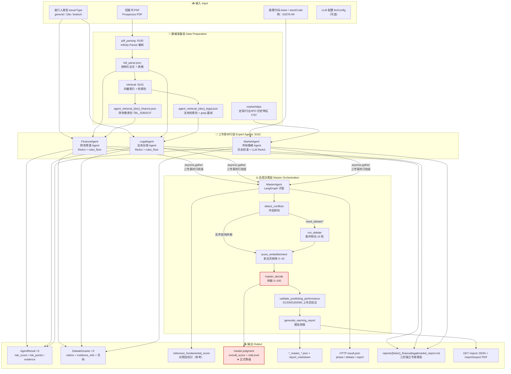
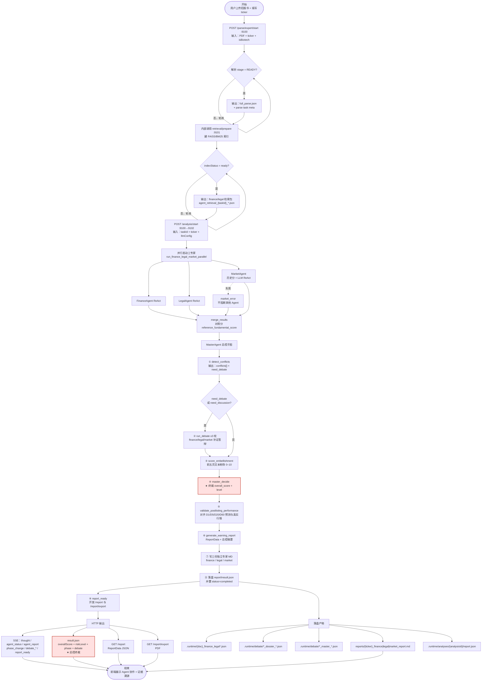
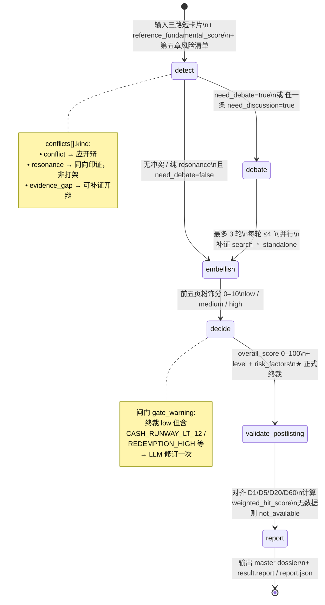
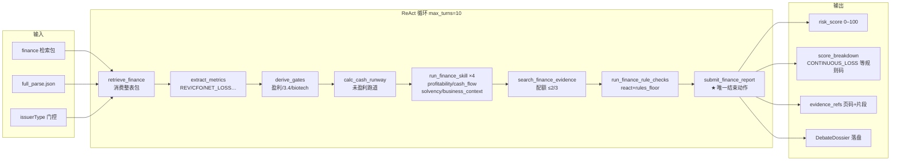
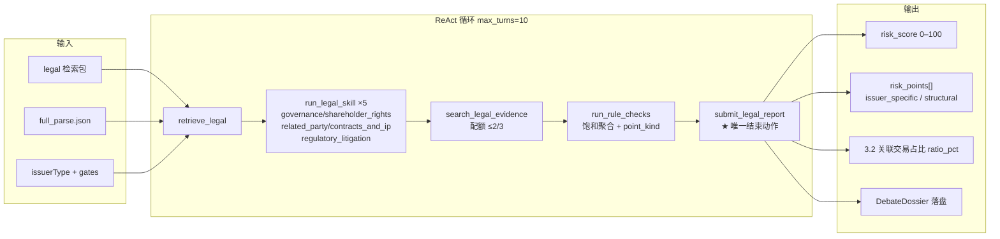
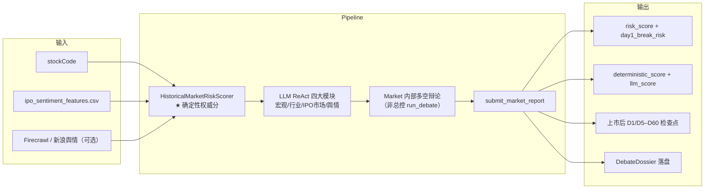
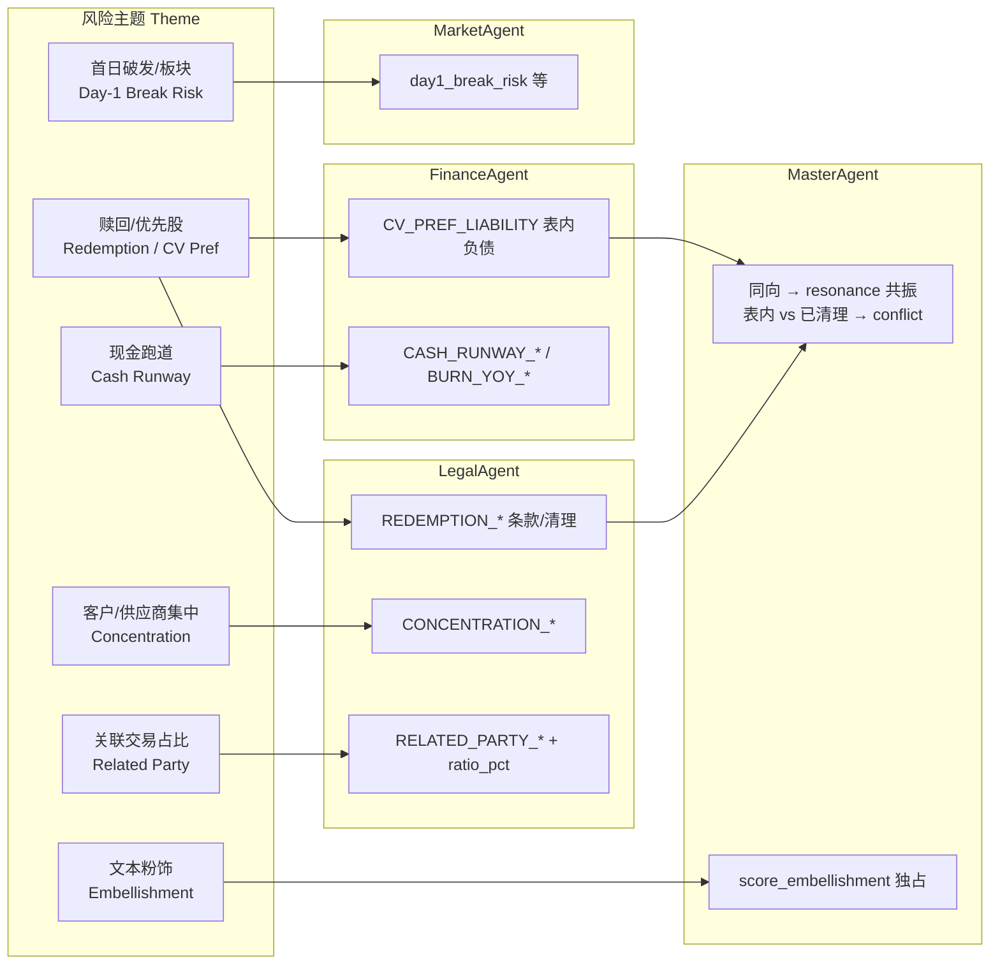

# 港股 IPO 多 Agent 专家协作体系 — 架构图 / 流程图 / 泳道图

> **用途**：赛题答辩，面向金融领域从业人员  
> **范围**：`agents/hk_ipo_risk` 现行实现（财务 ‖ 法务 ‖ 市场 三专家并行 → 总控 LangGraph 子图）  
> **说明**：中文为主，保留 Agent / Tool / Skill / ReAct / DebateDossier 等英文名词；**正式风险等级以总控终裁为准**，对照加权分 `reference_fundamental_score` 仅作参考

---

## 图 1 · 系统分层架构图



**架构要点**

| 层级 | 核心职责 | 关键产物 |
|------|----------|----------|
| 数据准备 | PDF → 结构化 JSON → 向量索引 + Agent 检索包 | `full_parse.json`、finance/legal 检索包 |
| 三专家 | 各自 ReAct 推理 + 规则托底，产出带页码证据的风险分 | `AgentResult` + `DebateDossier` |
| 总控 | 冲突研判 → 条件辩论 → 粉饰 → **终裁** → 上市后验证 → 报告 | `master.judgment`（正式分）+ `post_listing` |
| 网关 | 前端只连 `:9100`，反代 `analysis/*`、`report*`、`agents/status` 到 `:9102` | SSE 实时混流 + `result` / `report` / PDF |

---

## 图 2 · 端到端业务流程图（从上传到报告）



**对照分 vs 终裁分**

```
reference_fundamental_score（参考，非正式等级）
  = 基本面 legal×0.55 + finance×0.45
  = 有市场时 (基本面)×0.65 + market×0.35

正式 riskLevel / overallScore ← master_decide 终裁
```

---

## 图 3 · 泳道图（Swimlane）：三专家并行 + 总控编排 + 前端回传

```mermaid
flowchart TB
    subgraph L0["泳道：用户 / 前端 Frontend"]
        U1["上传 PDF + ticker"]
        U2["轮询解析 / 索引状态"]
        U3["订阅 SSE stream"]
        U4["查看 result + 证据高亮"]
        U5["拉取 /report JSON 与 PDF"]
    end

    subgraph L1["泳道：网关 Gateway :9100"]
        G1["解析路由 parse/*"]
        G2["反代 analysis/* → :9102"]
        G3["反代 /agents/status /report /report/export → :9102"]
    end

    subgraph L2["泳道：数据服务 Data Services"]
        S1["pdf_parsing 解析"]
        S2["retrieval 索引 + 检索包"]
    end

    subgraph L3["泳道：财务 Agent FinanceAgent"]
        F_IN["输入：finance 检索包 + full_parse"]
        F1["retrieve_finance"]
        F2["extract_metrics → derive_gates"]
        F3["run_finance_skill ×4"]
        F4["run_finance_rule_checks"]
        F5["submit_finance_report"]
        F_OUT["输出：AgentResult + DebateDossier<br/>risk_score / 规则码 / 页码证据"]
    end

    subgraph L4["泳道：法务 Agent LegalAgent"]
        L_IN["输入：legal 检索包 + full_parse"]
        L1["retrieve_legal"]
        L2["run_legal_skill ×5"]
        L3["run_rule_checks"]
        L4["submit_legal_report"]
        L_OUT["输出：AgentResult + DebateDossier<br/>risk_points + point_kind"]
    end

    subgraph L5["泳道：市场 Agent MarketAgent"]
        M_IN["输入：stockCode + 历史特征 CSV"]
        M1["HistoricalMarketRiskScorer<br/>确定性校准分"]
        M2["LLM ReAct 四大模块<br/>宏观/行业/IPO/舆情"]
        M3["Market 内部多空辩论"]
        M4["submit_market_report"]
        M_OUT["输出：AgentResult + DebateDossier<br/>day1_break_risk / D5–D60"]
        M_ERR["market_error（可选）<br/>失败不阻断"]
    end

    subgraph L6["泳道：总控 Agent MasterAgent / Orchestrator"]
        O_IN["输入：三路 AgentResult + 短卡片"]
        O1["dossier_to_cards 压卡片"]
        O2["detect_conflicts<br/>conflict / resonance / evidence_gap"]
        O3["run_debate<br/>≤3轮 × ≤4问/轮<br/>search_*_standalone 补证"]
        O4["score_embellishment"]
        O5["master_decide ★终裁"]
        O6["validate_postlisting_performance<br/>D1/D5/D20/D60 验证"]
        O7["generate_warning_report<br/>ReportData"]
        O8["写三份独立 MD + report/result<br/>置 completed 后再发 report_ready"]
        O_OUT["输出：judgment + master dossier<br/>riskLevel HIGH|MEDIUM|LOW"]
    end

    U1 --> G1 --> S1
    S1 --> S2
    U2 --> G1
    S2 --> F_IN & L_IN
    U1 --> M_IN

    F_IN --> F1 --> F2 --> F3 --> F4 --> F5 --> F_OUT
    L_IN --> L1 --> L2 --> L3 --> L4 --> L_OUT
    M_IN --> M1 --> M2 --> M3 --> M4 --> M_OUT
    M2 -.-> M_ERR

    F_OUT & L_OUT & M_OUT --> O_IN
    O_IN --> O1 --> O2
    O2 -->|"need_debate / need_discussion"| O3 --> O4
    O2 -->|"跳过辩论"| O4
    O4 --> O5 --> O6 --> O7 --> O8 --> O_OUT

    O_OUT --> G2
    F_OUT & L_OUT & M_OUT --> G2
    O_OUT --> G3
    G2 --> U3 & U4
    G3 --> U5

    style O5 fill:#ffe0e0,stroke:#c0392b,stroke-width:2px
    style O_OUT fill:#ffe0e0,stroke:#c0392b,stroke-width:2px
```

**并行时序说明**

```
时间轴 ──────────────────────────────────────────────────────────►

FinanceAgent  ████████████████████ submit_finance_report
LegalAgent    ████████████████████████ submit_legal_report
MarketAgent   ██████████████ submit（或 market_error）
              └──────── asyncio.gather ────────┘
                                              │
                                              ▼
MasterAgent                              detect → debate? → embellish → decide → validate → report
Runner/UI                                写 MD/report/result → status=completed → report_ready → /report JSON/PDF
```

---

## 图 4 · 总控 LangGraph 子图（Master Subgraph）

> 专家探查（Finance / Legal / Market ReAct）**不在**此子图内；三专家完成后才进入。



---

## 图 5 · 单专家 ReAct 内部流程（Tool / Skill 编排）

### 5.1 财务 Agent FinanceAgent



### 5.2 法务 Agent LegalAgent



### 5.3 市场 Agent MarketAgent



---

## 图 6 · 跨 Agent 职责分轨（避免重复计分）



---

## 图 7 · 输入 / 输出契约总表（答辩速查）

| 阶段 | 输入 Input | 处理 Process | 输出 Output |
|------|------------|--------------|-------------|
| **解析** | PDF、companyName、ticker | Infinity-Parser OCR+表格 | `full_parse.json`、taskId |
| **检索** | full_parse、doc_id、issuerType | FAISS/BM25 + 整表展开 | finance/legal 检索包 |
| **财务** | finance 检索包、parse JSON | ReAct + 4 Skills + rules_floor | `AgentResult` + `DebateDossier` |
| **法务** | legal 检索包、parse JSON | ReAct + 5 Skills + 饱和聚合 | `AgentResult` + `DebateDossier` |
| **市场** | stockCode、特征 CSV、舆情 | 历史校准 + LLM ReAct | `AgentResult` + `DebateDossier` |
| **合并** | 三路 AgentResult | `reference_fundamental` 对照分 | merged JSON |
| **总控** | 短卡片 + 第五章清单 | detect → debate? → embellish → decide → validate_postlisting | `master.judgment` ★ + `post_listing` |
| **报告** | 终裁 JSON + dossier + 上市后验证 | ReportData 汇总 + 三份独立专家 MD | `*_finance_report.md`、`*_legal_report.md`、`*_market_report.md`、`report.json` |
| **前端** | analysisId | SSE 实时混流 + `report_ready` 后拉取报告 | `result.json`、`GET /report`、`GET /report/export`、overallScore + riskLevel ★ |

---

## 前端契约更新要点

1. **前端唯一 Base 仍是 `:9100`**，但除 `analysis/*` 外，现还会经网关访问 `GET /api/v1/agents/status`、`GET .../report`、`GET .../report/export`。
2. **SSE 不再按 legal → financial → market 顺序缓冲回放**，而是三专家与总控 **实时混流**；谁先产生事件谁先推送。
3. **`category` 只在真实辩论阶段出现**。初评、冲突研判、粉饰、终裁、skip-debate 都没有 `category`。
4. **`report_ready` 在三份独立专家 MD、`report.json`、完整 `result.json` 均落盘且任务已置为 `completed` 后才发送**；收到事件后前端可立即拉取 `/report` 和 `/report/export`，不会命中 `REPORT_NOT_READY` 的时序窗口。
5. **综合章与专家章分离**：总控 `generate_warning_report` 负责 `result.report` / `/report` 的综合输出；财务、法务、市场则分别写成三份独立 Markdown。

---

## 渲染说明

- **GitHub / GitLab / Typora / Obsidian**：直接预览 Mermaid 代码块
- **答辩 PPT**：推荐 [Mermaid Live Editor](https://mermaid.live) 导出 SVG/PNG
- **图 3 泳道图**较宽，导出时建议横向 16:9 画布
- 红色高亮节点 = **正式终裁输出**，答辩时重点强调「不是简单加权平均，而是证据驱动的总控决策」

---

*文档版本：2026-08-20 · 对齐 `agents/hk_ipo_risk` 当前实现*
