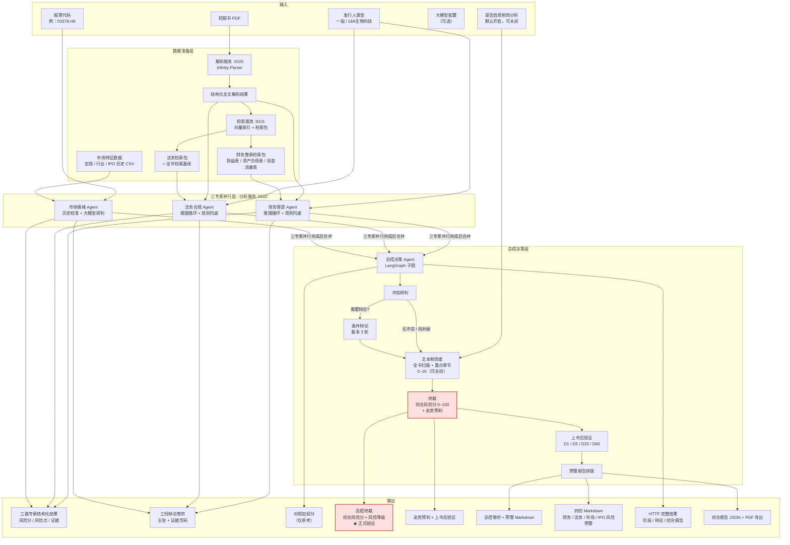
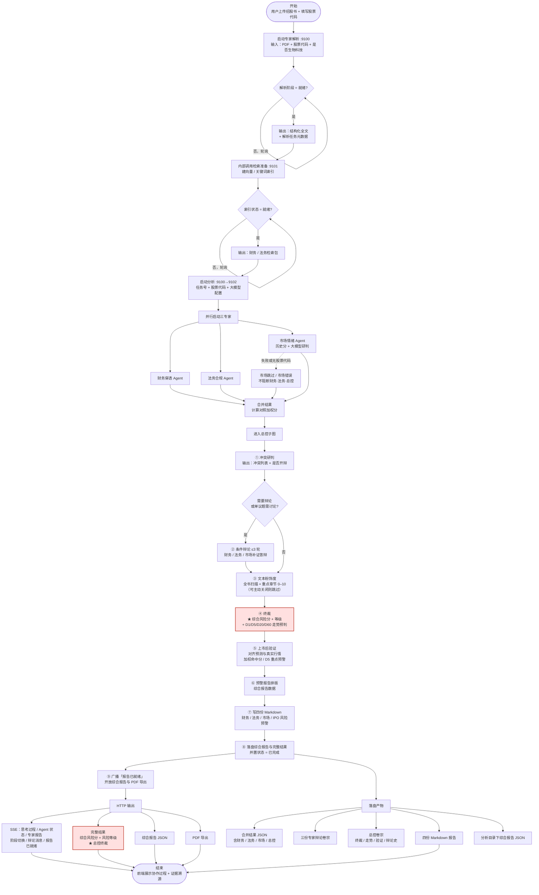
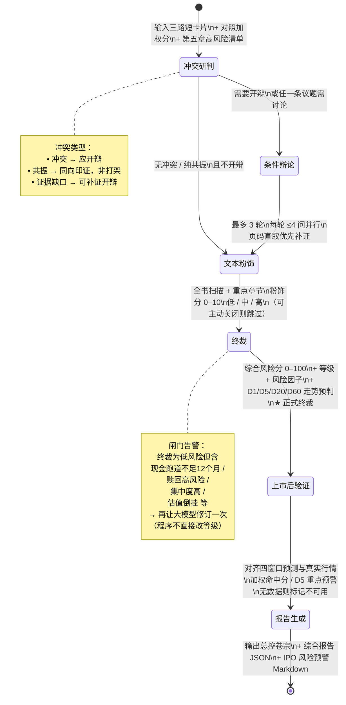
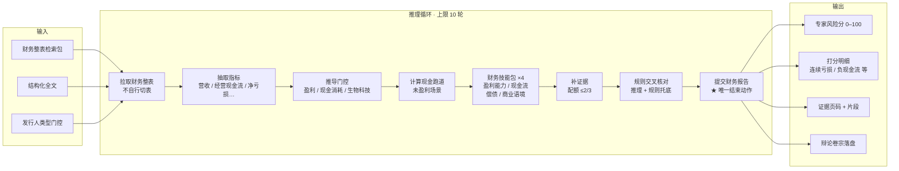
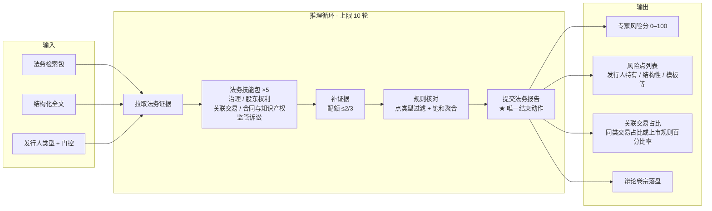
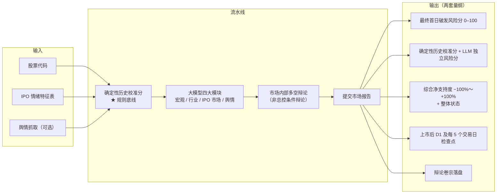
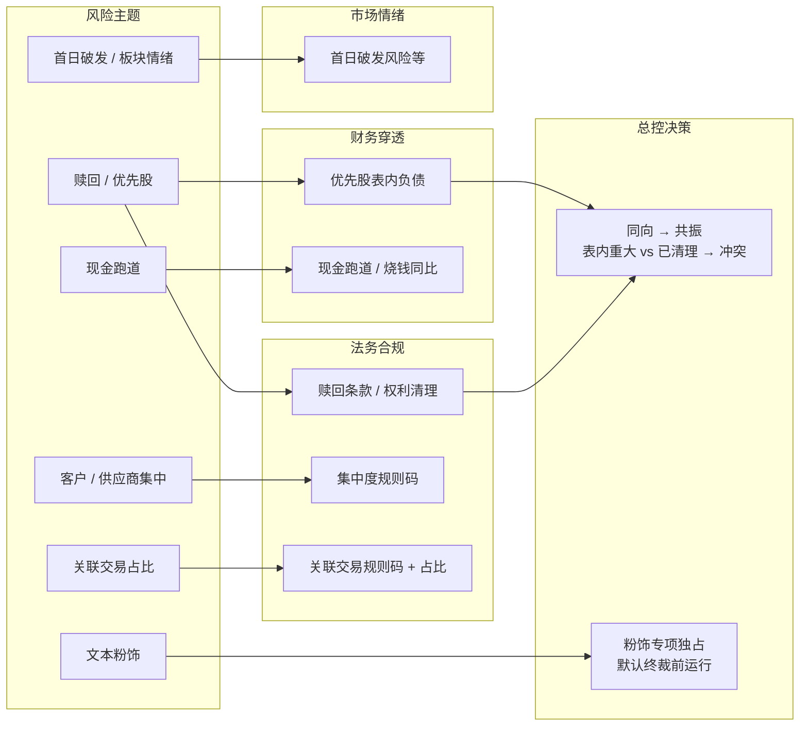

# 港股 IPO 多 Agent 专家协作体系 — 架构图 / 流程图 / 泳道图

> **用途**：赛题答辩，面向金融领域从业人员  
> **范围**：`agents/hk_ipo_risk` 现行实现（财务 ‖ 法务 ‖ 市场 三专家并行 → 总控 LangGraph 子图）  
> **正式口径**：正式风险等级与顶层综合风险分以**总控终裁**为准；对照加权分仅作参考，不是正式等级  
> **字段口径**：图中名称已按《招股书关键信息抽取与风险特征定义》《市场情绪报告概览字段说明》《前端返回格式与后端产物说明》译为中文

---

## 英文字段 → 中文对照（速查）

| 后端 / HTTP 字段 | 中文含义 |
|------------------|----------|
| `ticker` / `stockCode` | 股票代码 |
| `issuerType` / `isBiotech` | 发行人类型 / 是否生物科技（门控等价 18A/18C） |
| `enableEmbellishment` | 是否启用文本粉饰度分析 |
| `full_parse.json` | 结构化全文解析结果 |
| `AgentResult` | 专家结构化结果 |
| `DebateDossier` | 辩论卷宗（探查结束即落盘，有无辩论都有） |
| `risk_score`（财务/法务） | 专家风险分（0–100） |
| `risk_score`（市场） | **最终首日破发风险分**（0–100） |
| `risk_level`（专家） | 专家风险等级（小写枚举） |
| `riskLevel`（顶层/总控） | 综合风险等级：`HIGH`/`MEDIUM`/`LOW` → 高/中/低 |
| `overallScore` | 综合风险分（总控终裁，0–100） |
| `reference_fundamental_score` | 对照加权分（参考） |
| `deterministic_score` | 确定性历史校准分 |
| `llm_score` | LLM 独立风险分 |
| `overall_net_support` | **综合净支持度**（−100%～+100%，情绪方向） |
| `overall_state` | 整体状态（支持占优/压制占优/多空交织等） |
| `score_reconciliation` | 评分合并方法 |
| `need_debate` / `need_discussion` | 是否开辩 / 单条议题是否需讨论 |
| `conflict` / `resonance` / `evidence_gap` | 冲突 / 共振 / 证据缺口 |
| `price_path_forecast` | 价格路径走势预判（D1/D5/D20/D60） |
| `predicted_windows` | 分窗口风险标签（兼容字段） |
| `post_listing` / `postListingValidation` | 上市后真实行情验证 |
| `weighted_hit_score` | 加权命中分 |
| `d5_priority_hit` | D5 重点预警命中 |
| `embellishment` / `embellishmentAnalysis` | 文本粉饰度 / 粉饰专项分析 |
| `CV_PREF` / `CV_PREF_LIABILITY` | 可转换可赎回优先股 / 优先股表内负债风险 |
| `CASH_RUNWAY_*` / `BURN_YOY_*` | 现金跑道 / 烧钱同比扩大 |
| `REDEMPTION_*` / `RELATED_PARTY_*` / `CONCENTRATION_*` | 赎回条款 / 关联交易 / 客户供应商集中度 |
| `report_ready` | 报告已就绪事件 |

---

## 图 1 · 系统分层架构图



**架构要点**

| 层级 | 核心职责 | 关键产物 |
|------|----------|----------|
| 数据准备 | PDF → 结构化全文 → 向量索引 + Agent 检索包 | 结构化全文、财务/法务检索包 |
| 三专家 | 各自推理 + 规则托底，产出带页码证据的风险分 | 专家结果 + 辩论卷宗 |
| 总控 | 冲突研判 → 条件辩论 → 粉饰（可关）→ **终裁** → 上市后验证 → 报告 | 终裁正式分 + 走势预判 + 上市后验证 |
| 网关 | 前端只连 `:9100`，反代分析 / 报告 / Agent 状态到 `:9102` | SSE 实时混流 + 完整结果 / 综合报告 / PDF |

---

## 图 2 · 端到端业务流程图（从上传到报告）



**对照加权分 vs 终裁分**

```
对照加权分（参考，非正式等级）
  = 基本面：法务 × 0.55 + 财务 × 0.45
  = 有真实市场结果时：基本面 × 0.65 + 市场首日破发风险分 × 0.35

正式综合风险分 / 风险等级 ← 总控终裁

注意：综合净支持度（−100%～+100%）只描述情绪方向，
      不参与上述机械换算；与首日破发风险分（0–100）是两套量纲。
```

**HTTP 终态发布顺序（强契约）**

```
专家/总控 Markdown + 综合报告 JSON
  → 完整结果 JSON
  → 任务状态 = 已完成、阶段 = 报告
  → 广播「报告已就绪」
```

收到「报告已就绪」后可立即拉取完整结果与综合报告，不会出现“事件到了但报告接口短暂 404”。

---

## 图 3 · 泳道图：三专家并行 + 总控编排 + 前端回传

```mermaid
flowchart TB
    subgraph L0["泳道：用户 / 前端"]
        U1["上传 PDF + 股票代码"]
        U2["轮询解析 / 索引状态"]
        U3["订阅实时事件流"]
        U4["查看完整结果 + 证据高亮"]
        U5["拉取综合报告 JSON 与 PDF"]
    end

    subgraph L1["泳道：网关 :9100"]
        G1["解析路由"]
        G2["反代分析接口 → :9102"]
        G3["反代 Agent 状态 / 综合报告 / PDF → :9102"]
    end

    subgraph L2["泳道：数据服务"]
        S1["招股书解析"]
        S2["检索索引 + 检索包"]
    end

    subgraph L3["泳道：财务穿透 Agent"]
        F_IN["输入：财务检索包 + 结构化全文"]
        F1["拉取财务整表"]
        F2["抽取指标 → 推导门控"]
        F3["运行财务技能包 ×4"]
        F4["规则交叉核对"]
        F5["提交财务报告"]
        F_OUT["输出：专家结果 + 辩论卷宗<br/>风险分 / 规则码 / 页码证据"]
    end

    subgraph L4["泳道：法务合规 Agent"]
        L_IN["输入：法务检索包 + 结构化全文"]
        L1["拉取法务证据"]
        L2["运行法务技能包 ×5"]
        L3["规则核对 + 饱和聚合"]
        L4["提交法务报告"]
        L_OUT["输出：专家结果 + 辩论卷宗<br/>风险点 + 点类型（发行人特有/结构性等）"]
    end

    subgraph L5["泳道：市场情绪 Agent"]
        M_IN["输入：股票代码 + 历史特征"]
        M1["确定性历史校准分"]
        M2["大模型四大模块<br/>宏观 / 行业 / IPO 市场 / 舆情"]
        M3["市场内部多空辩论<br/>（≠ 总控条件辩论）"]
        M4["提交市场报告"]
        M_OUT["输出：首日破发风险分<br/>+ 综合净支持度<br/>+ 上市后检查点"]
        M_ERR["市场错误 / 跳过<br/>失败不阻断"]
    end

    subgraph L6["泳道：总控决策 Agent"]
        O_IN["输入：三路专家结果 + 短卡片"]
        O1["压成短卡片 + 对照加权分"]
        O2["冲突研判<br/>冲突 / 共振 / 证据缺口"]
        O3["条件辩论<br/>≤3 轮 × ≤4 问/轮<br/>页码直取 + 短关键词补证"]
        O4["文本粉饰度专项<br/>（默认可关）"]
        O5["终裁 ★<br/>综合分 + 走势预判"]
        O6["上市后验证<br/>D1/D5/D20/D60"]
        O7["预警报告排版"]
        O8["写四份 MD + 综合报告/完整结果<br/>已完成后再发「报告已就绪」"]
        O_OUT["输出：终裁 + 总控卷宗<br/>风险等级 高/中/低"]
    end

    U1 --> G1 --> S1
    S1 --> S2
    U2 --> G1
    S2 --> F_IN & L_IN
    U1 --> M_IN

    F_IN --> F1 --> F2 --> F3 --> F4 --> F5 --> F_OUT
    L_IN --> L1 --> L2 --> L3 --> L4 --> L_OUT
    M_IN --> M1 --> M2 --> M3 --> M4 --> M_OUT
    M2 -.-> M_ERR

    F_OUT & L_OUT & M_OUT --> O_IN
    O_IN --> O1 --> O2
    O2 -->|"需要辩论"| O3 --> O4
    O2 -->|"跳过辩论"| O4
    O4 --> O5 --> O6 --> O7 --> O8 --> O_OUT

    O_OUT --> G2
    F_OUT & L_OUT & M_OUT --> G2
    O_OUT --> G3
    G2 --> U3 & U4
    G3 --> U5

    style O5 fill:#ffe0e0,stroke:#c0392b,stroke-width:2px
    style O_OUT fill:#ffe0e0,stroke:#c0392b,stroke-width:2px
```

**并行时序说明**

```
时间轴 ──────────────────────────────────────────────────────────►

财务穿透 Agent  ████████████████████ 提交财务报告
法务合规 Agent  ████████████████████████ 提交法务报告
市场情绪 Agent  ██████████████ 提交（或跳过 / 报错）
                └──────── 三专家并行汇合 ────────┘
                                                │
                                                ▼
总控决策 Agent                            研判 → 辩论? → 粉饰 → 终裁 → 验证 → 报告
服务端 / 前端                             写 MD/报告/结果 → 已完成 → 报告已就绪 → 综合报告/PDF
```

---

## 图 4 · 总控 LangGraph 子图

> 专家探查（财务 / 法务 / 市场）**不在**此子图内；三专家完成后才进入。



**市场参与总控的三层**

| 层级 | 行为 |
|------|------|
| 卡片层 | 市场卡片始终进入冲突研判与终裁 |
| 辩论层 | 市场与财务/法务冲突、证据缺口、或风险分与净支持度分化时，可点名市场答辩 |
| 补问层 | 模型漏掉已识别的市场议题时，编排器补入一条市场质询 |

市场内部的「多空辩论」属于市场 Agent 自身研判，**不是**总控子图里的条件辩论。

---

## 图 5 · 单专家内部流程（工具 / 技能包编排）

### 5.1 财务穿透 Agent



**财务规则码（中文含义）**

| 规则码 | 含义 |
|--------|------|
| 连续亏损 / 单年亏损 | 业绩记录期持续或最近完整年亏损 |
| 经营现金流为负 | 经营活动现金流持续流出 |
| 毛利率下滑 | 毛利率降幅超过 5 个百分点 |
| 现金跑道不足 12 / 12–24 个月 | 未盈利企业资金可支撑月数 |
| 跑道不确定 | 未盈利但缺现金流序列算不出跑道 |
| 烧钱同比扩大超 30% | 现金消耗率同比上升 |
| 优先股表内负债 | 可转换可赎回优先股相对资产/现金过高 |

### 5.2 法务合规 Agent



**法务技能包 ↔ 特征文档映射**

| 技能包 | 文档章节 | 关注点 |
|--------|----------|--------|
| 公司治理 | 控股 / 治理 | 控制权 >50%、一致行动、AB 股 |
| 股东权利 | §3.1 + §3.6 | 对赌赎回 + 上市前权利清理 |
| 关联交易 | §3.2 | 公允 / 依赖 / 豁免 / **占比** |
| 合同与知识产权 | +18A 叠 §3.5 | 重大合同 + 核心技术权属 |
| 监管与诉讼 | 监管 / 诉讼 | 处罚 / 许可 / 仲裁 |

§3.3 客户供应商集中度仍由规则引擎产出（不占独立技能包）；§3.4 现金消耗归财务。

### 5.3 市场情绪 Agent



**市场两套量纲（勿混用）**

| 体系 | 字段中文名 | 范围 | 含义 |
|------|------------|------|------|
| 情绪方向 | 综合净支持度 | −100%～+100% | 多头多还是空头多 |
| 风险大小 | 最终首日破发风险分 | 0–100 | 首日收盘低于发行价的风险有多高 |

破发锚点 = **发行价**；二级市场累计收益 / 回撤基准 = **上市首日开盘价**。

---

## 图 6 · 跨 Agent 职责分轨（避免重复计分）



| 主题 | 财务 | 法务 | 市场 | 总控怎么判 |
|------|------|------|------|------------|
| 赎回 / 优先股 | 表内负债 | 条款 / 清理 | 不负责条款 | 同向 = 共振；表内重大 vs 已清理 = 冲突 |
| 现金跑道 | 跑道 / 烧钱规则 | 不计分 | 不负责跑道 | 财务单方硬门控 |
| 客户 / 供应商集中 | 只解释钱，不打集中度分 | 集中度规则 | — | 非法务缺席 |
| 关联交易占比 | 不做独立占比打分 | 关联交易规则 | — | 同上 |
| 首日破发 / 板块 | — | — | 首日破发风险等 | 与基本面无交叉矛盾则不必开辩 |
| 文本粉饰 | 不做 | 不做 | — | **总控粉饰专项**（可显式关闭） |

---

## 图 7 · 输入 / 输出契约总表（答辩速查）

| 阶段 | 输入 | 处理 | 输出 |
|------|------|------|------|
| **解析** | PDF、公司名、股票代码 | Infinity-Parser OCR + 表格 | 结构化全文、解析任务号 |
| **检索** | 结构化全文、文档标识、发行人类型 | 向量 / 关键词 + 整表展开 | 财务 / 法务检索包 |
| **财务** | 财务检索包、结构化全文 | 推理循环 + 4 技能包 + 规则托底 | 专家结果 + 辩论卷宗 |
| **法务** | 法务检索包、结构化全文 | 推理循环 + 5 技能包 + 饱和聚合 | 专家结果 + 辩论卷宗 |
| **市场** | 股票代码、特征表、舆情 | 历史校准 + 大模型研判 | 首日破发风险分 + 综合净支持度 + 辩论卷宗 |
| **合并** | 三路专家结果 | 对照加权分（有市场则计入市场风险分） | 合并 JSON |
| **总控** | 短卡片 + 第五章清单 | 研判 → 辩论? → 粉饰? → 终裁 → 上市后验证 | **终裁正式分** + 走势预判 + 验证结果 |
| **报告** | 终裁 + 卷宗 + 验证 | 综合报告数据 + 四份 Markdown | 财务 / 法务 / 市场 / IPO 风险预警报告；综合报告 JSON |
| **前端** | 分析任务号 | SSE 实时混流；「报告已就绪」后拉取 | 完整结果、综合报告、PDF；综合风险分 + 风险等级 ★ |

**前端结果骨架（中文字段含义）**

| 位置 | 含义 |
|------|------|
| 顶层综合风险分 / 风险等级 | 总控终裁（高/中/低） |
| 分析选项·是否启用粉饰 | 本次是否主动做粉饰分析 |
| Agent 包·财务 / 法务 / 市场 | 各专家风险分、独立 Markdown、打分模式明细 |
| Agent 包·总控编排器 | 终裁分、对照加权分、总控子结果 |
| 辩论对象 | 实际轮次与消息；轮次 = 0 表示合法跳过，不算失败 |
| 综合报告·走势预判 | D1/D5/D20/D60 结构化预测 |
| 综合报告·上市后验证 | 加权命中分、D5 重点预警、分窗口对齐 |
| 综合报告·粉饰专项 | 启用时才有；关闭则整段省略 |

---

## 前端契约要点

1. **前端唯一入口仍是 `:9100`**，经网关访问 Agent 状态、分析启停/事件流/结果、综合报告与 PDF 导出。
2. **SSE 三专家与总控实时混流**，不再按法务→财务→市场顺序缓冲回放。
3. **辩论分类标签只在真实辩论阶段出现**；初评、冲突研判、粉饰、终裁、跳过辩论均无该标签。
4. **「报告已就绪」在四份 MD、综合报告 JSON、完整结果 JSON 均落盘且任务已完成后才发送**；收到后可立即拉报告，无正常时序下的短暂 404。
5. **综合章与专家章分离**：总控负责综合报告视图；财务、法务、市场各有独立 Markdown，并写入各 Agent 包的报告字段。
6. **粉饰为可选字段**：关闭时综合报告不含粉饰维度与粉饰专项分析；主动关闭不等于分析失败，也不降低总控置信度。

---

## 渲染说明

- **GitHub / GitLab / Typora / Obsidian**：直接预览 Mermaid 代码块
- **答辩 PPT**：推荐 [Mermaid Live Editor](https://mermaid.live) 导出 SVG/PNG
- **图 3 泳道图**较宽，导出时建议横向 16:9 画布
- 红色高亮节点 = **正式终裁输出**，答辩时强调：不是简单加权平均，而是证据驱动的总控决策；市场净支持度与破发风险分是两套量纲，不可混读

---

*文档版本：2026-08-21 · 对齐 `agents/hk_ipo_risk/README.md` 当前实现，并同步字段口径至指标文档与前端契约*
