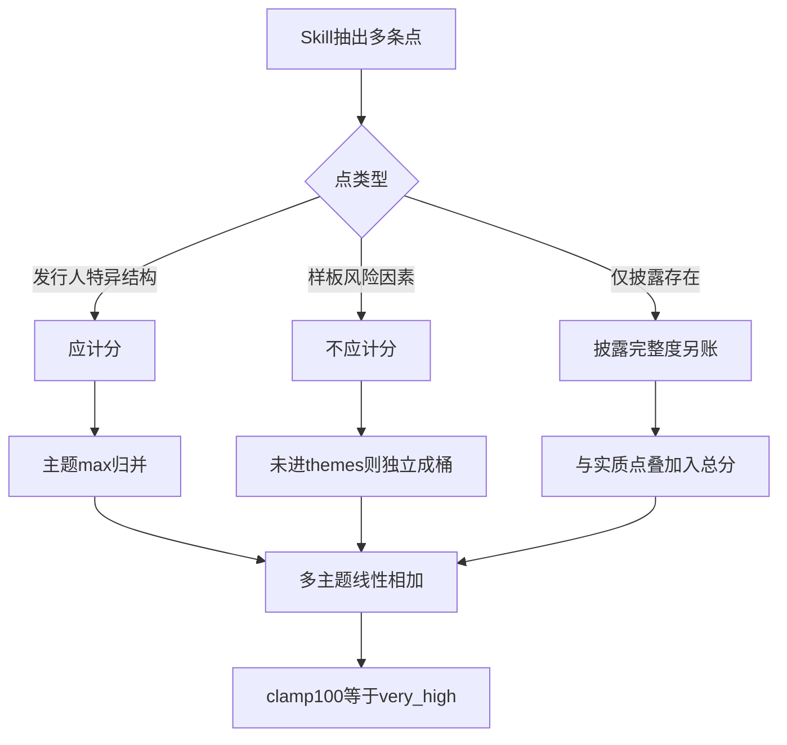

# 翰思艾泰 — 法务合规风险分析报告（DeepSeek · 一+二阶段配额2/3）

- 生成时间：2026-08-04 23:30:00
- 招股书：`03378_15-12-2025_翰思艾泰－Ｂ_全球發售.pdf`
- doc_id：`hansiaitai` / issuer_type：`18a`
- 模型：`deepseek-v4-flash`
- 节流：关 translate；`max_turns=8`；search 默认配额 **2**、缺口可至 **3**
- 结果：`.runtime/hansiaitai_legal_phase1_only.json`（文件名沿用旧命令，实为当前二阶段配置）
- 日志：`logs/翰思艾泰_legal_20260804_231957.log` / `.jsonl`
- Dossier：`.runtime/debate/hansiaitai_legal_dossier_20260804_232143.json`
- 外部对照：上市首日**保发成功（未破发）、涨幅有限** → 法务参考等级更合理落在 **中低～中等**，而非 `very_high`

---

## 1. 总览

| 项 | 本轮 |
|----|------|
| 输出风险分 / 等级 | **100.0 / very_high**（封顶；分项加总约 129） |
| scoring_mode | `react+rules_floor`（**无规则整段回退**） |
| ReAct 轮次 | **7**（自主 submit，非 auto-submit） |
| search | **0**（配额未用；rule 后无缺口则锁死） |
| 空转轮 | **3**（t4–t6 只 think 不调工具） |
| ReAct 可见 Token | **42,805**（prompt 33,037 + completion 9,768；reasoning≈8,685） |
| 风险点 | **22** 条（high 4 / medium 15 / low 3） |
| 规则基线对照 | rules-only / 早期 Gemma ≈ **51 / medium** |

### 工具链

`retrieve → skill×5（并行）→ rule_checks → (no_tool)×3 → submit`

相对「仅一阶段」（search×7 + 空转×8 → 约 16.4 万 tokens）：本轮 **省 Token 明显**，收束正常。相对旧二阶段 0/1（约 3.2 万 / 6 轮）：本轮略高，主因 **3 轮空转**仍在烧大上下文。

---

## 2. 得分分解（为何冲到 100）

主题归并后仍 **10 个桶相加**：

| 代码 | Δ | 类型判断（人工） |
|------|--:|------------------|
| RIGHTS_CLEANUP_INCOMPLETE | +20 | 结构性（上市前权利清理不完整）— **宜保留** |
| REDEMPTION_HIGH | +18 | 结构性（赎回时点/负债）— **宜保留，level 可再议** |
| REGULATORY_INVESTIGATION | +18 | **样板风险因素**（「政府任何调查可能…」）— 易虚高 |
| RELATED_PARTY_DISCLOSURE | +15 | **披露存在性**托底，非严重关联依赖 |
| CONCENTRATION_DISCLOSURE | +12 | 同上，披露基线 |
| PIPELINE_DISCLOSURE | +12 | 18A 披露基线 |
| GOVERNANCE_CONTROL_GT_50 | +10 | 控股 55.89% — 港股 IPO 常见结构 |
| IP_PATENT_REJECTION_RISK | +8 | 具体事实（FcRn 中国驳回）— **可保留 medium** |
| HEALTHCARE_FRAUD | +8 | **行业通用合规表述**，未映射进 regulatory 主题 → 单独加桶 |
| HUMAN_GENETIC_RESOURCE | +8 | 同上，主题未归并 → 单独加桶 |

**加总 ≈129 → clamp 100**。  
若去掉「披露基线 + 样板/通用合规」三类，仅保留权利清理+赎回+治理+专利，约 **56** → 对应 **medium**，更接近「保发、涨幅有限」的外验直觉。

---

## 3. 风险点质量（证据层仍有价值）

### 3.1 值得保留的发行人特异点

- **赎回 / 特别权利**（p262、p497）：购回权于递表终止、其他权利上市后终止、失败则恢复；赎回负债约 1.385 亿元。真结构，不是空话。
- **控股集中**（约 55.89%）：事实清楚，但标成 high 过重。
- **FcRn 专利中国驳回**：有顾问意见缓冲，适合 medium 关注。

### 3.2 易误伤 / 应降级为「风险因素摘录」而非计分项

- `REGULATORY_INVESTIGATION` / `HEALTHCARE_FRAUD` / `REGULATORY_COMPLIANCE` / 部分 IP 维护与第三方质疑：招股书「可能 / 任何 / 受……约束」模板句。
- `RELATED_PARTY_DISCLOSURE` 等 exists_* 披露分：在 LLM 已输出同主题点时再托底，等于「有披露就加风险」。

### 3.3 过程问题

- Skill 全 `confidence=high`，低置信减半未触发。
- t4–t6 空转仍占可观 Token，需强制 submit / 限 reasoning。

---

## 4. 外验：保发说明 100 分离谱，但不能拿行情反着改分

上市首日保发、涨幅有限，说明市场没有把招股书法律披露读成「上市即重大瑕疵」；法务输出 `very_high` 与事后价格信号不一致。

但不宜：

- 用「未破发 → 直接减分」的线上规则（标签泄漏；首日涨跌还受情绪/定价/配售影响）；
- 也不宜简单把所有 LLM 分 ×0.5 或硬编码「翰思降到 40」。

外验应用作**校准目标与评测集**（已上市且未破发样本，法务参考分应多落在 low–medium），而不是单票改分器。

---

## 5. 虚高根因（机制）



1. **计分对象混杂**：事件/结构风险、行业套话、披露基线塞进同一 `risk_score`。  
2. **主题表过窄**：`HEALTHCARE_*` / `HUMAN_GENETIC_*` 等未进 `regulatory`，躲过归并。  
3. **线性加总 + high≈18**：四五个「说得通」的主题就会打满。  
4. **level 通胀**：控股>50%、模板调查句也标 high/medium。  
5. **法务重点本应是点+证据**，参考分却被当成最终预警等级使用。

---

## 6. 解决思路（避免「规则简单降分」）

原则：**改「什么东西有资格进分、怎么合成参考分」**，不是对总分乘系数。

### 6.1 风险点分型（推荐先做）

每条点强制 `point_kind`（Skill schema + 校验）：

| kind | 含义 | 进参考分 |
|------|------|----------|
| `issuer_specific` | 可定位的发行人事实（金额、日期、驳回、协议条款） | 全额或按 level |
| `structural` | 股权/赎回结构等常见但真实 | 折减权重（如 0.5–0.7）或单独「结构关注分」 |
| `boilerplate` | 风险因素章节套话 | **不计分**，入 `risk_factor_excerpts` |
| `disclosure_only` | 「存在披露」 | 只进披露完整度，**不进风险分** |
| `benign_negative` | 无诉讼等 | `negative_findings`，**绝不加分** |

判定可组合：证据句式（「可能」「任何调查」「受……法约束」）+ LLM 自标 kind + 页是否落在「风险因素」章节。

### 6.2 参考分合成改成「有界聚合」

- 只对 `issuer_specific`（+ 折减后的 structural）做主题 max；  
- 主题数设软顶：例如只取 Top-3 主题，或饱和函数 `100*(1-Π(1-d_i/100))`，避免 6 个 medium 线性加满；  
- **披露基线**：仅当该主题无任何实质点时才加 `disclosure_base`。

翰思类样本可自然落到约 40–60，而无需写「未破发则 -40」。

### 6.3 Prompt / Skill 侧降通胀（与计分解耦）

- 禁止把风险因素模板升成 `REGULATORY_INVESTIGATION`；  
- `GOVERNANCE_CONTROL_GT_50` 默认 medium，除非另有压迫少数股东条款；  
- high 必须：可核页码 + 具体法律后果路径（不仅是「可能」）。

### 6.4 产品层双轨输出

- **轨 A**：风险点 + 证据（本轮已较好，供溯源/辩论）。  
- **轨 B**：`calibrated_reference` 参考分，附 `point_kind` 统计；总控融合用 B。

### 6.5 上市后表现做「校准评测」而非「改分规则」

离线小样本：未破发 / 破发 / 首日大跌 — 看校准后法务分分层是否合理。期望：保发且无重大诉讼处罚 → 多落在 low–medium。

---

## 7. 本轮结论

| 维度 | 判断 |
|------|------|
| 编排 / 节流 | 成功；配额 2/3 下未狂搜；空转仍可削 |
| 证据与点发现 | 赎回/权利/控股/专利等有用 |
| 风险分 | **不可采信为预警等级**；机制性虚高到 100 |
| 与保发外验 | 冲突 → 支持「中低～中等」目标区间 |
| 下一步 | 优先 **point_kind + 披露基线隔离 + 饱和聚合**，而不是规则一刀切降分 |

---

## 8. 复现

```bash
cd agents/hk_ipo_risk
python scripts/run_finance_legal.py --agent legal \
  --doc-id hansiaitai --doc-name 翰思艾泰 \
  --pdf-name "03378_15-12-2025_翰思艾泰－Ｂ_全球發售.pdf" \
  --issuer-type 18a \
  --parse-json ".../full_parse.json" \
  --retrieval-legal-json ".../agent_retrieval_hansiaitai_legal.json" \
  --provider deepseek --chat-model deepseek-v4-flash \
  --out .runtime/hansiaitai_legal_phase2_quota2.json
```
