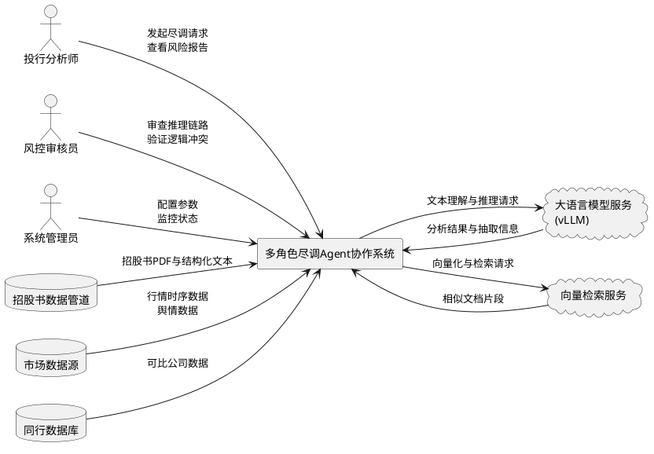
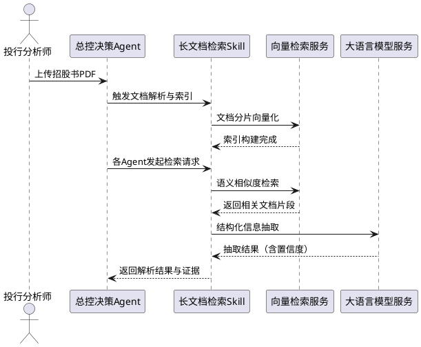
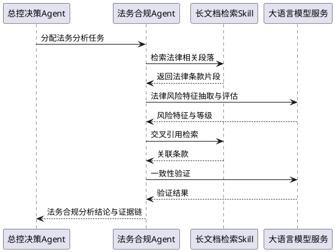
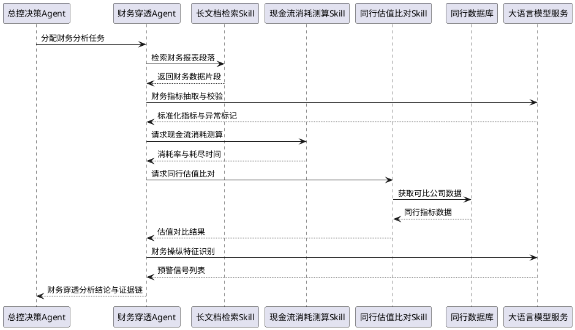
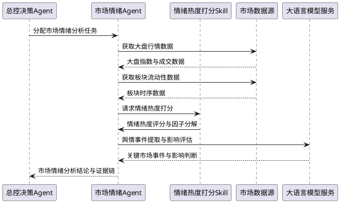
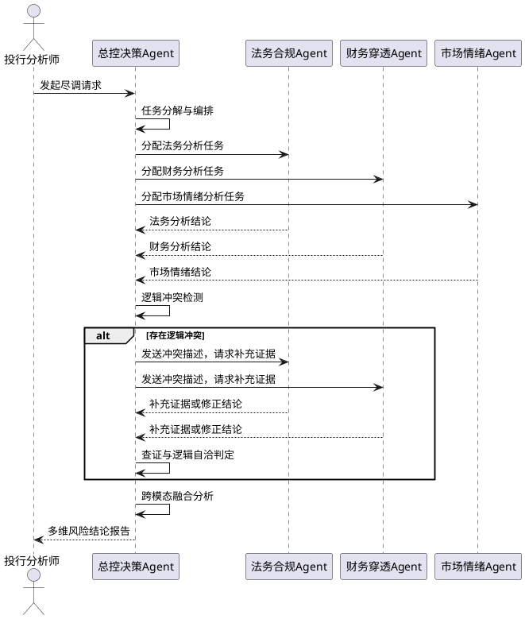
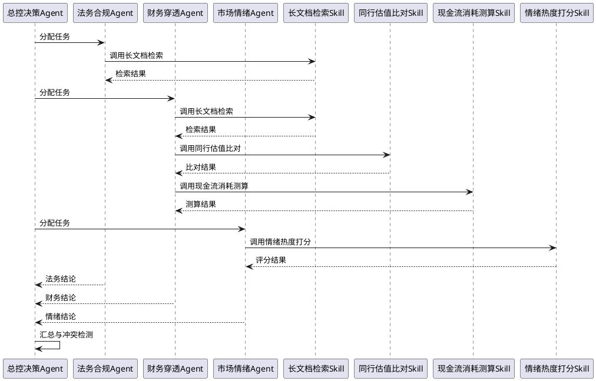

# **1. 组件定位**

## **1.1 核心职责**

本组件负责编排多智能体协作架构，实现从港股IPO招股书与市场数据输入到多维风险结论输出的自动化尽调Pipeline。

## **1.2 核心输入**

1. **招股书PDF文件**：来自上游系统的港股IPO招股书原始文档，包含数百页金融长文本（财务报表、法律声明、业务描述、风险提示等）
2. **代码仓库输入**：与发行人相关的代码仓库或技术文档，用于评估技术资产质量
3. **市场行情时序数据**：来自外部数据源的大盘指数、板块流动性、成交额等高频时序数据
4. **同行对标数据**：来自外部数据源的同行业可比公司估值、财务指标等结构化数据
5. **用户分析指令**：用户发起的尽调分析请求，包含分析范围、关注重点等参数

## **1.3 核心输出**

1. **多维风险结论报告**：返回给用户的结构化风险分析报告，涵盖法务合规、财务穿透、市场情绪三个维度的风险评级与证据链
2. **逻辑冲突标记**：当不同领域Agent解析结果存在逻辑冲突时，输出的冲突描述与查证结论
3. **推理链路追踪记录**：记录完整的Agent推理链路、角色分工、工具调用记录和证据来源，可追踪率达到100%
4. **交叉验证结论**：多Agent辩论与查证后的逻辑自洽风险判定结果

## **1.4 职责边界**

1. 本组件**不负责**招股书PDF的原始数据采集与清洗（由上游数据管道负责）
2. 本组件**不负责**大语言模型本身的训练与微调（由模型训练Pipeline负责，但本组件负责Prompt工程与检索增强策略）
3. 本组件**不负责**交易执行与投资决策（仅输出风险分析结论，不提供买卖建议）
4. 本组件**不负责**实时行情推送（市场数据由外部数据源定时/按需提供）

---

# **2. 领域术语**

**招股书（Prospectus）**
: 港股IPO发行人依法披露的公开发行文件，包含公司业务、财务、法律、风险等完整信息，篇幅通常为数百页。

**尽调（Due Diligence）**
: 投行团队在IPO过程中对发行人进行的全面审查，涵盖法务合规、财务真实性、市场前景等多维度分析。

**法务合规Agent**
: 负责从招股书中抽取法律风险特征、识别合规瑕疵的智能体角色，模拟投行法务团队职能。

**财务穿透Agent**
: 负责对招股书财务数据进行深度分析、识别财务操纵与隐性风险的智能体角色，模拟投行财务团队职能。

**市场情绪Agent**
: 负责分析发行期大盘冷暖、板块流动性与市场情绪的智能体角色，模拟投行市场研究团队职能。

**总控决策Agent**
: 负责协调各专业Agent、处理逻辑冲突、汇总多维风险结论的智能体角色，模拟投行项目主管职能。

**Skill**
: 封装单一可复用分析能力（如长文档检索、估值比对等）的标准化工具模块，可被多个Agent调用。

**逻辑冲突**
: 不同领域Agent对同一分析对象的解析结果存在相互矛盾的结论，需要通过辩论与查证链路实现逻辑自洽。

**跨模态融合**
: 将招股书基本面瑕疵（低频、静态文本特征）与发行期市场行情（高频、动态时序特征）进行联合分析的方法。

**幻觉（Hallucination）**
: 大语言模型生成与输入文档内容不符或缺乏证据支撑的错误信息的现象，是长文本分析的核心风险。

: 备注：本系统中"幻觉"特指Agent从招股书中抽取信息时产生的无依据推断。

**现金流消耗率（Cash Burn Rate）**
: 公司在一定期间内经营性现金净流出速率，反映公司资金消耗的紧迫程度。

**情绪热度评分**
: 基于市场交易数据、舆情数据等计算的综合情绪指标，量化市场对特定IPO的关注度与情绪倾向。

---

# **3. 角色与边界**

## **3.1 核心角色**

1. **投行分析师**：发起尽调分析请求，查看多维风险结论报告，关注分析证据的可追溯性与逻辑自洽性
2. **风控审核员**：审查Agent推理链路的合规性，验证逻辑冲突解决过程，确认风险判定的合理性
3. **系统管理员**：配置Agent参数与Skill编排规则，监控系统运行状态与推理链路追踪完整性

## **3.2 外部系统**

1. **招股书数据管道**：向上游接收招股书PDF文件与解析后的结构化文本段
2. **市场数据源**：接收大盘指数、板块流动性、舆情数据等高频时序数据
3. **同行数据库**：获取同行业可比公司估值、财务指标等对标数据
4. **大语言模型服务（vLLM）**：调用LLM进行文本理解、信息抽取、推理分析等核心能力
5. **向量检索服务**：为长文档检索Skill提供向量化存储与相似度检索能力

## **3.3 交互上下文**

---

# **4. DFX约束**

## **4.1 性能**

1. 单份招股书完整尽调分析的端到端处理时间**必须**不超过30分钟（不含人工审核环节）
2. 单个Skill调用的响应时间**必须**不超过60秒
3. 长文档检索Skill对单份招股书的索引构建时间**必须**不超过5分钟
4. 系统并发处理招股书数量**应当**支持至少3份同时分析

## **4.2 可靠性**

1. Agent推理链路、角色分工、工具调用记录和证据来源可追踪率**必须**达到100%
2. 当单个Agent或Skill发生故障时，系统**必须**保留已完成的分析结果并标记故障环节
3. 逻辑冲突检测**必须**覆盖所有多Agent交叉分析场景，不得遗漏
4. 系统对LLM服务调用失败**必须**支持自动重试（最多3次），并记录失败原因

## **4.3 安全性**

1. 招股书原文与分析结论**必须**通过访问控制机制保护，仅授权人员可查看
2. 所有Agent的推理链路**必须**记录完整审计日志，包含时间戳、角色标识、输入输出摘要
3. 敏感财务数据在传输过程中**应当**加密处理

## **4.4 可维护性**

1. 每个Skill**必须**具备独立的版本号与变更日志
2. Agent之间的通信消息**必须**采用标准化格式，包含发送方、接收方、消息类型、时间戳、证据引用
3. 系统运行状态**必须**暴露健康检查接口，包含各Agent与Skill的就绪状态
4. 推理链路追踪记录**必须**支持按招股书ID、Agent角色、时间范围进行查询

## **4.5 兼容性**

1. Agent与Skill之间的接口**必须**采用松耦合设计，单个Skill的升级**不得**影响其他Skill的正常运行
2. 系统输入的招股书格式**应当**兼容主流港股IPO招股书PDF结构
3. 市场数据接口**应当**支持多种数据源的适配接入

---

# **5. 核心能力**

## **5.1 招股书智能解析**

### **5.1.1 业务规则**

1. **长文档分片与索引规则**：当系统接收招股书PDF时，系统**必须**将文档按语义段落进行分片，并为每个分片生成向量化索引与元数据标签（页码、章节、段落类型）
   - 验收条件：[接收招股书PDF] → [生成语义分片列表，每片含向量索引、页码、章节、段落类型元数据]

2. **标准化财务指标抽取规则**：当财务穿透Agent请求财务数据时，系统**必须**从招股书中抽取标准化财务指标（营收、净利润、毛利率、资产负债率、经营性现金流等），并标注每个指标的数据来源页码与原文片段
   - 验收条件：[财务穿透Agent发起指标抽取请求] → [返回标准化指标值及原文证据引用]

3. **非标隐性风险特征识别规则**：当法务合规Agent或财务穿透Agent请求风险识别时，系统**必须**识别非标隐性风险特征（关联交易异常、客户集中度过高、无形资产占比异常、对赌协议、VIE架构风险等），并附证据片段与风险评估理由
   - 验收条件：[Agent发起风险识别请求] → [返回隐性风险特征列表，每项含原文证据与风险评估理由]

4. **幻觉抑制规则**：当Agent从招股书抽取信息时，系统**必须**对每个抽取结果进行证据回溯验证，标记无原文支撑的推断为"低置信度"
   - 验收条件：[Agent完成信息抽取] → [每个抽取结果附带置信度标记，无原文支撑项标记为"低置信度"]

5. **禁止项**：系统**禁止**在无原文证据支撑的情况下输出确定性的风险判定结论
   - 验收条件：[风险结论输出] → [每条判定必须关联至少一条原文证据引用]

### **5.1.2 交互流程**

### **5.1.3 异常场景**

1. **招股书PDF解析失败**
   - 触发条件：上传的PDF文件损坏、加密或格式不规范
   - 系统行为：记录解析失败日志，标记文件为"不可解析"，通知用户
   - 用户感知：收到"招股书解析失败，请检查文件完整性"的提示

2. **关键财务指标缺失**
   - 触发条件：招股书中未包含某项标准化财务指标
   - 系统行为：将该指标标记为"缺失"，在风险报告中标注数据缺口
   - 用户感知：风险报告中对应指标显示"数据缺失"并标注原因

3. **LLM服务调用超时**
   - 触发条件：LLM服务响应时间超过阈值
   - 系统行为：自动重试（最多3次），若仍失败则降级返回基础检索结果并标记"未完成深度分析"
   - 用户感知：对应分析环节显示"深度分析未完成，仅提供基础检索结果"

---

## **5.2 法务合规分析**

### **5.2.1 业务规则**

1. **法律风险特征抽取规则**：When 法务合规Agent启动分析，the 法务合规Agent shall 从招股书中抽取法律风险特征，包含但不限于：诉讼仲裁、行政处罚、知识产权纠纷、合规审批缺失、VIE架构合规性、关联交易合规性
   - 验收条件：[法务合规Agent启动分析] → [输出法律风险特征列表，每项含原文证据页码与风险等级]

2. **合规瑕疵标注规则**：While 法务合规Agent执行分析，the 法务合规Agent shall 对识别的合规瑕疵按严重程度分为三级：高危（直接影响上市合规性）、中危（需补充披露或整改）、低危（建议关注）
   - 验收条件：[合规瑕疵被识别] → [每项瑕疵标注严重等级与判断依据]

3. **法律条款交叉引用规则**：When 法务合规Agent发现潜在法律风险，the 法务合规Agent shall 自动检索招股书中相关的其他法律条款进行交叉引用，验证风险判断的一致性
   - 验收条件：[发现法律风险] → [输出关联法律条款引用与一致性验证结果]

4. **禁止项**：法务合规Agent**禁止**在缺乏明确法律条款引用的情况下输出"高危"风险判定
   - 验收条件：[高危风险判定输出] → [必须关联至少一条具体法律条款或监管规定的引用]

### **5.2.2 交互流程**

### **5.2.3 异常场景**

1. **法律条款识别歧义**
   - 触发条件：招股书中法律条款表述模糊，存在多种解读可能
   - 系统行为：标记为"待确认"，列出所有可能解读及对应风险等级
   - 用户感知：风险报告中显示"条款歧义"标记及多种解读选项

2. **跨章节法律风险遗漏**
   - 触发条件：法律风险信息散布在招股书多个非法律章节中
   - 系统行为：触发全文档二次扫描，以法律关键词与风险模式进行补充检索
   - 用户感知：分析报告标注"已执行补充扫描"及新增发现项

---

## **5.3 财务穿透分析**

### **5.3.1 业务规则**

1. **标准化财务指标校验规则**：When 财务穿透Agent启动分析，the 财务穿透Agent shall 对招股书中的核心财务指标执行一致性校验，包含：表内勾稽关系验证、跨期数据连续性验证、同行业横向对比异常检测
   - 验收条件：[财务穿透Agent启动分析] → [输出财务指标校验结果，标注异常项与校验方法]

2. **财务操纵特征识别规则**：While 财务穿透Agent执行深度分析，the 财务穿透Agent shall 识别财务操纵预警信号，包含但不限于：营收与现金流背离、应收账款异常增长、关联销售占比畸高、毛利率显著偏离同行、频繁会计政策变更
   - 验收条件：[检测到财务操纵预警信号] → [输出预警信号列表，每项含原文证据、量化偏离度与风险等级]

3. **现金流消耗测算规则**：When 财务穿透Agent请求现金流分析，the 现金流消耗测算Skill shall 基于经营性现金流与现金储备数据计算现金流消耗率，估算资金耗尽时间
   - 验收条件：[请求现金流分析] → [输出现金流消耗率、预计资金耗尽时间与假设条件]

4. **同行估值比对规则**：When 财务穿透Agent请求估值比对，the 同行估值比对Skill shall 将发行人关键估值指标（PE、PB、PS、EV/EBITDA）与同行业可比公司进行横向比对，标注显著偏离项
   - 验收条件：[请求估值比对] → [输出估值对比表，标注偏离同行均值的指标及偏离幅度]

5. **禁止项**：财务穿透Agent**禁止**仅依赖单一指标做出财务风险判定，**必须**综合至少两项以上交叉证据
   - 验收条件：[财务风险判定输出] → [每项判定至少关联两条以上独立证据]

### **5.3.2 交互流程**

### **5.3.3 异常场景**

1. **财务数据跨期不一致**
   - 触发条件：同一财务指标在不同章节或不同期间数据存在矛盾
   - 系统行为：标记为"数据冲突"，记录所有矛盾数据来源，降低该指标置信度
   - 用户感知：风险报告显示"财务数据冲突"标记，列出所有矛盾来源

2. **同行可比公司不足**
   - 触发条件：同行数据库中可用可比公司少于3家
   - 系统行为：扩大行业范围搜索补充对标公司，标注对标可靠度降级
   - 用户感知：估值比对结果标注"对标样本有限，结论可靠度降级"

3. **现金流测算假设条件敏感**
   - 触发条件：现金流消耗率在不同假设条件下差异超过50%
   - 系统行为：输出多组假设下的测算结果，标注敏感性分析结论
   - 用户感知：查看乐观/中性/悲观三种假设下的资金耗尽时间

---

## **5.4 市场情绪分析**

### **5.4.1 业务规则**

1. **大盘冷暖评估规则**：When 市场情绪Agent启动分析，the 市场情绪Agent shall 基于发行期大盘指数走势、成交额变化、IPO上市首日涨跌统计等数据评估当前大盘冷暖状态
   - 验收条件：[市场情绪Agent启动分析] → [输出大盘冷暖评级（极冷/偏冷/中性/偏热/极热）及数据依据]

2. **板块流动性评估规则**：While 市场情绪Agent执行分析，the 市场情绪Agent shall 评估发行人所属板块的流动性水平，包含日均成交额、换手率、资金净流入等指标
   - 验收条件：[板块流动性分析完成] → [输出板块流动性评级与关键时序指标]

3. **情绪热度打分规则**：When 市场情绪Agent请求情绪评分，the 情绪热度打分Skill shall 综合大盘冷暖、板块流动性、舆情热度、IPO认购倍数等因子计算综合情绪热度评分（0-100分）
   - 验收条件：[请求情绪评分] → [输出0-100分情绪热度评分及各因子贡献度分解]

4. **动态时序特征更新规则**：While 市场情绪Agent运行期间，the 市场情绪Agent shall 按可配置时间间隔更新市场行情数据，刷新情绪热度评分
   - 验收条件：[市场数据更新] → [情绪热度评分与大盘冷暖评级同步刷新]

5. **禁止项**：市场情绪Agent**禁止**使用超过24小时过期的市场数据作为当前情绪判定的唯一依据
   - 验收条件：[情绪判定输出] → [核心市场数据时间戳距今不超过24小时，否则标记"数据过期预警"]

### **5.4.2 交互流程**

### **5.4.3 异常场景**

1. **市场数据源不可用**
   - 触发条件：市场数据源连接失败或返回空数据
   - 系统行为：使用最近一次缓存数据并标记"数据非实时"，记录数据时间戳
   - 用户感知：情绪报告标注"使用缓存数据，时效性降级"及数据时间戳

2. **极端行情导致评分失真**
   - 触发条件：市场出现极端波动（如单日涨跌超过5%），历史评分模型不再适用
   - 系统行为：触发极端行情模式，标注评分可靠度降级，提示人工介入
   - 用户感知：情绪热度评分旁显示"极端行情预警，评分可靠度降级"

---

## **5.5 多Agent协作与逻辑自洽**

### **5.5.1 业务规则**

1. **任务分发与编排规则**：When 总控决策Agent接收到招股书尽调请求，the 总控决策Agent shall 将分析任务分解为法务合规、财务穿透、市场情绪三个子任务，分别分配给对应专业Agent，并设定各子任务的优先级与依赖关系
   - 验收条件：[接收到尽调请求] → [生成任务分解方案，包含三个子任务、优先级、依赖关系]

2. **逻辑冲突检测规则**：When 多个Agent的分析结果返回后，the 总控决策Agent shall 自动检测不同Agent分析结果之间的逻辑冲突，包含但不限于：法务合规判定与财务风险评估的矛盾、市场情绪与基本面风险的背离
   - 验收条件：[多Agent分析结果返回] → [输出逻辑冲突检测报告，标注冲突项与矛盾详情]

3. **辩论与查证链路规则**：If 不同领域Agent的解析结果存在逻辑冲突，the 总控决策Agent shall 启动辩论与查证链路，将冲突描述发送给相关Agent，要求补充证据或修正结论，直至达成逻辑自洽或标记为"不可调和冲突"
   - 验收条件：[检测到逻辑冲突] → [触发辩论轮次，每轮记录辩论内容、证据补充、结论修正]

4. **辩论轮次与终止规则**：While 辩论与查证链路执行中，the 系统 shall 限制最大辩论轮次为3轮；若3轮后仍未达成一致，the 总控决策Agent shall 将冲突标记为"不可调和冲突"并附带各方论据，提交人工审核
   - 验收条件：[辩论达到3轮未一致] → [标记"不可调和冲突"，输出各方论据摘要]

5. **跨模态融合规则**：When 总控决策Agent汇总最终结论，the 总控决策Agent shall 将招股书基本面瑕疵（低频静态文本特征）与发行期市场行情（高频动态时序特征）进行跨模态融合分析，输出综合风险评级
   - 验收条件：[最终结论汇总] → [输出综合风险评级，明确标注基本面因子与市场情绪因子的权重与贡献]

6. **推理链路追踪规则**：The 系统 shall 确保Agent推理链路、角色分工、工具调用记录和证据来源可追踪率达到100%，所有推理步骤**必须**记录完整的输入、输出、调用方、时间戳与证据引用
   - 验收条件：[任何分析结果输出] → [可追溯完整推理链路，从结论回溯至原始招股书页码]

7. **禁止项**：总控决策Agent**禁止**在逻辑冲突未解决的情况下输出最终综合风险结论，冲突**必须**通过辩论查证解决或标记为"不可调和冲突"后人工介入
   - 验收条件：[综合风险结论输出] → [所有逻辑冲突已解决或已标记人工审核]

### **5.5.2 交互流程**

### **5.5.3 异常场景**

1. **Agent分析超时**
   - 触发条件：某个Agent在规定时间内未返回分析结果
   - 系统行为：标记该Agent为"超时"，使用已完成结果生成部分风险报告，标注缺失维度
   - 用户感知：风险报告显示"XX维度分析超时，结论待补充"

2. **辩论轮次耗尽仍未一致**
   - 触发条件：3轮辩论后Agent间仍存在不可调和的逻辑冲突
   - 系统行为：标记为"不可调和冲突"，记录各方论据，触发人工审核流程
   - 用户感知：风险报告显示"逻辑冲突待人工审核"，列出各方论据

3. **Skill调用链路异常**
   - 触发条件：某个Skill调用失败导致Agent无法完成分析
   - 系统行为：Agent切换至降级模式（使用备选Skill或基础分析方法），标记降级原因
   - 用户感知：对应分析维度标注"降级分析模式"及降级原因

4. **证据链断裂**
   - 触发条件：Agent输出的结论无法追溯到招股书原文证据
   - 系统行为：拒绝该结论，要求Agent重新分析并补充证据引用
   - 用户感知：无感知（系统内部自动修复），最终输出确保证据完整

---

## **5.6 Skill编排与管理**

### **5.6.1 业务规则**

1. **Skill注册与发现规则**：The 系统 shall 维护统一的Skill注册表，每个Skill**必须**声明其输入格式、输出格式、能力描述与版本号，供Agent动态发现与调用
   - 验收条件：[新Skill注册] → [Skill注册表更新，Agent可查询到该Skill的能力描述与接口]

2. **Skill调用可追踪规则**：When Agent调用任何Skill，the 系统 shall 记录完整的调用链路，包含调用方Agent、Skill名称、输入参数摘要、输出结果摘要、调用时间与执行状态
   - 验收条件：[Skill被调用] → [调用记录写入追踪日志，包含上述全部字段]

3. **Skill版本兼容规则**：Where Skill升级至新版本，the 系统 shall 确保旧版本接口在至少一个版本周期内保持兼容，Agent可选择使用新版本或旧版本
   - 验收条件：[Skill发布新版本] → [旧版本接口仍可正常调用，直至标记为废弃]

4. **核心Skill清单**：系统**必须**包含以下可复用Skill：
   - **长文档检索Skill**：对招股书PDF进行语义分片、向量化索引与精准检索
   - **同行估值比对Skill**：将发行人估值指标与可比公司进行横向比对
   - **现金流消耗测算Skill**：计算现金流消耗率与资金耗尽时间
   - **情绪热度打分Skill**：综合多因子计算市场情绪热度评分
   - 验收条件：[系统部署完成] → [四个核心Skill均注册可用，接口测试通过]

5. **禁止项**：Skill**禁止**直接访问其他Skill的内部状态，Skill间通信**必须**通过Agent中转或标准消息接口
   - 验收条件：[Skill运行时] → [无直接Skill间调用，所有跨Skill数据流经Agent或消息接口]

### **5.6.2 交互流程**

### **5.6.3 异常场景**

1. **Skill版本不兼容**
   - 触发条件：Agent调用的Skill版本与预期不匹配
   - 系统行为：自动回退至兼容版本，记录版本不兼容事件
   - 用户感知：无感知（自动回退），日志记录版本切换

2. **Skill注册信息缺失**
   - 触发条件：Skill未在注册表中声明完整输入输出格式
   - 系统行为：拒绝注册，返回格式校验错误信息
   - 用户感知：系统管理员收到"Skill注册失败，接口声明不完整"提示

---

# **6. 数据约束**

## **6.1 招股书文档**

1. **文件格式**：必须为PDF格式，支持文字可选取的PDF（扫描件需先经OCR处理）
2. **文件大小**：单份招股书PDF不超过200MB
3. **语言**：支持简体中文、繁体中文、中英混合文本
4. **页码范围**：招股书页码必须与PDF物理页码一一对应，用于证据溯源

## **6.2 标准化财务指标**

1. **指标名称**：必须使用标准会计科目名称（如"营业收入"而非"营收"）
2. **数值精度**：金额类指标精确到千元，比率类指标保留两位小数
3. **报告期**：必须包含至少最近三个会计年度数据
4. **单位统一**：同一分析报告内所有金额必须统一至同一货币单位

## **6.3 市场行情数据**

1. **数据频率**：大盘与板块行情数据时间粒度必须支持日频及以上
2. **数据时效**：情绪分析使用的核心市场数据时间戳距今不超过24小时
3. **数据完整性**：单日行情数据缺失不得超过5个交易日，否则标记"数据不完整"

## **6.4 风险评级**

1. **评级等级**：风险评级必须为五级制（极低/低/中/高/极高）
2. **评级依据**：每个评级必须关联至少一条可验证的证据引用
3. **评级变更**：风险评级变更必须记录变更原因、触发条件与变更前评级

## **6.5 推理链路记录**

1. **记录粒度**：每个Agent的每个推理步骤必须记录输入摘要、输出摘要、调用工具、证据引用
2. **时间戳**：所有记录必须包含精确到秒的时间戳
3. **角色标识**：每条记录必须标注产生该记录的Agent角色与Skill名称
4. **可追溯性**：从最终结论必须能逐级回溯至招股书原始页码，中间不得断链
