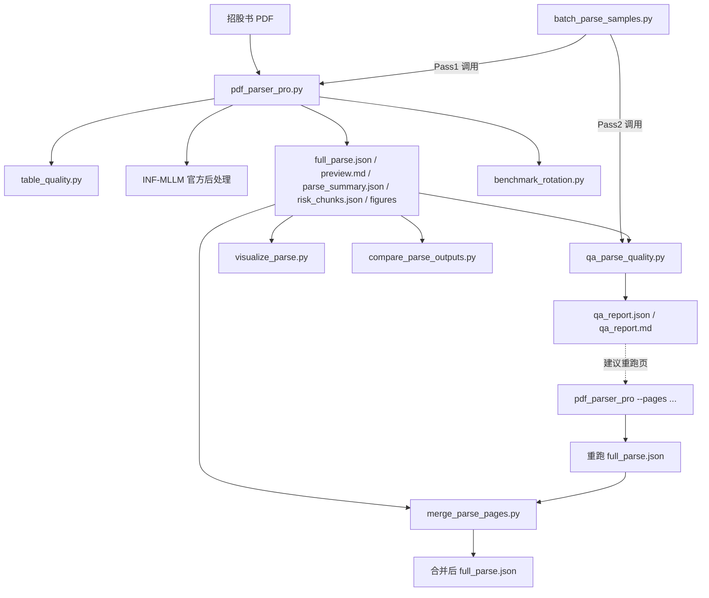

# 港股 IPO 招股书 PDF 解析

把数百页招股书 PDF 转成按页组织的结构化 JSON（含 bbox / category / text），供下游风险特征抽取与证据检索使用。

**生产主路径**：`pdf_parser_pro.py`（单本）或 `batch_parse_samples.py`（批量 / 多卡）。

**推荐环境**：

```bash
/nfs/users/wuqianqian/anaconda3/envs/infinity_parser/bin/python
```

工作目录请切到本目录：

```bash
cd /nfs/users/wuqianqian/IPOI/pdf_parsing
```

---

## 目录与文件角色

| 路径 | 角色 | 是否日常使用 |
|------|------|--------------|
| `pdf_parser_pro.py` | **生产主解析器**：Flash 模型 + 官方后处理 + 旋转/表格置信度 + 输出套件 | ✅ 首选 |
| `batch_parse_samples.py` | **批量编排**：多卡/页分片调用 `pdf_parser_pro`，再跑 QA | ✅ 批量首选 |
| `qa_parse_quality.py` | Pass2 质量门禁，扫描 `full_parse.json` → `qa_report` | ✅ |
| `merge_parse_pages.py` | 将定向重跑页合并回全书 `full_parse.json` | ✅ 修补时用 |
| `table_quality.py` | 表格质量分 / 结构置信度（无 torch，被解析器/QA/merge 共用） | 库，不直接跑 |
| `visualize_parse.py` | 将 `full_parse.json` 转成 MD/HTML 便于人工审阅 | ✅ |
| `compare_parse_outputs.py` | 两份 `full_parse.json` 同页对比报告 | 实验对比 |
| `benchmark_rotation.py` | 竖表旋转策略（none/cw90/ccw90/auto）质量与速度对比 | 实验 |
| `pdf_parser.py` | 官方对齐底座（无旋转/风险 chunk/表格置信度） | 一般不用 |
| `parse_prospectus.py` | 早期简版（低 DPI / 短 token） | ❌ 勿作主跑 |
| `parse_work.py` + `run_parallel.py` | 早期多卡 worker 原型 | ❌ 已由 batch 替代 |
| `download_data.py` | 赛题数据包 SFTP 下载 | 数据准备 |
| `models/infly/Infinity-Parser2-Flash/` | 本地解析模型 | 依赖 |
| `INF-MLLM/Infinity-Parser2/.../utils/utils.py` | 官方 `postprocess_doc2json_result` 等 | 依赖 |
| `pdf/` | 样本 PDF（如 `mixue.pdf`） | 输入 |
| `output/` | 解析产物 | 输出 |

---

## 文件关联关系



**推荐流水线**：

1. **Pass1** `pdf_parser_pro` / `batch_parse_samples` → `full_parse.json`
2. **Pass2** `qa_parse_quality` → 问题页列表
3. **可选修补** 对问题页 `--pages` 重跑 → `merge_parse_pages` 合回
4. 下游：`risk_chunks.json` → RAG；`full_parse.json` → 风险特征抽取 / 证据高亮

---

## 输出约定

每个 PDF 写入 `{output-dir}/{pdf_stem}/`：

| 文件 | 说明 |
|------|------|
| `full_parse.json` | 主产物：页数组，每页含 `elements[{bbox, category, text, ...}]` |
| `preview.md` | 可读预览（默认跳过 header/footer） |
| `parse_summary.json` | 页数、category 统计、失败/空页等摘要 |
| `risk_chunks.json` | 风险关键词命中 + 表格等，带页码/bbox（可用 `--no-risk-chunks` 关闭） |
| `figures/` | figure 区域裁剪图（可用 `--no-figures` 关闭） |
| `qa_report.json` / `.md` | QA 报告（Pass2） |

`category` 常见取值：`text` / `title` / `header` / `footer` / `table`（HTML）/ `figure` / `table_caption` / `table_footnote` / `figure_caption` / `page_footnote` / `formula`。

---

## 1. `pdf_parser_pro.py` — 生产主解析器

单本或目录批量解析；支持指定页、竖表旋转、figure 裁剪、风险 chunk。

### 命令

```bash
python pdf_parser_pro.py <PDF或目录> [选项]
```

### 参数

| 参数 | 默认 | 说明 |
|------|------|------|
| `input` | 必填 | PDF 文件，或含 `*.pdf` 的目录 |
| `-o, --output-dir` | `output/<stem>/` | 输出根目录 |
| `--model` | `./models/infly/Infinity-Parser2-Flash` | 模型路径 |
| `--dpi` | `300` | 渲染 DPI |
| `--batch-size` | `4` | 页级 batch；OOM 降到 1~2 |
| `--max-new-tokens` | `16384` | 生成上限 |
| `--device-map` | `auto` | 设备映射 |
| `--pages` | 全部 | 仅解析指定页，如 `16,21`（1-based） |
| `--no-figures` | 关 | 不保存 figure 裁剪 |
| `--no-risk-chunks` | 关 | 不生成 `risk_chunks.json` |
| `--rotate-mode` | `none` | `none` / `auto` / `cw90` / `ccw90` / `180` / `manual` |
| `--rotate-pages` | 全部 | 仅这些页应用旋转 |
| `--rotate-degrees` | `90` | `manual` 时的顺时针角度 |
| `--rotate-fallback` | 关 | `auto` 下旋转版与原向版择优（更慢） |

### 示例

```bash
# 全文解析
python pdf_parser_pro.py pdf/mixue.pdf -o output/mixue_default

# 快速试跑：指定页、大 batch、不抽 risk chunks
python pdf_parser_pro.py pdf/mixue.pdf --rotate-mode none --batch-size 8 -o output/test/ --no-risk-chunks

# 竖表页自动旋转 + 质量回退
python pdf_parser_pro.py pdf/mixue.pdf --rotate-mode auto --rotate-fallback --pages 16,21 -o output/mixue-rotate

# 目录下所有 PDF
python pdf_parser_pro.py pdf/ -o output/batch
```

---

## 2. `batch_parse_samples.py` — 批量 / 多卡编排

默认流水线：Pass1（`pdf_parser_pro`，`rotate-mode=auto` + 旋转回退）→ Pass2（`qa_parse_quality`）。

吞吐策略：多本一卡一本；同卡可用 `--page-workers` 把一本书页范围切分并行；一份 PDF 可跨多卡分片。

### 命令

```bash
python batch_parse_samples.py [选项]
```

### 主要参数

| 参数 | 默认 | 说明 |
|------|------|------|
| `--pdf` | — | 只解析这一份（优先于 samples 切片） |
| `--samples-dir` | `../dataset/samples` | 样本 PDF 目录 |
| `--offset` / `--limit` | `0` / `5` | 按文件名排序后的切片 |
| `-o, --output-dir` | `output/samples_batch` | 输出根目录 |
| `--gpus` | `auto` | 如 `0,1,2,3`；`auto`=空闲卡 |
| `--min-free-mib` | `20000` | `auto` 时空闲显存门槛 |
| `--page-workers` | `2` | 同卡页分片进程数；OOM 改 `1` |
| `--batch-size` | `8` | 推理 batch |
| `--max-new-tokens` | `16384` | 生成上限 |
| `--rotate-mode` | `auto` | 旋转模式 |
| `--no-rotate-fallback` | 关 | 关闭旋转择优（默认开启） |
| `--no-figures` / `--no-risk-chunks` | 关 | 同主解析器 |
| `--skip-pass1` | 关 | 跳过解析，只对已有结果做 QA |
| `--dry-run` | 关 | 只列出 PDF 与 GPU 分配 |
| `--no-parallel` | 关 | 强制单进程 |

### 示例

```bash
# 单本：4 卡 × 每卡 2 分片
python batch_parse_samples.py --pdf pdf/xiaomi.pdf --gpus 0,1,2,3 --page-workers 2 --batch-size 2

# 单卡 2 分片
python batch_parse_samples.py --pdf pdf/xiaomi.pdf --gpus 0 --page-workers 2 --batch-size 2

# 多样本：跳过前 4 份，再跑 5 份
python batch_parse_samples.py --offset 4 --limit 5 --gpus auto --page-workers 2 --batch-size 2

# 已有 full_parse，只跑 QA
python batch_parse_samples.py --pdf pdf/mixue.pdf -o output/mixue_default --skip-pass1
```

---

## 3. `qa_parse_quality.py` — 质量门禁

扫描 `full_parse.json`，检出解析失败、空 bbox、竖表低结构、附录缺 table 等问题，给出建议重跑页。

### 命令与参数

```bash
python qa_parse_quality.py <full_parse.json> [-o qa_report.json] [--markdown] [--write-confidence]
```

| 参数 | 说明 |
|------|------|
| `input` | `full_parse.json` |
| `-o, --output` | 报告路径，默认同目录 `qa_report.json` |
| `--markdown` | 额外写 `qa_report.md` |
| `--write-confidence` | 把补算的表格置信度写回 `full_parse.json` |

### 示例

```bash
python qa_parse_quality.py output/mixue/full_parse.json --markdown
python qa_parse_quality.py output/mixue/full_parse.json -o output/mixue/qa_report.json --write-confidence
```

---

## 4. `merge_parse_pages.py` — 页级合并修补

用定向重跑结果（patch）替换全书 base 中的对应页。

### 命令与参数

```bash
python merge_parse_pages.py --base <全书.json> --patch <重跑.json> -o <输出.json> [选项]
```

| 参数 | 说明 |
|------|------|
| `--base` | 全书 `full_parse.json` |
| `--patch` | 重跑得到的 `full_parse.json` |
| `-o, --output` | 合并输出路径 |
| `--pages` | 仅合并这些页；默认 patch 中全部页 |
| `--bbox-scale` | 对 patch bbox 缩放（DPI 不一致时，如 150→300 约 2.0~2.5） |
| `--prefer-higher-table-score` | 仅当 patch 表格分更高（或补回缺失 table）时替换 |
| `--annotate-pass` | 写入页级 `parse_pass` 标记，默认 `reparse` |
| `--backup` | 覆盖前备份为 `*.bak` |

### 示例

```bash
# 1) 重跑问题页
python pdf_parser_pro.py pdf/mixue.pdf --pages 16,21 --rotate-mode auto --rotate-fallback \
  -o output/mixue-reparse

# 2) 合并回全书
python merge_parse_pages.py \
  --base output/mixue/full_parse.json \
  --patch output/mixue-reparse/mixue/full_parse.json \
  --pages 16,21 \
  --prefer-higher-table-score \
  --backup \
  -o output/mixue/full_parse.json
```

---

## 5. 审阅与实验工具

### `visualize_parse.py`

```bash
python visualize_parse.py <full_parse.json> [--format md|html|both] [--hide-header-footer] \
  [--page-range 1-20] [-o 输出目录]
```

```bash
python visualize_parse.py output/mixue/full_parse.json --format both --hide-header-footer --page-range 1-30
```

### `compare_parse_outputs.py`

```bash
python compare_parse_outputs.py \
  --a output/new/full_parse.json \
  --b output/old/full_parse.json \
  --label-a pdf_parser_pro --label-b baseline \
  --max-pages 30 \
  -o output/compare_report.md
```

### `benchmark_rotation.py`

```bash
python benchmark_rotation.py \
  --pdf pdf/mixue-1-30.pdf \
  --pages 16,21 \
  --baseline output/mixue-1-30-pro/mixue-1-30/full_parse.json \
  -o output/mixue-1-30-pro/rotation_benchmark.md
```

### `table_quality.py`

无 CLI；被 `pdf_parser_pro` / `qa_parse_quality` / `merge_parse_pages` import，提供 `score_table_quality`、`table_structure_confidence` 等。

---

## 6. 遗留 / 非主路径脚本

| 脚本 | 说明 |
|------|------|
| `pdf_parser.py` | 官方对齐版解析（300 DPI、官方后处理），无旋转与风险 chunk；学习官方行为可看，日常请用 `pdf_parser_pro` |
| `parse_prospectus.py` | `python parse_prospectus.py <pdf>`，早期单脚本，不建议再生产 |
| `parse_work.py` | 早期单 GPU worker（`python parse_work.py <gpu_id> <pdf> <out_dir>`） |
| `run_parallel.py` | 早期多卡调度（依赖旧 worker 命名）；批量请改用 `batch_parse_samples.py` |
| `download_data.py` | `python download_data.py`，从赛题 SFTP 拉数据包（需 `paramiko`） |

---

## 常见问题

- **OOM**：降低 `--batch-size`（如 1~2）、`--page-workers`（改 1）、或 `--max-new-tokens`。
- **竖表结构乱**：`--rotate-mode auto`，必要时加 `--rotate-fallback`；QA 会标 `vertical_table_low_structure`。
- **个别页失败 / 缺 table**：QA 看 `reparse_pages` → `pdf_parser_pro --pages` → `merge_parse_pages`。
- **bbox 与高亮对不齐**：确认渲染 DPI 一致；合并不同 DPI 结果时用 `--bbox-scale`。
- **速度**：Flash 约数 GB 显存，可同卡多进程或跨卡分片；全文数百页仍需数小时量级。

---

## 下游衔接

| 产物 | 下游 |
|------|------|
| `full_parse.json` | 风险特征抽取、证据检索、前端页码/bbox 高亮 |
| `risk_chunks.json` | RAG 入库 |
| `qa_report.json` | 解析质量门禁、定向重跑清单 |

更细的异常案例与 schema 约定见项目 skill：`.cursor/skills/hk-ipo-pdf-parsing/`。

---

## 7. 专家模式 HTTP 服务（契约组）

前端契约见 [`dataset/interface_new.md`](../dataset/interface_new.md)（v3.2）；设计说明见 `docs/expert_parse_api_design.md`。

当前为 **桩模式**（`STUB_MODE=True`）：不占 GPU，按上传 PDF 的 sha256 / ticker / 文件名匹配 `output/samples_batch` 现有产物，模拟进度后返回清洗后的 `preview.md` + `parse_summary.json`。

**解析完成后自动建索引**：任务 `READY` 后异步调用本机 **9101** `POST /internal/retrieval/prepare`；前端轮询：

```http
GET /api/v1/projects/:clientProjectId/index-status?taskId=...
```

返回 `status`: `indexing` | `ready` | `failed`。仅 `ready` 后前端才调 `analysis/start`。Form 另支持可选 `companyName`、`listDate`（与契约一致）。

### 7.1 机房端口规范（必读）

机房防火墙默认开启，**未放行端口外网连不上**（表现：Ping 通但 TCP 超时）。三台服务器统一只开放 **9100–9200** 供业务使用。

| 项 | 约定 |
|----|------|
| 允许对外监听 | **仅 `9100`–`9200`**（本模块及后续任何新 HTTP 服务均同） |
| 本服务默认 | **`9100`**（`scripts/start_expert_parse_service.sh` / `service/config.py`） |
| 占用冲突时 | `PORT=9101`（或同区间空闲端口）再启动，**仍须落在 9100–9200** |
| 前端联调 | **直连** `http://223.3.95.129:9100`（路径 `/api/v1/parse/expert/*`） |
| 网关口径 | 胡禹成 `ipo-risk` / 原 **8080 不是**现行主后端网关，整体架构待重调；**不要**再按 8080 反代规划本服务 |
| **禁止作为项目对外端口** | **8080、8100、5432、6379、5173** 等不在放行段内的端口（早期设计稿已作废）。本机 `127.0.0.1` 自测可用任意端口，但联调/前端必须用 9100–9200 |

联调失败先自查：服务是否绑在 `0.0.0.0:<9100–9200>`，前端 baseURL 是否指向该端口。

```bash
# 启动（默认 0.0.0.0:9100）
./scripts/start_expert_parse_service.sh
# 若 9100 被占用：
# PORT=9101 ./scripts/start_expert_parse_service.sh

# 健康检查（契约路径）
curl -s http://127.0.0.1:9100/api/v1/health | jq
# 兼容旧路径
curl -s http://127.0.0.1:9100/health | jq

# 启动解析
curl -s -X POST http://127.0.0.1:9100/api/v1/parse/expert/start \
  -F "file=@pdf/03378_15-12-2025_翰思艾泰－Ｂ_全球發售.pdf" \
  -F "ticker=03378.HK" -F "clientProjectId=proj-demo" \
  -F "fileName=翰思艾泰.pdf" -F "isBiotech=true" \
  -F "companyName=翰思艾泰" -F "listDate=2025-12-15"

# 索引状态（解析完成后轮询）
curl -s "http://127.0.0.1:9100/api/v1/projects/proj-demo/index-status"
```

固化参数（真解析启用时）：`--gpus auto --page-workers 2 --rotate-mode none`（关 fallback）、`--no-figures`、跳过 QA。
