## 第 1 页

Superland Group Holdings Limited
德合集團控股有限公司

(於開曼群島註冊成立的有限公司)

股份代號: 368

股份發售

獨家保薦人

Lego Corporate
Finance Limited
力高企業融資有限公司

聯席全球協調人、聯席賬簿管理人及聯席牽頭經辦人

聯席賬簿管理人
及聯席牽頭經辦人

Lego Securities Limited
力高證券有限公司

B S L

東信證券

金猴證券
HKMonkey.com

聯席牽頭經辦人

---

## 第 2 页

Superland Group Holdings Limited
德合集團控股有限公司

(於開曼群島註冊成立的有限公司)

股份發售

發售股份數目：200,000,000股股份(視乎超額配股權行使與否而定)

香港發售股份數目：20,000,000股股份(可予重新分配)

國際配售股份數目：180,000,000股股份(可予重新分配及視乎超額配股權行使與否而定)

發售價：不高於每股發售股份0.69港元且預期不低於每股發售股份0.63港元，另加1.0%經紀佣金、0.0027%證監會交易徵費及0.005%聯交所交易費(須於申請時以港元繳足及多繳股款將根據最終定價予以退還)

面值：每股股份0.01港元

股份代號：368

獨家保薦人

聯席全球協調人、聯席賬簿管理人

及聯席牽頭經辦人

B S L

東信證券

聯席賬簿管理人
及聯席牽頭經辦人

聯席牽頭經辦人

東方滙財證券有限公司
ORIENT SECURITIES LIMITED

偉禄亞太證券
REALORD ASIA PACIFIC SECURITIES

Giraffe
智富

香港交易及結算所有限公司、香港聯合交易所有限公司及香港中央結算有限公司對本招股章程的內容概不負責，對其準確性或完整性亦不發表任何聲明，並明確表示概不就因本招股章程全部或任何部分內容而產生或因依賴該等內容而引致的任何損失承擔任何責任。

本招股章程文本連同本招股章程附錄五「送呈香港公司註冊處處長之文件」一段所指定文件，已根據香港法例第32章公司(清盤及雜項條文)條例第342C條規定送呈香港公司註冊處處長登記。證券及期貨事務監察委員會及香港公司註冊處處長對本招股章程或上述任何其他文件的內容概不負責。

預期發售價將由聯席全球協調人(為其本身及代表包銷商)與我們於定價日(預期為二零二零年七月十日(星期五)或前後)或聯席全球協調人(為其本身及代表包銷商)與我們可能協定的較後日期釐定。除非另行公佈，否則發售價將不高於0.69港元，且目前預期將不低於0.63港元。倘基於任何原因，聯席全球協調人(為其本身及代表包銷商)與我們未能於定價日前協定發售價，則股份發售將不會進行並將告失效。假設香港公開發售於二零二零年七月十七日(星期五)上午八時正或之前在香港成為無條件，預期我們的股份將於二零二零年七月十七日(星期五)上午九時正開始於聯交所買賣。

香港發售股份申請人須於申請時就每股發售股份支付最高發售價0.69港元(另加1.0%經紀佣金、0.0027%證監會交易徵費及0.005%聯交所交易費)，惟倘最終釐定的發售價低於0.69港元，則多繳股款可予退還。聯席全球協調人(為其本身及代表包銷商)可在我們的同意下，於遞交香港公開發售申請截止日期上午或之前，隨時調低股份發售項下提呈發售的發售股份數目及／或指示性發售價範圍至低於本招股章程所述者。在此情況下，我們最遲將於遞交香港公開發售申請截止日期上午，於本公司網站www.superland-group.com及聯交所網站www.hkexnews.hk刊登調低發售股份數目及／或指示性發售價範圍的通告。更多詳情請參閱本招股章程「股份發售的架構及條件」及「如何申請香港發售股份」兩節。

在作出投資決定前，有意投資者應審慎考慮本招股章程所載的全部資料，包括本招股章程「風險因素」一節所載的風險因素。

倘於上市日期上午八時正前出現若干理由，則聯席全球協調人(為其本身及代表包銷商)可終止香港包銷商於香港包銷協議項下的責任。有關理由載於本招股章程「包銷—包銷安排及開支—終止理由」一段。閣下務請參閱該段以了解更多詳情。

發售股份不曾亦不會根據美國證券法或美國任何州證券法登記，亦不得於美國境內或向美籍人士或以其名義或為其利益提呈發售、出售、抵押或轉讓，惟豁免遵守美國證券法登記規定或不受其約束的交易除外。發售股份依據美國證券法S規例於離岸交易中在美國境外提呈發售及出售。

---

## 第 3 页

預期時間表

如以下預期時間表有任何變動，本公司將於聯交所網站www.hkexnews.hk及本公司網站www.superland-group.com另行刊發公告。

二零二零年（附註1）

香港公開發售開始及白色及黃色申請表格可供索取 …… 六月三十日(星期二)
上午九時正起

以下列其中一種方式根據網上白表服務完成電子認購

申請的截止時間$^{(附註2)}$：

(1) IPO App，可透過 App Store 或 Google Play 搜尋「IPO App」或於網站 www.hkeipo.hk/IPOApp 或 www.tricorglobal.com/IPOApp 下載 ……七月六日(星期一)上午十一時三十分

(2) 指定網站 www.hkeipo.hk ……七月六日(星期一)上午十一時三十分

開始辦理登記香港公開發售申請$^{(附註3)}$ ……七月六日(星期一)上午十一時四十五分

遞交白色及黃色申請表格的截止時間 ……七月六日(星期一)中午十二時正

透過網上銀行轉賬或繳費靈轉賬方式完成網上白表申請付款的截止時間 ……七月六日(星期一)中午十二時正

向香港結算發出電子認購指示的截止時間$^{(附註4)}$ ……七月六日(星期一)中午十二時正

截止辦理登記申請$^{(附註3)}$ ……七月六日(星期一)中午十二時正

預期定價日$^{(附註5)}$ ……七月十日(星期五)或前後

在聯交所網站 www.hkexnews.hk；及本公司網站 www.superland-group.com 刊登有關最終發售價、國際配售的踴躍程度、香港公開配售的申請水平及香港發售股份分配基準的公告 ……七月十六日(星期四)或之前

---

## 第 4 页

預期時間表

二零二零年（附註1）

透過不同途徑(包括聯交所網站www.hkexnews.hk及

本公司網站www.superland-group.com)公佈香港公開發售

的分配結果(連同成功申請人的身份證明文件號碼或

香港商業登記號碼(如適用))(見本招股章程

「如何申請香港發售股份—11.公佈結果」一段所述$^{(附註11)}$……七月十六日(星期四)起

可於備有「按身份證號碼搜索」功能的 IPO APP 或網站

www.tricor.com.hk/ipo/result或www.hkeipo.hk/IPOResult

查閱香港公開發售的分配結果$^{(附註11)}$……七月十六日(星期四)起

就香港公開發售全部或部份獲接納申請寄發／

領取股票或將有關股票存入中央結算系統$^{(附註8及10及11)}$……七月十六日(星期四)或之前

就香港公開發售全部或部分獲接納申請(如適用)或

全部或部分不獲接納申請寄發退款支票及

網上白表電子自動退款指示$^{(附註9至11)}$ ……七月十六日(星期四)或之前

股份開始在聯交所買賣$^{(附註11)}$ ……七月十七日(星期五)上午九時正

定價日預期為二零二零年七月十日(星期五)或前後，或聯席全球協調人(為其本身及代表包銷商)與我們可能協定的較後日期。截止辦理申請登記與定價日之間的間隔較一般市場慣例為長。投資者務請注意，股份預期將於二零二零年七月十七日(星期五)開始在聯交所買賣。

附註：

1. 除另有列明外，所有時間均指香港本地時間。

2. 閣下不得於遞交申請的截止日期上午十一時三十分後透過IPO APP或指定網站www.hkeipo.hk遞交申請。倘閣下於上午十一時三十分或之前已遞交申請並從IPO APP或指定網站取得付款參考編號，則閣下將獲准繼續辦理申請手續(即完成支付申請股款)，直至遞交申請的截止日期中午十二時正截止辦理申請登記為止。

---

## 第 5 页

預期時間表

3. 倘香港於二零二零年七月六日(星期一)上午九時正至中午十二時正期間任何時間懸掛八號或以上熱帶氣旋警告信號或超級颱風導致的「極端狀況」或「黑色」暴雨警告信號，則當日不會開始或截止辦理申請登記。請參閱本招股章程「如何申請香港發售股份—10.惡劣天氣及／或極端狀況對辦理申請登記的影響」一段。

4. 透過中央結算系統向香港結算發出電子認購指示申請香港發售股份的申請人應參閱本招股章程「如何申請香港發售股份—6.透過中央結算系統向香港結算發出電子認購指示提出申請」一段。

5. 定價日預期為二零二零年七月十日(星期五)或前後，或聯席全球協調人(為其本身及代表包銷商)與我們可能協定的較後日期。倘基於任何原因，聯席全球協調人(為其本身及代表包銷商)與我們未能於定價日前協定發售價，則股份發售將不會進行並將告失效。

6. 該公告將登載於聯交所網站 www.hkexnews.hk「主板—股份配發結果」一頁以供瀏覽。

7. 本公司網站或本公司網站所載任何資料均不構成本招股章程的一部分。

8. 股票僅會於股份發售在各方面成為無條件且本招股章程「包銷」一節所述終止權利未獲行使時，方會於二零二零年七月十七日(星期五)上午八時正生效。投資者如在獲得股票前或股票生效前買賣股份，風險概由彼等自行承擔。倘股份發售並未成為無條件或包銷協議根據其條款終止，則股份發售將不會進行。在此情況下，本公司將於隨後盡快作出公告。

9. 倘根據香港公開發售作出的申請全部或部份不獲接納，或申請全部或部份獲接納但最終發售價低於申請時應付的每股發售股份價格，則會發出電子自動退款指示／退款支票。申請人所提供的申請人的部份香港身份證號碼或護照號碼，或(如屬聯名申請人提出申請)排名首位申請人的部份香港身份證號碼或護照號碼，或會列印於退款支票(如有)上。該等資料亦會轉交第三方安排退款。銀行兌現退款支票前或會要求查核申請人的香港身份證號碼或護照號碼。倘申請人的香港身份證號碼或護照號碼填寫有誤，或會導致無法兌現或延遲兌現退款支票。

10. 以白色申請表格或透過網上白表服務申請1,000,000股或以上香港發售股份，並已提供申請表格所需全部資料的申請人，可於二零二零年七月十六日(星期四)或本公司於網站公佈的其他日期上午九時正至下午一時正，親臨本公司的香港證券登記處卓佳證券登記有限公司(地址為香港皇后大道東183號合和中心54樓)領取任何退款支票及／或股票。符合資格親身領取的個人申請人不得授權任何其他人士代領。符合資格親身領取的公司申請人必須由授權代表攜同蓋有其公司印鑒的公司授權書領取。個人及公司授權代表領取時均須出示香港證券登記處接納的身份證明文件。

以黃色申請表格申請1,000,000股或以上香港發售股份的申請人，可親自領取退款支票(如有)，惟不得領取股票，有關股票將以香港結算代理人名義發行並存入中央結算系統，以記存於申請表格所述彼等或指定的中央結算系統參與者股份戶口。使用黃色申請表格的申請人領取退款支票的手續，與使用白色申請表格的申請人適用的手續相同。

透過向香港結算發出電子認購指示申請香港發售股份的申請人應參閱本招股章程「如何申請香港發售股份—6.透過中央結算系統向香港結算發出電子認購指示提出申請」一段所載相關詳情。倘申請人透過網上白表服務申請並透過單一銀行賬戶繳付申請股款，則退款(如有)將以電子自動退款指示的

---

## 第 6 页

預期時間表

形式發送至該銀行賬戶。倘申請人透過網上白表服務申請並透過多個銀行賬戶繳付申請股款，則退款(如有)將以退款支票形式以普通郵遞方式寄往其申請指示所示地址，郵誤風險概由申請人自行承擔。

對於申請少於1,000,000股香港發售股份的申請人，任何未獲領取的股票及／或退款支票將以普通郵遞方式寄往有關申請所示地址，郵誤風險概由申請人承擔。

11. 倘於香港公開發售開始日期至上市日期期間任何日子懸掛八號或以上颱風警告信號、超級颱風導致的「極端狀況」、「黑色」暴雨警告信號，則(i)公佈香港公開發售分配結果；(ii)寄發股票及退款支票／發出網上白表電子自動退款指示；及(iii)股份在聯交所買賣的日期將按照受惡劣天氣及／或極端情況影響的營業日數而延遲。

上述預期時間表僅為概要。有關股份發售的架構及條件(包括股份發售的條件)及申請香港發售股份的程序的詳情，閣下應參閱本招股章程「股份發售的架構及條件」及「如何申請香港發售股份」各節。

倘上述香港公開發售預期時間表有任何變動，我們將刊發公告。

---

## 第 7 页

致投資者的重要通知

本招股章程由本公司僅就股份發售而言刊發，並不構成提呈出售或招攬購買本招股章程根據股份發售提呈出售發售股份以外的任何證券。本招股章程不得用作亦不構成在任何其他司法權區或任何其他情況下作出的要約或邀請。概無採取任何行動以准許在香港以外任何司法權區公開發售發售股份或發佈本招股章程。

閣下作出投資決定時應僅倚賴本招股章程及申請表格所載的資料。我們並無授權任何人士向閣下提供有別於本招股章程所載的資料。閣下切勿將任何並非載於本招股章程的資料或於聲明視為已獲我們、獨家保薦人、聯席全球協調人、聯席賬簿管理人、聯席牽頭經辦人、任何包銷商、彼等各自的任何董事、聯屬人、顧問、代理或代表或參與股份發售的任何其他人士或各方授權而加以信賴。

頁次

預期時間表..... i
目錄..... v
概要..... 1
釋義..... 16
技術詞彙..... 26
前瞻性陳述..... 27
有關本招股章程及股份發售的資料..... 29
風險因素..... 33
董事及參與股份發售的各方..... 52
公司資料..... 56
行業概覽..... 58
監管概覽..... 68
歷史、發展及重組..... 82
業務..... 89

---

## 第 8 页

目錄

與控股股東的關係 …… 163
關連交易 …… 168
董事及高級管理層 …… 173
財務資料 …… 185
未來計劃及所得款項用途 …… 239
主要股東 …… 250
股本 …… 251
包銷 …… 254
股份發售的架構及條件 …… 266
如何申請香港發售股份 …… 276
附錄一 — 會計師報告 …… I-1
附錄二 — 未經審核備考財務資料 …… II-1
附錄三 — 本公司組織章程及開曼群島公司法概要 …… III-1
附錄四 — 法定及一般資料 …… IV-1
附錄五 — 送呈香港公司註冊處處長及備查文件 …… V-1

---

## 第 9 页

概要

本概要旨在向閣下提供本招股章程所載資料的概覽。由於本章節僅為概要，故此未必載有所有可能對閣下屬重要的資料。閣下於決定投資發售股份前應細閱本招股章程全部內容。任何投資均涉及風險。有關投資發售股份的部分特定風險載於本招股章程「風險因素」一節。閣下決定投資發售股份前應細閱該章節。

概覽

我們是香港一家具規模的承建商，擁有逾15年營運歷史，提供裝修服務以及維修及保養服務，並具備香港註冊電業承辦商、註冊分包商及註冊小型工程承建商的資格。

於往績期間，我們的服務有強勁需求。於往績期間及直至最後可行日期，我們已完成20個裝修項目，合約總額合計約為1,093.5百萬港元。於截至二零一七年、二零一八年及二零一九年十二月三十一日止年度，我們的收益分別約552.7百萬港元、768.1百萬港元及879.4百萬港元。根據弗若斯特沙利文報告，按收益計算，我們於二零一八年在香港裝修承建商市場中排行第三，市場份額約為1.2%。

裝修服務主要涵蓋於新樓宇及物業項目進行的天花、地板、牆壁、照明、玻璃、金屬、木工、石工及泥水工程。我們亦採購及安裝按客戶規格定制的門、家具及配件，以作為裝修服務的一部分。維修及保養服務主要涵蓋對現有物業進行內部裝潢部件升級、修復及改善及維修、替換或安裝。下表列載我們於往績期間按業務分部劃分的收益明細：

截至十二月三十一日止年度

<!-- table html -->
<table><tr><td></td><td colspan="2">二零一七年</td><td colspan="2">二零一八年</td><td colspan="2">二零一九年</td></tr><tr><td></td><td>千港元</td><td>%</td><td>千港元</td><td>%</td><td>千港元</td><td>%</td></tr><tr><td>裝修服務</td><td>546,296</td><td>98.8</td><td>759,587</td><td>98.9</td><td>874,477</td><td>99.4</td></tr><tr><td>維修及保養服務</td><td>6,356</td><td>1.2</td><td>8,558</td><td>1.1</td><td>4,924</td><td>0.6</td></tr><tr><td>總計</td><td>552,652</td><td>100.0</td><td>768,145</td><td>100.0</td><td>879,401</td><td>100.0</td></tr></table>
<!-- /table -->

於往績期間，我們專注於按個別項目基準為香港住宅及商業物業提供裝修服務以及維修及保養服務。下表列載我們於往績期間按物業類別劃分的收益明細：

截至十二月三十一日止年度

<!-- table html -->
<table><tr><td></td><td colspan="2">二零一七年</td><td colspan="2">二零一八年</td><td colspan="2">二零一九年</td></tr><tr><td></td><td>千港元</td><td>%</td><td>千港元</td><td>%</td><td>千港元</td><td>%</td></tr><tr><td>住宅</td><td>436,470</td><td>79.0</td><td>449,108</td><td>58.5</td><td>567,283</td><td>64.5</td></tr><tr><td>商業(附註)</td><td>116,182</td><td>21.0</td><td>319,037</td><td>41.5</td><td>312,118</td><td>35.5</td></tr><tr><td>總計</td><td>552,652</td><td>100.0</td><td>768,145</td><td>100.0</td><td>879,401</td><td>100.0</td></tr></table>
<!-- /table -->

附註：「商業」類別主要包括零售店、辦公室、購物商場、商業會所、酒店及服務式住宅。

我們對我們在管理及營運方面的有系統方針感到自豪。於最後可行日期，我們的管理系統獲ISO 9001:2015認證。我們已制定一套客觀的質量控制系統，涵蓋從管理層

---

## 第 10 页

的過往經驗及專業知識得出的各項檢查清單及政策，並由僱員執行。我們確保現場項目團隊包含進行部分工程的直屬技工，以向分包商展示就餘下工程須採納的規定工作標準。我們亦維持全面的資料數據庫，其讓我們能有效管理成本及利潤率，並對客戶的方案提供見解及改良。

下表列載我們於往績期間及直至最後可行日期裝修項目的尚餘合約價值變動：

<!-- table html -->
<table><tr><td colspan="4">截至十二月三十一日止年度</td><td>二零二零年一月一日至最後可行日期</td></tr><tr><td>二零一七年</td><td>二零一八年</td><td>二零一九年</td><td>千港元（未經審核）</td></tr><tr><td>千港元</td><td>千港元</td><td>千港元</td><td>千港元</td></tr><tr><td>自上一年度承前的年初合約價值</td><td>906,056</td><td>743,473</td><td>613,257</td><td>801,573</td></tr><tr><td>• 新世界集團(作為地產發展商)及新鴻基集團</td><td>565,538</td><td>550,726</td><td>426,302</td><td>311,037</td></tr><tr><td>• 其他客戶</td><td>340,518</td><td>192,747</td><td>186,955</td><td>490,536</td></tr><tr><td>新項目及現有項目的工程變更令合約總額(附註1)</td><td>383,713</td><td>629,371</td><td>1,062,793</td><td>362,637</td></tr><tr><td>• 新世界集團(作為地產發展商)及新鴻基集團</td><td>279,215</td><td>343,695</td><td>431,175</td><td>11,436</td></tr><tr><td>• 其他客戶</td><td>104,498</td><td>285,676</td><td>631,618</td><td>351,201</td></tr><tr><td>已確認收益(附註2)</td><td>(546,296)</td><td>(759,587)</td><td>(874,477)</td><td>(257,328)</td></tr><tr><td>• 新世界集團(作為地產發展商)及新鴻基集團</td><td>(294,027)</td><td>(468,119)</td><td>(546,440)</td><td>(92,653)</td></tr><tr><td>• 其他客戶</td><td>(252,269)</td><td>(291,468)</td><td>(328,037)</td><td>(164,675)</td></tr><tr><td>於年／期末的尚餘合約價值(附註3)</td><td>743,473</td><td>613,257</td><td>801,573</td><td>906,882</td></tr><tr><td>• 新世界集團(作為地產發展商)及新鴻基集團</td><td>550,726</td><td>426,302</td><td>311,037</td><td>229,820</td></tr><tr><td>• 其他客戶</td><td>192,747</td><td>186,955</td><td>490,536</td><td>677,062</td></tr></table>
<!-- /table -->

附註：

1. 該等合約金額指於相關年度／期間授予我們的新項目的原合約總額，包括於上一年度競投及於相關期間授予我們的項目以及於相關年度／期間因隨後現有項目的工程變更令導致的加建及改建工程。

2. 截至二零一七年、二零一八年及二零一九年十二月三十一日止年度以及由二零二零年一月一日至最後可行日期，已確認收益包括工程變更令，分別涉及金額約62.6百萬港元、51.1百萬港元、110.3百萬港元及28.7百萬港元。截至二零一七年、二零一八年及二零一九年十二月三十一日止各年度確認的收益為截至二零一七年、二零一八年及二零一九年十二月三十一日止各年度的已確認經審核收益，而二零二零年一月一日至最後可行日期期間確認的收益為同期已確認未經審核收益，於各情況下均已計及相關期間內因其後的工程變更令引起的任何加建及改建工程。

3. 年度／期間結算日尚餘合約價值指於相關年／期末與尚未全面完成或須待與客戶達成協議或落實最終賬目的項目有關的未確認估計收益總額的部分。

客戶

於往績期間，我們的客戶來自私營界別及主要包括地產發展商及承建商。當我們獲地產發展商挑選為其裝修承建商，我們通常與其或其附屬公司訂立合約。我們亦可能獲地產發展商指名為其物業項目的指定裝修承建商，並與該等項目的承建商訂立合約。我們有時直接獲承建商委聘。

---

## 第 11 页

概要

截至二零一七年、二零一八年及二零一九年十二月三十一日止年度，最大客戶應佔收益分別為約159.5百萬港元、363.6百萬港元及402.1百萬港元，佔總收益分別約28.9%、47.3%及45.7%，而五大客戶應佔收益合共分別為約487.9百萬港元、732.5百萬港元及852.7百萬港元，分別佔總收益約88.3%、95.4%及97.0%。有關更多詳情，請參閱本招股章程「業務—客戶」一段。

供應商

我們主要向供應商採購木材、石材、金屬、瓷磚、塑膠層壓板及隔音材料等原材料。我們亦採購根據客戶規格定制的門、家具及配件。截至二零一七年、二零一八年及二零一九年十二月三十一日止年度，最大供應商應佔採購額分別為約60.9百萬港元、95.7百萬港元及79.6百萬港元，佔總採購額分別約17.4%、19.0%及11.5%，而五大供應商應佔採購額合共分別為約133.4百萬港元、191.4百萬港元及171.6百萬港元，佔總採購額分別約38.0%、37.9%及24.9%。有關更多詳情，請參閱本招股章程「業務—採購」一段。

分包商

我們可能將部分安裝或其他技術工程委託予分包商。截至二零一七年、二零一八年及二零一九年十二月三十一日止年度，最大分包商應佔分包費用分別為約21.9百萬港元、19.4百萬港元及35.5百萬港元，佔分包費用總額分別約6.2%、3.8%及5.1%，而五大分包商應佔分包費用合共分別為約64.8百萬港元、87.2百萬港元及130.4百萬港元，佔分包費用總額分別約18.5%、17.3%及18.9%。有關更多詳情，請參閱本招股章程「業務一分包」一段。

定價策略

一般而言，我們基於成本加成定價模式加上溢價為項目定價，藉此可在交付優質工程的同時獲取合理利潤率。標價或報價基於我們的估計及可得的資料，當中計及多項因素，包括但不限於(i)項目大小、規格及複雜程度；(ii)先前的標價或報價記錄；(iii)類似項目的獲授價格；(iv)我們的經營及財務能力；(v)估計項目成本；(vi)與客戶的關係；及(vii)當前市場狀況。有關本集團定價策略的更多詳情，請參閱本招股章程「業務—銷售及營銷一定價策略」一段。

競爭優勢

我們相信以下競爭優勢使我們在其他行業參與者中脫穎而出，並令我們能在行業中有效競爭：

我們是香港一家具規模的承建商，有能力提供合乎成本效益的裝修服務，並與本地及中國地產發展商保持友好關係，此可能為我們帶來潛在商機；

我們有能力透過採納有系統的管理及營運方針確保工程質量穩定及有效管理成本及利潤，並透過維持全面的資料數據庫，對客戶的方案提供見解及改良；

我們利用最新技術協助業務營運，從而提升工作效率；

我們與主要客戶、供應商及分包商維持穩定業務關係；及

我們由擁有深入的裝修行業知識及經驗的資深管理團隊領導。

---

## 第 12 页

業務策略

我們的主要業務目標是於香港維持及鞏固我們作為大型裝修承建商的市場地位。董事認為，我們過往傾向承接更多新世界集團(作為地產發展商)或新鴻基集團的裝修項目，或會使客戶基礎受到局限，以及可能不利於本集團的長期增長及發展。因此，我們計劃承接更多來自新世界集團(作為地產發展商)及新鴻基集團以外客戶且合約金額為每個項目50.0百萬港元或以上的大型裝修項目，以擴大我們的市場份額，分散客戶基礎，減低客戶集中風險。

我們過去無法從新世界集團(作為地產發展商)及新鴻基集團以外的客戶承接更多大型裝修項目，原因主要有二。

首先，於往績期間，雖然向供應商或分包商支付前期成本錄得現金流出後可能會自客戶收到付款而錄得現金流入，惟項目早期階段的現金流出累計金額一般超過現金流入累計金額，而對於涉及較大數額前期成本及／或我們發出付款申請較長一段時間後方向我們付款的該等客戶的裝修項目，現金流出的影響相對更大，且該等項目的淨現金流出通常需要經歷較長時間方達致收支平衡。據董事所深知，新世界集團(作為地產發展商)及新鴻基集團傾向進行泥水工作，並會自行採購大理石和瓷磚等工料(所需數量龐大，以致成本可觀)，而其他客戶通常要求我們供應裝修項目的大量工料，致使我們裝修項目的前期成本顯著上升。於往績期間，我們通常在就為新世界集團(作為地產發展商)或新鴻基集團進行的裝修項目作出付款申請後30天左右收到付款，而為其他客戶進行裝修項目則大約為90天收到付款。其他客戶的裝修項目的前期費用會在項目開始後每月累積，因我們通常在供應商及分包商開出發票後30天左右向其付款。客戶會根據我們的工程進度向我們支付進度付款，一般而言，於項目開始時工程進展並不重大，因此可遞交付款申請的工作量以及我們可向客戶收取的付款金額或會遠低於持續累計的前期成本，因項目開始時需要大量工料及以工料進行工程的分包商。現金流出狀況通常隨著項目取得進展，以及我們完成更多重大工程而改善。鑑於上文所述，於往績期間，我們就該等來自新世界集團(作為地產發展商)及新鴻基集團以外的客戶的裝修項目(原合約金額50.0百萬港元或以上)的前期成本一般於其產生後平均約13.0個月(而就新世界集團(作為地產開發商)及新鴻基集團則平均為約三個月)方能悉數收回，此將導致相關時期內大量現金淨流出。

其次，我們經常被要求向新世界集團(作為地產發展商)及新鴻基集團以外的客戶提供履約保證，通常相當於原合約金額的10%（我們通常不需要為新世界集團(作為地產發展商)及新鴻基集團提供履約保證）。我們須就履約保證抵押的存款將長時間被凍結，可能會嚴重影響我們的流動資金狀況。為實施擴張計劃，我們預計需要額外的資金及財務資源，其目標為鞏固財務狀況，以便以股份發售所得款項淨額滿足前期成本及履約保證的要求。

於往績期間，新世界集團(作為地產發展商)及新鴻基集團以外客戶的已完成裝修項目的毛利率較新世界集團(作為地產發展商)及新鴻基集團的已完成裝修項目低約2.0個百分點。董事認為此分別並不重大，由於我們注意到，根據往績期間的投標邀請，市場上仍有大量來自新世界集團(作為地產發展商)及新鴻基集團以外客戶的大型項目，而於最後可行日期，我們已遞交標書的所有裝修項目中，只有六個來自新世界集團(作為地產發展商)或新鴻基集團的項目的預期合約金額高於50.0百萬港元，而新世界集團

---

## 第 13 页

（作為地產發展商）及新鴻基集團以外的客戶有14個項目的預期合約金額高於50.0百萬港元。有關更多詳情，請參閱本招股章程「業務—項目—裝修項目—於最後可行日期，我們已遞交標書的裝修項目詳情」一段。倘我們為新世界集團（作為地產發展商）及新鴻基集團以外的客戶進行的相關大型裝修工程成功中標，預計將在該等項目下獲得收入及由此取得的毛利將超過不重大的毛利率差異。有關更多詳細資料，請參閱本招股章程「業務—業務策略」一段。

控股股東

緊隨股份發售及資本化發行完成後，吳先生將透過Fate Investment於本公司已發行股份中擁有75%權益(並無計及因超額配股權及根據購股權計劃可能授出的任何購股權獲行使而可能發行的股份)，因此，Fate Investment及吳先生為我們的控股股東(定義見上市規則)。更多詳情，請參閱本招股章程「與控股股東的關係」一節。

經營業績概要

綜合全面收益表

下表載列截至二零一七年、二零一八年及二零一九年十二月三十一日止年度的綜合全面收益表(進一步分析請參閱本招股章程「財務資料—經營業績概要」一段)，該表摘錄自本招股章程附錄一的會計師報告，並應與該會計師報告一併閱讀：

截至十二月三十一日止年度

<!-- table html -->
<table><tr><td></td><td>二零一七年 千港元</td><td>二零一八年 千港元</td><td>二零一九年 千港元</td></tr><tr><td>收益</td><td>552,652</td><td>768,145</td><td>879,401</td></tr><tr><td>服務成本</td><td>(470,774)</td><td>(660,473)</td><td>(759,675)</td></tr><tr><td>毛利</td><td>81,878</td><td>107,672</td><td>119,726</td></tr><tr><td>其他收益淨額</td><td>685</td><td>284</td><td>452</td></tr><tr><td>行政開支</td><td>(35,763)</td><td>(49,804)</td><td>(54,335)</td></tr><tr><td>上市開支</td><td>—</td><td>—</td><td>(9,016)</td></tr><tr><td>貿易應收款項減值虧損</td><td>—</td><td>—</td><td>(950)</td></tr><tr><td>除財務收入及成本及所得稅開支前溢利</td><td>46,800</td><td>58,152</td><td>55,877</td></tr><tr><td>財務收入</td><td>1,995</td><td>2,047</td><td>2,110</td></tr><tr><td>財務成本</td><td>(12,280)</td><td>(12,356)</td><td>(16,171)</td></tr><tr><td>除所得税前溢利</td><td>36,515</td><td>47,843</td><td>41,816</td></tr><tr><td>所得税開支</td><td>(5,882)</td><td>(7,674)</td><td>(8,141)</td></tr><tr><td>本公司擁有人應佔年內溢利及全面收益總額</td><td>30,633</td><td>40,169</td><td>33,675 (附註)</td></tr><tr><td>非香港財務報告準則計量</td><td></td><td></td><td></td></tr><tr><td>本公司擁有人應佔年內溢利及全面收益總額</td><td>30,633</td><td>40,169</td><td>33,675</td></tr><tr><td>加：</td><td></td><td></td><td></td></tr><tr><td>上市開支</td><td>—</td><td>—</td><td>9,016</td></tr><tr><td>年內經調整溢利及全面收益總額</td><td>30,633</td><td>40,169</td><td>42,691</td></tr></table>
<!-- /table -->

---

## 第 14 页

概要

附註：本公司擁有人應佔年內溢利及全面收益總額由截至二零一八年十二月三十一日止年度的約40.2百萬港元減少約6.5百萬港元或16.2%至截至二零一九年十二月三十一日止年度的約33.7百萬港元，乃主要由於截至二零一九年十二月三十一日止年度產生非經常性上市開支約9.0百萬港元。

非香港財務報告準則計量

本年度經調整溢利及全面收益總額乃通過扣除非經常性開支計算得出。香港財務報告準則並未界定經調整溢利及全面收益總額，而其項下數值之所以列出，皆因董事認為此乃綜合損益及其他全面收益表的有益補充。該等數值未計及非經常性上市開支，從另一個角度反映出本集團營運的盈利能力。然而，不應單獨考慮本年度的經調整溢利及全面收益總額，或理解為根據香港財務報告準則編製年度溢利及全面收益總額的替代方案，或作為替代現金流量計算流動資金的方案，並且僅供說明之用。請潛在投資者注意，由於計算內容的差異，本招股章程中呈列的本年度經調整溢利可能無法與其他公司報告的類似名稱的計量指標進行比較。

服務成本

下表載列於往績期間的服務成本明細：

截至十二月三十一日止年度

<!-- table html -->
<table><tr><td></td><td colspan="2">二零一七年</td><td colspan="2">二零一八年</td><td colspan="2">二零一九年</td></tr><tr><td></td><td>千港元</td><td>%</td><td>千港元</td><td>%</td><td>千港元</td><td>%</td></tr><tr><td>分包費</td><td>248,142</td><td>52.7</td><td>352,876</td><td>53.4</td><td>450,109</td><td>59.3</td></tr><tr><td>材料成本</td><td>164,577</td><td>35.0</td><td>245,283</td><td>37.1</td><td>242,719</td><td>32.0</td></tr><tr><td>僱員福利開支</td><td>51,548</td><td>10.9</td><td>55,725</td><td>8.4</td><td>56,993</td><td>7.5</td></tr><tr><td>其他成本</td><td>6,507</td><td>1.4</td><td>6,589</td><td>1.1</td><td>9,854</td><td>1.2</td></tr><tr><td>總計</td><td>470,774</td><td>100.0</td><td>660,473</td><td>100.0</td><td>759,675</td><td>100.0</td></tr></table>
<!-- /table -->

毛利及毛利率

截至二零一七年、二零一八年及二零一九年十二月三十一日止年度，毛利總額分別為約81.9百萬港元、107.7百萬港元及119.7百萬港元，當中(i)約79.5百萬港元、105.0百萬港元及117.8百萬港元來自提供裝修服務，分別佔毛利總額約97.1%、97.5%及98.4%；及(ii)約2.3百萬港元、2.7百萬港元及1.9百萬港元來自提供維修及保養服務，分別佔毛利總額約2.9%、2.5%及1.6%。截至二零一七年、二零一八年及二零一九年十二月三十一日止年度，裝修服務的毛利率分別為約14.6%、13.8%及13.5%，維修及保養服務的毛利率分別為約36.9%、31.0%及38.6%。

有關毛利及毛利率明細的詳情及討論，請參閱本招股章程「財務資料—經營業績的主要組成部分—毛利及毛利率」一段。

---

## 第 15 页

綜合財務狀況表若干項目摘要

於十二月三十一日

<!-- table html -->
<table><tr><td></td><td>二零一七年 千港元</td><td>二零一八年 千港元</td><td>二零一九年 千港元</td></tr><tr><td>非流動資產</td><td>26,430</td><td>45,427</td><td>52,831</td></tr><tr><td>流動資產</td><td>479,830</td><td>549,088</td><td>657,599</td></tr><tr><td>總資產</td><td>506,260</td><td>594,515</td><td>710,430</td></tr><tr><td>流動負債</td><td>403,110</td><td>463,728</td><td>550,081</td></tr><tr><td>流動資產淨值</td><td>76,720</td><td>85,360</td><td>107,518</td></tr><tr><td>總資產減流動負債</td><td>103,150</td><td>130,787</td><td>160,349</td></tr><tr><td>權益總額</td><td>101,893</td><td>122,062</td><td>155,737</td></tr></table>
<!-- /table -->

於二零一七年、二零一八年及二零一九年十二月三十一日，流動資產淨值分別為約76.7百萬港元、85.4百萬港元及107.5百萬港元。流動資產淨值增加乃主要由於往績期間的業務增長及盈利業務使流動資產增加，惟被流動負債增加部分抵銷。

綜合現金流量表若干項目摘要

截至十二月三十一日止年度

<!-- table html -->
<table><tr><td>二零一七年</td><td>二零一八年</td><td>二零一九年</td></tr><tr><td>千港元</td><td>千港元</td><td>千港元</td></tr><tr><td>49,873</td><td>67,133</td><td>65,179</td></tr><tr><td>24,213</td><td>(35,771)</td><td>(123,521)</td></tr><tr><td>(12,747)</td><td>(5,172)</td><td>—</td></tr><tr><td>61,339</td><td>26,190</td><td>(58,342)</td></tr><tr><td>(54,930)</td><td>6,967</td><td>(9,844)</td></tr><tr><td>(15,967)</td><td>(39,798)</td><td>84,713</td></tr><tr><td>(9,558)</td><td>(6,641)</td><td>16,527</td></tr><tr><td>9,201</td><td>(357)</td><td>(6,998)</td></tr><tr><td>(357)（附註）</td><td>(6,998)（附註）</td><td>9,529</td></tr></table>
<!-- /table -->

附註：我們於二零一七年及二零一八年十二月三十一日錄得負現金結餘，主要由於我們於相關財政年度動用銀行透支為營運資金撥資。

截至二零一九年十二月三十一日止年度，經營活動所用現金淨額為約58.3百萬港元，其中營運資金變動前經營現金流量約為65.2百萬港元，主要源於除所得稅前溢利約41.8百萬港元，主要加入以下各項：(i)利息開支約16.2百萬港元；(ii)機械及設備以及使用權資產折舊合共8.8百萬港元，並扣減利息收入約2.1百萬港元。營運資金變動導致現金流出淨額，主要由於源自合約資產／負債變動的現金流出淨額約49.6百萬港元的影響，乃由於就期末前的若干大型裝修項目進行的合約工程數量增加，惟於二零一九年十二月三十一日尚未獲得核證；貿易應收款項及應收本公司／一間關聯公司董事的貿易應收款項增加約107.6百萬港元，主要由於業務增長及與新世界集團(作為地產發展商)及新鴻基集團以外客戶的項目的進度賬單增加，尤其是項目P13(項目參考編號與本招股章程「業務—項目—裝修項目—手頭項目」一段所披露表格對應)，而我們通常於提出付款申請後90日左右收到相關客戶的付款。

---

## 第 16 页

概要

本集團擬通過加強本集團對貿易應收款項的信貸控制管理，並與新世界集團(作為地產發展商)及新鴻基集團以外的客戶進行磋商以改善付款條件，由此改善淨經營現金流出狀況。行政及會計部門會每週制定現金流量預測計劃，財務總監會每月分析營運資金需求及貿易應收款項及應收保留金的可收回性。財務總監會定期與合約經理討論現金流量狀況及成本安排，合約部門會就付款向客戶作跟進。此外，我們已與銀行訂立短期貸款安排，使我們能在需要時獲得營運資金。

進一步分析請參閱本招股章程「財務資料—流動資金及資本資源」一段。

主要財務比率

於十二月三十一日／截至該日止年度

<!-- table html -->
<table><tr><td>二零一七年</td><td>二零一八年</td><td>二零一九年</td></tr><tr><td>收益增長^(附註1) (%)</td><td>不適用</td><td>39.0</td><td>14.5</td></tr><tr><td>純利增長^(附註2) (%)</td><td>不適用</td><td>31.1</td><td>(16.2)</td></tr><tr><td>流動比率^(附註3) (倍)</td><td>1.2</td><td>1.2</td><td>1.2</td></tr><tr><td>速動比率^(附註4) (倍)</td><td>1.2</td><td>1.2</td><td>1.2</td></tr><tr><td>資產負債比率^(附註5) (%)</td><td>278.9</td><td>241.7</td><td>250.7</td></tr><tr><td>債務淨額對權益比率^(附註6) (%)</td><td>269.8</td><td>236.8</td><td>241.7</td></tr><tr><td>純利率^(附註7) (%)</td><td>5.5</td><td>5.2</td><td>3.8</td></tr><tr><td>利息覆蓋率^(附註8) (倍)</td><td>4.0</td><td>4.9</td><td>3.6</td></tr><tr><td>權益回報率^(附註9) (%)</td><td>30.1</td><td>32.9</td><td>21.6</td></tr><tr><td>總資產回報率^(附註10) (%)</td><td>6.1</td><td>6.8</td><td>4.7</td></tr></table>
<!-- /table -->

附註：

1. 收益增長乃將總收益增長除以上一年度的收益得出。

2. 純利增長的計算方法是從該年度的純利減上一年度的純利，然後將結果除以上一年度的純利。

3. 流動比率指年末的流動資產除以流動負債。

4. 速動比率指年末的流動資產(扣除存貨)除以流動負債。

5. 資產負債比率指年末總債務除以權益總額。本集團的債務指銀行借款及租賃負債。

6. 債務淨額對權益比率乃按年末的淨債務除以權益總額計算得出。淨債務指包括所有借款及租賃負債，扣除現金及現金等價物及已抵押定期存款。

7. 純利率乃按年內溢利除以年內收益計算。

8. 利息覆蓋率指年內除息税前溢利除以所錄得之利息開支。

9. 權益回報率以年內溢利除以年末權益總額計算。

10. 總資產回報率以年內溢利除以年末總資產計算。

進一步分析請參閱本招股章程「財務資料—主要財務比率」一段。

近期發展及概無重大不利變動

業務及營運

於往績期間後，我們的業務模式及成本架構大致上維持不變。於往績期間後及直至最後可行日期，我們繼續專注於在香港發展承接裝修工程的業務，當中我們就裝修項目提交62份標書，預計合約總額為約2,333.2百萬港元。該62份標書中，我們已獲授兩份裝修合約，獲授合約總額約為183.8百萬港元，相當於截至最後可行日期之中標率

---

## 第 17 页

概要

約為3.2%，餘下投標有待公佈結果。於往績期間，由收到招標邀請至獲授合約通常需時大約十個月。有關往績期間中標率的更多詳情，請參閱本招股章程「物業—銷售及營銷—中標率」一段。

於往績期間後及直至最後可行日期，我們獲新鴻基集團授出一份裝修合約(相關標書於往績期間後遞交)及獲新世界集團(作為地產發展商)及新鴻基集團以外客戶授出兩份裝修合約(項目編碼P46(相關標書於往績期間後遞交)及P26(相關標書於二零一九年遞交))，獲授合約總額約為356.4百萬港元。有關P46及P26的更多詳情，請參閱本招股章程「未來計劃及所得款項用途—所得款項用途—支付新項目的前期成本—獲新世界集團(作為地產發展商)及新鴻基集團以外客戶授出合約金額為50.0百萬港元或以上的已授出項目」一段。

於最後可行日期，我們手頭合共擁有39個裝修項目，包括已動工惟尚未完成的裝修項目及已獲授惟尚未動工的裝修項目，合約總額為2,932.6百萬港元，其中約814.4百萬港元預期將於截至二零二零年十二月三十一日止年度確認，約340.9百萬港元預期將於截至二零二一年十二月三十一日止年度確認及約8.9百萬港元預期將於截至二零二二年十二月三十一日止年度確認。在手頭的項目中，21個項目的合約總額為50.0百萬港元或以上。該21個項目的合約總額約為2,566.4百萬港元。

正在進行的訴訟

於二零二零年一月六日，法院就業主與創基工程(作為租戶)之間的租賃糾紛裁定創基工程敗訴，判處賠償約0.3百萬港元的款項連同訴訟訟費。我們已於二零二零年二月將上訴通知送達原告。於最後可行日期，上訴仍在進行中，法庭尚未作出終審裁定。有關該宗申索的更多詳情，請參閱本招股章程「業務—法律訴訟及申索」一段。

宣派股息

於二零二零年一月十日，本集團自本集團可供分派溢利向吳先生宣派總額130.0百萬港元的特別股息，其中(i)約128.1百萬港元(以實物形式)為吳先生、創基集團控股、天方置業、潤龍、偉京及弦制作所結欠本集團的應收款項；及(ii)結餘約1.9百萬港元按本集團與吳先生協定的方式支付或清償。於最後可行日期，有關結餘已透過抵銷應收關聯公司款項悉數結付。

財務表現

除本節「上市開支」一段所披露的估計非經常性上市開支外，董事確認自二零一九年十二月三十一日(即本公司最近期經審核綜合財務狀況表日期)起至本招股章程日期，我們的財務或經營狀況並無重大不利變動，且自二零一九年十二月三十一日起至本招股章程日期，概無發生會對本招股章程附錄一會計師報告所載綜合財務報表列示的資料造成重大影響的事件。

截至二零二零年十二月三十一日止年度，本公司擁有人應佔年內溢利及全面收益總額可能減少

除上市開支外，預期截至二零二零年十二月三十一日止年度的本公司擁有人應佔年內溢利及全面收益總額將較截至二零一九年十二月三十一日止年度減少。

---

## 第 18 页

概要

有關潛在減幅乃主要由於：

(a) 行政開支增加，乃主要由以下因素導致(i)機械及設備折舊增加，主要源於截至二零一九年十二月三十一日止年度添置機械(包括三維激光掃描及電子測量設備)的折舊以及二零二零年預期為提升工作效率而新添置技術設備(更多詳情載於本招股章程「業務—競爭優勢—我們利用最新技術協助業務營運，從而提升工作效率」一段)的折舊；及(ii)僱員福利開支(包括董事酬金)增加；

(b) 收回貿易應收款項的能力可能惡化，主要由於承接更多新世界集團(作為地產發展商)及新鴻基集團以外客戶的項目；

(c) 毛利率下降，主要由於承接更多新世界集團(作為地產發展商)及新鴻基集團以外客戶的項目；

(d) 因爆發COVID-19導致潛在項目中止(由於二零二零年二月初暫時關閉四個裝修項目工地兩週可見)而可能無法實現預測收益，及基於由二零二零年一月一日起及直至最後可行日期的中標率相對較低，無法按預期獲授已投標項目，更多詳情載於本節「近期發展及概無重大不利變動—業務及營運」一段；及

(e) 香港經濟環境潛在惡化以及物業市場及裝修工程市場衰退。

截至二零二零年四月三十日止四個月較二零一九年同期錄得收益減少及虧損淨額增加

基於本集團的未經審核綜合管理賬目，除上市開支外，我們於截至二零二零年四月三十日止四個月較二零一九年同期錄得收益減少及虧損淨額增加(二零一九年有關期間亦錄得虧損淨額，因為我們的業務營運可能受季節影響，我們於農曆新年前數月錄得的收益相對較高，而農曆新年期間月份的收益則相對較低)，主要由於：

(i) 對收益有所貢獻的裝修項目數量由截至二零一九年四月三十日止四個月的46個減少至截至二零二零年四月三十日止四個月的僅23個，原因為若干大型裝修項目實際上已於二零一九年十二月三十一日完工(即結轉自截至二零一九年十二月三十一日止年度的12個合約總額為50.0百萬港元或以上的項目)，詳情載於本招股章程「業務—項目—裝修項目—手頭項目」一段所披露的表格。據董事所深知，裝修項目數量減少與香港爆發COVID-19無關，乃由於裝修項目的非經常性性質所致，更多詳情載於本招股章程「風險因素—與我們的業務有關的風險—我們的收益主要源自非經常性項目，項目數量及／或對我們服務的需求有任何下降，將對我們的經營及財務業績造成影響」一段；及

(ii) 季節性波動及COVID-19爆發對我們業務營運的綜合影響(由於二零二零年農曆新年乃一月底，我們的營運並未於農曆新年後短期內全面恢復，並因香港爆發COVID-19而被進一步拖慢，導致我們四個裝修項目工地於二零二零年二月初關閉兩週)，儘管有關影響並無導致項目出現重大延誤，本集團仍需招致若干固定成本，計有(其中包括)服務成本項下的僱員福利開支以及行政開支，而並無進行可開立賬單的工程。

---

## 第 19 页

董事相信截至二零二零年四月三十日止四個月的虧損淨額狀況乃暫時性，COVID-19疫情將不會對我們於截至二零二零年十二月三十一日止年度的財務或貿易狀況造成重大影響

儘管截至二零二零年四月三十日止四個月產生收益的裝修項目數量減少，本集團的業務策略是保留更多財務及人力資源以於日後承接更多大型項目，我們有意經過較嚴格篩選後才承接較小型的項目。我們獲新世界集團(作為地產發展商)及新鴻基集團以外客戶授出兩份裝修合約，獲授合約總額約為350.1百萬港元，分別為於二零二零年三月及二零二零年四月項目編號P26及P46的項目，而尚餘合約價值由二零一九年十二月三十一日的約801.6百萬港元增加約105.3百萬港元或13.1%至最後可行日期的約906.9百萬港元，預期約814.4百萬港元將於截至二零二零年十二月三十一日止年度確認。

此外，繼上文提及的兩周停工後，所有相關工地已恢復運作，本集團的營運已於最後可行日期全面恢復。據董事所深知、全悉及確信，我們之後能夠趕上落後的進度。根據其經驗，董事預期，當我們屆時(尤其是二零二零年第四季度，即二零二一年農曆新年前數月)完成更多手頭項目(包括P26及P46)的絕大部分進度時，本集團將於二零二零年下半年產生更多收益。

此外，董事亦預期，本集團將有較高機會獲得項目編號P23及P52的項目，合約總額約為555.5百萬港元。有關我們獲授及潛在項目的進一步詳情，請參閱本招股章程「未來計劃及所得款項用途—所得款項用途—支付新項目的前期成本—獲新世界集團(作為地產發展商)及新鴻基集團以外客戶授出合約金額為50.0百萬港元或以上的已授出項目」及「未來計劃及所得款項用途—所得款項用途—支付新項目的前期成本—就新世界集團(作為地產發展商)及新鴻基集團以外的客戶預期合約金額50.0百萬港元或以上的潛在項目」各段。

社會動盪及COVID-19疫情並無引致重大不利變動

根據弗若斯特沙利文報告，香港的物業項目通常需進行長時間規劃，方可完成，因為地盤平整工程通常耗時兩至三年，而建築及基礎設施工程通常耗時三至四年。此外，根據土地供應專責小組，儘管到二零二六年住宅用途的土地供應將大幅增加，但土地仍然明顯不足夠應付香港大眾的需求，因此，住宅樓宇將有殷切需求，而且香港裝修市場被認為將較少受到社會動盪及COVID-19疫情的影響。董事確認自二零一九年起的社會動盪及COVID-19疫情並無對本集團直至最後可行日期的業務營運及財務表現造成任何長期及重大不利影響。董事將繼續評估COVID-19爆發對本集團營運及財務表現的影響，並密切監察本集團面對疫情須承受的相關風險及不確定因素。如有需要，我們將採取合適措施及於適當時候知會股東及潛在投資者。更多詳情請參閱本招股章程本節「爆發COVID-19」及「業務—爆發COVID-19的影響」各段。

爆發 COVID-19

有關爆發COVID-19背景的更多詳情，請參閱本招股章程「行業概覽—近期市場發展」一段。

關閉裝修項目工地

因應香港目前爆發COVID-19，我們於二零二零年二月初根據相關客戶指示暫時關閉四個裝修項目工地兩週，作為防止COVID-19擴散的預防措施。所有有關工地已於其後恢復運作，且本集團直至最後可行日期並無再關閉及／或暫停任何工地。由於從項

---

## 第 20 页

目規劃到項目實際完成可能耗時約22至36個月，故董事認為，項目工地於二零二零年二月初關閉兩週將不會導致項目重大延遲。據董事所深知、全悉及確信，我們之後能夠趕上落後的進度。

業務及營運的潛在中斷

據董事所深知，自COVID-19爆發以來直至最後可行日期，概無僱員或其他工地工作人員已確診COVID-19。然而，倘COVID-19疫情長時間持續或工地不時有工作人員感染COVID-19，導致工地因而不時停工，工地延誤或中斷的潛在影響或會十分重大。根據我們與裝修工程項目總承建商的討論，倘工地任何工作人員確診感染COVID-19，則裝修工程項目的相關總承建商、地產發展商或最終客戶將考慮暫停相關工地的所有工程至少兩週，包括我們的裝修工程。倘COVID-19的本地傳播趨勢上升，香港政府或會加強社交距離措施，包括關閉實地工作場所，可能導致我們的工作暫停。一旦發生該情況，董事認為有關停工將延遲我們的工程進度及項目時間表，視乎時間長短及頻率而定。因此，如相關客戶並不接納有關延遲，我們或需根據合約條款向客戶支付清算賠償金或補償。採購材料及分包服務亦可能出現重大中斷。該等中斷如未有妥善解決，可能影響我們履行現有合約下責任的能力。故此，所有此等事件均會對我們的業務營運及財務表現造成不利影響。我們與相關客戶的關係亦可能受到不利影響。

業務應急計劃

就我們截至最後可行日期的手頭項目而言，我們已制定業務應急計劃：

• 採購材料的業務應急計劃

據董事所深知，若干供應商可能向位於中國的製造商採購材料及／或產品。我們已向該等供應商(彼等向位於中國的製造商採購材料)作出查詢，而據董事所深知，截至最後可行日期，我們根據客戶規格定制的裝修原材料及門、家具及配件的持續供應將不會受到重大影響。根據弗若斯特沙利文報告，有見COVID-19於中國的確診個案的宗數逐步回落，到二零二零年三月似乎已獲有效控制，中國部份公司(包括生產及製造企業)已實行按階段復工，部份更全面恢復生產。董事亦已獲我們截至最後可行日期手頭項目的供應商(彼等大部分為我們於往績期間的五大供應商)確認，向我們供應及交付材料將不會有重大延誤。我們將密切監察事態發展且已準備應急計劃。假設供應商無法準時向我們交付材料，甚或完全無法交付材料，雖然我們並無保留材料存貨，董事認為對我們的影響不大，因為我們截至最後可行日期的內部認可供應商名單上有超過72名認可供應商(我們於往績期間與53名供應商交手)，且我們一般就項目使用的主要材料保留多名認可供應商作為替代。

---

## 第 21 页

概要

• 分包服務的業務應急計劃

於往績期間，我們五大分包商乃位於香港。董事已獲我們截至最後可行日期手頭項目的分包商(彼等大部分為我們於往績期間的五大分包商)確認，彼等能夠提供或履行所委託的勞動力或服務。我們將密切監察事態發展且已準備應急計劃。假設某些分包商無法提供或履行所委託的勞動力或服務，董事認為對我們的影響不大，因為我們截至最後可行日期的內部認可分包商名單上有超過96名認可分包商(我們於往績期間與74名分包商交手)，且我們一般就每類特定工程有多名認可分包商作為替代。

• 倘我們遭遇項目取消或工程進度嚴重延誤的業務應急計劃

董事確認，倘COVID-19發展持續或加劇，香港的經濟或受到不利影響。在該情況下引致的香港不利經濟狀況、市場氣氛低迷及大眾購買力下跌可能窒礙地產發展商或其他最終客戶展開新物業項目，從而延遲或減少授予我們的新項目數量。此外，客戶可能無法於協定期限內就我們所提供的服務結算應付我們的款項，甚或完全無法結算款項。另外，我們手頭項目亦可能被取消或嚴重延誤。我們已考慮以下業務應急計劃，其將於我們遭遇項目取消或工程進度嚴重延誤的情況下實施：

• 評估現有合約及聯絡客戶以尋求延長合約期限及延遲履行履約保證規定；

• 安排員工放無薪假以維持最少人手支持營運；及

• 暫停供應商／分包商服務直至另行通知，以減低材料成本或分包開支。

董事認為，考慮到(i)上述應急計劃；(ii)我們現有的財務資源(包括於二零二零年四月三十日現金及現金等價物4.2百萬港元、備用融資信貸約61.3百萬港元及我們將收取的股份發售用作本集團一般營運資金的估計所得款項淨額約8.4百萬港元)；及(iii)現金消耗率(即現金及銀行結餘除以每月現金需求)，萬一所有項目遭取消／擱置，兼且無法營運，我們將具備充足營運資金涵蓋營運資金所需，包括由本招股章程日期起計未來至少12個月的服務成本和行政開支。

於最後可行日期，董事確認香港爆發COVID-19並無導致：

(i) 本集團被取消任何項目／我們手頭項目的預期工程進度遭受重大延誤；

(ii) 本集團的材料及／或勞動力供應遭受重大影響；

(iii) 我們的成本遭受重大影響；

(iv) 本集團向客戶收取款項遭遇重大困難；

(v) 本集團履行所有現有合約下的責任遭遇重大困難；及

---

## 第 22 页

概要

(vi) 據董事所深知、盡悉及確信，截至二零二零年十二月三十一日止年度本集團的營運及財務表現未遭受香港爆發COVID-19的任何重大影響。

有關疫情對本集團的影響的詳細討論，請參閱本招股章程「業務—爆發COVID-19的影響」一段。

大流行爆發應急計劃

董事認為截至最後可行日期，COVID-19爆發對本集團的影響並不重大，且我們已設法加強安全及衛生措施，以繼續提供裝修服務以及維修及保養服務。我們於二零二零年一月採納大流行爆發應急計劃(將不時更新)以保護工人免受傳染病爆發影響，預防措施包括以下各項：

• 處所入口處的體溫檢查

• 工作前進行體溫檢查

• 消毒雙手

• 公共區域消毒

• 個人防護控制(如佩戴口罩等呼吸防護)

有關本集團針對香港爆發COVID-19而採取的預防措施的詳細資料，請參閱本招股章程「業務—職業健康及安全—衛生工作環境」一段。

上市開支

基於發售價0.66港元(即本招股章程所載發售價範圍的中位數)，股份發售的估計上市開支為約47.8百萬港元，佔股份發售所得款項總額約36.2%。在估計上市開支中，(i)預期約32.2百萬港元將於上市時自權益中扣減；及(ii)預期約15.6百萬港元將於綜合全面收益表中確認為開支，其中約9.0百萬港元已於往績期間確認，餘下約6.6百萬港元預期於截至二零二零年十二月三十一日止年度確認。潛在投資者應注意本集團截至二零二零年十二月三十一日止年度的財務表現將受上述估計上市開支不利影響。

股息

截至二零一七年、二零一八年及二零一九年十二月三十一日止年度各年，本集團目前旗下的一間公司創基工程向其當時股東宣派股息分別為零、20.0百萬港元及零。

於二零二零年一月十日，本集團宣派特別股息130.0百萬港元，有關詳情載於本節「近期發展及概無重大不利變動—宣派股息」一段。

建議派付股息由董事會全權酌情決定，於上市後，宣派任何年度末期股息須待股東批准方可作實。宣派及派付未來股息將取決於多項因素，包括但不限於經營業績、財務表現、盈利能力、業務發展、前景、資本需求及經濟前景。任何股息宣派及派付以及股息金額須遵守章程文件及開曼群島公司法。

股份發售統計數據

以下統計數據乃基於超額配股權未獲行使的假設。

---

## 第 23 页

<!-- table html -->
<table><tr><td></td><td>基於指示性發售價範圍的下限每股股份0.63港元</td><td>基於指示性發售價範圍的上限每股股份0.69港元</td></tr><tr><td>股份市值(百萬元)^(附註1)</td><td>504.0港元</td><td>552.0港元</td></tr><tr><td>每股未經審核備考經調整有形資產淨值^(附註2及3)</td><td>0.31港元</td><td>0.32港元</td></tr></table>
<!-- /table -->

附註：

1. 市值乃基於緊隨股份發售完成後預期已發行的800,000,000股股份計算。

2. 有關基準及假設的詳情，請參閱本招股章程附錄二「未經審核備考財務資料」。

3. 計算每股未經審核備考經調整有形資產淨值時並無計及於二零二零年一月十日宣派的特別股息130.0百萬港元。倘計及有關股息，每股未經審核備考經調整有形資產淨值將分別為每股0.14港元及0.15港元(基於發售價每股發售股份0.63港元及0.69港元)。

上市的理由

董事認為，上市將為我們帶來以下裨益：(i)加強財務狀況及實施業務策略；(ii)提升我們於業務持份者中的企業形象、品牌知名度及競爭力；(iii)提高員工士氣及忠誠度；及(iv)實現股東基礎擴大及多元化。詳情請參閱本招股章程「未來計劃及所得款項用途—上市的理由」一段。

未來計劃及所得款項用途

假設發售價為每股發售股份0.66港元(即指示性發售價範圍的中位數)及超額配股權未獲行使，我們估計我們將自股份發售收到的所得款項淨額(扣除有關股份發售的包銷費及佣金及估計開支後)將為約84.2百萬港元。我們擬將有關所得款項淨額用作以下用途：

• 約36.7%的所得款項淨額(約30.9百萬港元)用於支付新項目的前期成本；

• 約53.3%的所得款項淨額(約44.9百萬港元)用於取得履約保證；及

• 約10.0%的所得款項淨額(約8.4百萬港元)用作本集團的一般營運資金。

主要風險因素概要

我們的業務經營及股份發售面臨若干風險，而不少風險超出我們的控制範圍。本招股章程「風險因素」一節所載任何因素或會限制我們成功執行業務策略的能力。舉例而言，(i)收益集中於我們五大客戶；(ii)收益屬非經常性質；(iii)有關營運資金需求及履約保證規定的流動資金風險；(iv)近期全球爆發COVID-19或對我們的業務營運及財務表現造成重大不利影響；(v)工程變更令引致收益及毛利率波動；(vi)未能準確估計項目牽涉的時間和成本的風險；(vii)過往增長率、收益及利潤率未必能反映日後的財務表現；(viii)分包商表現未如理想或未有分包商的風險；及(ix)物料短缺或交付出現延誤及供應商提供有瑕疵的物料。

由於不同投資者對風險的重大程度的界定可能有不同的詮釋及標準，閣下於決定投資發售股份前，務必細閱本招股章程「風險因素」全節。閣下不應依賴任何報章、研究分析報告或其他媒體所載有關我們及股份發售的任何資料，其中某些資料可能與本招股章程所載資料不一致。

---

## 第 24 页

釋義

於本招股章程內，除文義另有所指外，下列詞彙具有以下涵義。若干其他詞彙的解釋載於本招股章程「技術詞彙」一節。

「會計師報告」指 本招股章程附錄一所載會計師報告

「安勤」指 安勤專業顧問有限公司，於二零零九年五月十四日根據香港法律註冊成立的有限公司及由陳先生全資擁有

「申請表格」指 白色申請表格或黃色申請表格及綠色申請表格，或如文義有所指定，則為任何一種申請表格或其統稱

「組織章程細則」或「細則」指 本公司經修訂及重列的組織章程細則，於二零二零年六月十六日有條件採納，將自上市日期起生效，且經不時修訂

「聯繫人」指 具有上市規則賦予該詞的涵義

「審核委員會」指 董事會成立的本公司審核委員會

「董事會」指 本公司董事會

「營業日」指 香港持牌銀行一般開門辦理日常銀行業務的任何日子(星期六或星期日除外)

「英屬維爾京群島」指 英屬維爾京群島

「資本化發行」指 如本招股章程附錄四「A.有關本公司的其他資料—4.唯一股東的書面決議案」一段所述，將股份發售完成後本公司股份溢價賬的若干進賬額撥充資本後發行599,989,900股股份

「開曼群島」指 英國海外領土開曼群島

「中央結算系統」指 由香港結算設立及營運的中央結算及交收系統

「中央結算系統結算參與者」指 獲接納以直接結算參與者或全面結算參與者身份參與中央結算系統的人士

「中央結算系統託管商參與者」指 獲接納以託管商參與者身份參與中央結算系統的人士

---

## 第 25 页

釋義

「中央結算系統投資者
戶口持有人」

「中央結算系統運作程序規則」

「中央結算系統參與者」

「中國」

「創新工程」

「緊密聯繫人」

「公司法」或
「開曼群島公司法」

「公司條例」

「公司(清盤及雜項條文)條例」

「本公司」或「我們」

「關連人士」

「關連交易」

「控股股東」

指獲接納以投資者戶口持有人身份參與中央結算系統的人士，可以是個人、聯名個人或公司

指 香港結算不時生效有關中央結算系統的運作程序規則，包括有關中央結算系統的運作及操作的慣例、程序及行政規定

指 中央結算系統結算參與者、中央結算系統託管商參與者或中央結算系統投資者戶口持有人

指 中華人民共和國，僅就本招股章程及作地域參考而言，除另有指明外，不包括香港、中國澳門特別行政區及台灣

指 創新工程公司，於香港創立的獨資企業，為我們於往績期間的五大供應商之一及五大分包商之一

指 具有上市規則賦予該詞的涵義

指 開曼群島法例第22章公司法(一九六一年第3號法律，經綜合及修訂)

指 公司條例(香港法例第622章)，經不時修訂、補充或以其他方式修改

指 公司(清盤及雜項條文)條例(香港法例第32章)，經不時修訂、補充或以其他方式修改

指 德合集團控股有限公司(前稱環球管理有限公司及德合管理有限公司)，一間於二零一九年七月十一日在開曼群島註冊成立的獲豁免有限公司

指 具有上市規則賦予該詞的涵義

指 具有上市規則賦予該詞的涵義

指 具有上市規則賦予該詞的涵義，就本公司而言，則指Fate Investment及吳先生或彼等任何一方

---

## 第 26 页

釋義

「核心關連人士」指 具有上市規則賦予該詞的涵義

「契諾人」或「彌償人」指 控股股東或彼等任何一方

「COVID-19」指 新型冠狀病毒(COVID-19)，發現造成呼吸道疾病疫情的一種冠狀病毒

「彌償契據」指 控股股東以本公司(為本公司及作為該文件訂明的各附屬公司的受託人)為受益人於二零二零年六月十六日簽立的彌償契據，詳情載於本招股章程附錄四「E.其他資料—1.稅項彌償保證、其他彌償保證及遺產稅」一段

「董事」指 本公司董事

「Fate Investment」指 Fate Investment Company Limited，一間於二零一九年七月十日根據英屬維爾京群島法律註冊成立的有限公司，由董事會主席、執行董事兼控股股東吳先生全資擁有

「弗若斯特沙利文」指 行業顧問弗若斯特沙利文有限公司，為獨立第三方

「弗若斯特沙利文報告」或「行業報告」指 委託弗若斯特沙利文編製的市場研究報告

「偉京」指 偉京有限公司，一間於二零一六年六月三十日根據香港法律註冊成立的有限公司及由吳先生全資擁有

「綠色申請表格」指 將由本公司指定的網上白表服務供應商填妥的申請表格

「本集團」或「我們」指 本公司及我們在有關時間的附屬公司，或如文義指本公司成為其現有附屬公司的控股公司前的任何時間，則為其現有附屬公司及由其附屬公司或(視乎情況而定)其前身公司所經營的業務

「網上白表」指 透過 IPO APP 或指定網站 www.hkeipo.hk 遞交網上申請，申請將以申請人本身名義發行的香港發售股份

「網上白表服務供應商」指 本公司所指定於IPO APP或指定網站www.hkeipo.hk列明的網上白表服務供應商

---

## 第 27 页

釋義

「港元」或「港仙」指 香港法定貨幣港元及港仙

「香港財務報告準則」指 香港會計師公會頒佈的香港財務報告準則

「香港結算」指 香港中央結算有限公司，為香港交易及結算所有限公司的全資附屬公司

「香港結算代理人」指 香港中央結算(代理人)有限公司

「香港」指 中國香港特別行政區

「香港股份過戶登記分處」指 卓佳證券登記有限公司

「香港發售股份」指 本公司根據香港公開發售初步提呈以供認購的20,000,000股股份(可按本招股章程「股份發售的架構及條件」一節所述者予以重新分配)

「香港公開發售」指 本公司以本招股章程及申請表格所述的條款及條件，按發售價(另加1.0%經紀佣金、0.0027%證監會交易徵費及0.005%聯交所交易費)提呈香港發售股份以供香港的公眾人士認購，以換取現金

「香港包銷商」指 本招股章程「包銷」一節所列的香港公開發售包銷商

「香港包銷協議」指 由(其中包括)本公司、獨家保薦人及香港包銷商於二零二零年六月二十九日就香港公開發售訂立的包銷協議，更多詳情載於本招股章程「包銷—包銷安排及開支—香港公開發售—香港包銷協議」一段

「國際財務報告準則」指 國際財務報告準則

「獨立第三方」指 就董事經作出一切合理查詢後所深知、盡悉及確信並非我們的關連人士(具有上市規則所賦予的涵義)的人士或公司

「國際配售」指 國際包銷商提呈發售國際配售股份，更多詳情載於本招股章程「股份發售的架構及條件」一節

---

## 第 28 页

釋義

「國際配售股份」指本公司根據國際配售初步提呈發售的180,000,000股股份，連同根據任何超額配股權獲行使而提呈發售的任何額外股份，可按本招股章程「股份發售的架構及條件」一節所述者作出調整

「國際包銷商」指國際配售的包銷商，預期彼等將會訂立國際包銷協議

「國際包銷協議」指預期將由(其中包括)本公司、獨家保薦人及國際包銷商於定價日就國際配售訂立的包銷協議，更多詳情載於本招股章程「包銷—包銷安排及開支—國際配售—國際包銷協議」一段

「IPO APP」指可透過App Store或Google Play搜尋「IPO APP」或於網站www.hkeipo.hk/IPOApp或www.tricorglobal.com/IPOApp下載的網上白表服務手機應用程式

「聯席賬簿管理人」指力高證券有限公司、東信證券有限公司及金猴證券有限公司

「聯席全球協調人」指力高證券有限公司及東信證券有限公司

「聯席牽頭經辦人」指力高證券有限公司、東信證券有限公司、金猴證券有限公司、中國通海證券有限公司、東方滙財證券有限公司、偉祿亞太證券有限公司、利高證券有限公司、智富融資有限公司及邁時資本有限公司

「最後可行日期」指二零二零年六月二十一日，即本招股章程刊發前載入若干資料的最後實際可行日期

「上市」指股份於主板上市

「上市委員會」指聯交所董事會上市小組委員會

「上市日期」指股份於主板上市及開始買賣的日期，預期為二零二零年七月十七日或前後

「上市規則」指聯交所證券上市規則(經不時修訂、補充或以其他方式修改)

---

## 第 29 页

釋義

「主板」指 由聯交所經營的證券市場(不包括期權市場)，獨立於聯交所GEM且與其並行運作

「組織章程大綱」或「大綱」指 本公司經修訂及重列的組織章程大綱，於二零二零年六月十六日採納，且經不時修訂

「陳先生」指 陳銘嚴先生，非執行董事

「郭先生」指 郭奕俊先生

「吳先生」指 吳志超先生，董事會主席、行政總裁、執行董事、控股股東之一及趙女士的配偶

「趙女士」指 趙海燕女士，執行董事及吳先生的配偶

「潤龍」指 潤龍國際有限公司，一間於二零一二年三月十五日根據香港法律註冊成立的有限公司及由吳先生間接全資擁有

「提名委員會」指 董事會成立的本公司提名委員會

「新世界集團」指 新世界集團包括新世界建築有限公司、協興建築有限公司、協興工程有限公司及兩間關聯公司

「發售價」指 根據股份發售將提呈以供認購的發售股份的每股發售股份最終發售價(不包括1.0%經紀佣金、0.0027%證監會交易徵費及0.005%聯交所交易費)，不高於0.69港元且預期不低於0.63港元，將予釐定之有關價格於本招股章程「股份發售的架構及條件」一節詳述

「發售股份」指 香港發售股份及國際配售股份，連同(如相關)根據超額配股權而將發行的任何額外股份

「穎安」指 穎安有限公司，一間於二零零九年八月三日根據香港法律註冊成立的有限公司

---

## 第 30 页

釋義

「弦制作」指 弦制作(國際)有限公司，一間於二零一五年八月十二日根據香港法律註冊成立的有限公司及由吳先生間接全資擁有

「龐比度」指 龐比度有限公司，一間於二零零五年六月三日根據香港法律註冊成立的有限公司及由吳先生間接全資擁有

「超額配股權」指 我們向國際包銷商授出的可由穩定價格經辦人(為其本身及代表國際包銷商)經諮詢本公司後行使的購股權，據此，可要求本公司按發售價配發及發行最多30,000,000股股份(相當於根據股份發售初步提呈發售的股份15%)，以補足國際配售的超額分配，有關詳情載於本招股章程「股份發售的架構及條件」一節

「定價協議」指 本公司與聯席全球協調人(為其本身及代表包銷商)將於定價日訂立的協議，以記錄及釐定發售價

「定價日」指 釐定發售價的日期，預期為二零二零年七月十日(星期五)或前後，或聯席全球協調人(為其本身及代表包銷商)與我們可能協定的較後日期

「S規例」指 美國證券法S規例

「薪酬委員會」指 董事會成立的本公司薪酬委員會

「重組」指 本集團為籌備上市而進行的重組安排，詳情載於本招股章程「歷史、發展及重組」一節及本招股章程附錄四「A.有關本公司的其他資料—5.重組」一段

「證監會」指 香港證券及期貨事務監察委員會

「證券及期貨條例」指 證券及期貨條例(香港法例第571章)，經不時修訂、補充或以其他方式修改

---

## 第 31 页

釋義

「股份」指 本公司股本中每股面值0.01港元的普通股

「股份發售」指 香港公開發售及國際配售

「購股權計劃」指 本公司於二零二零年六月十六日有條件批准及採納的購股權計劃，其主要條款於本招股章程附錄四「D.購股權計劃」一段概述

「股東」指 股份持有人

「新鴻基集團」指 新鴻基集團包括新輝(建築管理)有限公司、新鴻基地產發展有限公司、新鴻基地產代理有限公司及一間關聯公司

「Sky Range」指 Sky Range Limited，一間於二零一六年九月七日根據薩摩亞法律註冊成立的有限公司，並註冊為已註冊非香港公司，由吳先生間接全資擁有

「獨家保薦人」指 力高企業融資有限公司，根據證券及期貨條例可進行第6類(就機構融資提供意見)受規管活動的持牌法團，為上市的獨家保薦人

「穩定價格經辦人」指 東信證券有限公司

「借股協議」指 預期穩定價格經辦人與Fate Investment於定價日或前後訂立的借股協議

「聯交所」指 香港聯合交易所有限公司

「附屬公司」指 具有上市規則賦予該詞的涵義

「主要股東」指 具有上市規則賦予該詞的涵義

「創基工程」指 創基工程有限公司，一間於二零零四年一月五日根據香港法律註冊成立的有限公司，由本公司全資擁有

「創基工程買賣協議」指 吳先生、創基集團控股、Team World及本公司於二零一九年十二月九日訂立的買賣協議。詳情請參閱本招股章程「歷史、發展及重組」一節

---

## 第 32 页

釋義

「創基集團控股」指 創基集團控股有限公司，一間於二零零七年四月三日根據香港法律註冊成立的有限公司，由吳先生全資擁有

「天方置業」指 天方置業有限公司，一間於二零一三年四月十日根據香港法律註冊成立的有限公司，由吳先生間接全資擁有

「收購守則」指 由證監會頒佈的公司收購、合併及股份回購守則(經不時修訂、補充或以其他方式修改)

「Team World」指 Team World Company Limited，一間於二零一九年七月十二日根據英屬維爾京群島法律註冊成立的有限公司，由本公司全資擁有

「往績期間」指 包括截至二零一七年、二零一八年及二零一九年十二月三十一日止年度的期間

「包銷商」指 香港包銷商及國際包銷商

「包銷協議」指 香港包銷協議及國際包銷協議

「前期成本」指 項目相關開支，例如物料成本及分包費用，由我們於項目開始日期(釐定基準為接納書(或同等效力的文件)或合約日期)後直至接獲其後每月付款等同於有關開支總額日期(即相關項目產生的現金流量淨額變為正數的日期)的期間產生

「美國證券法」指 一九三三年美國證券法，經不時修訂、修改及補充

「美元」指 美元，美國法定貨幣

「白色申請表格」指 按照本招股章程「如何申請香港發售股份—3.申請香港發售股份」一段的指示填妥的申請表格

---

## 第 33 页

釋義

「黃色申請表格」

指 供要求有關香港發售股份直接存入中央結算系統的公眾人士使用的申請表格

[%]

指 百分比

---

## 第 34 页

技術詞彙

本詞彙載有本招股章程所採用的若干詞彙的解釋。此等詞彙及其涵義不一定與此等詞彙的標準行業定義或用法一致。

「複合年增長率」指 複合年增長率

「合約金額」指 應付進行工程一方的價格，該金額根據若干合約可按相關條款作出調整

「國內生產總值」指 國內生產總值

「香港銀行同業拆息」指 香港銀行同業拆息，即特定期間內為銀行同業就拆出港元貨幣文據收取的年度化息率

「ISO」指 International Organisation for Standardisation (以瑞士日內瓦為基地的非政府組織)，以評估商業機構品質系統

「ISO 9001」指 ISO發佈的品質管理系統規定

「總承建商」指 由項目擁有人委聘的承建商，通常負責監督整個項目的進度，並委派不同合約工程予其他承建商

「最優惠利率」指 相關銀行不時公佈的港元借貸最優惠利率

「分包合約」指 承建商與分包商之間就進行全部或部分工程而訂立的合約，而承建商須根據與其客戶之合約完成有關工程

「分包商」指 總承建商或另一承建商委聘進行部分合約工程的次級承建商

「工程變更令」指 客戶要求就原合約規格作出變更或補充的相關加建工程、刪除或改動

---

## 第 35 页

前瞻性陳述

本招股章程載有有關我們目前預期及對未來事件的看法的前瞻性陳述。該等前瞻性陳述主要載於本招股章程中「概要」、「風險因素」、「未來計劃及所得款項用途」、「財務資料」、「行業概覽」及「業務」各節。該等陳述與涉及已知及未知風險、不確定因素及其他因素(包括本招股章程「風險因素」一節所列者)的事件有關，可能導致我們的實際業績、表現或成就與前瞻性陳述所明示或暗示的任何未來業績、表現或成就有重大差異。

於某些情況，該等前瞻性陳述可以「或會」、「將」、「預期」、「預計」、「旨在」、「估計」、「有意」、「計劃」、「相信」、「潛在」、「繼續」、「有機會」等字詞或其他類似詞句識別。該等前瞻性陳述包括(但不限於)有關下列各項的陳述：

• 我們的業務前景；

• 在我們經營的行業及市場的未來發展、趨勢及環境；

• 我們的策略、計劃、目的及目標；

• 整體經濟環境；

• 在我們經營的市場的監管或經營環境變動；

• 我們控制或降低成本的能力；

• 我們的股息政策；

• 我們的資本開支計劃；

• 我們業務未來發展的的金額、性質及潛力；

• 資本市場的發展；

• 我們的競爭對手的行動及發展；

• 「財務資料」中有關價格、成交量走勢的若干陳述；

• 營運、利潤率、整體市場趨勢、風險管理及匯率；及

• 本招股章程歷史事實外的其他陳述。

我們提醒 閣下，根據適用法律、規則及規例的規定，我們並無任何責任因應新資料、未來事件或其他原因而更新或以其他方式修訂本招股章程的前瞻性陳述。由於該等及其他風險、不確定因素及假設，本招股章程所討論的前瞻性事件及情況未必如我們所料發生，或甚至不會發生。因此，閣下不應過度依賴任何前瞻性資料。本節所載警告陳述適用於本招股章程所載的所有前瞻性陳述。

---

## 第 36 页

前瞻性陳述

於本招股章程內，有關本公司或我們任何董事的意向的陳述或提述均於本招股章程日期作出。任何該等意向可能因未來事態發展而有所改變。

---

## 第 37 页

董事對本招股章程內容的責任

本招股章程載有遵照公司(清盤及雜項條文)條例、香港法例第571V章證券及期貨(在證券市場上市)規則及上市規則提供的資料，旨在向公眾提供有關本集團的資料。董事就本招股章程所載資料的準確性共同及個別承擔全部責任。董事經作出一切合理查詢後確認，就彼等所深知及確信，本招股章程所載資料在所有重大方面均屬準確及完備以及並無誤導或欺詐成分，且概無遺漏其他事宜，致使本招股章程所載任何陳述有所誤導。

股份發售僅按本招股章程及相關申請表格所載資料及所作聲明為基準進行。概無任何人士獲授權就股份發售提供或作出本招股章程及相關申請表格並無載列的任何資料或任何聲明，且凡未載於本招股章程的任何資料或聲明，均不得視為已獲本公司、獨家保薦人、聯席全球協調人、聯席賬簿管理人、聯席牽頭經辦人、包銷商、彼等各自的任何董事或彼等任何一方的任何聯屬人士或參與股份發售的任何其他人士或各方授權作出而加以信賴。

有關股份發售及包銷的資料

本招股章程僅就香港公開發售而刊發，而香港公開發售構成股份發售的一部分。就香港公開發售的申請人而言，本招股章程及相關申請表格載有香港公開發售的條款及條件。

上市由力高企業融資有限公司保薦。香港公開發售由香港包銷商根據香港包銷協議的條款悉數包銷，且預期國際配售事項將由國際包銷商根據國際包銷協議悉數包銷。股份發售由聯席全球協調人管理。

發售及銷售發售股份的限制

本公司並無採取任何行動以獲准在香港以外的任何司法權區公開發售發售股份或派發本招股章程及相關申請表格。因此(且不限於下述者)，在任何提呈發售或發售邀請未獲授權的任何司法權區，或在向任何人士提呈發售或作出發售邀請即屬違法的任何情況下，本招股章程不得用作亦不構成提呈發售或發售邀請。在其他司法權區派發本招股章程及提呈發售發售股份均受到限制，且除非根據該等司法權區的適用證券法向相關監管機構登記或獲其授權或就此獲其豁免而獲得准許，否則不得進行。

---

## 第 38 页

發售股份的有意申請人應諮詢彼等的財務顧問及徵求法律意見(倘適用)，以知悉及遵守任何相關司法權區的所有適用法律、條例及法規。發售股份的有意申請人亦應了解彼等各自的公民身份、居留權或居籍所屬國家的相關法例規定及任何適用外匯管制規例及適用稅項。

每名根據股份發售購買發售股份的人士將須確認，或因其購買發售股份而被視為已確認，其知悉本招股章程所載發售股份的發售及出售限制，且其並非在抵觸任何相關限制的情況下，購買及獲發售任何發售股份。

申請於聯交所上市

我們已向上市委員會申請，批准已發行股份及根據資本化發行及股份發售將予發行的股份(包括因超額配股權及根據購股權計劃可能授出的任何購股權獲行使而可能發行的任何股份)上市及買賣。

本公司概無任何部分的股份或借貸資本在任何其他證券交易所上市或買賣，現時亦無尋求或擬於不久將來尋求相關上市或批准上市。

股東名冊及印花稅

根據香港公開發售所作申請出售的所有發售股份將於本公司在香港存置的股東名冊分冊進行登記。本公司的股東名冊總冊將由本公司在開曼群島的股份過戶登記總處存放。

買賣於本公司在香港存置的股東名冊分冊登記的發售股份，須繳納香港印花稅。

除非本公司另有決定，否則就股份應以港元支付的股息將支付予本公司在香港存置的股東名冊分冊所列的股東，並以平郵方式寄往各股東的登記地址(或倘為聯名股東，則根據組織章程細則寄往名列首位的股東的登記地址)，郵誤風險概由股東自行承擔。

建議徵詢專業稅務意見

發售股份的申請人如對認購、購買、持有、出售或買賣股份的稅務影響有任何疑問，應諮詢彼等的專業顧問。謹此強調，本公司、獨家保薦人、聯席全球協調人、聯席賬簿管理人、聯席牽頭經辦人、包銷商、彼等各自的任何董事、監事、代理或顧問或參與股份發售的任何其他人士對股份持有人因認購、購買、持有或出售發售股份而引致的任何稅務影響或責任概不負責。

---

## 第 39 页

股份發售的架構及條件

股份發售的架構詳情(包括股份發售的條件)載於本招股章程「股份發售的架構及條件」一節。

申請香港發售股份的程序

申請香港發售股份的程序載於本招股章程「如何申請香港發售股份」一節及相關申請表格。

發售股份將合資格納入中央結算系統

倘股份獲准於聯交所上市及買賣，且本公司遵守香港結算的股份收納規定，則股份將獲香港結算接納為合資格證券，自上市日期或(於特殊情況下)由香港結算釐定的任何其他日期起可在中央結算系統內寄存、結算及交收。聯交所參與者之間的交易須於任何交易日後的第二個營業日在中央結算系統進行交收。

所有在中央結算系統進行的活動均須符合不時生效的中央結算系統一般規則及中央結算系統運作程序規則。

我們已作出所有必要安排令股份獲納入中央結算系統。投資者應就中央結算系統交收安排的詳情以及有關安排將如何影響其權利及權益徵詢彼等的股票經紀或其他專業顧問的意見。

開始買賣股份

預期股份將於二零二零年七月十七日上午九時正開始在聯交所買賣。

股份將以每手4,000股股份為買賣單位。股份的股份代號為368。

匯率

除另有指明者外，本招股章程中美元兌換港元乃按1.00美元兑7.80港元的近似匯率進行。有關兌換不應被視作港元金額將會或可能已經按該匯率或任何其他匯率兌換為美元，反之亦然。

約整

任何表格中所列總額與個別數額總和之間如有任何差異，概因約整所致。

---

## 第 40 页

語言

本招股章程與本招股章程及相關申請表格的中文譯本如有任何歧義，概以本招股章程及相關申請表格的英文版本為準。本招股章程所載並無官方英文譯名但已翻譯為英文的任何法律及法規、政府部門、機構、自然人或其他實體的名稱均為非官方翻譯，僅供參考。

---

## 第 41 页

除本招股章程的其他資料外，閣下於作出任何有關發售股份的投資決定前，應審慎考慮以下風險因素。以下任何風險，以及尚未識別或我們目前認為並不重大的其他風險及不確定性均可能對我們的業務、財務狀況或經營業績造成重大不利影響，或導致發售股份的成交價下跌，使閣下損失部分或全部於發售股份投資的價值。

與我們的業務有關的風險

我們從五大客戶(特別是新世界集團及新鴻基集團)產生大部分收益

截至二零一七年、二零一八年及二零一九年十二月三十一日止年度，我們從五大客戶產生收益約487.9百萬港元、732.5百萬港元及852.7百萬港元的收益，分別佔相應年度總收益約88.3%、95.4%及97.0%，而新世界集團及新鴻基集團貢獻的收益為約159.5百萬港元、363.6百萬港元及245.1百萬港元，分別佔相應年度總收益約28.9%、47.3%及27.9%，以及約140.3百萬港元、225.9百萬港元及402.1百萬港元，分別佔相應年度的總收益約25.4%、29.4%及45.7%。我們並無與任何該等主要客戶訂立任何長期協議，因為我們主要按個別項目透過投標獲授合約。我們預期在近期內將會繼續由主要客戶產生大額收益。我們無法向閣下保證我們將能與主要客戶維持關係或向彼等取得新項目。倘若我們無法向主要客戶取得新項目或未能以相若商業條款向新客戶取得類似業務量以抵銷來自主要客戶的收益損失，我們的經營業績及財務狀況可能會受到重大不利影響。

此外，我們的業務、財務狀況及經營業績亦視乎主要客戶的財務狀況及業務成功與否而定。我們無法向閣下保證客戶的財務狀況將維持具有償付能力，或客戶將按時結清進度付款及發放保留金，又或我們將來能夠悉數收回甚或收回任何合約資產。倘任何主要客戶不願意或無法付款，我們將無法收到進度付款及保留金或收回合約資產，且流動資金及財務狀況可能會受到重大不利影響。

我們的收益主要源自非經常性項目，項目數量及／或對我們服務的需求有任何下降，將對我們的經營及財務業績造成影響

我們的收益主要來自非經常性質的項目，且客戶並無責任向我們授出項目。於往績期間，我們主要透過投標取得新業務。我們無法向閣下保證我們將會獲邀請就新項目投標或所提交標書將獲客戶選中。倘若我們日後未能取得新項目，項目數量將會減少，而我們的經營及財務狀況將會受到不利影響。

---

## 第 42 页

截至二零一七年、二零一八年及二零一九年十二月三十一日止年度，我們的中標率分別為約9.3%、17.8%及8.7%。有關中標率的更多詳情，請參閱本招股章程「業務一銷售及營銷一中標率」一段。截至二零一七年、二零一八年及二零一九年十二月三十一日止年度，我們(i)產生自裝修服務合約的收益分別為約546.3百萬港元、759.6百萬港元及874.5百萬港元；及(ii)產生自維修及保養服務合約的收益分別為約6.4百萬港元、8.6百萬港元及4.9百萬港元。對我們服務的需求可能因超出我們控制的外部因素而受到不利影響，例如客戶偏好的變化及整體市況。我們無法向閣下保證日後將能自現有或新客戶取得新合約。

此外，我們獲授的裝修項目數量、類型及規模於各個期間可能有顯著差異。因此，我們的收益及利潤率或會因項目而異。我們的收益及利潤率亦可能取決於其他因素，例如(i)合約條款；(ii)項目期限；(iii)工程的施工效率；(iv)工程變更令；(v)我們控制項目成本及進度的能力；(vi)裝修工程性質；(vii)市場勞動資源；及(viii)整體市況。因此，我們無法向閣下保證，我們日後的項目可保持盈利能力，而我們的收益及利潤率可能不時有所波動。

倘若我們的裝修項目數量及／或規模出現大幅下降，或倘若日後我們未能以合理的利潤率取得項目，我們的財務狀況及經營業績可能會受到重大不利影響。

我們或會因與承接合約工程有關的營運資金需求以及向客戶收取進度付款及向供應商及分包商付款的時間可能錯配而面臨流動資金風險

我們於項目初期或會產生淨現金流出，因我們一般於向客戶收取進度付款前須承擔初始開支。由於客戶通常不會預先付款，而是通常會根據我們的工作進度支付進度付款，故有關初始開支一般須從我們的可得財務資源中支付後，我們方向客戶獲取足夠的付款以補足有關開支。我們無法保證客戶將會及時悉數甚或作出任何付款。客戶未能按時悉數付款可能會導致現金流量錯配，從而可能對我們的現金流量及財務表現造成重大不利影響。此外，倘合約規定我們的客戶有權收取保留金（一般而言，僅新鴻基集團不要求保留金），我們的客戶可於每筆進度付款中扣起最多10%作為保留金，上限為原合約金額5%。半數保留金將於項目實際竣工時發放，餘額將於相關缺陷責任期屆滿或發出修補缺陷證書後發放。因此，隨著項目進展，我們現金流量主要由項目早期的淨現金流出逐漸轉換為累計淨現金流入。此可能導致現金流量缺口。就有關承接合約工程的營運資金需求，倘我們未能妥善管理流動資金狀況，我們的現金流量及財務狀況可能受到重大不利影響。

---

## 第 43 页

未能在有需要時以合理成本或合理條款取得足夠融資或會影響我們營運、維持及發展業務的能力

我們需要資金營運業務及保持營運資金的最佳水平。概不保證營運所得現金流量將足以為我們的營運提供資金。過往，我們主要透過經營所得現金及銀行借款兩者滿足營運資金及其他流動資金需求。展望未來，我們預期將結合多種渠道(包括但不限於經營所得現金、銀行借款、股份發售所得款項淨額以及其他外部股權及債務融資，適時為營運資金及其他流動資金需求提供資金。然而，我們能否以可接受的條款取得足夠債務融資取決於多項因素，包括我們的財務表現及經營業績以及銀行信貸協議條款的遵守情況，連同我們無法控制的其他因素，如全球、地區及地方經濟狀況、現行利率、信貸條件的任何緊縮措施以及適用法律及法規。倘我們未能在有需要時以合理成本或合理條款取得足夠融資，或根本無法取得任何融資，則我們的增長前景及競爭力或會受到不利影響。

此外，我們可能須就本集團的浮息銀行借款及銀行透支面臨現金流量利率風險，繼而可能對我們的財務狀況及經營業績造成負面影響。

我們於截至二零一九年十二月三十一日止年度錄得經營活動所用現金淨額，及我們未必能夠按我們可接受的條款取得外部融資，甚或完全無法取得外部融資

於截至二零一九年十二月三十一日止年度，我們錄得經營活動所用現金淨額約58.3百萬港元。更多資料請參閱本招股章程「財務資料—流動資金及資本資源—現金流量—經營活動現金流量」一段。我們無法保證我們能夠在日後自經營活動產生正向現金流量。具體而言，我們無法預測向客戶收取貿易應收款項的金額及時間。負向經營現金流量可能對我們的流動資金及財務狀況造成重大不利影響，因而令我們可能需要取得充足的外部融資以應付財務需要及責任。倘我們依賴外部融資產生額外現金，我們將會產生融資成本，故我們無法向閣下確保我們能夠按可接受條款取得外部融資，或根本無法取得外部融資。倘無法自外部融資取得足夠的資金(無論是否按理想條款)，我們可能必須延後或放棄擴張計劃，而我們的業務、前景、財務狀況及經營業績可能受到重大不利影響。

我們於二零二零年四月三十日錄得流動負債淨額，此或會限制我們的營運靈活性，並對擴展業務的能力產生不利影響

於二零二零年四月三十日，我們錄得流動負債淨額約31.0百萬港元，主要歸因於本集團於二零二零年一月從本集團可供分派利潤總額宣派並派付特別股息130.0百萬港元予吳先生，其中(i)約128.1百萬港元以本集團應收款項的形式抵銷應付董事、創基集團控股及關連公司的相應款項；及(ii)餘額約1.9百萬港元已根據本集團與吳先生的協定支付或結清。我們未來的流動資金狀況，以及於債務到期時予以償還的能力，主

---

## 第 44 页

要取決於我們能否就經營活動維持充足的現金流入，以及可否獲得足夠的外部融資。本集團未來可能會繼續錄得淨流動負債。流動負債淨額或會限制我們的經營靈活性，並對我們擴展業務的能力產生不利影響。倘我們無法從營運產生足夠現金流量來應付當前及未來的財務需要，則我們可能需要依靠額外的外部借款來籌集資金。倘無足夠資金（無論是按滿意條款取得，或根本無法取得），我們可能會被迫推遲或放棄發展及擴張計劃，而我們的業務、財務狀況及經營業績可能會受到重大不利影響。

我們預期本公司擁有人應佔截至二零二零年十二月三十一日止年度溢利及全面收益總額將較截至二零一九年十二月三十一日止年度減少，而本集團截至二零二一年十二月三十一日止年度的財務表現可能存在不確定因素。

我們預期本公司擁有人應佔截至二零二零年十二月三十一日止年度溢利及全面收益總額將較截至二零一九年十二月三十一日止年度減少，主要由於(a)機械及設備折舊增加及僱員福利開支(包括董事酬金)增加，令行政開支增加；(b)收回貿易應收款項的能力可能惡化，主要由於承接更多新世界集團(作為地產發展商)及新鴻基集團以外客戶的項目；(c)毛利率下降，主要由於承接更多新世界集團(作為地產發展商)及新鴻基集團以外客戶的項目；(d)因爆發COVID-19導致潛在項目中止(由於二零二零年二月初暫時關閉四個裝修項目工地兩週可見)而可能無法實現預測收益，及基於由二零二零年一月一日起及直至最後可行日期的中標率相對較低，無法按預期獲授已投標項目，更多詳情載於本招股章程「概要—近期發展及概無重大不利變動—業務及營運」一段；及(e)香港經濟環境潛在惡化以及物業市場及裝修工程市場衰退。基於本集團之未經審核綜合管理賬目，除上市開支外，我們於截至二零二零年四月三十日止四個月較二零一九年同期錄得收益減少及虧損淨額增加。更多詳情載於本招股章程「概要—近期發展及概無重大不利變動—截至二零二零年十二月三十一日止年度，本公司擁有人應佔年內溢利及全面收益總額可能減少」一段。

概不保證我們將能夠於二零二零年下半年及截至二零二一年十二月三十一日止年度產生更多收益，皆因COVID-19爆發及／或香港經濟環境潛在惡化存在無法預測因素。亦無法保證我們將能夠及時收回所有貿易應收款項，更多詳情載於本招股章程「風險因素—與我們的業務有關的風險—我們在貿易應收款項可收回性方面面臨風險」一段。倘客戶並未付款或延遲付款或我們無法收回貿易應收款項，則可能嚴重放大我們的業務、財務狀況及營運業績所承受的不利影響。基於上述因素，本集團截至二零二一年十二月三十一日止年度之財務表現可能存在不確定因素。

---

## 第 45 页

我們須提供的履約保證金額可能使我們面臨流動資金風險

於往績期間，倘我們進行新世界集團(作為地產發展商)及新鴻基集團以外的客戶的裝修項目，我們通常會被要求向客戶提供金額為原合約金額的一定百分比(通常相當於10%)的履約保證，以確保我們妥為履約。於最後可行日期，我們手頭上合共有39個裝修項目，涉及合約總額合計為2,932.6百萬港元，有關詳情載於本招股章程「業務—項目—裝修項目—手頭項目」一段。我們為取得履約保證(以擔保我們能妥善與及時履約)而抵押於保險公司的未收回按金總額約為17.1百萬港元。於最後可行日期，我們亦就客戶的裝修項目提交標書，其要求我們提供履約保證。有關詳情請參閱本招股章程「業務—項目—裝修項目—於最後可行日期，我們已遞交標書的裝修項目詳情」一段。能獲取到的履約保證金額為原合約總額的10%。我們須向銀行質押按金，其金額與為項目獲取的履約保證相同。

履約保證通常由保險公司發出，且由質押予保險公司的存款擔保。質押大額現金存款可能對我們的流動資金狀況造成不利影響。此外，倘我們未能履行合約下的責任，保險公司將按要求賠償我們的客戶，賠償數額最高為履約保證金額，而其後我們將承擔責任賠償有關保險公司。於該等情況下，我們的業務、財務狀況及經營業績將受不利影響。

COVID-19疫情近期於全球爆發，可能令全球經濟放緩，繼而可能影響市場上授予我們的新項目數量、我們的貿易應收款項可收回程度、增加減值虧損及對我們的業務營運及財務表現產生重大不利影響

根據弗若斯特沙利文報告，近期自二零二零年一月起香港爆發COVID-19疫情，令二零二零年香港經濟不確定性增加，而本地經濟本已因二零一九年六月起的社會動盪和中美貿易緊張局勢的影響而疲弱。就二零一九年整體而言，香港實際本地生產總值收縮約1.2%，為二零零九年起的首個下降年份。董事知悉，倘COVID-19疫情持續或惡化，香港經濟可能受到負面影響。在此情況下，隨之而來的不利香港經濟環境、受挫的市場氛圍及削弱的大眾消費力，可能不利於物業發展商或其他終端客戶開始新的物業項目，從而令獲授項目被延後或數目減少。我們的手頭項目亦可能面臨工程進度嚴重拖延，甚至被取消。此外，我們的客戶可能變得沒有能力於協定期限就我們所提供的服務結付應付我們的款項，甚或完全無法結付款項。在此情況下，我們可能因客戶結欠我們的未償還款項產生重大減值虧損。該等負面影響如出現及持續很長一段時間，或會對我們的業務營運及財務表現造成重大不利影響。

在COVID-19爆發期間的健康安全風險亦可能導致勞工短缺、工人工資增加及業務營運中斷，繼而延誤項目工程進度。無法保證本集團、總承建商或於工地作業的其他

---

## 第 46 页

分包商的工人或人員不會感染COVID-19。在此情況下，相關工人或人員必須接受檢疫隔離，而彼等經手的裝修項目可能因此須暫停或延後。根據與我們裝修工程項目總承建商的討論，倘任何工地作業人員被確認COVID-19檢測陽性，則我們裝修工程項目的相關總承建商、物業發展商或終端客戶會考慮暫停有關工地的所有工作至少兩星期，包括我們的裝修工作。因此，倘客戶無法接受有關延後，則我們或須根據合約條款向客戶支付損失賠償或補償金。董事認為，如此等情況出現，視乎有關暫停的時長及頻繁程度，我們的工作進度及項目時間表將出現延誤。因此，所有該等情況均會對我們的業務營運及財務表現產生不利影響。我們與相關客戶的關係亦可能受到不利影響。即使當前的COVID-19疫情散播有所緩和，亦無法保證未來不會爆發另一波COVID-19或其他疾病的疫情。在此情況下，我們的業務營運及財務表現或會受到不利影響。

再者，由於COVID-19疫情仍在擴散，我們無法保證供應商採購工料及／或產品或分包商提供勞工或履行委聘進行的服務方面不出現延誤，彼等甚至可能完全無法提供工料、產品、勞工或履行有關服務。我們並無維持工料存貨，而我們可能無法以相同或相似條款尋找到合適的供應商及／或分包商作為代替，或根本無法尋找到合適的供應商及／或分包商。此外，即使我們能夠找到合適的替代供應商及／或分包商，亦無法保證替代的供應商及／或分包商能在以相同或相似條款採購物料及／或產品及／或提供勞工及／或履行委聘進行的服務方面不會遇到相似困難，彼等甚或根本無法進行上述事項。在此情況下，我們的業務及財務業績可能受到不利影響。因此，我們可能無法履行與客戶的合約責任，這或會導致我們失去彼等的合約，或我們可能須向客戶支付損失賠償或補償金，以補償彼等因我們的延工或違約而遭受的損失。我們與有關客戶的業務關係亦可能惡化。

我們的收益及利潤率受工程變更令影響而出現波動，而我們與客戶在工程變更令價值方面或持有不同意見，我們或會實現低於預期的利潤或產生合約虧損

在項目執行過程中，客戶可下達有關變更部分裝修工程的指令，而有關指令對完成項目而言屬必需。有關指令一般稱為工程變更令。截至二零一七年、二零一八年及二零一九年十二月三十一日止年度，我們的總收益分別為約552.7百萬港元、768.1百萬港元及879.4百萬港元，其中就工程變更令所確認的收益分別為約62.6百萬港元、51.1百萬港元及110.3百萬港元。有關工程變更令的更多詳情，請參閱本招股章程「業務—營運流程—裝修服務—項目實行—工程變更令」一段。

鑒於業務性質使然，我們的收益及利潤率本質上受工程變更令影響而出現波動。我們的收益及利潤率每年均受到客戶要求的工程變更令數量及作出要求的時間所影響。工程變更令的數量及時間因應客戶的慣例及程序、工程變更令的複雜程度及規模以及

---

## 第 47 页

所涉及工程變更令的數量而有所不同。工程變更令數目及規模的波動可能導致我們的收益及毛利率下降，從而對我們的財務狀況造成不利影響。因此，我們無法向閣下保證未來收益及利潤率將保持與往績期間錄得的水平相當。

我們及客戶可能亦會對工程變更令的價值及我們有權獲得的支付款項持不同看法。客戶通常向我們表明將進行的工程變更令範圍，而不會在我們就有關變更施工之前釐定工程變更令的價值。倘工程變更令項下的工程與合約訂明的工程相同或相似，則工程變更令的工程費通常與原合約的定價表一致。如果原合約並無相同或相似的項目以供參考，我們將基於類似工程的經驗及供應商及分包商提供的報價並參照該等客戶的過往項目加上溢價，根據定價策略按成本加成定價模式估計工程變更令的價值，更多詳情載於本招股章程「業務—銷售及營銷一定價策略」一段，且我們將進一步就工程變更令價值與客戶達成協議。工程變更令的價值通常由我們與客戶磋商最終賬目時釐定。倘我們按客戶所要求進行大量工程變更令，而有關工程變更令的價值尚待客戶評定，有可能產生相對大額的合約資產。我們可能無法就我們已進行的工程變更令全數價值與客戶達成協議，甚或完全無法達成協議。誠如本招股章程「財務資料—綜合財務狀況表各項目的分析—合約資產及合約負債」一段所載，於最後可行日期，於二零一七年及二零一八年十二月三十一日應收客戶合約工程款項的未開賬單結餘與我們已執行但於最終賬目磋商中未獲客戶完全評估的工程變更令價值有關。此外，於二零一九年十二月三十一日應收客戶合約工程款項約115.6百萬港元中，約有78.6百萬港元為我們已進行但尚待客戶評估的工程變更令價值。我們可能無法就費用及收費與客戶達成協議，以取得足以補償所產生成本或提供合理利潤率的金額。即使客戶同意為該等工程付款，在付款申請獲得客戶批准及撥付前，我們可能仍需於頗長時間內為該等工程支付費用。客戶對我們已進行的工程變更令價值的評定時長及應付我們的未償付款項不受我們所控制。

於往績期間，一個已竣工項目錄得虧損約9.0百萬港元，原因是我們無法收回因工程變更令而產生的成本。該項目的總合約金額為約25.0百萬港元。有關該虧損項目的更多詳情，請參閱本招股章程「業務—銷售及營銷一定價策略」一段。我們無法保證我們的未來項目將不會虧損。倘任何現有或潛在項目日後錄得虧損或我們無法收回工程變更令所產生的部分或全部成本，我們的經營業績及財務表現將會受到不利影響。

---

## 第 48 页

由於合約調整及合約資產的可收回性，我們能夠從項目中獲得的收益金額可能低於獲授予的合約金額

由於客戶可在項目進行過程中進行期後合約調整，導致相關投標文件或合約所列若干臨時工程被取消，故我們從項目中獲得的收益金額或會低於獲授予的合約金額。因此，概不保證手頭積壓項目的金額最終會全部實現。倘對現有項目進行合約調整導致積壓大量減少，我們的流動資金及財務表現或會受到重大不利影響。

合約資產指已完成惟尚未認證及入賬的工程。概不保證我們將能根據估計時間表將合約資產入賬或收回全部合約資產。倘我們無法及時收回全部合約資產，則我們的業務及財務表現可能受到重大不利影響。

我們在貿易應收款項可收回性方面面臨風險

貿易應收款項主要指就我們進行的承建工程而應收客戶的進度付款的入賬金額。於往績期間，我們一般於作出付款申請後約30日(僅就新世界集團(作為地產發展商)及新鴻基集團而言)及約90日(就其他客戶而言)收到客戶的付款。然而，概不保證客戶將能按時悉數結清款項。於二零一七年、二零一八年及二零一九年十二月三十一日，貿易應收款項分別約為39.3百萬港元、33.2百萬港元及131.1百萬港元。鑒於我們計劃透過承接更多來自新世界集團(作為地產發展商)及新鴻基集團以外客戶的大型裝修項目(合約金額為每個項目50.0百萬港元或以上)擴展市場份額，多元化客戶基礎以減少客戶集中風險，本集團收回貿易應收款項的能力或受潛在不利影響。

截至二零一九年十二月三十一日止年度，貿易應收款項減值撥備950,000港元已根據香港財務報告準則第9號按共同信貸風險特徵及逾期天數計提。任何在收回大額貿易應收款項時遇到的困難均可能對我們的現金流量及財務狀況造成重大不利影響。

我們按成本加成定價模式加上溢價擬備標書／報價，概不保證我們所產生的實際時間及成本將與初步估計相符

我們基於按成本加成定價模式加上溢價擬備標書／報價。有關我們進行成本估計時考慮因素的詳情，見本招股章程「業務—銷售及營銷一定價策略」一段。我們無法向閣下保證進行項目期間的實際時間及成本將不會超出我們的估計。項目完工所需的實際時間及成本或會因許多因素而受到不利影響，包括(i)供應商延遲交付材料；(ii)我們的分包商提供的工程出現延誤或存在瑕疵；(iii)我們的核心人員離職；(iv)我們與客戶或供應商出現糾紛；(v)與參與項目的其他各方出現糾紛；(vi)市況改變；(vii)合約期內材料及勞工成本攀升；(viii)額外變更(如客戶要求變更服務計劃或技術服務要求)；

---

## 第 49 页

及(ix)其他無法預知的問題及情況。任何上述因素均可能導致我們完成項目延遲或成本超支，且無法保證我們產生的實際時間及成本符合最初估計。該等延誤、成本超支或實際時間及成本與估計不符可能導致我們的利潤低於預期，或倘出現延遲，可能使我們面臨客戶提起的訴訟或申索。

我們的過往增長率、收益及利潤率未必能反映日後的財務表現

截至二零一七年、二零一八年及二零一九年十二月三十一日止年度，我們的收益分別為約552.7百萬港元、768.1百萬港元及879.4百萬港元。於同期，我們的毛利分別為約81.9百萬港元、107.7百萬港元及119.7百萬港元，而我們的毛利率則分別為約14.8%、14.0%及13.6%。有關我們經營業績的詳細討論，請參閱「財務資料」一節。

往績期間的增長率、收益及利潤率未必能反映日後的財務表現，可能並無任何正面涵義，或僅能在若干條件下反映我們過往的表現。我們的未來表現將取決於(其中包括)我們獲得新合約、控制成本的能力、香港的市場狀況及承建商之間的競爭。上述種種可能導致我們獲授的項目數量減少及／或限制項目的利潤率。我們計劃承接更多新世界集團(作為地產發展商)及新鴻基集團以外客戶的大型裝修項目(每個項目之合約金額為50.0百萬港元或以上)，實現客戶基礎多元化，減少客戶集中風險，藉此擴大市場份額。於往績期間，新世界集團(作為地產發展商)及新鴻基集團以外客戶的已完成裝修項目的毛利率較新世界集團(作為地產發展商)及新鴻基集團的已完成裝修項目低約兩個百分點，更多詳情載於本招股章程「業務—業務策略—透過承接更多不同客戶的大型裝修項目以實現客戶基礎多元化，擴大市場份額」一段。我們承接更多新世界集團(作為地產發展商)及新鴻基集團以外客戶的大型裝修項目(每個項目之合約金額為50.0百萬港元或以上)的計劃可能引致日後我們的整體毛利率下降。

此外，我們的利潤率亦可能因以下因素而於不同期間波動：(i)我們於提交標書時準確估計成本的能力；(ii)項目的複雜程度及規模；(iii)分包費用；及(iv)我們的定價策略。我們無法向閣下保證利潤率於日後將維持穩定及可維持當前業績水平。

分包商不履約、表現不達標及延期履約、違反法規及未能物色分包商可能對我們的營運及盈利能力造成重大不利影響

我們會將項目的若干活動分判予其他分包商。截至二零一七年、二零一八年及二零一九年十二月三十一日止年度，我們的分包費用分別為約248.1百萬港元、352.9百萬

---

## 第 50 页

風險因素

港元及450.1百萬港元。我們存置一份認可分包商的內部清單，並會不斷更新該清單。有關我們進行上述分包的原因以及我們對分包商的選擇及控制系統的詳情，請參閱本招股章程「業務—分包」一段。

我們無法向閣下保證，分包商完成的工程質量總能滿足客戶的要求。分包使我們面臨的風險包括分包商不履約、表現不達標及延期履約等情況，就此我們未必能及時或根本無法糾正不達標的工程或聘請另一間分包商。分包商的任何嚴重不履約、表現不達標或延期履約的情況均可導致我們的服務質素下降或原定完成時間意外延遲，或甚至導致我們無法完成項目，從而有損我們的聲譽，並可能令我們須承擔與客戶所訂立主合約項下的責任。

分包商須遵守相關法律、規則及法規。倘分包商違反任何法律、規則或法規，我們可能被有關當局檢控。我們的業務營運乃至財務狀況可能因此而受到不利影響。

此外，我們無法向閣下保證，我們能於需要時物色到合適的分包商或可與分包商獲得合理的服務費用及條款，乃由於該等情況或會受到超出我們控制範圍的因素所影響，如市場可獲得或進行中項目的數量或分包商的定價政策及業務策略。在此情況下，我們的營運及盈利能力可能會受到不利影響。

供應商所提供的材料短缺或延誤交付，以及供應商供應有缺陷的材料，可能對我們的營運及盈利能力造成重大不利影響

我們的業務在一定程度上取決於從供應商獲取有效採購和按時交付的原材料。倘供應商出現任何原材料短缺、交付延遲或供應商供應的原材料有缺陷的情況，我們可能無法按時或根本無法完成我們的項目。因此，我們可能須要賠償客戶損失。此外，即使我們能找到合適替代來源，亦無法保證將來不會於彼等身上遇到類似問題。在此情況下，我們的經營及財務業績可能會受到不利影響。

我們需要為香港業務營運維持所需資格及註冊

我們須持有若干資格及註冊以於香港經營裝修業務。有關更多資料，請參閱本招股章程「業務一牌照及資格」一段。為持有該等資格及註冊，我們須遵守有關當局施加的限制及條件。更多詳情請參閱本招股章程「監管概覽」一節。

有關當局就資格及註冊施加的限制及條件標準或會在無預先通知下不時更改，且我們無法保證將能夠及時充分遵守有關變動。倘我們未能遵守任何該等限制或條件，我們的資格及註冊可能會暫時被中止或甚至被撤銷，或在到期時重續資格及註冊可能

---

## 第 51 页

會受到延誤或不予受理。此外，該等資格或註冊的有效時段有限，並可能須接受有關當局定期審查及重續。倘我們未能於該等資格或註冊到期時及時申請重續，或有關當局日後就我們的任何違規行為採取紀律處分，我們在到期時重續資格或註冊可能會受到延誤或甚至不予受理。失去任何該等註冊、牌照及認證可能導致營運暫停，直接對我們的業務營運及財務狀況造成重大影響。

我們無法控制同業採用與本集團任何成員公司相似的商業名稱，此或對本集團的業務運營造成重大不利影響

有一家名為RNB Engineering Hong Kong Limited的香港公司，其中文名稱為創基工程香港有限公司，與本集團的營運附屬公司創基工程有限公司的中文名稱非常相似。該公司從來不是本集團成員公司。於二零一七年四月，我們在本地若干主要報章刊發公告，以澄清我們與該公司的負面形象概無關係。我們無法控制同業採用與本集團任何成員公司相似的商業名稱。對使用與我們相似的商業名稱的同業的任何負面宣傳、索賠、訴訟、糾紛或投訴，頗容易引起混亂及誤解，可能對本集團的業務營運造成重大不利影響。

我們的營運依賴若干主要管理層人員

我們的成功及增長一直並將繼續極為倚重若干主要管理層人員，特別是吳先生、梁文俊先生及蔡旭明先生，彼等於香港裝修行業擁有豐富經驗。有關進一步詳情請參閱本招股章程「董事及高級管理層」一節。

董事相信，我們的主要管理層人員具有相關的知識、經驗及技能，尤其是彼等對我們的業務極為熟悉、與客戶關係良好及專業知識豐富，因此對開展業務及未來計劃至關重要。就改善我們整體項目管理，及以具成本效益的方法實施政策從而提升我們的溢利率而言，項目管理人員的專業知識至關重要。我們的成功及增長亦視乎我們能否識別、聘用、訓練及留任具有技能及資歷的合適僱員。我們不能向閣下保證我們將能吸引及留任我們的主要管理人員或項目管理人員。任何管理層團隊成員突然離職且未能及時找到合適替任人，或會影響(其中包括)我們競標、做出準確成本估算及管理項目的能力，因此可能會對業務營運及盈利能力造成重大不利影響。

項目延期可能對我們的聲譽及財務狀況造成重大影響

我們的項目一般須遵守特定的竣工時間表規定，且倘我們未能遵守時間表，我們須繳納違約金。倘延遲是由我們導致，一般會就每延遲一天按原合約金額的商定比例計算違約金。項目的實際竣工時間可能受到多項超出我們控制範圍的因素的不利影響，

---

## 第 52 页

風險因素

包括颱風及其他自然災害、材料及勞工短缺、客戶額外提出要求或技術需求而導致原項目計劃的額外變更、與分包商的糾紛、事故及其他不可預見的問題或情形。我們無法向閣下保證，延長期限(倘由客戶授予)將足以讓我們完成實際工程。

於往績期間及直至最後可行日期，我們毋須就我們所開展的項目支付任何重大違約金。我們無法向閣下保證，我們於日後不會被收取任何違約金。未能滿足合約的時間要求可能導致我們須支付大額違約金，繼而可能對我們的聲譽及財務狀況造成重大不利影響。

我們可能須對我們項目的任何缺陷負責

就我們完成的項目而言，我們通常提供12至24個月的缺陷責任期，在此期間，我們負責糾正工作缺陷。倘於缺陷責任期內發生缺陷索償，我們將負責糾正缺陷或要求分包商糾正缺陷。我們並無投購任何缺陷責任保險。於缺陷責任期內，我們或會花費大量成本糾正缺陷，此或會對我們的盈利能力造成不利影響。

業務營運可能受季節性因素影響，其可能使我們的經營業績有所波動

業務營運或會受年內季節性波動影響。於往績期間，我們於農曆新年前數個月錄得相對較高的收益，而於農曆新年該月錄得相對較低的收益。更多詳情請參閱「業務一季節因素」一段。因此，將本集團單一財政年度不同期間的經營業績進行比較未必有意義，且不應依賴其為表現指標。

我們可能無法成功實施業務策略及未來計劃

我們能否成功實施本招股章程「未來計劃及所得款項用途」一節所述的業務策略及未來計劃，乃建基於當前的估計及假設，並取決於多種因素，包括可用資金、市場競爭及我們挽留及招募稱職員工的能力。若干因素超出我們控制範圍，且存在固有的不確定性，例如香港整體市場狀況及香港裝修行業的政府政策或監管制度變動。我們無法向閣下保證，我們可以成功實施業務策略及未來計劃。倘我們未能做到，我們的盈利能力及前景或會受到重大不利影響。

因我們的營運而產生的糾紛、投訴、法律及其他程序或會對本集團業務、營運及財務業績造成影響

作為裝修承建商，因各種理由不時收到客戶、供應商、分包商、工人及與我們項目有關其他各方的索賠乃屬常見。此類糾紛可能涉及工程延誤或交付不達標的工程、延遲付款或付款不足，以及有關工程的人身傷害及勞動補償索賠。

---

## 第 53 页

我們無法向閣下保證，我們能通過與相關人士磋商及／或以調解方式解決所有上述糾紛。倘我們未能解決該等糾紛，可能使我們面臨法律及其他程序，而倘我們未能在該等程序中勝訴，可能帶來巨額法律費用及嚴重損害。我們的保單或總承建商投購的保單未必涵蓋就該等申索、糾紛或法律訴訟產生的費用及應付的賠償或罰款。該等程序可能耗費時間、代價高昂，處理過程中可能分散本集團管理層注意力及其他人力資源，這可能會對我們的營運及財務業績造成不利影響。

本集團的營運可能受到惡劣天氣狀況、營運風險、流行病或其他疫症、自然災害或我們無法控制的其他天災所影響

我們的業務經營可受到天氣狀況所影響。倘持續出現惡劣天氣狀況，我們可能無法施工或需要中斷運作，繼而可能削減我們的收益及盈利能力。再者，我們亦面對其他營運風險，例如火災及水電供應暫停，此不僅會影響我們的工程進度，亦會對我們在工作場地上存放的財物構成風險。此外，我們的業務受到諸如豬流感、禽流感、嚴重急性呼吸系統綜合症(SARS)或冠狀病毒等流行病爆發或其他疫症我們無法控制的自然災害或其他天災所影響。該等事故亦或會對香港的經濟、基礎設施、民生及社會造成不利影響。倘發生任何該等事件，我們的收益、成本、財務狀況及增長潛力將會受到不利影響。同時該等事故的潛在影響及該等影響對我們的業務及客戶、供應商及分包商的業務的重要性亦難以預測。舉例而言，爆發大型流行疾病或其他疫症可能導致項目取消／停工及／或勞動力及／或材料短缺，此有可能嚴重干擾營運，並對我們的業務、財務狀況及營運業績產生重大不利影響。倘我們任何僱員或分包商的僱員疑似感染或已感染流行病，我們的營運亦可能中斷，因我們及分包商可能因此而須隔離部分或全部該等僱員，並將工作場所及用於運營的設施消毒。倘任何流行病或其他疾病爆發或自然災害損害香港整體經濟，我們的收益及盈利能力亦可能會大幅度下降。

倘未有於工地遵循安全措施，或會造成人身傷害、財產損失或致命意外

於營運過程中，我們要求員工、直接勞工及分包商(及其工人)遵守並執行我們的所有安全措施及程序。在執行工程期間，我們密切監察及督導員工、直接勞工及分包商(及其工人)執行所有此類安全措施及程序。然而，概不保證員工、直接勞工及分包商(及其工人)不會違反規例、法律或法規，或違反本集團實施的安全措施及程序，而即使本集團已採取若干安全措施及程序，仍有可能在工地發生事故。倘發生任何人身傷害、財產損失或致命事故，可能會引起訴訟，而倘我們的保單未能提供悉數補償，或會對本集團的聲譽及財務狀況造成不利影響，亦可能令我們的相關登記、牌照及／或證書被吊銷或不予續期。

---

## 第 54 页

我們當前的保險覆蓋範圍或不足以覆蓋將來可能面臨的所有損失或潛在索賠，而保險費可能會增加

於往績期間，我們通常為業務投購僱員補償保險。概不保證我們目前所投購的保險水平足以覆蓋所有潛在風險及損失。投保範圍未必足夠，本集團或仍須承擔未充分投保甚至並無投保的損失或潛在索賠。倘因意外、自然災害或類似事件導致工地或僱員發生任何重大財產損失或人身傷害(並無全部受保或充分受保)，則本集團的業務可能受到不利影響，從而可能導致資產損失、法律訴訟、僱員賠償責任或其他形式的經濟損失。

此外，我們應付的保費取決於多項因素，包括我們承擔的項目的範圍及合約金額，以及我們的保險索賠記錄。概不保證我們應付的保費或保險範圍將來不會增加或縮減。倘我們須對未投保的損失承擔責任，或已投保的損失的索賠額超過我們的保險覆蓋限額，或我們應付的保費大幅增加，則我們的業務、經營業績及財務狀況或會受到重大不利影響。

與我們的行業有關的風險

我們於競爭激烈的行業營運

根據弗若斯特沙利文報告，香港裝修行業有大量市場參與者，且高度分散及競爭激烈。參考建造業議會截至二零一九年十二月的統計數據，香港有729名市場參與者提供裝修服務。由於競爭對手眾多且大部分可能擁有更多的資源、更長久的經營歷史、與客戶的關係更穩定以及擁有良好的品牌聲譽，我們可能面臨重大的價格下行壓力，從而導致我們的利潤率下降。我們無法向閣下保證，我們的利潤率不會因價格壓力而下降。倘我們未能有效應對市場狀況及客戶偏好或未能提供較競爭對手而言更具競爭優勢的投標，我們的服務在客戶眼中可能不具吸引力，且我們的業務可能受到重大不利影響。我們的競爭對手亦可能採取強勢的定價政策或與我們的客戶建立的關係可能嚴重損害我們獲得合約的能力。倘我們未能於日後保持競爭優勢，我們的業務、財務狀況及經營業績可能受到重大不利影響。

我們的表現或取決於建設項目之供應，而建設項目之供應或會受政府政策所影響

根據弗若斯特沙利文報告，香港裝修行業的未來增長及盈利水平主要取決於建築項目的持續供應。我們的營運及管理目前位於香港。我們主要為住宅物業及商業物業提供裝修服務。倘香港的土地供應有所減少，則地產發展商的建築用地或會減少，香港的裝修工程需求或會下跌，繼而對我們的營運及盈利能力造成不利影響。

---

## 第 55 页

香港的裝修行業一直面對勞工成本上升及勞工短缺問題

根據弗若斯特沙利文報告，勞動力短缺是香港裝修行業主要威脅之一，此乃主要歸因於地區老齡化問題及熟練人才短缺。我們通常會與相類企業為人手而競爭。由於勞動力短缺，我們不得不通過增加工資來挽留工人。根據弗若斯特沙利文報告，香港裝修行業工人的平均日薪由二零一四年的每日約1,091.5港元增加至二零一九年的每日約1,317.4港元，複合年增長率為約3.8%。由二零二零年至二零二四年，預期香港裝修行業工人的平均日薪將以複合年增長率2.0%繼續增長。因此，我們的分包費用(包括分包商的勞工成本)可能上升。我們通常在提交投標書時將預期勞工成本增幅考慮在內。倘香港勞工成本的持續增長超出我們所預期，我們的成本將來或會增加，此或對我們的業務營運及財務狀況造成重大不利影響。此外，倘我們或我們的分包商未能挽留現有的工人及／或及時招聘足夠工人以應付現有或未來項目，我們可能無法按時完成項目，從而導致我們須就違約損失及／或其他各方的財務損失承擔賠償責任。

香港的裝修行業一直面臨材料成本上漲的問題

根據弗若斯特沙利文報告，由於香港建造業需求強勁，從二零一四年至二零一九年，我們於提供裝修工程時採用的大多數材料的平均價格均呈上升趨勢。倘材料成本持續增加，我們的成本將來或會增加，此或對我們的業務營運及財務狀況造成重大不利影響。

工業行動或罷工可能影響我們的業務

裝修工人的工業行動或罷工可能會擾亂項目進度。於往績期間，我們的項目並無面臨任何工業行動或罷工。然而，概不保證日後不會發生工業行動或罷工。該等工業行動或罷工可能會對我們的業務表現造成不利影響，繼而影響我們的盈利能力及經營業績。因有關行動而導致延誤完成我們的工程或會對我們未來成功中標的可能性造成影響，因其為影響客戶在決標時所作的決定的因素。

現有法律、規例及政府政策的日後變動，包括但不限於引入有關發牌、環境保護及勞工安全的更嚴厲法例及規例，可能對我們造成重大額外開支

我們業務經營的很多方面受到各項法律及規例以及政府政策的監管。概不保證我們能夠及時應對有關變動。遵守該等變動亦可能增加我們的成本及負擔，或會對我們的業務、財務狀況及經營業績造成重大不利影響。倘裝修行業內有關環境保護及勞工安全的資格規定出現任何變動及／或強制規定且我們未能及時或無法遵守新規定，則我們的業務營運將受到重大不利影響。

---

## 第 56 页

與在香港經營業務有關的風險

在香港經營業務涉及若干政治風險

香港乃中國的特別行政區且根據「一國兩制」的原則享有高度自治。相關政治安排發生任何變動可能對香港經濟造成影響，從而直接影響我們在香港的業務營運。我們的業務、財務狀況及經營業績可能因此受到重大不利影響。

我們的財務表現可能因香港市場下滑而受到不利影響

於往績期間，我們的收益僅源自香港的業務營運。我們專注於為香港私營界別的住宅物業及商業物業提供裝修服務。香港發生自然災害、經濟蕭條、流行病爆發等任何不可預料的情況以及任何其他事件可能阻礙香港經濟增長，從而對我們的業務、財務狀況及經營業績造成重大不利影響。

與股份發售及股份有關的風險

股份先前並無任何公開市場及活躍買賣市場未必形成

股份的活躍買賣市場未必形成，且股份的交易價格可能出現顯著波動。於股份發售前，股份並無公開市場。發售價乃本公司與聯席全球協調人(為其本身及代表包銷商)磋商的結果，而發售價未必反映股份將於股份發售完成後買賣的價格。此外，我們無法向閣下保證，股份的活躍買賣市場將會形成，或即使該市場形成，將無法保證於股份發售完成後持續，或亦無法保證股份的交易價格將不會下降至低於發售價。

額外的股本融資或我們於未來發行額外股份可能攤薄股東權益

我們日後可能需要籌集額外資金，以便能進一步擴充我們的業務。倘本集團透過發行新股或股本掛鉤證券而非按比例地向現有股東籌集額外資金，該等股東在本公司的持股百分比可能減少，而該等新證券賦予的權利及特權可能較股份所賦予者優先。

此外，我們未來可能於根據購股權計劃將授出的購股權獲行使時發行額外股份。於發行後的發行在外股份數目增加將導致股東的股權百分比減少，並可能導致每股盈利及每股資產淨值被攤薄。

---

## 第 57 页

鑒於(i)截止辦理申請登記與定價日之間將相隔數日；及(ii)股份定價與買賣之間相隔數日，股份持有人承擔股份買賣開始時價格可能低於發售價的風險

鑒於(i)截止辦理申請登記與定價日之間將相隔數日；及(ii)股份定價與買賣之間將相隔數日，故股份買賣開始時價格可能低於發售價。股份發售中向公眾出售股份的初步價格預期將於定價日釐定。然而，股份於交付前概不會於聯交所開始買賣，交付預期不會超過定價日後五個營業日。因此，投資者未必能夠於該期間出售或以其他方式處置股份。據此，股份持有人須承擔股份開始買賣時的價格可能低於發售價的風險，此乃由於不利市況或銷售時間點與開始買賣時間點之間可能出現其他不利事態發展所致。

股份的交易量及交易價格可能出現波動。此外，控股股東在公開市場出售大量股份可能對股份的市價造成不利影響

股份的交易量及交易價格可能會出現大幅波動。收益、盈利及現金流量變動、公佈業務發展、戰略聯盟或收購、新項目、我們面臨的工業或環境事故、主要人員流失、財務分析師及信用評級機構的評級發生變化或訴訟等因素，可能導致股份的交易量及交易價格出現大幅的意外變動。此外，聯交所及其他證券市場不時出現與任何特定公司經營表現無關的股價及交易量大幅波動。該等波動亦可能會對股份的市價造成重大不利影響。

此外，我們無法向閣下保證，上市後控股股東將不會在彼等各自的禁售期屆滿後出售其部分或全部股份。我們無法預計任何控股股東日後出售任何股份可能對股份市價造成的影響(如有)。任何控股股東出售股份，均可能對股份當時的市價造成重大不利影響。

聯席全球協調人有權終止包銷協議

有意投資者應注意，倘上市日期上午八時正(香港時間)前任何時間發生本招股章程「包銷—包銷安排及開支—香港公開發售—終止理由」一段所載任何事件，聯席全球協調人(為其本身及代表包銷商)有權發出書面通知終止其於包銷協議項下的責任。有關事件可包括但不限於任何天災、戰爭、暴動、動亂、騷亂、經濟制裁、疫症、火災、水災、爆炸、恐怖活動、地震、罷工或停工。

---

## 第 58 页

司法權區不同導致難以行使股東權利

本公司乃於開曼群島註冊成立的獲豁免有限公司。我們的公司事務受(其中包括)組織章程細則、開曼群島公司法及普通法所規管。股東針對董事展開訴訟的權利、少數股東展開訴訟的權利及董事對本公司的受託責任，均很大程度上受開曼群島普通法及組織章程細則所規管。開曼群島普通法部分源自開曼群島相對有限的司法先例及英國普通法(其於開曼群島的法院可能具有說服效力，但無約束效力)。有關保障少數股東利益的開曼群島法例於若干方面與香港及其他司法權區的法例有所不同。此外，開曼群島公司的股東未必有權於香港法院提出股東衍生訴訟。

根據購股權計劃授出購股權或會影響本集團的經營業績及攤薄股東的股權百分比

本公司日後可能會根據購股權計劃授出購股權。經參考估值師的估值，購股權於其授出日期的公平值將作為以股份為基準的酬金列支，這可能會對本集團的經營業績造成不利影響。為履行根據購股權計劃作出的任何獎勵而發行股份亦將會於有關發行後增加已發行股份的數目，因而可能攤薄股東的股權百分比及每股股份資產淨值。於最後可行日期，概無根據購股權計劃授出任何購股權。有關購股權計劃條款的概要，請參閱本招股章程附錄四「D.購股權計劃」一段。

與本招股章程有關的風險

我們無法向閣下保證我們日後會宣派或分派任何股息

任何宣派及派付任何股息的決定須由董事會建議及獲股東批准。任何派付股息的決定將經考慮經營業績、財務狀態及狀況等因素以及其他被視為相關的因素後作出。在某一年度未有分派的任何可供分派溢利可予保留及於其後年度分派。倘溢利作股息分派，該部分溢利不得再投資於營運中。我們無法向閣下保證我們能夠宣派或分派任何股息。日後宣派股息將由董事會全權酌情決定。

本招股章程所載若干事實、統計資料及數據並未經獨立核實且未必可靠

本招股章程所載的若干事實、統計資料及數據乃來自不同來源，包括我們相信對該等資料而言可靠及適當的各個官方政府來源。然而，我們無法保證該等來源資料的質量或可靠程度。我們相信，上述資料的來源乃合適的資料來源且於摘錄及轉載該等資料時已採取合理審慎的措施。我們並無理由相信該等資料屬虛假或含誤導成份或遺

---

## 第 59 页

風險因素

漏任何事實而將導致該等資料屬虛假或含誤導成份。然而，該等資料並無經我們、獨家保薦人、聯席全球協調人、聯席賬簿管理人、聯席牽頭經辦人、包銷商或彼等各自的任何董事、聯屬人士或顧問獨立核實，因此彼等對該等事實、統計資料及數據的準確性或完整性概不發表任何聲明。此外，我們無法向閣下保證該等資料乃按相同基準陳述或編製或與其他地方呈列的類似統計資料具有相同的準確度。在所有情況下，投資者應考慮對該等資料或統計資料的倚重或重視程度。

投資者應閱讀全本招股章程且我們強烈建議閣下切勿依賴報刊、其他媒體及／或調查報告所載任何資料

報章及媒體可能載有關於本集團或股份發售的報道，其中可能包括關於本集團的若干事件、財務資料、財務預測及其他資料，而有關資料並未載列於本招股章程。我們並無授權披露本招股章程並無載列的任何其他資料。我們不會就任何該等報章或媒體報道承擔任何責任且對任何該等資料或刊物的準確性、完整性或可靠性概不發表任何聲明。倘該等刊物所載任何資料與本招股章程所載者不一致或有所抵觸，本集團並不就此承擔責任。因此，投資者不應依賴任何該等資料。於決定是否認購及／或購買股份時，閣下應僅依賴本招股章程所載財務、經營及其他資料。

本招股章程所載的前瞻性陳述受風險及不確定因素影響

本招股章程載有若干具「前瞻性」的陳述及資料及使用前瞻性術語如「預計」、「相信」、「可」、「估計」、「預期」、「可能」、「應」、「應該」或「將」或類似詞彙。該等陳述包括(其中包括)發展策略的討論及有關未來營運、流動資金及資本資源的預期。股份投資者務請注意，依賴任何前瞻性陳述均涉及風險及不確定因素，且任何或全部該等假設可被證實為不準確，故基於該等假設作出的前瞻性陳述亦可能不準確。此方面的不確定因素包括但不限於本節所述者，其中大部分超出我們的控制範圍。鑒於該等及其他不確定因素，於本招股章程載入前瞻性陳述不應被視作我們將達成計劃或目標的聲明，而投資者不應過度依賴該等前瞻性陳述。我們並無任何責任因出現新資料、日後發生事件或其他理由而公開更新資料或發佈任何前瞻性陳述的修訂內容。

---

## 第 60 页

董事

<!-- table html -->
<table><tr><td>姓名</td><td>住址</td><td>國籍</td></tr><tr><td>執行董事</td><td></td><td></td></tr><tr><td>吳志超先生</td><td>香港九龍畢架山延坪道2號帝景峰帝景軒7座（第20座）10樓E室</td><td>中國</td></tr><tr><td>趙海燕女士</td><td>香港九龍畢架山延坪道2號帝景峰帝景軒7座（第20座）10樓E室</td><td>中國</td></tr><tr><td>非執行董事</td><td></td><td></td></tr><tr><td>陳銘嚴先生</td><td>香港鮑魚涌康盛街25–27號康山B座21樓2110室</td><td>中國</td></tr><tr><td>獨立非執行董事</td><td></td><td></td></tr><tr><td>何鍾泰博士</td><td>香港九龍何文田巴富街27號巴富洋樓12樓C室</td><td>中國</td></tr><tr><td>葉俊安先生</td><td>香港鮑魚涌康盛街5號康山G座5樓515室</td><td>中國</td></tr><tr><td>鄒廣榮教授</td><td>香港薄扶林沙灣道23號松蔭園2座5樓B室</td><td>中國</td></tr></table>
<!-- /table -->

更多有關董事的資料，請參閱本招股章程「董事及高級管理層」一節。

---

## 第 61 页

參與各方

獨家保薦人

力高企業融資有限公司

根據證券及期貨條例可進行第6類(就機構融資提供意見)受規管活動的持牌法團

香港

中環

皇后大道中29號

華人行16樓1601室

聯席全球協調人、

聯席賬簿管理人及

聯席牽頭經辦人

力高證券有限公司

根據證券及期貨條例可進行第1類(證券交易)受規管活動的持牌法團
香港

中環

皇后大道中29號

華人行3樓301室

東信證券有限公司

根據證券及期貨條例可進行第1類(證券交易)及第4類(就證券提供意見)受規管活動的持牌法團

香港

灣仔

皇后大道東83號20-21樓

聯席賬簿管理人及

聯席牽頭經辦人

金猴證券有限公司

根據證券及期貨條例可進行第1類(證券交易)、第4類(就證券提供意見)及第9類(提供資產管理)受規管活動的持牌法團

香港

金鐘

金鐘道89號

力寶中心一期

23樓2302至2303室

聯席牽頭經辦人

中國通海證券有限公司

根據證券及期貨條例可進行第1類(證券交易)、第2類(期貨合約交易)、第4類(就證券提供意見)、第6類(就機構融資提供意見)及第9類(提供資產管理)受規管活動的持牌法團

香港

皇后大道中29號

華人行18-19樓

---

## 第 62 页

東方滙財證券有限公司

根據證券及期貨條例可進行第1類(證券交易)、第4類(就證券提供意見)及第9類(提供資產管理)受規管活動的持牌法團

香港

干諾道中168-200號

信德中心

招商局大廈

31樓3101室

偉祿亞太證券有限公司

根據證券及期貨條例可進行第1類(證券交易)受規管活動的持牌法團

香港

中環

康樂廣場1號

怡和大廈24樓2402室

利高證券有限公司

根據證券及期貨條例可進行第1類(證券交易)受規管活動的持牌法團

香港

德輔道中322號

西區電訊大廈12樓02室

智富融資有限公司

根據證券及期貨條例可進行第1類(證券交易)及第6類(就機構融資提供意見)受規管活動的持牌法團

香港中環

雲咸街8號

3樓

邁時資本有限公司

根據證券及期貨條例可進行第1類(證券交易)及第6類(就機構融資提供意見)受規管活動的持牌法團

香港灣仔

港灣道25號

海港中心

19樓08室

本公司的法律顧問

有關香港法律：
李偉斌律師行
香港律師
香港
中環
德輔道中19號
環球大廈22樓

---

## 第 63 页

有關開曼群島法律：
Conyers Dill & Pearman
開曼群島律師事務所
Cricket Square
Hutchins Drive
P.O. Box 2681
Grand Cayman KY1-1111
Cayman Islands

獨家保薦人及包銷商的法律顧問

有關香港法律：
的近律師行
香港律師
香港
中環
遮打道18號
歷山大廈
3-7樓及14樓

核數師及申報會計師

羅兵咸永道會計師事務所
執業會計師
註冊公眾利益實體核數師
香港
中環
太子大廈22樓

合規顧問

力高企業融資有限公司
香港
中環
皇后大道中29號
華人行16樓1601室

行業顧問

弗若斯特沙利文有限公司
香港
中環
康樂廣場8號
交易廣場1座
1706室

收款銀行

星展銀行(香港)有限公司
香港
中環
皇后大道中99號
中環中心11樓

---

## 第 64 页

公司資料

開曼群島註冊辦事處
Cricket Square
Hutchins Drive
P.O. Box 2681
Grand Cayman, KY1-1111
Cayman Islands

香港總部及主要營業地點
香港
九龍觀塘
偉業街181號
盈達商業中心
3樓A及B室

授權代表

吳志超先生

香港

九龍畢架山

延坪道2號

帝景峰帝景軒7座

(第20座)10樓E室

沈凱聯先生
執業會計師
香港
灣仔
軒尼詩道145號
安康商業大廈
22樓2205室

公司秘書

沈凱聯先生

執業會計師

香港

灣仔

軒尼詩道145號

安康商業大廈

22樓2205室

審核委員會成員
葉俊安先生(主席)
何鍾泰博士
鄒廣榮教授

薪酬委員會成員
鄒廣榮教授(主席)
葉俊安先生
何鍾泰博士

提名委員會成員
吳志超先生(主席)
鄒廣榮教授
葉俊安先生

---

## 第 65 页

公司資料

主要股份過戶登記處

Conyers Trust Company (Cayman) Limited
Cricket Square
Hutchins Drive
P.O. Box 2681
Grand Cayman, KY1-1111
Cayman Islands

香港股份過戶登記分處

卓佳證券登記有限公司
香港
皇后大道東183號
合和中心54樓

主要往來銀行

星展銀行(香港)有限公司
香港
中環
皇后大道中99號
中環中心11樓

香港上海滙豐銀行有限公司
香港
九龍大角咀
深旺道1號
滙豐中心2座8樓

公司網站

www.superland-group.com
(此網站所載資料並不構成本招股章程一部分)

---

## 第 66 页

除另有所指外，本節載列的資料及統計數據取材自不同的私人及官方政府刊物、公開可得來源及弗若斯特沙利文報告(本集團委託弗若斯特沙利文編製的市場研究報告)。本公司相信本節內資料的來源就有關資料而言為適當的來源，而本公司在摘錄及轉載該等資料時已採取合理審慎的態度。本公司並無任何理由相信該等資料為錯誤或具誤導性或遺漏任何事實致使其為錯誤或具誤導性。本公司、獨家保薦人、聯席全球協調人、聯席賬簿管理人、聯席牽頭經辦人、包銷商或參與股份發售的任何其他各方(為免生疑問，不包括弗若斯特沙利文)並無獨立核實弗若斯特沙利文所編製及本節所載的資料，且彼等對有關資料的準確性或真確性亦不發表任何聲明，因此不應依賴有關資料作出或不作出任何投資決定。

資料來源及可靠性

本集團委託獨立市場研究公司弗若斯特沙利文，對香港裝修工程市場進行分析及編製報告，以供本招股章程使用。弗若斯特沙利文為於一九六一年創辦的獨立全球諮詢公司，就多個行業提供行業研究、市場策略以及提供增長諮詢及企業培訓。本招股章程所披露的弗若斯特沙利文資料摘錄自弗若斯特沙利文報告，該報告為我們以660,000港元費用委託及經弗若斯特沙利文同意披露的報告。

弗若斯特沙利文報告乃透過從多個來源取得的一手及二手研究編製。一手研究包括與行業專家及香港裝修工程市場參與者進行訪談。二手研究涉及審閱政府官方刊登的統計數據、行業刊物、年報及弗若斯特沙利文自有數據庫的數據。於預測香港宏觀經濟環境、整體裝修工程市場時，弗若斯特沙利文亦採納以下主要假設：

(i) 香港經濟預期按穩定比率增長，受到(其中包括)有利政府政策(如持續房屋發展項目)所支持；及

(ii) 有關市場的社會、經濟及政治環境很可能於預測期間內維持穩定，將確保香港裝修工程市場可持續及穩定發展。

除另有所指外，本節所載數據及預測全部皆來自弗若斯特沙利文報告。董事經合理審慎考慮後確認，本節所用摘錄自弗若斯特沙利文報告的資料來源可靠及並無誤導，因為弗若斯特沙利文為經驗豐富的獨立專業市場研究代理，且自弗若斯特沙利文報告日期起，整體市場資料並無重大不利變動，而將對有關資料造成重大保留、矛盾或影響。

香港宏觀經濟環境概覽

名義本地生產總值及人均本地生產總值

名義本地生產總值由二零一四年的約22,600億港元穩定增長至二零一九年的約28,682億港元，複合年增長率為4.9%。增長主要由於內需增加及歐洲和北美經濟復甦帶動貿易表現向好。根據國際貨幣基金組織（「國際貨幣基金組織」），香港的名義本地生產總值預期於二零二四年前達到約32,726億港元，於二零二零年至二零二四年的複合年增長率為4.6%。

隨著名義本地生產總值增長，香港的名義人均本地生產總值於二零一四年至二零一九年按複合年增長率4.2%增長，並預期於二零二零年至二零二四年按複合年增長率3.7%增長。中美貿易戰的影響及二零二零年初冠狀病毒病大流行產生的經濟不確定因素，可能對香港的貿易表現造成影響，預期二零二零年至二零二四年的名義本地生產總值及人均本地生產總值增長率將會下降。

---

## 第 67 页

已進行建築工程總值

於二零一四年至二零一九年，香港總承建商已進行建築工程總值由二零一四年的約1,998億港元按整體複合年增長率3.2%溫和增長至二零一九年的約2,341億港元。增幅主要由於近年成立多項主要基建設施及建設公私營住宅樓宇。展望未來，由於香港政府決定增加房屋供應及社區設施，總承建商已進行建築工程總值預期於二零二四年底達致約2,850億港元，複合年增長率為4.5%。

按界別劃分由總承建商進行的建築工程總值(香港)，

二零一四年至二零二四年估計

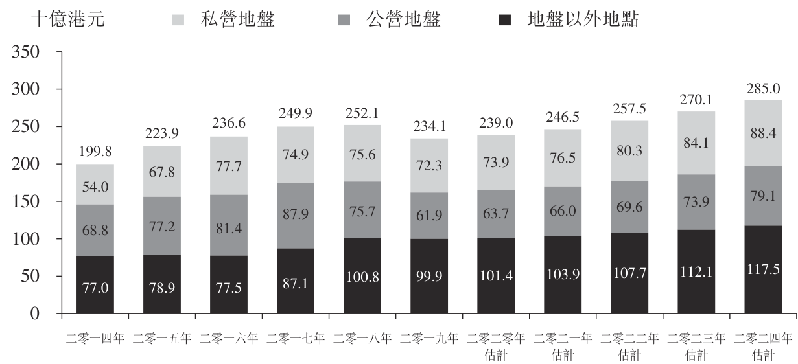

<!-- table html -->
<table><tr><td></td><td>複合年增長率（二零一四年至二零一九年）</td><td>複合年增長率（二零二零年估計至二零二四年估計）</td></tr><tr><td>私營地盤</td><td>6.0%</td><td>4.6%</td></tr><tr><td>公營地盤</td><td>-2.1%</td><td>5.6%</td></tr><tr><td>地盤以外地點</td><td>5.3%</td><td>3.8%</td></tr><tr><td>總計</td><td>3.2%</td><td>4.5%</td></tr></table>
<!-- /table -->

資料來源：香港政府統計處、弗若斯特沙利文

香港私營界別建築支出

過去六年，私營界別佔總建築支出超逾一半。根據建造業議會，私營界別的建築支出由二零一三／一四年的約1,187億港元按複合年增長率4.1%增加至二零一八／一九年的估計約1,450億港元。

<!-- table html -->
<table><tr><td>(於二零一八年九月的價格) (單位：十億港元)</td><td>二零一三／一四年</td><td>二零一四／一五年</td><td>二零一五／一六年</td><td>二零一六／一七年</td><td>二零一七／一八年</td><td>二零一八／一九年估計</td><td>二零一九年估計)</td></tr><tr><td>總計</td><td>225.8</td><td>240.5</td><td>255.2</td><td>261.3</td><td>266.5</td><td>295.0</td><td>5.5%</td></tr><tr><td>私營界別</td><td>118.7</td><td>133.4</td><td>141.2</td><td>135.8</td><td>133.9</td><td>145.0</td><td>4.1%</td></tr><tr><td>建築工程</td><td>50.7</td><td>53.0</td><td>63.1</td><td>63.3</td><td>64.0</td><td>64.0</td><td>4.8%</td></tr><tr><td>裝修及維修工程</td><td>44.1</td><td>53.7</td><td>49.9</td><td>45.3</td><td>43.1</td><td>52.0</td><td>3.4%</td></tr><tr><td>機電工程</td><td>23.9</td><td>26.7</td><td>28.2</td><td>27.2</td><td>26.8</td><td>25.0</td><td>0.9%</td></tr></table>
<!-- /table -->

附註：(i)翻新、保養、改建及加建工程（「裝修及維修工程」）指於地盤以外地點的建築工程，包括一般貿易及特別貿易。一般貿易包括裝飾、保養及維修，及小型工程地點的建築工程（例如地盤考察、拆除、結構改建及加建工程），而特別貿易包括木匠、電力設備、通風、煤氣及水配件等)。(ii)電力及機械工程（「機電工程」）一般包括樓宇設施的設計及價值工程、供應及安裝、能源審計、測試及調試、操作及保養。

資料來源：建造業議會、弗若斯特沙利文

私人住宅單位落成量

自二零一四年起，私人住宅單位落成量的複合年增長率為-2.8%，由二零一四年的15,719個單位減至二零一九年的13,643個單位，因為白石角、將軍澳及何文田多個住宅物業落成。隨著香港中小型私人住宅單位供應量持續，預期私人住宅單位數量將於二零二三年底前達到21,588個單位，於未來四年的複合年增長率為2.3%。

---

## 第 68 页

私人住宅單位落成量(香港)，二零一四年至二零二三年估計

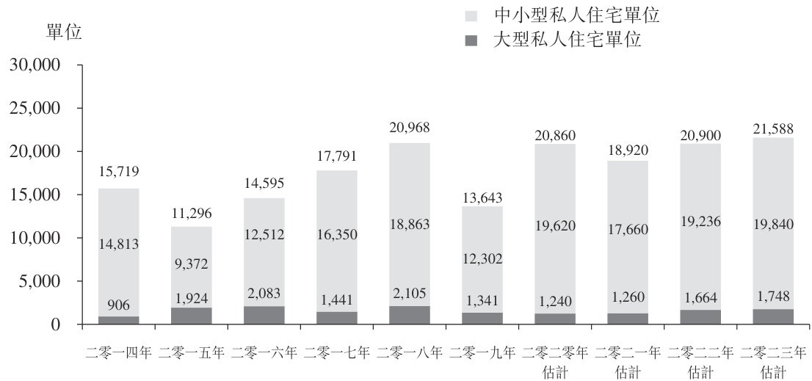

附註：(i)中小型私人住宅單位指實用面積小於100平方米的單位(即A類、B類及C類住宅)，而大型私人住宅單位指實用面積為100平方米及以上的單位(即D類及E類住宅)。(ii)預測私人住宅單位落成量乃根據差餉物業估價署發佈的《香港物業報告2019》及運輸及房屋局於二零一八年九月發佈的《私人住宅一手市場供應統計數據》。(iii)二零二三年錄得的最新可得預測數字。

資料來源：香港差餉物業估價署、運輸及房屋局、弗若斯特沙利文

按私人住宅單位實用面積計算，A類住宅(實用面積小於40平方米)的私人住宅單位落成數量按複合年增長率25.1%顯著上升，由二零一四年的2,160個單位增至二零一九年的6,622個單位。A類住宅大幅增加反映小型住宅物業發展的市場趨勢，以回應香港的房屋需求增加。

按類別劃分的私人住宅單位落成量(香港)，二零一四年至二零一九年

<!-- table html -->
<table><tr><td>(單位=數目)</td><td>二零一四年</td><td>二零一五年</td><td>二零一六年</td><td>二零一七年</td><td>二零一八年</td><td>二零一九年</td><td>二零一九年</td></tr><tr><td>總計</td><td>15,719</td><td>11,296</td><td>14,595</td><td>17,791</td><td>20,968</td><td>13,643</td><td>-2.8%</td></tr><tr><td>A類住宅(實用面積小於40平方米)</td><td>2,160</td><td>2,135</td><td>3,937</td><td>6,891</td><td>7,212</td><td>6,622</td><td>25.1%</td></tr><tr><td>B類住宅(實用面積介乎40平方米至69.9平方米)</td><td>8,446</td><td>5,047</td><td>7,162</td><td>7,665</td><td>8,237</td><td>4,174</td><td>-13.2%</td></tr><tr><td>C類住宅(實用面積介乎70平方米至99.9平方米)</td><td>4,207</td><td>2,190</td><td>1,413</td><td>1,794</td><td>3,414</td><td>1,506</td><td>-4.1%</td></tr><tr><td>D類住宅(實用面積介乎100平方米至159.9平方米)</td><td>666</td><td>1,471</td><td>1,325</td><td>1,058</td><td>1,541</td><td>1,025</td><td>18.3%</td></tr><tr><td>E類住宅(實用面積大於160平方米或以上)</td><td>240</td><td>453</td><td>758</td><td>383</td><td>564</td><td>316</td><td>18.6%</td></tr></table>
<!-- /table -->

資料來源：香港差餉物業估價署、運輸及房屋局、弗若斯特沙利文

香港裝修工程市場概覽

緒言

裝修服務界定為向新樓宇及物業項目提供所需設備及裝置，以使內部空間變得適合佔用的過程。一般而言，裝修服務包括地盤平整工程、間隔工程、鋼鐵及金屬工程、木工、雲石工程、石工、泥水及油漆工程以及樓宇服務(如電力、管道及排水安裝系統)，其後就間隔、地板、天花、電力安裝執行特定內部設計指示，讓新建樓宇及現有樓宇符合環境規定。

於香港，大型項目(如酒店、住宅物業及購物商場)的裝修工程通常由地產發展商及相關總承建商履行。同時，在相對分散的零售市場，亦有大量小型公司向公眾提供裝修服務。大型裝修服務供應商的定位多數為全面綜合解決方案供應商，通常從設計、項目管理、監督及實施階段的角度提供精簡的服務。另一方面，小型公司通常參與個別裝修項目，特別是住宅單位。裝修服務的需求源於建造業，因為裝修服務對起居及工作空間而言屬必要。

---

## 第 69 页

行業概覽

價值鏈分析

香港裝修市場的價值鏈包括上游、中游及下游分部。一般而言，裝修服務供應商定位為中游分部，從設計師取得內部空間的設計圖則並開始向原材料供應商採購所需原材料(例如雲石及花崗石、瓷磚、油漆及輔料)。

除位於價值鏈中游的裝修服務供應商外，亦有多名分包商履行特定工程，例如安裝電力服務及機械服務。完成裝修工程後，竣工工程其後會直接交付給下游市場業者，例如地產發展商、住宅租戶、佔用人、業務實體或政府。

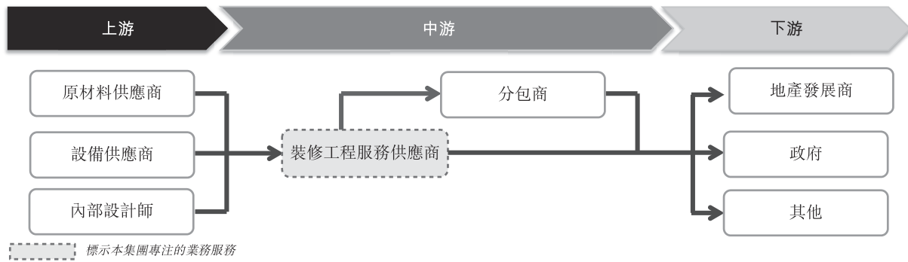

資料來源：弗若斯特沙利文

市場規模

受香港建築市場不斷擴張所帶動，加上土地規劃加快及香港居民的生活水平及要求上升，裝修工程市場總產出價值按複合年增長率約8.8%上升，由二零一四年的約439億港元增至二零一九年的約671億港元。誠如二零一八至二零一九年度財政預算案（「財政預算案」）所述，政府估計未來五年將建設約100,000個公營房屋單位及未來三至四年將供應約97,000個一手私人住宅物業單位。此外，持續城市發展規劃亦將增加香港的住宅單位供應及裝修工程服務需求，預期會刺激裝修工程市場增長，其複合年增長率為約9.0%及將於二零二四年底前達到約995億港元。

裝修工程市場總產出價值(香港)，二零一四年至二零二四年估計

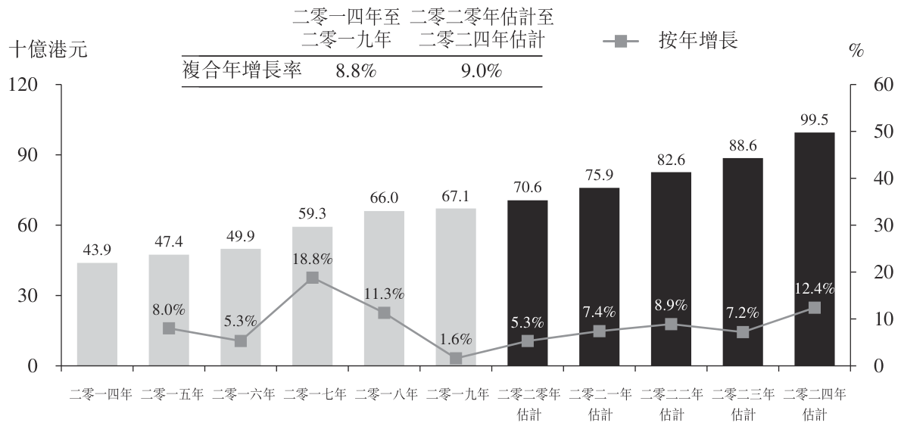

資料來源：弗若斯特沙利文

按分部劃分的市場規模

香港的商業裝修工程主要於私人辦公室及商業場所進行。隨著新商業區的發展(如起動九龍東發展規劃，由觀塘商貿區和九龍灣商貿區組成)及營業辦事處搬遷至港島東區(如鰂魚涌)，商業界別的裝修工程需求增加。於二零一四年至二零一九年，商業界別的裝修工程總產出價值由約225億港元增至二零一九年的約359億港元，複合年增長率為9.8%。此外，近期於二零一九年十一月的商業用地出售(土地位於柯士甸道西九高鐵站上蓋)預料會進一步帶動香港商業界別(如零售店、辦公室及酒店)對裝修工程服

---

## 第 70 页

行業概覽

務的需求。另一方面，預期更多中國企業及跨國企業將於未來數年在香港成立其分辦事處，進一步提高商業界別的裝修工程需求，其將於未來五年按複合年增長率8.4%上升，於二零二四年底前達到約513億港元。

商業裝修工程市場總產出價值(香港)，二零一四年至二零二四年估計

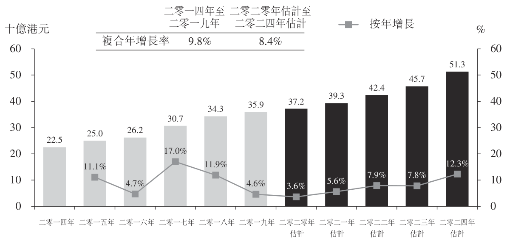

附註：商業分部指零售店、辦公室、酒店、服務式住宅、購物商場及商業會所。

資料來源：弗若斯特沙利文

住宅界別方面，由於何文田、元朗及將軍澳私人住宅樓宇持續落成，總產出價值由二零一四年的約187億港元增至二零一九年的約282億港元，複合年增長率為8.5%。展望未來，香港房屋委員會、差餉物業估價署和運輸及房屋局強調，為增加香港住宅樓宇供應，每年的實際公屋落成量及私人住宅單位落成量將保持不變，未來數年平均將分別約為15,000個單位及20,000個單位。此外，隨著住宅單位供應增加及新界白石角多個豪華物業發展項目落成，住宅界別的裝修工程總產出價值預料按複合年增長率10.4%上升，於二零二四年底前達到約436億港元。

住宅裝修工程市場總產出價值(香港)，二零一四年至二零二四年估計

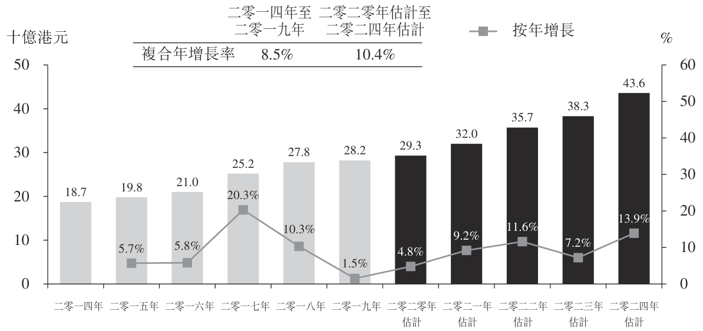

資料來源：弗若斯特沙利文

市場驅動因素及機遇

收入水平及生活水平上升—根據香港政府統計處，本地居民人均總收入於二零一四年的約318,505港元急升至二零一九年的約401,782港元及從事經濟活動的家庭住戶每月入息中位數由二零一四年的27,000港元增至二零一九年的35,500港元，複合年增長率分別為4.8%及5.6%。香港近年經濟發展正面，使香港居民的生活水平上升，特別是中產及現代家庭，其願意額外付款以獲得更佳的居住環境。此外，地產發展商投資住宅物業的內部裝修(如會所)，以提供豪華的居住環境及吸引潛在客戶，最終推動香港裝修工程市場的整體發展。

房屋發展項目持續—香港裝修工程市場與本地建築及物業開發市場的發展有關，而香港裝修行業的未來增長及盈利水平主要視乎建築項目的持續供應。增加房屋供應

---

## 第 71 页

是行政長官2018年施政報告及2019年施政報告（「施政報告」）載列的重點之一，香港政府將持續開發土地資源及推出「土地共享先導計劃」以滿足中短期房屋需求。此外，舊工廈活化計劃將會重啟，向於活化樓宇內將舊工廈改裝作過渡性房屋的業主提供獎勵。政府亦已採取多管齊下的策略，當中土地供應專責小組已識別210多幅潛在土地可作房屋用途，將於未來五至十年為香港提供合共超過380,000個公營及私人住宅單位。此外，香港最大型地產發展商之一新世界發展已於二零一九年九月宣佈計劃向香港政府捐出3百萬平方米農地，以建設公營住宅單位。誠如2019年施政報告所保證，政府將加快租者置其屋計劃下的現有42,000個未售單位的銷售，並投資50億港元，擴大過渡性房屋項目數量，以於未來三年增加房屋單位。連同市區重建局進行的合共75個市區重建項目，以及二零一九年至二零二零年賣地計劃所識別的15幅潛在住宅用地，新建私人住宅單位的持續供應預期符合社會房屋需求，從而帶動香港裝修工程的未來需求。

持續不斷的大型住宅及商業項目—為應付香港的快速城市增長及人口增長，本地地產發展商積極購買香港政府出售的土地，以用於住宅及商業用途。例如，於二零一八年，新鴻基地產贏得政府在啟德的第四塊住宅用地的投標項目，該地塊可發展為建築面積達648,000平方呎的住宅項目，而恒基地產、會德豐、新世界發展及英皇集團亦贏得位於啟德舊機場跑道旁的三個海濱住宅區的投標，以在未來幾年作進一步發展。此外，新鴻基地產於二零一九年中標廣深港高速鐵路香港段西九龍總站一幅商業用地，可提供建築面積約3,164,000平方呎的優質商業空間，並轉化為香港商廈及購物中心的標誌性商業物業。因此，持續不斷的大規模住宅及商業項目最終可能會轉化為潛在的市場機遇，並在未來幾年為裝修項目提供足夠的市場需求。

辦公室物業搬遷一多年來，中環一直是香港的傳統商業及業務中心，根據差餉物業估價署發佈的數字，中環的甲級寫字樓平均月租由二零一四年的每平方米約1,013港元上升至二零一九年的每平方米約1,358港元，複合年增長率為6.0%。租金急升導致多間跨國企業搬遷至其他地區，例如鮑魚涌及觀塘。此外，九龍東的交通及基建支援改善，使該區成為另一個高級核心商業區，從而吸引國際及內地企業於香港設立分辦事處。隨著本地寫字樓及商業空間落成量於過去六年分別按複合年增長率20.8%及15.5%增加，加上新私人寫字樓建設(如尖沙咀的K11 Atelier)及辦事處(如證券及期貨事務監察委員會及其他國際企業)搬遷至鮑魚涌及太古，預料將轉化為裝修服務供應商的潛在市場機遇及有利整體行業發展。

零售界別需求急增一受惠於香港的二零一四年至二零一九年經濟表現向好，多間國際零售品牌於香港擴張業務及多個購物商場已落成。具體而言，兩個地標購物商場於二零一九年落成。西九龍V-Walk於二零一九年七月開幕及尖沙咀文化零售熱點K11Musea於二零一九年八月開幕。該兩個地標購物中心開幕表示零售界別的裝修工程需求急增，特別是K11 Musea重視內部裝修，因為其設計旨在向客戶提供深刻的藝術、文

---

## 第 72 页

化、自然及商業體驗。此外，鑑於用作住宅及商業用途的多個綜合發展項目(如黃竹坑及大圍的物業發展項目)預期落成，零售空間的裝修服務需求預期於日後穩定上升。

老化房屋單位翻新項目的需求增加—根據強制驗樓計劃，樓齡達30年或以上的樓宇(不超過3層高的住宅樓宇除外)的業主須在送達法定通知後，委任一名註冊檢驗人員就樓宇進行訂明檢驗並監督一切需要進行的修葺工程。根據屋企署，就樓宇修葺及樓宇缺陷調查發出的法令數目於二零一四年至二零一九年由每年213項增至每年320項，複合年增長率為8.5%。此外，市區重建局披露，截至二零二六年底將有超過11,000幢樓齡超過70年的私人住屋單位。隨著香港的老舊住宅樓宇數目增加，預期翻新及裝修工程的需求將於未來增加，或會轉化成裝修服務供應商的潛在市場機遇，於日後獲取更多授出項目。

市場趨勢

應用最新資訊科技—應用最新資訊科技可減少人為錯誤，並轉化為香港裝修行業其中一種市場趨勢。為準確及有效地測量複雜建築組件的尺寸及形狀，裝修服務供應商採用3D激光掃描及電子測量，以數碼化3D展示高清的建築物狀況，並識別潛在缺陷。此外，於施工過程整合3D激光掃描及電子測量技術可提高總體施工精度，減少人為錯誤及變更指示，從而避免糾正缺陷的額外費用。

較小型公寓的裝修工程需求上升—房屋價格是一個核心房屋問題，因為香港存在房屋投機需求，而地產發展商把握機會推出小型公寓，以將該等大小的住宅單位定價為首次置業人士的可承擔範圍內。根據差餉物業估價署，實用面積小於40平方米的A類住宅落成量於二零一四年至二零一九年按複合年增長率25.1%增加。因此，預期更多小型公寓業主及租戶會委聘裝修服務供應商，以於公寓內獲得最大生活空間及善用儲物空間。因此，預期香港較小型公寓的裝修工程需求將會增加。

市場挑戰

勞動力老化令成本上漲—勞工成本及材料成本為裝修工程服務供應商的主要開支。根據香港政府統計處，大部分原材料的價格及工人工資於過去六年穩步上揚。具體而言，本地建造業勞動力老化一直為主要問題之一，而對熟練工人的市場需求持續強勁。建造業一般及專門行業均面對熟練工人短缺，其可能導致裝修工程服務供應商為了挽留優秀工人以確保及時交付裝修項目，而令開支增加。因此，聘請足夠工人並維持業務營運在經濟上可行成為裝修工程承建商的市場挑戰之一。

易受政府政策及宏觀經濟狀況影響—香港建造業市場增長與政府政策及宏觀經濟環境息息相關。具體而言，於經濟衰退時，由於財政預算有限，地產發展商及租戶對投放資本資源翻新居住環境及選擇海外進口傢俬及大理石等高端產品方面較為保守。另一方面，市區重建及開發項目以及土地銷售等政府政策可能影響地產發展商可用作建設的土地數量，繼而可能令香港裝修工程需求下降。事實上，根據地政總署，土地銷售面積由二零一四年的約342,600平方米減少至二零一九年的約149,600平方米。因此，過分依賴政府政策及建築工人週期性問題可能對香港裝修工程市場發展造成不利影響。

客戶期望提高—由於家庭住戶收入越來越高，更多人願意投資額外資源尋求更佳居住環境並提升生活水平。裝修服務供應商可能面對客戶要求提高，因為彼等可能偏

---

## 第 73 页

好使用優質建材，為居住環境打造體面美觀的裝潢。此外，由於在香港置業及租住物業成本相對較高，業主對裝修工程質素的要求一般較高。因此，優秀服務供應商需要展示不同技能，例如項目管理及工藝，以符合客戶更為嚴格的要求，於競爭激烈的市場環境中從競爭對手中脫穎而出。

行業競爭激烈—由於有眾多裝修服務供應商，香港裝修工程市場被視為競爭激烈。部分服務供應商可能擁有較悠久的經營歷史、更豐厚的資源、與其他行業持份者更穩固的關係或更知名的品牌名稱。因此，為把握潛在商機及與客戶建立關係，部分市場參與者可能採取更進取的定價策略，可能導致市場價格下行壓力，最終可能對香港裝修市場的整體盈利能力造成負面影響。

近期市場發展

二零一九年底，中國湖北省省會武漢市首先發現新型冠狀病毒流行病(COVID-19)，二零二零年一月二十三日，香港確診首兩宗COVID-19個案。隨著COVID-19感染個案不斷增加，香港政府根據《對公共衛生有重要性的新型傳染病預備及應變計劃》提高緊急事故的響應級別，並已採取若干控制措施限制人口流動，務求防止疫症在社區中廣泛傳播。例如，任何從中國大陸入境的人士必須接受強制隔離14天。由於不少建築工人為中國內地移民，彼等返港後或會被要求遵守這一規例，因此，裝修市場的勞動力供應可能會短暫受到影響。此外，在中國，由於國務院及地方當局已宣佈延長農曆新年假期，若干建築材料的供應(例如石材及木材供應)或會於COVID-19爆發初期在中國暫時中斷。然而，鑑於(i)中國的COVID-19確診個案數目逐漸減少，且COVID-19疫情於二零二零年三月似乎已得到有效控制；(ii)中國部分公司(包括生產及製造企業)已實施分階段復工，部分公司甚至全面恢復生產；及(iii)與其他地區相比，香港的COVID-19確診個案數目相對較低，且康復個案數目一直增加，可見裝修市場的勞動力及原材料供應將不會受COVID-19爆發造成重大影響。此外，香港政府已考慮採取一系列紓緩措施，以減輕企業及個人的財務負擔，鼓勵企業保留員工，尤其是防疫抗疫基金所載向建築公司及工人撥款的兩輪資助計劃，香港裝修市場的前景仍然樂觀，乃由於城市發展規劃有序以及住宅及商業界別的長期殷切需求所致。

成本分析

勞工成本

由於近幾年香港落成的公私營住宅單位，以及私人寫字樓及商用物業均大幅增加，加上有經驗的工人老齡化及退休，香港裝修工程市場的勞工供求日益失衡。根據建造業議會的數據，超過41%的建築工人年滿50歲或以上，預期在未來數年退休。此外，根據香港政府統計處，裝修工程業工人的平均日薪按複合年增長率3.8%由二零一四年每日約1,091.5港元溫和上升至二零一九年每日約1,317.4港元。展望將來，預料香港裝修工程業工人的平均日薪到二零二四年末將達至每日約1,408.9港元，二零二零年至二零二四年的複合年增長率為2.0%，主要由於香港不同建築地盤對不同工種的建築工人有長期需求。

---

## 第 74 页

裝修工程業工人的平均日薪(香港)，二零一四年至二零二四年估計

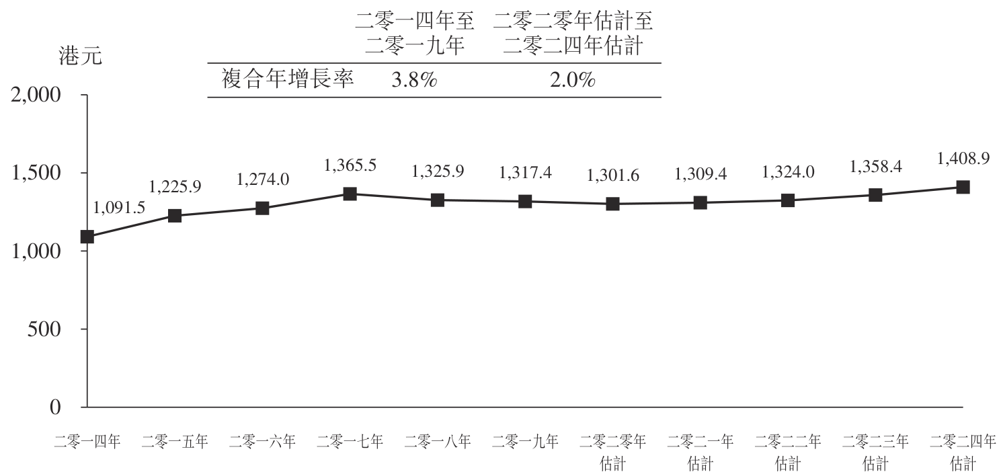

附註：裝修工程工人的平均日薪以木模板工、水電工、泥水工、玻璃工、髹漆及裝飾工、平水工、雲石工、

砌磚工、混凝土工、電氣裝配工、機械裝配工、HVAC技工、砌石工及普通工人的平均工資為基準。資料來源：香港政府統計處，弗若斯特沙利文

原材料成本

香港的材料大部分從中國及海外國家進口，而過去六年由於香港建築業的強勁需求，裝修工程主要材料的平均價格整體上升。在所有材料中，釉面紙皮石的平均價格由二零一四年的約131.2港元上漲至二零一九年的約148.7港元，複合年增長率為2.5%。由於建築項目執行持續上升及內需強勁，預計材料價格將繼續上漲。

裝修工程主要材料的平均價格(香港)，二零一四年至二零二四年估計

<!-- table html -->
<table><tr><td>項目</td><td>單位</td><td>二零一四年</td><td>二零一五年</td><td>二零一六年</td><td>二零一七年</td><td>二零一八年</td><td>二零一九年</td><td>二零二零年估計</td><td>二零二四年估計</td><td>二零一九年)</td><td>二零二零年估計至</td><td>二零二四年估計)</td></tr><tr><td>釉面牆壁瓷磚－純白，108毫米x108毫米</td><td>每100塊港元</td><td>236.3</td><td>233.0</td><td>238.3</td><td>243.0</td><td>243.0</td><td>243.0</td><td>243.5</td><td>246.8</td><td>0.6%</td><td>0.3%</td></tr><tr><td>釉面牆壁瓷磚－純色，200毫米x200毫米</td><td>每100塊港元</td><td>400.0</td><td>431.0</td><td>442.3</td><td>440.0</td><td>440.0</td><td>440.0</td><td>440.5</td><td>464.2</td><td>1.9%</td><td>1.3%</td></tr><tr><td>波特蘭水泥(普通)</td><td>每公噸港元</td><td>720.4</td><td>739.2</td><td>714.7</td><td>699.9</td><td>698.5</td><td>727.8</td><td>733.7</td><td>751.3</td><td>-0.2%</td><td>0.6%</td></tr><tr><td>釉面紙皮石</td><td>每平方米港元</td><td>131.2</td><td>132.8</td><td>139.1</td><td>144.7</td><td>145.0</td><td>148.7</td><td>150.2</td><td>161.1</td><td>2.5%</td><td>1.8%</td></tr><tr><td>玻璃</td><td>每平方米港元</td><td>153.4</td><td>157.0</td><td>157.0</td><td>157.0</td><td>160.5</td><td>161.0</td><td>161.4</td><td>169.2</td><td>1.0%</td><td>1.2%</td></tr><tr><td>地磚</td><td>每平方米港元</td><td>159.8</td><td>160.0</td><td>162.2</td><td>167.7</td><td>174.2</td><td>177.2</td><td>179.3</td><td>189.5</td><td>2.1%</td><td>1.4%</td></tr><tr><td>雜木</td><td>每立方米港元</td><td>5,629.5</td><td>5,707.0</td><td>5,707.0</td><td>5,805.1</td><td>6,177.8</td><td>6,303.0</td><td>6,378.2</td><td>6,864.0</td><td>2.3%</td><td>1.9%</td></tr><tr><td>膠合板</td><td>每平方米港元</td><td>74.8</td><td>75.0</td><td>74.2</td><td>74.3</td><td>76.4</td><td>76.0</td><td>76.2</td><td>79.5</td><td>0.3%</td><td>1.1%</td></tr><tr><td>鋼板</td><td>每公噸港元</td><td>5,676.7</td><td>5,125.7</td><td>4,823.8</td><td>5,380.8</td><td>5,815.4</td><td>6,011.8</td><td>6,042.4</td><td>6,177.2</td><td>1.2%</td><td>0.6%</td></tr><tr><td>雲石</td><td>每公噸港元</td><td>4,660.4</td><td>4,226.3</td><td>4,180.0</td><td>4,145.3</td><td>4,360.7</td><td>5,158.6</td><td>5,175.1</td><td>5,457.1</td><td>2.1%</td><td>1.3%</td></tr><tr><td>塑料層壓板</td><td>每平方米港元</td><td>83.1</td><td>83.9</td><td>85.1</td><td>86.2</td><td>87.1</td><td>88.1</td><td>89.0</td><td>92.6</td><td>1.2%</td><td>1.0%</td></tr><tr><td>防火隔音門</td><td>每塊港元</td><td>4,660.0</td><td>4,700.0</td><td>4,730.0</td><td>4,810.0</td><td>4,930.0</td><td>5,030.0</td><td>5,080.0</td><td>5,360.0</td><td>1.5%</td><td>1.4%</td></tr></table>
<!-- /table -->

附註：防火隔音門的平均價格以進口防火隔音木門及金屬門的平均價格為基準。

資料來源：香港政府統計處、Trade Map、弗若斯特沙利文

香港裝修工程市場的競爭格局

以市場參與者人數計，香港的整體裝修市場被視為相對高度分散及競爭激烈。參考建造業議會於二零一九年十二月的統計數據，香港有729名市場參與者提供裝修服務。根據本集團於截至二零一八年十二月三十一日止年度自裝修項目錄得的收益約759.6百萬港元及二零一八年香港裝修市場的市場規模總額約660億港元，本集團於二零一八年在香港裝修市場排名第三，約佔市場份額1.2%。

---

## 第 75 页

按收益計領先裝修市場參與者的排名及市場份額(香港)，二零一八年

<!-- table html -->
<table><tr><td>排名</td><td>市場參與者</td><td>上市地位</td><td>二零一八年的估計收益 (百萬港元)</td><td>二零一八年的估計市場份額(%)</td></tr><tr><td>1</td><td>公司A</td><td>上市</td><td>1,679.4</td><td>2.5%</td></tr><tr><td>2</td><td>公司B</td><td>上市</td><td>928.0</td><td>1.4%</td></tr><tr><td>3</td><td>本集團</td><td>私人公司</td><td>759.6</td><td>1.2%</td></tr><tr><td>4</td><td>公司C</td><td>上市</td><td>669.8</td><td>1.0%</td></tr><tr><td>5</td><td>公司D</td><td>上市</td><td>557.3</td><td>0.8%</td></tr><tr><td></td><td>小計</td><td></td><td>4,594.1</td><td>7.0%</td></tr><tr><td></td><td>總計</td><td></td><td>66,000.0</td><td>100.0%</td></tr></table>
<!-- /table -->

附註：

公司A為綜合裝修承建商，自一九九六年起於香港及澳門提供住宅物業及酒店項目裝修工程。公司B主要於香港從事物業及建築業務，亦提供室內裝修及樓宇翻新服務。

公司C於一九九五年成立，為香港裝修服務承建商，主要承造新建住宅及商用物業樓宇。

公司D於二零零三年成立，為香港室內裝修解決方案供應商，主要客戶大多位於甲級寫字樓。

資料來源：弗若斯特沙利文

准入門檻

初期資本投資—充足初期資本為各個行業的首要條件。裝修項目通常涉及大額前期成本付款，其需要龐大營運資金及穩健的現金流。因此，沒有足夠資金的新入行業者可能面臨延遲履行項目的後果，最終令聲譽受損。

工作參考例證—具備良好往績的工作參考例證數目為進軍香港裝修工程市場的一大准入門檻。現有市場參與者傾向累積工作參考例證，以向潛在客戶展示，此被視為勝過市場新入行者的競爭優勢，因為市場新入行者需時建立其代表作品。

可持續發展的業務關係—於供應鏈具備穩固業務關係於行內尤其重要，藉此及時交付服務及符合客戶期望。現有市場參與者傾向與建材供應商、建築師、分包商及其他專業人士建立業務關係，以進行項目，此被視為對市場新入行者的一大准入門檻。

市場競爭因素

項目組合及市場聲譽—對香港裝修工程市場來說，過往項目參考例證及市場聲譽為客戶於選擇合適裝修工程服務公司時考慮的主要因素。具備豐富項目組合及經驗的市場參與者較受客戶歡迎，因為在客戶的立場上，卓越往績讓市場參與者得以展示優質服務、項目表現以及市場聲譽。

項目管理—所有項目為本的工作均十分重視優秀項目管理，尤其是裝修工程，當中初期的大規模設計、規劃及採購工作對其後建設工作十分重要。項目管理十分重要，因為其確保成品符合客戶最初預期，與業務策略性目標保持一致。因此，其為客戶於裝修工程市場上尋求的特質之一。

高效成本監控及區分—成本監控為維持及提升盈利能力的重要因素，可讓公司保持競爭力。能夠盡量減低勞工、物流及原材料成本等成本並優化營運靈活性的裝修工程服務供應商有助將項目利潤率提升至最高。除了保持成本合理，能夠為客戶提供增值服務及獨特優勢的公司更能保持領先競爭優勢及挽留更多客戶。

本集團的競爭優勢

有關本集團競爭優勢的詳細討論，請參閱本招股章程「業務—競爭優勢」一段。

---

## 第 76 页

香港監管概覽

本集團從事提供裝修服務。下文概述與本集團營運及業務有關的香港法律及法規的最重要條文。由於此乃概述，因此並未包含與本集團業務有關的香港法律的詳細分析。

《建築物條例》(香港法例第123章)(「建築物條例」)

根據建築物條例，建築事務監督存置三個承建商名冊，即一般建築承建商名冊、專門承建商名冊及小型工程承建商名冊。註冊小型工程承建商可從事屬於彼等已註冊的名冊上指定類別、類型及項目的有關小型工程。

《建築物(小型工程)規例》(香港法例第123N章)(「建築物(小型工程)規例」)

建築物(小型工程)規例為《建築物條例》的附屬法例，訂明規管指定為「小型工程」的建築工程的簡化程序及規定。

根據《建築物(小型工程)規例》，小型工程按其性質、規模、複雜程度及安全風險度，分為三個級別。該等工程按業內工程專業度而進一步細分為不同的類型及項目。

第I級別小型工程相對較複雜，需要具備更豐富的技術經驗及更嚴格的監督，因而需委任一名訂明建築專業人士(如認可人士，須為建築事務監督存置之認可人士名冊內的註冊建築師、工程師及／或測量師；及(倘必要)亦可能包括註冊結構工程師及／或註冊岩土工程師)及一名訂明註冊承建商。另外兩個級別(即第II級別及第III級別)的小型工程可由訂明註冊承建商(其可以是註冊一般建築承建商、根據拆卸工程／地盤平整工程／基礎工程／現場工地勘測工程類別註冊的註冊專門承建商或註冊小型工程承建商)進行，而無須訂明建築專業人士參與。

根據建築物條例第14AA條，有意安排進行工程的人士(例如業主或租客)，可透過遵照建築物(小型工程)規例第6部所載的簡化程序進行第I級別及至第III級別小型工程，而無須事先獲得建築事務監督的批准及同意。

就涉及第I級別及第II級別小型工程項目之項目，必須最遲在展開相關工程前七日，以指明表格，並連同訂明圖則、相關之證明文件及實況照片作開工通知呈交建築事務監督。就只涉及第III級別小型工程之項目，毋須按第I級別及第II級別小型工程項目之要求通知建築事務監督工程展開。

---

## 第 77 页

監管概覽

就涉及第I級別和第II級別小型工程項目之項目，必須在竣工後14日內將經指定建築專業人士及／或指定註冊承建商證明的竣工證書及竣工工程照片提交予建築事務監督。倘竣工工程有別於原始計劃所示者，則亦須提交修訂後計劃。就涉及第III級別小型工程的項目，必須在竣工後14日內將指定格式的通知、竣工工程的計劃或說明以及該處所的「前後」照片提交予建築事務監督。

小型工程承建商須根據《建築物條例》註冊。根據《建築物條例》第8A(1)(c)條，建築事務監督（「建築事務監督」）將存置一份合資格承建屬其所登記的名冊內指定類別、類型及項目的相關小型工程的小型工程承建商名冊。

註冊小型工程承建商(公司)（「註冊小型工程承建商(公司)」）為以公司名義(包括法人、獨資經營和合夥業務)根據建築物(小型工程)規例第10(1)(b)條註冊的小型工程承建商，以承建各類型和類別的小型工程。

根據建築物(小型工程)規例第12(5)條，申請註冊為註冊小型工程承建商(公司)的人士必須在以下方面令建築事務監督信納：

(i) 其主要人員擁有合適的資歷和經驗，包括至少一名董事；

(ii) 能取用工業裝置和資源；

(iii) 其有妥善的管理架構；

(iv) 根據《建築物條例》獲委任以代申請人行事的人士透過相關經驗和對基本法定規定的一般知識，有能力理解申請所涉及的小型工程類型；及

(v) 申請人適宜登記於小型工程承建商名冊。

根據建築物(小型工程)規例第12(6)條，在決定申請人是否適合登記於小型工程承建商名冊時，建築事務監督將考慮以下因素：

(i) 申請人在承建任何建築工程方面是否有任何觸犯香港法例的任何刑事記錄；及

(ii) 是否有針對申請人的任何紀律處分命令。

---

## 第 78 页

監管概覽

在考慮每項註冊小型工程承建商(公司)的註冊申請時，建築事務監督將考慮以下申請人的主要人員的資歷、經驗和適宜程度：

(i) 最少一名獲申請人委任根據《建築物條例》代申請人行事的人士，該人士於本文內稱為獲授權簽署人（「獲授權簽署人」）；及

(ii) 就法團而言—最少一名來自申請人董事會的董事，該人士於本文內稱為技術董事（「技術董事」），並獲其董事會授權：

(A) 能取用工業裝置和資源；

(B) 為小型工程的執行提供技術和財務支援；及

(C) 為該公司作決定，以及監督獲授權簽署人及其他人員以確保工程按《建築物條例》進行。

為釐定申請人是否適宜登記於小型工程承建商名冊，建築事物監督亦考慮該獲授權簽署人及技術董事在承建任何建築工程方面是否有任何觸犯香港法例的任何刑事記錄，以及是否有針對獲授權簽署人的任何紀律處分命令。

任何人士無合理辯解而未能遵守《建築物(小型工程)規例》項下的相關規定開展小型工程，即屬犯罪，一經定罪，可處第5級罰款(現時為50,000港元)。

根據建築物條例第40(2E)條，凡註冊小型工程承建商或註冊專業承建商證明或進行不屬於其註冊類別、類型或項目的小型工程，即屬犯罪，一經定罪，可處(a)第6級罰款(現時為100,000港元)及監禁六個月，及(b)在經證明並令法院信納犯罪行為持續進行期間，每日可處罰款5,000港元。

《電力條例》(香港法例第406章)(「電力條例」)

根據電力條例第2條，「電力工程」指與低壓或高壓固定電力裝置的安裝、檢驗、檢查、測試、維修、改裝或修理有關的工程，包括監督工程、簽發工程證明書、簽發電力裝置設計證明書。

電力條例第34(3)條規定僅有根據該條例向機電工程署(「機電工程署」)登記的註冊電業工程人員(「註冊電業工程人員」)可以從事其註冊證明書所訂明的電力工程。

---

## 第 79 页

根據電力條例第34(1)條，除向機電工程署登記的註冊電業承辦商(「註冊電業承辦商」)外，任何人不得以電業承辦商身分承辦電力工程業務或立約進行電力工程。為了符合資格根據電力條例於機電工程署登記為註冊電業承辦商，公司申請人必須僱用至少一名註冊電業工程人員。

倘若機電工程署署長認為存在證據證明註冊電業工程人員或註冊電業承辦商未有遵守電力條例，其可：(i)譴責工程人員或承辦商，及／或就工程人員及承辦商分別處以最高達1,000港元及10,000港元的罰款；或(ii)將有關事項彙報至環境局局長，由紀律法庭進行聆訊，其可能採取下列一項或多項措施：

(a) 譴責註冊人；

(b) 就工程人員及承辦商分別處以最高達10,000港元及100,000港元的罰款；

(c) 中止或取消註冊人的註冊；

(d) 於指定期間內暫時中止註冊人申請註冊或註冊續期的權利。

《建造業工人註冊條例》(香港法例第583章)(「建造業工人註冊條例」)

建造業工人註冊條例就建造業工人的註冊及有關事項訂定條文。根據《建造業議會條例》(香港法例第587章)成立的建造業議會負責建造業工人的註冊事宜。根據建造業工人註冊條例第3(1)條，除註冊建造業工人外，任何人士不得親自在建築地盤進行建築工程。任何人違反第3條，即屬犯罪，一經定罪，可處第3級罰款(目前為10,000港元)。

此外，根據建造業工人註冊條例第5條，任何人不得僱用未經註冊的建造業工人在建築地盤進行建築工程。任何人違反第5條，即屬犯罪，一經定罪，可處第5級罰款(目前為50,000港元)。

根據建造業工人註冊條例第58(1)及(2)條，建築地盤的主承建商須提供能夠查閱註冊證內儲存的電子數據的儀器。主承建商可向建造業議會申請豁免上述規定。

根據建造業工人註冊條例第58(7)條，建築地盤的主管須：

(a) 設立及備存符合指明格式及載有由該主管或該主管的分包商所僱用並親身於地盤執行建造工作的註冊建造業工人的資料的每日記錄；及

---

## 第 80 页

(b) 按建造業工人註冊主任所指示的方式將：(i)在該工地展開任何建造工作後的7日期間的記錄的文本；及(ii)每段為期7日的接續期間的記錄的副本，在相關期間的最後一日後的兩個營業日內交予建造業工人註冊主任。

註冊專門行業承造商制度

在香港進行建造工程的分包商可根據由建造業議會管理的註冊專門行業承造商制度(由二零一九年四月一日起取代分包商註冊制度)申請註冊，該制度下設有兩個名冊，即註冊專門行業承造商名冊(「註冊專門行業承造商名冊」)及註冊分包商名冊(「註冊分包商名冊」)。

分包商可以在52項工種的其中一項或以上於分包商註冊制度下申請註冊，涵蓋一般結構、土木、終飾及機電工程以及支援服務。52項工種進一步分支為約94個專長項目，包括鋼板樁、打入樁、土方工程、岩土工程及地面勘察等。自二零一九年四月一日起，分包商可以在七種指定行業(包括拆卸、扎鐵、安裝混凝土預製構件、混凝土模板、澆灌混凝土、棚架和玻璃幕牆)的其中一種或以上申請於註冊專門行業承造商名冊中註冊。分包商亦可就其他一般土木、建築、機電行業申請於註冊分包商名冊中註冊。

申請在註冊專門行業承造商制度基本名冊註冊須達到以下門檻要求：

(a) 在過去5年，曾經以總承建商／分包商的身份最少完成一項所申請註冊的工種及專長的工程或申請人／其東主、合夥人或董事曾在過去5年取得類似經驗；

(b) 名列於政策局或香港政府部門營運的與所申請註冊的工種及專長領域相關的一項或多項政府註冊制度之內；

(c) 申請人或其東主、合夥人或董事獲註冊分包商受僱最少5年，具備所申請工種／專長的經驗，並曾修畢建造業議會舉辦的分包商之工程管理訓練課程系列(或同等課程)的全部單元；或

(d) 或申請人或其東主、合夥人或董事就所申請工種／專長，已註冊為建造業工人註冊條例(香港法例第583章)下相關之註冊熟練技工，且具備最少五年所申請工種／專長的經驗，並曾修畢建造業議會舉辦的資深工人之行業管理課程(或同等課程)。

註冊分包商須在註冊期滿前三個月內而註冊專門行業承造商須於其註冊屆滿日期前不早於六個月但不遲於三個月內，按照指定格式向建造業議會遞交申請以申請重續，當中須提供資料及證明文件，以證明符合註冊要求。重續申請須經負責監督註冊專門

---

## 第 81 页

行業承造商制度的註冊專門行業承造商制度委員會批准。如續期作為申請不再符合某些註冊條件，則建造業議會委員會仍可就符合註冊條件的工種及專長項目批准續期。獲批准續期作為註冊分包商的註冊自現有註冊期滿當日起計有效期為三或五年，而獲批准續期的註冊專門行業承造商的註冊自申請續期決定當日後不少於36個月內有效。

註冊分包商須遵行建造業議會訂定的操守守則。操守守則涵蓋註冊分包商須妥當行事的六大範疇：(i)合規(遵守法律及法規)；(ii)誠信；(iii)僱傭；(iv)安全；(v)形象(聲譽)；(vi)環境。違反操守守則可能會導致規管行動，包括(a)發出嚴厲書面指示及／或警告；(b)註冊分包商須呈交一份指定內容的改善計劃；(c)暫停註冊；或(d)吊銷註冊。

《工廠及工業經營條例》(香港法例第59章)(「工廠及工業經營條例」)

工廠及工業經營條例為工業經營的工人提供安全及健康保障。根據工廠及工業經營條例，工業經營的東主(包括當其時管理或控制在該工業經營業務的人，亦包括在任何工業經營的佔用人)有責任在合理切實可行範圍內，盡量確保其在工業經營中僱用的所有人員健康及工作安全。東主責任所擴及的事項包括：

一 設置及保持不會危害安全或健康的廠房及工作系統；

一 作出有關的安排，以確保在使用、搬運、貯存或運載物品及物質方面安全和不致危害健康；

一 提供所有所需的資料、指導、訓練及監督，以確保安全及健康；

一 提供及保持安全途徑進出工作地點；及

一 提供及保持安全及健康的工作環境。

工業經營的東主一旦違反該等職責，即屬犯罪，可處罰款500,000港元。若東主無合理辯解而故意違反該等職責即屬犯罪，可處罰款500,000港元及監禁六個月。

---

## 第 82 页

監管概覽

工廠及工業經營條例的附屬規例(包括香港法例第59I章《建築地盤(安全)規例》)所規管的事項包括(i)禁止僱用18歲以下之人士(若干例外情況除外)；(ii)維修及操作吊重機；(iii)確保工作地方安全的職責；(iv)防止墮下；(v)挖掘安全；(vi)遵守雜項安全規定的職責；及(vii)提供急救設施監管概覽。違反任何該等規例即屬犯罪。凡違反任何上述規則即屬違法及可處以不同程度的罰款，承建商一經裁定觸犯相關罪行，可處以罰款高達200,000港元及監禁最多十二個月。

《鍋爐及壓力容器條例》(香港法例第56章)(「鍋爐及壓力容器條例」)

鍋爐及壓力容器條例規管鍋爐及壓力容器的控制、使用及操作；就研訊有關鍋爐及壓力容器的意外訂定條文及規管鍋爐、壓力容器及蒸汽甑的登記、維護及檢驗，以及對鍋爐、壓力容器及蒸汽甑的使用及操作。

鍋爐及壓力容器條例第24條規定在每件新空氣容器(壓力燃料容器除外)及其配件和附件在投入使用之前須由委任檢驗師予以檢驗。根據鍋爐及壓力容器條例第27條，空氣容器在所獲發的效能良好證明書的日期後26個月內須由委任檢驗師予以檢驗。

根據鍋爐及壓力容器條例第49(8)條，有關的空氣容器、鍋爐或壓力容器的擁有人並無向勞工處就相關空氣容器、鍋爐或壓力容器註冊或並無取得效能良好證明書，循簡易程序定罪可處罰款30,000港元。

《職業安全及健康條例》(香港法例第509章)(「職業安全及健康條例」)

職業安全及健康條例為僱員在工業及非工業工作地點，提供安全及健康的保障。僱主須在合理切實可行範圍內，盡量確保其工作地點的安全及健康：

一 設置及保持不會危害安全或健康的工業裝置及工作系統；

一 作出有關的安排，以確保在使用、搬運、貯存或運載物品或物質方面安全和不致危害健康；

一 對於任何由僱主控制之工作地點：

• 維持安全及不會危害健康的工作地點狀況；及

• 提供及維持安全及不存在該等風險之進出工作地點之途徑；

---

## 第 83 页

監管概覽

一 提供所有所需的資料、指導、訓練及監督，以確保安全及健康；

一 提供及保持安全途徑進出工作地點；及

一 提供及保持安全及健康的工作環境。

僱主如未能遵守上述任何規定，即屬犯罪，一經定罪，可處以罰款200,000港元。任何僱主如蓄意沒有遵從上述規定，明知或罔顧後果地沒有遵從上述規定，即屬犯罪，一經定罪，可處罰款200,000港元及監禁六個月。

勞工處處長可就未能遵從職業安全及健康條例或工廠及工業經營條例發出敦促改善通知書或暫時停工通知書，以防止工作地點的活動對僱員構成即時危險。未能遵從敦促改善通知書或暫時停工通知書的規定，即屬犯罪，可分別處以罰款200,000港元及500,000港元及監禁最多12個月。

《建造業議會條例》(香港法例第587章)(「建造業議會條例」)

根據建造業議會條例第32及33條，在香港進行總值超逾3.0百萬港元的建造工程的承建商，須按相關建造工程價值的0.5%繳納建築業徵費。建造工程包括建築工程；建造、改動、修葺、保養、擴建、拆卸或拆除建築物或構築物、輸電線、電訊器具或管道；供應及裝設在任何建築物或構築物的任何裝配或設備；任何建築物或構築物的外部或內部清潔工作，惟以在該建築物或構築物的建造或保養過程中進行者為限；任何建築物或構築物的任何外部或內部的表面或任何外部或內部的部分的鬆漆或裝飾工作；及構成上述任何工程的一個整體的部分或是為該等工程作準備的任何工程。

《入境條例》(香港法例第115章)(「入境條例」)

入境條例第38A條規定，總承建商或主承建商(並包括次承建商、擁有人、佔用人或其他控制或掌管建築地盤的人)應採取一切切實可行步驟，以(i)防止非法入境者身處地盤內，或(ii)防止不可合法受僱的非法工人接受在該地盤的僱傭工作。如證實(i)非法入境者身處建築地盤內，或(ii)不可合法受僱的非法工人接受在該建築地盤的僱傭工作，而該建築地盤主管未能證明彼已採取一切切實可行步驟以防止有關事件發生，即屬犯罪，可處罰款350,000港元。

---

## 第 84 页

《僱員補償條例》(香港法例第282章)(「僱員補償條例」)

僱員補償條例就工傷設立一項不論過失及毋須供款的僱員補償制度，並訂明僱員於受僱期間因工遭遇意外以致受傷或死亡，或僱員患上指明的職業病時，僱傭雙方的權利和責任。

根據僱員補償條例，倘僱員在受僱期間因工遭遇意外以致受傷或死亡，即使僱員在意外發生時可能犯錯或疏忽，僱主在一般情況下仍須負起補償責任。同樣地，倘僱員因患上職業病而喪失工作能力或死亡，則有權獲得與意外工傷同樣的補償。

僱員補償條例第15條規定，僱主須提交表格2通知勞工處處長任何工作事故(就一般工作事故於14日內及就致命事故於7日內)，不論有關事故會否產生支付賠償責任。倘僱主未有於7日或14日(視乎情況而定)期內知悉該事故或未以其他方式獲悉，則有關通知須於僱主最初獲通知或以其他方式知悉起計不遲於7日或(視乎情況而定)14日發出。

根據僱員補償條例第24條，分包商的僱員於受僱期間因工受傷，總承建商負有責任向該分包商僱員支付補償。然而，總承建商有權向分包商討回其他就此部分應獨立付予受傷僱員的補償。該等受傷僱員須於向該總承建商作出任何索賠或申請之前向總承建商送達書面通知。

根據僱員補償條例第40條，所有僱主(包括承建商及分包商)必須為所有僱員(包括全職及兼職僱員)投取保險單，以承擔根據僱員補償條例及普通法方面就工傷產生的責任。就僱主的責任而言，規定的最低投保額為每宗事故不少於100.0百萬港元(倘有關的保險單有效適用的僱員人數不多於200人)及每宗事故不少於200.0百萬港元(倘有關的保險單有效適用的僱員人數多於200人)。已承擔進行任何建造工作的總承建商，可就其及其分包商的責任投取保險單。該總承建商的最低投保額為每宗事故不少於200.0百萬港元。

僱主如未能遵守僱員補償條例投保，即屬犯罪，一經循公訴程序定罪，可處第6級罰款(目前為100,000港元)及監禁兩年；一經循簡易程序定罪，可處第6級罰款(目前為100,000港元)及監禁一年。

---

## 第 85 页

《強制性公積金計劃條例》(香港法例第485章)(「強積金計劃條例」)

強制性公積金計劃條例規定，僱主須採取所有切實可行的步驟以確保其員工參與強制性公積金計劃（「強積金計劃」），並為年齡介乎18歲至65歲且受僱期為60天或以上的員工作出供款。根據強積金計劃，僱員及僱主均須按僱員每月有關收入的5%為僱員作出強制性供款，惟就供款而言的有關收入水平設有上下限。現時就供款而言的有關收入水平上限為每月30,000港元或每年360,000港元。

行業計劃

鑑於建造業和飲食業屬僱員流動性高的行業，而且當中大部分僱員均為「臨時僱員」，即由僱主按日僱用或僱用期少於60日的僱員，因此在強積金制度下特別設立行業計劃，以供從事這兩個行業的僱主參加。

強積金計劃條例並無規定該兩個行業的僱主必須加入行業計劃。然而，行業計劃讓建造業和飲食業的僱主及僱員免卻繁複程序，因臨時僱員如在該兩個行業內轉職，只要其前僱主和新僱主均參加同一個行業計劃，僱員便無須在轉職時轉換計劃，輕鬆簡單，並可減省所涉及的行政費用。

就行業計劃而言，建造業涵蓋下列八大類別：

1. 地基及有關工程；

2. 土建及有關工程；

3. 拆卸及結構更改工程；

4. 修葺及維修保養工程；

5. 樓宇結構工程；

6. 消防、機電及有關工程；

7. 氣體、水務及有關工程；以及

8. 室內裝飾工程。

---

## 第 86 页

《僱傭條例》(香港法例第57章)(「僱傭條例」)

總承建商及前判分包商須受僱傭條例內有關分包商僱員工資的條文規管。僱傭條例第43C條規定，如有任何工資到期支付予受僱於分包商的僱員以從事已由分包商立約進行的工作，而該工資未於僱傭條例所指明的期間內支付，則該工資須由總承建商及／或每一名前判分包商共同及個別負責支付給該僱員。總承建商及／或前判分包商(如適用)的法律責任僅限於：(a)僱員的工資，而該僱員的受僱完全是與總承建商已立約進行的工作有關，且受僱地點完全在建築工程所在地盤內；及(b)該僱員到期應得的兩個月工資，而此兩個月須為該僱員到期應得工資的該段期間的首兩個月。

根據僱傭條例第43D條，任何與分包商存在尚未結算的工資付款的僱員必須在工資到期後60日內向總承建商送達有關書面通知。如分包商僱員未能向總承建商送達通知，則總承建商及前判分包商(倘適用)概無責任向分包商的該僱員支付任何工資。總承建商自相關僱員收到該通知後，應於收到通知後14日內，向其所知悉的該名次承建商的每位前判分包商(倘適用)送達一份通知副本。總承建商若無合理辯解，未能將通知送達至前判分包商，即屬犯罪，一經定罪可處第5級罰款(現時為50,000港元)。

根據僱傭條例第43F條，倘總承建商或前判分包商根據僱傭條例第43C條向僱員支付任何工資，則所支付工資即為該僱員的僱主欠下總承建商或前判分包商(視情況而定)的債務。

該總承建商或前判分包商可(1)向該僱員所事僱主的每名前判分包商，或總承建商及其他每名前判分包商(視情況而定)追討，要求分擔該等工資，或(2)就其已轉判工程而言，從到期支付或可能到期支付予該名分包商的任何款項中扣除，以抵銷已付款項。

《最低工資條例》(香港法例第608章)(「最低工資條例」)

最低工資條例為所有在僱傭條例下受僱傭合約委聘的僱員訂立於工資期內每小時規定最低工資(現訂為每小時37.5港元)。任何僱傭合約的條款，如有終止或減少最低工資條例所賦予僱員的權利、利益或保障的含意，即屬無效。如僱主蓄意及並無合理辯解下到期時未能支付最低工資，彼可能根據僱傭條例第23、24及／或63C節遭到檢控，一經定罪，處以罰款350,000港元及監禁3年。

---

## 第 87 页

《佔用人法律責任條例》(香港法例第314章)(「佔用人法律責任條例」)

佔用人法律責任條例規定佔用或控制處所的人士對合法在該土地上的人士或物品或其他財產造成傷害或損害所承擔的責任。

根據佔用人法律責任條例，處所佔用人士具有一般謹慎責任，在所有情況下採取屬合理謹慎措施的責任，以確保訪客就其獲佔用人士邀請或准許到處所之目的而使用該處所乃屬合理地安全。

《空氣污染管制條例》(香港法例第311章)(「空氣污染管制條例」)

空氣污染管制條例為管制建築、工業及商業活動以及其他污染源所產生的空氣污染物及有害氣體排放。承建商須遵從及遵守空氣污染管制條例及其附屬規例，尤其是《空氣污染管制(露天焚燒)規例》、《空氣污染管制(建造工程塵埃)規例》、《空氣污染管制(煙霧)規例》及《空氣污染管制(非道路移動機械)(排放)規例》。空氣污染管制條例中石棉管制條文規定，涉及石棉的建築工程必須由註冊石棉承建商及在註冊顧問的監督下進行。

《噪音管制條例》(香港法例第400章)(「噪音管制條例」)

噪音管制條例管制建築、工業及商業活動所產生的噪音。承建商進行建築工程時須遵守噪音管制條例及其附屬規例。就於限制時段進行的建築活動及於所有時間將進行的撞擊式打樁工程而言，須預先得到環境保護署的建築噪音許證。

《水污染管制條例》(香港法例第358章)(「水污染管制條例」)

水污染管制條例管制由所有種類的工業、商業、機構及建築活動產生的流出物排放至公共污水渠及公共排水渠。除住宅污水或排放至公用污水渠或公用排水渠的未經污染水外，所有污水排放必須持有污水排放牌照。此牌照列明獲准排放污水的物質、化學及微生物質量，一般指引則確保所排放的污水不會損壞水渠或污染內陸或近岸海水。

---

## 第 88 页

《廢物處置條例》(香港法例第354章)(「廢物處置條例」)

廢物處置條例管制廢物的產生、貯存、收集、處理、回收和處置。目前禽畜糞便及化學廢物須受到特別管制，而非法處置廢物亦被禁止。輸入及輸出廢物一般透過許可系統管制。

承建商須遵從及遵守廢物處置條例及其附屬規例，特別是《廢物處置(指定廢物處置設施)規例》及《廢物處置(建築廢物處置收費)規例》。現時建築廢料可於(a)堆填區；(b)離島廢物轉運設施；(c)篩選分類設施；及(d)公眾填料接收設施接受處置，視乎建築廢物的物質而定。送交有關建築廢物的人士或由他人代為將有關廢物送交的人士必須為環境保護署署長下有效繳費賬戶的賬戶戶主。處置建築廢物按其重量收費。

《公眾衛生及市政條例》(香港法例第132章)(「公眾衛生及市政條例」)

正在建造或拆除的建築物散播的灰塵倘足以構成妨礙，可根據公共衛生及市政條例提出起訴。一經定罪，最高罰款10,000港元及每日罰款200港元。

此外，任何處所的任何積水被發現含有蚊幼蟲或蚊蛹，可根據公眾衛生及市政條例，提出起訴。一經定罪，最高罰款25,000港元及每日罰款450港元。任何積聚廢棄物倘構成妨擾或損害健康，可根據公眾衛生及市政條例提出起訴。一經定罪，最高罰款10,000港元及每日罰款200港元。

《建造業付款保障條例》(「付款保障條例」)

香港政府已就建議引入付款保障條例諮詢公眾的意見，以處理不公平付款條款、拖延付款及爭議。新條例意在提高付款實踐及快速解決建造業爭議。

根據付款保障條例諮詢文件，付款保障條例於生效時將應用於涉及香港建造工程或向香港工程供應廠房及材料的全部書面及口頭合約。條例涵蓋香港政府及指定法定及／或公共機構及企業的所有建造合約，而有關「新建築物」（定義見建築物條例）且初始價值超過5.0百萬港元的其他建造合約及初始價值超過0.5百萬港元的顧問及供應合約將獲該條例涵蓋。倘付款保障條例適用於主合約，其將自動地應用於該合約鏈中的全部分包合約。

---

## 第 89 页

監管概覽

根據付款保障條例諮詢文件，付款保障條例將納入以下主要責任、權利及限制：

付款保障條例將禁止合約中制定「先收款，後付款」及類似條款。付款人在爭端解決會議中將不得倚賴該等條例。

付款保障條例將規定中期付款的付款期限不得超出60個公曆日或最後一期付款的付款期限不得超出120個公曆日。

付款保障條例將規定能夠根據法定付款賠償就建造工程或材料或廠房供應索取到期款項，付款方接獲索取後有30個公曆日作出付款回應，且任何一方均有法定權利就相關事宜提請仲裁(一般過程為60日)。

付款保障條例將賦予未收到到期款項的一方暫停工程或放緩工程進度的權利，直至獲付款項。

---

## 第 90 页

我們的業務歷史

我們的歷史可追溯至二零零四年，當時我們的董事會主席、行政總裁兼執行董事吳先生向獨立第三方林英女士（「林女士」）收購創基工程99.8%的股權，而林女士及李健強先生（「李先生」）（亦為獨立第三方）則分別持有餘下權益的0.1%及0.1%。於多次股份配發及轉讓後，自二零一六年十一月七日起直至緊接重組前為止，吳先生本人及透過創基集團控股持有創基工程的全部已發行股本。

最初，我們提供小型住宅及商業裝修服務以及維修及保養服務。隨著服務得到認可，我們結識了香港的主要地產發展商，並開始為其物業項目提供裝修服務。

多年來，我們為香港具規模的地產發展商的多個重要物業項目提供裝修工程，擴大我們的業務規模，在香港裝修業界內樹立信譽。根據弗若斯特沙利文報告，按二零一八年的收益計，本集團在香港裝修承建商市場中名列第三位，市場份額約佔1.2%。

主要業務里程碑

下表概述本集團歷史上的主要里程碑及成就：

二零零四年 創基工程在香港註冊成立

二零零五年 我們成為香港註冊電業承辦商

二零零七年 我們獲頒ISO 9001(品質管理系統)認證

二零零八年 • 我們成為香港註冊分包商

我們獲授一份馬灣商業項目合約，合約金額超過4.0百萬港元

二零一零年 我們成為香港註冊小型工程承建商

二零一四年 • 我們獲授一份油塘住宅項目合約，合約金額超過40.0百萬港元

我們獲授一份中環商業項目合約，合約金額超過60.0百萬港元

二零一五年 • 我們獲授一份清水灣住宅項目合約，合約金額超過100.0百萬港元

我們獲授一份掃管笏住宅項目合約，合約金額超過140.0百萬港元

---

## 第 91 页

歷史、發展及重組

二零一六年 我們獲授一份與P6有關的合約，合約金額超過200.0百萬港元(項目參考編號與本招股章程中「業務—項目—裝修項目—竣工項目」一段披露的表格對應)

二零一七年 • 我們獲得香港Q嘗服務認證

我們獲Mediazone頒授二零一八年度香港最有價值企業大獎（卓越獎）

二零一九年
• 我們獲香港專業驗樓學會頒授二零一八年度建造及裝修業優秀大獎(表揚與新世界集團進行的兩個住宅項目傲瀧及臻裁的門及相關安裝服務)

我們獲一家總部設於廣東省的中國領先地產發展商授予其位於屯門的住宅項目的合約，合約金額超過300.0百萬港元

我們的企業歷史

本公司

本公司於二零一九年七月十一日在開曼群島註冊成立為有限公司。本公司於二零一九年十二月九日成為本集團的控股公司。有關重組的詳情載於本節「重組」一段。

創基工程

創基工程於二零零四年一月五日在香港註冊成立為有限公司，法定股本為10,000港元，分為10,000股每股面值1.00港元的股份。創基工程為本集團的唯一營運附屬公司，目前主要從事提供裝修服務以及維修及保養服務。

創基工程於其註冊成立當日最初由公司服務供應商昌維有限公司及星彩發展有限公司各自擁有一股股份。於二零零四年一月二十八日，創基工程向林女士配發及發行998股股份。於二零零四年二月二日，昌維有限公司及星彩發展有限公司各自以代價每股1.00港元將其各自在創基工程的一股股份轉讓予林女士及李先生。

---

## 第 92 页

於二零零四年十一月二十六日，林女士以名義代價每股1.00港元將其在創基工程的998股股份轉讓予吳先生，而吳先生及林女士認為此交易屬公平合理，因創基工程當時仍在營運初期，並無重大資產或溢利。於二零零六年十月三十一日，李先生以名義代價1.00港元將其在創基工程的一股股份轉讓予林女士。於有關轉讓完成後，創基工程由下列人士擁有權益：

<!-- table html -->
<table><tr><td>股東</td><td>股份數目</td><td>百分比</td></tr><tr><td>吳先生</td><td>998</td><td>99.8%</td></tr><tr><td>林女士</td><td>2</td><td>0.2%</td></tr><tr><td>總計</td><td>1,000</td><td>100.0%</td></tr></table>
<!-- /table -->

於二零一一年七月五日，創基工程的法定股本由10,000港元增加至1,000,000港元，分為1,000,000股每股面值1.00港元的股份。同日，創基工程向創基集團控股配發及發行999,000股股份。

於二零一一年八月二十四日，創基工程的法定股本由1,000,000港元增加至2,500,000港元，分為2,500,000股每股面值1.00港元的股份。同日，創基工程向創基集團控股配發及發行1,500,000股股份。

於二零一六年十一月七日，林女士以名義代價每股1.00港元轉讓其於創基工程的兩股股份(佔創基工程全部已發行股本0.00008%)予吳先生。鑑於兩股相關股份總值為約50.6港元(參考創基工程於二零一六年九月的資產淨值約63.2百萬港元)，吳先生及林女士均認為此金額微不足道，因此兩人均同意將兩股相關股份的轉讓價定為名義代價每股1.00港元。自有關轉讓完成起直至緊接重組前為止，創基工程由下列各方擁有權益：

<!-- table html -->
<table><tr><td>股東</td><td>股份數目</td><td>百分比</td></tr><tr><td>創基集團控股^(附註)</td><td>2,499,000</td><td>99.96%</td></tr><tr><td>吳先生</td><td>1,000</td><td>0.04%</td></tr><tr><td>總計</td><td>2,500,000</td><td>100.0%</td></tr></table>
<!-- /table -->

附註：投資控股公司創基集團控股自二零一六年十一月七日起由吳先生全資擁有。

---

## 第 93 页

林女士為吳先生的前同事，當時彼等於新盈設計工程有限公司任職。彼從二零零四年一月開始擔任創基工程的董事，負責監督創基工程的行政事務，直至彼於二零一六年十一月將其於創基工程的全部股權轉讓予吳先生為止。據董事所深知，於往績期間及於最後可行日期，除本段所披露者外，林女士與本集團、股東、董事及高級管理層或任何彼等各自的聯繫人於過往或現在並無其他關係(不論業務或其他)、交易或安排。

重組

下圖載列本集團於緊接重組前的股權及企業架構：

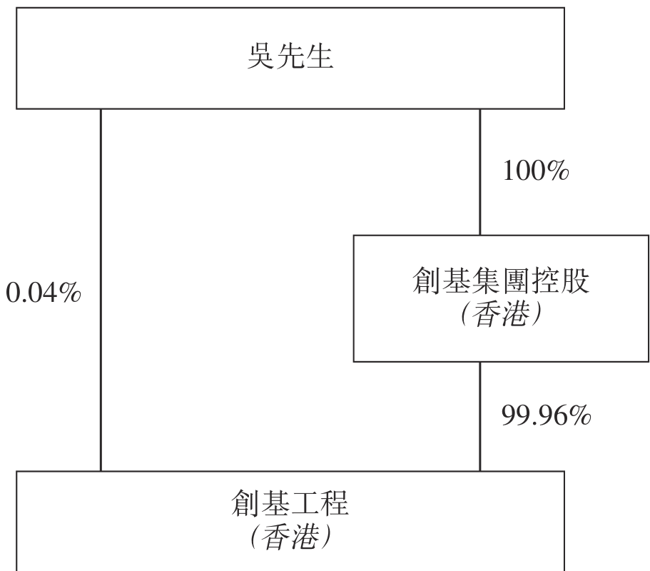

為籌備上市，本集團進行重組，當中涉及以下步驟：

我們的控股公司、本公司及我們的英屬維爾京群島投資控股附屬公司註冊成立

Fate Investment

Fate Investment於二零一九年七月十日根據英屬維爾京群島法律註冊成立為有限公司，並獲授權發行最多50,000股無面值的股份。於二零一九年七月十日，一股Fate Investment繳足股款股份(相當於Fate Investment的全部已發行股份)配發及發行予吳先生。因此，Fate Investment於其註冊成立後由吳先生全資擁有。

---

## 第 94 页

本公司

本公司於二零一九年七月十一日根據開曼群島法律註冊成立為獲豁免有限公司。本公司的初步法定股本為380,000港元，分為38,000,000股每股面值0.01港元的股份。於本公司註冊成立後，一股股份以繳足股款的方式按面值配發及發行予初始認購人(為獨立第三方)。同日，該股份轉讓予Fate Investment，並以繳足股款的方式按面值配發及發行額外99股股份予Fate Investment。因此，本公司成為Fate Investment的直接全資附屬公司。於二零一九年十一月，本公司的名稱由環球管理有限公司更改為德合管理有限公司。於二零一九年十二月，本公司的名稱由德合管理有限公司更改為德合集團控股有限公司。

Team World

Team World於二零一九年七月十二日根據英屬維爾京群島法律註冊成立為有限公司，並獲授權發行最多50,000股無面值的股份。於二零一九年七月十二日，一股Team World繳足股款股份(相當於Team World的全部已發行股份)配發及發行予本公司。因此，Team World成為本公司的直接全資附屬公司。

將吳先生及創基集團控股在創基工程的全部股權轉讓予Team World

於二零一九年十二月九日，吳先生與創基集團控股、Team World及本公司訂立創基工程買賣協議，據此，(i)吳先生及創基集團控股各自同意轉讓其各自在創基工程的1,000股及2,499,000股股份(合共相當於創基工程的全部已發行股本)予Team World，代價為本公司按吳先生及創基集團控股的指示向Fate Investment配發及發行10,000股股份，全部入賬列作繳足。

於創基工程買賣協議完成後，本公司成為本集團的控股公司。

---

## 第 95 页

下圖載列本集團於緊隨重組後但於股份發售及資本化發行前的企業架構及股權架構：

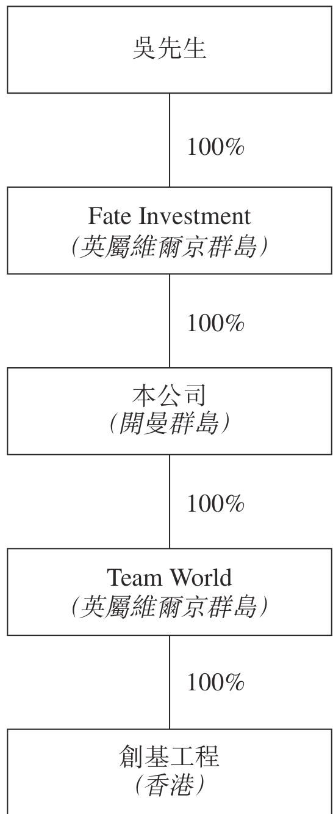

增加法定股本

於二零二零年六月十六日，本公司透過增設1,962,000,000股每股面值0.01港元的股份，將其法定股本由380,000港元（分為38,000,000股每股面值0.01港元的股份）增加至20,000,000港元（分為2,000,000,000股每股面值0.01港元的股份）。

資本化發行

待本公司股份溢價賬因股份發售所得款項錄得進賬後，股份溢價賬中5,999,899港元將撥充資本並用作按面值悉數繳足599,989,900股新股份，以供配發及發行予當時的現有股東Fate Investment，因此於緊隨股份發售及資本化發行(並無計及因超額配股權及根據購股權計劃可能授出的任何購股權獲行使而可能發行的任何股份)完成後，已配發及發行的股份數目連同Fate Investment已擁有的股份數目將構成本公司經擴大已發行股本的75%。

---

## 第 96 页

下圖載列本集團於緊隨股份發售及資本化發行(並無計及因超額配股權及根據購股權計劃可能授出的任何購股權獲行使而可能發行的股份)後的企業架構及股權架構：

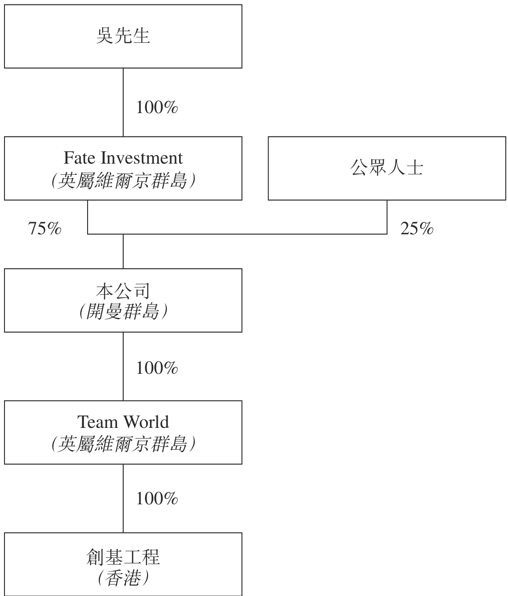

---

## 第 97 页

概覽

我們是香港一家具規模的承建商，擁有逾15年營運歷史，提供裝修服務以及維修及保養服務。裝修服務主要涵蓋於新樓宇及物業項目進行的天花、地板、牆壁、照明、玻璃、金屬、木工、石工及泥水工程。我們亦採購及安裝按客戶規格定制的門、家具及配件，以作為裝修服務的一部分。維修及保養服務主要涵蓋對現有物業進行內部裝潢部件升級、修復及改善及維修、替換或安裝。下表列載我們於往績期間按業務分部劃分的收益明細：

截至十二月三十一日止年度

<!-- table html -->
<table><tr><td></td><td colspan="6">截至十二月三十一日止年度</td></tr><tr><td></td><td colspan="2">二零一七年</td><td colspan="2">二零一八年</td><td colspan="2">二零一九年</td></tr><tr><td></td><td>千港元</td><td>%</td><td>千港元</td><td>%</td><td>千港元</td><td>%</td></tr><tr><td>裝修服務</td><td>546,296</td><td>98.8</td><td>759,587</td><td>98.9</td><td>874,477</td><td>99.4</td></tr><tr><td>維修及保養服務</td><td>6,356</td><td>1.2</td><td>8,558</td><td>1.1</td><td>4,924</td><td>0.6</td></tr><tr><td>總計</td><td>552,652</td><td>100.0</td><td>768,145</td><td>100.0</td><td>879,401</td><td>100.0</td></tr></table>
<!-- /table -->

根據弗若斯特沙利文報告，按收益計算，我們於二零一八年在香港裝修承建商市場中排行第三，市場份額約為1.2%。我們已為香港具規模的地產發展商的多個重要物業項目提供服務，包括海璇匯、日出康城第四期、雲滙、維港文化匯、柏蔚山、傲瀧及朗屏8號。於往績期間及直至最後可行日期，我們已完成20個裝修項目，合約總額合計約為1,093.5百萬港元。於最後可行日期，我們合共有39個手頭裝修項目，包括已動工惟尚未完成的裝修項目及已授予我們但尚未動工的裝修項目，合約總額合計為2,932.6百萬港元。該等手頭項目中，21個項目的合約總額為50.0百萬港元或以上。該21個項目的合約總額合計約為2,566.4百萬港元。

我們採用有系統的管理及營運方針，此能讓我們確保服務質素的一致性。我們亦維持全面的資料數據庫，此能讓我們有效管理成本及利潤，並對客戶的方案提供見解及改良。更多詳情請參閱本節「競爭優勢—我們有能力透過採納有系統的管理及營運方針確保工程質量穩定及有效管理成本及利潤率，並透過維持全面的資料數據庫，對客戶的方案提供見解及改良」及「本集團提供的服務」各段。

---

## 第 98 页

業務

我們向供應商採購按客戶規格定制的裝修原材料及門、家具及配件。有關採購安排的更多詳情，請參閱本節「採購」一段。

我們可能將部分安裝或其他技術工程委託予分包商，但我們確保現場項目團隊包含進行部分工程的直屬技工，以向分包商展示就餘下工程須採納的規定工作標準。有關分包安排的更多詳情，請參閱「分包」一段。

於往績期間，我們專注於按個別項目基準為香港住宅及商業物業提供裝修服務以及維修及保養服務。下表列載我們於往績期間按物業類別劃分的收益明細：

截至十二月三十一日止年度

<!-- table html -->
<table><tr><td></td><td colspan="2">二零一七年</td><td colspan="2">二零一八年</td><td colspan="2">二零一九年</td></tr><tr><td></td><td>千港元</td><td>%</td><td>千港元</td><td>%</td><td>千港元</td><td>%</td></tr><tr><td>住宅</td><td>436,470</td><td>79.0</td><td>449,108</td><td>58.5</td><td>567,283</td><td>64.5</td></tr><tr><td>商業(附註)</td><td>116,182</td><td>21.0</td><td>319,037</td><td>41.5</td><td>312,118</td><td>35.5</td></tr><tr><td>總計</td><td>552,652</td><td>100.0</td><td>768,145</td><td>100.0</td><td>879,401</td><td>100.0</td></tr></table>
<!-- /table -->

附註：「商業」類別主要包括零售店、辦公室、購物商場、商業會所、酒店及服務式住宅。

於往績期間，我們的客戶來自私營界別及主要包括地產發展商及承建商。當我們獲地產發展商挑選為其裝修承建商，我們通常與其或其附屬公司訂立合約。我們亦可能獲地產發展商指名為其物業項目的指定裝修承建商，並與該等項目的承建商訂立合約。我們有時直接獲承建商委聘。下表列載我們於往績期間按客戶類別劃分的收益明細：

截至十二月三十一日止年度

<!-- table html -->
<table><tr><td></td><td colspan="2">二零一七年</td><td colspan="2">二零一八年</td><td colspan="2">二零一九年</td></tr><tr><td></td><td>千港元</td><td>%</td><td>千港元</td><td>%</td><td>千港元</td><td>%</td></tr><tr><td>地產發展商(附註1)</td><td>353,380</td><td>63.9</td><td>508,921</td><td>66.3</td><td>543,925</td><td>61.9</td></tr><tr><td>承建商(附註2)</td><td>193,821</td><td>35.1</td><td>252,099</td><td>32.8</td><td>320,006</td><td>36.4</td></tr><tr><td>其他(附註3)</td><td>5,451</td><td>1.0</td><td>7,125</td><td>0.9</td><td>15,470</td><td>1.7</td></tr><tr><td>總計</td><td>552,652</td><td>100.0</td><td>768,145</td><td>100.0</td><td>879,401</td><td>100.0</td></tr></table>
<!-- /table -->

---

## 第 99 页

業務

附註：

1. 「地產發展商」類別包括地產發展商及其附屬公司。

2. 「承建商」類別包括直接委聘我們的承建商及我們獲地產發展商指名為指定裝修承建商時與其訂立合約的承建商。

3. 「其他」類別包括物業業主及租戶。

競爭優勢

董事認為本集團擁有以下競爭優勢：

我們是香港一家具規模的承建商，有能力提供合乎成本效益的裝修服務，並與本地及中國地產發展商保持友好關係，此可能為我們帶來潛在商機

我們是香港一家具規模的承建商，並擁有逾15年營運歷史。董事相信，本集團其中一項競爭優勢是能夠提供合乎成本效益的裝修服務，而我們已為香港具規模的地產發展商的多個重要物業項目提供服務，包括海璇匯、日出康城第四期、雲滙、維港文化匯、柏蔚山、傲瀧及朗屏8號。

於往績期間，我們接獲大量招標邀請，證明我們的管理層(包括吳先生)及業務發展人員與本地及中國知名地產發展商保持友好關係。截至二零一七年、二零一八年及二零一九年十二月三十一日止年度，我們分別接獲165、220及210項招標邀請。董事相信，來自新舊客戶的大量招標邀請顯示於往績期間我們的服務有殷切需求，此主要歸功於我們在裝修行業提供優質工程的聲譽。於往績期間，我們能夠從新客戶取得合約，例如於二零一九年從一家總部設於廣東省的領先中國地產發展商獲得一份屯門住宅項目合約，合約金額超過300.0百萬港元。

我們有能力透過採納有系統的管理及營運方針確保工程質量穩定及有效管理成本及利潤率，並透過維持全面的資料數據庫，對客戶的方案提供見解及改良

我們採用有系統的管理及營運方針。

根據弗若斯特沙利文報告，承建商依靠項目經理以控制項目進度和質量以及監督分包商實屬行業常規。我們的競爭對手可能在很大程度上依靠其項目經理的經驗或專門知識以監督項目管理。然而，鑑於不同項目一般由不同項目經理監督，並為確保服務質素一致，我們已制定一套客觀的質量控制系統，涵蓋從管理層的過往經驗及專有

---

## 第 100 页

業務

技術得出的各項檢查清單及政策，並由項目經理執行，以評估及控制項目進度和質量。這樣有系統的方針讓本集團不必依靠個別項目經理的能力、經驗或主觀判斷也能達致理想質量。

根據弗若斯特沙利文報告，承建商一般會委聘分包商以進行項目交付實屬行業常規。我們亦不會如競爭對手般可能在很大程度上依靠其分包商完成工程，因為我們確保現場項目團隊包含進行部分工程的直屬技工，以向分包商展示就餘下工程須採納的規定工作標準，從而確保我們所提供服務的質量穩定。

此外，我們維持全面資訊數據庫以儲存我們從過往項目收集的統計資料及數據，讓員工不時參考，以對項目成本進行更準確的估算並加上適當利潤率。本集團能根據資料數據庫對客戶的方案提供見解及改良，此舉使我們與競爭對手有所區別，其或只會按客戶提供的設計或實際圖則施工。

董事認為有系統的方針及資訊數據庫讓我們可確保服務的質量穩定及輕易獲得以經驗為本的行業知識及訣竅，進而可能加強競爭優勢。

此外，於最後可行日期，我們的管理系統獲ISO 9001:2015認證。董事認為，該認證顯示我們有系統的管理系統的健全有效，旨在提高客戶對我們服務的信心。

我們利用最新技術協助業務營運，從而提升工作效率

根據弗若斯特沙利文報告，儘管裝修業通常被視為傳統行業，但利用最新資訊科技可減少人為失誤，而此舉已成為香港裝修行業的其中一個市場趨勢。為保持我們的競爭優勢，我們利用最新技術協助業務營運。具體而言，我們使用三維鎳射掃描及電子計量技術，以更準繩和合乎成本效益的方式進行工程，務求盡量減少人為失誤及避免產生修補缺陷的額外成本。

我們與主要客戶、供應商及分包商維持穩定業務關係

憑藉超過15年的營運歷史，我們與主要客戶建立了穩定業務關係，其中包括與若干香港知名地產發展商的長期工作關係。於最後可行日期，我們與五大客戶已維持一至15年的業務關係。特別是，我們自二零零四年以來一直為新鴻基集團服務，且自二零零九年以來一直是新鴻基集團的認可承建商。我們亦自二零一二年起一直為新世界集團服務。我們經常接獲邀請為裝修項目投標，並且不時獲地產發展商挑選或指名為

---

## 第 101 页

業務

其物業項目提供裝修工程。於往績期間的各年度，我們有19名、10名及11名回頭客戶，該等客戶於截至二零一七年、二零一八年及二零一九年十二月三十一日止年度合共為本集團貢獻分別約95.7%、98.0%及93.8%的收益。

我們與供應商及分包商建立了穩定業務關係。於最後可行日期，我們的內部認可供應商及分包商清單有超過168名供應商及分包商，而我們與五大供應商及五大分包商合作分別超過一至13年及一至十年。我們致力維持向分包商提供充足支援，要求彼等遵循分包商指引及檢查清單，以確保彼等能達致所需的工作標準。我們確保現場項目團隊包含進行部分工程的直屬技工，以向分包商展示就餘下工程須採納的規定工作標準，及制定技術問題的解決方案(如有需要)，之後才將餘下工程委託予分包商。我們不時與供應商及分包商溝通及協調，以了解彼等遇到的問題及即時提供支援。董事認為保持定期溝通及充分支援的做法使我們與競爭對手有所區分、協助我們與供應商及分包商維持穩定關係及使我們可取得穩定的物料供應及服務來源，此舉可減低物料或服務供應短缺以致工程受到重大窒礙的風險。

我們由擁有深入的裝修行業知識及經驗的資深管理團隊帶領

我們由專心致志的管理人員團隊帶領，彼等擁有豐富的裝修行業經驗，其中多位效力本集團超過十年。管理團隊由董事會主席、執行董事兼控股股東吳先生領導，彼於業內擁有逾28年經驗。合約經理兼高級管理層成員之一梁文俊先生於建造業及項目管理擁有逾20年經驗，並自二零零八年六月起效力本集團。財務總監兼高級管理團隊成員之一蔡旭明先生於會計方面擁有逾20年經驗，並自二零零七年十二月起效力本集團。我們認為執行董事及高級管理層於裝修行業的深入知識及經驗一直及將繼續帶領本集團把握市場機遇，並有效制定及實施發展策略。有關董事及高級管理層的經驗及資歷，請參閱本招股章程「董事及高級管理層」一節。

---

## 第 102 页

業務策略

我們的主要業務目標是透過以下策略於香港維持及鞏固我們作為大型裝修承建商的市場地位。

透過承接更多不同客戶的大型裝修項目以實現客戶基礎多元化，擴大市場份額

於截至二零一七年、二零一八年及二零一九年十二月三十一日止年度，我們專注為香港住宅及商業物業提供裝修服務，而相應收益分別佔總收益的約98.8%、98.9%及99.4%。根據弗若斯特沙利文報告，裝修工程市場的總產出價值預料由二零二零年的約706億港元增加至二零二四年底的約995億港元，複合年增長率約9.0%。具體而言，源於住宅裝修工程的總產出價值預料由二零二零年的約293億港元增加至二零二四年底的約436億港元，複合年增長率約10.4%。該預期增長源於住宅單位供應預期增加及新界白石角多個豪宅物業發展項目落成。根據運輸及房屋局的《長遠房屋策略2019年周年進度報告》，基於二零一九年九月底的最新預測，未來三至四年一手私人住宅物業單位的估計供應量為約93,000個單位。董事認為此私人住宅單位供應預期會帶動裝修工程的需求。根據弗若斯特沙利文報告，源於商業裝修工程的總產出價值預料由二零二零年的約372億港元增加至二零二四年底的約513億港元，複合年增長率約8.4%，而該預料增長源於預期來年更多中國企業及跨國企業在香港成立分支辦事處。董事認為我們可利用住宅及商業裝修行業的預期增長帶來的新機遇以擴大市場份額及收益基礎。

根據弗若斯特沙利文報告，估計本集團於二零一八年(按收益計)在香港裝修行業的市場份額約為1.2%。於往績期間，我們透過招標程序取得大多數裝修項目。根據弗若斯特沙利文報告，項目所有者／總承建商通常會詢問各承建商的財政狀況，一般而言，倘行業聲譽、行業標準認證及參考工程相類似，欠缺足夠資本及財務資源的承建商於招標程序中較難會被考慮，尤其是部分合約金額為50.0百萬港元或以上的大型項目。於往績期間，我們提交402份標書，獲授49份合約。有關中標率的更多詳細分析，請參閱本節「銷售及營銷—中標率」一段。董事認為，中標率部分受我們的可用資本及財務資源有限所影響，或使我們難以在可能擁有較多資本及財務資源的同業中脫穎而出，縱然我們的工程質量穩定和擁有其他競爭優勢。此外，由於我們的可用資本及財務資源有限，於往績期間，我們傾向從新世界集團(作為地產發展商)及新鴻基集團等現有客戶承接裝修項目，倘我們進行世界集團(作為地產發展商)及新鴻基集團的裝修工程，我們通常不會預期在項目實施期間將錄得淨現金流出。然而，董事認為，我們過往傾

---

## 第 103 页

向承接更多新世界集團(作為地產發展商)及新鴻基集團的裝修項目，或會使客戶基礎受到局限，以及可能不利於本集團的長期增長及發展。

於往績期間，我們向新世界集團(作為地產發展商)及新鴻基集團和其他客戶提供類似範疇及複雜程度的裝修服務。請參閱本節「項目—裝修項目—竣工項目」及「項目—裝修項目—手頭項目」各段，當中列舉我們於往績期間及直至最後可行日期，向不同客戶承接已竣工或仍在處理的總合約金額逾50.0百萬港元的手頭裝修項目詳情。據董事所深知，在合約金額而言，我們於往績期間為新世界集團(作為地產發展商)及新鴻基集團承接的大部份裝修項目通常較小。然而，於往績期間，我們為新世界集團(作為地產發展商)及新鴻基集團完成多個大型項目(如項目P6、P2、P37及P39，項目參考編號與「業務—項目—裝修項目—竣工項目」一段所披露附表一致)，董事認為，前者均為我們有能力承接大型裝修項目的客觀證據。董事亦認為，我們就該等大型裝修服務而為新世界集團(作為地產發展商)及新鴻基集團服務的技術和經驗可以轉換，並在服務其他客戶時應用。

因此，我們計劃承接更多來自新世界集團(作為地產發展商)及新鴻基集團以外客戶且合約金額為每個項目50.0百萬港元或以上的大型裝修項目，以分散客戶基礎，減低客戶集中風險。於往績期間，新世界集團(作為地產發展商)及新鴻基集團以外客戶的已完成裝修項目的毛利率較新世界集團(作為地產發展商)及新鴻基集團的已完成裝修項目低約2.0個百分點。董事認為此分別並不重大，由於我們注意到，根據往績期間的投標邀請，市場上仍有大量來自新世界集團(作為地產發展商)及新鴻基集團以外客戶的大型項目，而於最後可行日期，我們已遞交標書的所有裝修項目中，只有六個項目來自新世界集團(作為地產發展商)或新鴻基集團的項目的預期合約金額高於50.0百萬港元，而新世界集團(作為地產發展商)及新鴻基集團以外的客戶有14個項目的預期合約金額高於50.0百萬港元。更多詳情，請參閱本節「項目—裝修項目—於最後可行日期，我們已遞交標書的裝修項目詳情」一段。倘我們為新世界集團(作為地產發展商)及新鴻基集團以外的客戶進行的相關大型裝修工程成功中標，預計將在該等項目下獲得收入及由此取得的毛利將超過不重大的毛利率差異。

憑藉我們於裝修行業的悠久聲譽及良好往績，董事認為我們將能利用股份發售所得款項淨額加強資本及財務資源，並從不同客戶承接更多合約金額為每個項目50.0百萬港元或以上的大型裝修項目，藉此進一步擴大於香港的市場份額。

---

## 第 104 页

加強財務狀況以償付前期成本及滿足履約保證要求

董事預期，我們將需要額外資金及財務資源以償付前期成本及滿足履約保證要求，以實現客戶基礎多元化及擴大市場份額。

前期成本要求

我們可能於項目初期錄得現金流出淨額，因為我們通常需要先承擔前期成本，之後才向客戶收取進度付款。一般而言，我們的客戶會預扣每筆進度付款總額的10%作為保留金，上限為原合約金額的5%，其中一半將於該項目實際竣工後發放，餘額將於相關缺陷責任期(通常為該項目實際竣工後介乎12至24個月之間)屆滿或發出修補缺陷證書後發放。我們通常在供應商及分包商發出發票後約30天向彼等付款。雖然向供應商或分包商支付前期成本錄得現金流出後可能會自客戶收到付款而錄得現金流入，惟項目早期階段的現金流出累計金額一般超過現金流入累計金額，而涉及大額前期成本及／或對於我們發出付款申請較長一段時間後方向我們付款的該等客戶的裝修項目，現金流出的影響相對更大，且該等項目的淨現金流量在往績期間通常需要經歷較長時間方錄得收支相抵。

據董事所深知，新世界集團(作為地產發展商)及新鴻基集團傾向進行泥水工作，並會自行採購工料如大理石和瓷磚等工料(所需數量可能龐大，以致成本可觀)，而其他客戶通常要求我們供應裝修項目的大量工料，致使裝修項目的前期成本顯著上升。客戶會根據我們的工程進度向我們支付進度款項。一般而言，項目開始時並無重大進展，因此在遞交付款申請的工作量以及我們可向客戶收取的付款金額或會遠低於持續累計的前期成本，因項目開始時需要大量工料及以工料進行工程的分包商。現金流出狀況通常隨著項目取得進展，以及我們完成更多重大工程而改善。根據我們於往績期間的經驗，倘我們與新世界集團(作為地產發展商)或新鴻基集團進行裝修項目，鑒於前期成本對合約金額平均而言屬微不足道，且我們一般會於作出付款申請後約30日收到付款，該等項目的前期成本一般於產生後平均約三個月後全部收回及不會產生重大現金流出。相比之下，在往績期間其他客戶而言，項目開始時需要大量工料及以工料進行工程的分包商，以致前期成本金額顯著，我們通常在付款申請後約90天收到付款，因此，我們為新世界集團(作為地產發展商)及新鴻基集團以外客戶進行的裝修項目(原合約金額50.0百萬港元或以上)的前期成本一般於其產生後平均約13.0個月方能收回，此將導致相關時期內大量現金淨流出。

---

## 第 105 页

客戶可根據合約條款於項目開始前向我們支付前期付款。根據以往經驗及據董事所深知，我們不一定會就新世界集團(作為地產發展商)及新鴻基集團以外客戶大部份的裝修項目收取預付款項。於往績期間，我們僅就兩項新世界集團(作為地產發展商)及新鴻基集團以外客戶的裝修項目收取預付款項。根據於往績期間的相關經驗，倘我們同時從新世界集團(作為地產發展商)及新鴻基集團以外的客戶承接更多合約金額為每個項目50.0百萬港元或以上的大型裝修項目，我們預期會出現財務流動性問題。

履約保證要求

此外，根據弗若斯特沙利文報告，承建商須向客戶提供履約保證乃行業常規。根據我們於往績期間的經驗及據董事所深知，由於內部政策使然，新世界集團(作為地產發展商)及新鴻基集團通常不會要求承建商提供履約保證。於往績期間，倘我們進行其他客戶的裝修項目，按照行業慣例，我們通常會被要求以客戶為受益人，提供金額為原合約金額的一定百分比(通常相當於10%)的履約保證，以確保我們妥為履約。

根據弗若斯特沙利文報告，按照行業慣例，保險公司將要求承建商公司的董事提供擔保，以便保險公司於承建商公司僅需存入履約保證等值金額的一部分(存款的金額通常與合約價值成正比)的情況下向承建商公司授出履約保證，而銀行則通常要求存入相當於履約保證價值全額的保證金。於往績期間，我們的履約保證一般由保險公司發出，並由創基工程董事(包括吳先生及／或其聯繫人)的擔保(有關擔保的更多詳情載於本招股章程「與控股股東的關係—財務獨立性」一段)及抵押予保險公司的按金作抵押。抵押予保險公司的按金一般為履約保證價值的約20%至30%。截至二零一七年、二零一八年及二零一九年十二月三十一日止年度，我們為項目發出履約保證而抵押的按金分別為約10.7百萬港元、8.3百萬港元及17.1百萬港元。履約保證及相應金額的已抵押按金通常僅於發出實際竣工證書或修補缺陷證書後方會發放，視乎合約條款而定。於往績期間，就我們的裝修項目而言，自我們向保險公司抵押按金當刻至實際竣工大約為時22至36個月，而自實際竣工至取得修補缺陷證書大約為時一至兩年。關於我們於往績期間及直至最後可行日期須就向客戶提供的履約保證抵押的按金金額變動，更多詳情請見本節「營運流程—裝修服務—項目實際竣工—履約保證」一段。根據弗若斯特沙利文報告，保險公司可要求承建商抵押相當於履約保證總值的按金，直到其現有履約保證發放為止。

---

## 第 106 页

於最後可行日期，我們獲香港主要保險公司告知，我們將須為新獲授裝修項目(通常包括新世界集團(作為地產發展商)及新鴻基集團以外的客戶的新獲授裝修項目)所發出的任何履約保證向保險公司存入相當於履約保證價值全額的按金，直至現有裝修項目履約保證解除。於最後可行日期，董事預期我們現有的部分履約保證最快將於二零二一年七月發放。由於我們的目標是承接更多合約金額為每個項目50.0百萬港元或以上的大型項目，履約保證要求(如有)或會使我們須向保險公司存入履約保證價值全額(通常為相關原合約金額的10%)，使我們的一大部分資本於履約保證期間遭鎖定，從而嚴重影響流動資金狀況。

考慮到上文所述，董事認為我們有能力從不同客戶承接的項目的數量及規模或會受到我們的資本及財務資源所限制。於往績期間，我們曾選擇不投標，亦不編製報價，因為管理層根據其經驗認為我們並無足夠資金及財務資源承接有關項目。此外，管理層認為，於往績期間，由於資金及財務資源不足，我們就部分投標項目標價釐定較高的利潤率，而可能讓我們的價格不如行業同儕的價格具有競爭力，而該等相關投標項目的總投標價為約2,794.5百萬港元。為落實我們從不同客戶承接更多合約金額為每個項目50.0百萬港元或以上的大型裝修項目，以實現客戶基礎多元化及擴大市場份額的策略，我們擬分別動用股份發售所得款項淨額約30.9百萬港元及44.9百萬港元加強財務狀況，以撥付該等項目各自的前期成本及發出履約保證。

有關未來計劃及股份發售所得款項用途的更多詳情，請參閱本招股章程「未來計劃及所得款項用途」一節。

本集團提供的服務

我們是提供裝修服務以及維修及保養服務的香港承建商。下表列載我們於往績期間按業務分部劃分的收益明細：

截至十二月三十一日止年度

<!-- table html -->
<table><tr><td></td><td colspan="6">截至十二月三十一日止年度</td></tr><tr><td></td><td colspan="2">二零一七年</td><td colspan="2">二零一八年</td><td colspan="2">二零一九年</td></tr><tr><td></td><td>千港元</td><td>%</td><td>千港元</td><td>%</td><td>千港元</td><td>%</td></tr><tr><td>裝修服務</td><td>546,296</td><td>98.8</td><td>759,587</td><td>98.9</td><td>874,477</td><td>99.4</td></tr><tr><td>維修及保養服務</td><td>6,356</td><td>1.2</td><td>8,558</td><td>1.1</td><td>4,924</td><td>0.6</td></tr><tr><td>總計</td><td>552,652</td><td>100.0</td><td>768,145</td><td>100.0</td><td>879,401</td><td>100.0</td></tr></table>
<!-- /table -->

---

## 第 107 页

我們採用有系統的管理及營運方針。我們已制定一套客觀的質量控制系統，涵蓋從管理層的過往經驗及專有技術得出的各項檢查清單及政策，並由項目經理執行，以評估及控制項目進度和質量。我們亦設有數據庫以儲存我們從過往項目收集的統計資料及數據，供員工不時參考以作出更準確的項目成本加適當利潤率的估算。我們經常根據資料數據庫對客戶的方案提供見解及改良。透過確立統一標準及資料數據庫以引導營運及管理，我們可減少依賴項目經理的主觀判斷及能夠準時提供質量穩定的工程，務求符合客戶規定。我們利用最新技術協助業務營運。具體而言，我們利用三維鎳射掃瞄及電子計量技術，以更精確和合乎成本效益的方式進行工程，務求盡量減少人為錯誤及避免產生修補缺陷的額外成本。

我們根據客戶的規格向供應商採購定制裝修原材料以及門、家具及配件。有關採購安排的更多詳情，請參閱本節「採購」一段。

我們可能將部分安裝或其他技術工程委託予分包商，但我們確保進行工程的現場項目團隊包含進行部分工程的直屬技工，以向分包商展示就餘下工程須採納的規定工作標準。有關分包安排的更多詳情，請參閱本節「分包」一段。

於往績期間，我們專注為香港住宅及商業物業提供裝修服務以及維修及保養服務。下表列載我們於往績期間按物業類別劃分的收益明細：

截至十二月三十一日止年度

<!-- table html -->
<table><tr><td></td><td colspan="2">二零一七年</td><td colspan="2">二零一八年</td><td colspan="2">二零一九年</td></tr><tr><td></td><td>千港元</td><td>%</td><td>千港元</td><td>%</td><td>千港元</td><td>%</td></tr><tr><td>住宅</td><td>436,470</td><td>79.0</td><td>449,108</td><td>58.5</td><td>567,283</td><td>64.5</td></tr><tr><td>商業(附註)</td><td>116,182</td><td>21.0</td><td>319,037</td><td>41.5</td><td>312,118</td><td>35.5</td></tr><tr><td>總計</td><td>552,652</td><td>100.0</td><td>768,145</td><td>100.0</td><td>879,401</td><td>100.0</td></tr></table>
<!-- /table -->

附註：「商業」類別主要包括零售店、辦公室、購物商場、商業會所、酒店及服務式住宅。

裝修服務

我們主要按個別項目基準提供裝修服務。裝修服務主要涵蓋於新樓宇及物業項目進行的天花、地板、牆壁、照明、玻璃、金屬、木工、石工及泥水工程。我們亦採購及安裝定制門、家具及配件以符合客戶的規格，以作為裝修服務的一部分。裝修項目主要透過競標獲授，而少數來自個別人士的項目乃透過報價邀請取得。於往績期間，我

---

## 第 108 页

業務

我們專注為香港住宅及商業物業提供裝修服務。我們已為香港具規模的地產發展商的多個重要物業項目提供服務，包括海璇匯、日出康城第四期、雲滙、維港文化匯、柏蔚山、傲瀧及朗屏8號。

住宅物業

住宅物業的裝修服務通常涉及香港主要地產發展商的新住宅物業項目。該等項目一般牽涉門、家具及配件的供應及安裝，例如按客戶規格定制及由我們向供應商採購的櫥櫃、鏡、玻璃間隔、櫃台、抽屜、儲物架及潔具；安裝客戶提供的物品，例如其他浴室用品；及於住宅單位內及外部走廊、大堂及升降機提供天花、地板、牆壁、照明、玻璃、金屬、木工、石工及泥水工程。

商業物業

商業物業的裝修服務通常涉及香港主要地產發展商的新商業物業項目。商業物業的裝修服務通常涉及的服務與向住宅物業提供者相若，但服務乃提供予零售店、辦公室、購物商場、商業會所、酒店及服務式住宅。

維修及保養服務

本集團亦按臨時基準提供維修及保養服務，主要對象是香港現有住宅物業及零售店。維修及保養服務主要涵蓋對現有樓宇進行內部裝修部件升級、修復及改善及維修、替換或安裝。維修及保養服務通常透過報價邀請取得。

項目

裝修項目

於往績期間及直至最後可行日期，我們已完成20個裝修項目，合約總額合計約為1,093.5百萬港元。

---

## 第 109 页

按已確認收益範圍劃分的裝修項目數量

下表列載根據於往績期間及直至最後可行日期的相關已確認收益範圍的裝修項目明細：

<!-- table html -->
<table><tr><td colspan="4">截至十二月三十一日止年度</td><td>由二零二零年一月一日至最後可行日期</td></tr><tr><td>二零一七年</td><td>二零一八年</td><td>二零一九年</td><td>最後可行日期</td></tr><tr><td colspan="4">項目數量</td></tr><tr><td>已確認收益(附註)</td><td></td><td></td><td></td><td></td></tr><tr><td>100.0百萬港元以上</td><td>—</td><td>1</td><td>1</td><td>—</td></tr><tr><td>50.0百萬港元至100.0百萬港元以下</td><td>4</td><td>4</td><td>4</td><td>1</td></tr><tr><td>10.0百萬港元至50.0百萬港元以下</td><td>10</td><td>10</td><td>11</td><td>6</td></tr><tr><td>10.0百萬港元以下</td><td>37</td><td>32</td><td>34</td><td>19</td></tr><tr><td>總計</td><td>51</td><td>47</td><td>50</td><td>26</td></tr></table>
<!-- /table -->

附註：往績期間確認的收益包括在過往年度完成的裝修項目工程變更令所確認的收益。

按合約總額範圍劃分的裝修項目數量

下表列載於往績期間及直至最後可行日期按合約總額範圍(計及工程變更令)劃分已確認收益的裝修項目數量明細：

<!-- table html -->
<table><tr><td colspan="4">截至十二月三十一日止年度</td><td>由二零二零年一月一日至最後可行日期</td></tr><tr><td>二零一七年</td><td>二零一八年</td><td>二零一九年</td><td>最後可行日期</td></tr><tr><td colspan="4">項目數量</td></tr><tr><td>合約總額</td><td></td><td></td><td></td><td></td></tr><tr><td>100.0百萬港元以上</td><td>8</td><td>9</td><td>12</td><td>8</td></tr><tr><td>50.0百萬港元至100.0百萬港元以下</td><td>10</td><td>11</td><td>14</td><td>6</td></tr><tr><td>10.0百萬港元至50.0百萬港元以下</td><td>18</td><td>16</td><td>10</td><td>6</td></tr><tr><td>10.0百萬港元以下</td><td>15</td><td>11</td><td>14</td><td>6</td></tr><tr><td>總計</td><td>51</td><td>47</td><td>50</td><td>26</td></tr><tr><td>每個項目平均合約總額</td><td>46.2百萬港元</td><td>59.1百萬港元</td><td>70.6百萬港元</td><td>88.2百萬港元</td></tr></table>
<!-- /table -->

---

## 第 110 页

裝修項目數量變動

下表列載新世界集團(作為地產發展商)及新鴻基集團及其他客戶於往績期間及直至最後可行日期的裝修項目數量變動：

<!-- table html -->
<table><tr><td colspan="4">截至十二月三十一日止年度</td><td>由二零二零年一月一日至最後可行日期</td></tr><tr><td>二零一七年</td><td>二零一八年</td><td>二零一九年</td><td>最後可行日期</td></tr><tr><td colspan="5">項目數量</td></tr><tr><td>年／期初進行中項目數量(附註1)</td><td>26</td><td>30</td><td>33</td><td>36</td></tr><tr><td>• 新世界集團(作為地產發展商)及新鴻基集團</td><td>16</td><td>19</td><td>17</td><td>19</td></tr><tr><td>• 其他客戶</td><td>10</td><td>11</td><td>16</td><td>17</td></tr><tr><td>年／期內獲授項目數量(附註2)</td><td>5</td><td>12</td><td>13</td><td>3</td></tr><tr><td>• 新世界集團(作為地產發展商)及新鴻基集團</td><td>3</td><td>6</td><td>7</td><td>1</td></tr><tr><td>• 其他客戶</td><td>2</td><td>6</td><td>6</td><td>2</td></tr><tr><td>年／期內竣工項目數量(附註3)</td><td>1</td><td>9</td><td>10</td><td>—</td></tr><tr><td>• 新世界集團(作為地產發展商)及新鴻基集團</td><td>—</td><td>8</td><td>5</td><td>—</td></tr><tr><td>• 其他客戶</td><td>1</td><td>1</td><td>5</td><td>—</td></tr><tr><td>結轉至下一年度／期間</td><td></td><td></td><td></td><td></td></tr><tr><td>的項目數量(附註4)</td><td>30</td><td>33</td><td>36</td><td>39</td></tr><tr><td>• 新世界集團(作為地產發展商)及新鴻基集團</td><td>19</td><td>17</td><td>19</td><td>20</td></tr><tr><td>• 其他客戶</td><td>11</td><td>16</td><td>17</td><td>19</td></tr></table>
<!-- /table -->

附註：

1. 年／期初進行中項目數量指相關所示年／期初尚未完成的獲授項目數量。

2. 年／期內獲授新項目數量包括於相關年度／期間授予我們的新項目及於上一年度／期間競投並於相關年度或期間授出的項目。

3. 竣工項目數量指審定最終賬目的項目數量。

4. 結轉至下一年度／期間的項目數量等於年／期初進行中項目數量加年／期內獲授項目數量減年／期內竣工項目數量。

---

## 第 111 页

裝修項目尚餘合約價值變動

下表列載新世界集團(作為地產發展商)及新鴻基集團及其他客戶於往績期間及直至最後可行日期裝修項目的尚餘合約價值變動：

<!-- table html -->
<table><tr><td colspan="4">截至十二月三十一日止年度</td><td>由二零二零年一月一日至最後可行日期</td></tr><tr><td>二零一七年</td><td>二零一八年</td><td>二零一九年</td><td>最後可行日期</td></tr><tr><td>千港元</td><td>千港元</td><td>千港元</td><td>千港元 (未經審核)</td></tr><tr><td>結轉自上一年度的年初合約價值</td><td>906,056</td><td>743,473</td><td>613,257</td><td>801,573</td></tr><tr><td>• 新世界集團(作為地產發展商)及新鴻基集團</td><td>565,538</td><td>550,726</td><td>426,302</td><td>311,037</td></tr><tr><td>• 其他客戶</td><td>340,518</td><td>192,747</td><td>186,955</td><td>490,536</td></tr><tr><td>新項目及現有項目的工程變更令的合約總額(附註1)</td><td>383,713</td><td>629,371</td><td>1,062,793</td><td>362,637</td></tr><tr><td>• 新世界集團(作為地產發展商)及新鴻基集團</td><td>279,215</td><td>343,695</td><td>431,175</td><td>11,436</td></tr><tr><td>• 其他客戶</td><td>104,498</td><td>285,676</td><td>631,618</td><td>351,201</td></tr><tr><td>已確認收益(附註2)</td><td>(546,296)</td><td>(759,587)</td><td>(874,477)</td><td>(257,328)</td></tr><tr><td>• 新世界集團(作為地產發展商)及新鴻基集團</td><td>(294,027)</td><td>(468,119)</td><td>(546,440)</td><td>(92,653)</td></tr><tr><td>• 其他客戶</td><td>(252,269)</td><td>(291,468)</td><td>(328,037)</td><td>(164,675)</td></tr><tr><td>年度／期間結算日</td><td></td><td></td><td></td><td></td></tr><tr><td>尚餘合約價值(附註3)</td><td>743,473</td><td>613,257</td><td>801,573</td><td>906,882</td></tr><tr><td>• 新世界集團(作為地產發展商)及新鴻基集團</td><td>550,726</td><td>426,302</td><td>311,037</td><td>229,820</td></tr><tr><td>• 其他客戶</td><td>192,747</td><td>186,955</td><td>490,536</td><td>677,062</td></tr></table>
<!-- /table -->

附註：

1. 該等合約金額指於相關年度／期間授予我們的新項目的原合約金額，包括於上一年度競投及於相關期間授予我們的項目以及於相關年度／期間因隨後現有項目的工程變更令導致的加建及改建工程的合約金額。

2. 截至二零一七年、二零一八年及二零一九年十二月三十一日止年度及由二零二零年一月一日至最後可行日期，已確認收益包括工程變更令，分別涉及金額約62.6百萬港元、51.1百萬港元、110.3百萬港元及28.7百萬港元。截至二零一七年、二零一八年及二零一九年十二月三十一日止年度確認的收益指截至二零一七年、二零一八年及二零一九年十二月三十一日止各年度的已審核收益，而二零二零年一月一日至最後可行日期期間確認的收益指同期已確認未經審核收益，在每種情況下均考慮到相關期間內因其後的工程變更令引起的任何加建及改建工程。

3. 年度／期間結算日尚餘合約價值指於相關年／期末與尚未全面完成或須待與客戶達成協議或落實最終賬目的項目有關的未確認估計收益總額的部分。

---

## 第 112 页

業務

竣工項目

於往績期間及直至最後可行日期，我們已完成20個項目，總合約金額合共為約1,093.5百萬港元，當中七個為每個項目總合約金額超過50.0百萬港元的大型項目。下表列載我們每個項目總合約金額超過50.0百萬港元的相關已竣工項目詳情（按合約金額由高至低列示）：

<!-- table html -->
<table><tr><td>項目編號</td><td>客戶類型</td><td>物業種類</td><td>地點</td><td>項目範圍</td><td>期長(附註1)</td><td>約金額(附註2)</td><td>於往績期間確認的收益截至十二月三十一日止年度</td></tr><tr><td>P6</td><td>新世界集團</td><td>物業發展商</td><td>商業</td><td>尖沙咀</td><td>供應及安裝門及櫥櫃及於酒店客房、升降機大堂及升降機內提供天花、地板、照明及牆壁工程</td><td>二零一六年二月至二零一九年十二月</td><td>千港元</td><td>37,453</td><td>149,174</td><td>149,174</td><td>21,926</td></tr><tr><td>P2</td><td>新世界集團</td><td>物業發展商</td><td>商業</td><td>尖沙咀</td><td>供應及安裝鏡及於購物商場、中央廣場、升降機大堂及升降機內提供天花、地板、照明及牆壁工程</td><td>二零一七年十二月至二零一九年十二月</td><td>195,775</td><td>68,126</td><td>49,710</td><td>60,785</td></tr><tr><td>P37</td><td>新鴻基集團</td><td>物業發展商</td><td>住宅</td><td>東涌</td><td>供應及安裝門、櫥櫃及衛浴潔具、安裝浴室項目，於住宅單位的浴室及廚房、升降機大堂、升降機及走廊內提供天花、木工、玻璃、照明、金屬及牆壁工程</td><td>二零一五年二月至二零一九年一月</td><td>185,224</td><td>10,945</td><td>(452)(附註3及4)</td><td>(1,282)(附註3及5)</td></tr><tr><td>P38</td><td>客戶F</td><td>承建商</td><td>住宅</td><td>屯門</td><td>供應及安裝櫥櫃、衛浴潔具、安裝浴室項目及於住宅單位的浴室和廚房內提供天花、石工、玻璃、金屬及牆壁工程</td><td>二零一五年五月至二零一九年九月</td><td>148,896</td><td>30,585</td><td>11,504</td><td>(4,878)(附註3及6)</td></tr><tr><td>P39</td><td>新世界集團</td><td>地產發展商</td><td>商業</td><td>中環</td><td>供應及安裝衛浴潔具，並在升降機大堂、升降機、洗手間及走廊提供天花、木工、玻璃及牆壁工程</td><td>二零一四年五月至二零一九年九月</td><td>62,514</td><td>(2,932)(附註3及7)</td><td>1,999</td><td>14</td></tr><tr><td>P40</td><td>其他客戶</td><td>承建商</td><td>住宅</td><td>大角咀</td><td>供應及安裝門、櫥櫃、安裝浴室項目及在住宅單位的浴室及廚房、升降機大堂、升降機提供天花、地板、石工及泥水、玻璃、照明及牆壁工程</td><td>二零一四年六月至二零一九年十二月</td><td>52,844</td><td>293</td><td>3,699</td><td>(2,537)(附註3及8)</td></tr><tr><td>P41</td><td>其他客戶</td><td>承建商</td><td>住宅</td><td>銅鑼灣</td><td>供應及安裝衛浴潔具，並在升降機大堂、升降機及走廊提供天花、地板、照明及牆壁工程。</td><td>二零一四年一月至二零一九年二月</td><td>52,797</td><td>4,345</td><td>102</td><td>445</td></tr></table>
<!-- /table -->

---

## 第 113 页

項目開始日期根據接納函(或同等文件)或合約或向客戶作出第一次付款申請的日期釐定，而項目完成日期根據最終賬目審定或根據董事估計釐定，並可能因計及於最後可行日期及未來的實際工程時間表及工程變更令(如有)而變動。

合約總額指合約所載的估計原合約金額，並計及源於工程變更令的後續調整。

根據香港財務報告準則第15號「客戶合約收益」，對於包含可變對價(例如合約工作變動)的裝修合約，本集團以最可能的金額估計應獲得的收益。就總收益而言，實際結果可能高於或低於報告期末的估計，此作為迄今為止錄得金額的調整，可能會影響到以後年度確認的收益。

負收益乃主要由於截至二零一八年十二月三十一日止年度，項目P37於最終賬日磋商的工程變更令價值變動令總合約金額減少，導致截至二零一八年十二月三十一日止年度已確認的收益撥回。

負收益乃主要由於截至二零一九年十二月三十一日止年度，項目P37於餘下最終賬日磋商的工程變更令總合約金額減少，導致截至二零一九年十二月三十一日止年度已確認的收益撥回。

負收益乃主要由於截至二零一九年十二月三十一日止年度，項目P38於最終賬日磋商的工程變更令總合約金額減少，導致截至二零一九年十二月三十一日止年度已確認的收益撥回。

負收益乃主要由於截至二零一八年十二月三十一日止年度，項目P39於最終賬日磋商的工程變更令總合約金額減少，導致截至二零一八年十二月三十一日止年度已確認的收益撥回。

負收益乃主要由於截至二零一九年十二月三十一日止年度，項目P40於最終賬日磋商的工程變更令總合約金額減少，導致截至二零一九年十二月三十一日止年度已確認的收益撥回。

---

## 第 114 页

手頭項目

於最後可行日期，我們手頭上共有39個裝修項目，包括已開始惟尚未完成的裝修項目，以及已獲授惟尚未開始的裝修項目，其總合約金額合計為2,932.6百萬港元，其中約814.4百萬港元預期於截至二零二零年十二月三十一日止年度確認，約340.9百萬港元預期於截至二零二一年十二月三十一日止年度確認，約8.9百萬港元預期將於截至二零二二年十二月三十一日止年度確認。於該等手頭項目中，21個項目的總合約金額為50.0百萬港元或以上。該21個項目的總合約金額合計為約2,566.4百萬港元。

下表列載於最後可行日期各自合約總額等於或高於50.0百萬港元的手頭裝修項目詳情(按合約金額由高至低列示)：

<!-- table html -->
<table><tr><td>項目編碼</td><td>客戶</td><td>客戶類別</td><td>物業類別</td><td>地點</td><td>工程範疇</td><td>預期項目施工期(附註1)</td><td>合約總額(附註2)</td><td colspan="3">於往績期間確認的收益截至十二月三十一日止年度</td><td colspan="3">預計將於未來各財政年度確認的收益截至十二月三十一日止年度</td></tr><tr><td></td><td></td><td></td><td></td><td></td><td></td><td></td><td>千港元</td><td>二零一七年千港元</td><td>二零一八年千港元</td><td>二零一九年千港元</td><td>二零二零年千港元(未經審核)</td><td>二零二一年千港元(未經審核)</td><td>二零二二年千港元(未經審核)</td></tr><tr><td>P13</td><td>客戶F</td><td>承建商</td><td>住宅</td><td>屯門</td><td>供應及安裝門及鏡及於住宅單位內提供天花、地板、照明及牆壁工程</td><td>二零一九年四月至二零二三年六月</td><td>314,349</td><td>—</td><td>—</td><td>82,959</td><td>231,390</td><td>—</td><td>—</td></tr><tr><td>P7(附註3)</td><td>新鴻基集團</td><td>地產發展商</td><td>住宅</td><td>將軍澳</td><td>供應及安裝門及櫥櫃及於住宅單位的浴室及廚房、升降機大堂及走廊內提供天花、照明及牆壁工程</td><td>二零一七年四月至二零二零年十二月</td><td>186,097</td><td>5,748</td><td>93,928</td><td>85,615</td><td>806</td><td>—</td><td>—</td></tr><tr><td>P46</td><td>客戶F</td><td>承建商</td><td>住宅</td><td>黃竹坑</td><td>供應及安裝門及於住宅單位的浴室及廚房以及升降機大堂內提供天花、地板、照明及牆壁工程。</td><td>二零二零年五月至二零二三年十一月</td><td>177,484</td><td>—</td><td>—</td><td>—</td><td>25,735</td><td>142,875</td><td>8,874</td></tr></table>
<!-- /table -->

業務

---

## 第 115 页

<!-- table html -->
<table><tr><td>項目編碼</td><td>客戶</td><td>客戶類別</td><td>地點</td><td>工程範疇</td><td>預期項目</td><td>施工期(附註1)</td><td>合約總額(附註2)</td><td>於往績期間確認的收益截至十二月三十一日止年度</td><td>各財政年度確認的收益截至十二月三十一日止年度</td><td>預計將於未來</td></tr><tr><td>P10(附註3)新鴻基集團</td><td>地產發展商</td><td>住宅</td><td>大埔</td><td>供應及安裝門及衛浴潔具及於住宅單位的浴室及廚房以及升降機大堂內提供天花、照明及牆壁工程</td><td>二零一八年六月至二零二一年十二月</td><td>173,193</td><td>—</td><td>5,318</td><td>167,519</td><td>356</td><td>—</td></tr><tr><td>P26</td><td>新世界集團 承建商</td><td>住宅</td><td>鴨脷洲</td><td>供應及安裝門、櫥櫃及衛浴潔具及於住宅單位及升降機大堂內提供天花、地板、照明及牆壁工程。</td><td>二零二零年四月至二零二四年十一月</td><td>172,664</td><td>—</td><td>—</td><td>—</td><td>62,159</td><td>110,451</td></tr><tr><td>P1(附註3)客戶C</td><td>承建商</td><td>住宅</td><td>將軍澳</td><td>供應及安裝門及櫥櫃及於住宅單位的浴室及升降機大堂內提供天花、地板、照明及牆壁工程</td><td>二零一六年九月至二零二零年十二月</td><td>169,456</td><td>82,317</td><td>75,813</td><td>8,755</td><td>—</td><td>—</td></tr><tr><td>P14</td><td>新世界集團 承建商</td><td>住宅</td><td>大圍</td><td>供應及安裝門、櫥櫃、鏡、安裝浴室用品及於住宅單位的浴室及廚房內提供天花、照明、金屬、木工及牆壁工程</td><td>二零一九年五月至二零二三年六月</td><td>164,832</td><td>—</td><td>6,954</td><td>118,318</td><td>39,560</td><td>—</td></tr><tr><td>P15</td><td>客戶G</td><td>承建商</td><td>住宅</td><td>筆架山</td><td>供應及安裝門、鏡以及衛浴潔具及配件，以及於住宅單位的浴室及廚房以及升降機大堂及升降機內提供天花、地板、照明及牆壁工程</td><td>二零一九年二月至二零二三年六月</td><td>140,148</td><td>—</td><td>36,279</td><td>103,869</td><td>—</td></tr></table>
<!-- /table -->

---

## 第 116 页

業務

<!-- table html -->
<table><tr><td>項目編碼</td><td>客戶</td><td>客戶類別</td><td>地點</td><td>工程範疇</td><td>合約</td><td>總額(附註2)</td><td>於往績期間確認的收益截至十二月三十一日止年度</td><td>各財政年度確認的收益截至十二月三十一日止年度</td><td>預計將於未來</td></tr><tr><td>P4(附註3) 客戶D</td><td>地產發展商</td><td>住宅</td><td>深水灣</td><td>供應及安裝門、櫥櫃、衛浴潔具、抽屜及架子、安裝浴室用品及於住宅單位的浴室及廚房以及升降機大堂及升降機內提供天花、地板、木工、石器和泥水及牆壁工程</td><td>123,001</td><td>57,784</td><td>36,805</td><td>951</td><td>—</td></tr><tr><td>P11(附註3)客戶C</td><td>承建商</td><td>住宅</td><td>大埔</td><td>供應及安裝門及櫥櫃及於住宅單位的浴室及廚房內提供天花、地板、照明及牆壁工程</td><td>98,096</td><td>—</td><td>15,128</td><td>82,335</td><td>633</td><td>—</td></tr><tr><td>P16</td><td>承建商</td><td>住宅</td><td>啟德</td><td>安裝浴室用品及於住宅單位的浴室及廚房提供天花、照明及牆壁</td><td>96,120</td><td>—</td><td>1,426</td><td>62,014</td><td>32,681</td><td>—</td></tr><tr><td>P5(附註3) 新鴻基集團</td><td>地產發展商</td><td>住宅</td><td>北角</td><td>供應及安裝門、櫥櫃及衛浴潔具、安裝浴室用品及於住宅單位的浴室及廚房、升降機大堂、玻璃、照明、金屬及牆壁工程</td><td>95,001</td><td>45,123</td><td>15,764</td><td>8,116</td><td>—</td><td>—</td></tr><tr><td>P8(附註3) 新世界集團</td><td>承建商</td><td>商業</td><td>觀塘</td><td>供應及安裝門、櫥櫃、櫃位及玻璃隔板以及衛浴潔具，以及於辦公室升降機大堂、洗手間、走廊、茶水間及升降機內提供天花、地板、照明及牆壁工程</td><td>86,793</td><td>861</td><td>69,874</td><td>16,058</td><td>—</td><td>—</td></tr><tr><td>P17</td><td>地產發展商</td><td>住宅</td><td>北角</td><td>供應及安裝門、衛浴潔具、安裝浴室用品及於住宅單位的浴室及廚房以及升降機大堂、升降機及走廊內提供天花及牆壁工程</td><td>86,649</td><td>—</td><td>33,420</td><td>53,229</td><td>—</td></tr></table>
<!-- /table -->

---

## 第 117 页

<!-- table html -->
<table><tr><td>項目編碼</td><td>客戶類別</td><td>客戶類別</td><td>地點</td><td>工程範疇</td><td>合約總額(附註2)</td><td>於往績期間確認的收益截至十二月三十一日止年度</td><td>各財政年度確認的收益截至十二月三十一日止年度</td><td>預計將於未來</td></tr><tr><td>P3(附註3)</td><td>地產發展商</td><td>住宅</td><td>將軍澳</td><td>供應及安裝門及櫥櫃及於住宅單位的浴室及廚房、升降機大堂、玻璃、照明、金屬及牆壁工程</td><td>80,149</td><td>60,582</td><td>12,313</td><td>6,519</td><td>—</td></tr><tr><td>P9(附註3)</td><td>地產發展商</td><td>住宅</td><td>筲箕灣</td><td>供應及安裝門及櫥櫃、安裝浴室用品及於住宅單位的浴室、廚房、睡房、客廳、升降機大堂及升降機內提供天花及牆壁工程</td><td>77,649</td><td>10,431</td><td>54,984</td><td>12,234</td><td>—</td></tr><tr><td>P18(附註3)</td><td>承建商</td><td>商業</td><td>大埔</td><td>供應及安裝門及衛浴潔具及於大廈大堂及洗手間內提供天花、玻璃、照明、地板、金屬、木工及牆壁工程</td><td>77,824</td><td>—</td><td>49,181</td><td>28,222</td><td>421</td><td>—</td></tr><tr><td>P19</td><td>承建商</td><td>住宅</td><td>大圍</td><td>供應及安裝門及於升降機大堂內提供天花、照明、地板、金屬、木工及牆壁工程</td><td>73,462</td><td>—</td><td>820</td><td>57,950</td><td>14,692</td><td>—</td></tr><tr><td>P20</td><td>承建商</td><td>商業</td><td>跑馬地</td><td>供應及安裝門、櫥櫃及衛浴潔具及於一家商業會所內提供天花、地板、照明、金屬及牆壁工程</td><td>66,894</td><td>—</td><td>3,033</td><td>49,385</td><td>14,476</td><td>—</td></tr><tr><td>P21(附註3)</td><td>地產發展商</td><td>商業</td><td>南昌</td><td>供應及安裝門及鏡，並於私家車道、商場及洗手間提供天花、地板、照明、金屬、木材及牆壁工程</td><td>54,270</td><td>—</td><td>21,245</td><td>33,025</td><td>—</td><td>—</td></tr></table>
<!-- /table -->

---

## 第 118 页

<!-- table html -->
<table><tr><td>項目編碼</td><td>客戶</td><td>客戶類別</td><td>物業類別</td><td>地點</td><td>工程範疇</td><td>預期項目施工期(附註1)</td><td>合約總額(附註2)</td><td>於往績期間確認的收益截至十二月三十一日止年度</td><td>預計將於未來各財政年度確認的收益截至十二月三十一日止年度</td></tr><tr><td></td><td></td><td></td><td></td><td></td><td></td><td></td><td>二零一七年 千港元</td><td>二零一八年 千港元</td><td>二零一九年 千港元</td><td>二零二零年 千港元 (未經審核)</td><td>二零二一年 千港元 (未經審核)</td><td>二零二二年 千港元 (未經審核)</td></tr><tr><td>P22^(附註3)其士(建築)有限公司</td><td>承建商</td><td>住宅</td><td>朗屏</td><td>供應及安裝門及鏡，並於電梯大堂及電梯提供天花、地板、照明、金屬及牆壁工程</td><td>二零一五年十一月至二零二零年六月</td><td>52,269</td><td>25,772</td><td>7,012</td><td>—</td><td>—</td><td>—</td></tr></table>
<!-- /table -->

附註：

1. 項目開始日期根據接納函件(或同等文件)或合約或向客戶作出第一次付款申請的日期或董事估計釐定，而項目完成日期根據董事估計最終賬目將會審定的時間釐定，並可能因計及於最後可行日期及未來的實際工程時間表及工程變更令(如有)而有所變動。

2. 合約總額指合約所載的估計原合約金額，並計及源於工程變更令的後續調整。

3. 項目P1、P3、P4、P5、P7、P8、P9、P10、P11、P18、P21及P22於二零一九年十二月三十一日已實際上完成，缺陷責任期已根據合約條款開始，其後我們會與客戶跟進最終賬目，審定最終賬目代表項目完成日期。我們與客戶磋商協定最終賬目(可能包括餘下保留金付款及工程變更令(如有))需要時間，因此，我們預期在實際完成後繼續確認收入(此外，我們有可能確認負收入，更多有關於往績期間錄得負收入的論述，請參閱本節「項目—裝修項目—竣工項目」一段)。以二零一九年十二月三十一日的合約資產計，項目P10、P11、P8、P1、P18、P7、P9和P4為最大項目。更多論述請參閱本招股章程「財務資料—綜合財務狀況表各項目的分析—合約資產及合約負債」一段。

業務

---

## 第 119 页

於最後可行日期，我們已遞交標書的裝修項目詳情

於最後可行日期，潛在裝修項目的112份標書有待公佈結果（包括於最後可行日期起計10個月（於往績期間從收到招標邀請至授出合約的平均時間）內遞交的項目）（「投標項目」）。在112份標書中，(i) 67份標書為新世界集團（作為地產發展商）或新鴻基集團，預期合約金額約1,449.3百萬港元；及(ii) 45份標書為新世界集團（作為地產發展商）及新鴻基集團以外的客戶，預期合約金額約3,176.7百萬港元。

新世界集團(作為地產發展商)或新鴻基集團

截至二零一七年、二零一八年及二零一九年十二月三十一日止年度，按總收益計，新世界集團和新鴻基集團為我們最大客戶。展望未來，我們擬與新世界集團和新鴻基集團維持穩固的業務關係。新世界集團(作為地產發展商)或新鴻基集團預期合約金額為50.0百萬港元或以上結果有待公佈的投標項目的詳情載於下文(按合約金額由高至低列示)：

<!-- table html -->
<table><tr><td>項目編碼</td><td>地點</td><td>項目類型</td><td>預期項目施工期(附註1)</td><td>預期支付前期成本時間</td><td>預期發出履約保證時間</td><td>預期合約金額</td><td>預期前期成本金額(如有)(附註2)</td><td>預期履約保證金金額(如有)(附註3)</td><td>投標狀況</td><td>預期公佈投標結果日期</td></tr><tr><td></td><td></td><td></td><td></td><td></td><td></td><td>千港元</td><td>千港元</td><td>千港元</td><td></td><td></td></tr><tr><td>P54</td><td>中環</td><td>商業裝修項目</td><td>自二零二一年二月至二零二三年五月</td><td>不適用</td><td>不適用</td><td>371,003</td><td>無</td><td>無</td><td>獲邀參加招標面談</td><td>二零二一年一月</td></tr><tr><td>P56</td><td>荃灣</td><td>商業裝修項目</td><td>自二零二一年三月至二零二三年六月</td><td>不適用</td><td>不適用</td><td>97,574</td><td>無</td><td>無</td><td>等候面談邀請</td><td>二零二一年二月</td></tr><tr><td>P58</td><td>屯門</td><td>住宅裝修項目</td><td>自二零二一年四月至二零二三年七月</td><td>不適用</td><td>不適用</td><td>93,400</td><td>無</td><td>無</td><td>等候面談邀請</td><td>二零二一年三月</td></tr><tr><td>P55</td><td>赤鱲角</td><td>商業裝修項目</td><td>自二零二一年一月至二零二三年十二月</td><td>不適用</td><td>不適用</td><td>74,347</td><td>無</td><td>無</td><td>等候面談邀請</td><td>二零二零年十二月</td></tr><tr><td>P43</td><td>觀塘</td><td>住宅裝修項目</td><td>自二零二零年七月至二零二五年六月</td><td>不適用</td><td>不適用</td><td>69,816</td><td>無</td><td>無</td><td>等候面談邀請</td><td>二零二零年六月</td></tr><tr><td>P45</td><td>大圍</td><td>住宅裝修項目</td><td>自二零二零年七月至二零二五年四月</td><td>不適用</td><td>不適用</td><td>53,432</td><td>無</td><td>無</td><td>等候面談邀請</td><td>二零二零年六月</td></tr></table>
<!-- /table -->

附註：

1. 預期項目動工乃根據接受函(或等同文件)或合約或首次向客戶申請付款日期釐定，而預期項目竣工則根據最終賬目審定或根據董事的估計釐定，並可能因計及日後的實際工程時間表及工程變更令(如有)而有所變動。

2. 「無」指根據董事的經驗及考慮到往績期間為新世界集團(作為地產發展商)或新鴻基集團進行的裝修項目，我們預期該等項目的前期成本的金額將會微不足道，通常在產生不久後收回(於往績期間，為該等客戶的進行裝修項目(原合約總額50.0百萬港元或以上)平均於約三個月後悉數收回)，不會造成大量現金流出。

3. 通常，招標文件會指定我們是否需要為相關項目的客戶提供履約保證。「無」表示相關招標文件沒明確要求我們為該等項目提供履約保證。

業務

---

## 第 120 页

新世界集團(作為地產發展商)及新鴻基集團以外的客戶

我們擬向新世界集團(作為地產發展商)及新鴻基集團以外的客戶，承接更多大型裝修項目(合約金額為50.0百萬港元或以上)，藉此擴大市場份額，實行本招股章程「業務一業務策略」及「未來計劃及所得款項用途」各段所載的業務策略。新世界集團(作為地產發展商)及新鴻基集團以外客戶的預期合約金額為50.0百萬港元或以上結果有待公佈的投標項目的詳情載於下文(按合約金額由高至低列示)：

<!-- table html -->
<table><tr><td>項目編碼</td><td>地點</td><td>項目類型</td><td>預期項目施工期(附註1)</td><td>前期成本時間(附註4)</td><td>預期發出</td><td>合約金額(如有)</td><td>預期前期成本金額(附註2)</td><td>預期履約保證金額(如有)</td><td>預期公布投標結果日期</td></tr><tr><td>P23</td><td>啟德</td><td>住宅裝修項目</td><td>自二零二零年九月至二零二十四年十一月</td><td>自二零二零年十一月至二零二一年十一月</td><td>二零二零年十一月</td><td>482,576</td><td>68,526</td><td>我們為客戶提供最佳優惠</td><td>二零二零年八月</td></tr><tr><td>P53</td><td>啟德</td><td>住宅裝修項目</td><td>自二零二一年二月至二零三年五月</td><td>自二零二一年四月至二零二年四月</td><td>二零二一年四月</td><td>229,769</td><td>32,627</td><td>已於二零二零年四月提交標書。未收到標書查詢</td><td>二零二一年一月</td></tr><tr><td>P47</td><td>大埔</td><td>住宅裝修項目</td><td>自二零二零年十月至二零二十四年二月</td><td>自二零二零年十二月至二零二一年十二月</td><td>二零二零年十二月</td><td>171,542</td><td>24,359</td><td>17,154 獲邀出席投標面談</td><td>二零二零年九月</td></tr><tr><td>P36</td><td>黄竹坑</td><td>住宅裝修項目</td><td>自二零二零年十一月至二零二十四年七月</td><td>自二零二一年一月至二零二二年一月</td><td>二零二一年一月</td><td>137,916</td><td>19,584</td><td>13,792 獲邀出席投標面談</td><td>二零二零年十月</td></tr><tr><td>P50</td><td>旺角</td><td>住宅裝修項目</td><td>自二零二一年二月至二零五年一月</td><td>自二零二一年四月至二零二年三月</td><td>二零二一年四月</td><td>126,914</td><td>18,022</td><td>於二零二零年三月提交標書，尚未收到標書查詢</td><td>二零二一年一月</td></tr><tr><td>P59</td><td>大角咀</td><td>住宅裝修項目</td><td>自二零二一年五月至二零五年四月</td><td>自二零二一年七月至二零二年七月</td><td>二零二一年七月</td><td>108,630</td><td>15,425</td><td>已於二零二零年六月提交標書。未收到標書查詢</td><td>二零二一年四月</td></tr><tr><td>P57</td><td>觀塘</td><td>住宅裝修項目</td><td>自二零二一年四月至二零五年六月</td><td>自二零二一年六月至二零二年六月</td><td>二零二一年六月</td><td>103,024</td><td>14,629</td><td>於二零二零年五月提交標書。未收到標書查詢</td><td>二零二一年三月</td></tr><tr><td>P29</td><td>啟德</td><td>住宅裝修項目</td><td>自二零二零年九月至二零二十四年六月</td><td>自二零二零年十一月至二零二一年十一月</td><td>二零二零年十一月</td><td>102,585</td><td>14,567</td><td>10,258 獲邀出席投標面談</td><td>二零二零年八月</td></tr></table>
<!-- /table -->

---

## 第 121 页

<!-- table html -->
<table><tr><td>項目編碼</td><td>地點</td><td>項目類型</td><td>預期項目施工期(附註1)</td><td>預期成本時間(附註4)</td><td>預期發出</td><td>預約保證時間(附註4)</td><td>預期前期成本金額(如有)(附註2)</td><td>預期合約金額</td><td>預期履約保證金金額(如有)(附註3)</td><td>投標狀況</td><td>預期公布投標結果日期</td></tr><tr><td>P51</td><td>九龍塘</td><td>住宅裝修項目</td><td>自二零二一年二月至二零二四年一月</td><td>自二零二一年四月至二零二二年三月</td><td>二零二一年四月</td><td>89,141</td><td>12,658</td><td>千港元</td><td>8,914</td><td>回應標書查詢</td><td>二零二一年一月</td></tr><tr><td>P60</td><td>青衣</td><td>住宅裝修項目</td><td>自二零二一年五月至二零二四年四月</td><td>自二零二一年七月至二零二二年七月</td><td>二零二一年七月</td><td>75,650</td><td>10,742</td><td>千港元</td><td>7,565</td><td>回應標書查詢</td><td>二零二一年四月</td></tr><tr><td>P52</td><td>長沙灣</td><td>住宅裝修項目</td><td>自二零二一年二月至二零二四年一月</td><td>自二零二一年四月至二零二二年三月</td><td>二零二一年四月</td><td>72,855</td><td>10,345</td><td>千港元</td><td>7,286</td><td>我們向客戶提供最佳優惠</td><td>二零二一年一月</td></tr><tr><td>P35</td><td>西營盤</td><td>住宅裝修項目</td><td>自二零二零年十月至二零三年十二月</td><td>自二零二零年十二月至二零二一年十二月</td><td>二零二零年十二月</td><td>55,255</td><td>7,846</td><td>千港元</td><td>5,526</td><td>於二零一九年十一月提交標書。尚未收到標書查詢</td><td>二零二零年九月</td></tr><tr><td>P32</td><td>沙田</td><td>住宅裝修項目</td><td>自二零二零年八月至二零三年十一月</td><td>自二零二零年十月至二零二一年十月</td><td>二零二零年十月</td><td>51,442</td><td>7,305</td><td>千港元</td><td>5,144</td><td>於二零一九年九月提交標書。尚未收到標書查詢</td><td>二零二零年七月</td></tr><tr><td>P33</td><td>旺角</td><td>商業裝修項目</td><td>自二零二零年八月至二零三年十一月</td><td>自二零二零年十月至二零二一年十月</td><td>二零二零年十月</td><td>50,071</td><td>7,110</td><td>千港元</td><td>5,007</td><td>於二零一九年九月提交標書。尚未收到標書查詢</td><td>二零二零年七月</td></tr></table>
<!-- /table -->

預期項目動工乃根據接受函(或等同文件)或合約或首次向客戶申請付款日期釐定，而預期項目竣工則根據最終賬日審定或根據董事的估計釐定，並可能因計及截至最後可行日期及日後的實際工程時間表及工程變更令(如有)而有所變動。

根據董事經驗及經計及我們於往績期間所承接新世界集團(作為物業發展商)或新鴻基集團以外客戶的裝修項目(原合約金額50.0百萬港元或以上)，估計前期成本平均佔合約金額約14.2%。

一般來說，招標文件會訂明，我們是否須就相關項目為客戶提供履約保證。如招標文件所訂明，就我們須提供履約保證的項目而言，履約保證金額等於合約金額的10%。

支付前期費用的預計時間及預期發出履約保證的時間乃建基於董事的經驗，並考慮到我們於往績期間所承接新世界集團(作為地產發展商)及新鴻基集團以外客戶的裝修項目(原合約金額50.0百萬港元或以上)。實際上，我們將被要求承擔前期成本或取得履約保證的確切時間，在很大程度上由客戶決定。

---

## 第 122 页

業務

維修及保養工程

截至二零一七年、二零一八年及二零一九年十二月三十一日止年度，源於臨時提供維修及保養工程的收益分別為約6.4百萬港元、8.6百萬港元及4.9百萬港元。

營運流程

裝修服務

下圖說明合約總額為10.0百萬港元或以上的一般裝修工程的主要營運程序：

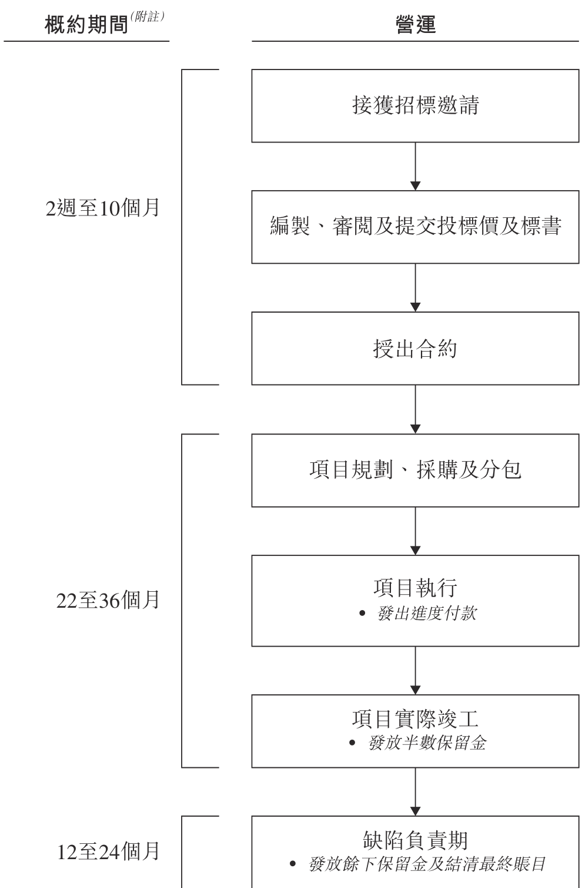

附註：各項目的實際所需時間可能不同，須視乎項目的複雜程度、個別客戶的要求及／或與個別客戶就相關階段的相關時間框架的協議而定。一般而言，規模較小的裝修項目的合約總額為10.0百萬港元以下，所需的營運時間較短。

---

## 第 123 页

接獲招標邀請

憑藉於行業的專門知識及經驗，我們一般會透過招標邀請(通常經傳真或電郵)取得新合約。一般而言，我們亦獲提供有關規格、工程範疇、物料規定及工程費用率、工地狀況及相關圖則的初步資料。接獲招標邀請後，合約經理及工料測量師會評估我們的資源是否足以承接項目。工料測量師將審視與現有客戶的過往業務來往或新客戶的行業聲譽及確定潛在客戶的信用。行政總裁將決定是否接納該招標邀請。每項招標邀請會獲分配案件編號，並有系統地記錄客戶詳情、地點及狀況以供我們跟進。

編製、審閱及提交投標價及標書

倘我們接納招標邀請，工料測量師會透過估計所需物料、人力資源及其他資源，並向供應商及分包商尋求初步報價以編製成本規劃。有關成本規劃將由合約經理及行政總裁審閱更多，彼等將決定利潤率。之後，合約部門會按照定價策略編製投標價。有關定價策略的詳情，請參閱本節「銷售及營銷一定價策略」一段。定為高於10.0百萬港元的投標價一般須經行政總裁批准，其餘則由合約經理批准。合約部門其後會提交標書。

授出合約

我們提交標書後，可能會獲邀出席面試或回答關於工程範疇及規格的問題，並與客戶磋商及審定合約條款及合約金額。倘客戶接納我們的標書建議書，我們可能會獲得接納書或提名函件(如我們擔任指定分包商)，當中列明若干條款及條件，例如項目規格及合約金額。有關中標率分析，請參閱本節「銷售及營銷—中標率」一段。

項目規劃、採購及分包

向客戶取得合約後，我們將組成專責項目團隊，一般由項目經理、助理項目經理、地盤主管、直屬技工、技術設計師、安全主管及工料測量師組成，視乎項目規模及複雜程度而定。

裝修服務的其中一環是我們負責與供應商及分包商協調及聯絡。合約通常列明訂約方的採購責任。我們或會負責採購物料及／或採購及安裝按客戶規格定制的門、家具及配件，以作為裝修服務的一部分。有關採購安排的更多詳情，請參閱本節「採購」一段。我們亦會分包安裝或其他技術工程予分包商。有關分包安排的更多詳情，請參閱本節「分包」一段。

---

## 第 124 页

項目實行

項目團隊負責實行裝修服務，包括規劃及監督項目執行、識別地盤問題、採取可能補救措施及報告工程進度。項目經理獲助理項目經理幫助，負責監督項目的所有方面、監控地盤工作進度及確保工程按時交付。地盤主管負責監督工作質量並與客戶代表溝通。直屬技工進行部分工程以展示分包商就餘下工程須採納的規定工作標準及制定技術問題的解決方案(如有需要)。技術設計師編製技術圖紙。安全主管確保所有地盤工人均遵守職業健康與安全政策。工料測量師定期在地盤檢查及審查工作進度，以向客戶提交每月付款申請。項目團隊會進行實地視察及測量以對項目取得更準確的了解及量數。獲得量數後，我們通常會對客戶的方案提供見解及改良以供客戶考慮，並與客戶密切商討項目要求及解決項目實行期遇到的任何問題。有關質量控制措施的更多詳情，請參閱本節「質量控制」一段。

工程變更令

客戶於項目執行過程中可能下達有關變更部分對完成項目而言必需的裝修工程的指令。有關指令通常稱為工程變更令，可能包括客戶要求作為原合約中工程規格變更或補充的加建工程、減省或改動。客戶通常向我們表明將進行的工程變更令範圍，而不會在我們就有關工程變更令施工之前釐定工程變更令的價值。倘工程變更令項下的工程與合約列明的工程相同或類似，工程變更令價值通常與原合約的收費時間表一致。如果原合約並無相同或相似的項目以供參考，我們將基於類似工程的經驗及供應商及分包商提供的報價加上參考與該等客戶的過往項目而得出的溢價，根據定價策略按成本加成定價模式估計工程變更令的價值，更多詳情載於本節「銷售及營銷一定價策略」一段，且與客戶確立最終賬目時我們將進一步就工程變更令與客戶達成協議。最終的合約總額可按照該工程變更令的範圍以我們與客戶其後協定的經協定費率進行調整。截至二零一七年、二零一八年及二零一九年十二月三十一日止年度，裝修服務合約所得收益分別為約546.3百萬港元、759.6百萬港元及874.5百萬港元，其中就工程變更令確認的收益分別為約62.6百萬港元、51.1百萬港元及110.3百萬港元。

發出進度付款

一般而言，經合約經理批准後，工料測量師根據工程進度向客戶發出每月付款申請。在部份情況下，接獲付款申請及經審閱後，客戶將與相關地產發展商委任的顧問聯繫，而有關顧問一般會發出付款證明，核實上一月份完成的工程百分比及客戶應付的相應款項。如付款證明核實的工程與付款申請的工程進度有重大差異，工料測量師將主動向有關顧問解釋及就核實款項達成共識。之後，客戶會根據核實款項作出付款。我們一般會於我們作出付款申請後約90日收到該等客戶的付款。就部分由於內部政策而並無出具付款證明的客戶而言，於我們作出付款申請後，有關客戶的內部工料測量師將

---

## 第 125 页

業務

確認已完成工作的百分比，而我們一般會於我們作出付款申請後約30日收到付款。有關客戶的付款期的更多詳情，請參閱本節「客戶—貿易應收款項及應收保留金的付款期及收回」一段。

分包商一般根據分包工程項下的完工百分比向我們發出定期付款要求。經計及工程的規模及複雜程度，工料測量師將於付款前評估及核實完工百分比，而行政總裁將批准付款。有關與分包商的安排的更多詳情，請參閱本節「分包」一段。

項目實際竣工

項目實際竣工前，我們一般會於竣工及移交予客戶前進行相關質量測試，以確保符合合約內的規格。倘測試結果未達合約列明的規定，則會進行修補工程及／或再委託工程以確保符合規定。一般而言，工程移交會與地產發展商及／或客戶代表安排。在部分情況下，地產發展商的建築師將發出項目實際竣工證書，而該證書的發出日期代表項目的實際竣工日期。部分客戶由於內部政策而並無出具實際竣工證書。我們一般會與有關客戶協定實際竣工日期。實際竣工表示根據合約完成的工程已大致上竣工及概無重大未完成工程。

履約保證

我們或會被要求向客戶提供金額為原合約金額的一定百分比(通常相當於10%)的履約保證，以確保我們妥為履約。於往績期間，履約保證一般由保險公司發出並由創基工程董事的擔保及質押予保險公司的存款作抵押，而質押予保險公司的存款一般為履約保證價值約20%至30%。視乎合約條款，履約保證將於發出實際竣工證書或修補缺陷證書後解除。於最後可行日期，我們獲香港大型保險公司通知，將為新獲授裝修項目(通常包括新世界集團(作為地產發展商)及新鴻基集團以外的客戶的新獲授裝修項目)發出的任何履約保證，我們將須質押金額相當於裝修項目履約保證價值總額的存款，直至現有履約保證解除。

---

## 第 126 页

業務

下表列載於往績期間及直至最後可行日期我們為保證妥善履約須向客戶提供的保證金金額變動：

<!-- table html -->
<table><tr><td colspan="4">截至十二月三十一日止年度</td><td>由二零二零年一月一日至最後可行日期</td></tr><tr><td>二零一七年</td><td>二零一八年</td><td>二零一九年</td><td>日期</td></tr><tr><td>千港元</td><td>千港元</td><td>千港元</td><td>千港元</td></tr><tr><td>年／期初的保證金年／期初金額</td><td>24,377</td><td>41,427</td><td>36,549</td><td>66,915</td></tr><tr><td>就新項目提供的保證金金額</td><td>17,050</td><td>9,251</td><td>64,525</td><td>—</td></tr><tr><td>已解除的保證金金額</td><td>—</td><td>(14,129)</td><td>(34,159)</td><td>—</td></tr><tr><td>年／期末的尚未支付保證金金額</td><td>41,427</td><td>36,549</td><td>66,915</td><td>66,915</td></tr></table>
<!-- /table -->

於往績期間，我們的保證金一般由保險公司發出及由創基工程董事(包括吳先生及／或其聯繫人)的擔保及向保險公司抵押的按金作抵押(金額為履約保證相應價值的一少部份)，有關擔保的更多詳情載於本招股章程「與控股股東的關係—財務獨立性」一段。下表列載於往績期間及直至最後可行日期就保證金向保險公司抵押的按金金額變動：

<!-- table html -->
<table><tr><td colspan="4">截至十二月三十一日止年度</td><td>二零二零年一月一日至最後可行日期</td></tr><tr><td>二零一七年</td><td>二零一八年</td><td>二零一九年</td><td>日期</td></tr><tr><td>千港元</td><td>千港元</td><td>千港元</td><td>千港元</td></tr><tr><td>年／期初已抵押年／期初</td><td></td><td></td><td></td><td></td></tr><tr><td>按金金額</td><td>7,313</td><td>10,723</td><td>8,334</td><td>17,141</td></tr><tr><td>就新項目已抵押按金</td><td>3,410</td><td>1,850</td><td>16,663</td><td>—</td></tr><tr><td>已解除的已抵押按金金額</td><td>—</td><td>(4,239)</td><td>(7,856)</td><td>—</td></tr><tr><td>年／期末的尚未償還已抵押</td><td></td><td></td><td></td><td></td></tr><tr><td>按金金額</td><td>10,723</td><td>8,334</td><td>17,141</td><td>17,141</td></tr></table>
<!-- /table -->

於往績期間及直至最後可行日期，概無客戶針對履約保證提出重大申索。

保留金

部分裝修合約列明客戶一般有權保留我們每筆進度付款總和最多10%，但不可超過原合約金額的5%為保留金。如有保留金，半數保留金將於實際竣工後發放，餘下保留金通常於相關缺陷責任期屆滿或發出修補缺陷證書後發放。

---

## 第 127 页

缺陷責任期

一般而言，我們向客戶提供12至24個月的缺陷責任期，該期間於項目實際竣工後開始。當於缺陷責任期內發現缺陷，我們將自費修補缺陷。於缺陷責任期結束時，我們的修補責任將會完成。在部分情況下，地產發展商的建築師將發出修補缺陷證書，而部分客戶由於內部政策而並無出具修補缺陷證書。餘下保留金通常於相關缺陷責任期屆滿或發出修補缺陷證書後發放。缺陷責任期後，我們會與客戶跟進及就最終賬目達成協議。於往績期間，我們為修補有缺陷工程而招致的成本為微小及我們並無接獲客戶就我們於缺陷責任期內修補缺陷的責任提出任何重大投訴。

維修及保養服務

維修及保養服務一般由新客戶或現有客戶的報價查詢開始。該等項目的報價程序與裝修項目相若。當我們接受報價並獲授維修及保養合約後，合約經理及工料測量師將評估所需工程性質並根據員工的工作安排及所需工程性質委派員工執行項目。我們一般於完成每項維修及保養工程後向客戶發出付款賬單。一般而言，我們並不需要保留金或缺陷責任期。

銷售及營銷

於最後可行日期，我們已設立由五名人員組成的業務發展團隊，彼等負責規劃及發展整體營銷策略，以推廣本集團服務，從而加強我們的市場聲譽及吸納新客戶。截至二零一七年、二零一八年及二零一九年十二月三十一日止年度，我們分別委聘五名、七名及七名業務發展顧問。相關顧問為獨立第三方。其中一名業務發展顧問現任一間從事公共關係及活動管理公司的股東及董事，趙女士亦為該公司之股東及董事。

於往績期間，我們的業務發展顧問不時於當地市場就與本地及中國著名地產發展商的業務機遇轉介潛在客戶，並就市況、投標及營銷方法提供意見，以及提供潛在供應商轉介及內部裝修／設計／建造相關培訓，以提高市場競爭力。部分業務發展顧問舉辦與企業社會責任或營運的相關培訓及活動，以及公共關係活動，以宣傳我們的企業形象及行業聲譽。

業務發展顧問的成員(包括相關顧問的最終股東)曾擔任不少房地產、樓宇及建築相關領域機構角色及諮詢職位，具有專業資格，在客戶關係管理方面經驗豐富，擁有廣泛業務網絡及／或擁有裝修／設計／建築相關行業的專業知識和技能。

---

## 第 128 页

截至二零一七年、二零一八年及二零一九年十二月三十一日止年度，我們所產生業務發展諮詢費分別約1.8百萬港元、2.2百萬港元及2.9百萬港元。根據弗若斯特沙利文報告，部分承建商可能就與本集團服務範疇相類似的服務委聘業務顧問，本集團向顧問支付的諮詢費乃基於顧問的工作經驗／工作履歷、資歷與擔當的工作範疇而定，且處於市場範圍。

據董事所深知，於往績期間及最後可行日期，除本段「銷售及營銷」所披露者和撇除顧問協議外，業務發展顧問(包括最終股東及企業顧問的董事)與本集團、股東、董事及高級管理層或任何彼等各自的聯繫人過往或現在並無任何其他關係(股權、家族、業務或其他)、協議或安排。

中標率

於往績期間，我們主要通過投標取得新業務。下表列載我們於往績期間的整體中標率：

截至十二月三十一日止年度

<!-- table html -->
<table><tr><td>二零一七年</td><td>二零一八年</td><td>二零一九年</td></tr><tr><td>年內已接獲邀請數目</td><td>165</td><td>220</td><td>210</td></tr><tr><td>年內已提交標書數目</td><td>118</td><td>146</td><td>138 (附註1)</td></tr><tr><td>• 新世界集團(作為地產發展商)及新鴻基集團</td><td>78</td><td>81</td><td>77</td></tr><tr><td>• 其他客戶</td><td>40</td><td>65</td><td>61</td></tr><tr><td>本年度或其後已確認的獲接納標書數目</td><td>11</td><td>26</td><td>12</td></tr><tr><td>• 新世界集團(作為地產發展商)及新鴻基集團</td><td>8</td><td>16</td><td>10</td></tr><tr><td>• 其他客戶</td><td>3</td><td>10</td><td>2</td></tr><tr><td>中標率(%)^(附註1及2)</td><td>9.3</td><td>17.8</td><td>8.7</td></tr><tr><td>• 新世界集團(作為地產發展商)及新鴻基集團</td><td>10.3</td><td>19.8</td><td>13.0</td></tr><tr><td>• 其他客戶</td><td>7.5</td><td>15.4</td><td>3.3</td></tr></table>
<!-- /table -->

附註：

1. 於最後可行日期，於截至二零一九年十二月三十一日止年度提交的138份標書中有50份未過期且其結果待定。

2. 於上表中，一個財政年度的中標率乃根據就於該財政年度或期間提交的標書獲授的合約數量(不論該等合約是在同一財政年度獲得還是隨後獲得)計算。

我們是裝修行業的積極參與者。於往績期間，從我們接獲的招標邀請數目可見，客戶對我們服務的需求殷切。於往績期間，我們接獲165、220及210項招標邀請，而我們就該等邀請的約71.5%、66.4%及65.7%提交標書。我們的政策為積極回應客戶招標邀

---

## 第 129 页

請，因為董事認為此舉能讓我們(i)維持與客戶的關係；(ii)保持市場地位；及(iii)了解最新市場規定及定價趨勢，有助我們未來取得項目。董事認為縱然我們的工程質量穩定和擁有其他競爭優勢，但我們的資本及財務資源有限，或使我們難以在擁有較多資本及財務資源的同業中脫穎而出，而倘若其時我們同時進行的其他項目導致剩餘的營運或財務資源有限，我們可能傾向以較高利潤率的價格提交標書，這或影響我們於往績期間的中標率。然而，經計及往績期間按合約金額計的獲授合約及已確認收益，董事認為往績期間的整體招標策略及中標率大致上理想。有關進行中項目的更多詳情，請參閱本節「項目—裝修項目—裝修項目數量變動」及「項目—裝修項目—裝修項目尚餘合約價值變動」各段。

定價策略

標價或報價基於我們的估計及可得的資料，當中計及多項因素，包括但不限於(i)項目大小、規格及複雜程度；(ii)先前的標價或報價記錄；(iii)類似項目的獲授價格；(iv)我們的經營及財務能力；(v)估計項目成本；(vi)與客戶的關係；及(vii)當前市場狀況。一般而言，我們基於成本加成定價模式加上溢價為項目定價，藉此可在交付優質工程的同時獲取合理利潤率。我們採納類似的成本加成模式定價策略以釐定就客戶的修改令所要求加建工程收取的費用。

我們維持一個資料數據庫，儲存自先前項目收集的統計資料及數據，供員工不時參考之用。董事認為該數據庫讓我們可有效落實定價策略。截至二零一七年、二零一八年及二零一九年十二月三十一日止年度，我們得以維持相對穩定的毛利率，分別為約14.8%、14.0%及13.6%。於往績期間，本集團於任何裝修項目上，並無經歷毛利率屬不尋常地高或低的情況，且毛利率的結果符合管理層預期。於往績期間，我們得以保足就工程變更令招致的成本，僅有一個竣工項目錄得虧損約為9.0百萬港元。該項目的合約總額約為25.0百萬港元。我們於項目後期直接收到相關地產發展商的要求，並進行產生額外成本的增值工程，以確保滿足該地產發展商的期望，從而期望與相關地產發展商(為本地著名地產發展商)保持長期工作關係。在最終賬目協商過程中，由於相關記錄的管理不足，我們無法提供若干文件，因此，我們無法於最終賬目定案時就若干已履行工作提出申索，而已支付予我們的費用及收費不足以收回我們就上述整個項目已產生的成本。該項目已於二零一九年九月完成。因此，該虧損被視為於截至二零一九年十二月三十一日止年度產生。為防止將來再次發生同類情況，我們已加強(外部及內部)溝通，並要求所有相關設計圖草稿及信函都應有正確記錄，作為工程變更令的證明文件。

---

## 第 130 页

業務

此外，我們已委聘一名內部監控顧問，審視本集團針對營運程序而設立涵蓋程序、系統及控制的內部監控系統，以增強我們的定價策略及成本控制。內部監控顧問提出建議時，我們亦加強定價策略及成本控制，方法為要求工料測量師編製成本規劃，而投標價定於10.0百萬以上，通常須經行政總裁批准。此外，合約經理編製款項摘要、監督項目產差的成本，並在週會上向行政總裁匯報。如預計成本與實際成本出現重大差距，合約經理須向行政總裁解釋。當最終賬目定案，合約經理須編製項目溢利和虧損報告，分析預計毛利率與實際毛利率的差距(如有)，提出建議加以改善，並須向財務總監與行政總裁呈交相關文件加以審閱。董事認為，應用更為嚴謹的定價策略及成本控制措施、可減低項目出現虧損的情況。更多有關內部監控及營運程序的詳情，請參閱本招股章程「業務—風險管理及內部監控系統」及「業務—營運流程—裝修服務—編製、審閱及提交投標價及標書」各段。根據於最後可行日期的現有資料，董事認為我們手頭上的裝修項目預期概無虧損。

季節因素

於往績期間，我們於農曆新年前數月錄得較高收益及於農曆新年當月錄得較低收益，這是由於農曆新年期間或之後短期內可能出現勞工短缺，故我們與客戶、供應商及分包商訂立安排，以期於農曆新年前完成更多工程。

客戶

於往績期間，我們的客戶來自私營界別，主要為地產發展商及承建商。倘地產發展商選擇我們擔任其裝修承建商，我們通常與彼等或彼等的附屬公司訂立合約。我們亦可能獲地產發展商提名為其物業項目的指定裝修承建商，並與有關項目的建築商訂立子合約。有時，我們亦獲承建商直接聘用。

---

## 第 131 页

業務

下表列載我們於往績期間按客戶類別劃分的收益明細：

截至十二月三十一日止年度

<!-- table html -->
<table><tr><td></td><td colspan="6">截至十二月三十一日止年度</td></tr><tr><td></td><td colspan="2">二零一七年</td><td colspan="2">二零一八年</td><td colspan="2">二零一九年</td></tr><tr><td></td><td>千港元</td><td>%</td><td>千港元</td><td>%</td><td>千港元</td><td>%</td></tr><tr><td>地產發展商(附註1)</td><td>353,380</td><td>63.9</td><td>508,921</td><td>66.3</td><td>543,925</td><td>61.9</td></tr><tr><td>承建商(附註2)</td><td>193,821</td><td>35.1</td><td>252,099</td><td>32.8</td><td>320,006</td><td>36.4</td></tr><tr><td>其他(附註3)</td><td>5,451</td><td>1.0</td><td>7,125</td><td>0.9</td><td>15,470</td><td>1.7</td></tr><tr><td>總計</td><td>552,652</td><td>100.0</td><td>768,145</td><td>100.0</td><td>879,401</td><td>100.0</td></tr></table>
<!-- /table -->

附註：

1. 「地產發展商」類別包括地產發展商及其附屬公司。

2. 「承建商」類別包括直接委聘我們的承建商及我們獲地產發展商指名為指定裝修承建商時與其訂立合約的承建商。

3. 「其他」類別包括物業業主及租戶。

我們一般按個別項目基準提供服務，而不會與客戶訂立長期合約。這一安排符合行業慣例，因為裝修項目通常為一次性質。於往績期間，我們一般透過投標獲得項目。董事認為，憑藉我們按時交付使客戶滿意的優質工程的良好往績，我們已與主要客戶建立穩定業務關係。我們與五大客戶已維持一至15年的業務關係。特別是，我們自二零零四年以來一直為新鴻基集團服務，且自二零零九年以來一直是新鴻基集團的認可承建商。我們亦自二零一二年起一直為新世界集團服務。我們經常接獲邀請為裝修項目投標，並且不時獲地產發展商挑選或指名為其物業項目提供裝修工程。於往績期間各年，我們有19名、10名及11名回頭客戶(不包括與維護及售後服務相關的客戶)，該等客戶於截至二零一七年、二零一八年及二零一九年十二月三十一日止年度合共為本集團貢獻分別約95.7%、98.0%及93.8%的收益。於往績期間及直至最後可行日期，我們與客戶並無發生任何重大糾紛。

---

## 第 132 页

業務

裝修合約的主要條款

我們的合約條款因應客戶及項目而有所不同。裝修服務合約的主要條款列載如下：

工程範疇：我們負責按照合約所載的規格、草擬圖及暫定時間表提供裝修工程。

合約金額：每個項目的商定估計原合約金額不同，參考工程規模及複雜程度而定。

付款期：有關付款期的詳情，請參閱本節「客戶—貿易應收款項及應收保留金的付款期及收回」一段。

保留金：有關保留金(如有需要)的詳情，請參閱本節「營運流程—裝修服務—項目實際竣工—保留金」一段。

缺陷責任期：我們一般提供12至24個月的缺陷責任期，期間我們負責修正裝修工程中的缺陷。

工程變更令：有關工程變更令(如有需要)的詳情，請參閱本節「營運流程—裝修服務—項目實行—工程變更令」一段。

算定賠償：倘我們未能按合約所訂明的時間表完成裝修工程，我們須向客戶賠償一筆算定賠償金。

延長工程期：倘因客戶或無法控制事件而導致裝修工程竣工延後，我們可向客戶取得公平合理的延期。

履約保證：有關履約保證(如有需要)的詳情，請參閱本節「營運流程—裝修服務—項目實際竣工—履約保證」一段。

保險：有關保險單的更多詳情，請參閱本節「保險」一段。

終止：倘(其中包括)我們無法根據客戶要求執行工程，客戶可通過事先發出終止意向通知終止我們的合約。

於往績期間及直至最後可行日期，我們並無遭遇任何客戶提前終止合約的情況。

---

## 第 133 页

貿易應收款項及應收保留金的付款期及收回

客戶通常於我們作出付款申請後約30日(僅就新世界集團(作為地產發展商)及新鴻基集團而言)至約90日(就其他客戶而言)向我們付款。客戶通常透過銀行轉賬或支票方式以港元付款。

於二零一七年、二零一八年及二零一九年十二月三十一日，我們分別錄得貿易應收款項約39.3百萬港元、33.2百萬港元及131.1百萬港元。於最後可行日期，我們於二零一九年十二月三十一日的約99.8%貿易應收款項已結清。截至二零一七年、二零一八年及二零一九年十二月三十一日止年度，貿易應收款項週轉日數分別為約43.7日、17.2日及34.1日。

為降低與貿易應收款項及應收保留金的可收回程度有關的風險，我們實行下列措施：

• 接獲投標或報價邀請後，我們將(i)對客戶進行盡職審查，例如檢查我們與現有客戶的過往業務往來情況或新客戶的行業聲譽；(ii)評估項目的商業可行性；及(iii)核實客戶的信譽。

根據相關項目條款密切監控客戶付款情況。行政及會計部門記錄貿易應收款項及應收保留金的賬目及每月編製賬齡報告。工料測量師將直接聯繫客戶以跟進付款狀況。財務總監定期審閱貿易應收款項及應收保留金的賬齡情況。

當存在客觀證據表示本集團將無法收回部分或全部未償還債務及／或貿易應收款項時計提撥備。除「財務資料—綜合財務狀況表各項目的分析」一段所披露者外，於往績期間，我們並無任何貿易應收款項的重大壞賬或撥備。

五大客戶

截至二零一七年、二零一八年及二零一九年十二月三十一日止年度，最大客戶應佔收益分別為約159.5百萬港元、363.6百萬港元及402.1百萬港元，佔總收益分別約28.9%、47.3%及45.7%，而五大客戶應佔收益合共分別為約487.9百萬港元、732.5百萬港元及852.7百萬港元，佔總收益分別約88.3%、95.4%及97.0%。據董事所深知，概無董事或彼等各自的緊密聯繫人或擁有本公司已發行股本5%以上的股東於往績期間的五大客戶中擁有任何權益。於往績期間五大客戶的全部均為獨立第三方，且彼等於往績期間均非本集團的供應商。

---

## 第 134 页

業務

下表載列於往績期間的五大客戶詳情：

截至二零一七年十二月三十一日止年度

<!-- table html -->
<table><tr><td>排名</td><td>客戶</td><td>客戶類型</td><td>本集團所提供服務</td><td>業務關係開始的年份</td><td>一般付款期及支付方式</td><td>已確認收益千港元</td><td>佔總收益%</td></tr><tr><td>1</td><td>新世界集團^(附註1)</td><td>地產發展商及承建商</td><td>裝修服務</td><td>二零一二年</td><td>於我們作出付款申請後約30日（作為地產發展商）；及於我們作出付款申請後約90日（作為承建商）；銀行轉賬</td><td>159,480</td><td>28.9</td></tr><tr><td>2</td><td>新鴻基集團^(附註2)</td><td>地產發展商</td><td>裝修服務以及維修及保養服務</td><td>二零零四年</td><td>於我們作出付款申請後約30日；支票</td><td>140,337</td><td>25.4</td></tr><tr><td>3</td><td>客戶C^(附註3)</td><td>承建商</td><td>裝修服務</td><td>二零一六年</td><td>於我們作出付款申請後約90日；銀行轉賬</td><td>82,317</td><td>14.9</td></tr><tr><td>4</td><td>客戶D^(附註4)</td><td>地產發展商</td><td>裝修服務</td><td>二零一六年</td><td>於我們作出付款申請後約90日；銀行轉賬</td><td>57,784</td><td>10.5</td></tr><tr><td>5</td><td>其士(建築)有限公司^(附註5)</td><td>承建商</td><td>裝修服務</td><td>二零一六年</td><td>於我們作出付款申請後約90日；支票</td><td>47,933</td><td>8.6</td></tr><tr><td></td><td></td><td></td><td></td><td></td><td></td><td>487,851</td><td>88.3</td></tr></table>
<!-- /table -->

---

## 第 135 页

業務

截至二零一八年十二月三十一日止年度

<!-- table html -->
<table><tr><td>排名</td><td>客戶</td><td>客戶類型</td><td>本集團所提供服務</td><td>業務關係開始的年份</td><td>一般付款期及支付方式</td><td>已確認收益 千港元</td><td>佔總收益%</td></tr><tr><td>1</td><td>新世界集團^(附註1)</td><td>地產發展商及承建商</td><td>裝修服務</td><td>二零一二年</td><td>於我們作出付款申請後約30日（作為地產發展商）；於我們作出付款申請後約90日（作為承建商）；銀行轉賬</td><td>363,621</td><td>47.3</td></tr><tr><td>2</td><td>新鴻基集團^(附註2)</td><td>地產發展商</td><td>裝修服務以及維修及保養服務</td><td>二零零四年</td><td>於我們作出付款申請後約30日；支票</td><td>225,872</td><td>29.4</td></tr><tr><td>3</td><td>客戶C^(附註3)</td><td>承建商</td><td>裝修服務</td><td>二零一六年</td><td>於我們作出付款申請後約90日；銀行轉賬</td><td>90,941</td><td>11.8</td></tr><tr><td>4</td><td>客戶D^(附註4)</td><td>地產發展商</td><td>裝修服務</td><td>二零一六年</td><td>於我們作出付款申請後約90日；銀行轉賬</td><td>36,805</td><td>4.8</td></tr><tr><td>5</td><td>客戶F^(附註6)</td><td>承建商</td><td>裝修服務</td><td>二零一五年</td><td>於我們作出付款申請後約90日；支票</td><td>15,224</td><td>2.1</td></tr><tr><td></td><td></td><td></td><td></td><td></td><td></td><td>732,463</td><td>95.4</td></tr></table>
<!-- /table -->

---

## 第 136 页

業務

截至二零一九年十二月三十一日止年度

<!-- table html -->
<table><tr><td>排名</td><td>客戶</td><td>客戶類型</td><td>本集團所提供服務</td><td>業務關係開始的年份</td><td>一般付款期及支付方式</td><td>已確認收益千港元</td><td>佔總收益%</td></tr><tr><td>1</td><td>新鴻基集團^(附註2)</td><td>地產發展商</td><td>裝修服務以及維修及保養服務</td><td>二零零四年</td><td>於我們作出付款申請後約30日；支票</td><td>402,087</td><td>45.7</td></tr><tr><td>2</td><td>新世界集團^(附註1)</td><td>地產發展商及承建商</td><td>裝修服務</td><td>二零一二年</td><td>於我們作出付款申請後約30日（作為地產發展商）；於我們作出付款申請後約90日（作為承建商）；銀行轉賬</td><td>245,146</td><td>27.9</td></tr><tr><td>3</td><td>客戶C^(附註3)</td><td>承建商</td><td>裝修服務</td><td>二零一六年</td><td>於我們作出付款申請後約90日；銀行轉賬</td><td>91,090</td><td>10.4</td></tr><tr><td>4</td><td>客戶F^(附註6)</td><td>承建商</td><td>裝修服務</td><td>二零一五年</td><td>於我們作出付款申請後約90日；支票</td><td>78,131</td><td>8.9</td></tr><tr><td>5</td><td>客戶G^(附註7)</td><td>其他</td><td>裝修服務</td><td>二零一九年</td><td>於我們作出付款申請後約90日；銀行轉賬</td><td>36,279</td><td>4.1</td></tr><tr><td></td><td></td><td></td><td></td><td></td><td></td><td>852,733</td><td>97.0</td></tr></table>
<!-- /table -->

附註：

1. 新世界集團包括新世界建築有限公司、協興建築有限公司、協興工程有限公司及兩間關聯公司。新世界建築有限公司、協興建築有限公司及協興工程有限公司及其中一間關聯公司為一間於聯交所上市的公司的附屬公司。該上市公司的主要業務活動包括物業發展及投資。根據公開可得資料，截至二零一九年六月三十日止年度，該上市公司的控股公司錄得收益及其股東應佔溢利分別超過700.0億港元及超過200.0億港元。

2. 新鴻基集團包括新輝(建築管理)有限公司、新鴻基地產發展有限公司、新鴻基地產代理有限公司及一間關聯公司。新輝(建築管理)有限公司及新鴻基地產代理有限公司，以及上述關聯公司，為於聯交所上市的新鴻基地產發展有限公司的附屬公司。該上市公司的主要業務活動包括物業發展及投資。根據公開可得資料，截至二零一九年六月三十日止年度，該上市公司的控股公司錄得收益及其股東應佔溢利分別超過800.0億港元及超過400.0億港元。

---

## 第 137 页

業務

3. 客戶C為一間於倫敦證券交易所上市並於百慕達及新加坡作第二上市的公司的附屬公司，其主要業務活動為(其中包括)物業發展及投資。根據公開可得資料，截至二零一八年十二月三十一日止年度，客戶C的控股公司錄得股東應佔收益及溢利分別超過400.0億美元及超過10.0億美元。

4. 客戶D為一間香港私人公司，主要從事建造及投資。根據公開可得資料，客戶D於二零一八年十二月十一日的已繳足股本總額為226,700,000港元。

5. 其士(建築)有限公司為一間於聯交所上市的公司的附屬公司。該上市公司的主要業務活動為(其中包括)物業發展及投資。根據公開可得資料，截至二零一九年三月三十一日止年度，該上市公司錄得收益及溢利分別超過60.0億港元及超過600.0百萬港元。

6. 客戶F為一間於聯交所上市的公司的附屬公司。該上市公司的主要業務活動為(其中包括)建造、物業發展及物業管理。根據公開可得資料，截至二零一九年十二月三十一日止年度，該上市公司錄得收益及溢利分別超過600.0億港元及超過50.0億港元。

7. 客戶G為一間香港私人公司，主要從事建造。根據公開可得資料，客戶G於二零一九年九月十一日的已繳足股本總額為6,000,000港元。

客戶集中

於往績期間，我們的大部分收益源自五大客戶。根據弗若斯特沙利文報告，裝修行業內客戶集中的現象並不常見。董事認為，鑒於我們按時提供優質工程的良好往績令客戶滿意，我們已與現有客戶建立穩定業務關係。具體而言，截至二零一七年、二零一八年及二零一九年十二月三十一日止年度，來自新世界集團的總收益為約159.5百萬港元、363.6百萬港元及245.1百萬港元，分別佔收益約28.9%、47.3%及27.9%，以及來自新鴻基集團的總收益為約140.3百萬港元、225.9百萬港元及402.1百萬港元，分別佔收益約25.4%、29.4%及45.7%。

我們傾向於往績期間承接更多新世界集團(作為地產發展商)及新鴻基集團的裝修項目，因我們認為彼等的付款安排快速，且彼等的裝修項目的項目要求對資金需求較少。就於往績期間與新世界集團(作為地產發展商)或新鴻基集團進行的裝修項目而言，我們一般會於我們作出付款申請後約30日收到付款，而倘我們進行其他客戶的裝修項目，則於我們作出付款申請後約90日收到付款，所需時間一般較長。根據我們於往績期間的經驗及據董事所深知，新世界集團(作為地產發展商)及新鴻基集團一般不會要求承建商購買履約保證。此外，新鴻基集團通常不要求我們繳付保留金。於截至二零一七年及二零一八年十二月三十一日止年度，與新世界集團(作為地產發展商)或新鴻基集團進行的裝修項目規模相對較大，而其數目相對較多，加上與新世界集團(作為承建商)進行的其他裝修項目，可為本集團帶來可觀的收益，從而令新世界集團及新鴻基集團於往績期間按對本集團收益的貢獻計為最大客戶。

---

## 第 138 页

於往績期間，我們通過投標從新世界集團及新鴻基集團取得全部裝修合約，而董事認為該等合約乃由於我們能夠達到評估標準及我們交付優質工程的良好往績而授予我們。此外，我們自二零零四年起一直為新鴻基集團服務，以及自二零一二年起一直為新世界集團服務。董事相信，此種長期建立的業務關係不僅可增進相互信任並促進持續合作，亦可證明此種業務交易在商業上有利本公司以及新世界集團及新鴻基集團。

減少客戶集中的計劃

我們計劃在保持與最大客戶的穩固業務關係的同時擴大客戶基礎。於往績期間，我們向最大客戶及其他客戶提供類似範疇及複雜性的裝修服務。請參閱本節「項目—裝修項目—竣工項目」及「項目—裝修項目—手頭項目」各段所披露的表格，當中載列我們於往績期間及直至最後可行日期，就不同客戶總合約金額超過50.0百萬港元的已完成或進行中的裝修項目。據董事所深知，一般而言，就合約金額而言，我們於往績期間為新世界集團(作為地產發展商)及新鴻基集團承接的大部份裝修項目通常較小。然而，於往績期間，我們亦為新世界集團(作為地產發展商)及新鴻基集團完成多項大型項目，如項目P6、P2、P37及P39(項目參考編號與「業務—項目—裝修項目—竣工項目」一段所披露圖表相符)，對董事而言，足證我們有能力承接大型裝修項目。董事亦認為，我們為新世界集團(作為地產發展商)及新鴻基集團大型裝修項目服務時所用的技術與經驗能夠轉移，並可應用於服務其他客戶。

利用股份發售所得款項淨額，我們相信我們可以儲備資金以妥為償付前期成本及滿足履約保證要求，以承接更多不同客戶的大型裝修項目，從而可實現客戶基礎多元化及擴大市場份額。我們已於往績期間投入資源於業務發展，我們於截至二零一九年十二月三十一日止年度較先前年度承接更多新世界集團(作為物業發展商)及新鴻基集團以外客戶的裝修項目，且在尋找新客戶方面取得了成功。舉例而言，我們於二零一九年得以向一間位於廣東省的中國領先地產發展商取得一份合約金額超過300.0百萬港元的合約，涉及該地產發展商在屯門的住宅項目，即本節「項目—裝修項目—手頭項目」一段所披露表格內的項目P13。我們將繼續按審慎原則選擇性地把握潛在商機，務求令本集團的整體利益最大化。更多詳情請參閱本節「業務策略—透過承接更多不同客戶的大型裝修項目以實現客戶基礎多元化，擴大市場份額」一段及本招股章程「未來計劃及所得款項用途」一節。

採購

我們主要向供應商採購木材、石材、金屬、瓷磚、塑膠層壓板及隔音材料等原材料。我們亦採購根據客戶規格定制的門、家具及配件。據董事所深知，新世界集團(作為地

---

## 第 139 页

業務

產發展商)及新鴻基集團傾向進行泥水工作，並會自行採購大理石和瓷磚等工料(所需數量龐大，以致成本可觀)，而其他客戶通常要求我們供應裝修項目的大量工料。除創新工程外，供應商不會提供任何安裝或技術服務，並只根據客戶的規格，向我們供應物料。於往績期間，創新工程應佔的採購及分包費用總額分別約68.5百萬港元、93.6百萬港元及91.5百萬港元，佔總服務成本約14.5%、14.2%及12.0%。創新工程擁有人郭先生於二零零六年十二月至二零一二年四月以日間勞動者身份，向創基工程提供臨時木工工程，彼所提供的服務按日獲薪，並無與創基工程訂立任何僱傭合約，亦無委聘他人為其工作(「先前工作關係」)。自二零一零年十一月起，創新工程應要求向創基工程提供報價，並會委聘他人向創基工程提供木材及金屬工程，並自二零一七年一月起，向創基工程提供木材、金屬、門、家具及配件(「目前工作關係」)。創新工程擁有約30名僱員，於往績期間從本集團而來的收益約70%。據董事所深知，於往績期間及於最後可行日期，除先前工作關係目前工作關係外，創新工程及／或郭先生與本集團、股東、董事及高級管理層或任何彼等各自的聯繫人過往或現有並無其他關係(股權、業務或其他)、協議或安排。

於往績期間及直至最後可行日期，我們與供應商並無經歷重大糾紛。

五大供應商

截至二零一七年、二零一八年及二零一九年十二月三十一日止年度，最大供應商應佔採購額為約60.9百萬港元、95.7百萬港元及79.6百萬港元，佔總採購額分別約17.4%、19.0%及11.5%，而五大供應商應佔採購額合共為約133.4百萬港元、191.4百萬港元及171.6百萬港元，佔總採購額分別約38.0%、37.9%及24.9%。據董事所深知，概無董事或彼等各自的緊密聯繫人或擁有本公司已發行股本5%以上的股東於往績期間的五大供應商中擁有任何權益。於往績期間的五大供應商全部均為獨立第三方。

---

## 第 140 页

業務

下表載列於往績期間的五大供應商詳情：

截至二零一七年十二月三十一日止年度

<!-- table html -->
<table><tr><td>排名</td><td>供應商</td><td>提供予本集團的主要材料類別</td><td>業務關係開始的年份</td><td>一般付款期及支付方法</td><td>採購額 (千港元)</td><td>佔總採購額%</td></tr><tr><td>1</td><td>穎安(附註1)</td><td>木材、石材、金屬及門、家具及配件</td><td>二零一六年</td><td>於供應商開具發票後約30日；銀行轉賬或支票</td><td>60,924</td><td>17.4</td></tr><tr><td>2</td><td>創新工程</td><td>木材、金屬及門、家具及配件</td><td>二零一零年</td><td>於供應商開具發票後約30日；銀行轉賬或支票</td><td>55,955</td><td>15.9</td></tr><tr><td>3</td><td>供應商C(附註2)</td><td>瓷磚</td><td>二零一零年</td><td>於供應商開具發票後約30日；銀行轉賬或支票</td><td>9,164</td><td>2.6</td></tr><tr><td>4</td><td>供應商D(附註3)</td><td>塑膠層壓板</td><td>二零零七年</td><td>於供應商開具發票後約30日；銀行轉賬或支票</td><td>3,987</td><td>1.1</td></tr><tr><td>5</td><td>供應商E(附註5)</td><td>金屬</td><td>二零一一年</td><td>於供應商開具發票後約30日；銀行轉賬或支票</td><td>3,409</td><td>1.0</td></tr><tr><td></td><td></td><td></td><td></td><td>總計：</td><td>133,439</td><td>38.0</td></tr></table>
<!-- /table -->

---

## 第 141 页

業務

截至二零一八年十二月三十一日止年度

<!-- table html -->
<table><tr><td>排名</td><td>供應商</td><td>提供予本集團的主要材料類別</td><td>業務關係開始的年份</td><td>一般付款期及支付方法</td><td>採購額 (千港元)</td><td>佔總採購額%</td></tr><tr><td>1</td><td>穎安(附註1)</td><td>木材、石材、金屬及門、家具及配件</td><td>二零一六年</td><td>於供應商開具發票後約30日；銀行轉賬或支票</td><td>95,739</td><td>19.0</td></tr><tr><td>2</td><td>創新工程</td><td>木材、金屬及門、家具及配件</td><td>二零一零年</td><td>於供應商開具發票後約30日；銀行轉賬或支票</td><td>81,159</td><td>16.1</td></tr><tr><td>3</td><td>供應商C(附註2)</td><td>瓷磚</td><td>二零一零年</td><td>於供應商開具發票後約30日；銀行轉賬或支票</td><td>7,974</td><td>1.6</td></tr><tr><td>4</td><td>供應商D(附註3)</td><td>塑膠層壓板</td><td>二零零七年</td><td>於供應商開具發票後約30日；銀行轉賬或支票</td><td>3,436</td><td>0.7</td></tr><tr><td>5</td><td>供應商F(附註5)</td><td>衛浴潔具</td><td>二零一八年</td><td>於供應商開具發票後約30日；銀行轉賬或支票</td><td>3,091</td><td>0.5</td></tr><tr><td></td><td></td><td></td><td></td><td></td><td>總計：</td><td>191,399</td><td>37.9</td></tr></table>
<!-- /table -->

---

## 第 142 页

業務

截至二零一九年十二月三十一日止年度

<!-- table html -->
<table><tr><td>排名</td><td>供應商</td><td>提供予本集團的主要材料類別</td><td>業務關係開始的年份</td><td>一般付款期及支付方法</td><td>採購額 (千港元)</td><td>佔總採購額%</td></tr><tr><td>1</td><td>穎安(附註1)</td><td>木材、石材、金屬及門、家具及配件</td><td>二零一六年</td><td>於供應商開具發票後約30日；銀行轉賬或支票</td><td>79,574</td><td>11.5</td></tr><tr><td>2</td><td>創新工程</td><td>木材、金屬及門、家具及配件</td><td>二零一零年</td><td>於供應商開具發票後約30日；銀行轉賬或支票</td><td>63,729</td><td>9.2</td></tr><tr><td>3</td><td>供應商G(附註6)</td><td>瓷磚及石材</td><td>二零零八年</td><td>於供應商開具發票後約30日；銀行轉賬或支票</td><td>12,845</td><td>1.9</td></tr><tr><td>4</td><td>供應商H(附註7)</td><td>隔音材料</td><td>二零一八年</td><td>於供應商開具發票後約30日；銀行轉賬或支票</td><td>8,415</td><td>1.2</td></tr><tr><td>5</td><td>供應商C(附註2)</td><td>瓷磚</td><td>二零一零年</td><td>於供應商開具發票後約30日；銀行轉賬或支票</td><td>7,006</td><td>1.1</td></tr><tr><td></td><td></td><td></td><td></td><td></td><td>總計：</td><td>171,569</td><td>24.9</td></tr></table>
<!-- /table -->

附註：

1. 穎安為一間香港私人公司，供應木材、石材、金屬及門、家具及配件。

2. 供應商C為一間香港私人公司，供應瓷磚。

3. 供應商D為一間香港私人公司，供應塑膠層壓板。

---

## 第 143 页

業務

4. 供應商E為一間香港私人公司，供應金屬。

5. 供應商F為一間香港私人公司，供應衛浴潔具。

6. 供應商G為一間香港私人公司，供應瓷磚及石材。

7. 供應商H為兩間香港私人公司，其由一組共同管理層管理，供應隔音材料。

挑選供應商的基準

有時，客戶可能會指定特定的供應商作為若干材料的供應商(在此種情況下，我們將直接與該指定供應商協定價格)。指定供應商亦需要滿足我們的內部品質控制要求。倘客戶並無指定特定的供應商，並且需要定制項目，我們通常會從穎安採購定制物品以及若干其他相關裝修原材料，詳情載於下文。倘客戶並無指定特定的供應商且並無要求定制項目，則我們將向內部認可供應商名單中至少三名供應商獲取報價。我們根據材料供應商的表現每年審閱及更新該內部名單。於最後可行日期，我們內部認可供應商名單中有逾72名供應商，且我們一般就項目使用的主要材料具有多名認可供應商。我們根據(其中包括)(i)產品質量；(ii)價格；(iii)及時交貨；及(iv)服務等各種標準選擇供應商。

於往績期間，我們並無經歷任何材料短缺或材料供應延遲的情況而對我們的業務造成重大影響。

主要採購條款

本集團一般按個別項目基準下達採購訂單，而非與供應商訂立長期協議。除本節「採購－與穎安訂立的長期協議的主要條款」一段所概述與穎安訂立的長期協議外，我們並無與供應商訂立任何長期協議。董事認為該安排符合香港的行業慣例。與供應商的一般採購訂單的主要條款列示如下：

材料規格：

所需材料說明，包括材料類別、數量、尺寸及技術規格。

按金及付款期：

我們一般於確認訂單後向供應商支付協定款項，金額介乎總採購價30%至50%，作為按金。部分供應商要求我們在交付材料前全數結算款項。有關付款期的更多詳情，請參閱本節「採購—付款期」一段。

交付：

供應商一般將貨品交付至指定工作地點而不會額外收費。

---

## 第 144 页

與穎安訂立的長期協議的主要條款

我們自二零一六年一月開展業務關係起已與穎安訂立長期協議，因穎安能提供多種定制項目及裝修原材料，且與我們採用成本加成定價法，節省我們每次下達訂單時協定價格的時間及行政工作。倘穎安的製造夥伴並無能力承接我們的訂單，則穎安可能會將我們的訂單外包予我們預先批准的其他第三方供應商。每次採購的確切成本百分比將於各自的個別訂單確認。穎安將按要求提供成本資料供我們核實。根據弗若斯特沙利文報告，部分承建商可能與少數經常與之合作的供應商簽訂不設特定最低採購量的長期協議，以簡化行政程序，而倘訂立有關長期協議，材料供應商及承建商通常會同意採用成本加成定價模式。董事認為，與穎安訂立的有關協議與市場慣例一致且符合本集團的利益。由於有關協議並不包含排他性限制，故我們可自由向其他供應商採購材料，惟我們下達無最低採購量的訂單時，穎安將有責任供應或促使經我們批准的第三方供應商向我們供應相關材料。於往績期間，我們並無違反與穎安訂立的協議的任何條文。與穎安訂立的協議的主要條款如下：

期限：由二零一六年一月一日至二零一八年十二月三十一日及由二零一九年一月一日至二零二一年十二月三十一日

付款：成本加成定價，1.0%至1.5%（最高）

外包：穎安可能會將我們的訂單外包予我們預先批准的第三方供應商，然後有關第三方供應商將與我們聯繫，我們將直接向有關供應商付款。經我們批准的第三方需列入我們的內部認可供應商清單，該清單每年進行審閱及更新，有關清單的更多詳情載於本節「採購—挑選供應商的基準」一段。我們不會直接與該等第三方供應商下達訂單，原因為與該等第三方供應商協定付款條款可能花費時間。倘穎安將訂單外包予第三方供應商，則第三方供應商將須遵循成本加成定價法。

獨家性：無

最低採購承諾：無

糾正缺陷：穎安或第三方供應商應於我們收回物料後7日內修正我們發現的缺陷

終止：我們可於協議期內隨時透過發出6個月通知終止

---

## 第 145 页

供應商定價

一般而言，價格乃參考供應商按訂單基準協定的報價釐定，該價格通常為當時的市價。然而，由於我們在獲授項目前不會向供應商下達採購訂單，倘我們在提交投標文件後價格出現任何大幅波動，則我們可能無法成功將價差轉嫁予客戶。

付款期

於往績期間，本集團作出的採購付款通常以港元計值。我們一般於供應商開具發票後約30日向彼等付款。

存貨

我們並無保留材料存貨。每個項目的項目經理負責訂單的整體時間規劃及材料交付，以配合項目的材料交付要求。我們通常向供應商出具採購訂單，列明配合項目時間表的各個暫定交付日期。所有材料均由供應商交付至項目地盤或指定安裝地點。在交付途中造成的任何損壞或損失將由供應商修正。

分包

分包商一般根據客戶的規格提供安裝或其他技術服務，包括泥水、石材、天花板、木材及金屬工程。分包商有時亦在執行服務的過程中供應材料。

於往績記錄期間及直至最後可行日期，我們與分包商並無經歷任何重大糾紛。

訂立分包安排的理由及對分包商的監控

根據弗若斯特沙利文報告，承建商通常會聘請分包商進行項目交付，此乃行業慣例。董事認為分包安排有助降低固定生產成本及靈活地獲得不同專長和技能的勞工，而無需透過永久僱傭關係保留大量工人。分包商並非我們僱員或代理，我們亦無參與分包商與其僱員訂立的僱傭安排。由於分包商負責提供工人，故相關勞工成本由分包商承擔。

---

## 第 146 页

業務

我們就分包商的表現向客戶負責，據此我們或須就分包商工人提出的任何潛在人身傷害申索承擔法律責任。分包商須遵守我們與客戶的合約條款及條件，包括遵守安全及環境規定，以及根據我們與客戶的合約中的相關規格執行工作，並定期向本集團匯報工作進度以確保項目於分包協議及我們與客戶的協議中訂明的時限內完成。為保持我們對分包商表現的控制，我們在項目團隊中設有直屬技工執行工作，向分包商展示餘下工作須採用的工作標準。直屬技工設法解決技術問題後方會將工作委託予分包商。我們不時與分包商溝通及協調，以了解彼等遇到的問題及提供及時的援助，以確保工程準時以所要求的質量完成。董事認為透過調派直屬技工至地盤，我們可在保持理想工程質量和降低間接開支所涉固定成本之間取得平衡。

有關本集團與工程質量、職業健康及安全和環保有關的內部規則及規例的更多詳情，請參閱本節「質量控制」、「職業健康及安全」及「風險管理及內部監控系統—環境事宜」各段。

五大分包商

截至二零一七年、二零一八年及二零一九年十二月三十一日止年度，最大分包商應佔分包費用分別為約21.9百萬港元、19.4百萬港元及35.5百萬港元，佔分包費用總額分別約6.2%、3.8%及5.1%，而五大分包商應佔分包費用合共分別為約64.8百萬港元、87.2百萬港元及130.4百萬港元，佔分包費用總額分別約18.5%、17.3%及18.9%。據董事所深知，於往績期間概無董事或彼等各自的緊密聯繫人或擁有本公司已發行股本5%以上的股東於往績期間的五大分包商中擁有任何權益。於往績期間的五大分包商全部均為獨立第三方。

---

## 第 147 页

業務

下表載列於往績期間的五大分包商詳情：

截至二零一七年十二月三十一日止年度

<!-- table html -->
<table><tr><td>排名</td><td>分包商</td><td>本集團獲提供的主要服務類型</td><td>業務關係開始的年份</td><td>一般付款期及付款方式</td><td>分包費 (千港元)</td><td>佔分包費用總額百分比</td></tr><tr><td>1</td><td>分包商A^(附註1)</td><td>泥水及石材工程</td><td>二零一零年</td><td>於分包商開具發票後約30日；銀行轉賬或支票</td><td>21,853</td><td>6.2</td></tr><tr><td>2</td><td>創新工程</td><td>木板及金屬工程</td><td>二零一零年</td><td>於分包商開具發票後約30日；銀行轉賬或支票</td><td>12,577</td><td>3.6</td></tr><tr><td>3</td><td>分包商B^(附註2)</td><td>天花板工程</td><td>二零一四年</td><td>於分包商開具發票後約30日；銀行轉賬或支票</td><td>10,326</td><td>2.9</td></tr><tr><td>4</td><td>分包商C^(附註3)</td><td>木板及金屬工程</td><td>二零一二年</td><td>於分包商開具發票後約30日；銀行轉賬或支票</td><td>10,194</td><td>2.9</td></tr><tr><td>5</td><td>分包商D^(附註4)</td><td>天花板工程</td><td>二零一三年</td><td>於分包商開具發票後約30日；銀行轉賬或支票</td><td>9,893</td><td>2.9</td></tr><tr><td></td><td></td><td></td><td></td><td></td><td>總計：</td><td>64,843</td><td>18.5</td></tr></table>
<!-- /table -->

---

## 第 148 页

業務

截至二零一八年十二月三十一日止年度

<!-- table html -->
<table><tr><td>排名</td><td>分包商</td><td>本集團獲提供的主要服務類型</td><td>業務關係開始的年份</td><td>一般付款期及付款方式</td><td>分包費 (千港元)</td><td>佔分包費用總額百分比</td></tr><tr><td>1</td><td>分包商E^(附註5)</td><td>天花板及木板工程</td><td>二零一六年</td><td>於分包商開具發票後約30日；銀行轉賬或支票</td><td>19,395</td><td>3.8</td></tr><tr><td>2</td><td>分包商D^(附註4)</td><td>天花板工程</td><td>二零一三年</td><td>於分包商開具發票後約30日；銀行轉賬或支票</td><td>18,414</td><td>3.6</td></tr><tr><td>3</td><td>分包商A^(附註1)</td><td>泥水及石材工程</td><td>二零一零年</td><td>於分包商開具發票後約30日；銀行轉賬或支票</td><td>18,101</td><td>3.6</td></tr><tr><td>4</td><td>分包商B^(附註2)</td><td>天花板工程</td><td>二零一四年</td><td>於分包商開具發票後約30日；銀行轉賬或支票</td><td>16,737</td><td>3.3</td></tr><tr><td>5</td><td>分包商C^(附註3)</td><td>木板及金屬工程</td><td>二零一二年</td><td>於分包商開具發票後約30日；銀行轉賬或支票</td><td>14,530</td><td>3.0</td></tr><tr><td></td><td></td><td></td><td></td><td></td><td>總計：</td><td>87,177</td><td>17.3</td></tr></table>
<!-- /table -->

---

## 第 149 页

業務

截至二零一九年十二月三十一日止年度

<!-- table html -->
<table><tr><td>排名</td><td>分包商</td><td>本集團獲提供的主要服務類型</td><td>業務關係開始的年份</td><td>一般付款期及付款方式</td><td>分包費 (千港元)</td><td>佔分包費用總額百分比</td></tr><tr><td>1</td><td>分包商B^(附註2)</td><td>天花板工程</td><td>二零一四年</td><td>於分包商開具發票後約30日；銀行轉賬或支票</td><td>35,485</td><td>5.1</td></tr><tr><td>2</td><td>創新工程</td><td>木材及金屬工程</td><td>二零一零年</td><td>於分包商開具發票後約30日；銀行轉賬或支票</td><td>27,738</td><td>4.0</td></tr><tr><td>3</td><td>分包商F^(附註6)</td><td>泥水工程</td><td>二零一九年</td><td>於分包商開具發票後約30日；銀行轉賬或支票</td><td>22,956</td><td>3.3</td></tr><tr><td>4</td><td>分包商E^(附註5)</td><td>天花板及木材工程</td><td>二零一六年</td><td>於分包商開具發票後約30日；銀行轉賬或支票</td><td>22,178</td><td>3.3</td></tr><tr><td>5</td><td>分包商G^(附註7)</td><td>天花板工程</td><td>二零一九年</td><td>於分包商開具發票後約30日；銀行轉賬或支票</td><td>22,067</td><td>3.2</td></tr><tr><td></td><td></td><td></td><td></td><td></td><td>總計：</td><td>130,424</td><td>18.9</td></tr></table>
<!-- /table -->

附註：

1. 分包商A為一間香港私人公司，提供泥水及石材工程。

2. 分包商B為一間香港私人公司，提供天花板工程。

3. 分包商C為一間香港私人公司，提供木板及金屬工程。

---

## 第 150 页

業務

4. 分包商D代表兩間提供天花板工程的香港私人公司，該兩間公司擁有一組共同股東。

5. 分包商E為一間香港私人公司，提供天花板及木材工程。

6. 分包商F為一間香港私人公司，提供泥水工程。

7. 分包商G為一間香港私人公司，提供天花板工程。

挑選分包商的基準

我們會從內部認可分包商名單中至少三名分包商獲取報價。有關內部名單每年根據分包商表現進行檢討及更新。於最後可行日期，我們的內部認可分包商名單中有逾96名可供選用的認可分包商。為免過度依賴少數分包商，通常我們的認可分包商名單就每種特定工程類型均有多名認可分包商。我們根據多個標準挑選分包商，其中包括(i)報價；(ii)專業知識及表現；(iii)服務質素；(iv)缺陷責任期；及(v)可用情況。有關我們為防止非法入境者出現在地盤及防止非法勞工在地盤工作的程序，請參閱本節「入境條例項下的規定」一段。

於往績期間，董事確認本集團與分包商之間並無重大糾紛，亦無任何嚴重材料短缺或分包商延遲服務供應的情況而對我們的業務造成重大影響。

---

## 第 151 页

業務

委聘分包商的主要條款

本集團一般按個別項目基準委聘分包商，而不會與分包商訂立長期協議。董事認為，有關安排符合香港行業慣例。一般委聘分包商的主要條款列示如下：

工程範圍：本集團外包的工程範圍一般包括安裝及／或技術服務。分包商有時亦會供應物料。

分包費：一般為固定總價，惟可因應分包商經我們事先同意進行的任何工程變更令或加建工程調整。

項目期限：分包商須於指定期內完成項目。

按金及支付條款：我們一般不會向分包商支付按金，並按每月進度付款支付分包商。更多有關支付條款的詳情，請參閱本節「分包—付款期」一段。

缺陷責任期：分包商一般提供介乎12至24個月的缺陷責任期，與我們的客戶合約所訂立者一致，期間分包商將自費修正已交付客戶的工程中彼等所造成的任何瑕疵。

保留金：我們可預扣固定總價最多10%作為保留金。有關保留金的一半將於項目實際竣工後發放，而餘下一半則於相關缺陷責任期屆滿後發放。

算定賠償：分包商如未能如期完成裝修工程，須賠償一筆算定賠償金。

於往績期間，我們通常不要求分包商於項目開始前提供任何履約保證。

倘客戶拖欠付款，我們仍須就已履行的分包工程支付分包費。於往績期間，概無客戶拖欠我們有關分包商已履行工程的付款。

---

## 第 152 页

付款期

於往績期間，本集團支付的分包費用一般以港元計值。我們一般於分包商開具發票後約30日向彼等付款。

質量控制

我們強調品質監控，因為我們相信良好的往績對從現有及潛在客戶獲得業務機遇非常重要。我們憑藉過往經驗及管理技術制定各種檢查清單及政策作為項目經理的客觀標準，採取系統性的方法評價及管控項目質素。於最後可行日期，我們的品質管理系統經已獲核實為符合ISO 9001:2015的規定。

供應商收到物料後，項目團隊會作檢查以確保所交付物料符合採購訂單列明的產品規格。如發現物料有缺陷或與產品規格不一致，員工會向項目經理匯報及知會項目管理團隊與供應商跟進。

項目經理及安全主管將進行定期實地檢驗及安排與分包商及客戶定期會面，以處理工程進度及解決任何可能出現的問題。項目經理編製該等會議的會議記錄及籌備行動計劃，並於每周會議向董事報告。如工程進度有任何延誤，項目經理將須作跟進及向董事解釋。於往績期間及直至最後可行日期，我們並無接獲客戶就我們的已竣工工程及分包商的已竣工工程的質量問題發出任何重大投訴或任何類型的重大賠償要求。

牌照及資格

董事確認，於往績期間及直至最後可行日期，我們已就於香港的業務營運取得一切必要的規定牌照、許可、登記及資格及我們於取得及／或重續就於香港的業務營運而言屬必要的有關牌照、許可、登記及資格時並無遇到任何重大困難。下表列載於最後可行日期於香港的主要牌照、資格及認證：

<!-- table html -->
<table><tr><td>註冊類別</td><td>發證機關</td><td>註冊編號／交易代碼</td><td>屆滿日期</td></tr><tr><td>電業承辦商證明書(附註1)</td><td>機電工程署</td><td>020595</td><td>二零二零年八月十六日</td></tr></table>
<!-- /table -->

---

## 第 153 页

業務

<!-- table html -->
<table><tr><td>註冊類別</td><td>發證機關</td><td>註冊編號／交易代碼</td><td>屆滿日期</td></tr><tr><td>註冊小型工程承建商(公司)註冊證書(附註2)</td><td>屋宇署</td><td>MWC 991/2010(附註3)</td><td>二零二一年九月二十日</td></tr><tr><td>註冊分包商(根據註冊專門行業承造商制度的前身計劃註冊及自動於登記冊就指定工種註冊為註冊專門行業承造商制度(現時生效的計劃)第1組別(確認)</td><td>建造業議會</td><td>02.11翻新及裝修工程</td><td>二零二三年三月二十四日</td></tr></table>
<!-- /table -->

附註：

1. 根據相關法律及法規，創基工程必須僱用至少一名註冊電氣工人，以符合資格擔任註冊電業承辦商。於最後可行日期，創基工程聘請三名僱員，彼等為與此相關的註冊電氣工人。

2. 創基工程根據相關法律及法規須委任至少一名獲授權簽署人及一名技術總監，以符合資格擔任註冊小型工程承辦商。於最後可行日期，吳先生為獲授權簽署人及技術總監，而本集團另一名項目經理就此為創基工程的獲授權簽署人。

3. 於最後可行日期，創基工程已註冊為A類(I、II及III級別)、B類(I、II及III級別)、C類(I、II及III級別)、D類(I、II及III級別)、E類(I、II及III級別)、F類(I、II及III級別)及G類(I、II及III級別)的小型工程承辦商。

---

## 第 154 页

環境事宜

我們的業務須遵守若干有關環境保護的法律及法規。請參閱本招股章程「監管概覽」一節，其中載列更多有關環境保護法律及法規的資料。

董事認為，我們的業務常規必須要對環境負責，方能滿足客戶對環境保護的要求及達到社會對健康生活及工作環境的預期。我們為項目設立環境保護計劃，確保僱員符合相關環境法律及客戶合約規定，並盡量減低營運於空氣污染、水污染、噪音、廢物及化學品方面的環境影響。於往績期間，我們並無為遵守適用環境法律及法規而招致任何重大成本及預期未來不會於此方面產生任何重大開支。

於往績期間及直至最後可行日期，本集團並無有關環境保護的任何重大違規事項。

保險

於往績期間，我們為自家僱員的僱員補償投購保單。截至二零一七年、二零一八年及二零一九年十二月三十一日止年度，保險成本分別約為2.2百萬港元、1.4百萬港元及4.1百萬港元。再者，根據客戶所要求的特別合約要求，我們或須以僱員賠償保險覆蓋於施工地盤發生的工傷意外所產生的任何負債及／或承建商的所有風險保險，其一般包括(a)第三方的潛在身體工傷意外或因我們或分包商承接的合約工程表現而造成於施工地盤的死亡意外所產生的負債；及(b)因我們或分包商承接的項目工程表現而於施工地盤對第三方造成的損害所產生的負債。

僱員補償保險

根據僱員補償條例第40條，所有僱主須為所有僱員投購工傷補償保險，以承擔根據僱員補償條例及普通法方面的責任。

於往績期間及直至最後可行日期，本集團並無涉及僱員補償條例的任何重大違規。

其他保險

此外，我們亦投購醫療、旅遊、個人意外、工地辦公室保險及關鍵人員人壽保險。

---

## 第 155 页

未投保風險

本招股章程「風險因素」一節所披露的若干風險，例如有關客戶集中、獲得新合約的能力、成本的估算及管理、我們挽留及吸引人員的能力、信貸風險及流動資金風險等風險，一般不包括在保險範圍內，乃因該等風險不可投保，或者為該等風險投保的成本並不合理。有關本集團如何管理若干未投保風險的進一步詳請，請參閱本節下文「風險管理及內部控制系統」一段。

於往績期間及直至最後可行日期，我們並無就上述保單作出任何重大保險索賠。董事認為現有保單為我們於一般業務營運過程中可能遇到的風險及責任提供充分保障及與行業常規一致。

爆發 COVID-19 的影響

關閉裝修項目工地

因應香港目前爆發COVID-19，我們根據相關客戶指示於二零二零年二月初暫時關閉四個裝修項目工地兩星期，作為防止COVID-19擴散的預防措施。所有有關工地已於其後恢復運作，且本集團直至最後可行日期並無再關閉任何工地及／或停工。由項目規劃至項目實際完成的期間須約22至36個月，董事認為，於二零二零年二月初關閉工地兩星期不會對項目造成重大延誤，且據董事所深知、全悉及確信，我們之後能夠趕上落後的進度。

業務及營運的潛在中斷

據董事所深知，自爆發COVID-19及直至最後可行日期，概無僱員或在地盤工作的其他人員確診感染COVID-19。然而，倘COVID-19疫情長時間持續或工地不時有工作人員感染COVID-19，導致工地因而不時停工，則延誤或中斷的潛在影響或會重大。根據我們與裝修工程項目總承建商的討論，倘工地任何工作人員確診感染COVID-19，則裝修工程項目的相關總承建商、地產發展商或最終客戶將考慮暫停相關工地的所有工程至少兩星期，包括我們的裝修工程。倘COVID-19的本地傳播趨勢上升，香港政府或加強社交距離措施，包括關閉物理工作地點處所，可能導致我們的工作暫停。一旦發生該情況，董事認為有關停工將延遲我們的工程進度及項目時間表，視乎時間長短及頻率而定。因此，如相關客戶並不接納有關延誤，我們或需根據合約條款向客戶支付清算賠償金或補償。採購材料及分包服務亦可能出現重大中斷。該等中斷如未有妥善解

---

## 第 156 页

業務

決，可能影響我們履行現有合約下責任的能力。故此，所有此等事件均會對我們的業務營運及財務表現造成不利影響。我們與相關客戶的關係亦可能受到不利影響。

業務應急計劃

就我們截至最後可行日期的手頭項目而言，我們已制定業務應急計劃：

• 採購材料的業務應急計劃

據董事所深知，若干供應商可能向位於中國的製造商採購材料及／或產品。我們已向該等供應商(向位於中國製造商採購材料)作出查詢，而據董事所深知，截至最後可行日期，我們根據客戶規格定制的裝修原材料及門、家具及配件的持續供應將不會受到重大影響。根據弗若斯特沙利文報告，有見COVID-19於中國的確診個案的宗數逐步回落，到二零二零年三月似乎已獲有效控制，中國部份公司(包括生產及製造企業)已實行按階段復工，部份更全面恢復生產。董事亦已獲我們截至最後可行日期手頭項目的供應商(彼等大部分為我們於往績期間的五大供應商)確認，向我們供應及交付材料將不會有重大延誤。我們將密切監察事態發展且已準備應急計劃。假設供應商無法準時向我們交付材料，甚或完全無法交付材料，雖然我們並無保留材料存貨，董事認為對我們的影響不大，因為我們截至最後可行日期的內部認可供應商名單上有超過72名供應商(我們於往績期間與53名供應商交手)，且我們一般就項目使用的主要材料保留多名認可供應商作為替代。

• 分包服務的業務應急計劃

於往績期間，我們五大分包商乃位於香港。董事已獲我們截至最後可行日期手頭項目的分包商(彼等大部分為我們於往績期間的五大分包商)確認，彼等能夠提供或履行所委託的勞動力或服務。我們將密切監察事態發展且已準備應急計劃。假設某些分包商無法提供或履行所委託的勞動力或服務，董事認為對我們的影響不大，因為我們截至最後可行日期的內部認可分包商名單上有超過96名認可分包商(我們於往績期間與74名分包商交手)，且我們一般就每類特定工程有多名認可分包商作為替代。

---

## 第 157 页

業務

• 倘我們遭遇項目取消或工程進度嚴重延誤的業務應急計劃

董事確認，倘COVID-19發展持續或加劇，香港的經濟或受到不利影響。在該情況下引致的香港不利經濟狀況、市場氣氛低迷及大眾購買力下跌可能窒礙地產發展商或其他最終客戶展開新物業項目，從而延遲或減少授予我們的新項目數量。此外，客戶可能無法於協定期限內就我們所提供的服務結算應付我們的款項，甚或完全無法結算款項。另外，我們手頭項目亦可能被取消或嚴重延誤。我們已考慮以下業務應急計劃，其將於我們遭遇項目取消或工程進度嚴重延誤的情況下實施：

• 評估現有合約及聯絡客戶以尋求延長合約期限及延遲履行履約保證規定

• 安排員工放無薪假以維持最少人手支持營運

• 暫停供應商／分包商服務直至另行通知，以減低材料成本或分包開支

董事認為，考慮到(i)上述應急計劃；(ii)我們現有的財務資源(包括於二零二零年四月三十日現金及現金等價物4.2百萬港元、備用融資信貸約61.3百萬港元及我們將收取的股份發售用作本集團一般營運資金的估計所得款項淨額約8.4百萬港元)；及(iii)現金消耗率(即現金及銀行結餘除以每月現金需求)，萬一所有項目遭取消／擱置，兼且無法營運，我們將具備充足營運資金涵蓋營運資金所需，包括由本招股章程的日子起未來至少12個月的服務成本和行政開支。

於最後可行日期，董事進一步確認香港爆發COVID-19並無導致：

(i) 本集團被取消任何項目／我們手頭項目的預期工程進度遭受重大延誤；

(ii) 本集團的材料及／或勞動力供應遭受重大影響；

(iii) 我們的成本遭受重大影響；

(iv) 本集團向客戶收取款項遭到重大困難；

(v) 本集團履行所有現有合約下的責任遭遇重大困難；及

(vi) 據董事所深知、全悉及確信，截至二零二零年十二月三十一日止年度本集團的營運及財務表現未遭受香港爆發COVID-19的任何重大影響。

---

## 第 158 页

根據弗若斯特沙利文報告，預期該疫症爆發一旦有效控制，裝修市場的前景將因長遠住宅及商業界別的本地需求強勁支持而維持正面。根據弗若斯特沙利文報告，香港的物業項目通常在完成前須較長時間規劃，地盤平整工程須約兩至三年，興建與基建工程須約三至四年。再者，根據土地供應專責小組所指，雖然住宅用途的土地供應到二零二六年會大幅增加，但在香港公眾需求下，土地短缺依然明顯。因此，住宅需求仍然龐大，預期香港裝修市場不會受社會動盪及COVID-19爆發太大影響。因此，董事認為本集團的持續業務營運及可持續性或不受重大影響。

此外，作為本集團針對COVID-19爆發的應急計劃的一部分，董事確認已採取足夠的衛生措施。有關更多詳情，請參閱本節「職業健康及安全—衛生工作環境」一段。

職業健康及安全

我們致力為全體僱員提供安全及健康的工作環境。我們盡力確保所有工程嚴格遵守有關職業健康及安全的相關法律及法規，方法為向僱員及可能受到項目影響的其他人士提供安全及健康的工作環境。有關職業健康及安全法律及法規的更多詳情，請參閱本招股章程「監管概覽」一節。於往績期間，本集團並無任何嚴重違反有關健康與安全的適用法律或法規的情況。

我們已制定職業健康及安全政策及設立安全及健康管理系統。我們每年檢討有關系統及政策。我們確保所履行工程符合相關安全及健康法定及客戶合約規定。我們亦為員工每月舉行安全與健康會議及簡介會。安全主管負責監察及提供有關安全及健康的培訓予僱員。我們向僱員強調其負責實施職業及健康預防措施，以確保彼等自身及其他處理項目的人士的安全及健康。我們會檢查工人是否為建造業工人註冊條例(香港法例第583章)下的註冊建築工人，方才讓彼等進入工地，並於工作時向僱員提供一切必要的安全及保護裝備。

我們要求分包商遵守所有法例、守則及指引及與分包商定期會面以討論安全事宜。

於往績期間的事故率

雖然我們已實施安全控制措施以盡量減少事故風險，基於裝修行業的工作性質，項目地盤的事故無法完全避免。截至二零一七年、二零一八年及二零一九年十二月三十一日止年度，在日常業務過程中，分別有六名、13名及六名僱員及日間勞工受傷，導致或可能導致潛在僱員賠償及個人傷害索償。

---

## 第 159 页

業務

下表載列往績期間意外的性質，以及受傷僱員及日間勞工的人數：

性質

受傷僱員及
日間勞工人數

滑倒、絆倒或於同一水平面跌倒 3
從高處墜落 2
舉升或運輸時受傷 4
被物體割傷、壓傷或撞傷 7
其他(進行天花工程導致拉傷、前往地盤途中一宗後車追尾交通 9
事故導致拉傷$^{(附註)}$、進行木工時眼睛受傷及下樓梯時腿部受傷) 9

附註：該等交通事故發生於二零一八曆年，五名工人於交通事故中受傷。

於往績期間概無死亡事故。除於二零一八曆年發生的交通事故之外，董事認為發生有關事故主要因裝修業的工作性質所致，且於往績期間，並無任何事故涉及員工安全的重大事故。於往績期間，我們的事故率較香港相關行業所得的平均數字為低，更多詳情載於本節「職業健康及安全—意外率分析」一段。

受傷工人可根據《僱員補償條例》及／或普通法向我們索償。就受傷工人僅提出僱員補償申索的傷害而言，根據《僱員補償條例》支付予受傷工人的賠償不會使我們獲豁免於普通法下的法律責任。根據香港法例347章《時效條例》，根據普通法提出人身傷害申索的時效為有關意外日期起計三年。因此，倘時效於最後可行日期尚未屆滿，受傷工人仍有可能根據普通法向我們提出申索。另一方面，向有關受傷工人支付的補償(如有)將按根據僱員補償條例已付工人的補償而扣減及抵銷。

根據僱員補償條例，本集團須及已於香港投購保險以涵蓋上述申索的責任。董事認為，往績期間內於一般業務過程中發生涉及僱員及日常勞動的意外而導致的申索(如有)受我們或總承建商投購的保險充足涵蓋。於最後可行日期，據董事所深知，在25宗事故中，有關21宗事故的索償已悉數清償，餘下四宗的事故仍在處理或有待相關保險人處理。董事認為該等四宗意外將不會對本集團的財務狀況及表現造成重大影響，因為有關意外預期將獲我們或總承建商取得的保險充分保障。於往績期間及截至最後可

---

## 第 160 页

行日期，本集團向承保人提出申索時並無遇到任何困難或就承保人責任遇到任何糾紛，且並無自任何僱員補償申索產生任何不獲保險涵蓋的餘下負債。

我們定期及於發生重大意外時評估安全措施，從而改善安全監控及避免重大意外再次發生。董事認為於往績期間發生的意外一概不屬重大意外，惟已制定經改良的安全措施以盡量減低意外發生，包括設立地盤審核及安全團隊(由項目部門的註冊安全主任領導)，並於項目團隊中設有安全主管，以確保所有地盤工人均遵守我們的職業健康及安全政策。我們會定期為員工提供或安排職業健康與安全培訓，以提高他們的認識。我們亦將於每月的安全與健康會議及簡報中向所有員工報告安全績效。

意外率分析

下表載列往績期間我們每1,000名工人的意外率及每1,000名工人的死亡率與香港行業平均的比較：

<!-- table html -->
<table><tr><td></td><td>香港行業平均 (附註1)</td><td>本集團 (附註2)</td></tr><tr><td>由二零一七年一月一日至二零一七年十二月三十一日</td><td></td><td></td></tr><tr><td>每一千名工人的意外率</td><td>32.9</td><td>14.2</td></tr><tr><td>每一千名工人的死亡率</td><td>0.185</td><td>無</td></tr><tr><td>由二零一八年一月一日至二零一八年十二月三十一日</td><td></td><td></td></tr><tr><td>每一千名工人的意外率</td><td>31.7</td><td>25.9</td></tr><tr><td>每一千名工人的死亡率</td><td>0.125</td><td>無</td></tr><tr><td>由二零一九年一月一日至二零一九年十二月三十一日</td><td></td><td></td></tr><tr><td>每一千名工人的意外率</td><td>不適用 (附註3)</td><td>13.3</td></tr><tr><td>每一千名工人的死亡率</td><td>不適用 (附註3)</td><td>無</td></tr></table>
<!-- /table -->

附註：

1. 行業平均數字乃根據勞工處職業安全健康局發佈的職業安全及健康統計數字簡報第19期(二零一九年八月)得出。

2. 意外率是根據年內意外次數除以年內分包商安排的僱員及工人的每日平均數乘以1,000得出。

3. 有關數據於最後可行日期並無公佈。

---

## 第 161 页

衛生工作環境

鑒於香港爆發新型冠狀病毒(COVID-19)，本集團已於二零二零年一月通過了一項針對流行病爆發的應急計劃(該計劃將不時予以更新)，以保護工人免感染傳染性疾病。

根據我們的流行病爆發的應急計劃，我們的項目經理應在我們工作場所採取所有切實可行步驟，以維持工作環境衛生，確保在場所有人員的利益，包括我們的員工、分包商、訪客及公眾。根據所進行的風險評估的結果，項目經理會就適用於該項目的任何其他預防措施作決定，包括但不限於以下各項：

• 處所入口處的體溫檢查

• 工作前進行體溫檢查

• 消毒雙手

• 公共區域消毒

• 個人防護控制(如戴口罩等的呼吸防護裝備)

據此，我們所有員工及分包商都必須熟悉流行病爆發應急計劃的要求，並確保所有在其監督下的工人完全符合要求。我們將為工人提供有關正確使用個人防護裝備的培訓(如適用)，安全主管或地盤主管將檢查此類裝備是否正常運作及清潔，以及工人有否正確使用。

僱員

下表載列我們於往績期間及於最後可行日期所聘用全職僱員按職能劃分的明細：

<!-- table html -->
<table><tr><td></td><td>於二零一七年十二月三十一日</td><td>於二零一八年十二月三十一日</td><td>於二零一九年十二月三十一日</td><td>於最後可行日期</td></tr><tr><td>董事</td><td>1</td><td>2</td><td>3</td><td>3</td></tr><tr><td>行政及會計部門</td><td>50</td><td>57</td><td>83</td><td>91</td></tr><tr><td>承建部門</td><td>10</td><td>14</td><td>12</td><td>7</td></tr><tr><td>項目部門</td><td>132</td><td>122</td><td>137</td><td>122</td></tr><tr><td>技術設計部門</td><td>13</td><td>11</td><td>16</td><td>16</td></tr><tr><td>總計</td><td>206</td><td>206</td><td>251</td><td>239</td></tr></table>
<!-- /table -->

---

## 第 162 页

招聘、培訓及挽留

本集團一般透過張貼招聘廣告或透過員工轉介從公開市場招聘僱員。部門主管領導按持續基準評估其各自部門的可用人力資源，及決定是否需要招聘額外人員應對本集團的業務發展。

董事認為僱員為我們最重要的財產，而我們的成就取決於僱員所提供的穩定、優質且可靠服務。為吸納及挽留僱員，以及發展其知識、技巧及素質，我們十分重視培訓及發展。我們為營運職能提供或安排培訓，包括內部及透過職業訓練局等外部人士舉辦的新僱員入職培訓、技術培訓及職業健康及安全培訓。此外，為加強僱員對本集團的歸屬感、提升士氣和工作與生活的平衡，我們定期舉辦建立團隊精神的活動及提供員工度假宿舍，供彼等預約免費使用。本集團向執行董事趙女士租賃有關員工度假宿舍，因此有關交易構成上市規則相關條文項下的持續關連交易。有關更多詳情，請參閱本招股章程「關連交易」一節。

此外，我們透過為僱員提供職業發展機會以促進內部晉升機會，幫助提升其管理及專業技巧，令彼等的事業發展更上一層樓。

薪酬政策

本集團向僱員提供的薪酬待遇包括薪金、酌情年終花紅、酌情表現花紅及其他現金津貼。我們為全體合資格僱員作出香港法例第485章強制性公積金計劃條例下規定的強積金供款。我們主要根據僱員的資格、經驗及表現釐定彼等的薪酬。我們定期審閱僱員的表現以釐定任何薪金調整、花紅及晉升。

與僱員的關係

於往績期間及直至最後可行日期，我們已於各重大方面遵守適用僱傭及勞工法律法規。我們認為我們與僱員維持良好合作關係，我們於往績期間亦無經歷任何對業務營運造成重大不利影響的罷工、勞工糾紛或其他勞工騷亂事件。

入境條例項下的規定

根據入境條例第38A條，施工地盤主管(即控制或掌管施工地盤的主承建商或總承建商，並包括分包商、擁有人、佔用人或其他人士)須採取一切切實可行的步驟，以(i)

---

## 第 163 页

業務

防止非法入境者出現在施工地盤內及(ii)防止非法工人(即不可合法受僱的人士)在施工地盤接受僱傭工作。有關進一步資料，請參閱本招股章程「監管概覽」一節。

為防止非法入境者出現在施工地盤內及防止非法工人在施工地盤接受僱傭工作，我們將查核及記錄工人身份證明文件的正本並檢查工人是否已根據香港法例第583章建造業工人註冊條例註冊為建造業工人，才會允許彼等進入地盤。我們亦於與分包商訂立的合約中訂明，彼等僅應僱用可合法於地盤工作的人士。

於往績期間及直至最後可行日期，董事確認，我們並無就我們過去或現在控制或掌管施工地盤牽涉僱傭非法工人(據董事所知、所悉及所信，無論為直接或透過分包間接涉及)，且我們並無就上述規定涉及觸犯入境條例下的任何罪行的任何檢控。

知識產權

於最後可行日期，本集團擁有三個註冊商標及兩個註冊域名，董事認為上述商標及域名對業務屬重大。該等知識產權詳情載於本招股章程附錄四「B.有關我們業務的其他資料—2.本集團的知識產權」一段。

於最後可行日期，我們並不知悉任何侵犯我們知識產權的情況，且董事認為，我們已採取一切合理措施防止我們本身的知識產權遭到任何侵權。於最後可行日期，我們亦不知悉就侵犯第三方擁有的任何知識產權而向本集團提出的任何尚未了結或面臨的申索。

物業

於最後可行日期，我們並無擁有任何物業。下表概述有關於最後可行日期租賃物業的資料：

<!-- table html -->
<table><tr><td>地點</td><td>樓面面積 (平方呎)</td><td>租金 (每月港元)</td><td>用途</td><td>期間</td></tr><tr><td>香港九龍觀塘偉業街 181號盈達商業中心 3樓A及B室(附註1)</td><td>12,680</td><td>151,900</td><td>辦公室</td><td>二零一八年 一月十六日至 二零二一年 一月十五日</td></tr></table>
<!-- /table -->

---

## 第 164 页

業務

<!-- table html -->
<table><tr><td>地點</td><td>樓面面積 (平方呎)</td><td>租金 (每月港元)</td><td>用途</td><td>期間</td></tr><tr><td>香港九龍庇利金街14至20號富利商業大廈10樓3室</td><td>425</td><td>10,000</td><td>辦公室</td><td>二零一九年五月十五日至二零二一年五月十四日</td></tr><tr><td>香港九龍畢架山延坪道2號帝景峰帝景軒7座(第20座)10樓E室及停車場車位187號(附註2)</td><td>1,926.8</td><td>50,000</td><td>董事寓所</td><td>二零二零年一月一日至二零二二年十二月三十一日</td></tr><tr><td>香港九龍畢架山延坪道2號帝景峰帝景軒7座(第20座)10樓F室及停車場車位29號(附註3)</td><td>1,926.8</td><td>50,000</td><td>董事寓所</td><td>二零二零年一月一日至二零二二年十二月三十一日</td></tr><tr><td>香港新界西貢白沙灣西貢公路380號匡湖居四期J4座(附註4)</td><td>1,372.4</td><td>75,000</td><td>員工度假宿舍</td><td>二零二零年一月一日至二零二二年十二月三十一日</td></tr></table>
<!-- /table -->

附註：

1. 吳先生以創基工程為受益人向該物業業主(獨立第三方)提供個人擔保。有關詳情，請參閱本招股章程「關連交易—全面獲豁免持續關連交易—吳先生對辦公室租賃協議的個人擔保」一段。

2. 該物業由天方置業擁有。有關詳情，請參閱本招股章程「關連交易—於上市前訂立將構成關連交易之交易—租賃協議—天方置業」一段。

3. 該物業由吳先生擁有。有關詳情，請參閱本招股章程「關連交易—於上市前訂立將構成關連交易之交易—租賃協議—吳先生」一段。

4. 該物業由趙女士擁有。有關詳情，請參閱本招股章程「關連交易—於上市前訂立將構成關連交易之交易—租賃協議—趙女士」一段。

---

## 第 165 页

於往績期間，我們在重續租約方面並無遇到任何困難。董事確認，我們目前所有租約乃經參考現行市價及／或其他因素(包括物業地點)後進行公平磋商。於最後可行日期，我們已在所有重大方面遵守有關租賃物業的所有適用法律。

法律訴訟及申索

於往績期間及直至最後可行日期，除下文所披露者外，我們並無涉及向本集團或我們的任何董事提出的任何訴訟、仲裁或行政訴訟，而可能對我們的財務狀況或經營業績造成重大不利影響，董事確認，據彼等所深知，彼等並不知悉本集團或我們的任何董事存在任何具威脅或未決的訴訟、仲裁或行政訴訟，而可能會對我們的財務狀況或經營業績造成重大不利影響。

以下載列本集團於往績期間及直至最後可行日期向本集團提出而可能會我們的財務狀況或經營業績造成重大不利影響的申索：

<!-- table html -->
<table><tr><td>申索性質</td><td>原告人姓名</td><td>申索詳情</td><td>狀況</td></tr><tr><td>業主與創基工程(作為租戶)之間的租賃糾紛</td><td>梁慧玲</td><td>租賃糾紛與一間工廠單位有關，創基工程最初租用該單位作儲存若干裝修材料，由二零一八年四月二十七日至二零二一年四年二十六日止，租期為36個月。我們就客戶的項目採購該等裝修材料，並於相關項目的有缺陷責任期內將其儲存於該工廠單位，以便我們需要提取該等材料作修正缺陷之用。創基工程認為業主單方面就上述單位施加承載上限，致使該單位不適合用作儲存裝修材料(其中包括)回絕相關租賃協議及擬終止租賃協議。於二零一八年十月，原告人就以下各項向創基工程提出索償：(i)管有權；(ii)由二零一八年九月二十七日至二零一八年十二月二十六日三個月期間每月租金欠租44,500港元，合共133,500港元；(iii)於二零一八年十二月二十七日至管有令日期(或倘准予修改，則至展開訴訟的日期)的中間收益每月44,500港元；(iv)損害賠償(有待評核)；(v)訟費；及(vi)進一步及其他濟助。</td><td>於二零二零年一月六日，法院裁定創基工程敗訴，判處賠償約0.3百萬港元的款項連同訴訟訟費，包括原告人的法律費用，據董事尋求法律意見後所深知，我們或需承擔約0.9百萬港元，且董事所得建議為有關的預計成本屬估算，確實成本須待上訴完成後得悉。如確實成本涉及大額費用，或對我們的財務狀況造成不利影響。於二零二零年二月，我們向原告人送達上訴通知書。於最後可行日期，上訴仍在進行中，法庭尚未作出終審裁定。</td></tr></table>
<!-- /table -->

---

## 第 166 页

合規

董事確認，於往績期間及直至最後可行日期，本集團並無任何重大或系統性不合規事宜，且本集團已於各重大方面遵守香港所有適用法律法規。

控股股東給予的彌償保證

控股股東亦已共同及個別就本集團任何成員公司因任何根據彌償保證契據的不合規事宜或按其基準或與其相關而可能直接或間接產生、承受或應計的任何及所有開支、付款、款項、支銷、費用、要求、申索、賠償、損失、成本、收費、負債、罰款、處罰及稅項，對本集團提供彌償保證。有關彌償保證契據的更多詳情，請參閱本招股章程附錄四「E.其他資料—1.稅項彌償保證、其他彌償保證以及遺產稅」一段。

研發

於往績期間及直至最後可行日期，我們並無參與任何重大研發活動。截至二零一七年、二零一八年及二零一九年十二月三十一日止年度，我們分別委聘兩名、五名及五名資訊科技顧問。該等顧問為獨立第三方。

於往績期間，資訊科技顧問結合最新科技，設計科技解決方案以協助業務營運，如在往績期間已經應用的三維激光掃描，能以更為準確及節省成本方法運作。我們亦委聘資訊科技顧問探查最新虛擬視像科是否可能，藉此推動或促進我們的裝修業務，包括開發試驗投射系統、虛擬現實展示系統及三維設計物料和家具模型的資料庫，藉此可作視像化和容易修改裝修設計，減少重新設計或出錯機會。此外，我們委聘資訊科技顧問開發須專門訂製的項目營運系統，切合本集團具系統的管理與營運（有別於大多同業，彼等在很大程度依靠項目經理來監督項目管理），使本集團進一步改善控制項目進度、成本、人力資源和質素。資訊科技顧問亦向本集團的資料科技伺服器、資訊科技安全和網站維護提供意見。

資訊科技顧問成員包括個人和企業服務供應商，由經驗老到的程序員和軟件開發商組成。彼等設計改進高科技和解決方案，協助我們業務經營。

截至二零一七年、二零一八年及二零一九年十二月三十一日止年度，我們產生的資訊科技諮詢費分別約0.2百萬港元、1.0百萬港元及2.9百萬港元。根據弗若斯特沙利文報告，部份承包商或會就與本集團提供相類似的服務委託資訊科技顧問，而本集團

---

## 第 167 页

向顧問支付的諮詢費乃按顧問的工作經驗／作品專業、資歷和所履行的工作範圍而定，費用處於市場範圍。

據董事所深知，於往績期間及最後可行日期，除上一段所披露及除顧問協議外，資訊科技顧問(包括最終股東及企業顧問的董事)與本集團、股東、董事及高級管理層或任何彼等各自的聯繫人過往或現有並無關係(股權、家族、業務或其他)、協議或安排。

我們亦將繼續發掘及申請最新科技，以協助裝修業務的未來增長及潛在擴張，從而為更大的潛在客戶群組及相關市場提供服務。

風險管理及內部監控系統

為籌備上市及進一步改善我們的內部監控系統，於二零一八年五月我們聘請內部監控顧問評估本集團內部監控系統，當中涉及內部監控環境、風險評估、資訊及溝通、監管活動、反貪污政策及程序、財務申報、裝修合約及項目管理、採購及應付款項、現金及資本管理、固定資產管理、人力資源及支薪管理、稅務管理、一般資訊系統監控、工作安全、保險及環境保護。

內部監控顧問主要從事為其客戶(包括香港上市公司及籌備上市公司)提供多種企業管治及風險諮詢、內部核數及內部監控監管合規服務。

經考慮我們的作出的行動及內部監控顧問的其後跟進檢討結果後，董事認為內部監控措施對本集團營運而言屬充足有效。

為加強我們的內部監控系統，本集團已採納或將採納以下主要措施以降低與本集團有關的風險：

企業管治措施

我們將遵照上市規則附錄十四所載企業管治守則。我們已委任三名獨立非執行董事，以確保於決策過程有效地行使獨立判斷及向董事會提供獨立意見。我們已成立審核委員會，以審閱本集團財務申報程序、風險管理及內部監控系統的有效程度。董事於二零一九年十二月出席由香港法律的法律顧問提供的香港適用法律法規培訓課程(包括上市規則)，並將繼續持續進行。我們已委聘力高企業融資有限公司擔任合規顧問，以就上市規則項下的合規事宜向我們提供意見。我們將監督合規事宜，並於有需要時及時尋求外部專業顧問的法律意見。

---

## 第 168 页

將流動資金風險降至最低

我們因項目所採用的付款慣例而面臨流動資金風險。有關該風險之詳情，請參閱本招股章程「風險因素—與我們的業務有關的風險—我們或會因與承接合約工程有關的營運資金需求以及向客戶收取進度付款及向供應商及分包商付款的時間可能錯配而面臨流動資金風險」一段。根據董事的經驗及考慮到往績期間承接的裝修項目，新世界集團(作為地產發展商)或新鴻基集團裝修項目的前期成本通常產生後，平均約三個月後可悉數收回；而其他客戶裝修項目的前期成本通常產生後，平均約13.0個月後可悉數收回。更多詳情載於本節「業務策略—加強財務狀況以償付前期成本及滿足履約保證要求」。有關財務負債的更多詳情，請參閱本招股章程附錄一會計師報告的附註3.1(c)。

為降低我們面臨的相關流動資金風險及潛在現金流錯配，我們的行政及會計部門會定期監控我們的財務狀況。管理層預測所需現金，並監察本集團營運資金規定，確保所有到期負債和已悉融資規定能夠達到，方法為密切跟進客戶逾期款項及具備充足的信貸額。我們維持管理層視為充足的內部財資源水平，為本集團的營運撥資。倘內部財務資源出現任何預計短缺，我們可能避免承接新項目及／或考慮不同權益及／或債務融資方案，包括但不限於從銀行及其他金融機構獲充足的承諾貸款額。

客戶集中風險

請參閱本節「客戶—客戶集中」一段。

質量控制系統

請參閱本節「質量控制」一段。

環境事宜

請參閱本節「環境事宜」一段。

職業健康及安全

請參閱本節「職業健康及安全」一段。

挽留人才

請參閱本節「僱員」一段。

---

## 第 169 页

業務

有關收回貿易應收款項及應收保留金的信貸風險

請參閱本節「客戶—貿易應收款項及應收保留金的付款期及收回」一段。

潛在不準確成本估計及成本超支風險

請參閱本節「銷售及營銷一定價策略」一段。

有關分包商表現的風險

請參閱本節「分包」各段。

認證及獎項

為表揚我們致力於提供優質服務、履行社會責任以及僱員發展及福祉的努力，我們於經營過程中獲頒多個主要獎項及認證。以下為近期獎項的概要：

<!-- table html -->
<table><tr><td>認證／獎項</td><td>頒授日期</td><td>性質</td><td>頒授機構或機關</td></tr><tr><td>ISO 9001:2015</td><td>二零一九年八月</td><td>品質管理系統認證</td><td>BSI</td></tr><tr><td>2018年度建造及裝修業優秀大獎</td><td>二零一九年三月</td><td>表揚與新世界集團進行的兩個住宅項目傲瀧及臻裁的門及相關安裝服務</td><td>香港專業驗樓學會</td></tr><tr><td>社會資本動力標誌獎</td><td>二零一八年十二月</td><td>表揚對社會資本發展的貢獻</td><td>勞工及福利局</td></tr><tr><td>第九屆香港傑出企業公民嘉許標誌（企業及義工隊組別）</td><td>二零一八年十二月</td><td>表揚對社會責任的貢獻</td><td>香港生產力促進局</td></tr><tr><td>企業社會責任表揚計劃「工業獻愛心」證書(企業組別)</td><td>二零一八年九月</td><td>表揚對採納企業社會責任常規的承諾</td><td>香港工業總會</td></tr></table>
<!-- /table -->

---

## 第 170 页

業務

<!-- table html -->
<table><tr><td>認證／獎項</td><td>頒授日期</td><td>性質</td><td>頒授機構或機關</td></tr><tr><td>ERB 人才企業嘉許計劃</td><td>二零一八年五月</td><td>表揚對人力培訓及發展的成就</td><td>僱員再培訓局</td></tr><tr><td>香港Q嘗優質服務證書</td><td>二零一七年十二月</td><td>符合指定香港Q嘗服務標準認證</td><td>香港優質標誌局、香港工業總會</td></tr><tr><td>2017年「滙豐營商新動力」獎勵計劃（僱員關懷金獎）</td><td>二零一七年</td><td>表揚對僱員關懷的承諾</td><td>滙豐</td></tr><tr><td>香港最有價值企業大獎2018 (The Trophy of Excellence)</td><td>二零一七年十一月</td><td>表揚優質服務</td><td>Mediazone</td></tr></table>
<!-- /table -->

---

## 第 171 页

控股股東

緊隨股份發售及資本化發行完成後，吳先生將透過Fate Investment於本公司已發行股份中擁有75%權益(並無計及因超額配股權及根據購股權計劃可能授出的任何購股權獲行使而可能發行的股份)，因此，Fate Investment及吳先生為我們的控股股東(定義見上市規則)。

Fate Investment於二零一九年七月十日在英屬維爾京群島註冊成立，為一間投資控股公司，於本公司擁有權益。有關吳先生背景的更多詳情，請參閱本招股章程「董事及高級管理層」一節。

獨立於控股股東

董事認為，本集團有能力在獨立於控股股東及其各自之緊密聯繫人而開展業務，且不過分依賴彼等，此乃基於下列因素：

管理獨立性

本集團的管理及經營決策乃由董事會及高級管理層團隊作出。董事會包括兩名執行董事、一名非執行董事及三名獨立非執行董事。儘管控股股東之一吳先生將於上市後擔任執行董事並維持於本公司之控股權，但我們認為，董事會及高級管理層團隊將獨立履行職能，因為：

(i) 各董事均知悉其作為本公司董事的受信責任，該等責任要求(其中包括)其須為本公司利益及以符合本公司最佳利益的方式行事，且其作為董事的職責不得與其個人利益有任何衝突；

(ii) 倘本集團與董事或彼等各自的緊密聯繫人就任何將進行的交易有潛在利益衝突，則受益董事須放棄於本公司相關董事會會議就有關交易投票，且不得計入法定人數；

(iii) 董事會三名成員為獨立非執行董事，將為董事會決策過程提供獨立判斷，以保障股東的權益；及

(iv) 我們的高級管理層成員為獨立人士，於我們所從事的行業擁有豐富的經驗及對此有深入了解。

---

## 第 172 页

財務獨立性

於往績期間，本集團有若干應收控股股東吳先生及其聯繫人士之款項，有關詳情載於本招股章程附錄一所載會計師報告附註26及27。所有該等款項將於上市前悉數結清。

於往績期間，本集團獲得若干銀行融資，該等融資由(其中包括)吳先生及／或其聯繫人的個人及／或公司擔保及／或由吳先生及／或其聯繫人提供抵押品作抵押，有關詳情載於本招股章程附錄一所載會計師報告附註24。董事確認，已向相關銀行獲得確認及相關抵押品將獲解除而相關擔保將由本公司提供的公司擔保取代。

於往績期間，創基工程董事(包括吳先生及其聯繫人)偶爾需要提供擔保予保險公司，以作保險公司向我們的客戶發出履約保證以確保我們妥善履約的部分代價。董事確認已向相關保險公司取得確認及該等擔保將於上市後解除或由本公司提供的公司擔保取代。

本集團有獨立的財務及會計系統並根據自身業務需要作出財務決策。鑑於本集團的內部資源及股份發售的估計所得款項，董事認為，本集團將有足夠資本滿足其財務需求，而無須依賴控股股東或彼等各自之緊密聯繫人。董事進一步認為，上市後，本集團將有能力獨立從外部資源取得融資，而無須控股股東的協助。

營運獨立性

我們的營運獨立於控股股東，並與彼等概無關連。董事認為本集團可於營運方面獨立於控股股東經營業務，因為：

(a) 我們已建立本身的組織架構，乃由設有專責範圍的多個獨立部門組成；

(b) 本集團並無與控股股東及／或彼等的聯繫人共用營運資源，如客戶、營銷、銷售及一般行政資源；

(c) 控股股東並無於任何五大客戶、供應商、分包商或其他業務夥伴中擁有權益；及

---

## 第 173 页

(d) 本集團與天方置業、吳先生及趙女士就租賃董事宿舍及員工度假屋訂立的交易(有關詳情載於本招股章程「關連交易—於上市前訂立將構成關連交易之交易—租賃協議」一段)乃按一般商業條款進行，而相關物業並不構成我們營運設施的一部分，並可於需要時由市場上的其他可資比較租賃物業取代。儘管吳先生已根據租賃辦公室的相關租賃協議規定，以創基工程的利益向業主(為獨立第三方)提供個人擔保(見「關連交易—全面獲豁免持續關連交易—吳先生對辦公室租賃協議的個人擔保」一段更詳細披露)，董事並不認為就此對吳先生有任何重大依賴，因為吳先生按正常商業條款提供個人擔保，且相關租賃協議將於二零二一年一月屆滿，而相關租賃協議屆滿後，我們將不會訂立任何需要吳先生提供擔保的租賃協議。

除本招股章程「關連交易—全面獲豁免持續關連交易」一段所披露者外，我們與控股股東概無任何其他持續關連交易。

行政獨立性

本集團有能力及人員處理所有必要的行政職能，包括內部控制、財務及會計管理、處理發票及賬單、人力資源及資訊科技。

控股股東擁有但不納入本集團的公司

於往績期間及直至最後可行日期，吳先生：

(1) 於天方置業、偉京、潤龍、弦制作及龐比度以及弦創控股有限公司(「弦創」)(均為根據香港法律註冊成立的有限公司)以及新程創投有限公司(「新程」)及Sky Range(均為根據薩摩亞法律註冊成立的有限公司)(該等公司全部均有經營業務活動)擁有100%權益(直接或透過其全資附屬公司間接擁有)；

(2) 於弦點有限公司、弦力有限公司、弦大有限公司、弦天有限公司、弦正有限公司、生活家控股有限公司、生活家資訊科技有限公司、生活家有限公司、生活家科技控股有限公司及天弦建築有限公司(「天弦建築」)(均為根據香港法律註冊成立的有限公司)、金創基工程(澳門)有限公司及金創基工程(國際)有限公司(均為根據澳門法律註冊成立的有限公司)擁有100%權益(直接或透過其全資附屬公司間接擁有)，該等公司並無重大業務活動；

---

## 第 174 页

(3) 通過弦制作間接擁有弦動(金屬)有限公司(「弦動」)90%權益(餘下權益由獨立第三方(即Metalliqx Pte Limited)擁有)，該公司為根據香港法律註冊成立的有限公司，沒有任何重大業務活動；及

(4) 於創基集團控股直接擁有100%權益(該公司於往績期間開始時持有創基工程2,499,000股股份，直至向Team World轉讓有關股份作為重組的一部份為止。其後及直至最後可行日期，該公司並無任何其他投資或從事任何業務)。

於往績期間及直至最後可行日期，吳先生為在香港的一間擔保有限公司香港工程裝飾商會有限公司（「香港工程裝飾商會」，連同偉京、新程、潤龍、弦制作、龐比度、Sky Range、天方置業、弦創統稱為「其他公司」）的成員。

據董事所深知及盡悉，董事確認上述公司於往績期間及至直至最後可行日期並無任何重大違規、申索、訴訟及法律聆訊(不論實際或受威脅)。除於本節所披露者外，上述公司於往績期間概無與本集團具有任何重疊客戶及／或供應商。此外，上述公司如納入本集團內，概無於往績期間出現令本集團的財務業績造成重大影響的虧損。

業務分界

吳先生認為本集團及其他公司的焦點明確有別，因為：

1. 於往績期間及直至最後可行日期，新程及弦創主要從事投資控股。新程並無任何其他投資或從事任何業務(持有天弦建築100%權益除外)，弦創並無任何其他投資或從事任何業務(持有潤龍、弦制作、龐比度、Sky Range及天方置業的100%權益除外)。

2. 於往績期間及直至最後可行日期，潤龍、龐比度、Sky Range、天方置業及偉京主要從事持有物業。於往績期間，天方置業出租物業及車位予本集團以作董事的宿舍。我們預期將繼續向天方置業租賃董事宿舍。詳情請參閱本招股章程「關連交易—於上市前訂立將構成關連交易之交易—租賃協議—天方置業」一段。於往績期間，我們按公平基準及以一般商業條款向Sky Range提供裝修服務。我們於二零一八年十月承接該項目。相關項目已於二零一九年十二月三十一日完成。有關項目的合約總額約9.0百萬港元。截至二零一八年及二零一九年十二月三十一日止年度，該項目應佔的收益約為3.7百萬港元及5.4百萬港元。截至二零一八年及二零一九年十二月三十一日止年度，該項目應佔的毛利分別約為0.3百萬港元及0.5百萬港元。董事確認，有關項目的毛利率與本

---

## 第 175 页

集團其他具類似規模及繁複程度的項目相若。除本招股章程「關連交易—全面獲豁免持續關連交易」一段所披露者外，概無其他交易將於上市後根據上市規則第14A章構成本集團的持續關連交易。

3. 於往績期間及直至最後可行日期，香港工程裝飾商會有限公司為香港擔保有限公司，主要活動包括團結裝修行業的持份者、推廣專業形象、提供優質服務及協作以促進裝修行業的發展，以及為資深工人整體提供支援及技術傳承，為非牟利機構。

4. 於往績期間及直至最後可行日期，弦制作主要從事按客戶要求買賣屬標準設計的活動家具。其不提供任何裝修服務或維修及保養服務。弦制作的業務被視為與本集團不同，因為本集團作為裝修服務的一部分而採購的門、家具及配件乃按客戶的規格定制。弦制作曾於往績期間向新鴻基集團提供標準設計的活動家具。有關的活動家具並非用於我們向新鴻基集團提供的裝修服務或維修及保養服務。

弦動於往績期間後成立。於最後可行日期，據董事所盡悉，弦動將從事油漆貿易業務，其被視為與本集團的經營業務大為不同。而本集團並無意向弦動採購有關油漆。

董事考慮到上文所述，認為其他公司及本集團並無直接或間接競爭。

上市規則第8.10條

各控股股東已確認，彼或彼等各自的任何聯繫人(不包括本集團)現時概無直接或間接擁有、參與或從事，或可能會擁有、參與或從事與本集團業務直接或間接構成競爭或可能會構成競爭及根據上市規則第8.10條須予披露的任何業務。

---

## 第 176 页

上市前，我們訂立若干關聯方交易，詳情載於本招股章程附錄一所載的本公司會計師報告附註28。

上市後，我們將繼續與以下各方進行以下交易，而根據上市規則第14A章，該等交易將構成本集團的持續關連交易。該等交易之詳情載列於本節下文。

於上市前訂立將構成關連交易之交易

我們已與於上市後將成為我們的關連人士的人士訂立以下交易。該等交易乃於上市前訂立，且根據香港財務報告準則第16號入賬作為單次性質。倘該等交易乃於上市後訂立，則該等交易將構成本集團的關連交易。

租賃協議

天方置業

天方置業為於香港註冊成立的有限公司，主要從事持有物業業務。於最後可行日期，天方置業由執行董事兼控股股東吳先生直接及實益全資擁有，因此，根據上市規則第14A.12(1)(c)條，天方置業為吳先生的聯繫人及本公司的關連人士。

天方置業(作為業主)與創基工程(作為租客)訂立一份日期為二零一九年十一月二十八日的租賃協議(「E室租賃協議」)，據此，天方置業同意向創基工程出租位於香港九龍畢架山延坪道2號帝景峰帝景軒7座(第20座)10樓E室的物業及187號車位作為董事宿舍，該物業的建築面積為約1,926.8平方尺，租期三年，由二零二零年一月一日開始至二零二二年十二月三十一日終止(包括首尾兩日)。根據E室租賃協議，應付予天方置業的每月租金將為50,000港元(不包括須由創基工程支付的政府地租、差餉及管理費)。E室租賃協議項下的每月租金乃由天方置業與創基工程參考現行市場租金後經公平磋商釐定。本集團自二零一八年一月一日起已向天方置業租用上述物業及車位作為董事宿舍，以供吳先生及趙女士作居所及泊車之用。截至二零一八年及二零一九年十二月三十一日止年度，創基工程支付予天方置業的租金總額分別為600,000港元及600,000港元。於E室租賃協議開始日期，就E室租賃協議創設的使用權資產價值為約2.8百萬港元。

---

## 第 177 页

吳先生

吳先生為我們的執行董事及控股股東，因此根據上市規則第14A.07條為本公司的關連人士。

吳先生(作為業主)與創基工程(作為租客)訂立一份日期為二零一九年十一月二十八日的租賃協議(「F室租賃協議」)，據此，吳先生同意向創基工程出租位於香港九龍畢架山延坪道2號帝景峰帝景軒7座(第20座)10樓F室的物業及29號車位作為董事宿舍，該物業的建築面積為約1,926.8平方尺，租期三年，由二零二零年一月一日開始至二零二二年十二月三十一日終止(包括首尾兩日)。根據F室租賃協議，應付予吳先生的每月租金將為50,000港元(不包括須由創基工程支付的政府地租、差餉及管理費)。F室租賃協議項下的每月租金乃由吳先生與創基工程參考現行市場租金後經公平磋商釐定。本集團自二零一八年一月一日起已向吳先生租用上述物業及車位作為董事宿舍，以供吳先生及趙女士作居所及泊車之用。截至二零一八年及二零一九年十二月三十一日止年度，創基工程支付予吳先生的租金總額分別為600,000港元及600,000港元。於F室租賃協議開始日期，就F室租賃協議創設的使用權資產價值為約2.8百萬港元。

趙女士

趙女士為我們的執行董事，因此根據上市規則第14A.07條為本公司的關連人士。

趙女士(作為業主)與創基工程(作為租客)訂立一份日期為二零一九年十一月二十八日的租賃協議(「匡湖居租賃協議」)，據此，趙女士同意向創基工程出租位於香港新界西貢白沙灣西貢公路380號匡湖居四期J4號屋的物業，該物業的建築面積為約1,372.4平方呎，租期三年，由二零二零年一月一日開始至二零二二年十二月三十一日終止(包括首尾兩日)。根據匡湖居租賃協議，應付予趙女士的每月租金將為75,000港元(不包括須由創基工程支付的政府地租、差餉及管理費)。匡湖居租賃協議項下的每月租金乃由趙女士與創基工程參考現行市場租金後經公平磋商釐定。本集團自二零一八年一月一日起已向趙女士租用上述物業作為員工度假屋之用。截至二零一八年及二零一九年十二月三十一日止年度，創基工程支付予趙女士的租金總額分別為900,000港元及900,000港元。於匡湖居租賃協議開始日期，就匡湖居租賃協議創設的使用權資產價值為約4.2百萬港元。

上述由本集團向天方置業、吳先生及趙女士租用的物業(「該等租賃物業」)已用作本集團的董事宿舍及員工度假屋，屬員工福利的一部分。

---

## 第 178 页

關連交易

本集團已使用全面追溯法採納香港財務報告準則第16號，其相關會計政策已於往績期間貫徹應用。根據香港財務報告準則第16號，E室租賃協議、F室租賃協議及匡湖居租賃協議（統稱「該等租賃協議」）下的租賃被視為我們收購資產。鑑於該等租賃協議乃於上市前訂立，且其項下的交易乃根據香港財務報告準則第16號入賬作為單次性質，該等交易（包括我們根據該等租賃協議的條款作出的其他租金付款）將不會被分類為上市規則第14章下的須予公佈交易或上市規則第14A章下的關連交易或持續關連交易，以及毋須遵守上市規則第14及14A章下任何申報、公告、通函及獨立股東批准規定。倘租賃協議的條款及條件有任何重大變動，我們將於適當時候就該等變動遵守上市規則第14及14A章（視乎情況而定），包括（如有需要）在落實該等變動前尋求獨立股東批准。預期本集團於上市後將繼續租用該等租賃物業。倘我們於上市後與各關連人士重續該等租賃協議，則我們於適當時候須遵守上市規則第14及14A章（視乎情況而定）。

獨立估值師已就該等租賃物業的公平租金進行估值。獨家保薦人已審閱獨立物業估值師就該等租賃物業的公平租金、該等租賃協議、本集團提供的資料及過往數據的估值而編製的公平租金意見。根據公平租金意見，租賃協議的條款屬公平合理，符合一般商業條款。其項下的租賃付款與同類物業於各自的租賃生效日期的現行市場租金相若。按上文所述，獨家保薦人認為租賃協議項下擬進行的交易符合一般商業條款，且屬公平合理，並符合本公司股東的整體利益。

全面獲豁免持續關連交易

上市後，下列交易將構成本集團就上市規則第14A章而言的全面獲豁免持續關連交易。

吳先生對辦公室租賃協議的個人擔保

創基工程(為租戶)與獨立第三方(為業主)訂立日期為二零一八年一月十一日的租賃協議(「辦公室租賃協議」)，內容有關位於香港九龍觀塘偉業街181號盈達商業大廈3樓A及B室的物業租賃，租期自二零一八年一月十六日至二零二一年一月十五日，為期三年，用作辦公室。進一步資料請參閱「業務—物業」一段。

---

## 第 179 页

關連交易

訂立辦公室租賃協議時，為擔保及保證創基工程妥善遵守及履行辦公室租賃協議項下所有條款及條件，吳先生於同日簽立擔保契據以向業主提供個人擔保。個人擔保所擔保之金額應相等於辦公室租賃協議項下本集團自二零二零年七月起至二零二一年一月止之餘下租期的未支付租金。根據辦公室租賃協議，月租金應為151,900港元，吳先生的個人擔保取得的估計金額約為0.9百萬港元。我們已要求業主接納本公司提供的企業擔保，以取代吳先生提供的個人擔保，惟於最後可行日期，該要求仍有待落實。

我們並無就吳先生為本集團利益而就辦公室租賃協議提供個人擔保支付代價，而本集團亦並未就此向吳先生作出以本集團資產作為反擔保、彌償或抵押。

董事確認，除必須提供個人擔保的特殊情況外，於上市後於重續任何租賃協議或訂立任何新租賃協議時，我們將不會允許本公司任何關連人士提供任何個人擔保，且於辦公室租賃協議於二零二一年一月屆滿後，我們將不會訂立任何需要吳先生(控股股東之一)提供擔保的租賃協議。

董事認為，吳先生以本集團利益按正常或更優商業條款向本公司提供個人擔保。由於概無就有關個人擔保以本集團資產作反擔保、彌償或抵押，上述交易將被視為上市規則第14A.90條項下本集團的獲豁免持續關連交易，其獲豁免遵守申報、公告、通函、年度審閱及獨立股東批准規定。

稅務服務協議

安勤為於香港註冊成立的有限公司，主要從事稅務顧問業務。於最後可行日期，安勤由非執行董事陳先生直接及實益全資擁有，因此，安勤為陳先生的聯繫人及本公司於上市規則第14A.12(1)(c)條項下的關連人士。

安勤與創基工程訂立日期為二零一九年十二月十日的委任函(「稅務服務協議」)，據此安勤獲委聘向創基工程提供創基工程要求的稅務服務，自二零二零年一月一日至二零二二年十二月三十一日為期三年。自二零一七年四月起，本集團一直委聘安勤提供稅務服務。截至二零一七年、二零一八年及二零一九年十二月三十一日止年度，創基工程向安勤支付的費用總額分別為約84,000港元、35,000港元及54,000港元。我們預期於上市後安勤將繼續獲本集團委聘擔任同一職位。董事估計截至二零二二年十二月三十一日止三個年度各年應付安勤的費用將不會超過100,000港元，有關費用由董事參考應付安勤的過往交易金額釐定。

---

## 第 180 页

關連交易

董事認為與安勤訂立上述稅務服務協議項下的持續關連交易乃於本集團的一般及日程業務營運過程中進行，並經公平磋商後按一般商業條款釐定，屬公平合理且符合股東的整體利益。

由於與安勤訂立的稅務服務協議項下擬進行的交易的各項適用百分比率(不包括利潤率)少於0.1%，與安勤訂立的稅務服務協議訂明的交易構成上市規則第14A.76條項下的符合最低豁免水平的持續關連交易，有關交易於上市後將獲全面豁免遵守上市規則第14A章項下適用的獨立股東批准、年度審閱及所有披露規定。

---

## 第 181 页

概覽

董事會目前由六名董事組成，包括兩名執行董事、一名非執行董事及三名獨立非執行董事。董事於我們業務的日常管理中獲高級管理層支持。

下表列載有關董事及高級管理層的資料：

董事

<!-- table html -->
<table><tr><td>姓名</td><td>年齡</td><td>職位</td><td>加入本集團的時間</td><td>獲委任為本集團董事的日期</td><td>主要職責</td><td>與其他董事及／或高級管理層的關係</td></tr><tr><td colspan="7">執行董事</td></tr><tr><td>吳志超先生</td><td>47</td><td>董事會主席、行政總裁兼執行董事</td><td>二零零四年十一月</td><td>二零一九年七月十一日</td><td>制定業務計劃及參與重大決策及監督本集團整體營運</td><td>趙女士之配偶</td></tr><tr><td>趙海燕女士</td><td>40</td><td>執行董事</td><td>二零一二年七月</td><td>二零一九年十二月十七日</td><td>主管本集團財務、行政及營運事宜</td><td>吳先生之配偶</td></tr><tr><td colspan="7">非執行董事</td></tr><tr><td>陳銘嚴先生</td><td>52</td><td>非執行董事</td><td>二零一九年十二月</td><td>二零一九年十二月十七日</td><td>向董事會提供專業意見及判斷</td><td>無</td></tr><tr><td colspan="7">獨立非執行董事</td></tr><tr><td>何鍾泰博士</td><td>81</td><td>獨立非執行董事</td><td>二零二零年六月</td><td>二零二零年六月十六日</td><td>監督董事會及向其提供獨立判斷</td><td>無</td></tr><tr><td>葉俊安先生</td><td>44</td><td>獨立非執行董事</td><td>二零二零年六月</td><td>二零二零年六月十六日</td><td>監督董事會及向其提供獨立判斷</td><td>無</td></tr></table>
<!-- /table -->

---

## 第 182 页

董事及高級管理層

<!-- table html -->
<table><tr><td>姓名</td><td>年齡</td><td>職位</td><td>加入本集團的時間</td><td>獲委任為本集團董事的日期</td><td>主要職責</td><td>與其他董事及／或高級管理層的關係</td></tr><tr><td>鄒廣榮教授</td><td>59</td><td>獨立非執行董事</td><td>二零二零年六月</td><td>二零二零年六月十六日</td><td>監督董事會及向其提供獨立判斷</td><td>無</td></tr></table>
<!-- /table -->

高級管理層

<!-- table html -->
<table><tr><td>姓名</td><td>年齡</td><td>職位</td><td>加入本集團的時間</td><td>主要職責</td><td>與其他董事及／或高級管理層的關係</td></tr><tr><td>梁文俊先生</td><td>43</td><td>合約經理</td><td>二零零八年六月</td><td>監督本集團合約部門</td><td>無</td></tr><tr><td>蔡旭明先生</td><td>48</td><td>財務總監</td><td>二零零七年十二月</td><td>本集團會計及財務管理</td><td>無</td></tr></table>
<!-- /table -->

董事

執行董事

吳志超先生，47歲，為董事會主席、本公司行政總裁、執行董事及控股股東之一。彼於二零一九年七月十一日獲委任為董事，並於二零一九年十二月十七日調任為執行董事及獲委任為董事會主席兼本公司行政總裁。彼亦為提名委員會主席。彼於二零零四年十一月收購創基工程，自此擔任創基工程之董事。吳先生自Team World於二零一九年七月成立起擔任其董事。吳先生負責制定業務計劃、參與重大決策及監督本集團整體營運。吳先生為執行董事趙女士之配偶。

吳先生於裝修行業及項目管理擁有逾28年經驗。完成中學學業後，彼投身裝修行業，於一九九一年四月至二零零一年九月於恒威聯邦裝飾有限公司(為裝修承建商)任職，而彼的最後職位為助理項目經理。吳先生其後於二零零二年六月至二零零三年十二月於新盈設計工程有限公司(為裝修承建商)任職總經理，負責管理裝修項目。

吳先生於一九九零年六月於瑪利亞書院中學畢業。

---

## 第 183 页

趙海燕女士，40歲，獲委任為董事及於二零一九年十二月十七日調任為執行董事。彼於二零一二年七月加入本集團擔任創基工程的行政經理並一直任職至二零一七年九月止。趙女士自二零一八年一月起擔任創基工程之董事。趙女士負責主管本集團財務、行政及營運事宜。趙女士為吳先生(執行董事兼控股股東之一)之配偶。

趙女士於二零零五年七月獲得深圳大學成人高等教育文憑(藝術設計學)。彼為香港持牌個人保險代理。

非執行董事

陳銘嚴先生，52歲，獲委任為董事及於二零一九年十二月十七日調任為非執行董事。陳先生負責向董事會提供專業意見及判斷。

陳先生在稅務事宜方面擁有豐富經驗。陳先生自二零零九年六月起為稅務顧問公司安勤的董事總經理，而安勤自二零一七年四月起獲委聘為本集團提供稅務服務，並將於上市後繼續向我們提供稅務服務。更多詳情請參閱「關連交易—全面獲豁免持續關連交易—稅務服務協議」一段。

陳先生於一九九三年九月取得澳洲墨爾本皇家墨爾本理工大學會計學商學學士學位。彼於二零一八年七月至二零二零年六月為香港澳洲華人協會委員，於二零一九年一月至二零一九年十二月為香港總商會稅務委員會成員，於二零一九年一月至二零一九年十二月為中小型企業委員會副總裁及主席及澳洲會計師公會稅務委員會及持續專業進修事務委員會成員。彼目前為澳洲會計師公會會員。

獨立非執行董事

何鍾泰博士，81歲，於二零二零年六月十六日獲委任為獨立非執行董事。彼亦為審核委員會及薪酬委員會成員。何博士負責監督董事會及向其提供獨立判斷。

何博士於土木、結構、環保及岩土工程業擁有逾50年經驗，曾直接管理多項大型工程項目。何博士於一九六三年十一月取得香港大學土木工程學學士學位並於一九六四年七月取得英國曼徹斯特維多利亞大學(現稱為曼徹斯特大學)岩土工程學研究院文憑。何博士於一九七一年六月取得英國倫敦城市大學土木工程博士學位，於一九九九年十一月取得香港城市大學榮譽工商管理學博士學位及於二零零一年九月取得英國曼徹斯特大學榮譽法學博士學位。

---

## 第 184 页

何博士分別自一九九四年十二月、二零零七年九月、二零一三年十二月、二零一六年三月及二零二零年一月起擔任迪臣發展國際集團有限公司(股份代號：262)、保利協鑫能源控股有限公司(股份代號：3800)、普匯中金國際控股有限公司(股份代號：997)、亞積邦租賃控股有限公司(股份代號：1496)及富石金融控股有限公司(股份代號：2263)的獨立非執行董事，以及於二零零五年六月至二零一九年六月擔任中國建築國際集團有限公司(股份代號：3311)的獨立非執行董事。何博士自二零一八年九月至二零二零年六月為飛毛腿集團有限公司(股份代號：1399)的非執行董事及主席。上述公司的股份均於聯交所主板上市。雖然何博士同時出任其他五間公司(均於聯交所主板上市)的獨立非執行董事，彼並無參與該等公司的日常管理，董事認為且獲獨家保薦人同意，何博士將能投入充足時間以履行彼作為本公司獨立非執行董事的職務。

何博士自二零一五年十月起亦擔任香港申訴專員公署專業顧問，彼於一九九五年七月至二零一三年三月曾任有關職位，以及擔任廣東省大亞灣核電站安全諮詢委員會榮譽主席。何博士於二零零八年至二零一四年曾任香港機場管理局董事會成員，曾任中國第十屆及第十一屆全國人民代表大會香港區代表，於二零零七年至二零一二年曾任香港特別行政區策略發展委員會成員及曾任立法會第一屆、第二屆、第三屆及第四屆工程界功能組別議員及於一九九二年至一九九四年曾任香港城市大學校董會主席。

何博士為下列公司(於其解散前屬資可抵債)的董事。該等公司的詳情如下：

<!-- table html -->
<table><tr><td>公司名稱</td><td>主要業務</td><td>解散日期</td><td>解散方法</td><td>解散理由</td><td>註冊成立地點</td></tr><tr><td>何本教置業有限公司</td><td>父親資產的遺囑執行人</td><td>二零一零年十二月十七日</td><td>撤銷註冊(附註1)</td><td>終止業務</td><td>香港</td></tr><tr><td>華都木業製品有限公司</td><td>木材業務</td><td>二零零四年一月十六日</td><td>撤銷註冊(附註1)</td><td>公司未曾開展業務</td><td>香港</td></tr><tr><td>Greater Beijing Expressways Limited</td><td>—</td><td>二零零零年十月三十一日</td><td>—</td><td>終止香港營業地點</td><td>百慕達(附註2)</td></tr></table>
<!-- /table -->

---

## 第 185 页

董事及高級管理層

<!-- table html -->
<table><tr><td>公司名稱</td><td>主要業務</td><td>解散日期</td><td>解散方法</td><td>解散理由</td><td>註冊成立地點</td></tr><tr><td>會泰生環境科學有限公司</td><td>木材業務</td><td>二零零五年九月九日</td><td>撤銷註冊(附註1)</td><td>終止業務</td><td>香港</td></tr><tr><td>會泰科技有限公司</td><td>基建技術</td><td>二零零五年九月九日</td><td>撤銷註冊(附註1)</td><td>終止業務</td><td>香港</td></tr><tr><td>中華房地產建築業協進會有限公司</td><td>專業團體</td><td>二零一零年一月八日</td><td>撤銷註冊(附註1)</td><td>公司未曾開展業務</td><td>香港</td></tr><tr><td>Mouchel Ho Wang Limited</td><td>顧問</td><td>二零零五年三月二十四日</td><td>撤銷註冊(附註1)</td><td>終止業務</td><td>香港</td></tr></table>
<!-- /table -->

附註：

1. 「撤銷註冊」就香港法律而言，指根據公司條例註冊成立的私人公司終止其經營業務，且在並無資不抵債的情況下，該公司的董事或成員根據公司(清盤及雜項條文)條例第291AA條向香港公司註冊處申請撤銷註冊的程序。該申請僅可於以下情況作出：(1)該公司所有成員同意撤銷註冊；(2)該公司從未開始進行任何業務或經營，或緊接申請前終止業務或經營三個月以上；及(3)該公司並無任何未償還負債。

2. Greater Beijing Expressways Limited於一九九七年四月十七日註冊為非香港公司。

何博士確認，上述公司於緊接其解散前為資可抵債，且彼概無任何不當行為導致解散及彼並不知悉有任何因解散而已經或將會向彼提出的實際或潛在申索及上述公司解散並不涉及不當行為或過失。

---

## 第 186 页

葉俊安先生，44歲，於二零二零年六月十六日獲委任為獨立非執行董事。彼亦為審核委員會主席及薪酬委員會及提名委員會成員。葉先生負責監督董事會及向其提供獨立判斷。

葉先生擁有逾20年會計及審計經驗。彼於一九九七年八月至二零零零年三月任職執業會計師事務所陳池鄭會計師事務所核數師。其後，彼於二零零零年三月至二零零三年十一月任職於德勤·關黃陳方會計師行，最後職位為二級高級會計師。於二零零四年四月至二零零五年一月，葉先生任職於群益證券(香港)有限公司投資銀行部助理經理。於二零零五年二月至二零零五年五月，葉先生受聘於致同，擔任保證部主管。彼於二零零五年五月至二零一零年五月擔任雋泰控股有限公司(股份代號：630)（前稱為國金資源控股有限公司及輝影國際集團有限公司）集團財務總監及助理公司秘書。於二零一零年六月至二零一五年十月，彼於福田實業(集團)有限公司(股份代號：420)擔任助理財務總監。雋泰控股有限公司及福田實業(集團)有限公司的股份均於聯交所主板上市。葉先生自二零一六年四月起擔任AdviseOnAir董事總經理，提供內部監控、風險管理審閱及諮詢服務。葉先生於二零零五年至二零一九年獲委任協助香港會計師公會專業資格課程(「QP」)講習班，並於二零零五年至二零一九年為QP考試進行評分，及於二零零八年至二零一八年為QP考試擬備稿件審閱報告。彼於二零零八年十月至二零一九年八月在香港城市大學專業進修學院擔任兼職講師。

葉先生於一九九七年十一月取得香港理工大學會計學文學士學位。彼於二零零零年十一月獲認可為英國特許公認會計師公會會員，及自二零零一年四月起為香港會計師公會會員。彼亦於二零零四年四月完成香港證券專業學會舉辦有關基本證券及期貨規例、金融市場及證券的證券及期貨從業員資格考試。

鄒廣榮教授，59歲，於二零二零年六月十六日獲委任為獨立非執行董事。彼亦為薪酬委員會主席及審核委員會及提名委員會成員。鄒教授負責監督董事會及向其提供獨立判斷。

鄒教授擁有逾35年房地產研究及諮詢經驗。彼於一九八四年八月至一九八六年十二月獲香港大學聘用為建築系指導員，一九八七年一月至一九八八年十二月為測量系助理講師，一九八九年一月至一九九四年十月為測量系講師，一九九一年三月至一九九六年六月為建築學院副院長，一九九四年十一月至一九九八年六月為房地產及建設系高級講師，一九九六年十一月至一九九八年十二月為建築學院副院長，一九九八年七月至二零零零年十月為房地產及建設系教授，一九九九年二月至二零零二年二月為建築學院副院長，二零零二年二月至二零零六年二月為建築學院院長及二

---

## 第 187 页

零一三年十月至二零一九年十月為房地產及建設系系主任。彼自二零零零年十一月起擔任房地產及建設系講座教授。鄒教授亦曾任天津大學客座教授、清華大學客座教授、華南理工大學顧問教授及重慶大學訪問教授。

鄒教授獲香港政府委任擔任以下組織的成員：上訴審裁團(建築物)(由二零零零年十二月至二零零六年十一月)；上訴委員團(城市規劃)(由二零零六年十月至二零一二年九月)；岩土工程師註冊事務委員會委員團(由二零零八年一月至二零一二年一月)；自置居所津貼上訴委員會委員團(由二零一一年七月至二零一七年七月)；地產代理監管局(由二零一二年十一月至二零一八年十月)；市區重建條例項下上訴委員團(由二零一三年七月至二零一九年六月)；土地及建設諮詢委員會(由二零一五年七月至二零二一年六月)；及土地供應專責小組(由二零一七年九月至二零一九年二月)。

鄒教授分別於一九八三年十一月、一九八四年十一月及一九九一年十一月取得香港大學建造學理學士學位、建造學學士學位及哲學博士學位。彼分別於二零零一年十一月及二零零二年八月獲選為皇家特許測量師學會及香港測量師學會資深會員及於二零零三年十月獲認可為特許建造學會資深會員。鄒教授分別於一九九六年至一九九七年、二零零九年至二零一零年及二零一四年至二零一六年獲選為亞洲房地產學會、香港測量師學會及中華建設管理研究會主席。

鄒教授為下列公司(於其解散前屬資可抵債)的董事。該公司的詳情如下：

<!-- table html -->
<table><tr><td>公司名稱</td><td>主要業務</td><td>解散日期</td><td>解散方法</td><td>解散理由</td><td>註冊成立地點</td></tr><tr><td>Halefair Limited</td><td>畫廊投資買賣</td><td>二零一三年</td><td>撤銷註冊(附註)</td><td>終止業務</td><td>香港</td></tr><tr><td></td><td>諮詢</td><td>五月三日</td><td></td><td></td><td></td></tr></table>
<!-- /table -->

附註：「撤銷註冊」就香港法律而言，指根據公司條例註冊成立的私人公司終止其經營業務，且在並無資不抵債的情況下，該公司的董事或成員根據公司(清盤及雜項條文)條例第291AA條向香港公司註冊處申請撤銷註冊的程序。該申請僅可於以下情況作出：(1)該公司所有成員同意撤銷註冊；(2)該公司從未開始進行任何業務或經營，或緊接申請前終止業務或經營三個月以上；及(3)該公司並無任何未償還負債。

鄒教授確認，上述公司於緊接其解散前為資可抵債，且彼概無任何不當行為導致解散及彼並不知悉有任何因解散而已經或將會向彼提出的實際或潛在申索及上述公司解散並不涉及不當行為或過失。

---

## 第 188 页

除本招股章程所披露者外，各名董事已確認(i)彼並無擁有證券及期貨條例第XV部所界定之股份權益；(ii)彼獨立於任何其他董事、高級管理層成員、主要股東或控股股東，且與彼等並無關連；(iii)彼於過往三年並無在任何其他公眾公司(其證券於香港或海外任何證券市場上市)擔任任何董事職務；及(iv)概無根據上市規則第13.51(2)(h)至13.51(2)(w)條項下任何規定須予披露之其他資料，亦無任何有關彼獲委任之事宜須敦請股東垂注。

高級管理層

梁文俊先生，43歲，為本集團合約經理。彼於二零零八年六月加入本集團並主要負責監督本集團合約部。

梁先生擁有逾20年建造業及項目管理經驗。於加入本集團前，彼於一九九八年七月至一九九九年五月任職杜志成父子有限公司(為建築成本顧問)助理工料測量師。其後，彼於一九九九年五月至二零零零年六月任職德基設計工程有限公司(為裝修承建商)助理工料測量師。於二零零一年八月至二零零六年十月，彼任職達藝室內工程有限公司工料測量師。

梁先生分別於一九九八年十一月及二零零七年十二月取得香港理工大學建築科技及管理學高級文憑及建築經濟及管理學理學士學位。梁先生於二零一六年十月獲選為皇家特許測量師學會專業會員及於二零一七年七月至二零一八年三月獲認可為澳洲建造師學會會員。

蔡旭明先生，48歲，為本集團財務總監。彼於二零零七年十二月加入本集團並主要負責本集團會計及財務管理。

蔡先生擁有逾20年會計經驗。於加入本集團前，彼於一九九六年八月至一九九七年七月任職必備通訊有限公司高級會計文員。彼於一九九七年八月至一九九八年四月任職正達金融策略有限公司會計主任。於一九九八年五月至二零零四年十月，蔡先生於飛利浦電子香港有限公司任職，最後職位為助理會計師。於二零零五年十月至二零零七年十一月，彼於聯力科技國際(澳門離岸商業服務)股份有限公司任職，最後職位為會計經理。於二零一九年三月至二零一九年八月，彼為香港工程裝飾商會有限公司董事，其為擔保有限公司，於香港從事推廣裝修行業。

蔡先生於一九九六年十二月取得香港城市大學金融理學士學位。彼分別於二零零三年五月及二零零八年五月獲認可為特許公認會計師公會會員及資深會員，並自二零零五年一月起成為香港會計師公會會員。

---

## 第 189 页

董事及高級管理層

蔡先生為下列公司(於其解散前屬資可抵債)的董事。該公司的詳情如下：

<!-- table html -->
<table><tr><td>公司名稱</td><td>主要業務</td><td>解散日期</td><td>解散方法</td><td>解散理由</td><td>註冊成立地點</td></tr><tr><td>奕信建設有限公司</td><td>建築</td><td>二零一零年四月三十日</td><td>除名(附註)</td><td>無業務</td><td>香港</td></tr></table>
<!-- /table -->

附註：「除名」就香港法律而言，指香港公司註冊處處長有理由相信該公司並無進行業務或營運，而根據公司(清盤及雜項條文)條例第291條將該公司的名稱從公司登記冊中註銷。

蔡先生確認，上述公司於緊接其解散前為資可抵債，且彼概無任何不當行為導致解散及彼並不知悉有任何因解散而已經或將會向彼提出的實際或潛在申索及上述公司解散並不涉及不當行為或過失。

各名高級管理層於本招股章程日期前三年並無於上市公眾公司擔任任何其他董事職務。

公司秘書

沈凱聯先生，45歲，於二零一九年十二月十七日獲委任為公司秘書並負責秘書事務。

沈先生於會計及審計方面擁有逾20年經驗，並於公司秘書事務方面擁有逾10年經驗。沈先生目前為星謙發展控股有限公司(前稱星謙化工控股有限公司，股份代號：640，為於聯交所主板上市的公司)的財務總監及公司秘書，負責監控其財務及會計職能以及公司財務及合規事宜。

沈先生於一九九七年十一月在香港理工大學獲得會計學文學士學位。彼於二零零六年十一月獲認可為英國特許會計師公會資深會員；於二零一三年二月獲認可為香港特許秘書公會資深會員及於二零一三年二月獲選為英國特許公司治理公會(前稱英國特許秘書及行政人員公會)資深會員。彼自二零一三年三月起為香港會計師公會資深會員。沈先生自二零一三年五月起為香港人力資源管理學會專業會員。彼於二零一零年九月獲認可為香港稅務學會會員及目前為香港稅務學會註冊稅務師。

---

## 第 190 页

董事委員會

審核委員會

本公司於二零二零年六月十六日根據上市規則第3.21條及企業管治守則第C.3及D.3段成立審核委員會並設有書面職權範圍。審核委員會的主要職責計有(其中包括)透過提供有關本集團財務申報程序、風險管理及內部監控系統有效性的獨立意見協助董事會、監督審計程序、制定及審閱會計政策及常規及履行董事會指派的其他職責及責任。審核委員會由三名獨立非執行董事組成，即葉俊安先生、何鍾泰博士及鄒廣榮教授。葉俊安先生為審核委員會主席。

薪酬委員會

本公司於二零二零年六月十六日根據上市規則第3.25條及企業管治守則第B.1段成立薪酬委員會並設有書面職權範圍。薪酬委員會的主要職責包括就全部董事及高級管理層之薪酬政策及架構以及建立正式及透明程序以制定薪酬政策向董事會作出推薦建議。薪酬委員會由三名獨立非執行董事組成，即鄒廣榮教授、葉俊安先生及何鍾泰博士。鄒廣榮教授為薪酬委員會主席。

提名委員會

本公司於二零二零年六月十六日根據企業管治守則第A.5段成立提名委員會並設有書面職權範圍。提名委員會的主要職責計有(其中包括)檢討董事會的架構、規模及組成(包括技能、知識及經驗)、評估獨立非執行董事的獨立性、就董事委任或再委任及董事繼任規劃相關事宜向董事會作出推薦意見以及執行及檢討董事會多元化政策(「董事會多元化政策」)。提名委員會由一名執行董事(即吳志超先生)及兩名獨立非執行董事(即鄒廣榮教授及葉俊安先生)組成。吳志超先生為提名委員會主席。

董事會多元化政策

董事會採用董事會多元化政策，其中載有達致及維持董事會多元化的方法，當中會考慮多項因素，包括但不限於專業經驗、技術、知識、性別、年齡、文化及教育背景、種族及服務年期。提名委員會由董事會指派，負責遵守企業管治守則下規管董事會多元化的相關守則。上市後，提名委員會將不時審閱董事會多元化政策以確保其持續有效，我們亦將每年於企業管治報告內披露董事會多元化政策的執行情況。

---

## 第 191 页

遵守企業管治守則

本公司遵守或擬遵守上市規則附錄十四所載的企業管治守則，惟上市規則附錄十四的守則第A.2.1條除外，該條規定主席與行政總裁的角色應予區分，不應由同一人兼任。然而，經考慮本集團的業務性質及規模，及吳先生於行業的深厚知識及經驗，以及對本集團業務的熟悉程度，且所有主要決策乃經諮詢董事會成員以及相關董事委員會後作出，及董事會設有三名獨立非執行董事提供獨立見解，故董事會認為有足夠保障措施確保董事會與本集團管理層的權力平衡，且吳先生兼任兩職符合本集團的最佳利益。因此，本集團主席與行政總裁的角色並無根據上市規則附錄十四第A.2.1條的規定進行區分。

董事將於每個財政年度檢討企業管治政策及對企業管治守則的遵守情況，並遵守企業管治報告(上市後載入年報)內「不遵守就解釋」原則。

董事及高級管理層的薪酬

董事以薪金、袍金、津貼、酌情花紅及實物福利、退休福利計劃供款、退休金及其他福利的形式收取報酬。本集團亦就彼等向本集團提供服務或就業務營運履行其職能時產生的必要及合理開支作出補償。

截至二零一七年、二零一八年及二零一九年十二月三十一日止年度，已付董事的補償總額分別為約1.9百萬港元、9.4百萬港元及8.3百萬港元。根據現行安排，我們估計截至二零二零年十二月三十一日止年度將向董事支付或累計的補償總額(不包括根據任何酌情福利或花紅或其他附帶福利的付款)將為約9.6百萬港元。

截至二零一七年、二零一八年及二零一九年十二月三十一日止年度，已付五名最高薪酬人士的薪酬總額(包括薪金、董事袍金、津貼、酌情花紅、實物福利、退休福利計劃供款、退休金及其他福利)分別約為5.7百萬港元、12.8百萬港元及12.3百萬港元。

截至二零一七年、二零一八年及二零一九年十二月三十一日止年度各年，我們概無向董事或五名最高薪酬人士支付任何獎金，作為入職獎勵或離職補償。此外，同期董事或五名最高薪酬人士概無放棄任何薪酬。

除上文所披露者外，於截至二零一七年、二零一八年及二零一九年十二月三十一日止年度，我們或任何附屬公司概無已付或應付董事其他付款。

---

## 第 192 页

本集團定期檢討及釐定董事及高級管理層的薪酬待遇，當中參考(其中包括)可比較公司支付的市場薪酬水平、董事相關責任及本集團表現。

上市後，本集團的薪酬委員會將檢討及釐定董事的薪酬待遇，當中參考彼等的責任、工作量、對本集團投入的時間及本集團的表現。

合規顧問

根據上市規則第3A.19條，本公司已委任力高企業融資有限公司自上市日期起擔任合規顧問，其將有權取閱就妥善履行職責合理所需的一切與本公司有關的記錄及資料。根據上市規則第3A.23條，本公司於以下情況必須及時向合規顧問諮詢及(如有需要)尋求意見：

(i) 於刊發任何監管公佈、通函或財務報告前；

(ii) 本公司擬進行可能屬於須予公佈或關連交易的交易(包括股份發行及股份回購)時；

(iii) 當本公司擬以有別於本招股章程詳述的方式動用股份發售所得款項時或當本公司業務活動、發展或業績偏離本招股章程的任何預測、估計或其他資料時；及

(iv) 當聯交所根據上市規則第13.10條向本公司查詢股份價格或交投量異動時。

任期將由上市日期開始，至本公司就於上市日期後開始的首個完整財政年度的財務業績而言遵守上市規則第13.46條的日期為止，有關委任可按雙方同意延長。

---

## 第 193 页

閣下於閱讀本節時應一併閱讀本招股章程附錄一之會計師報告所載的財務資料及其附註。財務資料已按香港財務報告準則編製。閣下應細閱整份會計師報告，而並非僅依賴本節所載資料。

以下討論及分析載有前瞻性陳述，涉及風險及不確定因素。此等陳述乃以我們基於對過往趨勢的經驗和理解、現況及預期日後發展，以及我們相信在該等情況下適合的其他因素而作出的假設及分析作為依據。然而，實際結果與前瞻性陳述所預測者可能存在重大差異。可能導致未來結果與前瞻性陳述所預測者出現重大差異的因素包括於本招股章程「風險因素」一節所討論者。

概覽

我們是香港一家具規模的承建商，擁有逾15年營運歷史，提供裝修服務以及維修及保養服務。根據弗若斯特沙利文報告，按收益計算，我們於二零一八年在香港裝修承建商市場中排行第三，市場份額為約1.2%。於往績期間，我們專注為香港住宅及商業物業提供裝修服務以及維修及保養服務，我們的客戶來自私營界別及主要包括地產發展商及承建商。

截至二零一七年、二零一八年及二零一九年十二月三十一日止年度，收益分別為約552.7百萬港元、768.1百萬港元及879.4百萬港元，而本公司擁有人應佔年內溢利及全面收益總額分別為約30.6百萬港元、40.2百萬港元及33.7百萬港元。

影響經營業績及財務狀況的因素

我們的經營業績及財務狀況一直並將繼續受多項因素的影響，包括下文及本招股章程「風險因素」一節所載者：

建設項目之供應受政府政策所影響

根據弗若斯特沙利文報告，香港裝修業的未來增長及盈利水平主要取決於建築項目的持續供應。我們的營運及管理目前位於香港。我們主要為住宅物業及商業物業提供裝修服務。倘香港的土地供應有所減少，則地產發展商的建築用地或會減少，香港的裝修工程需求或會下跌，繼而對我們的營運及盈利能力造成不利影響。

---

## 第 194 页

本集團大部分業務為項目為本

於往績期間，總收益大部分來自項目為本的工程，該等項目為非經常性，且客戶並無義務向我們授出項目。於往績期間，我們主要透過投標取得新業務。截至二零一七年、二零一八年及二零一九年十二月三十一日止年度，中標率分別為約9.3%、17.8%及8.7%。截至二零一七年、二零一八年及二零一九年十二月三十一日止年度，我們產生自(i)裝修服務合約的收益分別約為546.3百萬港元、759.6百萬港元及874.5百萬港元；及(ii)維修及保養服務合約的收益分別約為6.4百萬港元、8.6百萬港元及4.9百萬港元。對我們服務的需求可能因超出我們控制的外部因素而受到不利影響，例如客戶偏好及整體市況的變化。我們無法向閣下保證，我們日後將能取得與現有或新客戶的新合約。

此外，我們獲授的裝修項目數量、類型及規模於各個期間可能有顯著差異。因此，我們的收益及利潤率或會按不同項目而異。我們的收益及利潤率亦可能取決於其他因素，例如(i)合約條款；(ii)項目期限；(iii)工程的實施效率；(iv)工程變更令；(v)我們控制項目成本及進度的能力；(vi)裝修工程性質；(vii)市場勞動資源；及(viii)整體市況。因此，我們無法向閣下保證，我們日後的項目可繼續獲利，而我們的收益及利潤率可能不時有所波動。

項目需時及成本估計不準確

裝修合約通常透過競標程序授出。為釐定投標價，我們需要估計營運時間及成本。於往績期間，我們的收益一般來自固定價格合約。由於項目通常需要數月或數年方可完成，我們無法保證在項目的實際落實過程中，實際營運時間及成本不會超出我們的估計。所花費的時間及成本或會因多項因素而受到不利影響，包括(i)供應商延遲交付材料；(ii)我們的分包商提供的工程延誤或存在瑕疵；(iii)我們的核心人員離職；(iv)我們與客戶或供應商出現糾紛；(v)與參與項目的其他各方出現糾紛；(vi)市況改變；(vii)合約期內材料及勞工成本攀升；(viii)額外變更(如客戶要求的服務計劃變更或技術服務要求)；及(ix)其他無法預知的問題及情況。任何上述因素均可能導致我們延遲完成項目或成本超支。整體而言，倘我們對整體風險、收益或成本的估計不準確，或情況有變，我們的合約盈利能力或會下降，甚至出現虧損，這可能會對我們的業務、財務狀況、經營業績及前景造成重大不利影響。

勞工及材料成本等成本攀升

根據弗若斯特沙利文報告，勞動力短缺是香港裝修行業主要威脅之一，此乃主要歸因於地區老齡化問題及熟練人才短缺。我們通常會與類似企業為人手而競爭。由於

---

## 第 195 页

財務資料

勞動力短缺，我們不得不增加工資來保留工人。根據弗若斯特沙利文報告，香港裝修行業工人的平均日薪由二零一四年的每日約1,091.5港元增加至二零一九年的每日約1,317.4港元，複合年增長率為約3.8%。由二零二零年至二零二四年，預期香港裝修行業工人的平均日薪將以複合年增長率2.0%繼續增長。因此，我們的分包費用(包括分包商的勞工成本)可能上升。我們通常在提交投標書時將預期勞工成本增幅考慮在內。倘香港勞工成本的持續增長超出我們所預期，我們的成本將來或會增加，此或對我們的業務營運及財務狀況造成重大不利影響。

根據弗若斯特沙利文報告，由於香港建造業需求強勁，從二零一四年至二零一九年，我們於提供裝修工程時採用的大多數材料的平均價格均呈上升趨勢。倘材料成本持續增加，我們的成本將來或會增加，此或對我們的業務營運及財務狀況造成重大不利影響。

以下敏感度分析說明於往績期間分包費及材料成本(即服務成本的主要組成部分)的假設波動對除所得稅前溢利的影響。分包費的假設波動率設定為0.6%及12.3%，與弗若斯特沙利文報告所述的二零一四年至二零一九年香港裝修工程行業的勞工平均日薪的最小及最大概約百分比變動一致(請參閱本招股章程「行業概覽—成本分析—勞工成本」一段)，因此就此敏感度分析而言被認為屬合理。

材料成本的假設波動率設定為0.1%及11.5%，與弗若斯特沙利文報告所述的二零一四年至二零一九年香港裝修工程的膠合板及鋼板(即我們所購買材料的主要類別)的平均價格的最小及最大概約百分比變動一致(請參閱本招股章程「行業概覽—成本分析—原材料成本」一段)，因此就此敏感度分析而言被認為屬合理。

<!-- table html -->
<table><tr><td></td><td>千港元</td><td>千港元</td><td>千港元</td><td>千港元</td></tr><tr><td>分包費用的假設波動</td><td>-0.6%</td><td>-12.3%</td><td>+0.6%</td><td>+12.3%</td></tr></table>
<!-- /table -->

除所得稅前溢利增加／(減少)$^{(附註)}$

<!-- table html -->
<table><tr><td></td><td>千港元</td><td>千港元</td><td>千港元</td><td>千港元</td></tr><tr><td>截至二零一七年十二月三十一日止年度</td><td>1,591</td><td>30,554</td><td>(1,591)</td><td>(30,554)</td></tr><tr><td>截至二零一八年十二月三十一日止年度</td><td>2,262</td><td>43,451</td><td>(2,262)</td><td>(43,451)</td></tr><tr><td>截至二零一九年十二月三十一日止年度</td><td>2,886</td><td>55,423</td><td>(2,886)</td><td>(55,423)</td></tr></table>
<!-- /table -->

---

## 第 196 页

財務資料

<!-- table html -->
<table><tr><td></td><td>千港元</td><td>千港元</td><td>千港元</td><td>千港元</td></tr><tr><td>材料成本的假設波動</td><td>-0.1%</td><td>-11.5%</td><td>+0.1%</td><td>+11.5%</td></tr></table>
<!-- /table -->

除所得税前溢利增加／(减少)

<!-- table html -->
<table><tr><td></td><td>千港元</td><td>千港元</td><td>千港元</td><td>千港元</td></tr><tr><td>截至二零一七年十二月三十一日止年度</td><td>222</td><td>19,004</td><td>(222)</td><td>(19,004)</td></tr><tr><td>截至二零一八年十二月三十一日止年度</td><td>331</td><td>28,323</td><td>(331)</td><td>(28,323)</td></tr><tr><td>截至二零一九年十二月三十一日止年度</td><td>327</td><td>28,027</td><td>(327)</td><td>(28,027)</td></tr></table>
<!-- /table -->

附註：截至二零一七年、二零一八年及二零一九年十二月三十一日止年度，除所得稅前溢利分別約為36.5百萬港元、47.8百萬港元及41.8百萬港元。

合約資產的可收回程度及貿易應收款項的可收回程度

我們面對信貸風險，而流動資金有賴客戶及時付款。於二零一七年、二零一八年及二零一九年十二月三十一日，貿易應收款項分別為約39.3百萬港元、33.2百萬港元及131.1百萬港元及合約資產分別為約67.6百萬港元、171.7百萬港元及164.2百萬港元。概不保證我們將能夠根據合約支付條款就已完成服務為全部或任何部分合約資產收費，或我們將能夠向客戶收回全部或任何部分的貿易應收款項，或完全未能收回。

此外，截至二零一七年、二零一八年及二零一九年十二月三十一日止年度，貿易應收款項週轉日數分別為約43.7日、17.2日及34.1日。為已完成的工程收費或向客戶收回貿易應收款項主要部分時遇上任何困難，可能對現金流量及財務狀況造成重大不利影響。

呈列及編製基準

請參閱本招股章程附錄一所載會計師報告附註1.3及2.1。

關鍵會計政策、估計及判斷

本集團財務資料已按照符合香港財務報告準則的會計政策編製。本集團採納的主要會計政策詳情載於本招股章程附錄一所載會計師報告附註2。

部分會計政策涉及管理層作出的判斷、估計及假設。估計及相關假設乃基於過往經驗及被視為相關的其他因素而定。有關應用會計政策時作出的主要判斷的更多詳情載於本招股章程附錄一所載會計師報告附註4。

---

## 第 197 页

若干新訂準則及香港財務報告準則的修訂本對本集團的影響

採納香港財務報告準則第9號「金融工具」（「香港財務報告準則第9號」）、香港財務報告準則第15號「來自客戶合約的收益」（「香港財務報告準則第15號」）及香港財務報告準則第16號「租賃」（「香港財務報告準則第16號」）

我們的合併財務資料乃根據我們已採納香港財務報告準則第9號、香港財務報告準則第15號及香港財務報告準則第16號的相關財務報表編製。我們自往績期間開始並於整個往績期間貫徹應用香港財務報告準則第9號、香港財務報告準則第15號及香港財務報告準則第16號，故根據香港財務報告準則第9號、香港財務報告準則第15號及香港財務報告準則第16號編製的歷史合併財務資料可按期比較。我們的董事認為，相較於香港會計準則第11號「建造合約」、香港會計準則第39號「金融工具：確認及計量」及香港會計準則第17號「租賃」的要求，應用香港財務報告準則第9號、香港財務報告準則第15號及香港財務報告準則第16號不會對我們於往績期間的財務狀況及表現造成重大影響。

收益確認

我們按在日常業務過程中所提供服務的已收或應收代價的公平值計量收益。

我們來自裝修服務的收益隨時間確認，乃由於我們的履約行為創造或改良了客戶在資產被創造或改良時已控制的資產或在建工程。本集團已採用投入法並參考本集團對履行履約責任所作付出或投入(相對於預期對履行履約責任的總投入)隨時間確認裝修合約收益。

就固定價格裝修合約而言，本集團根據本集團達成履約責任的努力或投入的資源按合約價格確認收益。本集團認為，投入法能以最佳方式說明本集團向其客戶轉移服務控制權的履約情況。

投入法乃以本集團為履行履約責任所作努力或投入為基礎，並使用本集團迄今為止產生的實際成本(不包括非合約履約成本)佔總預算成本的百分比計量其履約進度。倘若所產生的實際成本因客戶要求的額外工程變更令而超出原有預算，本集團的管理層將重新評估整個項目所需的總預算成本，以確保最新百分比反映項目的實際進度。因此，本集團將使用最新百分比確認收益。

對於包含可變代價(如合約工程的變動)的裝修合約，本集團使用最可能的金額估計其有權收取的代價金額。僅於當與可變代價相關的不確定因素隨後獲解決，有關金額計入於未來不會導致重大收益撥回時，可變代價的估計金額將計入裝修合約。

---

## 第 198 页

本集團根據達成個別裝修工程合約的履約責任的進度確認收益。進度由往績期間於各年末產生的個別履約責任的總成本相對估計預算成本確定。管理層對預算成本及迄今已產生成本的估計主要依據內部工料測量師編製的裝修合約預算及實際成本報告(倘適用)而作出。管理層亦按上文所討論的進度及合約總額(包含可變代價)對合約工程的相應收益作出估計。

經營業績概要

下表載列截至二零一七年、二零一八年及二零一九年十二月三十一日止年度的綜合全面收益表，其乃摘錄自本招股章程附錄一會計師報告，並應與其一併閱讀：

綜合全面收益表

<!-- table html -->
<table><tr><td colspan="4">截至十二月三十一日止年度</td></tr><tr><td></td><td>二零一七年 千港元</td><td>二零一八年 千港元</td><td>二零一九年 千港元</td></tr><tr><td>收益</td><td>552,652</td><td>768,145</td><td>879,401</td></tr><tr><td>服務成本</td><td>(470,774)</td><td>(660,473)</td><td>(759,675)</td></tr><tr><td>毛利</td><td>81,878</td><td>107,672</td><td>119,726</td></tr><tr><td>其他收益淨額</td><td>685</td><td>284</td><td>452</td></tr><tr><td>行政開支</td><td>(35,763)</td><td>(49,804)</td><td>(54,335)</td></tr><tr><td>上市開支</td><td>—</td><td>—</td><td>(9,016)</td></tr><tr><td>貿易應收款項減值虧損</td><td>—</td><td>—</td><td>(950)</td></tr><tr><td>除財務收入及成本及所得稅開支前溢利</td><td>46,800</td><td>58,152</td><td>55,877</td></tr><tr><td>財務收入</td><td>1,995</td><td>2,047</td><td>2,110</td></tr><tr><td>財務成本</td><td>(12,280)</td><td>(12,356)</td><td>(16,171)</td></tr><tr><td>除所得稅前溢利</td><td>36,515</td><td>47,843</td><td>41,816</td></tr><tr><td>所得稅開支</td><td>(5,882)</td><td>(7,674)</td><td>(8,141)</td></tr><tr><td>本公司擁有人應佔年內溢利及全面收益總額</td><td>30,633</td><td>40,169</td><td>33,675</td></tr></table>
<!-- /table -->

---

## 第 199 页

經營業績的主要組成部分

收益

下表列載我們於往績期間的收益明細：

截至十二月三十一日止年度

<!-- table html -->
<table><tr><td></td><td colspan="6">截至十二月三十一日止年度</td></tr><tr><td></td><td colspan="2">二零一七年</td><td colspan="2">二零一八年</td><td colspan="2">二零一九年</td></tr><tr><td></td><td>千港元</td><td>%</td><td>千港元</td><td>%</td><td>千港元</td><td>%</td></tr><tr><td>裝修服務</td><td>546,296</td><td>98.8</td><td>759,587</td><td>98.9</td><td>874,477</td><td>99.4</td></tr><tr><td>維修及保養服務</td><td>6,356</td><td>1.2</td><td>8,558</td><td>1.1</td><td>4,924</td><td>0.6</td></tr><tr><td>總計</td><td>552,652</td><td>100.0</td><td>768,145</td><td>100.0</td><td>879,401</td><td>100.0</td></tr></table>
<!-- /table -->

於往績期間，本集團的收益來自提供裝修服務以及維修及保養服務。截至二零一七年、二零一八年及二零一九年十二月三十一日止年度，我們分別錄得收益約552.7百萬港元、768.1百萬港元及879.4百萬港元，當中(i)約546.3百萬港元、759.6百萬港元及874.5百萬港元的收益來自提供裝修服務，分別佔總收益約98.8%、98.9%及99.4%；及(ii)餘下收益約6.4百萬港元、8.5百萬港元及4.9百萬港元來自提供維修及保養服務，分別佔總收益約1.2%、1.1%及0.6%。

下表列載我們於往績期間按物業類別劃分的收益明細：

截至十二月三十一日止年度

<!-- table html -->
<table><tr><td></td><td colspan="2">二零一七年</td><td colspan="2">二零一八年</td><td colspan="2">二零一九年</td></tr><tr><td></td><td>千港元</td><td>%</td><td>千港元</td><td>%</td><td>千港元</td><td>%</td></tr><tr><td>住宅</td><td>436,470</td><td>79.0</td><td>449,108</td><td>58.5</td><td>567,283</td><td>64.5</td></tr><tr><td>商業(附註)</td><td>116,182</td><td>21.0</td><td>319,037</td><td>41.5</td><td>312,118</td><td>35.5</td></tr><tr><td>總計</td><td>552,652</td><td>100.0</td><td>768,145</td><td>100.0</td><td>879,401</td><td>100.0</td></tr></table>
<!-- /table -->

附註：「商業」類別主要包括零售店、辦公室、購物商場、商業會所、酒店及服務式住宅。

截至二零一七年、二零一八年及二零一九年十二月三十一日止年度，我們分別錄得(i)來自提供住宅物業的裝修服務以及維修及保養服務約436.5百萬港元、449.1百萬港元及567.3百萬港元的收益，分別佔總收益約79.0%、58.5%及64.5%；及(ii)來自提供商業物業的裝修服務以及維修及保養服務約116.2百萬港元、319.0百萬港元及312.1百萬港元的收益，分別佔總收益約21.0%、41.5%及35.5%。

---

## 第 200 页

財務資料

有關於往績期間按客戶類別、已確認收益範圍、合約總額及項目數量劃分的收益詳細明細，請參閱本招股章程「業務—概覽」及「業務—項目」各段。

有關於往績期間收益金額變動的討論，請參閱本節「各期間經營業績比較」一段。

服務成本

下表載列於往績期間的服務成本明細：

截至十二月三十一日止年度

<!-- table html -->
<table><tr><td></td><td colspan="6">截至十二月三十一日止年度</td></tr><tr><td></td><td colspan="2">二零一七年</td><td colspan="2">二零一八年</td><td colspan="2">二零一九年</td></tr><tr><td></td><td>千港元</td><td>%</td><td>千港元</td><td>%</td><td>千港元</td><td>%</td></tr><tr><td>分包費</td><td>248,142</td><td>52.7</td><td>352,876</td><td>53.4</td><td>450,109</td><td>59.3</td></tr><tr><td>材料成本</td><td>164,577</td><td>35.0</td><td>245,283</td><td>37.1</td><td>242,719</td><td>32.0</td></tr><tr><td>僱員福利開支</td><td>51,548</td><td>10.9</td><td>55,725</td><td>8.4</td><td>56,993</td><td>7.5</td></tr><tr><td>其他成本</td><td>6,507</td><td>1.4</td><td>6,589</td><td>1.1</td><td>9,854</td><td>1.2</td></tr><tr><td>總計</td><td>470,774</td><td>100.0</td><td>660,473</td><td>100.0</td><td>759,675</td><td>100.0</td></tr></table>
<!-- /table -->

於往績期間的服務成本包括：

(a) 分包費，為委聘分包商進行我們承接的裝修服務以及維修及保養服務的成本。有關分包服務的更多詳情，請參閱本招股章程「業務—分包」一段；

(b) 材料成本，主要指進行裝修服務以及維修及保養服務所用材料成本；

(c) 僱員福利開支，為向直接參與進行裝修服務以及維修及保養服務的員工提供的工資、薪金、花紅及福利；及

(d) 其他成本，包括不同雜項開支，例如若干裝修服務以及維修及保養服務項目的交通費、顧問費、清潔費及保險保費。

有關服務成本重大波動的討論，請參閱本節「各期間經營業績比較」一段。

---

## 第 201 页

毛利及毛利率

下表載列於往績期間按服務劃分的毛利明細(相當於本招股章程附錄一會計師報告所載的分部財務資料)，而按服務類別劃分的毛利率乃按附錄一所載分部業績計算。

截至十二月三十一日止年度

<!-- table html -->
<table><tr><td></td><td colspan="4">二零一七年</td><td colspan="2">二零一八年</td><td colspan="2">二零一九年</td></tr><tr><td></td><td>毛利 千港元</td><td>毛利率 %</td><td>毛利 千港元</td><td>毛利率 %</td><td>毛利 千港元</td><td>毛利率 %</td></tr><tr><td>裝修服務</td><td>79,530</td><td>14.6</td><td>105,016</td><td>13.8</td><td>117,827</td><td>13.5</td></tr><tr><td>維修及保養服務</td><td>2,348</td><td>36.9</td><td>2,656</td><td>31.0</td><td>1,899</td><td>38.6</td></tr><tr><td>毛利／毛利率</td><td>81,878</td><td>14.8</td><td>107,672</td><td>14.0</td><td>119,726</td><td>13.6</td></tr></table>
<!-- /table -->

截至二零一七年、二零一八年及二零一九年十二月三十一日止年度，毛利總額為約81.9百萬港元、107.7百萬港元及119.7百萬港元，當中(i)約79.5百萬港元、105.0百萬港元及117.8百萬港元來自提供裝修服務，分別佔毛利總額約97.1%、97.5%及98.4%；及(ii)約2.3百萬港元、2.7百萬港元及1.9百萬港元來自提供維修及保養服務，分別佔毛利總額約2.9%、2.5%及1.6%。

截至二零一七年、二零一八年及二零一九年十二月三十一日止年度，裝修服務的毛利率分別約為14.6%、13.8%及13.5%，維修及保養服務的毛利率為約36.9%、31.0%及38.6%。維修及保養服務的毛利率通常高於裝修服務。此乃由於我們的工作性質相對簡單，且不涉及複雜技術問題或繪製店鋪圖則，繼而需要較少人手，因此，我們提供維修及保養服務的成本通常相對較低。鑒於維修及保養服務收益僅佔截至二零一七年、二零一八年及二零一九年十二月三十一日止年度總收益的約1.2%、1.1%及0.6%，故維修及保養服務合約金額相對而言並不重大，而董事認為，截至二零一七年、二零一八年及二零一九年十二月三十一日止年度，維修及保養服務毛利率波動並不重大。

有關毛利及毛利率重大波動的討論，請參閱本節「各期間經營業績比較」一段。

---

## 第 202 页

其他收益淨額

下表載列於往績期間其他收益淨額明細：

<!-- table html -->
<table><tr><td colspan="4">截至十二月三十一日止年度</td></tr><tr><td></td><td>二零一七年 千港元</td><td>二零一八年 千港元</td><td>二零一九年 千港元</td></tr><tr><td>匯兑收益／(虧損)淨額</td><td>316</td><td>(9)</td><td>(5)</td></tr><tr><td>保險合約投資的退保價值</td><td></td><td></td><td></td></tr><tr><td>變動的收益</td><td>369</td><td>293</td><td>457</td></tr><tr><td>總計</td><td>685</td><td>284</td><td>452</td></tr></table>
<!-- /table -->

於往績期間的其他收益淨額主要包括關鍵人員人壽保險合約的退保價值變動的收益。

有關收益淨額重大波動的討論，請參閱本節「各期間經營業績比較」一段。

行政及上市開支

下表載列於往績期間的行政及上市開支明細：

截至十二月三十一日止年度

<!-- table html -->
<table><tr><td></td><td colspan="6">截至十二月三十一日止年度</td></tr><tr><td></td><td colspan="2">二零一七年</td><td colspan="2">二零一八年</td><td colspan="2">二零一九年</td></tr><tr><td></td><td>千港元</td><td>%</td><td>千港元</td><td>%</td><td>千港元</td><td>%</td></tr><tr><td>機械及設備折舊</td><td>245</td><td>0.7</td><td>1,275</td><td>2.6</td><td>2,736</td><td>4.3</td></tr><tr><td>使用權資產折舊</td><td>3,197</td><td>8.9</td><td>4,050</td><td>8.1</td><td>1,976</td><td>3.1</td></tr><tr><td>辦公室開支</td><td>1,999</td><td>5.6</td><td>2,920</td><td>5.9</td><td>2,380</td><td>3.8</td></tr><tr><td>保險</td><td>1,024</td><td>2.9</td><td>943</td><td>1.9</td><td>1,149</td><td>1.8</td></tr><tr><td>顧問費</td><td>1,973</td><td>5.5</td><td>3,226</td><td>6.5</td><td>5,986</td><td>9.4</td></tr><tr><td>法律及專業費用</td><td>719</td><td>2.0</td><td>703</td><td>1.4</td><td>1,873</td><td>3.0</td></tr><tr><td>上市開支</td><td>—</td><td>—</td><td>—</td><td>—</td><td>9,016</td><td>14.2</td></tr><tr><td>僱員福利開支（包括董事酬金）</td><td>20,980</td><td>58.7</td><td>29,646</td><td>59.5</td><td>31,789</td><td>50.2</td></tr><tr><td>酬酢開支</td><td>1,244</td><td>3.5</td><td>1,619</td><td>3.3</td><td>1,341</td><td>2.1</td></tr><tr><td>交通開支</td><td>1,553</td><td>4.3</td><td>1,849</td><td>3.7</td><td>1,500</td><td>2.4</td></tr><tr><td>其他開支</td><td>2,829</td><td>7.9</td><td>3,573</td><td>7.1</td><td>3,605</td><td>5.7</td></tr><tr><td>總計</td><td>35,763</td><td>100.0</td><td>49,804</td><td>100.0</td><td>63,351</td><td>100.0</td></tr></table>
<!-- /table -->

---

## 第 203 页

財務資料

於往績期間的行政及上市開支包括：

(a) 機械及設備折舊主要包括租賃裝修、機械、設備及汽車折舊；

(b) 使用權資產折舊主要指本集團的租賃辦公室物業；

(c) 使用權資產出售虧損主要指有關糾紛租賃協議未屆滿租期的租賃付款之開支；

(d) 租賃終止主要指因上文(d)所述的糾紛租賃協議終止而導致的未付租賃款項；

(e) 辦公室開支主要指辦公室消耗品招致的開支；

(f) 保險主要指與裝修服務以及維修及保養服務並無直接關係的保單的保費；

(g) 顧問費主要指向業務發展顧問及資訊科技顧問支付的費用。有關該等顧問的更多詳情，請參閱本招股章程「業務—銷售及營銷」及「業務—研發」各段；

(h) 法律及專業費用主要指一般法律及專業稅務咨詢費用；

(i) 上市開支主要指為上市招致的開支；

(j) 僱員福利開支(包括董事酬金)主要指向董事及行政人員及與裝修服務以及維修及保養服務並無直接關係的後勤人員提供的工資、薪金、花紅及福利；

(k) 酬酢開支主要指向現有及潛在客戶營銷及建立關係涉及的成本；

(l) 交通開支主要指董事及行政人員產生的差旅開支、汽車保險、燃油及維護費用；及

(m) 其他開支主要包括捐獻、公共服務開支、短期租賃開支、銀行服務開支維修及保養及雜項開支。

有關行政開及上市開支重大波動的討論，請參閱本節「各期間經營業績比較」一段。

---

## 第 204 页

財務收入及財務成本

財務收入

下表載列於往績期間的財務收入明細：

<!-- table html -->
<table><tr><td colspan="3">截至十二月三十一日止年度</td></tr><tr><td>二零一七年</td><td>二零一八年</td><td>二零一九年</td></tr><tr><td>千港元</td><td>千港元</td><td>千港元</td></tr><tr><td>銀行利息收入</td><td>18</td><td>40</td><td>62</td></tr><tr><td>向董事貸款的利息收入</td><td>296</td><td>381</td><td>446</td></tr><tr><td>向關聯公司貸款的利息收入</td><td>1,681</td><td>1,626</td><td>1,602</td></tr><tr><td>總計</td><td>1,995</td><td>2,047</td><td>2,110</td></tr></table>
<!-- /table -->

於往績期間的財務收入指銀行利息收入、向董事貸款的利息收入及向關聯公司(包括龐比度及Sky Range，此等公司均為吳先生間接全資擁有的公司)貸款的利息收入。

財務成本

下表載列於往績期間的財務成本明細：

<!-- table html -->
<table><tr><td colspan="3">截至十二月三十一日止年度</td></tr><tr><td>二零一七年</td><td>二零一八年</td><td>二零一九年</td></tr><tr><td>千港元</td><td>千港元</td><td>千港元</td></tr><tr><td>借款的利息開支</td><td>12,126</td><td>11,891</td><td>15,839</td></tr><tr><td>租賃負債的利息部分</td><td>154</td><td>465</td><td>332</td></tr><tr><td>總計</td><td>12,280</td><td>12,356</td><td>16,171</td></tr></table>
<!-- /table -->

於往績期間的財務成本指借款的利息開支及租賃負債的利息部分，其詳情於本節「債務」一段披露。

有關財務收入及財務成本重大波動的討論，請參閱本節「各期間經營業績比較」一段。

---

## 第 205 页

所得稅開支

所得稅開支包括即期所得稅及遞延所得稅。下表載列於所示年度的所得稅開支及實際稅率明細：

<!-- table html -->
<table><tr><td colspan="4">截至十二月三十一日止年度</td></tr><tr><td></td><td>二零一七年 千港元</td><td>二零一八年 千港元</td><td>二零一九年 千港元</td></tr><tr><td>除所得税前溢利</td><td>36,515</td><td>47,843</td><td>41,816</td></tr><tr><td>即期所得稅</td><td>5,830</td><td>7,546</td><td>8,791</td></tr><tr><td>遞延所得稅</td><td>52</td><td>128</td><td>(650)</td></tr><tr><td>所得稅開支</td><td>5,882</td><td>7,674</td><td>8,141</td></tr><tr><td>實際稅率</td><td>16.1%</td><td>16.0%</td><td>19.5%</td></tr></table>
<!-- /table -->

截至二零一七年、二零一八年及二零一九年十二月三十一日止年度，本集團產生的所得稅開支分別為約5.9百萬港元、7.7百萬港元及8.1百萬港元。截至二零一七年、二零一八年及二零一九年十二月三十一日止年度，我們按所得稅開支除以除所得稅前溢利計算的實際稅率分別為約16.1%、16.0%及19.5%。截至二零一九年十二月三十一日止年度的實際稅率相對較高，主要由於確認上市開支，該開支不可扣稅。

董事確認，於往績期間及直至最後可行日期，我們並無面臨與任何稅務機關的任何重大糾紛或潛在糾紛。

有關所得稅開支重大波動的討論，請參閱本節「各期間經營業績比較」一段。

---

## 第 206 页

各期間經營業績比較

截至二零一八年十二月三十一日止年度與截至二零一九年十二月三十一日止年度比較

收益

收益由截至二零一八年十二月三十一日止年度的約768.1百萬港元增加約111.3百萬港元或14.5%至截至二零一九年十二月三十一日止年度的約879.4百萬港元。該增加乃主要由於：

1. 於截至二零一九年十二月三十一日止年度，產生1.0百萬港元至10.0百萬港元以下及10.0百萬港元或以上收益的裝修服務項目數量有所增加，如下表所示：

截至十二月三十一日止年度

<!-- table html -->
<table><tr><td></td><td>二零一八年項目數量</td><td>二零一九年項目數量</td></tr><tr><td>已確認收益</td><td></td><td></td></tr><tr><td>10.0百萬港元或以上</td><td>15</td><td>16</td></tr><tr><td>1.0百萬港元至10.0百萬港元以下</td><td>14</td><td>17</td></tr><tr><td>1.0百萬港元以下</td><td>18</td><td>17</td></tr><tr><td>總計</td><td>47</td><td>50</td></tr></table>
<!-- /table -->

2. 具體而言，我們從新世界集團(作為地產發展商)及新鴻基集團獲得的許多裝修項目(一般於我們發出付款申請後約30日付款)於截至二零一九年十二月三十一日止年度全速進行，使進度付款以至收益較二零一八年同期增加。舉例而言，(i)項目P2(新世界集團在尖沙咀開展的商業項目)於截至二零一九年十二月三十一日止年度產生收益約60.8百萬港元，而二零一八年同期則約為49.7百萬港元；及(ii)項目P10(新鴻基地產集團在大埔的住宅項目)於截至二零一九年十二月三十一日止年度產生收益約167.5百萬港元，而二零一八年同期收益為約5.3百萬港元(項目參考編號與本招股章程「業務—項目—裝修項目—竣工項目」及「業務—項目—裝修項目—手頭項目」各段所披露表格對應)。

---

## 第 207 页

服務成本

服務成本由截至二零一八年十二月三十一日止年度的約660.5百萬港元增加約99.2百萬港元或15.0%至截至二零一九年十二月三十一日止年度的約759.7百萬港元。該增加較收益增幅高約0.5個百分點，因而致使截至二零一九年十二月三十一日止年度的毛利率稍微下降。該增加主要由於分包費及材料成本增加，其與截至二零一九年十二月三十一日止年度的收益增加整體上一致。

分包費由截至二零一八年十二月三十一日止年度的約352.9百萬港元增加至截至二零一九年十二月三十一日止年度的約450.1百萬港元。增加乃主要由於商業及住宅物業的裝修服務業務增長，需要更多勞工及分包商採購的裝修材料。

材料成本維持相對穩定，截至二零一八年十二月三十一日止年度為約245.3百萬港元，截至二零一九年十二月三十一日止年度為約242.7百萬港元。

僱員福利開支由截至二零一八年十二月三十一日止年度的約55.7百萬港元輕微增加至截至二零一九年十二月三十一日止年度的約57.0百萬港元。增加乃主要由於項目人員數量增加以應付業務擴張及加薪。

毛利及毛利率

截至二零一八年及二零一九年十二月三十一日止年度，毛利總額分別為約107.7百萬港元及約119.7百萬港元，增幅為約12.0百萬港元或11.2%。該毛利總額增加乃主要由於如上文所討論提供裝修服務(特別是向新世界集團(作為地產發展商)及新鴻基集團的項目)的收益增加。總毛利率維持相對穩定，於截至二零一八年十二月三十一日止年度為約14.0%及於截至二零一九年十二月三十一日止年度為13.6%。

其他收益淨額

其他收益淨額由截至二零一八年十二月三十一日止年度的約0.3百萬港元增加約0.2百萬港元或59.2%至截至二零一九年十二月三十一日止年度的約0.5百萬港元。該增加乃主要由於關鍵人員人壽保險合約的退保價值變動所得收益增加，因為本集團於年內投購更多關鍵人員人壽保險。

---

## 第 208 页

行政及上市開支

行政及上市開支由截至二零一八年十二月三十一日止年度的約49.8百萬港元增加約13.5百萬港元或27.2%至截至二零一九年十二月三十一日止年度的約63.4百萬港元。該增加乃主要由於(i)於截至二零一九年十二月三十一日止年度產生上市開支約9.0百萬港元；(ii)顧問費由截至二零一八年十二月三十一日止年度的約3.2百萬港元增加至截至二零一九年十二月三十一日止年度的約6.0百萬港元，主要由於(a)就業務發展產生的顧問費由截至二零一八年十二月三十一日止年度的約2.2百萬港元增加至截至二零一九年十二月三十一日止年度的約2.9百萬港元，大致上與截至二零一九年十二月三十一日止年度的收益增加一致；及(b)就提升資訊科技產生的顧問費由截至二零一八年十二月三十一日止年度的約1.0百萬港元增加至截至二零一九年十二月三十一日止年度的約2.9百萬港元，主要由於就開發三維鎳射掃瞄，以及一個虛擬實境顯示系統及一個定制項目營運系統(處於開發階段)向資訊科技顧問支付的顧問費增加；及(iii)僱員福利開支由截至二零一八年十二月三十一日止年度的約29.6百萬港元增加至截至二零一九年十二月三十一日止年度的約31.8百萬港元，主要由於行政及後勤人員加薪。

財務收入及財務成本

財務收入

財務收入維持相對穩定，於截至二零一八年十二月三十一日止年度為約2.0百萬港元及於截至二零一九年十二月三十一日止年度為約2.1百萬港元。

財務成本

財務成本由截至二零一八年十二月三十一日止年度的約12.4百萬港元增加約3.8百萬港元或30.9%至截至二零一九年十二月三十一日止年度的約16.2百萬港元。該增加乃主要由於銀行借款提取額由截至二零一八年十二月三十一日止年度的約700.8百萬港元增加至截至二零一九年十二月三十一日止年度的約1,087.7百萬港元(如本招股章程附錄一會計師報告「融資活動所得現金流量」項下所示)，及持有的銀行融資手續費由截至二零一八年十二月三十一日止年度的約2.3百萬港元增加至截至二零一九年十二月三十一日止年度的約3.5百萬港元。

---

## 第 209 页

所得稅開支

所得稅開支由截至二零一八年十二月三十一日止年度的約7.7百萬港元增加約0.5百萬港元或6.1%至截至二零一九年十二月三十一日止年度的約8.1百萬港元。該增加乃主要由於除所得稅前溢利由截至二零一八年十二月三十一日止年度的約47.8百萬港元增加至截至二零一九年十二月三十一日止年度的約41.8百萬港元，此乃因上述各項所致，特別是收益及毛利以及上市開支(屬不可扣稅)增加。

本公司擁有人應佔年內溢利及全面收益總額

基於上文所述，本公司擁有人應佔年內溢利及全面收益總額由截至二零一八年十二月三十一日止年度的約40.2百萬港元減少約6.5百萬港元或16.2%至截至二零一九年十二月三十一日止年度的約33.7百萬港元。

純利率由截至二零一八年十二月三十一日止年度的約5.2%減少至截至二零一九年十二月三十一日止年度的約3.8%，乃主要由於截至二零一九年十二月三十一日止年度確認上市開支約9.0百萬港元。

截至二零一七年十二月三十一日止年度與截至二零一八年十二月三十一日止年度比較

收益

收益由截至二零一七年十二月三十一日止年度的約552.7百萬港元增加約215.5百萬港元或39.0%至截至二零一八年十二月三十一日止年度的約768.1百萬港元。該增加乃主要由於：

1. 於截至二零一八年十二月三十一日止年度，產生1.0百萬港元至10.0百萬港元以下及10.0百萬港元或以上收益的裝修服務項目數量有所增加，如下表所示：

截至十二月三十一日止年度

<!-- table html -->
<table><tr><td>二零一七年</td><td>二零一八年</td></tr><tr><td>項目數量</td><td>項目數量</td></tr><tr><td>已確認收益</td><td></td><td></td></tr><tr><td>10.0百萬港元或以上</td><td>14</td><td>15</td></tr><tr><td>1.0百萬港元至10.0百萬港元以下</td><td>10</td><td>14</td></tr><tr><td>1.0百萬港元以下</td><td>27</td><td>18</td></tr><tr><td></td><td>51</td><td>47</td></tr></table>
<!-- /table -->

---

## 第 210 页

財務資料

2. 具體而言，我們從新世界集團(作為地產發展商)及新鴻基集團獲得的許多裝修項目(一般於我們發出付款申請後約30日付款)於截至二零一八年十二月三十一日止年度全速進行，使進度付款以至收益增加。舉例而言，(i)項目P6(新世界集團在尖沙咀開展的商業項目)於截至二零一八年十二月三十一日止年度產生收益約149.2百萬港元，而二零一七年同期則約為37.5百萬港元；(ii)項目P8(新世界集團在觀塘開展的商業項目)於截至二零一八年十二月三十一日止年度產生收益約69.9百萬港元，而二零一七年同期則約為0.9百萬港元；(iii)項目P7(新鴻基集團在將軍澳開展的住宅項目)於截至二零一八年十二月三十一日止年度產生收益約93.9百萬港元，而二零一七年同期則約為5.7百萬港元；及(iv)項目P9(新鴻基集團在筲箕灣開展的住宅項目)於截至二零一八年十二月三十一日止年度產生收益約55.0百萬港元，而二零一七年同期則約為10.4百萬港元。(項目參考編號與本招股章程「業務—項目—裝修項目—竣工項目」及「業務—項目—裝修項目—手頭項目」各段所披露表格對應)。

服務成本

服務成本由截至二零一七年十二月三十一日止年度的約470.8百萬港元增加約189.7百萬港元或40.3%至截至二零一八年十二月三十一日止年度的約660.5百萬港元。該增加較收益增幅高約1.3個百分點，因而致使截至二零一八年十二月三十一日止年度的毛利率稍微下跌。該增加乃主要由於分包費及材料成本增加，其與截至二零一八年十二月三十一日止年度的收益增加一致。

分包費由截至二零一七年十二月三十一日止年度的約248.1百萬港元增加至截至二零一八年十二月三十一日止年度的約352.9百萬港元。該增加乃主要由於截至二零一八年十二月三十一日止年度內外判予分包商的工程數量因業務增長而增加(如上文討論的收益增加所說明)。

材料成本由截至二零一七年十二月三十一日止年度的約164.6百萬港元增加至截至二零一八年十二月三十一日止年度的約245.3百萬港元。該增加主要與截至二零一八年十二月三十一日止年度內的業務增長有關。

僱員福利開支由截至二零一七年十二月三十一日止年度的約51.5百萬港元增加至截至二零一八年十二月三十一日止年度的約55.7百萬港元。該增加乃主要由於項目人員數量增加、項目人員加薪及其酌情花紅增加。

---

## 第 211 页

毛利及毛利率

截至二零一七年十二月三十一日止年度及截至二零一八年十二月三十一日止年度，毛利分別為約81.9百萬港元及約107.7百萬港元，增幅為約25.8百萬港元或31.5%，主要由於上文所討論的收益增加所致。毛利率維持相對穩定，於截至二零一七年十二月三十一日止年度為約14.8%及於截至二零一八年十二月三十一日止年度為約14.0%。

其他收益淨額

其他收益淨額由截至二零一七年十二月三十一日止年度的約0.7百萬港元減少約0.4百萬港元或58.5%至截至二零一八年十二月三十一日止年度的約0.3百萬港元。該減少乃主要源於截至二零一八年十二月三十一日止年度確認外匯虧損淨額約9,000港元，而截至二零一七年十二月三十一日止年度則確認外匯收益淨額約0.3百萬港元。

行政及上市開支

行政及上市開支由截至二零一七年十二月三十一日止年度的約35.8百萬港元增加約14.0百萬港元或39.3%至截至二零一八年十二月三十一日止年度的約49.8百萬港元。該增加乃主要由於(i)使用權資產折舊由截至二零一七年十二月三十一日止年度的約3.2百萬港元增加至截至二零一八年十二月三十一日止年度的約4.1百萬港元，主要由於盈達商業大廈新辦公室的租賃裝修費用增加；(ii)顧問費從截至二零一七年十二月三十一日止年度的約2.0百萬港元增加至截至二零一八年十二月三十一日止年度的約3.2百萬港元，主要由於(a)就業務發展產生的顧問費由截至二零一七年十二月三十一日止年度的約1.8百萬港元增加至截至二零一八年十二月三十一日止年度的約2.2百萬港元，大致上與截至二零一八年十二月三十一日止年度的收益增加一致；及(b)就提升資訊科技產生的顧問費由截至二零一七年十二月三十一日止年度的約0.2百萬港元增加至截至二零一八年十二月三十一日止年度的約1.0百萬港元，主要由於就開發一個體驗式投射系統，以及一個虛擬實境顯示系統及一個定制項目營運系統(處於可行性研究階段)向資訊科技顧問支付的顧問費增加；(iii)僱員福利開支由截至二零一七年十二月三十一日止年度的約21.0百萬港元增加至截至二零一八年十二月三十一日止年度的約29.6百萬港元，主要由於年內支付董事(包括趙女士，彼自二零一八年一月起擔任創基工程董事)的薪金及福利增加以及行政及後勤人員加薪及酌情花紅增加。

---

## 第 212 页

財務收入及財務成本

財務收入

財務收入維持相對穩定，於截至二零一七年十二月三十一日止年度為約2.0百萬港元及於截至二零一八年十二月三十一日止年度為約2.0百萬港元。

財務成本

財務成本維持穩定，於截至二零一七年十二月三十一日止年度為約12.3百萬港元及於截至二零一八年十二月三十一日止年度為約12.4百萬港元。

所得税開支

所得稅開支由截至二零一七年十二月三十一日止年度的約5.9百萬港元增加約1.8百萬港元或30.5%至截至二零一八年十二月三十一日止年度的約7.7百萬港元。該增加主要由於除所得稅前溢利由截至二零一七年十二月三十一日止年度的約36.5百萬港元增至截至二零一八年十二月三十一日止年度的約47.8百萬港元，主要由於上文所討論的收益及毛利增加所致。

本公司擁有人應佔年內溢利及全面收益總額

基於上文所述，本公司擁有人應佔年內溢利及全面收益總額由截至二零一七年十二月三十一日止年度的約30.6百萬港元增加約9.5百萬港元或31.1%至截至二零一八年十二月三十一日止年度的約40.2百萬港元。

純利率維持穩定，於截至二零一七年十二月三十一日止年度為約5.5%及於截至二零一八年十二月三十一日止年度為5.2%。

流動資金及資本資源

我們的主要流動資金及營運資金需求主要與我們的經營開支有關。過往，我們主要結合經營所得現金與銀行借款以應付我們的營運資金及其他流動資金需求。展望將來，我們預期於適當時候透過結合不同資源，包括但不限於經營所得現金、銀行借款、股份發售所得款項淨額以及其他外部權益及債務融資撥付營運資金及其他流動資金需求。我們撥資營運資金需求、償還債務及為其他責任提供資金的能力，取決於未來經營表現及現金流量，惟須視乎現行經濟狀況、客戶將給予的訂單量及其他因素而定，當中大部分均並非我們所能控制。任何未來重大收購事項或擴張可能需要額外資金，而我們無法向閣下保證我們可按可接受條款獲取有關資金，或根本無法取得資金。於往績期間，我們並無經歷任何流動資金短缺。

---

## 第 213 页

現金流量

下表載列於往績期間的綜合現金流量表概要：

<!-- table html -->
<table><tr><td></td><td colspan="3">截至十二月三十一日止年度</td></tr><tr><td></td><td>二零一七年 千港元</td><td>二零一八年 千港元</td><td>二零一九年 千港元</td></tr><tr><td>營運資金變動前之經營所得現金</td><td>49,873</td><td>67,133</td><td>65,179</td></tr><tr><td>營運資金變動</td><td>24,213</td><td>(35,771)</td><td>(123,521)</td></tr><tr><td>已付所得稅</td><td>(12,747)</td><td>(5,172)</td><td>—</td></tr><tr><td>經營活動所得／(所用)現金淨額</td><td>61,339</td><td>26,190</td><td>(58,342)</td></tr><tr><td>投資活動(所用)／所得現金淨額</td><td>(54,930)</td><td>6,967</td><td>(9,844)</td></tr><tr><td>融資活動(所用)／所得現金淨額</td><td>(15,967)</td><td>(39,798)</td><td>84,713</td></tr><tr><td>現金及現金等價物(減少)／增加淨額於年初的現金及現金等價物</td><td>(9,558) 9,201</td><td>(6,641) (357)</td><td>16,527 (6,998)</td></tr><tr><td>於年末的現金及現金等價物</td><td>(357)(附註)</td><td>(6,998)(附註)</td><td>9,529</td></tr></table>
<!-- /table -->

附註：我們於二零一七年及二零一八年十二月三十一日錄得負現金結餘，主要由於我們於相關財政年度動用銀行透支為營運資金撥資。

經營活動現金流量

本集團(i)截至二零一七年及二零一八年十二月三十一日止年度的經營活動所產生現金淨額分別為約61.3百萬港元及26.2百萬港元；及(ii)截至二零一九年十二月三十一日止年度用於經營活動的現金淨額為約58.3百萬港元。於往績期間，經營現金流入主要源自提供裝修服務的收益，而經營現金流出主要包括採購材料的付款、分包費、員工成本及其他營運資本需求。

---

## 第 214 页

財務資料

截至二零一七年十二月三十一日止年度，經營活動所得現金淨額為約61.3百萬港元。其中營運資金變動前經營現金流量為約47.8百萬港元，主要源於除所得稅前溢利約36.5百萬港元，其加入以下各項：(i)利息開支約12.3百萬港元；(ii)機械及設備以及使用權資產折舊總額約3.4百萬港元，並扣減利息收入約2.0百萬港元。營運資金變動導致現金流入淨額，主要由於貿易應收款項因客戶結付貿易應收款項結餘而減少約53.8百萬港元，被貿易應付款項減少約27.4百萬港元(其源自我們就若干大型裝修項目支付前期成本)部分抵銷。

截至二零一八年十二月三十一日止年度，經營活動所得現金淨額為約26.2百萬港元。其中營運資金變動前經營現金流量為約67.1百萬港元，主要源於除所得稅前溢利約47.8百萬港元，主要加入：(i)利息開支約12.4百萬港元；及(ii)機械及設備以及使用權資產折舊總額約9.2百萬港元，並扣減(i)利息收入約2.0百萬港元。營運資金變動導致現金流入淨額，主要由於貿易應收款項減少約6.1百萬港元；其他應收款項、按金及預付款項減少約6.3百萬港元，而此乃主要由於財政年度末裝修工程預付款項及項目履約保證的按金減少；貿易應付款項增加約34.9百萬港元，主要由於應付分包商款項增加，其與分包費增加一致及與年內的裝修業務擴張有關；被源自合約資產／負債變動的現金流出淨額約100.4百萬港元全部抵銷，因於財政年度結束前有若干大型裝修項目的大量已施工合約工程於二零一八年十二月三十一日尚待核證進度付款，而同日應收客戶合約工程款項的重大結餘亦為佐證。

截至二零一九年十二月三十一日止年度，經營活動所用現金淨額為約58.3百萬港元。其中營運資金變動前經營現金流量約為65.2百萬港元，主要源於除所得稅前溢利約41.8百萬港元，主要加入：(i)利息開支約16.2百萬港元；(ii)機械及設備以及使用權資產折舊總額8.8百萬港元，並扣減利息收入約2.1百萬港元。營運現金變動導致現金流出淨額，主要由於源自合約資產／負債變動的現金流出淨額約49.6百萬港元的影響，而此乃由於年末前若干大型裝修項目進行的合約工程數量增加，惟於二零一九年十二月三十一日尚未獲得核證；貿易應收款項及應收本公司／一間關聯公司的一名董事的貿易款項增加約107.6百萬港元，主要由於我們的業務增長以及與新世界集團(作為地產發展商)及新鴻基集團以外客戶(尤其是P13項目)的項目的進度賬單增加(項目參考編號與本招股章程「業務—項目—裝修項目—手頭項目」一段所披露表格對應)，而我們通常於提出付款申請後90日左右收到相關客戶的付款。展望未來，本集團擬通過加強本集團對貿易應收款項的信貸控制管理，並與新世界集團(作為地產發展商)及新鴻基

---

## 第 215 页

財務資料

集團以外客戶進行磋商以改善付款條件，由此改善淨經營現金流出狀況。此外，行政及會計部門會每週制定現金流量預測計劃，財務總監會每月分析營運資金需求及貿易應收款項及應收保留金的可收回性。財務總監會定期與合約經理討論現金流量狀況及成本安排，合約部門會就付款向客戶作跟進。此外，我們已與銀行訂立短期貸款安排，使我們能在需要時獲得營運資金。

投資活動現金流量

於往績期間，投資活動所得現金流入主要包括已收利息及一名董事還款，而投資活動所得現金流出主要包括墊款予關聯公司及一名董事，餘下用途包括購買機械及設備以及保險合約的已付保費。

截至二零一七年十二月三十一日止年度，投資活動所用現金淨額為約54.9百萬港元，主要由於(i)購買機械及設備約4.2百萬港元，而此乃主要由於裝修租賃物業(包括董事宿舍及員工度假屋)；(ii)墊款予關聯公司(即龐比度及Sky Range)約4.3百萬港元；(iii)還款予一間關聯公司約9.4百萬港元；及(iv)墊款予一名董事約43.2百萬港元，被(i)已收利息約2.0百萬港元；及(ii)董事還款3.2百萬港元部分抵銷。

截至二零一八年十二月三十一日止年度，投資活動所得現金淨額為約7.0百萬港元，主要由於一名董事還款約37.6百萬港元；被購買機械及設備約11.6百萬港元(主要由於盈達商業大廈新辦事處的租賃物業裝修)及墊款予一名董事約23.8百萬港元部分抵銷。

截至二零一九年十二月三十一日止年度，投資活動所用現金淨額為約9.8百萬港元，主要由於(i)墊款予一名董事約5.7百萬港元；及(ii)墊款予關聯公司(即龐比度、Sky Range及弦制作)約4.2百萬港元。

融資活動現金流量

於往績期間，融資活動所得現金流出主要包括已付利息、償還銀行借款、償還租賃負債及已付股息，而融資活動所得現金流入主要包括提取銀行借款。

截至二零一七年十二月三十一日止年度，融資活動所用現金淨額為約16.0百萬港元，主要由於以下各項的綜合影響：(i)已付利息約12.3百萬港元；(ii)提取借款約651.6百萬港元；(iii)償還借款約652.2百萬港元；及(iv)償還租賃負債約3.1百萬港元。

---

## 第 216 页

財務資料

截至二零一八年十二月三十一日止年度，融資活動所用現金淨額為約39.8百萬港元，主要由於以下各項的綜合影響：(i)已付利息約12.4百萬港元；(ii)提取銀行借款約700.8百萬港元；(iii)償還銀行借款約702.5百萬港元；及(iv)已付股息20.0百萬港元。

截至二零一九年十二月三十一日止年度，融資活動所得現金淨額為約84.7百萬港元，主要由於以下各項的綜合影響：(i)已付利息約16.2百萬港元；(ii)提取銀行借款約1,087.7百萬港元；(iii)償還銀行借款約979.8百萬港元；及(iv)償還租賃負債約4.2百萬港元。

資本開支

截至二零一七年、二零一八年及二零一九年十二月三十一日止年度，本集團主要為購買機械及設備以及添置使用權資產而合共產生資本開支分別約5.3百萬港元、27.4百萬港元及2.9百萬港元。

營運資金

董事認為，考慮到本招股章程「概要—爆發COVID-19」一段所披露的因素，包括但不限於(i)本集團並未因爆發COVID-19而遇到、經歷或預計會遇到任何項目中止及／或取消或任何供應鏈中斷，惟我們四個裝修項目的地盤於二零二零年二月初曾關閉兩星期；(ii)誠如本招股章程「行業概覽—近期市場發展」一段所披露，裝修工程市場於來年仍然樂觀；(iii)本集團於往績期間後及直至最後可行日期取得新項目及接獲新招標邀請的能力；本集團現時可用的財務資源，包括手頭現金及現金等價物、經營活動所得現金流量、本集團獲得的未動用銀行融資及估計股份發售所得款項淨額，本集團擁有充足營運資金以滿足我們自本招股章程日期起計未來至少12個月的現時需求。

---

## 第 217 页

流動資產淨值

下表列載本集團於所示日期的流動資產及負債明細：

<!-- table html -->
<table><tr><td></td><td colspan="3">於十二月三十一日</td><td>於四月三十日</td></tr><tr><td></td><td>二零一七年 千港元</td><td>二零一八年 千港元</td><td>二零一九年 千港元</td><td>二零二零年 千港元 (未經審核)</td></tr><tr><td>流動資產</td><td></td><td></td><td></td><td></td></tr><tr><td>貿易應收款項</td><td>39,313</td><td>33,229</td><td>131,057</td><td>50,456</td></tr><tr><td>其他應收款項、按金及預付款項</td><td>47,905</td><td>42,349</td><td>34,334</td><td>39,747</td></tr><tr><td>合約資產</td><td>67,581</td><td>171,745</td><td>164,193</td><td>170,500</td></tr><tr><td>應收一名董事款項</td><td>88,748</td><td>74,929</td><td>81,791</td><td>—</td></tr><tr><td>應收創基集團控股有限公司款項</td><td>34,812</td><td>28,812</td><td>28,812</td><td>—</td></tr><tr><td>應收關聯公司款項</td><td>190,988</td><td>191,996</td><td>203,465</td><td>185,246</td></tr><tr><td>可收回即期所得稅</td><td>1,276</td><td>—</td><td>—</td><td>1,143</td></tr><tr><td>已抵押定期存款</td><td>3,030</td><td>3,067</td><td>3,100</td><td>3,121</td></tr><tr><td>現金及現金等價物</td><td>6,177</td><td>2,961</td><td>10,847</td><td>4,219</td></tr><tr><td>流動資產總值</td><td>479,830</td><td>549,088</td><td>657,599</td><td>454,432</td></tr><tr><td>流動負債</td><td></td><td></td><td></td><td></td></tr><tr><td>貿易應付款項</td><td>4,503</td><td>39,371</td><td>71,016</td><td>51,395</td></tr><tr><td>應計費用、應付保留金</td><td></td><td></td><td></td><td></td></tr><tr><td>及其他負債</td><td>34,894</td><td>52,290</td><td>55,741</td><td>48,899</td></tr><tr><td>租賃負債</td><td>2,275</td><td>4,067</td><td>4,253</td><td>3,654</td></tr><tr><td>合約負債</td><td>80,836</td><td>84,615</td><td>27,675</td><td>19,819</td></tr><tr><td>借款</td><td>280,602</td><td>282,268</td><td>381,507</td><td>361,606</td></tr><tr><td>遞延稅項負債</td><td>—</td><td>19</td><td>20</td><td>20</td></tr><tr><td>應付即期所得稅</td><td>—</td><td>1,098</td><td>9,889</td><td>—</td></tr><tr><td>流動負債總額</td><td>403,110</td><td>463,728</td><td>550,081</td><td>485,393</td></tr><tr><td>流動資產／(負債)淨值</td><td>76,720</td><td>85,360</td><td>107,518</td><td>(30,961)</td></tr></table>
<!-- /table -->

---

## 第 218 页

財務資料

於二零一七年、二零一八年及二零一九年十二月三十一日，流動資產淨值分別為約76.7百萬港元、85.4百萬港元及107.5百萬港元。流動資產淨值增加乃主要由於往績期間的業務增長及經營獲利使流動資產增加，惟被流動負債增加部分抵銷。

於二零二零年四月三十日，我們錄得流動負債淨額約31.0百萬港元，主要歸因於本集團於二零二零年一月從本集團可供分派利潤總額宣派並派付特別股息130.0百萬港元予吳先生，其中(i)約128.1百萬港元以本集團應收款項的實物形式抵銷應付一名董事、創基集團控股及關聯公司的相應款項；及(ii)餘額約1.9百萬港元已根據本集團與吳先生的協定支付或結清(於最後可行日期，有關結餘已透過抵銷應收關聯公司款項悉數清償)。儘管我們的流動負債淨額狀況如上文所述，乃由於並非本集團日常及一般業務過程中產生的特別股息宣派所致。有關流動負債淨額風險的更多詳情，請參閱本招股章程「風險因素—與我們的業務有關的風險—我們於二零二零年四月三十日錄得流動負債淨額，此或會限制我們的營運靈活性，並對擴展業務的能力產生不利影響」一段。

為改善截至二零二零年四月三十日的淨流動負債狀況，我們已採取並將繼續採取以下措施改善流動性：(i)定期計劃及監控現金流量狀況，以確保本集團保持健康；及(ii)與主要銀行保持穩定業務關係，以便及時獲得／重續銀行借款，並磋商更佳貸款條款。

董事相信，基於營運現金流量、未動用銀行融資及股份發售所得款項淨額，我們將有充足營運資金。因此，我們認為淨流動負債狀況不會對業務營運及財務狀況造成重大不利影響。

綜合財務狀況表各項目的分析

貿易應收款項

貿易應收款項主要指就我們已履行的合約工程應收客戶進度款的已出具賬單金額。於往績期間，我們一般會於我們作出付款申請後約30日(僅就新世界集團(作為地產發展商)及新鴻基集團而言)及約90日(就其他客戶而言)內從客戶收到付款。於釐定貿易應收款項的可收回程度時，我們監察相關客戶的信譽並考慮多項指標，其中包括期後結算狀況及過往撇銷。

---

## 第 219 页

財務資料

以下載列貿易應收款項於所示日期按發票日期的賬齡分析：

於十二月三十一日

<!-- table html -->
<table><tr><td></td><td colspan="3">於十二月三十一日</td></tr><tr><td></td><td>二零一七年 千港元</td><td>二零一八年 千港元</td><td>二零一九年 千港元</td></tr><tr><td>1 至 30 日</td><td>22,459</td><td>29,304</td><td>67,143</td></tr><tr><td>31 至 60 日</td><td>7,542</td><td>1,282</td><td>41,136</td></tr><tr><td>61 至 90 日</td><td>4,380</td><td>1,252</td><td>21,367</td></tr><tr><td>90 日以上</td><td>4,932</td><td>1,391</td><td>2,361</td></tr><tr><td></td><td>39,313</td><td>33,229</td><td>132,007</td></tr><tr><td>減：減值撥備(附註)</td><td>—</td><td>—</td><td>(950)</td></tr><tr><td>貿易應收款項淨額</td><td>39,313</td><td>33,229</td><td>131,057</td></tr></table>
<!-- /table -->

附註：截至二零一九年十二月三十一日止年度，根據共同信貸風險特徵及逾期日數，已根據香港財務報告準則第9號計提貿易應收款項減值撥備950,000港元。

貿易應收款項由二零一七年十二月三十一日的39.3百萬港元減少至二零一八年十二月三十一日的33.2百萬港元，主要由於臨近二零一八財政年度結束時新世界集團(作為地產發展商)及新鴻基集團等客戶結付合共約35.8百萬港元。

貿易應收款項由二零一八年十二月三十一日的約33.2百萬港元增加至二零一九年十二月三十一日的約131.1百萬港元，主要由於二零一九年十二月三十一日前後新世界集團(作為地產發展商)或新鴻基集團的項目進度付款增加。

於最後可行日期，我們於二零一九年十二月三十一日的約99.8%貿易應收款項已於其後結付。

---

## 第 220 页

貿易應收款項週轉日數

下表載列於所示年度的貿易應收款項週轉日數：

截至十二月三十一日止年度

<!-- table html -->
<table><tr><td>二零一七年</td><td>二零一八年</td><td>二零一九年</td></tr><tr><td>日</td><td>日</td><td>日</td></tr></table>
<!-- /table -->

<!-- table html -->
<table><tr><td>貿易應收款項週轉日數(附註)</td><td>43.7</td><td>17.2</td><td>34.1</td></tr></table>
<!-- /table -->

附註：截至二零一七年、二零一八年及二零一九年十二月三十一日止年度的年度貿易應收款項週轉日數，為平均貿易應收款項除以該年應佔收益，再乘以365日。

貿易應收款項週轉日數由截至二零一七年十二月三十一日止年度的約43.7日減至截至二零一八年十二月三十一日止年度的約17.2日。貿易應收款項週轉日數改善乃主要由於我們於截至二零一八年十二月三十一日止年度從新世界集團(作為地產發展商)或新鴻基集團承接更多裝修項目，而於相關期間，我們一般會於我們作出付款申請後約30日收到付款。就其他客戶的裝修項目而言，我們一般會於我們作出付款申請後約90日收到付款。

貿易應收款項週轉日數由截至二零一八年十二月三十一日止年度的約17.2日增至截至二零一九年十二月三十一日止年度的約34.1日，主要由於截至二零一九年十二月三十一日止年度的平均貿易應收款項結餘增加，乃因相關期間我們就新世界集團(作為地產發展商)及新鴻基集團以外客戶承接的裝修項目的比例增加，而我們一般會於我們作出付款申請後90日收到付款。

下表載列所示年度的貿易應收款項及合約資產週轉日數：

截至十二月三十一日止年度

<!-- table html -->
<table><tr><td>二零一七年</td><td>二零一八年</td><td>二零一九年</td></tr><tr><td>日</td><td>日</td><td>日</td></tr></table>
<!-- /table -->

<!-- table html -->
<table><tr><td>貿易應收款項及合約資產週轉日數(附註)</td><td>83.7</td><td>74.1</td><td>103.8</td></tr></table>
<!-- /table -->

附註：截至二零一七年、二零一八年及二零一九年十二月三十一日止年度的年度貿易應收款項及合約資產週轉日數，為平均貿易應收款項及合約資產總和，除以該年應佔收益，再乘以365日。

---

## 第 221 页

貿易應收款項及合約資產週轉日數從截至二零一七年十二月三十一日止年度的約83.7日減少至截至二零一八年十二月三十一日止年度的約74.1日，乃主要由於截至二零一八年十二月三十一日止年度與新世界集團(作為地產發展商)或新鴻基集團的項目的進度賬單增加，而我們通常於提出付款申請後30日左右收到相關客戶的付款。

貿易應收款項及合約資產週轉日數從截至二零一八年十二月三十一日止年度的約74.1日增加至截至二零一九年十二月三十一日止年度的約103.8日，乃主要由於與新世界集團(作為地產發展商)及新鴻基集團以外客戶(尤其是項目P13)的項目的進度賬單增加(項目參考編號與本招股章程「業務—項目—裝修項目—手頭項目」一段所披露表格對應)，而我們通常於提出付款申請後90日左右收到相關客戶的付款。

其他應收款項、按金及預付款項

其他應收款項、按金及預付款項主要指裝修工程預付款項、上市開支預付款項、保險預付款項、按金及墊款予僱員。本集團的按金主要指就我們的項目向保險公司購買的履約保證、租賃按金及水電按金。下表列載於所示日期的其他應收款項、按金及預付款項：

於十二月三十一日

<!-- table html -->
<table><tr><td></td><td>二零一七年</td><td>二零一八年</td><td>二零一九年</td></tr><tr><td></td><td>千港元</td><td>千港元</td><td>千港元</td></tr><tr><td>裝修工程預付款項</td><td>42,125</td><td>38,360</td><td>28,929</td></tr><tr><td>上市開支預付款項</td><td>—</td><td>—</td><td>2,803</td></tr><tr><td>保險預付款項</td><td>—</td><td>—</td><td>2,369</td></tr><tr><td>按金</td><td>11,881</td><td>9,441</td><td>18,052</td></tr><tr><td>墊款予僱員</td><td>383</td><td>322</td><td>184</td></tr><tr><td></td><td>54,389</td><td>48,123</td><td>52,337</td></tr></table>
<!-- /table -->

其他應收款項、按金及預付款項由二零一七年十二月三十一日的約54.4百萬港元減少至二零一八年十二月三十一日的約48.1百萬港元，主要由於裝修工程預付款項由二零一七年十二月三十一日的約42.1百萬港元減少至二零一八年十二月三十一日的約38.4百萬港元，以及按金由二零一七年十二月三十一日的約11.9百萬港元減少至二零一八年十二月三十一日的約9.4百萬港元。

其他應收款項、按金及預付款項於二零一八年十二月三十一日及二零一九年十二月三十一日維持相對穩定，分別為約48.1百萬港元及約52.3百萬港元。

---

## 第 222 页

合約資產及合約負債

下表列載合約資產及負債的變動：

<!-- table html -->
<table><tr><td></td><td colspan="3">於十二月三十一日</td></tr><tr><td></td><td>二零一七年 千港元</td><td>二零一八年 千港元</td><td>二零一九年 千港元</td></tr><tr><td>應收客戶合約工程款項</td><td>23,827</td><td>119,280</td><td>115,621</td></tr><tr><td>第三方結欠的裝修服務應收保留金</td><td>43,754</td><td>52,153</td><td>48,572</td></tr><tr><td>一名關聯方結欠的裝修服務</td><td></td><td></td><td></td></tr><tr><td>應收保留金</td><td>—</td><td>312</td><td>—</td></tr><tr><td>合約資產總額</td><td>67,581</td><td>171,745</td><td>164,193</td></tr><tr><td>應付客戶合約工程款項</td><td>(80,836)</td><td>(83,092)</td><td>(27,675)</td></tr><tr><td>應付一名關聯方合約工程款項</td><td>—</td><td>(1,523)</td><td>—</td></tr><tr><td>合約負債總額</td><td>(80,836)</td><td>(84,615)</td><td>(27,675)</td></tr></table>
<!-- /table -->

合約資產主要涉及就於報告日期已完成但未開賬單的工程收取代價的權利。合約資產於權利變為無條件時轉移至貿易應收款項。合約負債主要涉及向客戶預收的代價，就此，收益乃根據提供相關服務的進度確認。

合約資產總額由二零一七年十二月三十一日的約67.6百萬港元增至二零一八年十二月三十一日的約171.7百萬港元，主要由於應收客戶合約工程款項增加約95.5百萬港元，此乃主要由於已產生成本及就若干裝修項目進行的工作尚待客戶同意／核證，因此相關合約資產於二零一八年十二月三十一日尚未開立賬單，主要為於新世界集團(作為承建商)於香港科學園的商業裝修項目(應收客戶合約工程相關款項約為19.6百萬港元)以及截至二零一八年十二月三十一日止年度末為項目P6執行的大量工程變更令(應收客戶合約工程相關款項約為27.7百萬港元)。應收客戶合約工程款項增加的未償還餘額主要與(i)項目P8(應收客戶合約工程相關款項約為12.8百萬港元)；(ii)項目P11(應收

---

## 第 223 页

客戶合約工程相關款項約為11.9百萬港元）；(iii)項目P4（應收客戶合約工程相關款項約為6.8百萬港元）；及(iv)項目P38（應收客戶合約工程相關款項約為6.2百萬港元）有關。（項目參考編號與本招股章程「業務—項目—裝修項目—竣工項目」一段所披露表格對應）。

合約資產總額保持相對穩定，於二零一八年十二月三十一日為約171.7百萬港元，於二零一九年十二月三十一日為約164.2百萬港元。

下表載列於二零一九年十二月三十一日按合約資產金額計十大裝修項目的明細，以及其後開立賬單金額(項目參考編號與本招股章程「業務—項目—裝修項目—竣工項目」及「業務—項目—裝修項目—手頭項目」各段所披露表格對應)：

<!-- table html -->
<table><tr><td>項目代碼</td><td>於二零一九年十二月三十一日的應收客戶合約工程款項千港元</td><td>於最後可行日期的其後開立賬單的應收客戶合約工程款項千港元</td><td>於二零一九年十二月三十一日的第三方結欠的裝修服務應收保留金千港元</td><td>於最後可行日期的其後開立賬單的第三方結欠的裝修服務應收保留金(附註10)千港元</td><td>於二零一九年十二月三十一日的合約資產總額千港元</td><td>於最後可行日期的其後開立賬單的合約資產總額千港元</td></tr><tr><td>P10(附註1及2)</td><td>25,175</td><td>(10,666)</td><td>—</td><td>—</td><td>25,175</td><td>(10,666)</td></tr><tr><td>P11(附註1及3)</td><td>11,583</td><td>(4,240)</td><td>4,540</td><td>(2,270)</td><td>16,123</td><td>(6,510)</td></tr><tr><td>P8(附註1及4)</td><td>10,091</td><td>—</td><td>2,103</td><td>—</td><td>12,194</td><td>—</td></tr><tr><td>P1(附註1及5)</td><td>7,516</td><td>—</td><td>4,010</td><td>—</td><td>11,526</td><td>—</td></tr><tr><td>P18(附註1及6)</td><td>6,498</td><td>(351)</td><td>3,616</td><td>(1,736)</td><td>10,114</td><td>(2,087)</td></tr><tr><td>P13</td><td>1,339</td><td>(1,339)</td><td>8,162</td><td>—</td><td>9,501</td><td>(1,339)</td></tr><tr><td>P7(附註1及7)</td><td>9,223</td><td>(1,707)</td><td>—</td><td>—</td><td>9,223</td><td>(1,707)</td></tr><tr><td>P9(附註1及8)</td><td>7,395</td><td>(1,782)</td><td>—</td><td>—</td><td>7,395</td><td>(1,782)</td></tr><tr><td>P15</td><td>3,389</td><td>(3,389)</td><td>3,289</td><td>—</td><td>6,678</td><td>(3,389)</td></tr><tr><td>P4(附註1及9)</td><td>2,666</td><td>(1,400)</td><td>3,536</td><td>—</td><td>6,202</td><td>(1,400)</td></tr><tr><td>其他</td><td>30,746</td><td>(13,823)</td><td>19,316</td><td>(12,287)</td><td>52,061</td><td>(26,110)</td></tr><tr><td>總額</td><td>115,621</td><td>(38,697)</td><td>48,572</td><td>(16,293)</td><td>164,193</td><td>(54,990)</td></tr><tr><td>於最後可行日期的未償還總額</td><td>76,924</td><td></td><td>32,279</td><td></td><td>109,203</td><td></td></tr></table>
<!-- /table -->

---

## 第 224 页

財務資料

附註：

1. 項目P10、P11、P8、P1、P18、P7、P9及P4於二零一九年十二月三十一日已實際竣工，而根據合約條款，缺陷責任期已開始，其後我們將就最終賬目與客戶跟進。我們按客戶(其向我們指示將進行的工程變更令範圍)要求就此等項目執行大量工程變更令，惟有關工程變更令的價值須待客戶評估，以致產生相對大量的合約資產。我們其後將與客戶磋商，以就最終賬目達成協議，其可能包括支付剩餘保留金額及工程變更令。客戶對我們執行的工程變更令的價值及應付予我們的未償還付款的評估時間表超出我們控制。

2. 於最後可行日期，約13.2百萬港元與我們執行的工程變更令的價值有關，佔P10於二零一九年十二月三十一日的應收客戶合約工程餘下未開賬單款項約90.8%，惟有待客戶評估。

3. 於最後可行日期，約6.7百萬港元與我們執行的工程變更令的價值有關，佔P11於二零一九年十二月三十一日的應收客戶合約工程餘下未開賬單款項約90.7%，惟有待客戶評估。

4. 於最後可行日期，P8於二零一九年十二月三十一日的所有應收客戶合約工程未開賬單款項均與我們執行的工程變更令的價值有關，惟有待客戶評估。

5. 於最後可行日期，P1於二零一九年十二月三十一日的所有應收客戶合約工程未開賬單款項均與我們執行的工程變更令的價值有關，惟有待客戶評估。

6. 於最後可行日期，P18於二零一九年十二月三十一日的所有應收客戶合約工程未開賬單款項均與我們執行的工程變更令的價值有關，惟有待客戶評估。

7. 於最後可行日期，P7於二零一九年十二月三十一日的所有應收客戶合約工程未開賬單款項均與我們執行的工程變更令的價值有關，惟有待客戶評估。

8. 於最後可行日期，P9於二零一九年十二月三十一日的所有應收客戶合約工程未開賬單款項均與我們執行的工程變更令的價值有關，惟有待客戶評估。

9. 於最後可行日期，約1.0百萬港元與我們執行的工程變更令的價值有關，佔P4於二零一九年十二月三十一日的應收客戶合約工程餘下未開賬單款項約75.1%，惟有待客戶評估。

10. 倘項目於該日尚未實際完成或缺陷責任期屆滿，則就裝修服務應收第三方的保留金一般不會入賬。

基於我們於往績期間的經驗，於項目執行階段，我們一般根據工程進度按月向客戶提交付款申請，並定期收到付款款項。實際竣工後，由於工程已大致完工而我們須待客戶對我們執行的工程變更令進行評估，故項目實際竣工後至最終賬目開立賬單的所需平均時間相對上無規則而言，且極大程度取決於客戶評估的時間框架。於往績期間，就(i)於項目執行至項目實際完成階段；及(ii)項目實際竣工後至最終賬目開立賬單的所需平均時間分別約為35.4日及292.9日，惟實際開立賬單的時間將取決於客戶評估

---

## 第 225 页

的實際情況。根據弗若斯特沙利文報告，我們於往績期間取得客戶的正式認證及開立賬單的所需時間在業內同儕開立賬單(就項目執行及項目實際竣工後至最終賬目而言)所需的一般平均時間之內。於最後可行日期，約55.0百萬港元(佔我們於二零一九年十二月三十一日的合約資產總額約33.5%)已其後開立賬單，而我們已開立賬單的合約資產約55.0百萬港元當中，約51.8百萬港元(約佔94.2%)其後已結付。於二零一七年十二月三十一日及二零一八年十二月三十一日各自之應收客戶合約工程款項約23.8百萬港元及約119.3百萬港元當中，約21.6百萬港元或90.7%及約118.7百萬港元或99.5%其後已於最後可行日期分別開立賬單及結付。餘下未開賬單結餘與我們已執行但於最終賬目磋商中未獲客戶全面評估的工程變更令價值有關。於二零一九年十二月三十一日的應收客戶合約工程款項約115.6百萬港元中，約78.6百萬港元指我們已執行惟有待客戶評估的工程變更令價值。在應收客戶合約工程款項餘額約37.0百萬港元中，約36.6百萬港元或98.9%其後已於最後可行日期開立賬單。

就我們已執行惟有待客戶評估的工程變更令價值而言，倘工程變更令項下的工程與合約訂明的工程相同或相似，則工程變更令的價值通常與原合約的收費時間表一致。如果原合約並無相同或相似的項目以供參考，我們將基於類似工程的經驗及供應商及分包商提供的報價加上溢價以及與該等客戶的過往項目，根據定價策略按成本加成定價模式估計工程變更令的價值，更多詳情載於本招股章程「業務—銷售及營銷一定價策略」一段，且我們將進一步就工程變更令價值與客戶達成協議。工程變更令的價值通常由我們與客戶磋商最終賬目時釐定。

董事認為開立賬單所需時間及客戶核證合約工程的時間因不同項目及不同客戶而有異，取決於其本身核證程序及審批流程。當(i)本集團於客戶核證前已完成大部分合約工程；或(ii)在客戶發出合約工程的最終賬目前，客戶核證合約工程需時通常較長。據董事所深知、全悉及確信，由於受到二零二零年一月底春節時期及隨後COVID-19疫情席捲香港的影響，客戶進行核證程序或審批流程耗時更長。有關工程變更令的進一步詳情及風險，請參閱本招股章程「業務—營運流程—裝修服務—項目實行—工程變更令」及「風險因素—與我們的業務有關的風險—我們的收益及利潤率受工程變更令影響而出現波動，而我們與客戶在工程變更令價值方面或持有不同意見，我們或會實現低於預期的利潤或產生合約虧損」各段。

---

## 第 226 页

財務資料

當客戶自每筆進度付款(一般最高為每筆進度付款金額的10%)扣起保留金，直至達至原合約金額的特定百分比(一般為原合約金額的5%)時，應收保留金獲確認。頭一半保留金通常於項目實際竣工後發放，而餘下部分則通常於缺陷責任期屆滿後發放，一般為項目實際竣工後的12至24個月。因此，我們某一部分的應收保留金通常於報告期末仍未發放。

以下載列按相關合約期的應收保留金賬齡分析：

<!-- table html -->
<table><tr><td></td><td colspan="3">於十二月三十一日</td></tr><tr><td></td><td>二零一七年 千港元</td><td>二零一八年 千港元</td><td>二零一九年 千港元</td></tr><tr><td>將於12個月內收回</td><td>10,637</td><td>17,793</td><td>22,070</td></tr><tr><td>將於年末後超過12個月收回</td><td>33,117</td><td>34,360</td><td>26,502</td></tr><tr><td>總計</td><td>43,754</td><td>52,153</td><td>48,572</td></tr></table>
<!-- /table -->

於最後可行日期，約16.3百萬港元(佔於二零一九年十二月三十一日的應收保留金約33.5%)已結付。

合約負債主要與本集團向客戶提供裝修服務的責任有關，當中本集團已向客戶收取代價。於二零一七年、二零一八年及二零一九年十二月三十一日，合約負債分別約為80.8百萬港元、84.6百萬港元及27.7百萬港元。

貿易應付款項

貿易應付款項主要來自購買物料及分包商就我們的項目進行的工程的分包費用。我們一般會於供應商及分包商開具發票後30日內向彼等付款。

---

## 第 227 页

以下載列於所示日期按發票日期的貿易應付款項賬齡分析：

於十二月三十一日

<!-- table html -->
<table><tr><td></td><td>二零一七年 千港元</td><td>二零一八年 千港元</td><td>二零一九年 千港元</td></tr><tr><td>1 至 30 日</td><td>2,363</td><td>25,922</td><td>50,398</td></tr><tr><td>31 至 60 日</td><td>1,587</td><td>5,847</td><td>8,842</td></tr><tr><td>61 至 90 日</td><td>292</td><td>4,346</td><td>3,400</td></tr><tr><td>超過 90 日</td><td>261</td><td>3,256</td><td>8,376</td></tr><tr><td>總計</td><td>4,503</td><td>39,371</td><td>71,016</td></tr></table>
<!-- /table -->

貿易應付款項由二零一七年十二月三十一日的約4.5百萬港元增加至二零一八年十二月三十一日的約39.4百萬港元，再增加至二零一九年十二月三十一日的約71.0百萬港元，主要由於應付分包商的款項增加，此與裝修業務擴張導致截至二零一八年及二零一九年十二月三十一日止年度的分包費用增加一致。

賬齡超過30日的貿易應付款項由二零一七年十二月三十一日的約2.1百萬港元增加至二零一八年十二月三十一日的約13.5百萬港元，再增加至二零一九年十二月三十一日的約20.6百萬港元。供應商及／或分包商通常不會給予我們任何信貸期，而於往績期間，我們一般於分包商開具發票後約30日向其付款。根據弗若斯特沙利文報告，裝修承建商於結付貿易應付款項時向其分包商及材料供應商支付部分款項，以更好地分配及保留財務資源作業務營運並非罕見。於往績期間，我們一般於分包商開具發票後約30日向其支付部分款項。於往績期間及直至最後可行日期，我們與供應商及分包商並無就付款發生任何重大糾紛。該等未償還款項將構成賬齡超過30日的貿易應付款項。於往績期間，賬齡超過30日的貿易應付款項增加，亦與我們於往績期間的裝修業務擴張導致的分包費用增加一致。於二零一九年十二月三十一日，賬齡為1至30日的貿易應付款項約為50.4百萬港元。鑑於我們於二零二零年四月三十日的現金及現金等價物約4.2百萬港元及未動用銀行融資約61.3百萬港元，董事認為，我們將能夠以未動用銀行融資悉數履行於二零一九年十二月三十一日後約一個月到期的付款責任。

於最後可行日期，約55.9百萬港元(佔於二零一九年十二月三十一日的貿易應付款項約78.7%)已於其後結付。

---

## 第 228 页

貿易應付款項週轉日數

下表載列我們於所示年度的貿易應付款項週轉日數：

<!-- table html -->
<table><tr><td colspan="3">截至十二月三十一日止年度</td></tr><tr><td>二零一七年</td><td>二零一八年</td><td>二零一九年</td></tr><tr><td>日</td><td>日</td><td>日</td></tr><tr><td>貿易應付款項週轉日數(附註)</td><td>16.1</td><td>13.4</td><td>29.1</td></tr></table>
<!-- /table -->

附註：截至二零一七年、二零一八年及二零一九年十二月三十一日止年度的年度貿易應付款項週轉日數，為平均貿易應付款項除以該年材料成本及分包費用，再乘以365日。

截至二零一七年及二零一八年十二月三十一日止年度，貿易應付款項週轉日數保持相對穩定，分別約為16.1日及13.4日。貿易應付款項週轉日數從截至二零一八年十二月三十一日止年度的13.4日增加至截至二零一九年十二月三十一日止年度的29.1日，主要由於有關年度年末購買材料，致使於二零一九年十二月三十一日錄得的貿易應付款項結餘較高，以及分包商已履行的工作，於二零一九年十二月三十一日的貿易應付款項約71.0百萬港元之中，約50.4百萬港元賬齡為30日內。

應計費用、應付保留金及其他負債

下表列載於所示日期的應計費用、應付保留金及其他負債明細：

<!-- table html -->
<table><tr><td></td><td colspan="3">於十二月三十一日</td></tr><tr><td></td><td>二零一七年 千港元</td><td>二零一八年 千港元</td><td>二零一九年 千港元</td></tr><tr><td>應付保留金</td><td>13,873</td><td>28,534</td><td>40,203</td></tr><tr><td>應計工資及薪金</td><td>20,057</td><td>21,664</td><td>9,437</td></tr><tr><td>其他應計費用及應付款項</td><td>964</td><td>2,092</td><td>6,101</td></tr><tr><td>總計</td><td>34,894</td><td>52,290</td><td>55,741</td></tr></table>
<!-- /table -->

---

## 第 229 页

財務資料

應付保留金乃按相關合約的條款結算。條款因應各合約而有所不同且應付保留金須待實際竣工、缺陷責任期或預先協定期限屆滿後方會發放。以下載列應付保留金基於相關合約年期的賬齡分析：

<!-- table html -->
<table><tr><td colspan="3">於十二月三十一日</td></tr><tr><td>二零一七年</td><td>二零一八年</td><td>二零一九年</td></tr><tr><td>千港元</td><td>千港元</td><td>千港元</td></tr><tr><td>將於12個月內結算</td><td>605</td><td>19,215</td><td>17,203</td></tr><tr><td>將於年末後超過12個月結算</td><td>13,268</td><td>9,319</td><td>23,000</td></tr><tr><td>總計</td><td>13,873</td><td>28,534</td><td>40,203</td></tr></table>
<!-- /table -->

於最後可行日期，約7.9百萬港元(佔於二零一九年十二月三十一日的應付保留金的約19.7%)其後已結付。

於二零一七年及二零一八年十二月三十一日，應計工資及薪金維持相對穩定，分別為約20.1百萬港元及21.7百萬港元。應計工資及薪金由二零一八年十二月三十一日的約21.7百萬港元減至二零一九年十二月三十一日的約9.4百萬港元，主要由於二零一九年十二月三十一日的應計員工獎金減少。

其他應計費用及應付款項主要指應付一般及行政開支、累計花紅及應計上市開支。其他應計費用及應付款項由二零一七年十二月三十一日的約1.0百萬港元增至二零一八年十二月三十一日的約2.0百萬港元，主要由於我們於二零一八年年末有大量工程變更令，導致應付一般及行政開支增加，及進一步增加至二零一九年十二月三十一日的約6.1百萬港元，主要由於應計上市開支增加。

---

## 第 230 页

應收一名董事、創基集團控股及關聯公司款項

下表列載於所示日期的應收一名董事、創基集團控股及關聯公司款項明細：

於十二月三十一日

<!-- table html -->
<table><tr><td>二零一七年</td><td>二零一八年</td><td>二零一九年</td></tr><tr><td>千港元</td><td>千港元</td><td>千港元</td></tr><tr><td>應收一名董事款項</td><td>88,748</td><td>74,929</td><td>81,791</td></tr><tr><td>應收創基集團控股款項</td><td>34,812</td><td>28,812</td><td>28,812</td></tr><tr><td>應收關聯公司款項</td><td>190,988</td><td>191,996</td><td>203,465</td></tr><tr><td>• 龐比度</td><td>39,120</td><td>39,233</td><td>46,902</td></tr><tr><td>• 偉京</td><td>10,980</td><td>10,980</td><td>10,980</td></tr><tr><td>• Sky Range</td><td>135,049</td><td>135,942</td><td>137,362</td></tr><tr><td>• 潤龍</td><td>1,345</td><td>1,345</td><td>1,346</td></tr><tr><td>• 天方置業</td><td>3,172</td><td>3,172</td><td>3,178</td></tr><tr><td>• 弦制作</td><td>1,322</td><td>1,324</td><td>3,697</td></tr></table>
<!-- /table -->

應收一名董事款項

於二零一七年、二零一八年及二零一九年十二月三十一日，應收一名董事(吳先生)款項為無抵押及須按要求償還，並以港元計值。於截至二零一七年、二零一八年及二零一九年十二月三十一日止年度，除按香港銀行同業拆息加1.8%年利率計息的款項分別約12.6百萬港元、12.3百萬港元及12.0百萬港元外，餘下款項為不計息。除二零一九年十二月三十一日為數約1.7百萬港元之款項為貿易性質外，該款項為非貿易性質。

應收創基集團控股及關聯公司款項

於二零一七年、二零一八年及二零一九年十二月三十一日，應收創基集團控股及關聯公司(即天方置業、潤龍、偉京、龐比度、Sky Range及弦制作)款項為無抵押及須按要求償還，並以港元計值。於截至二零一七年、二零一八年及二零一九年十二月三十一日止年度，除按最優惠利率減2.5厘年利率計息的應收關聯公司款項分別約59.8百萬港元、57.2百萬港元及54.6百萬港元外，其他款項為不計息。除二零一九年十二月三十一日為數約7.4百萬港元之款項為貿易性質外，所有該等款項均為非貿易性質。

---

## 第 231 页

財務資料

導致應收一名董事、創基集團控股及關聯公司大量款項的情況

過去，我們依靠債務融資擴展業務營運，並為手頭項目的前期成本及履約保證要求撥資。然而，董事認為，在沒有額外可用作抵押品的物業的情況下，我們取得大額銀行借款或以我們可接受的商業條款進一步增加可用的銀行信貸額度相對不切實際的。因此，儘管吳先生及其聯繫人墊付本集團資金購買物業，但吳先生及其聯繫人亦提供彼等實益擁有的物業作為銀行融資的抵押品，從而進一步向本集團提供財政援助。

• 應收一名董事款項

於二零一七年、二零一八年及二零一九年十二月三十一日，應收一名董事款項主要指就自置物業及相關事宜墊付予吳先生及趙女士的款項。餘額已獲提取，主要用於吳先生的家庭及一般生活開支以及為彼的其他業務提供資金。

---

## 第 232 页

下表載列吳先生及趙女士於往績期間及之前動用本集團墊付的金額購買物業的詳情，從而導致於二零一七年、二零一八年及二零一九年十二月三十一日的應收一名董事款項：

<!-- table html -->
<table><tr><td>物業編號</td><td>物業地址</td><td>法定所有人身份</td><td>物業於往績期間或之前有沒有在董事及其關聯公司或本集團之間轉讓</td><td>購買物業日期</td><td>買入價百萬港元</td><td>本集團的墊付金額百萬港元</td><td>二零一七年百萬港元</td><td>二零一八年百萬港元</td><td>二零一九年百萬港元</td><td>物業用作抵押品以促進本集團獲取借款的日期及有關借款詳情(如有)</td></tr><tr><td>PA</td><td>香港新界西貢白沙灣西貢公路380號匡湖居四期J4座(附註1)</td><td>趙女士</td><td>沒有</td><td>二零一六年十月</td><td>25.9</td><td>26.0(附註5)</td><td>0.6/(0.3)^(附註3)</td><td>0.7/(0.4)^(附註3)</td><td>0.7/(0.4)^(附註3)</td><td>二零一六年十月。於最後可行日期，物業已抵押(其中包括)為不超過50.2百萬港元的銀行融資的抵押品(附註7)</td></tr><tr><td>PB</td><td>香港九龍畢架山延坪道2號帝景峰帝景軒7座(第20座)10樓F室及停車場車位29號(附註2)</td><td>吳先生</td><td>沒有</td><td>二零一六年四月</td><td>20.0</td><td>19.9</td><td>購買並無以按揭撥資</td><td>購買並無以按揭撥資</td><td>購買並無以按揭撥資</td><td>二零一六年七月。於最後可行日期，物業已抵押(其中包括)為約61.0百萬港元的銀行融資的抵押品(附註6及7)</td></tr><tr><td>PC</td><td>香港新界將軍澳唐俊街21號海翩滙的七個住宅單元(3座1樓單位K連同其平頂露台；3座1樓單位J連同其平頂露台；5座19樓單位J；6座1樓單位K連同其平頂露台；7座1樓單位K連同其平頂露台；7座1樓單位G連同其平頂露台；及5座1樓單位K連同其平頂露台)</td><td>吳先生(就六個住宅單位而言)；吳先生及其母親(就其中一個住宅單位而言)</td><td>沒有</td><td>二零一八年十月</td><td>68.1</td><td>14.5</td><td>不適用</td><td>按揭與本集團無關</td><td>按揭與本集團無關</td><td>不適用(附註4)</td></tr><tr><td>PD</td><td>香港新界將軍澳唐俊街21號海翩滙的停車場車位R438號、R315號、R470號、R468號、R440號及R313號</td><td>吳先生</td><td>沒有</td><td>二零一八年十月</td><td>11.9</td><td>12.2</td><td>不適用</td><td>不適用</td><td>不適用</td><td>二零一九年九月。於最後可行日期，所有物業已抵押(其中包括)為不超過94.5百萬港元的銀行融資的抵押品(附註7)</td></tr></table>
<!-- /table -->

財務資料

- 224 -

---

## 第 233 页

7. 董事確認已從相關銀行取得確認書，而相關抵押品將於上市後解除。

6. 有關銀行融資亦以物業編號為PE及PH的物業作抵押。

5. 該金額以定期貸款及我們的內部資源撥付。

4. 購買該等物業須受地產發展商按若干條款及條件向法定所有人提供的按揭貸款所限，致使將有關物業用作抵押品以獲取進一步銀行借款為不可行。

3. 趙女士償還予我們的利息指我們於往續期間向董事提供貸款的利息收入。有關詳情，請參閱本節「經營業績的主要組成部分—財務收入及財務成本—財務收入」一段。吳先生及其聯繫人將於上市前動用彼等的自有財務資源悉數償還按揭貸款。

2. 此乃我們於最後可行日期的租賃物業之一。有關詳情，請參閱本招股章程「業務—物業—關連交易—租賃協議—趙女士」各段。

附註：

1. 此乃我們於最後可行日期的租賃物業之一。有關詳情，請參閱本招股章程「業務—物業」及「關連交易—於上市前訂立將構成關連交易之交易—租賃協議—趙女士」各段。

---

## 第 234 页

財務資料

據董事確認，墊付予董事的資金並無用於支付本集團的任何營運開支。有關資金概不被視為吳先生或趙女士董事薪酬的一部分，因為應收一名董事款項將於上市前悉數償還予本集團。董事確認，本集團並無在其稅務申報中就吳先生及趙女士的個人開支(包括按揭利息或計入應收一名董事或其他關聯方款項的其他開支)申領扣稅，董事概無獲豁免預付款項，因此在董事薪俸稅申報中，並無豁免預付款項構成董事薪酬的一部分。

• 應收創基集團控股款項

於二零一七年、二零一八年及二零一九年十二月三十一日，應收創基集團控股款項主要與以下各項有關：(i)收購潤龍(其持有一項物業)的全部股權；(ii)創基集團控股同意代其當時的全資附屬公司天方置業向創基工程支付資金，代價為創基工程將物業及停車場車位的所有權轉讓予天方置業；及(iii)認購創基工程的增加股本2,499,000港元。餘額已獲提取，主要用於為作為物業控股公司的一般開支提供資金。

---

## 第 235 页

下表載列潤龍持有的物業及已轉讓予天方置業的物業詳情：

<!-- table html -->
<table><tr><td>物業編號</td><td>物業地址</td><td>法定所有人身份</td><td>物業／權益於往續期間或之前有沒有在董事及其關聯公司或本集團之間轉讓</td><td>收購物業／權益日期</td><td>買入價百萬港元</td><td>本集團的墊付金額百萬港元</td><td colspan="3">本集團隨後作出的按揭付款金額／（法定所有人承擔的金額）截至以下日期止年度</td><td>物業用作抵押品以促進本集團獲取借款的日期及有關借款詳情（如有）</td></tr><tr><td>PE</td><td>香港九龍成業街16號怡生工業中心A座10樓</td><td>潤龍</td><td>沒有。潤龍的全部股權已由獨立第三方轉讓予創基集團控股</td><td>二零一四年八月</td><td>33.0</td><td>20.7</td><td>按揭與本集團無關</td><td>按揭與本集團無關</td><td>按揭與本集團無關</td><td>二零一四年八月。於最後可行日期，物業已抵押（其中包括）為約61.0百萬港元的銀行融資的抵押品（附註3及5）</td></tr><tr><td>PF</td><td>香港九龍畢架山延坪道2號帝景峰帝景軒7座(第20座)10樓E室及停車場車位187號（附註1）</td><td>天方置業</td><td>有。從創基工程購入</td><td>二零一三年七月</td><td>9.8</td><td>9.8</td><td>購買並無以按揭撥資</td><td>購買並無以按揭撥資</td><td>購買並無以按揭撥資</td><td>二零一三年七月（附註2）。於最後可行日期，所有物業已抵押（其中包括）為約175.1百萬港元的合併銀行融資的抵押品（附註4及5）</td></tr></table>
<!-- /table -->

附註：

1. 此乃我們於最後可行日期的租賃物業之一。有關詳情，請參閱本招股章程「業務—物業」及「關連交易—於上市前訂立將構成關連交易之交易—租賃協議—天方置業」各段。

2. 有關物業轉讓予天方置業後作為創基工程銀行融資的抵押品的日期。

3. 有關銀行融資亦以物業編號為PB及PH的物業作抵押。

4. 有關銀行融資亦以物業編號為PG及PI的物業作抵押。

5. 董事確認已從相關銀行取得確認書，而相關抵押品將於上市後解除。

財務資料

---

## 第 236 页

財務資料

轉讓予天方置業的物業為住宅物業，吳先生認為持有該物業與本集團的業務性質及營運無關。天方置業主要從事物業控股。吳先生(同為該等公司的最終實益擁有人)決定轉讓有關物業，旨在劃定其公司業務。自二零一八年一月一日起，有關物業及停車場車位出租予本集團作為董事住所，亦為董事薪酬的一部分。有關詳情，請參閱本招股章程「關連交易—於上市前訂立將構成關連交易之交易—租賃協議一天方置業」一段。

• 應收龐比度、偉京及Sky Range款項

於二零一七年、二零一八年及二零一九年十二月三十一日，應收龐比度、偉京及Sky Range款項主要指就購買物業及相關事宜墊付予上述各公司的款項。餘額已獲提取，主要用於為作為物業控股公司的一般開支提供資金。

---

## 第 237 页

下表載列龐比度、偉京及Sky Range於往績期間前收購物業的詳情，從而導致於二零一七年、二零一八年及二零一九年十二月三十一日的應收該等公司款項：

<!-- table html -->
<table><tr><td>物業編號</td><td>物業地址</td><td>法定所有人身份</td><td>物業於往績期間或之前有沒有在董事及其關聯公司或本集團之間轉讓</td><td>收購物業日期</td><td>買入價百萬港元</td><td>本集團的墊付金額百萬港元</td><td>二零一七年百萬港元</td><td>二零一八年百萬港元</td><td>二零一九年百萬港元</td><td>物業用作抵押品以促進本集團獲取借款的日期及有關借款詳情(如有)</td></tr><tr><td>PG</td><td>香港九龍開源道50號利寶時中心10樓1號、2號、3號、5號、6號、7號、8號、9號工作室及儲物室</td><td>麗比度</td><td>沒有</td><td>二零一四年四月</td><td>36.1</td><td>39.1^(附註6)</td><td>0.9/(0.3)^(附註1)</td><td>0.9/(0.3)^(附註1)</td><td>0.9/(0.3)^(附註1)</td><td>二零一四年四月。於最後可行日期，所有物業已抵押(其中包括)為約175.1百萬港元的合併銀行融資的抵押品(附註3及7)</td></tr><tr><td>PH</td><td>香港九龍開源道50號利寶時中心1樓1號、2號工作室及1號、2號儲物室</td><td>偉京</td><td>沒有</td><td>二零一六年十一月</td><td>15.0</td><td>10.2</td><td>按揭與本集團無關</td><td>按揭與本集團無關</td><td>按揭與本集團無關</td><td>二零一六年十一月。於最後可行日期，所有物業已抵押(其中包括)為約61.0百萬港元的銀行融資的抵押品(附註4及7)</td></tr><tr><td>PI</td><td>香港九龍勵業街9號同利工業大廈2樓、3樓及9樓</td><td>Sky Range</td><td>沒有</td><td>二零一六年八月</td><td>125.0</td><td>136.0^(附註6)</td><td>3.3/(1.3)^(附註2)</td><td>3.3/(1.3)^(附註2)</td><td>3.3/(1.3)^(附註2)</td><td>二零一六年八月。於最後可行日期，所有物業已抵押(其中包括)為約175.1百萬港元的合併銀行融資的抵押品(附註5及7)</td></tr></table>
<!-- /table -->

附註：

1. 龐比度償還的利息亦指我們於往績期間向關聯公司提供貸款的利息收入。有關詳情，請參閱本節「經營業績的主要組成部分—財務收入及財務成本—財務收入」一段。吳先生及其聯繫人將於上市前動用彼等的財務資源悉數償還按揭貸款。

2. Sky Range償還的利息亦指我們於往績期間向關聯公司提供貸款的利息收入。有關詳情，請參閱本節「經營業績的主要組成部分—財務收入及財務成本—財務收入」一段。吳先生及其聯繫人將於上市前動用彼等的財務資源悉數償還按揭貸款。

3. 有關銀行融資亦以物業編號為PF及PI的物業作抵押。

4. 有關銀行融資亦以物業編號為PB及PE的物業作抵押。

5. 有關銀行融資亦以物業編號為PF及PG的物業作抵押。

6. 該金額以定期貸款及我們的內部資源撥付。

7. 董事確認已從相關銀行取得確認書，而相關抵押品將於上市後解除。

財務資料

---

## 第 238 页

財務資料

• 應收潤龍及天方置業款項

於二零一七年、二零一八年及二零一九年十二月三十一日，應收潤龍及天方置業款項主要指墊付予上述各公司的款項，用於作為物業控股公司的一般開支。

• 應收弦制作款項

於二零一七年、二零一八年及二零一九年十二月三十一日，應收弦制作款項主要指向其墊付的款項，用於作為散件傢俬貿易公司的業務營運。

償還應收一名董事、創基集團控股及關聯公司款項

有關吳先生、創基集團控股，以及龐比度、偉京、Sky Range、潤龍、天方置業及弦製作於往績期間向本集團還款的情況，請參閱本招股章程附錄一「綜合現金流量表」。

吳先生的還款主要由吳先生的薪酬、業務及投資收入及其個人儲蓄撥付。創基集團控股的還款主要由創基集團控股的業務收入撥付。龐比度、偉京、Sky Range、潤龍、天方置業及弦製作的還款主要由彼等各自的業務收入撥付。

於二零一九年十二月三十一日應收一名董事、創基集團控股、天方置業、潤龍、偉京及弦製作的全部款項已經以本集團於二零二零年一月宣派的特別股息償還，有關詳情載於本節「股息」一段。董事確認，應收龐比度及Sky Range的剩餘款項將於上市前悉數償還。該等剩餘款項已由吳先生(作為最終唯一實益股東)及其聯繫人動用其自身財務資源償還。

於往績期間，部分銀行借款由吳先生及／或其聯繫人提供的個人及／或公司擔保及／或由吳先生及／或其聯繫人提供的抵押品作擔保。為達致財務獨立，我們已與相關銀行磋商，並獲告知，倘無相關擔保及／或抵押品，我們的銀行借款限額將有所縮減。我們計劃在上市前償還所借金額與償還應收龐比度及Sky Range的剩餘款項的已縮減銀行借款的差額，讓該等抵押品得以解除，而該等擔保將於上市後由本公司提供的公司擔保取代。

---

## 第 239 页

債務

下表載列本集團於各所示日期的債務。於二零二零年四月三十日(即本債務聲明的最後可行日期)，除本「債務」一段所披露者外，我們並無任何債務證券、定期貸款、借款或屬借款性質的債務、按揭、抵押、或然負債或擔保。董事確認，於往績期間，我們在獲取或償還銀行貸款或其他銀行融資方面並無遇到任何困難，亦無違反銀行貸款或其他銀行融資的任何主要契諾或限制。於最後可行日期，概無有關我們未償還債務的重大契諾，其將嚴重限制我們承擔額外債務或股本融資的能力。董事確認，自二零二零年四月三十日起直至本招股章程日期，我們的債務或或然負債並無任何重大變動。董事確認，於最後可行日期，我們並無任何額外重大對外債務融資的即時計劃。

<!-- table html -->
<table><tr><td></td><td colspan="3">於十二月三十一日</td><td>於四月三十日</td></tr><tr><td></td><td>二零一七年 千港元</td><td>二零一八年 千港元</td><td>二零一九年 千港元</td><td>二零二零年 千港元 (未經審核)</td></tr><tr><td>非流動負債</td><td></td><td></td><td></td><td></td></tr><tr><td>租賃負債</td><td>1,257</td><td>8,725</td><td>4,612</td><td>3,808</td></tr><tr><td>流動負債</td><td></td><td></td><td></td><td></td></tr><tr><td>租賃負債</td><td>2,275</td><td>4,067</td><td>4,253</td><td>3,654</td></tr><tr><td>借款</td><td>280,602</td><td>282,268</td><td>381,507</td><td>361,606</td></tr><tr><td>債務總額</td><td>284,134</td><td>295,060</td><td>390,372</td><td>369,068</td></tr></table>
<!-- /table -->

借款

於二零一七年、二零一八年及二零一九年十二月三十一日及二零二零年四月三十日，本集團擁有借款如下：

<!-- table html -->
<table><tr><td></td><td colspan="3">於十二月三十一日</td><td>於四月三十日</td></tr><tr><td></td><td>二零一七年 千港元</td><td>二零一八年 千港元</td><td>二零一九年 千港元</td><td>二零二零年 千港元 (未經審核)</td></tr><tr><td>銀行透支</td><td>6,534</td><td>9,959</td><td>1,318</td><td>—</td></tr><tr><td>銀行借款</td><td>274,068</td><td>272,309</td><td>380,189</td><td>361,606</td></tr><tr><td>借款總額</td><td>280,602</td><td>282,268</td><td>381,507</td><td>361,606</td></tr></table>
<!-- /table -->

---

## 第 240 页

銀行融資

於二零一七年、二零一八年及二零一九年十二月三十一日及二零二零年四月三十日，本集團的借款由(其中包括)吳先生及／或其聯繫人提供的個人及／或公司擔保及／或吳先生及／或其聯繫人提供的抵押品作擔保。相關抵押品將獲解除，而相關擔保將於上市後由本公司提供的公司擔保替代。誠如有關銀行所告知，倘無吳先生及／或其聯繫人提供的個人及／或公司擔保及／或抵押品，相關銀行借款的限額將會減少。本集團的銀行借款包括循環貸款、有期貸款、進口貸款、信託收據貸款及保理。有關本集團借款的更多詳情，請參閱本招股章程附錄一會計師報告附註24。

於二零一七年、二零一八年及二零一九年十二月三十一日及二零二零年四月三十日，未動用銀行融資分別約為99.1百萬港元、73.1百萬港元、53.1百萬港元及61.3百萬港元。

銀行借款

於二零一七年、二零一八年及二零一九年十二月三十一日及二零二零年四月三十日，本集團須償還的銀行借款如下：

<!-- table html -->
<table><tr><td></td><td colspan="3">於十二月三十一日</td><td>於四月三十日</td></tr><tr><td></td><td>二零一七年 千港元</td><td>二零一八年 千港元</td><td>二零一九年 千港元</td><td>二零二零年 千港元 (未經審核)</td></tr><tr><td>一年內</td><td>191,339</td><td>188,979</td><td>300,609</td><td>285,343</td></tr><tr><td>一年以上但兩年內</td><td>4,281</td><td>7,875</td><td>10,286</td><td>6,252</td></tr><tr><td>兩年以上但五年內</td><td>12,116</td><td>14,408</td><td>12,456</td><td>13,804</td></tr><tr><td>五年以上</td><td>66,332</td><td>61,047</td><td>56,838</td><td>56,207</td></tr><tr><td>總計</td><td>274,068</td><td>272,309</td><td>380,189</td><td>361,606</td></tr></table>
<!-- /table -->

於二零一七年、二零一八年及二零一九年十二月三十一日，銀行借款加權平均利率分別為約3.35%、3.34%及3.73%。

---

## 第 241 页

租賃負債

本集團已採用全面追溯法應用香港財務報告準則第16號，藉此方法相關會計政策於整個往績期間貫徹應用。租賃於本集團綜合財務狀況表中以資產(就使用權資產)及金融負債(就付款責任)的方式予以確認。詳情請參閱本招股章程附錄一會計師報告附註2.1。

租賃負債歸因於租賃安排下的租賃場所及汽車(租賃期介乎在2至5年)，其以尚未支付的租賃付款額的現值計量，如下表所示：

<!-- table html -->
<table><tr><td></td><td colspan="3">於十二月三十一日</td><td>於四月三十日</td></tr><tr><td></td><td>二零一七年 千港元</td><td>二零一八年 千港元</td><td>二零一九年 千港元</td><td>二零二零年 千港元 (未經審核)</td></tr><tr><td>即期部分</td><td>2,275</td><td>4,067</td><td>4,253</td><td>3,654</td></tr><tr><td>非即期部分</td><td>1,257</td><td>8,725</td><td>4,612</td><td>3,808</td></tr><tr><td>總計</td><td>3,532</td><td>12,792</td><td>8,865</td><td>7,462</td></tr></table>
<!-- /table -->

或然負債

於二零一七年、二零一八年及二零一九年十二月三十一日及二零二零年四月三十日，我們就於一般業務過程中訂立的若干裝修合約向客戶提供履約保證，有關或然負債分別為41.4百萬港元、36.5百萬港元、66.9百萬港元及66.9百萬港元。於二零一七年、二零一八年及二零一九年十二月三十一日及二零二零年四月三十日，吳先生、趙女士、創基集團控股及創基工程個別或與其他各方共同分別就本集團於其一般業務過程中的5份、5份、7份及7份裝修合約的履約保證提供個人及／或公司擔保。履約保證及相應金額的已抵押按金通常僅於發出實際竣工證書或修補缺陷證書後方會發放，視乎合約條款而定。

於往績期間及直至最後可行日期，我們與業主存有租賃糾紛，更多詳情載於本招股章程「業務－法律訴訟及申索」一段及本招股章程附錄一所載會計師報告附註29(ii)。

資產負債表外安排及承擔

於最後可行日期，我們並無任何資產負債表外安排或承擔。

---

## 第 242 页

主要財務比率

下表載列本集團於所示日期或年度／期間的主要財務比率：

於十二月三十一日／截至該日止年度

<!-- table html -->
<table><tr><td>二零一七年</td><td>二零一八年</td><td>二零一九年</td></tr><tr><td>收益增長^(附註1)(%)</td><td>不適用</td><td>39.0</td><td>14.5</td></tr><tr><td>純利增長^(附註2)(%)</td><td>不適用</td><td>31.1</td><td>(16.2)</td></tr><tr><td>流動比率^(附註3) (倍)</td><td>1.2</td><td>1.2</td><td>1.2</td></tr><tr><td>速動比率^(附註4) (倍)</td><td>1.2</td><td>1.2</td><td>1.2</td></tr><tr><td>資產負債比率^(附註5)(%)</td><td>278.9</td><td>241.7</td><td>250.7</td></tr><tr><td>債務淨額對權益比率^(附註6)(%)</td><td>269.8</td><td>236.8</td><td>241.7</td></tr><tr><td>純利率^(附註7)(%)</td><td>5.5</td><td>5.2</td><td>3.8</td></tr><tr><td>利息覆蓋率^(附註8) (倍)</td><td>4.0</td><td>4.9</td><td>3.6</td></tr><tr><td>權益回報率^(附註9)(%)</td><td>30.1</td><td>32.9</td><td>21.6</td></tr><tr><td>總資產回報率^(附註10)(%)</td><td>6.1</td><td>6.8</td><td>4.7</td></tr></table>
<!-- /table -->

附註：

1. 收益增長乃按將總收益增長除以上一年度的收益計算。

2. 純利增長的計算方法是從該年度的純利減上一年度的純利，然後將結果除以上一年度的純利。

3. 流動比率指年末的流動資產除以流動負債。

4. 速動比率指年末的流動資產(扣除存貨)除以流動負債。

5. 資產負債比率指期末總債務除以權益總額。本集團的債務指銀行借款及租賃負債。

6. 債務淨額對權益比率乃按年末的淨債務除以權益總額計算。淨債務指包括所有借款及租賃負債，扣除現金及現金等價物及已抵押定期存款。

7. 純利率乃按年內溢利除以年內收益計算。

8. 利息覆蓋率指年內除息稅前溢利除以所錄得之利息開支。

9. 權益回報率乃按年內溢利除以年末權益總額計算。

10. 總資產回報率乃按年內溢利除以年末總資產計算。

收益增長

有關更多詳情，請參閱本節「各期間經營業績比較」一段。

---

## 第 243 页

純利增長

有關更多詳情，請參閱本節「各期間經營業績比較」一段。

流動比率

於二零一七年、二零一八年及二零一九年十二月三十一日，本集團的流動比率維持相對穩定，分別為約1.2倍、1.2倍及1.2倍。

速動比率

於二零一七年、二零一八年及二零一九年十二月三十一日，本集團的速動比率維持相對穩定，分別為約1.2倍、1.2倍及1.2倍。

資產負債比率

於二零一七年、二零一八年及二零一九年十二月三十一日，本集團的資產負債比率分別為約278.9%、241.7%及250.7%。

資產負債比率於二零一七年十二月三十一日至二零一八年十二月三十一日有所減少，乃主要由於截至二零一八年十二月三十一日止年度確認溢利及全面收益總額導致權益總額增加(儘管於二零一八年向吳先生支付股息)。

於二零一八年及二零一九年十二月三十一日的資產負債比率維持相對穩定。

債務淨額對權益比率

於二零一七年、二零一八年及二零一九年十二月三十一日，本集團的債務淨額對權益比率分別為約269.8%、236.8%及241.7%。

債務淨額對權益比率於二零一七年十二月三十一日至二零一八年十二月三十一日有所減少，乃主要由於上文所述原因令權益總額增加所致。

於二零一八年及二零一九年十二月三十一日的債務淨額對權益比率保持相對穩定。

純利率

截至二零一七年、二零一八年及二零一九年十二月三十一日止年度，本集團的純利率分別為約5.5%、5.2%及3.8%。

有關往績期間純利率比較的更多詳情，請參閱本節「各期間經營業績比較」一段。

---

## 第 244 页

利息覆蓋率

截至二零一七年、二零一八年及二零一九年十二月三十一日止年度，本集團的利息覆蓋率分別為約4.0倍、4.9倍及3.6倍。從二零一七年十二月三十一日至二零一八年十二月三十一日，我們的利息覆蓋率增加，乃主要由於截至二零一八年十二月三十一日止年度除財務成本及所得稅開支前溢利增加(解釋如上所述)，而財務成本保持相對穩定。

利息覆蓋率由截至二零一八年十二月三十一日止年度的約4.9倍減少至截至二零一九年十二月三十一日止年度的約3.6倍，乃主要由於除財務成本及所得稅開支前溢利減少及財務成本增加的綜合影響，而財務成本增加則主要由於增加動用銀行借款所致。

權益回報率

截至二零一七年、二零一八年及二零一九年十二月三十一日止年度，本集團的權益回報率分別為約30.1%、32.9%及21.6%。截至二零一七年十二月三十一日止年度及截至二零一八年十二月三十一日止年度，權益回報率保持相對穩定，分別為約30.1%及約32.9%。

權益回報率由截至二零一八年十二月三十一日止年度的約32.9%減少至截至二零一九年十二月三十一日止年度的約21.6%，乃主要由於權益由二零一八年十二月三十一日的約119.6百萬港元減少至二零一九年十二月三十一日的約153.2百萬港元，主要由於保留盈利增加。

總資產回報率

截至二零一七年、二零一八年及二零一九年十二月三十一日止年度，本集團的總資產回報率分別為約6.1%、6.8%及4.7%。截至二零一七年十二月三十一日止年度及截至二零一八年十二月三十一日止年度，總資產回報率保持相對穩定，分別為約6.1%及約6.8%。

總資產回報率由截至二零一八年十二月三十一日止年度的約6.8%減少至截至二零一九年十二月三十一日止年度的約4.7%，乃主要由於本公司擁有人應佔純利減少，而此乃由於期內確認上市開支約9.0百萬港元。

財務風險管理

本集團於一般業務過程中面臨若干財務風險，包括市場風險、信貸風險及流動資金風險。有關財務風險管理的更多詳情，請參閱本招股章程附錄一會計師報告附註3。

---

## 第 245 页

關聯方交易

往績期間的關聯方交易載於本招股章程附錄一所載會計師報告附註28。董事確認，與關聯方之交易乃按正常商業條款進行，屬公平合理且符合股東整體利益。董事亦相信，於往績期間與關聯方進行的該等交易及應付關聯方款項並無影響本集團的經營業績。

上市開支

基於發售價0.66港元(即本招股章程所載發售價範圍的中位數)，股份發售的估計上市開支為約47.8百萬港元，佔股份發售所得款項總額的約36.2%。在估計上市開支中，(i)預期約32.2百萬港元將於上市時將入賬列作自權益中扣減；及(ii)預期約15.6百萬港元將於綜合全面收益表中確認為開支，其中約9.0百萬港元已於往績期間確認，餘下約6.6百萬港元預期於截至二零二零年十二月三十一日止年度確認。潛在投資者應注意本集團截至二零二零年十二月三十一日止年度的財務表現將因上述估計上市開支而受到不利影響。

未經審核備考經調整綜合有形資產淨值

詳情請參閱本招股章程附錄二「未經審核備考財務資料」。

可供分派儲備

本公司於開曼群島註冊成立，自註冊成立日期起，除投資控股及與重組有關的交易外，並無從事任何業務。因此，於最後可行日期，本公司並無可供分派予股東的儲備。

股息

創基工程為香港私人公司，且現時為本集團的一部分，其並無於往績期間前各年及於往績期間以其可供分派溢利向其當時股東宣派股息。未分派的溢利成為創基工程的保留盈利。於截至二零一七年、二零一八年及二零一九年十二月三十一日止年度各年，創基工程分別宣派股息零、20.0百萬港元及零。創基工程其後已利用其內部資金以現金悉數派付股息。

---

## 第 246 页

財務資料

於二零二零年一月十日，本集團自本集團可供分派溢利向吳先生宣派總額130.0百萬港元的特別股息，其中(i)約128.1百萬港元(以實物形式)為吳先生、創基集團控股、天方置業、潤龍、偉京及弦制作所結欠本集團的應收款項；及(ii)本集團與吳先生協定支付或清償的結餘約1.9百萬港元。於最後可行日期，有關結餘已透過抵銷應收關聯公司款項悉數清償。

建議派付股息由董事會全權酌情決定，於上市後，宣派任何年度末期股息須待股東批准方可作實。宣派及派付未來股息將取決於多項因素，包括但不限於經營業績、財務表現、盈利能力、業務發展、前景、資本需求及經濟前景。任何股息宣派及派付以及股息金額須遵守章程文件及開曼群島公司法。

物業權益

於往績期間及直至最後可行日期，我們並無任何物業。

有關市場風險的定量及定性披露

我們承受各種財務風險：市場風險(包括外匯風險及現金流量利率風險)、信貸風險及流動資金風險。請參閱本招股章程附錄一會計師報告附註3。

近期發展及概無重大不利變動

詳情請參閱本招股章程「概要—近期發展及概無重大不利變動」一段。

上市規則規定的披露

董事確認，截至最後可行日期，概無任何會招致上市規則第13.13至13.19條項下披露規定的狀況。

---

## 第 247 页

業務目標及業務策略

請參閱本招股章程「業務—業務策略」一段以了解我們業務目標及策略的進一步詳情。

上市的理由

董事相信，上市將於下文所述的不同方面有利於本集團：

加強財務狀況及實施業務策略

根據弗若斯特沙利文報告，裝修工程市場的合計總產出價值預期將由二零二零年的約706億港元增加至二零二四年底的約995億港元，複合年增長率約9.0%。源自住宅裝修工程的總產出價值預期將由二零二零年的約293億港元增加至二零二四年底的約436億港元，複合年增長率約10.4%。該預測增長乃由於預期住宅單位供應增長及新界白石角的多個豪宅發展項目落成。源自商業裝修工程的總產出價值預期將由二零二零年的約372億港元增加至二零二四年底的約513億港元，複合年增長率約8.4%，而該預測增長乃由於預計未來數年將有更多中國企業及跨國企業於香港設立辦事分處。此外，正如弗若斯特沙利文報告所述，為應付香港的快速城市增長及人口增長，本地地產發展商積極購買香港政府出售的土地，以用於住宅及商業用途。預期在該等土地上將發展大規模住宅或商業項目，從而在未來幾年為裝修項目帶來潛在的市場機遇及充足的市場需求。

儘管香港現今有新型冠狀病毒(COVID-19)爆發，根據弗若斯特沙利文報告，預計只要有效控制疫情，在住宅及商業領域的強勁本地需求支持下，裝修市場的長遠前景將保持樂觀。根據弗若斯特沙利文報告，香港的物業項目通常在竣工前須較長時間規劃，因地盤平整工程須兩至三年，而建造和基建工程須約三至四年。再者，根據土地供應專責小組所指，作為住宅用途的土地供應雖於二零二六年大幅增加，惟於香港民眾需要下，土地不足依然明顯。因此，預計香港住宅需求仍然龐大，料裝修市場不太受社會動盪和COVID-19爆發的影響。

於往績期間後及直至最後可行日期，雖然爆發COVID-19，我們已獲授三份新裝修合約，總合約金額為356.4百萬港元，董事認為此乃我們經營所在行業並無遭受疫症爆發嚴重影響的證明；展望未來，業務仍可持續經營。

於往績期間，我們專注於按個別項目基準為香港住宅及商業物業提供裝修服務以及維修及保養服務。收益由截至二零一七年十二月三十一日止年度約552.7百萬港元增加約215.4百萬港元或39.0%至截至二零一八年十二月三十一日止年度約768.1百萬港元；

---

## 第 248 页

並由截至二零一八年十二月三十一日止年度約768.1百萬港元增加約111.3百萬港元或14.5%至截至二零一九年十二月三十一日止年度約879.4百萬港元。於往績期間，我們接獲大量招標邀請，可見我們的服務亦有強勁需求。於截至二零一七年、二零一八年及二零一九年十二月三十一日止年度，我們分別接獲165項、220項及210項招標邀請。

根據弗若斯特沙利文報告，香港裝修行業高度分散，且有大量市場參與者，競爭激烈。參考建造業議會於二零一九年十二月的統計，香港有729名市場參與者提供裝修服務。儘管市場參與者眾多，按收益計算，本集團於二零一八年在香港裝修承建商市場中排行第三，市場份額約1.2%。鑒於預期市場對裝修服務的需求增加及我們的彪炳往績，董事預期日後業務將穩步擴展。我們旨在利用股份發售所得款項淨額進一步增強財務狀況及實施業務策略，詳情載於本招股章程「業務—業務策略」各段及本節「所得款項用途」。

提升我們於業務持份者中的企業形象、品牌知名度及競爭力

董事相信，上市將提升我們在客戶、供應商及分包商中的企業形象及品牌知名度。董事相信，客戶傾向與上市公司交易多於私人公司，因為前者一般具有較高透明度、相關法規監管及穩定性。根據弗若斯特沙利文報告，二零一八年裝修市場(按收益計)的五大市場參與者中，本集團為唯一不具備上市地位的參與者。董事認為我們有促使上市以維持自身競爭力的確切需要。

我們相信，上市將加強我們的內部監控及企業管治常規，從而提高客戶、供應商及分包商對我們的信心，因而提升我們在裝修行業的競爭水平。

此外，具有股份發售所得款項淨額作為一般營運資金，我們或許可與供應商及分包商提供更靈活的付款安排，以換取彼等的競爭性報價。就此，我們可對成本作出更多控制，並可取得更高的利潤率。

提高員工士氣及忠誠度

我們相信上市地位將得到員工及求職者的敬重。董事認為，與私人公司相比，上市公司將提供額外的職業保障及財政信心。由於我們所營運的行業有勞工短缺問題，提高員工的工作士氣被視為我們重要任務之一。此外，董事認為有經驗員工對本集團的持續發展極為重要，上市地位將有助我們挽留員工及吸引更多人才加入。

---

## 第 249 页

擴大及多元化股東基礎

董事相信，與上市前私人持有股份的有限流動性相比，上市將提升於聯交所自由買賣的股份的流動性。因此，董事認為，上市將擴大及多元化股東基礎，並可能致使我們的股份交易市場更具流動性。

我們擁有殷切的資金需求以擴張市場份額

需要更多資本及財務資源以實現客戶基礎多元化

誠如本招股章程「業務—經營策略」及「業務—客戶—客戶集中」各段所載，董事認為，我們過往傾向承接更多新世界集團(作為地產發展商)及新鴻基集團的裝修項目，或會使客戶基礎受到局限，且可能不利於本集團的長期增長及發展。鑒於我們計劃承接更多來自新世界集團(作為地產發展商)及新鴻基集團以外客戶且合約金額為每個項目50.0百萬港元或以上的大型裝修項目，以分散客戶基礎及擴大市場份額，我們預計將需要更多資金及財務資源以償付相關前期成本及滿足履約保證要求。

現金及銀行結餘僅僅足夠維持現有業務營運

於二零一七年、二零一八年及二零一九年十二月三十一日，現金及銀行結餘分別為約6.2百萬港元、3.0百萬港元及10.8百萬港元。然而，貿易應付款項分別為約4.5百萬港元、39.4百萬港元及71.0百萬港元。倘客戶未能及時結付進度付款，我們可能無法按預期獲得足夠現金以應付項目所產生成本的付款責任。

此外，於往績期間，根據總服務成本計算，我們的項目需要的每月平均營運成本分別為約38.7百萬港元、54.5百萬港元及62.5百萬港元(主要包括分包費、材料成本及僱員福利開支)。考慮到於截至二零一九年十二月三十一日止年度的業務擴張，截至二零一九年十二月三十一日止年度的項目每月平均營運成本(即約62.5百萬港元)大幅超出二零一八年十二月三十一日的現金及銀行結餘(即3.0百萬港元)。因此，於往績期間的可用現金僅僅足夠維持現有業務營運及未能提供繼續擴張業務的充足空間，例如承接更多合約金額為每個項目50.0百萬港元或以上的大型裝修項目(屬新世界集團(作為地產發展商)及新鴻基集團以外的客戶)，此舉無可避免需要更多可用現金以償付前期成本及滿足履約保證要求。

此外，於二零一七年、二零一八年及二零一九年十二月三十一日的尚餘合約價值分別為約743.5百萬港元、613.3百萬港元及801.6百萬港元。於所示日期的現金及現金等價物僅佔同日進行中裝修項目的估計合約總額的少於1.4%。有關進行中裝修項目的詳情，請參閱本招股章程「業務—項目—裝修項目—裝修項目尚餘合約價值變動」。

---

## 第 250 页

董事認為，倘沒有上市的額外資金，現有現金及銀行結餘僅足夠應付現有營運資金需要及不足以為我們提供任何資金緩衝，以度過任何重大及突發困難，例如潛在經濟衰退、裝修行業的重大不利變動或嚴重災害；亦無法支持業務計劃。因為我們預計，當來自新世界集團(作為地產發展商)及新鴻基集團以外客戶且合約金額為每個項目50.0百萬港元或以上的客戶的大型裝修項目數量按照擴張計劃增加時，業務運營現金流出將相應增加。

股權融資比債務融資更可取

於往績期間，由於我們僅能夠依賴債務融資進行業務營運擴張及為手頭項目撥付前期成本和履約保證要求，我們維持大量銀行借款。於二零二零年四月三十日，我們的銀行借款約為361.6百萬港元，而且我們有約61.3百萬港元的未動用銀行融資，即我們已於二零二零年四月三十日動用約83.0%的現有銀行融資總額。儘管本集團於往績期間能夠使用內部產生的資金及銀行借款維持我們的業務及能夠於過往到期時償還銀行貸款，董事決定就擴張計劃繼續進行股本融資而非僅依賴債務融資，原因如下：

(i) 銀行或金融機構的債務融資通常需要抵押品，例如董事及／或控股股東的現金存款、財產及／或個人及／或公司擔保。由於我們並無擁有任何可用作抵押品的財產，董事認為，在並無依賴董事及／或控股股東提供的公司及／或個人擔保及／或其他形式的抵押品的情況下，以一般商業條款取得高額銀行借款或進一步增加可用銀行信貸融資額度對我們而言較為不切實際。於往績期間，我們取得高額銀行借款，原因為大部分該等借款乃由(其中包括)吳先生及／或其聯繫人的個人及／或公司擔保及／或吳先生及／或其聯繫人所提供抵押品作擔保。沒有替代資金，本集團或僅吳先生及／或其聯繫人提供擔保或抵押品以取得更多銀行借款，履行新項目的前期成本及履約保證要求。董事認為，有關依賴吳先生及其聯繫人的財務資助的安排對本集團的未來增長及發展屬不適宜，原因為本集團的業務及發展將大受吳先生及其聯繫人的財務狀況影響。由於董事決心於財政上獨立於吳先生及其聯繫人，以實現本集團的可持續增長，故我們擬(1)相關抵押品將獲解除，相關擔保將由本公司於上市後提供的公司擔保代替；及(2)我們自股份發售應收的所得款項淨額將用於履行新項目的前期成本及履約保證要求。於二零二零年四月三十日，本集團曾向吳先生

---

## 第 251 页

及其聯繫人貸出合共約185.2百萬港元，而有關款項將於上市前全額清償。有關進一步詳情，請參閱本招股章程「財務資料—股息」及「財務資料—綜合財務狀況表各項目的分析—應收一名董事、創基集團控股及關聯公司款項」；

(ii) 完全依賴債務融資將導致高額利息開支及增加本集團的資產負債比率，繼而導致本集團獲得來自銀行及其他金融機構提供較低吸引力的融資條款，以及在標書評估期間客戶對我們的財務狀況進行評估時獲得較不利的評級；

(iii) 我們毋須自業務收入當中保留一部分以作股權融資項下償還貸款之用，且本公司可繼續靈活及有能力發展本集團業務及派付股息；

(iv) 倘利率上升，使用高額債務融資及債務後續重續將令本集團面臨融資成本增加的風險；及

(v) 債務融資及股權融資互不排斥，但倘本集團於上市後有較大的股本基礎及成為上市公司，則可使本集團與債務融資人商討更優條款時處於有利位置，而除股本融資外，我們於上市後將繼續取得若干金額的銀行融資。

經參照上文所述作出判斷後，董事認為在籌集資金以為擴張計劃撥資方面，股權融資對本集團及股東整體而言會較債務融資更為可取。

上市為我們提供進入資本市場籌集資金的渠道，有助於我們未來的業務發展及提升競爭力。我們將能夠在上市後將二級市場的集資用於未來擴張計劃，並在必要時通過發行股本及／或債務證券集資。通過集資提升財務狀況，與供應商及分包商磋商條款時，我們亦將有更大的議價能力。

所得款項用途

假設發售價為每股發售股份0.66港元(即指示性發售價範圍的中位數)及超額配股權未獲行使，我們估計我們將自股份發售接獲的所得款項淨額(扣除有關股份發售的包銷費及佣金及估計開支後)將為約84.2百萬港元。我們擬將有關所得款項淨額用作以下用途：

支付新項目的前期成本

約36.7%的所得款項淨額(約30.9百萬港元)用作支付新項目的前期成本(如支付材料成本及分包費用)。

---

## 第 252 页

誠如「業務—業務策略—加強財務狀況以償付前期成本及滿足履約保證要求」一段所述，我們預計將需要大量資金以滿足新世界集團(作為地產發展商)及新鴻基集團以外客戶且合約金額為50.0百萬港元或以上的新裝修項目的前期成本要求。於往績期間，新世界集團(作為地產發展商)及新鴻基集團以外客戶且合約金額為50.0百萬港元或以上的新裝修項目的前期成本總額平均為合約金額的約14.2%，而相關前期成本通常在產生後平均約13.0個月後悉數收回，導致相關期間有大量現金淨流出。

客戶可根據合約條款於項目開始前向我們預先付款。根據我們於往績期間的經驗，來自客戶的預付款項通常視乎每個項目的磋商而定，及沒有擔保，而正常情況下不會有來自新客戶的預付款項，因此前未與該等新客戶建立業務關係。根據過往經驗及據董事所深知，就新世界集團(作為地產發展商)及新鴻基集團以外客戶的大部分裝修項目而言，通常我們可能不會收取預付款項。於往績期間，除新世界集團(作為地產發展商)及新鴻基集團以外，我們僅就兩名客戶的裝修工程收取預付款項。

於最後可行日期，我們合共擁有39個手頭裝修項目，包括已動工惟尚未完成的裝修項目及已獲授惟尚未動工的裝修項目，合約總金額為2,932.6百萬港元。在該等手頭項目中，21個項目(其中七項來自新世界集團(作為地產發展商)或新鴻基集團，其餘14項來自新世界集團(作為地產發展商)及新鴻基集團以外的客戶)的總合約金額為50.0百萬港元或以上。該21個項目的總合約金額合共約為2,566.4百萬港元。

該等項目或我們的其他潛在項目將產生更強勁的收益來源，但與此同時，我們或需就新世界集團(作為地產發展商)及新鴻基集團以外的客戶的裝修項目承擔大額前期成本，這可能令我們項目初期的資源緊張。倘我們同時就該14個項目的其中幾個產生現金流出淨額，我們的流動資金或受到不利影響。我們主要透過債務融資方式為於最後可行日期已展開的現有手頭裝修項目撥付前期成本及履約保證需求。然而，如本節「上市的理由—我們擁有殷切的資金需求以擴張市場份額—股權融資比債務融資更可取」一段所討論，繼續僅依賴債務融資滿足新項目的前期成本及履約保證需求將意味著繼續依賴吳先生及／或其聯繫人士提供擔保或抵押品以取得進一步銀行借款，董事認為這對我們未來增長發展不利。因此，我們計劃利用股份發售所得款項淨額撥付已授出項目及潛在項目(我們預期很大機會取得者)的前期成本及／或履約保證(預期於上市日期後支付及／或發出)，以及透過內部資源及／或銀行借款撥付結餘(如有)。雖然董事

---

## 第 253 页

未必肯定在上市後可利用本公司的公司擔保取得的銀行借款金額，惟董事認為由於現金流出通常隨著項目進展而改善，已授出項目及手頭現有項目所產生的溢利將能夠提供財務資源以履行該額外前期成本及履約保證需求。

獲新世界集團(作為地產發展商)及新鴻基集團以外客戶授出合約金額為50.0百萬港元或以上的已授出項目

於往績期間後及直至最後可行日期，我們獲新世界集團(作為地產發展商)及新鴻基集團以外客戶授出兩個裝修項目，預期合約金額為50.0百萬港元或以上(統稱「已授出項目」)，詳情載列如下：

<!-- table html -->
<table><tr><td>項目編號</td><td>地點</td><td>項目類別</td><td>預期項目年期(附註1)</td><td>預期支付前期成本時間(附註4)</td><td>預期發出履約保證時間(附註4)</td><td>預期合約金額</td><td>預期前期成本金額（如有）(附註2)</td><td>預期履約保證金金額（如有）(附註3)</td><td>授出日期</td></tr><tr><td></td><td></td><td></td><td></td><td></td><td></td><td>千港元</td><td>千港元</td><td>千港元</td><td></td></tr><tr><td>P46</td><td>黃竹坑</td><td>住宅裝修項目</td><td>二零二零年五月至二零二三年十一月</td><td>二零二零年七月至二零二一年七月</td><td>二零二零年七月</td><td>177,484</td><td>25,203</td><td>17,748</td><td>二零二零年四月十七日</td></tr><tr><td>P26</td><td>鴨脷洲</td><td>住宅裝修項目</td><td>二零二零年四月至二零二四年十一月</td><td>二零二零年六月至二零二一年六月</td><td>二零二零年六月</td><td>172,664</td><td>24,499</td><td>17,266</td><td>二零二零年三月三日</td></tr><tr><td></td><td></td><td></td><td></td><td></td><td></td><td></td><td></td><td></td><td></td></tr><tr><td></td><td></td><td></td><td></td><td></td><td></td><td></td><td>49,702</td><td>35,014</td><td></td></tr></table>
<!-- /table -->

附註：

1. 展開預期工程乃根據同意書(或相關文件)或合約日期或向客戶申請第一筆款項的日期而釐定，而預期項目竣工乃根據最後賬目達成當日、或按董事估計及考慮到實際工程進度和日後指定變更(如有)而可予變動。

2. 預計的前期成本平均佔合約金額約14.2%，此乃基於董事的經驗，並考慮到往績期間承建新世界集團(作為地產發展商)及新鴻基集團以外客戶原合約金額50.0百萬港元或以上的裝修項目得出。

3. 如我們須就相關項目向客戶提供履約保證，通常於招標文件內訂明。就我們須提供履約保證的項目而言，所需的履約保證金金額相當於招標文件內訂明的原合約金額10%。

4. 支付前期成本的預計時間與發出履約保證的預計時間乃按董事經驗，並考慮到往績期間承建新世界集團(作為地產發展商)及新鴻基集團以外客戶原合約金額50.0百萬港元或以上的裝修項目得出。我們就獲授項目需承擔前期成本或取得履約保證的確實時間，絕大部份由客戶按慣例決定。

---

## 第 254 页

根據該已授出總合約金額約350.1百萬港元及相關歷史前期成本佔合約金額平均約14.2%，我們預期將合共產生相關前期成本約49.7百萬港元，以及將合共保留約35.0百萬港元以抵押作發出相關履約保證總額的按金，當中所需的所有前期成本及履約保證預期將於上市日期後支付及／或發出。

就新世界集團(作為地產發展商)及新鴻基集團以外的客戶預期合約金額為50.0百萬港元或以上的潛在項目

有關最後可行日期就新世界集團(作為地產發展商)及新鴻基集團以外的客戶預期合約金額50.0百萬港元或以上結果有待公佈的潛在裝修項目的詳情，請參閱「業務—項目—裝修項目—於最後可行日期，我們已遞交標書的裝修項目詳情—新世界集團(作為地產發展商)及新鴻基集團以外的客戶」一段的列表。於最後可行日期，新世界集團(作為地產發展商)及新鴻基集團以外的客戶預期合約金額50.0百萬港元或以上有待公佈結果的潛在裝修項目的預期合約總金額為約1,857.4百萬港元。截至二零一八年十二月三十一日止兩個年度(預期合約金額僅按截至二零一八年十二月三十一日止兩個年度的歷史平均總體中標率計算，因為於往績期間，自收到投標邀請至授出合約可能需時約十個月)，我們就新世界集團(作為地產發展商)及新鴻基集團以外的客戶合約金額50.0百萬港元或以上項目的歷史總體平均中標率為約19.4%，根據該預期總合約金額及中標率，我們預期我們或有合理機會取得估計授出合約金額約360.3百萬港元。

特別是，董事認為我們有很大機會取得項目編號P23及P52的項目。

就P23而言，我們最初於二零一九年十月提交投標申請，投標金額為約482.6百萬港元。經過幾輪投標查詢後，客戶要求我們出席投標書會議。其後，客戶討論跟進事宜且我們解決各項投標查詢及就標書細節與客戶磋商，而彼等定期提供反饋意見。我們曾與該客戶就類似性質和範疇(規模較小)的裝修工程合作，董事相信我們過往的表現和往績充分向客戶展示我們的專業及能力。基於過往經驗及據董事所深知，當客戶要求我們提供最佳選項時，我們通常接近客戶投標甄選的最終階段。因此，當我們被要求為客戶提供最佳選項時，董事認為我們贏得此項目的機會很大。

就P52而言，我們於二零二零年三月首次提交投標申請，投標金額為約72.9百萬港元。我們目前與該客戶合作進行一項裝修工程，董事相信我們優質的工程充分向客戶展示我們的專業及能力。由於我們在提交標書後不久就被要求為客戶提供最佳選項，董事

---

## 第 255 页

認為我們贏得此項目的機會很大。於最後可行日期，我們已收到口頭指示，表明我們的投標申請有待客戶的最高管理層最終批准。

根據已授出合約金額約350.1百萬港元及潛在項目(我們預期很大機會取得者)估計原始合約總金額約555.5百萬港元，以及相關歷史前期成本佔合約金額平均約14.2%，我們預期於最後可行日期將就授出項目產生相關前期成本約49.7百萬港元及就我們預期很大機會取得的潛在項目產生約78.9百萬港元。我們擬動用內部資源及銀行借款為前期成本的結餘撥資。

取得履約保證

約53.3%的所得款項淨額(約44.9百萬港元)用作取得履約保證。

誠如「業務—業務策略—加強財務狀況以償付前期成本及滿足履約保證要求」一段所述，我們預期將產生大量資金以滿足新世界集團(作為地產發展商)及新鴻基集團以外客戶且合約金額為50.0百萬港元或以上的新裝修項目的履約保證要求。於往績期間，倘我們進行新世界集團(作為地產發展商)及新鴻基集團以外客戶的裝修項目，我們通常會被要求向客戶提供金額為原合約金額的一定百分比(通常相當於10%)的履約保證，以確保我們妥為履約。於最後可行日期，香港主要保險公司已通知我們，我們將需就新獲授裝修項目(通常包括除新世界集團(作為地產發展商)及新鴻基集團以外客戶的新獲授裝修工程)須予發出的任何履約保證抵押相當於履約保證價值全額的按金，直至我們現有裝修項目的履約保證發放。於最後可行日期，董事預期我們現有的履約保證最快將於二零二一年七月發放。

誠如本招股章程「業務—項目—裝修項目—於最後可行日期，我們已遞交標書的裝修項目詳情—新世界集團(作為地產發展商)及新鴻基集團以外的客戶」一段的列表所載，並根據投標文件規定，我們需就所有相關潛在項目向客戶提供履約保證。鑑於董事預期我們現時的履約保證最快將於二零二一年七月發放部分，我們預料我們將需於二零二一年七月前就新授裝修項目(要求我們取得履約保證金者)將須予發出的任何履約保證抵押相等於該履約保證價值全部金額的按金。根據已授出合約金額約350.1百萬港元及潛在項目(如本節「所得款項用途—支付新項目的前期成本—獲新世界集團(作為地產發展商)及新鴻基集團以外客戶授出合約金額為50.0百萬港元或以上的已授出項目」及「所得款項用途—支付新項目的前期成本—就新世界集團(作為地產發展商)及新鴻基集團以外的客戶預期合約金額為50.0百萬港元或以上的潛在項目」各段所載，

---

## 第 256 页

我們預期很大機會取得者)估計原始合約總金額約555.5百萬港元，我們預期將分別保留約35.0百萬港元及55.6百萬港元以抵押作發出相關履約保證的按金。我們擬透過內部資源及／或銀行借款為履約保證的結餘撥資。根據過往經驗，倘若投標文件中已訂明該規定，則客戶不大可能同意豁免履約保證。根據弗若斯特沙利文報告，裝修公司，不論其上市地位如何，通常須履行有關履約保證的規定，且該等規定不能豁免。於往績期間及直至最後可行日期，我們僅從新世界集團(作為地產發展商)及新鴻基集團以外的一名客戶取得一項住宅裝修項目，而根據該投標文件，我們無須就該項目提供任何履約保證。據董事所深知，於往績期間及直至最後可行日期，該客戶並非從事住宅或商業物業項目的活躍市場參與者，且該客戶未有參與其他住宅或商業物業項目，而在往績期間及直至最後可行日期之前，我們並無收到該客戶的任何其他招標邀請。

我們明白，於預測已遞交或將遞交的標書何時發佈結果、我們會否獲選，或何時被要求承擔中標項目的前期費用或取得履約保證，在本質上是能不確定的，因為授予合約的決定／時間及項目時間表主要取決於客戶。基於上述種種，我們將不時根據計劃中的項目，定期覆核所得款項淨額的分配，以作項目前期成本及履約保證之用。

一般營運資金

約10.0%的所得款項淨額(約8.4百萬港元)用於本集團的一般營運資金。

假設超額配股權未獲行使，倘最終發售價定為指示性發售價範圍的上限或下限，則股份發售所得款項淨額將分別增加或減少約4.7百萬港元。

假設超額配股權獲悉數行使，我們估計發售該等額外股份而將收取的額外所得款項淨額(經扣除我們應付的包銷費用後)將為約(i)16.4百萬港元，假設發售價定為指示性發售價範圍的上限，即每股發售股份0.69港元；(ii)15.6百萬港元，假設發售價定為指示性發售價範圍的中位數，即每股發售股份0.66港元；及(iii)14.9百萬港元，假設發售價定為指示性發售價範圍的下限，即每股發售股份0.63港元。

無論(i)發售價定為指示性發售價範圍的上限或下限；及(ii)超額配股權是否獲行使，所得款項淨額將按上文披露之比例使用。

倘上市後上文披露所得款項用途存在任何重大變動，我們將適時作出適當公告。

---

## 第 257 页

當股份發售所得款項淨額無需立即用於上述目的或倘我們無法實施擬進行的未來計劃的任何部分時，我們的董事擬將該所得款項淨額存於香港持牌銀行作為短期計息存款。

實施計劃

下表載列我們實施計劃的概要：

<!-- table html -->
<table><tr><td></td><td>由上市日期至二零二零年十二月三十一日</td><td>佔所得款項淨額百分比</td></tr><tr><td></td><td>千港元</td><td>%</td></tr><tr><td>支付新項目的前期成本</td><td>30,889</td><td>36.7</td></tr><tr><td>取得履約保證</td><td>44,861</td><td>53.3</td></tr><tr><td>一般營運資金</td><td>8,417</td><td>10.0</td></tr><tr><td>總計</td><td>84,167</td><td>100.0</td></tr></table>
<!-- /table -->

---

## 第 258 页

主要股東

據董事所知，緊隨股份發售及資本化發行完成後(並無計及因超額配股權及根據購股權計劃可能授出的任何購股權獲行使而可能發行的任何股份)，下列各人士將於股份或相關股份中擁有根據證券及期貨條例第XV部第2及3分部條文須向本公司披露的權益及／或淡倉，或直接或間接擁有附帶權利可於所有情況下在本集團股東大會上投票的任何類別股本面值10%或以上的權益：

<!-- table html -->
<table><tr><td>主要股東名稱／姓名</td><td>身份及權益性質</td><td>所持股份數目 (附註1)</td><td>股權概約百分比</td></tr><tr><td>Fate Investment</td><td>實益擁有人</td><td>600,000,000</td><td>75%</td></tr><tr><td>吳先生(附註2)</td><td>受控法團權益</td><td>600,000,000</td><td>75%</td></tr><tr><td>趙女士(附註3)</td><td>配偶權益</td><td>600,000,000</td><td>75%</td></tr></table>
<!-- /table -->

附註：

1. 全部所述權益均為好倉。

2. 吳先生於Fate Investment全部已發行股本中擁有權益，因此，根據證券及期貨條例，彼被視為於Fate Investment持有的股份中擁有權益。

3. 趙女士為吳先生之配偶，因此，根據證券及期貨條例，彼被視為於吳先生持有的股份中擁有權益。

除本文所披露者外，董事並不知悉有任何人士將於緊隨股份發售及資本化發行完成後(並無計及因超額配股權或根據購股權計劃可能授出的任何購股權獲行使而可能發行的任何股份)，於股份或相關股份中擁有根據證券及期貨條例第XV部第2及3分部條文將須向我們及聯交所披露的權益或淡倉，或直接或間接擁有附帶權利可於所有情況下在本公司股東大會上投票的任何類別股本面值10%或以上的權益。

---

## 第 259 页

股 本

本公司於緊隨股份發售及資本化發行完成後的股本載於下表。圖表乃以股份發售成為無條件及根據相關條款及條件完成的基礎編製。下表並無考慮下文所述根據授予董事一般授權配發及發行股份和購回股份，而我們可能配發、發行或購回任何股份。下表亦假設並無行使超額配股權，以及在行使根據購股權計劃可能授出的購股權時，並無股份將予以發行。

法定股本 港元

2,000,000,000 股股份 20,000,000

已發行股份及將予以發行、繳足或入賬列作繳足 港元

<!-- table html -->
<table><tr><td>10,100</td><td>股於本招股章程日期已發行股份</td><td>101</td></tr><tr><td>599,989,900</td><td>股根據資本化發行而將會發行的股份</td><td>5,999,899</td></tr><tr><td>200,000,000</td><td>股根據股份發售而將會發行的股份(附註)</td><td>2,000,000</td></tr><tr><td>800,000,000</td><td>股總計</td><td>8,000,000</td></tr></table>
<!-- /table -->

附註：倘超額配股權獲悉數行使，將會發行30,000,000股額外股份，以致全部已發行股本達830,000,000股股份，總面值為8,300,000港元。

最低公眾持量

根據上市規則第8.08條，本公司必須在上市時及其後的所有時間內，維持其已發行股本「最低指定百分比」25%於公眾手上。

地位

發售股份將為本公司股本中的普通股，並在各方面與載於上表的所有已發行或將予發行股份享有同等地位，並將會合資格享有於本招股章程日期後所宣派、作出或派付的所有股息或其他分派，或股份附帶或產生的任何其他權利及利益。

購股權計劃

本公司已有條件採納購股權計劃。購股權計劃的主要條款載於本招股章程附錄四「D.購股權計劃」一段。

須召開股東大會及類別股東大會的情況

須召開股東大會及類別股東大會的情況於細則中載述。詳情請參閱本招股章程附錄三「2.組織章程細則」一段。

---

## 第 260 页

發行股份的一般授權

待股份發售成為無條件後，董事已獲授予一般無條件授權以配發、發行及處置(惟以根據供股、以股代息計劃或其他類似的安排或股東授予的特別權利的方式除外)股份總數不超過以下各項的總和的股份：(i)緊隨股份發售及資本化發行後已發行及將予發行股份總數的20%（並無計及因超額配股權及根據購股權計劃可能授出的任何購股權獲行使而可能發行的任何股份）；及(ii)倘下文所指購回股份的一般授權已經授出，則我們可能購回的股份數目。

此項一般授權將維持生效，直至下列各項之最早發生者為止：

(a) 本公司下屆股東週年大會結束；

(b) 細則或任何其他適用法律規定本公司須舉行下一屆股東週年大會的期限屆滿；或

(c) 本公司股東於股東大會上通過普通決議案以撤銷或更改此項授權。

有關此項一般授權的進一步詳情，請參閱本招股章程附錄四「A.有關本公司的其他資料—4.唯一股東的書面決議案」一段。

購回股份的一般授權

待本招股章程「股份發售的架構及條件」一節所述的條件達成後，董事已獲授一項一般無條件授權，以行使本公司一切權力購回股份，其股份總數不多於股份發售完成後已發行股份總數的10%。

此項一般授權僅涉及根據所有適用法律及／或上市規則規定於聯交所或股份上市並就此獲證監會及聯交所認可的任何其他股份交易所購回股份。此項授權不包含根據供股或根據購股權計劃可能授出的購股權獲行使而將予配發、發行或處置的股份。相關上市規則概要，請參閱本招股章程附錄四「A.有關本公司的其他資料—8.本公司購回本身證券」一段。

---

## 第 261 页

股 本

此項一般授權將維持生效，直至下列各項之最早發生者為止：

(a) 本公司下屆股東週年大會結束；

(b) 細則或任何其他適用法律規定本公司須舉行下一屆股東週年大會的期限屆滿；或

(c) 本公司股東於股東大會上通過普通決議案以撤銷或更改此項授權。

有關此項一般授權的進一步詳情，請參閱本招股章程附錄四「A.有關本公司的其他資料—4.唯一股東的書面決議案」一段。

---

## 第 262 页

聯席全球協調人
力高證券有限公司
東信證券有限公司

聯席賬簿管理人
力高證券有限公司
東信證券有限公司
金猴證券有限公司

聯席牽頭經辦人

力高證券有限公司
東信證券有限公司
金猴證券有限公司
中國通海證券有限公司
東方滙財證券有限公司
偉祿亞太證券有限公司
利高證券有限公司
智富融資有限公司
邁時資本有限公司

香港包銷商

力高證券有限公司
東信證券有限公司
金猴證券有限公司
中國通海證券有限公司
東方滙財證券有限公司
偉祿亞太證券有限公司
利高證券有限公司
邁時資本有限公司

包銷安排及開支

香港公開發售

香港包銷協議

根據香港包銷協議，本公司根據及受限於本招股章程及申請表格所載的條款及條件，提呈20,000,000股香港發售股份以供香港公眾人士認購。

受限於：

(a) 聯交所上市委員會批准已發行股份及本招股章程所述將予發行股份上市及買賣，而有關上市及買賣批准其後未被撤回；及

---

## 第 263 页

包銷

(b) 香港包銷協議所載若干其他條件(包括但不限於我們與聯席全球協調人(為其本身及代表其他包銷商)協定發售價)，

香港包銷商已個別但並非共同同意根據本招股章程、申請表格及香港包銷協議所載的條款及條件，認購或促使認購人認購於香港公開發售項下正提呈發售但未獲接納的香港發售股份。倘基於任何原因，本公司與聯席全球協調人(為其本身及代表其他香港包銷商)未能協定發售價，股份發售將不會進行並將告失效。

香港包銷協議以國際包銷協議簽訂及成為無條件且並無終止為條件，並受此所限。

終止理由

倘在上市日期上午八時正或之前發生以下任何事件，聯席全球協調人(為其本身及代表其他香港包銷商)向本公司發出書面通知，則香港包銷商認購或促使認購人認購香港發售股份的責任可即時終止：

(a) 聯席全球協調人知悉：

本公司或本公司代表就股份發售所刊發或使用的任何招股章程及申請表格及／或任何通知、公佈、廣告、通訊或其他文件(包括其任何增補或修訂)(統稱為「相關文件」)所載的任何陳述，於刊發時在任何重大方面或已經變得失實、不正確、具誤導或欺詐成份；或任何相關文件所載任何預測、所發表意見、意願或期望，按聯席全球協調人(為其本身及代表其他香港包銷商)全權及絕對酌情認為，整體而言既不公平誠實，亦非基於合理假設而作出；或

發生或發現任何事件，而若該項事件於緊接相關文件刊發當日前發生或發現，即構成文件的重大遺漏；或

對香港包銷協議或國際包銷協議的任何訂約方施加或將施加的任何責任(在所有情況下，對任何包銷商所施加的責任除外)遭違反；或

任何事件、行為或遺漏導致或可能導致本公司、執行董事及控股股東(「保證人」)任何一方須根據香港包銷協議項下或根據國際包銷協議項下由彼等所作出的彌償承擔任何責任；或

---

## 第 264 页

包銷

本集團任何成員公司(「集團公司」)的資產、負債、一般事務、管理、業務前景、股東權益、利潤、虧損、經營業績、狀況或情況(財務、交易或其他方面)或表現出現任何重大變動或涉及潛在重大不利變動的任何發展；或

保證人於香港包銷協議所載條款內作出的任何聲明、保證、協議及承諾遭違反，或發生任何事件或出現任何情況導致上述任何聲明、保證、協議及承諾在任何重大方面失實或不正確；或

於上市日期或之前，聯交所上市委員會拒絕或不批准股份(包括因超額配股權獲行使而可能發行的任何額外股份)上市及買賣或附帶保留意見(惟受限於慣常條件者除外)，或倘批准，該項批准其後遭撤回、附帶保留意見(慣常條件除外)或暫緩執行；或

本公司撤銷本招股章程、申請表格、就香港公開發售將予刊發的正式通告、任何補充發售材料、公告、路演資料及由或代表本公司或國際包銷商為或就國際配售刊發或發行，而在實際可行情況下於刊發或發行前向本公司提供的任何其他文件(「要約文件」)，或股份發售；或

任何人士(香港包銷商除外)已撤銷同意於任何要約文件內署名或發行任何要約文件；或

提出呈請或頒令任何集團公司清盤或清算，或任何集團公司與其債權人達成任何債務重整協議或安排或訂立債務償還計劃，或通過將任何集團公司清盤的決議案，或委任臨時清盤人、接管人或管理人接管任何集團公司的全部或部份資產或業務或任何集團公司發生任何類似事項；或

本集團經營業務所在或影響香港、開曼群島、英屬維爾京群島或與任何集團公司任何業務相關的任何有關司法權區(「特定司法權區」)的任何機關或政治團體或組織已對本招股章程「董事及參與股份發售的各方」一節所載任何執行董事展開任何調查或採取其他行動，或已宣佈有意對彼等進行任何調查或採取其他行動；或

任何集團公司蒙受聯席全球協調人(為其本身及代表其他香港包銷商)全權酌情認為屬重大的任何損失或損害(不論其原因，亦不論有否就此投保或對任何人士提出申索)；或

---

## 第 265 页

(b) 以下情形發展、出現、存在或生效：

(i) 在包銷商合理控制範圍以外的任何地方、國家、地域、國際事件或狀況或連串事件或狀況(包括但不限於於政府行動或任何法庭的頒令、罷工、災禍、危機、停工、火災、爆炸、水災、內亂、戰爭、敵對行動爆發或升級(無論有否宣戰)、天災、恐怖主義活動、宣佈地方、地區、全國或國際進入緊急狀態、暴亂、公眾騷亂、經濟制裁、爆發疾病、流行病或傳染病(包括但不限於COVID-19、嚴重急性呼吸道綜合症、甲型禽流感(H5N1)、豬流感(H1N1)、中東呼吸綜合症或相關或變種疾病)或交通受阻或延誤)；或

(ii) 任何地方、地區、全國、國際、金融、經濟、政治、軍事、工業、財政、法律監管、貨幣、信貸或市場狀況出現會影響香港或與本集團有關的任何其他司法權區的任何變動或涉及預期變動的事態發展，或很可能導致任何變動或涉及預期變動的事態發展的任何事件或狀況(包括但不限於股票及債券市場狀況、貨幣及外匯市場、銀行同業市場及信貸市場)；或

(iii) 於聯交所、紐約證券交易所、倫敦證券交易所、納斯達克全球市場、上海證券交易所、深圳證券交易所及東京證券交易所的證券買賣全面停頓、暫停或受限制(包括但不限於施加或規定任何下限或上限價格或價格範圍)；或

(iv) 於或影響任何特定司法權區的任何政府機關的任何新法律、規則、法規、條例、規例、指引、意見、通知、通函、法令、判決、頒令或決定（「法律」），或任何事件或情況或一連串事件或情況可能導致現行法律出現任何變動或涉及預期變動的事態發展，或任何法庭或其他具有管轄權機關對現行法律的詮釋或應用出現任何變動或涉及預期變動的事態發展；或

(v) 於或影響任何特定司法權區的商業銀行活動全面暫停，或商業銀行活動、外匯買賣或證券交收或結算服務或程序或事宜中斷；或

(vi) 由或對任何特定司法權區實施任何形式的直接或間接經濟制裁；或

(vii) 在或影響任何特定司法權區或對股份投資構成影響的稅項或外匯管制(或實施任何外匯管制)、貨幣匯率或外國投資法律(包括但不限於香港貨幣

---

## 第 266 页

包銷

價值與美國貨幣價值掛鉤的系統的任何變動或港元兌任何外國貨幣出現重大波動)出現變動或涉及潛在變動的發展或受其影響；或

(viii)本招股章程「風險因素」一節所載任何風險有任何變動、涉及潛在變動之發展或該等風險成真；或

(ix) 任何第三方提出任何威脅或針對任何集團公司或任何保證人的訴訟或索償；或

(x) 本招股章程「董事及參與股份發售的各方」一節所載任何執行董事被控以可起訴罪行或依法被禁止或因其他理由失去資格參與公司管理；或

(xi) 本公司主席或行政總裁離職；或

(xii) 任何政府、監管或政治團體或組織開展任何針對董事(以其身份)的行動，或任何政府、監管或政治團體或組織宣佈有意採取任何該等行動；或

(xiii)任何集團公司或任何董事違反上市規則、公司條例或適用於股份發售的任何其他法律；或

(xiv)以任何原因禁止本公司根據股份發售之條款配發、發行或銷售發售股份及／或超額配股權股份；或

(xv) 本招股章程及其他要約文件或股份發售的任何方面不符合上市規則或任何其他適用於股份發售的法律；或

(xvi)本公司根據公司(清盤及雜項條文)條例、上市規則或聯交所及／或證監會的任何規定或要求而刊發或須刊發本招股章程補充或修訂文件及／或與股份發售有關的任何其他文件，而毋須聯席全球協調人同意；或

(xvii)任何債權人有效地要求於訂明到期日前償還或支付任何集團公司的任何債項或任何集團公司須承擔的任何債項，

---

## 第 267 页

包銷

且在所有情況下就上述(a)或(b)個別或整體而言，聯席全球協調人(為其本身及代表其他香港包銷商)全權認為：

(a) 已經或現時或將會或可能或預期可能對本公司或本集團或任何集團公司資產、負債、業務、整體事務、管理、股東權益、利潤、虧損、經營業績、財務、貿易或其他狀態或狀況或前景或本公司任何現有或潛在股東(以其有關身分)風險產生重大不利影響；或

(b) 已經或將會或可能已經或預期可能對股份發售能否順利進行、推銷或定價或香港公開發售的申請水平或國際配售的踴躍程度產生重大不利影響；或

(c) 導致或將會導致或可能導致預期履行或實行或進行香港包銷協議或股份發售的任何部分或推銷股份發售成為不明智、不適宜或不切實可行，或以其他方式導致上列事項中斷或延後進行；或

(d) 已經或將會或可能導致香港包銷協議任何部份(包括包銷)未能根據其條款履行或阻礙根據股份發售或有關包銷處理申請及／或付款。

根據上市規則向聯交所作出的承諾

由本公司作出

我們已向聯交所作出承諾，於上市日期起計六個月內，概無發行任何額外股份或可轉換為本公司股本證券的證券(不論該類證券是否已上市)或訂立任何協議以發行任何該等股份或證券(不論該股份發行是否於上市日期起計六個月內完成)，惟上市規則第10.08條規定的若干情況除外。

由控股股東作出

根據上市規則第10.07條，各控股股東已向我們及聯交所承諾，除根據股份發售、超額配股權或借股協議外，其不會：

(a) 於本招股章程披露其各自於本公司股權之日起至自上市日期起計滿六個月之日止期間，出售或訂立任何協議出售本招股章程所列由其實益擁有的本公司任何證券(「相關股份」)，或以其他方式就該等證券設立任何購股權、權利、權益或產權負擔；或

---

## 第 268 页

包銷

(b) 倘於緊隨出售上述股份或行使或執行有關購股權、權利、權益或產權負擔後，其將不再為本公司「控股股東」(定義見上市規則)，於上文(a)段所述的期間屆滿當日起計的另外六個月期間，出售或訂立任何協議出售任何相關股份，或以其他方式就任何相關股份設立任何購股權、權利、權益或產權負擔。

各控股股東已進一步向我們及聯交所承諾，於本招股章程披露其各自於本公司的股權之日起至自上市日期起計滿12個月之日止期間，其將會：

(a) 倘其根據上市規則第10.07(2)條附註(2)以一間獲授權機構為受益人質押或押記由其實益擁有的本公司任何證券，立即以書面方式告知我們此等質押或押記連同已質押或押記的本公司證券數目；及

(b) 倘其接獲承押人或承押記人有關其實益擁有的任何本公司已質押或押記證券將被出售的指示(無論書面或口頭)，立即以書面方式告知我們此等指示。

倘本公司獲任何控股股東告知上文(a)及(b)段所述事宜，我們亦將盡快知會聯交所，並將根據當時上市規則的要求按照上市規則第2.07C條盡快以刊發公告方式披露該等事宜。

向香港包銷商作出的承諾

本公司的承諾

本公司已向獨家保薦人、聯席全球協調人及香港包銷商各自作出承諾，除根據股份發售(包括超額配股權)及購股權計劃項下已授出或將予授出的任何購股權獲行使外，於香港包銷協議日期起及直至上市日期後滿六個月當日(包括該日)止期間(「首六個月期間」)，於未經獨家保薦人及聯席全球協調人(為其本身及代表其他香港包銷商)事先書面同意且除非符合上市規則規定，我們將不會並促使各其他集團公司不會：

(a) 配發、發行、出售、接受認購、提呈配發、發行或出售、訂約或同意配發、發行或出售、按揭、抵押、質押、擔保、借出、授予或出售任何購股權、認股權證、合約或權利以認購或購買、授出或購買任何購股權、認股權證、合約或權利以配發、發行或出售，或以其他方式轉讓或處置或設立質押、押記、留置權、按揭、購股權、限制、優先購買權、抵押權益、申索、優先認購權、股權、第三方權利或權益或與前述具相同性質的權利或具相同效果的其他產權負擔或各種抵押權益或另一類型的優先安排(包括但不限於保留安排)（「產權負擔」）於，或同意轉讓或處置或設置產權負擔於(不論為直接或間接，有條件或無條件)本公司任何股份或其他證券或其他集團公司的任何股份或其他證券(如適用)或上述任何股份的任何權益(包括但不限於可轉換為或可兌換為或可行使或代

---

## 第 269 页

包銷

表有權收取任何股份或其他集團公司任何股份(如適用)的任何證券，或可購買任何股份或其他集團公司任何股份(如適用)的任何其他認股權證或其他權利)，或就發行預託憑證向託管商託管本公司任何股份或其他證券或其他集團公司的任何股份或其他證券(如適用)；或購回本公司任何股份或其他證券或其他集團公司的任何股份或其他證券(如適用)；或

(b) 訂立任何掉期或其他安排，向另一方轉讓本公司任何股份或其他證券或該等其他集團公司任何股份或其他證券(如適用)的所有權，或上述的任何權益(包括但不限於可轉換、可交換或可行使為或代表有權收取本公司任何股份或其他證券或該等其他集團公司任何股份或其他證券(如適用)的任何證券，或購買本公司任何股份或其他證券的任何認股權證或其他權利)的全部或部分經濟影響；或

(c) 訂立與上文(a)或(b)所述任何交易有相同經濟影響的任何交易；或

(d) 要約或同意或宣佈有意進行上文(a)、(b)或(c)所述的任何交易，

在各情況下，無論上文(a)、(b)或(c)所述的任何交易是否以交付本公司股份或其他證券或該等其他集團公司股份或其他證券(如適用)，或以現金或其他方式結算(無論發行該等股份或其他股份或證券是否會於首六個月期間內完成)。

本公司亦已承諾，其將不會並將促使各其他集團公司不會訂立上文(a)、(b)或(c)所述的任何交易，或不會要約或同意或宣佈有意進行上述交易，以致任何控股股東於緊隨首六個月期間屆滿後的六個月期間(「第二個六個月期間」)內不再為本公司「控股股東」(定義見上市規則)。

倘於第二個六個月期間，本公司訂立上文(a)、(b)或(c)所述的任何交易或要約或同意或宣佈有意進行任何該等交易，本公司將採取一切合理步驟，確保其不會產生任何股份或本公司其他證券的混亂或虛假市場。

---

## 第 270 页

控股股東的承諾

各控股股東已共同及個別向本公司、獨家保薦人、聯席全球協調人、聯席賬簿管理人、聯席牽頭經辦人及其他香港包銷商承諾，除根據借股協議及遵守上市規則第10.07(3)條的規定外，在未經獨家保薦人及聯席全球協調人(為其本身及代表其他香港包銷商)的事先書面同意的情況下：

(i) 於首六個月期間的任何時間，控股股東不會且促使有關登記持有人、以信託方式為其持有的任何代名人或受託人以及其控制的公司（「受控實體」）不會：

(a) 銷售、提呈銷售、訂約或同意銷售、按揭、押記、質押、出讓、借出、授出或出售任何購股權、認股權證、合約或權利以銷售，或以其他方式轉讓或處置或設立產權負擔於，或同意轉讓或處置或設置產權負擔於（不論為直接或間接，有條件或無條件）本公司任何股份或其他證券或其直接或間接通過其受控實體實益擁有其中的任何權益（包括但不限於可轉換或交換或可行使為或代表有權收取任何股份的任何證券，或可購買任何股份的任何認股權證或其他權利）（「有關證券」），或就發行預託憑證而向託管商託管任何有關證券；或

(b) 訂立任何掉期或其他安排而向他人轉讓有關證券所有權的全部或部分經濟後果；或

(c) 訂立與上文(a)或(b)分段所述任何交易有相同經濟影響的任何交易或使之生效；或

(d) 要約、同意或宣佈有意訂立上文(a)、(b)或(c)分段所述任何交易或使之生效，而上文(a)、(b)、(c)或(d)分段所述的任何交易將以交付股份或本公司該等其他證券、現金或其他方式結算（不論該等股份或其他證券的發行將會否於首六個月期間內完成）；

(ii) 於第二個六個月期間的任何時間，控股股東不會且促使受控實體不會訂立上文(i)(a)、(b)或(c)所述的任何交易或要約或同意或宣佈有意訂立上述任何該等交易，致使緊隨根據該等交易的任何銷售、轉讓或處置或行使或強制執行任何購股權、權利、權益或產權負擔後，其將不再為本公司「控股股東」（定義見上市規則），或連同其他控股股東不再為本公司「控股股東」（定義見上市規則）；

---

## 第 271 页

包銷

(iii) 倘於第二個六個月期間，控股股東訂立上文(i)(a)、(b)或(c)所述的任何交易或要約或同意或宣佈有意使上述任何交易生效，其須採取合理步驟，確保其不會產生任何股份或本公司其他證券的混亂或虛假市場；及

(iv) 就登記持有人及／或其他受控實體銷售、轉讓或處置任何股份或本公司其他證券，其須且促使有關登記持有人及其他受控實體遵守上市規則的所有限制及規定。

各控股股東已向本公司、聯交所、獨家保薦人、聯席全球協調人、聯席賬簿管理人、聯席牽頭經辦人及其他香港包銷商進一步承諾，自本招股章程披露控股股東於本公司持股所提述的日期起至上市日期起計滿十二個月當日止期間，倘：

(i) 控股股東根據上市規則第10.07(2)條附註2將任何證券或有關證券之權益抵押或質押予認可機構，其將即時以書面形式通知本公司及獨家保薦人，其中載列獲抵押或質押的證券數目及權益性質；及

(ii) 控股股東接獲任何承押人或承質押人以口頭或書面方式發出的指示，會出售、轉讓或處置任何獲抵押或質押的本公司證券或證券權益，其將即時就有關指示以書面形式通知本公司及獨家保薦人。

包銷商於本集團的權益

除彼等於香港包銷協議及國際包銷協議項下的相關責任或本招股章程另行披露者外，於最後可行日期，包銷商概無於本集團任何其他成員公司的任何股份或證券中直接或間接持有權益或擁有任何權利或購股權(不論可否依法強制執行)以認購或提名他人認購本集團任何其他成員公司的任何股份或證券。

於股份發售完成後，包銷商及其聯屬公司可能因履行彼等於香港包銷協議及國際包銷協議項下的相關責任而持有本公司的部分股份。

獨家保薦人的獨立性

獨家保薦人均符合上市規則第3A.07條所載的適用於保薦人的獨立標準。

---

## 第 272 页

國際配售

國際包銷協議

就國際配售而言，本公司預期將於定價日與(其中包括)國際包銷商訂立國際包銷協議。根據國際包銷協議，國際包銷商將(在若干條件規限下)個別而非共同同意購買國際配售股份或促使買家購買根據國際配售初步提呈的國際配售股份。請參閱本招股章程「股份發售的架構及條件—國際配售」一段。

根據國際包銷協議，我們擬向國際包銷商授出超額配股權，該等超額配股權可由穩定價格經辦人(代表國際包銷商)經諮詢本公司後自國際包銷協議日期起計直至遞交香港公開發售申請最後一日起計滿30日止期間一次或多次地全部或部分行使，以要求本公司按發售價發行及配發最多合共30,000,000股額外發售股份(佔根據股份發售初步提呈的發售股份的15%)，以補足國際配售的超額分配(如有)。

佣金及費用總額

本公司將按香港公開發售項下初步提呈的香港發售股份的合計發售價的17.0%，向聯席全球協調人(為其本身及代表其他包銷商)支付包銷佣金(不包括重新分配至香港公開發售之任何國際配售股份及重新分配至國際配售之任何香港發售股份)，包銷商將從中支付所有分包銷佣金(如有)。就未獲認購而重新分配至國際配售的香港發售股份而言，我們將按適用於國際配售的費率支付包銷佣金，該等佣金將支付予聯席全球協調人及有關國際包銷商，而非香港包銷商。預期國際包銷商將就全部國際配售股份(包括重新分配至香港公開發售及自香港公開發售重新分配的任何國際配售股份)收到相當於總發售價17.0%的包銷佣金。此外，我們將向東信證券有限公司(為其本身及代表聯席全球協調人)支付強制性額外獎金，佔股份發售的發售股份總發售價4.0%(包括行使超額配股權的所得款項)。

假設超額配股權未獲行使及基於發售價每股股份0.66港元(即發售價訂明範圍每股0.69港元至0.63港元的中位數)，佣金及估計費用總額，連同聯交所上市費、證監會交易徵費、聯交所交易費、法律及其他專業費用、印刷及有關股份發售的其他費用及開支估計合共約47.8百萬港元，將由本公司支付。

---

## 第 273 页

彌償保證

本公司承諾就聯席全球協調人、獨家保薦人及香港包銷商(為其本身及代其董事、行政人員、僱員、代理人、受讓人及聯屬人士)各自可能蒙受的若干損失(包括因其履行香港包銷協議項下的責任及本公司違反香港包銷協議而導致的任何損失)作出彌償保證並應要求彌償(按除稅後基準)及賠償彼等的損失。

發售股份的限制

本公司並無採取任何行動以使發售股份獲准在香港以外公開發售，或在香港以外任何司法權區派發本招股章程。因此，在未獲授權作出有關提呈或邀請的任何司法權區或向任何人士作出有關要約或邀請即屬違法的情況下，本招股章程不應用作且不構成一項要約或邀請。

---

## 第 274 页

股份發售

本招股章程乃就作為股份發售一部分的香港公開發售而刊發。股份發售包括：

(a) 如「香港公開發售」一段所述，在香港進行的初步提呈發售20,000,000股發售股份(可按下文所述予以調整)的香港公開發售；及

(b) 根據S規例以離岸交易方式在美國境外(包括向香港境內預期對發售股份有大量需求的專業、機構及公司投資者以及其他投資者)初步提呈發售180,000,000股發售股份(可按下文所述予以調整及視乎超額配股權行使與否而定)的國際配售。

投資者可：

(c) 根據香港公開發售申請香港發售股份；或

(d) 根據國際配售申請或表示有意認購國際配售股份，

惟兩者不得同時進行。

如不計及行使超額配股權，股份發售中的200,000,000股發售股份將佔緊隨股份發售及資本化發行完成後本公司經擴大股本25%。倘超額配股權獲悉數行使，發售股份將佔緊隨股份發售及資本化發行完成後本公司經擴大股本約27.7%。

對申請、申請表格、申請款項或申請程序的提述僅與香港公開發售有關。

香港公開發售

初步提呈發售的發售股份數目

我們初步提呈發售20,000,000股發售股份以供香港公眾人士認購，佔股份發售項下初步可供認購發售股份總數10%。視乎國際配售與香港公開發售之間發售股份的重新分配，香港公開發售項下發售的發售股份數目將佔緊隨股份發售及資本化發行完成後本公司經擴大已發行股本約2.5%（假設超額配股權未獲行使）。

香港公開發售可供香港公眾人士以及機構及專業投資者參與。專業投資者通常包括其日常業務涉及買賣股份及其他證券的經紀、交易商及公司(包括基金經理)，以及定期投資於股份及其他證券的公司實體。

---

## 第 275 页

香港公開發售的完成須待下文「股份發售的條件」所載條件達成後方可作實。

分配

根據香港公開發售向投資者分配香港發售股份將基於所接獲香港公開發售有效申請數目而定。分配基準或會因應申請人有效申請的香港發售股份數目而有所不同。我們或會(如必要)根據抽籤基準分配香港發售股份，即部分申請人或會較其他申請相同數目香港發售股份的申請人獲分配更多的股份，而未有中籤的申請人可能不會獲分配任何香港發售股份。

僅就分配而言，香港公開發售下供認購的發售股份總數將平均分為兩組：

(e) 甲組：甲組的香港發售股份將按平等基準分配予已申請香港發售股份且認購總額為5百萬港元(不包括應付經紀佣金、證監會交易徵費及聯交所交易費)或以下的申請人；及

(f) 乙組：乙組的香港發售股份將按平等基準分配予已申請香港發售股份且認購總額為5百萬港元以上(不包括應付經紀佣金、證監會交易徵費及聯交所交易費)但不超過乙組總值的申請人。

投資者務須注意，甲組的申請及乙組的申請可能有不同分配比例。倘其中一組(而非兩組)的香港發售股份認購不足，則多出的香港發售股份將轉撥至另一組，以滿足該組的需求，並作出相應分配。僅就此分節而言，香港發售股份的「認購價格」指申請時應付的價格(不論最終釐定的發售價為何)。申請人只能接受來自甲組或乙組中任何一組的香港發售股份分配，惟不能同時接受兩組。在香港公開發售下的重複或疑屬重複的申請，及申請超過10,000,000股香港發售股份(即香港公開發售初步包括的50%香港發售股份)的申請將不獲受理。

---

## 第 276 页

重新分配

香港公開發售與國際配售之間分配的發售股份或會由聯席全球協調人酌情重新分配，惟須受以下條件限制：

1. 在國際配售股份獲悉數認購或超額認購的情況下：

(i) 倘香港發售股份未獲悉數認購，聯席全球協調人有權按聯席全球協調人視為適當的比例重新分配全部或任何未獲認購的香港發售股份至國際配售；

(ii) 倘根據香港公開發售有效申請的發售股份數目少於香港公開發售初步可供認購的發售股份數目的15倍，則最多20,000,000股發售股份可由國際配售重新分配至香港公開發售，致使根據香港公開發售可供認購的發售股份總數將增加至40,000,000股發售股份，相當於股份發售初步可供認購的發售股份總數20%；及

(iii) 倘根據香港公開發售有效申請的發售股份數目相當於香港公開發售初步可供認購的發售股份數目的(1)15倍或以上但少於50倍；(2)50倍或以上但少於100倍；及(3)100倍或以上，發售股份將根據上市規則第18項應用指引第4.2段所述的回撥安排，由國際配售重新分配至香港公開發售，致使香港公開發售股份總數增至60,000,000股發售股份(如屬情況(1))、80,000,000股發售股份(如屬情況(2))及100,000,000股發售股份(如屬情況(3))，分別相當於股份發售下初步可供認購的發售股份數目約30%、40%及50%；

2. 當國際配售股份未獲悉數認購：

(i) 倘香港發售股份未獲悉數認購，股份發售將不會進行，除非包銷商將根據本招股章程、申請表格及包銷協議所載的條款及條件，按彼等各自的適用比例認購或促使認購人認購根據股份發售提呈而未獲認購的發售股份；及

(ii) 倘香港發售股份獲悉數認購或超額認購(不論超額認購程度如何)，則最多20,000,000股發售股份可由國際配售重新分配至香港公開發售，致使根據香港公開發售可供認購的發售股份總數將增至40,000,000股發售股份，相當於股份發售下初步可供認購的發售股份總數20%。

---

## 第 277 页

在上文第1(ii)或2(ii)段所述將發售股份由國際配售重新分配至香港公開發售的情況下，根據聯交所發佈的香港交易所指引信HKEX-GL91-18，最終發售價將定於發售價範圍下限(即每股發售股份0.63港元)。

在將發售股份由國際配售重新分配至香港公開發售的所有情況下，重新分配至香港公開發售的額外發售股份將均等分配至甲組及乙組，而分配至國際配售的發售股份數目將相應減少。

申請

香港公開發售的各申請人須在其遞交的申請上承諾及確認，申請人及為其利益提出申請的任何人士未曾申請或認購或表示有意申請國際配售項下的任何國際配售股份，並將不會申請或認購或表示有意申請國際配售項下的任何國際配售股份，而倘上述承諾及／或確認遭違反及／或失實(視情況而定)或其已獲或將獲配售或分配國際配售項下的國際配售股份，則該申請人的申請將不獲受理。

香港公開發售申請人須於申請時支付每股發售股份最高價0.69港元，另加每股發售股份1.0%經紀佣金、0.0027%證監會交易徵費及0.005%聯交所交易費，每手4,000股股份合共2,787.81港元。倘發售價按下文「定價及分配」一段所述方式於定價日經最終釐定後低於每股發售股份最高價0.69港元，則成功申請人將不計利息獲支付適當退款(包括多繳申請股款相應的經紀佣金、證監會交易徵費及聯交所交易費)。更多詳情請參閱本招股章程「如何申請香港發售股份」。

國際配售

提呈發售的國際配售股份數目

我們將根據國際配售初步提呈發售180,000,000股發售股份以供認購，佔股份發售項下發售股份的90%。視乎國際配售與香港公開發售之間發售股份的重新分配情況，假設超額配股權未獲行使，國際配售項下提呈發售股份數目將佔緊隨股份發售及資本化發行完成後經擴大已發行股本約22.5%。

分配

國際配售股份將根據S規例以離岸交易方式向香港及美國境外的其他司法權區內預期對發售股份有大量需求的所選定的專業、機構、公司及其他投資者有條件發售。專業投資者通常包括經紀、交易商及日常業務涉及買賣股份及其他證券的公司(包括

---

## 第 278 页

基金經理），以及定期投資股份及其他證券的公司實體。有意專業、機構及其他投資者須列明擬按不同價格或特定價格購入的國際配售項下國際配售股份的數目。該過程稱為「累計投標」，其預期將持續至定價日。

根據國際配售分配國際配售股份將取決於聯席全球協調人以及多項因素，包括需求程度及時間、有關投資者於有關行業的投資資產或股本資產總規模，以及預期有關投資者於股份在聯交所上市後會否增購及／或持有或出售其股份。上述分配旨在為國際配售股份的分配建立一個穩固的專業及機構股東基礎，以使本公司及股東整體受益。

聯席全球協調人(為其本身及代表包銷商)可要求在國際配售中獲提呈發售股份並在香港公開發售中作出申請的任何投資者，向聯席全球協調人提供足夠資料，以使彼等能夠識別香港公開發售中提出的有關申請，並確保該等投資者被排除在香港公開發售的任何香港發售股份申請以外。

重新分配

根據國際配售將予發行的發售股份總數或會因上文「香港公開發售—重新分配」一段所述的回補安排、超額配股權全部或部分獲行使及／或重新分配任何原本納入香港公開發售的未獲認購發售股份而改變。

超額配股權

就股份發售而言，本公司預期將向國際包銷商授出超額配股權。

根據超額配股權，國際包銷商將有權可由穩定價格經辦人(為其本身及代表國際包銷商)行使經諮詢本公司後自上市日期起計直至遞交香港公開發售申請截止日期起計30日內隨時要求本公司按國際配售項下發售價發行最多30,000,000股股份(佔股份發售項下初步可供認購發售股份的15%)，以補足國際配售內的超額分配(如有)。

倘超額配股權獲全面行使，則據此將予發行的額外股份將佔緊隨股份發售及資本化發行完成後我們經擴大已發行股本約3.6%。倘超額配股權獲行使，則本公司將會刊發公佈。

---

## 第 279 页

穩定價格行動

穩定價格行動乃包銷商在若干市場為促進證券分銷而採取的慣常做法。包銷商可於指定期間在二級市場競投或購買證券，減慢並在可行的情況下阻止證券的首次公開市價下跌至發售價以下，以達到穩定價格的目的。該等交易可在准許進行有關行動的所有司法管轄區進行，惟任何行動均須遵守所有適用法律及監管規定(包括香港法例及監管規定)。在香港，進行穩定價格行動後的價格不得超逾發售價。

就股份發售而言，穩定價格經辦人或代其行事的任何人士可代表包銷商於上市日期後一段有限期間內超額分配股份或進行交易，以將股份市價穩定或維持在高於公開市場原有的水平。然而，穩定價格經辦人或代其行事的任何人士並無責任進行任何有關穩定價格行動。倘進行有關穩定價格行動，則有關穩定價格行動將由穩定價格經辦人或代其行事的任何人士全權酌情進行並可隨時終止，且必須於遞交香港公開發售申請截止日期起計30日內結束。

根據證券及期貨條例中《證券及期貨(穩定價格)規則》獲准在香港進行的穩定價格行動包括(i)為防止股份市價下調或減少其下調幅度而超額分配股份；(ii)為防止任何股份市價下調或減少其下調幅度而出售或同意出售股份，以便就其建立淡倉；(iii)根據超額配股權購買或同意購買股份，以清結根據上文(i)或(ii)項建立的任何倉盤；(iv)純粹為防止任何股份市價下調或減少其下調幅度而購買或同意購買任何股份；(v)出售或同意出售任何股份以平掉透過該購買行動所建立的任何倉盤；及(vi)提出作出或企圖作出上文(ii)、(iii)、(iv)或(v)項所描述的任何事宜。

有意申請股份的人士及投資者尤應注意：

• 穩定價格經辦人(或代其行事的任何人士)或會就穩定價格行動而持有股份好倉；

• 穩定價格經辦人(或代其行事的任何人士)將持有該好倉的規模及時間或期間並不確定；

• 穩定價格經辦人(或代其行事的任何人士)一旦將任何有關好倉平倉並於公開市場出售，則可能會對股份市價產生不利影響；

穩定價格期間過後，不得進行穩定價格行動支持股份市價，而穩定價格期間將於上市日期開始，預期將於遞交香港公開發售申請截止日期後第30日(即二零二零年八月五日)當日屆滿。該日之後，不得再採取任何行動以支持股份價格，屆時對股份的需求可能會下降，因而可能會導致股份價格下跌；

---

## 第 280 页

股份發售的架構及條件

• 採取任何穩定價格行動，不一定可使股份價格維持於或高於發售價；及

在進行穩定價格行動的過程中，可能涉及以發售價或低於發售價的價格提出買盤或進行交易，即有關買盤或交易的價格或會低於申請人或投資者就發售股份所付的價格。

本公司將確保或促使在穩定價格期間屆滿後七日內根據證券及期貨條例中《證券及期貨(穩定價格)規則》刊發公告。

超額分配

就股份發售進行任何股份超額分配後，除其他方式外，穩定價格經辦人(或代其行事的任何人士)可通過(其中包括)悉數或部分行使超額配股權，利用穩定價格經辦人(或代其行事的任何人士)按不高於發售價的價格在二級市場購買股份或透過下文所述的借股安排或結合以上方法，以補足有關超額分配。

借股安排

為結算與股份發售相關的超額分配，穩定價格經辦人可選擇安排自己或通過其聯屬人士與本公司控權股東Fate Investment訂立協議，借入最多30,000,000股股份(佔股份發售初步可供認購發售股份數目的15%)。該協議下的借股安排一經訂立將不受上市規則第10.07(1)(a)條之限制，惟須符合上市規則第10.07(3)條所載之如下規定：

(i) 有關借股安排已於本招股章程全面詳列，且必須僅用以補足超額配股權行使前的任何淡倉；

(ii) 穩定價格經辦人(或代其行事的任何人士)向Fate Investment借入股份最高數目上限為因超額配股權獲悉數行使時可發行的股份數目上限；

(iii) 必須於(a)超額配股權可予行使的最後日期；或(b)超額配股權悉數行使當日(以較早者為準)後第三個營業日內，向Fate Investment或其代名人歸還相同數目的股份；

(iv) 借股安排將於符合一切適用的上市規則、法律及其他監管規定的前提下進行；及

(v) 穩定價格經辦人(或代其行事的任何人士)將不會就有關借股安排向Fate Investment付款。

---

## 第 281 页

定價及分配

本公司及聯席全球協調人(為其本身及代表包銷商)將於定價日(屆時將釐定發售股份的市場需求)釐定發售價並簽訂協議。定價日預期為二零二零年七月十日(星期五)或前後，或聯席全球協調人(為其本身及代表包銷商)與本公司可能協定的較後日期。

除非另有公佈(詳見下文)，發售價不會超過每股發售股份0.69港元，且預期不低於每股發售股份0.63港元。倘閣下申請香港公開發售項下的發售股份時，則須悉數支付最高發售價每股發售股份0.69港元，另加1.0%經紀佣金、0.0027%證監會交易徵費及0.005%聯交所交易費，每手4,000股股份合共2,787.81港元。

倘按下述方式最終釐定的發售價低於0.69港元，我們將退還有關差額，包括多繳申請股款相應的經紀佣金、香港證監會交易徵費及聯交所交易費。我們將不會就任何退還的金額繳付利息。更多詳情，請參閱本招股章程「如何申請香港發售股份」。

國際包銷商將徵求有意投資者認購國際配售的發售股份的意向。有意專業及機構投資者須列明擬按不同價格或特定價格購入國際配售項下發售股份的數目。此過程稱為「累計投標」，且預期將持續至遞交香港公開發售申請截止日期當日或前後結束。

聯席全球協調人(為其本身及代表包銷商)可在彼等認為合適的情況下，基於有意專業、機構及其他投資者於累計投標程序中表達的踴躍程度，並經本公司同意後，在遞交香港公開發售申請截止日期上午之前，減少發售股份數目及／或將發售價範圍調至低於本招股章程所述者。在此情況下，我們將在作出上述調減決定後，在切實可行情況下盡快且無論如何不遲於遞交香港公開發售申請截止日期上午，於本公司網站www.superland-group.com（網站內容並不構成本招股章程的一部份）及聯交所網站www.hkexnews.hk刊登。於發出有關通告後，經修訂的發售股份數目及／或發售價範圍將為最終及不可推翻的決定，倘經我們同意，發售價將會釐定在有關經修訂發售價範圍內。

申請人在遞交香港公開發售申請前謹請留意，調減發售股份數目及／或調低發售價範圍的任何公佈，可能於遞交香港公開發售申請截止當日方會刊發。有關通告亦會確認或修訂(如適用)營運資金報表、現載於本招股章程「概要」的股份發售統計數據及可能會因有關調減而改變的任何其他財務資料。在並無刊登任何上述通告的情況下，倘本公司與聯席全球協調人(為其本身及代表包銷商)協定發售價，則發售價在任何情況下均不會定於本招股章程所述發售價範圍之外。

---

## 第 282 页

倘閣下已於遞交香港公開發售申請截止日期前遞交香港發售股份申請，則閣下隨後將不得撤回申請。然而，倘發售股份數目減少及／或發售價範圍調低，則將通告申請人彼等須確認其申請。倘申請人已接獲有關通告但並未根據所通告的程序確認其申請，則所有未經確認的申請將被視為撤銷的申請。

倘調減發售股份數目，則聯席全球協調人可酌情重新分配香港公開發售及國際配售項下將予提呈發售的發售股份數目，惟香港公開發售的發售股份數目不得少於股份發售項下可供認購的發售股份總數10%（假設超額配股權未獲行使）。

預計最終發售價、國際配售項下的踴躍程度及香港公開發售項下可供認購的發售股份的分配基準以及香港公開發售獲接納申請人的香港身份證號碼／護照號碼／香港商業登記號碼預期將於本招股章程「如何申請香港發售股份—11.公佈結果」所述方式經多種途徑公佈。

股份發售的條件

對所有發售股份的申請須待下列所有條件達成後，方獲接納：

(a) 上市委員會批准本招股章程所述已發行股份及將予發行股份(包括超額配股權獲行使而可能發行的股份)的上市及買賣；

(b) 本公司與聯席全球協調人(代表包銷商)已協定發售價；

(c) 於定價日或前後簽立及交付國際包銷協議；及

(d) 香港包銷協議項下香港包銷商的責任及國際包銷協議項下國際包銷商的責任均成為無條件，且並無根據各自協議條款終止，

上述各條件須於香港包銷協議及／或國際包銷協議的指定日期及時間或之前(視情況而定)，且無論如何不得遲於二零二零年七月三十日(星期四)，即本招股章程日期後第30日達成(除非上述條件於該等日期及時間或之前獲有效豁免)。

倘基於任何原因，我們與聯席全球協調人(為其本身及代表包銷商)未能於定價日前協定發售價，則股份發售將不會進行並將告失效。

---

## 第 283 页

香港公開發售及國際配售均須待(其中包括)彼此成為無條件，且並無根據其各自條款終止後，方告完成。倘上述條件未能於指定日期及時間之前達成或獲豁免，則股份發售將告失效，並須立即知會聯交所。本公司將於香港公開發售失效後翌日在本公司網站www.superland-group.com及聯交所網站www.hkexnews.hk刊發香港公開發售失效的通告。在此情況下，所有申請股款將根據本招股章程「如何申請香港發售股份—13.退回申請股款」所載條款不計利息退回。同時，所有申請股款將存入收款銀行或香港法例第155章銀行業條例項下其他香港持牌銀行開設的獨立銀行賬戶。

包銷協議

香港公開發售由香港包銷商根據香港包銷協議的條款悉數包銷，並須受我們與聯席全球協調人(為其本身及代表包銷商)於定價日協定發售價等條件所限。

我們預期將於定價日就國際配售訂立國際包銷協議。

該等包銷安排、香港包銷協議及國際包銷協議的若干條款概述於本招股章程「包銷」一節。

交易安排

假設香港公開發售於二零二零年七月十七日(星期五)上午八時正或之前在香港成為無條件，則預期股份將於二零二零年七月十七日(星期五)上午九時正開始在聯交所買賣。

股份將以每手4,000股股份進行買賣。

---

## 第 284 页

1. 申請方法

閣下如申請香港發售股份，則不得申請或表示有意申請認購國際配售股份。

閣下可通過以下其中一種方法申請香港發售股份：

• 使用白色或黃色申請表格；

• 在網上透過網上白表服務網站www.hkeipo.hk或IPO APP申請；或

• 以電子方式促使香港結算代理人代表閣下提出申請。

除非 閣下為代名人且於申請時提供所需資料，否則 閣下及 閣下的聯名申請人概不得提出超過一份申請。

本公司、聯席全球協調人、網上白表服務供應商及其各自的代理可因任何理由酌情拒絕或接納全部或部分申請。

2. 可提出申請的人士

如 閣下或 閣下為其利益提出申請的人士符合以下條件，可以白色或黃色申請表格申請認購香港發售股份：

• 年滿18歲或以上；

• 有香港地址；

• 身處美國境外且並非美籍人士(定義見美國證券法S規例)；及

• 並非中國法人或自然人。

如 閣下在網上透過網上白表服務提出申請，除以上條件外，閣下亦須：(i)擁有有效的香港身份證號碼；及(ii)提供有效電郵地址及聯絡電話號碼。

如 閣下為公司，申請必須以個別成員名義提出。如 閣下為法人團體，申請表格必須經獲正式授權人員簽署，並註明其所屬代表職銜及蓋上公司印鑑。

如申請由獲得授權書正式授權的人士提出，則聯席全球協調人可在申請符合其認為合適的條件下(包括出示授權證明)，酌情接納有關申請。

聯名申請人不得超過四名。聯名申請人不可透過網上白表服務的方式申請認購香港發售股份。

---

## 第 285 页

如何申請香港發售股份

除非為上市規則所容許，否則下列人士概不得申請認購任何香港發售股份：

• 本公司及／或其任何附屬公司股份的現有實益擁有人；

• 本公司及／或其任何附屬公司的董事或最高行政人員；

• 本公司的關連人士及／或核心關連人士(定義分別見上市規則)或緊隨股份發售完成後成為本公司核心關連人士的人士；

• 上述任何人士的聯繫人(定義見上市規則)；或

• 已獲分配或已申請認購任何國際配售股份或以其他方式參與國際配售的人士。

3. 申請香港發售股份

應使用的申請途徑

閣下如欲以本身名義獲發行香港發售股份，請使用白色申請表格或透過網上白表服務網站www.hkeipo.hk或IPO APP在網上提出申請。

閣下如欲以香港結算代理人的名義獲發行香港發售股份，並直接存入中央結算系統，記存於閣下本身或閣下指定的中央結算系統參與者股份戶口，請使用黃色申請表格，或以電子方式透過中央結算系統向香港結算發出指示，促使香港結算代理人代表閣下提出申請。

索取申請表格的地點

閣下可於二零二零年六月三十日(星期二)上午九時正至二零二零年七月六日(星期一)中午十二時正的正常營業時間內，在以下地點索取白色申請表格及招股章程：

(i) 包銷商的下列任何辦事處：

力高證券有限公司

香港

中環

皇后大道中29號

華人行3樓301室

東信證券有限公司

香港

灣仔

皇后大道東83號20-21樓

---

## 第 286 页

金猴證券有限公司
香港
金鐘
金鐘道89號
力寶中心一期
23樓2302至2303室

中國通海證券有限公司
香港
皇后大道中29號
華人行18樓及19樓

東方滙財證券有限公司
香港
干諾道中168-200號
信德中心
招商局大廈
31樓3101室

偉祿亞太證券有限公司
香港
中環
康樂廣場1號
怡和大廈24樓2402室

利高證券有限公司
香港
德輔道中322號
西區電訊大廈12樓02室

邁時資本有限公司
香港灣仔
港灣道25號
海港中心
19樓08室

---

## 第 287 页

如何申請香港發售股份

(ii) 收款銀行的以下任何分行：

星展銀行(香港)有限公司

<!-- table html -->
<table><tr><td>港島區</td><td>總行</td><td>中環皇后大道中99號中環中心地下</td></tr><tr><td></td><td>香港仔分行</td><td>香港仔湖南街1-3號安泰大廈地下A-B號舖及1樓A-B室</td></tr><tr><td>九龍區</td><td>油麻地分行</td><td>油麻地吳松街131-137號地下及1樓</td></tr><tr><td>新界區</td><td>屯門市廣場—中小企業銀行</td><td>屯門屯隆街3號屯門市廣場第2期地下23號舖</td></tr></table>
<!-- /table -->

閣下可於二零二零年六月三十日(星期二)上午九時正至二零二零年七月六日(星期一)中午十二時正的正常辦公時間內，在香港結算存管處服務櫃檯(地址為香港中環康樂廣場8號交易廣場一及二座1樓)索取黃色申請表格及招股章程。

遞交申請表格的時間

填妥的白色或黃色申請表格連同註明抬頭人為「鼎康代理人有限公司—德合集團控股有限公司公開發售」的支票或銀行本票，須於下列時間投入上述任何收款銀行分行的特備收集箱：

• 二零二零年六月三十日(星期二)上午九時正至下午五時正

• 二零二零年七月二日(星期四)上午九時正至下午五時正

• 二零二零年七月三日(星期五)上午九時正至下午五時正

• 二零二零年七月四日(星期六)上午九時正至下午一時正

• 二零二零年七月六日(星期一)上午九時正至中午十二時正

---

## 第 288 页

香港新型冠狀病毒疫情瞬息萬變，為保障其員工及客戶的健康及安全，上述收款銀行可能不時調整其分行服務(包括分行營運時間)。有關分行服務的最新安排，請瀏覽星展銀行網站https://www.dbs.com.hk/personal-zh/default.page。

認購申請的登記時間為二零二零年七月六日(星期一)上午十一時四十五分至中午十二時正(截止申請登記當日)，或本節「10.惡劣天氣及／或極端狀況對辦理申請登記的影響」一段所述的較後時間。

4. 申請的條款及條件

務請小心依從申請表格的詳細指示，否則閣下的申請或會不獲受理。

遞交申請表格或透過網上白表服務提出申請後，即表示閣下(其中包括)：

(i) 承諾簽立所有相關文件並指示及授權本公司、獨家保薦人及／或作為本公司代理的聯席全球協調人(或其代理或代名人)，為按照組織章程細則的規定將閣下獲分配的任何香港發售股份以閣下名義或以香港結算代理人名義登記而代表閣下簽立任何文件及代閣下進行一切必需事宜；

(ii) 同意遵守公司條例、公司(清盤及雜項條文)條例及組織章程細則；

(iii) 確認 閣下已閱讀本招股章程及申請表格所載條款及條件以及申請程序，並同意受其約束；

(iv) 確認 閣下已接獲及閱讀本招股章程，且提出申請時僅依賴本招股章程所載資料及陳述，閣下不會依賴任何其他資料或陳述(本招股章程任何補充文件所載者除外)；

(v) 確認 閣下知悉本招股章程內有關股份發售的限制；

(vi) 同意本公司、獨家保薦人、聯席全球協調人、聯席賬簿管理人、聯席牽頭經辦人、包銷商、彼等各自的董事、高級職員、僱員、合夥人、代理、顧問及參與股份發售的任何其他各方現時及日後均毋須對並非載於本招股章程(及其任何補充文件)的任何資料及陳述負責；

(vii) 承諾及確認 閣下或 閣下為其利益提出申請的人士並無申請或接納或表示有意認購(亦不會申請或接納或表示有意認購)國際配售的任何發售股份，亦無參與國際配售；

---

## 第 289 页

如何申請香港發售股份

(viii)同意應本公司、獨家保薦人、香港股份過戶登記處、收款銀行、聯席全球協調人、聯席賬簿管理人、聯席牽頭經辦人、包銷商及／或彼等各自的顧問及代理的要求，向彼等披露彼等所要求提供有關閣下及閣下為其利益提出申請的人士的個人資料；

(ix) 若香港境外任何地方的法例適用於閣下的申請，則同意及保證閣下已遵守所有有關法例，且本公司、獨家保薦人、聯席全球協調人、聯席賬簿管理人、聯席牽頭經辦人及包銷商以及彼等各自的董事、高級職員、代理、僱員、顧問及代表概不會因接納閣下的購買要約，或閣下在本招股章程及申請表格所載條款及條件下的權利及責任所引致的任何行動，而違反香港境外的任何法例；

(x) 同意閣下的申請一經接納，即不得因無意的失實陳述而撤銷；

(xi) 同意閣下的申請受香港法例管轄及按其詮釋；

(xii) 聲明、保證及承諾：(i) 閣下明白香港發售股份不曾亦不會根據美國證券法登記；及(ii) 閣下及閣下為其利益申請香港發售股份的人士均身處美國境外(定義見S規例)，或屬S規例第902條第(h)(3)段所述人士；

(xiii) 保證 閣下提供的資料真實及準確；

(xiv)同意接納所申請數目或分配予閣下但數目較申請為少的香港發售股份；

(xv) 授權本公司將閣下的姓名／名稱或香港結算代理人的名稱列入本公司股東名冊，作為閣下獲分配的任何香港發售股份的持有人，並授權本公司及／或其代理以普通郵遞方式按申請所示地址向閣下或聯名申請的排名首位申請人發送任何股票及／或電子退款系統指示及／或任何退款支票，郵誤風險由閣下承擔，惟閣下選擇親身領取股票／或退款支票則除外；

(xvi)聲明及陳述此乃閣下為本身或為其利益提出申請的人士所提出及擬提出的唯一申請；

(xvii)明白本公司及聯席全球協調人(為其本身及代表包銷商)將依賴閣下的聲明及陳述而決定是否向閣下配發任何香港發售股份，閣下如作出虛假聲明，可能會被檢控；

---

## 第 290 页

(xviii)(倘本申請為閣下本身的利益提出)保證閣下或作為閣下代理的任何人士或任何其他人士不曾亦不會為閣下的利益以白色或黃色申請表格又或向香港結算或網上白表服務供應商發出電子認購指示而提出其他申請；及

(xix)(倘閣下作為代理為另一人士的利益提出申請)保證(i)閣下(作為代理或為該人士利益)或該人士或任何其他作為該人士代理的人士不曾亦不會以白色或黃色申請表格、或向香港結算發出電子認購指示提出其他申請；及(ii)閣下獲正式授權作為該人士的代理代為簽署申請表格或發出電子認購指示。

黃色申請表格的其他指示

詳情請參閱黃色申請表格。

5. 透過網上白表服務提出申請

一般事項

符合本節「2.可提出申請的人士」一段所載條件的個人可透過網上白表服務提出申請，方法是使用指定網站www.hkeipo.hk或IPO APP申請以彼等本身名義獲配發及登記的發售股份。

透過網上白表服務提出申請的詳細指示載於指定網站。如閣下未有遵從有關指示，閣下的申請或會不獲受理，亦可能不會提交予本公司。如閣下透過指定網站提出申請，閣下即授權網上白表服務供應商，根據本招股章程所載條款及條件(按網上白表服務的條款及條件補充及修訂)提出申請。

遞交網上白表服務申請的時間

閣下可於二零二零年六月三十日(星期二)上午九時正至二零二零年七月六日(星期一)上午十一時三十分，透過網站www.hkeipo.hk或IPO APP（每日24小時，申請截止當日除外）網上白表服務供應商遞交閣下的申請，而全數繳付申請股款的截止時間為二零二零年七月六日(星期一)中午十二時正或本節「10.惡劣天氣及／或極端狀況對辦理申請登記的影響」一段所述的較後時間。

重複申請概不受理

倘閣下透過網上白表服務提出申請，則閣下一經就本身或為閣下利益透過網上白表服務發出以申請香港發售股份的電子認購指示並完成支付相關股款，

---

## 第 291 页

即被視為已提出實際申請。為免生疑問，倘根據網上白表服務發出超過一次電子認購指示，並取得不同付款參考編號，但並無就某個參考編號全數繳足股款，則不構成實際申請。

如 閣下疑屬通過網上白表服務或任何其他方式遞交超過一份申請，閣下的所有申請概不獲受理。

公司(清盤及雜項條文)條例第40條

為免生疑問，本公司及所有參與編撰本招股章程的其他各方均確認，每位自行或促使他人發出電子認購指示的申請人均有權根據公司(清盤及雜項條文)條例第40條(公司(清盤及雜項條文)條例第342E條所適用者)獲得賠償。

6. 透過中央結算系統向香港結算發出電子認購指示提出申請

一般事項

中央結算系統參與者可根據與香港結算簽訂的參與者協議、《中央結算系統一般規則》及《中央結算系統運作程序規則》發出電子認購指示申請香港發售股份，以及安排支付股款及支付退款。

如 閣下為中央結算系統投資者戶口持有人，可致電2979-7888透過「結算通」電話系統或透過中央結算系統互聯網系統(https://ip.ccass.com)(根據香港結算不時有效的《投資者戶口操作簡介》所載程序)發出電子認購指示。

閣下亦可親臨以下地點填妥輸入認購指示的表格，由香港結算代為輸入電子認購指示：

香港

中環康樂廣場8號

交易廣場一及二座1樓

香港中央結算有限公司

客戶服務中心

招股章程亦可在上述地址索取。

閣下若非中央結算系統投資者戶口持有人，可指示閣下的經紀或託管商(須為中央結算系統結算參與者或中央結算系統託管商參與者)透過中央結算系統終端機發出電子認購指示，代表閣下申請香港發售股份。

屆時 閣下將被視作已授權香港結算及／或香港結算代理人將 閣下的申請資料轉交本公司、聯席全球協調人、聯席賬簿管理人及香港股份過戶登記處。

---

## 第 292 页

透過中央結算系統向香港結算發出電子認購指示

若 閣下發出了電子認購指示申請香港發售股份，並由香港結算代理人代為簽署白色申請表格：

(i) 香港結算代理人將僅作為閣下的代名人行事，毋須對任何違反白色申請表格或本招股章程條款及條件的情況負責；

(ii) 香港結算代理人將代表 閣下作出下列事項：

同意將獲配發的香港發售股份以香港結算代理人名義發行，並直接存入中央結算系統，記存於代表閣下的中央結算系統參與者股份戶口或閣下的中央結算系統投資者戶口持有人股份戶口；

• 同意接納所申請數目或獲分配的任何較少數目的香港發售股份；

承諾及確認 閣下並無申請或接納、亦不會申請或接納或表示有意認購國際配售的任何發售股份；

• 聲明僅發出了一套為閣下利益而發出的電子認購指示；

（如 閣下為他人的代理）聲明 閣下僅發出了一套為該人士利益而發出的電子認購指示，及 閣下已獲正式授權作為該人士代理發出該等指示；

確認 閣下明白本公司、董事及聯席全球協調人將依賴 閣下的聲明及陳述而決定是否向 閣下配發任何香港發售股份，閣下如作出虛假聲明，可能會被檢控；

• 授權本公司將香港結算代理人的名稱列入本公司股東名冊，作為閣下獲分配的香港發售股份的持有人，並按照本公司與香港結算另行協定的安排發送有關股票及／或退款；

確認 閣下已閱讀本招股章程所載條款及條件以及申請手續，並同意受其約束；

確認 閣下已接獲及／或閱讀本招股章程，而提出申請時僅依賴本招股章程載列的資料及陳述(本招股章程任何補充文件所載者除外)；

---

## 第 293 页

如何申請香港發售股份

同意本公司、聯席全球協調人、包銷商、彼等各自的董事、高級職員、僱員、合夥人、代理、顧問及參與股份發售的任何其他各方現時及日後均毋須對並非載於本招股章程(及其任何補充文件)的任何資料及陳述負責；

同意向本公司、香港股份過戶登記處、收款銀行、聯席全球協調人、包銷商及／或其各自的顧問及代理披露閣下的個人資料；

同意(在不影響閣下可能擁有的任何其他權利的情況下)由香港結算代理人提出的申請一經接納，即不可因無意的失實陳述而撤銷；

同意由香港結算代理人代表閣下提出的申請於開始辦理申請登記時間後第五日(不包括星期六、星期日或香港公眾假期)之前不可撤回，而此項同意將成為與本公司訂立的附屬合約，在閣下發出指示時即具有約束力，而因應該附屬合約，本公司同意，除按本招股章程所述任何一項程序外，不會於開始辦理申請登記時間後第五日(不包括星期六、星期日或香港公眾假期)之前向任何人士提呈發售任何香港發售股份。然而，若根據公司(清盤及雜項條文)條例第40條對本招股章程負責的人士根據該條發出公告，免除或限制其對本招股章程所負的責任，香港結算代理人可於開始辦理申請登記時間後第五日(就此而言不包括星期六、星期日或香港公眾假期)之前撤回申請；

同意由香港結算代理人提出的申請一經接納，該申請及閣下的電子認購指示均不可撤回，而申請獲接納與否將以本公司刊登有關香港公開發售結果的公告作為憑證；

同意閣下與香港結算訂立的參與者協議(須與《中央結算系統一般規則》及《中央結算系統運作程序規則》一併閱讀)所列有關就申請香港發售股份發出電子認購指示的安排、承諾及保證；

向本公司(為其本身及為各股東的利益)表示同意(致使本公司一經接納香港結算代理人的全部或部分申請，即視為本公司本身及代表各股東向每位發出電子認購指示的中央結算系統參與者表示同意)遵守及符合公司(清盤及雜項條文)條例及組織章程細則的規定；及

---

## 第 294 页

• 同意閣下的申請、任何對申請的接納及由此訂立的合約均受香港法例管轄。

透過中央結算系統向香港結算發出電子認購指示的效用

一經向香港結算發出電子認購指示或指示 閣下的經紀或託管商(須為中央結算系統結算參與者或中央結算系統託管商參與者)向香港結算發出該等指示，閣下(倘屬聯名申請人，則各申請人共同及個別)即被視為已作出下列事項。香港結算及香港結算代理人均毋須就下文所述事項對本公司或任何其他人士承擔任何責任：

• 指示及授權香港結算促使香港結算代理人(以有關中央結算系統參與者代名人的身份行事)代表閣下申請香港發售股份；

指示及授權香港結算安排從閣下指定的銀行賬戶中扣除款項，以支付最高發售價、經紀佣金、證監會交易徵費及聯交所交易費；倘申請全部或部分不獲接納及／或發售價低於申請時初步支付每股發售股份的最高發售價，安排退回股款(包括經紀佣金、證監會交易徵費及聯交所交易費)以存入閣下指定的銀行賬戶；及

指示及授權香港結算促使香港結算代理人代表閣下作出白色申請表格及本招股章程所述的全部事項。

最低認購數額及許可數目

閣下可自行或促使身為中央結算系統結算參與者或中央結算系統託管商參與者的經紀或託管商發出申請最少4,000股香港發售股份的電子認購指示。申請超過4,000股香港發售股份的認購指示必須按申請表格一覽表上所列的其中一個數目作出。申請任何其他數目的香港發售股份將不予考慮，且不獲受理。

輸入電子認購指示的時間\(^{(1)}\)

中央結算系統結算／託管商參與者可在下列日期及時間輸入電子認購指示：

• 二零二零年六月三十日(星期二)上午九時正至下午八時三十分

• 二零二零年七月二日(星期四)上午八時正至下午八時三十分

• 二零二零年七月三日(星期五)上午八時正至下午八時三十分

• 二零二零年七月六日(星期一)上午八時正至中午十二時正

---

## 第 295 页

附註：

(1) 香港結算可事先知會中央結算系統結算／託管商參與者及／或中央結算系統投資者戶口持有人而不時決定更改所提及的時間。

中央結算系統投資者戶口持有人可由二零二零年六月三十日(星期二)上午九時正至二零二零年七月六日(星期一)中午十二時正(每日24小時，申請截止當日除外)輸入電子認購指示。

輸入電子認購指示的截止時間為申請截止日期二零二零年七月六日(星期一)中午十二時正，或本節「10.惡劣天氣及／或極端狀況對辦理申請登記的影響」一段所述的較後時間。

重複申請概不受理

倘閣下疑屬提出重複申請或為閣下的利益提出超過一份申請，香港結算代理人申請的香港發售股份數目，將自動扣除閣下發出的有關指示及／或為閣下的利益而發出的指示所涉及的香港發售股份數目。就考慮有否重複申請而言，閣下向香港結算發出或為閣下的利益而向香港結算發出申請香港發售股份的任何電子認購指示，一概視作一項實際申請。

公司(清盤及雜項條文)條例第40條

為免生疑問，本公司及所有參與編撰本招股章程的其他各方均確認，每位自行或促使他人發出電子認購指示的中央結算系統參與者均有權根據公司(清盤及雜項條文)條例第40條(公司(清盤及雜項條文)條例第342E條所適用者)獲得賠償。

個人資料

申請表格內「個人資料」一節適用於本公司、香港股份過戶登記處、收款銀行、聯席全球協調人、包銷商及彼等各自的顧問及代理所持有關閣下的任何個人資料，亦同樣適用於香港結算代理人以外的申請人的個人資料。

7. 有關以電子方式提出申請的警告

透過向香港結算發出電子認購指示認購香港發售股份僅為一項提供予中央結算系統參與者的服務。同樣，透過網上白表服務申請香港發售股份亦僅為網上白表服務供應商向公眾投資者提供的服務。上述服務均存在能力上限制及服務中斷的可能，閣下宜避免待到最後申請日期方提出電子申請。本公司、董事、獨家保薦人、聯席全球協

---

## 第 296 页

調人、聯席賬簿管理人、聯席牽頭經辦人及包銷商概不就該等申請承擔任何責任，亦不保證任何中央結算系統參與者或透過網上白表服務提出申請者將獲配發任何香港發售股份。

為確保中央結算系統投資者戶口持有人可發出電子認購指示，謹請中央結算系統投資者戶口持有人避免待最後一刻方於有關系統輸入指示。若中央結算系統投資者戶口持有人在接駁「結算通」電話系統／中央結算系統互聯網系統以發出電子認購指示時遇上困難，請：(i)遞交白色或黃色申請表格；或(ii)於二零二零年七月六日(星期一)中午十二時正前親臨香港結算的客戶服務中心填交輸入電子認購指示的表格。

8. 閣下可提交的申請數目

除代名人外，一概不得就香港發售股份提出重複申請。如閣下為代名人，必須在申請表格「由代名人遞交」的空格內填上每名實益擁有人或(如屬聯名實益擁有人)每名聯名實益擁有人的：

• 賬戶號碼；或

• 其他身份識別號碼。

如未有填妥此項資料，有關申請將視作為閣下的利益提出。

如為閣下的利益以白色或黃色申請表格或向香港結算或透過網上白表服務發出電子認購指示提出超過一項申請(包括香港結算代理人通過電子認購指示提出申請的部分)，閣下的所有申請將不獲受理。如申請人是一間非上市公司，而：

• 該公司的主要業務為證券買賣；及

• 閣下可對該公司行使法定控制權，

是項申請將視作為閣下的利益提出。

「非上市公司」指其股本證券並無在聯交所上市的公司。

「法定控制權」指閣下：

• 控制該公司董事會的組成；

• 控制該公司一半以上的投票權；或

• 持有該公司一半以上已發行股本(不包括無權參與超逾指定金額以外的利潤或資本分派的任何部分股本)。

---

## 第 297 页

9. 香港發售股份的價格

白色及黃色申請表格內附有一覽表，列出股份應付的實際金額。

閣下申請認購股份時，必須根據申請表格所載的條款全數支付最高發售價、經紀佣金、證監會交易徵費及聯交所交易費。

閣下可使用白色或黃色申請表格或透過網上白表服務申請最少4,000股香港發售股份。每份超過4,000股香港發售股份的申請或電子認購指示必須為申請表格一覽表上所列的其中一個數目或指定網站www.hkeipo.hk或IPO APP所指明數目。

倘閣下的申請獲接納，經紀佣金將付予交易所參與者，而證監會交易徵費及聯交所交易費則付予聯交所(證監會交易徵費由聯交所代證監會收取)。

有關發售價的進一步詳情，參閱本招股章程「股份發售的架構及條件一定價及分配」一段。

10. 惡劣天氣及／或極端狀況對辦理申請登記的影響

倘於二零二零年七月六日(星期一)上午九時正至中午十二時正期間任何時間：

• 八號或以上熱帶氣旋警告信號；或

• 超級颱風導致的「極端狀況」；或

• 「黑色」暴雨警告信號，

在香港生效，本公司不會如期辦理申請登記，而改為在下一個在上午九時正至中午十二時正期間香港再無發出任何該等警告信號的營業日的上午十一時四十五分至中午十二時正辦理申請登記。

倘於二零二零年七月六日(星期一)並無開始及截止辦理申請登記，或本招股章程「預期時間表」一節所述日期因香港發出八號或以上熱帶氣旋警告信號或「黑色」暴雨警告信號或超級颱風導致的「極端狀況」而受到影響，屆時本公司將就有關情況發出公告。

11. 公佈結果

本公司預期將於二零二零年七月十六日(星期四)在本公司網站www.superland-group.com及聯交所網站www.hkexnews.hk公佈最終發售價、國際配售踴躍程度、香港公開發售申請水平及香港發售股份分配基準。

---

## 第 298 页

香港公開發售的分配結果以及獲接納申請人的香港身份證／護照／香港商業登記號碼將於下列日期及時間按下列方式提供：

於二零二零年七月十六日(星期四)上午九時正前登載於本公司網站www.superland-group.com及聯交所網站www.hkexnews.hk的公告查閱；

於二零二零年七月十六日(星期四)上午九時正至二零二零年七月二十二日(星期三)午夜十二時正期間透過可全日24小時瀏覽分配結果的指定網站www.tricor.com.hk/ipo/result（或：www.hkeipo.hk/IPOResult）或IPO APP的「分配結果」功能，使用「按身份證號碼搜索」功能查閱；

於二零二零年七月十六日(星期四)至二零二零年七月二十一日(星期二)(不包括星期六、星期日及公眾假期)期間的營業日上午九時正至下午六時正致電查詢熱線(852)3691 8488查詢；

於二零二零年七月十六日(星期四)至二零二零年七月二十日(星期一)期間在收款銀行指定分行及支行的營業時間內查閱特備的分配結果小冊子。

若本公司通過公佈分配基準及／或公開分配結果接納閣下的購買要約(全部或部分)，即構成一項具約束力的合約，據此，倘股份發售達成其所有條件而並無被終止，閣下必須購買有關的香港發售股份。進一步詳情載於本招股章程「股份發售的架構及條件」一節。

閣下的申請獲接納後，閣下即不得因無意的失實陳述而行使任何補救方法撤回申請。這並不影響閣下可能擁有的任何其他權利。

12. 閣下不獲配發發售股份的情況

閣下須注意，在下列情況中，閣下將不獲配發香港發售股份：

(i) 倘閣下的申請遭撤回：

一經填寫及遞交申請表格或向香港結算或向網上白表服務供應商發出電子認購指示，即表示閣下同意不得於開始辦理申請登記時間後第五日(就此而言不包括星期六、星期日或香港公眾假期)或之前撤回閣下的申請或香港結算代理人代閣下提出的申請。此項同意將成為一項與本公司訂立的附屬合約。

---

## 第 299 页

根據公司(清盤及雜項條文)條例第40條(公司(清盤及雜項條文)條例第342E條所適用者)，只有在就本招股章程承擔責任的人士根據該條規定發出公告，免除或限制該人士對本招股章程所負責任的情況下，閣下的申請或香港結算代理人代表閣下提出的申請方可於上述第五日或之前撤回。

倘本招股章程其後發出任何補充文件，已遞交申請的申請人將會獲通知須確認其申請。倘申請人接獲通知但並無根據所獲通知的程序確認其申請，所有未確認的申請一概視作撤回。

閣下的申請或香港結算代理人代表 閣下提出的申請一經接納，即不可撤回。就此而言，在報章公佈分配結果，等同確定接納未被拒絕的申請。倘有關分配基準受若干條件規限或規定以抽籤形式進行分配，申請獲接納與否須分別視乎有關條件能否達成或抽籤結果而定。

(ii) 倘本公司或其代理行使酌情權拒絕 閣下的申請：

本公司、聯席全球協調人、網上白表服務供應商及其各自的代理及代名人可全權酌情拒絕或接納任何申請，或僅接納任何部分的申請，而毋須就此提供理由。

(iii) 倘香港發售股份的配發無效：

倘聯交所上市委員會並無在下列期間內批准股份上市，香港發售股份的配發即告無效：

• 截止辦理申請登記日期起計三個星期內；或

如上市委員會在截止辦理申請登記日期後三個星期內知會本公司延長有關期間，則最多在截止辦理申請登記日期後六個星期的較長時間內。

(iv) 倘：

• 閣下提出重複或疑屬重複申請；

閣下或閣下為其利益提出申請的人士已申請或接納或表示有意認購又或已獲或將獲配售或分配(包括有條件及／或暫定)香港發售股份及國際配售股份；

• 閣下並無遵照所載指示填寫申請表格；

閣下並無根據指定網站或IPO APP所載指示、條款及條件填寫透過網上白表服務發出的電子認購指示；

---

## 第 300 页

如何申請香港發售股份

• 閣下並無妥為付款，或閣下的支票或銀行本票於首次過戶時未能兌現；

• 包銷協議並無成為無條件或被終止；

• 本公司或聯席全球協調人相信接納 閣下的申請將導致其違反適用的證券法或其他法例、規則或規定；或

• 閣下申請認購超過根據香港公開發售初步提呈發售50%以上的香港發售股份。

13. 退回申請股款

倘申請遭拒絕、不獲接納或僅部分獲接納，或最終釐定的發售價低於最高發售價每股發售股份0.69港元(不包括有關的經紀佣金、證監會交易徵費及聯交所交易費)，或香港公開發售的條件並無按照本招股章程「股份發售的架構及條件—股份發售的條件」所述者達成，又或任何申請被撤回，股款或其中適當部分連同相關經紀佣金、證監會交易徵費及聯交所交易費將不計利息退回又或不將有關支票或銀行本票過戶。

如須退回股款，本公司將於二零二零年七月十六日(星期四)向閣下作出。

14. 發送／領取股票及退回股款

閣下將就香港公開發售中獲配發的全部香港發售股份獲發一張股票(以黃色申請表格或透過中央結算系統向香港結算發出電子認購指示作出的申請所獲發的股票則如下文所述存入中央結算系統)。

本公司不會就股份發出臨時所有權文件，亦不就申請時繳付的款項發出收據。如閣下以白色或黃色申請表格提出申請，除下文所述親身領取的情況外，以下項目將以普通郵遞方式按申請表格所示地址寄予閣下(如屬聯名申請人，則寄予排名首位的申請人)，郵誤風險由閣下承擔：

• 配發予 閣下的全部香港發售股份的股票(黃色申請表格方面，有關股票將如下文所述存入中央結算系統)；及

向申請人(或如屬聯名申請人，則向排名首位的申請人)開出「只准入抬頭人賬戶」的劃線退款支票，退款金額為：(i)若申請全部或部分不獲接納，則為香港發售股份的全部或多繳的股款；及／或(ii)若發售價低於最高發售價，則為發售價與申請時繳付的每股發售股份最高發售價之間的差額(包括經紀佣金、證監會交易徵費及聯交所交易費，惟不計利息)。閣下或(如屬聯名申請人)排名首

---

## 第 301 页

位申請人所提供的香港身份證號碼／護照號碼的部分或會印於閣下的退款支票(如有)上。銀行兌現退款支票前或會要求核實閣下的香港身份證號碼／護照號碼。倘閣下的香港身份證號碼／護照號碼填寫有誤，或會導致延遲甚至無法兌現閣下的退款支票。

除下文所述發送／領取股票及退款的安排外，任何退款支票及股票預期將於二零二零年七月十六日(星期四)或前後寄發。本公司保留權利在支票或銀行本票過戶前保留任何股票及任何多收股款。

只有在二零二零年七月十七日(星期五)上午八時正股份發售已成為無條件以及本招股章程「包銷」一節所述終止權利未有行使的情況下，股票方會成為有效證書。投資者如在獲發股票前或股票成為有效證書前買賣股份，須自行承擔一切風險。

親身領取

(i) 倘閣下使用白色申請表格提出申請

倘閣下申請認購1,000,000股或以上香港發售股份，且已提供申請表格所規定全部資料，可於二零二零年七月十六日(星期四)或我們於本公司網站公佈的有關其他日期上午九時正至下午一時正，親臨我們的香港股份過戶登記處卓佳證券登記有限公司(地址為香港皇后大道東183號合和中心54樓)領取有關退款支票及／或股票。

如閣下為個人申請人並合資格親身領取，閣下不得授權任何其他人士代為領取。如閣下為公司申請人並合資格派人領取，閣下的授權代表須攜同蓋上公司印鑑的公司授權書領取。個人及授權代表均須於領取時出示香港股份過戶登記處接納的身份證明文件。

如未有在指定領取時間親身領取退款支票及／或股票，有關支票及／或股票將立刻以普通郵遞方式寄往有關申請表格所示地址，郵誤風險由閣下承擔。

如閣下申請認購1,000,000股以下香港發售股份，退款支票及／或股票將於二零二零年七月十六日(星期四)以普通郵遞方式寄往有關申請表格所示地址，郵誤風險由閣下承擔。

(ii) 倘閣下使用黃色申請表格提出申請

如閣下申請認購1,000,000股或以上香港發售股份，請按上述的相同指示行事。如閣下申請認購1,000,000股以下香港發售股份，退款支票將於二零二零年七月十六日(星期四)以普通郵遞方式寄往有關申請表格所示地址，郵誤風險由閣下承擔。

---

## 第 302 页

如閣下使用黃色申請表格提出申請，而有關申請全部或部分獲接納，閣下的股票將以香港結算代理人的名義發出，並於二零二零年七月十六日(星期四)或在特別情況下由香港結算或香港結算代理人指定的任何其他日期存入中央結算系統，按申請表格的指示記存於閣下本身的或閣下指定的中央結算系統參與者的股份戶口。

• 倘閣下透過指定的中央結算系統參與者(中央結算系統投資者戶口持有人除外)提出申請

關於記存於 閣下的指定中央結算系統參與者(中央結算系統投資者戶口持有人除外)股份戶口的香港發售股份，閣下可向該中央結算系統參與者查詢獲配發的香港發售股份數目。

• 倘閣下以中央結算系統投資者戶口持有人身份提出申請

中央結算系統投資者戶口持有人的申請結果，將連同香港公開發售的結果一併按上文「公佈結果」所述方式公佈。閣下應查閱本公司刊發的公告，如有任何資料不符，須於二零二零年七月十六日(星期四)或香港結算或香港結算代理人確定的任何其他日期的下午五時正前知會香港結算。在香港發售股份存入閣下的股份戶口後，閣下即可透過「結算通」電話系統及中央結算系統互聯網系統查閱閣下的新戶口結餘。

(iii) 倘閣下透過網上白表服務提出申請

如 閣下申請認購1,000,000股或以上香港發售股份而申請全部或部分獲接納，閣下可於二零二零年七月十六日(星期四)或本公司於本公司網站公佈為發送／領取股票／電子退款系統指示／退款支票的有關其他日期上午九時正至下午一時正，親臨香港股份過戶登記處卓佳證券登記有限公司(地址為香港皇后大道東183號合和中心54樓)領取股票。

倘 閣下未有於指定領取時間內親身領取股票，股票將以普通郵遞方式寄往有關申請指示所示地址，郵誤風險由 閣下承擔。

倘 閣下申請認購1,000,000股以下香港發售股份，股票(如適用)將於二零二零年七月十六日(星期四)以普通郵遞方式寄往有關申請指示所示地址，郵誤風險由 閣下承擔。

倘 閣下透過單一銀行賬戶提出申請並繳付申請股款，任何退款將以電子退款系統指示形式存入該銀行賬戶。倘 閣下透過多個銀行賬戶提出申請及繳付申請股款，任何退款將以退款支票形式通過普通郵遞方式寄往申請指示所示地址，郵誤風險由 閣下承擔。

---

## 第 303 页

(iv) 倘閣下向香港結算發出電子認購指示提出申請

分配香港發售股份

就分配香港發售股份而言，香港結算代理人不會被視為申請人，每名發出電子認購指示的中央結算系統參與者或有關指示的每名受益人方被視為申請人。

將股票存入中央結算系統及退回股款

倘閣下的申請全部或部分獲接納，股票將以香港結算代理人的名義發出，並於二零二零年七月十六日(星期四)或香港結算或香港結算代理人確定的任何其他日期存入中央結算系統，記存於閣下指定的中央結算系統參與者的股份戶口或閣下的中央結算系統投資者戶口持有人股份戶口。

本公司預期將於二零二零年七月十六日(星期四)以上文「公佈結果」一節所述方式刊登中央結算系統參與者(倘該名中央結算系統參與者為經紀或託管商，本公司將一併刊登有關實益擁有人的資料)的申請結果、閣下的香港身份證號碼／護照號碼或其他身份識別號碼(如為公司，則香港商業登記號碼)及香港公開發售的配發基準。閣下應查閱本公司所刊發的公告，如有任何資料不符，須於二零二零年七月十六日(星期四)或香港結算或香港結算代理人確定的其他日期下午五時正前知會香港結算。

倘閣下指示經紀或託管商代為發出電子認購指示，閣下亦可向該名經紀或託管商查詢閣下獲配發的香港發售股份數目及應收回的退款(如有)金額。

倘閣下以中央結算系統投資者戶口持有人身份提出申請，閣下亦可於二零二零年七月十六日(星期四)透過「結算通」電話系統及中央結算系統互聯網系統(根據香港結算不時有效的《投資者戶口操作簡介》所載程序)查閱閣下獲配發的香港發售股份數目及應收回的退款(如有)金額。一俟香港發售股份存入閣下的股份戶口及將退款存入閣下的銀行賬戶，香港結算亦將向閣下發出一份活動結單，列出存入閣下的中央結算系統投資者戶口持有人股份戶口的香港發售股份數目，以及存入閣下指定銀行賬戶的退款(如有)金額。

---

## 第 304 页

有關閣下的申請全部或部分不獲接納而退回的股款(如有)及／或發售價與申請時初步支付每股發售股份的最高發售價之間的差額退款(包括經紀佣金、證監會交易徵費及聯交所交易費(不計息))，將於二零二零年七月十六日(星期四)存入閣下的指定銀行賬戶或閣下經紀或託管商的指定銀行賬戶。

15. 股份獲准納入中央結算系統

倘聯交所批准股份上市及買賣，而本公司亦符合香港結算的股份收納規定，股份將獲香港結算接納為合資格證券，自股份開始買賣日期或香港結算選擇的其他日期起可在中央結算系統內寄存、結算及交收。交易所參與者(定義見上市規則)之間的交易須於交易日後第二個營業日在中央結算系統進行交收。

所有在中央結算系統進行的活動均須符合不時生效的《中央結算系統一般規則》及《中央結算系統運作程序規則》。

投資者應就交收安排的詳情諮詢其股票經紀或其他專業顧問的意見，因為該等安排或會影響到其權利及權益。

本公司已作出一切讓股份獲准納入中央結算系統的必要安排。

---

## 第 305 页

以下第I-1至I-3頁為本公司申報會計師羅兵咸永道會計師事務所(香港執業會計師)發出的報告全文，以供收錄於本招股章程。此報告乃按照香港會計師公會頒佈的香港投資通函呈報準則第200號「投資通函內就過往財務資料出具的會計師報告」的要求擬備，並以本公司董事及保薦人為收件人。

羅兵咸永道

致德合集團控股有限公司列位董事及力高企業融資有限公司
就過往財務資料出具的會計師報告

序言

本所謹此就德合集團控股有限公司（「貴公司」）及其附屬公司（統稱為「貴集團」）的過往財務資料作出報告（載於第I-4至I-56頁），此等過往財務資料包括於二零一七年、二零一八年及二零一九年十二月三十一日的綜合財務狀況表、於二零一九年十二月三十一日的貴公司財務狀況表，以及截至該等日期止各期間（「往績期間」）的綜合全面收益表、綜合權益變動表及綜合現金流量表，以及主要會計政策概要及其他解釋資料（統稱為「過往財務資料」）。第I-4至I-56頁所載的過往財務資料為本報告的組成部分，其擬備以供收錄於貴公司就貴公司股份在香港聯合交易所有限公司主板首次上市而刊發日期為二零二零年六月三十日的招股章程（「招股章程」）內。

董事就過往財務資料須承擔的責任

貴公司董事須負責根據過往財務資料附註1.3及2.1所載的呈列及編製基準擬備真實而中肯的過往財務資料，並對其認為為使過往財務資料的擬備不存在由於欺詐或錯誤而導致的重大錯誤陳述所必需的內部控制負責。

申報會計師的責任

我們的責任是對過往財務資料發表意見，並將我們的意見向閣下報告。我們已按照香港會計師公會（「香港會計師公會」）頒佈的香港投資通函呈報準則第200號「投資通函內就過往財務資料出具的會計師報告」執行我們的工作。該準則要求我們遵守道

---

## 第 306 页

德規範，並規劃及執行工作以對過往財務資料是否不存在任何重大錯誤陳述獲取合理保證。

我們的工作涉及執行程序以獲取有關過往財務資料所載金額及披露的證據。所選擇的程序取決於申報會計師的判斷，包括評估由於欺詐或錯誤而導致過往財務資料存在重大錯誤陳述的風險。在評估該等風險時，申報會計師考慮與該實體根據過往財務資料附註1.3及2.1所載的呈列及編製基準擬備真實而中肯的過往財務資料相關的內部控制，以設計適當的程序，但目的並非對該實體內部控制的有效性發表意見。我們的工作亦包括評價董事所採用會計政策的恰當性及作出會計估計的合理性，以及評價過往財務資料的整體列報方式。

我們相信，我們獲取的證據是充分、適當的，為發表意見提供了基礎。

意見

我們認為，就會計師報告而言，過往財務資料已根據過往財務資料附註1.3及2.1所載的呈列及編製基準，真實而中肯地反映貴公司於二零一九年十二月三十一日的財務狀況，及貴集團於二零一七年、二零一八年及二零一九年十二月三十一日的綜合財務狀況及其於往績期間的綜合財務表現及綜合現金流量。

---

## 第 307 页

根據香港聯合交易所有限公司證券上市規則(「上市規則」)及公司(清盤及雜項條文)條例下事項出具的報告

調整

在編製過往財務資料時，並未對第I-4頁中所界定的相關財務報表作出任何調整。

股息

我們提述過往財務資料附註13，該附註載有現時貴集團旗下公司就往績期間所派付股息的資料。貴公司並未就往績期間派付股息。

貴公司並無法定財務報表

貴公司自註冊成立日期未有編製任何法定財務報表。

羅兵咸永道會計師事務所

執業會計師

香港

二零二零年六月三十日

---

## 第 308 页

I 貴集團過往財務資料

編製過往財務資料

下文所載過往財務資料構成本會計師報告的組成部分。

過往財務資料所依據的 貴集團於往績期間的綜合財務報表已由羅兵咸永道會計師事務所根據香港會計師公會頒佈的香港審計準則進行審計(「相關財務報表」)。

過往財務資料以港元(「港元」)呈列，除另有指明外，所有價值均四捨五入至最接近的千位數(千港元)。

---

## 第 309 页

綜合全面收益表

<!-- table html -->
<table><tr><td></td><td colspan="3">截至十二月三十一日止年度</td></tr><tr><td></td><td>二零一七年</td><td>二零一八年</td><td>二零一九年</td></tr><tr><td></td><td>千港元</td><td>千港元</td><td>千港元</td></tr><tr><td>收益</td><td>5</td><td>552,652</td><td>768,145</td><td>879,401</td></tr><tr><td>服務成本</td><td>7</td><td>(470,774)</td><td>(660,473)</td><td>(759,675)</td></tr><tr><td>毛利</td><td></td><td>81,878</td><td>107,672</td><td>119,726</td></tr><tr><td>其他收益淨額</td><td>6</td><td>685</td><td>284</td><td>452</td></tr><tr><td>行政開支</td><td>7</td><td>(35,763)</td><td>(49,804)</td><td>(54,335)</td></tr><tr><td>上市開支</td><td>7</td><td>—</td><td>—</td><td>(9,016)</td></tr><tr><td>貿易應收款項減值虧損</td><td>19</td><td>—</td><td>—</td><td>(950)</td></tr><tr><td>除財務收入及成本及所得稅開支前溢利</td><td></td><td>46,800</td><td>58,152</td><td>55,877</td></tr><tr><td>財務收入</td><td>10</td><td>1,995</td><td>2,047</td><td>2,110</td></tr><tr><td>財務成本</td><td>10</td><td>(12,280)</td><td>(12,356)</td><td>(16,171)</td></tr><tr><td>除所得稅前溢利</td><td></td><td>36,515</td><td>47,843</td><td>41,816</td></tr><tr><td>所得稅開支</td><td>11</td><td>(5,882)</td><td>(7,674)</td><td>(8,141)</td></tr><tr><td>貴公司擁有人應佔年內溢利及全面收益總額</td><td></td><td>30,633</td><td>40,169</td><td>33,675</td></tr><tr><td>貴公司擁有人應佔每股盈利基本及攤薄（以每股港元呈列）</td><td>12</td><td>3.03</td><td>3.98</td><td>3.33</td></tr></table>
<!-- /table -->

---

## 第 310 页

綜合財務狀況表

<!-- table html -->
<table><tr><td></td><td>於十二月三十一日二零一七年附註</td><td>於十二月三十一日二零一八年千港元</td><td>於十二月三十一日二零一九年千港元</td></tr><tr><td>資產</td><td></td><td></td><td></td></tr><tr><td>非流動資產</td><td></td><td></td><td></td></tr><tr><td>機械及設備</td><td>14</td><td>4,707</td><td>13,051</td><td>10,836</td></tr><tr><td>使用權資產</td><td>15</td><td>3,366</td><td>12,267</td><td>8,569</td></tr><tr><td>保險合約投資</td><td>16</td><td>11,764</td><td>14,335</td><td>14,792</td></tr><tr><td>其他應收款項、按金及預付款項</td><td>19</td><td>6,484</td><td>5,774</td><td>18,003</td></tr><tr><td>遞延所得稅資產</td><td>17</td><td>109</td><td>—</td><td>631</td></tr><tr><td></td><td></td><td>26,430</td><td>45,427</td><td>52,831</td></tr><tr><td>流動資產</td><td></td><td></td><td></td><td></td></tr><tr><td>貿易應收款項</td><td>19</td><td>39,313</td><td>33,229</td><td>131,057</td></tr><tr><td>其他應收款項、按金及預付款項</td><td>19</td><td>47,905</td><td>42,349</td><td>34,334</td></tr><tr><td>合約資產</td><td>20</td><td>67,581</td><td>171,745</td><td>164,193</td></tr><tr><td>應收 貴公司一名董事款項</td><td>26</td><td>88,748</td><td>74,929</td><td>81,791</td></tr><tr><td>應收創基集團控股有限公司款項</td><td>27</td><td>34,812</td><td>28,812</td><td>28,812</td></tr><tr><td>應收關聯公司款項</td><td>27</td><td>190,988</td><td>191,996</td><td>203,465</td></tr><tr><td>即期所得稅可收回款項</td><td></td><td>1,276</td><td>—</td><td>—</td></tr><tr><td>已抵押定期存款</td><td>21</td><td>3,030</td><td>3,067</td><td>3,100</td></tr><tr><td>現金及現金等價物</td><td>21</td><td>6,177</td><td>2,961</td><td>10,847</td></tr><tr><td></td><td></td><td>479,830</td><td>549,088</td><td>657,599</td></tr><tr><td>總資產</td><td></td><td>506,260</td><td>594,515</td><td>710,430</td></tr><tr><td>權益</td><td></td><td></td><td></td><td></td></tr><tr><td>貴公司擁有人應佔權益</td><td></td><td></td><td></td><td></td></tr><tr><td>股本</td><td>22</td><td>—</td><td>—</td><td>—</td></tr><tr><td>資本儲備</td><td>22</td><td>2,500</td><td>2,500</td><td>2,500</td></tr><tr><td>保留盈利</td><td></td><td>99,393</td><td>119,562</td><td>153,237</td></tr><tr><td>總權益</td><td></td><td>101,893</td><td>122,062</td><td>155,737</td></tr></table>
<!-- /table -->

---

## 第 311 页

<!-- table html -->
<table><tr><td></td><td>於十二月三十一日二零一七年</td><td>於十二月三十一日二零一八年</td><td>於十二月三十一日二零一九年</td></tr><tr><td>附註</td><td>千港元</td><td>千港元</td><td>千港元</td></tr><tr><td>負債</td><td></td><td></td><td></td></tr><tr><td>非流動負債</td><td></td><td></td><td></td></tr><tr><td>租賃負債</td><td>15</td><td>1,257</td><td>8,725</td><td>4,612</td></tr><tr><td></td><td></td><td>1,257</td><td>8,725</td><td>4,612</td></tr><tr><td>負債</td><td></td><td></td><td></td><td></td></tr><tr><td>流動負債</td><td></td><td></td><td></td><td></td></tr><tr><td>貿易應付款項</td><td>23</td><td>4,503</td><td>39,371</td><td>71,016</td></tr><tr><td>應計費用、應付保留金</td><td></td><td></td><td></td><td></td></tr><tr><td>及其他負債</td><td>23</td><td>34,894</td><td>52,290</td><td>55,741</td></tr><tr><td>租賃負債</td><td>15</td><td>2,275</td><td>4,067</td><td>4,253</td></tr><tr><td>合約負債</td><td>20</td><td>80,836</td><td>84,615</td><td>27,675</td></tr><tr><td>借款</td><td>24</td><td>280,602</td><td>282,268</td><td>381,507</td></tr><tr><td>遞延稅項負債</td><td>17</td><td>—</td><td>19</td><td>—</td></tr><tr><td>即期應付所得稅</td><td></td><td>—</td><td>1,098</td><td>9,889</td></tr><tr><td></td><td></td><td>403,110</td><td>463,728</td><td>550,081</td></tr><tr><td>總負債</td><td></td><td>404,367</td><td>472,453</td><td>554,693</td></tr><tr><td>權益及負債總額</td><td></td><td>506,260</td><td>594,515</td><td>710,430</td></tr></table>
<!-- /table -->

---

## 第 312 页

貴公司財務狀況表

<!-- table html -->
<table><tr><td></td><td>於十二月三十一日二零一九年</td><td></td></tr><tr><td>附註</td><td>千港元</td></tr><tr><td>資產</td><td></td><td></td></tr><tr><td>非流動資產</td><td></td><td></td></tr><tr><td>於附屬公司的投資(附註b)</td><td>151,752</td></tr><tr><td>流動資產</td><td></td><td></td></tr><tr><td>預付款項</td><td>19</td><td>2,803</td></tr><tr><td>應收直接控股公司款項(附註a)</td><td></td><td>—</td></tr><tr><td></td><td></td><td>2,803</td></tr><tr><td>總資產</td><td></td><td>154,555</td></tr><tr><td>權益及負債</td><td></td><td></td></tr><tr><td>貴公司擁有人應佔權益</td><td></td><td></td></tr><tr><td>股本(附註a)</td><td></td><td>—</td></tr><tr><td>資本儲備</td><td>22</td><td>151,752</td></tr><tr><td>累計虧損</td><td></td><td>(9,016)</td></tr><tr><td>總權益</td><td></td><td>142,736</td></tr><tr><td>負債</td><td></td><td></td></tr><tr><td>流動負債</td><td></td><td></td></tr><tr><td>其他應付款項</td><td>23</td><td>5,344</td></tr><tr><td>應付一間附屬公司款項</td><td>27</td><td>6,475</td></tr><tr><td>總負債</td><td></td><td>11,819</td></tr><tr><td>權益及負債總額</td><td></td><td>154,555</td></tr></table>
<!-- /table -->

附註：

(a) 於二零一九年十二月三十一日，貴公司有應收直接控股公司款項7.8港元及1美元股本。

(b) 於二零一九年十二月三十一日於附屬公司的投資指重組完成後 貴公司擁有人轉讓予 貴公司的上市業務資產淨值的賬面值(附註1.2)。

---

## 第 313 页

綜合權益變動表

<!-- table html -->
<table><tr><td></td><td colspan="4">貴公司擁有人應佔</td></tr><tr><td>附註</td><td>股本 (附註22) 千港元</td><td>資本儲備 (附註22) 千港元</td><td>保留盈利 千港元</td><td>總計 千港元</td></tr><tr><td>於二零一七年一月一日結餘</td><td>—</td><td>2,500</td><td>68,760</td><td>71,260</td></tr><tr><td>年內溢利及全面收益總額</td><td>—</td><td>—</td><td>30,633</td><td>30,633</td></tr><tr><td>於二零一七年十二月三十一日結餘</td><td>—</td><td>2,500</td><td>99,393</td><td>101,893</td></tr><tr><td>於二零一八年一月一日結餘</td><td>—</td><td>2,500</td><td>99,393</td><td>101,893</td></tr><tr><td>年內溢利及全面收益總額</td><td>—</td><td>—</td><td>40,169</td><td>40,169</td></tr><tr><td>股息</td><td>13</td><td>—</td><td>—</td><td>(20,000)</td><td>(20,000)</td></tr><tr><td>於二零一八年十二月三十一日結餘</td><td>—</td><td>2,500</td><td>119,562</td><td>122,062</td></tr><tr><td>於二零一九年一月一日結餘</td><td>—</td><td>2,500</td><td>119,562</td><td>122,062</td></tr><tr><td>年內溢利及全面收益總額</td><td>—</td><td>—</td><td>33,675</td><td>33,675</td></tr><tr><td>於二零一九年十二月三十一日結餘</td><td>—</td><td>2,500</td><td>153,237</td><td>155,737</td></tr></table>
<!-- /table -->

---

## 第 314 页

綜合現金流量表

<!-- table html -->
<table><tr><td></td><td colspan="3">截至十二月三十一日止年度</td></tr><tr><td>附註</td><td>二零一七年 千港元</td><td>二零一八年 千港元</td><td>二零一九年 千港元</td></tr><tr><td>經營活動所得現金流量</td><td></td><td></td><td></td></tr><tr><td>除所得稅前溢利</td><td>36,515</td><td>47,843</td><td>41,816</td></tr><tr><td>就以下各項調整：</td><td></td><td></td><td></td></tr><tr><td>利息收入</td><td>(1,995)</td><td>(2,047)</td><td>(2,110)</td></tr><tr><td>利息開支</td><td>12,280</td><td>12,356</td><td>16,171</td></tr><tr><td>保險合約投資的退保價值變動的淨收益</td><td>(369)</td><td>(293)</td><td>(457)</td></tr><tr><td>出售機械及設備虧損</td><td>—</td><td>34</td><td>17</td></tr><tr><td>貿易應收款項減值虧損</td><td>—</td><td>—</td><td>950</td></tr><tr><td>機械及設備折舊</td><td>245</td><td>3,235</td><td>4,861</td></tr><tr><td>使用權資產折舊</td><td>3,197</td><td>6,005</td><td>3,931</td></tr><tr><td></td><td>49,873</td><td>67,133</td><td>65,179</td></tr><tr><td>營運資金變動：</td><td></td><td></td><td></td></tr><tr><td>貿易應收款項</td><td>53,835</td><td>6,084</td><td>(98,778)</td></tr><tr><td>應收 貴公司一名董事／一間關聯公司的貿易應收款項</td><td>—</td><td>—</td><td>(8,821)</td></tr><tr><td>其他應收款項、按金及預付款項</td><td>(4,711)</td><td>6,266</td><td>(1,411)</td></tr><tr><td>合約資產</td><td>(14,283)</td><td>(104,164)</td><td>7,552</td></tr><tr><td>來自 貴公司一名董事的合約資產</td><td>—</td><td>—</td><td>(219)</td></tr><tr><td>貿易應付款項</td><td>(27,444)</td><td>34,868</td><td>31,645</td></tr><tr><td>應計費用、應付保留金及其他負債</td><td>13,586</td><td>17,396</td><td>3,451</td></tr><tr><td>合約負債</td><td>3,230</td><td>3,779</td><td>(56,940)</td></tr><tr><td>經營所得／(所用)現金淨額</td><td>74,086</td><td>31,362</td><td>(58,342)</td></tr><tr><td>已付所得稅</td><td>(12,747)</td><td>(5,172)</td><td>—</td></tr><tr><td>經營活動所得／(所用)現金淨額</td><td></td><td></td><td></td></tr><tr><td>現金淨額</td><td>61,339</td><td>26,190</td><td>(58,342)</td></tr></table>
<!-- /table -->

---

## 第 315 页

<!-- table html -->
<table><tr><td></td><td colspan="3">截至十二月三十一日止年度</td></tr><tr><td></td><td>二零一七年 千港元</td><td>二零一八年 千港元</td><td>二零一九年 千港元</td></tr><tr><td>投資活動所得現金流量</td><td></td><td></td><td></td></tr><tr><td>購買機械及設備</td><td>(4,200)</td><td>(11,613)</td><td>(2,677)</td></tr><tr><td>添置使用權資產</td><td>(83)</td><td>—</td><td>—</td></tr><tr><td>出售機械及設備所得款項</td><td>—</td><td>—</td><td>14</td></tr><tr><td>已收利息</td><td>1,995</td><td>2,047</td><td>2,110</td></tr><tr><td>已付保險合約費用</td><td>—</td><td>(2,278)</td><td>—</td></tr><tr><td>墊付創基集團控股有限公司款項</td><td>(835)</td><td>(4,992)</td><td>—</td></tr><tr><td>創基集團控股有限公司償還款項</td><td>—</td><td>10,992</td><td>—</td></tr><tr><td>一間關聯公司償還款項</td><td>(9,392)</td><td>—</td><td>—</td></tr><tr><td>來自一間關聯公司的墊款</td><td>87</td><td>—</td><td>—</td></tr><tr><td>墊付關聯公司款項</td><td>(4,253)</td><td>(1,008)</td><td>(4,153)</td></tr><tr><td>關聯公司償還款項</td><td>1,704</td><td>—</td><td>58</td></tr><tr><td>墊付 貴公司一名董事款項</td><td>(43,190)</td><td>(23,760)</td><td>(5,683)</td></tr><tr><td>貴公司一名董事償還款項</td><td>3,237</td><td>37,579</td><td>487</td></tr><tr><td>投資活動(所用)／所得現金淨額</td><td>(54,930)</td><td>6,967</td><td>(9,844)</td></tr><tr><td>融資活動所得現金流量</td><td></td><td></td><td></td></tr><tr><td>已抵押定期存款增加</td><td>25</td><td>(19)</td><td>(37)</td><td>(33)</td></tr><tr><td>已付利息</td><td></td><td>(12,280)</td><td>(12,356)</td><td>(16,171)</td></tr><tr><td>償還租賃負債</td><td>25</td><td>(3,081)</td><td>(5,646)</td><td>(4,160)</td></tr><tr><td>提取借款</td><td>25</td><td>651,609</td><td>700,760</td><td>1,087,689</td></tr><tr><td>償還借款</td><td>25</td><td>(652,196)</td><td>(702,519)</td><td>(979,809)</td></tr><tr><td>已付股息</td><td></td><td>—</td><td>(20,000)</td><td>—</td></tr><tr><td>已付上市開支</td><td></td><td>—</td><td>—</td><td>(2,803)</td></tr><tr><td>融資活動(所用)／所得現金淨額</td><td></td><td>(15,967)</td><td>(39,798)</td><td>84,713</td></tr></table>
<!-- /table -->

---

## 第 316 页

<!-- table html -->
<table><tr><td></td><td colspan="3">截至十二月三十一日止年度</td></tr><tr><td></td><td>二零一七年 千港元</td><td>二零一八年 千港元</td><td>二零一九年 千港元</td></tr><tr><td>現金及現金等價物(減少)／增加淨額</td><td>(9,558)</td><td>(6,641)</td><td>16,527</td></tr><tr><td>年初現金及現金等價物</td><td>9,201</td><td>(357)</td><td>(6,998)</td></tr><tr><td>年末現金及現金等價物</td><td>21</td><td>(357)</td><td>(6,998)</td><td>9,529</td></tr></table>
<!-- /table -->

---

## 第 317 页

II 過往財務資料附註

1 一般資料、重組及呈列基準

1.1 一般資料

貴公司於二零一九年七月十一日根據開曼群島公司法(一九六一年法例3第22章，經綜合及修改)在開曼群島註冊成立為獲豁免有限公司。貴公司註冊辦事處位於Cricket Square, Hutchins Drive, P.O. Box 2681, Grand Cayman, KY1-1111, Cayman Islands。

貴公司為投資控股公司。貴公司及其附屬公司(統稱「貴集團」)為香港住宅及商業物業提供裝修服務以及維修及保養服務(「上市業務」)。貴公司的最終控股公司為Fate Investment Company Limited。貴集團的最終控股股東為吳志超(「吳先生」)。

1.2 重組

在完成下文所述重組前，上市業務主要由在香港註冊成立的公司創基工程有限公司(「創基工程」)進行。

為籌備 貴公司股份在香港聯合交易所有限公司主板首次上市，貴集團進行重組(「重組」)，主要通過以下步驟將上市業務轉讓予 貴公司：

(1) 於二零一九年七月十日，Fate Investment Company Limited（「Fate Investment」）在英屬維爾京群島註冊成立。吳先生於二零一九年七月十日獲配發及發行一股Fate Investment已繳足普通股，為Fate Investment全部已發行股份。

(2) 於二零一九年七月十一日，貴公司在開曼群島註冊成立。貴公司初始法定股本為380,000港元，分為38,000,000股每股面值0.01港元的普通股。貴公司註冊成立後，一股繳足股款普通股按面值配發及發行予身為獨立第三方的初始認購人。同日，該股份被轉讓予Fate Investment，且額外99股繳足股款普通股按面值配發及發行予Fate Investment。因此，貴公司成為Fate Investment直接全資附屬公司。

(3) 於二零一九年七月十二日，Team World Company Limited（「Team World」）根據英屬維爾京群島法律註冊成立為有限公司，及獲授權發行最多50,000股無面值股份。一股Team World繳足股款股份（為Team World全部已發行股份）於二零一九年七月十二日配發及發行予貴公司。因此，Team World成為貴公司直接全資附屬公司。

(4) 於二零一九年十二月九日，吳先生與創基集團控股有限公司、Team World及貴公司訂立買賣協議，據此，吳先生及創基集團控股有限公司各自協定轉讓彼等於創基工程的1,000股股份及2,499,000股股份（合計為創基工程的全部已發行股本）予Team World，代價為貴公司配發及發行10,000股股份予Fate Investment。

重組後，貴公司成為現時貴集團旗下附屬公司的控股公司。

---

## 第 318 页

於重組完成時及截至本報告日期，貴公司在以下附屬公司中擁有直接或間接權益：

<!-- table html -->
<table><tr><td>附屬公司名稱</td><td>註冊成立日地點及日期</td><td>主要業務及營運地點</td><td>已發行及繳足股本</td><td>二零一八年及二零一九年十二月三十一日所持股權</td><td>於本報告日期</td><td>附註</td></tr><tr><td>直接權益</td><td></td><td></td><td></td><td></td><td></td><td></td></tr><tr><td>Team World Company Limited</td><td>英屬維爾京群島，二零一九年七月十二日</td><td>投資控股，英屬維爾京群島</td><td>1美元</td><td>不適用、不適用、100%</td><td>100% (a)</td></tr><tr><td>間接權益</td><td></td><td></td><td></td><td></td><td></td><td></td></tr><tr><td>創基工程有限公司</td><td>香港，二零零四年一月五日</td><td>為住宅及商業物業提供裝修服務以及維修及保養服務，香港</td><td>2,500,000港元</td><td>不適用、不適用、100%</td><td>100% (b)</td></tr></table>
<!-- /table -->

附註：

(a) 由於該附屬公司為新成立，及其註冊成立地點的適用法律並無法定審核要求，故未就該附屬公司編製經審核法定財務報表。

(b) 其截至二零一七年及二零一八年十二月三十一日止年度的財務報表由香港羅兵咸永道會計師事務所審核。該附屬公司截至二零一九年十二月三十一日止年度的法定財務報表尚未發佈。

1.3 呈列基準

緊接及緊隨重組前後，上市業務主要通過創基工程進行，並最終由吳先生控制。根據重組，創基工程已轉讓予貴公司，並由貴公司間接持有。由於貴公司及Team World於重組前並未參與任何其他業務，且不符合業務的定義，因此重組僅屬上市業務的資本重組，而業務實質、相關業務管理及創基工程最終控股股東保持不變。因此，本報告已就所有呈列期間使用創基工程賬面值呈列現時貴集團旗下公司的過往財務資料。

集團公司內的公司間交易、結餘及交易中未變現收益／虧損，在合併時予以抵銷。

2 重要會計政策摘要

編製過往財務資料時採用的主要會計政策如下。除非另有說明，否則該等政策貫徹適用於呈列的所有年度。

2.1 編製基準

以下是根據香港會計師公會頒佈的香港財務報告準則（「香港財務報告準則」）編製過往財務資料時採用的主要會計政策。過往財務資料乃根據歷史成本慣例編製，惟保險合約投資按退保現金計量。

---

## 第 319 页

根據香港財務報告準則編製過往財務資料需要使用若干關鍵會計估計，亦需要管理層在應用貴集團會計政策過程中行使其判斷。涉及高度判斷或複雜性的範疇，或涉及對過往財務資料屬重大假設和估計的範疇，於附註4披露。

於編製過往財務資料時，所有新訂及經修訂準則及詮釋，包括須於二零一八年一月一日開始的財政年度強制應用的香港財務報告準則第9號「金融工具」（「香港財務報告準則第9號」）及香港財務報告準則第15號「來自客戶合約的收入」（「香港財務報告準則第15號」），以及須於二零一九年一月一日開始的財政年度強制應用的香港財務報告準則第16號「租賃」（「香港財務報告準則第16號」），已獲採用並於整個往績期間貫徹應用於貴集團。

尚未生效的新訂及經修訂準則

以下新訂及經修訂準則已頒佈，惟尚未於往績期間生效，且尚未被貴集團提早採用。

於以下日期或之後開始的年度期間生效

香港財務報告準則第1號及香港重大的定義二零二零年一月一日
會計準則第8號(修訂本)

香港財務報告準則第3號(修訂本)業務的定義二零二零年一月一日
香港財務報告準則第10號及投資者及其聯營公司或合資待定
香港會計準則第28號(修訂本)企業之間出售或注入資產
香港財務報告準則第17號保險合約二零二一年一月一日
二零一八年財務報告概念框架二零二零年一月一日
香港會計準則第39號、二零二零年一月一日
香港財務報告準則第7號及二零二零年一月一日
香港財務報告準則第9號(修訂本)

貴集團已開始評估該等新訂及經修訂準則及詮釋的影響。根據現時貴集團旗下公司的董事所作的初步評估，於其生效時預期不會對貴集團的財務表現及狀況造成重大影響。

2.2 附屬公司

綜合賬目

附屬公司指 貴集團對其具有控制權的實體(包括結構性實體)。當 貴集團因參與該實體而承擔可變回報的風險或享有可變回報的權益，並有能力透過其對該實體的權力影響此等回報時，貴集團即控制該實體。附屬公司乃於控制權轉移至 貴集團當日起綜合入賬，並於控制權終止當日起不再綜合入賬。

集團內公司間交易、結餘及交易的未變現收益會予以對銷。未變現虧損亦會抵銷。附屬公司的會計政策已於需要時作出改動，以確保與貴集團採用的政策一致。

獨立財務報表

於附屬公司的投資按成本值扣除減值入賬。成本值亦包括投資的直接應佔成本。附屬公司的業績在貴公司賬目內按已收取股息及應收款項入賬。

---

## 第 320 页

倘自附屬公司投資收取的股息超出宣派股息期間該附屬公司的全面收益總額，或倘獨立財務報表的投資賬面值超出綜合財務報表所示被投資公司的資產淨值(包括商譽)的賬面值，則須對該等附屬公司的投資進行減值測試。

2.3 分部報告

經營分部乃以與向主要營運決策者提交內部報告一致的方式呈報。負責分配資源及評估經營分部表現的主要營運決策者被視為作出策略性決定的貴集團主席。

2.4 外幣換算

(a) 功能貨幣及列報貨幣

貴集團各個實體的過往財務資料所列項目均以該實體營運所在的主要經濟環境的貨幣計量（「功能貨幣」）。過往財務資料以港元（「港元」）呈報，港元為貴公司的功能貨幣及列報貨幣。

(b) 交易及結餘

外幣交易採用交易當日的現行匯率換算為功能貨幣。結算此等交易產生的匯兌收益及虧損以及將外幣計值的貨幣資產和負債以年末匯率換算產生的匯兌收益及虧損在綜合全面收益表「其他收益淨額」中確認。

以外幣按公平值計量的非貨幣項目採用確定公平值當日的匯率換算。

2.5 機械及設備

所有機械及設備按歷史成本減折舊列賬。歷史成本包括購買該等項目直接應佔的支出。

其後的成本僅在與項目相關的未來經濟利益可能流入貴集團及該項目成本能可靠地計量的情況下，方會計入資產賬面值或確認為獨立的資產(如適用)。重置部分的賬面值終止確認。所有其他維修及保養於其產生的財政期間自綜合全面收益表扣除。

資產之折舊使用直線法計算，在以下估計可使用年期內分配已扣除剩餘價值的成本：

租賃裝修
機械
辦公室設備
汽車
租期或5年(以較短者為準)
3年
5年
5年

資產的剩餘價值及可使用年期於各報告期期末予以審閱，並作出適當調整。

倘資產賬面值高於其估計可收回金額，則即時將資產賬面值撇減至其可收回金額(附註2.6)。

---

## 第 321 页

出售收益及虧損乃按比較所得款項與賬面值釐定，並於綜合全面收益表內確認。

2.6 非金融資產減值

當發生事件或情況出現變化，意味賬面值可能無法收回時，則對須予減值的資產進行減值檢討。減值虧損按有關資產的賬面值超出其可收回金額的數額確認。可收回金額為資產的公平值減銷售成本與使用價值兩者的較高者。就減值評估而言，資產按可獨立識別現金流量的最小單位(現金產生單位)分類。出現減值的非金融資產(商譽除外)於各報告日檢討減值撥回的可能性。

2.7 財務資產

(a) 分類

僅當符合以下兩項標準時，貴集團將其金融資產分類為以攤銷成本計量：

(a) 於以收取合約現金流量為目的之業務模式中持有資產；及

(b) 合約條款產生的現金流量僅為本金及利息付款。

管理層在初始確認時釐定其金融資產的分類。貴集團當且僅當其資產管理業務模式發生變化時，才將債務投資重新分類。

倘預計在一年或更短時間內收回款項，則將其分類為流動資產。否則將其列為非流動資產。貴公司及貴集團的金融資產包括貿易應收款項、其他應收款項及按金、應收貴公司一名董事／創基集團控股有限公司／關聯公司款項、現金及現金等價物，以及已抵押定期存款。

(b) 確認和終止確認

常規方式購買及出售的金融資產於交易日(即貴集團承諾購買或出售資產的日期)確認。當收取金融資產現金流量的權利已到期或已轉讓，且當貴公司已轉移金融資產所有權上幾乎所有的風險和報酬時，金融資產即終止確認。

(c) 計量

對於不按公平值計入損益(「按公平值計入損益」)的金融資產，貴集團於初步確認時以其公平值加上可直接歸屬於獲得該項金融資產的交易費用進行計量。與按公平值計入損益的金融資產相關的交易費用於綜合全面收益表支銷。

包含嵌入式衍生工具的金融資產於釐定其現金流量是否僅為本金和利息付款時按整體考慮。

債務工具的後續計量取決於貴集團管理該資產的業務模式以及該資產的現金流量特徵。持作收回合約現金流量之資產，倘該等現金流量僅指本金及利息付款，則按攤銷成本計量。該等金融資產的利息收入採用實際利率法計入財務收入。終止確認產生的任何收益或虧損直接於綜合全面收益表確認，並以「其他收益淨額」與匯兌損益一併列報。減值虧損於綜合全面收益表內作為單獨項目列示。

---

## 第 322 页

(d) 減值

貴集團以前瞻性基準評估與以攤銷成本列賬之債務工具相關的預期信貸虧損。所採用的減值方法取決於信貸風險是否顯著增加。

就貿易應收款項而言，貴集團採用香港財務報告準則第9號所允許的簡化方法，其中要求全期的預期虧損須自初始確認應收款項時確認。

就其他以攤銷成本計量的金融資產(包括按金與其他應收款項及應收貴公司一名董事／創基集團控股有限公司／關聯公司款項)而言，經參考交易對手的過往違約率及當前財務狀況，管理層認為，自初始確認後彼等的信用風險並未大幅增加。減值撥備乃根據12個月預期信貸虧損(其接近零)釐定。

2.8 抵銷金融工具

當有可依法強制執行權利抵銷已確認金額，且存在按淨額基準清償或同時變現資產及清償負債的意圖時，則會抵銷金融資產及負債，並於資產負債表內呈報淨額。貴集團於整個往績期間並無任何抵銷安排。

2.9 保險合約投資

貴集團購入了包括投資及保險在內的管理層人壽保險合約。投資保險合約已按已付保費金額初始確認，及其後按每個報告期末在保險合約項下可能變現的金額(現金退保價值)列賬，其價值變動在綜合全面收益表中確認。

2.10 貿易及其他應收款項

貿易應收款項為於一般業務過程中就提供的服務應收客戶的金額。倘預期一年或以內(或(如較長)於業務的正常經營週期內)可收取貿易及其他應收款項，則其分類為流動資產。否則按非流動資產呈列。

貿易及其他應收款項乃初始按公平值確認，並其後以實際利率法按攤銷成本計量，減除減值撥備。

2.11 合約資產及合約負債

根據與客戶訂立合約的條款，貴集團須向客戶提交付款申請，以索取根據合約完成的工程價值，以及已執行的任何工程變更令。根據服務性質，客戶一般會在開具發票後30至90日內結付。客戶通常會保留不超過已完成工程價值的10%金額，上限為原合約金額的5%，以作為合約保留金。有關發放保留金的條款及條件因合約而異，乃取決於實際竣工、缺陷責任期的屆滿，以及對最終賬目的討論。

合約資產代表 貴集團有權要求客戶支付代價，以換取 貴集團已轉移予客戶而尚未成為無條件的裝修服務供應。當 貴集團提供相關合約項下裝修服務，但工程尚未由建築師、工料測量師或客戶指定的其他代表認證時，及／或當 貴集團的付款權利仍有因素(除時間推移以外)使之為有條件時，合約資產即產生。任何先前確認為合約資產的金額於 貴集團的付款權利變為無條件時(除時間推移以外)重新分類至貿易應收款項。

---

## 第 323 页

合約負債表示 貴集團有責任將上述服務轉讓予客戶，而 貴集團已收到該客戶的代價(或到期支付的代價)。

2.12 現金及現金等價物

在綜合現金流量表中，現金及現金等價物包括手頭現金、存於銀行的通知存款及原本到期日為三個月或更短的銀行存款，以及銀行透支。在綜合財務狀況表中，銀行透支顯示於流動負債的「借款」之中。

2.13 已抵押定期存款

已抵押定期存款指發行銀行融資和銀行借款而已抵押予銀行的定期存款。該等已抵押定期存款可於貴集團償還銀行借款時予以撥回，或於其他時間將其他合資格證券作為替代而提取。

2.14 股本

普通股分類為權益。與發行新股份或購股權直接有關的增量成本，均列入權益作為所得款項減值(扣除稅項)。

2.15 貿易及其他應付款項

貿易應付款項為於日常業務過程中向供應商購入貨品或服務的應付承擔。倘貿易應付款項、其他應付款項及應計費用於一年或以內(或如屬較長時間，則以一般營運業務週期為準)到期，則分類為流動負債，否則呈列為非流動負債。

貿易及其他應付款項初步以公平值確認，其後按實際利率法以攤銷成本計量。

2.16 借貸

借貸初步按公平值扣除所產生的交易成本確認。借貸其後按攤銷成本入賬，所得款項(扣除交易成本)與贖回價值之間的任何差額以實際利率法於借貸期間於綜合全面收益表中確認。

在貸款很有可能部分或全部提取的情況下，就確立貸款融資支付的費用乃確認為貸款的交易成本。在此情況下，該費用將遞延至提取貸款發生時。在並無跡象顯示該貸款很有可能部分或全部提取的情況下，該費用撥充資本作為流動資金服務的預付款項，並於其相關融資期間內予以攤銷。

除非 貴集團具有無條件權利將負債的結算遞延至報告期末後計最少12個月，否則借貸歸類為流動負債。

2.17 借貸成本

可直接歸屬於購建或生產合資格資產(即需經較長時間方能達至預定可使用或出售狀態的資產)的一般借貸成本計入該等資產的成本，直至資產大致上達至其預定可使用或出售狀況為止。

所有其他借貸成本於其產生年度的綜合全面收益表確認。

---

## 第 324 页

2.18 即期及遞延所得稅

期內的稅項開支包括即期及遞延稅項。稅項於綜合全面收益表中確認，惟倘稅項與在其他全面收益中確認或直接在權益中確認的項目有關則除外。在該情況下，稅項亦分別在其他全面收益中確認或直接在權益中確認。

(a) 即期所得税

即期所得稅開支按綜合全面收益表日期 貴公司及其附屬公司經營並產生應課稅收入所在的國家已頒佈或實質頒佈的稅法計算。管理層定期評估報稅表中對有關須詮釋適用稅務規例的情況的立場。管理層亦根據預期須向稅務機關支付的數額建立適當的撥備。

(b) 遞延所得稅

內部基準之差異

遞延所得稅以負債法按資產及負債的稅基與綜合財務狀況表所呈列的賬面值的暫時差額確認。然而，倘遞延所得稅源自初步確認交易(業務合併除外)的資產或負債，而交易時並不影響會計及應課稅損益，則遞延所得稅不會入賬。遞延所得稅採用綜合財務狀況表日期前已頒佈或實質頒佈的稅率(及法例)釐定，預期該等稅率(及法例)在有關遞延所得稅資產變現或遞延所得稅負債獲清償時適用。

僅於未來應課稅溢利可以抵銷可動用暫時差額的情況下，遞延所得稅資產方會被確認。

外部基準之差異

遞延所得稅負債按於附屬公司的投資所產生的應課稅暫時差額作撥備，惟倘就遞延所得稅負債而言，撥回暫時差額的時間由貴集團控制，而在可見將來不大可能撥回暫時差額則除外。

就附屬公司投資產生的可扣減暫時性差異確認遞延所得稅資產，但只限於暫時性差異很可能在將來轉回，並有充足的應課稅溢利抵銷可用的暫時性差異。

(c) 抵銷

當有法定可執行權力將即期稅項資產與即期稅務負債抵銷，且遞延所得稅資產和負債涉及由同一稅務機關對應課稅主體徵收或不同應課稅主體徵收但有意向以淨額基準結算所得稅結餘時，則可將遞延所得稅資產與負債互相抵銷。

2.19 撥備

當貴集團現時因過往事件而涉及法律或推定責任，而履行責任可能須耗用資源，且金額已被可靠估計時，則會確認撥備。不對未來經營虧損確認撥備。

---

## 第 325 页

倘有多項同類責任，會整體考慮責任類別以釐定償付時可能耗用的資源。即使在同一責任類別所涉及任何一個項目相關的資源流出可能性極低，仍須確認撥備。

撥備按預期償付責任所需開支以除稅前比率(反映當時市場對該責任特定的貨幣時間值及風險的評估)的現值計量。隨時間產生的撥備增加會被確認為利息開支。

虧損性合約

當貴集團為達成合約下的責任而產生的不可避免成本超逾預期自該合約收取的經濟利益，即存在虧損性合約。虧損性合約撥備按終止合約的預計成本與存續合約的成本淨額兩者之較低者的現值計量。

2.20 或然負債

或然負債指可能因過往事件而產生的責任，而僅於發生或並無發生一宗或多宗非貴集團所能完全控制的不確定未來事件時方會確認其存在。或然負債亦可以是因未必發生經濟資源流出或未能可靠計量有關責任的金額而未被確認的過往事件而產生的現時責任。

或然負債不予確認，惟會在過往財務資料的附註中披露。倘現金流出的可能性有變而導致現金流出可能發生，則或然負債將確認為撥備。

2.21 僱員福利

(a) 退休福利承擔

貴集團推行一項界定供款強制性公積金計劃（「強積金計劃」），計劃已根據香港《強制性公積金計劃條例》註冊。強積金計劃的資產乃以獨立管理的基金持有。強積金計劃的資金一般由僱員及貴集團撥付。

貴集團於繳付供款後並無其他付款責任。供款於到期時確認為僱員福利開支。

(b) 盈利分享及花紅計劃

貴集團根據一項計及貴集團股東應佔溢利(經作出若干調整)的公式，就花紅及盈利分享確認負債及開支。當出現合約責任或過往慣例引致推定責任時，貴集團即確認撥備。

(c) 僱員休假權利

僱員的年假權利於其應享有時確認。貴集團就截至綜合財務狀況表日期因僱員所提供的服務而產生的年假的估計負債作出撥備。

僱員的病假及產假權利直至僱員休假時才會確認。

---

## 第 326 页

2.22 收益確認

收益按已收或應收代價的公平值計量，指就於一般業務過程中所提供服務的應收款項。

(a) 裝修服務及維修及保養服務

於貴集團的履約創建或改良客戶在資產被創建或改良就控制的資產或在建工程的情況下，裝修服務收益隨時間確認。貴集團已採用投入法並參照貴集團對達成履約責任(例如分包費、材料成本)所作付出或投入(相對於預期對達成履約責任的總投入)隨時間確認裝修合約收益。

就固定價格的裝修合約而言，貴集團按照貴集團為履行履約責任所作付出或投入，根據合約價格確認收益。貴集團認為輸入法能以更佳方式說明貴集團向其客戶轉移服務控制權的履約情況。

就包含可變代價(如合約工程變更)的裝修合約而言，貴集團使用最有可能的金額估計其有權收取的代價金額。可變代價的估計金額計入裝修合約，只有於計入有關金額很大可能於有關可變代價的不確定因素隨後獲解決時於日後不會導致收益大幅撥回的情況下，方會作出。

於各報告期末，貴集團更新估計交易價格(包括更新對可變代價的估計是否受到限制的評估)，以真實反映於報告期末存在的情況以及報告期間內該等情況的變動。

就裝修合約所包含的擔保而言，貴集團按照香港會計準則第37號「撥備、或然負債及或然資產」將擔保入賬，因為擔保向客戶保證承包工程符合協定的規格。由於貴集團分包商有合約責任改正缺陷(費用由其承擔)，就擔保作出的撥備對貴集團而言微不足道。

(b) 存在重大融资部分

於釐定交易價格時，如協定的付款時間(不論以明示或暗示方式)對客戶或貴集團就向客戶轉讓或服務提供融資相當有利，則貴集團會就金錢時間價值的影響而調整已承諾的代價金額。在該等情況下，合約包含重大融資部分。無論融資承諾是在合約中明確規定，還是在合約訂約方協定的付款條款所隱含，均可能存在重大融資部分。

儘管上文所述如此，倘付款乃根據相關行業的一般付款條款以融資以外的主要目的而作出，則合約不具重大融資部分。

---

## 第 327 页

(c) 履行合約成本

貴集團於裝修合約中產生履行合約的成本。貴集團首先根據其他相關準則評估該等成本是否合資格確認為資產，倘不合資格，僅在符合以下全部標準後將該等成本確認為資產：

(a) 有關成本與貴集團可明確識別的合約或預期訂立的合約有直接關係；

(b) 有關成本令貴集團將用於履行(或持續履行)日後履約責任的資源得以產生或有所增加；及

(c) 有關成本預期可收回。

由此確認的資產其後按系統性基準(與向客戶轉讓資產相關的貨品或服務一致)於損益攤銷。該資產須進行減值審閱。

2.23 利息收入

按公平值計入損益的金融資產所得的利息收入計入該等資產的其他收益／(虧損)。

採用實際利率法計算的以攤銷成本計量的金融資產及按公平值計入其他全面收益的金融資產的利息收入，在綜合全面收益表中確認為其他收益的一部分。

倘利息收入從持作現金管理目的金融資產中賺取，則呈列為融資收入。任何其他利息收入計入其他收入中。

利息收入透過對金融資產的賬面總值應用實際利率而計算，惟其後出現信貸減值的金融資產除外。就出現信貸減值的金融資產而言，實際利率適用於金融資產的賬面淨值(扣除虧損撥備)。

2.24 每股盈利

(i) 每股基本盈利

每股基本盈利乃按照以下項目計算得出：

一 貴公司擁有人應佔溢利(不包括除普通股以外的任何服務成本權益)除以財政年度的發行在外普通股加權平均數目，並根據年內的已發行普通股中的紅利部分進行調整，不包括存庫股。

(ii) 每股攤薄盈利

每股攤薄盈利調整用於釐定每股基本盈利的數字，以考慮下列各項：

— 利息所得稅的稅後效應及其他與潛在攤薄普通股有關的財務成本，及

— 假設悉數轉換潛在攤薄普通股，將予發行在外的額外普通股的加權平均數。

---

## 第 328 页

2.25 租賃

倘貴集團釐定一項安排將所識別資產之一段期間的使用控制權轉讓以換取代價，則由一項交易或一系列交易構成的安排屬或包含租賃。該釐定乃按對有關安排的內容的評估而作出，不論有關安排是否屬法律形式租賃。

貴集團(作為承租人)就若干物業及汽車訂立租賃協議。

租賃初步確認為使用權資產，並在租賃資產可供貴集團使用當日確認相應負債。每筆租賃付款乃分配至負債及融資成本。融資成本於租期內於損益扣除，以計算出各期間負債餘額的固定週期利率。使用權資產乃按資產估計可使用年期或租期的較短者以直線法折舊。

租賃產生的資產及負債初步按現值計量。租賃負債包括以下租賃付款的淨現值：

一 固定付款(包括實質固定付款)減任何應收租賃獎勵；

— 基於指數或利率的可變租賃付款；

— 剩餘價值擔保下的承租人預期應付款項；

— 採購權的行使價格(倘承租人合理地確定行使該權利)；

— 支付終止租賃的罰款(倘租賃條款反映承租人行使該權利)；及

— 租賃負債的計量亦包含根據可合理確定的續租權支付的租賃付款。

租賃付款採用租賃所隱含的利率予以貼現。倘無法釐定該利率，則使用貴集團的增量借款利率。

使用權資產按以下各項組成的費用計量：

一 租賃負債的初步計量金額；

— 於開始日期或之前所作的任何租賃付款，減所收取的任何租賃獎勵；

一 任何初始直接成本；及

一 修復成本(如有)。

於首次應用香港財務報告準則第16號時，貴集團已使用以下獲該準則容許的實際可行權宜方法：

一 對具有合理相似特徵的租賃組合應用單一貼現率；

— 於首次應用日期撇除初始直接成本以計量使用權資產；及

一 倘合約包含延長或終止租約的選擇權時，使用事後分析釐定租期。

與短期租賃及低價值資產租賃相關的付款按直線法確認為開支。短期租賃乃租期為12個月或以下的租賃。

---

## 第 329 页

合約可包含租賃及非租賃組成部分。貴集團根據其相對獨立的價格將合約中的代價分配至租賃及非租賃部分，並分開入賬。

部分物業租賃包括續租權。此等條款用於在管理合約方面提高營運的靈活度。所持續租權只能由貴集團而非相關出租人行使。貴集團考慮所有會營造經濟誘因的事實及情況，於釐定租期時行使續租權。倘若發生影響評估的重大事件或情況的重大變化，則會對評估進行審查。

2.26 股息分派

向股東分派股息於現時 貴集團旗下公司的股東或董事(視何者適用)批准股息期間的過往財務資料內確認為一項負債，但不會於報告期末作出分派。

3 財務風險管理

3.1 財務風險因素

貴集團的業務令其面對多項金融風險：市場風險(包括外匯風險及現金流量利率風險)、信貸風險及流動資金風險。貴集團的整體風險管理計劃重點關注金融市場的不可預測性，並設法將對貴集團財務表現的潛在不利影響減至最低。

管理層定期管理 貴集團金融風險。由於 貴集團的財務架構及目前營運簡單，故管理層並無進行任何對沖活動。

(a) 信貸風險

(i) 風險管理

計入綜合財務狀況表的現金及現金等價物、已抵押定期存款、貿易應收款項、存款及其他應收款項、合約資產及應收貴公司一名董事／創基集團控股有限公司／關聯公司款項的賬面值，乃指貴集團就其金融資產承擔的最高信貸風險。

管理層認為，貴集團的銀行為主要、聲譽昭著並獲評定為信貸風險低的銀行，故面對的信貸風險有限。銀行結餘主要存於聲譽昭著的銀行。貴集團過往並無因該等各方違約而產生重大虧損，且管理層預期日後亦不會出現此情形。

貴集團僅與獲認可和信譽卓著的第三方進行交易。貴集團的政策為所有擬以信貸條款方式進行交易的客戶均須通過信貸評核程序。有關程序專注於針對客戶過往到期時的還款紀錄及現時還款能力的評估，並考慮客戶特定資料(如其財務狀況、過往經驗及其他因素)以及客戶經營所在經濟環境。此外，貴集團持續監察應收賬款結餘，其面對的壞賬風險並不屬重大。

於二零一七年、二零一八年及二零一九年十二月三十一日，貴集團面臨來自貴集團五大客戶貿易應收款項的集中信貸風險，有關款項分別為37,289,000港元、31,695,000港元及121,039,000港元，分別佔貿易應收款項結餘總額約95%、95%及92%。貴集團的主要客戶為信譽良好的機構，並具有良好的還款記錄。管理層認為在此方面的信貸風險有限。

---

## 第 330 页

就應收貴公司一名董事／創基集團控股有限公司／關聯公司款項而言，貴集團經考慮其過往違約經驗及其最終控股實體的財政支持後，評估其償還結欠款項的能力。管理層預期，該等交易對手的不履約情況將不會造成重大虧損。

貴集團按攤銷成本列賬的其他金融資產被視為低風險。管理層已密切監控信貸質素及可收回性。

(ii) 資產減值

貴集團有五種受預期信貸虧損模式所規限的資產：

• 貿易應收款項；

• 合約資產；

• 按攤銷成本列賬的其他應收款項；

• 應收 貴公司一名董事／創基集團控股有限公司／關聯公司款項；及

• 現金及現金等價物以及已抵押定期存款。

儘管現金及現金等價物及已抵押定期存款均受香港財務報告準則第9號的減值要求所規限，惟已釐定減值虧損並不重大。

貿易應收款項及合約資產

貴集團應用香港財務報告準則第9號規定的簡化方法計量預期信貸虧損，即對所有貿易應收款項及合約資產確認全期預期虧損撥備。

為計量預期信貸虧損，貿易應收款項及合約資產已根據共享信貸風險特點及逾期日數分類。合約資產與未開具賬單的在建工程相關，有關風險特點與同類合約的貿易應收款項大致相同。因此，貴集團確定，貿易應收款項的預期虧損率與合約資產的虧損率合理地相若。

預期虧損率乃基於各報告期末前24個月期間的收益的付款情況以及於各報告期內錄得的相應過往信貸虧損而釐定。過往虧損率亦進行調整，以反映有關影響客戶結償應收款項的能力的宏觀經濟因素的當前及前瞻性資料。

貴集團將貿易應收款項及合約資產分為兩類，以計量預期信貸虧損。就類別1而言，其包括為信譽良好機構且還款記錄良好的客戶。該等貿易應收款項的預期信貸虧損率乃根據各自介乎0.01-0.50%的信貸評級及前瞻性資料而釐定。

就類別2而言，其包括上述類別1以外的客戶。貿易應收款項的預期信貸虧損率乃根據撥備矩陣釐定，其中按預期信貸虧損率0.22-13.52%計提逾期24個月以下的結餘，並悉數計提逾期24個月以上的貿易應收款項。

---

## 第 331 页

根據管理層評估，截至二零一七年、二零一八年及二零一九年十二月三十一日止年度的貿易應收款項及合約資產的減值撥備分別為零、零及950,000港元。

按攤銷成本列賬的其他應收款項

按攤銷成本列賬的其他應收款項主要是指其他應收款項及於信譽良好的金融機構的存款。管理層認為，經參考交易對手的過往違約率及當前財務狀況後，信貸風險自首次確認以來並無顯著增加。減值撥備根據屬不重大的12個月預期信貸虧損釐定。

應收貴公司一名董事／創基集團控股有限公司／關聯公司款項

董事認為，應收貴公司一名董事／創基集團控股有限公司／關聯公司款項的信貸風險較低，因為並無發現違約付款，且關聯公司財務狀況良好。

(b) 市場風險

(i) 外匯風險

貴集團大部分收入及支出均以港元(即貴集團目前旗下附屬公司的功能貨幣)計值，因此貴集團並無面臨任何重大外匯風險。

(ii) 現金流量利率風險

貴集團的利率風險來自銀行存款、應收貴公司一名董事／關聯方款項及銀行借款。按浮動利率計息的銀行借款使貴集團面臨現金流量利率風險，被銀行存款及應收貴公司一名董事／關聯方款項部分抵銷。銀行借款及應收貴公司一名董事／關聯公司款項的利率狀況於附註24、26及27披露。銀行存款按現行市場利率計息。

於二零一七年、二零一八年及二零一九年十二月三十一日，倘利率上升／下跌50個基點，而所有其他變數維持不變，則貴集團年內稅後溢利將分別減少／增加約834,000港元、869,000港元及1,075,000港元，主要由於浮息銀行借款的利息增加／減少。

(c) 流動資金風險

流動資金風險為 貴集團未能償付到期債項的風險，因資產及負債的金額與年期錯配所致。

貴集團透過預測所需現金數額及監察貴集團的營運資金，確保能應付所有到期債項及已知資金需求，使用預測現金流分析管理流動資金風險。

---

## 第 332 页

下表根據由綜合財務狀況表日期至合約到期日的剩餘期間將貴集團的金融負債分析為相關的到期組別。在表內披露的金額為合約未貼現現金流量(包括採用合約利率或(如為浮動利率)按期間結算日現行利率計算的利息付款)。倘貸款協議包含按要求償還條款，給予貸款人無條件權利可隨時要求清還貸款，則應償還金額歸入貸款人可要求還款的最早時限。餘下金融負債的到期日分析按計劃還款日期編製。

<!-- table html -->
<table><tr><td></td><td>按要求償還 千港元</td><td>1年內 千港元</td><td>超過1年 千港元</td><td>總計 千港元</td></tr><tr><td>於二零一七年十二月三十一日</td><td></td><td></td><td></td><td></td></tr><tr><td>貿易應付款項</td><td>—</td><td>4,503</td><td>—</td><td>4,503</td></tr><tr><td>應計費用、應付保留金</td><td></td><td></td><td></td><td></td></tr><tr><td>及其他負債</td><td>—</td><td>14,837</td><td>—</td><td>14,837</td></tr><tr><td>銀行透支</td><td>6,534</td><td>—</td><td>—</td><td>6,534</td></tr><tr><td>銀行借款</td><td>274,068</td><td>—</td><td>—</td><td>274,068</td></tr><tr><td>租賃應付款項及應付利息</td><td>—</td><td>2,358</td><td>1,346</td><td>3,704</td></tr><tr><td></td><td>280,602</td><td>21,698</td><td>1,346</td><td>303,646</td></tr><tr><td></td><td>按要求償還 千港元</td><td>1年內 千港元</td><td>超過1年 千港元</td><td>總計 千港元</td></tr><tr><td>於二零一八年十二月三十一日</td><td></td><td></td><td></td><td></td></tr><tr><td>貿易應付款項</td><td>—</td><td>39,371</td><td>—</td><td>39,371</td></tr><tr><td>應計費用、應付保留金</td><td></td><td></td><td></td><td></td></tr><tr><td>及其他負債</td><td>—</td><td>30,626</td><td>—</td><td>30,626</td></tr><tr><td>銀行透支</td><td>9,959</td><td>—</td><td>—</td><td>9,959</td></tr><tr><td>銀行借款</td><td>272,309</td><td>—</td><td>—</td><td>272,309</td></tr><tr><td>租賃應付款項及應付利息</td><td>—</td><td>4,412</td><td>9,049</td><td>13,461</td></tr><tr><td></td><td>282,268</td><td>74,409</td><td>9,049</td><td>365,726</td></tr><tr><td></td><td>按要求償還 千港元</td><td>1年內 千港元</td><td>超過1年 千港元</td><td>總計 千港元</td></tr><tr><td>於二零一九年十二月三十一日</td><td></td><td></td><td></td><td></td></tr><tr><td>貿易應付款項</td><td>—</td><td>71,016</td><td>—</td><td>71,016</td></tr><tr><td>應計費用、應付保留金</td><td></td><td></td><td></td><td></td></tr><tr><td>及其他負債</td><td>—</td><td>46,304</td><td>—</td><td>46,304</td></tr><tr><td>銀行透支</td><td>1,318</td><td>—</td><td>—</td><td>1,318</td></tr><tr><td>銀行借款</td><td>380,189</td><td>—</td><td>—</td><td>380,189</td></tr><tr><td>融資租賃應付款項及應付利息</td><td>—</td><td>4,462</td><td>4,749</td><td>9,211</td></tr><tr><td></td><td>381,507</td><td>121,782</td><td>4,749</td><td>508,038</td></tr></table>
<!-- /table -->

---

## 第 333 页

下表概述具有按要求償還條款的銀行借款按照貸款協議所載協定計劃還款安排的到期日分析。有關金額包括採用合約利率計算的利息付款。因此，該等金額大於上表所載到期日分析內的「按要求償還」時間段所披露的金額。

按協定計劃還款安排的到期日

分析—銀行借款及應付利息

<!-- table html -->
<table><tr><td colspan="5">(不計及具有按要求償還條款的若干銀行借款)</td></tr><tr><td></td><td>1年內 千港元</td><td>1至 2年內 千港元</td><td>2至 5年內 千港元</td><td>5年以上 千港元</td><td>總計 千港元</td></tr><tr><td>於二零一七年十二月三十一日</td><td>193,560</td><td>6,372</td><td>17,653</td><td>79,309</td><td>296,894</td></tr><tr><td>於二零一八年十二月三十一日</td><td>191,508</td><td>9,956</td><td>21,814</td><td>72,680</td><td>295,958</td></tr><tr><td>於二零一九年十二月三十一日</td><td>302,955</td><td>12,243</td><td>17,389</td><td>66,906</td><td>399,493</td></tr></table>
<!-- /table -->

考慮到 貴集團的財務狀況，董事認為銀行不大可能會行使要求即時還款的權利。董事相信該等銀行貸款將按照貸款協議所載的計劃還款日期償還。

3.2 資本風險管理

貴集團的資本管理目標是保障其持續經營的能力，以為股東提供回報及為其他持份者帶來利益，並維持最佳資本架構以減少資金成本。為維持或調整資本架構，貴集團可調整派付予股東的股息金額、退還資本予股東、發行新股份、出售資產以減少債務或從非貿易應收款項收到現金時償還借款。此外，貴集團繼續監察及維持其營運所需的銀行信貸充足性。

與業內其他公司一樣，貴集團利用資產負債比率監察資本。此比率以淨債務除以總資本計算。淨債務以總借款及租賃負債減去現金及現金等價物及已抵押定期存款計算。總資本以綜合財務狀況表內列示的「權益」加淨債務計算。

於二零一七年、二零一八年及二零一九年十二月三十一日的資產負債比率如下：

<!-- table html -->
<table><tr><td></td><td>於十二月三十一日</td><td>於十二月三十一日</td><td>於十二月三十一日</td></tr><tr><td></td><td>二零一七年</td><td>二零一八年</td><td>二零一九年</td></tr><tr><td>附註</td><td>千港元</td><td>千港元</td><td>千港元</td></tr><tr><td>借款</td><td>24</td><td>280,602</td><td>282,268</td><td>381,507</td></tr><tr><td>加：租賃負債</td><td>15</td><td>3,532</td><td>12,792</td><td>8,865</td></tr><tr><td>減：現金及現金等價物以及已抵押定期存款</td><td>21</td><td>(9,207)</td><td>(6,028)</td><td>(13,947)</td></tr><tr><td>債務淨額</td><td></td><td>274,927</td><td>289,032</td><td>376,425</td></tr><tr><td>總權益</td><td></td><td>101,893</td><td>122,062</td><td>155,737</td></tr><tr><td>總資本</td><td></td><td>376,820</td><td>411,094</td><td>532,162</td></tr><tr><td>資產負債比率</td><td></td><td>73%</td><td>70%</td><td>71%</td></tr></table>
<!-- /table -->

---

## 第 334 页

3.3 公平值估計

貴集團按用於計量公平值的估值技術所用輸入數據的層級，分析其金融工具的公平值。該等輸入數據歸入以下公平值架構內的三個層級：

• 相同資產或負債在活躍市場上的報價(未經調整)(第一級)。

• 並非納入第一級的報價，惟可直接(即作為價格)或間接(即源自價格)觀察的資產或負債的輸入數據(第二級)。

• 並非依據可觀察市場數據的資產或負債的輸入數據(即不可觀察輸入數據)(第三級)。

貴集團的金融資產及負債(包括現金及現金等價物、已抵押定期存款、貿易應收款項、其他應收款項、按金及預付款項、應收貴公司一名董事／創基集團控股有限公司／關聯公司款項、貿易應付款項、應計費用、應付保留金及其他負債、借款及租賃負債)因到期日較短或按浮動利率計息，其賬面值與其公平值相若。

4 重大會計估計及判斷

估計及判斷會持續進行評估，並根據過往經驗及其他因素而作出，包括對未來事件作出認為在有關情況下屬合理的預期。

貴集團對未來作出估計及假設。按其定義，會計估計結果很少會與相關實際結果一致。有重大風險導致須對下個財政年度的資產及負債的賬面值作出重大調整的估計及假設於下文闡述：

(a) 收益確認

貴集團根據完全達成個別裝修工程合約的履約責任的進度確認收益。有關進度取決於個別履約責任於報告期末產生的總成本相對於估計預算成本。管理層對迄今已產生成本及預算成本的估計主要依據內部工料測量師編製的裝修合約預算及實際成本報告(倘適用)而作出。管理層亦按進度及估計收益(包含可變代價)對合約工程的相應收益作出估計。由於裝修合約內所進行工程活動的性質使然，訂立合約的日期與完工日期通常處於不同的會計期間。貴集團於合約進行期間內對為各裝修合約編製的預算內交易價格及合約成本的估計作出定期檢討及修訂。

於估計履約進度、總合約成本及變更工程價值時須作出重大判斷，或會對裝修合約的完工百分比以及將於某一會計期間確認的合約收益及溢利造成影響。此外，就總收益或成本而言的實際結果可能會高於或低於報告期末的估計，可能會影響於未來年度確認收益及溢利作為對迄今已入賬金額的調整。

(b) 就裝修工程的損損性合約撥備估計

當裝修工程的預算成本金額超出預算收益時，管理層對撥備作出估計。預算收益乃根據相關合約所載條款釐定。預算成本主要包括分包費用及材料成本，由工料測量師按照所涉及主要承建商、供應商及廠商提供的報價以及管理層的經驗而釐定。管理層利用實際產生款項定期檢討管理預算。相對於管理層的預算，或會有重大差異及影響損損性合約撥備金額的項目包括就材料、員工成本、分包成本、工程變更令涉及金額及申索金額的估計或所產生的實際成本變動。

---

## 第 335 页

(c) 貿易應收款項及應收保留金減值

貴集團遵循香港財務報告準則第9號的指引以釐定貿易應收款項及應收保留金何時出現減值。於評估各客戶的違約風險及預期信貸虧損時須作出重大判斷。於作出判斷時，管理層考慮多項因素，例如跟進程序的結果、客戶付款趨勢（包括後續付款）、客戶的財務狀況以及信貸風險的預期未來變動（包括考慮一般經濟措施及宏觀經濟指標變化等因素）。所用假設及輸入數據的詳情於附註3.1(a)(i)討論。

5 收益及分部資料

主席被認定為貴集團主要經營決策者，負責審核貴集團內部報告以評估績效及分配資源。主席將貴集團業務視為單一經營分部，並相應地審閱綜合財務報表。

(a) 收入分拆

截至十二月三十一日止年度

<!-- table html -->
<table><tr><td>二零一七年</td><td>二零一八年</td><td>二零一九年</td></tr><tr><td>千港元</td><td>千港元</td><td>千港元</td></tr><tr><td>546,296</td><td>759,587</td><td>874,477</td></tr><tr><td>6,356</td><td>8,558</td><td>4,924</td></tr><tr><td>552,652</td><td>768,145</td><td>879,401</td></tr></table>
<!-- /table -->

於往績期間，貴集團收益乃隨時間確認。

(b) 地理資料

往績期間所有收益及資產均以香港為基礎。

(c) 來自主要客戶收益

往績期間佔貴集團各年收益10%或以上之來自各主要客戶之收益載列如下：

截至十二月三十一日止年度

<!-- table html -->
<table><tr><td>二零一七年</td><td>二零一八年</td><td>二零一九年</td></tr><tr><td>千港元</td><td>千港元</td><td>千港元</td></tr><tr><td>客戶A</td><td>134,823</td><td>221,358</td><td>400,170</td></tr><tr><td>客戶B</td><td>157,472</td><td>244,566</td><td>147,100</td></tr><tr><td>客戶C</td><td>82,317</td><td>90,941</td><td>91,090</td></tr><tr><td>客戶D</td><td>57,784</td><td>36,805</td><td>951</td></tr></table>
<!-- /table -->

---

## 第 336 页

(d) 與合約負債有關的已確認收益

下表列示於往績期間內確認與結轉合約負債有關的收益。

截至十二月三十一日止年度

<!-- table html -->
<table><tr><td>二零一七年</td><td>二零一八年</td><td>二零一九年</td></tr><tr><td>千港元</td><td>千港元</td><td>千港元</td></tr></table>
<!-- /table -->

(e) 就於過往期間達成的履約責任確認的收益

截至十二月三十一日止年度

<!-- table html -->
<table><tr><td>二零一七年</td><td>二零一八年</td><td>二零一九年</td></tr><tr><td>千港元</td><td>千港元</td><td>千港元</td></tr></table>
<!-- /table -->

(f) 未履行長期裝修合約

下表列示長期裝修合約所產生的未達成／部分達成履約責任。

<!-- table html -->
<table><tr><td>於十二月三十一日</td><td>於十二月三十一日</td><td>於十二月三十一日</td></tr><tr><td>二零一七年</td><td>二零一八年</td><td>二零一九年</td></tr><tr><td>千港元</td><td>千港元</td><td>千港元</td></tr><tr><td>於年末分配至部分或完全未履行長期裝修合約的交易價格總額</td><td>743,473</td><td>613,257</td><td>801,573</td></tr></table>
<!-- /table -->

管理層預計，於年末分配至未履行合約的交易價格將參考以下時間表確認為收益：

<!-- table html -->
<table><tr><td>於十二月三十一日</td><td>於十二月三十一日</td><td>於十二月三十一日</td></tr><tr><td>二零一七年</td><td>二零一八年</td><td>二零一九年</td></tr><tr><td>千港元</td><td>千港元</td><td>千港元</td></tr><tr><td>1年內</td><td>593,825</td><td>551,931</td><td>721,234</td></tr><tr><td>超過1至2年</td><td>149,648</td><td>61,326</td><td>80,339</td></tr><tr><td></td><td>743,473</td><td>613,257</td><td>801,573</td></tr></table>
<!-- /table -->

所有其他合約的期限為一年或以下。按照香港財務報告準則第15號所允許，並未披露分配予該等未履行合約的交易價格。

---

## 第 337 页

6 其他收入淨額

<!-- table html -->
<table><tr><td colspan="3">截至十二月三十一日止年度</td></tr><tr><td>二零一七年</td><td>二零一八年</td><td>二零一九年</td></tr><tr><td>千港元</td><td>千港元</td><td>千港元</td></tr><tr><td>316</td><td>(9)</td><td>(5)</td></tr><tr><td>369</td><td>293</td><td>457</td></tr><tr><td>685</td><td>284</td><td>452</td></tr></table>
<!-- /table -->

7 按性質劃分的開支

<!-- table html -->
<table><tr><td colspan="3">截至十二月三十一日止年度</td></tr><tr><td>二零一七年</td><td>二零一八年</td><td>二零一九年</td></tr><tr><td>千港元</td><td>千港元</td><td>千港元</td></tr><tr><td>分包費用</td><td>248,142</td><td>352,876</td><td>450,109</td></tr><tr><td>材料成本</td><td>164,577</td><td>245,283</td><td>242,719</td></tr><tr><td>諮詢服務</td><td>2,044</td><td>3,226</td><td>5,986</td></tr><tr><td>銀行收費</td><td>41</td><td>47</td><td>66</td></tr><tr><td>機械及設備折舊</td><td>245</td><td>1,275</td><td>2,901</td></tr><tr><td>使用權資產折舊</td><td>3,197</td><td>4,050</td><td>1,976</td></tr><tr><td>僱員福利開支(包括董事酬金)(附註8)</td><td>72,528</td><td>85,371</td><td>88,782</td></tr><tr><td>核數師酬金—審核服務</td><td>480</td><td>569</td><td>480</td></tr><tr><td>捐贈</td><td>332</td><td>191</td><td>43</td></tr><tr><td>應酬開支</td><td>1,244</td><td>1,619</td><td>1,341</td></tr><tr><td>法律及專業開支</td><td>719</td><td>703</td><td>1,873</td></tr><tr><td>上市開支</td><td>—</td><td>—</td><td>9,016</td></tr><tr><td>交通開支</td><td>1,553</td><td>1,849</td><td>1,500</td></tr><tr><td>辦公室開支</td><td>1,999</td><td>2,920</td><td>2,380</td></tr><tr><td>保險</td><td>2,216</td><td>1,404</td><td>4,101</td></tr><tr><td>短期租賃開支</td><td>211</td><td>484</td><td>165</td></tr><tr><td>其他開支</td><td>7,009</td><td>8,410</td><td>9,588</td></tr><tr><td>服務成本及行政開支總額</td><td>506,537</td><td>710,277</td><td>823,026</td></tr><tr><td>代表：</td><td></td><td></td><td></td></tr><tr><td>服務成本</td><td>470,774</td><td>660,473</td><td>759,675</td></tr><tr><td>行政開支</td><td>35,763</td><td>49,804</td><td>54,335</td></tr><tr><td>上市開支</td><td>—</td><td>—</td><td>9,016</td></tr><tr><td></td><td>506,537</td><td>710,277</td><td>823,026</td></tr></table>
<!-- /table -->

---

## 第 338 页

8 僱員福利開支(包括董事酬金)

<!-- table html -->
<table><tr><td colspan="3">截至十二月三十一日止年度</td></tr><tr><td>二零一七年</td><td>二零一八年</td><td>二零一九年</td></tr><tr><td>千港元</td><td>千港元</td><td>千港元</td></tr><tr><td>67,995</td><td>77,204</td><td>80,119</td></tr><tr><td>2,673</td><td>2,661</td><td>3,163</td></tr><tr><td>其他員工福利：</td><td></td><td></td></tr><tr><td>—機械及設備折舊</td><td>—</td><td>1,960</td><td>1,960</td></tr><tr><td>—使用權資產折舊</td><td>—</td><td>1,955</td><td>1,955</td></tr><tr><td>—其他</td><td>1,860</td><td>1,591</td><td>1,585</td></tr><tr><td>72,528</td><td>85,371</td><td>88,782</td></tr></table>
<!-- /table -->

五名最高薪酬人士

截至二零一七年、二零一八年及二零一九年十二月三十一日止各年度，貴集團五名最高薪酬人士包括一名、兩名及兩名董事。彼等的薪酬見附註9(a)。已付予餘下四名、三名及三名非董事人士的薪酬如下：

截至十二月三十一日止年度

工資、薪金及獎金
退休金成本—界定供款計劃

<!-- table html -->
<table><tr><td>二零一七年</td><td>二零一八年</td><td>二零一九年</td></tr><tr><td>千港元</td><td>千港元</td><td>千港元</td></tr><tr><td>3,771</td><td>3,384</td><td>3,954</td></tr><tr><td>72</td><td>54</td><td>54</td></tr><tr><td>3,843</td><td>3,438</td><td>4,008</td></tr></table>
<!-- /table -->

該等薪酬介乎下列範圍：

人數

<!-- table html -->
<table><tr><td colspan="3">截至十二月三十一日止年度</td></tr><tr><td>二零一七年</td><td>二零一八年</td><td>二零一九年</td></tr><tr><td>2</td><td>—</td><td>—</td></tr><tr><td>2</td><td>3</td><td>2</td></tr><tr><td>—</td><td>—</td><td>1</td></tr><tr><td>4</td><td>3</td><td>3</td></tr></table>
<!-- /table -->

---

## 第 339 页

9 董事福利及權益

(a) 董事酬金及退休福利

董事薪酬及退休福利載列如下：

<!-- table html -->
<table><tr><td></td><td>個人就擔任董事（不論為貴公司或其附屬企業）的服務獲支付或應收的酬金</td><td colspan="5">董事就管理 貴公司或其附屬企業事務的其他服務獲支付或應收的酬金</td></tr><tr><td></td><td>袍金 千港元</td><td>薪金 千港元</td><td>酌情花紅 千港元</td><td>津貼及實物福利 千港元</td><td>僱主對退休福利計劃供款 千港元</td><td>總計 千港元</td></tr><tr><td>截至二零一七年十二月三十一日止年度主席吳先生</td><td>—</td><td>1,453</td><td>—</td><td>435</td><td>18</td><td>1,906</td></tr><tr><td>執行董事創基集團控股有限公司</td><td>—</td><td>—</td><td>—</td><td>—</td><td>—</td><td>—</td></tr><tr><td>總計</td><td>—</td><td>1,453</td><td>—</td><td>435</td><td>18</td><td>1,906</td></tr></table>
<!-- /table -->

<!-- table html -->
<table><tr><td></td><td>袍金 千港元</td><td>薪金 千港元</td><td>酌情花紅 千港元</td><td>津貼及實物福利 千港元</td><td>僱主對退休福利計劃供款 千港元</td><td>總計 千港元</td></tr><tr><td>截至二零一八年十二月三十一日止年度主席吳先生</td><td>—</td><td>3,700</td><td>252</td><td>2,605</td><td>18</td><td>6,575</td></tr><tr><td>執行董事趙海燕女士(「趙女士」)</td><td>—</td><td>1,380</td><td>115</td><td>1,310</td><td>18</td><td>2,823</td></tr><tr><td>創基集團控股有限公司</td><td>—</td><td>—</td><td>—</td><td>—</td><td>—</td><td>—</td></tr><tr><td>總計</td><td>—</td><td>5,080</td><td>367</td><td>3,915</td><td>36</td><td>9,398</td></tr></table>
<!-- /table -->

---

## 第 340 页

<!-- table html -->
<table><tr><td>個人就擔任董事（不論為貴公司或其附屬企業）的服務獲支付或應收的酬金</td><td colspan="6">董事就管理 貴公司或其附屬企業事務的其他服務獲支付或應收的酬金</td></tr><tr><td>袍金</td><td>薪金</td><td>酌情花紅</td><td>津貼及實物福利</td><td>僱主對退休福利計劃供款</td><td>總計</td></tr><tr><td>千港元</td><td>千港元</td><td>千港元</td><td>千港元</td><td>千港元</td><td>千港元</td></tr><tr><td>截至二零一九年十二月三十一日止年度</td><td></td><td></td><td></td><td></td><td></td><td></td></tr><tr><td>主席</td><td></td><td></td><td></td><td></td><td></td><td></td></tr><tr><td>吳志超先生</td><td>—</td><td>3,018</td><td>—</td><td>2,605</td><td>18</td><td>5,641</td></tr><tr><td>執行董事</td><td></td><td></td><td></td><td></td><td></td><td></td></tr><tr><td>趙海燕女士</td><td>—</td><td>1,380</td><td>—</td><td>1,310</td><td>18</td><td>2,708</td></tr><tr><td>創基集團控股有限公司</td><td>—</td><td>—</td><td>—</td><td>—</td><td>—</td><td>—</td></tr><tr><td>總計</td><td>—</td><td>4,398</td><td>—</td><td>3,915</td><td>36</td><td>8,349</td></tr></table>
<!-- /table -->

於往績期間，概無任何董事放棄或同意放棄任何薪酬的安排，且貴集團概無向董事支付酬金以作為吸引其加入貴集團或加入貴集團後的獎勵或作為離職補償。

(b) 董事退休福利

概無董事於往績期間已收取或將收取任何退休福利。

(c) 董事離職福利

概無董事於往績期間已收取或將收取任何離職福利。

(d) 向第三方提供以促成董事服務的代價

於往績期間，貴公司並無向任何第三方支付任何代價以促成董事服務。

(e) 有關由 貴公司或 貴公司的附屬企業所訂立以董事為受益人的貸款、類似貸款及其他交易(如適用)的資料如下：

除附註26及27所披露的應收 貴公司一名董事、創基集團控股有限公司及關聯公司款項外，於往績期間，概無以董事、其受控法團及關連實體為受益人的貸款、類似貸款及其他交易。

(f) 董事於交易、安排或合約的重大權益

除附註28所披露的交易外，概無貴公司為訂約方而貴公司董事直接或間接於其中擁有重大利益，且與貴集團業務有關的重大交易、安排及合約於年底或往績期間任何時間存續。

---

## 第 341 页

10 財務收入及財務成本

<!-- table html -->
<table><tr><td colspan="4">截至十二月三十一日止年度</td></tr><tr><td>二零一七年</td><td>二零一八年</td><td>二零一九年</td></tr><tr><td>千港元</td><td>千港元</td><td>千港元</td></tr><tr><td>財務收入</td><td></td><td></td><td></td></tr><tr><td>—銀行利息收入</td><td>18</td><td>40</td><td>62</td></tr><tr><td>—向 貴公司一名董事貸款的利息收入</td><td>296</td><td>381</td><td>446</td></tr><tr><td>—向關聯方貸款的利息收入</td><td>1,681</td><td>1,626</td><td>1,602</td></tr><tr><td></td><td>1,995</td><td>2,047</td><td>2,110</td></tr><tr><td>財務成本</td><td></td><td></td><td></td></tr><tr><td>—借款的利息開支</td><td>(12,126)</td><td>(11,891)</td><td>(15,839)</td></tr><tr><td>—租賃負債的利息部分</td><td>(154)</td><td>(465)</td><td>(332)</td></tr><tr><td></td><td>(12,280)</td><td>(12,356)</td><td>(16,171)</td></tr></table>
<!-- /table -->

11 所得税開支

<!-- table html -->
<table><tr><td colspan="3">截至十二月三十一日止年度</td></tr><tr><td>二零一七年</td><td>二零一八年</td><td>二零一九年</td></tr><tr><td>千港元</td><td>千港元</td><td>千港元</td></tr><tr><td>即期所得稅</td><td>5,830</td><td>7,546</td><td>8,791</td></tr><tr><td>遞延所得稅 (附註17)</td><td>52</td><td>128</td><td>(650)</td></tr><tr><td>所得稅開支</td><td>5,882</td><td>7,674</td><td>8,141</td></tr></table>
<!-- /table -->

根據開曼群島及英屬維爾京群島的規則及規例，貴公司及其中一間附屬公司毋須繳納開曼群島及英屬維爾京群島的任何所得稅。

貴集團須繳納香港利得稅。已就截至二零一七年十二月三十一日止年度的估計應課稅溢利按香港利得稅稅率16.5%計提撥備。根據自二零一八年四月一日起生效的利得稅兩級制，截至二零一八年及二零一九年十二月三十一日止年度，首2百萬港元的估計應課稅溢利按8.25%計算香港利得稅，而餘額則按16.5%計算。

---

## 第 342 页

貴集團的除所得稅前溢利的稅項與採用適用於綜合實體溢利的香港稅率應會產生的理論金額有以下差異：

截至十二月三十一日止年度

<!-- table html -->
<table><tr><td></td><td>二零一七年</td><td>二零一八年</td><td>二零一九年</td></tr><tr><td></td><td>千港元</td><td>千港元</td><td>千港元</td></tr><tr><td>除所得税前溢利</td><td>36,515</td><td>47,843</td><td>41,816</td></tr><tr><td>按適用於香港的溢利的</td><td></td><td></td><td></td></tr><tr><td>本地税率計算的稅項</td><td>6,025</td><td>7,729</td><td>6,735</td></tr><tr><td>不可扣稅開支</td><td>31</td><td>14</td><td>1,486</td></tr><tr><td>毋須課稅收入</td><td>(144)</td><td>(49)</td><td>(80)</td></tr><tr><td>稅務優惠</td><td>(30)</td><td>(20)</td><td>—</td></tr><tr><td></td><td>5,882</td><td>7,674</td><td>8,141</td></tr></table>
<!-- /table -->

12 每股盈利

每股基本盈利以截至二零一七年、二零一八年及二零一九年十二月三十一日止年度貴公司擁有人應佔溢利除以已發行普通股加權平均數計算。

釐定截至二零一七年、二零一八年及二零一九年十二月三十一日止年度的已發行股份加權平均數時，10,100股股份被視為已於二零一七年一月一日發行，猶如貴公司已於當時註冊成立。

截至十二月三十一日止年度

<!-- table html -->
<table><tr><td></td><td>二零一七年</td><td>二零一八年</td><td>二零一九年</td></tr><tr><td>貴公司擁有人應佔溢利(千港元)</td><td>30,633</td><td>40,169</td><td>33,675</td></tr><tr><td>已發行普通股加權平均數</td><td>10,100</td><td>10,100</td><td>10,100</td></tr><tr><td>每股基本及攤薄盈利(千港元)</td><td>3.03</td><td>3.98</td><td>3.33</td></tr></table>
<!-- /table -->

截至二零一七年、二零一八年及二零一九年十二月三十一日止年度的每股攤薄盈利與每股基本盈利相同，因為於該等年度並無發行在外的潛在攤薄普通股。

13 股息

於往績期間，貴公司並無派付或宣派任何股息。

於截至二零一七年、二零一八年及二零一九年十二月三十一日止年度，現時貴集團旗下公司向其當時股東分別宣派及派付股息零、20,000,000港元及零。

---

## 第 343 页

14 機械及設備

<!-- table html -->
<table><tr><td></td><td>租賃裝修 千港元</td><td>機械 千港元</td><td>辦公室設備 千港元</td><td>汽車 千港元</td><td>總計 千港元</td></tr><tr><td>成本</td><td></td><td></td><td></td><td></td><td></td></tr><tr><td>於二零一七年一月一日</td><td>2,087</td><td>1,230</td><td>214</td><td>1,045</td><td>4,576</td></tr><tr><td>年內添置</td><td>4,136</td><td>—</td><td>64</td><td>—</td><td>4,200</td></tr><tr><td>年內出售</td><td>—</td><td>—</td><td>—</td><td>(40)</td><td>(40)</td></tr><tr><td>於二零一七年十二月三十一日</td><td>6,223</td><td>1,230</td><td>278</td><td>1,005</td><td>8,736</td></tr><tr><td>於二零一八年一月一日</td><td>6,223</td><td>1,230</td><td>278</td><td>1,005</td><td>8,736</td></tr><tr><td>年內添置</td><td>11,523</td><td>—</td><td>90</td><td>—</td><td>11,613</td></tr><tr><td>年內撇銷／出售</td><td>(2,087)</td><td>—</td><td>—</td><td>(77)</td><td>(2,164)</td></tr><tr><td>於二零一八年十二月三十一日</td><td>15,659</td><td>1,230</td><td>368</td><td>928</td><td>18,185</td></tr><tr><td>於二零一九年一月一日</td><td>15,659</td><td>1,230</td><td>368</td><td>928</td><td>18,185</td></tr><tr><td>年內添置</td><td>807</td><td>1,544</td><td>—</td><td>326</td><td>2,677</td></tr><tr><td>年內撇銷／出售</td><td>—</td><td>—</td><td>—</td><td>(34)</td><td>(34)</td></tr><tr><td>於二零一九年十二月三十一日</td><td>16,466</td><td>2,774</td><td>368</td><td>1,220</td><td>20,828</td></tr><tr><td>累計折舊</td><td></td><td></td><td></td><td></td><td></td></tr><tr><td>於二零一七年一月一日</td><td>2,087</td><td>1,098</td><td>158</td><td>481</td><td>3,824</td></tr><tr><td>年內扣除</td><td>68</td><td>40</td><td>24</td><td>113</td><td>245</td></tr><tr><td>年內出售</td><td>—</td><td>—</td><td>—</td><td>(40)</td><td>(40)</td></tr><tr><td>於二零一七年十二月三十一日</td><td>2,155</td><td>1,138</td><td>182</td><td>554</td><td>4,029</td></tr><tr><td>於二零一八年一月一日</td><td>2,155</td><td>1,138</td><td>182</td><td>554</td><td>4,029</td></tr><tr><td>年內扣除</td><td>3,094</td><td>28</td><td>25</td><td>88</td><td>3,235</td></tr><tr><td>年內撇銷／出售</td><td>(2,087)</td><td>—</td><td>—</td><td>(43)</td><td>(2,130)</td></tr><tr><td>於二零一八年十二月三十一日</td><td>3,162</td><td>1,166</td><td>207</td><td>599</td><td>5,134</td></tr><tr><td>於二零一九年一月一日</td><td>3,162</td><td>1,166</td><td>207</td><td>599</td><td>5,134</td></tr><tr><td>年內扣除</td><td>4,565</td><td>182</td><td>16</td><td>98</td><td>4,861</td></tr><tr><td>年內撇銷／出售</td><td>—</td><td>—</td><td>—</td><td>(3)</td><td>(3)</td></tr><tr><td>於二零一九年十二月三十一日</td><td>7,727</td><td>1,348</td><td>223</td><td>694</td><td>9,992</td></tr><tr><td>賬面值</td><td></td><td></td><td></td><td></td><td></td></tr><tr><td>於二零一七年十二月三十一日</td><td>4,068</td><td>92</td><td>96</td><td>451</td><td>4,707</td></tr><tr><td>於二零一八年十二月三十一日</td><td>12,497</td><td>64</td><td>161</td><td>329</td><td>13,051</td></tr><tr><td>於二零一九年十二月三十一日</td><td>8,739</td><td>1,426</td><td>145</td><td>526</td><td>10,836</td></tr></table>
<!-- /table -->

截至二零一九年十二月三十一日止年度的折舊開支164,000港元於綜合全面收益表中的「服務成本」扣除，其他折舊開支於「行政開支」扣除。

---

## 第 344 页

15 租賃

(a) 使用權資產

<!-- table html -->
<table><tr><td></td><td>汽車 千港元</td><td>物業 千港元</td><td>總計 千港元</td></tr><tr><td>成本</td><td></td><td></td><td></td></tr><tr><td>於二零一七年一月一日</td><td>986</td><td>5,653</td><td>6,639</td></tr><tr><td>年內添置</td><td>1,063</td><td>—</td><td>1,063</td></tr><tr><td>於二零一七年十二月三十一日</td><td>2,049</td><td>5,653</td><td>7,702</td></tr><tr><td>於二零一八年一月一日</td><td>2,049</td><td>5,653</td><td>7,702</td></tr><tr><td>年內添置</td><td>—</td><td>15,770</td><td>15,770</td></tr><tr><td>年內撇銷／出售</td><td>—</td><td>(6,690)</td><td>(6,690)</td></tr><tr><td>於二零一八年十二月三十一日</td><td>2,049</td><td>14,733</td><td>16,782</td></tr><tr><td>於二零一九年一月一日</td><td>2,049</td><td>14,733</td><td>16,782</td></tr><tr><td>年內添置</td><td>—</td><td>233</td><td>233</td></tr><tr><td>年內撇銷</td><td>—</td><td>(173)</td><td>(173)</td></tr><tr><td>於二零一九年十二月三十一日</td><td>2,049</td><td>14,793</td><td>16,842</td></tr><tr><td>累計折舊</td><td></td><td></td><td></td></tr><tr><td>於二零一七年一月一日</td><td>197</td><td>942</td><td>1,139</td></tr><tr><td>年內扣除</td><td>370</td><td>2,827</td><td>3,197</td></tr><tr><td>於二零一七年十二月三十一日</td><td>567</td><td>3,769</td><td>4,336</td></tr><tr><td>於二零一八年一月一日</td><td>567</td><td>3,769</td><td>4,336</td></tr><tr><td>年內扣除</td><td>296</td><td>5,709</td><td>6,005</td></tr><tr><td>年內撇銷／出售</td><td>—</td><td>(5,826)</td><td>(5,826)</td></tr><tr><td>於二零一八年十二月三十一日</td><td>863</td><td>3,652</td><td>4,515</td></tr><tr><td>於二零一九年一月一日</td><td>863</td><td>3,652</td><td>4,515</td></tr><tr><td>年內扣除</td><td>237</td><td>3,694</td><td>3,931</td></tr><tr><td>年內撇銷</td><td>—</td><td>(173)</td><td>(173)</td></tr><tr><td>於二零一九年十二月三十一日</td><td>1,100</td><td>7,173</td><td>8,273</td></tr><tr><td>賬面值</td><td></td><td></td><td></td></tr><tr><td>於二零一七年十二月三十一日</td><td>1,482</td><td>1,884</td><td>3,366</td></tr><tr><td>於二零一八年十二月三十一日</td><td>1,186</td><td>11,081</td><td>12,267</td></tr><tr><td>於二零一九年十二月三十一日</td><td>949</td><td>7,620</td><td>8,569</td></tr></table>
<!-- /table -->

使用權資產指 貴集團在2至5年租賃期限內根據租賃安排使用相關租賃場所及汽車的權利。其按成本減去累計折舊及累計減值虧損列賬，並就租賃負債的任何重新計量進行調整。使用權資產的一部分代表與關聯方的重大交易，並於附註28(a)中披露。

---

## 第 345 页

(b) 租賃負債

<!-- table html -->
<table><tr><td></td><td>於十二月三十一日</td><td>於十二月三十一日</td><td>於十二月三十一日</td></tr><tr><td></td><td>二零一七年</td><td>二零一八年</td><td>二零一九年</td></tr><tr><td></td><td>千港元</td><td>千港元</td><td>千港元</td></tr><tr><td>即期部分</td><td>2,275</td><td>4,067</td><td>4,253</td></tr><tr><td>非即期部分</td><td>1,257</td><td>8,725</td><td>4,612</td></tr><tr><td></td><td>3,532</td><td>12,792</td><td>8,865</td></tr></table>
<!-- /table -->

各租賃合約的利率於合約日期釐定，而所有租賃負債於二零一七年、二零一八年及二零一九年十二月三十一日的年利率分別為2.8%、2.9%及2.9%。

截至二零一七年、二零一八年及二零一九年十二月三十一日止年度的租賃現金流出總額(包括短期租賃付款、租賃負債及租賃的利息開支付款)分別約為3,446,000港元、6,595,000港元及4,657,000港元。

(c) 於綜合全面收益表中確認的金額

<!-- table html -->
<table><tr><td></td><td>於十二月三十一日</td><td>於十二月三十一日</td><td>於十二月三十一日</td></tr><tr><td></td><td>二零一七年</td><td>二零一八年</td><td>二零一九年</td></tr><tr><td></td><td>千港元</td><td>千港元</td><td>千港元</td></tr><tr><td>年內租賃負債利息</td><td>154</td><td>465</td><td>332</td></tr><tr><td>年內與短期租賃有關的開支</td><td>211</td><td>484</td><td>165</td></tr></table>
<!-- /table -->

貴集團的使用權資產折舊確認如下：

<!-- table html -->
<table><tr><td></td><td>於十二月三十一日</td><td>於十二月三十一日</td><td>於十二月三十一日</td></tr><tr><td></td><td>二零一七年</td><td>二零一八年</td><td>二零一九年</td></tr><tr><td></td><td>千港元</td><td>千港元</td><td>千港元</td></tr><tr><td>年內服務成本</td><td>370</td><td>296</td><td>237</td></tr><tr><td>年內行政開支</td><td>2,827</td><td>5,709</td><td>3,694</td></tr><tr><td>年內折舊支出</td><td>3,197</td><td>6,005</td><td>3,931</td></tr></table>
<!-- /table -->

(d) 短期租賃的租賃承擔

不可撤銷的短期租賃的未來最低租賃付款總額如下：

<!-- table html -->
<table><tr><td></td><td>於十二月三十一日</td><td>於十二月三十一日</td><td>於十二月三十一日</td></tr><tr><td></td><td>二零一七年</td><td>二零一八年</td><td>二零一九年</td></tr><tr><td></td><td>千港元</td><td>千港元</td><td>千港元</td></tr><tr><td>一年内</td><td>346</td><td>165</td><td>—</td></tr></table>
<!-- /table -->

---

## 第 346 页

16 保險合約投資

<!-- table html -->
<table><tr><td></td><td>於十二月三十一日</td><td>於十二月三十一日</td><td>於十二月三十一日</td></tr><tr><td></td><td>二零一七年</td><td>二零一八年</td><td>二零一九年</td></tr><tr><td></td><td>千港元</td><td>千港元</td><td>千港元</td></tr><tr><td>於年初</td><td>11,395</td><td>11,764</td><td>14,335</td></tr><tr><td>添置</td><td>—</td><td>2,278</td><td>—</td></tr><tr><td>計入綜合全面收益表：</td><td></td><td></td><td></td></tr><tr><td>一退保價值變動(附註6)</td><td>369</td><td>293</td><td>457</td></tr><tr><td>於年末</td><td>11,764</td><td>14,335</td><td>14,792</td></tr></table>
<!-- /table -->

保險合約投資指主要管理層人壽保單(「保單」)。貴公司的一間附屬公司為保單的受益人。保單已抵押予銀行作為若干授予該附屬公司的融資的抵押品。

17 遞延所得稅資產／(負債)

當有法定可執行權力將即期所得稅資產與即期所得稅負債抵銷，且遞延所得稅資產和負債涉及由同一稅務機關對應課稅主體或不同應課稅主體但有意向以淨額基準結算所得稅結餘時，則可將遞延所得稅資產與負債互相抵銷。

以下為於往績期間的已確認遞延所得稅資產／(負債)及其變動：

<!-- table html -->
<table><tr><td></td><td>撥備</td><td>(加速)／減速折舊</td><td>總計</td></tr><tr><td></td><td>千港元</td><td>千港元</td><td>千港元</td></tr><tr><td>於二零一七年一月一日</td><td>—</td><td>161</td><td>161</td></tr><tr><td>於綜合全面收益表扣除(附註11)</td><td>—</td><td>(52)</td><td>(52)</td></tr><tr><td>於二零一七年十二月三十一日及</td><td></td><td></td><td></td></tr><tr><td>二零一八年一月一日</td><td>—</td><td>109</td><td>109</td></tr><tr><td>於綜合全面收益表扣除(附註11)</td><td>—</td><td>(128)</td><td>(128)</td></tr><tr><td>於二零一八年十二月三十一日及</td><td></td><td></td><td></td></tr><tr><td>二零一九年一月一日</td><td>—</td><td>(19)</td><td>(19)</td></tr><tr><td>於綜合全面收益表扣除(附註11)</td><td>157</td><td>493</td><td>650</td></tr><tr><td>於二零一九年十二月三十一日</td><td>157</td><td>474</td><td>631</td></tr></table>
<!-- /table -->

於二零一七年、二零一八年及二零一九年十二月三十一日，貴集團概無重大未確認遞延稅項。

---

## 第 347 页

18 按類別劃分的金融工具

<!-- table html -->
<table><tr><td></td><td>於十二月三十一日二零一七年</td><td>於十二月三十一日二零一八年</td><td>於十二月三十一日二零一九年</td></tr><tr><td></td><td>千港元</td><td>千港元</td><td>千港元</td></tr><tr><td>綜合財務狀況表呈列的資產</td><td></td><td></td><td></td></tr><tr><td>其後按攤銷成本計量的金融資產</td><td></td><td></td><td></td></tr><tr><td>—貿易應收款項(附註19)</td><td>39,313</td><td>33,229</td><td>131,057</td></tr><tr><td>—其他應收款項及按金(不包括預付款項)</td><td>12,264</td><td>9,763</td><td>18,236</td></tr><tr><td>—應收 貴公司一名董事款項(附註26)</td><td>88,748</td><td>74,929</td><td>81,791</td></tr><tr><td>—應收創基集團控股有限公司款項(附註27)</td><td>34,812</td><td>28,812</td><td>28,812</td></tr><tr><td>—應收關聯公司款項(附註27)</td><td>190,988</td><td>191,996</td><td>203,465</td></tr><tr><td>—現金及現金等價物以及已抵押定期存款(附註21)</td><td>9,207</td><td>6,028</td><td>13,947</td></tr><tr><td>總計</td><td>375,332</td><td>344,757</td><td>477,308</td></tr><tr><td>綜合財務狀況表呈列的負債</td><td></td><td></td><td></td></tr><tr><td>其後按攤銷成本計量的其他金融負債</td><td></td><td></td><td></td></tr><tr><td>—貿易應付款項(附註23)</td><td>4,503</td><td>39,371</td><td>71,016</td></tr><tr><td>—應計費用、應付保留金及其他負債(不包括非金融負債)</td><td>14,837</td><td>30,626</td><td>46,304</td></tr><tr><td>—借款(附註24)</td><td>280,602</td><td>282,268</td><td>381,507</td></tr><tr><td>—租賃負債(附註15)</td><td>3,532</td><td>12,792</td><td>8,865</td></tr><tr><td></td><td>303,474</td><td>365,057</td><td>507,692</td></tr></table>
<!-- /table -->

19 貿易及其他應收款項

(a) 貿易應收款項

<!-- table html -->
<table><tr><td></td><td>於十二月三十一日二零一七年</td><td>於十二月三十一日二零一八年</td><td>於十二月三十一日二零一九年</td></tr><tr><td></td><td>千港元</td><td>千港元</td><td>千港元</td></tr><tr><td>貿易應收款項</td><td></td><td></td><td></td></tr><tr><td>—應收第三方</td><td>39,313</td><td>28,341</td><td>132,007</td></tr><tr><td>—應收一名關聯方</td><td>—</td><td>4,888</td><td>—</td></tr><tr><td></td><td>39,313</td><td>33,229</td><td>132,007</td></tr><tr><td>減：減值撥備</td><td>—</td><td>—</td><td>(950)</td></tr><tr><td>貿易應收款項淨額</td><td>39,313</td><td>33,229</td><td>131,057</td></tr></table>
<!-- /table -->

---

## 第 348 页

貿易應收款項按發票日期的賬齡分析如下：

<!-- table html -->
<table><tr><td></td><td>於十二月三十一日</td><td>於十二月三十一日</td><td>於十二月三十一日</td></tr><tr><td></td><td>二零一七年</td><td>二零一八年</td><td>二零一九年</td></tr><tr><td></td><td>千港元</td><td>千港元</td><td>千港元</td></tr><tr><td>1 至 30 日</td><td>22,459</td><td>29,304</td><td>67,143</td></tr><tr><td>31 至 60 日</td><td>7,542</td><td>1,282</td><td>41,136</td></tr><tr><td>61 至 90 日</td><td>4,380</td><td>1,252</td><td>21,367</td></tr><tr><td>90 日以上</td><td>4,932</td><td>1,391</td><td>2,361</td></tr><tr><td></td><td>39,313</td><td>33,229</td><td>132,007</td></tr></table>
<!-- /table -->

貿易應收款項於開具發票後30日至90日內到期，視乎服務性質而定。貴集團的貿易應收款項主要以港元計值。

(b) 其他應收款項、按金及預付款項

貴集團

<!-- table html -->
<table><tr><td></td><td>於十二月三十一日</td><td>於十二月三十一日</td><td>於十二月三十一日</td></tr><tr><td></td><td>二零一七年</td><td>二零一八年</td><td>二零一九年</td></tr><tr><td></td><td>千港元</td><td>千港元</td><td>千港元</td></tr><tr><td>裝修工程預付款項</td><td>42,125</td><td>38,360</td><td>28,929</td></tr><tr><td>上市開支預付款項</td><td>—</td><td>—</td><td>2,803</td></tr><tr><td>保險預付款項</td><td>—</td><td>—</td><td>2,369</td></tr><tr><td>按金(附註)</td><td>11,881</td><td>9,441</td><td>18,052</td></tr><tr><td>墊款予僱員</td><td>383</td><td>322</td><td>184</td></tr><tr><td></td><td>54,389</td><td>48,123</td><td>52,337</td></tr><tr><td>減：非即期</td><td>(6,484)</td><td>(5,774)</td><td>(18,003)</td></tr><tr><td>即期部分</td><td>47,905</td><td>42,349</td><td>34,334</td></tr></table>
<!-- /table -->

附註：按金指向保險公司購買的履約保證、租金及水電按金。該等款項預期會根據相關合約的條款退回。

貴集團的其他應收款項及按金主要以港元計值。概無其他應收款項及按金已作減值。

貿易及其他應收款項的賬面值與其公平值相若。於各往績期間末所承受的最大信貸風險為上述各類貿易及其他應收款項的賬面值。

貴公司

於二零一九年
十二月三十一日
千港元

上市開支預付款項

2,803

---

## 第 349 页

20 合約資產及合約負債

以下計入合約資產／(負債)：

<!-- table html -->
<table><tr><td></td><td>於十二月三十一日二零一七年</td><td>於十二月三十一日二零一八年</td><td>於十二月三十一日二零一九年</td></tr><tr><td></td><td>千港元</td><td>千港元</td><td>千港元</td></tr><tr><td>合約資產</td><td></td><td></td><td></td></tr><tr><td>應收客戶合約工程款項</td><td>23,827</td><td>119,280</td><td>115,621</td></tr><tr><td>應收第三方裝修服務保留金(附註)</td><td>43,754</td><td>52,153</td><td>48,572</td></tr><tr><td>應收一名關聯方裝修服務保留金(附註)</td><td>—</td><td>312</td><td>—</td></tr><tr><td></td><td>67,581</td><td>171,745</td><td>164,193</td></tr><tr><td>合約負債</td><td></td><td></td><td></td></tr><tr><td>應付客戶合約工程款項</td><td>(80,836)</td><td>(83,092)</td><td>(27,675)</td></tr><tr><td>應付一名關聯方合約工程款項</td><td>—</td><td>(1,523)</td><td>—</td></tr><tr><td></td><td>(80,836)</td><td>(84,615)</td><td>(27,675)</td></tr></table>
<!-- /table -->

附註：應收保留金乃根據相關合約的條款結付。發放保留金的條款及條件因應不同合約而有所差異，須待實際竣工、缺陷責任期或預先約定的期間屆滿後方會發放。應收保留金於綜合財務狀況表內按經營週期分類為流動資產。按相關合約年期劃分的該等應收保留金的結付情況分析如下：

<!-- table html -->
<table><tr><td></td><td>於十二月三十一日</td><td>於十二月三十一日</td><td>於十二月三十一日</td></tr><tr><td></td><td>二零一七年</td><td>二零一八年</td><td>二零一九年</td></tr><tr><td></td><td>千港元</td><td>千港元</td><td>千港元</td></tr><tr><td>將於十二個月內收回</td><td>10,637</td><td>17,793</td><td>22,070</td></tr><tr><td>將於年末後超過十二個月收回</td><td>33,117</td><td>34,360</td><td>26,502</td></tr><tr><td></td><td>43,754</td><td>52,153</td><td>48,572</td></tr></table>
<!-- /table -->

合約資產及負債的重大變動

合約資產包括 貴集團有權就完成工程收取的代價惟不包括未開具發票的款項(因裝修合約而產生)。於權利成為無條件後，合約資產轉撥至貿易應收款項。合約資產由二零一七年十二月三十一日至二零一八年十二月三十一日有所增加，乃由於增加提供裝修服務。與二零一九年十二月三十一日的合約資產相比，合約資產自二零一八年十二月三十一日起有所減少，乃主要由於更多合約資產成為無條件及轉撥至貿易應收款項。

合約工程的合約負債由二零一八年十二月三十一日至二零一九年十二月三十一日有所減少，乃由於整體合約工程的預收款項減少。

貴集團預期合約資產與貿易應收款項具有相同風險特徵。合約資產減值於附註3.1(a)(ii)披露。於各年末，就合約資產減值作出的撥備微不足道。

---

## 第 350 页

21 現金及現金等價物、已抵押定期存款

<!-- table html -->
<table><tr><td></td><td>於十二月三十一日二零一七年</td><td>於十二月三十一日二零一八年</td><td>於十二月三十一日二零一九年</td></tr><tr><td></td><td>千港元</td><td>千港元</td><td>千港元</td></tr><tr><td>現金及現金等價物</td><td>6,177</td><td>2,961</td><td>10,847</td></tr><tr><td>已抵押定期存款(附註)</td><td>3,030</td><td>3,067</td><td>3,100</td></tr><tr><td></td><td>9,207</td><td>6,028</td><td>13,947</td></tr></table>
<!-- /table -->

附註：受限制存款指已抵押作貴集團銀行融資的抵押品的款項。受限制存款的年利率於各年末分別為約0.6%、1.91%及1.30%。

於各年末，上述數字與綜合現金流量表內列示的金額的對賬如下：

<!-- table html -->
<table><tr><td></td><td>於十二月三十一日二零一七年</td><td>於十二月三十一日二零一八年</td><td>於十二月三十一日二零一九年</td></tr><tr><td></td><td>千港元</td><td>千港元</td><td>千港元</td></tr><tr><td>上述現金及現金等價物結餘</td><td>6,177</td><td>2,961</td><td>10,847</td></tr><tr><td>銀行透支(附註24)</td><td>(6,534)</td><td>(9,959)</td><td>(1,318)</td></tr><tr><td>綜合現金流量表呈列的結餘</td><td>(357)</td><td>(6,998)</td><td>9,529</td></tr></table>
<!-- /table -->

貴集團的現金及現金等價物、已抵押定期存款主要以下列貨幣計值：

<!-- table html -->
<table><tr><td></td><td>於十二月三十一日二零一七年</td><td>於十二月三十一日二零一八年</td><td>於十二月三十一日二零一九年</td></tr><tr><td></td><td>千港元</td><td>千港元</td><td>千港元</td></tr><tr><td>港元</td><td>9,172</td><td>5,997</td><td>13,889</td></tr><tr><td>美元</td><td>34</td><td>30</td><td>57</td></tr><tr><td>人民幣</td><td>1</td><td>1</td><td>1</td></tr><tr><td></td><td>9,207</td><td>6,028</td><td>13,947</td></tr></table>
<!-- /table -->

---

## 第 351 页

22 股本、資本儲備及保留盈利

(a) 股本

<!-- table html -->
<table><tr><td></td><td>普通股數目</td><td>股本千港元</td></tr><tr><td>法定：</td><td></td><td></td></tr><tr><td>於二零一九年七月十一日(貴公司註冊成立日期)及二零一九年十二月三十一日</td><td>38,000,000</td><td>380</td></tr><tr><td>已發行及已繳足：</td><td></td><td></td></tr><tr><td>於二零一九年七月十一日*</td><td>1</td><td>—</td></tr><tr><td>發行股份(附註1.2)*</td><td>99</td><td>—</td></tr><tr><td>根據重組發行股份(附註1.2)*</td><td>10,000</td><td>—</td></tr><tr><td>於二零一九年十二月三十一日</td><td>10,100</td><td>—</td></tr><tr><td>* 金額低於1,000港元。</td><td></td><td></td></tr></table>
<!-- /table -->

* 金額低於1,000港元。

附註：於二零二零年六月十六日，貴公司透過增設1,962,000,000股每股面值0.01港元的股份將其法定股本由380,000港元（分為38,000,000股每股面值0.01港元的股份）增加至20,000,000港元（分為2,000,000,000股每股面值0.01港元的股份）。

(b) 資本儲備

貴集團的資本儲備指現時貴集團旗下公司於完成重組前的合併股本。(附註1.2)

(c) 儲備

貴集團的儲備變動如下：

<!-- table html -->
<table><tr><td></td><td>資本儲備 千港元</td><td>保留盈利 千港元</td><td>總計 千港元</td></tr><tr><td>於二零一七年一月一日的結餘</td><td>2,500</td><td>68,760</td><td>71,260</td></tr><tr><td>年內溢利及全面收益總額</td><td>—</td><td>30,633</td><td>30,633</td></tr><tr><td>於二零一七年十二月三十一日的結餘</td><td>2,500</td><td>99,393</td><td>101,893</td></tr><tr><td>於二零一八年一月一日的結餘</td><td>2,500</td><td>99,393</td><td>101,893</td></tr><tr><td>年內溢利及全面收益總額</td><td>—</td><td>40,169</td><td>40,169</td></tr><tr><td>股息</td><td>—</td><td>(20,000)</td><td>(20,000)</td></tr><tr><td>於二零一八年十二月三十一日的結餘</td><td>2,500</td><td>119,562</td><td>122,062</td></tr><tr><td>於二零一九年一月一日的結餘</td><td>2,500</td><td>119,562</td><td>122,062</td></tr><tr><td>年內溢利及全面收益總額</td><td>—</td><td>33,675</td><td>33,675</td></tr><tr><td>於二零一九年十二月三十一日</td><td>2,500</td><td>153,237</td><td>155,737</td></tr></table>
<!-- /table -->

---

## 第 352 页

貴公司的儲備變動如下：

<!-- table html -->
<table><tr><td></td><td>資本儲備 (附註) 千港元</td><td>累計虧損 千港元</td><td>總計 千港元</td></tr><tr><td>於二零一九年七月十一日的結餘</td><td>—</td><td>—</td><td>—</td></tr><tr><td>全面虧損</td><td></td><td></td><td></td></tr><tr><td>期內虧損</td><td>—</td><td>(9,016)</td><td>(9,016)</td></tr><tr><td>全面虧損總額</td><td>—</td><td>(9,016)</td><td>(9,016)</td></tr><tr><td>以擁有人身份與擁有人進行交易</td><td></td><td></td><td></td></tr><tr><td>根據重組發行股份(附註1.2)</td><td>151,752</td><td>—</td><td>151,752</td></tr><tr><td>以擁有人身份與擁有人進行交易總額</td><td>151,752</td><td>—</td><td>151,752</td></tr><tr><td>於二零一九年十二月三十一日的結餘</td><td>151,752</td><td>(9,016)</td><td>142,736</td></tr></table>
<!-- /table -->

* 金額低於1,000港元。

附註：貴公司的資本儲備指貴公司所收購附屬公司的資產淨值與為此換取的貴公司已發行股本的賬面值之間的差額。

23 貿易及其他應付款項

貴集團

<!-- table html -->
<table><tr><td></td><td>於十二月三十一日二零一七年千港元</td><td>於十二月三十一日二零一八年千港元</td><td>於十二月三十一日二零一九年千港元</td></tr><tr><td>貿易應付款項</td><td>4,503</td><td>39,371</td><td>71,016</td></tr><tr><td>應計費用、應付保留金及其他負債：</td><td></td><td></td><td></td></tr><tr><td>—應付保留金(附註)</td><td>13,873</td><td>28,534</td><td>40,203</td></tr><tr><td>—應計工資及薪金</td><td>20,057</td><td>21,664</td><td>9,437</td></tr><tr><td>—其他應計費用及應付款項</td><td>964</td><td>2,092</td><td>6,101</td></tr><tr><td></td><td>34,894</td><td>52,290</td><td>55,741</td></tr><tr><td></td><td>39,397</td><td>91,661</td><td>126,757</td></tr></table>
<!-- /table -->

貿易及其他應付款項主要以港元計值，而賬面值與其公平值相若。

---

## 第 353 页

貿易應付款項按發票日期的賬齡分析如下：

<!-- table html -->
<table><tr><td></td><td>於十二月三十一日二零一七年</td><td>於十二月三十一日二零一八年</td><td>於十二月三十一日二零一九年</td></tr><tr><td></td><td>千港元</td><td>千港元</td><td>千港元</td></tr><tr><td>1 至 30 日</td><td>2,363</td><td>25,922</td><td>50,398</td></tr><tr><td>31 至 60 日</td><td>1,587</td><td>5,847</td><td>8,842</td></tr><tr><td>61 至 90 日</td><td>292</td><td>4,346</td><td>3,400</td></tr><tr><td>90 日以上</td><td>261</td><td>3,256</td><td>8,376</td></tr><tr><td></td><td>4,503</td><td>39,371</td><td>71,016</td></tr></table>
<!-- /table -->

附註：發放保留金的條款及條件因應不同合約而有所差異。應付保留金於綜合財務狀況表內按經營週期分類為流動負債。按相關合約年期劃分的應付保留金的結付日期如下：

<!-- table html -->
<table><tr><td></td><td>於十二月三十一日二零一七年</td><td>於十二月三十一日二零一八年</td><td>於十二月三十一日二零一九年</td></tr><tr><td></td><td>千港元</td><td>千港元</td><td>千港元</td></tr><tr><td>將於十二個月內支付</td><td>605</td><td>19,215</td><td>17,203</td></tr><tr><td>將於年末後超過十二個月支付</td><td>13,268</td><td>9,319</td><td>23,000</td></tr><tr><td></td><td>13,873</td><td>28,534</td><td>40,203</td></tr></table>
<!-- /table -->

貴公司

<!-- table html -->
<table><tr><td></td><td>於二零一九年十二月三十一日千港元</td></tr><tr><td>其他應付款項—上市開支</td><td>5,344</td></tr></table>
<!-- /table -->

24 借款

<!-- table html -->
<table><tr><td></td><td>於十二月三十一日二零一七年</td><td>於十二月三十一日二零一八年</td><td>於十二月三十一日二零一九年</td></tr><tr><td></td><td>千港元</td><td>千港元</td><td>千港元</td></tr><tr><td>即期，已抵押</td><td></td><td></td><td></td></tr><tr><td>—銀行透支(附註b)</td><td>6,534</td><td>9,959</td><td>1,318</td></tr><tr><td>—銀行借款(附註a及b)</td><td>274,068</td><td>272,309</td><td>380,189</td></tr><tr><td>借款總額</td><td>280,602</td><td>282,268</td><td>381,507</td></tr></table>
<!-- /table -->

銀行透支及銀行借款乃按受市場影響而定的浮動利率計息。

---

## 第 354 页

(a) 下表載列 貴集團於年末餘下期間至合約到期日按相關到期日組別劃分的銀行借款分析，當中並無計及按要求償還條款的影響。

<!-- table html -->
<table><tr><td></td><td>於十二月三十一日</td><td>於十二月三十一日</td><td>於十二月三十一日</td></tr><tr><td></td><td>二零一七年</td><td>二零一八年</td><td>二零一九年</td></tr><tr><td></td><td>千港元</td><td>千港元</td><td>千港元</td></tr><tr><td>應償還的銀行借款：</td><td></td><td></td><td></td></tr><tr><td>一年內</td><td>191,339</td><td>188,979</td><td>300,609</td></tr><tr><td>一年以上但兩年內</td><td>4,281</td><td>7,875</td><td>10,286</td></tr><tr><td>兩年以上但五年內</td><td>12,116</td><td>14,408</td><td>12,456</td></tr><tr><td>五年以上</td><td>66,332</td><td>61,047</td><td>56,838</td></tr><tr><td></td><td>274,068</td><td>272,309</td><td>380,189</td></tr></table>
<!-- /table -->

於截至二零一七年、二零一八年及二零一九年十二月三十一日止年度，貴集團取得新造銀行借款分別約651,609,000港元、700,760,000港元及1,087,689,000港元，亦於往績期間償還銀行借款分別約652,196,000港元、702,519,000港元及979,809,000港元。

借款的賬面值與其公平值相若。於二零一七年、二零一八年及二零一九年十二月三十一日，加權平均年利率分別為3.35%、3.34%及3.73%。

(b) 於二零一七年、二零一八年及二零一九年十二月三十一日，借款已以下列各項作抵押／擔保：

(i) 由吳先生及趙女士提供的個人擔保；

(ii) 由創基集團控股有限公司及關聯公司提供的公司擔保，如附註28(c)所披露；

(iii) 董事及關聯公司持有的物業；

(iv) 由銀行持作若干銀行融資的抵押為數分別約11,764,000港元、14,335,000港元及14,792,000港元的保險合約投資；

(v) 由銀行持作若干銀行融資的抵押為數分別約3,030,000港元、3,067,000港元及3,100,000港元的已抵押定期存款。

所有由吳先生、趙女士、創基集團控股有限公司及關聯公司提供的擔保，以及吳先生、趙女士及關聯公司擁有的物業預期將於貴公司股份於香港聯合交易所有限公司主板上市前解除。

貴集團的未提取借行融資如下：

<!-- table html -->
<table><tr><td></td><td>於十二月三十一日</td><td>於十二月三十一日</td><td>於十二月三十一日</td></tr><tr><td></td><td>二零一七年</td><td>二零一八年</td><td>二零一九年</td></tr><tr><td></td><td>千港元</td><td>千港元</td><td>千港元</td></tr><tr><td>浮動利率</td><td>99,112</td><td>73,064</td><td>53,133</td></tr></table>
<!-- /table -->

---

## 第 355 页

借款的賬面值主要以下列貨幣計值：

<!-- table html -->
<table><tr><td></td><td>於十二月三十一日二零一七年</td><td>於十二月三十一日二零一八年</td><td>於十二月三十一日二零一九年</td></tr><tr><td></td><td>千港元</td><td>千港元</td><td>千港元</td></tr><tr><td>港元</td><td>278,597</td><td>280,263</td><td>379,502</td></tr><tr><td>美元</td><td>2,005</td><td>2,005</td><td>2,005</td></tr><tr><td></td><td>280,602</td><td>282,268</td><td>381,507</td></tr></table>
<!-- /table -->

25 綜合現金流量表附註

(a) 淨債務對賬

下表載列於往績期間融資活動產生的淨債務變動對賬。

<!-- table html -->
<table><tr><td></td><td colspan="5">融資活動產生的負債</td></tr><tr><td></td><td>現金及現金等價物 千港元</td><td>已抵押定期存款 千港元</td><td>銀行透支 千港元</td><td>借款—不包括銀行透支 千港元</td><td>租賃負債 千港元</td></tr><tr><td>於二零一七年一月一日的現金淨額</td><td>21,704</td><td>3,011</td><td>(12,503)</td><td>(274,655)</td><td>(5,633)</td></tr><tr><td>現金流量</td><td>(15,527)</td><td>19</td><td>5,969</td><td>—</td><td>3,081</td></tr><tr><td>提取借款</td><td>—</td><td>—</td><td>—</td><td>(651,609)</td><td>—</td></tr><tr><td>償還借款</td><td>—</td><td>—</td><td>—</td><td>652,196</td><td>—</td></tr><tr><td>添置使用權資產</td><td>—</td><td>—</td><td>—</td><td>—</td><td>(980)</td></tr><tr><td>於二零一七年十二月三十一日的現金淨額</td><td></td><td></td><td></td><td></td><td></td></tr><tr><td>的現金淨額</td><td>6,177</td><td>3,030</td><td>(6,534)</td><td>(274,068)</td><td>(3,532)</td></tr><tr><td>現金流量</td><td>(3,216)</td><td>37</td><td>(3,425)</td><td>—</td><td>5,646</td></tr><tr><td>提取借款</td><td>—</td><td>—</td><td>—</td><td>(700,760)</td><td>—</td></tr><tr><td>償還借款</td><td>—</td><td>—</td><td>—</td><td>702,519</td><td>—</td></tr><tr><td>添置使用權資產</td><td>—</td><td>—</td><td>—</td><td>—</td><td>(15,770)</td></tr><tr><td>終止租賃</td><td>—</td><td>—</td><td>—</td><td>—</td><td>864</td></tr><tr><td>於二零一八年十二月三十一日的現金淨額</td><td>2,961</td><td>3,067</td><td>(9,959)</td><td>(272,309)</td><td>(12,792)</td></tr><tr><td>現金流量</td><td>7,886</td><td>33</td><td>8,641</td><td>—</td><td>4,160</td></tr><tr><td>提取借款</td><td>—</td><td>—</td><td>—</td><td>(1,087,689)</td><td>—</td></tr><tr><td>償還借款</td><td>—</td><td>—</td><td>—</td><td>979,809</td><td>—</td></tr><tr><td>添置使用權資產</td><td>—</td><td>—</td><td>—</td><td>—</td><td>(233)</td></tr><tr><td>於二零一九年十二月三十一日的現金淨額</td><td>10,847</td><td>3,100</td><td>(1,318)</td><td>(380,189)</td><td>(8,865)</td></tr></table>
<!-- /table -->

---

## 第 356 页

(b) 非現金交易

截至二零一七年十二月三十一日止年度，汽車租賃成本約1,063,000港元（包括直接成本83,000港元）（附註15）已撥充資本為使用權資產。

截至二零一八年及二零一九年十二月三十一日止年度，物業租賃成本分別約15,770,000港元及233,000港元（附註15）已撥充資本為使用權資產。

(c) 出售機械及設備所得款項

於綜合現金流量表中，出售機械及設備的所得款項包括：

<!-- table html -->
<table><tr><td></td><td>於十二月三十一日二零一七年千港元</td><td>於十二月三十一日二零一八年千港元</td><td>於十二月三十一日二零一九年千港元</td></tr><tr><td>賬面淨值(附註14)</td><td>—</td><td>34</td><td>31</td></tr><tr><td>出售機械及設備的虧損</td><td>—</td><td>(34)</td><td>(17)</td></tr><tr><td>出售機械及設備的所得款項</td><td>—</td><td>—</td><td>14</td></tr></table>
<!-- /table -->

26 應收貴公司一名董事款項

應收 貴公司一名董事款項的詳情如下：

<!-- table html -->
<table><tr><td></td><td>千港元</td></tr><tr><td>於二零一九年十二月三十一日的結餘</td><td>81,791</td></tr><tr><td>於二零一八年十二月三十一日的結餘</td><td>74,929</td></tr><tr><td>於二零一七年十二月三十一日的結餘</td><td>88,748</td></tr></table>
<!-- /table -->

<!-- table html -->
<table><tr><td colspan="3">截至十二月三十一日止年度</td></tr><tr><td>二零一七年</td><td>二零一八年</td><td>二零一九年</td></tr><tr><td>千港元</td><td>千港元</td><td>千港元</td></tr><tr><td>88,748</td><td>93,441</td><td>81,791</td></tr></table>
<!-- /table -->

該款項(即應收吳先生款項)為無抵押、須按要求償還及以港元計值。截至二零一七年、二零一八年及二零一九年十二月三十一日止年度，除往續期間金額為約12,585,000港元、12,308,000港元及12,048,000港元的款項按香港銀行同業拆息加年利率1.8%計息外，餘款為不計息。

所有該等款項屬非貿易性質，惟於二零一九年十二月三十一日金額為約1,666,000港元的款項除外，該款項屬貿易性質並以港元計值。

應收一名董事款項已於二零二零年一月悉數結付。

---

## 第 357 页

27 應收創基集團控股有限公司／關聯公司款項

應收創基集團控股有限公司款項的詳情如下：

貴集團

<!-- table html -->
<table><tr><td></td><td>千港元</td></tr><tr><td>於二零一九年十二月三十一日的結餘</td><td>28,812</td></tr><tr><td>於二零一八年十二月三十一日的結餘</td><td>28,812</td></tr><tr><td>於二零一七年十二月三十一日的結餘</td><td>34,812</td></tr></table>
<!-- /table -->

<!-- table html -->
<table><tr><td colspan="3">截至十二月三十一日止年度</td></tr><tr><td>二零一七年</td><td>二零一八年</td><td>二零一九年</td></tr><tr><td>千港元</td><td>千港元</td><td>千港元</td></tr><tr><td>34,812</td><td>34,812</td><td>28,812</td></tr></table>
<!-- /table -->

應收關聯公司款項的詳情如下：

貴集團

<!-- table html -->
<table><tr><td></td><td>千港元</td></tr><tr><td>於二零一九年十二月三十一日的結餘</td><td>203,465</td></tr><tr><td>於二零一八年十二月三十一日的結餘</td><td>191,996</td></tr><tr><td>於二零一七年十二月三十一日的結餘</td><td>190,988</td></tr></table>
<!-- /table -->

<!-- table html -->
<table><tr><td colspan="3">截至十二月三十一日止年度</td></tr><tr><td>二零一七年</td><td>二零一八年</td><td>二零一九年</td></tr><tr><td>千港元</td><td>千港元</td><td>千港元</td></tr><tr><td>191,110</td><td>191,996</td><td>203,465</td></tr></table>
<!-- /table -->

該款項(即應收關聯公司款項)為無抵押、須按要求償還及以港元計值。截至二零一七年、二零一八年及二零一九年十二月三十一日止年度，除往績期間金額為約59,770,000港元、57,199,000港元及54,571,000港元的款項按香港銀行同業拆息加年利率2.5%計息外，餘款為不計息。

所有該等款項屬非貿易性質，惟於二零一九年十二月三十一日金額為約7,374,000港元的款項除外，該款項屬貿易性質並以港元計值。

應收關聯公司款項約19,201,000港元已於二零二零年一月結付，餘款則將於上市前悉數結付。

貴公司

於二零一九年十二月三十一日，應付一間附屬公司款項為無抵押、不計息及以港元計值。

---

## 第 358 页

28 關聯方交易

倘一方有能力直接或間接控制另一方、共同控制一方或對另一方於作出財務及經營決策時施加重大影響，則雙方被視為關聯方。倘各方受共同控制，亦被視為關聯方。

以下為 貴集團與其關聯方於往績期間在日常業務過程中進行的重大交易，以及於二零一七年、二零一八年及二零一九年十二月三十一日關聯方交易產生的結餘概要。

(a) 貴集團於往績期間與關聯方的重大交易如下

截至十二月三十一日止年度

<!-- table html -->
<table><tr><td>二零一七年</td><td>二零一八年</td><td>二零一九年</td></tr><tr><td>千港元</td><td>千港元</td><td>千港元</td></tr><tr><td>向關聯公司收取的貸款利息</td><td>1,681</td><td>1,626</td><td>1,602</td></tr><tr><td>向一名董事收取的貸款利息</td><td>296</td><td>381</td><td>446</td></tr><tr><td>來自一間關聯公司裝修合約的收益</td><td>—</td><td>3,677</td><td>5,364</td></tr><tr><td>收購董事的使用權資產</td><td>—</td><td>6,983</td><td>—</td></tr><tr><td>收購一間關聯公司的使用權資產</td><td>—</td><td>2,793</td><td>—</td></tr><tr><td>向董事租賃的使用權資產以及機械及設備折舊</td><td>—</td><td>3,356</td><td>3,356</td></tr><tr><td>向一間關聯公司租賃的使用權資產折舊</td><td>—</td><td>559</td><td>559</td></tr><tr><td>應付董事利息開支</td><td>—</td><td>178</td><td>145</td></tr><tr><td>應付一間關聯公司利息開支</td><td>—</td><td>71</td><td>58</td></tr></table>
<!-- /table -->

附註：該等交易乃按雙方共同協定的價格及條款於正常業務過程中進行。

(b) 與貴公司董事、創基集團控股有限公司及關聯公司的結餘

與 貴公司一名董事、創基集團控股有限公司及關聯公司的年末結餘於過往財務資料附註26及27呈列及披露。

就來自董事及一間關聯公司的租賃物業而言，貴集團於二零一七年、二零一八年及二零一九年十二月三十一日已支付的相應租賃按金分別為零、350,000港元及350,000港元。

就來自董事及一間關聯公司的租賃物業而言，貴集團於二零一七年、二零一八年及二零一九年十二月三十一日的相應租賃負債分別為零、7,926,000港元及6,029,000港元。

就來自董事及一間關聯公司的租賃物業而言，於二零一七年、二零一八年及二零一九年十二月三十一日的相應使用權資產分別為零、7,822,000港元及5,867,000港元。

---

## 第 359 页

(c) 銀行融資／擔保

貴集團的銀行融資、履約保證及辦公室租賃協議由關聯方／公司提供的以下財產、公司及個人擔保作抵押：

關聯方／公司姓名／名稱

與貴集團的關係

吳先生

董事及最終控股方

趙女士

董事及最終控制方的配偶

創基集團控股有限公司

由吳先生共同控制

天方置業有限公司

由吳先生共同控制

偉京有限公司

由吳先生共同控制

潤龍國際有限公司

由吳先生共同控制

龐比度有限公司

由吳先生共同控制

Sky Range Limited

由吳先生共同控制

所有由吳先生、趙女士、創基集團控股有限公司及關聯公司提供的擔保，以及吳先生、趙女士及關聯公司擁有的財產預期將於貴公司股份於香港聯合交易所有限公司主板上市前解除。

(d) 主要管理人員報酬

董事認為主要管理人員為貴公司董事會成員，負責計劃、指導及控制貴集團的活動。彼等的報酬於附註9(a)披露。

29 或然事項

於截至二零一七年、二零一八年及二零一九年十二月三十一日止年度各年，貴集團的或然負債如下：

(i) 履約保證

<!-- table html -->
<table><tr><td></td><td>於十二月三十一日</td><td>於十二月三十一日</td><td>於十二月三十一日</td></tr><tr><td></td><td>二零一七年</td><td>二零一八年</td><td>二零一九年</td></tr><tr><td></td><td>千港元</td><td>千港元</td><td>千港元</td></tr><tr><td>履約保證(附註)</td><td>41,427</td><td>36,549</td><td>66,915</td></tr></table>
<!-- /table -->

附註：於二零一七年、二零一八年及二零一九年十二月三十一日，吳先生、趙女士、創基集團控股有限公司及創基工程分別就貴集團於其一般業務過程中的5份、5份及7份裝修合約的履約保證提供個人及公司擔保。履約保證預期將按照相關裝修合約的年期發放。

(ii) 申索

於截至二零一八年十二月三十一日止年度，創基工程接獲一名業主就香港貨倉於租賃協議的未屆滿租期內的租金提出的申索，涉及金額約800,000港元。於二零二零年一月六日，香港法院裁定創基工程須支付租賃付款約275,000港元及該業主招致的法律費用。董事認為已於貴集團綜合財務報表中計提充足撥備。

---

## 第 360 页

30 報告期後事項

除上文所載過往財務資料附註的其他部分所披露者外，金額為130,000,000港元的特別股息已於二零二零年一月十日宣派及獲貴公司董事批准。根據吳先生與貴集團所訂立日期為二零二零年一月十日的協議，貴集團向吳先生支付約128.1百萬港元股息，以抵銷應收一名董事、創基集團控股有限公司及貴集團旗下關聯公司的相應款項。結餘約1.9百萬港元將按吳先生與貴集團之間協定的方式支付或結清。

二零一九年冠狀病毒疾病於二零二零年初爆發（「COVID-19爆發」）後，一系列預防及控制措施已在全國／各地區實施，且將繼續實施。貴集團將密切關注COVID-19爆發的發展，並評估其對貴集團財務狀況及經營業績的影響。管理層表示，四個裝修項目工地已於二零二零年二月上旬暫時關閉兩個星期，而工地全部已於本報告日期恢復營運。管理層認為，貴集團的業務概無因新型冠狀病毒爆發而受到大程度的影響或延遲。於批准發佈此財務報表日期，貴集團並不知悉因COVID-19爆發而對財務報表造成任何重大不利影響。

III 其後財務報表

貴公司或 貴集團目前旗下的任何公司並無就於二零一九年十二月三十一日後及直至本報告日期任何期間編製經審核財務報表。

---

## 第 361 页

本附錄所載資料並不構成附錄一所載由申報會計師羅兵咸永道會計師事務所(香港執業會計師)編製的會計師報告的一部分，載列於此僅作說明之用。

未經審核備考財務資料應與本招股章程「財務資料」一節及本招股章程附錄一所載會計師報告一併閱讀。

A. 未經審核備考經調整有形資產淨值報表

以下為根據上市規則第4.29條編製以供說明用途的本集團未經審核備考經調整有形資產淨值報表，旨在說明股份發售對於二零一九年十二月三十一日本公司擁有人應佔本集團有形資產淨值的影響，猶如股份發售已於二零一九年十二月三十一日進行。

本集團未經審核備考經調整有形資產淨值報表僅供說明目的而編製，由於其假設性質使然，其可能無法真實反映本集團於二零一九年十二月三十一日或於股份發售後的任何未來日期的綜合有形資產淨值。本集團未經審核備考經調整有形資產淨值報表乃根據本公司會計師報告(全文載於本招股章程附錄一)所載於二零一九年十二月三十一日本公司擁有人應佔本集團經審核綜合有形資產淨值而編製，並經下文所述各項調整。

<!-- table html -->
<table><tr><td></td><td>於二零一九年十二月三十一日本公司擁有人應佔本集團經審核綜合有形資產淨值(附註1)千港元</td><td>股份發售的估計所得款項淨額(附註2)千港元</td><td>未經審核備考經調整有形資產淨值千港元</td><td>每股未經審核備考經調整有形資產淨值(附註3)港元</td></tr><tr><td>根據發售價每股0.63港元</td><td>155,737</td><td>88,443</td><td>244,180</td><td>0.31</td></tr><tr><td>根據發售價每股0.69港元</td><td>155,737</td><td>97,923</td><td>253,660</td><td>0.32</td></tr></table>
<!-- /table -->

---

## 第 362 页

附註：

(1) 於二零一九年十二月三十一日本公司擁有人應佔本集團經審核綜合有形資產淨值乃摘錄自本招股章程附錄一所載的會計師報告，該報告乃基於二零一九年十二月三十一日本公司擁有人應佔本集團經審核綜合資產淨值約155,737,000港元而編製，原因為本集團於二零一九年十二月三十一日並無任何無形資產。

(2) 股份發售的估計所得款項淨額基於發售價分別每股0.63港元及每股0.69港元(扣除本公司應付的包銷費及其他相關開支，不包括已於本集團截至二零一九年十二月三十一日止年度的綜合全面收益表入賬的上市開支約9,016,000港元)的200,000,000股發售股份而釐定，當中並無計及因超額配股權或根據購股權計劃可能授出的任何購股權獲行使而可能發行的任何股份，或本公司根據發行股份的一般授權及購回股份的一般授權配發及發行或購回的任何股份，詳情載於本招股章程「股本」一節。

(3) 每股未經審核備考有形資產淨值乃經上文附註2所述的調整後而達致(基於800,000,000股股份已發行以及假設股份發售及資本化發行已於二零一九年十二月三十一日完成)，惟當中並無計及因超額配股權或根據購股權計劃可能授出的任何購股權獲行使而可能發行的任何股份，或本公司根據發行股份的一般授權及購回股份的一般授權配發及發行或購回的任何股份，詳情載於本招股章程「股本」一節。

(4) 概無作出調整以反映本集團於二零一九年十二月三十一日後進行的任何交易結果或其他交易。

(5) 本集團未經審核備考經調整有形資產淨值並無計及二零二零年一月十日宣派的特別股息130,000,000港元。倘若計及有關股息，則未經審核備考經調整每股有形資產淨值為每股0.14港元及0.15港元(分別基於發售價每股發售股份0.63港元及0.69港元)。

---

## 第 363 页

B. 有關未經審核備考財務資料的會計師報告

以下為香港執業會計師羅兵咸永道會計師事務所出具的報告全文，以供載入本招股章程。

羅兵咸永道

獨立申報會計師就編製未經審核備考財務資料發出之核證報告

致德合集團控股有限公司列位董事

本所已對董事編製並僅供說明用途的德合集團控股有限公司（「貴公司」）及其附屬公司（統稱「貴集團」）的未經審核備考財務資料完成鑑證工作並作出報告。未經審核備考財務資料包括貴公司日期為二零二零年六月三十日內容有關建議發售貴公司股份的招股章程第II-1至II-2頁所載的貴集團於二零一九年十二月三十一日未經審核備考經調整有形資產淨值報表以及相關附註（「未經審核備考財務資料」）。董事用於編製未經審核備考財務資料的適用標準載於第II-1至II-2頁。

未經審核備考財務資料由董事編製，以說明建議股份發售對貴集團於二零一九年十二月三十一日的財務狀況的影響，猶如建議股份發售已於二零一九年十二月三十一日進行。在此過程中，董事從貴集團截至二零一九年十二月三十一日止年度的財務資料中摘錄有關貴集團財務狀況的資料，且已就此刊發相關會計師報告。

董事對未經審核備考財務資料的責任

董事負責根據香港聯合交易所有限公司證券上市規則（「上市規則」）第4.29段及參考香港會計師公會（「香港會計師公會」）頒佈的會計指引第7號編製備考財務資料以載入投資通函（「會計指引第7號」），編製未經審核備考財務資料。

本所的獨立性及品質控制

本所已遵守香港會計師公會頒佈的職業會計師道德守則對獨立性及其他道德的要求，有關要求基於誠信、客觀、專業勝任能力和應有的審慎、保密及專業行為的基本原則而定。

羅兵咸永道會計師事務所，香港中環太子大廈廿二樓

總機：+852 2289 8888，傳真：+852 2810 9888，www.pwchk.com

---

## 第 364 页

本所應用香港會計師公會頒佈的香港質量控制準則第1號，相應維持全面的質量控制制度，包括明文制定有關遵守道德要求、專業準則以及適用法律及監管要求的政策及程序。

申報會計師的責任

本所的責任是根據上市規則第4.29(7)段的規定，對未經審核備考財務資料發表意見並向閣下報告。對於本所先前就編製未經審核備考財務資料所採用任何財務資料發出的任何報告，本所除對該等報告出具日的報告收件人負責外，概不承擔任何責任。

本所根據香港會計師公會頒佈的香港鑑證業務準則第3420號就編製招股章程內備考財務資料作出報告的鑑證業務執行我們的工作。該準則要求申報會計師計劃和實施程序以對董事是否根據上市規則4.29段及參考香港會計師公會頒佈的會計指引第7號編製未經審核備考財務資料獲取合理保證。

就本業務而言，本所並無責任更新或重新出具就編製未經審核備考財務資料所用過往財務資料而發出任何報告或意見，且在本業務過程中，本所並未審核或審閱編製未經審核備考財務資料所用財務資料。

將未經審核備考財務資料納入招股章程的目的僅為說明某一重大事項或交易對該實體未經調整財務資料的影響，猶如該事項或交易已在為說明而選擇的較早日期發生。因此，我們並不保證建議股份發售於二零一九年十二月三十一日的實際結果必定與呈報者相同。

合理確認未經審核備考財務資料是否已按照適用標準妥為編製的鑑證業務，涉及實施程序評估董事編製未經審核備考財務資料所用適用標準有否提供合理基準，用以呈列該事項或交易直接造成的重大影響，以及就以下事項獲取充分適當的證據：

• 相關備考調整有否適當體現該等標準；及

• 未經審核備考財務資料有否反映對未經調整財務資料作出的適當調整。

所選定的程序取決於申報會計師的判斷，並已考慮申報會計師對貴公司性質的了解、與編製未經審核備考財務資料有關的事項或交易以及其他相關業務情況的了解。

---

## 第 365 页

本業務亦包括評估未經審核備考財務資料的整體呈列方式。

我們相信，我們獲取的證據充分適當，可為我們的意見提供依據。

意見

本所認為：

(a) 未經審核備考財務資料已由 貴公司董事按照所述基準妥為編製；

(b) 該基準與 貴集團的會計政策一致；及

(c) 就根據上市規則第4.29(1)段所披露的未經審核備考財務資料而言，該等調整適當。

羅兵咸永道會計師事務所

執業會計師

香港，二零二零年六月三十日

---

## 第 366 页

下文載列為本公司的組織章程大綱和細則若干條文及開曼群島公司法若干內容的概要。

本公司於二零一九年七月十一日根據開曼群島法例第22章《公司法》（一九六一年法例3，經綜合及修訂）（「公司法」）在開曼群島註冊成立為獲豁免有限公司。本公司組織章程文件包括其組織章程大綱（「大綱」）及組織章程細則（「細則」）。

1. 組織章程大綱

(a) 大綱註明(其中包括)本公司股東的責任以彼等當時分別所持股份的未繳股款(如有)為限，而本公司成立的宗旨不受限制(包括以投資公司身份行事)，而本公司擁有，且能夠行使一個具有充分行為能力的自然人的全部功能，而不論公司法第27(2)條有關公司利益的規定。鑒於本公司作為獲豁免公司，除為發展本公司在開曼群島以外地區經營的業務外，本公司不可於開曼群島與任何人士、商號或公司進行貿易活動。

(b) 本公司可藉特別決議案修改其大綱所載任何宗旨、權力或其他事項。

2. 組織章程細則

細則自上市日期起經於二零二零年六月十六日獲有條件採納。以下為細則若干條文的概要：

(a) 股份

(i) 股份類別

本公司的股本由普通股組成。

(ii) 修訂現有股份或各類別股份附有的權利

根據公司法，如於任何時間本公司的股本劃分為不同類別，股份或任何類別股份附有的全部或任何特權，可經由於該類已發行股份面值不少於四分之三持有人書面同意，或經由該類股份持有人在另行召開的股東特別大會上通過特別決議案批准而更改、修訂或廢除，惟倘該類股份的發行條款另有規定作別論。細則中關於股東大會的規定將適用於另行召開的股東特別大會，惟大會所需的法定人數(續會除外)為最少持有該類已發行股份面值不少於三分之一的兩名人士或其委派代表，而於任何續會上，兩名親身或委派代表出

---

## 第 367 页

席的持有人(不論其所持股份數目)即構成法定人數。該類股份的每名持有人在投票表決時，每持有一股該類股份者可投一票。

除非有關股份發行條款所附帶權利另有明確規定，否則賦予任何股份或類別股份持有人的任何特權，不得因其後增設或發行享有同等權利的股份而被視為已修訂論。

(iii) 更改股本

本公司可通過股東的普通決議案：

(i) 藉增設新股增加其股本；

(ii) 將其全部或任何股本合併為面值較其現有股份為大的股份；

(iii) 將其股份分成若干類別，並分別賦予本公司在股東大會上釐定或由董事釐定的任何優先、遞延、有限或特別權利、特權、條件或限制；

(iv) 將其股份或任何部分股份分拆為面值較大綱所規定數額為小的股份；或

(v) 註銷於通過決議案當日尚未獲承購的股份，並按如此註銷的股份數額削減其股本數額。

本公司可以任何方式透過特別決議案削減其股本或任何股本贖回儲備或其他未分配儲備。

(iv) 轉讓股份

所有股份轉讓可以一般或通用格式或香港聯合交易所有限公司(「聯交所」)指定的格式或董事會所批准的其他格式的轉讓文據辦理，轉讓文據可親筆簽署或，如轉讓人或承讓人為結算所或其代理人，可親筆簽署或以機印簽署或以董事會不時批准的其他形式簽立。

儘管有上文規定，只要任何股份於聯交所上市，該等上市股份的擁有權可根據適用於或應當適用於該等上市股份的聯交所規則及規例證明和轉讓。本公司有關其上市股份的股東名冊(不論是股東名冊或股東名冊分冊)可以不

---

## 第 368 页

可閱形式記錄公司法第40條規定的詳細資料，但前提是該等記錄須符合適用於該等上市股份的法律以及適用於或應當適用於該等上市股份的聯交所規則及規例。

轉讓文據須由轉讓人與承讓人或彼等的代表簽署，惟董事會可免除承讓人簽立轉讓文據。在承讓人姓名列入該股份的股東名冊前，轉讓人仍視為有關股份的持有人。

董事會可全權酌情隨時將股東總冊的任何股份轉至任何股東分冊，或將任何股東分冊的任何股份轉至股東總冊或任何其他股東分冊。

除非有關人士已就所提交的轉讓文據向本公司繳交任何董事釐定的費用(不超過聯交所所釐定應付的最高費用)，並已繳付適當的印花稅(如適用)，且只關於一類股份，並連同有關股票及董事會可合理要求足以顯示轉讓人的轉讓權的其他證明文件(及倘轉讓文據由若干其他人士代為簽署，則須連同該名人士的授權書)送達有關股份過戶登記處或註冊辦事處或存置股東總冊的其他地點，否則董事會可拒絕確認任何轉讓文據。

在任何報章或根據聯交所規定的任何其他方式，以廣告方式發出通告後，可於董事會可能釐定的時間及期間停止辦理過戶登記手續。在任何年度內不得停止辦理過戶登記手續合計超過三十(30)日。

在上文所述的規限下，繳足股款的股份可自由轉讓及本公司並無擁有有關股份的留置權。

(v) 本公司購回本身股份的權力

公司法及細則賦予本公司權力於若干限制下購回股份，惟董事會僅可根據聯交所不時規定的任何適用規定，代表本公司行使該權力。

倘本公司購買供贖回的可贖回股份，而購買並非透過市場或招標進行，則須受本公司於股東大會上可能釐定的最高價格所規限。倘透過招標購買，則招標必須向全體股東一視同仁地發出。

董事會或會接受無代價交回任何已繳足股份。

---

## 第 369 页

(vi) 本公司任何附屬公司擁有本公司股份的權力

細則並無關於附屬公司擁有本公司股份的條文。

(vii) 催繳股款及沒收股份

董事會可不時向股東催繳有關彼等各自所持股份尚未繳付的任何款項(無論按股份的面值或以溢價形式)。催繳股款可一次付清，亦可分期付款。倘任何催繳股款或分期股款的應付款項於指定付款日期或之前尚未繳付，則欠款人士須按董事會同意的利率(不超過年息二十(20)厘)支付由指定付款日期至實際付款日期的有關款項利息，但董事會可豁免繳付全部或部分利息。在董事會認為適當的情況下，可向任何願意預繳股款的股東收取有關所持股份的全部或部分尚未催繳及未付股款或應付分期股款(以現金或現金等價物繳付)，以及本公司可就預繳的全部或部分款項按董事會可能釐定的利率(如有)支付利息。

若股東於指定付款日期未能支付任何催繳股款，董事會可向該股東發出不少於足十四(14)日的通知，要求支付仍未支付的催繳股款，連同任何已累計及累計至實際付款日止的利息，並聲明若在指定時間或之前仍未付款，則有關催繳的股份將可被沒收。

若股東不依照任何有關通知的要求辦理，則所發出通知有關的任何股份，於其後在支付通知所規定的款項前，可隨時由董事會通過決議案沒收。沒收將包括有關沒收股份的已宣派但於沒收前仍未實際支付的一切股息及花紅。

股份被沒收的人士將不再為有關被沒收股份的股東，惟仍有責任向本公司支付其於沒收之日就該等股份應付予本公司的全部款項，連同(倘董事會酌情決定要求)由沒收之日至實際付款日期止期間的有關利息，利率由董事會釐定，惟年息不得超過二十(20)厘。

---

## 第 370 页

(b) 董事

(i) 委任、退任和免職

在每屆股東週年大會上，當時三分之一董事(或倘其人數並非三的倍數，則以最接近但不少於三分之一的人數為準)將輪席退任，惟每名董事須至少於股東週年大會每三年退任一次。輪席退任的董事包括任何有意退任且不擬膺選連任的董事。任何其他須退任的董事為自上次獲選連任或委任後任期最長的董事，但倘多位董事乃於同一日成為董事或獲選連任，則以抽籤釐定須予告退的董事名單(除非彼等之間另有協定)。

董事及替任董事均毋須持有本公司任何股份作為任職資格。此外，細則並無條文規定有關董事須退休的年齡限制。

董事有權委任任何人士為董事，以填補董事會臨時空缺或增補現有董事會。任何獲委任以填補臨時空缺的董事任期將於獲委任後的首屆股東大會為止，屆時可於該會上膺選連任，而任何獲委任加入現有董事會的董事任期僅至本公司下屆股東週年大會為止，屆時可膺選連任。

董事在任期未屆滿前可由本公司通過普通決議案將其免職(但此舉不得影響該董事就其與本公司之間的任何合約遭違反而提出的損失索償)，及本公司股東可以普通決議案委任其他人士取代其職位。除本公司於股東大會上另有釐定外，董事名額不得少於兩人。董事人數不設上限。

在下列情況下董事須離職：

(aa) 其以向本公司提交書面通知的方式辭任；

(bb) 其神智失常或身故；

(cc) 如未告假而連續六(6)個月缺席董事會會議，且董事會議決將其撤職；

(dd) 董事破產或收到接管令或暫緩還債或與債權人達成債務重整協議；

(ee) 法例規定禁止其出任董事；或

(ff) 法例規定其不再出任董事或根據細則被撤任。

---

## 第 371 页

董事會可委任一名或多名成員出任本公司董事總經理、聯席董事總經理或副董事總經理或擔任本公司任何其他職務或行政職務，相關任期和條款概由董事會釐定，而董事會亦可撤回或終止該等職務。董事會亦可將其任何權力、職權及酌情權授予董事會認為合適的董事及其他人士組成的委員會，而董事會可不時全部或部分撤回某人士或某方面的授權或撤回任何委員會的委任和解散任何此等委員會，但任何由此成立的委員會在行使所獲權力、職權及酌情權時，均須遵守董事會不時施加的任何規則。

(ii) 配發及發行股份與認股權證的權力

在公司法、大綱及細則的條文的規限下，並在任何股份或任何類別股份的持有人獲賦予的任何特權的規限下，任何股份的發行(a)均可帶有或附有由董事釐定關於股息、投票權、返還資本或其他方面的權利或限制，或(b)條款可由本公司或股份持有人選擇將股份贖回。

董事會可根據其決定的有關條款，發行賦予持有人權利可認購本公司股本中任何類別股份或證券的認股權證或可換股證券或類似性質的證券。

在公司法及細則條文及(如適用)聯交所規則的規限下，且在不損害任何股份或任何類別股份當時所附任何特權或限制的情況下，本公司所有未發行股份概由董事會處置，董事會可全權酌情決定按其認為適當的時間、代價、條款及條件，向其認為適當的人士提呈發售、配發股份、授出購股權或以其他方式出售股份，惟任何股份不得按較其面值有折讓的價格發行。

當配發、發售、授出股份的購股權或出售股份時，本公司或董事會均不可將任何上述配發、發售、購股權或股份提交予登記地址在董事認為若無辦理登記聲明或其他特別手續即屬違法或不可行的任何特定地區或一個或多個地區的股東或其他人士。受前句影響的股東就任何目的而言不應成為或被視為另一類別的股東。

---

## 第 372 页

(iii) 出售本公司或其任何附屬公司資產的權力

細則並無載有關於出售本公司或其任何附屬公司資產的特別規定。然而，董事可行使及採取本公司可行使或採取或批准的所有權力及措施與事宜，而該等權力及措施與事宜並非細則或公司法規定須由本公司於股東大會上行使或採取者。

(iv) 借貸權力

董事會可行使本公司一切權力募集資金或借款，或按揭或抵押本公司全部或任何部分業務、財產及資產及未催繳股本，並可根據公司法發行本公司債權證、債券及其他證券，作為本公司或任何第三方任何債務、負債或責任的全部或附屬抵押。

(v) 酬金

本公司可於股東大會上釐定董事的一般酬金，該筆酬金(除經投票通過的決議案另有規定外)將按董事會協議的比例及方式分派予各董事，如未能達成協議，則由各董事平分，惟任何董事任職時間短於整段有關受薪期間，僅可按其任職時間比例收取酬金。董事亦有權預支或報銷因出席任何董事會會議、委員會會議或股東大會或本公司任何類別股份或債權證的獨立會議或履行董事職務時合理預期產生或已產生的所有旅費、酒店費及額外開支。

倘任何董事應要求為本公司前往海外公幹或旅居海外，或履行董事會認為超逾董事日常職責範圍的職務，董事會可決定向該董事支付額外酬金，作為一般董事酬金以外的額外報酬或代替一般酬金。倘執行董事獲委任為董事總經理、聯席董事總經理、副董事總經理或其他行政人員，則可收取董事會不時釐定的酬金及其他福利以及津貼。上述酬金可作為董事酬金以外或代替董事酬金的報酬。

董事會可為本公司僱員(本段及下段均包括可能或曾經擔任本公司或其任何附屬公司任何高級行政職位或任何受薪職務的現任董事或前任董事的僱員)及前任僱員及受彼等供養的人士或上述任何此類人士，設立或同意或聯同其他公司(須為本公司的附屬公司或與本公司有業務聯繫的公司)設立退休金、醫療津貼或撫恤金、人壽保險或其他福利的任何計劃或基金，並由本公司負責供款。

---

## 第 373 页

董事會可在須或毋須受任何條款或條件限制下支付、訂立協議支付或授出可撤回或不可撤回的退休金或其他福利予僱員及前任僱員及受彼等供養的人士或上述任何人士，包括該等僱員或前任僱員或受彼等供養的人士根據上段所述任何有關計劃或基金可享有者以外的退休金或額外福利(如有)。在董事會認為適當的情況下，上述退休金或福利可在僱員實際退休前、預計實際退休時或實際退休時或之後隨時授予僱員。

董事會可決議將當時任何儲備或資金(包括股份溢價賬及損益賬)之全部或任何部分進賬款項(不論其是否可供分派)撥充資本，在下列情況下將有關款項用於繳足下列人士將獲配發之未發行股份：(i)於根據已於股東大會上經股東採納或批准之任何股份獎勵計劃或僱員福利計劃或其他與該等人士有關之安排而授出之任何認股權或獎勵獲行使或權利獲歸屬之時，本公司僱員(包括董事)及／或其直接或透過一家或多家中介公司間接控制本公司或受本公司控制或與本公司受相同控制之聯屬人士(指任何個人、法團、合夥、團體、合股公司、信託、非法團團體或其他實體(本公司除外))，或(ii)任何信託之任何受託人(本公司就行使已於股東大會上經股東採納或批准之任何股份獎勵計劃或僱員福利計劃或其他與該等人士有關之安排而將向其配發及發行股份)。

(vi) 對離職的補償或付款

根據細則，凡向任何董事或前任董事支付任何款項作為離職的補償或有關其退任的代價(並非董事可根據合約的規定而享有者)，須由本公司在股東大會上批准。

(vii) 給予董事的貸款及貸款擔保

倘及在香港法例第622章公司條例禁止的情況下，本公司不得直接或間接向董事或其緊密聯繫人作出任何貸款，猶如本公司為於香港註冊成立的公司。

(viii)披露於本公司或其任何附屬公司的合約中的權益

董事可於在職期間兼任本公司任何其他有酬勞的職務或職位(惟不可擔任本公司核數師)，任期及條款由董事會決定，並且除細則指明或規定的任何酬金外，董事可收取額外酬金。董事可擔任或出任由本公司創辦的任何公司或本公司擁有權益的任何其他公司的董事或其他高級人員，或擁有該等公司的權益，而毋須向本公司或股東交代其因出任該等其他公司的董事、高級人員

---

## 第 374 页

或股東，或擁有該等其他公司的權益而收取的任何酬金、溢利或其他利益。董事會亦可以其認為在各方面均適當的方式行使本公司所持有或擁有的任何其他公司的股份所賦予的投票權（包括投票贊成委任董事或任何董事為該等其他公司的董事或高級人員，或投票贊成或規定向該等其他公司的董事或高級人員支付酬金的任何決議案）。

任何董事或建議委任或候任董事不應因其職位而失去與本公司訂立有關其兼任任何有酬勞職務或職位任期的合約，或以賣方、買方或任何其他身份與本公司訂立合約的資格；任何該等合約或任何董事於其中有利益關係的任何其他合約或安排亦不得因此撤銷；參加訂約或有此利益關係的任何董事毋須因其董事職務或由此而建立的受託關係，向本公司或股東交代其由任何此等合約或安排所獲得的任何酬金、溢利或其他利益。董事若明知其於本公司所訂立或建議訂立的合約或安排中有任何直接或間接利益，須於首次考慮訂立該合約或安排的董事會會議上申明其利益性質；若董事其後方知其擁有該合約或安排的利益或在任何其他情況下，則須於知悉此項利益關係後的首次董事會會議上申明其利益性質。

董事不得就本身或其任何緊密聯繫人有重大利益的任何合約或安排或其他建議的任何董事會決議案投票(亦不得計入法定人數)，惟此項限制不適用於下列任何事項：

(aa) 就董事或其任何緊密聯繫人應本公司或其任何附屬公司要求或為本公司或其任何附屬公司的利益借出款項或引致的責任或作出承擔而向該董事或其緊密聯繫人提供任何抵押或彌償保證的任何合約或安排；

(bb) 就董事或其緊密聯繫人根據擔保或彌償保證或透過提供抵押而個別或共同承擔全部或部分責任的本公司或其任何附屬公司的債項或承擔，而向第三方提供任何抵押或彌償保證的任何合約或安排；

(cc) 有關提呈發售本公司或本公司創辦或擁有權益的任何其他公司的股份或債權證或其他證券以供認購或購買，而董事或其緊密聯繫人因參與發售的包銷或分包銷而擁有或將擁有權益的任何合約或安排；

---

## 第 375 页

(dd) 董事或其緊密聯繫人僅因持有本公司股份或債權證或其他證券的權益而與其他持有本公司股份或債權證或其他證券的人士以相同方式擁有權益的任何合約或安排；或

(ee) 有關採納、修訂或執行有關本公司或其任何附屬公司董事、其緊密聯繫人及僱員的購股權計劃、退休金或退休、身故或傷殘福利計劃或其他安排的任何建議或安排，而該等建議或安排並無給予任何董事或其緊密聯繫人任何與該等計劃或基金有關的類別人士一般不會獲得的任何特權或利益。

(c) 董事會會議議程

董事會可就進行業務舉行會議、延會及以其認為適當的方式調節會議。任何在會議上提出的問題須由大多數票選方式表決。如出現同等票數，則會議主席可投第二票或決定票。

(d) 修訂組織章程文件及本公司名稱

本公司可在股東大會上通過特別決議案廢除、更改或修訂細則。細則訂明，更改大綱條文、修訂細則或更改本公司名稱，均須通過特別決議案批准。

(e) 股東大會

(i) 特別決議案及普通決議案

本公司的特別決議案須由有權投票的股東親身或(如股東為法團)由其正式授權代表或(如允許委任代表)受委代表於根據細則正式發出通告舉行的股東大會上以不少於四分之三的大多數票通過。

根據公司法，任何特別決議案一經通過，其副本須於十五(15)日內送交開曼群島公司註冊處處長。

根據細則定義，普通決議案指於根據細則規定正式發出通告舉行的股東大會上由有權投票的本公司股東親自或(如股東為法團)由其正式授權代表或(如允許委任代表)受委代表以簡單多數票通過的決議案。

---

## 第 376 页

(ii) 投票權及要求投票表決的權利

除有關任何股份當時所附的任何表決特別權利或限制外，於任何股東大會如以投票方式表決，每位親身或委派代表出席的股東(若股東為公司，則其正式授權代表)，每持有繳足股份一股可投一票，惟於催繳股款或分期股款之前就股份繳付或入賬列為繳足的股款，不得就此視作繳足股款。凡有權投一票以上的股東毋須盡投其票，亦毋須以同一方式盡投其決定票。

於任何股東大會上，任何提呈大會表決的決議案概以投票方式表決，惟大會主席可容許確信純粹有關程序或行政事宜的決議案以舉手方式表決者除外，在此情形下，親身出席(倘為公司，由正式授權代表出席)或由委任代表出席的每名股東可各投一票，惟倘為結算所(或其代理人)的股東委任超過一名委任代表，則每名委任代表在舉手表決時均可投一票。

倘本公司股東為認可結算所(或其代理人)，則可授權其認為合適的一位或多位人士於本公司任何大會或任何類別股東大會擔任代表，惟倘就此授權超過一位人士，則有關授權須指明獲授權人士所代表股份的數目及類別。根據該規定獲授權的人士視作已獲正式授權而毋須出具其他有關證據，且有權代表該認可結算所(或其代理人)行使該認可結算所(或其代理人)可行使的相同權力(包括以舉手方式表決時個別投票的權利(倘允許舉手表決))，猶如身為結算所(或其代理人)所持本公司股份的登記持有人。

倘本公司得悉任何股東根據聯交所規則，須就本公司任何特定決議案放棄投票或受限僅可就特定決議案投贊成票或反對票，則該名股東或其代表所作違背有關規定或限制的投票不予計票。

(iii) 股東週年大會及股東特別大會

本公司每年須舉行一次股東週年大會，但舉行日期不得距離上屆股東週年大會超過十五(15)個月或採納細則日期後超過十八(18)個月，除非更長間隔並不違反聯交所的規則。

股東特別大會可應一名或多名股東(於提呈要求當日持有本公司有權於股東大會上投票的實繳股本不少於十分之一)的要求召開。該項要求須以書面向董事會或秘書提呈，以要求董事會就處理該要求內任何指定事務而召開股東

---

## 第 377 页

特別大會。該大會須於該項要求提呈後兩個月內舉行。倘董事會未能於該項要求提呈後21日內落實召開該大會，則提請人可以相同方式自行召開大會，而因董事會未能召開會議導致提請人產生的一切合理開支，須由本公司付還提請人。

(iv) 會議通告及議程

股東週年大會須發出不少於足二十一(21)日且不少於足二十(20)個營業日的通告。所有其他股東大會則最少須發出足十四(14)日且不少於足十(10)個營業日的通告。通告並不包括送達或當作送達通告當日，亦不包括舉行會議當日，並須指明會議舉行時間及地點及會上將予審議的決議案詳情，倘有特別事項，則須註明有關事項的一般性質。

此外，本公司須向所有股東(根據細則條文或所持股份的發行條款無權收取該等通告的股東除外)及(其中包括)本公司當時的核數師就每次股東大會發出通告。

任何人士根據細則發出或收到的任何通告，均可派遣專人向本公司任何股東發出或送遞通告、透過郵遞方式寄送至有關股東的註冊地址或以刊登於報章公告發出或送遞通告，並須遵守聯交所之規定。遵照開曼群島法律及聯交所規則之規定，本公司亦可以電子方式向任何股東發出或送遞通告。

所有在股東特別大會及股東週年大會處理的事務一概視為特別事務，惟於股東週年大會上，下列事務均視為普通事務：

(aa) 宣派及批准分派股息；

(bb) 審議及通過賬目、資產負債表、董事會報告及核數師報告；

(cc) 選舉董事接替退任董事；

(dd) 委任核數師及其他高級人員；及

(ee) 釐定董事及核數師的酬金。

---

## 第 378 页

(v) 會議及另行召開的各類別股東會議的法定人數

任何股東大會在處理事項時如未達到法定人數，概不可處理任何事項，惟未達法定人數仍可委任大會主席。

股東大會的法定人數為兩位親自出席且有投票權的股東(若股東為公司，則為其正式授權代表)或其受委代表。為批准修訂某類別權利而另行召開的各類別股東會議(續會除外)所需的法定人數為其受委代表持有或佔該類別已發行股份面值最少三分之一的兩位人士。

(vi) 委任代表

有權出席本公司大會及在會上投票的任何股東有權委任另一名人士作為其代表，代其出席及投票。持有兩股或以上股份的股東可委任一名以上的代表代其出席本公司的股東大會或類別股東大會並於會上投票。受委代表毋須為本公司股東，並且有權代表身為個別人士的股東行使其所代表的該等股東所能行使的相同權力。此外，若股東為公司，則受委代表有權行使其代表的公司股東所能行使等同於個別股東的相同權力。親身或委派代表出席的股東(若股東為公司，則其正式授權代表)皆可投票。

(f) 賬目及核數

董事會須安排保存真實賬目，記錄本公司收支賬項、有關該等收支的事項、本公司的財產、資產、信貸及負債，以及公司法所規定或真實、公平反映本公司事務及解釋其交易所需的所有其他事項。

會計記錄須存置於註冊辦事處或董事會決定的其他一個或多個地點，供董事隨時查閱。股東(董事除外)無權查閱本公司任何會計紀錄或賬冊或有關文件，除非查閱權乃法例賦予或經董事會或本公司股東大會批准。然而，根據開曼群島稅務信息管理機構法規定，獲豁免公司須於接獲稅務信息管理機構發出的指令或通知後，於其註冊辦事處以電子方式或任何其他媒體提供須予提供的賬簿副本或當中部分。

將於股東大會向本公司提呈的每份資產負債表及損益賬(包括法例規定須附上的所有文件)的副本，連同董事會報告及核數師報告的印製本，須於大會舉行日期不少於二十一(21)日前，於發出股東週年大會通告的同時，寄交每位根據細則條文有權收取本公司股東大會通告的人士；然而，在遵守所有適用法例(包括聯交所

---

## 第 379 页

的規則)的前提下，本公司可寄發摘錄自本公司年度賬目的財務報表概要及董事報告予該等人士作為替代，惟該等人士可發出書面通知，除財務報表概要外，要求本公司寄發本公司年度財務報表及董事報告的完整印刷本。

於每年的股東週年大會或其後的股東特別大會上，股東須委任核數師審核本公司的賬目，該核數師的任期將直至下屆股東週年大會為止。此外，股東可於任何股東大會上透過特別決議案於核數師任期屆滿前任何時間辭退核數師，並於該大會上透過普通決議案委任另一名核數師以填補餘下之任期。核數師的酬金須由本公司於股東大會上釐定或按照股東所決定的方式釐定。

本公司的財務報表須由核數師根據開曼群島以外國家或司法權區的公認核數準則審核。核數師須根據公認核數準則編撰有關報告書，並於股東大會向股東提呈核數師報告。

(g) 股息及其他分派方法

本公司可於股東大會以任何貨幣向股東宣派股息，惟派息數額不得超過董事會建議金額。

細則規定股息可自本公司的溢利(已變現或未變現)或以任何撥自溢利而董事認為不再需要的儲備宣派及派付。在通過普通決議案後，股息亦可自根據公司法為此目的授權的股份溢價賬或任何其他基金或賬目作出宣派及派付。

除任何股份所附權利或發行條款另有規定外，(i)一切股息須按派息股份的已繳股款比例宣派及派付，惟就此而言，凡在催繳前就股份所繳付的股款不會視為股份的已繳股款及(ii)一切股息須按股息獲派付的任何有關期間內的實繳股款金額，按比例分配及派付。如股東現時欠付本公司催繳股款或其他款項，則董事會可將所欠的全部數額(如有)自本公司應付予彼等的或有關任何股份的任何股息或其他款項中扣除。

董事會或本公司於股東大會上議決派付或宣派本公司股本的股息時，董事會可進一步議決(a)配發入賬列為繳足的股份以代替派發全部或部分股息，惟有權獲派股息的股東可選擇收取現金或部分現金股息以代替配發股份，或(b)有權獲派股

---

## 第 380 页

息的股東可選擇獲配發入賬列為繳足的股份以代替董事會認為合適的全部或部分股息。

本公司亦可根據董事會的建議通過普通決議案就本公司任何特定股息議決配發入賬列為繳足的股份作為全部股息，而不給予股東選擇收取現金股息以代替配發股份的權利。

本公司向股份持有人以現金派付的任何股息、利息或其他款項可以支票或股息單的形式支付，並郵寄往持有人的登記地址，如屬聯名持有人，則寄往相關股份名列本公司股東名冊首位的持有人的地址，或寄往持有人或聯名持有人以書面指示的人士及地址。除持有人或聯名持有人另有指示外，每張支票或股息單的抬頭人須為持有人，如屬聯名持有人，則為名列本公司股東名冊首位的持有人，郵誤風險由持有人或聯名持有人承擔，而銀行就有關支票或股息單付款後，本公司的責任即獲充分解除。兩名或以上聯名持有人的任何一名人士均可發出該等聯名持有人就所持股份收到的任何股息或其他款項或獲分配財產的有效收據。

如董事會或本公司股東大會上議決派付或宣派股息，董事會可繼而議決以分派任何類別指定資產的方式支付全部或部分股息。

所有於宣派一年後未獲認領的股息或紅利，可由董事會用作投資或其他用途，收益撥歸本公司所有，直至獲認領為止，而本公司並非有關款項的受託人。所有於宣派六年後仍未獲認領的股息或紅利，可由董事會沒收，撥歸本公司所有。

本公司就任何股份應付的股息或其他款項概不附帶利息。

(h) 查閱公司記錄

除非按照細則的規定暫停辦理股份登記手續，否則根據細則，股東名冊及股東名冊分冊必須於營業時間內最少兩(2)小時，在註冊辦事處或根據公司法保存股東名冊的其他地點免費供股東查閱，而任何其他人士在繳付最多2.50港元或董事會指定的較低金額，或在存置股東名冊分冊之辦事處繳付最多1.00港元或董事會指定的較低金額後，亦可查閱。

---

## 第 381 页

(i) 少數股東遭受欺詐或壓制時可行使的權利

細則並無有關少數股東遭受欺詐或壓制時可行使的權利的條文。然而，開曼群島法例載有可供本公司股東採用的若干補救方法，概要見本附錄第3(f)段。

(j) 清盤程序

有關本公司被法院頒令清盤或自動清盤的決議案須為特別決議案。

除清盤當時任何類別股份所附有關可供分配剩餘資產的任何特別權利、特權或限制外：

(i) 倘本公司清盤而可供分配予本公司股東的資產超過足以償還清盤開始時的全部繳足股本，則超額資產將根據該等股東分別所持已繳股份的數額按比例分配；及

(ii) 倘本公司清盤而可供分配予股東的資產不足以償還全部已繳股本，則該等資產的損失將盡可能根據開始清盤時股東分別持有已繳或應已繳付股本按比例由股東承擔。

倘本公司清盤(不論為自動清盤或遭法院頒令清盤)，清盤人可在獲得特別決議案授權及公司法規定的任何其他批准的情況下，將本公司全部或任何部分資產以實物分派予股東，而不論該等資產為一類或多類不同的財產。清盤人可就前述分發的任何一類或多類財產釐定其認為公平的價值，並決定股東或不同類別股東之間的分派方式。清盤人可在獲得類似授權的情況下，將任何部分資產授予獲得類似授權的清盤人認為適當並以股東為受益人而設立的信託的受託人，惟不得強迫股東接受任何負有債務的股份或其他財產。

(k) 認購權儲備

細則規定，如公司法不禁止且在遵守公司法的情況下，如本公司已發行可認購股份的認股權證，而本公司採取的任何措施或進行的任何交易會導致該等認股權證的認購價降至低於股份面值，則須設立認購權儲備，用以繳足認股權證行使時認購價與股份面值的差額。

---

## 第 382 页

3. 開曼群島公司法

本公司在開曼群島根據公司法註冊成立，因此營運須受開曼群島法例約束。以下乃開曼群島公司法若干條文的概要，惟並不包括所有適用的限定及例外情況，亦非全面檢討開曼群島公司法及稅務方面的所有事項(此等條文或與有利益關係的各方可能較熟悉的司法權區的同類條文有所不同)：

(a) 公司營運

作為獲豁免公司，本公司須主要在開曼群島以外地區經營業務。本公司須每年向開曼群島公司註冊處處長提交週年報表，並須按本身法定股本金額繳付費用。

(b) 股本

公司法規定，倘公司按溢價發行股份以換取現金或其他代價，則須將相當於該等股份的溢價總額的款項撥入名為「股份溢價賬」的賬項。視乎公司選擇，該等規定未必適用於該公司根據考慮收購或註銷任何其他公司股份的任何安排而配發及按溢價發行股份溢價。

公司法規定股份溢價賬可由公司根據組織章程大綱及細則的條文(如有)用於以下用途：(a)作為分派或股息支付予股東；(b)繳足發行予公司股東作為繳足紅股的未發行股份；(c)按公司法第37條的條文贖回及購回股份；(d)撇銷公司開辦費用；及(e)撇銷發行股份或公司債券的費用或就此支付的佣金或給予的折扣。

除非於緊隨建議分派或派付股息日期後，公司可償還日常業務中到期的債務，否則不得自股份溢價賬向股東作出任何分派或派付任何股息。

公司法規定，在開曼群島大法院（「法院」）確認後，如獲組織章程細則批准，則設有股本的股份有限公司或擔保有限公司可通過特別決議案以任何方式削減其股本。

(c) 購回公司本身或其控股公司股份的財務資助

開曼群島法例並無明文限制公司向他人提供財務資助以購回或認購其本身或

---

## 第 383 页

其控股公司的股份。因此，如公司董事在審慎真誠考慮後認為合適且符合公司利益，公司可提供該等財務資助。有關資助須以公平方式進行。

(d) 公司及其附屬公司購回股份及認股權證

設有股本的股份有限公司或擔保有限公司，如其組織章程細則許可，可發行可由公司或股東選擇贖回或有責任贖回的股份，而公司法明文規定，在受限於公司組織章程細則條文的情況下，可依法修訂任何股份附帶的權利，以規定該等股份將予或須予贖回。此外，如組織章程細則許可，該公司可購回本身的股份，包括任何可贖回股份。然而，倘組織章程細則無批准購回的方式及條款，則未獲公司以普通決議案批准購回方式及條款前，公司不得購回本身的股份。公司只可贖回或購回本身的已繳足股份。如公司贖回或購回本身股份後，除庫存股份外再無任何已發行股份，則不可贖回或購回任何本身股份。除非在緊隨擬付款之日後，公司仍有能力償還在日常業務中到期清付的債項，否則公司以其股本贖回或購回本身的股份乃屬違法。

受限於公司的組織章程大綱及細則，除非公司董事在購回前議決以公司名義持有股份作庫存股份，否則公司購回的股份應當作註銷論。倘公司持有股份作庫存股份，公司須在股東名冊載入該等股份。然而，儘管有上文所述規定，但公司無論如何不得被當作一名股東，亦不得行使庫存股份的任何權利，而任何行使有關權利的建議均為無效。而且，在公司任何會議上，庫存股份並無直接或間接投票權，在任何時間就公司的組織章程細則或公司法而言亦不得計入已發行股份總數。

公司並無被禁止購回本身的認股權證，故可根據有關認股權證文據或證書的條款及條件購回本身的認股權證。開曼群島法例並無規定組織章程大綱或細則須載有允許該等購回的具體條文，公司董事可運用組織章程大綱賦予的一般權力買賣及處理一切類別的個人財產。

根據開曼群島法例，附屬公司可持有其控股公司的股份，而在若干情況下，亦可購買該等股份。

---

## 第 384 页

(e) 股息及分派

公司法規定，如具備償還能力且公司組織章程大綱及細則有所規定(如有)，則可由股份溢價賬支付股息及分派。除上文所述者外，並無有關派息的法定條文。根據英國案例法(於開曼群島在此方面具有說服力)，股息只可以從溢利中派付。

概不會就庫存股份宣派或派付任何股息，亦不會向公司作出公司的其他資產分派(包括清盤時向股東作出的任何資產分派)(不論以現金或其他方式)。

(f) 保障少數股東及股東的訴訟

法院一般應會以英國案例法作為先例，允許少數股東就以下各項提出代表訴訟或以公司名義提出衍生訴訟：(a)超越公司權力或非法的行為，(b)欺詐少數股東的行為，而過失方為對公司有控制權者，及(c)須合資格(或特別)大多數股東通過的決議案以違規方式通過。

如公司(並非銀行)股本已分拆為股份，則法院可根據持有公司已發行股份不少於五分之一的股東申請，委派調查員審查公司的事務並按法院指定的方式呈報結果。

公司任何股東可入稟法院，而法院認為公司清盤乃屬公平公正，則可發出清盤令，或(作為清盤令的替代)發出(a)規管日後公司事務經營操守的命令，(b)要求公司停止作出或繼續股東入稟人所投訴的行動或要求公司作出股東入稟人投訴其沒有作出的行動的命令，(c)授權由股東入稟人按法院指示的條款以公司名義及代表公司進行民事訴訟的命令，或(d)就其他股東或公司本身購回公司任何股東股份的命令，倘股份由公司本身購回則相應削減公司的資本。

一般而言，股東對公司的索償，須根據適用於開曼群島的一般契約或民事侵權法，或根據公司組織章程大綱及細則賦予股東的個別權利而提出。

---

## 第 385 页

(g) 出售資產

公司法並無就董事出售公司資產的權力作出特別規限。然而，根據一般法律，公司的高級人員(包括董事、董事總經理及秘書)在行使本身權力及執行本身職責時，須為公司的最佳利益忠實、真誠行事，並以合理審慎的人士於類似情況下應有的謹慎、勤勉及技巧處事。

(h) 會計及審核規定

公司須促使存置有關下述事項的正確賬冊：(i)公司所有收支款項及產生有關收支的事項；(ii)公司所有銷貨與購貨；及(iii)公司的資產與負債。

如賬冊不能真實、公平地反映公司事務及解釋其交易，則不視為適當保存的賬冊。

根據開曼群島稅務信息管理機構法規定，獲豁免公司須於接獲稅務信息管理機構發出的指令或通知後，於其註冊辦事處以電子方式或任何其他媒體提供須予提供的賬簿副本或當中部分。

(i) 外匯管制

開曼群島並無外匯管制或貨幣限制。

(j) 税項

根據開曼群島稅務減免法，本公司已獲保證：

(1) 開曼群島並無法例對本公司或其業務的所得溢利、收入、收益或增值徵稅；及

(2) 毋須就本公司股份、債券或其他責任繳交上述稅項或具遺產稅或承繼稅性質的稅項。

以上對本公司的承諾由二零一九年七月十八日起有效期為二十年。

開曼群島現時對個人或公司的溢利、收入、收益或增值並不徵收任何稅項，且無具承繼稅或遺產稅性質的稅項。除不時可能因在開曼群島司法權區內訂立若干文據或將文據帶入開曼群島而須支付的若干印花稅外，開曼群島政府不大可能對

---

## 第 386 页

本公司徵收重大稅項。開曼群島於二零一零年與英國訂立一項雙重徵稅公約，惟並無訂立其他雙重徵稅條約。

(k) 轉讓時的印花稅

開曼群島對開曼群島公司股份轉讓並不徵收印花稅，惟轉讓在開曼群島擁有土地權益的公司的股份除外。

(1) 貸款予董事

公司法並無明確條文禁止公司向其任何董事提供貸款。

(m) 查閱公司記錄

註冊辦事處通知書為公開記錄。任何人士均可付費向公司註冊處處長取得現任董事及替任董事(如適用)的名單以供查看。按揭登記冊可供債權人及股東查看。

根據公司法，本公司股東並無查閱或獲得本公司股東名冊或公司記錄副本的一般權利，惟本公司的細則可賦予該等權利。

(n) 股東名冊

獲豁免公司可在董事不時認為適當的開曼群島以內或以外的地點存置股東總名冊及分冊。股東名冊應載有公司法第40條所規定的有關詳情。公司須以公司法規定或允許股東總名冊存置的相同方式存置股東分冊。公司須安排在公司股東總名冊存置的地方不時存置任何正式股東分冊的副本。

公司法並未規定獲豁免公司向開曼群島公司註冊處處長提交股東名單，因此股東姓名及地址並非公開資料，亦不供公眾查閱。然而，根據開曼群島稅務信息管理機構法規定，獲豁免公司須於送達稅務信息管理機構發出的指令或通知時須於其註冊辦事處以電子方式或任何其他媒體存置股東名冊，包括任何股東分冊(如需要)。

---

## 第 387 页

(o) 董事及高級人員登記冊

本公司須在其註冊辦事處存置董事及高級人員登記冊，惟不供公眾查閱。該登記冊副本須呈交開曼群島公司註冊處處長備案，而任何董事或高級人員的變動須於三十(30)日內知會公司註冊處處長。

(p) 實益擁有人名冊

獲豁免公司須於其註冊辦公室存置一份實益擁有人名冊，以記錄直接或間接最終擁有或控制本公司25%或以上股權或投票權或有權委任或罷免本公司大部分董事人士的資料。實益擁有人名冊並非公開文件，且僅供一個指定開曼群島主管部門參閱。然而，有關規定並不適用於其股份已獲准於證券交易所(包括聯交所)上市的獲豁免公司。因此，倘本公司股份於聯交所上市，則毋須存置實益擁有人名冊。

(q) 清盤

公司可(a)根據法院指令強制，(b)自願，或(c)在法院的監督下清盤。

法院有權在若干特定情況下頒令清盤，包括在公司股東已通過要求公司根據法院指令清盤之特別決議案，或公司無法償還其債務或在法院認為屬公平公正的情況下。如公司股東因公司清盤屬公平公正而以出資人身份入稟法院，則法院有權發出若干其他指令代替清盤令，如發出規管公司日後事宜的命令，發出授權入稟股東按法院可能指示之條款以公司名義及代表公司提出民事訴訟之命令，或發出規定其他股東或由公司本身購買公司任何股東之股份的命令。

如公司透過特別決議案作出決議或如公司因其無法償還到期債務而於股東大會上透過普通決議案作出決議自願清盤，則該公司(除有限年期公司外)可自願清盤。如公司自動清盤，該公司須由自動清盤之決議案獲通過或於上述期間屆滿或上述事件發生時起停止營業(除非此可能對其清盤有利)。

為進行公司清盤及協助法院，可委任一名或多名人士為正式清盤人；而法院可酌情臨時或以其他方式委任該名合資格人士執行該職務，倘超過一名人士獲委任執行該職務，則法院須聲明所須採取或授權正式清盤人採取的任何行動將由全

---

## 第 388 页

部或任何一名或以上該等人士進行。法院亦可決定在正式清盤人出任時是否需要提供擔保及擔保的內容。倘並無委任正式清盤人或該職位出缺期間，則公司的所有財產將由法院保管。

待公司的事務完全結束後，清盤人即須編製有關報告及有關清盤的賬目，顯示清盤的過程及售出的公司財產，並在其後召開公司股東大會以便向公司提呈賬目及加以闡釋。於最後股東大會最少21日前，清盤人須以任何公司組織章程細則授權的任何方式向各名出資人寄發通知並於憲報刊登。

(r) 重組

法例規定進行重組及合併須在為此而召開的大會，獲得佔出席大會的股東或類別股東或債權人(視情況而定)價值百分之七十五(75%)的大多數股東或類別股東或債權人(視情況而定)贊成，且其後須獲法院認可。雖然有異議的股東可向法院表示所申請批准的交易對股東所持股份並無給予公平值，但如無證據顯示管理層有欺詐或不誠實，法院不大可能僅因上述理由而否決該項交易。

(s) 收購

如一家公司提出收購另一家公司的股份，且在提出收購建議後四(4)個月內，不少於百分之九十(90%)的被收購股份持有人接納收購，則收購人在上述四(4)個月期滿後的兩(2)個月內，可按規定方式發出通知，要求反對收購的股東按收購建議的條款出讓其股份。反對收購的股東可在該通知發出後一(1)個月內向法院提出反對出讓。反對收購的股東須證明法院應行使其酌情權，惟法院一般不會行使其酌情權，除非有證據顯示收購人與接納收購建議的股份持有人之間有欺詐或不誠實或勾結，以不公平手法迫退少數股東。

(t) 彌償保證

開曼群島法例並不限制公司的組織章程細則規定的對高級人員及董事作出彌償保證的範圍，惟不包括法院認為違反公共政策的條文(例如表示對觸犯法律的後果作出彌償保證)。

---

## 第 389 页

(u) 經濟實質規定

根據於二零一九年一月一日生效之開曼群島二零一八年國際稅務合作經濟實質法案（「經濟實質法」），「相關實體」須滿足經濟實質法所載之經濟實質測試。「相關實體」包括於開曼群島註冊成立之獲豁免公司（如本公司），然而，其並不包括在開曼群島之外有稅務居住處所之實體。因此，只要本公司為開曼群島境外（包括香港）之稅務居民，即毋須滿足經濟實質法所載之經濟實質測試。

4. 一般事項

本公司有關開曼群島法例的特別法律顧問Conyers Dill & Pearman已向本公司發出一份意見書，概述開曼群島公司法的若干內容。誠如本招股章程附錄五「備查文件」一段所述，該意見書連同公司法的副本可供查閱。任何人士如欲查閱開曼群島公司法的詳細概要，或欲了解該法律與其較熟悉的任何其他司法權區法律間的差異，應諮詢獨立法律意見。

---

## 第 390 页

A. 有關本公司的其他資料

1. 本公司的註冊成立及根據公司條例第16部辦理登記手續

本公司於二零一九年七月十一日根據公司法在開曼群島註冊成立為獲豁免有限公司。本公司於香港設立主要營業地點，地址為香港九龍觀塘偉業街181號盈達商業大廈3樓A及B室，並於二零一九年十一月二十九日根據公司條例第XVI部於香港註冊為一間非香港公司。吳先生已獲委任為本公司的授權代表，以於香港代表本公司接收法律程序文件及通知書。本公司於香港送達法律程序文件的地址為香港九龍觀塘偉業街181號盈達商業大廈3樓A及B室。

由於本公司乃於開曼群島註冊成立，其業務須遵守開曼群島法律及由大綱及細則組成的組織章程文件。有關章程文件各部分及開曼群島公司法相關方面的概述，請參閱本招股章程附錄三。

2. 本公司的股本變動

(1) 於註冊成立日期，本公司的法定股本為380,000港元，分為38,000,000股每股面值0.01港元的股份。於二零一九年七月十一日，一股入賬列作繳足的股份配發及發行予初始認購人，其後於同日按面值轉讓予Fate Investment。同日，本公司再將99股入賬列作繳足的股份配發及發行予Fate Investment。

(2) 於二零一九年十二月九日，本公司向Fate Investment配發及發行10,000股股份(全部入賬列為繳足)作為向Team World轉讓創基集團控股2,499,000股股份及吳先生於創基工程的1,000股股份(合共佔創基工程當時全部股本之100%)之代價。

(3) 根據唯一股東於二零二零年六月十六日通過的書面決議案，透過增設1,962,000,000股股份，本公司的法定股本由380,000港元(分為38,000,000股每股面值0.01港元的股份)增加至20,000,000港元(分為2,000,000,000股每股面值0.01港元的股份)。

---

## 第 391 页

(4) 緊隨資本化發行及股本發售完成後(假設超額配股權未獲行使及不計及根據購股權計劃可能發行的任何股份)，本公司於資本化發行及股份發售完成後的已發行股本總數將為8,000,000港元，分為800,000,000股每股面值0.01港元的股份(繳足或入賬列作繳足)，而1,200,000,000股本公司獲授權發行的股份仍未發行。

(5) 除了因行使超額配股權或根據購股權計劃可能授出的任何購股權及行使本附錄「A.有關本公司的其他資料—4.唯一股東的書面決議案」一段所述發行股份的一般授權外，本公司目前無意發行任何法定但未發行股本，且未經股東於股東大會事先批准，概不得發行股份以致實際改變本公司的控制權。

(6) 除本招股章程所披露者外，本公司股本自註冊成立以來概無變動。

3. 本公司附屬公司的股本變動

除本招股章程附錄一所載會計師報告以及本招股章程「歷史、發展及重組」一節所述的附屬公司外，本公司並無其他附屬公司。緊接本招股章程日期前兩年內，我們附屬公司的股本概無變動。

4. 唯一股東的書面決議案

於二零二零年六月十六日，唯一股東通過書面決議案，據此(其中包括)：

(a) 本公司批准及採納組織章程大綱(即時生效)及細則(於上市日期後生效)，有關條款概述於本招股章程附錄三；

(b) 本公司法定股本通過增設1,962,000,000股每股面值0.01港元的股份(在所有方面與當時現有股份享有同等地位)由380,000港元(分為38,000,000股每股面值0.01港元的股份)增加至20,000,000港元(分為2,000,000,000股每股面值0.01港元的股份)；

---

## 第 392 页

(c) 待(i)上市委員會批准已發行股份及本招股章程所述將予發行的股份(根據股份發售、超額配股權及購股權計劃)上市及買賣；及(ii)包銷商於包銷協議項下的責任成為無條件(包括(倘相關)因獲豁免任何條件)且並無根據包銷協議的條款或其他方式被終止後：

(i) 批准股份發售及超額配股權，並授權董事批准配發及發行發售股份以及根據超額配股權獲行使而可能將須予配發及發行的股份；

(ii) 購股權計劃規則(其主要條款載於本附錄「D.購股權計劃」一段)已獲批准及採納，而董事獲授權在聯交所可接納或並無反對的情況下，批准修改購股權計劃規則，及董事獲授權在購股權計劃的條款及條件規限下，授出購股權以據此認購股份以及配發、發行及買賣有關股份，以及採取彼等認為使購股權計劃生效屬必要、適宜或有利的一切行動；及

(iii) 待本公司的股份溢價賬因股份發售發行發售股份而錄得進賬後，董事獲授權透過將本公司股份溢價賬的進賬款項合共5,999,899港元用於按面值繳足599,989,900股股份而將其撥充資本，以向於二零二零年六月十六日(或彼等可能指示的日期)營業時間結束時名列本公司股東名冊的股份持有人，按其當時於本公司的股權比例(以最接近而不涉及零碎的數值為準，以免配發及發行零碎股份)配發及發行股份，故根據該決議案配發及發行的股份在各方面與當時已發行股份享有同等地位，而董事獲授權實行該資本化及分派，資本化發行已獲批准；

(d) 授予董事一般無條件授權，除以供股、以股代息計劃或根據細則進行的類似安排方式配發及發行股份代替全部或部分股息，或因根據可轉換為股份的任何認股權證或任何證券行使其所附之認購權或兌換權，或因行使超額配股權，或因行使根據購股權計劃授出的購股權，配發、發行及買賣合共不超過緊隨股份發售及資本化發行完成後(不計及因行使超額配股權及根據購股權計劃可能授出之任何購股權而將予發行之股份)已發行股份總數的20%。有關授權將於本公司下屆股東週年大會結束時，或細則或

---

## 第 393 页

任何適用開曼群島法例規定本公司須舉行下屆股東週年大會的期限屆滿時，或股東於股東大會上透過普通決議案撤銷、更改或更新該項授權時(以最早發生者為準)屆滿；

(e) 授予董事一般無條件授權，以行使本公司一切權力於聯交所或本公司證券可能上市而證監會及聯交所就此認可的任何其他證券交易所購回股份，有關面值總額不得超過緊隨股份發售及資本化發行完成後(不計及因行使超額配股權及根據購股權計劃可能授出之任何購股權而將予發行之股份)已發行股份總數10%。有關授權將於本公司下屆股東週年大會結束時，或細則或任何適用開曼群島法例規定本公司須舉行下屆股東週年大會的期限屆滿時，或股東於股東大會上透過普通決議案撤銷、更改或更新該項授權時(以最早發生者為準)屆滿；及

(f) 擴大上文(d)段所述一般無條件授權，在董事根據該一般授權可配發及發行或有條件或無條件同意配發及發行的股份總數中，加上相當於我們根據上文(e)段所述股份購回授權而購回的股份總數，惟該擴大額不得超過緊隨股份發售及資本化發行完成後本公司已發行股份數目(惟不包括因根據超額配股權或根據購股權計劃可能授出的任何購股權獲行使而可能配發及發行的任何股份)的10%。

5. 重組

為籌備股份發售，本集團已進行重組，有關詳情載於本招股章程「歷史、發展及重組—重組」一段。

6. 附屬公司的股本變動

除本招股章程「歷史、發展及重組」一節所披露者外，本公司任何附屬公司的股本於緊接本招股章程日期前兩年內概無出現任何變動。

7. 附屬公司詳情

本公司附屬公司詳情載於本公司會計師報告，全文載於本招股章程附錄一。

---

## 第 394 页

8. 本公司購回本身證券

本節載列有關購回股份的資料，包括聯交所規定須收錄於本招股章程的有關購回資料。

(a) 相關法律及監管規定

(i) 股東批准

所有建議購回股份(須為已繳足)須事先由股東於股東大會以普通決議案批准(無論以一般授權或透過特別批准某項特定交易的方式)。

根據上市規則，我們將購回的股份須為已繳足。

根據唯一股東於二零二零年六月十六日通過的書面決議案，董事獲授一般無條件授權（「購回授權」），以授權本公司如本附錄「A.有關本公司的其他資料—4.唯一股東的書面決議案」一段所述購回股份。

(ii) 資金來源

根據組織章程大綱及細則及開曼群島適用法例及任何其他適用於我們的法律及法規，於聯交所購回上市股份須以可合法作此用途的資金撥付。我們不得於聯交所以現金以外的代價或以聯交所的交易規則所不時規定者以外的交收方式購回股份。

(iii) 關連方

上市規則禁止本公司在知情的情況下於聯交所向「核心關連人士」(定義見上市規則)(包括本公司或其任何附屬公司的董事、主要行政人員或主要股東)購回股份，而核心關連人士亦不得在知情的情況下於聯交所向本公司出售股份。

---

## 第 395 页

(b) 行使購回授權

按緊隨股份發售及資本化發行完成後(假設超額配股權未獲行使)800,000,000股已發行股份的基準，董事將根據購回授權獲授權在購回授權維持有效期間購回最多80,000,000股股份(相當於緊隨股份發售及資本化發行完成後已發行股份總數之10%)。任何根據購回授權購回的股份必須為繳足股款。

(c) 購回的理由

董事相信，股東授予董事一般授權使本公司能在市場購回股份乃符合本公司及股東的最佳利益。該等購回可能提高本公司資產淨值及／或每股股份的盈利(視乎當時市況及集資安排而定)，並僅於董事認為該等購回將對本公司及股東有利時方會進行。

(d) 購回的資金

購回股份時，本公司僅可動用遵照細則、上市規則及開曼群島適用的法例及法規規定可合法用作此用途的資金。

倘行使購回授權對本公司的營運資金需求或董事不時認為對本公司而言屬合適的資產負債水平構成重大不利影響，則董事不會建議行使購回授權。

(e) 一般資料

倘購回授權獲行使，董事或(據彼等作出一切合理查詢後所知)彼等的任何緊密聯繫人(定義見上市規則)目前均無意向本公司出售任何股份。

董事已向聯交所承諾，在適當情況下，彼等將根據上市規則、細則以及開曼群島不時生效的適用法例及法規行使購回授權。

---

## 第 396 页

倘根據購回授權購回股份使一名股東佔本公司投票權的權益比例增加，根據收購守則，該增加將被視為收購。在一定情況下，一名股東或一組一致行動的股東(定義見收購守則)視乎股東權益增加程度可取得或鞏固本公司的控制權，並可能因有關增加而須按照收購守則第26條提出強制要約。

除上文所披露者外，董事並不知悉因根據購回授權購回任何股份(倘於緊隨股份上市後)而產生收購守則項下的任何後果。目前，就董事所盡知，倘董事根據購回授權全面行使權力購回股份，並無股東可能須根據收購守則規則26作出強制要約。

倘購回將導致公眾持股量低於已發行股份總數的25%（或根據上市規則可能指定的最低公眾持股量百分比），董事將不會行使購回授權。概無核心關連人士(定義見上市規則)已知會本公司，表示其目前有意向本公司出售股份，或承諾倘購回授權獲行使時將不會向本公司出售股份。

B. 有關我們業務的其他資料

1. 重大合約概要

以下合約(並非本集團於日常業務過程中訂立的合約)由本集團成員公司於緊接本招股章程刊發日期前兩年內訂立，且屬重大或可能屬重大：

(a) 創基工程與吳先生於二零二零年一月十日訂立的清償契據，旨在就創基工程於二零二零年一月十日宣派的特別股息進行或完成付款；

(b) 創基工程買賣協議；

(c) 彌償契據；及

(d) 香港包銷協議。

---

## 第 397 页

2. 本集團的知識產權

(a) 商標

於最後可行日期，本集團已註冊下列董事認為對我們的業務屬重要的商標：

<!-- table html -->
<table><tr><td>編號</td><td>商標</td><td>註冊地點</td><td>註冊編號</td><td>類別</td><td>註冊日期</td><td>到期日</td></tr><tr><td>1</td><td>創基工程有限公司 Success Base Engineering Ltd.</td><td>香港</td><td>300614943</td><td>20,37</td><td>二零零六年四月七日</td><td>二零二六年四月六日</td></tr><tr><td>2</td><td>Success Base</td><td>香港</td><td>301427562</td><td>35,36</td><td>二零零九年九月十四日</td><td>二零二九年九月十三日</td></tr><tr><td>3</td><td>創基 Success Base</td><td>香港</td><td>301907686</td><td>42</td><td>二零一一年五月五日</td><td>二零二一年五月四日</td></tr></table>
<!-- /table -->

(b) 域名

於最後可行日期，本集團為下列域名(董事認為對我們的業務屬重要)的註冊擁有人(附註)：

域名

到期日

www.success-base.com

二零二三年九月二十二日

www.superland-group.com

二零二一年六月八日

附註：上述網站所載資料並不構成本招股章程一部分。

C. 有關董事及主要股東的其他資料

1. 權益披露

(a) 董事及主要行政人員於本公司及其相聯法團的股份、相關股份及債權證中的權益

緊隨股份發售及資本化發行完成後(惟不計及因行使超額配股權或行使根據購股權計劃可能授出的任何購股權而可能發行或本公司根據本附錄「A.有關本公司的其他資料」一段所述的授權購回的任何股份)，於股份於聯交所上市後，董事或本公司主要行政人員於本公司或其任何相聯法團(定義見證券及期貨條例第XV部)的股份、相關股份及債權證中擁有根據證券及期貨條例第XV部第7及第8分部須知會本公司及聯交所的權益及淡倉(包括根據證券及期貨條例的有關條文彼等被當作或視作擁有的任何權益及淡倉)，或根據證券及

---

## 第 398 页

期貨條例第352條須記錄於該條所述的登記冊的權益及淡倉，或根據上市規則第5.46條至第5.67條有關董事進行證券交易須知會本公司及聯交所的權益及淡倉如下：

(i) 於股份的權益

<!-- table html -->
<table><tr><td>董事名稱</td><td>身份／性質</td><td>所持股份數目(L)^(附註1)</td><td>持股百分比</td></tr><tr><td>吳先生</td><td>受控制法團權益^(附註2)</td><td>600,000,000</td><td>75%</td></tr><tr><td>趙女士</td><td>配偶權益^(附註3)</td><td>600,000,000</td><td>75%</td></tr></table>
<!-- /table -->

附註：

1. 「L」指於股份的好倉。

2. 該等600,000,000股股份由Fate Investment持有，而Fate Investment為於英屬維爾京群島註冊成立並由吳先生擁有100%的公司。因此，就證券及期貨條例而言，吳先生被視為於Fate Investment持有的所有股份中擁有權益。

3. 趙女士為吳先生之配偶，因此，根據證券及期貨條例，彼被視為於吳先生持有的股份中擁有權益。

(ii) 於本公司相聯法團股份的權益

<!-- table html -->
<table><tr><td>董事名稱</td><td>相聯法團名稱</td><td>身份／性質</td><td>所持股份數目 (L)^(附註)</td><td>持股百分比</td></tr><tr><td>吳先生</td><td>Fate Investment</td><td>實益擁有人</td><td>1</td><td>100%</td></tr></table>
<!-- /table -->

附註：「L」指於本公司相聯法團股份的好倉。

---

## 第 399 页

(b) 主要及其他股東於股份及相關股份的權益

就我們的董事所知悉，於緊隨資本化發行及股份發售完成後且不計及根據超額配股權或根據購股權計劃可能授出的購股權而可予發行的任何股份，下列人士(並非本公司董事或主要行政人員)於股份或相關股份中擁有根據證券及期貨條例第XV部第2及3分部的條文須向本公司及聯交所披露的權益或淡倉，或直接或間接擁有附帶權利可於所有情況下在本集團任何其他成員公司股東大會上投票的任何類別股本面值的10%或以上權益：

<!-- table html -->
<table><tr><td>董事名稱</td><td>身份／性質</td><td>所持股份數目 (L)^(附註)</td><td>持股百分比</td></tr><tr><td>Fate Investment</td><td>實益擁有人</td><td>600,000,000</td><td>75%</td></tr></table>
<!-- /table -->

附註：「L」指於股份的好倉。

2. 董事之服務合約及委任函詳情

各董事已與本公司訂立服務合約或委任函(視乎情況而定)，任期自上市日期起為三年，可由任何一方向另一方發出不少於三個月通知予以終止，惟須遵守其中所載的終止條文及根據細則、上市規則及／或其他適用規則輪席退任及膺選連任。

3. 董事薪酬

於截至二零一七年、二零一八年及二零一九年十二月三十一日止年度，本集團已向董事支付的薪金、袍金、津貼、酌情花紅及實物福利、退休福利計劃供款、退休金及其他福利總額分別約為1.9百萬港元、9.4百萬港元及8.3百萬港元。

除上文所披露者外，於截至二零一七年、二零一八年及二零一九年十二月三十一日止年度，我們概無向董事支付或應付其他付款。

根據現行安排，本集團於截至二零二零年十二月三十一日止年度應付董事的報酬總額(不包括根據任何酌情福利或花紅或其他福利付款)估計為約9.6百萬港元。

概無董事獲支付任何酬金，作為吸引其加入本集團或加入本集團後的獎勵。於往績期間，概無董事或前任董事曾獲支付或應收任何酬金，作為離任本集團任何成員公司的董事職務或有關管理本集團任何成員公司事務的任何其他職務的補償。同期，概無董事放棄任何薪酬。

---

## 第 400 页

4. 關聯方交易

有關本公司關聯方交易的詳情，請參閱本招股章程附錄一所載的會計師報告。

5. 已收代理費及佣金

除本招股章程「包銷—佣金及費用總額」一段所披露外，各董事及本附錄「E.其他資料—12.專家同意書」一段所列的專家概無於緊接本招股章程日期前兩年內從本集團收取任何代理費或佣金。

6. 免責聲明

除本招股章程所披露者外：

(a) 未計及根據超額配股權或購股權計劃可能授出的任何購股權獲行使而可能發行，或本公司根據購回授權購回的任何股份，董事概不知悉，緊隨股份發售及資本化發行完成後，將有任何人士(並非董事或本公司主要行政人員)於股份或相關股份中擁有根據證券及期貨條例第XV部第2及3分部條文須向本公司及聯交所披露的權益或淡倉，或直接或間接擁有附有權利可於任何情況下於本集團任何成員公司的股東大會上投票的任何類別股本面值10%或以上的權益；

(b) 於股份於聯交所上市後，概無董事或本公司主要行政人員於本公司及其任何相聯法團(定義見證券及期貨條例第XV部)的股份、相關股份或債權證中擁有根據證券及期貨條例第XV部第7及8分部須知會本公司及聯交所的任何權益或淡倉(包括根據證券及期貨條例的有關條文被視為或當作擁有的任何權益及淡倉)，或根據證券及期貨條例第352條須記錄於該條所述的登記冊的權益或淡倉，或根據上市規則附錄十所載上市發行人董事進行證券交易的標準守則有關董事進行證券交易須知會本公司及聯交所的權益或淡倉；

(c) 概無董事或名列本附錄「E.其他資料—11.專家資格」一段的專家於本集團任何成員公司之發起或於該等公司於緊接本招股章程刊發前兩年內所收購或出售或租賃之任何資產中擁有任何權益，或於本集團任何成員公司擬收購或出售或租賃之資產中擁有任何權益；

---

## 第 401 页

(d) 各董事或本附錄「E.其他資料—11.專家資格」一段所列的專家概無於本招股章程日期仍然有效，且就本集團整體業務而言屬重大的任何合約或安排中擁有任何重大權益；

(e) 各董事或本附錄「E.其他資料—11.專家資格」一段所列的專家概無於本集團任何成員公司中擁有任何股權，或擁有任何可認購或提名他人認購本集團任何成員公司的證券的權利(無論是否可依法強制執行)；

(f) 就董事所知，董事、彼等各自的聯繫人(定義見上市規則)或於本公司已發行股本擁有5%以上的權益之股東概無於本集團五大客戶或五大供應商擁有任何權益；

(g) 概無董事與本集團任何成員公司已訂有或擬訂立服務合約，不包括可由僱主於一年內結束或終止而毋須支付賠償(法定賠償除外)的合約；及

(h) 自本公司註冊成立日期起，本集團任何成員公司概無向任何董事支付酬金或其他實物利益，於最後可行日期，本集團任何成員公司亦無根據任何已生效安排須於本財政年度向任何董事支付酬金或其他實物利益。

D. 購股權計劃

以下為唯一股東於二零二零年六月十六日通過書面決議案有條件採納的購股權計劃的主要條款概要。購股權計劃的條款乃遵照上市規則第17章條文。

(a) 目的

購股權計劃為認可及承認合資格人士(定義見下文第(b)段)對本集團已作出或可能作出的貢獻而設立的一項股份獎勵計劃。購股權計劃為合資格人士提供於本公司擁有個人權益的機會，並旨在達成下列目標：

(i) 鼓勵合資格人士以本集團最佳利益優化彼等之表現及效率；及

(ii) 吸納、挽留作出對本集團長遠發展有所裨益的貢獻的合資格人士或以其他方式維持與其持續的業務關係。

---

## 第 402 页

(b) 合資格人士

董事會可酌情向下列人士(「合資格人士」)要約授出購股權以按下文第(f)段釐定的認購價認購董事會可能釐定的該等數目新股份：

(i) 本公司或其任何附屬公司全職或兼職工作的任何僱員、行政人員或高級人員；

(ii) 本公司或其任何附屬公司的任何董事(包括非執行董事及獨立非執行董事)；

(iii) 本公司或其任何附屬公司的任何諮詢人、顧問、供應商、客戶及代理；及

(iv) 董事會全權認為將會或已對本集團作出貢獻的其他人士，評估標準為：

(aa) 對本集團的發展及表現的貢獻；

(bb) 為本集團開展工作的質素；

(cc) 履行職責的主動性及承擔；及

(dd) 於本集團的服務年限或所作貢獻。

(c) 授出購股權及接納購股權要約

本公司於相關接納日期或之前收到接納購股權要約文件的複本(經承授人正式簽署)，連同就授出購股權向本公司支付的1.00港元代價付款，有關購股權即被視為已予授出及已獲承授人接納並已生效。在任何情況下，有關付款概不予退還。就認購股份的購股權要約而言，合資格參與者可接納少於其獲要約所涉及的股份數目，惟必須為股份於聯交所進行交易的買賣單位或為有關股份的完整倍數及由合資格參與者於接納購股權要約文件複本上清楚列明。倘授出購股權的要約於任何指定接納日期並無被接納，有關要約將被視為以不可撤回形式地不獲接納。

在(l)、(m)、(n)、(o)及(p)各段的限制下，承授人可於向本公司發出書面通知表示行使購股權及行使所涉及的股份數目後，行使全部或部分購股權，而除非悉數行使的情況外，均須以所涉股份當時於聯交所買賣之一手單位之完整倍數行使。各有關通知須隨附就所發出通知涉及的股份認購價總額的股款。

---

## 第 403 页

於收到通知及股款及(倘適用)本公司核數師或認可獨立財務顧問收到股票證書(視乎(r)段所述的情況而定)後21日(倘根據(n)段行使則七日)內，本公司須向承授人配發及發行入賬列作繳足的有關股份數目，並就已配發的股份向承授人發出證書。

任何購股權的行使須待股東於股東大會上批准任何本公司法定股本的所需增加後方可進行。

(d) 股份數目上限

根據購股權計劃及本公司任何其他購股權計劃可能授出的購股權所涉及的股份(包括無論購股權行使與否，在已經授出的購股權下發行的股份)數目上限合共不得超過上市日期已發行股份總數10%(不包括超額配股權獲行使後可能配發及發行的任何股份)，即80,000,000股股份(「計劃上限」)，就此而言不包括根據購股權計劃(或本公司任何其他購股權計劃)的條款已失效的購股權而可發行的股份。本公司倘已刊發通函並經股東在股東大會上批准及／或遵守上市規則不時規定的其他要求，董事會可：

(i) 隨時重新釐定該上限至股東在股東大會批准當日已發行股份10%（「新計劃上限」）；及／或

(ii) 向董事會特別選定的合資格參與者授出超過計劃上限的購股權。本公司向股東寄發的通函須包括可獲授該等購股權的選定合資格參與者的一般資料、將予授出購股權的數目及條款及向選定合資格參與者授出購股權的目的，並解釋該等購股權如何達致該目的、上市規則第17.02(2)(d)條規定的資料及第17.02(4)條規定的免責聲明。

儘管有上述情況，根據購股權計劃及本公司任何其他購股權計劃授出及有待行使的所有購股權在行使時可能發行的股份，在任何時間不得超過不時已發行股份30%（「最大上限」）。倘根據本公司的任何計劃（包括購股權計劃）授出的購股權導致超出最大上限，則不得授出該等購股權。倘本公司的資本架構出現下文(r)段所述的任何變動（不論經資本化發行、供股、合併、拆細股份或削減本公司股本方式），則可能授出的購股權所涉及的股份數目上限須以本公司的核數師或認可獨立財務顧問確認為合適、公平及合理的形式作出調整，惟在任何情況下不得超過本段規定的限額。

---

## 第 404 页

(e) 向任何個別人士授出購股權的數目上限

於任何12個月期間直至授出日期根據購股權計劃及本公司任何其他購股權計劃向每名合資格參與者授出的購股權獲行使時而已發行及可能須予發行的股份總數，包括已行使及尚未行使的購股權，以及根據購股權計劃或本公司任何其他計劃已授出並獲接納的購股權所涉及但最終註銷的股份（「已註銷股份」），不得超過於授出日期已發行股份1%。倘進一步授出購股權會導致超過上述1%限額，則須：

(i) 由本公司發出通函，其中載列合資格參與者的身份、將授予購股權（及過往授予該參與者的購股權）的數目及條款及上市規則第17.02(2)(d)條規定的資料及第17.02(4)條規定的免責聲明；及

(ii) 經股東在股東大會上批准及／或符合上市規則不時指定的其他規定，而該名合資格參與者及其緊密聯繫人(定義見上市規則)(或其聯繫人，倘合資格參與者為關連人士)須放棄投票。將授予該參與者的購股權數目及條款(包括認購價)須於股東批准前釐定，而就計算股份的認購價而言，董事會建議向該合資格參與者授出購股權的董事會會議日期須視為授出日期。董事會須按其可能不時釐定的形式向該合資格參與者遞送一份要約文件或(如屬其他情況)隨附要約文件中列明下述者的文件，其中載明：

(aa) 合資格參與者的名稱、地址及職業；

(bb) 向合資格參與者提呈購股權的日期，該日須為聯交所可供進行證券交易的日子（「交易日」）；

(cc) 所提呈購股權必須獲接納的日期；

(dd) 根據(c)段購股權被視作已授出及獲接納的日期；

(ee) 所提呈購股權涉及的股份數目；

(ff) 根據及視乎購股權的行使，股份的認購價及支付有關價格的方式；

(gg) 承授人就行使購股權而發出通知的日期；及

(hh) 接納購股權的方法，而除非董事會另有決定，否則方法須按(c)段所述。

---

## 第 405 页

(f) 股份價格

根據購股權計劃授出的任何特定購股權所涉股份的認購價(受根據(r)段所作之任何調整規限)，須為董事會全權酌情釐定的價格，惟此價格將不得低於以下最高者：

(i) 於授出日期聯交所每日報價表所列股份的收市價，授出日期須為交易日；

(ii) 緊接授出日期前五個交易日，聯交所每日報價表所列股份的平均收市價；及

(iii) 股份面值。

(g) 向關連人士授出購股權

向董事、本公司主要行政人員或主要股東(定義見上市規則)或任何彼等各自的聯繫人(定義見上市規則)授出購股權，須經獨立非執行董事(不包括任何身為購股權承授人的獨立非執行董事)批准。倘董事會建議向主要股東或任何獨立非執行董事或彼等各自的聯繫人(定義見上市規則)授出購股權，而在行使所獲授及將獲授購股權(包括已行使、已註銷及尚未行使的購股權)後會導致於12個月期間直至授出日期(包括授出日期)已發行予及將發行予有關人士的股份數目：

(i) 合計超過已發行股份0.1%；及

(ii) 根據股份於授出日期於聯交所每日報價表所列收市價計算，總額超過5百萬港元或上市規則不時規定的其他總額，

則須待取得本段所述的獨立非執行董事批准、本公司發出通函、股東於股東大會上以投票表決方式批准(會上本公司所有承授人、其聯繫人及核心關連人士(定義見上市規則)須放棄投贊成票)及／或符合上市規則不時訂明的其他規定後，方可進一步授出購股權。於大會上批准授出有關購股權的表決，須以投票表決方式作出。

---

## 第 406 页

本公司根據上段向股東發出的通函須載有以下資料：

(i) 將授予各選定合資格參與者的購股權的數目及條款(包括認購價)的詳情，須於股東大會前釐定，而提呈進一步授出購股權的董事會會議日期，就計算有關購股權的認購價而言，須視為授出日期；

(ii) 獨立非執行董事(不包括任何身為購股權承授人的獨立非執行董事)就投票向獨立股東提供的推薦意見；

(iii) 上市規則第17.02(2)(c)及(d)條規定的資料以及第17.02(4)條規定的免責聲明；及

(iv) 上市規則第2.17條規定的資料。

(h) 授出購股權的時限

在本公司知悉內幕消息後，本公司不得授出任何購股權，直至內幕消息已根據上市規則規定發佈為止。於緊接下列較早發生者前一個月期間，本公司尤其不得授出購股權：

(i) 就批准本公司任何全年、半年、季度或其他中期業績(不論是否上市規則規定)的董事會會議日期(根據上市規則該日期應先知會聯交所)；及

(ii) 本公司必須刊發任何全年或半年或季度或其他中期業績公佈(不論是否上市規則規定)的截止日期及直至實際刊發業績公佈當日。

(i) 權利屬承授人個人所有

購股權屬承授人個人所有且不得轉讓，承授人不得或不得嘗試以任何方式就任何購股權進行出售、轉讓、押記、抵押、設置產權負擔或以其他方式出售或為任何第三方設立任何(法定或實益)權益(承授人可任命一名根據購股權計劃已發行股份可以其名義登記的代名人除外)。倘違反上述任何一點，本公司有權註銷授予有關承授人的任何未行使購股權或其任何部分。

---

## 第 407 页

(j) 行使購股權的時間及購股權計劃的期限

購股權可於購股權被視作授出及獲接納當日後及自當日起計滿十年前，隨時根據購股權計劃的條款行使。購股權可行使的期間將由董事會全權酌情釐定，惟購股權於授出超過十年後概不可行使。購股權概不得於本公司股東批准購股權計劃當日（「採納日期」）超過十年後授出。除非本公司於股東大會或董事會提早終止，否則購股權計劃自採納日期起計十年有效及生效。

(k) 表現目標

承授人行使根據購股權計劃授出的任何購股權前，可能須先達到董事會當時全權酌情可能就授出購股權列明的任何表現目標或須滿足任何其他條件。

(I) 終止受僱時／身故的權利

倘購股權承授人因以下原因不再為合資格參與者：

(i) 倘因身故、生病、受傷、傷殘或基於下文(s(v))段所列的一項或多項理由而終止與本公司及／或其任何附屬公司的僱傭關係以外的任何理由，則承授人可於終止僱傭當日(須為承授人任職本公司或有關附屬公司的最後一個實際工作日，而不論是否獲發代通知金)起計一個月(或董事會可能釐定的較長期間)內根據段落(c)條文行使全部或部分截至終止僱傭日期承授人可行使的購股權(以尚未行使者為限)，否則購股權將告失效(或本公司可能釐定的較長期間)；或

(ii) 倘因身故、生病、受傷或傷殘(均須具有獲董事會信納的證明)的理由，且概無發生任何事件會構成(s(v))段終止與本公司及／或其任何附屬公司的僱傭關係的理由，則承授人或其遺產代理人可於終止為合資格參與者當日或身故後12個月(或董事會可能釐定的較長期間)內根據段落(c)條文行使全部或部分購股權(以尚未行使者為限)。

(m) 解僱時的權利

倘購股權承授人因嚴重行為不當或破產或已無償債能力或已與債權人整體訂立任何債務償還安排或重整協議，或被裁定任何涉及操守或誠信的刑事罪行而終止再為合資格參與人士，則其購股權將於終止受僱日期後失效並不可行使。

---

## 第 408 页

(n) 收購時的權利

倘向全體股東(或除收購人及／或任何受收購人控制的人士及／或任何與收購人一致行動的人士(定義見收購守則)以外的全體股東)提出全面收購建議，而全面收購建議於有關購股權的購股權期間內成為或宣佈為無條件，則購股權的承授人有權於收購建議成為或宣佈為無條件日期後14日內隨時全面行使購股權(以尚未行使者為限)。

(o) 清盤時的權利

倘本公司向其股東發出通告召開股東大會以考慮及酌情通過有關本公司自動清盤的決議案，則本公司須立即向所有承授人發出有關通告，而各承授人(或其遺產代理人)有權透過向本公司發出書面通知，並隨附通知所涉及股份的總認購價全數匯款，於上述擬舉行本公司股東大會前兩個交易日前隨時行使全部或其任何購股權(以尚未行使者為限)，屆時無論如何本公司須在不遲於緊接擬舉行股東大會日期前的交易日盡快向承授人配發入賬列作繳足的有關股份。

(p) 本公司與其股東或債權人達成和解或安排時的權利

倘本公司與其股東或債權人擬達成和解或安排，以根據本公司註冊成立所在司法權區的法例實施本公司重組計劃或與任何其他公司合併，則本公司須於向本公司股東或債權人發出召開有關考慮和解或安排的會議通知之日，向全體購股權承授人發出上述通知，而任何承授人可向本公司發出書面通知(本公司須在不遲於擬舉行股東大會前兩個交易日收取)，並隨附通知所涉及的股份的總行使價全數匯款，以全面行使購股權或行使通知所指定數目的購股權。無論如何本公司須在不遲於緊接擬舉行會議日期前的交易日，盡快以入賬列作繳足方式向承授人配發及發行因行使購股權而發行的數目的股份，並登記承授人為有關股份的持有人。

自有關股東大會日期起，所有承授人行使各自購股權的權利將立即暫停。在有關和解或安排生效後，所有尚未行使的購股權將告失效及終止。倘有關和解或安排由於任何理由並無生效，並告終止或失效，承授人行使各自購股權的權利須自有關終止之日起全面恢復(惟僅限於尚未行使的購股權)，並可予行使。

---

## 第 409 页

(q) 股份的地位

因行使購股權而將予配發的股份在承授人(或任何其他人士)完成登記為有關股份的持有人前，將不附帶投票權。受制於上述規定，因行使購股權而配發及發行的股份與行使日期其他已發行繳足股份享有同等權益，擁有相同的投票權、股息、轉讓及其他權利，包括清盤產生的權利，惟不得享有記錄日期為行使日期當日或之前的已宣派或建議或決議派付或作出的任何股息或其他分派。

(r) 資本變動的影響

倘於任何購股權可行使或仍為可行使時本公司的資本架構發生任何變動，不論是透過資本化發行、供股、合併、拆細或削減本公司股本方式，則任何尚未行使的購股權項下股份數目及／或每份尚未行使購股權的每股認購價均須作出本公司核數師或獨立財務顧問向董事會書面確認其認為公平合理且符合上市規則第17.03(13)條及其附註以及聯交所日期為二零零五年九月五日致所有發行人的函件所隨附有關購股權計劃的補充指引的相應修訂(如有)。本公司核數師或認可獨立財務顧問(視情況而定)於本段的身份為專家而非仲裁人，彼等發出的證書於並無出現明顯錯誤的情況下，將為最終的及決定性的，並對本公司及承授人具約束力。

作出任何該等變動時，基準為任何購股權承授人根據其持有的購股權有權認購本公司股本的比例，與作出調整前相同(按聯交所日期為二零零五年九月五日致所有發行人的函件所隨附有關購股權計劃的補充指引詮釋)，惟倘作出的變動會導致股份得以低於其面值發行，則不得作出變動。發行證券作為交易的代價不得視作須作出任何該等調整的情況。

(s) 購股權的屆滿期限

購股權須於下列時間(以最早者為準)自動失效及不可行使(以尚未行使者為限)：

(i) 董事會可能釐定的購股權屆滿日期；

(ii) (l)、(m)及(n)段所述的任何期限屆滿；

(iii) (p)段所述本公司的協議計劃生效的日期；

(iv) 受制於(o)段，本公司開始清盤的日期；

---

## 第 410 页

(v) 承授人因自本公司或其任何附屬公司離任，或因嚴重行為失當，或破產或已無力支付債項或已無償債能力，或已與其債權人整體訂立任何安排或和解，或被裁定任何涉及其操守或誠信的刑事罪行或違反合約而終止受僱或其合約被終止而不再為合資格參與者當日。董事會因本段上述一項或多項理由而終止或不終止僱用承授人的決議屬最終定論；或

(vi) 於承授人違反上文(i)段的規定後董事會須行使本公司權利於任何時候註銷購股權當日或根據下文(u)段的規定購股權被註銷當日。

(t) 修訂購股權計劃

購股權計劃的任何方面均可透過董事會決議修訂，惟以下情況除外：

(i) 就上市規則第17.03條所載的事項作出修訂，使承授人或合資格參與者(視乎情況而定)受惠；及

(ii) 購股權計劃的條款及條件的任何重大修訂或已授出購股權的條款的任何修訂，

須首先經股東於股東大會上批准，惟倘建議修訂將對已於修訂日期前授出或同意授出的購股權產生不利影響，則根據購股權計劃的條款，該等修訂須進一步經承授人批准。購股權計劃的修訂條款及對認購價的任何調整仍須符合上市規則第17章、二零零五年九月五日的補充指引及上市規則不時的任何未來的指引或詮釋的規定，且倘購股權計劃條款的任何修訂將對董事會的權限造成任何改變，須經股東在股東大會上批准。

(u) 註銷購股權

註銷已授出但尚未行使的購股權須經相關購股權的承授人書面批准。為免生疑問，如任何購股權已根據(i)段註銷，則毋須取得該項批准。

---

## 第 411 页

(v) 終止購股權計劃

本公司可透過股東大會或董事會決議案隨時終止購股權計劃，在此情況下不得進一步授出購股權，惟購股權計劃的條文將繼續有效，以使在計劃終止前或根據購股權計劃條文規定授出的任何未行使購股權仍可有效行使。

在計劃終止前已授出但尚未行使的購股權，在計劃終止時繼續有效，並可根據購股權計劃行使。

(w) 董事會管理

購股權計劃由董事會管理。董事會有關購股權計劃涉及的所有事項或其詮釋或效用(本招股章程另有規定者除外)的決定為最終決定，對所有可能受影響人士均具約束力。

(x) 購股權計劃的條件

購股權計劃須待以下條件獲達成後方可作實：

(i) 上市委員會批准因行使根據購股權計劃授出的購股權而將予發行的股份於主板上市及買賣；

(ii) 包銷商根據包銷協議的責任成為無條件(包括(如有關)因聯席全球協調人(為其本身及代表包銷商)豁免任何有關條件)，且並無根據包銷協議的條款或其他方式終止；及

(iii) 股份於聯交所開始買賣。

倘以上(x)段所述情況並未於採納日期後12個曆月內發生：

(i) 購股權計劃須立即終止；

(ii) 根據購股權計劃已授出或同意將予授出的任何購股權及該授出的任何要約將為無效；及

(iii) 任何人士將無權享有購股權計劃或據此授出的任何購股權項下的任何權利或利益或毋須承擔任何責任。

---

## 第 412 页

(y) 於年報及中報的披露

本公司將根據不時生效的上市規則，於年報及中報披露購股權計劃的詳情，包括於年報／中報的財政年度的購股權數目、授出日期、認購價、行使期間及歸屬期。

於最後可行日期，並無於購股權計劃下已授出或同意將予授出的購股權。

本公司已向上市委員會提交申請批准因行使根據購股權計劃將予授出的購股權而可能發行的合共80,000,000股股份上市及買賣。

E. 其他資料

1. 税項彌償保證、其他彌償保證以及遺產稅

董事已獲告知，本集團任何成員公司不大可能承擔重大遺產稅責任。各名控股股東（「彌償保證人」）已各自與本公司以本公司為受益人（為本公司及代表各間附屬公司）訂立彌償契據，據此，彌償保證人共同及個別就本集團各間成員公司作出彌償保證，且不時維持本集團各間成員公司就以下各項（其中包括）獲得全面有效的彌償保證：

(a) 本公司或本集團任何成員公司因股份發售成為無條件當日或之前所發生的任何事項或交易而產生或導致引用香港、英屬維爾京群島、開曼群島或任何其他有關司法權區任何遺產稅、身故稅、財產繼承稅、繼承稅或任何其他相類法例須繳付或應繳付的任何遺產稅、身故稅、財產繼承稅、繼承稅或任何其他相類稅項或徵稅，而不論有關事項或交易出現時是否應與任何情況連帶發生；

(b) 本集團任何成員公司因為或根據於股份發售成為無條件當日或之前所賺取、累計或收取(或被視為賺取、累計或收取)的任何收入、利潤或收益或任何其他相關可評估金額或股份發售成為無條件當日或之前所進行或發生或被視為已發生之任何交易、事宜、事件、事項、行動或遺漏而可能須支付的任何稅項負債，不論單獨或與任何其他交易、事宜、事件、事項、行動、遺漏或情況同時且無論何時發生及不論該等稅項是否應由任何其他人士、商號或公司承擔或負責；

---

## 第 413 页

(c) 本集團任何成員公司就以下各項而適當產生的所有費用(包括所有法律費用)、開支、利息、處罰、罰款、收費或其他負債：

(i) 就(b)段所述任何申索進行調查、評估或抗辯；

(ii) 就(b)段所述任何申索的結算；

(iii) 本集團任何成員公司根據或就(b)段所述作出申索而產生的任何法律訴訟，不論本集團任何成員公司獲裁定勝訴或敗訴；或

(iv) 執行任何相關和解或裁決。

(d) 本集團任何成員公司因任何香港不合規事宜或按其基準或與其相關而可能直接或間接產生、承受或應計的任何及所有開支、付款、款項、支銷、費用、要求、申索、賠償、損失、成本、收費、負債、罰款、處罰及稅項；

(e) 本集團任何成員公司就以下各項而適當產生的所有費用(包括所有法律及其他專業費用)、開支、利息、處罰、罰款、收費或其他負債：

(i) 就(d)段所述任何申索進行調查、評估或抗辯；

(ii) 就(d)段所述任何申索的結算；

(iii) 本集團任何成員公司根據或就(d)段所述作出申索而產生的任何法律訴訟，不論本集團任何成員公司獲裁定勝訴或敗訴；或

(iv) 執行任何相關和解或裁決。

此外，彌償保證人共同及個別承諾就彼等任何一方就或因任何申索直接或間接可能作出、承擔或招致的任何開支、付款、款項、支銷、費用、要求、行動、申索、損失、賠償、成本、支出、負債、罰款或處罰，包括但不限於所有合理成本(包括法律及其他專業成本)、開支、利息、處罰、罰款、支出及其他責任(本公司及附屬公司可能就以下各項而適當產生)，按要求向本公司及附屬公司作出彌償保證並維持有關彌償保證：

(a) 就任何申索進行調查、評估或抗辯；

(b) 就彌償契據所述任何申索的結算；

(c) 本集團或本集團任何成員公司根據或就彌償保證契據項下申索而提出申索的任何法律程序，不論其獲裁定勝訴或敗訴；及

---

## 第 414 页

(d) 執行有關申索的任何相關和解或裁決。

彌償保證人亦個別及共同承諾就本集團任何成員公司可能就或因進行重組而產生或蒙受的任何本集團資產價值損耗或減少或任何損失(包括所有法律及其他專業費用以及暫停營運)、成本、開支、賠償或其他責任按要求向本公司及附屬公司作出彌償保證並維持有關彌償保證。

除上文所述者外，彌償保證人在下列情況下將毋須根據彌償契據承擔任何責任：

(i) 誠如本招股章程附錄一所載，於截至二零一九年十二月三十一日止的會計期間，本集團經審核綜合賬目或本集團有關成員公司經審核賬目中已作出撥備者；

(ii) 本集團任何成員公司就二零一九年十二月三十一日或之後開始至股份發售成為無條件當日止任何會計期間在日常業務過程或在日常收購或出售資本資產的過程中，或於股份發售成為無條件當日或之前訂立任何交易而導致本集團任何成員公司須繳納的稅項，並且根據於上市日期或之前訂立的具法律約束力承諾或根據本招股章程所作的意向聲明進行、作出或訂立；

(iii) 彌償契據當日後，因香港或全球任何其他地方的任何法定或政府機關(包括但不限於稅務局)的法例、規則或規例或其詮釋或施行慣例的任何具追溯效力的變動生效所產生或引致的負債，或有關當日後，香港法律及法規(視乎情況而定)規定的稅率、付款、罰款、費用或保費增加並具追溯效力導致產生或增加的負債(當期或任何較早財政期間對公司溢利徵收的香港所得稅或全球任何地方的任何稅項或增加的該等稅率除外)；

(iv) 由本集團任何成員公司以外的另一人士清償，且本集團成員公司毋須就清償該等負債而向有關人士償付的負債；或

(v) 倘就(i)段所述的經審核賬目所述的有關負債計提任何撥備或儲備，而該等撥備或儲備最終確定為超額撥備或超額儲備，在此情況下，彌償保證人對該等稅項之責任(如有)須扣減不超過該撥備或儲備之款額，惟用於減少彌償保證人稅務責任或彼等任何一方之有關責任之任何有關撥備或儲備之款額，不得用於其後產生之任何有關責任。

---

## 第 415 页

2. 於競爭業務之利益

除本招股章程所披露者外，概無董事、控股股東、主要股東及彼等各自的緊密聯繫人於任何與本集團業務直接或間接存在競爭或可能存在競爭之業務中擁有權益。

3. 訴訟

除本招股章程「業務—法律訴訟及申索」一段所披露者外，於最後可行日期，本公司或其任何附屬公司均無牽涉任何重大的訴訟或仲裁，以及據董事所知，本集團任何成員公司並無任何尚未了結或將會面臨或受到威脅的重大訴訟、仲裁或申索。

4. 開辦費用

本公司有關註冊成立的開辦費用約為44,000港元，已由本公司支付。

5. 合規顧問

根據上市規則的規定，本公司已委任力高企業融資有限公司為合規顧問，於上市日期開始直至本公司根據上市規則第13.46條刊發上市日期起計第一個完整財政年的財務業績當日或直至合規顧問協議按其所載條款及條件另行終止當日止期間，向本公司提供顧問服務，以確保遵守上市規則。

6. 獨家保薦人

獨家保薦人已就本文所述已發行股份及根據股份發售、資本化發行及因行使超額配股權及根據購股權計劃可能授出的購股權而將予發行的任何股份的上市及批准買賣代表本公司向聯交所上市委員會提出申請。本公司已作出一切必要安排，使該等股份獲准納入中央結算系統。

7. 獨家保薦人的獨立性及獨家保薦費用

獨家保薦人滿足上市規則所列示之適用於保薦人的獨立性規定。本公司同意就上市向作為本公司獨家保薦人的獨家保薦人支付合共4.8百萬港元的費用。

---

## 第 416 页

8. 無重大不利變動

除本招股章程所披露者外，自二零一九年十二月三十一日(即本公司編製最近期經審核綜合財務報表之日)以來及直至本招股章程日期，董事確認本集團的財務或貿易狀況概無任何重大不利變動。

9. 發起人

根據上市規則，本公司無發起人。

10. 收取代理費用或佣金

除本招股章程所披露者外，概無董事或於本附錄「E.其他資料—12.專家同意書」一段中所提到的專家於本招股章程日期前兩年內，向本集團收取任何代理費用或佣金。

11. 專家資格

以下為於本招股章程給予意見或建議的專家的資格：

力高企業融資有限公司 根據證券及期貨條例獲准進行第6類(就機構融資提供意見)受規管活動的持牌法團

羅兵咸永道會計師事務所 第50章《專業會計師條例》項下的執業會計師

第588章《財務匯報局條例》項下的註冊公眾利益實體核數師

Conyers Dill & Pearman 開曼群島律師

弗若斯特沙利文有限公司 行業顧問

12. 專家同意書

本附錄「E.其他資料—11.專家資格」一段所載的各名人士已各自就本招股章程的刊行發出同意書，同意按現時形式及內容轉載其報告及／或函件及／或引述其名稱，迄今並無撤回同意書。

以上列名的專家概無於本公司或我們任何附屬公司擁有任何股權或可認購或提名他人認購本公司或我們任何附屬公司證券的權利(不論可否合法強制執行)。

---

## 第 417 页

13. 約束力

倘依據本招股章程提出認購申請，本招股章程即具效力，使全部有關人士均受《公司(清盤及雜項條文)條例》第44A條及第44B條的所有適用條文(罰則條文除外)制約。

14. 雙語招股章程

本招股章程的英文及中文版本乃依據香港法例第32L章《公司(豁免公司及招股章程遵從條文)公告》第4條訂明的豁免獨立刊印。

15. 股東名冊

本公司的股東名冊總冊將由Conyers Trust Company (Cayman) Limited存置於開曼群島，而本公司股東名冊分冊將由卓佳證券登記有限公司存置於香港。除非董事另行同意，否則所有股份過戶及其他所有權文件必須送交香港股份過戶登記分處辦理登記，而並非送交開曼群島。

16. 其他事項

除本招股章程所披露者外：

(a) 緊接本招股章程刊發日期前兩年內：

(i) 本公司或其任何附屬公司並無已發行、同意發行或擬發行全數或部份已繳款股份或信貸資本，以獲取現金或現金以外的代價；

(ii) 並無就發行或銷售本公司或其任何附屬公司的任何股份或信貸資本而授出佣金、折扣、經紀佣金或其他特別條款；及

(iii) 概無就認購或同意認購、或促使他人或同意促使他人認購任何股份而已支付或應付任何佣金(給予分包銷商的除外)。

(b) 概無發行或同意發行本公司的創辦人股份、管理層股份或遞延股份；

(c) 概無就本公司或其任何附屬公司的股份、認股權證或信貸資本設置購股權或有條件地或無條件地同意設置購股權；

---

## 第 418 页

(d) 本公司股本及債務證券概無於任何其他證券交易所上市或買賣，現時概無亦不擬尋求在該等交易所上市或獲准買賣；

(e) 本公司已作出一切必要安排，使股份獲准納入中央結算系統；

(f) 董事確認，彼等毋須持有任何股份以符合董事資格，彼等亦無於發起本公司中擁有任何權益；

(g) 於緊接本招股章程日期前24個月並無發生對本集團的財務狀況造成或已造成重大影響的本集團任何業務中斷事件；

(h) 自二零一九年十二月三十一日起及直至本招股章程日期，本集團財務狀況或前景並無任何重大不利變動；

(i) 概無據以獲豁免或同意獲豁免財務股息之安排；及

(j) 本集團並無任何尚未行使之可換股債務證券或債券。

---

## 第 419 页

送呈香港公司註冊處處長之文件

隨本招股章程副本一併送呈香港公司註冊處處長以作登記的文件如下：

(i) 各份白色、黃色及綠色申請表格副本；

(ii) 本招股章程附錄四「E.其他資料—12.專家同意書」一段所述的同意書；及

(iii) 本招股章程附錄四「B.有關我們業務的其他資料—1.重大合約概要」一段所述的各份重大合約副本。

備查文件

以下文件的副本由本招股章程日期起計14日(包括該日)止的正常辦公時間內，於李偉斌律師行的辦事處(地址為香港中環德輔道中19號環球大廈22樓)可供查閱：

(a) 組織章程大綱及細則；

(b) 羅兵咸永道會計師事務所出具的會計師報告，其全文載於本招股章程附錄一；

(c) 羅兵咸永道會計師事務所就本集團未經審核備考財務資料發出的報告，其全文載於本招股章程附錄二；

(d) 本集團於往績期間的經審核綜合財務報表；

(e) 本招股章程附錄四「B.有關我們業務的其他資料—1.重大合約概要」一段所述的重大合約；

(f) 本招股章程附錄四「C.有關董事及主要股東的其他資料—2.董事之服務合約及委任函詳情」一段所述與董事訂立的服務合約及委任函；

(g) 本招股章程附錄四「E.其他資料—12.專家同意書」一段所述的同意書；

(h) 由開曼群島法律顧問Conyers Dill & Pearman發出的意見函件，其概述本招股章程附錄三所述開曼群島公司法的若干方面；

(i) 公司法；

(j) 弗若斯特沙利文報告；及

(k) 本招股章程附錄四「D.購股權計劃」一段所述的購股權計劃規則。

---

## 第 420 页

Superland Group Holdings Limited
德合集團控股有限公司