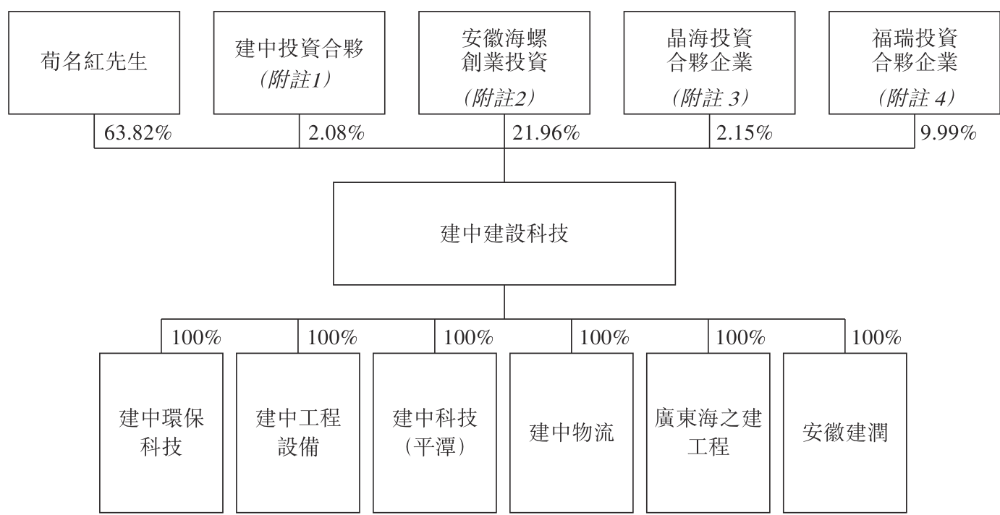

## 第 21 页

息。股息之宣派有待董事酌情考慮及股東批准(倘需要)(中期股息除外)。股息的宣派、支付及金額須遵守本公司的憲章文件及開曼公司法的規定。

所得款項用途

經扣除我們就股份發售應付的包銷佣金及其他估計開支後及假設發售價為每股發售股份1.50港元(即指示性發售價範圍的中位數)，我們估計股份發售所得款項淨額將約為188.4百萬港元(相當於約人民幣169.7百萬元)。我們擬將股份發售所得款項淨額撥作下列用途及金額：

• 股份發售所得款項淨額的約70.0%或約131.9百萬港元(相當於約人民幣118.8百萬元)將用於撥付即將開工項目的資金需求及現金流。

• 股份發售所得款項淨額中的約20.0%或約37.7百萬港元(相當於約人民幣33.9百萬元)將用於支付新建築機械、設備及工具的部分購置成本，旨在擴充我們的建築機械及設備。

• 股份發售所得款項淨額中的約10.0%或約18.8百萬港元(相當於約人民幣17.0百萬元)將用作營運資金及一般企業用途。

有關我們未來計劃及所得款項用途的進一步詳情，請參閱「未來計劃及所得款項用途」。

發售統計數據

<!-- table html -->
<table><tr><td></td><td>按發售價下調10%後發售價每股發售股份1.22港元計算</td><td>按發售價每股1.35港元計算</td><td>按發售價每股1.65港元計算</td></tr><tr><td>市值(附註1) ……</td><td>762.5百萬港元</td><td>843.8百萬港元</td><td>1,031.3百萬港元</td></tr><tr><td>未經審核備考經調整每股綜合有形資產淨值(附註2) ……</td><td>1.64港元</td><td>1.68港元</td><td>1.75港元</td></tr></table>
<!-- /table -->

附註：

1. 市值是基於預計此次股份發售將予發行156,250,000股股份，並假設在資本化發行完成後及緊隨股份發售完成後已發行及發行在外625,000,000股股份計算得出。

2. 未經審核備考經調整每股綜合有形資產淨值是在作出附錄二「A.未經審核備考經調整有形資產淨值報表」所述的調整後，並基於資本化發行完成後及緊隨股份發售完成後已發行及發行在外的625,000,000股股份計算得出。

訴訟及法律合規情況

於往績記錄期間及截至最後實際可行日期，除「業務－法律訴訟及合規」所披露者外，本集團並無捲入對我們的業務、經營業績或財務狀況有重大不利影響的任何申索及訴訟。

---

## 第 126 页

府亦改善了基礎設施，尤其是交通運輸系統。福建省的外商直接投資流入持續增加，2013年至2017年間的複合年增長率為6.5%。為了鼓勵持續健康的私人投資，中央政府在多個行業推出了一系列具有吸引力的項目，且政府和社會資本合作(PPP)模式以規範有序的方式推廣至更多領域。

有關中國及福建省地基工程市場增長的進一步詳情，請參閱「行業概覽－中國地基工程市場概覽」。

(iii) 創始人憑藉其於中國建築行業的豐富經驗，於建築行業建立了廣泛的人脈網絡及強大的客戶基礎

我們的創始人荀名紅先生於中國建築行業擁有逾26年經驗。彼於中國知名水泥生產商及供應商安徽海螺水泥股份有限公司(其股份於聯交所主板上市，股份代號：914)任職期間積累了近十年的行業經驗。於積累了豐富的經驗及專業知識後，荀名紅先生開始創業並建立從事建築行業各類服務的公司。有關荀名紅先生工作經驗的進一步詳情，請參閱「董事及高級管理層－董事－執行董事」。

憑藉其在建築行業的多年經驗，荀名紅先生在建築行業建立了廣泛的人脈網絡。此外，荀名紅先生亦熟悉福建省的多家建築企業及承包商。因此，憑藉該等網絡及其自身的工作經驗，荀名紅先生對如何與大型建築公司合作共事有了更深刻的了解，而這些可以應用到我們承攬的建築工程項目中。

誠如上文所述，董事認為我們於往績記錄期間能夠獲得不同種類及更高等級的專業資質主要歸功於(其中包括)我們過往於提供建築服務方面，尤其是地基工程方面發展勢頭迅猛。董事進一步認為各種不同類型的專業資質及資質升級亦有利於我們較其他行業參與者及整個市場取得更優表現。

根據相關中國法律法規，於中國開展各種建築工程須獲授許可且建築工程服務提供商須符合有關金融、技術要求及管理架構等特定標準。因此，根據弗若斯特沙利文報告，許可要求為中國建築行業的主要准入障礙，原因為市場准入者無法滿足要求及於中國開展合格的建築工程。

於2016年8月，我們獲得地基基礎工程專業承包三級資質並開始提供建築服務。此後，為與業務擴張保持一致，於2017年8月三級資質升級為二級資質，之後於2018年6月進一步升級為一級資質。各等級地基基礎工程專業承包資質的主要要求如下：

<!-- table html -->
<table><tr><td></td><td>三級</td><td>二級</td><td>一級</td></tr><tr><td>淨資產要求</td><td>人民幣4百萬元以上</td><td>人民幣1,000萬元以上</td><td>人民幣2,000萬元以上</td></tr></table>
<!-- /table -->

主要人員要求 a）應不少於三名註冊建造 a）與三級相同 a）與三級相同師。

---

## 第 137 页

歷史、重組及公司架構

<!-- table html -->
<table><tr><td>公司名稱</td><td>成立日期</td><td>於最後實際可行日期的註冊資本(附註)</td><td>主營業務</td><td>於最後實際可行日期的股權持有人(股權百分比)</td><td>應佔本集團權益比例</td></tr><tr><td>建中工程設備</td><td>2017年10月27日</td><td>人民幣3,000萬元</td><td>生產、銷售、安裝及租賃建築機械、設備及工具及建材</td><td>建中建設科技：(100%)</td><td>100%</td></tr><tr><td>建中環保科技</td><td>2018年1月18日</td><td>人民幣5,000萬元</td><td>提供污水處理服務</td><td>建中建設科技：(100%)</td><td>100%</td></tr><tr><td>安徽建潤</td><td>2018年5月15日</td><td>人民幣3,500萬元</td><td>投資控股</td><td>建中建設科技：(100%)</td><td>100%</td></tr><tr><td>廣東海之建工程</td><td>2019年1月7日</td><td>人民幣3,000萬元</td><td>投資控股</td><td>建中建設科技：(100%)</td><td>100%</td></tr><tr><td>建中外商獨資企業</td><td>2019年3月22日</td><td>6,000萬港元</td><td>投資控股</td><td>建中控股(香港)：(100%)</td><td>100%</td></tr><tr><td>建中投資諮詢</td><td>2019年4月1日</td><td>人民幣10,101,000元</td><td>投資控股</td><td>建中外商獨資企業：(100%)</td><td>100%</td></tr></table>
<!-- /table -->

附註：已繳足註冊資本部分之詳情請參閱會計師報告附註1。

我們於英屬處女群島及香港的境外附屬公司

於最後實際可行日期，本集團亦擁有兩間分別位於英屬處女群島及香港的境外投資控股公司：

<!-- table html -->
<table><tr><td>公司名稱</td><td>註冊成立地點</td><td>註冊成立日期</td><td>主營業務</td><td>應佔本集團權益比例</td></tr><tr><td>建中控股BVI</td><td>英屬處女群島</td><td>2019年2月18日</td><td>投資控股</td><td>100%</td></tr><tr><td>建中控股(香港)</td><td>香港</td><td>2019年2月25日</td><td>投資控股</td><td>100%</td></tr></table>
<!-- /table -->

重組

下圖載列本集團於緊接重組前的公司及股權架構：

附註：

1. 緊接重組前，以下人士於建中投資合夥實益擁有權益：荀名紅先生(75.31%)、何文林先生(5.71%)、鮑協和(5.71%)、倪先生(5.71%)、鄭女士(1%)、嚴龍玉(1%)、鮑瑞知(1%)、張鵬(1%)、陳國占(1%)、嚴玫雲(1%)、杜愛國(1%)、官秀琴(0.28%)及付兵(0.28%)，各自為建中建設科技當時的董事及／或僱員。

---

## 第 166 页

(i)原污水處理基礎設施；及(ii)新污水處理基礎設施的詳情載列如下。

原污水處理基礎設施

污水處理運營商與客戶I於2002年12月13日就BOT項目運營訂立協議（「原污水處理基礎設施協議」）。下文載列原污水處理基礎設施協議之主要合約條款：

<!-- table html -->
<table><tr><td>主要合約條款</td><td>詳情</td></tr><tr><td>訂約方</td><td>(i)客戶I；及(ii)污水處理運營商</td></tr><tr><td>工程範圍</td><td>污水處理運營商或其授權運營商應負責污水處理廠的建設及其在建設完成後的持續運營，直至2030年4月30日。在運營期之後，原污水處理基礎設施之所有權應按照原污水處理基礎設施協議中的規定移交予客戶I。</td></tr><tr><td>完成日期</td><td>原污水處理基礎設施的建設應於2005年4月30日之前建成。</td></tr><tr><td>可轉讓性</td><td>污水處理運營商不得將經營權轉讓予任何第三方。</td></tr><tr><td>所有權</td><td>原污水處理基礎設施所在的土地由中國政府擁有。然而，原污水處理基礎設施由污水處理運營商擁有及運營，直至原污水處理基礎設施協議屆滿為止。</td></tr></table>
<!-- /table -->

新污水處理基礎設施

我們就BOT項目提交投標申請並於2017年12月21日收到建中建設科技獲授BOT項目建設及改造工程的中標通知書(中標金額約為人民幣49.9百萬元)。於2018年1月12日，建中建設科技與污水處理運營商設立的項目公司$^{(附註)}$（「項目公司」）就新污水處理基礎設施建設及改造工程簽署採購協議。下文載列採購協議主要合約條款：

<!-- table html -->
<table><tr><td>主要合約條款</td><td>詳情</td></tr><tr><td>污水處理基礎設施位置</td><td>長樂區航城街道霞洲村太平港以西</td></tr></table>
<!-- /table -->

---

## 第 167 页

業務

<!-- table html -->
<table><tr><td>主要合約條款</td><td>詳情</td></tr><tr><td>訂約方</td><td>(i)建中建設科技；及(ii)項目公司</td></tr><tr><td>各自角色</td><td>我們負責新污水處理基礎設施的建設、改造及運營及其持續運營，直至2030年4月30日。</td></tr><tr><td></td><td>項目公司負責監督項目並為本集團與相關政府部門進行溝通。</td></tr><tr><td>施工完成日期</td><td>2018年6月30日前</td></tr><tr><td>更改及改建工程範圍</td><td>建設範圍主要包括：改造及變更中間提升泵房、投配間及配電房、高效沉澱池、污泥回流泵房、纖維濾布濾池、紫外線消毒池、工藝管道、廠區道路綠化、實驗樓新建樓層、生物池改造、粗細格柵改造及碳源投配間改造。</td></tr><tr><td>合約金額及單價</td><td>如污水處理基礎設施補充協議(定義見下文)中所述。</td></tr><tr><td>履約保證金</td><td>於建築期間，我們須向項目公司提供投標金額的10%作為履約保證金以確保我們履行合約責任。倘我們未能按時完成項目，則項目公司有權沒收保證金。</td></tr><tr><td>罰款</td><td>新污水處理基礎設施的建設應於2018年6月30日之前完成。每延期一天，本集團應向項目公司支付人民幣50,000元罰款。</td></tr></table>
<!-- /table -->

就新污水處理基礎設施，污水處理運營商與客戶I於2018年11月9日訂立原污水處理基礎設施協議的補充協議（「污水處理基礎設施補充協議」）。下文載列污水處理基礎設施補充協議之主要合約條款：

<!-- table html -->
<table><tr><td>主要合約條款</td><td>詳情</td></tr><tr><td>訂約方</td><td>(i)客戶I；及(ii)污水處理運營商</td></tr><tr><td>角色及責任</td><td>建中環保科技被指定為新污水處理基礎設施建設及維護的負責公司及其持續運營至2030年4月30日。</td></tr><tr><td></td><td>根據上文披露的原污水處理基礎設施協議的條款及條件，原污水處理基礎設施應由污水處理運營商運營至2030年4月30日。</td></tr></table>
<!-- /table -->

---

## 第 180 页

建築機械、設備及工具的使用率

下表載列於往績記錄期間各類主要機械的平均使用率(按於某一財政年度或期間租賃予客戶或在工地所配備有關機械、設備及工具類型的總天數，除以總工作天數(假設每週六個工作日)計算)：

截至12月31日止年度

<!-- table html -->
<table><tr><td colspan="16">截至12月31日止年度</td><td colspan="10">截至9月30日止九個月</td></tr><tr><td colspan="4">2016年</td><td colspan="4">2017年</td><td colspan="4">2018年</td><td colspan="4">2019年</td></tr><tr><td>租賃予客戶</td><td>調配至工地</td><td>其他(附註)</td><td>合計</td><td>租賃予客戶</td><td>調配至工地</td><td>其他(附註)</td><td>合計</td><td>租賃予客戶</td><td>調配至工地</td><td>其他(附註)</td><td>合計</td><td>租賃予客戶</td><td>調配至工地</td><td>其他(附註)</td><td>合計</td></tr><tr><td>(天數) (%)</td><td>(天數) (%)</td><td>(天數) (%)</td><td>(%)</td><td>(天數) (%)</td><td>(天數) (%)</td><td>(天數) (%)</td><td>(%)</td><td>(天數) (%)</td><td>(天數) (%)</td><td>(天數) (%)</td><td>(%)</td><td>(天數) (%)</td><td>(天數) (%)</td><td>(天數) (%)</td><td>(%)</td></tr><tr><td>使用率</td><td></td><td></td><td></td><td></td><td></td><td></td><td></td><td></td><td></td><td></td><td></td><td></td><td></td><td></td><td></td><td></td></tr><tr><td>(a) 地基工程機械、設備及工具...</td><td>84</td><td>28.1</td><td>7</td><td>3.5</td><td>-</td><td>0.0</td><td>31.6</td><td>25</td><td>8.5</td><td>162</td><td>58.1</td><td>-</td><td>0.0</td><td>66.6</td><td>38</td><td>10.9</td><td>207</td><td>62.4</td><td>25</td><td>7.6</td><td>80.9</td><td>25</td><td>13.5</td><td>143</td><td>53.7</td><td>18</td><td>6.6</td><td>73.8</td></tr><tr><td>(b) 起重及高空作業機械設備</td><td>237</td><td>75.7</td><td>一天以內</td><td>0.1</td><td>6</td><td>2.8</td><td>78.6</td><td>169</td><td>46.9</td><td>6</td><td>2.2</td><td>13</td><td>4.9</td><td>54.0</td><td>165</td><td>46.8</td><td>22</td><td>6.5</td><td>13</td><td>4.2</td><td>57.4</td><td>228</td><td>86.7</td><td>13</td><td>5.3</td><td>2</td><td>0.7</td><td>92.7</td></tr><tr><td>(c) 土方工程機械設備</td><td>49</td><td>21.2</td><td>73</td><td>51.2</td><td>-</td><td>0.0</td><td>72.5</td><td>68</td><td>29.0</td><td>168</td><td>59.1</td><td>-</td><td>0.0</td><td>88.1</td><td>63</td><td>18.0</td><td>245</td><td>75.6</td><td>8</td><td>2.2</td><td>95.8</td><td>26.8</td><td>9.8</td><td>219</td><td>80.0</td><td>-</td><td>-</td><td>89.8</td></tr><tr><td>(d) 拆卸機械及設備</td><td>66</td><td>40.9</td><td>57</td><td>50.0</td><td>-</td><td>0.0</td><td>90.9</td><td>34</td><td>23.2</td><td>157</td><td>64.4</td><td>-</td><td>0.0</td><td>87.6</td><td>69</td><td>19.2</td><td>221</td><td>65.3</td><td>30</td><td>8.2</td><td>92.7</td><td>44</td><td>16.1</td><td>203</td><td>79.4</td><td>-</td><td>-</td><td>95.5</td></tr><tr><td>(e) 物料裝運機械及設備</td><td>122</td><td>34.7</td><td>13</td><td>7.3</td><td>94</td><td>39.8</td><td>81.8</td><td>52</td><td>14.4</td><td>24</td><td>6.8</td><td>175</td><td>62.4</td><td>83.5</td><td>119</td><td>33.6</td><td>32</td><td>9.3</td><td>165</td><td>50.6</td><td>93.4</td><td>118</td><td>43.4</td><td>28</td><td>10.9</td><td>103.5</td><td>40.0</td><td>94.3</td></tr></table>
<!-- /table -->

附註：其他指我們的研發團隊進行維修維護及修改或改進耗費的時間。

業務

---

## 第 183 页

業務

<!-- table html -->
<table><tr><td>名稱</td><td>功能</td><td>數量</td><td>單位</td><td>賬面淨值 (人民幣千元)</td><td>平均已使用年限 (年)</td><td>平均剩餘可使用年限 (年)</td></tr><tr><td>機械手</td><td>挖掘機固定式機械手是指安裝在挖掘機前端，作為挖掘機工作裝置使用的用於抓取石頭、鋼材、木材等物料的一種固定作業方向的工作裝置。</td><td>13</td><td>台</td><td>14,497</td><td>2.5</td><td>7.0</td></tr><tr><td>挖機</td><td>一種多功能機械，被廣泛應用於水利工程，交通運輸，電力工程和礦山採掘等機械施工中，它在減輕繁重的體力勞動，保證工程質量，加快建設速度以及提高勞動生產率方面起著十分重要的作用。</td><td>91</td><td>台</td><td>51,140</td><td>2.3</td><td>7.7</td></tr><tr><td>椿機</td><td>在吊椿就位，懸吊椿錘，打椿時引導椿身方向並保證錘能沿著所要求的方向衝擊。</td><td>12</td><td>台</td><td>7,957</td><td>3.2</td><td>2.8</td></tr><tr><td>H型椿</td><td>主要用於大型建築採用SMW工法椿施工中的建築材料。</td><td>38,780</td><td>噸</td><td>52,363</td><td>2.4</td><td>0.6</td></tr><tr><td>拉森鋼板椿</td><td>一種建築材料，在建橋圍堰、大型管道鋪設、臨時溝渠開挖時作擋土、擋水、擋沙牆；在碼頭、卸貨場作護牆、擋土牆、堤防護岸等，工程上發揮重要作用。</td><td>12,040</td><td>噸</td><td>24,280</td><td>2.0</td><td>1.1</td></tr><tr><td>鋁模板</td><td>一種建築模板，具有重量輕、拆裝靈活、剛度高、使用壽命長、板面大、拼縫少等特點。</td><td>53,839</td><td>平方米</td><td>26,949</td><td>1.4</td><td>1.6</td></tr></table>
<!-- /table -->

3. 污水處理業務

我們的運營

於污水處理基礎設施的建設完工後，我們進入BOT項目的運營階段。以下載列我們污水處理業務的主要詳情：

<!-- table html -->
<table><tr><td>項目</td><td>說明</td></tr><tr><td>位置</td><td>長樂區航城街道霞洲村太平港以西</td></tr><tr><td>廠房類型</td><td>污水處理廠</td></tr><tr><td>規定特許期</td><td>經營污水處理廠，直至2030年4月30日</td></tr></table>
<!-- /table -->

---

## 第 222 页

附註：於截至2016年12月31日止年度，我們僅委聘三家分包商。

截至2017年12月31日止年度

<!-- table html -->
<table><tr><td>排名</td><td>分包商</td><td>主營業務</td><td>向本集團提供的服務</td><td>業務關係起始年份</td><td>分包金額</td><td>分包費總額佔比</td></tr><tr><td></td><td></td><td></td><td></td><td></td><td>(人民幣百萬元)</td><td></td></tr><tr><td>1.</td><td>分包商A</td><td>建築勞務分包附註1</td><td>勞務分包</td><td>2016年</td><td>34.7</td><td>35.0%</td></tr><tr><td>2.</td><td>分包商B</td><td>建築勞務分包附註2</td><td>勞務分包</td><td>2016年</td><td>34.0</td><td>34.3%</td></tr><tr><td>3.</td><td>分包商C</td><td>建築勞務分包附註3</td><td>勞務分包</td><td>2017年</td><td>16.4</td><td>16.6%</td></tr><tr><td>4.</td><td>分包商D</td><td>一間位於上海的公司及從事提供清潔及運輸服務附註4</td><td>建築廢料運輸</td><td>2017年</td><td>12.2</td><td>12.3%</td></tr><tr><td>5.</td><td>分包商E</td><td>建築勞務分包附註5</td><td>勞務分包</td><td>2017年</td><td>0.6</td><td>0.7%</td></tr><tr><td></td><td></td><td></td><td></td><td>五大分包商小計</td><td>97.9</td><td>98.9%</td></tr></table>
<!-- /table -->

截至2018年12月31日止年度

<!-- table html -->
<table><tr><td>排名</td><td>分包商</td><td>主營業務</td><td>向本集團提供的服務</td><td>業務關係起始年份</td><td>分包金額</td><td>分包費總額佔比</td></tr><tr><td></td><td></td><td></td><td></td><td></td><td>(人民幣百萬元)</td><td></td></tr><tr><td>1.</td><td>分包商C</td><td>建築勞務分包附註3</td><td>勞務分包</td><td>2017年</td><td>129.6</td><td>67.2%</td></tr><tr><td>2.</td><td>分包商A</td><td>建築勞務分包附註1</td><td>勞務分包</td><td>2016年</td><td>22.8</td><td>11.8%</td></tr></table>
<!-- /table -->

---

## 第 224 页

業務

<!-- table html -->
<table><tr><td>編號</td><td>分包商</td><td>主營業務</td><td>向本集團提供的服務</td><td>業務關係起始年份</td><td>分包金額</td><td>分包費總額佔比</td></tr><tr><td>5.</td><td>分包商I</td><td>建築分包服務及運輸服務。清潔及運輸建築垃圾附註9</td><td>勞動分包</td><td>2019年</td><td>(人民幣百萬元) 9.7</td><td>2.5%</td></tr><tr><td></td><td></td><td></td><td></td><td>五大分包商小計</td><td>342.5</td><td>89.1%</td></tr></table>
<!-- /table -->

附註：

基於公開可得的資料及就董事經作出一切合理查詢後所深知、盡悉及確信：

1. 分包商A為一間於2016年6月13日在福州市成立的私營公司，其註冊資本為人民幣50百萬元。據董事所深知，其由身為獨立第三方之個人全資擁有。

2. 分包商B為一間於2014年2月12日在福州市成立的私營公司，其註冊資本為人民幣20百萬元。據董事所深知，其由身為獨立第三方之二人分別持有60%及40%的股權。

3. 分包商C為一間於2017年7月27日在福州市成立的私營公司，其註冊資本為人民幣80百萬元。據董事所深知，其由身為獨立第三方之個人全資擁有。

4. 分包商D為一間於2009年8月19日在上海成立的私營公司，其註冊資本為人民幣13百萬元。據董事所深知，其由身為獨立第三方之個人分別擁有80%及20%。

5. 分包商H為一間於2017年9月14日在福州市成立的私營公司，其註冊資本為人民幣10百萬元。據董事所深知，其由身為獨立第三方之個人全資擁有。

6. 分包商F與客戶E屬同一集團。請參閱本節上文「客戶－我們於往績記錄期間的五大客戶」附註5。

7. 分包商G為一間於2016年6月17日在福州市成立的私營公司，其註冊資本為人民幣30百萬元。據董事所深知，其由身為獨立第三方之二人分別持有67%及33%的股權。

8. 分包商H為一間於2013年6月13日在福州市成立的私營公司，其註冊資本為人民幣5百萬元。據董事所深知，其由身為獨立第三方之三人分別持有90%、5%及5%的股權。於本節「於往績記錄期間施工現場的死亡事故」所披露的死亡事故發生後，我們不再就新項目委聘分包商H。截至2019年9月30日止九個月錄得的分包商H的收益相當於分包商H於2019年1月根據已簽訂的合約進行的在建項目所產生的收益。

9. 分包商I為一間於2019年1月25日在福建省福州市成立的私營公司，其註冊資本為人民幣30百萬元。其主要從事提供建築分包服務及運輸服務。其由身為獨立第三方之二人分別持有51%及49%的股權。

我們的董事已確認，除建中勞務工程外，於往績記錄期間，我們的五大分包商均為獨立第三方，據董事所知，概無擁有本公司已發行股本5.0%以上的董事或彼等的緊密聯繫人或我們的現有股東在該等分包商中擁有任何權益。建中勞務工程的背景資料請參閱下文「我們與福建潤江及建中勞務工程進行的交易」。

---

## 第 252 页

下表載列上述不合規事件的詳情：

<!-- table html -->
<table><tr><td>不合規事件及其原因</td><td>不合規事件的後果</td></tr><tr><td>(1) 社會保險金及住房公積金</td><td></td></tr><tr><td>於往績記錄期間，我們並未根據中國法律法規基於僱員的實際收入足額繳納社會保險金及住房公積金。我們預計，截至2018年12月31日止三個年度各年以及截至2019年9月30日止九個月，未繳納的社會保險金及住房公積金分別約為人民幣3.5百萬元、人民幣3.4百萬元、人民幣5.9百萬元及人民幣4.6百萬元。</td><td>根據中華人民共和國社會保險法，用人單位未按時足額繳納社會保險費的，由社會保險費徵收機構責令限期繳納或者補足，並自欠繳之日起，按日加收萬分之五的滯納金；逾期仍不繳納的，由有關行政部門處欠繳數額一倍以上三倍以下的罰款。</td></tr><tr><td>發生不合規事件主要是由於各地方政府對中國法律法規的執行或詮釋不統一，以及我們的人力資源部人員對中國相關法律法規的理解不夠充分。</td><td>根據住房公積金管理條例，違反本條例的規定，單位不辦理住房公積金繳存登記或者不為本單位職工辦理住房公積金賬戶設立手續的，由住房公積金管理中心責令限期辦理；逾期不辦理的，處人民幣1萬元以上人民幣5萬元以下的罰款。</td></tr></table>
<!-- /table -->

補救措施及內部控制措施

我們的所有中國附屬公司及分公司以及僱員均獲相關當地社會保障及住房公積金機構的書面確認，各表明(i)截至書面確認日期，並無收到任何行政處罰；及／或(ii)相關中國附屬公司／分公司遵守各自的法律法規。我們獲中國法律顧問告知，相關確認乃由主管中國政府機構發出。

就我們的社會保障基金，於2019年8月8日及2019年8月9日，我們的中國法律顧問分別與國家稅務總局福州經濟技術開發區稅務局及福州市經濟技術開發區人力資源和社會保障局勞動監察大隊進行當面溝通。其確認：

(a) 國家稅務總局福州經濟技術開發區稅務局及福州市經濟技術開發區人力資源和社會保障局勞動監察大隊將不會要求我們就任何先前未遵守繳納社會保險金的事件支付任何還款或逾期罰款，及(b)我們於直至溝通日期前一直遵守相關法律法規或福州市地方規定。我們獲中國法律顧問告知，面對面溝通乃與主管中國政府機構進行。

就我們的住房公積金，於2019年8月9日，我們的中國法律顧問與福州住房公積金管理中心城區管理部進行面對面溝通。其確認(其中包括)(a)福州住房公積金管理中心城區管理部一般不會要求我們就先前未遵守繳納住房公積金的事件支付任何還款或逾期罰款，及(b)我們於直至溝通日期前一直遵守相關法律法規或福州市地方規定繳納住房公積金。我們獲中國法律顧問告知，面對面溝通乃與主管中國政府機構進行。

我們已於財務報表中就截至2018年12月31日止三個年度各年及截至2019年9月30日止九個月的該等潛在責任作出總額分別為約人民幣1.0百萬元、人民幣0.2百萬元、零元及人民幣1.0百萬元的撥備，相當於各期間的不足供款。

截至最後實際可行日期，相關政府機構並未就該事件對我們採取任何行政行動、施加罰款或處罰，本集團亦未收到任何命令以結算社會保險金或住房公積金未支付金額。我們並未意識到任何關於支付社會保險及住房公積金的員工投訴或要求，我們就此亦未涉及任何爭議。

董事已承諾盡其最大努力遵守適用法律法規。截至最後實際可行日期，我們為所有僱員繳納社會保險金及住房公積金。

基於上文所述，董事認為，該事件不會對我們的運營及財務狀況產生重大不利影響。

業務

---

## 第 271 页

荀名紅先生於1994年4月取得由中華人民共和國人事部頒發的專業技術資格證書，專攻運輸經濟專業。

荀名紅先生為下列於中國註冊成立的公司的法人代表、董事及／或監事，該等公司其後於其任期內撤銷註冊：

<!-- table html -->
<table><tr><td>公司名稱</td><td>職位</td><td>業務性質</td><td>撤銷註冊的原因</td></tr><tr><td>福州金山茶城茶葉交易市場有限公司</td><td>執行董事</td><td>茶葉交易</td><td>終止業務</td></tr></table>
<!-- /table -->

如荀名紅先生所確認，上述公司於撤銷註冊時具有償付能力，且據彼所知，該公司撤銷註冊並無導致彼須承擔任何責任或義務。

何文林先生，50歲，自2014年11月及2016年6月起，分別擔任建中建設科技總經理及董事。彼於2019年2月5日本公司註冊成立後獲委任為本公司董事，並於2019年8月23日調任為執行董事。彼主要負責監督我們的整體營運及業務及技術發展且亦領導我們的研發團隊。

何先生在建築行業擁有逾25年經驗。何先生曾於著名建築公司中建海峽建設發展有限公司(前稱中建七局第三建築有限公司)擔任多項職務，最後擔任的職務為部門經理。

何先生於1994年7月畢業於中國瀋陽建築工程學院(現稱瀋陽建築大學)機械設計與製造專業。

何先生於2005年12月取得由中國建築第七工程局頒發的高級工程師資格證書。

鄭萍女士，56歲，於2012年12月至2015年10月擔任建中建設科技董事，其後自2015年11月及2016年6月起分別擔任建中建設科技副總經理及董事。彼於2019年2月5日本公司註冊成立後獲委任為本公司董事，並於2019年8月23日調任為執行董事。鄭女士主要負責監督我們的整體營運及固定資產和物料管理。

---

## 第 272 页

鄭女士在建築行業累積逾26年經驗。1993年2月至2008年3月，鄭女士擔任福建省建福散裝水泥有限公司(福建水泥股份有限公司，一家股份於上海證券交易所上市的公司(上交所證券代碼：600802)，當時的附屬公司)副總經理。2008年4月至2012年11月，鄭女士擔任名信建材(一家主要從事水泥貿易的公司)副總經理。

鄭女士於1993年12月取得福建省高等與中等專業教育自學考試指導委員會頒發的中國廈門大學和福州大學計算機及應用專業畢業證書。

鄭女士於1996年12月取得由中華人民共和國人事部頒發的專業技術資格證書，專攻物資經濟。彼亦於1989年5月取得由福州市人事局頒發的工業電氣自動化助理工程師資格證書。

鄭女士為下列於中國註冊成立的公司的法人代表、董事及／或監事，該等公司其後於其任期內撤銷註冊：

<!-- table html -->
<table><tr><td>公司名稱</td><td>職位</td><td>業務性質</td><td>撤銷註冊的原因</td></tr><tr><td>福州建煉散裝水泥運輸有限公司</td><td>董事</td><td>水泥運輸</td><td>終止業務</td></tr></table>
<!-- /table -->

如鄭女士所確認，上述公司於撤銷註冊時具有償付能力，且據彼所知，該公司撤銷註冊並無導致彼須承擔任何責任或義務。

非執行董事

楊開發先生，46歲，於2019年8月23日獲委任為本公司非執行董事。楊先生具有豐富的證券管理及中國資本市場經驗。於1996年7月至2017年7月，楊先生任職於安徽海螺水泥股份有限公司(一家股份於聯交所主板上市的公司(股份代號：914))，曾擔任(其中包括)董事會秘書室主任助理、副主任及主任；董事會秘書；及江西區域管理委員會副主任等職務。楊先生於安徽海螺水泥股份有限公司的主要職責包括公司秘書、證券事務及一般管理職能。自2017年7月及2019年7月起，楊先生擔任安徽海螺創業投資(一名首次公開發售前投資者)副總經理及總經理。

---

## 第 274 页

荀先生為下列於中國註冊成立的公司的法人代表、董事及／或監事，該公司其後於其任期內撤銷註冊：

<!-- table html -->
<table><tr><td>公司名稱</td><td>職位</td><td>業務性質</td><td>撤銷註冊的原因</td></tr><tr><td>蚌埠萬達貿易發展總公司</td><td>法人代表</td><td>投資控股</td><td>終止業務</td></tr></table>
<!-- /table -->

如荀先生所確認，上述公司於撤銷註冊時具有償付能力，且據彼所知，該公司撤銷註冊並無導致彼須承擔任何責任或義務。

獨立非執行董事

施榮懷先生，銅紫荊星章，太平紳士，58歲，於2020年2月18日獲委任為董事會成員且於本集團其他成員公司並無擔任任何職位。施先生於2011年獲委任為太平紳士，並於2015年獲香港政府頒授銅紫荊星章。彼現為中國人民政治協商會議全國委員會人口資源環境委員會副主任、中國人民政治協商會議北京市委員會常務委員及香港中華廠商聯合會永遠名譽會長。

施先生自2006年起擔任香港特別行政區選舉委員會委員，現時亦是香港特別行政區勞工顧問委員會(2019年至2020年)委員。

施先生自1984年3月起一直擔任香港一間私人公司恒通資源集團有限公司的董事。該公司主要從事物業投資、進出口貿易、提供管理服務及股份投資。施先生主要負責該公司業務營運的日常管理及整體戰略規劃。

施先生現為多間聯交所上市公司的獨立非執行董事，包括(i)自2018年12月起於優品360控股有限公司(股份代號：2360)，一間主要從事休閒食品零售連鎖運營的公司；(ii)自2018年4月起於智紡國際控股有限公司(股份代號：8521)，一間功能性針織面料供應商；(iii)自2016年11月起於其士國際集團有限公司(股份代號：25)，一間主要從事建築及物業相關業務的公司；及(iv)自2008年10月起於恒和珠寶集團有限公司(股份代號：513)，一間主要從事珠寶行業的公司。

---

## 第 358 页

財務資料

<!-- table html -->
<table><tr><td>與關聯方之交易</td><td>簡述</td><td>與關聯方進行該等交易之理由</td><td>終止該等交易之理由（如適用）</td></tr><tr><td>向關聯方背書的商業票據</td><td>本集團已向關聯方背書商業票據，用於以美元對美元結付若干未償結餘。</td><td>該背書旨在緩解本集團營運資金壓力。</td><td>為維持上市後與控股股東的財務獨立，本集團須於上市後停止向關聯方背書商業票據。</td></tr></table>
<!-- /table -->

經考慮可獲得的數據及報價(自(其中包括)市場、內部及我們的客戶及供應商獲得)，董事認為就關聯方交易與關聯方的價格屬公平合理。尤其是：

本集團就購買材料應付福建潤江的價格範圍與應付獨立第三方供應商的價格相若。

關聯方地基工程項目的累計毛利率與獨立第三方客戶的可比地基工程項目的平均累計毛利率相若。

各租約開始日期、租約修訂日期及／或續租日期的應付關聯方月租金與當時相鄰位置相似經營物業的市場租金相若。

就關聯方向本集團提供的勞務服務而言，關聯方向本集團收取的費率與另一獨立服務提供商向客戶A(國有企業)一間附屬公司收取的費率相同。

本集團根據有關關聯方獲得的其他獨立第三方供應商的報價按相若費率向關聯方租賃建築機械、設備及工具。

上述交易存有應付／應收關聯方款項為貿易相關。

本集團以美元對美元向關聯方、獨立第三方供應商及分包商背書商業票據。

該等關聯方交易按本集團與各關聯方協定的條款進行。基於此，董事已確認，(i)於往績記錄期間進行的所有該等關聯方交易均按公平基準及正常商業條款進行，有關條款對本集團而言不遜於提供予獨立第三方或獨立第三方所提供的條款，因此符合本集團的整體利益；

---

## 第 454 页

貴集團所有自有物業、廠房及設備均位於中國。

(ii) 使用權資產

貴集團於有關期間根據租賃協議有權使用若干辦公室／廠房。租賃最初一般為期一至五年。若干租賃包含可於重新磋商所有條款時續租的選擇權。概無租賃包括可變租賃付款。按相關資產分類之使用權資產賬面淨值分析呈列如下：

辦公室／廠房
人民幣千元

於2016年1月1日的餘額 …… 196
添置 …… 2,553
年內折舊計提 …… (1,330)

於2016年12月31日及2017年1月1日的餘額 …… 1,419
添置 …… 2,167
年內折舊計提 …… (1,701)

於2017年12月31日及2018年1月1日的餘額 …… 1,885
添置 …… 2,462
年內折舊計提 …… (1,039)

於2018年12月31日及2019年1月1日的餘額 …… 3,308
添置 …… —
期內折舊計提 …… (1,724)

於2019年9月30日的餘額 …… 1,584

(iii) 售後租回資產

2017年，貴集團對外出售部分機械設備並於售後租回該等機械設備，為期3年。貴集團確認向買方－出租人作出的轉讓並非香港財務報告準則第15號項下所界定的銷售，故貴集團繼續確認相關資產，並按照附註2(g)(i)載列的會計政策就已收取的代價確認金融負債。於有關期間的售後租回交易並未確認任何收益或虧損。於2017年及2018年12月31日以及2019年9月30日，售後租回交易項下機械設備的賬面金額分別為人民幣33,619,000元、人民幣30,449,000元及人民幣28,071,000元，該金額已計入貴集團物業、廠房及設備的賬面金額。

於2017年及2018年12月31日以及2019年9月30日，就上述售後租回交易抵押的機械設備的賬面金額分別為人民幣17,903,000元、人民幣16,346,000元及人民幣15,178,000元。

(iv) 根據經營租賃出租的資產

於日常業務過程中，貴集團出於租賃目的購置若干塔吊及施工吊車等機械及設備。該等租賃一般為期六至十二個月，於磋商後可續租。

---

## 第 455 页

貴集團於有關期間塔吊及施工吊車的對賬如下：

成本：
於2016年1月1日 …… 28,872
添置 …… 8,931
處置 …… (675)
於2016年12月31日及2017年1月1日 …… 37,128
添置 …… 2,222
於2017年12月31日及2018年1月1日 …… 39,350
添置 …… 13,340
處置 …… (33)
於2018年12月31日及2019年1月1日 …… 52,657
添置 …… 7,377
於2019年9月30日 …… 60,034

累計折舊：
於2016年1月1日 …… 6,399
年內折舊 …… 569
於出售時撥回 …… (187)
於2016年12月31日及2017年1月1日 …… 6,781
年內折舊 …… 70
於2017年12月31日及2018年1月1日 …… 6,851
年內折舊 …… 1,277
於出售時撥回 …… (25)
於2018年12月31日及2019年1月1日 …… 8,103
期內折舊 …… 1,123
於2019年9月30日 …… 9,226

賬面淨值：
於2016年12月31日 …… 30,347
於2017年12月31日 …… 32,499
於2018年12月31日 …… 44,554
於2019年9月30日 …… 50,808

貴集團主要因自身建設項目需要收購其他資產，但貴集團亦根據客戶特定需要出租若干該等資產。該等租賃主要為短期租賃，於磋商後可續租。

---

## 第 531 页

<!-- table html -->
<table><tr><td>編號</td><td>商標</td><td>註冊擁有人</td><td>註冊地點</td><td>類別</td><td>註冊編號</td><td>有效期限</td></tr><tr><td>4.</td><td></td><td>建中科技(平潭)</td><td>中國</td><td>374</td><td>27859772</td><td>2018.11.7-2028.11.6</td></tr><tr><td>5.</td><td></td><td>建中科技(平潭)</td><td>中國</td><td>425</td><td>27859070</td><td>2019.4.7–2029.4.6</td></tr><tr><td>6.</td><td>JIANZHONG</td><td>本公司</td><td>香港</td><td>6、7、37、421</td><td>304915738</td><td>2019.5.7-2029.5.6</td></tr><tr><td>7.</td><td>建中</td><td>本公司</td><td>香港</td><td>6、7、37、42</td><td>304915765</td><td>2019.5.7-2029.5.6</td></tr><tr><td>8.</td><td>A</td><td>本公司</td><td>香港</td><td>6、7、37、42</td><td>304915774</td><td>2019.5.7-2029.5.6</td></tr><tr><td></td><td>B</td><td></td><td></td><td></td><td></td><td></td></tr></table>
<!-- /table -->

附註1：第6類主要包括未加工及半加工普通金屬，以及某些普通金屬製品。

附註2：第7類主要包括機器和機床、馬達和引擎。

附註3：第19類主要包括非金屬材料及建築用材料。

附註4：第37類主要包括建造永久性建築的服務，以及將物品修復原樣或保持原樣的服務。

附註5：第42類主要包括由專業人士提供的涉及複雜領域活動的理論和實踐服務。

(b) 商標(已申請)

於最後實際可行日期，我們已申請註冊以下我們認為對我們業務屬重大的商標，商標尚未獲准註冊：

<!-- table html -->
<table><tr><td>編號</td><td>商標</td><td>申請人</td><td>申請地點</td><td>類別</td><td>申請編號</td><td>申請日期</td></tr><tr><td>1.</td><td></td><td>建中建設科技</td><td>中國</td><td>374</td><td>19483752</td><td>2016.3.30</td></tr></table>
<!-- /table -->

---

## 第 543 页

<!-- table html -->
<table><tr><td>編號</td><td>專利名稱</td><td>類型</td><td>申請地點</td><td>申請人</td><td>申請日期</td><td>申請編號</td></tr><tr><td>72.</td><td>一種雙動力全程泵吸反循環沖孔設備</td><td>實用新型</td><td>中國</td><td>建中建設科技</td><td>2019年12月31日</td><td>201922480223.3</td></tr></table>
<!-- /table -->

(e) 域名

於最後實際可行日期，我們已註冊以下我們認為對我們業務屬重大的域名：

<!-- table html -->
<table><tr><td>編號</td><td>域名</td><td>註冊擁有人</td><td>註冊日期</td><td>屆滿日期</td></tr><tr><td>1</td><td>fjjzkj.com</td><td>建中建設科技</td><td>2016年7月19日</td><td>2026年7月19日</td></tr><tr><td>2</td><td>fjjzkj.cn</td><td>建中建設科技</td><td>2016年7月19日</td><td>2026年7月19日</td></tr></table>
<!-- /table -->

(f) 版權

於最後實際可行日期，我們已註冊以下我們認為對我們業務屬重大的版權：

<!-- table html -->
<table><tr><td>編號</td><td>版權名稱</td><td>版權登記編號</td><td>版權擁有人</td><td>註冊日期</td></tr><tr><td>1</td><td>導架爬升平台同步限載控制系統V1.0</td><td>2016SR111244</td><td>建中建設科技</td><td>2016年3月1日</td></tr><tr><td>2</td><td>污水處理三維可視運維系統V1.0</td><td>2019SR0722721</td><td>建中建設科技</td><td>2017年4月16日</td></tr><tr><td>3</td><td>椿機自動尋位控制系統V1.0</td><td>2019SR1012406</td><td>建中建設科技</td><td>2019年8月10日</td></tr><tr><td>4</td><td>三軸攪拌機站運維控制系統V1.0</td><td>2019SR0722375</td><td>建中建設科技</td><td>2017年6月16日</td></tr><tr><td>5</td><td>智能防傾附著式腳手架設計系統V1.0</td><td>2019SR0721215</td><td>建中建設科技</td><td>2018年3月16日</td></tr></table>
<!-- /table -->