## 第 1 页

蜜雪冰城股份有限公司

（於中華人民共和國註冊成立的股份有限公司）

股份代號：2097

全球發售

你爱我❤️我爱你 蜜雪冰城甜蜜蜜

聯席保薦人、整體協調人、聯席全球協調人、聯席帳簿管理人及聯席牽頭經辦人（按英文字母順序排序）

BofA SECURITIES

Goldman Sachs 高盛

UBS 瑞銀集團

---

## 第 2 页

蜜雪冰城

始于1997·冰淇淋与茶

MIXUE Group

蜜雪冰城股份有限公司

(於中華人民共和國註冊成立的股份有限公司)

全球發售

全球發售的發售股份數量：17,059,900股H股（視乎超額配股權行使與否而定）

香港發售股份數量：1,706,000股H股（可予重新分配）

國際發售股份數量：15,353,900股H股（可予重新分配及視乎超額配股權行使與否而定）

發售價：每股H股202.50港元，另加1.0%經紀佣金、0.0027%證監會交易徵費、0.00015%會財局交易徵費及0.00565%聯交所交易費（須於申請時以港元繳足，多繳款項可予退還）

面值：每股H股人民幣1.00元

股份代號：2097

聯席保薦人、整體協調人、聯席全球協調人、聯席賬簿管理人及聯席牽頭經辦人（按英文字母順序排序）

BofA Securities

Goldman Sachs

UBS

整體協調人、聯席全球協調人、聯席賬簿管理人及聯席牽頭經辦人（按英文字母順序排序）

CICC

HTSC

聯席全球協調人、聯席賬簿管理人及聯席牽頭經辦人

ICBCI

聯席賬簿管理人及聯席牽頭經辦人

GF Securities

CMBI

香港交易及結算所有限公司、香港聯合交易所有限公司及香港中央結算有限公司對本招股章程的內容概不負責，對其準確性或完整性亦不發表任何聲明，並明確表示概不就本招股章程全部或任何部分內容而產生或因依賴該等內容而引致的任何損失承擔任何責任。

本招股章程連同本招股章程附錄五「送呈香港公司註冊處處長及展示文件」所述文件已根據香港法例第32章《公司（清盤及雜項條文）條例》第342C條規定送呈香港公司註冊處處長登記。香港證券及期貨事務監察委員會及香港公司註冊處處長對本招股章程或上述任何其他文件的內容概不負責。

除非另行作出公佈，否則發售價將為每股H股202.50港元。香港發售股份的申請人須於申請時支付發售價每股香港發售股份202.50港元，連同1.0%的經紀佣金、0.0027%的證監會交易徵費、0.00015%的會財局交易徵費及0.00565%的香港聯交所交易費。

整體協調人（代表包銷商）經本公司同意後，可在認為合適的情況下於截止遞交香港公開發售申請當日上午或之前，隨時調減本招股章程所述的香港發售股份數目及／或調低發售價（即202.50港元）。於該情況下，本公司將在作出有關調減決定後在可行情況下盡早且無論如何不遲於截止遞交香港公開發售申請當日上午，在本公司網站www.mxbc.com及聯交所網站www.hkexnews.hk刊登調減香港發售股份數目及／或調低發售價的通知。進一步詳情請參閱本招股章程「全球發售的架構」及「如何申請香港發售股份」章節。

倘若於上市日期上午八時正前發生若干事件，整體協調人（為其本身及代表包銷商）可終止香港包銷商於香港包銷協議項下的責任。請參閱本招股章程「包銷」一節。

有意投資者在作出投資決定前，應仔細考慮本招股章程所載所有資料，包括「風險因素」一節所載的風險因素。

發售股份並無亦不會根據美國證券法或美國任何州證券法登記，且不得於美國境內或向美國人士（定義見S規例）或以其名義或為其利益提呈發售、出售、抵押或轉讓，惟豁免遵守美國證券法登記規定或毋須遵守該等規定的交易除外。發售股份可依據第144A條於美國境內及向美國人士提呈發售及出售，或另一項依據美國證券法的登記豁免或毋須遵守美國證券法登記規定的交易而僅向合資格機構買家提呈發售及出售。發售股份可依據S規例在美國境外以離岸交易方式向非美國人士提呈發售、出售及交付。

重要通知

我們已就香港公開發售採取全電子化申請程序。我們不會就香港公開發售向公眾人士提供本招股章程的印刷本。

招股章程於香港聯交所網站www.hkexnews.hk及本公司網站www.mxbc.com可供閱覽。倘閣下需要本招股章程的印刷本，可從上述網址下載並打印。

---

## 第 3 页

致香港發售股份投資者的重要通知

全電子化申請程序

本公司已就香港公開發售採取全電子化申請程序。

本招股章程可於聯交所網站www.hkexnews.hk「披露易>新上市>新上市資料」分部及我們的網站www.mxbc.com查閱。

本公司將不會提供任何實體渠道以接收任何香港發售股份公眾認購申請。本招股章程電子版本內容與根據公司（清盤及雜項條文）條例第342C條向香港公司註冊處處長登記的招股章程內容相同。

閣下可通過以下其中一種方式申請認購香港發售股份：

(1) 在網上通過白表eIPO服務於www.eipo.com.hk遞交申請；或

(2) 通過香港結算EIPO渠道以電子方式促使香港結算代理人代表閣下申請，指示閣下的經紀或託管商（須為香港結算參與者）通過香港結算FINI系統發出電子認購指示，代表閣下申請香港發售股份。

倘閣下為中介公司、經紀或代理，務請提示閣下的顧客、客戶或主事人（如適用）注意，本招股章程可於上述網址網上查閱。

有關閣下申請認購香港發售股份的程序的進一步詳情，請參閱本招股章程「如何申請香港發售股份」一節。

---

## 第 4 页

閣下通過白表eIPO服務或香港結算EIPO渠道申請認購的股數須至少為100股香港發售股份，並為下表所列的其中一個數量。

倘閣下透過白表eIPO服務提交申請，閣下可參考下表以了解閣下所選擇的香港發售股份數量的應付金額。閣下必須在申請香港發售股份時全額支付申請時應付的相應金額。

倘閣下透過香港結算EIPO渠道申請，閣下須按閣下的經紀或託管商指明的金額（根據香港適用法律及條例規定）就閣下的申請預先撥資。

<!-- table html -->
<table><tr><td>申請認購的</td><td>申請認購的</td><td>申請認購的</td><td>申請認購的</td><td>申請認購的</td><td>申請認購的</td><td>申請認購的</td><td>申請認購的</td></tr><tr><td>香港發售</td><td>申請時</td><td>香港發售</td><td>申請時</td><td>香港發售</td><td>申請時</td><td>香港發售</td><td>申請時</td></tr><tr><td>股份數目</td><td>應繳款項^(2)</td><td>股份數目</td><td>應繳款項^(2)</td><td>股份數目</td><td>應繳款項^(2)</td><td>股份數目</td><td>應繳款項^(2)</td></tr><tr><td></td><td>港元</td><td></td><td>港元</td><td></td><td>港元</td><td></td><td>港元</td></tr><tr><td>100</td><td>20,454.22</td><td>1,000</td><td>204,542.21</td><td>6,000</td><td>1,227,253.28</td><td>75,000</td><td>15,340,665.93</td></tr><tr><td>200</td><td>40,908.44</td><td>1,500</td><td>306,813.32</td><td>7,000</td><td>1,431,795.49</td><td>100,000</td><td>20,454,221.26</td></tr><tr><td>300</td><td>61,362.66</td><td>2,000</td><td>409,084.43</td><td>8,000</td><td>1,636,337.70</td><td>200,000</td><td>40,908,442.50</td></tr><tr><td>400</td><td>81,816.89</td><td>2,500</td><td>511,355.53</td><td>9,000</td><td>1,840,879.91</td><td>300,000</td><td>61,362,663.76</td></tr><tr><td>500</td><td>102,271.10</td><td>3,000</td><td>613,626.63</td><td>10,000</td><td>2,045,422.13</td><td>400,000</td><td>81,816,885.00</td></tr><tr><td>600</td><td>122,725.32</td><td>3,500</td><td>715,897.74</td><td>15,000</td><td>3,068,133.19</td><td>500,000</td><td>102,271,106.26</td></tr><tr><td>700</td><td>143,179.55</td><td>4,000</td><td>818,168.86</td><td>20,000</td><td>4,090,844.26</td><td>600,000</td><td>122,725,327.50</td></tr><tr><td>800</td><td>163,633.76</td><td>4,500</td><td>920,439.96</td><td>25,000</td><td>5,113,555.31</td><td>700,000</td><td>143,179,548.76</td></tr><tr><td>900</td><td>184,087.99</td><td>5,000</td><td>1,022,711.07</td><td>50,000</td><td>10,227,110.63</td><td>853,000^(1)</td><td>174,474,507.27</td></tr></table>
<!-- /table -->

(1) 閣下可申請認購的香港發售股份最高數目。

(2) 應繳款項包括經紀佣金、證監會交易徵費、聯交所交易費及會財局交易徵費。若閣下的申請獲接納，經紀佣金將支付予交易所參與者（定義見上市規則），而證監會交易徵費、聯交所交易費及會財局交易徵費將支付予聯交所（證監會交易徵費由聯交所代表證監會收取；而會財局交易徵費由聯交所代表會財局收取）。

任何其他數量的香港發售股份的申請概不會獲考慮，且該等申請可能會被拒絕。

---

## 第 5 页

倘香港公開發售的下列預期時間表有任何變動，本公司將在香港於本公司網站www.mxbc.com及聯交所網站www.hkexnews.hk刊登公告。

香港公開發售開始 …… 2025年2月21日（星期五）
上午九時正

通過指定網站www.eipo.com.hk以白表eIPO服務

完成電子申請的截止時間$^{(2)}$ ……2025年2月26日（星期三）
上午十一時三十分

開始辦理申請登記時間$^{(3)}$ ……2025年2月26日（星期三）
上午十一時四十五分

(a)通過網上銀行轉賬或繳費靈付款轉賬完成

白表eIPO申請付款；及(b)通過香港結算的

FINI系統提交EIPO申請的截止時間$^{(4)}$ ……2025年2月26日（星期三）
中午十二時正

倘閣下指示閣下的經紀或託管商（須為香港結算參與者）根據閣下的指示通過香港結算的FINI系統代表閣下提交EIPO申請以申請香港發售股份，則閣下應聯絡閣下的經紀或託管商，查詢作出有關指示的最早及截止時間（其可能按經紀或託管商而有所不同）。

截止辦理申請登記時間$^{(3)}$ ……2025年2月26日（星期三）
中午十二時正

於本公司網站www.mxbc.com$^{(5)}$及聯交所
網站www.hkexnews.hk公佈國際發售的認購
踊躍程度、香港公開發售的申請水平及
發售股份的分配基準 ……2025年2月28日（星期五）
下午十一時正或之前

---

## 第 6 页

可通過多種渠道查閱香港公開發售的分配結果（包括獲接納申請人的身份證明文件號碼（如適用）），包括：

將分別於本公司網站www.mxbc.com
及聯交所網站www.hkexnews.hk發佈公告……2025年2月28日（星期五）
下午十一時正或之前

於指定的分配結果網站www.iporesults.com.hk
(或者：www.eipo.com.hk/eIPOAllotment)
使用「按身份證號碼搜索」功能查閱 …… 2025年2月28日（星期五）
下午十一時正至
2025年3月6日（星期四）
午夜十二時正

於上午九時正至下午六時正撥打分配結果
查詢電話+852 2862 8555 …… 2025年3月3日（星期一）至
2025年3月6日（星期四）

就全部或部分獲接納申請寄發H股股票或
將有關股票存入中央結算系統$^{(6)(8)}$ …… 2025年2月28日（星期五）
或之前

就全部或部分不獲接納申請

寄發／領取白表電子退款指示／退款支票$^{(7)(8)}$ …… 2025年3月3日（星期一）

預計H股於聯交所開始交易時間 …… 2025年3月3日（星期一）
上午九時正

附註：

(1) 除另有指明者外，所有日期及時間均指香港本地日期及時間。

(2) 於遞交申請截止日期上午十一時三十分後，閣下將不得通過指定網站 www.eipo.com.hk 遞交申請。倘閣下於上午十一時三十分前已遞交申請並在指定網站取得申請參考編號，則閣下將獲准繼續辦理申請手續（通過完成繳付申請款項），直至遞交申請截止日期中午十二時正為止，屆時將截止辦理申請登記。

---

## 第 7 页

(3) 倘於2025年2月26日（星期三）上午九時正至中午十二時正期間任何時間，香港發出八號或以上熱帶氣旋警告信號、「黑色」暴雨警告及／或發生極端情況，則當日將不會開始或截止辦理申請登記。請參閱「如何申請香港發售股份－E.惡劣天氣安排」。

(4) 指示經紀或託管商代表其通過香港結算EIPO渠道申請認購香港發售股份的申請人，應參閱「如何申請香港發售股份－A.申請香港發售股份－2.申請渠道」一節。

(5) 本節載列的網站或該等網站所載任何資料並不構成本招股章程的一部分。

(6) 本公司不會就發售股份發出臨時所有權文件。H股股票將僅於上市日期上午八時正成為有效所有權憑證，前提是於當時或之前全球發售在所有方面均已成為無條件且概無包銷協議根據其各自的條款被終止。倘投資者基於公開可得分配詳情或於獲發H股股票前或於H股股票成為有效的所有權憑證前買賣H股，須自行承擔一切風險。

(7) 白表電子退款指示／退款支票將就根據香港公開發售的全部或部分不獲接納申請發出。申請人所提供的部分香港身份證號碼或護照號碼或（倘申請由聯名申請人作出）排名首位申請人的部分香港身份證號碼或護照號碼可能會打印於退款支票（如有）上。該等資料亦將轉交第三方作退款用途。銀行可能會於兌現退款支票前要求核對申請人的香港身份證號碼或護照號碼。倘申請人的香港身份證號碼或護照號碼填寫有誤，則可能會導致退款支票無效或延誤兌現退款支票。

(8) 通過香港結算EIPO渠道申請認購香港發售股份的申請人應參閱「如何申請香港發售股份－D. 寄發／領取H股股票及退回申請股款」一節了解詳情。

倘申請人通過白表eIPO服務提出申請並以單一銀行賬戶繳付申請股款，則退回股款（如有）將以白表電子退款指示的形式發送至該銀行賬戶。倘申請人通過白表eIPO服務提出申請並以多個銀行賬戶繳付申請股款，則退回股款（如有）將以退款支票的形式，以普通郵遞方式寄往其申請指示內所示地址，郵誤風險概由彼等自行承擔。

進一步資料載於「如何申請香港發售股份－D.寄發／領取H股股票及退回申請股款」各節。

上述預期時間表僅為概要。有關全球發售的架構（包括其條件）及香港發售股份的申請程序的詳情，請分別參閱「全球發售的架構」及「如何申請香港發售股份」。

倘全球發售並未成為無條件或根據其條款予以終止，則全球發售將不會進行。在此情況下，我們將於其後在實際可行情況下盡快刊發公告。

---

## 第 8 页

致有意投資者的重要通知

本招股章程由本公司僅就香港公開發售及香港發售股份而刊發，並不構成出售本招股章程所載根據香港公開發售提呈發售的香港發售股份以外任何證券的要約或要約購買上述任何證券的招攬。本招股章程不得用作亦不構成於任何其他司法管轄區或任何其他情況下的要約或邀請。我們並無採取任何行動以獲准在香港以外的任何司法管轄區公開提呈發售香港發售股份，亦無採取任何行動以獲准在香港以外的任何司法管轄區派發本招股章程。在其他司法管轄區派發本招股章程以進行公開發售及提呈發售和銷售香港發售股份須受到限制，且可能無法進行，除非已根據該等司法管轄區的適用證券法向相關證券監管機構登記或獲其授權或就此獲其豁免而獲准進行。

閣下應僅依賴本招股章程所載資料作出投資決定。香港公開發售僅基於本招股章程所載的信息和所作的陳述。我們並無授權任何人士向閣下提供與本招股章程所載不同的資料。閣下不應將任何並非載於本招股章程的資料或聲明視作已獲我們、聯席保薦人、整體協調人、聯席全球協調人、聯席賬簿管理人、聯席牽頭經辦人、資本市場中介人、任何包銷商、我們或彼等各自的任何董事、高級職員、員工、代理或彼等的任何代表或參與全球發售的任何其他人士授權而加以依賴。

頁次

預期時間表.....i
目錄.....iv
概要.....1
釋義.....29
技術詞彙表.....40
前瞻性陳述.....44
風險因素.....46
豁免及免除.....82

---

## 第 9 页

目錄

有關本招股章程及全球發售的資料 …… 99
董事、監事及參與全球發售的各方 …… 104
公司資料 …… 111
行業概覽 …… 113
監管概覽 …… 135
歷史、發展及公司架構 …… 171
業務 …… 182
董事、監事及高級管理層 …… 280
基石投資者 …… 295
與控股股東的關係 …… 301
股本 …… 304
主要股東 …… 307
財務資料 …… 309
未來計劃及所得款項用途 …… 362
包銷 …… 367
全球發售的架構 …… 382
如何申請香港發售股份 …… 397
附錄一 會計師報告 …… I-1
附錄二A 未經審核備考財務資料 …… IIA-1
附錄二B 利潤估計 …… IIB-1
附錄三 公司章程概要 …… III-1
附錄四 法定及一般資料 …… IV-1
附錄五 送呈香港公司註冊處處長及展示文件 …… V-1

---

## 第 10 页

本概要旨在向閣下提供本招股章程所載資料的概覽。由於此為概要，故並未包括所有對閣下而言可能屬重要的資料，且應與本招股章程全文一併閱讀，以確保其完整性。閣下在決定投資發售股份之前，應閱讀整份本招股章程。任何投資均涉及風險。我們在本招股章程「風險因素」一節載列投資發售股份方面的若干特定風險。閣下在決定投資發售股份之前，應細閱該節內容。

概覽

我們是一家領先的現製飲品企業，聚焦為廣大消費者提供單價約6元人民幣（約1美元）的高質平價的現製果飲、茶飲、冰淇淋和咖啡等產品。我們旗下有現製茶飲品牌「蜜雪冰城」和現磨咖啡品牌「幸運咖」。截至2024年9月30日，我們通過加盟模式發展的門店網絡擁有超過45,000家門店，覆蓋中國及海外11個國家。於業績記錄期內，我們的收入主要來自根據加盟模式向加盟商出售門店物料（包括食材及包材）和設備，而在地理位置上，我們主要聚焦於中國，來自海外的收入較少。於2023年及截至2024年9月30日止九個月，我們的門店網絡分別實現飲品出杯量約74億杯及71億杯。根據灼識諮詢的報告，按照截至2024年9月30日的門店數計，我們是中國及全球最大的現製飲品企業。按照2023年的飲品出杯量計，我們是中國第一、全球第二的現製飲品企業。按照2023年的終端零售額計，我們亦是中國第一、全球第四的現製飲品企業，我們在中國及全球的市場份額分別約為11.3%及2.2%。

蜜雪冰城
始于1997·冰淇淋与茶
幸运咖 现磨咖啡

聚焦單價約 6 元人民幣的高質平價
現製果飲、茶飲、冰淇淋和咖啡等產品

---

## 第 11 页

1997年，我們的創始人及董事長張紅超先生在鄭州開設了一家名為「寒流刨冰」的小店，用一台自製的刨冰機，開啟了在現製飲品領域的創業之路。1999年，代表著「甜蜜」與「冰爽」的品牌名稱「蜜雪冰城」被正式啟用。

經過20餘年的沉澱，「蜜雪冰城」已成為家喻戶曉的全民品牌。我們於2018年打造了「蜜雪冰城」的超級IP和終身代言人——「雪王」，擁有鮮明視覺和聽覺符號的「雪王」IP將我們的品牌實體化並進一步昇華。今天，「雪王」IP已經成為了超越飲品的文化符號。進一步詳情請參閱「業務－我們的品牌及產品」。

我們打造了中國現製飲品行業內規模最大的完整端到端供應鏈體系，覆蓋採購、生產、物流、研發及品質控制等關鍵環節。利用我們強大的供應鏈，我們致力以極具競爭力的價格區間保證我們產品極致的「性價比」。此外，我們還保證了全鏈條始終如一的高品質產品質量。進一步詳情請參閱「業務－我們的供應鏈」。通過大規模的極致高效供應鏈體系，我們亦已將業務範圍擴展至不同地域及產品品類。

下圖闡述我們的關鍵發展里程碑，這些里程碑塑造了今天的我們，進一步詳情請參閱「業務」一節。

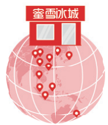

1997

2005

2012

2014

2018

2024

我們的創始人及董事長張紅超創立「寒流刨冰」開啟創業之路

研發出首款標誌性產品新鮮冰淇淋(售價僅1元人民幣)

成為中國現製飲品行業中最早設立中央工廠的企業

開始自建
專屬物流體系

蜜雪冰城的首家海外門店在越南河內開業

截至2024年9月30日於中國及海外11個國家擁有超過45,000家門店

1999

2007

2013

2017

2018

正式啟用品牌名「蜜雪冰城」

我們的聯合創始人及首席執行官張紅甫加入並推動門店網絡發展

推出首款現製果飲
冰鮮檸檬水
並拓展採購網絡

創立現磨咖啡品牌「幸運咖」

超級IP「雪王」誕生

---

## 第 12 页

我們的創始人和管理團隊一直堅持長期主義，懷揣強烈的社會責任感，踐行可持續發展的戰略。我們致力於成為一家在社會及環境方面負責任的公司，由張紅超先生和張紅甫先生分別擔任環境、社會及管治委員會的主任和副主任，並在創造就業、產業助農、綠色發展和社會公益等方面不斷投入。截至最後實際可行日期，我們約35%的加盟商為女性，69%的門店員工為女性。2023年，我們通過飲品包材綠色升級減少PE塑料使用超過12,700噸。此外，公司與江南大學簽訂了長期的產學研合作協議，並支持西湖大學推進可生物降解塑料方面的科學研究。

於2021年、2022年、2023年以及2024年前九個月，我們的門店網絡分別實現了約228億人民幣、307億人民幣、478億人民幣及449億人民幣的終端零售額。於業績記錄期，我們的財務表現亮眼，在巨大的規模基礎上依然實現了強勁的增長、優異的盈利水平和充裕的現金流量。於2022年、2023年以及2024年前九個月，我們分別實現了136億人民幣、203億人民幣及187億人民幣的收入，同比增長31.2%、49.6%及21.2%。於2022年、2023年以及2024年前九個月，我們的淨利潤分別為20億人民幣、32億人民幣以及35億人民幣，同比增長5.3%、58.3%及42.3%。我們持續創造經營活動現金流量淨流入，在2021年、2022年、2023年以及2024年前九個月分別為17億人民幣、24億人民幣、38億人民幣及51億人民幣。我們亦面臨中國現製飲品行業日益激烈的競爭。隨著中國現製飲品品牌及門店數量不斷增加，我們擴張門店網絡的策略可能會導致我們現有門店之間以及與競爭對手之間的競爭。我們的競爭對手可能已經佔據我們新門店的理想店址，而我們為降低我們門店網絡內的蠶食風險以及與競爭對手競爭的風險而採取的措施可能存在局限性。進一步詳情請參閱「一競爭」及「行業概覽」。

我們的品牌及產品

我們旗下有現製茶飲品牌「蜜雪冰城」和現磨咖啡品牌「幸運咖」。於業績記錄期內各期間，「蜜雪冰城」所得收入及毛利分別佔我們總收入及毛利的95%以上。相比之下，「幸運咖」於業績記錄期對我們的收入及毛利貢獻尚不顯著。於2021年、2022年、2023年以及2024年前九個月，「蜜雪冰城」的毛利率分別為31.4%、28.9%、30.3%及32.9%，與整體毛利率大體一致。

---

## 第 13 页

我們的現製茶飲品牌－「蜜雪冰城」

「蜜雪冰城」主要向中國及海外消費者提供現製果飲、茶飲及冰淇淋。「蜜雪冰城」核心產品的價格通常為2元至8元人民幣，遠低於中國其他主要現製茶飲品牌提供的主要產品的價格。於業績記錄期，我們絕大部分終端零售額來自「蜜雪冰城」門店。

「蜜雪冰城」品牌的終身代言人「雪王」已經成為了中国現製飲品行業中唯一一個超級IP，這也將我們的品牌和其他品牌區別開來。歷經多年，「蜜雪冰城」已成為中國家喻戶曉的全民品牌，牢牢佔據了消費者的心智。

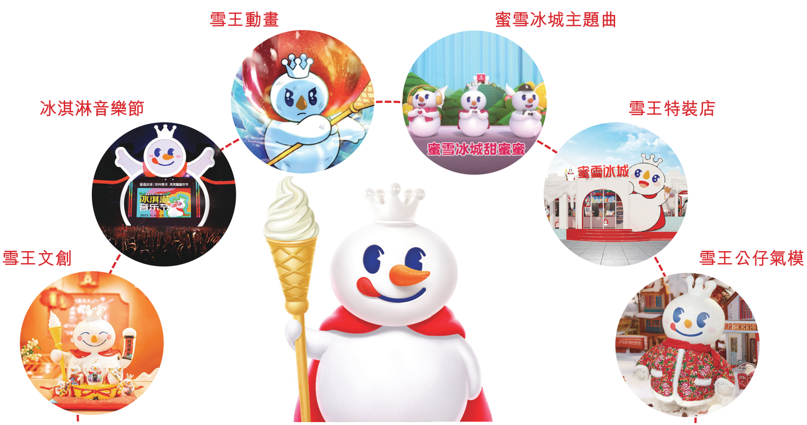

我們的現磨咖啡品牌－「幸運咖」

我們預見到中國市場對現磨咖啡產品日益增長的需求，並基於「蜜雪冰城」的成功經驗，於2017年推出了現磨咖啡品牌「幸運咖」，以拓展我們的產品品類。「幸運咖」的現磨咖啡飲品包括經典款、流行款、創新款。「幸運咖」核心產品的價格通常為5元至10元人民幣，遠低於中國其他主要現磨咖啡品牌提供的主要產品的價格。

進一步詳情請參閱「業務－我們的品牌及產品」。

---

## 第 14 页

我們的門店網絡

我們通過超過45,000家的門店網絡服務中國內地及中國內地以外的消費者。截至2024年9月30日，我們的門店網絡已遍佈中國內地31個省份、自治區及直轄市，超過300個地級市、1,700個縣城和全國約30,000個鄉鎮中的4,900個鄉鎮，覆蓋所有線級城市。我們在下沉市場擁有高滲透率。我們門店網絡的廣度和深度將我們與中國內地其他現製飲品品牌區別開來。截至2024年9月30日，我們在中國內地以外開設了約4,800家門店，建立了不斷擴張的門店網絡。於業績記錄期各期間，來自印度尼西亞和越南的收入約佔我們海外收入的70%或更高。我們的店型主要包括標準堂食店、標準檔口店、特裝店、集裝箱店、旗艦店及主題店。

下圖列示了截至2024年9月30日，我們在中國及海外的龐大的門店網絡。

中國及海外門店網絡

此地圖（審圖號：GS(2021)5447號、GS(2016)2948號）僅作示意性目的，用以呈現我們門店網絡在中國及海外的分佈情況。為完整起見，中國地圖包括中國內地及中國香港、澳門及台灣地區。

---

## 第 15 页

概要

下表載列截至所示日期我們在中國內地按城市線級劃分的門店數及其佔比。

<!-- table html -->
<table><tr><td></td><td colspan="4">截至12月31日</td><td colspan="4">截至9月30日</td></tr><tr><td></td><td>2021年</td><td></td><td>2022年</td><td></td><td>2023年</td><td></td><td>2024年</td><td></td></tr><tr><td>一線城市</td><td>782</td><td>4.0%</td><td>1,190</td><td>4.4%</td><td>1,513</td><td>4.6%</td><td>1,942</td><td>4.8%</td></tr><tr><td>新一線城市</td><td>4,172</td><td>21.1%</td><td>5,710</td><td>21.0%</td><td>6,886</td><td>20.7%</td><td>7,960</td><td>19.6%</td></tr><tr><td>二線城市</td><td>3,187</td><td>16.2%</td><td>4,739</td><td>17.4%</td><td>5,955</td><td>17.9%</td><td>7,446</td><td>18.4%</td></tr><tr><td>三線及以下城市</td><td>11,590</td><td>58.7%</td><td>15,549</td><td>57.2%</td><td>18,880</td><td>56.8%</td><td>23,162</td><td>57.2%</td></tr><tr><td>中國內地門店總數</td><td>19,731</td><td>100.0%</td><td>27,188</td><td>100.0%</td><td>33,234</td><td>100.0%</td><td>40,510</td><td>100.0%</td></tr></table>
<!-- /table -->

我們主要通過中國內地龐大的門店網絡提供平價現製飲品（單價不高於10元人民幣），以滿足不同城市線級的消費者需求。截至2024年9月30日，我們57.2%的中國內地門店位於三線及以下城市。進一步詳情請參閱「業務－我們的門店網絡」。

我們的加盟模式

我們主要採用加盟模式來擴張我們的門店網絡。截至2024年9月30日，我們超過99%的門店為加盟門店，其餘為自營門店。在我們的加盟模式下，我們授權加盟商使用我們的品牌開設加盟門店並銷售現製飲品，加盟商向我們購買門店物料及設備用於其日常運營。作為加盟門店的擁有者，加盟商對門店的經營業績負責。我們還規定加盟商須遵循我們全面、標準化的運營流程及要求。

我們相信，與加盟商利益與共，是加盟商選擇我們的根本原因。我們通過一系列制度設計實現與加盟商的利益與共。我們門店的初始投資和加盟費都低於中國現製飲品行業平均水平。從收入模式而言，我們不以加盟費和相關服務費為主要收入。於2021年、2022年、2023年以及2024年前九個月，我們分別有1.9%、2.0%、2.0%及2.4%的收入來自於加盟費和相關服務費。我們大規模的極致高效的供應鏈體系為加盟商提供了具有競爭力的一站式解決方案，從而提高其利潤空間，提升消費者體驗。我們與加盟商利益與共的合作，還體現在通過高度數字化的運營體系對加盟商進行標準化的管理以及持續不斷的支持與賦能，從而提升加盟商運營效率。在利益與共的理念下，我們和加盟商共同實現了行業領先的門店規模，並建立了一個可以持續健康發展的加盟模式。

---

## 第 16 页

<!-- table html -->
<table><tr><td rowspan="2">截至12月31日止年度</td><td colspan="2">2021年</td><td colspan="2">2022年</td><td colspan="2">2023年</td><td colspan="2">2024年</td></tr><tr><td>收入</td><td>毛利率</td><td>收入</td><td>毛利率</td><td>收入</td><td>毛利率</td><td>收入</td><td>毛利率</td></tr><tr><td>人民幣</td><td>%</td><td>人民幣</td><td>%</td><td>人民幣</td><td>%</td><td>人民幣</td><td>%</td></tr><tr><td colspan="9">(以千元計，百分比除外)</td></tr><tr><td>加盟門店……</td><td>10,031,377</td><td>32.0</td><td>3,212,928</td><td>32.0</td><td>13,101,953</td><td>3,810,070</td><td>29.1</td><td>19,575,307</td><td>5,892,349</td><td>30.1</td><td>14,859,460</td><td>4,491,356</td><td>30.2</td><td>18,202,650</td><td>5,967,485</td><td>32.8</td></tr><tr><td>自營門店……</td><td>82,793</td><td>(2.3)</td><td>(1,925)</td><td>72,338</td><td>(7,311)</td><td>107,616</td><td>8,378</td><td>7.8</td><td>86,335</td><td>8,090</td><td>9.4</td><td>38,515</td><td>5,301</td><td>13.8</td></tr></table>
<!-- /table -->

下表載列於所示期間按不同銷售渠道劃分的門店網絡所得收入、毛利及毛利率明細。

---

## 第 17 页

我們的加盟門店及自營門店的收入模式及成本結構不同，導致毛利率情況有所不同。於業績記錄期，我們開設少量自營門店，主要為獲得運營洞察並加強我們的品牌。因此，自營門店的經營模式及經營業績不能代表或反映我們龐大的加盟門店網絡。

2024年前九個月，自營門店所得收入錄得同比下降，主要是由於我們的自營門店數量減少。我們主要採用加盟模式擴張門店網絡。隨著我們不斷擴大業務規模並提升品牌聲譽，我們在相關市場可通過加盟模式有效擴張門店網絡。因此，於2024年前九個月，我們決定關閉或向加盟商轉讓若干自營門店。

進一步詳情請參閱「業務－我們的門店運營」。

我們的供應鏈

根據灼識諮詢的報告，我們目前擁有中國現製飲品行業內最大規模的完整端到端供應鏈體系。我們高度數字化及大規模的供應鏈覆蓋採購、生產、物流、研發和品質控制等核心組成部分，將我們與同行區別開來，並使我們能夠為加盟商提供具競爭力的一站式解決方案。

採購。我們通過覆蓋全球六大洲、38個國家的採購網絡，整合優質資源，並採用數字化工具保證原材料的質量和穩定供應。我們採購的原材料主要包括食品類大宗商品、農產品及其他輔料等。直達產地的全球採購網絡以及龐大的採購規模，使我們能夠以低於行業平均水平的價格採購眾多核心原材料，令我們以更高性價比的產品吸引消費者和加盟商。

全球採購網絡覆蓋六大洲38個國家

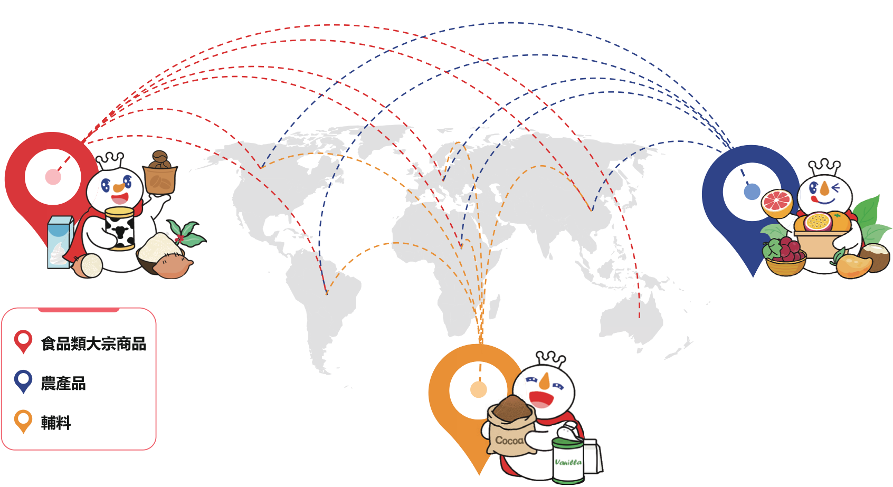

---

## 第 18 页

生產。截至2024年9月30日，根據灼識諮詢的報告，我們已經成為中國現製飲品供應鏈領域中生產品類最全和規模最大的企業。我們在河南、海南、廣西、重慶、安徽擁有五大生產基地，總佔地面積約79萬平方米，年綜合產能達到約165萬噸。根據灼識諮詢的報告，按現製飲品食材銷售額計，我們擁有中國最大的現製飲品供應鏈。通過自研自產的體系，我們提供包括糖、奶、茶、咖、果、糧、料在內的全品類一站式的飲品食材解決方案。相比之下，根據灼識諮詢的報告，大多數其他現製飲品行業公司並不從事飲品食材生產，且其他現製飲品行業公司亦不具備與我們相似的涵蓋全品類的生產能力。

我們的生產基地

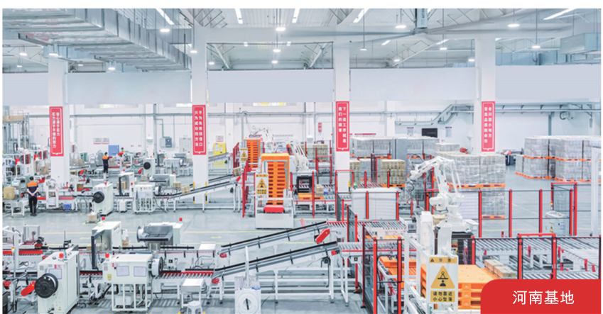

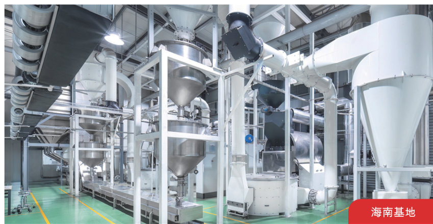

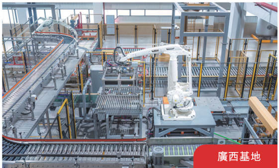

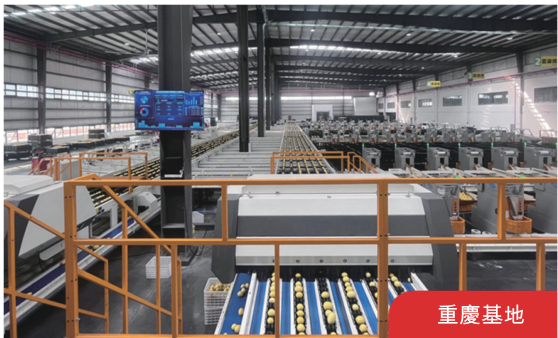

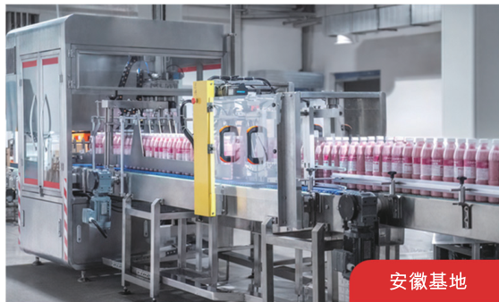

物流。我們自主運營的倉儲體系和專屬的配送網絡支持了中國現製飲品行業內最廣闊的門店佈局。我們的倉儲體系由總面積達到約35萬平方米的27個倉庫組成，為行業內最大。我們的配送網絡覆蓋了中國內地31個省份、自治區及直轄市，超過300個地級市、1,700個縣城和4,900個鄉鎮，其覆蓋廣度和下沉深度為行業內最高。

---

## 第 19 页

自主運營倉庫+專屬配送網絡

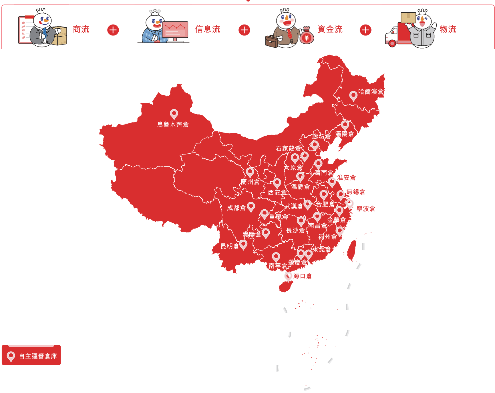

此地圖（審圖號：GS(2021)5447號）僅作示意性目的，用以呈現我們在中國的物流網絡。為完整起見，地圖包括中國內地及中國香港、澳門及台灣地區。

研發。我們的研發分為對產品口味和配方相關的應用研發，以及對食材相關的技術、生產工藝、配方及設備進行的基礎研發。應用研發與基礎研發緊密銜接。這種整體性的研發能力使我們不僅在核心飲品食材方面擁有強大的研究能力，而且能夠持續不斷為消費者推出高質平價的現製飲品。

質量控制。我們堅持完善的品質控制標準，以保證全鏈條始終如一的高品質產出。

進一步詳情請參閱「業務－我們的供應鏈」。

---

## 第 20 页

我們的客戶和供應商

我們的客戶主要為加盟商，加盟商根據與我們簽訂的加盟協議經營加盟門店。我們的絕大部分收入來自於向加盟門店銷售商品及設備。此外，我們也通過自營門店及電商零售渠道直接向消費者銷售我們的產品，並向部分非加盟商客戶（主要為食品及飲料行業的企業客戶）銷售若干商品和設備。有關我們自營門店產生的銷售額的資料，請參閱「－我們的加盟模式」。於2021年、2022年、2023年以及2024年前九個月，通過電商零售渠道產生的銷售收入分別為人民幣180.4百萬元、人民幣271.3百萬元、人民幣341.8百萬元及人民幣208.7百萬元。同期，自該等非加盟商客戶產生的銷售收入分別為人民幣56.4百萬元、人民幣130.0百萬元、人民幣277.7百萬元及人民幣209.8百萬元。

我們於業績記錄期各年度／期間的前五大客戶均為加盟商。於2021年、2022年、2023年以及2024年前九個月，我們來自各年度／期間的前五大客戶的收入分別佔我們各年度／期間總收入的1.9%、1.4%、1.1%及1.0%。於業績記錄期，我們並無任何重大的客戶集中風險。進一步詳情請參閱「業務－我們的客戶」。

我們的供應商主要是供應我們生產所需原材料（如食品類大宗商品、農產品及其他輔料）的供應商。請參閱「業務－我們的供應鏈－採購」。於2021年、2022年、2023年以及2024年前九個月，我們向各年度／期間的前五大供應商的採購額分別佔我們各年度／期間總採購額的19.3%、16.6%、15.2%及18.3%。同期，我們於各相關年度／期間的最大供應商的採購額分別佔我們各年度／期間總採購額的5.0%、4.6%、3.9%及6.5%。進一步詳情請參閱「業務－我們的供應商」。

收入模式

於業績記錄期，我們的絕大部分收入來自商品和設備銷售，主要包括向加盟商提供門店物料（包括糖、奶、茶、咖、果、糧、料等產品及包材）和設備（例如冰箱、冰淇淋機、製冰機及咖啡機）所得的收入。此外，我們亦通過向加盟商提供加盟和相關服務獲得收入。下表載列於所示期間我們按產品及服務性質劃分的收入、毛利及毛利率明細。

---

## 第 21 页

截至9月30日止九個月

<!-- table html -->
<table><tr><td rowspan="2">截至12月31日止年度</td><td colspan="4">2022年</td><td colspan="2">2023年</td><td colspan="2">2024年</td></tr><tr><td>收入</td><td>毛利</td><td>收入</td><td>毛利率</td><td>收入</td><td>毛利率</td><td>收入</td><td>毛利率</td></tr><tr><td>人民幣</td><td>%</td><td>人民幣</td><td>%</td><td>人民幣</td><td>%</td><td>人民幣</td><td>%</td></tr><tr><td colspan="9">(以千元計，百分比除外)</td></tr><tr><td>商品和設備銷售^(1)</td><td></td><td></td><td></td><td></td><td></td><td></td><td></td><td></td></tr><tr><td>商品銷售</td><td>9,457,660</td><td>2,973,867</td><td>31.4</td><td>12,551,043</td><td>3,490,207</td><td>27.8</td><td>19,160,210</td><td>5,508,001</td><td>28.7</td><td>14,504,715</td><td>4,209,256</td><td>29.0</td><td>17,595,055</td><td>5,550,933</td><td>31.5</td></tr><tr><td>設備銷售</td><td>696,944</td><td>129,571</td><td>18.6</td><td>748,387</td><td>140,641</td><td>18.8</td><td>736,537</td><td>168,160</td><td>22.8</td><td>604,842</td><td>137,509</td><td>22.7</td><td>621,256</td><td>123,518</td><td>19.9</td></tr><tr><td>小計</td><td>10,154,604</td><td>3,103,438</td><td>30.6</td><td>13,299,430</td><td>3,630,848</td><td>27.3</td><td>19,896,747</td><td>5,676,161</td><td>28.5</td><td>15,109,557</td><td>4,346,765</td><td>28.8</td><td>18,216,311</td><td>5,674,451</td><td>31.2</td></tr><tr><td>加盟和相關服務</td><td>196,382</td><td>140,424</td><td>71.5</td><td>276,147</td><td>215,989</td><td>78.2</td><td>405,718</td><td>322,806</td><td>79.6</td><td>283,771</td><td>228,874</td><td>80.7</td><td>443,360</td><td>365,971</td><td>82.5</td></tr><tr><td>總計</td><td>10,350,986</td><td>3,243,862</td><td>31.3</td><td>13,575,577</td><td>3,846,837</td><td>28.3</td><td>20,302,465</td><td>5,998,967</td><td>29.5</td><td>15,393,328</td><td>4,575,639</td><td>29.7</td><td>18,659,671</td><td>6,040,422</td><td>32.4</td></tr></table>
<!-- /table -->

商品和設備銷售的收入主要來自於日常業務過程中向我們的加盟商銷售門店物料和設備。此外，我們還有少部分收入來自於自營門店及電商零售渠道的銷售，以及向部分非加盟商客戶（主要為食品及飲料行業的企業客戶）銷售若干商品。截至2021年、2022年、2023年12月31日止年度以及2024年前九個月，通過電商零售渠道產生的銷售收入分別為人民幣180.4百萬元、人民幣271.3百萬元及人民幣208.7百萬元。同期，自非加盟商客戶產生的銷售收入分別為人民幣56.4百萬元、人民幣130.0百萬元、人民幣277.7百萬元及人民幣209.8百萬元。截至2021年、2022年、2023年12月31日止年度以及2024年前九個月，通過電商零售渠道產生的銷售毛利分別為人民幣32.2百萬元、人民幣40.8百萬元、人民幣76.6百萬元及人民幣45.8百萬元，毛利率分別為17.9%、15.0%及22.4%及21.9%。同期，自有關非加盟商客戶產生的銷售毛利分別為人民幣0.6百萬元、人民幣3.3百萬元、人民幣21.7百萬元及人民幣21.8百萬元，毛利率分別為1.1%、2.6%、7.8%及10.4%。

進一步詳情請參閱「財務資料－我們經營業績主要組成部分的說明－收入」。

---

## 第 22 页

市場機遇

全球現製飲品市場規模巨大並且未來預計將呈現加速增長態勢。以終端零售額計，全球現製飲品市場2023年至2028年的複合年增長率預計將提高至7.2%，帶動市場規模增長至2028年的11,039億美元，到2028年佔據全球飲料市場近一半份額。以中國和東南亞為代表的新興市場的快速增長是全球現製飲品行業加速增長的重要引擎。中國和東南亞市場合計貢獻同期全球現製飲品市場規模增量的近40%，合計佔全球現製飲品市場的比重也將從2023年的12.0%提升到2028年的19.4%。

中國和東南亞現製飲品市場的快速增長源於消費者需求的不斷增加。如下圖所示，2023年，中國和東南亞的現製飲品消費量在飲用水分攝入總量中的佔比及人均現製飲品年消費量均顯著低於發達市場。根據灼識諮詢確認，中國及東南亞的現製飲品消費量在飲用水分攝入總量中的佔比預計將進一步上升至接近發達市場水平。與發達市場相比，中國及東南亞市場的人均現製飲品年消費量預期增速更高，推動該等市場規模的快速增長。預計到2028年，中國和東南亞的人均現製飲品年消費量將增加逾一倍，分別達到51杯和36杯，行業增長空間巨大。

2023年人均現製飲品
年消費量，杯／年

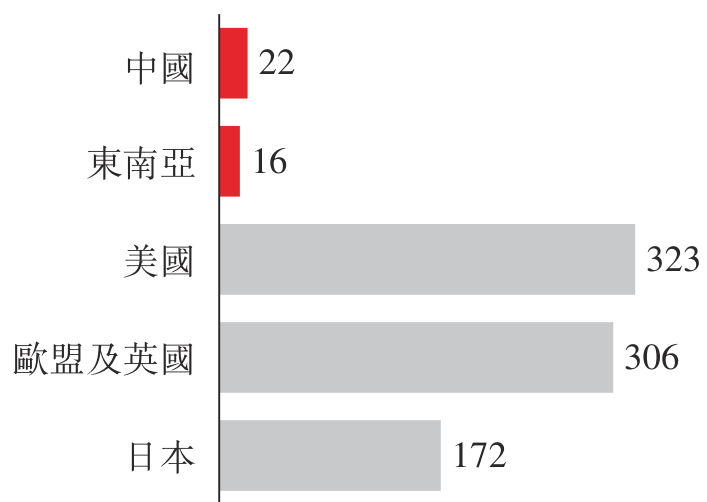

附註：飲用水分攝入包括現製飲品、預包裝飲料、液體奶和自來水。

資料來源：灼識諮詢、世界銀行、世界衛生組織、中國營養學會

中國現製飲品市場的規模預計在2028年達到約11,634億人民幣，2023年至2028年的複合年增長率為17.6%。其中，平價現製飲品（單價不高於10元人民幣）不但滿足了消費者愈加追求性價比的大趨勢，而且在與其他平價飲料產品近似的價格帶下提供了更新鮮的產品和互動性更強的消費體驗。因此，平價現製飲品在不同價格帶的現製飲品細分市場中增速最高，2023年至2028年的複合年增長率預計達到22.2%。按終端

---

## 第 23 页

概要

零售額計，東南亞現製飲品市場的規模預計將由2023年的201億美元增長至2028年的495億美元，複合年增長率為19.8%，在全球主要市場中增長最快。進一步詳情請參閱「行業概覽」。

全球現製飲品市場以終端零售額計的
複合年增長率，2023年至2028年（預計）

全球現製飲品市場以終端零售額計的規模增量，十億美元，
2023年至2028年（預計）

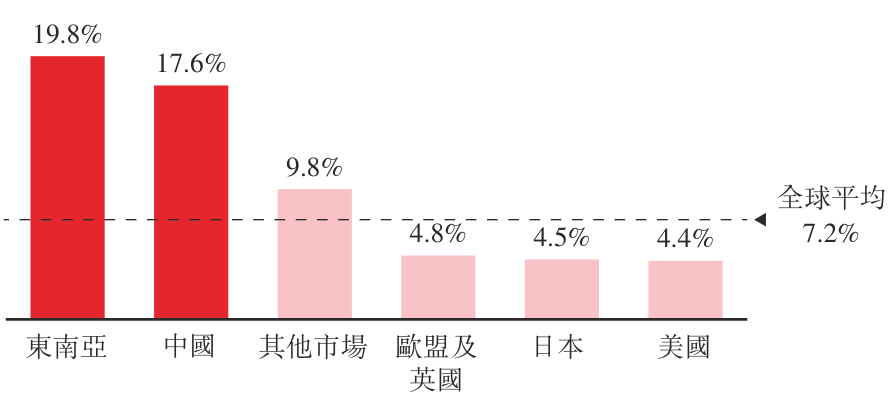

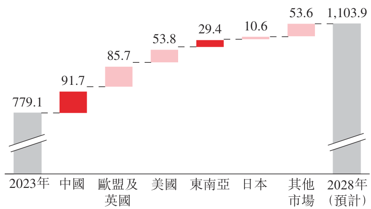

資料來源：灼識諮詢、國際貨幣基金組織、美國農業部

我們的競爭優勢

我們相信以下優勢推動了我們的成功，並將繼續推動我們未來的增長：

我們是中國及全球最大的現製飲品企業（按照截至2024年9月30日的門店數計）；

• 高度數字化的端到端供應鏈是高質平價價值主張的基石；

• 家喻戶曉的全民品牌「蜜雪冰城」，深入人心的超級IP「雪王」，擁有龐大消費者及粉絲群體；

• 利益與共的加盟模式和高度數字化的運營體系打造了健康的加盟門店網絡；

• 跨地域和跨品類的規模化拓展帶來廣闊的長期增長空間；及

• 堅韌的創始人和管理團隊打造了以「真」為本、胸懷社會的獨特企業文化。

進一步詳情請參閱「業務－我們的競爭優勢」。

---

## 第 24 页

我們的戰略

過去二十多年來，我們堅持簡單和專注，打造了強大和成功的品牌。我們將把握時代的變化，繼續踐行可持續發展，打造全球化的百年品牌：

• 鞏固在中國現製飲品行業的領先地位，並尋求海外拓展機會；及

• 進一步加強打造百年品牌相關基礎設施及運營體系的建設。

進一步詳情請參閱「業務－我們的戰略」。

主要運營數據

我們定期監測多項運營指標以衡量我們的業務表現。該等指標有助於我們制定及完善我們的增長戰略，並作出戰略決策。下表載列於所示期間我們在中國內地及中國內地以外整體門店網絡的主要運營指標。

<!-- table html -->
<table><tr><td></td><td colspan="3">截至12月31日止年度／截至12月31日</td><td colspan="2">截至9月30日止九個月／截至9月30日</td></tr><tr><td></td><td>2021年</td><td>2022年</td><td>2023年</td><td>2023年</td><td>2024年</td></tr><tr><td>終端零售額 (人民幣十億元) </td><td>22.8</td><td>30.7</td><td>47.8</td><td>37.0</td><td>44.9</td></tr><tr><td>飲品出杯量 (十億杯) </td><td>3.6</td><td>4.7</td><td>7.4</td><td>5.8</td><td>7.1</td></tr><tr><td>訂單總數 (十億) </td><td>2.0</td><td>2.6</td><td>4.1</td><td>3.1</td><td>3.9</td></tr><tr><td>門店總數</td><td>20,001</td><td>28,983</td><td>37,565</td><td>36,153</td><td>45,302</td></tr><tr><td>運營總天數 (千日)^(1)</td><td>5,504.8</td><td>7,788.1</td><td>11,591.5</td><td>8,372.2</td><td>10,721.2</td></tr><tr><td>每單平均終端零售額 (人民幣元) </td><td>11.2</td><td>11.9</td><td>11.8</td><td>11.7</td><td>11.4</td></tr><tr><td>平均單店終端零售額 (人民幣千元)^(2)</td><td>1,401.8</td><td>1,251.6</td><td>1,438.0</td><td>1,135.3</td><td>1,082.7</td></tr><tr><td>平均單店日均終端零售額 (人民幣元)^(3)</td><td>4,144.6</td><td>3,936.1</td><td>4,127.8</td><td>4,416.3</td><td>4,184.4</td></tr><tr><td>平均單店飲品出杯量 (杯)^(4)</td><td>221,746.4</td><td>191,807.7</td><td>221,804.5</td><td>177,168.5</td><td>170,721.6</td></tr><tr><td>平均單店日均訂單量^(5)</td><td>370.8</td><td>330.9</td><td>350.3</td><td>376.1</td><td>367.0</td></tr><tr><td>新開加盟門店平均單店設備開支 (人民幣元)^(6)</td><td>86,879.1</td><td>77,384.7</td><td>74,442.8</td><td>75,416.7</td><td>68,541.1</td></tr></table>
<!-- /table -->

---

## 第 25 页

概要

附註：

(1) 按某一期間內我們系統錄得終端零售額的門店的營業天數總和計算。

(2) 按某一期間的終端零售額除以同期期初及期末的平均門店數量計算。因此，相關指標的統計結果會受到相關期間的長度所影響。

(3) 按某一期間的終端零售額除以同期運營總天數計算。

(4) 按某一期間的我們門店網絡飲品出杯量除以同期期初及期末的平均門店數量計算。

(5) 按某一期間的訂單總數除以同期運營總天數計算。

(6) 按某一期間的設備銷售收入除以同期新開的加盟門店總數計算。

2021年至2023年間及2023年前九個月至2024年同期，通過我們的門店網絡所實現的終端零售額、飲品出杯量及訂單總數隨門店網絡擴張而持續增長。

於2022年，我們的單店表現出現波動，主要是由於COVID-19疫情造成的影響。進一步詳情請參閱「財務資料－COVID-19的影響」。2023年疫情結束後，在我們繼續擴張門店網絡的同時，單店表現已基本恢復。

2023年前九個月至2024年同期，我們平均單店業績下滑，主要是由於行業整體放緩及市場競爭加劇。有關進一步資料，包括我們應對日益激烈的市場競爭的措施，請參閱「業務－競爭」及「風險因素－與我們的業務及行業有關的風險－近期中國現製飲品市場在競爭加劇中放緩，可能對我們的業務及經營業績造成不利影響」。因此，我們的平均單店日均終端零售額由2023年前九個月的4,416.3元人民幣減少至2024年同期的4,184.4元人民幣。同期的平均單店日均飲品出杯量及平均單店日均訂單量亦有所減少。

---

## 第 26 页

概要

下表載列於所示期間我們中國內地及中國內地以外整體門店網絡按店齡劃分的平均單店日均終端零售額。

<!-- table html -->
<table><tr><td colspan="3">截至12月31日止年度</td><td colspan="2">截至9月30日止九個月</td></tr><tr><td>2021年</td><td>2022年</td><td>2023年</td><td>2023年</td><td>2024年</td></tr><tr><td colspan="6">(人民幣元)</td></tr></table>
<!-- /table -->

平均單店日均終端零售額$^{(1)}$

<!-- table html -->
<table><tr><td>於2021年或之前開業的門店</td><td>4,144.6</td><td>4,010.8</td><td>4,492.8</td><td>4,754.9</td><td>4,746.2</td></tr><tr><td>於2022年開業的門店</td><td>–</td><td>3,592.0</td><td>3,856.5</td><td>4,000.4</td><td>3,930.8</td></tr><tr><td>於2023年開業的門店</td><td>–</td><td>–</td><td>3,302.1</td><td>3,777.7</td><td>3,468.0</td></tr><tr><td>於2024年開業的門店</td><td>–</td><td>–</td><td>–</td><td>–</td><td>3,989.3</td></tr></table>
<!-- /table -->

附註：

(1) 按某一期間相關門店產生的終端零售額除以同期該等門店的運營總天數計算。

不同店齡門店的銷售表現受多種因素影響，例如我們跨地域、跨品類的拓展、新老門店的組合以及門店在一年中開設的時間。2024年前九個月，我們不同店齡門店的平均單店日均終端零售額同比下降，主要是由於行業整體放緩及市場競爭加劇。

下表載列於所示期間我們在中國內地及中國內地以外門店的同店終端零售額增長。

<!-- table html -->
<table><tr><td></td><td colspan="3">截至12月31日止年度</td><td colspan="2">截至9月30日止九個月</td></tr><tr><td></td><td>2021年</td><td>2022年</td><td>2023年</td><td>2024年</td></tr><tr><td>同店終端零售額增長(%)</td><td>28.9</td><td>(2.4)</td><td>12.0</td><td>(0.6)</td></tr></table>
<!-- /table -->

於2021年、2022年、2023年以及2024年前九個月的同店終端零售額增長分別為28.9%、(2.4%)、12.0%及(0.6%)。於2021年，同店終端零售額上升28.9%，主要是由於品牌提升及門店網絡擴張。於2022年，同店終端零售額下降2.4%，主要是由於COVID-19疫情造成的影響。2024年前九個月，同店終端零售額下降0.6%，主要是由於行業整體放緩及市場競爭加劇。

---

## 第 27 页

歷史財務資料概要

下表載列我們於業績記錄期的綜合財務資料的財務數據概要，摘錄自本招股章程附錄一所載會計師報告。下文所載財務數據概要應與本招股章程內的綜合財務報表（包括相關附註）一併閱讀，並以其整體為準。我們的綜合財務資料乃根據國際財務報告準則編製。

下表載列於所示期間我們的綜合損益表概要。

<!-- table html -->
<table><tr><td></td><td colspan="6">截至12月31日止年度</td><td colspan="6">截至9月30日止九個月</td></tr><tr><td></td><td colspan="2">2021年</td><td colspan="2">2022年</td><td colspan="2">2023年</td><td colspan="2">2023年</td><td colspan="2">2024年</td></tr><tr><td></td><td>人民幣</td><td>%</td><td>人民幣</td><td>%</td><td>人民幣</td><td>%</td><td>人民幣</td><td>%</td><td>人民幣</td><td>%</td></tr><tr><td></td><td colspan="10">(未經審核)</td></tr><tr><td></td><td colspan="10">(以千元計，百分比除外)</td></tr><tr><td>收入</td><td>10,350,986</td><td>100.0</td><td>13,575,577</td><td>100.0</td><td>20,302,465</td><td>100.0</td><td>15,393,328</td><td>100.0</td><td>18,659,671</td><td>100.0</td></tr><tr><td>銷售成本</td><td>(7,107,124)</td><td>(68.7)</td><td>(9,728,740)</td><td>(71.7)</td><td>(14,303,498)</td><td>(70.5)</td><td>(10,817,689)</td><td>(70.3)</td><td>(12,619,249)</td><td>(67.6)</td></tr><tr><td>毛利</td><td>3,243,862</td><td>31.3</td><td>3,846,837</td><td>28.3</td><td>5,998,967</td><td>29.5</td><td>4,575,639</td><td>29.7</td><td>6,040,422</td><td>32.4</td></tr><tr><td>其他收入及</td><td></td><td></td><td></td><td></td><td></td><td></td><td></td><td></td><td></td><td></td></tr><tr><td>收益(淨額)</td><td>135,181</td><td>1.3</td><td>127,915</td><td>0.9</td><td>247,632</td><td>1.2</td><td>149,624</td><td>1.0</td><td>135,507</td><td>0.7</td></tr><tr><td>銷售及分銷開支</td><td>(405,766)</td><td>(3.9)</td><td>(774,431)</td><td>(5.7)</td><td>(1,318,588)</td><td>(6.5)</td><td>(992,934)</td><td>(6.5)</td><td>(1,097,090)</td><td>(5.9)</td></tr><tr><td>行政開支</td><td>(374,665)</td><td>(3.6)</td><td>(496,506)</td><td>(3.6)</td><td>(610,622)</td><td>(3.0)</td><td>(429,811)</td><td>(2.8)</td><td>(433,470)</td><td>(2.3)</td></tr><tr><td>研發開支</td><td>(17,151)</td><td>(0.2)</td><td>(32,304)</td><td>(0.2)</td><td>(85,000)</td><td>(0.4)</td><td>(51,343)</td><td>(0.3)</td><td>(64,805)</td><td>(0.3)</td></tr><tr><td>財務成本</td><td>(5,973)</td><td>(0.1)</td><td>(9,190)</td><td>(0.1)</td><td>(14,697)</td><td>(0.1)</td><td>(11,037)</td><td>(0.1)</td><td>(5,479)</td><td>(0.1)</td></tr><tr><td>金融資產 (減值虧損)／</td><td></td><td></td><td></td><td></td><td></td><td></td><td></td><td></td><td></td><td></td></tr><tr><td>減值虧損撥回</td><td>(1,787)</td><td>(0.0)</td><td>(4,098)</td><td>(0.0)</td><td>1,638</td><td>0.1</td><td>4,480</td><td>0.1</td><td>(3,524)</td><td>(0.0)</td></tr><tr><td>物業、廠房及</td><td></td><td></td><td></td><td></td><td></td><td></td><td></td><td></td><td></td><td></td></tr><tr><td>設備減值</td><td>(14,827)</td><td>(0.1)</td><td>–</td><td>–</td><td>(65,524)</td><td>(0.3)</td><td>(59,999)</td><td>(0.4)</td><td>–</td><td>–</td></tr><tr><td>分佔聯營公司</td><td></td><td></td><td></td><td></td><td></td><td></td><td></td><td></td><td></td><td></td></tr><tr><td>(虧損)／盈利</td><td>–</td><td>–</td><td>(180)</td><td>(0.0)</td><td>196</td><td>0.0</td><td>36</td><td>0.0</td><td>(3,016)</td><td>(0.0)</td></tr><tr><td>税前利潤</td><td>2,558,874</td><td>24.7</td><td>2,658,043</td><td>19.6</td><td>4,154,002</td><td>20.5</td><td>3,184,655</td><td>20.7</td><td>4,568,545</td><td>24.5</td></tr><tr><td>所得稅開支</td><td>(646,932)</td><td>(6.2)</td><td>(644,952)</td><td>(4.8)</td><td>(967,397)</td><td>(4.8)</td><td>(731,876)</td><td>(4.8)</td><td>(1,077,573)</td><td>(5.8)</td></tr><tr><td>年度／期間內利潤</td><td>1,911,942</td><td>18.5</td><td>2,013,091</td><td>14.8</td><td>3,186,605</td><td>15.7</td><td>2,452,779</td><td>15.9</td><td>3,490,972</td><td>18.7</td></tr><tr><td>以下各方應佔利潤：</td><td></td><td></td><td></td><td></td><td></td><td></td><td></td><td></td><td></td><td></td></tr><tr><td>母公司擁有人</td><td>1,910,361</td><td>18.5</td><td>1,996,715</td><td>14.7</td><td>3,137,341</td><td>15.5</td><td>2,400,853</td><td>15.6</td><td>3,486,065</td><td>18.7</td></tr><tr><td>非控股權益</td><td>1,581</td><td>0.0</td><td>16,376</td><td>0.1</td><td>49,264</td><td>0.2</td><td>51,926</td><td>0.3</td><td>4,907</td><td>0.0</td></tr></table>
<!-- /table -->

---

## 第 28 页

我們的淨利潤由2021年的人民幣1,911.9百萬元增加至2022年的人民幣2,013.1百萬元及2023年的人民幣3,186.6百萬元，並由2023年前九個月的人民幣2,452.8百萬元增加至2024年同期的人民幣3,491.0百萬元，這主要是由於我們在中國內地及中國內地以外的門店網絡擴張推動了收入的增加，但這部分被2021年至2022年銷售及分銷開支和行政開支的增加，以及2022年至2023年及截至2023年9月30日止九個月至2024年同期銷售及分銷開支和所得稅開支的增加所部分抵銷。

下表載列截至所示日期我們的綜合財務狀況表概要。

<!-- table html -->
<table><tr><td></td><td colspan="3">截至12月31日</td><td>截至9月30日</td></tr><tr><td></td><td>2021年</td><td>2022年</td><td>2023年</td><td>2024年</td></tr><tr><td></td><td colspan="4">(人民幣千元)</td></tr><tr><td>非流動資產總值</td><td>2,242,617</td><td>3,389,291</td><td>5,445,381</td><td>7,113,433</td></tr><tr><td>流動資產總值</td><td>5,073,766</td><td>6,556,065</td><td>9,148,185</td><td>11,506,900</td></tr><tr><td>資產總值</td><td>7,316,383</td><td>9,945,356</td><td>14,593,566</td><td>18,620,333</td></tr><tr><td>非流動負債總額</td><td>67,495</td><td>127,436</td><td>263,788</td><td>234,876</td></tr><tr><td>流動負債總額</td><td>1,706,178</td><td>2,338,653</td><td>3,734,313</td><td>4,289,251</td></tr><tr><td>負債總額</td><td>1,773,673</td><td>2,466,089</td><td>3,998,101</td><td>4,524,127</td></tr><tr><td>流動資產淨值</td><td>3,367,588</td><td>4,217,412</td><td>5,413,872</td><td>7,217,649</td></tr><tr><td>資產淨值</td><td>5,542,710</td><td>7,479,267</td><td>10,595,465</td><td>14,096,206</td></tr><tr><td>股本</td><td>360,000</td><td>360,000</td><td>360,000</td><td>360,000</td></tr><tr><td>儲備</td><td>5,177,351</td><td>7,094,297</td><td>10,146,993</td><td>13,641,298</td></tr><tr><td>非控股權益</td><td>5,359</td><td>24,970</td><td>88,472</td><td>94,908</td></tr><tr><td>權益總額</td><td>5,542,710</td><td>7,479,267</td><td>10,595,465</td><td>14,096,206</td></tr></table>
<!-- /table -->

我們的流動資產淨值由截至2021年12月31日的人民幣3,367.6百萬元增加至截至2022年12月31日的人民幣4,217.4百萬元，主要是由於以公允價值計量且其變動計入損益的金融資產、存貨及預付款項、其他應收款項及其他資產有所增加。我們的流動資產淨值進一步增加至截至2023年12月31日的人民幣5,413.9百萬元，主要是由於現金及現金等價物及存貨有所增加，部分被以公允價值計量且其變動計入損益的金融資產減少及其他應付款項及應計費用及貿易應付款項增加所抵銷。我們的流動資產淨值進一步增加至截至2024年9月30日的人民幣7,217.6百萬元，主要是由於以公允價值計量且其變動計入損益的金融資產以及現金及現金等價物增加，以及計息銀行及其他借款減少，部分被貿易應付款項增加所抵銷。

---

## 第 29 页

我們的資產淨值由截至2021年12月31日的人民幣5,542.7百萬元增加至截至2022年12月31日的人民幣7,479.3百萬元，主要是由於錄得年內利潤人民幣2,013.1百萬元及以股權結算的股份支付開支人民幣25.0百萬元，部分被宣派股息人民幣104.4百萬元所抵銷。我們的資產淨值進一步增加至截至2023年12月31日的人民幣10,595.5百萬元，主要是由於錄得年內利潤人民幣3,186.6百萬元，部分被宣派股息人民幣100.0百萬元所抵銷。我們的資產淨值進一步增加至截至2024年9月30日的人民幣14,096.2百萬元，主要由於錄得期內利潤人民幣3,491.0百萬元。

下表載列於所示期間我們的現金流量概要。

<!-- table html -->
<table><tr><td></td><td colspan="3">截至12月31日止年度</td><td colspan="2">截至9月30日止九個月</td></tr><tr><td></td><td>2021年</td><td>2022年</td><td>2023年</td><td>2023年</td><td>2024年</td></tr><tr><td></td><td colspan="5">(未經審核)</td></tr><tr><td></td><td colspan="5">(人民幣千元)</td></tr><tr><td>營運資金變動前的</td><td></td><td></td><td></td><td></td><td></td></tr><tr><td>經營現金流量</td><td>2,643,793</td><td>2,816,683</td><td>4,408,046</td><td>3,357,947</td><td>4,828,654</td></tr><tr><td>營運資金變動</td><td>(399,544)</td><td>228,172</td><td>242,767</td><td>281,589</td><td>1,089,629</td></tr><tr><td>已付所得稅</td><td>(590,081)</td><td>(658,546)</td><td>(910,742)</td><td>(584,626)</td><td>(876,164)</td></tr><tr><td>已收利息</td><td>38,221</td><td>44,322</td><td>53,801</td><td>36,781</td><td>58,635</td></tr><tr><td>經營活動所得現金流量淨額</td><td>1,692,389</td><td>2,430,631</td><td>3,793,872</td><td>3,091,691</td><td>5,100,754</td></tr><tr><td>投資活動所用現金流量淨額</td><td>(1,831,630)</td><td>(2,201,861)</td><td>(825,344)</td><td>(1,997,140)</td><td>(4,485,997)</td></tr><tr><td>融資活動所得／(所用)</td><td></td><td></td><td></td><td></td><td></td></tr><tr><td>現金流量淨額</td><td>726,648</td><td>(139,261)</td><td>(111,319)</td><td>(102,786)</td><td>(257,162)</td></tr><tr><td>現金及現金等價物增加</td><td></td><td></td><td></td><td></td><td></td></tr><tr><td>淨額</td><td>587,407</td><td>89,509</td><td>2,857,209</td><td>991,765</td><td>357,595</td></tr><tr><td>期初現金及現金等價物</td><td>2,089,486</td><td>2,675,827</td><td>2,764,138</td><td>2,764,138</td><td>5,621,904</td></tr><tr><td>匯兑差額的影響（淨額）</td><td>(1,066)</td><td>(1,198)</td><td>557</td><td>3,310</td><td>897</td></tr><tr><td>期末現金及現金等價物</td><td>2,675,827</td><td>2,764,138</td><td>5,621,904</td><td>3,759,213</td><td>5,980,396</td></tr></table>
<!-- /table -->

進一步詳情請參閱「財務資料」。

---

## 第 30 页

主要財務比率

<!-- table html -->
<table><tr><td></td><td colspan="3">截至12月31日止年度／截至12月31日</td><td>截至9月30日止九個月／截至9月30日</td></tr><tr><td></td><td>2021年</td><td>2022年</td><td>2023年</td><td>2024年</td></tr><tr><td>收入增長</td><td>不適用</td><td>31.2%</td><td>49.6%</td><td>21.2%</td></tr><tr><td>毛利率</td><td>31.3%</td><td>28.3%</td><td>29.5%</td><td>32.4%</td></tr><tr><td>流動比率^(1)</td><td>3.0</td><td>2.8</td><td>2.4</td><td>2.7</td></tr><tr><td>速動比率^(2)</td><td>2.2</td><td>2.1</td><td>1.9</td><td>2.3</td></tr><tr><td>槓桿比率^(3)</td><td>0.5%</td><td>1.9%</td><td>2.5%</td><td>0.03%</td></tr></table>
<!-- /table -->

附註：

(1) 按截至期末的流動資產除以流動負債計算。

(2) 按截至期末的流動資產減存貨，再除以流動負債計算。

(3) 按截至期末的債務總額除以權益總額，再乘以100%計算。

相比2022年及2023年，我們2024年前九個月收入的同比增長放緩，主要是由於我們的業務規模擴大、行業整體放緩及市場競爭加劇。請參閱「風險因素－與我們的業務及行業有關的風險－我們所處的市場競爭激烈，如果我們未能有效競爭，則中國現製飲品市場的激烈競爭可能會對我們的市場份額及盈利能力造成重大不利影響」及「風險因素－與我們的業務及行業有關的風險－近期中國現製飲品市場在競爭加劇中放緩，可能對我們的業務及經營業績造成不利影響」。

我們的毛利率由2021的31.3%下降至2022年的28.3%，是由於商品銷售（業績記錄期最大的收入來源）的毛利率下降。商品銷售的毛利率由2021年的31.4%收窄至2022年的27.8%。該下降主要是由於(i)若干原材料的市價波動令採購成本上升，以及(ii)於2022年，為減輕COVID-19對加盟商的影響，我們下調了69款向加盟商出售的門店物料與設備的價格，平均降價幅度約15%（此部分銷售於2022年佔我們當期總收入的約23.1%）。

我們的毛利率增加至2023年的29.5%，主要是由於商品銷售的毛利率增加所致，這主要因為隨著我們的業務不斷擴張，若干原材料採購成本下降。我們的毛利率由截至2023年9月30日止九個月的29.7%改善至2024年同期的32.4%，主要是由於提升了供應鏈效率以及若干原材料採購成本下降。

---

## 第 31 页

我們的槓桿比率由截至2022年12月31日的1.9%增加至截至2023年12月31日的2.5%，主要是由於我們的計息銀行及其他借款增加所致，有關增加是由於我們為營運資金目的（例如關於原材料採購）而獲取額外銀行貸款。我們的槓桿比率隨後於截至2024年9月30日減少至0.03%，主要歸因於我們的計息銀行及其他借款於償還後有所減少。

進一步詳情請參閱「財務資料」。

風險因素

我們的業務及全球發售涉及若干風險，包括(i)與我們的業務及行業有關的風險；(ii)關於在中國開展業務的風險；及(iii)關於全球發售的風險。我們面臨的部分主要風險包括但不限於以下各項：

我們的業務依賴於消費者對我們產品的需求，而這種需求本質上是不斷變化的，並可能會隨著消費者偏好和觀念以及其可支配消費能力的變化而變化。消費者對我們產品需求的不利變化將損害加盟商和我們的業務。

我們未來的增長取決於我們能否不斷擴張我們門店網絡的覆蓋範圍及成功管理我們龐大的門店網絡的運營績效。

我們所處的市場競爭激烈，如果我們未能有效競爭，則中國現製飲品市場的激烈競爭可能會對我們的市場份額及盈利能力造成重大不利影響。

近期中國現製飲品市場在競爭加劇中放緩，可能對我們的業務及經營業績造成不利影響。

保持強大的品牌力對於我們的成功至關重要。如果我們的品牌價值下降，我們的經營業績、財務表現和業務前景可能會受到重大不利影響。

我們的經營歷史可能並不代表我們未來的經營業績、財務表現或業務前景。

我們的加盟門店向我們購買門店物料及設備。如果我們無法確保這些門店物料及設備的充足、穩定和及時的供應以支持我們的加盟門店運營，或者如果我們的供應鏈出現任何中斷，我們的業務可能受到重大不利影響。

如果我們產品的品質及食品安全出現問題，我們的聲譽、經營業績和財務表現可能會受到重大不利影響。

---

## 第 32 页

競爭

中國的現製飲品行業競爭激烈。根據灼識諮詢的報告，於2023年，按終端零售額計，中國前五大現製飲品企業總計約佔35.0%的市場份額，按飲品出杯量計，前五大企業總計約佔54.9%的市場份額。同期，在中國現製飲品行業中我們以約11.3%的終端零售額份額和32.7%的飲品出杯量份額排名第一。我們在業務的各個方面（包括產品創新、產品質量、消費者體驗以及消費者獲取和留存）面臨與行業其他領先企業日益激烈的競爭。請參閱「行業概覽」。

特別是，伴隨著市場競爭加劇，2024年前九個月的中國現製飲品市場的增速較2023年同期有所放緩。具體而言：(i)領先的市場參與者在持續擴張門店網絡時相互競爭，包括對黃金地段、加盟商及消費者的競爭；(ii)業績欠佳的門店（尤其是較小品牌的門店）難以與業績表現優異的門店及品牌競爭，導致門店關閉；(iii)若干市場參與者下調其產品價格以吸引對價格敏感的消費者，使市場競爭進一步加劇。行業放緩亦對我們的業務及經營業績造成負面影響。進一步詳情請參閱「業務－競爭」。儘管如此，誠如灼識諮詢所確認，於2024年前九個月，我們的終端零售額增速高於大多數業內其他前五大參與者。若我們未能與其他領先參與者有效競爭，或被其他領先參與者超越，我們的經營業績、財務狀況及業務前景可能會受到重大不利影響。請參閱「風險因素－與我們的業務及行業有關的風險－我們所處的市場競爭激烈，如果我們未能有效競爭，則中國現製飲品市場的激烈競爭可能會對我們的市場份額及盈利能力造成重大不利影響」及「風險因素－與我們的業務及行業有關的風險－近期中國現製飲品市場在競爭加劇中放緩，可能對我們的業務及經營業績造成不利影響」。

我們的股權結構

我們的控股股東

緊隨全球發售完成後（假設超額配股權未獲行使），張紅超先生將直接及通過青春無畏控制我們已發行股本總額的41.27%，張紅甫先生將直接及通過始於足下控制我們已發行股本總額的41.27%。因此，張紅超先生、張紅甫先生、青春無畏及始於足下於上市後將為我們的控股股東。進一步詳情請參閱「與控股股東的關係」。

---

## 第 33 页

於2022年9月，張紅超先生與張紅甫先生訂立一致行動協議，根據該協議，彼等確認其在本公司董事會會議及股東大會上存在一致行動關係。經進一步協定，該一致行動關係將在本公司上市後存續，且張紅超先生及張紅甫先生無意於上市後終止其一致行動關係。

首次公開發售前投資

我們於2020年12月完成首次公開發售前投資，而我們的首次公開發售前投資者為龍珠美城、深圳蘊祺及天津磐雪。緊隨全球發售完成後（假設超額配股權未獲行使），首次公開發售前投資者將持有約9.55%的已發行股份。有關首次公開發售前投資者的身份及背景以及首次公開發售前投資的主要條款的進一步詳情，請參閱「歷史、發展及公司架構－首次公開發售前投資」。

過往上市申請

我們於2022年9月向中國證監會提交了A股上市申請，之後該上市申請失效。進一步詳情請參閱「歷史、發展及公司架構－過往上市申請」。

股息

於2021年、2022年及2023年，本公司分別宣派股息人民幣104.4百萬元、人民幣104.4百萬元及人民幣100.0百萬元，均已悉數派付。截至2024年9月30日止九個月，本公司並無宣派任何股息。進一步詳情請參閱本招股章程附錄一會計師報告附註12。

截至最後實際可行日期，我們並無正式的股息政策或固定的股息分派比率。中國法律規定股息僅可以我們的可分配利潤支付。可分配利潤為我們的稅後利潤，減去我們須計提的法定及其他儲備。根據我們的公司章程，考慮我們的經營業績、財務狀況、現金需求、可用現金情況，以及董事會當時認為有關的其他因素後，董事會日後或宣派股息。任何股息宣派、派付以及股息金額均須遵守我們的公司章程文件、適用的中國法律的規定，並須獲得股東批准。

於全球發售後，我們可能主要以現金或我們認為適當的股票宣派及派付股息。日後宣派或派付任何股息的決定將取決於（其中包括）本公司的盈利能力、運營及發展計劃、外部融資環境、資本成本、本公司的現金流量及我們的董事可能認為相關的其他因素。我們日後分派股息的能力亦取決於我們能否自附屬公司收取股息。

---

## 第 34 页

截至2024年12月31日止年度的利潤估計

我們已編製以下截至2024年12月31日止年度的利潤估計。

截至2024年12月31日止年度母公司

不少於人民幣44億元（相當於約

擁有人應佔估計綜合利潤$^{(1)(2)}$

48億港元

附註：

(1) 編製上述利潤估計的基準於本招股章程附錄二B的A部概述。董事根據本集團截至2024年9月30日止九個月的經審核綜合業績以及以本集團截至2024年12月31日止三個月管理賬目為基礎的未經審核綜合業績編製截至2024年12月31日止年度母公司擁有人應佔估計綜合利潤。編製有關估計的基準在所有重大方面均與會計師報告（全文載於本招股章程附錄一）所載現時所採納並載於本集團會計師報告附註2.3的會計政策一致。

(2) 母公司擁有人應佔估計綜合利潤按1港元兑人民幣0.926元的匯率換算為港元。概不表示人民幣金額已經、本應或可按該匯率換算為港元，反之亦然。

上市費用

我們的上市費用主要包括(i)包銷相關開支，如包銷費用及佣金；及(ii)非包銷相關開支，包括就法律顧問及申報會計師提供的上市及全球發售相關服務向其支付的專業費用，以及其他費用及開支。假設悉數支付酌情獎勵費，全球發售的估計上市費用總額約為163.7百萬港元，約佔我們所得款項總額的4.7%。在估計上市費用總額中，我們預期支付包銷相關開支69.4百萬港元、法律顧問及申報會計師專業費用69.9百萬港元及其他費用及開支24.4百萬港元。我們上市費用的估計金額93.2百萬港元（約佔我們所得款項總額的2.7%）預計將通過損益表支銷，及估計金額70.5百萬港元預計將於上市後直接確認為權益扣減。我們於2021年及2022年並無確認任何上市費用。我們於2023年以及截至2024年9月30日止九個月於綜合損益及其他全面收益表確認上市費用分別人民幣10.9百萬元及人民幣9.2百萬元。

---

## 第 35 页

全球發售統計數據

下表數據為基於以下假設：(i)全球發售已完成及17,059,900股發售股份已獲發行並於全球發售中售出；(ii)超額配股權未獲行使；及(iii)全球發售完成後已發行377,059,900股股份：

基於發售價
每股H股202.50港元

股份市值..... 76,355百萬港元
未經審核備考經調整綜合每股有形資產淨值$^{1}$..... 49.04港元

附註：

1. 未經審核備考經調整綜合每股有形資產淨值的計算基於假設全球發售已於2024年9月30日完成而已發行377,059,900股股份，並無計及因超額配股權獲行使而可能配發及發行的任何股份。

潛在分拆

考慮到本公司海外業務的規模及快速增長，以及其與本公司在中國內地的業務在地理位置及市場側重方面的明確區分等因素，本公司擬保留於上市後三年內分拆海外業務的可能性。截至本招股章程日期，本公司並無有關潛在分拆的詳細計劃，包括時間表、上市地點及將分拆的實體。

除非獲聯交所另行豁免，否則潛在分拆須遵守上市規則的所有適用規定，包括但不限於第15項應用指引。我們已就海外業務的潛在分拆向聯交所取得豁免，不須嚴格遵守第15項應用指引第3(b)段項下的三年限制規定。潛在分拆仍將受第15項應用指引的其他規定所規限。

儘管如上文所述，潛在分拆仍處於高度不確定狀態，且日後可能出現重大變動。

---

## 第 36 页

所得款項用途

按發售價每股發售股份202.50港元計算，經扣除包銷佣金及全球發售相關的其他估計開支（假設超額配股權未獲行使）後，我們估計自全球發售獲得的所得款項淨額將約為3,291百萬港元。

我們擬按下列方式和金額使用預計自全球發售獲得的所得款項淨額（假設超額配股權未獲行使）。

• 約66%或2,172百萬港元將用於提升我們端到端供應鏈的廣度和深度。例如，我們計劃通過建造新設施並改造和擴建現有設施以擴大我們在中國的產能。

• 約12%或395百萬港元將用於品牌和IP的建設和推廣。

• 約12%或395百萬港元將用於加強各個業務環節的數字化和智能化能力。

• 約10%或329百萬港元將用於營運資金和其他一般企業用途。

進一步詳情請參閱「未來計劃及所得款項用途」。

最新監管發展

境外上市

於2023年2月17日，中國證監會發佈境外上市試行辦法，自2023年3月31日起施行。根據境外上市試行辦法，境內企業直接或間接在境外首次公開發行或者上市的，應當在境外提交發行上市申請文件後3個工作日內向中國證監會備案。進一步詳情請參閱「監管概覽－關於證券和境外上市的法規」。

我們已向中國證監會提交所需文件，而中國證監會已於2025年1月7日發布備案通知，確認我們已根據境外上市試行辦法引入的新備案制度就全球發售、將部分非上市股份轉換為H股及申請H股於香港聯交所上市完成備案。

---

## 第 37 页

網絡安全及數據隱私

於2021年12月28日，網信辦會同其他政府部門發佈《網絡安全審查辦法》，於2022年2月15日生效。請參閱「監管概覽－關於網絡安全的法規」。

於2024年9月24日，國務院發佈《網絡數據安全管理條例》，於2025年1月1日生效。請參閱「監管概覽－關於網絡安全的法規」。

我們的中國法律顧問及聯席保薦人的中國法律顧問與受網信辦委託設立網絡安全審查諮詢熱線的主管機構中國網絡安全審查技術與認證中心（「網絡安全審查中心」，現稱中國網絡安全審查認證和市場監管大數據中心）進行了實名電話諮詢。網絡安全審查中心確認經修訂的《網絡安全審查辦法》中所述「國外上市」並不適用於香港上市，因此赴國外上市實體主動申報網絡安全審查的責任不應適用於本次上市。

近期發展及無重大不利變動

2024年9月30日後，我們繼續穩步擴大業務規模。截至2024年12月31日，我們的門店網絡在中國及海外共擁有46,479家門店，而截至2024年9月30日則擁有45,302家門店。於2024年，我們的門店網絡共實現飲品出杯量約90億杯，並實現約583億人民幣的終端零售額，分別同比增長21.9%及21.7%。我們於2024年的收入及毛利增長與2024年前九個月的趨勢一致。

我們的董事已確認，直至本招股章程日期，我們的財務、經營或貿易狀況、債務、或然負債或前景自2024年9月30日（即本招股章程附錄一會計師報告所呈報期間的結束日期）以來並無重大不利變動，且自2024年9月30日以來概無發生會對本招股章程附錄一會計師報告所載資料產生重大影響的事件。

---

## 第 38 页

釋義

於本招股章程內，除非文義另有所指，否則以下詞彙具有下列涵義。若干其他詞彙解釋載於「技術詞彙表」。

「會計師報告」指 本公司會計師報告，其全文載於本招股章程附錄一

「聯屬人士」指 就任何特定人士而言，直接或間接控制該特定人士或受其控制或與其受直接或間接共同控制的任何其他人士

「會財局」指 會計及財務匯報局

「章程」或指 於上市日期生效的本公司公司章程（經不時修訂），
「公司章程」其概要載於本招股章程附錄三

「聯繫人」指 具有上市規則賦予該詞的涵義

「審計委員會」指 董事會審計委員會

「董事會」指 本公司董事會

「營業日」指 香港銀行一般向公眾開門正常營業的日子（星期六、星期日或香港公眾假期除外）

「網信辦」指 中華人民共和國國家互聯網信息辦公室

「資本市場中介人」指 參與全球發售的資本市場中介人，具有上市規則賦予該詞的涵義

「中央結算系統」指 香港結算設立及運作的中央結算及交收系統

---

## 第 39 页

釋義

<!-- table html -->
<table><tr><td>「中國」或「中國內地」</td><td>指</td><td>中華人民共和國，僅就本招股章程而言，除文義另有所指外，不包括中華人民共和國的以下地區：香港、澳門及台灣</td></tr><tr><td>「灼識諮詢」</td><td>指</td><td>灼識企業管理諮詢 (上海) 有限公司，一家獨立專業市場研究及諮詢公司</td></tr><tr><td>「緊密聯繫人」</td><td>指</td><td>具有上市規則賦予該詞的涵義</td></tr><tr><td>「公司條例」</td><td>指</td><td>香港法例第622章《公司條例》(經不時修訂、補充或以其他方式修改)</td></tr><tr><td>「公司 (清盤及雜項條文) 條例」</td><td>指</td><td>香港法例第32章《公司 (清盤及雜項條文) 條例》(經不時修訂、補充或以其他方式修改)</td></tr><tr><td>「本公司」</td><td>指</td><td>蜜雪冰城股份有限公司，一家於2008年4月30日在中國成立的有限責任公司，於2020年12月17日改制為股份有限公司，前稱鄭州兩岸企業管理有限公司及鄭州蜜雪冰城商貿有限公司</td></tr><tr><td>「合規顧問」</td><td>指</td><td>新百利融資有限公司</td></tr><tr><td>「關連人士」</td><td>指</td><td>具有上市規則賦予該詞的涵義</td></tr><tr><td>「關連交易」</td><td>指</td><td>具有上市規則賦予該詞的涵義</td></tr><tr><td>「控股股東」</td><td>指</td><td>具有上市規則賦予該詞的涵義，指張紅超先生、張紅甫先生、青春無畏及始於足下</td></tr><tr><td>「核心關連人士」</td><td>指</td><td>具有上市規則賦予該詞的涵義</td></tr></table>
<!-- /table -->

---

## 第 40 页

釋義

<!-- table html -->
<table><tr><td>「企業管治守則」</td><td>指</td><td>上市規則附錄C1所載企業管治守則</td></tr><tr><td>「中國結算」</td><td>指</td><td>中國證券登記結算有限責任公司</td></tr><tr><td>「中國證監會」</td><td>指</td><td>中國證券監督管理委員會</td></tr><tr><td>「大咖國際食品」</td><td>指</td><td>大咖國際食品有限公司，一家於2013年3月14日根據中國法律註冊成立的有限責任公司，為本公司的全資附屬公司</td></tr><tr><td>「董事」或「我們的董事」</td><td>指</td><td>本公司董事</td></tr><tr><td>「企業所得稅」</td><td>指</td><td>企業所得稅</td></tr><tr><td>「企業所得稅法」</td><td>指</td><td>《中華人民共和國企業所得稅法》</td></tr><tr><td>「環境、社會及管治」</td><td>指</td><td>環境、社會及管治</td></tr><tr><td>「交易所參與者」</td><td>指</td><td>符合以下條件的人士：(a)根據香港上市規則可於香港聯交所或通過香港聯交所進行交易；及(b)作為可於香港聯交所或通過香港聯交所進行交易的人士而名列香港聯交所存置的名單、登記冊或名冊內</td></tr><tr><td>「極端情況」</td><td>指</td><td>香港政府宣佈的極端情況，如發生超強颱風或其他大規模自然災害，嚴重影響在職市民有效復工或造成長時間安全隱患的情況</td></tr><tr><td>「FINI」</td><td>指</td><td>「Fast Interface for New Issuance」是香港結算運作的一個網上平台，為接納買賣所必須及（如適用）收集及處理上市認購及結算的特定數據</td></tr><tr><td>「香港結算一般規則」</td><td>指</td><td>聯交所頒佈的香港結算一般規則（經不時修訂）</td></tr></table>
<!-- /table -->

---

## 第 41 页

釋義

<!-- table html -->
<table><tr><td>「全球發售」</td><td>指</td><td>香港公開發售及國際發售</td></tr><tr><td>「本集團」或「我們」</td><td>指</td><td>本公司及其附屬公司或 (如文義可能所指) 其中任何一個，及 (如文義所指) 本公司及／或其附屬公司及彼等前身 (如有) 經營的業務</td></tr><tr><td>「H股」</td><td>指</td><td>本公司股本中每股面值人民幣1.00元的上市普通股，將以港元認購及買賣並將於香港聯交所上市</td></tr><tr><td>「H股證券登記處」</td><td>指</td><td>香港中央證券登記有限公司</td></tr><tr><td>「香港結算」</td><td>指</td><td>香港中央結算有限公司，為香港交易及結算所有限公司的全資附屬公司</td></tr><tr><td>「香港結算EIPO」</td><td>指</td><td>促使香港結算代理人代表 閣下提出申請認購以香港結算代理人名義發行的香港發售股份並將其直接存入中央結算系統以記入 閣下指定的香港結算參與者股份賬戶，包括指示 閣下的經紀或託管商 (須為香港結算參與者) 通過香港結算FINI系統代表 閣下發出電子認購指示以申請認購香港發售股份</td></tr><tr><td>「香港結算運作程序規則」</td><td>指</td><td>香港結算的運作程序規則，載有不時生效的有關香港結算服務以及系統運作及功能的常規、程序及行政或其他規定</td></tr><tr><td>「香港結算參與者」</td><td>指</td><td>獲准以直接結算參與者、全面結算參與者或託管商參與者身份參與中央結算系統的參與者</td></tr><tr><td>「香港結算代理人」</td><td>指</td><td>香港中央結算 (代理人) 有限公司，為香港結算的全資附屬公司</td></tr><tr><td>「香港」</td><td>指</td><td>中華人民共和國香港特別行政區</td></tr></table>
<!-- /table -->

---

## 第 42 页

釋義

<!-- table html -->
<table><tr><td>「港元」</td><td>指</td><td>香港的法定貨幣港元及港仙</td></tr><tr><td>「香港發售股份」</td><td>指</td><td>本公司根據香港公開發售按發售價初步提呈以供認購的1,706,000股H股（可按「全球發售的架構」一節所述重新分配）</td></tr><tr><td>「香港公開發售」</td><td>指</td><td>提呈發售香港發售股份以供香港公眾按發售價（另加經紀佣金、證監會交易徵費、會財局交易徵費及聯交所交易費）及根據「全球發售的架構－香港公開發售」所述條款及條件進行認購</td></tr><tr><td>「香港聯交所」或「聯交所」</td><td>指</td><td>香港聯合交易所有限公司，香港交易及結算所有限公司的全資附屬公司</td></tr><tr><td>「香港包銷商」</td><td>指</td><td>「包銷－香港包銷商」一節所列香港公開發售包銷商</td></tr><tr><td>「香港包銷協議」</td><td>指</td><td>由（其中包括）本公司、整體協調人及香港包銷商就香港公開發售所訂立日期為2025年2月19日的包銷協議，進一步詳情載於「包銷－包銷安排及開支－香港公開發售－香港包銷協議」一節</td></tr><tr><td>「印度尼西亞盾」</td><td>指</td><td>印度尼西亞的法定貨幣印度尼西亞盾</td></tr><tr><td>「國際財務報告準則」</td><td>指</td><td>國際財務報告準則，包括國際會計準則理事會頒佈的準則、修訂及詮釋以及國際會計準則委員會頒佈的國際會計準則及詮釋</td></tr><tr><td>「個人所得稅法」</td><td>指</td><td>《中華人民共和國個人所得稅法》</td></tr></table>
<!-- /table -->

---

## 第 43 页

<!-- table html -->
<table><tr><td colspan="3">釋義</td></tr><tr><td>「獨立第三方」</td><td>指</td><td>並非本公司關連人士 (定義見香港上市規則) 的任何實體或人士</td></tr><tr><td>「國際發售股份」</td><td>指</td><td>本公司根據國際發售提呈發售的15,353,900股H股 (可按「全球發售的架構」一節所述重新分配)，連同本公司根據超額配股權的行使而配發及發行的任何額外H股</td></tr><tr><td>「國際發售」</td><td>指</td><td>根據S規例於美國境外透過離岸交易及依據第144A條或美國證券法其他豁免登記規定於美國境內僅向合資格機構買家 (在各情況下根據國際包銷協議的條款及條件並在其規限下) 按發售價有條件配售國際發售股份，進一步詳情載於「包銷－國際發售」一節</td></tr><tr><td>「國際包銷商」</td><td>指</td><td>預期將訂立國際包銷協議以包銷國際發售的一組國際包銷商</td></tr><tr><td>「國際包銷協議」</td><td>指</td><td>預期將於2025年2月27日或前後由本公司、整體協調人及國際包銷商間所訂立有關國際發售的包銷協議，進一步詳情載於「包銷－國際發售」一節</td></tr><tr><td>「聯席賬簿管理人」</td><td>指</td><td>「董事、監事及參與全球發售的各方」一節所述的聯席賬簿管理人</td></tr><tr><td>「聯席全球協調人」</td><td>指</td><td>「董事、監事及參與全球發售的各方」一節所述的聯席全球協調人</td></tr><tr><td>「聯席牽頭經辦人」</td><td>指</td><td>「董事、監事及參與全球發售的各方」一節所述的聯席牽頭經辦人</td></tr></table>
<!-- /table -->

---

## 第 44 页

<!-- table html -->
<table><tr><td colspan="3">釋義</td></tr><tr><td>「聯席保薦人」</td><td>指</td><td>「董事、監事及參與全球發售的各方」一節所述的聯席保薦人</td></tr><tr><td>「最後實際可行日期」</td><td>指</td><td>2025年2月11日，即本招股章程刊發前為確定當中所載若干數據的最後實際可行日期</td></tr><tr><td>「上市」</td><td>指</td><td>H股於香港聯交所主板上市</td></tr><tr><td>「上市日期」</td><td>指</td><td>我們的H股上市且獲准在香港聯交所買賣的日期，預期為2025年3月3日或前後</td></tr><tr><td>「上市規則」或「香港上市規則」</td><td>指</td><td>香港聯合交易所有限公司證券上市規則（經不時修訂、補充或以其他方式修改）</td></tr><tr><td>「澳門」</td><td>指</td><td>中華人民共和國澳門特別行政區</td></tr><tr><td>「主板」</td><td>指</td><td>香港聯交所運作的證券交易所（不包括期權市場），獨立於香港聯交所GEM並與其並行運作</td></tr><tr><td>「財政部」</td><td>指</td><td>中華人民共和國財政部</td></tr><tr><td>「提名委員會」</td><td>指</td><td>董事會提名委員會</td></tr><tr><td>「全國人大」</td><td>指</td><td>中華人民共和國全國人民代表大會</td></tr><tr><td>「發售價」</td><td>指</td><td>每股發售股份發售價（不包括1%經紀佣金、0.0027%證監會交易徵費、0.00565%香港聯交所交易費及0.00015%會財局交易徵費），發售股份將根據「全球發售的架構」一節所述的全球發售按此價格認購及發行</td></tr></table>
<!-- /table -->

---

## 第 45 页

<!-- table html -->
<table><tr><td colspan="3">釋義</td></tr><tr><td>「發售股份」</td><td>指</td><td>香港發售股份及國際發售股份，連同根據超額配股權的行使而配發及發行的任何額外H股</td></tr><tr><td>「整體協調人」</td><td>指</td><td>「董事、監事及參與全球發售的各方」一節所述的整體協調人</td></tr><tr><td>「超額配股權」</td><td>指</td><td>我們根據國際包銷協議授予國際包銷商的購股權，可由整體協調人（代表國際包銷商）行使，要求本公司按發售價配發及發行最多合共2,558,900股額外H股（相當於全球發售初步可供認購的發售股份約15%），以補足國際發售的超額分配（如有），行使期間自國際包銷協議日期起至（及包括）遞交香港公開發售申請截止日期起計第30天止</td></tr><tr><td>「境外上市試行辦法」</td><td>指</td><td>中國證監會於2023年2月17日頒佈並於2023年3月31日生效的《境內企業境外發行證券和上市管理試行辦法》及五項配套指引</td></tr><tr><td>「中國人民銀行」</td><td>指</td><td>中國人民銀行，中國的中央銀行</td></tr><tr><td>「中國公司法」</td><td>指</td><td>中華人民共和國公司法（經不時修訂、補充或以其他方式修改）</td></tr><tr><td>「中國公認會計準則」</td><td>指</td><td>中國公認會計準則</td></tr><tr><td>「中國法律顧問」</td><td>指</td><td>中倫律師事務所，本公司的中國法律顧問</td></tr></table>
<!-- /table -->

---

## 第 46 页

釋義

「中國證券法」指 中華人民共和國證券法（經不時修訂、補充或以其他方式修改）

「首次公開發售前投資者」指「歷史、發展及公司架構－首次公開發售前投資」一節所描述的首次公開發售前投資者

「招股章程」指 就香港公開發售刊發的本招股章程

「合資格機構買家」指 美國證券法項下144A條所界定的合資格機構買家

「青春無畏」指 鄭州青春無畏企業管理合夥企業（有限合夥），一家於2020年5月21日在中國成立的有限合夥企業，其詳情載於「歷史、發展及公司架構－員工持股平台」一節，為我們的控股股東之一

「S規例」指 美國證券法S規例

「薪酬委員會」指 董事會薪酬委員會

「人民幣」指 中國的法定貨幣人民幣

「144A條」指 美國證券法項下144A條

「國家外匯管理局」指 中華人民共和國外匯管理局

「國家市場監管總局」指 中華人民共和國國家市場監督管理總局

「國家稅務總局」指 中華人民共和國國家稅務總局

「證券及期貨事務監察委員會」或「證監會」指 香港證券及期貨事務監察委員會

「證券及期貨條例」指 香港法例第571章《證券及期貨條例》(經不時修訂、補充或以其他方式修改)

---

## 第 47 页

釋義

「上島智慧供應鏈」指 上島智慧供應鏈有限公司，一家於2018年7月5日根據中國法律註冊成立的有限責任公司，為本公司的全資附屬公司

「股份」指 本公司股本中每股面值人民幣1.00元的普通股，包括H股及非上市股份

「股東」指 股份持有人

「始於足下」指 鄭州始於足下企業管理合夥企業（有限合夥），一家於2020年5月21日在中國成立的有限合夥企業，其詳情載於「歷史、發展及公司架構－員工持股平台」，為我們的控股股東之一

「雪王智慧供應鏈（廣東）」指 雪王智慧供應鏈（廣東）有限公司，一家於2018年6月22日根據中國法律註冊成立的有限責任公司，為本公司的全資附屬公司

「雪王智慧供應鏈（四川）」指 雪王智慧供應鏈（四川）有限公司，一家於2020年10月23日根據中國法律註冊成立的有限責任公司，為本公司的全資附屬公司

「穩市商」指 Merrill Lynch (Asia Pacific) Limited

「國務院」指 中華人民共和國國務院

「附屬公司」指 具有上市規則賦予該詞的涵義

「主要股東」指 具有上市規則賦予該詞的涵義

「監事」指 監事會成員

「監事會」指 本公司監事會

「收購守則」或「香港收購守則」指 證監會頒佈的《公司收購、合併及股份回購守則》（經不時修訂、補充或以其他方式修改）

---

## 第 48 页

<!-- table html -->
<table><tr><td colspan="3">釋義</td></tr><tr><td>「業績記錄期」</td><td>指</td><td>截至2021年、2022年及2023年12月31日止財政年度以及截至2024年9月30日止九個月</td></tr><tr><td>「庫存股份」</td><td>指</td><td>具有上市規則賦予該詞的涵義</td></tr><tr><td>「包銷商」</td><td>指</td><td>香港包銷商及國際包銷商</td></tr><tr><td>「包銷協議」</td><td>指</td><td>香港包銷協議及／或國際包銷協議，以文義所指為準</td></tr><tr><td>「美國」</td><td>指</td><td>美利堅合眾國，其領土及屬地、美國任何州以及哥倫比亞特區</td></tr><tr><td>「非上市股份」</td><td>指</td><td>本公司發行的每股面值人民幣1.00元的普通股，並無於任何證券交易所上市</td></tr><tr><td>「美元」</td><td>指</td><td>美國的法定貨幣美元</td></tr><tr><td>「美國證券法」</td><td>指</td><td>1933年美國證券法（經不時修訂、補充或以其他方式修改）及據此頒佈的規則及規例</td></tr><tr><td>「增值稅」</td><td>指</td><td>增值稅</td></tr><tr><td>「白表eIPO」</td><td>指</td><td>以申請人本身名義發出申請以認購香港發售股份並透過白表eIPO服務供應商指定網站www.eipo.com.hk於網上遞交申請的申請過程</td></tr><tr><td>「白表eIPO服務供應商」</td><td>指</td><td>香港中央證券登記有限公司</td></tr><tr><td>「鄭州寶島」</td><td>指</td><td>鄭州寶島科技有限公司，一家於2010年9月28日根據中國法律註冊成立的有限責任公司，為本公司的全資附屬公司</td></tr><tr><td>「%」</td><td>指</td><td>百分比</td></tr></table>
<!-- /table -->

---

## 第 49 页

本技術詞彙表載有本招股章程內所用有關本公司及我們的業務的若干技術詞彙的釋義，惟該等詞彙及涵義未必與業界標準定義或用法相符。

「BMS」 指 賬單管理系統

「複合年增長率」 指 複合年增長率

「核心食材」 指 用於製作我們現製飲品的基本食材，包括部分糖蜜、果蜜及奶類產品等

「CPI」 指 消費者價格指數

「DMS」 指 門店供貨管理系統

「EMS」 指 能源管理系統

「一線城市」 指 北京、上海、廣州及深圳

「加盟門店」 指 第三方（在本招股章程中稱為「加盟商」）根據相關市場的適用法律及法規通過與我們的合同安排以我們的品牌名稱運營的門店，相關模式於本招股章程中稱為「加盟模式」。為免生疑問，就印度尼西亞而言，第三方在印度尼西亞經營的門店不屬於適用印度尼西亞法律及法規所界定及規管的「加盟門店」類別（因此，本招股章程所提述的「加盟商」或「加盟模式」亦不屬於有關類別）；準確地說，該等門店根據與該等第三方簽訂的特定的管理協議，按許可及管理模式進行經營。儘管如此，本招股章程中有關加盟門店資料的披露已考慮在印度尼西亞經營的門店，以保持業務實質的一致性

「加盟商留存率」 指 除文義另有所指外，為一減去於特定期間由我們終止合作或自行終止門店運營的加盟商數量除以該期末的加盟商數量

---

## 第 50 页

技術詞彙表

<!-- table html -->
<table><tr><td>「加盟商流失率」</td><td>指</td><td>除非文義另有所指外，為於特定期間由我們終止合作或自行終止門店運營的加盟商數量除以該期末的加盟商數量</td></tr><tr><td>「FSC」</td><td>指</td><td>Forest Stewardship Council，設立認證森林及公司的標準的國際非牟利組織</td></tr><tr><td>「終端零售額」</td><td>指</td><td>商品價值總額，即折扣前的消費者訂單金額</td></tr><tr><td>「HACCP」</td><td>指</td><td>食品安全管制系統，識別、評估及控制整個食品生產過程的潛在危險的食品安全系統性方法</td></tr><tr><td>「配送完好率」</td><td>指</td><td>成功完成交付且所交付物件並無損壞的百分比</td></tr><tr><td>「IP」</td><td>指</td><td>人物形象、歌曲、劇集或其他藝術創作作品及其相關知識產權（包括二次創作要素）</td></tr><tr><td>「ISO14001」</td><td>指</td><td>訂明有效環境管理系統要求的國際標準</td></tr><tr><td>「ISO45001」</td><td>指</td><td>訂明有效職業健康與安全管理系統要求的國際標準</td></tr><tr><td>「ISO50001」</td><td>指</td><td>訂明有效能源管理系統要求的國際標準</td></tr><tr><td>「ISO9001」、 「ISO22000」及 「FSSC22000」</td><td>指</td><td>訂明質量管理及食品安全管理要求的國際標準</td></tr><tr><td>「LED」</td><td>指</td><td>發光二極體</td></tr><tr><td>「LMS」</td><td>指</td><td>產線管理系統</td></tr><tr><td>「MES」</td><td>指</td><td>生產執行系統</td></tr></table>
<!-- /table -->

---

## 第 51 页

技術詞彙表

<!-- table html -->
<table><tr><td>「新一線城市」</td><td>指</td><td>成都、西安、武漢、蘇州、鄭州、重慶、杭州、南京、天津、長沙、東莞、寧波、合肥、昆明及青島</td></tr><tr><td>「OMS」</td><td>指</td><td>訂單管理系統</td></tr><tr><td>「PE」</td><td>指</td><td>聚乙烯</td></tr><tr><td>「糖、奶、茶、咖、果、糧、料」</td><td>指</td><td>製作現製飲品通常使用的七大類食材，包括糖（如糖蜜、果蜜等）、奶（如冰淇淋粉、燕麥奶、厚椰乳等）、茶（如茉莉花茶等）、咖（如烘焙咖啡豆等）、果（如鮮果、冷凍水果產品、果漿等）、糧（如芋泥、紅豆等）、料（如珍珠（木薯粉圓）、椰果等）等相關製成品</td></tr><tr><td>「研發」</td><td>指</td><td>研究及開發</td></tr><tr><td>「預包裝飲料」</td><td>指</td><td>預包裝飲料，指預先包裝的非酒精飲料</td></tr><tr><td>「同店終端零售額增長」</td><td>指</td><td>於指定期間較上一年度的相應期間同店產生的平均單店日均終端零售額的百分比差異。同店指於上一期間首日之前已開業／已營業的門店</td></tr><tr><td>「二線城市」</td><td>指</td><td>佛山、瀋陽、濟南、無錫、廈門、福州、溫州、金華、哈爾濱、大連、貴陽、南寧、泉州、石家莊、長春、南昌、惠州、常州、嘉興、徐州、南通、太原、保定、珠海、中山、台州、臨沂、濰坊、紹興及煙台</td></tr><tr><td>「固體廢棄物綜合利用率」</td><td>指</td><td>百分比按GB/T 36132-2018附錄A規定計算，其計算方法為將(i)某一期間所回收的固體廢物數量除以(ii) (a)期初固體廢物數量及(b)相關期間產生的固體廢物數量之和</td></tr><tr><td>「SRM」</td><td>指</td><td>供應商關係管理系統</td></tr></table>
<!-- /table -->

---

## 第 52 页

技術詞彙表

<!-- table html -->
<table><tr><td>「門店關閉率」</td><td>指</td><td>於特定期間由加盟商自行關閉的加盟門店數量除以該期期末的門店數量</td></tr><tr><td>「三線及以下城市」</td><td>指</td><td>除一線城市、新一線城市及二線城市以外的中國城市</td></tr><tr><td>「TMS」</td><td>指</td><td>運輸管理系統</td></tr><tr><td>「WMS」</td><td>指</td><td>倉庫管理系統</td></tr></table>
<!-- /table -->

---

## 第 53 页

我們已在本招股章程載入前瞻性陳述。非歷史事實的陳述（包括但不限於有關我們的意向、理念、對未來的期望或預測的陳述）均屬於前瞻性陳述。本招股章程所使用的詞語「旨在」、「預計」、「相信」、「可能」、「期望」、「展望」、「打算」、「應該」、「預測」、「尋求」、「應當」、「將會」、「將能」、「願景」、「追求」、「目標」、「計劃」以及有關詞語的否定形式及其他類似表達，其涉及我們或我們的管理層時，乃旨在識別前瞻性陳述。該等陳述反映出我們的管理層對未來事件、運營、流動性及資金來源的當前觀點，其中若干觀點可能不會實現或發生改變。該等陳述受若干風險、不確定因素及假設影響，包括本招股章程所述的風險因素，其中若干因素乃我們的控制範圍之外，可能會導致我們的實際業績、表現、成就或行業業績與前瞻性陳述所表達或暗示的任何未來業績、表現或成就出現重大差異。強烈提醒閣下，依賴任何前瞻性陳述均涉及已知及未知的風險及不確定因素。我們所面臨可能會影響前瞻性陳述的準確性的風險及不確定因素包括但不限於以下各項：

• 我們的運營及業務前景；

我們與加盟商及供應商保持關係的能力以及影響加盟商及供應商的行動及發展；

• 我們經營或計劃經營的行業及市場的未來發展、趨勢和狀況；

• 我們經營所在市場的整體經濟、政治及商業狀況；

• 我們經營所在行業及市場的監管環境變動；

• 我們保持市場地位的能力；

• 我們競爭對手的行動和發展；

• 我們有效控制成本及優化定價的能力；

• 第三方按照合同條款及規範履行職責的能力；

我們留住高級管理人員及關鍵人員以及招聘合格員工的能力；

• 我們的業務戰略以及實現有關戰略的計劃；

• 我們的質量控制體系的有效性；

---

## 第 54 页

利率、外匯匯率、股票價格、交易量、商品價格及整體市場趨勢的變動或波動；包括與中國以及我們經營所在的行業和市場有關的因素；及

• 資本市場發展。

就其性質而言，與該等風險及其他風險相關的若干披露僅為估計，倘該等不確定因素或風險中的一項或多項實現，則實際結果可能會與該等估計、預期或預測以及歷史結果出現重大差異。具體而言（但不限於），銷售額可能會減少，成本可能會增加，資本成本可能會增加，資本投資可能會被推遲，且預期績效改進可能無法完全實現。

根據適用法律、規則及法規的規定，我們並無任何義務或不承擔任何義務更新或以其他方式修改本招股章程中的前瞻性陳述，不論是由於新增信息、未來事件或其他原因。由於此等及其他風險、不確定因素及假設，本招股章程中討論的前瞻性事件及情況可能不會以我們預期的方式發生或根本不會發生。因此，閣下不應過分依賴任何前瞻性信息。本招股章程中的所有前瞻性陳述乃參考本節中的警示性陳述以及「風險因素」一節所討論的風險及不確定因素而作出。

在本招股章程中，有關我們或我們的董事的意向的陳述或提述乃於本招股章程刊發日期作出。任何有關信息可能會因未來發展而出現變動。

---

## 第 55 页

投資本公司H股涉及重大風險。閣下在決定購買本公司H股前，應審慎考慮以下有關風險的資料，以及本招股章程所載的其他資料，包括綜合財務報表及相關附註。如果下述任何情況或事件實際發生或出現，本公司的經營業績、財務表現及業務前景可能會受到影響。在該等有關情況下，本公司H股的市價可能下跌，而閣下可能會損失全部或部分投資。本招股章程也載有涉及風險及不確定因素的前瞻性資料。本公司的實際業績可能因許多因素（包括下文所述的風險）而與這些前瞻性陳述中的預期業績存在重大差異。

與我們的業務及行業有關的風險

我們的業務依賴於消費者對我們產品的需求，而這種需求本質上是不斷變化的，並可能會隨著消費者偏好和觀念以及其可支配消費能力的變化而變化。消費者對我們產品需求的不利變化將損害加盟商和我們的業務。

我們的業務依賴於消費者對我們產品的需求，而消費者需求在很大程度上取決於本質上不斷變化的因素，如消費者偏好、消費者對我們產品的看法及信心，以及消費者的可自由支配消費能力。

儘管我們致力於開發新產品及改進現有產品，但無法保證我們能夠始終及時地應對消費者偏好及市場發展的變化，也無法保證我們的產品能夠獲得或持續受到消費者的青睞。消費者對我們產品的需求可能因季節性天氣變化、不同的飲食偏好或新競爭產品的發佈而波動。除消費者偏好的變化外，我們的業務還取決於消費者的可自由支配消費能力，而這受到許多我們無法控制的因素影響，包括但不限於宏觀經濟狀況。消費者對我們產品的需求出現任何重大不利變動，不論是由於消費者偏好、消費者對我們產品的看法及信心，或消費者的可自由支配消費能力或其他因素的變動所導致的，均可能對我們的經營業績、財務表現及業務前景造成重大不利影響。

我們未來的增長取決於我們能否不斷擴張我們門店網絡的覆蓋範圍及成功管理我們龐大的門店網絡的運營績效。

我們未來的增長取決於擴張門店網絡的能力，這需要大量的運營資源和管理層努力，並可能受到我們無法控制的因素的影響。我們吸引新加盟商或吸引現有加盟商開設新門店的能力對我們未來的成功至關重要。為開設新門店取得有利位置並為門店運

---

## 第 56 页

營配備合格員工也具有挑戰性。我們須在開設新店的地區加強我們的供應鏈能力及業務關係。如果我們未能成功開展該等工作，或消費者需求增長不足或增長過慢而未能支持我們的擴張，則我們的經營業績、財務表現及業務前景可能會受到重大不利影響。

此外，我們的門店擴張放緩也可能影響我們的經營業績及財務狀況。開設新門店所需的時間可能受多種因素影響，包括但不限於加盟商獲得開業前所必需的批准及許可並完成培訓及通過考試所需要的時間。新店開業出現任何延遲及／或現有門店的關閉將影響門店數量、經營天數以及我們的經營業績。此外，部分新門店開業初期可能會經歷爬坡期，與其他成熟的門店相比，爬坡期門店財務表現可能不佳，這可能導致我們的經營業績及盈利能力出現波動。

此外，運營及持續擴張龐大的門店網絡需要優異的管理能力，從而確保我們門店的質量和服務始終如一，這主要涉及以下方面：

• 質量和服務的一致性。隨著我們的快速擴張，確保我們門店網絡的產品和消費者體驗始終保持高品質可能變得越來越困難。

• 供應鏈管理。產品品質及消費者滿意度在很大程度上取決於食材品質。隨著我們的快速擴張，管理我們門店網絡的採購、生產及物流可能變得越來越困難。

我們的擴張可能對我們的管理以及我們的運營、技術及其他資源提出更高要求。我們無法保證我們的管理技能、能力及系統在發展過程中始終能夠滿足我們在不同發展階段的需求。如果我們無法成功管理我們龐大門店網絡的經營表現，我們的業務可能會受到重大不利影響。請參閱「一我們主要採用加盟模式擴張門店網絡，在該模式下幾乎所有的門店均由加盟商經營。我們的經營業績在很大程度上取決於這些加盟門店的業績和我們留存現有加盟商及吸引新加盟商的能力」。

我們所處的市場競爭激烈，如果我們未能有效競爭，則中國現製飲品市場的激烈競爭可能會對我們的市場份額及盈利能力造成重大不利影響。

中國的現製飲品行業競爭激烈。截至2023年12月31日，中國有約66萬家現製飲品門店。根據灼識諮詢的報告，按2023年的終端零售額計，中國前五大現製飲品企業總計約佔35.0%的市場份額。

---

## 第 57 页

中國現製飲品市場的競爭正變得更加激烈。領先的市場參與者持續擴張門店網絡，開展對黃金地段、加盟商和消費者的爭奪。對關鍵資源更加激烈的爭奪可能會限制我們獲取有利地段及建立合作關係的能力，並對我們的運營效率和市場地位產生潛在影響。此外，業績欠佳的門店（尤其是那些由較小品牌運營的門店）難以與業績表現頂尖的品牌競爭，導致門店的大量關閉。該等門店關閉可能會擾亂市場格局並導致消費者改變偏好，從而為我們的業務帶來更多不確定性。此外，若干市場參與者下調其產品的價格以吸引對價格敏感的消費者，使市場競爭進一步加劇，可能影響我們的市場定位。

由於現製飲品門店眾多但產品差異化程度有限，我們在產品創新、價格、品質、消費者體驗以及消費者獲取和留存等領域與其他企業及潛在新進入者競爭日益激烈，這可能對我們的經營業績、財務表現及業務前景產生重大不利影響。為應對激烈競爭，我們可能面臨定價壓力，並可能產生大量額外成本而未能取得成功，從而對我們的經營業績及財務表現產生重大不利影響。

近期中國現製飲品市場在競爭加劇中放緩，可能對我們的業務及經營業績造成不利影響。

2024年前九個月，中國現製飲品市場的增長較2023年同期放緩。市場在競爭加劇的同時放緩，對行業參與者（包括我們）造成重大挑戰。例如，2024年前九個月，我們的平均單店業績下滑。我們的平均單店日均終端零售額由2023年前九個月的4,416.3元人民幣減少至2024年同期的4,184.4元人民幣。同期，平均單店飲品出杯量由177,168.5杯減少至170,721.6杯，而平均單店日均訂單量由376.1筆減至367.0筆。進一步詳情請參閱「概要－主要運營數據」。

我們至少在短期內無法向閣下保證，2024年前九個月的趨勢不會持續。雖然我們繼續實施戰略以加強我們的競爭地位，但不能保證該等努力將完全抵消市場增速放緩及競爭激烈的不利影響。長期的市場挑戰或無法有效適應此等情況可能會對我們的業務、經營業績及財務狀況造成重大不利影響。

---

## 第 58 页

保持強大的品牌力對於我們的成功至關重要。如果我們的品牌價值下降，我們的經營業績、財務表現和業務前景可能會受到重大不利影響。

消費者對我們品牌的認可對我們的業務至關重要。如果我們無法維持、保護或提升我們的品牌認可度，我們的品牌價值和形象可能會受損，而我們的經營業績及業務前景可能會受到重大不利影響。

我們為滿足消費者需求持續推出或改進高品質產品的能力，我們為提升品牌知名度而進行品牌推廣的努力，我們維護及實施食品安全及品質控制標準的能力，以及我們與加盟商、供應商及其他業務合作夥伴的關係，對我們品牌形象的維護及潛在提升至關重要。任何上述方面的失敗均可能導致我們的品牌價值下降，從而可能對我們的經營業績、財務表現及業務前景造成重大不利影響。

我們的品牌價值可能受到許多其他因素的影響，其中一些因素超出了我們的控制範圍。例如，任何有關我們的產品、IP、運營、股東、管理層、員工、加盟商、供應商及其他業務合作夥伴、食品及飲料行業或我們競爭對手的類似產品的任何負面宣傳，無論是否有根據，均可能對消費者對我們品牌的認知造成重大不利影響，並導致對我們產品的需求減少。

我們已建立的品牌知名度吸引了仿冒者，這些仿冒者在未經我們授權的情況下仿冒或模仿我們，包括但不限於我們的商標、超級IP、門店、飲品和其他產品。這可能會分流我們產品及門店的潛在消費者，且任何與該等仿冒或模仿行為有關的食品安全問題或其他負面事件均可能對我們的品牌價值造成不利影響。另請參閱「一如果我們不能充分保護我們的知識產權，或者如果我們不能保持我們的IP（例如我們的超級IP「雪王」）的知名度，我們的業務可能會受到重大不利影響」。

我們主要採用加盟模式擴張門店網絡，在該模式下幾乎所有的門店均由加盟商經營。我們的經營業績在很大程度上取決於這些加盟門店的業績和我們留存現有加盟商及吸引新加盟商的能力。

我們主要採用加盟模式擴張門店網絡。於業績記錄期，我們的加盟門店網絡持續擴張，由2021年12月31日的19,954家門店增加至2023年12月31日的37,516家門店，並進一步增加至2024年9月30日的45,282家門店。截至2024年9月30日，我們網絡中超過99%的門店由我們的加盟商開設及經營。我們面臨加盟模式的若干風險，每種風險均可能對我們的聲譽、經營業績及業務前景造成重大不利影響。

---

## 第 59 页

對加盟商的管理。雖然我們參與每家門店運營的關鍵環節，但我們的加盟商最終負責其門店的日常經營。如果加盟商未能履行其於加盟協議項下的義務或未能始終遵守我們的要求、政策或指引，或無法維護我們的品牌形象及價值觀，則我們的品牌形象及聲譽可能會受到損害。此外，倘我們未能監控加盟商的表現並進行有效的品質控制，則我們可能無法有效管理我們的門店網絡或維持我們的業務表現。

• 加盟商經營門店的能力。我們的加盟商可能無法與我們的商業、運營及推廣策略及標準保持一致。例如，我們的加盟商可能無法聘用並有效培訓和留存合格的店長及其他門店經營人員、解決財務困難或實現預期業務表現，這可能對我們的運營及財務表現有負面影響。我們無法保證加盟商會認同我們的企業文化，並且他們可能不會遵從我們的指示實施僅會在長期見效的措施。

• 加盟門店產生的收入。由於我們的收入主要來自向加盟門店銷售商品及設備，我們的財務表現高度依賴加盟門店的業務表現。如果我們的加盟門店銷售表現不佳，其財務表現可能會惡化，這可能導致採購的減少、門店關閉或其他後果。

我們也可能無法及時發現加盟商及其員工的違約或不當行為，並且可能無法向加盟商全額收回對該等違約及不當行為所造成損害的賠償，這可能對我們的聲譽、經營業績及財務表現造成重大不利影響。

維持與加盟商的關係、激勵加盟商改善其門店表現及開設新門店和吸引新加盟商加入我們的門店網絡對我們的業務及經營業績至關重要。由於多項因素（其中部分因素超出了我們的控制範圍），我們可能無法始終成功維持我們與加盟商的關係。例如，如果我們的現有產品或新品無法吸引消費者，我們的加盟商可能會經歷銷售下滑。因此，他們可能無法產生預期的投資回報，可能因此終止或選擇不與我們續訂協議。於2021年、2022年、2023年以及2024年前九個月，我們的加盟商一共關閉206家、264家、641家及714家加盟門店，關閉門店的數量與我們加盟門店網絡整體數量的擴張大致成比例，同時也受到近期行業增速放緩及市場競爭加劇的影響。同期，作為我們提升加盟門店質量的努力的一部分，我們一共關閉了371家、432家、666家及584家加盟門店。

此外，我們可能無法吸引足夠數量的新加盟商加入我們的網絡並開設門店，這可能導致我們失去市場份額並對我們的未來業務增長造成負面影響。上述任何情況均可能對我們的經營業績、財務表現及業務前景造成重大不利影響。

---

## 第 60 页

如果我們產品的品質及食品安全出現問題，我們的聲譽、經營業績和財務表現可能會受到重大不利影響。

由於我們從事現製飲品行業，因此品質控制及食品安全至關重要。維持統一的品質及食品安全標準在很大程度上取決於我們的品質控制系統有效性以及我們的供應鏈及門店運營所涉及的員工、加盟商及其他第三方是否遵守我們的品質保證政策及指引。在我們業務和門店運營各個方面出現的食品安全及質量事件（不論是真實的或被指控的），如飲料或食品引發的疾病、摻假、受到污染或貼錯標籤等可能會嚴重損害我們的聲譽，影響我們的銷售，並可能導致產品責任索賠、訴訟、罰款、處罰及／或暫時關閉門店。例如，我們的加盟門店已經出現並可能繼續出現有關食品安全問題的負面事件及相關輿情。由於該等事件，我們受到主要與我們產品的安全及品質有關的公眾監督。不時出現的批評、投訴及負面媒體報導（無論其真實性如何）可能會導致負面輿論，這可能會導致政府調查或損害我們的聲譽及品牌，並可能對我們的業務產生重大不利影響。我們可能無法及時對有關食品安全及衛生的報告、批評、投訴或其他負面宣傳作出反應，而我們的回應或採取的應對措施未必有效。此外，食品或飲料安全問題，即使是根本不涉及我們門店或產品，也可能對現製飲品行業造成整體影響，繼而可能對我們造成重大不利影響。任何該等事件均可能對我們的聲譽、經營業績、財務表現及業務前景造成重大不利影響。

我們的經營歷史可能並不代表我們未來的經營業績、財務表現或業務前景。

根據灼識諮詢的報告，按照截至2024年9月30日的門店數計，我們是中國及全球第一的現製飲品企業。按照2023年的飲品出杯量計，我們亦是中國第一、全球第二的現製飲品企業。我們的總收入由2021年的人民幣10,351.0百萬元增長31.2%至2022年的人民幣13,575.6百萬元，並進一步增長49.6%至2023年的人民幣20,302.5百萬元，並由截至2023年9月30日止九個月的人民幣15,393.3百萬元增長21.2%至2024年同期的人民幣18,659.7百萬元。我們的門店數量由截至2021年12月31日的20,001家增長至截至2024年9月30日的45,302家。於2021年、2022年、2023年以及截至2024年9月30日止九個月，我們的毛利率分別為31.3%、28.3%、29.5%及32.4%。於2021年、2022年、2023年以及截至2024年9月30日止九個月，我們的經營活動所得現金流量淨額分別為人民幣1,692.4百萬元、人民幣2,430.6百萬元、人民幣3,793.9百萬元及人民幣5,100.8百萬元。

---

## 第 61 页

然而，我們的經營歷史可能不足以作為我們未來表現的指標。我們可能無法維持我們的增長、盈利能力、現金流或其他方面的歷史表現。例如，我們無法向閣下保證我們能夠有效或高效地管理任何未來增長，無法保證我們的門店網絡日後將繼續以過往的高速度擴張，亦無法保證我們能夠成功把握新商機。例如，我們可能會因市場已飽和而無法維持門店擴張的增長。此外，我們的業務及經營業績受各種影響消費者對現製飲品的整體需求及市場狀況的一般性因素的影響。該等因素包括但不限於宏觀經濟趨勢、行業動態及競爭格局。此外，我們的業務及經營業績直接受消費者對現製飲品的需求、門店網絡擴張及管理，以及我們的供應鏈能力等因素的影響。該等情況的任何負面變動均可能對我們的經營業績造成不利影響。倘我們的業務表現惡化，投資者對我們業務前景的看法可能會受到重大不利影響，且我們H股的市價可能會下跌。

我們的加盟門店向我們購買門店物料及設備。如果我們無法確保這些門店物料及設備的充足、穩定和及時的供應以支持我們的加盟門店運營，或者如果我們的供應鏈出現任何中斷，我們的業務可能會受到重大不利影響。

我們的加盟門店向我們購買門店物料及設備。為提供這些物料及設備，我們自行生產核心食材、若干包材及門店設備，並從選定供應商採購其他門店物料及設備。如果我們無法向我們的加盟門店充足、穩定和及時地提供門店物料及設備以滿足消費者的需要並支持門店運營，則我們加盟門店的業務表現可能會受到重大不利影響。尤其是，一種或多種必要食材的短缺可能會迫使我們的加盟門店暫停銷售相關產品，這可能會影響加盟門店的業務表現及消費者滿意度。

我們向加盟門店提供充足、穩定和及時供應的能力取決於我們的採購能力、生產能力、物流體系以及可能影響我們供應鏈的其他因素。請參閱「－我們面臨與產能有關的風險。我們未來的成功和增長潛力取決於我們能否成功實施產能擴張計劃和有效管理產能」、「－如果我們無法高效且有效地管理和擴展我們的物流體系，我們的經營業績和業務前景可能會受到重大不利影響」、「－供應商及供應鏈上的其他業務合作夥伴自身或其與我們的合作出現失誤、中斷或其他問題，均可能會對我們的經營業績產生負面影響」、「－生產上的干擾或與生產有關的事故可能對我們的業務造成重大不利影響」、「－我們物流體系的運營發生任何中斷都可能對我們的業務產生重大不利影響」、「－如果我們產品的品質及食品安全出現問題，我們的聲譽、經營業績和財務表現可能會受到重大不利影響」及「－任何研發失敗均可能損害我們的經營業績、財務表現及業務前景」。

---

## 第 62 页

我們面臨與產能有關的風險。我們未來的成功和增長潛力取決於我們能否成功實施產能擴張計劃和有效管理產能。

我們戰略性地運營我們的生產設施，以確保向門店供應穩定、優質及具有性價比的物料。我們的生產涵蓋現製飲品的七類食材，包括糖、奶、茶、咖、果、糧、料，截至2024年9月30日，整體年產能約為165萬噸。我們亦自行生產若干重要包材及門店設備。我們維持門店日常運營及滿足不斷增長的產品需求的能力可能受到我們生產設施的制約。未能保證足夠的食材生產可能會中斷我們的日常運營並阻礙我們門店網絡的持續擴張。

我們已制定需要大量投資的產能擴張計劃。然而，這些擴張計劃未必能如期成功實施或取得商業成功。我們的產能擴張計劃也會因與大型建設及擴張項目相關的常見風險而中斷，例如獲得的資金不足、無法取得監管機構的必要批准、惡劣天氣、自然災害、事故及不可預見的情況及問題以及其他我們無法控制的因素。因此，我們可能無法按時實現計劃的產能擴張。

此外，我們對這些擴張計劃的投資未必會帶來理想的結果。例如，如果擴張導致產能過剩，不符合我們的業務增長或不滿足市場對我們全部或部分品類的需求，我們可能會遇到產能利用率低或生產過剩、固定成本過高及利潤率過低的情況。如果發生上述任何事件，我們的經營業績、財務表現及業務前景可能會受到重大不利影響。

如果我們無法高效且有效地管理和擴展我們的物流體系，我們的經營業績和業務前景可能會受到重大不利影響。

對我們產品需求的增加可能會對我們物流體系的運營造成挑戰。例如，當面對來自加盟商的訂單增加時，我們的配送服務可能會因運輸能力有限而延遲，而我們可能需要投入大量成本以進一步擴大我們現有的物流設施來處理不斷增加的訂單。此外，隨著我們不斷擴展業務，我們的物流體系可能會更加複雜，運營亦可能更具挑戰性。

我們自主運營的倉儲體系包括我們的自有設施及從第三方租賃的設施。就配送而言，我們主要依賴當地配送服務提供方。我們可能無法尋找到可靠的第三方合作對象，以按合理的商業條款租賃設施及／或獲得配送服務，或根本無法租賃到相關設施或獲得相關服務。此外，我們可能無法完全控制上述第三方。這些第三方可能不會完

---

## 第 63 页

全遵守我們的品質標準，無法滿足我們的倉儲及配送需求，或無法支持我們的業務增長。如果發生上述任何情況，我們物流體系的配送能力及運營可能會受到負面影響，進而對我們的經營業績及財務表現造成重大不利影響。

截至2024年9月30日，我們在中國擁有27個合計面積約350,000平方米的自主運營倉庫，我們在東南亞擁有七個合計面積約69,000平方米的自主運營倉庫。我們還計劃繼續在中國及海外的其他地點擴大物流設施。然而，我們無法保證將能夠按合理的商業條款購買土地使用權或租賃和設立倉庫，我們也可能根本無法購買到土地使用權或租賃和設立倉庫。此外，我們可能無法就這些擴張招聘足夠數量的合格員工。再者，我們物流體系的發展成本高昂，可能會使我們的管理、財務、運營及其他資源變得緊張。如果我們未能成功管理有關擴張，我們的經營業績、財務表現及業務前景可能會受到重大不利影響。

如果我們無法持續維持我們的價格定位，我們的經營業績、財務表現和業務前景可能會受到重大不利影響。

我們在持續維持價格定位方面可能面臨各種挑戰。符合我們品質標準的原材料市場價格上漲、勞動力成本上升或物流成本上升等因素，可能迫使我們的產品定價高於最初擬定的價格。此外，競爭加劇或市場狀況變化等因素可能迫使我們降低價格。再者，通貨膨脹可能使原材料及勞動力成本以及其他經營開支大幅增加，或會對我們的業務運營及財務表現造成重大影響，從而可能對我們的盈利能力造成壓力。這些因素及後果可能會損害我們及／或加盟商的盈利能力、削弱我們作為高質平價產品提供者的定位，使我們對消費者的吸引力下降和在市場上的競爭力下降。倘發生上述任何情況，我們的經營業績、財務狀況及業務前景可能會受到重大不利影響。

如果我們不能充分保護我們的知識產權，或者如果我們不能保持我們的IP（例如我們的超級IP「雪王」）的知名度，我們的業務可能會受到重大不利影響。

我們業務的成功部分取決於我們能否持續使用我們的品牌、商號及商標來提高品牌知名度並進一步開發我們的產品。未經授權複製我們的商標可能會降低我們品牌的價值及其市場接受度、競爭優勢或商譽。保護我們的知識產權免遭未經授權使用頗具挑戰性。儘管我們採取措施保護我們的知識產權，但無法保證該等措施足以防止第三方侵權。對我們知識產權的保護不足可能會導致該等權利受到侵犯或喪失，並對我們的業務造成重大不利影響。

---

## 第 64 页

例如，我們的超級IP「雪王」對我們的業務運營至關重要。我們擁有一系列圍繞「雪王」的商標、版權及其他知識產權，例如其形象、動畫及我們的「蜜雪冰城」主題曲。進一步詳情請參閱「業務－我們的品牌及產品－我們的超級IP－『雪王』」。該等知識產權為我們的品牌知名度及業務增長作出了重大貢獻且至關重要。該等知識產權的受歡迎程度及成功取決於消費者的喜好，而消費者的喜好瞬息萬變。

為保持「雪王」的活力並持續圍繞其成功開展營銷活動，我們需要預測消費者的喜好並熟知當下流行的推廣渠道。然而，我們無法向閣下保證，消費者將一直對「雪王」及我們開展的活動感興趣並樂於接受。我們的成功亦取決於我們能否充分保護我們的超級IP「雪王」，其可能受到許多因素的損害，例如：

• 有關我們或圍繞「雪王」的創意內容的不利宣傳或負面新聞，包括粉絲製作的視頻及其他內容；

• 第三方未經授權使用「雪王」的知識產權；

• 偽造或未經授權複製與「雪王」極相似的產品；及

我們與運營「雪王」IP的網絡平台以及幫助我們創作「雪王」相關內容的服務提供方之間的業務關係惡化。

於現有市場開設新門店可能無法實現預期的收入及利潤增長水平，並可能對我們的業務、財務狀況及經營業績產生重大不利影響。

除進入新市場外，我們亦不斷提高在現有門店所處市場的滲透率。隨著我們在現有市場繼續開設新門店，我們無法向閣下保證該等新門店不會蠶食我們現有門店的業務。於此情況下，我們門店網絡增長可能無法實現預期的收入及利潤增長水平，這可能對我們的業務、財務狀況及經營業績產生重大不利影響。

我們面臨部分原材料價格波動的風險，這可能對我們的經營業績和財務表現造成重大不利影響。

我們產品所用的若干原材料受外部條件（如市場供需、政府政策變動及自然災害）所導致的價格波動影響。於2021年、2022年、2023年以及截至2024年9月30日止九個月，我們原材料成本分別為人民幣6,543.6百萬元、人民幣8,994.0百萬元、人民幣13,228.6百萬元及人民幣11,477.8百萬元，分別佔我們同期收入的63.2%、66.3%、65.2%及61.5%。因此，我們原材料價格波動可能會影響我們的成本及業務表現。我們

---

## 第 65 页

的業務表現受到部分原材料價格波動的不利影響。如果原材料價格因任何原因大幅上漲，我們可能會產生額外成本以確保充足的原材料供應，或尋求該等原材料的替代供應渠道。然而，我們可能無法找到任何替代供應渠道，且我們可能無法在對業務沒有不利影響的情況下成功將該等提價轉移於加盟商或消費者。如果發生上述任何情況，我們的經營業績和財務表現可能受到重大不利影響。

供應商及供應鏈上的其他業務合作夥伴自身或其與我們的合作出現失誤、中斷或其他問題，均可能會對我們的經營業績產生負面影響。

我們的供應商的運營可能會嚴重中斷，無法適應我們快速增長的業務規模，終止、暫停、更改或違反供應安排。此外，我們可能無法激勵我們的供應商在其他客戶之前優先考慮我們的訂單。上述所有情況均可能導致我們的生產設施或門店供應延遲或短缺。我們無法向閣下保證，在任何上述情況下我們能夠按合理的商業條款及時找到替代供應商，我們也可能根本無法找到替代供應商。

我們亦依賴其他業務合作夥伴供應及交付原材料、門店物料及設備。例如，由於不可預見的事件（如惡劣天氣、自然災害或運輸中斷）導致第三方物流服務提供方中斷或故障，可能會導致無法及時或成功交付原材料、門店物料及設備。若我們的原材料未交付至我們的場所，或物料及設備未按時並按要求狀態交付至我們的門店，則我們的產品可能短缺，在此情況下，我們的聲譽及業務前景可能會受到不利影響。

有關我們與其他第三方合作的風險，請參閱「－我們面臨與第三方合作夥伴合作可能帶來的風險」。

生產上的干擾或與生產有關的事故可能對我們的業務造成重大不利影響。

我們的生產基地可能因運營事故、不可抗力事件、機械故障或水電氣短缺及中斷及其他情況而遭遇業務中斷或產能下降，這可能會擾亂我們的生產計劃並導致暫時停產。未能採取足夠措施解決或消除該等意外問題可能會延長停產時間、中斷我們生產設施的運營、降低我們的產能並導致銷售損失。

---

## 第 66 页

此外，我們可能會遇到與生產有關的事故。例如，我們的員工可能面臨安全生產風險。我們無法向閣下保證我們的生產過程中不會發生安全生產事故。如果發生該等事件，我們及我們的管理層可能須承擔安全生產賠償及處罰，且我們的生產可能會中斷。因此，我們的經營業績可能受到重大不利影響。

我們物流體系的運營發生任何中斷都可能對我們的業務產生重大不利影響。

如果我們的物流體系出現意外及長期中斷，例如水電氣短缺、火災事故、惡劣天氣或自然災害，我們的運營可能會受到重大不利影響。例如，我們可能無法迅速恢復受影響的物流設施，或迅速搬遷至另一個設施完備的適合地點，這可能導致存貨的損毀及恢復或搬遷該等物流設施的巨額開支。此外，我們可能被發現違反有關倉庫安全的適用法律法規，導致相關行政處罰或其他法律訴訟，甚至對第三方承擔損害賠償責任。

為確保我們產品的最佳品質及狀況，我們對物流體系設定了嚴格的品質控制要求。如果我們未能妥善控制產品的儲存及交付、遵守適當的衛生條件、確保清潔或符合其他品質控制要求或運營標準，則我們的存貨可能遭損毀，而我們可能會蒙受重大損失。我們的經營業績及財務表現可能因此受到重大不利影響。

任何研發失敗均可能損害我們的經營業績、財務表現及業務前景。

我們的研發使我們能夠持續向消費者提供高質平價的現製飲品，對我們的業務成功至關重要。倘我們未能維持研發能力，我們的應用研發未能對產品口味及配方進行升級及創新，我們的基礎研發未能改善我們的食材相關技術、生產工藝、配方及設備，或我們的研發有任何其他失敗，則可能損害我們的業務及競爭優勢。為支持我們的研發工作，我們需要在招聘研發專業人士、選擇合適的原材料供應商及其他方面投入大量資源。我們在產品或食材相關的升級及創新方面的投資未必會以具成本效益的方式產生預期的結果（例如打造出流行產品或開發出賦能我們生產的獨有技術），或可能根本沒有結果。任何研發失敗均可能損害我們的經營業績、財務表現及業務前景。

---

## 第 67 页

庫存管理不當可能會對我們的業務產生重大不利影響。

截至2021年、2022年及2023年12月31日以及2024年9月30日，我們的存貨分別為人民幣1,251.9百萬元、人民幣1,541.2百萬元、人民幣2,231.7百萬元及人民幣1,839.8百萬元，而我們的存貨週轉天數於2021年、2022年及2023年以及截至2024年9月30日九個月分別為42.7天、52.4天、48.1天及43.6天。我們的存貨主要包括(i)產成品，主要指用於店內製備現製飲品的食材以及包材，(ii)原材料，如食品類大宗商品、農產品及其他輔料，及(iii)在製產品，主要指在製食材。我們依賴需求預測來制定採購及生產計劃以及管理我們的存貨。然而，從訂購或生產存貨的時間到我們計劃出售存貨之日，該等需求可能會發生重大變化。需求可能受到季節性、新產品推出、定價及折扣、消費者消費方式變化、消費者口味變化等因素的影響。此外，隨著新產品的開發和上市，我們可能無法成功建立穩定及有利的供應商關係或準確預測需求。採購若干類型的存貨可能需要大量的備貨時間及預付款項，且可能無法退回。如果我們未能有效管理存貨，我們可能會面臨過高的倉儲成本、存貨過期的風險增加、存貨價值下降及大量存貨減值。上述任何情況均可能對我們的經營業績及財務表現造成重大不利影響。

另一方面，如果我們低估對我們產品的需求，或我們的供應商未能及時供應優質材料及食材，我們可能會遭遇存貨短缺，這可能會導致收入損失，任何一種情況均可能損害我們的經營業績、財務表現及流動性。

如果我們現有或潛在的加盟商無法獲得理想的門店位置或以合理的商業條款續簽現有租約，或根本不能獲得門店位置或續簽，我們的門店擴張和運營可能會受到重大不利影響。

我們現有或潛在的加盟商開設門店的地點對該等門店的經營業績、門店網絡的整體佈局及擴張計劃有重大影響。我們的門店與其他零售企業競爭合適的位置，而部分業主及開發商可能會向我們的競爭對手提供理想位置的優先權或獨家經營權。我們無法向閣下保證，我們的加盟商能夠就理想位置訂立新租賃協議或以合理的商業條款續簽現有租賃協議，這可能迫使我們的加盟商關閉門店或搬遷至較不利的位置，或完全停止經營，我們的經營業績、財務表現及業務前景可能受到重大不利影響。

---

## 第 68 页

我們面臨與海外擴張相關的風險，可能導致業務及經營業績出現波動。

我們已將業務擴展至中國境外。我們在中國市場以外的經營歷史有限，因此在海外的品牌知名度較低且經營經驗不足。與中國相比，我們的海外業務亦受不同的競爭格局、監管環境、習俗、消費者口味及消費方式所規限。因此，海外門店可能需要更長的時間來增加銷售以取得令人滿意的業績，或可能根本無法取得令人滿意的業績，這可能會影響我們的整體增長及盈利能力。與初始計劃的投入或在中國所需的投入相比，在海外市場建立品牌知名度可能需要進行更多的廣告和推廣活動投入。由此增加的投入可能會對我們在海外市場的盈利能力產生負面影響。

我們的海外業務亦面臨在海外開展業務的額外固有風險，如：

• 難以就海外運營尋找合格加盟商、供應商及其他業務合作夥伴及與該等業務合作夥伴維持關係；

• 難以預測外國消費者不斷變化的喜好及品味；

• 應對該等國際市場的經濟、法律、監管、社會、政治、宗教及地緣政治複雜性或國際關係的挑戰、變動或不確定性；

• 法律法規的詮釋及應用，包括證照、批准、許可、稅務、關稅、勞工、商品及隱私法律法規，以及遵守各種當地法律及法規的成本和其他負擔；

影響貿易及外國投資的政府機構的限制性措施，包括出口及關稅等相關措施、影響市場競爭態勢的政府政策以及對外資所有權比例的限制；

• 不同法律體系下知識產權及合約權利的可執行程度；

• 因現行或新訂當地法規而導致的資金匯回限制及外幣兌換限制；

• 在海外市場招募及留存優質員工的挑戰；

• 在理想位置開設門店的挑戰；

---

## 第 69 页

• 難以在海外建立並發展倉儲體系及配送網絡；

難以有效管理供應鏈，包括但不限於採購、生產、物流、研發及品質控制，以及時滿足新門店及現有門店的需要；

因政府監管措施及行動、距離、語言及文化差異導致難以發展及管理海外運營，包括確保產品品質及服務的一致性。

上述任何因素均可能對我們擴張門店網絡的能力產生重大不利影響，從而對我們的經營業績及財務表現產生負面影響。

我們可能會因品牌推廣和營銷活動而產生大量費用。

為提高我們的品牌認知度及提升我們的品牌價值，我們於業績記錄期內通過全面的品牌推廣及營銷活動投資我們的品牌。於2021年、2022年、2023年以及截至2024年9月30日止九個月，品牌推廣支出分別為人民幣53.2百萬元、人民幣69.9百萬元、人民幣246.4百萬元及人民幣168.6百萬元。我們預計會探索營銷方法，以緊貼行業發展及消費者偏好，並預計在日後將進一步對品牌推廣和營銷活動進行投資。此外，部分該等營銷或推廣方法未必如我們預期般有效。例如，我們與第三方合作夥伴的跨界合作可能失敗或不能取得預期效果。如果任何上述風險成為現實，我們的經營業績、財務表現及業務前景可能受到重大不利影響。

我們可能無法成功擴大我們的會員基礎，並且我們利用會員計劃的能力可能會受到限制。

我們已制定會員計劃，為會員提供各種獎勵。我們運營該等會員計劃的經驗有限，且我們無法準確預測加入該等會員計劃的消費者的比率或範圍。該等會員計劃不一定能有效留存現有消費者或增加其購買，也可能會對未成為會員的消費者的購買產生不利影響。此外，我們未必能利用該等會員計劃加深我們對目標消費者的了解。因此，我們的業務可能受到重大不利影響。

---

## 第 70 页

我們可能評估和探索潛在新商機，進入新市場，以及完成戰略投資或收購，但這些可能會失敗並對我們的經營業績和財務表現產生不利影響。

我們尋求並將繼續探索發展業務的機會，如創辦新品牌、開發新產品及門店業態或探索新業務舉措。然而，由於各種原因（如缺乏市場接受度、運營效率低下以及品牌推廣戰略失敗），我們未必能成功探索新商機。此外，為了補充我們的業務並鞏固我們的市場領先地位，我們可能會不時達成戰略合作或進行戰略投資及收購。我們可能在以下諸多方面遇到困難：整合我們新投資或收購的業務、實施我們的戰略或實現預期的收益、盈利能力、生產率或其他收益水平。因此，我們無法向閣下保證，我們探索新商機、進入新市場、投資或收購的舉措將使我們的業務運營受益，產生足夠的收益以抵銷相關成本，或以其他方式產生預期的利益。

我們的產品銷售和業務運營會受到季節性波動的影響。

我們在日常業務及門店運營過程中面臨季節性波動。例如，於業績記錄期，由於天氣炎熱、解渴消暑需求的增加，我們的冷飲通常在每年夏季銷量較高。展望未來，我們預計於全年內的財務狀況及經營業績可能繼續波動，而過往季度業績可能不能與未來季度相比較。

我們的員工、加盟商及其員工、供應商、服務提供方、業務合作夥伴及其他第三方及／或利益相關者的非法行為、不當行為或其他負面事件，或對於前述情形可能存在的認知，都可能對我們的聲譽、經營業績、財務表現和業務前景產生重大不利影響。

我們可能面臨我們的員工、加盟商及其員工、供應商、服務提供方、業務夥伴及其他第三方及／或利益相關者所進行的違反相關法律、法規及我們內部規則及標準的欺詐、賄賂或其他犯罪、非法行為或不當行為。該等行為可能使我們遭受財務損失、政府調查及制裁以及其他法律責任及訴訟。我們可能無法防止、發現或阻止該等第三方及／或利益相關者進行的所有此類不當行為。任何違反我們利益的有關不當行為，例如賄賂或其他損害我們審核加盟商的嚴格標準的不當行為，均可能對我們的經營業績及業務前景造成重大不利影響。

---

## 第 71 页

例如，如果我們的加盟商從事任何非法活動，不能自政府機構取得所需執照及批准、無法達到我們的品質標準及提供令人滿意的產品，導致行政處罰及負面宣傳或捲入任何索賠、指控、官司、訴訟或其他法律程序，無論有無依據，無論我們是否為其中一方，我們都可能面臨聲譽風險。我們亦無法保證我們的加盟商將完全遵守我們與其簽訂的協議中關於各種運營標準的相關規定。如果我們的任何加盟商參與任何類型的非法行為或不當行為，我們的聲譽、經營業績、財務表現及業務前景可能會受到重大不利影響。

此外，如果我們的供應商未能確保產品品質或遵守食品安全或其他法律法規，可能會中斷我們的運營並導致針對我們的索賠，以及我們的產品交付延遲、產品在交付過程中受損以及配送服務提供方的配送騎手採取的不當行為可能會導致消費者投訴。如果我們的任何業務合作夥伴未能遵守相關法律及法規及與我們的協議，或從事欺詐、賄賂或其他非法行為或不當行為，我們的經營業績可能會受到重大不利影響。

如果我們面臨因我們的員工、加盟商及其員工、供應商、服務提供方、業務夥伴及其他第三方及／或利益相關者採取的行動所導致的索賠，我們可能會向相關第三方及／或利益相關者尋求賠償或對其採取其他行動。然而，有關賠償可能有限。我們可能需要自行承擔此類損失的未賠償部分，這可能對我們的經營業績、財務表現及業務前景造成重大不利影響。

食品安全法規和相關政策的任何重大變化都可能影響我們的業務。

我們主要在中國開展業務並須遵守適用的食品安全相關的法律及法規。該等法規載列食品及食品添加剂、包裝及容器的安全標準、包裝上須披露的資料以及食品經營及選址和銷售食品的法規，以及其他相關規定與要求。近年來，政府監管機構一直加強對食品安全的監管並頒佈新法律法規。有關適用於我們的相關法律及法規的詳細討論，請參閱「監管概覽」。未能遵守中國食品安全法律法規可能導致監管機構責令改正、罰款、沒收所得、責令暫停業務運營、吊銷經營許可，在極端情況下，可能會被追究刑事責任。如果中國有關食品安全的法律及法規進一步演變，我們的合規成本可能會增加，而我們可能無法將增加的成本成功轉嫁到外部，這將對我們的財務表現及業務前景造成重大不利影響。

---

## 第 72 页

我們的業務亦遍及海外多個國家和地區，這些國家和地區的食品安全法規及相關政策可能有別於中國，亦面臨重大變化的風險，這亦可能使我們面臨合規成本增加及違反外國法律及法規的重大風險。亦請參閱「－我們面臨與海外擴張相關的風險，可能導致業務及經營業績出現波動」。

我們和我們的門店需要各種批准、執照和許可來經營我們的業務，如果失去或未能獲得或更新任何或所有這些批准、執照和許可，可能會對我們的經營業績及業務前景產生重大不利影響。

我們主要在中國經營業務。根據中國法律及法規，我們及我們的加盟商須分別持有多項批准、執照及許可，方可在中國經營業務及門店。該等批准、執照及許可在妥善遵守適用的食品安全、衛生、環保及消防安全法律及法規的情況下可獲得，也須接受有關部門的檢查或核查，且部分受限於固定有效期，到期後須予續期及認證。

我們及我們的加盟商在為新門店獲取必要的批准、執照及許可方面可能會遇到困難、延遲或失敗。此外，我們或我們的加盟商未必能及時取得或更新現有業務經營所需的所有批准、執照及許可，或可能完全無法取得或更新。如果發生任何上述事件，則我們正在進行的業務可能會中斷，擴張計劃也可能會延誤。

遵守政府法規可能需要較多支出，且我們可能需要對任何違規行為承擔責任。如果有任何違規，我們或須支付較多費用並花費管理層大量精力及資源來解決這些問題。我們亦可能因該等問題招致負面輿論，從而可能會對我們的財務表現及業務前景產生重大不利影響。同時，根據我們的加盟商與我們訂立的加盟協議，我們的加盟商須對經營其加盟門店所需的執照及許可的合法性及有效性負責，而加盟商須承擔因有關不合規而產生的任何責任，並就任何間接損害向我們作出賠償。然而，如果大量加盟門店出現此類不合規情況，我們的業務運營可能會中斷，而我們的經營業績及財務表現可能會因此受到不利影響。

此外，我們的業務亦遍及海外多個國家及地區，當地許可法律及法規可能要求我們產生大量開支，以確保我們於該等國家及地區的合規性。亦請參閱「－我們面臨與海外擴張相關的風險，可能導致業務及經營業績出現波動」。

---

## 第 73 页

我們及我們的加盟商面臨與租賃物業相關的風險。

我們及我們的加盟商在日常業務過程中可能面臨多項與租賃物業有關的風險，包括但不限於以下各項：

我們及我們的加盟商可能無法按合理的商業條款續簽現有租賃協議，尤其是客流量高的地點的門店。

我們及我們的加盟商亦可能因出租人要求或我們無法控制的其他原因而面臨意外提前終止租約的風險，如果我們及我們的加盟商無法按可接受條款尋找合適的替代場所並及時搬遷，則可能導致門店關閉。

我們或我們的加盟商的盈利能力可能因我們開展業務的地區或國家的地方租金價格大幅增加或波動而受到重大不利影響。

截至最後實際可行日期，就11項主要用作倉儲、辦公場所及自營門店的租賃物業（其總建築面積約為12,263平方米，佔我們於中國承租的物業總建築面積的4%以下），與我們訂立租賃協議的出租人並未提供有效物業權屬證書或產權人為出租人轉租物業出具的授權文件，因此我們無法確保出租人擁有向我們租賃或轉租相關物業的權利或授權。

截至最後實際可行日期，一項倉儲租賃物業（其總建築面積約為119平方米，佔我們於中國承租的物業總建築面積約0.04%）的實際用途與其物業權屬證書上記錄的計劃住宅物業用途不一致。相關租賃協議可能被視為無效及不可執行。

截至最後實際可行日期，由於相關出租人未能向我們提供必要的文件以在當地政府部門辦理租賃登記備案，有50項租賃協議尚未在中國相關土地和房屋管理部門登記備案。據我們的中國法律顧問告知，有關政府部門可能會對每份未登記備案的租賃協議處以人民幣1,000元以上、人民幣10,000元以下的罰款。

請參閱「業務－合規及法律程序－租賃物業」。由於以上原因，我們及我們的加盟商可能須及時按合理的商業條款為門店尋找具有與原地點相當或相似商業吸引力的替代地點，否則可能會對該等門店的運營及我們的經營業績產生重大不利影響。

---

## 第 74 页

我們可能需要繳納欠繳社會保險和住房公積金，並需繳納滯納金和相關政府部門的罰款。

根據相關中國法律法規，僱主應依法為員工繳納社會保險及住房公積金。於業績記錄期內，我們存在未根據中國相關法律法規為部分員工全額繳納社會保險和住房公積金的情況。於2021年、2022年、2023年以及截至2024年9月30日止九個月，我們欠繳的社會保險和住房公積金供款金額分別為人民幣7.4百萬元、人民幣12.5百萬元、人民幣5.7百萬元及人民幣7.0百萬元。根據適用法律法規，主管政府機關可能要求我們採取整改措施。如我們未能採取所要求措施，則我們可能被處以罰款。此外，於業績記錄期內，我們曾委託第三方人力資源機構為少數員工繳納社會保險和住房公積金，並已在所有重大方面整改。

根據《中華人民共和國社會保險法》，就社會保險的差額而言，我們可能須承擔以下法律後果：(i)在規定期限內補足差額，並按日加計延遲繳納金額0.05%的滯納金；及(ii)若我們逾期未繳付，則可能被處以逾期金額一倍以上三倍以下的罰款。根據《住房公積金管理條例》，就住房公積金差額而言，我們可能須承擔以下法律後果：(i)在規定期限內補足差額；及(ii)逾期未繳付的，相關員工可以向法院申請強制執行。此外，若第三方人力資源機構未能為相關員工足額及／或及時繳納社會保險或住房公積金，或若該等安排的有效性受到有關主管部門的質疑，我們可能須補繳、支付滯納金及／或受到有關部門的處罰。我們亦可能因該等與相關員工的安排而面臨潛在的勞動糾紛。

我們無法向閣下保證，有關政府部門將不會要求我們繳納欠繳金額，並對我們徵收滯納金或罰款或採取其他行政措施。如果我們因勞動法規相關事件而受到調查，並因勞動法律糾紛或調查而受到嚴厲處罰或產生巨額法律費用，我們的經營業績、財務表現及業務前景可能會受到重大不利影響。有關該等事件詳情，請參閱「業務－合規及法律程序」。

---

## 第 75 页

我們面臨與第三方合作夥伴合作可能帶來的風險。

我們與多家第三方合作夥伴合作以促進日常業務及門店經營。例如，我們與第三方線上平台合作（包括但不限於社交平台）以觸達、贏得消費者並與之互動，同時開展創新性的線上營銷及品牌活動。我們的門店亦借助第三方線上平台配送部分線上訂單。於2021年、2022年、2023年以及截至2024年9月30日止九個月，我們分別有53.1%、52.9%、54.3%及52.9%的線上訂單來自第三方線上平台。另外，我們與微信支付及支付寶等第三方支付渠道合作為消費者店內付款提供便利。我們亦與IP授權方在營銷活動等方面合作。我們也會與第三方業務合作夥伴達成合作或聯盟，如註冊成立合資企業。

然而，上述與第三方合作夥伴合作可能帶來若干風險，包括但不限於以下風險：

• 第三方合作夥伴的業務經營可能會有不利變動而且可能會受到干擾或終止，也可能暫停向我們提供服務；

我們可能無法與現有第三方合作夥伴保持理想的合作關係，或可能完全無法合作；

與第三方合作夥伴的主要合同條款可能有不利變動，如上調費率，使這些條款可能不再可接受或在商業上不合理；

若我們無法與現有第三方合作夥伴保持合作關係，可能難以及時找到或根本無法找到替代第三方並建立商業關係；及

• 第三方合作夥伴的負面事件或報導可能對我們的業務經營及聲譽構成負面影響。

在任何此類情況下，我們與第三方合作夥伴的合作關係可能受到干擾或中斷，從而可能對我們的經營業績及業務前景造成重大不利影響。

---

## 第 76 页

我們的成功依賴於我們的高級管理團隊和經驗豐富、能力優秀的員工的堅持不懈與共同努力。如果我們未能聘用、培訓、留用或激勵我們的員工或者優化我們的組織架構，我們的業務可能會受到重大不利影響。

我們未來的成功極大地依賴於我們高級管理團隊以及經驗豐富、能力優秀的員工的持續服務。如果任何高級管理團隊成員不再為我們服務，我們未必能夠尋找到合適或合資格的替任者，並可能產生額外開支以聘用並培訓新員工，從而嚴重干擾我們的業務及增長。如果任何高級管理團隊成員加入競爭對手或開展競爭性業務，我們可能失去業務機會、專業知識及重要的專家和員工。

我們的快速增長要求我們聘用、培訓、留用並激勵大量人才，而這些人才需能夠適應有活力、充滿競爭和具挑戰性的業務環境。我們可能需提供具吸引力的薪酬及包括股權激勵在內的其他福利待遇，以吸引和留用人才。為適應不斷演變的戰略和不斷變化的業務環境，我們可能會持續優化組織架構。該等調整可能產生額外成本及開支並使運營暫時受到干擾，且我們無法保證該等調整總能達到理想結果。發生上述任何情況可能嚴重干擾我們的業務及增長，對我們的聲譽造成負面影響，或導致其他不利後果。

我們的經營業績和財務表現可能會受到政治事件、戰爭、恐怖主義、公共衛生問題、惡劣天氣、自然災害和其他災難的重大不利影響。

我們的經營業績和財務表現可能會受到政治事件、戰爭、恐怖主義、公共衛生問題、惡劣天氣、自然災害和其他災難的重大不利影響，尤其當此類事件發生在我們大量門店所在的地點。如果發生任何此類事件，我們經營業務的能力可能受到限制。因此，我們可能須承擔大量額外開支，而對我們的經營業績及財務表現造成重大不利影響。例如，COVID-19對全球經濟造成深遠影響，並影響了我們所在的行業。於疫情期間，我們門店的正常經營因客流量減少或暫時關閉而受到阻礙。於2022年初，為向加盟商提供更好的支持，我們宣佈減免截至2021年底所有國內「蜜雪冰城」加盟商一年的加盟費。隨後於同年，我們也下調69款向加盟商出售的門店物料與設備的價格，平均降價幅度約15%，有關銷售額佔我們2022年總收入的23.1%。因此，我們的收入及毛利率受到不利影響。進一步詳情請參閱「財務資料－COVID-19的影響」。

---

## 第 77 页

我們、我們的董事、管理層、員工、業務合作夥伴和加盟商及其員工可能會涉及與食品安全、商業糾紛、勞工和僱傭事項或證券問題等有關的訴訟、監管調查和程序、索賠或指控，並且我們可能並不總是能夠成功對此類索賠或訴訟進行辯護。

由於我們的業務性質，我們面臨潛在的責任、法律索賠費用及損害。例如，消費者可以就與食品安全問題有關的人身傷害向我們提出法律索賠。近年來，政府機構、媒體及公共維權團體越來越關注消費者保護。銷售有問題的食品及飲料可能使我們承擔與消費者保護法律相關的責任。不論食品安全問題是否由我們引起，若我們的加盟商、供應商或其他業務合作夥伴未能遵守適用的食品安全相關規章制度，我們也可能須承擔責任。雖然之後我們可以要求責任人賠償，但我們的聲譽仍可能受到重大不利影響。此外，我們、我們的董事、管理層、員工、業務合作夥伴、加盟商及其員工可能會不時面臨訴訟、監管調查和訴訟程序，或在其他方面就食品安全、商業、勞工、僱傭、反壟斷或證券等各種事項面臨潛在責任和費用，這可能會對我們的聲譽及經營業績產生重大不利影響。

我們可能面臨競爭對手、客戶、業務合作夥伴或其他個人或實體提出的索賠、指控或爭議。我們也可能與異議股東有爭議。任何此類索賠、指控或爭議（不論是否有依據），或我們所作出被認為是不公平、不道德、欺詐或不恰當的商業行為，或我們管理層的瀆職可能會嚴重損害我們的聲譽、影響股價並嚴重分散我們管理層在日常運營上的精力。除抗辯有關索賠、指控或爭議的成本外，應對該等事件可能嚴重分散管理層精力。

在我們成為一家上市公司後，我們可能會面臨額外的索賠和訴訟風險。無論索賠的依據如何，該等索賠均可能會分散管理層在業務上的時間及注意力，並帶來與調查和辯護相關的高額成本。在某些情況下，如我們不能成功地對該等索賠進行辯護，我們可能會選擇或被迫支付高額損害賠償金，從而可能會損害我們的經營業績、財務表現及業務前景。

勞務市場變化、勞動力成本上升或任何潛在勞工問題可能對我們的經營業績、財務表現及業務前景產生重大不利影響。

未能留住穩定且盡職的勞動力可能會使我們的業務運營受到干擾。勞務市場的競爭可能日趨激烈，令我們難以招聘並留住穩定充足的勞動力。由於薪金、社會福利及員工人數增加，我們已經且預期會繼續增加勞動力成本。於2021年、2022年、2023年以及截至2024年9月30日止九個月，我們的員工福利開支分別為人民幣536.7百萬元、

---

## 第 78 页

人民幣820.0百萬元、人民幣1,168.2百萬元及人民幣952.3百萬元。我們與其他公司競爭勞工，且我們可能無法提供與其他公司相比具競爭力的薪酬及福利。如果發生任何上述情況或任何其他勞工問題，我們的經營業績、財務表現及業務前景可能會受到重大不利影響。

我們面臨與三方代付安排相關的各種風險。

於業績記錄期內，我們的部分加盟商（其各自為，或合稱，「相關加盟商」）通過該等相關加盟商指定的第三方付款人（主要為其員工、配偶以及其他家庭成員、朋友和業務合作夥伴）賬戶向本集團結算款項（「三方代付安排」）。經灼識諮詢確認，加盟商通過第三方付款人向其供應商結算交易款項，主要是因為便利和靈活性，並非不尋常的做法。於2021年、2022年及2023年，分別共有5,595個、3,258個及179個中國的相關加盟商使用三方代付安排向我們結算款項。同期，該等加盟商指定的第三方付款人結算款項總額分別為人民幣451.0百萬元、人民幣703.5百萬元及人民幣64.9百萬元，分別佔總收入的約4.4%、5.2%及0.3%。據我們所知，於業績記錄期內，印度尼西亞及越南（「相關海外市場」）的部分加盟商亦通過三方代付安排向我們結算款項。有關額外資料，請參閱「業務－我們的客戶－三方代付安排」。截至2023年11月29日，本集團已終止中國及相關海外市場的全部三方代付安排。

於業績記錄期內，我們面臨與三方代付安排相關的各種風險，包括(i)第三方付款人可能基於沒有合約訂明其欠付我們款項而尋求返還資金、(ii)該等第三方付款人的清盤人可能提出申索，及(iii)由於我們對第三方付款人的資金來源及使用用途的了解有限而導致的潛在洗錢風險。如有申索或法律訴訟（不論是民事還是刑事）、要求返還款項或關於違反法律的指控，我們將需分配大量財務及管理資源進行抗辯。遵守有關法院裁定可能導致就已售予加盟商的產品及服務返還款項，而這可能對我們業務、經營業績及財務狀況產生重大不利影響。

我們以公允價值計量且其變動計入損益的金融資產的公允價值變動可能對我們的經營業績及財務表現產生重大不利影響。

截至2021年、2022年及2023年12月31日以及2024年9月30日，我們以公允價值計量且其變動計入損益的金融資產分別為人民幣900.2百萬元、人民幣1,865.7百萬元、人民幣746.0百萬元及人民幣2,842.6百萬元。過往，我們以公允價值計量且其變動計入損益的金融資產主要指我們從中國的商業銀行購買的低風險理財產品。銀行發行的理

---

## 第 79 页

財產品受整體市況影響。任何市場的波動或利率的波動均可能影響我們以公允價值計量且其變動計入損益的金融資產的公允價值。我們同時可能有其他金融資產，而該等金融資產的公允價值在更大程度上取決於判斷及／或更易受市況影響。該等金融資產的公允價值變動於損益中確認，而有關收益或虧損的處理可能導致我們於不同期間的盈利、經營業績及財務表現出現波動或產生重大不利影響。

物業、廠房及設備的重大減值可能會對我們的經營業績及財務表現產生重大不利影響。

我們擁有大量物業、廠房及設備。截至2021年、2022年及2023年12月31日以及2024年9月30日，我們的物業、廠房及設備的賬面值分別為人民幣1,033.5百萬元、人民幣1,701.1百萬元、人民幣3,390.1百萬元及人民幣5,156.5百萬元。當存在減值跡象時，我們以在用價值與公允價值減出售成本中的較高者來估計物業、廠房及設備的可收回金額。於2021年、2022年、2023年以及截至2024年9月30日止九個月，我們的物業、廠房及設備減值分別為人民幣14.8百萬元、零、人民幣65.5百萬元及零。物業、廠房及設備的減值評估需要管理層作出重大判斷。如果我們的估計及判斷不準確，所判定的可收回金額可能不準確，減值可能不充分，且我們日後可能需要計提額外減值。就我們的物業、廠房及設備扣除的任何重大減值虧損均可能對我們的經營業績及財務表現產生重大不利影響。

税收待遇或政府補助的改變或不確定性可能會對我們的經營業績及財務表現產生不利影響。

我們從事「西部地區鼓勵類產業」的若干附屬公司可享受15%的優惠企業所得稅稅率。我們在海南自由貿易港註冊及運營的若干附屬公司符合「主營業務收入佔企業收入總額60%以上」的標準，有資格享受15%的優惠企業所得稅稅率。我們的若干附屬公司從事農業，並享有農產品免稅待遇。此外，我們於2021年、2022年、2023年以及截至2024年9月30日止九個月獲得的政府補助分別為人民幣79.4百萬元、人民幣46.9百萬元、人民幣115.8百萬元及人民幣22.5百萬元。持續享受優惠稅收待遇及政府補助的資格須經中國相關政府部門認可及評估。我們無法向閣下保證我們能繼續按歷史水平獲得該等優惠稅收待遇及政府補助，也可能根本無法獲得。我們亦面臨稅收待遇的不確定性風險，例如我們經營所在國家、地區或城市的稅務法律法規的發展或地方稅務機關的慣例。稅收待遇或政府補助的有關變動或不確定性可能會對我們的經營業績及財務表現產生不利影響。

---

## 第 80 页

我們面臨部分客戶的信用風險。

我們通常要求客戶預付款項，但可在少數情況下授予信用期。截至2021年、2022年及2023年12月31日以及2024年9月30日，我們的貿易應收款項分別為人民幣2.0百萬元、人民幣15.4百萬元、人民幣28.5百萬元及人民幣21.5百萬元。客戶財務狀況的不利變動可能難以察覺及監控，並可能對收回相關貿易應收款項的時長或最終收回的可能性產生負面影響，從而對我們的經營業績、財務表現及業務前景產生重大不利影響。

我們需要大量資金來支持我們的運營及把握商機。如果未能按可接受條款取得充足資金，則可能對我們的財務表現及業務前景產生重大不利影響。

除經營活動產生的現金外，我們可能需要額外的現金資源為我們的持續增長或其他未來發展提供資金。我們可能需要尋求額外融資，而我們可能無法按我們可接受的條款獲得該等融資，或根本無法獲得該融資。此外，我們日後募集額外資金的能力受到各種不確定因素的影響，包括但不限於：

• 未來財務狀況、經營業績及現金流量；

• 募集資金及債務或股權融資活動的一般市場狀況；及

• 整體經濟、政治及其他狀況。

此外，如果我們通過股權或股權掛鈎融資募集額外資金，則閣下於我們的股權可能會被攤薄。或者，如果我們通過承擔債務募集額外資金，我們可能須遵守相關債務工具項下的各種契諾，而該等契諾可能限制我們支付股息或獲得額外融資的能力，或造成其他負面影響。如果我們無法以可接受的條款獲得足夠的資金，我們的財務表現及業務前景可能會受到重大不利影響。

我們可能侵犯、盜用或以其他方式侵犯第三方知識產權。

我們無法確定我們的運營或業務的任何方面並未或不會侵害或以其他方式侵犯第三方持有的知識產權。我們日後可能面臨與他人知識產權有關的法律訴訟及索賠。我們的產品亦可能在我們並不知情的情況下無意中侵犯現有知識產權。一經發現我們侵犯他人的知識產權，我們可能須就侵權活動承擔責任或被禁止使用該等知識產權，且

---

## 第 81 页

可能會因此產生許可費或被迫開發我們自己的替代品。此外，不論是否屬實，應對該等侵權索賠可能會產生大量開支，亦可能迫使管理層從我們的業務及運營中分散時間及其他資源。對我們提出的侵權或許可索賠如成功可能導致重大貨幣債務，並可能通過限制或禁止我們使用有關知識產權而對我們的業務及運營造成重大不利干擾，而我們的經營業績、財務表現及業務前景可能會受到重大不利影響。

我們對信息技術系統的依賴可能會使我們面臨新的挑戰和風險，並可能對我們的經營業績、財務表現及業務前景產生重大不利影響。

我們依賴信息技術系統來處理、傳輸和存儲與我們運營有關的信息。我們全面的供應鏈及覆蓋廣泛的門店網絡的平穩高效運營依賴於我們的信息技術系統。我們的信息技術系統可能因我們無法控制的各種事件而受到干擾，包括但不限於自然災害、電信故障、計算機病毒、黑客攻擊及其他安全問題。信息技術系統的任何此類中斷均可能干擾我們的運營，並對我們的生產及履行銷售訂單的能力產生負面影響，從而可能對我們的經營業績、財務表現及業務前景產生重大不利影響。

此外，我們可能不時部署、改造並升級我們的信息技術系統及程序，以支持我們的業務發展。該等改造及升級可能需要大量投資，且其收益可能無法彌補其成本，或可能根本無法產生收益。

有關數據保護和信息安全的監管要求的不斷變化，或任何數據保護及信息安全事件，都可能對我們的業務及經營業績產生重大不利影響。

在日常業務過程中，我們會不時收集、存儲及使用我們的員工、加盟商及其員工、消費者及其他個人的若干個人信息，例如(i)當消費者通過我們的線上應用程序（如「蜜雪冰城」應用程序及我們的微信和支付寶小程序）線上點單時，我們可能會收集消費者的賬戶名稱、電話號碼、交易信息及其他信息；及(ii)在加盟商加盟過程中，我們會收集加盟商的基本信息，如其姓名、身份證號碼、電話號碼、電子郵件地址及銀行賬戶信息。因此，我們須遵守有關個人信息及其他數據的收集、存儲、使用、處理、傳輸、保留、安全及轉移的法律法規。對個人信息的任何不當處理或任何其他信息安全事件（例如黑客侵入我們的消費者數據庫）均可能導致聲譽受損及／或可能產生重大法律、財務及運營後果的民事或監管責任。

---

## 第 82 页

有關數據安全及數據保護的監管要求不斷變化，而其詮釋及應用亦不斷變化並可能對我們產生影響。如果我們未能遵守當時適用的法律及法規，或解決任何數據隱私及保護問題，則該等實際或指稱的過失可能會損害我們的聲譽、經營業績及業務前景及／或可能導致民事或監管責任。遵守新的法律法規亦可能導致我們產生大量成本或要求我們以對我們的業務造成重大不利影響的方式改變我們的業務慣例。有關網絡安全相關法規、相關影響及我們的合規情況的詳情請參閱「監管概覽－關於網絡安全的法規」、「監管概覽－關於個人信息和數據保護的法規」及「業務－用戶隱私及數據安全」。

我們面臨外匯風險。匯率波動可能對我們的經營業績及財務表現產生重大不利影響。

匯率變動可能對我們的經營業績及財務表現產生重大不利影響。由於我們在海外國家開展業務，且我們的部分收入以人民幣以外的貨幣計值，而我們的銷售成本以及經營成本及開支主要以人民幣計值，當人民幣兌其他貨幣升值時，我們的利潤率可能會承壓。鑒於我們的海外擴張計劃，我們預期匯率波動將對我們的業務產生更大影響。

於業績記錄期內，我們的絕大部分收入及開支以人民幣計值，而全球發售所得款項淨額將以港元計值。就全球發售所得款項而言，人民幣與港元之間的匯率波動將影響人民幣的相對購買力。匯率波動亦可能導致我們產生外匯虧損並影響我們中國附屬公司所發放股息的相對價值。

人民幣與其他貨幣之間的匯率波動可能受包括政治及經濟狀況變化及發展在內的因素的影響。我們無法保證我們能夠有效管理相關風險。

我們的保險範圍可能不夠充分，這可能對我們的聲譽、經營業績、財務表現及業務前景產生重大不利影響。

我們的主要保險條款包括：(i)涵蓋主要業務中斷、固定資產及存貨意外損失的財產保險；(ii)僱主責任保險；及(iii)主要員工的人身意外保險及健康保險。日後，我們可能無法在不增加成本或降低保障水平的情況下續保或簽署新保單。我們亦可能就我們認為受保單承保的理賠與保險提供商發生糾紛。此外，如果我們須對超出保險限額或超出保險範圍的金額及索賠承擔責任，則我們的聲譽、經營業績、財務表現及業務前景可能受到重大不利影響。

---

## 第 83 页

我們開展業務的司法管轄區的法律制度中存在的任何不確定性都可能影響我們的業務、財務狀況及經營業績。

我們開展業務的不同司法管轄區的法律制度之間可能存在很大差異。有些司法管轄區擁有基於成文法的民法制度，而有些司法管轄區則是採用普通法。與普通法制度不同，成文法制度下先前判決可被引用作為參考，但判例價值有限，而且成文法制度已公佈的法院判決數量可能有限。

此外，我們也受到我們開展業務的若干司法管轄區法律制度中存在的某些不確定性所影響。該等市場的法律法規不斷發展。其中許多法律法規相對較新，並且不斷演變，未來會根據不斷變化的經濟及其他條件進行解釋及實施，這可能會對投資者及我們享有的法律保護及救濟措施產生不利影響。此等不確定性可能會對我們的業務產生重大不利影響。

關於在中國開展業務的風險

根據中國政府主管部門頒佈的有關境外發行及上市的新法律法規，我們可能需要遵守額外的監管要求。

於2021年7月6日，中國政府有關部門發佈《關於依法從嚴打擊證券違法活動的意見》。該等意見強調要加強對證券違法活動的管理和對境內公司境外上市的監督，並提出採取有效措施，如推進相關監管制度建設，以應對境內企業境外上市所面臨的風險及事件。進一步詳情請參閱「監管概覽－關於證券和境外上市的法規」。

於2023年2月24日，中國證監會、財政部、中國國家保密局、中國國家檔案局發佈了《關於加強境內企業境外發行證券和上市相關保密和檔案管理工作的規定》（「檔案規則」），自2023年3月31日起施行。檔案規則規定，境外直接或間接進行證券發行及上市活動中，境內企業以及提供相關證券服務的證券公司及證券服務機構，須嚴格遵守保密及檔案管理的相關要求，建立健全保密及檔案工作制度，並採取必要措施落實保密及檔案管理責任。檔案規則的詮釋及實施可能會不斷變化，未能遵守可能會對我們的業務、財務狀況或經營業績造成重大影響。

---

## 第 84 页

在未來的融資活動中，我們可能會需要按中國證監會或其他中國政府機構要求履行批准、備案或其他監管程序。

我們無法向閣下保證日後頒佈的任何新規則或法規不會對我們或我們的融資活動施加額外規定或限制。如果日後我們被要求尋求中國證監會或其他監管機構批准或備案或辦理其他手續，我們可能無法及時或根本無法取得有關批准、履行有關備案手續或滿足有關其他規定。我們可能因未能就我們未來的融資活動尋求中國證監會批准或其他政府機構授權或履行備案手續而面臨中國證監會或其他中國監管機構的強制措施。該等監管機構可能因此對我們施加罰款及處罰，限制我們在中國的經營活動，限制我們在中國境外支付股息的能力，延遲或限制將該等未來融資活動所得款項匯回中國或採取其他行動限制我們的融資活動，這可能會對我們的財務狀況及業務前景產生重大不利影響。

經濟、法規、政治和社會條件的變化可能對我們的經營業績、財務表現和業務前景產生重大不利影響。

我們的總部位於中國河南省，目前我們的大部分業務均在中國進行。因此，我們的經營業績、財務表現及業務前景可能會受到中國經濟、法規、政治和社會條件的影響。中國已經實施並將繼續推出包括促進經濟發展、指導資源分配在內的各種政策及舉措。中國的現製飲品行業整體受宏觀經濟因素影響，包括國際、國家、地區及地方經濟狀況、貿易關係、就業水平、消費者需求及可自由支配支出。此等因素的任何變化均可能對我們的經營業績、財務表現及業務前景產生重大不利影響。

投資者在向我們及我們的董事、監事和管理層送達法律程序文件和執行判決時可能會遇到困難。

我們是一家根據中國法律註冊成立的公司，我們的大部分資產及附屬公司位於中國。我們的大部分董事、監事和高級管理層居住於中國。該等董事、監事和高級管理層的資產大部分亦位於中國。因此，從中國境外向我們的大部分董事、監事和高級管理層送達法律程序文件，可能會比較困難且耗時較長。此外，由於其他司法管轄區的司法判決及裁決缺乏相互承認及執行力，投資者在執行判決時亦可能遇到困難。

出現違反上市規則的情況時，H股股東不能就此提出訴訟，而必須倚賴聯交所執行其規則。上市規則及香港收購守則在香港不具有法律效力。

---

## 第 85 页

我們受貨幣兌換監管制度的約束。

人民幣兌換須遵守中國適用法律法規。我們無法保證在某一匯率下，將有足夠的外匯來滿足我們的外匯需求。根據中國現行外匯監管制度，我們進行的經常項目下的外匯交易（包括派付股息）毋須事先取得國家外匯管理局的批准，但我們須出示有關交易的書面憑證並於中國境內擁有經營外匯業務牌照的指定外匯銀行進行該等交易。

根據現行外匯規定，於全球發售完成後，我們將能夠在遵守若干程序規定的情況下以外幣派付股息，而毋須經國家外匯管理局事先批准。然而，該等有關以外幣派付股息的外匯政策日後不一定將會持續。此外，任何外匯不足可能會限制我們向股東派付股息或滿足任何其他外匯需求、為我們的資本支出計劃提供資金的能力，甚至我們的經營業績、財務表現及業務前景可能會受到影響。

我們的經營活動須遵守中國稅務法律和法規。

我們須接受中國稅務機關對我們履行中國稅務法律和法規項下稅務責任的定期審查。相關政府部門可能不時對中國稅務法律法規進行解釋及調整。我們無法向閣下保證中國稅務機關日後的審查不會導致可能對我們的經營業績、財務表現及業務前景產生重大不利影響的罰款、其他處罰或行動。

我們的H股股東可能需要繳納中國所得稅。

根據中國現行稅項法律和法規，非中國居民個人及非中國居民企業須就我們向其派付的股息及因出售或以其他方式處置我們的H股所實現的收益履行不同的稅務責任。

根據個人所得稅法及其實施指引，非中國居民個人從中國境內取得的所得須按20%稅率繳納中國個人所得稅。因此，除非中國與該外籍個人居住的司法管轄區間的適用稅務協定就相關稅務責任提供減免或豁免，否則我們須自股息付款中預扣該稅項。然而，根據財政部及國家稅務總局於1994年5月13日頒佈的《財政部、國家稅務總局關於個人所得稅若干政策問題的通知》(財稅字[1994]020號)，外籍個人從外商投資

---

## 第 86 页

企業取得的股息、紅利所得暫免徵收個人所得稅。此外，根據個人所得稅法及其實施條例，H股的非中國居民個人股東應就出售或以其他方式處置H股所實現的收益繳納20%的個人所得稅。然而，根據財政部及國家稅務總局於1998年3月30日頒佈的《關於個人轉讓股票所得繼續暫免徵收個人所得稅的通知》(財稅字[1998]61號)，自1997年1月1日起，對個人轉讓上市公司股票取得的所得繼續暫免徵收個人所得稅。

截至最後實際可行日期，上述條文並無明確規定非中國居民個人股東轉讓於境外證券交易所上市的中國居民企業股份須繳納個人所得稅，且據我們所知，中國稅務機關實際並無徵收該等個人所得稅。然而，中國稅務機關未必不會改變該等做法，從而可能導致對非中國居民個人股東出售H股的收益徵收所得稅。

根據企業所得稅法及其實施條例，非中國居民企業在中國境內未設立機構、場所的，或者雖在中國設立機構、場所但取得的所得與其所設機構、場所沒有實際聯繫的，則須就我們所派股息及該等境外企業於出售或以其他方式處置H股所變現的收益按10%稅率繳納中國企業所得稅。根據國家稅務總局於2008年11月6日頒佈的《關於中國居民企業向境外H股非居民企業股東派發股息代扣代繳企業所得稅有關問題的通知》（國稅函[2008]897號），向H股非中國居民企業股東派發股息時，統一按10%的稅率代扣代繳企業所得稅，我們擬按10%的稅率從派付予H股非中國居民企業股東（包括香港結算代理人）的股息中預扣稅項。根據適用所得稅協定或安排可按較低稅率納稅的非中國居民企業，將須向中國稅務機關提出申請退回已扣稅款超逾按適用協定稅率計算稅款的差額，該退稅須經中國稅務機關批准。

儘管有上述安排，適用的中國稅務法律和法規以及現行適用的中國稅務法律法規的解釋及應用可能發生變化。新稅項可能會被徵收，因而可能對閣下於我們H股的投資價值產生重大不利影響。

---

## 第 87 页

關於全球發售的風險

我們的H股過往並無公開市場，且我們H股的流動性及市價可能會有波動。

於全球發售完成前，我們的H股並無公開市場。於全球發售完成後我們的H股不一定會發展出活躍的交易市場，該市場也未必能得以持續。發售價乃本公司與整體協調人（為其本身及代表包銷商）磋商的結果，未必會反映全球發售完成後我們H股的交易價格。於全球發售完成後，我們H股的市價隨時可能跌至發售價以下。

我們H股的交易價格可能波動，可能令閣下遭受重大損失。

我們H股的交易價格可能波動，且可能受到我們控制範圍之外的因素影響而大幅波動。尤其是，其他業務運營主要位於中國內地且其證券在香港上市的公司的表現及市價波動，可能影響我們H股價格及交易量的波動。眾多位於中國內地的公司的證券已在香港上市，及部分公司正準備在香港上市。部分該等公司的股價曾經歷劇烈波動，包括出現首次公開發行後價格大幅下跌的情況。該等公司證券在發售之時或之後的交易表現可能影響投資者對位於中國內地但在香港上市的公司的整體情緒，因此可能影響我們H股的交易表現。根據適用中國法律，於上市日期後一年內，所有現有股東（包括首次公開發售前投資者）不得出售其持有的任何股份。由於該禁售規定，全球發售後短期內H股的流動性及成交量可能會受到重大影響。不論我們的實際運營表現如何，該等因素可能嚴重影響我們H股的市價及波動性。

若我們的H股未來在公開市場上被大量拋售，或預期將被大量拋售，我們的H股價格以及日後我們籌集額外資金的能力可能會受到重大不利影響。

若我們的H股或與我們H股相關的其他證券未來在公開市場上被大量拋售，或新股份或其他證券將被發行，或市場預期將發生上述出售或發行事宜，均可能導致我們的H股市價下跌。若我們的證券未來被大量拋售或預期將被大量拋售（包括任何未來發售），我們在指定時間按有利於我們的條款籌集資金的能力可能會受到重大不利影響。此外，如我們於未來發行更多證券，我們股東的持股量可能會被攤薄。我們所發行的新股份或股份相關的證券亦可能具有較H股優先的權利和特權。

---

## 第 88 页

閣下將面臨即時及重大攤薄，且如果我們日後發行額外股份，則閣下可能面臨進一步攤薄。

發售股份的發售價高於緊接全球發售前每股股份有形資產淨值。因此，全球發售中的發售股份買家的備考綜合有形資產淨值將會面臨即時攤薄。為擴展我們的業務，我們可能會考慮於日後提呈發售及發行額外股份。如果我們日後以低於當時每股有形資產淨值的價格發行額外股份，發售股份買家的股份的每股有形資產淨值可能會被攤薄。

我們的控股股東對我們有重大影響力，而彼等的利益未必始終與我們其他股東的利益一致。

緊隨全球發售完成後，不計及因超額配股權獲行使而可能發行的任何股份，張紅超先生將直接及通過青春無畏控制我們已發行股本總額的41.27%，張紅甫先生將直接及通過始於足下控制我們已發行股本總額的41.27%。我們的控股股東將通過其在股東大會上的投票權及其在董事會中的代表或職位，對我們的業務及事務（包括有關合併或其他業務合併、資產收購或處置、發行額外股份或其他股本證券、派付股息的時間及金額以及我們的管理的決策）產生重大影響力。我們的控股股東未必會以我們少數股東的最佳利益行事。此外，未經控股股東批准，我們可能不得訂立可能對我們有利的交易。所有權集中亦可能阻礙、延遲或阻止本公司的控制權變動，從而可能會剝奪我們股東獲得股份溢價的機會（作為本公司出售的一部分），並可能使我們的H股價格大幅下跌。

我們的過往股息不可作為我們未來股息政策的指標，且無法保證我們將於未來宣派及分派任何金額的股息。

作為一家控股公司，我們未來宣派股息的能力取決於能否從我們及我們的附屬公司收取股息（如有）。根據中國法律及我們中國運營附屬公司的章程文件，我們只能以可分配利潤（即根據中國公認會計準則釐定的除稅後利潤減累計虧損彌補額以及法定資本公積金後的必需分配額）派付股息。於指定年度未有分派的可分配利潤將予以保留，用於其後年度的分派。根據中國公認會計準則計算的可分配利潤在諸多方面與根據國際財務報告準則計算的結果不同。此外，根據章程的規定，可分配利潤乃確認為根據中國公認會計準則或國際財務報告準則釐定的稅後利潤（以較低者為準）減去任何累計虧損彌補及我們須對法定及其他儲備作出的撥款。因此，若本公司或我們的附屬公司在指定年度並無根據中國公認會計準則釐定的可分配利潤，則即使他們有根據國際財務報告準則釐定的利潤，本公司及我們的中國附屬公司未必能在該指定年度派付股息。有關我們股息政策的詳情請參閱「財務資料－股息」。

---

## 第 89 页

我們的過往股息未必可作為我們未來股息政策的指標，且無法保證我們日後將宣派及分派任何金額的股息。未來任何股息的宣派、派付及其金額均將由董事經考慮我們的經營業績、財務狀況、現金需求、可用現金情況，以及他們認為有關的其他因素後酌情決定，並須經股東大會批准。儘管我們的財務報表顯示我們取得經營利潤，但我們可能並無足夠或任何利潤可供日後向股東分派股息。

我們面臨與一項或多項業務潛在分拆有關的風險。

我們面臨與一項或多項業務潛在分拆有關的風險。我們已申請且香港聯交所已批准我們豁免嚴格遵守香港上市規則第15項應用指引第3(b)段的規定，因此我們可以於上市後三年內分拆一個附屬實體以進行上市。雖然截至最後實際可行日期，我們並無就潛在分拆上市的時間表、上市地點及將分拆的實體或其他細節訂立具體計劃，但我們持續研究各項業務的持續融資需求，並考慮在上市後三年內進行一項或多項業務分拆上市。由於我們截至最後實際可行日期並無任何具體分拆計劃，因此，本招股章程並無關於任何潛在分拆的任何重大信息遺漏。我們無法向閣下保證任何分拆最終將於上市後三年內或其他時間內完成，且該等分拆將視乎當下市場狀況而定。倘我們進行分拆，本公司於擬分拆實體中的權益（及其對本集團財務業績的相應貢獻）將相應減少。詳情請參閱「豁免及免除－有關嚴格遵守第15項應用指引及分拆的三年限制的豁免」。

本招股章程所載若干統計數據來自第三方報告及公開可得的官方來源。

本招股章程（特別是「行業概覽」一節）載有有關中國及國際現製飲品行業的資料及統計數據。該等資料及統計數據來自各種官方政府及其他刊物以及我們委託編製的第三方報告。然而，我們無法保證來自官方政府渠道的資料及統計數據的質量或可靠性。我們、聯席保薦人、整體協調人、聯席全球協調人、聯席賬簿管理人、聯席牽頭經辦人、任何包銷商、我們或彼等各自的董事、高級職員或代表或參與全球發售的任何其他各方並未獨立核實來自官方政府來源的資料，亦不就其準確性發表任何聲明。

---

## 第 90 页

此外，我們無法向閣下保證該等資料的呈列或編製基準或準確程度與其他來源的類似統計數據相同或一致，且該等資料未必是完整或最新的。在任何情況，閣下應審慎斟酌該等資料或統計數據的重要性。

閣下應細閱整份招股章程，不應依賴報章報導或其他媒體所載有關我們及全球發售的任何資料。

我們強烈勸告 閣下不應依賴報章報導或其他媒體所載有關我們及全球發售的任何資料。於本招股章程刊發前，有報章及媒體對我們、我們的業務、行業及全球發售作出報導。於本招股章程日期後但於全球發售完成前，可能另有報章及媒體對我們、我們的業務、行業及全球發售作出報導。該等報章及媒體報導可能提及本招股章程未有載列的若干資料，包括若干經營及財務資料和預測、估值及其他資料。我們或參與全球發售的任何其他人士均未曾授權在報章或媒體披露任何有關資料，且我們對任何該等報章或媒體報導或任何有關資料或刊物是否準確完整概不負責，對任何該等資料或刊物是否適當、準確、完整或可靠亦不作出任何聲明。如果任何上述資料與本招股章程所載者不一致或有衝突，我們概不負責，閣下不應依賴該等資料。

---

## 第 91 页

為籌備全球發售，我們已尋求豁免及免除嚴格遵守以下上市規則及公司（清盤及雜項條文）條例的相關條文：

管理層常駐香港豁免

上市規則第8.12條規定，本公司必須有足夠的管理層人員常駐香港。這一般指須至少有兩名執行董事常居香港。上市規則第19A.15條進一步規定，考慮到我們與香港聯交所保持定期溝通的安排及其他因素，上市規則第8.12條的規定可獲豁免。

本集團總部位於中國，且於中國管理及運營大部分業務。我們的執行董事常居中國，在本公司的業務運營中擔當至關重要的角色。執行董事常駐本集團的主要業務運營地點，將符合我們的最佳利益。我們認為，無論是通過調任現有執行董事或委任額外執行董事的方式安排兩名執行董事常居香港，均難以實行及沒有合理商業理據。因此，本公司目前並無或預期於可預見未來將不會有足夠的管理層人員常駐香港以符合上市規則第8.12條的規定。

因此，根據上市規則第19A.15條，我們已向香港聯交所申請，而香港聯交所已授予嚴格遵守上市規則第8.12條的規定的豁免，惟須遵守以下條件：

(a) 我們已根據上市規則第3.05條委任張紅甫先生及鄧景賢女士為授權代表（「授權代表」）。授權代表將作為本公司與香港聯交所的主要溝通渠道。授權代表將可隨時透過電話、傳真及電子郵件聯絡，以迅速處理香港聯交所的查詢，並可應香港聯交所要求於合理時間範圍內與聯交所會面商討任何事宜；

(b) 若香港聯交所有意就任何事宜聯繫我們的董事時，各授權代表將有一切必要辦法及時聯繫我們的所有董事（包括我們的獨立非執行董事）及高級管理層成員。本公司亦將即時通知香港聯交所有關授權代表的任何變動。我們

---

## 第 92 页

已向香港聯交所提供所有董事的聯絡方式（即手機號碼、辦公室電話號碼及電子郵件地址），以便與香港聯交所溝通。我們的董事亦會在任何董事預計外遊或因其他原因不在辦公室時，向授權代表提供其居住地的電話號碼；

(c) 所有非常居香港的董事均持有或能夠申請前往香港的有效旅遊證件，並能夠在合理時間內與香港聯交所會面；

(d) 根據上市規則第3A.19條，我們已委任新百利融資有限公司在上市後擔任我們的合規顧問，任期自上市日期起至我們遵守上市規則第13.46條發佈上市日期後第一個完整財政年度的財務業績之日止。合規顧問將隨時能與我們的授權代表、董事和高級管理層成員取得聯繫，當授權代表未能履職時，彼等將充當與香港聯交所溝通的額外渠道。我們已向香港聯交所提供合規顧問的聯絡資料，而本公司將即時通知香港聯交所有關合規顧問的任何變動；及

(e) 本公司已指定員工於上市後擔任本公司總部的聯絡人，負責與授權代表及本公司駐香港的專業顧問（包括我們的香港法律顧問及合規顧問）保持日常溝通，以了解香港聯交所的任何通訊及／或查詢並向執行董事匯報，以進一步促進香港聯交所與本公司之間的溝通。

委任聯席公司秘書豁免

根據上市規則第3.28條及第8.17條，我們必須委任一名公司秘書，且必須為香港聯交所認為在學術或專業資格或有關經驗方面足以履行公司秘書職責的人士。上市規則第3.28條註1規定，香港聯交所接納下列各項為認可學術或專業資格：

(a) 香港公司治理公會會員；

(b) 香港法例第159章《法律執業者條例》所界定的律師或大律師；及

(c) 香港法例第50章《專業會計師條例》所界定的執業會計師。

---

## 第 93 页

上市規則第3.28條註2進一步載列香港聯交所在評估該名人士的「有關經驗」時考慮的因素：

(a) 該名人士任職於發行人及其他發行人的年期及其所擔當的角色；

(b) 該名人士對上市規則以及其他相關法例及規則（包括證券及期貨條例、公司條例、公司（清盤及雜項條文）條例及收購守則）的熟悉程度；

(c) 除上市規則第3.29條的最低要求外，該名人士是否曾經及／或將會參加相關培訓；及

(d) 該名人士於其他司法管轄區的專業資格。

本公司已委任陳翊新先生（「陳先生」）為我們的其中一名聯席公司秘書。陳先生在法律及資本市場事務方面擁有充足經驗，但目前並不具備上市規則第3.28條及第8.17條規定的任何資格，且可能未必能夠單獨滿足上市規則的要求。因此，我們已委任鄧景賢女士（「鄧女士」）擔任另一名聯席公司秘書，鄧女士為香港特許公司治理公會及英國特許公司治理公會會員，且完全符合上市規則第3.28條及第8.17條的規定。鄧女士將於上市日期起計首三年期間向陳先生提供協助，以使陳先生獲得上市規則第3.28條註2項下的「有關經驗」，從而完全遵守上市規則第3.28條及第8.17條所載規定。

由於陳先生不具備上市規則第3.28條規定的公司秘書的正式資格，我們已向香港聯交所申請，且香港聯交所已授予豁免嚴格遵守根據上市規則第3.28條及第8.17條的規定，使陳先生可獲委任為本公司聯席公司秘書。根據聯交所刊發的新上市申請人指南第3.10章第13段，豁免將持續一段固定期限（「豁免期」），並須符合以下條件：(i)擬議的公司秘書必須由具備上市規則第3.28條規定的資格或經驗的人士協助，並在整個豁免期內被委任為聯席公司秘書；及(ii)若發行人嚴重違反上市規則，則該豁免可被撤銷。此豁免的初始有效期為自上市日期起三年，授予條件為鄧女士將與陳先生密切合作，共同履行作為公司秘書的職責及責任，並協助陳先生獲得上市規則第3.28條及第8.17條規定的有關經驗。鄧女士亦會協助陳先生組織本公司董事會會議及股東大會，以及與公司秘書職責相關的其他本公司事宜。鄧女士預期將與陳先生密切合作，並將

---

## 第 94 页

與陳先生、董事、監事及高級管理層成員保持定期聯繫。倘若鄧女士於上市後三年期間不再以聯席公司秘書身分向陳先生提供協助，或本公司嚴重違反上市規則，則該豁免將立即被撤銷。此外，陳先生將遵守上市規則第3.29條項下的年度專業培訓要求，並將於上市後三年期間加強其對上市規則的認識。陳先生亦將得到(a)本公司合規顧問特別就遵守上市規則方面提供的協助；及(b)本公司的香港法律顧問就有關本公司持續遵守上市規則以及適用法律法規方面提供的協助。

在最初三年期間屆滿前，香港聯交所將重新評估陳先生的資格，以確定陳先生是否能夠滿足上市規則第3.28條及第8.17條規定的要求。我們將與香港聯交所溝通，以便其評估陳先生在鄧女士過去三年的協助下，是否已獲得履行公司秘書的技能以及上市規則第3.28條註2所界定的有關經驗，而毋須進一步豁免。

有關業績記錄期後收購事項的豁免

上市規則第4.04(2)及4.04(4)條要求新申請人在其會計師報告載入自其最近期經審核賬目的結算日起所收購、同意或建議收購的任何業務或附屬公司於緊接本招股章程刊發前三個財政年度各年的收益表及資產負債表。

根據上市規則第4.04(4)條附註(4)，聯交所可於考慮以下因素後，審議有關豁免遵守上市規則第4.04(2)及4.04(4)條的申請：

(a) 經參照新申請人經營記錄期的最近一個經審核財政年度，所有百分比率（定義見上市規則第14.04(9)條）均低於5%；

(b) 倘收購將以一項公開發售募集的所得款項撥付，新申請人已就公司（清盤及雜項條文）條例附表3第32及33段的相關規定向證監會取得豁免證明書；及

(c) (i) 倘新申請人的主要業務涉及收購股本證券（倘所收購證券為非上市證券，聯交所或會要求提供進一步資料），新申請人對上市規則第4.04(2)及4.04(4)條所涉及的相關公司或業務無法行使任何控制權，亦無任何重大影響力，並已在其上市文件披露收購原因以及確認交易對手及彼等各自的最終實益擁有人獨立於新申請人及其關連人士。就此而言，

---

## 第 95 页

「控制權」指能夠在股東大會上行使或控制行使30%（或《香港公司收購及合併守則》所訂明為觸發強制性全面收購要約水平的任何金額）或以上投票權，或能夠控制相關公司或業務的董事會大多數成員的組成；或

(ii) 就新申請人收購一項業務（包括收購一家聯營公司及一家公司的任何股權，但不包括上文(a)分段所述情況）或一家附屬公司而言，該項業務或該家附屬公司的過往財務資料無法取得，而新申請人取得或擬備該等財務資料將造成過度負擔；且新申請人已根據上市規則第14.58及14.60條在其上市文件就每項收購披露有關公告一項須予披露交易所需的資料。就此而言，「過度負擔」將根據每名新申請人的具體事實及情況評估（例如，為何無法取得收購目標的財務資料，以及新申請人或其控股股東是否對賣方擁有足夠的控制權或影響力以取得收購目標的賬冊及記錄，從而遵守上市規則第4.04(2)及4.04(4)條的披露規定）。

背景

收購一家位於東南亞的公司

於2024年10月，我們與獨立第三方就收購一家位於東南亞的公司（「目標公司」）的全部股權訂立框架協議，收購對價為4.3百萬美元，對價經公平磋商後釐定。目標公司為一家於東南亞註冊成立的有限公司，主要從事食材生產業務。對價將於2026年前以我們的內部資源根據框架協議分期悉數支付，以框架協議中規定的條款及條件為準。收購完成後，目標公司將成為我們其中一間附屬公司。截至最後實際可行日期，我們並無支付任何款項。

根據目標公司的未經審核管理賬目，(i)其截至2024年9月30日的總資產約為人民幣10.65百萬元，(ii)其截至2023年12月31日止年度的收入約為人民幣1.91百萬元，及(iii)其截至2023年12月31日止年度的虧損淨額約為人民幣1.97百萬元。

---

## 第 96 页

投資新鄉樂源

於2024年12月，我們簽訂了有關通過注資方式收購新鄉樂源牧業有限公司（「新鄉樂源」）35%股權的協議，對價為人民幣105百萬元，乃經公平磋商達致。新鄉樂源為一間於中國成立的公司，主要從事食材生產業務。注資完成後，新鄉樂源餘下65%股權由獨立第三方持有。預期對價將於2025年3月以我們的內部資源悉數支付。上述投資完成後，新鄉樂源將成為我們的聯營公司。

根據新鄉樂源的未經審核管理賬目，(i)其截至2024年9月30日的總資產約為人民幣279.5百萬元，(ii)其截至2023年12月31日止年度的收入為零，及(iii)其截至2023年12月31日止年度的虧損淨額約為人民幣1.8百萬元。

原因及裨益

本公司相信，收購目標公司及投資新鄉樂源（「業績記錄期後收購事項」）將有助我們拓展境內及海外業務，亦將可通過與業務夥伴的合作支持本集團的長遠業務發展。董事認為，業績記錄期後收購事項乃按正常商業條款進行，屬公平合理，並符合本公司及股東的整體利益。

聯交所批准豁免的條件

我們已基於以下理由就業績記錄期後收購事項向聯交所申請，而聯交所已批准豁免嚴格遵守上市規則第4.04(2)及4.04(4)條的規定：

(a) 並不重大

根據上市規則第14.04(9)條，經參照業績記錄期的最近一個經審核財政年度，有關業績記錄期後收購事項於上市規則第14.07條項下的所有適用百分比率均低於5%。我們認為，業績記錄期後收購事項對本公司的整體營運而言並不重大，因此，豁免嚴格遵守上市規則第4.04(2)及4.04(4)條的規定不會影響潛在投資者在考慮投資本公司時對我們業務及未來前景的評估。

(b) 僅收購新鄉樂源的少數股東權益且對其並無控制權

我們將無法控制新鄉樂源的董事會大多數成員或日常管理，故其於業績記錄期後收購事項完成後不會被視為我們的附屬公司。因此，其財務資料不會被併入本集團綜合入賬。

---

## 第 97 页

(c) 不切實際及過度負擔

由於我們並未控制目標公司且不會控制新鄉樂源，故我們無法向我們的申報會計師提供全面查閱他們的財務記錄的權限，亦無法提供機會讓申報會計師充分了解目標公司及新鄉樂源的會計政策或收集及編製必要財務資料及證明文件以擬備上市規則規定的財務資料。因此，嚴格遵守上市規則第4.04(2)及4.04(4)條規定並披露目標公司及新鄉樂源的財務資料對我們而言將不切實際及會造成過度負擔。

(d) 於本招股章程披露替代資料

我們已就業績記錄期後收購事項於本招股章程提供根據上市規則第十四章公告一項須予披露交易所需的替代資料，(i)進行業績記錄期後收購事項的原因，(ii)目標公司及新鄉樂源的主要業務詳情，(iii)收購目標公司的對手方及新鄉樂源其餘股東的詳情及其為獨立第三方的聲明，(iv)業績記錄期後收購事項的對價及已經或預計如何結付，(v)釐定業績記錄期後收購事項的對價所依據的基準，及(vi)目標公司及新鄉樂源的主要財務資料。

為免生疑問，由於我們僅就收購目標公司訂立框架協議且現時正就有關收購的詳情進行進一步磋商，故並未披露目標公司的身份，因為披露這些資料將被視為商業敏感，而我們並未就該等披露取得目標公司的同意。

上市規則第4.04(1)條豁免及免除遵守公司（清盤及雜項條文）條例附表3第I部第27段及第II部第31段

根據上市規則第4.04(1)條，本招股章程所載會計師報告必須包括本公司緊接本招股章程刊發前三個財政年度各年或聯交所可能接納的較短期間的業績。

根據公司（清盤及雜項條文）條例第342(1)條，招股章程須載有公司（清盤及雜項條文）條例附表3第I部所指明的事項，並列明公司（清盤及雜項條文）條例附表3第II部所指明的報告。

---

## 第 98 页

根據公司（清盤及雜項條文）條例附表3第I部第27段，本公司須在本招股章程中載列本公司在緊接本招股章程刊發前三個財政年度中各年的營業總收入或銷售營業總額（視情況而定）的陳述，以及計算此等收入或營業額的方法的解釋，並包括對較重要的營業活動作出的合理細目分類。

根據公司（清盤及雜項條文）條例附表3第II部第31段，本公司須在本招股章程中載列本公司核數師就緊接本招股章程刊發前三個財政年度各年的利潤及虧損，以及本公司於編製其財務報表的最新日期的資產及負債。

根據公司（清盤及雜項條文）條例第342A(1)條，倘證監會於考慮有關情況後，認為該項豁免並不會損害公眾投資者的利益，且遵守任何或全部有關規定無關緊要或過於繁重，或在其他情況下並無必要或不適當，則證監會可在其認為合適的條件（如有）的規限下，發出豁免遵守公司（清盤及雜項條文）條例項下相關規定的證明書。

截至2023年12月31日止三個年度各年及截至2024年9月30日止九個月的會計師報告經已編製並載列於本招股章程附錄一。

根據上文載列的相關規定，本公司須就截至2024年12月31日止三個年度編製三個完整年度的經審核賬目。因此，本公司已向聯交所申請豁免嚴格遵守上市規則第4.04(1)條的規定，且聯交所已授出有關豁免，惟須達成下列條件：

(a) 本招股章程將於2025年2月21日或之前刊發，且本公司H股將於2025年3月31日（即最近一個財政年度結束後三個月）或之前上市；

(b) 於本招股章程載入截至2024年12月31日止財政年度的利潤估計（符合上市規則第11.17至11.19條），以及一份董事聲明，確認本公司的財務及營業狀況或前景概無任何重大不利變動，具體參考2024年10月1日至2024年12月31日的營業業績；及

(c) 本公司從證監會取得豁免證明書，獲豁免嚴格遵守公司（清盤及雜項條文）條例附表3第I部第27段及第II部第31段。

---

## 第 99 页

本公司亦已向證監會申請證明書，以獲豁免嚴格遵守公司（清盤及雜項條文）條例附表3第I部第27段及第II部第31段的規定，且證監會已根據公司（清盤及雜項條文）條例第342A條授出豁免證明書，惟須達成下列條件：(i)本招股章程載有豁免的詳情；(ii)本招股章程將於2025年2月21日或之前刊發，且本公司H股將於2025年3月31日（即最近一個財政年度結束後三個月）或之前上市。

本公司已向聯交所申請豁免嚴格遵守上市規則第4.04(1)條，並向證監會申請豁免證明書以豁免嚴格遵守公司（清盤及雜項條文）條例附表3第I部第27段及第II部第31段的規定，理據為（其中包括）嚴格遵守上述規定將造成不適當負擔，且該等豁免及免除不會損害公眾投資者的利益，原因為：

(a) 本公司及本公司的申報會計師將無充足時間審定截至2024年12月31日止年度的經審核財務報表，以供載入本招股章程。倘須審核截至2024年12月31日止年度的財務資料，本公司及申報會計師將須進行大量工作以編製、更新及落實會計師報告及招股章程，並須更新招股章程的相關部分以涵蓋該等額外期間。由於須就審核而進行大量工作，將會耗費額外時間及成本。於短時間內審定截至2024年12月31日止年度經審核業績將造成不適當負擔。董事認為相關工作對本公司現有及潛在股東的裨益有限，對比所涉及的額外工作及開支和上市時間表的延後，績不償勞；

(b) 董事及聯席保薦人於本招股章程中確認，在進行彼等認為合適的所有合理盡職調查工作後，直至本招股章程日期，除本招股章程「概要－近期發展及無重大不利變動」一節所披露外，自2024年10月1日（緊隨本招股章程附錄一會計師報告所載最近期經審核財務狀況表日期後）直至2024年12月31日，本集團的財務及營業狀況或前景概無任何重大不利變動，且自2024年10月1日以來，並無任何事件可對本招股章程附錄一會計師報告所示的資料、財務資料一節、本招股章程附錄二B所載利潤估計及業績記錄期後及直至本招股章程日期有關本公司近期發展的資料產生重大影響；

---

## 第 100 页

(c) 本公司認為，本招股章程所載會計師報告（涵蓋截至2023年12月31日止三個年度以及截至2024年9月30日止九個月）連同截至2024年12月31日止年度的利潤估計（符合上市規則第11.17至11.19條），已為潛在投資者提供於有關情況下屬充足及合理必需的資料，讓投資者可對本公司的往績及盈利趨勢形成見解。董事及聯席保薦人確認，本招股章程載有公眾投資者對業務活動、資產及負債、財務狀況、經營狀況、管理及前景作出知情評估所需的一切資料。因此，有關豁免及免除並不會損害公眾投資者的利益；及

(d) 本公司將遵守上市規則第13.46(2)條及13.49(1)條有關刊發年度業績及年度報告的規定。本公司目前預期分別於2025年3月31日及2025年4月30日或之前刊發截至2024年12月31日止財政年度的年度業績及年度報告。就此而言，董事認為股東、公眾投資者及本公司的潛在投資者將繼續獲知會本集團截至2024年12月31日止財政年度的財務業績。

有關嚴格遵守第15項應用指引及分拆的三年限制的豁免

第15項應用指引（「第15項應用指引」）第3(b)段規定，鑒於發行人最初上市的審批是基於發行人在上市時的業務組合，而投資者當時會期望發行人繼續發展該業務，因此，如本發行人上市年期不足三年，上市委員會一般不會考慮就有關發行人為將其現有集團全部或部分資產或業務在聯交所或其他地方分拆作獨立上市而呈交的分拆上市申請（「三年分拆限制」）。

誠如本招股章程所披露，截至2024年9月30日，本公司在中國內地以外開設了約4,800家門店，覆蓋11個國家（包括印度尼西亞、越南、馬來西亞、泰國、菲律賓、柬埔寨、老撾、新加坡、澳大利亞、韓國及日本），建立了不斷擴張的門店網絡。此外，截至2024年9月30日，本公司的配送網絡同時也覆蓋了四個海外國家的超過560個城市。於業績記錄期，截至2021年、2022年及2023年12月31日止三個年度以及截至2024年9月30日止九個月，本公司自中國內地以外的國家及地區分別實現約人民幣50百萬元、人民幣541百萬元、人民幣1,487百萬元及人民幣952百萬元的收入。截至2021年、2022年及2023年12月31日止三個年度以及截至2024年9月30日止九個月，本公司就海外業務方面分別實現約人民幣21百萬元、人民幣233百萬元、人民幣596百萬元及人民幣376百萬元的毛利。進一步詳情請參閱本招股章程「業務」及「財務資料」一節。

---

## 第 101 页

2018年，「蜜雪冰城」的首家海外門店在越南河內市開業。經多年發展，根據灼識諮詢的報告，按照截至2023年12月31日的門店數量及2023年的飲品出杯量計，「蜜雪冰城」已為東南亞市場排名第一的現製茶飲品牌。2024年前九個月，我們已經在中國內地以外開設了約4,800家門店，並擁有469名員工。本集團在中國內地以外的收入由截至2021年12月31日止年度的人民幣50百萬元快速增長至截至2022年12月31日止年度的人民幣541百萬元及截至2023年12月31日止年度的人民幣1,487百萬元，主要受本集團在中國內地以外擴張門店網絡所推動。

隨著本公司不斷增長及擴大海外業務規模，其計劃於未來提升全球端到端供應鏈並在東南亞建立一個多功能供應鏈中心。具體而言，全球發售所得款項的約66%將用於提升我們端到端供應鏈的廣度和深度。其中，部分全球發售所得款項將用於產能擴張，促進本公司的自產門店物料與設備，使本公司能夠有效滿足全球消費者日益增長的需求。此外，本公司計劃將全球發售所得款項用於搭建國際供應鏈平台以支持本公司的海外業務的擴張。進一步詳情請參閱本招股章程「業務」及「未來計劃及所得款項用途」一節。

考慮到上述本公司海外業務的規模及快速增長等因素，以及其與本公司在中國內地的業務在地理位置及市場重心方面有明確區分等因素，本公司擬保留於上市後三年內分拆其海外業務（「擬議分拆」）的可能性。截至本招股章程日期，本公司並無有關擬議分拆的詳細計劃，包括時間表、上市地點及將分拆的實體。

本公司基於以下理由，已根據第15項應用指引第3(b)段向聯交所申請豁免嚴格遵守三年分拆限制規定：

(a) 完全遵守第15項應用指引：除三年分拆限制外，於分拆時，擬議分拆將完全符合上市規則的所有其他適用規定，包括但不限於(i)保留集團保有足夠的業務運作及相當價值的資產，以支持其分拆作獨立上市的地位，(ii)保留集團及分拆集團之間的明確區分，(iii)分拆集團在董事及管理、行政、業務運營、融資及庫務職能方面的獨立性，及(iv)公告或股東批准程序（如適用）。

---

## 第 102 页

(b) 對本集團整體表現並無重大影響：於2024年9月30日，海外門店及員工僅佔本集團總門店數及員工人數約10%及7%。誠如招股章程所披露，截至2021年、2022年及2023年12月31日止三個年度以及截至2024年9月30日止九個月，中國內地以外產生的收入分別佔本集團總收入的0.5%、4.0%、7.3%及5.1%。因此，擬議分拆預期不會對本集團整體業務表現及財務狀況造成任何重大影響。此外，就地域、市場焦點及日常加盟商／門店管理而言，海外業務明顯區分於國內業務。因此，擬議分拆將不會對本集團運營餘下業務產生任何重大不利影響。

(c) 符合股東權益：本公司相信，擬議分拆可根據本身的價值更好反映其海外業務的價值，並提高其運營及財務的透明度，藉此投資者將能夠清楚分開國內業務的表現及潛力，並獨立評價及評估海外業務的表現及潛力。海外業務預期將經歷相對較快的業務擴張，將吸引偏好高增長機會及中國內地以外業務的投資者基礎。鑒於上市將提升本公司在加盟商、消費者、供應商及其他業務合作夥伴中的形象，並使本公司的海外業務可直接及獨立地直接進入股權及債務資本市場，故預期擬議分拆可提升本公司海外業務的價值。擬議分拆亦將增強運營海外業務的相關公司於需要時獨立籌資或取得銀行信貸融資的能力。此外，擬議分拆將有利於本公司為其海外員工設立專門的股權激勵計劃。因此，進行擬議分拆符合股東及本公司的整體利益。

(d) 上市時並無對投資者的預期造成重大不利影響：於擬議分拆後，投資者可望繼續透過有保證配額方式受惠於海外業務的增長。此外，如上文所述，擬議分拆對整體業務表現及財務狀況的影響預期對本集團整體而言並不重大。上市時，考慮到本公司並無就擬議分拆的時間表、上市地點及發售規模制訂任何具體計劃，投資者對擬議分拆的預期應對全球發售造成輕微影響。

---

## 第 103 页

(e) 保障股東權益的措施：將實施以下措施以保障股東的利益：

董事對本公司負有忠實義務，包括以誠信及股東的最佳利益行事的責任。因此，董事僅於對本公司及潛在分拆實體均具明顯商業利益的情況下進行擬議分拆。董事如認為擬議分拆將對本公司及股東整體利益造成不利影響，則將不會指示本公司進行擬議分拆；

若豁免嚴格遵守三年分拆限制規定，並不免除就擬議分拆取得聯交所批准的規定，將參考提交分拆申請時的實際事實進行評估。擬議分拆將仍須遵守第15項應用指引的其他規定，包括本公司以獨立方式滿足適用的上市資格規定；

本公司將向股東提供充分資料以評估擬議分拆的影響。具體而言，此項豁免的詳情將於招股章程內披露，且本公司亦將根據上市規則公佈擬議分拆的詳情（當擬議分拆的詳情可用時）。此外，本公司將於上市後於年度報告及中期報告更新其計劃及擬議分拆的進展情況，以便股東定期獲得有關擬議分拆的最新進展；及

上市後，本公司將根據上市規則的適用規定（包括股東批准，如適用）遵守相關披露規定及批准程序。

(f) 對海外業務的融資來源及業務拓展的不當限制：如上文所述，本集團的海外業務正處於快速增長階段，需要大量的資金支持。擬議分拆的三年分拆限制令本公司難以應付其海外業務的資金需要，從而使本公司在與海外市場同行業的激烈競爭中處於劣勢。

(g) 充分披露海外業務：招股章程中已披露海外業務詳情，包括但不限於「業務」、「財務資料」及「未來計劃及所得款項用途」一節。

---

## 第 104 页

聯交所已批准本公司豁免嚴格遵守第15項應用指引第3(b)段的三年分拆限制，惟須符合以下條件：

(a) 將在招股章程中披露有關豁免；

(b) 將在招股章程中披露海外業務的詳情，包括但不限於「業務」、「財務資料」及「未來計劃及所得款項用途」一節；

(c) 本公司將根據上市規則公佈擬議分拆的詳情（當擬議分拆的詳情可用時）；

(d) 本公司將於上市後三年內在年度報告及中期報告更新擬議分拆的進展情況；

(e) 本公司將遵守上市規則的適用規定，包括但不限於就擬議分拆遵守上市規則第十四章及十四A章以及第15項應用指引規定的公告及股東批准程序（如適用）；及

(f) 擬議分拆將須遵守第15項應用指引（包括第3(b)段）的規定，包括本公司以獨立方式滿足適用的上市資格規定。

公眾持股量規定豁免

上市規則第8.08(1)(a)條規定，尋求上市的證券，必須有一個公開市場。一般而言，發行人已發行股本總額的至少25%必須在任何時候由公眾人士持有。根據發售價每股H股202.50港元並假設超額配股權不獲行使，本公司預期上市時的市值將遠高於100億港元，而已發行證券的數量及規模將可使市場以較低的公眾持股量百分比正常運作。

本公司已向聯交所申請，而聯交所已授予豁免嚴格遵守上市規則第8.08(1)(a)條的規定，將本公司最低公眾持股量調減至以下較高者：(a)本公司已發行股本總額的10.00%，及(b)緊隨全球發售完成後公眾持有的H股百分比（按因行使超額配股權而將發行的H股而增加），惟須符合以下條件：

(i) 本公司將在本招股章程中適當披露較低的公眾持股量百分比；

---

## 第 105 页

(ii) 本公司將公佈緊隨全球發售完成後（行使任何超額配股權前）及於行使任何超額配股權後公眾持有的H股百分比，以便公眾獲悉適用於本公司的最低公眾持股量規定；

(iii) 本公司將在上市後於後續年報中確認公眾持股量的充足性；

(iv) 本公司將確保H股有公開市場，且公眾持有的H股數量及其分配將使市場可以較低的百分比正常運作；

(v) 本公司將實施適當的措施及機制，以確保持續維持10.00%的H股公眾持股量（或於任何超額配股權獲行使後的較高百分比）；及

(vi) 倘公眾持股量百分比低於聯交所規定的最低百分比，董事將採取適當措施以確保遵守聯交所規定的最低公眾持股量百分比。

有關現有少數股東的緊密聯繫人作為基石投資者認購H股的豁免及同意

上市規則第2.03(2)條規定，證券的發行及銷售須以公平有序的方式進行。

上市規則第10.04條規定，發行人的現有股東如以其本身名義或通過名義持有人認購或購買任何尋求上市而正由新申請人或其代表銷售的證券，必須符合上市規則第10.03(1)及(2)條所述的條件。

上市規則第10.03(1)及(2)條規定的條件為(i)並無按優惠條件向現有股東發售證券，而在配發證券時亦無向彼等給予任何優惠；及(ii)符合上市規則第8.08(1)條所規定的公眾股東持有證券的指定最低百分比。

上市規則附錄F1第5(2)段規定，如未取得聯交所的事先書面同意，不得向申請人的董事或現有股東或彼等緊密聯繫人（不論以其本身名義或通過代名人）作出分配，惟符合第10.03及10.04條所載條件則除外。

---

## 第 106 页

新上市申請人指南第4.15章第13段載有聯交所考慮就向現有股東或其緊密聯繫人配售證券授出同意及豁免的現有股東條件（定義見新上市申請人指南第4.15章）。

就現有股東龍珠美城（「現有少數股東」）的緊密聯繫人LONG-Z FUND I, LP作為基石投資者認購H股，基於以下理由與現有股東條件一致的理由，我們已向聯交所申請，而聯交所已授予嚴格遵守上市規則第10.04條的規定的豁免並根據上市規則附錄F1第5(2)段授出同意：

(a) 少於5%：聯席保薦人確認，現有少數股東於全球發售完成前於本公司擁有少於5%的投票權；

(b) 非核心關連人士：聯席保薦人確認，現有少數股東及其緊密聯繫人於緊接全球發售完成前或緊隨全球發售完成後並非且將來亦不會為本公司的核心關連人士（定義見上市規則）或任何有關核心關連人士的任何緊密聯繫人（定義見上市規則）；

(c) 無權委任董事：聯席保薦人確認，現有少數股東於上市後概無權委任董事（為免生疑問，不包括股東根據組織章程細則所享有的董事提名權）且亦無其他特別權利；

(d) 對公眾持股量無影響：聯席保薦人確認，向該現有少數股東或其緊密聯繫人作出分配將不會影響本公司在豁免嚴格遵守上市規則第8.08條的情況下符合聯交所的公眾持股量規定的能力；

(e) 披露：有關向現有少數股東及／或其緊密聯繫人作出分配的相關資料將會於本招股章程及分配結果公告中披露；

(f) 聯席保薦人向聯交所作出書面確認，基於(i)與本公司及整體協調人進行的討論；及(ii)本公司及整體協調人向聯交所提供的確認函（下文第(g)及(h)項所述的確認函），且就彼等所知及所信，並無理由相信，現有少數股東或其緊密聯繫人（作為基石投資者）因其與本公司的關係而可在分配中獲得任何

---

## 第 107 页

優惠待遇（除根據新上市申請人指南第4.15章所載原則在基石投資下享有保證配額的優惠待遇外），而分配詳情將於本招股章程及／或分配結果公告（視情況而定）內披露；

(g) 本公司向聯交所作出書面確認，除根據新上市申請人指南第4.15章所載原則在基石投資下享有保證配額的優惠待遇外，本公司並無且不會因現有少數股東或其緊密聯繫人與本公司的關係而向其給予任何優惠待遇，且現有少數股東或其緊密聯繫人的基石投資協議概無載有任何較其他基石投資者更有利現有少數股東或其緊密聯繫人的重大條款；及

(h) 整體協調人向聯交所作出書面確認，就彼等所知及所信，除根據新上市申請人指南第4.15章所載原則在基石投資下享有保證配額的優惠待遇外，並無且不會向因現有少數股東或其緊密聯繫人與本公司的關係而向其給予任何優惠待遇，而分配詳情將於本招股章程及／或分配結果公告內（視情況而定）內披露。

有關現有少數股東的緊密聯繫人進行的基石投資的進一步資料，請參閱本招股章程「基石投資者」一節。

---

## 第 108 页

董事對於本招股章程內容的責任

本招股章程由我們的董事（包括名列本招股章程的任何候任董事）共同及個別地承擔全部責任，包括符合上市規則、公司（清盤及雜項條文）條例及香港法例第571V章《證券及期貨（在證券市場上市）規則》的資料，以向公眾提供有關本集團的信息。我們的董事經進行一切合理的查詢後確認，據其所知及所信，本招股章程所載信息在所有重大方面準確完整，且沒有誤導或欺騙性陳述，且概無遺漏其他事項，致使本招股章程所載的任何陳述或本招股章程有所誤導。

中國證監會備案

我們已向中國證監會提交所需文件，且中國證監會已於2025年1月7日發佈備案通知，確認我們已根據境外上市試行辦法引入的新備案制度就全球發售、將部分非上市股份轉換為H股及申請H股於香港聯交所上市完成備案。

全球發售的信息

本招股章程僅與香港公開發售有關而刊發。對於香港公開發售下的申請，本招股章程包含香港公開發售的條款和條件。全球發售包括最初1,706,000股發售股份的香港公開發售及最初15,353,900股發售股份的國際發售（可根據「全球發售的架構」一節所載的基準重新分配）。

香港發售股份的發售僅基於本招股章程的信息和陳述，以及本招股章程所規定的條款和條件。我們並無授權任何人士就全球發售提供任何信息或作出未包含在此招股章程中的陳述，且任何未包含在此的信息或陳述不得被視為已得到本公司、聯席保薦人、整體協調人、聯席全球協調人、聯席賬簿管理人、聯席牽頭經辦人、資本市場中介人、包銷商、本公司或其聯營公司或其各自的任何董事、高級職員、員工、顧問、代理人或代表，或參與全球發售的任何其他人士或訂約方的授權。在任何情況下，本招股章程的交付或在其下的任何認購或收購均不應產生任何暗示，指向自本招股章程日期起我們並無發生任何事態變動，或指向本招股章程所載信息在任何隨後的時間點均屬準確。

有關全球發售的結構細節，包括其條件以及與超額配股權和穩定價格相關的安排，請參閱「全球發售的架構」。

---

## 第 109 页

非上市股份轉換為H股的信息

本公司已申請將合共131,264,258股非上市股份轉換為H股。詳情請參閱「歷史、發展及公司架構」及「股本」章節。從非上市股份轉換的H股在上市後將受為期一年的買賣限制。

有關非上市股份轉換為H股的相關備案程序已於2025年1月7日完成。

申請香港發售股份的程序

申請香港發售股份的程序載於「如何申請香港發售股份」一節。

發售和銷售發售股份的限制

在香港公開發售中認購H股的每名人士須確認，或通過其認購香港發售股份而被視為確認，彼已了解本招股章程所描述對香港發售股份的發售和銷售的限制。

本公司概無採取行動，以獲准在香港以外進行H股公開發售或在香港以外的任何司法管轄區分發本招股章程。因此，(包括但不限於)在未獲准提出認購要約或邀請的任何司法管轄區內或任何情況下，或向任何人士提出認購要約或邀請即屬違法的情況下，本招股章程不得用作亦不會構成有關認購要約或邀請。在其他司法管轄區分發本招股章程和發售和銷售發售股份均受限制，除非根據這些司法管轄區適用的證券法規登記或獲相關證券監管機構的授權或免除有關規定，否則不得進行。特別是，發售股份並未在中國直接或間接發售或銷售，亦不會在中國直接或間接發售或銷售。

包銷

上市由聯席保薦人保薦，而全球發售由整體協調人經辦。香港公開發售由香港包銷商在香港包銷協議的條款和條件下全額包銷。國際發售預計將由國際包銷商全額包銷。有關包銷商及包銷安排的詳細信息，請參閱「包銷」一節。

---

## 第 110 页

申請H股在聯交所上市

我們已向聯交所提交申請上市及買賣根據全球發售待發行的H股（包括因超額配股權獲行使而可能發行的任何H股）及從非上市股份轉換的H股。預計H股在聯交所買賣將於2025年3月3日開始。除非本招股章程另有披露，我們的股份並沒有在其他任何證券交易所上市或買賣，且現時並無或於短期內不會尋求上市或上市許可。

根據公司（清盤及雜項條文）條例第44B(1)條，倘在截止辦理申請登記日期起計的三個星期屆滿前，或在聯交所或其代表於上述三個星期知會本公司的不超過六個星期的較長期限前，H股於聯交所上市及買賣的申請被拒絕，則就任何申請作出的任何配發，均屬無效。

H股將合資格被納入中央結算系統

待H股獲准於聯交所上市及買賣，且符合香港結算的證券收納規定後，H股將被香港結算接納為可於中央結算系統進行記存、結算及交收的合資格證券，自上市日期或由香港結算確定的任何其他日期起生效。聯交所參與者之間的交易結算須在任何交易日後的第二個結算日在中央結算系統中進行。中央結算系統的所有活動均受不時生效的香港結算一般規則及香港結算運作程序規則約束。已為H股被納入中央結算系統作出所有必要安排。投資者應諮詢其股票經紀商或其他專業顧問，以獲取結算安排的詳細信息，因為該等安排可能會影響其權益。

股東名冊及印花稅

所有根據全球發售申請發行的H股及從非上市股份轉換的H股將註冊在我們由H股證券登記處香港中央證券登記有限公司管理的H股股東名冊上。我們的股東名冊總冊將由我們在中國的總部管理。

買賣在我們H股股東名冊上登記的H股須繳納香港印花稅。香港印花稅按H股轉讓的對價或市值的較高者計算，賣方和買方各自按0.1%的從價稅率繳納。換句話說，在一筆典型的H股買賣交易中，每一方將支付總計0.2%的印花稅。此外，H股的每份股份轉讓文書目前須繳納固定印花稅5.00港元。

---

## 第 111 页

登記認購、購買及轉讓H股

我們已指示H股證券登記處，且H股證券登記處已同意不會以任何個別持有人名義登記認購、購買或轉讓任何H股，除非及直至持有人向H股證券登記處提交載有就該等H股作出以下聲明的簽署表格：

• 持有人與我們及各股東協定，且我們與各股東協定遵守及遵從中國公司法、境外上市試行辦法及公司章程；

• 持有人與我們、各股東、董事、監事、經理及高級職員協定，且我們代表本身及各董事、監事、經理及高級職員與各股東協定，因公司章程而產生或因中國公司法或其他相關法律及行政法規所賦予或施加的任何權利或責任而產生有關我們事務的所有分歧與索償，均依照公司章程提交仲裁，而一旦訴諸仲裁，則視為已授權仲裁庭進行公開聆訊並公佈裁定，有關裁定為最終及具決定性的裁定；

• 持有人與我們及各股東協定，我們的H股可由H股持有人自由轉讓；及

• 持有人授權我們代其與各董事、監事、經理及高級職員訂立合同，據此，有關董事、監事、經理及高級職員承諾遵守及遵從公司章程所規定其對股東的責任。通過全球發售申請或購買H股的人士，在其進行申請或購買時，被視為已聲明彼等並非我們的任何董事、監事或現有股東或前述任何人士的聯繫人或代理人。

應付H股股東的股息

除非本公司另有決定，否則將以港元向名列本公司香港H股股東名冊的股東支付H股股息，並透過普通郵遞寄往各股東的登記地址，郵誤風險概由股東承擔。

---

## 第 112 页

建議諮詢專業稅務意見

閣下如對認購、購買、持有、出售或買賣H股或行使當中所附任何權利的稅務影響有任何疑問，應諮詢閣下的專業顧問。本公司、聯席保薦人、整體協調人、聯席全球協調人、聯席賬簿管理人、聯席牽頭經辦人、資本市場中介人、包銷商、我們或其聯屬人士或其各自的任何董事、高級職員、員工、顧問、代理人或代表或參與全球發售的任何其他人士或訂約方概不就任何人士因認購、購買、持有、出售或買賣H股或行使當中所附任何權利而產生的任何稅務影響或責任承擔任何責任。

語言

本招股章程的英文版本與中文譯本如有任何歧義，概以英文版本為準。為方便參考，本招股章程中包含中英兩種語言的中國法律法規、政府機構、機構、自然人或其他實體的名稱（包括我們的若干附屬公司）。如有歧義，概以中文名稱為準。

約整

本招股章程內若干數額及百分比數字已作出約整調整，或約整至小數點後一位數或兩位數。因此，部分表格所示的總數可能並非表內數字的算術總和。表格、圖表或其他地方的總數與列示的金額及之間的差異均為約整所致。

匯率換算

僅為閣下方便起見，本招股章程載有若干人民幣、港元及美元面值計值金額的換算。

除非另有指明，否則本招股章程已按以下匯率將人民幣換算為港元，將人民幣換算為美元及將港元換算為美元，反之亦然：

人民幣0.92075元兑1港元

人民幣7.1716元兑1美元

7.7889港元兑1美元

概不表示任何人民幣、港元或美元金額於相關日期可以或可能已經按上述匯率或任何其他匯率換算。

---

## 第 113 页

董事

<!-- table html -->
<table><tr><td>姓名</td><td>地址</td><td>國籍</td></tr><tr><td>執行董事</td><td></td><td></td></tr><tr><td>張紅超先生</td><td>中國 河南省鄭州市 金水區 東風路 18號院13號樓67號</td><td>中國</td></tr><tr><td>張紅甫先生</td><td>中國 河南省鄭州市 金水區 鄭花路90號 11號樓4單元102室</td><td>中國</td></tr><tr><td>蔡衛淼女士</td><td>中國 河南省鄭州市 金水區 冠軍路北、豐收路東 1號樓2單元1404室</td><td>中國</td></tr><tr><td>趙紅果女士</td><td>中國 河南省鄭州市 金水區 賈魯河北路58號 9號樓1401號</td><td>中國</td></tr><tr><td>獨立非執行董事</td><td></td><td></td></tr><tr><td>潘慧妍女士</td><td>香港 司徒拔道41A號 玫瑰新邨F座 6樓1室</td><td>加拿大</td></tr><tr><td>朱璽先生</td><td>中國 上海市 長寧區 龍溪路189號 明苑別墅310號</td><td>美國</td></tr><tr><td>黃宣德先生</td><td>80 Holland Park London W11 3SG United Kingdom</td><td>美國</td></tr></table>
<!-- /table -->

---

## 第 114 页

監事

<!-- table html -->
<table><tr><td>姓名</td><td>地址</td><td>國籍</td></tr><tr><td>崔海靜女士</td><td>中國 河南省鄭州市 金水區 三全路 86號院 17號樓1單元1404號</td><td>中國</td></tr><tr><td>于敏女士</td><td>中國 河南省鄭州市 中原區 隴海西路 169號附12號</td><td>中國</td></tr><tr><td>孫建濤先生</td><td>中國 河南省周口市 川匯區 大慶路西側、建設路以南 周口東景國際名苑 A號樓二單元704</td><td>中國</td></tr></table>
<!-- /table -->

有關董事及監事進一步詳情，請參閱「董事、監事及高級管理層」一節。

---

## 第 115 页

參與全球發售的各方

聯席保薦人

Merrill Lynch (Asia Pacific) Limited
香港
中環
皇后大道中2號
長江集團中心55樓

高盛（亞洲）有限責任公司
香港
皇后大道中2號
長江集團中心68樓

UBS Securities Hong Kong Limited
香港
中環金融街8號
國際金融中心二期52樓

(按重要提示頁面所列之標誌的英文字母順序排序)

整體協調人

Merrill Lynch (Asia Pacific) Limited
香港
中環
皇后大道中2號
長江集團中心55樓

高盛（亞洲）有限責任公司
香港
皇后大道中2號
長江集團中心68樓

UBS AG Hong Kong Branch
香港
中環金融街8號
國際金融中心二期52樓

(按重要提示頁面所列之標誌的英文字母順序排序)

中國國際金融香港證券有限公司
香港
中環
港景街1號
國際金融中心第一期29樓

---

## 第 116 页

華泰金融控股（香港）有限公司
香港
皇后大道中99號
中環中心62樓

(按英文字母顺序排序)

聯席全球協調人

Merrill Lynch (Asia Pacific) Limited
香港
中環
皇后大道中2號
長江集團中心55樓

高盛（亞洲）有限責任公司
香港
皇后大道中2號
長江集團中心68樓

UBS AG Hong Kong Branch
香港
中環金融街8號
國際金融中心二期52樓
(按重要提示頁面所列之標誌的英文字母順序排序)

中國國際金融香港證券有限公司
香港
中環
港景街1號
國際金融中心第一期29樓

華泰金融控股（香港）有限公司
香港
皇后大道中99號
中環中心62樓
(按英文字母順序排序)

工銀國際證券有限公司
香港
花園道3號
中國工商銀行大廈37樓

---

## 第 117 页

聯席賬簿管理人、聯席牽頭經辦人及資本市場中介人

Merrill Lynch (Asia Pacific) Limited
香港
中環
皇后大道中2號
長江集團中心55樓

高盛（亞洲）有限責任公司
香港
皇后大道中2號
長江集團中心68樓

UBS AG Hong Kong Branch
香港
中環金融街8號
國際金融中心二期52樓

(按重要提示頁面所列之標誌的英文字母順序排序)

中國國際金融香港證券有限公司
香港
中環
港景街1號
國際金融中心第一期29樓

華泰金融控股（香港）有限公司
香港
皇后大道中99號
中環中心62樓

(按英文字母順序排序)

工銀國際證券有限公司
香港
花園道3號
中國工商銀行大廈37樓

廣發証券（香港）經紀有限公司
香港
灣仔
駱克道81號
廣發大廈27樓

招銀國際融資有限公司
香港
中環
花園道三號
冠君大廈45樓

---

## 第 118 页

本公司法律顧問

有關香港法律及美國法律
Davis Polk & Wardwell
香港
中環
遮打道三號A
香港會所大廈
十樓

有關中國法律
中倫律師事務所
中國
北京市
朝陽區
金和東路20號院
正大中心南塔22-31層

聯席保薦人及
包銷商的法律顧問

有關香港法律及美國法律
富而德律師事務所
香港
鰂魚涌太古坊
港島東中心55樓

有關中國法律
競天公誠律師事務所
中國
北京市
朝陽區
建國路77號
華貿中心
3號寫字樓34層

申報會計師及核數師

安永會計師事務所
執業會計師
註冊公眾利益實體核數師
香港
鰂魚涌英皇道979號
太古坊一座27樓

---

## 第 119 页

行業顧問 灼識企業管理諮詢（上海）有限公司
中國
上海市
靜安區普濟路88號
靜安國際中心
B座10樓

合規顧問 新百利融資有限公司
香港
皇后大道中29號
華人行20樓

收款銀行 中國銀行（香港）有限公司
香港
花園道1號

---

## 第 120 页

公司資料

註冊辦事處 中國
河南省鄭州市
金水區
北三環南、文化路東
瀚海北金商業中心
16004室

中國總部及主要營業地點 中國
河南省鄭州市
金水區
北三環南、文化路東
瀚海北金商業中心
16004室

香港主要營業地點 香港
銅鑼灣
希慎道33號
利園一期
19樓1912室

公司網站 www.mxbc.com
(此網站所載資料並不構成本招股章程一部分)

聯席公司秘書 陳翊新先生
中國
河南省安陽市
文峰區
育才路
20號院2號樓4單元401號

鄧景賢女士
ACG、HKACG
香港
銅鑼灣
希慎道33號
利園一期
19樓1912室

---

## 第 121 页

公司資料

授權代表 張紅甫先生
中國
河南省鄭州市
金水區
鄭花路90號
11號樓4單元102室

鄧景賢女士
ACG、HKACG
香港
銅鑼灣
希慎道33號
利園一期
19樓1912室

審計委員會 黃宣德先生 (主席)
潘慧妍女士
朱璽先生

提名委員會 張紅超先生 (主席)
潘慧妍女士
朱璽先生
黃宣德先生

薪酬委員會 朱璽先生 (主席)
黃宣德先生
張紅甫先生

H股證券登記處 香港中央證券登記有限公司
香港
灣仔
皇后大道東183號
合和中心
17樓1712-1716號舖

主要往來銀行
中國建設銀行
鄭州文化路支行
中國
河南省鄭州市
金水區
文化路76號

---

## 第 122 页

載於本節及本招股章程其他章節的若干資料及統計數據乃來自各種政府及其他公開資料，以及來自我們委託獨立行業顧問灼識諮詢所編製的市場研究報告（包括若干消費者調查）（「灼識諮詢報告」）。摘錄自灼識諮詢報告的資料不應被視為投資於發售股份的基準或被視為灼識諮詢就任何證券的價值或投資於本公司是否明智的意見。我們、聯席保薦人、整體協調人、聯席全球協調人、聯席賬簿管理人、聯席牽頭經辦人、任何包銷商、我們或彼等各自的任何董事、高級職員及代表或參與全球發售的任何其他各方並無獨立核實來自官方政府來源的資料，亦不就其準確性發表任何聲明。與我們行業相關風險的討論，請參閱「風險因素－與我們的業務及行業有關的風險」。

全球現製飲品市場

現製飲品指現場製作的非酒精飲料產品，包括現製果飲、茶飲、冰淇淋及咖啡等。全球現製飲品市場規模巨大並且未來預計將呈現加速增長態勢。以終端零售額計，全球現製飲品市場規模從2018年的5,989億美元增長至2023年的7,791億美元，複合年增長率為5.4%。2023年至2028年的複合年增長率預計將進一步提高至7.2%，帶動市場規模增長至2028年的11,039億美元，佔據全球飲料市場近一半份額。

全球現製飲品市場以終端零售額計的市場規模，2018年至2028年（預計）

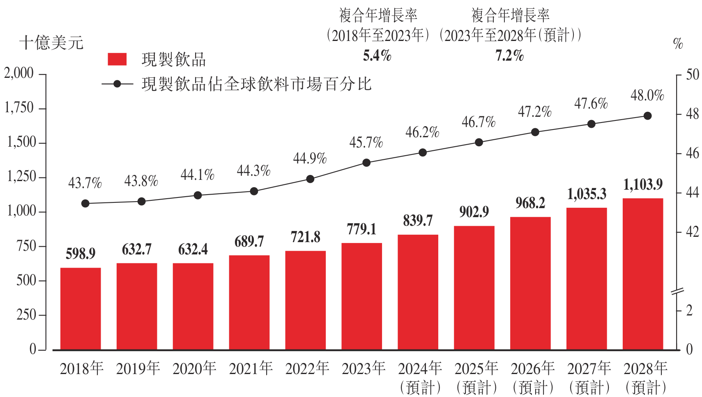

附註：飲料市場包括(i)現製飲品和(ii)預包裝飲料（即指預先包裝的非酒精飲料）的市場。

資料來源：灼識諮詢、國際貨幣基金組織、美國農業部

---

## 第 123 页

以中國和東南亞為代表的新興市場的快速增長是全球現製飲品行業加速增長的重要引擎。在2023年至2028年間，中國和東南亞市場預計在全球主要市場中增速最快，複合年增長率分別達到17.6%和19.8%，合計貢獻同期全球現製飲品市場規模增量的近40%。中國和東南亞市場合計佔全球現製飲品市場的比重也將從2023年的12.0%提升到2028年的19.4%。

全球現製飲品市場以終端零售額計的
複合年增長率，2023年至2028年（預計）

全球現製飲品市場以終端零售額計的規模增量，十億美元，2023年至2028年（預計）

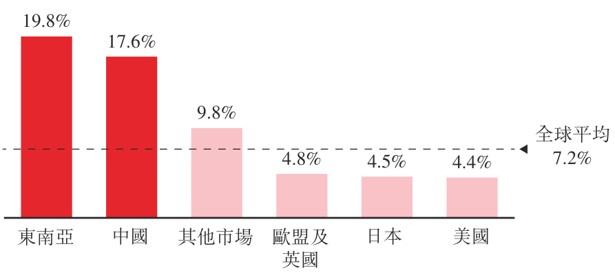

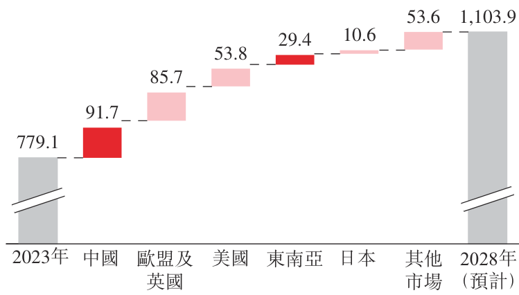

資料來源：灼識諮詢、國際貨幣基金組織、美國農業部

中國和東南亞現製飲品市場的快速增長源於消費者需求的不斷增加。2023年，中國和東南亞的現製飲品消費量在飲用水分攝入總量中的佔比均不足2%，顯著低於美國、歐盟及英國、日本等發達市場平均17%以上的佔比水平。同年，中國和東南亞的人均現製飲品年消費量分別為22杯和16杯，而上述發達市場平均超過260杯。具體而言，根據灼識諮詢確認，中國及東南亞的現製飲品消費量在飲用水分攝入總量中的佔比預計將進一步上升至接近發達市場水平。與發達市場相比，中國及東南亞市場的人均現製飲品年消費量預期增速更高，推動該等市場規模的快速增長。預計到2028年，中國和東南亞的人均現製飲品年消費量將增加逾一倍，分別達到51杯和36杯，行業增長空間巨大。

---

## 第 124 页

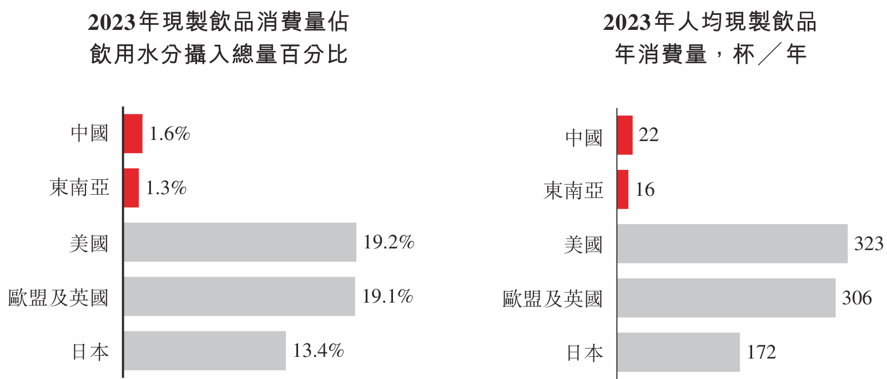

附註：飲用水分攝入包括現製飲品、預包裝飲料、液體奶和自來水。

資料來源：灼識諮詢、世界銀行、世界衛生組織、中國營養學會

以截至2024年9月30日的門店數計，本集團擁有超過45,000家門店，是全球最大的現製飲品企業。以2023年的飲品出杯量計，本集團是全球第二大現製飲品企業。以2023年的終端零售額計，本集團於全球的市場份額約為2.2%。

全球前三大現製飲品企業，

以截至2023年12月31日的門店數和2023年的飲品出杯量計

<!-- table html -->
<table><tr><td>排名</td><td>公司</td><td>主要產品</td><td>期末門店數，千店</td><td>飲品出杯量，十億杯</td><td>以飲品出杯量計的市場份額</td></tr><tr><td>1</td><td>公司A</td><td>現製飲品、食品</td><td>38.6</td><td>10.0</td><td>10.0%</td></tr><tr><td>2</td><td>本集團</td><td>現製飲品</td><td>37.6</td><td>7.4</td><td>7.4%</td></tr><tr><td>3</td><td>公司B</td><td>現製飲品、食品</td><td>21.4</td><td>2.1</td><td>2.1%</td></tr></table>
<!-- /table -->

附註：

1. 公司A於1971年創立，是一家在美國上市的跨國企業，總部位於美國華盛頓州西雅圖市，主要供應現磨咖啡、現製茶飲及其他飲品以及食品。截至2023年12月31日及2024年9月30日，公司A在全球分別擁有約38,600家及約40,200家現製飲品門店。

公司B於2018年創立，是一家私營多品牌餐飲企業，總部位於美國佐治亞州亞特蘭大市，主要供應現磨咖啡、冰淇淋及其他飲品以及食品。截至2023年12月31日及2024年9月30日，公司B在全球分別擁有約21,400家及約21,500家現製飲品門店。

2. 為進行有意義的比較，公司B截至2023年12月31日的門店數是指其現製飲品品牌經營的門店數，而飲品出杯量是指通過相應的門店銷售的飲品出杯量。

資料來源：灼識諮詢

---

## 第 125 页

全球前五大現製飲品企業，

以2023年的終端零售額計

<!-- table html -->
<table><tr><td>排名</td><td>公司</td><td>主要產品</td><td>終端零售額，十億人民幣</td><td>終端零售額同比增速</td><td>以終端零售額計的市場份額</td></tr><tr><td>1</td><td>公司A</td><td>現製飲品、食品</td><td>406.9</td><td>16.3%</td><td>18.3%</td></tr><tr><td>2</td><td>公司B</td><td>現製飲品、食品</td><td>109.2</td><td>10.4%</td><td>4.9%</td></tr><tr><td>3</td><td>公司C</td><td>現製飲品、食品</td><td>55.3</td><td>9.5%</td><td>2.5%</td></tr><tr><td>4</td><td>本集團</td><td>現製飲品</td><td>47.8</td><td>55.7%</td><td>2.2%</td></tr><tr><td>5</td><td>公司D</td><td>現製飲品、食品</td><td>42.6</td><td>6.0%</td><td>1.9%</td></tr></table>
<!-- /table -->

附註：

1. 公司C於2014年創立，是一家於美國及加拿大雙重上市的多品牌餐飲企業，總部位於加拿大多倫多市，主要提供現磨咖啡及其他飲品以及食品。於2023年底，公司C在全球擁有約5,800家現製飲品門店。

公司D於1940年創立，是一家私營跨國企業，總部位於美國明尼蘇達州布盧明頓市，主要提供現製冰淇淋及其他飲品以及食品。於2023年底，公司D在全球擁有逾7,000家現製飲品門店。

2. 為進行有意義的比較，公司B及公司C於2023年的終端零售額是指其現製飲品品牌的終端零售額。

資料來源：灼識諮詢

中國現製飲品市場

以終端零售額計，中國現製飲品市場的規模預計將從2023年的5,175億人民幣增長到2028年的11,634億人民幣，複合年增長率達到17.6%，遠超預包裝飲料行業同期5.8%的複合年增長率。預計到2028年，中國現製飲品市場將佔據中國飲料市場近一半的份額。

2024年前九個月，中國現製飲品市場的增速較2023年同期放緩。然而，受以下因素的強勁驅動，中國現製飲品市場仍有望顯著增長，推動2023年至2028年間實現17.6%的預期複合年增長率：(i)2023年的中國人均現製飲品年消費量僅為22杯，顯著低於其他市場（美國323杯，歐盟及英國306杯，日本172杯），(ii)2023年一線城市的人均現製飲品年消費量達到70杯，而三線及以下城市則僅為13杯，突顯出下沉市場的增長機遇，及(iii)中長期而言，中國經濟及消費者支出預期將穩步增長，進一步推動市場擴張。儘管近期出現短期增速放緩，但該等因素共同指明中國現製飲品市場的增長潛力。

---

## 第 126 页

中國現製飲品市場以終端零售額計的市場規模，

2018年至2028年（預計）

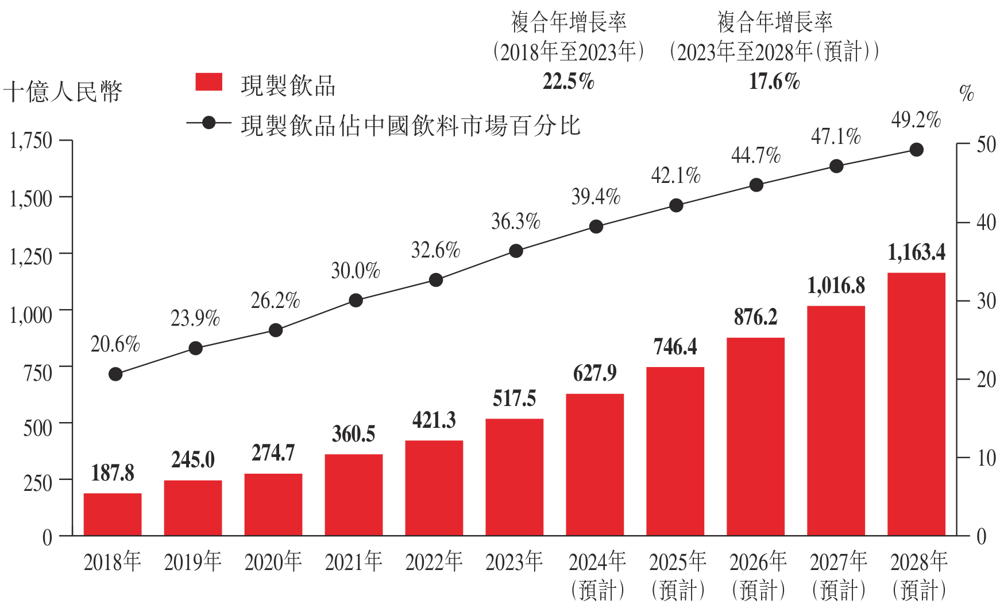

資料來源：灼識諮詢、中國國家統計局、國際貨幣基金組織、美國農業部

以2023年的終端零售額、飲品出杯量，以及截至2023年12月31日的門店數計，本集團是中國最大的現製飲品企業。於2023年，以終端零售額計，本集團於中國的市場份額約為11.3%。於2023年，本集團門店網絡的飲品出杯量超過行業第二名至第五名的飲品出杯量之和。截至2023年12月31日，中國約有66萬家現製飲品門店。

中國前五大現製飲品企業，

以2023年的終端零售額計

<!-- table html -->
<table><tr><td>排名</td><td>公司</td><td>主要產品價格帶，人民幣元</td><td>終端零售額，十億人民幣</td><td>以終端零售額計的市場份額</td></tr><tr><td>1</td><td>本集團</td><td>2-8</td><td>44.7</td><td>11.3%</td></tr><tr><td>2</td><td>公司E</td><td>14-21</td><td>33.0</td><td>8.3%</td></tr><tr><td>3</td><td>公司A</td><td>30-41</td><td>25.0</td><td>6.3%</td></tr><tr><td>4</td><td>公司F</td><td>10-18</td><td>19.2</td><td>4.8%</td></tr><tr><td>5</td><td>公司G</td><td>10-22</td><td>16.9</td><td>4.3%</td></tr></table>
<!-- /table -->

---

## 第 127 页

中國前五大現製飲品企業，

以2023年的飲品出杯量及截至2023年12月31日的門店數計

<!-- table html -->
<table><tr><td>排名</td><td>公司</td><td>主要產品價格帶，人民幣元</td><td>飲品出杯量，十億杯</td><td>以飲品出杯量計的市場份額</td><td>期末門店數，千店</td></tr><tr><td>1</td><td>本集團</td><td>2-8</td><td>6.9</td><td>32.7%</td><td>33.2</td></tr><tr><td>2</td><td>公司E</td><td>14-21</td><td>1.9</td><td>9.0%</td><td>16.2</td></tr><tr><td>3</td><td>公司F</td><td>10-18</td><td>1.2</td><td>5.7%</td><td>9.0</td></tr><tr><td>4</td><td>公司G</td><td>10-22</td><td>1.0</td><td>4.7%</td><td>7.8</td></tr><tr><td>5</td><td>公司H</td><td>7-22</td><td>0.6</td><td>2.8%</td><td>7.8</td></tr></table>
<!-- /table -->

附註：

1. 公司E於2017年創立，是一家公眾現磨咖啡企業，總部位於中國福建省廈門市。於2023年底，公司E在中國擁有約16,200家現磨咖啡門店。

公司F於2010年創立，是一家於香港上市的現製茶飲企業，總部位於中國浙江省杭州市。於2023年底，公司F在中國擁有約9,000家現製茶飲門店。

公司G於2008年創立，是一家於香港上市的現製茶飲企業，總部位於中國四川省成都市。於2023年底，公司G在中國擁有約7,800家現製茶飲門店。

公司H於2013年創立，是一家私營現製茶飲企業，總部位於中國上海市。於2023年底，公司H在中國擁有約7,800家現製茶飲門店。

2. 以終端零售額計的市場份額以該現製飲品企業所有產品終端零售額除以中國所有現製飲品店產生的終端零售額計算得出。

3. 以飲品出杯量計的市場份額以該現製飲品企業飲品出杯量除以中國所有現製飲品店的飲品出杯量計算得出。

資料來源：灼識諮詢

按價格帶劃分—平價現製飲品增速最快

現製飲品可分為三類價格帶：(i)平價，產品單價不高於10元人民幣；(ii)中價，產品單價低於20元人民幣但高於10元人民幣；以及(iii)高價，產品單價不低於20元人民幣。

平價現製飲品市場在不同價格帶中增速最快。以終端零售額計，中國平價現製飲品市場規模從2018年的480億人民幣增長至2023年的1,366億人民幣，複合年增長率為23.3%。預計到2028年，市場規模將增長至3,719億人民幣，2023年到2028年複合年增長率為22.2%。

---

## 第 128 页

中國現製飲品市場以終端零售額計的市場規模，按價格帶劃分，

2018年至2028年（預計）

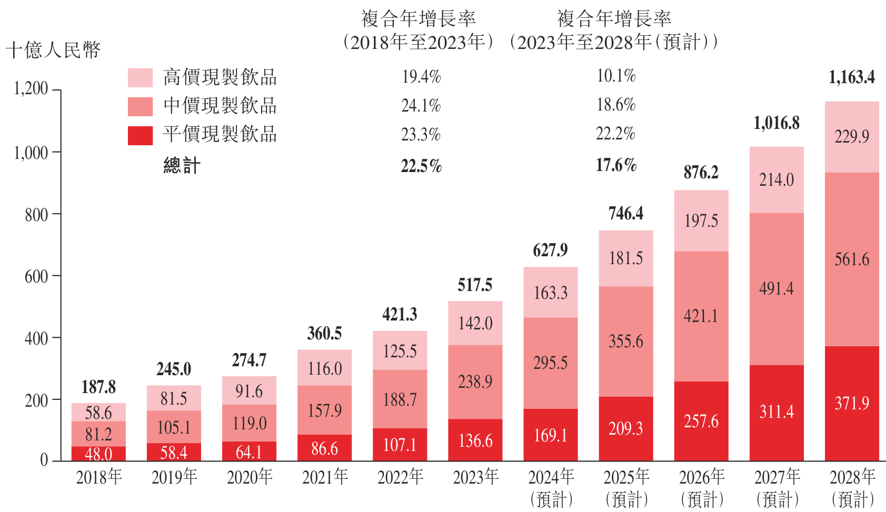

資料來源：灼識諮詢、中國國家統計局、國際貨幣基金組織

平價現製飲品市場的迅速發展主要受益於(i)中國飲料市場的平價現製化，以及(ii)現製飲品消費的平價化。

中國飲料市場的平價現製化

中國飲料市場競爭激烈，截至2023年12月31日，分別有約2.6萬家預包裝飲料公司及約66萬家現製飲品店。在中國飲料市場中，現製飲品為消費者提供更新鮮的食材，更豐富的口感，包括季節性及區域性產品在內的更多元的產品選擇，以及定製化程度更高、互動性更強的消費體驗。與此同時，平價現製飲品與其他平價飲料產品價格帶相近（單價通常不高於10元人民幣），因此日益受到中國消費者的青睞。隨著不斷擴張的門店網絡持續提升消費者獲得產品的便利性，平價現製飲品在中國整體飲料消費中的佔比預計將進一步提升。以2023年的終端零售額計，本集團是中國前五大飲料企業中的唯一的現製飲品企業。

---

## 第 129 页

中國前五大飲料企業，

以2023年的終端零售額計

<!-- table html -->
<table><tr><td></td><td></td><td></td><td colspan="2">主要飲料產品</td><td colspan="3">以終端</td></tr><tr><td>排名</td><td>公司</td><td>主要飲料產品</td><td>價格帶，人民幣元</td><td>終端零售額，十億人民幣</td><td>終端零售額同比增速</td><td>零售額計的市場份額</td></tr><tr><td>1</td><td>公司I</td><td>預包裝飲料</td><td>2-6</td><td>94.4</td><td>5.3%</td><td>6.6%</td></tr><tr><td>2</td><td>公司J</td><td>預包裝飲料</td><td>2-8</td><td>87.7</td><td>5.4%</td><td>6.1%</td></tr><tr><td>3</td><td>公司K</td><td>預包裝飲料</td><td>2-10</td><td>87.5</td><td>23.2%</td><td>6.1%</td></tr><tr><td>4</td><td>公司L</td><td>預包裝飲料</td><td>2-8</td><td>75.4</td><td>0.6%</td><td>5.3%</td></tr><tr><td>5</td><td>本集團</td><td>現製飲品</td><td>2-8</td><td>44.7</td><td>49.5%</td><td>3.1%</td></tr></table>
<!-- /table -->

附註：

1. 公司I於1987年創立，是一家私營飲料企業，總部位於中國浙江省杭州市，主要提供包裝飲用水、蛋白飲料及其他預包裝飲料。

公司J於1958年創立，是一家於香港上市的食品飲料企業，總部位於中國台灣，該企業於1992年進入中國內地市場，主要提供包裝飲用水、茶飲以及其他食品及預包裝飲料。

公司K於1996年創立，是一家於香港上市的飲料企業，總部位於中國浙江省杭州市，主要提供包裝飲用水、茶飲及其他預包裝飲料。

公司L是一家於美國上市的飲料企業的中國分公司，該企業總部位於美國佐治亞州亞特蘭大市，於1892年創立並於1979年進入中國內地市場，主要提供碳酸飲料、果汁飲料及其他預包裝飲料。

2. 為進行有意義的比較，公司I、J、K及L的終端零售額不包括銷售食品產生的終端零售額。

資料來源：灼識諮詢

現製飲品消費的平價化

隨著現製飲品逐漸成為日常消費中不可或缺的一部分，消費者對於性價比的關注度逐漸提升，使得平價現製飲品日益受到消費者青睞。截至2023年12月31日，中國有約27萬家平價現製飲品店，其中，本集團網絡內的門店佔12.3%。

---

## 第 130 页

在以終端零售額計的中國前五大現製飲品企業中，本集團是唯一聚焦於平價現製飲品的企業。在平價價格帶脫穎而出需要企業以極致性價比提供高品質的產品，相比專注於中高價格帶的其他企業，這更加考驗企業供應鏈的廣度和深度，以及品牌聲譽。

供應鏈的廣度和深度。兼具廣度和深度的供應鏈對於在平價現製飲品市場打造高質平價的產品至關重要。供應鏈需端到端延展以覆蓋採購、生產、物流、研發及質量控制等諸多環節，同時要在各個環節強化深度。具體而言，覆蓋廣闊的上游採購網絡有助於以具有競爭力的價格確保高品質原材料的穩定供應；規模化中央工廠有助於在實現成本效益的同時提升核心食材自產自供能力；自主運營的倉儲體系和專屬的配送網絡能在物流成本和效率上形成優勢。

品牌聲譽。擁有廣大忠實的消費者群體、培養日常高頻的消費習慣是在平價現製飲品市場中脫穎而出的關鍵。全民品牌形象的塑造對於高效觸達廣泛消費者群體至關重要。此外，隨著平價現製飲品逐漸成為日常生活的一部分，消費者通常會選擇認可度更高的品牌，以降低在高頻次消費中的決策成本。這需要企業堅持開發高品質產品、優化消費體驗，以及打造對於不同消費群體和區域都具有廣泛吸引力的品牌文化。

按品類劃分—現製茶飲和現磨咖啡

現製茶飲和現磨咖啡是中國現製飲品市場的主要細分品類。

現製茶飲—最大的細分品類。以終端零售額計，現製茶飲是中國現製飲品市場中最大的細分品類，2023年佔中國現製飲品市場規模約50%。

現磨咖啡—增速最快的細分品類。現磨咖啡是中國現製飲品市場中增速最快的細分品類，預計2023年至2028年的複合年增長率為19.8%。

---

## 第 131 页

中國現製飲品市場以終端零售額計的市場規模，按品類劃分，

2018年至2028年（預計）

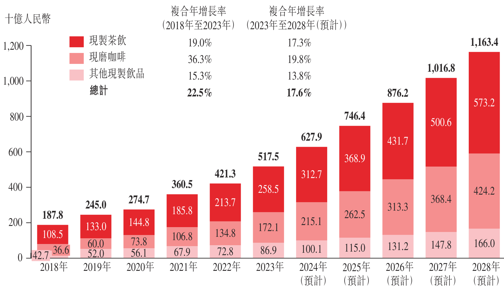

附註：其他現製飲品主要包括現製果飲、冰淇淋和酸奶。

資料來源：灼識諮詢、中國國家統計局、國際貨幣基金組織

現製茶飲店和現磨咖啡店是消費者購買現製茶飲和現磨咖啡的最主要的消費渠道。其他渠道包括餐廳、烘焙店和便利店等。

現製茶飲店

現製茶飲店通常銷售包括現製茶飲、果飲、冰淇淋在內的一系列產品。中國人均現製茶飲年消費量預計將從2023年的約11杯提升到2028年的約26杯，帶動中國現製茶飲店市場終端零售額以19.7%的複合年增長率從2023年的2,115億人民幣增長至2028年的5,193億人民幣。

在中國現製茶飲店市場中，於2021年、2022年、2023年及2024年前九個月，按終端零售額計，「蜜雪冰城」是中國最大的現製茶飲品牌，市場份額分別約為16.6%、17.3%、20.2%及20.9%。於2021年、2022年、2023年及2024年前九個月，按飲品出杯量計，「蜜雪冰城」是中國最大的現製茶飲品牌，市場份額分別約為42.4%、42.5%、49.6%及52.8%。同期及直至最後實際可行日期，「蜜雪冰城」按終端零售額及飲品出杯量計的市場份額逐漸提升。

---

## 第 132 页

行業概覽

中國前五大現製茶飲品牌，以2023年的終端零售額計

<!-- table html -->
<table><tr><td>排名</td><td>品牌</td><td>主要產品價格帶，人民幣元</td><td>終端零售額，十億人民幣</td><td>以終端零售額計的市場份額</td></tr><tr><td>1</td><td>「蜜雪冰城」</td><td>2-8</td><td>42.7</td><td>20.2%</td></tr><tr><td>2</td><td>品牌F</td><td>10-18</td><td>19.2</td><td>9.1%</td></tr><tr><td>3</td><td>品牌G</td><td>10-22</td><td>16.9</td><td>8.0%</td></tr><tr><td>4</td><td>品牌M</td><td>15-24</td><td>10.5</td><td>5.0%</td></tr><tr><td>5</td><td>品牌H</td><td>7-22</td><td>9.7</td><td>4.6%</td></tr></table>
<!-- /table -->

中國前五大現製茶飲品牌，以2023年的飲品出杯量計

<!-- table html -->
<table><tr><td>排名</td><td>品牌</td><td>主要產品價格帶，人民幣元</td><td>飲品出杯量，十億杯</td><td>以飲品出杯量計的市場份額</td></tr><tr><td>1</td><td>「蜜雪冰城」</td><td>2-8</td><td>6.6</td><td>49.6%</td></tr><tr><td>2</td><td>品牌F</td><td>10-18</td><td>1.2</td><td>9.0%</td></tr><tr><td>3</td><td>品牌G</td><td>10-22</td><td>1.0</td><td>7.5%</td></tr><tr><td>4</td><td>品牌H</td><td>7-22</td><td>0.6</td><td>4.5%</td></tr><tr><td>5</td><td>品牌N</td><td>10-20</td><td>0.6</td><td>4.5%</td></tr></table>
<!-- /table -->

附註：品牌F由公司F運營。

品牌G由公司G運營。

品牌M由一家私營現製茶飲企業運營，該公司於2017年創立，總部位於中國四川省成都市。於2023年底，該公司在中國擁有約3,400家現製茶飲門店。

品牌H由公司H運營。

品牌N由一家私營現製茶飲企業運營，該公司於1997年創立並於2007年進入中國內地市場，總部位於中國台灣。於2023年底，該公司在中國內地擁有約4,300家現製茶飲門店。

資料來源：灼識諮詢

---

## 第 133 页

目前現製茶飲店在中國三線及以下城市覆蓋程度有限，導致消費者對現製飲品的需求未得到充分滿足，未來市場提升空間巨大。截至2023年12月31日，三線及以下城市的現製茶飲店門店密度僅為每百萬人273家店，遠低於一線城市的每百萬人474家店。中國三線及以下城市的現製茶飲店數量正在迅速增長，截至2023年12月31日已達約25萬家。以終端零售額計，三線及以下城市的現製茶飲店市場規模預計將以22.8%的複合年增長率從2023年的960億人民幣增長至2028年的2,682億人民幣，在所有城市線級中增速最快，於2028年佔中國現製茶飲店總體市場規模的51.6%。

中國現製茶飲店市場以終端零售額計的市場規模，

按城市線級劃分，2018年至2028年（預計）

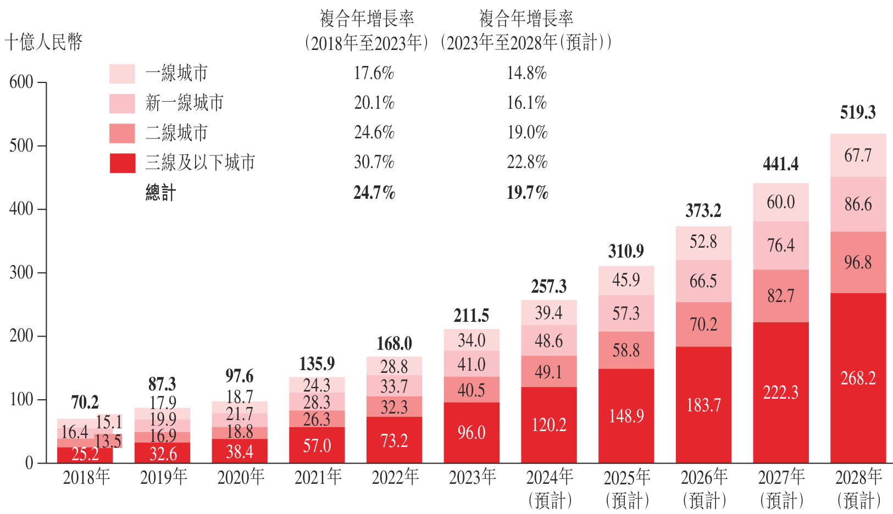

資料來源：灼識諮詢、中國國家統計局、國際貨幣基金組織

以截至2023年12月31日的門店數計，「蜜雪冰城」也是中國最大的現製茶飲品牌。在市場前五大品牌中，「蜜雪冰城」在三線及以下城市的滲透率最高，截至2023年12月31日在這些城市的門店數超過第二名至第五名之和。

---

## 第 134 页

中國前五大現製茶飲品牌，
以截至2023年12月31日的門店數計

<!-- table html -->
<table><tr><td>排名</td><td>品牌</td><td>主要產品價格帶，人民幣元</td><td>門店數，千店</td><td>以門店數計的市場份額</td><td>三線及以下城市門店數，千店</td></tr><tr><td>1</td><td>「蜜雪冰城」</td><td>2-8</td><td>30.3</td><td>6.5%</td><td>17.1</td></tr><tr><td>2</td><td>品牌F</td><td>10-18</td><td>9.0</td><td>1.9%</td><td>4.4</td></tr><tr><td>3</td><td>品牌G</td><td>10-22</td><td>7.8</td><td>1.7%</td><td>3.2</td></tr><tr><td>4</td><td>品牌H</td><td>7-22</td><td>7.8</td><td>1.7%</td><td>3.8</td></tr><tr><td>5</td><td>品牌O</td><td>11-20</td><td>7.0</td><td>1.5%</td><td>3.8</td></tr></table>
<!-- /table -->

附註：品牌O由一家私營現製茶飲企業運營，該公司於2007年創立，總部位於中國四川省成都市。於2023年底，該公司在中國擁有約7,000家現製茶飲門店。

資料來源：灼識諮詢

根據灼識諮詢的報告，截至最後實際可行日期，「蜜雪冰城」品牌的市場地位並無重大變動。

現磨咖啡店

現磨咖啡店主要提供使用咖啡豆現場製作的咖啡飲品。受益於城鎮化的持續推進以及居民可支配收入的提高，中國咖啡消費整體呈現顯著增長的趨勢。從2023年到2028年，中國現磨咖啡消費人群滲透率預計將從9.4%增長到18.3%，人均現磨咖啡年消費量將從約6杯提升到約13杯，驅動現磨咖啡店總體市場規模從2023年的1,515億人民幣增長至2028年的3,836億人民幣，複合年增長率達到20.4%。

截至2023年12月31日，三線及以下城市僅有約4萬家現磨咖啡店。伴隨著門店佈局的進一步下沉，低線城市未來數年的增長潛力顯著。以終端零售額計，三線及以下城市的現磨咖啡店市場預計將於2023年至2028年間以24.7%的複合年增長率增長，2028年市場規模達到近千億人民幣。以高性價比為特徵的平價現磨咖啡（單價不高於10元人民幣）將充分受益於三線及以下城市現磨咖啡店市場的增長機遇。

---

## 第 135 页

中國現磨咖啡店市場以終端零售額計的市場規模，

按城市線級劃分，2018年至2028年（預計）

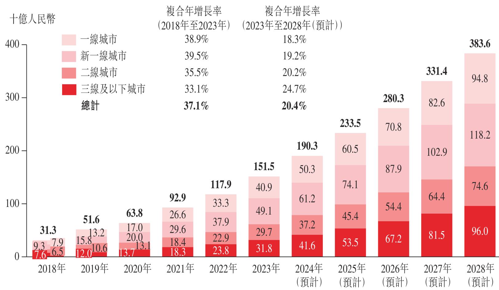

資料來源：灼識諮詢、中國國家統計局、國際貨幣基金組織

以2023年的終端零售額計，「幸運咖」是中國第五大現磨咖啡品牌，以2023年的飲品出杯量和截至2023年12月31日的門店數計，「幸運咖」是中國第四大現磨咖啡品牌。截至2023年12月31日，「幸運咖」61.5%的門店位於三線及以下城市，滿足了這些城市中消費者對現磨咖啡店不斷攀升的需求。此外，「幸運咖」是前五大現磨咖啡品牌中唯一專注於提供平價現磨咖啡的品牌。

中國前五大現磨咖啡品牌，以2023年的終端零售額計

<!-- table html -->
<table><tr><td>排名</td><td>品牌</td><td>主要產品價格帶，人民幣元</td><td>終端零售額，十億人民幣</td><td>以終端零售額計的市場份額</td></tr><tr><td>1</td><td>品牌E</td><td>14-21</td><td>33.0</td><td>21.8%</td></tr><tr><td>2</td><td>品牌A</td><td>30-41</td><td>25.0</td><td>16.5%</td></tr><tr><td>3</td><td>品牌P</td><td>10-15</td><td>5.5</td><td>3.6%</td></tr><tr><td>4</td><td>品牌Q</td><td>15-30</td><td>2.5</td><td>1.7%</td></tr><tr><td>5</td><td>「幸運咖」</td><td>5-10</td><td>1.9</td><td>1.3%</td></tr></table>
<!-- /table -->

---

## 第 136 页

中國前五大現磨咖啡品牌，

以2023年的飲品出杯量及截至2023年12月31日的門店數計

<!-- table html -->
<table><tr><td>排名</td><td>品牌</td><td>主要產品價格帶，人民幣元</td><td>飲品出杯量，十億杯</td><td>以飲品出杯量計的市場份額</td><td>期末門店數，千店</td><td>期末三線及以下城市門店數，千店</td></tr><tr><td>1</td><td>品牌E</td><td>14-21</td><td>1.9</td><td>31.7%</td><td>16.2</td><td>4.6</td></tr><tr><td>2</td><td>品牌A</td><td>30-41</td><td>0.5</td><td>8.3%</td><td>7.0</td><td>1.0</td></tr><tr><td>3</td><td>品牌P</td><td>10-15</td><td>0.4</td><td>6.7%</td><td>6.8</td><td>2.6</td></tr><tr><td>4</td><td>「幸運咖」</td><td>5-10</td><td>0.2</td><td>4.0%</td><td>2.9</td><td>1.8</td></tr><tr><td>5</td><td>品牌Q</td><td>15-30</td><td>0.1</td><td>1.7%</td><td>1.1</td><td>&lt;0.1</td></tr></table>
<!-- /table -->

附註：品牌E由公司E運營。

品牌A由公司A運營。

品牌P由一家私營現磨咖啡企業運營，該公司於2022年創立，總部位於中國北京市。於2023年底，該公司在中國擁有約6,800家現磨咖啡門店。

品牌Q由一家私營現磨咖啡企業運營，該公司於2015年創立，總部位於中國上海市。於2023年底，該公司在中國擁有約1,100家現磨咖啡門店。

資料來源：灼識諮詢

中國現製飲品市場關鍵驅動因素及趨勢

城鎮化持續推進。中國的城鎮化率由2018年的61.5%上升至2023年的66.2%，並預期於2028年進一步上升至70.6%。中國的城鎮化、尤其是三線及以下城市的持續城鎮化，將有力推動人口向城鎮聚集，擴大城鎮的消費人群基數和密度，從而集聚消費者流量及對現製飲品的需求。現製飲品店可以更有效地實現對消費群體的觸達和覆蓋，從而推動市場規模的持續增長。中國現製茶飲及現磨咖啡的消費人群滲透率預計將分別由2023年的22.7%及9.4%上升至2028年的34.4%及18.3%，帶動整體市場增長。

消費頻率提升。現製飲品憑藉其優異的產品品質及消費體驗持續吸引更多的消費者群體及帶來更高的消費頻率。中國人均現製飲品年消費量由2018年的8杯增加至2023年的22杯，仍遠低於2023年美國的323杯、歐盟及英國的306杯以及日本的172杯，增長潛力巨大。隨著平價現製飲品的日益流行，消費者現製飲品消費場景日益多

---

## 第 137 页

元化，逐漸拓展至日常生活的不同場景，尤其是在現製飲品店，消費者可以接觸到高質平價的產品，並享受定制化的服務和體驗。2028年，中國人均現製飲品年消費量預計將達到51杯，對現製飲品的龐大需求推動市場持續發展。

優質產品供給湧現。隨著消費頻率提高，消費者愈發注重產品質量及消費體驗。供應鏈的升級提升了產品品質並優化了成本結構，廣闊的門店網絡擴大了消費者覆蓋，數字化的運營系統與標準化的門店管理模式強化了運營效率並確保穩定的消費者體驗，研發投入升級了產品的口味和品質。能夠有機結合上述因素的頭部企業有望推出更多高品質產品，拓寬消費人群，培養更高的消費者忠誠度，從而推動整體市場增長。

連鎖化率不斷增長。現製飲品連鎖店憑藉良好的品牌聲譽、標準化門店運營、供應鏈能力及規模經濟效應，提高運營效率及門店表現，帶動現製茶飲店和現磨咖啡店的連鎖化率持續上升，推動現製飲品市場的整體增長。現製茶飲店的連鎖化率預計將從2023年的約56%上升至2028年的約72%，現磨咖啡店的連鎖化率預計將從2023年的約30%上升至2028年的約55%。在現製飲品市場中，平價現製飲品市場的連鎖化率相對較低，反映了巨大的增長潛力。舉例而言，平價現製茶飲店的連鎖化率預計將由2023年的約43%增加至2028年的約61%，增長機會更為顯著。平價現製飲品市場的頭部企業憑藉供應鏈的廣度及深度以及強大的品牌聲譽，有望把握市場機遇，擴大產品對消費者的可觸達性並提升門店表現，從而促進整體市場增長。

中國現製飲品市場關鍵成功要素

優質的供應鏈。打造端到端的優質供應鏈體系有助於在提升產品品質的同時優化成本結構。具體而言，覆蓋廣闊的供應商網絡有助於在實現成本效益的同時確保高品質原材料的穩定供應；規模化中央工廠有助於保障食材品質、提升食材自產自供能力並進一步提升產品性價比；穩定的物流體系保障高效及時的配送。對於採用加盟模式的現製飲品企業，領先的供應鏈管理能力也有助於其為加盟商提供極具競爭力的一站式解決方案，提升產品標準化水平，強化品牌的持續開店拓展能力。

強大的品牌聲譽。廣泛的線下門店網絡加強了現製飲品企業的品牌曝光，有助於佔據消費者心智。因此，擁有龐大門店網絡的頭部現製飲品企業已經建立起了強大的品牌影響力。此外，頭部現製飲品企業積極嘗試IP內容創作，通過線下營銷活動和線上社交媒體推廣相結合的方式與消費者互動、提升品牌曝光度，塑造全民品牌形象。

---

## 第 138 页

強大的品牌聲譽有利於公司與消費者建立長期情感連結，在持續吸引和轉化更多新消費者的同時，提高現有消費者的品牌忠誠度和複購水平。頭部企業憑藉品牌聲譽建立的競爭優勢是難以複製的。

高效的門店網絡管理。先進的管理制度、完善的管理體系和成熟的管理團隊對於有效管理龐大的現製飲品門店網絡至關重要。頭部現製飲品企業全方位賦能包括採購、物流、門店操作、人員培訓、市場營銷等各個關鍵方面在內的運營全流程，以強化加盟商門店端的經營效率，實現單店盈利的提升，推動門店網絡的持續拓展。

先進的數字化水平。頭部現製飲品企業正在將數字化能力建設融入到全業務流程中。他們以數字化工具實現對包括採購、生產、物流等在內的供應鏈各個環節的高效控制，通過數字化系統及工具優化門店選址，強化全渠道用戶營銷，並實現智慧門店管理，從而持續加強管理能力並提升效率。

全面的產品研發。對與食材相關的技術、生產工藝等的全方位研發有助於現製飲品企業提升標準化生產能力，保障產品品質的穩定性。對與產品相關的研發投入有助於現製飲品企業及時響應消費者不斷變化的需求，為消費者帶來優異的口感和豐富的產品選擇。

中國現製飲品市場的進入壁壘

發展成熟的門店網絡。擁有龐大門店網絡的領先現製飲品品牌已佈局商業街、購物中心等地段的黃金點位，得以吸引消費者流量及提升品牌知名度。新進入者在獲取理想點位時面臨挑戰，或可能產生更高的租金成本。

產品品質控制能力。消費者在選擇現製飲品時日益關注食品安全。頭部企業通過運營嚴格且高標準的品質控制體系，逐漸獲得消費者的信任並影響其購買決策。由於新進入者的品質控制體系通常處於早期階段，未必可有效保證產品品質，故發展成熟的公司採取的嚴格產品品質控制措施對該等新進入者構成挑戰。

運營標準化。業內領先的企業已採用覆蓋從採購、生產到店內飲品製作流程的標準化且綜合性的運營體系，藉以提升效率並支持門店網絡長期持續擴張。由於建立該等體系耗時較久，故現製飲品市場的小型企業或新進入者可能難以快速實現運營標準化。

---

## 第 139 页

中國現製飲品市場的市場挑戰與威脅

食品安全及衛生合規。管理食品安全及衛生合規是現製飲品市場的共同挑戰。企業須控制包括原材料採購、生產及物流流程、門店環境、店內飲品製作及人員衛生等在內的關鍵環節，以積極應對相關挑戰。未能有效遵守食品安全要求可能會導致消費者流失、品牌聲譽受損或面臨法律及監管風險。

原材料及勞動力成本。原材料及勞動力成本是現製飲品企業成本的重要組成部分。食品等若干原材料成本受市場價格波動影響，而勞動力成本亦持續上升。原材料及勞動力成本上升可能對現製飲品企業的發展及盈利能力構成挑戰。

東南亞現製飲品市場

由於注重性價比的消費者群體不斷擴大、持續拓展的門店網絡覆蓋更多消費者、以及供應鏈基礎設施逐步完善等因素的驅動，東南亞現製飲品市場呈現快速增長態勢。以終端零售額計，東南亞現製飲品市場規模預計將由2023年的201億美元增長至2028年的495億美元，複合年增長率為19.8%，在全球主要市場中增速最快。

受區域經濟增長及消費者支出增加的預期所推動，2023年至2028年，東南亞現製飲品市場預期將以19.8%的複合年增長率強勁增長。以下關鍵因素突顯該市場的增長潛力：(i)2023年的東南亞人均現製飲品年消費量為16杯，大幅落後於其他市場（美國323杯，歐盟及英國306杯，日本172杯），及(ii)中長期而言，東南亞的經濟發展及消費者支出預期將穩步增長，為市場發展創造良好環境。該等驅動力映證了東南亞市場的巨大未開發潛力，為該地區現製飲品市場的高速增長奠定基礎。

---

## 第 140 页

東南亞現製飲品市場以終端零售額計的市場規模，
按品類劃分，2018年至2028年（預計）

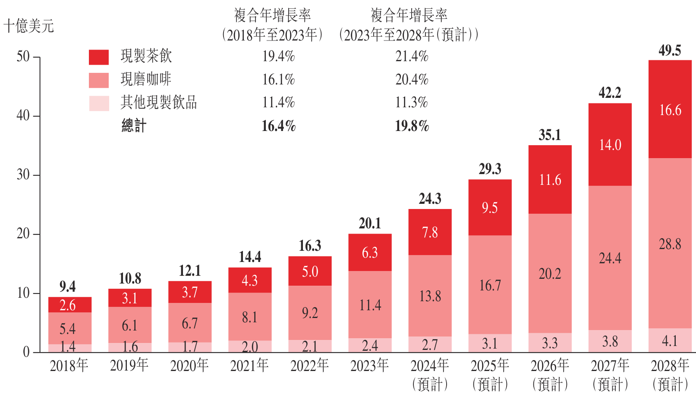

附註：其他現製飲品主要包括現製果飲、冰淇淋和酸奶。

資料來源：灼識諮詢、國際貨幣基金組織

相比中國市場，東南亞現製飲品市場高度分散，連鎖化率相對較低，頭部品牌的發展空間更為廣闊。舉例而言，2023年東南亞現製茶飲店市場連鎖化率約25%，顯著低於中國市場的56%。「蜜雪冰城」在東南亞市場有超過4,000家門店，以截至2023年12月31日的門店數以及2023年的飲品出杯量計，「蜜雪冰城」是東南亞地區最大的現製茶飲品牌。

東南亞地區前三大現製茶飲品牌，

以截至2023年12月31日的門店數和2023年的飲品出杯量計

<!-- table html -->
<table><tr><td>排名</td><td>品牌</td><td>期末門店數，千店</td><td>飲品出杯量，百萬杯</td><td>以飲品出杯量計的市場份額</td></tr><tr><td>1</td><td>「蜜雪冰城」</td><td>4.3</td><td>513.4</td><td>19.5%</td></tr><tr><td>2</td><td>品牌R</td><td>1.3</td><td>165.0</td><td>6.3%</td></tr><tr><td>3</td><td>品牌S</td><td>1.0</td><td>160.0</td><td>6.1%</td></tr></table>
<!-- /table -->

附註：品牌R由一家多品牌餐飲企業運營，該公司於2004年創立，總部位於中國台灣且在中國台灣上市。於2023年底，該公司在東南亞擁有約1,300家現製茶飲門店。

品牌S由一家私營現製茶飲企業運營，該公司於2018年創立，總部位於印度尼西亞。於2023年底，該公司在東南亞擁有約1,000家現製茶飲門店。

資料來源：灼識諮詢

---

## 第 141 页

原材料和勞動力成本變動分析

現製飲品企業的主要成本有包括茶、乳製品、水果和咖啡豆在內的原材料成本，和勞動力成本。在歷史期間，中國的水果、咖啡豆價格有所波動。具體而言，中國水果的消費者價格指數從2018年的105.6上升至2019年的112.3，隨後在2020年下降至88.9，但在2022年又反彈至112.9，隨後在2023年下降至104.9。中國咖啡豆的進口單位價格指數於2018年至2021年較為穩定，2022年漲幅較大，但隨後於2023年有所回落。中國茶和乳製品的消費者價格指數於2018年至2023年間較為穩定。與此同時，勞動力成本呈現穩定上升的趨勢。

中國茶、乳製品和水果的
消費者價格指數，
2018年至2023年

中國咖啡豆的進口單位價格指數，
2018年至2023年

中國私營企業
員工平均年薪，
2018年至2023年

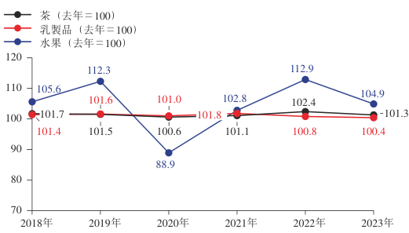

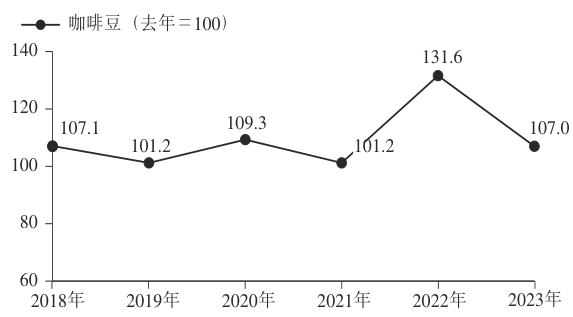

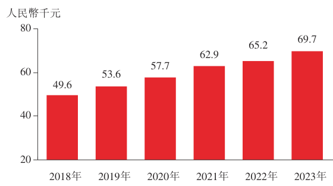

資料來源：灼識諮詢、中國國家統計局、中國海關總署

在歷史期間，全球的咖啡豆、乳製品價格有所波動。具體而言，全球咖啡豆的進口單位價格指數由2018年的91.3上升至2022年的131.1，但其後於2023年下跌至100.7。全球乳製品的進口單位價格指數由2018年的105.2下跌至2019年的96.1，並於2022年上升至116.2，於2023年下跌至98.4。全球茶及水果的進口單位價格指數於2018年至2023年間保持相對穩定。

---

## 第 142 页

全球茶、咖啡豆、乳製品及水果進口單位價格指數，2018年至2023年

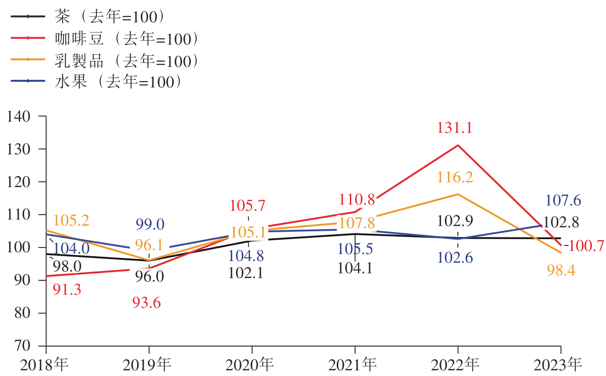

資料來源：聯合國糧食及農業組織

長期來看，中國及全球現製飲品行業原材料的價格指數預期將保持穩定。預計中國及全球茶、乳製品及水果的價格指數於近期基本維持穩定。儘管中國及全球咖啡豆的進口單位價格指數於2022年大幅上升，但於2023年下降並預期於今後幾年將恢復至合理的區間內。

行業資料來源

灼識諮詢獲委託對全球及中國現製飲品市場及相關經濟數據進行研究及分析並作出報告，費用約為1,766,528元人民幣。委託編製的報告已由灼識諮詢在不受本公司或其他利益相關方影響的情況下編製。灼識諮詢提供行業諮詢服務、商業盡職審查及戰略諮詢。在顧問團隊積極追蹤消費品及服務、農業、化工、營銷及廣告、文化及娛樂、能源及工業、金融及服務、醫療保健、TMT及交通運輸等各行業的最新市場趨勢下，灼識諮詢擁有該等行業高度相關及極具洞察力的市場情報。除另有說明外，本章節所載所有數據及預測均來自灼識諮詢報告。我們亦已在「概要」、「風險因素」、「業務」及「財務資料」各章節中提述若干資料，以更全面地介紹我們經營所在的行業。

---

## 第 143 页

灼識諮詢利用各種資源並採用一手及二手研究方法。一手研究包括與主要行業專家及領先參與者的訪談，而二手研究則涉及分析來自中國國家統計局、中國海關總署、世界銀行、世界衛生組織、國際貨幣基金組織、聯合國糧食及農業組織及美國農業部等公開來源的數據。灼識諮詢報告的市場預測基於預測期內的以下主要假設：(i)穩定的社會、經濟及政治環境，(ii)在持續的市場需求、技術進步及促進基礎設施發展的持續舉措的支持下，城鎮化帶來的經濟和工業平穩增長，(iii)影響現製飲品市場的主要行業驅動因素，及(iv)不存在從根本上影響市場的極端不可抗力或不可預見的行業法規。主要行業驅動因素包括持續城鎮化導致消費者群體擴大、消費頻率增加（尤其是對高質平價的產品）、為滿足未得到充分滿足的消費者需求而增加門店數量，以及在連鎖化率增長、門店標準化及供應鏈能力提升的推動下，門店平均業績得以提高。

我們的董事經合理查詢後確認，就其所知，自灼識諮詢報告出具日期起，市場資料並無重大不利變動以致可能對本節所載資料有所保留、構成抵觸或造成影響。

---

## 第 144 页

中國

由於我們主要在中國經營業務，因此我們須遵守多項中國法律及法規，其可能影響我們業務運營及全球發售。

關於商事主體的法規

在中國成立、運營及管理公司實體均受全國人大常務委員會（「全國人大常委會」）於1993年12月頒佈並分別於1999年12月、2004年8月、2005年10月、2013年12月、2018年10月及2023年12月進一步修訂的中國公司法規管。根據中國公司法，公司一般分為兩類，即有限責任公司及股份有限公司。中國公司法亦適用於外商投資的有限責任公司及股份有限公司。

一般事項

「股份有限公司」指依照中國公司法在中國註冊成立的企業法人，具有獨立的法人財產，享有法人財產權，且其註冊資本劃分為股份。公司以其全部財產對公司的債務承擔責任；股東以其認購的股份為限對公司承擔責任。

股東會

根據中國公司法，股份有限公司股東會由全體股東組成；股東會是公司的權力機構，依照中國公司法行使職權。

股東會應當每年召開一次年會。發生中國公司法指定的若干情形的，應當在兩個月內召開臨時股東會會議。

股東出席股東會會議，所持每一股份有一表決權。但是，持有類別股份的股東可就每股類別股份擁有特別數目的表決權，而公司持有的公司股份沒有表決權。

股東會作出決議，必須經出席會議的股東所持表決權過半數通過。但是，股東會作出公司合併、分立或解散、增加或者減少註冊資本、變更公司形式或者修改公司章程的決議，必須經出席會議的股東所持表決權的三分之二以上通過。

---

## 第 145 页

股東可以委託代理人出席股東會會議，代理人應當向公司提交股東授權委託書，並在授權範圍內行使表決權。

股份轉讓

股東持有的股份可以依法轉讓。根據中國公司法，股東轉讓其股份，應當在依法設立的證券交易場所進行或者按照國務院規定的其他方式進行。股票由股東以背書方式或者法律、行政法規規定的其他方式轉讓；轉讓後由公司將受讓人的姓名或者名稱及住所記載於股東名冊。股東會會議召開前二十日內或者公司決定分配股利的基準日前五日內，不得進行上述股東名冊的變更登記。但是，法律、行政法規或國務院證券監督管理機構對上市公司股東名冊變更另有規定的，從其規定。

根據中國公司法，公司公開發行股份前已發行的股份，自公司股票在證券交易所上市交易之日起一年內不得轉讓。公司董事、監事、高級管理人員應當向公司申報所持有的本公司的股份及其變動情況，在就任時確定的任職期間每年轉讓的股份不得超過其所持有本公司股份總數的百分之二十五；所持本公司股份自公司股票在證券交易所上市交易之日起一年內不得轉讓。上述人員離職後半年內，不得轉讓其所持有的本公司股份。公司章程可以對公司董事、監事、高級管理人員轉讓其所持有的本公司股份作出其他限制性規定。

關於外商投資的法規

外國投資者在中國的投資主要受中國商務部（「商務部」）及中國國家發展和改革委員會（「國家發改委」）於2022年10月26日頒佈並於2023年1月1日生效的《鼓勵外商投資產業目錄》（2022年版）以及商務部及國家發改委於2024年9月6日頒佈並於2024年11月1日生效的《外商投資准入特別管理措施（負面清單）》（2024年版）（「負面清單」）的規管。負面清單對所列行業和禁止外商投資行業的外商投資准入統一列明若干限制性措施，如持股比例和管理要求。負面清單以外的行業，按照內外資同等待遇的原則進行管理。

---

## 第 146 页

於2019年3月15日，全國人大頒佈《中華人民共和國外商投資法》（「外商投資法」），於2020年1月1日生效。據此，其適用於外國的自然人、企業或其他組織直接或間接在中國境內進行的投資活動。國務院於2019年12月26日頒佈並於2020年1月1日生效的《中華人民共和國外商投資法實施條例》進一步明確了國家鼓勵和促進外商投資，保護外商投資合法權益，規範外商投資管理，持續優化外商投資環境，推進更高水平對外開放。

於2019年12月30日，商務部及國家市場監管總局聯合頒佈《外商投資信息報告辦法》，於2020年1月1日生效。據此，外國投資者直接或者間接在中國境內進行投資活動，市場監管部門應當將外國投資者、外商投資企業報送的投資信息推送至商務主管部門。

關於中國現製飲品行業的法規

由於我們提供的業務涵蓋食品生產經營，我們須遵守相關規定，如根據食品生產經營相關法律法規取得食品生產許可證及食品經營許可證，遵守食品安全相關法律法規規定的措施以確保食品安全，並遵守線上餐飲服務相關法規。

食品安全

根據全國人大常委會於2009年2月28日頒佈並於2021年4月29日最新修訂的《中華人民共和國食品安全法》（「食品安全法」），國務院對食品生產經營實行許可制度。從事食品生產、食品銷售、餐飲服務的個人或主體應當依照食品安全法取得許可。

國務院於2009年7月20日頒佈並於2019年10月11日最新修訂的《中華人民共和國食品安全法實施條例》進一步明確了食品生產經營者須採取的詳細措施，以及因未實施該等規定措施而應承受的處罰。

---

## 第 147 页

根據國家市場監管總局於2021年12月24日頒佈並於2022年3月15日生效的《食品生產經營監督檢查管理辦法》，國家市場監管總局負責監督指導全國食品生產經營監督檢查工作，可以根據需要組織開展監督檢查。

中國國家食品藥品監督管理總局（現併入國家市場監管總局）於2016年7月13日發佈並於2021年4月2日最新修訂的《網絡食品安全違法行為查處辦法》訂明在中國境內網絡食品交易第三方平台提供者或通過自建的網站進行交易的食品生產經營者違反食品安全法律、法規、規章或者食品安全標準行為的查處規則。

食品生產許可

根據國家市場監管總局於2020年1月2日頒佈並於2020年3月1日生效的《食品生產許可管理辦法》，在中國境內從事食品生產活動的主體，應當取得食品生產許可。食品生產許可證有效期為五年，並實行「一企一證」原則。食品生產者應當在生產場所的顯著位置展示食品生產許可證正本。需要變更食品生產許可證載明的許可事項的，食品生產者應當在變化後10個工作日內向原發證的市場監督管理部門提出變更申請。食品生產者的生產場所遷址的，應當重新申請食品生產許可。食品生產者未取得食品生產許可從事食品生產活動的，由縣級以上地方市場監督管理部門依照食品安全法第一百二十二條的規定給予處罰，食品安全法規定有關部門應當沒收違法所得和違法生產經營的食品、食品添加劑以及用於違法生產經營的工具、設備、原料等物品；違法生產經營的食品、食品添加劑貨值金額不足人民幣10,000元的，並處人民幣50,000元以上人民幣100,000元以下罰款；貨值金額人民幣10,000元以上的，並處貨值金額十倍以上二十倍以下罰款。

食品經營許可

根據國家市場監管總局於2023年6月15日頒佈並於2023年12月1日生效的《食品經營許可和備案管理辦法》，在中國境內從事食品銷售和餐飲服務活動的主體，應當取得食品經營許可，有效期為五年，惟若干情況除外。申請食品經營許可，應當按照食品經營主體業態和經營項目分類提出。食品經營者應當在經營場所的顯著位置展示紙

---

## 第 148 页

質食品經營許可證正本或其電子證書。食品經營許可證載明的許可事項發生變化的，食品經營者應當在變化後10個工作日內向原發證的市場監督管理部門申請變更經營許可。未取得食品經營許可從事食品經營活動的，由縣級以上地方市場監督管理部門依照食品安全法第一百二十二條的規定給予處罰。

網絡餐飲服務

根據中國國家食品藥品監督管理總局於2017年11月6日頒佈並於2020年10月23日修訂的《網絡餐飲服務食品安全監督管理辦法》，入網餐飲服務提供者應當具有實體經營門店並依法取得食品經營許可證，並按照食品經營許可證載明的主體業態、經營項目從事經營活動，不得超範圍經營。入網餐飲服務提供者不具備實體經營門店，未依法取得食品經營許可證的，由縣級以上地方市場監督管理部門依照食品安全法第一百二十二條的規定給予處罰。

關於商業特許經營的法規

我們應遵守有關特許經營管理的規定。

特許經營受商務部及其地方商務主管部門的監督和管理。該等活動目前受國務院於2007年2月6日頒佈並於2007年5月1日生效的《商業特許經營管理條例》(經商務部於2011年12月12日頒佈並於2023年12月29日修訂的《商業特許經營備案管理辦法》及商務部於2012年2月23日頒佈並於2012年4月1日生效的《商業特許經營信息披露管理辦法》補充)規管。

根據上述適用法規，特許人從事特許經營活動應當擁有成熟的經營模式，並具備為被特許人持續提供經營指導、技術支持和業務培訓等服務的能力，同時應當在中國境內擁有至少2個直營店，並且經營時間超過1年。特許人未能按照上述規定從事特許經營活動，可能會被沒收違法所得，處以人民幣十萬元以上人民幣五十萬元以下的罰款，並由商務部或地方商務主管部門予以公告。特許經營合同應當列明期限、終止權利及支付等若干必要條款。

---

## 第 149 页

特許人應當自與中國境內的被特許人首次訂立特許經營合同之日起15日內，向其註冊登記的省級商務主管部門提交營業執照、特許經營合同樣本及其他文件。特許人在兩個或以上省區範圍內從事特許經營活動的，應當向商務部備案。符合上述適用法規規定的特許人，通過商務部設立的商業特許經營信息管理系統進行備案。此外，特許人應當在每年3月31日前將其上一年度訂立、撤銷、終止、續簽的特許經營協議情況向商務部門備案。

特許人的備案信息有變動的，亦應當於發生該等變動後向相關商務部門備案。特許人未按照該等法規規定辦理備案的，相關商務部門可責令特許人限期備案，並處人民幣10,000元以上人民幣50,000元以下的罰款。逾期仍不備案的，處人民幣50,000元以上人民幣100,000元以下罰款，並予以公告。

關於產品質量和消費者保護的法規

我們從事食品生產及向消費者銷售食品，因此須遵守有關產品質量及消費者權益保護的法律法規。

根據全國人大常委會於1993年2月22日頒佈並於2018年12月29日最新修訂的《中華人民共和國產品質量法》，售出的產品有下列情形之一的，銷售者應當負責修理、更換、退貨：(i)不具備產品應當具備的使用性能而事先未作說明的；(ii)不符合在產品或者其包裝上註明採用的產品標準的；或(iii)不符合以產品說明、實物樣品等方式表明的質量狀況的。給購買產品的消費者造成損失的，銷售者應當賠償損失。

於2020年5月28日，全國人大通過《中華人民共和國民法典》（「民法典」），於2021年1月1日生效。據此，因產品存在缺陷造成他人或財產損害的，生產者或銷售者應當承擔責任。被侵權人可以向生產者或銷售者請求賠償。被侵權人要求銷售者賠償的，銷售者賠償後有權向責任生產者提出索賠。

---

## 第 150 页

全國人大常委會於1993年10月31日頒佈並於2009年8月27日及2013年10月25日修訂《中華人民共和國消費者權益保護法》（「消費者保護法」），以保護消費者購買或使用商品及接受服務時的權利。根據消費者保護法，經營者必須保證其銷售的商品符合保障人身、財產安全的要求，向消費者提供有關商品的真實信息，並保證商品的質量、性能、用途及有效期。未能遵守消費者保護法的經營者可能須承擔退還貨款及賠償等民事責任，面臨沒收違法所得、罰款、責令停業整頓、吊銷營業執照等行政處罰，或經營者侵害消費者合法權益構成犯罪的，依法追究刑事責任。

關於消防的法規

由於我們提供的業務包括食品生產及經營，我們須遵守消防法規以建設及經營相關生產設施及營業場所。

根據全國人大常委會於1998年4月29日頒佈並於2021年4月29日最新修訂的《中華人民共和國消防法》（「消防法」）以及中國住房和城鄉建設部於2020年4月1日頒佈並於2023年8月21日最新修訂的《建設工程消防設計審查驗收管理暫行規定》，特殊建設工程未經消防驗收或消防驗收不合格的，禁止投入使用。特殊建設工程以外的其他建設工程應當辦理消防驗收備案，且住房和城鄉建設主管部門應當對備案的其他建設工程進行消防驗收隨機抽查。倘建設工程未能通過消防驗收隨機抽查，有關工程應停止使用。未經消防驗收合格投入使用的特殊建設工程，或者消防驗收隨機抽查不合格的特殊建設工程以外的其他建設工程未暫停使用的，將被責令停止施工、停止使用或者停產停業，並處以人民幣30,000元以上人民幣300,000元以下的罰款。建設單位並無就特殊建設工程以外的其他建設工程辦理消防安全驗收備案的，由住房和城鄉建設主管部門責令改正，並處以人民幣5,000元以下的罰款。

根據消防法的規定，公眾聚集場所投入使用或者營業前，建設單位或者使用單位應當向縣級以上地方人民政府消防救援機構申請進行消防安全檢查。公眾聚集場所未能通過消防安全檢查或者不符合消防安全要求，投入使用或者營業的，將被責令停止施工、停止使用或者停產停業，並處人民幣30,000元以上人民幣300,000元以下的罰款。

---

## 第 151 页

關於環境保護的法規

我們須遵守有關環境保護法規進行建設項目。

《中華人民共和國環境保護法》(「環境保護法」)由全國人大常委會於1989年12月26日頒佈，並於2014年4月24日作出最新修訂。環境保護法乃為保護及改善生存環境及生態環境，防治污染及其他公害以及保障公眾健康而制定。除中國其他適用法律法規，環境保護法亦規定，環境保護部門及其地方部門對環境保護工作實施監督管理。根據環境保護法的規定，建設對環境有影響的項目，應當進行環境影響評價。建設項目中防治污染的設施，必須與主體工程同時設計、施工及投產使用。未經主管政府部門批准，不得擅自拆除或者閒置防治污染的設施。違反環境保護法的後果包括罰款、限期整改、強制停業或刑事處罰。

根據全國人大常委會於2002年10月28日頒佈並於2018年12月29日最新修訂的《中華人民共和國環境影響評價法》，國務院根據建設項目對環境的影響程度，對建設項目的環境影響評價實行分類管理。建設單位應按照下列規定編製環境影響報告書或環境影響報告表或者填報環境影響登記表：(i)可能造成重大環境影響的，應當編製環境影響報告書，對產生的環境影響進行全面評價；(ii)可能造成輕度環境影響的，應當編製環境影響報告表，對產生的環境影響進行分析或者專項評價；及(iii)對環境影響很小、不需要進行環境影響評價的，應當填報環境影響登記表。

根據中國生態環境部於2020年11月30日頒佈並於2021年1月1日生效的《建設項目環境影響評價分類管理名錄（2021年版）》，餐飲服務不納入建設項目環境影響評價管理。

---

## 第 152 页

關於安全生產的法規

由於我們提供的業務包括食品生產，我們須遵守有關安全生產的規定進行食品生產。

根據相關建設安全法律法規，包括全國人大常委會於2002年6月29日頒佈、2021年6月10日最新修訂並於2021年9月1日生效的《中華人民共和國安全生產法》，生產經營單位必須建立全員安全生產責任制及安全生產規章制度，有計劃、系統性地改善勞動者的工作環境及條件。同時建立相應的機制，以加強對安全生產責任制落實情況的監督及考核，確保安全生產責任制得到妥善落實。此外，生產經營單位必須安排安全生產培訓，為其員工提供符合國家或行業標準的防護用品。國務院應急管理部門及其地方部門負責安全生產監督管理。

關於道路運輸許可的法規

我們從事道路運輸相關業務，因此須遵守有關道路運輸的法規。

根據國務院於2004年4月30日頒佈並於2023年7月20日最新修訂的《中華人民共和國道路運輸條例》及中國交通運輸部於2005年6月發佈並於2023年11月最新修訂的《道路貨物運輸及站場管理規定》（「道路貨運規定」），道路貨物運輸經營，是指為社會提供公共服務、具有商業性質的道路貨物運輸活動。道路貨物運輸包括道路普通貨運、道路貨物專用運輸、道路大型物件運輸和道路危險貨物運輸。道路貨物專用運輸，是指使用集裝箱、冷藏保鮮設備、罐式容器等專用車輛進行的貨物運輸。道路貨運規定對車輛和駕駛員作出了詳細要求，據此從事道路貨運經營的，必須取得交通運輸主管部門頒發的《道路運輸經營許可證》，且每輛投入道路貨物運輸的車輛必須取得《道路運輸證》。但是，使用總質量4,500千克及以下普通貨運車輛從事普通貨運經營的，無需申請取得《道路運輸經營許可證》及《道路運輸證》。

---

## 第 153 页

關於網絡安全的法規

我們的業務涉及處理個人信息，因此我們須遵守有關網絡安全的適用法律、規則及法規。

於2016年11月7日，全國人大常委會頒佈《中華人民共和國網絡安全法》（「網絡安全法」），於2017年6月1日生效。根據網絡安全法，網絡運營者開展經營和服務活動，必須遵守適用法律及法規，履行網絡安全保護義務。網絡運營者必須依照法律的規定，採取技術措施和其他必要措施，保障網絡安全、有效應對網絡安全事件，防範網絡違法犯罪活動，維護網絡數據的完整性、保密性和可用性。

於2021年12月28日，網信辦會同其他政府部門發佈《網絡安全審查辦法》，於2022年2月15日生效。根據《網絡安全審查辦法》，關鍵信息基礎設施運營者（「關鍵信息基礎設施運營者」）採購網絡產品和服務，網絡平台經營者開展數據處理活動，影響或者可能影響國家安全的，應當進行網絡安全審查。此外，根據《網絡安全審查辦法》第7條，掌握超過100萬用戶個人信息的網絡平台運營者赴國外上市，必須申報網絡安全審查。再者，根據《網絡安全審查辦法》第16條，網絡安全審查工作機制成員單位可依職權對網絡產品、網絡服務及數據處理活動進行網絡安全審查。根據《網絡安全審查辦法》，網絡安全審查應當重點評估相關對象或者情形的多項國家安全風險因素，包括但不限於關鍵信息基礎設施被非法控制或供應中斷的風險，以及非法利用或非法出境數據的風險。

於2024年9月24日，國務院發佈《網絡數據安全管理條例》，於2025年1月1日生效。根據《網絡數據安全管理條例》，網絡數據處理者應當依照法律、行政法規的規定和國家標準的強制性要求，在網絡安全等級保護的基礎上，加強網絡數據安全防護，建立健全網絡數據安全管理制度，採取技術措施保護網絡數據，防範針對和利用網絡數據實施的違法犯罪活動。

---

## 第 154 页

關於個人信息和數據保護的法規

我們的業務涉及收集、存儲及使用個人信息，因此我們須遵守有關個人信息及數據保護的適用法律、規則及法規。

網絡安全法規定：(i)網絡運營者收集、使用個人信息，應當遵循合法、正當、必要的原則，公開收集、使用規則，明示收集、使用信息的目的、方式和範圍，並經被收集者同意；(ii)網絡運營者不得收集與其提供的服務無關的個人信息，不得違反法律、行政法規的規定和雙方的約定收集、使用個人信息，並應當依照法律、行政法規的規定和與用戶的約定，處理其保存的個人信息；及(iii)網絡運營者不得洩露、篡改、毀損其收集的個人信息；未經被收集者同意，不得向他人提供個人信息。但是，經過處理無法識別特定個人且不能復原的除外。

全國人大常委會於2021年6月10日頒佈並於2021年9月1日生效的《中華人民共和國數據安全法》規定，中國應當建立數據分類分級保護制度，制定重要數據目錄，加強對重要數據的保護，建立國家核心數據管理制度，對國家核心數據進行更加嚴格的保護。開展數據處理活動應當依照法律、法規的規定，建立健全全流程數據安全管理制度，組織開展數據安全教育培訓，採取相應的技術措施和其他必要措施，保障數據安全，加強風險監測，發生數據安全事件時，應當立即採取處置措施，及時向有關主管部門報告。另外，任何組織、個人收集數據，應當採取合法、正當的方式，不得竊取或者以其他非法方式獲取數據。重要數據的處理者應當明確數據安全負責人和管理機構，落實數據安全保護責任，按照規定對其數據處理活動定期開展風險評估，並向有關部門報送風險評估報告。

全國人大常委會於2021年8月20日頒佈並於2021年11月1日生效的《中華人民共和國個人信息保護法》（「個人信息保護法」）規定了個人信息處理的詳細規則及法律責任，包括但不限於處理個人信息的一般原則、處理個人信息的法律依據、個人信息處理活動中個人的權利和處理者的義務、數據本地化和跨境數據傳輸的要求以及處理敏

---

## 第 155 页

感個人信息的要求。關鍵信息基礎設施運營者和處理個人信息達到網信辦規定數量的個人信息處理者，應當將在中國境內收集和產生的個人信息存儲在中國境內。確需向境外提供的，應當通過網信辦組織的安全評估。個人信息處理者應當採取下列措施確保個人信息處理活動符合法律、行政法規的規定，並防止未經授權的訪問以及個人信息洩露、篡改、丟失：

• 制定內部管理制度和操作規程。

• 對個人信息實行分類管理。

• 採取相應的加密、去標識化等安全技術措施。

• 合理確定個人信息處理的操作權限，並定期對從業人員進行安全教育和培訓。

• 制定並組織實施個人信息安全事件應急預案。

• 法律、行政法規規定的其他措施。

公司在處理個人信息時違反個人信息保護法可能面臨處罰、罰款、暫停相關業務或吊銷營業執照等措施。

《網絡數據安全管理條例》亦對通過網絡進行的數據處理活動作出規定，包括但不限於制定處理個人信息的規則、處理個人信息及接受有關個人信息的個人請求的一般要求。網絡數據處理者處理1,000萬人以上個人信息的，還應當遵守《網絡數據安全管理條例》第三十條、第三十二條對處理重要數據的網絡數據處理者作出的規定。網絡數據處理者應當明確網絡數據安全負責人和網絡數據安全管理機構，由其履行網絡數據安全保護責任。網絡數據處理者因合併、分立、解散或破產等可能影響數據安全的，應當採取措施保障網絡數據安全，並向有關主管部門報告。

---

## 第 156 页

關於增值電信業務的法規

我們已取得若干增值電信業務經營許可證（包括就運營「蜜雪冰城」應用程序取得的許可證），該等許可證項下的許可業務包括互聯網信息服務及在線數據處理與交易處理服務。

國務院於2000年9月25日頒佈並於2016年2月6日最新修訂的《中華人民共和國電信條例》（「電信條例」）制定了規管中國境內電信服務提供商的監管框架。電信條例要求電信服務提供商必須取得電信業務經營許可證方可從事電信業務經營活動。電信條例將電信業務分為基礎電信業務和增值電信業務。根據中國工業和信息化部（「工信部」）於2019年6月6日最新修訂的作為電信條例附錄的《電信業務分類目錄》，互聯網信息服務及在線數據處理與交易處理服務屬增值電信業務。工信部於2009年3月1日頒佈並於2017年7月3日修訂的《電信業務經營許可管理辦法》，對經營增值電信服務的許可證種類、獲得該等許可證的所需資質和程序以及該等許可證的管理及監督作出了更具體的規定。

於2001年12月，為履行中國加入世界貿易組織的承諾，國務院頒佈《外商投資電信企業管理規定》（「外商投資電信企業規定」），其於2022年3月最新修訂並於2022年5月1日生效。外商投資電信企業規定載列成立外商投資電信企業相關資本要求、投資者條件及申請程序的詳細規定。根據外商投資電信企業規定，在中國經營增值電信業務的企業的外方投資者在企業中的出資比例不得超過50%，國家另有規定的除外。

關於知識產權的法規

商標

商標受全國人大常委會於1982年8月23日頒佈、於2019年4月23日最新修訂並於2019年11月1日生效的《中華人民共和國商標法》以及國務院於2002年8月3日頒佈並於2014年4月29日修訂的《中華人民共和國商標法實施條例》保護，據此，中國國家知識產權局商標局負責商標註冊和管理，並就註冊商標授出為期十年的有效期，且可經請求於首個或任何再續的十年期滿時，再授予十年期限。此外，《中華人民共和國商標法》就商標註冊採用「申請在先」原則。

---

## 第 157 页

著作權

根據全國人大常委會於1990年9月7日頒佈並於2020年11月11日最新修訂的《中華人民共和國著作權法》以及國務院於2002年8月2日頒佈並於2013年1月30日最新修訂的《中華人民共和國著作權法實施條例》，中國公民、法人或其他組織的作品，包括文學、藝術、自然科學、社會科學、工程技術及計算機軟件等作品，不論有否發表，均享有著作權。著作權人享有多種權利，包括發表權、署名權及複製權等。

專利

根據全國人大常委會於1984年3月12日頒佈並於2020年10月17日最新修訂的《中華人民共和國專利法》以及國務院於2010年1月9日頒佈並於2023年12月11日最新修訂的《中華人民共和國專利法實施細則》，中國國家知識產權局負責管理全國的專利工作。《中華人民共和國專利法》及其實施細則訂明「發明」、「實用新型」和「外觀設計」三類專利。自申請之日起，發明專利有效期為二十年，而外觀設計專利有效期為十五年，實用新型專利有效期為十年。

域名

互聯網域名註冊及相關事宜主要受工信部於2017年8月24日頒佈並於2017年11月1日生效的《互聯網域名管理辦法》及中國互聯網絡信息中心（「網絡信息中心」）於2019年6月18日頒佈並於同日生效的《國家頂級域名註冊實施細則》規管，據此，工信部負責中國互聯網域名的管理，而網絡信息中心負責「.CN」域名和「.中国」域名的日常管理。域名註冊遵循「先申請先註冊」原則。申請人完成註冊程序後即成為有關域名的持有者。

關於勞動和社保的法規

勞動合同法

根據全國人大常委會於1994年7月5日頒佈並於2018年12月29日最新修訂的《中華人民共和國勞動法》，企事業單位必須建立、健全勞動安全衛生制度，嚴格執行國家勞動安全衛生規程和標準，對勞動者進行勞動安全衛生教育。勞動安全衛生設施必須符合國家規定的標準。企事業單位必須為勞動者提供符合國家規定的勞動安全衛生

---

## 第 158 页

條件和必要的勞動防護用品。《中華人民共和國勞動合同法》由全國人大常委會於2007年6月29日頒佈並於2012年12月28日修訂，主要旨在規管勞動者／用人單位的權利及義務，包括有關訂立、履行及終止勞動合同的事項。根據《中華人民共和國勞動合同法》，企事業單位與勞動者建立或已建立勞動關係，應當訂立書面勞動合同。企事業單位不得強迫勞動者加班，且用人單位應當按照法律法規向勞動者支付加班費。此外，勞動報酬不得低於當地最低工資標準且應及時向勞動者支付勞動報酬。

社會保險

中國的企業須根據中國法律法規參與若干員工福利計劃，包括社會保險基金（即養老金計劃、醫療保險計劃、失業保險計劃、工傷保險計劃和生育保險計劃）以及住房公積金，並根據於其業務運營地或其所在地的地方政府不時訂明的若干比例按其員工薪酬（包括獎金及津貼）對相關計劃或基金作出供款。根據於2018年12月29日最新修訂的《中華人民共和國社會保險法》及其他適用法律法規，用人單位未按時足額繳納社會保險費的，由社會保險費徵收機構責令其限期繳納或者補足，並自欠繳之日起，按日加收萬分之五的滯納金；逾期仍不繳納的，由有關行政部門處欠繳數額一倍以上三倍以下的罰款。

根據於2018年9月21日發佈的《人力資源和社會保障部辦公廳關於貫徹落實國務院常務會議精神切實做好穩定社保費徵收工作的緊急通知》，負責徵收社會保險費的各級機關嚴禁自行組織對企業歷史欠費進行集中清繳。於2018年11月16日發佈的《國家稅務總局關於實施進一步支持和服務民營經濟發展若干措施的通知》及國務院辦公廳於2019年4月1日發佈的《關於印發<降低社會保險費率綜合方案>的通知》亦強調妥善處理好企業歷史欠費問題，在徵收體制改革過程中不得自行對企業歷史欠費進行集中清繳。

---

## 第 159 页

住房公積金

根據國務院於1999年4月3日頒佈並於2019年3月24日最新修訂的《住房公積金管理條例》，單位應當向住房公積金管理中心辦理登記，並於住房公積金管理中心審核後在相關銀行為本單位職工辦理賬戶設立手續，繳存住房公積金。單位亦應當為職工按時、足額繳存住房公積金。違反上述規定，單位不辦理住房公積金繳存登記或者不為本單位職工辦理住房公積金賬戶設立手續的，由住房公積金管理中心責令限期辦理；逾期不辦理的，處人民幣1萬元以上人民幣5萬元以下的罰款。違反有關條例的規定，單位逾期不繳或者少繳住房公積金的，由住房公積金管理中心責令限期繳存；逾期仍不繳存的，可以申請人民法院強制執行。

關於外匯的法規

國務院於1996年1月29日頒佈並於2008年8月5日最新修訂及施行的《中華人民共和國外匯管理條例》將所有國際支付和轉移劃分為經常項目和資本項目。根據該等法規及其他有關貨幣兌換的中國規則及法規，人民幣通常可就經常項目（如涉及貿易及服務的外匯交易及股息支付）進行自由兌換，而未經國家外匯管理局或其分支機構事先批准，不得就資本項目（如中國境外的直接投資、貸款或證券投資）進行自由兌換。

國務院於2014年10月23日頒佈的《關於取消和調整一批行政審批項目等事項的決定》已取消國家外匯管理局及其分支機構對境外上市外資股項下境外募集資金調回結匯的審批要求。

根據國家外匯管理局於2014年12月26日頒佈的《關於境外上市外匯管理有關問題的通知》，境內公司應在境外上市發行結束之日起15個工作日內到其註冊所在地外匯局辦理境外上市登記。境內公司境外上市募集資金可調回境內或存放境外，資金用途應與招股說明文件及其他公開披露文件所列相關內容一致。

---

## 第 160 页

根據國家外匯管理局於2015年2月13日頒佈的《關於進一步簡化和改進直接投資外匯管理政策的通知》，取消境內直接投資項下外匯登記核准和境外直接投資項下外匯登記核准兩項行政審批事項。相關市場主體可自行選擇註冊地銀行辦理直接投資外匯登記，完成直接投資外匯登記後，方可辦理後續直接投資相關賬戶開立、資金匯兌等業務（含利潤、紅利匯回或匯出）。

根據國家外匯管理局於2016年6月9日頒佈的《關於改革和規範資本項目結匯管理政策的通知》，資本項目外匯收入意願結匯可根據境內企業的實際經營需要在銀行辦理結匯。境內企業資本項目外匯收入意願結匯比例暫定為100%。國家外匯管理局可根據國際收支形勢適時對上述比例進行調整。

於2017年1月26日，國家外匯管理局發佈《關於進一步推進外匯管理改革完善真實合規性審核的通知》，以進一步擴大境內外外匯貸款結匯範圍，允許具有貨物貿易進出口背景的境內外匯貸款辦理結匯，允許內保外貸項下資金調回境內使用，允許自由貿易試驗區內境外機構境內外匯賬戶結匯，及實施本外幣全口徑境外放款管理。境內機構辦理境外放款業務，本幣境外放款餘額與外幣境外放款餘額合計最高不得超過其上年度經審計財務報表中所有者權益的30%。

於2019年10月23日，國家外匯管理局發佈《關於進一步促進跨境貿易投資便利化的通知》。根據該通知，在投資性外商投資企業（包括外商投資性公司、外商投資創業投資企業和外商投資股權投資企業）可依法依規以資本金開展境內股權投資的基礎上，允許非投資性外商投資企業在不違反現行外商投資准入特別管理措施（負面清單）且境內所投項目真實、合規的前提下，依法以資本金進行境內股權投資。

根據國家外匯管理局於2020年4月10日頒佈的《關於優化外匯管理支持涉外業務發展的通知》，在確保資金使用真實合規並符合現行資本項目收入使用管理規定的前

---

## 第 161 页

提下，允許符合條件的企業將資本金、外債和境外上市等資本項目收入用於境內支付時，無需事前向銀行逐筆提供真實性證明材料。辦理銀行應遵循審慎展業原則管控相關業務風險，並按有關要求對資本項目收入支付便利化業務進行事後抽查。

關於稅務的法規

本公司於中國的主要稅項

企業所得稅

根據於2018年12月29日最新修訂及施行的企業所得稅法，居民企業是指在中國境內成立，或者依照外國（地區）法律成立但實際管理機構在中國境內的企業。居民企業應當就其來源於中國境內、境外的所得繳納企業所得稅，適用稅率為25%。

根據企業所得稅法及其實施條例，農產品初加工所得免徵企業所得稅。根據由財政部及國家稅務總局於2008年11月20日頒佈的《關於發佈享受企業所得稅優惠政策的農產品初加工範圍（試行）的通知》，農產品初步加工包括水果的初加工，如通過清洗、脫殼、切塊、分類、儲藏保鮮等簡單加工處理以製成的原漿果汁。

根據國家發改委、財政部和國家稅務總局於2020年4月23日頒佈的《關於延續西部大開發企業所得稅政策的公告》，自2021年1月1日至2030年12月31日，對設在西部地區的鼓勵類產業企業減按15%的稅率徵收企業所得稅。

根據財政部和國家稅務總局於2020年6月23日頒佈的《關於海南自由貿易港企業所得稅優惠政策的通知》，自2020年1月1日至2024年12月31日，對註冊在海南自由貿易港並實質性運營的鼓勵類產業企業，減按15%的稅率徵收企業所得稅。鼓勵類產業企業，是指以海南自由貿易港鼓勵類產業目錄中規定的產業項目為主營業務，且其主營業務收入佔企業收入總額60%以上的企業。

---

## 第 162 页

根據財政部和國家稅務總局於2023年8月2日頒佈的《關於進一步支持小微企業和個體工商戶發展有關稅費政策的公告》，對小型微利企業減按25%計算應納稅所得額並按20%的稅率繳納企業所得稅的政策繼續執行，直至2027年12月31日。

增值税

根據國務院於1993年12月13日頒佈並於2017年11月19日最新修訂及施行的《中華人民共和國增值稅暫行條例》以及財政部於1993年12月25日頒佈、於2011年10月28日最新修訂及於2011年11月1日施行的《中華人民共和國增值稅暫行條例實施細則》，在中國境內銷售貨物或者加工、修理修配勞務，銷售服務、無形資產、不動產以及進口貨物的單位和個人應當繳納增值稅。通常適用的增值稅稅率為17%、11%、6%及3%，而小規模納稅人增值稅徵收率為3%。

根據財政部和國家稅務總局於2018年4月4日頒佈及於2018年5月1日施行的《關於調整增值稅稅率的通知》，納稅人發生增值稅應稅銷售行為或者進口貨物，原適用17%和11%稅率的，稅率分別調整為16%、10%。

根據財政部、國家稅務總局和中國海關總署於2019年3月20日頒佈及於2019年4月1日施行的《關於深化增值稅改革有關政策的公告》，納稅人發生增值稅應稅銷售行為或者進口貨物，原適用16%稅率的，稅率調整為13%；原適用10%稅率的，稅率調整為9%。

股息有關稅項

個人投資者

根據全國人大常委會於1980年9月10日頒佈、於2018年8月31日最新修訂及於2019年1月1日施行的個人所得稅法以及國務院於2018年12月18日最新修訂及於2019年1月1日施行的《中華人民共和國個人所得稅法實施條例》，中國公司向個人投資者派付的股息一般須繳納統一稅率為20%的預扣稅。對於非中國居民的外籍個人，倘從中國

---

## 第 163 页

公司收取股息，通常須繳納20%的個人所得稅，除非獲國務院稅務部門特別豁免或按適用稅務條約獲減稅則除外。此外，根據財政部、國家稅務總局於1994年5月13日發佈的《關於個人所得稅若干政策問題的通知》，外籍個人從外商投資企業取得的股息、紅利所得，暫免徵收個人所得稅。

企業投資者

根據企業所得稅法以及於2024年12月6日最新修訂的《中華人民共和國企業所得稅法實施條例》，非居民企業在中國境內未設立機構、場所的，或者雖設立機構、場所但從中國境內取得的所得與其所設機構、場所沒有實際聯繫的，應當就其來源於中國境內的所得（包括在香港特別行政區發行股票及上市的中國居民企業派發的股息）繳納企業所得稅，適用企業所得稅稅率一般為10%。對非居民企業應繳納的前述所得稅，實行源泉扣繳，以支付人為扣繳義務人，稅款由扣繳義務人在每次支付或者到期應支付時，從支付或者到期應支付的款項中扣繳。

國家稅務總局於2008年11月6日頒佈及施行的《關於中國居民企業向境外H股非居民企業股東派發股息代扣代繳企業所得稅有關問題的通知》進一步闡明，中國居民企業向境外H股非居民企業股東派發2008年1月1日以後產生的股息時，統一按10%的稅率代扣代繳企業所得稅。國家稅務總局於2009年7月24日頒佈的《關於非居民企業取得B股等股票股息徵收企業所得稅問題的批覆》進一步規定，在任何境外證券交易所上市的任何中國居民企業，在向非居民企業股東派發2008年及以後年度股息時，應統一按10%的稅率代扣代繳企業所得稅。上述稅率可根據中國與相關司法管轄區訂立的稅收條約或協定（如適用）進一步變更。

股份轉讓所得有關的稅項

個人投資者

根據個人所得稅法及其實施條例，個人須就出售中國居民企業股份所得繳納20%的個人所得稅。

---

## 第 164 页

根據財政部和國家稅務總局於1998年3月30日頒佈的《關於個人轉讓股票所得繼續暫免徵收個人所得稅的通知》，從1997年1月1日起，對個人轉讓上市公司股票取得的所得繼續暫免徵收個人所得稅。財政部、國家稅務總局和中國證監會於2009年12月31日聯合頒佈的《關於個人轉讓上市公司限售股所得徵收個人所得稅有關問題的通知》規定，對個人轉讓在相關國內證券交易所上市公司股票所得，繼續免徵個人所得稅，惟《關於個人轉讓上市公司限售股所得徵收個人所得稅有關問題的補充通知》界定的相關限售股除外。截至最後實際可行日期，前述條文未明確規定是否就非中國居民個人轉讓中國居民企業於海外證券交易所上市的股份徵收個人所得稅。

企業投資者

根據企業所得稅法及其實施條例，非中國居民企業在中國境內未設立機構、場所的，或者雖設立機構、場所但從中國境內取得的所得與其所設機構、場所沒有實際聯繫的，應當就其來源於中國境內的所得（包括來自出售中國居民企業股票所得的收益）繳納企業所得稅，適用企業所得稅稅率一般為10%。有關稅項可根據適用稅收條約或安排予以減免。

關於證券和境外上市的法規

於2019年12月28日最新修訂及於2020年3月1日施行的中國證券法規範證券發行及交易、證券上市及上市公司的收購等。中國證券法規定境內企業直接或者間接到境外發行證券或者將其證券在境外上市交易，應當符合國務院的有關規定。目前，發行和買賣境外發行的證券（包括股份）主要受國務院和中國證監會頒佈的法規和規則監管。

於2021年7月6日頒佈的《關於依法從嚴打擊證券違法活動的意見》要求加強對境外上市境內公司的管理和監督，建議修訂監管該等公司境外發行和上市股份的相關規定，並明確境內行業主管和監管部門職責。

---

## 第 165 页

於2023年2月17日，中國證監會頒佈境外上市試行辦法，自2023年3月31日起施行。境外上市試行辦法全面改革中國境內公司直接或間接境外發行證券及上市的監管制度，採納備案為主的監管制度。根據境外上市試行辦法，中國境內公司境外發行證券及上市的，無論以直接或間接方式，須履行中國證監會的備案程序，並報送相關資料。境內企業直接境外發行上市，是指在境內登記設立的股份有限公司境外發行上市。境內企業間接境外發行上市，是指主要經營活動在境內的企業，以在境外註冊的企業的名義，基於境內企業的股權、資產、收益或其他類似權益境外發行上市。

境外上市試行辦法規定，存在下列情形之一的，不得境外發行上市：(i)法律、行政法規或者國家有關規定明確禁止上市融資的；(ii)經國務院有關主管部門依法審查認定，境外發行上市可能危害國家安全的；(iii)擬發行證券及上市的境內企業或者其控股股東、實際控制人最近三年內存在貪污、賄賂、侵佔財產、挪用財產或者破壞社會主義市場經濟秩序的刑事犯罪的；(iv)擬發行證券及上市的境內企業因涉嫌犯罪或者重大違法違規行為正在被依法立案調查，尚未有明確結論意見的；或(v)境內企業的控股股東或者受控股股東、實際控制人支配的股東持有的股權存在重大權屬糾紛的。

於2023年2月24日，中國證監會和其他三個相關政府部門頒佈檔案規則，自2023年3月31日起施行。根據檔案規則，尋求境外發行上市的境內企業應當嚴格遵守中國相關法律法規，增強保守國家秘密和加強檔案管理的法律意識，建立健全保密和檔案工作制度，及採取必要措施落實保密和檔案管理責任。「境內企業」可以是指下列主體之一：直接境外發行上市的境內股份有限公司，或間接境外發行上市主體的境內運營實體。

---

## 第 166 页

關於H股「全流通」的法規

「全流通」，是指H股公司的境內未上市股份（包括境外上市前境內股東持有的未上市內資股、境外上市後在境內增發的未上市內資股以及外資股東持有的未上市股份）到聯交所上市流通。

於2019年11月14日，中國證監會公佈《H股公司境內未上市股份申請「全流通」業務指引》（「「全流通」業務指引」），於2023年8月10日修訂。根據「全流通」業務指引，在符合相關法律法規以及國有資產管理、外商投資和行業監管等政策要求的前提下，境內未上市股份股東可自主協商確定申請流通的股份數量和比例，並委託H股公司就「全流通」向中國證監會備案。尚未上市的境內股份有限公司可在申請境外首次公開發行上市時一併就「全流通」向中國證監會備案。境內未上市股份到聯交所上市流通後，不得再轉回境內。根據於2023年3月31日施行的境外上市試行辦法，境內企業直接境外發行上市的，持有其境內未上市股份的股東申請將其持有的境內未上市股份轉換為境外上市股份並到境外交易場所上市流通，應當符合中國證監會有關規定，並委託境內企業向中國證監會備案。

於2019年12月31日，中國結算和深圳證券交易所（「深交所」）聯合公佈《H股「全流通」業務實施細則》（「業務實施細則」）。H股「全流通」業務涉及的跨境轉登記、存管和持有明細維護、交易委託與指令傳遞、結算、結算參與人管理、名義持有人服務等相關業務適用業務實施細則。業務實施細則未作規定的，參照中國結算及中國證券登記結算（香港）有限公司、深交所其他業務規則辦理。

越南

以下為對本集團於越南的食品及飲料行業業務屬重大的越南主要法律及法規概要。

---

## 第 167 页

關於外商投資的法規

從越南的法律角度來看，外國投資者獲准從以下的投資結構中選擇：(i)成立經濟組織；(ii)購買股份或出資；(iii)實施投資項目；及(iv)業務合作協議。本概要將重點闡述最常見的投資形式。

越南的外商投資公司（「FIE」）的設立、經營及管理將特別受投資法及企業法監管。

根據投資法，FIE應被視為經濟組織。於成立外資經濟組織前，外國投資者必須擁有投資項目並向投資項目所在地的相關越南發牌部門（「投資發牌部門」）申請投資登記證（「IRC」）。投資發牌部門頒發IRC的法定時限為收到完整有效的IRC申請檔案後十五天內。然而，實際上往往需要更長的時間。投資發牌部門為相關省級計劃投資部（「DPI」）或相關工業區／出口加工區／經濟區／高新區的管理部門，視乎投資項目的所在地而定。

於取得IRC後，FIE的外國投資者（所有者）必須向DPI下屬商業登記處（「BRO」）呈交檔案，申請企業登記證（「ERC」），以註冊成立FIE。BRO頒發ERC的法定時限為收到完整有效的ERC申請檔案後3個工作日內。實際上，可能需要七個或以上的工作日。登記企業的稅務資料為企業註冊程序的一部分，ERC記錄的FIE的企業代碼亦為FIE的稅務代碼。

外國投資者設立FIE可能會受到外商投資的限制。外國投資者應了解預期的業務範圍（包括新設立的FIE或為現有FIE擴展新的業務範圍）是否屬於禁止外商投資的清單或受市場准入條件限制。

於取得IRC及ERC後，FIE須執行若干法定程序，例如為報稅建立報稅賬戶、進行稅務申報以及定期提交投資項目的進展和執行情況的報告。

---

## 第 168 页

關於外匯管制的法規

出資

根據越南法律，FIE須在商業銀行或正式獲准在越南經營的外國銀行分行（「獲准銀行」）開立外幣或越南盾「直接投資資本賬戶」（「DICA」），以進行與外商直接投資有關的交易。FIE只能在一家獲准銀行就與FIE的IRC規定的投資資本貨幣相對應的各類貨幣開設1（一）個DICA。若干交易必須通過DICA進行，特別是：(i)外國投資者以現金形式（即銀行轉賬）向FIE作出特許資本出資；(ii)居民投資者與非居民投資者之間的FIE資本轉移交易付款，必須以越南盾支付，並通過越南盾DICA進行；(iii)提取及償還FIE所借的中／長期外國貸款，及(iv)向外國投資者返還利潤。

支付

總體而言，由國會常務委員會於2005年12月13日頒佈的第28/2005/PL-UBTVQH11號法令規定居民與非居民之間「經常性交易」（越南語：「giao dich vãng lai」）（即不以資本匯出為目的，如上述FIE的特許資本出資）的自由原則。所有與出口、進口、銀行短期貸款、直接和間接投資的淨收入、外國貸款的利息和償還以及貨物或服務的進口或出口有關的支付及匯款類經常性交易均可自由進行。然而，在越南境內，所有交易、付款、價格展示、廣告、報價、定價、合同和協議及其他類似形式中列示的價格（包括換算或調整商品或服務的價格，及合同或協議的價值）均不得以任何外幣進行，惟法律規定的少數情況除外。

與反洗錢有關的法規

越南的反洗錢法律框架規定了預防、發現、制止及處理洗錢活動的措施。反洗錢法適用於(i)報告實體，包括金融實體（獲准從事放貸、金融租賃、支付服務、支付中介服務等若干金融服務）、從事相關非金融業務的實體和個人（如有獎遊戲業務、會計、公證，以及建立、管理和經營企業的服務）（「報告實體」）；(ii)與報告實體進行交易的越南個人／實體、外國個人／實體及其他國際組織；及(iii)與反洗錢事務有關的其他組織、個人及機構。

---

## 第 169 页

反洗錢法要求報告實體採取反洗錢措施，並遵守報告實體所承擔的法定義務，包括：

(i) 客戶識別；

(ii) 洗錢風險評估；

(iii) 建立反洗錢內部條例；

(iv) 報告可疑交易；

(v) 報告大額交易，受規管申報門檻為400百萬越南盾（約16,667美元）；

(vi) 存儲／記錄資料及文件；及

(vii) 採取臨時措施。

值得注意的是，反洗錢法規定了報告實體必須向越南國家銀行報告的每個服務行業（即銀行、支付中介、人壽保險、證券、有獎遊戲和房地產）的可疑交易。

關於數據隱私的法規

越南並無單一法律規定數據隱私。相反，憲法、民法典、商業法、電子交易法、信息技術法、網絡安全法、網絡信息安全法以及政府最近於2023年4月17日頒佈有關個人數據保護的第13/2023/ND-CP號法令（「第13號法令」）等各種法律及法規均對該事項作出規定。本節重點闡述越南法律的個人數據保護的若干關鍵方面。

根據於2023年7月1日起生效的第13號法令，個人數據是指與個人相關或用於識別個人的符號、字母、數字、圖像、聲音或等同形式的電子信息。個人數據包括基本個人數據（如姓名、年齡、地址、身份證號碼、電話號碼、電子郵件地址、圖像）及敏感個人數據（如健康狀況、宗教信仰）。

根據第13號法令，數據控制者（決定個人數據處理目的及方式）、數據處理者（根據與數據控制者的合約受聘，為該數據控制者並根據該數據控制者的指示處理個人數據）或數據控制者兼處理者（同時決定個人數據處理的目的及方式，並直接進行個人數據處理）必須在個人數據處理活動開始或變更後60天內準備、保留數據保護影

---

## 第 170 页

響評估檔案（「DPIA」），並將其副本發送至越南公安部網絡安全和高科技犯罪預防司（「DCHCP」）。可(i)直接向DCHCP總部；(ii)通過郵政服務；或(iii)通過DCHCP專門負責數據隱私的入門網站（「入門網站」）在線提交DPIA。

此外，就處理敏感個人數據而言，彼等亦須指定數據保護部門及數據保護專員（並向DCHCP知會其詳情）。

有關食品安全的法規

根據越南國會於2010年6月17日通過的第55/2010/QH12號食品安全法（「食品安全法」）及其他相關法規，衛生部及地方人民委員會為監察及管理食品安全事宜的主要部門。

食品安全法規定，生產及／或買賣食品的實體和個人必須持有由食品安全主管部門發出的食品衛生及安全條件合格證明書（「食品安全證」），方可合法生產及／或買賣食品（無固定地址的食品生產及買賣、預包裝食品貿易商、酒店內餐廳、街頭食品攤販等若干情況除外）。

此外，生產及買賣包裝加工食品、食品添加剂、食品容器及直接接觸食品的包裝材料（統稱「特種產品」，在越南以外銷售的食品除外）的組織和個人在越南出售特種產品前，必須自行在其網站（或總辦事處）及由相關食品安全管理機關管理的食品安全數據信息系統（「FSDI系統」）上進行特種產品的產品申報程序，倘沒有可供申報的FSDI系統，則須直接向該等組織和個人所在地的省級人民委員會指定管理相關特種產品的省級主管部門提交每項特種產品的自行申報檔案。該等組織和個人於自行申報產品後，即有權生產及買賣特種產品，並須對產品安全負全責。

有關消防的法規

根據於2001年6月29日通過並於2013年11月22日經修訂的越南國會第27/2001/QH10號消防法（「消防法」）及其他相關法規，公安部、地方消防與搜救警察局及地方人民委員會為監察及管理消防事宜的主要部門。

---

## 第 171 页

消防法及其他相關法規載列以下適用於物業的一般消防規定：

(i) 張貼防火、滅火及逃生的規例、禁止標誌、標牌、地圖或指示標誌；

(ii) 擁有適合物業性質且已接受消防訓練的內部專責消防隊伍，並按規定配備現場消防人員；

(iii) 具備經主管部門核准的消防計劃；

(iv) 遵照消防規定和標準或公安部的規定，確保電力系統、防雷系統、防靜電系統、電器設備、火花產生設備、發熱設備，以及火源及熱源的使用符合消防安全；

(v) 遵照消防規定和標準或公安部的規定，具備充足的良好支援消防的交通系統、供水系統及通訊系統、消防資料庫管理系統、事故通報系統、火警系統、滅火系統、阻火系統、防煙系統、消防逃生系統、其他消防設備，以及救援設備；及

(vi) 凡列入2020年11月24日政府頒佈的第136/2020/ND-CP號法令（「136號法令」）附錄五的物業名單的物業（「受規管物業」），其擁有人或合法使用者須取得下列消防相關的主要批准：

(a) 受規管物業所在地省級警察機關於受規管物業興建前發出的受規管物業消防設計評估證書（「設計評估」）。設計評估是就建設受規管物業審批規劃、批准項目、評估建築設計及發出施工許可的依據之一；及

(b) 受規管物業所在地省級警察機關於受規管物業啟用前發出的受規管物業消防竣工驗收結果的批文。

總體積 (越南語：「khối tích」) 3,000 立方米或以上的餐館和食品店均列入受規管物業名單。

---

## 第 172 页

有關勞動的法規

勞動法及其指導細則

在越南，規管僱傭關係的主要法律為國會於2019年11月20日頒佈的第45/2019/QH14號2019年勞動法「勞動法典」），適用於：

(i) 僱員、見習生及學徒，以及無僱傭關係的勞工；

(ii) 僱主；

(iii) 在越南任職的外籍勞工；及

(iv) 所有其他與僱傭關係直接相關的組織或個人。

一般而言，在越南經營業務的公司須確保其遵循勞動法典的規定，勞動法載列僱主及僱員在工時、超時工作、勞動安全和衛生、性騷亂、紀律處分及終止僱傭合約等方面的權利與義務的法律框架。

在越南，僱傭關係亦受其他相關法律及法規、政府法令、部門通告及決定，以及省級決定及指引規限。與此同時，亦須考慮適用集體勞動協議、內部勞動規則及個人僱傭合約。

尤其是，僱員（以週為工作週期的除外）的固定工時每天不超過8小時或每週不超過48小時。僱主須按照法律及相關國家技術法規，限制僱員暴露於危險或有害物質的時間。僱主一般獲准安排僱員加班，前題是須經僱主與僱員雙方同意並遵守最高工時的規定。

僱主目前可採用的最低薪資水平分為四個級別，每月薪金介乎3,250,000越南盾（約135.4美元）（最低水平）至4,680,000越南盾（約195美元）（最高水平），視乎地區而定。僱主向僱員支付的薪金必須不低於其所在地區適用的最低薪資水平。

---

## 第 173 页

在越南僱用外籍僱員

勞動法典明確規定，該法典適用於在越南工作的外籍人士，一般而言，除非越南為締約國的國際條約另有規定，否則在越南工作的外籍人士須遵守越南勞動法。倘與越南實體簽訂僱傭合約，不論訂約方所選用的法律，越南法律均適用於該僱傭合約。

倘僱主聘用外籍人士在越南工作，僱主需向其註冊辦事處所在地的省級人民委員會（「省級人民委員會」）申請批准其僱用外籍僱員，且須就越南工人不能勝任的每個工作職位提出申請。僱主須辦妥此程序後方可聘用任何外籍人士或向其提供工作機會。

除若干例外情況（例如受聘人士負責成立商業公司；彼為代表辦事處或項目的主管；為提供服務而進入越南不超過三個月等）外，僱主於取得上述省級人民委員會批准後，須向越南主管部門申請並獲得工作許可證或工作許可豁免證書。工作許可證期限最長為兩年，其後可續期一次，續期期限最長為兩年。

進入越南工作的外籍人士於取得工作許可證或工作許可豁免證書後，須取得就業簽證（「LD簽證」）。持LD簽證進入越南的外籍人士可通過僱主申請臨時居留證，持有臨時居留證的外籍人士可在越南居留最多兩年。

印度尼西亚

以下為對本集團目前在印度尼西亞開展的業務而言屬重大的印度尼西亞主要法律及法規概要。

關於法團的法規

根據印度尼西亞共和國法律2007年第40號有限公司法（由取代2022年第2號就業創造法（「就業創造法」）的2023年第6號政府法規制定法修訂）（經修訂，「公司法」），企業必須有至少2（兩）名股東，該等股東可為個人及／或法人實體，惟(i)若干類型的政府所有企業，(ii)根據資本市場法律法規從事與資本市場有關的業務活動的企業，以及(iii)符合小微企業標準的企業則除外。單一股東情況最長期限為6（六）個月。

---

## 第 174 页

公司法亦規定，企業應有兩級管理架構，即(i)董事會，承擔日常運營管理職責，及(ii)監事會，承擔監督董事會行為的責任，董事會及監事會的每名成員均必須為自然人。

公司法規定的資本化結構包括：(i)法定資本；(ii)已發行股本；及(iii)實繳資本，據此，必須發行及繳足至少25%（百分之二十五）的法定資本，並以有效存款證明為證。

公司將在印度尼西亞開展的各項業務活動歸類為以下各項：(i)特定業務分類代碼(KBLI)，目前受中央統計局(Badan Pusat Statistik)2020年第2號印度尼西亞業務領域分類規例監管，及(ii)風險水平，目前受印度尼西亞共和國政府2021年第5號實施風險許可條例（「GR第5/2021號」）監管。

關於外商投資的法規

於印度尼西亞的投資主要受印度尼西亞共和國法律2007年第25號投資法監管，該法經就業創造法修訂（經修訂，「投資法」），且目前由投資領域的獲授權機構投資部／投資協調委員會(Badan Koordinasi Penanaman Modal)（「BKPM」）負責監督及協調。

目前，在有關投資範疇的2021年第10號總統條例（經2021年第49號總統條例部分修訂）（經修訂，「PR第49/2021號」）中規定了關於印度尼西亞禁止及開放投資（包括限制）的商業活動清單。根據PR第49/2021號，適用於印度尼西亞外商直接投資的限制為（其中包括）外商擁有權上限、單一目的商業活動、取得特殊營業執照及強制與印度尼西亞中小微企業的合作。

於印度尼西亞的外商直接投資必須透過印度尼西亞有限公司或稱為外商投資公司(Perusahaan Penanaman Modal Asing，「PMA公司」)的形式進行。印度尼西亞的任何PMA公司須遵守以下規定：(i)除法律及法規另有規定，已發行及實繳資本須不少於10.000.000.000印度尼西亞盾（一百億印度尼西亞盾），及(ii)除非法律及法規另有規定，最低投資額須不少於10.000.000.000印度尼西亞盾（一百億印度尼西亞盾），不包括按5位數KBLI分類的各業務活動的土地及樓宇及每個項目地點的土地及樓宇。

任何PMA公司亦須定期（每季度或每半年）向BKPM提交強制性投資報告(Laporan Kegiatan Penanaman Modal)。

---

## 第 175 页

關於許可證的法規

隨著GR第5/2021號的頒佈，印度尼西亞政府已實施以風險為劃分依據的許可制度，據此，每項業務活動分類為數個風險類別，各類別的許可要求有所不同，概述如下：

<!-- table html -->
<table><tr><td>編號</td><td>風險水平</td><td>所需許可證</td></tr><tr><td>a.</td><td>低風險</td><td>僅需要由線上單一提交系統（「OSS系統」）發出的企業識別號碼（Nomor Induk Berusaha —「NIB」）。</td></tr><tr><td>b.</td><td>中低風險</td><td>由OSS系統發出的NIB及由OSS系統發出的標準證書（以自我聲明函件形式提交）。</td></tr><tr><td>c.</td><td>中高風險</td><td>由OSS系統發出的NIB及由OSS系統發出並由相關政府機關核實的標準證書。</td></tr><tr><td>d.</td><td>高風險</td><td>由OSS系統發出的NIB及由OSS系統與相關政府機關整合發出的營業執照。</td></tr></table>
<!-- /table -->

根據GR第5/2021號，NIB亦作為：(i)進口商識別號碼（Angka Pengenal Importir）；(ii)海關准入權；(iii)商業參與者的醫療社會保障及就業社會保障的登記；及(iv)首個期間的強制性勞工報告。

關於產品質量及消費者保護的法規

根據（其中包括）(i)印度尼西亞共和國2014年第33號清真產品保證法（經就業創造法修訂），及(ii)印度尼西亞共和國政府2021年第39號清真產品保證組織條例，於印度尼西亞買賣的食品及飲料產品以及涉及食品加工、儲存、服務及銷售的食品及飲料產品須具備由清真產品保證組織（Badan Penyelenggara Jaminan Produk Halal）頒發的清真證書。不遵守該規定者將受到書面警告或產品召回的行政處罰。

---

## 第 176 页

此外，根據印度尼西亞共和國2019年第86號食品安全條例，每名生產及買賣食品的人士必須遵守食品安全及食品質量標準，其中包括有關以下方面的規定：(i)食品衛生；(ii)食品添加劑；(iii)轉基因食品；(iv)食品輻射；(v)食品包裝；及(vi)其他材料使用。

根據印度尼西亞共和國2012年第18號食品法（經就業創造法修訂），任何人士均禁止買賣受污染的食品，其中包括：(i)含有有毒、有害或其他可能危害人體健康或生命的材料的食品；(ii)含有的污染物超過指定上限的食品；及／或(iii)含有禁止在食品生產活動或過程中使用的成分的食品。不遵守此規定將受到罰款、暫停業務活動、生產及／或流通、生產商撤回食品流通、賠償及／或吊銷許可證等行政處罰。

印度尼西亞的任何商業參與者亦應遵守主要受印度尼西亞共和國1999年第8號消費者保護法規管的消費者保護條文。

關於商標的法規

根據印度尼西亞共和國法律2016年第20號商標及地理標誌法（經就業創造法修訂，「商標法」），必須向印度尼西亞知識產權總局（「印度尼西亞知識產權總局」）註冊商標方可在印度尼西亞獲得商標保護。註冊後，印度尼西亞知識產權總局將向商標持有人頒發商標證書，保護期為自申請之日起計10（十）年，加盟協議可於屆滿後續期。

此外，商標法亦認可許可協議的概念，允許商標持有人向任何第三方授出使用其註冊商標的許可，各訂約方簽立的許可協議必須進一步向印度尼西亞知識產權總局註冊。不遵守該註冊規定或將導致許可協議對第三方不具法律效力。

關於僱傭及社會福利的法規

僱傭

根據印度尼西亞共和國2003年第13號僱傭法（部分經就業創造法修訂（經修訂，「僱傭法」），僱傭協議分為2（兩）種，即(i)有特定期限的僱傭協議（固定期限僱傭協議）；或(ii)無期限的僱傭協議（無期限僱傭協議）。不論僱傭協議的類型，僱主向僱員支付的月薪不得低於省級最低工資，不遵守有關規例可被判監及／或罰款。

---

## 第 177 页

任何僱用至少10（十）名僱員／工人的企業須編製並簽署公司規程，而有關公司規程須進一步經人力部（「MOM」）或相關人力辦公室批准。經批准的公司規程的有效期為2（兩）年，可於屆滿後續期，不遵守有關規例可被罰款。

此外，根據1981年第7號公司強制人力報告法、MOM2017年第18號公司強制在線報告僱傭情況程序條例（經MOM2019年第4號條例修訂）的規定，印度尼西亞的任何公司亦須每年向MOM提交強制人力報告(Wajib Lapor Ketenagakerjaan di Perusahaan)，不履行有關責任可被判監3（三）個月或以下及罰款最多1.000.000印度尼西亞盾（一百萬印度尼西亞盾）。

僱員社會保障

根據僱傭法及印度尼西亞共和國2011年第24號社會保障組織（Badan Penyelenggaraan Jaminan Sosial —「BPJS」）法（經就業創造法修訂），印度尼西亞的任何僱主均須登記其印度尼西亞僱員／工人為社會保障的參與者，即健康BPJS及人力BPJS。倘有關外籍僱員在印度尼西亞境內工作至少6（六）個月，則僱主亦有義務為外籍僱員登記健康BPJS及人力BPJS。

外國就業許可證

根據（其中包括）僱傭法、印度尼西亞共和國2021年第34號招聘外籍工人條例、印度尼西亞共和國2011年第6號入境法（最近經就業創造法修訂）及法律及人權部2023年第22號簽證及居留許可條例，任何僱用外籍工人的印度尼西亞企業均須取得MOM認可批准的外籍工人招聘計劃（Rencana Penggunaan Tenaga Kerja Asing）及相關入境事務處發出的有限逗留許可證（Izin Tinggal Terbatas）。

僱用外籍工人的僱主亦須每1（一）年向MOM或指定官員提交有關以下方面情況的報告：(i)外籍工人招聘；(ii)向為從外籍工人轉移技術而聘用的印度尼西亞工人提供的教育及工作培訓；及(iii)將外籍工人的技術及專業知識轉移至有關印度尼西亞工人。

---

## 第 178 页

A. 一般稅務監管概覽

印度尼西亞的一般稅務原則

根據印度尼西亞共和國1983年第6號稅務一般條文法（經多次修訂，最近經稅務協調法修訂，（「稅務法」），任何個人或者實體因滿足任何稅種的主客觀條件均視為「納稅人」，並須向相關稅務辦事處登記以取得印度尼西亞稅務編號（Nomor Pokok Wajib Pajak-NPWP）。

印度尼西亞的所得稅及預扣稅規定

印度尼西亞的所得稅及預扣稅主要受(i)印度尼西亞共和國1983年第7號所得稅法規管（最近經稅務協調法修訂，「所得稅法」）；及(ii)政府2022年第55號實施所得稅規定的條例。

印度尼西亞對個人及企業納稅人徵收一系列所得稅，即(i)企業所得稅；(ii)個人所得稅；(iii)僱員薪酬預扣稅；及(iv)向第三方支付的各種款項預扣稅。

印度尼西亞所得稅的主觀要求包括國內納稅人及外國納稅人2（兩）類納稅人。就機構形式的國內納稅人而言，所得稅適用於在印度尼西亞成立及註冊的機構（例如：有限責任公司），若干政府機構除外。就外國納稅人而言，所得稅適用於並非在印度尼西亞成立或位於印度尼西亞但從印度尼西亞賺取收入的機構（不論是否設有常設機構(PE)）。

印度尼西亞所得稅的客觀要求是納稅人從印度尼西亞境內或境外賺取或獲得可用於相關納稅人以任何名義及形式的消費或增加財富的任何額外經濟能力形式的收入。標準企業所得稅稅率為22%。

印度尼西亞的增值稅（「增值稅」）規定

印度尼西亞的增值稅主要受印度尼西亞共和國1983年第8號商品及服務以及奢侈品銷售增值稅法（最近經稅務協調法修訂，「增值稅法」）規管。

根據增值稅法的規定，增值稅的主觀要求是提供應課稅商品及／或應課稅服務的企業家，稱為「應課稅企業家」。

---

## 第 179 页

增值稅的客觀要求是應課稅商品及／或應課稅服務，具體如下：(i)應課稅企業家在關稅區內提供應課稅商品及／或應課稅服務；(ii)進口及／或出口應課稅商品；(iii)在關稅區內使用來自關稅區外的無形應課稅商品；(iv)在關稅區內使用來自關稅區外的應課稅服務；及(v)應課稅企業家出口無形應課稅商品、有形應課稅商品及／或應課稅服務。

稅務相關事宜的禁止行為及適用制裁

稅務法規定廣泛的禁止行為，該等行為分類為稅收犯罪，違法者將受到罰款、關押及監禁等形式的適用刑事制裁。違反所得稅法及增值稅法亦會受到相同的適用制裁。另一方面，稅務法第43A條規定，倘稅務總局進行的初步證據稅務檢查(Pemeriksaan Bukti Permulaan)的結果顯示違反稅務法，則會執行稅務調查程序。

---

## 第 180 页

概覽

1997年，我們開啟了在現製飲品領域的創業之路。多年來，我們一直致力於為消費者提供高質平價的產品，並已發展成為領先的現製飲品企業。

里程碑

以下為我們的業務開展以來的發展里程碑：

<!-- table html -->
<table><tr><td>時間</td><td>里程碑</td></tr><tr><td>1997年</td><td>我們的創始人及董事長張紅超先生在鄭州市開設了一家名為「寒流刨冰」的小店。</td></tr><tr><td>1999年</td><td>我們正式啟用品牌名稱「蜜雪冰城」。</td></tr><tr><td>2005年</td><td>張紅超先生研發出售價僅為1元人民幣（約15美分）的蛋筒冰淇淋（現在稱為「新鮮冰淇淋」）。</td></tr><tr><td>2007年</td><td>我們的聯合創始人及首席執行官張紅甫先生加入。</td></tr><tr><td>2012年</td><td>我們設立了第一家中央工廠。</td></tr><tr><td>2013年</td><td>我們推出「蜜雪冰城」首款現製果飲—「冰鮮檸檬水」。</td></tr><tr><td>2014年</td><td>我們開始自建專屬物流體系。</td></tr><tr><td>2017年</td><td>我們創立了現磨咖啡品牌「幸運咖」。</td></tr><tr><td>2018年</td><td>「蜜雪冰城」的首家海外門店在越南河內開業。</td></tr><tr><td></td><td>「蜜雪冰城」的超級IP和終身代言人—「雪王」誕生。</td></tr><tr><td>2020年</td><td>我們的門店數量突破10,000家。</td></tr><tr><td>2021年</td><td>我們迄今最大的生產基地於河南省投入運營。</td></tr><tr><td>2024年</td><td>我們的門店網絡擁有超過45,000家門店，覆蓋中國及海外11個國家（包括印度尼西亞、越南、馬來西亞、泰國、菲律賓、柬埔寨、老撾、新加坡、澳大利亞、韓國及日本）。</td></tr></table>
<!-- /table -->

---

## 第 181 页

重要附屬公司

下文載列於業績記錄期對我們的經營業績作出重大貢獻的各重要附屬公司的詳情。這些公司均於中國成立，並由本公司全資擁有。

<!-- table html -->
<table><tr><td>附屬公司名稱</td><td>成立日期</td><td>主要業務</td></tr><tr><td>鄭州寶島</td><td>2010年9月28日</td><td>向加盟商銷售食材、包材及門店設備，並向本集團提供信息技術服務</td></tr><tr><td>大咖國際食品</td><td>2013年3月14日</td><td>生產食材及包材</td></tr><tr><td>雪王智慧供應鏈（廣東）</td><td>2018年6月22日</td><td>向加盟商銷售食材、包材及門店設備</td></tr><tr><td>上島智慧供應鏈</td><td>2018年7月5日</td><td>向加盟商銷售食材、包材及門店設備</td></tr><tr><td>雪王智慧供應鏈（四川）</td><td>2020年10月23日</td><td>向加盟商銷售食材、包材及門店設備</td></tr></table>
<!-- /table -->

於2021年6月，本公司通過增資方式將鄭州寶島的註冊資本由人民幣20百萬元增加至人民幣100百萬元，將大咖國際食品的註冊資本由人民幣50百萬元增加至人民幣200百萬元，兩次變動均已於2021年6月完成。於業績記錄期，我們任何其他重要附屬公司的股權均無變動。

本公司的主要股權變動

本公司的成立

為建立集中化的平台管理我們的業務，本公司於2008年4月在中國成立，並由張紅超先生控制，註冊資本為人民幣600,000元，已於2010年4月繳足。

截至2019年的主要股權變動

於2015年2月，本公司的註冊資本增加至人民幣10百萬元，由張紅超先生繳足。

於2016年12月，張紅超先生以人民幣5百萬元的對價向張紅甫先生轉讓其於本公司的50%股權，有關對價已繳足。上述股份轉讓完成後，張紅超先生及張紅甫先生各擁有本公司50%股權。

---

## 第 182 页

於2017年12月，我們的註冊資本由人民幣10百萬元增加至人民幣100百萬元，新增註冊資本分別由(a)張紅超先生繳足人民幣42.5百萬元，(b)張紅甫先生繳足人民幣42.5百萬元，(c)我們的高級管理層成員時朋先生繳足人民幣1百萬元，(d)我們的監事孫建濤先生繳足人民幣1百萬元，(e)我們時任管理團隊成員（現為獨立第三方）繳足人民幣1百萬元，其股份之後於2019年1月以人民幣1百萬元的對價轉讓予張紅甫先生，(f)我們時任管理團隊成員（現為獨立第三方）繳足人民幣1百萬元，其股份之後於2019年10月以人民幣1百萬元的對價轉讓予張紅超先生，(g)自2021年11月至2023年12月擔任本公司董事的羅靜女士繳足人民幣0.8百萬元，及(h)我們的執行董事兼高級管理層成員蔡衛淼女士繳足人民幣0.2百萬元。

下表載列上述增資及股份轉讓完成後我們的股權架構：

<!-- table html -->
<table><tr><td>股東姓名</td><td>註冊股本金額 (人民幣百萬元)</td><td>佔本公司股權比例 (%)</td></tr><tr><td>張紅超先生</td><td>48.50</td><td>48.50</td></tr><tr><td>張紅甫先生</td><td>48.50</td><td>48.50</td></tr><tr><td>時朋先生</td><td>1.00</td><td>1.00</td></tr><tr><td>孫建濤先生</td><td>1.00</td><td>1.00</td></tr><tr><td>羅靜女士</td><td>0.80</td><td>0.80</td></tr><tr><td>蔡衛淼女士</td><td>0.20</td><td>0.20</td></tr><tr><td>總計</td><td>100.00</td><td>100.00</td></tr></table>
<!-- /table -->

2020年進一步增加股本

為表彰員工及長期業務夥伴的貢獻，於2020年6月，我們的註冊資本由人民幣100百萬元增加至人民幣102.0408百萬元，由海南萬店盈利投資合夥企業（有限合夥）（「萬店投資」）、青春無畏及始於足下繳足，對價分別為人民幣20百萬元、人民幣10百萬元及人民幣10百萬元。

萬店投資由獨立第三方陳志強先生及我們的員工張曉明先生（均為我們當時的外部顧問）分別擁有85%及15%股權。有關我們的員工持股平台青春無畏及始於足下的詳情，請參閱下文「一員工持股平台」。

---

## 第 183 页

下表載列上述增資完成後我們的股權架構：

<!-- table html -->
<table><tr><td>股東姓名／名稱</td><td>註冊股本金額 (人民幣百萬元)</td><td>佔本公司股權比例 (%)</td></tr><tr><td>張紅超先生</td><td>48.50</td><td>47.53</td></tr><tr><td>張紅甫先生</td><td>48.50</td><td>47.53</td></tr><tr><td>萬店投資</td><td>1.0204</td><td>1.00</td></tr><tr><td>時朋先生</td><td>1.00</td><td>0.98</td></tr><tr><td>孫建濤先生</td><td>1.00</td><td>0.98</td></tr><tr><td>羅靜女士</td><td>0.80</td><td>0.78</td></tr><tr><td>青春無畏</td><td>0.5102</td><td>0.50</td></tr><tr><td>始於足下</td><td>0.5102</td><td>0.50</td></tr><tr><td>蔡衛淼女士</td><td>0.20</td><td>0.20</td></tr><tr><td>總計</td><td>102.0408</td><td>100.00</td></tr></table>
<!-- /table -->

改制為股份有限公司及後續股本變動

於2020年12月，本公司改制為股份有限公司。上述改制完成後，我們於2020年12月完成首次公開發售前投資。進一步詳情請參閱下文「一首次公開發售前投資」。

於2021年3月，本公司通過資本公積金轉增註冊資本形式將註冊資本增加至人民幣360百萬元，各股東持股比例保持不變。於上述首次公開發售前投資及增加註冊資本完成後，我們於最後實際可行日期的股權架構載列如下：

<!-- table html -->
<table><tr><td>股東姓名／名稱</td><td>股份數量</td><td>佔本公司股權比例 (%)</td></tr><tr><td>張紅超先生</td><td>153,997,224</td><td>42.78</td></tr><tr><td>張紅甫先生</td><td>153,997,224</td><td>42.78</td></tr><tr><td>龍珠美城</td><td>14,400,001</td><td>4.00</td></tr><tr><td>深圳蘊祺</td><td>14,400,001</td><td>4.00</td></tr><tr><td>天津磐雪</td><td>7,199,999</td><td>2.00</td></tr><tr><td>萬店投資</td><td>3,239,975</td><td>0.90</td></tr><tr><td>時朋先生</td><td>3,175,201</td><td>0.88</td></tr><tr><td>孫建濤先生</td><td>3,175,201</td><td>0.88</td></tr><tr><td>羅靜女士</td><td>2,540,160</td><td>0.71</td></tr><tr><td>青春無畏</td><td>1,619,987</td><td>0.45</td></tr><tr><td>始於足下</td><td>1,619,987</td><td>0.45</td></tr><tr><td>蔡衛淼女士</td><td>635,040</td><td>0.18</td></tr><tr><td>總計</td><td>360,000,000</td><td>100.00</td></tr></table>
<!-- /table -->

---

## 第 184 页

收購、合併及出售

於整個業績記錄期及截至最後實際可行日期，我們並未進行任何重大收購、合併或出售。

員工持股平台

為表彰員工的貢獻並激勵他們進一步推動我們的發展，青春無畏及始於足下作為我們的員工持股平台於2020年5月在中國成立。截至最後實際可行日期，這兩個平台下的所有獎勵已經授出並歸屬，因此，承授人持有我們員工持股平台的合夥權益。截至最後實際可行日期，青春無畏及始於足下分別有26名及28名有限合夥人。根據相關合夥協議，普通合夥人負責青春無畏及始於足下的管理及行政。除非另有協定，否則有限合夥人不得將其合夥權益轉讓予現有合夥人以外的其他人士。倘任何有限合夥人不再為本集團僱員，則除另有協定，該等有限合夥人的權益應轉讓予相關普通合夥人或其指定方。

張紅超先生自青春無畏成立以來一直為其普通合夥人，張紅甫先生自始於足下成立以來一直為其普通合夥人。截至最後實際可行日期，張紅超先生擁有青春無畏36%的權益，張紅甫先生擁有始於足下15%的權益。此外，我們的執行董事兼高級管理層成員趙紅果女士，大咖國際食品的監事邱勇先生及雪王智慧供應鏈(四川)兼雪王智慧供應鏈(廣東)的董事晉瑞瑞女士作為青春無畏的有限合夥人分別擁有青春無畏5%、1.5%及1.5%的權益。我們的監事崔海靜女士及于敏女士作為始於足下的有限合夥人分別擁有始於足下1%及1%的權益。除上文披露外，並無關連人士為青春無畏或始於足下的有限合夥人。

首次公開發售前投資

於2020年12月，寧波梅山保稅港區龍珠美城股權投資合夥企業(有限合夥)（「龍珠美城」）、深圳蘊祺投資諮詢中心(有限合夥)（「深圳蘊祺」）及天津磐雪企業管理合夥企業(有限合夥)（「天津磐雪」）與本公司及我們當時的股東訂立投資協議，據此，龍珠美城、深圳蘊祺及天津磐雪分別認購本公司4,535,147股股份、4,535,147股股份及2,267,573股股份，對價分別為人民幣933,333,333元、人民幣933,333,333元及人民幣466,666,667元。據我們的中國法律顧問告知，首次公開發售前投資符合中國所有適用的法律及法規。

---

## 第 185 页

首次公開發售前投資的主要條款

下表概述首次公開發售前投資的主要條款：

協議日期 2020年12月15日

已付對價金額 人民幣2,333,333,333元

投後估值 人民幣23,333,333,333元

釐定對價基準 本公司與首次公開發售前投資者經參考本集團的運營及財務表現後進行公平磋商。

對價支付日期 2021年1月13日

每股成本$^{(1)}$ 人民幣64.81元

發售價折讓 65.24%

所得款項用途 我們將首次公開發售前投資的所得款項用於本公司業務的增長及擴展，以及用作一般營運資金。截至最後實際可行日期，我們已使用完畢首次公開發售前投資所得款項。

為本集團帶來的戰略利益 於進行首次公開發售前投資時，我們認為，本集團可受益於首次公開發售前投資者提供的額外資金以及他們的知識及經驗。

附註：

(1) 每股股份成本參照上文「－本公司的主要股權變動－改制為股份有限公司及後續股本變動」所載資本公積金轉增註冊資本進行調整。

---

## 第 186 页

禁售安排

在我們的首次公開發售前投資中，投資協議無禁售承諾。根據中國公司法，本公司於全球發售前發行的股份（包括首次公開發售前投資者持有的股份）將受限於上市日期起計一年的禁售期。

首次公開發售前投資者的特殊權利

首次公開發售前投資者獲授若干特殊權利，包括但不限於信息權、檢查權、優先認購權及反攤薄權。所有特殊權利已於本公司首次向聯交所提交上市申請前終止。

聯席保薦人確認

基於(i)首次公開發售前投資的對價已於本公司首次向聯交所提交上市申請前超過28個完整日結算，及(ii)上文「首次公開發售前投資者的特殊權利」所披露的首次公開發售前投資者獲授的特殊權利已經終止，聯席保薦人確認，首次公開發售前投資者的投資符合聯交所發佈並於2024年1月1日起生效的首次公開發售前投資指引。

有關首次公開發售前投資者的資料

下文載列我們每名首次公開發售前投資者的詳情。據本公司所知，所有首次公開發售前投資者均為獨立第三方。

龍珠美城

龍珠美城為一家於2020年11月13日在中國成立的有限合夥企業。龍珠美城(i)由其有限合夥人深圳龍珠股權投資基金合夥企業（有限合夥）（「深圳龍珠」）擁有約99.999%權益，深圳龍珠擁有100多名實益擁有人（均為個人投資者及機構），及(ii)由其普通合夥人寧波梅山保稅港區雪珠企業管理有限公司（「寧波雪珠」）擁有約0.001%權益。深圳龍珠為龍珠投資的聯屬實體，而龍珠投資為專注於消費及科技領域的私募投資基金。寧波雪珠由獨立第三方朱擁華控制的寧波梅山保稅港區美興私募基金管理有限公司全資擁有。

---

## 第 187 页

深圳蕴祺

深圳蕴祺為一家於2019年9月19日在中國成立的有限合夥企業。深圳蕴祺由(i)其有限合夥人珠海瓴雪企業管理諮詢合夥企業(有限合夥)擁有約99.999%的權益，該公司由超過100名分散的最終有限合夥人投資，及(ii)其普通合夥人深圳高瓴天成三期投資有限公司擁有約0.001%的權益，該公司由張海燕、馬翠芳、曹偉、李良及祝佳(均為獨立第三方)持有。

天津磐雪

天津磐雪為一家於2020年11月25日在中國成立的有限合夥企業，專注投資於消費行業。天津磐雪(i)由其有限合夥人廈門源峰股權投資基金合夥企業(有限合夥)（「廈門源峰」）擁有約57.13%權益，(ii)由其有限合夥人磐茂(上海)投資中心(有限合夥)（「上海磐茂」）擁有約42.85%權益，及(iii)由其普通合夥人上海磐諾企業管理服務有限公司(「上海磐諾」)擁有約0.02%權益。廈門源峰及上海磐茂由超過100名實益擁有人(均為個人投資者及機構)擁有。上海磐諾由中信產業投資基金管理有限公司全資擁有，後者由中信証券股份有限公司(其股份於上海證券交易所及聯交所上市，股份代號分別為600030及6030)擁有35%權益。

過往上市申請

我們於2022年9月向中國證監會提交了A股上市申請，之後該上市申請失效。考慮到在聯交所上市將(a)為本公司提供一個國際平台，以在全球範圍內提升我們的市場知名度，(b)可觸達國際資本並優化我們的資本結構，及(c)進一步提高我們的市場地位並有助我們吸引國際人才，故根據我們最新的企業發展策略，我們並未重新申報該A股上市申請。我們的董事確認，據其所知，並無與該A股上市申請相關的其他將會影響本公司於聯交所上市的合適性的重大事項需要在本招股章程披露以便投資者對本公司進行全面評估。

根據聯席保薦人進行的盡職調查，其中包括審閱相關文件並與相關主要專業人士討論，聯席保薦人並無發現任何與上文所披露董事意見相抵觸的重大事項。

---

## 第 188 页

一致行動協議

於2022年9月，張紅超先生與張紅甫先生訂立一致行動協議，根據該協議，彼等確認其在本公司董事會會議及股東大會上存在一致行動關係。經進一步協定，該一致行動關係將在本公司上市後存續，且張紅超先生及張紅甫先生無意於上市後終止其一致行動關係。

資本化

本公司已申請H股全流通，以在上市後將部分非上市股份轉換為H股。非上市股份轉換為H股將涉及一共131,264,258股非上市股份，佔本公司截至最後實際可行日期已發行股本總額約36.46%。下表概述本公司於全球發售完成後（假設超額配股權未獲行使）及非上市股份轉換為H股後的股份詳情：

<!-- table html -->
<table><tr><td>股東姓名／名稱</td><td>持有非上市股份數量</td><td>持有H股數量</td><td>所持股份總數</td><td>佔本公司股權比例 (%)</td></tr><tr><td>張紅超先生</td><td>100,098,196</td><td>53,899,028</td><td>153,997,224</td><td>40.84</td></tr><tr><td>張紅甫先生</td><td>100,098,196</td><td>53,899,028</td><td>153,997,224</td><td>40.84</td></tr><tr><td>龍珠美城</td><td>8,640,001</td><td>5,760,000</td><td>14,400,001</td><td>3.82</td></tr><tr><td>深圳蘊祺</td><td>8,640,001</td><td>5,760,000</td><td>14,400,001</td><td>3.82</td></tr><tr><td>天津磐雪</td><td>3,600,000</td><td>3,599,999</td><td>7,199,999</td><td>1.91</td></tr><tr><td>萬店投資</td><td>–</td><td>3,239,975</td><td>3,239,975</td><td>0.86</td></tr><tr><td>時朋先生</td><td>1,905,121</td><td>1,270,080</td><td>3,175,201</td><td>0.84</td></tr><tr><td>孫建濤先生</td><td>1,905,121</td><td>1,270,080</td><td>3,175,201</td><td>0.84</td></tr><tr><td>羅靜女士</td><td>1,524,096</td><td>1,016,064</td><td>2,540,160</td><td>0.67</td></tr><tr><td>青春無畏</td><td>971,993</td><td>647,994</td><td>1,619,987</td><td>0.43</td></tr><tr><td>始於足下</td><td>971,993</td><td>647,994</td><td>1,619,987</td><td>0.43</td></tr><tr><td>蔡衛淼女士</td><td>381,024</td><td>254,016</td><td>635,040</td><td>0.17</td></tr><tr><td>其他公眾股東</td><td>–</td><td>17,059,900</td><td>17,059,900</td><td>4.52</td></tr><tr><td>總計</td><td>228,735,742</td><td>148,324,158</td><td>377,059,900</td><td>100.00</td></tr></table>
<!-- /table -->

---

## 第 189 页

公眾持股量

於全球發售完成後（假設未行使超額配股權）及非上市股份轉換為H股後：

(a) (i)控股股東張紅超先生、張紅甫先生、青春無畏、始於足下，(ii)監事孫建濤先生及(iii)執行董事蔡衛淼女士將被視作我們的核心關連人士，而彼等所持合共315,044,663股股份將不計入公眾持股量（合共佔股本的83.55%）；

(b) 龍珠美城、深圳蘊祺、天津磐雪、時朋先生及羅靜女士所持合共24,309,219股非上市股份不會轉換為H股及在聯交所上市，因此不會計入公眾持股量（合共佔股本的6.45%）；及

(c) 龍珠美城、深圳蘊祺、天津磐雪、萬店投資、時朋先生及羅靜女士所持合共20,646,118股非上市股份將轉換為H股及在聯交所上市，因此將計入公眾持股量（合共佔股本的5.48%）。龍珠美城、深圳蘊祺、天津磐雪、萬店投資、時朋先生或羅靜女士並不慣常接受任何核心關連人士就其股份的收購、出售、投票權或其他處置發出的指示，且其股份的收購均非直接或間接由核心關連人士資助。

於上市後，本公司的公眾持股量將為10%。我們已向聯交所申請要求聯交所根據上市規則第8.08(1)(d)條行使其酌情權，而聯交所已豁免本公司嚴格遵守上市規則第8.08(1)(a)條的規定。進一步詳情請參閱「豁免及免除－公眾持股量規定豁免」。

---

## 第 190 页

緊接全球發售完成前的股權及公司架構

下圖載列緊接全球發售完成前本集團的簡化股權及公司架構：

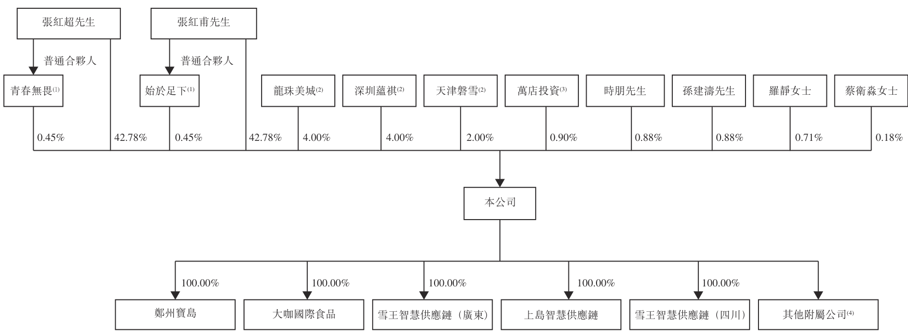

附註：

(1) 進一步詳情請參閱本節「－員工持股平台」。

(2) 進一步詳情請參閱本節「－首次公開發售前投資－有關首次公開發售前投資者的資料」。

(3) 進一步詳情請參閱本節「－本公司的主要股權變動－2020年進一步增加股本」。

(4) 包括本公司全資擁有或本公司及獨立第三方共同擁有的其他47家本公司附屬公司。

緊隨全球發售完成後的股權及公司架構

下圖載列緊隨全球發售完成後（假設超額配股權未獲行使）本集團的簡化股權及公司架構：

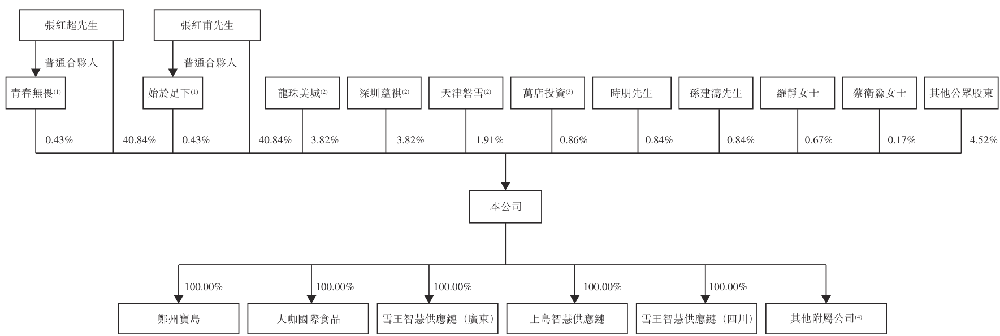

附註：有關附註(1)至(4)，請參閱本節「－緊接全球發售完成前的股權及公司架構」。有關各股東持有的非上市股及H股詳情，請參閱本節「－資本化」。

---

## 第 191 页

概覽

我們是一家領先的現製飲品企業，聚焦為廣大消費者提供單價約6元人民幣（約1美元）的高質平價的現製果飲、茶飲、冰淇淋和咖啡等產品。我們旗下有現製茶飲品牌「蜜雪冰城」和現磨咖啡品牌「幸運咖」。截至2024年9月30日，我們通過加盟模式發展的門店網絡擁有超過45,000家門店，覆蓋中國及海外11個國家（包括印度尼西亞、越南、馬來西亞、泰國、菲律賓、柬埔寨、老撾、新加坡、澳大利亞、韓國及日本）。於2023年以及2024年前九個月，我們的門店網絡分別實現飲品出杯量約74億杯及71億杯。根據灼識諮詢的報告，按照截至2024年9月30日的門店數計，我們是中國及全球最大的現製飲品企業。按照2023年的飲品出杯量計，我們亦是中國第一、全球第二的現製飲品企業。

蜜雪冰城
始于1997·冰淇淋与茶
幸运咖 现磨咖啡

聚焦單價約 6 元人民幣的高質平價
現製果飲、茶飲、冰淇淋和咖啡等產品

---

## 第 192 页

業務

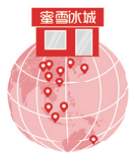

1997

2005

2012

2014

2018

2024

我們的創始人及董事長張紅超創立「寒流刨冰」開啟創業之路

研發出首款標誌性產品新鮮冰淇淋(售價僅1元人民幣)

成為中國現製飲品行業中最早設立中央工廠的企業

開始自建
專屬物流體系

蜜雪冰城的首家海外門店在越南河內開業

截至2024年9月30日於中國及海外11個國家擁有超過45,000家門店

1999

2007

2013

2017

2018

正式啟用品牌名「蜜雪冰城」

我們的聯合創始人及首席執行官張紅甫加入並推動門店網絡發展

推出首款現製果飲
冰鮮檸檬水
並拓展採購網絡

創立現磨咖啡品牌「幸運咖」

超級IP「雪王」誕生

1997年，我們的創始人及董事長張紅超先生在鄭州開設了一家名為「寒流刨冰」的小店，用一台自製的刨冰機，開啟了在現製飲品領域的創業之路。1999年，代表著「甜蜜」與「冰爽」的品牌名稱「蜜雪冰城」被正式啟用。

2005年，張紅超先生經過持續的探索和打磨，研發出一款以牛奶、雞蛋、玉米粉、白糖等為食材，但售價僅為1元人民幣（約15美分）的蛋筒冰淇淋（現在稱為新鮮冰淇淋）。這款新鮮冰淇淋一經推出，便在市場上引起熱烈反響，也成為我們首款標誌性產品。經過多次的食材升級和配方迭代，這款如今售價僅為2元人民幣（約30美分）的新鮮冰淇淋依然廣受消費者歡迎，2024年前九個月在國內售出約5.01億支，是中國現製飲品行業銷量最高的單品之一。

2007年，我們的聯合創始人及首席執行官張紅甫先生加入「蜜雪冰城」。基於親自運營門店的成功經驗，張紅甫先生總結形成了一套標準化的運營管理體系，並通過加盟模式予以複製。作為與我們的加盟商一樣的白手起家的創業者和門店的一線經營

---

## 第 193 页

者，張紅超先生和張紅甫先生推己及人，始終堅持和加盟商利益與共，這是我們的加盟商網絡能持續擴張、實現行業領先的門店規模和優秀的消費者體驗的根本原因。截至2024年9月30日，我們擁有超過19,000個加盟商夥伴。

2012年，我們成為中國現製飲品行業中最早設立中央工廠的企業。彼時隨著業務規模的快速增長，為了保證飲品食材的產品質量和穩定供應，同時優化成本、提升效率，我們選擇延伸至上游的生產製造領域。經過超過十年的持續深耕，我們已建成佔地共計約79萬平方米的五大生產基地，覆蓋糖、奶、茶、咖、果、糧、料全品類食材。截至2024年9月30日，我們的年綜合產能達到約165萬噸，並持有124項專利。「蜜雪冰城」是中國現製飲品行業中極少數實現加盟商的飲品食材、包材及設備100%從品牌方採購的品牌。我們提供給加盟商的飲品食材超過60%為自產，是中國現製飲品行業中最高（根據灼識諮詢的報告），其中核心飲品食材為100%自產。

2013年，我們研發出了「蜜雪冰城」第一款用新鮮水果製作的產品—冰鮮檸檬水，並將採購網絡進一步延伸至上游農產品。在過去數年間，我們持續拓展全球性的採購網絡，整合優質資源，同時建立合作種植基地，從源頭確保了農產品的穩定供給。以檸檬為例，根據灼識諮詢的報告，按2023年的採購量計，我們是中國最大的檸檬採購商。2023年，我們採購的檸檬約11.5萬噸，其中大部分購自位於四川省安岳縣的合作種植基地。

2014年，為了滿足加盟商在全國開店的需求、解決長距離物流成本的後顧之憂，我們開始建立自己的物流體系，並向加盟商推行全國免物流費的政策，成為中國現製飲品行業中首家推行此政策的企業。經過10年的不斷發展，我們自主運營的倉儲體系和專屬的配送網絡能夠支持行業內最廣闊的門店佈局。截至2024年9月30日，我們的物流網絡覆蓋了中國內地31個省份、自治區及直轄市、超過300個地級市、1,700個縣城和4,900個鄉鎮。截至2024年9月30日，我們在中國內地逾90%的縣級行政區劃實現了12小時內觸達。

通過建設全球採購網絡、生產基地、物流體系等一系列舉措，我們打造了中國現製飲品行業內最大規模的完整端到端供應鏈體系，覆蓋採購、生產、物流、研發和品質控制。我們的大規模的極致高效供應鏈體系是我們維持產品高質平價的關鍵，也是我們跨地域、跨品類拓展的有力保障。

---

## 第 194 页

2017年，我們創立了現磨咖啡品牌「幸運咖」。我們秉持與創立「蜜雪冰城」時相同的使命，希望讓每個人都能享受到高質平價的現磨咖啡。截至2023年12月31日，「幸運咖」擁有超過2,900家門店，根據灼識諮詢的報告，以門店數量計是中國第四大現磨咖啡品牌。

2018年，「蜜雪冰城」的首家海外門店在越南河內市開業。我們致力於將高質平價的現製飲品和「甜蜜與愛」的文化傳遞給海外消費者。根據灼識諮詢的報告，按照截至2023年12月31日的門店數量計，「蜜雪冰城」是東南亞市場排名第一的現製茶飲品牌。截至2024年9月30日，我們已經在中國內地以外開設了約4,800家門店。

經過20餘年的沉澱，「蜜雪冰城」已成為家喻戶曉的全民品牌。我們於2018年打造了「蜜雪冰城」的超級IP和終身代言人—「雪王」，擁有鮮明視覺和聽覺符號的「雪王」IP將我們的品牌實體化並進一步昇華。今天，「雪王」IP已經成為了一個超越飲品的文化符號，積累了來自全球不同國家、擁有不同文化背景的忠實粉絲。截至最後實際可行日期，「雪王」及「蜜雪冰城」主題曲的相關話題在主要社交平台上的累計曝光量分別超過195億次及97億次。截至2024年9月30日，「蜜雪冰城」的註冊會員數達到約3.15億。

我們的創始人和管理團隊一直堅持長期主義，懷揣強烈的社會責任感，踐行可持續發展的戰略。我們致力於成為一家在社會及環境方面負責任的公司，由張紅超先生和張紅甫先生分別擔任環境、社會及管治委員會的主任和副主任，並在創造就業、產業助農、綠色發展和社會公益等方面不斷投入。截至最後實際可行日期，我們約35%的加盟商為女性，69%的門店員工為女性。2023年，我們通過飲品包材綠色升級減少PE塑料使用超過12,700噸。此外，公司與江南大學簽訂了長期的產學研合作協議，並支持西湖大學推進可生物降解塑料方面的科學研究。

於2021年、2022年、2023年以及2024年前九個月，我們的門店網絡分別實現了約228億人民幣、307億人民幣、478億人民幣及449億人民幣的終端零售額，根據灼識諮詢的報告，我們是2023年中國最大的現製飲品企業。於業績記錄期，我們擁有亮眼的財務表現，在巨大的規模的基礎上同時實現了強勁的增長、優異的盈利水平和充裕的現金流量。於2022年、2023年以及2024年前九個月，我們分別實現了136億人民幣、203億人民幣及187億人民幣的收入，同比增長31.2%、49.6%及21.2%。於2022年、2023年以及2024年前九個月，我們的淨利潤分別為20億人民幣、32億人民幣及35億人民幣，同比增長5.3%、58.3%及42.3%。我們持續實現經營活動現金流量淨流入，

---

## 第 195 页

在2021年、2022年、2023年以及2024年前九個月分別為17億人民幣、24億人民幣、38億人民幣及51億人民幣。

我們的競爭優勢

中國及全球最大的現製飲品企業

根據灼識諮詢的報告，按照截至2024年9月30日的門店數計，我們是中國及全球最大的現製飲品企業。按照2023年的飲品出杯量計，我們亦是中國第一、全球第二的現製飲品企業。截至2024年9月30日，我們的門店網絡擁有超過45,000家門店，覆蓋中國及海外11個國家。在中國現製飲品行業中，我們是唯一一個擁有超過40,000家門店的企業，並且從2018年開始門店數一直排名第一。按截至2024年9月30日的門店數計，我們的現製茶飲品牌「蜜雪冰城」在國內擁有約37,000家門店，是中國第一的現製茶飲品牌。截至2023年12月31日，我們的現磨咖啡品牌「幸運咖」擁有超過2,900家門店，是中國第四大現磨咖啡品牌。截至2023年12月31日，我們在海外擁有超過4,000家「蜜雪冰城」門店，並迅速成為東南亞市場排名第一的現製茶飲品牌。於2023年以及2024年前九個月，我們的門店網絡分別實現飲品出杯量約74億杯及71億杯。

現製飲品市場擁有廣闊的發展空間。中國現製飲品市場的規模預計在2028年達到約1.2萬億人民幣，2023年至2028年的複合年增長率為17.6%。其中，平價現製飲品不但滿足了消費者愈加追求性價比的大趨勢，而且與其他價格相當的平價飲料產品相比，提供了更新鮮的產品和更優的消費體驗。因此，平價現製飲品在不同價格帶的現製飲品細分市場中增速最高，2023年至2028年的複合年增長率預計達到22.2%。同時，與更高價格帶的現製飲品相比，這一細分市場更加考驗企業供應鏈的廣度和深度以及品牌聲譽。因此，這一細分市場中的領先企業不僅擁有競爭優勢，而且建立了更高的進入壁壘。我們相信憑藉在打造大規模的極致高效供應鏈基礎設施、建設全民品牌和管理大型加盟門店網絡方面積累的難以複製的專有知識，我們能夠把握全球機遇，繼續實現規模化、可持續的增長。

---

## 第 196 页

高度數字化的端到端供應鏈是高質平價價值主張的基石

作為在中國現製飲品行業中最早設立中央工廠的企業，我們目前擁有業內最大規模的高度數字化端到端供應鏈體系。「蜜雪冰城」是中國現製飲品行業中極少數實現加盟商的飲品食材、包材及設備100%從品牌方採購的品牌。我們提供給加盟商的飲品食材超過60%為自產，是中國現製飲品行業中最高（根據灼識諮詢的報告），其中核心飲品食材為100%自產。

龐大的全球採購網絡

我們通過覆蓋全球六大洲、38個國家的採購網絡，從原產地獲取優質原材料，並採用數字化的工具，保證原材料的質量和穩定供應。我們擁有龐大的採購規模，於2023年，我們採購檸檬、奶粉、橙子、茶葉、咖啡生豆各約11.5萬噸、5.1萬噸、4.6萬噸、1.6萬噸、1.6萬噸。因此，我們能夠以低於行業平均水平的價格採購眾多核心原材料。例如，就同類型、同品質的奶粉和檸檬而言，我們2023年的採購成本較同行業平均分別低約10%及20%以上。

生產品類最全規模最大

截至2024年9月30日，根據灼識諮詢的報告，我們已經成為中國現製飲品供應鏈領域中生產品類全面且規模最大的企業。因此，我們有能力提供包括糖、奶、茶、咖、果、糧、料在內的全品類一站式的飲品食材解決方案。近期，我們取得液體乳產品的食品生產許可證，成為中國唯一持有該許可證的現製飲品公司。這一里程碑為我們自主生產鮮牛乳等乳製品鋪平了道路，為擴大和提升產品結構提供了新的可能。我們擁有五大生產基地，年綜合產能約165萬噸。我們採用世界級工廠建設和生產管理標準，並充分發揮中國製造的深厚優勢。我們建設的智能工廠擁有60多條智能化生產線，使用先進的自動化設備和數字化的工具。2024年前九個月，我們飲品食材生產的耗損率僅為0.71%，遠低於行業平均水平。我們亦自主生產部分核心包材和門店設備，以實現更好的質量和更高成本效率。例如，我們自己生產糖蜜和果蜜的包裝瓶，自產成本在2024年前九個月比從外部採購價低約50%。規模化帶來的成本優勢和精益化、智能化的生產管理能力，使得行業內其他企業在核心飲品食材上很難通過模仿達到我們的高質平價水平。

---

## 第 197 页

服務於中國最龐大門店網絡的物流系統

通過將覆蓋全國的自主運營倉儲體系與專屬的本地化城配服務深度結合，我們打造了高效數字化的物流體系，以支持中國現製飲品行業內最龐大的門店網絡。從2014年起，我們在中國現製飲品行業內最早開始建設自主運營的倉儲體系。截至2024年9月30日，該倉儲體系由總面積達到約35萬平方米的27個倉庫組成，為行業內最大。我們的配送網絡覆蓋了中國內地31個省份、自治區及直轄市，超過300個地級市、1,700個縣城和4,900個鄉鎮，其覆蓋廣度和下沉深度為行業內最高。此外，我們通過數字化手段能夠精準控制末端貨物送達，做到商流、信息流、資金流、物流四流合一。我們在物流成本和效率上相較於同行業具備優勢，在配送時效和配送品質上也高於行業平均水平。截至2024年9月30日，我們在中國內地逾90%的縣級行政區劃實現了12小時內觸達。此外，我們約97%的中國內地門店實現了冷鏈物流覆蓋。

應用研發與基礎研發的無縫銜接

我們的研發主要分為對產品口味和配方相關的應用研發，以及對食材相關的技術、生產工藝、配方及設備等進行的基礎研發。我們研發的核心優勢在於應用研發與基礎研發緊密協同銜接。因此，我們能夠持續不斷推出高質平價的產品。我們專業的研發團隊不但擁有持續打造常青款產品的能力，也能夠不斷推出季節性和區域性的新品，這些產品廣受消費者歡迎。此外，我們率先實現多項技術突破。我們是中國現製飲品行業中最早成功研發出速煮珍珠配方及相關工藝的企業之一，將門店內珍珠製備效率提升近一倍。我們自主研發專有創新工藝並實現了高端零反式脂肪酸奶基底粉的自主生產，既保障穩定供應，同時節約了成本。為了在提升產品口感的同時滿足消費者日益增長的健康追求，我們自主研發了鮮牛乳奶基底製作工藝，用更為新鮮、健康的配方製作更具香濃口感的飲品。我們自創了冰淇淋粉噴霧乾燥生產法，提升了冰淇淋產品的品質。此外，我們是行業內唯一做到自主研發、生產和供應半自動咖啡機的企業。

覆蓋整條供應鏈的完善的品質控制

我們建立了完善的供應鏈品質控制體系，由約290人組成的專門團隊監督，以確保供應鏈保持一貫的高品質，包括嚴格的食品安全標準，2024年前九個月，我們的生產的產品合格率高於99.99%，且配送完好率高於99.99%。

---

## 第 198 页

家喻戶曉的全民品牌「蜜雪冰城」，深入人心的超級IP「雪王」，擁有龐大消費者及粉絲群體

我們高質平價的價值主張以及「甜蜜與愛」的品牌文化，使得「蜜雪冰城」成為家喻戶曉的全民品牌，吸引了大量消費者和粉絲。截至2024年9月30日，「蜜雪冰城」的註冊會員數達到約3.15億。截至最後實際可行日期，「蜜雪冰城」在微信、抖音、快手、小紅書、微博、嗶哩嗶哩等六大社交平台共擁有約4,700萬粉絲，為中國現製飲品行業內最多。

為了實現品牌實體化，與消費者進一步建立情感連結，我們於2018年推出「雪王」IP，並成功將其打造為中國現製飲品行業中唯一一個超級IP，成為區別我們的品牌和其他品牌的關鍵。我們為手持冰淇淋權杖、憨態可掬的卡通形象「雪王」配以鮮明的視覺和聽覺符號，圍繞「雪王」形象持續推出優質的視聽內容，例如主題曲、短劇、動畫片等。「雪王」的視聽內容不僅培養了參與度和互動性很高的消費者和粉絲社區，並能激發粉絲的二次創作欲。截至最後實際可行日期，「雪王」及「你愛我，我愛你，蜜雪冰城甜蜜蜜」主題曲的相關話題在主要社交平台上的累計曝光量分別超過195億次及97億次。動畫《雪王駕到》在2023年8月推出後已經實現播放量超過2.2億次。憑藉忠實的粉絲群支持，我們於2024年12月21日推出了另一部動畫《雪王之奇幻沙州》。越南2023年六一兒童節的「雪王」繪畫活動相關話題瀏覽量約為7,000萬次。「雪王」IP始於飲品、超越飲品，已然成為了文化符號。

為了加速品牌建設，我們建立了完善的線上線下品牌營銷矩陣。我們通過社交媒體和創新性營銷內容，打造「雪王」IP線上聯動營銷。截至最後實際可行日期，「#蜜雪冰城」話題在抖音有超過444億次播放量。在線下，我們通過超過45,000家門店網絡及開展「雪王」巡遊和音樂節等多種活動，實現對廣泛消費群體的觸達。我們亦無縫整合線上線下活動，以實現有效的營銷活動。深入人心的「雪王」形象帶來的流量，廣泛的門店網絡和完善的營銷矩陣，大大提高了我們的營銷效率，於2024年前九個月，我們品牌推廣開支佔收入比為0.9%。

利益與共的加盟模式和高度數字化的運營體系打造了健康的加盟門店網絡

我們相信，與加盟商利益與共，是加盟商選擇我們的根本原因。我們門店的初始投資和加盟費都低於中國現製飲品行業平均收費水平。我們大規模的極致高效的供應鏈體系為加盟商提供了具有競爭力的一站式解決方案，從而提高其利潤空間。此外，

---

## 第 199 页

我們在特殊時期與加盟商共克時艱。2022年年初，為幫助加盟商應對COVID-19疫情，我們宣佈減免截至2021年底所有國內「蜜雪冰城」加盟商一年的加盟費。隨後於同年，我們下調了69款門店物料與設備的價格，平均降價幅度約15%。

我們與加盟商利益與共的合作，還體現在對加盟商進行標準化的管理以及持續不斷的支持與賦能。我們在選址、店型、操作和營銷方面實行了標準化管理，從而助力我們的加盟商獲得更大的成功。我們對加盟商及門店員工進行集中培訓，以確保門店運營品質。此外，我們通過智慧門店解決方案賦能加盟商並提升其運營效率，例如有效管理門店庫存。

在利益與共的理念下，我們和加盟商一起，實現了行業領先的門店規模，並讓我們的加盟模式可以持續健康發展。截至2024年9月30日，我們擁有超過19,000個加盟商，並在加盟商中樹立了良好的口碑。於業績記錄期，我們累計收到加盟諮詢超過420萬份，為我們篩選優質加盟商提供了廣闊的空間。

跨地域和跨品類的規模化拓展帶來廣闊的長期增長空間

我們憑藉對消費者需求的深度洞察、長期的品牌運營經驗、高效的供應鏈體系、強大的研發生產能力以及成熟的加盟商管理模式，規模化地將運營區域從中國拓展到東南亞市場，將產品品類從現製茶飲拓展到現磨咖啡。

自2018年起，我們拓展東南亞市場，通過結合國內積累的豐富經驗和專有知識，以及一系列因地制宜的創新措施，在當地市場取得了快速發展。我們保留了眾多常青款產品，並基於對當地消費習慣的洞察，推出部分本地化產品。我們將我們在中國的獨特生產能力和當地優質資源相結合，打造了適合目標市場的飲品食材供應方案。此外，我們充分利用「雪王」IP因地制宜推出豐富的營銷活動，使我們的品牌在東南亞地區受到廣泛歡迎及快速傳播。例如，截至最後實際可行日期，有關「蜜雪冰城印度尼西亞」(#mixueindonesia)的話題在TikTok上的累計曝光量約為26億次。再者，我們在國內具實證的加盟管理基礎上，採取了適合當地市場特點的加盟商篩選、培訓等措施。截至2023年12月31日，我們為東南亞最大的現製茶飲品牌，擁有超過4,000家「蜜雪冰城」門店。

---

## 第 200 页

我們於2017年進入現磨咖啡領域，打造品牌「幸運咖」，定價遠低於行業同類產品的平均價格。我們通過嚴控咖啡品質的最關鍵因素，包括咖啡豆和奶等核心飲品食材、咖啡機等核心設備、飲品的現場製作方式等，實現產品的高質平價。「幸運咖」採用產自埃塞俄比亞、哥倫比亞、巴西、印度尼西亞等國的阿拉比卡咖啡豆，並自建大型智能化烘焙工廠，無論在價格、質量控制方面都處在中國現製飲品行業前列。我們優質的咖啡豆產品於2022年至2024年獲得意大利國際咖啡品鑑協會（IIAC）鉑金獎1次、金獎21次。同時，我們也選用國內一線乳企的優質奶源。「幸運咖」擁有超過2,900家門店，按照截至2023年12月31日的門店數計，是中國第四大現磨咖啡品牌。

在東南亞市場和現磨咖啡領域取得的初步成功和領先地位，讓我們相信我們能把握東南亞市場和現磨咖啡領域的廣闊空間並持續發展。

堅韌的創始人和管理團隊打造了以「真」為本、胸懷社會的獨特企業文化

自創業之初，我們的創始人始終堅持「真人真心真產品」的核心價值觀，堅定致力於打造以「真」為核心的企業文化。我們始終堅守「讓全球每個人享受高質平價的美味」的使命，在保持親民價格的同時持續提供各品類的高質量產品。我們始終堅守「讓品牌更強大」的使命，不斷深耕端到端供應鏈，並持續投資於我們的超級IP「雪王」。為「讓夥伴更富有」，我們運用高效的運營體系幫助加盟商取得成功並與加盟商分享成功。

我們的創始人和管理層胸懷社會，積極承擔責任，堅持長期可持續的發展理念。截至最後實際可行日期，我們約35%的加盟商和69%的門店員工為女性。我們在環境保護、降碳節能、精益生產等方面持續優化，積極貫徹低碳、綠色、環保的經營理念。在支持鄉村振興上，我們通過幫助農民提升科學種植水平，讓農民能夠過上更好的生活。業績記錄期內，我們共計捐贈約1億人民幣，涵蓋災害援助、教育支持、環保科研等各個方面。

---

## 第 201 页

我們的發展和成功受益於我們創始人和管理團隊堅韌不拔的品質，長期共事的經驗和學習迭代的能力。過去20多年來，我們既經歷了諸多經濟週期和行業週期，又克服了因外部競爭和自我變革而帶來的種種挑戰。創始人與管理團隊多從一線幹起，長期的共事淬煉出我們共同的價值觀。我們的創始人和管理團隊均為年輕的行業「老兵」，平均年齡約39歲，平均相關行業經驗為17年。我們管理層的特質和我們獨特的企業文化，為我們打造百年品牌提供了堅實的保障。

我們的戰略

過去二十多年來，我們堅持簡單和專注，打造了強大和成功的品牌。我們將把握時代的變化，繼續踐行可持續發展，打造全球化的百年品牌。

鞏固在中國現製飲品行業的領先地位，並尋求海外拓展機會

我們將持續拓展在中國的門店網絡。對於「蜜雪冰城」品牌，我們會進一步開拓新的市場和深耕現有市場，從而覆蓋更廣泛的消費人群。對於「幸運咖」品牌，我們將借助集團強大的供應鏈體系及運營能力，加速在全國範圍內的門店佈局。

截至2024年9月30日，我們的門店覆蓋中國內地31個省份、自治區及直轄市，包括超過300個地級市、1,700個縣城和4,900個鄉鎮。由於中國有約30,000個鄉鎮，且我們在下沉市場具備競爭優勢，我們有能力在我們尚未覆蓋的地域開拓市場，同時不斷拓展已有的各線級城市和地區市場。

我們主要提供平價現製飲品，我們相信我們的滲透及擴張計劃將滿足消費者對高質平價產品的共同需求。按終端零售額計，中國現製飲品市場規模預計於2028年達1.2萬億人民幣，預期平價現製飲品細分市場增長率將為最高，2023年至2028年的複合年增長率為22.2%，高於同期中國現製飲品市場17.6%的整體複合年增長率。平價現製飲品市場增長迅猛，主要是由於平價現製飲品不斷滲透至中國整體飲品市場且越漸得到消費者的青睞。

---

## 第 202 页

就海外市場而言，儘管我們於各國家或地區的具體計劃將按當地營商環境及我們的表現而調整，但我們將繼續專注於開拓東南亞市場（包括印度尼西亞及越南）並繼續擴大當地的加盟門店網絡。此外，我們計劃適時開拓其他市場以打造更加全球化的品牌。我們採取綜觀全局的方針，考慮人口規模、經濟增長、收入水平、當地文化、消費者偏好等因素以確定將開拓的市場。

進一步加強打造百年品牌相關基礎設施及運營體系的建設

首先，我們會進一步提升我們的端到端供應鏈。在國內，我們將持續提升供應鏈體系的廣度和深度，開發更多更豐富的優質資源，打造更加敏捷高效的物流體系，持續穩健地投資建設產能，以及加大以新技術、新材料驅動的研發創新。例如，我們計劃在海南生產基地建造專門生產冷凍水果、咖啡、糖漿和小料等產品的新設施，為我們的飲品提供更多樣化的食材供應，其建設已於2023年啟動，預計將於2025年完工。此外，我們計劃提升中國其他生產基地的產能，以支持我們不斷擴張的門店網絡。在海外，我們會打造更加豐富、靈活、全球化的供應鏈平台，有力支持全球化戰略和海外業務發展需求。特別地，我們計劃在東南亞建立一個多功能供應鏈中心。鑒於我們是東南亞市場最大的現製茶飲品牌，並且持續致力於培育該市場，搭建具備生產能力的當地供應鏈中心對支持我們不斷增長的當地業務具有重要意義。例如，當地生產設施可以利用我們在東南亞現有的原材料（如熱帶水果）採購能力進行成本管理，並且與從中國生產基地運輸相比能夠更有效地實現食材對東南亞門店網絡的觸達。新的供應鏈中心預計將位於可以為我們運營表現強勁的國家提供有效支持的地點，同時考慮成本和勞動力供給等其他因素。該中心的能力和功能包括(i)針對例如水果產品和小料等食材的本地生產能力，並側重使用當地採購的原材料，(ii)研發中心，(iii)數字化供應鏈運營，及(iv)培訓設施。該中心將提升我們的本地生產能力和成本效率，使我們能夠順應海外消費者需求和市場趨勢，並有效支持我們的全球化戰略。所得款項淨額中約66%或2,172百萬港元將用於提升我們端到端供應鏈的廣度及深度。請參閱「未來計劃及所得款項用途」。

---

## 第 203 页

其次，我們會加強以數字化和智能化賦能各個業務環節，提升經營效率和經營質量。例如，我們將持續提升數字化營銷和消費者管理系統，從而更好地滿足市場需求。我們將持續增強現有的智慧門店解決方案，包括門店選址系統、門店運營系統、門店補配貨系統等智能化系統，從而更好地賦能加盟商。我們將持續提升自動化、數字化、智能化的先進製造能力，充分運用領先的生產設備和機器人，以及先進的製造管理系統，從而更好地提升生產效率和質量。所得款項淨額中約12%或395百萬港元將用於加強各個業務環節的數字化和智能化能力。進一步詳情請參閱「未來計劃及所得款項用途」。

此外，我們會持續深耕品牌IP，充分發揮「雪王」IP超越飲品、融入生活的文化屬性，進一步豐富其文化內涵、挖掘其文化潛力，成為獨樹一幟的全球文化符號。特別是，我們將通過推出更多以多元形式呈現的優質內容（包括但不限於動畫系列、電影及特色商品）來擴大「雪王」的內容矩陣，並繼續與各大領先品牌展開IP聯名合作以擴大我們的品牌影響力。所得款項淨額中約12%或395百萬港元將用於品牌和IP的建設和推廣。進一步詳情請參閱「未來計劃及所得款項用途」。

最後，我們會堅持建立長期可持續發展的綠色企業，不斷創造社會價值。我們的社會責任的工作將從科技創新、生態環境、教育事業、鄉村振興等多個方向推進。

我們的業務

提供高質平價的產品是我們的價值主張。秉承這一理念，我們打造了現製茶飲品牌「蜜雪冰城」和現磨咖啡品牌「幸運咖」，致力於提供單價約6元人民幣（約1美元）的高品質現製果飲、茶飲、冰淇淋和咖啡。

我們主要採用加盟模式擴張門店網絡，絕大部分收入來自於向加盟門店銷售商品及設備。截至2024年9月30日，我們通過超過45,000家門店網絡服務中國內地及中國內地以外的消費者。根據灼識諮詢的報告，按照截至2024年9月30日的門店數計，我們是中國及全球最大的現製飲品企業。按照2023年的飲品出杯量計，我們亦是中國第一、全球第二的現製飲品企業。

我們的端到端供應鏈體系覆蓋採購、生產、物流、研發和品質控制等核心組成部分，是我們價值主張的基石。根據灼識諮詢的報告，我們的全方位供應鏈體系是中國現製飲品行業中最大的，這從根本上將我們和同行業其他公司區別開來。

---

## 第 204 页

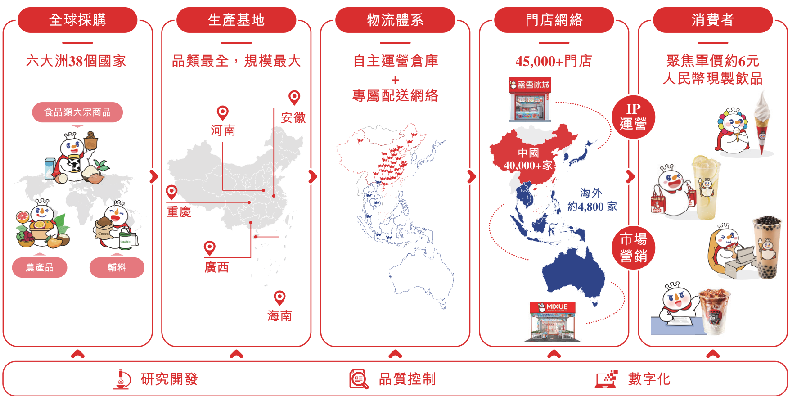

我們的品牌及產品

我們旗下有現製茶飲品牌「蜜雪冰城」和現磨咖啡品牌「幸運咖」。

根據灼識諮詢的報告，按飲品出杯量計，「蜜雪冰城」於2023年的出杯量合共超過66億杯，在中國所有現製茶飲品牌中排名第一。同時，按截至2024年9月30日的門店數計，「蜜雪冰城」在中國的門店網絡擁有約37,000家門店，是中國第一的現製茶飲品牌。截至同日，我們在中國內地以外擁有約4,800家「蜜雪冰城」門店。根據灼識諮詢的報告，按截至2023年12月31日的門店數計，「蜜雪冰城」是東南亞市場最大的現製茶飲品牌。於業績記錄期，我們絕大部分終端零售額來自「蜜雪冰城」門店。

我們預見到中國市場對現磨咖啡產品日益增長的需求，並基於「蜜雪冰城」的成功經驗，於2017年推出了現磨咖啡品牌「幸運咖」，以拓展我們的產品品類。根據灼識諮詢的報告，按截至2023年12月31日的超過2,900家門店計，「幸運咖」在中國所有現磨咖啡品牌中排名第四。

於業績記錄期內各期間，「蜜雪冰城」所得收入及毛利分別佔我們總收入及毛利的95%以上。於2021年、2022年、2023年以及2024年前九個月，「蜜雪冰城」的毛利率分別為31.4%、28.9%、30.3%及32.9%，大致上與我們的整體毛利率一致。

---

## 第 205 页

我們的現製茶飲品牌—「蜜雪冰城」

「蜜雪冰城」的歷程始於1997年在中國鄭州開設的一家名為「寒流刨冰」的小店。當「蜜雪冰城」品牌於1999年正式推出時，我們的主要產品為淋上糖漿及果醬的刨冰。該產品正是「蜜雪冰城」品牌名稱的靈感來源—為我們的消費者帶來「甜蜜」與「冰爽」。在推出「蜜雪冰城」20多年後的今天，我們的品牌文化超越了產品本身，而「蜜雪冰城」已成為中國家喻戶曉的全民品牌，牢牢佔據了消費者的心智。

「蜜雪冰城」的產品

通過廣泛的門店網絡，「蜜雪冰城」主要向中國及海外消費者提供現製果飲、茶飲及冰淇淋。「蜜雪冰城」核心產品的價格通常為2元至8元人民幣。「蜜雪冰城」的產品矩陣既包含常青款產品，也包含季節性和區域性產品。

「蜜雪冰城」的常青款產品

我們打造的眾多常青款產品，持續受到中國和海外消費者的廣泛歡迎。2024年前九個月，我們的前五大暢銷常青款產品佔我們在中國總飲品出杯量的約41.2%。根據灼識諮詢的報告，按2023年飲品出杯量計，我們的冰鮮檸檬水、新鮮冰淇淋和珍珠奶茶是中國現製飲品行業銷量最高的三個單品。

下表載列我們於業績記錄期內暢銷常青款產品的詳情。

「冰鮮檸檬水」以新鮮、優質的檸檬製作而成，清新爽口。其價格通常為4元人民幣。於2024年前九個月，我們在中國售出約11億杯冰鮮檸檬水，根據灼識諮詢的報告，於2023年，中國每十杯現製檸檬水中有超過八杯來自「蜜雪冰城」。

「新鮮冰淇淋」以優質奶粉為基礎，新鮮製作而成。該款產品傳承自我們創始人於2005年精心研發的蛋筒冰淇淋，也是對「甜蜜與愛」文化的詮釋。其價格通常為2元人民幣。包括新鮮冰淇淋在內，於2024年前九個月，我們在中國售出約14億支冰淇淋產品，根據灼識諮詢的報告，於2023年，中國每十支現製冰淇淋中就有超過三支來自「蜜雪冰城」。

---

## 第 206 页

「珍珠奶茶」以鮮泡紅茶、現煮珍珠（木薯粉圓）以及優質奶粉為基礎精心調配而成。其價格通常為6元人民幣。於2024年前九個月，我們在中國售出約3.85億杯珍珠奶茶，根據灼識諮詢的報告，於2023年，中國每十杯珍珠奶茶中就有超過三杯來自「蜜雪冰城」。

「蜜桃四季春」以鮮泡四季春茶及含有豐富水蜜桃果肉的果漿精心調配而成。其價格通常為7元人民幣。於2024年前九個月，我們在中國售出約3.65億杯蜜桃四季春。

「滿杯百香果」以鮮泡茉莉花茶及含有豐富百香果果肉的果漿精心調配而成。其價格通常為7元人民幣。於2024年前九個月，我們在中國售出約2.81億杯滿杯百香果。

「茉莉奶綠」以鮮泡茉莉花茶及鮮牛乳奶基底精心調配而成。其價格通常為6元人民幣。我們於2024年7月底推出「茉莉奶綠」，推出首月於中國售出超過1億杯。

「蜜雪冰城」的季節性和區域性產品

在廣受歡迎的常青款產品的基礎上，我們會根據對消費者喜好的洞察及市場趨勢的分析定期推出符合時令和地域特色的季節性及區域性飲品。在推出季節性產品時，我們也會充分考慮時令食材的供應情況。我們的區域性產品通常會融入獨特的當地元素，以滿足當地消費者的特有口味。

下表載列我們若干季節性及區域性產品的詳情。

2023年6月，我們推出了一款融合了草莓、藍莓及樹莓的季節性解渴佳品—「莓果三姐妹」。其價格通常為7元人民幣。莓果三姐妹上市後首月的銷量約為3,300萬杯。

---

## 第 207 页

2022年6月，我們推出了一款季節性茶飲「桑葚莓莓」，帶有桑葚和草莓的清新口感和豐富果肉。其價格通常為9元人民幣。桑葚莓莓上市後首月的銷量約為1,800萬杯。

2022年10月，我們推出「厚芋泥奶茶」，一款融合了芋泥與奶茶、有著絲滑柔和口感的冬季飲品。其價格通常為8元人民幣。厚芋泥奶茶上市後首月的銷量約為1,200萬杯。

2023年7月，我們在華南地區推出了「香檸紅茶」，以迎合當地消費者對香檸的喜愛。其價格通常為5元人民幣。香檸紅茶上市後首月的銷量約為300萬杯。

我們的超級IP—「雪王」

隨著「蜜雪冰城」的成功，為了將品牌實體化並進一步昇華，我們開始著手打造一個能夠與中國和海外消費者產生共鳴的可愛品牌形象。2018年，我們推出了「蜜雪冰城」品牌的終身代言人—「雪王」，一個手持冰淇淋權杖、憨態可掬的卡通人物。自推出以來，「雪王」便憑藉其正直、友善、熱情、進取的性格深受粉絲們喜愛。

圍繞「雪王」的可愛形象，我們不斷創作和發佈各種優質、充滿趣味且多樣化的視聽內容。例如，我們朗朗上口、旋律優美的「蜜雪冰城」主題音樂短片（「你愛我，我愛你，蜜雪冰城甜蜜蜜」）便由「雪王」擔任主角。截至最後實際可行日期，「雪王」及「蜜雪冰城」主題曲的相關話題在主要社交平台上的累計曝光量分別超過195億次及97億次。2023年8月，我們推出了動畫《雪王駕到》，為「雪王」可愛的形象和生動的故事賦予新的活力。截至最後實際可行日期，該動畫的播放量已超過2.2億次。憑藉忠實的粉絲群支持，我們於2024年12月21日推出了另一部動畫《雪王之奇幻沙州》。

通過廣泛的內容庫，「雪王」吸引了來自不同國家、多元文化背景的消費者和粉絲群體，激發了粉絲的分享和二次創作欲。

截至最後實際可行日期，「蜜雪冰城」在微信、抖音、快手、小紅書、微博及嗶哩嗶哩等六大社交平台共擁有約4,700萬粉絲，為中國現製飲品行業內最多。

---

## 第 208 页

眾多消費者積極參與豐富「雪王」的角色和形象並進行二次創作。截至最後實際可行日期，嗶哩嗶哩用戶二次創作的視頻合計播放量超過3.35億次。「雪王」的可愛形象也深受人們喜愛，人們在社交平台上創作了許多以「雪王」為原型的表情包。

截至最後實際可行日期，越南2023年六一兒童節的「雪王」繪畫活動的相關話題瀏覽量達到約7,000萬次。

「雪王」出現在冰淇淋音樂節、「蜜雪冰城」福袋節、百變「雪王」杯創意大賽以及「雪王」生日派對等重要的「蜜雪冰城」活動中，並持續受到消費者關注。

為順應「雪王」粉絲的喜好並進一步提升人氣，我們也出售帶有「雪王」可愛形象的玩具及水杯等周邊產品。

有關我們的「雪王」在各類營銷活動中所擔任角色的更多詳情，亦請參閱「一營銷」。

通過多年的內容創作和IP運營，「雪王」已經成為了中国現製飲品行業中唯一一個超級IP，這也將我們的品牌和其他品牌區別開來。

---

## 第 209 页

鑒於「雪王」對我們推廣品牌形象至關重要，我們已實施多項措施保護其IP，包括但不限於：

• 已於中國及海外註冊多項有關「雪王」的商標及知識產權；

• 及時就「雪王」相關的知識產權向有關部門作出所有必要的申請、續期或備案；

• 倘發現任何侵犯知識產權行為，會對有關人士採取迅速且必要的法律行動；

• 通過定期培訓增強員工有關保護知識產權的意識、知識和能力；及

• 建立涵蓋知識產權的申請、維護及管理程序的全面內部控制機制。

於業績記錄期，並無任何發生對我們業務運營有重大不利影響的「雪王」IP侵權事件。

我們的現磨咖啡品牌－「幸運咖」

基於「蜜雪冰城」的成功經驗，我們於2017年推出了現磨咖啡品牌「幸運咖」，以進一步拓展我們的產品品類。

「幸運咖」使用精挑細選的優質食材和設備，為消費者現場製作高質平價的咖啡。「幸運咖」的所有現磨咖啡均選用阿拉比卡咖啡豆，源自埃塞俄比亞、哥倫比亞、巴西及印度尼西亞等國。我們還建立了大型咖啡烘焙工廠，配備從知名供應商（如Probat和Bühler）採購的自動化設備及機器。此外，我們的咖啡豆在2022年至2024年獲得意大利國際咖啡品鑑協會（IIAC）鉑金獎1次、金獎21次。我們現磨咖啡選用的其他關鍵食材也來自知名供應商，如朝日唯品的優質純牛乳。

---

## 第 210 页

「幸運咖」產品

「幸運咖」的現磨咖啡飲品包括經典款、流行款、創新款。「幸運咖」核心產品的價格通常為5元至10元人民幣。我們於業績記錄期內最暢銷的「幸運咖」產品詳情載列如下。

「美式咖啡」系列產品，滿足咖啡愛好者對優質咖啡豆的純正風味的喜愛。其價格通常為5.9元人民幣。

「拿鐵咖啡」系列產品，由優質咖啡豆現磨後與純牛乳調配而成。其價格通常為6.9元人民幣。

「椰椰拿鐵」系列產品，由優質咖啡豆現磨後與厚椰乳調配而成。其價格通常為9.9元人民幣。

我們的門店網絡

根據灼識諮詢的報告，按照截至2024年9月30日的門店數計，我們是中國及全球最大的現製飲品企業。此外，按照2023年的飲品出杯量計，我們亦是中國第一、全球第二的現製飲品企業。截至2024年9月30日，我們的門店網絡擁有超過45,000家門店，覆蓋中國內地及中國內地以外。於2023年全年以及2024年前九個月，我們的門店網絡分別實現了約478億人民幣及449億人民幣的終端零售額和約74億杯及71億杯的飲品出杯量。

截至2024年9月30日，我們的門店網絡已遍佈中國內地31個省份、自治區及直轄市，超過300個地級市、1,700個縣城和全國約30,000個鄉鎮中的4,900個鄉鎮，覆蓋所有線級城市。我們在下沉市場擁有高滲透率。我們門店網絡的廣度和深度將我們與中國其他現製飲品品牌區別開來。截至2024年9月30日，我們在中國內地以外開設了約4,800家門店，建立了不斷擴張的門店網絡。

---

## 第 211 页

下圖列示了截至2024年9月30日，我們在中國及海外的龐大的門店網絡。

中國及海外門店網絡

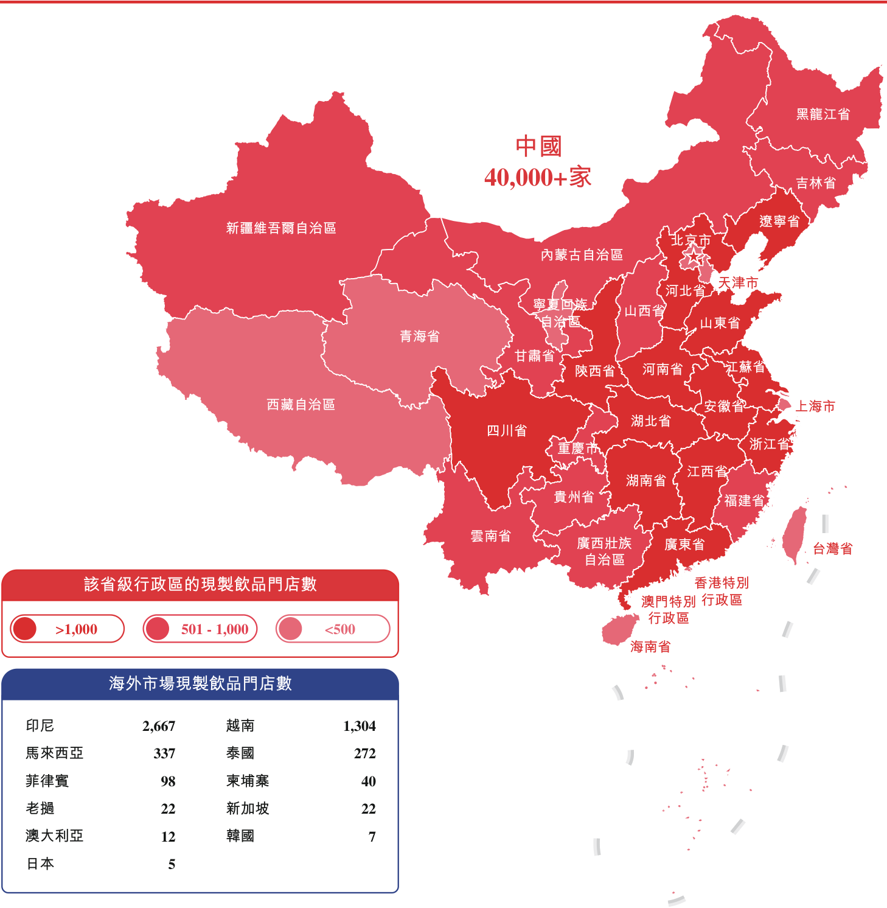

此地圖（審圖號：GS(2021)5447號、GS(2016)2948號）僅作示意性目的，用以呈現我們門店網絡在中國及海外的分佈情況。為完整起見，中國地圖包括中國內地及中國香港、澳門及台灣地區。

下表載列截至所示日期我們在中國內地及中國內地以外門店數。

<!-- table html -->
<table><tr><td></td><td colspan="3">截至12月31日</td><td>截至9月30日</td></tr><tr><td></td><td>2021年</td><td>2022年</td><td>2023年</td><td>2024年</td></tr><tr><td>中國內地</td><td>19,731</td><td>27,188</td><td>33,234</td><td>40,510</td></tr><tr><td>中國內地以外</td><td>270</td><td>1,795</td><td>4,331</td><td>4,792</td></tr><tr><td>總計</td><td>20,001</td><td>28,983</td><td>37,565</td><td>45,302</td></tr></table>
<!-- /table -->

---

## 第 212 页

我們加盟門店數量的顯著增長與中國及東南亞現製飲品市場的規模及高速增長趨勢相一致。中國現製飲品市場的終端零售額由2018年的1,878億人民幣增加至2023年的5,175億人民幣，複合年增長率為22.5%。中國現製飲品市場規模顯著增長的驅動因素主要包括持續的城市化、消費頻率的提高、優質產品的供應以及連鎖化率的提升。進一步詳情請參閱「行業概覽－中國現製飲品市場」。於中國內地以外，我們自2018年起拓展東南亞市場，並繼續專注於培育東南亞市場。按終端零售額計算，東南亞的現製飲品市場由2018年的94億美元增加至2023年的201億美元，複合年增長率為16.4%。可見，我們在中國內地及中國內地以外的加盟門店的大幅增加，與相關市場的高速增長及前景一致。

我們加盟門店數量的顯著增長歸因於我們的加盟模式以及在招募和賦能加盟商過程中利益與共的理念。我們主要採用加盟模式，根據灼識諮詢的報告，加盟模式已經在現製飲品行業，特別是在擴張門店網絡方面被證明是成功的。此外，我們主要依靠口碑傳播，而非在廣告和營銷方面進行大量投入來吸引眾多且不斷增加的加盟商候選人。這主要通過建立利益與共的加盟模式來實現。例如，我們加盟門店的初始投資及加盟費低於中國現製飲品行業的平均水平。我們的收入主要來自向加盟門店銷售商品和設備，而非加盟費，故我們有動力為加盟商賦能，促進其可持續發展。有關我們利益與共理念方法詳情，請參閱「－我們的競爭優勢－利益與共的加盟模式和高度數字化的運營體系打造了健康的加盟門店網絡」。因此，加盟商候選人有充分的動力加入我們的門店網絡。於業績記錄期間，我們累計收到加盟諮詢超過420萬份，為我們篩選優質加盟商提供了廣闊的空間。

此外，我們加盟門店數量的顯著增長也得益於我們在品牌及產品方面的競爭優勢、完整端到端供應鏈體系等因素。憑藉我們強大的品牌和高質平價的產品，我們在消費者中建立了長期的知名度，加盟商也因此從中受益，這進一步推動加盟商決定持續與我們合作。我們還建立了高度數字化的端到端供應鏈，這對於提供高質平價的產品至關重要，從而為加盟商的業務賦能。

---

## 第 213 页

業務

下表載列截至所示日期我們在中國內地按城市線級劃分的門店數及其佔比。

<!-- table html -->
<table><tr><td></td><td colspan="4">截至12月31日</td><td colspan="4">截至9月30日</td></tr><tr><td></td><td>2021年</td><td></td><td>2022年</td><td></td><td>2023年</td><td></td><td>2024年</td><td></td></tr><tr><td>一線城市</td><td>782</td><td>4.0%</td><td>1,190</td><td>4.4%</td><td>1,513</td><td>4.6%</td><td>1,942</td><td>4.8%</td></tr><tr><td>新一線城市</td><td>4,172</td><td>21.1%</td><td>5,710</td><td>21.0%</td><td>6,886</td><td>20.7%</td><td>7,960</td><td>19.6%</td></tr><tr><td>二線城市</td><td>3,187</td><td>16.2%</td><td>4,739</td><td>17.4%</td><td>5,955</td><td>17.9%</td><td>7,446</td><td>18.4%</td></tr><tr><td>三線及以下城市</td><td>11,590</td><td>58.7%</td><td>15,549</td><td>57.2%</td><td>18,880</td><td>56.8%</td><td>23,162</td><td>57.2%</td></tr><tr><td>中國內地門店總數</td><td>19,731</td><td>100.0%</td><td>27,188</td><td>100.0%</td><td>33,234</td><td>100.0%</td><td>40,510</td><td>100.0%</td></tr></table>
<!-- /table -->

下表載列按城市線級劃分我們中國內地門店網絡所得收入明細。

<!-- table html -->
<table><tr><td colspan="6">截至12月31日止年度</td><td colspan="6">截至9月30日止九個月</td></tr><tr><td colspan="2">2021年</td><td colspan="2">2022年</td><td colspan="2">2023年</td><td colspan="2">2023年</td><td colspan="2">2024年</td></tr><tr><td>人民幣</td><td>%</td><td>人民幣</td><td>%</td><td>人民幣</td><td>%</td><td>人民幣</td><td>%</td><td>人民幣</td><td>%</td></tr><tr><td colspan="10">(以千元計，百分比除外)</td></tr><tr><td>一線城市</td><td>496,432</td><td>4.9</td><td>719,756</td><td>5.7</td><td>1,126,180</td><td>6.2</td><td>854,386</td><td>6.2</td><td>1,067,537</td><td>6.2</td></tr><tr><td>新一線城市</td><td>1,995,410</td><td>19.8</td><td>2,632,976</td><td>20.8</td><td>3,674,830</td><td>20.1</td><td>2,793,344</td><td>20.2</td><td>3,330,382</td><td>19.2</td></tr><tr><td>二線城市</td><td>1,682,686</td><td>16.7</td><td>2,227,404</td><td>17.6</td><td>3,423,608</td><td>18.7</td><td>2,591,841</td><td>18.7</td><td>3,255,297</td><td>18.8</td></tr><tr><td>三線及以下城市</td><td>5,889,573</td><td>58.6</td><td>7,072,641</td><td>55.9</td><td>10,066,210</td><td>55.0</td><td>7,596,370</td><td>54.9</td><td>9,693,299</td><td>55.8</td></tr><tr><td>總計</td><td>10,064,101</td><td>100.0</td><td>12,652,777</td><td>100.0</td><td>18,290,828</td><td>100.0</td><td>13,835,941</td><td>100.0</td><td>17,346,515</td><td>100.0</td></tr></table>
<!-- /table -->

---

## 第 214 页

我們的門店運營

我們主要採用加盟模式來擴張門店網絡。於業績記錄期，我們的絕大部分收入來自向加盟門店銷售商品及設備。截至2024年9

月30日，我們超過99%的門店為加盟門店，其餘為自營門店。

下表載列於所示期間按不同銷售渠道劃分的門店網絡所得收入、毛利及毛利率明細。

<!-- table html -->
<table><tr><td colspan="2">截至12月31日止年度</td><td colspan="2">2021年</td><td colspan="2">2022年</td><td colspan="2">2023年</td><td colspan="2">2024年</td></tr><tr><td>收入</td><td>毛利</td><td>毛利率</td><td>收入</td><td>毛利</td><td>毛利率</td><td>收入</td><td>毛利</td><td>毛利率</td></tr><tr><td>人民幣</td><td>人民幣</td><td>%</td><td>人民幣</td><td>%</td><td>%</td><td>人民幣</td><td>%</td></tr><tr><td>加盟門店</td><td>10,031,377</td><td>3,212,928</td><td>32.0</td><td>13,101,953</td><td>3,810,070</td><td>29.1</td><td>19,575,307</td><td>5,892,349</td><td>30.1</td><td>14,859,460</td><td>4,491,356</td><td>30.2</td><td>18,202,650</td><td>5,967,485</td><td>32.8</td></tr><tr><td>自營門店</td><td>82,793</td><td>(1,925)</td><td>(2.3)</td><td>72,338</td><td>(7,311)</td><td></td><td>107,616</td><td>8,378</td><td>7.8</td><td>86,335</td><td>8,090</td><td>9.4</td><td>38,515</td><td>5,301</td><td>13.8</td></tr></table>
<!-- /table -->

---

## 第 215 页

我們的加盟門店及自營門店的收入模式及成本結構不同，導致毛利率有所不同。於業績記錄期，我們開設少量自營門店，主要為獲得運營洞察並加強我們的品牌。因此，自營門店的經營模式及經營業績不能代表或反映我們龐大的加盟門店網絡。

2024年前九個月，自營門店所得收入錄得同比下降，主要是由於我們的自營門店數量減少。我們主要採用加盟模式擴張門店網絡。隨著我們不斷擴大業務規模並提升品牌聲譽，我們在相關市場已經可以通過加盟模式有效擴張門店網絡。因此，於2024年前九個月，我們決定關閉或向加盟商轉讓若干自營門店。

概覽

我們在門店運營的各個主要方面與加盟商進行合作，以確保加盟商在不懈追求創業成功的同時堅持我們的核心價值觀。一方面，我們的加盟商受益於我們的品牌聲譽、行業專長及資源。另一方面，我們的加盟商依照我們的運營流程全權負責門店的日常運營，我們得以專注於全面加強品牌建設、研發和優化產品、提升供應鏈能力、擴大業務規模以及提升門店表現。這種利益與共的方式促進了加盟商與我們之間互利共贏的關係，使我們能夠吸引更多加盟商加入。根據灼識諮詢的報告，加盟模式是中國及海外現製飲品行業普遍採用的一種業務模式。

在我們的加盟模式下，我們授權加盟商使用我們的品牌開設加盟門店並銷售現製飲品，加盟商向我們購買門店物料及設備用於其日常運營。作為加盟門店的擁有者，加盟商對門店的經營業績負責。我們還規定加盟商須遵循我們全面、標準化的運營流程及要求。

---

## 第 216 页

下表載列於所示期間我們中國內地及中國內地以外的加盟門店數量變動。

<!-- table html -->
<table><tr><td></td><td colspan="3">截至12月31日止年度</td><td>截至9月30日止九個月</td></tr><tr><td></td><td>2021年</td><td>2022年</td><td>2023年</td><td>2024年</td></tr><tr><td>期初加盟門店數量</td><td>12,509</td><td>19,954</td><td>28,929</td><td>37,516</td></tr><tr><td>新開設加盟門店數量</td><td>8,022</td><td>9,671</td><td>9,894</td><td>9,064</td></tr><tr><td>由我們要求關閉的</td><td></td><td></td><td></td><td></td></tr><tr><td>加盟門店數量</td><td>(371)</td><td>(432)</td><td>(666)</td><td>(584)</td></tr><tr><td>加盟商自行關閉的</td><td></td><td></td><td></td><td></td></tr><tr><td>加盟門店數量</td><td>(206)</td><td>(264)</td><td>(641)</td><td>(714)</td></tr><tr><td>期末加盟門店數量</td><td>19,954</td><td>28,929</td><td>37,516</td><td>45,282</td></tr></table>
<!-- /table -->

憑藉我們強大的品牌和產品，我們的加盟門店數量於業績記錄期大幅增加。我們的加盟門店數量由截至2021年12月31日的19,954家增長至截至2022年12月31日的28,929家，並進一步增長至截至2023年12月31日的37,516家及截至2024年9月30日的45,282家。於2021年、2022年、2023年以及2024年前九個月，關閉的加盟門店數量分別為577家、696家、1,307家及1,298家，這與同期我們加盟門店總數的增加情況基本一致，亦受到近期行業增速放緩以及市場競爭加劇的影響。

---

## 第 217 页

<!-- table html -->
<table><tr><td>截至12月31日止年度</td><td colspan="4">截至9月30日止九個月</td></tr><tr><td>2021年</td><td colspan="2">2022年</td><td colspan="2">2023年</td><td colspan="2">2024年</td></tr><tr><td>收入</td><td>毛利</td><td>收入</td><td>毛利率</td><td>收入</td><td>毛利率</td><td>收入</td><td>毛利率</td></tr><tr><td>人民幣</td><td>%</td><td>人民幣</td><td>%</td><td>人民幣</td><td>%</td><td>人民幣</td><td>%</td></tr></table>
<!-- /table -->

下表載列按現有及新開加盟門店劃分的收入、毛利及毛利率明細。

<!-- table html -->
<table><tr><td>現有加盟門店……</td><td>7,111,741</td><td>2,336,371</td><td>32.9</td><td>10,055,804</td><td>2,994,166</td><td>29.8</td><td>16,194,026</td><td>4,945,299</td><td>30.5</td><td>12,568,472</td><td>3,851,976</td><td>30.6</td><td>15,465,422</td><td>5,134,155</td><td>33.2</td></tr><tr><td>新開加盟門店……</td><td>2,919,636</td><td>876,557</td><td>30.0</td><td>3,046,149</td><td>815,904</td><td>26.8</td><td>3,381,281</td><td>947,050</td><td>28.0</td><td>2,290,988</td><td>639,380</td><td>27.9</td><td>2,737,228</td><td>833,330</td><td>30.4</td></tr><tr><td>加盟門店總數……</td><td>10,031,377</td><td>3,212,928</td><td>32.0</td><td>13,101,953</td><td>3,810,070</td><td>29.1</td><td>19,575,307</td><td>5,892,349</td><td>30.1</td><td>14,859,460</td><td>4,491,356</td><td>30.2</td><td>18,202,650</td><td>5,967,485</td><td>32.8</td></tr></table>
<!-- /table -->

附註：於業績記錄期，我們亦通過自營門店及多個電商零售渠道的銷售以及向部分非加盟商客戶（主要為食品及飲料行業的企業客戶）銷售若干商品及設備產生少量收入。截至2021年、2022年、2023年12月31日止年度以及2024年前九個月，自營門店銷售產生的收入分別為人民幣82.8百萬元、人民幣72.3百萬元、人民幣107.6百萬元及人民幣38.5百萬元。同期，通過電商零售渠道產生的銷售收入分別為人民幣180.4百萬元、人民幣271.3百萬元、人民幣341.8百萬元及人民幣208.7百萬元。同期，自非加盟商客戶產生的銷售收入分別為人民幣56.4百萬元、人民幣130.0百萬元、人民幣277.7百萬元及人民幣209.8百萬元。自營門店的銷售而言，截至2021年及2022年12月31日止年度，我們分別產生毛損人民幣1.9百萬元及人民幣7.3百萬元，而截至2023年12月31日止年度及2024年前九個月，則分別產生毛利人民幣8.4百萬元及人民幣5.3百萬元，毛利率分別為7.8%及13.8%。截至2021年、2022年、2023年12月31日止年度以及2024年前九個月，通過電商零售渠道產生的銷售毛利分別為人民幣32.2百萬元、人民幣40.8百萬元和人民幣45.8百萬元，毛利率分別為17.9%、15.0%、22.4%及21.9%。同期，自有關非加盟商客戶產生的銷售毛利分別為人民幣0.6百萬元、人民幣3.3百萬元、人民幣21.7百萬元及人民幣21.8百萬元，毛利率分別為1.1%、2.6%、7.8%及10.4%。

---

## 第 218 页

於2021年、2022年、2023年以及2024年前九個月關閉的所有加盟門店中，分別有64.3%、62.1%、51.0%及45.0%的門店被我們基於綜合的門店評估機制（見「一門店表現評估機制」）要求加盟商關閉，其餘則由加盟商自行關閉。2023年全年以及2024年前九個月，我們於中國內地及中國內地以外的門店關閉率分別為1.7%及1.6%（不包括由我們要求關閉1.8%及1.3%的加盟門店），根據灼識諮詢的報告，此關閉率遠低於同期現製飲品行業的平均水平。

下表載列於所示期間我們中國內地及中國內地以外的加盟商數量變動。

<!-- table html -->
<table><tr><td></td><td colspan="3">截至12月31日止年度</td><td>截至9月30日止九個月</td></tr><tr><td></td><td>2021年</td><td>2022年</td><td>2023年</td><td>2024年</td></tr><tr><td>期初加盟商數量</td><td>6,366</td><td>9,784</td><td>13,625</td><td>16,784</td></tr><tr><td>新加盟的加盟商數量</td><td>3,856</td><td>4,559</td><td>4,286</td><td>4,166</td></tr><tr><td>通過將門店轉讓予其他加盟商</td><td></td><td></td><td></td><td></td></tr><tr><td>而退出的加盟商數量</td><td>(166)</td><td>(412)</td><td>(523)</td><td>(554)</td></tr><tr><td>由我們終止合作的</td><td></td><td></td><td></td><td></td></tr><tr><td>加盟商數量</td><td>(179)</td><td>(176)</td><td>(282)</td><td>(205)</td></tr><tr><td>自行終止門店運營的</td><td></td><td></td><td></td><td></td></tr><tr><td>加盟商數量</td><td>(93)</td><td>(130)</td><td>(322)</td><td>(411)</td></tr><tr><td>期末加盟商數量</td><td>9,784</td><td>13,625</td><td>16,784</td><td>19,780</td></tr></table>
<!-- /table -->

隨著我們業務的增長，新加入我們的加盟商數量於業績記錄期大幅增加。我們的加盟商數量由截至2021年12月31日的9,784名增長至截至2022年12月31日的13,625名，並進一步增長至截至2023年12月31日的16,784名以及2024年9月30日的19,780名。於2021年、2022年及2023年12月31日以及2024年9月30日，經營多家門店的加盟商數量分別為3,585名、5,382名、7,041名及8,292名。

---

## 第 219 页

於2021年、2022年、2023年以及2024年前九個月內終止合作的所有加盟商中，分別有37.9%、57.4%、46.4%及47.4%的加盟商將其門店轉讓予其他加盟商。如果門店轉讓予新加盟商，我們則採用相同的加盟標準審核該等新加盟商。據我們所知，這些加盟商選擇將門店轉讓予其他加盟商主要是出於與門店表現無關的原因。於2021年、2022年、2023年以及2024年前九個月內終止合作的加盟商中，分別有40.9%、24.5%、25.0%及17.5%的加盟商由我們基於綜合的門店評估機制（見「一門店表現評估機制」）終止合作。於2021年、2022年、2023年以及2024年前九個月，我們於中國內地及中國內地以外的加盟商留存率分別為97.2%、97.8%、96.4%及96.9%（如果不考慮由我們終止合作的加盟商，則分別為99.0%、99.0%、98.1%及97.9%），根據灼識諮詢的報告，此留存率遠高於同期現製飲品行業的平均水平。因此，於2021年、2022年、2023年以及2024年前九個月，我們的加盟商流失率分別為2.8%、2.2%、3.6%及3.1%（如果不計及由我們終止合作的加盟商，則分別為1.0%、1.0%、1.9%及2.1%）。於業績記錄期，由我們終止合作的加盟商數量及終止門店運營的加盟商數量有所增加，這主要是由於加盟商總數增加。其次，於2022年至2023年，被我們終止合作的加盟商數量及終止門店運營的加盟商數量有所增加，亦是由於(i)我們嚴格執行門店評估制度，以在我們擴張門店網絡的同時保持加盟門店的質量，及(ii)據我們所知，若干加盟商終止門店運營的有關原因可能包括個人原因、商業原因（例如無法為相關門店續租）等。

我們制定了全面的加盟商加盟流程，並系統地將其應用於所有加盟商申請。我們加盟流程的關鍵步驟包括：

• 加盟商申請人填寫並遞交加盟申請表。

• 我們進行面試以評估加盟商申請人是否具備開店資質。

• 加盟商申請人向我們遞交門店選址方案。

• 在完成加盟商申請的審核及擬開設門店選址的評估後，我們與通過審核的加盟商簽訂加盟協議。

我們指導並協助加盟商進行店面設計和裝修，以確保我們門店品牌形象的一致性。

• 門店開業前，加盟商及其門店員工須參加我們的線下培訓。此外，我們收集並核實開店所需的證照，以確保其合規。

---

## 第 220 页

下表載列截至所示日期我們於中國內地及中國內地以外的自營門店數量。

<!-- table html -->
<table><tr><td></td><td colspan="3">截至12月31日</td><td>截至9月30日</td></tr><tr><td></td><td>2021年</td><td>2022年</td><td>2023年</td><td>2024年</td></tr><tr><td>中國內地</td><td>44</td><td>52</td><td>48</td><td>19</td></tr><tr><td>中國內地以外</td><td>3</td><td>2</td><td>1</td><td>1</td></tr><tr><td>總計</td><td>47</td><td>54</td><td>49</td><td>20</td></tr></table>
<!-- /table -->

下表載列於業績記錄期間我們中國內地及中國內地以外的自營門店數量變動。

<!-- table html -->
<table><tr><td></td><td colspan="3">截至12月31日止年度</td><td>截至9月30日止九個月</td></tr><tr><td></td><td>2021年</td><td>2022年</td><td>2023年</td><td>2024年</td></tr><tr><td>期初自營門店數量</td><td>40</td><td>47</td><td>54</td><td>49</td></tr><tr><td>新開設自營門店數量</td><td>13</td><td>10</td><td>13</td><td>4</td></tr><tr><td>關閉或轉讓予加盟商的</td><td></td><td></td><td></td><td></td></tr><tr><td>自營門店數量</td><td>6</td><td>3</td><td>18</td><td>33</td></tr><tr><td>期末自營門店數量</td><td>47</td><td>54</td><td>49</td><td>20</td></tr></table>
<!-- /table -->

於業績記錄期，我們主要採用加盟模式擴張門店網絡。我們開設少量自營門店，主要為獲得運營洞察並加強我們的品牌，並不將其作為我們的主要收入來源。於2023年全年以及2024年前九個月，關閉或轉讓予加盟商的自營門店數量有所增加，主要是由於隨著我們不斷擴大業務規模並提升品牌聲譽，我們可通過相關市場的加盟模式有效擴張門店網絡，故我們決定關閉或向加盟商轉讓少量自營門店，以從龐大的加盟門店網絡帶來的規模經濟及效益中獲益。

---

## 第 221 页

加盟申請

我們主要依靠口碑傳播，而非在廣告和營銷方面進行大量投入來吸引眾多且不斷增加的加盟商候選人，這為我們發現優質加盟商夥伴提供了機會。此外，我們會在門店、飲料產品包裝及我們的網站上公佈加盟商諮詢或查詢的聯繫信息，以促進招募加盟商。為維護我們的品牌價值並確保卓越的消費者體驗，我們在評估加盟商申請人及審核開店申請時堅持了嚴格的標準。審核加盟商申請人的申請時，我們會借鑒過往發現優質加盟商申請人的經驗，考慮申請人對我們核心價值觀的認同程度及其門店選址的質量。於業績記錄期，國內的大量「蜜雪冰城」加盟申請中，只有不到5%得到了批准。

選址

我們的門店主要位於客流量高的地點，如商業街、住宅區、學校周邊區域、超市、購物中心、旅遊景點、高速公路服務區及產業園區。

在簽訂加盟協議之前，我們會對選址進行仔細評估。門店地點最初由加盟商申請人提議，之後經我們審批。我們專業審批團隊所擁有的豐富經驗、專有知識以及智能信息分析能力確保了我們選址審批的有效性。例如，我們利用數字系統及工具分析人口密度、消費者流量、周邊地區的發展水平、我們現有門店的經營表現、周邊地區現有現製飲品門店的密度等建議店址的關鍵因素，並編製建議店址的評估報告，供我們在審批過程中參考。我們僅批准加盟商申請人提交的一小部分門店選址方案。通常，我們在審批門店選址時會考慮以下標準：

是否位於人流量高的區域，如商業街、住宅區、學校周邊區域、超市、購物中心、旅遊景點、高速公路服務區及產業園區等；

• 周邊地區的發展水平、未來潛力及整體前景；

我們現有門店和周邊地區內競爭對手的經營表現；及

• 周邊地區我們現有門店及競爭對手門店的密度。

---

## 第 222 页

我們按照具體情況逐個分析擬設店址，且並未設定新門店同我們現有門店或競爭對手門店之間統一的保護距離。例如，我們或會批准在與現有門店相距200米外的擬設店址，前提是該店址消費者流量高且對現製飲品的需求未得到滿足，而倘消費者流量及需求不足，我們或會拒絕與現有門店相距2,000米的擬設店址。根據我們的慣例，加盟協議並不包含在鄰近地區開設新加盟門店的相關條款。

防止蠶食

隨著我們門店網絡密度的增加，我們主要依靠系統性的選址方法來有效防止現有及新加盟門店之間的不良競爭，特別是在我們業務較成熟的商業區。根據我們的選址審批流程，我們在對擬設店址進行審批決策前，會評估對我們周邊現有門店的潛在影響等因素，再決定是否批准擬設店址。如上文所述，我們遵循的流程涉及利用數字化系統和工具評估具有潛力的店址。該評估基於對與每個擬設店址相關關鍵因素的全面分析，例如該地區的人口密度、消費者流量、周邊地區的發展水平、我們現有門店的運營表現以及附近其他現製飲品門店的密度。該等考慮因素構成對擬設店址的潛在消費者需求的深入評估，並有助於防止蠶食。

此外，我們在供應鏈管理、門店運營以及銷售和營銷方面實施一致的策略，以保持門店網絡統一和共同目標感。基於此，我們旨在提供公平的環境和平等增長的機會，使門店專注於發展業務，而毋須爭奪有限的內部資源。

然而，我們無法保證新門店不會蠶食我們現有門店的業務，請參閱「風險因素—與我們的業務及行業有關的風險—於現有市場開設新門店可能無法實現預期的收入及利潤增長水平，並可能對我們的業務、財務狀況及經營業績產生重大不利影響」。

應對競爭

中國現製飲品行業競爭激烈。我們在業務的各個方面（包括產品創新、產品質量、消費者體驗以及消費者獲取和留存）面臨與行業其他領先企業日益激烈的競爭。請參閱「行業概覽」。我們的門店可能與附近的競爭門店競爭，競爭程度可能受消費者流量、周邊環境、交通便利程度、租金等多種因素影響，且我們門店與競爭品牌門店之間的最佳距離因情況而異。倘門店位於消費者流量較高的地區，門店與競爭品牌門店

---

## 第 223 页

之間可能相距較近，而在消費者流量較低的地區，距離則可能較遠。因此，儘管我們會按綜觀全局的分析決定是否批准任何擬設店址，我們認為競爭對手的存在情況是影響擬選址處消費者需求的多項因素之一。

截至2024年9月30日，我們在中國內地的門店中有57.2%位於三線及以下城市，反映了我們深度滲透下沉市場的競爭優勢。憑藉我們高度數字化的端到端供應鏈、家喻戶曉的品牌和超級IP以及利益與共的加盟模式，我們的門店有能力在競爭激烈的市場中蓬勃發展。

店面設計

我們的門店採用標準化的設計、佈局及門面，以建立統一的品牌形象並提供始終如一旦令人滿意的消費者體驗。我們的大多數門店以紅白兩色為主題，並在醒目位置展示我們的超級IP「雪王」。

我們有多種門店店型，面積通常在15至60平方米之間。我們根據當地社區、商業環境及消費場景開發了不同的店型，而我們店型的分類於多年來一直隨著業務發展演變。我們的店型主要包括標準堂食店、標準檔口店、特裝店、集裝箱店、旗艦店及主題店。截至2024年9月30日，我們在中國的「蜜雪冰城」門店中，標準堂食店佔78.1%、標準檔口店佔19.8%、特裝店佔1.0%、集裝箱店佔0.9%、旗艦店佔0.1%，及主題店佔0.1%。

標準堂食店

標準檔口店

旗艦店

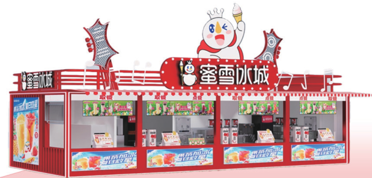

集裝箱店

主題店

特裝店

---

## 第 224 页

培訓與發展

我們致力於與加盟商共同取得成功。為實現這一目標，我們專注於為加盟商及其門店員工提供有效培訓，以推動我們業務的可持續發展。截至2024年9月30日，我們有超過260名全職專業培訓人員，向加盟商及其門店員工提供最優質的培訓。我們圍繞線下培訓體系及線上學習應用程序（「蜜雪商學」）設計了一套先進的培訓與發展體系，從而在門店管理及運營的各個關鍵方面賦能加盟商。

線下培訓

我們為加盟商及其門店員工提供線下培訓，幫助他們掌握成功運營門店所需的一手知識和經驗。我們的線下培訓提供了一套全面、標準化的課程，涵蓋門店運營的所有關鍵方面，包括飲品製作、食品安全及消費者服務等。加盟商及其員工須參加培訓課程並通過若干考試。例如，在門店開業前，加盟商及其員工須參加為期12天的集中培訓並通過考試。2024年前九個月，我們的加盟商及其門店員工累計參與我們的線下培訓超過27萬人次。2024年10月，我們佔地超60,000平方米的新培訓校區投入使用。該校區致力於線下培訓，旨在提升培訓效率、優化培訓體驗。

線上培訓

我們的「蜜雪商學」應用程序提供了豐富的門店運營課程，例如飲品製作、食品安全及消費者服務等。2023年，我們在「蜜雪商學」應用程序上提供了超過6,700門預先錄製的課程，2024年前九個月，我們已推出400多門預先錄製的新課程。截至最後實際可行日期，我們於2024年在「蜜雪商學」應用程序上提供的新課程的完課次數約210萬次。

線上培訓

線下培訓

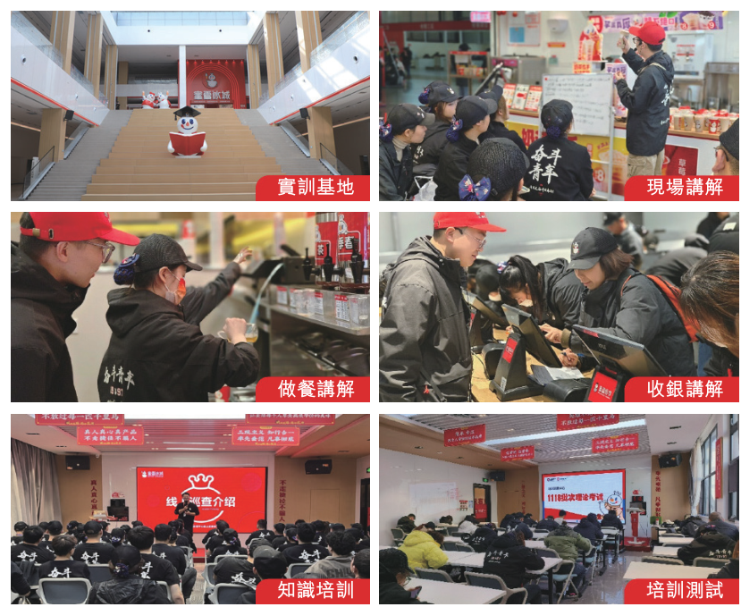

---

## 第 225 页

標準化門店運營

我們制定了詳細的指南和政策來指導加盟商的日常門店運營。我們加盟門店的運營基於一套全面的標準及流程，包括統一的飲品製作方法、門店物料與設備的集中採購以及統一的定價。我們設計了這些易於理解的標準及流程，幫助加盟商及其員工精簡門店運營及管理。例如，作為我們加盟服務的一部分，我們為加盟商提供智慧門店解決方案，以數字化的方式幫助加盟商申請及門店的日常運營和管理。請參閱「一數字化」。

巡店機制

我們已建立系統化的巡店機制，以指導及監督我們的門店運營，並為門店表現的評估提供反饋。截至2024年9月30日，我們的門店經營顧問團隊由1,585人組成，負責為加盟商的門店運營提供指導，並定期對他們所負責的門店進行巡查。我們還組建了一支獨立的門店考核團隊，負責對門店運營進行獨立考核。門店考核團隊主要對隨機選定的門店進行現場抽查。我們的巡店涵蓋了產品質量、客戶服務、食品安全及合規等各個方面的評估。

門店表現評估機制

為保持對門店表現的動態、有效監督，我們密切關注門店表現，並定期跟蹤其進展。我們的門店表現評估取決於巡店的反饋。請參閱「一巡店機制」。此類評估主要側重於以下方面：

• 消費者滿意度。我們高度關注消費者滿意度，我們監控加盟門店需負責的消費者投訴（請參閱「一消費者投訴的回應」），並在評估門店表現時考慮有關投訴的數量及嚴重程度。

• 加盟商對協議的違反。倘出現任何違反加盟協議規定的條款和條件的情況，例如違反運營標準或未能遵從我們的門店品質控制的內部要求，加盟商或會根據相關加盟協議的條款受到違約責任的追究。經考慮此類違規行為的性質和次數等多項因素，我們可能會要求關閉門店。

• 業務表現。倘我們發現任何表現欠佳的加盟門店，我們會評估表現欠佳的原因並制定定製化、可操作的改進計劃（例如進行促銷活動、加強對門店員工的培訓、對業績欠佳主要是由於周邊地區營商環境變化的門店推薦替代店址）以解決問題。

---

## 第 226 页

門店品質控制

我們高度重視加盟商及門店運營的品質控制。我們在門店層面堅持高標準的食品安全及品質控制，主要表現在以下方面：

我們要求所有加盟商嚴格遵守與食品質量、安全及衛生相關的所有適用的法律法規以及我們的內部規定。

在門店開業前及整個門店運營期間，我們為加盟商及其員工提供強制性的食品安全培訓。我們的培訓涵蓋了對相關食品安全法規和趨勢的講解、影響食品安全的因素以及在門店層面預防食品安全問題的實用指南。

我們定期頻繁巡店，指導門店解決食品安全及品質控制問題，並根據巡店結果即時進行評估以及採取行動，包括臨時性的門店關閉及／或終止加盟協議。請參閱「一巡店機制」。倘我們識別出任何系統性食品安全風險，我們會成立專責小組並制定具體計劃應對該等風險。

我們規範食品安全問題的報告程序並制定應急機制。例如，我們每年舉辦食品安全應急響應演練，以確保我們的應急響應快速、高效及有序。

我們並無因產品品質及食品衛生及安全問題而受到任何重大行政處罰。根據中國相關法律法規，加盟商須對其引致的食品安全及產品品質事件承擔責任。就因我們售予加盟商的產品品質問題而引起的有關事件，消費者可就損失向加盟商或我們（相關法律及法規另有規定則除外）提出索賠。根據我們與加盟商的協議，門店層面的食品安全及產品品質問題可能導致對加盟協議的違反，而加盟商或受到違約責任的追究。此外，我們已建立全面的食品安全管理系統，該系統覆蓋我們業務所有關鍵方面，以管理並降低食品安全問題的風險。就我們所知，於業績記錄期及截至最後實際可行日期，並無針對我們提出涉及食品安全及產品品質事件的實際或待決法律訴訟。我們的董事確認，於業績記錄期及截至最後實際可行日期，並無發生任何與我們加盟門店或自營門店有關的食品安全及產品品質事故、產品召回／退貨及／或投訴而對我們整體業務運營有重大不利影響。根據已進行的盡職調查工作，聯席保薦人並無發現任何會致使彼等不同意上述董事的意見的事宜。

---

## 第 227 页

消費者投訴的回應

為了確保我們盡可能了解消費者的投訴，我們(i)設立了專門的消費者服務熱線和在線渠道，(ii)監測新聞媒體或社交媒體上的評論、帖子或報導，以及(iii)在標準的特許經營協議中規定，加盟商必須及時向我們報告消費者投訴事件。為了解決我們所了解到的消費者投訴，我們建立了標準程序並對此保持詳細記錄，大致如下文所述。

收到消費者投訴後，我們便會創建工單以追蹤處理狀態。消費者服務人員將深入了解投訴的性質，並確定解決方案，旨在及時解決問題。對於大多數消費者投訴，我們會指派相關加盟門店處理問題並根據需要採取行動。加盟商及／或其員工亦須及時向我們報告有關問題的詳情及解決方案。我們將通知相關門店的門店經營顧問並處理該等問題。在此過程中，門店經營顧問及我們的消費者投訴管理部門將提供適當的監督和支持。為確保這機制的有效性，我們會與責任方核對消費者投訴的處理狀態，並於關閉相關工單前評估回應的質量。我們亦徵求消費者對投訴回應質量提供反饋意見。此外，我們的質量控制人員將定期審查及分析消費者投訴記錄，並視情況採取行動糾正任何系統性問題。

於業績記錄期及截至最後實際可行日期，我們並無接獲任何會對本集團業務運營及財務表現造成重大不利影響的消費者投訴。

合規管理

我們高度重視加盟商網絡的合規管理，以確保我們可以有效開展加盟業務。在開店前，我們的加盟商須獲得所有門店運營所需的執照及許可證，包括營業執照和食品經營許可證。為確保持續合規，我們還通過定期巡店來識別問題，並將結果作為門店表現評估的一部分。請參閱「一門店表現評估機制」。

為預防及／或解決任何門店層面的不合規問題，確保加盟商的勞務合規，我們已制定一套全面的內部控制措施以加強對加盟商的管理。一旦收到潛在不合規事件的報告或輿情提示，我們會立即予以關注，並將指派相關人員進行調查並制定建議的解決方案。就加盟門店發生的任何不合規事件，加盟商可能會根據加盟協議或我們的既定協議受到違約責任的追究。

---

## 第 228 页

特別地，關於我們針對食品安全和產品品質問題的內部控制措施和處理程序，請參閱「一門店品質控制」。此外，為確保門店層面的勞務合規，我們已建立有系統的加盟商管理協議以規範加盟門店的勞務：我們已加強對加盟商的勞務培訓，例如勞工相關法律法規的必要培訓；加盟商管理協議中載有規定，要求核實門店員工的身份；我們要求門店員工在獲准於門店工作前必須持有有效的健康證明及培訓證明。此外，門店經營顧問於巡店時定期檢查門店員工的身份證及健康證明，以確保門店員工符合工作資格。

加盟商協議

我們與各加盟商簽訂標準化協議以涵蓋加盟門店運營的關鍵方面，包括(i)加盟協議，其中列明了加盟門店運營管理方面的主要條款，以及(ii)框架採購協議，其中列明了與加盟商採購門店物料與設備有關的主要條款。我們與中國內地加盟商的加盟協議和框架採購協議通常包括以下主要條款：

中國內地加盟商的加盟協議的主要條款

• 期限 我們簽訂的加盟協議期限一般為3年或4年。加盟協議可於屆滿後續期。

• 費用及保證金 根據加盟協議，我們向加盟商收取以下固定費用。

• 加盟費。我們通常按年收取加盟費，以許可及授權加盟商使用我們的品牌、業務模式和支持其開展業務。舉例而言，我們在中國收取的加盟費因城市級別而異，通常在7,000元到11,000元人民幣之間。

管理費。我們通常就日常管理、運營指導及營銷支持按年向加盟商收取管理費。我們於中國收取的管理費一般為每家門店每年4,800元人民幣。

---

## 第 229 页

• 培訓費。我們通常就向加盟商提供的持續培訓服務按年向加盟商收取培訓費。我們於中國收取的培訓費一般為每家門店每年2,000元人民幣。

此外，我們的加盟商通常須在簽訂加盟協議時支付固定保證金（一般為每家門店20,000元人民幣），以確保其完全遵守加盟協議中規定的條款。若無任何違反協議的行為，該保證金將在加盟協議到期後且無續期的情況下全額退還我們的加盟商。

• 標準化採購

加盟商須按照我們的規定購買及使用標準化的食材、包材及設備。於業績記錄期，我們並未對加盟商設定最低購買要求。

• 知識產權

我們的加盟商獲授權在指定場所內使用我們的品牌、商標及其他知識產權。

• 品牌推廣

我們要求加盟商與我們合作開展標準化的廣告及營銷活動，並積極參與執行我們制定的營銷策略。加盟協議中沒有關於在促銷活動中保證加盟商利潤的條款。

• 終止

加盟協議可在協議規定的情況下由雙方或任何一方單方面終止。

與中國內地加盟商的採購協議的主要條款

• 訂單下達

各加盟商應通過集中訂貨系統向我們提交訂單。

• 發貨

我們將在收到付款後安排將購買的門店物料與設備交付予加盟商。

---

## 第 230 页

• 退貨

在沒有任何質量問題的情況下，我們保留拒絕退換貨的權利。若貨物存在質量問題，加盟商應在收到商品後48小時內提交退換貨請求。業績記錄期的退貨金額並不重大。根據灼識諮詢的報告，我們的退貨政策符合行業慣例及標準。

• 付款及信貸條款 加盟商須在購買的門店物料與設備發貨前先支付款項。

與海外加盟商的主要條款及安排

我們通常與海外加盟商訂立標準化協議以涵蓋加盟門店運營的關鍵方面。不同國家的主要條款及安排各不相同。加盟協議中沒有關於保證加盟商利潤的條款。我們與海外加盟商的加盟協議可能包括以下條款：

• 條款

我們簽訂的加盟協議一般為期3年。加盟協議可於屆滿後續期。

固定費用及保證金 我們向加盟商收取的固定費用及保證金或按不同國家而異，以符合不同的市場情況。例如，我們通常根據加盟協議向印度尼西亞及越南的加盟商收取以下固定費用。

管理費。我們於印度尼西亞收取的管理費按該國家不同地區而異，一般為每三年期每家門店合計57,000,000印度尼西亞盾(約3,700美元)至75,000,000印度尼西亞盾(約4,900美元)。我們於越南收取的管理費一般為每三年期每家門店合計34,800,000越南盾(約1,400美元)。

---

## 第 231 页

業務

• 培訓費。我們向印度尼西亞及越南的加盟商收取的培訓費一般分別為每三年期每家門店合計3,000,000印度尼西亞盾(約200美元)及6,800,000越南盾(約280美元)。

• 加盟費。在印度尼西亞，我們目前不收取單獨的加盟費。在越南，我們一般向每家門店收取每三年期合計46,800,000越南盾(約1,900美元)的加盟費。

此外，在簽署加盟協議時，我們的加盟商通常須支付固定保證金，在印度尼西亞，我們一般向每家門店收取的保證金為40,000,000印度尼西亞盾（約2,600美元），在越南，我們一般向每家門店收取的保證金為70,000,000越南盾（約2,900美元），以確保其完全遵守加盟協議中載列的條款。若無任何違反協議的行為，該保證金將在加盟協議到期後且無續期的情況下全額退還予我們的加盟商。

• 標準化採購

加盟商須按照我們的規定購買及使用標準化食材、包材及設備。於業績記錄期間，我們並未對加盟商設定最低購買要求。

• 知識產權

我們的加盟商獲授權在指定場所內使用我們的品牌、商標及其他知識產權。

• 品牌推廣

我們要求加盟商與我們合作開展標準化的廣告及營銷活動，並積極參與執行我們制定的營銷策略。

• 終止

加盟協議可在協議規定的情況下由雙方或任何一方單方面終止。

---

## 第 232 页

於業績記錄期及截至最後實際可行日期，我們並不知悉加盟商存在任何對我們的業務運營產生重大不利影響的違反加盟協議的行為。於業績記錄期及截至最後實際可行日期，我們與加盟商並無發生任何對我們業務運營有重大不利影響的糾紛。

與加盟商的關係

截至最後實際可行日期，據我們所知，除本段所披露為我們前員工的加盟商外，加盟商於過去或目前與本公司或其附屬公司、彼等的股東、董事、監事或高級管理層或彼等各自的任何聯繫人並無任何關係（業務、信託、家族、融資或其他方面）。於業績記錄期，我們的若干加盟商是我們的前員工或當時的在職員工。截至2021年、2022及2023年12月31日以及2024年9月30日，我們分別有8名、11名、13名及26名加盟商是我們的前員工或當時的在職員工。截至2021年、2022年及2023年12月31日以及2024年9月30日，這些加盟商分別經營著31家、33家、24家及37家加盟門店（「關聯加盟門店」，而我們其餘加盟門店稱為「獨立加盟門店」）。這些加盟商的收入貢獻並不重大，於2021年、2022年、2023年以及2024年前九個月分別合計佔我們收入的0.14%、0.09%、0.06%及0.08%。我們在審核這些加盟商的加盟申請時，採用了與其他加盟商相同的選擇標準和程序。我們與這些加盟商簽訂的加盟協議和我們同其他加盟商簽署的協議具有相同的條款和條件。

---

## 第 233 页

<!-- table html -->
<table><tr><td>截至12月31日止年度</td><td colspan="2">2021年</td><td colspan="2">2022年</td><td colspan="2">2023年</td><td colspan="2">2024年</td></tr><tr><td>收入</td><td>毛利</td><td>毛利率</td><td>毛利</td><td>收入</td><td>毛利率</td><td>收入</td><td>毛利率</td></tr><tr><td>人民幣</td><td>%</td><td>人民幣</td><td>%</td><td>人民幣</td><td>%</td><td>人民幣</td><td>%</td></tr><tr><td colspan="8">(以千元計，百分比除外)</td></tr><tr><td>獨立加盟門店……</td><td>10,017,311</td><td>3,208,549</td><td>32.0</td><td>13,089,808</td><td>3,806,688</td><td>29.1</td><td>19,562,928</td><td>5,888,741</td><td>30.1</td><td>14,850,187</td><td>4,488,529</td><td>30.2</td><td>18,188,862</td><td>5,963,128</td><td>32.8</td></tr><tr><td>關聯加盟門店……</td><td>14,066</td><td>4,379</td><td>31.1</td><td>12,145</td><td>3,382</td><td>27.8</td><td>12,379</td><td>3,608</td><td>29.1</td><td>9,273</td><td>2,827</td><td>30.5</td><td>13,788</td><td>4,357</td><td>31.6</td></tr><tr><td>總計……</td><td>10,031,377</td><td>3,212,928</td><td>32.0</td><td>13,101,953</td><td>3,810,070</td><td>29.1</td><td>19,575,307</td><td>5,892,349</td><td>30.1</td><td>14,859,460</td><td>4,491,356</td><td>30.2</td><td>18,202,650</td><td>5,967,485</td><td>32.8</td></tr></table>
<!-- /table -->

---

## 第 234 页

如上表所示，於業績記錄期間，獨立加盟門店及關聯加盟門店的毛利率基本一致。

定價政策

我們要求加盟商按照我們制定的零售價格銷售我們的產品。我們為加盟商制定門店物料與設備的價格時考慮了多項因素，包括但不限於(i)由信譽良好的零售商或市場上其他供應商的可比產品定價，(ii)有關產品的採購及生產成本，及(iii)提供門店物料及設備的物流成本及其他雜項成本及開支。業績記錄期內，我們的原材料、勞動力成本及其他經營開支並無因通貨膨脹而出現重大波動。

我們的供應鏈

概覽

我們是中國現製飲品行業中最早設立中央工廠的企業。根據灼識諮詢的報告，我們目前擁有中國現製飲品行業內最大規模的完整端到端供應鏈體系。我們高度數字化及大規模的供應鏈將我們與同行區別開來，並使我們能夠為加盟商提供具競爭力的一站式解決方案。我們提供給加盟商的飲品食材超過60%為自產，是中國現製飲品行業中最高（根據灼識諮詢的報告），其中核心飲品食材為100%自產。

多年來，我們已打造一個全球採購網絡，整合各地優質資源。通過該網絡，我們精選出一批值得信賴的供應商，並向其採購原材料、門店物料與設備，以保證供應的質量和穩定性。

通過技術應用與我們的運營專長相結合，我們實現了整個生產過程的高度數字化和智能化。這種以技術賦能的生產流程對我們的高品質產品和高效運營至關重要，確保了加盟商的滿意度和卓越的消費者體驗。

為確保將門店物料與設備及時配送到我們在中國龐大的門店網絡，我們建立了一個以自主運營的倉儲體系和專屬的配送網絡為基礎的高效物流體系。

我們的研發分為對產品口味和配方相關的應用研發，以及對食材相關的技術、生產工藝、配方及設備進行的基礎研發。應用研發與基礎研發緊密銜接。這種整體性的研發能力使我們不僅在核心飲品食材方面擁有強大的研究能力，而且能夠持續不斷為消費者推出高質平價的現製飲品。

最後，我們堅持完善的品質控制標準，以保證全鏈條始終如一的高品質產出。

---

## 第 235 页

採購

概覽

我們主要採購(i)我們生產所需的原材料，如食品類大宗商品、農產品及其他輔料，以及(ii)直接提供給我們門店的物料與設備，主要包括包材及門店設備。於業績記錄期，我們採購源自全球六大洲、38個國家的原材料。

全球採購網絡覆蓋六大洲38個國家

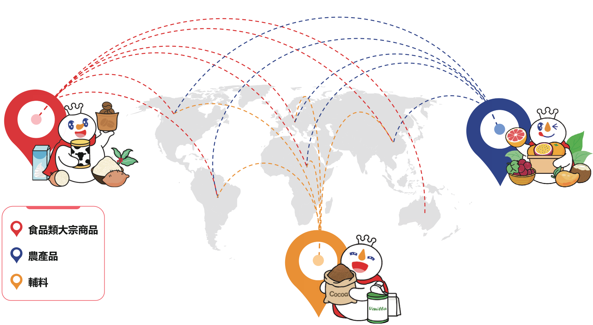

我們與優質可靠的供應商建立了長期合作關係，這有助於我們確保供應的質量、成本效益和穩定性。我們強大的品牌聲譽和龐大的門店網絡帶來穩定及規模化的消費者需求，因此我們擁有議價能力並能以低於行業平均水平的價格採購核心原材料。此外，我們在制定採購計劃時將我們的銷售目標納入考量，以進一步管理我們的採購成本。

隨著我們在提高供應鏈能力上的持續努力，我們已將運營進一步延伸至供應鏈的上游，建立了合作種植基地，以確保對我們現製飲品配方至關重要的核心農產品的優質穩定供給。以檸檬為例，根據灼識諮詢的報告，按2023年的採購量計，我們是中國最大的檸檬採購商。2023年，我們採購的檸檬約11.5萬噸，其中大部分購自位於四川省安岳縣的合作種植基地。在一些情況下，我們會在農時季節前與水果供應商商議採購計劃，以期按有利的採購條款鎖定供應。

---

## 第 236 页

於業績記錄期，我們在原材料、門店物料與設備的採購方面並未遇到任何對我們的業務運營產生重大影響的延誤或短缺的情況。

採購成本控制

為控制我們的採購成本，我們主要採取以下措施：(i)整合中國和海外供應商的各種供應資源，(ii)將我們的全球採購網絡延伸至原材料產地，以消除中間成本，(iii)與上游供應商建立長期合作夥伴關係，以及(iv)提前與選定供應商商定價格或價格範圍，從而確保以合理的成本獲得充足的供應。

我們採購的一些原材料，例如糖及咖啡豆，其價格天然具有波動性。但在採取上述措施後，我們預計此類價格波動不會對我們及加盟商的運營產生重大不利影響。有關原材料價格波動的風險，請參閱「風險因素—與我們的業務及行業有關的風險—我們面臨部分原材料價格波動的風險，這可能對我們的經營業績和財務表現造成重大不利影響」。儘管加盟協議並未載有在原材料價格上漲的情況下確保加盟商利潤的條款，但我們通常不會將短期成本的增加轉嫁予加盟商。

與供應商的採購協議

我們與供應商的採購協議通常載有以下主要條款。

期限。我們通常訂立期限為一年內（須接受年度審核及續期）或無固定期限的採購協議。

• 產品規格。採購協議中規定了所採購商品的詳細規格。

價格。採購協議中規定了所採購商品的預先商定價格。若所採購商品的市場價格大幅波動，在某些情況下，我們可能會與供應商協商重新定價。

檢查和驗收。採購的商品運達我們指定的地點後，我們將在規定的期限內檢查和驗收。

• 配送。每批貨物的配送方式將由我們通知。若由供應商負責配送，則其應將採購的商品配送至我們指定的地點，並承擔相關的物流費用。若由我們負責配送，則我們在供應商的倉庫提貨並承擔相關費用。

---

## 第 237 页

• 付款條款。我們通常有7天至一個月不等的信用期。

責任。對於有缺陷或不合格的商品，供應商應更換商品，並承擔由此產生的所有費用。若延遲交付商品，我們可與供應商協商降價，並有權拒絕該批次商品。

終止。主要終止事件包括(i)在市場價格出現大幅波動時未能重新協商價格；(ii)嚴重違反採購協議，以及(iii)不可抗力。

合作種植基地

我們與種植基地合作，以確保對我們現製飲品配方至關重要的核心農產品的優質穩定供給。我們的合作種植基地主要位於四川省、重慶市等地區。截至2024年9月30日，我們與合作種植基地相關的供應商超過120家。我們在篩選合作供應商時，會綜合考慮產品品質、商譽以及與我們過往的合作等多項因素。我們與供應商的合作種植基地安排主要條款載列如下。

• 產品規格。協議中載列產品的詳細規格。

檢查和驗收。產品運達我們指定的地點後，我們將在規定的期限內檢查和驗收。

• 價格。採購協議訂明，我們與供應商可預先商定價格或協定價格調整機制。

• 付款條款。我們通常有一個月內的信用期。

責任。對於有缺陷或不合格的商品，供應商須對所引起的一切損害（包括但不限於對我們的損害及我們由此產生的所有費用）承擔責任。若延遲交付商品，我們可要求供應商賠償損失。

---

## 第 238 页

生產

概覽

截至2024年9月30日，根據灼識諮詢的報告，我們已經成為中國現製飲品供應鏈領域中生產品類最全和規模最大的企業。2012年，我們建立了第一家生產工廠，成為中國現製飲品行業中最早設立中央工廠的企業。目前，我們在河南、海南、廣西、重慶、安徽擁有五大生產基地，總佔地面積約79萬平方米。我們在這些生產基地的生產覆蓋七大類用於製作現製飲品的食材，包括糖、奶、茶、咖、果、糧、料，年綜合產能達到約165萬噸。

我們在對標世界級工廠建設和生產管理標準的基礎上，充分發揮中國製造的深厚優勢。截至2024年9月30日，我們建設的智能工廠擁有60多條智能化生產線，均使用先進的自動化設備和數字化的工具，例如ABB的機器人及配套自動化設備、Probat的咖啡烘焙機、利樂的無菌高速紙包裝灌裝機等。我們生產設施已配備自動化及數字工具，大幅提升效率及產能。例如，於2019年至2023年，我們的灌裝、貼標、包裝及各種其他生產過程已實現自動化，將我們若干糖漿生產線的產能提升十倍以上。

自主生產是我們區別於大多數同行的重要方面之一。我們通常在飲品食材需求量達到一定規模並且具備相應的研發生產能力的情況下，通過自產實現更高的效率和更好的質量。舉例而言，為了在提升產品口感的同時滿足消費者日益增長的健康追求，我們開始使用自主研發的製作工藝生產鮮牛乳奶基底，用更為新鮮、健康的配方製作更具香濃口感的飲品。此外，我們在近期取得液體乳產品的食品生產許可證，成為中國唯一持有該許可證的現製飲品公司。這一里程碑為我們自主生產鮮牛乳等乳制品鋪平了道路，為擴大和提升產品結構提供了新的可能。同時，我們持續加強乳製品的供應鏈建設。2024年12月，我們與中國領先的乳製品公司君樂寶訂立戰略合作關係，合資建設「雪王牧場」。通過此次合作，預期可進一步保障我們優先獲得高品質的鮮牛奶，從而提高我們的供應鏈能力及產品質量，並令我們作為股東獲取財務回報。根據此戰略合作，我們持有少數股權並有權指定「雪王牧場」的一名董事及委任其財務負責人。同時，持有多數股權並擁有控制權的君樂寶負責日常運營。進一步詳情請參閱「豁免及免除－有關業績記錄期後收購事項的豁免－背景－投資新鄉樂源」。我們也自主生產部分核心包材和門店設備。

---

## 第 239 页

業務

生產基地

下表展示了截至2024年9月30日我們的生產基地及其關鍵運營信息。

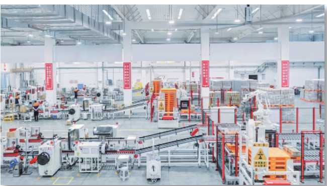

河南生產基地

主要產品：食材（糖、奶、茶、咖、果、糧、料）、包材及設備

■ 佔地面積：約34.2萬平方米

■ 年產能：約121.0萬噸

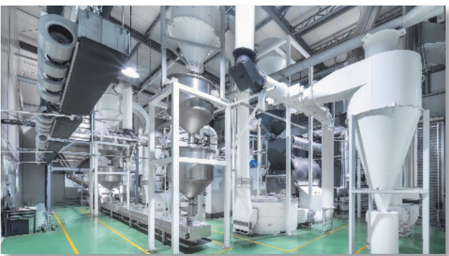

海南生產基地

主要產品：食材（奶、咖）

■ 佔地面積（包括在建部分）：約20.4萬平方米

■ 年產能：約4.5萬噸

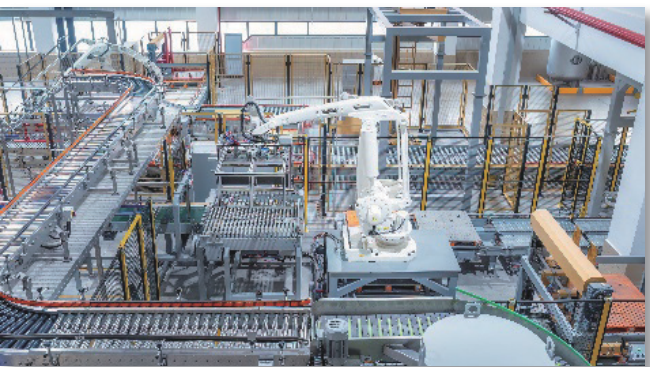

廣西生產基地

主要產品：食材（糖、奶、果、料）

■ 佔地面積：約10.0萬平方米

■ 年產能：約18.5萬噸

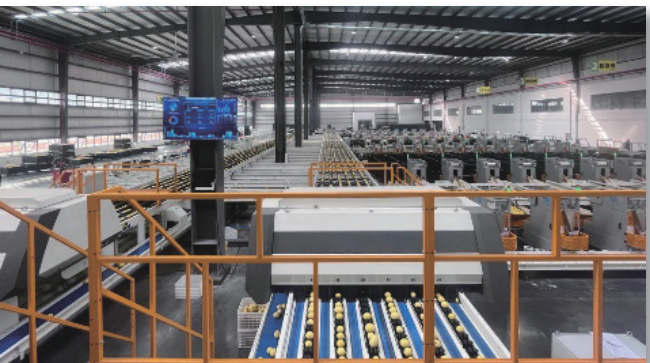

重慶生產基地

主要產品：食材（果、糧）

■ 佔地面積：約12.2萬平方米

■ 年產能：約15.5萬噸

安徽生產基地

主要產品：食材（果）

■ 佔地面積：約1.9萬平方米

■ 年產能：約5.4萬噸

---

## 第 240 页

河南生產基地

我們的河南生產基地生產全部七大類食材，以及包材和設備。該生產基地的佔地面積約為34.2萬平方米，食材年產能約為121.0萬噸。於2021年、2022年、2023年以及2024年前九個月，我們河南生產基地的利用率分別為55.4%、58.2%、50.7%及48.1%。2023年以及2024年前九個月的利用率相對較低，主要是由於在相關年度／期間擴張或升級生產線，而有關生產線仍處於爬坡期。例如，我們建設新的生產茶產品及乳製品的產線並升級我們的水果產線，以滿足消費者對新鮮水果的偏好。該基地是我們的主要生產設施，也是迄今為止我們最大的生產基地。

海南生產基地

我們的海南生產基地主要生產椰奶產品、咖啡產品等食材。該生產基地的佔地面積（包括在建部分）約為20.4萬平方米，食材年產能約為4.5萬噸。我們的海南生產基地於2023年第一季度投入運營，於2023年全年以及2024年前九個月的利用率分別為33.7%及49.2%。該生產基地受益於海南自由貿易港的有利貿易政策，有利於支持我們的海外業務。

我們已於2023年開始在海南生產基地建設新設施，以擴大冷凍水果產品、咖啡產品、糖漿和小料等食材的產能。該擴建計劃預期將於2025年完成。

廣西生產基地

我們的廣西生產基地主要生產糖漿、水果產品和小料等食材。該生產基地戰略性地設立於華南地區，可方便地獲得多種熱帶水果，如芒果及百香果。該生產基地的佔地面積約為10.0萬平方米，食材年產能約為18.5萬噸。我們的廣西生產基地於2023年第三季度投入運營，於2023年全年以及2024年前九個月的利用率分別為17.8%及61.1%。

---

## 第 241 页

重慶生產基地

我們的重慶生產基地主要生產水果產品及穀物製品等食材。該生產基地的佔地面積約為12.2萬平方米，食材年產能約為15.5萬噸。於2021年、2022年、2023年以及2024年前九個月，我們重慶生產基地的利用率分別為100%、100%、73.6%及45.9%。2021年及2022年，我們的重慶生產基地由檸檬及橙子產線組成，檸檬及橙子產線的利用率高於我們於2023年建設的穀物製品產線。由於這一新產線建設及其後的爬坡期，我們重慶生產基地2023年以及2024年前九個月的利用率較2021年及2022年更低。2024年前九個月的利用率低於2023年，主要是由於檸檬及橙子的採購及加工通常在一年中的第四季度進行，故2024年前九個月該等水果的產能及產量均為零。我們的重慶生產基地在毗鄰原材料產地的多個地點設有工廠，包括安岳和潼南，以根據生產計劃不時作出調配和調整。其中，安岳工廠與我們的合作種植基地位於同一個鎮，專注於檸檬的採購和加工。因此，由於水果加工具有季節性，我們重慶生產基地的利用率可能會出現波動。

安徽生產基地

我們的安徽生產基地主要生產水果產品等食材。該生產基地的佔地面積約為1.9萬平方米，食材年產能約為5.4萬噸。我們的安徽生產基地於2022年第一季度投入運營，於2022年、2023年以及2024年前九個月的利用率分別為49.9%、57.6%及65.8%。該生產基地在滁州及七里塘設有工廠。其中，七里塘工廠戰略性地設立於草莓農場附近，專注於高效處理冷凍草莓產品並確保產品的質量。

---

## 第 242 页

產能

下表載列了於所示年度／期間內我們七大類食材的產能、產量及產能利用率。

<!-- table html -->
<table><tr><td></td><td colspan="6">截至12月31日止年度</td><td colspan="6">截至9月30日止九個月</td></tr><tr><td>產品</td><td colspan="3">2021年</td><td colspan="3">2022年</td><td colspan="3">2023年</td><td colspan="3">2024年</td></tr><tr><td></td><td>產能^(1)</td><td>產量</td><td>產能利用率^(2)</td><td>產能^(1)</td><td>產量</td><td>產能利用率^(2)</td><td>產能^(1)</td><td>產量</td><td>產能利用率^(2)</td></tr><tr><td></td><td colspan="10">(噸，百分比除外)</td></tr><tr><td>糖</td><td>127,851</td><td>75,112</td><td>58.7%</td><td>255,677</td><td>156,486</td><td>61.2%</td><td>580,209</td><td>244,666</td><td>42.2%</td><td>480,720</td><td>223,695</td><td>46.5%</td></tr><tr><td>奶</td><td>76,825</td><td>63,879</td><td>83.1%</td><td>233,837</td><td>147,110</td><td>62.9%</td><td>359,765</td><td>198,617</td><td>55.2%</td><td>337,637</td><td>176,747</td><td>52.3%</td></tr><tr><td>茶^(3)</td><td>–</td><td>–</td><td>–</td><td>–</td><td>–</td><td>–</td><td>3,856</td><td>908</td><td>23.5%</td><td>3,190</td><td>2,131</td><td>66.8%</td></tr><tr><td>咖</td><td>3,640</td><td>848</td><td>23.3%</td><td>6,087</td><td>4,349</td><td>71.4%</td><td>14,333</td><td>8,384</td><td>58.5%</td><td>11,388</td><td>7,213</td><td>63.3%</td></tr><tr><td>果</td><td>35,575</td><td>30,417</td><td>85.5%</td><td>101,062</td><td>70,658</td><td>69.9%</td><td>231,509</td><td>136,391</td><td>58.9%</td><td>164,145^(4)</td><td>81,597^(4)</td><td>49.7%</td></tr><tr><td>糧</td><td>11,625</td><td>2,699</td><td>23.2%</td><td>16,101</td><td>5,364</td><td>33.3%</td><td>13,099</td><td>6,330</td><td>48.3%</td><td>18,490</td><td>8,271</td><td>44.7%</td></tr><tr><td>料</td><td>65,389</td><td>11,529</td><td>17.6%</td><td>90,309</td><td>38,835</td><td>43.0%</td><td>146,856</td><td>80,102</td><td>54.5%</td><td>109,282</td><td>64,683</td><td>59.2%</td></tr></table>
<!-- /table -->

附註：

(1) 產能根據各品類食材生產線的日產能按照於所示期間內運營的天數加權計算。

(2) 利用率指於所示期間內產量佔產能的百分比。

(3) 考慮到我們的生產優先次序，我們直至2023年才開始生產茶。

(4) 通常於每年第四季度採購和加工檸檬及橙子，因此，截至2024年9月30日止九個月，該等水果的產能及產量為零。該等水果的年產能約為13萬噸。

業績記錄期內，產能利用率的波動主要由於我們產能的擴張、規劃及優化。未來，我們計劃進一步提高產能以支持業務增長。我們能否成功實施擴張計劃受到大型建設及擴建項目通常所涉及的狀況及風險的影響。進一步詳情請參閱「風險因素—與我們的業務及行業有關的風險—我們面臨與產能有關的風險。我們未來的成功和增長潛力取決於我們能否成功實施產能擴張計劃和有效管理產能」。我們預計將通過全球發售所得款項淨額及經營所得現金為我們的產能擴張計劃提供資金。有關我們擴張計劃的詳情，請參閱「未來計劃及所得款項用途」。

---

## 第 243 页

生產流程

下圖展示了我們主要食材的典型生產流程的主要步驟。

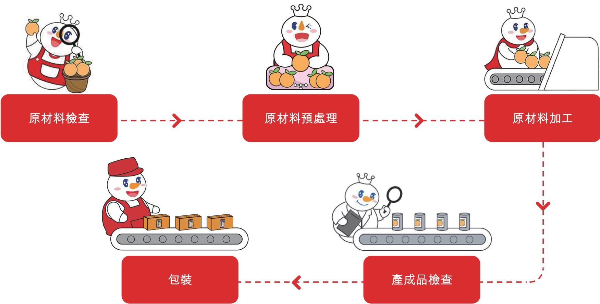

• 原材料檢查：按相關標準檢查原材料

• 原材料預處理：解凍、清洗或分批處理原材料

原材料加工：加工處理好的原材料，如攪拌（果）、烘焙（咖）、烹煮（糧）及粉碎塑形（料）

• 產成品檢查：篩選及清除雜質，並按質量標準進行檢查

• 包裝：貼標籤並包裝產品

---

## 第 244 页

物流

我們自主運營的倉儲體系和專屬的配送網絡支持了中國現製飲品行業內最廣闊的門店佈局。我們在物流成本和效率上相較於同行業具備優勢，在配送時效和配送品質上也高於行業平均水平。我們的物流系統集成了DMS、OMS、WMS、TMS和BMS，通過數字化手段精準控制末端貨物送達，是行業裡極少數能做到商流、信息流、資金流、物流四流合一的企業。另請參閱「一數字化」。

2014年起，我們在中國現製飲品行業內最早開始建設自主運營的倉儲體系。截至2024年9月30日，我們的倉儲體系由總面積約35萬平方米的27個倉庫組成，為行業內最大。為支持我們的海外業務，截至2024年9月30日，我們在東南亞的四個國家建立了本地化的倉儲體系，包括共計約6.9萬平方米的7個自主運營的倉庫。我們不斷投入並探索自動化及智能化設備，來提高運營效率並擴大存儲量，例如採用堆垛機、四向穿梭車等自動化的立體存儲方案等。

我們主要通過與本地化配送服務機構合作向中國內地及中國內地以外的加盟商提供配送服務。

截至2024年9月30日，我們於中國內地有約40家本地化配送服務機構，我們將該等服務商整合在我們的物流體系中，同時為確保按時交付及產品的品質與新鮮度，我們對該等服務商執行嚴格的質量控制政策及要求。例如，我們檢查及維護配送車輛的衛生狀況，並清潔及消毒配送車輛，以確保產品品質；我們亦要求在冷鏈配送車輛上安裝溫度監控設備，以在整個配送過程中監測並保持低溫以確保產品新鮮。

我們與中國內地及中國內地以外的本地化配送服務機構訂立的協議一般載有以下主要條款。

• 年期。協議年期通常為期一年，可於屆滿後續期或延長。

• 配送服務。本地化配送服務機構負責按已協定的服務範圍及服務品質標準提供取貨、裝貨、運輸、中轉、配送、門店卸貨等產品配送服務。

---

## 第 245 页

業務

服務費。配送服務費一般按已協定的服務費標準收取，一般按配送距離及服務要求計算。

• 款項結算。服務費通常按月結算。

保證金。於簽訂協議時，本地化配送服務機構通常須向我們支付按金作為履約保證金，若無任何違反協議的行為，該保證金將在服務協議到期後全額退還。

終止。協議可由任何一方發出事先通知終止，或在發生若干事件（包括但不限於本地化配送服務機構未有履行若干合約責任）後由我們終止。

服務質量。為確保我們本地化配送服務機構的表現及服務質量，協議載列服務標準及質素評估規範等條款。我們定期檢查配送完好率等關鍵績效指標。倘嚴重違反我們的運營標準，我們有權按協議的規定調減服務費並對我們的本地化配送服務機構進行違約責任的追究。

截至2024年9月30日，我們的配送網絡覆蓋了中國內地31個省份、自治區及直轄市，超過300個地級市、1,700個縣城和4,900個鄉鎮，其覆蓋廣度和下沉深度為行業內最高。截至同日，我們在中國內地逾90%的縣級行政區劃實現12小時內觸達；我們在中國內地約97%以上的門店實現了冷鏈物流覆蓋。截至2024年9月30日，我們的配送網絡同時也覆蓋了四個海外國家的超過560個城市。

---

## 第 246 页

下圖展示了我們物流網絡在中國內地的地域覆蓋範圍。

自主運營倉庫+專屬配送網絡

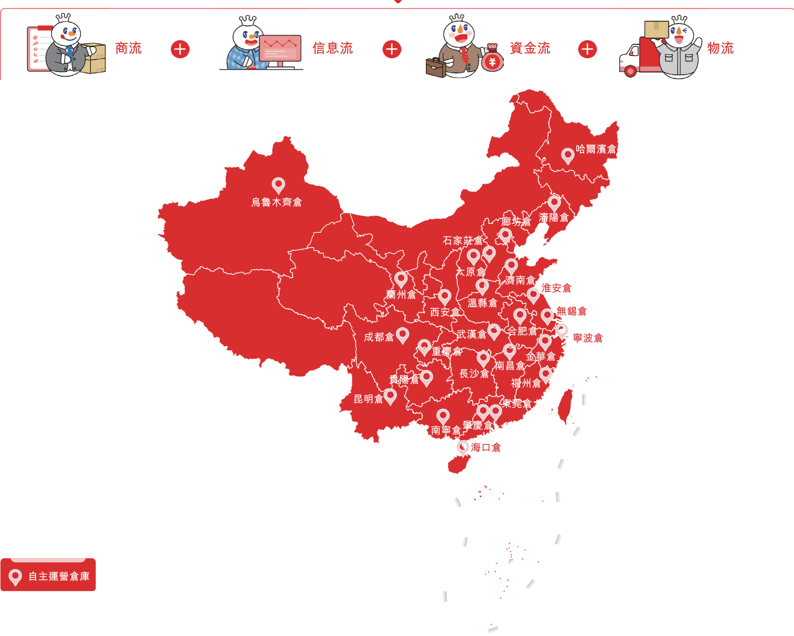

此地圖（審圖號：GS(2021)5447號）僅作示意性目的，用以呈現我們在中國的物流網絡。為完整起見，地圖包括中國內地及中國香港、澳門及台灣地區。

研發

概覽

我們的研發主要分為對產品口味和配方相關的應用研發（即前端應用研發），以及對食材相關的技術、生產工藝、配方及設備等進行的基礎研發（即後端基礎研發）。我們研發的核心優勢在於應用研發與基礎研發緊密銜接，擁有糖、奶、茶、咖、果、糧、料七大品類整體性開發能力的協同優勢。

我們的研發由專職的內部團隊負責。截至2024年9月30日，我們有124名負責應用研發與基礎研發的研發人員，其中31%擁有碩士及以上學歷。我們的研發人員致力

---

## 第 247 页

研發產品配方、食材（如奶製品、咖啡和茶）及設備，以支持我們門店網絡的擴張並滿足消費者需求。此外，我們鼓勵加盟商提供反饋及建議，以促進我們的產品開發。

應用研發

在應用研發方面，我們基於從廣泛會員和粉絲處收集的當下消費者偏好，考慮門店運營、供應鏈能力等因素，對產品配方進行升級創新。2024年前九個月，我們共推出105款新產品。

我們開發的特色產品「搖搖奶昔」系列，顯示了我們的應用研發能力。我們創新地鼓勵消費者以自己的方式「喝前搖一搖」。這種創新的方式成為了產品自帶的賣點和消費者熱議的話題。自推出以來，「搖搖奶昔」備受消費者好評，是我們多年來最暢銷的產品之一。

基礎研發

在基礎研發方面，我們率先實現多項業內技術突破。例如，速煮珍珠配方及相關工藝，高端零反式脂肪酸奶基底粉及鮮牛乳奶基底的自主創新，獨創的冰淇淋粉噴霧乾燥生產法，以及獨創的燕麥奶生產方式。我們還開發了如半自動咖啡機、自動果糖機、開水機和淨水器等一系列設備。此外，我們與科研機構合作。例如，我們與中國熱帶農業科學院合作建立合作芒果種植實驗室，並與海南大學合作開發椰果的高產生產方法。

供應鏈質量控制

我們實施嚴格的質量控制體系，在供應鏈各環節都確保質量及食品安全。截至2024年9月30日，我們擁有約290名負責供應鏈質量控制的員工，其中管理人員平均擁有約12年的質量控制及食品安全管理相關經驗。

我們已取得ISO9001質量管理體系認證、ISO22000及FSSC22000食品安全管理體系認證、HACCP危害分析認證及清真認證。

在業績記錄期內及截至最後實際可行日期，我們並未遇到任何可能對我們整體業務運營造成重大不利影響的產品召回或有關我們產品質量的客戶投訴。

---

## 第 248 页

採購質量控制

在任何供應商與我們簽訂合約之前，他們必須通過我們嚴格的甄選程序，包括背景及資質審查、樣品測試及試生產。每批貨物到達後，質量控制團隊都會按照驗收標準，對貨物的保護措施、衛生狀況、技術指標及安全指標進行檢驗，以確保符合我們的質量及食品安全標準。此外，我們經常性通過定期及隨機檢查來評估供應商所提供原材料的質量及穩定性。為維護我們的質量控制及食品安全標準，我們還在採購的農產品上標注了可追溯的產地來源及生產基地信息。

生產質量控制

除遵守國家食品安全法律法規要求外，我們還在從原材料的檢查、預處理及加工到產成品的檢查及包裝的整個生產過程中嚴格實施質量控制。例如，我們的生產廠房建設設計嚴格按照相關規範執行，我們的生產廠房及生產設備由指定人員採用嚴格的標準定期清潔及維護。所有生產人員上崗前必須經過衛生培訓及相關技術培訓。此外，我們還制定了健全的風險應急計劃，以應對生產過程中出現的任何食品安全問題。

倉儲質量控制

我們在倉儲過程制定了具有嚴格質量管理措施的倉儲和物流管理標準。為監控我們的標準在倉庫中的實施情況，質量控制團隊會經常對在庫產品進行檢查。

我們的倉庫保持清潔、通風良好並井然有序。我們的倉庫通常設有常溫區、冷藏區及冷凍區，並會根據產品存儲要求每天監控溫度及濕度。

配送質量控制

我們利用第三方物流服務提供商的服務，為龐大的門店網絡配送門店物料及設備，並實施嚴格的質量控制要求，以確保交付的及時性及質量。我們對配送車輛的車型有嚴格的限制與要求，並要求在裝車前清潔車輛以保持乾燥及良好的衛生狀況，裝車後車輛還須實施防護措施以防止雨淋、潮濕及過度日曬。

---

## 第 249 页

存貨管理

我們採取一系列措施來管理存貨週轉並減少存貨積壓及不必要採購，以確保成本效益。為管理存貨，我們根據需求預測及現有存貨制定採購及生產計劃，同時也會考慮應對不可預測的需求波動所需的安全存貨水平。我們還通過數字化運營提高存貨管理效率。例如，我們的WMS系統可通過支持倉庫貨物管理、存貨管理及訂單管理，實現數據驅動的倉庫運營管理，從而提高效率及準確性。參見「一數字化」。

根據我們的加盟模式，加盟商不願存置超出合理數量的存貨，這是由於(i)加盟商一般在商品和設備交付給他們前支付預付款項；(ii)加盟商不受最低採購要求所限；(iii)倘產品並無品質問題，加盟商未必可退回已購買的產品；及(iv)由於我們能及時交付訂單，加盟商可頻繁且便捷下單訂購門店物料以滿足日常運營需要。此外，我們通常關注門店的庫存水平，例如門店經營顧問在實地考察期間檢查庫存食材的有效期及存貨水平。因此，我們的加盟商囤貨的風險較低。

營銷

我們採用全渠道營銷策略，涵蓋線上和線下的品牌建設及營銷，並發揮我們的超級IP「雪王」的優勢。有關我們超級IP的詳請，請參閱「—我們的品牌及產品—我們的超級IP—「雪王」」。

線下營銷

---

## 第 250 页

線上營銷

我們的線上營銷活動專注於在各類社交平台上宣傳推廣我們的品牌形象。例如，「雪王」在中國主要社交平台上擁有自己的賬號並與粉絲互動，使「蜜雪冰城」深入人心。作為線上營銷活動的一部分，我們製作吸引觀眾的各種形式的優質內容，如社交媒體帖子及短視頻。例如，截至最後實際可行日期，「#蜜雪冰城」話題在抖音上有超過444億次播放量。為提升營銷效果，我們推出了「雪王」與如洛天依、蛋仔派對等多個熱門品牌和IP的聯名和合作活動。憑藉我們的渠道資源及豐富的內容，我們已開展一系列具影響力的營銷活動，並吸引粉絲線上互動。

為更好地了解消費者並與之互動來培養品牌忠誠度，我們已建立會員計劃。消費者可通過「蜜雪冰城」應用程序、微信及支付寶小程序，以及第三方線上外賣平台等多種渠道註冊會員。我們對會員提供多種獎勵。該會員計劃可以使我們提高消費者複購並加強品牌與會員之間的連結。截至2024年9月30日，「蜜雪冰城」的註冊會員數達到約3.15億。

線下營銷

我們的線下品牌營銷充分地發揮了我們龐大門店網絡的優勢。我們通過定期開展「雪王」巡遊，並鼓勵消費者拍照打卡和參與門店活動，不斷拉近與消費者距離。此外，我們舉辦各類營銷活動以提升品牌知名度。例如，自2019年起，我們已舉辦多場冰淇淋音樂節，邀請消費者享受音樂和我們產品帶來的快樂，同時進一步宣傳我們的「雪王」超級IP。我們的線下營銷舉措亦包括邀請消費者參觀我們作為「國家4A級工業旅遊景區」的河南生產基地，在開放透明的環境下讓消費者近距離了解和親身體驗生產過程。

線上線下聯動營銷

憑藉我們在社交媒體上的廣泛熱度和消費者觸手可及的龐大的門店網絡，我們能夠有效地推出線上和線下相聯動的營銷活動，作為我們整體營銷的有機組成部分。在線上線下聯動方面，我們於2022年6月推出了「雪王黑化」營銷活動，線上和線下「雪王」形象變成黑色，為桑葚系列的新產品造勢，使其首月銷量達到了約2,200萬杯。在2024年「蜜雪冰城」的5.20情侶節活動期間，我們開展了一系列線上線下的營銷活動。

---

## 第 251 页

2024年5月20日，全國門店終端零售額較上週同期提升了11.4%。為支持新產品茉莉奶綠的推出，我們於2024年7月引入創新的線上線下整合營銷活動。消費者在門店內演唱一節《茉莉花》(中國經典民歌)，即可在購買茉莉奶綠產品時享受人民幣1元的優惠。截至最後實際可行日期，該活動的線上曝光量已超過13億次，為我們的產品推新增添互動元素，使其推出後首個月內售出約1億杯。

數字化

數字化在我們的運營中發揮關鍵作用，可提升運營效率並為我們的可持續發展作出貢獻。我們的數字化基礎設施包含多個綜合數字化管理系統，為我們業務各個關鍵方面提供支持，包括線上下單、門店運營、供應鏈及企業管理等。

此外，我們通過專屬的「蜜雪冰城」應用程序及微信和支付寶小程序與消費者直接互動，從而積累第一手的消費者洞察。

線上下單

消費者可以通過我們的微信和支付寶小程序、「蜜雪冰城」應用程序以及美團及餓了麼等第三方線上平台等各種線上渠道下單。於2021年、2022年、2023年以及2024年前九個月，我們的線上訂單中分別有46.9%、47.1%、45.7%及47.1%來自我們的小程序及「蜜雪冰城」應用程序。

我們與微信及支付寶訂立協議以運營我們的小程序並開通其中的支付渠道。我們與微信及支付寶訂立的協議通常載有以下主要條款。

• 小程序及支付服務。利用微信及支付寶提供的小程序接口、組件及功能等技術服務，消費者可通過微信及支付寶提供的渠道線上下單訂購我們門店的產品並付款，並選擇自取或配送服務。

服務費。向微信及支付寶支付的技術服務費一般按交易總額協定百分比的費率或協定固定費用收取。

• 款項結算。微信及支付寶代我們門店收取消費款項。服務費自款項中收取並扣除。

我們不會就微信及支付寶未能向消費者收款而承擔責任。於業績記錄期，據我們所知，微信和支付寶在通過其支付渠道收款方面與消費者之間並無任何重大糾紛。

---

## 第 252 页

我們亦與第三方線上外賣平台訂立協議，當中載列統一的標準條款，適用於我們所有門店在該等平台下達的配送訂單。就加盟門店而言，我們通常作為授權代表代表加盟商訂立協議，因此加盟商毋須自行與平台協商協議條款。加盟商將作為負責履行該等協議的合約方，彼等將通過平台收取消費者的訂單付款並與平台結清服務費。加盟商與第三方外賣平台之間根據該等協議的付款安排乃按照協議所載條款進行，而我們不會就該等協議或相關服務及付款安排向加盟商收取任何額外費用。我們通常不會與第三方外賣平台結算任何款項，亦不會與第三方外賣平台的安排向加盟商結算任何款項。此外，由於我們僅作為加盟商的授權代表，我們不會就第三方線上外賣平台與加盟商間的糾紛承擔任何責任。我們與第三方線上外賣平台訂立的協議通常載有以下主要條款。

• 期限。我們與第三方線上外賣平台的協議一般為期一年，可自動續期或經雙方同意後續期。

• 配送服務。第三方線上外賣平台負責安排配送人員並將產品配送至消費者。

• 服務費。就在第三方線上外賣平台展示產品及配送服務而支付的費用按總交易金額的固定費率收取，或按總交易金額、配送距離及時間收取增量費用。

消費者將通過「蜜雪冰城」應用程序或第三方線上外賣平台在線上下單的選擇指定門店。在消費者允許相關應用程序獲得其位置的情況下，「蜜雪冰城」應用程序或第三方線上外賣平台通常會建議距離消費者最近的門店。對於通過我們「蜜雪冰城」應用程序在自營門店線上下單，門店可以視情況選擇由門店員工或第三方配送服務提供方進行配送。

就於自營門店下達的線上訂單而言，我們可能須就配送過程中引起的食品安全問題承擔責任。倘消費者向我們提出索賠而相關責任應由第三方外賣服務提供商承擔，則我們可向該等服務提供商尋求賠償。於2021年、2022年、2023年以及2024年前九個月，在我們中國自營門店下達的線上訂單終端零售額分別為人民幣31.8百萬元、人民幣34.0百萬元、人民幣41.2百萬元及人民幣23.3百萬元，分別佔終端零售額的0.14%、0.11%、0.09%及0.05%。

---

## 第 253 页

為確保外賣訂單的食品安全及品質，我們要求加盟商使用標準的包裝袋，牢固封口以避免包裝在配送過程中被打開或損壞。涉及外賣訂單的食品安全及產品質量問題的消費者投訴或在巡店時發現的任何有關問題，都會引起負責監督門店運營的門店經營顧問的關注。此外，與我們合作的第三方線上外賣平台均信譽良好且已建立全面的配送管理標準及措施以確保整個配送過程的食品安全及產品質量。對於通過第三方外賣平台線上下單有關的任何食品安全及產品質量問題，視乎情況而定，通常由加盟門店或自營門店（視情況而定）及／或第三方外賣平台承擔有關責任及義務。倘食品安全及產品品質問題僅歸咎於第三方外賣平台的配送過程，第三方外賣平台須就有關問題負責並承擔責任。於業績記錄期，我們並無因第三方線上外賣平台所配送的線上訂單的食品安全及產品品質問題而有任何重大損失。

於2021年、2022年、2023年以及2024年前九個月，在「蜜雪冰城」應用程序及小程序的終端零售額分別為23億人民幣、36億人民幣、69億人民幣及83億人民幣。

門店運營數字化

我們的智慧門店解決方案包含多種數字化工具，例如「蜜管家」系統和「蜜雪通」應用程序，簡化了我們的門店運營。

對於加盟管理，我們的智慧門店解決方案涵蓋了從加盟申請到日常業務運營的主要流程。在簽訂加盟協議前，加盟商申請人在線提交其資質及信息供我們內部審核。在加盟後，我們的智慧門店解決方案將在日常運營的各個方面為加盟商提供便利，讓加盟商能在系統內管理門店物料及設備採購等工作。對於門店運營管理，加盟商可通過我們的智慧門店解決方案追蹤和分析其門店表現，通過數字化手段將運營簡化，提高效率和便捷性。

我們的智慧門店解決方案亦有助於我們簡化對門店網絡的管理。我們將與門店相關的工作流程數字化，如簽訂加盟協議及門店選址審核。此外，我們監督門店的全週期經營，並在選址、門店表現評估等方面積累了寶貴的專知。

---

## 第 254 页

供應鏈數字化

我們採用數字化系統管理我們的供應鏈，覆蓋包括採購、生產、物流及存貨管理等主要環節。

採購。我們的SRM系統可流暢地處理供應商報價、採購訂單、付款、退貨及換貨。它通過準確記錄採購訂單、物流通知及財務結算明細來優化我們的採購流程，在監督及管理我們的供應商和採購流程方面發揮關鍵作用。

• 生產。我們促進生產的數字化系統主要包括MES、LMS及EMS。

我們的MES系統專注於提高產品質量穩定性，擴大產能及建立標準化生產管理流程。

我們的LMS系統以物聯網技術集成智能設備，通過自動化信息收集和電子儀表盤管理等功能簡化了我們的生產。

我們的EMS系統採用智能儀表並利用物聯網技術，實現水電氣等工廠能源設施信息的實時收集。其可自動分析數據，生成提示，減少浪費，從而促進透明的能源數據管理。

• 物流。我們的物流系統集成了DMS、OMS、WMS、TMS及BMS，通過數字化手段精準控制末端貨物送達。

DMS系統的主要功能包括門店端訂單管理、退貨管理、促銷管理等。通過使用DMS系統，我們可實現門店訂單的全週期綜合管理。

OMS系統的主要功能包括上下游訂單管理流程（如訂單分發及發票打印）。通過使用OMS系統，我們可實現全球存貨實時可視化，並促進供應鏈與各個其他業務系統之間的數據流通。

WMS系統的主要功能包括倉庫貨物管理及存貨管理。通過使用WMS系統，我們可實現倉庫運營的數字化管理，提高效率和準確性。

---

## 第 255 页

o TMS系統的主要功能包括車輛管理、路線規劃、訂單管理及配送管理。通過使用TMS系統，我們可控制配送節點並實現信息可視化，有效地為運營提供支持。

o BMS系統是我們供應鏈的財務系統，其主要功能包括開票管理、應收賬款管理、應付賬款管理等。通過使用BMS系統，我們可實現供應鏈開票與結算的數字化，並可與全公司財務系統整合。

• 存貨管理。利用我們的數字化系統，我們可動態分析門店銷售額，並相應管理我們的採購及生產，從而優化供應鏈中的庫存水平。

企業管理數字化

在企業層面，我們構建了各種數字化系統以優化我們的內部管理，如我們的財務管理系統、協同辦公系統、商業數據分析系統及培訓管理系統。在門店層面，我們的門店經營顧問可借助智能系統簡化其巡店工作。例如，門店經營顧問可打卡拍照並留下數字化記錄，再以電子方式提交。該程序可提高標準化水平並改善整體效率。

環境、社會及管治

概覽

我們的環境、社會及管治範疇、政策及戰略

為了實現做受人尊敬的百年品牌的願景，我們高度重視保障業務行穩致遠的關鍵議題，這些議題構成了我們環境、社會及管治戰略的重要支柱。我們通過全面的重要性評估來識別我們的環境、社會及管治的關鍵範疇，包括(i)通過向利益相關者分發問卷以界定環境、社會及管治範疇的框架；(ii)主要通過考慮範疇對我們的影響及利益相關者對範疇的重視程度評估其優先級；及(iii)通過管理層及外部顧問的審閱與分析，識別環境、社會及管治的關鍵範疇。我們所識別的環境、社會及管治關鍵範疇包括但不限於食品安全和產品品質、產品新鮮與健康、職業健康與安全以及商業道德。

---

## 第 256 页

作為一家具有社會與環境責任感的公司，我們進一步擴大我們的影響範圍，並鼓勵我們的供應商、加盟商及其門店員工和消費者加入我們的可持續發展工作。例如，在第三方外賣平台訂單的包裝及配送方面，我們採取側重於可持續包裝和食品安全治理的環境、社會及管治政策。對於在第三方外賣平台所下的消費訂單，我們要求加盟商使用標準的包裝袋，牢固封口以避免包裝在配送過程中被打開或損壞，確保外賣訂單的食品安全及品質。涉及外賣訂單的食品安全及質量問題的消費者投訴或在巡店時發現的任何有關問題，都會引起負責監督門店運營的門店經營顧問的注意。此外，為減少耗材耗用，我們向門店銷售的包材採用可回收及可降解材料。就外賣訂單方面的環境、社會及管治政策而言，我們僅與信譽良好、配送管理標準及措施完善的第三方線上外賣平台合作，以確保配送全過程中的食品安全及質量。

我們積極主動地發佈了2023年環境、社會及管治報告，持續審視和強化我們在創造就業、產業助農、綠色發展和倡導社會公益方面的實踐。

我們的環境、社會及管治架構

我們的董事會總體負責以下內容：(i)我們的環境、社會及管治戰略和目標，(ii)環境、社會及管治相關議題（包括業務風險相關議題）的識別、評估和管理，及(iii)在結合整體業務考量的同時，評估環境、社會及管治相關目標的進展。我們已成立環境、社會及管治委員會，以審查及評估我們相關的戰略、制度、工作計劃與風險管理方法。我們的環境、社會及管治委員會由創始人及董事長張紅超先生擔任主任，並由聯合創始人及首席執行官張紅甫先生擔任副主任。委員會須定期及在必要時向董事會進行報告，並協助董事會履行其對環境、社會及管治事項的總體責任。

為更好地實施我們的環境、社會及管治戰略，我們已成立由不同業務部門負責人所領導的環境、社會及管治工作小組，以制定相關工作計劃及風險管理方法，並監督以上內容的執行情況。我們的業務部門負責環境、社會及管治相關戰略和目標的執行情況。

另外，我們也已聘請一家知名諮詢公司協助我們全面梳理業務運營所涉及的環境、社會及管治相關內容，並據此制定相關的準則和執行計劃。

---

## 第 257 页

環境

綠色供應鏈

我們聯合供應商、加盟商和產業鏈上的其他業務合作夥伴共同採取措施，減少能源和水的消耗以及溫室氣體的排放，並在採購、生產、物流和研發領域進行資源管理。

綠色採購

我們通過嚴格的程序選擇和管理我們的供應商，如資質審查和定期檢查（進一步詳情請參閱「—我們的供應鏈—供應鏈質量控制—採購質量控制」）。在評估供應商時，我們會考慮供應商在環境管理、資源使用、污水排放和相關認證等方面的可持續發展實踐和往績。在我們2023年的前20大供應商中，有65%已通過ISO14001認證。我們與走在可持續發展前沿並擁有成熟的環境、社會及管治政策的供應商進行合作。例如，我們最大的供應商之一是全世界農場碳足跡最低的公司之一。該供應商已發佈清晰的氣候行動路線圖，以在不晚於2050年實現碳中和目標。我們最大的乳製品供應商之一已發佈氣候行動計劃，計劃不晚於2030年大幅減少溫室氣體排放，並在不晚於2050年實現氣候中和的乳製品生產。此外，該供應商2023年的主要農業原材料100%採購自可持續發展的渠道。為促進動物福利和健康，該供應商亦要求每個奶牛場提供季度報告，並確保具有相關資質的獸醫每年走訪其所有成員奶農至少一次。此外，我們積極鼓勵供應商改善他們的環境實踐。例如，我們要求供應商進行農藥殘留檢測並提供檢驗報告，以監控農藥的使用。

在供應鏈的更上游，我們通過可持續發展舉措為農戶提供支持。在2023年3月12日植樹節，為幫助咖農，我們在中國雲南省啟動了「蜜雪冰城遮蔭樹項目」。我們聯合我們的加盟商、員工和消費者，一同為咖啡種植園的遮蔭樹種植貢獻力量。這些舉措有助於改善生物多樣性，從而延長咖啡樹的經濟壽命。此外，遮蔭樹的產品亦可為咖農帶來額外收入。該項目旨在覆蓋雲南省約270萬平方米的咖啡種植園。項目啟動至今，我們已種植遮蔭樹共39,500棵。此外，為推廣綠色種植，我們還計劃發佈公司種植標準，並為農民提供相關技術指導。

---

## 第 258 页

綠色生產

在生產方面，我們是綠色生產的領導者和踐行者。我們的主要生產基地（即河南生產基地）被中國工業和信息化部評為國家級綠色工廠，並且獲得了ISO50001能源管理認證及FSC認證。此外，我們目前正在進行廣西生產基地的綠色升級，目標在不晚於2025年實現碳中和。

1. 節能減碳

我們在生產過程中採取了多項以節能減碳為重點的綠色舉措，包括但不限於以下方面：

• 能源管理。我們採用數字化EMS系統監控和分析不同產線的能源情況，有助於優化能源的使用和管理。對於我們的主要生產基地，我們成立了專門的綠色生產工作小組，並在評估相關業務部門的績效時將環保實踐納入考量。

• 清潔能源。我們的生產基地利用具有較高燃燒效率和節能效果的可再生生物質能源發電。此外，我們的主要生產基地配備了太陽能照明設備，預計每年可節約用電約9,900度。

• 清潔設備。我們對主要生產基地的冷卻塔進行了綠色升級，預計每年可節約用電約88,100度。此外，我們的咖啡烘焙機採用連續烘焙技術，增加了單位時間的產量，與間歇烘焙相比，預計每年可節約用電約93,600度。

為進一步推動綠色能源使用和減少碳排放，我們已在河南和廣西生產基地分別開始建造6.0MW及5.4MW的光伏設備，預計每年可減少溫室氣體排放量超過6,000噸。

2. 廢水管理

我們的工廠亦採取了多種廢水管理措施。具體而言，我們實時在線監控工廠的廢水排放情況。此外，我們在工廠建立了廢水回收系統。經過處理後回收的廢水被用於工廠區域內的道路清潔和其他用途。在2023年，該舉措幫助我們在生產過程中減少自來水消耗超過18萬噸。與此同時，我們在工廠的地面和屋頂配備了雨水收集系統，收集和儲存雨水以供回收利用。該系統預計每年可節水超過2萬噸。

---

## 第 259 页

3. 減少生產廢棄物

我們亦努力減少生產過程中的浪費。憑藉我們智能工廠和生產線，2024年前九個月，我們飲品食材生產的損耗率僅為0.71%，根據灼識諮詢的報告，遠低於行業平均水平。此外，我們2023年主要生產基地的固體廢棄物綜合利用率達88.0%。

綠色物流

我們致力於減少物流過程中的碳足跡。通過利用TMS等數字系統，我們精心設計配送路線及配送頻率，以優化利用配送能力，提高物流運營效率，從而減少了碳排放。我們對配送服務商的要求及政策與我們在食品安全等關鍵環境、社會及管治範疇的工作一致，有關該等要求及政策，請亦參閱「－我們的供應鏈－物流」。此外，我們於生產和倉儲物流中所使用的叉車100%為新能源叉車，與使用柴油動力叉車相比，預計每年可減少溫室氣體排放約455噸。我們還利用可重複使用的托盤來運輸貨物，從而減少物流行業普遍使用的一次性托盤所造成的浪費。2023年，我們使用可重複使用托盤約740,000次，與使用一次性木托盤相比，預計減少樹木砍伐約37,000棵。

我們倉儲體系中的冷庫採用一級能效製冷設備和臭氧消耗潛值(ODP)為零的環保製冷劑。此外，我們還安裝了冷庫快速門和門封，以最大限度地減少空氣對流、防止冷氣流失，從而進一步減少冷卻過程中的能耗。

減少食材浪費

從產品研發階段開始，我們致力於在飲料製作過程中，系統性地優化食材的利用和減少浪費。在保證飲品品質和口味的同時，我們積極地優化飲品配方，增加不同產品中食材的交叉利用，減少浪費。

此外，我們還對相關食材的保質期及由其製成的現製飲品預期日均銷量進行詳細分析。我們根據分析設計了食材的最佳包裝尺寸，以避免因使用過大的包裝而可能造成的浪費或食品安全問題。

---

## 第 260 页

綠色門店運營

環保門店裝修

在門店裝修中，我們採用裝配式組裝方式、使用環保材料，踐行我們打造環保門店的承諾。我們的裝配式組裝方法便於組裝、拆卸和回收，並消除了現場粉塵污染。舉例而言，其使用的隔牆可以通過粉碎和回爐等方式實現材料的回收利用。

節能

我們在門店運營過程中實施有效的節能措施。例如，我們要求中國所有「蜜雪冰城」門店都配備LED照明設備，以減少電力消耗。

可持續包裝

我們的包材採用可回收、可降解的材料，以減少耗材的使用，並通過標識增強消費者的環保意識。例如，我們的綠色包裝升級於2023年減少PE塑料消耗超過12,700噸。我們為中國門店提供的吸管和包裝袋100%為環保可降解材料。此外，2023年8月，我們向西湖大學捐贈1,500萬人民幣，用於支持可生物降解塑料的研究。

咖啡渣回收

我們將咖啡渣處理視為門店廢棄物管理的關鍵工作之一。我們發起了咖啡渣回收項目，為「幸運咖」門店提供咖啡渣回收桶，鼓勵消費者回收利用咖啡渣並用作花肥或用於空氣淨化等用途。

據我們中國法律顧問告知，截至最後實際可行日期，我們的營運在所有重大方面均遵守所有中國環境保護法律及法規的規定。

社會

創造就業和產業助農

作為中國最大的現製飲品企業，我們致力於和社區共同發展。我們在產業鏈各環節中創造就業機會，從而為當地經濟做出重要貢獻。

---

## 第 261 页

在鄉村振興領域，我們致力於增進農民福祉，幫助農民提高科學種植能力，提高生產質量及生產力。例如，我們提供農業實踐方面的培訓和支持，並為檸檬種植戶提供必要的農用物資。我們還為咖農提供現場技術指導，並提供實用的工具包，協助咖農安全高效作業。此外，我們還幫助農民進行談判，以優惠的條款購買農用物資。

我們還積極推動與農民之間的公平貿易。例如，我們致力於直接向農戶及／或種植園採購檸檬，以此消除中間環節的成本，並為其贏得更多利益。對於那些與我們建立長期關係的檸檬種植戶，我們通常會承諾最低採購量及固定採購價格，從而保障他們的利益。

多樣化、公平、包容、培訓及發展

我們致力於保護員工權利，並在招聘和人才留存方面促進多樣性和機會平等。我們的目標是打造一個包容的工作環境，讓員工無論背景和出身如何，都可自由探索自己的潛力。截至最後實際可行日期，根據加盟商門店員工向我們提供的資料，我們約35%的加盟商和約69%的加盟商門店員工為女性。

此外，我們設置了包括入職培訓和持續在職培訓在內的有效培訓體系，以提高員工的知識和技能水平。為給員工提供適當的激勵並幫助他們的職業發展，我們在員工晉升時將企業文化匹配度、遵守商業道德及工作績效在內的各種因素納入考量。進一步詳情請參閱「一員工」。

為提升加盟商的技能水平並支持他們對創業成功的不懈追求，我們為其提供有關食品安全管理、門店管理、運營等方面的培訓項目。2024年前九個月，我們的加盟商及其門店員工累計接受線下培訓超過27萬人次。進一步詳情請參閱「—我們的門店運營—培訓與發展」。

職業安全

我們嚴格遵守不同國家和地區有關工作場所安全的適用法律、法規和標準，為員工提供安全、健康的工作場所。我們的主要生產基地（即河南生產基地）已獲得ISO45001職業健康認證。

在生產方面，我們制定了一系列有關健康和安全生產的政策和程序，並設有一支由經驗豐富的管理人員領導的專職團隊，在健康和安全有關方面進行全面監督。為強化員工安全生產意識和知識儲備，我們還開展工作場所安全、安全生產流程等方面所涉及的法律法規相關培訓。

---

## 第 262 页

綠色理念和生活方式

我們通過提供現製飲品促進健康的生活方式。在飲料市場中，現製飲品為消費者提供了更新鮮的原材料和更豐富的口味。我們也為消費者提供健康的產品選擇，包括甜度及杯型等。此外，為了迎合消費者更加健康的生活方式，我們改進了相關生產技術和配方，如降低產品的熱量和脂肪含量。

我們致力於影響和推動業務中各相關方積極參與氣候行動，並從點滴小事做起，為循環經濟做出貢獻。為盡可能充分利用包材的價值並減少浪費，我們鼓勵消費者將我們設計的可重複使用的外賣袋用於日常生活，例如將其改造成購物袋和紙巾盒。為了彰顯綠色承諾、宣傳綠色意識，我們在河南生產基地（國家4A級工業旅遊景區）使用新能源車輛接待遊客。此外，我們還設計了以「雪王」為主角的倡導環境與健康的海報，並發佈在各大社交平台上，以增強消費者的環保意識。

公益慈善

我們的公益慈善工作涵蓋了從捐贈到日常支持的一系列舉措。

於業績記錄期內，我們共計捐贈約1億人民幣，涵蓋災害援助、教育支持、環保科研等各個方面。如：

在災害援助方面，我們於2021年7月鄭州洪澇災情發生後捐贈3,480萬人民幣，並於2023年8月北京及河北颱風災情發生後捐贈1,000萬人民幣。

在教育支持方面，我們的「蜜雪冰城獎學金計劃」於2022年和2023年已向各大學捐贈了共計超過650萬人民幣，支持了649名學生；截至2024年9月30日，我們對「鄉村兒童操場公益計劃」的捐款已經幫助19所學校建設了操場。

憑藉強大的品牌影響力，我們發起了一項公益項目，在「蜜雪冰城」外賣袋及杯套上印刷走失兒童的信息，以幫助尋找走失兒童。

我們開展「愛心茶」活動，向環衛工人提供「蜜雪冰城」產品。在我們位於七個城市的門店網絡中，環衛工人可每人每月領取三杯冰鮮檸檬水。在此次活動中，我們已為環衛工人提供「愛心茶」共計超過21萬杯。

---

## 第 263 页

於2024年4月，我們成立了雪王公益基金會（「基金會」），致力於教育、鄉村振興、環境可持續發展及災害援助。基金會秉持我們的創業精神，彰顯社會責任，助力公益實踐。通過利用我們的資源和品牌影響力，基金會投入支持非營利組織，並通過實施具有影響力的項目促進社會福祉。自成立以來，基金會開展了多項公益活動。於2024年9月，基金會啟動了一項計劃，向定安縣教育發展基金會捐款人民幣10百萬元，計劃在五年的時間內助教助學。此外，於2024年10月，基金會承諾向一項位於重慶的鄉村振興項目捐款人民幣5百萬元，用於支持檸檬種植生產相關的科技創新和產業發展。

管治實踐

董事會治理

我們認為完善的公司治理體系在制定專業、有效且符合所有利益相關者長遠利益的決策中起到至關重要的作用。我們的董事擁有多元化的背景以及相關經驗和技能，這對我們保障有效、專業和獨立的業務運營至關重要。我們的七名董事中有三名女性成員，且七名董事中有三名獨立非執行董事。

食品安全治理

食品安全和產品質量管理始終是我們經營的重中之重。我們成立了食品安全委員會，該委員會由創始人及董事長張紅超先生擔任主任，並由核心管理層擔任成員。我們的食品安全委員會的職責包括：(i)制定我們的食品安全政策框架，(ii)制定我們的食品安全戰略和目標，(iii)設計有關食品安全的組織架構和管理機制，及(iv)在業務運營的各個方面監督和指導食品安全管理。針對原材料質量和穩定性，我們會通過定期和隨機檢查對供應商進行評估。此外，由於我們的門店網絡以加盟商管理為主，我們針對門店的運營採用了強大的質量控制體系，確保對全價值鏈的食品安全和其他關鍵方面進行持續監控。我們已獲得ISO22000、FSSC22000和HACCP食品安全管理認證。進一步詳情請參閱「—我們的門店運營—門店品質控制」和「—我們的供應鏈—供應鏈質量控制」。

---

## 第 264 页

我們的環境、社會及管治指標、成本及目標

下表載列我們於2021年、2022年及2023年範圍1及範圍2的溫室氣體排放量、用電量、市政用水量、包材使用量及塑料消耗量數據。綜合考慮我們的過往表現及整體業務發展展望，我們目標在運營中持續減少溫室氣體排放量、提升用電及市政用水使用效率並優化包材的使用，以踐行我們的環境及社會責任。

截至12月31日止年度

<!-- table html -->
<table><tr><td></td><td>2021年</td><td>2022年</td><td>2023年</td></tr><tr><td>範圍1溫室氣體排放量（噸）</td><td>6,272</td><td>9,398</td><td>4,585</td></tr><tr><td>範圍2溫室氣體排放量（噸）</td><td>10,762</td><td>18,642</td><td>38,837</td></tr><tr><td>總用電量（千度）</td><td>18,432</td><td>32,659</td><td>66,071</td></tr><tr><td>總市政用水量（千噸）</td><td>905</td><td>1,020</td><td>1,584</td></tr><tr><td>總包材使用量（包括杯子）（噸）</td><td>86,310</td><td>132,078</td><td>212,583</td></tr><tr><td>總塑料消耗量（噸）</td><td>57,057</td><td>80,579</td><td>159,076</td></tr></table>
<!-- /table -->

範圍2溫室氣體排放量、用電量、市政用水量、包材使用量及塑料消耗量於2023年大幅增加，主要是由於：(i)伴隨着業務增長，我們擴大生產及倉儲設施；(ii)我們生產流程的複雜性提高，對於冷鏈物流的需求也在增加。此外，我們由內部生產工業蒸汽（範圍1溫室氣體排放量）轉為外購工業蒸汽（範圍2溫室氣體排放量），導致範圍1溫室氣體排放量減少而範圍2溫室氣體排放量相應增加。

我們計劃於取得2024年數據後啟動對範圍3溫室氣體排放量的評估，並已採取以下措施以減少範圍3溫室氣體排放量：

減少物流過程中的排放量。我們與一些已採取減排措施的第三方配送服務商合作，該等措施包括在物流過程中使用新能源汽車及可再生能源，部分我們的服務商亦加入SBTi等國際倡議，致力於實現淨零排放。

---

## 第 265 页

減少員工差旅及通勤的排放量。我們鼓勵員工在商務出行和通勤中使用拼車和高鐵等低碳出行方式。

減少上游農業排放量。我們推出「蜜雪冰城遮蔭樹項目」，致力於在咖啡種植園種植遮蔭樹。所種植的樹木有助於吸收溫室氣體，從而降低與上游農業生產相關的溫室氣體排放。

展望未來，我們持續關注業務運營對全社會及整體供應鏈的環境影響，我們亦計劃在未來實施覆蓋全價值鏈的、更加多元化的減排計劃。

我們在環境、社會及管治事宜方面的成本及開支包括但不限於與環境、社會及管治相關的認證、培訓及員工薪酬開支，其構成了我們整體業務運營不可或缺的一部分。我們於業績記錄期產生的環境合規開支主要包括在環境評估及監測、節能降耗、EHS（環境、健康及安全）人員配置及培訓，以及環境體系認證等領域產生的開支。於2021年、2022年及2023年，我們產生的環境合規年度開支分別不多於人民幣1.3百萬元、人民幣1.0百萬元及人民幣4.5百萬元。

下表載列對於我們截至2023年12月31日的生產設施的主要環境、社會及管治目標。

2028年的目標

由再生紙漿製成的紙板包材的佔比 …… 由2023年的60.8%上升至65%
每噸產品用電量 …… 較2023年累計減少3%
每噸產品市政用水量 …… 較2023年累計減少3%
每噸產品範圍2溫室氣體排放量 …… 較2023年累計減少3%
範圍3溫室氣體排放量 …… 減少物流過程中、員工差旅及通勤以及上游農業排放量

---

## 第 266 页

自2023年起，我們為中國門店提供的吸管和包裝袋100%為環保可降解材料。為促進塑料使用領域的可持續發展，我們的目標是持續向中國門店100%供應環保且可降解的吸管和包裝袋。

我們的環境、社會及管治風險管理

在識別與環境、社會及管治相關的風險後，我們實施多項內部控制措施以應對並減輕相關風險。我們的風險管理專注於包括食品安全及商業道德在內的環境、社會及管治的關鍵範疇。

食品安全内部控制

有關我們的整體食品安全管治實踐，請參閱「－管治實踐－食品安全治理」，而有關我們食品安全及品質控制的內部控制措施詳情，請參閱「－我們的門店運營－門店品質控制」及「－我們的供應鏈－供應鏈質量控制」。

商業道德內部控制

我們實施了全面的商業道德內部控制體系，主要涵蓋反腐敗、內部審計及舉報等方面。

• 反腐敗。我們要求加盟商及供應商作出書面承諾，在談判、簽署及履行合約過程中杜絕商業賄賂、索賄或其他不當商業行為。請參閱「一風險管理及內控－反腐敗合規措施」。

內部檢查。我們的紀律部門處理商業道德相關事件的報告，定期及不定期進行內部審計及檢查並就相關問題制定建議解決方案。任何收到紀律部門建議解決方案的部門須立即向紀律部門報告整改情況。

• 舉報。我們要求所有員工並鼓勵其他第三方向我們舉報潛在的腐敗行為。所有能夠接觸舉報資料及參與後續調查的僱員，必須對這些資料以及舉報人身份嚴格保密。我們禁止對誠實舉報的舉報人進行任何形式的歧視、報復或騷擾。任何此類行為都將受到紀律處分，情況嚴重者將被解除僱傭關係。

---

## 第 267 页

競爭

中國的現製飲品行業競爭激烈。根據灼識諮詢的報告，於2023年，按終端零售額計，中國前五大現製飲品企業總計約佔35.0%的市場份額，按飲品出杯量計，前五大企業總計約佔54.9%的市場份額。同期，在中國現製飲品行業中，我們以約11.3%的終端零售額份額和約32.7%的飲品出杯量份額排名第一。我們在業務的各個方面（包括產品創新、產品質量、消費者體驗以及消費者獲取和留存）面臨與行業其他領先企業日益激烈的競爭。請參閱「行業概覽」。

特別是，伴隨著市場競爭加劇，2024年前九個月的中國現製飲品市場的增速較2023年同期有所放緩。具體而言：(i)領先的市場參與者持續擴張門店網絡，開展對黃金地段、加盟商及消費者的爭奪；(ii)業績欠佳的門店（尤其是較小品牌的門店）難以與業績表現頂尖的門店及品牌競爭，導致門店關閉；及(iii)若干市場參與者下調其產品價格以吸引對價格敏感的消費者，使市場競爭進一步加劇。短期而言，行業放緩亦對我們的業務及經營業績造成負面影響。例如，2024年前九個月，我們平均單店業績有所下滑。我們平均單店日均終端零售額由2023年前九個月的4,416.3元人民幣減少至2024年同期的4,184.4元人民幣。同期，平均單店飲品出杯量由177,168.5杯減少至170,721.6杯，而平均單店日均訂單量由376.1筆減至367.0筆。進一步詳情請參閱「概要－主要運營數據」。儘管如此，誠如灼識諮詢所確認，於2024年前九個月，我們的終端零售額增速高於大多數業內其他前五大參與者。儘管我們的終端零售額增長為行業領先，我們仍積極實施一系列措施以應對日益激烈的競爭。例如，我們專注於加強供應鏈以提升我們產品「高質平價」的優勢，我們亦從全球各地採購高質量原材料以使我們的產品在類近價格範圍內的產品中脫穎而出。此外，我們將進一步提高我們的品牌知名度，利用我們的家喻戶曉的品牌及超級IP來吸引中國及海外的消費者。再者，我們致力維護與加盟商利益與共的理念，通過與加盟商分享我們持續的成功建立強大且忠誠的加盟商網絡。

中長期而言，隨著中國經濟及消費者支出的增長，加上現製飲品市場的擴張，我們相信，作為領先的市場參與者，我們已做好準備把握行業機遇並使我們的多項營運指標重獲增長。具體而言，受以下因素的強勁驅動，中國現製飲品市場仍有望顯著增長，推動2023年至2028年間實現17.6%的預期複合年增長率：(i)2023年的中國人均現製飲品年消費量僅為22杯，顯著低於其他市場（美國323杯，歐盟及英國306杯，日本

---

## 第 268 页

172杯），(ii)2023年一線城市的人均現製飲品年消費量達到70杯，而三線及以下城市則僅為13杯，突顯出下沉市場的增長機遇，及(iii)中長期而言，中國經濟及消費者支出預期將穩步增長，進一步推動市場擴張。綜上所述以及憑藉我們作為領先企業的強大地位，和在當前行業增速放緩時超越同業的出色業績表現，我們預期激烈的市場競爭在中長期而言對我們的業務及經營業績不會有重大不利影響，我們仍會堅定不移執行「一我們的戰略」中所詳述的增長戰略。

我們主要通過中國龐大的門店網絡提供平價現製飲品（單價不高於10元人民幣），以滿足不同線級城市的消費者需求，並與其他現製飲品企業競爭。截至2024年9月30日，我們在中國內地的門店總數中有57.2%位於三線及以下城市，這體現了我們在深度滲透下沉市場中的競爭優勢。我們的門店可能會與附近的競爭品牌門店形成競爭關係，然而競爭程度可能會受到消費者流量、周邊環境、交通便利性、租金等多種因素的影響，而且我們門店與競爭品牌門店之間的最佳距離因具體情況而異。如果門店位於消費者流量較高的地區，門店與競爭門店之間的距離可能會比較近；而在消費者流量較低的地區，距離可能會較遠。在評估門店選址方案時，我們會根據具體情況對擬設店址逐一進行具體分析，且並未設定新門店同現有及競爭門店之間統一的保護距離。

若我們未能與其他領先參與者有效競爭，或被其他領先參與者超越，我們的經營業績、財務狀況及業務前景可能會受到重大不利影響。請參閱「風險因素－與我們的業務及行業有關的風險－我們所處的市場競爭激烈，如果我們未能有效競爭，則中國現製飲品市場的激烈競爭可能會對我們的市場份額及盈利能力造成重大不利影響」及「風險因素－與我們的業務及行業有關的風險－近期中國現製飲品市場在競爭加劇中放緩，可能對我們的業務及經營業績造成不利影響」。

季節性

我們的業務會受到季節性波動的影響。例如，於業績記錄期，由於天氣炎熱、解渴消暑需求的增加，我們的冷飲通常在每年夏季銷量較高。根據灼識諮詢的報告，這種季節性波動在中國的現製飲品行業比較常見。與季節性相關的風險，請參閱「風險因素—與我們的業務及行業有關的風險—我們的產品銷售和業務運營會受到季節性波動的影響」。

---

## 第 269 页

我們的客戶

我們的客戶主要為加盟商，加盟商根據與我們簽訂的加盟協議經營加盟門店。我們的絕大部分收入來自於向加盟門店銷售商品及設備。此外，我們也通過自營門店及電商零售渠道直接向零售消費者銷售我們的產品。我們主要通過電商零售渠道銷售「雪王」商品及其他周邊產品。此外，我們向部分非加盟商客戶（主要為從事食品及飲料行業的企業客戶，例如餐廳）銷售若干商品和設備。這些非加盟商客戶認可我們的品牌和食材，並認為向我們採購在商業層面上合理，因此選擇向我們採購。有關我們自營門店產生的銷售額的資料，請參閱「一我們的門店運營」。於2021年、2022年、2023年以及2024年前九個月，通過電商零售渠道產生的銷售收入分別為人民幣180.4百萬元、人民幣271.3百萬元、人民幣341.8百萬元及人民幣208.7百萬元。同期，自該等非加盟商客戶產生的銷售收入分別為人民幣56.4百萬元、人民幣130.0百萬元、人民幣277.7百萬元及人民幣209.8百萬元。

我們於業績記錄期各年度／期間的前五大客戶均為加盟商。於2021年、2022年、2023年以及2024年前九個月，我們來自各年度／期間的前五大客戶的收入分別佔我們各年度／期間總收入的1.9%、1.4%、1.1%及1.0%。於業績記錄期，我們並無任何重大的客戶集中風險。

三方代付安排

過往，我們的部分加盟商（其各自為，或合稱，「相關加盟商」）通過其指定的第三方付款人的賬戶向本集團結算款項（「三方代付安排」）。於業績記錄期內，相關加盟商指定的第三方付款人主要包括其員工、配偶以及其他家庭成員、朋友和業務合作夥伴。我們的董事確認，於業績記錄期，相關加盟商指定的第三方付款人均非本集團的關連人士，且該等指定的第三方付款人獨立於本集團任何董事、高級管理層及股東。更多資料，亦請參閱「風險因素—與我們的業務及行業有關的風險—我們面臨與三方代付安排相關的各種風險」。

於2021年、2022年及2023年，分別共有5,595個、3,258個及179個相關加盟商在中國使用三方代付安排向我們結算款項。於該等期間，其指定的第三方付款人結算款項總額分別為人民幣451.0百萬元、人民幣703.5百萬元及人民幣64.9百萬元，分別佔我們總收入的約4.4%、5.2%及0.3%。於業績記錄期內，在中國並無單一相關加盟商對本

---

## 第 270 页

集團的收入作出重大貢獻。據我們所知，於業績記錄期，印度尼西亞及越南（「相關海外市場」）的部分加盟商亦使用三方代付安排向我們結算款項。然而，由於不能取得付款人信息及其他我們無法控制的相關海外市場的實際困難，我們無法確定在相關海外市場中，此類加盟商的確切數量。截至2023年11月29日，本集團已終止中國及相關海外市場的全部三方代付安排。

據我們所知，相關加盟商為了便利和靈活性要求使用三方代付安排向我們結算款項。該等相關加盟商通常選擇以指定第三方付款人（如其員工、配偶及其他家庭成員、朋友及業務合作夥伴）持有的個人賬戶進行結算。經灼識諮詢的確認，加盟商為了便利和靈活性使用第三方付款人向其供應商結算並非不常見。

我們的董事確認，於業績記錄期內，(i)三方代付安排乃由相關加盟商發起，而非本集團為規避任何適用法律法規而發起；(ii)本集團從未參與任何其他形式的此類安排；(iii)本集團從未向任何相關加盟商提供任何折扣、佣金、回扣或其他利益，以促成或鼓勵三方代付安排；(iv)我們與相關加盟商所訂立協議的定價及付款條款與從未參與三方代付安排的加盟商的定價及付款條款一致；(v)根據三方代付安排收取的所有款項均已按照會計程序及政策妥為入賬；及(vi)於業績記錄期及截至最後實際可行日期，本集團並無任何與三方代付安排有關的實際或待決糾紛或遭受行政處罰。

本集團與已確認於業績記錄期內參與三方代付安排的中國及相關海外市場的相關加盟商進行了溝通，並已取得絕大部分該等相關加盟商的確認（「確認」），該等確認包括但不限於：(i)向本集團的一切結算均基於真實的交易；(ii)結算款項與相關交易的金額一致；(iii)用於結算的資金來源是合法的；(iv)不存在商業賄賂、洗錢、逃稅等事件，或與本集團就三方代付安排的現有或可能出現的爭議；(v)各相關加盟商及其指定第三方付款人均未曾主張且未來也不會主張通過三方代付安排向本集團付款的任何相關權益；及(vi)本集團不受相關加盟商與其指定第三方付款人之間的與三方支付安排有關的相關權利義務協議的約束，任何相關風險由相關加盟商及其指定第三方付款人承擔而非由本集團承擔。

---

## 第 271 页

考慮到上文所述及基於(i)三方代付安排的結算皆基於真實交易；(ii)中國的三方代付安排並無被《中華人民共和國民法典》或中國其他相關法律或法規禁止；及(iii)於業績記錄期及截至最後實際可行日期，本集團在中國並無任何與三方代付安排有關的實際或待決糾紛或遭受行政處罰，根據中國法律顧問的意見，我們的董事認為，中國的三方代付安排並無違反中國適用法律或法規的任何強制性規定。基於類似理由，董事於諮詢我們相關海外市場的當地法律顧問後認為，我們相關海外市場的三方代付安排並無違反當地適用法律或法規的任何強制性條文。

特別地，根據中國法律顧問的意見及與我們相關海外市場的當地法律顧問的諮詢，我們的董事認為三方代付安排並不構成規避中國或我們相關海外市場的相關法律及法規的行為。這主要是因為，三方代付安排乃由相關加盟商而非本集團發起，目的是為了相關加盟商便利及靈活地與我們結算真實交易的款項。

此外，據我們的中國法律顧問告知，我們的董事認為中國的三方代付安排被視為掩飾或隱瞞所得或收益來源和性質而觸犯《中華人民共和國刑法》第一百九十一條的洗錢罪的風險較低。這主要是由於以下原因：(i)三方代付安排的結算皆基於真實交易，且我們沒有掩飾或隱瞞我們根據三方代付安排所收取款項的來源及性質的意圖；(ii)我們已從絕大部分相關加盟商處取得確認，確認內容包括但不限於用於結算的資金是合法的，並且不涉及洗錢行為；(iii)處理中國的三方代付安排下結算的金融機構均須根據《中華人民共和國反洗錢法》對其所有客戶進行反洗錢排查，從而大大降低了相關風險；及(iv)於業績記錄期及截至最後實際可行日期，本集團並無因中國的三方代付安排而受到任何與洗錢有關的處罰、制裁或調查。基於類似理由，董事在諮詢相關海外市場的當地法律顧問後認為，該等相關海外市場的三方代付安排存在被視為在當地適用法律法規下觸犯洗錢罪或掩蓋或隱瞞所得或收益的來源及性質的風險較低。

根據所進行的盡職調查工作，聯席保薦人並無發現任何會致使彼等不同意上述董事的意見的事宜。

---

## 第 272 页

此外，我們的中國法律顧問告知我們：考慮到(i)已取得絕大部分相關加盟商的確認，及(ii)於業績記錄期及截至最後實際可行日期，我們未被要求退款，且據我們所知，並無涉及任何與三方代付安排有關的實際或待決爭議或分歧，因此，就上述已提供確認的各方而言，我們被認定須作出退款的風險甚微。

我們已加強內控措施，以管控三方代付安排相關風險，包括以下各項：

(i) 要求所有現有中國及海外加盟商以其自有銀行賬戶向我們結算款項，不得以第三方付款人結算；

(ii) 於合同中規定加盟商需以其自有銀行賬戶向我們結算款項，此項亦適用於未來任何中國及海外新加盟商或現有加盟商的續約；

(iii) 制定及備存中國的許可銀行賬戶白名單，其中僅列出已簽訂相關加盟協議的個人加盟商或加盟實體（如適用）擁有的銀行賬戶，並經我們專門負責的財務及內控團隊審閱。若加盟商提出付款請求，付款僅可經許可銀行賬戶白名單上的付款賬戶作出；及

(iv) 執行內控措施，以確保加盟商遵守我們的結算款項規定（如規定加盟商確認使用其自有銀行賬戶結算在相關海外市場加盟商系統內下達每項訂單的款項），並委派專責員工進行定期檢查，以評估中國及海外的內控系統的有效性，包括三方代付安排的整改措施。

基於對執行該等措施作出的後續評估，我們的董事認為，該等措施有效且足以防範未經授權的三方代付安排以及相關風險。未來，我們的董事將繼續監督前述有關三方代付安排的強化內控措施的有效性。

根據聯席保薦人所進行的盡職調查，聯席保薦人並無發現任何會導致聯席保薦人有理由不同意我們的董事認為本公司就三方代付安排加強的內控措施充分並有效的意見的事宜。

---

## 第 273 页

根據上述中國法律顧問的意見及與我們相關海外市場的當地法律顧問的諮詢，並考慮到(i)於業績記錄期，來自中國相關加盟商指定第三方付款人的款項並不重大，分別佔我們2021年、2022年及2023年總收入的約4.4%、5.2%及0.3%，(ii)於業績記錄期，中國內地以外產生的收入甚少，分別佔我們2021年、2022年及2023年總收入的約0.5%、4.0%及7.3%，(iii)在終止三方代付安排後，截至最後實際可行日期，我們在向相關加盟商收款方面並無遇到重大問題，(iv)於終止三方代付安排後，截至最後實際可行日期，我們與相關加盟商並無任何糾紛，(v)在終止與中國及海外加盟商的三方代付安排後，截至最後實際可行日期，我們的流動資金及財務表現並無受到重大影響，及(vi)我們已加強內部監控以管理上述相關風險，我們認為終止中國及相關海外市場的三方代付安排並無且預期不會對我們的業務、經營業績及財務狀況有任何重大不利影響。

我們的供應商

我們的供應商主要是供應我們生產所需原材料（如食品類大宗商品、農產品及其他輔料）的供應商。請參閱「－我們的供應鏈－採購」。於2021年、2022年、2023年以及2024年前九個月，我們向各相關年度／期間的前五大供應商的採購額分別佔我們各期間總採購額的19.3%、16.6%、15.2%及18.3%。同期，我們於各相關年度／期間的最大供應商的採購額分別佔我們各年度／期間總採購額的5.0%、4.6%、3.9%及6.5%。

<!-- table html -->
<table><tr><td>排名</td><td>供應商</td><td>所採購物品</td><td>背景</td><td>業務合作起始年份</td><td>採購額</td><td>佔總採購額比例</td></tr><tr><td></td><td></td><td></td><td></td><td></td><td>人民幣千元</td><td>%</td></tr></table>
<!-- /table -->

截至2021年12月31日止年度

<!-- table html -->
<table><tr><td>1 . . .</td><td>供應商A</td><td>食材</td><td>一家提供食品飲料產品的公司</td><td>2015年</td><td>426,084</td><td>5.0</td></tr><tr><td>2 . . .</td><td>供應商B</td><td>食材</td><td>一家提供食品飲料產品的公司</td><td>2019年</td><td>399,567</td><td>4.7</td></tr><tr><td>3 . . .</td><td>供應商C</td><td>食材</td><td>一家總部位於荷蘭，生產乳製品的公司</td><td>2017年</td><td>292,374</td><td>3.4</td></tr><tr><td>4 . . .</td><td>供應商D</td><td>包材</td><td>一家生產食品包裝盒的公司</td><td>2014年</td><td>275,242</td><td>3.2</td></tr><tr><td>5 . . .</td><td>供應商E</td><td>食材</td><td>一家提供食品飲料產品的公司</td><td>2017年</td><td>257,943</td><td>3.0</td></tr><tr><td></td><td></td><td></td><td></td><td>總計</td><td>1,651,210</td><td>19.3</td></tr></table>
<!-- /table -->

---

## 第 274 页

業務

<!-- table html -->
<table><tr><td>排名</td><td>供應商</td><td>所採購物品</td><td>背景</td><td>業務合作起始年份</td><td>採購額</td><td>佔總採購額比例</td></tr><tr><td></td><td></td><td></td><td></td><td></td><td>人民幣千元</td><td>%</td></tr></table>
<!-- /table -->

截至2022年12月31日止年度

<!-- table html -->
<table><tr><td>1 . . . .</td><td>供應商A</td><td>食材</td><td>一家提供食品飲料產品的公司</td><td>2015年</td><td>510,452</td><td>4.6</td></tr><tr><td>2 . . . .</td><td>供應商E</td><td>食材</td><td>一家提供食品飲料產品的公司</td><td>2017年</td><td>422,717</td><td>3.8</td></tr><tr><td>3 . . . .</td><td>供應商C</td><td>食材</td><td>一家總部位於荷蘭，生產乳製品的公司</td><td>2017年</td><td>405,578</td><td>3.6</td></tr><tr><td>4 . . . .</td><td>供應商F</td><td>食材</td><td>一家提供食品飲料產品的公司</td><td>2020年</td><td>264,428</td><td>2.4</td></tr><tr><td>5 . . . .</td><td>供應商D</td><td>包材</td><td>一家生產食品包裝盒的公司</td><td>2014年</td><td>245,436</td><td>2.2</td></tr><tr><td></td><td></td><td></td><td></td><td>總計</td><td>1,848,611</td><td>16.6</td></tr></table>
<!-- /table -->

<!-- table html -->
<table><tr><td>排名</td><td>供應商</td><td>所採購物品</td><td>背景</td><td>業務合作起始年份</td><td>採購額</td><td>佔總採購額比例</td></tr><tr><td></td><td></td><td></td><td></td><td></td><td>人民幣千元</td><td>%</td></tr></table>
<!-- /table -->

截至2023年12月31日止年度

<!-- table html -->
<table><tr><td>1 . . . .</td><td>供應商A</td><td>食材</td><td>一家提供食品飲料產品的公司</td><td>2015年</td><td>678,127</td><td>3.9</td></tr><tr><td>2 . . . .</td><td>供應商G</td><td>食材</td><td>一家總部位於新西蘭，生產乳製品的公司</td><td>2020年</td><td>662,517</td><td>3.8</td></tr><tr><td>3 . . . .</td><td>供應商E</td><td>食材</td><td>一家提供食品飲料產品的公司</td><td>2017年</td><td>490,105</td><td>2.8</td></tr><tr><td>4 . . . .</td><td>供應商F</td><td>食材</td><td>一家提供食品飲料產品的公司</td><td>2020年</td><td>457,234</td><td>2.7</td></tr><tr><td>5 . . . .</td><td>供應商D</td><td>包材</td><td>一家生產食品包裝盒的公司</td><td>2014年</td><td>338,731</td><td>2.0</td></tr><tr><td></td><td></td><td></td><td></td><td>總計</td><td>2,626,714</td><td>15.2</td></tr></table>
<!-- /table -->

---

## 第 275 页

業務

<!-- table html -->
<table><tr><td>排名</td><td>供應商</td><td>所採購物品</td><td>背景</td><td>業務合作起始年份</td><td>採購額</td><td>佔總採購額比例</td></tr><tr><td></td><td></td><td></td><td></td><td></td><td>人民幣千元</td><td>%</td></tr></table>
<!-- /table -->

截至2024年9月30日止九個月

<!-- table html -->
<table><tr><td>1．．．．</td><td>供應商H</td><td>商業樓宇</td><td>一家從事房地產開發及營運的公司</td><td>2020年</td><td>936,543</td><td>6.5</td></tr><tr><td>2．．．．</td><td>供應商A</td><td>食材</td><td>一家提供食品飲料產品的公司</td><td>2015年</td><td>783,923</td><td>5.6</td></tr><tr><td>3．．．．</td><td>供應商D</td><td>包材</td><td>一家生產食品包裝盒的公司</td><td>2014年</td><td>322,118</td><td>2.2</td></tr><tr><td>4．．．．</td><td>供應商I</td><td>食材</td><td>一家提供食品飲料產品的公司</td><td>2016年</td><td>307,930</td><td>2.1</td></tr><tr><td>5．．．．</td><td>供應商F</td><td>食材</td><td>一家提供食品飲料產品的公司</td><td>2020年</td><td>279,484</td><td>1.9</td></tr><tr><td></td><td></td><td></td><td></td><td>總計</td><td>2,629,998</td><td>18.3</td></tr></table>
<!-- /table -->

於業績記錄期及截至最後實際可行日期，據我們的董事所知，我們的董事、監事及其各自的緊密聯繫人，或任何持有我們已發行股本5%以上的股東，均未在我們於業績記錄期各年度／期間的前五大供應商中擁有任何權益。

用戶隱私及數據安全

在日常業務過程中，我們會不時收集、存儲及使用我們員工、加盟商及其員工、消費者及其他個人（包括供應商及其員工）的若干個人信息，例如(i)當消費者通過我們的線上應用程序（如「蜜雪冰城」應用程序及我們的微信和支付寶小程序）線上點單時，我們可能會收集消費者的賬戶名稱、電話號碼、交易信息及其他信息，及(ii)在加盟商加盟過程中，我們會收集加盟商的基本信息，如其姓名、身份證號碼、電話號碼、電子郵件地址及銀行賬戶信息。我們在業務運營過程中在中國內地收集的所有數據均於中國內地存儲，而在其他市場收集的數據（目前主要包括當地加盟商及員工的資料）則根據各司法管轄區的要求，適用當地法律法規，在中國內地境外另行存儲。

在日常業務過程中，我們會不時通過「蜜雪冰城」應用程序收集、存儲及使用消費者的若干個人信息。當消費者通過「蜜雪冰城」應用程序註冊賬戶、下單或進行若干其他相關活動時，我們會收集該等消費者的賬戶名稱、電話號碼、地址、交易信息及其他信息。「蜜雪冰城」應用程序僅用作在中國內地的門店下單。海外消費者不能使用「蜜雪冰城」應用程序在中國內地以外的門店下單。

---

## 第 276 页

我們在收集我們員工、加盟商及其員工、消費者及其他個人的個人信息時嚴格遵守相關法律法規，並通過內部檢查、監督和審核等方式不斷完善我們對個人信息的保護，以確保最大限度地保護個人信息。有關我們個人信息保護相關風險的詳情，請參閱「風險因素—與我們的業務及行業有關的風險—有關數據保護和信息安全的監管要求的不斷變化，或任何數據保護及信息安全事件，都可能對我們的業務及經營業績產生重大不利影響」。

為確保用戶隱私及數據安全得到適當及充分的保護，我們已在日常運營中實施以下措施：

我們已成立信息安全領導小組，對網絡安全事宜進行全面監督，並將日常監督工作委託給信息安全工作小組，由信息安全工作小組全面負責日常信息安全、系統管理、網絡管理、數據庫管理及文件管理。

我們建立了完善的內部數據安全保護制度，涵蓋信息安全管理制度、安全管理機構、人員安全管理、系統建設、系統運維等方面。

我們已實施詳細的個人信息及隱私保護措施，包括在收集及使用其個人信息時通知消費者並徵得其同意。

我們已制定信息安全工作管理制度、數據分類分級管理制度、數據安全應急預案、網絡和信息安全事件應急處置和報告制度等一系列數據保護制度。

我們已採取數據加密、數據備份、訪問控制、防火牆保護等一系列技術措施防範危害網絡信息安全的有害行為。

我們的信息化中心負責對所有人員進行信息安全培訓，包括安全意識培訓、技術培訓及管理培訓。

---

## 第 277 页

此外，我們致力與第三方合作加強對個人信息的保護。例如，我們已與加盟商簽訂協議，要求彼等履行與個人信息保護相關的義務，且我們的第三方供應商不得在未經我們事先同意的情況下向其他第三方披露相關數據，同時，我們通過協議規定第三方供應商遵守保密義務，以限制其在未經我們事先同意的情況下向其他第三方披露相關數據。

於業績記錄期及截至最後實際可行日期，我們已在重大方面遵守有關用戶隱私及數據安全的適用法律及法規。截至最後實際可行日期，我們並無收到有關當局發出的有關所處理數據已被確定為重要數據或核心數據的任何通知。截至最後實際可行日期，我們並無涉及任何有關影響或可能影響國家安全的數據處理活動的調查。於業績記錄期及截至最後實際可行日期，我們的日常業務運營並無涉及任何個人數據於中國內地與中國內地以外之間的非法出境。鑒於中國有關用戶隱私及數據安全的立法及執法仍在發展，我們會密切關注進一步的監管發展並及時採取適當措施。

於2021年12月28日，網信辦與其他監管機構共同修訂並頒佈《網絡安全審查辦法》，該辦法於2022年2月15日生效。《網絡安全審查辦法》規定：(i)關鍵信息基礎設施運營者採購網絡產品和服務，網絡平台運營者開展數據處理活動，影響或者可能影響國家安全的，應當進行審查；(ii)掌握超過100萬用戶個人信息的網絡平台運營者赴國外上市，必須申報網絡安全審查；及(iii)網絡安全審查工作機制成員單位認為影響或者可能影響國家安全的網絡產品和服務以及數據處理活動，由網絡安全審查辦公室按程序報中央網絡安全和信息化委員會批准後，依照《網絡安全審查辦法》的規定進行審查。我們擁有超過百萬名用戶的個人信息。截至最後實際可行日期，我們沒有收到任何機構通知，表明我們屬於關鍵信息基礎設施運營者，也沒有受到網絡安全機構關於網絡安全審查的任何調查。

截至最後實際可行日期，我們並未受到任何主管監管機構有關網絡安全及數據保護的任何重大行政處罰或其他制裁，也沒有發生重大網絡安全及數據保護或對第三方侵權的事件，或待決或據我們所知對我們構成威脅或與我們有關的其他法律程序、行政或政府程序。此外，我們有一套完善的有關用戶隱私及數據安全的內部政策、程序及措施。

---

## 第 278 页

此外，我們的中國法律顧問及聯席保薦人的中國法律顧問與網信辦委託設立網絡安全審查諮詢熱線的主管機構網絡安全審查中心進行了實名電話諮詢。網絡安全審查中心確認經修訂的《網絡安全審查辦法》中所述「國外上市」並不適用於香港上市，因此赴國外上市實體主動申報網絡安全審查的責任不應適用於本次上市。

基於上述因素，董事及本公司中國法律顧問認為，(i)於業績記錄期及截至最後實際可行日期，我們在所有重大方面遵守有關數據安全、隱私及個人信息保護的現有適用法律及法規；及(ii)網絡安全相關法規將不會對我們的業務運營或本次上市有任何重大不利影響。基於聯席保薦人進行的盡職調查，其中包括審閱上文所披露的本集團相關內部控制措施，並考慮到本公司及聯席保薦人中國法律顧問以電話諮詢網絡安全審查中心的結果及上文所披露的本公司中國法律顧問的意見，聯席保薦人並無發現任何會合理致使聯席保薦人不同意本公司上述意見的事宜。

物業

我們的總部位於中國鄭州。我們在中國及海外使用與業務運營相關的若干物業。

截至2024年9月30日，我們並無賬面值佔我們資產總值15%或以上的單一物業，因此，根據上市規則第5.01A條，我們無需在本招股章程中包含任何評估報告。根據《公司（豁免公司及招股章程遵從條文）通告》第6(2)條，本招股章程獲豁免而無需就《公司（清盤及雜項條文）條例》附表3第34(2)段符合該條例第342(1)(b)條的規定，該條文規定我們於土地或樓宇的所有權益均須提交評估報告。

自有物業

截至最後實際可行日期，我們在中國擁有140項物業，總建築面積約598,471平方米，主要用作辦公、生產及倉儲場所。

---

## 第 279 页

租賃物業

截至最後實際可行日期，我們租賃54項第三方物業，總建築面積約321,893平方米，主要用於我們在中國的自營門店、辦公場所、生產及倉儲設施。

截至最後實際可行日期，我們租賃36項第三方物業，總建築面積約為83,694平方米，主要用於我們在海外的倉儲設施和辦公場所。

知識產權

截至最後實際可行日期，我們已在中國註冊131項專利、299項著作權及14個域名，以及我們在全球註冊了3,122項商標，其中2,758項在中國。進一步詳情請參閱「附錄四—法定及一般資料—有關我們業務的進一步資料—知識產權」。

隨著我們的品牌日益受到中國和海外消費者的認可，我們認為保護我們的知識產權對我們的業務運營、品牌塑造及聲譽至關重要。我們通過專利註冊、商業秘密保護、以及與核心員工及其他第三方簽訂保密協議來保護我們的知識產權。

截至最後實際可行日期，我們並無與任一第三方起訴知識產權侵權有關的重大未決訴訟。我們並不知悉任何針對我們與知識產權有關的可能被提起的重大訴訟或申索。雖然我們已盡最大努力，但仍無法確定第三方不會侵犯或盜用我們的知識產權，或我們不會因侵犯知識產權而被起訴。進一步詳情請參閱「風險因素—與我們的業務及行業有關的風險—如果我們不能充分保護我們的知識產權，或者如果我們不能保持我們的IP（例如我們的超級IP「雪王」）的知名度，我們的業務可能會受到重大不利影響」及「風險因素—與我們的業務及行業有關的風險—我們可能侵犯、盜用或以其他方式侵犯第三方知識產權」。

---

## 第 280 页

員工

截至2024年9月30日，我們共有6,853名全職員工。下表載列截至2024年9月30日我們按職能及地理位置劃分的全職員工。

<!-- table html -->
<table><tr><td>職能</td><td>員工人數</td><td>佔員工總人數百分比</td></tr><tr><td>供應鏈</td><td>2,988</td><td>43.6</td></tr><tr><td>門店運營及管理</td><td>2,296</td><td>33.5</td></tr><tr><td>行政及管理</td><td>1,001</td><td>14.6</td></tr><tr><td>品牌及營銷</td><td>323</td><td>4.7</td></tr><tr><td>應用及基礎研發</td><td>124</td><td>1.8</td></tr><tr><td>數字化</td><td>121</td><td>1.8</td></tr><tr><td>總計</td><td>6,853</td><td>100.0</td></tr><tr><td>地理位置</td><td>員工人數</td><td>佔員工總人數百分比</td></tr><tr><td>中國</td><td>6,384</td><td>93.2</td></tr><tr><td>海外</td><td>469</td><td>6.8</td></tr><tr><td>總計</td><td>6,853</td><td>100.0</td></tr></table>
<!-- /table -->

我們認為，我們的成功在一定程度上取決於我們吸引、招聘及留用優秀員工的能力。我們與員工簽訂個人僱傭合同和保密協議。僱傭合同包含工資、福利及終止事由等事項。我們已成立工會以保障員工的權利並鼓勵員工參與我們的管理決策。

我們為員工提供發展知識和技能的機會。我們擁有有效的培訓體系，包括入職培訓和持續的在職培訓，以提高員工的知識和技能水平。新入職員工的入職培訓涵蓋企業文化及政策、業務介紹和日常運營流程等內容。我們定期提供在職培訓，包含從日常操作到一般管理技能的內容，以提升員工的專業能力。

我們的董事確認，於業績記錄期及截至最後實際可行日期，並未發生會對我們的業務、財務狀況或經營業績造成重大不利影響的重大勞資糾紛或罷工。

---

## 第 281 页

保險

我們投購的保險主要包括：(i)涵蓋重大業務中斷及固定資產和存貨意外損失的財產保險；(ii)僱主責任保險；及(iii)為主要員工購買的人身意外保險和健康保險。我們的董事認為，我們的保險範圍符合相關國家的行業慣例及標準商業慣例。我們投購的保險並無保障食品安全及產品責任，此與行業慣例一致。基於我們所涉及的風險及所採取的內部控制措施（請參閱「－我們的門店運營－門店品質控制」及「－我們的供應鏈－供應鏈質量控制」），我們認為本集團可能需承擔的法律及財務後果並不重大。有關與有限保險範圍相關的風險，請參閱「風險因素—與我們的業務及行業有關的風險—我們的保險範圍可能不夠充分，這可能對我們的聲譽、經營業績、財務表現及業務前景產生重大不利影響」。

合規及法律程序

我們在日常運營過程中，可能會不時遇到由僱傭、版權或合同糾紛等問題引起的一系列法律或行政索賠和訴訟。於業績記錄期及截至最後實際可行日期，我們並未牽涉任何可能單獨或共同對我們的業務造成重大不利影響的重大法律、仲裁、行政訴訟或可能導致行政處罰的不合規事件。我們的董事認為，於業績記錄期及截至最後實際可行日期，我們已在所有重大方面遵守了所有相關法律及法規。於業績記錄期及截至最後實際可行日期，我們已從相關部門取得對我們中國及海外業務而言屬重要的所有必要牌照、批文及許可。

租賃物業

有權利瑕疵的租賃物業

出於各種原因，我們租賃的若干物業存在權利瑕疵。截至最後實際可行日期，就11項主要用作倉儲、辦公場所及自營門店的租賃物業（其總建築面積約為12,263平方米，佔我們於中國承租的物業總建築面積的4%以下），與我們訂立租賃協議的出租人並未提供有效物業權屬證書或產權人為出租人轉租物業出具的授權文件，因此我們無法確保出租人擁有向我們租賃或轉租相關物業的權利或授權。截至最後實際可行日期，一項倉儲租賃物業（其總建築面積約為119平方米，佔我們於中國承租的物業總建築面積約0.04%）的實際用途與其物業權屬證書上記錄的計劃住宅物業用途不一致。相關租賃協議可能被視為無效及不可執行。

---

## 第 282 页

據我們的中國法律顧問告知，相關出租人有責任遵守相關規定，例如取得相關權屬證書或授權，以及確保物業的實際用途與物業及土地的計劃用途一致。我們沒有權屬證書或產權人授權而使用該等租賃物業，可能受到第三方對租賃權利的主張或質疑影響。若出租人並無出租物業的必要權利，我們或須遷出該等物業。倘未能確保物業的用途與物業及土地的計劃用途一致，則相關出租人可能會受到土地管理部門、建設管理部門或規劃部門的處罰，而根據相關法例及法規，租賃協議可能被視為無效及不可執行。作為租戶，根據相關法律及法規我們毋須接受任何行政處罰或其他處罰。

據我們的中國法律顧問告知，我們其中一項租賃物業的用途與物業權屬證書所載的擬定用途不一致，我們可能面臨政府部門就我們繼續使用該物業的權利作出的質疑。然而，於業績記錄期及截至最後實際可行日期，我們並不知悉政府部門提出任何可能對我們現時佔用該租賃物業有所影響的申索。

儘管如此，即使我們在上述情況下被要求遷出該物業，我們仍能夠及時遷至其他租賃物業，同時不會產生重大成本。這是由於(i)市場上有相似租金水平的替代物業，及(ii)我們於該等租賃物業的大部分設備易於搬遷，且搬遷過程不會對我們的業務及運營產生重大不利影響。即使我們需要搬離上述租賃物業，我們估計所有有關物業的搬遷成本將不會超過人民幣840,000元。

於業績記錄期及截至最後實際可行日期，我們存在權利瑕疵的租賃物業的租約並無受到第三方或相關部門的質疑，從而導致或使我們成為因租賃及使用我們佔用的相關物業的權利而引起的糾紛、訴訟或申索的被告。該等租賃協議到期後，我們將評估與其續約的相關法律風險。鑒於上述權利瑕疵的性質，若該等問題妨礙租賃物業的持續使用，我們預計能夠迅速找到合適的替代物業，而不會產生重大損失。由於受權利瑕疵影響的物業數量有限，因此採取上述行動具有可行性，且預期不會嚴重干擾我們的運營。我們的董事認為，該等權利瑕疵不會對我們的業務、經營或財務業績造成重大不利影響。

---

## 第 283 页

租賃登記備案

截至最後實際可行日期，由於相關出租人未能向我們提供必要的文件以在當地政府部門辦理租賃登記備案，故有50項租賃協議尚未在中國相關土地和房屋管理部門登記備案。

據我們的中國法律顧問告知，未能完成租賃協議的登記備案不會影響該等租約的有效性或導致我們被要求遷出租賃物業。然而，有關政府部門可能會責令我們完成登記備案，並在我們未在指定期限內完成登記備案的情況下，對每份未登記備案的租賃協議處以人民幣1,000元以上人民幣10,000元以下的罰款。根據該等物業的數量及其所在城市，我們認為我們因未能對所有相關租賃協議進行登記備案而同時受到處罰的可能性甚微。

有關我們租賃物業的風險，請參閱「風險因素－與我們的業務及行業有關的風險－我們及我們的加盟商面臨與租賃物業相關的風險」。

內部控制措施

為防止再次出現租賃物業與物業權屬證書所載的規劃用途不一致的情況及／或未能完成租賃登記備案的情況，我們(i)加強租賃審批的內部程序要求；(ii)並在簽立任何租賃協議前強制核實物業權屬證書或由業主發出的授權書，確保租賃物業用途與物業權屬證書所載的規劃用途一致；及(iii)於簽立租賃協議時，協助出租人或其他相關方辦理租賃協議登記備案手續。

社會保險及住房公積金

背景

於業績記錄期，我們存在未根據相關中國法律法規為部分員工足額繳納社會保險及住房公積金的情況。此外，於業績記錄期，我們委聘第三方人力資源機構為少數員工繳納社會保險及住房公積金，而我們已在所有重大方面對此進行整改。

---

## 第 284 页

潛在的法律後果

於2021年、2022年、2023年以及2024年前九個月，我們欠繳的社會保險和住房公積金供款金額分別為人民幣7.4百萬元、人民幣12.5百萬元、人民幣5.7百萬元及人民幣7.0百萬元。就社會保險的差額而言，我們可能須承擔以下法律後果：(i)在規定期限內補足差額，並按日加計延遲繳納金額0.05%的滯納金；及(ii)若我們逾期未繳付，則可能被處以逾期金額一倍以上三倍以下的罰款。就住房公積金差額而言，我們可能須承擔以下法律後果：(i)在規定期限內補足差額；及(ii)逾期未繳付的，相關員工可以向法院申請強制執行。

若第三方人力資源機構未能為相關員工足額及／或及時繳納社會保險或住房公積金，或若該等安排的有效性受到相關主管部門的質疑，我們可能須補繳、支付滯納金及／或受到有關部門的處罰。我們亦可能因該等與相關員工的安排而面臨潛在的勞動糾紛。

最新狀況及整改措施

截至最後實際可行日期，相關監管部門並無就我們的社會保險及住房公積金繳納採取任何行政措施或處罰，我們亦無收到任何結清欠繳金額的命令。我們並未全數結清欠繳金額，是由於(i)為結清欠繳金額，我們須調整社會保險及住房公積金的繳納基數，但該等基數僅可在指定時間範圍內調整並向該等部門提交；及(ii)我們的部分僱員不願嚴格按薪金比例承擔社會保險及住房公積金相關費用。截至最後實際可行日期，我們並不知悉任何員工就我們的社會保險及住房公積金政策提出任何重大投訴。

我們的董事認為，我們未有為部分僱員足額繳納社會保險及住房公積金不會對我們的業務及經營業績造成重大不利影響，乃考慮到：

(i) 截至最後實際可行日期，我們並未接到相關中國部門的任何通知，要求我們就社會保險及住房公積金支付重大差額或罰款；

(ii) 於業績記錄期及截至最後實際可行日期，我們並未受到任何重大行政處罰；

---

## 第 285 页

(iii) 我們已通過書面確認或與相關部門面談的方式取得監管確認，當中確認：

(a) 我們於業績記錄期內在該等特定的行政區域已足額繳納社會保險和住房公積金，或並未欠繳社會保險和住房公積金；或

(b) 我們於業績記錄期內在該等特定的行政區域未受到任何行政處罰；

我們的中國法律顧問認為，基於該等政府部門根據適用法律法規作為獲授權政府實體的地位，其有權作出有關確認；

(iv) 我們並不知悉任何重大員工投訴，亦無在社會保險及住房公積金方面涉及與員工的任何重大勞動糾紛；

(v) 若相關部門責令我們繳付欠繳社會保險及／或住房公積金，或根據適用法律法規採取整改措施，我們將於指定期間及時繳付有關款項或作出有關整改措施；

(vi) 於業績記錄期，欠繳的社會保險和住房公積金金額並不重大，於2021年、2022年、2023年以及2024年前九個月，分別為人民幣7.4百萬元、人民幣12.5百萬元、人民幣5.7百萬元及人民幣7.0百萬元；及

(vii) 中國法律顧問告知，經考慮到相關監管政策、監管確認以及上述事實，在並無員工投訴的情況下，我們因於業績記錄期內未足額繳付社會保險及住房公積金而遭受重大行政處罰的可能性甚微。

因此，於業績記錄期，我們並無就未足額繳納社會保險和住房公積金作出任何撥備。

一旦我們接獲相關政府部門通知（如有）要求我們繳納欠繳金額或修訂我們有關方面政策或做法，我們會在切實可行的情況下盡快根據相關中國法律法規作出全額供款，以免我們因未及時供款而受到有關政府部門的行政處罰。我們未必可在上市時悉數供款，是由於(i)為全額繳納社會保險及住房公積金，我們須調整社會保險及住房公積金的繳納基數，但該等基數僅可在指定時間範圍內調整並向該等部門提交；及(ii)我們的部分僱員不願嚴格按薪金比例承擔社會保險及住房公積金相關費用。為在切實可

---

## 第 286 页

行的情況下盡快作出全額供款，我們計劃與僱員溝通，以尋求彼等理解並合作以遵守適用繳納基數並要求彼等作出額外供款。此外，倘有關部門責令我們日後全額繳納社會保險及／或住房公積金，我們承諾在指定期限內及時作出全額供款及／或採取有關整改措施。

我們已就社會保險及住房公積金繳納採取下列整改及內控加強措施：

我們已指派我們的人力資源中心監督社會保險及住房公積金的申報及繳納。

我們的人力資源中心已制定一系列政策指導繳納社會保險及住房公積金的日常實踐。

我們每月記錄及監察為僱員繳納社會保險及住房公積金的狀況，以便有效管理及加強內部控制。

我們將定期諮詢中國法律顧問有關中國相關法律法規的意見，使我們緊跟相關監管政策的變動。

我們將定期積極與相關社會保險及住房公積金地方部門溝通，確保我們得知有關社會保險及住房公積金相關法律法規的最新信息，並了解有關法律法規的最新規定和詮釋。

若相關部門責令我們補繳社會保險及／或住房公積金或根據適用法律法規採取任何整改措施，我們承諾依照該等部門的指引及時支付有關款項或採取有關整改措施。

亦請參閱「風險因素—與我們的業務及行業有關的風險—我們可能需要繳納欠繳社會保險和住房公積金，並需繳納滯納金和相關政府部門的罰款」。

---

## 第 287 页

風險管理及內控

我們已制定並實施與業務運營、財務報告和一般合規相關的風險管理政策及內控措施。為監控上市後風險管理政策及企業管治措施的持續實施情況，我們已採納並將採納包括但不限於以下的風險管理措施。

我們設計了一套全面的政策來識別、分析、管理和監控各種風險。我們定期評估並更新我們的風險管理政策。

董事會負責監督整體風險管理及內控。我們的審計委員會獲授權審閱及評估我們的財務控制、風險管理及內控系統。有關審計委員會的組成、成員資格及經驗，請參閱「董事、監事及高級管理層—董事委員會—審計委員會」。

我們將採取各種政策以確保遵守上市規則，包括但不限於利益衝突管理、關連交易及信息披露等有關方面。

我們將繼續為董事及高級管理層提供有關上市規則相關規定及香港上市公司董事職責的培訓課程。

反腐敗合規措施

我們完善的反腐敗政策和程序在維護我們的質量控制、供應鏈管理及加盟商管理等環節的廉潔性方面發揮著至關重要的作用。例如，我們明確禁止直接或間接收受禮品、折扣、回扣及任何其他形式的利益，包括但不限於旅行及其他形式的招待。我們亦建立了舉報程序，鼓勵我們的員工、加盟商及其他第三方直接向我們的紀律部門舉報賄賂事件。

---

## 第 288 页

牌照及監管批文

下表載列我們截至最後實際可行日期就經營業務獲得的重要牌照及監管批文的概要：

<!-- table html -->
<table><tr><td>牌照種類</td><td>牌照數量</td><td>發牌機構</td><td>屆滿日期*</td></tr><tr><td>商業特許經營備案 …</td><td>2</td><td>河南省商務廳</td><td>有效，並無屆滿日期</td></tr><tr><td>食品生產許可證 …</td><td>6</td><td>註冊地市場監督管理部門／行政審批服務局</td><td>2025年12月22日至2028年10月12日</td></tr><tr><td>食品經營許可證 …</td><td>34</td><td>註冊地市場監督管理部門／其他具有相關職權的政府主管部門</td><td>2025年3月29日至2030年1月13日</td></tr><tr><td>僅銷售預包裝食品備案 …</td><td>11</td><td>註冊地市場監督管理部門／其他具有相關職權的政府主管部門</td><td>有效，並無屆滿日期</td></tr><tr><td>全國工業產品生產許可證 …</td><td>6</td><td>註冊地市場監督管理部門</td><td>2027年6月23日至2029年4月28日</td></tr><tr><td>增值電信業務經營許可證 …</td><td>4</td><td>河南省通信管理局</td><td>2026年1月13日至2026年11月2日</td></tr></table>
<!-- /table -->

附註：

該類牌照的最早及最遲屆滿日期。

---

## 第 289 页

董事會

董事會由七名董事組成，包括四名執行董事及三名獨立非執行董事。根據公司章程，董事由股東於股東大會上選舉及委任，任期為三年，且可連選連任。

下表載列有關董事的主要資料：

<!-- table html -->
<table><tr><td>姓名</td><td>年齡</td><td>職位／職銜</td><td>加入本集團的時間</td><td>獲委任為董事的日期</td><td>職責</td></tr><tr><td>執行董事</td><td></td><td></td><td></td><td></td><td></td></tr><tr><td>張紅超先生</td><td>48歲</td><td>董事長兼執行董事</td><td>1997年</td><td>2008年4月30日</td><td>全面負責本集團的發展戰略和企業文化</td></tr><tr><td>張紅甫先生</td><td>40歲</td><td>執行董事兼首席執行官</td><td>2007年</td><td>2019年1月7日</td><td>全面負責本集團的整體經營管理並領導我們的高級管理團隊</td></tr><tr><td>蔡衛淼女士</td><td>36歲</td><td>執行董事兼前端¹供應鏈負責人</td><td>2008年</td><td>2023年12月18日</td><td>負責門店物料與設備的採購、物流、前端應用研發和上述事宜的質量控制</td></tr><tr><td>趙紅果女士</td><td>36歲</td><td>執行董事兼後端²供應鏈負責人</td><td>2013年</td><td>2023年12月18日</td><td>負責原材料採購、生產、後端基礎研發和上述事宜的質量控制</td></tr></table>
<!-- /table -->

---

## 第 290 页

<!-- table html -->
<table><tr><td>姓名</td><td>年齡</td><td>職位／職銜</td><td>加入本集團的時間</td><td>獲委任為董事的日期</td><td>職責</td></tr><tr><td colspan="6">獨立非執行董事</td></tr><tr><td>潘慧妍女士</td><td>57歲</td><td>獨立非執行董事</td><td>2023年12月18日</td><td>2023年12月18日</td><td>負責向董事會提供獨立意見及判斷</td></tr><tr><td>朱璽先生</td><td>65歲</td><td>獨立非執行董事</td><td>2023年12月18日</td><td>2023年12月18日</td><td>負責向董事會提供獨立意見及判斷</td></tr><tr><td>黃宣德先生</td><td>59歲</td><td>獨立非執行董事</td><td>2023年12月18日</td><td>2023年12月18日</td><td>負責向董事會提供獨立意見及判斷</td></tr></table>
<!-- /table -->

附註：

(1) 「前端」一般指主要專注於門店物料和設備採購、物流及產品口味和配方的應用研發等方面的業務活動。

(2) 「後端」一般指主要專注於原材料採購、生產、食材相關技術基礎研發、生產技術、配方及設備等方面的業務活動。

執行董事

張紅超先生，48歲，我們的創始人及董事長。張紅超先生全面負責本集團的發展戰略和企業文化。

張紅超先生在現製飲品行業擁有超過27年的經驗。張紅超先生於1997年開始經營我們的業務，從一家名為「寒流刨冰」的小店起步，領導我們發展成為了一家領先的現製飲品企業。受益於其對於核心價值觀和長期發展戰略的堅持，張紅超先生領導我們達成了一系列重要的里程碑，包括創立「蜜雪冰城」品牌，推出「新鮮冰淇淋」、「冰鮮檸檬水」等一系列標誌性產品，以及打造端到端的供應鏈體系。伴隨著企業的發展，張紅超先生倡導和塑造了我們「真人真心真產品」的核心價值觀與以「真」為核心的企業文化。

張紅超先生於1998年6月畢業於河南財經政法大學（前稱河南財經學院），主修秘書專業。目前張紅超先生正於長江商學院攻讀EMBA學位。

---

## 第 291 页

張紅甫先生，40歲，我們的聯合創始人及首席執行官。張紅甫先生全面負責本集團的整體經營管理並領導我們的高級管理團隊。

張紅甫先生在現製飲品行業擁有超過17年的經驗。張紅甫先生於2007年加入我們，基於其親自運營門店的成功經驗，總結形成了一套標準化的運營管理體系，並通過加盟模式予以複製。在長期領導和推動我們業務發展的同時，張紅甫先生持續打造和夯實我們在品牌建設、門店運營、市場營銷、產品管理等多方面的核心能力。

目前張紅甫先生正於長江商學院攻讀DBA（工商管理博士）學位。

蔡衛淼女士，36歲，我們的執行董事及前端供應鏈負責人。

蔡女士是一位在本集團內成長起來的管理骨幹。蔡女士於2008年加入我們，從門店店員做起，後升任門店店長，參與了多家門店的管理和運營，積累了豐富的一線門店運營經驗。2012年，蔡女士開始負責門店物料與設備的採購工作。2021年至2023年，蔡女士擔任本集團物流負責人，在本集團供應鏈發展與完善的過程中起到了關鍵作用。2023年開始，作為我們的前端供應鏈負責人，蔡女士主要負責門店物料與設備的採購、物流、前端應用研發和上述事宜的質量控制。

趙紅果女士，36歲，我們的執行董事及後端供應鏈負責人。

趙女士是一位在本集團內成長起來的管理骨幹。趙女士於2013年加入我們，從門店店員做起，後升任門店店長，積累了豐富的一線門店運營經驗，並相繼參與本集團財務、行政、採購、生產等多個部門的運營。2015年起，趙女士全面負責原材料採購、生產、後端基礎研發和上述事宜的質量控制，在本集團生產基地的規劃與建設及生產制度的建立與完善方面發揮了重要作用。

趙女士於2023年開始擔任第十四屆全國人大代表。

---

## 第 292 页

獨立非執行董事

潘慧妍女士，57歲，我們的獨立非執行董事。潘女士主要負責向董事會提供獨立意見及判斷。

潘女士擁有法律教育背景，並作為企業法務及執業律師積累了約30年的執業經驗。潘女士於2014年被《亞洲法律雜誌》評選為年度香港最佳法務律師，並於2016年被《亞洲法律雜誌》評選為年度香港最佳女性律師。潘女士及其領導的香港賽馬會法律合規團隊於2017年榮獲《歐洲貨幣法律傳媒集團》亞洲商法女性大獎之年度法務團隊大獎（50人以下團隊組別）。

潘女士於2015年至2020年擔任香港賽馬會法律及合規事務執行總監，亦曾擔任香港賽馬會管理委員會成員以及香港賽馬會公司秘書。潘女士於1998年至2015年擔任電訊盈科集團多個職位，包括集團法律事務總監、公司秘書等。潘女士在電信、媒體及信息技術行業，以及兼併與收購、企業融資、企業管治和就上市規則及證券及期貨條例有關事項提供意見等方面擁有豐富經驗。加入電訊盈科集團之前，潘女士於1992年至1998年任職於包括路偉及貝克·麥堅時在內的多家律師行。

潘女士於2024年6月起擔任美圖公司（一家於聯交所上市的公司，股份代號：1357）的獨立非執行董事。潘女士於2018年3月至2019年9月擔任亞洲衛星控股有限公司（「亞洲衛星」，一家當時於聯交所上市的公司，股份代號：1135）的獨立非執行董事，並於亞洲衛星2019年9月私有化後至今擔任其非執行董事。潘女士於2013年9月至2018年5月擔任雲遊控股有限公司（一家於聯交所上市的公司，股份代號：0484）的獨立非執行董事，並於2012年至2014年擔任AZ Electronic Materials S.A.（一家於倫敦證券交易所上市的公司，股份代碼：AZEM）的獨立非執行董事。

潘女士於1992年5月取得康奈爾大學法律博士學位。潘女士亦於1989年11月取得多倫多大學商學學士學位。

朱璽先生，65歲，我們的獨立非執行董事。朱先生主要負責向董事會提供獨立意見及判斷。

朱先生先後在消費領域（尤其是食品和飲料及餐飲服務行業）及財務和投資領域擔任多個關鍵角色，積累了30多年的相關經驗。朱先生在美國通用磨坊公司（「通用磨坊」，一家於紐約證券交易所上市的公司，股份代碼：GIS）任職接近20年，領導了其大中華區業務，管理包括哈根達斯、灣仔碼頭、V.PEARL、優諾、綠巨人、妙脆角及

---

## 第 293 页

Trix等廣泛的品牌組合。朱先生領導了多個全球品牌在中國的發展，如把哈根達斯在中國發展為擁有廣泛門店網絡的多元化、全渠道策略運營的品牌。朱先生亦同時推動包括灣仔碼頭在內的多個本土品牌的發展。憑藉在中國成功孵化、經營及管理消費品牌的豐富經驗，朱先生不但在門店運營、渠道管理、品牌建設、市場營銷等方面，而且在供應鏈管理方面（包括中央工廠的建設和發展）都具備專長及灼見。朱先生還具備兼併與收購及投資方面的深厚知識和豐富經驗。

朱先生於2017年7月加入天圖投資，現任天圖投資的管理合夥人，主管兼併與收購部門。朱先生於1998年至2017年就職於通用磨坊並擔任多個職位。朱先生作為通用磨坊在中國的首位董事總經理，開拓了其在中國的業務。朱先生於該公司的最後職位為全球高級副總裁、大中華區總裁。加入通用磨坊之前，朱先生從1993年起就職於百時美施貴寶，在中國擔任多個職位，包括財務和業務發展負責人。朱先生於該公司的最後職位為中國業務銷售總監。

朱先生於2010年7月取得北京大學EMBA學位。朱先生亦於1985年5月取得美國羅格斯大學金融學學士學位。朱先生於1990年6月獲得美國馬里蘭州註冊會計師資格。

黃宣德先生，59歲，我們的獨立非執行董事。黃先生主要負責向董事會提供獨立意見及判斷。

黃先生曾在金融、科技及互聯網等多個行業擔任不同職位，擁有超過25年的經驗。黃先生現任京東集團股份有限公司（一家於納斯達克交易所上市及於香港聯交所第二上市的公司，其股份代碼／代號分別為JD及9618）的高級顧問，並於2013年9月至2020年9月退休前擔任其首席財務官，包括於最後三個月擔任其繼任者的企業管理指導。

黃先生加入京東集團股份有限公司前，於2006年7月至2013年9月在文思信息技術有限公司及其後繼公司文思海輝技術有限公司擔任首席財務官。黃先生於2011年至2012年在文思信息技術有限公司擔任聯席總裁並於2008年至2010年在文思信息技術有限公司擔任首席運營官。黃先生於2004年8月至2006年3月在兩家中國科技及互聯網領域的公司擔任首席財務官。黃先生於2002年8月至2004年7月擔任紐約Citigroup Global Markets Inc.的投資銀行家。黃先生於1997年1月至2000年8月在KPMG LLP擔任審計經理等多個職位。

---

## 第 294 页

黃先生於2021年2月起擔任快手科技（一家於香港聯交所上市的公司，股份代號：1024）的獨立非執行董事、於2022年7月起擔任塗鴉智能（一家於紐約證券交易所上市及於香港聯交所雙重主要上市的公司，其股份代碼／代號分別為TUYA及2391）的獨立非執行董事及於2020年11月起擔任逸仙控股有限公司（一家於紐約證券交易所上市的公司，股份代碼：YSG）的獨立董事。黃先生於2010年11月至2020年8月擔任易車控股有限公司（一家當時於紐交所上市而於2020年11月私有化的公司）的董事。

黃先生目前為牛津大學聖安東尼學院的基金會院士，於2021年10月至2022年9月曾為該學院專注研究地緣經濟的訪問學者。黃先生於2002年6月取得美國西北大學凱洛格管理學院工商管理碩士學位，並於1997年2月取得美國紐約市立大學巴魯克學院的會計學學士學位。黃先生於1999年10月獲得美國紐約州註冊會計師資格。

監事會

監事會由三名成員組成。我們監事的任期為三年，且可連選連任。監事會的職能包括監察董事會及高級管理層的履職情況，以及監察本公司的財務狀況。

下表載列有關監事的主要資料：

<!-- table html -->
<table><tr><td>姓名</td><td>年齡</td><td>職位／職銜</td><td>加入本集團的時間</td><td>獲委任為監事的日期</td><td>職責</td></tr><tr><td>崔海靜女士</td><td>38歲</td><td>監事會主席</td><td>2009年</td><td>2023年12月18日</td><td>負責監察董事及高級管理層的履職情況</td></tr><tr><td>于敏女士</td><td>35歲</td><td>職工代表監事</td><td>2014年</td><td>2021年6月10日</td><td>負責監察董事及高級管理層的履職情況</td></tr><tr><td>孫建濤先生</td><td>38歲</td><td>監事</td><td>2010年</td><td>2023年12月18日</td><td>負責監察董事及高級管理層的履職情況</td></tr></table>
<!-- /table -->

---

## 第 295 页

崔海靜女士，38歲，我們的監事會主席。崔女士主要負責監察董事及高級管理層的履職情況。崔女士目前亦在本集團部分附屬公司中擔任監事。

崔女士於2007年至2009年間先後擔任鄭州丹尼斯百貨有限公司及河南省豐和貿易有限公司的會計專員。崔女士於2009年加入本集團，先後擔任多個重要職位，目前是我們的財務中心的部門負責人之一。

崔女士於2007年7月取得河南牧業經濟學院（前稱河南商業高等專科學校）會計電算化專業專科學位。

于敏女士，35歲，我們的職工代表監事。于女士主要負責監察董事及高級管理層的履職情況。于女士目前亦在本集團部分附屬公司中擔任監事。

于女士於2012年至2014年擔任北京小雨國際投資有限公司薪酬與績效專員。于女士於2014年加入本集團，先後負責本集團的薪酬及績效考核、員工關係及招聘管理事宜，目前擔任我們的人力資源中心的部門負責人之一。

于女士於2012年6月取得海口經濟學院人力資源管理專科學位。

孫建濤先生，38歲，我們的監事。孫先生主要負責監察董事及高級管理層的履職情況。

孫先生於2010年加入本集團，曾負責招商、人力資源等事宜。2016年至2023年，孫先生曾在本集團內擔任多個重要職位，先後負責「蜜雪冰城」在中國西南區域、東南亞地區及「幸運咖」的業務擴張。目前，孫先生擔任「蜜雪冰城」東南亞運營負責人。

---

## 第 296 页

高級管理層

下表載列有關高級管理層的主要資料。

<!-- table html -->
<table><tr><td>姓名</td><td>年齡</td><td>職位／職銜</td><td>加入本集團的時間</td><td>獲委任為高級管理層成員的日期</td><td>職責</td></tr><tr><td>張紅甫先生</td><td>40歲</td><td>執行董事兼首席執行官</td><td>2007年</td><td>2017年12月11日</td><td>全面負責本集團的整體經營管理並領導我們的高級管理團隊</td></tr><tr><td>蔡衛淼女士</td><td>36歲</td><td>執行董事兼前端供應鏈負責人</td><td>2008年</td><td>2023年12月28日</td><td>負責門店物料與設備的採購、物流、前端應用研發和上述事宜的質量控制</td></tr><tr><td>趙紅果女士</td><td>36歲</td><td>執行董事兼後端供應鏈負責人</td><td>2013年</td><td>2023年12月28日</td><td>負責原材料採購、生產、後端基礎研發和上述事宜的質量控制</td></tr><tr><td>時朋先生</td><td>37歲</td><td>「蜜雪冰城」中國運營負責人</td><td>2003年</td><td>2023年12月28日</td><td>負責「蜜雪冰城」在中國的運營</td></tr><tr><td>張淵先生</td><td>34歲</td><td>首席財務官</td><td>2023年</td><td>2023年2月11日</td><td>負責本集團的整體財務管理及資本運營</td></tr></table>
<!-- /table -->

有關張紅甫先生的履歷詳情，請參閱「－董事會－執行董事」。

有關蔡衛淼女士的履歷詳情，請參閱「－董事會－執行董事」。

有關趙紅果女士的履歷詳情，請參閱「－董事會－執行董事」。

---

## 第 297 页

時朋先生，37歲，我們的「蜜雪冰城」中國運營負責人。

時先生是一位在本集團內成長起來的管理骨幹。時先生於2003年開始參與我們的門店運營，在長期的一線實踐中積累了豐富的門店及加盟商管理經驗。時先生於2013年至2018年負責門店及加盟商運營管理，在本集團運營管理體系標準化的過程中，發揮了積極且重大的作用。時先生於2018年至今先後擔任多個重要管理職位，目前負責「蜜雪冰城」在中國的運營。

時先生於2022年8月起擔任河南省連鎖經營協會副會長。

張淵先生，34歲，我們的首席財務官。張淵先生主要負責本集團的整體財務管理及資本運營。張淵先生同時擔任雪王公益基金會理事長。

張淵先生於2023年2月加入本集團，此前任職於BofA Securities及高瓴投資等多家金融機構。

張淵先生於2015年7月取得清華大學金融學碩士學位。張淵先生亦於2013年6月取得對外經濟貿易大學經濟學榮譽學士學位。

一般事項

除上文所披露者外，於緊接本招股章程日期前三年內，概無本公司的董事、監事或高級管理層成員於證券在香港或海外任何證券市場上市的任何上市公司擔任董事。

張紅超先生與張紅甫先生為兄弟，時朋先生為彼等的表兄弟。除上文所披露者外，我們的董事、監事或高級管理層成員與其他董事、監事及高級管理層成員並無關聯。

除本招股章程所披露者外，經我們的董事及監事作出一切合理查詢後所知、盡悉及確信，截至最後實際可行日期，概無其他有關委任董事或監事的事宜須提請股東垂注，亦無有關董事或監事的資料須根據上市規則第13.51(2)(h)至(v)條予以披露。

---

## 第 298 页

聯席公司秘書

陳翊新先生，32歲，我們的聯席公司秘書。陳先生主要負責本集團的公司秘書相關事宜。

陳先生於2021年加入本集團，此前於2018年7月至2021年7月期間任職於北京市中倫律師事務所。

陳先生於2018年6月取得中國政法大學法學碩士畢業證書。陳先生亦於2015年6月取得中國政法大學新聞學學士學位。

鄧景賢女士，我們的聯席公司秘書。鄧女士是卓佳服務有限公司企業服務高級經理（該公司是一家全球專業服務提供商，專門提供綜合商務、企業和投資者服務）。鄧女士在企業秘書領域擁有超過10年的經驗。鄧女士一直為香港上市公司、跨國公司、私人公司和離岸公司提供專業的企業服務。

鄧女士目前擔任四家香港聯交所上市公司的聯席公司秘書，這四家公司分別是塗鴉智能（股份代號：2391）、長久股份有限公司（股份代號：6959）、江蘇荃信生物醫藥股份有限公司（股份代號：2509）及移卡有限公司（股份代號：9923）。

鄧女士於2021年11月取得香港浸會大學企業管治及合規碩士學位。鄧女士亦於2011年7月取得香港樹仁大學工商管理學士學位。鄧女士是特許秘書、特許管治專業人士，並分別是香港公司治理公會和英國特許公司治理公會的會員。

董事委員會

董事會將若干職責轉授予各委員會。根據相關中國法律及法規以及企業管治守則，本公司已成立三個董事委員會，即審計委員會、提名委員會及薪酬委員會。

---

## 第 299 页

審計委員會

我們已成立審計委員會，其書面職權範圍符合上市規則第3.21條及企業管治守則第D.3段。審計委員會由三名董事（即黃宣德先生、潘慧妍女士及朱璽先生）組成。黃宣德先生與朱璽先生持有上市規則第3.10(2)條及第3.21條規定的適當專業資格，黃宣德先生擔任審計委員會主席。審計委員會的主要職能包括（但不限於）以下各項：

• 向董事會提議委任或更換外聘核數師，監察外聘核數師的獨立性並評估其表現；

• 審查本公司的財務資料及審閱本公司的財務報告及報表；

• 審查本公司的財務申報制度、風險管理及內部控制系統，監督其合理性、效率及落實情況，並向董事會作出推薦建議；及

• 處理董事會授權的其他事宜。

提名委員會

我們已成立提名委員會，其書面職權範圍符合企業管治守則第B.3段。提名委員會由四名董事（即張紅超先生、潘慧妍女士、朱璽先生及黃宣德先生）組成。張紅超先生擔任提名委員會主席。提名委員會的主要職能包括（但不限於）以下各項：

• 進行廣泛物色及向董事會提供董事、首席執行官及高級管理層其他成員的合適人選；

至少每年審查一次董事會的架構、規模及組成，協助董事會維持董事會技能組合，並就擬對董事會做出的變動提出建議；

研究及制定董事會成員、首席執行官及高級管理層成員的選舉標準及程序，並向董事會提出建議；

• 支持本公司定期評估董事會表現；及

• 處理董事會授權的其他事宜。

---

## 第 300 页

薪酬委員會

我們已成立薪酬委員會，其書面職權範圍符合企業管治守則第E.1段。薪酬委員會由三名董事（即朱璽先生、黃宣德先生及張紅甫先生）組成。朱璽先生擔任薪酬委員會主席。薪酬委員會的主要職能包括（但不限於）以下各項：

就全體董事及高級管理人員的薪酬政策及架構，及就制定薪酬政策而須設立的正規且透明的程序，向董事會提出建議；

• 監察本公司薪酬制度的實施情況；

就董事及高級管理層的薪酬待遇提出建議；及

• 處理董事會授權的其他事宜。

董事確認

上市規則第8.10條

各董事確認，截至最後實際可行日期，彼概無在任何與本公司業務直接或間接競爭，或可能競爭的業務中擁有任何根據上市規則第8.10條項下須予披露的權益。

上市規則第3.09D條

各董事確認，彼(i)已於2023年12月取得上市規則第3.09D條所指的法律意見，及(ii)了解彼作為上市發行人董事於上市規則項下的責任。

上市規則第3.13條

各獨立非執行董事已確認(i)彼對上市規則第3.13(1)至(8)條所述的各項因素之獨立性，(ii)截至最後實際可行日期，彼過去或當時並無於本公司或其附屬公司業務中的財務或其他權益，亦無與本公司於上市規則項下的核心關連人士有任何關連，及(iii)於彼獲委任時概無任何其他因素可能影響彼之獨立性。

---

## 第 301 页

董事及監事的薪酬

董事及監事以袍金、薪金、津貼、酌情花紅、股票薪酬、退休福利計劃供款及其他實物福利形式收取薪酬。

截至2021年、2022年及2023年12月31日止年度以及截至2024年9月30日止九個月，已付或應付予董事的酬金總額分別為人民幣16.0百萬元、人民幣19.7百萬元、人民幣17.4百萬元及人民幣21.0百萬元。

截至2021年、2022年及2023年12月31日止年度以及截至2024年9月30日止九個月，已付或應付予監事的酬金總額分別為人民幣4.6百萬元、人民幣6.7百萬元、人民幣6.2百萬元及人民幣4.6百萬元。

根據目前的薪酬安排，我們估計截至2025年12月31日止年度，董事及監事的稅前薪酬總額將約為人民幣48.0百萬元。

截至2021年、2022年及2023年12月31日止年度以及截至2024年9月30日止九個月，五名最高薪酬人士中其餘人士的薪酬總額分別為人民幣15.7百萬元、人民幣19.5百萬元、人民幣16.5百萬元及人民幣9.6百萬元。

業績記錄期內，作為加入本公司或加入本公司後的獎勵，或作為與本公司或其任何附屬公司管理職務有關的離職補償，本公司並無向董事、監事或五名最高薪酬人士支付該等酬金，且彼等並無該等應收酬金。

業績記錄期內，概無董事或監事放棄任何酬金。除上文所披露者外，業績記錄期內，本公司或其任何附屬公司並無其他已付或應付予董事、監事或五名最高薪酬人士的款項。

企業管治

本公司的目標是實現高水準的企業管治，這對我們的發展及維護我們股東的利益至關重要。為此，我們預計於上市後遵守上市規則附錄C1所載的企業管治守則。

---

## 第 302 页

董事會多樣化政策

為提升董事會成效並維持高水準的企業管治，我們已採納董事會多樣化政策，其中載列實現及維持董事會多樣化的目標及方法。根據董事會多樣化政策，我們在甄選董事會候選人時，通過考慮多項因素力求實現董事會多樣化，包括但不限於性別、技能、年齡、職業經驗、知識、文化和教育背景及服務年資等因素。委任的最終決定將基於經選定候選人的才能及將對董事會作出的貢獻。

董事具備均衡的知識及技能組合，除消費行業的相關經驗外，還擁有整體管理及戰略發展、財務及會計以及企業管治經驗。我們有三名具有不同行業背景的獨立非執行董事，佔董事會成員三分之一以上。本公司已評估董事會的架構、規模及組成，並認為董事會的架構屬合理，且董事於不同方面及領域的經驗及技能能夠使本公司維持高標準的運營。

此外，我們特別認識到性別多樣化的重要性。我們已經並將繼續採取措施，於本公司各層級推廣性別多樣化，包括但不限於董事會及高級管理層。展望未來，我們於甄選及推薦適當人選供董事會委任時，會繼續致力於加強董事會性別多樣化。本公司亦有意促進中高層的性別多樣化，使本公司於不同層面保持性別比例均衡。考慮到我們現有的業務模式、具體需要以及董事的不同背景，董事會的構成符合我們的董事會多樣化政策。

提名委員會負責確保董事會成員的多樣化。於上市後，提名委員會將不時審查董事會多樣化政策以確保其持續有效，而我們將每年於企業管治報告中披露有關董事會多樣化政策的實施情況。

合規顧問

我們已根據上市規則第3A.19及3A.23條委任新百利融資有限公司為我們的合規顧問。合規顧問將就對上市規則及其他適用法律、規則、守則及指引的遵守情況向我們提供指導及建議。根據上市規則第3A.23條，合規顧問將於若干情況下向本公司提供建議，包括：

(a) 刊發任何受規管的公告、通函或財務報告之前；

(b) 擬進行可能屬須予公佈或關連交易的交易，包括股份發行、銷售或轉讓庫存股份及股份購回；

---

## 第 303 页

(c) 我們擬以有別於本招股章程所述的方式動用全球發售所得款項或我們的業務活動、發展或業績偏離本招股章程內的任何預測、估計或其他資料；及

(d) 聯交所根據上市規則第13.10條就本公司上市證券價格或成交量的異常變動或任何其他事宜向本公司作出查詢。

根據上市規則第3A.24條，合規顧問將及時向本公司通報聯交所公佈的上市規則的任何修訂或補充。合規顧問亦將向本公司通報任何適用於我們的新訂或經修訂香港法例、規例或守則，並就上市規則及法律法規中適用的規定向我們提供建議。

合規顧問的委任年期將自上市日期開始，並預期於本公司就我們於上市後開始的首個完整財政年度的財務業績遵守上市規則第13.46條之日結束。

---

## 第 304 页

基石配售

我們已與下文所載的基石投資者（「基石投資者」）訂立基石投資協議（「基石投資協議」），據此，基石投資者已同意按發售價認購可以總金額200百萬美元（約1,557.77百萬港元）購買的若干數目的發售股份（「基石配售」），惟須待若干條件達成後方可作實。本節中的計算乃基於「有關本招股章程及全球發售的資料」一節披露的匯率，僅供說明用途。

按發售價計算，基石投資者將認購的發售股份總數將為7,692,600股發售股份，約佔(i)根據全球發售提呈發售的H股的45.09%（假設超額配股權未獲行使）；(ii)緊隨全球發售完成後我們已發行股本總額的2.04%（假設超額配股權未獲行使）；及(iii)緊隨全球發售完成及超額配股權獲悉數行使後已發行股本總額的2.03%。

本公司認為，基石配售將有助提升本公司形象，並展示出該等投資者對我們的業務和前景充滿信心。本公司在過往融資、在日常運營過程中通過本集團的業務網絡，或在全球發售若干包銷商的引薦下結識各基石投資者。

在基石投資者中，LONG-Z FUND I, LP為我們其中一名現有股東的緊密聯繫人。聯交所已授出豁免嚴格遵守上市規則第10.04條的規定，並根據上市規則附錄F1第5(2)段授出同意，允許在國際發售向該等基石投資者配售H股。進一步詳情請參閱「豁免及免除－有關現有少數股東的緊密聯繫人作為基石投資者認購H股的豁免及同意」一節。除上文所披露者外，就本公司所深知，各基石投資者(i)均為獨立第三方；(ii)概無基石投資者慣常聽取本公司、董事、監事、最高行政人員、控股股東、主要股東、現有股東或彼等各自任何附屬公司或彼等各自緊密聯繫人有關收購、出售、投票或以其他方式處置發售股份的指示；(iii)基石投資者認購相關發售股份均非由本公司、董事、監事、最高行政人員、控股股東、主要股東、現有股東或彼等各自任何附屬公司或彼等各自緊密聯繫人直接或間接提供資金；(iv)各基石投資者將利用其內部資源作為其認購發售股份的資金來源；及(v)本節所述各基石投資者於本公司的投資毋須取得其他證券交易所的批准。

---

## 第 305 页

基石配售將構成國際發售的一部分，且除另行取得聯交所同意外，基石投資者將不會認購全球發售的任何發售股份（除根據基石投資協議外）。基石投資者認購的發售股份將在所有方面與已發行的繳足股份具有同等地位，並將根據上市規則第8.08條計入本公司的公眾持股量。緊隨全球發售完成後，概無基石投資者將成為本公司的主要股東，且基石投資者將不會在本公司董事會擁有任何代表。除了保證按發售價獲分配相關發售股份外，相比其他公眾股東，基石投資者在基石投資協議中並無擁有任何優先權利。本公司與基石投資者並無訂立附加安排，亦無因為全球發售或就全球發售而向基石投資者授予任何直接或間接利益。

倘香港公開發售出現本招股章程「全球發售的架構－香港公開發售－重新分配」一段所述的超額認購，則基石投資者將認購的發售股份總數可能受到國際發售與香港公開發售之間發售股份的重新分配所影響。經考慮上市規則附錄F1的規定，且聯席全球協調人及整體協調人（為其本身及代表國際包銷商）可酌情行使超額配股權，各基石投資者將認購的發售股份數目可能根據基石投資協議條款按比例減少，以彌補不足之數。此外，各基石投資者已同意，倘於上市日期不符合上市規則第8.08(3)條有關公眾人士所持股份不得由本公司前三大公眾股東實益擁有50%以上的規定，則基石投資者所認購的H股數量將會作出調整以符合上市規則第8.08(3)條。

基石投資者將獲分配的發售股份實際數目詳情將在本公司於2025年2月28日或前後刊發的分配結果公告中披露。倘國際發售出現超額分配，則可通過延遲交付所有基石投資者根據基石配售將認購的發售股份結算有關超額分配。倘出現延遲交付的情況，可能受該延遲交付影響的各基石投資者已同意，其仍須於上市前支付相關發售股份的股款。倘國際發售並無出現超額分配，則不會延遲交付。因此，基石投資者根據基石投資協議將認購的發售股份投資額將不會延遲結算。

---

## 第 306 页

基石投資者

下文載列按發售價計算的基石配售的發售股份總數及佔發售股份及本公司已發行股本總額的相應百分比：

<!-- table html -->
<table><tr><td></td><td></td><td></td><td colspan="2">佔發售股份總數概約百分比</td><td colspan="2">佔緊隨全球發售完成後已發行H股概約百分比</td><td colspan="2">佔緊隨全球發售完成後已發行股份總數概約百分比</td></tr><tr><td>名稱</td><td>投資額（百萬美元）</td><td>發售股份數目（向下捨入至最接近每手100股H股的完整買賣單位）</td><td>假設超額配股權未獲行使</td><td>假設超額配股權獲悉數行使</td><td>假設超額配股權未獲行使</td><td>假設超額配股權獲悉數行使</td><td>假設超額配股權未獲行使</td><td>假設超額配股權獲悉數行使</td></tr><tr><td>M&amp;G Investments（英卓投資管理）</td><td>60</td><td>2,307,800</td><td>13.53%</td><td>11.76%</td><td>1.56%</td><td>1.53%</td><td>0.61%</td><td>0.61%</td></tr><tr><td>HongShan Growth</td><td>60</td><td>2,307,800</td><td>13.53%</td><td>11.76%</td><td>1.56%</td><td>1.53%</td><td>0.61%</td><td>0.61%</td></tr><tr><td>Persistence Growth Limited</td><td>40</td><td>1,538,500</td><td>9.02%</td><td>7.84%</td><td>1.04%</td><td>1.02%</td><td>0.41%</td><td>0.41%</td></tr><tr><td>HHLR Fund, L.P.</td><td>30</td><td>1,153,900</td><td>6.76%</td><td>5.88%</td><td>0.78%</td><td>0.76%</td><td>0.31%</td><td>0.30%</td></tr><tr><td>Long-Z Fund I, LP</td><td>10</td><td>384,600</td><td>2.25%</td><td>1.96%</td><td>0.26%</td><td>0.25%</td><td>0.10%</td><td>0.10%</td></tr><tr><td>總計</td><td>200</td><td>7,692,600</td><td>45.09%</td><td>39.21%</td><td>5.19%</td><td>5.10%</td><td>2.04%</td><td>2.03%</td></tr></table>
<!-- /table -->

下文所載有關基石投資者的資料乃由基石投資者就基石配售向本公司提供。

M&G Investments（英卓投資管理）

M&G Investments（英卓投資管理）由管理公司及／或投資經理組成，其最終控股公司為M&G plc（一家總部設於英國倫敦的英國公眾有限公司，於2017年由Prudential plc的英國及歐洲儲蓄及保險業務與其全資擁有的國際投資經理M&G合併而成）。M&G plc於2019年10月在倫敦證券交易所作為獨立公司上市（LON：MNG），管理資產達3,461億英鎊（於2024年6月30日）。M&G plc在英國、歐洲、美洲及亞洲擁有約4.6百萬名客戶，包括個人儲蓄者及投資者、人壽保單持有人及退休金計劃會員。其投資解決方案涵蓋股票、固定收益、多元資產、現金、私人債務、基礎建設及房地產。

---

## 第 307 页

The Prudential Assurance Company Limited連同M&G Asian Fund、M&G (LUX) Asian Fund、M&G Funds (1) Asia Pacific (ex Japan) Equity Fund、M&G China Fund、M&G (Lux) China Fund、M&G (ACS) China Fund及M&G (LUX) Dynamic Allocation Fund（為傘型基金的獨立個人子基金，各基金均由M&G Investments（英卓投資管理）管理）以單一基石投資者身份對本公司作出投資。

HongShan Growth

HSG Growth VI Holdco F, Ltd.（「HongShan Growth」）為一家在開曼群島註冊成立的有限公司，由HongShan Capital Growth Fund VI, L.P.（「HongShan GVI Fund」）全資擁有。HongShan GVI Fund為一支投資基金，其主要目的是對私人公司進行股權投資。概無任何有限合夥人擁有HongShan GVI Fund超過30%的有限合夥人權益。HongShan GVI Fund的普通合夥人為HSG Growth VI Management, L.P.，其普通合夥人為HSG Holding Limited（SNP China Enterprises Limited的全資附屬公司）。沈南鵬為SNP China Enterprises Limited的唯一股東。

Persistence Growth Limited

Persistence Growth Limited是一家根據開曼群島法律註冊的公司，為Boyu Capital Opportunities Master Fund的受控子公司。Boyu Capital Opportunities Master Fund是一家根據開曼群島法律註冊的豁免公司，為Boyu Capital Management (Singapore) Pte. Ltd.（「Boyu」）所管理的投資基金。Boyu持有資本市場服務牌照並受新加坡金融局監管。Boyu為科技、醫療健康、消費和企業服務等領域的領先企業和企業家提供成長和轉型的幫助。Boyu由Boyu Group, LLC間接持有100%權益，Boyu Group, LLC由獨立第三方Xiaomeng Tong先生最終控制。概無單一投資者通過Boyu Capital Opportunities Master Fund持有Persistence Growth Limited 30%或以上權益。

HHLR Fund, L.P.

HHLR Fund, L.P.（「HHLR Fund」）是一支根據開曼群島法律成立的有限合夥基金，由Hillhouse Group下投資機構HHLR Advisors, Ltd.（「HHLRA」）管理。該基金沒有任何有限合夥人單獨持有30%或以上的經濟權益。

HHLRA為包括非營利性基金會、捐贈基金和養老基金等在內的全球機構投資人管理資金，致力於與消費、醫療健康、企業服務及工業等領域具有可持續發展理念、富有前瞻性的行業領軍企業達成合作。

---

## 第 308 页

Long-Z Fund I, LP

Long-Z Fund I, LP為一家在開曼群島註冊成立的有限合夥企業，為主要專注於投資於中國（就本段而言，包括香港、澳門及台灣）消費及科技行業內處於成長階段公司以及與該等司法管轄區有重大聯繫的公司的投資基金。Long-Z GP I Limited為Long-Z Fund I, LP的普通合夥人，由獨立第三方朱擁華先生最終控制。僅有美团（一家於聯交所上市的公司（股份代號：03690））間接持有Long-Z Fund I, LP 30%以上權益。

完成條件

各基石投資者根據各自的基石投資協議認購發售股份的責任須待（其中包括）以下完成條件達成後，方可作實：

(i) 包銷協議已在不遲於包銷協議指定日期及時間訂立、生效且成為無條件（根據該等協議各自原有條款或之後經訂約方協議豁免或修改），且包銷協議並無終止；

(ii) 發售價已根據包銷協議協定；

(iii) 聯交所已批准H股上市及買賣（包括投資者股份以及其他適用的豁免及批准），而有關批准、許可或豁免於H股開始在聯交所買賣前並無撤銷；

(iv) 概無任何政府機關實施或頒佈法律禁止完成根據全球發售或基石投資協議擬進行的交易，而概無具司法管轄權的法院發出頒令或禁令阻止或禁止完成該等交易；及

(v) 相關基石投資者根據相關基石投資協議作出的各項聲明、保證、承諾及確認於及將於在所有方面均屬準確及真實，並無誤導成分，且相關基石投資者並無嚴重違反基石投資協議。

---

## 第 309 页

對基石投資者的限制

各基石投資者已同意自上市日期起（包括該日）六個月期間（「禁售期」）的任何時間，其不會直接或間接出售根據相關基石投資協議購買的任何發售股份，惟若干少數情況除外，例如轉讓予其任何全資附屬公司，而該等附屬公司須受到與該基石投資者相同的責任所約束（包括禁售期限制）。

---

## 第 310 页

我們的控股股東

緊隨全球發售完成後（假設超額配股權未獲行使），張紅超先生將直接及通過青春無畏控制我們已發行股本總額的41.27%，張紅甫先生將直接及通過始於足下控制我們已發行股本總額的41.27%。請參閱「歷史、發展及公司架構－一致行動協議」。因此，張紅超先生、張紅甫先生、青春無畏及始於足下於上市後將為我們的控股股東。

有關張紅超先生、張紅甫先生、青春無畏及始於足下的詳細信息，請參閱「董事、監事及高級管理層」及「歷史、發展及公司架構－員工持股平台」章節。

上市規則第8.10條

截至最後實際可行日期，我們的控股股東或董事概無在任何與本公司業務直接或間接競爭、或可能競爭的業務中擁有任何根據《上市規則》第8.10條項下須予披露的權益。

我們的業務獨立性

經考慮以下因素，我們的董事認為，上市後，我們有能力獨立於我們的控股股東及其各自的緊密聯繫人開展業務。

運營獨立性

本公司有權獨立進行決策並開展業務運營。我們擁有自己的運營資源，包括但不限於加盟商及供應商，以及可用於生產我們產品的自有註冊專利。我們的高級管理團隊獨立於我們的控股股東及其各自緊密聯繫人運營業務。我們亦可從與我們的控股股東無關連的第三方處獨立獲得供應商、加盟商和業務夥伴的資源。

基於上文，我們的董事認為我們在運營上獨立於我們的控股股東及其各自緊密聯繫人。

管理獨立性

我們的管理及運營決策由董事會共同作出。董事會由七名董事組成，包括四名執行董事及三名獨立非執行董事。

---

## 第 311 页

我們的董事具備確保董事會正常運作的相關經驗。我們相信，基於以下原因，我們的董事及高級管理層成員能夠獨立於我們的控股股東及其各自緊密聯繫人履行於本公司管理業務的職責：

(a) 除張紅超先生、張紅甫先生及彼等的表兄弟時朋先生外，董事會及高級管理層的其他成員與控股股東及其各自緊密聯繫人均無其他關係。如「董事、監事及高級管理層」一節所述，彼等在行業中擁有豐富的經驗，使其能獨立於控股股東履行其職責；

(b) 我們的獨立非執行董事在不同領域擁有廣泛的經驗。我們相信其將能夠行使獨立判斷，並在董事會的決策過程中提供公正的意見，保障股東的利益；

(c) 我們的每位董事均清楚了解其作為董事的受信責任，其中包括其必須為本公司的最佳利益行事，且其作為董事的職責與其個人利益之間不得有任何衝突；及

(d) 在召開董事會或股東大會以審議一項擬進行的交易，而其中我們的董事或控股股東或其各自任何緊密聯繫人具有重大利益的情況下，相關董事或控股股東及其各自緊密聯繫人須放棄就相關決議案投票，亦不得被計入投票的法定人數。

財務獨立性

我們的財務中心獨立於控股股東及其各自緊密聯繫人。我們也已建立獨立的財務體系，以根據我們自身的業務需求作出決策。此外，我們能夠在不依賴於控股股東及其各自緊密聯繫人提供的任何擔保或抵押的情況下從第三方處獲得融資。於業績記錄期內及截至最後實際可行日期，我們曾獨立自第三方投資者獲得首次公開發售前投資。有關首次公開發售前投資的詳情，請參閱「歷史、發展及公司架構」。截至最後實際可行日期，我們均無應付或應收控股股東或其各自緊密聯繫人的貸款、墊款及結餘，亦無任何由控股股東或其各自緊密聯繫人提供或向其提供的抵押及擔保。

---

## 第 312 页

公司管治措施

我們的董事相信我們已制定完善的公司管治措施，以管理控股股東與本集團之間的潛在利益衝突，並保障股東的整體利益，理由如下：

在召開股東大會以審議擬進行的交易，而其中控股股東或其各自任何緊密聯繫人具有重大利益的情況下，控股股東將不會就該決議案投票，亦不會計入投票的法定人數；

本集團已建立內控機制，以識別關連交易。本次上市後，倘本集團與控股股東及其各自緊密聯繫人之間有任何擬進行的交易，我們將遵守公司章程及上市規則的規定，包括申報、獨立非執行董事的年度審核、公告及獨立股東的批准（如適用）；

我們的董事會由執行董事及獨立非執行董事組成，其中獨立非執行董事在董事會中的比例不少於三分之一，可確保董事會能夠在決策過程中有效進行獨立判斷，並為股東提供獨立意見。我們的獨立非執行董事分別且共同擁有履行其職責所需的知識及經驗。他們將審查本集團與控股股東之間是否存在任何利益衝突，並提供公正和專業的建議，以保障我們少數股東的利益；

倘我們的董事合理要求獨立專業人士的建議，如財務顧問，則將由本公司承擔有關獨立專業人士的委託費用；及

我們已委任新百利融資有限公司為我們的合規顧問，以就我們遵守適用的香港法律和上市規則（包括與董事職責及公司治理有關的各種規定）提供建議及指導，並及時告知我們適用的有關香港法律或上市規則的任何修訂或補充。

基於上文，我們的董事認為我們已制定完善的公司管治措施，以管理本公司與控股股東之間的潛在利益衝突，並在上市後保障我們少數股東的利益。

---

## 第 313 页

本節提供有關全球發售完成前及完成後本公司股本的若干信息。

全球發售完成前

截至最後實際可行日期，本公司已發行股本為人民幣360,000,000元，包括360,000,000股每股面值人民幣1.00元的非上市股份。

全球發售完成後

緊隨全球發售完成及部分非上市股份轉換為H股後，假設超額配股權未獲行使，本公司已發行股本將如下：

<!-- table html -->
<table><tr><td>股份說明</td><td>股份數目</td><td>佔本公司股本總額概約百分比 (%)</td></tr><tr><td>已發行非上市股份</td><td>228,735,742</td><td>60.66</td></tr><tr><td>將從非上市股份轉換的H股</td><td>131,264,258</td><td>34.81</td></tr><tr><td>根據全球發售將予發行的H股</td><td>17,059,900</td><td>4.52</td></tr><tr><td>總計</td><td>377,059,900</td><td>100.00</td></tr></table>
<!-- /table -->

緊隨全球發售完成及部分非上市股份轉換為H股後，假設超額配股權獲悉數行使，本公司已發行股本將如下：

<!-- table html -->
<table><tr><td>股份說明</td><td>股份數目</td><td>佔本公司股本總額概約百分比 (%)</td></tr><tr><td>已發行非上市股份</td><td>228,735,742</td><td>60.25</td></tr><tr><td>將從非上市股份轉換的H股</td><td>131,264,258</td><td>34.58</td></tr><tr><td>根據全球發售將予發行的H股</td><td>19,618,800</td><td>5.17</td></tr><tr><td>總計</td><td>379,618,800</td><td>100.00</td></tr></table>
<!-- /table -->

我們已向聯交所申請要求聯交所根據上市規則第8.08(1)(d)條行使其酌情權，而聯交所已豁免本公司嚴格遵守上市規則第8.08(1)(a)條的規定。進一步詳情請參閱「豁免及免除－公眾持股量規定豁免」。

---

## 第 314 页

地位

全球發售完成後，我們將僅擁有一類股份。H股及非上市股份均為本公司股本中的普通股。然而，除了若干符合資格的中國境內機構投資者、滬港通或深港通的合資格中國投資者以及其他根據相關中國法律法規或相關主管部門批准有權持有我們H股的其他人士之外，H股通常不得由中國法人或自然人認購或交易。非上市股份和H股在所有其他方面將享有同等地位，特別是在本招股章程日期之後宣派、派付或作出的所有股息或分派均享有同等地位。所有H股股息均由我們以人民幣、港元或H股形式支付。

我們的非上市股份轉換為H股

根據中國證監會頒佈的規定，非上市股份股東可以自行選擇授權本公司向中國證監會申請將其各自的非上市股份轉換為H股，該等轉換後的股份可以在境外證券交易所上市和交易，前提是完成向國務院證券監督管理機構進行轉換、上市和交易所需的備案。此外，該轉換、交易及上市必須符合內部審批程序的要求，並在各方面遵守國務院證券監督管理機構頒佈的規定以及相關境外證券交易所規定的法規、要求及程序。除本招股章程中披露者外以及就我們的董事所知，我們並不知悉該等現有股東有意將其非上市股份轉換的意向。

倘若任何非上市股份擬轉換為H股在聯交所上市及交易，則須向中國相關監管機構（包括中國證監會）備案，並獲得聯交所的批准。根據下文所載非上市股份轉換為H股的程序，我們將在全球發售後提前申請在聯交所上市所有或部分的非上市股份轉換為H股，以確保在通知聯交所並將股份交付進行H股登記後能夠迅速完成轉換程序。由於聯交所上市後額外股份的上市通常被聯交所視為純粹行政事項，因此我們在香港上市時無需事先申請額外股份的上市。對於轉換該等股份或該等轉換後的股份在海外證券交易所上市及交易股份的事項，毋須進行類別股東投票。在我們首次上市後，若存在任何轉換後的股份申請在聯交所上市的情況，須以公告方式事先知會我們的股東和公眾有關擬議轉換，方可作實。

---

## 第 315 页

待所有必要的備案完成並獲得批准後，相關非上市股份將從非上市股份名冊中註銷，本公司將在香港的H股名冊上重新登記該等股份，並指示H股證券登記處簽發H股證書。於本公司H股股東名冊登記的條件為(i)H股證券登記處向聯交所提交確認函件，確認相關H股已記入H股股東名冊並已妥為寄發H股證書；及(ii)H股獲准在聯交所買賣，並持續符合上市規則、香港結算一般規則以及香港結算操作程序。

在轉換後的股份重新登記於本公司H股股東名冊之前，該等股份將不會作為H股上市。有關我們現有股東擬將非上市股份轉換為H股的詳情，請參閱「歷史、發展及公司架構－資本化」。

股份轉讓的限制

根據中國公司法，本公司上市前已發行的股份自上市之日起一年內不得轉讓。

我們的董事、監事及高級管理人員在任期內每年轉讓的股份不得超過其各自所持本公司股份總數的25%，除非適用法律法規另有許可。上述人士所持本公司股份自其離任本公司董事、監事、高級管理人員後半年內不得轉讓。

有關控股股東根據上市規則第10.07條作出的禁售承諾的詳情，請參閱「包銷—包銷安排及開支－根據上市規則向聯交所作出的承諾－控股股東作出的承諾」一節。

(I)發行股份及(II)出售及／或轉讓庫存股份的一般授權及購回授權

我們的董事已獲授可發行股份與出售及／或轉讓庫存股份以及購回股份的一般無條件授權，惟須待全球發售成為無條件後方會落實。進一步詳情請參閱「附錄四－法定及一般資料－有關本公司的進一步資料－股東決議案」。

股東大會

有關需要召開股東大會的情況的詳情，請參閱「附錄三－公司章程概要」。

---

## 第 316 页

據我們的董事所知，假設超額配股權未獲行使，緊隨全球發售完成及我們的非上市股份轉換為H股後，以下人士將擁有股份或相關股份的權益及／或淡倉，根據證券及期貨條例第XV部分的第2和第3分部的條文，這些權益或淡倉需要向我們和聯交所披露，或者將直接或間接擁有本公司任何一類股本中10%或以上的股本面值，且具有在本公司股東大會上在任何情況下行使表決權的權利：

<!-- table html -->
<table><tr><td>股東姓名／名稱</td><td>身份／權益性質</td><td>股份數目</td><td>緊隨全球發售完成後持有非上市股份／H股的概約百分比（假設超額配股權未獲行使）</td><td>緊隨全球發售完成後持股量佔總股本的概約百分比（假設超額配股權未獲行使）</td></tr><tr><td></td><td></td><td></td><td>(%)</td><td>(%)</td></tr><tr><td>非上市股份</td><td></td><td></td><td></td><td></td></tr><tr><td>張紅超先生^(1)</td><td>實益擁有人</td><td>100,098,196</td><td>43.76</td><td>26.55</td></tr><tr><td></td><td>受控法團的權益</td><td>971,993</td><td>0.42</td><td>0.26</td></tr><tr><td>青春無畏^(1)</td><td>實益擁有人</td><td>971,993</td><td>0.42</td><td>0.26</td></tr><tr><td>張紅甫先生^(2)</td><td>實益擁有人</td><td>100,098,196</td><td>43.76</td><td>26.55</td></tr><tr><td></td><td>受控法團的權益</td><td>971,993</td><td>0.42</td><td>0.26</td></tr><tr><td>始於足下^(2)</td><td>實益擁有人</td><td>971,993</td><td>0.42</td><td>0.26</td></tr><tr><td>H股</td><td></td><td></td><td></td><td></td></tr><tr><td>張紅超先生^(1)</td><td>實益擁有人</td><td>53,899,028</td><td>36.34</td><td>14.29</td></tr><tr><td></td><td>受控法團的權益</td><td>647,994</td><td>0.44</td><td>0.17</td></tr><tr><td>青春無畏^(1)</td><td>實益擁有人</td><td>647,994</td><td>0.44</td><td>0.17</td></tr><tr><td>張紅甫先生^(2)</td><td>實益擁有人</td><td>53,899,028</td><td>36.34</td><td>14.29</td></tr><tr><td></td><td>受控法團的權益</td><td>647,994</td><td>0.44</td><td>0.17</td></tr><tr><td>始於足下^(2)</td><td>實益擁有人</td><td>647,994</td><td>0.44</td><td>0.17</td></tr></table>
<!-- /table -->

---

## 第 317 页

附註：

(1) 青春無畏，我們的員工持股平台之一，為在中國成立的有限合夥企業，由其普通合夥人張紅超先生管理。因此，根據證券及期貨條例，張紅超先生被視為於青春無畏持有的971,993股非上市股份及647,994股H股中擁有權益。

(2) 始於足下，我們的員工持股平台之一，為在中國成立的有限合夥企業，由其普通合夥人張紅甫先生管理。因此，根據證券及期貨條例，張紅甫先生被視為於始於足下持有的971,993股非上市股份及647,994股H股中擁有權益。

除上述及「附錄四－法定及一般資料－有關董事、監事、最高行政人員及主要股東的進一步資料－本集團其他成員公司的主要股東權益」一節所披露者外，我們的董事並不知悉任何人士會在緊隨全球發售完成後（假設超額配股權未獲行使），於本公司股份或相關股份中擁有任何權益及／或淡倉，且須根據證券及期貨條例第XV部第2及3分部的條文向本公司及聯交所披露，或直接或間接擁有任何類別股本面值10%或以上的權益，並有權在任何情況下於本公司或本集團任何其他成員的股東大會上投票。我們的董事並不知悉任何可能在隨後日期導致本公司控制權發生變化的安排。

---

## 第 318 页

以下討論及我們的分析應與本招股章程附錄一會計師報告所載我們的綜合財務報表連同隨附附註一併閱讀。我們的綜合財務報表乃根據國際財務報告準則編製。

以下討論及分析載有反映我們目前對未來事件及財務表現的看法的前瞻性陳述。該等陳述乃基於我們依據經驗及對過往趨勢、現況及預期未來發展的理解以及我們認為在有關情況下屬適當的其他因素作出的假設與分析。然而，實際結果及發展是否與我們的預期及預測一致，則取決於多項風險及不確定因素。於評估我們的業務時，閣下應仔細考慮本招股章程所提供的資料，包括但不限於「風險因素」及「業務」章節。

就本節而言，除文義另有所指外，凡提述2021年、2022年及2023年分別指截至該等年度12月31日止的財政年度。

概覽

我們是一家領先的現製飲品企業，聚焦為廣大消費者提供單價約6元人民幣（約1美元）的高質平價的現製果飲、茶飲、冰淇淋和咖啡等產品。我們旗下有現製茶飲品牌「蜜雪冰城」和現磨咖啡品牌「幸運咖」。截至2024年9月30日，我們通過加盟模式發展的門店網絡擁有超過45,000家門店，覆蓋中國及海外11個國家（包括印度尼西亞、越南、馬來西亞、泰國、菲律賓、柬埔寨、老撾、新加坡、澳大利亞、韓國及日本）。2023年及截至2024年前九個月，我們的門店網絡分別實現飲品出杯量約74億杯及71億杯。根據灼識諮詢的報告，按照截至2024年9月30日的門店數計，我們是中國及全球第一的現製飲品企業。按照2023年的飲品出杯量計，我們亦是中國第一、全球第二的現製飲品企業。

於2021年、2022年、2023年以及2024年前九個月，我們的門店網絡分別實現了約228億人民幣、307億人民幣、478億人民幣及449億人民幣的終端零售額，根據灼識諮詢的報告，於2023年，我們是中國最大的現製飲品企業。業績記錄期，我們的財務表現亮眼，在巨大的規模基礎上依然實現強勁增長、優異盈利和充裕的現金流量。於2022年、2023年以及2024年前九個月，我們分別實現了136億人民幣、203億人民幣及187億人民幣的收入，同比增長31.2%、49.6%及21.2%。於2022年、2023年以及2024

---

## 第 319 页

年前九個月，我們的淨利潤分別為20億人民幣、32億人民幣及35億人民幣，同比增長5.3%、58.3%及42.3%。我們持續創造經營活動現金流量淨流入，在2021年、2022年、2023年以及2024年前九個月分別為17億人民幣、24億人民幣、38億人民幣及51億人民幣。

編製基準

歷史財務資料乃根據國際財務報告準則（「國際財務報告準則」）編製，包括國際會計準則理事會批准的所有準則及詮釋。

本集團在編製整個業績記錄期的歷史財務資料時，已提早採納自2024年1月1日開始的會計期間生效的所有國際財務報告準則以及相關過渡條文。

歷史財務資料乃根據歷史成本法編製，惟以公允價值計量且其變動計入損益的金融資產及指定以公允價值計量且其變動計入其他全面收益的股權投資以公允價值計量除外。

根據國際財務報告準則編製歷史財務資料需要使用若干重大會計估計。其亦需要管理層在應用本集團會計政策的過程中做出判斷、估計及假設。管理層在應用國際財務報告準則時作出的對歷史財務資料有重大影響的判斷及估計不確定因素的主要來源在本招股章程附錄一所載會計師報告附註3進行討論。

影響我們經營業績的主要因素

我們的業務及經營業績受到許多一般因素影響，該等一般因素影響現製飲品的整體消費需求及市場環境。這些因素包括宏觀經濟趨勢、行業發展動態和市場競爭格局。任何相關的不利變化都可能對我們的經營業績造成不利影響。

除了此類一般因素以外，我們的經營業績還會受到以下特定因素更為直接的影響。

消費者對現製飲品的需求

我們的經營業績受消費者對現製飲品的需求影響。中國持續的城鎮化進程推動了人口向城鎮聚集，擴大現製飲品的消費者群體，並促進了行業的發展。同時，消費者對於高品質產品和消費者體驗的需求不斷上升，這些因素共同驅動了現製飲品市場的發展。根據灼識諮詢的報告，預計到2028年，中國現製飲品市場的規模（按終端零售

---

## 第 320 页

額計算）將達到1.2萬億人民幣。其中，平價現製飲品將是增速最快的細分市場，2023年至2028年複合年增長率預計達到22.2%，高於同期整體中國現製飲品市場17.6%的複合年增長率。這主要是由於平價現製飲品在中國整體飲品市場的滲透率不斷提高，加上消費者對平價現製飲品的偏好日漸提升。放眼全球，2028年全球現製飲品市場的規模預計將達到1.1萬億美元。其中，東南亞現製飲品行業的市場規模於2028年預計將達到495億美元，2023年至2028年的複合年增長率為19.8%。有關其他資料請參閱「行業概覽」。

多年來我們始終堅持高質平價的產品價值主張，憑藉著對於高質平價的堅持和圍繞「甜蜜與愛」的品牌文化，我們牢牢佔據消費者的心智。根據灼識諮詢的報告，按照截至2024年9月30日的門店數計，我們是中國及全球第一的現製飲品企業。按照2023年的飲品出杯量計，我們亦是中國第一、全球第二的現製飲品企業。在潛力大、增速高的東南亞市場，截至2023年12月31日，以門店數量計，「蜜雪冰城」也已成為最大的現製茶飲品牌。展望未來，我們將繼續把握日益增長的消費者需求，抓住有利的行業趨勢及機遇，包括消費者偏好轉向平價現製飲品的趨勢、中國城鎮化率的持續上升、現製飲品在下沉市場的持續滲透、現製飲品行業連鎖化率和知名品牌集中度的上升，以及海外特別是東南亞市場的巨大增長潛力。

門店網絡擴張與管理

截至2021年、2022年及2023年12月31日以及2024年9月30日，我們的門店總數達到20,001家、28,983家、37,565家及45,302家，其中超過99%的門店為加盟門店。截至2024年9月30日，我們的門店網絡中超過40,000家門店分佈在中國內地31個省、自治區及直轄市，約4,800家位於中國內地以外。我們的收入主要來自向加盟商銷售門店物料和設備。因此，我們的門店網絡規模和管理門店網絡的能力，都是影響我們收入增長和運營效率的關鍵因素。

秉承著與加盟商利益與共的理念，我們建立了健康、可持續發展的加盟模式。在這種模式下，我們實行標準化管理，並通過高度數字化的運營體系為加盟商提供持續的支持與賦能，從而提高加盟商的運營效率。利益與共的理念和我們全方位的支持，使我們能在業績記錄期吸引加盟商並擴張門店網絡。未來，我們將繼續在中國內地及中國內地以外拓展門店網絡，同時也將持續提升門店網絡的管理能力，以驅動收入和利潤的可持續增長。

---

## 第 321 页

我們的供應鏈能力

我們規模化、高效的供應鏈體系為我們的運營效果和效率奠定了堅實的基礎，對我們的盈利能力有著顯著的影響。作為在中國現製飲品行業中最早設立中央工廠的企業，我們目前擁有業內規模最大規模的完整端到端供應鏈體系，涵蓋採購、生產、物流、研發和品質控制等關鍵環節。

在採購端，我們直達原材料產地的全球採購網絡以及龐大的採購規模，使我們能夠以低於行業平均水平的價格採購眾多核心原材料。

在生產端，我們充分發揮中國製造的深厚優勢，五大生產基地的工廠建設和生產管理均採用世界標準。通過規模化帶來的成本優勢和精益化、智能化的生產管理能力，我們有選擇性地自主生產食材以優化質量和成本效率。

在物流端，我們將覆蓋全國的倉儲體系與本地化的城配服務深度結合，打造了從工廠到龐大的門店網絡的高效數字化物流體系，使得我們在管理物流成本和效率方面具備優勢。

在研發和品質控制環節，我們通過不斷的技術突破和完善的管理制度，持續實現降本增效。

在2021年、2022年、2023年以及2024年前九個月，我們的銷售成本分別佔總收入的68.7%、71.7%、70.5%及67.6%，其中絕大部分來自商品銷售產生的銷售成本。隨著我們的消費者群體和門店網絡進一步擴張，我們致力於提高規模經濟效應，並利用我們的規模化、高效供應鏈優勢，進一步提升各業務環節的數字化水平和管理能力。例如，我們將充分運用領先的設備和機器人，以及先進的製造管理系統，增強我們的自動化、數字化、智能化的先進製造能力。此外，我們將打造更加敏捷高效的物流體系，並加強以新技術、新材料驅動的研發創新。通過這些舉措，我們旨在持續提高供應鏈體系的質量和效率的同時，有效地控制成本，並繼續以高質平價的產品吸引消費者和加盟商，推動我們商業模式的可持續發展。

---

## 第 322 页

重大會計政策資料及估計

我們的部分會計政策要求我們應用與會計項目相關的估計、假設及複雜判斷。該等估計、假設及判斷對我們的財務狀況及經營業績有重大影響。我們的管理層根據過往經驗、行業慣例及在有關情況下被視為屬合理的對未來事件的預期，持續評估有關估計、假設及判斷。於業績記錄期，我們管理層的估計或假設與實際結果並無任何重大偏差，我們亦未對該等估計或假設做出任何重大更改。我們預計在可預見的未來，該等估計及假設不會發生任何重大變動。

以下是我們認為對我們至關重要或涉及編製財務報表時使用的最重大估計、假設及判斷的會計政策。為便於更好地了解我們的財務狀況及經營業績，我們在本招股章程附錄一所載會計師報告附註2.3及3中載列我們的重大會計政策資料及重大會計判斷及估計。

收入確認

來自客戶合約的收入

來自客戶合約的收入乃於商品或服務的控制權轉讓予客戶時確認，該金額能反映本集團預期就交換該等商品或服務有權獲得的對價。本集團認為，其在所有收入安排中均以主要責任人身份行事，由於其通常在向客戶轉讓商品或服務之前控制商品或服務。

本集團的收入主要來自銷售商品及設備以及向加盟商提供加盟及相關服務。本集團收入確認政策的進一步詳情如下：

(a) 銷售商品及設備

銷售商品及設備的收入於資產控制權轉移至客戶時確認，一般於交付商品及設備時確認。

(b) 提供加盟和相關服務

根據加盟協議，本集團於協議期內向其加盟商提供加盟、管理及培訓服務，而加盟商一般每年支付固定的加盟、管理及培訓費用。

---

## 第 323 页

於協議期內，加盟商獲授予相關加盟權利（包括商標、商業模式及其他管理資源）。因此，倘符合以下所有標準，加盟費用（被視為本集團提供獲取本集團知識產權的權利的對價）於協議期內按直線法確認：

• 合約要求或客戶合理預期本集團將開展對客戶有權使用的知識產權有重大影響的活動；

許可證授予的權利使客戶直接受到本集團活動的任何正面或負面影響；及

於該等活動發生時，該等活動不會導致向客戶轉讓商品或服務。

本集團亦於協議期內向加盟商提供管理及培訓服務，得益於此，加盟商可獲得業務運營支持，以及彼等及其員工的培訓。提供管理及培訓服務的收入於協議期內按直線法確認，由於客戶同時獲得及消耗本集團所提供的利益。

存貨

存貨按成本與可變現淨值兩者中的較低者入賬。成本按加權平均成本基準釐定，而就在產品及產成品而言，成本包括直接材料、直接勞工及適當比例的間接成本。可變現淨值按估計售價減完成及出售將產生的任何估計成本計算。

所得税

所得稅包括即期及遞延稅項。與於損益以外確認項目相關的所得稅於其他全面收益或直接於權益確認。

即期稅項資產及負債乃根據截至2021年、2022年及2023年12月31日止年度的各年度末以及截至2024年9月30日止九個月末的已頒佈或實質上已頒佈的稅率（及稅法），並考慮本集團開展業務的國家的現行詮釋及慣例，按預期自稅務機關退回或付予稅務機關的金額計量。

---

## 第 324 页

遞延稅項根據截至2021年、2022年及2023年12月31日止年度的各年度末以及截至2024年9月30日止九個月末的資產及負債的稅基與其就財務申報而呈列的賬面值之間的所有暫時差額按負債法計提撥備。

遞延稅項負債就所有應課稅暫時差額確認，但下列情況除外：

倘遞延稅項負債乃因在一項並非業務合併的交易中初步確認商譽或資產或負債而產生，且於交易時並不影響會計利潤或應課稅利潤或虧損；及

就與於附屬公司的投資有關的應課稅暫時差額而言，暫時差額的撥回期間為可控制，而該等暫時差額於可見將來可能不會撥回。

遞延稅項資產乃就所有可扣減暫時差額、未動用稅項抵免及任何未動用稅項虧損的結轉予以確認。只限於有應課稅利潤可供對銷可扣減暫時差額，以及可動用結轉的未動用稅項抵免與及未動用稅務虧損的情況下，方會確認遞延稅項資產，惟下列情況除外：

與可扣減暫時差額有關的遞延稅項資產乃因在一項並非業務合併的交易中初步確認資產或負債而產生，且於交易時並不影響會計利潤或應課稅利潤或虧損；及

就與於附屬公司的投資有關的可扣減暫時差額而言，遞延稅項資產僅於暫時差額於可見將來有可能撥回以及將有應課稅利潤以動用暫時差額以作對銷的情況下，方予確認。

遞延稅項資產的賬面值於截至2021年、2022年及2023年12月31日止年度的各年度末以及截至2024年9月30日止九個月末審閱，如不再可能取得足夠應課稅利潤以動用全部或部分遞延稅項資產，則會作出相應調減。尚未確認的遞延稅項資產於截至2021年、2022年及2023年12月31日止年度的各年度末以及截至2024年9月30日止九個月末進行重估，並確認至有可能取得足夠應課稅利潤以收回全部或部分遞延稅項資產為止。

---

## 第 325 页

遞延稅項資產及負債是根據預期在變現資產或清償負債期間的稅率計算，而該稅率乃基於截至2021年、2022年及2023年12月31日止年度的各年度末以及截至2024年9月30日止九個月末已頒佈或實質上已頒佈的稅率（及稅法）釐定。

當及僅當本集團有合法可執行的權利將即期稅項資產與即期稅項負債抵銷，且遞延稅項資產及遞延稅項負債與同一稅務機關對同一應課稅實體或不同應課稅實體徵收的所得稅相關，而該等不同的應課稅實體於各未來期間預期有大額遞延稅項負債或資產將予結算或清償時，擬按淨額基準結算即期稅務負債及資產或同時變現資產及結算負債，則遞延稅項資產與遞延稅項負債可予結算或收回。

物業、廠房及設備以及折舊

物業、廠房及設備（在建工程除外）按成本減累計折舊及任何減值虧損入賬。物業、廠房及設備項目的成本包括其購買價及將資產達致其運作狀況及運往所在地作擬定用途的任何直接應佔成本。

物業、廠房及設備項目投入運作後產生的開支（如維修及保養）一般於產生期間自損益表扣除。在符合確認條件的情況下，重大檢驗的開支將予以資本化並重置資產的賬面價值。倘物業、廠房及設備的主要部分須定期替換，則本集團將該等部分確認為具特定可使用年期的個別資產，並相應折舊。

折舊按各項物業、廠房及設備的估計可使用年期以直線法計算，以攤銷成本至其剩餘價值。就此而言，所採用的主要年率如下：

<!-- table html -->
<table><tr><td>類別</td><td>主要年率 (%)</td></tr><tr><td>樓宇</td><td>2.38-4.75</td></tr><tr><td>租賃物業裝修</td><td>20.00-50.00</td></tr><tr><td>機器</td><td>9.50-19.00</td></tr><tr><td>運輸工具</td><td>23.75</td></tr><tr><td>家具及固定裝置</td><td>19.00-31.67</td></tr></table>
<!-- /table -->

如物業、廠房及設備項目各部分的可使用年期各有不同，該項目的成本乃按合理基準在各部分間進行分配，而每部分則各自計算折舊。剩餘價值、可使用年期及折舊方法至少會於各財政年結日進行審核及調整（如適用）。

---

## 第 326 页

物業、廠房及設備項目（包括已首次確認的任何重大部分）於出售時或預期日後不會因使用或出售而帶來經濟利益時終止確認。在終止確認該項資產的同一年度，於損益表確認的出售或報廢的任何盈虧為有關資產的出售所得款項淨額與其賬面值間的差額。

在建工程主要指按成本減任何減值虧損入賬及並無折舊的在建樓宇及機器。成本包括工程期內所產生的直接建築成本及相關借入資金的資本化借款費用。竣工及可作擬定用途後，在建工程將被重新分類至物業、廠房及設備項目內適當的類別。

COVID-19的影響

於業績記錄期內，我們的業務及經營業績受到COVID-19的影響。例如，由於疫情期間客流量減少或臨時閉店，門店的正常運營受到阻礙。

儘管COVID-19帶來挑戰，我們仍堅持與加盟商利益與共的理念，與加盟商夥伴密切合作，共同度過充滿挑戰的時期。2022年初，為幫助加盟商應對COVID-19疫情，我們宣佈減免截至2021年底所有國內「蜜雪冰城」加盟商一年的加盟費。隨後於同年，我們下調了69款向加盟商銷售的門店物料與設備的價格，平均降價幅度15%，此部分降價物料與設備於2022年的銷售收入佔當期總收入的23.1%。該等業務決策展示了我們堅持企業價值觀、促進長期增長和幫助加盟商成功的決心。

面對疫情挑戰，我們採取果斷行動支持員工。例如，我們於2022年下半年提高了員工的整體薪酬水平。這一決定不僅表明我們對員工貢獻的認可，而且旨在更好地幫助員工及其家庭度過具有挑戰的時期。儘管我們的成本及經營開支（包括銷售及分銷、行政及研發開支）增加，我們仍不遺餘力地營造一個友善的工作環境，確保員工的穩定並鼓舞團隊士氣，我們相信這樣的工作環境有助於我們的長遠增長。

儘管我們的門店業績在COVID-19疫情期間有短暫波動，我們在整個業績記錄期的財務表現仍然亮眼，在巨大的規模基礎上依然實現強勁增長、優異盈利和充裕的現金流量。我們的收入由2021年的104億人民幣增至2022年的136億人民幣，並進一步增至2023年的203億人民幣。2021年、2022年及2023年的淨利潤分別為19億人民幣、20億人民幣及32億人民幣。我們持續創造經營活動現金流量淨流入，於2021年、2022年及2023年分別為17億人民幣、24億人民幣及38億人民幣。此外，我們的門店業績在

---

## 第 327 页

疫情後有所回升，平均單店終端零售額由2022年的1,251.6千元人民幣增至2023年的1,438.0千元人民幣，超過了2021年1,401.8千元人民幣的水平。基於上文所述，我們的董事認為，於業績記錄期及截至最後實際可行日期，COVID-19疫情並無對我們的業務運營及財務表現造成重大不利影響。

綜合損益表

下表載列於所示期間我們的綜合損益表概要。

<!-- table html -->
<table><tr><td></td><td colspan="6">截至12月31日止年度</td><td colspan="6">截至9月30日止九個月</td></tr><tr><td></td><td colspan="2">2021年</td><td colspan="2">2022年</td><td colspan="2">2023年</td><td colspan="2">2023年</td><td colspan="2">2024年</td></tr><tr><td></td><td>人民幣</td><td>%</td><td>人民幣</td><td>%</td><td>人民幣</td><td>%</td><td>人民幣</td><td>%</td><td>人民幣</td><td>%</td></tr><tr><td></td><td colspan="10">(以千元計，百分比除外)</td></tr><tr><td>收入</td><td>10,350,986</td><td>100.0</td><td>13,575,577</td><td>100.0</td><td>20,302,465</td><td>100.0</td><td>15,393,328</td><td>100.0</td><td>18,659,671</td><td>100.0</td></tr><tr><td>銷售成本</td><td>(7,107,124)</td><td>(68.7)</td><td>(9,728,740)</td><td>(71.7)</td><td>(14,303,498)</td><td>(70.5)</td><td>(10,817,689)</td><td>(70.3)</td><td>(12,619,249)</td><td>(67.6)</td></tr><tr><td>毛利</td><td>3,243,862</td><td>31.3</td><td>3,846,837</td><td>28.3</td><td>5,998,967</td><td>29.5</td><td>4,575,639</td><td>29.7</td><td>6,040,422</td><td>32.4</td></tr><tr><td>其他收入及收益(淨額)</td><td>135,181</td><td>1.3</td><td>127,915</td><td>0.9</td><td>247,632</td><td>1.2</td><td>149,624</td><td>1.0</td><td>135,507</td><td>0.7</td></tr><tr><td>銷售及分銷開支</td><td>(405,766)</td><td>(3.9)</td><td>(774,431)</td><td>(5.7)</td><td>(1,318,588)</td><td>(6.5)</td><td>(992,934)</td><td>(6.5)</td><td>(1,097,090)</td><td>(5.9)</td></tr><tr><td>行政開支</td><td>(374,665)</td><td>(3.6)</td><td>(496,506)</td><td>(3.6)</td><td>(610,622)</td><td>(3.0)</td><td>(429,811)</td><td>(2.8)</td><td>(433,470)</td><td>(2.3)</td></tr><tr><td>研發開支</td><td>(17,151)</td><td>(0.2)</td><td>(32,304)</td><td>(0.2)</td><td>(85,000)</td><td>(0.4)</td><td>(51,343)</td><td>(0.3)</td><td>(64,805)</td><td>(0.3)</td></tr><tr><td>財務成本</td><td>(5,973)</td><td>(0.1)</td><td>(9,190)</td><td>(0.1)</td><td>(14,697)</td><td>(0.1)</td><td>(11,037)</td><td>(0.1)</td><td>(5,479)</td><td>(0.1)</td></tr><tr><td>金融資產(減值虧損)/</td><td></td><td></td><td></td><td></td><td></td><td></td><td></td><td></td><td></td><td></td></tr><tr><td>減值虧損撥回</td><td>(1,787)</td><td>(0.0)</td><td>(4,098)</td><td>(0.0)</td><td>1,638</td><td>0.1</td><td>4,480</td><td>0.1</td><td>(3,524)</td><td>(0.0)</td></tr><tr><td>物業、廠房及設備減值</td><td>(14,827)</td><td>(0.1)</td><td>–</td><td>–</td><td>(65,524)</td><td>(0.3)</td><td>(59,999)</td><td>(0.4)</td><td>–</td><td>–</td></tr><tr><td>分佔聯營公司</td><td></td><td></td><td></td><td></td><td></td><td></td><td></td><td></td><td></td><td></td></tr><tr><td>(虧損)／盈利</td><td>–</td><td>–</td><td>(180)</td><td>(0.0)</td><td>196</td><td>0.0</td><td>36</td><td>0.0</td><td>(3,016)</td><td>(0.0)</td></tr><tr><td>税前利潤</td><td>2,558,874</td><td>24.7</td><td>2,658,043</td><td>19.6</td><td>4,154,002</td><td>20.5</td><td>3,184,655</td><td>20.7</td><td>4,568,545</td><td>24.5</td></tr><tr><td>所得稅開支</td><td>(646,932)</td><td>(6.2)</td><td>(644,952)</td><td>(4.8)</td><td>(967,397)</td><td>(4.8)</td><td>(731,876)</td><td>(4.8)</td><td>(1,077,573)</td><td>(5.8)</td></tr><tr><td>年度／期間內利潤</td><td>1,911,942</td><td>18.5</td><td>2,013,091</td><td>14.8</td><td>3,186,605</td><td>15.7</td><td>2,452,779</td><td>15.9</td><td>3,490,972</td><td>18.7</td></tr><tr><td>以下各方應佔利潤：</td><td></td><td></td><td></td><td></td><td></td><td></td><td></td><td></td><td></td><td></td></tr><tr><td>母公司擁有人</td><td>1,910,361</td><td>18.5</td><td>1,996,715</td><td>14.7</td><td>3,137,341</td><td>15.5</td><td>2,400,853</td><td>15.6</td><td>3,486,065</td><td>18.7</td></tr><tr><td>非控股權益</td><td>1,581</td><td>0.0</td><td>16,376</td><td>0.1</td><td>49,264</td><td>0.2</td><td>51,926</td><td>0.3</td><td>4,907</td><td>0.0</td></tr></table>
<!-- /table -->

---

## 第 328 页

我們經營業績主要組成部分的說明

收入

下表載列於所示期間我們按產品及服務性質劃分的收入明細（以絕對金額及佔總收入的百分比列示）。

<!-- table html -->
<table><tr><td colspan="4">截至12月31日止年度</td><td colspan="4">截至9月30日止九個月</td></tr><tr><td>2021年</td><td>2022年</td><td>2023年</td><td>2023年</td><td>2024年</td></tr><tr><td>人民幣</td><td>%</td><td>人民幣</td><td>%</td><td>人民幣</td><td>%</td><td>人民幣</td><td>%</td></tr><tr><td colspan="8">(以千元計，百分比除外)</td></tr><tr><td>商品和設備銷售^(1)</td><td></td><td></td><td></td><td></td><td></td><td></td><td></td><td></td></tr><tr><td>商品銷售</td><td>9,457,660</td><td>91.4</td><td>12,551,043</td><td>92.5</td><td>19,160,210</td><td>94.4</td><td>14,504,715</td><td>94.3</td><td>17,595,055</td><td>94.3</td></tr><tr><td>設備銷售</td><td>696,944</td><td>6.7</td><td>748,387</td><td>5.5</td><td>736,537</td><td>3.6</td><td>604,842</td><td>3.9</td><td>621,256</td><td>3.3</td></tr><tr><td>小計</td><td>10,154,604</td><td>98.1</td><td>13,299,430</td><td>98.0</td><td>19,896,747</td><td>98.0</td><td>15,109,557</td><td>98.2</td><td>18,216,311</td><td>97.6</td></tr><tr><td>加盟和相關服務</td><td>196,382</td><td>1.9</td><td>276,147</td><td>2.0</td><td>405,718</td><td>2.0</td><td>283,771</td><td>1.8</td><td>443,360</td><td>2.4</td></tr><tr><td>總計</td><td>10,350,986</td><td>100.0</td><td>13,575,577</td><td>100.0</td><td>20,302,465</td><td>100.0</td><td>15,393,328</td><td>100.0</td><td>18,659,671</td><td>100.0</td></tr></table>
<!-- /table -->

附註：

(1) 有關商品和設備銷售的收入組成部分的詳細討論，請參閱下文「一商品和設備銷售」。截至2021年、2022年及2023年12月31日止年度以及2024年前九個月，通過電商零售渠道產生的銷售收入分別為人民幣180.4百萬元、人民幣271.3百萬元、人民幣341.8百萬元及人民幣208.7百萬元。同期，自非加盟商客戶產生的銷售收入分別為人民幣56.4百萬元、人民幣130.0百萬元、人民幣277.7百萬元及人民幣209.8百萬元。截至2021年、2022年及2023年12月31日止年度以及2024年前九個月，通過電商零售渠道產生的銷售毛利分別為人民幣32.2百萬元、人民幣40.8百萬元、人民幣76.6百萬元及人民幣45.8百萬元，毛利率分別為17.9%、15.0%、22.4%及21.9%。同期，自非加盟商客戶產生的銷售毛利分別為人民幣0.6百萬元、人民幣3.3百萬元、人民幣21.7百萬元及人民幣21.8百萬元，毛利率分別為1.1%、2.6%、7.8%及10.4%。

商品和設備銷售。我們的絕大部分收入來自商品和設備銷售，主要包括向加盟商提供門店物料和設備所得的收入。具體而言：

(i) 商品銷售。商品銷售的收入主要來自於日常業務過程中向我們的加盟商銷售門店物料，包括食材（如糖、奶、茶、咖、果、糧、料等產品），以及包材。此外，我們還有少部分收入來自於自營門店及電商零售渠道的銷售，以及向部分非加盟商客戶（主要為食品及飲料行業的企業客戶）銷售若干商品。

---

## 第 329 页

(ii) 設備銷售。設備銷售的收入主要來自向我們的加盟商銷售門店設備，如冰箱、冰淇淋機、製冰機及咖啡機。

加盟和相關服務。加盟和相關服務收入主要包括固定的加盟費、管理費及培訓服務費。我們每年向加盟商收取該等費用，此費用與加盟商的經營業績無關。

就地域覆蓋範圍而言，我們的收入主要來自我們中國內地的龐大門店網絡。截至2024年9月30日，我們於中國內地及中國內地以外的業務不斷增長。下表載列於所示期間我們按地域劃分的收入明細（以絕對金額及佔總收入的百分比列示）。

<!-- table html -->
<table><tr><td></td><td colspan="4">截至12月31日止年度</td><td colspan="4">截至9月30日止九個月</td></tr><tr><td></td><td colspan="2">2021年</td><td colspan="2">2022年</td><td colspan="2">2023年</td><td colspan="2">2023年</td><td colspan="2">2024年</td></tr><tr><td></td><td>人民幣</td><td>%</td><td>人民幣</td><td>%</td><td>人民幣</td><td>%</td><td>人民幣</td><td>%</td></tr><tr><td></td><td colspan="8">(未經審核)</td></tr><tr><td></td><td colspan="8">(以千元計，百分比除外)</td></tr><tr><td>中國內地</td><td>10,300,917</td><td>99.5</td><td>13,034,937</td><td>96.0</td><td>18,815,533</td><td>92.7</td><td>14,222,007</td><td>92.4</td><td>17,707,309</td><td>94.9</td></tr><tr><td>中國內地以外</td><td>50,069</td><td>0.5</td><td>540,640</td><td>4.0</td><td>1,486,932</td><td>7.3</td><td>1,171,321</td><td>7.6</td><td>952,362</td><td>5.1</td></tr><tr><td>總計</td><td>10,350,986</td><td>100.0</td><td>13,575,577</td><td>100.0</td><td>20,302,465</td><td>100.0</td><td>15,393,328</td><td>100.0</td><td>18,659,671</td><td>100.0</td></tr></table>
<!-- /table -->

銷售成本

下表載列於所示期間我們按產品及服務性質劃分的銷售成本明細（以絕對金額及佔總銷售成本的百分比列示）。

<!-- table html -->
<table><tr><td></td><td colspan="4">截至12月31日止年度</td><td colspan="4">截至9月30日止九個月</td></tr><tr><td></td><td colspan="2">2021年</td><td colspan="2">2022年</td><td colspan="2">2023年</td><td colspan="2">2023年</td><td colspan="2">2024年</td></tr><tr><td></td><td>人民幣</td><td>%</td><td>人民幣</td><td>%</td><td>人民幣</td><td>%</td><td>人民幣</td><td>%</td></tr><tr><td></td><td colspan="8">(未經審核)</td></tr><tr><td></td><td colspan="8">(以千元計，百分比除外)</td></tr><tr><td>商品和設備銷售</td><td></td><td></td><td></td><td></td><td></td><td></td><td></td><td></td><td></td><td></td></tr><tr><td>商品銷售</td><td>6,483,793</td><td>91.2</td><td>9,060,836</td><td>93.2</td><td>13,652,209</td><td>95.4</td><td>10,295,459</td><td>95.2</td><td>12,044,122</td><td>95.5</td></tr><tr><td>設備銷售</td><td>567,373</td><td>8.0</td><td>607,746</td><td>6.2</td><td>568,377</td><td>4.0</td><td>467,333</td><td>4.3</td><td>497,738</td><td>3.9</td></tr><tr><td>小計</td><td>7,051,166</td><td>99.2</td><td>9,668,582</td><td>99.4</td><td>14,220,586</td><td>99.4</td><td>10,762,792</td><td>99.5</td><td>12,541,860</td><td>99.4</td></tr><tr><td>加盟和相關服務</td><td>55,958</td><td>0.8</td><td>60,158</td><td>0.6</td><td>82,912</td><td>0.6</td><td>54,897</td><td>0.5</td><td>77,389</td><td>0.6</td></tr><tr><td>總計</td><td>7,107,124</td><td>100.0</td><td>9,728,740</td><td>100.0</td><td>14,303,498</td><td>100.0</td><td>10,817,689</td><td>100.0</td><td>12,619,249</td><td>100.0</td></tr></table>
<!-- /table -->

---

## 第 330 页

我們與商品和設備銷售相關的成本主要來自(i)採購及加工原材料（如食品類大宗商品、農產品及其他輔料）、包材及門店設備，及(ii)向門店配送門店物料及設備。我們的加盟和相關服務成本主要指向加盟商提供的培訓服務及門店設計服務相關的人工及其他成本。

下表載列於所示期間我們按性質劃分的銷售成本明細（以絕對金額及佔我們總銷售成本的百分比列示）。

<!-- table html -->
<table><tr><td colspan="6">截至12月31日止年度</td><td colspan="4">截至9月30日止九個月</td></tr><tr><td></td><td colspan="2">2021年</td><td colspan="2">2022年</td><td colspan="2">2023年</td><td colspan="2">2023年</td><td colspan="2">2024年</td></tr><tr><td></td><td>人民幣</td><td>%</td><td>人民幣</td><td>%</td><td>人民幣</td><td>%</td><td>人民幣</td><td>%</td></tr><tr><td></td><td colspan="8">(未經審核)</td></tr><tr><td></td><td colspan="10">(以千元計，百分比除外)</td></tr><tr><td>原材料成本</td><td>6,543,635</td><td>92.1</td><td>8,994,004</td><td>92.4</td><td>13,228,583</td><td>92.5</td><td>10,063,586</td><td>93.0</td><td>11,477,761</td><td>91.0</td></tr><tr><td>運輸費用</td><td>233,706</td><td>3.3</td><td>289,531</td><td>3.0</td><td>435,653</td><td>3.0</td><td>334,415</td><td>3.1</td><td>418,635</td><td>3.3</td></tr><tr><td>員工薪酬</td><td>127,810</td><td>1.8</td><td>173,726</td><td>1.8</td><td>233,927</td><td>1.6</td><td>175,394</td><td>1.6</td><td>236,302</td><td>1.9</td></tr><tr><td>折舊及攤銷</td><td>35,568</td><td>0.5</td><td>57,512</td><td>0.6</td><td>75,268</td><td>0.5</td><td>61,927</td><td>0.6</td><td>86,549</td><td>0.7</td></tr><tr><td>其他(1)</td><td>166,405</td><td>2.3</td><td>213,967</td><td>2.2</td><td>330,067</td><td>2.4</td><td>182,367</td><td>1.7</td><td>400,002</td><td>3.1</td></tr><tr><td>總計</td><td>7,107,124</td><td>100.0</td><td>9,728,740</td><td>100.0</td><td>14,303,498</td><td>100.0</td><td>10,817,689</td><td>100.0</td><td>12,619,249</td><td>100.0</td></tr></table>
<!-- /table -->

附註：

(1) 包括其他稅費、水電費、使用權資產折舊以及租金及物業管理費。

以下敏感性分析展示了在影響我們盈利能力的所有其他因素保持不變的假設下，商品銷售成本假設的波動對所示期間的利潤的影響。視乎我們的商品銷售成本及其他相關項目的實際波動（如有），我們的實際結果可能與此假設情況不同。

<!-- table html -->
<table><tr><td></td><td>-2%</td><td>+2%</td></tr><tr><td colspan="3">(人民幣千元)</td></tr><tr><td>年內利潤變動</td><td></td><td></td></tr><tr><td>截至2021年12月31日止年度</td><td>96,868</td><td>(96,868)</td></tr><tr><td>截至2022年12月31日止年度</td><td>137,181</td><td>(137,181)</td></tr><tr><td>截至2023年12月31日止年度</td><td>209,425</td><td>(209,425)</td></tr><tr><td>截至2024年9月30日止九個月</td><td>184,034</td><td>(184,034)</td></tr></table>
<!-- /table -->

---

## 第 331 页

毛利及毛利率

由於上述原因，我們於2021年、2022年、2023年以及截至2023年及2024年9月30日止九個月分別實現人民幣3,243.9百萬元、人民幣3,846.8百萬元、人民幣5,999.0百萬元、人民幣4,575.6百萬元及人民幣6,040.4百萬元的毛利，同期毛利率分別為31.3%、28.3%、29.5%、29.7%及32.4%。

下表載列於所示期間我們按產品及服務性質劃分的毛利及毛利率明細。

<!-- table html -->
<table><tr><td colspan="6">截至12月31日止年度</td><td colspan="6">截至9月30日止九個月</td></tr><tr><td colspan="2">2021年</td><td colspan="2">2022年</td><td colspan="2">2023年</td><td colspan="2">2023年</td><td colspan="2">2024年</td></tr><tr><td>毛利</td><td>毛利率</td><td>毛利</td><td>毛利率</td><td>毛利</td><td>毛利率</td><td>毛利</td><td>毛利率</td><td>毛利</td><td>毛利率</td></tr><tr><td>人民幣</td><td>%</td><td>人民幣</td><td>%</td><td>人民幣</td><td>%</td><td>人民幣</td><td>%</td><td>人民幣</td><td>%</td></tr><tr><td colspan="10">(以千元計，百分比除外)</td></tr></table>
<!-- /table -->

<!-- table html -->
<table><tr><td>商品和設備銷售</td><td></td><td></td><td></td><td></td><td></td><td></td><td></td><td></td><td></td><td></td></tr><tr><td>商品銷售</td><td>2,973,867</td><td>31.4</td><td>3,490,207</td><td>27.8</td><td>5,508,001</td><td>28.7</td><td>4,209,256</td><td>29.0</td><td>5,550,933</td><td>31.5</td></tr><tr><td>設備銷售</td><td>129,571</td><td>18.6</td><td>140,641</td><td>18.8</td><td>168,160</td><td>22.8</td><td>137,509</td><td>22.7</td><td>123,518</td><td>19.9</td></tr><tr><td>小計</td><td>3,103,438</td><td>30.6</td><td>3,630,848</td><td>27.3</td><td>5,676,161</td><td>28.5</td><td>4,346,765</td><td>28.8</td><td>5,674,451</td><td>31.2</td></tr><tr><td>加盟和相關服務</td><td>140,424</td><td>71.5</td><td>215,989</td><td>78.2</td><td>322,806</td><td>79.6</td><td>228,874</td><td>80.7</td><td>365,971</td><td>82.5</td></tr><tr><td>總計</td><td>3,243,862</td><td>31.3</td><td>3,846,837</td><td>28.3</td><td>5,998,967</td><td>29.5</td><td>4,575,639</td><td>29.7</td><td>6,040,422</td><td>32.4</td></tr></table>
<!-- /table -->

於業績記錄期，中國內地及中國內地以外的毛利率有所不同，主要是由於不同市場的情況各不相同。下表載列於所示期間按地區劃分的毛利及毛利率明細。

<!-- table html -->
<table><tr><td colspan="6">截至12月31日止年度</td><td colspan="6">截至9月30日止九個月</td></tr><tr><td colspan="2">2021年</td><td colspan="2">2022年</td><td colspan="2">2023年</td><td colspan="2">2023年</td><td colspan="2">2024年</td></tr><tr><td>毛利</td><td>毛利率</td><td>毛利</td><td>毛利率</td><td>毛利</td><td>毛利率</td><td>毛利</td><td>毛利率</td><td>毛利</td><td>毛利率</td></tr><tr><td>人民幣</td><td>%</td><td>人民幣</td><td>%</td><td>人民幣</td><td>%</td><td>人民幣</td><td>%</td><td>人民幣</td><td>%</td></tr><tr><td colspan="10">(未經審核)</td></tr><tr><td colspan="10">(以千元計，百分比除外)</td></tr><tr><td>中國內地</td><td>3,223,345</td><td>31.3</td><td>3,614,312</td><td>27.7</td><td>5,402,693</td><td>28.7</td><td>4,071,554</td><td>28.6</td><td>5,664,364</td><td>32.0</td></tr><tr><td>中國內地以外</td><td>20,517</td><td>41.0</td><td>232,525</td><td>43.0</td><td>596,274</td><td>40.1</td><td>504,085</td><td>43.0</td><td>376,058</td><td>39.5</td></tr><tr><td>總計</td><td>3,243,862</td><td>31.3</td><td>3,846,837</td><td>28.3</td><td>5,998,967</td><td>29.5</td><td>4,575,639</td><td>29.7</td><td>6,040,422</td><td>32.4</td></tr></table>
<!-- /table -->

---

## 第 332 页

其他收入及收益（淨額）

我們的其他收入及收益（淨額）包括(i)政府補助，指來自中國地方政府的補貼及福利（通常受評估及政策變動的影響，因此並非經常性質），主要與我們的收入相關，並根據相關支持政策獎勵授予我們，以認可我們對地方經濟增長作出的貢獻，(ii)銀行存款利息收入，(iii)以公允價值計量且其變動計入損益的金融資產的投資收益，(iv)出售物業、廠房及設備項目的虧損或收益（淨額），(v)外匯差額（淨額），(vi)慈善捐贈，及(vii)其他。

下表載列於所示期間我們的其他收入及收益（淨額）明細。

<!-- table html -->
<table><tr><td colspan="3">截至12月31日止年度</td><td colspan="3">截至9月30日止九個月</td></tr><tr><td>2021年</td><td>2022年</td><td>2023年</td><td>2023年</td><td>2024年</td></tr><tr><td colspan="6">(未經審核)</td></tr><tr><td colspan="6">(人民幣千元)</td></tr><tr><td>其他收入及收益（淨額）</td><td></td><td></td><td></td><td></td><td></td></tr><tr><td>政府補助</td><td>79,441</td><td>46,890</td><td>115,821</td><td>68,004</td><td>22,468</td></tr><tr><td>利息收入</td><td>38,221</td><td>44,322</td><td>53,801</td><td>36,781</td><td>77,339</td></tr><tr><td>以公允價值計量且</td><td></td><td></td><td></td><td></td><td></td></tr><tr><td>其變動計入損益的</td><td></td><td></td><td></td><td></td><td></td></tr><tr><td>金融資產的投資收益</td><td>25,999</td><td>25,644</td><td>53,333</td><td>44,113</td><td>28,102</td></tr><tr><td>出售物業、廠房及</td><td></td><td></td><td></td><td></td><td></td></tr><tr><td>設備項目的（虧損）／</td><td></td><td></td><td></td><td></td><td></td></tr><tr><td>收益（淨額）</td><td>(1,156)</td><td>(303)</td><td>198</td><td>444</td><td>(4,937)</td></tr><tr><td>外匯差額（淨額）</td><td>(994)</td><td>(163)</td><td>31,963</td><td>12,594</td><td>(3,139)</td></tr><tr><td>捐贈</td><td>(35,464)</td><td>(11,461)</td><td>(41,152)</td><td>(38,703)</td><td>(10,097)</td></tr><tr><td>其他</td><td>29,134</td><td>22,986</td><td>33,668</td><td>26,391</td><td>25,771</td></tr><tr><td>總計</td><td>135,181</td><td>127,915</td><td>247,632</td><td>149,624</td><td>135,507</td></tr></table>
<!-- /table -->

銷售及分銷開支

我們的銷售及分銷開支主要包括(i)員工薪酬，即我們銷售人員（主要包括門店經營顧問）的薪金、福利及股票薪酬，(ii)與我們的營銷、品牌及推廣活動有關的品牌推廣開支，(iii)運輸費用，即將門店物料及設備從生產基地運送至倉庫以及在不同倉庫之

---

## 第 333 页

間運輸的費用，(iv)我們的銷售人員產生的差旅及辦公費用，(v)主要與租賃倉庫有關的使用權資產折舊及物業管理費，及(vi)其他雜項銷售及分銷開支，主要包括與我們的線上訂單有關的第三方服務費，以及與自有倉庫有關的折舊及攤銷費用。

下表載列於所示期間我們的銷售及分銷開支明細（以絕對金額及佔銷售及分銷開支總額的百分比列示）。

<!-- table html -->
<table><tr><td colspan="6">截至12月31日止年度</td><td colspan="6">截至9月30日止九個月</td></tr><tr><td></td><td colspan="2">2021年</td><td colspan="2">2022年</td><td colspan="2">2023年</td><td colspan="2">2023年</td><td colspan="2">2024年</td></tr><tr><td></td><td>人民幣</td><td>%</td><td>人民幣</td><td>%</td><td>人民幣</td><td>%</td><td>人民幣</td><td>%</td><td>人民幣</td><td>%</td></tr><tr><td colspan="10">(以千元計，百分比除外)</td></tr><tr><td>員工薪酬</td><td>167,304</td><td>41.2</td><td>366,113</td><td>47.3</td><td>542,952</td><td>41.2</td><td>413,410</td><td>41.6</td><td>411,608</td><td>37.5</td></tr><tr><td>品牌推廣開支</td><td>53,184</td><td>13.1</td><td>69,922</td><td>9.0</td><td>246,356</td><td>18.7</td><td>182,243</td><td>18.4</td><td>168,576</td><td>15.4</td></tr><tr><td>運輸費用</td><td>70,957</td><td>17.5</td><td>122,054</td><td>15.8</td><td>188,912</td><td>14.3</td><td>145,752</td><td>14.7</td><td>194,519</td><td>17.7</td></tr><tr><td>差旅及辦公費用</td><td>47,039</td><td>11.6</td><td>87,596</td><td>11.3</td><td>141,429</td><td>10.7</td><td>94,560</td><td>9.5</td><td>126,064</td><td>11.5</td></tr><tr><td>使用權資產折舊及</td><td></td><td></td><td></td><td></td><td></td><td></td><td></td><td></td><td></td><td></td></tr><tr><td>物業管理費</td><td>39,458</td><td>9.7</td><td>93,245</td><td>12.0</td><td>127,548</td><td>9.7</td><td>95,790</td><td>9.6</td><td>104,185</td><td>9.5</td></tr><tr><td>其他</td><td>27,824</td><td>6.9</td><td>35,501</td><td>4.6</td><td>71,391</td><td>5.4</td><td>61,179</td><td>6.2</td><td>92,138</td><td>8.4</td></tr><tr><td>總計</td><td>405,766</td><td>100.0</td><td>774,431</td><td>100.0</td><td>1,318,588</td><td>100.0</td><td>992,934</td><td>100.0</td><td>1,097,090</td><td>100.0</td></tr></table>
<!-- /table -->

我們銷售及分銷開支佔總收入的比例由2021年的3.9%增長至2022年的5.7%及2023年的6.5%。作為我們銷售及分銷開支的主要組成部分，員工薪酬的上升是我們銷售及分銷開支佔總收入比例增長的主要原因，而員工薪酬的上升主要是由於我們為了支持我們不斷增長的業務而增加了銷售人員人數，以及2022年下半年我們提高了銷售人員的薪酬水平。其次是由於我們為提升品牌知名度及推廣我們的超級IP，增加了期內品牌推廣開支。具體而言，我們加大了對線上推廣的投入，擴大了線下宣傳物料的投放，並增加了線下營銷活動的頻次與規模，以提升品牌知名度。有關我們全渠道營銷策略以及具體品牌建設與營銷計劃及活動的詳細討論，請參閱「業務－營銷」。我們銷售及分銷開支佔總收入的比例由截至2023年9月30日止九個月的6.5%下降至2024年同期的5.9%，主要是由於我們持續努力提高銷售和分銷業務的效率。有關我們於業績記錄期的銷售及分銷開支變動的詳情載於「－各期間經營業績比較」。

---

## 第 334 页

行政開支

我們的行政開支主要包括(i)員工薪酬，即行政人員的薪金、福利及股票薪酬，(ii)專業及IT服務費，即與IT及軟件服務、管理及業務諮詢服務相關的成本及其他專業服務費，(iii)與我們自有辦公場所及設備有關的折舊及攤銷費用，(iv)行政人員產生的差旅及辦公費用，(v)主要與租賃辦公場所有關的使用權資產折舊及物業管理費，(vi)有關全球發售的上市費用，及(vii)其他雜項行政開支。

下表載列於所示期間我們行政開支的明細（以絕對金額及佔行政開支總額的百分比列示）。

<!-- table html -->
<table><tr><td colspan="6">截至12月31日止年度</td><td colspan="6">截至9月30日止九個月</td></tr><tr><td></td><td colspan="2">2021年</td><td colspan="2">2022年</td><td colspan="2">2023年</td><td colspan="2">2023年</td><td colspan="2">2024年</td></tr><tr><td></td><td>人民幣</td><td>%</td><td>人民幣</td><td>%</td><td>人民幣</td><td>%</td><td>人民幣</td><td>%</td><td>人民幣</td><td>%</td></tr><tr><td colspan="10">(以千元計，百分比除外)</td></tr><tr><td>員工薪酬</td><td>232,947</td><td>62.2</td><td>277,739</td><td>55.9</td><td>329,475</td><td>54.0</td><td>233,005</td><td>54.2</td><td>219,088</td><td>50.5</td></tr><tr><td>專業及IT服務費</td><td>46,745</td><td>12.5</td><td>85,226</td><td>17.2</td><td>89,807</td><td>14.7</td><td>63,623</td><td>14.8</td><td>52,761</td><td>12.2</td></tr><tr><td>折舊及攤銷費用</td><td>28,249</td><td>7.5</td><td>40,594</td><td>8.2</td><td>49,664</td><td>8.0</td><td>35,151</td><td>8.2</td><td>54,122</td><td>12.5</td></tr><tr><td>差旅及辦公費用</td><td>19,357</td><td>5.2</td><td>23,088</td><td>4.7</td><td>48,090</td><td>7.9</td><td>36,117</td><td>8.4</td><td>30,058</td><td>6.9</td></tr><tr><td>使用權資產折舊及</td><td></td><td></td><td></td><td></td><td></td><td></td><td></td><td></td><td></td><td></td></tr><tr><td>物業管理費</td><td>14,159</td><td>3.8</td><td>19,310</td><td>3.9</td><td>29,066</td><td>4.8</td><td>20,337</td><td>4.7</td><td>21,642</td><td>5.0</td></tr><tr><td>上市費用</td><td>–</td><td>–</td><td>–</td><td>–</td><td>10,900</td><td>1.8</td><td>6,726</td><td>1.6</td><td>9,179</td><td>2.1</td></tr><tr><td>其他</td><td>33,208</td><td>8.8</td><td>50,549</td><td>10.1</td><td>53,620</td><td>8.8</td><td>34,852</td><td>8.1</td><td>46,620</td><td>10.8</td></tr><tr><td>總計</td><td>374,665</td><td>100.0</td><td>496,506</td><td>100.0</td><td>610,622</td><td>100.0</td><td>429,811</td><td>100.0</td><td>433,470</td><td>100.0</td></tr></table>
<!-- /table -->

研發開支

我們的研發開支主要包括(i)員工薪酬，即我們研發人員的薪金、福利及股票薪酬，(ii)耗材，指在整個研發過程中使用及消耗的原材料及產品，及(iii)其他雜項研發開支。

---

## 第 335 页

下表載列於所示期間我們的研發開支明細（以絕對金額及佔研發開支總額的百分比列示）。

<!-- table html -->
<table><tr><td colspan="6">截至12月31日止年度</td><td colspan="4">截至9月30日止九個月</td></tr><tr><td>2021年</td><td>2022年</td><td>2023年</td><td>2023年</td><td>2024年</td></tr><tr><td>人民幣</td><td>%</td><td>人民幣</td><td>%</td><td>人民幣</td><td>%</td><td>人民幣</td><td>%</td></tr><tr><td colspan="8">(未經審核)</td></tr><tr><td colspan="9">(以千元計，百分比除外)</td></tr><tr><td>員工薪酬</td><td>12,716</td><td>74.1</td><td>22,695</td><td>70.3</td><td>61,892</td><td>72.8</td><td>36,498</td><td>71.1</td><td>46,948</td><td>72.4</td></tr><tr><td>耗材</td><td>3,077</td><td>17.9</td><td>7,301</td><td>22.6</td><td>14,488</td><td>17.0</td><td>8,125</td><td>15.8</td><td>11,261</td><td>17.4</td></tr><tr><td>其他</td><td>1,358</td><td>8.0</td><td>2,308</td><td>7.1</td><td>8,620</td><td>10.2</td><td>6,720</td><td>13.1</td><td>6,596</td><td>10.2</td></tr><tr><td>總計</td><td>17,151</td><td>100.0</td><td>32,304</td><td>100.0</td><td>85,000</td><td>100.0</td><td>51,343</td><td>100.0</td><td>64,805</td><td>100.0</td></tr></table>
<!-- /table -->

財務成本

我們的財務成本包括銀行借款和租賃負債的利息開支。於2021年、2022年、2023年以及截至2023年及2024年9月30日止九個月，我們分別錄得財務成本人民幣6.0百萬元、人民幣9.2百萬元、人民幣14.7百萬元、人民幣11.0百萬元及人民幣5.5百萬元。

金融資產（減值虧損）／減值虧損撥回

我們的金融資產減值虧損或減值虧損撥回指貿易應收款項及其他應收款項的預期信用損失或預期信用損失撥回。進一步詳情請參閱本招股章程附錄一會計師報告附註2.3。於2021年、2022年及截至2024年9月30日止九個月，我們分別錄得金融資產減值虧損人民幣1.8百萬元、人民幣4.1百萬元及人民幣3.5百萬元，而於2023年及截至2023年9月30日止九個月，則分別錄得金融資產減值虧損撥回人民幣1.6百萬元及人民幣4.5百萬元。

分佔聯營公司（虧損）／盈利

我們分佔聯營公司虧損或盈利與我們投資於一家主要從事食品分銷的聯營公司有關。進一步詳情請參閱本招股章程附錄一會計師報告附註17。於2021年、2022年及截至2024年9月30日止九個月，我們分別錄得分佔聯營公司虧損零、人民幣180千元及人民幣3.0百萬元，於2023年及截至2023年9月30日止九個月，我們分別錄得分佔聯營公司盈利人民幣196千元及人民幣36千元。分佔聯營公司虧損或盈利於業績記錄期的變動主要是由於聯營公司的業務表現和財務業績所致。

---

## 第 336 页

所得稅開支

所得稅開支主要指我們根據企業所得稅法及其相應實施條例應付的所得稅。該所得稅開支包括即期所得稅及遞延所得稅。

位於中國的實體須繳納25.0%的法定所得稅。於業績記錄期，本集團內的若干附屬公司根據相關稅務法規合資格享有優惠所得稅率。例如，於業績記錄期，本集團內的部分實體作為在西部地區或海南自由貿易港成立且從事鼓勵類產業的企業，根據優惠企業所得稅政策可享受15%的企業所得稅率，另有部分實體從事農產品預處理，合資格享有相關稅務豁免。

於2021年、2022年、2023年以及截至2023年及2024年9月30日止九個月，我們分別錄得所得稅開支人民幣646.9百萬元、人民幣645.0百萬元、人民幣967.4百萬元、人民幣731.9百萬元及人民幣1,077.6百萬元，同期我們的實際稅率（按所得稅開支除以稅前利潤計算）分別為25.3%、24.3%、23.3%、23.0%及23.6%。

於業績記錄期及截至最後實際可行日期，我們與相關稅務機關並無任何爭議或未解決的稅務問題。

各期間經營業績比較

截至2024年9月30日止九個月與截至2023年9月30日止九個月比較

收入

我們的收入由截至2023年9月30日止九個月的人民幣15,393.3百萬元增加21.2%至2024年同期的人民幣18,659.7百萬元。主要是由於商品和設備銷售產生的收入增加，其次是加盟和相關服務產生的收入增加。

商品和設備銷售。商品和設備銷售的收入由截至2023年9月30日止九個月的人民幣15,109.6百萬元增加20.6%至2024年同期的人民幣18,216.3百萬元。主要是由於我們的門店網絡擴張。

• 加盟和相關服務。加盟和相關服務的收入由截至2023年9月30日止九個月的人民幣283.8百萬元增加56.2%至2024年同期的人民幣443.4百萬元，主要

---

## 第 337 页

是由於我們的門店網絡擴張。截至2024年9月30日止九個月，加盟和相關服務的收入增長亦是由於2023年同期的基數相對較低，這主要是由於我們之前在COVID-19疫情期間為幫助加盟商而減免加盟費的影響。

我們在中國內地以外產生的收入由截至2023年9月30日止九個月的人民幣1,171.3百萬元減少至2024年同期的人民幣952.4百萬元，主要是由於向中國內地以外加盟商銷售商品及設備的速度放緩。這主要是由於在受疫情影響後海外市場消費需求反彈以及該期間新開門店數量增加的推動下，初始門店物料與設備的需求增加，因而截至2023年9月30日止九個月的基數較高。此外，該減少亦歸因於我們持續優化中國內地以外的供應鏈及門店網絡。

銷售成本

我們的銷售成本由截至2023年9月30日止九個月的人民幣10,817.7百萬元增加16.7%至2024年同期的人民幣12,619.2百萬元，主要是由於原材料成本增加。我們的原材料成本由截至2023年9月30日止九個月的人民幣10,063.6百萬元增加14.1%至2024年同期的人民幣11,477.8百萬元，這主要是由於我們增加採購量及產量以支持我們在中國內地及中國內地以外不斷擴張的門店網絡。

毛利及毛利率

如上文所述，我們的毛利由截至2023年9月30日止九個月的人民幣4,575.6百萬元增加32.0%至2024年同期的人民幣6,040.4百萬元。我們的毛利率由截至2023年9月30日止九個月的29.7%上升至2024年同期的32.4%。

我們的整體毛利率上升是主要是由於商品和設備銷售的毛利率上升。具體而言，商品銷售（業績記錄期最大的收入來源）的毛利率由截至2023年9月30日止九個月的29.0%上升至2024年同期的31.5%，主要是由於提升了供應鏈效率以及若干原材料採購成本下降。

我們的加盟和相關服務的毛利率由截至2023年9月30日止九個月的80.7%上升至2024年同期的82.5%，主要是由於隨著我們的加盟門店網絡持續擴張，加盟和相關服務產生的額外成本有限，從而增強了規模經濟效益。

---

## 第 338 页

其他收入及收益(淨額)

我們的其他收入及收益（淨額）由截至2023年9月30日止九個月的人民幣149.6百萬元減少9.4%至2024年同期的人民幣135.5百萬元，主要是由於(i)政府補助減少人民幣45.5百萬元，是由於收取該等補助的時間通常不確定，導致金額波動；及(ii)以公允價值計量且其變動計入損益的金融資產的投資收益減少人民幣16.0百萬元，主要是由於截至2024年9月30日止九個月於理財產品的平均投資減少，部分被我們現金及存款結餘增加使利息收入增加人民幣40.6百萬元所抵銷。

銷售及分銷開支

我們的銷售及分銷開支由截至2023年9月30日止九個月的人民幣992.9百萬元增加10.5%至2024年同期的人民幣1,097.1百萬元，主要是由於(i)運輸費用增加人民幣48.8百萬元，這主要是由於銷量增加；(ii)差旅及辦公費用增加人民幣31.5百萬元，這主要是由於業務擴張；及(iii)其他銷售及分銷開支增加人民幣31.0百萬元。

行政開支

我們的行政開支由截至2023年9月30日止九個月的人民幣429.8百萬元增加0.9%至2024年同期的人民幣433.5百萬元，主要是由於(i)折舊及攤銷費用增加人民幣19.0百萬元，這主要是由於我們的辦公大樓及設施的多個建設項目於2024年竣工並投入使用；及(ii)其他行政開支增加人民幣11.8百萬元，這主要是由於我們新辦公樓的物業稅。

研發開支

我們的研發開支由截至2023年9月30日止九個月的人民幣51.3百萬元增加26.2%至2024年同期的人民幣64.8百萬元，主要是由於員工薪酬增加人民幣10.5百萬元，這主要是由於我們在持續數字化的過程中擴大了研發人員數目。

財務成本

我們的財務成本由截至2023年9月30日止九個月的人民幣11.0百萬元減少50.4%至2024年同期的人民幣5.5百萬元，主要是由於銀行借款利息及租賃負債利息分別減少人民幣2.8百萬元及人民幣2.7百萬元。

---

## 第 339 页

金融資產減值虧損撥回／(減值虧損)

截至2023年9月30日止九個月，我們錄得金融資產減值虧損撥回人民幣4.5百萬元，而於2024年同期則錄得金融資產減值虧損人民幣3.5百萬元，乃由於重新評估貿易應收款項及其他應收款項的預期信用損失所致。

分佔聯營公司利潤／(虧損)

截至2023年9月30日止九個月，我們錄得分佔聯營公司利潤人民幣36千元，而2024年同期則錄得分佔聯營公司虧損人民幣3.0百萬元，是由於我們的被投資方於截至2024年9月30日止九個月錄得虧損。

所得税開支

我們的所得稅開支由截至2023年9月30日止九個月的人民幣731.9百萬元增加47.2%至2024年同期的人民幣1,077.6百萬元，主要是由於稅前利潤增加。

期內利潤

如上述原因，我們的期內利潤由截至2023年9月30日止九個月的人民幣2,452.8百萬元增加42.3%至2024年同期的人民幣3,491.0百萬元。

截至2023年12月31日止年度與截至2022年12月31日止年度比較

收入

我們的收入由2022年的人民幣13,575.6百萬元增加49.6%至2023年的人民幣20,302.5百萬元。主要是由於商品和設備銷售產生的收入增加，其次是加盟和相關服務產生的收入增加。

商品和設備銷售。商品和設備銷售的收入由2022年的人民幣13,299.4百萬元增加49.6%至2023年的人民幣19,896.7百萬元，主要是由於我們在中國內地及中國內地以外的門店網絡擴張。我們的門店數量由截至2022年12月31日的28,983家增加至截至2023年12月31日的37,565家。

• 加盟和相關服務。加盟和相關服務的收入由2022年的人民幣276.1百萬元增加46.9%至2023年的人民幣405.7百萬元，主要是由於我們在中國內地及中國內地以外的門店網絡擴張。

---

## 第 340 页

於2023年，我們中國內地及中國內地以外的收入均錄得增長。尤其是我們在中國內地以外產生的收入，主要受門店網絡擴張所驅動，由2022年的人民幣540.6百萬元增加至2023年的人民幣1,486.9百萬元。我們於中國內地以外的門店數量由截至2022年12月31日的1,795家增加至截至2023年12月31日的4,331家。因此，我們在中國內地以外產生的收入佔2023年總收入的7.3%，較2022年的4.0%有所增加。

銷售成本

我們的銷售成本由2022年的人民幣9,728.7百萬元增加47.0%至2023年的人民幣14,303.5百萬元，主要是由於原材料成本增加。我們的原材料成本由2022年的人民幣8,994.0百萬元增加47.1%至2023年的人民幣13,228.6百萬元，這主要是由於我們增加採購量及產量以支持我們在中國內地及中國內地以外不斷擴張的門店網絡。

毛利及毛利率

如上文所述，我們的毛利由2022年的人民幣3,846.8百萬元增加55.9%至2023年的人民幣5,999.0百萬元。我們的毛利率由2022年的28.3%上升至2023年的29.5%。

我們的整體毛利率上升是由於商品和設備銷售的毛利率上升。具體而言，商品銷售（業績記錄期最大的收入來源）的毛利率由2022年的27.8%上升至2023年的28.7%，這主要是由於隨著我們業務擴張，若干原材料的採購成本下降。

我們的加盟和相關服務的毛利率由2022年的78.2%上升至2023年的79.6%，主要是由於隨著我們的加盟門店網絡持續擴張，加盟和相關服務產生的額外成本有限，從而增強了規模經濟效益。

其他收入及收益(淨額)

我們的其他收入及收益（淨額）由2022年的人民幣127.9百萬元增加93.6%至2023年的人民幣247.6百萬元，主要是由於(i)政府補助增加人民幣68.9百萬元，這主要是由於隨著我們業務規模不斷擴大，我們根據相關的地方政策獲得了額外的補貼及福利，以及我們收到並確認了先前延遲的補貼及福利，(ii)因匯率波動而產生的外匯差額（淨額）增加人民幣32.1百萬元，及(iii)以公允價值計量且其變動計入損益的金融資產的投资收益增加人民幣27.7百萬元，主要指我們投資理財產品產生的收益。

---

## 第 341 页

銷售及分銷開支

我們的銷售及分銷開支由2022年的人民幣774.4百萬元增加70.3%至2023年的人民幣1,318.6百萬元，主要是由於(i)我們為支持不斷增長的業務而增加了銷售人員人數，以及2022年下半年我們提高了銷售人員薪酬水平，導致員工薪酬增加人民幣176.8百萬元，及(ii)為提升我們的品牌知名度及推廣我們的超級IP，品牌推廣開支增加人民幣176.4百萬元。其次，銷售及分銷開支增加的原因亦包括運輸費用以及差旅及辦公費用分別增加人民幣66.9百萬元及人民幣53.8百萬元，與我們的業務擴張基本一致。

行政開支

我們的行政開支由2022年的人民幣496.5百萬元增加23.0%至2023年的人民幣610.6百萬元，主要是由於(i)員工薪酬增加人民幣51.7百萬元，這主要是由於2022年下半年我們提高了行政人員薪酬水平，(ii)差旅及辦公費用增加人民幣25.0百萬元，這主要是由於疫情後行政人員出差增多，同時也由於我們整體業務擴張，(iii)與全球發售有關的上市費用增加人民幣10.9百萬元，(iv)使用權資產折舊及物業管理費人民幣9.8百萬元，及(v)折舊及攤銷費用增加人民幣9.1百萬元。

研發開支

我們的研發開支由2022年的人民幣32.3百萬元增加163.1%至2023年的人民幣85.0百萬元，主要由於我們不斷致力於優化及豐富我們的產品品類以及提升消費者體驗。具體而言，這主要是由於研發人員人數增加，以及2022年下半年我們提高了研發人員薪酬水平，導致研發員工薪酬增加人民幣39.2百萬元。

財務成本

我們的財務成本由2022年的人民幣9.2百萬元增加59.9%至2023年的人民幣14.7百萬元，主要是由於我們的新增銀行貸款導致銀行借款利息增加人民幣4.0百萬元。

金融資產（減值虧損）／減值虧損撥回

於2022年，我們錄得金融資產減值虧損人民幣4.1百萬元，而2023年則錄得金融資產減值虧損撥回人民幣1.6百萬元，乃由於重新評估貿易應收款項及其他應收款項的預期信用損失所致。

---

## 第 342 页

物業、廠房及設備減值

於2022年，我們錄得物業、廠房及設備減值為零，而2023年則錄得物業、廠房及設備減值為人民幣65.5百萬元。相關減值是由於我們戰略性地決定暫停預包裝飲料的生產，以優化生產線及設備。我們於2021年6月開始探索生產及銷售預包裝飲料，隨後於2023年9月決定暫停該業務。於整個運營期間，預包裝飲料的銷售收入甚微，截至2021年、2022年及2023年12月31日止年度各年佔我們總收入不足0.1%。

分佔聯營公司(虧損)/盈利

於2022年，我們錄得分佔聯營公司虧損人民幣180千元，而2023年則錄得分佔聯營公司盈利人民幣196千元，是由於該聯營公司的業務表現及財務業績有所改善。

所得税開支

我們的所得稅開支由2022年的人民幣645.0百萬元增加至2023年的人民幣967.4百萬元，主要是由於我們的稅前利潤增加。

年內利潤

如上述原因，我們的年內利潤由2022年的人民幣2,013.1百萬元增加58.3%至2023年的人民幣3,186.6百萬元。

截至2022年12月31日止年度與截至2021年12月31日止年度比較

收入

我們的收入由2021年的人民幣10,351.0百萬元增加31.2%至2022年的人民幣13,575.6百萬元，主要是由於商品和設備銷售產生的收入增加，其次是加盟和相關服務產生的收入增加。

商品和設備銷售。商品和設備銷售的收入由2021年的人民幣10,154.6百萬元增加31.0%至2022年的人民幣13,299.4百萬元，主要是由於我們在中國內地及中國內地以外的門店網絡擴張。我們的門店數量由截至2021年12月31日的20,001家增加至截至2022年12月31日的28,983家。商品和設備銷售收入的部分增長被以下各項所抵銷(i) COVID-19對我們門店正常運營造成的影響，及(ii)為減輕COVID-19對加盟商的影響，2022年我們下調了69款向加盟商銷售的門店物料與設備的價格，平均降價幅度約15%，此部分降價物料與設備於2022年的銷售收入佔當期總收入的23.1%。

---

## 第 343 页

• 加盟和相關服務。加盟和相關服務的收入由2021年的人民幣196.4百萬元增加40.6%至2022年的人民幣276.1百萬元，主要是由於我們在中國內地及中國內地以外的門店網絡擴張。2022年初，我們宣佈減免截至2021年底所有國內「蜜雪冰城」加盟商一年的加盟費，此舉部分抵銷了我們加盟和相關服務收入的增長。

有關COVID-19對我們業務及經營業績的影響的詳細討論，請參閱「－COVID-19的影響」。

於2022年，我們中國內地及中國內地以外的收入均錄得增長。尤其是我們在中國內地以外產生的收入，主要受門店網絡擴張所驅動，由2021年的人民幣50.1百萬元增加至2022年的人民幣540.6百萬元。我們於中國內地以外的門店數量由截至2021年12月31日的270家增加至截至2022年12月31日的1,795家。因此，我們在中國內地以外產生的收入佔2022年總收入的4.0%，較2021年的0.5%有所增加。

銷售成本

我們的銷售成本由2021年的人民幣7,107.1百萬元增加36.9%至2022年的人民幣9,728.7百萬元，主要是由於原材料成本增加。我們的原材料成本由2021年的人民幣6,543.6百萬元增加37.4%至2022年的人民幣8,994.0百萬元，主要是由於我們增加採購量及產量以支持我們在中國內地及中國內地以外不斷擴張的門店網絡。

毛利及毛利率

如上文所述，我們的毛利由2021年的人民幣3,243.9百萬元增加18.6%至2022年的人民幣3,846.8百萬元。我們的毛利率於2021年及2022年分別為31.3%及28.3%。

我們的整體毛利率下降主要由於商品銷售（業績記錄期最大的收入來源）的毛利率下降。商品銷售的毛利率由2021年的31.4%收窄至2022年的27.8%，主要是由於(i)若干原材料的市價波動令採購成本上升，及(ii)於2022年，為減輕COVID-19對加盟商的影響，我們下調了69款向加盟商出售的門店物料與設備的價格，平均降價幅度約15%（此部分銷售於2022年佔我們當期總收入的約23.1%）。有關COVID-19對我們業務及經營業績的影響的詳細討論，請參閱「－COVID-19的影響」。

我們的加盟和相關服務的毛利率由2021年的71.5%上升至2022年的78.2%，主要是由於隨著我們的加盟門店網絡持續擴張，加盟和相關服務產生的額外成本有限，從而增強了規模經濟效益。2022年初，我們宣佈減免截至2021年底所有國內「蜜雪冰城」加盟商一年的加盟費，此舉部分抵銷了我們加盟和相關服務毛利率的增長。

---

## 第 344 页

其他收入及收益(淨額)

我們的其他收入及收益（淨額）由2021年的人民幣135.2百萬元減少5.4%至2022年的人民幣127.9百萬元，主要是由於政府補助由2021年的人民幣79.4百萬元減少至2022年的人民幣46.9百萬元，這主要是由於相關地方政府的審批程序在COVID-19疫情期間有所延遲，對我們收到及確認補貼及福利的時間有所影響。

銷售及分銷開支

我們的銷售及分銷開支由2021年的人民幣405.8百萬元增加90.9%至2022年的人民幣774.4百萬元，主要是由於我們為支持業務增長而增加了銷售人員人數，以及我們提高了銷售人員薪酬水平，導致員工薪酬增加人民幣198.8百萬元。為在疫情期間支持我們的員工，我們於2022年下半年提高了整體員工薪酬水平，包括銷售人員。因此，銷售及分銷開支的增速高於同年的收入增長。其次，使用權資產折舊及物業管理費、運輸費用以及差旅及辦公費用分別增加人民幣53.8百萬元、人民幣51.1百萬元及人民幣40.6百萬元，與我們的業務擴張基本一致，亦貢獻了部分銷售及分銷開支的增加。

行政開支

我們的行政開支由2021年的人民幣374.7百萬元增加32.5%至2022年的人民幣496.5百萬元，主要是由於(i)我們為支持業務增長而增加了行政人員人數，並且我們於2022年下半年提高了行政人員薪酬水平，導致員工薪酬增加人民幣44.8百萬元，及(ii)專業及IT服務費增加人民幣38.5百萬元，這主要是由於IT及軟件服務、以及管理及業務諮詢服務的費用增加，以支持我們的業務持續擴張。

研發開支

我們的研發開支由2021年的人民幣17.2百萬元增加88.4%至2022年的人民幣32.3百萬元，主要由於我們不斷致力於優化及豐富我們的產品品類以及提升消費者體驗。具體而言，該增加主要是由於(i)我們的研發人員人數增加以及於2022年下半年起生效的研發人員加薪，導致員工薪酬增加人民幣10.0百萬元，及(ii)於整個研發過程中使用及消耗的耗材增加人民幣4.2百萬元。

---

## 第 345 页

財務成本

我們的財務成本由2021年的人民幣6.0百萬元增加53.9%至2022年的人民幣9.2百萬元，主要是由於新增銀行貸款導致銀行借款利息增加人民幣2.1百萬元。

金融資產減值虧損

我們於2021年及2022年分別錄得人民幣1.8百萬元及人民幣4.1百萬元的金融資產減值虧損。我們的金融資產減值虧損增加是由於我們的貿易應收款項及其他應收款項的預期信用損失增加。

物業、廠房及設備減值

我們於2021年及2022年分別錄得人民幣14.8百萬元及零的物業、廠房及設備減值。於2021年，我們河南生產基地的新生產設施開始運營。因此，我們就淘汰舊有生產設施及設備錄得減值虧損撥備。

分佔聯營公司虧損

於2021年及2022年，我們分別錄得零及人民幣180千元的分佔聯營公司虧損，是由於我們的聯營公司仍處於拓展業務的階段。

所得税開支

於2021年及2022年，我們的所得稅開支保持穩定，分別為人民幣646.9百萬元及人民幣645.0百萬元。

年內利潤

如上文所述，我們的年內利潤由2021年的人民幣1,911.9百萬元增加5.3%至2022年的人民幣2,013.1百萬元。

---

## 第 346 页

綜合財務狀況表若干主要項目的討論

下表載列截至所示日期我們的綜合財務狀況表的選定資料，該等資料摘錄自本招股章程附錄一所載的綜合財務報表。

<!-- table html -->
<table><tr><td></td><td colspan="3">截至12月31日</td><td>截至9月30日</td></tr><tr><td></td><td>2021年</td><td>2022年</td><td>2023年</td><td>2024年</td></tr><tr><td></td><td colspan="4">(人民幣千元)</td></tr><tr><td>非流動資產總值</td><td>2,242,617</td><td>3,389,291</td><td>5,445,381</td><td>7,113,433</td></tr><tr><td>流動資產總值</td><td>5,073,766</td><td>6,556,065</td><td>9,148,185</td><td>11,506,900</td></tr><tr><td>資產總值</td><td>7,316,383</td><td>9,945,356</td><td>14,593,566</td><td>18,620,333</td></tr><tr><td>非流動負債總額</td><td>67,495</td><td>127,436</td><td>263,788</td><td>234,876</td></tr><tr><td>流動負債總額</td><td>1,706,178</td><td>2,338,653</td><td>3,734,313</td><td>4,289,251</td></tr><tr><td>負債總額</td><td>1,773,673</td><td>2,466,089</td><td>3,998,101</td><td>4,524,127</td></tr><tr><td>資產淨值</td><td>5,542,710</td><td>7,479,267</td><td>10,595,465</td><td>14,096,206</td></tr><tr><td>股本</td><td>360,000</td><td>360,000</td><td>360,000</td><td>360,000</td></tr><tr><td>儲備</td><td>5,177,351</td><td>7,094,297</td><td>10,146,993</td><td>13,641,298</td></tr><tr><td>非控股權益</td><td>5,359</td><td>24,970</td><td>88,472</td><td>94,908</td></tr><tr><td>權益總額</td><td>5,542,710</td><td>7,479,267</td><td>10,595,465</td><td>14,096,206</td></tr></table>
<!-- /table -->

下表載列截至所示日期我們的流動資產及流動負債。

<!-- table html -->
<table><tr><td></td><td colspan="3">截至12月31日</td><td>截至9月30日</td><td>截至12月31日</td></tr><tr><td></td><td>2021年</td><td>2022年</td><td>2023年</td><td>2024年</td><td>2024年</td></tr><tr><td></td><td colspan="5">(人民幣千元)</td></tr><tr><td>流動資產</td><td></td><td></td><td></td><td></td><td></td></tr><tr><td>存貨</td><td>1,251,915</td><td>1,541,156</td><td>2,231,714</td><td>1,839,769</td><td>2,215,352</td></tr><tr><td>貿易應收款項</td><td>2,030</td><td>15,410</td><td>28,473</td><td>21,506</td><td>25,624</td></tr><tr><td>預付款項、其他</td><td></td><td></td><td></td><td></td><td></td></tr><tr><td>應收款項及其他資產</td><td>181,892</td><td>304,539</td><td>404,428</td><td>490,867</td><td>512,505</td></tr><tr><td>以公允價值計量且其變動</td><td></td><td></td><td></td><td></td><td></td></tr><tr><td>計入損益的金融資產</td><td>900,237</td><td>1,865,676</td><td>746,046</td><td>2,842,603</td><td>3,491,643</td></tr><tr><td>受限制現金及定期存款</td><td>61,865</td><td>65,146</td><td>115,620</td><td>331,759</td><td>1,315,804</td></tr><tr><td>現金及現金等價物</td><td>2,675,827</td><td>2,764,138</td><td>5,621,904</td><td>5,980,396</td><td>4,335,123</td></tr><tr><td>流動資產總值</td><td>5,073,766</td><td>6,556,065</td><td>9,148,185</td><td>11,506,900</td><td>11,896,051</td></tr></table>
<!-- /table -->

---

## 第 347 页

<!-- table html -->
<table><tr><td></td><td colspan="3">截至12月31日</td><td>截至9月30日</td><td>截至12月31日</td></tr><tr><td></td><td>2021年</td><td>2022年</td><td>2023年</td><td>2024年</td><td>2024年</td></tr><tr><td></td><td colspan="5">(人民幣千元)</td></tr><tr><td>流動負債</td><td></td><td></td><td></td><td></td><td></td></tr><tr><td>貿易應付款項</td><td>596,681</td><td>881,806</td><td>1,316,780</td><td>1,604,693</td><td>1,767,263</td></tr><tr><td>其他應付款項及應計費用</td><td>600,753</td><td>910,196</td><td>1,571,615</td><td>1,762,109</td><td>2,043,625</td></tr><tr><td>合約負債</td><td>305,817</td><td>198,305</td><td>259,271</td><td>410,767</td><td>359,636</td></tr><tr><td>計息銀行及其他借款</td><td>30,030</td><td>140,088</td><td>259,748</td><td>4,536</td><td>–</td></tr><tr><td>租賃負債</td><td>50,321</td><td>78,813</td><td>72,065</td><td>50,689</td><td>52,004</td></tr><tr><td>應付稅款</td><td>122,576</td><td>129,445</td><td>254,834</td><td>456,457</td><td>294,310</td></tr><tr><td>流動負債總額</td><td>1,706,178</td><td>2,338,653</td><td>3,734,313</td><td>4,289,251</td><td>4,516,838</td></tr><tr><td>流動資產淨值</td><td>3,367,588</td><td>4,217,412</td><td>5,413,872</td><td>7,217,649</td><td>7,379,213</td></tr></table>
<!-- /table -->

我們的流動資產淨值由截至2024年9月30日的人民幣7,217.6百萬元增加至截至2024年12月31日的人民幣7,379.2百萬元，主要是由於(i)受限制現金及定期存款增加了人民幣984.0百萬元，(ii)以公允價值計量且其變動計入損益的金融資產增加了人民幣649.0百萬元，及(iii)存貨增加了人民幣375.6百萬元。流動資產淨值的增長被(i)現金及現金等價物減少了人民幣1,645.3百萬元，及(ii)其他應付款項及應計費用增加了人民幣281.5百萬元所抵銷。

我們的流動資產淨值由截至2023年12月31日的人民幣5,413.9百萬元增加至截至2024年9月30日的人民幣7,217.6百萬元，主要是由於(i)以公允價值計量且其變動計入損益的金融資產增加人民幣2,096.6百萬元以及現金及現金等價物增加人民幣358.5百萬元，以及(ii)計息銀行及其他借款減少人民幣255.2百萬元，部分被貿易應付款項增加人民幣287.9百萬元所抵銷。

我們的流動資產淨值由截至2022年12月31日的人民幣4,217.4百萬元增加至截至2023年12月31日的人民幣5,413.9百萬元，主要是由於(i)現金及現金等價物增加人民幣2,857.8百萬元，及(ii)存貨增加人民幣690.6百萬元。流動資產淨值的增加部分被(i)以公允價值計量且其變動計入損益的金融資產減少人民幣1,119.6百萬元，(ii)其他應付款項及應計費用增加人民幣661.4百萬元，及(iii)貿易應付款項增加人民幣435.0百萬元所抵銷。

我們的流動資產淨值由截至2021年12月31日的人民幣3,367.6百萬元增加至截至2022年12月31日的人民幣4,217.4百萬元，主要是由於(i)以公允價值計量且其變動計入損益的金融資產增加人民幣965.4百萬元，(ii)存貨增加人民幣289.2百萬元，及(iii)預付款項、其他應收款項及其他資產增加人民幣122.6百萬元。

---

## 第 348 页

存貨

我們的存貨主要包括(i)產成品，主要指用於店內製備現製飲品的食材以及包材，(ii)原材料，如食品類大宗商品、農產品及其他輔料，及(iii)在產品，主要指在產食材。

下表載列截至所示日期我們的存貨結餘概要。

<!-- table html -->
<table><tr><td></td><td colspan="3">截至12月31日</td><td>截至9月30日</td></tr><tr><td></td><td>2021年</td><td>2022年</td><td>2023年</td><td>2024年</td></tr><tr><td></td><td colspan="4">(人民幣千元)</td></tr><tr><td>產成品</td><td>699,806</td><td>1,001,747</td><td>1,278,341</td><td>1,274,087</td></tr><tr><td>原材料</td><td>555,119</td><td>513,808</td><td>899,048</td><td>591,312</td></tr><tr><td>在產品</td><td>827</td><td>28,387</td><td>89,645</td><td>38,179</td></tr><tr><td>小計</td><td>1,255,752</td><td>1,543,942</td><td>2,267,034</td><td>1,903,578</td></tr><tr><td>存貨減值撥備</td><td>(3,837)</td><td>(2,786)</td><td>(35,320)</td><td>(63,809)</td></tr><tr><td>總計</td><td>1,251,915</td><td>1,541,156</td><td>2,231,714</td><td>1,839,769</td></tr></table>
<!-- /table -->

我們的存貨由截至2021年12月31日的人民幣1,251.9百萬元增加至截至2022年12月31日的人民幣1,541.2百萬元，並進一步增至截至2023年12月31日的人民幣2,231.7百萬元，總體上與我們業務擴張節奏一致。我們的存貨其後減少至截至2024年9月30日的人民幣1,839.8百萬元，主要是由於原材料減少人民幣307.7百萬元。該減少主要由於業務季節性及我們努力優化若干原材料的存貨水平。

我們的存貨減值撥備由截至2022年12月31日的人民幣2.8百萬元增加至截至2023年12月31日的人民幣35.3百萬元，並進一步增加至截至2024年9月30日的人民幣63.8百萬元，主要是由於我們就部分非核心產品的滯銷存貨按成本或可變現淨值之較低者記錄額外撥備。

我們相信，通過維持最佳存貨水平，我們可以在不影響流動性的前提下滿足加盟商的需求並確保其滿意度。為此，我們已制定一套政策及流程來管理我們的存貨。進一步詳情請參閱「業務－我們的供應鏈－存貨管理」。

---

## 第 349 页

下表載列截至所示日期我們的存貨賬齡分析。

<!-- table html -->
<table><tr><td></td><td colspan="3">截至12月31日</td><td>截至9月30日</td></tr><tr><td></td><td>2021年</td><td>2022年</td><td>2023年</td><td>2024年</td></tr><tr><td></td><td colspan="4">(人民幣千元)</td></tr><tr><td>1年以內</td><td>1,251,321</td><td>1,512,580</td><td>2,262,225</td><td>1,787,600</td></tr><tr><td>1年以上</td><td>4,431</td><td>31,362</td><td>4,809</td><td>115,978</td></tr><tr><td>存貨減值撥備</td><td>(3,837)</td><td>(2,786)</td><td>(35,320)</td><td>(63,809)</td></tr><tr><td>總計</td><td>1,251,915</td><td>1,541,156</td><td>2,231,714</td><td>1,839,769</td></tr></table>
<!-- /table -->

賬齡超過一年的存貨由截至2023年12月31日的人民幣4.8百萬元增加至截至2024年9月30日的人民幣116.0百萬元，主要是由於向中國內地以外加盟商的商品及設備銷售放緩。進一步詳情請參閱「－各期間經營業績比較－截至2024年9月30日止九個月與截至2023年9月30日止九個月比較－收入」。其次，增加部分源自原材料組成的變動，與2023年12月31日相比，截至2024年9月30日保質期較長的原材料佔比較高。管理層已就上述存貨賬齡的增加計提足夠的減值撥備，減值撥備由截至2023年12月31日的人民幣35.3百萬元增加至截至2024年9月30日的人民幣63.8百萬元。

下表載列於所示期間的存貨週轉天數。

<!-- table html -->
<table><tr><td></td><td colspan="3">截至12月31日止年度</td><td>截至9月30日止九個月</td></tr><tr><td></td><td>2021年</td><td>2022年</td><td>2023年</td><td>2024年</td></tr><tr><td>存貨週轉天數^(1)</td><td>42.7</td><td>52.4</td><td>48.1</td><td>43.6</td></tr></table>
<!-- /table -->

附註：

(1) 存貨週轉天數乃按存貨的平均結餘除以相關期間的銷售成本再乘以相關期間的天數計算。平均結餘按指定期間期初結餘與期末結餘的平均值計算。截至12月31日止年度的天數為365天，而截至2024年9月30日止九個月的天數則為270天。

---

## 第 350 页

存貨週轉天數由2021年的42.7天增加至2022年的52.4天，主要是於2022年COVID-19期間消費者需求受到負面影響，存貨銷售較慢。其後，我們的存貨週轉天數下降至2023年的48.1天，主要是由於消費者需求於疫情後恢復。其後，我們截至2024年9月30日止九個月的存貨週轉天數減少至43.6天，與我們減少的存貨水平大致一致。

截至2024年12月31日，已出售或動用截至2024年9月30日的人民幣1,604.3百萬元或87.2%的存貨。

貿易應收款項

於業績記錄期內，我們錄得的貿易應收款項金額甚微，截至2021年、2022年、2023年12月31日以及2024年9月30日總額分別為人民幣2.0百萬元、人民幣15.4百萬元、人民幣28.5百萬元及人民幣21.5百萬元。該等貿易應收款項主要指應收部分企業客戶的未付款項，於業績記錄期內，我們根據具體的賬期向該等客戶提供若干商品及設備。

預付款項、其他應收款項及其他資產

預付款項、其他應收款項及其他資產包括(i)我們就原材料採購作出的預付款項，(ii)按金及其他應收款項，主要包括我們租賃物業的按金及出口退稅款（與我們的海外業務有關），其次為與向加盟商銷售商品和設備有關的在途資金（已支付但尚未通過銀行系統結算），(iii)可收回增值稅，及(iv)其他資產，包括遞延開支及預付稅項。根據中國稅法，採購的進項增值稅可從應付銷項增值稅中扣除。我們於某一日期的可收回增值稅為銷項增值稅與可抵扣進項增值稅之間的差額。

下表載列截至所示日期我們的預付款項、其他應收款項及其他資產詳情。

<!-- table html -->
<table><tr><td></td><td colspan="3">截至12月31日</td><td>截至9月30日</td></tr><tr><td></td><td>2021年</td><td>2022年</td><td>2023年</td><td>2024年</td></tr><tr><td></td><td colspan="4">(人民幣千元)</td></tr><tr><td>預付款項</td><td>110,723</td><td>131,998</td><td>108,002</td><td>111,260</td></tr><tr><td>按金及其他應收款項</td><td>26,785</td><td>57,948</td><td>27,132</td><td>99,846</td></tr><tr><td>可收回增值稅</td><td>26,987</td><td>85,570</td><td>216,147</td><td>244,413</td></tr><tr><td>其他資產</td><td>23,383</td><td>37,422</td><td>54,862</td><td>38,374</td></tr><tr><td></td><td>187,878</td><td>312,938</td><td>406,143</td><td>493,893</td></tr><tr><td>減值撥備</td><td>(5,986)</td><td>(8,399)</td><td>(1,715)</td><td>(3,026)</td></tr><tr><td>總計</td><td>181,892</td><td>304,539</td><td>404,428</td><td>490,867</td></tr></table>
<!-- /table -->

---

## 第 351 页

我們的預付款項、其他應收款項及其他資產由截至2021年12月31日的人民幣181.9百萬元增加至截至2022年12月31日的人民幣304.5百萬元，主要是由於(i)可收回增值稅增加人民幣58.6百萬元，(ii)按金及其他應收款項增加人民幣31.2百萬元，這是由於我們增加商品及設備銷售以支持我們不斷擴張的海外門店網絡，導致增值稅出口退稅款增加，及(iii)與原材料採購有關的預付款項增加人民幣21.3百萬元，這與我們的業務擴張基本一致。

截至2023年12月31日，我們的預付款項、其他應收款項及其他資產進一步增加至人民幣404.4百萬元，主要是由於可收回增值稅增加人民幣130.6百萬元。我們的可收回增值稅由截至2021年12月31日的人民幣27.0百萬元增加至截至2022年12月31日的人民幣85.6百萬元，並進一步增加至截至2023年12月31日的人民幣216.1百萬元，主要是由於我們的業務擴張，導致主要與原材料採購有關的可抵扣進項增值稅金額增加，而根據相關稅法，就海外銷售商品免徵銷項增值稅。2023年可收回增值稅增加亦歸因於部分生產基地於下半年完成建設後開始生產，尚有較多採購生產設施帶來的可抵扣進項增值稅待利用。

截至2024年9月30日，我們的預付款項、其他應收款項及其他資產進一步增加至人民幣490.9百萬元。該增加主要由於(i)按金及其他應收款項增加了人民幣72.7百萬元，這主要是由於與向加盟商銷售商品和設備有關的在途資金已支付但尚未通過銀行系統結算所致，及(ii)可收回增值稅增加了人民幣28.3百萬元，其主要與將退還的海外商品銷售的銷項增值稅有關。

截至2024年12月31日，我們已於其後結清截至2024年9月30日的預付款項、其他應收款項及其他資產的人民幣247.4百萬元或50.4%。

以公允價值計量且其變動計入損益的金融資產

以公允價值計量且其變動計入損益的金融資產主要指我們購買的理財產品。於業績記錄期，我們主要購買由中國建設銀行等中國信譽良好的商業銀行發行的低風險理財產品，並遵守下文詳述的嚴格內部政策及指引。該等理財產品的相關資產通常為固定收益投資，如同業存單、政府債券及中央銀行票據。

---

## 第 352 页

以公允價值計量且其變動計入損益的金融資產由截至2021年12月31日的人民幣900.2百萬元增加至截至2022年12月31日的人民幣1,865.7百萬元，並由截至2023年12月31日的人民幣746.0百萬元增加至截至2024年9月30日的人民幣2,842.6百萬元，主要是由於為有效管理經營活動所產生的現金流量而增加了投資，這也與我們的業務擴張及收入增長一致。

特別是，我們以公允價值計量且其變動計入損益的金融資產於2023年12月31日至2024年9月30日間大幅增加，主要是由於經營活動所得現金流量淨額由2023年的人民幣3,793.9百萬元增加至截至2024年9月30日止九個月的人民幣5,100.8百萬元。為最大限度地利用可用現金並產生投資回報，管理層嚴格根據內部政策及指引，劃撥了額外資金購買理財產品。因此，投資活動所用現金流量淨額於同期大幅增加。進一步詳情請參閱「－流動資金及資本資源－現金流量分析」。

以公允價值計量且其變動計入損益的金融資產由截至2022年12月31日的人民幣1,865.7百萬元減少至截至2023年12月31日的人民幣746.0百萬元，主要是由於理財產品到期及贖回。

我們實施了一套全面的內部政策及指引，以管控與我們的理財產品組合相關的投资風險。我們的投資策略旨在優化閒置資金的效率，為股東創造投資回報，並盡量降低投資及財務風險。在此策略下，我們在留出足夠資金用於營運資金及任何戰略投資後，通常會將部分可用現金用於投資理財產品。我們主要投資於流動性及安全性高的理財產品。具體而言，儘管有關產品未必為保本理財產品，但我們根據內部政策及指引僅可投資於風險等級為R1或R2的低風險等級的理財產品。此外，根據我們的內部政策，我們須與合資格的金融機構進行交易，並應優先與信譽良好的商業銀行合作。我們獲准與其交易的金融機構必須財務穩健且合法合規，並具有穩健的風險管理及控制，且於過去三年內並無重大違反法律或合約的情況。此外，與我們交易的商業銀行在中國國家金融監督管理總局年度評級必須為3分或以上，並在中國人民銀行的年度綜合評估必須達到B級或以上。

我們財務中心的人員負責提議、分析及評估潛在投資機會。任何對於投資理財產品的提議或對於我們現有投資組合的修改必須在實施之前獲得我們高級管理層的批准方可進行。每項理財產品投資，不論其交易金額，均須經過相同的內部審查及批准程序。我們財務中心密切監察經批准的理財產品投資的表現。我們的高級管理層亦會每月收到財務中心的報告，以持續監督該等投資的管理以盡量降低我們的風險。此外，

---

## 第 353 页

董事會作為監督機構會負責監督及審計投資活動，審閱理財產品的審批程序，監控其實際運作和資金使用情況，以及評估其損益表現。具體而言，按照我們的一般慣例，董事會預先批准我們對理財產品的投資。於上市完成後，我們於理財產品的投資須遵守上市規則第十四章的規定。

由於我們對理財產品投資的內部政策及程序十分嚴格，且考慮到我們於業績記錄期及截至最後實際可行日期並無任何重大投資組合虧損，我們的董事認為，我們與理財產品投資有關的內部控制措施足以有效監控並降低相關風險。

受限制現金及定期存款

我們受限制現金及定期存款主要包括銀行貸款保證金及信用證保證金、定期存款及其他暫時受限制現金。截至2021年、2022年及2023年12月31日以及2024年9月30日，我們的受限制現金及定期存款分別為人民幣61.9百萬元、人民幣65.1百萬元、人民幣115.6百萬元及人民幣331.8百萬元。

現金及現金等價物

截至2021年、2022年及2023年12月31日以及2024年9月30日，我們的現金及現金等價物分別為人民幣2,675.8百萬元、人民幣2,764.1百萬元、人民幣5,621.9百萬元及人民幣5,980.4百萬元。請參閱「－流動資金及資本資源－現金流量分析」。

貿易應付款項

我們的貿易應付款項主要指應付原材料供應商以及其他產品及服務供應商的款項。我們的貿易應付款項由截至2021年12月31日的人民幣596.7百萬元增加至截至2022年12月31日的人民幣881.8百萬元，並進一步增加至截至2023年12月31日的人民幣1,316.8百萬元及截至2024年9月30日的人民幣1,604.7百萬元，這與我們的業務擴張一致。其次，我們截至2024年9月30日貿易應付款項的增加，亦受季節性影響。我們的採購活動通常在夏季（消費者需求達到頂峰時）更為活躍，導致截至2024年9月30日的貿易應付款項結餘更高。

---

## 第 354 页

下表載列截至所示日期我們基於發票日期的貿易應付款項賬齡分析。

<!-- table html -->
<table><tr><td></td><td colspan="3">截至12月31日</td><td>截至9月30日</td></tr><tr><td></td><td>2021年</td><td>2022年</td><td>2023年</td><td>2024年</td></tr><tr><td></td><td colspan="4">(人民幣千元)</td></tr><tr><td>一個月內</td><td>551,991</td><td>826,680</td><td>1,178,493</td><td>1,572,628</td></tr><tr><td>一至三個月</td><td>31,240</td><td>49,550</td><td>130,038</td><td>15,189</td></tr><tr><td>三至六個月</td><td>9,888</td><td>3,172</td><td>4,904</td><td>6,754</td></tr><tr><td>六個月至一年</td><td>2,997</td><td>875</td><td>2,374</td><td>9,337</td></tr><tr><td>一年以上</td><td>565</td><td>1,529</td><td>971</td><td>785</td></tr><tr><td>總計</td><td>596,681</td><td>881,806</td><td>1,316,780</td><td>1,604,693</td></tr></table>
<!-- /table -->

下表載列於所示期間我們的貿易應付款項週轉天數。

<!-- table html -->
<table><tr><td></td><td colspan="3">截至12月31日止年度</td><td>截至9月30日止九個月</td></tr><tr><td></td><td>2021年</td><td>2022年</td><td>2023年</td><td>2024年</td></tr><tr><td>貿易應付款項</td><td></td><td></td><td></td><td></td></tr><tr><td>週轉天數^(1)</td><td>23.9</td><td>27.7</td><td>28.1</td><td>31.3</td></tr></table>
<!-- /table -->

附註：

(1) 貿易應付款項週轉天數以相關期間的平均貿易應付款項結餘除以銷售成本再乘以相關期間的天數計算。平均結餘按特定期間的期初結餘與期末結餘的平均數計算。截至12月31日止年度的天數為365天，而截至2024年9月30日止九個月的天數則為270天。

我們的貿易應付款項週轉天數由2021年的23.9天增加至2022年的27.7天，再進一步增加至截至2023年的28.1天，反映了於各日期供應商給予的信用待遇。我們的貿易應付款項週轉天數進一步增加至截至2024年9月30日止九個月的31.3天，主要是受季節性影響。

截至2024年12月31日，人民幣1,592.4百萬元或我們截至2024年9月30日的未償還貿易應付款項的99.2%已於其後結清。

---

## 第 355 页

其他應付款項及應計費用

我們的其他應付款項及應計費用主要包括(i)應付按金，即加盟商根據加盟協議付的按金，將於加盟協議履行後退還予加盟商，(ii)與員工薪酬有關的應付工資及福利，(iii)應計費用及其他應付款項（主要為與在建工程有關的開支），及(iv)其他應付稅款。

下表載列截至所示日期我們的其他應付款項及應計費用詳情。

<!-- table html -->
<table><tr><td></td><td colspan="3">截至12月31日</td><td>截至9月30日</td></tr><tr><td></td><td>2021年</td><td>2022年</td><td>2023年</td><td>2024年</td></tr><tr><td></td><td colspan="4">(人民幣千元)</td></tr><tr><td>流動：</td><td></td><td></td><td></td><td></td></tr><tr><td>應付按金</td><td>261,527</td><td>466,082</td><td>689,513</td><td>962,984</td></tr><tr><td>應付工資及福利</td><td>170,350</td><td>256,886</td><td>336,072</td><td>260,925</td></tr><tr><td>應計費用及其他</td><td></td><td></td><td></td><td></td></tr><tr><td>應付款項</td><td>132,150</td><td>146,435</td><td>498,708</td><td>424,326</td></tr><tr><td>其他應付稅款</td><td>36,726</td><td>40,793</td><td>47,322</td><td>113,874</td></tr><tr><td></td><td>600,753</td><td>910,196</td><td>1,571,615</td><td>1,762,109</td></tr><tr><td>非流動：</td><td></td><td></td><td></td><td></td></tr><tr><td>應計費用及其他</td><td></td><td></td><td></td><td></td></tr><tr><td>應付款項</td><td>–</td><td>–</td><td>60,408</td><td>58,323</td></tr><tr><td>總計</td><td>600,753</td><td>910,196</td><td>1,632,023</td><td>1,820,432</td></tr></table>
<!-- /table -->

我們的其他應付款項及應計費用由截至2021年12月31日的人民幣600.8百萬元增加至截至2022年12月31日的人民幣910.2百萬元，主要是由於(i)隨著我們加盟門店網絡的擴張，應付按金增加人民幣204.6百萬元，及(ii)應付工資及福利增加人民幣86.5百萬元，這與我們的員工人數增加及員工薪酬水平提高基本一致。

截至2023年12月31日，我們的其他應付款項及應計費用進一步增加至人民幣1,632.0百萬元，主要是由於(i)隨著我們建設項目的推進，應計費用及其他應付款項增加人民幣412.7百萬元，及(ii)我們的加盟門店網絡擴張導致應付按金增加人民幣223.4百萬元。

---

## 第 356 页

我們的其他應付款項及應計費用其後增加至截至2024年9月30日的人民幣1,820.4百萬元，主要是由於我們的加盟門店網絡擴張導致應付按金增加人民幣273.5百萬元，部分被(i)應付工資及福利減少人民幣75.1百萬元，主要由於2023年年度獎金將於2024年年初結清，及(ii)我們的建設項目竣工後應計費用及其他應付款項減少人民幣74.4百萬元所抵銷。

截至2024年12月31日，人民幣290.1百萬元或我們截至2024年9月30日的未償還其他應付款項及應計費用的15.9%已於其後結清。

合約負債

我們的合約負債主要包括在確認收入前向加盟商收取的商品和設備銷售以及加盟和相關服務款項。下表載列截至所示日期我們的合約負債詳情。

<!-- table html -->
<table><tr><td></td><td colspan="3">截至12月31日</td><td>截至9月30日</td></tr><tr><td></td><td>2021年</td><td>2022年</td><td>2023年</td><td>2024年</td></tr><tr><td></td><td colspan="4">(人民幣千元)</td></tr><tr><td>流動</td><td></td><td></td><td></td><td></td></tr><tr><td>商品及設備銷售</td><td>192,462</td><td>74,436</td><td>25,711</td><td>59,972</td></tr><tr><td>加盟和相關服務</td><td>113,355</td><td>123,869</td><td>233,560</td><td>350,795</td></tr><tr><td></td><td>305,817</td><td>198,305</td><td>259,271</td><td>410,767</td></tr><tr><td>非流動</td><td></td><td></td><td></td><td></td></tr><tr><td>加盟和相關服務</td><td>527</td><td>6,595</td><td>24,975</td><td>12,413</td></tr><tr><td>總計</td><td>306,344</td><td>204,900</td><td>284,246</td><td>423,180</td></tr></table>
<!-- /table -->

我們的合約負債由截至2021年12月31日的人民幣306.3百萬元減少至截至2022年12月31日的人民幣204.9百萬元，主要是由於與商品和設備銷售有關的合約負債減少。該減少主要是由於隨著我們物流系統效率提高，門店的供貨頻率增加，因此我們加快履行合約義務並於隨後確認收入。

---

## 第 357 页

我們的合約負債增加至截至2023年12月31日的人民幣284.2百萬元，並進一步增加至截至2024年9月30日的人民幣423.2百萬元，主要是由於我們與加盟和相關服務有關的合約負債有所增加，這主要是由於隨著我們的門店網絡擴張，我們就新開設的加盟門店收取加盟商的加盟和相關服務費，而與該等費用相關的收入於整個服務期內隨時間確認。

截至2024年12月31日，人民幣200.7百萬元或截至2024年9月30日的未償還合約負債的47.4%已於其後結清。

計息銀行及其他借款

我們的計息銀行及其他借款指來自中國的商業銀行的銀行貸款。我們的計息銀行及其他借款由截至2021年12月31日的人民幣30.0百萬元增加至截至2022年12月31日的人民幣140.1百萬元，再進一步增加至截至2023年12月31日的人民幣259.7百萬元，主要是由於我們就營運資金目的取得額外銀行貸款。我們的計息銀行及其他借款減少至截至2024年9月30日的人民幣4.5百萬元，主要是由於償還銀行貸款。

租賃負債

我們的租賃負債與我們租賃的辦公場所和倉庫等物業有關。截至2021年、2022年及2023年12月31日以及2024年9月30日，我們租賃負債的賬面值分別為人民幣112.7百萬元、人民幣141.5百萬元、人民幣126.4百萬元及人民幣88.4百萬元。

應付税款

截至2021年、2022年及2023年12月31日以及2024年9月30日，我們分別錄得應付稅款人民幣122.6百萬元、人民幣129.4百萬元、人民幣254.8百萬元及人民幣456.5百萬元。

---

## 第 358 页

物業、廠房及設備

我們的物業、廠房及設備包括在建工程、樓宇、機器、家具及固定裝置、租賃物業裝修及運輸工具。下表載列截至所示日期我們的物業、廠房及設備明細。

<!-- table html -->
<table><tr><td></td><td colspan="3">截至12月31日</td><td>截至9月30日</td></tr><tr><td></td><td>2021年</td><td>2022年</td><td>2023年</td><td>2024年</td></tr><tr><td></td><td colspan="4">(人民幣千元)</td></tr><tr><td>在建工程</td><td>57,139</td><td>711,890</td><td>616,636</td><td>1,826,094</td></tr><tr><td>樓宇</td><td>546,286</td><td>523,864</td><td>1,767,634</td><td>2,087,712</td></tr><tr><td>機器</td><td>352,551</td><td>372,150</td><td>860,266</td><td>1,115,223</td></tr><tr><td>家具及固定裝置</td><td>52,992</td><td>59,302</td><td>115,975</td><td>109,224</td></tr><tr><td>租賃物業裝修</td><td>16,752</td><td>20,473</td><td>14,985</td><td>7,567</td></tr><tr><td>運輸工具</td><td>7,777</td><td>13,407</td><td>14,557</td><td>10,694</td></tr><tr><td>總計</td><td>1,033,497</td><td>1,701,086</td><td>3,390,053</td><td>5,156,514</td></tr></table>
<!-- /table -->

截至2021年、2022年及2023年12月31日以及2024年9月30日，我們物業、廠房及設備的賬面值分別為人民幣1,033.5百萬元、人民幣1,701.1百萬元、人民幣3,390.1百萬元及人民幣5,156.5百萬元。物業、廠房及設備的賬面值隨時間推移而增加，主要與我們為支持業務增長擴大生產基地新增辦公樓有關。

具體而言，我們的在建工程由截至2021年12月31日的人民幣57.1百萬元增加至截至2022年12月31日的人民幣711.9百萬元，並由截至2023年12月31日的人民幣616.6百萬元增加至截至2024年9月30日的人民幣1,826.1百萬元，主要是由於與我們的產能及辦公場所擴張有關的工程開始施工。我們的在建工程由截至2022年12月31日的人民幣711.9百萬元減少至截至2023年12月31日的人民幣616.6百萬元，主要是由於數項工程項目竣工。

我們樓宇的賬面值由截至2021年12月31日的人民幣546.3百萬元略微減少至截至2022年12月31日的人民幣523.9百萬元，主要是由於日常業務過程中的折舊。我們樓宇的賬面值其後增加至截至2023年12月31日的人民幣1,767.6百萬元，並進一步增至截至2024年9月30日的人民幣2,087.7百萬元，主要是由於數項工程項目竣工。

我們機器的賬面值由截至2021年12月31日的人民幣352.6百萬元增加至截至2022年12月31日的人民幣372.2百萬元，並進一步增至截至2023年12月31日的人民幣860.3百萬元以及截至2024年9月30日的人民幣1,115.2百萬元，主要是由於我們的生產基地添置機器設備。

---

## 第 359 页

使用權資產

我們的使用權資產主要包括租賃倉庫及辦公物業以及土地使用權。我們的使用權資產由截至2021年12月31日的人民幣166.0百萬元增加至截至2022年12月31日的人民幣445.6百萬元。該增加主要是由於購買中國多處地塊的土地使用權，擬用於建設我們的生產基地及倉庫。截至2023年12月31日，我們的使用權資產略減至人民幣427.0百萬元，並進一步減至截至2024年9月30日的人民幣378.5百萬元，主要是由於在日常業務過程中的折舊。

其他非流動資產

我們的其他非流動資產主要包括(i)物業、廠房及設備的預付款項，(ii)其他無形資產的預付款項，主要包括用於優化業務流程的軟件，及(iii)長期租賃按金。我們的其他非流動資產由截至2021年12月31日的人民幣999.0百萬元增加至截至2022年12月31日的人民幣1,166.2百萬元，主要是由於新辦公樓的預付款項增加。截至2023年12月31日，我們的其他非流動資產維持相對穩定，為人民幣1,177.4百萬元。我們的其他非流動資產減少至截至2024年9月30日的人民幣144.8百萬元，主要是由於新辦公樓的預付款項減少，該辦公樓於落成及交付後重新分類為物業、廠房及設備。

流動資金及資本資源

我們過往的現金需求主要來源於業務運營所得現金、股東出資及銀行貸款。於全球發售後，我們擬通過業務運營所得現金及全球發售所得款項淨額滿足未來資金需求。我們目前預計，我們於不久未來為經營業務融資的可用資金不會發生任何變化。截至2021年、2022年及2023年12月31日以及2024年9月30日，我們的現金及現金等價物分別為人民幣2,675.8百萬元、人民幣2,764.1百萬元、人民幣5,621.9百萬元及人民幣5,980.4百萬元。

---

## 第 360 页

現金流量分析

下表載列於所示期間我們的現金流量。

<!-- table html -->
<table><tr><td></td><td colspan="3">截至12月31日止年度</td><td colspan="2">截至9月30日止九個月</td></tr><tr><td></td><td>2021年</td><td>2022年</td><td>2023年</td><td>2023年</td><td>2024年</td></tr><tr><td></td><td colspan="5">(人民幣千元)</td></tr><tr><td>營運資金變動前的經營現金流量</td><td>2,643,793</td><td>2,816,683</td><td>4,408,046</td><td>3,357,947</td><td>4,828,654</td></tr><tr><td>營運資金變動</td><td>(399,544)</td><td>228,172</td><td>242,767</td><td>281,589</td><td>1,089,629</td></tr><tr><td>已付所得稅</td><td>(590,081)</td><td>(658,546)</td><td>(910,742)</td><td>(584,626)</td><td>(876,164)</td></tr><tr><td>已收利息</td><td>38,221</td><td>44,322</td><td>53,801</td><td>36,781</td><td>58,635</td></tr><tr><td>經營活動所得現金流量淨額</td><td>1,692,389</td><td>2,430,631</td><td>3,793,872</td><td>3,091,691</td><td>5,100,754</td></tr><tr><td>投資活動所用現金流量淨額</td><td>(1,831,630)</td><td>(2,201,861)</td><td>(825,344)</td><td>(1,997,140)</td><td>(4,485,997)</td></tr><tr><td>融資活動所得／(所用)現金流量淨額</td><td>726,648</td><td>(139,261)</td><td>(111,319)</td><td>(102,786)</td><td>(257,162)</td></tr><tr><td>現金及現金等價物增加淨額</td><td>587,407</td><td>89,509</td><td>2,857,209</td><td>991,765</td><td>357,595</td></tr><tr><td>期初現金及現金等價物</td><td>2,089,486</td><td>2,675,827</td><td>2,764,138</td><td>2,764,138</td><td>5,621,904</td></tr><tr><td>匯兑差額的影響（淨額）</td><td>(1,066)</td><td>(1,198)</td><td>557</td><td>3,310</td><td>897</td></tr><tr><td>期末現金及現金等價物</td><td>2,675,827</td><td>2,764,138</td><td>5,621,904</td><td>3,759,213</td><td>5,980,396</td></tr></table>
<!-- /table -->

經營活動所得現金流量淨額

截至2024年9月30日止九個月，經營活動所得現金流量淨額為人民幣5,100.8百萬元，主要包括稅前利潤人民幣4,568.5百萬元，並就若干非現金及非經營項目作出調整。該等非現金及非經營項目的調整主要包括(i)物業、廠房及設備折舊人民幣220.6百萬元，(ii)利息收入人民幣77.3百萬元，及(iii)使用權資產折舊人民幣74.4百萬元。該金額因已付所得稅人民幣876.2百萬元及營運資金變動而進一步調整，主要包括(a)存貨減少人民幣351.7百萬元，主要由於業務季節性及我們努力優化若干原材料的存貨水平，(b)貿易應付款項增加人民幣284.7百萬元，與我們的業務擴張一致，且亦受季節性影響，(c)其他應付款項及應計費用增加人民幣261.2百萬元，及(d)合約負債增加人民幣138.9百萬元，乃由於門店網絡擴張。

---

## 第 361 页

於2023年，經營活動所得現金流量淨額為人民幣3,793.9百萬元，主要包括税前利潤人民幣4,154.0百萬元，並就若干非現金及非經營項目作出調整。該等非現金及非經營項目的調整主要包括(i)物業、廠房及設備折舊人民幣160.5百萬元，(ii)使用權資產折舊人民幣103.5百萬元，及(iii)物業、廠房及設備減值人民幣65.5百萬元。該金額因已付所得稅人民幣910.7百萬元及營運資金變動而進一步調整，主要包括(a)存貨因業務的持續擴張而增加人民幣725.8百萬元，(b)貿易應付款項增加人民幣466.1百萬元，這與我們的業務擴張一致，(c)其他應付款項及應計費用增加人民幣343.3百萬元，及(d)由於門店網絡擴張，合約負債增加人民幣79.6百萬元。

於2022年，經營活動所得現金流量淨額為人民幣2,430.6百萬元，主要包括税前利潤人民幣2,658.0百萬元，並就若干非現金及非經營項目作出調整。該等非現金及非經營項目的調整主要包括(i)物業、廠房及設備折舊人民幣105.3百萬元；(ii)使用權資產折舊人民幣75.8百萬元；及(iii)利息收入人民幣44.3百萬元。該金額因已付所得稅人民幣658.5百萬元及營運資金變動而進一步調整，主要包括(a)其他應付款項及應計費用增加人民幣295.3百萬元，(b)存貨因我們的業務持續擴張而增加人民幣291.3百萬元，(c)貿易應付款項增加人民幣286.2百萬元，這與我們的業務擴張及收入增長一致，及(d)合約負債減少人民幣101.4百萬元，乃由於隨著我們物流系統效率的提高，門店的供貨頻率增加。

於2021年，經營活動所得現金流量淨額為人民幣1,692.4百萬元，主要包括税前利潤人民幣2,558.9百萬元，並就若干非現金及非經營項目作出調整。該等非現金及非經營項目的調整主要包括(i)物業、廠房及設備折舊人民幣57.2百萬元；(ii)使用權資產折舊人民幣42.4百萬元；及(iii)利息收入人民幣38.2百萬元。該金額因已付所得稅人民幣590.1百萬元及營運資金變動而進一步調整，主要包括(a)存貨增加人民幣842.7百萬元，(b)貿易應付款項增加人民幣261.2百萬元，(c)其他應付款項及應計費用增加人民幣194.1百萬元，及(d)合約負債增加人民幣131.8百萬元，以上各項與我們的業務擴張及收入增長基本一致。

投資活動所用現金流量淨額

截至2024年9月30日止九個月，投資活動所用現金流量淨額為人民幣4,486.0百萬元，主要包括(i)購買以公允價值計量且其變動計入損益的金融資產人民幣2,503.0百萬元，(ii)存放於購入時原到期日超過三個月的定期存款人民幣1,280.0百萬元，及(iii)購買物業、廠房及設備項目人民幣1,195.0百萬元，部分被處置以公允價值計量且其變動計入損益的金融資產所得款項人民幣434.5百萬元所抵銷。

---

## 第 362 页

於2023年，投資活動所用現金流量淨額為人民幣825.3百萬元，主要包括(i)購買以公允價值計量且其變動計入損益的金融資產人民幣5,161.0百萬元，(ii)購買物業、廠房及設備項目人民幣1,685.3百萬元，及(iii)購買其他無形資產人民幣5.4百萬元，部分被處置以公允價值計量且其變動計入損益的金融資產所得款項人民幣6,334.0百萬元所抵銷。

於2022年，投資活動所用現金流量淨額為人民幣2,201.9百萬元，主要包括(i)購買以公允價值計量且其變動計入損益的金融資產人民幣4,336.0百萬元，(ii)購買物業、廠房及設備項目人民幣997.3百萬元，及(iii)購買及預付使用權資產人民幣253.9百萬元，部分被處置以公允價值計量且其變動計入損益的金融資產所得款項人民幣3,396.2百萬元所抵銷。

於2021年，投資活動所用現金流量淨額為人民幣1,831.6百萬元，主要包括(i)購買以公允價值計量且其變動計入損益的金融資產人民幣2,150.0百萬元，及(ii)購買物業、廠房及設備項目人民幣944.5百萬元，部分被處置以公允價值計量且其變動計入損益的金融資產所得款項人民幣1,277.1百萬元所抵銷。

融資活動所得／(所用)現金流量淨額

截至2024年9月30日止九個月，融資活動所用現金流量淨額為人民幣257.2百萬元，主要包括(i)償還銀行貸款人民幣259.5百萬元，(ii)租賃付款本金部分人民幣62.0百萬元，及(iii)存放受限制現金人民幣3.7百萬元，部分被受限制現金到期的所得款項人民幣72.4百萬元所抵銷。

於2023年，融資活動所用現金流量淨額為人民幣111.3百萬元，主要包括(i)償還銀行貸款人民幣140.0百萬元，(ii)支付股息人民幣100.0百萬元，及(iii)租賃付款本金部分人民幣99.9百萬元，部分被銀行貸款所得款項人民幣259.5百萬元所抵銷。

於2022年，融資活動所用現金流量淨額為人民幣139.3百萬元，主要包括(i)已付股息人民幣104.4百萬元，(ii)租賃付款本金部分人民幣76.4百萬元，及(iii)受限制現金增加人民幣63.3百萬元，部分被銀行貸款所得款項人民幣140.0百萬元所抵銷。

於2021年，融資活動所得現金流量淨額為人民幣726.6百萬元，主要包括與首次公開發售前投資有關的發行股份所得款項人民幣1,120.0百萬元，部分被已付股息人民幣404.4百萬元所抵銷。

---

## 第 363 页

債務

下表載列截至所示日期我們的債務：

<!-- table html -->
<table><tr><td></td><td colspan="3">截至12月31日</td><td>截至9月30日</td><td>截至12月31日</td></tr><tr><td></td><td>2021年</td><td>2022年</td><td>2023年</td><td>2024年</td><td>2024年</td></tr><tr><td></td><td colspan="5">(人民幣千元)</td></tr><tr><td>流動</td><td></td><td></td><td></td><td></td><td></td></tr><tr><td>計息銀行及其他借款</td><td>30,030</td><td>140,088</td><td>259,748</td><td>4,536</td><td>-</td></tr><tr><td>租賃負債</td><td>50,321</td><td>78,813</td><td>72,065</td><td>50,689</td><td>52,004</td></tr><tr><td>非流動</td><td></td><td></td><td></td><td></td><td></td></tr><tr><td>租賃負債</td><td>62,408</td><td>62,736</td><td>54,360</td><td>37,732</td><td>40,548</td></tr><tr><td>合計</td><td>142,759</td><td>281,637</td><td>386,173</td><td>92,957</td><td>92,552</td></tr></table>
<!-- /table -->

我們的計息銀行及其他借款由截至2022年12月31日的人民幣140.1百萬元增加至截至2023年12月31日的人民幣259.7百萬元，主要是由於為營運資金目的而獲得的額外銀行貸款，例如原材料的採購。我們的計息銀行及其他借款其後減少至截至2024年9月30日的人民幣4.5百萬元及截至2024年12月31日的零，主要是由於償還先前的銀行貸款。截至最後實際可行日期，我們的未使用銀行融資額度為人民幣3,917.7百萬元。有關我們於業績記錄期的計息銀行及其他借款及租賃負債的進一步詳情，請參閱「一綜合財務狀況表若干主要項目的討論」。於業績記錄期及直至本招股章程日期，我們並無任何重大或然負債。

我們的董事確認，我們借款項下的協議並無包含任何會對我們日後作出額外借款或發行債務或股本證券的能力造成重大不利影響的契諾。我們的董事同時確認，於業績記錄期及截至最後實際可行日期，我們並無拖欠銀行及其他借款，亦無違反任何未獲豁免的契諾。我們的董事進一步確認，於業績記錄期及截至最後實際可行日期，我們在取得信貸融資或提取融資或要求提早還款方面並無遇到任何困難。

---

## 第 364 页

除「－債務」及「－合約責任」一節另有披露者外，截至2024年12月31日（即釐定我們債務的最後實際可行日期），我們並無任何重大銀行透支、貸款及其他類似債務、承兑負債或承兑信貸、債權證、按揭、押記、其他已確認租賃負債、擔保或其他重大或然負債。董事確認，自2024年12月31日及直至本招股章程日期，我們的債務並無重大變動。

資本開支及長期投資

下表載列於所示期間我們的資本開支及長期投資。

<!-- table html -->
<table><tr><td></td><td colspan="3">截至12月31日止年度</td><td colspan="2">截至9月30日止九個月</td></tr><tr><td></td><td>2021年</td><td>2022年</td><td>2023年</td><td>2023年</td><td>2024年</td></tr><tr><td></td><td colspan="5">(未經審核)</td></tr><tr><td></td><td colspan="5">(人民幣千元)</td></tr><tr><td>資本開支</td><td></td><td></td><td></td><td></td><td></td></tr><tr><td>購買物業、廠房及設備項目</td><td>944,523</td><td>997,293</td><td>1,685,292</td><td>1,312,960</td><td>1,194,951</td></tr><tr><td>購買其他無形資產</td><td>7,177</td><td>8,723</td><td>5,433</td><td>10,215</td><td>4,623</td></tr><tr><td>購買及預付使用權資產</td><td></td><td></td><td></td><td></td><td></td></tr><tr><td>－土地使用權</td><td>673</td><td>253,943</td><td>41</td><td>41</td><td>870</td></tr><tr><td>小計</td><td>952,373</td><td>1,259,959</td><td>1,690,766</td><td>1,323,216</td><td>1,200,444</td></tr><tr><td>長期投資</td><td></td><td></td><td></td><td></td><td></td></tr><tr><td>對聯營公司的注資</td><td>–</td><td>3,000</td><td>–</td><td>–</td><td>–</td></tr><tr><td>購買指定為以公允價值計量且其變動計入其他全面收益的</td><td></td><td></td><td></td><td></td><td></td></tr><tr><td>股權投資</td><td>11,400</td><td>–</td><td>–</td><td>–</td><td>–</td></tr><tr><td>存放於購入時原到期日超過</td><td></td><td></td><td></td><td></td><td></td></tr><tr><td>三個月的定期存款</td><td>–</td><td>–</td><td>310,056</td><td>10,056</td><td>1,280,000</td></tr><tr><td>小計</td><td>11,400</td><td>3,000</td><td>310,056</td><td>10,056</td><td>1,280,000</td></tr><tr><td>合計</td><td>963,773</td><td>1,262,959</td><td>2,000,822</td><td>1,333,272</td><td>2,480,444</td></tr></table>
<!-- /table -->

我們將繼續作出資本開支，以滿足我們業務的預期增長及擴張計劃。請參閱「未來計劃及所得款項用途－所得款項用途」。我們擬以可用財務資源（包括現有現金及銀行結餘、經營活動所得現金流量及全球發售所得款項淨額）撥付未來資本開支。

---

## 第 365 页

合約責任

資本承擔

我們的資本承擔主要指與購買已訂約但未於歷史財務資料中撥備的物業、廠房及設備項目有關的資本開支。我們的資本承擔由截至2021年12月31日的人民幣318.7百萬元增加至截至2022年12月31日的人民幣635.2百萬元，其後減少至截至2023年12月31日的人民幣580.0百萬元以及截至2024年9月30日的人民幣448.3百萬元，這與我們的生產基地建設進度及竣工節奏一致。

主要財務比率

<!-- table html -->
<table><tr><td></td><td colspan="3">截至12月31日止年度／截至12月31日</td><td>截至9月30日止九個月／截至9月30日</td></tr><tr><td></td><td>2021年</td><td>2022年</td><td>2023年</td><td>2024年</td></tr><tr><td>收入增長</td><td>不適用</td><td>31.2%</td><td>49.6%</td><td>21.2%</td></tr><tr><td>毛利率</td><td>31.3%</td><td>28.3%</td><td>29.5%</td><td>32.4%</td></tr><tr><td>流動比率^(1)</td><td>3.0</td><td>2.8</td><td>2.4</td><td>2.7</td></tr><tr><td>速動比率^(2)</td><td>2.2</td><td>2.1</td><td>1.9</td><td>2.3</td></tr><tr><td>槓桿比率^(3)</td><td>0.5%</td><td>1.9%</td><td>2.5%</td><td>0.03%</td></tr></table>
<!-- /table -->

附註：

(1) 按截至期末的流動資產除以流動負債計算。

(2) 按截至期末的流動資產減存貨，再除以流動負債計算。

(3) 按截至期末的借款總額除以權益總額，再乘以100%計算。

關聯方交易

我們不時與關聯方訂立交易。有關我們的關聯方交易的詳情，請參閱本招股章程附錄一會計師報告附註38。

我們的董事認為，本招股章程附錄一會計師報告附註38所載的各項關聯方交易乃於日常業務過程中按公平基準進行，並由相關人士按一般商業條款訂立。我們的董事亦認為，我們於業績記錄期的關聯方交易不會影響我們的業績記錄期業績或導致我們的過往業績無法反映我們的未來表現。

---

## 第 366 页

資產負債表外承擔及安排

截至最後實際可行日期，我們並無訂立任何財務擔保或其他承諾以擔保任何第三方的付款責任。我們並無訂立任何與我們的股份掛鉤並分類為股東權益或未於我們的綜合財務報表中反映的衍生合約。此外，我們並無於已轉讓予未合併實體的資產中擁有任何保留或或有權益作為向該實體提供信貸、流動資金或市場風險支持。我們並無於向我們提供融資、流動資金、市場風險或信貸支持，或與我們一起從事租賃、對沖或產品研發服務的任何未合併實體中擁有任何可變權益。

財務風險披露

本集團的主要金融工具包括以公允價值計量且其變動計入損益的金融資產、現金及現金等價物以及計息銀行及其他借款。我們有多種由其運營直接產生的其他金融資產及負債，如貿易應收款項及貿易應付款項。

我們的金融工具產生的主要風險為外匯風險、利率風險、信貸風險及流動性風險。我們的董事會審閱並同意管理各項風險的政策，其概述如下。

外匯風險

本集團存在交易性貨幣風險。該等風險來自運營單位以單位功能貨幣以外的貨幣進行買賣。此外，本集團因持有現金及現金等價物而面臨貨幣風險。本集團的管理層認為本集團面臨的外匯風險並不重大。有關我們外匯風險的進一步詳情，請參閱本招股章程附錄一會計師報告附註41。

利率風險

本集團的銀行結餘（短期及長期銀行存款除外）因現行市場利率波動而面臨現金流量利率風險。本集團的管理層認為，本集團就銀行結餘及計息銀行以及其他借款所面臨的利率風險並不重大。

信貸風險

本集團僅與獲認可及信譽良好的第三方進行交易。本集團的政策是所有擬按信貸條款進行交易的客戶均須接受信貸驗證程序。此外，應收款項結餘受到持續監控，本集團的管理層認為本集團面臨的壞賬風險並不重大。

---

## 第 367 页

有關我們信貸風險的進一步詳情，請參閱本招股章程附錄一會計師報告附註41。

流動性風險

本集團監控並維持本集團的管理層認為充足的現金及現金等價物水平，為運營提供資金並減輕現金流量波動的影響。

有關我們流動性風險的進一步詳情，請參閱本招股章程附錄一會計師報告附註41。

股息

於2021年、2022年及2023年，本公司分別宣派股息人民幣104.4百萬元、人民幣104.4百萬元及人民幣100.0百萬元，均已悉數派付。截至2024年9月30日止九個月，本公司並無宣派任何股息。進一步詳情請參閱本招股章程附錄一會計師報告附註12。

截至最後實際可行日期，我們並無正式的股息政策或固定的股息分派比率。中國法律規定股息僅可以我們的可分配利潤支付。可分配利潤為我們的稅後利潤，減去我們須計提的法定及其他儲備。根據我們的公司章程，考慮我們的經營業績、財務狀況、現金需求、可用現金情況，以及董事會當時認為有關的其他因素後，董事會日後或宣派股息。任何股息宣派、派付以及股息金額均須遵守我們的公司章程文件、適用的中國法律的規定，並須獲得股東批准。

於全球發售後，我們可能主要以現金或我們認為適當的股票宣派及派付股息。日後宣派或派付任何股息的決定將取決於（其中包括）本公司的盈利能力、運營及發展計劃、外部融資環境、資本成本、本公司的現金流量及董事可能認為相關的其他因素。我們日後分派股息的能力亦取決於我們能否自附屬公司收取股息。

營運資金充足性

我們的董事認為且聯席保薦人同意，經計及本集團可用的財務資源（包括全球發售的估計所得款項淨額及經營活動預期產生的現金流量），我們有充足的營運資金滿足目前及自本招股章程日期起計未來12個月的需求。

---

## 第 368 页

可分派儲備

截至2024年9月30日，我們的儲備為人民幣1,721.0百萬元，相當於截至同日的可分派儲備。

截至2024年12月31日止年度的利潤估計

我們已編製以下截至2024年12月31日止年度的利潤估計。

截至2024年12月31日止年度母公司擁有不少於人民幣44億元（相當於約人應佔估計綜合利潤$^{(1)(2)}$ 48億港元）

附註：

(1) 編製上述利潤估計的基準於本招股章程附錄二B的A部概述。董事根據本集團截至2024年9月30日止九個月的經審核綜合業績以及以本集團截至2024年12月31日止三個月管理賬目為基礎的未經審核綜合業績編製截至2024年12月31日止年度母公司擁有人應佔估計綜合利潤。編製有關估計的基準在所有重大方面均與會計師報告（全文載於本招股章程附錄一）所載現時所採納並載於本集團會計師報告附註2.3的會計政策一致。

(2) 母公司擁有人應佔估計綜合利潤按1港元兑人民幣0.926元的匯率換算為港元。概不表示人民幣金額已經、本應或可按該匯率換算為港元，反之亦然。

上市費用

我們的上市費用主要包括(i)包銷相關開支，如包銷費用及佣金；及(ii)非包銷相關開支，包括就法律顧問及申報會計師提供的上市及全球發售相關服務向其支付的專業費用，以及其他費用及開支。假設悉數支付酌情獎勵費，全球發售的估計上市費用總額約為163.7百萬港元，約佔我們所得款項總額的4.7%。在估計上市費用總額中，我們預期支付包銷相關開支69.4百萬港元、法律顧問及申報會計師專業費用69.9百萬港元及其他費用及開支24.4百萬港元。我們上市費用的估計金額93.2百萬港元（約佔我們所得款項總額的2.7%）預計將通過損益表支銷，及估計金額70.5百萬港元預計將於上市後直接確認為權益扣減。我們於2021年及2022年並無確認任何上市費用。我們於2023年以及截至2024年9月30日止九個月於綜合損益及其他全面收益表確認上市費用分別人民幣10.9百萬元及人民幣9.2百萬元。

---

## 第 369 页

無重大不利變動

我們的董事已確認，直至本招股章程日期，我們的財務、經營或貿易狀況、債務、或然負債或前景自2024年9月30日（即本招股章程附錄一會計師報告所呈報期間的結束日期）以來並無重大不利變動，且自2024年9月30日以來概無發生會對本招股章程附錄一會計師報告所載資料產生重大影響的事件。

根據上市規則第13.13至13.19條所作披露

我們的董事確認，除本節所披露的應收關聯方款項外，截至最後實際可行日期，概無任何情況導致須根據上市規則第13.13至13.19條作出披露。

未經審核備考經調整有形資產淨值

以下本集團未經審核備考經調整綜合有形資產淨值乃根據上市規則第4.29條並參考香港會計師公會頒佈的會計指引第7號「編製備考財務資料以供載入投資通函」編製，僅供說明之用，並載列於此以說明全球發售對於2024年9月30日母公司擁有人應佔本集團綜合有形資產淨值的影響，猶如全球發售已於2024年9月30日進行。

本集團未經審核備考經調整綜合有形資產淨值報表僅供說明用途而編製，由於其假設性質，未必真實反映倘全球發售於2024年9月30日或任何未來日期完成的情況下母公司擁有人應佔本集團綜合有形資產淨值。

<!-- table html -->
<table><tr><td>於2024年</td><td>於2024年</td><td></td><td></td></tr><tr><td>9月30日本公司</td><td>9月30日未經</td><td></td><td></td></tr><tr><td>擁有人應佔</td><td>審核備考經</td><td>於2024年9月30日</td></tr><tr><td>本集團綜合</td><td>全球發售估計</td><td>調整綜合</td><td>未經審核備考經調整</td></tr><tr><td>有形資產淨值</td><td>所得款項淨額</td><td>有形資產淨值</td><td>綜合每股有形資產淨值</td></tr><tr><td>人民幣千元</td><td>人民幣千元</td><td>人民幣千元</td><td>人民幣元</td><td>港元</td></tr><tr><td>基於發售價每股股份202.50港元...</td><td>13,973,870</td><td>3,050,206</td><td>17,024,076</td><td>45.15</td><td>49.04</td></tr></table>
<!-- /table -->

---

## 第 370 页

附註：

1. 於2024年9月30日本公司擁有人應佔本集團綜合有形資產淨值乃按於2024年9月30日本公司擁有人應佔綜合資產淨值人民幣14,001,298,000元並經扣除其他無形資產人民幣27,428,000元（如本招股章程附錄一會計師報告所載）計算得出。

2. 全球發售估計所得款項淨額乃按發售價每股發售股份202.50港元提呈發售17,059,900股發售股份，經扣除估計包銷佣金及費用及其他相關開支（不計及已列入綜合損益表內的上市費用人民幣20,079,000元）後計算，並無計及因超額配股權獲行使而可能發行的任何股份或本公司根據本公司的一般授權可能發行或購回的任何股份。

3. 未經審核備考經調整綜合每股有形資產淨值乃經作出前段所述調整及假設全球發售已於2024年9月30日完成而已發行377,059,900股股份計算，並無計及因超額配股權獲行使而可能配發及發行的任何股份。

4. 就本未經審核備考經調整綜合有形資產淨值而言，以人民幣列示之結餘按人民幣1元兌1.0861港元的匯率換算為港元。概不表示港元金額已經、可能已經或可以按該匯率或任何其他匯率兌換為人民幣，反之亦然。

5. 概無對未經審核備考經調整綜合有形資產淨值作出其他調整，以反映本集團於2024年9月30日後的任何交易結果或訂立的其他交易。

進一步詳情請參閱「附錄二A－未經審核備考財務資料」。

---

## 第 371 页

未來計劃

有關未來計劃的詳情，請參閱「業務－我們的戰略」。

所得款項用途

按發售價每股發售股份202.50港元計算，經扣除包銷佣金及全球發售相關的其他估計開支（假設超額配股權未獲行使）後，我們估計自全球發售獲得的所得款項淨額將約為3,291百萬港元。

我們擬按下列方式和金額使用預計自全球發售獲得的所得款項淨額（假設超額配股權未獲行使）。

• 約66%或2,172百萬港元將用於提升我們端到端供應鏈的廣度和深度。請參閱「業務－我們的戰略」。具體而言：

約45%或1,481百萬港元將用於中國的產能擴張。自產門店物料與設備是我們端到端供應鏈的重要特色之一。我們相信，我們在生產設施擴建方面的戰略性和穩健的投資將進一步鞏固我們的生產能力，使我們能夠有效滿足消費者日益增長的需求。由於我們的產能規劃和優化會考慮包括食材的季節性需求以及生產線共享等因素，我們通常會保持產能冗餘並相應地規劃產能擴張。此外，由於新生產設施的建設需要時間，而對我們的現製飲品的需求持續保持強勁，我們通常會在產能利用率達到臨界水平之前開始生產設施擴建。根據灼識諮詢的報告，按終端零售額計，中國現製飲品市場規模預計於2028年將達11,634億人民幣，其中平價現製飲品細分市場預期將錄得最高增長率，2023年至2028年的複合年增長率為22.2%，遠高於同期中國現製飲品市場17.6%的整體複合年增長率。憑藉我們在中國現製飲品市場的領先地位，我們相信我們能夠把握市場趨勢，並預見充足的消費者需求以支持我們的產能擴張。

具體而言，我們將於現有生產基地建造新設施並改造和擴建現有設施以提升我們的生產能力和效率。例如，我們計劃在海南生產基地建造專門生產冷凍水果、咖啡、糖漿和小料等產品的新設施，為我們的

---

## 第 372 页

飲品提供更多樣化的食材供應，其建設已於2023年啟動，預計將於2025年完工。預計這些新設施將為海南生產基地增加超過173,000平方米的總規劃建築面積。我們計劃分配約467百萬港元（或人民幣430百萬元）用於建設海南新設施，該等分配可能會根據不斷變化的市場狀況、運營業績和業務戰略進行變更和調整。該等新設施將利用海南自由貿易港的有利貿易政策，有利於支持我們的海外業務。請參閱「業務－我們的戰略－鞏固在中國現製飲品行業的領先地位，並尋求海外拓展機會」。

此外，我們計劃在中國的其他生產基地增加產能，以支持我們不斷擴張的門店網絡。尤其是，我們計劃於河南生產基地建造新的設施以提高我們使用獨創新技術生產冰淇淋粉及其他乳製品的自產能力。河南生產基地的新設施預期將於未來二至四年內分階段落成，並估計將增加約80,000噸的年產能。冰淇淋粉及其他乳製品是我們現製飲品的核心飲品食材，擴大產能對支持我們的持續門店網絡擴張具有重要意義。根據對我們產品需求的預期增長，我們亦計劃在廣西生產基地、重慶生產基地及安徽生產基地等其他現有生產基地建設新的設施或改建現有設施以擴大我們生產其他食材如糖、茶、果、料等產品的產能。此外，我們計劃於河南生產基地興建辦公樓、研發大樓、宿舍、餐飲設施等配套設施。考慮到河南生產基地的目前規模，而該規模會隨時間不斷擴大，配套設施將用於支持我們的生產及研發工作。此外，我們將增加我們在包材及設備方面的產能。

約9%或296百萬港元將用於維持並提升我們在中國的物流系統的靈活度和效率。我們將改建現有倉庫並進一步擴充倉儲體系，從而擴大我們的存儲量、拓展區域覆蓋範圍、增加冷藏和冷凍倉儲並提高配送效率。我們還計劃提升以冷鏈運輸為重點的配送能力。分佈更廣且更先進的物流體系將令我們工廠和門店網絡之間的連接更加緊密，增強貨物的流動性，並更好保障我們產品的品質和新鮮度。

---

## 第 373 页

約12%或395百萬港元將用於搭建我們的國際供應鏈平台以支持海外業務的擴張。請參閱「業務－我們的戰略－進一步加強打造百年品牌相關基礎設施及運營體系的建設」。特別地，我們計劃在東南亞建立一個多功能供應鏈中心。我們是東南亞市場最大的現製茶飲品牌，並且持續致力於培育該市場，搭建具備生產能力的當地供應鏈中心對支持我們不斷增長的當地業務具有重要意義。例如，當地生產設施可以利用我們在東南亞現有的原材料（如熱帶水果）採購能力進行成本管理，並且與從中國生產基地運輸相比能夠更有效地實現食材對東南亞門店網絡的觸達。新的供應鏈中心預計將位於可以為我們運營表現強勁的國家提供有效支持的地點，同時考慮成本和勞動力供給等其他因素。該中心的能力和功能包括(i)針對例如水果產品和小料等食材的本地生產能力，並側重使用當地採購的原材料，(ii)研發中心，(iii)數字化供應鏈運營，及(iv)培訓設施。該中心將提升我們的本地生產能力和成本效率，使我們能夠順應海外消費者需求和市場趨勢，並有效支持我們的全球化戰略。然而，截至最後實際可行日期，我們並無任何動用全球發售所得款項淨額為海外任何特定新生產基地提供資金的確切計劃。

約12%或395百萬港元將用於品牌和IP的建設和推廣。我們將利用廣泛的線上和線下佈局，通過開展聚焦於我們家喻戶曉的品牌和超級IP的多維度、全渠道的品牌和市場推廣活動，進一步提升我們的品牌價值和品牌知名度。具體而言：

約7%或230百萬港元將用於持續深耕我們的品牌IP。我們將繼續發掘「雪王」的文化潛力並加強消費者對我們品牌和IP的認知度。特別地，我們將通過推出更多以多元形式呈現的優質內容（包括但不限於動畫系列、電影及特色商品）來擴大「雪王」的內容矩陣，並繼續與各大領先品牌展開IP聯名合作以擴大我們的品牌影響力。

約5%或165百萬港元將用於我們的全渠道市場推廣。我們將繼續投資用於我們龐大門店網絡的宣傳物料，廣泛開展與產品有關的市場推廣活動並贊助各類活動以提升品牌影響力。

---

## 第 374 页

約12%或395百萬港元將用於加強各個業務環節的數字化和智能化能力。具體而言：

為了賦能我們的加盟商並提升我們門店的運營效率，我們將進一步完善智慧門店解決方案，包括自主研發可整合至門店運營中的多功能銷售終端設備。此外，我們將投資於一項生產數字化項目，包括數字化生產及設備維護系統、數字化工程規劃以及數字化物流系統。另外，我們將為前端運營，例如消費者管理系統和智能供應鏈系統，以及中後台職能採購各類軟件以及相關硬件。

• 約10%或329百萬港元將用於營運資金和其他一般企業用途。

為實施上述業務計劃，我們擬動用全球發售所得款項淨額、我們的手頭現金及未來經營現金流量。下表載列全球發售所得款項淨額的明細及實施我們主要業務計劃的時間表。請參閱「業務－我們的戰略」。

<!-- table html -->
<table><tr><td>佔所得款項淨額總額</td><td colspan="6">將於以下年度動用的所得款項淨額</td></tr><tr><td>百分比</td><td>2025年</td><td>2026年</td><td>2027年</td><td>2028年</td><td>總計</td></tr><tr><td colspan="6">(百萬港元)</td></tr><tr><td>提升我們的端到端供應鏈</td><td>66%</td><td>955</td><td>717</td><td>303</td><td>197</td><td>2,172</td></tr><tr><td>中國</td><td>54%</td><td>876</td><td>527</td><td>208</td><td>166</td><td>1,777</td></tr><tr><td>海外</td><td>12%</td><td>79</td><td>190</td><td>95</td><td>31</td><td>395</td></tr><tr><td>品牌和IP的建設</td><td>12%</td><td>93</td><td>85</td><td>113</td><td>104</td><td>395</td></tr><tr><td>加強數字化和智能化的能力</td><td>12%</td><td>111</td><td>100</td><td>94</td><td>90</td><td>395</td></tr><tr><td>營運資金和其他一般企業用途</td><td>10%</td><td>82</td><td>82</td><td>82</td><td>83</td><td>329</td></tr><tr><td>總計</td><td>100%</td><td>1,241</td><td>984</td><td>592</td><td>474</td><td>3,291</td></tr></table>
<!-- /table -->

---

## 第 375 页

倘超額配股權獲悉數行使，我們將獲得額外所得款項約508百萬港元。我們擬將額外的所得款項淨額按比例用於上述用途。

倘全球發售所得款項淨額未有即時用於上述用途，在相關法律法規許可的情況下，我們僅會將未動用所得款項淨額存入香港證券及期貨條例及其他司法管轄區其他相關法律法規界定的持牌商業銀行及／或其他認可財務機構的短期計息賬戶。上述所得款項用途建議如有任何變動，我們將遵守上市規則的所有披露規定。

---

## 第 376 页

香港包銷商

Merrill Lynch (Asia Pacific) Limited
高盛 (亞洲) 有限責任公司
UBS AG Hong Kong Branch
(按重要提示頁面所列之標誌的英文字母順序排序)

中國國際金融香港證券有限公司
華泰金融控股（香港）有限公司
(按英文字母順序排列)

工銀國際證券有限公司
廣發証券（香港）經紀有限公司
招銀國際融資有限公司

包銷

本招股章程僅為香港公開發售而刊發。香港公開發售由香港包銷商按條件悉數包銷。本公司預期國際發售由國際包銷商悉數包銷。

全球發售包括初步提呈發售1,706,000股香港發售股份的香港公開發售及初步提呈發售15,353,900股國際發售股份的國際發售（均可按本招股章程「全球發售的架構」一節所述的基準予以重新分配以及（就國際發售而言）視乎超額配股權獲行使與否而定）。

包銷安排及開支

香港公開發售

香港包銷協議

香港包銷協議於2025年2月19日訂立。根據香港包銷協議，本公司按本招股章程及香港包銷協議所載的條款及條件以發售價提呈發售香港發售股份以供認購。

待(a)聯交所批准根據全球發售將予發行的H股（包括因超額配股權獲行使而可能發行的H股）及將由非上市股份轉換而成的H股於聯交所主板上市及買賣，而有關批准並無被撤回；及(b)達成香港包銷協議所載若干其他條件後，香港包銷商個別地（而非

---

## 第 377 页

共同地)同意根據本招股章程及香港包銷協議所載的條款及條件，促使認購人或其自身按各自適用比例認購根據香港公開發售提呈發售而未獲認購的香港發售股份。

香港包銷協議須待（其中包括）國際包銷協議獲簽立及無條件生效，且並未根據其條款予以終止，方可作實。

終止理由

倘於上市日期上午八時正前任何時間發生任何下列事件，整體協調人（為其本身及代表香港包銷商）有權向本公司發出通知，即時終止香港包銷協議：

(a) 以下事件發展、發生、存在或生效：

(i) 位於或影響香港、中國、美國、英國、日本、新加坡、歐盟（或其任何成員國）、印度尼西亞、越南或與本集團有關的任何其他司法管轄區（統稱為「相關司法管轄區」）的任何不可抗力事件或連串不可抗力事件（包括但不限於任何政府行動、宣佈進入國家、地區或國際緊急狀態或宣戰、災難、危機、流行病、傳染病、疾病爆發、升級、突變或惡化、罷工、勞資糾紛、停工、其他工業行動、火災、爆炸、洪災、地震、海嘯、火山爆發、內亂、暴動、叛亂、公眾騷亂、戰爭（不論是否宣戰）、爆發衝突或衝突升級（不論是否宣戰）、天災或恐怖活動（無論是否有組織宣稱對此負責）、經濟制裁、政府運作癱瘓、運輸中斷或延誤）；

(ii) 位於或影響任何相關司法管轄區的任何地方、國家、地區或國際金融、經濟、政治、軍事、工業、財政、監管、貨幣、信貸或市場事宜或狀況、股本證券或外匯管制或任何貨幣或交易結算系統或其他金融市場（包括但不限於股票及債券市場、貨幣及外匯市場、同業銀行市場及信貸市場的市場狀況）的任何變動或涉及潛在變動的任何發展，或可能導致任何變動或涉及潛在變動的發展的任何事件或情況或連串事件；

---

## 第 378 页

(iii) 聯交所、紐約證券交易所、納斯達克全球市場、倫敦證券交易所、上海證券交易所、深圳證券交易所或東京證券交易所的證券買賣普遍中斷、暫停或受到限制（包括但不限於實行或規定任何最低或最高價格限制或價格範圍）；

(iv) 香港（由財政司司長或香港金融管理局或其他主管監管機構實施）、紐約（由美國聯邦或紐約州級或任何其他主管監管機構實施）、倫敦、中國、歐盟（或其任何成員國）或任何其他相關司法管轄區（由相關監管機構宣佈）全面中止進行任何商業銀行活動，或於任何相關司法管轄區或影響任何相關司法管轄區的商業銀行或外匯買賣或證券交收或結算服務、程序或事宜出現任何中斷；

(v) 任何相關司法管轄區境內或影響任何相關司法管轄區的任何新法律或現行法律（或任何法院或其他主管監管機構對該等法律的詮釋或應用）的任何變動或涉及潛在變動的任何發展，或可能導致變動或涉及潛在變動的發展的任何事件或情況；

(vi) 於香港、中國或任何其他相關司法管轄區以任何形式直接或間接根據任何制裁法律或法規實施制裁，或撤銷交易特權；

(vii) 任何相關司法管轄區境內或影響於發售股份的投資的稅項或外匯管制、貨幣匯率或外商投資法規的任何變動或涉及潛在變動的發展或修訂，或影響稅項或外匯管制、貨幣匯率或外商投資法規的任何變動或涉及潛在變動的發展或修訂（包括但不限於港元或人民幣兌任何外幣的重大貶值或港元價值與美元價值掛鉤或人民幣與任何外幣掛鉤所依據的系統發生變化），或任何外匯管制的實施；

(viii) 除取得整體協調人及聯席保薦人的事先書面同意外，本公司根據公司條例或公司（清盤及雜項條文）條例、上市規則或中國證監會規則（定義見香港包銷協議）或聯交所、證監會及／或中國證監會的任何規定或要求，刊發或須刊發本招股章程（或就擬提呈發售及出售H股而刊發或使用的任何其他文件）的任何補充或修訂；

---

## 第 379 页

(ix) 債權人就償還債務而發出的任何有效要求，或本集團任何成員公司清盤的法令或呈請，或本集團任何成員公司與其債權人達成任何債務重整協議或安排，或本集團任何成員公司訂立任何債務償還安排，或本集團任何成員公司清盤的決議案，或本集團任何成員公司就全部或部分資產或業務委任臨時清盤人、接管人或管理人，或出現有關本集團任何成員公司的任何類似事項；

(x) 本集團任何成員公司或任何董事面臨或被提起任何訴訟、糾紛、法律訴訟或索賠或監管或行政調查或行動；

(xi) 本集團任何成員公司或任何董事違反上市規則或適用法律；

(xii) 本招股章程及中國證監會備案（定義見香港包銷協議）（或就擬提呈發售及出售發售股份所用的任何其他文件）或全球發售的任何方面不符合上市規則、公司條例、公司（清盤及雜項條文）條例、中國證監會規則或任何其他適用法律；

(xiii) 本招股章程「風險因素」一節中所載任何風險的任何變動或潛在變動或發展或實現，

而整體協調人（為其本身及代表香港包銷商）全權酌情認為，上述事件個別或共同：

(1) 已經或將會或可能產生重大不利變動；

(2) 對全球發售的順利進行或香港公開發售的申請水平或國際發售的踴躍程度已經或將會或可能產生重大不利影響；

(3) 導致或將會導致或可能導致按照發售相關文件（定義見下文）所載的條款及方式進行或推銷全球發售或交付或分配發售股份成為不明智、不適宜或不切實可行；或

---

## 第 380 页

(4) 已經或將會或可能導致香港包銷協議的任何部分（包括包銷）不可能按照其條款履行，或妨礙或延遲根據全球發售或有關包銷處理申請及／或付款；或

(b) 整體協調人獲悉：

(i) 發售文件及／或本公司或代表本公司就香港公開發售發行或使用的任何通告、公告、廣告、通訊或其他文件（包括根據香港包銷協議的任何公告、通函、文件或其他通訊）（包括任何相關補充或修訂）（統稱「發售相關文件」，包括任何相關補充或修訂）所載任何陳述，於其發出時為，或已成為，在任何重大方面失實、不正確或具誤導成分，或任何發售相關文件（包括任何相關補充或修訂）所載的任何預測、估計、所表達的意見、意向或預期並非公正及誠實以及基於合理假設；

(ii) 已發生或已發現任何事項，而該等事項倘於緊接本招股章程日期前發生或發現即會構成任何發售相關文件內的重大遺漏；

(iii) 本公司或任何控股股東於香港包銷協議或國際包銷協議（如適用）作出的任何保證遭到嚴重違反或發生任何事件或情況令該等保證在任何方面變為失實、不正確、不完整或具誤導成分；

(iv) 發生任何事件、行為或遺漏，其引致或可能引致任何彌償方根據彼等按香港包銷協議或國際包銷協議作出的彌償保證須承擔任何責任；

(v) 出現任何重大不利變動；

(vi) 根據香港包銷協議或國際包銷協議（包括其任何修訂）（如適用）向本公司或控股股東施加的任何責任被違反；

---

## 第 381 页

(vii) 於上市日期或之前，聯交所拒絕批准或不批准根據全球發售將予發行或出售的H股（包括因超額配股權獲行使而可能出售的任何額外H股）上市及買賣（受慣常條件限制者除外），或倘獲批准，該批准其後遭撤回、受保留條件限制（受慣常條件限制者除外）或暫緩；

(viii) 本招股章程所列及須就刊發本招股章程發出同意書並同意按本招股章程所示形式及涵義載入其報告、函件或意見及引述其名稱的任何專家（聯席保薦人除外）已撤回其就名列本招股章程或刊發任何香港公開發售文件所作出的同意；

(ix) 本公司撤回任何發售相關文件或全球發售；

(x) 本公司因任何原因而被禁止根據全球發售的條款提呈發售、配發、發行或出售任何發售股份；

(xi) 本公司董事長、首席執行官或本招股章程所指名的任何執行董事離職；

(xii) 本招股章程指名的任何董事或本集團任何高級管理層成員被指控犯可公訴罪行或因法律施行而被禁止或因其他原因被取消參與公司管理或出任董事的資格或有任何政府、政治或監管機構對本公司任何董事或高級管理層成員以其身份或本集團任何成員公司展開任何調查或其他行動，或任何政府、政治或監管機構宣佈其擬展開任何有關調查或採取任何有關行動；

(xiii) 本集團任何成員公司清盤的法令或呈請，或本集團任何成員公司與其債權人達成任何債務重整協議或安排，或本集團任何成員公司訂立任何債務償還安排，或本集團任何成員公司清盤的決議案，或本集團任何成員公司就全部或部分重大資產或業務委任臨時清盤人、接管人或管理人，或出現有關本集團任何成員公司的任何類似事項；或

---

## 第 382 页

(xiv) 在累計投標過程中下達或確認的買賣盤或任何基石投資者根據基石投資協議作出的投資承諾的大部分已被撤回、終止或取消。

根據上市規則向聯交所作出的承諾

(A) 本公司作出的承諾

根據上市規則第10.08條，本公司已向聯交所承諾，除(a)根據全球發售（包括超額配股權）；或(b)於上市規則第10.08條所規定的任何情況外，自上市日期起計六個月內，其將不會行使其權利發行任何額外股份或可轉換為股份的證券（不論是否為已上市類別），亦不會就有關發行訂立任何協議（不論有關股份或證券的發行是否將於上市日期起計六個月內完成）。

(B) 控股股東作出的承諾

根據上市規則第10.07條，各控股股東已向聯交所及本公司承諾，在未經聯交所事先書面同意的情況下或除非符合上市規則的適用規定，其不會並將促使相關登記持有人不會：

(a) 自本招股章程中披露其持有本公司股權當日起至上市日期起計滿六個月之日期止期間（「首六個月期間」），直接或間接出售，或訂立任何協議出售本招股章程所示其作為實益擁有人擁有之本公司任何證券，或就該等證券設立任何選擇權、權利、利益或產權負擔；及

(b) 自首六個月期間屆滿當日起計六個月期間直接或間接出售或訂立任何協議出售上文(a)段中所述任何證券或另行就此設立任何選擇權、權利、利益或產權負擔，以致其在出售證券、或行使或執行有關選擇權、權利、利益或產權負擔後不再成為本公司控股股東。

---

## 第 383 页

根據上市規則第10.07(2)條註3，各控股股東已向聯交所及本公司承諾，自本招股章程披露其於本公司的持股的參照日期起至上市日期起計滿12個月當日止期間內，其會並將促使相關登記持有人會：

(i) 倘其根據上市規則第10.07條註2以認可機構（定義見香港法例第155章《銀行業條例》）為受益人質押或押記其所實益擁有的本公司任何證券時，其將立即通知本公司有關質押或押記以及已質押或已押記的證券數量；及

(ii) 倘其收到本公司任何證券承押人或承押記人的口頭或書面指示，表明將會出售任何已質押或已押記證券時，其會立即將有關指示通知本公司。

倘任何控股股東知會本公司有關上文(i)及(ii)段所述事宜，本公司將會隨即知會聯交所並根據當時適用的上市規則規定以公佈方式披露該等事宜。

根據香港包銷協議所作出的承諾

(A) 本公司作出的承諾

根據香港包銷協議，除根據全球發售（包括因超額配股權獲行使）而發行、發售及出售發售股份外，自香港包銷協議日期起至上市日期後六個月（包括該日）止期間（「首六個月期間」），本公司已向各聯席保薦人、保薦人兼整體協調人、整體協調人、聯席全球協調人、聯席賬簿管理人、聯席牽頭經辦人、香港包銷商及資本市場中介人作出承諾，在未經聯席保薦人及整體協調人（為其本身及代表香港包銷商）事先同意的情況下或除非符合上市規則的規定，否則不得：

(i) 對本公司任何股份或其他股本證券（如適用）或上述任何一項中的任何權益（包括但不限於可轉換為或可交換為或可行使為本公司的任何股份或其他股本證券或本集團有關其他成員公司的任何股份或其他股本證券（如適用）或上述任何一項中的任何權益的任何證券，或代表權利收取本公司的任何股份或其他股本證券或本集團有關其他成員公司的任何股份或其他股本證券（如適用）或上述任何一項中的任何權益的任何證券，或可購買本公司的任何股份或其他股本證券或本集團有關其他成員公司的任何股份或其他股本證券（如適用）或上述任何一項中的任何權益的

---

## 第 384 页

任何認股權證或其他權利)的任何法定或實益權益，直接或間接、有條件或無條件地提呈發售、配發、發行、出售、接納認購、要約配發、發行或出售、訂約或同意配發、發行或出售、按揭、抵押、質押、擔保、借出、授出或出售任何購股權、認股權證、合約或權利以認購或購買、授出或購買任何購股權、認股權證、合約或權利以配發、發行或出售或以其他方式轉讓或出售或設立產權負擔或同意轉讓或出售或設立產權負擔或購回，或就發行存託憑證而向託管商託管本公司的任何股份或其他股本證券（如適用）；

(ii) 訂立任何掉期或其他安排以向他人全部或部分轉讓本公司的任何股份或其他股本證券或上述任何一項中的任何權益（包括但不限於可轉換為或可交換為或可行使為本公司的任何股份或其他股本證券或上述任何一項中的任何權益的任何證券，或代表權利收取本公司的任何股份或其他股本證券或上述任何一項中的任何權益的任何證券，或購買本公司的任何股份或其他股本證券或上述任何一項中的任何權益的任何認股權證或其他權利）的所有權的任何經濟後果；

(iii) 訂立與上文第(i)或(ii)段所述任何交易具有相同經濟效果的任何交易；或

(iv) 要約或訂約或同意或宣佈有意進行上文第(i)、(ii)或(iii)段所述的任何交易，

在各情況下，均不論上文第(i)、(ii)或(iii)段所述任何交易是否將以交付本公司股份或其他股本證券、以現金或以其他方式結算（不論發行該等股份或股本證券是否將於首六個月期間內完成）。

自首六個月期間屆滿日起計六個月期間（「第二個六個月期間」）內，本公司不得訂立上文第(i)、(ii)或(iii)段所述任何交易，或要約或同意或宣佈有意進行任何該等交易，致使任何控股股東直接或間接不再為本公司控股股東（定義見上市規則）。

---

## 第 385 页

(B) 控股股東作出的承諾

根據香港包銷協議，各控股股東已向本公司、聯席保薦人、保薦人兼整體協調人、整體協調人、聯席全球協調人、聯席賬簿管理人、聯席牽頭經辦人、香港包銷商及資本市場中介人分別承諾，在未經聯席保薦人及整體協調人（為其本身及代表香港包銷商）事先書面同意的情況下或除非符合上市規則的規定：

(i) 其在首六個月期間內任何時間不會：

(a) 對本公司任何股份或其他證券或當中任何權益（包括可轉換為或可交換為或可行使為任何股份的任何證券，或代表權利收取任何股份的任何證券，或購買任何股份的任何認股權證或其他權利），直接或間接、有條件或無條件地出售、要約出售、訂約或同意出售、按揭、抵押、質押、擔保、借出、授出或出售任何購股權、認股權證、合約或權利以購買、授出或購買任何購股權、認股權證、合約或權利以出售或以其他方式轉讓或出售或設立產權負擔或同意轉讓或出售或設立產權負擔，或就發行存託憑證而向託管商託管本公司的任何股份或其他證券；

(b) 訂立任何掉期或其他安排以向他人全部或部分轉讓本公司任何股份或其他證券或當中任何權益（包括可轉換為或可交換為或可行使為任何股份的任何證券，或代表權利收取任何股份的任何證券，或購買任何股份的任何認股權證或其他權利）的所有權的任何經濟後果；

(c) 訂立與上文第(a)或(b)段所述任何交易具有相同經濟效果的任何交易；或

(d) 要約或同意或宣佈有意進行上文第(a)、(b)或(c)段所述的任何交易，

在各情況下，均不論上文第(a)、(b)或(c)段所述任何交易是否將以交付本公司股份或其他證券，或以現金或以其他方式結算（不論發行該等股份或其他證券是否將於首六個月期間內完成）；

(ii) 倘緊隨任何出售、轉讓或處置後或在根據有關交易行使或執行任何購股權、權利、權益或產權負擔後，其將不再為本公司控股股東（定義見上市規則），則其不會在第二個六個月期間訂立

---

## 第 386 页

上文(a)、(b)或(c)段所述的任何交易，或要約或同意或宣佈有意進行任何有關交易；

(iii) 直至第二個六個月期間屆滿前，倘其訂立上文第(a)、(b)或(c)段所述任何交易，或要約或同意或宣佈有意進行任何該等交易，其將採取一切合理措施以確保其將不會造成本公司證券的混亂或虛假市場；及

(iv) 自香港包銷協議日期起至上市日期後12個月（包括該日）的任何時間，其將：

(a) 倘其或相關登記持有人質押或押記其實益擁有的任何本公司股份或其他證券予認可機構（定義見香港法例第155章《銀行業條例》），應立即將該等質押或押記連同已質押或押記的本公司股份或其他證券（或當中權益）的數量書面通知本公司、聯席保薦人及整體協調人；及

(b) 倘其或相關登記持有人收到任何承質押人或承押記人的口頭或書面指示，表明將出售任何已質押或押記的本公司股份或其他證券（或當中權益）時，立即將有關指示以書面形式通知本公司、聯席保薦人及整體協調人。

本公司已向整體協調人及聯席保薦人承諾，在收到任何控股股東的有關資料後，將在切實可行情況下及如上市規則有所規定，盡快通知聯交所並以公告方式公開披露有關資料。

香港包銷商於本公司的權益

除彼等各自於香港包銷協議的責任外，於最後實際可行日期，香港包銷商概無直接或間接擁有任何H股或本集團任何成員公司的任何證券的法定或實益權益，或擁有可認購或購買或提名他人認購或購買任何H股或本集團任何成員公司的任何證券的任何權利或期權（不論是否可依法執行）。

---

## 第 387 页

於全球發售完成後，香港包銷商及彼等的聯屬公司可能因根據香港包銷協議履行彼等各自的責任而持有本公司若干比例的H股。

國際發售

國際包銷協議

就國際發售而言，本公司預期將於2025年2月27日（星期四）或前後與（其中包括）整體協調人及國際包銷商訂立國際包銷協議。根據國際包銷協議及視乎超額配股權行使與否而定，國際包銷商將在該協議所載的若干條件規限下，個別但並非共同同意促使認購人或其自身按彼等各自的適用比例認購根據國際發售初步提呈發售的國際發售股份。預期國際包銷協議可按與香港包銷協議類似的理由予以終止。潛在投資者須注意，倘並未訂立國際包銷協議，則全球發售將不會進行。請參閱「全球發售的架構－國際發售」。

超額配股權

預期本公司將向國際包銷商授出超額配股權，可由整體協調人（代表國際包銷商）自上市日期起至遞交香港公開發售申請截止日期後30日內隨時行使，據此，本公司或須按發售價發行最多合共2,558,900股H股（即相當於根據全球發售初步可供認購的發售股份數量約15%），以補足國際發售的超額分配（如有）。請參閱「全球發售的架構－超額配股權」。

佣金及開支

包銷商將收取全部發售股份（包括根據超額配股權獲行使將予發行的任何發售股份）發售價總額1.1%作為包銷佣金（「包銷佣金」），並將從中支付任何分包銷佣金及其他費用。

包銷商可收取本公司根據全球發售將予發行的全部發售股份（包括根據超額配股權獲行使而將予發行的任何發售股份）發售價總額最多0.9%作為酌情獎勵費（「酌情費用」）。

截至本招股章程日期，部分包銷佣金的分配仍有待本公司的酌情決定。因此，根據上市規則，包銷佣金的未分配部分將視為酌情費用。本公司應付所有包銷團成員的固定費用及酌情費用（根據上市規則第3A.34條分類且就該條規定而言）的比例（行使超額配股權前及後（如有））預期約為0.91%：1.09%或約45：55（假設將悉數支付酌情費用）。

---

## 第 388 页

就任何重新分配至國際發售的未獲認購香港發售股份而言，概不會向香港包銷商支付包銷佣金，惟會向相關國際包銷商按國際發售適用的比率支付包銷佣金。

就全球發售應付包銷商的包銷佣金總額（假設悉數支付酌情獎勵費及超額配股權獲悉數行使）約79.5百萬港元。

估計包銷佣金及費用連同聯交所上市費、證監會交易徵費、會財局交易徵費及聯交所交易費、法律及其他專業費用、印刷及與全球發售有關的所有其他開支合共約為174.1百萬港元（假設悉數支付酌情獎勵費及超額配股權獲悉數行使）並將由本公司支付。

彌償保證

本公司已同意就香港包銷商可能蒙受或招致的若干損失，包括因彼等履行於香港包銷協議項下的責任及本公司違反香港包銷協議引致的損失，向香港包銷商作出彌償。

包銷團成員活動

香港公開發售及國際發售的包銷商（統稱為「包銷團成員」）及彼等的聯屬公司可能各自個別進行並不構成包銷或穩定價格過程一部分的各種活動（詳情載於下文）。

包銷團成員及彼等的聯屬公司是與全世界多個國家有聯繫的多元化財務機構。該等實體為本身及為其他人從事廣泛的商業及投資銀行業務、貸款融資、經紀、基金管理、買賣、對沖、投資及其他活動。於包銷團成員及彼等各自的聯屬公司的多種日常業務活動過程中，彼等可能為本身及彼等的客戶購買、出售或持有一系列投資，並積極買賣證券、衍生工具、貸款、商品、貨幣、信貸違約掉期及其他金融工具。該等投資及買賣活動可能涉及或關於我們的資產、證券及／或工具及／或與本公司有關係的人士及實體，亦可能包括就本集團的貸款及其他債務為對沖目的而訂立的掉期及其他金融工具。

---

## 第 389 页

就H股而言，包銷團成員及彼等的聯屬公司的活動可包括擔任H股買家及賣家的代理人、以主事人身份（包括在全球發售中作為H股初始買家的貸款方，而有關融資或會以H股作抵押）與該等買家及賣家進行交易、自營買賣H股及進行場外或上市衍生工具交易或上市或非上市證券交易（包括發行於證券交易所上市的衍生認股權證等證券），而該等交易的相關資產為包括H股在內的資產。該等交易可與選定交易對手以雙邊協議或買賣方式進行。該等活動可能需要該等實體進行涉及直接或間接購買及出售H股的對沖活動，而有關活動或會對H股的交易價格產生負面影響。所有該等活動可於香港及全球其他地區進行，並可能導致包銷團成員及彼等的聯屬公司於H股、包括H股的一籃子證券或指數、可能購買H股的基金單位或有關上述任何一項的衍生工具中持有好倉及／或淡倉。

就包銷團成員或彼等的聯屬公司於聯交所或任何其他證券交易所發行任何以H股為其相關證券的上市證券而言，有關證券交易所的規則可能要求該等證券的發行人（或其聯屬公司或代理人之一）擔任證券的莊家或流通量提供者，而於大多數情況下，這亦將導致H股的對沖活動。

所有該等活動可能於「全球發售的架構」一節所述的穩定價格期間內及該期間結束後發生。該等活動可能影響H股的市價或價值、H股的流通量或交易量及H股的價格波幅，而這種情況每天發生的程度無法預估。

謹請注意，當從事任何該等活動時，包銷團成員將受到若干限制，包括以下各項：

包銷團成員（穩市商或代其行事的任何人士除外）一概不得於公開市場或其他地方就分銷發售股份進行任何交易（包括發行或訂立任何有關發售股份的期權或其他衍生工具交易），以將任何發售股份的市價穩定或維持於與其當時應有公開市價不同的水平；及

包銷團成員必須遵守所有適用法律及法規（包括證券及期貨條例關於市場不當行為的條文（包括禁止內幕交易、虛假交易、操控股價及操縱證券市場的條文））。

---

## 第 390 页

若干包銷團成員或彼等各自的聯屬公司已不時提供且預期將於日後提供投資銀行、貸款融資及其他服務予本公司及其若干聯屬公司，而有關包銷團成員或彼等各自的聯屬公司已就此收取或將收取慣常費用及佣金。

此外，包銷團成員或彼等各自的聯屬公司可向投資者提供資金以供彼等於全球發售中認購發售股份。

---

## 第 391 页

全球發售

本招股章程乃就香港公開發售刊發。香港公開發售為全球發售的一部分。

聯席保薦人保薦H股於聯交所主板上市。聯席保薦人已代表本公司向聯交所申請上市及批准買賣將予發行及轉換的H股（如本招股章程所述）。

全球發售初步可供認購的發售股份為17,059,900股，其中包括：

根據下文「一香港公開發售」所述，在香港初步提呈發售1,706,000股發售股份（可予重新分配）的香港公開發售；及

根據下文「一國際發售」所述，(i)於美國境內根據第144A條或另行獲豁免遵守美國證券法登記規定或於毋須遵守有關規定的交易中僅向合資格機構買家；及(ii)於美國境外（包括向香港境內專業及機構投資者）在依據S規例進行的離岸交易中，初步提呈發售15,353,900股發售股份（可予重新分配及視乎超額配股權行使與否而定）的國際發售。

投資者可(i)根據香港公開發售申請香港發售股份；或(ii)根據國際發售申請或表示有意申請國際發售股份，但不可同時作出兩項申請。

假設超額配股權未獲行使，發售股份將佔緊隨全球發售完成後本公司經擴大已發行股本的約4.52%。倘超額配股權獲悉數行使，發售股份將佔緊隨全球發售完成後本公司經擴大已發行股本的約5.17%。

本招股章程內對申請、申請股款或申請程序的提述僅與香港公開發售有關。

香港公開發售

初步提呈發售的發售股份數量

本公司按發售價初步提呈發售1,706,000股發售股份以供香港公眾人士認購，佔全球發售初步可供認購的發售股份總數約10%。根據香港公開發售初步提呈發售的發售

---

## 第 392 页

股份數量將佔緊隨全球發售完成後本公司經擴大已發行股本的約0.45%（假設超額配股權未獲行使），惟須視乎國際發售與香港公開發售之間重新分配發售股份而定。

香港公開發售供香港公眾人士以及機構及專業投資者申請認購。專業投資者一般包括經紀、交易商、日常業務涉及買賣股份及其他證券的公司（包括基金經理），以及定期投資股份及其他證券的企業實體。

香港公開發售須待下文「一全球發售的條件」所載條件達成後方告完成。

分配

根據香港公開發售向投資者分配的發售股份將僅基於所接獲香港公開發售的有效申請水平而定。分配基準或會因申請人有效申請的香港發售股份數量而有所不同。有關分配可能（如適用）包括抽籤，即部分申請人獲分配的香港發售股份可能較其他申請相同數量的申請人更多，而未中籤的申請人可能不獲分配任何香港發售股份。

僅就分配而言，香港公開發售可供認購的香港發售股份總數（已考慮下述任何重新分配）將均等分為兩組：甲組及乙組，而任何零碎買賣單位將分配至甲組。甲組的香港發售股份將按公平基準分配予申請香港發售股份認購總額（不包括應付經紀佣金、證監會交易徵費、會財局交易徵費及聯交所交易費）為5百萬港元或以下的申請人。乙組的香港發售股份將按公平基準分配予申請香港發售股份認購總額（不包括應付經紀佣金、證監會交易徵費、會財局交易徵費及聯交所交易費）為5百萬港元以上但不超過乙組總值的申請人。

投資者務請注意，甲組及乙組的申請或會按不同比例分配。倘其中一組（而非兩組同時）的任何香港發售股份出現認購不足的情況，則該等未獲認購的香港發售股份將轉移到另一組以滿足該組需求，並作出相應分配。申請人僅可獲分配甲組或乙組的香港發售股份而不可兩組兼得。根據香港公開發售提出的重複申請或疑屬重複的申請及任何認購超過853,000股香港發售股份（即香港公開發售項下初步可供認購的香港發售股份數量的50%）的申請將不獲受理。

---

## 第 393 页

重新分配

香港公開發售及國際發售間的發售股份分配可根據上市規則重新分配。上市規則第18項應用指引第4.2段要求建立回補機制，倘達到若干指定的總需求水平，該機制會將香港發售股份數量增加至佔全球發售提呈發售的發售股份總數的若干百分比。香港公開發售初步可供認購的發售股份數目為1,706,000股，佔全球發售項下初步可供認購的發售股份約10.0%；倘國際發售股份獲悉數認購或超額認購，則整體協調人須於截止辦理申請登記後按以下基準採用回補機制，惟須遵守聯交所刊發的《新上市申請人指南》第4.14章所述的分配基準：

倘香港公開發售未獲悉數認購，則整體協調人（為其本身及代表包銷商）有權按整體協調人認為適當的比例將全部或任何未獲認購的香港發售股份重新分配至國際發售，而不會觸發聯交所刊發的《新上市申請人指南》第4.14章所界定及所述的分配基準規限；

倘香港公開發售項下的有效申請的發售股份數目相當於根據香港公開發售初步可供認購的發售股份數目的15倍或以上但少於50倍，則發售股份將由國際發售重新分配至香港公開發售，因此香港公開發售項下可供認購的發售股份總數將為5,118,000股發售股份，佔全球發售項下初步可供認購的發售股份約30%；

倘香港公開發售項下的有效申請的發售股份數目相當於根據香港公開發售初步可供認購的發售股份數目的50倍或以上但少於100倍，則發售股份將由國際發售重新分配至香港公開發售，因此香港公開發售項下可供認購的發售股份總數將為6,824,000股發售股份，佔全球發售項下初步可供認購的發售股份約40%；及

倘香港公開發售項下的有效申請的發售股份數目相當於根據香港公開發售初步可供認購的發售股份數目的100倍或以上，則發售股份將由國際發售

---

## 第 394 页

重新分配至香港公開發售，因此香港公開發售項下可供認購的發售股份總數將為8,530,000股發售股份，佔全球發售項下初步可供認購的發售股份約50%。

在各情況下，重新分配至香港公開發售的額外發售股份將在甲組及乙組之間分配，而分配至國際發售的發售股份數目將按整體協調人認為適當的方式相應調減。

香港公開發售及國際發售將予提呈發售的發售股份可由整體協調人（為其本身及代表包銷商）根據聯交所頒佈的《新上市申請人指南》第4.14章及上市規則第18項應用指引第4.2段酌情在該等發售之間重新分配。在前段的規限下，整體協調人可酌情將發售股份由國際發售重新分配至香港公開發售，以滿足香港公開發售項下的有效申請。

根據聯交所頒佈的《新上市申請人指南》第4.14章，倘(i)國際發售並無獲悉數認購，而香港公開發售獲悉數認購或超額認購（不論倍數）；或(ii)國際發售獲悉數認購或超額認購，而香港公開發售獲悉數認購或超額認購，而香港公開發售有效申請的發售股份數目少於香港公開發售初步可供認購的發售股份數目的15倍，則整體協調人有權將原納入國際發售的國際發售股份按其認為適當的數目重新分配至香港公開發售，惟有關重新分配後香港公開發售項下可供認購的發售股份總數不得超過3,412,000股發售股份，相當於全球發售項下發售股份總數的20%。

有關香港公開發售與國際發售之間任何發售股份重新分配的詳情將於預期在2025年2月28日（星期五）刊發的全球發售結果公告中披露。

倘國際發售股份認購不足而香港發售股份亦認購不足，則全球發售將不會進行，除非包銷商根據本招股章程及包銷協議所載條款及條件認購或促使認購人按彼等各自適用比例認購全球發售項下提呈發售但並無獲認購的發售股份。

---

## 第 395 页

申請

香港公開發售的各申請人均須於其提交的申請中承諾及確認，其及其為他人利益作出申請的任何人士並無申請或認購，或表示有意申請，而且不會申請或認購，或表示有意申請國際發售的任何國際發售股份。倘上述承諾及／或確認遭違反及／或失實（視情況而定），或其已經或將獲配售或分配國際發售的國際發售股份，則有關申請人的申請將不獲受理。

香港公開發售的申請人須於申請時（視申請渠道而定）支付每股發售股份的發售價，另加每股發售股份應付的經紀佣金、證監會交易徵費、會財局交易徵費及聯交所交易費，即一手買賣單位100股發售股份合共20,454.22港元。

國際發售

初步提呈發售的發售股份數量

國際發售將包括本公司初步提呈發售的15,353,900股發售股份（可予重新分配及視乎超額配股權行使與否而定），佔全球發售初步可供認購的發售股份總數約90%。根據國際發售初步提呈發售的發售股份數量將佔緊隨全球發售完成後本公司經擴大已發行股本的約4.07%（假設超額配股權未獲行使），惟須視乎國際發售與香港公開發售之間重新分配發售股份而定。

分配

國際發售將包括向美國合資格機構買家以及根據S規例向香港及其他美國以外司法管轄區的機構及專業投資者以及預期對發售股份有龐大需求的其他投資者以精選方式推銷發售股份。專業投資者一般包括經紀、交易商、日常業務涉及買賣股份及其他證券的公司（包括基金經理），以及定期投資股份及其他證券的企業實體。根據國際發售分配的發售股份須根據下文「定價及分配」分節所述「簿記建檔」程序進行，且取決於

---

## 第 396 页

多項因素，包括需求水平及時機、相關投資者於相關行業的投資資產或股本資產的總規模，以及預期有關投資者於上市後會否增購H股及／或持有或出售其H股。相關分配旨在以建立穩固的專業及機構股東基礎的基準而分派H股，使本集團及股東整體獲益。

整體協調人（代表包銷商）或會要求根據國際發售已獲要約認購發售股份且根據香港公開發售提出申請的投資者向整體協調人提供充分資料，以讓其識別香港公開發售的相關申請，確保該等申請自香港公開發售的任何發售股份分配中剔除。

重新分配

根據國際發售將予發行或出售的發售股份總數可能因上文「－香港公開發售－重新分配」所述回補安排、超額配股權獲全部或部分行使及／或任何原本包括在香港公開發售的未獲認購發售股份重新分配而改變。

超額配股權

就全球發售而言，本公司預期向國際包銷商授出可由整體協調人（代表國際包銷商）行使的超額配股權。

根據可由整體協調人（代表國際包銷商）行使的超額配股權，國際包銷商將有權自上市日期起至遞交香港公開發售申請截止日期起計30日內，隨時要求本公司根據國際發售按發售價發行最多合共2,558,900股H股（相當於根據全球發售初步可供認購的發售股份總數約15%），以補足國際發售的超額分配（如有）。

倘超額配股權獲悉數行使，則據此將予發行的額外發售股份將佔緊隨全球發售完成後本公司經擴大已發行股本的約0.67%。倘超額配股權獲行使，將另行刊發公告。

---

## 第 397 页

穩定價格行動

穩定價格行動是包銷商在若干市場促進分銷證券的慣常手法。為穩定價格，包銷商可於特定期間在二級市場出價購入或購買證券，從而阻止並在可能情況下防止有關證券的首次公開市價下跌至低於其發售價。有關交易可在容許進行有關交易的所有司法管轄區進行，而於各情況下，將會遵照所有適用法律及監管規定進行，包括香港的法律及監管規定。於香港，穩定價格行動不得以高於發售價的價格進行。

就全球發售而言，穩市商（或代其行事的任何人士）可代表包銷商超額分配或進行交易，以於上市日期後一段有限期間內將H股市價穩定或維持在高於原本應有的水平。然而，穩市商（或代其行事的任何人士）並無義務進行任何此類穩定價格行動。有關穩定價格行動（如進行）：(a)將由穩市商（或代其行事的任何人士）全權酌情以穩市商合理視為符合本公司最佳利益的方式進行；(b)可隨時終止；及(c)須於遞交香港公開發售申請截止日期起計30日內終止。

在香港根據證券及期貨條例的《證券及期貨（穩定價格）規則》可進行的穩定價格行動包括(a)為防止H股市價下調或減少其下調幅度的目的而作出超額分配；(b)為防止H股市價下調或減少其下調幅度的目的而出售或同意出售H股，以便就有關股份建立淡倉；(c)根據超額配股權購買或同意購買H股，以將根據上文(a)或(b)項建立的任何倉盤平倉；(d)純粹為防止H股市價下調或減少其下調幅度的目的而購買或同意購買任何H股；(e)出售或同意出售任何H股，以進行通過購買行動建立的任何倉盤的平倉；及(f)建議作出或嘗試作出上文(b)、(c)、(d)或(e)項所述任何事宜。

尤其是，發售股份的有意申請人及投資者應注意以下事項：

• 穩市商（或代其行事的任何人士）可能會就穩定價格行動而維持H股的好倉；

• 穩市商（或代其行事的任何人士）維持有關好倉的規模及時間或期限並不明確；

• 穩市商（或代其行事的任何人士）將任何該等好倉平倉及於公開市場出售可能對H股的市價造成不利影響；

---

## 第 398 页

為支持H股價格進行的穩定價格行動不得超過穩定價格期，而穩定價格期將於上市日期開始，並預期將於2025年3月28日（星期五）（即遞交香港公開發售申請截止日期後第30日）屆滿。於該日後，不得再進行任何穩定價格行動，屆時H股的需求以至H股的價格均可能下跌；

• 採取任何穩定價格行動不能確保H股價格可維持於或高於發售價；及

在穩定價格行動中進行的穩定價格出價或交易，可能按等於或低於發售價的任何價格進行，因此可以低於發售股份申請人或投資者所支付的價格進行。

本公司將確保於穩定價格期屆滿後七日內根據證券及期貨條例的《證券及期貨（穩定價格）規則》刊發公告。

超額分配

就全球發售進行任何H股超額分配後，穩市商（或代其行事的任何人士）可通過悉數或部分行使超額配股權、使用穩市商（或代其行事的任何人士）於二級市場以不超過發售價的價格購買的H股或綜合使用上述方式，以補足有關超額分配。

定價及分配

發售價

除非按下文進一步說明另行作出公佈外，否則發售價將為202.50港元。

國際包銷商將向有意投資者徵求彼等對於國際發售中購買發售股份的興趣。有意專業及機構投資者將須表明其根據國際發售於不同價位或指定價格準備購買的發售股份數量。此程序稱為「簿記建檔」，預期會一直進行至遞交香港公開發售申請的截止日期當天或前後結束。

---

## 第 399 页

在適當情況下，整體協調人（為其本身及代表包銷商）基於潛在投資者在有關國際發售的簿記建檔過程中表現的踴躍程度，經本公司同意後，可於遞交香港公開發售申請的截止日期上午或之前任何時間，調低提呈發售的發售股份數量及／或本招股章程所述的發售價。在該情況下，我們將在作出上述調低決定後在切實可行的情況下盡快並無論如何不遲於遞交香港公開發售申請的截止日期上午，分別在本公司網站及聯交所網站（分別為www.mxbc.com及www.hkexnews.hk）刊登有關調低情況、取消全球發售及按經修訂的發售股份數量及／或經修訂發售價重新推出發售的通告。

本公司亦將於作出有關變動決定後，在切實可行的情況下盡快刊發一份補充或新招股章程，向投資者提供發售股份數量及／或發售價變動的更新數據，使投資者有至少三個營業日考慮新資料。補充或新招股章程應至少包括以下內容：(i)已更新的發售價及市值；(ii)已更新的上市時間表及包銷責任；(iii)已更新的市盈倍數、未經審核備考經調整有形資產淨值；及(iv)已更新的所得款項用途及根據經修訂估計所得款項確認營運資金充足。

在遞交香港發售股份的申請前，申請人應留意，調減發售股份數量及／或調低發售價的任何公告，可能於遞交香港公開發售申請的截止日期方會刊發。倘未有公佈任何有關通告或刊登任何有關補充招股章程或新招股章程，則發售股份數量及發售價將不會調減。

倘因全球發售所提呈發售的發售股份數量變動（並非基於本招股章程所披露的重新分配機制）而導致發售規模有任何變動，或本招股章程所述發售價有變動，或倘本公司知悉出現影響本招股章程所載任何事項的重大變動或出現重大新事項，而根據上市規則第11.13條規定，相關事項假如因在本招股章程刊發前發生而應在本招股章程刊載列、在本招股章程刊發後發生及在我們的H股開始買賣前發生，則我們須取消全球發售及重新推出發售，並在FINI登載補充招股章程或新招股章程。

國際發售的踴躍程度、香港公開發售的申請水平、香港發售股份的分配基準以及香港公開發售的分配結果，預期將按「如何申請香港發售股份－B.公佈結果」一節所述的方式通過多種渠道提供。

---

## 第 400 页

包銷

香港公開發售由香港包銷商按香港包銷協議的條款及條件全數包銷。

本公司預期於2025年2月27日（星期四）或前後就國際發售訂立國際包銷協議。

該等包銷安排（包括包銷協議）概述於「包銷」中。

全球發售的條件

所有發售股份申請須待以下條件達成後方可獲接納：

• 聯交所批准本招股章程所述將予發行及轉換的H股於聯交所主板上市及買賣，而有關批准其後於上市日期前未被撤回或撤銷；

於2025年2月27日（星期四）或前後簽立及交付國際包銷協議；及

香港包銷商於香港包銷協議項下的責任及國際包銷商於國際包銷協議項下的責任成為並保持無條件，且並無按各自協議的條款予以終止，

在各情況下上述所有條件均須於各包銷協議指明的日期及時間或之前達成（惟有關條件在該等日期及時間或之前獲有效豁免則除外），且在任何情況下不遲於本招股章程日期後30日。

香港公開發售及國際發售均須待（其中包括）另一項發售成為無條件且並無根據其條款終止方告完成。

倘上述條件未能在指定日期及時間前達成或獲豁免，則全球發售將失效，並須實時知會聯交所。本公司將於香港公開發售失效翌日在本公司及聯交所網站（分別為www.mxbc.com及www.hkexnews.hk）刊發香港公開發售失效的通告。在該情況下，所有申請股款將根據「如何申請香港發售股份－D.寄發／領取H股股票及退回申

---

## 第 401 页

請股款」所載條款不計利息退還。同時，所有申請股款將存入收款銀行或根據香港法例第155章《銀行業條例》的其他香港持牌銀行內開設的獨立銀行賬戶。

發售股份的H股股票將僅會於2025年3月3日（星期一）上午八時正生效成為憑證，前提是全球發售須於該時間或之前在各方面成為無條件。

H股買賣

假設香港公開發售於2025年3月3日（星期一）上午八時正或之前在香港成為無條件，則預期H股將於2025年3月3日（星期一）上午九時正在聯交所開始買賣。

H股將以每手100股H股為買賣單位，H股的股份代號將為2097。

根據證監會操守準則第21段致資本市場中介人及潛在投資者的通知

致資本市場中介人（包括私人銀行及經紀公司）的重要通知

向資本市場中介人（包括私人銀行及經紀公司）發出的本通知概述了《證券及期貨事務監察委員會持牌人或註冊人操守準則》(《操守準則》)中對資本市場中介人規定的一些義務，特此提請其他資本市場中介人（包括私人銀行及經紀公司）注意並且給予配合。一些資本市場中介人在全球發售中還可能擔任整體協調人並需要遵守《操守準則》項下其他要求。

根據上市規則及聯交所不時發佈的其他監管規定或指引（「聯交所規定」），獲分配發售股份須受限制或須事先獲得聯交所同意的潛在投資者，將被視為《操守準則》內的「受限制投資者」。發售股份僅可根據適用聯交所規定分配予受限制投資者，而該等決定的目的是為了達至公開市場、股東充分分散以及股份在二級市場有序公平買賣。潛在投資者下達買賣指示時，須按聯交所的承配人名單模板或上市規則提供聯交所規定須提交的所有資料，並指明模板所載適用的任何承配人類別。未註明任何承配人類別適用的潛在投資者將被視為確認並無適用承配人類別，並表示他們及他們各自的最終實益擁有人為獨立於本公司的第三方。

---

## 第 402 页

資本市場中介人在提交發售股份的買賣指示時，應特別披露其投資者客戶是否為受限制投資者或是否屬於聯交所承配人名單模板或上市規則所指的任何其他承配人類別。此外，私人銀行及經紀公司應採取一切合理措施，以確定其投資者客戶是否為受限制投資者或是否屬於聯交所承配人名單模板或上市規則所指的任何承配人類別，並就此知會包銷商。

資本市場中介人獲悉全球發售的營銷策略及投資者定位策略包括機構投資者、長線投資者、主權財富基金、退休基金、對沖基金、企業、私人銀行／經紀公司、家族辦公室及高淨值人士，在各情況下均須遵守適用聯交所規定及本招股章程所載的銷售限制。

資本市場中介人應確保所發出的買賣指示乃真實、並無誇大其詞及不構成重複買賣指示（即透過兩個或以上資本市場中介人發出兩份或以上相應或相同買賣指示）。資本市場中介人亦應確保其促成的投資者（及其各自的最終實益擁有人）為獨立於本公司的第三方，而該等投資者（及其各自的最終實益擁有人）具有財務能力履行買賣指示產生的所有責任，且並非由本公司、其任何董事、本公司最高行政人員、控股股東、主要股東或現有股東或其任何附屬公司或其任何緊密聯繫人（定義見上市規則）直接或間接提供資金或習慣於接受其指示。資本市場中介人應就任何疑似不尋常或非一般的買賣指示向其投資者客戶查詢。資本市場中介人應在提交發售股份的買賣指示（提交買賣指示時須向任何整體協調人提供相關投資者資料的綜合買賣指示除外）時須披露所有投資者的身份。倘未能按規定就綜合買賣指示提供相關投資者資料，則相關買賣指示將被拒絕。資本市場中介人不得將「X－買賣指示」放入買賣盤記錄。

資本市場中介人於買賣盤記錄及買賣指示訊息中，須分離及清楚列明自營買賣指示（及其集團公司的買賣指示，包括私人銀行及經紀公司，視乎情況而定）。自營買賣指示僅在聯交所規定的情況下方可進行。

資本市場中介人（包括私人銀行及經紀公司）不得向潛在投資者提供任何回佣或代交本公司提供的任何回佣。此外，資本市場中介人（包括私人銀行及經紀公司）不得訂立安排，致使其任何投資者客戶支付的對價總額可能低於本招股章程列明所分配的每股發售股份對價總額。

《操守準則》規定資本市場中介人須及時向目標投資者披露有關買賣盤記錄狀況的完整而準確資料及其所獲的其他相關資料，以供他們作出成熟決定。為此，控制買賣盤記錄的包銷商應考慮向所有資本市場中介人披露買賣盤記錄更新。

---

## 第 403 页

私人銀行就發售股份下達買賣指示時，應同時披露有關買賣指示是否並非按「主理人」基準下達（即採用本身的財務狀況表向投資者轉售。未提供有關披露的私人銀行在此被視為按相關「主理人」基準下達買賣指示。倘私人銀行披露其並非按「主理人」基準（即其以代理人身份行事）下達買賣指示，應注意，根據《操守準則》，相關買賣指示可能被視為綜合買賣指示。私人銀行謹請注意，倘其任何集團公司為全球發售的資本市場中介人，則按「主理人」基準下達買賣指示時，包銷商可能須將《操守準則》中的「自營買賣指示」規定應用於有關買賣指示。

就綜合買賣指示而言，資本市場中介人（包括私人銀行及經紀公司）須就構成相關綜合買賣指示的每項買賣指示提供以下相關投資者資料（未能提供相關資料將導致買賣指示被拒絕）。有關綜合買賣指示的相關投資者資料須包括：(a)各相關投資者姓名／名稱；(b)各投資者的獨特識別號碼；(c)相關投資者是否為「受限制投資者」（如《操守準則》所用）；(d)相關投資者買賣指示是否為「自營買賣指示」（如《操守準則》所用）；(e)相關投資者買賣指示是否為重複買賣指示。有關綜合買賣指示的相關投資者資料應寄發予整體協調人。

倘資本市場中介人及投資者披露的資料屬私人及／或機密性質，則資本市場中介人（包括私人銀行及經紀公司）同意及保證：(a)採取適當措施保障將該等資料向傳輸予任何整體協調人；及(b)其已取得相關投資者的必要同意以向任何整體協調人披露該等資料。各資本市場中介人（包括私人銀行及經紀公司）一經向任何整體協調人提交買賣指示及提供相關資料，即進一步保證其及相關投資者已明白並同意任何整體協調人及／或上市規則及／或《操守準則》可能規定的任何其他第三方，收集、披露、使用及轉讓該等資料予包括本公司、相關監管機構及／或上市規則及／或《操守準則》可能規定的任何其他第三方，以在全球發售的簿記建檔過程中符合上市規則及／或《操守準則》。收到有關相關投資者資料的資本市場中介人務請注意，該等資料僅可用於提交全球發售的買賣指示。包銷商或會被要求證明其已遵守《操守準則》項下的責任，並可能會要求其他資本市場中介人（包括私人銀行及經紀公司）提供證據以證明其已遵守上述責任（尤其是已獲得必要的同意）。在此情況下，其他資本市場中介人（包括私人銀行及經紀公司）須在指定時間內向整體協調人提供有關證據。

---

## 第 404 页

致潛在投資者的重要通知

潛在投資者需要注意，全球發售的發售股份涉及的一些中介人（包括一些包銷商）屬資本市場中介人，須遵守《操守準則》第21段。向潛在投資者發出的本通知概述了《操守準則》中對資本市場中介人規定的一些義務，特此提請潛在投資者注意並且給予配合。一些資本市場中介人在全球發售中還可能擔任整體協調人並需要遵守《操守準則》的其他要求。

根據聯交所規定，獲分配發售股份須受限制或須事先獲得聯交所同意的潛在投資者，將被視為《操守準則》中的「受限制投資者」。發售股份僅可根據適用聯交所規定分配予受限制投資者。潛在投資者（為受限制投資者）在下達認購發售股份的指示時應明確披露其是否為受限制投資者。未披露其為受限制投資者的潛在投資者在此被視為非受限制投資者，以及並無獲得本公司或受限制投資者直接或間接提供資金或習慣於接受其指示。

潛在投資者下達買賣指示時，須按聯交所的承配人名單模板或上市規則提供聯交所規定須提交的所有資料，並指明模板所載適用的任何承配人類別。未註明任何承配人類別適用的潛在投資者將被視為確認並無適用承配人類別，並表示他們及他們各自的最終實益擁有人為獨立於本公司的第三方。

潛在投資者需要確保、並且在輸入認購指示時潛在投資者將被視為確認，已輸入的認購指示是善意的、不存在虛假、且不構成重複認購指示（即通過兩家或多家資本市場中介人作出兩項或多項一致或相同的認購指示）。潛在投資者亦應確保且一經下達買賣指示即被視為確認，其（及其各自的最終實益擁有人）具有財務能力履行買賣指示產生的所有責任，且並非由本公司、其任何董事、本公司最高行政人員、控股股東、主要股東或現有股東或其任何附屬公司或其任何緊密聯繫人（定義見上市規則）直接或間接提供資金或習慣於接受其指示。如果潛在投資者是任何包銷商旗下的資產管理機構，該等潛在投資者需要在輸入認購指示時表明是否是為包銷商或其集團公司權益比例超過50%的基金或投資組合輸入該等認購指示，如是，則該等認購指示屬「自營認購指示」，並且須由資本市場中介人依照《操守準則》及上市規則作出恰當的處理。如果潛在投資者在輸入認購指示時沒有表明該等情況，則該等潛在投資者將被視作確認了其認購指示不屬「自營認購指示」。如果潛在投資者與包銷商存在其他形式的相關關係以致其認購指示（依照《操守準則》）會被視作「自營認購指示」，則該等潛在投資者需要在輸入認購指示時向相關包銷商作出說明，而該等認購指示須遵守《操守準則》及上市規則所規定的適用規定。如果潛在投資者在輸入認購指示時沒有說明該等情況，則被視作確認了其認購指示不屬「自營認購指示」。

---

## 第 405 页

潛在投資者需要注意，資本市場中介人（包括私人銀行及經紀公司）可能會披露對於潛在投資者而言屬個人信息及／或保密信息的信息。潛在投資者的認購指示輸入行為將視作潛在投資者已理解和同意包銷商及／或任何其他第三方收集、披露、使用和轉移上市規則及／或《操守準則》規定的信息，包括本公司、整體協調人、相關監管機構及／或上市規則及／或《操守準則》規定的任何其他第三方理解和同意該等信息在全球發售的簿記建檔過程中僅用於遵守上市規則及／或《操守準則》。不提供該等信息將會導致認購指示被拒絕。

---

## 第 406 页

致香港發售股份投資者
的重要提示

全電子化申請程序

本公司已就香港公開發售採取全電子化申請程序。申請程序如下。

本招股章程已於聯交所網站www.hkexnews.hk「披露易＞新上市＞新上市資料」及本公司的網站www.mxbc.com登載。

本招股章程內容與根據公司（清盤及雜項條文）條例第342C條送呈香港公司註冊處處長登記的招股章程相同。

A. 申請香港發售股份

1. 可申請的人士

倘閣下或閣下代為申請的受益人符合下列各項條件，則可申請香港發售股份：

• 年滿18歲或以上；

• 擁有香港地址（僅就白表eIPO服務而言）；及

• 身處美國境外（定義見S規例）或為S規例第902條第(h)(3)段所述人士。

除非上市規則或聯交所已向本公司授予豁免及／或同意，否則倘閣下或閣下代為申請的受益人為下列人士，即不得申請任何香港發售股份：

• 本公司現有股東；

本公司董事、監事或最高行政人員及／或其任何附屬公司的董事、監事或最高行政人員；

上述任何人士的緊密聯繫人(定義見上市規則)；

本公司的關連人士(定義見上市規則)或緊隨全球發售完成後將成為本公司的關連人士；或

已獲分配或已申請或表示有意認購任何國際發售股份或以其他方式參與國際發售的人士。

---

## 第 407 页

2. 申請渠道

香港公開發售將於2025年2月21日（星期五）上午九時正開始，至2025年2月26日（星期三）中午十二時正（香港時間）結束。

申請香港發售股份可使用以下其中一個申請渠道：

<!-- table html -->
<table><tr><td>申請渠道</td><td>平台</td><td>投資者對象</td><td>申請時間</td></tr><tr><td>白表eIPO服務</td><td>www.eipo.com.hk</td><td>有意收取H股實體股票的申請人。成功申請的香港發售股份將以閣下的名義配發及發行。</td><td>於2025年2月21日（星期五）上午九時正至2025年2月26日（星期三）上午十一時三十分，而全數繳付有關申請的申請股款的截止時間為2025年2月26日（星期三）中午十二時正</td></tr><tr><td>香港結算EIPO渠道</td><td>閣下的經紀或託管商（為香港結算參與者）將通過香港結算的FINI系統按照閣下的指示代表閣下提交電子認購指示</td><td>無意收取H股實體股票的申請人。成功申請的香港發售股份將以香港結算代理人的名義配發及發行，直接存入中央結算系統，並記存於閣下指定的香港結算參與者的股份戶口。</td><td>聯絡閣下的經紀或託管商查詢作出有關指示的最早截止時間（其可能因經紀或託管商而不同）。</td></tr></table>
<!-- /table -->

白表eIPO服務及香港結算EIPO渠道均存在能力局限及服務中斷的可能，閣下不宜待到申請截止日期方申請認購香港發售股份。

---

## 第 408 页

倘通過白表eIPO服務提出申請，則閣下一經完成就本身或為閣下利益而通過白表eIPO服務發出任何申請香港發售股份的認購指示的相關付款，即被視為已提出實際申請。倘電子認購指示是為閣下本身利益而發出，則閣下應被視為已聲明僅有一項電子認購指示是為閣下利益而發出。倘閣下為他人的代理，則閣下應被視為已聲明閣下僅為該名人士的利益發出一項電子認購指示，而閣下已獲正式授權以該名人士的代理的身份發出該項指示。

為免生疑問，倘根據白表eIPO服務發出超過一項認購指示，並取得不同申請參考編號，但並無就某特定參考編號全數繳足股款，則不構成實際申請。

如 閣下通過白表eIPO服務提出申請，則 閣下被視為授權白表eIPO服務供應商按本招股章程所載條款及條件（經白表eIPO服務的條款及條件補充及修訂）提出申請。

透過指示 閣下的經紀或託管商代表 閣下通過香港結算EIPO渠道申請香港發售股份，則 閣下（倘屬聯名申請人，則各申請人共同及個別）被視為已指示及授權香港結算促使香港結算代理人（以有關香港結算參與者代名人的身份行事）代表 閣下申請香港發售股份及代表 閣下作出本招股章程及其任何補充文件所述的全部事項。

倘通過香港結算EIPO渠道提出申請，如在香港公開發售截止時間前，有關認購指示尚未被撤回或另行失效，則實際申請將被視為已就閣下或為閣下利益向香港結算（在此情況下，香港結算代理人將代表閣下提出申請）發出的任何認購指示而作出。

香港結算代理人將僅作為閣下的代名人行事，香港結算或香港結算代理人毋須就香港結算或香港結算代理人代表閣下申請香港發售股份採取的任何行動對閣下或任何其他人士承擔任何責任，亦不對任何違反本招股章程條款及條件的情況負責。

公司（清盤及雜項條文）條例第40條

為免生疑問，本公司及所有其他參與編製本招股章程的各方確認，每名自行或安排他人發出電子認購指示的申請人均有權根據公司（清盤及雜項條文）條例第40條獲得賠償。

---

## 第 409 页

3. 申請所需資料

提交申請時必須提供以下資料：

個人／聯名申請人

公司申請人

• 身份證明文件所示全名$^{2}$

• 身份證明文件所示全名$^{2}$

• 身份證明文件的發出國家或司法管轄區

• 身份證明文件的發出國家或司法管轄區

• 身份證明文件種類，按以下優先次序排列：

• 身份證明文件種類，按以下優先次序排列：

i. 香港身份證；或

i. 法人機構識別編碼註冊文件；或

ii. 國民身份證明文件；或

ii. 公司註冊證明書；或

iii. 護照；及

iii. 商業登記證；或

• 身份證明文件號碼

iv. 其他同等文件；及

• 身份證明文件號碼

附註：

1. 如閣下通過白表eIPO服務提出申請，閣下須提供有效的電子郵件地址、聯絡電話號碼及香港地址。閣下亦須聲明閣下提供的身份證明資料符合下文附註2所述的要求。特別是，倘閣下無法提供香港身份證號碼，閣下須確認並無持有香港身份證。

2. 申請人必須使用身份證明文件上所示的全名。如申請人的身份證明文件載有中英文姓名／名稱，則必須同時使用中英文姓名／名稱。否則，將僅接受英文姓名／名稱或中文姓名／名稱。申請人必須嚴格遵照申請人身份證明文件類型的優先次序，倘個人申請人擁有有效的香港身份證，則申請認購香港發售股份時必須使用香港身份證號碼。類似地，就公司申請人而言，如實體擁有法律實體識別編碼證明，則必須使用法律實體識別編碼號碼。

3. 如申請人為受託人，則須提供上述受託人的客戶身份資料（「客戶身份資料」）。如申請人為投資基金（即集體投資計劃），則須提供上文所述已在經紀公司開設交易賬戶的資產管理公司或個別基金（如適用）的客戶身份資料。

4. 根據市場慣例，FINI聯名申請人上限為4人。

---

## 第 410 页

5. 如閣下作為代名人提出申請，閣下必須提供：(i)身份證明文件所示的全名、身份證明文件的發出國家或司法管轄區、身份證明文件類型；及(ii)各實益擁有人的身份證明文件號碼，或倘屬聯名實益擁有人，則各聯名實益擁有人的身份證明文件號碼。如閣下並無提供該資料，有關申請將被視為以閣下的利益提出。

6. 如閣下作為非上市公司提出申請及(i)該公司的主要業務為證券買賣；及(ii)閣下可對該公司行使法定控制權，則是項申請將被視為以閣下的利益提出，閣下應提供上文所述申請所需的資料。

「非上市公司」指其權益證券並未在聯交所或任何其他證券交易所上市的公司。

「法定控制權」指 閣下：

• 控制該公司董事會的組成；

• 控制該公司過半數投票權；或

• 持有該公司過半數已發行股本（不包括無權參與超逾指定金額以外的利潤或資本分派的任何部分股本）。

倘通過香港結算EIPO渠道申請及根據授權書提出申請，本公司及整體協調人（作為本公司代理）可在彼等認為合適的情況下（包括出示授權證明）酌情接納有關申請。

如未能提供所需資料，閣下的申請可能會被拒絕。

4. 可申請的香港發售股份數量

每手買賣單位..... : 100股H股

可申請的香港發售股份數量及申請／成功配發股份時應付的款項

：香港發售股份僅可以指定買賣單位申請。有關每手指定買賣單位的應付金額請參閱下表。

發售價為每股H股202.50港元。

倘閣下通過香港結算EIPO渠道申請，閣下需根據閣下的經紀或託管商按香港適用法律法規釐定的指定金額就申請預付資金。

---

## 第 411 页

透過指示 閣下的經紀或託管商代表 閣下通過香港結算EIPO渠道申請香港發售股份，則 閣下（倘屬聯名申請人，則各申請人共同及分別）被視為已指示及授權香港結算促使香港結算代理人（以有關香港結算參與者代名人的身份行事）自 閣下經紀或託管商指定銀行的相關代名人銀行戶口撥付發售價、經紀佣金、證監會交易徵費、聯交所交易費及會財局交易徵費。

如 閣下通過白表eIPO服務提出申請，
則 閣下可參考下表獲取所選擇H股數量的
應付金額。於申請香港發售股份時，閣下
須就申請全額支付相應的最高應付金額。

<!-- table html -->
<table><tr><td>申請認購的</td><td>申請認購的</td><td>申請認購的</td><td>申請認購的</td><td>申請認購的</td><td>申請認購的</td><td>申請認購的</td><td>申請認購的</td></tr><tr><td>香港發售</td><td>申請時</td><td>香港發售</td><td>申請時</td><td>香港發售</td><td>申請時</td><td>香港發售</td><td>申請時</td></tr><tr><td>股份數目</td><td>應繳款項^(2)</td><td>股份數目</td><td>應繳款項^(2)</td><td>股份數目</td><td>應繳款項^(2)</td><td>股份數目</td><td>應繳款項^(2)</td></tr><tr><td></td><td>港元</td><td></td><td>港元</td><td></td><td>港元</td><td></td><td>港元</td></tr><tr><td>100</td><td>20,454.22</td><td>1,000</td><td>204,542.21</td><td>6,000</td><td>1,227,253.28</td><td>75,000</td><td>15,340,665.93</td></tr><tr><td>200</td><td>40,908.44</td><td>1,500</td><td>306,813.32</td><td>7,000</td><td>1,431,795.49</td><td>100,000</td><td>20,454,221.26</td></tr><tr><td>300</td><td>61,362.66</td><td>2,000</td><td>409,084.43</td><td>8,000</td><td>1,636,337.70</td><td>200,000</td><td>40,908,442.50</td></tr><tr><td>400</td><td>81,816.89</td><td>2,500</td><td>511,355.53</td><td>9,000</td><td>1,840,879.91</td><td>300,000</td><td>61,362,663.76</td></tr><tr><td>500</td><td>102,271.10</td><td>3,000</td><td>613,626.63</td><td>10,000</td><td>2,045,422.13</td><td>400,000</td><td>81,816,885.00</td></tr><tr><td>600</td><td>122,725.32</td><td>3,500</td><td>715,897.74</td><td>15,000</td><td>3,068,133.19</td><td>500,000</td><td>102,271,106.26</td></tr><tr><td>700</td><td>143,179.55</td><td>4,000</td><td>818,168.86</td><td>20,000</td><td>4,090,844.26</td><td>600,000</td><td>122,725,327.50</td></tr><tr><td>800</td><td>163,633.76</td><td>4,500</td><td>920,439.96</td><td>25,000</td><td>5,113,555.31</td><td>700,000</td><td>143,179,548.76</td></tr><tr><td>900</td><td>184,087.99</td><td>5,000</td><td>1,022,711.07</td><td>50,000</td><td>10,227,110.63</td><td>853,000^(1)</td><td>174,474,507.27</td></tr></table>
<!-- /table -->

(1) 閣下可申請認購的香港發售股份最高數目。

(2) 應繳款項包括經紀佣金、證監會交易徵費、聯交所交易費及會財局交易徵費。若閣下的申請獲接納，經紀佣金將支付予交易所參與者（定義見上市規則），而證監會交易徵費、聯交所交易費及會財局交易徵費將支付予聯交所（證監會交易徵費由聯交所代表證監會收取；而會財局交易徵費由聯交所代表會財局收取）。

---

## 第 412 页

5. 禁止重複申請

閣下或閣下的聯名申請人不得為閣下自己的利益提出超過一份申請，除非閣下為代名人且於申請時提供本節「－A. 申請香港發售股份－3. 申請所需資料」一段所需相關投資者的資料。倘閣下被懷疑提交或已提交超過一項申請，則閣下的所有申請概不獲受理。

透過(i)白表eIPO服務；(ii)香港結算EIPO渠道；或(iii)同時透過該兩個渠道重複提出申請均被禁止。如閣下透過白表eIPO服務或香港結算EIPO渠道提交申請，閣下或閣下為其利益提出申請的人士不得申請任何國際發售股份。

6. 申請的條款及條件

透過白表eIPO服務或香港結算EIPO渠道申請香港發售股份，即表示閣下（或（視情況而定）香港結算代理人將代表閣下作出下列事項）：

(i) 承諾簽立所有相關文件並指示及授權本公司及／或作為本公司代理的整體協調人，為按照公司章程的規定將閣下獲分配的任何香港發售股份以閣下名義或以香港結算代理人名義登記而代表閣下簽立任何文件及代閣下進行一切必需事宜，以及（倘閣下透過香港結算EIPO渠道提交申請）將獲配發的香港發售股份直接存入中央結算系統，以記存於閣下指定的代表閣下的香港結算參與者的股份戶口；

(ii) 確認閣下已閱讀並明白本招股章程及白表eIPO服務的指定網站（或（視情況而定）閣下與閣下的經紀或託管商訂立的協議）所述的條款及條件以及申請程序，並同意受其約束；

(iii) （倘閣下透過香港結算EIPO渠道提交申請）同意閣下的經紀或託管商與香港結算訂立的參與者協議下的安排、承諾及保證，並就申請香港發售股份發出申請指示遵守香港結算一般規則及香港結算運作程序規則；

(iv) 確認閣下已知悉本招股章程所載提呈發售及銷售H股的限制，且其不適用於閣下或閣下為其利益提出申請的人士；

---

## 第 413 页

(v) 確認 閣下已閱讀本招股章程及其任何補充文件，且閣下提出申請（或（視情況而定）促使提出申請）時僅依賴當中所載資料及陳述，並將不會依賴任何其他資料或陳述；

(vi) 同意本公司、聯席保薦人、整體協調人、聯席全球協調人、聯席賬簿管理人、聯席牽頭經辦人、資本市場中介人、包銷商、彼等各自的任何董事、高級職員、僱員、合夥人、代理、顧問及參與全球發售的任何其他各方（「有關人士」）、H股證券登記處及香港結算將毋須對並非載於本招股章程及其任何補充文件的任何資料及陳述負責；

(vii) 同意就本節「－G.個人資料－3.目的及4.轉交個人資料」一段所述目的，向本公司、有關人士、H股證券登記處、香港結算、香港結算代理人、聯交所、證監會及任何其他法定監管機關或政府部門或法例、規則或法規規定的其他機構披露閣下申請的詳情以及所要求提供有關閣下及閣下為其利益提出申請的人士的個人資料及任何其他個人資料；

(viii) 同意（在不影響閣下可能擁有的任何其他權利下，閣下的申請（或（視情況而定）香港結算代理人的申請）一經獲接納）閣下將不會因無意的失實陳述而撤銷；

(ix) 同意在公司（清盤及雜項條文）條例第44A(6)條的規限下，由閣下或香港結算代理人代表閣下提出的任何申請一經獲接納，均不可撤回，並將以H股證券登記處刊登中籤結果的通告（時間及方式載於本節「－B.公佈結果」一段）作為憑證；

(x) 確認 閣下已知悉本節「－C.閣下不獲分配香港發售股份的情況」一段所載的情況；

(xi) 同意 閣下的申請或香港結算代理人的申請、申請的接納及由此產生的合同受香港法例管轄及據其詮釋；

---

## 第 414 页

(xii) 同意遵守公司條例、公司（清盤及雜項條文）條例、公司章程及適用於閣下的申請的香港境外任何地方的法例，且本公司以及有關人士概不會因接納閣下的購買要約，或閣下在本招股章程所載條款及條件下的權利及責任所引致的任何行動，而違反香港境內及／或境外的任何法例；

(xiii) 確認(a) 閣下的申請或香港結算代理人代表 閣下提出的申請並非由本公司、本公司的任何董事、監事、最高行政人員、主要股東或現有股東或其任何附屬公司或彼等各自的任何緊密聯繫人直接或間接提供資金；及(b) 閣下並非慣常或將不會慣常接受本公司、本公司的任何董事、監事、最高行政人員、主要股東或現有股東或其任何附屬公司或彼等各自的任何緊密聯繫人關於收購、出售、投票表決或以其他方式處置以 閣下名義登記或以其他方式由 閣下持有的H股的指示；

(xiv) 保證 閣下提供的資料真實準確；

(xv) 確認 閣下明白本公司及整體協調人將依賴 閣下的聲明及陳述而決定是否向閣下配發任何香港發售股份，閣下如作出虛假聲明，可能會被檢控；

(xvi) 同意接納所申請數量或分配予 閣下但數量較申請為少的香港發售股份；

(xvii) 聲明及陳述此乃 閣下為本身或為其利益提出申請的人士所提出及擬提出的唯一申請；

(xviii)（如申請為 閣下本身的利益提出）保證 閣下或作為 閣下代理的任何人士或任何其他人士並無亦不會為 閣下的利益直接或間接向香港結算發出電子認購指示或通過白表eIPO服務提出其他申請；及

(xix)（倘 閣下作為代理為另一人士的利益提出申請）保證(1) 閣下（作為代理或為該人士利益）或該人士或任何其他作為該人士代理的人士不曾亦不會向香港結算發出電子認購指示提出其他申請；及(2) 閣下獲正式授權作為該人士的代理代為發出電子認購指示。

---

## 第 415 页

B. 公佈結果

分配結果

閣下可透過以下渠道查詢是否成功獲分配任何香港發售股份：

<!-- table html -->
<table><tr><td>平台</td><td>日期／時間</td></tr></table>
<!-- /table -->

透過白表eIPO服務或香港結算EIPO渠道申請：

<!-- table html -->
<table><tr><td>網站 …… 瀏覽分配結果的指定</td><td>於2025年2月28日 (星期五)</td></tr><tr><td>網站www.iporesults.com.hk</td><td>下午十一時正至2025年3月6日</td></tr><tr><td>(或者：www.eipo.com.hk/eIPOAllotment），</td><td>(星期四)午夜十二時正 (香港時間)</td></tr><tr><td>使用「身份識別號碼搜尋」功能查閱。</td><td>期間全日24小時</td></tr><tr><td>除其他事項外，(i)使用白表eIPO服務及香港結算EIPO渠道的全部或部分獲接納申請人的完整名單；及(ii)有條件分配予彼等的香港發售股份數量的完整名單，將會展示於www.iporesults.com.hk (或者：www.eipo.com.hk/eIPOAllotment) 白表eIPO服務「分配結果」頁面。</td><td></td></tr><tr><td>聯交所網站www.hkexnews.hk及本公司網站www.mxbc.com將提供H股證券登記處上述網站的鏈接。</td><td>不遲於2025年2月28日 (星期五)下午十一時正 (香港時間)</td></tr><tr><td>電話 …… +852 2862 8555</td><td>於2025年3月3日 (星期一)至2025年3月6日 (星期四)營業日的上午九時正至下午六時正 (香港時間)</td></tr><tr><td>－由H股證券登記處提供的分配結果電話查詢熱線</td><td></td></tr></table>
<!-- /table -->

倘透過香港結算EIPO渠道申請，閣下亦可自2025年2月27日（星期四）下午六時正（香港時間）起向閣下的經紀或託管商查詢。

香港結算參與者可自2025年2月27日（星期四）下午六時正（香港時間）起登入FINI，全日24小時查詢分配結果，如有任何分配資料不符，須於可行情況下盡快知會香港結算。

---

## 第 416 页

分配公告

本公司預期於2025年2月28日（星期五）下午十一時正（香港時間）前在聯交所網站www.hkexnews.hk及本公司網站www.mxbc.com公佈國際發售踴躍程度、香港公開發售的申請水平及香港發售股份的分配基準。

C. 閣下不獲分配香港發售股份的情況

閣下務請注意，在下列情況中，閣下或閣下為其利益提出申請的人士將不獲分配香港發售股份：

1. 倘閣下的申請遭撤回：

閣下的申請或香港結算代理人代表閣下提出的申請可根據公司（清盤及雜項條文）條例第44A(6)條撤回。

2. 倘本公司或其代理行使其酌情權拒絕 閣下的申請：

本公司、整體協調人、H股證券登記處及彼等各自的代理及代名人可全權酌情拒絕或接納任何申請，或僅接納任何部分的申請，而無須就此提供任何理由。

3. 倘香港發售股份的分配無效：

倘聯交所在下列期間並未批准H股上市，則香港發售股份的分配將告無效：

• 截止辦理申請登記日期起計三個星期內；或

• 倘聯交所在截止辦理申請登記日期起計三個星期內知會本公司延長有關期限，則最多在截止辦理申請登記日期起計六個星期的較長時間內。

4. 倘：

• 閣下提出重複申請或疑屬重複申請。閣下可參考本節「－A.申請香港發售股份－5.禁止重複申請」一段有關構成重複申請的情況；

---

## 第 417 页

• 閣下的申請指示不完整；

• 閣下並未妥為付款（或確認資金（視情況而定））；

• 包銷協議並無成為無條件或被終止；

• 本公司或整體協調人認為接納 閣下的申請將導致其或本公司違反適用的證券法或其他法律、規則或法規。

5. 倘獲配發的發售股份股款結算失敗：

根據香港結算參與者與香港結算之間的安排，香港結算參與者將須於抽籤前在其指定的銀行存入足夠的申請資金。在香港發售股份抽籤後，收款銀行將自其指定的銀行收取所需的有關部分資金，以結算各香港結算參與者實際獲配發的香港發售股份的股款。

股款有結算失敗風險。萬一發生代表 閣下結算 閣下獲配發的發售股份股款的香港結算參與者（或其指定銀行）股款結算失敗的極端情況，香港結算將聯絡違約香港結算參與者及其指定銀行，以確定結算失敗的原因並要求該違約香港結算參與者糾正或促使糾正結算失敗的問題。

然而，倘確定無法履行該結算責任，受影響的香港發售股份將重新分配至國際發售。閣下透過經紀或託管商申請的香港發售股份可能會受影響（視乎結算失敗的程度）。在極端情況下，閣下將因該香港結算參與者股款結算失敗而不獲分配任何香港發售股份。倘閣下因股款結算失敗而不獲分配香港發售股份，則本公司、有關人士、H股證券登記處及香港結算毋須或將不會承擔責任。

D. 寄發／領取H股股票及退回申請股款

閣下將就香港公開發售中獲配發的全部香港發售股份獲發一張H股股票（通過香港結算EIPO渠道提出的申請除外，有關H股股票將如下文所述存入中央結算系統）。

本公司不會就發售股份發出任何臨時所有權文件。本公司不會就申請時支付的款項發出收據。

---

## 第 418 页

H股股票僅於2025年3月3日（星期一）上午八時正（香港時間）生效成為憑證，惟全球發售已成為無條件且「包銷」一節所述終止權利未獲行使。投資者如在獲發H股股票或H股股票成為有效的所有權憑證前交易H股，須自行承擔一切風險。

在申請股款結算前，本公司有權保留任何H股股票及（如適用）任何多收申請股款。

下文載列有關程序及時間：

<!-- table html -->
<table><tr><td></td><td>白表eIPO服務</td><td>香港結算EIPO渠道</td></tr><tr><td>寄發／領取H股股票1</td><td></td><td></td></tr><tr><td>以 閣下本人名義發行相等於或多於500,000股發售股份的實體股票 .</td><td>於H股證券登記處香港中央證券登記有限公司 (地址為香港灣仔皇后大道東183號合和中心17樓1712-1716號舖)親身領取</td><td>H股股票將以香港結算代理人的名義發出，存入中央結算系統，並記存於 閣下指定的香港結算參與者的股份戶口</td></tr><tr><td></td><td>時間：2025年3月3日 (星期一) 上午九時正至下午一時正 (香港時間)，或本公司通知的任何其他地點或日期</td><td>閣下毋須採取任何行動</td></tr><tr><td></td><td>倘 閣下為個人，則 閣下不得授權任何其他人士代為領取。倘 閣下為公司申請人，則 閣下的授權代表須攜同蓋有公司印鑑的授權書領取。</td><td></td></tr></table>
<!-- /table -->

---

## 第 419 页

如何申請香港發售股份

白表eIPO服務

個人及授權代表均須於領取時出示H股證券登記處接納的身份證明文件。

附註：倘閣下未有於上述時間內親身領取H股股票，其將以普通郵遞方式寄往閣下申請指示所示地址，郵誤風險概由閣下自行承擔

以 閣下本人名義發行少於500,000股發售股份的實體股票……

閣下的H股股票將以普通郵遞方式寄往閣下申請指示所示地址，郵誤風險概由閣下自行承擔

時間：2025年2月28日（星期五）

閣下多繳申請股款的退回機制

日期 …… 2025年3月3日（星期一）

視乎 閣下與 閣下的經紀或
託管商之間的安排而定

責任方 …… H股證券登記處

閣下的經紀或託管商

透過單一銀行賬戶繳交申請股款

發送白表電子退款指示至 閣下指定的銀行賬戶

閣下的經紀或託管商將根據閣下與其之間的安排，安排退款至閣下指定的銀行賬戶

透過多個銀行賬戶繳交申請股款

退款支票將以普通郵遞方式寄發至閣下申請指示所示地址，郵誤風險概由閣下自行承擔

E. 惡劣天氣安排

開始及截止辦理申請登記

倘香港於2025年2月26日（星期三）上午九時正至中午十二時正期間任何時間發出：

• 八號或以上熱帶氣旋警告信號；

---

## 第 420 页

• 黑色暴雨警告；及／或

• 極端情況

（統稱「惡劣天氣信號」），本公司將不會於2025年2月26日（星期三）開始及截止辦理申請登記。

本公司將改為在下一個上午九時正至中午十二時正期間任何時間再無發出惡劣天氣信號的營業日上午十一時四十五分至中午十二時正期間開始及／或於中午十二時正截止辦理申請登記。

有意投資者謹請注意，推遲開始／截止辦理申請登記可能會導致上市日期延遲。如本招股章程「預期時間表」一節所述日期有任何變動，本公司將於聯交所網站www.hkexnews.hk及本公司網站www.mxbc.com刊發公告公佈經修訂時間表。

倘於2025年2月28日（星期五）懸掛惡劣天氣信號，H股證券登記處將作出適當安排，將H股股票交付中央結算系統存管處服務櫃檯，以使其可於2025年3月3日（星期一）買賣，而對於以閣下本人名義發行的少於500,000股發售股份的H股實體股票，則將於惡劣天氣信號減弱或取消後郵局重新開放時（如2025年2月28日（星期五）下午或於2025年3月3日（星期一））以普通郵遞方式寄出。

倘於2025年3月3日（星期一）懸掛惡劣天氣信號，對於以閣下本人名義發行的超過500,000股發售股份的H股實體股票，閣下可於惡劣天氣信號減弱或取消後（如2025年3月3日（星期一）下午或於2025年3月4日（星期二））於H股證券登記處領取閣下的H股股票。

有意投資者謹請注意，若彼等選擇收取以其本身名義發行的H股實體股票，可能會延遲收取H股股票。

F. H股獲准納入中央結算系統

倘聯交所批准H股於聯交所上市及交易，而本公司亦遵守香港結算的股份收納規定，H股將獲香港結算接納為合資格證券，自H股開始於聯交所交易日期或香港結算選擇的任何其他日期起可在中央結算系統內記存、結算及交收。交易所參與者之間的交易須於任何交易日後第二個交收日在中央結算系統進行交收。

---

## 第 421 页

所有在中央結算系統進行的活動均須符合不時生效的香港結算一般規則及香港結算運作程序規則。

本公司已作出一切必要安排，以使H股獲准納入中央結算系統。

閣下應就交收安排的詳情諮詢 閣下的經紀或其他專業顧問的意見，原因為該等安排或會影響 閣下的權利及權益。

G. 個人資料

下文個人資料收集聲明適用於本公司、H股證券登記處、收款銀行及有關人士所收集及持有有關閣下的任何個人資料的方式，與適用於香港結算代理人以外的申請人的個人資料的方式相同。該等個人資料可能包括客戶識別碼及閣下的身份證明資料。閣下向香港結算發出申請指示，即表示閣下已閱讀、明白及同意下文個人資料收集聲明的所有條款。

1. 個人資料收集聲明

此個人資料收集聲明旨在向香港發售股份的申請人及持有人說明有關本公司及H股證券登記處有關個人資料及香港法例第486章《個人資料（私隱）條例》方面的政策及慣例。

2. 收集 閣下個人資料的原因

香港發售股份申請人及登記持有人以本身名義申請香港發售股份或轉讓或受讓香港發售股份時或尋求H股證券登記處的服務時，必須確保向本公司或其代理及H股證券登記處提供的個人資料為準確及最新。

未能提供所要求的資料或提供的資料不準確可能導致 閣下的香港發售股份申請被拒或延遲，或本公司或H股證券登記處無法落實轉讓或提供服務。此舉也可能妨礙或延遲登記或轉讓 閣下成功申請的香港發售股份及／或寄發 閣下應得的H股股票。

香港發售股份申請人及持有人所提供的個人資料如有任何錯誤，須立即通知本公司及H股證券登記處。

---

## 第 422 页

3. 目的

閣下的個人資料可以任何方式被使用、持有、處理及／或保存，以作下列用途：

處理 閣下的申請及退款支票以及白表電子退款指示（如適用）、核實是否符合本招股章程載列的條款和申請程序以及公佈香港發售股份的分配結果；

• 遵守香港及其他地區的適用法律及法規；

以H股持有人（包括香港結算代理人（如適用））的名義登記新發行股份或轉讓或受讓股份；

• 存置或更新本公司股東名冊；

• 核實H股申請人及持有人的身份以及識別任何H股重複申請；

• 方便香港發售股份抽籤；

• 確定H股持有人的受益權利，例如股息、供股及紅股等；

• 分發本公司及其附屬公司的通訊；

• 編製統計資料及H股持有人資料；

• 披露有關資料以便就權益索償；及

與上述有關的任何其他附帶或相關目的及／或使本公司及H股證券登記處能履行對H股申請人及持有人及／或監管機構承擔的責任及／或H股申請人及持有人可能不時同意的任何其他目的。

4. 轉交個人資料

本公司及H股證券登記處所持有關香港發售股份申請人及持有人的個人資料將會保密，但本公司及H股證券登記處可在為達到上述任何目的之必要情況下，向下列任何人士披露、獲取或轉交（無論在香港境內或境外）有關個人資料：

本公司委任的代理，例如財務顧問、收款銀行及海外主要股份過戶登記處；

---

## 第 423 页

香港結算或香港結算代理人，其將會就根據其規則或程序提供其服務或設施或履行其職能以及FINI及中央結算系統的運作使用有關個人資料並可能向H股證券登記處轉交有關個人資料（包括倘香港發售股份申請人要求將香港發售股份存於中央結算系統）；

向本公司或H股證券登記處提供與其各自業務運營有關的行政、電訊、電腦、付款或其他服務的任何代理、承包商或第三方服務供應商；

聯交所、證監會及任何其他法定監管機關或政府部門或法例、規則或法規規定的其他機構，包括為聯交所管理上市規則及證監會履行其法定職能；及

香港發售股份持有人與或擬與之進行交易的任何人士或機構，例如其銀行、律師、會計師或經紀等。

5. 保留個人資料

本公司及H股證券登記處將按收集個人資料所需的用途保留香港發售股份申請人及持有人的個人資料。無需保留的個人資料將會根據香港法例第486章《個人資料（私隱）條例》銷毀或處理。

6. 查閱及更正個人資料

香港發售股份申請人及持有人有權確定本公司或H股證券登記處是否持有其個人資料，並有權索取有關該資料的副本並更正任何不準確資料。本公司及H股證券登記處有權就處理有關要求收取合理費用。所有查閱資料或更正資料的要求應按本招股章程「公司資料」一節所披露或不時通知的本公司及H股證券登記處註冊地址送交公司秘書，或向H股證券登記處的私隱事務主任提出。

---

## 第 424 页

以下為本公司獨立申報會計師安永會計師事務所(香港執業會計師)為供載入本招股章程而發出的報告全文，以供載入本文件。

Ernst & Young
27/F, One Taikoo Place
979 King's Road
Quarry Bay, Hong Kong

安永會計師事務所
香港鰂魚涌英皇道979號
太古坊一座27樓

Tel 電話: +852 2846 9888
Fax 傳真: +852 2868 4432
ey.com

致蜜雪冰城股份有限公司列位董事以及Merrill Lynch (Asia Pacific) Limited、高盛（亞洲）有限責任公司及UBS Securities Hong Kong Limited（按重要提示頁面所列之標誌的英文字母順序排序）的有關歷史財務資料的會計師報告

緒言

我們就第I-4至I-83頁所載的蜜雪冰城股份有限公司（「貴公司」）及其附屬公司（統稱「貴集團」）的歷史財務資料出具報告，該財務資料包括截至2021年、2022年及2023年12月31日止年度各年以及截至2024年9月30日止九個月（「相關期間」）貴集團的綜合損益表、全面收益表、權益變動表及現金流量表，及於2021年、2022年及2023年12月31日以及2024年9月30日貴集團的綜合財務狀況表及貴公司的財務狀況表以及重大會計政策資料及其他解釋資料（統稱「歷史財務資料」）。第I-4至I-83頁所載的歷史財務資料構成本報告的一部分，乃供載入貴公司於2025年2月21日就貴公司股份於香港聯合交易所有限公司（「聯交所」）主板首次上市而擬備的招股章程（「招股章程」）內。

董事就歷史財務資料須承擔的責任

貴公司的董事須負責根據歷史財務資料附註2.1所載的擬備基準擬備真實而中肯的歷史財務資料，並對其認為為使歷史財務資料的擬備不存在由於欺詐或錯誤而導致的重大錯誤陳述所需的內部控制負責。

申報會計師的責任

我們的責任為就歷史財務資料發表意見，並向閣下匯報。我們根據香港會計師公會（「香港會計師公會」）頒佈的《香港投資通函呈報準則》第200號「投資通函內就歷史財務資料出具之會計師報告」執行工作。該準則規定我們須遵守道德準則並計劃及開展工作，以就歷史財務資料是否不存在重大錯誤陳述作出合理保證。

---

## 第 425 页

我們的工作涉及執行程序以獲取與歷史財務資料金額及披露事項有關的憑證。所選擇的程序取決於申報會計師的判斷，包括評估由於欺詐或錯誤導致歷史財務資料出現重大錯誤陳述的風險。於作出該等風險評估時，申報會計師考慮與實體根據歷史財務資料附註2.1所載擬備基準擬備真實而中肯的歷史財務資料相關的內部監控，以設計適當的程序，但目的並非對實體內部控制的有效性發表意見。我們的工作亦包括評價董事所採用的會計政策的恰當性及作出會計估計的合理性，以及評價歷史財務資料的整體呈列方式。

我們相信，我們所獲得的憑證能充足及適當地為我們的意見提供基礎。

意見

我們認為，就會計師報告而言，歷史財務資料已根據歷史財務資料附註2.1所載擬備基準真實而中肯地反映貴集團及貴公司於2021年、2022年及2023年12月31日以及2024年9月30日的財務狀況及貴集團於各相關期間的財務表現及現金流量。

審閱中期財務資料

我們已審閱貴集團的中期比較財務資料，其包括截至2023年9月30日止九個月貴集團的綜合損益表、全面收益表、權益變動表及現金流量表以及其他解釋資料（「中期比較財務資料」）。貴公司董事須負責根據歷史財務資料附註2.1所載的擬備基準擬備及呈列中期比較財務資料。我們的責任是根據我們的審閱，對中期比較財務資料作出結論。我們已根據香港會計師公會頒佈的香港審閱工作準則第2410號「實體的獨立核數師對中期財務資料的審閱」進行審閱。審閱包括主要向負責財務及會計事務的人員作出查詢，以及應用分析性及其他審閱程序。由於審閱的範圍遠較根據香港審計準則進行審計的範圍為小，故我們不能保證可知悉在審計中可能被發現的所有重大事項。因此，我們不會發表審計意見。根據我們的審閱，我們並無發現任何事項令我們認為，就會計師報告而言，中期比較財務資料在各重大方面並無根據歷史財務資料附註2.1所載的擬備基準擬備。

---

## 第 426 页

根據《聯交所證券上市規則》及《公司（清盤及雜項條文）條例》須呈報事項

調整

於擬備歷史財務資料時，概無對第I-4頁界定的相關財務報表作出調整。

股息

我們提述歷史財務資料附註12，當中載有貴公司於相關期間已宣派或派付股息的資料。

安永會計師事務所

執業會計師

香港

2025年2月21日

---

## 第 427 页

I. 歷史財務資料

歷史財務資料的擬備

下文所載歷史財務資料為本會計師報告的組成部分。

貴集團於相關期間的財務報表（歷史財務資料以此為依據）乃由安永會計師事務所根據香港會計師公會頒佈的香港審計準則審核（「相關財務報表」）。

歷史財務資料以人民幣（「人民幣」）呈列，除另有指明外，所有金額約整至最接近千位（人民幣千元）。

---

## 第 428 页

綜合損益表

<!-- table html -->
<table><tr><td rowspan="3"></td><td rowspan="3">附註</td><td colspan="3">截至12月31日止年度</td><td colspan="2">截至9月30日止九個月</td></tr><tr><td>2021年</td><td>2022年</td><td>2023年</td><td>2023年</td><td>2024年</td></tr><tr><td>人民幣千元</td><td>人民幣千元</td><td>人民幣千元</td><td>人民幣千元</td><td>人民幣千元</td></tr><tr><td>收入</td><td>5</td><td>10,350,986</td><td>13,575,577</td><td>20,302,465</td><td>15,393,328</td><td>18,659,671</td></tr><tr><td>銷售成本</td><td></td><td>(7,107,124)</td><td>(9,728,740)</td><td>(14,303,498)</td><td>(10,817,689)</td><td>(12,619,249)</td></tr><tr><td>毛利</td><td></td><td>3,243,862</td><td>3,846,837</td><td>5,998,967</td><td>4,575,639</td><td>6,040,422</td></tr><tr><td>其他收入及收益(淨額)</td><td>6</td><td>135,181</td><td>127,915</td><td>247,632</td><td>149,624</td><td>135,507</td></tr><tr><td>銷售及分銷開支</td><td></td><td>(405,766)</td><td>(774,431)</td><td>(1,318,588)</td><td>(992,934)</td><td>(1,097,090)</td></tr><tr><td>行政開支</td><td></td><td>(374,665)</td><td>(496,506)</td><td>(610,622)</td><td>(429,811)</td><td>(433,470)</td></tr><tr><td>研發開支</td><td></td><td>(17,151)</td><td>(32,304)</td><td>(85,000)</td><td>(51,343)</td><td>(64,805)</td></tr><tr><td>財務成本</td><td>8</td><td>(5,973)</td><td>(9,190)</td><td>(14,697)</td><td>(11,037)</td><td>(5,479)</td></tr><tr><td>金融資產(減值虧損)／減值</td><td></td><td></td><td></td><td></td><td></td><td></td></tr><tr><td>虧損撥回</td><td></td><td>(1,787)</td><td>(4,098)</td><td>1,638</td><td>4,480</td><td>(3,524)</td></tr><tr><td>物業、廠房及設備減值</td><td></td><td>(14,827)</td><td>–</td><td>(65,524)</td><td>(59,999)</td><td>–</td></tr><tr><td>分佔聯營公司(虧損)／盈利</td><td></td><td>–</td><td>(180)</td><td>196</td><td>36</td><td>(3,016)</td></tr><tr><td>税前利潤</td><td>7</td><td>2,558,874</td><td>2,658,043</td><td>4,154,002</td><td>3,184,655</td><td>4,568,545</td></tr><tr><td>所得稅開支</td><td>11</td><td>(646,932)</td><td>(644,952)</td><td>(967,397)</td><td>(731,876)</td><td>(1,077,573)</td></tr><tr><td>年度／期間內利潤</td><td></td><td>1,911,942</td><td>2,013,091</td><td>3,186,605</td><td>2,452,779</td><td>3,490,972</td></tr><tr><td>以下各方應佔利潤：</td><td></td><td></td><td></td><td></td><td></td><td></td></tr><tr><td>母公司擁有人</td><td></td><td>1,910,361</td><td>1,996,715</td><td>3,137,341</td><td>2,400,853</td><td>3,486,065</td></tr><tr><td>非控股權益</td><td></td><td>1,581</td><td>16,376</td><td>49,264</td><td>51,926</td><td>4,907</td></tr><tr><td></td><td></td><td>1,911,942</td><td>2,013,091</td><td>3,186,605</td><td>2,452,779</td><td>3,490,972</td></tr><tr><td>母公司普通股權持有人應佔每股收益</td><td></td><td></td><td></td><td></td><td></td><td></td></tr><tr><td>基本(人民幣元)</td><td>13</td><td>5.32</td><td>5.55</td><td>8.71</td><td>6.67</td><td>9.68</td></tr><tr><td>攤薄(人民幣元)</td><td>13</td><td>5.32</td><td>5.55</td><td>8.71</td><td>6.67</td><td>9.68</td></tr></table>
<!-- /table -->

---

## 第 429 页

綜合全面收益表

<!-- table html -->
<table><tr><td></td><td colspan="3">截至12月31日止年度</td><td colspan="2">截至9月30日止九個月</td></tr><tr><td></td><td>2021年人民幣千元</td><td>2022年人民幣千元</td><td>2023年人民幣千元</td><td>2023年人民幣千元（未經審核）</td><td>2024年人民幣千元</td></tr><tr><td>年度／期間內利潤</td><td>1,911,942</td><td>2,013,091</td><td>3,186,605</td><td>2,452,779</td><td>3,490,972</td></tr><tr><td>其他全面收益</td><td></td><td></td><td></td><td></td><td></td></tr><tr><td>於後續期間可能重新分類至損益的</td><td></td><td></td><td></td><td></td><td></td></tr><tr><td>其他全面收益：</td><td></td><td></td><td></td><td></td><td></td></tr><tr><td>因換算海外業務而產生的</td><td></td><td></td><td></td><td></td><td></td></tr><tr><td>匯兑差額</td><td>(181)</td><td>(1,035)</td><td>131</td><td>1,233</td><td>3,159</td></tr><tr><td>於後續期間將重新分類至損益的</td><td></td><td></td><td></td><td></td><td></td></tr><tr><td>其他全面收益淨額</td><td>(181)</td><td>(1,035)</td><td>131</td><td>1,233</td><td>3,159</td></tr><tr><td>於後續期間不會重新分類至損益的</td><td></td><td></td><td></td><td></td><td></td></tr><tr><td>其他全面收益：</td><td></td><td></td><td></td><td></td><td></td></tr><tr><td>指定為以公允價值計量且其變動</td><td></td><td></td><td></td><td></td><td></td></tr><tr><td>計入其他全面收益的股權投資的</td><td></td><td></td><td></td><td></td><td></td></tr><tr><td>公允價值變動</td><td>–</td><td>–</td><td>(940)</td><td>(920)</td><td>(870)</td></tr><tr><td>於後續期間將不會重新分類至</td><td></td><td></td><td></td><td></td><td></td></tr><tr><td>損益的其他全面收益淨額</td><td>–</td><td>–</td><td>(940)</td><td>(920)</td><td>(870)</td></tr><tr><td>年度／期間內其他全面收益，扣除稅項</td><td>(181)</td><td>(1,035)</td><td>(809)</td><td>313</td><td>2,289</td></tr><tr><td>年度／期間內全面收益總額</td><td>1,911,761</td><td>2,012,056</td><td>3,185,796</td><td>2,453,092</td><td>3,493,261</td></tr><tr><td>以下各方應佔：</td><td></td><td></td><td></td><td></td><td></td></tr><tr><td>母公司擁有人</td><td>1,910,253</td><td>1,996,365</td><td>3,136,269</td><td>2,400,481</td><td>3,486,298</td></tr><tr><td>非控股權益</td><td>1,508</td><td>15,691</td><td>49,527</td><td>52,611</td><td>6,963</td></tr><tr><td></td><td>1,911,761</td><td>2,012,056</td><td>3,185,796</td><td>2,453,092</td><td>3,493,261</td></tr></table>
<!-- /table -->

---

## 第 430 页

綜合財務狀況表

附註 於12月31日 於9月30日
2021年 2022年 2023年 2024年
人民幣千元 人民幣千元 人民幣千元 人民幣千元

非流動資產
物業、廠房及設備 14 1,033,497 1,701,086 3,390,053 5,156,514
使用權資產 15(a) 166,031 445,560 426,986 378,520
其他無形資產 16 9,029 20,591 25,624 27,428
於一家聯營公司的投資 17 - 2,820 3,016 -
指定為以公允價值計量且其變動
計入其他全面收益的股權投資 18 11,400 11,400 10,460 6,590
遞延稅項資產 30 23,613 41,598 111,889 112,119
受限制現金及定期存款 24 - - 300,000 1,287,420
其他非流動資產 19 999,047 1,166,236 1,177,353 144,842
非流動資產總值 2,242,617 3,389,291 5,445,381 7,113,433
流動資產
存貨 20 1,251,915 1,541,156 2,231,714 1,839,769
貿易應收款項 21 2,030 15,410 28,473 21,506
預付款項、其他應收款項及
其他資產 22 181,892 304,539 404,428 490,867
以公允價值計量且其變動計入
損益的金融資產 23 900,237 1,865,676 746,046 2,842,603
受限制現金及定期存款 24 61,865 65,146 115,620 331,759
現金及現金等價物 24 2,675,827 2,764,138 5,621,904 5,980,396
流動資產總值 5,073,766 6,556,065 9,148,185 11,506,900
流動負債
貿易應付款項 25 596,681 881,806 1,316,780 1,604,693
其他應付款項及應計費用 26 600,753 910,196 1,571,615 1,762,109
合約負債 27 305,817 198,305 259,271 410,767
計息銀行及其他借款 29 30,030 140,088 259,748 4,536
租賃負債 15(b) 50,321 78,813 72,065 50,689
應付稅款 122,576 129,445 254,834 456,457
流動負債總額 1,706,178 2,338,653 3,734,313 4,289,251
流動資產淨值 3,367,588 4,217,412 5,413,872 7,217,649
總資產減流動負債 5,610,205 7,606,703 10,859,253 14,331,082

---

## 第 431 页

附註

於12月31日

2021年
人民幣千元
2022年
人民幣千元
2023年
人民幣千元
2024年
人民幣千元

非流動負債

遞延收益
28
2,001
58,024
122,407
124,754

租賃負債
15(b)
62,408
62,736
54,360
37,732

其他應付款項及應計費用
26
-
-
60,408
58,323

遞延稅項負債
30
2,559
81
1,638
1,654

合約負債
27
527
6,595
24,975
12,413

非流動負債總額
67,495
127,436
263,788
234,876

資產淨值
5,542,710
7,479,267
10,595,465
14,096,206

權益

母公司擁有人應佔權益

股本
31
360,000
360,000
360,000
360,000

儲備
32
5,177,351
7,094,297
10,146,993
13,641,298

5,537,351
7,454,297
10,506,993
14,001,298

非控股權益
5,359
24,970
88,472
94,908

權益總額
5,542,710
7,479,267
10,595,465
14,096,206

---

## 第 432 页

截至2021年12月31日止年度

綜合權益變動表

母公司擁有人應佔

<!-- table html -->
<table><tr><td>股本</td><td>資本儲備*</td><td>法定儲備*</td><td>股份支付</td><td>匯兑波動</td><td>儲備*</td><td>保留利潤*</td><td>總計</td><td>非控股權益</td><td>權益總額</td></tr><tr><td>人民幣千元(附註31)</td><td>人民幣千元(附註32)</td><td>人民幣千元(附註32)</td><td>人民幣千元(附註32)</td><td>人民幣千元(附註32)</td><td>人民幣千元</td><td>人民幣千元</td><td>人民幣千元</td></tr><tr><td>於2021年1月1日</td><td>107,936</td><td>1,675,367</td><td>–</td><td>9,131</td><td>(324)</td><td>799,363</td><td>2,591,473</td><td>1,521</td><td>2,592,994</td></tr><tr><td>年內利潤</td><td>–</td><td>–</td><td>–</td><td>–</td><td>–</td><td>1,910,361</td><td>1,910,361</td><td>1,581</td><td>1,911,942</td></tr><tr><td>年內其他全面收益：</td><td></td><td></td><td></td><td></td><td></td><td></td><td></td><td></td><td></td></tr><tr><td>因換算海外業務而產生的匯兌差額</td><td>–</td><td>–</td><td>–</td><td>–</td><td>–</td><td>(108)</td><td>–</td><td>(73)</td><td>(181)</td></tr><tr><td>年內全面收益總額</td><td>–</td><td>–</td><td>–</td><td>–</td><td>–</td><td>(108)</td><td>1,910,361</td><td>1,910,253</td><td>1,508</td><td>1,911,761</td></tr><tr><td>發行股份</td><td>5,442</td><td>1,114,558</td><td>–</td><td>–</td><td>–</td><td>–</td><td>1,120,000</td><td>–</td><td>1,120,000</td></tr><tr><td>收購非控股權益</td><td>–</td><td>(2,529)</td><td>–</td><td>–</td><td>–</td><td>–</td><td>(2,529)</td><td>2,479</td><td>(50)</td></tr><tr><td>向非控股股東支付的股息</td><td>–</td><td>–</td><td>–</td><td>–</td><td>–</td><td>–</td><td>–</td><td>(1,477)</td><td>(1,477)</td></tr><tr><td>以股權結算的股份支付安排</td><td>–</td><td>–</td><td>–</td><td>22,554</td><td>–</td><td>–</td><td>22,554</td><td>–</td><td>22,554</td></tr><tr><td>轉撥自資本儲備</td><td>246,622</td><td>(246,622)</td><td>–</td><td>–</td><td>–</td><td>–</td><td>–</td><td>–</td><td>–</td></tr><tr><td>轉撥自保留利潤</td><td>–</td><td>17,297</td><td>–</td><td>–</td><td>–</td><td>(17,297)</td><td>–</td><td>–</td><td>–</td></tr><tr><td>非控股權益注資</td><td>–</td><td>–</td><td>–</td><td>–</td><td>–</td><td>–</td><td>–</td><td>1,328</td><td>1,328</td></tr><tr><td>已宣派股息</td><td>–</td><td>–</td><td>–</td><td>–</td><td>–</td><td>–</td><td>(104,400)</td><td>–</td><td>(104,400)</td></tr><tr><td>於2021年12月31日</td><td>360,000</td><td>2,540,774</td><td>17,297</td><td>31,685</td><td>(432)</td><td>2,588,027</td><td>5,537,351</td><td>5,359</td><td>5,542,710</td></tr></table>
<!-- /table -->

---

## 第 433 页

截至2022年12月31日止年度

<!-- table html -->
<table><tr><td colspan="3">以股權結算的</td><td>匯兑波動</td><td>保留利潤*</td><td>總計</td><td>非控股權益</td><td>權益總額</td></tr><tr><td>股本</td><td>資本儲備*</td><td>法定儲備*</td><td>股份支付</td><td>儲備*</td><td>匯兌儲備*</td><td>保留利潤*</td><td>人民幣千元</td><td>人民幣千元</td><td>人民幣千元</td></tr><tr><td>人民幣千元(附註31)</td><td>人民幣千元(附註32)</td><td>人民幣千元(附註32)</td><td>人民幣千元(附註32)</td><td>人民幣千元(附註32)</td><td>人民幣千元</td><td>人民幣千元</td><td>人民幣千元</td></tr><tr><td>於2022年1月1日</td><td>360,000</td><td>2,540,774</td><td>17,297</td><td>31,685</td><td>(432)</td><td>2,588,027</td><td>5,537,351</td><td>5,359</td><td>5,542,710</td></tr><tr><td>年內利潤</td><td>–</td><td>–</td><td>–</td><td>–</td><td>–</td><td>1,996,715</td><td>16,376</td><td>2,013,091</td></tr><tr><td>年內其他全面收益：</td><td></td><td></td><td></td><td></td><td></td><td></td><td></td><td></td></tr><tr><td>因換算海外業務而產生的匯兌差額</td><td>–</td><td>–</td><td>–</td><td>–</td><td>(350)</td><td>–</td><td>(350)</td><td>(685)</td><td>(1,035)</td></tr><tr><td>年內全面收益總額</td><td>–</td><td>–</td><td>–</td><td>–</td><td>(350)</td><td>1,996,715</td><td>15,691</td><td>1,996,365</td><td>2,012,056</td></tr><tr><td>以股權結算的股份支付安排</td><td>–</td><td>–</td><td>–</td><td>24,981</td><td>–</td><td>–</td><td>24,981</td><td>–</td></tr><tr><td>轉撥自保留利潤</td><td>–</td><td>–</td><td>–</td><td>21,355</td><td>–</td><td>(21,355)</td><td>–</td><td>–</td></tr><tr><td>非控股權益注資</td><td>–</td><td>–</td><td>–</td><td>–</td><td>–</td><td>–</td><td>3,920</td><td>3,920</td></tr><tr><td>已宣派股息</td><td>–</td><td>–</td><td>–</td><td>–</td><td>–</td><td>–</td><td>(104,400)</td><td>–</td><td>(104,400)</td></tr><tr><td>於2022年12月31日</td><td>360,000</td><td>2,540,774</td><td>38,652</td><td>56,666</td><td>(782)</td><td>4,458,987</td><td>7,454,297</td><td>24,970</td><td>7,479,267</td></tr></table>
<!-- /table -->

---

## 第 434 页

截至2023年12月31日止年度

母公司擁有人應佔

<!-- table html -->
<table><tr><td>以公允價值計量且其變動計入</td><td>其他全面收益的</td><td>金融資產的</td><td>匯兌波動</td><td>保留利潤*</td><td>總計</td><td>非控股權益</td><td>權益總額</td></tr><tr><td>股本</td><td>股份支付</td><td>法定儲備*</td><td>人民幣千元（附註32）</td><td>人民幣千元（附註32）</td><td>人民幣千元（附註32）</td><td>人民幣千元</td><td>人民幣千元</td></tr><tr><td>人民幣千元（附註31）</td><td>人民幣千元（附註32）</td><td>360,000</td><td>2,540,774</td><td>38,652</td><td>56,666</td><td>–</td><td>–</td><td>(782)</td><td>4,458,987</td><td>7,454,297</td><td>24,970</td><td>7,479,267</td><td>7,479,267</td></tr><tr><td>年內利潤……</td><td>–</td><td>–</td><td>–</td><td>–</td><td>–</td><td>–</td><td>3,137,341</td><td>3,137,341</td><td>49,264</td><td>3,186,605</td></tr><tr><td>年內其他全面收益：</td><td></td><td></td><td></td><td></td><td></td><td></td><td></td><td></td><td></td><td></td><td></td><td></td></tr><tr><td>以公允價值計量且其變動計入其他</td><td></td><td></td><td></td><td></td><td></td><td></td><td></td><td></td><td></td><td></td><td></td><td></td></tr><tr><td>全面收益的股權投資的公允價值變動</td><td></td><td></td><td></td><td></td><td></td><td></td><td></td><td></td><td></td><td></td><td></td><td></td></tr><tr><td>(扣除稅項)……</td><td>–</td><td>–</td><td>–</td><td>(940)</td><td>–</td><td>–</td><td>(940)</td><td>–</td><td>131</td></tr><tr><td>因換算海外業務而產生的匯兌差額……</td><td>–</td><td>–</td><td>–</td><td>–</td><td>–</td><td>(132)</td><td>263</td></tr><tr><td>年內全面收益總額……</td><td>–</td><td>–</td><td>–</td><td>(940)</td><td>3,137,341</td><td>3,136,269</td><td>49,527</td><td>49,527</td><td>3,185,796</td><td>3,185,796</td></tr><tr><td>出售附屬公司……</td><td>–</td><td>–</td><td>–</td><td>–</td><td>–</td><td>–</td><td>1,379</td><td>1,379</td></tr><tr><td>以股權結算的股份支付安排……</td><td>–</td><td>–</td><td>–</td><td>–</td><td>–</td><td>16,427</td><td>–</td><td>16,427</td></tr><tr><td>向非控股股東支付的股息……</td><td>–</td><td>–</td><td>–</td><td>–</td><td>–</td><td>–</td><td>(645)</td><td>(645)</td><td>–</td></tr><tr><td>轉撥自保留利潤……</td><td>–</td><td>–</td><td>141,348</td><td>–</td><td>–</td><td>(141,348)</td><td>–</td><td>–</td><td>13,241</td></tr><tr><td>非控股權益注資……</td><td>–</td><td>–</td><td>–</td><td>–</td><td>–</td><td>–</td><td>–</td><td>–</td><td>13,241</td></tr><tr><td>已宣派股息……</td><td>–</td><td>–</td><td>–</td><td>–</td><td>–</td><td>(100,000)</td><td>(100,000)</td><td>–</td><td>(100,000)</td></tr><tr><td>於2023年12月31日……</td><td>360,000</td><td>2,540,774</td><td>180,000</td><td>73,093</td><td>(940)</td><td>7,354,980</td><td>10,506,993</td><td>88,472</td><td>10,595,465</td></tr></table>
<!-- /table -->

---

## 第 435 页

截至2023年9月30日止九個月

<!-- table html -->
<table><tr><td>以公允價值計量且其變動計入其他全面收益的</td><td>以股權結算的股份支付儲備</td><td>法定儲備</td><td>人民幣千元（附註 32）</td><td>人民幣千元（附註 32）</td><td>匯兑波動儲備</td><td>保留利潤</td><td>總計</td><td>非控股權益</td><td>權益總額</td></tr><tr><td>股本</td><td>資本儲備</td><td>法定儲備</td><td>人民幣千元（附註 32）</td><td>人民幣千元（附註 32）</td><td>人民幣千元（附註 32）</td><td>人民幣千元（附註 32）</td><td>人民幣千元（附註 32）</td><td>人民幣千元（附註 32）</td></tr><tr><td>360,000</td><td>2,540,774</td><td>38,652</td><td>56,666</td><td>–</td><td>(782)</td><td>4,458,987</td><td>7,454,297</td><td>24,970</td><td>7,479,267</td></tr><tr><td>–</td><td>–</td><td>–</td><td>–</td><td>–</td><td>–</td><td>2,400,853</td><td>2,400,853</td><td>51,926</td><td>2,452,779</td></tr><tr><td>以公允價值計量且其變動計入其他全面收益的</td><td></td><td></td><td></td><td></td><td></td><td></td><td></td><td></td><td></td></tr><tr><td>股權投資的公允價值變動</td><td></td><td></td><td></td><td></td><td></td><td></td><td></td><td></td><td></td></tr><tr><td>(扣除稅項)（未經審核）</td><td>–</td><td>–</td><td>–</td><td>–</td><td>(920)</td><td>–</td><td>–</td><td>(920)</td></tr><tr><td>因換算海外業務而產生的匯兌差額</td><td></td><td></td><td></td><td></td><td></td><td></td><td></td><td></td><td></td></tr><tr><td>(未經審核)</td><td>–</td><td>–</td><td>–</td><td>–</td><td>548</td><td>–</td><td>548</td><td>685</td><td>1,233</td></tr><tr><td>期内全面收益總額（未經審核）</td><td>–</td><td>–</td><td>–</td><td>–</td><td>(920)</td><td>548</td><td>2,400,853</td><td>2,400,481</td><td>52,611</td><td>2,453,092</td></tr><tr><td>以股權結算的股份支付安排（未經審核）</td><td>–</td><td>–</td><td>–</td><td>–</td><td>–</td><td>–</td><td>8,687</td><td>–</td><td>8,687</td><td>–</td></tr><tr><td>向非控股股東支付的股息（未經審核）</td><td>–</td><td>–</td><td>–</td><td>–</td><td>–</td><td>–</td><td>–</td><td>–</td><td>(645)</td><td>(645)</td></tr><tr><td>轉撥自保留利潤（未經審核）</td><td>–</td><td>–</td><td>–</td><td>–</td><td>–</td><td>–</td><td>–</td><td>–</td><td>–</td><td>–</td></tr><tr><td>非控股權益注資（未經審核）</td><td>–</td><td>–</td><td>–</td><td>–</td><td>–</td><td>–</td><td>–</td><td>–</td><td>–</td><td>13,241</td><td>13,241</td></tr><tr><td>已宣派股息（未經審核）</td><td>–</td><td>–</td><td>–</td><td>–</td><td>–</td><td>–</td><td>–</td><td>(100,000)</td><td>(100,000)</td><td>–</td><td>(100,000)</td></tr><tr><td>於2023年9月30日（未經審核）</td><td>360,000</td><td>2,540,774</td><td>38,652</td><td>65,353</td><td>(920)</td><td>6,759,840</td><td>9,763,465</td><td>90,177</td><td>9,853,642</td></tr></table>
<!-- /table -->

---

## 第 436 页

母公司擁有人應佔

截至2024年9月30日止九個月

<!-- table html -->
<table><tr><td>以公允價值計量且其變動計入其他全面收益的金融資產的</td><td>以股權結算的股份支付</td><td>公允價值儲備*</td><td>匯兌波動</td><td>保留利潤*</td><td>總計</td><td>非控股權益</td><td>權益總額</td></tr><tr><td>股本</td><td>資本儲備*</td><td>法定儲備*</td><td>人民幣千元（附註32）</td><td>人民幣千元（附註32）</td><td>人民幣千元（附註32）</td><td>人民幣千元</td><td>人民幣千元</td></tr><tr><td>於2024年1月1日</td><td>360,000</td><td>2,540,774</td><td>180,000</td><td>73,093</td><td>(940)</td><td>7,354,980</td><td>10,506,993</td><td>88,472</td><td>10,595,465</td></tr><tr><td>期内利潤</td><td>–</td><td>–</td><td>–</td><td>–</td><td>–</td><td>3,486,065</td><td>3,486,065</td><td>4,907</td><td>3,490,972</td></tr><tr><td>期内其他全面收益：</td><td></td><td></td><td></td><td></td><td></td><td></td><td></td><td></td><td></td></tr><tr><td>以公允價值計量且其變動計入其他全面收益的</td><td></td><td></td><td></td><td></td><td></td><td></td><td></td><td></td><td></td></tr><tr><td>公允價值變動 (扣除稅項)</td><td>–</td><td>–</td><td>–</td><td>(870)</td><td>–</td><td>–</td><td>(870)</td></tr><tr><td>因換算海外業務而產生的匯兌差額</td><td>–</td><td>–</td><td>–</td><td>–</td><td>1,103</td><td>2,056</td><td>3,159</td></tr><tr><td>期内全面收益總額</td><td>–</td><td>–</td><td>–</td><td>(870)</td><td>1,103</td><td>3,486,065</td><td>6,963</td><td>3,493,261</td></tr><tr><td>以股權結算的股份支付安排</td><td>–</td><td>–</td><td>8,007</td><td>–</td><td>–</td><td>8,007</td><td>–</td><td>8,007</td></tr><tr><td>向非控股股東支付的股息</td><td>–</td><td>–</td><td>–</td><td>–</td><td>–</td><td>–</td><td>(527)</td><td>–</td></tr><tr><td>轉撥自保留利潤</td><td>–</td><td>–</td><td>–</td><td>–</td><td>–</td><td>–</td><td>–</td><td>–</td></tr><tr><td>已宣派股息</td><td>–</td><td>–</td><td>–</td><td>–</td><td>–</td><td>–</td><td>–</td><td>–</td></tr><tr><td>於2024年9月30日</td><td>360,000</td><td>2,540,774</td><td>180,000</td><td>81,100</td><td>(1,810)</td><td>189</td><td>10,841,045</td><td>14,001,298</td><td>94,908</td><td>14,096,206</td></tr></table>
<!-- /table -->

該等儲備賬包括於2021年、2022年及2023年12月31日以及2024年9月30日的綜合財務狀況表內的綜合儲備分別為人民幣5,177,351,000元、人民幣7,094,297,000元、人民幣10,146,993,000元及人民幣13,641,298,000元。

---

## 第 437 页

綜合現金流量表

<!-- table html -->
<table><tr><td rowspan="3"></td><td colspan="3">截至12月31日止年度</td><td colspan="3">截至9月30日止九個月</td></tr><tr><td>2021年</td><td>2022年</td><td>2023年</td><td>2023年</td><td>2024年</td></tr><tr><td>人民幣千元</td><td>人民幣千元</td><td>人民幣千元</td><td>人民幣千元</td><td>人民幣千元</td></tr><tr><td>來自經營活動的現金流量</td><td></td><td></td><td></td><td></td><td></td></tr><tr><td>税前利潤：</td><td>2,558,874</td><td>2,658,043</td><td>4,154,002</td><td>3,184,655</td><td>4,568,545</td></tr><tr><td>就下列各項作出調整：</td><td></td><td></td><td></td><td></td><td></td></tr><tr><td>財務成本</td><td>8</td><td>5,973</td><td>9,190</td><td>14,697</td><td>11,037</td><td>5,479</td></tr><tr><td>分佔聯營公司虧損／(盈利)</td><td></td><td>–</td><td>180</td><td>(196)</td><td>(36)</td><td>3,016</td></tr><tr><td>出售附屬公司的收益</td><td></td><td>–</td><td>–</td><td>(1,272)</td><td>–</td><td>–</td></tr><tr><td>利息收入</td><td>6</td><td>(38,221)</td><td>(44,322)</td><td>(53,801)</td><td>(36,781)</td><td>(77,339)</td></tr><tr><td>出售物業、廠房及設備項目的虧損／(收益)</td><td>6</td><td>1,156</td><td>303</td><td>(198)</td><td>(444)</td><td>4,937</td></tr><tr><td>提前終止租賃的（收益）／虧損</td><td>15(c)</td><td>(1,248)</td><td>3,851</td><td>(168)</td><td>(158)</td><td>(1,005)</td></tr><tr><td>以公允價值計量且其變動計入損益的金融資產</td><td></td><td></td><td></td><td></td><td></td><td></td></tr><tr><td>的投資收益</td><td>6</td><td>(25,999)</td><td>(25,644)</td><td>(53,333)</td><td>(44,113)</td><td>(28,102)</td></tr><tr><td>物業、廠房及設備折舊</td><td>14</td><td>57,239</td><td>105,310</td><td>160,504</td><td>110,108</td><td>220,610</td></tr><tr><td>使用權資產折舊</td><td>15(a)</td><td>42,363</td><td>75,782</td><td>103,472</td><td>78,684</td><td>74,364</td></tr><tr><td>其他無形資產攤銷</td><td>16</td><td>1,197</td><td>2,672</td><td>3,800</td><td>2,860</td><td>3,220</td></tr><tr><td>存貨減值</td><td>7</td><td>2,297</td><td>2,076</td><td>32,189</td><td>523</td><td>40,259</td></tr><tr><td>金融資產減值虧損／（減值虧損撥回）</td><td>7</td><td>1,787</td><td>4,098</td><td>(1,638)</td><td>(4,480)</td><td>3,524</td></tr><tr><td>物業、廠房及設備減值</td><td>14</td><td>14,827</td><td>–</td><td>65,524</td><td>59,999</td><td>–</td></tr><tr><td>以股權結算的股份支付開支</td><td>7</td><td>22,554</td><td>24,981</td><td>16,427</td><td>8,687</td><td>8,007</td></tr><tr><td>匯兑差額（淨額）</td><td>6</td><td>994</td><td>163</td><td>(31,963)</td><td>(12,594)</td><td>3,139</td></tr><tr><td></td><td></td><td>2,643,793</td><td>2,816,683</td><td>4,408,046</td><td>3,357,947</td><td>4,828,654</td></tr></table>
<!-- /table -->

---

## 第 438 页

<!-- table html -->
<table><tr><td rowspan="3"></td><td colspan="3">截至12月31日止年度</td><td colspan="2">截至9月30日止九個月</td></tr><tr><td>2021年人民幣千元</td><td>2022年人民幣千元</td><td>2023年人民幣千元</td><td>2023年人民幣千元(未經審核)</td><td>2024年人民幣千元</td></tr><tr><td>存貨(增加)／減少</td><td>(842,719)</td><td>(291,317)</td><td>(725,819)</td><td>(834,292)</td><td>351,686</td></tr><tr><td>貿易應收款項減少／(增加)</td><td>294</td><td>(14,114)</td><td>(8,955)</td><td>(13,975)</td><td>3,954</td></tr><tr><td>預付款項、其他應收款項及</td><td></td><td></td><td></td><td></td><td></td></tr><tr><td>其他資產(增加)／減少</td><td>(88,419)</td><td>(62,411)</td><td>50,804</td><td>(8,692)</td><td>20,990</td></tr><tr><td>受限制現金(增加)／減少</td><td>(57,825)</td><td>59,969</td><td>(14,633)</td><td>(14,633)</td><td>16,415</td></tr><tr><td>其他非流動資產(增加)／減少</td><td>–</td><td>–</td><td>(11,986)</td><td>–</td><td>9,427</td></tr><tr><td>貿易應付款項增加</td><td>261,205</td><td>286,160</td><td>466,094</td><td>735,593</td><td>284,677</td></tr><tr><td>其他應付款項及應計費用</td><td></td><td></td><td></td><td></td><td></td></tr><tr><td>增加</td><td>194,118</td><td>295,306</td><td>343,320</td><td>239,102</td><td>261,199</td></tr><tr><td>合約負債增加／(減少)</td><td>131,801</td><td>(101,444)</td><td>79,559</td><td>119,705</td><td>138,934</td></tr><tr><td>遞延收益增加</td><td>2,001</td><td>56,023</td><td>64,383</td><td>58,781</td><td>2,347</td></tr><tr><td>經營活動產生的現金</td><td>2,244,249</td><td>3,044,855</td><td>4,650,813</td><td>3,639,536</td><td>5,918,283</td></tr><tr><td>已付所得稅</td><td>(590,081)</td><td>(658,546)</td><td>(910,742)</td><td>(584,626)</td><td>(876,164)</td></tr><tr><td>已收利息</td><td>38,221</td><td>44,322</td><td>53,801</td><td>36,781</td><td>58,635</td></tr><tr><td>經營活動所得現金流量淨額</td><td>1,692,389</td><td>2,430,631</td><td>3,793,872</td><td>3,091,691</td><td>5,100,754</td></tr><tr><td>投資活動所用現金流量</td><td></td><td></td><td></td><td></td><td></td></tr><tr><td>購買物業、廠房及設備項目</td><td>(944,523)</td><td>(997,293)</td><td>(1,685,292)</td><td>(1,312,960)</td><td>(1,194,951)</td></tr><tr><td>出售物業、廠房及設備項目</td><td></td><td></td><td></td><td></td><td></td></tr><tr><td>所得款項</td><td>5,073</td><td>893</td><td>4,753</td><td>1,133</td><td>49,846</td></tr><tr><td>購買其他無形資產</td><td>(7,177)</td><td>(8,723)</td><td>(5,433)</td><td>(10,215)</td><td>(4,623)</td></tr><tr><td>購買及預付使用權資產－</td><td></td><td></td><td></td><td></td><td></td></tr><tr><td>土地使用權</td><td>(673)</td><td>(253,943)</td><td>(41)</td><td>(41)</td><td>(870)</td></tr><tr><td>購買以公允價值計量且其變動</td><td></td><td></td><td></td><td></td><td></td></tr><tr><td>計入損益的金融資產</td><td>(2,150,000)</td><td>(4,336,000)</td><td>(5,161,000)</td><td>(5,001,000)</td><td>(2,503,000)</td></tr></table>
<!-- /table -->

---

## 第 439 页

<!-- table html -->
<table><tr><td rowspan="2">附註</td><td colspan="3">截至12月31日止年度</td><td colspan="2">截至9月30日止九個月</td></tr><tr><td>2021年人民幣千元</td><td>2022年人民幣千元</td><td>2023年人民幣千元</td><td>2023年人民幣千元(未經審核)</td><td>2024年人民幣千元</td></tr><tr><td>出售以公允價值計量且其變動</td><td></td><td></td><td></td><td></td><td></td></tr><tr><td>計入損益的金融資產</td><td></td><td></td><td></td><td></td><td></td></tr><tr><td>所得款項 ……</td><td>1,277,070</td><td>3,396,205</td><td>6,333,963</td><td>4,335,999</td><td>434,545</td></tr><tr><td>購買指定為以公允價值計量且</td><td></td><td></td><td></td><td></td><td></td></tr><tr><td>其變動計入其他全面收益的</td><td></td><td></td><td></td><td></td><td></td></tr><tr><td>股權投資 ……</td><td>(11,400)</td><td>–</td><td>–</td><td>–</td><td>–</td></tr><tr><td>存放於購入時原到期日超過</td><td></td><td></td><td></td><td></td><td></td></tr><tr><td>三個月的定期存款 ……</td><td>–</td><td>–</td><td>(310,056)</td><td>(10,056)</td><td>(1,280,000)</td></tr><tr><td>原到期日超過三個月的銀行存款</td><td></td><td></td><td></td><td></td><td></td></tr><tr><td>到期所得款項 ……</td><td>–</td><td>–</td><td>–</td><td>–</td><td>10,056</td></tr><tr><td>出售指定為以公允價值計量且</td><td></td><td></td><td></td><td></td><td></td></tr><tr><td>其變動計入其他全面收益的股權</td><td></td><td></td><td></td><td></td><td></td></tr><tr><td>投資所得款項 ……</td><td>–</td><td>–</td><td>–</td><td>–</td><td>3,000</td></tr><tr><td>對聯營公司的注資 ……</td><td>–</td><td>(3,000)</td><td>–</td><td>–</td><td>–</td></tr><tr><td>出售附屬公司所得款項 ……</td><td>–</td><td>–</td><td>(2,238)</td><td>–</td><td>–</td></tr><tr><td>投資活動所用現金流量淨額 ……</td><td>(1,831,630)</td><td>(2,201,861)</td><td>(825,344)</td><td>(1,997,140)</td><td>(4,485,997)</td></tr><tr><td>融資活動所得／(所用)現金流量</td><td></td><td></td><td></td><td></td><td></td></tr><tr><td>發行股份所得款項 ……</td><td>1,120,000</td><td>–</td><td>–</td><td>–</td><td>–</td></tr><tr><td>銀行及其他借款所得款項 ……</td><td>30,000</td><td>140,000</td><td>259,537</td><td>240,000</td><td>4,536</td></tr><tr><td>償還銀行及其他借款 ……</td><td>–</td><td>(30,000)</td><td>(140,000)</td><td>(90,000)</td><td>(259,537)</td></tr><tr><td>就計息銀行及其他借款支付的</td><td></td><td></td><td></td><td></td><td></td></tr><tr><td>利息 ……</td><td>(1,143)</td><td>(3,220)</td><td>(7,118)</td><td>(4,957)</td><td>(2,451)</td></tr><tr><td>收購非控股權益 ……</td><td>(50)</td><td>–</td><td>–</td><td>–</td><td>–</td></tr><tr><td>租賃付款的本金部分 ……</td><td>(41,710)</td><td>(76,399)</td><td>(99,875)</td><td>(74,378)</td><td>(62,027)</td></tr><tr><td>租賃付款的利息部分 ……</td><td>(4,800)</td><td>(5,912)</td><td>(7,456)</td><td>(5,976)</td><td>(3,239)</td></tr><tr><td>存放受限制現金 ……</td><td>–</td><td>(63,250)</td><td>(89,035)</td><td>(93,321)</td><td>(3,735)</td></tr></table>
<!-- /table -->

---

## 第 440 页

<!-- table html -->
<table><tr><td rowspan="3"></td><td colspan="3">截至12月31日止年度</td><td colspan="3">截至9月30日止九個月</td></tr><tr><td>2021年人民幣千元</td><td>2022年人民幣千元</td><td>2023年人民幣千元</td><td>2023年人民幣千元(未經審核)</td><td>2024年人民幣千元</td></tr><tr><td>受限制現金到期</td><td>28,900</td><td>–</td><td>63,250</td><td>13,250</td><td>72,409</td></tr><tr><td>已付股息</td><td>(404,400)</td><td>(104,400)</td><td>(100,000)</td><td>(100,000)</td><td>–</td></tr><tr><td>向非控股權益持有人支付的股息</td><td>(1,477)</td><td>–</td><td>(645)</td><td>(645)</td><td>(527)</td></tr><tr><td>支付發行開支</td><td>–</td><td>–</td><td>(3,218)</td><td>–</td><td>(2,591)</td></tr><tr><td>非控股權益注資</td><td>1,328</td><td>3,920</td><td>13,241</td><td>13,241</td><td>–</td></tr><tr><td>融資活動所得／(所用)的現金流量淨額</td><td>726,648</td><td>(139,261)</td><td>(111,319)</td><td>(102,786)</td><td>(257,162)</td></tr><tr><td>現金及現金等價物的增加淨額</td><td>587,407</td><td>89,509</td><td>2,857,209</td><td>991,765</td><td>357,595</td></tr><tr><td>年度／期間初現金及現金等價物</td><td>2,089,486</td><td>2,675,827</td><td>2,764,138</td><td>2,764,138</td><td>5,621,904</td></tr><tr><td>匯兑差額的影響(淨額)</td><td>(1,066)</td><td>(1,198)</td><td>557</td><td>3,310</td><td>897</td></tr><tr><td>年度／期間末的現金及現金等價物</td><td>2,675,827</td><td>2,764,138</td><td>5,621,904</td><td>3,759,213</td><td>5,980,396</td></tr><tr><td>現金及現金等價物結餘分析</td><td></td><td></td><td></td><td></td><td></td></tr><tr><td>現金及銀行結餘</td><td>24</td><td>2,737,692</td><td>2,829,284</td><td>6,037,524</td><td>3,929,119</td><td>7,599,575</td></tr><tr><td>減：受限制現金及定期存款</td><td>24</td><td>(61,865)</td><td>(65,146)</td><td>(415,620)</td><td>(169,906)</td><td>(1,619,179)</td></tr><tr><td>財務狀況表及綜合現金流量表所列現金及現金等價物</td><td></td><td>2,675,827</td><td>2,764,138</td><td>5,621,904</td><td>3,759,213</td><td>5,980,396</td></tr></table>
<!-- /table -->

---

## 第 441 页

貴公司財務狀況表

<!-- table html -->
<table><tr><td rowspan="2"></td><td rowspan="2">附註</td><td colspan="3">於12月31日</td><td>於9月30日</td></tr><tr><td>2021年人民幣千元</td><td>2022年人民幣千元</td><td>2023年人民幣千元</td><td>2024年人民幣千元</td></tr><tr><td>非流動資產</td><td></td><td></td><td></td><td></td></tr><tr><td>物業、廠房及設備</td><td>14</td><td>33,593</td><td>34,243</td><td>28,207</td><td>401,936</td></tr><tr><td>使用權資產</td><td>15(a)</td><td>3,876</td><td>2,689</td><td>3,252</td><td>89</td></tr><tr><td>其他無形資產</td><td>16</td><td>768</td><td>2,812</td><td>2,633</td><td>2,393</td></tr><tr><td>於附屬公司的投資</td><td>17</td><td>780,155</td><td>973,430</td><td>1,103,533</td><td>1,477,997</td></tr><tr><td>遞延稅項資產</td><td></td><td>13,381</td><td>12,550</td><td>18,640</td><td>12,957</td></tr><tr><td>受限制現金及定期存款</td><td>24</td><td>–</td><td>–</td><td>300,000</td><td>508,340</td></tr><tr><td>其他非流動資產</td><td>19</td><td>302,472</td><td>344,322</td><td>328,465</td><td>659</td></tr><tr><td>非流動資產總值</td><td></td><td>1,134,245</td><td>1,370,046</td><td>1,784,730</td><td>2,404,371</td></tr><tr><td>流動資產</td><td></td><td></td><td></td><td></td><td></td></tr><tr><td>應收附屬公司的款項</td><td>38(e)</td><td>347,104</td><td>692,825</td><td>2,004,299</td><td>1,767,486</td></tr><tr><td>預付款項、其他應收款及其他資產</td><td>22</td><td>7,587</td><td>15,857</td><td>33,116</td><td>25,049</td></tr><tr><td>以公允價值計量且其變動計入損益的金融資產</td><td>23</td><td>361,921</td><td>585,197</td><td>222,139</td><td>1,893,559</td></tr><tr><td>受限制現金及定期存款</td><td>24</td><td>57,795</td><td>–</td><td>1</td><td>150,434</td></tr><tr><td>現金及現金等價物</td><td>24</td><td>1,503,022</td><td>1,009,315</td><td>1,397,094</td><td>2,433,061</td></tr><tr><td>流動資產總值</td><td></td><td>2,277,429</td><td>2,303,194</td><td>3,656,649</td><td>6,269,589</td></tr><tr><td>流動負債</td><td></td><td></td><td></td><td></td><td></td></tr><tr><td>貿易應付款項</td><td>25</td><td>12,689</td><td>1,907</td><td>1,116</td><td>1,125</td></tr><tr><td>應付附屬公司的款項</td><td>38(f)</td><td>15</td><td>15</td><td>4,833</td><td>2,589,042</td></tr><tr><td>其他應付款項及應計費用</td><td>26</td><td>275,887</td><td>426,035</td><td>633,775</td><td>834,855</td></tr><tr><td>合約負債</td><td>27</td><td>109,660</td><td>103,542</td><td>202,186</td><td>308,218</td></tr><tr><td>租賃負債</td><td>15(b)</td><td>1,457</td><td>1,537</td><td>425</td><td>8</td></tr><tr><td>應付稅款</td><td></td><td>4,168</td><td>1</td><td>20,998</td><td>31,799</td></tr><tr><td>流動負債總額</td><td></td><td>403,876</td><td>533,037</td><td>863,333</td><td>3,765,047</td></tr><tr><td>流動資產淨值</td><td></td><td>1,873,553</td><td>1,770,157</td><td>2,793,316</td><td>2,504,542</td></tr><tr><td>總資產減流動負債</td><td></td><td>3,007,798</td><td>3,140,203</td><td>4,578,046</td><td>4,908,913</td></tr><tr><td>非流動負債</td><td></td><td></td><td></td><td></td><td></td></tr><tr><td>租賃負債</td><td>15(b)</td><td>1,293</td><td>–</td><td>1,807</td><td>–</td></tr><tr><td>遞延稅項負債</td><td></td><td>480</td><td>49</td><td>1,348</td><td>469</td></tr><tr><td>非流動負債總額</td><td></td><td>1,773</td><td>49</td><td>3,155</td><td>469</td></tr><tr><td>資產淨值</td><td></td><td>3,006,025</td><td>3,140,154</td><td>4,574,891</td><td>4,908,444</td></tr><tr><td>權益</td><td></td><td></td><td></td><td></td><td></td></tr><tr><td>股本</td><td>31</td><td>360,000</td><td>360,000</td><td>360,000</td><td>360,000</td></tr><tr><td>儲備</td><td>32(f)</td><td>2,646,025</td><td>2,780,154</td><td>4,214,891</td><td>4,548,444</td></tr><tr><td>權益總額</td><td></td><td>3,006,025</td><td>3,140,154</td><td>4,574,891</td><td>4,908,444</td></tr></table>
<!-- /table -->

---

## 第 442 页

II. 歷史財務資料附註

1. 公司及集團資料

蜜雪冰城股份有限公司（「貴公司」）於2008年4月30日在中華人民共和國（「中國」）註冊成立為有限責任公司。貴公司的註冊辦事處位於中國鄭州市金水區北三環南、文化路東瀚海北金商業中心16004室。

於相關期間，貴公司及其附屬公司（統稱「貴集團」）從事商品和設備銷售以及提供加盟和相關服務。

於本報告日期，貴公司於其附屬公司（均為私人有限責任公司）擁有直接及間接權益。主要附屬公司詳情載列如下：

<!-- table html -->
<table><tr><td rowspan="2">名稱*</td><td>註冊成立／登記地點及日期以及營業地點</td><td>已發行普通／登記股本</td><td colspan="3">貴公司應佔權益百分比</td></tr><tr><td></td><td></td><td>直接</td><td>間接</td><td>主要業務</td></tr><tr><td>鄭州寶島科技有限公司(i) ..</td><td>中國／中國內地2010年9月28日</td><td>人民幣100,000,000元</td><td>100%</td><td>–</td><td>銷售產品及提供信息技術服務</td></tr><tr><td>大咖國際食品有限公司(ii) ..</td><td>中國／中國內地2013年3月14日</td><td>人民幣200,000,000元</td><td>100%</td><td>–</td><td>生產</td></tr><tr><td>雪王智慧供應鏈 (廣東)有限公司(iii) ..</td><td>中國／中國內地2018年6月22日</td><td>人民幣5,000,000元</td><td>100%</td><td>–</td><td>銷售產品</td></tr><tr><td>上島智慧供應鏈有限公司(iii)</td><td>中國／中國內地2018年7月5日</td><td>人民幣50,000,000元</td><td>100%</td><td>–</td><td>銷售產品</td></tr><tr><td>雪王智慧供應鏈 (四川)有限公司(iv) ..</td><td>中國／中國內地2020年10月23日</td><td>人民幣100,000,000元</td><td>100%</td><td>–</td><td>銷售產品</td></tr></table>
<!-- /table -->

附註：

(i) 根據中國公認會計原則編製的該公司截至2022年12月31日止年度的法定財務報表由天職國際會計師事務所（特殊普通合夥）審核。根據中國公認會計原則編製的該公司截至2023年12月31日止年度的法定財務報表由河南同勝會計師事務所有限公司審核。該公司並無編製截至2021年12月31日止年度的經審核法定財務報表。

(ii) 根據中國公認會計原則編製的該公司截至2021年及2022年12月31日止年度的法定財務報表由天職國際會計師事務所（特殊普通合夥）審核。根據中國公認會計原則編製的該公司截至2023年12月31日止年度的法定財務報表由河南世恒聯合會計師事務所（普通合夥）審核。

(iii) 該等公司並無編製截至2021年、2022年及2023年12月31日止年度的經審核法定財務報表。

(iv) 根據中國公認會計原則編製的該公司截至2023年12月31日止年度的法定財務報表由河南同勝會計師事務所有限公司審核。該公司並無編製截至2021年及2022年12月31日止年度的經審核法定財務報表。

---

## 第 443 页

2.1 擬備基準

歷史財務資料乃根據國際財務報告準則（「國際財務報告準則」）編製，包括國際會計準則理事會（「國際會計準則理事會」）批准的所有準則及詮釋。

貴集團於編製整個相關期間的歷史財務資料時已提早採納於2024年1月1日開始的會計期間生效的所有國際財務報告準則連同相關過渡性條文。

歷史財務資料乃根據歷史成本慣例編製，惟以公允價值計量且其變動計入損益的金融資產及指定以公允價值計量且其變動計入其他全面收益的股權投資已按公允價值計量除外。

綜合基準

歷史財務資料包括貴集團於相關期間的財務報表。附屬公司為貴公司直接或間接控制的實體（包括結構性實體）。當貴集團因參與投資對象的業務而就可變回報承擔風險或有權獲得可變回報，並有能力透過對投資對象的權力（即賦予貴集團目前主導投資對象相關業務的能力的現有權利）影響該等回報時，則視為擁有控制權。

一般假定大多數表決權導致控制權。倘貴公司直接或間接於投資對象擁有的投票權或類似權利不足大多數，則貴集團於評估其是否擁有對投資對象的權力時會考慮一切相關事實及情況，包括：

(a) 與投資對象其他具投票權的持有人的合約安排；

(b) 其他合約安排所產生的權利；及

(c) 貴集團的投票權及潛在投票權。

附屬公司的財務報表與貴公司於相同報告期間內採納貫徹一致的會計政策編製。附屬公司的業績自貴集團取得控制權當日起綜合入賬，並繼續綜合入賬直至該項控制權終止當日為止。

即使會導致非控股權益出現虧損結餘，損益及其他全面收入的各個組成部分仍會歸屬於貴集團母公司擁有人及非控股權益。所有與貴集團成員公司間交易有關的集團內公司間資產及負債、權益、收入、開支及現金流量於綜合賬日時全數抵銷。

倘事實及情況顯示以上所述三項控制權元素中的一項或多項有變動，則貴集團會重新評估其是否擁有對投資對象的控制權。於附屬公司擁有權權益的變動（並無失去控制權）於入賬時列作權益交易。

倘貴集團失去對附屬公司的控制權，則應終止確認相關資產（包括商譽）、負債、任何非控股權益及匯兌波動儲備；並確認任何留存投資的公允價值及所產生的任何盈餘或虧損。貴集團過往於其他全面收益確認的應佔組成部分按貴集團直接處置相關資產或負債需採用的相同基準重新分類至損益或保留利潤（如適用）。

---

## 第 444 页

2.2 已頒佈但尚未生效的國際財務報告準則

貴集團並無在歷史財務資料中採納以下已頒佈但尚未生效的新訂及經修訂國際財務報告準則。貴集團擬於生效時應用該等經修訂國際財務報告準則（如適用）。

國際財務報告準則第18號.....財務報表的列報和披露$^{3}$

國際財務報告準則第19號.....非公共受託責任子公司：披露$^{3}$

國際財務報告準則第9號及國際財務報告準則

第7號（修訂本）.....對金融工具分類及計量的修訂$^{2}$

國際財務報告準則第10號及國際會計準則

第28號（修訂本）.....投資者與其聯營公司或合營企業之間的資產出售或注資$^{4}$

國際會計準則第21號（修訂本）.....缺乏可兌換性$^{1}$

國際財務報告會計準則的年度改進－第11冊.....國際財務報告準則第1號、國際財務報告準則第7號、國際財務報告準則第9號、國際財務報告準則第10號及國際會計準則第7號（修訂本）$^{2}$

1 於2025年1月1日或之後開始的年度期間生效

2 於2026年1月1日或之後開始的年度期間生效

3 於2027年1月1日或之後開始的年度期間生效

4 尚未釐定強制生效日期，惟可予採納

貴集團正評估該等新訂及經修訂準則於首次應用時的影響。國際財務報告準則第18號引入損益表列報的新規定，包括具體總和及小計。實體須於損益表內將所有收入及開支分類為以下五個類別之一：經營、投資、融資、所得稅及終止經營，並呈列兩個新定義的小計。其亦規定在附註中披露管理層定義的績效衡量標準，並對財務資料的總結及分解提出新規定。新規定預計將影響貴集團損益表的列報以及貴集團財務表現的披露。目前為止，貴集團認為新訂及經修訂準則不大可能對貴集團的經營業績及財務狀況產生重大影響。

2.3 重大會計政策信息

於聯營公司投資

聯營公司是指貴集團長期持有其不少於20%投票權且對其擁有重大影響力的實體。重大影響力是指有權參與被投資公司的財務及經營政策的決策，但並非控制或共同控制該等政策。

貴集團於聯營公司投資乃按權益會計法，在貴集團的綜合財務狀況表內，按貴集團應佔的資產淨值扣除任何減值虧損呈列。任何可能存在的不同會計準則已作出調整以使其一致。

貴集團應佔聯營公司收購後業績及其他全面收入份額分別計入綜合損益表及綜合其他全面收入。此外，倘於聯營公司的權益內直接確認一項變動，則貴集團會於綜合權益變動表內確認其於任何有關變動的應佔份額（倘適用）。貴集團與聯營公司交易所產生的未變現盈虧，均按貴集團於聯營公司的投資為限進行抵銷，除非未變現虧損證明已轉讓資產出現減值則除外。收購聯營公司產生的商譽計入貴集團於聯營公司的投資的一部分。

---

## 第 445 页

公允價值計量

貴集團於各相關期間末按公允價值計量其若干理財產品及股權投資。公允價值為於計量日期在市場參與者間進行的有序交易中出售資產所收取或轉移負債所支付的價格。公允價值計量乃假設出售資產或轉移負債的交易於資產或負債的主要市場進行，或在未有主要市場的情況下，則假設於資產或負債的最有利市場進行。主要或最有利市場必須為貴集團可進入的市場。資產或負債的公允價值乃基於市場參與者為資產或負債定價時所用的假設計量（假設市場參與者以符合彼等最佳經濟利益的方式行事）。

非金融資產的公允價值計量會計及一名市場參與者透過以最大限度使用該資產達致最佳用途，或透過將資產出售予將以最大限度使用該資產達致最佳用途的另一名市場參與者而產生經濟利益的能力。

貴集團使用適用於不同情況且具備足夠可用數據以計量公允價值的估值方法，以盡量使用相關可觀察輸入數據及盡量減少使用不可觀察輸入數據。

於歷史財務資料計量或披露公允價值的所有資產及負債，均根據對公允價值計量整體而言屬重大的最低級別輸入數據在下述公允價值等級內進行分類：

第一級－按相同資產或負債於活躍市場的報價（未經調整）

第二級－按對公允價值計量而言屬重大的可觀察（直接或間接）最低級別輸入數據的估值方法

第三級－按對公允價值計量而言屬重大的不可觀察最低級別輸入數據的估值方法

就經常於歷史財務資料確認的資產及負債而言，貴集團於各相關期間末透過（按對公允價值計量整體而言屬重大的最低別級輸入數據）重新評估分類，釐定等級中各個級別間是否出現轉移。

非金融資產減值

如有跡象顯示資產出現減值，或須對資產進行年度減值測試（存貨、遞延所得稅資產及金融資產除外），則會估計該項資產的可收回金額。資產的可收回金額按資產或現金產生單位的使用價值與其公允價值減出售成本的較高者計算，並就個別資產釐定，惟該項資產並無產生很大程度上獨立於其他資產或其他組別資產的現金流入則除外，在此情況下，就該項資產所屬的現金產生單位釐定可收回金額。在對現金產生單位進行減值測試時，倘能按合理一致基準分配，則部分公司資產的賬面值分配至單個現金產生單位，否則將分配至最小現金產生單位。

減值虧損僅於資產賬面值超逾可收回金額時確認。於評估使用價值時，估計未來現金流量以反映當時市場對貨幣時間價值的估計及該項資產的特有風險的除稅前貼現率貼現至現值。任何減值虧損均於其產生期間自損益表內與減值資產功能一致的該等開支分類內扣除。

於各相關期間末，均會評估是否有跡象顯示過往已確認的減值虧損可能不再存在或可能減少。如出現該跡象，則會估計可收回金額。過往已確認的資產減值虧損（商譽除外），僅於釐定該項資產的可收回金額所採用的估計出現變化時回撥，但有關金額不得超逾假設過往年度並無就該項資產確認減值虧損而應釐定的賬面值（已扣除任何折舊／攤銷）。回撥減值虧損於其產生期間計入損益表。

---

## 第 446 页

關聯方

某名人士符合以下條件時，則視為與貴集團相關聯：

(a) 該方為一名人士或其家族的近親，而該名人士

(i) 控制或共同控制貴集團；

(ii) 對貴集團施以重大影響；或

(iii) 是貴集團或其母公司的主要管理層成員；

或

(b) 該方為符合下列任一條件的實體：

(i) 和貴集團是同一集團的成員；

(ii) 是另一實體（或另一實體的母公司、附屬公司或同系附屬公司）的聯營公司或合營公司；

(iii) 與貴集團同為相同第三方的合營企業；

(iv) 是第三方實體的聯營公司且另一實體亦是該第三方實體的合營公司；

(v) 是貴集團或與貴集團關聯的實體就員工福利而設的離職後福利計劃；

(vi) 受(a)項所述人士控制或共同控制；

(vii) (a)(i)項所述人士對該實體施以重大影響或是該實體（或其母公司）的主要管理層成員；及

(viii) 該實體或其所屬集團的任何成員公司向貴集團或貴集團的母公司提供主要管理人員服務。

物業、廠房及設備以及折舊

物業、廠房及設備（在建工程除外）按成本減累計折舊及任何減值虧損入賬。物業、廠房及設備項目的成本包括其購買價及將資產達致其運作狀況及運往所在地作擬定用途的任何直接應佔成本。

物業、廠房及設備項目投入運作後產生的開支（如維修及保養）一般於產生期間自損益表扣除。在符合確認條件的情況下，重大檢驗的開支將予以資本化並重置資產的賬面價值。倘物業、廠房及設備的主要部分須定期替換，則貴集團將該等部分確認為具特定可使用年期的個別資產，並相應折舊。

折舊按各項物業、廠房及設備的估計可使用年期以直線法計算，以攤銷成本至其剩餘價值。就此而言，所採用的主要年率如下：

<!-- table html -->
<table><tr><td>類別</td><td>主要年率 (%)</td></tr><tr><td>樓宇</td><td>2.38-4.75</td></tr><tr><td>租賃物業裝修</td><td>20.00-50.00</td></tr><tr><td>機器</td><td>9.50-19.00</td></tr><tr><td>運輸工具</td><td>23.75</td></tr><tr><td>家具及固定裝置</td><td>19.00-31.67</td></tr></table>
<!-- /table -->

---

## 第 447 页

如物業、廠房及設備項目各部分的可使用年期各有不同，該項目的成本乃按合理基準在各部分間進行分配，而每部分則各自計算折舊。剩餘價值、可使用年期及折舊方法至少會於各財政年結日進行審核及調整（如適用）。

物業、廠房及設備項目（包括已首次確認的任何重大部分）於出售時或預期日後不會因使用或出售而帶來經濟利益時終止確認。在終止確認該項資產的同一年度，於損益表確認的出售或報廢的任何盈虧為有關資產的出售所得款項淨額與其賬面值間的差額。

在建工程主要指按成本減任何減值虧損入賬及並無折舊的在建樓宇及機器。成本包括工程期內所產生的直接建築成本及相關借入資金的資本化借款費用。竣工及可作擬定用途後，在建工程將被重新分類至物業、廠房及設備項目內適當的類別。

無形資產（商譽除外）

個別收購的無形資產於初步確認時按成本計量。於業務合併時收購無形資產的成本乃為收購當日的公允價值。無形資產的可使用年期評估為有限或無限。年期有限的無形資產其後於可使用經濟年期內攤銷，並於有跡象顯示無形資產可能出現減值時評估減值。可使用期有限的無形資產的攤銷年期及攤銷方法於各財政年結日審核至少一次。

軟件

軟件按成本減任何減值虧損列賬，並根據貴集團的過往經驗及軟件使用的不同用途以及該等用途的授權期間，於其估計可使用年期3至10年內攤銷。

研發費用

研究活動支出於產生期間確認為開支。在並無可確認的內部產生無形資產的情況下，於產生期間在損益中確認開發開支。

租賃

貴集團於合約開始時評估合約是否為租賃或包含租賃。倘合約賦予權利於一段時間內控制已識別資產的用途以換取對價，則合約為租賃或包含租賃。

貴集團作為承租人

貴集團對所有租賃（惟短期租賃及低價值資產租賃除外）採取單一確認及計量方法。貴集團確認租賃負債以作出租賃付款，而使用權資產指使用相關資產的權利。

(a) 使用權資產

使用權資產乃於租賃開始日期（即相關資產可供使用的日期）確認。使用權資產按成本減累計折舊及任何減值虧損計量，並就任何重新計量租賃負債作出調整。使用權資產成本包括已確認租賃負債金額、已產生的初始直接成本及於開始日期或之前作出的租賃付款減任何已收取租賃獎勵。使用權資產於資產租期及估計可使用年期（以較短者為準）按直線法折舊，如下：

倉庫及辦公物業 …… 1.5-5.0年
土地使用權 …… 50.0年

倘租賃資產的所有權於租期結束時轉移至貴集團或成本反映購買選擇權的行使情況，則使用資產估計可使用年期計算折舊。

---

## 第 448 页

(b) 租賃負債

於租賃開始日期按租賃期內將作出的租賃付款現值確認租賃負債。租賃付款包括定額付款（含實質定額款項）減任何租賃獎勵應收款項、取決於指數或利率的可變租賃款項以及預期根據剩餘價值擔保支付的金額。租賃付款亦包括貴集團合理確定行使的購買選擇權的行使價及在租期反映貴集團行使終止租賃選擇權時，有關終止租賃的罰款。不取決於指數或利率的可變租賃付款在出現觸發付款的事件或條件的期間內確認為開支。

於計算租賃付款的現值時，由於租賃內含利率不易釐定，故貴集團使用其租賃開始日期的增量借款率計算。於開始日期後，租賃負債金額的增加反映了利息的增長，其減少則關乎所作出的租賃付款。此外，倘存在租期修改、租期變動、租賃付款變動（如由指數或利率變動引起的未來租賃付款變動）或購買相關資產權利的評估變動，則重新計量租賃負債的賬面值。

(c) 短期租賃

貴集團對其辦公物業的短期租賃（即該等於開始日期的租期為12個月或以下且不包含購買權的租賃）應用短期租賃確認豁免。

短期租賃的租賃付款於租期內按直線法確認為開支。

投資及其他金融資產

首次確認及計量

金融資產於初步確認時分類為隨後按攤銷成本計量、以公允價值計量且其變動計入其他全面收益及以公允價值計量且其變動計入損益。

金融資產於初步確認時的分類視乎金融資產合約現金流量的特徵及貴集團管理該等資產的業務模式。除並無重大融資成分或貴集團並未就此應用不調整重大融資成分影響實際權宜方法的應收貿易款項外，貴集團初步按其公允價值加（倘並非以公允價值計量且其變動計入損益的金融資產）交易成本計量金融資產。如下文「收益確認」所載政策，並無重大融資成分或貴集團並未就此應用實際權宜方法的應收貿易款項按國際財務報告準則第15號釐定的交易價格計量。

為使金融資產按攤銷成本或以公允價值計量且其變動計入其他全面收益分類及計量，需產生純粹為支付本金及未償還本金利息（純粹支付本金及利息）的現金流量。現金流量並非純粹支付本金及利息的金融資產，不論其業務模式如何，均以公允價值計量且其變動計入損益分類及計量。

貴集團管理金融資產的業務模式指為產生現金流量管理金融資產的方式。業務模式釐定現金流量會否來自收取合約現金流量、出售金融資產或以上兩者。按攤銷成本分類及計量的金融資產按持有金融資產目的為收取合約現金流量的業務模式持有，而以公允價值計量且其變動計入其他全面收益分類及計量的金融資產按目的為持有以收取合約現金流量及出售的業務模式持有。不屬於上述業務模式持有的金融資產以公允價值計量且其變動計入損益分類及計量。

購買或出售須按法規或市場慣例一般規定的期限內交付的金融資產均於交易日（即貴集團承諾購買或出售資產的日期）確認。

---

## 第 449 页

後續計量

金融資產的後續計量視乎以下分類：

以攤銷成本計量金融資產

倘同時滿足以下兩個條件，貴集團以攤銷成本計量金融資產：

• 金融資產乃在為收取合約現金流量而持有金融資產的業務模式下持有的；及

• 金融資產的合約條款於指定日期產生僅為支付本金及未償還本金利息的現金流量。

按攤銷成本列賬的金融資產隨後使用實際利率法(EIR)計量，並可予減值。收益及虧損於資產終止確認、修改或減值時於損益中確認。

貴集團按攤銷成本計量的金融資產包括貿易應收款項及計入預付款項、其他應收款項及其他資產的金融資產。

指定為以公允價值計量且其變動計入其他全面收益的金融資產（股權投資）

於初步確認後，倘股權投資符合國際會計準則第32號金融工具：呈列項下的股權定義，且並非持作買賣，貴集團可選擇不可撤回地將該股權投資分類為指定以公允價值計量且其變動計入其他全面收益的股權投資。分類乃按個別工具基準而釐定。

該等金融資產的收益及虧損永不回流損益表。倘股息付款權已確立，而股息相關經濟利益很可能流向貴集團，且股息金額能可靠計量，則股息會於損益表確認為其他收入，惟倘貴集團受惠於該等所得款項作為收回部分金融資產成本則作別論，在此情況下，有關收益會入賬為其他全面收益。指定以公允價值計量且其變動計入其他全面收益的股權投資無須進行減值評估。

以公允價值計量且其變動計入損益的金融資產

以公允價值計量且其變動計入損益的金融資產乃於財務狀況表以公允價值列賬，而公允價值變動淨額則於損益表確認。

終止確認金融資產

金融資產（或（如適用）一項金融資產的一部分或一組類似金融資產的一部分）主要在下列情況下被終止確認（即自貴集團綜合財務狀況表中移除）：

• 收取該項資產所得現金流量的權利已屆滿；或

貴集團已轉讓其收取該項資產所得現金流量的權利，或已根據一項「轉付」安排，在並無嚴重延遲的情況下，負責向第三方全數支付所收取現金流量；以及(a)貴集團已轉讓該項資產的絕大部分風險及回報；或(b)貴集團並無轉讓或保留該項資產絕大部分風險及回報，但已轉讓該項資產的控制權。

當貴集團已轉讓其收取該項資產所得現金流量的權利或已訂立一項轉付安排，則其將評估其是否保留擁有該項資產的風險及回報，或其保留該等風險及回報的程度。倘其並無轉讓或保留該項資產的絕大部分風險及回報，且並無轉讓該項資產的控制權，貴集團繼續按貴集團的持續參與程度確認該轉讓資產。在此情況下，貴集團亦確認相關負債。已轉讓的資產及相關負債按反映貴集團已保留的權利及責任的基準計量。

---

## 第 450 页

持續參與指就已轉讓資產作出的保證，並按該項資產的原賬面價值與貴集團或須償還的對價數額上限的較低者計算。

金融資產減值

貴集團就所有並非以公允價值計量且其變動計入損益持有的債務工具確認預期信用損失（「預期信用損失」）撥備。預期信用損失乃以根據合約應付的合約現金流量與貴集團預期收取的所有現金流量之間的差額為基準，按原有實際利率相近的差額貼現。預期現金流量將包括來自銷售所持有抵押品或其他信用增級的現金流量，此乃合約條款不可或缺的部分。

一般方法

預期信用損失於兩個階段進行確認。對於自初步確認後並無顯著增加的信貸風險，預期信用損失就可能於未來12個月內（12個月預期信用損失）出現的違約事件計提撥備。對於自初步確認後有顯著增加的信貸風險，須在信用損失風險預期的剩餘年期計提虧損撥備，不論違約事件於何時發生（全期預期信用損失）。

於各報告日期，貴集團於評估自初步確認後金融工具的信貸風險是否顯著增加時，貴集團將於報告日期金融工具發生的違約風險與初步確認日起金融工具發生的違約風險進行比較，貴集團會考慮合理且可支持的資料，包括無需付出不必要的成本或努力而可得的歷史及前瞻性資料。貴集團認為，當合約付款逾期超過30天時，信貸風險顯著增加。

貴集團將合約付款逾期90日的金融資產視作違約。然而，於若干情況下，當內部或外部資料顯示貴集團不可能在貴集團採取任何信貸提升安排前悉數收回未償還合約金額時，貴集團亦可能認為該金融資產違約。

當無法合理預期收回合約現金流量時，則撇銷金融資產。

按攤銷成本計量的金融資產在一般方法下可能會發生減值，並且除了應收貿易款項及採用簡化方法的合約資產（以下詳述）外，它們在以下階段分類用於預期信用損失計量。

第一階段 — 金融工具自初步確認以來信貸風險未顯著增加，且其虧損撥備相等於12個月預期信用損失

第二階段 — 金融工具自初步確認後信貸風險顯著增加，但並非信貸減值金融資產且其虧損撥備相等於全期預期信用損失

第三階段 — 於報告日期信貸減值的金融資產（但不是購買或原始信貸減值），其虧損撥備相等於全期預期信用損失

簡化方法

對於不包含重大融資成分的應收貿易款項，或貴集團採用實際權宜之計，不會就重大融資成分的影響調整時，貴集團採用簡化方法進行預期信用損失計量。根據簡化方法，貴集團不會追蹤信貸風險的變化，而是於各報告日期進行全期預期信用損失確認虧損撥備。貴集團已根據其歷史信用損失經驗建立撥備矩陣，並根據債務人及經濟環境的前瞻性因素作出調整。

---

## 第 451 页

金融負債

首次確認及計量

金融負債於初始確認時分類為貸款及借款及應付款項（如適合）。

所有金融負債初步按公允價值確認，倘為貸款及借款及應付款項，則扣除直接應佔交易成本。

貴集團的金融負債包括貿易應付款項、其他應付款項及應計費用、計息銀行及其他借款。

後續計量

金融負債的後續計量視乎以下分類：

按攤銷成本計量的金融負債（貸款及借款及應付款項）

於首次確認後，計息貸款及借款以及應付款項其後以實際利率法按攤銷成本計量，但若折現的影響並不重大，於此情況下，則按成本列賬。損益會於負債終止確認時透過實際利率攤銷程序於損益表確認。

攤銷成本經計及任何收購折扣或溢價及組成實際利率整體部分的費用或成本計算得出。實際利率攤銷計入損益表中的財務成本內。

終止確認金融負債

當負債的責任被解除或取消或屆滿，金融負債將被終止確認。

如現有金融負債由條款有重大差異的相同放款人負債所取代，或現有負債的條款有重大修訂，此類交換或修訂將被視為取消確認原負債及確認新負債處理，有關賬面值的差額於損益表確認。

存貨

存貨按成本與可變現淨值兩者中的較低者入賬。成本按加權平均成本基準釐定，而就在產品及產成品而言，成本包括直接材料、直接勞工及適當比例的間接成本。可變現淨值按估計售價減完成及出售將產生的任何估計成本計算。

現金及現金等價物

就綜合現金流量表而言，現金及現金等價物包括手頭現金及活期存款，以及可隨時兌換為已知金額現金、所涉價值變動風險不高而一般自取得起計三個月內到期的短期高流通性投資，減去須於要求時償還並構成貴集團現金管理一部分的銀行透支。

就綜合財務狀況表而言，現金及現金等價物包括手頭現金及銀行存款（包括定期存款）及性質與現金類似的資產，其用途不受限制。

撥備

由於過往事件導致現時須承擔（法律或推定）責任，而未來可能需流失資源以履行責任，且能可靠估計責任的數額，則會確認撥備。

---

## 第 452 页

如折現影響重大，則所確認的撥備數額是預計履行責任所需的未來開支在各相關期間末的現值。隨時間而增加的已折現現值，計入損益表的財務成本。

所得税

所得稅包括即期及遞延稅項。與於損益以外確認項目相關的所得稅於其他全面收益或直接於權益確認。

即期稅項資產及負債，乃根據於各報告期末已頒佈或實質上已頒佈的稅率（及稅法），並考慮貴集團開展業務的國家的現行詮釋及慣例，按預期自稅務機關退回或付予稅務機關的金額計量。

遞延稅項根據於各相關期間末的資產及負債的稅基與其就財務申報而呈列的賬面值之間的所有暫時差額按負債法計提撥備。

遞延稅項負債就所有應課稅暫時差額確認，但下列情況除外：

倘遞延稅項負債乃因在一項並非業務合併的交易中初步確認商譽或資產或負債而產生，且於交易時並不影響會計利潤或應課稅利潤或虧損；及

就與於附屬公司的投資有關的應課稅暫時差額而言，暫時差額的撥回期間為可控制，而該等暫時差額於可見將來可能不會撥回。

遞延稅項資產乃就所有可扣減暫時差額、未動用稅項抵免及任何未動用稅項虧損的結轉予以確認。只限於有應課稅利潤可供對銷可扣減暫時差額，以及可動用結轉的未動用稅項抵免與及未動用稅務虧損的情況下，方會確認遞延稅項資產，惟下列情況除外：

與可扣減暫時差額有關的遞延稅項資產乃因在一項並非業務合併的交易中初步確認資產或負債而產生，且於交易時並不影響會計利潤或應課稅利潤或虧損；及

就與於附屬公司的投資有關的可扣減暫時差額而言，遞延稅項資產僅於暫時差額於可見將來有可能撥回以及將有應課稅利潤以動用暫時差額以作對銷的情況下，方予確認。

遞延稅項資產的賬面值於各相關期間末被審閱，如不再可能取得足夠應課稅利潤以動用全部或部分遞延稅項資產，則會作出相應調減。尚未確認的遞延稅項資產於各相關期間末進行重估，並確認至有可能取得足夠應課稅利潤以收回全部或部分遞延稅項資產為止。

遞延稅項資產及負債是根據預期在變現資產或清償負債期間的稅率計算，而該稅率乃基於各相關期間末已頒佈或實質上已頒佈的稅率（及稅法）釐定。

當及僅當貴集團有合法可執行的權利將即期稅項資產與即期稅項負債抵銷，且遞延稅項資產及遞延稅項負債與同一稅務機關對同一應課稅實體或不同應課稅實體徵收的所得稅相關，而該等不同的應課稅實體於各未來期間預期有大額遞延稅項負債或資產將予結算或清償時，擬按淨額基準結算即期稅務負債及資產或同時變現資產及結算負債，則遞延稅項資產與遞延稅項負債可予結算或收回。

---

## 第 453 页

政府補助

政府補助於可合理確認將會收取補助及將符合所有附帶條件時按公允價值確認。如補助涉及開支項目，則於其擬補助的成本產生期間內有系統地確認為收入。

倘補助與資產有關，則公允價值計入遞延收入賬，並於相關資產的預計可使用年期內每年等額分期撥入損益表或從資產的賬面值中扣除並以扣減折舊費用方式計入損益表。

收入確認

來自客戶合約的收入

來自客戶合約的收入乃於商品或服務的控制權轉讓予客戶時確認，該金額能反映貴集團預期就交換該等商品或服務有權獲得的對價。貴集團認為，其在所有收入安排中均以主要責任人身份行事，因為其通常在向客戶轉讓商品或服務之前控制商品或服務。

貴集團的收入主要來自商品和設備銷售以及向加盟商提供加盟及相關服務。貴集團收入確認政策的進一步詳情如下：

(a) 商品和設備銷售

商品和設備銷售的收益於資產控制權轉移至客戶時確認，一般於交付商品及設備時確認。

(b) 提供加盟和相關服務

根據加盟協議，貴集團於協議期內向其加盟商提供加盟、管理及培訓服務，而加盟商一般每年支付固定的加盟、管理及培訓費用。

於協議期內，加盟商獲授予相關加盟權利（包括商標、商業模式及其他管理資源）。因此，倘符合以下所有標準，加盟費用（被視為貴集團提供獲取貴集團知識產權的權利的對價）於協議期內按直線法確認：

• 合約要求或客戶合理預期貴集團將開展對客戶有權使用的知識產權有重大影響的活動；

• 許可證授予的權利使客戶直接受到貴集團活動的任何正面或負面影響；及

於該等活動發生時，該等活動不會導致向客戶轉讓商品或服務。

貴集團亦於協議期內向加盟商提供管理及培訓服務，得益於此，加盟商可獲得業務運營支持，以及彼等及其員工的培訓。提供管理及培訓服務的收入於協議期內按直線法確認，因為客戶同時獲得及消耗貴集團所提供的利益。

其他收入

利用實際利率法計算按累計基準確認的利息收入，利率為在金融工具的預期壽命或更短期間（如適用）將估計未來現金收入準確折現至金融資產賬面淨值。

---

## 第 454 页

合約負債

合約負債於貴集團轉移相關商品或服務前收取客戶付款時確認。合約負債於貴集團履行合約（即將相關商品、設備及服務的控制權轉移至客戶）時確認為收益。

股份支付

貴公司設有一項股份獎勵安排，為所有對貴集團業務佳績作出貢獻的合資格參與者提供鼓勵及獎賞。貴集團的員工（包括董事）以股份支付方式收取酬金，而員工則提供服務以換取股權工具（「股權結算交易」）。

與員工進行的以股權結算的交易的成本乃參考授出日期的公允價值計量。

以股權結算交易的成本，連同權益相應增加部分，在績效及／或服務條件獲得履行的期間於員工福利開支內確認。在歸屬日期前，每個報告期末確認的股權結算交易的累計開支，反映歸屬期已屆滿部分及貴集團對最終將會歸屬的股權工具數量的最佳估計。在某一期間內在損益表內扣除或進賬，乃反映累計開支於期初與期末確認時的變動。

釐定獎勵於授出日期的公允價值時，不會考慮服務及非市場績效條件，但會評估達成該等條件的可能性，作為貴集團對最終將歸屬的股權工具數量的最佳估計。市場績效條件反映於授出日期公允價值內。獎勵所附帶但並無相關服務要求的任何其他條件視為非歸屬條件。除非有另外的服務及／或績效條件，否則非歸屬條件反映於獎勵的公允價值內，並將即時支銷獎勵。

其他員工福利

退休金計劃

貴集團的附屬公司員工須參加由當地市政府運作的中央退休金計劃。貴集團須按其工資成本的若干百分比向中央退休金計劃供款。供款於根據中央退休金計劃的規則應付時自損益表扣除。

借款成本

收購、興建或生產合資格資產（即必須經過相當長時間方可作擬定用途或可供出售的資產）直接應佔的借款成本會作為該等資產成本的一部分而予以資本化。當資產實質上可作擬定用途或可供出售，有關借款成本不再資本化。特定借款有待用於合資格資產開支期間臨時投資所賺取的投資收入，會從已資本化的借款成本中扣除。所有其他借款成本均於其產生期間列作開支。借款成本包括實體就借入資金所產生的利息及其他成本。

股息

股息於股東在股東大會上批准時確認為負債。

---

## 第 455 页

外幣

該等歷史財務資料以人民幣，即貴公司的功能貨幣。貴集團內各實體自行釐定其各自的功能貨幣，各實體的歷史財務資料項目均以所定功能貨幣計量。貴集團的實體所記錄的外幣交易初步按其各自於交易日時的功能貨幣匯率換算入賬。以外幣計值的貨幣資產及負債按有關功能貨幣於各相關期間末的適用匯率再換算。所有自貨幣項目結算或換算產生的差額於損益表確認。

按歷史成本以外幣計量的非貨幣項目，採用初步交易日期的匯率換算。按公平價值以外幣計量的非貨幣項目，採用計量公允價值當日的匯率換算。重新換算非貨幣項目而產生的收益或虧損，按確認該項目的公平價值變動的收益或虧損一致的方法處理（公平價值收益或虧損於其他全面收益或損益確認的項目，其換算差額亦分別於其他全面收益或損益確認）。

在確定初始確認相關資產的匯率，終止確認與預付對價有關的非貨幣性資產或非貨幣性負債的費用或收入時，初始交易日為貴集團初始確認預付對價產生的非貨幣性資產或非貨幣性負債的日期。倘有多筆預付款或預收款，則貴集團釐定每筆預付對價或預收對價的交易日期。

若干海外附屬公司的功能貨幣並非人民幣。於報告期末，該等實體的資產及負債按報告期末的現行匯率換算為人民幣，及其損益表乃按與交易日期的該等現行匯率相若的匯率換算為人民幣。

所產生的匯兌差額於其他全面收益確認，並於匯兌波動儲備中累計，惟非控股權益應佔的差額除外。出售海外業務時，儲備中與該特定海外業務有關的累計金額於損益表中確認。

就綜合現金流量表而言，海外附屬公司的現金流量按現金流量日期的當前匯率換算為人民幣。海外附屬公司全年產生的經常性現金流量按年內加權平均匯率換算為人民幣。

3. 重大會計判斷及估計

編製貴集團的歷史財務資料需要管理層作出判斷、估計及假設，而該等判斷、估計及假設會影響收入、開支、資產及負債的呈報金額及其相關披露，以及或然負債的披露。該等假設及估計的不確定性可能導致日後需要對受影響的資產或負債的賬面值作出重大調整。

判斷

在應用貴集團會計政策的過程中，管理層曾作出以下判斷（涉及估計者除外），該等判斷對於歷史財務資料內確認的金額產生重大影響：

遞延稅項資產

倘可能有應課稅利潤以抵銷未動用稅項虧損及可扣減暫時差額，則就有關虧損及可扣減暫時差額確認遞延稅項資產。管理層於釐定可予以確認的遞延稅項資產數額時，須根據可能出現未來應課稅利潤的時間及數額，以及未來稅務規劃策略作出重大判斷。相關披露載於歷史財務資料附註30。

---

## 第 456 页

估計的不確定性

於各相關期間末為未來作出的主要假設及其他主要不明朗估計要素載述如下，該等因素極有可能使下一財政年度的資產及負債賬面值出現重大調整。

租賃－估計遞增借款利率

貴集團無法輕易確定租賃中的內含利率，因此，貴集團使用遞增借款利率（「遞增借款利率」）計量租賃負債。遞增借款利率為貴集團於類似經濟環境中為取得與使用權資產價值相近的資產，而以類似抵押品於類似期間借入所需資金應支付的利率。因此，遞增借款利率反映了貴集團「應支付」的利率，當無可觀察的利率時（如就並無訂立融資交易的附屬公司而言）或當須對利率進行調整以反映租賃的條款及條件時（如當租賃並非以附屬公司的功能貨幣訂立時），則須作出利率估計。當可觀察輸入數據可用時，貴集團使用可觀察輸入數據（如市場利率）估算遞增借款利率並須作出若干實體特定的估計（如附屬公司的獨立信用評級）。

非金融資產（商譽除外）的減值

貴集團於2021年、2022年及2023年12月31日以及2024年9月30日均已評估其所有非金融資產（包括使用權資產）是否有任何減值跡象。其他非金融資產當有跡象顯示未必能收回賬面值時，則會做減值測試。當資產或現金產生單位的賬面值超出其可收回金額（即其公允價值減成本與使用價值兩者的較高者）時，即出現減值。公允價值減成本乃根據從類似資產公平交易的具約束力的銷售交易所取得數據或可觀察市場價格減去出售資產的遞增成本而計算。當計算使用價值時，管理層須估計可從該資產或現金產生單位取得的預期未來現金流量，並選用合適的貼現率，以計算該等現金流量的現值。物業、廠房及設備、使用權資產、其他無形資產、於聯營公司的投資及其他非流動資產的賬面值載於歷史財務資料附註14、15、16、17及19。

4. 經營分部資料

貴集團通過最高行政管理人員管理其整體業務以進行資源分配及表現評估。貴集團的主要經營決策者為貴集團的首席執行官，其審閱貴集團的綜合經營業績，以作出有關資源分配及表現評估的決策。因此，概無呈列可呈報分部資料。

地區資料

(i) 來自外部客戶的收入

<!-- table html -->
<table><tr><td></td><td colspan="3">截至12月31日止年度</td><td colspan="2">截至9月30日止九個月</td></tr><tr><td></td><td>2021年 人民幣千元</td><td>2022年 人民幣千元</td><td>2023年 人民幣千元</td><td>2023年 人民幣千元 (未經審核)</td><td>2024年 人民幣千元</td></tr><tr><td>中國內地</td><td>10,300,917</td><td>13,034,937</td><td>18,815,533</td><td>14,222,007</td><td>17,707,309</td></tr><tr><td>中國內地以外</td><td>50,069</td><td>540,640</td><td>1,486,932</td><td>1,171,321</td><td>952,362</td></tr><tr><td></td><td>10,350,986</td><td>13,575,577</td><td>20,302,465</td><td>15,393,328</td><td>18,659,671</td></tr></table>
<!-- /table -->

有關主要客戶的資料

於相關期間以及截至2023年9月30日止九個月，概無向單一客戶作出的銷售佔貴集團收入的10%或以上。

---

## 第 457 页

5. 收入

收入指於相關期間以及截至2023年9月30日止九個月來自向加盟商銷售商品和設備，以及提供加盟和相關服務的收入。

(i) 分類收入資料

<!-- table html -->
<table><tr><td></td><td colspan="3">截至12月31日止年度</td><td colspan="2">截至9月30日止九個月</td></tr><tr><td></td><td>2021年 人民幣千元</td><td>2022年 人民幣千元</td><td>2023年 人民幣千元</td><td>2023年 人民幣千元 (未經審核)</td><td>2024年 人民幣千元</td></tr><tr><td>來自客戶合約的收入</td><td></td><td></td><td></td><td></td><td></td></tr><tr><td>商品和設備銷售</td><td></td><td></td><td></td><td></td><td></td></tr><tr><td>商品銷售</td><td>9,457,660</td><td>12,551,043</td><td>19,160,210</td><td>14,504,715</td><td>17,595,055</td></tr><tr><td>設備銷售</td><td>696,944</td><td>748,387</td><td>736,537</td><td>604,842</td><td>621,256</td></tr><tr><td>加盟和相關服務*</td><td>196,382</td><td>276,147</td><td>405,718</td><td>283,771</td><td>443,360</td></tr><tr><td>來自客戶合約的總收入</td><td>10,350,986</td><td>13,575,577</td><td>20,302,465</td><td>15,393,328</td><td>18,659,671</td></tr><tr><td>收入確認時間</td><td></td><td></td><td></td><td></td><td></td></tr><tr><td>在某一時點轉讓的商品及服務</td><td>10,172,851</td><td>13,323,540</td><td>19,927,974</td><td>15,133,164</td><td>18,250,823</td></tr><tr><td>服務隨時間轉讓</td><td>178,135</td><td>252,037</td><td>374,491</td><td>260,164</td><td>408,848</td></tr><tr><td>來自客戶合約的總收入</td><td>10,350,986</td><td>13,575,577</td><td>20,302,465</td><td>15,393,328</td><td>18,659,671</td></tr></table>
<!-- /table -->

$^{*}$ 加盟和相關服務費乃根據合約條款釐定，概無可變對價。

下表列示於相關期間以及截至2023年9月30日止九個月確認的收入金額，該金額計入各相關期間以及截至2023年9月30日止九個月初的合約負債：

<!-- table html -->
<table><tr><td></td><td colspan="3">截至12月31日止年度</td><td colspan="2">截至9月30日止九個月</td></tr><tr><td></td><td>2021年 人民幣千元</td><td>2022年 人民幣千元</td><td>2023年 人民幣千元</td><td>2023年 人民幣千元 (未經審核)</td><td>2024年 人民幣千元</td></tr><tr><td>商品和設備銷售</td><td>108,956</td><td>192,462</td><td>74,436</td><td>74,436</td><td>25,711</td></tr><tr><td>加盟和相關服務</td><td>65,587</td><td>113,355</td><td>123,869</td><td>119,196</td><td>201,317</td></tr><tr><td></td><td>174,543</td><td>305,817</td><td>198,305</td><td>193,632</td><td>227,028</td></tr></table>
<!-- /table -->

---

## 第 458 页

(ii) 履約責任

有關貴集團履約責任的資料概述如下：

商品和設備銷售

當客戶在門店或指定地點獲取及接受交付產品時，履約責任即告達成。就大部分銷售交易而言，客戶於獲交付商品、設備及服務前預先付款。

加盟和相關服務

履約責任於提供服務時隨時間達成。一般而言，加盟和相關服務合約為期3年或4年。加盟和相關服務費須按年作出墊款。

於相關期間以及截至2023年9月30日止九個月末，分配至餘下（未履行或部分未履行）履約責任的交易價格金額如下：

<!-- table html -->
<table><tr><td colspan="3">截至12月31日止年度</td><td colspan="2">截至9月30日止九個月</td></tr><tr><td>2021年</td><td>2022年</td><td>2023年</td><td>2023年</td><td>2024年</td></tr><tr><td>人民幣千元</td><td>人民幣千元</td><td>人民幣千元</td><td>人民幣千元（未經審核）</td><td>人民幣千元</td></tr><tr><td>預期確認為收入的金額：</td><td></td><td></td><td></td><td></td><td></td></tr><tr><td>1年內</td><td>305,817</td><td>198,305</td><td>259,271</td><td>297,594</td><td>410,767</td></tr><tr><td>1年後</td><td>527</td><td>6,595</td><td>24,975</td><td>27,011</td><td>12,413</td></tr><tr><td></td><td>306,344</td><td>204,900</td><td>284,246</td><td>324,605</td><td>423,180</td></tr></table>
<!-- /table -->

分配至餘下履約責任的大部分交易價格金額預期將於一年內確認為收入。貴集團概無受限制的可變對價。

6. 其他收入及收益（淨額）

<!-- table html -->
<table><tr><td></td><td colspan="3">截至12月31日止年度</td><td colspan="2">截至9月30日止九個月</td></tr><tr><td></td><td>2021年 人民幣千元</td><td>2022年 人民幣千元</td><td>2023年 人民幣千元</td><td>2023年 人民幣千元（未經審核）</td><td>2024年 人民幣千元</td></tr><tr><td>政府補助</td><td>79,441</td><td>46,890</td><td>115,821</td><td>68,004</td><td>22,468</td></tr><tr><td>利息收入</td><td>38,221</td><td>44,322</td><td>53,801</td><td>36,781</td><td>77,339</td></tr><tr><td>以公允價值計量且其變動計入損益的金融資產的投資收益：</td><td></td><td></td><td></td><td></td><td></td></tr><tr><td>－理財產品</td><td>25,999</td><td>25,644</td><td>53,333</td><td>44,113</td><td>28,102</td></tr><tr><td>出售物業、廠房及設備項目的（虧損）／收益（淨額）</td><td>(1,156)</td><td>(303)</td><td>198</td><td>444</td><td>(4,937)</td></tr><tr><td>外匯差額（淨額）</td><td>(994)</td><td>(163)</td><td>31,963</td><td>12,594</td><td>(3,139)</td></tr><tr><td>捐贈</td><td>(35,464)</td><td>(11,461)</td><td>(41,152)</td><td>(38,703)</td><td>(10,097)</td></tr><tr><td>其他</td><td>29,134</td><td>22,986</td><td>33,668</td><td>26,391</td><td>25,771</td></tr><tr><td></td><td>135,181</td><td>127,915</td><td>247,632</td><td>149,624</td><td>135,507</td></tr></table>
<!-- /table -->

---

## 第 459 页

7. 税前利潤

貴集團的税前利潤乃經扣除／（計入）以下各項後得出：

<!-- table html -->
<table><tr><td></td><td colspan="3">截至12月31日止年度</td><td colspan="2">截至9月30日止九個月</td></tr><tr><td></td><td>2021年人民幣千元</td><td>2022年人民幣千元</td><td>2023年人民幣千元</td><td>2023年人民幣千元(未經審核)</td><td>2024年人民幣千元</td></tr><tr><td>已售存貨成本*</td><td>6,920,242</td><td>9,475,817</td><td>13,502,499</td><td>10,246,309</td><td>11,697,354</td></tr><tr><td>運輸費用</td><td>304,663</td><td>411,585</td><td>624,565</td><td>480,167</td><td>613,154</td></tr><tr><td>物業、廠房及設備折舊</td><td>57,239</td><td>105,310</td><td>160,504</td><td>110,108</td><td>220,610</td></tr><tr><td>使用權資產折舊</td><td>42,363</td><td>75,782</td><td>103,472</td><td>78,684</td><td>74,364</td></tr><tr><td>其他無形資產攤銷</td><td>1,197</td><td>2,672</td><td>3,800</td><td>2,860</td><td>3,220</td></tr><tr><td>員工福利開支 (包括附註9所載的董事、最高行政人員及監事的薪酬)：</td><td></td><td></td><td></td><td></td><td></td></tr><tr><td>工資及薪金</td><td>430,643</td><td>649,032</td><td>952,416</td><td>679,315</td><td>783,611</td></tr><tr><td>以股權結算的股份支付開支</td><td>22,554</td><td>24,981</td><td>16,427</td><td>8,687</td><td>8,007</td></tr><tr><td>退休金計劃供款、社會福利及</td><td></td><td></td><td></td><td></td><td></td></tr><tr><td>其他福利</td><td>83,485</td><td>146,030</td><td>199,403</td><td>170,305</td><td>160,677</td></tr><tr><td>專業服務費</td><td>40,150</td><td>69,902</td><td>80,552</td><td>56,918</td><td>38,078</td></tr><tr><td>存貨減值</td><td>2,297</td><td>2,076</td><td>32,189</td><td>523</td><td>40,259</td></tr><tr><td>預付款項、其他應收款項及</td><td></td><td></td><td></td><td></td><td></td></tr><tr><td>其他資產減值／(減值撥回)淨額．</td><td>1,802</td><td>3,364</td><td>(4,986)</td><td>(4,977)</td><td>1,311</td></tr><tr><td>貿易應收款項 (減值撥回)／減值淨額</td><td>(15)</td><td>734</td><td>3,348</td><td>497</td><td>2,213</td></tr><tr><td>與短期租賃有關的開支</td><td>1,097</td><td>5,612</td><td>12,921</td><td>9,450</td><td>13,449</td></tr><tr><td>上市費用</td><td>–</td><td>–</td><td>10,900</td><td>6,726</td><td>9,179</td></tr></table>
<!-- /table -->

* 此處列示的已售存貨成本金額不包括物業、廠房及設備折舊、使用權資產折舊、存貨減值、員工福利開支、短期租賃開支及運輸費用。

8. 財務成本

財務成本分析如下：

<!-- table html -->
<table><tr><td></td><td colspan="3">截至12月31日止年度</td><td colspan="2">截至9月30日止九個月</td></tr><tr><td></td><td>2021年人民幣千元</td><td>2022年人民幣千元</td><td>2023年人民幣千元</td><td>2023年人民幣千元(未經審核)</td><td>2024年人民幣千元</td></tr><tr><td>銀行借款利息</td><td>1,173</td><td>3,278</td><td>7,241</td><td>5,061</td><td>2,240</td></tr><tr><td>租賃負債利息</td><td>4,800</td><td>5,912</td><td>7,456</td><td>5,976</td><td>3,239</td></tr><tr><td></td><td>5,973</td><td>9,190</td><td>14,697</td><td>11,037</td><td>5,479</td></tr></table>
<!-- /table -->

---

## 第 460 页

9. 董事、最高行政人員及監事的薪酬

於相關期間以及截至2023年9月30日止九個月，該等董事各自的董事薪酬載列如下：

<!-- table html -->
<table><tr><td></td><td colspan="3">截至12月31日止年度</td><td colspan="2">截至9月30日止九個月</td></tr><tr><td></td><td>2021年 人民幣千元</td><td>2022年 人民幣千元</td><td>2023年 人民幣千元</td><td>2023年 人民幣千元 (未經審核)</td><td>2024年 人民幣千元</td></tr><tr><td>袍金</td><td>160</td><td>160</td><td>200</td><td>150</td><td>900</td></tr><tr><td>其他薪酬：</td><td></td><td></td><td></td><td></td><td></td></tr><tr><td>薪金、津貼及實物福利</td><td>18,381</td><td>20,479</td><td>20,606</td><td>23,206</td><td>24,897</td></tr><tr><td>以股權結算的股份支付開支</td><td>1,933</td><td>5,555</td><td>2,480</td><td>2,260</td><td>469</td></tr><tr><td>退休金計劃供款</td><td>147</td><td>179</td><td>229</td><td>173</td><td>216</td></tr><tr><td></td><td>20,461</td><td>26,213</td><td>23,315</td><td>25,639</td><td>25,582</td></tr><tr><td></td><td>20,621</td><td>26,373</td><td>23,515</td><td>25,789</td><td>26,482</td></tr></table>
<!-- /table -->

(a) 獨立董事

於相關期間以及截至2023年9月30日止九個月，支付予獨立董事的袍金如下：

<!-- table html -->
<table><tr><td></td><td colspan="3">截至12月31日止年度</td><td colspan="2">截至9月30日止九個月</td></tr><tr><td></td><td>2021年 人民幣千元</td><td>2022年 人民幣千元</td><td>2023年 人民幣千元</td><td>2023年 人民幣千元 (未經審核)</td><td>2024年 人民幣千元</td></tr><tr><td>李凱先生 (附註i)</td><td>80</td><td>80</td><td>100</td><td>75</td><td>–</td></tr><tr><td>黃艷敏女士 (附註i)</td><td>80</td><td>80</td><td>100</td><td>75</td><td>–</td></tr><tr><td>朱璽先生 (附註ii)</td><td>–</td><td>–</td><td>–</td><td>–</td><td>300</td></tr><tr><td>黃宣德先生 (附註ii)</td><td>–</td><td>–</td><td>–</td><td>–</td><td>300</td></tr><tr><td>潘慧妍女士 (附註ii)</td><td>–</td><td>–</td><td>–</td><td>–</td><td>300</td></tr><tr><td></td><td>160</td><td>160</td><td>200</td><td>150</td><td>900</td></tr></table>
<!-- /table -->

---

## 第 461 页

(b) 最高行政人員、執行董事及監事

於相關期間以及截至2023年9月30日止九個月，就貴公司最高行政人員、執行董事及監事向貴集團提供的服務而已向彼等支付或應付的薪酬詳情如下：

截至2021年12月31日止年度

<!-- table html -->
<table><tr><td></td><td>袍金</td><td>薪金</td><td>津貼及實物福利</td><td>退休金計劃供款</td><td>以股權結算的股份支付開支</td><td>總計</td></tr><tr><td></td><td>人民幣千元</td><td>人民幣千元</td><td>人民幣千元</td><td>人民幣千元</td><td>人民幣千元</td><td>人民幣千元</td></tr><tr><td>最高行政人員及執行董事：</td><td></td><td></td><td></td><td></td><td></td><td></td></tr><tr><td>張紅超先生</td><td>–</td><td>1,490</td><td>5,000</td><td>29</td><td>950</td><td>7,469</td></tr><tr><td>張紅甫先生</td><td>–</td><td>1,500</td><td>5,000</td><td>29</td><td>–</td><td>6,529</td></tr><tr><td>羅靜女士</td><td>–</td><td>856</td><td>960</td><td>29</td><td>–</td><td>1,845</td></tr><tr><td>監事：</td><td></td><td></td><td></td><td></td><td></td><td></td></tr><tr><td>奚沿河先生</td><td>–</td><td>398</td><td>956</td><td>23</td><td>786</td><td>2,163</td></tr><tr><td>于敏女士</td><td>–</td><td>239</td><td>505</td><td>12</td><td>197</td><td>953</td></tr><tr><td>蔡衛淼女士</td><td>–</td><td>517</td><td>960</td><td>25</td><td>–</td><td>1,502</td></tr><tr><td></td><td>–</td><td>5,000</td><td>13,381</td><td>147</td><td>1,933</td><td>20,461</td></tr><tr><td colspan="7">截至2022年12月31日止年度</td></tr><tr><td></td><td>袍金</td><td>薪金</td><td>津貼及實物福利</td><td>退休金計劃供款</td><td>以股權結算的股份支付開支</td><td>總計</td></tr><tr><td></td><td>人民幣千元</td><td>人民幣千元</td><td>人民幣千元</td><td>人民幣千元</td><td>人民幣千元</td><td>人民幣千元</td></tr><tr><td>最高行政人員及執行董事：</td><td></td><td></td><td></td><td></td><td></td><td></td></tr><tr><td>張紅超先生</td><td>–</td><td>1,578</td><td>4,101</td><td>25</td><td>–</td><td>5,704</td></tr><tr><td>張紅甫先生</td><td>–</td><td>1,855</td><td>4,000</td><td>32</td><td>4,572</td><td>10,459</td></tr><tr><td>羅靜女士</td><td>–</td><td>1,032</td><td>2,329</td><td>36</td><td>–</td><td>3,397</td></tr><tr><td>監事：</td><td></td><td></td><td></td><td></td><td></td><td></td></tr><tr><td>奚沿河先生</td><td>–</td><td>897</td><td>1,822</td><td>32</td><td>786</td><td>3,537</td></tr><tr><td>于敏女士</td><td>–</td><td>312</td><td>389</td><td>23</td><td>197</td><td>921</td></tr><tr><td>蔡衛淼女士</td><td>–</td><td>693</td><td>1,471</td><td>31</td><td>–</td><td>2,195</td></tr><tr><td></td><td>–</td><td>6,367</td><td>14,112</td><td>179</td><td>5,555</td><td>26,213</td></tr></table>
<!-- /table -->

---

## 第 462 页

截至2023年12月31日止年度

<!-- table html -->
<table><tr><td>袍金</td><td>薪金</td><td>津貼及實物福利</td><td>退休金計劃供款</td><td>以股權結算的股份支付開支</td><td>總計</td></tr><tr><td>人民幣千元</td><td>人民幣千元</td><td>人民幣千元</td><td>人民幣千元</td><td>人民幣千元</td><td>人民幣千元</td></tr><tr><td>最高行政人員及執行董事：</td><td></td><td></td><td></td><td></td><td></td></tr><tr><td>張紅超先生</td><td>–</td><td>2,109</td><td>4,100</td><td>39</td><td>–</td><td>6,248</td></tr><tr><td>張紅甫先生</td><td>–</td><td>2,052</td><td>4,000</td><td>38</td><td>1,963</td><td>8,053</td></tr><tr><td>羅靜女士 (附註i)</td><td>–</td><td>2,164</td><td>289</td><td>40</td><td>–</td><td>2,493</td></tr><tr><td>蔡衛淼女士 (附註iii)</td><td>–</td><td>51</td><td>71</td><td>2</td><td>–</td><td>124</td></tr><tr><td>趙紅果女士 (附註ii)</td><td>–</td><td>53</td><td>160</td><td>1</td><td>18</td><td>232</td></tr><tr><td>監事：</td><td></td><td></td><td></td><td></td><td></td><td></td></tr><tr><td>奚沿河先生 (附註i)</td><td>–</td><td>1,036</td><td>289</td><td>32</td><td>393</td><td>1,750</td></tr><tr><td>于敏女士</td><td>–</td><td>390</td><td>396</td><td>33</td><td>102</td><td>921</td></tr><tr><td>蔡衛淼女士 (附註iii)</td><td>–</td><td>1,385</td><td>1,929</td><td>42</td><td>–</td><td>3,356</td></tr><tr><td>崔海靜女士 (附註ii)</td><td>–</td><td>16</td><td>19</td><td>1</td><td>4</td><td>40</td></tr><tr><td>孫建濤先生 (附註ii)</td><td>–</td><td>61</td><td>36</td><td>1</td><td>–</td><td>98</td></tr><tr><td></td><td>–</td><td>9,317</td><td>11,289</td><td>229</td><td>2,480</td><td>23,315</td></tr></table>
<!-- /table -->

截至2023年9月30日止九個月（未經審核）

<!-- table html -->
<table><tr><td>袍金</td><td>薪金</td><td>津貼及實物福利</td><td>退休金計劃供款</td><td>以股權結算的股份支付開支</td><td>總計</td></tr><tr><td>人民幣千元</td><td>人民幣千元</td><td>人民幣千元</td><td>人民幣千元</td><td>人民幣千元</td><td>人民幣千元</td></tr><tr><td>最高行政人員及執行董事：</td><td></td><td></td><td></td><td></td><td></td></tr><tr><td>張紅超先生</td><td>–</td><td>1,606</td><td>3,750</td><td>28</td><td>–</td><td>5,384</td></tr><tr><td>張紅甫先生</td><td>–</td><td>1,551</td><td>4,896</td><td>30</td><td>1,963</td><td>8,440</td></tr><tr><td>羅靜女士</td><td>–</td><td>1,855</td><td>3,741</td><td>33</td><td>–</td><td>5,629</td></tr><tr><td>監事：</td><td></td><td></td><td></td><td></td><td></td><td></td></tr><tr><td>奚沿河先生</td><td>–</td><td>809</td><td>1,613</td><td>25</td><td>238</td><td>2,685</td></tr><tr><td>于敏女士</td><td>–</td><td>304</td><td>292</td><td>25</td><td>59</td><td>680</td></tr><tr><td>蔡衛淼女士</td><td>–</td><td>1,176</td><td>1,613</td><td>32</td><td>–</td><td>2,821</td></tr><tr><td></td><td>–</td><td>7,301</td><td>15,905</td><td>173</td><td>2,260</td><td>25,639</td></tr></table>
<!-- /table -->

---

## 第 463 页

截至2024年9月30日止九個月

<!-- table html -->
<table><tr><td colspan="7">截至2024年9月30日止九個月</td></tr><tr><td>袍金</td><td>薪金</td><td>津貼及實物福利</td><td>退休金計劃供款</td><td>以股權結算的股份支付開支</td><td>總計</td></tr><tr><td>人民幣千元</td><td>人民幣千元</td><td>人民幣千元</td><td>人民幣千元</td><td>人民幣千元</td><td>人民幣千元</td></tr><tr><td>最高行政人員及執行董事：</td><td></td><td></td><td></td><td></td><td></td><td></td></tr><tr><td>張紅超先生</td><td>–</td><td>2,508</td><td>3,690</td><td>35</td><td>–</td><td>6,233</td></tr><tr><td>張紅甫先生</td><td>–</td><td>2,512</td><td>3,000</td><td>33</td><td>–</td><td>5,545</td></tr><tr><td>蔡衛淼女士 (附註iii)</td><td>–</td><td>1,480</td><td>1,500</td><td>32</td><td>–</td><td>3,012</td></tr><tr><td>趙紅果女士 (附註ii)</td><td>–</td><td>1,812</td><td>4,050</td><td>35</td><td>335</td><td>6,232</td></tr><tr><td>監事：</td><td></td><td></td><td></td><td></td><td></td><td></td></tr><tr><td>于敏女士</td><td>–</td><td>429</td><td>342</td><td>25</td><td>67</td><td>863</td></tr><tr><td>崔海靜女士 (附註ii)</td><td>–</td><td>436</td><td>453</td><td>25</td><td>67</td><td>981</td></tr><tr><td>孫建濤先生 (附註ii)</td><td>–</td><td>1,935</td><td>750</td><td>31</td><td>–</td><td>2,716</td></tr><tr><td></td><td>–</td><td>11,112</td><td>13,785</td><td>216</td><td>469</td><td>25,582</td></tr></table>
<!-- /table -->

(附註i)李凱先生、黃艷敏女士、羅靜女士及奚沿河先生於2023年12月18日辭職。

(附註ii) 朱璽先生、黃宣德先生、潘慧妍女士、趙紅果女士、崔海靜女士及孫建濤先生於2023年12月18日獲委任。

(附註iii) 蔡衛淼女士於2023年12月18日由監事調任執行董事。

已於歸屬期內在綜合損益表中確認的股份獎勵安排的公允價值於授出日期釐定，而計入各相關期間以及截至2023年9月30日止九個月的綜合損益表中的金額已計入上述最高行政人員、執行董事及監事的薪酬披露。

於相關期間及截至2023年9月30日止九個月，概無董事或最高行政人員放棄或同意放棄任何薪酬的安排。

---

## 第 464 页

10. 五名最高薪酬員工

於相關期間以及截至2023年9月30日止九個月，貴集團五名最高薪酬人士分別包括2名、2名、2名、3名及3名董事，其薪酬詳情載於上文附註9。於相關期間及截至2023年9月30日止九個月，餘下3名、3名、3名、2名及2名最高薪酬員工（並非貴公司董事或最高行政人員）的薪酬詳情如下：

<!-- table html -->
<table><tr><td colspan="3">截至12月31日止年度</td><td colspan="2">截至9月30日止九個月</td></tr><tr><td>2021年</td><td>2022年</td><td>2023年</td><td>2023年</td><td>2024年</td></tr><tr><td>人民幣千元</td><td>人民幣千元</td><td>人民幣千元</td><td>人民幣千元（未經審核）</td><td>人民幣千元</td></tr><tr><td>薪金、津貼及實物福利</td><td>14,656</td><td>18,437</td><td>15,935</td><td>11,266</td><td>9,509</td></tr><tr><td>以股權結算的股份支付開支</td><td>983</td><td>983</td><td>492</td><td>–</td><td>–</td></tr><tr><td>退休金計劃供款</td><td>87</td><td>96</td><td>113</td><td>54</td><td>57</td></tr><tr><td></td><td>15,726</td><td>19,516</td><td>16,540</td><td>11,320</td><td>9,566</td></tr></table>
<!-- /table -->

薪酬屬於以下範圍的非董事及非最高行政人員的最高薪酬員工人數如下：

<!-- table html -->
<table><tr><td colspan="3">截至12月31日止年度</td><td colspan="2">截至9月30日止九個月</td></tr><tr><td>2021年</td><td>2022年</td><td>2023年</td><td>2023年</td><td>2024年</td></tr><tr><td></td><td colspan="4">(未經審核)</td></tr><tr><td>零至3,000,000港元</td><td>–</td><td>–</td><td>–</td><td>–</td><td>–</td></tr><tr><td>3,000,001港元至4,000,000港元</td><td>–</td><td>–</td><td>1</td><td>–</td><td>1</td></tr><tr><td>4,000,001港元至5,000,000港元</td><td>–</td><td>–</td><td>–</td><td>–</td><td>–</td></tr><tr><td>5,000,001港元至6,000,000港元</td><td>1</td><td>–</td><td>–</td><td>–</td><td>–</td></tr><tr><td>6,000,001港元至7,000,000港元</td><td>2</td><td>–</td><td>–</td><td>2</td><td>1</td></tr><tr><td>7,000,001港元至8,000,000港元</td><td>–</td><td>3</td><td>2</td><td>–</td><td>–</td></tr><tr><td></td><td>3</td><td>3</td><td>3</td><td>2</td><td>2</td></tr></table>
<!-- /table -->

11. 所得税

貴集團須按實體基準就於貴集團成員公司註冊及經營所在稅務司法管轄區產生或取得的利潤繳納所得稅。

中國企業所得稅

根據《中華人民共和國企業所得稅法》（「《企業所得稅法》」）及《企業所得稅法實施條例》，中國附屬公司的企業所得稅稅率為25%，惟獲得下文所載稅項豁免者除外。

若干從事「西部地區鼓勵類產業」並享有15%企業所得稅優惠稅率的附屬公司。

於海南自由貿易港註冊及運營的若干附屬公司符合「核心業務收入佔60%以上」標準，可享有15%的企業所得稅優惠稅率。

若干附屬公司從事農產品預處理，可免徵有關稅項。

---

## 第 465 页

香港利得税

於相關期間以及截至2023年9月30日止九個月，香港利得稅已按於香港產生的估計應課稅利潤的16.5%計提撥備，惟貴集團一間附屬公司根據利得稅兩級制屬合資格實體除外。該附屬公司的首次應課稅利潤2,000,000港元按8.25%的稅率徵稅，而餘下應課稅利潤則按16.5%的稅率徵稅。

其他

於其他國家註冊成立的附屬公司須按其居駐國家各自適用的企業所得稅率繳稅。於相關期間以及截至2023年9月30日止九個月，印度尼西亞國內法定企業所得稅率為22%。於相關期間以及截至2023年9月30日止九個月，適用於越南附屬公司的所得稅率為20%。

<!-- table html -->
<table><tr><td></td><td colspan="3">截至12月31日止年度</td><td colspan="2">截至9月30日止九個月</td></tr><tr><td></td><td>2021年 人民幣千元</td><td>2022年 人民幣千元</td><td>2023年 人民幣千元</td><td>2023年 人民幣千元 (未經審核)</td><td>2024年 人民幣千元</td></tr><tr><td>即期稅項</td><td>644,796</td><td>665,415</td><td>1,036,131</td><td>802,773</td><td>1,077,787</td></tr><tr><td>遞延稅項 (附註30)</td><td>2,136</td><td>(20,463)</td><td>(68,734)</td><td>(70,897)</td><td>(214)</td></tr><tr><td></td><td>646,932</td><td>644,952</td><td>967,397</td><td>731,876</td><td>1,077,573</td></tr></table>
<!-- /table -->

按貴公司及其大部分附屬公司所在司法管轄區的法定稅率計算的稅前利潤適用的稅項開支與按實際所得稅率計算的稅項開支對賬如下：

<!-- table html -->
<table><tr><td></td><td colspan="3">截至12月31日止年度</td><td colspan="2">截至9月30日止九個月</td></tr><tr><td></td><td>2021年 人民幣千元</td><td>2022年 人民幣千元</td><td>2023年 人民幣千元</td><td>2023年 人民幣千元 (未經審核)</td><td>2024年 人民幣千元</td></tr><tr><td>税前利潤</td><td>2,558,874</td><td>2,658,043</td><td>4,154,002</td><td>3,184,655</td><td>4,568,545</td></tr><tr><td>25%的中國企業所得稅稅率</td><td>639,719</td><td>664,511</td><td>1,038,501</td><td>796,164</td><td>1,142,136</td></tr><tr><td>不同稅率的影響</td><td>(18,562)</td><td>(39,417)</td><td>(72,345)</td><td>(62,066)</td><td>(93,988)</td></tr><tr><td>過往年度的即期稅項調整</td><td>1,982</td><td>7,538</td><td>3,168</td><td>3,168</td><td>6,721</td></tr><tr><td>不可扣稅開支</td><td>22,179</td><td>14,233</td><td>8,371</td><td>4,726</td><td>6,102</td></tr><tr><td>研發超額抵扣</td><td>(1,640)</td><td>(4,595)</td><td>(6,807)</td><td>(4,194)</td><td>(5,243)</td></tr><tr><td>未確認稅項虧損及可扣減暫時差額</td><td>3,258</td><td>2,682</td><td>6,802</td><td>4,319</td><td>22,945</td></tr><tr><td>動用過往期間的稅項虧損</td><td>(4)</td><td>–</td><td>(10,293)</td><td>(10,241)</td><td>(1,100)</td></tr><tr><td></td><td>646,932</td><td>644,952</td><td>967,397</td><td>731,876</td><td>1,077,573</td></tr></table>
<!-- /table -->

---

## 第 466 页

12. 股息

<!-- table html -->
<table><tr><td colspan="3">截至12月31日止年度</td><td colspan="3">截至9月30日止九個月</td></tr><tr><td>2021年</td><td>2022年</td><td>2023年</td><td>2023年</td><td>2024年</td></tr><tr><td>人民幣千元</td><td>人民幣千元</td><td>人民幣千元</td><td>人民幣千元（未經審核）</td><td>人民幣千元</td></tr><tr><td>貴公司宣派的股息</td><td>104,400</td><td>104,400</td><td>100,000</td><td>100,000</td><td>–</td></tr></table>
<!-- /table -->

於2021年11月18日，貴公司股東在股東週年大會上批准2021年利潤分配方案，據此，於2021年11月及12月向貴公司股東派發360,000,000股股份的股息每股人民幣0.29元（合共人民幣104,400,000元）。

於2022年6月20日，貴公司股東在股東週年大會上批准2022年利潤分配方案，據此，於2022年6月向貴公司股東派發360,000,000股股份的股息每股人民幣0.29元（合共人民幣104,400,000元）。

於2023年2月27日，貴公司股東在股東週年大會上批准2023年利潤分配方案，據此，於2023年3月向貴公司股東派發360,000,000股股份的股息每股約人民幣0.28元（合共人民幣100,000,000元）。

13. 母公司普通權益持有人應佔每股收益

每股基本盈利乃根據母公司持有人應佔年內或期內利潤，以及於相關期間以及截至2023年9月30日止九個月分別為359,092,971股、360,000,000股、360,000,000股、360,000,000股及360,000,000股已發行普通股的加權平均數計算。

<!-- table html -->
<table><tr><td></td><td colspan="3">截至12月31日止年度</td><td colspan="2">截至9月30日止九個月</td></tr><tr><td></td><td>2021年</td><td>2022年</td><td>2023年</td><td>2023年</td><td>2024年</td></tr><tr><td></td><td colspan="5">(未經審核)</td></tr><tr><td>收益</td><td></td><td></td><td></td><td></td><td></td></tr><tr><td>母公司持有人應佔利潤（人民幣千元）</td><td>1,910,361</td><td>1,996,715</td><td>3,137,341</td><td>2,400,853</td><td>3,486,065</td></tr><tr><td>股份</td><td></td><td></td><td></td><td></td><td></td></tr><tr><td>用於計算每股基本盈利的年內已發行</td><td></td><td></td><td></td><td></td><td></td></tr><tr><td>普通股的加權平均數</td><td>359,092,971</td><td>360,000,000</td><td>360,000,000</td><td>360,000,000</td><td>360,000,000</td></tr></table>
<!-- /table -->

貴集團並無攤薄潛在普通股，因此，相關期間以及截至2023年9月30日止九個月的每股攤薄盈利分別與每股基本盈利相同。

---

## 第 467 页

14. 物業、廠房及設備

貴集團

<!-- table html -->
<table><tr><td></td><td colspan="3">租賃</td><td colspan="4">家具</td></tr><tr><td></td><td>樓宇</td><td>物業裝修</td><td>機器</td><td>運輸工具</td><td>及固定裝置</td><td>在建工程</td><td>總計</td></tr><tr><td></td><td>人民幣千元</td><td>人民幣千元</td><td>人民幣千元</td><td>人民幣千元</td><td>人民幣千元</td><td>人民幣千元</td><td>人民幣千元</td></tr><tr><td>2021年12月31日</td><td></td><td></td><td></td><td></td><td></td><td></td><td></td></tr><tr><td>於2021年1月1日：</td><td></td><td></td><td></td><td></td><td></td><td></td><td></td></tr><tr><td>成本</td><td>183,092</td><td>14,375</td><td>84,686</td><td>6,864</td><td>16,663</td><td>148,300</td><td>453,980</td></tr><tr><td>累計折舊及減值</td><td>(1,538)</td><td>(4,367)</td><td>(15,552)</td><td>(3,510)</td><td>(5,591)</td><td>–</td><td>(30,558)</td></tr><tr><td>賬面淨值</td><td>181,554</td><td>10,008</td><td>69,134</td><td>3,354</td><td>11,072</td><td>148,300</td><td>423,422</td></tr><tr><td>於2021年1月1日，扣除累計折舊及減值</td><td>181,554</td><td>10,008</td><td>69,134</td><td>3,354</td><td>11,072</td><td>148,300</td><td>423,422</td></tr><tr><td>添置</td><td>33,586</td><td>11,464</td><td>309,809</td><td>6,847</td><td>22,632</td><td>301,587</td><td>685,925</td></tr><tr><td>年內計提折舊</td><td>(15,733)</td><td>(7,608)</td><td>(21,921)</td><td>(2,089)</td><td>(9,888)</td><td>–</td><td>(57,239)</td></tr><tr><td>出售</td><td>–</td><td>(590)</td><td>(2,787)</td><td>(292)</td><td>(115)</td><td>–</td><td>(3,784)</td></tr><tr><td>轉撥</td><td>346,879</td><td>3,478</td><td>12,907</td><td>–</td><td>29,484</td><td>(392,748)</td><td>–</td></tr><tr><td>減值</td><td>–</td><td>–</td><td>(14,591)</td><td>(43)</td><td>(193)</td><td>–</td><td>(14,827)</td></tr><tr><td>於2021年12月31日，扣除累計折舊及減值</td><td>546,286</td><td>16,752</td><td>352,551</td><td>7,777</td><td>52,992</td><td>57,139</td><td>1,033,497</td></tr><tr><td>於2021年12月31日：</td><td></td><td></td><td></td><td></td><td></td><td></td><td></td></tr><tr><td>成本</td><td>563,557</td><td>28,727</td><td>400,254</td><td>12,871</td><td>68,232</td><td>57,139</td><td>1,130,780</td></tr><tr><td>累計折舊及減值</td><td>(17,271)</td><td>(11,975)</td><td>(47,703)</td><td>(5,094)</td><td>(15,240)</td><td>–</td><td>(97,283)</td></tr><tr><td>賬面淨值</td><td>546,286</td><td>16,752</td><td>352,551</td><td>7,777</td><td>52,992</td><td>57,139</td><td>1,033,497</td></tr><tr><td>於2022年1月1日，扣除累計折舊及減值</td><td>546,286</td><td>16,752</td><td>352,551</td><td>7,777</td><td>52,992</td><td>57,139</td><td>1,033,497</td></tr><tr><td>添置</td><td>445</td><td>16,374</td><td>23,146</td><td>9,152</td><td>28,341</td><td>700,543</td><td>778,001</td></tr><tr><td>年內計提折舊</td><td>(24,001)</td><td>(12,653)</td><td>(42,541)</td><td>(3,336)</td><td>(22,779)</td><td>–</td><td>(105,310)</td></tr><tr><td>出售</td><td>(76)</td><td>–</td><td>(1,369)</td><td>(186)</td><td>(26)</td><td>–</td><td>(1,657)</td></tr><tr><td>轉撥</td><td>1,210</td><td>–</td><td>40,363</td><td>–</td><td>774</td><td>(45,792)</td><td>(3,445)</td></tr><tr><td>於2022年12月31日，扣除累計折舊及減值</td><td>523,864</td><td>20,473</td><td>372,150</td><td>13,407</td><td>59,302</td><td>711,890</td><td>1,701,086</td></tr><tr><td>於2022年12月31日：</td><td></td><td></td><td></td><td></td><td></td><td></td><td></td></tr><tr><td>成本</td><td>565,133</td><td>45,101</td><td>460,387</td><td>21,561</td><td>96,790</td><td>711,890</td><td>1,900,862</td></tr><tr><td>累計折舊及減值</td><td>(41,269)</td><td>(24,628)</td><td>(88,237)</td><td>(8,154)</td><td>(37,488)</td><td>–</td><td>(199,776)</td></tr><tr><td>賬面淨值</td><td>523,864</td><td>20,473</td><td>372,150</td><td>13,407</td><td>59,302</td><td>711,890</td><td>1,701,086</td></tr></table>
<!-- /table -->

---

## 第 468 页

<!-- table html -->
<table><tr><td></td><td colspan="3">租賃</td><td colspan="4">家具</td></tr><tr><td></td><td>樓宇</td><td>物業裝修</td><td>機器</td><td>運輸工具</td><td>及固定裝置</td><td>在建工程</td><td>總計</td></tr><tr><td></td><td>人民幣千元</td><td>人民幣千元</td><td>人民幣千元</td><td>人民幣千元</td><td>人民幣千元</td><td>人民幣千元</td><td>人民幣千元</td></tr><tr><td>2023年12月31日</td><td></td><td></td><td></td><td></td><td></td><td></td><td></td></tr><tr><td>於2023年1月1日：</td><td></td><td></td><td></td><td></td><td></td><td></td><td></td></tr><tr><td>成本</td><td>565,133</td><td>45,101</td><td>460,387</td><td>21,561</td><td>96,790</td><td>711,890</td><td>1,900,862</td></tr><tr><td>累計折舊及減值</td><td>(41,269)</td><td>(24,628)</td><td>(88,237)</td><td>(8,154)</td><td>(37,488)</td><td>–</td><td>(199,776)</td></tr><tr><td>賬面淨值</td><td>523,864</td><td>20,473</td><td>372,150</td><td>13,407</td><td>59,302</td><td>711,890</td><td>1,701,086</td></tr><tr><td>於2023年1月1日，扣除累計折舊及減值</td><td>523,864</td><td>20,473</td><td>372,150</td><td>13,407</td><td>59,302</td><td>711,890</td><td>1,701,086</td></tr><tr><td>添置</td><td>41,465</td><td>8,814</td><td>70,311</td><td>5,195</td><td>19,941</td><td>1,778,715</td><td>1,924,441</td></tr><tr><td>年內計提折舊</td><td>(44,062)</td><td>(18,296)</td><td>(61,646)</td><td>(4,260)</td><td>(32,240)</td><td>–</td><td>(160,504)</td></tr><tr><td>出售</td><td>–</td><td>(2,418)</td><td>(1,520)</td><td>(17)</td><td>(600)</td><td>–</td><td>(4,555)</td></tr><tr><td>出售附屬公司</td><td>–</td><td>(491)</td><td>(1,071)</td><td>(9)</td><td>(101)</td><td>–</td><td>(1,672)</td></tr><tr><td>轉撥</td><td>1,246,367</td><td>6,903</td><td>482,042</td><td>241</td><td>69,673</td><td>(1,808,445)</td><td>(3,219)</td></tr><tr><td>減值</td><td>–</td><td>–</td><td>–</td><td>–</td><td>–</td><td>(65,524)</td><td>(65,524)</td></tr><tr><td>於2023年12月31日，扣除累計折舊及減值</td><td>1,767,634</td><td>14,985</td><td>860,266</td><td>14,557</td><td>115,975</td><td>616,636</td><td>3,390,053</td></tr><tr><td>於2023年12月31日：</td><td></td><td></td><td></td><td></td><td></td><td></td><td></td></tr><tr><td>成本</td><td>1,852,965</td><td>56,596</td><td>1,010,148</td><td>26,970</td><td>185,702</td><td>682,160</td><td>3,814,541</td></tr><tr><td>累計折舊及減值</td><td>(85,331)</td><td>(41,611)</td><td>(149,882)</td><td>(12,413)</td><td>(69,727)</td><td>(65,524)</td><td>(424,488)</td></tr><tr><td>賬面淨值</td><td>1,767,634</td><td>14,985</td><td>860,266</td><td>14,557</td><td>115,975</td><td>616,636</td><td>3,390,053</td></tr><tr><td></td><td colspan="7">租賃</td></tr><tr><td></td><td>樓宇</td><td>物業裝修</td><td>機器</td><td>運輸工具</td><td>及固定裝置</td><td>在建工程</td><td>總計</td></tr><tr><td></td><td>人民幣千元</td><td>人民幣千元</td><td>人民幣千元</td><td>人民幣千元</td><td>人民幣千元</td><td>人民幣千元</td><td>人民幣千元</td></tr></table>
<!-- /table -->

2024年9月30日

<!-- table html -->
<table><tr><td>於2024年1月1日：</td><td></td><td></td><td></td><td></td><td></td><td></td><td></td><td></td></tr><tr><td>成本</td><td>1,852,965</td><td>56,596</td><td>1,010,148</td><td>26,970</td><td>185,702</td><td>682,160</td><td>3,814,541</td></tr><tr><td>累計折舊及減值</td><td>(85,331)</td><td>(41,611)</td><td>(149,882)</td><td>(12,413)</td><td>(69,727)</td><td>(65,524)</td><td>(424,488)</td></tr><tr><td>賬面淨值</td><td>1,767,634</td><td>14,985</td><td>860,266</td><td>14,557</td><td>115,975</td><td>616,636</td><td>3,390,053</td></tr><tr><td>於2024年1月1日，扣除累計折舊及減值</td><td></td><td></td><td></td><td></td><td></td><td></td><td></td></tr><tr><td>減值</td><td>1,767,634</td><td>14,985</td><td>860,266</td><td>14,557</td><td>115,975</td><td>616,636</td><td>3,390,053</td></tr><tr><td>添置</td><td>56,383</td><td>13,623</td><td>106,336</td><td>384</td><td>16,423</td><td>1,851,732</td><td>2,044,881</td></tr><tr><td>期內計提折舊</td><td>(75,938)</td><td>(28,125)</td><td>(79,016)</td><td>(2,552)</td><td>(34,979)</td><td>–</td><td>(220,610)</td></tr><tr><td>出售</td><td>(87)</td><td>(731)</td><td>(23,101)</td><td>(1,970)</td><td>(975)</td><td>(27,919)</td><td>(54,783)</td></tr><tr><td>轉撥</td><td>339,720</td><td>7,815</td><td>250,738</td><td>275</td><td>12,780</td><td>(614,355)</td><td>(3,027)</td></tr><tr><td>於2024年9月30日，扣除累計折舊及減值</td><td>2,087,712</td><td>7,567</td><td>1,115,223</td><td>10,694</td><td>109,224</td><td>1,826,094</td><td>5,156,514</td></tr><tr><td>於2024年9月30日：</td><td></td><td></td><td></td><td></td><td></td><td></td><td></td></tr><tr><td>成本</td><td>2,248,981</td><td>76,516</td><td>1,337,223</td><td>22,671</td><td>208,959</td><td>1,891,618</td><td>5,785,968</td></tr><tr><td>累計折舊及減值</td><td>(161,269)</td><td>(68,949)</td><td>(222,000)</td><td>(11,977)</td><td>(99,735)</td><td>(65,524)</td><td>(629,454)</td></tr><tr><td>賬面淨值</td><td>2,087,712</td><td>7,567</td><td>1,115,223</td><td>10,694</td><td>109,224</td><td>1,826,094</td><td>5,156,514</td></tr></table>
<!-- /table -->

---

## 第 469 页

貴公司

<!-- table html -->
<table><tr><td></td><td colspan="3">租賃</td><td colspan="3">家具</td></tr><tr><td></td><td>樓宇</td><td>物業裝修</td><td>機器</td><td>運輸工具</td><td>及固定裝置</td><td>總計</td></tr><tr><td></td><td>人民幣千元</td><td>人民幣千元</td><td>人民幣千元</td><td>人民幣千元</td><td>人民幣千元</td><td>人民幣千元</td></tr><tr><td>2021年12月31日</td><td></td><td></td><td></td><td></td><td></td><td></td></tr><tr><td>於2021年1月1日：</td><td></td><td></td><td></td><td></td><td></td><td></td></tr><tr><td>成本</td><td>–</td><td>4,933</td><td>189</td><td>1,026</td><td>1,563</td><td>7,711</td></tr><tr><td>累計折舊及減值</td><td>–</td><td>(1,422)</td><td>(128)</td><td>(885)</td><td>(917)</td><td>(3,352)</td></tr><tr><td>賬面淨值</td><td>–</td><td>3,511</td><td>61</td><td>141</td><td>646</td><td>4,359</td></tr><tr><td>於2021年1月1日，扣除累計折舊及減值</td><td>–</td><td>3,511</td><td>61</td><td>141</td><td>646</td><td>4,359</td></tr><tr><td>添置</td><td>27,426</td><td>1,414</td><td>21</td><td>813</td><td>4,063</td><td>33,737</td></tr><tr><td>年內計提折舊</td><td>(733)</td><td>(2,369)</td><td>(21)</td><td>(242)</td><td>(922)</td><td>(4,287)</td></tr><tr><td>出售</td><td>–</td><td>(176)</td><td>(11)</td><td>(8)</td><td>(21)</td><td>(216)</td></tr><tr><td>於2021年12月31日，扣除累計折舊及減值</td><td>26,693</td><td>2,380</td><td>50</td><td>704</td><td>3,766</td><td>33,593</td></tr><tr><td>於2021年12月31日：</td><td></td><td></td><td></td><td></td><td></td><td></td></tr><tr><td>成本</td><td>27,426</td><td>6,171</td><td>193</td><td>1,679</td><td>5,508</td><td>40,977</td></tr><tr><td>累計折舊及減值</td><td>(733)</td><td>(3,791)</td><td>(143)</td><td>(975)</td><td>(1,742)</td><td>(7,384)</td></tr><tr><td>賬面淨值</td><td>26,693</td><td>2,380</td><td>50</td><td>704</td><td>3,766</td><td>33,593</td></tr><tr><td>於2022年1月1日，扣除累計折舊及減值</td><td>26,693</td><td>2,380</td><td>50</td><td>704</td><td>3,766</td><td>33,593</td></tr><tr><td>添置</td><td>445</td><td>5,755</td><td>17</td><td>810</td><td>1,463</td><td>8,490</td></tr><tr><td>年內計提折舊</td><td>(1,310)</td><td>(4,516)</td><td>(18)</td><td>(241)</td><td>(1,727)</td><td>(7,812)</td></tr><tr><td>出售</td><td>–</td><td>–</td><td>(16)</td><td>–</td><td>(12)</td><td>(28)</td></tr><tr><td>於2022年12月31日，扣除累計折舊及減值</td><td>25,828</td><td>3,619</td><td>33</td><td>1,273</td><td>3,490</td><td>34,243</td></tr><tr><td>於2022年12月31日：</td><td></td><td></td><td></td><td></td><td></td><td></td></tr><tr><td>成本</td><td>27,871</td><td>10,972</td><td>87</td><td>2,489</td><td>6,863</td><td>48,282</td></tr><tr><td>累計折舊及減值</td><td>(2,043)</td><td>(7,353)</td><td>(54)</td><td>(1,216)</td><td>(3,373)</td><td>(14,039)</td></tr><tr><td>賬面淨值</td><td>25,828</td><td>3,619</td><td>33</td><td>1,273</td><td>3,490</td><td>34,243</td></tr></table>
<!-- /table -->

---

## 第 470 页

<!-- table html -->
<table><tr><td></td><td colspan="3">租賃</td><td colspan="3">家具</td></tr><tr><td></td><td>樓宇</td><td>物業裝修</td><td>機器</td><td>運輸工具</td><td>及固定裝置</td><td>總計</td></tr><tr><td></td><td>人民幣千元</td><td>人民幣千元</td><td>人民幣千元</td><td>人民幣千元</td><td>人民幣千元</td><td>人民幣千元</td></tr><tr><td>2023年12月31日</td><td></td><td></td><td></td><td></td><td></td><td></td></tr><tr><td>於2023年1月1日：</td><td></td><td></td><td></td><td></td><td></td><td></td></tr><tr><td>成本</td><td>27,871</td><td>10,972</td><td>87</td><td>2,489</td><td>6,863</td><td>48,282</td></tr><tr><td>累計折舊及減值</td><td>(2,043)</td><td>(7,353)</td><td>(54)</td><td>(1,216)</td><td>(3,373)</td><td>(14,039)</td></tr><tr><td>賬面淨值</td><td>25,828</td><td>3,619</td><td>33</td><td>1,273</td><td>3,490</td><td>34,243</td></tr><tr><td>於2023年1月1日，扣除累計折舊及減值</td><td>25,828</td><td>3,619</td><td>33</td><td>1,273</td><td>3,490</td><td>34,243</td></tr><tr><td>添置</td><td>–</td><td>31</td><td>25</td><td>–</td><td>1,273</td><td>1,329</td></tr><tr><td>年內計提折舊</td><td>(1,347)</td><td>(3,538)</td><td>(11)</td><td>(385)</td><td>(2,058)</td><td>(7,339)</td></tr><tr><td>出售</td><td>–</td><td>–</td><td>–</td><td>(8)</td><td>(18)</td><td>(26)</td></tr><tr><td>於2023年12月31日，扣除累計折舊及減值</td><td>24,481</td><td>112</td><td>47</td><td>880</td><td>2,687</td><td>28,207</td></tr><tr><td>於2023年12月31日：</td><td></td><td></td><td></td><td></td><td></td><td></td></tr><tr><td>成本</td><td>27,871</td><td>11,003</td><td>112</td><td>2,329</td><td>7,983</td><td>49,298</td></tr><tr><td>累計折舊及減值</td><td>(3,390)</td><td>(10,891)</td><td>(65)</td><td>(1,449)</td><td>(5,296)</td><td>(21,091)</td></tr><tr><td>賬面淨值</td><td>24,481</td><td>112</td><td>47</td><td>880</td><td>2,687</td><td>28,207</td></tr><tr><td></td><td>樓宇</td><td>物業裝修</td><td>機器</td><td>運輸工具</td><td>及固定裝置</td><td>在建工程</td><td>總計</td></tr><tr><td></td><td>人民幣千元</td><td>人民幣千元</td><td>人民幣千元</td><td>人民幣千元</td><td>人民幣千元</td><td>人民幣千元</td></tr></table>
<!-- /table -->

2024年9月30日

<!-- table html -->
<table><tr><td>於2024年1月1日：</td><td></td><td></td><td></td><td></td><td></td><td></td><td></td></tr><tr><td>成本</td><td>27,871</td><td>11,003</td><td>112</td><td>2,329</td><td>7,983</td><td>–</td><td>49,298</td></tr><tr><td>累計折舊及減值</td><td>(3,390)</td><td>(10,891)</td><td>(65)</td><td>(1,449)</td><td>(5,296)</td><td>–</td><td>(21,091)</td></tr><tr><td>賬面淨值</td><td>24,481</td><td>112</td><td>47</td><td>880</td><td>2,687</td><td>–</td><td>28,207</td></tr><tr><td>於2024年1月1日，扣除累計折舊及減值</td><td></td><td></td><td></td><td></td><td></td><td></td><td></td></tr><tr><td>及減值</td><td>24,481</td><td>112</td><td>47</td><td>880</td><td>2,687</td><td>–</td><td>28,207</td></tr><tr><td>添置</td><td>–</td><td>8,628</td><td>49</td><td>–</td><td>528</td><td>374,017</td><td>383,222</td></tr><tr><td>期內計提折舊</td><td>(993)</td><td>(6,817)</td><td>(14)</td><td>(289)</td><td>(1,331)</td><td>–</td><td>(9,444)</td></tr><tr><td>出售</td><td>–</td><td>–</td><td>–</td><td>–</td><td>(49)</td><td>–</td><td>(49)</td></tr><tr><td>於2024年9月30日，扣除累計折舊及減值</td><td>23,488</td><td>1,923</td><td>82</td><td>591</td><td>1,835</td><td>374,017</td><td>401,936</td></tr><tr><td>於2024年9月30日：</td><td></td><td></td><td></td><td></td><td></td><td></td><td></td></tr><tr><td>成本</td><td>27,871</td><td>19,631</td><td>161</td><td>2,329</td><td>8,016</td><td>374,017</td><td>432,025</td></tr><tr><td>累計折舊及減值</td><td>(4,383)</td><td>(17,708)</td><td>(79)</td><td>(1,738)</td><td>(6,181)</td><td>–</td><td>(30,089)</td></tr><tr><td>賬面淨值</td><td>23,488</td><td>1,923</td><td>82</td><td>591</td><td>1,835</td><td>374,017</td><td>401,936</td></tr></table>
<!-- /table -->

---

## 第 471 页

15. 租賃

貴集團作為承租人

貴集團就其運營中使用的倉庫及辦公物業項目訂立租賃合約。貴集團已預先作出一次性付款以收購期限為50年的土地使用權，且根據該等土地使用權的條款無需作出持續付款。倉庫及辦公物業的租期通常介乎1.5年至5年不等。

(a) 使用權資產

貴集團

於相關期間，使用權資產的賬面值及變動如下：

<!-- table html -->
<table><tr><td></td><td colspan="3">倉庫及</td></tr><tr><td></td><td>辦公物業</td><td>土地使用權</td><td>總計</td></tr><tr><td></td><td>人民幣千元</td><td>人民幣千元</td><td>人民幣千元</td></tr><tr><td>於2021年1月1日</td><td>68,142</td><td>33,046</td><td>101,188</td></tr><tr><td>添置</td><td>94,962</td><td>12,493</td><td>107,455</td></tr><tr><td>折舊開支</td><td>(41,486)</td><td>(877)</td><td>(42,363)</td></tr><tr><td>終止</td><td>(249)</td><td>–</td><td>(249)</td></tr><tr><td>於2021年12月31日及2022年1月1日</td><td>121,369</td><td>44,662</td><td>166,031</td></tr><tr><td>添置</td><td>125,534</td><td>253,943</td><td>379,477</td></tr><tr><td>折舊開支</td><td>(71,628)</td><td>(4,154)</td><td>(75,782)</td></tr><tr><td>終止</td><td>(24,166)</td><td>–</td><td>(24,166)</td></tr><tr><td>於2022年12月31日及2023年1月1日</td><td>151,109</td><td>294,451</td><td>445,560</td></tr><tr><td>添置</td><td>94,100</td><td>41</td><td>94,141</td></tr><tr><td>出售附屬公司</td><td>(720)</td><td>–</td><td>(720)</td></tr><tr><td>折舊開支</td><td>(98,268)</td><td>(5,204)</td><td>(103,472)</td></tr><tr><td>終止</td><td>(8,523)</td><td>–</td><td>(8,523)</td></tr><tr><td>於2023年12月31日以及2024年1月1日</td><td>137,698</td><td>289,288</td><td>426,986</td></tr><tr><td>添置</td><td>47,409</td><td>870</td><td>48,279</td></tr><tr><td>出售附屬公司</td><td>–</td><td>–</td><td>–</td></tr><tr><td>折舊開支</td><td>(69,806)</td><td>(4,558)</td><td>(74,364)</td></tr><tr><td>終止</td><td>(22,381)</td><td>–</td><td>(22,381)</td></tr><tr><td>於2024年9月30日</td><td>92,920</td><td>285,600</td><td>378,520</td></tr></table>
<!-- /table -->

---

## 第 472 页

貴公司

於相關期間，使用權資產的賬面值及變動如下：

倉庫及辦公物業
人民幣千元

於2021年1月1日 …… 5,888
添置 …… 71
折舊開支 …… (2,083)
於2021年12月31日及2022年1月1日 …… 3,876
添置 …… 878
折舊開支 …… (2,065)
於2022年12月31日及2023年1月1日 …… 2,689
添置 …… 2,508
折舊開支 …… (1,945)
於2023年12月31日以及2024年1月1日 …… 3,252
添置 …… 137
折舊開支 …… (999)
終止 …… (2,301)
於2024年9月30日 …… 89

(b) 租賃負債

貴集團

於相關期間，租賃負債的賬面值及變動如下：

<!-- table html -->
<table><tr><td></td><td colspan="3">於12月31日</td><td>於9月30日</td></tr><tr><td></td><td>2021年人民幣千元</td><td>2022年人民幣千元</td><td>2023年人民幣千元</td><td>2024年人民幣千元</td></tr><tr><td>年度／期間初</td><td>60,974</td><td>112,729</td><td>141,549</td><td>126,425</td></tr><tr><td>新租約</td><td>94,962</td><td>125,534</td><td>94,100</td><td>47,409</td></tr><tr><td>出售附屬公司</td><td>–</td><td>–</td><td>(658)</td><td>–</td></tr><tr><td>年度／期間內確認的利息增加</td><td>4,800</td><td>5,912</td><td>7,456</td><td>3,239</td></tr><tr><td>付款</td><td>(46,510)</td><td>(82,311)</td><td>(107,331)</td><td>(65,266)</td></tr><tr><td>終止</td><td>(1,497)</td><td>(20,315)</td><td>(8,691)</td><td>(23,386)</td></tr><tr><td>年度／期間末</td><td>112,729</td><td>141,549</td><td>126,425</td><td>88,421</td></tr><tr><td>分析為：</td><td></td><td></td><td></td><td></td></tr><tr><td>流動部分</td><td>50,321</td><td>78,813</td><td>72,065</td><td>50,689</td></tr><tr><td>非流動部分</td><td>62,408</td><td>62,736</td><td>54,360</td><td>37,732</td></tr></table>
<!-- /table -->

---

## 第 473 页

貴公司

<!-- table html -->
<table><tr><td></td><td colspan="3">於12月31日</td><td>於9月30日</td></tr><tr><td></td><td>2021年人民幣千元</td><td>2022年人民幣千元</td><td>2023年人民幣千元</td><td>2024年人民幣千元</td></tr><tr><td>年度／期間初</td><td>4,449</td><td>2,750</td><td>1,537</td><td>2,232</td></tr><tr><td>新租約</td><td>71</td><td>878</td><td>2,508</td><td>137</td></tr><tr><td>年度／期間內確認的利息增加</td><td>195</td><td>115</td><td>147</td><td>1</td></tr><tr><td>付款</td><td>(1,965)</td><td>(2,206)</td><td>(1,960)</td><td>(130)</td></tr><tr><td>終止</td><td>–</td><td>–</td><td>–</td><td>(2,232)</td></tr><tr><td>年度／期間末</td><td>2,750</td><td>1,537</td><td>2,232</td><td>8</td></tr><tr><td>分析為：</td><td></td><td></td><td></td><td></td></tr><tr><td>流動部分</td><td>1,457</td><td>1,537</td><td>425</td><td>8</td></tr><tr><td>非流動部分</td><td>1,293</td><td>–</td><td>1,807</td><td>–</td></tr></table>
<!-- /table -->

租賃負債的到期情況分析在歷史財務資料附註41中披露。

(c) 就租賃於損益確認的款項如下：

貴集團

<!-- table html -->
<table><tr><td></td><td colspan="3">截至12月31日止年度</td><td colspan="2">截至9月30日止九個月</td></tr><tr><td></td><td>2021年人民幣千元</td><td>2022年人民幣千元</td><td>2023年人民幣千元</td><td>2023年人民幣千元（未經審核）</td><td>2024年人民幣千元</td></tr><tr><td>租賃負債利息</td><td>4,800</td><td>5,912</td><td>7,456</td><td>5,976</td><td>3,239</td></tr><tr><td>使用權資產折舊開支</td><td>42,363</td><td>75,782</td><td>103,472</td><td>78,684</td><td>74,364</td></tr><tr><td>提前終止租賃的(收益)／虧損</td><td>(1,248)</td><td>3,851</td><td>(168)</td><td>(158)</td><td>(1,005)</td></tr><tr><td>與短期租賃有關的費用</td><td>1,097</td><td>5,612</td><td>12,921</td><td>9,450</td><td>13,449</td></tr><tr><td>於損益確認的總金額</td><td>47,012</td><td>91,157</td><td>123,681</td><td>93,952</td><td>90,047</td></tr></table>
<!-- /table -->

---

## 第 474 页

貴公司

<!-- table html -->
<table><tr><td></td><td colspan="3">截至12月31日止年度</td><td colspan="2">截至9月30日止九個月</td></tr><tr><td></td><td>2021年 人民幣千元</td><td>2022年 人民幣千元</td><td>2023年 人民幣千元</td><td>2023年 人民幣千元 (未經審核)</td><td>2024年 人民幣千元</td></tr><tr><td>租賃負債利息</td><td>195</td><td>115</td><td>147</td><td>121</td><td>1</td></tr><tr><td>使用權資產折舊開支</td><td>2,083</td><td>2,065</td><td>1,945</td><td>1,486</td><td>999</td></tr><tr><td>提前終止租賃的虧損</td><td>–</td><td>–</td><td>–</td><td>–</td><td>69</td></tr><tr><td>與短期租賃有關的費用</td><td>–</td><td>11</td><td>164</td><td>45</td><td>415</td></tr><tr><td>於損益確認的總金額</td><td>2,278</td><td>2,191</td><td>2,256</td><td>1,652</td><td>1,484</td></tr></table>
<!-- /table -->

(d) 租賃的現金流出總額於歷史財務資料附註34(c)中披露。

16. 其他無形資產

貴集團

<!-- table html -->
<table><tr><td></td><td>軟件</td></tr><tr><td></td><td>人民幣千元</td></tr><tr><td>2021年12月31日</td><td></td></tr><tr><td>於2021年1月1日：</td><td></td></tr><tr><td>成本</td><td>5,857</td></tr><tr><td>累計攤銷</td><td>(1,387)</td></tr><tr><td>賬面淨值</td><td>4,470</td></tr><tr><td>於2021年1月1日的成本，扣除累計攤銷</td><td>4,470</td></tr><tr><td>添置</td><td>5,756</td></tr><tr><td>年內計提攤銷</td><td>(1,197)</td></tr><tr><td>於2021年12月31日，扣除累計攤銷</td><td>9,029</td></tr><tr><td>於2021年12月31日：</td><td></td></tr><tr><td>成本</td><td>11,613</td></tr><tr><td>累計攤銷</td><td>(2,584)</td></tr><tr><td>賬面淨值</td><td>9,029</td></tr></table>
<!-- /table -->

---

## 第 475 页

2022年12月31日

於2022年1月1日的成本，扣除累計攤銷...
添置...
轉撥...
年內計提攤銷...
出售...
於2022年12月31日，扣除累計攤銷...
於2022年12月31日：
成本...
累計攤銷...
賬面淨值...

2023年12月31日

於2023年1月1日：
成本...
累計攤銷...
賬面淨值...
於2023年1月1日的成本，扣除累計攤銷...
添置...
轉撥...
年內計提攤銷...
於2023年12月31日，扣除累計攤銷...
於2023年12月31日：
成本...
累計攤銷...
賬面淨值...

2024年9月30日

於2024年1月1日：
成本...
累計攤銷...
賬面淨值...
於2024年1月1日，扣除累計攤銷...
添置...
轉撥...
期內計提攤銷...
於2024年9月30日，扣除累計攤銷...
於2024年9月30日：
成本...
累計攤銷...
賬面淨值...

---

## 第 476 页

貴公司

2021年12月31日

於2021年1月1日：
成本.....594
累計攤銷.....(27)
賬面淨值.....567

於2021年1月1日的成本，扣除累計攤銷.....567
添置.....284
年內計提攤銷.....(83)
於2021年12月31日，扣除累計攤銷.....768

於2021年12月31日：
成本.....878
累計攤銷.....(110)
賬面淨值.....768

2022年12月31日

於2022年1月1日：
成本.....878
累計攤銷.....(110)
賬面淨值.....768

於2022年1月1日的成本，扣除累計攤銷.....768
添置.....2,185
年內計提攤銷.....(141)
於2022年12月31日，扣除累計攤銷.....2,812

於2022年12月31日：
成本.....3,063
累計攤銷.....(251)
賬面淨值.....2,812

2023年12月31日

於2023年1月1日：
成本.....3,063
累計攤銷.....(251)
賬面淨值.....2,812

於2023年1月1日的成本，扣除累計攤銷.....2,812
添置.....135
年內計提攤銷.....(314)
於2023年12月31日，扣除累計攤銷.....2,633

於2023年12月31日：
成本.....3,198
累計攤銷.....(565)
賬面淨值.....2,633

---

## 第 477 页

<!-- table html -->
<table><tr><td></td><td>軟件</td></tr><tr><td></td><td>人民幣千元</td></tr><tr><td>2024年9月30日</td><td></td></tr><tr><td>於2024年1月1日：</td><td></td></tr><tr><td>成本</td><td>3,198</td></tr><tr><td>累計攤銷</td><td>(565)</td></tr><tr><td>賬面淨值</td><td>2,633</td></tr><tr><td>於2024年1月1日，扣除累計攤銷</td><td>2,633</td></tr><tr><td>添置</td><td>－</td></tr><tr><td>期內計提攤銷</td><td>(240)</td></tr><tr><td>於2024年9月30日，扣除累計攤銷</td><td>2,393</td></tr><tr><td>於2024年9月30日：</td><td></td></tr><tr><td>成本</td><td>3,198</td></tr><tr><td>累計攤銷</td><td>(805)</td></tr><tr><td>賬面淨值</td><td>2,393</td></tr></table>
<!-- /table -->

17. 於一家聯營公司的投資／於附屬公司的投資

貴集團

於一家聯營公司的投資

<!-- table html -->
<table><tr><td></td><td colspan="2">於12月31日</td><td>於9月30日</td></tr><tr><td></td><td>2022年 人民幣千元</td><td>2023年 人民幣千元</td><td>2024年 人民幣千元</td></tr><tr><td>分佔資產淨值</td><td>2,820</td><td>3,016</td><td>－</td></tr></table>
<!-- /table -->

於2022年4月，貴集團以現金對價人民幣3,000,000元收購河南雞裝箱餐飲企業管理有限公司（「河南雞裝箱」）的30%股權，該公司為一家主要從事食品銷售的國內公司。由於河南雞裝箱的投票權根據該公司的章程由已認繳出資額決定，貴集團有權參與其財務及經營決策，故可對河南雞裝箱施加重大影響。

下表列示貴集團聯營公司就個別而言不屬重大的合併財務資料：

<!-- table html -->
<table><tr><td></td><td colspan="2">於12月31日</td><td>於9月30日</td></tr><tr><td></td><td>2022年 人民幣千元</td><td>2023年 人民幣千元</td><td>2024年 人民幣千元</td></tr><tr><td>年度／期間內分佔聯營公司 (虧損)／盈利</td><td>(180)</td><td>196</td><td>(3,016)</td></tr><tr><td>分佔聯營公司的全面 (虧損)／收益總額</td><td>(180)</td><td>196</td><td>(3,016)</td></tr><tr><td>貴集團於聯營公司投資的賬面總值</td><td>2,820</td><td>3,016</td><td>－</td></tr></table>
<!-- /table -->

---

## 第 478 页

貴公司

於附屬公司的投資

<!-- table html -->
<table><tr><td></td><td colspan="3">於12月31日</td><td>於9月30日</td></tr><tr><td></td><td>2021年</td><td>2022年</td><td>2023年</td><td>2024年</td></tr><tr><td></td><td>人民幣千元</td><td>人民幣千元</td><td>人民幣千元</td><td>人民幣千元</td></tr><tr><td>大咖國際食品有限公司</td><td>259,982</td><td>264,617</td><td>266,503</td><td>267,743</td></tr><tr><td>鄭州寶島科技有限公司</td><td>111,454</td><td>112,781</td><td>112,934</td><td>113,102</td></tr><tr><td>雪王智慧供應鏈 (四川) 有限公司</td><td>100,000</td><td>100,131</td><td>100,437</td><td>100,504</td></tr><tr><td>重慶雪王農業有限公司</td><td>70,000</td><td>100,000</td><td>100,677</td><td>101,570</td></tr><tr><td>大咖國際企業管理有限公司</td><td>41,810</td><td>100,000</td><td>100,000</td><td>300,000</td></tr><tr><td>蜜雪國際企業管理有限公司</td><td>–</td><td>60,000</td><td>100,380</td><td>100,596</td></tr><tr><td>上島智慧供應鏈有限公司</td><td>53,276</td><td>54,300</td><td>55,115</td><td>55,584</td></tr><tr><td>其他</td><td>143,633</td><td>181,601</td><td>267,487</td><td>438,898</td></tr><tr><td></td><td>780,155</td><td>973,430</td><td>1,103,533</td><td>1,477,997</td></tr></table>
<!-- /table -->

18. 指定為以公允價值計量且其變動計入其他全面收益的股權投資

<!-- table html -->
<table><tr><td></td><td colspan="3">於12月31日</td><td>於9月30日</td></tr><tr><td></td><td>2021年</td><td>2022年</td><td>2023年</td><td>2024年</td></tr><tr><td></td><td>人民幣千元</td><td>人民幣千元</td><td>人民幣千元</td><td>人民幣千元</td></tr><tr><td>指定為以公允價值計量且其變動計入</td><td></td><td></td><td></td><td></td></tr><tr><td>其他全面收益的股權投資</td><td></td><td></td><td></td><td></td></tr><tr><td>非上市股權投資，按公允價值計量</td><td></td><td></td><td></td><td></td></tr><tr><td>廣東匯茶餐飲管理有限公司</td><td>11,400</td><td>11,400</td><td>10,460</td><td>6,590</td></tr></table>
<!-- /table -->

上述股權投資不可撤銷地指定為以公允價值計量且其變動計入其他全面收益，此乃由於貴集團認為該投資具有戰略性質。

---

## 第 479 页

19. 其他非流動資產

貴集團

<!-- table html -->
<table><tr><td></td><td colspan="3">於12月31日</td><td>於9月30日</td></tr><tr><td></td><td>2021年人民幣千元</td><td>2022年人民幣千元</td><td>2023年人民幣千元</td><td>2024年人民幣千元</td></tr><tr><td>物業、廠房及設備預付款項</td><td>996,799</td><td>1,166,055</td><td>1,165,367</td><td>139,657</td></tr><tr><td>其他無形資產預付款項</td><td>2,248</td><td>181</td><td>–</td><td>2,626</td></tr><tr><td>長期租賃按金</td><td>–</td><td>–</td><td>11,986</td><td>2,559</td></tr><tr><td></td><td>999,047</td><td>1,166,236</td><td>1,177,353</td><td>144,842</td></tr></table>
<!-- /table -->

貴公司

<!-- table html -->
<table><tr><td></td><td colspan="3">於12月31日</td><td>於9月30日</td></tr><tr><td></td><td>2021年人民幣千元</td><td>2022年人民幣千元</td><td>2023年人民幣千元</td><td>2024年人民幣千元</td></tr><tr><td>物業、廠房及設備預付款項</td><td>302,472</td><td>344,322</td><td>328,465</td><td>657</td></tr><tr><td>長期銀行存款</td><td>–</td><td>–</td><td>–</td><td>2</td></tr><tr><td></td><td>302,472</td><td>344,322</td><td>328,465</td><td>659</td></tr></table>
<!-- /table -->

20. 存貨

<!-- table html -->
<table><tr><td></td><td colspan="3">於12月31日</td><td>於9月30日</td></tr><tr><td></td><td>2021年人民幣千元</td><td>2022年人民幣千元</td><td>2023年人民幣千元</td><td>2024年人民幣千元</td></tr><tr><td>原材料</td><td>555,119</td><td>513,808</td><td>899,048</td><td>591,312</td></tr><tr><td>產成品</td><td>699,806</td><td>1,001,747</td><td>1,278,341</td><td>1,274,087</td></tr><tr><td>在產品</td><td>827</td><td>28,387</td><td>89,645</td><td>38,179</td></tr><tr><td></td><td>1,255,752</td><td>1,543,942</td><td>2,267,034</td><td>1,903,578</td></tr><tr><td>存貨減值撥備</td><td>(3,837)</td><td>(2,786)</td><td>(35,320)</td><td>(63,809)</td></tr><tr><td>總計</td><td>1,251,915</td><td>1,541,156</td><td>2,231,714</td><td>1,839,769</td></tr></table>
<!-- /table -->

於相關期間，於銷售成本確認的存貨減值分別為人民幣2,297,000元、人民幣2,076,000元、人民幣32,189,000元及人民幣40,259,000元。

---

## 第 480 页

21. 貿易應收款項

<!-- table html -->
<table><tr><td></td><td colspan="3">於12月31日</td><td>於9月30日</td></tr><tr><td></td><td>2021年人民幣千元</td><td>2022年人民幣千元</td><td>2023年人民幣千元</td><td>2024年人民幣千元</td></tr><tr><td>貿易應收款項</td><td>2,199</td><td>16,313</td><td>32,191</td><td>22,576</td></tr><tr><td>減值</td><td>(169)</td><td>(903)</td><td>(3,718)</td><td>(1,070)</td></tr><tr><td>總計</td><td>2,030</td><td>15,410</td><td>28,473</td><td>21,506</td></tr></table>
<!-- /table -->

於2021年、2022年及2023年12月31日以及2024年9月30日，計入貴集團貿易應收款項的應收關聯方款項分別為零、人民幣7,000元、零及人民幣37,000元，並可於一年內收回。

向加盟商進行銷售通常要求作出預付款項。若干非加盟商公司客戶的信貸期一般為一個月，主要直銷客戶延長至三個月。貴集團尋求對其未收應收款項保持嚴格控制，並設有信貸控制部門以盡量降低信貸風險。逾期結餘由高級管理層定期覆核。鑒於上文所述及貴集團的貿易應收款項涉及多名多元化客戶，故並無重大信貸集中風險。貴集團並無就其貿易應收款項結餘持有任何抵押品或採取其他信貸增強措施。貿易應收款項結餘為免息。

於2021年、2022年及2023年12月31日以及2024年9月30日，貿易應收款項的賬齡分析（基於發票日期及經扣除虧損準備）如下：

<!-- table html -->
<table><tr><td></td><td colspan="3">於12月31日</td><td>於9月30日</td></tr><tr><td></td><td>2021年人民幣千元</td><td>2022年人民幣千元</td><td>2023年人民幣千元</td><td>2024年人民幣千元</td></tr><tr><td>1年以內</td><td>2,000</td><td>15,240</td><td>28,473</td><td>21,506</td></tr><tr><td>1至2年</td><td>30</td><td>164</td><td>–</td><td>–</td></tr><tr><td>2至3年</td><td>–</td><td>6</td><td>–</td><td>–</td></tr><tr><td>總計</td><td>2,030</td><td>15,410</td><td>28,473</td><td>21,506</td></tr></table>
<!-- /table -->

貿易應收款項減值虧損準備變動如下：

<!-- table html -->
<table><tr><td></td><td colspan="3">於12月31日</td><td>於9月30日</td></tr><tr><td></td><td>2021年人民幣千元</td><td>2022年人民幣千元</td><td>2023年人民幣千元</td><td>2024年人民幣千元</td></tr><tr><td>年度／期間初</td><td>188</td><td>169</td><td>903</td><td>3,718</td></tr><tr><td>減值虧損淨額</td><td>(15)</td><td>734</td><td>3,348</td><td>2,213</td></tr><tr><td>已撇銷為無法收回的款項</td><td>(4)</td><td>–</td><td>(533)</td><td>(4,861)</td></tr><tr><td>年度／期間末</td><td>169</td><td>903</td><td>3,718</td><td>1,070</td></tr></table>
<!-- /table -->

貴集團應用國際財務報告準則第9號規定的簡化方法計提預期信用損失撥備，其允許對所有貿易應收款項使用全期預期信用損失撥備。貴集團考慮共同信貸風險的特徵及貿易應收款項的賬齡以計量預期信用損失。大部分應收款項既未逾期亦未減值，且涉及多元化客戶。

為計量預期信用損失，貿易應收款項已根據共同信貸風險特徵及逾期天數進行分組。前瞻性資料亦包括在內。於2021年、2022年及2023年12月31日以及2024年9月30日，預期信用損失率分別為7.69%、5.54%、11.55%及4.74%。

---

## 第 481 页

22. 預付款項、其他應收款項及其他資產

貴集團

<!-- table html -->
<table><tr><td></td><td colspan="3">於12月31日</td><td>於9月30日</td></tr><tr><td></td><td>2021年人民幣千元</td><td>2022年人民幣千元</td><td>2023年人民幣千元</td><td>2024年人民幣千元</td></tr><tr><td>預付款項</td><td>110,723</td><td>131,998</td><td>108,002</td><td>111,260</td></tr><tr><td>按金及其他應收款項</td><td>26,785</td><td>57,948</td><td>27,132</td><td>99,846</td></tr><tr><td>可收回增值稅</td><td>26,987</td><td>85,570</td><td>216,147</td><td>244,413</td></tr><tr><td>其他資產</td><td>23,383</td><td>37,422</td><td>54,862</td><td>38,374</td></tr><tr><td></td><td>187,878</td><td>312,938</td><td>406,143</td><td>493,893</td></tr><tr><td>減值準備</td><td>(5,986)</td><td>(8,399)</td><td>(1,715)</td><td>(3,026)</td></tr><tr><td></td><td>181,892</td><td>304,539</td><td>404,428</td><td>490,867</td></tr></table>
<!-- /table -->

於2021年、2022年及2023年12月31日以及2024年9月30日，計入貴集團預付款項、其他應收款項及其他資產的應付關聯方款項分別為人民幣289,000元、人民幣707,000元、人民幣288,000元及人民幣788,000元，有關款項可於一年內收回。

貴公司

<!-- table html -->
<table><tr><td></td><td colspan="3">於12月31日</td><td>於9月30日</td></tr><tr><td></td><td>2021年人民幣千元</td><td>2022年人民幣千元</td><td>2023年人民幣千元</td><td>2024年人民幣千元</td></tr><tr><td>預付款項</td><td>1,368</td><td>3,984</td><td>2,867</td><td>8,659</td></tr><tr><td>按金及其他應收款項</td><td>312</td><td>768</td><td>3,768</td><td>11,048</td></tr><tr><td>可收回增值稅</td><td>1,487</td><td>1,169</td><td>19,786</td><td>4</td></tr><tr><td>其他資產</td><td>4,499</td><td>10,134</td><td>6,697</td><td>7,156</td></tr><tr><td></td><td>7,666</td><td>16,055</td><td>33,118</td><td>26,867</td></tr><tr><td>減值準備</td><td>(79)</td><td>(198)</td><td>(2)</td><td>(1,818)</td></tr><tr><td></td><td>7,587</td><td>15,857</td><td>33,116</td><td>25,049</td></tr></table>
<!-- /table -->

23. 以公允價值計量且其變動計入損益的金融資產

貴集團

<!-- table html -->
<table><tr><td></td><td colspan="3">於12月31日</td><td>於9月30日</td></tr><tr><td></td><td>2021年人民幣千元</td><td>2022年人民幣千元</td><td>2023年人民幣千元</td><td>2024年人民幣千元</td></tr><tr><td>理財產品</td><td>900,237</td><td>1,865,676</td><td>746,046</td><td>2,842,603</td></tr></table>
<!-- /table -->

理財產品包括結構性存款。

---

## 第 482 页

貴公司

<!-- table html -->
<table><tr><td></td><td colspan="3">於12月31日</td><td>於9月30日</td></tr><tr><td></td><td>2021年</td><td>2022年</td><td>2023年</td><td>2024年</td></tr><tr><td></td><td>人民幣千元</td><td>人民幣千元</td><td>人民幣千元</td><td>人民幣千元</td></tr><tr><td>理財產品</td><td>361,921</td><td>585,197</td><td>222,139</td><td>1,893,559</td></tr></table>
<!-- /table -->

24. 現金及現金等價物、受限制現金及定期存款

貴集團

<!-- table html -->
<table><tr><td></td><td colspan="3">於12月31日</td><td>於9月30日</td></tr><tr><td></td><td>2021年</td><td>2022年</td><td>2023年</td><td>2024年</td></tr><tr><td></td><td>人民幣千元</td><td>人民幣千元</td><td>人民幣千元</td><td>人民幣千元</td></tr><tr><td>流動</td><td></td><td></td><td></td><td></td></tr><tr><td>現金及現金等價物</td><td>2,675,827</td><td>2,764,138</td><td>5,621,904</td><td>5,980,396</td></tr><tr><td>一年內到期的定期存款</td><td>–</td><td>–</td><td>10,056</td><td>311,284</td></tr><tr><td>受限制現金</td><td>61,865</td><td>65,146</td><td>105,564</td><td>20,475</td></tr><tr><td></td><td>2,737,692</td><td>2,829,284</td><td>5,737,524</td><td>6,312,155</td></tr><tr><td>非流動</td><td></td><td></td><td></td><td></td></tr><tr><td>超過一年到期的定期存款</td><td>–</td><td>–</td><td>300,000</td><td>1,287,420</td></tr><tr><td>以下列貨幣計值：</td><td></td><td></td><td></td><td></td></tr><tr><td>人民幣</td><td>2,724,724</td><td>2,725,303</td><td>5,805,181</td><td>7,401,639</td></tr><tr><td>美元</td><td>1,914</td><td>20,579</td><td>39,693</td><td>91,401</td></tr><tr><td>港元</td><td>–</td><td>–</td><td>156</td><td>2,670</td></tr><tr><td>越南盾</td><td>5,376</td><td>55,090</td><td>26,668</td><td>49,748</td></tr><tr><td>印度尼西亚盾</td><td>5,678</td><td>28,312</td><td>153,457</td><td>1,729</td></tr><tr><td>泰銖</td><td>–</td><td>–</td><td>5,437</td><td>16,619</td></tr><tr><td>令吉</td><td>–</td><td>–</td><td>6,932</td><td>35,769</td></tr><tr><td></td><td>2,737,692</td><td>2,829,284</td><td>6,037,524</td><td>7,599,575</td></tr></table>
<!-- /table -->

人民幣不可自由兌換為其他貨幣，然而，根據《中華人民共和國外匯管理條例》及《結匯、售匯及付匯管理規定》，貴集團獲准透過獲授權進行外匯業務的銀行將人民幣兌換為其他貨幣。

---

## 第 483 页

貴公司

<!-- table html -->
<table><tr><td></td><td colspan="3">於12月31日</td><td>於9月30日</td></tr><tr><td></td><td>2021年人民幣千元</td><td>2022年人民幣千元</td><td>2023年人民幣千元</td><td>2024年人民幣千元</td></tr><tr><td>流動</td><td></td><td></td><td></td><td></td></tr><tr><td>現金及現金等價物</td><td>1,503,022</td><td>1,009,315</td><td>1,397,094</td><td>2,433,061</td></tr><tr><td>一年內到期的定期存款</td><td>–</td><td>–</td><td>–</td><td>150,433</td></tr><tr><td>受限制現金</td><td>57,795</td><td>–</td><td>1</td><td>1</td></tr><tr><td></td><td>1,560,817</td><td>1,009,315</td><td>1,397,095</td><td>2,583,495</td></tr><tr><td>非流動</td><td></td><td></td><td></td><td></td></tr><tr><td>超過一年到期的定期存款</td><td>–</td><td>–</td><td>300,000</td><td>508,340</td></tr><tr><td>以下列貨幣計值：</td><td></td><td></td><td></td><td></td></tr><tr><td>人民幣</td><td>1,560,817</td><td>1,009,315</td><td>1,697,095</td><td>3,091,835</td></tr></table>
<!-- /table -->

25. 貿易應付款項

於2021年、2022年及2023年12月31日以及2024年9月30日，基於發票日期的貿易應付款項的賬齡分析如下：

貴集團

<!-- table html -->
<table><tr><td></td><td colspan="3">於12月31日</td><td>於9月30日</td></tr><tr><td></td><td>2021年人民幣千元</td><td>2022年人民幣千元</td><td>2023年人民幣千元</td><td>2024年人民幣千元</td></tr><tr><td>1個月內</td><td>551,991</td><td>826,680</td><td>1,178,493</td><td>1,572,628</td></tr><tr><td>1至3個月</td><td>31,240</td><td>49,550</td><td>130,038</td><td>15,189</td></tr><tr><td>3至6個月</td><td>9,888</td><td>3,172</td><td>4,904</td><td>6,754</td></tr><tr><td>6個月至1年</td><td>2,997</td><td>875</td><td>2,374</td><td>9,337</td></tr><tr><td>1年以上</td><td>565</td><td>1,529</td><td>971</td><td>785</td></tr><tr><td></td><td>596,681</td><td>881,806</td><td>1,316,780</td><td>1,604,693</td></tr></table>
<!-- /table -->

貿易應付款項為不計息，一般於30日內結算。於2021年、2022年及2023年12月31日以及2024年9月30日，計入貴集團貿易應付款項的應付關聯方款項分別為零、零、人民幣1,694,000元及人民幣2,813,000元。

貴公司

<!-- table html -->
<table><tr><td></td><td colspan="3">於12月31日</td><td>於9月30日</td></tr><tr><td></td><td>2021年人民幣千元</td><td>2022年人民幣千元</td><td>2023年人民幣千元</td><td>2024年人民幣千元</td></tr><tr><td>1個月內</td><td>12,541</td><td>1,825</td><td>1,116</td><td>1,125</td></tr><tr><td>1至3個月</td><td>–</td><td>20</td><td>–</td><td>–</td></tr><tr><td>3至6個月</td><td>121</td><td>50</td><td>–</td><td>–</td></tr><tr><td>6個月至1年</td><td>27</td><td>12</td><td>–</td><td>–</td></tr><tr><td></td><td>12,689</td><td>1,907</td><td>1,116</td><td>1,125</td></tr></table>
<!-- /table -->

---

## 第 484 页

26. 其他應付款項及應計費用

貴集團

<!-- table html -->
<table><tr><td></td><td colspan="3">於12月31日</td><td>於9月30日</td></tr><tr><td></td><td>2021年人民幣千元</td><td>2022年人民幣千元</td><td>2023年人民幣千元</td><td>2024年人民幣千元</td></tr><tr><td>流動：</td><td></td><td></td><td></td><td></td></tr><tr><td>應付工資及福利</td><td>170,350</td><td>256,886</td><td>336,072</td><td>260,925</td></tr><tr><td>應付按金</td><td>261,527</td><td>466,082</td><td>689,513</td><td>962,984</td></tr><tr><td>應計費用及其他應付款項</td><td>132,150</td><td>146,435</td><td>498,708</td><td>424,326</td></tr><tr><td>其他應付稅款</td><td>36,726</td><td>40,793</td><td>47,322</td><td>113,874</td></tr><tr><td></td><td>600,753</td><td>910,196</td><td>1,571,615</td><td>1,762,109</td></tr><tr><td>非流動：</td><td></td><td></td><td></td><td></td></tr><tr><td>應計費用及其他應付款項</td><td>–</td><td>–</td><td>60,408</td><td>58,323</td></tr></table>
<!-- /table -->

應付按金乃根據加盟協議來自加盟商的付款。應計費用及其他應付款項主要指物業、廠房及設備應付款項。

於2021年、2022年及2023年12月31日以及2024年9月30日，計入貴集團其他應付款項及應計費用的應付關聯方款項分別為人民幣4,641,000元、人民幣26,000元、人民幣157,000元及人民幣204,000元。

除物業、廠房及設備應付款項外，其他應付款項及應計費用為不計息及須按要求償還。

貴公司

<!-- table html -->
<table><tr><td></td><td colspan="3">於12月31日</td><td>於9月30日</td></tr><tr><td></td><td>2021年人民幣千元</td><td>2022年人民幣千元</td><td>2023年人民幣千元</td><td>2024年人民幣千元</td></tr><tr><td>應付工資及福利</td><td>34,214</td><td>46,471</td><td>67,964</td><td>48,600</td></tr><tr><td>應付按金</td><td>236,761</td><td>375,592</td><td>553,350</td><td>764,056</td></tr><tr><td>應計費用及其他應付款項</td><td>3,572</td><td>1,817</td><td>10,817</td><td>13,112</td></tr><tr><td>其他應付稅款</td><td>1,340</td><td>2,155</td><td>1,644</td><td>9,087</td></tr><tr><td></td><td>275,887</td><td>426,035</td><td>633,775</td><td>834,855</td></tr></table>
<!-- /table -->

27. 合約負債

貴集團

<!-- table html -->
<table><tr><td></td><td colspan="3">於12月31日</td><td>於9月30日</td></tr><tr><td></td><td>2021年人民幣千元</td><td>2022年人民幣千元</td><td>2023年人民幣千元</td><td>2024年人民幣千元</td></tr><tr><td>流動：</td><td></td><td></td><td></td><td></td></tr><tr><td>商品和設備銷售</td><td>192,462</td><td>74,436</td><td>25,711</td><td>59,972</td></tr><tr><td>加盟和相關服務</td><td>113,355</td><td>123,869</td><td>233,560</td><td>350,795</td></tr><tr><td></td><td>305,817</td><td>198,305</td><td>259,271</td><td>410,767</td></tr><tr><td>非流動：</td><td></td><td></td><td></td><td></td></tr><tr><td>加盟和相關服務</td><td>527</td><td>6,595</td><td>24,975</td><td>12,413</td></tr></table>
<!-- /table -->

---

## 第 485 页

貴公司

<!-- table html -->
<table><tr><td></td><td colspan="3">於12月31日</td><td>於9月30日</td></tr><tr><td></td><td>2021年人民幣千元</td><td>2022年人民幣千元</td><td>2023年人民幣千元</td><td>2024年人民幣千元</td></tr><tr><td>流動：</td><td></td><td></td><td></td><td></td></tr><tr><td>加盟和相關服務</td><td>109,660</td><td>103,542</td><td>202,186</td><td>308,218</td></tr></table>
<!-- /table -->

貴集團的合約負債主要因就商品及設備向加盟商收取的預付款項以及來自加盟門店的遞延前期加盟費及相關服務費而產生。

28. 遞延收益

<!-- table html -->
<table><tr><td></td><td colspan="3">於12月31日</td><td>於9月30日</td></tr><tr><td></td><td>2021年人民幣千元</td><td>2022年人民幣千元</td><td>2023年人民幣千元</td><td>2024年人民幣千元</td></tr><tr><td>政府補助</td><td>2,001</td><td>58,024</td><td>122,407</td><td>124,754</td></tr></table>
<!-- /table -->

貴集團於相關期間的政府補助變動如下：

<!-- table html -->
<table><tr><td></td><td colspan="3">於12月31日</td><td>於9月30日</td></tr><tr><td></td><td>2021年人民幣千元</td><td>2022年人民幣千元</td><td>2023年人民幣千元</td><td>2024年人民幣千元</td></tr><tr><td>年度／期間初</td><td>–</td><td>2,001</td><td>58,024</td><td>122,407</td></tr><tr><td>已收政府補助</td><td>2,010</td><td>56,691</td><td>67,175</td><td>7,480</td></tr><tr><td>於年度／期間內計入綜合損益表</td><td>(9)</td><td>(668)</td><td>(2,792)</td><td>(5,133)</td></tr><tr><td>年度／期間末</td><td>2,001</td><td>58,024</td><td>122,407</td><td>124,754</td></tr></table>
<!-- /table -->

貴集團收到與物業、廠房及設備產生的資本開支有關的政府補助。該等金額於相關資產的估計可使用年期內遞延及攤銷。

29. 計息銀行及其他借款

<!-- table html -->
<table><tr><td></td><td colspan="3">於2021年12月31日</td></tr><tr><td></td><td>實際利率 (%)</td><td>到期日</td><td>人民幣千元</td></tr><tr><td>流動</td><td></td><td></td><td></td></tr><tr><td>銀行貸款－無抵押</td><td>4.00</td><td>2022年</td><td>30,030</td><td>30,030</td></tr></table>
<!-- /table -->

---

## 第 486 页

<!-- table html -->
<table><tr><td rowspan="3"></td><td colspan="3">於2022年12月31日</td></tr><tr><td>附註</td><td>實際利率 (%)</td><td>到期日</td><td>人民幣千元</td></tr><tr><td>流動</td><td></td><td></td><td></td></tr><tr><td>銀行貸款－有抵押</td><td>(i)</td><td>3.10</td><td>2023年</td><td>50,000</td></tr><tr><td>銀行貸款－無抵押</td><td></td><td>3.50</td><td>2023年</td><td>90,088</td><td>140,088</td></tr><tr><td></td><td></td><td colspan="3">於2023年12月31日</td></tr><tr><td></td><td>實際利率 (%)</td><td>到期日</td><td>人民幣千元</td></tr><tr><td>流動</td><td></td><td></td><td></td></tr><tr><td>銀行貸款－無抵押</td><td>2.80%-3.00%</td><td>2024年</td><td>240,211</td></tr><tr><td>其他借款－無抵押</td><td>\ 2024年</td><td>19,537</td><td>259,748</td></tr><tr><td></td><td colspan="3">於2024年9月30日</td></tr><tr><td></td><td>實際利率 (%)</td><td>到期日</td><td>人民幣千元</td></tr><tr><td>流動</td><td></td><td></td><td></td></tr><tr><td>其他借款－有抵押</td><td>\ 2024年</td><td>4,536</td><td>4,536</td></tr></table>
<!-- /table -->

(i) 截至2022年12月31日，若干銀行貸款人民幣50,000,000元由貴集團的受限制銀行存款人民幣50,000,000元作抵押。

30. 遞延稅項

於相關期間的遞延稅項資產變動如下：

<!-- table html -->
<table><tr><td></td><td>集團內交易產生的未變</td><td>可用於抵銷</td><td>已獲得但尚未確認為收入的政府補助</td><td>計入損益的金融資產的未變現虧損</td><td>租賃負債</td><td>其他</td><td>總計</td></tr><tr><td>資產減值</td><td>現收益</td><td>利潤的虧損</td><td>的政府補助</td><td>的未變現虧損</td><td>負債</td><td>其他</td><td>總計</td></tr><tr><td>人民幣千元</td><td>人民幣千元</td><td>人民幣千元</td><td>人民幣千元</td><td>人民幣千元</td><td>人民幣千元</td><td>人民幣千元</td><td>人民幣千元</td></tr><tr><td>於2021年1月1日</td><td>2,873</td><td>9,080</td><td>11,237</td><td>–</td><td>–</td><td>4,426</td><td>–</td><td>27,616</td></tr><tr><td>年內計入／(扣自)綜合損益表的遞延稅項</td><td>1,589</td><td>2,938</td><td>(4,604)</td><td>500</td><td>–</td><td>10,212</td><td>–</td><td>10,635</td></tr><tr><td>於2021年12月31日的遞延稅項資產總值</td><td>4,462</td><td>12,018</td><td>6,633</td><td>500</td><td>–</td><td>14,638</td><td>–</td><td>38,251</td></tr></table>
<!-- /table -->

---

## 第 487 页

<!-- table html -->
<table><tr><td></td><td>資產減值</td><td>集團內交易產生的未變現收益</td><td>可用於抵銷未來應課税利潤的虧損</td><td>已獲得但尚未確認為收入的政府補助</td><td>計入損益的金融資產的未變現虧損</td><td>租賃負債</td><td>其他</td><td>總計</td></tr><tr><td></td><td>人民幣千元</td><td>人民幣千元</td><td>人民幣千元</td><td>人民幣千元</td><td>人民幣千元</td><td>人民幣千元</td><td>人民幣千元</td></tr><tr><td>於2022年1月1日</td><td>4,462</td><td>12,018</td><td>6,633</td><td>500</td><td>–</td><td>14,638</td><td>–</td><td>38,251</td></tr><tr><td>年內計入綜合損益表的遞延稅項</td><td>1,057</td><td>314</td><td>2,013</td><td>14,006</td><td>595</td><td>7,551</td><td>–</td><td>25,536</td></tr><tr><td>於2022年12月31日的遞延稅項資產總值</td><td>5,519</td><td>12,332</td><td>8,646</td><td>14,506</td><td>595</td><td>22,189</td><td>–</td><td>63,787</td></tr><tr><td>於2023年1月1日</td><td>5,519</td><td>12,332</td><td>8,646</td><td>14,506</td><td>595</td><td>22,189</td><td>–</td><td>63,787</td></tr><tr><td>年內計入／(扣自)綜合損益表的遞延稅項</td><td>19,808</td><td>21,380</td><td>14,957</td><td>11,322</td><td>(595)</td><td>74</td><td>5,582</td><td>72,528</td></tr><tr><td>於2023年12月31日的遞延稅項資產總值</td><td>25,327</td><td>33,712</td><td>23,603</td><td>25,828</td><td>–</td><td>22,263</td><td>5,582</td><td>136,315</td></tr><tr><td>於2024年1月1日</td><td>25,327</td><td>33,712</td><td>23,603</td><td>25,828</td><td>–</td><td>22,263</td><td>5,582</td><td>136,315</td></tr><tr><td>期內計入／(扣自)綜合損益表的遞延稅項</td><td>7,913</td><td>(2,052)</td><td>(1,611)</td><td>97</td><td>–</td><td>(1,409)</td><td>(4,942)</td><td>(2,004)</td></tr><tr><td>於2024年9月30日的遞延稅項資產總值</td><td>33,240</td><td>31,660</td><td>21,992</td><td>25,925</td><td>–</td><td>20,854</td><td>640</td><td>134,311</td></tr></table>
<!-- /table -->

於2021年、2022年及2023年12月31日以及2024年9月30日，尚未就在中國內地產生分別為人民幣54,027,000元、人民幣73,768,000元、人民幣47,176,000元及人民幣130,880,000元的稅項虧損確認遞延稅項資產，該等稅項虧損可用於抵銷未來應課稅利潤的期限將於1至5年內到期。

貴集團並無就稅項虧損及可扣減暫時差額確認遞延稅項資產，此乃由於該等稅項虧損及可扣減暫時差額在已於一段時間錄得虧損的附屬公司產生，且被視為不大可能有應課稅利潤可供動用稅項虧損及可扣減暫時差額。

於相關期間的遞延稅項負債變動如下：

<!-- table html -->
<table><tr><td></td><td>使用權資產人民幣千元</td><td>以公允價值計量且其變動計入損益的金融資產的未變現收益人民幣千元</td><td>總計人民幣千元</td></tr><tr><td>於2021年1月1日</td><td>4,426</td><td>–</td><td>4,426</td></tr><tr><td>年內扣自綜合損益表的遞延稅項</td><td>10,212</td><td>2,559</td><td>12,771</td></tr><tr><td>於2021年12月31日的遞延稅項負債總額</td><td>14,638</td><td>2,559</td><td>17,197</td></tr></table>
<!-- /table -->

---

## 第 488 页

<!-- table html -->
<table><tr><td></td><td>使用權資產</td><td>以公允價值計量且其變動計入損益的金融資產的未變現收益</td><td>總計</td></tr><tr><td></td><td>人民幣千元</td><td>人民幣千元</td><td>人民幣千元</td></tr><tr><td>於2022年1月1日</td><td>14,638</td><td>2,559</td><td>17,197</td></tr><tr><td>年內 (扣自)／計入綜合損益表的遞延稅項</td><td>7,551</td><td>(2,478)</td><td>5,073</td></tr><tr><td>於2022年12月31日的遞延稅項負債總額</td><td>22,189</td><td>81</td><td>22,270</td></tr><tr><td>於2023年1月1日</td><td>22,189</td><td>81</td><td>22,270</td></tr><tr><td>年內扣自綜合損益表的遞延稅項</td><td>2,007</td><td>1,787</td><td>3,794</td></tr><tr><td>於2023年12月31日的遞延稅項負債總額</td><td>24,196</td><td>1,868</td><td>26,064</td></tr><tr><td>於2024年1月1日</td><td>24,196</td><td>1,868</td><td>26,064</td></tr><tr><td>期內扣自綜合損益表的遞延稅項</td><td>(2,073)</td><td>(145)</td><td>(2,218)</td></tr><tr><td>於2024年9月30日的遞延稅項負債總額</td><td>22,123</td><td>1,723</td><td>23,846</td></tr></table>
<!-- /table -->

就呈列而言，若干遞延稅項資產及負債已於綜合財務狀況表內抵銷。以下為貴集團就財務申報目的作出的遞延稅項結餘分析：

<!-- table html -->
<table><tr><td></td><td colspan="3">於12月31日</td><td>於9月30日</td></tr><tr><td>2021年</td><td>2022年</td><td>2023年</td><td>2024年</td></tr><tr><td>人民幣千元</td><td>人民幣千元</td><td>人民幣千元</td><td>人民幣千元</td></tr><tr><td>於綜合財務狀況表確認的遞延稅項資產淨值</td><td>23,613</td><td>41,598</td><td>111,889</td><td>112,119</td></tr><tr><td>於綜合財務狀況表確認的遞延稅項負債淨額</td><td>2,559</td><td>81</td><td>1,638</td><td>1,654</td></tr></table>
<!-- /table -->

31. 股本

<!-- table html -->
<table><tr><td></td><td colspan="3">於12月31日</td><td>於9月30日</td></tr><tr><td>2021年</td><td>2022年</td><td>2023年</td><td>2024年</td></tr><tr><td>人民幣千元</td><td>人民幣千元</td><td>人民幣千元</td><td>人民幣千元</td></tr><tr><td>已發行及悉數繳足：</td><td></td><td></td><td></td><td></td></tr><tr><td>普通股</td><td>360,000</td><td>360,000</td><td>360,000</td><td>360,000</td></tr></table>
<!-- /table -->

---

## 第 489 页

貴公司股本變動概述如下：

<!-- table html -->
<table><tr><td></td><td>已發行股份數量</td><td>股本</td></tr><tr><td></td><td colspan="2">人民幣千元</td></tr><tr><td>於2021年1月1日</td><td>107,936,491</td><td>107,936</td></tr><tr><td>發行股份</td><td>5,442,176</td><td>5,442</td></tr><tr><td>轉撥自資本儲備*</td><td>246,621,333</td><td>246,622</td></tr><tr><td>於2021年、2022年及2023年12月31日</td><td></td><td></td></tr><tr><td>以及2024年9月30日</td><td>360,000,000</td><td>360,000</td></tr></table>
<!-- /table -->

* 經於2021年2月6日召開的股東特別大會批准，貴公司按每股面值人民幣1元將資本儲備人民幣246,621,333元撥充股本。

32. 儲備

貴集團的儲備金額及其變動於歷史財務資料的綜合權益變動表中呈列。

(a) 法定儲備

根據中國公司法，在中國登記的公司須將法定稅後利潤的10%分配至法定儲備，直至該儲備總額達到公司註冊資本的50%。經中國有關部門批准後，法定儲備可用於抵銷任何累計虧損或增加公司的註冊資本。法定儲備不可用於向中國附屬公司的權益持有人分派股息。

(b) 資本儲備

資本儲備指(i)貴公司權益持有人的注資超出股本的部分；(ii)收購貴集團附屬公司的少數權益及(iii)於2020年轉換為股份有限公司。資本儲備變動詳情載於歷史財務資料的綜合權益變動表。

(c) 以股權結算的股份支付儲備

以股權結算的股份支付儲備包括已授出以股權結算的股份支付開支的公允價值（於附註33進一步闡述）。

(d) 以公允價值計量且其變動計入其他全面收益的金融資產的公允價值儲備

以公允價值計量且其變動計入其他全面收益的金融資產的公允價值儲備包括指定以公允價值計量且其變動計入其他全面收益的股權投資的累計虧損（於附註18進一步闡述）。

(e) 匯兌波動儲備

匯兌波動儲備用於記錄因換算其功能貨幣並非人民幣的實體的財務資料而產生的匯兌差額。

---

## 第 490 页

(f) 貴公司的儲備變動

截至2021年12月31日止年度

<!-- table html -->
<table><tr><td></td><td>資本儲備</td><td>法定儲備</td><td>以股權結算的股份支付儲備</td><td>保留利潤</td><td>總計</td></tr><tr><td></td><td>人民幣千元</td><td>人民幣千元</td><td>人民幣千元</td><td>人民幣千元</td><td>人民幣千元</td></tr><tr><td>於2021年1月1日</td><td>1,698,452</td><td>–</td><td>9,131</td><td>(1,482)</td><td>1,706,101</td></tr><tr><td>年內利潤</td><td>–</td><td>–</td><td>–</td><td>153,834</td><td>153,834</td></tr><tr><td>年內全面收益總額</td><td>–</td><td>–</td><td>–</td><td>153,834</td><td>153,834</td></tr><tr><td>發行股份</td><td>1,114,558</td><td>–</td><td>–</td><td>–</td><td>1,114,558</td></tr><tr><td>以股權結算的股份支付安排</td><td>–</td><td>–</td><td>22,554</td><td>–</td><td>22,554</td></tr><tr><td>轉撥自資本儲備</td><td>(246,622)</td><td>–</td><td>–</td><td>–</td><td>(246,622)</td></tr><tr><td>轉撥自保留利潤</td><td>–</td><td>17,297</td><td>–</td><td>(17,297)</td><td>–</td></tr><tr><td>股息</td><td>–</td><td>–</td><td>–</td><td>(104,400)</td><td>(104,400)</td></tr><tr><td>於2021年12月31日</td><td>2,566,388</td><td>17,297</td><td>31,685</td><td>30,655</td><td>2,646,025</td></tr></table>
<!-- /table -->

截至2022年12月31日止年度

<!-- table html -->
<table><tr><td></td><td>資本儲備</td><td>法定儲備</td><td>以股權結算的股份支付儲備</td><td>保留利潤</td><td>總計</td></tr><tr><td></td><td>人民幣千元</td><td>人民幣千元</td><td>人民幣千元</td><td>人民幣千元</td><td>人民幣千元</td></tr><tr><td>於2022年1月1日</td><td>2,566,388</td><td>17,297</td><td>31,685</td><td>30,655</td><td>2,646,025</td></tr><tr><td>年內利潤</td><td>–</td><td>–</td><td>–</td><td>213,548</td><td>213,548</td></tr><tr><td>年內全面收益總額</td><td>–</td><td>–</td><td>–</td><td>213,548</td><td>213,548</td></tr><tr><td>以股權結算的股份支付安排</td><td>–</td><td>–</td><td>24,981</td><td>–</td><td>24,981</td></tr><tr><td>轉撥自保留利潤</td><td>–</td><td>21,355</td><td>–</td><td>(21,355)</td><td>–</td></tr><tr><td>股息</td><td>–</td><td>–</td><td>–</td><td>(104,400)</td><td>(104,400)</td></tr><tr><td>於2022年12月31日</td><td>2,566,388</td><td>38,652</td><td>56,666</td><td>118,448</td><td>2,780,154</td></tr></table>
<!-- /table -->

---

## 第 491 页

截至2023年12月31日止年度

<!-- table html -->
<table><tr><td></td><td>資本儲備人民幣千元</td><td>法定儲備人民幣千元</td><td>以股權結算的股份支付儲備人民幣千元</td><td>保留利潤人民幣千元</td><td>總計人民幣千元</td></tr><tr><td>於2023年1月1日</td><td>2,566,388</td><td>38,652</td><td>56,666</td><td>118,448</td><td>2,780,154</td></tr><tr><td>年內利潤</td><td>–</td><td>–</td><td>–</td><td>1,518,310</td><td>1,518,310</td></tr><tr><td>年內全面收益總額</td><td>–</td><td>–</td><td>–</td><td>1,518,310</td><td>1,518,310</td></tr><tr><td>以股權結算的股份支付安排</td><td>–</td><td>–</td><td>16,427</td><td>–</td><td>16,427</td></tr><tr><td>轉撥自保留利潤</td><td>–</td><td>141,348</td><td>–</td><td>(141,348)</td><td>–</td></tr><tr><td>股息</td><td>–</td><td>–</td><td>–</td><td>(100,000)</td><td>(100,000)</td></tr><tr><td>於2023年12月31日</td><td>2,566,388</td><td>180,000</td><td>73,093</td><td>1,395,410</td><td>4,214,891</td></tr></table>
<!-- /table -->

截至2023年9月30日止九個月

<!-- table html -->
<table><tr><td></td><td>資本儲蓄人民幣千元</td><td>法定儲備人民幣千元</td><td>以股權結算的股份支付儲備人民幣千元</td><td>保留利潤人民幣千元</td><td>總計人民幣千元</td></tr><tr><td>於2023年1月1日</td><td>2,566,388</td><td>38,652</td><td>56,666</td><td>118,448</td><td>2,780,154</td></tr><tr><td>期內利潤 (未經審核)</td><td>–</td><td>–</td><td>–</td><td>(5,913)</td><td>(5,913)</td></tr><tr><td>期內全面收益總額 (未經審核)</td><td>–</td><td>–</td><td>–</td><td>(5,913)</td><td>(5,913)</td></tr><tr><td>以股權結算的股份支付安排 (未經審核)</td><td>–</td><td>–</td><td>8,687</td><td>–</td><td>8,687</td></tr><tr><td>股息 (未經審核)</td><td>–</td><td>–</td><td>–</td><td>(100,000)</td><td>(100,000)</td></tr><tr><td>於2023年9月30日 (未經審核)</td><td>2,566,388</td><td>38,652</td><td>65,353</td><td>12,535</td><td>2,682,928</td></tr></table>
<!-- /table -->

截至2024年9月30日止九個月

<!-- table html -->
<table><tr><td></td><td>資本儲蓄人民幣千元</td><td>法定儲備人民幣千元</td><td>以股權結算的股份支付儲備人民幣千元</td><td>保留利潤人民幣千元</td><td>總計人民幣千元</td></tr><tr><td>於2024年1月1日</td><td>2,566,388</td><td>180,000</td><td>73,093</td><td>1,395,410</td><td>4,214,891</td></tr><tr><td>年內利潤</td><td>–</td><td>–</td><td>–</td><td>325,546</td><td>325,546</td></tr><tr><td>期內全面收益總額</td><td>–</td><td>–</td><td>–</td><td>325,546</td><td>325,546</td></tr><tr><td>以股權結算的股份支付安排</td><td>–</td><td>–</td><td>8,007</td><td>–</td><td>8,007</td></tr><tr><td>於2024年9月30日</td><td>2,566,388</td><td>180,000</td><td>81,100</td><td>1,720,956</td><td>4,548,444</td></tr></table>
<!-- /table -->

---

## 第 492 页

33. 股份支付

於年度／期間內，根據界定計劃發行在外的以股權結算的股份支付開支如下：

<!-- table html -->
<table><tr><td></td><td>加權平均行使價每股人民幣元</td><td>股份數量千股</td></tr><tr><td>於2021年1月1日</td><td>19.60</td><td>569</td></tr><tr><td>授出</td><td>19.60</td><td>5</td></tr><tr><td>歸屬</td><td>19.60</td><td>(5)</td></tr><tr><td>沒收</td><td>19.60</td><td>(5)</td></tr><tr><td>於2021年12月31日</td><td>19.60</td><td>564</td></tr><tr><td>於2022年1月1日</td><td>19.60</td><td>564</td></tr><tr><td>授出</td><td>19.60</td><td>28</td></tr><tr><td>歸屬</td><td>19.60</td><td>(13)</td></tr><tr><td>沒收</td><td>19.60</td><td>(28)</td></tr><tr><td>於2022年12月31日</td><td>19.60</td><td>551</td></tr><tr><td>於2023年1月1日</td><td>19.60</td><td>551</td></tr><tr><td>授予</td><td>19.60</td><td>15</td></tr><tr><td>歸屬</td><td>19.60</td><td>(5)</td></tr><tr><td>沒收</td><td>19.60</td><td>(5)</td></tr><tr><td>於2023年12月31日</td><td>19.60</td><td>556</td></tr><tr><td>於2024年1月1日</td><td>19.60</td><td>556</td></tr><tr><td>授出</td><td>–</td><td>–</td></tr><tr><td>歸屬</td><td>–</td><td>–</td></tr><tr><td>沒收</td><td>–</td><td>–</td></tr><tr><td>於2024年9月30日</td><td>19.60</td><td>556</td></tr></table>
<!-- /table -->

已授出的以股權結算的股份支付開支的公允價值乃於授出日期使用最近融資價格法估計，並計及授出股份的條款及條件。

34. 綜合現金流量表附註

(a) 重大非現金交易

於相關期間以及截至2023年9月30日止九個月，貴集團就租賃協議擁有的使用權資產的非現金添置分別為人民幣94,962,000元、人民幣125,534,000元、人民幣94,100,000元、人民幣79,783,000元及人民幣47,409,000元以及租賃負債人民幣94,962,000元、人民幣125,534,000元、人民幣94,100,000元、人民幣79,783,000元及人民幣47,409,000元。

(b) 融資活動產生的負債變動

截至2021年12月31日止年度

<!-- table html -->
<table><tr><td></td><td>銀行及其他借款人民幣千元</td><td>租賃負債人民幣千元</td></tr><tr><td>於2021年1月1日</td><td>–</td><td>60,974</td></tr><tr><td>融資現金流量變動</td><td>30,000</td><td>(46,510)</td></tr><tr><td>應計利息</td><td>30</td><td>–</td></tr><tr><td>新租約</td><td>–</td><td>94,962</td></tr><tr><td>年內確認的利息增加</td><td>–</td><td>4,800</td></tr><tr><td>終止租賃合約</td><td>–</td><td>(1,497)</td></tr><tr><td>於2021年12月31日</td><td>30,030</td><td>112,729</td></tr></table>
<!-- /table -->

---

## 第 493 页

截至2022年12月31日止年度

<!-- table html -->
<table><tr><td></td><td>銀行及其他借款人民幣千元</td><td>租賃負債人民幣千元</td></tr><tr><td>於2022年1月1日</td><td>30,030</td><td>112,729</td></tr><tr><td>融資現金流量變動</td><td>109,970</td><td>(82,311)</td></tr><tr><td>應計利息</td><td>88</td><td>–</td></tr><tr><td>新租約</td><td>–</td><td>125,534</td></tr><tr><td>年內確認的利息增加</td><td>–</td><td>5,912</td></tr><tr><td>終止租賃合約</td><td>–</td><td>(20,315)</td></tr><tr><td>於2022年12月31日</td><td>140,088</td><td>141,549</td></tr></table>
<!-- /table -->

截至2023年12月31日止年度

<!-- table html -->
<table><tr><td></td><td>銀行及其他借款人民幣千元</td><td>租賃負債人民幣千元</td></tr><tr><td>於2023年1月1日</td><td>140,088</td><td>141,549</td></tr><tr><td>融資現金流量變動</td><td>112,419</td><td>(107,331)</td></tr><tr><td>應計利息</td><td>7,241</td><td>–</td></tr><tr><td>新租約</td><td>–</td><td>94,100</td></tr><tr><td>年內確認的利息增加</td><td>–</td><td>7,456</td></tr><tr><td>出售附屬公司</td><td>–</td><td>(658)</td></tr><tr><td>終止租賃合約</td><td>–</td><td>(8,691)</td></tr><tr><td>於2023年12月31日</td><td>259,748</td><td>126,425</td></tr></table>
<!-- /table -->

截至2023年9月30日止九個月

<!-- table html -->
<table><tr><td></td><td>銀行及其他借款人民幣千元(未經審核)</td><td>租賃負債人民幣千元(未經審核)</td></tr><tr><td>於2023年1月1日</td><td>140,088</td><td>141,549</td></tr><tr><td>融資現金流量變動</td><td>149,912</td><td>(80,354)</td></tr><tr><td>應計利息</td><td>192</td><td>–</td></tr><tr><td>新租約</td><td>–</td><td>79,783</td></tr><tr><td>期內確認的利息增加</td><td>–</td><td>5,976</td></tr><tr><td>終止租賃合約</td><td>–</td><td>(7,593)</td></tr><tr><td>於2023年9月30日</td><td>290,192</td><td>139,361</td></tr></table>
<!-- /table -->

截至2024年9月30日止九個月

<!-- table html -->
<table><tr><td></td><td>銀行及其他借款人民幣千元</td><td>租賃負債人民幣千元</td></tr><tr><td>於2024年1月1日</td><td>259,748</td><td>126,425</td></tr><tr><td>融資現金流量變動</td><td>(257,452)</td><td>(65,266)</td></tr><tr><td>應計利息</td><td>2,240</td><td>–</td></tr><tr><td>新租約</td><td>–</td><td>47,409</td></tr><tr><td>期內確認的利息增加</td><td>–</td><td>3,239</td></tr><tr><td>出售附屬公司</td><td>–</td><td>–</td></tr><tr><td>終止租賃合約</td><td>–</td><td>(23,386)</td></tr><tr><td>於2024年9月30日</td><td>4,536</td><td>88,421</td></tr></table>
<!-- /table -->

---

## 第 494 页

(c) 租賃的現金流出總額

計入綜合現金流量表的租賃現金流出總額如下：

<!-- table html -->
<table><tr><td colspan="3">截至12月31日止年度</td><td colspan="3">截至9月30日止九個月</td></tr><tr><td>2021年</td><td>2022年</td><td>2023年</td><td>2023年</td><td>2024年</td></tr><tr><td>人民幣千元</td><td>人民幣千元</td><td>人民幣千元</td><td>人民幣千元（未經審核）</td><td>人民幣千元</td></tr><tr><td>經營活動內</td><td>1,097</td><td>5,612</td><td>12,921</td><td>9,450</td><td>13,449</td></tr><tr><td>投資活動內</td><td>673</td><td>253,943</td><td>41</td><td>41</td><td>870</td></tr><tr><td>融資活動內</td><td>46,510</td><td>82,311</td><td>107,331</td><td>80,354</td><td>65,266</td></tr><tr><td></td><td>48,280</td><td>341,866</td><td>120,293</td><td>89,845</td><td>79,585</td></tr></table>
<!-- /table -->

35. 或然負債

於2021年、2022年及2023年12月31日以及2024年9月30日，貴集團及貴公司概無任何重大或然負債。

36. 資產抵押

就貴集團向主要供應商授出的銀行及其他借款而抵押的貴集團資產詳情載於歷史財務資料附註29。

37. 承擔

於各相關期間末，貴集團有以下資本承擔：

<!-- table html -->
<table><tr><td></td><td colspan="3">於12月31日</td><td>於9月30日</td></tr><tr><td>2021年</td><td>2022年</td><td>2023年</td><td>2024年</td></tr><tr><td>人民幣千元</td><td>人民幣千元</td><td>人民幣千元</td><td>人民幣千元</td></tr><tr><td>已就購買物業、廠房及設備訂約但未撥備</td><td>318,721</td><td>635,237</td><td>574,038</td><td>442,324</td></tr><tr><td>應付合營公司的出資額</td><td>–</td><td>–</td><td>6,000</td><td>6,000</td></tr><tr><td></td><td>318,721</td><td>635,237</td><td>580,038</td><td>448,324</td></tr></table>
<!-- /table -->

38. 關聯方交易

貴集團於相關期間以及截至2023年9月30日止九個月與關聯方進行以下重大交易：

(a) 與關聯方的交易：

<!-- table html -->
<table><tr><td colspan="3">截至12月31日止年度</td><td colspan="2">截至9月30日止九個月</td></tr><tr><td>2021年</td><td>2022年</td><td>2023年</td><td>2023年</td><td>2024年</td></tr><tr><td>人民幣千元</td><td>人民幣千元</td><td>人民幣千元</td><td>人民幣千元（未經審核）</td><td>人民幣千元</td></tr></table>
<!-- /table -->

<!-- table html -->
<table><tr><td>向關聯方銷售產品及服務</td><td></td><td></td><td></td><td></td><td></td></tr><tr><td>主要管理人員</td><td>589</td><td>–</td><td>–</td><td>–</td><td>–</td></tr><tr><td>其他關聯方</td><td>53</td><td>119</td><td>109</td><td>49</td><td>127</td></tr></table>
<!-- /table -->

---

## 第 495 页

<!-- table html -->
<table><tr><td colspan="3">截至12月31日止年度</td><td colspan="3">截至9月30日止九個月</td></tr><tr><td>2021年</td><td>2022年</td><td>2023年</td><td>2023年</td><td>2024年</td></tr><tr><td>人民幣千元</td><td>人民幣千元</td><td>人民幣千元</td><td>人民幣千元</td><td>人民幣千元</td></tr><tr><td>向關聯方購買產品及服務</td><td></td><td></td><td></td><td></td><td></td></tr><tr><td>一家聯營公司</td><td>–</td><td>2,767</td><td>21,839</td><td>17,068</td><td>27,957</td></tr><tr><td>主要管理人員</td><td>–</td><td>–</td><td>–</td><td>–</td><td>178</td></tr><tr><td>其他關聯方</td><td>–</td><td>–</td><td>37</td><td>37</td><td>44</td></tr><tr><td>來自關聯方的租賃</td><td></td><td></td><td></td><td></td><td></td></tr><tr><td>主要管理人員</td><td>5,266</td><td>497</td><td>1,855</td><td>1,625</td><td>849</td></tr></table>
<!-- /table -->

(b) 與關聯方的其他交易：

<!-- table html -->
<table><tr><td colspan="3">截至12月31日止年度</td><td colspan="2">截至9月30日止九個月</td></tr><tr><td>2021年</td><td>2022年</td><td>2023年</td><td>2023年</td><td>2024年</td></tr><tr><td>人民幣千元</td><td>人民幣千元</td><td>人民幣千元</td><td>人民幣千元</td><td>人民幣千元</td></tr><tr><td></td><td></td><td></td><td>(未經審核)</td><td></td></tr><tr><td>開支</td><td></td><td></td><td></td><td></td></tr><tr><td>主要管理人員</td><td>458</td><td>–</td><td>–</td><td>–</td><td>20</td></tr><tr><td>其他</td><td></td><td></td><td></td><td></td><td></td></tr><tr><td>主要管理人員</td><td>150</td><td>–</td><td>–</td><td>–</td><td>–</td></tr></table>
<!-- /table -->

其他交易指貴公司股東於2021年以人民幣150,000元轉讓店舖。

(c) 與關聯方的未償還結餘：

應收關聯方款項：

<!-- table html -->
<table><tr><td></td><td colspan="3">於12月31日</td><td>於9月30日</td></tr><tr><td>2021年</td><td>2022年</td><td>2023年</td><td>2024年</td></tr><tr><td>人民幣千元</td><td>人民幣千元</td><td>人民幣千元</td><td>人民幣千元</td></tr><tr><td>貿易相關：</td><td></td><td></td><td></td><td></td></tr><tr><td>一家聯營公司</td><td>–</td><td>454</td><td>–</td><td>–</td></tr><tr><td>其他關聯方</td><td>–</td><td>10</td><td>78</td><td>46</td></tr><tr><td>主要管理人員及與其有密切關係的人士</td><td>289</td><td>250</td><td>210</td><td>779</td></tr><tr><td></td><td>289</td><td>714</td><td>288</td><td>825</td></tr></table>
<!-- /table -->

---

## 第 496 页

應付關聯方款項：

<!-- table html -->
<table><tr><td colspan="4">於12月31日</td><td>於9月30日</td></tr><tr><td>2021年</td><td>2022年</td><td>2023年</td><td>2024年</td></tr><tr><td>人民幣千元</td><td>人民幣千元</td><td>人民幣千元</td><td>人民幣千元</td></tr></table>
<!-- /table -->

<!-- table html -->
<table><tr><td>貿易相關：</td><td></td><td></td><td></td><td></td></tr><tr><td>一家聯營公司</td><td>–</td><td>–</td><td>1,694</td><td>2,659</td></tr><tr><td>主要管理人員及與其有密切關係的人士</td><td>4,641</td><td>26</td><td>157</td><td>358</td></tr><tr><td></td><td>4,641</td><td>26</td><td>1,851</td><td>3,017</td></tr></table>
<!-- /table -->

應收關聯方款項為無抵押、免息及須按信貸條款償還，而應付一名關聯方款項為無抵押、免息及須按要求償還。

(d) 貴集團主要管理人員的薪酬：

<!-- table html -->
<table><tr><td colspan="3">截至12月31日止年度</td><td colspan="3">截至9月30日止九個月</td></tr><tr><td>2021年</td><td>2022年</td><td>2023年</td><td>2023年</td><td>2024年</td></tr><tr><td>人民幣千元</td><td>人民幣千元</td><td>人民幣千元</td><td>人民幣千元（未經審核）</td><td>人民幣千元</td></tr><tr><td>工資、津貼及實物福利</td><td>18,381</td><td>20,479</td><td>24,015</td><td>25,552</td><td>34,406</td></tr><tr><td>退休金計劃供款</td><td>147</td><td>179</td><td>269</td><td>209</td><td>273</td></tr><tr><td>以股權結算的股份支付開支</td><td>1,933</td><td>5,555</td><td>2,480</td><td>2,260</td><td>469</td></tr><tr><td>支付予主要管理人員的</td><td></td><td></td><td></td><td></td><td></td></tr><tr><td>薪酬總額</td><td>20,461</td><td>26,213</td><td>26,764</td><td>28,021</td><td>35,148</td></tr></table>
<!-- /table -->

有關董事及最高行政人員酬金的進一步詳情載於歷史財務資料附註9。

(e) 應收附屬公司款項

於2021年、2022年及2023年12月31日以及2024年9月30日，應收附屬公司款項均為貿易性質、無抵押、免息及須按要求償還。與附屬公司的結餘賬面值與其公允價值相若並以人民幣計值。

(f) 應付附屬公司款項

於2021年、2022年及2023年12月31日以及2024年9月30日，應付附屬公司款項主要為應付資金池，為無抵押、免息及須按要求償還。與附屬公司的結餘賬面值與其公允價值相若並以人民幣計值。

---

## 第 497 页

39. 按類別劃分的金融工具

於2021年、2022年及2023年12月31日以及2024年9月30日，各類別金融工具的賬面值如下：

2021年12月31日

<!-- table html -->
<table><tr><td>金融資產</td><td>以公允價值計量且其變動計入損益的金融資產</td><td>以公允價值計量且其變動計入其他全面收益的金融資產</td><td></td><td></td></tr><tr><td></td><td>強制指定</td><td>股權投資</td><td>按攤銷成本計量的金融資產</td><td>總計</td></tr><tr><td></td><td>人民幣千元</td><td>人民幣千元</td><td>人民幣千元</td><td>人民幣千元</td></tr><tr><td>指定為以公允價值計量且其變動計入其他全面收益的股權投資</td><td>–</td><td>11,400</td><td>–</td><td>11,400</td></tr><tr><td>以公允價值計量且其變動計入損益的金融資產</td><td>900,237</td><td>–</td><td>–</td><td>900,237</td></tr><tr><td>貿易應收款項</td><td>–</td><td>–</td><td>2,030</td><td>2,030</td></tr><tr><td>計入預付款項、其他應收款項及其他資產的金融資產</td><td>–</td><td>–</td><td>20,799</td><td>20,799</td></tr><tr><td>受限制現金</td><td>–</td><td>–</td><td>61,865</td><td>61,865</td></tr><tr><td>現金及現金等價物</td><td>–</td><td>–</td><td>2,675,827</td><td>2,675,827</td></tr><tr><td></td><td>900,237</td><td>11,400</td><td>2,760,521</td><td>3,672,158</td></tr></table>
<!-- /table -->

<!-- table html -->
<table><tr><td>金融負債</td><td>按攤銷成本計量的金融負債</td></tr><tr><td></td><td>人民幣千元</td></tr><tr><td>貿易應付款項</td><td>596,681</td></tr><tr><td>計入其他應付款項及應計費用的金融負債</td><td>393,677</td></tr><tr><td>計息銀行及其他借款</td><td>30,030</td></tr><tr><td></td><td>1,020,388</td></tr></table>
<!-- /table -->

2022年12月31日

<!-- table html -->
<table><tr><td>金融資產</td><td>以公允價值計量且其變動計入損益的金融資產</td><td>以公允價值計量且其變動計入其他全面收益的金融資產</td><td></td><td></td></tr><tr><td></td><td>強制指定</td><td>股權投資</td><td>按攤銷成本計量的金融資產</td><td>總計</td></tr><tr><td></td><td>人民幣千元</td><td>人民幣千元</td><td>人民幣千元</td><td>人民幣千元</td></tr><tr><td>指定為以公允價值計量且其變動計入其他全面收益的股權投資</td><td>–</td><td>11,400</td><td>–</td><td>11,400</td></tr><tr><td>以公允價值計量且其變動計入損益的金融資產</td><td>1,865,676</td><td>–</td><td>–</td><td>1,865,676</td></tr><tr><td>貿易應收款項</td><td>–</td><td>–</td><td>15,410</td><td>15,410</td></tr><tr><td>計入預付款項、其他應收款項及其他資產的金融資產</td><td>–</td><td>–</td><td>49,549</td><td>49,549</td></tr><tr><td>受限制現金</td><td>–</td><td>–</td><td>65,146</td><td>65,146</td></tr><tr><td>現金及現金等價物</td><td>–</td><td>–</td><td>2,764,138</td><td>2,764,138</td></tr><tr><td></td><td>1,865,676</td><td>11,400</td><td>2,894,243</td><td>4,771,319</td></tr></table>
<!-- /table -->

---

## 第 498 页

<!-- table html -->
<table><tr><td>金融負債</td><td>按攤銷成本計量的金融負債人民幣千元</td></tr><tr><td>貿易應付款項</td><td>881,806</td></tr><tr><td>計入其他應付款項及應計費用的金融負債</td><td>612,517</td></tr><tr><td>計息銀行及其他借款</td><td>140,088</td></tr><tr><td></td><td>1,634,411</td></tr></table>
<!-- /table -->

2023年12月31日

<!-- table html -->
<table><tr><td>金融資產</td><td>以公允價值計量且其變動計入損益的金融資產</td><td>以公允價值計量且其變動計入其他全面收益的金融資產</td><td></td><td></td></tr><tr><td></td><td>強制指定人民幣千元</td><td>股權投資人民幣千元</td><td>的金融資產人民幣千元</td><td>總計人民幣千元</td></tr><tr><td>指定為以公允價值計量且其變動計入其他全面收益的股權投資</td><td>–</td><td>10,460</td><td>–</td><td>10,460</td></tr><tr><td>以公允價值計量且其變動計入損益的金融資產</td><td>746,046</td><td>–</td><td>–</td><td>746,046</td></tr><tr><td>貿易應收款項</td><td>–</td><td>–</td><td>28,473</td><td>28,473</td></tr><tr><td>計入預付款項、其他應收款項及其他資產的金融資產</td><td>–</td><td>–</td><td>25,417</td><td>25,417</td></tr><tr><td>受限制現金</td><td>–</td><td>–</td><td>105,564</td><td>105,564</td></tr><tr><td>定期存款</td><td>–</td><td>–</td><td>310,056</td><td>310,056</td></tr><tr><td>計入其他非流動資產的金融資產</td><td>–</td><td>–</td><td>11,986</td><td>11,986</td></tr><tr><td>現金及現金等價物</td><td>–</td><td>–</td><td>5,621,904</td><td>5,621,904</td></tr><tr><td></td><td>746,046</td><td>10,460</td><td>6,103,400</td><td>6,859,906</td></tr></table>
<!-- /table -->

<!-- table html -->
<table><tr><td>金融負債</td><td>按攤銷成本計量的金融負債人民幣千元</td></tr><tr><td>貿易應付款項</td><td>1,316,780</td></tr><tr><td>計入其他應付款項及應計費用的金融負債</td><td>1,248,629</td></tr><tr><td>計息銀行及其他借款</td><td>259,748</td></tr><tr><td></td><td>2,825,157</td></tr></table>
<!-- /table -->

---

## 第 499 页

2024年9月30日

<!-- table html -->
<table><tr><td>金融資產</td><td>以公允價值計量且其變動計入損益的金融資產</td><td>以公允價值計量且其變動計入其他全面收益的金融資產</td><td></td><td></td></tr><tr><td></td><td>強制指定人民幣千元</td><td>股權投資人民幣千元</td><td>按攤銷成本計量的金融資產人民幣千元</td><td>總計人民幣千元</td></tr><tr><td>指定為以公允價值計量且其變動計入其他全面收益的股權投資</td><td>–</td><td>6,590</td><td>–</td><td>6,590</td></tr><tr><td>以公允價值計量且其變動計入損益的金融資產</td><td>2,842,603</td><td>–</td><td>–</td><td>2,842,603</td></tr><tr><td>貿易應收款項</td><td>–</td><td>–</td><td>21,506</td><td>21,506</td></tr><tr><td>計入預付款項、其他應收款項及其他資產的金融資產</td><td>–</td><td>–</td><td>96,820</td><td>96,820</td></tr><tr><td>受限制現金</td><td>–</td><td>–</td><td>20,475</td><td>20,475</td></tr><tr><td>定期存款</td><td>–</td><td>–</td><td>1,598,704</td><td>1,598,704</td></tr><tr><td>計入其他非流動資產的金融資產</td><td>–</td><td>–</td><td>2,559</td><td>2,559</td></tr><tr><td>現金及現金等價物</td><td>–</td><td>–</td><td>5,980,396</td><td>5,980,396</td></tr><tr><td></td><td>2,842,603</td><td>6,590</td><td>7,720,460</td><td>10,569,653</td></tr></table>
<!-- /table -->

<!-- table html -->
<table><tr><td>金融負債</td><td>按攤銷成本計量的金融負債人民幣千元</td></tr><tr><td>貿易應付款項</td><td>1,604,693</td></tr><tr><td>計入其他應付款項及應計費用的金融負債</td><td>1,445,633</td></tr><tr><td>計息銀行及其他借款</td><td>4,536</td></tr><tr><td></td><td>3,054,862</td></tr></table>
<!-- /table -->

40. 金融工具的公允價值及公允價值層級

管理層已評估現金及現金等價物、受限制現金及定期存款的即期部分、貿易應收款項、計入預付款項、其他應收款項及其他資產的金融資產、計息銀行及其他借款、貿易應付款項、計入其他應付款項及應計費用的金融負債的公允價值均與賬面值相若，主要是由於該等工具於短期內到期。管理層亦已評估受限制現金及定期存款的非即期部分的公允價值與賬面值相若。

貴集團財務中心負責釐定金融工具公允價值計量的政策及程序。財務中心直接向財務總監及董事會報告。於各報告日期，財務中心分析金融工具的價值變動並釐定估值中適用的主要輸入值。估值由財務總監審核及批准。董事會就估值過程及結果進行討論，以作年度財務報告。

金融資產及負債的公允價值按該工具於自願雙方當前交易（非被迫或清算性出售）中可交換的金額列賬。估計公允價值時採用以下方法及假設。

就按公允價值計量且其變動計入其他全面收益的非上市股權投資的公允價值而言，管理層已使用合理可能的替代方案作為估值模型的輸入值以估計潛在影響。

---

## 第 500 页

貴集團的以公允價值計量且其變動計入損益的金融資產指中國內地銀行的理財產品。就結構性存款而言，公允價值已按基於隱含收益率的預計現金流計量。就其他理財產品而言，公允價值已按基於每單報價資產價值及缺乏市場流通性折讓因素計量。

下表載列2021年、2022年及2023年12月31日以及2024年9月30日之金融工具估值重大不可觀察輸入值概要，連同定量敏感度分析：

<!-- table html -->
<table><tr><td></td><td></td><td></td><td colspan="3">輸入範圍</td><td></td></tr><tr><td>描述</td><td>估值技術</td><td>不可觀察輸入值</td><td>2022年12月31日</td><td>2023年12月31日</td><td>2024年9月30日</td><td>公允價值對輸入值之敏感度</td></tr><tr><td>指定為以公允價值計量且其變動計入其他全面收益的股權投資</td><td>收入法</td><td>永續增長率</td><td>2.00%</td><td>2.00%</td><td>2.00%</td><td>2022年12月31日：倍數上升／下跌10個基點將導致公允價值分別增加／減少人民幣80,000元及人民幣70,000元。</td></tr><tr><td></td><td></td><td></td><td></td><td></td><td></td><td>2023年12月31日：倍數上升／下跌10個基點將導致公允價值分別增加／減少人民幣70,000元及人民幣70,000元。</td></tr><tr><td></td><td></td><td></td><td></td><td></td><td></td><td>2024年9月30日：倍數上升／下跌10個基點將導致公允價值分別增加／減少人民幣40,000元及人民幣50,000元。</td></tr><tr><td>貼現率</td><td>12.66%</td><td>12.44%</td><td>13.01%</td><td>2022年12月31日：倍數上升／下跌10個基點將導致公允價值分別減少／增加人民幣130,000元及人民幣140,000元。</td></tr><tr><td></td><td></td><td></td><td></td><td>2023年12月31日：倍數上升／下跌10個基點將導致公允價值分別減少／增加人民幣110,000元及人民幣110,000元。</td></tr><tr><td></td><td></td><td></td><td></td><td>2024年9月30日：倍數上升／下跌10個基點將導致公允價值分別減少／增加人民幣60,000元及人民幣70,000元。</td></tr></table>
<!-- /table -->

---

## 第 501 页

公允價值層級

下表列示貴集團金融工具的公允價值計量層級：

以公允價值計量的資產

<!-- table html -->
<table><tr><td></td><td colspan="4">使用以下各項進行公允價值計量</td></tr><tr><td></td><td>於活躍市場的報價（第一級）人民幣千元</td><td>重大可觀察輸入數據（第二級）人民幣千元</td><td>重大不可觀察輸入數據（第三級）人民幣千元</td><td>總計人民幣千元</td></tr><tr><td>於2021年12月31日</td><td></td><td></td><td></td><td></td></tr><tr><td>指定為以公允價值計量且其變動計入其他</td><td></td><td></td><td></td><td></td></tr><tr><td>全面收益的股權投資</td><td>–</td><td>11,400</td><td>–</td><td>11,400</td></tr><tr><td>以公允價值計量且其變動計入損益的金融資產</td><td>271,268</td><td>628,969</td><td>–</td><td>900,237</td></tr><tr><td></td><td>271,268</td><td>640,369</td><td>–</td><td>911,637</td></tr><tr><td>於2022年12月31日</td><td></td><td></td><td></td><td></td></tr><tr><td>指定為以公允價值計量且其變動計入其他</td><td></td><td></td><td></td><td></td></tr><tr><td>全面收益的股權投資</td><td>–</td><td>–</td><td>11,400</td><td>11,400</td></tr><tr><td>以公允價值計量且其變動計入損益的金融資產</td><td>1,366,698</td><td>498,978</td><td>–</td><td>1,865,676</td></tr><tr><td></td><td>1,366,698</td><td>498,978</td><td>11,400</td><td>1,877,076</td></tr><tr><td>於2023年12月31日</td><td></td><td></td><td></td><td></td></tr><tr><td>指定為以公允價值計量且其變動計入其他</td><td></td><td></td><td></td><td></td></tr><tr><td>全面收益的股權投資</td><td>–</td><td>–</td><td>10,460</td><td>10,460</td></tr><tr><td>以公允價值計量且其變動計入損益的金融資產</td><td>675,824</td><td>70,222</td><td>–</td><td>746,046</td></tr><tr><td></td><td>675,824</td><td>70,222</td><td>10,460</td><td>756,506</td></tr><tr><td>於2024年9月30日</td><td></td><td></td><td></td><td></td></tr><tr><td>指定為以公允價值計量且其變動計入其他</td><td></td><td></td><td></td><td></td></tr><tr><td>全面收益的股權投資</td><td>–</td><td>–</td><td>6,590</td><td>6,590</td></tr><tr><td>以公允價值計量且其變動計入損益的金融資產</td><td>335,352</td><td>2,507,251</td><td>–</td><td>2,842,603</td></tr><tr><td></td><td>335,352</td><td>2,507,251</td><td>6,590</td><td>2,849,193</td></tr></table>
<!-- /table -->

於相關期間，第三級公允價值計量變動如下：

<!-- table html -->
<table><tr><td></td><td>於12月31日 2022年 人民幣千元</td><td>於12月31日 2023年 人民幣千元</td><td>於9月30日 2024年 人民幣千元</td></tr><tr><td>指定為以公允價值計量且其變動計入</td><td></td><td></td><td></td></tr><tr><td>其他全面收益的股權投資</td><td></td><td></td><td></td></tr><tr><td>年度／期間初</td><td>–</td><td>11,400</td><td>10,460</td></tr><tr><td>自第二級轉至第三級</td><td>11,400</td><td>–</td><td>–</td></tr><tr><td>資本贖回</td><td>–</td><td>–</td><td>(3,000)</td></tr><tr><td>於其他全面收益確認的虧損總額</td><td>–</td><td>(940)</td><td>(870)</td></tr><tr><td>年度／期間末</td><td>11,400</td><td>10,460</td><td>6,590</td></tr></table>
<!-- /table -->

---

## 第 502 页

於相關期間，概無第一級與第二級之間的公允價值計量轉撥，亦無自第三級轉出金融資產。於2021年收購的指定為以公允價值計量且其變動計入其他全面收益的股權投資的公允價值乃假設並無可觀察市場價格或利率支持而使用近期交易價格估計所得。於2022年，人民幣11,400,000元自第二級轉撥至第三級，其後使用收益法估計公允價值。

41. 財務風險管理目標及政策

貴集團主要的金融工具包括以公允價值計量且其變動計入損益的金融資產、現金及現金等價物及計息銀行及其他借款。貴集團擁有直接源自其運營的多種其他金融資產和負債，例如貿易應收款項及貿易應付款項。

貴集團金融工具產生的主要風險為外匯風險、利率風險、信貸風險及流動性風險。貴公司管理層會覆核及協議控制各類風險的政策，有關政策概述於下文。

外匯風險

貴集團存在交易性貨幣風險。該等風險來自運營單位以該單位功能貨幣以外的貨幣進行的買賣。此外，貴集團主要因現金及現金等價物、貿易應收款項及貿易應付款項而面臨貨幣風險。

下表詳述貴集團對相關外幣兌功能貨幣升值及貶值1%的敏感度。敏感度分析僅包括以外幣計值的未償還貨幣項目，並於2021年、2022年及2023年12月31日以及2024年9月30日就1%的外幣匯率變動調整其換算。

<!-- table html -->
<table><tr><td></td><td colspan="3">於12月31日</td><td>於9月30日</td></tr><tr><td></td><td>2021年 人民幣千元</td><td>2022年 人民幣千元</td><td>2023年 人民幣千元</td><td>2024年 人民幣千元</td></tr><tr><td>倘美元兑人民幣貶值</td><td>(43)</td><td>(505)</td><td>(527)</td><td>(901)</td></tr><tr><td>倘美元兑人民幣升值</td><td>43</td><td>505</td><td>527</td><td>901</td></tr><tr><td>倘人民幣兑印度尼西亚盾貶值</td><td>192</td><td>1,399</td><td>1,683</td><td>142</td></tr><tr><td>倘人民幣兑印度尼西亚盾升值</td><td>(192)</td><td>(1,399)</td><td>(1,683)</td><td>(142)</td></tr><tr><td>倘美元兑越南盾貶值</td><td>24</td><td>291</td><td>353</td><td>173</td></tr><tr><td>倘美元兑越南盾升值</td><td>(24)</td><td>(291)</td><td>(353)</td><td>(173)</td></tr><tr><td>倘人民幣兑令吉貶值</td><td>–</td><td>(48)</td><td>158</td><td>47</td></tr><tr><td>倘人民幣兑令吉升值</td><td>–</td><td>48</td><td>(158)</td><td>(47)</td></tr></table>
<!-- /table -->

利率風險

貴集團的銀行結餘（按固定利率計息的短期及長期銀行存款除外）因現行市場利率波動而面臨現金流量利率風險。貴公司管理層認為貴集團就銀行結餘及計息銀行以及其他借款所面臨的利率風險並不重大。

信貸風險

貴集團僅與獲認可及信譽良好的第三方進行交易。貴集團的政策是所有希望按信貸條款進行交易的客戶均須接受信貸核實程序。此外，貴集團持續監控應收款項結餘，因此貴公司管理層認為其壞賬風險並不重大。

---

## 第 503 页

於2021年、2022年及2023年12月31日以及2024年9月30日的最大風險敞口及階段

下表載列基於貴集團信貸政策的信貸質素及最大信貸風險敞口，該政策主要基於逾期資料（除非有其他毋須花費過多成本或精力的可用信息）及於2021年、2022年及2023年12月31日以及2024年9月30日的階段分類。所呈列的金額為金融資產的賬面總值。

<!-- table html -->
<table><tr><td rowspan="2">2021年12月31日</td><td>12個月內預期信用損失</td><td colspan="4">全期預期信用損失</td></tr><tr><td>第一階段人民幣千元</td><td>第二階段人民幣千元</td><td>第三階段人民幣千元</td><td>簡化方式人民幣千元</td><td>總計人民幣千元</td></tr><tr><td>貿易應收款項* ……</td><td>–</td><td>–</td><td>–</td><td>2,199</td><td>2,199</td></tr><tr><td>計入預付款項、其他應收款項及其他資產的金融資產</td><td></td><td></td><td></td><td></td><td></td></tr><tr><td>－正常**</td><td>25,086</td><td>–</td><td>–</td><td>–</td><td>25,086</td></tr><tr><td>－可疑**</td><td>–</td><td>–</td><td>1,699</td><td>–</td><td>1,699</td></tr><tr><td>受限制現金及定期存款</td><td></td><td></td><td></td><td></td><td></td></tr><tr><td>－尚未逾期</td><td>61,865</td><td>–</td><td>–</td><td>–</td><td>61,865</td></tr><tr><td>現金及現金等價物</td><td></td><td></td><td></td><td></td><td></td></tr><tr><td>－尚未逾期</td><td>2,675,827</td><td>–</td><td>–</td><td>–</td><td>2,675,827</td></tr><tr><td></td><td>2,762,778</td><td>–</td><td>1,699</td><td>2,199</td><td>2,766,676</td></tr><tr><td rowspan="2">2022年12月31日</td><td>12個月內預期信用損失</td><td colspan="4">全期預期信用損失</td></tr><tr><td>第一階段人民幣千元</td><td>第二階段人民幣千元</td><td>第三階段人民幣千元</td><td>簡化方法人民幣千元</td><td>總計人民幣千元</td></tr><tr><td>貿易應收款項* ……</td><td>–</td><td>–</td><td>–</td><td>16,313</td><td>16,313</td></tr><tr><td>計入預付款項、其他應收款項及其他資產的金融資產</td><td></td><td></td><td></td><td></td><td></td></tr><tr><td>－正常**</td><td>56,249</td><td>–</td><td>–</td><td>–</td><td>56,249</td></tr><tr><td>－可疑**</td><td>–</td><td>–</td><td>1,699</td><td>–</td><td>1,699</td></tr><tr><td>受限制現金及定期存款</td><td></td><td></td><td></td><td></td><td></td></tr><tr><td>－尚未逾期</td><td>65,146</td><td>–</td><td>–</td><td>–</td><td>65,146</td></tr><tr><td>現金及現金等價物</td><td></td><td></td><td></td><td></td><td></td></tr><tr><td>－尚未逾期</td><td>2,764,138</td><td>–</td><td>–</td><td>–</td><td>2,764,138</td></tr><tr><td></td><td>2,885,533</td><td>–</td><td>1,699</td><td>16,313</td><td>2,903,545</td></tr></table>
<!-- /table -->

---

## 第 504 页

<!-- table html -->
<table><tr><td rowspan="2">2023年12月31日</td><td>12個月內預期信用損失</td><td colspan="4">全期預期信用損失</td></tr><tr><td>第一階段人民幣千元</td><td>第二階段人民幣千元</td><td>第三階段人民幣千元</td><td>簡化方法人民幣千元</td><td>總計人民幣千元</td></tr><tr><td>貿易應收款項* ……</td><td>–</td><td>–</td><td>–</td><td>32,191</td><td>32,191</td></tr><tr><td>計入預付款項、其他應收款項及其他資產的金融資產</td><td></td><td></td><td></td><td></td><td></td></tr><tr><td>－正常** ……</td><td>27,132</td><td>–</td><td>–</td><td>–</td><td>27,132</td></tr><tr><td>受限制現金及定期存款</td><td></td><td></td><td></td><td></td><td></td></tr><tr><td>－尚未逾期 ……</td><td>415,620</td><td>–</td><td>–</td><td>–</td><td>415,620</td></tr><tr><td>其他非流動資產</td><td></td><td></td><td></td><td></td><td></td></tr><tr><td>－尚未逾期 ……</td><td>11,986</td><td>–</td><td>–</td><td>–</td><td>11,986</td></tr><tr><td>現金及現金等價物</td><td></td><td></td><td></td><td></td><td></td></tr><tr><td>－尚未逾期 ……</td><td>5,621,904</td><td>–</td><td>–</td><td>–</td><td>5,621,904</td></tr><tr><td></td><td>6,076,642</td><td>–</td><td>–</td><td>32,191</td><td>6,108,833</td></tr><tr><td rowspan="2">2024年9月30日</td><td>12個月內預期信用損失</td><td colspan="4">全期預期信用損失</td></tr><tr><td>第一階段人民幣千元</td><td>第二階段人民幣千元</td><td>第三階段人民幣千元</td><td>簡化方法人民幣千元</td><td>總計人民幣千元</td></tr><tr><td>貿易應收款項* ……</td><td>–</td><td>–</td><td>–</td><td>22,576</td><td>22,576</td></tr><tr><td>計入預付款項、其他應收款項及其他資產的金融資產</td><td></td><td></td><td></td><td></td><td></td></tr><tr><td>－正常** ……</td><td>99,846</td><td>–</td><td>–</td><td>–</td><td>99,846</td></tr><tr><td>受限制現金及定期存款</td><td></td><td></td><td></td><td></td><td></td></tr><tr><td>－尚未逾期 ……</td><td>1,619,179</td><td>–</td><td>–</td><td>–</td><td>1,619,179</td></tr><tr><td>其他非流動資產</td><td></td><td></td><td></td><td></td><td></td></tr><tr><td>－尚未逾期 ……</td><td>2,559</td><td>–</td><td>–</td><td>–</td><td>2,559</td></tr><tr><td>現金及現金等價物</td><td></td><td></td><td></td><td></td><td></td></tr><tr><td>－尚未逾期 ……</td><td>5,980,396</td><td>–</td><td>–</td><td>–</td><td>5,980,396</td></tr><tr><td></td><td>7,701,980</td><td>–</td><td>–</td><td>22,576</td><td>7,724,556</td></tr></table>
<!-- /table -->

就貴集團應用簡化方式進行減值的貿易應收款項而言，基於撥備矩陣的資料於歷史財務資料附註21中披露。

** 如並無逾期，亦無資料顯示金融資產的信貸風險自初步確認以來大幅增加，則計入預付款項、其他應收款項及其他資產的金融資產的信貸質素被視為「正常」。否則，金融資產的信貸質素被視為「可疑」。

流動性風險

貴集團監控並維持貴集團管理層認為足夠的現金及現金等價物水平，以為運營提供資金並減輕現金流量波動的影響。

---

## 第 505 页

於2021年、2022年及2023年12月31日以及2024年9月30日，貴集團根據合約未貼現付款的金融負債到期情況如下：

<!-- table html -->
<table><tr><td>2021年12月31日</td><td>1年內人民幣千元</td><td>1年至5年人民幣千元</td><td>總計人民幣千元</td></tr><tr><td>貿易應付款項</td><td>596,681</td><td>–</td><td>596,681</td></tr><tr><td>計入其他應付款項及應計費用的金融負債</td><td>393,677</td><td>–</td><td>393,677</td></tr><tr><td>計息銀行及其他借款</td><td>30,073</td><td>–</td><td>30,073</td></tr><tr><td>租賃負債</td><td>54,095</td><td>65,520</td><td>119,615</td></tr><tr><td></td><td>1,074,526</td><td>65,520</td><td>1,140,046</td></tr><tr><td>2022年12月31日</td><td>1年內人民幣千元</td><td>1年至5年人民幣千元</td><td>總計人民幣千元</td></tr><tr><td>貿易應付款項</td><td>881,806</td><td>–</td><td>881,806</td></tr><tr><td>計入其他應付款項及應計費用的金融負債</td><td>612,517</td><td>–</td><td>612,517</td></tr><tr><td>計息銀行及其他借款</td><td>142,036</td><td>–</td><td>142,036</td></tr><tr><td>租賃負債</td><td>84,196</td><td>64,365</td><td>148,561</td></tr><tr><td></td><td>1,720,555</td><td>64,365</td><td>1,784,920</td></tr><tr><td>2023年12月31日</td><td>1年內人民幣千元</td><td>1年至5年人民幣千元</td><td>總計人民幣千元</td></tr><tr><td>貿易應付款項</td><td>1,316,780</td><td>–</td><td>1,316,780</td></tr><tr><td>計入其他應付款項及應計費用的金融負債</td><td>1,188,221</td><td>60,408</td><td>1,248,629</td></tr><tr><td>計息銀行及其他借款</td><td>261,744</td><td>–</td><td>261,744</td></tr><tr><td>租賃負債</td><td>76,745</td><td>56,420</td><td>133,165</td></tr><tr><td></td><td>2,843,490</td><td>116,828</td><td>2,960,318</td></tr><tr><td>2024年9月30日</td><td>1年內人民幣千元</td><td>1年至5年人民幣千元</td><td>總計人民幣千元</td></tr><tr><td>貿易應付款項</td><td>1,604,693</td><td>–</td><td>1,604,693</td></tr><tr><td>計入其他應付款項及應計費用的金融負債</td><td>1,387,310</td><td>58,323</td><td>1,445,633</td></tr><tr><td>計息銀行及其他借款</td><td>4,536</td><td>–</td><td>4,536</td></tr><tr><td>租賃負債</td><td>52,777</td><td>38,385</td><td>91,162</td></tr><tr><td></td><td>3,049,316</td><td>96,708</td><td>3,146,024</td></tr></table>
<!-- /table -->

資本管理

貴集團資本管理的主要目標為維護貴集團的持續經營能力及維持穩健的資本化比率，以支持其業務及為權益持有人帶來最大價值。

貴集團根據經濟狀況變動及相關資產的風險特點管理及調整資本結構。為維持或調整資本結構，貴集團或會調整派付予權益持有人的股息、向權益持有人歸還資本或發行新股。貴集團不受任何外部施加的資本要求規限。於相關期間，目標、政策或程序並無任何變動。

---

## 第 506 页

貴集團使用資產負債比率（即負債總額除以資產總值）監控資本。於2021年、2022年及2023年12月31日以及2024年9月30日的資產負債比率如下：

<!-- table html -->
<table><tr><td></td><td colspan="3">於12月31日</td><td>於9月30日</td></tr><tr><td></td><td>2021年 人民幣千元</td><td>2022年 人民幣千元</td><td>2023年 人民幣千元</td><td>2024年 人民幣千元</td></tr><tr><td>資產總值</td><td>7,316,383</td><td>9,945,356</td><td>14,593,566</td><td>18,620,333</td></tr><tr><td>負債總額</td><td>1,773,673</td><td>2,466,089</td><td>3,998,101</td><td>4,524,127</td></tr><tr><td>資產負債比率</td><td>24.2%</td><td>24.8%</td><td>27.4%</td><td>24.3%</td></tr></table>
<!-- /table -->

42. 相關期間期後事項

於相關期間末後，概無任何重大事項須予披露或作出調整。

43. 期後財務報表

貴公司、貴集團或貴集團旗下任何公司概無就2024年9月30日後的任何期間編製任何經審核財務報表。

---

## 第 507 页

以下資料並不構成載於本文件附錄一由本公司申報會計師安永會計師事務所（香港執業會計師）編製的會計師報告的一部分，載於本附錄僅供說明用途。未經審核備考財務資料應與本文件「財務資料」一節及本文件附錄一所載會計師報告一併閱讀。

A. 未經審核備考經調整綜合有形資產淨值報表

以下載列根據上市規則第4.29段並參照香港會計師公會頒佈的會計指引第7號「編製備考財務資料以供載入投資通函」而編製的本集團未經審核備考經調整綜合有形資產淨值，僅供說明用途，並載於此以說明全球發售對截至2024年9月30日母公司擁有人應佔本集團綜合有形資產淨值的影響，猶如全球發售已於2024年9月30日發生。

本集團未經審核備考經調整綜合有形資產淨值報表僅供說明用途而編製，由於其假設性質，未必能真實反映倘全球發售於2024年9月30日或任何未來日期完成的情況下母公司擁有人應佔本集團綜合有形資產淨值。

<!-- table html -->
<table><tr><td>於2024年</td><td>於2024年</td></tr><tr><td>9月30日</td><td>9月30日</td></tr><tr><td>本公司擁有</td><td>未經審核</td></tr><tr><td>人應佔本集團</td><td>備考經調整</td></tr><tr><td>綜合有形資產淨值</td><td>全球發售估計所得款項淨額</td><td>綜合有形資產淨值</td><td>於2024年9月30日未經審核備考經調整綜合每股有形資產淨值</td></tr><tr><td>人民幣千元</td><td>人民幣千元</td><td>人民幣千元</td><td>人民幣元</td><td>港元</td></tr></table>
<!-- /table -->

基於發售價每股股份202.50港元…… 13,973,870 3,050,206 17,024,076 45.15 49.04

附註：

1. 於2024年9月30日本公司擁有人應佔本集團綜合有形資產淨值乃按於2024年9月30日本公司擁有人應佔綜合資產淨值人民幣14,001,298,000元並經扣除其他無形資產人民幣27,428,000元（如本招股章程附錄一會計師報告所載）計算得出。

---

## 第 508 页

2. 全球發售估計所得款項淨額乃按發售價每股發售股份202.50港元提呈發售17,059,900股發售股份，經扣除估計包銷佣金及費用及其他相關開支（不計及已列入綜合損益表內的上市費用人民幣20,079,000元）後計算，並無計及因超額配股權獲行使而可能發行的任何股份或本公司根據本公司的一般授權可能發行或購回的任何股份。

3. 未經審核備考經調整綜合每股有形資產淨值乃經作出前段所述調整及假設全球發售已於2024年9月30日完成而已發行377,059,900股股份計算，並無計及因超額配股權獲行使而可能配發及發行的任何股份。

4. 就本未經審核備考經調整綜合有形資產淨值而言，以人民幣列示之結餘按人民幣1元兑1.0861港元的匯率換算為港元。概不表示港元金額已經、可能已經或可以按該匯率或任何其他匯率兌換為人民幣，反之亦然。

5. 概無對未經審核備考經調整綜合有形資產淨值作出其他調整，以反映本集團於2024年9月30日後的任何交易結果或訂立的其他交易。

---

## 第 509 页

Ernst & Young
27/F, One Taikoo Place
979 King's Road
Quarry Bay, Hong Kong

安永會計師事務所
香港鰂魚涌英皇道979號
太古坊一座27樓

Tel 電話: +852 2846 9888
Fax 傳真: +852 2868 4432
ey.com

B. 獨立申報會計師就編製備考財務資料發表的鑑證報告

致蜜雪冰城股份有限公司列位董事

我們已完成鑑證工作，就蜜雪冰城股份有限公司（「貴公司」）董事（「董事」）編製貴公司及其附屬公司（下文統稱「貴集團」）的備考財務資料作出報告，僅供說明用途。備考財務資料包括貴公司所刊發日期為2025年2月21日的招股章程第IIA-1至IIA-2頁所載於2024年9月30日的備考綜合有形資產淨值及相關附註（「備考財務資料」）。董事用於編製備考財務資料的適用準則載於招股章程附錄二A的A部分。

備考財務資料由董事編製，以說明貴公司股份的全球發售對貴集團於2024年9月30日的財務狀況造成的影響，猶如該交易已於2024年9月30日發生。作為此過程的一部分，有關貴集團財務狀況的資料乃由董事摘錄自貴集團截至2024年9月30日（會計師報告刊載日期）止期間的財務報表。

董事對備考財務資料須承擔的責任

董事負責根據香港聯合交易所有限公司證券上市規則（「上市規則」）第4.29段及參考香港會計師公會（「香港會計師公會」）頒佈的會計指引（「會計指引」）第7號「編製備考財務資料以供載入投資通函」編製備考財務資料。

我們的獨立性和質量管理

我們已遵守香港會計師公會頒佈的「專業會計師職業道德守則」獨立性及其他道德規範，有關規定乃基於正直、客觀、專業能力及盡職審查、保密及專業操守等基本原則。

本所應用香港質量控制準則第1號「會計師事務所對執行財務報表審計或審閱、其他鑑證和相關服務業務實施的質量管理」，該準則要求本所設計、實施及運行一個質量管理制度，包括有關遵守職業道德要求、專業準則以及適用的法律及監管要求相關的政策和程序。

---

## 第 510 页

申報會計師的責任

我們的責任是根據上市規則第4.29(7)段的規定，對備考財務資料發表意見並向閣下報告。對於我們過往就編製備考財務資料時所採用的任何財務資料而發出的任何報告，除於報告刊發日期對該等報告的收件人所負的責任外，我們概不承擔任何其他責任。

我們已根據香港會計師公會頒佈的香港核證委聘準則第3420號就「編製載入招股章程的備考財務資料作出報告的核證工作」進行工作。該準則要求申報會計師規劃並執行有關程序，以合理確保董事已根據上市規則第4.29段的規定並參照香港會計師公會頒佈的會計指引第7號編製備考財務資料。

就是次委聘而言，我們概無責任更新編製備考財務資料時所用的任何歷史財務資料或就有關資料重新發出任何報告或意見，且我們於是次委聘過程中亦無就於編製備考財務資料時所用的財務資料進行審核或審閱。

招股章程所載的備考財務資料僅為說明貴公司股份的全球發售對貴集團未經調整財務資料的影響，猶如交易已於供說明用途所選定的較早日期發生。因此，我們概不保證交易的實際結果與所呈列者相同。

就備考財務資料是否已按適用準則妥為編製而作出報告的合理核證委聘，涉及執行程序以評估董事於編製備考財務資料時所用的適用準則有否為呈列交易直接產生的重大影響提供合理依據，以及就下列事項獲取充分恰當憑據：

• 相關備考調整是否已對該等準則產生適當影響；及

• 備考財務資料是否反映對未經調整財務資料妥為應用該等調整。

所選定的程序取決於申報會計師的判斷，當中已考慮申報會計師對貴集團性質、與編製備考財務資料有關的交易及其他相關委聘情況的了解。

是次委聘亦涉及評估備考財務資料的整體呈列。

---

## 第 511 页

我們相信，我們獲取的憑證屬充分恰當，可為我們的意見提供基礎。

意見

我們認為：

(a) 備考財務資料已按所列基準妥為編製；

(b) 有關基準與貴集團的會計政策一致；及

(c) 有關調整就根據上市規則第4.29(1)段披露的備考財務資料而言屬恰當。

安永會計師事務所

執業會計師

香港

2025年2月21日

---

## 第 512 页

A. 基準

董事根據本集團截至2024年9月30日止九個月的經審核綜合業績以及以本集團截至2024年12月31日止三個月管理賬目為基礎的未經審核綜合業績編製截至2024年12月31日止年度母公司擁有人應佔估計綜合利潤。

編製有關估計的基準在所有重大方面均與會計師報告（全文載於本招股章程附錄一）所載本集團通常採納的會計政策一致。

B. 截至2024年12月31日止年度的利潤估計

我們已編製以下截至2024年12月31日止年度的利潤估計。

截至2024年12月31日止年度母公司擁有不少於人民幣44億元（相當於約人應佔估計綜合利潤$^{(1)}$……48億港元）

(1) 母公司擁有人應佔估計綜合利潤按1港元兌人民幣0.926元的匯率換算為港元。概不表示人民幣金額已經、本應或可按該匯率換算為港元，反之亦然。

---

## 第 513 页

C. 申報會計師函件

以下為安永會計師事務所(香港執業會計師)發出的函件全文，以供載入本文件。

Ernst & Young
27/F, One Taikoo Place
979 King's Road
Quarry Bay, Hong Kong

安永會計師事務所
香港鰂魚涌英皇道979號
太古坊一座27樓

Tel 電話: +852 2846 9888
Fax 傳真: +852 2868 4432
ey.com

敬啟者：

蜜雪冰城股份有限公司（「貴公司」）

截至2024年12月31日止年度的利潤估計

我們謹此提述貴公司日期為2025年2月21日的招股章程（「招股章程」）「概要」一節所載的截至2024年12月31日止年度母公司擁有人應佔綜合利潤的估計（「利潤估計」）。

董事的責任

貴公司董事已根據貴公司及其附屬公司（統稱「貴集團」）截至2024年9月30日止九個月的經審核綜合業績以及以貴集團截至2024年12月31日止三個月管理賬目為基礎的未經審核綜合業績編製估計利潤。

貴集團董事對利潤估計承擔全部責任。

我們的獨立性和質量管理

我們已遵守香港會計師公會（「香港會計師公會」）頒佈的「專業會計師職業道德守則」獨立性及其他道德規範，有關規定乃基於正直、客觀、專業能力及盡職審查、保密及專業操守等基本原則。

---

## 第 514 页

本所應用香港質量控制準則第1號「會計師事務所對執行財務報表審計或審閱、其他鑑證和相關服務業務實施的質量管理」，該準則要求本所設計、實施及運行一個質量管理制度，包括有關遵守職業道德要求、專業準則以及適用的法律及監管要求相關的政策和程序。

申報會計師的責任

我們的責任是按照我們的程序對利潤估計的會計政策及計算發表意見。

我們按照香港會計師公會頒佈的香港投資通函呈報委聘準則第500號「有關溢利預測、營運資金充足聲明及債務聲明的報告」及經參考香港核證委聘準則第3000號（經修訂）「審核或審閱過往財務資料以外之核證委聘」進行我們的工作。該等準則規定我們規劃及進行我們的工作，以合理確定就有關會計政策及計算方法而言，貴公司董事是否已根據其採納之基準妥善編製利潤估計，以及利潤估計的呈列基準是否於所有重大方面與貴集團通常採納的會計政策一致。我們的工作遠較於根據香港會計師公會頒佈的香港核數準則要求的審核範圍為小，故我們不發表審核意見。

意見

我們認為，就會計政策及計算方法而言，利潤估計已根據招股章程附錄二B所載貴公司董事採納的基準妥為編製，並按於所有重大方面與日期為2025年2月21日的會計師報告（全文載於招股章程附錄一）所載貴集團通常採納的會計政策一致的基準呈列。

此致

蜜雪冰城股份有限公司

董事會

Merrill Lynch (Asia Pacific) Limited

高盛 (亞洲) 有限責任公司

UBS Securities Hong Kong Limited

(按英文字母順序排序)

台照

安永會計師事務所

執業會計師

香港

謹啟

2025年2月21日

---

## 第 515 页

D. 聯席保薦人的函件

以下為聯席保薦人就截至2024年12月31日止年度母公司擁有人應佔綜合利潤的估計而編製的函件全文，以供載入本招股章程（定義見下文）。

2025年2月21日

敬啟者：

我們謹此提述貴公司日期為2025年2月21日的招股章程（「招股章程」）「財務資料－截至2024年12月31日止年度的利潤估計」一節所載的截至2024年12月31日止年度母公司擁有人應佔綜合利潤的估計（「利潤估計」）。

利潤估計乃由貴公司董事（「董事」）根據貴集團截至2024年9月30日止九個月的經審核綜合業績以及以貴集團截至2024年12月31日止三個月管理賬目為基礎的未經審核綜合業績編製。

我們已與閣下討論招股章程附錄二B的A部所載董事於編製利潤估計時所作出的基準。我們亦已考慮安永會計師事務所於2025年2月21日致閣下及我們關於作出利潤估計所依據的會計政策及計算方法的函件。

根據組成利潤估計的資料及閣下所採納並經安永會計師事務所審閱的會計政策及計算方法，我們認為，利潤估計（閣下身為董事須對此承擔全部責任）乃經審慎周詳查詢後作出。

此致

蜜雪冰城股份有限公司

列位董事 台照

(按重要提示頁面所列之標誌的英文字母順序排序)

代表

代表

代表

Merrill Lynch (Asia Pacific) 高盛（亞洲）有限責任公司

UBS Securities Hong Kong

Limited

Limited

董事總經理

董事總經理

董事總經理

David Cheng

Iain Drayton

Johnson Ngie

---

## 第 516 页

本附錄主要目的在於為潛在投資者提供本公司的公司章程的概覽，故未必載有對於潛在投資者而言重要的所有資料。

1 董事及董事會

(1) 分配及發行股份的權力

公司章程中並無條文賦予董事會配發或發行股份的權力。董事會須制定增加註冊資本、發行債券或其他證券、上市的方案，並經股東會批准。任何股份的分配或發行須按照適用的法律、行政法規及監管規則規定的程序進行。

(2) 處置本公司或任何附屬公司資產的權力

董事會應確定對外投資、收購出售資產、資產抵押、對外擔保事項、委託理財、重大交易、關聯(連)交易的權限，並建立嚴格的審查和決策程序；重大投資項目應當組織有關專家、專業人員進行評審，並報股東會批准。

(3) 就失去職位所獲得的補償或款項

股東會可以在任何董事任期屆滿前將其免任，但此類免任並不影響該董事依據任何合約提出的損害賠償申索。

(4) 提供予董事的貸款

公司章程並無有關向董事提供貸款的條文。

(5) 提供財務資助以購買本公司或任何附屬公司的股份

本公司或其附屬公司不得為他人取得本公司或者其母公司的股份提供贈與、借款、擔保以及其他財務資助，本公司實施員工持股計劃的除外。

為公司利益，經股東會決議，或者董事會按照公司章程或者股東會的授權作出決議，公司可以為他人取得公司或者其母公司的股份提供財務資助，但財務資助的累計總額不得超過已發行股本總額的百分之十。董事會作出決議應當經全體董事的三分之二以上通過。

(6) 披露在與本公司或任何附屬公司簽訂的合約中的利益

董事不得違反公司章程的規定，與本公司訂立合同或者進行交易。

董事直接或者間接與本公司訂立合同或者進行交易，應當就與訂立合同或者進行交易有關的事項向董事會或者股東會報告，並按照公司章程的規定經董事會或者股東會決議通過。

---

## 第 517 页

(7) 酬金

董事會成員的任免及其酬金和支付方式應由股東會以普通決議通過釐定。

(8) 卸任、委任及免職

本公司設董事會，對股東會負責。董事會由七名董事組成，設董事長一人，其中獨立非執行董事至少三人且不得少於本公司董事人數的三分之一。

董事由股東會選舉或更換，並可在任期屆滿前由股東會解除其職務，決議作出之日解任生效。無正當理由，在任期屆滿前解任董事的，該董事可以要求本公司予以賠償。董事任期3年，任期屆滿可連選連任。

董事任期從就任之日起計算，至本屆董事會任期屆滿時為止。董事任期屆滿未及時改選，在改選出的董事就任前，原董事仍應當依照法律、行政法規、部門規章、本公司股票上市地證券交易所的上市規則和公司章程的規定，履行董事職務。

本公司董事為自然人，有下列情形之一的，不能擔任本公司的董事：

i 無民事行為能力或者限制民事行為能力；

ii 因貪污、賄賂、侵佔財產、挪用財產或者破壞社會主義市場經濟秩序，被判處刑罰，或者因犯罪被剝奪政治權利，執行期滿未逾5年，被宣告緩刑的，自緩刑考驗期滿之日起未逾2年；

iii 擔任破產清算的公司、企業的董事或者廠長、總經理，對該公司、企業的破產負有個人責任的，自該公司、企業破產清算完結之日起未逾3年；

---

## 第 518 页

iv 擔任因違法被吊銷營業執照、責令關閉的公司、企業的法定代表人，並負有個人責任的，自該公司、企業被吊銷營業執照、責令關閉之日起未逾3年；

v 個人所負數額較大的債務到期未清償被人民法院列為失信被執行人；

vi 被中國證監會採取證券市場禁入措施，期限未滿的；

vii 法律、行政法規、部門規章、規範性文件、本公司股票上市地監管規則或有關監管機構規定的其他內容。

違反前段規定選舉、委派董事的，該選舉、委派或者聘任無效。董事在任職期間出現前段情形的，本公司應當解除其職務。

(9) 借款權力

董事會應有權建議本公司發行債券及股份上市。除股東會授權董事會對發行債券作出決議外，發行債券和股份上市必須獲得股東會批准。

2 組織文件的修改

有下列情形之一的，本公司應當修改章程：

(1) 中國公司法或有關法律、行政法規及本公司股票上市地證券監管規則修改後，章程規定的事項與修改後的法律、行政法規的規定相抵觸；

(2) 本公司的情況發生變化，與章程記載的事項不一致；

(3) 股東會決定修改章程。

股東會決議通過的章程修改事項應經主管機關審批的，須報主管機關批准；涉及本公司登記事項的，依法辦理變更登記。

---

## 第 519 页

3 現有股份或股份類別的權利的修改

公司章程並無有關現有股份或股份類別的權利的修改的條文。

4 需獲大多數股東通過的特別決議

股東會決議分為普通決議和特別決議。

股東會作出普通決議，應當由出席股東會的股東（包括股東代理人）所持表決權的過半數通過。

股東會作出特別決議，應當由出席股東會的股東（包括股東代理人）所持表決權的2/3以上通過。

下列事項由股東會以普通決議通過：

(1) 董事會和監事會的工作報告；

(2) 董事會擬定的利潤分配方案和彌補虧損方案；

(3) 董事會成員和非由職工代表擔任的監事會成員的任免（包括在任何董事任期屆滿前將其免任，但此類免任並不影響該董事依據任何合約提出的損害賠償申索）及其報酬和支付方法；

(4) 本公司年度報告；

(5) 聘用、解聘為本公司提供定期審計服務的會計師事務所，以及確定其薪酬；

(6) 除法律、行政法規、本公司股票上市地證券交易所的上市規則或者公司章程規定應當以特別決議通過以外的其他事項。

下列事項由股東會以特別決議通過：

(1) 本公司增加或者減少註冊資本；

(2) 本公司的分立、分拆、合併、解散和清算；

(3) 公司章程的修改；

---

## 第 520 页

(4) 本公司在1年內購買、出售重大資產或者對外擔保金額超過本公司最近一期經審計總資產30%的；

(5) 股權激勵計劃；

(6) 法律、行政法規、部門規章、本公司股票上市地證券交易所的上市規則或公司章程規定的，以及股東會以普通決議認定會對本公司產生重大影響的、需要以特別決議通過的其他事項。

5 投票權（一般而言及以投票方式表決）

股東（包括股東代理人）以其所代表的有表決權的股份數額行使表決權，每一股份享有一票表決權。

出席股東會的股東，應當對提交表決的提案發表以下意見之一：同意、反對或棄權。未填、錯填、字跡無法辨認的表決票或未投的表決票均視為投票人放棄表決權利，其所持股份數的表決結果應計為「棄權」。

如本公司股票上市地證券監管規則規定任何股東須就某決議事項放棄表決權、或限制任何股東只能夠投票支持（或反對）某決議事項，若有任何違反有關規定或限制的情況，由該等股東或其代表投下的票數不得計算在內。

6 年度股東會的要求

股東會分為年度股東會和臨時股東會。年度股東會每會計年度召開1次，應當於上一會計年度結束後的6個月內舉行。

7 賬目與審計

(1) 財務與會計政策

本公司依照法律、行政法規和國家有關部門的規定，制定本公司的財務會計制度。

本公司除法定會計賬簿外，將不另立會計賬簿。本公司資產不得以任何個人名義開立賬戶存儲。

---

## 第 521 页

(2) 會計師的聘任及撤職

本公司聘用符合國家有關規定及本公司股票上市地監管規定的獨立的會計師事務所進行會計報表審計、淨資產驗證及其他相關的諮詢服務等業務，聘用期為一年並可續聘。

本公司聘用為本公司提供定期審計服務的會計師事務所必須由股東會決定，董事會不得在股東會決定前委任會計師事務所。

本公司應當保證向其聘用的會計師事務所提供真實、完整的會計憑證、會計賬簿、財務會計報告和其他會計材料，不得拒絕、隱匿、謊報。

本公司解聘或者不再續聘會計師事務所時，提前30天事先通知會計師事務所，本公司股東會就解聘會計師事務所進行表決時，允許會計師事務所陳述意見。會計師事務所提出辭聘的，應當向股東會說明本公司有無不當情形。

8 會議通告及其商議的事務

有下列情形之一的，本公司在事實發生之日起2個月以內召開臨時股東會：

(1) 董事人數不足中國公司法規定的法定最低人數，或少於公司章程所定人數的2/3時；

(2) 本公司未彌補的虧損達股本總額的1/3時；

(3) 單獨或者合計持有本公司有表決權股份總數10%以上的股東書面請求時；

(4) 董事會認為必要時；

(5) 監事會提議召開時；

(6) 法律、行政法規、部門規章、本公司股票上市地監管規則或公司章程規定的其他情形。

股東會會議由董事會依法召集，法律法規或公司章程另有規定的除外。

---

## 第 522 页

獨立非執行董事有權向董事會提議召開臨時股東會。對獨立非執行董事要求召開臨時股東會的提議，董事會應當根據法律、行政法規、本公司股票上市地證券監管規則和公司章程的規定，在收到提議後10日內提出同意或不同意召開臨時股東會的書面反饋意見。董事會同意召開臨時股東會的，將在作出董事會決議後的5日內發出召開股東會的通知；董事會不同意召開臨時股東會的，將說明理由並公告。

監事會有權向董事會提議召開臨時股東會，並應當以書面形式向董事會提出。董事會應當根據法律、行政法規、本公司股票上市地證券監管規則和公司章程的規定，在收到提案後10日內提出同意或不同意召開臨時股東會的書面反饋意見。董事會同意召開臨時股東會的，將在作出董事會決議後的5日內發出召開股東會的通知，通知中對原提議的變更，應徵得監事會的同意。董事會不同意召開臨時股東會，或者在收到提案後10日內未作出反饋的，視為董事會不能履行或者不履行召集股東會會議職責，監事會可以自行召集和主持。

單獨或者合計持有本公司有表決權股份總數10%以上的股東有權向董事會請求召開臨時股東會及在會議議程中加入議案，並應當以書面形式向董事會提出。董事會應當根據法律、行政法規、本公司股票上市地證券監管規則和公司章程的規定，在收到書面請求後10日內提出同意或不同意召開臨時股東會的書面反饋意見。董事會同意召開臨時股東會的，應當在作出董事會決議後的5日內發出召開股東會的通知，通知中對原請求的變更，應當徵得相關股東的同意。董事會不同意召開臨時股東會，或者在收到請求後10日內未作出反饋的，單獨或者合計持有本公司10%以上股份的股東有權向監事會提議召開臨時股東會及在會議議程中加入議案，並應當以書面形式向監事會提出請求。監事會同意召開臨時股東會的，應在收到請求5日內發出召開股東會的通知，通知中對原請求的變更，應當徵得相關股東的同意。監事會未在規定期限內發出股東會通知的，視為監事會不召集和主持股東會，連續90日以上單獨或者合計持有本公司10%以上股份的股東可以自行召集和主持。

---

## 第 523 页

本公司召開股東會，董事會、監事會以及單獨或者合併持有本公司1%以上股份的股東，有權向本公司提出提案。

單獨或者合計持有本公司1%以上股份的股東，可以在股東會召開10日前提出臨時提案並書面提交召集人。臨時提案應當有明確議題和具體決議事項。召集人應當在收到提案後2日內以公告方式發出股東會補充通知，補充通知中應當包括臨時提案的內容，並將該臨時提案提交股東會審議，但臨時提案違反法律、行政法規或者公司章程的規定，或者不屬於股東會職權範圍的除外。本公司不得提高提出臨時提案股東的持股比例。

除前段規定的情形外，召集人在發出股東會通知公告後，不得修改股東會通知中已列明的提案或增加新的提案。

召集人應在年度股東會召開至少21日前（不包括會議召開日）以公告方式通知各股東，臨時股東會應於會議召開至少15日前（不包括會議召開日）以公告方式通知各股東。法律、法規和本公司股票上市地證券監督管理機構另有規定的，從其規定。

9 股份轉讓

本公司公開發行股份前已發行的股份，自本公司股票在證券交易所上市交易之日起1年內不得轉讓。

本公司董事、監事、高級管理人員應當向本公司申報所持有的本公司的股份及其變動情況，在就任時確定的任職期間每年轉讓的股份不得超過其所持有本公司股份總數的25%；所持本公司股份自本公司股票上市交易之日起1年內不得轉讓。上述人員離職後半年內，不得轉讓其所持有的本公司股份。

股份在法律、行政法規規定的限制轉讓期限內出質的，質權人不得在限制轉讓期限內行使質權。

本公司股票上市地證券監督管理機構的相關規定對境外上市股份的轉讓限制另有規定的，從其規定。

---

## 第 524 页

10 本公司回購其股份的權力

本公司不得收購其自身股份。但是，在不違反法律、法規、本公司股票上市地證券監管管理機構規定和香港上市規則及公司章程規定的前提下，有下列情形之一的除外：

(1) 減少本公司註冊資本；

(2) 與持有本公司股份的其他公司合併；

(3) 將股份用於員工持股計劃或者股權激勵；

(4) 股東因對股東會作出的本公司合併、分立決議持異議，要求本公司收購其股份；

(5) 將股份用於轉換本公司發行的可轉換為股票的公司債券；

(6) 本公司為維護公司價值及股東權益所必需；

(7) 法律、行政法規、本公司股票上市地監管規則等規定許可的其他情況。

本公司收購本公司股份，可以通過公開的集中交易方式，或者法律、行政法規、中國證監會和本公司股票上市地證券交易所認可的其他方式進行。本公司因上述第(3)項、第(5)項、第(6)項規定的情形收購本公司股份的，應當通過公開的集中交易方式進行。

本公司因上述第(1)項、第(2)項規定的情形收購本公司股份的，應當經本公司股東會決議；本公司因上述第(3)項、第(5)項、第(6)項規定的情形收購本公司股份的，可以依照公司章程的規定或者股東會的授權，經2/3以上董事出席的董事會會議決議。

本公司收購本公司股份後，屬於上述第(1)項情形的，應當自收購之日起10日內註銷；屬於第(2)項、第(4)項情形的，應當在6個月內轉讓或者註銷；屬於第(3)項、第(5)項、第(6)項情形的，本公司合計持有的本公司股份數不得超過本公司已發行股份總數的10%，並應當在3年內轉讓或者註銷。

---

## 第 525 页

法律、行政法規、部門規章、規範性文件、本公司股票上市地證券監管管理機構和香港上市規則的相關規定對前述股份回購涉及的相關事項另有規定的，從其規定。

11 本公司任何附屬公司擁有其母公司股份的權力

本公司控股子公司不得取得本公司發行的股份。本公司控股子公司因公司合併、質權行使等原因持有本公司股份的，不得行使所持股份對應的表決權，並應當及時處分本公司股份。

12 股息及其他分派方法

本公司重視對投資者的合理投資回報並兼顧本公司的可持續發展，利潤分配政策應保持連續性和穩定性。本公司可以採取現金、股票或現金與股票相結合的方式分配利潤，現金分紅方式原則上優於股票分紅方式，利潤分配不得超過累計可分配利潤的範圍，不得損害本公司的持續經營能力。

本公司每年利潤分配預案由董事會結合本公司的盈利情況、資金供給和需求情況擬定，董事會通過後提交股東會審議。

本公司董事會可以根據本公司的盈利及資金需求狀況提議本公司進行中期利潤分配和特別利潤分配並提交本公司股東會批准。

本公司的利潤分配政策將保持連續性和穩定性，如因外部經營環境或者自身經營狀況發生較大變化而需要調整利潤分配政策的，應由董事會通過後提交股東會批准。

13 委任代表

股權登記日登記在冊的所有股東或其代理人，均有權出席股東會，並依照有關法律、法規、本公司股票上市地證券交易所的上市規則及公司章程行使表決權（除非按照有關規定就特定事宜放棄表決權，如該股東在表決中的個別交易或安排中持有重大權益）。

---

## 第 526 页

個人股東親自出席會議的，應出示本人身份證或其他能夠表明其身份的有效證件或證明、股票賬戶卡；委託代理他人出席會議的，該代理人應出示其本人有效身份證件、股東授權委託書。

法人股東應由法定代表人或法定代表人委託的代理人出席會議（視為該法人股東親自出席）。法定代表人出席會議的，應出示本人身份證、能證明其具有法定代表人資格的有效證明；委託代理人出席會議的，代理人應出示其本人身份證、法人股東單位的法定代表人依法出具的書面授權委託書或委任代表的表格。

如股東為香港法律不時制定的有關條例所定義的認可結算所（或其代理人），該股東可以授權其公司代表或其認為合適的一個或以上人士在任何股東會上擔任其代表；但是，如果一名以上的人士獲得授權，則授權書應載明每名該等人士經此授權所涉及的股份數量和種類，授權書由認可結算所授權人員簽署。經此授權的人士可以代表認可結算所（或其代理人）出席會議（不用出示持股憑證、經公證的授權及／或進一步的證據證實其獲正式授權）行使等同其他股東享有的法定權利（包括發言及投票的權利），如同該人士是本公司的個人股東。

委託書應當註明如果股東不作具體指示，股東代理人是否可以按自己的意思表決。

代理投票授權委託書由委託人授權他人簽署的，授權簽署的授權書或者其他授權文件應當經過公證。經公證的授權書或者其他授權文件，和投票代理委託書均需備置於本公司住所或者召集會議的通知中指定的其他地方。

14 催繳股款及沒收股份

公司章程並無有關催繳股款及沒收股份的條文。

---

## 第 527 页

15 查閱股東名冊

本公司依據證券登記機構提供的憑證建立股東名冊。股東名冊是證明股東持有本公司股份的充分證據。股東根據其股份的種類享有權利並承擔義務。持有同一種類股份的股東享有同等權利及承擔同種義務。

備置於香港的股東名冊須可供股東查詢，本公司可按與公司條例第632條等同的條款暫停辦理股東登記手續。法律、行政法規、部門規章、規範性文件以及本公司股票上市地相關證券交易所或監管機構對暫停辦理股份過戶登記手續期間有規定的，從其規定。

本公司召開股東會、分配股利、清算及從事其他需要確認股東身份的行為時，由董事會或股東會召集人確定股權登記日，股權登記日收市後登記在冊的股東為享有相關權益的股東。

16 會議及類別股東會議的法定人數

公司章程並無有關股東會和類別股東會的法定人數的條文。

17 少數股東在詐騙或欺壓事件中的權利

董事、高級管理人員執行職務時違反法律、行政法規或者公司章程的規定，給本公司造成損失的，連續180日以上單獨或合併持有本公司1%以上股份的股東有權書面請求監事會向人民法院提起訴訟；監事會執行職務時違反法律、行政法規或者公司章程的規定，給本公司造成損失的，前述股東可以書面請求董事會向人民法院提起訴訟。監事會、董事會收到前述規定的股東書面請求後拒絕提起訴訟，或者自收到請求之日起30日內未提起訴訟，或者情況緊急、不立即提起訴訟將會使本公司利益受到難以彌補的損害的，前述規定的股東有權為了本公司的利益以自己的名義直接向人民法院提起訴訟。他人侵犯本公司合法權益，給本公司造成損失的，連續180日以上單獨或合併持有本公司1%以上股份的股東可以依照前述規定向人民法院提起訴訟。

---

## 第 528 页

董事、高級管理人員違反法律、行政法規或者公司章程的規定，損害股東利益的，股東可以向人民法院提起訴訟。

本公司股東濫用股東權利給本公司或者其他股東造成損失的，應當依法承擔賠償責任。本公司股東濫用公司法人獨立地位和股東有限責任，逃避債務，嚴重損害本公司債權人利益的，應當對本公司債務承擔連帶責任。股東利用其控制的兩個以上公司實施前述規定行為的，各公司應當對任一公司的債務承擔連帶責任。

本公司的控股股東、實際控制人不得利用其關聯（連）關係損害本公司利益。違反規定給本公司造成損失的，應當承擔賠償責任。本公司的控股股東、實際控制人指示董事、高級管理人員從事損害本公司或者股東利益的行為的，與該董事、高級管理人員承擔連帶責任。本公司控股股東及實際控制人對本公司和本公司社會公眾股股東負有誠信義務。控股股東應嚴格依法行使出資人的權利，控股股東不得利用利潤分配、資產重組、對外投資、資金佔用、借款擔保等方式損害本公司和社會公眾股股東的合法權益，不得利用其控制地位損害本公司和社會公眾股股東的利益。

18 清算程序

本公司因下列原因解散：

(1) 公司章程規定的營業期限屆滿或者公司章程規定的其他解散事由出現；

(2) 股東會決議解散；

(3) 因本公司合併或者分立需要解散；

(4) 依法被吊销营业执照、责令关闭或者被撤销；

(5) 人民法院依照中國公司法的規定予以解散；

---

## 第 529 页

本公司因上述第(1)項、第(2)項、第(4)項、第(5)項規定而解散的，應當清算。董事為本公司清算義務人，應當在解散事由出現之日起15日內成立清算組進行清算。清算組由董事或者股東會確定的人員組成。逾期不成立清算組進行清算或者成立清算組後不清算的，利害關係人可以申請人民法院指定有關人員組成清算組進行清算。

清算組應當自成立之日起10日內通知債權人，並於60日內在指定報刊上或者國家企業信用信息公示系統公告及以本公司股票上市地證券交易所要求的方式公告。

清算組在清理本公司財產、編製資產負債表和財產清單後，發現本公司財產不足清償債務的，應當依法向人民法院申請破產清算。

本公司清算結束後，清算組應當製作清算報告，報股東會或者人民法院確認，並報送公司登記機關，申請註銷公司登記。

19 本公司或股東的其他重要規定

(1) 一般規定

本公司為一家永久存續的股份有限公司。

本公司的所有資產分為等額股份。股東以其認購的股份為限對公司承擔責任，而本公司以其全部資產對公司的債務承擔責任。

公司章程自生效之日起，即成為規範本公司的組織與行為、本公司與股東、股東與股東之間權利義務關係的具有法律約束力的文件，並對本公司、股東、董事、監事、高級管理人員具有法律約束力。根據公司章程，任何股東均可對其他股東、董事、監事、總經理或任何其他高級管理人員提起訴訟。任何股東均可對本公司提起訴訟，而本公司可對任何股東、董事、監事、總經理或任何其他高級管理人員提起訴訟。

---

## 第 530 页

(2) 增资及减资

本公司根據經營和發展的需要，依照法律、法規、本公司股票上市地證券監管規則的規定，經股東會分別作出決議，可以採用下列方式增加資本：

i 公開發行股份；

ii 非公開發行股份；

iii 向現有股東派送紅股；

iv 以公積金轉增股本；

v 法律、行政法規規定以及國務院證券監督管理機構、本公司股票上市地監督管理機構等相關監管機構批准的其他方式。

本公司可以減少註冊資本。本公司需要減少註冊資本時，必須編製資產負債表及財產清單。

本公司減少註冊資本，應當按照中國公司法以及其他有關規定和公司章程規定的程序辦理。

(3) 股東

本公司股東享有下列權利：

i 依照其所持有的股份份額獲得股利和其他形式的利益分配；

ii 依法請求、召集、主持、參加或者委派股東代理人參加股東會，並行使相應的表決權；

iii 對本公司的經營行為進行監督，提出建議或者質詢；

iv 依照法律、行政法規及公司章程的規定轉讓、贈與或質押其所持有的股份；

---

## 第 531 页

v 查閱、複製公司章程、股東名冊、股東會會議記錄、董事會會議決議、監事會會議決議、財務會計報告；

vi 本公司終止或者清算時，按其所持有的股份份額參加本公司剩餘財產的分配；

vii 對股東會作出的本公司合併、分立決議持異議的股東，要求本公司收購其股份；

viii 法律、行政法規、部門規章、本公司股票上市地證券監管規則或公司章程規定的其他權利。

本公司股東承擔下列義務：

i 遵守法律、行政法規和公司章程；

ii 依其所認購的股份和入股方式繳納股金；

iii 除法律、法規規定的情形外，不得退股；

iv 不得濫用股東權利損害本公司或者其他股東的利益；不得濫用本公司法人獨立地位和股東有限責任損害公司債權人的利益；

v 法律、行政法規、部門規章、規範性文件、本公司股票上市地證券交易所的上市規則及公司章程規定應當承擔的其他義務。

(4) 董事會

董事會行使下列職權：

i 召集股東會，並向股東會報告工作；

ii 執行股東會的決議；

iii 決定本公司的經營計劃和投資方案；

iv 制定本公司的利潤分配方案和彌補虧損方案；

---

## 第 532 页

v 制定本公司增加或者減少註冊資本、發行債券或其他證券及上市方案；

vi 擬訂本公司重大收購、收購本公司股票或者合併、分立、解散及變更本公司形式的方案；

vii 在股東會授權範圍內，決定本公司對外投資、收購出售資產、資產抵押、對外擔保事項、委託理財、關聯(連)交易、對外借款等事項；

viii 決定本公司內部管理機構的設置；

ix 決定聘任或者解聘本公司總經理、董事會秘書及其報酬事項，根據總經理的提名聘任或者解聘本公司副總經理、財務總監等高級管理人員，並決定其報酬事項和獎懲事項；

x 制定本公司的基本管理制度；

xi 制定本公司章程的修改方案；

xii 管理本公司信息披露事項；

xiii 向股東會提請聘請或更換為本公司審計的會計師事務所；

xiv 聽取本公司總經理的工作彙報並檢查其工作；

xv 審議批准按照本公司股票上市地監管規則的規定需由董事會決策的交易（包括但不限於須予披露的交易和關聯（連）交易）；

xvi 法律、行政法規、部門規章、本公司股票上市地證券交易所的上市規則或公司章程或者股東會授予的其他職權。

超過股東會授權範圍的事項，應當提交股東會審議。

---

## 第 533 页

(5) 董事的責任

董事應當遵守法律、行政法規、部門規章、本公司股票上市地證券交易所的上市規則和公司章程，採取措施避免自身利益與本公司利益衝突，不得利用職權牟取不正當利益，對本公司負有下列忠實義務：

i 不得利用職權收受賄賂或者其他非法收入，不得侵佔本公司的財產；

ii 不得挪用本公司資金；

iii 不得將本公司資產或者資金以其個人名義或者其他個人名義開立賬戶存儲；

iv 不得違反公司章程的規定，與本公司訂立合同或者進行交易；

v 不得利用職務便利，為自己或他人謀取屬於本公司的商業機會，但是，有下列情形之一的除外：(a)向董事會或者股東會報告，並按照公司章程的規定經董事會或者股東會決議通過；(b)根據法律、行政法規或者公司章程的規定，本公司不能利用該商業機會；

vi 未向董事會或者股東會報告，並按照公司章程的規定經董事會或者股東會決議通過，不得自營或者為他人經營與本公司同類的業務；

vii 不得接受他人與本公司交易的佣金歸為己有；

viii 不得擅自披露本公司秘密；

ix 不得利用其關聯（連）關係損害本公司利益；

x 法律、行政法規、部門規章及公司章程規定的其他忠實義務。

---

## 第 534 页

董事違反前述規定所得的收入，應當歸本公司所有；給本公司造成損失的，應當承擔賠償責任。

董事應當遵守法律、行政法規和公司章程，執行職務應當為本公司的最大利益盡到管理者通常應有的合理注意，對本公司負有下列勤勉義務：

i 應謹慎、認真、勤勉地行使本公司賦予的權利，以保證本公司的商業行為符合國家法律、行政法規以及國家各項經濟政策的要求，商業活動不超過營業執照規定的業務範圍；

ii 應公平對待所有股東；

iii 及時了解本公司業務經營管理狀況；

iv 應當對本公司定期報告簽署書面確認意見。保證本公司所披露的信息真實、準確、完整；

v 應當如實向監事會提供有關情況和資料，不得妨礙監事會或者監事行使職權；

vi 法律、行政法規、部門規章、公司章程及本公司股票上市地監管規則規定的其他勤勉義務。

董事對本公司和股東承擔的忠實義務，在任期結束後並不當然解除，在辭職生效或任期屆滿後三年內仍然有效。董事辭職生效或者任期屆滿後，其對本公司商業秘密保密的義務在其任職結束後仍然有效，且不得利用掌握的本公司核心技術從事與本公司相同或相近的業務。其他義務的持續期間應當根據公平的原則確定，視事件發生與離任之間時間的長短，以及與本公司的關係在何種情況和條件下結束而定。

---

## 第 535 页

董事執行職務時違反法律、行政法規、部門規章、本公司股票上市地證券監管規則或公司章程的規定，給本公司造成損失的，應當承擔賠償責任。

(6) 獨立非執行董事

本公司董事會成員中獨立非執行董事的人數須不少於三分之一，且不少於三位獨立非執行董事。

(7) 監事會

本公司設監事會。監事會由三名監事組成，監事會設主席一人。監事會主席由全體監事過半數選舉產生。

監事會應當包括股東代表和適當比例的公司職工代表，其中職工代表的比例不低於1/3。監事會中的股東代表由股東會選舉和罷免，職工代表由本公司職工通過職工代表大會、職工大會或者其他形式民主選舉和罷免。

監事會行使下列職權：

i 應當對董事會編製的本公司定期報告進行審核並提出書面審核意見；

ii 檢查本公司財務；

iii 對董事、高級管理人員執行職務的行為進行監督，對違反法律、行政法規、公司章程或者股東會決議的董事、高級管理人員提出解任的建議；

iv 當董事、高級管理人員的行為損害本公司的利益時，要求董事、高級管理人員予以糾正；

v 提議召開臨時股東會，在董事會不履行中國公司法規定的召集和主持股東會職責時召集和主持股東會；

vi 向股東會提出提案；

---

## 第 536 页

vii 代表本公司與董事交涉或者對董事起訴，或者依照中國公司法的規定，對董事、高級管理人員提起訴訟；

viii 核對董事會擬提交股東會的財務報告、營業報告和利潤分配方案等財務資料，發現疑問的，可以本公司名義委託會計師事務所幫助覆審，費用由公司承擔；

ix 發現本公司經營情況異常，可以進行調查；必要時，可以聘請會計師事務所、律師事務所等專業機構協助其工作，費用由本公司承擔；

x 可以要求董事、高級管理人員提交執行職務的報告；

xi 法律、行政法規、部門規章、本公司股票上市地證券交易所的上市規則或公司章程授予的其他職權。

監事會決議應當經過半數監事通過。

(8) 總經理

本公司設總經理一名，由董事會聘任或解聘。

總經理對董事會負責，行使下列職權：

i 主持本公司的生產經營管理工作，組織實施董事會決議，並向董事會報告工作；

ii 組織實施本公司年度經營計劃和投資方案；

iii 擬訂本公司內部管理機構設置方案；

iv 擬訂本公司的基本管理制度；

v 制定本公司的具體規章；

---

## 第 537 页

vi 提請董事會聘任或者解聘本公司副總經理、財務總監等其他高級管理人員；

vii 決定聘任或者解聘除應由董事會決定聘任或者解聘以外的負責管理人員；

viii 公司章程或董事會授予的其他職權。

總經理列席董事會會議。

(9) 公積金

本公司分配當年稅後利潤時，須提取利潤的10%列入本公司法定公積金。

本公司法定公積金累計額為本公司註冊資本的50%以上時，可以不再提取。

倘法定公積金不足以彌補本公司以前年度虧損，則在依照前段規定提取法定公積金前，須先用當年利潤彌補虧損。

本公司從稅後利潤中提取法定公積金後，經股東會決議，可從稅後利潤中提取任意公積金。

本公司彌補虧損和提取公積金後所餘稅後利潤，按照股東持有的股份比例分配。

本公司違反前段規定向股東分配利潤的，股東應當將違反規定分配的利潤退還本公司。

本公司持有的本公司股份不參與分配利潤。

本公司的公積金用於彌補本公司的虧損，擴大本公司生產經營或者轉為增加本公司註冊資本。公積金彌補本公司的虧損，應當先使用任意公積金和法定公積金；仍不能彌補的，可以按照規定使用資本公積金。

法定公積金轉為增加註冊資本時，所留存的該項公積金將不少於轉增前本公司註冊資本的25%。

---

## 第 538 页

有關本公司的進一步資料

本公司註冊成立

本公司作為有限責任公司於2008年4月30日在中國成立及於2020年12月17日根據中國法律改制為股份有限公司。截至最後實際可行日期，本公司的註冊資本為人民幣360,000,000元。

我們在香港的註冊營業地點為香港銅鑼灣希慎道33號利園一期19樓1912室。我們已根據公司條例第16部註冊為非香港公司，鄧景賢女士將作為我們於香港接收法律程序文件及通知的授權代表。

由於本公司在中國成立，我們須遵守中國相關法律法規。中國法律法規的相關內容及我們的公司章程概要分別載於本招股章程「監管概覽」及附錄三。

本公司股本變動

除「歷史、發展及公司架構－本公司的主要股權變動」一節所披露者外，於緊接本招股章程日期前兩年內，本公司股本並無其他變動。

附屬公司股本變動

公司資料概要以及附屬公司詳情載於本招股章程會計師報告附錄一。

下文載列於緊接本招股章程日期前兩年內，本公司附屬公司的股本變動：

於2023年3月2日，河南雪王飲料有限公司於中國成立為有限責任公司，初始註冊資本為人民幣10百萬元；

於2023年3月7日，河南卡茲卡餐飲管理有限公司於中國成立為有限責任公司，初始註冊資本為人民幣8百萬元；

---

## 第 539 页

於2023年3月10日，蜜雪國際企業管理有限公司收購MIXUE (Thailand) Co., Ltd. 60%股本，及於2023年7月24日，MIXUE (Thailand) Co., Ltd.的註冊股本由4百萬泰銖增加至120百萬泰銖；

於2023年4月11日，河南卡茲卡供應鏈有限公司於中國成立為有限責任公司，初始註冊資本為人民幣1百萬元；

於2023年5月22日，河南雪王商貿有限公司的註冊資本由人民幣3百萬元增加至人民幣20百萬元；

於2023年5月29日，Mixue Malaysia Sdn. Bhd. 的註冊股本由1,000令吉增加至5.3百萬令吉；

於2023年7月11日，送冰冰供應鏈（江蘇）有限公司於中國成立為有限責任公司，初始註冊資本為人民幣10百萬元；

於2023年7月26日，送冰冰供應鏈（河南）有限公司於中國成立為有限責任公司，初始註冊資本為人民幣5百萬元；及

於2024年1月8日，雪王智慧供應鏈（鄭州）有限公司於中國成立為有限責任公司，初始註冊資本為人民幣10百萬元。

於2024年3月28日，雪王投資（海南）有限公司於中國成立為有限責任公司，初始註冊資本為人民幣80百萬元。

於2024年4月1日，河南雪王飲料有限公司的註冊資本由人民幣10百萬元增加至人民幣12.8百萬元。

於2024年4月26日，大咖國際農業科技（廣西）有限公司於中國成立為有限責任公司，初始註冊資本為人民幣20百萬元。

於2024年5月3日，雪王（香港）投資管理有限公司於中國香港註冊成立，法定股本為10,000港元。

於2024年6月3日，大咖國際食品（海南）有限公司的註冊資本由人民幣50百萬元增加至人民幣200百萬元。

---

## 第 540 页

於2024年6月7日，雪王智慧供應鏈（海南）有限公司於中國成立為有限責任公司，初始註冊資本為人民幣10百萬元。

於2024年6月19日，大咖國際食品（廣西）有限公司的註冊資本由人民幣50百萬元增加至人民幣100百萬元。

於2024年6月28日，雪王智慧供應鏈（廣西）有限公司於中國成立為有限責任公司，初始註冊資本為人民幣10百萬元。

於2024年7月15日，大咖國際企業管理有限公司的註冊資本由人民幣100百萬元增加至人民幣300百萬元。

於2024年8月30日，Snow King (Singapore) PTE. LTD.於新加坡註冊成立，法定股本為1.4百萬美元。

於2024年6月28日，廣西雪王企業管理有限公司於中國成立為有限責任公司，初始註冊資本為人民幣10百萬元。

於2024年11月14日，雪王愛智慧科技（鄭州）有限公司於中國成立為有限責任公司，初始註冊資本為人民幣50百萬元。

於2024年11月29日，雪王智慧供應鏈（新疆）有限公司於中國成立為有限責任公司，初始註冊資本為人民幣10百萬元。

於2024年12月23日，雪王愛動漫文化（北京）有限公司於中國成立為有限責任公司，初始註冊資本為人民幣60百萬元。

除上文所披露者外，於緊接本招股章程日期前兩年內，我們的附屬公司股本並無其他變動。

---

## 第 541 页

股東決議案

根據我們的股東於2023年12月29日正式召開的股東大會上通過的決議案，審議並批准以下事項（包括但不限於）：

(a) 發行每股面值人民幣1.00元的H股，並將相關H股在聯交所上市；

(b) 根據全球發售將予發行的H股數量，及向包銷商（或彼等的代表）授出不超過根據全球發售發行的H股數量15%的超額配股權；

(c) 若干現有股東持有的131,264,258股非上市股份將轉換為H股，惟須待全球發售完成後方可作實；

(d) 批准及採納公司章程，其將於上市日期生效，並授權董事會根據相關監管機構的任何意見對公司章程進行必要的修訂，惟須待全球發售完成後方可作實；及

(e) 授權董事會處理有關（其中包括）落實H股發行及上市的所有相關事宜。

根據我們的股東於2025年2月17日在股東特別大會上通過的決議案，審議並批准以下事項（包括但不限於）：

(a) 授予董事會一般授權，以於直至下屆股東週年大會結束日期或股東通過決議案撤銷或更改有關授權當日（以較早者為準）止的期間，按董事會全權酌情認為合適的條款及條件以及目的，隨時(i)配發及發行股份，及(ii)出售及／或轉讓作為庫存股份持有的股份，惟將發行或將出售及／或自庫存中轉出並作為庫存股份持有的股份數量不得超過於上市日期已發行股份數量的20%；及

(b) 授予董事會一般授權，以購回於聯交所發行的股份，總數不超過於上市日期已發行H股總數的10%。

---

## 第 542 页

購回自身證券的說明函件

以下各段載有（其中包括）聯交所規定就購回自身證券須收錄於本招股章程的若干資料。

(a) 購回的理由

董事會認為，購回股份將對本公司及其股東整體有利且符合本公司及其股東的整體最佳利益。其可增強投資者對本公司信心，及對維護本公司在資本市場的聲譽起到正面的作用。董事會僅會於彼等相信有關購回股份對本公司及其股東整體有利之情況下方會作出有關購回股份行動。

(b) 行使一般授權購回股份

在於股東週年大會上通過批准授出一般授權以購回股份之特別決議案之前提下，董事會將獲授予一般授權以於相關期間內購回股份。購回股份的一般授權將於下列較早日期屆滿：

(i) 於本公司下屆股東週年大會完結後，屆時該項授權將告失效，除非於該大會上通過特別決議案更新授權（不論無條件或附帶條件）；

(ii) 本公司在下屆股東大會上通過特別決議案撤銷或更改決議案項下的授權；或

(iii) 本公司在任何股東大會上通過特別決議案撤銷或更改決議案項下的授權之日。

此外，我們需要向相關政府部門完成登記及批准程序，以便實際向董事會授予購回授權（如適用）。全面行使購回H股的一般授權將導致本公司於相關期間可購回最多相當於上市日期已發行H股數量10%的股份。

(c) 資金來源

回購其股份時，本公司計劃利用根據公司章程及中國適用法律、規例及法規可合法撥作有關用途的本公司內部資源（可包括盈餘資金及保留利潤）撥付。

---

## 第 543 页

公司章程賦予本公司權利購回其股份。倘公司章程及適用法律法規允許，任何待購回股份將被註銷或以庫存股份保留。本公司僅可利用原可撥作派息或分派的本公司資金或為此目的而發行新股的所得款項購回股份。本公司不得以非現金對價或以聯交所不時的交易規則規定以外的結算方式在聯交所購買證券。

(d) 暫停購回

在獲悉內幕消息後，上市公司不得於任何時間在聯交所購回其股份，直至有關消息已獲公佈為止。尤其是，於緊接以下較早者前一個月的期間：(i)批准公司任何年度、半年度、季度或任何其他中期業績（不論上市規則有否規定）的董事會會議日期（根據上市規則首次知會聯交所的日期）；或(ii)發行人根據上市規則公佈其任何年度或半年度業績，或季度或任何其他中期業績（不論上市規則有否規定）的最後限期，直至業績公佈日期為止，本公司不得於聯交所購回其股份，惟特殊情況則除外。

(e) 緊密聯繫人及核心關連人士

董事或（就彼等作出一切合理查詢後所知）彼等的任何緊密聯繫人目前概無意在購回股份的一般授權獲批准的情況下向本公司出售任何股份。

概無本公司核心關連人士知會本公司，表示彼等目前有意在購回股份的一般授權獲批准的情況下向本公司或承諾向本公司出售股份。

上市公司不得在知情的情況下於聯交所向核心關連人士（即該公司或其任何附屬公司的董事、監事、最高行政人員或主要股東或彼等的任何緊密聯繫人）購買其股份，而核心關連人士亦不得在知情的情況下向上市公司出售其於該公司股份的權益。

(f) 所購回股份之地位

根據公司章程、上市規則及任何其他適用法律及法規，於購回H股後，本公司可按（其中包括）購回相關時間的市況及其資本管理需要註銷任何購回股份及／或將其作為庫存股份持有，或會因情況發展而有變動。

---

## 第 544 页

(g) 收購影響

倘購回任何股份導致股東於本公司表決權中所佔權益比例上升，則就收購守則而言，相關權益比例上升將被視為一項收購。因此，一名股東或一組一致行動的股東可取得或鞏固對本公司的控制權，並須按照收購守則規則26提出強制收購要約。

除上述者外，就董事所知，根據購回股份的一般授權進行任何購回不會產生收購守則所述的任何後果。

(h) 一般事項

就董事所深知，本節所載說明函件及建議購回股份均無不尋常之處。

倘購回股份的一般授權於任何時間獲全面行使，則可能對我們的營運資金或資產負債狀況造成重大不利影響（與我們最近期刊發的經審核賬目所披露的狀況相比）。然而，倘行使購回股份的一般授權會對我們的營運資金或資產負債狀況造成重大不利影響，則董事不建議行使購回股份的一般授權。

董事將根據上市規則及中國適用法律行使購回股份的一般授權。

有關我們業務的進一步資料

重大合約概要

以下為本集團於本招股章程刊發日期前兩年內訂立的屬重大或可能屬重大的合約（並非於日常業務過程中訂立的合約）：

(a) 由本公司、M&G Asian Fund、M&G (LUX) Asian Fund、M&G Funds (1) Asia Pacific (ex Japan) Equity Fund、M&G China Fund、M&G (Lux) China Fund、M&G (ACS) China Fund、The Prudential Assurance Company Limited、M&G (LUX) Dynamic Allocation Fund、Merrill Lynch (Asia Pacific) Limited、高盛（亞洲）有限責任公司、UBS Securities Hong Kong Limited、UBS AG Hong Kong Branch、中國國際金融香港證券有限公司及華泰金融控股（香港）有限公司訂立日期為2025年2月18日的基石投資協議，據此，M&G Asian Fund、M&G (LUX) Asian Fund、M&G Funds (1) Asia Pacific (ex Japan) Equity Fund、M&G China Fund、M&G (Lux) China Fund、M&G (ACS) China Fund、The Prudential Assurance Company Limited及M&G (LUX) Dynamic Allocation Fund同意按發售價認購總額為60百萬美元等值港元的H股；

---

## 第 545 页

(b) 由本公司、HSG Growth VI Holdco F, Ltd.、Merrill Lynch (Asia Pacific) Limited、高盛（亞洲）有限責任公司、UBS Securities Hong Kong Limited、UBS AG Hong Kong Branch、中國國際金融香港證券有限公司及華泰金融控股（香港）有限公司訂立日期為2025年2月18日的基石投資協議，據此，HSG Growth VI Holdco F, Ltd.同意按發售價認購總額為60百萬美元等值港元的H股；

(c) 由本公司、Persistence Growth Limited、Merrill Lynch (Asia Pacific) Limited、高盛（亞洲）有限責任公司、UBS Securities Hong Kong Limited、UBS AG Hong Kong Branch、中國國際金融香港證券有限公司及華泰金融控股（香港）有限公司訂立日期為2025年2月18日的基石投資協議，據此，Persistence Growth Limited同意按發售價認購總額為40百萬美元等值港元的H股；

(d) 由本公司、HHLR Fund, L.P.、Merrill Lynch (Asia Pacific) Limited、高盛（亞洲）有限責任公司、UBS Securities Hong Kong Limited、UBS AG Hong Kong Branch、中國國際金融香港證券有限公司及華泰金融控股（香港）有限公司訂立日期為2025年2月18日的基石投資協議，據此，HHLR Fund, L.P.同意按發售價認購總額為30百萬美元等值港元的H股；

(e) 由本公司、Long-Z Fund I, LP、Merrill Lynch (Asia Pacific) Limited、高盛（亞洲）有限責任公司、UBS Securities Hong Kong Limited、UBS AG Hong Kong Branch、中國國際金融香港證券有限公司及華泰金融控股（香港）有限公司訂立日期為2025年2月18日的基石投資協議，據此，Long-Z Fund I, LP同意按發售價認購總額為10百萬美元等值港元的H股；及

(f) 香港包銷協議。

知識產權

截至最後實際可行日期，本集團已註冊或已申請註冊下列對本集團業務而言屬重要的知識產權。

---

## 第 546 页

商標

截至最後實際可行日期，我們已註冊下列我們認為對我們的業務重要或可能屬重要的商標：

<!-- table html -->
<table><tr><td>序號</td><td>已註冊商標</td><td>擁有人</td><td>註冊編號</td><td>註冊地</td></tr><tr><td>1.</td><td>蜜雪冰城</td><td>本公司</td><td>6008188</td><td>中國</td></tr><tr><td>2.</td><td></td><td>本公司</td><td>58901147</td><td>中國</td></tr><tr><td>3.</td><td>蜜雪冰城</td><td>本公司</td><td>58884647</td><td>中國</td></tr><tr><td>4.</td><td></td><td>本公司</td><td>58892663</td><td>中國</td></tr><tr><td>5.</td><td>蜜雪冰城</td><td>本公司</td><td>58892657</td><td>中國</td></tr><tr><td>6.</td><td></td><td>本公司</td><td>58882961</td><td>中國</td></tr><tr><td>7.</td><td>蜜雪冰城</td><td>本公司</td><td>58898777</td><td>中國</td></tr><tr><td>8.</td><td></td><td>本公司</td><td>58907048</td><td>中國</td></tr><tr><td>9.</td><td>蜜雪冰城</td><td>本公司</td><td>58910620</td><td>中國</td></tr><tr><td>10.</td><td>MIXUE</td><td>本公司</td><td>IDM000971719</td><td>印度尼西亞</td></tr><tr><td>11.</td><td></td><td>本公司</td><td>IDM000787495</td><td>印度尼西亞</td></tr><tr><td>12.</td><td>MIXUE</td><td>本公司</td><td>384655</td><td>越南</td></tr><tr><td>13.</td><td></td><td>本公司</td><td>382488</td><td>越南</td></tr><tr><td>14.</td><td>蜜雪冰城</td><td>本公司</td><td>306434000</td><td>香港</td></tr><tr><td>15.</td><td>MIXUE</td><td>本公司</td><td>306433993</td><td>香港</td></tr></table>
<!-- /table -->

---

## 第 547 页

<!-- table html -->
<table><tr><td>序號</td><td>已註冊商標</td><td>擁有人</td><td>註冊編號</td><td>註冊地</td></tr><tr><td>16.</td><td>蜜雪冰城 始于1997·冰淇淋与茶</td><td>本公司</td><td>306436738</td><td>香港</td></tr><tr><td>17.</td><td>MIXUE SINCE 1997·ICE CREAM &amp; TEA</td><td>本公司</td><td>306436747</td><td>香港</td></tr><tr><td>18.</td><td>mixue</td><td>本公司</td><td>70449504</td><td>中國</td></tr><tr><td>19.</td><td></td><td>本公司</td><td>72019042</td><td>中國</td></tr><tr><td>20.</td><td></td><td>本公司</td><td>72679197</td><td>中國</td></tr><tr><td>21.</td><td>雪王驾到</td><td>本公司</td><td>73290942</td><td>中國</td></tr><tr><td>22.</td><td>MIXUE</td><td>本公司</td><td>DID2023051142</td><td>印度尼西亞</td></tr></table>
<!-- /table -->

專利

截至最後實際可行日期，我們為以下重要專利的擁有人，詳情如下：

<!-- table html -->
<table><tr><td>序號</td><td>專利描述</td><td>註冊擁有人</td><td>註冊地</td></tr><tr><td>1.</td><td>一種拼接護牆板</td><td>本公司</td><td>中國</td></tr><tr><td>2.</td><td>一種可調節的膨脹螺絲</td><td>本公司</td><td>中國</td></tr><tr><td>3.</td><td>茶飲店液體灌裝系統</td><td>本公司</td><td>中國</td></tr><tr><td>4.</td><td>一種物流貨物自動拆垛傳送系統</td><td>本公司</td><td>中國</td></tr><tr><td>5.</td><td>一種物流貨物自動拆垛機及拆垛傳送系統</td><td>本公司</td><td>中國</td></tr></table>
<!-- /table -->

---

## 第 548 页

版權

截至最後實際可行日期，本集團擁有以下我們認為對我們的業務而言屬重要的版權：

<!-- table html -->
<table><tr><td>序號</td><td>版權名稱</td><td>註冊擁有人</td><td>註冊地</td></tr><tr><td>1.</td><td>蜜雪雪王系列1</td><td>本公司</td><td>中國</td></tr><tr><td>2.</td><td>雪王駕到</td><td>本公司</td><td>中國</td></tr><tr><td>3.</td><td>三維雪王</td><td>本公司</td><td>中國</td></tr><tr><td>4.</td><td>雪王角色合集</td><td>本公司</td><td>中國</td></tr><tr><td>5.</td><td>蜜雪品牌發展史</td><td>本公司</td><td>中國</td></tr><tr><td>6.</td><td>蜜雪冰城2023版主題曲動畫片</td><td>本公司</td><td>中國</td></tr></table>
<!-- /table -->

域名

截至最後實際可行日期，我們已註冊以下我們認為對我們的業務重要或可能屬重要的互聯網域名：

<!-- table html -->
<table><tr><td>序號</td><td>域名</td><td>註冊擁有人</td><td>屆滿日期</td></tr><tr><td>1.</td><td>mxbc.com</td><td>本公司</td><td>2025年3月5日</td></tr><tr><td>2.</td><td>mxbc.net</td><td>本公司</td><td>2026年3月12日</td></tr></table>
<!-- /table -->

除上文所披露者外，截至最後實際可行日期，概無其他對我們的業務而言屬重大或可能屬重大的知識產權。

有關董事、監事、最高行政人員及主要股東的進一步資料

董事、監事及最高行政人員於本公司及其相關法團中的權益

除「主要股東」一節及下文所披露者外，就我們董事所知，緊隨全球發售完成後（假設超額配股權未獲行使），我們的董事、監事及最高行政人員概無於本公司或其任

---

## 第 549 页

何相聯法團（定義見證券及期貨條例第XV部）的股份、相關股份或債權證中擁有(i)根據證券及期貨條例第XV部第7及8分部須知會我們及聯交所的權益及淡倉（包括彼等根據證券及期貨條例的有關條文被當作或視為擁有的權益及淡倉），或(ii)根據證券及期貨條例第352條須登記於該條所述登記冊的權益及淡倉，或(iii)根據上市規則所載上市發行人董事進行證券交易的標準守則須知會我們及聯交所的權益及淡倉：

<!-- table html -->
<table><tr><td>姓名</td><td>身份／權益性質</td><td>股份描述</td><td>股份數量</td><td>百分比</td><td>百分比</td></tr><tr><td></td><td></td><td></td><td></td><td>(%)</td><td>(%)</td></tr><tr><td>蔡衛淼女士</td><td>實益擁有人</td><td>非上市股份</td><td>381,024</td><td>0.17</td><td>0.10</td></tr><tr><td></td><td></td><td>H股</td><td>254,016</td><td>0.17</td><td>0.07</td></tr><tr><td>孫建濤先生</td><td>實益擁有人</td><td>非上市股份</td><td>1,905,121</td><td>0.83</td><td>0.51</td></tr><tr><td></td><td></td><td>H股</td><td>1,270,080</td><td>0.86</td><td>0.34</td></tr></table>
<!-- /table -->

主要股東於股份中的權益

除「主要股東」所披露者外，緊隨全球發售完成後及不計因行使超額配股權可能發行的任何股份，董事並不知悉任何其他人士（董事、監事或本公司最高行政人員除外）將於股份或相關股份中擁有根據證券及期貨條例第XV部第2及3分部的條文須向我們及聯交所披露的權益或淡倉，或直接或間接擁有本公司已發行具投票權股份10%或以上的權益。

---

## 第 550 页

本集團其他成員公司的主要股東權益

據董事所知，下列人士（本公司及本集團任何附屬公司除外）於本集團其他成員公司的股東大會上有權行使或控制行使10%或以上投票權：

<!-- table html -->
<table><tr><td>附屬公司名稱</td><td>股東名稱</td><td>於附屬公司權益的百分比 (%)</td></tr><tr><td>PT Zhisheng Pacific Trading</td><td>海南德慧悅通企業管理諮詢有限公司^(1)</td><td>49%</td></tr><tr><td>MIXUE (Thailand) Co., Ltd.</td><td>海南德慧悅通企業管理諮詢有限公司^(1)</td><td>39.9975%</td></tr><tr><td>MIXUE Malaysia Sdn. Bhd.</td><td>Wonderfood City (M) Sdn. Bhd.^(2)</td><td>40%</td></tr></table>
<!-- /table -->

附註：

(1) 海南德慧悅通企業管理諮詢有限公司是PT Zhisheng Pacific Trading（本公司持有51%權益的印度尼西亚附屬公司）的少數權益股東，也是MIXUE（Thailand）Co., Ltd.（本公司持有60%權益的泰國附屬公司）的少數權益股東。截至本招股章程日期，海南德慧悅通企業管理諮詢有限公司的實益擁有人包括王超營、王濤、劉賓、石勁松、劉錦程及馬恩會。上述個人均為獨立第三方。

(2) Wonderfood City (M) Sdn. Bhd. 是 MIXUE Malaysia Sdn. Bhd.（本公司持有60%權益的馬來西亞附屬公司）的少數權益股東。截至本招股章程日期，Wonderfood City (M) Sdn. Bhd. 的實益擁有人包括 Chan Yik Hui、Samuel James Tai Huei 及 Lim Sin Yin。Chan Yik Hui、Samuel James Tai Huei 及 Lim Sin Yin 均為獨立第三方。

董事及監事服務合約之詳情

各董事及監事已與本公司訂立服務合約或委任函。

除上文所披露者外，我們並無且不擬與我們的任何董事或監事以彼等各自董事或監事身份訂立任何服務合約（不包括於一年內到期或可由本集團任何成員公司於一年內終止而無需支付賠償（法定賠償除外）的協議）。

---

## 第 551 页

董事及監事的薪酬

除本招股章程「董事、監事及高級管理層」及附錄一所載會計師報告附註9所披露者外，截至2021年、2022年及2023年12月31日止三個財政年度以及截至2024年9月30日止九個月，概無董事或監事自我們收取實物利益作為其他薪酬。

免責聲明

(a) 除「主要股東」一節及本節所披露者外，H股一經於聯交所上市，概無董事、監事或我們的最高行政人員於本公司或我們任何相聯法團（定義見證券及期貨條例第XV部）的股份、相關股份或債權證中擁有根據證券及期貨條例第XV部第7及8分部須知會我們及聯交所的任何權益或淡倉，或根據證券及期貨條例第352條須登記於該條所述登記冊的任何權益或淡倉，或根據上市發行人董事進行證券交易的標準守則須知會我們及聯交所的任何權益或淡倉；

(b) 除「主要股東」一節所披露者外，我們的董事或監事概不知悉任何人士（並非董事、監事或本公司最高行政人員）將於緊隨全球發售完成及非上市股份轉換為H股後（不計及因超額配股權獲行使而可能配發及發行的任何H股），於我們的股份或相關股份中擁有根據證券及期貨條例第XV部第2及3分部條文須向我們披露的權益或淡倉，或直接或間接擁有本集團任何成員公司已發行具投票權股份10%或以上的權益；

(c) 概無董事、彼等各自的緊密聯繫人（定義見上市規則）或擁有本公司已發行股份數量5%以上的股東於本集團於業績記錄期各年度／期間的五大客戶或五大供應商中擁有任何權益；及

(d) 概無董事、監事或名列本附錄「專家資格」的任何人士：

i. 在我們的發起中，或於緊接本招股章程日期前兩年內我們所收購、出售或租賃，或本集團任何成員公司擬收購、出售或租賃的任何資產中擁有權益；或

ii. 於本招股章程日期存續且對我們的業務屬重大的任何合約或安排中擁有重大權益。

---

## 第 552 页

其他資料

遺產稅

董事獲悉，根據中國的法律，本公司或我們的任何附屬公司不大可能須承擔重大遺產稅責任。

訴訟

截至最後實際可行日期，我們概無涉及任何重大訴訟、仲裁或申索，董事亦不知悉由或向本集團任何成員公司作出的任何待決或面臨會對本集團經營業績或財務狀況整體產生重大不利影響的重大訴訟、仲裁或申索。

開辦費用

截至最後實際可行日期，本公司並無產生任何重大開辦費用。

發起人

截至2020年12月6日，本公司發起人為本公司於緊接改制為股份有限公司前當時的全部9名股東。於緊接本招股章程刊發日期前的兩年內，概無就全球發售及本招股章程所述的相關交易向發起人支付、配發或給予或擬支付、配發或給予任何現金、證券或其他利益。

H股持有人的税項

出售、購買及轉讓在香港股東名冊分冊中登記的H股均須繳納香港印花稅。就每名買方及賣方收取的現行費率為所出售或轉讓股份的對價或公平值（以較高者為準）的0.1%。

並無重大不利變動

董事確認，本集團的財務或貿易狀況或前景自2024年9月30日（即編製本集團最近期綜合財務報表的日期）起概無重大不利變動。

---

## 第 553 页

專家資格

於本招股章程內提供意見及／或建議的專家資格（定義見上市規則及公司（清盤及雜項條文）條例）如下：

<!-- table html -->
<table><tr><td>名稱</td><td>資格</td></tr><tr><td>Merrill Lynch (Asia Pacific) Limited (按重要提示頁面所列之標誌的英文字母順序排序)</td><td>根據證券及期貨條例可進行第1類（證券交易）、第4類（就證券提供意見）、第5類（就期貨合約提供意見）及第6類（就機構融資提供意見）受規管活動（定義見證券及期貨條例）的持牌法團</td></tr><tr><td>高盛 (亞洲) 有限責任公司 (按重要提示頁面所列之標誌的英文字母順序排序)</td><td>根據證券及期貨條例可進行第1類（證券交易）、第4類（就證券提供意見）、第5類（就期貨合約提供意見）、第6類（就機構融資提供意見）及第9類（資產管理）根據證券及期貨條例受規管活動的持牌法團</td></tr><tr><td>UBS Securities Hong Kong Limited (按重要提示頁面所列之標誌的英文字母順序排序)</td><td>根據證券及期貨條例可進行第1類（證券交易）、第2類（期貨合約交易）、第6類（就機構融資提供意見）及第7類（提供自動化交易服務）受規管活動（定義見證券及期貨條例）的持牌法團</td></tr><tr><td>中倫律師事務所</td><td>本公司的中國法律顧問</td></tr><tr><td>安永會計師事務所</td><td>執業會計師 註冊公眾利益實體核數師</td></tr><tr><td>灼識企業管理諮詢（上海）有限公司</td><td>獨立行業顧問</td></tr></table>
<!-- /table -->

截至最後實際可行日期，上述專家概無於本公司或我們任何附屬公司擁有任何股權或認購或提名他人認購本集團任何成員公司的證券的權利（無論可否依法強制執行）。

---

## 第 554 页

專家同意書

本附錄「專家資格」所述專家已各自就本招股章程的刊發發出書面同意，同意按本招股章程所示格式及內容，轉載其報告及／或函件（視情況而定）及引述其名稱，且並無撤回該等書面同意。

聯席保薦人的獨立性

聯席保薦人各自均符合上市規則第3A.07條所載適用於保薦人的獨立性準則。

根據本公司與聯席保薦人訂立的委聘函，我們就於聯交所上市向作為保薦人提供服務的各聯席保薦人應付的聯席保薦人費用為400,000美元。

約束力

倘根據本招股章程提出申請，本招股章程即具效力，使全部有關人士須受公司（清盤及雜項條文）條例第44A及44B條的所有適用條文（罰則條文除外）所約束。

雙語招股章程

本招股章程的中英文版本根據香港法例第32L章《公司（豁免公司及招股章程遵從條文）公告》第4條規定的豁免分開刊發。

其他事項

(a) 除與「歷史、發展及公司架構」一節所披露的A股上市申請及上市有關外，於本招股章程日期前兩年內：(i)我們概無發行或同意發行任何繳足或部分繳足股份或借貸資本以換取現金或現金以外的對價；及(ii)本公司概無就發行或出售任何股份而給予任何佣金、折扣、經紀佣金或其他特殊條款；

(b) 本公司的股份或借貸資本概無附帶購股權或有條件或無條件同意附帶購股權；

(c) 我們概無發行或同意發行任何創辦人股份、管理層股份或遞延股份；

---

## 第 555 页

(d) 我們並無訂立放棄或同意放棄未來股息的安排；

(e) 我們並無就任何優先購買權的行使或認購權的可轉讓性制定任何程序；

(f) 我們並無訂立為期一年以上與我們業務有重大關係的廠房租用或租購合約；

(g) 於過去12個月我們的業務並無出現可能對或已經對我們財務狀況構成重大影響的中斷情況；

(h) 除「監管概覽」一節所披露者外，概無影響我們從香港以外的地方將利潤匯入或將資本調回香港的限制；

(i) 本公司並無部分股權或債務證券（如有）目前於任何證券交易所或交易系統上市或交易，且目前並無或同意尋求在香港聯交所以外的任何證券交易所上市或獲准上市；

(j) 本公司並無任何發行在外的可換股債務證券或債權證；

(k) 本公司是一家股份有限公司，且受中國公司法的限制；及

(l) 本公司已採納香港上市規則附錄C3所載上市發行人董事進行證券交易的標準守則規定的董事及監事進行證券交易之行為守則。

---

## 第 556 页

送呈香港公司註冊處處長文件

連同本招股章程一併送呈香港公司註冊處處長登記的文件有：

(i) 本招股章程附錄四「法定及一般資料－有關我們業務的進一步資料－重大合約概要」所述各重大合約；及

(ii) 本招股章程附錄四「法定及一般資料－其他資料－專家同意書」所述同意書。

展示文件

下列文件將於本招股章程日期起計14日期間在聯交所網站www.hkexnews.hk及本公司網站www.mxbc.com刊發：

(a) 公司章程；

(b) 安永會計師事務所的會計師報告，其文本載於本招股章程附錄一；

(c) 本集團截至2021年、2022年及2023年12月31日止年度以及截至2024年9月30日止九個月的經審核綜合財務報表；

(d) 安永會計師事務所編製的未經審核備考財務資料的報告，其文本載於本招股章程附錄二A；

(e) 安永會計師事務所及聯席保薦人有關本集團截至2024年12月31日止年度的利潤估計函件，其文本載於本招股章程附錄二B；

(f) 「附錄四－法定及一般資料－有關我們業務的進一步資料－重大合約概要」所述各重大合約；

(g) 「附錄四－法定及一般資料－其他資料－專家同意書」所述同意書；

(h) 「附錄四－法定及一般資料－有關董事、監事、最高行政人員及主要股東的進一步資料－董事及監事服務合約之詳情」所述服務合約及委任函；

(i) 我們的中國法律顧問中倫律師事務所就（其中包括）本集團於中國法律項下的一般公司事項及物業權益而出具的法律意見；

---

## 第 557 页

(j) 「行業概覽」所述由灼識企業管理諮詢（上海）有限公司出具的行業報告；及

(k) 下列中國法律副本（連同非官方英語翻譯）：

(i) 中國公司法；

(ii) 中國證券法；及

(iii) 《境內企業境外發行證券和上市管理試行辦法》。

---

## 第 558 页

蜜雪冰城

始于1997·冰淇淋与茶