## 第 1 页

翰思艾泰生物醫藥科技（武漢）股份有限公司
Hanx Biopharmaceuticals (Wuhan) Co., Ltd.

（於中華人民共和國註冊成立的股份有限公司）

股份代號：3378

全球發售

獨家保薦人、整體協調人、聯席全球協調人及聯席賬簿管理人

ICBC 工银国际

整體協調人、聯席全球協調人及聯席賬簿管理人

中信建投國際
CHINA SECURITIES INTERNATIONAL

CMS 招商證券國際

國泰海通 GUOTAI HAITONG

海通國際
HAITONG

建银国际
CCB International

---

## 第 2 页

Hanx Biopharmaceuticals (Wuhan) Co., Ltd.
翰思艾泰生物醫藥科技(武漢)股份有限公司

(於中華人民共和國註冊成立的股份有限公司)

全球發售

全球發售項下的發售股份數目：18,321,000股H股（視乎超額配股權行使與否而定）

香港發售股份數目：1,832,100股H股（可予重新分配）

國際發售股份數目：16,488,900股H股（可予重新分配及視乎超額配股權行使與否而定）

最高發售價：每股發售股份32.00港元，另加1%經紀佣金、0.0027%證監會交易徵費、0.00565%聯交所交易費及0.00015%會財局交易徵費（須於申請時以港元繳足，多繳股款可予退還）

面值：每股H股人民幣0.1元

股份代號：3378

獨家保薦人、整體協調人、聯席全球協調人及聯席賬簿管理人

ICBC 工银国际

整體協調人、聯席全球協調人及聯席賬簿管理人

中信建投國際 CMS 招商證券國際 國泰海通 HAITONG 建银国际

聯席全球協調人及聯席賬簿管理人

天風國際 ABCI 農銀國際 浦銀國際SPDBI

聯席賬簿管理人

利弗莫尔证券
老虎證券
山證國際
貝塔國際證券

香港交易及結算所有限公司、香港聯合交易所有限公司及香港中央結算有限公司對本招股章程的內容概不負責，對其準確性或完整性亦不發表任何聲明，並明確表示概不就因本招股章程全部或任何部分內容而產生或因依賴該等內容而引致的任何損失承擔任何責任。

本招股章程的副本連同本招股章程附錄七「送呈香港公司註冊處處長及展示文件」一節所指明的文件，已根據香港法例第32章公司（清盤及雜項條文）條例第342C條的規定送呈香港公司註冊處處長登記。香港證券及期貨事務監察委員會及香港公司註冊處處長對本招股章程或上述任何其他文件的內容概不負責。

最終發售價預期將由我們與保薦人兼整體協調人（為其本身及代表包銷商）於定價日協定。定價日預期為2025年12月19日（星期五）或前後。除非另有公佈，否則發售價將不高於每股發售股份32.00港元，且目前預期將不低於每股發售股份28.0港元。申請認購香港發售股份的投資者可能須於申請時（視乎申請渠道）支付最高發售價每股發售股份32.00港元，連同1.0%經紀佣金、0.0027%證監會交易徵費、0.00015%會財局交易徵費及0.00565%聯交所交易費，倘發售價低於每股發售股份32.0港元，多繳款項可予退還。倘因任何理由，我們與保薦人兼整體協調人（為其本身及代表包銷商）未能於2025年12月19日（星期五）中午十二時正（香港時間）或之前協定發售價，則全球發售（包括香港公開發售）不會進行並將告失效。

保薦人兼整體協調人（為其本身及代表包銷商）經我們同意，可於遞交香港公開發售申請截止日期上午或之前隨時調低本招股章程所述的指示性發售價範圍及／或根據全球發售發售的發售股份數目。在此情況下，有關調低指示性發售價範圍及／或發售股份數目的通知，將登載於聯交所網站www.hkexnews.hk及我們的網站www.hanxbio.com。有關詳情載於本招股章程「全球發售的架構」及「如何申請香港發售股份」各節。於作出投資決定前，有意投資者應審慎考慮本招股章程所載全部資料，包括本招股章程「風險因素」一節所載的風險因素。倘於上市日期上午八時正前出現若干理由，保薦人兼整體協調人（為其本身及代表包銷商）可終止香港包銷商於香港包銷協議項下的責任。該等理由載於本招股章程「包銷－包銷安排及開支－香港公開發售－香港包銷協議－終止理由」一節。閣下務必參閱該節以了解詳情。

發售股份並無且不會根據美國證券法或美國任何州證券法登記，亦不得於美國境內或向美國人士或以其名義或為其利益提呈發售、出售、抵押或轉讓，惟在獲豁免遵守美國證券法登記規定或毋須遵守美國證券法登記規定的交易中進行則除外。發售股份根據美國證券法S規例於美國境外以離岸交易方式提呈發售及出售。

重要通知

我們已就香港公開發售採納全電子化申請程序。我們不會就香港公開發售向公眾人士提供本招股章程的印刷本。

本招股章程已刊載於聯交所網站(www.hkexnews.hk)及本公司網站www.hanxbio.com。倘若閣下需要本招股章程印刷本，閣下可從上述網址下載並打印。

---

## 第 3 页

致投资者的重要通知：

全電子化申請程序

我們已就香港公開發售採取全電子化申請程序。我們不會就香港公開發售向公眾人士提供本招股章程的印刷本。

本招股章程已於聯交所網站www.hkexnews.hk「披露易>新上市>新上市資料」頁面及我們的網站www.hanxbio.com登載。倘閣下需要本招股章程印刷本，可從上述網址下載並打印。

閣下可通過以下其中一種方法申請認購香港發售股份：

(1) 在網上通過網上白表服務於 www.hkeipo.hk 申請；

(2) 通過香港結算EIPO渠道以電子方式促使香港結算代理人代表閣下申請，包括指示閣下的經紀或託管商（須為香港結算參與者）根據閣下指示通過香港結算的FINI系統代表閣下提交EIPO申請。

我們不會提供任何實體渠道以接收公眾人士的香港發售股份認購申請。本招股章程電子版本的內容與按照香港法例第32章公司（清盤及雜項條文）條例第342C條向香港公司註冊處處長登記的招股章程印刷本相同。

倘閣下為中介公司、經紀或代理，務請閣下提示顧客、客戶或主事人（如適用）注意，本招股章程於上述網址可供網上閱覽。

關於 閣下可以通過電子方式申請認購香港發售股份的程序進一步詳情，請參閱本招股章程「如何申請香港發售股份」一節。

閣下通過網上白表服務或香港結算EIPO渠道申請認購的股數須至少為100股香港發售股份，並為下表所列其中一個數目。倘閣下通過網上白表服務提出申請，請參照下表計算就所選H股數目應付的金額。閣下申請香港發售股份時必須全數支付申請

---

## 第 4 页

時相關的應付最高金額。倘閣下通過香港結算EIPO渠道提出申請，須按閣下經紀或託管商指定的金額（按適用的香港法例及法規釐定）預先支付申請款項。

<!-- table html -->
<table><tr><td>所申請</td><td>申請／成功</td><td>所申請</td><td>申請／成功</td><td>所申請</td><td>申請／成功</td><td>所申請</td><td>申請／成功</td></tr><tr><td>香港發售</td><td>配發時應付</td><td>香港發售</td><td>配發時應付</td><td>香港發售</td><td>配發時應付</td><td>香港發售</td><td>配發時應付</td></tr><tr><td>股份數目</td><td>最高金額^(2)</td><td>股份數目</td><td>最高金額^(2)</td><td>股份數目</td><td>最高金額^(2)</td><td>股份數目</td><td>最高金額^(2)</td></tr><tr><td></td><td>(港元)</td><td></td><td>(港元)</td><td></td><td>(港元)</td><td></td><td>(港元)</td></tr><tr><td>100</td><td>3,232.27</td><td>2,000</td><td>64,645.45</td><td>10,000</td><td>323,227.20</td><td>300,000</td><td>9,696,816.00</td></tr><tr><td>200</td><td>6,464.54</td><td>2,500</td><td>80,806.80</td><td>20,000</td><td>646,454.40</td><td>400,000</td><td>12,929,088.00</td></tr><tr><td>300</td><td>9,696.81</td><td>3,000</td><td>96,968.15</td><td>30,000</td><td>969,681.60</td><td>500,000</td><td>16,161,360.00</td></tr><tr><td>400</td><td>12,929.09</td><td>3,500</td><td>113,129.52</td><td>40,000</td><td>1,292,908.80</td><td>600,000</td><td>19,393,632.00</td></tr><tr><td>500</td><td>16,161.35</td><td>4,000</td><td>129,290.88</td><td>50,000</td><td>1,616,136.00</td><td>700,000</td><td>22,625,904.00</td></tr><tr><td>600</td><td>19,393.63</td><td>4,500</td><td>145,452.25</td><td>60,000</td><td>1,939,363.20</td><td>800,000</td><td>25,858,176.00</td></tr><tr><td>700</td><td>22,625.90</td><td>5,000</td><td>161,613.60</td><td>70,000</td><td>2,262,590.40</td><td>916,000^(1)</td><td>29,607,611.52</td></tr><tr><td>800</td><td>25,858.18</td><td>6,000</td><td>193,936.32</td><td>80,000</td><td>2,585,817.60</td><td></td><td></td></tr><tr><td>900</td><td>29,090.45</td><td>7,000</td><td>226,259.05</td><td>90,000</td><td>2,909,044.80</td><td></td><td></td></tr><tr><td>1,000</td><td>32,322.72</td><td>8,000</td><td>258,581.75</td><td>100,000</td><td>3,232,272.00</td><td></td><td></td></tr><tr><td>1,500</td><td>48,484.08</td><td>9,000</td><td>290,904.48</td><td>200,000</td><td>6,464,544.00</td><td></td><td></td></tr></table>
<!-- /table -->

附註：

(1) 閣下可申請認購的香港發售股份最高數目，佔初步提呈發售的香港發售股份約50%。

(2) 應付金額包括經紀佣金、證監會交易徵費、聯交所交易費及會財局交易徵費。倘閣下的申請獲接納，則經紀佣金將支付予交易所參與者（定義見上市規則）或網上白表服務供應商（就通過網上白表服務的申請渠道的申請而言），而證監會交易徵費、聯交所交易費及會財局交易徵費將分別支付予證監會、聯交所及會財局。

申請認購任何其他數目的香港發售股份將不予考慮，而任何有關申請均不獲受理。

---

## 第 5 页

以下香港公開發售的預期時間表如有任何變更，本公司將於聯交所網站www.hkexnews.hk及本公司網站www.hanxbio.com刊發公告。

香港公開發售開始.....2025年12月15日（星期一）
上午九時正

通過指定網站 www.hkeipo.hk 使用網上白表服務完成

電子認購申請的截止時間$^{(2)}$：.....2025年12月18日（星期四）
上午十一時三十分

開始辦理香港公開發售申請登記$^{(3)}$.....2025年12月18日（星期四）
上午十一時四十五分

(a)通過網上銀行轉賬或繳費靈付款轉賬完成網上白表申請
付款及(b)向香港結算發出電子認購指示的截止時間$^{(4)}$....2025年12月18日（星期四）
中午十二時正

倘閣下指示閣下的經紀或託管商（須為香港結算參與者）通過香港結算的FINI系統發出電子認購指示，代表閣下申請香港發售股份，則閣下應聯絡閣下的經紀或託管商以了解發出有關指示的截止時間，該截止時間可能與上述截止時間不同。

截止辦理香港公開發售申請登記$^{(3)}$.....2025年12月18日（星期四）
中午十二時正

預期定價日$^{(5)}$.....2025年12月19日（星期五）
中午十二時正或之前

於聯交所網站www.hkexnews.hk

及本公司網站www.hanxbio.com$^{(6)}$刊發有關最終發售價、
國際發售的踴躍程度、香港公開發售的
申請水平及香港公開發售的
分配基準的公告.....2025年12月22日（星期一）
下午十一時正或之前

---

## 第 6 页

通過多種渠道（誠如本招股章程「如何申請香港發售股份－B.公佈結果」一節所述）查閱香港公開發售的分配結果（連同成功申請人的身份證明文件號碼（如適用）），包括：

分別於我們的網站及聯交所網站www.hkexnews.hk及www.hanxbio.com刊發公告……2025年12月22日（星期一）下午十一時正

通過指定分配結果網站www.tricor.com.hk/ipo/result或www.hkeipo.hk/IPOResult的「配發結果」頁面使用「按身份證號碼搜索」功能查閱……2025年12月22日（星期一）下午十一時正起至2025年12月28日（星期日）午夜十二時正

於上午九時正至下午六時正撥打分配結果
電話查詢熱線+852 3691 8488 ……2025年12月23日（星期二）
起至2025年12月30日（星期二）
（不包括星期六、星期日
及香港公眾假期）

就全部或部分獲接納申請寄發H股股票或將H股
股票存入中央結算系統$^{(7)}$……2025年12月22日（星期一）或之前

---

## 第 7 页

就全部或部分獲接納申請（倘最終發售價低於申請時最初支付的每股發售股份最高發售價）（如適用）或就全部或部分
不獲接納申請寄發網上白表電子自動
退款指示／退款支票$^{(8)(9)}$.....2025年12月23日（星期二）或之前
預期H股開始於聯交所買賣.....2025年12月23日（星期二）
上午九時正

附註：

(1) 除另有指明外，所有日期及時間均指香港本地日期及時間。

(2) 於截止遞交申請日期上午十一時三十分後，閣下將不能透過指定網站www.hkeipo.hk遞交閣下的申請。若閣下已於上午十一時三十分前遞交申請並自指定網站取得申請參考編號，則閣下將可於截止遞交申請日期中午十二時正（即截止辦理申請登記時間）前繼續辦理申請手續（完成支付申請款項）。

(3) 如於2025年12月18日（星期四）上午九時正至中午十二時正期間的任何時間，「黑色」暴雨警告信號或八號或以上熱帶氣旋警告信號及／或極端情況於香港生效，則不會於當日開始或截止辦理申請登記。有關詳情，請參閱本招股章程「如何申請香港發售股份－E.惡劣天氣下的安排」一節。

(4) 通過香港結算的FINI系統向香港結算發出電子認購指示申請香港發售股份的申請人，請參閱本招股章程「如何申請香港發售股份－A.申請香港發售股份－2.申請渠道」一節。

(5) 預期定價日為2025年12月19日（星期五）或前後（且無論如何不遲於2025年12月19日（星期五）中午十二時正）。倘因任何理由，保薦人兼整體協調人（為其本身及代表包銷商）與我們未能於2025年12月19日（星期五）中午十二時正或之前協定發售價，則全球發售不會進行並將告失效。

(6) 該等網站或網站所載任何資料並不構成本招股章程的一部分。

(7) H股股票預期將於2025年12月22日（星期一）發行，惟僅於全球發售在所有方面成為無條件及本招股章程「包銷－包銷安排及開支－香港公開發售－終止理由」一節所述終止權利並無獲行使時，方會於上市日期上午八時正生效。倘投資者在收到H股股票或H股股票成為有效前根據公開可得的分配詳情買賣H股，須自行承擔一切相關風險。

(8) 網上白表電子自動退款指示／退款支票會就香港公開發售中全部或部分不獲接納的申請發出，以及在最終發售價低於申請時應付的每股發售股份價格的情況下，就全部或部分獲接納的申請發出。退款支票（如有）或會印列申請人所提供的申請人部分身份證明文件號碼（如屬聯名申請，則為排名首位申請人的部分身份證明文件號碼）。該等資料亦會轉交第三方作退款用途。銀行或會在兌現退款支票前要求核實申請人的身份證明文件號碼。所填寫的申請人身份證明文件號碼不準確，或會導致退款支票無效或延遲兌現。

---

## 第 8 页

(9) 通過網上白表服務申請認購500,000股或以上香港發售股份的申請人，可於2025年12月23日（星期二）或我們公佈為寄發／領取H股股票／網上白表電子自動退款指示／退款支票日期的有關其他日期上午九時正至下午一時正，親身前往H股證券登記處卓佳證券登記有限公司（地址為香港夏慤道16號遠東金融中心17樓）領取任何H股股票。合資格親身領取的個人申請人不得授權任何其他人士代為領取。如閣下為公司申請人並合資格派人領取，閣下的授權代表須攜同蓋上公司印鑑的公司授權書領取。個人及授權代表於領取時均須出示獲H股證券登記處接納的身份證明。

通過香港結算EIPO渠道申請香港發售股份的申請人，應參閱本招股章程「如何申請香港發售股份－D.發送／領取H股股票及退回申請股款」一節以了解詳情。

對於通過網上白表服務提出申請並通過單一銀行賬戶支付申請股款的申請人，退回股款（如有）將以網上白表電子自動退款指示形式發送至該銀行賬戶。對於通過網上白表服務提出申請並通過多個銀行賬戶支付申請股款的申請人，退回股款（如有）將以申請人（如屬聯名申請，則為排名首位的申請人）為抬頭人的退款支票形式以普通郵遞方式寄至申請指示所示地址，郵誤風險概由彼等自行承擔。

申請500,000股以下香港發售股份的申請人的H股股票及／或退款支票以及任何未獲領取的H股股票，將以普通郵遞方式寄至有關申請所示地址，郵誤風險概由申請人承擔。

詳情載於「如何申請香港發售股份－D.發送／領取H股股票及退回申請股款」一節。

上述預期時間表僅屬概要。閣下務請細閱「包銷」、「全球發售的架構」及「如何申請香港發售股份」章節，以了解有關全球發售的架構、申請香港發售股份的程序以及預期時間表的詳情，當中包括有關條件、惡劣天氣的影響及寄發退款支票及股票。

倘全球發售並無成為無條件或根據其條款終止，則全球發售不會進行。在此情況下，本公司將於其後在實際可行情況下盡快刊發公告。

向香港以外的任何司法權區派發本招股章程可能受法律限制。獲得本招股章程的人士（包括但不限於代理人、託管人、代名人及受託人）應知悉並遵守任何有關限制。不遵守該等限制可能構成違反任何該等司法權區的證券法。

---

## 第 9 页

致有意投資者的重要通知

本招股章程由本公司僅為香港公開發售及香港發售股份而刊發，除本招股章程根據香港公開發售提呈發售的香港發售股份外，本招股章程不構成出售任何證券的要約或招攬購買任何有關證券的要約。本招股章程不得用作亦不構成在任何其他司法權區或在任何其他情況下的要約或邀請。我們並無採取任何行動以獲准在香港以外任何司法權區公開發售香港發售股份或派發本招股章程。於其他司法權區就公開發售派發本招股章程以及提呈發售及出售香港發售股份均受到限制，除非根據該等司法權區的適用證券法律在相關證券監管機構登記或獲授權或獲豁免，否則不得進行該等活動。

閣下應僅依賴本招股章程所載資料作出投資決定。香港公開發售僅基於本招股章程所載資料及所作聲明作出。我們並無授權任何人士向閣下提供與本招股章程所載者不符的資料。閣下不應將任何並非本招股章程所載資料或所作聲明視為已獲本公司、獨家保薦人、保薦人兼整體協調人、整體協調人、聯席全球協調人、聯席賬簿管理人、聯席牽頭經辦人、任何包銷商、彼等各自的任何董事、高級職員、僱員、代理或當中任何一方的代表或參與全球發售的任何其他方授權而加以依賴。我們的網站www.hanxbio.com所載資料並不構成本招股章程的一部分。

預期時間表.....iv

目錄.....viii

概要1

釋義29

技術詞彙表45

前瞻性陳述60

風險因素62

---

## 第 10 页

目錄

豁免嚴格遵守上市規則及豁免遵守公司（清盤及雜項條文）條例 … 107
有關本招股章程及全球發售的資料 … 116
董事、監事及參與全球發售的各方 … 121
公司資料 … 130
行業概覽 … 132
監管概覽 … 192
歷史、發展及公司架構 … 230
業務 … 266
關連交易 … 404
董事、監事及高級管理層 … 415
與控股股東的關係 … 435
主要股東 … 445
基石投資者 … 449
股本 … 459
財務資料 … 463
未來計劃及所得款項用途 … 497
包銷 … 501
全球發售的架構 … 515
如何申請香港發售股份 … 527
附錄一 — 會計師報告 … I-1

---

## 第 11 页

目錄

附錄二 － 未經審核備考財務資料 …… II-1

附錄三 － 稅項及外匯 …… III-1

附錄四 － 中國主要法律及監管規定概要 …… IV-1

附錄五 － 組織章程細則概要 …… V-1

附錄六 － 法定及一般資料 …… VI-1

附錄七 － 送呈香港公司註冊處處長及展示文件 …… VII-1

---

## 第 12 页

本概要旨在向閣下提供本招股章程所載資料的概覽。由於此為概要，故其並不包括可能對閣下而言屬重要的所有資料。閣下於決定投資發售股份前，應閱讀本招股章程全文。任何投資均涉及風險。投資發售股份的部分特定風險載於本招股章程「風險因素」。閣下於決定投資發售股份前，應細閱該節。特別是，基於我們無法符合上市規則第8.05(1)、(2)或(3)條的規定，我們為根據上市規則第十八A章尋求在聯交所主板上市的生物科技公司。我們的核心產品HX009處於臨床階段，我們將繼續就核心產品產生巨額研發開支。投資我們這類公司涉及特有的難題、風險及不確定因素。閣下應根據該等考慮因素作出投資決定。

概覽

我們是一家擁有結構生物學、轉化醫學及臨床開發方面自主專業技術及經驗的生物科技公司。自2016年起，我們開發了產品管線，包括一款核心產品及九款其他管線的候選產品，即(i)三款針對腫瘤學的臨床階段候選藥物，包括我們的核心產品HX009及主要產品HX301及HX044；及(ii)七款臨床前階段候選藥物，包括針對自身免疫和腫瘤市場的抗體偶聯藥物、雙特異性抗體及單克隆抗體。於往績記錄期間前，我們亦開發HX008，其已轉讓予一家專注於腫瘤療法的生物製藥公司。

我們的核心產品HX009是一種自主研發的抗PD-1（一種免疫檢查點受體）/SIRPα雙功能抗體融合蛋白。於往績記錄期間及直至最後實際可行日期，我們已在澳大利亞及中國完成HX009的I期臨床試驗。我們目前正在中國進行三個HX009臨床項目，即(i)治療晚期黑色素瘤的HX009-I-01中國研究（Ib期）；(ii)治療復發性／難治性Epstein-Barr病毒陽性非霍奇金淋巴瘤的HX009-II-02中國研究（I/II期）；及(iii)治療晚期膽道癌的HX009-II-05中國研究（IIa期）。我們亦於2025年2月獲得國家藥監局對HX009與曲妥珠單抗聯合治療晚期三陰性乳腺癌患者的聯合研究的批准，且我們預計該聯合研究的首名患者招募將於2026年完成。

---

## 第 13 页

截至最後實際可行日期，我們亦有兩款主要產品（即HX301及HX044），兩款產品處於臨床階段，專注於治療癌症。HX301是一種靶向CSF1R、ARK5、FLT-3及CDK4/6等關鍵通路的多靶點激酶抑制劑。我們已完成根據國家藥監局批准對HX301進行的I期臨床研究，且目前正在中國開展HX301與替莫唑胺聯用治療腦膠質母細胞瘤的II期臨床研究。HX044為一種新型雙重功能抗CTLA-4（一種免疫檢查點受體）抗體SIRPα融合蛋白，旨在提高CTLA-4的靶向療效。我們目前正在澳大利亞及中國開展HX044用於治療晚期實體瘤惡性腫瘤的I/IIa期臨床研究。

通過發現、開發及商業化用於癌症及自身免疫疾病的精準治療，我們致力開發新一代免疫療法，最終幫助在全球市場上未獲滿足醫療需求的患者。

概不保證我們最終能夠成功開發及上市我們的核心產品或任何管線產品。

---

## 第 14 页

截至最後實際可行日期，我們已開發十種候選藥物組成的管線，包括我們的核心產品HX009及兩種主要產品HX044及HX301，其中有八種針對腫瘤科的候選藥物及兩種針對自身免疫疾病的候選藥物。截至最後實際可行日期，我們的核心產品以及主要產品分別在中國及澳大利亞進行臨床試驗。下圖概述截至最後實際可行日期我們管線產品的開發狀態。

<!-- table html -->
<table><tr><td>產品</td><td>MoAs</td><td>藥物類型</td><td>現有適應症／治療領域</td><td>主管機關</td><td>治療線</td><td>商業權利</td><td>臨床前</td><td>Ia／I期</td><td>Ib／II期</td><td>III期／註冊階段</td><td>NDAV BLA</td><td>合作關係</td></tr><tr><td>R/R EBV+非霍奇金淋巴瘤（單藥治療）</td><td>國家藥監局</td><td>二線+</td><td></td><td></td><td></td><td>於2025年底前完成Ib期臨床研究</td></tr><tr><td>HD-1/SIRPα</td><td>雙功能抗體融合蛋白</td><td>晚期黑色素瘤（單藥治療）</td><td>國家藥監局</td><td>一線／二線+</td><td>全球</td><td>於2026年下半年完成Ib期臨床研究</td><td>於2027年第三季前完成IIa期臨床研究</td></tr><tr><td>HD-1/SIRPα</td><td>雙功能抗體融合蛋白</td><td>晚期膽道癌（聯合治療）</td><td>國家藥監局</td><td>二線+</td><td></td><td>於2026年開展IIa期臨床研究</td></tr><tr><td>CSFIR/ARK5/CDK4/6/FLT-3</td><td>小分子</td><td>腦膠質細胞瘤（聯合治療）</td><td>國家藥監局</td><td>一線</td><td>大中華區</td><td>於2028年底前完成IIa期臨床研究</td></tr><tr><td>HTLA-4/SIRPα</td><td>雙功能抗體融合蛋白</td><td>晚期實體瘤受性腫瘤（單藥治療及聯合治療）</td><td>TGA／國家藥監局</td><td>二線+</td><td>全球</td><td>於2026年第四季前完成劑量增進臨床研究</td></tr><tr><td>HX035</td><td>OX40表位</td><td>雙特異性抗體</td><td>炎症／自體免疫</td><td>不適用</td><td>全球</td><td>於2026年第一季前提交IND申請</td></tr><tr><td>HX038</td><td>OX40／未公開靶點</td><td>雙特異性抗體</td><td>炎症／自體免疫</td><td>不適用</td><td>全球</td><td>於2026年底前完成臨床前試驗及於2027年第一季前提交IND申請</td></tr><tr><td>HX111</td><td>未公開靶點</td><td>單克隆抗體—抗體偶聯藥物</td><td>特定T-L/L-實體瘤</td><td>不適用</td><td>全球</td><td>於2026年第一季前取得IND批准</td></tr><tr><td>HX129</td><td>TRBV12</td><td>單克隆抗體—抗體偶聯藥物</td><td>特定T-L/L</td><td>不適用</td><td>全球</td><td>不適用⑤</td></tr><tr><td>HX017</td><td>NKG2A</td><td>單克隆抗體</td><td>PD-1耐藥實體瘤／病毒感染</td><td>不適用</td><td>全球</td><td>不適用⑤</td></tr><tr><td>HX016-9</td><td>PD1/VEGF</td><td>雙特異性抗體</td><td>實體瘤</td><td>不適用</td><td>全球</td><td>於2026年底前完成臨床前試驗</td></tr><tr><td>HX016-7</td><td>PD-L1/VEGF</td><td>雙特異性抗體</td><td>實體瘤</td><td>不適用</td><td>全球</td><td>提交IND申請</td></tr></table>
<!-- /table -->

---

## 第 15 页

附註：

管線候選產品被開發為臨床前候選產品化合物。截至最後實際可行日期，我們已完成有關管線候選產品的臨床前研究並取得具前景的結果。我們計劃積極尋求與行業領先的業務夥伴合作，以進一步開發該等管線候選產品。

於往績記錄期間前，我們與中山康方共同開發了HX008（一種靶向PD-1的單克隆抗體，經證實有較長的半衰期）。在我們於2017年8月獲得臨床研究批准後不久，通過2017年至2019年期間訂立的一系列股權轉讓協議，我們向樂普轉讓了HX008以換取一次性現金款項人民幣350.0百萬元及佔HX008年度銷售收入淨額4.375%的年度特許權使用費。國家藥監局於2022年7月及9月授予HX008有條件上市批准，分別用於治療MSI-H/dMMR的實體瘤及無法手術治療或轉移性黑色素瘤。截至最後實際可行日期，我們收到一次性現金里程碑款項人民幣350.0百萬元以及2022年、2023年及2024年HX008年度特許權使用費分別約人民幣0.7百萬元、人民幣4.4百萬元及人民幣13.1百萬元。詳情請參閱本招股章程「業務－合作協議－HX008股權轉讓協議」。

根據澳大利亞相關法律及法規，我們就HX044提交人類研究倫理審查委員會(HREC)申請，並於2024年9月10日獲得人體研究倫理委員會批准函，進行I/IIa期臨床研究以評估HX044治療晚期實體瘤惡性腫瘤患者的安全性及耐受性（即HX044-I-01澳大利亞研究）。此外，我們已分別於2025年1月及9月自國家藥監局獲得HX044單藥治療及HX044與普特利單抗聯合治療晚期實體瘤惡性腫瘤患者的臨床試驗批准通知書（即HX044-I-01中國研究）。我們產品靶向的晚期實體瘤指復發性／難治性實體瘤。截至最後實際可行日期，我們已就HX044-I-01研究的單藥治療部分入組23名患者（八名患者在澳大利亞及15名患者在中國），並就聯合治療部分入組兩名患者。

我們分別於2020年1月及2024年8月從國家藥監局獲得HX301單藥治療晚期惡性腫瘤患者和HX301聯合替莫唑胺治療腦膠質母細胞瘤患者的臨床試驗批准通知書。截至最後實際可行日期，我們已完成HX301-I-01中國研究的I期臨床研究。我們目前正在進行HX301與替莫唑胺聯用的IIa期臨床研究（即HX301-I-01中國研究），並截至最後實際可行日期完成七名患者入組。虛線表示HX301聯合研究的豁免階段，乃基於利用HX301的其他臨床試驗方案的研究結果（包括HX009-I-01澳大利亞研究及HX009-I-01中國研究）以及就此與主管部門的溝通而獲授。

我們(i)於2019年10月就HX009單藥治療惡性腫瘤患者；(ii)於2024年9月就HX009聯合關鍵階段藥物治療晚期實體瘤（包括BTC和晚期黑色素瘤）患者；及(iii)於2025年2月就HX009與曲妥珠單抗聯合治療晚期三陰性乳腺癌患者獲得國家藥監局的臨床試驗批准通知書。截至最後實際可行日期，我們已完成HX009-I-01中國研究的Ib期、治療R/R EBV+非霍奇金淋巴瘤的HX009-II-02中國研究，以及治療晚期膽道癌的HX009-II-05中國研究（此乃與應世生物科技（上海）有限公司開發的黏著斑激酶抑制劑（又名FAKi）的聯合研究）。截至最後實際可行日期，此FAKi藥物處於關鍵試驗階段（III期），而用於此研究的HX009將僅在此FAKi藥物獲得上市許可批准後方會與其聯合使用。虛線表示HX009這兩項聯合研究的豁免階段，乃基於利用HX009的其他臨床試驗方案的研究結果（包括HX009-I-01澳大利亞研究及HX009-I-01中國研究）以及就此與主管部門的溝通而獲授。

(3)

(4)

(3)

---

## 第 16 页

我們的核心業務模式涉及開發強大的免疫腫瘤項目。我們開發了HX008，一種經證實具有較長半衰期靶向PD-1的單克隆抗體，其於往績記錄期間前轉讓且其後於2022年商業化。於往績記錄期間，我們主要通過在免疫腫瘤學管線中創造雙功能或多功能分子進行創新，包括「PD-1 plus」分子HX009（我們的核心產品）及HX016-9；「CTLA-4 plus」分子HX044（我們的一種主要產品）；及「PD-L1 plus」分子HX016-7。我們使用我們的專有VersatiBody平台（一種抗體工程平台）創造了這些新的抗體模態，該平台可靈活調整以創造滿足不同靶向生物學要求的候選抗體藥物，以提高療效和減低毒性。

我們的產品管線

除HX301乃自Onconova Therapeutics, Inc.授權引進外，我們的管線候選產品全部由我們自主研發。我們構建產品管線，旨在利用先天及適應性免疫實現潛在協同效應。我們的產品管線旨在解決現有檢查點抑制劑免疫療法的局限性，包括免疫抑制性腫瘤微環境致使「冷腫瘤」響應有限以及其他未獲滿足的醫療需求，從而為各種癌症患者及其他疾病適應症患者帶來臨床裨益。截至最後實際可行日期，我們已建立由10款候選藥物組成的產品管線，包括三款臨床階段的管線產品。除HX301（我們擁有在大中華區的開發及商業化權利及在大中華區以外地區銷售的若干特許權使用費）外，我們所有候選管線產品亦擁有全球知識產權以及開發和商業化權利，我們藉此能夠滿足全球市場的主要醫療需求。有關詳情，請參閱本招股章程「業務－概覽」。目前，我們計劃優先在中國進行管線候選產品的臨床試驗，而由於關鍵階段臨床試驗及商業化的資金需求巨大，因此並無計劃在澳大利亞和美國進行我們管線候選產品的任何關鍵試驗階段開發、製造及商業化。當出現明顯的戰略協同效應時，我們將進軍該等市場，並在出現合作前景時考慮機會。

核心產品－HX009

我們的核心產品HX009是一種創新抗PD-1/SIRPα雙功能抗體融合蛋白，旨在增強PD-1功能及創造一種創新型「PD-1 plus」分子，代表腫瘤免疫學領域的進步。HX009是一種我們自主設計及開發用於治療各種惡性腫瘤的癌症免疫療法。HX009可通過抗PD-1抗體及HX009上的SIRPα細胞外域（CD47的天然配體蛋白之一），阻斷PD-1並與腫瘤微環境內Teff上CD47的順式結合，共同靶向CD8$^{+}$Teff，增強T細胞活化，以及通過阻斷腫瘤浸潤巨噬細胞或樹突細胞上SIRPα與腫瘤細胞上CD47之間交互作用，改善巨噬細胞吞噬作用及樹突細胞介導的腫瘤抗原傳遞。除了具有抗腫瘤活性，HX009還能通過降低結合親和力以及高親和力PD-1驅動結合引起的腫瘤靶向性，最大限度地減少對人體紅細胞和血小板上CD47的非腫瘤靶向性，從而減輕貧血及血小板減少的風

---

## 第 17 页

險。血小板減少指血液中血小板數量異常偏低。血小板是能凝集成塊以止血的微小血細胞。當出現血小板減少症時，出血可能難以止住，甚至可能無法止血。因此，我們認為，HX009開創了免疫檢查點抑制劑的新領域。

我們已在澳大利亞啟動HX009的首次人體臨床試驗，以評估HX009對晚期惡性腫瘤患者的安全性、耐受性及初步有效性，該試驗已於2022年10月完成。主要研究者的結論顯示HX009在所有21名接受治療的受試者中均具有良好的耐受性。此外，於2019年10月，我們自國家藥監局取得臨床試驗批准通知書，允許我們在中國開展HX009治療晚期惡性腫瘤（包括晚期黑色素瘤及R/R EBV+非霍奇金淋巴瘤）的臨床試驗。此外，於2023年4月，我們向美國食藥監局提交在美國開展HX009 Ib/II期臨床研究的IND申請，並於2023年5月取得美國食藥監局的《臨床試驗批准函》。截至最後實際可行日期，我們已完成HX009-I-01中國研究的Ia期階段，這是一項獨立的傳統I期研究，旨在評估HX009對治療晚期實體瘤的安全性及耐受性，以及初步檢測其抗腫瘤療效。

我們根據相關方案及批准進行HX009的臨床研究。於2024年9月，我們的中國法律顧問連同獨家保薦人及其法律顧問在北京與國家藥監局藥審中心臨床試驗管理辦公室的審查員進行了面對面訪談，期間已確認（其中包括）我們已完成一項常規I期臨床研究，且HX009的國家藥監局一次性傘式批准允許本公司在III期研究之前進行HX009-I-01中國研究下的臨床研究，而無需再次獲得國家藥監局的監管批准。有關詳情請參閱本招股章程「業務－臨床階段候選藥物－核心產品－HX009－與監管部門的溝通－國家藥監局」。

於2024年9月，國家藥監局向我們授予HX009與關鍵試驗階段（III期）FAKi藥物聯合治療晚期惡性BTC及黑色素瘤的IIa期臨床研究批准。此聯合研究的所用藥物是由應世生物科技（上海）有限公司所研發的黏著斑激酶抑制劑（又稱FAKi）藥物。截至最後實際可行日期，此FAKi藥物處於關鍵試驗階段（III期），而用於此研究的HX009將僅在此FAKi藥物獲得上市許可批准後方會與其聯合使用。我們亦於2025年2月獲得國家藥監局對HX009與曲妥珠單抗聯合治療晚期三陰性乳腺癌患者的聯合研究的批准，且我們預計該聯合研究的首名患者招募將於2026年完成。

我們目前正在中國進行三個HX009臨床項目，即(i)治療晚期黑色素瘤的HX009-I-01中國研究（Ib期）；(ii)治療R/R EBV$^{+}$非霍奇金淋巴瘤的HX009-II-02中國

---

## 第 18 页

研究（I/II期）；及(iii)治療晚期膽道癌的HX009-II-05中國研究（IIa期）。有關我們核心產品臨床研究的詳情，請參閱本招股章程「業務－臨床階段候選藥物－核心產品－HX009」。

目前，我們並不計劃對HX009進行頭對頭研究，因為頭對頭試驗通常是指對照組（現有的標準治療）與實驗組之間的比較，其中所施用的藥物須為相同類別（如mAb、BsAb等）以作療效比較，而主管機關是否要求進行頭對頭試驗通常取決於目標適應症的標準治療。對於HX009的目標適應症及治療線，現階段並無標準治療方法，因此我們預期主管機關不會要求針對其目前的目標適應症進行頭對頭研究。

主要產品－HX301

我們的主要產品HX301是一種多靶點激酶抑制劑，具有獨特激酶抑制特性，體現出癌症治療的重大進步。作為在研多激酶抑制劑，HX301的作用機制是通過靶向CSF1R、ARK5、FLT-3及CDK4/6等關鍵通路對抗各種癌症。CSF1R在骨髓譜系細胞（如巨噬細胞）的生長、存活及極化中發揮關鍵作用，經常在急性髓系白血病、腫瘤相關巨噬細胞，包括神經膠質瘤相關的巨噬細胞或小膠質細胞等若干癌細胞中過度表達，並可能與癌症預後較差相關。HX301可直接靶向急性髓系白血病等癌細胞或間接影響腫瘤相關巨噬細胞，故有望成為一種候選癌症療法。此外，隨著進行研究並主要經臨床前及／或臨床結果證明，且有臨床研究證明HX301能夠穿透血腦屏障，腦部與血漿的接觸率約為70%，表明其亦可被開發為治療腦膠質母細胞瘤的有前景療法，而腦膠質母細胞瘤是一種具有巨大未獲滿足醫療需求的侵襲性惡性腫瘤。

臨床前模型及I期的安全性及有效性數據顯示出HX301頗具前景的結果，彰顯其作為各種晚期實體瘤治療選項的能力。於2020年1月，國家藥監局發出HX301的臨床試驗批准通知書，允許我們在中國進行HX301治療晚期惡性腫瘤的臨床試驗。我們於2024年7月完成了根據上述國家藥監局批准對HX301進行的I期臨床研究，這是一項評估HX301治療晚期實體瘤患者的安全性、耐受性及初步有效性的開放標籤、多中心I期研究。有效性結果表明部分患者在80mg或更高劑量下實現病情穩定，且劑量的提高可能帶來越長的病情穩定持續時間，為後續的臨床開發，特別是聯合療法的探索提供了一定的臨床效益支持。

---

## 第 19 页

我們於2024年8月取得國家藥監局就HX301發出的臨床試驗批准通知書，允許我們開展HX301與替莫唑胺聯用治療腦膠質母細胞瘤的臨床試驗。我們已於2025年1月為此聯合研究（即HX301-II-01中國研究）完成首名患者入組，截至最後實際可行日期，HX301-II-01中國研究目前仍正在進行中。

主要產品－HX044

HX044是本集團開發的一種主要產品，目前處於臨床階段。它是一種可用於治療多種晚期實體瘤惡性腫瘤的創新型臨床階段藥物，尤其是治療PD-1耐藥實體瘤（包括但不限於非小細胞肺癌、黑色素瘤、腎細胞癌及胃腸癌）。HX044是雙功能抗CTLA-4抗體SIRPα融合蛋白，目的是創造具有更大治療窗口的「CTLA-4 plus」分子。

HX044由翰思生物自主研發，且我們擁有全球開發及商業化的權利。其經工程改造以顯著降低對單一靶向CTLA-4及CD47的親和力，使其可盡量減少外周血中兩靶點單一結合所導致的irAE及血液學毒性，但對腫瘤細胞表現出更高的親和力。另一方面，如臨床前模型所顯示，HX044可有效結合兩個靶點都高表達的Treg，導致Treg耗竭及腫瘤微環境重塑，與抗CTLA-4單克隆抗體相比顯著有利於抗腫瘤免疫。因此，HX044預計將拓寬治療窗口。

根據澳大利亞的相關法律法規，我們於2024年9月獲得HREC批准及相關臨床中心倫理委員會批准。我們在澳大利亞啟動了I/IIa期臨床研究，以評估HX044治療晚期實體瘤惡性腫瘤的安全性及耐受性，首名患者已於2024年12月入組。截至最後實際可行日期，我們已就HX044-I-01澳大利亞研究入組八名患者。此外，我們已分別於2025年1月及9月自國家藥監局獲得HX044單藥治療及HX044與普特利單抗聯合治療晚期實體瘤惡性腫瘤患者的臨床試驗批准通知書（即HX044-I-01中國研究）。我們產品靶向的晚期實體瘤是指復發性／難治性實體瘤。截至最後實際可行日期，我們已就HX044-I-01中國研究的單藥治療部分入組15名患者，並就聯合治療部分入組兩名患者。根據弗若斯特沙利文報告，截至最後實際可行日期，HX044為全球唯一一項在臨床研究階段的CTLA-4/SIRPα雙特異性抗體／雙功能融合蛋白。

其他產品管線

我們的其他產品管線由七款處於臨床前階段的候選藥物組成，包括抗體偶聯藥物（HX111及HX129）、雙特異性抗體（HX035、HX038、HX016-9及HX016-7）及單克隆抗體(HX017)，針對自體免疫及腫瘤治療市場。我們已完成相關臨床前研究並取得理想

---

## 第 20 页

結果。於2025年10月，我們已向國家藥監局提交我們領先的臨床前候選化合物HX111 I/IIa期臨床研究的IND申請（即HX001-I-01中國研究），並預期將於2026年第一季獲得臨床研究批准。

截至最後實際可行日期，HX129及HX017均已開發為臨床前候選化合物。我們預期不會優先進行HX129及HX017自主臨床研究，而計劃積極尋求與業界龍頭業務夥伴合作，進一步開發該等管線候選藥物。

商業化產品

HX008是一種與人類IgG4同型的人源化PD-1單克隆抗體，可阻斷PD-1與其配體PD-L1及PD-L2結合，從而抑制PD-1信號以恢復免疫細胞殺傷癌細胞的能力。HX008創新採用抗體工程技術來誘導Fc區突變，從而大幅延長半衰期並取得強大的臨床抗腫瘤活性以及良好的安全性和有效性。

我們於往績記錄期間前與中山康方共同開發HX008。在我們於2017年8月獲得臨床研究批准後不久，通過於2017年至2019年期間訂立的一系列股權轉讓協議，以一次性現金付款人民幣350.0百萬元及HX008每年銷售收入淨額4.375%的年度特許權使用費，將HX008轉讓予樂普。國家藥監局於2022年7月及9月授予HX008的有條件上市批准，分別用於治療MSI-H/dMMR實體瘤及無法手術治療或轉移性黑色素瘤。截至最後實際可行日期，我們已收到一次性現金款項人民幣350.0百萬元的全部款項。得益於HX008的成功商業化，截至最後實際可行日期，我們分別按照2022年、2023年及2024年記錄的HX008淨銷售收入，收到HX008年度特許權使用費分別約人民幣0.7百萬元、人民幣4.4百萬元及人民幣13.1百萬元。詳情請參閱本招股章程「業務－合作協議－HX008股權轉讓協議」。

潛在市場

我們的核心產品HX009是一種同時靶向CD47及PD-1的雙特異性抗體融合蛋白。根據弗若斯特沙利文報告，截至最後實際可行日期，HX009的臨床試驗進展在同類CD47靶向雙特異性抗體／雙功能融合蛋白產品中處於全球領先地位。

我們的核心產品HX009主要用於相關適應症的二線治療。截至最後實際可行日期，我們正在對復發性／難治性EBV$^{+}$非霍奇金淋巴瘤、晚期黑色素瘤及晚期BTC患者進行HX009的臨床研究。此外，我們預期於2026年開始HX009治療晚期TNBC的臨床試驗。

---

## 第 21 页

根據弗若斯特沙利文報告，於2019年至2024年，中國EBV+非霍奇金淋巴瘤市場總額由人民幣3億元增加至人民幣5億元，複合年增長率為10.1%，並預計於2030年及2035年將分別達到人民幣16億元及人民幣28億元。根據弗若斯特沙利文報告，就我們的HX009所針對的二線EBV+非霍奇金淋巴瘤而言，2024年中國患者人數約為4,400人，全球患者人數約為33,600人。目前，針對二線及以上EBV+非霍奇金淋巴瘤的創新單藥產品管線共有七條。

根據弗若斯特沙利文報告，於2019年至2024年，全球黑色素瘤市場由126億美元增加至184億美元，複合年增長率為7.9%，並預計於2030年及2035年將分別達到236億美元及273億美元。於2019年至2024年，中國黑色素瘤市場總額由2億美元增加至3億美元，複合年增長率為6.2%，並預計於2035年將達到4億美元。根據弗若斯特沙利文報告，就我們的HX009所針對的一線及二線黑色素瘤而言，2024年中國患者人數約為4,900人，全球患者人數約為24,300人。目前，針對一線及二線或以上黑色素瘤治療的創新單藥產品管線超過50條，其中四條處於I/II期、八條處於II期及四條處於III期。

根據弗若斯特沙利文報告，於2019年至2024年，中國BTC藥物市場規模由人民幣1.5百萬元增至人民幣34億元，複合年增長率為17.7%，並預計於2030年及2035年將分別增至人民幣99億元及人民幣172億元。根據弗若斯特沙利文報告，就我們的HX009所針對的二線BTC而言，2024年中國患者人數約為84,900人，全球患者人數約為254,600人。目前，處於臨床試驗階段用於二線及以上BTC治療的管線藥物共超過85個。其中有16個為聯合管線，具體而言，4個處於I期、10個處於I/II期及2個處於II期。

根據弗若斯特沙利文報告，於2019年至2024年，中國TNBC藥物市場規模由人民幣35億元增至2024年的人民幣38億元，複合年增長率為1.9%，並預計於2030年及2035年將分別增至人民幣50億元及人民幣59億元。根據弗若斯特沙利文報告，就我們的HX009所針對的二線TNBC而言，2024年中國患者人數約為33,500人，全球患者人數約為218,900人。目前，處於臨床試驗階段用於二線及以上TNBC治療的管線藥物共超過90個。其中有26個為聯合管線，具體而言，8個處於I期、12個處於I/II期、4個處於II期及1個處於III期。

我們的主要產品HX301是一種靶向CSF1R、ARK5、FLT-3及CDK4/6等通路的多靶點激酶抑制劑。截至最後實際可行日期，我們已完成HX301用於晚期實體瘤患者的I期研究。此外，我們已於2024年8月19日獲得HX301國家藥監局GBM聯合用藥批准，用於對腦膠質母細胞瘤患者進行HX301及替莫唑胺聯合治療。我們已於2025年1月為此聯合研究（即HX301-II-01中國研究）完成首名患者入組，截至最後實際可行日期，HX301-II-01中國研究目前正在進行。根據弗若斯特沙利文報告，中國腦膠質母細胞瘤市場規模於2024年達到人民幣12億元，並預計於2030年及2035年分別擴大至人民幣32億元及人民幣54億元，複合年增長率分別為17.9%及10.7%。目前，中國有三種處於臨床階段、用於一線聯合治療腦膠質母細胞瘤的小分子抑制劑。

---

## 第 22 页

競爭格局

目前，約有90%已獲批免疫腫瘤療法為單克隆抗體，其餘類型（如雙特異性抗體、抗體偶聯藥物、融合蛋白）的治療方式則多處於研發階段。有逾40種靶點超過15個的PD-1靶向雙特異性抗體藥物正處於開發階段，包括CD47、CTLA-4、LAG3等。另外，有逾50種靶點超過15個的PD-L1靶向雙特異性抗體藥物正處於開發階段，包括CD47、CTLA-4、TGFβ等。其中大部分仍集中在I期及II期臨床研究階段。截至最後實際可行日期，在中國及全球有八種同時靶向PD-1/PD-L1及CD47通路的雙特異性抗體藥物正在進行臨床開發，而本公司研發的HX009是全球及中國市場僅有的同時靶向PD-1及CD47的雙特異性抗體融合蛋白。

目前，全球共有13種CTLA-4靶向雙特異性抗體藥物處於臨床開發過程中。HX044是全球唯一處於臨床開發階段的CTLA-4/CD47雙特異性抗體／雙功能融合蛋白。

全球（包括中國）批准的PD-1/PD-L1雙特異性抗體藥物

目前，有兩種已獲批的PD-1雙特異性抗體藥物，即卡度尼利單抗及依沃西單抗。

<!-- table html -->
<table><tr><td>靶點</td><td>藥物名稱</td><td>公司</td><td>適應症</td><td>治療線</td><td>聯合治療</td><td>批准日期</td><td>劑量</td><td>國家</td><td>醫保</td><td>每療程週期價格</td></tr><tr><td rowspan="2">PD-1、CTLA-4</td><td rowspan="2">卡度尼利單抗開坦尼®</td><td rowspan="2">康方生物</td><td>宮頸癌</td><td>二線</td><td>單藥</td><td>2022/06/28</td><td>此產品透過靜脈輸注給藥。建議劑量為6 mg/kg，每2週一次，直至疾病進展或出現不可耐受毒性。</td><td rowspan="2">中國</td><td rowspan="2">乙類</td><td>約人民幣7,500元</td></tr><tr><td>GC/GEJC</td><td>一線</td><td>聯合氟嘧啶類及含鉑化療藥物</td><td>2024/09/26</td><td>此產品透過靜脈輸注給藥。建議劑量為10 mg/kg，每3週一次，直至疾病進展或出現不可耐受毒性。</td><td>約人民幣11,000元</td></tr><tr><td rowspan="2">PD-1、VEGF</td><td rowspan="2">依沃西單抗依達方®</td><td rowspan="2">康方生物</td><td>EGFR突變的局部晚期或轉移性NSCLC，且經EGFR-TKI治療後惡化的患者</td><td>二線</td><td>聯合培美曲塞及卡鉑</td><td>2024/05/21</td><td rowspan="2">此產品透過靜脈輸注給藥。建議劑量為20 mg/kg，每3週一次，直至疾病進展或出現不可耐受毒性。</td><td rowspan="2">中國</td><td>乙類</td><td>約人民幣10,000元</td></tr><tr><td>PD-L1 TPS ≥ 1%，EGFR突變陰性且ALK陰性的局部晚期或轉移性NSCLC</td><td>一線</td><td>單藥</td><td>2025/04/22</td><td>/</td><td>約人民幣32,000元</td></tr></table>
<!-- /table -->

資料來源：國家藥監局、FDA、公司網站、文獻綜述、弗若斯特沙利文分析

附註：

(1) 行業資料截至2025年12月8日。

(2) GC指胃癌；GEJC指胃食管結合部癌。

(3) 2023年，開坦尼的年度銷售額為人民幣1,357.8百萬元；惟康方生物於2024年並未披露開坦尼及依達方的年度銷售額。

---

## 第 23 页

全球（包括中國）批准的CTLA-4雙特異性抗體藥物

目前，開坦尼是唯一獲批的CTLA-4雙特異性抗體藥物。

<!-- table html -->
<table><tr><td>靶點</td><td>藥物名稱</td><td>公司</td><td>適應症</td><td>治療線</td><td>聯合治療</td><td>批准日期</td><td>劑量</td><td>國家</td><td>醫保</td><td>每療程週期價格</td></tr><tr><td rowspan="3">PD-1、CTLA-4</td><td rowspan="3">卡度尼利單抗開坦尼®</td><td rowspan="3">康方生物</td><td rowspan="2">宮頸癌</td><td>二線</td><td>單藥</td><td>2022/06/28</td><td rowspan="2">此產品透過靜脈輸注給藥。建議劑量為6 mg/kg，每2週一次，直至疾病進展或出現不可耐受毒性。</td><td rowspan="3">中國</td><td rowspan="2">乙類</td><td rowspan="2">約人民幣7,500元</td></tr><tr><td>一線</td><td>聯合鉑類化療及貝伐珠單抗，或聯合或不聯合貝伐珠單抗</td><td>2025/05/27</td></tr><tr><td>GC/GEJC</td><td>一線</td><td>聯合氟嘧啶類及含鉑化療藥物</td><td>2024/09/26</td><td>此產品透過靜脈輸注給藥。建議劑量為10 mg/kg，每3週一次，直至疾病進展或出現不可耐受毒性。</td><td>約人民幣11,000元</td></tr></table>
<!-- /table -->

資料來源：國家藥監局、FDA、公司網站、文獻綜述、弗若斯特沙利文分析

附註：

(1) 行業資料截至2025年12月8日。

(2) GC指胃癌；GEJC指胃食管結合部癌。

全球（包括中國）開發的CD47雙特異性抗體藥物

CD47是一種細胞表面蛋白，指在腫瘤微環境中發揮關鍵調節作用，並構成潛在的癌症治療靶點。其經證明在不同類型腫瘤中過度表達，並充當「別吃我」的信號，從而有助於免疫逃避。然而，針對CD47的治療仍面臨若干障礙與風險。首先，由於CD47同樣表現在健康細胞上，抑制CD47會導致健康紅血球被吞噬，靶向CD47的藥物進而可能引發貧血及其他血液學毒性。另一難題在於，CD47並非唯一的免疫檢查點分子，其他如PD-1等亦在腫瘤免疫逃逸中發揮作用，單獨針對CD47未必足以產生強效的抗腫瘤反應。因此，可能需要具有多重靶點的藥物（如雙特異性抗體）。

我們的核心產品HX009是一種同時靶向CD47及PD-1的雙特異性抗體融合蛋白。腫瘤細胞表達的CD47可透過與巨噬細胞上的SIRPα相互作用，抑制其吞噬功能；而PD-1則會抑制T細胞介導的腫瘤殺傷作用。就HX009而言，其抗CD47/SIRPα細胞外域（CD47的天然配體蛋白之一）及抗PD-1活性透過激活CD8+ T細胞及巨噬細胞介導的免疫反應，展現出協同抗腫瘤效能。有關詳情，請參閱本招股章程「業務－臨床階段候選藥物－核心產品－HX009－HX009的臨床前研究」。

尤其是，截至最後實際可行日期，尚無任何以CD47為靶點的雙特異性抗體藥物獲批上市。根據弗若斯特沙利文報告，截至最後實際可行日期，HX009在全球同類CD47靶點雙特異性抗體／雙功能融合蛋白產品中，在臨床試驗進展方面處於領先地位。有關詳情，請參閱本招股章程「行業概覽」。

---

## 第 24 页

我們的平台

我們的VersatiBody平台

我們的VersatiBody平台是一個創新抗體技術平台，亦是治療抗體新領域的基礎。該多功能平台旨在開發具有增強治療能力的雙特異性或多特異性抗體、抗體融合蛋白及／或抗體偶聯藥物，其重點是調整基於抗體的藥物以滿足特定的靶點生物學要求。該平台的創新設計可以開發出基於抗體的治療藥物，一方面可以製造具有期望穩定性的藥品，另一方面具有期望藥理特性，包括延長半衰期、降低免疫原性及期望藥效學特性，其可為患者帶來更好的療效、安全性及便利性。該平台的靈活設計及工作流程可高效地製造具有該等特性的基於抗體的分子且成功率高。

與「一刀切」方式不同，VersatiBody平台的主要優勢為其適應性，可促進開發針對廣泛靶點的抗體，這為治療不同治療領域的多種疾病提供了可能性。該多功能性在快速演變的生物製藥領域尤為寶貴，在該領域中，針對新出現的健康挑戰快速開發新療法的能力至關重要。有關詳情，請參閱本招股章程「業務－研究及開發（「研發」）－我們的VersatiBody平台」。

我們的autoRx40平台

我們的autoRx40平台是一個靶向OX40及其他受體的自身免疫疾病治療平台。最近，OX40與許多其他受體被認定在許多自體免疫及炎症性疾病中扮演核心角色，因此靶向該等受體治療許多自身免疫疾病是可行的。

考慮到OX40與許多自身免疫疾病廣泛相關，而且還有其他受體參與，我們開發了圍繞OX40及其他相關受體為中心的autoRx40治療平台。我們的autoRx40平台是利用我們的VersatiBody平台及OX40單克隆抗體分子框架的優勢創建，因此我們可以快速創建針對特定疾病治療的不同分子，迄今已產生多種候選藥物，包括HX035（一種靶向兩種不同OX40表位並可增強抗體依賴性細胞毒性並阻斷OX40-OX40L相互作用的雙特異性抗體）及HX038（一種靶向OX40及另一個相關自體免疫受體的雙特異性抗體）。開發該等候選藥物旨在通過消除致病性細胞或抑制其活化來調節免疫反應，從而減輕自身免疫反應。有關詳情，請參閱本招股章程「業務－研究及開發（「研發」）－我們的autoRx40平台」。

---

## 第 25 页

合作協議

HX008股權轉讓協議

HX008是一種人源化PD-1單克隆抗體，其乃由我們於往績記錄期間前開發。於2016年11月25日，泰州翰中由杭州翰思成立為其全資附屬公司，其為HX008的研發平台。於2019年7月19日，HX008的專利獲授予中山康方及泰州翰中。

鑒於HX008的研發進展，本集團透過股權轉讓及注資方式將泰州翰中40%的股權轉讓予獨立第三方，即寧波厚德義民信息科技有限公司。該股權轉讓於2017年12月完成後，泰州翰中由寧波厚德義民及本集團分別持有60%及40%。

於2019年9月3日，我們與樂普（寧波厚德義民的附屬公司）訂立股權轉讓協議。根據該協議，我們將我們於泰州翰中的40%股權轉讓予樂普，以換取(i)按照付款時間表分期支付總額人民幣350.0百萬元（「一次性現金款項」）及轉讓股權，且不附帶任何其他先決條件；及(ii)於HX008商業化後，每年支付HX008銷售收入淨額的4.375%（「年費」）。於往績記錄期間之前，我們收取一次性現金款項人民幣280.0百萬元，我們亦於2024年8月14日與樂普訂立補充股權轉讓協議，確認轉讓我們於泰州翰中剩餘9%股權以及支付未付一次性現金款項人民幣70.0百萬元的完成日期。補充股權轉讓於2024年8月28日完成後，我們不再持有泰州翰中任何股權。截至最後實際可行日期，我們已收取所有尚未結清的一次性現金款項作為里程碑款項，並已根據HX008於2022年、2023年及2024年錄得的銷售收入淨額分別收取付款約人民幣0.7百萬元、人民幣4.4百萬元及人民幣13.1百萬元，作為HX008的年度特許權使用費。

通過轉讓HX008的獨家製造、開發及商業化權利，我們可利用市場領先業務合作夥伴的製造及商業化能力。此外，受益於樂普擁有強大的抗PD-1抗體藥物生產能力，上述與樂普的股權轉讓使我們可收取一次性現金款項，並於HX008商業化後獲得年費分成。有關詳情，請參閱本招股章程「業務－合作協議－HX008股權轉讓協議」。

---

## 第 26 页

HX301 Onconova 共同開發協議

於2017年12月，我們與Onconova Therapeutics, Inc.（「Onconova」）訂立授權許可、開發及商業化協議（「Onconova共同開發協議」）。根據Onconova共同開發協議，Onconova向杭州翰思授予獨家、含特許權使用費的許可，連同轉授權權利以供杭州翰思在大中華區開發及商業化narazaciclib（已進一步開發並在我們的產品管線中命名為HX301）。該等開發及商業化權利包括與研究、非臨床、臨床前及臨床試驗、毒理學測試、統計分析及報告、編製及提交產品監管批准申請相關的所有活動以及營銷、推廣、銷售或要約出售治療某種適應症的產品的所有活動。此外，Onconova須就大中華區以外地區銷售向我們支付若干特許權使用費。詳情請參閱本招股章程「業務－合作協議－HX301 Onconova共同開發協議」。目前，杭州翰思專注於開發HX301以用於中國的腦膠質母細胞瘤聯合治療。

我們的優勢

我們認為，以下優勢使我們從競爭對手中脫穎而出：

唯一處於臨床開發階段的抗PD-1/SIRPα雙功能抗體融合蛋白，一種PD-1 plus創新療法

• 引進行業領先的轉化醫學專業知識，打造強大的產品管線，解決未獲滿足的醫療需求

• 專有技術平台賦能結構生物學及蛋白質工程方面的強大專業知識及能力，提高成藥性並促進產品管線的可持續增長

• 成熟的商務拓展能力助力搭建戰略夥伴關係

• 經驗豐富的管理團隊及知名投資者

我們的策略

我們計劃尋找以下機遇，並按此執行主要策略：

• 推進產品管線的臨床開發

• 持續探索我們產品管線的聯合療法

• 提高研發能力

---

## 第 27 页

• 升級現有平台，打造新型藥物平台

• 加強商務拓展，強化全球合作夥伴關係

• 持續打造內部臨床開發團隊

• 持續吸引及留住幫助我們發展所需的人才

研究及開發（「研發」）

我們認為，持續研發投入有助於推動業務擴張及維持競爭優勢。我們的核心研發策略是長期致力於大分子療法創新，尤其重視解決未獲滿足的臨床需求。

我們的研發團隊由高水平專業人士組成，彼等對腫瘤免疫學、癌症生物學、自身免疫疾病以及轉化醫學及臨床科學擁有廣泛知識及深刻理解。彼等一直引領疾病相關各種通路的調節化合物發現工作，令我們在滿足複雜疾病的臨床需求方面具有獨特優勢。我們的研發團隊由數位知名科學家領導，彼等擁有豐富的藥物開發經驗。截至最後實際可行日期，在我們的董事長兼執行董事張博士及首席商務官唐博士的監督下及在我們的首席執行官兼首席科學家李博士的領導下，我們的研發團隊由20名成員組成，涵蓋生物化學、生物學、藥理學及臨床科學領域。我們管理層團隊中的核心研發人員平均擁有約20年的生物製藥行業工作經驗。全部核心研發人員都曾參與我們核心產品的研發活動並做出貢獻。於往績記錄期間，本集團並無核心研發人員離職。為激勵及留住核心研發人員，我們不僅提供經濟報酬及獎金，亦提供分期歸屬的股權激勵。

工藝研究及CMC研究團隊隸屬於我們的研發團隊，擁有五名經驗豐富的僱員，負責開發內部早期階段濕實驗室工藝及方法，涵蓋細胞發育及上下游工藝、偶聯及分析以及外包CMC活動的項目管理。這些外包活動構成了我們在CDMO正在進行的大部分CMC活動，包括早期細胞株構建評估、工藝開發及小試生產。

我們的研發團隊通常負責核心產品及其他管線產品的全球開發。我們的研發團隊有能力在中國及其他司法權區同時開展不同開發階段的臨床項目。彼等平均擁有10年左右的行業工作經驗，且幾乎全部擁有本科或以上學歷。就自主發現及開發的候選藥物而言，我們與臨床開發團隊共同開展藥物發現、質量保證及臨床活動，其中包括：(i)協調所有臨床開發工作；(ii)制定臨床試驗的關鍵要素；(iii)安排及協調合適的CRO參與臨床試驗，並於臨床試驗啟動後進行相關管理；(iv)監督臨床試驗；及(v)指導與國內外廣泛的監管互動及協調。

---

## 第 28 页

按照行業慣例，我們與CRO合作，進行及支持我們的臨床前及臨床研究。截至2023年及2024年12月31日止年度以及截至2025年8月31日止八個月，我們分別委聘35家、37家及28家CRO，分別產生CRO服務費合共約人民幣6.8百萬元、人民幣19.1百萬元及人民幣11.7百萬元。我們甄選CRO時考慮多項因素，如資歷、學術及專業經驗、行業聲譽及服務費用。據本公司所知，於往績記錄期間的CRO均為獨立第三方。

截至2023年及2024年12月31日止年度以及截至2024年及2025年8月31日止八個月，我們分別產生研發開支人民幣46.7百萬元、人民幣74.7百萬元、人民幣50.5百萬元及人民幣56.2百萬元，分別佔相應期間總營業費用的73.0%、61.8%、75.8%及67.2%。同期，我們投入核心產品研發的金額分別為人民幣13.5百萬元、人民幣19.4百萬元、人民幣15.6百萬元及人民幣19.4百萬元，分別佔相應期間總研發開支的29.0%、25.9%、30.9%及34.5%。

知識產權

截至最後實際可行日期，我們(i)擁有七項已授權專利，包括兩項中國已授權專利、三項日本已授權專利及兩項美國已授權專利（其中三項專利與我們的核心產品有關）；及(ii)擁有超過11項待批專利申請，包括一項中國待批專利申請、三項《歐洲專利公約》下待批專利申請（其中一項專利與我們的核心產品有關）及超過七項《專利合作條約》下未公佈的待批專利申請。我們擁有四類專利及專利申請。誠如我們的中國知識產權法律顧問競天公誠律師事務所所審查及告知，我們核心產品及我們的一項主要產品(HX301)於中國的知識產權的所有重大方面可獲若干已註冊專利或待審批的專利申請覆蓋。此外，鑒於我們已就我們的一項主要產品(HX044)提交具有專利優先權的PCT申請，我們相信若干已註冊專利或待審批的專利申請可在全球覆蓋我們的兩項主要產品(HX301及HX044)的所有重大方面。

於往績記錄期間及直至最後實際可行日期，我們並無捲入與任何知識產權有關的任何法律訴訟（我們可能為原告或被告），且我們並未接獲任何知識產權侵權索賠通知。據我們所知，於往績記錄期間，我們並不知悉與我們產品的知識產權侵權有關的任何潛在或重大申索或糾紛。

有關詳情，請參閱本招股章程「業務－知識產權」。

供應商及原材料

於往績記錄期間，我們的供應商主要包括CRO以及設備、器械及建造服務供應商。我們選擇供應商時會考慮其產品質量、成本、交付標準、行業聲譽及是否符合相關法規和行業標準。

截至2023年及2024年12月31日止年度及截至2025年8月31日止八個月，五大供應商應佔總採購額分別約為人民幣16.3百萬元、人民幣28.6百萬元及人民幣23.3百萬元，分別佔我們總採購額約51.8%、37.4%及45.5%。同期，單一最大供應商應佔採購額分別約為人民幣6.4百萬元、人民幣7.8百萬元及人民幣6.3百萬元，分別佔我們總採購額約20.4%、10.2%及12.4%。

---

## 第 29 页

於往績記錄期間各期間，概無五大供應商為我們的關聯方。概無董事或其聯繫人或（據董事所知）任何擁有本公司股本5%以上的股東於截至2023年及2024年12月31日止年度以及截至2025年8月31日止八個月在任何五大供應商中擁有任何權益。

於往績記錄期間，我們已採購用於生產候選藥物的原材料及消耗品。於往績記錄期間，我們概無出現重大原材料價格波動或延誤，而對我們的經營業績或財務狀況產生重大影響。我們在臨床試驗中所用候選藥物的原材料及我們實驗室使用的材料一般可通過多名供應商在市場上輕易獲取。

僱員

截至最後實際可行日期，我們共有55名僱員，其中49名在中國任職及六名在香港任職。

本集團前僱員席先生於2016年12月至2020年5月左右，被發現利用其在本集團職位之便濫用行政權力及挪用本集團資金，席先生就此遭中國法院處以罰款及判處監禁。有關該等事件的詳情，請參閱「業務－風險管理及內部控制－內部控制－本集團前僱員挪用資金事件」一段。

我們的控股股東

緊隨全球發售及股份拆細完成後（假設超額配股權未獲行使），張發明博士將：(i)通過翰思生物醫藥（香港）（一家由張博士通過其多家全資擁有的實體（即HanxBio (BVI)、Hanx Biopharmaceuticals及Caizhang Vision）間接全資擁有的公司）間接持有本公司已發行股本約13.06%；(ii)通過蔡張生物科技（一家由張博士擁有99.9%及由張萬明先生（張博士的兄弟）的配偶羅芳女士擁有0.1%的公司）間接持有本公司已發行股本約40.60%；及(iii)通過武漢翰思持有本公司已發行股本約2.24%，蔡張生物科技為普通合夥人。根據上市規則，張博士、羅芳女士、蔡張生物科技、翰思生物醫藥（香港）、HanxBio (BVI)、Hanx Biopharmaceuticals、武漢翰思及Caizhang Vision將被推定為一組控股股東，將合共持有本公司已發行股本約55.89%的權益。

---

## 第 30 页

除本公司外，張博士亦在中美華世通生物醫藥科技擔任董事並持有股份。中美華世通生物醫藥科技為一家於2009年12月17日在中國成立的有限責任公司，並在全國股轉系統上市（股票代碼：873938）。該公司主要從事糖尿病及腎病等代謝性疾病化學藥物的研發和銷售。有關中美華世通生物醫藥科技信息的進一步詳情，請參閱本招股章程「與控股股東的關係－我們與中美華世通生物醫藥科技的關係」一段。

我們已與中美華世通生物醫藥科技訂立若干交易，該等交易於上市後將構成持續關連交易。有關我們與中美華世通生物醫藥科技的持續關連交易的進一步詳情，請參閱本招股章程「關連交易」一節。

首次公開發售前投資

我們自成立以來獲得三輪首次公開發售前投資。我們的首次公開發售前投資者包括一名資深投資者，即北京龍磐（將於全球發售、股份拆細及非上市股份轉換為H股完成後持有本公司已發行股份總數的約9.44%）（假設超額配股權未獲行使）。截至最後實際可行日期，我們已根據各首次公開發售前投資協議的條款，動用我們自首次公開發售前投資收取全部所得款項，為我們的研發活動提供資金。有關首次公開發售前投資者的身份及背景及首次公開發售前投資的主要條款的進一步詳情，請參閱本招股章程「歷史、發展及公司架構－首次公開發售前投資」。

---

## 第 31 页

主要財務資料概要

綜合損益及其他全面收益表概要

下表載列於所示期間的綜合損益及其他全面收益表概要。下列過往業績未必預示任何未來期間的預期業績。於往績記錄期間及截至最後實際可行日期，我們並無產生任何收入。

<!-- table html -->
<table><tr><td></td><td colspan="2">截至12月31日止年度</td><td colspan="2">截至8月31日止八個月</td></tr><tr><td></td><td>2023年</td><td>2024年</td><td>2024年</td><td>2025年</td></tr><tr><td></td><td colspan="4">(人民幣千元) (未經審核)</td></tr><tr><td>其他收入及收益</td><td>6,664</td><td>7,681</td><td>12,313</td><td>2,626</td></tr><tr><td>研發成本</td><td>(46,663)</td><td>(74,721)</td><td>(50,523)</td><td>(56,178)</td></tr><tr><td>行政開支</td><td>(17,220)</td><td>(46,192)</td><td>(16,116)</td><td>(27,436)</td></tr><tr><td>其他開支</td><td>(33,924)</td><td>(209)</td><td>(238)</td><td>(11,413)</td></tr><tr><td>利息開支</td><td>(2,280)</td><td>(9,379)</td><td>(5,853)</td><td>(7,532)</td></tr><tr><td>除税前虧損</td><td>(93,423)</td><td>(122,820)</td><td>(60,417)</td><td>(99,933)</td></tr><tr><td>所得稅開支</td><td>8,263</td><td>5,898</td><td>11,997</td><td>12,495</td></tr><tr><td>年／期內虧損</td><td>(85,160)</td><td>(116,922)</td><td>(48,420)</td><td>(87,438)</td></tr><tr><td>年／期內其他全面收益／</td><td></td><td></td><td></td><td></td></tr><tr><td>（虧損），扣除稅項</td><td>537</td><td>60</td><td>242</td><td>(423)</td></tr><tr><td>年／期內全面虧損總額</td><td>(84,623)</td><td>(116,862)</td><td>(48,178)</td><td>(87,861)</td></tr></table>
<!-- /table -->

我們於往績記錄期間產生經營虧損。截至2023年及2024年12月31日止年度以及截至2024年及2025年8月31日止八個月，我們的全面虧損總額分別為人民幣84.6百萬元、人民幣116.9百萬元、人民幣48.2百萬元及人民幣87.9百萬元。我們的絕大部分虧損來自研發成本、其他開支、行政開支及利息開支，原因是我們擴展業務運營。

有關詳情，請參閱本招股章程「財務資料－綜合損益及其他全面收益表選定組成部分的說明」。

---

## 第 32 页

綜合財務狀況表概要

下表載列截至所示日期綜合財務狀況表的節選資料：

<!-- table html -->
<table><tr><td></td><td colspan="2">截至12月31日</td><td>截至8月31日</td><td>截至10月31日</td></tr><tr><td></td><td>2023年</td><td>2024年</td><td>2025年</td><td>2025年</td></tr><tr><td></td><td colspan="4">(人民幣千元)</td></tr><tr><td>非流動資產總值</td><td>287,479</td><td>258,684</td><td>233,449</td><td>232,933</td></tr><tr><td>流動資產總值</td><td>298,761</td><td>242,787</td><td>210,849</td><td>193,084</td></tr><tr><td>資產總值</td><td>586,240</td><td>501,471</td><td>444,298</td><td>426,017</td></tr><tr><td>流動負債總額</td><td>62,873</td><td>197,440</td><td>226,080</td><td>220,341</td></tr><tr><td>流動資產淨值／(負債淨額)</td><td>235,888</td><td>45,347</td><td>(15,231)</td><td>(27,257)</td></tr><tr><td>非流動負債總額</td><td>203,786</td><td>87,427</td><td>73,427</td><td>80,484</td></tr><tr><td>負債總額</td><td>266,659</td><td>284,867</td><td>299,507</td><td>300,825</td></tr><tr><td>資產淨值</td><td>319,581</td><td>216,604</td><td>144,791</td><td>125,192</td></tr><tr><td>資本及儲備</td><td></td><td></td><td></td><td></td></tr><tr><td>實缴資本</td><td>9,525</td><td>11,790</td><td>11,790</td><td>11,790</td></tr><tr><td>儲備</td><td>258,603</td><td>154,449</td><td>86,018</td><td>66,869</td></tr><tr><td>非控股權益</td><td>51,453</td><td>50,365</td><td>46,983</td><td>46,533</td></tr><tr><td>權益總額</td><td>319,581</td><td>216,604</td><td>144,791</td><td>125,192</td></tr></table>
<!-- /table -->

截至2023年及2024年12月31日及2025年8月31日，我們維持淨資產狀況，分別為人民幣319.6百萬元、人民幣216.6百萬元及人民幣144.8百萬元。我們於往績記錄期間的資產淨值出現波動主要是由於以權益結算以股份為基礎的酬金開支波動、行政成本增加以及截至2024年12月31日止年度及截至2025年8月31日止八個月的全面虧損總額分別為人民幣116.9百萬元及人民幣87.9百萬元所致。我們的流動資產淨值由截至2023年12月31日的人民幣235.9百萬元大幅減少至截至2024年12月31日的人民幣45.3百萬元，這主要由於(i)普通股贖回負債由非流動重新分類為流動負債；及(ii)按公允價值計入損益的金融資產減少，此乃由於出售HX008的預測可變代價出現波動所致。截至2025年8月31日，我們錄得流動負債淨額人民幣15.2百萬元，主要由於新增銀行借款人民幣18.0百萬元導致流動負債增加。

有關詳情，請參閱本招股章程「財務資料－綜合財務狀況表若干選定項目的討論」。

---

## 第 33 页

綜合現金流量表概要

下表載列於所示期間綜合現金流量表的組成部分。

<!-- table html -->
<table><tr><td colspan="3">截至12月31日止年度</td><td colspan="2">截至8月31日止八個月</td></tr><tr><td>2023年</td><td>2024年</td><td>2024年</td><td>2025年</td></tr><tr><td colspan="4">(人民幣千元) (未經審核)</td></tr><tr><td>經營活動所用現金流量淨額……</td><td>(51,994)</td><td>(104,894)</td><td>(67,918)</td><td>(59,390)</td></tr><tr><td>投資活動所得現金流量淨額……</td><td>93,956</td><td>96,620</td><td>78,432</td><td>35,742</td></tr><tr><td>融資活動所得現金流量淨額……</td><td>90,220</td><td>6,486</td><td>8,463</td><td>12,492</td></tr><tr><td>現金及現金等價物增加／</td><td></td><td></td><td></td><td></td></tr><tr><td>(減少)淨額……</td><td>132,182</td><td>(1,788)</td><td>18,977</td><td>(11,156)</td></tr><tr><td>年初現金及現金等價物……</td><td>29,789</td><td>162,000</td><td>162,000</td><td>161,214</td></tr><tr><td>匯率變動的影響淨額……</td><td>29</td><td>1,002</td><td>369</td><td>(58)</td></tr><tr><td>年末現金及現金等價物……</td><td>162,000</td><td>161,214</td><td>181,346</td><td>150,000</td></tr></table>
<!-- /table -->

截至2025年8月31日止八個月，我們經營活動所用現金流量淨額為人民幣59.4百萬元。同期，我們的期內除稅前虧損為人民幣99.9百萬元。年內虧損與經營活動所用現金流量淨額之間的差額主要由於(i)其他應付款項及應計費用減少人民幣3.5百萬元，部分被(i)預付款項、其他應收款項及其他資產減少人民幣2.1百萬元；(ii)以權益結算以股份為基礎的酬金開支人民幣16.0百萬元；(iii)貿易應付款項增加人民幣3.9百萬元；及(iv)利息開支人民幣7.5百萬元所抵銷。

截至2024年12月31日止年度，我們經營活動所用現金流量淨額為人民幣104.9百萬元。同年，我們的年內除稅前虧損為人民幣122.8百萬元。年內虧損與經營活動所用現金流量淨額之間的差額乃主要歸因於(i)預付款項、其他應收款項及其他資產增加人民幣16.3百萬元；(ii)已付所得稅人民幣5.8百萬元；(iii)銀行利息收入人民幣1.6百萬元；(iv)按公允價值計入損益的公允價值收益人民幣1.6百萬元；及(v)按公允價值計入損益的利息收入人民幣1.3百萬元，部分被(i)以權益結算以股份為基礎的酬金開支人民幣22.3百萬元；及(ii)使用權資產折舊人民幣3.4百萬元所抵銷。

---

## 第 34 页

截至2023年12月31日止年度，我們經營活動所用現金流量淨額為人民幣52.0百萬元。同期，我們的年內除稅前虧損為人民幣93.4百萬元。年內虧損與經營活動所用現金流量淨額之間的差額乃主要歸因於(i)預付款項、其他應收款項及其他資產增加人民幣4.4百萬元；(ii)按公允價值計入損益的利息收入人民幣2.3百萬元；(iii)已付所得稅人民幣2.1百萬元；(iv)銀行利息收入人民幣1.9百萬元；及(v)其他應付款項及應計費用減少人民幣1.0百萬元，部分被(i)以權益結算以股份為基礎的酬金開支人民幣15.5百萬元；(ii)按公允價值計入損益的公允價值虧損人民幣33.1百萬元所抵銷。

有關詳情，請參閱本招股章程「財務資料－流動資金及資本資源」。

展望未來，我們相信我們的流動性需求將通過全球發售所得款項淨額、首次公開發售前投資及轉讓我們於泰州翰中的股權的所得款項予以滿足。截至2025年8月31日，我們的現金及現金等價物為人民幣150.0百萬元。除了可能獲得的銀行借款外，我們於上市前並無計劃進行重大外部債務融資。假設未來平均現金消耗率為2024年水平的1.9倍，計及估計所得款項淨額（假設超額配股權未獲行使、發售價為每股H股28.0港元（即本招股章程指示性所述發售價範圍的下限）），我們估計截至2025年8月31日的現金及現金等價物將能夠維持我們約31個月的財務可行性。綜合以上因素，董事相信，我們擁有足夠的營運資金，可至少覆蓋最後實際可行日期起未來十二個月內125%的成本，包括一般、行政及經營成本以及研發成本。

主要財務比率

<!-- table html -->
<table><tr><td></td><td colspan="2">截至12月31日</td><td colspan="2">截至8月31日</td></tr><tr><td></td><td>2023年</td><td>2024年</td><td>2025年</td></tr><tr><td>流動比率(附註)</td><td>4.75</td><td>1.23</td><td>0.93</td></tr></table>
<!-- /table -->

附註：流動比率指流動資產除以截至同日的流動負債。

全球發售統計數據

我們進行的全球發售包括：

(i) 初步提呈1,832,100股發售股份（可作出下述調整）以供香港公眾人士認購的香港公開發售（如本招股章程所述香港公開發售）；及

---

## 第 35 页

(ii) 根據美國證券法S規例以離岸交易方式於美國境外（包括向香港境內的專業及機構投資者）初步提呈16,488,900股發售股份（可作出下述調整）的國際發售（如本招股章程所述國際發售）。

<!-- table html -->
<table><tr><td></td><td>基於每股H股28.0港元的發售價</td><td>基於每股H股32.0港元的發售價</td></tr><tr><td>H股市值（約）^(1) </td><td>3,814.1百萬港元</td><td>4,359.0百萬港元</td></tr><tr><td>每股H股未經審核備考經調整</td><td></td><td></td></tr><tr><td>綜合有形資產淨值^(2) </td><td>5.39港元</td><td>5.91港元</td></tr></table>
<!-- /table -->

附註：

(1) 按預期緊隨全球發售完成後發行的136,218,830股H股（包括(i)將由非上市股份轉換而來的合共117,897,830股H股；及(ii)根據全球發售將予發行的18,321,000股發售股份（未經計及因超額配股權獲行使而可能發行的發售股份））計算。

(2) 每股H股未經審核備考經調整綜合有形資產淨值乃經作出本招股章程附錄二「未經審核備考財務資料」所指調整後，並根據緊隨全球發售完成後（假設超額配股權未獲行使）已發行136,218,830股H股計算。

股息

我們從未就普通股或任何其他證券宣派或派付任何股息。我們目前擬保留所有可用資金及盈利（如有）為我們業務的發展及擴展提供資金，且我們並不打算於可預見未來宣派或派付任何股息。投資者於購買我們的普通股時不應期望能收取現金股息。任何未來派付股息的決定由董事根據我們的組織章程細則及中國公司法酌情決定，並可能基於多項因素，包括我們未來營運及盈利、資本要求及盈餘、整體財務狀況、合約限制及董事可能認為相關的其他因素。我們僅可自合法分派的溢利及儲備宣派或派付股息。中國法規目前僅允許中國公司以根據其組織章程細則及中國會計準則及法規確定的累計可分派除稅後溢利派付股息。經我們的中國法律顧問確認，根據中國法律，我們未來取得的任何淨溢利均須首先用於彌補我們的過往累計虧損，之後我們將有義務將淨溢利的10%分配至我們的法定公積金，直至該公積金達至我們註冊資本的50%以上。因此，我們僅在滿足以下情況時方可宣派股息：(i)我們的過往累計虧損已悉數

---

## 第 36 页

彌補；及(ii)我們已按上文所述分配足夠的淨溢利至我們的法定公積金。截至最後實際可行日期，本集團並無正式股息政策或預定派息比率。

所得款項用途

我們估計，經扣除我們就全球發售應付的包銷佣金、費用及估計開支後，我們將收取全球發售所得款項淨額約496.3百萬港元。

• 約35%或173.7百萬港元將用於我們的核心產品（即HX009）的研發；

約33%或163.8百萬港元將用於我們的主要產品（即HX301及HX044）的研發；

• 約17%或84.4百萬港元將用於我們其他重要產品的研發；

• 約5%或25.0百萬港元將用於為商業化及／或業務發展活動提供資金；及

• 約10%或49.4百萬港元將用於營運資金及其他一般企業用途。

有關詳情，請參閱本招股章程「未來計劃及所得款項用途」。

風險因素

我們認為，我們的業務涉及若干風險，其中多項並非我們所能控制。該等風險載於本招股章程「風險因素」一節。我們面臨的部分主要風險包括：

我們可能會面臨行業內激烈的競爭及快速的技術變革，尤其是我們的核心產品HX009，且我們的競爭對手可能會開發出與我們相似，或者甚至更先進及更有效的療法，這可能會對我們的財務狀況及成功商業化候選藥物的能力產生不利影響。

我們候選藥物（例如我們的核心產品作為CD47靶向分子藥物）引起的不良事件或不良副作用可能會中斷、延遲或停止臨床試驗，延遲或阻礙監管批准，限制獲批藥物的商業前景，或在監管批准後造成重大負面影響。

---

## 第 37 页

我們的業務及財務前景在很大程度上取決於候選藥物的成功。倘我們無法順利完成候選藥物的臨床開發、獲得監管批准或實現商業化，或倘我們在進行上述任何工作時出現重大延誤或成本超支，我們的業務及前景可能會因此受到重大不利影響。

臨床開發是一個漫長且耗資的過程，其結果尚未可知，並且可能無法依據早期研究及試驗的結果來預測未來的試驗結果。

我們可能會將大量資源投入到候選藥物的研發中，將有限的資源用於開發特定的候選藥物或適應症，而無法利用後來可能被證明更可盈利或成功可能性更大的候選藥物及適應症。

我們目前針對一個靶向癌症子組，我們目前或未來在研藥物（包括我們的核心產品HX009）的潛在市場規模可能小於我們的估計。

自成立以來，我們一直面臨重大淨虧損。我們預計在未來可預見的時期內，將繼續錄得淨虧損，並可能無法實現或維持盈利。

國家藥監局、FDA以及其他類似監管機構的監管審批程序漫長、耗時且不可預測。若無法在目標市場獲得對候選藥物的任何監管批准且無不當延誤，我們的業務可能會受到實際或預期的損害。

上市開支

假設並無根據超額配股權發行發售股份，我們將承擔的上市開支估計約為53.5百萬港元（包括包銷佣金，按發售價每股H股30.00港元計算），佔全球發售所得款項總額的9.7%。上述上市開支包括(i)包銷相關開支（包括包銷商佣金）17.6百萬港元；及(ii)非包銷相關開支35.9百萬港元，包括(a)法律顧問和申報會計師開支20.7百萬港元；及(b)其他費用及開支15.2百萬港元。於往績記錄期間，上市開支約15.0百萬港元已於綜合收益表扣除，而約7.4百萬港元已於權益中扣除。於往績記錄期間後，預期約9.9百萬港元將於我們的綜合損益表中扣除，而約21.2百萬港元將於上市後於權益中扣除。上述上市開支為最後實際可行估計，僅供參考，且實際金額可能與該估計有所不同。

---

## 第 38 页

近期發展及無重大不利變動

自往績記錄期間結束及直至最後實際可行日期，候選藥物的近期發展包括：

我們目前正在中國進行三個HX009臨床項目，即(i)治療晚期黑色素瘤的HX009-I-01中國研究(Ib期)；(ii)治療R/R EBV$^{+}$非霍奇金淋巴瘤的HX009-II-02中國研究(I/II期)；及(iii)聯用應世生物科技(上海)有限公司開發的黏著斑激酶抑制劑(又稱FAKi)治療晚期膽道癌的HX009-II-05中國研究(IIa期)。此外，我們亦於2025年2月獲得國家藥監局對HX009與曲妥珠單抗聯合治療晚期三陰性乳腺癌患者的聯合研究的批准，且我們預計該聯合研究的首名患者招募將於2026年完成。根據弗若斯特沙利文報告，截至最後實際可行日期，本公司研發的HX009是全球及中國市場僅有的同時靶向PD-1及CD47的雙特異性抗體融合蛋白。

我們目前正在開展HX301與替莫唑胺聯用治療腦膠質母細胞瘤的臨床試驗，且截至最後實際可行日期，我們已就此聯合研究（即HX301-II-01中國研究）入組七名患者。

我們目前在澳大利亞（即HX044-I-01澳大利亞研究）及中國啟動了I/IIa期臨床研究，以評估HX044治療晚期實體瘤惡性腫瘤的安全性及耐受性。截至最後實際可行日期，我們已就HX044-I-01澳大利亞研究入組八名患者。此外，我們已分別於2025年1月及9月自國家藥監局獲得HX044單藥治療及HX044與普特利單抗聯合治療晚期實體瘤惡性腫瘤患者的臨床試驗批准通知書（即HX044-I-01中國研究）。我們產品靶向的晚期實體瘤是指復發性／難治性實體瘤。截至最後實際可行日期，我們已就HX044-I-01中國研究的單藥治療部分入組15名患者，並就聯合治療部分入組兩名患者。根據弗若斯特沙利文報告，截至最後實際可行日期，HX044為全球唯一一項在臨床試驗階段的CTLA-4/SIRPα雙特異性抗體／雙功能融合蛋白。

期間虧損由截至2024年8月31日止八個月的人民幣48.2百萬元增加至截至2025年8月31日止八個月的人民幣88.3百萬元，主要由於我們產生的研發開支不斷增加（這是因為我們繼續進行及擴展臨床開發項目及推進臨床前階段管線候選產品研發工作）及上市相關開支增加引致行政開支增加。直至最後實際可行日期，我們有三個管線候選產

---

## 第 39 页

品（即我們的核心產品及主要產品）處於臨床階段，我們預計將繼續產生與管線候選產品研發活動及臨床研究相關的重大開支。我們預計2025年的淨虧損將大幅增加，原因是我們在收入來源有限的情況下隨著臨床開發的進展而持續投入研究及開發。

董事確認，自2025年8月31日（即載於本招股章程附錄一的會計師報告所載綜合財務報表的最近資產負債表日期）以來及截至本招股章程日期，我們的業務、財務狀況及經營業績並無發生重大不利變動。

COVID-19的影響

於往績記錄期間及直至最後實際可行日期，我們的運營並無因COVID-19疫情而受到重大干擾。COVID-19疫情總體上對臨床活動、藥物開發時間表、業務及經營業績影響不大，特別是隨著COVID-19疫情截至最後實際可行日期已經受控，董事認為，COVID-19疫情不會對未來的業務造成重大不利影響。

境外上市的監管發展

於2023年2月17日，中國證監會發佈境內公司境外證券發行上市的備案管理新法規，於2023年3月31日生效。新發佈的法規包括《境外上市試行辦法》及相關指引。中國法律顧問告知，我們擬進行的上市及全球發售屬於《境外上市試行辦法》規定的中國境內公司直接境外發行上市，因此，我們應辦理中國證監會備案程序。根據《境外上市試行辦法》，在境外市場首次公開發售或上市的，須在提交境外發行上市申請文件後三個工作日內向中國證監會備案。截至最後實際可行日期，我們已向中國證監會完成上市前所須的備案程序。

---

## 第 40 页

釋義

於本招股章程內，除文義另有所指外，下列詞彙具有下文所載涵義。

「會計師報告」指載於本招股章程附錄一的會計師報告

「晚期膽道癌」或「晚期BTC」指已發生轉移或無法切除，且不適合以根治性目的進行局部治療的腫瘤

「晚期黑色素瘤」指 黑色素瘤的晚期階段，此時癌症已擴散至身體遠端部位，如肺部、肝臟、腦部、骨骼或遠端淋巴結

「晚期三陰性乳腺癌」或「晚期TNBC」指癌細胞已擴散至乳腺以外的部位，如骨骼、肝臟、肺部或腦部

「聯屬人士」指任何直接或間接控制該指定人士或受該指定人士控制或與該指定人士直接或間接受共同控制的其他人士

「會財局」指會計及財務匯報局

「細則」或「組織章程細則」指本公司於2024年11月15日有條件採納並自上市日期起生效的組織章程細則（經不時修訂），其概要載於本招股章程附錄五

「澳大利亞」指澳大利亞聯邦

「北京翰思」指 北京翰思泰生物科技有限公司，一家於2017年1月10日在中國成立的有限公司，並為本集團的非全資附屬公司

「北京龍磐」指 北京龍磐生物醫藥創業投資中心（有限合夥），一家於2014年9月9日在中國成立的有限合夥企業，並為我們的首次公開發售前投資者之一

---

## 第 41 页

釋義

「貝達藥業」指 貝達藥業股份有限公司，一家於2003年1月7日在中國成立的公司，在深交所上市（股票代碼：300558），並為我們的首次公開發售前投資者之一

「董事會」指 本公司董事會

「營業日」指 香港銀行一般開放辦理業務的任何日子（星期六、星期日或公眾假期除外）

「英屬維爾京群島」指 英屬維爾京群島

「Caizhang Vision」指 Caizhang Vision Limited，一家於2019年1月23日在英屬維爾京群島註冊成立的公司。截至最後實際可行日期，其為我們的控股股東之一

「資本市場中介人」指 參與全球發售的資本市場中介人，具有上市規則所賦予的涵義

「中央結算系統」指 由香港結算設立及運作的中央結算及交收系統

「中國」指 中華人民共和國，就本招股章程而言，不包括香港、中華人民共和國澳門特別行政區及台灣

「公司條例」指 香港法例第622章《公司條例》，經不時修訂、補充或以其他方式修改

「公司（清盤及雜項條文）條例」指 香港法例第32章《公司（清盤及雜項條文）條例》，經不時修訂、補充或以其他方式修改

「本公司」指 翰思艾泰生物醫藥科技（武漢）股份有限公司，一家於2014年12月19日在中國註冊成立的股份有限公司

---

## 第 42 页

釋義

「控股股東」指具有上市規則及本招股章程所賦予的涵義，統指本公司控股股東，即蔡張生物科技、張博士、羅芳女士、Caizhang Vision、Hanx Biopharmaceuticals、HanxBio (BVI)、翰思生物醫藥（香港）及武漢翰思

「改制」指如本招股章程「歷史、發展及公司架構」一節所述，本公司改制為股份有限公司

「非上市股份轉換為H股」指全球發售及股份拆細完成後將15名現有股東持有的總計117,897,830股非上市股份轉換為H股。本公司已於2024年11月26日向中國證監會申請將該等非上市股份轉換為H股，已於2025年11月12日獲中國證監會批准，且已向上市委員會申請該等H股在聯交所上市

「核心產品」指具有上市規則第十八A章所賦予的涵義，就本招股章程而言，指HX009

「企業管治守則」指上市規則附錄C1第二部分所載的企業管治守則

「中國證監會」指中國證券監督管理委員會

「蔡張生物科技」指蔡張生物科技（杭州）有限責任公司，一家於2017年9月7日在中國成立的有限公司，由張博士及羅芳女士分別擁有99.9%及0.1%。截至最後實際可行日期，其為我們的控股股東之一

「不競爭契據」指控股股東以本公司（為本公司及作為我們各附屬公司的受託人）為受益人簽立日期為2025年12月10日的不競爭契據

「董事」指本公司董事

---

## 第 43 页

釋義

<!-- table html -->
<table><tr><td>「畢博士」</td><td>指</td><td>畢紅鋼博士，我們的獨立非執行董事</td></tr><tr><td>「李博士」</td><td>指</td><td>李其翔博士，我們的首席執行官、首席科學官兼執行董事</td></tr><tr><td>「李健博士」</td><td>指</td><td>李健博士，我們的執行董事</td></tr><tr><td>「柯博士」</td><td>指</td><td>柯航博士，我們的監事</td></tr><tr><td>「張博士」</td><td>指</td><td>張發明博士，我們的董事長、執行董事並為我們的控股股東之一</td></tr><tr><td>「張瓊光博士」</td><td>指</td><td>張瓊光博士，我們的獨立非執行董事</td></tr><tr><td>「企業所得稅」</td><td>指</td><td>企業所得稅</td></tr><tr><td>「FINI」</td><td>指</td><td>由香港結算運作的網上平台「Fast Interface for New Issuance」，所有新上市如要獲准進行交易以及（如適用）收集及處理有關認購及結算新股的特定資料，均須強制使用該平台</td></tr><tr><td>「弗若斯特沙利文」</td><td>指</td><td>弗若斯特沙利文（北京）諮詢有限公司上海分公司，一家市場研究及諮詢公司及獨立第三方</td></tr><tr><td>「弗若斯特沙利文報告」</td><td>指</td><td>本招股章程「行業概覽」一節所述弗若斯特沙利文編製及本公司委託撰寫的獨立行業報告</td></tr><tr><td>「全球發售」</td><td>指</td><td>香港公開發售及國際發售</td></tr><tr><td>「大中華區」</td><td>指</td><td>就本招股章程而言，指中國、台灣、香港特別行政區及澳門特別行政區</td></tr><tr><td>「本集團」或「我們」</td><td>指</td><td>本公司連同其附屬公司及彼等各自的前身公司</td></tr></table>
<!-- /table -->

---

## 第 44 页

釋義

「H股」指 本公司股本中每股面值人民幣0.1元的普通股，將以港元認購及買賣，並於聯交所上市及買賣

「H股證券登記處」指 卓佳證券登記有限公司

「海南揚子」指 海南揚子投資有限公司，一家於2022年5月16日在中國成立的有限公司，並為我們的首次公開發售前投資者之一

「杭州翰思」指 杭州翰思生物醫藥有限公司，一家於2016年8月3日在中國成立的有限公司。截至最後實際可行日期，杭州翰思由本公司及武漢瀚中分別擁有85%及15%，並為本集團非全資附屬公司

「杭州翰思（香港）」指 杭州翰思生物醫藥（香港）有限公司，一家於2024年2月19日在香港註冊成立的有限公司。截至最後實際可行日期，其為本集團非全資附屬公司

「杭州紅業睿吉」指 杭州紅業睿吉投資合夥企業（有限合夥），一家於2016年5月20日在中國成立的有限合夥企業，並為我們的首次公開發售前投資者之一

「杭州泰鲲」指 杭州泰鲲股權投資基金合夥企業（有限合夥），一家於2021年8月10日在中國成立的有限合夥企業，並為我們的首次公開發售前投資者之一

「Hanx Biopharmaceuticals」指 HanX Biopharmaceuticals Limited，一家於2019年1月30日在開曼群島註冊成立的公司，並為我們的控股股東之一

「Hanx Biopharmaceuticals (Australia)」指 Hanx Biopharmaceuticals Pty Ltd，一家於2024年4月19日在澳大利亞註冊成立的有限公司。截至最後實際可行日期，其由本公司全資擁有，並為本集團直接全資附屬公司

---

## 第 45 页

釋義

「翰思生物醫藥 (香港)」 指 翰思生物醫藥 (香港) 有限公司，一家於2022年4月1日在香港註冊成立的有限公司，並為我們的控股股東之一

「翰思艾泰」 指 翰思艾泰生物醫藥科技（香港）有限公司，一家於2023年8月23日在香港註冊成立的有限公司。截至最後實際可行日期，其為本集團全資附屬公司

「HanxBio (Australia)」 指 澳洲華世通翰思生物有限公司，一家於2018年10月26日在澳大利亞註冊成立的有限公司。截至最後實際可行日期，其由杭州翰思全資擁有，並為本集團間接非全資附屬公司

「HanxBio (BVI)」 指 HanXBio (BVI) Limited，一家於2022年2月21日在英屬維爾京群島註冊成立的有限公司，並為我們的控股股東之一

「網上白表」 指 通過指定網站www.hkeipo.hk於網上遞交以申請人本人名義發行香港發售股份的申請

「網上白表服務供應商」 指 於指定網站 www.hkeipo.hk 所列明的本公司指定網上白表服務供應商

「香港財務報告準則」 指 香港會計師公會頒佈的香港財務報告準則

「香港結算」 指 香港中央結算有限公司

「香港結算EIPO」 指 通過促使香港結算代理人代表閣下申請以香港結算代理人之名義發行並直接存入中央結算系統以記存於閣下指定之香港結算參與者股份戶口的香港發售股份，包括通過指示閣下的經紀或託管商（須為香港結算的結算參與者或託管商參與者）通過香港結算FINI系統發出電子認購指示，代表閣下申請香港發售股份

---

## 第 46 页

釋義

「香港結算代理人」指 香港中央結算（代理人）有限公司，為香港結算的全資附屬公司

「香港結算參與者」指 獲准以直接結算參與者、全面結算參與者或託管商參與者身份參與中央結算系統的參與者

「香港」指 中國香港特別行政區

「港元」指 港元，香港法定貨幣

「香港發售股份」指 香港公開發售初步提呈發售以供認購的1,832,100股H股，可按本招股章程「全球發售的架構」一節所載予以重新分配

「香港公開發售」指 按本招股章程「全球發售的架構」一節所載提呈香港發售股份以供香港公眾人士認購

「香港包銷商」指 名列本招股章程「包銷－香港包銷商及國際包銷商」一節的香港公開發售包銷商

「香港包銷協議」指 由（其中包括）我們、保薦人兼整體協調人與香港包銷商就香港公開發售所訂立日期為2025年12月12日的包銷協議，進一步詳情載於本招股章程「包銷－包銷安排及開支」一節

「HX009-I-01澳大利亞研究」指 HX009用於治療晚期惡性腫瘤（即復發／難治性實體瘤）患者的臨床研究，於2022年10月完成

「HX009-I-01中國研究（Ia期）」指 HX009用於治療晚期實體瘤（即復發／難治性實體瘤）患者的臨床研究，於2024年7月完成

---

## 第 47 页

釋義

<!-- table html -->
<table><tr><td>「HX009-I-01中國研究 (Ib期)」</td><td>指</td><td>HX009用於治療晚期黑色素瘤 (即不可切除／轉移性黑色素瘤) 患者的臨床研究，截至最後實際可行日期仍在進行中</td></tr><tr><td>「HX009-II-02中國研究」</td><td>指</td><td>HX009用於治療復發性／難治性淋巴瘤 (包括復發性／難治性Epstein-Barr病毒陽性非霍奇金淋巴瘤) 患者的臨床研究，截至最後實際可行日期仍在進行中</td></tr><tr><td>「HX009-II-04中國研究」</td><td>指</td><td>HX009用於治療晚期三陰性乳腺癌 (即經治不可切除／轉移性HER2低表達或超低表達三陰性乳腺癌) 患者的臨床研究，截至最後實際可行日期尚未開展</td></tr><tr><td>「HX009-II-05中國研究」</td><td>指</td><td>HX009用於治療晚期膽道癌 (即經治不可切除／轉移性膽道癌) 患者的臨床研究，截至最後實際可行日期仍在進行中</td></tr><tr><td>「HX044-I-01澳大利亞研究」</td><td>指</td><td>HX044用於治療晚期實體瘤惡性腫瘤 (即復發／難治性實體瘤) 患者的臨床研究，截至最後實際可行日期仍在進行中</td></tr><tr><td>「HX044-I-01中國研究」</td><td>指</td><td>HX044用於治療晚期實體瘤惡性腫瘤 (即復發／難治性實體瘤) 患者的臨床研究 (包括單藥治療及聯合治療)，截至最後實際可行日期仍在進行中</td></tr><tr><td>「HX301-I-01中國研究」</td><td>指</td><td>HX301用於治療晚期實體瘤 (即復發／難治性實體瘤) 患者的臨床研究，於2024年7月完成</td></tr><tr><td>「獨立第三方」</td><td>指</td><td>根據上市規則並不視為本公司關連人士的人士或實體</td></tr></table>
<!-- /table -->

---

## 第 48 页

釋義

「國際發售股份」指我們根據國際發售初步提呈發售以供認購或購買的16,488,900股H股，以及（如相關）我們因超額配股權獲行使而可能發行的任何額外H股，可予重新分配

「國際發售」指本招股章程「全球發售的架構」一節所載向機構、專業及其他投資者有條件發售國際發售股份

「國際包銷商」指國際發售的包銷商

「國際包銷協議」指預期由（其中包括）我們、保薦人兼整體協調人及國際包銷商於定價日或前後就國際發售訂立的國際包銷協議，進一步詳情載於本招股章程「包銷－國際發售」一節

「聯席賬簿管理人」指「董事、監事及參與全球發售的各方」一節所述的聯席賬簿管理人

「聯席全球協調人」指「董事、監事及參與全球發售的各方」一節所述的聯席全球協調人

「聯席牽頭經辦人」指「董事、監事及參與全球發售的各方」一節所述的聯席牽頭經辦人

「主要產品」指就本招股章程而言，指HX301及／或HX044

「Lapam Capital」指 Lapam Capital HK Co., Limited，一家於2021年12月30日在香港註冊成立的有限公司，並為我們的首次公開發售前投資者之一

「最後實際可行日期」指 2025年12月8日，即本招股章程付印前就確定本招股章程所載若干資料而言的最後實際可行日期

---

## 第 49 页

釋義

「樂普」指 樂普生物科技股份有限公司，一家於中國註冊成立的股份有限公司，其H股於聯交所上市（股份代號：2157）

「上市」指 H股於聯交所主板上市

「上市委員會」指 聯交所上市委員會

「上市日期」指 H股於聯交所上市及獲准在聯交所開始交易的日期，預計將為2025年12月23日（星期二）或前後

「主板」指 由聯交所運營的股票市場（不包括期權市場），獨立於聯交所GEM並與聯交所GEM並行運作

「陳先生」指 陳奇峰先生，我們的獨立非執行董事

「李先生」指 李健威先生，我們的聯席公司秘書之一

「廖先生」指 廖彤先生，我們的首次公開發售前投資者之一

「劉先生」指 劉敏先生，我們的首席運營官兼執行董事

「王先生」指 王世雄先生，我們的獨立非執行董事

「席先生」指 席甘先生，杭州翰思前董事兼總經理、武漢翰雄前董事、法定代表人兼經理及北京翰思前經理兼法定代表人

「張輝先生」指 張輝先生，我們的首席財務官、聯席公司秘書之一及董事會秘書

「張萬明先生」指 張萬明先生，張博士的兄弟

---

## 第 50 页

釋義

「鄒先生」指 鄒志勇先生，我們的首次公開發售前投資者之一

「陳女士」指 陳晨女士，我們的監事

「孫女士」指 孫鵬女士，我們的監事

「肖女士」指 肖婕妤女士，我們的非執行董事及首次公開發售前投資者之一

「張女士」指 張磊女士，我們的首席醫學官兼本集團高級管理層成員

「全國股轉系統」指 全國中小企業股份轉讓系統

「國家藥監局」指 中華人民共和國國家藥品監督管理局

「發售價」指 將按本招股章程「全球發售的架構」一節詳述的方式確定、發售股份據以認購的每股發售股份最終發售價（不包括1.0%經紀佣金、0.0027%證監會交易徵費、0.00015%會財局交易徵費及0.00565%香港聯交所交易費），不高於32.0港元且預期不低於28.0港元

「發售股份」指 香港發售股份及國際發售股份，連同（如相關）我們因超額配股權獲行使而可能發行的任何額外H股

「超額配股權」指 我們預期向國際包銷商授出的購股權，可由保薦人兼整體協調人（為其本身及代表國際包銷商）行使，據此可要求我們按發售價配發和發行最多合共2,748,100股H股，以（其中包括）補足國際發售中的超額分配（如有）

---

## 第 51 页

釋義

「整體協調人」指 工銀國際證券有限公司、中信建投(國際)融資有限公司、招商證券(香港)有限公司、海通國際證券有限公司及建銀國際金融有限公司

「中國人民銀行」指 中國人民銀行

「中國公司法」指 第八屆全國人民代表大會常務委員會第五次會議於1993年12月29日通過並於1994年7月1日生效的《中華人民共和國公司法》，經不時修訂、補充或以其他方式修改

「中國政府」或「國家」指 中國中央政府，包括所有政治分支機構（包括省級、市級及其他地區或地方政府實體）及其機關，或（如文義所指）其中之一

「中國知識產權法律顧問」指 競天公誠律師事務所，本公司有關中國知識產權法律的法律顧問

「中國法律顧問」指 競天公誠律師事務所，本公司有關中國法律的法律顧問

「首次公開發售前投資」指 首次公開發售前投資者對本公司進行的投資，如本招股章程「歷史、發展及公司架構－首次公開發售前投資」一節所述

「首次公開發售前投資者」指 A輪投資者、B輪投資者及B+輪投資者

「定價日」指 確定發售價的日期，預期不遲於2025年12月19日（星期五）

「S規例」指 美國證券法S規例

「申報會計師」指 安永會計師事務所

「人民幣」指 中國法定貨幣人民幣

「國家外匯管理局」指 中華人民共和國外匯管理局

---

## 第 52 页

釋義

「國家市場監管總局」指 國家市場監督管理總局

「國家稅務總局」指 中華人民共和國國家稅務總局

「A輪投資者」指 北京龍磐、貝達藥業及杭州紅業睿吉

「B輪投資者」指 武漢東高仁思、杭州泰鯤、Lapam Capital、西藏龍磐、肖女士、廖先生及鄒先生

「B+輪投資者」指 海南揚子及揚子香港

「證監會」指 香港證券及期貨事務監察委員會

「證券及期貨條例」指 香港法例第571章證券及期貨條例，經不時修訂或補充

「股份」指 本公司股本中每股面值人民幣0.1元的普通股

「股份拆細」指 本公司每股面值人民幣1元的登記股份拆細為10股每股面值人民幣0.1元的股份，有關事項已於2024年11月15日獲批准並於全球發售完成後生效

「股東」指 股份持有人

「深交所」指 深圳證券交易所

「獨家保薦人」指 工銀國際融資有限公司，根據證券及期貨條例可從事證券及期貨條例項下第1類（證券交易）、第4類（就證券提供意見）及第6類（就機構融資提供意見）受規管活動的註冊法團

「保薦人兼整體協調人」指 工銀國際證券有限公司

「聯交所」指 香港聯合交易所有限公司

「監事」指 本公司監事

---

## 第 53 页

釋義

<!-- table html -->
<table><tr><td>「監事會」</td><td>指</td><td>本公司監事會</td></tr><tr><td>「泰州翰中」</td><td>指</td><td>泰州翰中生物醫藥有限公司，一家於2016年11月25日在中國成立的有限責任公司，並為杭州翰思的前附屬公司</td></tr><tr><td>「收購守則」</td><td>指</td><td>公司收購、合併及股份回購守則</td></tr><tr><td>「西藏龍磐」</td><td>指</td><td>西藏龍磐中小企業發展基金股權投資合夥（有限合夥），一家於2022年6月2日在中國成立的有限合夥企業，我們的首次公開發售前投資者之一</td></tr><tr><td>「往績記錄期間」</td><td>指</td><td>截至2023年及2024年12月31日止兩個財政年度及截至2025年8月31日止八個月</td></tr><tr><td>「美國」</td><td>指</td><td>美利堅合眾國</td></tr><tr><td>「美元」</td><td>指</td><td>美國法定貨幣美元</td></tr><tr><td>「美國證券法」</td><td>指</td><td>1933年美國證券法（經不時修訂）及據此頒佈的規則及規例</td></tr><tr><td>「包銷商」</td><td>指</td><td>香港包銷商及國際包銷商</td></tr><tr><td>「包銷協議」</td><td>指</td><td>香港包銷協議及國際包銷協議</td></tr><tr><td>「非上市股份」</td><td>指</td><td>本公司股本中每股面值人民幣1元的普通股，以人民幣認購及繳足，為非上市股份，現時並無於任何證券交易所上市或買賣</td></tr><tr><td>「增值稅」</td><td>指</td><td>增值稅</td></tr></table>
<!-- /table -->

---

## 第 54 页

釋義

「中美華世通生物醫藥科技」指 中美華世通生物醫藥科技（武漢）股份有限公司，一家於2009年12月17日於中國成立的公司，於全國股轉系統上市（股票代碼：873938），張博士是該公司其中一名控股股東

「武漢東高仁思」指 武漢市東高仁思股權投資合夥企業（有限合夥），一家於2022年12月28日在中國成立的有限合夥企業，我們的首次公開發售前投資者之一

「武漢翰思」指 武漢市翰思泰管理諮詢合夥企業（有限合夥），一家於2024年6月3日在中國成立的有限合夥企業，為僱員持股平台及我們的控股股東之一

「武漢翰雄」指 武漢翰雄生物技術有限公司，一家於2013年11月19日在中國成立的有限公司，為本公司間接非全資附屬公司

「武漢瀚中」指 武漢瀚中生物科技股份有限公司，一家於2016年7月15日在中國成立的有限公司，並持有杭州翰思15%的股權

「揚子香港」指 揚子投資(香港)有限公司，一家於2017年2月16日在香港註冊成立的有限公司，我們的首次公開發售前投資者之一

「中山康方」指 中山康方生物醫藥有限公司，為於聯交所主板上市的一名獨立第三方的間接全資附屬公司

除另有註明或文義另有所指外，本招股章程內的所有數據均截至最後實際可行日期。

於本招股章程，除文義另有所指外，「聯繫人」、「緊密聯繫人」、「關連人士」、「核心關連人士」、「關連交易」、「附屬公司」及「主要股東」等詞彙具有上市規則賦予該等詞彙的涵義。

---

## 第 55 页

於本招股章程內的若干金額及百分比數字已作約整。因此，若干表格內所示總數未必為其前列數字的算術總和。

本招股章程所指的中國實體、中國法律法規，以及中國政府機構的英文名稱為其中文名稱的翻譯，以供識別。如有歧義，概以中文版本為準。名稱的英文翻譯或任何附有「*」標記的中文說明亦僅供識別。

---

## 第 56 页

本詞彙表載有本招股章程所採用與我們及我們業務有關的若干技術詞彙釋義。該等釋義未必與行業標準釋義一致，亦未必與其他公司所採用的類似詞彙相若。

「適應性免疫」指 免疫系統的第二道防線，可識別和消減特異性呈遞的外來物質或抗原

「抗體偶聯藥物」指 抗體偶聯藥物，一類生物製藥藥物，結合了針對特定腫瘤細胞表面抗原的單克隆抗體和通過化學連接物連接的強效抗腫瘤小分子製劑

「ADCC」指 一種免疫機制，攜帶Fc受體的效應細胞可通過該機制識別並殺死位於其表面的表達腫瘤或病原體來源抗原的抗體包被靶細胞

「ADCP」指 通過抗體調理的靶細胞激活吞噬細胞表面上的Fc受體來誘導吞噬作用的機制，通過吞噬體酸化作用導致靶細胞的內化及降解

「AE」指 不良事件，例如，與在患者身上使用醫療產品有關的任何不理想的經歷

「親和力」指 在任何給定的藥物濃度下，藥物與受體結合的程度或分數，或藥物與受體結合的牢固程度。親和力描述的是兩種化學品或抗原和抗體之間的吸引力的強度

「AITL」指 血管免疫母細胞T細胞淋巴瘤

「AML」指 急性髓系白血病

「抗體」指 一種針對特定抗原而產生的血液蛋白，並與之抗衡。抗體與身體識別為外來物的物質（如細菌、病毒和血液中的外來物質）進行化學結合

---

## 第 57 页

技術詞彙表

「抗體融合蛋白」 指 將針對特定抗原(通常是與腫瘤有關的抗原)的抗體與能夠擴大免疫反應或誘發直接損害癌細胞的蛋白質結合起來的結構體

「抗原」 指 通過激活淋巴細胞刺激免疫反應的分子

「抗原沉默」 指 於預期靶點在正常組織上的表達阻止治療性抗體或藥物到達其於體內的預期腫瘤細胞靶點時，則產生「抗原沉默」現象。這種「抗原沉默」現象可能需要更高的劑量才能達到有效濃度最低門檻

「APC」 指 抗原呈遞細胞，一種異源免疫細胞群，通過處理和呈遞抗原供若干淋巴細胞（如T細胞）識別以介導細胞免疫反應

「細胞凋亡」 指 程序性細胞死亡，一種基因導向的細胞自我毀滅過程，其特徵為核DNA的片段化

「ARK5」 指 AMPK相關蛋白激酶5

「ATL」 指 成人T細胞白血病／淋巴瘤

「自身免疫」 指 與任何紊亂或疾病有關，是免疫系統出現問題並攻擊身體本身時發生的反應。自身免疫在某種程度上存在於每個人身上，通常無害，但可以引起廣泛的人類疾病，統稱為「自身免疫性疾病」

「B細胞」或「B淋巴細胞」 指 一種白細胞，是骨髓中多潛能細胞分化的結果，主要負責產生抗體

「BC」 指 乳腺癌

「雙特異性抗體」或「BsAb」 指 含有兩個不同靶點結合位點或同一靶點上兩個不同表位結合位點的抗體

---

## 第 58 页

技術詞彙表

<!-- table html -->
<table><tr><td>「BLA」</td><td>指</td><td>生物制劑許可申請</td></tr><tr><td>「B-非霍奇金淋巴瘤」</td><td>指</td><td>B細胞非霍奇金淋巴瘤</td></tr><tr><td>「BTC」</td><td>指</td><td>膽道癌</td></tr><tr><td>「複合年增長率」</td><td>指</td><td>複合年增長率</td></tr><tr><td>「上皮癌」</td><td>指</td><td>一種始於器官內層 (上皮細胞) 的惡性腫瘤</td></tr><tr><td>「CAR-T」</td><td>指</td><td>嵌合抗原受體T細胞免疫療法</td></tr><tr><td>「CC」</td><td>指</td><td>宮頸癌</td></tr><tr><td>「ccRCC」</td><td>指</td><td>腎透明細胞癌</td></tr><tr><td>「CD20」</td><td>指</td><td>分化簇20，一種廣泛表達於B細胞的細胞表面蛋白</td></tr><tr><td>「CD40」</td><td>指</td><td>分化簇40，在抗原呈遞細胞上發現的共刺激蛋白，在介導免疫及炎症反應中必不可少</td></tr><tr><td>「CD47」</td><td>指</td><td>分化簇47，又稱整合素相關蛋白，是一種為巨噬細胞提供「別吃我」信號的膜蛋白</td></tr><tr><td>「CD80」</td><td>指</td><td>分化簇80，免疫球蛋白超家族中的一個蛋白，一種表達在活化的B細胞、活化的單核細胞、活化的濾泡樹突狀細胞和部分活化的T細胞上的I型跨膜蛋白，在抗原呈遞過程中為T細胞提供共刺激信號</td></tr><tr><td>「CD86」</td><td>指</td><td>分化簇86，一種屬於免疫球蛋白超家族的共刺激分子，在樹突細胞、巨噬細胞、B細胞和其他抗原呈遞細胞上表達</td></tr><tr><td>「CD94」</td><td>指</td><td>一種30 kDa的II型跨膜糖蛋白，屬於Ca++依賴性（C型）凝集素家族</td></tr><tr><td>「CDK4/6」</td><td>指</td><td>細胞週期蛋白依賴性激酶4/6</td></tr></table>
<!-- /table -->

---

## 第 59 页

技術詞彙表

「CDMO」 指 合約開發和製造組織，是指一家依據合約為其他製藥公司開發和製造藥物的製藥公司

「細胞株」 指 從單個細胞傳代生成的細胞群，含有相同基因組成，從而產生相同的蛋白質。細胞株的生成率決定了細胞株的生產成本，而細胞株的品質直接與相關生物製劑的品質掛鉤

「首席執行官」 指 首席執行官

「cGMP」 指 現行藥品生產質量管理規範

「趨化因子」 指 由細胞分泌的小分子細胞因子或信號蛋白家族，可誘導附近反應細胞定向驅化

「化療」 指 一類使用一種或多種抗癌化療劑作為其標準化療法一部分的癌症治療

「臨床試驗」 指 驗證或發現試驗藥物的療效及副作用以確定該等藥物的治療價值及安全性的調查研究

「CLL」 指 慢性淋巴細胞白血病

「CMC」 指 化學、製造和控制過程，包括生產工藝、雜質研究、質量控制和穩定性研究

「首席醫學官」 指 首席醫學官

「隊列」 指 作為臨床研究的一部分的一組患者，其在限定的時期內具有共同的特徵或經歷並且隨時間被監控

「冷腫瘤」 指 不大可能引發強烈免疫反應的腫瘤。冷腫瘤往往被能夠抑制免疫反應並阻止T細胞攻擊和殺死腫瘤細胞的細胞包圍

---

## 第 60 页

技術詞彙表

「聯合療法」或「聯用」指給予患者兩款或以上藥物（或其他治療製劑）以治療一種疾病的療法

「化合物」指由兩種或兩種以上元素結合而成的物質

「CR」指完全緩解，是指在治療過程中所有靶標病變均已消失

「CRC」指結直腸癌

「CRO」指合約研究組織

「CSF1R」指集落刺激因子-1受體

「首席科學家」指首席科學家

「CTLA-4」指細胞毒性T淋巴細胞相關蛋白4，其下調T細胞對腫瘤細胞的免疫反應

「細胞因子」指一類在細胞信號傳導中舉足輕重，並具有廣泛活性的小分子蛋白，其釋放對表達相應受體／配體的細胞的行為有影響

「細胞毒素」指對活細胞有毒

「細胞毒性」指物質對細胞的毒性程度，細胞毒素化合物可通過壞死或凋亡引起細胞損傷或死亡

「樹突狀細胞」指不斷尋找周圍環境中的病原體（如病毒和細菌）、發現危險及刺激免疫反應的細胞。未成熟的巡邏樹突狀細胞有極強的吞噬能力，激活T細胞的潛力低。與病原體接觸可引發若干細胞表面分子成熟及表達，大大增強其激活T細胞的能力

「DLBCL」指彌漫性大B細胞淋巴瘤，一種起源於淋巴細胞的常見非霍奇金淋巴瘤類型

---

## 第 61 页

技術詞彙表

[DLT] 指 劑量限制性毒性，在臨床試驗中，藥物或其他治療所出現的副作用，鑒於其嚴重程度，須阻止增加該治療劑量

[耐藥性] 指 一種藥物治療疾病的效果下降

[成藥性] 指 藥物治療調控靶點的能力

[EBV$^{+}$非霍奇金淋巴瘤] 指 Epstein-Barr病毒陽性非霍奇金淋巴瘤

[EC] 指 食管癌

[EMT] 指 上皮間質轉化

[ESCC] 指 食管鱗狀細胞癌，一種病因複雜、進展涉及遺傳和環境因素的高死亡率的癌症

[FAKi] 指 黏著斑激酶抑制劑

[Fc]或[Fc區域] 指 可結晶片段區，抗體的尾部區域，與細胞表面受體（稱為Fc受體）和補體系統的某些蛋白質相互作用

[FcγR] 指 Fc-gamma受體，免疫球蛋白Fc區域受體

[FDA] 指 美國食品藥品監督管理局

[FLT-3] 指 FMS樣的酪氨酸激酶3

[融合蛋白] 指 由至少兩個由不同基因編碼的結構域組成的蛋白

[GC] 指 胃癌

[GEJ] 指 胃食管結合部

[GLP] 指 進行、計劃、監控、記錄、存檔及報告非臨床健康及安全研究的系統

---

## 第 62 页

技術詞彙表

[GMP] 指 確保產品按照質量標準持續生產及控制的系統，旨在將任何藥品生產所涉及的、無法通過測試最終產品消除的風險降到最低。亦是為了符合控制藥品生產及銷售的授權及許可機構所建議的指引而要求的做法

[級別] 指 不良事件嚴重程度所用術語（1級、2級、3級等）

[GvHD] 指 造血幹細胞移植後可能發生的嚴重併發症。當來自供體移植物的免疫活性T淋巴細胞由於組織相容性差異而將受體的組織識別為外源性組織並啟動針對它們的免疫應答時，就會出現這種情況

[半衰期] 指 體內藥物濃度或數量減少到該藥物特定濃度或數量的一半所需的時期

[HCC] 指 肝細胞癌

[血凝反應] 指 紅細胞凝集在一起，一種紅細胞凝集形式

[異源二聚體] 指 由兩條多肽鏈組成的蛋白質，其氨基酸殘基的序列、數量及種類不同

[HREC] 指 人體研究倫理委員會

[HLA-E] 指 人類白血球抗原-E

[HNSCC] 指 頭頸鱗狀細胞癌

[ICC] 指 肝內膽管癌

[ICH GCP] 指 進行涉及人類參與者試驗的道德、科學及質量標準

---

## 第 63 页

技術詞彙表

[IgG] 指 免疫球蛋白G，在血液循環中發現的最常見類型的抗體，在免疫系統中發揮重要作用

[IgG1] 指 免疫球蛋白G1

[IgG4] 指 免疫球蛋白G4

[IL] 指 白細胞介素，一類免疫系統中的細胞因子及信號分子，在人或其他動物體內引發免疫反應

[IL-17] 指 白細胞介素17

[IL-4R] 指 白細胞介素4受體

[免疫檢查點] 指 免疫系統中的調節劑，由於其防止免疫系統無差別地攻擊細胞，因此對自身耐受性至關重要。若干癌症可能通過刺激免疫檢查點靶點保護自身免受攻擊

[免疫檢查點抑制劑] 指 一類可阻斷由某些類型免疫系統細胞及／或癌細胞產生的某些蛋白質的藥物，其有助於促進免疫反應，並允許免疫細胞殺死癌細胞

[免疫原性] 指 特定物質（如抗原或表位）在人體及其他動物體內引起免疫反應的能力。換言之，免疫原性為誘導體液及／或細胞介導免疫反應的能力

[腫瘤免疫] 指 一種癌症治療方法，利用人體自身免疫系統的力量預防、控制及消除癌症

[腫瘤免疫療法]或「免疫療法」 指 一種通過免疫系統幫助身體對抗癌症、感染及其他疾病的療法

[體外] 指 拉丁文「玻璃內」之意，指利用從其常規生物環境中分離出來的生物體組分（例如微生物、細胞或生物分子）進行研究

---

## 第 64 页

技術詞彙表

「體內」指拉丁文「生物體內部」之意，指在完整的活生物體上測試各種生物或化學物質效應的研究，而不是在局部或死亡的生物體上，或者在體外進行研究

「IND」指臨床研究用新藥或臨床研究用新藥申請，在中國及美國亦被稱為臨床試驗申請

「適應症」指導致建議進行治療、檢查或程序的跡象、症狀或身體狀況

「抑制劑」指一種添加或應用於另一種物質，以減緩反應或防止發生某種不需要化學變化的化學品或物質

「先天免疫」指人體免疫系統的第一道防線，由蛋白質及細胞組成，可識別異物並立即作出免疫反應

「irAE」指免疫相關不良反應

「LAG-3」指一種細胞表面分子，在活化的T細胞、自然殺傷細胞、B細胞及漿細胞樣樹突狀細胞上表達，在該等淋巴細胞亞群的功能中發揮重要作用

「白血病」指人體造血組織（包括骨髓及淋巴系統）癌症

「白血球」指身體免疫系統的一部分，幫助身體對抗感染及其他疾病

「巨噬細胞」指一類可以吞噬抗原、清除死亡細胞及刺激其他免疫系統細胞發揮作用的白血細胞

「MCL」指套細胞淋巴瘤

「mCRPC」指轉移性去勢抗性前列腺癌

「MDS」指骨髓增生異常綜合徵

---

## 第 65 页

技術詞彙表

<!-- table html -->
<table><tr><td>「MEM」</td><td>指</td><td>惡性上皮樣間皮瘤</td></tr><tr><td>「轉移」</td><td>指</td><td>癌症擴散到除其開始的部位外身體不同部位的階段</td></tr><tr><td>「轉移性」</td><td>指</td><td>任何疾病，包括癌症，產生疾病的生物體或惡性或癌細胞通過血液或淋巴管或膜表面轉移到身體其他部位</td></tr><tr><td>「MHC」</td><td>指</td><td>主要組織相容性複合體</td></tr><tr><td>「MHC-I」</td><td>指</td><td>主要組織相容性複合體I類</td></tr><tr><td>「MM」</td><td>指</td><td>多發性骨髓瘤</td></tr><tr><td>「MoA」</td><td>指</td><td>作用機制</td></tr><tr><td>「單克隆抗體」或「mAb」</td><td>指</td><td>一種由相同免疫細胞製造的對抗特定抗原表位的單特異性抗體，該等免疫細胞是同一個獨特母細胞的克隆，單克隆抗體與由數百個不同免疫細胞製造的多克隆抗體相反</td></tr><tr><td>「單核細胞」</td><td>指</td><td>一種白血細胞（白血球），存在於血液和組織中，尋找並消滅病菌，消除受感染的細胞</td></tr><tr><td>「單一療法」</td><td>指</td><td>使用單一藥物治療疾病或病症的療法</td></tr><tr><td>「MSI-H/dMMR」</td><td>指</td><td>微衛星不穩定性高或錯配修復缺陷，在正常情況下重複的序列錯誤累積的腫瘤生物標識</td></tr><tr><td>「MTD」</td><td>指</td><td>最大耐受劑量，不會引起不可接受的副作用的藥物或治療的最高劑量</td></tr><tr><td>「非霍奇金淋巴瘤」</td><td>指</td><td>非霍奇金淋巴瘤</td></tr><tr><td>「自然殺傷細胞」</td><td>指</td><td>自然殺傷細胞，一種細胞毒性淋巴細胞，可對病毒感染的細胞和其他細胞內病原體作出快速反應，並對腫瘤形成作出反應</td></tr></table>
<!-- /table -->

---

## 第 66 页

技術詞彙表

<!-- table html -->
<table><tr><td>「NKG2A」</td><td>指</td><td>抑制性NK細胞受體</td></tr><tr><td>「NK/T」</td><td>指</td><td>Epstein-Barr病毒(EBV)相關非霍奇金淋巴瘤的一種亞型</td></tr><tr><td>「NSCLC」</td><td>指</td><td>非小細胞肺癌</td></tr><tr><td>「OC」</td><td>指</td><td>卵巢癌</td></tr><tr><td>「ORR」</td><td>指</td><td>總緩解率</td></tr><tr><td>「OX40」</td><td>指</td><td>在活化的T細胞上表達的受體，可提供共刺激信號促進T細胞分裂及存活</td></tr><tr><td>「OX40L」</td><td>指</td><td>OX40的配體，在許多抗原呈遞細胞上穩定表達</td></tr><tr><td>「PBMC」</td><td>指</td><td>外周血單個核細胞</td></tr><tr><td>「PC」</td><td>指</td><td>胰腺癌</td></tr><tr><td>「PCC」</td><td>指</td><td>臨床前候選化合物</td></tr><tr><td>「PD-1」</td><td>指</td><td>程序性細胞死亡蛋白1，一種在T細胞、B細胞和巨噬細胞上表達的免疫檢查點受體。PD-1的正常功能是關閉T細胞介導的免疫反應，作為阻止健康免疫系統攻擊體內其他致病細胞的過程的一部分。當T細胞表面的PD-1附著於正常細胞或癌細胞表面的若干蛋白質上時，T細胞則關閉其殺死細胞的能力</td></tr><tr><td>「PD-L1」</td><td>指</td><td>PD-1配體1，一種位於正常細胞或癌細胞表面上的蛋白，其可附著於T細胞表面的PD-1受體上，導致T細胞關閉其殺死癌細胞的能力</td></tr><tr><td>「PD-L2」</td><td>指</td><td>PD-1配體2，由活化的巨噬細胞和樹突細胞表達的細胞表面蛋白，其結合T細胞上的PD-1以抑制免疫應答</td></tr></table>
<!-- /table -->

---

## 第 67 页

技術詞彙表

「I期臨床試驗」指 研究對健康人體試驗對象或患有目標疾病或狀況的患者給藥，測試安全性、劑量耐受性、吸收、代謝、分佈、排洩，並在可能情況下了解其早期藥效

「II期臨床試驗」指 研究對有限的患者群體進行給藥，以確定可能的不良反應及安全風險，初步評價產品對特定目標疾病的療效，並確定劑量耐受性及最佳劑量

「III期臨床試驗」指 研究在良好控制的臨床試驗中對擴大患者群體進行給藥，一般在地域分散的臨床試驗場所開展，以產生充足數據在統計學上評估產品的療效及安全性以獲批准，並為產品標籤提供充分信息

「PK」指 一段時期內藥物在體內的活性，包括藥物在體內吸收、分佈、代謝和排洩的過程

「多態性」指 原料藥結晶成兩種以上不同形式的能力

「PR」指 部分緩解，根據RECIST，此乃指腫瘤大小或體內癌症嚴重程度隨著治療縮小至少30%但低於100%

「臨床前研究」指 在實驗室條件下對一種治療方法進行體外或體內測試的研究或項目，以收集療效、毒性、藥代動力學和安全性資料，並確定藥物是否可以用於臨床試驗

「放療」指 一種癌症治療方法，利用強能量束殺死癌細胞

「RCC」指 腎細胞癌

---

## 第 68 页

技術詞彙表

「受體」指一個組織區域，或細胞膜上的一個分子，對特定信號做出特殊反應，即任何一種神經遞質、激素、抗原或其他物質

「RECIST」指實體瘤反應評價標準，一組作為衡量癌症患者療效的標準方法的已發佈規則。該標準評估腫瘤是縮小、保持不變或變大。該標準由包括歐洲癌症研究與治療組織、美國國家癌症研究所及加拿大國家癌症研究所臨床試驗組在內的國際合作機構於2000年2月發佈。目前，大多數評估癌症治療對實體瘤客觀反應的臨床試驗均使用RECIST。該等標準於2000年2月制定及發佈，並隨後於2009年更新

「重組」指來自多個來源的遺傳物質的組合，或通過基因工程在體外表達天然蛋白質的方法

「難治性」指當用於提及任何類型的癌症時，指對治療無應答的癌症。癌症可能在治療開始時就有耐藥性，也可能在治療期間出現耐藥性

「復發性」指當提及包括癌症在內的任何疾病時，疾病或疾病的體徵及症狀在一段改善期後復發。就癌症而言，可能的復發發生的原因是在最初治療後存活了少數原始癌細胞。有時這是因為癌細胞擴散到身體的其他部位，並且太小而不能在緊隨治療的後續期間檢測到

「RP2D」指二期推薦劑量

「R/R」指復發性或難治性

「SCLC」指小細胞肺癌

---

## 第 69 页

技術詞彙表

「SD」指 病情穩定。根據RECIST，在腫瘤學領域指腫瘤大小或體內癌症程度既沒有減小至少30%也沒有增大至少20%的癌症

「信號」指 細胞接受、處理並與環境和自身傳遞信號的能力

「SIRPα」指 信號調節蛋白α，一種調節性膜糖蛋白，作為抑制性受體，與CD47相互作用，從而抑制先天免疫細胞的效應功能（如吞噬作用）產生

「實體瘤」指 組織的異常腫塊，通常不包含囊腫或液性暗區。實體瘤可能是良性的（不是癌症）或惡性的（癌症）。不同類型的實體瘤以形成它們的細胞類型命名

「標準治療」指 獲醫學專家接納作為適當治療若干類疾病並獲醫護人員廣泛使用的療法

「STS」指 軟組織肉瘤

「T細胞」或「T淋巴細胞」指 由胸腺產生或加工並且積極參與免疫反應的一類淋巴細胞，其在細胞介導免疫中起著核心作用

「TAA」指 腫瘤相關抗原，來源於腫瘤細胞合成的任何蛋白質或糖蛋白

「TEAE」指 治療期出現的不良事件

「Teff」或「Teff細胞」指 效應T細胞

「TIGIT」指 具有免疫球蛋白及免疫受體酪氨酸抑制基序結構域的T細胞免疫受體

「TNBC」指 三阴性乳腺癌

「TNFR」指 腫瘤壞死因子受體

「T-L/L」指 T細胞白血病及淋巴瘤

---

## 第 70 页

技術詞彙表

「毒性」指一種物質或一種物質混合物可能對人類或動物造成傷害的程度。它通常表示為劑量反應

「轉化醫學」指將實驗室、臨床或人群研究中的科學發現轉化為新的臨床工具及應用，通過降低疾病發病率、發病率及死亡率來改善人類健康的研究

「TRBV」指 TCRβ鏈變異區

「Treg」或「Treg細胞」指調節性T細胞

「腫瘤浸潤」指細胞從血液進入腫瘤的運動

「UC」指 尿路上皮癌

「VEGF」指 血管內皮生長因子，一個信號蛋白家族，對新血管的生長及癌細胞的發育至關重要。VEGF與VEGF受體(VEGFR)結合，該受體以三種主要亞型存在，包括VEGFR-1、VEGFR-2及VEGFR-3

---

## 第 71 页

本招股章程載有前瞻性陳述，其有關我們目前對未來事件的預期及看法。該等前瞻性陳述主要載於「概要」、「風險因素」、「行業概覽」、「業務」、「財務資料」及「未來計劃及所得款項用途」。閣下謹請留意，該等前瞻性陳述內的相關事件涉及已知及未知風險、不確定因素及其他因素（包括該等列於「風險因素」內者），可能導致我們的實際業績、表現或成就與前瞻性陳述明示或暗示的任何未來業績、表現或成就存在重大差異。

在若干情況下，該等前瞻性陳述可由詞彙或詞組辨識，如「旨在」、「預料」、「相信」、「可」、「預期」、「展望將來」、「擬」、「或會」、「可能」、「應當」、「計劃」、「潛在」、「預測」、「預計」、「尋求」、「應該」、「將」、「將會」以及其相關反義詞及其他類似用語。該等前瞻性陳述包括（其中包括）與下列各項有關的陳述：

• 我們的運營及業務前景；

• 我們的財務狀況及表現；

• 我們的未來債務水平及資本開支計劃；

• 我們完成候選藥物開發及取得相關必要監管批准的能力；

• 我們及時將獲批產品商業化的能力；

• 我們經營或計劃經營所在行業及市場的未來發展、趨勢及狀況；

• 我們經營所在市場的整體經濟、政治及商業狀況；

• 我們經營所在行業及市場的政治及監管環境變化；

• 我們競爭對手的行動及發展；

• 第三方根據合約條款及規範履約的能力；

• 我們挽留高級管理層及主要人員以及招聘合資格員工的能力；

• 我們的業務策略及實現該等策略的計劃；

• 我們捍衛知識產權及保密的能力；

---

## 第 72 页

• 我們質量控制體系的有效性；

利率、外匯匯率、股票價格、交易量、商品價格及整體市場趨勢（包括與中國及我們經營所在行業及市場有關者）的變動或波動；

• 資本市場發展；及

• 我們資產的公允價值變動。

該等前瞻性陳述受各種風險、不確定因素及假設的影響，當中部分非我們所能控制。此外，該等前瞻性陳述反映我們目前對未來事件的看法，並非未來表現的保證。由於多項因素（包括但不限於「風險因素」所載的風險因素）的影響，實際結果可能與前瞻性陳述所載資料存在重大差異。

本招股章程所作前瞻性陳述僅與截至本招股章程作出該等陳述日期的事件或資料有關。除法律規定外，不論是由於新資料、未來事件或其他原因，我們概無義務於陳述作出日期後更新或公開修訂任何前瞻性陳述，或反映未預料事件的發生。閣下應完整閱讀本招股章程，並應理解我們的實際未來業績或表現可能與我們的預期存在重大差異。

於本招股章程中，有關我們或我們任何董事意向的陳述或引述乃於截至本招股章程日期作出。任何該等意向可能因未來發展而有所改變。

---

## 第 73 页

投資我們的股份存在重大風險。在投資我們的股份之前，閣下應仔細考慮本招股章程中載明的所有資料，包括下文所述的風險及不確定性。尤其，我們是一家根據上市規則第十八A章尋求在聯交所主板上市的生物科技公司。我們的營運及經營所在的行業涉及若干風險及不確定性，其中的部分風險及不確定性超出我們的控制範圍，從而可能導致閣下失去對我們股份的全部投資。下文載述我們認為屬重大的風險。任何以下風險均可能會對我們的業務、財務狀況、經營業績及前景產生重大不利影響。在此情況下，我們的股份市價可能會下跌，而閣下可能會因此損失全部或部分投資。

該等因素為未必會發生的或然事件，且我們概不能就任何或然事件發生的可能性發表意見。除另有說明外，所提供的資料均截至最後實際可行日期，且不會於本招股章程日期後更新，並受本招股章程「前瞻性陳述」一節中警示聲明的約束。閣下應根據自身具體情況，就預期投資向閣下的相關顧問尋求專業建議。

與研發候選藥物有關的風險

我們的業務及財務前景在很大程度上取決於候選藥物的成功。倘我們無法順利完成候選藥物的臨床開發、獲得監管批准或實現商業化，或倘我們在進行上述任何工作時出現重大延誤或成本超支，我們的業務及前景可能會因此受到重大不利影響。

我們已將很大一部分精力及資本資源投入到現有候選藥物的開發之中，並且預計未來在候選藥物的開發及商業化方面將產生大量且不斷增長的支出。

我們的候選藥物能否成功將取決於一系列因素，其中包括但不限於：(i)臨床前研究及臨床試驗錄得良好的安全性及療效數據；(ii)擁有足夠的資源來發現或獲得更多的候選藥物，以及根據我們的研究或業務開發方法或搜索標準及流程成功識別出潛在候選藥物；(iii)成功招募受試者並完成臨床試驗；(iv)修改方案，而這可能會延誤臨床項目、監管批准或商業化，並要求我們補充、修改或撤回並重新提交監管批准申請；(v)我們聘請進行臨床試驗及臨床前研究的CRO或其他第三方的表現，以及他們在不損害

---

## 第 74 页

或毀壞所得數據完整性的情況下遵守我們的方案及適用法律的情況；(vi)合作者的能力及素質；(vii)臨床試驗的成功；(viii)獲得監管批准；(ix)為候選藥物獲取、維護及實施專利、商標、商業秘密及其他知識產權保護，以及獨家監管權；(x)候選藥物的競爭優勢；及(xi)我們的候選藥物在獲得監管批准後，其安全性仍可接受。

相較常用醫療方法，我們開發的候選藥物是滿足治療需求的新方法，其本質上存在開發風險，可能導致臨床開發、監管批准或商業化的延遲及成本超支。此外，潛在病患及其醫生可能傾向於採用傳統的標準治療方法，而非任何新方法。此外，可能需要向病患及醫務人員進行大量的教育及培訓，此舉可能會增加我們的銷售及營銷費用。

截至最後實際可行日期，我們的候選藥物處於不同的臨床前及臨床開發階段，我們計劃在未來五年內向FDA或國家藥監局提交候選藥物的新藥審批申請。倘若面臨由上述一個或多個因素引起的任何難題，我們可能會在候選藥物獲得批准及商業化方面遭遇重大延誤或困難，而這將對我們的競爭地位、業務、財務狀況及經營業績產生重大不利影響。

我們可能會面臨行業內激烈的競爭及快速的技術變革，尤其是我們的核心產品HX009，且我們的競爭對手可能會開發出與我們的療法相似以至更先進及更有效的療法，這可能會對我們的財務狀況及成功商業化候選藥物的能力產生不利影響。

我們所處的生物製藥行業競爭激烈且瞬息萬變。雖然我們專注於開發有可能成為新型藥物或高度差異化藥物的候選藥物，但我們面臨著與現有候選藥物的競爭，也將面臨著與我們未來可能尋求開發或商業化的任何候選藥物的競爭。例如，近年來，越來越多的生物製藥公司加入到癌症腫瘤免疫治療研發競爭之中，大型製藥公司在競爭中遙遙領先，而小型生物製藥公司頻頻突破。在這些具有競爭力的藥物及療法中，有些基於與我們的方法相同或相似的科學方法，有些則基於不同的方法。

鑒於市場上已批准產品（如PD-1/PD-L1抑製劑）的數量及患者反應不斷增加及表現，以及存在臨床試驗開發不成功的風險，對HX009的市場批准進行的監管審查日益嚴格及市場競爭激烈、HX009及其同類藥物的安全問題（例如CD47靶向分子的安全問

---

## 第 75 页

題）。由於目前已就腫瘤一線治療進行眾多PD-1/PD-L1單克隆抗體臨床試驗，而且競爭對手努力由三線或二線療法推進至一線療法，並繼續擴展至針對早期或中期腫瘤的局部腫瘤鞏固性療法以及新輔助治療，我們的核心產品HX009可能面臨更大競爭。因此，預計近期將有更多PD-1/PD-L1單克隆抗體獲准用於腫瘤一線治療，引致HX009的競爭更加激烈。

即使我們的候選藥物已成功開發並隨後獲得國家藥監局、FDA或其他類似監管機構的批准，我們的候選藥物仍可能面臨來自多個方面的競爭，包括安全性及療效、監管批准的時間及範圍、供應的可行性及成本、銷售及營銷能力，以及價格及專利狀況。相比於我們，我們的許多競爭對手可能擁有更雄厚的資金、技術及其他資源，例如更先進的商業基礎設施、更多處於後期臨床開發階段的候選藥物、更資深的研發人員以及成熟的營銷團隊。我們的競爭對手可能先於我們成功開發出具有競爭力的藥物並獲得監管批准，或在我們開展業務或已確立競爭地位的市場上獲得更好的認可度。

由於技術商業應用性的進步及行業投資資金的可得性，競爭可能會進一步加劇。我們的競爭對手可能會成功開發、收購或獨家授權比我們的候選藥物更有效、成本更低的產品，或比我們更早獲得專利保護、監管批准、產品商業化及市場滲透率。

我們可能無法確定、發現、收購、對內許可或開發新候選藥物，也無法為我們的候選藥物找到更多的治療機會。

除持續開發現有候選藥物外，我們取得業務上的成功部分取決於我們利用新候選藥物擴大藥物組合的能力，尤其在醫療需求未得到滿足及創新缺口巨大的治療領域存在空白機會。

我們無法保證將來能成功發現及確定新的候選藥物。即使我們成功確定了新的候選藥物，某些候選藥物仍會於開發過程中構成重大技術挑戰。我們確定的候選藥物可能會在日後顯示出副作用或其他特性，使之無法上市或不太可能獲得監管批准。在發現及開發潛在候選藥物方面，我們還可能透過共同開發及許可安排等方式尋求與第三方合作。但是，我們無法向閣下保證，此類許可及合作將能夠實現預期的結果。

---

## 第 76 页

我們的核心產品是HX009，一種抗PD-1/SIRPα雙功能抗體融合蛋白。儘管雙靶向藥物具有巨大的治療潛力，但仍面臨涉及其安全風險、開發挑戰、耐藥性及靶點選擇方面的複雜性。在開發及使用雙靶向藥物的過程中，需要仔細評估這些風險，並進行充分的臨床及科學研究，以確保其安全性及療效。

臨床開發是一個漫長且耗資的過程，其結果尚未可知，並且可能無法依據早期研究及試驗的結果來預測未來的試驗結果。

為獲得對銷售候選藥物的監管批准，我們須進行廣泛的臨床試驗，以證明候選藥物對於人體的安全性及療效。臨床試驗耗資巨大，設計及實施難度大，臨床結果具有高度不確定性。在執行針對候選藥物的臨床開發計劃時，我們可能會遭遇意想不到的困難。臨床開發過程中的任何時間或階段都有可能出現失敗現象，而這將對我們的業務、財務狀況及經營業績產生重大不利影響。

此外，臨床前研究及早期臨床試驗的結果可能無法預示後期臨床試驗的成功，而且臨床試驗的初期或中期結果良好並不一定預示著最終結果的成功。儘管候選藥物已經經過臨床前研究及初步臨床試驗，但其在後期臨床試驗中仍可能無法顯示出所需的安全性及療效。

同一候選藥物的不同試驗之間的安全性或療效結果可能存在較大差異，這是由多種因素造成的，包括試驗方案中規定試驗程序的變化、入組病患的規模及人口統計學特徵的差異（如基因差異及病患對劑量方案的依從性）以及臨床試驗中入組病患的退出率。臨床試驗地點及參與國家數量的不同也可能導致臨床試驗之間的差異。我們可能會因包括臨床開發策略改變等各種理由暫停或終止候選藥物的臨床試驗。因此，計劃臨床試驗或其他未來臨床試驗的結果可能與我們的預期大相徑庭，從而導致我們的候選藥物在完成臨床試驗、獲得監管批准及開始商業化方面出現延誤。

倘與我們的候選藥物聯合使用的任何醫療產品出現安全性、療效或其他問題，我們可能無法將該候選藥物上市，或面臨重大的監管延誤。

我們開發聯合療法的策略取決於各聯合療法中各組成藥物的安全性及療效。倘國家藥監局、美國FDA、EMA或其他同類監管機構在臨床設計、臨床給藥、療法批准或商業化階段中撤銷或拒絕某個治療部分，我們將被迫終止或重新設計臨床試驗、面臨

---

## 第 77 页

重大的監管延誤或停止商業化工作。此外，倘生產或其他問題導致我們聯合候選藥物的任何成分供應短缺，或我們無法以商業上合理或可接受的價格獲得候選藥物任何成分的供應，我們可能無法按當前時間表或當前預算完成候選藥物的臨床開發，甚至可能無法完成臨床開發。

我們可能會將大量資源投入到候選藥物的研發中，將有限的資源用於開發特定的候選藥物或適應症，而無法利用後來可能被證明更可盈利或成功可能性更大的候選藥物及適應症。

全球生物製藥市場持續演變，藥物開發面臨許多風險與挑戰。與仿製藥相比，藥物更強調作用機制的新穎性，由於技術障礙複雜及研發能力有限，新分子的發現具有挑戰性。我們必須繼續投入大量的人力及資本資源來開發或獲取技術，以加強我們的研發能力。我們擬持續加強我們藥物發現及開發的技術能力，這需要大量的資本及時間。

此外，由於我們的財務及管理資源有限，我們根據候選藥物在選定適應症方面的不同開發時間表來管理開發風險及分配資源。因此，我們可能會放棄或推遲尋求其他候選藥物或其他適應症的機會，而這些候選藥物或適應症日後可能被證明具有更大的商業潛力或更大的成功可能性。因此，我們的資源分配決策可能使我們無法利用其他可行的商業產品或可盈利的市場機遇。倘若我們無法準確評估特定候選藥物的商業潛力或目標市場，我們可能會失去及時將這些候選藥物商業化的機會，進而我們的前景可能會受到不利影響。

一旦我們在招募病患參與臨床試驗過程中碰到困難，我們的臨床開發活動可能會延遲或受到其他不利影響。

除其他因素外，能否按照臨床試驗方案及時完成臨床試驗，主要取決於我們是否有能力招募足夠數量的受試者及時完成臨床試驗。我們可能因多種原因在臨床試驗中招募受試者時遇到困難，包括但不限於：(i)我們招募具有相應能力及經驗的臨床試驗研究人員的能力；(ii)臨床醫生及病患對所研究候選藥物與其他現有療法（包括任何可能獲準用於我們正在研究的適應症的新藥或療法）相比的潛在優勢及副作用的看法；(iii)我們獲得及維持受試者同意的能力；(iv)入組臨床試驗的受試者退出的風險；及(v)與我們的候選藥物機制相似的獲批療法的可用性。

---

## 第 78 页

此外，我們的臨床試驗可能會與競爭對手的候選藥物臨床試驗出現競爭行為，而這些候選藥物與我們的候選藥物適用於同一治療領域。這種競爭可能會減少我們可獲得的受試者數量及類型，因為一些病患可能會選擇參加由我們的競爭對手進行的試驗。即使我們設法並能夠招募足夠數量的臨床試驗受試者，受試者招募的延遲可能導致成本增加或可能影響計劃臨床試驗的時間或結果，從而可能會延遲或阻礙該等試驗的完成，並對我們推進候選藥物開發的能力產生不利影響。

我們候選藥物引起的不良事件或不良副作用可能會中斷、延遲或停止臨床試驗，延遲或阻礙監管批准，限制獲批藥物的商業前景，或在監管批准後造成重大負面影響。

我們的候選藥物所引起的不良事件及不良副作用可能會導致我們或監管機構中斷、延遲或停止臨床試驗，並可能導致我們的候選藥物的適應症範圍縮小或標示限制性更強，延遲或拒絕國家藥監局、FDA或其他同類監管機構的監管批准，或顯著改變我們的臨床方案甚至我們的開發計劃。與候選藥物相關的不良事件亦可能影響受試者招募或導致入組受試者無法完成試驗，並可能引發潛在的責任索賠。此外，倘我們的候選藥物導致人身傷害或死亡或被發現不合適，我們的聲譽可能會受到損害，且我們可能面臨與產品或其他責任索賠相關的重大責任。例如，文獻記載安全問題一直是CD47的主要關注點。除腫瘤細胞外，CD47亦在人體紅細胞及血小板上廣泛表達。臨床試驗顯示，靶向CD47的藥物可引起血液毒性，如貧血、血小板減少及血凝。事實上，多項臨床階段的CD47抗體因出現與紅細胞強結合現象而導致嚴重不良反應，令試驗暫停或終止。任何此類事件均可能嚴重損害我們的聲譽、業務、財務狀況及前景。

此外，倘我們候選藥物獲得監管批准後發現其引起的不良副作用，則可能導致潛在的重大負面後果，包括但不限於：(i)監管機構可能會撤銷對候選藥物的批准或吊銷許可證；(ii)若試驗結果顯示某些不良事件的嚴重性或發生率高且無法接受，監管機構可能會要求我們停止進一步開發或延遲甚至拒絕批准我們針對任何或所有目標適應症的候選藥物；及(iii)監管機構可能會撤銷對已獲批候選藥物的批准或吊銷許可證，或我們可能主動選擇如此行事，即使無此監管要求。此外，倘評估結果顯示我們的候選藥物導致疾病急速進展或死亡等嚴重安全性事件，我們可能須進行更全面的風險評估，並且可能面臨臨床研究終止（由申辦者自行終止或監管機構要求終止）。即使該候選藥物未來上市，監管機構仍可能要求在其說明中添加黑框警告。

---

## 第 79 页

任何該等事件均可能阻礙我們獲得或維持任何獲准特定候選藥物的市場接受度，從而嚴重損害我們的業務、財務狀況、經營業績及前景。

與我們的財務狀況及額外資本需求相關的風險

自成立以來，我們一直面臨重大淨虧損。我們預計在未來可預見的時期內，將繼續錄得淨虧損，並可能無法實現或維持盈利。

於往績記錄期間，我們主要透過來自轉讓我們於泰州翰中的股權以及首次公開發售前投資的資金及銀行借款獲得營運資金。我們已經並將繼續在候選藥物的研發活動及臨床研究中產生大量支出，導致我們自公司成立以來出現嚴重的全面虧損。截至2023年及2024年12月31日止年度以及截至2024年及2025年8月31日止八個月，我們的全面虧損總額分別為人民幣84.6百萬元、人民幣116.9百萬元、人民幣48.2百萬元及人民幣87.9百萬元。有關詳情，請參閱「財務資料－綜合損益及其他全面收益表選定組成部分的說明」。

我們於往績記錄期間的絕大部分淨虧損源自於研發活動中產生的成本及開支，包括與我們的臨床前研究及臨床試驗有關的成本及開支。截至2023年及2024年12月31日止年度及截至2024年及2025年8月31日止八個月，我們的研發成本分別為人民幣46.7百萬元、人民幣74.7百萬元、人民幣50.5百萬元及人民幣56.2百萬元。有關詳情，請參閱「財務資料－綜合損益及其他全面收益表選定組成部分的說明－研發成本」。我們創收及實現盈利的能力在很大程度上取決於我們能否成功將候選藥物推進到臨床開發的後期階段，並為每種候選藥物獲得監管部門的批准，而我們可能無法及時或根本無法達成這一目標。

我們預計在可預見未來繼續錄得淨虧損，且隨著我們開展某些活動，這些淨虧損可能會有所增加，包括但不限於：(i)解決任何技術發展問題；(ii)開發、維護、擴展及保護我們的知識產權組合；(iii)吸引及留住技術人才；(iv)執行及辯護任何知識產權索賠；及(v)完成本次發售後，將產生額外的法律、會計、投資者關係、保險以及與作為上市公司營運相關的其他費用。

即使我們在未來實現了盈利，我們亦可能無法在隨後的時期內繼續保持盈利。我們的淨虧損已經並將繼續對我們的營運資本及股東權益產生不利影響。若我們無法實現並保持盈利，則可能會影響投資者對公司潛在價值的看法，進而可能削弱我們籌集

---

## 第 80 页

更多資金、擴大業務或繼續營運的能力。未能實現盈利亦可能會對我們股份的市價產生不利影響。我們的股份市價下跌可能會導致潛在投資者損失其在我們業務中的全部或部分投資。

我們於往績記錄期間產生經營現金流出淨額，並可能會持續產生經營現金流出淨額，這可能使我們面臨流動資金風險。

截至2023年及2024年12月31日止年度以及截至2024年及2025年8月31日止八個月，我們經營活動所用現金流量淨額分別為人民幣52.0百萬元、人民幣104.9百萬元、人民幣67.9百萬元及人民幣59.4百萬元。我們的經營活動可能會不時產生現金流出淨額。有關詳情，請參閱本招股章程「財務資料－流動資金及資本資源－經營活動所用現金流量淨額」。我們對資本資源足以支持營運的時間段的預測屬於前瞻性陳述，涉及風險及不確定性。我們作出該估計所依據的假設可能會被證明有誤，且我們耗盡現有資本資源的速度可能比我們目前的預期更快。倘若我們未能維持充足的營運資金或獲得充足的融資以滿足我們的資金需求，我們可能無法按計劃繼續營運，不能履行付款義務及無法滿足資本開支需求，從而可能對我們的業務、財務狀況、經營業績及前景造成重大不利影響。

截至2025年8月31日，我們錄得流動負債淨額。

截至2025年8月31日，我們錄得流動負債淨額人民幣15.2百萬元，此乃主要由於普通股贖回負債人民幣138.5百萬元已入賬為流動負債，而其贖回權將於上市完成前一日自動終止。流動負債淨額狀況可能使我們面臨流動性不足的風險。此進而使我們須尋求充足的融資管道。倘我們無法維持充足的營運資金或取得足夠的股權或債務融資以滿足我們的資金需求，我們可能無法按計劃持續運營，並被迫縮減營運規模，此可能會對我們的業務、財務狀況、經營業績及前景產生重大不利影響。

我們可能需要獲得大量額外融資以支持我們的營運及擴張，若無法獲得足夠融資，則可能無法完成候選藥物的開發。

於往績記錄期間，我們主要透過來自轉讓我們於泰州翰中的股權以及首次公開發售前投資的資金及銀行借款為我們的營運（包括與臨床前研究及臨床試驗相關的研發活

---

## 第 81 页

動)提供資金。我們的候選藥物亟待大量投資以完成臨床開發、監管審查、藥物製造、營銷及上市，之後方可產生產品銷售收入。自公司成立以來，我們的營運耗費了大量現金。

我們預期主要透過現有現金及現金等價物、來自轉讓我們於泰州翰中的股權及未來可能融資的資金以及全球發售所得款項淨額為未來營運提供資金。我們為營運提供資金之能力的變化可能會影響我們的現金流及經營業績。儘管我們正在進行此次全球發售，我們仍可能需要大量額外資金來滿足自身持續營運的現金需求，特別是用於為我們候選藥物的研發及臨床試驗活動提供資金。

我們籌措資金的能力還將取決於當前的金融、經濟及市場狀況以及其他方面的因素，例如我們與商業銀行的關係，其中許多因素均超出我們的控制範圍。若無法及時獲得足夠資金，我們可能須延遲、限制、減少或終止臨床前研究、臨床試驗或其他研發活動，或一種或多種候選藥物的商業化，這將對我們的業務前景造成不利影響。

我們的經營業績、財務狀況及前景可能受與按公允價值計入損益的金融資產有關的公允價值變動及信貸風險的不利影響。

我們按公允價值計入損益的金融資產主要包括出售聯營公司產生的可變代價及因使用不可觀察輸入數據而導致的估值不確定性以及結構性存款及理財產品。於往績記錄期間，我們的按公允價值計入損益的非流動金融資產保持相對穩定，於2023年及2024年12月31日及2025年8月31日分別為人民幣242.4百萬元、人民幣233.8百萬元及人民幣210.1百萬元。我們於同日按公允值計入損益的流動金融資產分別為人民幣42.4百萬元、人民幣12.7百萬元及人民幣22.8百萬元。我們面臨有關金融資產的風險，其對我們的公允價值淨變動可能造成不利影響。按公允價值計入損益的金融資產按公允價值列示，而公允價值的淨變動記錄為其他收入及收益，故此直接影響我們的經營業績。按公允價值計入損益的金融資產的公允價值依賴於HX008的銷售表現，而這受不確定因素影響且不受我們控制。我們無法向閣下保證，市場狀況及監管環境將創造公允價值收益，或我們未來不會就按公允價值計入損益的金融資產產生任何公允價值虧損。倘我們產生公允價值虧損，我們的經營業績、財務狀況及前景可能受到不利影響。

---

## 第 82 页

匯率波動可能會導致外幣兌換損失。

人民幣兌港元、美元及其他貨幣的價值波動在很大程度上取決於國內外經濟及政治發展態勢以及本地市場的供求情況。我們很難預測市場將來會如何影響人民幣與港元、美元或其他貨幣之間的匯率。

人民幣兌港元的任何升值均可能導致我們全球發售所得款項的價值減少。反之，人民幣兌外幣的貶值可能會對以外幣計價的股份價值及應付股息產生不利影響。此外，可供我們以合理成本降低外幣風險的工具也很有限。所有該等因素均可能會對我們的業務、財務狀況、經營業績及發展前景造成重大不利影響，並可能減少以外幣計值的股份價值及應付股息。

我們受惠於若干政府補助，故其變動可能會對我們的盈利能力產生不利影響。

截至2023年及2024年12月31日止年度以及截至2024年及2025年8月31日止八個月，我們分別錄得政府補助（包括退稅）人民幣2.5百萬元、人民幣2.2百萬元、人民幣0.2百萬元及人民幣0.1百萬元。該等政府補助乃由相關政府機關酌情向我們提供，而相關政府機關可隨時決定取消或減少該等財政激勵，因此在今後的各個時期可能會有所不同。有關詳情，請參閱本招股章程「財務資料－綜合損益及其他全面收益表選定組成部分的說明－其他收入及收益」。

由於我們獲得政府補助取決於政府的決定及審批程序，因此，除我們可能遇到的任何業務或營運因素外，我們在某一特定時期的收入及收益可能會高於或低於其他時期，部分原因歸結於我們實際獲得的政府補助可能會發生變化。我們無法保證將來會繼續獲得類似水平的政府補助或根本不會獲得。若我們目前享受的政府補助及其他財政激勵措施終止，可能會對我們的財務狀況、經營業績、現金流及前景造成不利影響。

以股份為基礎的付款可能影響我們的財務表現，並導致我們現有股東的股權攤薄。

我們採用股份期權激勵計劃及受限制股份激勵計劃以確定僱員對本集團作出的貢獻，激勵本集團管理層及主要員工，提升本集團的競爭力，確保本集團未來發展策略及經營目標的實現。有關詳情，請參閱本招股章程附錄六「法定及一般資料－僱員

---

## 第 83 页

股份激勵計劃」。截至2023年及2024年12月31日止年度及截至2025年8月31日止八個月，我們分別錄得以股份為基礎的付款人民幣15.5百萬元、人民幣22.3百萬元及人民幣16.0百萬元。為進一步激勵我們的管理層及主要僱員，我們日後可能授出額外的股份酬金。以股份為基礎的付款所產生的開支可能會增加我們的經營開支，因此對我們的財務表現造成不利影響。以股份為基礎的付款發行額外股份亦可能攤薄我們現有股東的股權百分比。

與政府法規相關的風險

我們候選藥物的研發及商業化等所有重要方面均受到嚴格監管且相關法規可能會變更，因而影響我們藥物的臨床開發、審批及商業化。任何不遵守相關法律法規及行業標準的行為，或監管機構對我們採取的任何不利行動，均可能對我們的聲譽、業務、財務狀況、經營業績及前景產生負面影響。

我們擬在此開發及商業化候選藥物的所有司法權區均會對該等活動進行深入細緻的監管。除專注於中國市場外，我們亦積極尋求並篩選於全球市場進行藥物開發及商業化的可行機會。更多詳情，請參閱「業務－我們的策略」一節。這些司法權區均對生物製藥行業施行嚴格監管，並在此過程中採用了大致相似的監管策略，包括對產品開發及批准、製造、營銷、產品銷售及分銷的監管。然而，由於監管制度的不同，對於像我們這樣計劃在這些地區開展業務的公司來說，監管合規負擔更加複雜，成本也更高。

近年來，中國生物製藥行業的監管架構發生重大轉變，且其可能會持續演變。任何相關變化或修訂都可能造成業務合規成本增加或導致延遲或阻止候選藥物的成功開發或商業化，及減少我們認為可從開發藥物中獲得的當期利益。獲得監管批准及遵守相關法律法規需要花費大量的時間及資金。在藥物開發或審批過程中的任何時候，或在審批之後，若我們未能遵守我們營運或未來目標營運所在司法權區的相應監管要求，我們可能會因此面臨爭議、行政制裁、刑事制裁及其他法律訴訟。此類制裁可能包括但不限於監管機構拒絕批准待批申請、撤銷批准、吊銷執照、臨床擱置、自願或

---

## 第 84 页

強制產品召回、產品扣押、全部或部分暫停生產或分銷、禁令、罰款、拒絕政府合約、賠償、沒收或民事或刑事處罰。因此，任何上述情況的發生均可能會對我們的聲譽、業務、財務狀況、經營業績及前景產生重大不利影響。

國家藥監局、FDA以及其他類似監管機構的監管審批程序漫長、耗時且不可預測。若無法在目標市場獲得對候選藥物的任何監管批准且無不當延誤，我們的業務可能會受到實際或預期的損害。

從國家藥監局、FDA及其他類似監管機構獲得批准所需的時間往往難以預測，並取決於眾多因素，包括監管機構的實質性自由裁量權。一般來說，在臨床前研究及臨床試驗開始後，需要多年才能獲得此類批准。我們無法保證將能夠滿足不同司法權區的監管要求，或保證我們的候選藥物將獲准於該等司法權區銷售。在獲得監管批准後，我們可能需要花費更多的時間、精力及費用，才能按照不同的監管程序將候選藥物推向國際市場。

國家藥監局、FDA或其他同類監管機構可能會要求提供更多資料以支持審批，其中包括額外的臨床前或臨床數據，而這可能會延遲或阻礙監管審批及商業化計劃。倘獲批准，監管機構批准候選藥物的適應症（包括非預期適應症）可能少於我們申請的適應症，或視乎上市後臨床試驗的表現而授出批准。未能及時獲得或根本無法獲得監管批准，或未能獲得預期適應症範圍的監管批准，可能會對我們候選藥物的商業前景產生負面影響，並可能導致聲譽受損。若我們的任何候選藥物在安全性及療效方面未能達到監管機構的要求，或者在未來的臨床試驗中未能取得積極成果，儘管我們在開發此類候選藥物上花費了大量資源，我們仍無法從中獲得任何收入，而這可能會對我們的業務、財務狀況、經營業績及前景產生重大不利影響。

我們未來獲批的候選藥物將面臨持續或額外的監管義務及持續的監管審查，而這可能會導致大量額外支出。若我們未能遵守該等監管規定或我們的候選藥物出現意想不到的問題，則我們可能面臨處罰以及其他負面後果。

我們的候選藥物在獲得任何監管批准時，也可能會受到已獲批准藥物在市場上銷售的指定用途或批准條件的限制，或包含對候選藥物的安全性及療效進行潛在昂貴的測試及監控的要求。國家藥監局、FDA或類似監管機構也可能要求將REMS計劃作為批准我們的候選藥物或批准後的條件。

---

## 第 85 页

政府對涉嫌違法行為的任何調查均可能耗費我們大量的時間及資源，並可能產生負面影響。此外，監管政策或會改變或頒佈新的政府法規，均可能會限制或撤銷對我們候選藥物的監管批准。若我們無法保持監管合規，我們可能會失去已獲得的監管批准，且可能無法實現或維持盈利，而這進而可能嚴重損害我們的業務、財務狀況及前景。

我們肩負著隱私、數據保護及信息安全方面的監管及潛在責任，而這可能需要大量資源，並可能會對我們的業務、營運及財務業績產生不利影響。

我們會定期接收、收集、生成、儲存、處理、傳輸及維護參加臨床試驗受試者的醫療數據、治療記錄及其他個人詳情，以及其他個人或敏感信息。因此，在我們開展業務及進行臨床試驗的各個司法權區，我們必須遵守適用於個人數據收集、使用、保留、保護、披露、轉移以及其他處理的相關地方、國家及國際數據保護及隱私法律、指令、法規及標準，同時還須遵守合約義務。此類數據保護及隱私法律制度不斷演變，可能導致公眾監督不斷加強，執法及制裁水平不斷提升，合規成本不斷增加。未能遵守任何此類法律可能會導致針對我們的強制執法行動。

近年來，中國政府頒佈了一系列規管信息安全、數據收集以及隱私保護各個方面的法律法規，其中包括《中華人民共和國網絡安全法》、《電信和互聯網用戶個人信息保護規定》、《網絡安全審查辦法》、《中華人民共和國數據安全法》（自2021年9月1日起施行）以及《中華人民共和國個人信息保護法》（自2021年11月1日起施行）。根據《中華人民共和國個人信息保護法》，除非在某些情況下明確允許，否則在處理個人信息時應事先徵得當事人同意。

2018年3月17日，國務院辦公廳頒佈了《科學數據管理辦法》（「《科學數據辦法》」），對科學數據進行了寬泛的定義並形成了管理科學數據的相關規定。根據《科學數據辦法》，中國企業在將任何涉及國家機密的科學數據傳輸至國外或向外方傳輸之前，必須獲得政府批准。此外，任何進行至少部分由中國政府資助研究的研究人員均需提交相關科學數據，供該研究人員所屬實體統一管理，其後此類數據方可在任何外國學術期刊上發表。我們無法向閣下保證，在向國外或在中國的外國合作夥伴發送

---

## 第 86 页

科學數據（如在中國進行的臨床前研究或臨床試驗的結果）時，我們總能獲得相關批准（如有）。倘若我們無法及時或根本無法獲得必要的批准，屆時我們對候選藥物的研發可能會因此受到阻礙，而這可能會對我們的業務、財務狀況、經營業績及前景產生重大不利影響。倘若相關政府機關認為傳輸我們的科學數據違反了《科學數據辦法》項下的要求，則我們可能會面臨這些政府機構的罰款以及其他行政性處罰。

此外，不允許進行任何與敏感個人信息（如生物特徵、醫療健康以及十四歲以下青少年的個人信息）相關的數據處理活動，除非此類活動具有特定目的、非常必要且已對之採取嚴格的保護措施。某些針對特定行業的法律法規也可能會影響個人數據在中國的收集及傳輸，其中包括由國務院頒佈的《中華人民共和國人類遺傳資源管理條例》（或《人類遺傳資源條例》）。

2020年10月，全國人大常委會頒佈《中華人民共和國生物安全法》，該法於2021年4月生效，最近期於2024年4月修訂。《中華人民共和國生物安全法》重申了《人類遺傳資源條例》中規定的監管要求，同時可能增加對違反適用法律收集、保存、出口或用於國際合作的中國人類遺傳資源的行政處罰力度。儘管我們已盡最大努力遵守法律及政府部門在此方面的強制性要求，但我們無法向閣下保證，在利用及處理中國人類遺傳資源時，我們將始終被視為完全遵守《人類遺傳資源條例》、《中華人民共和國生物安全法》以及其他適用法律。因此，我們可能面臨著《人類遺傳資源條例》以及《中華人民共和國生物安全法》項下的合規風險。

許多美國聯邦及州的法律法規都注重個人信息的隱私及安全。尤其，根據1996年《健康保險可攜性及責任法案》頒佈的法規制定了隱私及安全標準，以限制使用及披露個人可識別健康信息（即「受保護健康信息」），並要求實施行政、物理及技術保障措施，以保護受保護健康信息的隱私性，同時確保電子受保護健康信息的保密性、完整性及可用性。此類數據保護及隱私法律法規通常要求臨床試驗申辦者及操作者及其工作人員保護入組選受試者的隱私，禁止未經授權披露個人信息。然而，這些措施可能並不總是有效。

適用法律法規的任何變化均可能影響我們使用醫療數據的能力，並使得我們承擔不當使用此類數據的責任。倘若我們未能或被認為未能預防資訊安全漏洞，或未能遵守隱私政策或隱私相關法律義務，或信息安全遭到破壞，導致個人身份信息或其他病患數據未經授權發佈或轉移，均有可能導致客戶對我們失去信任，並使我們面臨法律索賠。

---

## 第 87 页

我們可能會直接或間接受到相應的反回扣法、虛假索賠法、醫生支付透明法、欺詐及濫用法或類似的醫療保健及安全法律法規的約束，從而可能會使得我們面臨行政處罰、刑事制裁、民事處罰、合同損失、聲譽損失以及利潤及未來收益的減少。

醫療保健提供者、醫生以及其他人員在我們獲得監管批准的任何產品的推薦及處方方面起著主要作用。在中國及美國，我們的營運均受到各種適用的反回扣法、虛假索賠法、醫生支付透明法、欺詐及濫用法或類似的醫療保健及安全法律法規的約束。此類法律包括《中華人民共和國反不正當競爭法》、《中華人民共和國刑法》、《美國聯邦反回扣法》、《美國聯邦虛假索賠法》、《健康保險可攜性及責任法案》以及《美國醫生支付陽光法案》。除其他事項外，此類法律可能會影響我們當前及擬議的銷售及營銷活動。違反欺詐及濫用法律可能會因此受到刑事及／或民事制裁，包括處罰、罰款及／或被排除或暫停政府醫療保健計劃，以及禁止與政府簽訂合同。

儘管我們已制定政策及程序，以確保我們自身以及我們的員工遵守欺詐及濫用以及其他醫療保健法律法規，但我們的一些做法可能受到這些法律的質疑。為確保我們與第三方達成的業務安排符合相應的醫療保健法律法規，我們不得不付出巨大的成本。政府機關可能會得出結論，認為我們的業務實踐可能不符合當前或未來涉及適用欺詐及濫用的法規、條例或判例法或其他醫療保健法律法規。倘若對我們提起任何此類訴訟，且我們未能成功辯護或維護自身的權利，則此類訴訟可能引致民事、刑事及行政處罰、損害賠償、沒收財產、罰款、可能被排除在政府醫療保健計劃之外、合同損害、名譽損害、利潤及未來收益減少以及業務縮減，其中的任何一項均可能會對我們的業務營運能力造成不利影響，並對我們的業務及經營業績產生重大影響。

此外，我們須遵守中國反賄賂法律，該法一般禁止公司及其中介機構出於獲取或保留業務或獲取任何其他不正當利益而向政府官員行賄。我們無法保證出於確保遵守反賄賂法相關政策或程序能夠防止我們的代理、員工及中介捲入賄賂活動。未能遵守反賄賂法律可能會擾亂我們的業務並引致嚴重的刑事及民事處罰，包括監禁、刑事及民事罰款、喪失出口許可證、暫停與政府的業務往來、政府拒絕為我們的產品報銷及／或不被允許參與政府醫療保健計劃。隨著我們在全球範圍內拓展業務／實施全球戰略，並有選擇地在其他海外市場推進臨床試驗及申請新藥審批，我們也可能受到其他司法權區類似法律法規的約束。關於遵守此類法律法規的要求並不明確，而倘我們

---

## 第 88 页

未能遵守此類要求，則可能會受到處罰及其他負面影響。倘若與我們存在業務往來的任何醫生或其他第三方被發現不遵守適用法律法規，則他們可能會受到刑事、民事或行政制裁，包括被排除在政府資助的醫療保健計劃之外，而這亦可能對我們的業務產生不利影響。

政治及經濟政策的變動以及不斷發展的法律、法規及規章均可能會影響我們的業務、財務狀況、經營業績及前景。

由於我們在中國擁有廣泛業務，我們的業務、財務狀況、經營業績及前景均會受到中國經濟、政治及法律發展的影響。整體經濟增長會受到政府在資源分配、貨幣政策、金融服務及機構監管以及對特定行業或公司的優惠待遇方面的法規及政策的影響。例如，儘管中國政府採取了各種措施來鼓勵經濟增長，引導資源配置，然而，我們仍無法保證我們的業務營運將在多大程度上受益於該等措施（如有）。法律、規則及法規亦可能不時修訂，而該等不斷演變的法律、規則及法規的應用、詮釋及執行可能會影響我們的業務營運。任何上述情況均可能會對我們的業務、財務狀況、經營業績及前景產生影響。

《併購規則》以及若干其他中國法規針對外國投資者收購中國公司制定了若干程序，而這可能會使我們更難以透過在中國的收購來實現增長。

有關併購的中國法規及規則，包括《關於外國投資者併購境內企業的規定》(或《併購規則》)，就併購活動為外國投資者制定了額外的程序及要求。此外，《中華人民共和國反壟斷法》規定，如果企業集中達到某些門檻，應事先通知反壟斷政府部門。此外，由商務部頒佈並自2011年9月起施行的《商務部實施外國投資者併購境內企業安全審查制度的規定》訂明，涉及「國防及安全」問題的外國投資者併購以及外國投資者可能透過併購獲得對引起「國家安全」關切的國內企業的實際控制權的併購，必須接受安全審查。上述規定禁止外國投資者透過信託、間接投資、租賃、貸款、合同安排控制或離岸交易等交易結構繞過安全審查。2020年12月19日，國家發改委及商務部聯合發佈了《外商投資安全審查辦法》(自2021年1月18日起施行)，對外國投資安全審查機制進行了規定，包括須經審查的投資類型、審查範圍及程序等。

---

## 第 89 页

未來，我們可能會透過收購互補性業務來發展自身業務。遵守上述法規及其他相關規則的要求來完成此類交易可能比較耗時，並且任何必要的審批程序，包括獲得商務部或其地方商務主管部門或其他相關政府機構的批准，可能會延遲或抑制我們完成此類交易的能力，從而影響我們拓展業務或保持市場份額的能力。

H股持有人可能須繳納中國所得稅。

H股持有人（即名列本公司H股股東名冊的非中國居民個人或非中國居民企業）須根據適用稅務法律法規就該等股東自我們收取的股息及透過出售或以其他方式轉讓H股實現的收益繳納中國所得稅。

根據均自2019年1月1日起施行的《中華人民共和國個人所得稅法》及《中華人民共和國個人所得稅法實施條例》，對於非中國境內居民個人從中國境內取得的股息紅利所得或股份轉讓所得，適用比例稅率為20%，可由扣繳義務人代扣代繳。根據2006年8月21日簽訂的《內地和香港特別行政區關於對所得避免雙重徵稅和防止偷漏稅的安排》（「安排」），中國政府可根據中國法律對中國公司向香港居民派發的股息徵稅，但徵收的稅款（如股息的實益擁有人並非直接持有派發股息公司至少25%股本權益的公司）不得超過股息總額的10%。

根據2018年12月29日新修訂實施的《中華人民共和國企業所得稅法》以及2019年4月23日新修訂實施的《中華人民共和國企業所得稅法實施條例》，非居民企業在中國境內未設立機構、場所的，或者雖設立機構、場所但取得的所得與其所設機構、場所沒有實際聯繫的，應當就其來源於中國境內的所得減按10%的稅率繳納企業所得稅。根據安排，中國居民企業向香港居民支付的股息可在香港或根據中國法律徵稅。但是，如果股息的實益擁有人為香港居民，則所徵收的稅款不得超過以下數額：(i)倘若香港居民是直接擁有支付股息的中國居民企業至少25%資本的公司，則為股息總額的5%；(ii)在其他情況下，為股息總額的10%。

考慮到上述因素，我們H股的非中國居民持有人應注意，他們可能有義務就股息及透過出售或以其他方式轉讓H股而實現的收益繳納中國所得稅。

---

## 第 90 页

國際關係及貿易政策的變化可能會對我們的業務、財務狀況及經營業績產生不利影響。

任何政府的國際貿易政策，如資本管制或關稅，可能會影響對我們未來藥物產品的需求、我們未來藥物產品的競爭地位、科學家及其他研發人員的聘用，以及與藥物開發及生產相關的原材料進出口，或可能會阻止我們在某些國家銷售我們未來的藥物產品。倘若實施任何新的關稅、立法及法規，或重新談判現有的貿易協定，這些變化均可能會對我們的業務、財務狀況及經營業績產生影響。例如，美國政府最近對其貿易政策作出重大改變，並採取某些可能對國際貿易造成重大影響的行動，例如徵收數輪關稅。我們尚不清楚新的關稅（或其他新的法律或法規）是否會被採納以及採納的程度，或任何此類行動對我們或我們的產業所造成的影響，都是未知之數。

不斷演變的貿易糾紛可能會在未來升級，並可能導致某些類型的商品（例如先進的研發設備及材料）從海外供應商採購的成本大幅提高，甚至變成非法出口。此外，我們無法保證現有或潛在的服務供應商或合作夥伴不會因為相關國家或地區政治關係的不利變化而改變對我們的看法或偏好。因此，相關國家或地區間的貿易糾紛、緊張局勢以及政治疑慮可能會對我們的業務、財務狀況、經營業績、現金流量及前景產生不利影響。

閣下可能在向我們、我們的執行董事或高級管理層送達法律程序文件或執行針對我們、我們的執行董事或高級管理層的外國判決時遭遇困難。

我們是一家在中國註冊成立的公司。我們的大部分董事及高級管理層均居住於中國，且其絕大部分資產均在中國境內。因此，投資者可能難以在中國直接向我們或我們的董事及高級管理層送達法律程序文件。

2006年7月14日，中國與香港簽訂了《最高人民法院關於內地與香港特別行政區法院相互認可和執行當事人協議管轄的民商事案件判決的安排》（「安排」），自2008年8月1日起施行。2019年1月18日，中國最高法院與香港政府簽署了《關於內地與香港特別行政區法院相互認可和執行民商事案件判決的安排》（或新安排），旨在建立一個更

---

## 第 91 页

清晰明確的機制，以承認及執行香港與中國之間更廣泛的民商事案件判決。上述安排已被新安排所取代，且新安排透過《內地民商事判決（相互強制執行）條例》（第645章）（「判決條例」）以及相關規則（第645A章）（「判決規則」）於2024年1月29日生效。安排下的制度將繼續適用於2008年8月1日或之後訂立並於判決條例及判決規則生效日期前作出的判決（根據有利於中國內地或香港法院的專屬管轄權協議作出）。判決條例及判決規則不具追溯力，僅適用於2024年1月29日或之後作出的判決。

倘我們、我們的CRO或我們的合作夥伴未能遵守環境、健康及安全法律法規，我們可能會面臨罰款或處罰以及其他負面後果，而這可能會對我們業務的成功產生重大不利影響。

我們須遵守多項環境、健康及安全法律法規，包括規管實驗室程序以及搬運、使用、儲存、處理及處置有害物質以及廢物的法律法規。我們的研發設施涉及使用危險及易燃材料，包括化學品及材料，並可能產生危險廢物。由此，我們已與第三方簽訂了處理此類材料及廢物的合約，但是，在候選藥物及藥物產品的研發過程中，我們無法完全消除自身在設施中發生意外污染、生物或化學危害或人身傷害的風險。倘若發生該等事故，我們可能須就損害及清理費用承擔責任，在現有保險或彌償保證未涵蓋的範圍內，這可能會對我們的業務產生重大不利影響。此類責任可能引發其他不利影響，其中包括聲譽受損。此外，我們可能被迫暫時或永久關閉或暫停某些受影響設施的營運。因此，任何意外污染、生物或化學危害或人身傷害均可能會對我們的業務、財務狀況、經營業績及前景產生重大不利影響。

儘管我們的保單涵蓋臨床試驗責任保險及個人保險，但這些保單可能無法充分保障環境、健康及安全問題方面的潛在責任。此外，我們可能需要花費大量成本來遵守當前或未來的環境、健康及安全法律法規。而該等現行或未來法律法規可能會損害我們的研發或生產工作。未能遵守該等法律法規亦可能招致巨額罰款、處罰或其他制裁。此外，利益相關者對公司施加的壓力也越來越大，要求公司就供應鏈中的環境、社會及治理問題進行盡職調查。有關我們的任何供應商、CRO或與我們合作並為我們提供服務的其他第三方的生產方法、聲稱實踐或工作場所或相關條件的負面宣傳，均可能會對我們的聲譽造成不利影響，迫使我們尋找替代品，而這可能會增加我們的成

---

## 第 92 页

本，導致我們的候選藥物成分供應及生產延遲，或對我們的營運造成其他干擾。任何上述情況均可能會對我們的業務、財務狀況、經營業績及前景產生重大不利影響。

與我們的知識產權有關的風險

倘我們無法為候選藥物取得並維持足夠的專利權以及其他知識產權保護，或所取得的此類知識產權範圍不夠廣泛，則第三方可能會開發與我們類似或相同的產品及技術並將其商業化，直接與我們展開競爭，而屆時我們成功將候選藥物商業化的能力可能會受到不利影響。

我們的商業成功在某種程度上取決於我們是否有能力透過取得、維護、捍衛及執行知識產權（包括專利權）來保護我們的專有技術及候選藥物，使其免於競爭。我們主要透過在中國、美國及其他國家或地區申請專利、依賴商業秘密或藥品監管保護或採用上述方法的組合來保護我們認為具有重要商業價值的候選藥物及技術。截至最後實際可行日期，我們(i)擁有七項已發佈的專利，包括兩項中國發佈的專利、三項日本發佈的專利及兩項美國發佈的專利；及(ii)擁有超過11項待批專利申請，包括一項中國待批專利申請、三項《歐洲專利公約》下待批專利申請及超過七項專利合作條約下未公佈的待批專利申請。有關詳情，請參閱本招股章程「業務－知識產權」。這一過程費用昂貴且耗時，我們或我們的業務合作夥伴可能無法及時在所有司法權區提交並推進所有必要或預期的專利申請，以及取得其他知識產權保護。我們或我們的業務合作夥伴也可能因未能及時發現我們研發成果中可取得專利的部分而無法獲得專利保護。此外，我們或我們的業務合作夥伴也可能無法及時發現第三方對我們與候選藥物相關的知識產權（包括中國境外的HX009及HX301侵權申索）的侵權行為，並採取必要的行動來維護及強制執行我們的權利，甚至根本無法採取行動。

專利的頒發並非其範圍、有效性或可執行性的定論，我們擁有及授權的專利可能在任何司法權區的法院或專利局受到質疑。此類質疑可能會導致專利權要求被縮小、無效或被認定為無法執行，而這可能會限制我們阻止他人使用類似或相同技術及候選藥物或將其商業化的能力，或限制我們的技術及候選藥物的專利保護期限。因此，我們的專利組合可能無法為我們提供足夠的權利，以阻止他人將與我們相似或相同的候選藥物商業化。我們的競爭對手也可能以非侵權方式開發類似或替代技術或候選藥物，從而規避我們的專利發行。

---

## 第 93 页

專利保護取決於是否遵守各種程序、法規以及其他要求，並且我們的專利保護可能會因為不遵守規定而遭減少或取消。

專利及專利申請的定期維護費、續展費、年金費以及其他各種政府費用應在專利有效期內分幾個階段支付給中國國家知識產權局（「中國國家知識產權局」）、美國專利商標局（「美國專利商標局」）以及其他適宜的專利機構。中國國家知識產權局、美國專利商標局以及其他適宜的專利機構要求在專利申請過程中遵守多項程序、文件、費用支付以及其他類似規定。儘管在許多情況下，不慎失效可透過繳納滯納金或其他符合適用規定的方式予以補救，但在某些情況下，不遵守規定可能會導致專利或專利申請被放棄或失效，從而部分或完全喪失在相關司法權區的專利權。可能導致專利或專利申請被放棄或失效的違規事件包括：未在規定時限內對官方行動作出回應、未支付費用，以及未適當合法化及提交正式文件。在任何此類事件中，我們的競爭者可能會進入市場，而這將對我們的業務產生重大不利影響。

倘我們的候選藥物在核准之前或核准之後不久，專利條款即到期，或競爭對手成功挑戰我們的專利，那麼我們的業務可能會受到重大損害。缺乏適用的專利連結與專利期限延長法律法規的保護，可能會增加早期仿製藥競爭的風險。

專利的期限是有限的。視司法權區而定，可能會有各種延期，但專利的有效期及其提供的保護是有限的。例如，在中國，發明專利的有效期一般為20年，而在美國，專利的有效期一般為自該專利要求優先權的第一份非臨時專利申請的最早申請日期起20年。即使取得了涵蓋我們的候選藥物、其製造或使用的專利，一旦專利有效期屆滿，我們仍可能面臨來自競爭藥物（包括生物仿製藥）的競爭。仿製藥或生物類似藥的製造商可能會在法院或專利局對我們專利的範圍、有效性或可強制執行性提出質疑，而我們可能無法成功強制執行或辯護此類知識產權，結果可能無法獨家開發或營銷相關產品，而這將對該產品的任何潛在銷售產生重大不利影響。當我們已發行的專利或由專利申請而可能發行的專利到期時，我們將無法針對潛在競爭對手維護該等專利權，則我們的業務及經營業績可能會受到不利影響。

---

## 第 94 页

鑒於新候選藥物的開發、測試及法規審查耗時，保護此類候選藥物的專利可能會在此類候選藥物商業化之前或之後不久到期。因此，我們擁有及獲許可的專利及專利申請可能無法為我們提供足夠的權利，以阻止他人將與我們類似或相同的產品商業化。即使我們相信自己有資格獲得某些專利期限的延長，也無法保證相應的主管機關（包括美國的FDA及美國專利商標局，以及其他國家的任何對等監管機關）會同意我們對是否可獲得此類延長的評估，且此類主管機關可能會拒絕對我們的專利給予延長，或給予比我們所要求的更有限的延長。例如，根據1984年《藥品價格競爭與專利期補償法案》或《哈奇－韋克斯曼法案》，我們的一項或多項美國專利可能有資格獲得有限的專利期限延長，取決於我們可能開發的任何在研藥物獲得FDA上市批准的時間、期限以及具體情況。哈奇－韋克斯曼法案允許最長五年的專利期限延長，以補償在FDA法規審查過程中失去的專利期限。專利期限延長不得將專利的剩餘期限延長至自產品核准日期起總計14年之後，僅可延長一項專利，且僅可延長涵蓋已核准藥物、使用該藥物的方法或製造該藥物的方法的權利要求。同樣地，於2020年10月17日修訂並於2021年6月1日生效的《中華人民共和國專利法》修正案對在中國上市的新藥專利引入了專利延期的規定，從而令專利所有人可以提交專利期限最長為五年的延期申請。然而，我們可能因為（例如）未能在測試階段或法規審查過程中盡到應盡的職責、未能在適用期限內提出申請、未能在相關專利到期前提出申請，或其他未能滿足適用要求等原因而無法獲得專利期限延長。

此外，適用期限或提供的專利保護範圍可能小於我們所要求的範圍。倘若我們無法取得專利期限的延長，或任何此類延長的期限少於我們所要求的期限，我們的競爭對手可能會在我們的專利到期後取得競爭產品的核准，而我們的業務可能會因此受到損害。

此外，我們的部分專利及專利申請未來可能與第三方共同擁有。倘若我們無法取得任何此類第三方共同所有人在此類專利或專利申請中權益的專屬授權，此類共同所有人可能會將其權利授權給其他第三方，包括我們的競爭對手，而我們的競爭對手可能會銷售競爭產品及技術。此外，我們可能需要專利的任何此類共同所有人加強合作，方可針對第三方強制執行此類專利，而我們可能無法獲得此類合作機會。上述任何情況均可能會對我們的競爭地位、業務、財務狀況、經營業績及前景產生重大不利影響。

---

## 第 95 页

我們可能無法在世界範圍內保護我們的知識產權，或防止第三方的不正當競爭。

我們在全球所有國家申請、起訴、維護及捍衛候選藥物的專利權，可能會付出昂貴的代價，而且我們在某些國家的知識產權，可能與在其他國家的知識產權有不同的範圍及強度。此外，某些國家的法律對知識產權的保護程度與其他國家的法律不盡相同。因此，我們可能無法在所有國家阻止第三方實踐我們的發明，或在某些司法權區銷售或進口使用我們的發明所生產的藥物。競爭對手可能會在我們尚未取得專利保護的司法權區利用我們的技術來開發其自身的藥物，並且可能會進一步將原本屬於侵權的藥物出口至某些司法權區，而這些司法權區雖然對我們的專利加以保護，但其執行權卻不如某些其他國家強大。該等藥物可能會與我們的候選藥物相互競爭，而我們的專利權或其他知識產權可能無法有效或足以阻止此類藥物之間的競爭。

某些國家的法律制度不利於專利、商業機密及其他知識產權的強制執行，尤其是與生物製藥產品相關的專利、商業機密及其他知識產權，這可能使得我們難以在這些司法權區內阻止侵犯、盜用或其他違反我們專利或其他知識產權的行為，或在違反我們專利權的情況下銷售競爭藥物的行為。在國外司法權區強制執行我們的知識產權及專有權的訴訟程序，可能會引致龐大的成本，並分散我們在其他業務方面的精力及注意力，可能會使得我們的專利面臨無效或被狹義解釋的風險，可能會使得我們的專利申請面臨無法核准的風險，並可能引起第三方對我們提出索賠。

我們可能無法在提出的任何訴訟中勝訴，而且判罰的任何損害賠償或其他補救措施（如有）可能在商業上毫無意義。因此，我們在世界各地強制執行知識產權的努力可能不足以從我們開發或授權的知識產權中取得有意義的競爭及商業優勢。任何上述情況均可能會對我們的業務、財務狀況、經營業績及發展前景產生重大不利影響。

---

## 第 96 页

倘若我們的商標及商號未受到充分保護，則我們可能無法在所關注的市場中建立知名度，並且我們的業務可能會受到不利影響。

我們在中國、美國以及其他司法權區申請多個商標。我們的註冊或未註冊商標或商號可能會受到質疑、侵權、規避或被宣告為通用商標或被判定為侵權其他商標。我們可能無法保護我們對這些商標及商號的權利，而我們需要這些商標及商號在我們所關注市場的潛在合作夥伴或客戶中建立知名度。有時，競爭對手可能會採用與我們相似的商號或商標，以此妨礙我們建立品牌認同的能力，並可能引致市場混淆。此外，其他註冊商標或包含我們的註冊或未註冊商標或商號變體的商標所有者也有可能提出商號或商標侵權索賠。從長遠來看，如果我們無法建立以商標及商號為基礎的知名度，我們可能無法有效競爭，則我們的業務也可能受到不利影響。我們為強制執行或保護與商標、商業機密、域名、著作權或其他知識產權相關之專有權所做的努力，可能無法奏效，並可能導致龐大的成本及資源分散，從而對我們的競爭地位、業務、財務狀況、經營業績及發展前景產生不利影響。

如果我們無法保護商業機密以及其他機密資料的機密性，包括非專利技術，我們的業務及競爭地位將會受到損害。

除了已取得的專利及專利申請外，我們亦依賴商業機密以及其他機密資料，包括非專利技術、藥物開發技術以及其他專屬資料，以維持我們的競爭地位，並保護我們的候選藥物或藥物產品。

然而，我們可能無法防止這些協議的訂約方在未經授權的情況下披露或使用我們的商業機密以及其他機密資料。與我們簽訂保密協議的任何一方均有可能違反或違背任何此類協議的條款，並可能披露我們的專有資料，而且我們可能無法就任何此類違反或違背獲得充分的補救。此外，我們無法保證我們已與可能或已經取得我們的商業機密或專有技術及程序的各方簽訂此類協議。強制執行針對一方非法揭露或盜用商業機密或其他機密資料之索賠，可能相當困難、昂貴且費時，且其結果難以預測。倘我們的任何商業機密或其他機密資料被競爭對手或其他第三方合法取得或獨立開發，屆時我們將無權阻止彼等使用該等技術或資料與我們競爭，我們的競爭地位將受到損害。

---

## 第 97 页

此外，我們的許多僱員、顧問及諮詢人之前曾受僱於其他生物製藥公司，包括我們的競爭對手或潛在競爭對手。儘管我們盡力確保我們的僱員、顧問及諮詢人在受聘時對其前僱主不負有不競爭義務，而且他們在效力於我們時不使用他人的機密資料或專有技術，但我們仍有可能遭到索賠，訴稱我們或這些僱員使用或披露了任何有關人員前僱主的知識產權，包括商業機密或其他機密資料。如果我們無法抗辯任何此類索賠，除了支付金錢損害賠償外，我們可能會失去寶貴的知識產權或專業人員。即使我們成功抗辯此類索賠，訴訟也可能導致巨額成本，並分散我們管理層的注意力。

此外，儘管我們通常會要求可能參與研發活動或任何其他涉及知識產權開發活動的員工、顧問及承包商簽訂協議，以便將該等知識產轉讓予我們，我們可能無法成功與實際上開發我們視為自有知識產權的每一方簽訂此類協議。此外，知識產權的轉讓可能無法自行執行，或轉讓協議可能遭到違反，而上述每種情況都可能導致我們就該知識產權的所有權提出索賠或抗辯。倘我們無法就任何此類索賠提出起訴或抗辯，除了支付金錢損害賠償外，我們可能還會失去寶貴的知識產權。即使我們能成功起訴或抗辯此類索賠，訴訟也可能引致巨額成本，並分散我們的管理層及科學人員的注意力，從而可能會對我們的業務、財務狀況、經營業績及發展前景產生重大不利影響。

中國、美國或其他司法權區的知識產權以及其他法律法規可能會發生變化，這就可能會降低我們知識產權的價值，並損害對我們候選藥物的知識產權保護。

中國、美國或其他司法權區的知識產權法律或其解釋的變更，可能會增加與我們專利申請相關的不確定性及成本，削弱我們保護發明、取得、維護、捍衛以及強制執行知識產權的能力，並更普遍地影響我們知識產權的範圍及價值。在中國，知識產權法律不斷發展，且政府致力於改善知識產權保護，例如於2020年10月17日修訂並於2021年6月1日生效的《中華人民共和國專利法》修正案，針對與新藥相關的合資格發明專利引入專利權期限補償機制。

---

## 第 98 页

中國或國外司法權區法律的此類修訂可能會影響我們的專利權或其他知識產權的價值，所有這些均可能對我們的專利權以及我們未來保護、捍衛及強制執行專利權的能力，以及對我們的競爭地位、業務、財務狀況、經營業績及發展前景產生重大不利影響。

我們可能不時捲入爭議及訴訟，以保護或強制執行我們的知識產權，或針對第三方所指控的侵權及其他索賠進行抗辯，而這一過程可能是昂貴、費時且不一定會取得成功。

儘管我們已採取措施取得並維護在研藥物的專利權以及其他知識產權，但我們的知識產權（包括其他第三方轉讓或授權的知識產權）仍可能受到外部各方（包括但不限於我們的競爭對手及前僱員）質疑乃至失效。舉例來說，儘管我們認為我們已按照誠實和誠信的義務進行了專利申請，但在專利訴訟過程中，法律主張無效以及無法執行的結果是無法預測的。另一方面，競爭對手或其他第三方可能會侵犯或盜用我們的專利以及其他知識產權。此外，本集團前僱員席先生可能與本公司就本公司的專利產生潛在糾紛。有關詳情，請參閱「業務－風險管理及內部控制－內部控制－本集團前僱員挪用資金事件」。為了對抗侵權或未經授權使用，我們可能會被要求提出侵權索賠，而這可能既昂貴又耗時。在任何侵權訴訟中，法院可能會判決我們的專利無效或無法執行，或以我們的專利未涵蓋相關技術為由，拒絕阻止對方使用相關技術。此外，我們的知識產權未來可能會面臨來自前任僱員、合作夥伴或第三方主張其權利或利益的索賠。

任何訴訟或辯護程序的不利結果，均可能致使我們的一項或多項知識產權面臨無效或被狹義解釋的風險或可能導致我們支付金錢賠償。即使勝訴，訴訟也可能帶來巨額成本，並分散我們管理層以及其他僱員的注意力。此外，由於知識產權訴訟需要披露大量事項，因此在此類訴訟案件中，我們的部分機密資料可能會因披露而遭洩露。

此外，可能會公開宣佈聽證會、動議或其他臨時程序或事態發展的結果。倘若公眾、證券分析師或投資人認為這些結果是負面的，或認為這些案件的存在或持續會對我們增加或維持產品銷售的能力帶來一定程度的不確定性，則可能會對我們的股票價格產生重大不利影響。我們無法保證自身的候選藥物以及仿製藥產品不會面臨相同的風險。

---

## 第 99 页

知識產權不一定能夠保護我們的競爭優勢免受所有潛在的威脅。

由於知識產權具有局限性，我們的知識產權未來所能提供的保護程度並不確定，因此可能無法充分保護我們的業務，也無法讓我們維持競爭優勢。包括但不限於以下各例：(i)其他公司可能製造出與我們的候選藥物相同或相似的候選藥物，但這些在研藥物並不在我們擁有或獨家授權的專利權利範圍內；(ii)我們可能並非第一個提出涵蓋我們的某些發明的專利申請；(iii)其他公司可能會在不侵犯我們知識產權的前提下，獨立開發類似或替代技術或複製我們的任何技術；(iv)第三方可能會在我們並無專利權的國家開展研發活動，隨後運用從這些活動中獲取的資料開發競爭產品，並於我們的主要商業市場銷售；及(v)我們可能無法開發出更多可申請專利的技術。

與候選藥物及產品商業化有關的風險

我們的候選藥物未來在商業上的成功與否將取決於其在醫師、病患以及其他醫療界人士中的市場接受程度。

即使我們的候選藥物獲得了必要的監管批准，亦可能無法獲得醫師、病患、第三方支付機構以及其他醫療界相關人士的充分市場接受度。倘若我們的候選藥物無法獲得足夠的市場接受度，我們可能無法透過藥物銷售獲得可觀的收入，亦可能無法獲利。

即使我們的藥物獲得市場認可，但若有新產品或技術推出，且比我們的藥物更受歡迎、更具成本效益或使得我們的藥物過時，我們可能無法長期維持市場認可。倘若我們未來核准的候選藥物無法獲得或維持市場接受度，將會對我們的業務、財務狀況、經營業績及發展前景產生重大不利影響。

我們的候選藥物可能不在保險或補償計劃的承保範圍內，或可能受到不利的保險政策或補償作法的限制，這兩種情況均可能會損害我們的業務，而且我們可能會受到不利的定價規定的限制，從而可能會使我們的藥物銷售難以獲利。

各國對於新治療產品的監管審批、定價及報銷的規定差異很大。我們計劃尋求我們的候選藥物在中國、美國以及其他司法權區上市的批准。在中國，藥物及生物製劑的定價受政府監管，並且即使在獲得監管批准後，也可能是一個漫長的過程。我們能

---

## 第 100 页

否成功地將任何已獲批的候選藥物商業化，部分取決於這些藥物以及相關治療在多大程度上可從政府衛生行政機關、私人醫療保險公司及其他組織獲得報銷。

全球醫療保健產業的一個主要趨勢是成本控制。政府機關及該等第三方支付機構試圖透過限制特定藥物的承保範圍及報銷金額來控制成本。在中國，中國人力資源和社會保障部會聯同其他政府部門定期對《國家基本醫療保險、工傷保險和生育保險藥品目錄》或《國家醫保藥品目錄》（「《國家醫保目錄》」）中納入或剔除的藥物進行審核，同時審核藥物的分類等級，而這兩者都會影響計劃參與者購買這些藥物的報銷金額。

我們無法保證未來任何已核准的在研藥物都會被列入《國家醫保目錄》。如果我們成功推出藥物的商業銷售，但未能成功將藥物產品納入《國家醫保目錄》，屆時我們的商業銷售收入將高度依賴病患自付，而這可能會降低我們藥物產品的競爭力。病患可能會選擇其他效用相若但價格較低的藥物，並且這些藥物已被納入《國家醫保目錄》。此外，即使中國人力資源和社會保障部或其任何地方對口單位接受我們將產品納入《國家醫保目錄》的申請，我們銷售這些產品的潛在收入仍可能因我們可能被要求大幅降低產品價格以納入《國家醫保目錄》而減少。

在美國，第三方支付機構之間並沒有統一的藥物承保與報銷政策。因此，從政府或其他第三方支付機構取得藥物的承保與報銷核准是一個耗時且成本高昂的過程，可能需要我們逐一向各付費機構提供支付我們未來獲批藥物的科學、臨床及成本效益資料，且無法保證一定能獲得承保以及得到足夠的報銷。即使我們獲得特定藥物的承保範圍，所產生的報銷率也可能不足以讓我們達成或維持獲利能力，或可能需要支付病人無法接受的高額共付額。此外，第三方支付機構可能不會承保使用我們未來核准的候選藥物後所需的長期追蹤評估費用，或為之提供足夠的報銷額。除非提供承保且報銷額足以支付大部分的藥物成本，否則病患不太可能使用我們未來獲批的候選藥物。

我們無法確定我們商業化的任何已核准在研藥物是否可獲得報銷，亦無法預測可提供的報銷額度。報銷可能會影響我們商業化的任何已獲批候選藥物的需求或價格。倘無法獲得報銷或僅可獲得有限的報銷，則我們可能無法成功地將已成功開發的在研藥物商業化。

---

## 第 101 页

對於獲批候選藥物，在取得報銷時也可能會出現重大延遲，而且報銷範圍可能會比國家藥監局、FDA或其他同類監管機構所批准的候選藥物適應症還要有限。此外，獲得報銷資格並不表示任何藥物在所有情況下均可獲得報銷，也不表示報銷額度足以涵蓋我們的成本，包括研究、開發、製造、銷售及分銷費用。支付標準可能會根據藥物的用途及使用藥物的臨床環境而有所不同，也可能會基於已獲報銷的低成本藥物所允許的支付標準，也可能會併入其他服務的現有支付標準之中。倘我們的候選藥物以及我們開發的任何新候選藥物無法迅速取得符合預期支付標準的報銷保障，可能會對我們的業務、經營業績以及整體財務狀況產生重大不利影響。

我們目前針對一個靶向癌症子組。我們目前或未來在研藥物（包括我們的核心產品HX009）的潛在市場規模難以估計，一旦我們的任何假設不準確，當前或未來候選藥物的實際市場規模可能小於我們的預期。

我們對有可能從我們的候選藥物治療中獲益的病患人數的預測是基於我們的信念及預估。這些預估數字來自於多種來源，包括科學文獻、診所調查、病患基金會或市場研究，而且可能被證實為不正確。此外，新的研究成果可能會改變這些疾病的預估發病率或流行率，從而可能導致病患人數比預期的少。因此，我們候選藥物的潛在可治療病患群體規模可能小於我們的預估，從而可能對我們的市場潛力及收入預測產生重大影響。

我們在核心產品（即HX009）上的開支分別針對復發性或難治性EBV$^{+}$非霍奇金淋巴瘤、晚期黑色素瘤、晚期BTC及晚期TNBC的特定適應症，未必產生任何商業上可行的產品，因為該等適應症是靶向癌症的一個子組，其市場機會可能小於我們預期。例如，其他參與者在目標市場開發類似的治療方法，可能比我們更具競爭力，這可能會進一步限制我們核心產品的市場機會。因此，我們的核心產品的目標市場所包含的市場機會可能不如我們預期，即使已商業化，亦可能對我們核心產品的盈利能力造成重大不利影響。

此外，即使我們的候選藥物獲得批准，亦無法保證我們的任何候選藥物會獲准用於我們的目標療法。例如，某些療法可能被定性為第一線、第二線或後線療法，具體取決於治療方案及先前接受的治療。對於已確立標準照護療法的適應症，國家藥監局、FDA以及其他類似的監管機構最初可能只核准此類新療法作為後期療法。雖然我們可能會尋求批准我們的候選藥物作為某些適應症的早期療法，但不保證這些候選藥

---

## 第 102 页

物一定會獲得批准。因此，即使我們的候選藥物獲得市場核准，我們也可能無法達到預期的市場規模與營收，除非這種市場核准是針對預期的療法或其他適應症作出的。

若與我們的候選藥物聯合使用的任何醫療產品出現安全性、療效或其他問題，我們可能無法將該等候選藥物推向市場，或可能面臨供應短缺或受監管措施所限制，從而對我們的業務造成重大不利影響。

我們計劃將部分候選藥物開發為聯合療法。相較於單一藥物的開發，聯合療法的開發存在更高的失敗風險，由於藥物合用可能導致的毒性增加、藥物間相互作用導致的療效降低，以及毒性限制對療效的影響。若兩種藥物皆屬研究性藥物，則其開發失敗風險更高。聯合療法開發亦涉及更多監管要求，以保障病人於開發期間的安全性，包括須就聯合療法分別提交聯合IND審查，以及更為複雜且需密切監察的試驗方案。若我們擬與我們的候選藥物聯合使用的任何製藥產品或療法被監管機構撤銷批准，我們將被迫終止或重新設計相關臨床試驗，或將無法將該等候選藥物與被撤銷的藥物或療法一同推向市場。例如，我們目前正在對核心產品HX009與關鍵試驗階段（III期）FAKi藥物用於治療晚期惡性膽道癌及黑色素瘤患者進行聯合研究。目前，此FAKi藥物正在進行關鍵試驗階段（III期）研究開發，而能否取得HX009用於治療BTC的NDA上市批准取決於能否成功開發此藥物。此外，我們正在進行替莫唑胺聯合關鍵產品HX301治療膠質母細胞瘤患者的研究。HX301-II-01中國研究所用替莫唑胺的品牌替至安$^{®}$已列入國家醫保藥品目錄。倘未來與我們候選藥物擬聯合使用的以上或其他療法出現安全性或療效問題，我們亦可能受到監管措施影響，並可能被要求重新設計或終止相關臨床試驗。此外，若因製造或其他問題導致聯合療法候選藥物出現供應短缺，我們未必能夠按照現時時間表完成候選藥物的臨床開發，亦未必能夠完成。

假冒產品及競爭藥物的非法及／或平行進口可能會減少對我們候選藥物的需求，從而可能會對我們的聲譽及業務造成負面影響。

從政府價格管制或其他市場動態導致價格降低的國家非法進口競爭產品，可能會對我們候選藥物的需求造成不利影響，進而可能對我們在中國乃至其他我們計劃將已獲批產品商業化的國家的銷售額及盈利能力產生不利影響。根據中國現行法律，進口未經批准的外國處方藥屬於非法行為。然而，隨著病患及其他客戶獲取這些低價進口藥品的能力不斷提高，非法進口可能會繼續發生，甚至增加。此外，從低價市場向高價市場的跨境進口（平行進口）可能會損害我們藥品的銷售，並對一個或多個市場的

---

## 第 103 页

定價造成商業壓力。此外，政府主管機關可能會擴大消費者從中國境外或我們營運的其他國家進口我們未來核准產品或競爭產品之低價版本的能力。任何未來的立法或法規，若增加消費者從中國境外或我們營運所在的其他國家進口低價藥物的機會，均可能對我們的業務產生重大不利影響。

此外，某些在醫藥市場分銷或銷售的產品可能是在未獲得適當許可或批准的情況下生產的，或在其用途或製造商方面存在欺詐性的錯誤標示。這些產品一般被稱之為仿冒藥品。與仿冒藥品相關的法規管制及執法系統可能不足以阻止或杜絕仿冒我們產品的仿冒藥品的製造及銷售。由於仿冒藥品在許多情況下與正牌藥品的外觀非常相似，且通常以較低的價格銷售，因此仿冒我們的候選藥物會迅速削弱對我們候選藥物的需求。此外，存貨在倉庫、工廠或運送途中遭竊，且未妥善保存並透過未經授權的渠道銷售，均可能會對病患安全、我們的聲譽及業務造成不利影響。收到仿冒藥品的病患可能會面臨一些危險的健康後果，而這可能會促使我們面臨產品責任索賠、政府調查以及其他糾紛及負面後果。此外，我們的聲譽及業務可能會因他人以我們或合作夥伴品牌的名義銷售仿冒藥品而受到損害。

對於我們未來上市的藥品，若罔顧標籤使用將會產生負面結果，可能會嚴重損害我們的商業信譽、產品品牌及財務狀況，並致使我們承擔潛在法律責任。

在藥品市場分銷或銷售的產品可能會出現標示外用藥的情況。標示外用藥是指產品的適應症、劑量或劑型與法規核准的用法及標示不符。儘管國家藥監局、FDA以及其他同類監管機構積極執行禁止推廣標示外用藥的法律法規，但我們未來上市的藥物產品仍有可能出現標示外用藥的風險，並被開作處方用於未經主管機關核准的病患群體、劑量或劑型未經主管機關批准。這種情況可能會使得我們的產品療效降低或完全失效，並可能造成藥物不良反應或不良事件。任何這些情況均有可能造成負面宣傳，並對我們的商業聲譽、產品品牌、商業營運及財務狀況（包括股價）產生重大不利影響。這些事件也可能使得我們承擔法律責任，並導致我們的臨床試驗進度延遲，最終可能導致我們的在研藥物無法獲得監管機構的批准。

---

## 第 104 页

與依賴第三方有關的風險

我們在很大程度上依賴第三方來監控、支援及進行我們候選藥物的臨床試驗及臨床前研究。如果這些第三方未成功履行其合約義務或未配合預期時限，我們未必能夠獲得候選藥物的監管批准或將其商業化，則我們的業務可能會受到重大影響。

我們已經依賴並計劃繼續依賴第三方CRO、臨床試驗場所、顧問以及其他第三方來監控、支援並進行我們候選藥物的臨床前研究及臨床試驗。因此，我們無法完全控制其活動或上述研究的品質、時間與成本。儘管如此，我們仍有責任確保我們的各項研究均依照適用的方案以及法律、法規及科學標準來進行，而且我們對CRO以及其他第三方的依賴並不能免除我們的法規責任。

尤其，我們、我們的CRO及我們的臨床研究人員必須遵守《藥物臨床試驗質量管理規範》、《藥物非臨床研究質量管理規範》（「《良好實驗室規範》」），以及其他由國家藥監局、FDA以及類似監管機構針對我們所有處於臨床開發階段的候選藥物所執行的監管規範與準則。監管機構可能會透過定期檢查試驗申辦者、研究人員及試驗場地來強制執行此類《藥物臨床試驗質量管理規範》、《良好實驗室規範》或其他監管規定。此外，我們的臨床試驗必須基於根據現行藥品生產質量管理規範要求生產的候選藥物或產品。

此外，一旦我們與第三方的現有關係終止，則我們可能無法及時與替代的CRO以及其他第三方簽訂合約，或無法以商業上合理的條件與之簽訂合約。過渡至新的CRO或增加其他第三方會產生額外成本乃至延遲，並可能會嚴重影響我們達成預期臨床開發日程的能力。我們無法保證未來不會遭遇類似的挑戰或延遲，也無法保證此類延遲或挑戰不會對我們的業務、財務狀況及發展前景產生重大不利影響。

我們依賴第三方提供穩定且充足的優質材料、產品及設備，以滿足我們的藥物開發需求。該等供應的任何中斷或價格大幅上漲均可能會對我們的業務產生不利影響。

於往績記錄期間，我們依賴於第三方供應我們研發過程中所使用的某些原材料、產品及設備。我們預期將繼續依賴第三方供應原材料、產品及設備，以推動我們藥物的研發及商業化。然而，任何生產中斷或供應商無法提供足夠數量以滿足我們需求的產品，均可能損害我們的營運以及候選藥物的研發。

---

## 第 105 页

此外，預期隨著業務規模的擴大以及候選藥物的商業化，我們對此類原材料、產品及設備的需求也會不斷增加，但無法保證當前供應商有能力滿足我們的此類需求。我們亦可能面臨成本增加，且可能無法將此類成本轉嫁給客戶，進而降低我們的盈利能力。

我們無法保證此類第三方供應商能夠維持並更新其營運所需的所有執照、許可證及批准，或遵守所有適用的法律法規。如其無法遵守此類規定，可能會導致其業務運作中斷，進而造成向我們供應的原料、產品及設備短缺，並導致臨床試驗及監管備案延遲，甚至產品召回。這些第三方的違規行為也可能致使我們遭受潛在的產品責任索賠，導致我們無法遵照持續性的監管要求，並引致我們產生巨額成本，而這可能會對我們的業務、財務狀況及經營業績產生重大不利影響。

我們面臨與收購或戰略夥伴關係相關的風險。我們可能無法透過此類聯盟或授權安排獲得任何或所有利益，而且我們與當前或未來合作夥伴之間可能會由此發生糾紛。

我們可能會不時評估各種收購以及戰略夥伴關係，包括對內許可或收購互補性產品、知識產權、技術或業務。例如，我們已向樂普轉讓了我們於泰州翰中的權益，以換取一次性現金款項人民幣350.0百萬元及年費（為HX008淨銷售收入的4.375%）。

我們在尋找適宜戰略夥伴時面臨著激烈的競爭，而且談判過程既耗時又複雜。此外，我們可能無法妥當地為候選藥物建立戰略夥伴關係或達成其他替代安排，因為此類候選藥物可能被視為仍處於太早期的開發階段，不適合合作，且第三方可能不認為我們的候選藥物具有證明其安全性、療效或商業可行性的必要潛力。此外，倘進行收購，我們可能會發行稀釋證券、承擔或產生債務責任、產生龐大的一次性開支，以及取得可能導致未來攤銷費用大幅增加的無形資產。對於我們可能向第三方尋求對內許可的任何候選藥物，我們可能會面臨來自其他資源或能力比我們更強的藥廠或生物製藥公司的激烈競爭，而且我們所簽訂的任何協議可能不會帶來預期的效益。

因此，倘我們無法成功地將目前或未來的合作、戰略夥伴關係或第三方藥物授權與我們現有的營運及公司文化整合，則可能無法實現目前或未來此類合作、戰略夥伴關係或第三方藥物授權所帶來的利益，而這可能會延遲我們的日程安排或對我們的業務產生其他不利影響。我們亦無法確定，在戰略性交易或授權之後，我們是否能成功獲得收入或特定淨收益，以證明此類交易的合理性。如果我們無法及時以可接受的條件或完全無法與適宜的合作夥伴達成協議，則可能不得不縮減候選藥物的開發、減

---

## 第 106 页

少或延遲開發計劃或我們的一項或多項其他開發計劃、延遲潛在商業化活動或縮小任何銷售或營銷活動的範圍，或增加我們的開支並自費進行開發或商業化活動。如果選擇自行出資進行開發或商業化活動，我們可能需要取得更多專業知識及額外資金，而此類資金可能無法以可接受的條件提供給我們，或根本無法提供給我們。倘我們未能達成合作，亦無足夠的資金或專業知識來進行必要的開發及商業化活動，則可能無法進一步開發候選藥物或將之推向市場並產生產品銷售收入，勢必將損害我們的業務前景、財務狀況及經營業績。

中國有關合併及收購的法規及規章，包括國務院發佈的《中華人民共和國反壟斷法》及《國務院關於經營者集中申報標準的規定》，及其他最近通過的有關合併及收購的法規及規章均確立了額外的程序及要求，從而使得外國投資者的合併及收購活動更加費時及複雜。以合併、收購或合約安排等方式使得一個市場參與者控制另一個市場參與者或對另一個市場參與者施加決定性影響的商業經營集中，也必須在跨越門檻時事先向商務部備案，未經事先備案許可，不得實施集中。詳情請參閱本節「一與政府法規相關的風險－《併購規則》以及若干其他中國法規針對外國投資者收購中國公司制定了若干程序，而這可能會使我們更難以透過在中國的收購來實現增長」。

與我們的營運相關的風險

我們的高級管理層、科研人員以及其他關鍵僱員的持續合作對於我們成功與否至關重要，倘若失去他們的服務，我們的業務勢必會受到影響。

我們高度依賴高級管理層團隊的專業知識與洞察力。未來，招募並留住合格的科學、技術、臨床及營銷人員對於我們的成功也至關重要。失去上述人員的服務，可能會妨礙我們的研究、開發及商業化目標的實現。此外，儘管我們的關鍵人員在一段期間內須遵守不競爭責任，失去他們可能會增加我們的競爭壓力，因為他們可能會加入我們的競爭對手或創辦競爭性企業。此外，由於在我們的行業中，具備成功開發類似我們所開發的產品、獲得監管批准及商業化所需的廣泛技能與經驗的人才數量有限，因此如若更換高級行政人員、科研人員以及其他合格人員可能會很困難，而且可能需要一段較長的緩衝時間。

---

## 第 107 页

從這一有限的人才庫中僱傭人才的競爭異常激烈，而且鑒於眾多生物製藥公司對類似人才的競爭，我們可能無法以可接受的條件僱傭、培訓、留住或激勵此類關鍵人員或顧問。為了有效競爭，我們可能需要提供較高的報酬及其他福利，而這可能會對我們的財務狀況及經營業績產生重大不利影響。此外，我們可能無法成功訓練自己的專業人員，以跟上技術與法規標準的步伐。若無法吸引、激勵、培訓或留住合資格科學家或其他技術人員，則可能會對我們的業務、財務狀況、經營業績、現金流量及前景產生重大不利影響。

我們在管理增長率及成功拓展營運方面可能會遭遇困難。

我們未來的財務業績以及將候選藥物商業化的能力，也將部分取決於我們有效管理增長率的能力，而我們的管理層也可能必須將過多的注意力從日常活動中轉移出來，以落實長期發展策略。詳情請參閱本招股章程中「業務－我們的策略」。

倘無法有效管理增長率並進一步擴充組織，我們可能無法成功開發候選藥物並將之商業化，因此也可能無法達成研究、開發及商業化的目標。如果我們無法達成目標，則可能會對我們的業務、財務狀況、經營業績及前景產生重大不利影響。

在日常業務過程中，我們可能會捲入索賠、糾紛、訴訟、仲裁或其他法律程序，而這可能會對我們的業務、財務狀況、經營業績及聲譽產生不利影響。

在日常業務過程中，我們可能會不時或因政府或監管機構的執法活動捲入索賠、糾紛及法律訴訟。這些問題可能涉及（其中包括）產品責任、環境問題、違約、僱傭或勞工糾紛及知識產權等。由我們提起或由外部各方（包括但不限於我們的競爭對手及前僱員）針對我們提起的任何索賠、糾紛或法律訴訟，不論是否有理有據，均可能導致巨額成本及資源分散，且一旦我們敗訴，可能會對我們的聲譽造成重大損害。此外，本集團前僱員席先生可能與本公司就杭州翰思的營運產生潛在糾紛。有關詳情，請參閱「業務－風險管理及內部控制－內部控制－本集團前僱員挪用資金事件」。此外，針對我們的索賠、糾紛或法律訴訟可能歸因於我們的交易對手（例如我們的供應商、CRO及其他服務供應商）所採取的行動。即使我們能夠向他們要求賠償，他們也可能無法及時或完全賠償我們因該等索賠、爭議及法律訴訟而產生的任何成本。

---

## 第 108 页

我們可能與少數股東存在潛在利益衝突，此可能會引致糾紛或法律、仲裁或行政訴訟。

儘管我們已採取大量企業管治措施以防止少數股東與我們之間可能產生的潛在利益衝突，但在若干情況下，我們的少數股東的利益仍然可能偏離我們的利益，從而導致我們可能面臨糾紛，我們的少數股東提起的法律、仲裁或行政訴訟。任何該等糾紛或訴訟均可能損害我們的聲譽、業務、經營業績及前景。

我們的聲譽對我們取得成功至關重要。有關我們、我們的股東、管理層、僱員、業務合作夥伴、聯屬人士或我們行業的負面宣傳，均可能會對我們的聲譽、業務、經營業績及前景產生重大不利影響。

我們相信，市場對我們公司聲譽的認知及認可，及我們對正面的公司聲譽的維護，對於我們業務的成功至關重要。然而，我們的聲譽很容易受到潛在威脅的影響，該等威脅可能難以控制或無法控制，且補救成本高昂或無法補救。儘管我們將繼續推廣自己的品牌以保持競爭力，但有可能無法成功做到這一點。此外，我們可能會聘請各種第三方，以推進我們的臨床開發項目、擴大我們的商業化網絡，並擴大我們藥物的市場准入，而這可能會使得我們越來越難有效管理自己的品牌聲譽，畢竟我們對這些第三方的控制力相對有限。

任何牽涉我們、我們的股東、管理層、僱員、業務合作夥伴及聯屬人士的糾紛、法律訴訟、監管查詢、調查或其他行動，或任何上述人士被認為不道德、欺詐或不適當的行為，均有可能損害我們的聲譽，並對我們的業務產生重大不利影響。無論上述爭議、法律訴訟、監管查詢、調查或其他行動的是非曲直或結果如何，我們的聲譽均可能嚴重受損，而這可能會妨礙我們吸引及留住人才及業務合作夥伴以及發展業務的能力。

勞工成本的增加可能會減緩我們的增長速度，並由此影響我們的營運。

我們的營運部分取決於員工的技能及專業知識。近年來，由於對合資格僱員的爭奪日趨激烈，全球醫藥市場的平均勞動力成本，尤其是高技能資深人員的平均勞動力成本一直在穩步上升。倘出現勞動力短缺或勞工成本大幅增加、僱員離職率上升或勞動法律法規變更，我們的營運成本可能會大幅增加，而這可能會對我們的經營業績及財務狀況產生重大不利影響。此外，根據我們現有或未來的股份獎勵安排及計劃授出的購股權以及其他股份獎勵，可能會對我們的成本及經營業績產生不利影響。詳情請參閱本節「一與我們的財務狀況及額外資本需求相關的風險－以股份為基礎的付款可能影響我們的財務表現，並導致我們現有股東的股權攤薄」。

---

## 第 109 页

我們可能須繳納額外的社會保險基金及住房公積金供款，以及相關監管機關徵收的滯納金或罰款。

根據中國法律法規，我們須參與由地方政府管理的僱員社會福利計劃。該計劃涵蓋了養老保險、醫療保險、工傷保險、生育保險、失業保險以及住房公積金。根據《住房公積金管理條例》的規定，用人單位應向住房公積金管理中心辦理住房公積金繳存登記，並為僱員申請建立住房公積金賬戶。根據該計劃，我們應為每位僱員繳納的金額應根據僱員的實際收入，以及國家法律法規及地方政府不時規定的最低及最高水平計算得出。於往績記錄期間及截至最後實際可行日期，本集團的部分公司並未按僱員實際薪酬釐定的供款基準為僱員繳納社會保險。凡未能及時為僱員繳納足額社會福利金的，可由主管機關下達責令改正通知書，要求僱主在規定期限內補足逾期的社會福利金，並且主管機關還可進一步處以罰款或處罰。根據相關中國法律法規，任何相關社會保險機關如認為我們為僱員繳納的社會保險供款不符合中國相關法律法規的規定，則可命令我們於規定期間內繳付未清償結餘，另加每日按未清償結餘總額0.05%計算的滯納金。倘我們未能按相關社會保險機關的要求在規定期限內繳款，我們可能被處以未償還餘額總額一至三倍不等的罰款。

我們面臨租賃物業相關風險。

我們在中國租賃了一些物業，以用於業務營運。根據《商品房屋租賃管理辦法》（由中華人民共和國住房和城鄉建設部於2010年12月1日頒佈，並自2011年2月1日起實施），出租人及承租人均需將租賃協議存檔註冊，並取得租賃物業租賃備案證明。如未能按中國法律規定備案有關租賃物業並取得物業租賃備案證明，我們可能會因每份未備案的租賃協議被處以人民幣1,000元至人民幣10,000元不等的罰款。截至最後實際可行日期，就我們於中國租賃兩項物業以用於業務營運的租賃協議尚未向相關中國政府機關登記及備案。我們估計，我們可能就該等未經登記租賃協議被處以的最高罰款將為約人民幣20,000元。中國法律顧問告知，未向相關中國政府機關登記該等租賃協議並不影響相關租賃協議的有效性，但相關中國政府機關可責令我們或出租人在規定時限內登記該等租賃協議。為確保持續遵守有關登記已簽署租賃協議的中國法律法規，我們將繼續與出租人聯絡並嘗試登記所有未登記租賃。就杭州翰思的其中一項租賃物

---

## 第 110 页

業而言，房主並未按照土地使用權證上指定的預定用途出租該處物業。倘任何租賃物業的業權受到質疑，我們可能被迫遷移在受影響物業上的營運活動，而我們在面臨有關物業的質疑時，可能須停止營運活動。倘我們未能就受影響業務找到合適的替代物業或達成我們可接受的條款，則我們的業務、財務狀況及經營業績可能會受到重大不利影響。於往績記錄期間以及截至最後實際可行日期，我們並未接獲有關中國政府機關的任何該類要求或遭受任何該類罰款。我們相信，未能登記該等租賃協議不會對我們的經營業績產生任何重大不利影響。

我們無法保證我們能夠在租約到期時以商業上可接受的條款續約，或者根本無法續約。倘我們任何租賃物業的所有權存在爭議或相關租約的有效性受到任何第三方的質疑，或倘我們未能在租約到期時續約，則我們可能會被迫遷離受影響的處所。此類搬遷可能引致額外開支或業務中斷，進而對我們的業務、經營業績及財務狀況產生不利影響。

我們可能會受到自然災害、流行病、戰爭或恐怖主義行為或其他無法控制因素的影響。

自然災害、流行病、戰爭或恐怖主義行為或其他我們無法控制的因素可能會對我們開展業務所在地區的經濟、基礎設施及民生造成不利影響。我們的業務可能會面對多種自然災害的威脅，如洪水、地震、沙塵暴、暴風雪、火災或乾旱，及大範圍流行病的爆發，如新冠肺炎、禽流感、嚴重急性呼吸系統綜合症(SARS)、埃博拉病毒或其他我們無法控制的因素，例如電力、水或燃料短缺、信息管理系統的故障、失靈及崩潰、突發的維護需求或技術問題，或可能面臨潛在的戰爭風險或恐怖襲擊的威脅。

災難的發生、流行病（包括新冠疫情）的長期爆發或其他不利公共衛生事件的發展，均可能對我們的業務及營運造成重大影響。例如，新冠肺炎對我們未來經營業績的影響程度將取決於疫情的未來發展態勢。該等不確定及不可預測的因素包括但不限於疫情對經濟的不利影響、我們正在進行及未來臨床試驗的潛在延誤，及我們商業夥伴及CRO的營運中斷影響。倘新冠疫情對我們的業務及財務業績造成不利影響，亦可能加劇本招股章程中所述的其他風險，包括與我們啟動或繼續候選藥物臨床試驗的能力有關的風險。

---

## 第 111 页

戰爭或恐怖主義行為亦可能傷害我們的僱員、造成生命損失、擾亂我們的業務網絡並摧毀我們的市場。任何上述事件以及其他超出我們控制範圍的事件，均可能對整體商業氣氛及環境造成不利影響，從而導致我們開展業務的區域出現不確定性，使我們的業務以我們無法預測的方式遭受損失，並對我們的業務、財務狀況及經營業績產生重大不利影響。

我們可能無法偵測、阻止及預防我們的僱員或第三方所犯下的所有賄賂、欺詐或其他不當行為。

我們可能面臨我們的僱員或第三方所犯的欺詐、賄賂或其他不當行為，從而使得我們蒙受財務損失以及受到政府機關的制裁，而這可能對我們的聲譽產生不利影響。於往績記錄期間及截至最後實際可行日期，我們並不知悉有任何涉及僱員及其他第三方的欺詐、賄賂或其他不當行為事件，會對我們的業務及經營業績產生任何重大不利影響。然而，我們無法保證未來不會發生任何此類情況。儘管我們認為自身的內部控制政策及程序是充分的，但可能無法預防、偵測或阻止我們的僱員或第三方所犯的所有此類不當行為。任何此類侵害我們利益的不當行為（可能包括過去未被發現的行為或將要發生的行為），均可能會對我們的業務、經營業績及聲譽產生重大不利影響。

針對我們的醫療責任索賠或訴訟超出我們的投保範圍，可能引發昂貴且耗時的訴訟、支付巨額損害賠償金，乃至提高我們的保險費率。

由於我們的候選藥物在中國境內外進行臨床試驗及其任何未來商業化，我們會面臨固有的醫療責任風險。例如，如果我們的候選藥物在臨床試驗過程中造成或被認為造成傷害，或被發現不適合臨床試驗，那麼我們可能會被起訴。任何此類醫療責任索賠可能包括設計缺陷、未警告藥物固有危險、疏忽、嚴格責任或違反保證等指控。即使是成功辯護亦須大量的財務及管理資源。

儘管我們擁有全面的保險可承保因臨床研究而產生的責任索賠，但我們的責任可能會超出我們的投保範圍，或者我們所購買的保險並不會涵蓋所有可能向我們提出索償的情況。我們可能無法以合理成本維持保險範圍，或獲得足夠滿足任何可能出現責任的保險範圍。倘若因未投保的責任或超過投保範圍的責任而對我們提出產品責任索償或一系列索償，我們的資產可能不足以支付這些索償，且我們的業務營運可能會受損。倘發生任何此類事件，均可能會對我們的業務、財務狀況及經營業績產生重大不利影響。

---

## 第 112 页

我們的信息技術系統，或我們的合作夥伴、其他承包商或顧問所使用的信息技術系統，可能會出現故障或安全漏洞。

儘管採取了安全措施，我們的信息技術系統以及CRO、顧問以及其他服務提供商的系統仍較容易遭受電腦病毒、未經授權訪問、網絡攻擊、自然災害、恐怖主義、戰爭以及電信及電力故障的破壞。一旦發生此類事件並導致我們的營運中斷，可能會嚴重擾亂我們的研發計劃。例如，我們的數據可能無法得到及時備份，而我們任何候選藥物的進行中或未來臨床試驗的臨床試驗數據遺失，可能會導致監管核准工作延遲，並大幅增加復原或重製數據的成本。倘任何中斷或安全漏洞導致數據遺失或應用程序損壞，或不當揭露機密或專屬資料，我們可能需要為此承擔責任，屆時候選藥物的進一步開發也可能會推遲。

金融市場及經濟狀況的混亂可能會影響我們籌措資金的能力。

全球經濟可能會因信貸市場惡化、相關金融危機以及其他各種因素而大幅衰退，此類因素包括證券價格劇烈波動、流動性與信貸供應嚴重減少、某些投資的評級下調以及其他投資的估值下降。此前，各國政府已採取了前所未有的行動，試圖透過提供金融市場的流動性及穩定性來處理及糾正此類極端的市場及經濟狀況。一旦此類行動不能取得成功，不利的經濟狀況會捲土重來，則可能會對我們在必要時以可接受的條件籌措資金的能力產生重大影響。

此外，對於近期俄烏衝突、巴以衝突、中東及其他地區的動亂及恐怖威脅等的憂慮，也為全球金融市場增添了不確定因素。目前，我們尚不清楚上述挑戰及不確定性是否會受到遏制或得到解決，也不清楚長期而言此類挑戰及不確定性對全球政治及經濟狀況會產生何種影響。我們無法預測因當前經濟、政治、社會及監管發展而面臨的所有風險與不確定性，並且其中許多風險並非我們所能控制的。所有這些因素都可能會對我們的業務及營運以及財務業績產生重大不利影響。

---

## 第 113 页

與全球發售相關之風險

我們可能須就股份於聯交所上市及買賣向中國證監會備案。

於2023年2月17日，中國證監會發佈了《境內企業境外發行證券和上市管理試行辦法》（「試行辦法」）以及五項配套指導意見（統稱「試行辦法與配套指導意見」），自2023年3月31日起實施。試行辦法與配套指導意見將採用備案式監管制度，對中國境內企業直接及間接境外發行證券和上市進行監管。根據試行辦法與配套指導意見，發行人向境外主管機構提交首次公開發售申請的，須在提交申請後三個營業日內向中國證監會備案。此外，根據試行辦法與配套指導意見，已完成境外發行上市的發行人，如發生控制權變動、自願或被強制退市等重大事件，須向中國證監會進行後續報告。根據前述規定，我們須遵守中國證監會發佈的備案程序。我們無法向閣下保證將能夠及時完成與海外發行及上市相關的備案程序。任何未能完成的備案程序均可能會對海外發行及上市產生重大不利影響。

我們的股份先前並無公開市場，且無法保證將就我們的股份形成活躍的交易市場，尤其考慮到我們的某些現有股東可能受限於禁售期，故而我們股份的市價可能下跌或出現波動。

目前，對於我們的股份而言，尚未存在公開市場。我們的股份向公眾的初步發售價將由本公司與保薦人兼整體協調人（為其本身及代表包銷商）經磋商後確定，而該發售價可能與全球發售後股份的市場價格存在重大差異。我們已向證券聯交所正式申請股份上市及交易許可。然而，在聯交所上市並不能保證我們的股份將發展活躍且流通性高的交易市場，或即使該市場確實發展，在全球發售後將持續存在，或股份的市價將在全球發售後上漲。

尤其是，截至本招股章程日期已發行的股份將自上市日期起設有禁售期，而這可能會在全球發售後的短期內嚴重影響我們股份的流動性及交易量。在聯交所上市並不能保證我們的股份會形成一個活躍且流動性強的交易市場，尤其在部分股份可能被禁售的期間，或者即使形成了交易市場，也不能保證全球發售後該市場會持續下去，或股份的市價將在全球發售後上漲。

---

## 第 114 页

股份價格及交易量可能會因我們無法掌控的各種因素而大幅波動，其中包括香港及世界其他地方證券的整體市場狀況。尤其是，從事類似業務之其他公司的業務、經營業績及股份的市場價格，均可能會對我們股份的價格及交易量產生影響。除市場及行業因素外，我們的股份價格及交易量可能會因業務的特定原因而大幅波動，例如候選藥物的臨床試驗結果、候選藥物申請批准結果、直接影響我們的監管動態及醫療政策、現金流波動性、投資及開支、與供應商的關係、關鍵人員的動向或活動或競爭對手所採取的行動等。此外，在聯交所上市的其他生物製藥公司的股份過去也曾出現價格波動，因此我們的股份可能會受到與我們的業績無直接關係的價格變動所影響。

全球發售後，主要股東日後在公開市場上出售或被認為出售我們的股份，可能會對我們股份的價格產生重大不利影響。

在全球發售之前，我們的股份尚無公開市場。全球發售後，特定股東在符合特定法規要求的前提下，後期出售或被認為出售我們的大量股份，可能導致我們股份的現行市價大幅下跌。由於合約及監管規定對出售及新發行股份的限制，緊隨全球發售後，將僅有有限數量的當前已發行股份可供出售或發行。然而，在上述限制失效或被免除後，日後在公開市場上大量出售我們的股份或認為這些出售情況可能出現，均可能大大降低我們股份的當前市價以及我們未來籌措股本的能力。

潛在投資者將因全球發售而即時遭受重大攤薄。

發售股份的發售價高於緊接全球發售前的每股有形資產淨值。因此，在全球發售過程中購買發售股份之買家的備考有形資產淨值將即時大幅攤薄，而我們的現有股東所持股份的每股備考經調整有形資產淨值將增加。因此，若我們在全球發售後立即將我們的有形資產淨值分派給股東，則潛在投資者所獲得的金額將低於其針對H股所支付的金額。此外，若保薦人兼整體協調人（為其本身及代表包銷商）行使超額配股權，或倘我們未來以低於發行時每股有形資產淨值的價格增發股份，則H股持有人的權益可能會被進一步攤薄。詳情請參閱本招股章程附錄二「未經審核備考財務資料」。

---

## 第 115 页

籌集額外資本可能導致我們的股東被攤薄，限制我們的營運或要求我們放棄對我們的技術或候選藥物的權利。

我們可能會透過股權發售、授權安排或其他合作、政府資金安排、債務融資或上述方式的任何組合來滿足日後現金需求。此外，即使我們相信有足夠的資金落實目前或未來的營運計劃，但仍可能因有利的市場條件或戰略考量而尋求額外資金。倘我們透過出售股本或可轉換債務證券籌集額外資金，閣下的所有權權益將被攤薄，且其條款可能包括清算或其他優先權，從而對閣下作為H股持有人的權利造成不利影響。招致額外債務或發行特定股本證券可能導致固定付款義務增加，也可能導致某些額外的限制性契諾，例如限制我們產生額外債務或發行額外股權的能力、限制我們取得或授權知識產權的能力，以及可能對我們經營業務的能力造成不利影響的其他營運限制。此外，額外股本證券的發行或此類發行的可能性，均可能導致我們H股市價的下跌。

我們的控股股東對本公司擁有重大控制權，且其利益可能異於其他股東的利益。

我們的控股股東對我們的業務具有重大影響力，包括與我們的管理、政策以及有關收購、合併、擴張計劃、合併及出售我們全部或絕大部分資產、選舉董事以及其他重大企業行動的決策有關的事項。緊隨完成全球發售後，假設超額配股權未獲行使，則我們的控股股東將持有本公司已發行股本的約55.89%。該等所有權的集中可能會阻礙、延遲或阻止本公司控制權的變更，而這可能會剝奪其他股東在出售本公司股份時獲得溢價的機會，並可能降低本公司股份的價格。即使遭到其他股東反對，有關事件仍有可能發生。此外，我們控股股東的利益可能不同於其他股東的利益。我們無法向閣下保證我們的控股股東不會行使其對於我們的重大影響，從而導致我們進行交易或採取或不採取行動或做出與我們其他股東的最佳利益相衝突的決策。

由於我們預期在全球發售後的可預見未來不會派發股利，閣下必須依賴我們股份的價格上漲來獲得投資回報。

我們的董事會對是否分配股息擁有完全的酌情權。即使我們的董事會決定宣派及支付股息，未來股息分配的時間、金額及形式（如有）將取決於我們未來的經營業績及現金流量、資本需求及盈餘、我們從附屬公司收到的分派金額（如有）、財務狀況、合約限制及董事會認為相關的其他因素。因此，閣下投資我們的股份獲得的投資回報可

---

## 第 116 页

能完全取決於股份的任何未來價格升值。我們無法保證，我們的股份在全球發售後會有所升值，甚至無法保證會維持在閣下購買股份時的價格水平。閣下可能無法透過投資於我們的股份而獲得回報，甚至可能會因此損失全部投資。詳情請參閱本招股章程「財務資料－股息」。

本招股章程中的事實、預測及統計資料來自於第三方報告及政府來源，未必完全可靠。

本招股章程中與中國境內外醫藥行業相關的某些事實、預測及統計資料來自於我們通常認為可靠的不同政府來源，而我們無法保證此類來源資料的質量或可靠性。我們相信該等資料來自於適當的來源，並經過合理審慎的摘錄及複製。我們並無理由相信該等資料存在虛假或具有誤導性，或遺漏任何事實使之虛假或具誤導性。然而，無論是我們、獨家保薦人、保薦人兼整體協調人、整體協調人、聯席全球協調人，還是我們或其各自的關聯公司或顧問均未核實該等事實、預測及統計資料，亦未確定從該等來源取得的該等事實、預測及統計資料所依據的基本經濟假設。由於收集方法可能存在缺陷或效果不佳，或已公佈資料與實際資料存在差異以及其他問題，本招股章程中與中國境內外醫藥行業有關的統計資料可能並不準確，因此閣下不應過度依賴。對於這些從不同來源處獲得的事實、預測及統計資料的準確性，我們不作任何聲明。此外，此類事實、預測及統計資料存在風險及不確定性，並可能因各種因素而發生變化，因此不應過度依賴。

本招股章程中載明的前瞻性陳述存在風險及不確定性。

本招股章程包含若干前瞻性陳述及資料，並使用了前瞻性術語，如「旨在」、「預期」、「相信」、「可能」、「期望」、「估計」、「宗旨」、「未來」、「打算」、「可能」、「也許」、「目的」、「應該」、「展望」、「計劃」、「潛力」、「預測」、「預計」、「日程」、「尋求」、「應當」、「目標」、「願景」、「將」、「會」以及其他類似表述。需要注意的是，依賴任何前瞻性聲明都會附帶風險及不確定性，且任何或所有該等假設都可能被證明屬不準確，因此，基於這些假設的前瞻性陳述也可能屬不正確。鑒於上述及其他風險及不確定性，本招股章程中所含的前瞻性陳述不應被視為我們對計劃及目的將得以實現的陳述或保證，並且此類前瞻性陳述應結合各種重要因素加以考慮，包括於本節中列出的因素。在遵守上市規則之規定的前提下，我們並無意向公開更新或以其他方式

---

## 第 117 页

修訂本招股章程中所載的前瞻性陳述，不論因為新資料、未來事件或其他原因。因此，閣下不應過度依賴任何前瞻性資料。本招股章程中所載的所有前瞻性陳述均以本警示聲明為前提。

閣下應仔細閱讀招股章程的全文；並且，我們強烈提醒閣下，切勿依賴新聞報道或其他媒體中所包含的任何有關我們或全球發售的資料。

在本招股章程發佈之前，相關媒體已對我們及全球發售進行了報導，其中包括某些財務資料、預測、估值以及其他關於我們及全球發售的前瞻性資料。我們並未授權報刊或媒體披露任何此類資料，亦不對此類媒體報導或前瞻性陳述的準確性或完整性承擔任何責任。

我們對於媒體所傳播的任何資料的適當性、準確性、完整性或可靠性不作任何聲明。若媒體所載任何資料與本招股章程中所載資料不符或有所衝突，我們概不擔責。因此，潛在投資者應僅依據本招股章程中載明的資料做出投資決定，而不應依賴於任何其他資料。

---

## 第 118 页

為籌備全球發售，本公司已尋求下列關於嚴格遵守上市規則相關條文的豁免：

管理層留駐香港

根據上市規則第8.12條及19A.15條，申請於聯交所作主要上市的申請人必須有足夠的管理層留駐香港，此一般指至少須有兩名本公司執行董事常居香港。

由於本集團總部及主要營業地點位於中國，本集團大部分業務運營均在中國武漢管理並進行且所有執行董事通常居住於香港境外，本公司認為安排兩名執行董事常居香港（無論是通過調遷現有執行董事或委任額外執行董事）對我們而言屬難以實行及在商業上為不合理且不可取。本公司並無亦不打算於可見將來為遵守上市規則第8.12條及19A.15條的規定而安排足夠管理人員常駐香港。因此，本公司已向聯交所申請，而聯交所已批准我們豁免嚴格遵守上市規則第8.12條及19A.15條的規定。我們將通過以下安排確保我們與聯交所之間存在有效的溝通渠道：

(a) 根據上市規則第3.05條，我們已委任兩名授權代表，其將作為本公司與聯交所的主要溝通渠道。兩名獲委任的授權代表為本公司董事長兼執行董事張博士及本公司公司秘書李先生。彼等均已確認，彼可隨時通過電話、傳真及電子郵件聯絡，從速答覆聯交所的查詢，亦可在短時間內與聯交所會面以討論任何事項。儘管張博士常居中國，但彼擁有前往香港的有效旅行證件，並能在相關旅行證件到期時續期。李先生常居香港。聯交所如欲就任何事宜與董事聯絡時，各授權代表均有方法隨時聯絡所有董事。本公司亦將就授權代表的任何變動及時告知聯交所；

(b) 除委任授權代表外，根據上市規則第3.20條，為方便與聯交所溝通，每名董事的詳細聯繫方式（包括其手提電話號碼、辦公室電話號碼、傳真號碼及電郵地址）已提供予各授權代表、公司秘書及合規顧問（定義見下文）及聯

---

## 第 119 页

豁免嚴格遵守上市規則及豁免遵守公司（清盤及雜項條文）條例

交所，聯交所如欲就任何事宜聯絡董事，授權代表、公司秘書及合規顧問有方法隨時聯絡所有董事。倘董事預期將出差或因任何原因離開辦事處，其將盡力向授權代表提供其住宿地點的電話號碼，或通過其移動電話維持暢順的溝通渠道；

(c) 此外，每名非常駐於香港的董事均持有或能夠申請訪港的有效旅行證件，有需要時能夠在合理的期間內與聯交所會面；

(d) 本公司已根據上市規則第3A.19條委任紅日資本有限公司於上市日期起直至本公司根據上市規則第13.46條之規定公佈上市日期後首個完整財政年度的財務業績及發佈年度報告之日止期間擔任我們的合規顧問（「合規顧問」）。合規顧問將作為本公司與聯交所之間的額外及替代溝通渠道，而其代表可隨時回覆聯交所提出的查詢；

(e) 除合規顧問於上市後就上市規則及適用法例及規例的持續要求向本公司提供意見的角色及職責外，本公司將於上市後聘請其他專業顧問（包括法律顧問及會計師），以(i)及時通知本公司有關上市規則的任何修訂或補充以及適用於本公司的任何新訂或經修訂的香港法律、法規或守則；(ii)就上市規則及適用的香港法律及法規項下的持續規定向本公司提供意見；及(iii)就上市規則及其他適用於本公司的香港法律及法規的應用向本公司提供意見；及

(f) 聯交所與董事的會面可通過本公司授權代表或合規顧問安排，或在合理期間內與董事直接安排。有關本公司授權代表及／或合規顧問的任何變動，本公司將及時告知聯交所。

---

## 第 120 页

聯席公司秘書

上市規則第8.17條規定我們必須委任一名符合上市規則第3.28條的公司秘書。上市規則第3.28條規定，公司秘書必須為聯交所認為其學術或專業資格或相關經驗可履行公司秘書職務的人士。

根據上市規則第3.28條註釋1及指南第3.10章，聯交所接納下列各項為認可學術或專業資格：

(a) 香港公司治理公會會員；

(b) 香港法例第159章《法律執業者條例》所界定的律師或大律師；及

(c) 香港法例第50章《專業會計師條例》所界定的執業會計師。

根據上市規則第3.28條註釋2及指南第3.10章，評估是否具備「相關經驗」時，聯交所將考慮該名人士的下列情況：

(a) 任職於發行人及其他發行人的年期及其所擔當的角色；

(b) 對上市規則以及其他相關法律及法規（包括證券及期貨條例、公司條例、公司（清盤及雜項條文）條例及收購守則）的熟悉程度；

(c) 是否曾經及／或將會參加除上市規則第3.29條的最低要求外的相關培訓；及

(d) 於其他司法權區的專業資格。

本公司認為，雖然公司秘書熟悉香港的相關證券規例至關重要，但其亦須具備與本公司運營相關的經驗、與董事會的聯繫及與本公司管理層的密切工作關係，以履行公司秘書職能並以最高效及有效的方式採取必要行動。委任一名已擔任高級管理層成員一段時間並熟悉本公司業務及事務的人士擔任公司秘書，對本公司實屬有利。

---

## 第 121 页

豁免嚴格遵守上市規則及豁免遵守公司（清盤及雜項條文）條例

我們已委任首席財務官張輝先生及李先生為本公司的聯席公司秘書。李先生為特許秘書以及香港公司治理公會會員及英國特許公司治理公會會員，因此符合上市規則第3.28條註釋的資格規定，並遵守上市規則第8.17條的規定。然而，張輝先生並不具備上市規則第3.28條所載的資格。我們相信張輝先生憑藉其在處理財務管理及企業發展事宜方面的知識及經驗，有能力履行聯席公司秘書的職責。有關張輝先生及李先生履歷資料的更多詳情，請參閱本招股章程「董事、監事及高級管理層」。

因此，我們已向聯交所申請，並獲聯交所批准豁免嚴格遵守上市規則第3.28條及8.17條的規定，條件為(i)張輝先生必須由李先生協助，而李先生具備上市規則第3.28條所規定的資格或經驗，並在整個豁免期間獲委任為聯席公司秘書；(ii)倘本公司出現嚴重違反上市規則的情況，則豁免可予撤銷；及(iii)於三年期間結束前，本公司須證明及尋求聯交所確認，張輝先生（即不符合第3.28條規定的擬任公司秘書）於三年期間得益於李先生（即合資格人士）的協助，已取得第3.28條註釋項下的相關經驗，並有能力履行公司秘書的職能，故毋須進一步豁免。我們預期張輝先生將於上市後三年期結束前取得上市規則第3.28條所規定的資格或相關經驗。我們將於三年期結束前與聯交所聯絡，以便聯交所評估張輝先生在獲得李先生協助三年後是否已取得上市規則第3.28條所指的相關經驗，從而毋須進一步獲豁免。

豁免嚴格遵守公司（清盤及雜項條文）條例第342(1)條有關公司（清盤及雜項條文）條例附表3第I部第27段及第II部第31段的規定

根據公司（清盤及雜項條文）條例第342(1)(b)條，招股章程須載有公司（清盤及雜項條文）條例附表3第I部訂明的事項及公司（清盤及雜項條文）條例附表3第II部訂明的報告。

---

## 第 122 页

豁免嚴格遵守上市規則及豁免遵守公司
（清盤及雜項條文）條例

根據公司（清盤及雜項條文）條例附表3第I部第27段，本公司須於招股章程載列本公司在緊接招股章程刊發前三個財政年度各年的營業總收入或銷售營業總額（視情況而定）的陳述及一項關於計算此等收入或營業額的方法的解釋，以及指明在較重要的營業活動之間的合理細目分類。根據公司（清盤及雜項條文）條例附表3第II部第31段，本公司須於招股章程中載列本公司核數師就本公司於緊接招股章程刊發前三個財政年度各年的損益及資產及負債而編製的報告。

根據公司（清盤及雜項條文）條例第342A(1)條，證監會於顧及有關情況後，認為該項豁免不會損害投資大眾的利益，而要求符合任何或所有該等規定會是不相干的或會構成不適當的負擔，或在其他情況下是無需要或不適當的，則證監會可在其認為適當的條件（如有）的規限下，發出豁免遵守公司（清盤及雜項條文）條例項下的相關規定的證明書。

根據上市規則第4.04(1)條，招股章程所載會計師報告須載有(其中包括)本公司於緊接招股章程刊發前三個財政年度各年或聯交所可能接納的較短期間的業績。

根據上市規則第18A.06條，合資格生物科技公司須遵守經修訂的上市規則第4.04條，該條所述的「三個財政年度」或「三年」將改為「兩個財政年度」或「兩年」（視情況而定）。

因此，我們已向證監會申請，而證監會已授出嚴格遵守公司（清盤及雜項條文）條例第342(1)(b)條有關公司（清盤及雜項條文）條例附表3第I部第27段及第II部第31段項下規定的豁免的證明書，前提是須於本招股章程內載列豁免詳情及本招股章程將於2025年12月15日或之前刊發，基於以下理由：

(a) 我們是一家致力於開發免疫腫瘤項目的臨床階段生物製藥公司，且屬於上市規則第十八A章所界定的生物科技公司範圍；

---

## 第 123 页

豁免嚴格遵守上市規則及豁免遵守公司（清盤及雜項條文）條例

(b) 截至2023年及2024年12月31日止年度以及截至2025年8月31日止八個月的會計師報告已根據上市規則第18A.06條予以編製，並載於本招股章程附錄一；

(c) 我們是一家尚未產生營收的生物科技公司，於往績記錄期間，我們並無從候選藥物產生任何收入，且我們將繼續產生與我們持續經營相關的大量研發及其他開支。有關我們的主要業務的詳情，請參閱本招股章程「業務」；

(d) 儘管本招股章程所載的財務業績僅涵蓋截至2023年及2024年12月31日止年度以及截至2025年8月31日止八個月，根據上市規則及公司（清盤及雜項條文）條例須予披露的其他資料已根據相關規定於本招股章程內充分披露；

(e) 鑒於上市規則第十八A章規定生物科技公司財務披露的往績記錄期間最短為兩年，嚴格遵守公司（清盤及雜項條文）條例第342(1)條及公司（清盤及雜項條文）條例附表3第I部第27段及第II部第31段項下規定對本公司而言並無必要及／或無關緊要；

(f) 董事及獨家保薦人在進行彼等認為適當的所有盡職調查後確認，直至本招股章程日期，本公司自2025年8月31日（緊隨本招股章程附錄一所載會計師報告內最近期經審核財務狀況表日期後）起直至本招股章程日期的財務及貿易狀況或前景並無重大不利變動，且概無發生會對附錄一所載會計師報告及本招股章程「財務資料」一節以及招股章程其他部分所載資料造成重大影響的事件；及

(g) 董事認為，本招股章程所載涵蓋截至2023年及2024年12月31日止年度以及截至2025年8月31日止八個月的會計師報告，連同本招股章程中的其他披露，已就有關情況為潛在投資者提供足夠及合理的最新資料，使彼等能夠形成對本公司往績記錄的觀點，且董事確認，本招股章程內已載入投資大眾對本集團的業務、資產負債、財務狀況、交易狀況、管理及前景作出知情評估所需的所有資料。因此，豁免不會損害投資大眾的利益。

---

## 第 124 页

有關關連客戶擬認購H股的同意

國泰君安證券投資（香港）有限公司（有關鯤洋場外掉期）

上市規則附錄F1（「配售指引」）第1C(1)段規定，未經聯交所事先書面同意，不得向整體協調人、任何包銷團成員（整體協調人除外）或任何分銷商（包銷團成員除外）的「關連客戶」進行任何分配。配售指引第1B(7)段規定，「關連客戶」，就交易所參與者而言，包括該名交易所參與者所屬集團的成員公司的任何客戶。

國泰君安證券投資（香港）有限公司（「國泰君安」）及國泰海通證券股份有限公司（「國泰海通」）將彼此及與鯤洋新格局1號私募證券投資基金（「國泰海通最終客戶（鯤洋）」）訂立一系列跨境delta-1場外掉期交易（「鯤洋場外掉期」），據此，國泰君安將以非全權委託方式持有發售股份，以對沖鯤洋場外掉期，而相關發售股份的經濟風險及回報將轉移至國泰海通最終客戶（鯤洋），並按慣例收取費用及佣金。鯤洋場外掉期將由國泰海通最終客戶（鯤洋）全額出資。在鯤洋場外掉期存續期間，國泰君安認購的發售股份的所有經濟回報將透過鯤洋場外掉期轉移予國泰海通最終客戶（鯤洋）且所有經濟損失將由國泰海通最終客戶（鯤洋）承擔，而國泰君安將不會就發售股份參與任何經濟回報或承擔任何經濟損失。儘管國泰君安持有發售股份的法定所有權，但根據其內部政策，在鯤洋場外掉期存續期間，國泰君安將不會行使相關發售股份所附帶的投票權。

海通國際證券有限公司（「海通國際證券」）為全球發售的整體協調人、聯席全球協調人、聯席賬簿管理人、聯席牽頭經辦人及包銷商之一。國泰君安及海通國際證券為國泰海通的間接全資附屬公司。因此，就配售指引而言，國泰君安為海通國際證券的關連客戶。

我們已根據配售指引第1C(1)段向聯交所申請且聯交所已授出同意，允許國泰君安作為基石投資者，按與新上市申請人指南第4.15章第6段一致的以下基準及條件認購發售股份：

(a) 分配予國泰君安的任何發售股份將代表獨立第三方持有，且分配詳情將於配發結果公告中披露；

---

## 第 125 页

豁免嚴格遵守上市規則及豁免遵守公司（清盤及雜項條文）條例

(b) 與國泰君安的基石投資協議並無載有任何較其他基石投資協議對國泰君安更優待的重大條款；

(c) 除根據基石投資協議獲保證分配證券外，國泰君安並未且將不會因其與海通國際證券的關係而在國際發售的任何發售股份分配中獲得優待；

(d) 整體協調人已向聯交所提供通過鯤洋場外掉期持有的發售股份的最終實益擁有人身份及（如適用）國泰君安作出認購的鯤洋場外掉期詳情；及

(e) 國泰君安進行基石投資及向其分配發售股份的詳情將在本招股章程「基石投資者」一節及配發結果公告中披露。

TFI Investment Fund SPC（為及代表其獨立投資組合TFI Lakeside SP行事）

TFI Lakeside SP（「TFI基金」）為TFI Investment Fund SPC（一家根據開曼群島法律註冊成立並註冊為獨立投資組合公司的獲豁免公司，及為一名獨立第三方）的獨立投資組合。TFI Investment Fund SPC的管理股份100%由TFI Asset Management (Cayman) Ltd.持有。TFI基金的投資經理為天風國際資產管理有限公司。TFI Asset Management (Cayman) Ltd.及天風國際資產管理有限公司均由天風證券股份有限公司（於上海證券交易所上市的公司，股票代碼：601162）間接全資擁有。天風國際資產管理有限公司為於香港註冊成立的公司，並獲證監會根據證券及期貨條例發牌可於香港從事第4類（就證券提供意見）、第5類（就期貨合約提供意見）及第9類（提供資產管理）受規管活動。概無單一參與投資者持有TFI基金30%或以上的權益。

天風國際證券與期貨有限公司（「天風國際證券」）為全球發售的聯席全球協調人、聯席賬簿管理人、聯席牽頭經辦人及包銷商之一。就配售指引而言，由於天風國際證券亦由天風證券全資擁有，TFI Investment Fund SPC為天風國際證券的關連客戶。

TFI Investment Fund SPC（為及代表其獨立投資組合TFI Lakeside SP行事）擬根據與本公司訂立的基石投資協議（「TFI基石投資協議」）根據國際發售作為基石投資者

---

## 第 126 页

豁免嚴格遵守上市規則及豁免遵守公司（清盤及雜項條文）條例

認購發售股份。TFI Investment Fund SPC（為及代表其獨立投資組合TFI Lakeside SP行事）將按酌情基準為及代表其相關客戶及賬戶（全部均為獨立第三方）持有發售股份。

我們已根據配售指引第1C(1)段向聯交所申請且聯交所已授出同意，允許TFI Investment Fund SPC作為基石投資者及作為天風國際證券的關連客戶，按新上市申請人指南第4.15章第6段所載的以下基準及條件認購發售股份：

(a) 分配予TFI Investment Fund SPC（為及代表其獨立投資組合TFI Lakeside SP行事）的任何發售股份將代表獨立第三方持有，且分配詳情將於配發結果公告中披露；

(b) TFI基石投資協議並無載有任何較其他基石投資協議對TFI Investment Fund SPC（為及代表其獨立投資組合TFI Lakeside SP行事）更優待的重大條款；

(c) 除根據TFI基石投資協議獲保證分配證券外，TFI Investment Fund SPC（為及代表其獨立投資組合TFI Lakeside SP行事）、天風國際證券的聯營公司及附屬公司並未且將不會因其與天風國際證券的關係而在國際發售的任何發售股份分配中獲得優待；

(d) 天風國際證券並無參與且將不會參與有關向TFI Investment Fund SPC（為及代表其獨立投資組合TFI Lakeside SP行事）或天風國際證券的其他聯營公司及附屬公司分配證券的決策程序或相關討論；

(e) 整體協調人已向聯交所提供TFI Investment Fund SPC－TFI Lakeside SP作為一項未經證監會授權的集體投資計劃的背景及詳情；

(f) 本公司、整體協調人、天風國際證券及TFI Investment Fund SPC（為及代表其獨立投資組合TFI Lakeside SP行事）各自已根據新上市申請人指南第4.15章向聯交所提交書面確認；及

(g) TFI Investment Fund SPC（為及代表其獨立投資組合TFI Lakeside SP行事）進行基石投資及向其分配發售股份的詳情將在本招股章程「基石投資者」一節及配發結果公告中披露。

---

## 第 127 页

董事責任聲明

本招股章程載有遵照公司（清盤及雜項條文）條例、香港法例第571V章證券及期貨（在證券市場上市）規則及上市規則的規定向公眾人士提供有關本集團資料的詳情，董事（包括任何名列本招股章程的候任董事）對本招股章程共同及個別承擔全部責任。董事在作出一切合理查詢後確認，就彼等深知及確信，本招股章程所載資料在所有重大方面均屬準確及完整，並無誤導或欺詐成分，亦並無遺漏其他事項導致本招股章程所載任何陳述產生誤導。

中國證監會備案

我們已於2024年11月26日就申請全球發售及H股於聯交所上市向中國證監會備案。中國證監會已於2025年11月12日發出完成備案程序通知。誠如中國法律顧問告知，本公司就H股於聯交所上市已向中國證監會完成所有必要備案，且毋須就此取得中國證監會的其他批准。

有關全球發售的資料

本招股章程僅就香港公開發售而刊發，而香港公開發售構成全球發售的一部分。就香港公開發售的申請人而言，本招股章程載有香港公開發售的條款及條件。全球發售包括香港公開發售初步提呈1,832,100股發售股份及國際發售初步提呈16,488,900股發售股份（各自可按本招股章程「全球發售的架構」一節所載基準予以重新分配）。

香港發售股份僅按照本招股章程所載資料及所作陳述，並根據本招股章程所載條款及在其所載條件規限下提呈發售。概無任何人士獲授權提供有關全球發售的任何資料或作出本招股章程並無載列的任何陳述，且並非載於本招股章程的任何資料或陳述亦不得視為已獲本公司、獨家保薦人、保薦人兼整體協調人、整體協調人、聯席全球協調人、聯席賬簿管理人、聯席牽頭經辦人、資本市場中介人、包銷商以及彼等各自的任何董事、高級職員、合夥人、代理、僱員或顧問或參與全球發售的任何其他各方（統稱「相關人士」）授權而加以依賴。

上市由獨家保薦人保薦，而全球發售則由整體協調人經辦。香港公開發售由香港包銷商根據香港包銷協議的條款及條件悉數包銷。國際發售預期將由國際包銷商根據預期將於定價日或前後訂立的國際包銷協議的條款及條件悉數包銷。

---

## 第 128 页

預期保薦人兼整體協調人（為其本身及代表包銷商）及本公司將於定價日確定發售價。定價日預期為2025年12月19日（星期五）或前後，且無論如何不遲於2025年12月19日（星期五）中午十二時正（除非保薦人兼整體協調人（為其本身及代表包銷商）及本公司另行確定）。倘我們與保薦人兼整體協調人（為其本身及代表包銷商）因任何理由未能協定發售價，則全球發售不會進行並將告失效。有關包銷商及包銷安排的全部資料，請參閱本招股章程「包銷」一節。

交付本招股章程或據此作出的任何認購或收購，在任何情況下概不表示聲明自本招股章程日期以來我們的事務並無任何變動或合理可能涉及變動的發展，亦非暗示本招股章程所載資料截至本招股章程日期後的任何日期仍屬正確。

香港發售股份的申請程序

香港發售股份的申請程序載於本招股章程「如何申請香港發售股份」一節。

全球發售的架構及條件

有關全球發售的架構（包括其條件）的詳情載於本招股章程「全球發售的架構」一節。

發售股份的發售及銷售限制

根據香港公開發售購入香港發售股份的各位人士將須確認或因其購入發售股份而被視為確認其知悉本招股章程所述發售股份的發售及銷售限制。

本公司並無採取任何行動以獲准在香港以外任何司法權區公開發售發售股份或在香港以外任何司法權區全面派發本招股章程。因此，在任何未獲授權作出要約或邀請的司法權區，或在向任何人士提出要約或邀請即屬違法的情況下，本招股章程不得用作亦不構成有關要約或邀請。在其他司法權區派發本招股章程以及發售及銷售發售股份須受到限制，且可能無法進行，除非已根據該等司法權區的適用證券法向相關證券監管機構登記或獲其授權或就此獲其豁免而獲准進行。尤其是，發售股份未曾且不會直接或間接於美國或中國發售或銷售。

---

## 第 129 页

申請H股於聯交所上市

我們已向聯交所上市委員會申請批准(a)根據全球發售將予發行的H股；及(b)將從非上市股份轉換的H股上市及買賣。

截至本招股章程日期或近期內，我們概無任何部分股份或借貸資本在任何其他證券交易所上市或買賣，且並未尋求或擬尋求在任何其他證券交易所的有關上市或批准上市。

根據公司（清盤及雜項條文）條例第44B(1)條，若於截止辦理申請登記當日起計三個星期屆滿前，或在聯交所或其代表於上述三個星期內知會本公司的較長期限（不超過六個星期）前，H股未能獲准於聯交所上市及買賣，則就任何申請而作出的任何配發將屬無效。

H股開始買賣

預期H股將於2025年12月23日（星期二）開始於聯交所買賣。H股將以每手100股H股進行買賣。H股的股份代號將為3378。

H股將合資格納入中央結算系統

倘聯交所批准H股於聯交所上市及買賣，且本公司遵守香港結算的股份收納規定，H股將獲香港結算接納為合資格證券，可自上市日期或香港結算釐定的任何其他日期起，於中央結算系統記存、結算及交收。交易所參與者之間的交易須於任何交易日後第二個結算日在中央結算系統內交收。

所有中央結算系統活動均須按照不時生效的《香港結算一般規則》及《香港結算運作程序規則》進行。由於交收安排可能影響投資者的權利及權益，投資者應諮詢彼等的股票經紀或其他專業顧問有關交收安排的詳情。

我們已作出一切必要安排，以使H股獲准納入中央結算系統。

---

## 第 130 页

建議諮詢專業稅務意見

閣下如對認購、購買、持有或出售或買賣H股或行使H股所附任何權利的稅務影響有任何疑問，應諮詢專業顧問。謹此強調，我們、相關人士、我們或彼等各自的任何董事、高級職員或代表，或參與全球發售的任何其他人士對閣下因認購、購買、持有或出售或買賣H股或行使H股所附任何權利而產生的任何稅務影響或債務概不承擔任何責任。

H股股東名冊及印花稅

所有根據香港公開發售及國際發售中作出的申請將予發行的發售股份將登記於我們由H股證券登記處卓佳證券登記有限公司（地址為香港夏慤道16號遠東金融中心17樓）在香港存置的H股股東名冊。我們的股東名冊總冊將存置於我們現時位於中國的註冊辦事處。

買賣本公司於H股股東名冊登記的H股須繳納香港印花稅。有關香港印花稅的進一步詳情，請尋求專業稅務意見。

除非本公司另有決定，否則將向名列本公司在香港的H股股東名冊的股東支付H股應付股息，並透過普通郵遞寄往本公司各股東的登記地址，郵誤風險概由股東承擔。

匯率換算

為方便起見，本招股章程載有若干以人民幣、港元及美元計值款項之間的換算。

除非另有指明，否則本招股章程中以港元及人民幣計值的金額已按以下匯率換算為美元（僅作說明用途）：

1.00港元：人民幣0.90919元

1.00美元：7.7832港元

1.00美元：人民幣7.0764元

概不表示任何以人民幣、港元或美元計值的金額可以或應可於有關日期按上述匯率或任何其他匯率兌換，或者可以兌換。

---

## 第 131 页

語言

除非另有指明，本招股章程的英文版本與中文譯本如有任何歧異，概以英文版本為準。然而，如本招股章程英文版本中提及的任何實體的非英文名稱與其英文譯名之間有任何歧異，則以其各自的原文名稱為準。

約整

本招股章程所載的若干金額和百分比數字已作出約整或已約整至小數點後幾位數。因此，若干圖表或表格列作合計的數字未必為其前列數字的算數總和。任何表格、圖表或其他地方中所示總計與所列數額總和之間的任何差異，乃因約整所致。

---

## 第 132 页

董事

姓名 住址 國籍

執行董事

張發明博士 中國 美國
湖北省武漢市
武漢東湖新技術開發區
珞瑜東路22號
恒大華府
42座1單元601室

李其翔博士 3561 Voyager Ct. 美國
Oceanside
California
USA

劉敏先生 中國 中國
湖北省武漢市
洪山區
雄楚大道
麗島2046 4-1-504室

非執行董事

李健博士 中國 中國
山東省泰安市
泰山區
文化路24號
18號樓202室

肖婕妤女士 中國 中國
湖北省武漢市
沌口開發區
四新南路44R2地塊
海倫春天1期
9號樓1單元202室

獨立非執行董事

畢紅鋼博士 中國 美國
上海市
浦東新區
碧雲路650弄
碧雲花園二期12號樓202室

---

## 第 133 页

<!-- table html -->
<table><tr><td>姓名</td><td>住址</td><td>國籍</td></tr><tr><td>陳奇峰先生</td><td>中國 湖北省武漢市 江岸區 幸福大道 萬隆五路 新地東方明珠 20號樓2單元902室</td><td>中國</td></tr><tr><td>王世雄先生</td><td>香港 北角 電氣道233號 城市花園 4座6樓D室</td><td>中國 (香港)</td></tr><tr><td>張瓊光博士</td><td>中國 北京市 通州區 科谷三街 科泰公寓 7號樓816室</td><td>中國</td></tr><tr><td>監事</td><td></td><td></td></tr><tr><td>姓名</td><td>住址</td><td>國籍</td></tr><tr><td>柯航博士</td><td>中國 湖北省武漢市 武昌區 中南路21號 3棟3號樓202室</td><td>中國</td></tr><tr><td>孫鵬女士</td><td>中國 上海市 浦東新區 周浦鎮藍靛路 1688弄138號1002室</td><td>中國</td></tr><tr><td>陳晨女士</td><td>中國 湖北省武漢市 洪山區 光谷三路 人才公寓 E9號樓307室</td><td>中國</td></tr></table>
<!-- /table -->

有關董事及監事履歷及其他相關資料的詳情，請參閱本招股章程「董事、監事及高級管理層」。

---

## 第 134 页

參與全球發售的各方

獨家保薦人
工銀國際融資有限公司
香港
中環
花園道3號
中國工商銀行大廈37樓

保薦人兼整體協調人
工銀國際證券有限公司
香港
中環
花園道3號
中國工商銀行大廈37樓

整體協調人
中信建投（國際）融資有限公司
香港
中環
康樂廣場8號
交易廣場第二座18樓

招商證券（香港）有限公司
香港
中環
交易廣場第一座48樓

海通國際證券有限公司
香港
中環
港景街1號
國際金融中心一期
30樓，3001-10室及3015-16室

建銀國際金融有限公司
香港
中環
干諾道中3號
中國建設銀行大廈12樓

聯席全球協調人

工銀國際證券有限公司
香港
中環
花園道3號
中國工商銀行大廈37樓

---

## 第 135 页

中信建投（國際）融資有限公司
香港
中環
康樂廣場8號
交易廣場第二座18樓

招商證券（香港）有限公司
香港
中環
交易廣場第一座48樓

海通國際證券有限公司
香港
中環
港景街1號
國際金融中心一期
30樓，3001-10室及3015-16室

建銀國際金融有限公司
香港
中環
干諾道中3號
中國建設銀行大廈12樓

天風國際證券與期貨有限公司
香港
金鐘
金鐘道88號
太古廣場2座16樓

農銀國際融資有限公司
香港
干諾道中50號
中國農業銀行大廈11樓

浦銀國際融資有限公司
香港
軒尼詩道1號
浦發銀行大廈
33樓

---

## 第 136 页

聯席賬簿管理人

工銀國際證券有限公司
香港
中環
花園道3號
中國工商銀行大廈37樓

中信建投（國際）融資有限公司
香港
中環
康樂廣場8號
交易廣場第二座18樓

招商證券（香港）有限公司
香港
中環
交易廣場第一座48樓

海通國際證券有限公司
香港
中環
港景街1號
國際金融中心一期
30樓，3001-10室及3015-16室

建銀國際金融有限公司
香港
中環
干諾道中3號
中國建設銀行大廈12樓

天風國際證券與期貨有限公司
香港
金鐘
金鐘道88號
太古廣場2座16樓

農銀國際融資有限公司
香港
干諾道中50號
中國農業銀行大廈11樓

---

## 第 137 页

浦銀國際融資有限公司
香港
軒尼詩道1號
浦發銀行大廈
33樓

利弗莫爾證券有限公司
香港
九龍
長沙灣道833號
長沙灣廣場二座
12樓1214A室

老虎證券（香港）環球有限公司
香港
德輔道中189號
李寶椿大廈23樓

山證國際證券有限公司
香港
金鐘
夏慤道18號
海富中心
一期29樓A室

貝塔國際證券有限公司
香港
上環
干諾道中168-200號
信德中心
招商局大廈33樓3326室

---

## 第 138 页

聯席牽頭經辦人

工銀國際證券有限公司
香港
中環
花園道3號
中國工商銀行大廈37樓

中信建投（國際）融資有限公司
香港
中環
康樂廣場8號
交易廣場第二座18樓

招商證券（香港）有限公司
香港
中環
交易廣場第一座48樓

海通國際證券有限公司
香港
中環
港景街1號
國際金融中心一期
30樓，3001-10室及3015-16室

建銀國際金融有限公司
香港
中環
干諾道中3號
中國建設銀行大廈12樓

天風國際證券與期貨有限公司
香港
金鐘
金鐘道88號
太古廣場2座16樓

農銀國際證券有限公司
香港
干諾道中50號
中國農業銀行大廈10樓

---

## 第 139 页

浦銀國際融資有限公司
香港
軒尼詩道1號
浦發銀行大廈
33樓

利弗莫爾證券有限公司
香港
九龍
長沙灣道833號
長沙灣廣場二座
12樓1214A室

老虎證券（香港）環球有限公司
香港
德輔道中189號
李寶椿大廈23樓

山證國際證券有限公司
香港
金鐘
夏慤道18號
海富中心
一期29樓A室

貝塔國際證券有限公司
香港
上環
干諾道中168-200號
信德中心
招商局大廈33樓3326室

---

## 第 140 页

本公司的法律顧問

有關香港法例：

競天公誠律師事務所有限法律責任合夥
香港

皇后大道中15號

置地廣場

公爵大廈32樓3203至3209室

有關中國法律：

競天公誠律師事務所
中國
北京市
建國路77號
華貿中心
3號寫字樓34層

獨家保薦人及包銷商的法律顧問

有關香港法例：

亞司特律師事務所
香港
中環
康樂廣場1號
怡和大廈43樓

有關中國法律：
通商律師事務所
中國
北京市
建國門外大街1號
國貿寫字樓2座12-15層

核數師及申報會計師

安永會計師事務所

執業會計師及註冊公眾利益實體核數師
香港

鰂魚涌

英皇道979號

太古坊一座27樓

行業顧問

弗若斯特沙利文（北京）諮詢有限公司
上海分公司
中國
上海市
南京西路1717號
會德豐國際廣場2504室

---

## 第 141 页

註冊地址、總部及
中國主要營業地點

中國
湖北省武漢市
東湖新技術開發區
九峰一路1號
生物創新園
二期A8棟

香港主要營業地點

香港
新界
沙田
香港科學園
科技大道
2W大樓3樓

本公司網站

http://www.hanxbio.com
(網站內的資料並不構成本招股章程一部分)

聯席公司秘書

李健威先生
(ACG, HKACG)
香港
銅鑼灣
希慎道33號
利園一期
19樓1918室

張輝先生
中國
湖北省武漢市
洪山區
光谷生物城
人才公寓
E8號樓2704室

授權代表

張發明博士
中國
湖北省武漢市
武漢東湖新技術開發區
珞瑜東路22號
恒大華府
42座1單元601室

李健威先生
(ACG, HKACG)
香港
銅鑼灣
希慎道33號
利園一期
19樓1918室

---

## 第 142 页

董事委員會

審核委員會
陳奇峰先生 (主席)
王世雄先生
肖婕妤女士

提名委員會
張發明博士 (主席)
畢紅鋼博士
張瓊光博士
肖婕妤女士
陳奇峰先生

薪酬委員會
王世雄先生 (主席)
李其翔博士
畢紅鋼博士

合規顧問

紅日資本有限公司
香港
德輔道中141號
中保集團大廈
27樓2703室

收款銀行

中國工商銀行（亞洲）有限公司
香港
中環
花園道3號
中國工商銀行大廈33樓

H股證券登記處

卓佳證券登記有限公司
香港
夏慤道16號
遠東金融中心17樓

主要往來銀行

招商銀行股份有限公司（武漢光谷科技支行）
中國
湖北省武漢市
東湖新技術開發區
關山大道475號附1號

---

## 第 143 页

本節及本招股章程其他章節所載資料及統計數據乃摘錄自我們委聘的獨立第三方來源（弗若斯特沙利文）編製的報告、各種政府官方刊物及其他公開刊物。我們委聘弗若斯特沙利文負責編製弗若斯特沙利文報告，該報告是一份關於全球發售的獨立行業報告。我們、獨家保薦人、保薦人兼整體協調人、整體協調人、聯席全球協調人、聯席賬簿管理人、聯席牽頭經辦人、包銷商以及彼等各自的任何董事及顧問或參與全球發售的任何其他人士或各方並無獨立核實政府官方來源的資料，且並無就其準確性、公平性及完整性發表任何聲明。

資料來源

我們委聘市場研究顧問弗若斯特沙利文編製供本招股章程使用的弗若斯特沙利文報告。本招股章程披露的弗若斯特沙利文資料摘自弗若斯特沙利文報告，經弗若斯特沙利文同意而披露。在編製弗若斯特沙利文報告時，弗若斯特沙利文收集並審閱公開可得數據，例如來自政府的資料、年報、貿易及醫療期刊、行業報告及非盈利機構收集的其他可得資料，以及通過與行業關鍵意見領袖進行訪談所收集的市場數據。

弗若斯特沙利文於收集及審閱所收集的資料時已審慎行事，並已對資料進行獨立分析，但其審查結論的準確性在很大程度上依賴於所收集資料的準確性。我們同意向弗若斯特沙利文支付人民幣630,000元的費用，用於編製及更新弗若斯特沙利文報告，該費用與全球發售進程無關。

腫瘤藥物市場概述

隨著經濟發展及醫療需求增加，全球及中國醫藥市場近年來不斷增長，其中腫瘤治療領域分別為全球及中國醫藥市場第一大及第二大細分市場。根據弗若斯特沙利文報告，全球癌症的發病率由2019年的18.5百萬人增加至2024年的21.3百萬人，複合年增長率為2.9%，並預計於2030年及2035年將分別進一步增加至24.5百萬人及27.1百萬人，2024年至2030年的複合年增長率為2.3%，2030年至2035年的複合年增長率為2.1%。於2024年，全球腫瘤藥物市場規模達2,533億美元，並預計於2030年及2035年將分別增長至4,525億美元及7,027億美元，2024年至2030年的複合年增長率為10.2%，2030年至2035年的複合年增長率為9.2%。於2024年，中國腫瘤藥物市場規模達359億美元，並預計於2030年及2035年將分別增長至734億美元及1,450億美元，2024年至2030年的複合年增長率為12.6%，2030年至2035年的複合年增長率為14.6%。

---

## 第 144 页

2019年至2035年（預計）全球及中國腫瘤藥物市場

<!-- table html -->
<table><tr><td rowspan="2">期間</td><td colspan="3">複合年增長率</td></tr><tr><td>中國</td><td>全球其他地區</td><td>全球</td></tr><tr><td>2019年至2024年</td><td>6.3%</td><td>13.2%</td><td>12.0%</td></tr><tr><td>2024年至2030年 (預計)</td><td>12.6%</td><td>9.7%</td><td>10.2%</td></tr><tr><td>2030年 (預計) 至2035年 (預計)</td><td>14.6%</td><td>8.0%</td><td>9.2%</td></tr></table>
<!-- /table -->

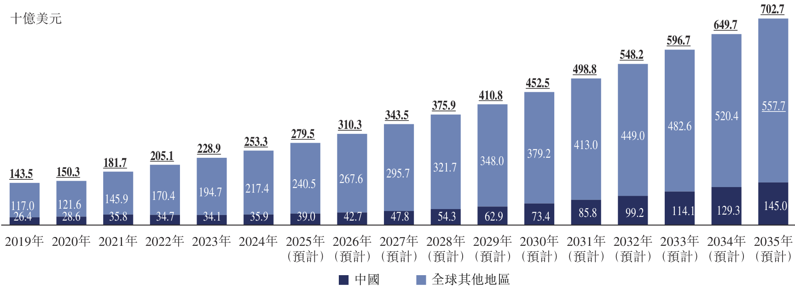

資料來源：年報、專家訪談、文獻綜述、弗若斯特沙利文分析

腫瘤療法的發展

由於生活方式變化、預期壽命延長及其他疾病得以有效控制，癌症已成為人類健康的主要威脅之一。腫瘤最初源於身體的有序活動遭破壞，導致局部細胞分化異常、不受控增殖並逃避身體免疫系統的監視及追蹤。癌症治療的主要挑戰是靶向癌細胞。癌細胞是患者的正常細胞發生突變而產生，因此與患者自身的細胞極為相似。癌細胞能夠入侵附近組織並擴散至較遠的其他身體區域。在治療癌症時，療法必須能夠區分癌細胞與健康細胞。傳統癌症療法正是因靶向問題而極為受限。

手術、放療及化療等常規療法已廣泛用於癌症治療。手術療法是通過手術切除腫瘤及附近組織，最適合仍處於早期發展階段且在一個區域的腫瘤，但不太適合轉移性癌症。放療是通過高劑量的放射來殺死癌細胞及使腫瘤萎縮，包括實體瘤及白血病。然而，放療亦會影響附近的健康細胞，從而導致疲勞、脫髮及皮膚變化等副作用。化療是使用一種或多種抗癌藥物阻止或減緩癌細胞的生長。然而，化療會靶向所有快速增長的細胞，從而導致疲勞、脫髮、容易瘀傷及出血以及感染等副作用。

---

## 第 145 页

遺傳學及細胞生物學的最新進展為多項潛在新療法奠定基礎，該等療法能夠更精準靶向癌細胞且較少損傷健康細胞。當傳統療法不適用或無效時，通常會使用腫瘤精準治療及腫瘤免疫療法等替代新療法。其中三種主要腫瘤療法的作用機制載列如下：

• 靶向療法作用於發生突變及表達出與腫瘤細胞增殖及存活相關的特定靶點，進而抑制癌細胞的生長。相較於傳統療法，靶向療法對正常細胞的損害較小。

• 腫瘤免疫療法作用於免疫系統，包括能夠調節先天免疫應答以清除腫瘤細胞的免疫檢查點。腫瘤免疫療法能夠全面激活免疫系統，所產生的抗腫瘤活性可能會更持久。

• 聯合療法是採用多種療法進行聯合治療。因MoA具有協同效應及毒理學特徵不同，腫瘤免疫療法與化療、靶向藥物及其他腫瘤免疫療法相結合的療法均是能夠產生協同效應的潛在治療策略。

根據弗若斯特沙利文報告，免疫腫瘤療法（特別是免疫檢查點抑制劑）近年來獲得顯著進展，以優異的臨床效益造福癌症患者。此外，免疫腫瘤治療也有邁向一線治療的趨勢。

腫瘤免疫療法概述

在過去十多年間，腫瘤免疫療法已成為一種變革性癌症療法。腫瘤免疫療法的原理是刺激患者自身的免疫系統以產生或增強抗腫瘤免疫反應，進而抑制或清除癌細胞。腫瘤免疫療法包括激活先天免疫的療法，也包括激活適應性免疫的療法。由於能夠提供持久緩解效果，同時對晚期癌症患者具有良好的耐受性，腫瘤免疫療法近年來的發現及發展成為癌症治療領域的里程碑事件。腫瘤免疫療法的主要機制載列如下：

• 以先天免疫為靶向的免疫療法

先天免疫效應因子包括自然殺傷細胞、多形核細胞、巨噬細胞和單核細胞，這些效應因子可利用多種機制直接參與殺腫瘤活性或對抗體調理腫瘤細胞發揮Fc介導的效應功能。相關的信號通路包括CD47/SIRPα、KIR-HLA、CD94-NKG2A、CD24等。

---

## 第 146 页

以適應性免疫為靶向的免疫療法

通過啟動和促進適應性免疫或抑制適應性免疫抵抗，可以有效抑制或控制腫瘤的生長。適應性免疫抵抗是一種過程，指免疫系統試圖攻擊癌細胞，但癌細胞會以反應性方式改變自身，以抵禦這種攻擊。抑制適應性免疫抵抗是對PD-1或PD-L1阻斷抗體產生反應的機理基礎，也可能與其他癌症免疫治療策略的發展有關。相關的信號通路包括CD28-CD80/CD86、CTLA-4-CD80/CD86。

目前，抗腫瘤免疫療法在癌症治療領域發揮著越來越重要的作用。通過探索雙特異性抗體及聯合療法等免疫腫瘤新靶點、新模態，多項惡性腫瘤試驗取得了令人鼓舞的數據結果，如療效提高、不良反應減少。

腫瘤免疫療法的探索與發展

腫瘤免疫療法是全球市場上新興的癌症療法，包括細胞因子療法、治療性癌症疫苗、免疫檢查點抑制劑及過繼性細胞轉移療法。腫瘤免疫療法預期為全球幾乎所有主要癌症類型的患者帶來越來越多臨床效益。

考慮到其結構和作用機制，類抗體藥物（泛指抗體）包括單克隆抗體、雙特異抗體、抗體偶聯藥物(ADC)和融合蛋白，是癌症免疫檢查點療法的新興支柱。目前上市的大多數腫瘤免疫療法（如PD-1、PD-L1及CTLA-4抑制劑以及CAR-T細胞療法）均側重於T細胞，而其他可激活的免疫細胞類型（如巨噬細胞及自然殺傷細胞）仍處於發展階段。

迄今為止，在已發現並開發成功的免疫檢查點單一藥物抗體療法中，處方最廣泛、療效最顯著的是PD-1/PD-L1和CTLA-4單克隆抗體。除了PD-1/PD-L1和CTLA-4，還有其他一些免疫檢查點正在臨床試驗中進行探索，這些免疫檢查點在調節免疫的不同方面亦展現出獨特的功能。

全球及中國腫瘤免疫療法市場

根據弗若斯特沙利文報告，中國腫瘤免疫療法市場規模由2019年的11億美元增長至2024年的41億美元，預計於2030年及2035年分別增至220億美元及689億美元，2024年至2030年的複合年增長率為32.4%，2030年至2035年的複合年增長率為25.7%。此外，全球腫瘤免疫療法市場佔全球腫瘤藥物市場的比例由2019年的20.2%大幅增加至2024年的27.5%。預計2035年全球腫瘤免疫療法市場將佔全球腫瘤藥物市場份額的49.6%。

---

## 第 147 页

目前，約有90%已獲批免疫腫瘤療法為單克隆抗體，其餘類型（如雙特異性抗體、抗體藥物偶聯物（ADC）、融合蛋白）的治療方式則多處於研發階段。截至最後實際可行日期，檢查點抗體市場主要由檢查點PD-1/PD-L1及CTLA-4組成。下圖載有全球市場及中國的腫瘤免疫療法的歷史和預測市場規模，以及腫瘤免疫療法的全球市場份額於所示期間佔全球腫瘤市場的百分比：

2019年至2035年（預計）按地區劃分的全球腫瘤免疫療法市場

<!-- table html -->
<table><tr><td rowspan="2">期間</td><td colspan="3">複合年增長率</td></tr><tr><td>中國</td><td>全球其他地區</td><td>全球</td></tr><tr><td>2019年至2024年</td><td>30.8%</td><td>18.6%</td><td>19.1%</td></tr><tr><td>2024年至2030年 (預計)</td><td>32.4%</td><td>14.3%</td><td>15.8%</td></tr><tr><td>2030年 (預計) 至2035年 (預計)</td><td>25.7%</td><td>13.9%</td><td>15.7%</td></tr></table>
<!-- /table -->

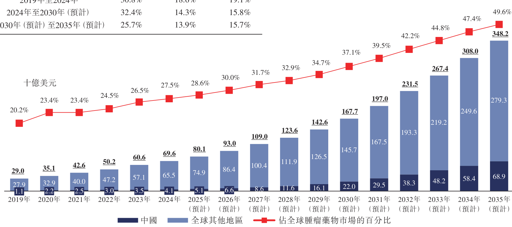

資料來源：年報、專家訪談、文獻綜述、弗若斯特沙利文分析

全球及中國腫瘤免疫療法市場的增長驅動因素

可治療的患者群體不斷增加

由於壽命的延長、人口老齡化、現代久坐的生活方式及肥胖。例如，壽命延長和人口老化在其中扮演重要角色，因為累積的基因損傷及衰退的細胞修復機制導致癌症風險隨年齡增加而上升。此外，根據已審查的大型隊列研究，國際癌症研究機構得出的結論是，一致的證據表明體內脂肪含量越高，患多種癌症的風險越高。全球市場及中國的癌症新發病例數量上升，並預計將持續增長。隨著醫療可及性及支付能力的改善，新發病例數量上升，以及對有效癌症治療的需求不斷增長，將從根本上推動腫瘤免疫療法市場的持續增長。

---

## 第 148 页

此外，目前獲批的腫瘤免疫療法往往會遇到低緩解率、高復發率及其他限制，為免疫療法進一步改善治療效果提供了具吸引力的市場機會。例如，BTC是我們核心產品的其中一個靶向適應症。根據弗若斯特沙利文報告，中國BTC新發病例數量於2024年達到139,800例，預計於2030年及2035年分別增至161,100例及179,100例，2024年至2030年的複合年增長率為2.4%，2030年至2035年的複合年增長率為2.1%。同時，2024年全球BTC新發病例數量達到419,100例，預計於2030年及2035年將分別增至505,000例及582,900例，複合年增長率分別為3.2%及2.9%。我們的主要產品HX301在血腦屏障滲透方面的能力是我們產品的另一個增長驅動因素。HX301使腦部與血漿的接觸率達約70%，表明其可被開發為治療腦膠質母細胞瘤的有前景療法，而腦膠質母細胞瘤是一種具有巨大未獲滿足醫療需求的嚴重惡性腫瘤。

腫瘤免疫療法的適應症擴大及治療線取得進展

在既往未開發的適應症中開發免疫療法將惠及不斷增長的患者群體。例如，PD-1/PD-L1抑制劑於2014年最初獲批用於治療黑色素瘤，而現已獲批用於多種癌症的臨床治療，包括霍奇金淋巴瘤、NSCLC、HNSCC、HCC、RCC及UC。此外，最初獲批用於二線或後線治療的腫瘤免疫療法已逐步推進至一線治療。例如，帕博利珠單抗於2015年獲批用於治療因化療導致的復發或病情有所進展的轉移性NSCLC患者（腫瘤細胞PD-L1表達水平≥1%），而其與化療聯用隨後於2018年獲批用於轉移性NSCLC的一線治療，且未限制PD-L1的表達水平。我們的主要產品HX009亦反映了解決未獲滿足臨床需求及推進治療線的趨勢。例如，HX009是一款針對黑色素瘤患者的一線／二線以上治療方案，也是全球僅有靶向黑色素瘤的PD-1/CD47雙特異性抗體融合蛋白。此外，就膽道癌治療而言，中國首選的BTC一線療法為包括化療及靶向單克隆抗體的聯合療法，需要聯合療法的新型治療方案。免疫療法在一線治療中的臨床應用可顯著增加其可治療患者群體和治療持續時間，從而進一步驅動免疫療法市場規模。

新興的免疫靶點

自CTLA-4抑制劑於2011年獲批，尤其是全球十餘種PD-1/PD-L1抑制劑獲批以來，腫瘤免疫療法市場一直維持高速增長，全球及中國2019年至2024年期間的複合年增長率分別為19.1%及30.8%。腫瘤免疫靶點（包括CD47、OX40、TIGIT等）的出現

---

## 第 149 页

不斷豐富候選藥物集。例如，本公司的HX009是全球僅有的靶向黑色素瘤和膽道癌的PD-1/CD47雙特異性抗體融合蛋白。該等發展表明前景良好的靶向療法管線可能在增長。因此，腫瘤免疫療法市場預計將進一步增長。

現有免疫檢查點抑制劑的局限性

免疫檢查點抑制劑的快速發展已引發若干可能對患者身體造成傷害的安全憂慮。舉例而言，紅細胞相關毒性是CD47靶向藥物的主要關注點。同時，CTLA-4阻斷劑亦因安全性問題而無法更廣泛應用。根據弗若斯特沙利文報告，按已批准CTLA-4單克隆抗體的安全性結果，嚴重不良反應的發生率通常超過50%。

此外，儘管T細胞免疫檢查點抑制劑（如PD-1/PD-L1抗體）已在臨床上廣泛應用（包括作為一線治療），但根據下文所載列PD-1/PD-L1抑制劑的主要適應症緩解率，在幾乎所有主要癌症類型的患者中，僅有約10%至29%的患者能夠從PD-1/PD-L1單一療法中獲益。

PD-1/PD-L1抑制劑主要適應症緩解率

<!-- table html -->
<table><tr><td></td><td>NSCLC</td><td>SCLC</td><td>CRC</td><td>GC</td><td>HNSCC</td><td>HCC</td><td>ESCC</td><td>BTC</td><td>RCC</td><td>OC</td><td>CC</td><td>UC</td><td>STS</td></tr><tr><td>PD-1</td><td>19-20%</td><td>12-19%</td><td>&lt;10%</td><td>13-14%</td><td>13-16%</td><td>16-17%</td><td>19-20%</td><td>3-22%</td><td>22%</td><td>8-15%</td><td>14%</td><td>20-29%</td><td>5-18%</td></tr><tr><td>PD-L1</td><td>14%</td><td>2-10%</td><td></td><td></td><td></td><td></td><td></td><td>5%</td><td></td><td>10%</td><td></td><td>13-24%</td><td></td></tr></table>
<!-- /table -->

附註：

(1) 緩解率基於FDA及國家藥監局的最新標籤，但CRC、GC、SCLC、OC、BTC及STS除外，其基於已發表臨床結果。

(2) 僅列出單一療法的臨床結果。

(3) 不包括輔助治療的結果。不同癌症亞型或臨床試驗的結果可能不同。

(4) 所列臨床結果均來自一般癌症群體（未限制PD-1/PD-L1的表達水平），但CC的緩解率除外，該指標僅限於PD-L1陽性群體（聯合陽性評分≥1）。

(5) NSCLC指非小細胞肺癌；SCLC指小細胞肺癌；RCC指腎細胞癌；HNSCC指頭頸鱗狀細胞癌；UC指尿路上皮癌；HCC指肝細胞癌；CC指宮頸癌；GC指胃癌；ESCC指食管鱗狀細胞癌；CRC指結直腸癌；OC指卵巢癌；BTC指膽道癌；及STS指軟組織肉瘤。

---

## 第 150 页

儘管腫瘤免疫療法可帶來治療益處，但亟需克服接受腫瘤免疫療法的患者的此類局限性，而這需要具備紮實的科學知識及良好的開發策略，以使不良事件維持在可控及最小限度，同時大幅提高總緩解率。

免疫檢查點抑制劑的近期發展

目前，大多數免疫檢查點抑制劑均為單一靶向，且具有上文所討論的局限性，因此需要新治療策略，尤其是能夠有效利用先前已充分研究的靶點並且能夠據此產生協同效應的策略。特別是，聯合療法及雙特異性抗體均是該等類型的協同策略，臨床證據表明，能夠雙重激活先天及適應性免疫系統的聯合療法及雙特異性抗體策略以及免疫療法與其他治療方式的聯用可誘導腫瘤殺傷作用增強並改善臨床結果。

免疫聯合療法的意義在於通過多種機制的協同作用提高治療效果、降低耐藥性、延長生存期及提高生活質量。正在進行的試驗表明，PD-1/PD-L1聯合VEGF抑制劑等靶向療法可能會因腫瘤微環境調節而增強T細胞浸潤。PD-1/PD-L1抑制劑與CD47靶向藥物等更有效聯合療法的研究，將使得聯合療法的種類更加豐富，從而擁有巨大的市場潛力。預計協同治療策略未來將更加多元化，進而提高療效。

雙特異性抗體作為癌症免疫療法的一種新方法，已受到廣泛關注和研究。該等抗體可阻斷參與腫瘤進展的多種信號通路，增強免疫細胞的腫瘤殺傷能力，並降低免疫療法的毒性。於2022年，世界首個PD-1/PD-L1靶向雙特異性抗體藥物卡度尼利獲批上市，開啟了雙特異性抗體治療腫瘤的新篇章。隨著科技不斷進步及市場需求不斷增加，預期雙特異性抗體市場的供應於未來幾年將持續增加，為癌症治療提供更多創新及有效的選擇。

一般而言，雙特異性抗體指含有兩個針對不同表位的抗原結合位點的經改造抗體。雙特異性抗體的結構與由兩條重肽鏈及兩條輕肽鏈組成的常規單克隆抗體可能相似或不同。它們可能會發展成為治療藥物，例如用於治療癌症、炎性疾病及自身免疫疾病的藥物。同時，雙功能融合蛋白指來自不同基因來源（例如天然蛋白）的兩個蛋白結構域通過連接肽融合。融合蛋白具有源自各個組成域的不同功能。許多蛋白質藥物與抗體的一部分融合，以達到更佳的治療效果，如治療癌症及自身免疫疾病。

---

## 第 151 页

就本公司的管線產品而言（特別是HX009及HX044），其具有雙特異性抗體及雙功能融合蛋白混合體的特性，由抗體及融合蛋白組成。本集團研發的HX009是將人類SIRPα蛋白的細胞外CD47結構域嫁接至PD-1重鏈的C端而構成，由於順式結合，有效的PD-1結合將成為BsAb的驅動結合劑，因此HX009可與Teff上的CD47產生更高親和力（即表觀親和力）。同時，SIRPα結構域已顯著降低CD47結合親和力，目的在於減少與CD47+紅細胞及巨核細胞的結合，以降低血液毒性，亦可降低因CD47在正常組織中廣泛表達而產生的抗CD47抗原沉默效應。PD-1的全身性表達很少，但在腫瘤微環境中過度表達，因此HX009能靶向腫瘤，同時減弱與系統中CD47+紅細胞的結合，且其臨床前及臨床研究亦證明了其安全性和有效性。

PD-1/PD-L1抗體抑制劑市場概述

PD-1/PD-L1抗體抑制劑治療機制

PD-1 及其配體 PD-L1 通過逃避腫瘤微環境中的腫瘤免疫監視，在腫瘤惡化及腫瘤生存方面發揮重要作用。PD-1 是 T 細胞表面的一種常見免疫抑制成員，在下調免疫系統和提高自身耐受性中起重要作用。PD-L1 在惡性腫瘤細胞及其他免疫細胞表面過度表達，並與 PD-1 結合，抑制 PD-1 陽性 T 細胞的增殖，從而參與腫瘤的免疫逃逸，引發腫瘤急速生長。PD-1/PD-L1 的通路在癌症的免疫療法中具有重要價值。下圖說明 PD-1/PD-L1 抗體抑制劑治療的機制：

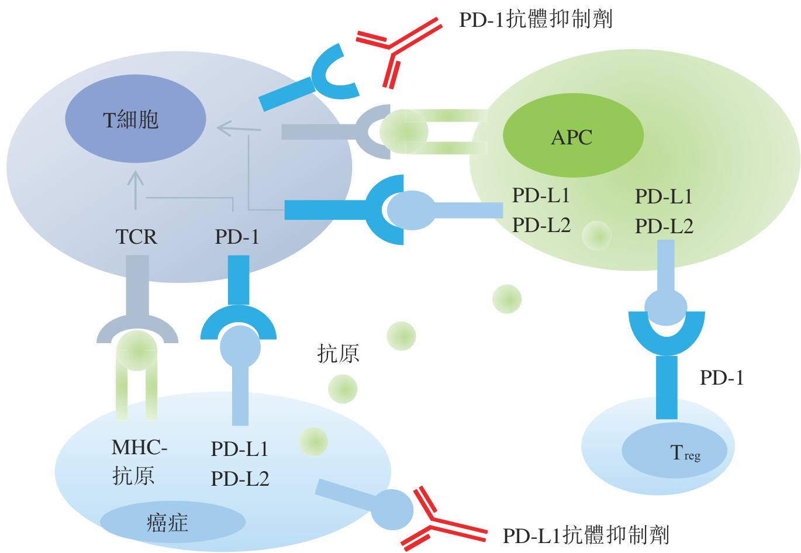

---

## 第 152 页

資料來源：弗若斯特沙利文分析

附註：

(1) 當PD-1與PD-L1/PD-L2結合時，T細胞接收到抑制信號。PD-1及其配體的抑制作用可引發T細胞失能，並阻斷有效的抗腫瘤免疫反應。

(2) PD-1及PD-L1抗體抑制劑可阻斷PD-1與PD-L1的結合、阻斷陰性調控機制、重新活化T細胞對腫瘤的免疫反應，從而達到抗腫瘤作用。

全球及中國PD-1/PD-L1抗體藥物的市場規模

根據弗若斯特沙利文報告，全球PD-1/PD-L1抗體藥物市場在過去五年中快速增長，由2019年的232億美元增至2024年的537億美元，複合年增長率為18.3%。隨著越來越多單克隆抗體及雙特異性抗體上市，預計2030年將達725億美元，2035年將達980億美元，2024年至2030年的複合年增長率為5.1%，2030年至2035年的複合年增長率為6.2%。下圖列示於所示期間全球及中國PD-1/PD-L1抗體藥物的市場規模：

2019年至2035年（預計）全球PD-1/PD-L1抗體藥物市場

<!-- table html -->
<table><tr><td rowspan="3">期間</td><td colspan="3">複合年增長率</td></tr><tr><td>中國</td><td>全球其他地區</td><td>全球</td></tr><tr><td>2019年至2024年</td><td>32.7%</td><td>17.5%</td><td>18.3%</td></tr><tr><td>2024年至2030年（預計）</td><td>21.5%</td><td>3.3%</td><td>5.1%</td></tr><tr><td>2030年（預計）至2035年（預計）</td><td>14.1%</td><td>4.3%</td><td>6.2%</td></tr></table>
<!-- /table -->

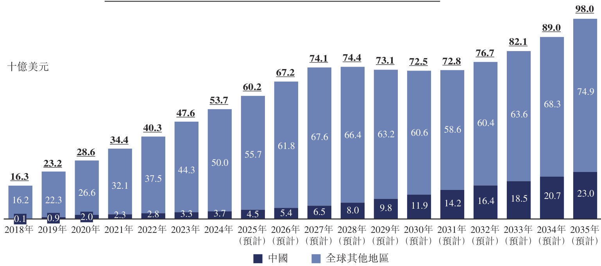

資料來源：年報、專家訪談、文獻綜述、弗若斯特沙利文分析

附註：

(1) 隨著可瑞達(Keytruda)及歐狄沃(Opdivo)的核心專利將於2028年到期，眾多仿製藥將會上市，預計屆時全球抗體藥物市場將因此輕微下滑。根據弗若斯特沙利文報告，隨著原研PD-1/PD-L1的專利到期，仿製藥數量將會激增，收入將會因競爭而下降，且該等經歷專利懸崖的藥物（均為單克隆抗體）的市場規模將在短期內下降。然而，隨著獲批創新藥數量的不斷增加，長遠市場將會擴大。根據行業顧問的資料，具有新靶點的創新藥或雙特異性抗體藥物（例如本公司正在開發的在研產品）出現上述單克隆抗體藥物專利懸崖的市場下滑的可能性較小。因此，我們預期該專利懸崖將不會對本公司核心產品及在研產品的開發過程及商業前景產生重大不利影響。

---

## 第 153 页

截至最後實際可行日期，全球及中國PD-1/PD-L1抗體藥物已上市，適應症包括黑色素瘤、非小細胞肺癌、小細胞肺癌、頭頸部鱗狀細胞癌、淋巴瘤、尿道上皮癌、結直腸癌、肝細胞癌、默克麥克氏細胞癌、腎細胞癌、食管癌、食管胃交界部腺癌、子宮內膜癌、皮膚鱗狀細胞癌、三陰性乳腺癌、胃癌、胃食管結合部腺癌、基底細胞癌、鼻咽癌、惡性胸膜間皮瘤、膽道癌、肺泡軟組織肉瘤、子宮內膜癌、甲狀腺髓樣癌、肛管鱗狀細胞癌及宮頸癌。

PD-1/PD-L1抗體藥物的市場進入壁壘

市場競爭加劇：市場上充斥著多種PD-1/PD-L1抑制劑，令新加入者難以與之競爭。市場競爭日趨激烈，多種用於各種癌症適應症的藥物已獲批，使情況更加複雜，難以駕馭。PD-1/PD-L1雙特異性抗體以其高效低毒的潛力，在競爭環境中擁有廣闊的市場前景，並為癌症免疫療法提供新的治療選擇。隨著臨床研究的進展及新戰略的制定，預期該領域將出現更多突破和商機。

監管審查：監管要求越來越高，更多要求本地臨床數據和與最新標準治療的頭對頭比較的臨床數據。這提高了新加入者的臨床實驗證據門檻並增加了開發風險。FDA對當前PD-1/PD-L1發展趨勢的意見及其在近期審評中的立場表明相關監管審評將變得越來越嚴格。FDA對本地數據和與最新治療標準直接比較的要求提高了臨床試驗證據門檻，增加了創新成本和開發風險。同時，國家藥監局也加強了對創新藥審批的監管，審批要求更加嚴格，對同質研究和偽創新藥的審批更加謹慎。

複雜且昂貴的臨床試驗：面對PD-1/PD-L1市場的複雜格局，在評估新的PD-1/PD-L1療法（尤其是聯合療法）的增量效益方面，監管機構面臨著市場帶來的越來越大的挑戰。因此，監管機構將推動與標準療法頭對頭比較的臨床試驗，甚至可能與具有競爭力的PD-1/PD-L1新療法進行比較。因此，新開發的PD-1/PD-L1抗體需要經過更廣泛的臨床試驗以證明其安全性及有效性。該等試驗通常成本高昂且耗時，且對新加入者而言更具挑戰性。

---

## 第 154 页

PD-1/PD-L1抗體市場的增長驅動因素

持續研究與進步：PD-1/PD-L1抑制劑領域已擴展至各種癌症，可滿足不同患者的需求。正在進行的臨床試驗旨在擴大治療適應症及解決未獲滿足的臨床需求。PD-1/PD-L1抑制劑的聯合療法與PD-1/PD-L1雙特異性抗體無進展生存期及總生存期方面具有顯著療效，並可解決耐藥性及毒性問題。未來研究預計將進一步擴大該等抑制劑的市場。

推向一線治療：PD-1/PD-L1單克隆抗體目前已進行多項一線癌症治療臨床試驗。許多公司正在努力從三線或二線治療邁向一線治療，並持續擴展至局部晚期癌症的鞏固治療及早中期癌症的新輔助治療。因此，更多PD-1/PD-L1單克隆抗體預計近期將獲批用於一線癌症治療。PD-1/PD-L1單克隆抗體作為一線治療的進步顯著擴大了免疫腫瘤學市場，但亦導致耐藥性增加。這種通常由替代免疫檢查點激活引起的耐藥性導致對二線療法的需求不斷增長。HX009作為一種抗PD-1/SIRPα雙功能抗體融合蛋白，通過在腫瘤微環境中共同靶向CD8+T效應細胞並結合CD47，增強免疫應答並克服耐藥性，從而滿足了這一需求。鑒於聯合治療以規避耐藥性的趨勢，HX009的雙靶向機制與該方法良好契合，將其定位為具有前景的二線治療。因此，對一線PD-1/PD-L1治療的耐藥性增加實際上增加了HX009的市場潛力，既有利於市場，也有利於公司的開發及未來商業化努力。

有利政策：自2016年以來，中國的國家衛健委、國家發改委等部門陸續推出政策支持及規範抗腫瘤藥物產業的發展，包括加快新藥審批、優先審批及加強抗腫瘤藥物臨床應用管理。例如，中國國家藥品監督管理局發佈了《雙特異性抗體抗腫瘤藥物臨床開發技術指南》，對開發雙特異性抗體藥物及進行臨床試驗提供了詳細的指導。這有助於本公司加速產品開發。同時，國家醫保目錄談判、納入醫保、進口抗癌藥稅優惠等多種政策不斷提高抗癌藥物的可及性，減輕癌症患者的用藥負擔。截至最後實際可行日期，共有16種PD-1和10種PD-L1單克隆抗體獲批，2種新PD-1雙特異性抗體藥物已上市用於癌症治療。有利的藥品審批政策及醫保政策預計將持續擴大中國PD-1/PD-L1抗體的市場容量。

---

## 第 155 页

全球（包括中國）批准的PD-1/PD-L1雙特異性抗體藥物

目前，有兩種已獲批的PD-1雙特異性抗體藥物，即卡度尼利單抗及依沃西單抗。

<!-- table html -->
<table><tr><td>靶點</td><td>藥物名稱</td><td>公司</td><td>適應症</td><td>治療線</td><td>聯合治療</td><td>批准日期</td><td>劑量</td><td>國家</td><td>醫保</td><td>每療程週期價格</td></tr><tr><td rowspan="2">PD-1、CTLA-4</td><td rowspan="2">卡度尼利單抗開坦尼®</td><td rowspan="2">康方生物</td><td>宮頸癌</td><td>二線</td><td>單藥</td><td>2022/06/28</td><td>此產品透過靜脈輸注給藥。建議劑量為6 mg/kg，每2週一次，直至疾病進展或出現不可耐受毒性。</td><td rowspan="2">中國</td><td rowspan="2">乙類</td><td>約人民幣7,500元</td></tr><tr><td>GC/GEJC</td><td>一線</td><td>聯合氟嘧啶類及含鉑化療藥物</td><td>2024/09/26</td><td>此產品透過靜脈輸注給藥。建議劑量為10 mg/kg，每3週一次，直至疾病進展或出現不可耐受毒性。</td><td>約人民幣11,000元</td></tr><tr><td rowspan="2">PD-1、VEGF</td><td rowspan="2">依沃西單抗依達方®</td><td rowspan="2">康方生物</td><td>EGFR突變的局部晚期或轉移性NSCLC，且經EGFR-TKI治療後惡化的患者</td><td>二線</td><td>聯合培美曲塞及卡鉑</td><td>2024/05/21</td><td rowspan="2">此產品透過靜脈輸注給藥。建議劑量為20 mg/kg，每3週一次，直至疾病進展或出現不可耐受毒性。</td><td rowspan="2">中國</td><td>乙類</td><td>約人民幣10,000元</td></tr><tr><td>PD-L1 TPS ≥ 1%，EGFR突變陰性且ALK陰性的局部晚期或轉移性NSCLC</td><td>一線</td><td>單藥</td><td>2025/04/22</td><td>／</td><td>約人民幣32,000元</td></tr></table>
<!-- /table -->

資料來源：國家藥監局、FDA、公司網站、文獻綜述、弗若斯特沙利文分析

附註：

(1) 行業資料截至2025年12月8日。

(2) GC指胃癌；GEJC指胃食管結合部癌。

(3) 2023年，開坦尼的年度銷售額為人民幣1,357.8百萬元；惟康方生物於2024年並未披露開坦尼及依達方的年度銷售額。

PD-1靶向雙特異性抗體／雙功能融合蛋白的競爭格局

截至最後實際可行日期，有逾40種超過15個靶點的PD-1靶向雙特異性抗體藥物正處於開發階段，包括CD47、CTLA-4、LAG3等，其中大部分仍處在I期及II期。截至最後實際可行日期，全球概無獲批准的CD47/PD-1雙特異性抗體／雙功能融合蛋白產品，而本公司研發的HX009是全球及中國市場僅有的同時靶向PD-1及CD47的雙特異性抗體融合蛋白。

---

## 第 156 页

全球(中國除外)PD-1靶向雙特異性抗體／雙功能融合蛋白管線的競爭格局

<!-- table html -->
<table><tr><td>靶點</td><td>藥物名稱／代碼</td><td>公司</td><td>適應症</td><td>臨床階段</td><td>首次發佈日期</td></tr><tr><td>PD-1、CD47</td><td>HX009</td><td>翰思生物</td><td>晚期實體瘤</td><td>I期*</td><td>2019/09/20</td></tr><tr><td>PD-1、PD-L1</td><td>CTX-8371</td><td>Compass Therapeutics</td><td>NSCLC、TNBC、HNSCC、惡性黑色素瘤</td><td>I期</td><td>2023/11/29</td></tr><tr><td>PD-1、IL21</td><td>AMG256</td><td>安進+信達生物</td><td>晚期實體瘤</td><td>I期</td><td>2020/04/27</td></tr><tr><td>PD-1、HER2</td><td>SSGJ705</td><td>三生制药+三生國健</td><td>晚期或轉移性HER2表達實體瘤</td><td>I期</td><td>2021/12/06</td></tr><tr><td>PD-1、LILRB2</td><td>BSI-585</td><td>Celldex Therapeutics</td><td>實體瘤</td><td>I期</td><td>2023/03/29</td></tr><tr><td rowspan="2">PD-1、IL15</td><td>SOT201</td><td>Sotio Biotech</td><td>晚期／轉移性實體瘤</td><td>I期</td><td>2023/12/08</td></tr><tr><td>ASKG915</td><td>奧赛康+AskGene</td><td>晚期實體瘤</td><td>I期</td><td>2023/05/22</td></tr><tr><td>PD-1、TGFβR2</td><td>INCA33890</td><td>Merus+因赛特</td><td>實體瘤</td><td>I期</td><td>2023/05/01</td></tr><tr><td rowspan="2">PD-1、CD3</td><td rowspan="2">ONO-4685</td><td rowspan="2">Merus+小野製藥</td><td>復發性或難治性T細胞淋巴瘤</td><td>I期</td><td>2021/10/15</td></tr><tr><td>T細胞淋巴瘤及CLL/SLL</td><td>I期</td><td>2024/08/29</td></tr><tr><td rowspan="2">PD-1、IL2R</td><td>PTX-912</td><td>博致生物</td><td>局部晚期／轉移性實體瘤</td><td>I期</td><td>2023/12/19</td></tr><tr><td>TEV-56278</td><td>梯瓦</td><td>晚期實體瘤</td><td>I期</td><td>2024/06/28</td></tr><tr><td rowspan="3">PD-1、IL2RA</td><td>IBI363</td><td>信達生物</td><td>晚期實體惡性腫瘤</td><td>II期</td><td>2024/02/25</td></tr><tr><td></td><td>信達生物+Fortvita</td><td>晚期肺鱗癌</td><td>III期</td><td>2025/10/15</td></tr><tr><td>REGN10597</td><td>再生元製藥</td><td>晚期實體器官惡性腫瘤</td><td>I/II期</td><td>2024/05/14</td></tr><tr><td>PD-1、IL12R</td><td>PF-07921585</td><td>輝瑞</td><td rowspan="2">NSCLC、UC、RCC、黑色素瘤、HNSCC及微衛星穩定型結直腸癌晚期實體瘤</td><td>I期</td><td>2024/08/30</td></tr><tr><td>ANV600</td><td>Anaveon</td><td>晚期實體瘤</td><td>I/II期</td><td>2024/06/19</td></tr><tr><td rowspan="4">PD-1、IL2/15Rβyc</td><td>Eciskafusp alfa</td><td>羅氏</td><td>局部晚期／不可切除或轉移性疾病</td><td>I期</td><td>2020/03/11</td></tr><tr><td></td><td></td><td>非肌層浸潤性膀胱癌</td><td>I期</td><td>2025/02/10</td></tr><tr><td>AWT020</td><td>Anwita Biosciences</td><td>晚期癌症</td><td>I期</td><td>2023/10/23</td></tr><tr><td>SOT201</td><td>SOTIO Biotech</td><td>晚期／轉移性癌症</td><td>I期</td><td>2023/12/08</td></tr><tr><td rowspan="4">PD-1、LAG3</td><td>Tebotelimab</td><td>MacroGenics+再鼎醫藥</td><td>GC、胃食管結合部腺癌</td><td>II/III期</td><td>2019/09/09</td></tr><tr><td>INCA32459</td><td>Merus+因赛特</td><td>晚期實體瘤</td><td>I期</td><td>2017/07/17</td></tr><tr><td>SSGJ-709</td><td>三生制药</td><td>晚期惡性腫瘤</td><td>I期</td><td>2022/10/13</td></tr><tr><td></td><td></td><td>晚期惡性腫瘤</td><td>I期</td><td>2025/06/11</td></tr><tr><td rowspan="3">PD-1、TIM-3</td><td>AZD7789</td><td>阿斯利康</td><td>HL</td><td>I/II期</td><td>2022/02/01</td></tr><tr><td></td><td></td><td>轉移性胃癌或胃食管交界腺癌</td><td>II期</td><td>2023/01/27</td></tr><tr><td rowspan="2">Lomvastomig</td><td rowspan="2">羅氏</td><td>實體瘤</td><td>I期</td><td>2018/10/17</td></tr><tr><td>晚期或轉移性食管鱗狀細胞癌</td><td>II期</td><td>2021/03/08</td></tr><tr><td rowspan="12">PD-1、VEGF</td><td>AI-081</td><td>OncoC4</td><td>晚期實體瘤</td><td>I/II期</td><td>2024/10/08</td></tr><tr><td rowspan="12">依沃西單抗</td><td rowspan="12">康方生物/Summit Therapeutics</td><td>轉移性結直腸癌</td><td>III期</td><td>2025/11/14</td></tr><tr><td>BTC</td><td>II期</td><td>2024/07/26</td></tr><tr><td>皮膚鱗狀細胞癌</td><td>II期</td><td>2024/08/22</td></tr><tr><td>晚期轉移性唾液腺癌</td><td>II期</td><td>2025/01/28</td></tr><tr><td>胸膜間皮瘤</td><td>II期</td><td>2025/02/18</td></tr><tr><td>晚期或轉移性胃／胃食管腺癌</td><td>II期</td><td>2025/02/20</td></tr><tr><td>晚期轉移性唾液腺癌</td><td>II期</td><td>2025/02/26</td></tr><tr><td>子宮內膜癌和宮頸癌</td><td>II期</td><td>2025/04/13</td></tr><tr><td>晚期腎透明細胞癌</td><td>II期</td><td>2025/04/23</td></tr><tr><td>胸腺癌</td><td>II期</td><td>2025/05/20</td></tr><tr><td>TNBC</td><td>II期</td><td>2025/06/12</td></tr><tr><td>晚期HER2陰性胃食管腺癌</td><td>II期</td><td>2025/07/17</td></tr><tr><td>可切除的II至IV期頭頸癌</td><td>II期</td><td>2025/07/30</td></tr><tr><td>NSCLC的活動性腦轉移</td><td>II期</td><td>2025/11/19</td></tr><tr><td>膠質母細胞瘤</td><td>I/II期</td><td>2024/11/04</td></tr><tr><td>結直腸癌</td><td>III期</td><td>2025/10/30</td></tr><tr><td>NSCLC</td><td>III期</td><td>2025/10/30</td></tr><tr><td>SCLC</td><td>II/III期</td><td>2025/11/12</td></tr><tr><td>肝細胞癌</td><td>I/II期</td><td>2025/11/12</td></tr><tr><td>腎細胞癌</td><td>I/II期</td><td>2025/11/12</td></tr><tr><td>PD-1、FCGR2B</td><td>S-4321</td><td>Seismic Therapeutic</td><td>NA</td><td>I期</td><td>2025/03/10</td></tr><tr><td rowspan="5">PD-1、TIGIT</td><td rowspan="5">Rilvegostomig</td><td rowspan="5">阿斯利康</td><td>BTC</td><td>III期</td><td>2023/10/26</td></tr><tr><td>NSCLC</td><td>III期</td><td>2024/10/03</td></tr><tr><td>胃癌</td><td>III期</td><td>2025/01/07</td></tr><tr><td>肝細胞癌</td><td>III期</td><td>2025/04/10</td></tr><tr><td>子宮內膜癌</td><td>III期</td><td>2025/05/25</td></tr><tr><td>晚期或轉移性實體瘤</td><td>I/II期</td><td>2025/08/11</td></tr><tr><td rowspan="12">PD-1、CTLA4</td><td rowspan="12">Volrustomig/MEDIS752</td><td rowspan="12">阿斯利康</td><td>NSCLC</td><td>III期</td><td>2023/08/09</td></tr><tr><td>局部晚期宮頸癌</td><td>III期</td><td>2023/10/12</td></tr><tr><td>不可切除的胸膜間皮瘤</td><td>III期</td><td>2023/10/24</td></tr><tr><td>HNSCC</td><td>III期</td><td>2023/11/13</td></tr><tr><td>晚期腎透明細胞癌</td><td>III期</td><td>2025/06/02</td></tr><tr><td>局部晚期不可切除或轉移性胃癌或胃食管交界腺癌</td><td>II期</td><td>2023/01/27</td></tr><tr><td>HCC、BTC</td><td>II期</td><td>2023/03/20</td></tr><tr><td>晚期實體瘤</td><td>II期</td><td>2023/06/05</td></tr><tr><td>轉移性結直腸癌</td><td>II期</td><td>2025/01/27</td></tr><tr><td>RCC</td><td>I期</td><td>2020/08/21</td></tr><tr><td>軟組織肉瘤</td><td>I期</td><td>2023/04/20</td></tr><tr><td rowspan="4">Vudalimab</td><td rowspan="4">Xencor+Icon Bio</td><td>mCRPC</td><td>II期</td><td>2021/08/13</td></tr><tr><td>晚期婦科和泌尿生殖系統惡性腫瘤</td><td>II期</td><td>2021/09/02</td></tr><tr><td>BTC</td><td>II期</td><td>2022/03/17</td></tr><tr><td>晚期宮頸癌</td><td>II期</td><td>2022/07/22</td></tr><tr><td>NSCLC</td><td>I/II期</td><td>2023/12/15</td></tr><tr><td rowspan="4">Lorigerlimab/MGD019</td><td rowspan="4">MacroGenics</td><td>轉移性癌症、宮頸癌</td><td>II期</td><td>2022/07/26</td></tr><tr><td>前列腺癌</td><td>II期</td><td>2023/05/08</td></tr><tr><td>放射學檢查發現隱匿性分子殘留疾病的結直腸癌</td><td>II期</td><td>2025/07/18</td></tr><tr><td>HCC、RCC、OC、胰管癌</td><td>I期</td><td>2022/03/24</td></tr><tr><td>直腸癌、復發性直腸癌</td><td>II期</td><td>2025/11/03</td></tr><tr><td>PD-1、VEGFR2</td><td>OTP-01</td><td>Ottimo Pharma</td><td>乳腺癌、實體瘤、上皮性卵巢癌</td><td>I/II期</td><td>2025/12/05</td></tr></table>
<!-- /table -->

資料來源：藥審中心、臨床試驗、公司網站、文獻綜述、弗若斯特沙利文分析

---

## 第 157 页

附註：

(1) 臨床階段指最新的臨床試驗及首次發佈日期。

(2) 首次發佈日期指研究記錄首次於 Chinadrugtrials.org.cn 或 Clinicaltrials.gov 上發佈的日期。

(3) 本公司於2023年5月獲得美國食藥監局批准可開展HX009 Ib/II期治療DLBCL的研究。

(4) 公司資料來自本公司，行業資料截至最後實際可行日期。

中國PD-1靶向雙特異性抗體／雙功能融合蛋白管線的競爭格局

<!-- table html -->
<table><tr><td>靶點</td><td>藥物名稱／代碼</td><td>公司</td><td>適應症</td><td>臨床階段／CDE受理日期</td><td>首次發佈日期</td></tr><tr><td rowspan="4">PD-1、CD47</td><td rowspan="4">HX009</td><td rowspan="4">翰思生物</td><td>TNBC</td><td>IND</td><td>2024/12/06</td></tr><tr><td>黑色素瘤</td><td>II期</td><td>2024/11/14</td></tr><tr><td>BTC</td><td>II期</td><td>2025/01/06</td></tr><tr><td>復發性／難治性淋巴瘤</td><td>I/II期</td><td>2022/01/12</td></tr><tr><td>晚期惡性實體瘤</td><td>I期</td><td>2019/11/12</td></tr><tr><td>PD-1、CD73</td><td>AK131</td><td>康方生物</td><td>晚期實體瘤</td><td>Ia/Ib期</td><td>2023/12/11</td></tr><tr><td rowspan="10">PD-1、TIGIT</td><td rowspan="3">Rilvegostomig /AZD2936</td><td rowspan="3">阿斯利康</td><td>NSCLC</td><td>III期</td><td>2024/12/19</td></tr><tr><td>BTC</td><td>III期</td><td>2025/01/06</td></tr><tr><td>HER2+胃癌</td><td>III期</td><td>2025/02/24</td></tr><tr><td>HCC</td><td>III期</td><td>2025/04/09</td></tr><tr><td>局部晚期可切除胃食管腺癌</td><td>II期</td><td>2025/07/03</td></tr><tr><td>HCC</td><td>III期</td><td>2024/08/28</td></tr><tr><td>BTC</td><td>II期</td><td>2025/03/04</td></tr><tr><td>晚期實體瘤</td><td>II期</td><td>2025/03/26</td></tr><tr><td>宮頸癌</td><td>I/II期</td><td>2023/12/28</td></tr><tr><td>晚期神經內分泌癌</td><td>I/II期</td><td>2024/05/28</td></tr><tr><td>復發性／難治性淋巴瘤</td><td>I/II期</td><td>2025/03/13</td></tr><tr><td>NSCLC</td><td>I/II期</td><td>2025/03/25</td></tr><tr><td>晚期宮頸癌</td><td>I/II期</td><td>2025/07/23</td></tr><tr><td>晚期實體瘤</td><td>I/II期</td><td>2025/08/27</td></tr><tr><td>晚期惡性腫瘤</td><td>Ib期</td><td>2022/04/19</td></tr><tr><td>實體瘤</td><td>I期</td><td>2023/02/02</td></tr><tr><td>BC008-1A</td><td>REMD Biotherapeutics+步長製藥</td><td>神經膠質瘤</td><td>I期</td><td>2024/11/19</td></tr><tr><td rowspan="4">PD-1、IL2</td><td rowspan="2">IBI363</td><td rowspan="2">信達生物+Fortvita</td><td>黑色素瘤</td><td>II期</td><td>2025/01/22</td></tr><tr><td>晚期實體瘤／淋巴瘤</td><td>Ia/Ib期</td><td>2022/07/11</td></tr><tr><td>晚期惡性腫瘤</td><td>I期</td><td>2024/05/09</td></tr><tr><td>晚期肺鱗癌</td><td>III期</td><td>2025/10/15</td></tr><tr><td>晚期／轉移性實體瘤</td><td>I期</td><td>2022/12/08</td></tr><tr><td>SHR-5495</td><td>恒瑞醫藥</td><td>晚期實體瘤</td><td>I期</td><td>2023/09/27</td></tr><tr><td rowspan="2">PD-1、HER2</td><td>IBI315</td><td>信達生物+韓美藥品</td><td>HER2+晚期惡性腫瘤</td><td>Ia/Ib期</td><td>2019/11/04</td></tr><tr><td>SSGJ-705</td><td>三生制药</td><td>晚期或轉移性HER2表達實體瘤</td><td>II期</td><td>2025/06/19</td></tr><tr><td rowspan="2">PD-1、PD-L1</td><td rowspan="2">SSGJ-706</td><td rowspan="2">三生制药</td><td>晚期非小細胞肺癌</td><td>II期</td><td>2025/09/12</td></tr><tr><td>胃癌</td><td>II期</td><td>2025/11/18</td></tr><tr><td rowspan="10">PD-1、VEGF</td><td rowspan="2">SSGJ-707</td><td rowspan="2">三生制药+漢恒生物+三生國健</td><td>NSCLC</td><td>III期</td><td>2025/05/16</td></tr><tr><td>轉移性結直腸癌</td><td>II期</td><td>2024/07/01</td></tr><tr><td>晚期婦科癌症</td><td>II期</td><td>2024/08/06</td></tr><tr><td>實體瘤</td><td>I期</td><td>2023/08/10</td></tr><tr><td>NSCLC</td><td>I期</td><td>2025/02/19</td></tr><tr><td rowspan="2">JS207</td><td rowspan="2">君實生物</td><td>NSCLC</td><td>II期</td><td>2025/03/07</td></tr><tr><td>晚期結直腸癌</td><td>II期</td><td>2025/03/10</td></tr><tr><td>HCC</td><td>II期</td><td>2025/04/10</td></tr><tr><td>TNBC</td><td>II期</td><td>2025/06/26</td></tr><tr><td>LM-299</td><td>禮新醫藥技術</td><td>晚期實體瘤</td><td>I/II期</td><td>2024/09/14</td></tr><tr><td rowspan="3">MHB039A</td><td rowspan="2">明慧醫藥</td><td>晚期乳腺癌或其他晚期惡性實體瘤</td><td>II期</td><td>2025/08/19</td></tr><tr><td>晚期實體瘤</td><td>I/II期</td><td>2024/03/01</td></tr><tr><td>晚期肺癌</td><td>I/II期</td><td>2025/11/17</td></tr><tr><td>SCTB14</td><td>神州細胞工程有限公司</td><td>NSCLC</td><td>III期</td><td>2025/11/28</td></tr><tr><td rowspan="15">Ivonescimab</td><td rowspan="15">康方生物／Summit Therapeutics</td><td>復發性或轉移性頭頸鱗狀細胞癌 (R/M HNSCC)</td><td>III期</td><td>2024/09/11</td></tr><tr><td>轉移性結直腸癌</td><td>III期</td><td>2025/03/11</td></tr><tr><td>TNBC</td><td>III期</td><td>2025/01/08</td></tr><tr><td>轉移性胰腺癌</td><td>III期</td><td>2025/04/24</td></tr><tr><td>SCLC</td><td>III期</td><td>2025/05/21</td></tr><tr><td>晚期婦科腫瘤</td><td>II期</td><td>2021/03/04</td></tr><tr><td>HCC</td><td>II期</td><td>2022/06/23</td></tr><tr><td>復發性卵巢癌</td><td>II期</td><td>2024/08/08</td></tr><tr><td>食管鱗狀細胞癌</td><td>II期</td><td>2024/11/06</td></tr><tr><td>軟組織肉瘤</td><td>II期</td><td>2025/04/27</td></tr><tr><td>PD-1耐藥復發性或轉移性鼻咽癌</td><td>II期</td><td>2025/06/24</td></tr><tr><td>pMMR/MSS中低位直腸癌</td><td>II期</td><td>2025/09/09</td></tr><tr><td>具有可操作基因組改變(AGA)且既往TKI治療失敗的NSCLC患者</td><td>II期</td><td>2025/09/08</td></tr><tr><td>轉移性黏膜黑色素瘤</td><td>I期</td><td>2024/05/16</td></tr><tr><td>NSCLC</td><td>I期</td><td>2025/12/05</td></tr><tr><td rowspan="3">PD-1、TGF-β</td><td>LBL-015</td><td>維立志博</td><td>晚期實體瘤</td><td>I/II期</td><td>2021/09/22</td></tr><tr><td>TQB2868</td><td>正大天晴</td><td>轉移性胰腺癌</td><td>III期</td><td>2025/09/10</td></tr><tr><td>JS201</td><td>君實生物</td><td>HCC</td><td>Ib/II期</td><td>2023/02/27</td></tr><tr><td rowspan="4">IAP0971</td><td rowspan="2">盛禾生物</td><td>晚期惡性腫瘤</td><td>I/IIa期</td><td>2022/06/02</td></tr><tr><td>非肌層浸潤性膀胱癌</td><td>I/II期</td><td>2023/12/18</td></tr><tr><td>NSCLC</td><td>Ib/II期</td><td>2024/01/18</td></tr><tr><td>ASKG915</td><td>奧賽康+AskGene Pharma</td><td>晚期惡性腫瘤</td><td>I期</td><td>2023/09/15</td></tr><tr><td>JMT108</td><td>津曼特生物科技</td><td>實體瘤</td><td>I/II期</td><td>2025/03/12</td></tr><tr><td></td><td></td><td>黑色素瘤</td><td>I/II期</td><td>2025/12/02</td></tr></table>
<!-- /table -->

---

## 第 158 页

行業概覽

<!-- table html -->
<table><tr><td>靶點</td><td>藥物名稱／代碼</td><td>公司</td><td>適應症</td><td>臨床階段/CDE受理日期</td><td>首次發佈日期</td></tr><tr><td rowspan="16">PD-1、CTLA4</td><td rowspan="12">Cadonilimab</td><td rowspan="12">康方生物</td><td>HCC</td><td>III期</td><td>2022/08/08</td></tr><tr><td>鼻咽癌</td><td>III期</td><td>2022/10/19</td></tr><tr><td>NSCLC</td><td>III期</td><td>2023/07/13</td></tr><tr><td>晚期／轉移性腎細胞癌</td><td>II期</td><td>2022/01/04</td></tr><tr><td>晚期卵巢癌</td><td>II期</td><td>2022/06/24</td></tr><tr><td>mCRC</td><td>II期</td><td>2023/02/18</td></tr><tr><td>胰腺癌</td><td>II期</td><td>2023/03/21</td></tr><tr><td>晚期子宮內膜癌</td><td>II期</td><td>2023/04/21</td></tr><tr><td>外陰癌</td><td>II期</td><td>2023/06/27</td></tr><tr><td>HNHCC</td><td>II期</td><td>2023/09/04</td></tr><tr><td>局部晚期或轉移性HER2尿道上皮癌</td><td>II期</td><td>2023/12/12</td></tr><tr><td>晚期軟組織肉瘤</td><td>II期</td><td>2024/04/16</td></tr><tr><td>TNBC</td><td>II期</td><td>2024/04/16</td></tr><tr><td>SCLC</td><td>II期</td><td>2024/05/06</td></tr><tr><td>黑色素瘤</td><td>II期</td><td>2024/09/30</td></tr><tr><td>食管鱗狀細胞癌</td><td>II期</td><td>2025/12/02</td></tr><tr><td>復發性或轉移性宮頸癌</td><td>III期</td><td>2025/01/24</td></tr><tr><td>晚期或轉移性HNSCC</td><td>III期</td><td>2025/01/14</td></tr><tr><td>胸膜間皮瘤</td><td>III期</td><td>2024/12/27</td></tr><tr><td>NSCLC</td><td>III期</td><td>2025/01/24</td></tr><tr><td>GC</td><td>II期</td><td>2023/02/01</td></tr><tr><td>BTC/HCC</td><td>II期</td><td>2023/03/24</td></tr><tr><td>結直腸癌</td><td>II期</td><td>2025/01/27</td></tr><tr><td rowspan="4">Danvilostomig/SI-B003</td><td rowspan="4">百利天恒</td><td>局部晚期或轉移性食道癌、胃癌、結直腸癌及其他胃腸道腫瘤</td><td>II期</td><td>2023/08/23</td></tr><tr><td>SCLC</td><td>II期</td><td>2023/06/21</td></tr><tr><td>晚期或轉移性非小細胞肺癌、鼻咽癌及其他實體瘤</td><td>II期</td><td>2023/07/10</td></tr><tr><td>局部晚期或轉移性尿道上皮癌及其他實體瘤</td><td>II期</td><td>2023/07/28</td></tr><tr><td>復發性或轉移性HNSCC</td><td>II期</td><td>2024/11/01</td></tr><tr><td>局部晚期或轉移性HER2陰性胃癌或胃食管交界腺癌</td><td>I/II期</td><td>2024/07/17</td></tr><tr><td>復發性或難治性典型霍奇金淋巴瘤</td><td>I/II期</td><td>2024/08/25</td></tr><tr><td>晚期實體瘤</td><td>I/II期</td><td>2025/03/25</td></tr><tr><td>晚期實體瘤</td><td>I期</td><td>2025/12/04</td></tr><tr><td rowspan="2">PD-1、4IBB</td><td>IBI319</td><td>Adimab+禮來+信達生物</td><td>實體瘤或血液腫瘤</td><td>Ia/Ib期</td><td>2021/01/08</td></tr><tr><td>BAT7111</td><td>百奧泰</td><td>晚期實體瘤</td><td>I/II期</td><td>2025/05/15</td></tr><tr><td>PD-1、CD40</td><td>YH008</td><td>Eucure Technology</td><td>晚期實體瘤</td><td>I期</td><td>2023/09/27</td></tr><tr><td>BIS5</td><td>健信生物醫藥</td><td>晚期實體瘤</td><td>II期</td><td>2024/05/20</td></tr><tr><td rowspan="2">PD-1、TIM-3</td><td>Sabestomig/AZD7789</td><td>阿斯利康</td><td>NSCLC</td><td>I/IIa期</td><td>2023/01/28</td></tr><tr><td>PD-1、IL21R</td><td>CD-001</td><td>乘典（蘇州）生物醫藥</td><td>晚期實體瘤</td><td>I期</td><td>2025/01/03</td></tr><tr><td>PD-1、IL2/15Rβyc</td><td>AWT020</td><td>君實生物</td><td>晚期實體瘤</td><td>I期</td><td>2025/02/11</td></tr><tr><td>PD-1、IL10R</td><td>FP008</td><td>珠海菲鵬製藥</td><td>晚期實體瘤</td><td>I期</td><td>2025/05/16</td></tr></table>
<!-- /table -->

資料來源：藥審中心、臨床試驗、公司網站、文獻綜述、弗若斯特沙利文分析

附註：

(1) 臨床階段指最新的臨床試驗及首次發佈日期。

(2) 首次發佈日期指研究記錄首次於 Chinadrugtrials.org.cn 或 Clinicaltrials.gov 上發佈的日期。

(3) ccRCC指腎透明細胞癌；AML是指急性髓系白血病；MDS指骨髓增生異常綜合徵。

(4) 公司資料來自本公司，行業資料截至最後實際可行日期。

PD-L1靶向雙特異性抗體／雙功能融合蛋白的競爭格局

目前，超過50種靶點超過15個的PD-L1靶向雙特異性抗體藥物在研，包括CD47、CTLA-4、TGFβ等，且大部分仍處在I期及II期。

---

## 第 159 页

全球（中國除外）PD-L1靶向雙特異性抗體／雙功能融合蛋白管線的競爭格局

<!-- table html -->
<table><tr><td>靶點</td><td>藥物名稱／代碼</td><td>公司</td><td>適應症</td><td>臨床階段</td><td>首次發佈日期</td></tr><tr><td>PD-L1、CD27</td><td>CDX-527</td><td>Celldex Therapeutics</td><td>實體瘤</td><td>I期</td><td>2020/06/22</td></tr><tr><td rowspan="3">PD-L1、CD47</td><td>LB101</td><td>LogicBio Therapeutics</td><td>晚期實體瘤</td><td>I/II期</td><td>2023/04/20</td></tr><tr><td>BAT7104</td><td>百奧泰</td><td>晚期惡性實體瘤</td><td>Ib/II期</td><td>2024/07/22</td></tr><tr><td>IBI322</td><td>信達生物</td><td>晚期惡性腫瘤淋巴瘤</td><td>I期</td><td>2020/04/08</td></tr><tr><td rowspan="2">PD-L1、PD-1</td><td>LY3434172</td><td>Adimab+禮來+信達生物</td><td>晚期癌症</td><td>I期</td><td>2019/05/03</td></tr><tr><td>CTX-8371</td><td>Compass Therapeutics</td><td>NSCLC、HNSCC、TNBC、HL、惡性黑色素瘤</td><td>I期</td><td>2023/11/29</td></tr><tr><td>PD-L1、PD-L2</td><td>IMGS-001</td><td>ImmunoGenesis</td><td>實體瘤</td><td>I期</td><td>2023/08/28</td></tr><tr><td rowspan="2">PD-L1、TIGIT</td><td>HLX301</td><td>復星醫藥</td><td>局部晚期或轉移性實體瘤</td><td>I/II期</td><td>2021/11/01</td></tr><tr><td>HB0036</td><td>華海藥業+華博生物+華奧泰生物</td><td>晚期實體瘤NSCLC</td><td>I/II期</td><td>2022/06/14</td></tr><tr><td rowspan="2">PD-L1、TGF-β</td><td>CN202</td><td>同潤生物</td><td>實體瘤、血液惡性腫瘤</td><td>I/II期</td><td>2021/08/31</td></tr><tr><td>BJ-005</td><td>博際生物</td><td>晚期實體瘤或淋巴瘤</td><td>I期</td><td>2021/11/10</td></tr><tr><td>PD-L1、NKG2A</td><td>XB628</td><td>Exelixis</td><td>復發性晚期或轉移性實體瘤</td><td>I期</td><td>2025/04/23</td></tr><tr><td rowspan="9">PD-L1、4-1BB</td><td rowspan="2">Acasunlimab/GEN1046</td><td rowspan="2">BioNTech+Genmab</td><td>PD-L1陽性轉移性NSCLC</td><td>III期</td><td>2024/10/08</td></tr><tr><td>黑色素瘤</td><td>II期</td><td>2025/05/14</td></tr><tr><td>PRS-344/S095012</td><td>Pieris Pharma+施維雅</td><td>實體瘤</td><td>I/II期</td><td>2021/12/16</td></tr><tr><td>AP203</td><td>圓祥生技</td><td>局部晚期或轉移性實體瘤,、NSCLC、HNSCC、ESCC</td><td>I/II期</td><td>2022/07/25</td></tr><tr><td>MCLA-145</td><td>Merus+因賽特</td><td>晚期癌症、實體瘤、B細胞淋巴瘤</td><td>I期</td><td>2019/04/19</td></tr><tr><td>FS222</td><td>Iontas+invoX+F-star</td><td>晚期癌症、轉移性癌症</td><td>I期</td><td>2021/02/05</td></tr><tr><td>ABL503</td><td>I-Mab+ABL Bio+HANDOK</td><td>晚期實體瘤</td><td>I期</td><td>2021/02/21</td></tr><tr><td>Xirestomig/YN051</td><td>德琪醫藥</td><td>晚期實體瘤</td><td>I期</td><td>2021/08/03</td></tr><tr><td>BH3120</td><td>韓美藥品</td><td>晚期或轉移性實體瘤</td><td>I期</td><td>2024/01/31</td></tr><tr><td rowspan="9">PD-L1、VEGF</td><td rowspan="2">BNT327</td><td rowspan="2">BioNTech+普米斯生物技術</td><td>mTNBC</td><td>II期</td><td>2024/06/07</td></tr><tr><td>小細胞肺癌</td><td>II期</td><td>2024/06/07</td></tr><tr><td>NSCLC</td><td>III期</td><td>2024/11/26</td></tr><tr><td>SCLC</td><td>III期</td><td>2024/12/02</td></tr><tr><td>三陰性乳腺癌</td><td>III期</td><td>2025/09/05</td></tr><tr><td>未經治療、不可切除或轉移性結直腸癌</td><td>II/III期</td><td>2025/10/27</td></tr><tr><td>既往未經治療的晚期或轉移性胃癌、胃食管交界腺癌或食道癌</td><td>II/III期</td><td>2025/10/27</td></tr><tr><td>實體瘤</td><td>II期</td><td>2025/04/23</td></tr><tr><td>晚期結直腸癌</td><td>I/II期</td><td>2025/07/23</td></tr><tr><td>晚期實體瘤</td><td>I/II期</td><td>2025/08/29</td></tr><tr><td>PD-L1、IL2/15Rβyc</td><td>SIM0237</td><td>先聲藥業+新鄉製藥+先聲再明</td><td>局部晚期不可切除的或轉移性實體瘤</td><td>I期</td><td>2023/03/23</td></tr><tr><td>PD-L1、OX40</td><td>EMB-09</td><td>岸邁生物</td><td>晚期實體瘤</td><td>I期</td><td>2022/03/02</td></tr><tr><td>PD-L1、LAG-3</td><td>ABL 501</td><td>ABLBio+HANDOK</td><td>晚期實體瘤</td><td>I期</td><td>2021/11/01</td></tr><tr><td>PD-L1、PD-L2</td><td>IMGS-001</td><td>ImmunoGenesis</td><td>實體瘤</td><td>I期</td><td>2023/08/28</td></tr></table>
<!-- /table -->

資料來源：藥審中心、臨床試驗、公司網站、文獻綜述、弗若斯特沙利文分析

附註：

(1) 臨床階段指最新的臨床試驗及首次發佈日期。

(2) 首次發佈日期指研究記錄首次於Chinadrugtrials.org.cn或Clinicaltrials.gov上發佈的日期。

(3) 本公司於2023年5月獲得美國食藥監局批准可開展HX009 Ib/II期治療DLBCL的研究。

(4) 公司資料來自本公司，行業資料截至最後實際可行日期。

---

## 第 160 页

中國PD-L1靶向雙特異性抗體／雙功能融合蛋白管線的競爭格局

<!-- table html -->
<table><tr><td>靶點</td><td>藥物名稱／代碼</td><td>公司</td><td>適應症</td><td>臨床階段</td><td>首次發佈日期</td></tr><tr><td rowspan="9">PD-L1, 4-1BB</td><td rowspan="4">LBL-024</td><td rowspan="4">維立志博</td><td>晚期實體瘤</td><td>II期</td><td>2025/01/21</td></tr><tr><td>晚期實體瘤(BTC&amp;HCC)</td><td>II期</td><td>2025/08/08</td></tr><tr><td>晚期神經內分泌腫瘤</td><td>I/II期</td><td>2023/12/07</td></tr><tr><td>晚期黑色素瘤</td><td>I/II期</td><td>2025/08/01</td></tr><tr><td>PM1003</td><td>普米斯生物技術</td><td>晚期實體瘤</td><td>I/II期</td><td>2021/09/30</td></tr><tr><td>ATG-101</td><td>德琪醫藥</td><td>晚期／轉移性實體瘤、瀰漫性大B細胞非霍奇金淋巴瘤</td><td>I期</td><td>2022/03/29</td></tr><tr><td>HK010</td><td>安科生物+瀚科邁博</td><td>晚期惡性腫瘤</td><td>I期</td><td>2023/02/06</td></tr><tr><td>BH3120</td><td>韓美藥品</td><td>晚期或轉移性實體瘤</td><td>I期</td><td>2024/01/31</td></tr><tr><td rowspan="2">QLF31907</td><td rowspan="2">齊魯製藥</td><td>晚期實體瘤</td><td>I/II期</td><td>2024/04/24</td></tr><tr><td>晚期惡性黑色素瘤、晚期UC</td><td>II期</td><td>2023/03/21</td></tr><tr><td rowspan="2">PD-L1, IL15</td><td>SIM0237</td><td>先聲藥業+新鄉製藥</td><td>非肌層浸潤性膀胱癌</td><td>I期</td><td>2023/12/18</td></tr><tr><td>BAT7205</td><td>百奧泰</td><td>晚期實體瘤</td><td>I期</td><td>2024/04/01</td></tr><tr><td>PD-L1, LAG-3</td><td>IBI323</td><td>信達生物</td><td>晚期惡性腫瘤</td><td>I期</td><td>2021/06/01</td></tr><tr><td rowspan="2">PD-L1, CLDN-18.2</td><td rowspan="2">Q-1802</td><td rowspan="2">啟愈生物</td><td>胃腸道癌</td><td>I/II期</td><td>2023/05/16</td></tr><tr><td>晚期實體瘤</td><td>I期</td><td>2021/04/14</td></tr><tr><td rowspan="6">PD-L1, CTLA-4</td><td>SKB337</td><td>科倫藥業+Klus Pharma</td><td>晚期實體瘤</td><td>I期</td><td>2021/05/20</td></tr><tr><td rowspan="6">Erfonrilimab / KN046</td><td rowspan="6">康寧傑瑞</td><td>晚期鱗狀NSCLC</td><td>III期</td><td>2020/07/27</td></tr><tr><td>晚期胰腺癌</td><td>III期</td><td>2021/12/03</td></tr><tr><td>晚期不可切除或轉移性ESCC</td><td>II期</td><td>2019/04/25</td></tr><tr><td>局部晚期HER2陽性實體瘤</td><td>II期</td><td>2020/08/20</td></tr><tr><td>晚期HCC</td><td>II期</td><td>2020/09/02</td></tr><tr><td>消化系統癌症</td><td>II期</td><td>2023/10/20</td></tr><tr><td>晚期胃腸道腫瘤</td><td>I/II期</td><td>2020/11/03</td></tr><tr><td rowspan="9">PD-L1, CD47</td><td rowspan="4">6MW3211</td><td rowspan="4">邁威生物</td><td>晚期肺癌</td><td>II期</td><td>2022/06/13</td></tr><tr><td>晚期ccRCC</td><td>II期</td><td>2022/06/28</td></tr><tr><td>復發性及難治性淋巴瘤</td><td>II期</td><td>2022/07/04</td></tr><tr><td>AML、MDS</td><td>II期</td><td>2023/01/31</td></tr><tr><td>晚期惡性腫瘤</td><td>I/II期</td><td>2021/08/24</td></tr><tr><td>IBC0966</td><td>宜明昂科</td><td>晚期惡性腫瘤</td><td>I/II期</td><td>2021/07/08</td></tr><tr><td rowspan="2">IBI322</td><td rowspan="2">信達生物</td><td>晚期惡性腫瘤</td><td>I期</td><td>2020/03/30</td></tr><tr><td>血液惡性腫瘤</td><td>I期</td><td>2021/03/19</td></tr><tr><td>SG12473</td><td>尚健生物</td><td>晚期惡性腫瘤</td><td>I期</td><td>2021/05/13</td></tr><tr><td rowspan="2">SH009</td><td rowspan="2">聖和藥業</td><td>晚期惡性腫瘤</td><td>I期</td><td>2022/07/01</td></tr><tr><td>NSCLC</td><td>I期</td><td>2025/05/16</td></tr><tr><td>IMM2520</td><td>宜明昂科</td><td>晚期實體瘤</td><td>I期</td><td>2023/02/07</td></tr><tr><td>BAT7104</td><td>百奧泰</td><td>晚期癌症</td><td>I期</td><td>2022/02/22</td></tr><tr><td rowspan="16">PD-L1, VEGF</td><td rowspan="12">PM8002</td><td rowspan="12">BioNTech+普米斯生物技術</td><td>TNBC</td><td>III期</td><td>2024/05/24</td></tr><tr><td>SCLC</td><td>III期</td><td>2024/09/27</td></tr><tr><td>NSCLC</td><td>II/III期</td><td>2023/03/13</td></tr><tr><td>惡性間皮瘤</td><td>II期</td><td>2022/05/05</td></tr><tr><td>肝細胞癌</td><td>II期</td><td>2022/06/08</td></tr><tr><td>腎癌</td><td>II期</td><td>2022/11/04</td></tr><tr><td>神經內分泌腫瘤</td><td>II期</td><td>2022/12/22</td></tr><tr><td>晚期子宮內膜癌</td><td>II期</td><td>2023/02/02</td></tr><tr><td>MSS或MSI-L/pMMR轉移性結直腸癌</td><td>II期</td><td>2025/05/26</td></tr><tr><td>胰腺癌</td><td>II期</td><td>2025/12/05</td></tr><tr><td>晚期結直腸癌</td><td>I/II期</td><td>2025/07/23</td></tr><tr><td>晚期實體瘤</td><td>I/II期</td><td>2025/08/29</td></tr><tr><td rowspan="4">HB0025 (Sotiburafusp alfa)</td><td rowspan="4">華奧泰生物+華博生物+華海生物</td><td>腎癌</td><td>II期</td><td>2022/11/04</td></tr><tr><td>晚期子宮內膜癌</td><td>II期</td><td>2023/02/02</td></tr><tr><td>TNBC</td><td>II期</td><td>2025/05/21</td></tr><tr><td>結直腸癌</td><td>II期</td><td>2025/12/08</td></tr><tr><td>晚期實體瘤</td><td>I/II期</td><td>2023/07/13</td></tr><tr><td rowspan="2">IMM2510</td><td rowspan="2">宜明昂科</td><td>晚期實體瘤</td><td>I期</td><td>2021/06/15</td></tr><tr><td>NSCLC</td><td>II期</td><td>2024/12/26</td></tr><tr><td rowspan="2">B1962</td><td rowspan="2">天士力醫藥</td><td>實體瘤</td><td>II期</td><td>2024/11/07</td></tr><tr><td>晚期結直腸癌</td><td>II期</td><td>2024/12/27</td></tr><tr><td>CVL006</td><td>甫康健康科技</td><td>晚期實體瘤</td><td>I期</td><td>2024/11/08</td></tr><tr><td>SG1408</td><td>尚健生物</td><td>晚期惡性實體瘤</td><td>I期</td><td>2022/11/02</td></tr><tr><td rowspan="3">PD-L1, VEGF</td><td>Palverafusp alfa</td><td>宜明昂科</td><td>NSCLC、TNBC</td><td>II期</td><td>2024/12/26</td></tr><tr><td>HLX37</td><td>復宏漢霖</td><td>NSCLC</td><td>I期</td><td>2025/12/03</td></tr><tr><td>PD-L1, CD40</td><td>B901</td><td>明濟生物</td><td>實體瘤</td><td>I/II期</td><td>2025/06/13</td></tr></table>
<!-- /table -->

---

## 第 161 页

<!-- table html -->
<table><tr><td>靶點</td><td>藥物名稱／代碼</td><td>公司</td><td>適應症</td><td>臨床階段</td><td>首次發佈日期</td></tr><tr><td rowspan="16">PD-L1、TGF-β</td><td rowspan="9">SHR-1701</td><td rowspan="9">恒瑞+盛迪亞生物</td><td>胃癌</td><td>NDA</td><td>2024/09/20</td></tr><tr><td>非鱗狀NSCLC</td><td>III期</td><td>2021/11/17</td></tr><tr><td>宮頸癌</td><td>III期</td><td>2021/11/22</td></tr><tr><td>SCCHN</td><td>II期</td><td>2020/12/08</td></tr><tr><td>晚期惡性實體瘤</td><td>II期</td><td>2021/07/22</td></tr><tr><td>局部晚期直腸癌</td><td>II期</td><td>2022/03/28</td></tr><tr><td>胰腺癌</td><td>Ib/II期</td><td>2020/11/09</td></tr><tr><td>復發性或晚期NSCLC</td><td>Ib/II期</td><td>2022/08/15</td></tr><tr><td>HER2陽性晚期GC/GEJC</td><td>Ib/II期</td><td>2023/01/06</td></tr><tr><td>鼻咽癌</td><td>I期</td><td>2020/02/20</td></tr><tr><td>HB0028</td><td>華奧泰生物+華博生物</td><td>晚期惡性實體瘤</td><td>I/II期</td><td>2022/08/09</td></tr><tr><td>6MW3511</td><td>邁威生物</td><td>晚期惡性實體瘤</td><td>I/II期</td><td>2022/09/01</td></tr><tr><td>BPB-101</td><td>貝達藥業</td><td>晚期實體瘤</td><td>I/II期</td><td>2023/03/23</td></tr><tr><td rowspan="2">PM8001</td><td rowspan="2">普米斯生物技術+邁威生物</td><td>晚期實體瘤</td><td>I/IIa期</td><td>2020/06/24</td></tr><tr><td>肺癌</td><td>I期</td><td>2021/11/17</td></tr><tr><td>BJ-005</td><td>博際生物</td><td>晚期實體瘤</td><td>I/IIa期</td><td>2022/03/09</td></tr><tr><td rowspan="2">Y101D</td><td rowspan="2">友芝友生物</td><td>HC、實體瘤</td><td>Ib/II期</td><td>2023/03/17</td></tr><tr><td>晚期／轉移性胰腺癌</td><td>I期</td><td>2023/01/29</td></tr><tr><td>實體瘤</td><td>I期</td><td>2021/07/22</td></tr><tr><td>GT90008</td><td>Gensun Bio+開拓藥業</td><td>晚期實體瘤</td><td>I期</td><td>2022/05/31</td></tr><tr><td>QLS31901</td><td>齊魯製藥</td><td>晚期惡性腫瘤</td><td>I期</td><td>2021/06/02</td></tr><tr><td>TST005</td><td>創勝集團</td><td>實體瘤</td><td>I期</td><td>2022/07/01</td></tr><tr><td rowspan="3">PD-L1、TIGIT</td><td>HB0036</td><td>華海藥業+華博生物+華奧泰生物</td><td>實體瘤</td><td>I/II期</td><td>2022/12/09</td></tr><tr><td>HLX301</td><td>復星醫藥</td><td>實體瘤或淋巴瘤</td><td>I/II期</td><td>2022/05/30</td></tr><tr><td>PM1022</td><td>普米斯生物技術+Adimab</td><td>晚期腫瘤</td><td>I期</td><td>2022/03/15</td></tr><tr><td>SH006</td><td>聖和藥業</td><td>晚期實體瘤</td><td>I期</td><td>2022/07/01</td></tr><tr><td>PD-L1、OX40</td><td>EMB-09</td><td>岸邁生物</td><td>局部晚期或轉移性實體瘤</td><td>I期</td><td>2023/06/14</td></tr><tr><td rowspan="2">PD-1、PD-L1</td><td rowspan="2">SSGJ-706</td><td rowspan="2">三生制药</td><td>晚期非小細胞肺癌</td><td>II期</td><td>2025/09/12</td></tr><tr><td>胃癌</td><td>II期</td><td>2025/11/18</td></tr><tr><td>晚期惡性腫瘤</td><td>I期</td><td>2024/07/25</td></tr><tr><td>PD-L1、LILRB2</td><td>SPX-303</td><td>Sparx Bio</td><td>實體瘤、HNSCC、RCC、CRC</td><td>I期</td><td>2024/02/14</td></tr></table>
<!-- /table -->

附註：

(1) 臨床階段指最新的臨床試驗及首次發佈日期。

(2) 首次發佈日期指研究記錄首次於Chinadrugtrials.org.cn或Clinicaltrials.gov上發佈的日期。

(3) ccRCC指腎透明細胞癌；AML指急性髓系白血病；MDS是指骨髓增生異常綜合徵。

(4) 公司資料來自本公司，行業資料截至最後實際可行日期。

當前PD-1/PD-L1治療的臨床局限性

儘管PD-1/PD-L1抑制劑的出現為眾多癌症患者帶來了新的治療方法，但腫瘤細胞和腫瘤微環境限制了PD-1/PD-L1抑制劑的療效，且可從該等藥物獲益的患者數量有限。此外，PD-1/PD-L1抑制劑的耐藥性對未能達到治療效果的患者帶來新的挑戰。

• 受益患者數量有限

針對PD-1和PD-L1的免疫調節受到免疫信號路徑多樣性的影響，包括Src同源區2蛋白酪氨酸磷酸酶信號路徑、INFγ-JAK-STAT信號路徑等。雖然已於部分患者中取得顯著且持久的療效，但在接受治療的患者中，整體有效率相對較低。PD-1/PD-L1的單一療法緩解率很少高於29%，這意味著約71%的PD-1/PD-L1反

---

## 第 162 页

應性癌症患者需要尋求其他治療。此外，PD-1/PD-L1抑制劑的治療效果通常與腫瘤免疫微環境（包括腫瘤組織中CD8$^{+}$T淋巴球的浸潤及PD-L1的表達）、腫瘤免疫原性（包括腫瘤突變負荷、克隆新抗原負荷及微衛星狀態）及腫瘤基因突變有關。這些因素往往因患者而異，治療效果也不同。

• PD-1/PD-L1耐藥性

儘管針對PD-1/PD-L1的免疫檢查點阻斷在不同腫瘤中具有良好的治療效果，但由於替代免疫檢查點被激活，大多數患者在治療中仍是獲得了耐藥性。

鑑於抗PD-1/PD-L1單一療法的臨床局限性，越來越多人採用聯合療法和雙特異性抗體規避對PD-1/PD-L1阻斷劑的耐藥性。

PD-1/PD-L1治療的最新進展

聯合療法的臨床試驗數量激增，靶向VEGF和CTLA-4的療法，顯示出比單一療法更好的效果。FDA已批准多種PD-1/PD-L1聯合療法，例如，納武利尤單抗（PD-1抗體）和伊匹木單抗（CTLA-4抗體）聯合療法作為不適合手術的成年胸膜間皮瘤患者的一線療法。預計將有更多PD-1/PD-L1聯合療法獲批，這將提高癌症治療的療效。

通過新興的雙特異性抗體，PD-1/PD-L1治療作用機理的新探索突飛猛進。不同免疫檢查點（如CD47、PD-1/PD-L1或CTLA-4）的雙靶向在抗腫瘤效果方面有協同效應。雙特異性抗體（BsAb）與單特異性方法的進一步區別在於，它可以接觸兩個不同類型細胞的表面靶點（反式結合）、同一個細胞表面的靶點（順式結合），或是細胞表面／接近細胞表面的可溶性蛋白。就順式結合而言，可透過調整結合臂的親和力，利用相對的細胞表面表達水平，以增強細胞結合的選擇性。目前，有兩種已獲批的PD-1雙特異性抗體藥物。

CTLA-4抗體藥物市場概述

CTLA-4的作用機制

CTLA-4是一種在T細胞和Treg上表達的蛋白受體，作為抑制性免疫檢查點起作用並下調免疫應答。免疫系統對癌細胞的偵測及消除部分由名為Teff細胞的T細胞子集促進。Teff細胞偵測及消除癌細胞的有效性部分取決於名為Treg的其他T細胞，Treg

---

## 第 163 页

可抑制免疫功能。Treg與Teff細胞進行互動，並產生能降低Teff細胞活性的分子。CTLA-4免疫調節功能的關鍵是通過Treg的抑制功能控制T細胞的激活。

T細胞的活化需要兩種信號。一種是T細胞受體與抗原呈遞細胞呈遞的MHC－抗原肽複合物結合。另一種是APC上的B7分子與T細胞表面的共刺激分子CD28結合。抑制性CTLA-4具有比CD28更高的親和力，可與抗原呈遞細胞上的B7配體結合，並為T細胞活化提供制動。抗CTLA-4抗體釋放了初始T細胞的制動，使其在淋巴器官中被活化，然後遷移至腫瘤引起腫瘤排斥反應。

選擇性耗盡腫瘤微環境中的Treg會引起腫瘤免疫增加。通過巨噬細胞的抗體依賴性細胞吞噬作用及／或NK細胞的抗體依賴性細胞毒作用，在腫瘤內的Treg上較高的CTLA-4水平使其被抗CTLA-4抗體選擇性清除。此外，近年來抗CTLA-4抗體的Fc末端與Fc受體(FcγR)結合所引起的抗腫瘤效應已成為研究熱點。具有強大FcγR結合能力的抗CTLA-4抗體可抑制腫瘤生長並促進免疫重塑，這不僅是由於Treg耗盡和CTLA-4阻斷所致，亦因FcγR結合和I型干擾素所致。目前所描述的IgG1類抗CTLA-4單克隆抗體的作用機制包括阻礙CTLA-4與其抗原呈遞細胞上CD80/CD86配體的結合、通過其Fc功能介導的ADCC-/ADCP-清除腫瘤浸潤Treg及通過FcγR參與重塑腫瘤微環境中的先天免疫。

下表說明了CTLA-4的作用機制：

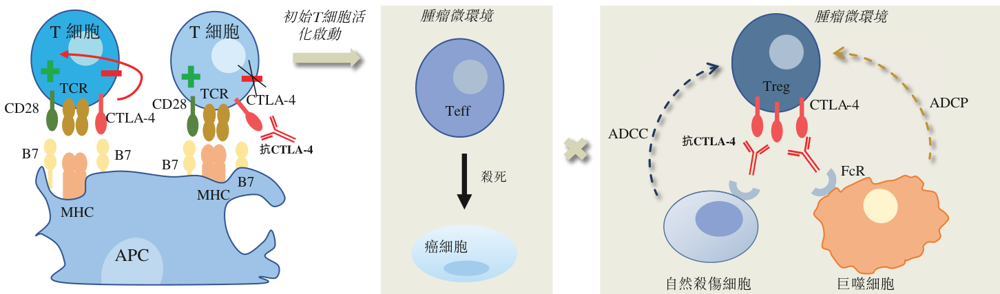

資料來源：文獻研究、弗若斯特沙利文分析

---

## 第 164 页

全球及中國的CTLA-4抗體藥物市場規模

截至最後實際可行日期，市場上已有兩款以CTLA-4單株抗體藥物獲批上市。根據弗若斯特沙利文報告，全球CTLA-4抗體藥物市場規模已由2019年的15億美元增長至2024年的32億美元，複合年增長率為16.3%。預期全球CTLA-4抗體藥物市場將於2030年增至124億美元，並於2035年達至236億美元，2024年至2030年的複合年增長率為25.5%，2030年至2035年的複合年增長率為13.8%。就中國市場而言，2024年市場規模約為3億美元，預計於2030年達至7億美元，2024年至2030年的複合年增長率為19.0%。隨著快速擴張，中國市場預計於2035年將達約18億美元，2030年至2035年的複合年增長率為19.1%。下圖顯示於所示期間全球CTLA-4抗體藥物市場規模：

2019年至2035年（預計）全球的CTLA-4抗體藥物市場

<!-- table html -->
<table><tr><td rowspan="3">期間</td><td colspan="3">複合年增長率</td></tr><tr><td>中國</td><td>全球其他地區</td><td>全球</td></tr><tr><td>2019年至2024年</td><td>-</td><td>14.4%</td><td>16.3%</td></tr><tr><td>2024年至2030年 (預計)</td><td>19.0%</td><td>26.0%</td><td>25.5%</td></tr><tr><td>2030年（預計）至2035年 (預計)</td><td>19.1%</td><td>13.4%</td><td>13.8%</td></tr></table>
<!-- /table -->

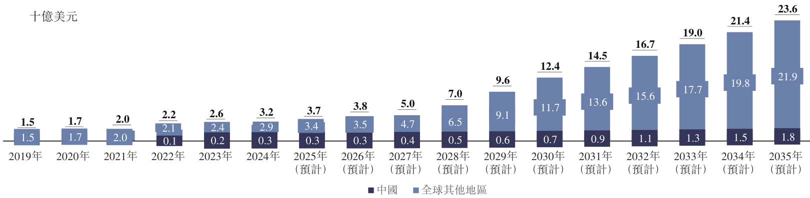

資料來源：弗若斯特沙利文分析

附註：以CTLA-4為靶向的藥物（包括單克隆抗體，雙特異性抗體，抗體偶聯藥物，融合蛋白）的市場規模。

CTLA-4抗體藥物市場進入壁壘

• 毒性及安全問題：眾所周知，CTLA-4抗體抑制劑（如伊匹木單抗）會引起嚴重的irAE，而該等事件可能與高發病率及死亡率有關。該等副作用限制了該療法的適用性，導致需要謹慎管理，從而對開發及採用新的CTLA-4抗體藥物構成障礙。

• 療效有限：抗CTLA-4抗體在癌症治療中的價值已獲公認。然而，目前可用的抗CTLA-4治療性抗體因其治療指數狹窄而無法廣泛應用。因此，開發更安全有效的下一代抗CTLA-4療法具有挑戰性。CTLA-4單一療法的緩解率約為10.9%，

---

## 第 165 页

普遍低於PD-1/PD-L1抑制劑。特別是對比成熟的治療方法時，由於療效偏低，CTLA-4新藥很難在臨床試驗中顯示出優越或非劣效的結果。

來自成熟療法的競爭：由於癌症免疫療法市場上已有成熟的PD-1/PD-L1抑制劑療法（其療效已獲證實，且對部分患者群體具有更佳的安全性）。該等競爭使得新的CTLA-4靶向療法難以站穩腳跟。

CTLA-4抗體藥物市場增長驅動因素

持續擴大適應症以解決未滿足的臨床需求：許多癌症患者無法獲得CTLA-4抗體藥物，導致大量需求未得到滿足。隨著適應症的擴展，將有更多患者受益，進而帶動CTLA-4抗體藥物市場的增長。展望未來，CTLA-4藥物開發的重點將繼續放在擴大適應症，以解決未滿足的臨床需求，為更多患者提供接觸這些療法的機會。

• 藥效增強：CTLA-4抗體藥物在轉移性NSCLC治療中的總緩解率高達39%，反映出其優異的抗腫瘤療效。抗體技術及治療策略的持續優化預計將進一步提高客觀緩解率。該優異的療效不僅能提升臨床結果，還能增加醫生使用該等藥物的信心，從而推動市場擴張。

CTLA-4雙特異性藥物成為開發趨勢：CTLA-4是免疫檢查點抑制劑中極為重要的靶點，在腫瘤免疫治療中起到關鍵作用。隨著對腫瘤微環境的深入了解，CTLA-4雙特異性藥物成為具有前景的開發趨勢。該等藥物同時靶向CTLA-4及其他通路，如PD-1、PD-L1及CD47，旨在在增強療效的同時將副作用降至最低。康方卡度尼利（全球首個CTLA-4雙特異性藥物）獲批代表了一項重大突破，預示著雙靶點藥物開發進入一個充滿創新與機遇的新時代。

治療線取得進展以提高可及性：美國臨床腫瘤學會已批准將CTLA-4與PD-1抗體聯合治療作為非小細胞肺癌及肝細胞癌的一線療法。此外，中國臨床腫瘤學會推薦該等治療作為宮頸癌的二線療法。隨著越來越多CTLA-4藥物被整合至一線及二線癌症治療中，患者使用該等挽救生命的治療機會預計將大幅增加，從而進一步提高更大患者群體治療的可及性及可用性。

---

## 第 166 页

全球（包括中國）批准的CTLA-4雙特異性抗體藥物

目前，開坦尼是唯一獲批的CTLA-4雙特異性抗體藥物。

<!-- table html -->
<table><tr><td>靶點</td><td>藥物名稱</td><td>公司</td><td>適應症</td><td>治療線</td><td>聯合治療</td><td>批准日期</td><td>劑量</td><td>國家</td><td>醫保</td><td>每療程週期價格</td></tr><tr><td rowspan="3">PD-1、CTLA-4</td><td rowspan="3">卡度尼利單抗開坦尼®</td><td rowspan="3">康方生物</td><td rowspan="2">宮頸癌</td><td>二線</td><td>單藥</td><td>2022/06/28</td><td rowspan="2">此產品透過靜脈輸注給藥。建議劑量為6 mg/kg，每2週一次，直至疾病進展或出現不可耐受毒性。</td><td rowspan="4">中國</td><td rowspan="2">乙類</td><td rowspan="2">約人民幣7,500元</td></tr><tr><td>一線</td><td>聯合鉑類化療及貝伐珠單抗，或聯合或不聯合貝伐珠單抗</td><td>2025/05/27</td></tr><tr><td>GC/GEJC</td><td>一線</td><td>聯合氟嘧啶類及含鉑化療藥物</td><td>2024/09/26</td><td>此產品透過靜脈輸注給藥。建議劑量為10 mg/kg，每3週一次，直至疾病進展或出現不可耐受毒性。</td><td>約人民幣11,000元</td></tr></table>
<!-- /table -->

資料來源：國家藥監局、FDA、公司網站、文獻回顧、弗若斯特沙利文分析

附註：

(1) 行業資料截至2025年12月8日。2.GC指胃癌；GEJC指胃食管結合部癌。

CTLA-4靶向雙特異性抗體／雙功能融合蛋白管線的競爭格局

目前，全球共有13種CTLA-4靶向雙特異性抗體藥物處於臨床開發過程中。HX044是全球唯一處於臨床開發階段的CTLA-4/CD47雙特異性抗體／雙功能融合蛋白。

---

## 第 167 页

全球（中國除外）CTLA-4靶向雙特異性抗體／雙功能融合蛋白管線的競爭格局

<!-- table html -->
<table><tr><td>靶點</td><td>藥物名稱／代碼</td><td>公司</td><td>適應症</td><td>臨床階段</td><td>首次發佈日期</td></tr><tr><td>CTLA4、CD47</td><td>HX044</td><td>翰思生物</td><td>晚期實體瘤惡性腫瘤</td><td>I/IIa期</td><td>2024/10/21</td></tr><tr><td rowspan="16">CTLA4、PD-1</td><td rowspan="9">Volrustomig/MED15752</td><td rowspan="9">阿斯利康</td><td>NSCLC</td><td>III期</td><td>2023/08/09</td></tr><tr><td>局部晚期頸癌</td><td>III期</td><td>2023/10/12</td></tr><tr><td>不可切除的胸膜間皮瘤</td><td>III期</td><td>2023/10/24</td></tr><tr><td>HNSCC</td><td>III期</td><td>2023/11/13</td></tr><tr><td>晚期腎透明細胞癌</td><td>III期</td><td>2025/06/02</td></tr><tr><td>局部晚期不可切除或轉移性胃癌或胃食管交界腺癌</td><td>II期</td><td>2023/01/27</td></tr><tr><td>HCC、BTC</td><td>II期</td><td>2023/03/20</td></tr><tr><td>晚期實體瘤</td><td>II期</td><td>2023/06/05</td></tr><tr><td>轉移性結直腸癌</td><td>II期</td><td>2025/01/27</td></tr><tr><td>RCC</td><td>I期</td><td>2020/08/21</td></tr><tr><td>軟組織肉瘤</td><td>I期</td><td>2023/04/20</td></tr><tr><td rowspan="4">Vudalimab</td><td rowspan="4">Xencor+Icon Bio</td><td>mCRPC</td><td>II期</td><td>2021/08/13</td></tr><tr><td>晚期婦科和泌尿生殖系統惡性腫瘤</td><td>II期</td><td>2021/09/02</td></tr><tr><td>BTC</td><td>II期</td><td>2022/03/17</td></tr><tr><td>晚期宮頸癌</td><td>II期</td><td>2022/07/22</td></tr><tr><td>NSCLC</td><td>I/II期</td><td>2023/12/15</td></tr><tr><td>轉移性癌症、宮頸癌</td><td>II期</td><td>2022/07/26</td></tr><tr><td>前列腺癌</td><td>II期</td><td>2023/05/08</td></tr><tr><td rowspan="3">Lorigerlimab/MGD019</td><td rowspan="3">MacroGenics</td><td>放射學檢查發現隱匿性分子殘留疾病的結直腸癌</td><td>II期</td><td>2025/07/18</td></tr><tr><td>結直腸癌</td><td>II期</td><td>2025/07/18</td></tr><tr><td>HCC、RCC、OC、胰管癌</td><td>I期</td><td>2022/03/24</td></tr><tr><td rowspan="2">Cadonilimab</td><td rowspan="2">康方生物</td><td>宮頸癌</td><td>II期</td><td>2020/05/07</td></tr><tr><td>晚期肝癌</td><td>II期</td><td>2025/01/21</td></tr><tr><td>廣泛期小細胞肺癌</td><td>I/II期</td><td>2022/07/08</td></tr><tr><td rowspan="2">CTLA-4、IL2/15Rβyc</td><td>SIM0323</td><td>GI Innovation／先聲藥業</td><td>晚期實體瘤</td><td>I/II期</td><td>2019/02/21</td></tr><tr><td>JK08</td><td>Salubris Biotherapeutics</td><td>不可切除的局部晚期或轉移性癌症</td><td>I/II期</td><td>2021/07/27</td></tr><tr><td>CTLA-4、IL2R</td><td>EGL-001</td><td>Egle Therapeutics</td><td>晚期及／或轉移性實體瘤</td><td>I/II期</td><td>2024/10/02</td></tr><tr><td>CTLA-4、LAG3</td><td>XmAb 841 (Bavunalimab)</td><td>Xencor</td><td>晚期實體瘤</td><td>I期</td><td>2019/02/21</td></tr></table>
<!-- /table -->

資料來源：藥審中心、臨床試驗、公司網站、文獻綜述、弗若斯特沙利文分析

附註：

(1) 臨床階段指最新的臨床試驗及首次發佈日期。

(2) 首次發佈日期指研究記錄首次於Chinadrugtrials.org.cn或Clinicaltrials.gov上發佈的日期。

(3) 公司資料來自本公司，行業資料截至最後實際可行日期。

(4) HNSCC指頭頸鱗狀細胞癌；NSCLC指非小細胞肺癌；RCC指腎細胞癌；GC指胃癌；BC指乳腺癌；OC指卵巢癌；TNBC指三陰性乳腺癌；HCC指肝細胞癌；BTC指膽道癌；EC指子宮內膜癌；mCRPC是指轉移性去勢抗性前列腺癌；CRC指大腸癌；UC指尿道上皮癌；及ESCC指食管鱗狀細胞癌。

---

## 第 168 页

中國CTLA-4靶向雙特異性抗體／雙功能融合蛋白管線的競爭格局

<!-- table html -->
<table><tr><td>靶點</td><td>藥物名稱／代碼</td><td>公司</td><td>適應症</td><td>臨床階段</td><td>首次發佈日期</td></tr><tr><td>CTLA-4、CD47</td><td>HX044</td><td>翰思生物</td><td>晚期實體瘤惡性腫瘤</td><td>I/IIa期</td><td>2024/10/21</td></tr><tr><td rowspan="22">CTLA4、PD-1</td><td rowspan="14">卡度尼利單抗</td><td rowspan="14">康方生物</td><td>HCC</td><td>III期</td><td>2022/08/08</td></tr><tr><td>鼻咽癌</td><td>III期</td><td>2022/10/19</td></tr><tr><td>NSCLC</td><td>III期</td><td>2023/07/13</td></tr><tr><td>晚期／轉移性腎細胞癌</td><td>II期</td><td>2022/01/04</td></tr><tr><td>晚期卵巢癌</td><td>II期</td><td>2022/06/24</td></tr><tr><td>mCRC</td><td>II期</td><td>2023/02/18</td></tr><tr><td>胰腺癌</td><td>II期</td><td>2023/03/21</td></tr><tr><td>晚期子宮內膜癌</td><td>II期</td><td>2023/04/21</td></tr><tr><td>外陰癌</td><td>II期</td><td>2023/06/27</td></tr><tr><td>HNHCC</td><td>II期</td><td>2023/09/04</td></tr><tr><td>局部晚期或轉移性HER2尿道上皮癌</td><td>II期</td><td>2023/12/12</td></tr><tr><td>晚期軟組織肉瘤</td><td>II期</td><td>2024/04/16</td></tr><tr><td>TNBC</td><td>II期</td><td>2024/04/16</td></tr><tr><td>SCLC</td><td>II期</td><td>2024/05/06</td></tr><tr><td>黑色素瘤</td><td>II期</td><td>2024/09/30</td></tr><tr><td>食管鱗狀細胞癌</td><td>II期</td><td>2025/12/02</td></tr><tr><td>復發性或轉移性宮頸癌</td><td>III期</td><td>2025/01/24</td></tr><tr><td>晚期或轉移性HNSCC</td><td>III期</td><td>2025/01/14</td></tr><tr><td>胸膜間皮瘤</td><td>III期</td><td>2024/12/27</td></tr><tr><td>NSCLC</td><td>III期</td><td>2025/01/24</td></tr><tr><td>GC</td><td>II期</td><td>2023/02/01</td></tr><tr><td>BTC/HCC</td><td>II期</td><td>2023/03/24</td></tr><tr><td>結直腸癌</td><td>II期</td><td>2025/01/27</td></tr><tr><td>結直腸癌</td><td>II期</td><td>2025/08/27</td></tr><tr><td rowspan="4">Danvilostomig/SI-B003</td><td rowspan="4">百利天恒</td><td>局部晚期或轉移性食道癌、胃癌、結直腸癌及其他胃腸道腫瘤</td><td>II期</td><td>2023/08/23</td></tr><tr><td>SCLC</td><td>II期</td><td>2023/06/21</td></tr><tr><td>晚期或轉移性非小細胞肺癌、鼻咽癌及其他實體瘤</td><td>II期</td><td>2023/07/10</td></tr><tr><td>局部晚期或轉移性尿道上皮癌及其他實體瘤</td><td>II期</td><td>2023/07/28</td></tr><tr><td>復發性或轉移性HNSCC</td><td>II期</td><td>2024/11/01</td></tr><tr><td rowspan="5">CTLA-4、PD-L1</td><td>SKB337</td><td>科倫藥業</td><td>晚期實體瘤</td><td>I期</td><td>2021/05/20</td></tr><tr><td rowspan="5">依瑞利單抗/KN046</td><td rowspan="5">康寧傑瑞</td><td>晚期鱗狀NSCLC</td><td>III期</td><td>2020/07/27</td></tr><tr><td>晚期胰腺癌</td><td>III期</td><td>2021/12/03</td></tr><tr><td>晚期不可切除的或轉移性ESCC</td><td>II期</td><td>2019/04/25</td></tr><tr><td>局部晚期HER2陽性實體瘤</td><td>II期</td><td>2020/08/20</td></tr><tr><td>晚期HCC</td><td>II期</td><td>2020/09/02</td></tr><tr><td>消化系統癌症</td><td>II期</td><td>2023/10/20</td></tr><tr><td>晚期胃腸道腫瘤</td><td>I/II期</td><td>2020/11/03</td></tr><tr><td>CTLA-4、CD28</td><td>SG1827</td><td>尚健生物</td><td>晚期實體瘤</td><td>I期</td><td>2023/09/25</td></tr></table>
<!-- /table -->

資料來源：藥審中心、臨床試驗、公司網站、文獻綜述、弗若斯特沙利文分析

附註：

(1) 臨床階段指最新的臨床試驗及首次發佈日期。

(2) 首次發佈日期指研究記錄首次於 Chinadrugtrials.org.cn 或 Clinicaltrials.gov 上發佈的日期。

(3) 公司資料來自本公司，行業資料截至最後實際可行日期。

(4) HNSCC指頭頸鱗狀細胞癌；NSCLC指非小細胞肺癌；ICC指肝內膽管癌；GC指胃癌；TNBC指三陰性乳腺癌；BTC指膽道癌；及ESCC指食管鱗狀細胞癌。

第一代CTLA-4治療的局限性

CTLA-4是免疫檢查點抑制劑中極為重要的靶點，在腫瘤免疫治療中起到關鍵作用。第一代抗CTLA-4抗體是一種免疫檢查點抑制劑，其可增強T細胞活性並改善抗腫瘤免疫反應。儘管CTLA-4抗體藥物已獲證明有效，但其可引發irAE（例如皮疹及結腸炎），這可能會導致治療中斷或損害患者療效，而該劑量依賴性毒性阻礙了其潛在的應用。

---

## 第 169 页

第二代CTLA-4治療的近期發展

第二代CTLA-4抗體的主要作用機制涉及清除腫瘤浸潤的Treg。該機制基於CTLA-4抑制劑可於表達高水平CTLA-4的腫瘤內局部消耗Treg的研究。這是通過由抗體的Fc受體介導的抗體依賴性細胞毒性(ADCC)和抗體依賴性細胞吞噬作用(ADCP)實現的。許多第二代CTLA-4單克隆抗體正在利用Fc段基因工程技術進行開發，從而增強對癌細胞的免疫反應。為解決安全問題，許多公司致力於透過創新方法減輕CTLA-4療法的毒性，例如開發酸敏感CTLA-4抑制劑、改進抗體設計及採用雙特異性抗體。

此外，隨著對腫瘤微環境的了解不斷加深，雙靶點CTLA-4藥物已成為具有前景的開發趨勢。該等藥物同時靶向CTLA-4及其他通路，如PD-1、PD-L1及CD47，旨在於增強治療效果的同時將副作用降至最低。雙特異性抗CTLA-4抗體的作用機制，以HX044為例，由於順式結合，使得HX044能與CTLA-4和CD47這兩個靶點同時高表達的Treg有效地結合，引起Treg清除以及腫瘤微環境重塑從而對抗腫瘤免疫有利。同時靶向這兩個靶點有助於調節免疫激活和免疫抑制之間的平衡，這對於實現最佳抗腫瘤反應尤為重要。康方卡度尼利（全球首個雙特異性CTLA-4藥物）獲批是一項重大突破，預示著雙特異性藥物開發進入一個充滿創新與機遇的新時代。

CD47/SIRPα靶向藥物市場概述

CD47/SIRPα靶向概述及機制

CD47是一種在眾多腫瘤細胞表面表達的蛋白質分子，與巨噬細胞上的SIRPα受體結合後，會發出「別吃我」信號，其在該等平衡中至關重要。通過CD47/SIRPα信號通路發出「別吃我」信號，腫瘤細胞可激活巨噬細胞的下游通路，抑制巨噬細胞的細胞骨架重組，抑制巨噬細胞吞噬腫瘤細胞，逃避先天免疫系統。

CD47/SIRPα靶向藥物通過多種機制發揮作用，其中阻斷「別吃我」信號是最重要的機制。單獨阻斷CD47/SIRPα的交互作用可以阻斷「別吃我」信號，但僅可部分激活巨噬細胞。完全激活巨噬細胞需要刺激FcγR等受體，從而產生「吃我」信號。高效的CD47/SIRPα靶向藥物可同時釋放CD47/SIRPα檢查並通過Fc-FcγR交互作用激活巨噬細胞。下圖說明CD47/SIRPα通路及其靶向藥物的作用機制：

---

## 第 170 页

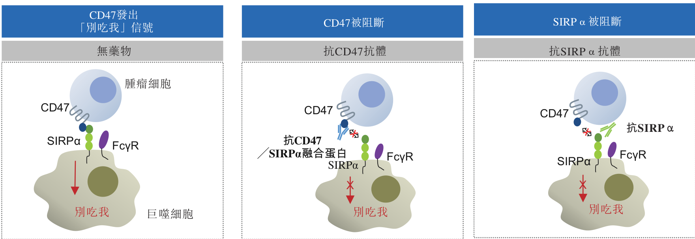

資料來源：文獻綜述、弗若斯特沙利文分析

全球CD47靶向療法的市場

文獻記載安全問題一直是CD47的主要關注點。除腫瘤細胞外，CD47亦在人體紅細胞及血小板上廣泛表達。臨床試驗顯示，靶向CD47的藥物可引起血液毒性，如貧血、血小板減少及血凝。事實上，多項臨床階段的CD47抗體因出現與紅細胞強結合現象而導致嚴重不良反應，令試驗暫停或終止。有關詳情，請參閱本招股章程「風險因素－與研發候選藥物有關的風險－我們候選藥物引起的不良事件或不良副作用可能會中斷、延遲或停止臨床試驗，延遲或阻礙監管批准，限制獲批藥物的商業前景，或在監管批准後造成重大負面影響」。

截至最後實際可行日期，尚無任何以CD47為靶點的藥物獲批上市，首款藥物預計將於2026年商業化後開始產生銷售額。預期隨著CD47靶向創新藥獲批上市，市場將迅速擴大。全球CD47療法市場預計將由2026年的2億美元迅速擴大至2030年的49億美元，再於2035年增至259億美元，2030年至2035年的複合年增長率為39.4%。中國CD47靶向療法市場的增長速度預計將快於全球市場，預計將由2028年的1億美元增至2030年的8億美元，再於2035年達至48億美元；2030年至2035年的複合年增長率為44.5%。

---

## 第 171 页

2019年至2035年（預計）全球CD47靶向療法的市場

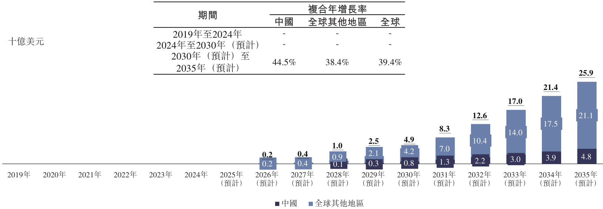

資料來源：弗若斯特沙利文分析

附註：以CD47為靶向的藥物（包括單克隆抗體，雙特異性抗體，抗體偶聯藥物（ADC），融合蛋白）的市場規模。

CD47靶向藥物市場的增長驅動因素

雙特異性抗體及融合蛋白：相較於聯合使用多種藥物，專門設計的雙特異性抗體及融合蛋白會帶來更多裨益。針對同類靶細胞上多種抗原的靶向雙特異性抗體可以通過提高效力及減少脫靶效應來擴大抗癌藥物的治療窗口。目前，多家製藥公司正在進行相關研究。PD-1及CTLA-4雙特異性抗體已獲取良好的臨床試驗數據。雙特異性抗體及融合蛋白有望成為CD47靶向藥物市場的良好設計選項。

擴大適應症：儘管已證明CD47在多種實體瘤細胞中廣泛表達，但尚未充分研究巨噬細胞對多種實體瘤的殺傷作用。積累的大部分臨床證據均是針對血液腫瘤，而針對實體瘤的研究很少獲得良好實驗結果。誠如上文所述，使用雙特異性抗體或融合蛋白有助於獲得更好的治療效果，並有機會將CD47靶向藥物擴展到更多腫瘤類型。隨著深入研究及臨床數據積累，預計CD47靶向藥物未來將擴大用於實體瘤，造福更多人群。

---

## 第 172 页

CD47/PD-1、CD47/CTLA-4及CD47/PD-L1靶向雙特異性抗體／雙功能融合蛋白管線的競爭格局

全球（中國除外）CD47/PD-1、CD47/CTLA-4及CD47/PD-L1靶向雙特異性抗體／雙功能融合蛋白管線的競爭格局

我們的核心產品HX009是一種同時靶向CD47及PD-1的雙特異性抗體融合蛋白。根據弗若斯特沙利文報告，截至最後實際可行日期，HX009的臨床試驗進展在同類CD47靶向雙特異性抗體／雙功能融合蛋白產品中處於全球領先地位。下圖列示全球範圍內臨床階段的CD47/PD-1、CD47/CTLA-4及CD47/PD-L1雙特異性抗體／雙功能融合蛋白比較：

<!-- table html -->
<table><tr><td>靶點</td><td>藥物名稱／代碼</td><td>SIRPα融合蛋白</td><td>公司</td><td>適應症</td><td>臨床階段</td><td>首次發佈日期</td></tr><tr><td>CD47、PD-1</td><td>HX009</td><td>是</td><td>本公司</td><td>晚期實體瘤</td><td>I期</td><td>2019/09/20</td></tr><tr><td>CD47、CTLA4</td><td>HX044</td><td>是</td><td>本公司</td><td>晚期實體瘤惡性腫瘤</td><td>II/II期</td><td>2024/10/21</td></tr><tr><td rowspan="3">CD47、PD-L1</td><td>LB101</td><td>否</td><td>LogicBio</td><td>晚期實體瘤</td><td>I/II期</td><td>2023/04/20</td></tr><tr><td>BAT7104</td><td>否</td><td>百奧泰</td><td>晚期實體瘤</td><td>Ib/II期</td><td>2024/07/22</td></tr><tr><td>IBI322</td><td>否</td><td>信達生物</td><td>晚期惡性腫瘤淋巴瘤</td><td>I期</td><td>2020/04/08</td></tr></table>
<!-- /table -->

資料來源：藥審中心、臨床試驗、公司網站、文獻綜述、弗若斯特沙利文分析

附註：

(1) 臨床階段指最新的臨床試驗及首次發佈日期。

(2) 首次發佈日期指研究記錄首次於 Chinadrugtrials.org.cn 或 Clinicaltrials.gov 上發佈的日期。

(3) 本公司於2023年5月獲得美國食藥監局批准可開展HX009 Ib/II期治療DLBCL的研究。

(4) 公司資料來自本公司，行業資料截至最後實際可行日期。

(5) B-非霍奇金淋巴瘤指B細胞非霍奇金淋巴瘤；NSCLC指非小細胞肺癌；HNSCC指頭頸鱗狀細胞癌；OC指卵巢癌；GC指胃癌；BC指乳腺癌；LC指肺癌；CLL指慢性淋巴細胞白血病；DLBCL指彌漫性大B細胞淋巴瘤；MCL指套細胞淋巴瘤；及SLL指小淋巴細胞淋巴瘤。

---

## 第 173 页

中國CD47/PD-1、CD47/CTLA-4及CD47/PD-L1靶向雙特異性抗體／雙功能融合蛋白管線的競爭格局

<!-- table html -->
<table><tr><td>靶點</td><td>藥物名稱／代碼</td><td>SIRP α 融合蛋白</td><td>公司</td><td>適應症</td><td>臨床階段</td><td>首次發佈日期</td></tr><tr><td rowspan="3">CD47、PD-1</td><td rowspan="3">HX009</td><td rowspan="3">是</td><td rowspan="3">本公司</td><td>TNBC</td><td>IND</td><td>2024/12/06</td></tr><tr><td>黑色素瘤BTC</td><td>II期</td><td>2024/11/14</td></tr><tr><td>復發性／難治性淋巴瘤</td><td>I/II期</td><td>2022/01/12</td></tr><tr><td>CTLA-4、CD47</td><td>HX044</td><td>是</td><td>本公司</td><td>晚期惡性實體瘤</td><td>I期</td><td>2025/03/03</td></tr><tr><td rowspan="10">CD47、PD-L1</td><td rowspan="4">6MW3211</td><td rowspan="4">否</td><td rowspan="4">邁威生物</td><td>晚期肺癌</td><td>II期</td><td>2022/06/13</td></tr><tr><td>晚期腎透明細胞癌</td><td>II期</td><td>2022/06/28</td></tr><tr><td>復發性／難治性淋巴瘤</td><td>II期</td><td>2022/07/04</td></tr><tr><td>AML/MDS</td><td>II期</td><td>2023/01/31</td></tr><tr><td>晚期惡性腫瘤</td><td>I/II期</td><td>2021/08/24</td></tr><tr><td>IBC0966</td><td>是</td><td>宜明昂科</td><td>晚期惡性腫瘤</td><td>I/II期</td><td>2021/07/08</td></tr><tr><td rowspan="2">IBI322</td><td rowspan="2">否</td><td rowspan="2">信達生物</td><td>晚期惡性腫瘤</td><td>I期</td><td>2020/03/30</td></tr><tr><td>惡性血液腫瘤</td><td>I期</td><td>2021/03/19</td></tr><tr><td>SG12473</td><td>否</td><td>尚健生物</td><td>晚期惡性腫瘤</td><td>I期</td><td>2021/05/13</td></tr><tr><td>BAT7104</td><td>否</td><td>百奧泰</td><td>晚期實體瘤</td><td>Ib/II期</td><td>2022/02/22</td></tr><tr><td rowspan="2">SH009</td><td rowspan="2">否</td><td rowspan="2">南京聖和藥業</td><td>晚期實體瘤</td><td>I期</td><td>2025/04/02</td></tr><tr><td>NSCLC</td><td>I期</td><td>2025/05/16</td></tr></table>
<!-- /table -->

資料來源：藥審中心、臨床試驗、公司網站、文獻綜述、弗若斯特沙利文分析

附註：

(1) 臨床階段指最新的臨床試驗及首次發佈日期。

(2) 首次發佈日期指研究記錄首次於 Chinadrugtrials.org.cn 或 Clinicaltrials.gov 上發佈的日期。

(3) 公司資料來自本公司，行業資料截至最後實際可行日期。

CD47靶向藥物研發的限制及潛在解決方案

CD47是一種細胞表面蛋白，在腫瘤微環境中發揮關鍵調節作用，並構成潛在的癌症治療靶點。其被證實在不同類型腫瘤中過度表達，並充當「別吃我」的信號，從而有助於免疫逃避。巨噬細胞分佈於腫瘤微環境中，且已被證明可以通過吞噬作用誘導有效的抗腫瘤免疫反應。

儘管CD47靶向藥物在激活巨噬細胞方面具有巨大潛力，但CD47靶向藥物研發中存在諸多與安全性相關的擔憂，例如血液毒性、抗原沉默（受體飽和所影響的生物利用度現象，導致對劑量水平的高要求）、非腫瘤靶向效應及T細胞凋亡等。

• 脫靶效應及血液毒性：安全問題一直是CD47的主要關注點。除腫瘤細胞外，CD47亦在人體紅細胞及血小板上廣泛表達。越來越多的研究認識到CD47靶向藥的毒性來自於其廣泛表達導致非癌細胞的脫靶殺傷，特別是紅細胞和血小板，從

---

## 第 174 页

而引起血凝反應和貧血。實際上，多項臨床階段的CD47抗體因出現與紅細胞強結合現象而導致嚴重不良反應，令試驗暫停或終止。

• 抗原沉默：CD47靶向藥物的抗原沉默效應是指由於CD47在正常細胞表面的廣泛表達，該藥物可能需要較多的初始劑量及／或頻繁用藥以有效阻斷CD47，從而影響藥物在腫瘤細胞中的濃度和療效。此效應可能導致藥物在腫瘤細胞上無法達到足夠的濃度，從而降低治療效果。

• T細胞凋亡：CD47在未成熟及成熟的T細胞上表達。與CD47抗體結合後，T細胞可能會凋亡，因此必須篩選候抗體，並排除具有此活性的候選抗體。

迄今為止，尚未有任何獲批的CD47靶向藥物，這被認為是特定臨床開發挑戰的累積結果，而非對靶點本身生物學有效性的最終定論。例如，於2025年7月1日，輝瑞宣布終止評估maplirpacept用於治療R/R DLBCL的II期試驗，明確表示有關決定歸因於招募的可行性，而非藥物學疑慮。根據美國聯邦臨床試驗資料庫的後續更新，該研究自2023年8月啟動以來只能招募六名患者，因此以「無法招募預定數目受試者」而終止。輝瑞強調，有關決定並非基於任何安全性或療效發現。值得注意的是，輝瑞繼續探索maplirpacept在聯合療法方面的潛力，目前正在進行一項針對相同DLBCL病症的I/II期試驗，將其與羅氏的雙特異性抗體glofitamab（Columvi）聯合使用，根據最新進展，該試驗仍持續進行。相比之下，吉利德科學終止magrolimab的血癌項目，乃基於不利臨床數據所致。於2024年2月7日，吉利德宣布終止針對急性髓系白血病的III期ENHANCE-3研究，而美國FDA已對所有針對骨髓增生異常綜合症及急性髓系白血病的magrolimab研究實施全面臨床暫停。此項決定基於中期分析結果顯示療效無效，且觀察到死亡風險增加。隨後於2024年6月14日在歐洲血液學協會大會上發表的詳細最終分析證實了上述疑慮：在magrolimab組中位數追蹤期為7.6個月，對照組為7.4個月，magrolimab與venetoclax及azacitidine的聯合治療方案中位總生存期為10.7個月，而對照治療方案為14.1個月（風險比1.178；95%置信區間0.848–1.637）。magrolimab組在六個治療週期內的完全緩解率亦較低（41.3% vs. 46.0%）。此外，加入magrolimab導致致命性不良事件的發生率上升（19.0% vs. 11.4%），主要由5級感染（11.1% vs. 6.5%）和呼吸系統事件（2.6% vs. 0%）引起。此等結果與ENHANCE及ENHANCE-2試驗中先前出現的無效性訊號一致，促使吉利德終止所有針對血癌的magrolimab開發計劃。儘

---

## 第 175 页

管多個CD47靶向候選藥物相繼受挫，此類失敗並未否定該通路已證實能激發巨噬細胞介導的抗腫瘤免疫反應；相反，這些結果突顯出CD47靶向藥物的臨床潛力，主要取決於每項藥物計劃的具體設計與執行細節。

上述安全問題的潛在解決方案包括(i)有效的發現及開發平台來篩選合適的分子。該等平台有助於提前找到對T淋巴細胞及紅細胞並無影響或影響最小的結構，同時保持良好的療效；(ii)特定的給藥劑量，例如起始給藥策略（即較低的初始劑量，隨後較高的維持劑量），以減少不良事件發生的頻率；以及(iii)更多的藥物輸送方法，例如腫瘤靶向納米顆粒，以加強藥物的靶向輸送。一般而言，具有深厚的基礎科學知識並且有能力開發高效抗體篩選平台的公司將比同行業者更具競爭力。目前，該等公司亦正通過靶向PD-1等額外靶點所產生的協同效應探索潛在的解決方案。例如，本公司的HX009是一種特別設計的抗PD-1/SIRPα雙功能抗體融合蛋白，有效性及安全性均分別高於兩種單靶點免疫檢查點抑制劑。根據文獻記載，HX009能夠通過額外的PD-1驅動，與T細胞表面的PD-1及CD47順式結合，誘導比單用抗PD-1單克隆抗體更強的T細胞活化。此外，該機制能夠通過SIRPα結構域顯著降低CD47結合親和力，因此可解決與CD47相關的安全性問題。

CD47與其他靶點的協同分析

CD47單克隆抗體可以阻斷CD47/SIRPα通路，並緩解對巨噬細胞吞噬作用的抑制。阻斷CD47會增加召集到腫瘤部位的巨噬細胞。抗CD47治療後的吞噬作用可刺激分泌趨化因子及細胞因子，將更多免疫細胞召集到腫瘤部位，從而增強免疫反應。基於該等認識，我們嘗試在CD47通路靶點之上添加額外靶點，並努力實現協同效應，以期產生更強的抗腫瘤作用。

對於同時靶向PD-1及CD47的藥物，抗CD47抗體可以阻斷CD47/SIRPα軸，並激活巨噬細胞對腫瘤細胞的吞噬作用，從而達到治療腫瘤的目的。此外，抗PD-1抗體可以阻斷PD-1與其配體PD-L1或PD-L2的結合，進而逆轉腫瘤免疫微環境，恢復T細胞的抗腫瘤活性，抑制腫瘤生長。同時，PD-1的全身性表達極少，但在腫瘤微環境中表達，因此靶向PD-1的雙特異性抗體具有腫瘤靶向作用，有助在腫瘤中更多地結合CD47。本公司研發的HX009是將人類SIRPα蛋白的細胞外CD47結合域嫁接構成，由於順式結合，高親和力的PD-1結合將成為BsAb的驅動結合劑，因此HX009可與Teff上的CD47產生高親和力（即表觀親和力）。SIRPα結構域的CD47結合親和力顯著降低，目的在於減少與CD47+紅細胞及巨核細胞的結合，以降低血液毒性，亦可降低因CD47

---

## 第 176 页

在正常組織中廣泛表達而產生的抗CD47抗原沉默效應。為此，我們可以通過多個機制來提高先天免疫及細胞免疫反應。因此，合理設計的同時靶向人體PD-1及CD47的雙特異性抗體可以增強抗腫瘤活性並降低血液毒性。

對於同時靶向CD47和CTLA-4的藥物，它還可以阻斷CD47（「別吃我」信號），並利用Treg上CTLA-4的高表達和腫瘤微環境中大量Fc受體表達的活性吞噬細胞，引起協同抗腫瘤免疫／功效，避免外周irAE和血液毒性。Treg的消耗是促進抗腫瘤免疫的一種有吸引力的策略。一種可以消耗Treg細胞的策略是阻斷「別吃我」信號CD47，防止Treg細胞成為吞噬作用的目標。CTLA-4抗體亦具有清除Treg細胞的能力。本公司開發的HX044高效結合Treg，由於順式結合，兩個同時高表達靶點，導致Treg耗竭以及腫瘤微環境重塑，有利於抗腫瘤免疫，其效果顯著高於抗CTLA-4單克隆抗體，臨床前模型已清楚地證明了這一點。

自身免疫疾病及基於OX40的機制的概覽

自身免疫疾病的概覽

自身免疫疾病指身體免疫系統錯誤地攻擊身體的情況。自身免疫紊亂分為一百多種類型，幾乎可以影響身體的任何部位，包括心臟、大腦、神經、肌肉、皮膚、眼睛、關節、肺部、腎臟、腺體、消化道及血管。

基於免疫細胞靶向的自身抗原，自身免疫疾病可分為器官特異性及全身性自身免疫疾病。該等疾病的確切病理生理機制尚不清楚，而自身免疫疾病是在自身免疫耐受被破壞的情況下產生。免疫自身耐受性減退的機制似乎由多種因素造成，包括遺傳及環境因素，這將導致針對自身抗原的不規則免疫激活及隨後的組織破壞。儘管其他免疫成分（包括抗原呈遞細胞及補體）參與從自身免疫反應開始到組織破壞的各個步驟，B細胞及T細胞能識別自身抗原，並主導自身免疫患者的表型。

於2024年，全球自身免疫疾病治療市場的價值約為1,431億美元。最重要的是，由於自身免疫疾病患病率增加、新開發的診斷技術、對自身免疫疾病的認識不斷提高以及對新療法的迫切需求等，預計自身免疫疾病市場將繼續增長。因此，於預測期內全球自身免疫疾病治療市場預計到2035年將增長至2,348億美元，複合年增長率為4.6%。

---

## 第 177 页

自身免疫疾病的治療革命

抗炎藥物治療對減輕疼痛、發熱及炎症反應普遍有效，但僅限於緩解疾病症狀。後來，靶向生物製劑逐漸被開發出來，針對自身免疫疾病的根源進行治療，從而改善身體機能，防止不可逆轉的損傷，使疾病緩解成為可能。

OX40的作用機制

OX40是一種I型跨膜糖蛋白，屬NGFR/TNFR超家族成員，具有共激活功能，是T細胞反應的關鍵共刺激因子。OX40在記憶T細胞形成中起著重要作用。OX40在抗原識別後由T細胞受體參與後的信號傳導瞬時誘導，在活化的T細胞（包括活化的CD4$^{+}$及CD8$^{+}$T細胞）以及中性粒細胞、自然殺傷細胞及自然殺傷T細胞中於48至72小時達到峰值。OX40L（OX40的配體）也屬TNFR超家族成員。OX40L主要於活化的抗原呈遞細胞（如樹突狀細胞、活化的B細胞和巨噬細胞）上表達。除抗原呈遞細胞外，OX40L亦於造血細胞（如活化的NK細胞、肥大細胞或反應的CD4$^{+}$T細胞）以及非造血細胞上表達。下圖說明OX40的作用機制：

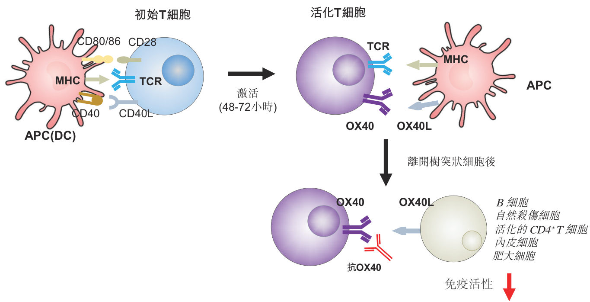

如圖所示，抗原識別後48至72小時內，專業抗原呈遞細胞首先向活化的OX40表達T細胞提供OX40信號。第一次交互作用後，OX40表達T細胞可能會離開樹突狀細胞，並在效應期與其他OX40L表達細胞相互作用，例如B細胞、自然殺傷細胞、活化的CD4$^{+}$T細胞、內皮細胞或肥大細胞，這導致T細胞透過OX40-OX40L信號傳導進行多通道激活。OX40-OX40L阻斷可能會改善自身抗原特異性T細胞反應並降低自身免疫疾病中的免疫活性。

阻斷OX40-OX40L信號傳導在自身免疫及炎症疾病的臨床試驗中產生了強大的治療效果，並在特應性皮炎的臨床試驗中顯示出令人鼓舞的抗炎活性。2024年9月24

---

## 第 178 页

日，安進(Amgen)宣佈其OX40單克隆抗體rocatinlimab在治療特應性皮炎的III期試驗中取得成功，這將標誌著第一個OX40靶點藥物在市場上的首次亮相，同時為免疫治療的領先新作用機制。該發展預示著以OX40為導向的療法的研發進入了一個新紀元。

選定適應症分析

淋巴瘤

淋巴瘤是涉及免疫系統淋巴細胞的血癌。根據弗若斯特沙利文報告，中國淋巴瘤新發病例數量已由2019年的80,000例增加至2024年的88,700例，複合年增長率為2.1%。預計於2030年及2035年將分別達到99,200例及108,000例，複合年增長率分別為1.9%及1.7%。同時，全球淋巴瘤新發病例數量已由2019年的602,600例增加至2024年的675,400例，複合年增長率為2.3%。預計於2030年及2035年將分別達到743,400例及815,000例，複合年增長率分別為1.6%及1.9%。

淋巴瘤分為霍奇金淋巴瘤及非霍奇金淋巴瘤兩大類，其中非霍奇金淋巴瘤約佔淋巴瘤的90%，具有多種亞型。非霍奇金淋巴瘤是由淋巴系統發展而來的一組具有強烈異質性的獨立疾病的總稱。根據弗若斯特沙利文報告，中國非霍奇金淋巴瘤新發病例數量已由2019年的75,800例增加至2024年的84,200例，複合年增長率為2.1%。預計於2030年及2035年將分別達到94,500例及103,500例，複合年增長率分別為1.9%及1.8%。同時，全球非霍奇金淋巴瘤新發病例數量已由2019年的521,500例增加至2024年的588,800例，複合年增長率為2.5%。預計於2030年及2035年將分別達到652,400例及718,900例，複合年增長率分別為1.7%及2.0%。

EB病毒(EBV)是一種屬於人皰疹病毒γ亞科的DNA病毒，能夠感染宿主的B淋巴細胞以及T細胞和自然殺傷細胞。EBV感染可導致多種淋巴細胞增殖性疾病，包括非腫瘤性增殖性疾病及腫瘤性疾病。在非霍奇金淋巴瘤病例中，EBV$^{+}$約佔16%。R/R EBV$^{+}$非霍奇金淋巴瘤是一種由EB病毒感染引起的非霍奇金淋巴瘤，其中癌症在初步治療後復發（即復發性）或對治療失去反應（即難治性）。非霍奇金淋巴瘤可分為B細胞型及T細胞型，屬於源自B淋巴細胞的癌症。該病屬於B細胞型非霍奇金淋巴瘤，而DLBCL的主要成因之一即為EB病毒感染。

根據弗若斯特沙利文報告，全球EBV$^{+}$非霍奇金淋巴瘤新發病例數量已由2019年的83,400例增加至2024年的94,200例，複合年增長率為2.5%，並預計於2030年及2035年將分別達到104,400例及115,000例，複合年增長率分別為1.7%及2.0%。同時，中國EBV$^{+}$非非霍奇金淋巴瘤新發病例數量已由2019年的12,100例增加至2024年的13,500例，複合年增長率為2.1%，並預計於2030年及2035年將分別達到15,100例及16,500例，複合年增長率分別為1.9%及1.8%。我們的HX009所針對的二線EBV$^{+}$非霍奇金淋

---

## 第 179 页

巴瘤在中國2024年的患者人數約為4,400人，全球患者人數約為33,600人。在中國，約81%的晚期復發／難治性EBV+非霍奇金淋巴瘤患者接受進一步治療，整體治療率約為41%；在全球範圍內，相應的一線及二線治療率約為85%及42%。

市場規模

根據弗若斯特沙利文報告，於2019年至2024年，全球淋巴瘤市場由167億美元增加至240億美元，複合年增長率為7.5%。此外，全球淋巴瘤市場在不久的將來將持續快速增長。預計於2030年及2035年，全球淋巴瘤市場將分別達到576億美元及891億美元，2024年至2030年的複合年增長率為15.7%，2030年至2035年的複合年增長率為9.1%。中國淋巴瘤市場規模於2024年達到32億美元，於2030年及2035年將擴大至83億美元及130億美元，複合年增長率分別為17.4%及9.5%。下圖列示於所示期間全球淋巴瘤市場的歷史及預測規模：

2019年至2035年（預計）全球淋巴瘤市場的歷史及預測規模

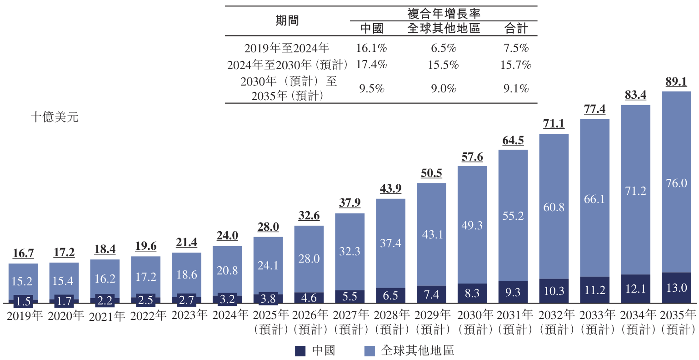

資料來源：文獻綜述、年度報告、專家訪談、弗若斯特沙利文分析

根據弗若斯特沙利文報告，於2019年至2024年，中國EBV$^{+}$非霍奇金淋巴瘤市場總額由人民幣3億元增加至人民幣5億元，複合年增長率為10.1%。此外，中國EBV$^{+}$非霍奇金淋巴瘤市場在不久的將來將持續快速增長。預計於2030年及2035年，中國EBV$^{+}$非霍奇金淋巴瘤市場總額將分別達到人民幣16億元及人民幣28億元，2024年至2030年的複合年增長率為19.7%，2030年至2035年的複合年增長率為11.7%。

---

## 第 180 页

2019年至2035年（預計）中國EBV+非霍奇金淋巴瘤市場的歷史及預測規模

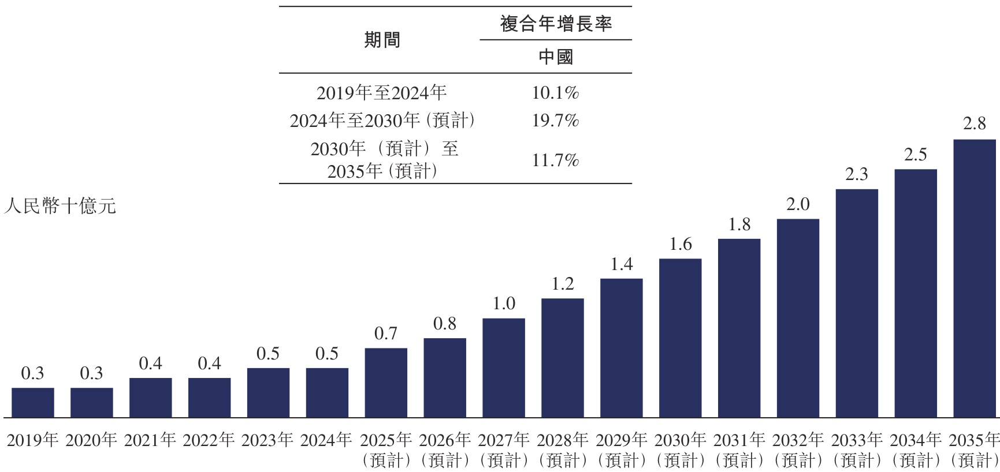

資料來源：文獻綜述、年度報告、專家訪談、弗若斯特沙利文分析

未獲滿足的臨床需求

耐藥性：非霍奇金淋巴瘤的現有療法通常包括放療、化療、幹細胞移植及生物製劑。然而，約50%的非霍奇金淋巴瘤患者最終會因耐藥性而出現病情惡化，進而引發復發性／難治性非霍奇金淋巴瘤，而復發性／難治性非霍奇金淋巴瘤是一種有效治療選項較少的疾病。

復發率較高且挽救療法較少：對於復發性／難治性B細胞非霍奇金淋巴瘤，目前仍主要推薦CD20靶向療法，但由於耐藥性及輸液相關反應等副作用，療效通常有限。對於復發性／難治性T細胞非霍奇金淋巴瘤，儘管新型免疫療法（PD-1/PD-L1抑制劑）及靶向療法已經成功研發，但現有治療選項仍主要限於化療。雖然部分淋巴瘤患者可以治癒，但約60%的患者仍面臨復發及難治的問題。淋巴瘤患者很少有有效的治療藥物。對於因高齡、身體狀況不佳、併發症、器官功能障礙及／或對挽救療法缺乏反應而不適宜或無法接受移植的患者，挽救性治療選項有限，致使總體預後不良。

EBV+非霍奇金淋巴瘤的有限治療：與EBV相關的腫瘤通常是惡性的，預後較差且治療困難。傳統的手術、化療及放療對該等惡性腫瘤的療效較差，並可能導致嚴重的不良反應。目前，市場上並無針對EBV+非霍奇金淋巴瘤的特異性藥物。免疫檢查點抑制劑在EBV+非霍奇金淋巴瘤中顯示出潛力。例如，在一項II期研究中，納武利尤單抗似乎對EBV相關淋巴組織增生性疾病和非霍奇金淋巴瘤患者安全且無意外毒性。

---

## 第 181 页

中國EBV+非霍奇金淋巴瘤靶向治療管線的競爭格局

中國有12條治療EBV+非霍奇金淋巴瘤的靶向治療管線的管線。

<!-- table html -->
<table><tr><td>靶點</td><td>藥物名稱／代碼</td><td>公司</td><td>適應症</td><td>治療策略</td><td>治療線</td><td>臨床階段</td><td>首次發佈日期</td><td>模態</td></tr><tr><td>CD47、PD-1</td><td>HX009</td><td>翰思生物</td><td>R/R淋巴瘤</td><td>單藥</td><td>二線+</td><td>II期</td><td>2022/01/22</td><td>抗體基融合蛋白</td></tr><tr><td rowspan="4">CD19</td><td>瑞基奧命賽</td><td>藥明巨諾</td><td>DLBCL、PMBCL</td><td>單藥</td><td>二線+</td><td>III期</td><td>2022/07/08</td><td>CAR-T</td></tr><tr><td>坦昔妥單抗</td><td>Baxter Oncology GmbH、諾誠健華、因塞特醫藥科技（上海）有限公司</td><td>DLBCL</td><td>聯合化療</td><td>二線+</td><td>III期</td><td>2024/04/28</td><td>mAb</td></tr><tr><td>SNC103</td><td>先博生物科技</td><td>DLBCL</td><td>單藥</td><td>三線+</td><td>I期</td><td>2024/03/18</td><td>CAR-NK</td></tr><tr><td>MC-1-50</td><td>精準生物技術</td><td>DLBCL</td><td>單藥</td><td>二線／三線</td><td>I期</td><td>2023/12/15</td><td>CAR-T</td></tr><tr><td rowspan="2">ROR1</td><td rowspan="2">Zilovertamab Vedotin</td><td rowspan="2">默沙東</td><td rowspan="2">DLBCL</td><td>聯合化療</td><td>一線</td><td>III期</td><td>2024/12/17</td><td rowspan="2">ADC</td></tr><tr><td>單藥</td><td>三線+</td><td>II期</td><td>2022/06/24</td></tr><tr><td>PI3K、CSNK1A1</td><td>HZ-H08905</td><td>杭州和正</td><td>r/r NHL</td><td>單藥</td><td>二線+</td><td>II期</td><td>2025/11/10</td><td>小分子</td></tr><tr><td>TIGIT</td><td>奧西哌利單抗</td><td>百濟神州</td><td>DLBCL</td><td>聯合BGB-A317或利妥昔單抗</td><td>不適用</td><td>I/II期</td><td>2022/02/18</td><td>mAb</td></tr><tr><td>CD47、PD-1</td><td>BRG 01</td><td>百吉生物</td><td>R/R淋巴瘤</td><td>單藥</td><td>二線＝</td><td>I期</td><td>2023/09/08</td><td>CAR-T</td></tr><tr><td rowspan="2">CD20、CD3</td><td>依可利他單抗</td><td>Genmab、艾伯維</td><td>DLBCL</td><td>聯合化療</td><td>一線</td><td>III期</td><td>2023/06/05</td><td>BsAb</td></tr><tr><td>SCTB35</td><td>神州細胞工程有限公司</td><td>R/R B細胞非霍奇金淋巴瘤</td><td>單藥</td><td>三線+</td><td>I期</td><td>2024/03/25</td><td>BsAb</td></tr><tr><td>EBV抗原</td><td>WGc-043</td><td>威斯津生物</td><td>R/R EBV+非霍奇金淋巴瘤</td><td>單藥</td><td>二線／三線</td><td>I期</td><td>2024/10/17</td><td>mRNA疫苗</td></tr></table>
<!-- /table -->

資料來源：藥審中心、臨床試驗、公司網站、文獻綜述、弗若斯特沙利文分析

附註：表中所列管線藥物的入組標準包括EBV+非霍奇金淋巴瘤患者。

中國二線及以上EBV+非霍奇金淋巴瘤單藥治療管線的競爭格局

<!-- table html -->
<table><tr><td>靶點</td><td>藥物名稱／代碼</td><td>公司</td><td>適應症</td><td>治療策略</td><td>治療線</td><td>臨床階段</td><td>首次發佈日期</td><td>模態</td></tr><tr><td>CD47、PD-1</td><td>HX009</td><td>翰思生物</td><td>R/R淋巴瘤</td><td>單藥</td><td>二線+</td><td>II期</td><td>2022/01/22</td><td>抗體基融合蛋白</td></tr><tr><td rowspan="3">CD19</td><td>瑞基奧命賽</td><td>藥明巨諾</td><td>DLBCL、PMBCL</td><td>單藥</td><td>二線+</td><td>III期</td><td>2022/07/08</td><td>CAR-T</td></tr><tr><td>SNC103</td><td>先博生物科技</td><td>DLBCL</td><td>單藥</td><td>三線+</td><td>I期</td><td>2024/03/18</td><td>CAR-NK</td></tr><tr><td>MC-1-50</td><td>精準生物技術</td><td>DLBCL</td><td>單藥</td><td>二線／三線</td><td>I期</td><td>2023/12/15</td><td>CAR-T</td></tr><tr><td>ROR1</td><td>Zilovertamab Vedotin</td><td>默沙東</td><td>DLBCL</td><td>單藥</td><td>三線+</td><td>II期</td><td>2022/06/24</td><td>ADC</td></tr><tr><td>PI3K、CSNK1A1</td><td>HZ-H08905</td><td>杭州和正</td><td>r/r NHL</td><td>單藥</td><td>二線+</td><td>II期</td><td>2025/11/10</td><td>小分子</td></tr><tr><td>CD47、PD-1</td><td>BRG 01</td><td>百吉生物</td><td>R/R淋巴瘤</td><td>單藥</td><td>二線＝</td><td>I期</td><td>2023/09/08</td><td>CAR-T</td></tr><tr><td>CD20、CD3</td><td>SCTB35</td><td>神州細胞工程有限公司</td><td>R/R B細胞非霍奇金淋巴瘤</td><td>單藥</td><td>三線+</td><td>I期</td><td>2024/03/25</td><td>BsAb</td></tr><tr><td>EBV抗原</td><td>WGc-043</td><td>威斯津生物</td><td>R/R EBV+非霍奇金淋巴瘤</td><td>單藥</td><td>二線／三線</td><td>I期</td><td>2024/10/17</td><td>mRNA疫苗</td></tr></table>
<!-- /table -->

資料來源：藥審中心、弗若斯特沙利文分析

附註：表中所列管線藥物的入組標準包括EBV+非霍奇金淋巴瘤患者。

中國已獲批准用於治療EBV+非霍奇金淋巴瘤的靶向藥物競爭格局

截至最後實際可行日期，在中國並無獲批准用於治療EBV+非霍奇金淋巴瘤的雙特異性抗體。截至同日，在單藥治療及與化療的聯用治療中，有一種藥物獲批准用於治療EBV+非霍奇金淋巴瘤。

<!-- table html -->
<table><tr><td>靶點</td><td>藥物名稱</td><td>公司</td><td>藥物類型</td><td>治療線</td><td>適應症</td><td>每個治療週期的價格</td><td>批准日期</td></tr><tr><td>CD20</td><td>利妥昔單抗</td><td>羅氏+渤健</td><td>單克隆抗體</td><td>二線</td><td>EBV+非霍奇金淋巴瘤</td><td>人民幣19,000元</td><td>2000/01/01</td></tr></table>
<!-- /table -->

資料來源：藥審中心、弗若斯特沙利文分析

---

## 第 182 页

EBV⁺非霍奇金淋巴瘤的治療模式

CSCO並無針對EBV⁺非霍奇金淋巴瘤的特異性治療模式。對於非霍奇金淋巴瘤患者，常見的臨床治療為化療聯合單克隆抗體，包括(i) CHOP（環磷酰胺、多柔比星、長春新鹼及潑尼松龍）；(ii) R（利妥昔單抗）+CHOP；(iii) R+CODOX-M（環磷酰胺、多柔比星、長春新鹼聯合鞘內注射甲氨蝶呤及阿糖胞苷，隨後是高劑量甲氨蝶呤全身給藥）；(iv) R+EPOCH（依託泊昔、潑尼松、長春新鹼、環磷酰胺、多柔比星）；(v) R+HyperCVAD（環磷酰胺、長春新鹼、多柔比星、地塞米松）及(vi) DDGP（順鉑、地塞米松、吉西他濱及培門冬酶）。HX009是一款同時靶向PD-1及CD47的雙特異性抗體。相較於用於相同疾病階段的單克隆抗體利妥昔單抗(rituximab)，HX009透過CD8+T細胞活化及巨噬細胞介導的免疫反應兩種機制，展現出協同的抗腫瘤效能。

上述針對非霍奇金淋巴瘤患者的常見臨床治療亦為目前針對EBV⁺非霍奇金淋巴瘤患者的治療標準。EBV⁺非霍奇金淋巴瘤包括B細胞型及T/NK細胞型，當中主要類型為EBV⁺DLBCL、伯基特淋巴瘤及結外NK/T細胞淋巴瘤。中國及美國對EBV⁺非霍奇金淋巴瘤的常見臨床治療相似。

EBV⁺DLBCL在中國的治疗模式

R-CHOP是治療EBV⁺B細胞型(DLBCL)的首選一線臨床治療方案。該治療方案包括利妥昔單抗（單克隆抗體）；三種化療藥物：環磷酰胺、多柔比星及長春新鹼；以及潑尼松（類固醇）。R-CHOP療法是在傳統CHOP療法的基礎上引入利妥昔單抗的改善化療法。R-CHOP有更高的10年無進展生存率（PFS，36.5%）及總生存率（OS，43.5%），而CHOP療法分別為20%及27.6%。然而，R-CHOP療法亦受副作用限制，包括發熱性中性粒細胞減少、感染、血小板減少及復發性／難治性病症。

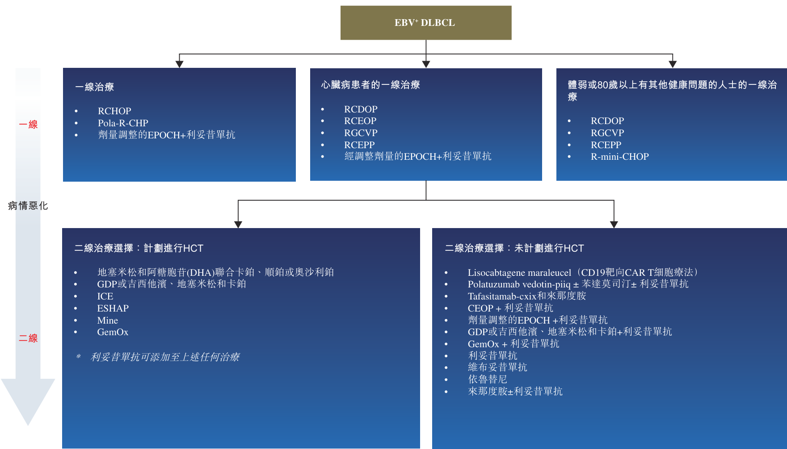

資料來源：弗若斯特沙利文分析

---

## 第 183 页

伯基特淋巴瘤在中國的治療模式

就伯基特淋巴瘤而言，首選臨床療法為CODOX-M聯合利妥昔單抗、EPOCH聯合利妥昔單抗及Hyper-CVAD。CODOX-M是一種用於治療高級別淋巴瘤的聯合療法，是治療伯基特淋巴瘤的高效方案，3年無進展生存率達74%，3年總生存率達77%，且復發率低。然而，其副作用包括中性粒細胞減少、血小板減少、腫瘤溶解綜合徵、敗血症及癲癇發作。EPOCH聯合利妥昔單抗(EPOCH-R)為另一種有效臨床治療方案，用於治療侵襲性非霍奇金淋巴瘤。臨床研究表明，在成年人群中，劑量調整的EPOCH-R的5年無事件生存率為84.5%，總生存率為87%。所有年齡組均耐受該療法。主要副作用包括中性粒細胞減少、血小板減少及黏膜炎。Hyper-CVAD聯合利妥昔單抗(Hyper-CVAD-R)是化療、類固醇藥物及單克隆抗體的聯合療法。臨床研究表明，Hyper-CVAD-R的3年總生存率、無事件生存率及無病生存率分別為89%、80%及88%。該療法受到骨髓抑制及相關感染的普遍副作用的限制。由於毒性負擔過重，與年輕患者相比，老年患者的治療效果較差。

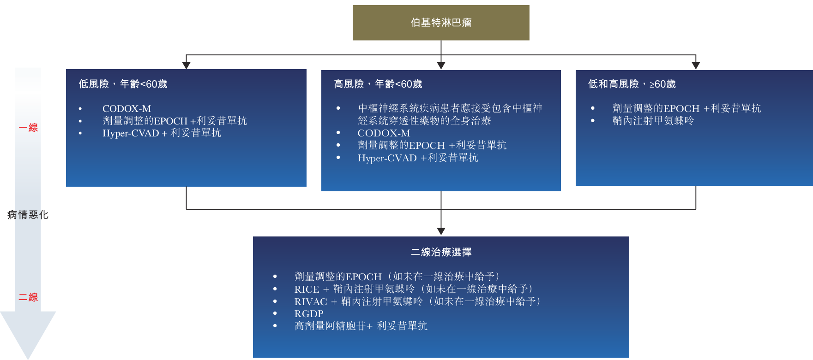

資料來源：弗若斯特沙利文分析

EBV⁺結外NK/T細胞淋巴瘤在中國的治療模式

就EBV⁺結外NK/T細胞淋巴瘤而言，該病對L－門冬酰胺酶敏感，DDGP療法為該適應症的首選一線療法。臨床研究表明，兩年無進展生存率及總生存率分別為81.4%及87.1%。總緩解率(ORR)及完全緩解率分別為91.3%及60%。主要不良反應為骨髓抑制、消化道毒性及凝血障礙。

P-GEMOX是結外NK/T細胞淋巴瘤的一線治療，總緩解率為88.8%，三年無惡化生存率為57.8%。

---

## 第 184 页

SMILE被視為EBV$^{+}$結外NK/T細胞淋巴瘤二線治療的標準治療方法。五年總生存率可達到52.3%，客觀緩解率為68.2%。

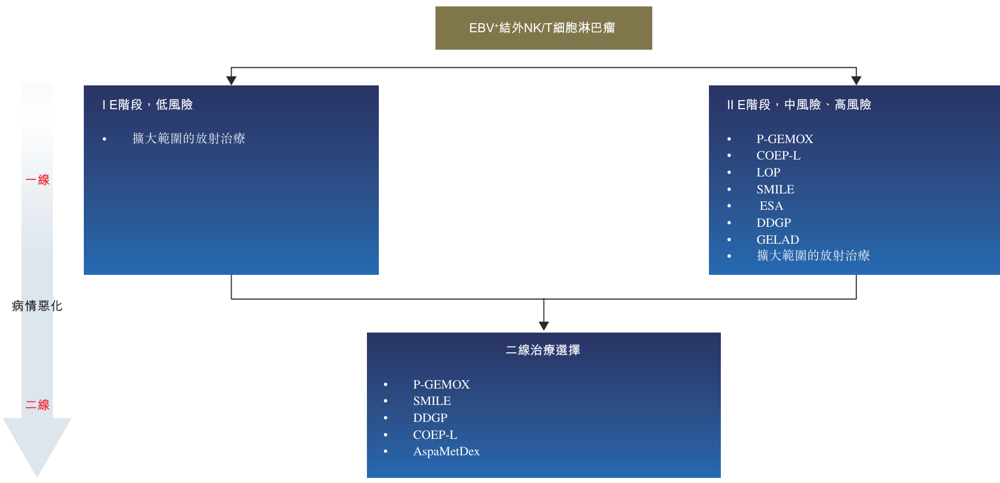

資料來源：弗若斯特沙利文分析

在EBV$^{+}$非霍奇金淋巴瘤的治療模式中，本公司的HX009為R/R EBV$^{+}$非霍奇金淋巴瘤患者的二線以上治療方案。截至最後實際可行日期，HX009是全球唯一靶向R/R EBV$^{+}$非霍奇金淋巴瘤的PD-1/CD47特異性抗體融合蛋白。

黑色素瘤

黑色素瘤是一種最嚴重的皮膚癌，亦可在眼睛及體內（如鼻子或喉嚨）形成。黑色素瘤源自黑色素細胞，而黑色素細胞可產生黑色素，形成皮膚、頭髮及眼睛的顏色。黑色素瘤的徵兆及症狀通常為皮膚上出現大小、形狀及顏色不盡相同的新斑點或新痣斑。斑點會導致出血，並且看似與其他病變有所差別。重要症狀包括皮膚潰瘍無法癒合，以及痣斑發紅、腫脹、發癢、觸痛、出血或疼痛。黑色素瘤的診斷是基於臨床表現、體檢及活檢。我們產品所針對的黑色素瘤中，所稱的晚期階段指癌症已擴散至身體遠端部位，如肺部、肝臟、腦部、骨骼或遠端淋巴結。對於晚期的黑色素瘤，建議進行CT、MRI、PET-CT、超聲波及同位素骨掃描等影像學檢查，以查找轉移跡象。

根據弗若斯特沙利文報告，中國黑色素瘤新發病例數量已由2019年的8,200例增加至2024年的9,200例，複合年增長率為2.4%。預計於2030年及2035年將分別達到10,300例及11,100例，複合年增長率分別為2.0%及1.5%。同時，全球黑色素瘤新發病例數量已由2019年的294,600例增加至2024年的351,600例，複合年增長率為3.6%。預計於2030年及2035年將分別達到376,600例及405,200例，複合年增長率分別為1.2%及1.5%。我們的HX009所針對的一線及二線黑色素瘤在中國於2024年的患者人數約為4,900人，全球患者人數約為24,300人。在中國，約93%的晚期黑色素瘤患者接受一線治療，另有58%於一線治療後惡化的患者接受二線及以上治療。

---

## 第 185 页

目前尚無靶向CD47的藥物獲批供臨床使用，我們的核心產品HX009是全球唯一正處於臨床研究階段的治療黑色素瘤的CD47雙特異性抗體融合蛋白。

市場規模

根據弗若斯特沙利文報告，於2019年至2024年，全球黑色素瘤市場由126億美元增加至184億美元，複合年增長率為7.9%。此外，全球黑色素瘤市場在不久的將來將持續快速增長。預計於2030年及2035年，全球黑色素瘤市場將分別達到236億美元及273億美元，2024年至2030年的複合年增長率為4.2%，2030年至2035年的複合年增長率為2.9%。於2019年至2024年，中國黑色素瘤市場總額由2億美元增加至3億美元，複合年增長率為6.2%。預計中國黑色素瘤市場總額將於2035年達到4億美元。下圖列示於所示期間全球黑色素瘤市場的歷史及預測規模：

2019年至2035年（預計）全球黑色素瘤市場的歷史及預測規模

<!-- table html -->
<table><tr><td rowspan="3">期間</td><td colspan="3">複合年增長率</td></tr><tr><td>中國</td><td>全球其他地區</td><td>合計</td></tr><tr><td>2019年至2024年</td><td>6.2%</td><td>8.0%</td><td>7.9%</td></tr><tr><td>2024年至2030年 (預計)</td><td>6.0%</td><td>4.2%</td><td>4.2%</td></tr><tr><td>2030年 (預計) 至 2035年 (預計)</td><td>1.9%</td><td>2.9%</td><td>2.9%</td></tr></table>
<!-- /table -->

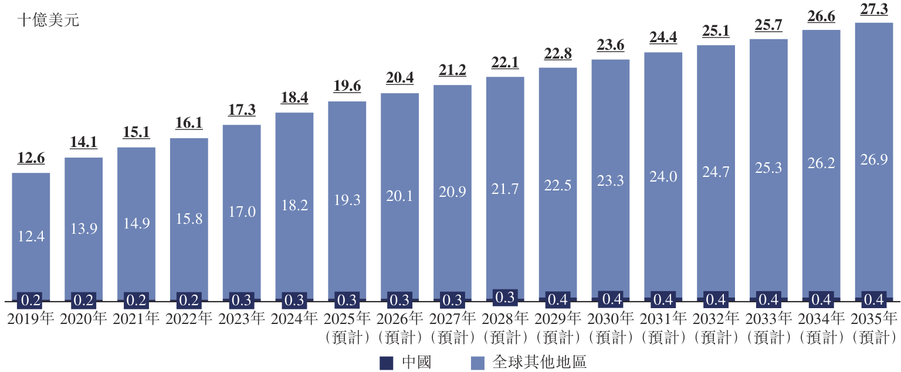

資料來源：文獻綜述、年度報告、專家訪談、弗若斯特沙利文分析

於2030年以後，黑色素瘤以及其他三個核心適應症市場的絕對值將繼續擴大，但由於定價和人口壓力的綜合影響，預計增長率將趨於平緩。儘管專利到期、生物仿製藥競爭以及國家報銷計劃的持續定價壓力正系統性地降低藥品價格，但由於預防措施及早期檢測技術的完善，該等適應症的發病率增長亦有所放緩。

---

## 第 186 页

中國一線及二線和以上黑色素瘤單藥治療管線（II期及以後）的競爭格局

中國有超過150種用於治療黑色素瘤的靶向療法管線藥物。針對一線及二線或以上黑色素瘤治療的單藥療法管線超過50種，其中5種處於I/II期，8種處於II期，3種處於III期。

<!-- table html -->
<table><tr><td>靶點</td><td>藥物名稱／代碼</td><td>公司</td><td>適應症</td><td>治療線</td><td>臨床階段</td><td>首次發佈日期</td><td>模態</td></tr><tr><td>CD47、PD-1</td><td>HX009</td><td>翰思生物</td><td>惡性黑色素瘤</td><td>一線／二線+</td><td>II期</td><td>2024/11/14</td><td>抗體基融合蛋白</td></tr><tr><td>CTLA4</td><td>伊匹木單抗</td><td>百時美施貴寶</td><td>晚期黑色素瘤</td><td>一線</td><td>III期</td><td>2015/10/23</td><td>mAb</td></tr><tr><td rowspan="2">CSF2R</td><td>BS001</td><td>濱會生物科技</td><td>黑色素瘤</td><td>三線</td><td>III期</td><td>2023/01/10</td><td>溶瘤病毒</td></tr><tr><td>OrienX-010</td><td>奥源和力生物技術</td><td>惡性黑色素瘤</td><td>二線</td><td>II期</td><td>2017/12/23</td><td>溶瘤病毒</td></tr><tr><td>MEK1、MEK2</td><td>妥拉美替尼</td><td>科州藥物、Tianjin Binjiang Pharmaceutical Co., Ltd</td><td>黑色素瘤</td><td>二線</td><td>III期</td><td>2023/06/30</td><td>小分子</td></tr><tr><td>HER2</td><td>維迪西妥單抗</td><td>榮昌生物股份有限公司</td><td>HER2陽性黑色素瘤</td><td>二線／三線</td><td>II期</td><td>2021/11/11</td><td>ADC</td></tr><tr><td>BRAF V600E</td><td>HLX-208</td><td>蘇州潤新生物科技有限公司</td><td>晚期黑色素瘤（BRAF V600基因突變）</td><td>一線／二線</td><td>II期</td><td>2021/11/16</td><td>小分子</td></tr><tr><td>PD-L1、4-1BB</td><td>QLF31907</td><td>齊魯制藥</td><td>黑色素瘤</td><td>一線／二線</td><td>II期</td><td>2023/03/11</td><td>BsAb</td></tr><tr><td>PD-L1、4-1BB</td><td>QLF31907</td><td>齊魯制藥集團有限公司</td><td>晚期黑色素瘤及UC</td><td>二線／三線</td><td>II期</td><td>2023/03/21</td><td>BsAb</td></tr><tr><td>IL2RA、PD-1</td><td>IBI363</td><td>信達生物</td><td>晚期黑色素瘤</td><td>一線</td><td>II期</td><td>2023/10/07</td><td>BsAb/抗體基融合蛋白</td></tr><tr><td>NA</td><td>GC101 TIL</td><td>君賽生物</td><td>晚期黑色素瘤</td><td>二線／三線</td><td>II期</td><td>2024/12/16</td><td>腫瘤浸潤淋巴細胞療法</td></tr><tr><td>c-Met、RET、VEGFR</td><td>ST-1898</td><td>北京賽特明強醫藥科技有限公司</td><td>晚期黑色素瘤</td><td>二線／三線</td><td>I/II期</td><td>2023/10/16</td><td>小分子</td></tr><tr><td>IL12R、PD-1</td><td>MVR-T3011</td><td>深圳市亦諾微醫藥科技有限公司</td><td>晚期黑色素瘤</td><td>一線</td><td>I/II期</td><td>2023/12/05</td><td>溶瘤病毒</td></tr><tr><td>MCAM</td><td>AMT-253</td><td>普眾發現醫藥科技（上海）有限公司</td><td>黑色素瘤及其他實體瘤</td><td>二線／三線</td><td>I/II期</td><td>2024/01/12</td><td>ADC</td></tr><tr><td>TLR4</td><td>BG136</td><td>正大製藥（青島）有限公司</td><td>晚期黑色素瘤</td><td>二線／三線</td><td>I/II期</td><td>2025/04/10</td><td>小分子</td></tr><tr><td>IGSF8</td><td>XBH25</td><td>尋百會生物</td><td>晚期實體瘤（包括黑色素瘤）</td><td>二線／三線</td><td>I/II期</td><td>2025/07/08</td><td>mAb</td></tr><tr><td>IL15R、PD-1</td><td>JMT108</td><td>上海津曼特生物科技</td><td>不可切除或轉移性晚期惡性黑色素瘤</td><td>二線／三線</td><td>I/II期</td><td>2025/12/02</td><td>抗體類融合蛋白</td></tr></table>
<!-- /table -->

資料來源：藥審中心、臨床試驗、公司網站、文獻綜述、弗若斯特沙利文分析

附註：由於共有超過50條正在進行的一線、二線及以上單藥治療，因此表格僅包括II期及以後一線、二線及以上單藥治療。

中國已獲批准治療黑色素瘤的靶向藥物競爭格局

截至最後實際可行日期，中國並無已獲批准治療黑色素瘤的雙特異性抗體。

<!-- table html -->
<table><tr><td>靶點</td><td>藥品名稱</td><td>公司</td><td>模態</td><td>治療線</td><td>適應症</td><td>治療策略</td><td>批准日期</td></tr><tr><td rowspan="2">PD-1</td><td rowspan="2">特瑞普利單抗</td><td rowspan="2">上海君實／蘇州眾合</td><td rowspan="2">mAb</td><td>一線</td><td rowspan="2">黑色素瘤</td><td rowspan="2">單藥</td><td>2025/04/22</td></tr><tr><td>二線</td><td>2018/12/17</td></tr><tr><td rowspan="2">PD-1</td><td rowspan="2">帕博利珠單抗</td><td rowspan="2">默沙東</td><td rowspan="2">mAb</td><td>一線</td><td rowspan="2">黑色素瘤</td><td rowspan="2">單藥</td><td>2024/09/10</td></tr><tr><td>二線</td><td>2018/07/20</td></tr><tr><td>MEK2、MEK1</td><td>妥拉美替尼</td><td>Kezhou/Binjiang</td><td>小分子</td><td>二線</td><td>先前抗PD-1/PD-L1治療失敗的NRAS突變晚期黑色素瘤患者</td><td>單藥</td><td>2024/03/12</td></tr><tr><td>PD-1</td><td>普特利單抗</td><td>康方生物／翰森製藥</td><td>mAb</td><td>二線</td><td>黑色素瘤</td><td>單藥</td><td>2022/09/20</td></tr><tr><td rowspan="2">MEK1、MEK2</td><td rowspan="2">曲美替尼</td><td rowspan="2">日本煙草</td><td rowspan="2">小分子</td><td>一線</td><td rowspan="2">BRAF V600突變陽性不可切除或轉移性黑色素瘤</td><td rowspan="2">聯合達拉非尼</td><td>2019/12/18</td></tr><tr><td>佐劑</td><td>2020/03/05</td></tr><tr><td rowspan="2">BRAF</td><td rowspan="2">達拉非尼</td><td rowspan="2">葛蘭素史克</td><td rowspan="2">小分子</td><td>一線</td><td rowspan="2">BRAF V600突變陽性不可切除或轉移性黑色素瘤</td><td rowspan="2">聯合曲美替尼</td><td>2019/12/18</td></tr><tr><td>佐劑</td><td>2020/03/05</td></tr><tr><td>BRAF</td><td>維羅非尼</td><td>Plexxikon／第一三共</td><td>小分子</td><td>一線／二線</td><td>BRAF V600突變陽性不可切除或轉移性黑色素瘤</td><td>單藥</td><td>2017/03/10</td></tr></table>
<!-- /table -->

資料來源：藥審中心、弗若斯特沙利文分析

---

## 第 187 页

中國已獲批准治療黑色素瘤的一線及二線靶向單藥治療藥物競爭格局

截至最後實際可行日期，五種一線及二線靶向單藥治療藥物獲准用於治療黑色素瘤。

<!-- table html -->
<table><tr><td>靶點</td><td>藥物名稱</td><td>公司</td><td>藥物類型</td><td>治療線</td><td>適應症</td><td>每年治療成本 (人民幣元)</td><td>批准日期</td></tr><tr><td>BRAF</td><td>維羅非尼</td><td>第一三共</td><td>化學藥物</td><td>一線</td><td>不可切除或經國家食藥監局批准的檢測方法確定具有BRAF V600突變陽性。</td><td>約人民幣100,000元</td><td>一線: 2017/03/10</td></tr><tr><td>PD-1</td><td>帕博利珠單抗</td><td>默沙東</td><td>單克隆抗體</td><td>一線／二線</td><td>黑色素瘤</td><td>約人民幣50,000元</td><td>二線: 2018/07/20 一線: 2024/09/10</td></tr><tr><td>PD-1</td><td>特瑞利普單抗</td><td>君實生物科技</td><td>單克隆抗體</td><td>一線／二線</td><td>黑色素瘤</td><td>約人民幣58,000元</td><td>二線: 2018/12/17 一線: 2025/04/22</td></tr><tr><td>PD-1</td><td>普特利單抗</td><td>康方生物</td><td>單克隆抗體</td><td>二線</td><td>黑色素瘤</td><td>約人民幣20,000元</td><td>二線: 2022/09/20</td></tr><tr><td>MEK1、MEK2</td><td>妥拉美替尼</td><td>科州藥物</td><td>化學藥物</td><td>二線</td><td>抗PD-1/PD-L1治療失敗的晚期NRAS突變黑色素瘤患者</td><td>約人民幣240,000元</td><td>二線: 2024/03/12</td></tr></table>
<!-- /table -->

資料來源：藥審中心、文獻綜述、弗若斯特沙利文分析

晚期黑色素瘤的治療模式

晚期黑色素瘤人群在美國和中國接受的治療相似。在中國，首選一線療法為達拉非尼聯合曲美替尼、替莫唑胺及妥拉美替尼。達拉非尼聯合曲美替尼是針對BRAF V600突變晚期黑色素瘤的聯合療法。臨床研究表明，此療法的ORR為61%，PFS為7.9個月。最常見的不良反應是發熱及貧血。替莫唑胺在中國亦是首選一線治療藥物。結果顯示，替莫唑胺的中位生存期為7.7個月，中位PFS為1.9個月。總體而言，替莫唑胺療法耐受性良好，隨著臨床研究的推進，患者得以改善或維持身體機能。主要副作用為中度噁心及嘔吐。內皮抑素與達卡巴嗪的聯合療法是另一項晚期黑色素瘤的一線治療方法。無惡化生存期為4.5個月。妥拉美替尼是另一種獲批的晚期黑色素瘤療法。臨床研究表明，妥拉美替尼的ORR為35.8%，中位PFS為4.2個月，中位OS為13.7個月。PD-1被視為黑色素瘤二線治療的標準治療方法。以帕博利珠單抗為例，12個月時測量的無惡化生存期為5.5個月，客觀緩解率為33.7%，即66.3%的患者在接受帕博利珠單抗治療後無完全緩解或部分緩解。

在黑色素瘤的治療模式中，本公司的HX009是黑色素瘤患者的一線／二線以上治療方案，也是全球唯一一款靶向黑色素瘤的PD-1/CD47雙特異性抗體融合蛋白。相較於用於相同疾病階段的單克隆抗體帕博利珠單抗，HX009透過CD8+T細胞活化及巨噬細胞介導的免疫反應兩種機制，展現出協同的抗腫瘤效能。

黑色素瘤在美國的治療模式

黑色素瘤患者有不同類型的治療方法，其中五種為標準治療，包括手術、化療、放射治療、免疫治療、靶向療法。新的疫苗療法正在測試用於治療黑色素瘤的臨床用途。預後及治療方案取決於多種因素，包括厚度、腫瘤位置及細胞分裂速度。

---

## 第 188 页

行業概覽

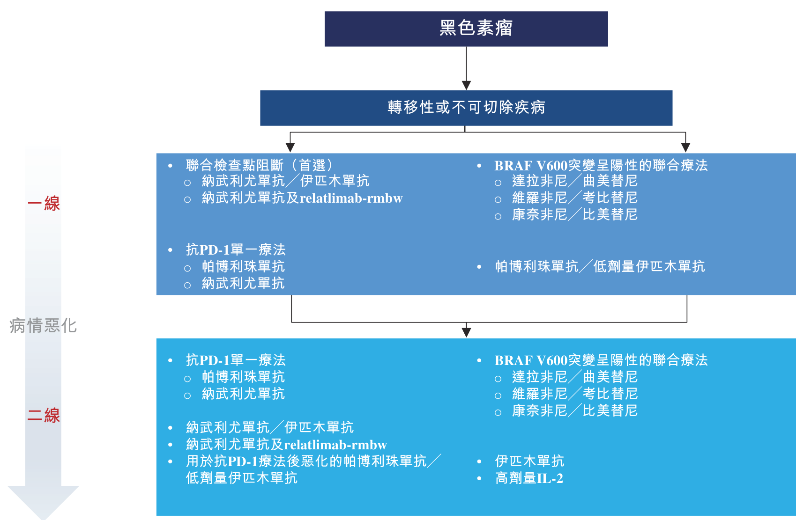

資料來源：2024年NCCN指南、弗若斯特沙利文分析

黑色素瘤在中國的治療模式

對晚期黑色素瘤患者進行系統性治療可降低腫瘤負荷，改善腫瘤相關症狀、生活質量及延長存活期。常見療法包括靶向療法、化療、免疫療法、系統性治療及對症支持治療的反應評價標準。

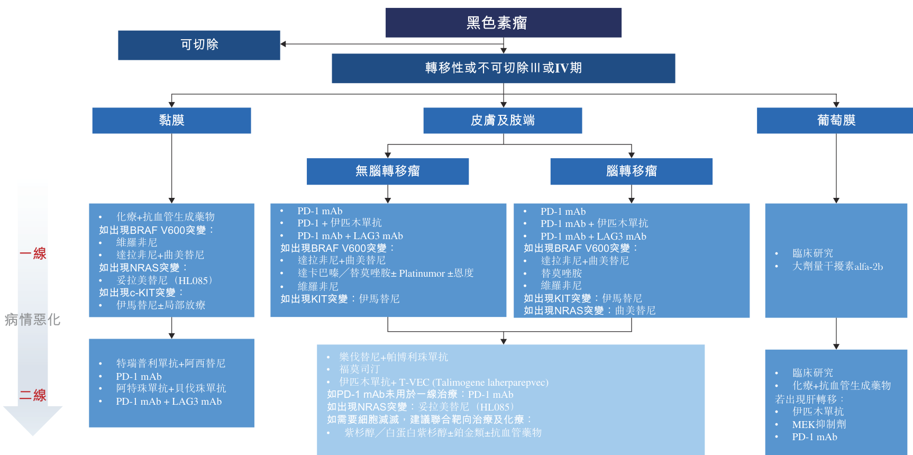

資料來源：CSCO黑色素瘤診療指南2024、弗若斯特沙利文分析

---

## 第 189 页

未獲滿足的臨床需求

高度惡性及高轉移性：黑色素瘤是一種腦轉移概率較高的惡性腫瘤。50%至80%的晚期黑色素瘤患者會發生肝轉移，而8%至46%的黑色素瘤患者會發生腦轉移。

• 化療及手術的局限性：(i)化療：達卡巴嗪、替莫唑胺、氟西汀、紫杉醇、白蛋白紫杉醇、順鉑及卡鉑等傳統細胞毒性藥物對晚期黑色素瘤的療效不佳，總緩解率為10%至15%；及(ii)手術：中國的肢端雀斑痣樣黑色素瘤患者比白人更常見。在考慮完全切除腫瘤時，應盡可能充分考慮肢體功能，尤其是手指功能。

缺乏中國患者的醫學證據：目前針對惡性黑色素瘤的免疫檢查點抑制劑進展多是基於西方國家白人的數據，但對中國患者的獲益有限，主要是由於病理亞型不同。西方國家的患者主要為皮膚類黑色素瘤（約90%），而中國患者則以肢端及黏膜類型為主，分別佔41.8%及22.6%。與皮膚惡性黑色素瘤相比，肢端及黏膜黑色素瘤通常被認為是更嚴重的惡性腫瘤，對免疫療法及化療的緩解率較低。在一項針對2012年8月至2016年3月期間的52名患者的回溯性分析中，伊匹木單抗、帕博利珠單抗以及帕博利珠單抗加伊匹木單抗聯合用藥的客觀緩解率分別為0%、25%及20%。在KEYNOTE-151研究（為二線帕博利珠單抗治療中國晚期或轉移性黑色素瘤患者的Ib期研究）中，中國晚期黑色素瘤患者在帕博利珠單抗治療下對黏膜及肢端黑色素瘤的客觀緩解率分別為13.3%及15.8%，中位無進展生存期為2.8個月，及中位總生存期為12.1個月。在中國，需要為對PD-1抑制劑耐藥的患者探索新的治療策略。

腦膠質母細胞瘤

腦膠質母細胞瘤亦被稱為多形性腦膠質母細胞瘤(GBM)，是中樞神經系統常見的腦腫瘤之一。腦膠質母細胞瘤是惡性程度最高的星形細胞瘤，佔原發性腦腫瘤的52%。大部分腦膠質母細胞瘤為原發性腫瘤，其發病機制與繼發性腫瘤不同。原發性腦膠質母細胞瘤的分子改變主要是表皮生長因子受體的擴增和過度表達，而p53（一種主要的腫瘤抑制細胞因子）的突變是導致繼發性腦膠質母細胞瘤的主要原因。

---

## 第 190 页

根據弗若斯特沙利文報告，中國腦膠質母細胞瘤新發病例數量已由2019年的37,800例增至2024年的45,000例，複合年增長率為3.5%。新發病例數量預計將於2030年增至51,400例，複合年增長率為2.3%，並將於2035年增至56,800例，複合年增長率為2.0%。我們的HX301所針對的一線膠質母細胞瘤在中國於2024年的患者人數約為36,500人，約有81.0%的膠質母細胞瘤患者接受一線治療。

市場規模

根據弗若斯特沙利文報告，中國腦膠質母細胞瘤市場規模於2024年達到人民幣12億元，主要由於替莫唑胺於2022年被納入帶量採購計劃，導致市場規模縮減。預計該市場將於2030年及2035年分別擴大至人民幣32億元及人民幣54億元，複合年增長率分別為17.9%及10.7%。下圖列示於所示期間中國腦膠質母細胞瘤市場的歷史及預測規模：

2019年至2035年（預計）中國腦膠質母細胞瘤市場的歷史及預測規模

<!-- table html -->
<table><tr><td>期間</td><td>複合年增長率</td></tr><tr><td>2019年至2024年</td><td>-8.6%</td></tr><tr><td>2024年至2030年（預計）</td><td>17.9%</td></tr><tr><td>2030年（預計）至2035年（預計）</td><td>10.7%</td></tr></table>
<!-- /table -->

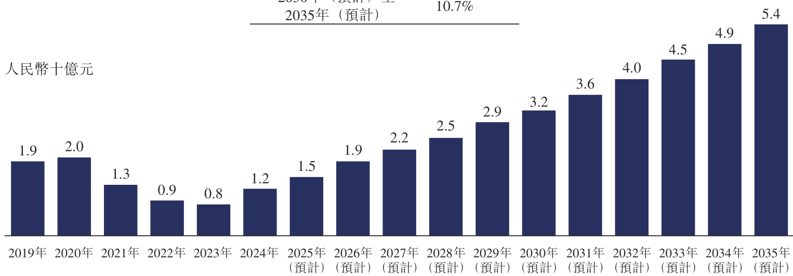

資料來源：文獻綜述、年度報告、專家訪談、弗若斯特沙利文分析

附註：替莫唑胺於2022年被納入集中帶量採購計劃，導致當時市場規模縮減。

中國一線腦膠質母細胞瘤聯合療法管線的競爭格局

中國有超過45種針對腦膠質母細胞瘤的靶向治療管線藥物。目前，中國有三種處於臨床階段用於一線聯合治療腦膠質母細胞瘤的小分子抑制劑。

<!-- table html -->
<table><tr><td>靶向</td><td>藥物名稱／代碼</td><td>公司</td><td>適應症</td><td>治療線</td><td>臨床階段</td><td>首次發佈日期</td><td>模態</td></tr><tr><td>CSF1R/ARK5/CDK4/6/FLT-3</td><td>HX301</td><td>翰思生物</td><td>腦膠質母細胞瘤</td><td>一線</td><td>II期</td><td>2024/11/21</td><td>小分子</td></tr><tr><td>TOP1</td><td>Pegylated irinotecan</td><td>JenKem</td><td>腦膠質母細胞瘤</td><td>一線</td><td>III期</td><td>2022/08/12</td><td>小分子</td></tr><tr><td>PRKCB</td><td>恩扎妥林</td><td>Xcelience</td><td>腦膠質母細胞瘤</td><td>一線</td><td>III期</td><td>2021/01/13</td><td>小分子</td></tr></table>
<!-- /table -->

資料來源：藥審中心、弗若斯特沙利文分析

附註：表格僅包括相同適應症及治療線的療法

---

## 第 191 页

中國已獲批准治療腦膠質母細胞瘤的靶向藥物競爭格局

<!-- table html -->
<table><tr><td>靶點</td><td>藥品名稱</td><td>公司</td><td>模態</td><td>治療線</td><td>適應症</td><td>治療策略</td><td>批准日期</td></tr><tr><td>c-Met</td><td>伯瑞替尼</td><td>冠科生物</td><td>小分子</td><td>二線</td><td>腦膠質母細胞瘤</td><td>單藥</td><td>2024/04/17</td></tr><tr><td>VEGFA</td><td>貝伐珠單抗</td><td>羅氏</td><td>mAb</td><td>二線</td><td>腦膠質母細胞瘤</td><td>單藥</td><td>2020/09/14</td></tr></table>
<!-- /table -->

資料來源：藥審中心、弗若斯特沙利文分析

腦膠質母細胞瘤的治療模式

美國和中國的膠質母細胞瘤治療模式相似，均以替莫唑胺聯合放療作為首選臨床治療方法。替莫唑胺為小分子藥物，可穿透血腦屏障影響中樞神經系統。臨床結果顯示，與單一放療相比，引入替莫唑胺可提升療效。放療聯合替莫唑胺的中位生存期為14.6個月，兩年生存率為26.5%，而單獨放療則分別為12.1個月及10.4%。不良反應包括中性粒細胞減少及血小板減少。中國一線膠質母細胞瘤的標準治療藥物為化療聯合單克隆抗體治療，包括替莫唑胺及貝伐珠單抗。

在腦膠質母細胞瘤的治療模式中，本公司的HX301是腦膠質母細胞瘤患者的一線治療方案。HX301是一款小分子激酶抑制劑，而替莫唑胺則為傳統細胞毒性藥物，其作用機制為破壞細胞DNA。相比傳統細胞毒性治療，小分子蛋白激酶抑制劑的副作用較少。與單克隆抗體藥物貝伐珠單抗相比，HX301可有效穿透血腦屏障，而貝伐珠單抗則難以穿透血腦屏障以到達癌細胞。

腦膠質母細胞瘤在美國的治療模式

在美國，目前復發性腦膠質母細胞瘤的治療方案包括手術、放化療聯合替莫唑胺以及使用腫瘤治療領域。該等治療在美國被用作一線療法並被接受為治療腦膠質母細胞瘤的標準治療。

---

## 第 192 页

行業概覽

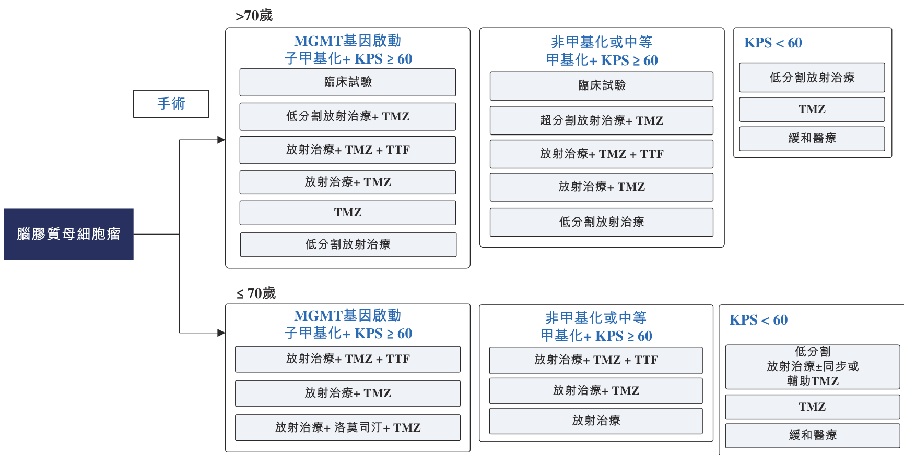

附註：KPS=Karnofsky評分、TTF=腫瘤治療領域、TMZ=替莫唑胺

資料來源：NCCN、弗若斯特沙利文分析

腦膠質母細胞瘤在中國的治疗模式

腦膠質母細胞瘤是最常見的原發性腦癌，由於大多數患者在原發部位復發，腦膠質母細胞瘤的復發已成為一個重要的臨床問題。在中國，目前復發性腦膠質母細胞瘤的治療方案包括手術、放化療聯合替莫唑胺以及使用貝伐珠單抗。

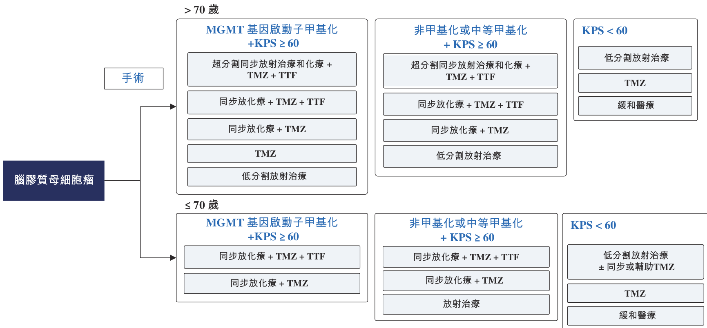

KPS=Karnofsky評分、TTF=腫瘤治療領域、TMZ=替莫唑胺

資料來源：CSCO、弗若斯特沙利文分析

---

## 第 193 页

未獲滿足的臨床需求

腦膠質母細胞瘤的手術難度高且預後差：手術是治療腦膠質母細胞瘤的基礎手段，而腦膠質母細胞瘤手術的原則是盡可能安全切除。然而，由於腦膠質母細胞瘤具備侵襲性，可能會擴散至周圍健康腦組織，故手術難度頗高。因此，在不損害大腦關鍵區域的情況下完全切除腫瘤極為困難。此外，即使神經外科技術不斷進步，通常也無法安全切除所有癌細胞，從而導致腫瘤可能復發。此外，對於大腦內重要功能區域（尤其是控制運動、言語及視覺等）的腦膠質母細胞瘤，手術方案可能會更加複雜。腦膠質母細胞瘤手術的侵入性亦會導致固有風險，包括可能導致神經功能缺損、術後併發症以及延長患者恢復期等。

血腦屏障導致給藥困難：血腦屏障是一種具有高度選擇性的物理及生理屏障，可調節分子從循環系統進入腦實質的通路。血腦屏障會限制眾多有效濃度的化療藥物及其他藥物進入大腦，進而限制靶向及治療腦膠質母細胞瘤的能力。因此，即使一種藥物在實驗室研究中對腦膠質母細胞瘤細胞有效，但在全身給藥方式下，該藥物抵達相關細胞時的濃度可能不足以產生效果。血腦屏障會阻礙腦膠質母細胞瘤的治療，因此選擇能夠穿透血腦屏障且精準靶向腫瘤細胞的適宜納米顆粒尤為重要。

化療耐藥性會減弱治療效果：根據現有實證醫學證據，基於替莫唑胺的化療在腦膠質母細胞瘤治療中發揮主要作用，但臨床效果仍然較差。腦膠質母細胞瘤患者的五年生存率僅為6.9%，平均生存期估計僅為八個月。化療抗藥性可能源於多種機制，包括異質性、超突變、免疫逃避及腫瘤活化中的可變剪接。解決抗藥性問題對於提高腦膠質母細胞瘤患者的總體療效以及推動腦膠質母細胞瘤治療領域邁向療效更好的個性化介入治療而言至關重要。

缺乏靶向巨噬細胞的療法：腦膠質母細胞瘤微環境在腫瘤惡化及治療過程中發揮關鍵作用。不同於大多數其他實體瘤，腦膠質母細胞瘤微環境以巨噬細胞及小膠質細胞為主（統稱為腫瘤相關巨噬細胞），而腫瘤相關巨噬細胞為治療腦膠質母細胞瘤患者提供各種潛在介入點。然而，目前尚無已上市的巨噬細胞靶向藥物，具有巨大的發掘潛力。

---

## 第 194 页

膽道癌

BTC是全球第二大常見肝及膽管癌，通常包括膽管癌及膽囊癌，若干病例亦包括壺腹癌。BTC最常見的症狀是黃疸，其特徵是由於膽管阻塞導致眼睛及皮膚呈深黃色。BTC是常見的膽道系統惡性腫瘤。早期症狀包括腹部不適、食慾減退、體重減輕等。我們產品所針對的晚期BTC指已發生轉移或無法切除，且不適合以根治性目的進行局部治療的腫瘤。後期可能出現黃疸、腹痛、發燒等症狀。膽囊的位置隱蔽，往往直到晚期階段方可發現，並會導致預後不良。

根據弗若斯特沙利文報告，中國BTC新發病例數量於2024年達到139,800例，預計於2030年及2035年將分別增至161,100例及179,100例，2024年至2030年期間的複合年增長率為2.4%，2030年至2035年期間的複合年增長率為2.1%。同時，2024年全球BTC新發病例數量達到419,100例，預計於2030年及2035年將分別增至505,000例及582,900例，複合年增長率分別為3.2%及2.9%。我們的HX009所針對的二線BTC在中國於2024年的患者人數約為84,900人，全球患者人數約為254,600人。約89%的晚期BTC患者接受一線治療，而在一線治療後進展的患者中約有63%至74%接受二線及以上治療。

市場規模

於2019年至2024年，中國BTC藥物市場規模由2019年的人民幣15億元增至2024年的人民幣34億元，2019年至2024年的複合年增長率為17.7%。市場規模將於2030年及2035年分別攀升至人民幣99億元及人民幣172億元。

2019年至2035年（預計）中國BTC藥物市場的歷史及預測規模

<!-- table html -->
<table><tr><td>期間</td><td>複合年增長率</td></tr><tr><td>2019年至2024年</td><td>17.7%</td></tr><tr><td>2024年至2030年 (預計)</td><td>19.4%</td></tr><tr><td>2030年 (預計) 至2035年 (預計)</td><td>11.6%</td></tr></table>
<!-- /table -->

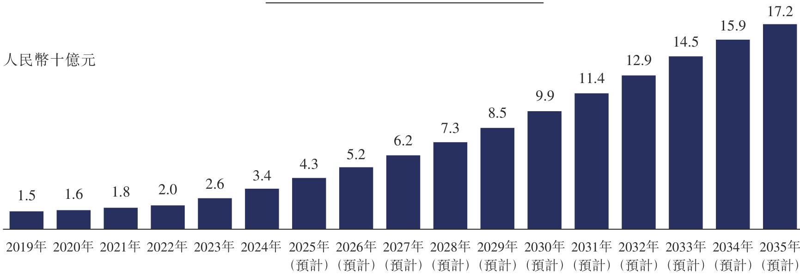

資料來源：弗若斯特沙利文分析

---

## 第 195 页

中國二線及以上BTC聯合治療管線的競爭格局

截至最後實際可行日期，中國有超過170種針對BTC的靶向治療管線藥物，超過100種BTC單藥治療管線藥物處於臨床試驗，並且有超過85種處於臨床試驗中的二線及以上BTC治療管線藥物。其中，16種屬於聯合管線（與我們的HX009屬於同類療法）。具體而言，4種處於I期、11種處於I/II期及2種處於II期。

<!-- table html -->
<table><tr><td>靶點</td><td>藥物名稱／代碼</td><td>公司</td><td>適應症</td><td>治療線</td><td>聯合</td><td>臨床階段</td><td>首次發佈日期</td><td>模態</td></tr><tr><td>CD47、PD-1</td><td>HX-009</td><td>翰思生物</td><td>BTC</td><td>二線+</td><td>與IN10018聯合治療</td><td>II期</td><td>2024/11/14</td><td>抗體基融合蛋白</td></tr><tr><td>EGFR、HER3</td><td>Izalontamab brengitecan</td><td>多特生物</td><td>BTC</td><td>二線+</td><td>與PD1/PDL1抑制劑聯合治療</td><td>II期</td><td>2025/05/12</td><td>bsADC</td></tr><tr><td>-</td><td>Imifoplatin</td><td>賽生藥業</td><td>實體瘤（包括BTC）</td><td>一線／二線</td><td>與吉西他濱聯合治療</td><td>I/II期</td><td>2019/05/30</td><td>小分子</td></tr><tr><td>AURKA、AURKB、CSFIR、JAK1、JAK2、VEGFR、FGFR</td><td>Tinengotinib</td><td>Ankang Biological Technology</td><td>實體瘤（包括BTC）</td><td>二線+</td><td>與化療聯合</td><td>I/II期</td><td>2021/11/08</td><td>小分子</td></tr><tr><td>TGFBR1</td><td>GFH018</td><td>勁方醫藥</td><td>實體瘤（包括BTC）</td><td>一線／二線+</td><td>與特瑞利普單抗聯合治療</td><td>I/II期</td><td>2022/07/01</td><td>小分子</td></tr><tr><td>B7-H4</td><td>Puxitatug samrotecan</td><td>阿斯利康</td><td>BTC、OC、TNBC</td><td>二線+</td><td>與rilvegostomig聯合治療</td><td>I/II期</td><td>2022/10/19</td><td>ADC</td></tr><tr><td>HER2</td><td>IAH 0968</td><td>盛禾（中國）生物製藥</td><td>BTC</td><td>一線／二線+</td><td>與吉西他濱及順鉑聯合治療</td><td>I/II期</td><td>2022/12/05</td><td>mAb</td></tr><tr><td>CLDN-18.2</td><td>RC118</td><td>榮昌生物</td><td>實體瘤（包括BTC）</td><td>一線／二線+</td><td>與特瑞利普單抗聯合治療</td><td>I/II期</td><td>2023/05/10</td><td>ADC</td></tr><tr><td>HER3</td><td>DB-1310</td><td>映恩生物</td><td>實體瘤（包括BTC）</td><td>一線／二線+</td><td>與曲妥珠單抗聯合治療</td><td>I/II期</td><td>2023/06/09</td><td>ADC</td></tr><tr><td>c-Met</td><td>RC108</td><td>榮昌生物</td><td>實體瘤（包括BTC）</td><td>一線／二線+</td><td>與特瑞利普單抗聯合治療</td><td>I/II期</td><td>2023/09/11</td><td>ADC</td></tr><tr><td>IL10R、CLDN-18.2</td><td>LB4330</td><td>健信生物醫藥</td><td>實體瘤（包括BTC）</td><td>一線／二線+</td><td>與LB1410聯合治療</td><td>I/II期</td><td>2024/05/20</td><td>BsAb/抗體基融合蛋白</td></tr><tr><td>TIGIT、TGFB</td><td>AK130</td><td>康方生物</td><td>BTC</td><td>二線+</td><td>與依沃西單抗聯合治療</td><td>I/II期</td><td>2025/04/08</td><td>抗體基融合蛋白</td></tr><tr><td>PD-L1、VEGF</td><td>IMM2510 (Palverafusp alfa)</td><td>宜明昂科生物醫藥技術（上海）</td><td>實體瘤（包括BTC）</td><td>二線+</td><td>與IMM01聯合治療</td><td>I/II期</td><td>2025/09/09</td><td>BsAb</td></tr><tr><td>PTGER4</td><td>KF-0210</td><td>凱復</td><td>實體瘤（包括BTC）</td><td>一線／二線+</td><td>與atezolizumab聯合治療</td><td>I期</td><td>2021/06/25</td><td>小分子</td></tr><tr><td>HER2</td><td>Anvatabart opadotin</td><td>浙江新碼</td><td>實體瘤（包括BTC）</td><td>二線+</td><td>與多西他賽聯合治療</td><td>I期</td><td>2022/09/09</td><td>ADC</td></tr><tr><td>-</td><td>CG-7321</td><td>成都賽環</td><td>實體瘤（包括BTC）</td><td>一線／二線+</td><td>與其他抗腫瘤藥物聯合</td><td>I期</td><td>2024/03/05</td><td>小分子</td></tr><tr><td>PRMT5</td><td>AMG 193</td><td>Patheon pharma Amgen</td><td>BTC、GC、PC</td><td>一線／二線+</td><td>與多西他賽聯合治療</td><td>I期</td><td>2024/07/26</td><td>ndMG</td></tr></table>
<!-- /table -->

資料來源：藥審中心、弗若斯特沙利文分析

附註：表格僅包括相同適應症及治療線的療法

---

## 第 196 页

中國已獲批准治療BTC的靶向藥物競爭格局

截至最後實際可行日期，中國有一種已獲批准的BTC雙特異性抗體。獲批藥物為Ziihera$^{®}$（注射用澤尼達妥單抗），由百濟神州開發的靶向HER2的雙特異性抗體。其於2025年5月27日在中國獲批，用於治療不可切除的局部晚期或轉移性膽道癌（經先前全身治療後HER2高表達(IHC 3+)），為中國首個且目前唯一獲批用於該適應症的雙特異性抗體。

<!-- table html -->
<table><tr><td>靶點</td><td>藥品名稱</td><td>公司</td><td>模態</td><td>治療線</td><td>適應症</td><td>聯合療法</td><td>批准日期</td></tr><tr><td>PD-L1</td><td>度伐利尤單抗</td><td>阿斯利康</td><td>mAb</td><td>一線</td><td>BTC</td><td>聯合吉西他濱及順鉑</td><td>2023/11/07</td></tr><tr><td>PD-1</td><td>帕博利珠單抗</td><td>默沙東</td><td>mAb</td><td>一線</td><td>BTC</td><td>聯合吉西他濱及順鉑</td><td>2024/01/30</td></tr><tr><td>HER2</td><td>澤尼達妥單抗</td><td>Zymeworks</td><td>bsAb</td><td>二線</td><td>患有不可切除的局部晚期或轉移性膽道癌患者，其腫瘤顯示HER2高表達（IHC 3+）且先前已接受全身治療。</td><td>單藥</td><td>2025/05/27</td></tr><tr><td>FGFR1、FGFR2、FGFR3</td><td>培米替尼</td><td>因塞特</td><td>小分子</td><td>二線</td><td>患有晚期、轉移性或無法切除的膽道癌，先前至少接受過一次全身治療，且腫瘤的FGFR2融合或重排檢測呈陽性反應的成人患者。</td><td>單藥</td><td>2022/03/29</td></tr></table>
<!-- /table -->

資料來源：藥審中心、弗若斯特沙利文分析

中國二線及以上BTC聯合療法的競爭格局

截至最後實際可行日期，兩種靶向藥物獲准用於治療BTC，其為聯合療法。

<!-- table html -->
<table><tr><td>靶點</td><td>藥物名稱</td><td>公司</td><td>藥物類型</td><td>治療線</td><td>適應症</td><td>聯合治療</td><td>每年治療成本（人民幣元）</td><td>批准日期</td></tr><tr><td>PD-L1</td><td>度伐利尤單抗</td><td>阿斯利康</td><td>單克隆抗體</td><td>一線</td><td>膽道癌</td><td>吉西他濱聯合順鉑</td><td>~430,000</td><td>2023/11/07</td></tr><tr><td>PD-1</td><td>帕博利珠單抗</td><td>默沙東</td><td>單克隆抗體</td><td>一線</td><td>膽道癌</td><td>吉西他濱聯合順鉑</td><td>~200,000</td><td>2024/01/30</td></tr></table>
<!-- /table -->

資料來源：藥審中心、文獻綜述、弗若斯特沙利文分析

BTC的治療模式

美國和中國的治療模式相似，BTC在中國的首選一線療法為由化療及靶向單克隆抗體組成的聯合療法。對於能耐受高強度化療的患者，首選聯合治療方案為：吉西他濱聯合順鉑及德瓦魯單抗；吉西他濱聯合順鉑及帕博利珠單抗；吉西他濱聯合順鉑；吉西他濱聯合替加氟；及卡培他濱聯合奧沙利鉑。過往研究表明，吉西他濱聯合順

---

## 第 197 页

鉑，晚期BTC患者的OS可由8.1個月延長至11.7個月。吉西他濱聯合替加氟，OS約為15.1個月。聯合卡培他濱及奧沙利鉑治療，OS為10.6個月。吉西他濱聯合順鉑及德瓦魯單抗，患者OS延長至12.8個月，PFS延長至7.2個月。吉西他濱及順鉑聯合帕博利珠單抗，中位治療OS為12.7個月。對於不耐受的患者，應僅使用吉西他濱。聯合療法的不良反應包括但不限於中性粒細胞減少、貧血、肝功能惡化及血小板減少。

對於無特定基因突變的晚期BTC患者，PD-1抑制劑為標準第二線治療。以帕博利珠單抗為例，其在26個月時所測得的無惡化生存期(PFS)為6.5個月，客觀緩解率為28.7%，即表示有71.3%的患者在接受帕博利珠單抗治療後未達到完全緩解或部分緩解。在BTC的治療模式中，本公司的HX009是BTC患者的二線以上療法，也是全球唯一靶向BTC的PD-1/CD47雙特異性抗體融合蛋白。相較於用於相同疾病階段的單克隆抗體帕博利珠單抗(pembrolizumab)，HX009透過CD8+ T細胞活化及巨噬細胞介導的免疫反應，展現出協同的抗腫瘤效能。

BTC在美國的治療模式

BTC在美國的治療模式可根據可切除及不可切除的情況進行分類。對於可切除的BTC，手術是去除所有癌症的初步治療方法。當BTC疾病不可切除時則採用全身治療，這涉及化療、靶向療法及免疫療法。這是美國目前的標準治療。初步治療在美國被接受為標準治療。

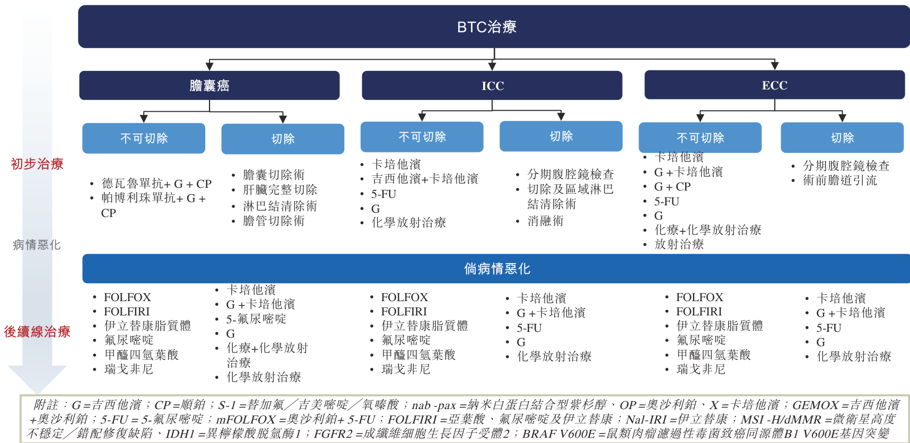

資料來源：NCCN、弗若斯特沙利文分析

BTC在中國的治療模式

BTC在臨床和病理方面表現出異質性，對化療及預後的反應不佳。接受手術切除的BTC患者的復發率非常高。對於晚期不可切除或轉移性患者，全身治療是唯一可用的治療選擇。對於晚期或轉移性BTC患者，代表性的一線治療方案為吉西他濱聯合順鉑。

---

## 第 198 页

行業概覽

<!-- table html -->
<table><tr><td colspan="4">BTC晚期</td></tr><tr><td colspan="4">耐受強烈化療</td><td>不耐受強烈化療</td></tr><tr><td>I級推薦</td><td>II級推薦</td><td>III級推薦</td><td>I/II級推薦</td></tr><tr><td>• G + CP • G + CP + 德瓦魯單抗 • G + CP + 帕博利珠單抗 • G + S-1 • X + OP</td><td>• G + CP + nab-pax • G + CP + S-1 • GEMOX • 5-FU + OP/CP • X + CP</td><td>• G + X • 以G或5-FU為基礎 • G + nab-pax • 卡瑞利珠單抗+GEMOX • 恩曲替尼 • 拉羅替尼 • 帕博利珠單抗</td><td>• G + CP +納武利尤單抗 • GEMOX +樂伐替尼+特瑞普利單抗 • FOLFIR • 臨床試驗（FGFR2、IDH1/2等）</td><td>• G • S-1/5-FU/X單藥</td></tr><tr><td colspan="4">倘體能狀態≤1分</td><td>倘體能狀態&gt;2分</td></tr><tr><td>I級推薦</td><td>II級推薦</td><td>III級推薦</td><td>I/II級推薦</td></tr><tr><td>• mFOLFOX • IDH1：艾伏尼布 • 臨床試驗</td><td>• Nal-IRI + S-1 • FOLFIR • 瑞戈非尼 • FGFR2：培米替尼</td><td>• HER2+：曲妥珠單抗 德曲妥珠單抗／帕妥珠單抗+曲妥珠單抗 • MSI-H/dMMR：帕博利珠單抗 • BRAF V600E：達拉非尼+曲美替尼 • RET：普拉替尼／塞爾帕替尼</td><td>• 納武利尤單抗 • FOLFIR • 樂伐替尼+帕博利珠單抗 • 安羅替尼+PD-1/PD-L1 • 索凡替尼</td><td>• MSI-H/dMMR：帕博利珠單抗 • IDH1：艾伏尼布 • 支援治療</td></tr></table>
<!-- /table -->

附註：G=吉西他濱；CP=順鉑；S-1=替加氟／吉美嘧啶／氧嗪酸；nab-pax=納米白蛋白結合型紫杉醇、OP=奧沙利鉑、X=卡培他濱；GEMOX=吉西他濱+奧沙利鉑；5-FU=5-氟尿嘧啶；mFOLFOX=奧沙利鉑+5-FU；FOLFIRI=亞葉酸、氟尿嘧啶及伊立替康；Nal-IRI=伊立替康；MSI-H/dMMR=微衛星高度不穩定／錯配修復缺陷、IDH1=異檸檬酸脫氫酶1；FGFR2=成纖維細胞生長因子受體2；BRAF V600E=鼠類肉瘤濾過性毒菌致癌同源體B1 V600E基因突變

資料來源：CSCO、弗若斯特沙利文分析

未獲滿足的臨床需求

目前療法的局限性：手術治療是治癒BTC的關鍵方法。然而，超過65%的患者確診時為時已晚，無法進行根治性手術切除，導致五年生存率約為5%至15%。即便是接受手術治療的患者，一年內的復發率仍高達67%。對於不符合手術資格的晚期BTC患者，治療主要圍繞藥物及局部治療，但效果有限，導致預後不佳。目前迫切需要探索更有效的綜合治療策略。

突變頻率高：BTC在基因組、表觀遺傳和分子層面上均表現出高度異質性，需要進一步研究以了解其不同亞型的分子特徵和治療靶點。BTC患者出現TP53、CDKN2A/B、KRAS、SMAD4等體細胞突變的頻率較高，但目前缺乏有效的靶向治療方法。CD47表達上調可保護癌症免受免疫監視。干擾CD47-SIRPα相互作用已被證明其在BTC治療具潛在用途。此外，靶向治療藥物的低突變頻率限制了潛在的受益者，需要進一步臨床研究以探索聯合治療方法。

治療選擇有限：目前獲批的靶向藥物相對稀缺，且大多保留用於一線聯合治療。靶向治療的低突變頻率限制了潛在的受益者。目前尚無足夠證據支持精準靶向治療的聯合治療，突顯迫切需要更多臨床研究。

---

## 第 199 页

三陰性乳腺癌

三陰性乳腺癌(TNBC)是一種根據免疫組織化學定義為對雌激素受體、孕激素受體及人表皮生長因子受體2 (HER2)呈陰性的乳腺癌。其約佔全球所有乳腺癌病例的15%。TNBC通常更容易在年輕及絕經前的女性中發生。我們產品所針對的晚期TNBC指癌細胞已擴散至乳腺以外的部位，如骨骼、肝臟、肺部或腦部。

根據弗若斯特沙利文報告，中國TNBC的發病率於2024年達到55,900例。該數目預期將於2030年的59,600例增至2030年的61,200例，2024年至2030年及2030年至2035年的複合年增長率分別為1.1%及0.5%。TNBC於2024年的全球發病率達364,900例，據估計，其將增至2030年的394,300例及2035年422,800例，複合年增長率分別為1.3%及1.4%。我們的HX009所針對的二線TNBC在中國於2024年的患者人數約為33,500人及於全球的患者人數為218,900人。約有60%的晚期TNBC患者因一線治療失敗而接受二線及以上的治療。

市場規模

於2019年至2024年，中國TNBC藥物市場規模於2024年為人民幣38億元，2019年至2024年的複合年增長率為1.9%。市場規模於2030年及2035年將分別攀升至人民幣50億元及人民幣59億元。

2019年至2035年（預計）中國TNBC市場的歷史及預測規模

<!-- table html -->
<table><tr><td>期間</td><td>複合年增長率</td></tr><tr><td>2019年至2024年</td><td>1.9%</td></tr><tr><td>2024年至2030年（預計）</td><td>4.8%</td></tr><tr><td>2030年（預計）至2035年（預計）</td><td>3.3%</td></tr></table>
<!-- /table -->

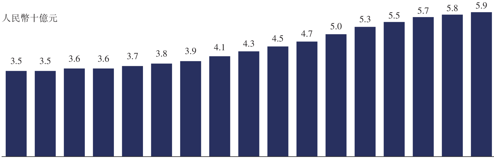

2019年 2020年 2021年 2022年 2023年 2024年 2025年 2026年 2027年 2028年 2029年 2030年 2031年 2032年 2033年 2034年 2035年（預計）（預計）（預計）（預計）（預計）（預計）（預計）（預計）（預計）

資料來源：文獻綜述、年度報告、專家訪談、弗若斯特沙利文分析

---

## 第 200 页

中國二線及以上TNBC聯合治療管線的競爭格局

截至最後實際可行日期，中國有超過170種針對TNBC的靶向治療管線藥物，並且有超過90種處於臨床試驗階段的二線及以上TNBC治療管線藥物。其中，25種屬於聯合管線（與我們的HX009屬於同類療法）。具體而言，七種處於I期、14種處於I/II期及4種處於II期。

<!-- table html -->
<table><tr><td>靶點</td><td>藥物名稱 /代碼</td><td>公司</td><td>適應症</td><td>治療線</td><td>聯合</td><td>臨床階段</td><td>首次發佈日期 /CDE受理日期</td><td>模態</td></tr><tr><td>PD-1、CD47</td><td>HX009</td><td>翰思生物</td><td>TNBC</td><td>二線／三線</td><td>與曲妥珠單抗德魯替康聯合治療</td><td>IND</td><td>2025/02/17</td><td>抗體基融合蛋白</td></tr><tr><td>BET</td><td>ZEN-3694</td><td>Zenith Epigenetics</td><td>TNBC</td><td>二線+</td><td>與他拉唑帕尼聯合治療</td><td>II期</td><td>2022/09/14</td><td>小分子</td></tr><tr><td>CDK4、CDK6</td><td>BEBT-209</td><td>必貝特醫藥</td><td>TNBC</td><td>二線+</td><td>聯合全身性化療（卡鉑及吉西他濱、白蛋白紫杉醇或eribulin）</td><td>II期</td><td>2022/12/09</td><td>小分子</td></tr><tr><td>EGFR、HER3</td><td>Izalontamab brengitecan</td><td>多特生物</td><td>實體瘤（包括TNBC）</td><td>一線／二線+</td><td>與SI-B003聯合治療</td><td>II期</td><td>2023/07/10</td><td>bsADC</td></tr><tr><td>Nectin-4</td><td>9MW2821</td><td>Maiweikang New Drug Development Co.</td><td>TNBC</td><td>二線+</td><td>與PD-1抑制劑聯合治療</td><td>II期</td><td>2024/07/02</td><td>ADC</td></tr><tr><td>AKT/PDL1</td><td>Afuresertib+ LAE005</td><td>Cambrex/來凱醫藥</td><td>實體瘤（包括TNBC）</td><td>二線+</td><td>與白蛋白紫杉醇聯合治療</td><td>I/II期</td><td>2021/03/15</td><td>小分子/mAb</td></tr><tr><td>AURKA、AURKB、CSFIR、JAK1、JAK2、VEGFR、FGFR</td><td>Tinengotinib</td><td>Ankang Biological Technology</td><td>實體瘤（包括TNBC）</td><td>二線+</td><td>聯合化療</td><td>I/II期</td><td>2021/11/08</td><td>小分子</td></tr><tr><td>TLR8</td><td>DN1508052</td><td>迪諾醫藥</td><td>實體瘤（包括TNBC）</td><td>二線+</td><td>與特瑞利普單抗聯合治療</td><td>I/II期</td><td>2021/12/31</td><td>小分子</td></tr><tr><td>FAK</td><td>Ifebemtinib</td><td>應世生物科技</td><td>實體瘤（包括TNBC）</td><td>二線+</td><td>與鹽酸多柔比星脂質體、特瑞利普單抗聯合治療</td><td>I/II期</td><td>2022/02/10</td><td>小分子</td></tr><tr><td>PARP1</td><td>Saruparib</td><td>阿斯利康</td><td>實體瘤（包括TNBC）</td><td>一線／二線+</td><td>聯合化療</td><td>I/II期</td><td>2022/03/03</td><td>小分子</td></tr><tr><td>PI3Kδ</td><td>BGB-10188</td><td>百濟神州</td><td>實體瘤（包括TNBC）</td><td>二線+</td><td>與澤布替尼、替雷利珠單抗聯合治療</td><td>I/II期</td><td>2022/03/14</td><td>小分子</td></tr><tr><td>TROP2</td><td>DB-1305</td><td>映恩生物</td><td>實體瘤（包括TNBC）</td><td>一線／二線+</td><td>與帕博利珠單抗聯合治療</td><td>I/II期</td><td>2022/08/18</td><td>ADC</td></tr><tr><td>B7-H4</td><td>Puxitatug samrotecan</td><td>阿斯利康</td><td>BTC、OC、TNBC</td><td>二線+</td><td>與rilvegostomig聯合治療</td><td>I/II期</td><td>2022/10/19</td><td>ADC</td></tr><tr><td>CSFIR、VEGFR2、DDR</td><td>C019199</td><td>海西新藥</td><td>實體瘤（包括TNBC）</td><td>二線+</td><td>與信迪利單抗聯合治療</td><td>I/II期</td><td>2023/06/30</td><td>小分子</td></tr><tr><td>c-Met</td><td>RC108</td><td>榮昌生物</td><td>實體瘤（包括TNBC）</td><td>二線+</td><td>與特瑞利普單抗聯合治療</td><td>I/II期</td><td>2023/09/11</td><td>ADC</td></tr><tr><td>PI3Kα</td><td>JS105</td><td>君實潤佳醫藥</td><td>實體瘤（包括TNBC）</td><td>二線+</td><td>與法洛德注射液、dalirucizumab、特瑞利普單抗、白蛋白紫杉醇、氟唑帕利、吡咯替尼及卡培他濱聯合</td><td>I/II期</td><td>2023/11/27</td><td>小分子</td></tr><tr><td>ER</td><td>HRS-8080</td><td>恒瑞醫藥</td><td>乳腺癌（包括TNBC）</td><td>一線／二線+</td><td>與HRS-A1811、SHR-A2009、阿得貝利單抗聯合治療</td><td>I/II期</td><td>2023/12/05</td><td>小分子</td></tr><tr><td>PD-L1、VEGF</td><td>CVL006</td><td>浙江甫康製藥有限公司、甫康（上海）健康科技有限責任公司</td><td>實體瘤（包括TNBC）</td><td>一線+</td><td>與培美曲塞、卡鉑、SKB264、DS-8201a、維恩妥尤單抗聯合治療</td><td>I/II期</td><td>2025/09/02</td><td>BsAb/抗體基融合蛋白</td></tr><tr><td>CCR8</td><td>BMS-986340</td><td>百時美施貴寶</td><td>實體瘤（包括TNBC）</td><td>二線+</td><td>納武利尤單抗或多西他聯合治療</td><td>I/II期</td><td>2025/11/17</td><td>mAb</td></tr><tr><td>PD-L1</td><td>PF-08046054</td><td>BSP Pharmaceuticals S.p.A、Seagen、輝瑞投資有限公司</td><td>實體瘤（包括TNBC）</td><td>二線+</td><td>與帕博利珠單抗聯合治療</td><td>I期</td><td>2022/01/26</td><td>ADC</td></tr><tr><td>CDK2</td><td>Tagtociclib</td><td>輝瑞</td><td>實體瘤（包括TNBC）</td><td>三線+</td><td>與來曲唑及法洛德注射液聯合治療</td><td>I期</td><td>2022/08/15</td><td>小分子</td></tr><tr><td>PD-L1、VEGF</td><td>Palverafusp alfa</td><td>ImmuneOnco</td><td>實體瘤（包括TNBC）</td><td>二線+</td><td>與IMM27M聯合治療</td><td>I期</td><td>2024/06/14</td><td>BsAb</td></tr><tr><td>FAP-α、4-1BB</td><td>BI765179</td><td>百靈佳股格翰</td><td>實體瘤（包括TNBC）</td><td>一線／二線+</td><td>與埃本利單抗聯合治療</td><td>I期</td><td>2025/01/03</td><td>BsAb</td></tr><tr><td>PARP1</td><td>HS-10502</td><td>翰森製藥</td><td>實體瘤（包括TNBC）</td><td>二線+</td><td>聯合化療</td><td>I期</td><td>2025/01/13</td><td>小分子</td></tr><tr><td>/</td><td>KFA115</td><td>諾華</td><td>實體瘤（包括TNBC）</td><td>二線+</td><td>與帕博利珠單抗聯合治療</td><td>I期</td><td>2025/03/07</td><td>小分子</td></tr><tr><td>POLQ</td><td>SYN818</td><td>聖域生物醫藥科技</td><td>實體瘤</td><td>二線+</td><td>與奧拉帕利片聯合治療</td><td>I期</td><td>2025/08/25</td><td>小分子</td></tr></table>
<!-- /table -->

資料來源：藥審中心、弗若斯特沙利文分析

附註：表格僅包括相同適應症及治療線的療法

---

## 第 201 页

中國已獲批准治療TNBC的靶向藥物競爭格局

<!-- table html -->
<table><tr><td>靶點</td><td>藥品名稱</td><td>公司</td><td>模態</td><td>治療線</td><td>適應症</td><td>治療策略</td><td>批准日期</td></tr><tr><td>PARP1、PARP2、PARP3</td><td>奧拉帕利</td><td>阿斯利康</td><td>小分子</td><td>佐劑</td><td>患有早期、高風險、人類表皮生長因子受體2(HER2)陰性乳腺癌，且攜帶有害或疑似有害生殖系BRCA基因突變(gBRCAm)並已接受新輔助或輔助化療的成人患者。</td><td>單藥</td><td>2024/12/25</td></tr><tr><td rowspan="2">PARP</td><td rowspan="2">氟唑帕利</td><td rowspan="2">江蘇恒瑞</td><td rowspan="2">小分子</td><td rowspan="2">一線、二線</td><td rowspan="2">患有生殖系BRCA基因突變(gBRCAm)、人類表皮生長因子受體2(HER2)陰性轉移性乳腺癌，並已接受新輔助、輔助或轉移性的成人患者。</td><td>單藥</td><td rowspan="2">2024/12/01</td></tr><tr><td>聯合甲磺酸阿帕替尼</td></tr><tr><td>VEGFR2</td><td>甲磺酸阿帕替尼</td><td>Adcentrx</td><td>小分子</td><td>一線、二線</td><td>患有生殖系BRCA基因突變(gBRCAm)、人類表皮生長因子受體2(HER2)陰性轉移性乳腺癌，並已接受新輔助、輔助或轉移性的成人患者。</td><td>聯合氟唑帕利</td><td>2024/12/01</td></tr><tr><td>TROP2</td><td>蘆康沙妥珠單抗</td><td>科倫博泰</td><td>ADC</td><td>二線</td><td>TNBC</td><td>單藥</td><td>2024/11/22</td></tr><tr><td>PD-1</td><td>特瑞普利單抗</td><td>上海君實／蘇州眾合</td><td>mAb</td><td>一線</td><td>適用於經完全驗證測試評估為PD-L1陽性(CPS≥1)的復發或轉移性TNBC患者。</td><td>聯合亞伯杉注射劑</td><td>2024/06/18</td></tr><tr><td>PD-1</td><td>帕博利珠單抗</td><td>默沙東</td><td>mAb</td><td>佐劑、新佐劑</td><td>用於治療經完全驗證測試評估為腫瘤表達PD-L1（綜合陽性評分(CPS)≥20）的早期、高風險三陰性乳腺癌(TNBC)患者。</td><td>聯合化療</td><td>2022/11/01</td></tr><tr><td>TROP2</td><td>戈沙妥珠單抗</td><td>Immunomedics／吉利德</td><td>ADC</td><td>二線</td><td>三陰性乳腺癌</td><td>單藥</td><td>2022/06/07</td></tr></table>
<!-- /table -->

資料來源：藥審中心、弗若斯特沙利文分析

中國TNBC的治療範式

<!-- table html -->
<table><tr><td>分子亞型</td><td colspan="4">推薦治療</td></tr><tr><td rowspan="4">三陰性乳腺癌</td><td>I級推薦</td><td>含蒽環類，包括表柔比星，吡柔比星及阿霉素；環磷醯胺。</td></tr><tr><td>II級推薦</td><td>含蒽環類，包括表柔比星，吡柔比星及阿霉素；紫杉烷類，包括多西他賽、白蛋白紫杉醇及紫杉醇。</td></tr><tr><td>I級推薦</td><td>含蒽環類，包括表柔比星，吡柔比星及阿霉素；環磷醯胺－紫杉烷類，包括多西他賽、白蛋白紫杉醇及紫杉醇及含鉑化療。</td></tr><tr><td>化療＋內分泌</td><td>紫杉烷類，包括多西他賽、白蛋白紫杉醇及紫杉醇及含鉑化療－含蒽環類，包括表柔比星，吡柔比星及阿霉素聯合帕博利珠單抗；紫杉烷類，包括多西他賽、白蛋白紫杉醇及紫杉醇及含鉑化療＋PD-1抑制劑。</td></tr></table>
<!-- /table -->

資料來源：CSCO 2024、弗若斯特沙利文分析

附註：所列治療方法按其證據等級排列，經更嚴格及可靠研究支持的治療方法最先列出。

---

## 第 202 页

中國第二線三陰性乳腺癌(TNBC)的標準治療藥物（即二線治療的1級推薦）為化療藥物，包括以多西他賽為代表的紫杉類藥物聯合卡鉑。HX009為一款同時靶向PD-1及CD47的雙特異性抗體。相較於化療藥物，HX009屬於靶向治療。抗體類靶向治療相較化療副作用較少，且療效更佳。HX009-II-04中國研究的主要目標是評估HX009與Enhertu$^{®}$聯合治療用於HER2低表達或超低表達無法切除的局部晚期或轉移性三陰性乳腺癌患者的安全性及耐受性。整體而言，Enhertu$^{®}$的降價對於包含該藥物的聯合療法商業化乃重大利好發展。降價措施透過降低治療成本，提升患者可及性，並加速推動Enhertu$^{®}$成為聯合療法的基石藥物。此應用擴增將直接惠及聯合療法的搭配藥物，因其產品得以與更廣泛可及且快速擴展的療法並用。凡與Enhertu$^{®}$並用的搭配藥物，每新增一名Enhertu$^{®}$患者即自動成為組合療法的潛在使用者，因此降價作用如同需求放大器，能提升伴隨藥物的市場滲透率及整體銷售額。

未獲滿足的臨床需求

複雜的耐藥性問題：長期以來，內分泌治療一直是HR+/HER2－晚期乳腺癌患者的基礎治療方法。隨著HR+/HER2－轉移性乳腺癌患者對內分泌治療產生耐藥性，其主要治療方案限於單藥化療。在這種情況下，通常會在治療過程中接受多線化療方案，且預後仍然較差。CDK4/6抑制劑的出現有助於解決部分患者對內分泌治療的耐藥性。然而，通過持續治療，將近30-40%的患者可能對CDK4/6抑制劑產生耐藥性，導致疾病進展。

有限的治療方案：TNBC是乳腺癌的一種亞型，約佔所有乳腺癌的15%至20%，且與以下特徵相關，例如與HR+或HER2+乳腺癌相比，其發病年齡較小、侵襲性強、預後較差。晚期TNBC患者的五年生存率僅為12%。由於缺乏激素及HER2靶向療法，TNBC對激素療法及靶向療法不敏感，化療仍為標準治療方法。CSCO推薦包括含蒽環類及紫杉烷類的化療方案（如AC-T方案）。然而，總體而言，單純化療的存活益處有限，且預後仍然相對較差，迫切需要更有效的治療方案。

拓展至一線治療：雖然小分子靶向藥物、免疫檢查點抑制劑等藥物的出現在一定程度上改善了乳腺癌患者的預後，但其應用受到有無靶向突變、PD-L1表達等因素的限制，需要非常嚴格的患者選擇標準。因此，仍需繼續探索新的一線治療方案，惠及更廣泛的人群。

---

## 第 203 页

中國法律法規

藥品監管制度

主要監管機構

中國的藥品行業主要由三個政府機構管理：國家藥監局、國家市場監管總局下轄部門、中華人民共和國國家衛生健康委員會（「國家衛健委」）及國家醫療保障局（「國家醫保局」）。

國家藥監局繼承其前身國家食品藥品監督管理總局（「國家食藥監局」）的藥品監管職能，為負責規管醫藥產品生命週期的幾乎所有關鍵階段（包括非臨床研究、臨床試驗、上市批准、生產、廣告及宣傳、分銷及藥物警戒）的主要藥物監管機構。

國家衛健委，前稱為國家衛生和計劃生育委員會（「國家衛計委」）為中國的主要醫療監管機構。其主要負責制定國民健康政策及監督管理公共衛生、醫療服務及衛生應急制度、協調醫藥衛生體制改革並規管醫療機構的運營及醫務人員執業。

於2018年5月成立的國家醫保局負責制定及實施有關醫療保險、生育保險及醫療救助的政策、規劃及標準、管理醫療保障基金、制定統一的藥品、醫用耗材、醫療服務等醫保目錄及支付標準、制定藥品及醫用耗材的招標採購政策並監督實施。

藥物審批制度改革

根據於2020年1月22日最新頒佈並自2020年7月1日起施行的《藥品註冊管理辦法》（「27號令」），申請人完成支持藥品上市註冊的藥理毒理學研究、臨床試驗及其他研究，確定質量標準，完成商業規模生產工藝驗證，並做好接受藥品註冊核查檢驗的準備後，可以申請新藥審批（「NDA」）。國家藥監局會根據適用法律及法規對申請進行評估。申請人必須在獲得NDA後方可在中國生產及銷售藥物。

---

## 第 204 页

藥物符合以下情形的，申請人可以在該藥物或疫苗臨床試驗期間提出附條件NDA：(i)用於治療嚴重危及生命且尚無有效治療手段疾病的藥物，臨床試驗已有數據證實療效並能預測其臨床價值的；(ii)公共衛生方面急需的藥物，藥物臨床試驗已有數據能夠顯示療效並能預測其臨床價值的；或(iii)應對重大突發公共衛生事件急需的疫苗或國家衛健委認為急需的疫苗，經評估該疫苗的效益大於風險的。

根據國家食藥監局於2009年1月7日頒佈並生效的《新藥註冊特殊審批管理規定》，國家食藥監局對新藥註冊申請的特殊審批適用於下列情況：(i)從未在中國上市銷售的從植物、動物、礦物等物質中提取的有效成分或者其製劑，或新發現的藥材或其製劑；(ii)尚未在國內外獲准上市的化學原料藥或其製劑、生物製品；(iii)治療艾滋病、惡性腫瘤或罕見病等疾病且具有明顯臨床治療優勢的新藥；或(iv)治療尚無有效治療手段的疾病的新藥。在第(i)或(ii)情況下，藥品註冊申請人（「申請人」）可以在提交新藥臨床試驗申請時申請特殊審批；而在第(iii)或(iv)情況下，申請人僅可在申請生產時申請特殊審批。國家食藥監局根據申請人的申請，在註冊過程中對經審查符合上述條件的註冊申請予以優先考慮，並加強與申請人的溝通。

於2015年8月9日，國務院頒佈《關於改革藥品醫療器械審評審批制度的意見》（「改革意見」）。改革意見建立藥品醫療器械審評審批制度改革框架，明確提高藥品註冊審批標準及加快創新藥審評審批流程的任務。

國家食藥監局於2015年11月11日發佈的《國家食品藥品監督管理總局關於藥品註冊審評審批若干政策的公告》進一步簡化藥品審批流程，新藥的IND由原來的申報、審評及分階段審批改為一次性傘式批准。

---

## 第 205 页

於2016年3月4日，國務院辦公廳頒佈《關於促進醫藥產業健康發展的指導意見》，旨在加快有重大臨床需求的創新藥物和生物製品的開發，加快推廣綠色智能藥品生產技術，加強科學高效監管，及促進產業國際化發展。

於2017年10月8日，中共中央辦公廳、國務院辦公廳共同頒佈《關於深化審評審批制度改革鼓勵藥品醫療器械創新的意見》（「創新意見」），其旨在簡化臨床試驗流程及縮短時間。創新意見為臨床急需的新藥及醫療器械，以及罕見病藥品及醫療器械提供特殊的加快的審批流程。

於2017年12月21日，國家食藥監局頒佈《關於鼓勵藥品創新實行優先審評審批的意見》，其進一步闡明創新藥可採用加快的臨床試驗審批或藥品註冊途徑。前述意見由《國家藥監局關於發佈〈突破性治療藥物審評工作程序（試行）〉等三個文件的公告》（於2020年7月7日發佈施行）廢除。

於2018年5月17日，國家藥監局與國家衛健委聯合頒佈《關於優化藥品註冊審評審批有關事宜的公告》，其進一步簡化及加快臨床試驗審批流程。

國家藥監局於2020年7月7日發佈的《藥品上市許可優先審評審批工作程序（試行）》，進一步表明創新藥將可使用加快的IND或藥品註冊途徑。

中國國家藥品監督管理局藥品審評中心（「藥審中心」）於2023年3月31日發佈《藥審中心加快創新藥上市許可申請審評工作規範（試行）》，其鼓勵突破性治療藥物及兒童與罕見病創新藥的開發流程，並有望加快該等藥品的上市流程，以滿足相關患者的用藥需求。

---

## 第 206 页

主要法規條文

有關新藥的法律法規

新藥研發

全國人民代表大會常務委員會（「全國人大常委會」）於1984年9月頒佈並於2019年8月26日最新修訂及於2019年12月1日生效的《中華人民共和國藥品管理法》（「藥品管理法」），以及國務院於2002年8月頒佈、於2024年12月6日最新修訂及於2025年1月20日生效的《中華人民共和國藥品管理法實施條例》（「實施條例」），制定了藥品生產及貿易企業的成立及存續以及藥品管理（包括新藥的開發及生產）的法律框架。根據藥品管理法及實施條例，中國鼓勵研發新藥，並保護研發新藥的合法權益。任何新藥的開發者及臨床試驗申請人在開展任何臨床試驗前，應當如實報送新藥研製方法、質量指標、藥理及毒理試驗結果等有關數據、資料和樣品，經國家藥監局批准。

非臨床研究及動物試驗

以申請藥品註冊為目的的非臨床藥物安全性評估研究須根據國家食藥監局於2003年8月頒佈並於2017年7月修訂的《藥物非臨床研究質量管理規範》進行。於2007年4月，國家食藥監局頒佈《藥物非臨床研究質量管理規範認證管理辦法》（於2023年1月19日最新修訂並於2023年7月1日生效），當中載有對申請藥物非臨床研究質量管理規範認證以進行藥物非臨床研究的機構的要求。

國家科學技術委員會（現稱科學技術部）於1988年11月14日頒佈《實驗動物管理條例》，國務院於2017年3月1日對該條例進行了最新修訂。國家科學技術委員會及國家質量技術監督局（現併入國家市場監管總局）於1997年12月11日聯合頒佈《實驗動物質量管理辦法》。科學技術部及其他監管機構於2001年12月5日頒佈《實驗動物許可證管理辦法（試行）》。所有該等法律法規均要求在進行動物試驗時必須獲得實驗動物使用許可證。

---

## 第 207 页

病原微生物實驗室

根據國務院頒佈、於2004年11月12日施行並於2024年12月6日最新修訂及於2025年1月20日生效的《病原微生物實驗室生物安全管理條例》，根據生物安全防護水平，並依照實驗室生物安全國家標準，病原微生物實驗室分為四個級別，即生物安全一級、二級、三級及四級。生物安全一級和二級實驗室僅可從事病原微生物目錄規定的可以在生物安全一級、二級實驗室進行的高致病性病原微生物實驗活動。新建、改建或者擴建生物安全一級或二級實驗室，應當向國家衛健委地方部門備案。實體設立病原微生物實驗室應當制定科學、嚴格的管理制度，並定期對有關生物安全規定的落實情況進行檢查，定期對實驗室設施、設備、材料等進行檢查、維護和更新，以確保其符合國家標準。

臨床試驗申請及藥物臨床試驗註冊

根據國家食藥監局於2017年3月17日頒佈的《關於調整部分藥品行政審批事項審批程序的決定》，自2017年5月1日起，藥物臨床試驗審批決定由藥審中心作出。根據27號令，藥物臨床試驗應分為I期臨床試驗、II期臨床試驗、III期臨床試驗、IV期臨床試驗以及生物等效性試驗。根據27號令及於2018年7月頒佈的《關於調整藥物臨床試驗審評審批程序的公告》，自試驗申請受理繳費之日起60日內，臨床試驗申請人未收到藥審中心否定或質疑意見的，申請人可按照向藥審中心提交的方案開展臨床試驗。

於獲得國家藥監局的臨床試驗批件後，申請人必須按照《關於藥物臨床試驗信息平台的公告》(自2013年9月起施行)的規定，登錄藥物臨床試驗信息平台，進行臨床試驗登記與信息公示。申請人須於獲批件後1個月內完成試驗預登記，以獲取試驗唯一登記號；在第1例受試者入組前完成後續信息登記，並首次提交公示。

---

## 第 208 页

進行臨床試驗

根據27號令，中國藥物臨床試驗一般分為四期，即I期臨床試驗、II期臨床試驗、III期臨床試驗及IV期臨床試驗。根據藥物特點和研究目的，研究內容應包括臨床藥理學研究、探索性臨床試驗、確證性臨床試驗及上市後臨床研究。國家藥監局要求在中國開展藥物臨床試驗的各個期間，均應經倫理委員會審查同意，且應當符合中國藥物臨床試驗質量管理規範的有關要求。申辦者應當定期在藥審中心網站提交研發期間安全性更新報告。對於藥物臨床試驗期間出現的可疑且非預期嚴重不良反應和其他潛在的嚴重安全性風險信息，申辦者應當及時向藥審中心報告。根據安全性風險嚴重程度，可以要求申辦者採取加強風險控制的措施，必要時可以要求申辦者暫停或者終止藥物臨床試驗。

根據27號令，獲准開展藥物臨床試驗的藥物擬增加適應症（或者功能主治）以及增加與其他藥物聯合用藥的，申請人應當提出新的藥物臨床試驗申請，經批准後方可開展新的藥物臨床試驗。

然而，根據國家食藥監局於2012年5月15日發佈的《抗腫瘤藥物臨床試驗技術指導原則》，抗腫瘤藥物的臨床研究分期並非固定的開發順序。抗腫瘤藥物研究理論及技術的快速發展，很可能對將來抗癌藥物開發模式產生影響。因此，申請人可以積極探索更為科學合理的研究方法，並及時尋求國家藥監局藥品註冊部門的建議。

根據藥審中心於2020年12月30日頒佈的《抗腫瘤藥聯合治療臨床試驗技術指導原則》，在開展抗腫瘤藥的聯合治療前，應首先具備充分的聯合治療合理性依據作為聯合治療的理論基礎，再根據各自單藥的臨床試驗數據特徵綜合研判，基於科學證據開展聯合治療臨床試驗；基於深入的機制研究數據、探索聯合治療的臨床優勢，並最終確證臨床價值是抗腫瘤藥聯合治療臨床試驗設計的總體原則；對於罕見或現有治療獲益十分有限的惡性腫瘤，將基於聯合治療的臨床獲益和臨床需求考慮析因設計要求；對於抗腫瘤藥物聯合治療的複雜情形，鼓勵申請人與藥品審評中心溝通交流，共同促進抗腫瘤藥物開展科學有序的聯合治療。

---

## 第 209 页

於2021年11月15日，藥審中心實施《以臨床價值為導向的抗腫瘤藥物臨床研發指導原則》（「指導原則」），指導原則指出，就抗腫瘤藥物而言，藥物市場的根本目的乃滿足患者的需求，並強調藥物研發應以患者需求及臨床價值為基礎。

於獲得臨床試驗批件後，申請人應於合資格臨床試驗機構開展臨床試驗。合資格臨床試驗機構指具備相應條件，按照《藥物臨床試驗機構管理規定》（自2019年12月1日起施行）規定的要求及技術指引，開展臨床試驗的機構。該等臨床試驗機構應當實行備案管理，僅開展生物樣本分析的機構，無需備案。國家藥監局負責建立備案管理信息平台，用於藥物臨床試驗機構登記備案及運行管理，以及藥品監督管理部門和衛生健康主管部門監督檢查的信息錄入、共享及公開。

臨床試驗必須根據國家藥監局及國家衛健委於2020年4月23日頒佈並自2020年7月1日起施行的《藥物臨床試驗質量管理規範》進行，其中規定有關進行臨床試驗程序的要求，包括臨床前試驗準備、試驗方案、保護受測試者的權益、研究人員、申辦者及監測者的職責以及數據管理和統計分析。

根據《關於調整藥物臨床試驗審評審批程序的公告》，已獲准開展新藥臨床試驗申請的，於完成I期、II期臨床試驗後、開展III期臨床試驗之前，申請人應向藥審中心提出溝通交流會議申請，就包括III期臨床試驗方案設計在內的關鍵技術問題與藥審中心進行討論。根據藥審中心於2020年12月10日修訂的《藥物研發與技術審評溝通交流管理辦法》，於（其中包括）創新型新藥研發及註冊申請過程中，申請人可提議與藥審中心召開溝通交流會議。溝通交流會議分為三類。I類會議指為解決藥物臨床試驗過程中遇到的重大安全性問題及突破性治療藥物研發過程中的重大技術問題而召開的會議。

---

## 第 210 页

II類會議指為藥物於研發關鍵階段而召開的會議，主要包括臨床試驗申請前會議、II期臨床試驗結束及III期臨床試驗啟動前會議、新藥上市申請前會議及風險評估和控制會議。III類會議指除I類及II類會議之外的其他會議。

新藥註冊

根據27號令，倘完成臨床試驗，釐定質量標準，完成商業規模生產工藝驗證，並做好其他相關準備後，申請人可向國家藥監局提出藥品上市許可申請。其後，國家藥監局會根據適用法律及法規及國家藥監局藥審中心提供的綜合評估意見作出是否批准申請的決定。

申請人必須於獲得新藥上市許可後方可生產及在中國市場銷售藥品。根據27號令，符合以下情形的藥品的持有人可以申請附條件批准：(i)治療嚴重危及生命且尚無有效治療手段疾病的藥品，藥物臨床試驗已有數據證實療效並能預測其臨床價值的；(ii)公共衛生方面急需的藥品，藥物臨床試驗已有數據顯示療效並能預測其臨床價值的；及(iii)應對重大突發公共衛生事件急需的疫苗或者國家衛健委認為急需的其他疫苗，經評估獲益大於風險的。

有關國際多中心臨床試驗及接受境外臨床試驗數據的法規

國家食藥監局於2015年1月30日頒佈《關於發佈國際多中心藥物臨床試驗指南（試行）的通告》（「IMCT指南」）（自2015年3月1日起施行），用於指導監管國際多中心臨床試驗於中國的申請、實施及管理。根據IMCT指南，國際多中心臨床試驗申請人可在多個中心按照同一臨床試驗方案同時開展臨床試驗。申請人計劃使用國際多中心臨床試驗數據向國家食藥監局提出NDA申請時，有關國際多中心臨床試驗亦須遵守藥品管理法及其實施條例中所載規定及相關法律法規。

國家藥監局於2018年7月6日發佈《接受藥品境外臨床試驗數據的技術指導原則》（「指導原則」），其規定允許於中國提交各種境外臨床數據的註冊申請，包括臨床試驗批件及NDA。指導原則明確列出接受境外臨床試驗數據的基本原則及要求，並根據數

---

## 第 211 页

據本身的質量及不同情況區分不同的接受水平。指導原則要求申請人應確保境外臨床試驗數據真實性、完整性、準確性及可溯源性，且境外臨床試驗數據的產生過程應符合人用藥品註冊技術國際協調會議臨床試驗質量管理規範(ICH-GCP)的相關要求。

上市許可持有人機制

根據全國人大常委會的授權，國務院辦公廳於2016年5月26日發佈《藥品上市許可持有人制度試點方案》，為中國10個省份（市）的藥品上市許可持有人制度（或MAH制度）提供了詳細的試點方案，該方案於2018年11月4日終止。全國人大常委會後續將試點期延長至2019年11月4日。

根據藥品管理法，中國對藥品管理實行藥品上市許可持有人制度。藥品上市許可持有人指取得藥品註冊證書的企業或者藥品研製機構等。藥品上市許可持有人應當依照法律規定，對藥品的非臨床研究、臨床試驗、生產經營、上市後研究、不良反應監測及報告與處理等承擔責任。

藥品上市許可持有人可自行生產藥品，亦可委託藥品生產企業生產。同樣，彼等可自行銷售藥品，亦可委託藥品分銷企業銷售。然而，藥品上市許可持有人不得委託藥品生產企業生產血液製品、麻醉藥品、精神藥品、醫療用毒性藥品、藥品類易製毒化學品，惟國務院藥品監督管理部門另有規定的除外。藥品上市許可持有人應當建立藥品質量保證體系，配備專門人員獨立負責藥品質量管理。藥品上市許可持有人應當對受託藥品生產企業、藥品分銷商的質量管理體系進行定期審核，監督其持續具備質量保證及控制能力。藥品上市許可持有人為境外企業的，應當由其指定的於中國境內的企業履行藥品上市許可持有人義務，與藥品上市許可持有人承擔連帶責任。

人類遺傳資源採集及收集備案

根據科學技術部於2015年7月頒佈的《人類遺傳資源採集、收集、買賣、出口、出境審批行政許可事項服務指南》及科學技術部於2015年8月頒佈的《關於實施人類遺傳資源採集、收集、買賣、出口、出境行政許可的通知》，倘外方申辦者通過臨床試驗

---

## 第 212 页

採集及收集人類遺傳資源，須經中國人類遺傳資源管理辦公室批准。科學技術部辦公廳於2017年10月頒佈《關於優化人類遺傳資源行政審批流程的通知》，其為中國的藥品上市簡化人類遺傳資源採集及收集的審批流程。

根據國務院於2019年5月頒佈，自2019年7月1日起施行並於2024年5月1日最新修訂並實施的《中華人民共和國人類遺傳資源管理條例》，國家支持合理利用人類遺傳資源開展科學研究、發展生物醫藥產業、提高診療技術，提高中國生物安全保障能力，提升人民健康保障水平。外國組織、個人及其設立或者實際控制的機構不得於中國採集、保藏中國人類遺傳資源，不得向境外提供中國人類遺傳資源。此外，採集、保藏、利用、對外提供中國人類遺傳資源，應當符合倫理原則，並按照有關規定進行倫理審查。於2023年5月26日，科學技術部發佈《人類遺傳資源管理條例實施細則》，自2023年7月1日起施行，進一步對採集、保藏、利用、對外提供中國人類遺傳資源作出具體規定。

於2020年10月17日，全國人大常委會頒佈《中華人民共和國生物安全法》（「生物安全法」），生物安全法自2021年4月15日起施行並於2024年4月26日最新修訂。生物安全法為人類、動植物傳染病的疫情控制；生物技術的研究、開發及應用；病原微生物實驗室的生物安全管理；人類遺傳資源及生物資源的安全管理；微生物抗性的對策；以及預防生物恐怖主義及防禦生物武器的威脅等領域的現有法規建立了全面的立法框架。

生物製品的法規

根據27號令，藥品註冊實行中藥、化學藥、生物製品等分類註冊管理。生物製品註冊按照生物製品創新藥、生物製品改良型新藥、已上市生物製品（包括生物類似

---

## 第 213 页

藥)等分類。為配合27號令的實施，國家藥監局制定《生物製品註冊分類及申報資料要求》，生物製品註冊分類部分自2020年7月1日起施行，而申報資料要求部分則自2020年10月1日起施行。

根據《治療用生物製品註冊受理審查指南（試行）》，一般情況下，13至15類治療用生物製品只能進行III期臨床試驗，並可提交III期臨床試驗計劃及相關臨床申報資料。

特别审批程序

於2005年11月18日，國家食藥監局頒佈《國家食品藥品監督管理局藥品特別審批程序》，規定於發生威脅性或實際公共衛生突發事件時，國家食藥監局應當採取一系列措施，簡化審批程序，盡快批准應對公共衛生突發事件所需的藥品。

新藥行政保護及監測期

根據實施條例，國家藥監局為保護公眾健康，可對獲准生產的新藥設立最多5年的行政監測期，以持續監測新藥的安全性。於新藥監測期內，國家藥監局不得批准任何其他企業生產及進口該藥品的申請。

有關藥品生產的法律法規

藥品委託生產

根據國家食藥監局於2014年8月發佈的《藥品委託生產監督管理規定》，藥品生產企業僅在因技術升級暫不具備生產條件或產能不足暫不能保障市場供應的情況下，可將其藥品委託其他境內藥品生產企業生產藥品。該委託生產安排須經國家藥監局省級分局批准。

國家市場監管總局於2020年1月22日頒佈並自2020年7月1日起施行的《藥品生產監督管理辦法》，進一步實行藥品管理法規定的藥品上市許可持有人制度。委託他人生

---

## 第 214 页

產製劑的藥品上市許可持有人，應與符合條件的藥品生產企業簽訂委託協議和質量協議，將相關協議和實際生產場地申請資料合併提交至藥品監督管理部門申請辦理藥品生產許可證。

藥品廣告

根據全國人大常委會於1994年10月27日頒佈並於2021年4月29日最新修訂的《中華人民共和國廣告法》，藥品廣告中不得含有治癒率或有效率等內容。

根據國家市場監管總局於2019年12月24日頒佈並自2020年3月1日起施行的《藥品、醫療器械、保健食品、特殊醫學用途配方食品廣告審查管理暫行辦法》，未經審查不得發佈藥品廣告，藥品廣告的內容應當以藥品監督管理部門核准的藥品說明書為準。

產品責任

於2018年12月29日修訂生效的《中華人民共和國產品質量法》適用於中國的所有產品生產及銷售活動。根據《中華人民共和國產品質量法》，銷售產品必須符合相關質量及安全標準。違反國家或行業健康及安全標準以及任何其他有關違反事件或會導致民事責任及行政處罰，如損害賠償、罰款、暫停營業或停業，及沒收非法生產銷售的產品以及銷售所得收入。

根據全國人民代表大會（「全國人大」）於2020年5月28日頒佈、自2021年1月1日起施行的《中華人民共和國民法典》，因藥品存在缺陷造成他人損害的，患者可向藥品上市許可持有人、生產企業或醫療機構索賠。倘患者向醫療機構提出索賠，醫療機構於作出賠償後，有權向負有責任的藥品上市許可持有人或生產商償還。

《中華人民共和國消費者權益保護法》於1993年10月31日頒佈，並於2009年8月27日及2013年10月25日修訂，旨在保護消費者為日常消費目的而購買、使用或接受商品或服務的合法權益。

國務院於2024年3月15日頒佈《中華人民共和國消費者權益保護法實施條例》，自2024年7月1日起施行。國家旨在加大消費者合法權益保護力度，建立和完善經營者守法、行業自律、消費者參與、政府監管和社會監督相結合的消費者權益保護共同治理體系。

---

## 第 215 页

其他有關製藥行業的中國法規

國家基本藥物目錄

根據國務院辦公廳於2018年9月13日發佈及自同日起施行的《關於完善國家基本藥物制度的意見》、於2015年2月13日發佈及自同日起施行的《關於印發國家基本藥物目錄管理辦法的通知》、國家衛健委於2018年9月30日發佈及自2018年11月1日起施行的《國家基本藥物目錄（2018年版）》（「國家基本藥物目錄」），政府資助的基層醫療衛生機構（主要包括縣級醫院、縣級中醫院、鄉鎮衛生院及社區門診）應配備及使用國家基本藥物目錄所列的藥物。國家基本藥物目錄所列的藥物須通過集中招標程序採購，並須受到國家發展和改革委員會（「國家發改委」）的價格管制。國家基本藥物目錄所列的治療藥物均被納入醫療保險目錄，且購買該等藥物的全部費用均可報銷。

價格管制及兩票制

不同於中國以往採取的直接價格管制，政府當前主要透過建立統一的採購機制、修訂醫保報銷標準、加強對醫療和價格行為的監管等方式來調控價格。

根據於2000年7月7日頒佈的《醫療機構藥品集中招標採購試點工作若干規定》以及於2001年7月23日頒佈的《國家藥品監督管理局關於進一步做好醫療機構藥品集中招標採購工作的通知》，縣級或以上政府建立的非營利醫療機構須實施藥品集中招標採購。

衛生部於2002年3月13日頒佈《醫療機構藥品集中招標採購和集中議價採購工作規範（試行）》，規定了藥品招標流程及價格談判的規則、操作程序、行為守則以及評標和談判價格的標準或措施。根據於2009年1月17日發佈的《衛生部財務規劃司關於印發〈進一步規範醫療機構藥品集中採購工作的意見〉的通知》，縣級或以上政府或國有企業（包括國有控股企業）擁有的非營利性醫療機構應透過網上集中採購購買藥品。各省級政府應制定其須採用集中採購的藥品目錄。除列入國家基本藥物目錄的藥物（其採購

---

## 第 216 页

應當符合國家基本藥物目錄有關規定），以及毒性藥物、放射性藥物、麻醉藥物、中藥等屬於國家政府特殊管理的若干藥品外，原則上非營利性醫療機構使用的所有藥物，均應為藥品集中採購目錄的藥物。國務院辦公廳關於2017年1月24日頒佈的《國務院辦公廳關於進一步改革完善藥品生產流通使用政策的若干意見》旨在深化醫藥衛生體制改革，提高藥品品質，規範藥品流通和使用。於2019年1月1日頒佈的《國務院辦公廳關於印發國家組織藥品集中採購和使用試點方案的通知》旨在完善藥品價格機制，亦進一步規範了藥品集中採購的範圍和方式。

集中招標流程採取由省、市政府機構經營組織的公開招標形式。集中招標流程原則上每年在中國有關省市開展一次。投標由一個由藥學和醫學專家組成的委員會進行評估，該等專家將從相關政府機構認可的專家資料庫中隨機抽取。委員會成員根據多項因素進行評標，包括但不限於投標價格、產品品質、臨床療效、產品安全性、製造商資質及信譽、售後服務及創新等。僅透過集中招標流程中標的藥物可由相關地區政府或國有企業（包括國有控股企業）資助的公立醫療機構購買。

為進一步優化藥品購銷秩序，減少流通環節，根據國務院辦公廳於2016年4月21日發佈的《深化醫藥衛生體制改革2016年重點工作任務》，中國將全面實施「兩票制」。根據自2016年12月26日起實施的《印發關於在公立醫療機構藥品採購中推行「兩票制」的實施意見（試行）的通知》（「兩票制通知」），「兩票制」指藥品生產企業到藥品經銷商開具一次發票，藥品經銷商到醫療機構開具一次發票，因此，僅允許一個級別的經銷商將藥品從藥品生產企業銷售至醫療機構。

---

## 第 217 页

根據兩票制通知及於2017年1月24日發佈的《國務院辦公廳關於進一步改革完善藥品生產流通使用政策的若干意見》，兩票制將優先於綜合醫改試點省（或自治區、直轄市）及公立醫院改革試點城市推廣，並鼓勵於2018年在全國實施。

國家醫保的覆蓋範圍

國家醫療保險制度根據國務院於1998年12月14日公佈的《國務院關於建立城鎮職工基本醫療保險制度的決定》首次施行，據此，城鎮所有用人單位及其職工，均須參加基本醫療保險。基本醫療保險費由用人單位和職工共同繳納。於2007年7月10日，國務院公佈《國務院關於開展城鎮居民基本醫療保險試點的指導意見》，進一步擴大基本醫療保險範圍，據此，試點地區的城鎮居民（而非城鎮職工）可自願參與城鎮居民基本醫療保險。此外，國務院於2016年1月3日公佈的《國務院關於整合城鄉居民基本醫療保險制度的意見》規定，整合城鎮居民基本醫療保險和新型農村合作醫療兩項制度，建立統一的城鄉居民基本醫療保險制度。城鄉居民醫保制度覆蓋除參加城鎮職工基本醫療保險的農民工和靈活就業人員以外的其他所有城鄉居民。醫療保險的參保人員可報銷國家醫保目錄內藥品的全部或部分費用。

勞動和社會保障部及財政部等機構於1999年5月12日聯合發佈《關於印發城鎮職工基本醫療保險用藥範圍管理暫行辦法的通知》規定，納入藥品目錄的藥品應是臨床必需、安全有效、價格合理、使用方便、市場能夠保證供應的藥品，並具備下列條件之一：(i)中國藥典收載的藥品；(ii)符合國家藥監局頒發標準的藥品；或(iii)國家藥監局批准進口的藥品。

根據《城鎮職工基本醫療保險用藥範圍管理暫行辦法》，勞動和社會保障部等其他有關政府部門有權釐定將哪些藥品納入國家醫保目錄，並分為「甲類目錄」和「乙類目錄」兩部分。各省政府須將國家醫保目錄內的全部「甲類目錄」藥品納入省級醫保目錄，但可對「乙類目錄」適當進行調整，增加或減少的品種數之和不得超過國家醫保目

---

## 第 218 页

錄內的「乙類目錄」藥品總數的15%。因此，中國各省的醫保目錄內的「乙類目錄」藥品可能因不同地區而異。購買醫保目錄「甲類目錄」中的藥品所產生的費用，患者可根據基本醫保法規悉數報銷。購買醫保目錄中「乙類目錄」的藥品所產生的費用，患者須自付部分費用，並可根據基本醫保法規報銷費用餘額。「乙類目錄」藥品的報銷比例由地方政府部門釐定，因此各地區之間可能存在差異。

醫療保險報銷標準

根據《國務院關於建立城鎮職工基本醫療保險制度的決定》、國務院辦公廳於2003年1月16日發佈的《關於建立新型農村合作醫療制度意見的通知》、《國務院關於開展城鎮居民基本醫療保險試點的指導意見》及《國務院關於整合城鄉居民基本醫療保險制度的意見》，城鄉所有勞動人口及居民均應享有醫療保險。

根據於1999年6月30日公佈的《關於印發〈城鎮職工基本醫療保險診療項目管理、醫療服務設施範圍和支付標準意見〉的通知》，基本醫療保險可支付診療器械及診斷檢測的部分費用。報銷範圍及比例由各省政策決定。

國務院辦公廳於2017年6月20日發佈《關於進一步深化基本醫療保險支付方式改革的指導意見》，該指導意見旨在實施包括診斷相關分組、按人頭付費、按床日付費等多樣化的醫療保險支付機制。

到2020年，此新的報銷機制將於全國範圍內實施，取代目前基於服務類別及產品價格的報銷方式。地方醫療保險機構應對其各自行政區實施預算總額控制，根據公立醫院的表現及單個基本醫療保險基金的支出指標，釐定給予公立醫院的報銷金額。

---

## 第 219 页

有關知識產權的法律法規

專利

中國的專利主要受《中華人民共和國專利法》(由全國人大常委會於1984年3月12日頒佈、於2020年10月17日最新修訂及自2021年6月1日起施行)及《中華人民共和國專利法實施細則》(由國務院於2001年6月15日頒佈並於2023年12月11日最新修訂，並於自2024年1月20日起施行)保護。《中華人民共和國專利法》及其實施細則規定專利分三種，即「發明」、「實用新型」及「外觀設計」。「發明」是指對產品、方法或者其改進所提出的新的技術方案；「實用新型」是指對產品的形狀、構造或者其結合所提出的適於實用的新的技術方案；「外觀設計」是指對產品的整體或者局部的形狀、圖案或者其結合以及色彩與形狀、圖案的結合所作出的富有美感並適於工業應用的任何新設計。「發明」專利權的期限為20年，「實用新型」專利權的期限為10年，「外觀設計」專利權的期限為15年，均自申請日起計算。根據《中華人民共和國專利法》，為了公共健康目的，對取得專利權的藥品，國務院專利行政部門可以給予製造並將其出口到符合中國參加的有關國際條約規定的國家或者地區的強制許可。

相比於過往立法，最新修訂的《中華人民共和國專利法》所載主要變動集中於以下方面：(i)澄清對職務發明創造的發明人或者設計人的獎勵機制；(ii)延長設計專利期限；(iii)建立「開放許可」的新制度；(iv)制定藥品專利鏈接制度；(v)改進專利侵權案件中舉證責任的分配；(vi)提高專利侵權的賠償；及(vii)補償相關機構在專利申請審查中造成的不合理延誤而進行的專利期限調整。為補償藥品上市註冊和審批程序所耗費的時間，有關在中國獲批上市的新藥相關專利，經專利權持有人申請，專利期限可由相關專利主管機關決定延長最多五年，且專利權的總有效期自相關新藥上市許可批准之日起不得超過14年。

商業秘密

根據《中華人民共和國反不正當競爭法》(由全國人大常委會於1993年9月頒佈、於2025年6月27日最新修訂及於2025年10月15日生效)，「商業秘密」是指不為公眾所知悉、能為權利人帶來商業價值，且經權利人採取相應的保密措施的技術信息、經營信息或其他商業信息。根據《中華人民共和國反不正當競爭法》，經營者不得實施下列

---

## 第 220 页

侵犯他人的商業秘密的行為：(1)以盜竊、賄賂、欺詐、脅迫、電子侵入或者其他不正當手段獲取權利人的商業秘密；(2)披露、使用或者允許他人使用以上文(1)項所述手段獲取的權利人的商業秘密；(3)違反保密義務或者違反權利人有關保守商業秘密的要求，披露、使用或者允許他人使用其所掌握的商業秘密；(4)教唆、引誘、幫助他人違反保密義務或者違反權利人有關保守商業秘密的要求，獲取、披露、使用或者允許他人使用權利人的商業秘密。第三方明知或者應知商業秘密權利人的員工、前員工或者其他單位、個人實施前款所列違法行為，仍獲取、披露、使用或者允許他人使用該商業秘密的，視為侵犯商業秘密。商業秘密被侵權方可請求行政糾正措施，而監管機構應當責令侵權方停止違法行為、沒收其非法所得，並對其處以罰款。

商標

根據全國人大常委會於1982年8月23日頒佈、於2019年4月23日最新修訂，並自2019年11月1日起施行的《中華人民共和國商標法》，註冊商標的有效期為十年，自核准註冊之日起計算。註冊商標有效期滿，需要繼續使用的，商標註冊人應當在期滿前十二個月內按照規定辦理續展手續。在此期間未能辦理的，可以給予六個月的寬展期。每次續展註冊的有效期為十年，自該商標上一屆有效期滿次日起計算。期滿未辦理續展手續的，註銷其註冊商標。對侵犯註冊商標專有權的行為，工商行政管理部門有權依法查處。涉嫌犯罪的，應當及時移送司法機關依法處理。

著作權

中國的著作權主要受全國人大常委會於1990年9月7日頒佈、於2020年11月11日最新修訂並自2021年6月1日起施行的《中華人民共和國著作權法》及國務院於2002年8月2日頒佈、於2013年1月30日最新修訂並自2013年3月1日起施行的《中華人民共和國著作權法實施條例》所保護。該等法律法規規定了有關作品分類及取得及保護著作權的條文。

---

## 第 221 页

域名

根據信息科技部於2017年8月24日發佈並自2017年11月1日起施行的《互聯網域名管理辦法》，工業和信息化部負責對中國的域名服務實施監督管理。各省級通信管理局對本行政區域內的域名服務實施監督管理。域名註冊服務原則上實行「先申請先註冊」原則。域名註冊服務機構提供域名註冊服務，應當要求域名註冊申請者提供域名持有者真實、準確、完整的身份信息等域名註冊信息。

有關數據安全的法規

於2016年11月7日，全國人大常委會頒佈《中華人民共和國網絡安全法》（「網絡安全法」），自2017年6月1日起施行。就網絡運行安全而言，網絡安全法要求網絡運營者依照法律、法規的規定和國家及行業標準的強制性要求，採取技術措施和其他必要措施，保障網絡安全、穩定運行，有效應對網絡安全事件，防範網絡違法犯罪活動，維護網絡數據的完整性、保密性和可用性。就個人信息保護而言，網絡安全法概述了保護個人信息的基本原則及要求。

於2021年6月10日，全國人大常委會頒佈《中華人民共和國數據安全法》（「數據安全法」），自2021年9月1日起施行。根據數據安全法，建立數據分類保護制度，對數據實行分類保護。開展數據處理活動的實體應當依照法律、法規的規定，建立健全全流程數據安全管理制度，組織開展數據安全教育培訓，採取相應的技術措施和其他必要措施，保障數據安全。數據安全法對影響或可能影響國家安全的數據處理活動設立了國家安全審查制度。

根據《中華人民共和國民法典》，自然人的個人信息受法律保護。任何組織或個人需要獲取他人個人信息的，應當依法取得並確保信息安全，不得非法搜集、使用、加工、傳輸他人個人信息，不得非法買賣、提供或者公開他人個人信息。全國人民代表大會常務委員會於2021年8月20日頒佈並自2021年11月1日起施行的《中華人民共和國個人信息保護法》（「個人信息保護法」）進一步強調並詳述個人信息處理者於其處理獲得中保護個人信息的義務及責任。個人信息保護法確立了一套完整的個人信息處理規則體系，包括明確、合理的目的的要求、敏感個人信息的額外保護、為確保安全就對

---

## 第 222 页

外提供及委託處理訂立的具體協議，以及遵守存儲、刪除、公開及自動決策的具體規則。個人信息處理者必須有合適的組織、機構及技術措施。個人信息保護法為跨境提供個人信息規定了四種合規途徑：接受中國國家互聯網信息辦公室（「網信辦」）組織的安全評估；與省級網信辦訂立跨境個人信息傳輸標準合約並備案；申請個人信息保護認證；遵守中國加入或參與的國際條約或協議。

網信辦及其他12個政府部門於2021年12月28日聯合頒佈《網絡安全審查辦法》，並自2022年2月15日起施行。根據《網絡安全審查辦法》第2條，為確保關鍵信息基礎設施供應鏈安全，保障網絡與數據安全，維護國家安全，關鍵信息基礎設施運營者採購網絡產品和服務，網絡平台運營者開展數據處理活動，影響或者可能影響國家安全的，應當進行網絡安全審查。此外，《網絡安全審查辦法》第7條規定，掌握超過100萬用戶個人信息的網絡平台運營者赴國外上市，必須向網信辦申報網絡安全審查。

根據網信辦於2022年7月7日頒佈及自2022年9月1日起施行的《數據出境安全評估辦法》（「安全評估辦法」），數據處理者有下列情形之一的，應當通過所在地省級網信部門向網信辦申報數據出境安全評估：(i)數據處理者向境外提供重要數據；(ii)關鍵信息基礎設施運營者和處理100萬人以上個人信息的數據處理者向境外提供個人信息；(iii)自上年1月1日起累計向境外提供10萬人個人信息或者1萬人敏感個人信息的數據處理者向境外提供個人信息；及(iv)網信辦規定的其他需要申報數據出境安全評估的情形。

---

## 第 223 页

根據網信辦於2024年3月22日頒佈並自同日起施行的《促進和規範數據跨境流動規定》（「跨境數據規定」），除非獲得跨境數據規定豁免，否則數據處理者符合下列條件之一的，應當向所在地省級網信辦申報數據出境安全評估：(i)關鍵信息基礎設施運營者（關鍵信息基礎設施運營者）向境外提供個人信息或者重要數據；(ii)關鍵信息基礎設施運營者以外的數據處理者向境外提供重要數據，或者自當年1月1日起累計向境外提供100萬人以上個人信息（不含敏感個人信息）或者1萬人以上敏感個人信息。此等規定取代安全評估辦法中有關跨境傳輸的數據安全評估要求。此外，倘數據未被有關部門或地區指定或公佈為重要數據，則數據處理者於向境外提供該等數據時，毋須將該等數據作為重要數據申報安全評估。

有關公司設立、外商投資及境外投資的法規

公司設立

中國法人實體的設立、營運及管理受《中華人民共和國公司法》（「公司法」）規範，公司法由全國人大常委會於1993年12月29日頒佈，於2023年12月29日最新修訂，並自2024年7月1日起施行。公司法最新修訂本自2024年7月1日起施行。《公司法》最新修訂本的主要內容包括完善公司設立及退出制度、優化公司組織機構設置、完善公司資本制度、強化控股股東及管理人員的責任、加強公司的社會責任等。

外商直接投資

根據全國人民代表大會於2019年3月15日頒佈《中華人民共和國外商投資法》（「外商投資法」），其將自2020年1月1日起施行，以及國務院於2019年12月26日頒佈並自2020年1月1日起施行的《中華人民共和國外商投資法實施條例》，外商投資是指外國的自然人、企業或者其他組織直接或者間接在中國境內進行的投資活動，包括下列情形：(i)外國投資者單獨或者與其他投資者共同在中國境內設立外商投資企業；(ii)外國投資者取得中國境內企業的股份、股權、財產份額或者其他類似權益；(iii)外國投資者單獨或者與其他投資者共同在中國境內投資新建項目；及(iv)法律、行政法規或者國務

---

## 第 224 页

院規定的其他方式進行的投資。國家對外商投資採取准入前國民待遇以及負面清單的管理制度。准入前國民待遇是指在投資准入階段給予外國投資者及其投資不低於中國境內投資者及其投資的待遇；負面清單是指國家規定在特定領域對外商投資實施的准入特別管理措施。國家對負面清單之外的外商投資給予國民待遇。負面清單將由國務院發佈或者批准發佈。

外商在華投資須遵守於2022年10月26日頒佈並自2023年1月1日起施行的《鼓勵外商投資產業目錄（2022年版）及於2024年9月6日頒佈的《外商投資准入特別管理措施（負面清單）》）（2024年版），上述法規均包含鼓勵外商投資產業目錄及限制或禁止外商投資產業的外商投資准入特別管理措施。後者載有如持股比例及高級管理層資格等限制。根據自2020年1月1日起施行的《外商投資信息報告辦法》，不受准入特別管理措施規限的外商投資僅需向商務部門完成線上備案。

有關境外投資的法規

根據中國商務部（「商務部」）於2009年3月16日發佈並於2014年9月6日修訂的《境外投資管理辦法》，商務部和省級商務主管部門按照企業境外投資的實際情形，實行備案或核准管理。企業境外投資涉及敏感國家或地區、或敏感行業的，實行核准管理。企業其他情形的境外投資，實行備案管理。

根據國家發改委於2017年12月26日發佈並自2018年3月1日起施行的《企業境外投資管理辦法》，中國境內企業（「投資者」）開展境外投資，應當履行境外投資項目（「項目」）核准、備案等手續，報告有關信息，配合監督檢查。實行核准管理的範圍是投資者直接或通過其控制的境外企業開展的敏感類項目。實行備案管理的範圍是投資者直接開展的非敏感類項目，即涉及投資者直接投入資產、權益或提供融資、擔保的非敏感類項目。上述敏感類項目包括涉及敏感國家或地區、敏感行業的項目。國家發改委於2018年1月31日發佈並自2018年3月1日起施行的《境外投資敏感行業目錄（2018年版）詳列敏感行業目錄內容。

---

## 第 225 页

有關勞動及僱員激勵的法律法規

勞動、社會保險及住房公積金

根據由全國人大常委會於1994年7月頒佈、於2018年12月最新修訂及生效的《中華人民共和國勞動法》、由全國人大常委會於2007年6月頒佈、於2012年12月修訂並自2013年7月起施行的《中華人民共和國勞動合同法》以及由國務院頒佈並自2008年9月起施行的《中華人民共和國勞動合同法實施條例》，用人單位與勞動者建立勞動關係時必須訂立書面勞動合約。此外，工資不得低於當地最低工資標準。用人單位必須建立勞動安全衛生制度，嚴格遵守國家規定及標準，對勞動者進行勞動安全衛生教育，為勞動者提供符合國家規定的勞動安全衛生條件和必要的勞動防護用品，對從事有職業危害作業的勞動者應當定期進行健康檢查。

根據由全國人大常委會於2010年10月頒佈、於2018年12月最新修訂並生效的《中華人民共和國社會保險法》、由國務院於1999年1月頒佈並於2019年3月最新修訂的《社會保險費徵繳暫行條例》以及由國務院於1999年4月頒佈並於2019年3月最新修訂的《住房公積金管理條例》，用人單位須代表職工繳存若干社會保險基金（包括基本養老保險基金、失業保險基金、基本醫療保險基金、工傷保險基金和生育保險基金）及住房公積金。用人單位未作出相關繳存的，可處以罰款，責令限期補繳。

根據最高人民法院於2025年8月1日頒佈並自2025年9月1日起生效的《最高人民法院關於審理勞動爭議案件適用法律問題的解釋(二)》，中國用人單位與勞動者約定或者勞動者向用人單位承諾無需繳納社會保險費的，人民法院應當認定該約定或者承諾無效。勞動者以用人單位未依法繳納社會保險費為由，請求解除勞動合同並尋求經濟補償的，人民法院應當予以支持。

---

## 第 226 页

僱員股權激勵計劃

於2012年2月15日，中國國家外匯管理局（「國家外匯管理局」）頒佈《關於境內個人參與境外上市公司股權激勵計劃外匯管理有關問題的通知》（「股權激勵規則」）。根據股權激勵規則及有關規則及法規，中國公民或居住一年以上的非中國公民，參與境外上市公司股權激勵計劃的，必須（惟少數例外情況除外）通過境內合格代理機構（可為參與該股權激勵計劃的一家中國境內公司）向國家外匯管理局登記，並辦妥若干程序。此外，中國國家稅務總局（「國家稅務總局」）已發佈有關僱員購股權或受限制股份的通知。根據該等通知，於中國工作並行使購股權或其受限制股份歸屬的僱員須繳納中國個人所得稅。境內合格代理機構有義務向有關稅務機關備案與僱員購股權或受限制股份有關的文件，並有義務預扣與員工購股權或受限制股份有關的個人所得稅。倘僱員及中國境內公司未按照有關法律、規則及法規分別繳納個人所得稅及預扣個人所得稅，則中國境內公司可能會受到稅務機關或其他中國政府機關的處罰。

有關環境及消防的法律法規

環境保護

全國人大常委會於1989年12月26日頒佈、同日生效、於2014年4月24日最新修訂及自2015年1月1日起施行的《中華人民共和國環境保護法》（「環境保護法」）概述各種環境保護監管機構權的權力及職責。生態環境部獲授權頒佈國家環境質量及排放標準以及監督中國環境保護機制。同時，地方環境保護機關可制定相比國家標準更為嚴格的地方標準，就此，有關企業必須遵守國家標準及地方標準。

環境影響評價

根據國務院於1998年11月29日頒佈、於2017年7月16日修訂並自2017年10月1日起施行的《建設項目環境保護管理條例》，建設單位應當視乎建設項目對環境的影響程度，提交環境影響報告書、環境影響報告表或填報環境影響登記表。應當編製環境影響報告書或環境影響報告表的建設項目，建設單位應當在開工建設前將環境影響報告

---

## 第 227 页

書或環境影響報告表報有審批權的環境保護行政主管部門審批。建設項目的環境影響評價文件未依法經審批部門審查或者審查後未予批准的，建設單位不得開工建設。根據全國人大常委會於2002年10月28日頒佈並於2016年7月2日及2018年12月29日修訂的《中華人民共和國環境影響評價法》（「環境影響評價法」），如建設項目對環境有影響的，建設單位應當視乎建設項目對環境的影響程度編製環境影響報告書、環境影響報告表或填報環境影響登記表。

《中華人民共和國水污染防治法》由全國人大常委會於2017年6月27日最新修訂，並於2018年1月1日實施。該法規定，排放水污染物，不得超過規定的水污染物排放標準和重點水污染物排放總量控制指標。直接或者間接向水體排放工業廢水和醫療污水以及其他按照規定應當取得排污許可證方可排放的廢水、污水的企業事業單位和其他生產經營者，應當取得排污許可證。排污許可證應當明確排放水污染物的種類、濃度、總量和排放去向等要求。排污許可的具體辦法由國務院規定。此外，根據中國住房和城鄉建設部於2015年1月22日頒佈、於2022年12月1日最新修訂及自2023年2月1日起施行的《城鎮污水排入排水管網許可管理辦法》，從事工業、建築、餐飲、醫療等活動的企業事業單位、個體工商戶向城鎮設施排放污水前，必須申請領取污水排入排水管網許可證。

生態環境部於2024年4月1日頒佈《排污許可管理辦法》，自2024年7月1日起施行。根據《排污許可管理辦法》，企事業單位和其他生產經營者應根據污染物的產生量、排放量和對環境造成的影響程度等因素，實行重點管理、簡化管理及污染物排放登記的污染物排放許可管理。優先排污許可管理或簡化排污許可管理的排污單位的具體範圍，按照固定污染源排污許可分類管理名錄進行。排污單位應依法申請獲取污染物排放許可證，並按照有關規定排放污染物。未取得排污許可證的，不得排放污染

---

## 第 228 页

物。需要填報排污登記表的排污單位，應於全國排污許可證管理信息平台進行排污登記。

消防

根據全國人大常委會於1998年4月29日頒佈，於2021年4月29日最新修訂及生效的《中華人民共和國消防法》，國務院應急管理部及縣級或以上地方人民政府對消防工作實施監管，且該等人民政府的消防救援機構負責執行。建設項目的消防設計必須符合國家消防技術標準。未根據相關法律進行消防設計審查或者審查不合格的建設項目，不得進行建設。已竣工的建設項目未經消防安全檢查或者經檢查不符合消防安全要求的，不得投入使用或者營業。

有關外匯及稅項的法律法規

外匯管理

規管中國外匯的主要法律為《中華人民共和國外匯管理條例》（「外匯條例」），其由國務院於1996年1月29日頒佈並於2008年8月5日最新修訂。根據《外匯條例》，對經常項目下外幣的國際支付及轉移不予限制。然而資本項目下的外幣交易仍受到限制，須經國家外匯管理局或其地方分局及其他相關中國政府機關批准或向其辦理登記手續。

根據中國人民銀行於1996年6月20日頒佈，並自1996年7月1日起施行的《結匯、售匯及付匯管理規定》，外商投資企業僅可於提供有效的商業證明文件後，及倘屬資本項目下交易，於取得國家外匯管理局或其地方分局的批准後，方可於獲准經營外匯業務的銀行購買、出售或匯寄外幣。

根據國家外匯管理局於2015年3月30日頒佈、自2015年6月1日起施行及於2019年12月30日及2023年3月23日修訂的《國家外匯管理局關於改革外商投資企業外匯資本金結匯管理方式的通知》（「19號文」），外商投資企業可根據企業的實際經營需要為其資本金賬戶（即外商投資企業開立的銀行賬戶，而外國投資者須匯入及存入相關資本金出資額）中經外匯局辦理貨幣出資權益確認（或經銀行辦理貨幣出資入賬登記）的外匯

---

## 第 229 页

資本金部分在銀行辦理結匯。同時，有關人民幣的使用仍需遵守19號文規定的限制，即不得直接或間接用於企業經營範圍之外或國家法律法規禁止的支出；除法律法規另有規定外，不得直接或間接用於證券投資；不得直接或間接用於發放人民幣委託貸款（經營範圍許可的除外）、償還企業間借貸（含第三方墊款）以及償還已轉貸予第三方的銀行人民幣貸款；除外商投資房地產企業外，不得直接或間接用於支付購買非自用房地產的相關費用。

根據國家外匯管理局於2020年4月10日發佈並自該日起施行的《國家外匯管理局關於優化外匯管理支持涉外業務發展的通知》，全國推廣資本項目收入支付便利化改革。於確保資金使用真實合規並符合現行資本項目收入使用管理規定的前提下，允許符合條件的企業將資本金、外債或境外上市等資本項目收入用於境內支付時，無需事前向銀行逐筆提供真實性證明材料。國家外匯管理局於2016年6月9日頒佈《國家外匯管理局關於改革和規範資本項目結匯管理政策的通知》（「16號文」），且16號文於2023年12月4日修訂。根據16號文，中國註冊的企業的外債資金均可按照意願結匯方式將外幣結算為人民幣。國家外匯管理局16號文為資本項目下外幣（包括但不限於外匯資本金及外債資金）意願結匯設定了統一標準，適用於中國註冊的所有企業。

股息分派

國家外匯管理局於2017年1月18日頒佈《關於進一步推進外匯管理改革完善真實合規性審核的通知》，就境內機構向境外機構匯出利潤作出若干資本控制措施規定，包括：(i)銀行應按真實交易原則審核董事會利潤分配決議、稅務備案表原件、經審核的財務報表；及(ii)境內機構利潤匯出前應先彌補以前年度虧損。此外，境內機構辦理境外投資登記手續時，應說明投資資金來源與資金用途情況，提供董事會決議、合同或其他證明材料。

---

## 第 230 页

税項

個人所得稅

根據全國人大常委會於1980年9月10日頒佈、於2018年8月31日最新修訂並自2019年1月1日起施行的《中華人民共和國個人所得稅法》（「個人所得稅法」）及國務院於2018年12月18日最新修訂並於2019年1月1日實施的《中華人民共和國個人所得稅法實施條例》（「個人所得稅法實施條例」），個人投資者從中國境內企業取得的股息所得（不論支付地點是否在中國境內）均須按20%的稅率繳納個人所得稅，並由中國境內企業代扣代繳，惟中國政府參加的國際公約、簽訂的協議中規定免稅的所得以及國務院規定的其他免稅所得及減稅情形除外。

根據個人所得稅法及個人所得稅法實施條例，財產轉讓所得（包括個人轉讓有價證券、股權、合夥企業中的財產份額取得的所得）應按20%的稅率繳納個人所得稅。根據財政部及國家稅務總局於1998年3月30日聯合發佈並自該日起施行的《關於個人轉讓股票所得繼續暫免徵收個人所得稅的通知》（財稅字[1998]61號），從1997年1月1日起，對個人轉讓上市公司股票取得的所得繼續暫免徵收個人所得稅。

企業所得稅

由全國人大於2007年3月16日頒佈、自2008年1月1日起施行並由全國人大常委會於2017年2月24日及2018年12月29日修訂的《中華人民共和國企業所得稅法》（「企業所得稅法」），由國務院於2007年12月6日頒佈、自2008年1月1日起施行、於2024年12月6日最新修訂及於2025年1月20日生效的《中華人民共和國企業所得稅法實施條例》（「實施條例」），為中國規管企業所得稅的主要法律法規。根據企業所得稅法及其實施條例，企業分為居民企業及非居民企業。居民企業指依法在中國境內成立，或者依照外國（地區）法律成立但實際管理機構在中國境內的企業。非居民企業指依照外國（地區）法律成立且實際管理機構不在中國境內但在中國境內設立機構、場所的，或者在中國境內未設立機構、場所，但有來源於中國境內所得的企業。所有居民企業及在中國境內設立機構、場所的非居民企業，應當就其所設機構、場所取得的來源於中國境內的所得，以及發生在中國境外但與其所設機構、場所有實際聯繫的所得按25%的統一

---

## 第 231 页

所得稅率繳稅。在中國境內未設立機構、場所的，或者雖設立機構、場所但取得的所得與其所設機構、場所沒有實際聯繫的非居民企業，應當就其來源於中國境內的所得按10%的稅率繳納企業所得稅。國家稅務總局於2008年11月6日發佈並自該日起施行的《關於中國居民企業向境外H股非居民企業股東派發股息代扣代繳企業所得稅有關問題的通知》進一步闡明，中國居民企業向境外H股非居民企業股東派發2008年及以後年度股息時，統一按10%的稅率代扣代繳企業所得稅。對國家大力支持和鼓勵的行業及項目，給予企業所得稅優惠；對高新技術企業減按15%的稅率徵收企業所得稅。

根據企業所得稅法及實施條例，符合條件的居民企業之間的股息、紅利等權益性投資收益指居民企業直接投資於其他居民企業取得的投資收益，為免稅收入。此外，《內地和香港特別行政區關於對所得避免雙重徵稅和防止偷漏稅的安排》由國家稅務總局於2006年8月21日頒佈，於2019年7月19日透過由國家稅務總局批准的《第五議定書》最新修訂，自2019年12月6日起施行。安排規定向其香港股東分派股息的中國居民企業，應按中國法律繳納所得稅；然而，倘股息受益人為香港居民企業（其直接擁有上述企業（即股息分派者）至少25%的股權），則按所分派股息的5%納稅。倘受益人為香港居民企業（其直接擁有上述企業（即股息分派者）不足25%的股權），則按所分派股息的10%納稅。同時，國家稅務總局於2018年2月3日頒佈及自2018年4月1日起施行的《國家稅務總局關於稅收協定中「受益所有人」有關問題的公告》規定了不利於「受益所有人」判定的部分因素。

此外，根據國家稅務總局於2009年2月20日頒佈並自該日起施行的《國家稅務總局關於執行稅收協定股息條款有關問題的通知》，中國居民公司向稅收協定締約對方稅收居民支付股息的，該對方稅收居民需要享受該稅收協定待遇的，應同時符合以下條件：(i)取得股息的該對方稅收居民根據稅收協定規定應限於公司；(ii)在該中國居民公

---

## 第 232 页

司的全部股權和有表決權股份中，該對方稅收居民直接擁有的比例均符合規定比例；及(iii)該對方稅收居民直接擁有該中國居民公司的資本比例，在取得股息前連續12個月以內任何時候均符合稅收協定規定的比例。

增值税（「增值税」）

規管增值稅的主要中國法律法規為《中華人民共和國增值稅暫行條例》(由國務院於1993年12月13日頒佈，自1994年1月1日起施行以及於2008年11月10日、2016年2月6日及2017年11月19日修訂)及《中華人民共和國增值稅暫行條例實施細則》(由中華人民共和國財政部(「財政部」)於1993年12月25日頒佈並自當日起施行，以及於2008年12月15日及2011年10月28日修訂)。在中國境內銷售貨物或者提供加工、修理修配勞務以及進口貨物的單位和個人為增值稅的納稅人，應當依照法律法規繳納增值稅。除另有規定外，銷售貨物的增值稅稅率為17%，如銷售交通運輸服務的增值稅稅率為11%。

隨著中國增值稅改革，增值稅稅率已多次修改。財政部和國家稅務總局於2018年4月4日頒佈《關於調整增值稅稅率的通知》，納稅人發生增值稅應稅銷售行為或者進口貨物，原適用17%和11%稅率的，稅率分別調整為16%和10%，該調整自2018年5月1日起施行。其後，財政部、國家稅務總局及海關總署於2019年3月20日聯合頒佈《關於深化增值稅改革有關政策的公告》以作進一步調整，有關調整自2019年4月1日起施行。納稅人發生增值稅應稅銷售行為或者進口貨物，原適用16%稅率的，稅率調整為13%；原適用10%稅率的，稅率調整為9%。

有關境內企業境外發行證券和上市的法律法規

有關境外上市的法規

於2023年2月17日，中國證監會發佈《境內企業境外發行證券和上市管理試行辦法》（「試行辦法」）及相關五項指引。試行辦法全面完善和改革中國境內企業證券境外發行上市的現行監管制度，通過採用基於備案的監管體制，規範中國境內企業證券直接和間接於境外發行上市。

---

## 第 233 页

根據試行辦法，擬直接於境外發行上市的境內企業，須按照試行辦法的要求向中國證監會備案、報送備案報告、法律意見書等有關材料，真實、準確、完整地說明股東信息等情況。倘境內企業向境外主管監管機構提交首次公開發售申請，有關境內企業須於提交申請之日起三個營業日內向中國證監會備案。試行辦法亦要求，如已完成境外發行上市的發行人發生控制權變更、主動退市或強制退市等重大事件，其後須向中國證監會報告。倘發行人未完成備案程序、於備案文件中隱瞞任何重大事實或虛報任何重大內容，或會遭受責令改正、警告、罰款等行政處罰，而其控股股東、實際控制人、直接負責的人員及其他直接責任人員亦可能遭受警告及罰款等行政處罰。

---

## 第 234 页

於同日，中國證監會亦舉行試行辦法的新聞發佈會，發佈《關於境內企業境外發行上市備案管理安排的通知》，當中（其中包括）明確，對於已獲中國證監會境外公開發行上市核准批文的境內企業，於核准批文有效期內可繼續推進境外發行上市。核准批文屆滿時未完成境外上市的，應當按照要求完成《試行辦法》規定的備案程序。

於2023年2月24日，中國證監會及其他相關政府部門頒佈《關於加強境內企業境外發行證券和上市相關保密和檔案管理工作的規定》（「保密規定」），保密規定於2023年3月31日實施。根據保密規定，中國境內企業向有關證券公司、證券服務機構、境外監管機構等單位和個人提供、公開披露或者通過其境外上市主體提供、公開披露涉及國家秘密、國家機關工作秘密的文件、資料的，應依法報有審批權限的主管部門批准，並報同級保密行政管理部門備案。中國境內企業向有關證券公司、證券服務機構、境外監管機構等單位和個人提供會計檔案或其複印件的，應按照國家有關規定履行相應程序。為中國境內企業境外證券發行、上市提供相應服務的證券公司、證券服務機構在中國境內形成的工作底稿，應當存放在中國境內。需要將工作底稿出境的，應當按照中國有關規定辦理審批手續。

H股全流通

「全流通」指H股上市公司的境內未上市股份（包括境外上市前境內股東持有的未上市內資股、境外上市後於境內增發的未上市內資股以及外國股東持有的未上市股份）於香港聯交所上市流通。於2019年11月14日，中國證監會公佈《H股公司境內未上市股份申請「全流通」業務指引》（「全流通業務指引」），並於2023年8月10日根據《中國證券監督管理委員會關於修改、廢止部分證券期貨制度文件的決定》對全流通業務指引進行了部分修訂。

---

## 第 235 页

根據全流通業務指引，於符合相關法律法規以及國有資產管理、外商投資及行業監管等政策要求的前提下，境內未上市股份股東可自主協商釐定申請流通的股份數量及比例，並委託H股上市公司提出全流通申請。H股上市公司應就全流通申請按照《境外上市試行辦法》行政備案程序向中國證監會提出申請。於中國證監會批准全流通申請後，H股上市公司應於申請所涉股份於中國結算完成轉登記後15日內向中國證監會報送相關情況報告。

於2019年12月31日，中國證券登記結算有限責任公司（「中國結算」）與深圳證券交易所（「深交所」）共同公佈《H股「全流通」業務實施細則》（「實施細則」）。H股全流通業務涉及的跨境轉登記、存管及持有明細維護、交易委託與指令傳遞、結算、結算參與人管理、名義持有人服務等相關業務適用實施細則。

根據中國結算深圳分公司於2024年9月20日頒佈，並於2024年9月23日生效的《中國結算深圳分公司關於發佈<中國證券登記結算有限責任公司深圳分公司H股「全流通」業務指南>的通知》，就業務籌備、賬戶安排、跨境股份轉讓登記及境外集中託管等事項作出具體規定。而中國證券登記結算（香港）有限公司亦頒佈《中國證券登記結算（香港）有限公司H股「全流通」業務指南》，就中國證券登記結算（香港）有限公司的相關代管、託管、代理服務，結算、交割安排及其他相關事宜作出具體規定。

澳大利亞法律法規

臨床試驗的法律框架

於澳大利亞進行的臨床試驗由澳大利亞藥品管理局（「TGA」）監管。該等試驗必須遵守聯邦及州／領地級別的若干法律及法規，包括《1989年醫療用品法案》(Therapeutic Goods Act 1989 (Cth)) 及《1990年治療用品規例》(Therapeutic Goods

---

## 第 236 页

Regulations 1990 (Cth)). 此外，臨床試驗亦必須遵守人用藥品註冊技術國際協調會議臨床試驗質量管理規範（「ICH GCP指引」）及《國家人類研究道德行為聲明》（「國家聲明」）。ICH GCP指引及《國家聲明》均被《1990年治療用品規例》納入參考文獻。

澳大利亞的臨床試驗有兩種審批途徑：臨床試驗通知（「CTN」）計劃及臨床試驗批准（「CTA」）計劃。CTN計劃涉及通知TGA有關臨床試驗，但TGA無需對該臨床試驗進行任何評估。CTA計劃需要在試驗開始前通知TGA，並由TGA進行全面的評估及評價。CTN計劃通常用於有足夠臨床前安全性數據的早期研究，而CTA計劃通常用於對安全性數據了解有限的高風險或新療法。這兩種計劃的選擇主要由試驗申辦者及相關人體研究倫理委員會（「HREC」）決定，但若干種類的生物藥物須強制選擇CTA計劃。澳大利亞的臨床試驗須得到進行試驗研究機構的批准後，再由HREC審查方可開始試驗。HREC亦負責監督臨床試驗。

安全通報義務方面，於澳大利亞進行的臨床試驗必須遵守由TGA註解的「臨床安全數據管理指引註釋：迅速通報定義及標準」(CPMP/ICH/377/95)及國家健康與醫學研究委員會（「NHMRC」）指引：對涉及藥物的臨床試驗的安全監察及通報。

於澳大利亞進行的臨床試驗必須有一名澳大利亞合法實體的試驗申辦者。澳大利亞試驗申辦者負責臨床試驗的啟動、管理及融資（或作出融資安排），並有進行臨床試驗的法律責任。試驗申辦者毋須為正在接受調研產品的製造商。製造商尋求產品列入澳大利亞藥物登記冊時可參照試驗結果。

於澳大利亞進行的臨床試驗必須遵循由TGA註解的ICH GCP指引。TGA註解對遵守國家聲明、獲得特別案例知情同意書、進行試驗的責任（包括管理、數據處理及紀錄保存）、研究性產品的製造、包裝、標籤及編碼以及通報負面藥物反應提供更多指引。於澳大利亞進行的臨床試驗的批准取決於是否遵守由TGA註解的ICH GCP指引，同時還必須遵守國家聲明。國家聲明概述了適用於澳大利亞所有人體研究（包括臨床試驗）的倫理準則。

---

## 第 237 页

此外，根據TGA註解的ICH GCP指引，臨床試驗中使用的產品必須符合適用的藥品生產質量管理規範（「GMP」）。對於澳大利亞生產的研究性產品，有關生產標準載於《2020年治療用品（製造原則）決案》(Therapeutic Goods (Manufacturing Principles) Determination 2020 (Cth))。一般而言，醫療產品（血液、血液成分、造血祖細胞及不包含或含有生物細胞、組織或器官的生物製品除外）必須根據PIC/S於2022年2月1日頒佈的《藥品生產質量管理規範指南(PE 009-16)》進行生產。

根據CTN及CTA計劃，臨床試驗申辦者必須在試驗開始前向TGA提交詳細信息，包括產品的建議劑型、給藥途徑、配方、劑量及給藥頻率。倘於I期臨床試驗完成後提出建議修改劑量，則該變更必須通知TGA（如試驗屬於CTN計劃）或由TGA批准（如試驗屬於CTA計劃）。任何該等變更亦須經監督試驗的HREC審查及批准。

美國法律法規

新藥開發相關法律法規

在美國，FDA根據《聯邦食品、藥品和化妝品法案》（「FDCA」）及其實施條例監管藥品，並根據FDCA及《公共衛生服務法案》（「PHSA」）及其實施條例監管生物製劑。藥品及生物製劑亦均受其他聯邦、州及地方法規及規例的約束，例如與競爭有關的法規及規例。獲得監管批准的流程及後續遵守適用聯邦、州及地方法規及規例需要花費大量時間及財務資源。於產品開發過程、審批過程或批准後的任何時間未能遵守適用美國要求或會使申請人受到行政訴訟或司法制裁。該等訴訟及制裁可能包括（其中包括）FDA拒絕批准待批准申請、撤銷批准、吊銷執照、臨床試驗暫停、無標題信函或警告函、自願或強制性產品召回或從市場撤回、產品扣押、全部或部分暫停生產或分銷、禁令、罰款、政府合約拒簽、賠償、追繳及民事或刑事罰款或處罰。

一旦候選產品經確認用於開發，則進入臨床前測試，其中包括產品化學成分、毒性、配方及穩定性的實驗室評估，以及動物研究。臨床前測試乃根據FDA良好實驗室規範條例進行。IND的申辦者必須向FDA提交臨床前測試結果、生產資料、分析數據、臨床試驗方案及任何可用的臨床數據或文獻。IND在FDA收到後30日自動生效，除非FDA提出疑慮或疑問並在該30日期間對該試驗施加臨床試驗暫停。FDA亦或會在

---

## 第 238 页

臨床試驗期間任何時間因安全疑慮或不合規施加臨床試驗暫停或部分臨床試驗暫停。IND申請人在接獲通知後即可進行臨床調查，通常為FDA發出研究可繼續進行函件（附有或不附有非保留意見），即FDA指調查可以進行或在30日後（如IND未有被置於臨床暫停）進行。後者為FDA向IND申請的申辦者頒佈的命令，延遲擬進行的臨床調查或暫停正在進行的研究。

所有涉及到對人類施用研究性產品的臨床試驗必須在一名或多名合資格的研究員監督下根據藥物臨床試驗質量管理規範條例開展，包括所有研究受試者在參與任何臨床試驗之前提供書面知情同意書的要求。此外，機構審查委員會（「IRB」）必須在任何臨床試驗計劃於任何機構開始之前對其進行審查及批准，且IRB必須至少每年開展持續審查及重新批准研究。各新臨床方案及有關方案的任何修訂必須提交FDA進行審查，並交由IRB進行批准。倘試驗並非根據IRB的要求開展或者倘產品與對受試者造成意外嚴重傷害有關，則IRB可暫停或終止批准該臨床試驗在其機構的進行。

臨床試驗通常分三個連續階段進行，即I期、II期及III期，且可能重疊。

• I期臨床試驗通常涉及少數健康志願者或受疾病影響的患者，其最初接觸單劑量的候選產品，然後再接觸多劑量的候選產品。該等臨床試驗的主要目的是評估候選產品的代謝、藥理作用、副作用、耐受性及安全性。

• II期臨床試驗涉及對受疾病影響的患者進行研究，以評估概念驗證及／或釐定產生預期效益的所需劑量。同時收集安全性及其他PK及PD信息、識別可能的不良反應和安全風險，並對療效進行初步評估。

• III期臨床試驗通常涉及多個地點的大量患者，旨在提供必要的數據，以證明產品用於預期用途的有效性、使用的安全性及建立產品的整體效益／風險關係，為產品標籤提供充分依據。

必須至少每年向FDA提交詳細說明臨床試驗結果的進度報告。在試驗申辦者確定資料符合報告資格後的15個曆日內，必須向FDA及研究員提交安全報告。申辦者亦須盡快通知FDA任何意外致命或威脅生命的疑似不良反應，但在任何情況下不得遲於申

---

## 第 239 页

辦者首次收到資料後的7個曆日。受FDA規管產品（包括藥物）的臨床試驗申辦者需要註冊及披露若干臨床試驗資料，該資料可在www.clinicaltrials.gov上公開獲得。

在進行臨床試驗的同時，公司通常完成額外的動物研究，亦須按照GMP要求最終確定生產商業數量產品的流程。獲得監管批准的流程及遵守適當的聯邦、州、地方及外國法規及規例需要花費大量時間及財務資源。未能遵守適用的美國要求或會令申請人受到行政或司法制裁。

審查及批准流程

作為NDA或BLA的一部分，須向FDA提交產品開發、臨床前研究及臨床試驗的結果，連同生產流程的描述、對產品開展的分析測試、擬定的標籤及其他相關資料。除非延遲或豁免，否則NDA或BLA或補充文件包含的數據必須足以評估產品對於所有相關兒科亞群中指稱適應症的安全性及有效性，並支持產品安全及有效的各兒科亞群的劑量及給藥。提交NDA或BLA需支付大量使用費及處方藥品計劃年費。

在收到後60日內，FDA審查NDA/BLA，以確保其在接受NDA/BLA進行備案之前已充分完整，可進行實質性審查。在接受NDA/BLA備案後，FDA開始進行深入的實質性審查，以確定（其中包括）產品對其擬定用途是否安全及有效。FDA亦評估產品的生產是否符合GMP，以確保產品的特性、強度、品質及純度。在批准NDA/BLA之前，FDA通常將檢查生產流程及設施是否符合GMP要求並足以確保在要求的規格內統一生產產品。FDA可將NDA/BLA轉介至諮詢委員會（專家小組），以審查申請是否應獲得批准以及獲批條件，並在作出決定時考慮該等建議。

倘若未能滿足適用的監管標準或可能需要額外臨床數據或其他數據及資料，FDA可拒絕批准NDA/BLA。FDA將發出一份描述FDA在NDA/BLA中確認的所有具體缺陷的完整答覆函，在獲得批准之前該等缺陷必須得到滿意的解決。經確認的缺陷可能細小（例如，需要更改標籤）或者重大（例如，需要額外的臨床試驗）。此外，完整答覆函或會載列申請人為使申請處於批准狀態而可能採取的建議行動。申請人可重新提交NDA/BLA，解決函件中確認的所有缺陷，或撤銷申請或請求聽證會的機會。

---

## 第 240 页

監管批准可能僅限於特定的疾病和劑量，或所用適應症可能會另外受到限制，這可能會限制產品的商業價值。此外，FDA可能要求在產品標籤中列入若干禁忌症、警告信息或預防措施。此外，FDA還可能要求進行獲批後研究，包括IV期臨床試驗，以在NDA/BLA批准後進一步評估產品的安全性和有效性，並可能要求開展測試和監督計劃以監測獲批商業化產品的安全性。

FDA受理國外臨床研究

根據聯邦法規標題21（「21 CFR」）第312.120及第314部分，FDA認可申辦者可在各種情況下選擇進行跨國臨床研究。跨國研究可能包括IND下進行的國內研究、IND下進行的國外研究及／或非IND下進行的國外研究。部分申辦者甚至可能尋求僅依賴國外臨床數據作為在美國進行IND或申請上市批准的支持。僅基於符合美國上市批准標準的國外臨床數據的申請可在以下情況下獲得批准：(1)國外數據適用於美國人口及美國醫療慣例；(2)研究由具有公認能力的臨床研究人員進行；及(3)該數據可能被視為有效而毋須由FDA進行現場檢查，或倘FDA認為有必要進行此類檢查，則FDA能夠通過現場檢查或其他適當方式驗證該數據。倘申請未能符合任何該等標準，則僅根據國外數據將導致申請不獲批准。FDA將根據藥物的性質及所考慮的數據以靈活的方式應用該政策。

---

## 第 241 页

緒言

概覽

我們是一家擁有結構生物學、轉化醫學及臨床開發方面自主專業技術及經驗的創新生物科技公司。本集團的歷史可追溯至2017年，當時本公司收購杭州翰思的股權，且我們的執行董事兼董事長張博士成為杭州翰思的董事。自那時起，我們一直專注於經過理論驗證的治療機制，在此領域中，我們相信，利用我們在結構生物學、轉化醫學及臨床腫瘤學方面的關鍵專業技術，我們能夠克服科學及臨床障礙，提供新的有效藥物。該專業技術有助於我們建立生物發現及開發平台，以輕鬆識別適合靶向各種疾病的候選藥物管線。截至最後實際可行日期，我們已開發出八款針對腫瘤及兩款針對自身免疫的臨床或臨床前開發階段候選藥物管線，包括我們的核心產品HX009，以及兩款主要產品HX044及HX301。我們的管線開發策略是基於經過驗證的靶點及通路，並由獨特的靶點生物學、轉化證據及臨床可行性以及可製藥結構的分子所支持。我們的定位是提供新一代腫瘤免疫治療，如HX009、HX044及HX016，以對抗PD-1抗性；提供ADC分子HX111，以精準治療特定惡性腫瘤；以及提供新型自身免疫治療，如BsAb雙功能抗體HX035及HX038。

在我們的使命和願景指引下，我們致力於通過發現、研發及商業化用於癌症及自身免疫疾病精準治療的產品來探索新一代免疫療法，以解決全球市場未獲滿足的醫療需求，從而最終幫助世界各地的患者。

業務發展里程碑

下表列示我們業務及公司發展的主要里程碑：

<!-- table html -->
<table><tr><td>時間</td><td>里程碑</td></tr></table>
<!-- /table -->

2017年1月……本公司收購杭州翰思的股權

A輪投資者投資於杭州翰思及北京翰思

2017年9月……我們訂立合作夥伴關係以開發HX008

---

## 第 242 页

<!-- table html -->
<table><tr><td>時間</td><td>里程碑</td></tr><tr><td>2017年12月……</td><td>我們與納斯達克上市公司Traws Pharma, Inc.（前稱Onconova Therapeutics, Inc.，股份代號：TRAW）訂立合作夥伴關係，以共同開發HX301</td></tr><tr><td>2019年10月……</td><td>我們於澳大利亞進行的HX009-I-01臨床研究首名患者入組</td></tr><tr><td></td><td>我們就HX009（一種用於治療多種惡性腫瘤的癌症免疫療法）的臨床試驗獲得國家藥監局一次性傘式批准</td></tr><tr><td>2020年6月……</td><td>我們於中國進行的HX009-I-01臨床研究首名患者入組</td></tr><tr><td>2021年12月……</td><td>我們於中國進行的HX009-II-02臨床研究首名患者入組</td></tr><tr><td>2022年7月……</td><td>國家藥監局授予HX008第一個有條件上市批准，用於治療具有MSI-H/dMMR的多種實體瘤</td></tr><tr><td>2022年10月……</td><td>我們完成了HX009-I-01澳大利亞研究</td></tr><tr><td>2022年10月……</td><td>HX009-I-01澳大利亞研究的主要研究者發佈了HX009-I-01澳大利亞臨床研究報告</td></tr><tr><td>2023年5月……</td><td>我們就於美國進行HX009的Ib/II期臨床試驗獲得FDA批准</td></tr><tr><td>2023年10月……</td><td>B輪投資者投資於本公司</td></tr><tr><td>2024年6月……</td><td>B+輪投資者投資於本公司</td></tr><tr><td>2024年8月……</td><td>我們自國家藥監局獲得有關HX301綜合臨床研究方案（即HX301國家藥監局GBM聯合用藥批准）的臨床試驗批准</td></tr></table>
<!-- /table -->

---

## 第 243 页

<!-- table html -->
<table><tr><td>時間</td><td>里程碑</td></tr><tr><td>2024年9月 . . . . .</td><td>我們自HREC獲得HX044於澳大利亞的臨床試驗批准函</td></tr><tr><td></td><td>我們自國家藥監局獲得有關HX009綜合臨床研究方案（即HX009國家藥監局BTC聯合用藥批准）的臨床試驗批准</td></tr><tr><td>2024年12月 . . . .</td><td>我們於澳大利亞進行的HX044-I-01臨床研究首名患者入組</td></tr><tr><td>2025年1月 . . . . .</td><td>我們於中國進行的HX009-II-05臨床研究首名患者入組</td></tr><tr><td></td><td>我們於中國進行的HX301-II-01臨床研究首名患者入組</td></tr><tr><td></td><td>我們就HX044（可用於治療多種晚期實體瘤惡性腫瘤的創新型臨床階段藥物，尤其是治療PD-1耐藥實體瘤）的臨床試驗獲得國家藥監局一次性傘式批准</td></tr><tr><td>2025年2月 . . . . .</td><td>我們自國家藥監局獲得有關HX009綜合臨床研究方案（即HX009國家藥監局TNBC聯合用藥批准）的臨床試驗批准</td></tr></table>
<!-- /table -->

公司發展

本公司

下文載列本公司的公司歷史及股權變動。

本公司成立及早期發展

本公司於2014年12月19日在中國成立為有限公司，註冊資本為人民幣2.5百萬元。自其成立以來至2017年，本公司並無業務，並且自其成立以來至2017年5月由Qiao Peng先生控制，自2017年5月起至2017年12月由羅芳女士及張軍民先生控制，彼等均為張博士的親屬。經張博士確認，張博士與該等人士各自均知悉彼代表張博士持有本公司的股權，並將按照張博士的指示行使彼作為本公司股東的權利。於2017年12

---

## 第 244 页

月，張博士透過蔡張生物科技（於相關時間由張博士全資擁有）以零代價收購本公司全部股權，乃由於轉讓時本公司的相關股權由相關人士代表張博士持有且尚未繳足。股權轉讓完成後，張軍民先生（張博士及張萬明先生的兄弟）認購本公司1%的股權。上述股權轉讓及認購完成後，本公司成為張博士及張軍民先生的投資控股公司。

A 輪投資者投資

於2022年底左右，張博士決定將本集團的總部由杭州遷至武漢。因此，張博士決定以本公司作為本集團的控股公司，並進行了一系列集團重組。於2023年1月1日，本公司與A輪投資者（杭州翰思當時的股東）、杭州甘明投資管理合夥企業（有限合夥）（「杭州甘明」）、張軍民先生、蔡張生物科技及杭州翰思訂立資產重組協議（「資產重組協議」）。根據資產重組協議，(i)北京龍磐同意以代價約人民幣16.51百萬元將其持有的杭州翰思12.5%的股權轉讓予本公司，該代價將由北京龍磐就認購本公司14.71%股權將支付的增資款抵銷；(ii)杭州紅業睿吉同意以代價約人民幣16.51百萬元將其持有的杭州翰思12.5%的股權轉讓予本公司，該代價將由杭州紅業睿吉就認購本公司14.71%股權將支付的增資款抵銷；(iii)貝達藥業同意以代價約人民幣8.25百萬元將其持有的杭州翰思6.25%的股權轉讓予本公司，該代價將由貝達藥業就認購本公司7.35%股權將支付的增資款抵銷。上述股權轉讓的代價乃參考獨立估值師對杭州翰思的估值約人民幣132.05百萬元而釐定。

上述有關認購本公司股權的股權轉讓已於2023年5月6日（本公司股權轉讓在地方市場監督管理部門登記時）完成。有關A輪投資者投資杭州翰思及本公司的進一步詳情，請參閱本節下文的「我們的主要附屬公司及主要股權變動－杭州翰思」及「首次公開發售前投資」兩段。

此外，根據資產重組協議，(i)杭州甘明同意以代價人民幣33.17百萬元將其持有的杭州翰思其餘26.25%的股權轉讓予本公司，該代價乃參考獨立估值師對杭州翰思的估值約人民幣132.05百萬元而釐定；及(ii)張軍民先生同意以代價人民幣1元將其持有的本公司1%的股權轉讓予蔡張生物科技。該代價由張博士與張軍民先生協定，並已考

---

## 第 245 页

考慮到本公司於轉讓時並無經營業務及張軍民先生並非杭州翰思的股東。此外，根據資產重組協議的條款，翰思生物醫藥（香港）將認購本公司20%股權作股權激勵之用，認購事項已於2023年5月6日完成。

以上完成後，本公司截至2023年5月6日的股權架構如下：

<!-- table html -->
<table><tr><td>股東名稱</td><td>股權 (人民幣百萬元)</td><td>概約持股百分比 (%)</td></tr><tr><td>蔡張生物科技¹</td><td>5.53</td><td>50.59</td></tr><tr><td>翰思生物醫藥 (香港)²</td><td>2.19</td><td>20.00</td></tr><tr><td>杭州紅業睿吉</td><td>1.29</td><td>11.76</td></tr><tr><td>北京龍磐</td><td>1.29</td><td>11.76</td></tr><tr><td>貝達藥業</td><td>0.64</td><td>5.88</td></tr><tr><td>總計：</td><td>10.94</td><td>100</td></tr></table>
<!-- /table -->

附註：

1. 蔡張生物科技於2017年9月7日成立，成立時由張博士全資擁有。自2021年1月19日起至最後實際可行日期，蔡張生物科技由張博士擁有99.9%及張萬明先生（其後於張萬明先生去世後，根據法定遺囑認證程序於2025年10月9日轉讓予其配偶羅芳女士）擁有0.1%。蔡張生物科技、羅芳女士及張博士為我們的控股股東。

2. 翰思生物醫藥（香港）於2022年4月1日在香港註冊成立為有限公司，由HanxBio (BVI)全資擁有，而HanxBio (BVI)為一家於2022年2月21日在英屬維爾京群島註冊成立的有限公司，是我們的控股股東之一。

B輪投資者於2023年10月的投資

於2023年5月6日，B輪投資者（杭州泰鯤除外）、Pacific Essence Limited、A輪投資者、蔡張生物科技、張博士及本公司訂立認購協議（「B輪認購協議」）。根據B輪認購協議，B輪投資者（杭州泰鯤除外）及Pacific Essence Limited同意以總代價約人民幣91.38百萬元認購本公司約人民幣0.78百萬元的註冊資本。該代價乃參考B輪認購協議各方協定的本集團估值釐定。有關B輪投資者及其於本公司的投資的進一步詳情，請參閱本節下文「首次公開發售前投資」一段。

---

## 第 246 页

經董事確認，由於投資計劃發生變動，Pacific Essence Limited、張博士及本公司於2023年9月6日訂立終止協議，據此，Pacific Essence Limited將其於B輪認購協議項下權利及義務轉讓予杭州泰鯤。於2023年10月10日，B輪投資者、Pacific Essence Limited、蔡張生物科技、張博士、翰思生物醫藥（香港）及本公司訂立B輪認購協議的補充協議（「B輪認購補充協議」），據此，B輪認購補充協議各方同意將Pacific Essence Limited於B輪認購協議項下的權利及義務以零代價轉讓予杭州泰鯤。

B輪投資者於2023年10月13日完成投資後，本公司的股權架構如下：

<!-- table html -->
<table><tr><td>股東名稱／姓名</td><td>股權 (人民幣百萬元)</td><td>概約持股百分比 (%)</td></tr><tr><td>蔡張生物科技</td><td>5.53</td><td>47.22</td></tr><tr><td>翰思生物醫藥 (香港)</td><td>2.19</td><td>18.67</td></tr><tr><td>杭州紅業睿吉</td><td>1.29</td><td>10.98</td></tr><tr><td>北京龍磐</td><td>1.29</td><td>10.98</td></tr><tr><td>貝達藥業</td><td>0.64</td><td>5.49</td></tr><tr><td>武漢東高仁思</td><td>0.34</td><td>2.92</td></tr><tr><td>杭州泰鯤</td><td>0.26</td><td>2.19</td></tr><tr><td>西藏龍磐</td><td>0.12</td><td>1.02</td></tr><tr><td>Lapam Capital</td><td>0.06</td><td>0.51</td></tr><tr><td>肖女士¹</td><td>0.0034</td><td>0.03</td></tr><tr><td>總計：</td><td>11.71</td><td>100</td></tr></table>
<!-- /table -->

附註：

1. 於2023年5月，廖先生及鄒先生已與肖女士訂立股權代持安排，因此，自肖女士成為股東之日起，肖女士將(i)代表廖先生持有本公司約0.0181%的股權；及(ii)代表鄒先生持有本公司約0.0015%的股權。有關進一步詳情，請參閱本段下文「公司發展－本公司－改制及後續股份轉讓」一段股權圖表項下的附註。

B+輪投資者於2024年6月的投資

於2024年6月12日，海南揚子與翰思生物醫藥（香港）、張博士、蔡張生物科技及本公司訂立股權轉讓協議，據此，翰思生物醫藥（香港）同意以代價約人民幣10.65百萬元將本公司約0.87%的股權轉讓予海南揚子。於2024年6月15日，揚子香港與海南揚

---

## 第 247 页

子、A輪投資者、B輪投資者、翰思生物醫藥（香港）、蔡張生物科技、張博士及本公司訂立認購協議。根據認購協議，揚子香港同意認購本公司約0.66%的股權，認購金額為人民幣10.65百萬元。

海南揚子及揚子香港為B+輪投資者。此兩家公司均為金斯瑞生物科技股份有限公司（一家於聯交所主板上市的公司，股份代號：1548）的成員公司。於2024年7月16日股權轉讓及認購完成後，金斯瑞生物科技股份有限公司透過海南揚子及揚子香港分別持有的本公司約0.87%及0.66%股權，合共擁有本公司約1.53%的股權。有關B+輪投資者投資的進一步詳情、代價基準及B+輪投資者的背景，請參閱本節下文「首次公開發售前投資－首次公開發售前投資者的資料」一段。

<!-- table html -->
<table><tr><td>股東名稱／姓名</td><td>股權 (人民幣百萬元)</td><td>概約持股百分比 (%)</td></tr><tr><td>蔡張生物科技</td><td>5.53</td><td>46.91</td></tr><tr><td>翰思生物醫藥 (香港)</td><td>2.08</td><td>17.68</td></tr><tr><td>杭州紅業睿吉</td><td>1.29</td><td>10.91</td></tr><tr><td>北京龍磐</td><td>1.29</td><td>10.91</td></tr><tr><td>貝達藥業</td><td>0.64</td><td>5.45</td></tr><tr><td>武漢東高仁思</td><td>0.34</td><td>2.90</td></tr><tr><td>杭州泰鯤</td><td>0.26</td><td>2.17</td></tr><tr><td>西藏龍磐</td><td>0.12</td><td>1.01</td></tr><tr><td>海南揚子</td><td>0.10</td><td>0.87</td></tr><tr><td>揚子香港</td><td>0.08</td><td>0.66</td></tr><tr><td>Lapam Capital</td><td>0.06</td><td>0.51</td></tr><tr><td>肖女士</td><td>0.0034</td><td>0.03</td></tr><tr><td>總計：</td><td>11.79</td><td>100</td></tr></table>
<!-- /table -->

向武漢翰思轉讓股權

於2024年9月29日，翰思生物醫藥（香港）以代價人民幣2,785,594元（該金額乃參考根據股權激勵計劃授予武漢翰思有限合夥人的購股權總行使價而釐定）將本公司約2.58%的股權轉讓予武漢翰思（一家於2024年6月3日在中國成立的有限合夥企業，為我們的僱員持股平台）。有關我們的股權激勵計劃的進一步詳情，請參閱本節下文「我們的激勵計劃」及本招股章程附錄六「法定及一般資料－D.僱員股份激勵計劃」段落。

---

## 第 248 页

<!-- table html -->
<table><tr><td>股東名稱／姓名</td><td>股權 (人民幣百萬元)</td><td>概約持股百分比 (%)</td></tr><tr><td>蔡張生物科技</td><td>5.53</td><td>46.91</td></tr><tr><td>翰思生物醫藥 (香港)</td><td>1.78</td><td>15.09</td></tr><tr><td>杭州紅業睿吉</td><td>1.29</td><td>10.91</td></tr><tr><td>北京龍磐</td><td>1.29</td><td>10.91</td></tr><tr><td>貝達藥業</td><td>0.64</td><td>5.45</td></tr><tr><td>武漢東高仁思</td><td>0.34</td><td>2.90</td></tr><tr><td>武漢翰思</td><td>0.30</td><td>2.58</td></tr><tr><td>杭州泰鯤</td><td>0.26</td><td>2.17</td></tr><tr><td>西藏龍磐</td><td>0.12</td><td>1.01</td></tr><tr><td>海南揚子</td><td>0.10</td><td>0.87</td></tr><tr><td>揚子香港</td><td>0.08</td><td>0.66</td></tr><tr><td>Lapam Capital</td><td>0.06</td><td>0.51</td></tr><tr><td>肖女士</td><td>0.0034</td><td>0.03</td></tr><tr><td>總計：</td><td>11.79</td><td>100</td></tr></table>
<!-- /table -->

改制及後續股份轉讓

本公司於2024年11月1日改制為股份有限公司。緊隨改制後，本公司股本約為人民幣11,789,783元，分為11,789,783股每股面值人民幣1元的股份。本公司股東及其各自持股比例於緊接改制前及緊隨改制後保持不變。於2024年11月1日改制完成後，本公司的股權如下：

<!-- table html -->
<table><tr><td></td><td colspan="2">改制前</td><td colspan="2">改制後</td></tr><tr><td>股東名稱／姓名</td><td>股權 (人民幣百萬元)</td><td>概約持股百分比 (%)</td><td>非上市股份數目</td><td>概約持股百分比 (%)</td></tr><tr><td>蔡張生物科技</td><td>5.53</td><td>46.91</td><td>5,530,000</td><td>46.91</td></tr><tr><td>翰思生物醫藥 (香港)</td><td>1.78</td><td>15.09</td><td>1,779,364</td><td>15.09</td></tr><tr><td>杭州紅業睿吉</td><td>1.29</td><td>10.91</td><td>1,286,047</td><td>10.91</td></tr><tr><td>北京龍磐</td><td>1.29</td><td>10.91</td><td>1,286,047</td><td>10.91</td></tr><tr><td>貝達藥業</td><td>0.64</td><td>5.45</td><td>643,023</td><td>5.45</td></tr><tr><td>武漢東高仁思</td><td>0.34</td><td>2.90</td><td>341,606</td><td>2.90</td></tr><tr><td>武漢翰思</td><td>0.30</td><td>2.58</td><td>304,507</td><td>2.58</td></tr><tr><td>杭州泰鯤</td><td>0.26</td><td>2.17</td><td>256,205</td><td>2.17</td></tr><tr><td>西藏龍磐</td><td>0.12</td><td>1.01</td><td>119,562</td><td>1.01</td></tr></table>
<!-- /table -->

---

## 第 249 页

<!-- table html -->
<table><tr><td></td><td colspan="2">改制前</td><td colspan="2">改制後</td></tr><tr><td>股東名稱／姓名</td><td>股權 (人民幣百萬元)</td><td>概約持股百分比 (%)</td><td>非上市股份數目</td><td>概約持股百分比 (%)</td></tr><tr><td>海南揚子</td><td>0.10</td><td>0.87</td><td>102,408</td><td>0.87</td></tr><tr><td>揚子香港</td><td>0.08</td><td>0.66</td><td>77,994</td><td>0.66</td></tr><tr><td>Lapam Capital</td><td>0.06</td><td>0.51</td><td>59,604</td><td>0.51</td></tr><tr><td>肖女士</td><td>0.0034</td><td>0.03</td><td>3,416</td><td>0.03</td></tr><tr><td>總計：</td><td>11.79</td><td>100</td><td>11,789,783</td><td>100</td></tr></table>
<!-- /table -->

於2024年10月8日，肖女士分別與廖先生及鄒先生訂立股份轉讓協議，據此，肖女士：(i)向廖先生轉讓2,135股非上市股份（相當於改制前本公司人民幣2,135元的股權）；及(ii)以零代價向鄒先生轉讓171股非上市股份（相當於改制前本公司人民幣171元的股權），以解除肖女士與廖先生及鄒先生之間的股權代持安排。上述股份轉讓於2024年11月7日完成後，本公司的持股情況如下：

<!-- table html -->
<table><tr><td>股東名稱／姓名</td><td>非上市股份數目</td><td>概約持股百分比 (%)</td></tr><tr><td>蔡張生物科技</td><td>5,530,000</td><td>46.91</td></tr><tr><td>翰思生物醫藥 (香港)</td><td>1,779,364</td><td>15.09</td></tr><tr><td>杭州紅業睿吉</td><td>1,286,047</td><td>10.91</td></tr><tr><td>北京龍磐</td><td>1,286,047</td><td>10.91</td></tr><tr><td>貝達藥業</td><td>643,023</td><td>5.45</td></tr><tr><td>武漢東高仁思</td><td>341,606</td><td>2.90</td></tr><tr><td>武漢翰思</td><td>304,507</td><td>2.58</td></tr><tr><td>杭州泰鯤</td><td>256,205</td><td>2.17</td></tr><tr><td>西藏龍磐</td><td>119,562</td><td>1.01</td></tr><tr><td>海南揚子</td><td>102,408</td><td>0.87</td></tr><tr><td>揚子香港</td><td>77,994</td><td>0.66</td></tr><tr><td>Lapam Capital</td><td>59,604</td><td>0.51</td></tr><tr><td>肖女士¹</td><td>1,110</td><td>0.0094</td></tr><tr><td>鄒先生¹</td><td>171</td><td>0.0015</td></tr><tr><td>廖先生¹</td><td>2,135</td><td>0.0181</td></tr><tr><td>總計：</td><td>11,789,783</td><td>100</td></tr></table>
<!-- /table -->

---

## 第 250 页

附註：

1. 於2023年5月，廖先生及鄒先生已各自與肖女士訂立股權代持協議。根據股權代持協議，肖女士將：(i)代表廖先生持有本公司金額為人民幣2,135元的股權；及(ii)代表鄒先生持有本公司金額約為人民幣171元的股權，自肖女士成為股東之日起生效。經肖女士、廖先生及鄒先生確認，彼等之間不存在與上述股權代持安排有關的爭議。此外，據我們的中國法律顧問告知，截至最後實際可行日期，上述股權代持安排已解除，且該安排並無違反中國法律法規。誠如肖女士、廖先生及鄒先生確認，肖女士、廖先生及鄒先生於本公司的股份乃由彼等以自身財務資源出資，獨立於武漢東高仁思、其普通合夥人及最終控制人。此外，武漢東高仁思亦確認彼並未對其僱員及前僱員施加要求彼等與武漢東高仁思一致投票的任何規定。肖女士、廖先生及鄒先生亦確認彼等已獨立於武漢東高仁思行使投票權。

上市時的股份拆細

經於2024年11月15日舉行的股東會批准，本公司普通股將按一比十的基準拆細，股份面值將由每股人民幣1元變為每股人民幣0.1元。緊隨上市完成後，本公司的註冊股本將為人民幣13,621,883元，分為136,218,830股每股面值人民幣0.1元的股份。

誠如我們的中國法律顧問所告知，就本公司註冊資本和股權的所有變更以及本公司股權轉讓而言，(i)在所有重大方面均符合中國法律法規的規定；以及(ii)我們已獲得必要的批准或向主管機關完成所需的備案。

我們的主要附屬公司及主要股權變動

下表載列截至最後實際可行日期對我們而言屬重大的主要附屬公司的詳情：

<!-- table html -->
<table><tr><td>名稱</td><td>主要業務範圍</td><td>主要活動</td><td>成立日期</td><td>成立／註冊成立地點 (%)</td><td>持股</td></tr><tr><td>杭州翰思……</td><td>技術開發及提供生物製品、生物技術及醫療技術諮詢服務。</td><td>HX009及HX301的研發及臨床試驗</td><td>2016年8月3日</td><td>中國</td><td>本公司(85%)武漢瀚中(15%)1</td></tr></table>
<!-- /table -->

---

## 第 251 页

<!-- table html -->
<table><tr><td>名稱</td><td>主要業務範圍</td><td>主要活動</td><td>成立日期</td><td>成立／註冊成立地點</td><td>持股</td></tr><tr><td></td><td></td><td></td><td></td><td>(%)</td><td></td></tr><tr><td>HanxBio (Australia) ...</td><td>於澳大利亞就本公司產品進行臨床試驗。</td><td>HX009的臨床試驗</td><td>2018年10月26日</td><td>澳大利亞</td><td>杭州翰思 (100%)</td></tr><tr><td>Hanx Biopharmaceuticals (Australia)...</td><td>於澳大利亞就本公司產品進行臨床試驗。</td><td>HX044的研發及臨床試驗</td><td>2024年4月19日</td><td>澳大利亞</td><td>本公司 (100%)</td></tr></table>
<!-- /table -->

附註：

1. 武漢瀚中為一家於2016年7月15日在中國成立的有限公司。據董事所深知，截至最後實際可行日期，武漢瀚中為投資控股公司且並無經營業務。自成立以來及截至最後實際可行日期，其由本集團前僱員席先生及席先生的女兒席婧璇女士分別擁有60%及40%。

杭州翰思

杭州翰思於2016年8月3日在中國成立為有限公司。

武漢翰雄於2013年11月19日成立。武漢翰雄在成立時，分別由席先生擁有90%以及由安軍先生（本公司前僱員）及席昇州先生（席先生的親屬）各自擁有5%。武漢翰雄為一家投資控股公司，自成立以來並無重大業務。

於2013年前後，張博士在中美華世通生物醫藥科技工作時萌發了開發HX008的想法。於2013年12月，中美華世通生物醫藥科技與中山康方就研發HX008訂立共同開發協議。張博士於相關時間負責領導及監督中美華世通生物醫藥科技的相關工作流程。然而，據張博士所知，由於中美華世通生物醫藥科技決定專注於其他研發管線，因此中美華世通生物醫藥科技其後決定不再繼續HX008的研發，並於2015年12月終止上述共同開發協議。在相關時間，PD-1單克隆抗體抑制劑的篩選程序已開始，且相關分析方法及免疫學篩選方案已建立。張博士看出HX008的潛力並尋求透過另一實體恢復其開發。

---

## 第 252 页

為減少成立新公司所需的行政成本及時間，誠如張博士所確認，張博士決定利用武漢翰雄作為與中山康方訂立相關共同協議的平台及實體，從而能夠無縫繼續研發HX008。因此，於2016年1月，武漢翰雄與中山康方訂立協議，據此中山康方將繼續研發HX008，而武漢翰雄將繼續（其中包括）提供技術指導、監督進度及評估HX008研發成果、支付中山康方要求或產生的相關費用，以及進行其他相關研發工作。誠如本公司所確認，除上文所披露者外，武漢翰雄的創始股東席先生、安軍先生及席昇州先生與我們的股東、董事或高級管理層或彼等各自的聯繫人並無其他關係。誠如張博士所確認，張博士亦安排了本集團前僱員黃鶯女士及本集團前僱員周虎先生作為武漢翰雄的股東，並協助HX008研發平台的初步搭建。

為促進A輪投資者的首次公開發售前投資，本公司進行了內部重組，包括以下主要步驟：

(i) 杭州翰思於2016年8月3日成立，註冊資本為人民幣10百萬元，由武漢翰雄全資擁有。於杭州翰思成立時，武漢翰雄分別由席先生擁有97%，黃鶯女士擁有2%及周虎先生擁有1%；

(ii) 杭州翰思成立後，武漢翰雄與HX008研發有關的相關權利及義務由杭州翰思承繼，其後，武漢翰雄不再開展任何業務營運；及

(iii) 於2016年12月27日，本公司（由張博士通過其親屬控制，彼等於相關時間為本公司股東）、杭州甘明及武漢瀚中（受武漢翰雄的當時股東控制）分別同意向武漢翰雄收購杭州翰思的40%、38.18%及21.8%股權，代價分別為人民幣400,000元、人民幣400,000元及人民幣200,000元。代價乃經參考杭州翰思當時的註冊資本釐定，因考慮到其性質屬內部重組。於2017年1月19日完成上述股權轉讓後，杭州翰思分別由本公司擁有40%；杭州甘明擁有約38.18%及武漢瀚中擁有約21.8%。

誠如我們的董事所確認，於本公司收購杭州翰思時，杭州翰思主要作為HX008的研發平台，除此之外，杭州翰思於相關時間並無自主開展任何實質性業務運營。

---

## 第 253 页

經張博士確認，自武漢翰雄、杭州翰思、杭州甘明及／或本公司各自成立以來，張博士並無與任何各方就武漢翰雄、杭州翰思、杭州甘明及／或本公司的實益權益以書面形式訂立任何信託、投票安排或任何其他安排或協議。關於武漢翰雄及杭州翰思，張博士確認，彼分別自2015年及2016年起一直為武漢翰雄及杭州翰思作為HX008研發平台的初始設立提供資金，儘管彼於相關期間並無持有其中任何股權，由於中美華世通生物醫藥科技於2015年12月終止相關共同開發後不久需要一家實體與中山康方訂立相關共同協議以順利繼續研發HX008，因此僅作為過渡性安排，主要旨在節省當時成立新公司所需的時間。張博士於相關期間提供的資金金額為人民幣5,500,000元。

於2017年1月6日，A輪投資者與武漢翰雄及杭州翰思訂立投資協議（「杭州翰思投資協議」）。根據杭州翰思投資協議的條款，A輪投資者同意以總代價人民幣25百萬元認購杭州翰思合共31.25%的股權，其中北京龍磐將首先認購北京翰思的股權，並以北京龍磐持有的北京翰思的股權認購杭州翰思的股權。該代價乃參考A輪投資者進行投資前杭州翰思當時的協定估值約人民幣55百萬元而釐定，其已計及現有研發管線及當時管線的新開發候選藥物的臨床進展。A輪投資者認購的股權金額乃參考杭州翰思投資協議訂約方協定的估值釐定。鑒於上述情況：

1. 於2017年3月30日，(i)杭州紅業睿吉以代價人民幣10百萬元認購杭州翰思約人民幣1.82百萬元的股權（佔杭州翰思當時約14.29%的股權）；(ii)貝達藥業以代價人民幣5百萬元認購杭州翰思約7.14%的股權；及

2. 於2017年4月10日，北京龍磐以代價人民幣10百萬元認購北京翰思約33.33%的股權。於2018年9月12日，北京龍磐撤回其於北京翰思的投資，並認購杭州翰思約人民幣1.82百萬元的股權（佔當時約12.5%的股權）。

---

## 第 254 页

北京翰思於2017年1月10日在中國成立為有限公司。經董事確認，北京翰思自成立以來並未營運。於2018年9月12日完成上述認購後，杭州翰思的股權架構如下：

<!-- table html -->
<table><tr><td>股東名稱</td><td>股權 (人民幣百萬元)</td><td>概約持股百分比 (%)</td></tr><tr><td>本公司²、³</td><td>4</td><td>27.50</td></tr><tr><td>杭州甘明¹、²</td><td>3.82</td><td>26.25</td></tr><tr><td>武漢瀚中²</td><td>2.18</td><td>15</td></tr><tr><td>杭州紅業睿吉</td><td>1.82</td><td>12.5</td></tr><tr><td>北京龍磐³</td><td>1.82</td><td>12.5</td></tr><tr><td>貝達藥業</td><td>0.91</td><td>6.25</td></tr><tr><td>總計：</td><td>14.55</td><td>100</td></tr></table>
<!-- /table -->

附註：

1. 杭州甘明為一家於2016年12月15日在中國成立的有限合夥企業，作為投資控股工具。於2016年12月杭州甘明收購杭州翰思時，杭州甘明分別由張軍民先生（張博士的兄弟）擁有56.51%，席先生擁有28.50%，黃鸞女士擁有8.57%，周虎先生擁有3.21%，並由獨立第三方劉天禮先生、獨立第三方朱文安先生及本集團前僱員莫雅淳女士各擁有1.07%。席先生當時為杭州甘明的普通合夥人。誠如張博士確認，張軍民先生出資的杭州甘明註冊資本乃張博士所提供，因此，儘管張博士與張軍民先生之間並無以書面形式訂立任何信託、投票安排或任何其他安排或協議，但張博士與張軍民先生均知悉，張軍民先生於相關時間代表張博士持有相關股權並按照張博士的指示行使作為杭州甘明權益持有人及有限合夥人的權利。2017年11月10日，杭州甘明召開合夥人會議，一致同意莫雅淳女士及張軍民先生退夥，並接納蔡張生物科技為新合夥人，持有55.44%的合夥權益。2018年9月25日，杭州甘明再次召開合夥人會議，一致決議由蔡張生物科技取代席先生擔任普通合夥人。相關工商變更登記已於2019年5月23日完成。於整個往績記錄期間及截至最後實際可行日期，杭州甘明由蔡張生物科技擁有約55.44%，席先生擁有約28.5%，黃鸞女士擁有約10.71%、周虎先生擁有約3.21%及劉天禮先生及朱文安先生各擁有約1.07%。於往績記錄期間及截至最後實際可行日期，蔡張生物科技一直為杭州甘明的普通合夥人。

2. 於杭州翰思投資協議完成後，本公司於杭州翰思的股權由40%減少至約27.5%。為維持對杭州翰思的控制權，於2018年，本公司與武漢瀚中及杭州甘明就杭州翰思的管理訂立一致行動協議。根據一致行動協議，武漢瀚中、本公司及杭州甘明同意於杭州翰思股東會上就杭州翰思的營運及股東的行動採取一致行動。倘彼等未能於股東會上就某項決議案達成一致意見，則於杭州翰思擁有最多表決權的一方擁有最終決策權。據我們的中國法律顧問所告知，截至最後實際可行日期，一致行動協議尚未終止。

---

## 第 255 页

3. 北京龍磐為金融投資者，於2018年9月12日至2023年1月10日（「有關期間」）為杭州翰思股東時並未參與杭州翰思的管理及業務決策過程，且自從成為股東以來亦未參與本公司的管理及業務決策過程。根據本公司、張博士（我們的執行董事兼由本公司委任的杭州翰思董事）、北京龍磐及余治華先生（由北京龍磐委任的杭州翰思董事）（「余先生」）訂立的日期為2024年10月21日的委託確認書及承諾書，其確認：（其中包括）考慮到(i)本公司及其指定董事（即張博士）熟悉杭州翰思的營運及管理；(ii)杭州翰思的投資規模對北京龍磐而言並不重大；及(iii)北京龍磐僅為杭州翰思的金融投資者，為提高營運效率，北京龍磐不可撤銷地委託、確認及授權本公司（通過其指定董事）於有關期間於杭州翰思的董事會議上行使北京龍磐指定董事（即余先生）的權利。

根據資產重組協議的條款，(i)北京龍磐、貝達藥業於2023年1月10日將其於杭州翰思的股權轉讓予本公司；(ii)杭州甘明以代價約人民幣33.17百萬元將其於杭州翰思的26.25%股權轉讓予本公司。相關代價已於2025年3月3日結清；及(iii)杭州紅業睿吉於2023年3月13日將其於杭州翰思12.5%的股權轉讓予本公司。於上述轉讓於2023年3月13日完成後，杭州翰思自此由本公司及武漢瀚中分別擁有85%及15%。詳情請參閱本節上文「公司發展－A輪投資者投資」一段。

HanxBio (Australia)

HanxBio (Australia)為一家於2018年10月26日在澳大利亞註冊成立的有限公司。其為HX009的臨床試驗平台，負責HX009-I-01澳大利亞研究。其自其註冊成立以來由杭州翰思全資擁有。

Hanx Biopharmaceuticals (Australia)

Hanx Biopharmaceuticals (Australia)為一家於2024年4月19日在澳大利亞註冊成立的有限公司。其為HX044的研發及臨床試驗平台。其自註冊成立以來由本公司全資擁有。

出售的附屬公司

泰州翰中

泰州翰中為HX008的研發平台，由杭州翰思於2016年11月25日成立為其全資附屬公司。於2017年12月，寧波厚德義民信息科技有限公司（「寧波厚德義民」，樂普的第一大股東及獨立第三方）以代價人民幣50百萬元向杭州翰思收購泰州翰中38.46%的

---

## 第 256 页

股權，並以代價人民幣70百萬元透過注入新資本的方式進一步認購泰州翰中人民幣2,692,300元的註冊資本，其後泰州翰中由寧波厚德義民及杭州翰思分別持有60%及40%。本次交易後，泰州翰中不再為我們的附屬公司。

於2019年及2024年，杭州翰思與樂普進一步訂立股權轉讓協議，以人民幣350百萬元的現金代價及HX008商業化後銷售收入淨額4.375%的年度款項轉讓其於泰州翰中的40%股權。泰州翰中向樂普的股權轉讓已於2024年8月28日完成。進一步詳情請參閱本招股章程「業務－合作協議－HX008股權轉讓協議」一段。

誠如我們的中國法律顧問所告知，泰州翰中的股權轉讓已妥善及合法地完成，並已取得所有適用的監管批准。

除上文所披露者外，於往績記錄期間及截至最後實際可行日期，我們並無出售任何其他附屬公司。

於往績記錄期間的收購事項

於往績記錄期間及截至最後實際可行日期，本集團並無進行任何我們認為對我們屬重大的收購或合併。

我們的激勵計劃

於2024年8月22日，本公司批准股權激勵計劃，其中包括(i)股份期權激勵計劃（「股份期權激勵計劃」），包括向合資格中國僱員授出認購非上市股份的期權（「中國股份期權」），及向合資格外國及香港僱員授出認購非上市股份的期權（「外國及香港股份期權」）；及(ii)授予執行董事李博士及高級管理層成員之一張女士的受限制股份激勵計劃（「受限制股份激勵計劃」）。

股份期權激勵計劃

中國股份期權

中國股份期權為購買武漢翰思單位的期權，而武漢翰思為一家為持有中國股份期權而成立為僱員持股平台的實體。武漢翰思為截至最後實際可行日期持有304,507股非上市股份（於上市後將為3,045,070股H股）的直接股東。全部中國股份期權已授予24名合資格中國僱員（「合資格中國僱員」），當中25%的已授出中國股份期權已歸屬予及獲各名合資格中國僱員行使。

---

## 第 257 页

截至最後實際可行日期，武漢翰思由蔡張生物科技及合資格中國僱員分別擁有約75%及25%權益，形式如下：(i)我們的執行董事劉先生擁有17.95%；(ii)我們的監事孫女士擁有1.73%；(iii)我們的監事柯博士擁有1.39%；(iv)我們的監事陳女士擁有0.11%；及(v)本集團的20名僱員擁有3.82%（楊濤先生擁有約1.08%，彭飛宇先生擁有約0.67%，王帥先生擁有約0.63%，雷娟女士擁有約0.58%，李佳霖女士擁有約0.1%，陳岑女士、鍾仁先生及許健翎先生各自擁有約0.07%，任莉萍女士及余婷女士各自擁有約0.06%，田琛先生及廖紅秀女士各自擁有約0.05%，莫芸隆先生、劉暢女士、劉爽女士、馬俊姣女士、哈紹紅女士、張萌女士及高欣寶女士各自擁有約0.04%以及晏良波先生擁有約0.03%）。

張博士透過蔡張生物科技（其為武漢翰思的普通合夥人）可行使武漢翰思所持股份附帶的投票權。

外國及香港股份期權

外國及香港股份期權包括可認購HanxBio (BVI)（一家投資控股公司以及外國及香港股份期權及受限制股份激勵計劃的僱員持股平台）股份的期權，已授予四名合資格外國及香港僱員，即張博士（我們的董事長、執行董事兼控股股東之一）、李博士、張女士及張輝先生（我們的首席財務官兼聯席公司秘書之一）。

截至最後實際可行日期，全部外國及香港股份期權已授予張博士、李博士、張女士及張輝先生。該等外國及香港股份期權代表1,533,407股非上市股份（於上市後將為15,334,075股H股）的實際權益，由翰思生物醫藥（香港）（一家投資控股公司及HanxBio（BVI）的全資附屬公司）持有。有關授予張博士的期權，75%的期權已歸屬予張博士，而張博士已行使25%的已授出期權。其HanxBio（BVI）的相關股份由Hanx Biopharmaceuticals（一家由張博士間接全資擁有的公司）持有。有關已授予李博士及張女士的期權，三分之二的期權已歸屬予李博士及張女士各人，彼等均未行使該等期權。有關已授予張輝先生的期權，50%的期權已歸屬予張輝先生，張輝先生已行使25%獲授期權，而HanxBio（BVI）的股份則由張輝先生本人持有。

---

## 第 258 页

受限制股份激勵計劃

受限制股份激勵計劃包括HanxBio (BVI)授予李博士及張女士的受限制股份單位，即代表翰思生物醫藥（香港）所持245,956股非上市股份（於上市後將為2,459,565股H股）的實際權益。截至最後實際可行日期，HanxBio (BVI)全部受限制股份單位已歸屬予李博士及張女士。

截至最後實際可行日期，HanxBio (BVI)由：(i) Hanx Biopharmaceuticals擁有約81.57%；(ii)李博士擁有約7.68%；(iii)張女士擁有約6.14%，及(iv)張輝先生擁有約4.61%。因此，張博士可透過Hanx Biopharmaceuticals行使HanxBio (BVI)所持股份附帶的投票權。

上市後概無額外股份期權將根據股份期權激勵計劃予以授出及概無額外受限制股份單位將根據受限制股份激勵計劃予以授出。股份期權激勵計劃及受限制股份激勵計劃的條款不受上市規則第十七章的條文約束。

有關本公司股份期權激勵計劃及受限制股份激勵計劃的更多詳情，請參閱本招股章程附錄六「法定及一般資料－D.僱員股份激勵計劃」一段。

---

## 第 259 页

首次公開發售前投資

下表概述首次公開發售前投資的主要條款：

<!-- table html -->
<table><tr><td>A輪投資者</td><td>B輪投資者</td><td>B+輪投資者</td></tr><tr><td>投資者</td><td>杭州紅業春吉 北京龍磐 貝達藥業</td><td>杭州泰鵬 武漢東高仁思 西藏龍磐 Lapan Capital 肖女士 廖先生 鄒先生</td><td>海南揚子</td><td>揚子香港</td></tr><tr><td>投資協議日期……</td><td>杭州翰思投資協議：2017年1月6日</td><td>B輪認購協議：2023年5月6日</td><td>2024年</td><td>6月15日</td></tr><tr><td>資產重組協議：2023年1月1日</td><td>B輪認購補充協議：2023年10月10日</td><td></td><td></td><td></td></tr><tr><td>已付概約代價金額……</td><td>人民幣16.51 人民幣8.25 百萬元</td><td>人民幣30 人民幣40 百萬元</td><td>人民幣6.98 人民幣14 百萬元</td><td>人民幣 10.65 人民幣 20,000元³ 百萬元</td><td>人民幣10.65 百萬元</td></tr></table>
<!-- /table -->

---

## 第 260 页

<!-- table html -->
<table><tr><td>A輪投資者</td><td>B輪投資者</td><td>B+輪投資者</td></tr><tr><td>杭州紅業春吉</td><td>北京龍磐</td><td>貝達藥業</td><td>杭州泰鲲</td><td>武漢東高仁思</td><td>西藏龍磐</td><td>Lapan Capital</td><td>肖女士</td><td>廖先生</td><td>鄒先生</td></tr><tr><td>代價基準¹</td><td>杭州翰思投資協議：A輪投資者</td><td>獨立估值師對本公司的估值約為人民幣1,376百萬元</td></tr><tr><td>進行投資前時間，杭州翰思的</td><td></td><td></td><td></td><td></td><td></td><td></td><td></td><td></td><td></td></tr><tr><td>協定估值約為人民幣55百萬元</td><td></td><td></td><td></td><td></td><td></td><td></td><td></td><td></td><td></td></tr><tr><td>資產重組協議：獨立估值師評估杭州翰思的評估價值約為人民幣132.05百萬元</td><td></td><td></td><td></td><td></td><td></td><td></td><td></td><td></td><td></td></tr></table>
<!-- /table -->

---

## 第 261 页

<!-- table html -->
<table><tr><td>A輪投資者</td><td>B輪投資者</td><td colspan="4">B+輪投資者</td></tr><tr><td>投資者</td><td>杭州紅業春吉</td><td>北京龍磐</td><td>貝達藥業</td><td>杭州泰鲲</td><td>武漢東高仁思</td><td>西藏龍磐</td><td>Lapan Capital</td><td>肖女士</td><td>廖先生</td><td>鄒先生</td><td>海南揚子</td><td>揚子香港</td></tr><tr><td>悉數支付代價日期</td><td>杭州翰思投</td><td>杭州翰思投</td><td>2023年</td><td>2023年</td><td>2023年</td><td>2023年</td><td>2023年</td><td>2024年</td><td>2024年8月21日</td></tr><tr><td>資協議：</td><td>資協議：</td><td>10月20日</td><td>10月24日</td><td>11月8日</td><td>11月3日</td><td>10月27日</td><td>10月27日</td><td>8月2日</td></tr><tr><td>2017年</td><td>2018年</td><td>2017年</td><td></td><td></td><td></td><td></td><td></td><td></td></tr><tr><td>3月13日</td><td>10月17日</td><td>1月23日</td><td></td><td></td><td></td><td></td><td></td><td></td></tr><tr><td>資產重組</td><td>資產重組</td><td>資產重組</td><td></td><td></td><td></td><td></td><td></td><td></td></tr><tr><td>協議：</td><td>協議：</td><td>協議：</td><td></td><td></td><td></td><td></td><td></td><td></td></tr><tr><td>2023年</td><td>2023年</td><td>2023年</td><td></td><td></td><td></td><td></td><td></td><td></td></tr><tr><td>5月6日</td><td>4月7日</td><td>4月7日</td><td></td><td></td><td></td><td></td><td></td><td></td></tr></table>
<!-- /table -->

---

## 第 262 页

<!-- table html -->
<table><tr><td>A輪投資者</td><td>B輪投資者</td><td>B+輪投資者</td></tr><tr><td>投資者</td><td>北京龍磐</td><td>貝達藥業</td><td>杭州泰懿</td><td>武漢東高仁思</td><td>西藏龍磐</td><td>肖女士</td><td>廖先生</td><td>鄒先生</td><td>海南揚子</td><td>揚子香港</td></tr><tr><td>特別權利</td><td>已向首次公開發售前投資者授予若干特別權利（「特別權利」），包括但不限於購回權（已授予相關首次公開發售前投資者，可在相關投資協議所載的若干觸發事件發生時，要求蔡張生物科技、張博士及／或本公司購回彼等持有的本公司股權）、反攤薄權、利潤分成權、董事提名權及知情權。首次公開發售前投資者已同意自本公司提交上市申請日期起終止其購回權。此外，首次公開發售前投資者已同意於上市後終止其他特別權利。倘發生下列情況：(i)上市申請被聯交所撤回或駁回；或(ii)申請上市的中國證監會備案被中國證監會駁回；或(iii)本公司未能於2025年12月31日前完成於聯交所的上市（以較早者為準），則特別權利將自動恢復。為免生疑問，杭州紅業睿吉、北京龍磐、廖先生及鄒先生均未獲授與本公司股權有關的任何贖回權，且本公司亦未承擔任何購回責任。</td></tr><tr><td>禁售期</td><td>根據首次公開發售前投資的條款，首次公開發售前投資者持有的股份不受任何禁售期的規限。然而，根據中國公司法，首次公開發售前投資者不得於上市日期後一年內轉讓其於本公司的股份。</td></tr><tr><td>首次公開發售前</td><td>人民幣</td><td>人民幣</td><td>人民幣</td><td>人民幣</td><td>0.97</td><td>人民幣</td><td>130,000元</td><td>14百萬元</td><td>40百萬元</td><td>30百萬元</td><td>5百萬元</td><td>人民幣</td><td>人民幣</td><td>人民幣</td><td>9.56百萬元</td></tr><tr><td>投資所得項淨額5……</td><td>10百萬元</td><td>10百萬元</td><td>5百萬元</td><td>30百萬元</td><td>14百萬元</td><td>130,000元</td><td>百萬美元</td><td>20,000元</td><td>海南揚子與翰</td><td>思生物醫藥（香港）</td><td>之間的股權轉讓，</td><td>故本公司未收取</td><td>任何所得款項</td></tr></table>
<!-- /table -->

---

## 第 263 页

<!-- table html -->
<table><tr><td>A輪投資者</td><td>B輪投資者</td><td>B+輪投資者</td></tr><tr><td>杭州紅業春吉</td><td>北京龍磐</td><td>貝達藥業</td><td>杭州泰鲲</td><td>武漢東高仁思</td><td>西藏龍磐</td><td>肖女士</td><td>廖先生</td><td>鄒先生</td><td>海南揚子</td><td>揚子香港</td></tr></table>
<!-- /table -->

---

## 第 264 页

<!-- table html -->
<table><tr><td>A輪投資者</td><td>B輪投資者</td><td>B+輪投資者</td></tr><tr><td>投資者</td><td>杭州紅業睿吉</td><td>北京龍磐</td><td>貝達藥業</td><td>杭州泰鼐</td><td>武漢東高仁思</td><td>西藏龍磐</td><td>肖女士</td><td>廖先生</td><td>海南揚子</td><td>揚子香港</td></tr><tr><td>本公司的戰略神益</td><td>……</td><td>董事認為，本集團可受益於首次公開發售前投資，原因是其表明投資者對我們業務營運的信心並為本集團提供額外資本，為我們的研發及營運提供資金。此外，首次公開發售前投資者將加強及多元化股東的投資組合。</td></tr><tr><td>附註：</td><td>每股股份成本等於首次公開發售前投資者支付的總代價的概約金額除以首次公開發售前投資者於上市完成及假設超額配股權並未獲行使時持有的股權金額／已發行股份數日。</td></tr><tr><td>2.</td><td>按發售價30.00港元（即建議發售價範圍的中位數）計算。</td></tr><tr><td>3.</td><td>於B輪投資時，肖女士代表廖先生及鄒先生持有本公司股權。截至最後實際可行日期，肖女士與廖先生及鄒先生各自之間的代持安排已解除。有關進一步詳情，請參閱本節上文「公司發展－本公司－改制及後續股份轉讓」一段。</td></tr><tr><td>4.</td><td>本公司估值大幅上升的主要原因如下：</td></tr><tr><td>1.</td><td>就A輪投資者作出的投資而言，自杭州輪思投資協議簽訂之時（2017年1月）至資產重組協議簽訂之時（2023年1月）的估值增加主要由於：(i)國家藥監局於2022年授予HX008的上市許可，以及收到有關HX008轉讓的付款；(ii)於2022年10月完成HX009-I-01澳大利亞研究，並於2020年5月開始HX009-I-01中國研究；及(iii)於2020年9月開始的HX301-I-01中國研究；</td></tr><tr><td>2.</td><td>資產重組協議簽訂之時（2023年1月）至B輪投資者作出投資時（2023年5月）的估值增加主要由於HX009於2023年5月獲FDA授《臨床試驗批准函》，並隨附非強制性臨床建議；及(ii)收到與HX008相關的里程碑付款；</td></tr><tr><td>3.</td><td>B輪投資者作出投資時（2023年5月）至B+輪投資者作出投資時（2024年6月）的估值增加主要由於：(i)我們於2024年2月完成的HX009-I-01中國研究Ia期；(ii)HX301-II-01中國研究方案於2024年5月獲國家藥監局受理；及(iii)收到與HX008相關的里程碑付款及特許權使用費；及</td></tr></table>
<!-- /table -->

---

## 第 265 页

4. B+輪投資者作出投資時（2024年6月）至上市時的估值增加主要由於：就我們的核心產品HX009而言，(i)我們已於2024年7月完成HX009-I-01中國研究Ia期，並正在進行HX009-I-01中國研究Ib期；(ii)我們於2021年12月啟動治療R/R淋巴瘤（包括R/R EBV+非霍奇金淋巴瘤）的HX009-II-02中國研究，截至最後實際可行日期處於常規觀察過程中，預期於2025年前完成該臨床研究；(iii)我們於2025年1月啟動HX009-II-05中國研究，該研究為一項與關鍵試驗階段(III期)FAKi藥物聯合治療晚期BTC的IIa期聯合研究；(iv)我們亦於2025年2月獲得國家藥監局的批准，進行HX009與曲妥珠單抗聯合治療晚期乳腺癌患者的聯合研究，且我們預計該聯合研究於2026年完成首名患者招募；就我們的主要產品HX301而言，(v)我們已於2024年7月完成治療晚期實體瘤的I期臨床研究；(vi)我們於2025年1月啟動治療腦膠質母細胞瘤的IIa期聯合研究；就我們的主要產品HX044而言，(vii)我們分別於2024年12月及2025年3月在澳大利亞及中國開始HX044-I-01臨床研究。此外，(viii)我們收到與HX008相關的里程碑付款及特許權使用費；及(ix)當本公司成為上市公司後，其股份因可自由買賣會附帶溢價。

截至最後實際可行日期，我們已根據相關首次公開發售前投資協議的條款將從首次公開發售前投資收到的全部所得款項淨額用於研發。

---

## 第 266 页

首次公開發售前投資者的資料

A輪投資者

北京龍磐……北京龍磐為我們的資深投資者（定義見聯交所刊發的新上市申請人指南第2.3章），已對本公司作出重要的投資。北京龍磐為一家於2014年9月9日在中國成立的有限合夥企業，主要從事創業投資，投資重點為創新藥及醫療器械企業。截至2024年9月30日，其擁有約人民幣15.5億元的在管資產，即指其於本公司及其他生物醫藥公司（包括但不限於本公司、武漢濱會生物科技股份有限公司（一家全國股轉系統上市公司，股票代碼：874271）、北京華昊中天生物醫藥股份有限公司（一家聯交所上市公司，股份代號：2563）及北京凱因科技股份有限公司（一家上海證券交易所上市公司，股票代碼：688687））的投資。據董事所知，北京龍磐的普通合夥人為北京龍磐投資管理諮詢中心（普通合夥）（「北京龍磐投資」），北京龍磐投資擁有北京龍磐約1.03%的合夥權益。於北京龍磐的有限合夥人中，(i)概無有限合夥人持有北京龍磐三分之一以上的合夥權益；及(ii)所有有限合夥人均為獨立第三方。北京龍磐投資由余先生最終控制，而余先生獲委任為杭州翰思的董事，作為北京龍磐的董事會代表，其亦為北京龍磐投資的執行合夥人，並透過西藏龍盤管理諮詢中心（有限合夥）（「西藏龍盤管理諮詢中心」）控制北京龍磐投資。西藏龍盤管理諮詢中心由余先生透過其於西藏龍盤管理諮詢中心約48.51%的直接權益及透過北京龍磐管理顧問有限公司約4%的權益擁有超過50%，而北京龍磐管理顧問有限公司為西藏龍盤管理諮詢中心的普通合夥人並由余先生擁有約76.47%權益。此外，張軍民先生亦作為有限合夥人持有西藏龍盤管理諮詢中心5%的股權。

---

## 第 267 页

余先生於企業管理及投資（專注於醫療行業）方面擁有豐富的經驗。截至最後實際可行日期，北京龍磐投資管理的資產總值超過人民幣100億元，其投資組合涵蓋生物製藥行業的公司，包括榮昌生物製藥(煙台)股份有限公司（一家聯交所上市公司，股份代號：9995）、北海康成製藥有限公司（一家聯交所上市公司，股份代號：1228）、三葉草生物製藥有限公司（股份代號：2197）及宜明昂科生物醫藥技術（上海）股份有限公司（一家聯交所上市公司，股份代號：1541）。

貝達藥業……貝達藥業為一家於2003年1月7日在中國成立的公司，已於深圳證券交易所上市（股票代碼：300558），其主要從事藥物生產與銷售。貝達藥業的控股股東為貝達藥業董事會主席、總經理兼首席執行官丁列明先生，丁列明先生(i)直接持有貝達藥業約0.24%的股份；(ii)透過寧波凱銘投資管理合夥企業（有限合夥）（丁列明先生為其執行合夥人）間接持有貝達藥業約19.13%的股份；及(iii)透過浙江貝成投資管理合夥（有限合夥）（丁列明先生為其執行合夥人）間接持有貝達藥業約2.37%的股份。

---

## 第 268 页

杭州紅業睿吉……

杭州紅業睿吉為一家於2016年5月20日在中國成立的有限合夥企業，主要是為投資本公司而成立的合夥企業。截至2024年12月31日，杭州紅業睿吉擁有約人民幣10百萬元的在管資產（即其於本公司的投資價值）。據董事所知，杭州紅業睿吉由(i)楊林控股有限公司擁有約90.91%，而楊林控股有限公司由陸關林先生及楊阿娟女士分別擁有90%及10%；及(ii)杭州紅業泰吉投資管理合夥企業（有限合夥）（「杭州紅業泰吉」）擁有約9.09%。杭州紅業泰吉為杭州紅業睿吉的普通合夥人，並且由(i)杭州紅業投資管理有限公司擁有90%，杭州紅業投資管理有限公司亦為杭州紅業泰吉的普通合夥人並由張業焱先生（杭州翰思董事張業炎先生的兄弟）全資擁有；及(ii)陸洋先生擁有10%。

B輪投資者

武漢東高仁思……

武漢東高仁思為一家於2022年12月28日在中國成立的有限合夥企業，主要從事項目及商業投資業務。武漢東高仁思是一家為投資於本公司而設立的基金。截至2024年12月31日，武漢東高仁思擁有約人民幣43百萬元的在管資產（即其於本公司的投資價值）。據董事所知，武漢東高仁思由(i)武漢光谷生物產業基地建設投資有限公司擁有約58.14%，而武漢光谷生物產業基地建設投資有限公司由武漢東湖新技術開發區管理委員會間接全資擁有；(ii)武漢東湖高新集團股份有限公司（「東湖集團」）擁有約40.70%，東湖集團為於上海證券交易所上市公司（股票代碼：600133）；及(iii)武漢東湖高新股權投資管理有限公司（「東湖投資」）擁有約1.16%，東湖投資由東湖集團全資擁有。東湖投資為武漢東高仁思的普通合夥人。據董事所知，武漢東高仁思最終由東湖集團控制，而武漢東高仁思及其普通合夥人及有限合夥人均為獨立第三方。

---

## 第 269 页

杭州泰鯤……杭州泰鯤為一家於2021年8月10日在中國成立的有限合夥企業，主要從事項目及商業投資業務。杭州泰鯤為一家專注於投資創新藥物及醫療器械企業的基金。截至2024年12月31日，杭州泰鯤擁有約人民幣60億元的在管資產，即指其於本公司及其他生物醫藥公司（包括但不限於天津民祥生物醫藥股份有限公司（一家全國股轉系統上市公司，股票代碼：834738））的投資。據董事所知，杭州泰鯤由(i)杭州泰格股權投資合夥企業（有限合夥）（「杭州泰格投資」）擁有約49%。杭州泰格投資為一家由杭州泰格醫藥科技股份有限公司（「杭州泰格」）最終全資擁有的有限合夥企業，杭州泰格為一家於深圳證券交易所上市的公司（股份代號：300347）。上海泰格醫藥科技有限公司（杭州泰格的全資附屬公司）為杭州泰格投資的普通合夥人；(ii)杭州高新創業投資有限公司（一家由杭州高新區（濱江）財政局間接全資擁有的公司）擁有約25%；(iii)杭州產業投資有限公司擁有約25%，杭州產業投資有限公司由杭州市人民政府國有資產監督管理委員會間接全資擁有；及(iv)杭州泰瓏創業投資合夥企業（有限合夥）擁有約1%，杭州泰瓏創業投資合夥企業（有限合夥）為杭州泰鯤的普通合夥人，由杭州泰格投資及一名獨立第三方分別擁有99%及1%。

---

## 第 270 页

西藏龍磐……西藏龍磐為一家於2022年6月2日在中國成立的有限合夥企業，主要從事創業投資。西藏龍磐為一家專注於投資創新藥及醫療器械企業的基金。截至2024年9月30日，西藏龍磐擁有約人民幣10億元的在管資產，即指其於本公司及其他民營生物醫藥公司的投資。西藏龍磐的普通合夥人為西藏瑞瀚企業管理諮詢中心（有限合夥）（「西藏瑞瀚」），西藏瑞瀚擁有西藏龍磐約1.01%的權益。西藏瑞瀚由余先生最終控制。據董事所知，於西藏龍磐的有限合夥人中，(i)概無有限合夥人持有西藏龍磐三分之一以上的合夥權益；(ii)所有有限合夥人均為獨立第三方。

Lapam Capital... Lapam Capital為一家於2021年12月30日在香港註冊成立的有限公司，主要從事項目及商業投資業務。Lapam Capital為一家專注於投資創新藥物及醫療器械企業的基金。截至2024年12月31日，Lapam Capital擁有約75.8百萬美元的在管資產，即指其於本公司及其他民營生物醫藥公司的投資。Lapam Capital由於2021年6月7日在開曼群島成立的有限合夥企業Lapam Biotech Fund I, L.P.（「Lapam Biotech」）全資擁有。其普通合夥人為於2021年7月7日在開曼群島註冊成立的公司Lapam Capital Management CO., LTD。據董事所知，其由余先生的配偶孫慧女士最終控制。於Lapam Biotech的有限合夥人中，(i)概無有限合夥人持有Lapam Biotech三分之一以上的合夥權益；(2)所有有限合夥人均為獨立第三方。

肖女士 …… 肖女士為我們的非執行董事。有關肖女士的進一步詳情，請參閱本招股章程「董事、監事及高級管理層－董事—非執行董事」一段。

廖先生 …… 廖先生為東湖投資的僱員，亦為負責投資本公司的投資團隊成員。

---

## 第 271 页

鄒先生 …… 鄒先生為東湖投資的前僱員，亦為負責投資本公司的投資團隊前成員。

B+輪投資者

海南揚子……海南揚子為一家於2022年5月16日在中國成立的公司，據董事所知主要從事藥品相關投資。海南揚子由揚子香港全資擁有。

揚子香港……揚子香港為一家於2017年2月16日在香港註冊成立的有限公司，據董事所知主要從事藥品相關投資。揚子香港由Yangzte Holdings (BVI) Limited全資擁有，Yangzte Holdings (BVI) Limited為金斯瑞生物科技股份有限公司（一家於聯交所主板上市的公司，股份代號：1548，主要從事提供生命科學服務及產品）的成員公司。

除(i)本公司的首次公開發售前投資；(ii)余先生（北京龍磐及西藏龍磐的最終實益擁有人、杭州翰思董事及北京龍磐於杭州翰思的董事會代表及誠如本招股章程「與控股股東的關係-我們與中美華世通生物醫藥科技的關係」一段所披露透過北京龍磐創業投資中心（有限合夥）為中美華世通生物醫藥科技的間接股東）；(iii) Lapam Capital的最終實益擁有人及余先生的配偶孫慧女士；及(iv)張業炎先生（張業焱先生的兄弟、杭州紅業睿吉的最終實益擁有人及杭州翰思董事）外，據董事所知，所有首次公開發售前投資者及彼等的最終實益擁有人均為獨立第三方，過往及現在與本公司及其關連人士及彼此並無關係。

符合首次公開發售前投資指引

基於(i)上市將於首次公開發售前投資完成後超逾120個整日後進行，及(ii)上市後將不存在任何特別權利，獨家保薦人確認，首次公開發售前投資符合聯交所刊發的新上市申請人指南第4.2章的規定。

---

## 第 272 页

公眾持股量

於全球發售、股份拆細及非上市股份轉換成H股（假設超額配股權未獲行使）完成後，(i)蔡張生物科技、翰思生物醫藥（香港）及武漢翰思（均為我們的控股股東）持有76,138,710股H股（於上市後佔我們已發行股份總額約55.89%）；(ii)北京龍磐、西藏龍磐及Lapam Capital（由杭州翰思董事及北京龍磐於杭州翰思的董事會代表余先生或其緊密聯繫人控制的公司）持有14,652,130股H股（於上市後佔我們已發行股份總額約10.76%）；及(iii)肖女士（我們的執行董事）持有11,100股H股（於上市後佔我們已發行股份總額約0.01%）將不計入公眾持股量。

綜上，就董事作出一切合理查詢後所深知、盡悉及確信，緊隨全球發售、股份拆細及及非上市股份轉換為H股完成後（假設超額配股權未獲行使），合共45,416,890股H股（包括根據全球發售發行的18,321,000股H股）（佔上市後我們已發行股份總額約33.34%）將計入公眾持股量。根據上市規則第19A.13A(1)條，本公司H股於上市時的預期市值不會超過60億港元，於上市時最少25%的H股總數必須由公眾持有。根據發售價每股發售股份28.00港元、30.00港元及32.00港元（分別為指示性發售價範圍的下限、中位數及上限）而言，本公司H股的預期市值將不會超過60億港元。因此，董事認為本公司將能符合上市規則第19A.13A(1)條的公眾持股量規定。

自由流通量

上市規則第19A.13C條規定，如新申請人屬中國發行人而在上市時並無其他上市股份，這一般指尋求上市的H股由公眾人士持有，且不受（無論是合約、上市規則、適用法律或其他規定下的）任何禁售規定所限的一部分，於上市時必須符合以下其中一項條件：(a)佔於上市時H股所屬類別股份已發行股份總數（不包括庫存股份）的至少10%，以及上市時的預期市值不少於5,000萬港元；或(b)上市時的預期市值不少於6億港元。

根據適用中國法律，所有現有股東（包括首次公開發售前投資者）須遵守自上市日期起計一年期間的法定轉讓限制。各基石投資者已同意自上市日期起計為期六個月的禁售期。因此，所有現有股東及基石投資者於上市後持有的H股不應計入本公司上市時的H股自由流通量。根據發售價每股發售股份28.00港元、30.00港元及32.00港元（分別為指示性發售價範圍的下限、中位數及上限）而言，預期根據全球發售將予發行的14,986,600股、15,208,800股及15,403,200股H股將由公眾持有且毋須遵守任何處置限制（無論是合約、上市規則、適用法律或其他規定下的限制）。根據指示性發售價的下限、中位數及上限，本公司將符合上市規則第19A.13C條項下的自由流通量規定。

---

## 第 273 页

本公司的股權架構

本公司已申請將非上市股份轉換成H股，涉及15名股東持有的11,789,783股股份。下表載列本公司截至最後實際可行日期及於全球發售、股份拆細完成及非上市股份轉換成H股（假設超額配股權未獲行使）後的股權架構概要：

<!-- table html -->
<table><tr><td></td><td colspan="2">截至最後實際可行日期</td><td colspan="2">於股份拆細完成後</td><td colspan="6">繁隨全球發售、股份拆細完成及非上市股份轉換成H股（假設超額配股權未獲行使）後</td></tr><tr><td></td><td colspan="2">非上市股份</td><td colspan="2">非上市股份</td><td colspan="2">H股</td><td colspan="2">非上市股份</td><td colspan="2">股份總數</td></tr><tr><td>股東</td><td>股份數目</td><td>佔非上市股份的股權百分比 (%)</td><td>股份數目</td><td>佔非上市股份的股權百分比 (%)</td><td>股份數目</td><td>佔H股的股權百分比 (%)</td><td>股份數目</td><td>佔非上市股份的股權百分比 (%)</td><td>股份數目</td><td>佔已發行股份總數的股權百分比 (%)</td></tr><tr><td>蔡張生物科技</td><td>5,530,000</td><td>46.91</td><td>55,300,000</td><td>46.91</td><td>55,300,000</td><td>40.60</td><td>0</td><td>0</td><td>55,300,000</td><td>40.60</td></tr><tr><td>翰思生物醫藥（香港）</td><td>1,779,364</td><td>15.09</td><td>17,793,640</td><td>15.09</td><td>17,793,640</td><td>13.06</td><td>0</td><td>0</td><td>17,793,640</td><td>13.06</td></tr><tr><td>武漢翰思</td><td>304,507</td><td>2.58</td><td>3,045,070</td><td>2.58</td><td>3,045,070</td><td>2.24</td><td>0</td><td>0</td><td>3,045,070</td><td>2.24</td></tr><tr><td>杭州紅業睿吉</td><td>1,286,047</td><td>10.91</td><td>12,860,470</td><td>10.91</td><td>12,860,470</td><td>9.44</td><td>0</td><td>0</td><td>12,860,470</td><td>9.44</td></tr><tr><td>北京龍磐</td><td>1,286,047</td><td>10.91</td><td>12,860,470</td><td>10.91</td><td>12,860,470</td><td>9.44</td><td>0</td><td>0</td><td>12,860,470</td><td>9.44</td></tr><tr><td>西藏龍磐</td><td>119,562</td><td>1.01</td><td>1,195,620</td><td>1.01</td><td>1,195,620</td><td>0.88</td><td>0</td><td>0</td><td>1,195,620</td><td>0.88</td></tr><tr><td>貝達藥業</td><td>643,023</td><td>5.45</td><td>6,430,230</td><td>5.45</td><td>6,430,230</td><td>4.72</td><td>0</td><td>0</td><td>6,430,230</td><td>4.72</td></tr><tr><td>武漢東高仁思</td><td>341,606</td><td>2.90</td><td>3,416,060</td><td>2.90</td><td>3,416,060</td><td>2.51</td><td>0</td><td>0</td><td>3,416,060</td><td>2.51</td></tr><tr><td>杭州泰鯤</td><td>256,205</td><td>2.17</td><td>2,562,050</td><td>2.17</td><td>2,562,050</td><td>1.88</td><td>0</td><td>0</td><td>2,562,050</td><td>1.88</td></tr><tr><td>揚子香港</td><td>180,402</td><td>1.53</td><td>1,804,020</td><td>1.53</td><td>1,804,020</td><td>1.32</td><td>0</td><td>0</td><td>1,804,020</td><td>1.32</td></tr><tr><td>Lapam Capital</td><td>59,604</td><td>0.51</td><td>596,040</td><td>0.51</td><td>596,040</td><td>0.44</td><td>0</td><td>0</td><td>596,040</td><td>0.44</td></tr><tr><td>肖女士</td><td>1,110</td><td>0.0094</td><td>11,100</td><td>0.0094</td><td>11,100</td><td>0.0081</td><td>0</td><td>0</td><td>11,100</td><td>0.0081</td></tr><tr><td>鄒先生</td><td>171</td><td>0.0015</td><td>1,710</td><td>0.0015</td><td>1,710</td><td>0.0013</td><td>0</td><td>0</td><td>1,710</td><td>0.0013</td></tr><tr><td>廖先生</td><td>2,135</td><td>0.0181</td><td>21,350</td><td>0.0181</td><td>21,350</td><td>0.0157</td><td>0</td><td>0</td><td>21,350</td><td>0.0157</td></tr><tr><td>公眾股東</td><td>0</td><td>0</td><td>0</td><td>0</td><td>18,321,000</td><td>13.45</td><td>0</td><td>0</td><td>18,321,000</td><td>13.45</td></tr><tr><td>總計：</td><td>11,789,783</td><td>100</td><td>117,897,830</td><td>100</td><td>136,218,830</td><td>100</td><td>0</td><td>0</td><td>136,218,830</td><td>100</td></tr></table>
<!-- /table -->

---

## 第 274 页

下圖載列於緊接全球發售完成及非上市股份轉換成H股前本集團的公司架構。

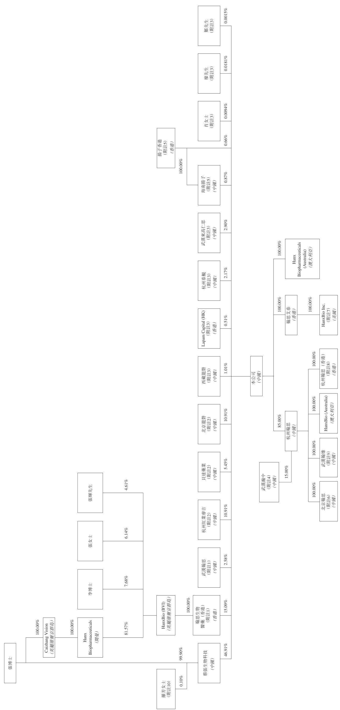

---

## 第 275 页

於2025年10月9日，張萬明先生於蔡張生物科技持有的0.1%股權於張萬明先生去世後，根據法定遺囑認證程序轉讓予張萬明先生配配偶芳女士。

於2018年10月18日，武漢翰雄當時的股東（即分別持有武漢翰雄約97%、2%及1%的席先生、周虎先生及黃鶯女士）將其於武漢翰雄的全部股權轉讓予杭州翰思，代價為人民幣1百萬元，該代價乃參考武漢翰雄當時的註冊資本釐定。武漢翰雄自此成為本集團的全資附屬公司。經本公司確認，武漢翰雄於杭州翰思進行收購時及截至最後實際可行日期並無業務運營。

8. 杭州翰思（香港）為一家於2024年2月19日在香港註冊成立的有限公司。經我們董事確認，該公司自註冊成立以來並無業務運營。

7. HanxBio Inc. 為一家於2023年12月13日在美國註冊成立的有限公司。經我們董事確認，該公司自註冊成立以來並無業務運營。

6. 北京翰思為一家於2017年1月10日在中國成立的有限公司。經我們董事確認，北京翰思自成立起並無業務。

5. 有關B+輪投資者背景的進一步詳情，請參閱本節上文「首次公開發售前投資－首次公開發售前投資者的資料」一段。

4. 武漢瀚中為一家於2016年7月15日在中國成立的有限公司。截至最後實際可行日期及據董事所深知，武漢瀚中並無業務且由席先生（杭州翰思前僱員）及席先生的女兒席婧璇女士分別擁有60%及40%。

3. 有關B輪投資者背景的進一步詳情，請參閱本節上文「首次公開發售前投資－首次公開發售前投資者的資料」一段。

2. 有關A輪投資者背景的進一步詳情，請參閱本節上文「首次公開發售前投資－首次公開發售前投資者的資料」一段。

1. 武漢翰思為我們的僱員持股平台。有關進一步詳情，請參閱本節上文「我們的激勵計劃」一段。

附註：

---

## 第 276 页

下圖載列於緊隨全球發售、股份拆細及非上市股份轉換成H股（假設超額配股權未獲行使）後本集團的公司架構。

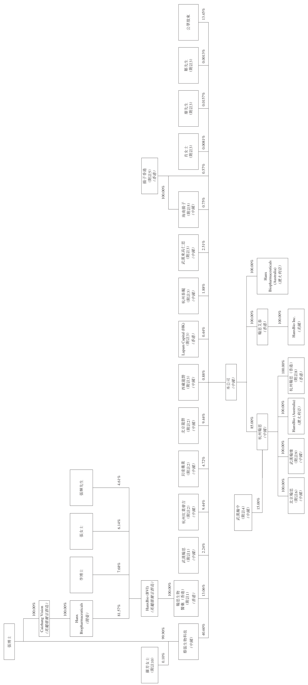

我們於緊隨全球發售的架構

---

## 第 277 页

概覽

我們是一家擁有結構生物學、轉化醫學及臨床開發方面自主專業技術及經驗的創新生物科技公司，旨在開發新一代免疫療法。免疫在人體生理機能以及許多人體疾病發病機理（尤其是癌症及自身免疫／發炎性疾病）的幾乎所有方面都起著關鍵作用。作為這些疾病治療的一部分，對免疫過程的干預最近被證明是明顯有效的，其潛在的治療機制腫瘤免疫療法（尤其是免疫檢查點抑制劑）通過增強免疫系統，徹底改變癌症治療模式。腫瘤免疫療法是一種前景廣闊且不斷發展的癌症療法，能夠提供比傳統療法更具靶向性且具有潛在長期益處的治療選項。我們一直在探索專注於免疫檢查點抑制劑的治療機制，我們相信這是克服科學及臨床障礙，並提供新有效藥物的基礎。

從治療機制角度來看，目前上市的大多數獲批准腫瘤免疫療法（如PD-1、PD-L1及CTLA-4免疫檢查點抑制劑）均側重於T細胞，而其他腫瘤免疫療法則涉及不同的免疫細胞（包括巨噬細胞及自然殺傷細胞）。然而，目前獲批的免疫檢查點抑制劑療法亦存在若干局限性。舉例而言，PD-1/PD-L1僅在少部分患者中產生有意義的應答，儘管該抑制劑有效，並已證實為治療多種癌症的重要選項。根據弗若斯特沙利文報告，按緩解率計，在幾乎所有主要癌症類型的患者中，只有約10%至29%的患者能夠從PD-1/PD-L1單一療法中獲益。為克服該等限制，業界進行了大量研究。第一類方法是識別影響PD-1/PD-L1以外免疫檢查點功能的額外製劑，包括靶向CTLA-4、CD47、LAG-3、TIGIT、CD40及OX40的製劑。然而，此領域的研究進展甚微，因為迄今為止尚無一項研究得到臨床驗證。CTLA-4抗體甚至在PD-1之前就已被用作癌症療法，但該抗體因其劑量限制性irAE的發生率較高而尚未得到廣泛應用。儘管CD47已成為靶向以免疫檢查點抑制劑為基礎的癌症免疫療法的先天性及適應性免疫的免疫檢查點，但根據弗若斯特沙利文報告，嚴重的血液毒性妨礙了它的臨床開發。第二類方法涉及改良目前獲批的免疫檢查點抑制劑，以克服其限制。例如，在PD-1/PD-L1抑制的基礎上創造雙功能或多功能抗體模態，即「PD-1/PD-L1 plus」分子。最近業界的成功範例驗證了有關方法，為以免疫檢查點抑制劑為基礎的免疫腫瘤療法發展指明了新方向。

---

## 第 278 页

本集團自成立以來一直致力於開發強大的腫瘤免疫項目。於往績記錄期間，我們主要基於上述第二類方法進行創新，即在我們的腫瘤免疫管線中創造出雙功能或多功能分子，包括「PD-1 plus」分子HX009（我們的核心產品）及HX016-9；「PD-L1 plus」分子HX016-7；及「CTLA-4 plus」分子HX044（我們的一種主要產品）。我們使用我們的專有VersatiBody平台（一種抗體工程平台）創造了這些新的抗體模態，該平台可靈活調整以創造滿足不同靶向生物學要求的候選抗體藥物，以提高療效和減低毒性。

根據弗若斯特沙利文報告，截至最後實際可行日期，我們的核心產品HX009為第一且唯一一個抗PD-1/SIRPα雙功能抗體融合蛋白。在靶向PD-1/PD-L1及CD47的同類雙特異性抗體及雙功能融合蛋白產品中，其臨床試驗進展處於全球領先地位。創造HX009旨在通過使用特別設計的靶向兩個免疫檢查點（即PD-1和CD47）的雙特異性分子，增強PD-1抗體的療效並解決CD47靶向的安全性問題。我們認為HX009代表癌症免疫治療的重大進步，彰顯出我們攻堅克難優化患者治療效果並重新定義癌症標準治療的承諾。同時，我們的主要產品之一HX044，作為一種新型雙功能抗CTLA-4抗體SIRPα融合蛋白，旨在提高CTLA-4的靶向療效，同時降低與兩個靶向相關的系統毒性。HX044也是一種前景良好的癌症免疫療法，憑藉其與PD-1不同且互補的作用機制，可彌補PD-1療法造成的不足。

憑藉我們對若干靶點的特定靶向生物學及其與不同惡性腫瘤聯繫的深入獨特了解，以及近年抗體偶聯藥物技術的成熟，我們亦利用我們的VersatiBody平台就未滿足的腫瘤醫療需求開發出抗體偶聯藥物候選藥物，即HX111。

此外，隨著近期對許多自身免疫疾病分子的發病機制的了解，業界正在開發新的療法。目前已探索出許多新受體靶點，以創造出抗體療法模態，包括OX40、OX40L、IL-4R、IL-17及CD19。部分研究已從最初的腫瘤免疫研究延伸至現在的臨床驗證。本公司在廣泛專注腫瘤免疫的新型抗體模態的同時，亦已擴大了對治療自身免疫疾病的新型抗體模態的探索，特別是利用新型OX40靶點等。由於認識到OX40在許多自身免疫疾病中的潛在核心作用，我們也建立了自己的基於OX40靶點等的雙特異性抗體自身免疫治療平台，即autoRx40平台。通過一同使用autoRx40平台及VersatiBody平台，我們已經生成新型自身免疫候選藥物，包括雙特異性抗體HX035及HX038。

---

## 第 279 页

利用我們在結構生物學、轉化醫學及臨床腫瘤學方面的關鍵專業技術，我們能夠建立生物發現及開發平台，以充實候選藥物管線，這使我們能夠優化及高效執行針對未滿足醫療需求疾病適應症的臨床開發策略。我們的管線開發策略是基於經過驗證的靶點及通路，並由獨特的靶點生物學、轉化證據及臨床可行性以及可成藥結構的分子所支持。我們的定位是提供新一代腫瘤免疫治療，如HX009、HX044及HX016，以對抗PD-1抗藥性；提供抗體偶聯藥物候選藥物（包括HX111），以精確治療特定惡性腫瘤；以及提供新型自身免疫治療，如雙特異性抗體HX035及HX038。

在有效治療方案稀缺或有限的情況下，我們在為我們的管線產品選擇適應症以進行臨床研究時，會考慮快速上市策略。我們選擇該等策略適應症的理由是加快監管審批流程並促進我們產品的商業推出。

在我們的使命和願景指引下，我們致力於通過發現、研發及商業化用於癌症及自身免疫疾病精準治療的產品來探索新一代免疫療法，以解決全球未獲滿足的醫療需求，從而最終幫助世界各地的患者。

---

## 第 280 页

截至最後實際可行日期，我們已開發由共十種候選藥物組成的管線，包括我們的核心產品HX009及兩種主要產品HX044及HX301，其中有八種針對腫瘤科的候選藥物及兩種針對自身免疫疾病的候選藥物。截至最後實際可行日期，我們的核心產品以及主要產品正分別在中國及澳大利亞進行臨床試驗。下圖概述截至最後實際可行日期我們管線產品的開發狀態。

<!-- table html -->
<table><tr><td>產品</td><td>MoAs</td><td>藥物類型</td><td>現有適應症／治療領域</td><td>主管機關</td><td>治療線</td><td>商業權利</td><td>臨床前</td><td>Ia／I期</td><td>Ib／II期</td><td>III期／註冊階段</td><td>NDAV/BLA</td><td>合作關係</td></tr><tr><td>R/R EBV+非霍奇金淋巴瘤（單藥治療）</td><td>國家藥監局</td><td>二線+</td><td></td><td></td><td></td><td>於2025年底前完成Ib期臨床研究</td></tr><tr><td>HD-1/SIRPα</td><td>雙功能抗體融合蛋白</td><td>晚期黑色素瘤（單藥治療）</td><td>國家藥監局</td><td>一線／二線+</td><td>全球</td><td>於2026年下半年完成Ib期臨床研究</td><td>於2027年第三季前完成IIa期臨床研究</td></tr><tr><td>HD-1/SIRPα</td><td>雙功能抗體融合蛋白</td><td>晚期膽道癌（聯合治療）</td><td>國家藥監局</td><td>二線+</td><td>開發IIa期臨床研究</td><td>於2026年開展IIa期臨床研究</td></tr><tr><td>CSFIR/ARK5/CDK4/6/FLT-3</td><td>小分子</td><td>腦膠質細胞瘤（聯合治療）</td><td>國家藥監局</td><td>一線</td><td>大中華區</td><td>於2028年底前完成IIa期臨床研究</td></tr><tr><td>HTLA-4/SIRPα</td><td>雙功能抗體融合蛋白</td><td>晚期實體瘤受性腫瘤（單藥治療及聯合治療）</td><td>TGA／國家藥監局</td><td>二線+</td><td>全球</td><td>於2026年第四季前完成劑量過增臨床研究</td></tr><tr><td>HX035</td><td>OX40表位</td><td>曼特異性抗體</td><td>炎症／自體免疫</td><td>不適用</td><td>不適用</td><td>全球</td><td>於2026年第一季前提交IND申請</td></tr><tr><td>HX038</td><td>OX40／未公開靶點</td><td>曼特異性抗體</td><td>炎症／自體免疫</td><td>不適用</td><td>不適用</td><td>全球</td><td>於2026年底前完成臨床前試驗及於2027年第一季前提交IND申請</td></tr><tr><td>HX111</td><td>未公開靶點</td><td>單克隆抗體—抗體偶聯藥物</td><td>特定T-L/L-實體瘤</td><td>不適用</td><td>不適用</td><td>全球</td><td>於2026年第一季前取得IND批准</td></tr><tr><td>HX129</td><td>TRBV12</td><td>單克隆抗體—抗體偶聯藥物</td><td>特定T-L/L</td><td>不適用</td><td>不適用</td><td>全球</td><td>不適用⑤</td></tr><tr><td>HX017</td><td>NKG2A</td><td>單克隆抗體</td><td>PD-1耐藥實體瘤／病毒感染</td><td>不適用</td><td>不適用</td><td>全球</td><td>不適用⑤</td></tr><tr><td>HX016-9</td><td>PD1/VEGF</td><td>雙特異性抗體</td><td>實體瘤</td><td>不適用</td><td>不適用</td><td>全球</td><td>於2026年底前完成臨床前試驗並提交IND申請</td></tr><tr><td>HX016-7</td><td>PD-L1/VEGF</td><td>曼特異性抗體</td><td>實體瘤</td><td>不適用</td><td>不適用</td><td>全球</td><td></td></tr><tr><td>核心產品</td><td>▲</td><td>主要產品</td><td></td><td></td><td></td><td></td><td></td></tr></table>
<!-- /table -->

我們(i)於2019年10月就HX009單藥治療惡性腫瘤患者；(ii)於2024年9月就HX009聯合關鍵階段藥物治療晚期實體瘤（包括BTC和晚期黑色素瘤）患者；及(iii)於2025年2月就HX009與曲妥珠單聯合治療晚期三陰性乳腺癌患者獲得國家藥監局的臨床試驗批准通知書。截至最後實際可行日期，我們已完成HX009-I-01中國研究的Ia期（一項獨立及傳統的I期臨床研究）。我們正就治療晚期黑色素瘤進行HX009-I-01中國研究的Ib期、治療R/R EBV+非霍奇金淋巴瘤的HX009-II-02中國研究，以及治療晚期膽道癌的HX009-II-05中國研究（此乃與應世生物科技（上海）有限公司開發的黏著斑激酶抑制劑（又名FAKi）的聯

---

## 第 281 页

管線候選產品被開發為臨床前候選產品化合物。截至最後實際可行日期，我們已完成有關管線候選產品的臨床前研究並取得具前景的結果。我們計劃積極尋求與行業領先的業務夥伴合作，以進一步開發該等管線候選產品。

於往績記錄期間前，我們與中山康方共同開發了HX008（一種靶向PD-1的單克隆抗體，經證實有較長的半衰期）。在我們於2017年8月獲得臨床研究批准後不久，通過2017年至2019年期間訂立的一系列股權轉讓協議，我們向樂普轉讓了HX008以換取一次性現金款項人民幣350.0百萬元及佔HX008年度銷售收入淨額4.375%的年度特許權使用費。國家藥監局於2022年7月及9月授予HX008有條件上市批准，分別用於治療MSI-H/dMMR的實體瘤及無法手術治療或轉移性黑色素瘤。截至最後實際可行日期，我們收到一次性現金里程碑款項人民幣350.0百萬元以及2022年、2023年及2024年HX008年度特許權使用費分別約人民幣0.7百萬元、人民幣4.4百萬元及人民幣13.1百萬元。詳情請參閱本招股章程「業務－合作協議－HX008股權轉讓協議」。

根據澳大利亞相關法律及法規，我們就HX044提交人類研究倫理審查委員會(HREC)申請，並於2024年9月10日獲得人體研究倫理委員會批准函，進行I/IIa期臨床研究以評估HX044治療晚期實體瘤惡性腫瘤患者的安全性及耐受性（即HX044-I-01澳大利亞研究）。此外，我們已分別於2025年1月及9月自國家藥監局獲得HX044單藥治療及HX044與普特利單抗聯合治療晚期實體瘤惡性腫瘤患者的臨床試驗批准通知書（即HX044-I-01中國研究）。我們產品靶向的晚期實體瘤是指復發性／難治性實體瘤。截至最後實際可行日期，我們已就HX044-I-01研究的單藥治療部分入組23名患者（八名患者在澳大利亞及15名患者在中國），並就聯合治療部分入組兩名患者。

(2) 我們分別於2020年1月及2024年8月從國家藥監局獲得HX301單藥治療晚期惡性腫瘤患者和HX301聯合替莫唑胺治療腦膠質母細胞瘤患者的臨床試驗批准通知書。截至最後實際可行日期，我們已完成HX301-I-01中國研究的I期臨床研究。我們目前正在進行HX301與替莫唑胺聯用的IIa期臨床研究（即HX301-I-01中國研究），並截至最後實際可行日期完成七名患者入組。虛線表示HX301聯合研究的豁免階段，乃基於利用HX301的其他臨床試驗方案的研究結果（包括HX301-I-01中國研究及於美國開展的Onconova 19-01 I期研究）以及就此與主管部門的溝通而獲授。

合研究）。截至最後實際可行日期，此FAKi藥物處於關鍵試驗階段(III期)，而用於此研究的HX009將僅在此FAKi藥物獲得上市許可批准後方會與其聯合使用。虛線表示HX009這兩項聯合研究的豁免階段，乃基於利用HX009的其他臨床試驗方案的研究結果（包括HX009-I-01澳大利亞研究及HX009-I-01中國研究Ia期）以及就此與主管部門的溝通而獲授。

---

## 第 282 页

• 核心產品－HX009

我們的核心產品HX009是一種創新抗PD-1/SIRPα雙功能抗體融合蛋白，旨在增強PD-1功能及創造一種創新型「PD-1 plus」分子，代表腫瘤免疫學領域的進步。HX009是一種我們自主開發用於治療各種惡性腫瘤的癌症免疫療法。HX009可通過抗PD-1抗體及HX009上的SIRPα細胞外域（CD47的天然配體蛋白之一），阻斷PD-1並與腫瘤微環境內Teff上CD47的順式結合，共同靶向CD8$^{+}$Teff，增強T細胞活化，以及通過阻斷腫瘤浸潤巨噬細胞或樹突細胞上SIRPα與腫瘤細胞上CD47之間交互作用，改善巨噬細胞吞噬作用及樹突細胞介導的腫瘤抗原傳遞。HX009不僅具有實現穩定抗腫瘤活性的潛力，而且還能通過降低結合親和力以及高親和力PD-1驅動結合引起的腫瘤靶向性，減少對人體紅細胞和血小板上CD47的非腫瘤靶向性，從而減輕貧血及血小板減少的風險。我們認為，HX009開創了免疫檢查點抑制劑的新領域。

我們已在澳大利亞啟動HX009的首次人體臨床試驗，以評估HX009對晚期惡性腫瘤患者的安全性、耐受性及初步有效性，該試驗已於2022年10月完成。主要研究者的結論顯示HX009在所有21名接受治療的受試者中均具有良好的耐受性。此外，於2019年10月，我們自國家藥監局取得臨床試驗批准通知書，允許我們在中國開展HX009治療惡性腫瘤（包括晚期黑色素瘤及R/R EBV$^{+}$非霍奇金淋巴瘤）的臨床試驗。此外，於2023年4月，我們向美國食藥監局提交在美國開展HX009 Ib/II期研究的IND申請，並於2023年5月取得美國食藥監局的《臨床試驗批准函》。於2024年9月，國家藥監局向我們授予有關聯合治療臨床研究的HX009臨床試驗批准，其為一項HX009與關鍵試驗階段（III期）FAKi藥物$^{1}$聯合治療晚期惡性BTC及黑色素瘤患者的IIa期臨床研究方案。我們亦於2025年2月獲得國家藥監局對HX009與曲妥珠單抗聯合治療晚期三陰性乳腺癌患者的聯合研究的批准，且我們預計該聯合研究的首名患者招募將於2026年完成。

截至最後實際可行日期，我們已完成HX009-I-01中國研究的Ia期階段，這是一項獨立的傳統I期研究，旨在評估HX009對晚期實體瘤患者的安全性及耐受性，以及初步檢測其抗腫瘤療效。我們目前正在中國進行三個HX009臨床項目，即(i)治療晚期黑色素瘤的HX009-I-01中國研究（Ib期）；(ii)治療R/R EBV$^{+}$非霍奇金淋巴瘤的HX009-II-02中國研究（I/II期）；及(iii)治療晚期膽道癌的HX009-II-05中國研究（IIa期）。我們亦

---

## 第 283 页

於2025年2月獲得國家藥監局對HX009與曲妥珠單抗聯合治療晚期三陰性乳腺癌患者的聯合研究的批准，且我們預計該聯合研究的首名患者招募將於2026年完成。有關我們核心產品臨床研究的詳情，請參閱本招股章程「－臨床階段候選藥物－核心產品－HX009」。

HX009順利且充滿希望的臨床進展體現出其在不同腫瘤領域解決重大未獲滿足醫療需求的潛力，在數種關鍵適應症中擁有頗具前景的市場機會。例如，與EBV相關的淋巴瘤通常是更惡性的，預後較差且治療困難。化療及放療等傳統治療對EBV$^{+}$相關淋巴瘤的療效較差。目前，市場上並無治療EBV$^{+}$非霍奇金淋巴瘤的獲批藥物。我們已發現EBV$^{+}$非霍奇金淋巴瘤的表達都會上調PD-L1及CD47，且伴有腫瘤免疫原性增加，這使其成為HX009的理想或適當適應症。另一個例子是在R/R黑色素瘤領域，HX009有望成為具有變革潛力的充滿希望的解決方案。儘管黑色素瘤治療領域已取得進展，但仍有若干患者出現復發或對現有療法（包括PD-1單克隆抗體）無應答，因此亟需具治療療效的創新方式。研究表明，對PD-1單克隆抗體無應答可能是因為腫瘤微環境內Teff缺乏CD47阻斷。因此，HX009同時阻斷PD-1及CD47預計會增強腫瘤免疫耐藥性黑色素瘤的抗腫瘤活性。根據弗若斯特沙利文報告，截至最後實際可行日期，HX009是全球唯一正在開展臨床研究的用於治療黑色素瘤的PD-1/CD47靶向雙特異性抗體／雙功能融合蛋白。此外，由於晚期BTC非常複雜且死亡率高，愈發需要有效療法。HX009具有獨特的作用機制且臨床數據頗具前景，可滿足迫切市場需求，故有潛力通過與其他獨特MoA的藥物結合開闢一個晚期BTC治療領域的重要細分市場。

• 主要產品－HX301

我們的主要產品HX301是一種多靶點激酶抑制劑，具有獨特激酶抑制特性，體現出癌症治療的重大進步。作為在研多激酶抑制劑，HX301的作用機制是通過靶向CSF1R、ARK5、FLT-3及CDK4/6等關鍵通路對抗各種癌症。尤其是，HX301通過抑制CSF1R靶點，發揮抗腫瘤的效用，並在體外具有次納摩爾級別的$IC_{50}$。CSF1R在骨髓譜系細胞（如巨噬細胞）的生長、存活及極化中發揮關鍵作用，經常在急性髓系白血病、腫瘤相關巨噬細胞，包括神經膠質瘤相關的巨噬細胞或小膠質細胞等若干癌細胞中過度表達，並可能與癌症預後較差相關。HX301可直接靶向急性髓系白血病等癌細胞或間接影響腫瘤相關巨噬細胞，故有望成為一種候選癌症療法。

---

## 第 284 页

於2017年12月，我們與Onconova Therapeutics, Inc.（「Onconova」，於2024年4月業務合併後的Traws Pharma,Inc.的前身）訂立授權許可、開發及商業化協議（「Onconova共同開發協議」）。根據Onconova共同開發協議，Onconova向杭州翰思授予獨家、含特許權使用費的許可，連同轉授權權利以供杭州翰思在大中華區開發及商業化narazaciclib（已進一步開發並在我們的產品管線中命名為HX301）。該等開發及商業化權利包括與研究、非臨床、臨床前及臨床試驗、毒理學測試、統計分析及報告、編製及提交產品監管批准申請相關的所有活動以及營銷、推廣、銷售或要約出售治療某種適應症的產品的所有活動。另一方面，杭州翰思授權Onconova在大中華區以外地區開發及製造narazaciclib。此外，Onconova須就大中華區以外地區銷售向我們支付若干特許權使用費。目前，杭州翰思專注於開發HX301以用於中國的腦膠質母細胞瘤聯合治療。

臨床前模型及I期的安全性及有效性數據顯示出HX301頗具前景的結果，彰顯其作為各種晚期實體瘤治療選項的潛力。於2020年1月，國家藥監局發出HX301的臨床試驗批准通知書，允許我們在中國進行該產品治療晚期惡性腫瘤的臨床試驗。我們於2024年7月完成了根據上述國家藥監局批准對HX301進行的I期臨床研究，這是一項評估HX301治療晚期實體瘤患者的安全性、耐受性及初步有效性的開放標籤、多中心I期研究。有效性結果表明部分患者在80mg或更高劑量下實現病情穩定，且劑量的提高可能帶來越長的病情穩定持續時間，為後續的臨床開發，特別是聯合療法的探索提供了一定的臨床效益支持。

我們向國家藥監局提交一份與替莫唑胺聯用的II期臨床研究方案評估HX301與替莫唑胺聯用治療腦膠質母細胞瘤患者的安全性及耐受性。於2024年8月，國家藥監局發出HX301臨床試驗批准通知書，這使我們能夠開展HX301與替莫唑胺聯用治療腦膠質母細胞瘤患者的臨床試驗。我們已於2025年1月為此聯合研究（即HX301-II-01中國研究）完成首名患者入組，並且截至最後實際可行日期，HX301-II-01中國研究目前正在進行。

腦膠質母細胞瘤是一種存在於腦部的疾病，其中腦膠質母細胞瘤腫瘤細胞、血源性巨噬細胞及腦源性小膠質細胞共同構成對腦膠質母細胞瘤生長至關重要的腫瘤微環境。中樞神經系統受血腦屏障保護，該屏障嚴格調控物質進入。血腦屏障的存在使絕大多數癌症治療藥物無法進入中樞神經系統。HX301能夠穿透血腦屏障，因此具有治療腦膠質母細胞瘤的研發潛力，進而解決一個未獲滿足的重大醫療需求領域。HX301靶向腫瘤微環境，而替莫唑胺靶向腦膠質母細胞瘤腫瘤細胞，進而使其成為治療腦膠

---

## 第 285 页

質母細胞瘤一種具前景的療法，並預計產生協同效應。HX301與替莫唑胺的聯合療法在治療腦膠質母細胞瘤方面具有尤為顯著的市場機會。根據弗若斯特沙利文報告，中國腦膠質母細胞瘤市場規模於2024年達到人民幣12億元，於2030年及2035年將擴大至人民幣32億元及人民幣54億元，複合年增長率分別為17.9%及10.7%。隨著在臨床試驗及監管批准方面取得進展，HX301有望彌補癌症療法的重要缺失並改善全球患者的治療效果。我們預計積極尋求與行業領先的生物製藥公司合作，以進一步增強HX301的開發及商業化潛力，利用協同效應及專業知識推進臨床研究，並加速向有需要的患者提供創新療法。

• 主要產品－HX044

HX044是本集團開發的一種主要產品，目前處於臨床階段。它是一種可用於治療多種惡性腫瘤的創新型臨床階段藥物，尤其是治療PD-1耐藥實體瘤（包括但不限於非小細胞肺癌、黑色素瘤、腎細胞癌及胃腸癌）。HX044是雙功能抗CTLA-4抗體SIRPα融合蛋白，目的是創造具有更大治療窗口的「CTLA-4 plus」分子。

HX044由翰思生物自主研發，且我們擁有全球開發及商業化的權利。其經工程改造以顯著降低對單一靶向CTLA-4及CD47的親和力，使其可盡量減少外周血中兩靶點單一結合所導致的irAE及血液學毒性，但對腫瘤細胞表現出更高的親和力。另一方面，如臨床前模型所清楚顯示，HX044可有效結合兩個靶點都高表達的Treg，導致Treg耗竭及腫瘤微環境重塑，與抗-CTLA-4單克隆抗體相比顯著有利於抗腫瘤免疫。因此，HX044拓寬了治療窗口。

根據澳大利亞的相關法律法規，我們於2024年9月獲得HREC批准及相關臨床中心倫理委員會批准。我們在澳大利亞啟動了I/IIa期臨床研究，以評估HX044治療晚期實體瘤惡性腫瘤的安全性及耐受性，首名患者已於2024年12月入組。截至最後實際可行日期，我們已就HX044-I-01澳大利亞研究入組八名患者。此外，我們已分別於2025年1月及9月自國家藥監局獲得HX044單藥治療及HX044與普特利單抗聯合治療晚期實體瘤惡性腫瘤患者的臨床試驗批准通知書（即HX044-I-01中國研究）。我們產品靶向的晚期實體瘤是指復發性／難治性實體瘤。截至最後實際可行日期，我們已就HX044-I-01中國研究的單藥治療部分入組15名患者，並就聯合治療部分入組兩名患者。根據弗若斯特沙利文報告，截至最後實際可行日期，HX044為全球唯一一項在臨床試驗階段的CTLA-4/SIRPα雙特異性抗體／雙功能融合蛋白。

---

## 第 286 页

• 商業化產品－HX008

HX008是一種與人類IgG4同型的人源化PD-1單克隆抗體，可阻斷PD-1與其配體PD-L1及PD-L2結合，從而抑制PD-1信號以恢復免疫細胞殺傷癌細胞的能力。HX008創新採用抗體工程技術來誘導Fc區突變，從而大幅延長半衰期並取得強大的臨床抗腫瘤活性以及良好的安全性和有效性。

我們於往績記錄期間前與中山康方共同開發HX008。在我們於2017年8月獲得臨床研究批准後不久，通過於2017年至2019年期間訂立的一系列股權轉讓協議，以一次性現金付款人民幣350.0百萬元及HX008每年銷售收入淨額4.375%的年度特許權使用費，將HX008轉讓予樂普。國家藥監局於2022年7月及9月授予HX008的有條件上市批准，分別用於治療MSI-H/dMMR實體瘤及無法手術治療或轉移性黑色素瘤。截至最後實際可行日期，我們已收到一次性現金款項人民幣350.0百萬元的全部款項。得益於HX008的成功商業化，截至最後實際可行日期，我們分別按照2022年、2023年及2024年記錄的HX008淨銷售收入，收到HX008年度特許權使用費分別約人民幣0.7百萬元、人民幣4.4百萬元及人民幣13.1百萬元。詳情請參閱本招股章程「－合作協議－HX008股權轉讓協議」。

• 臨床前階段的重要產品

腫瘤免疫治療

HX017：一種靶向人類NKG2A/CD94的單克隆抗體，而NKG2A/CD94是一種在人類自然殺傷細胞及腫瘤浸潤CD8$^{+}$細胞毒性淋巴細胞上表達的異二聚體抑制性受體。HX017可有效阻斷NKG2A/CD94與其配體人類白血球抗原-E的交互作用，而人類白血球抗原-E是一種非典型MHC-I分子，腫瘤通常會上調人類白血球抗原-E的表達以逃避免疫監視。HX017作為一種免疫檢查點抑制劑，促進了自然殺傷細胞和CD8$^{+}$細胞毒性淋巴細胞的腫瘤細胞毒性。

HX016-9：一種靶向PD-1及VEGF的新型雙特異性抗體，旨在成為另一種「PD-1 plus」藥物。HX016-9基於我們的HX008（一種獲批的PD-1單克隆抗體）及HX006（一種較Avastin具有更高活性的新型VEGF單克隆抗體）。HX016-9旨在成為市場上針對已使用PD-1抗體的適應症的一種差異化藥物。截至最後實際可行日期，我們已確定HX016-9的PCC分子，並正在進行GMP生產，隨後進行GLP支持性研究。我們預計將於2026年底前完成有關HX016-9的臨床前試驗並提交IND申請。

---

## 第 287 页

HX016-7：一種靶向PD-L1及VEGF的新型雙特異性抗體，旨在成為一種「PD-L1 plus」藥物。HX016-7基於獲批的PD-L1單克隆抗體及我們的HX006（一種較Avastin具有更高活性的新型VEGF單克隆抗體），HX016-7擬成為市場上具差異化的藥物，將應用於已使用PD-L1抗體的適應症。截至最後實際可行日期，我們已確定HX016-7的PCC分子，並正在進行GMP生產，隨後將進行GLP支持性研究。我們預計將於2026年底前完成有關HX016-7的臨床前試驗並提交IND申請。

ADC

HX111：一種抗體偶聯藥物，專門靶向亞型淋巴瘤／白血病（涵蓋幾乎所有ATL、AITL、NK/T及組織細胞淋巴瘤）以及若干表達的靶點受體實體瘤（包括肉瘤及HNSCC），並預期存在未滿足的醫療需求。該等受體在正常組織（包括正常血球）中很少表達。截至最後實際可行日期，我們已完成HX111的臨床前研究，並於2025年10月向國家藥監局提交HX111 I/IIa期臨床研究的IND申請。我們預期將於2026年第一季獲得臨床試驗批准。

HX129：一種專門靶向TRBV12的抗體偶聯藥物，而其具有30多個家族譜系多態性。特定T細胞源性淋巴瘤／白血病會表達特定的TRBV。HX129抗體僅識別特定的TRBV，並有效清除TRBV特定亞型的淋巴瘤／白血病。HX129對其他TRBV亞型的正常T細胞幾乎並無毒性，因此HX129的毒性有限。因此，預期HX129將是一種安全的T細胞靶向療法，以滿足未被滿足的臨床需求。

自身免疫治療

HX035：一種靶向OX40的雙特異性抗體。其能阻斷OX40L與OX40的結合並誘發更強烈的ADCC活性，因此是一種對自身免疫疾病細胞具有很強抑制作用的抗體。HX035在人PBMC誘導的體內急性GvHD模型中顯示出強大的抗GvHD活性。我們還擁有HX035的全球知識產權。我們預計將於2025年底前完成有關HX035的臨床前試驗並於2026年第一季前提交IND申請。

HX038：一種新型全人源化雙特異性抗體，可與OX40及未公開的具有高親和力的受體靶點X結合。受體X亦是一種已知的自身免疫疾病靶點。HX038可在體外對OX40$^{+}$／受體X$^{+}$雙陽性細胞產生更強烈的ADCC活性，且目前正在製造ADCC增強版。與市場上的HX035或其他OX40單靶點藥物相比，我們預計HX038可能因其更多的靶向功能，成為具有更廣泛疾病適應症的新型候選藥物。我們擁有HX038的全球知識產權。截至最後實際可行日期，我們已確定HX038的PCC分子，且我們預計將於2026年底前完成有關HX038的臨床前試驗並於2027年第一季前提交IND申請。

---

## 第 288 页

我們的研發能力依賴我們卓越的結構生物學及轉化醫學團隊之間的協作，而該等團隊分別由我們的董事長張博士及首席科學家兼首席執行官李博士領導。在張博士的指導下，我們的抗體發現團隊專注於具有可成藥結構及靶向效應的抗體分子的工程化，以期開創具有較高安全性及有效性的下一代療法。舉例而言，我們於往績記錄期間前已開發出HX008，經過精心設計，可識別PD-1上的糖基化表位，並通過創新分子設計原理延長其蛋白質半衰期，進而在維持較高安全性的同時取得良好的有效性。我們的核心產品HX009利用HX008的基本結構，整合設計的削弱結合親和力SIRPα結構域，以應對CD47靶向藥物面臨的血液毒性、抗原沉默等挑戰。此舉彰顯出我們利用前沿設計攻克治療難題的承諾。

與我們的結構生物學工作相結合，由李博士領導的轉化醫學團隊在轉化研究方面擁有豐富經驗，並且團隊過往的藥效研究曾經成功獲得美國食藥監局批准。憑藉我們頂級研發團隊成員在生物學、醫學及臨床領域方面的多元化專業知識，我們戰略性識別未獲滿足的醫療需求，並選擇合適的適應症來優化我們結構生物學團隊所設計分子的性能。我們依賴轉化醫學知識，戰略性聚焦適應症臨床開發，例如用於治療晚期黑色素瘤及R/R EBV+非霍奇金淋巴瘤的HX009以及用於治療腦膠質母細胞瘤的HX301。我們的開發工作锚定未獲滿足的需求領域，以達到最大治療效果。此外，我們注重發現及開發流程的效率及協同效應，並藉發表多種數據及刊物（包括會議演講、摘要、海報及手稿）進行證明。我們通過該等刊物披露我們團隊在推進新型療法方面所取得的重大進展，例如HX009在臨床前模型中表現出有效的抗淋巴瘤活性，而多激酶抑制劑HX301在特定臨床前模型中表現出較強的抗神經膠質瘤及急性髓系白血病活性。憑藉我們團隊的豐富專業知識及創新承諾，我們不斷突破治療發現的邊界，為有需要的患者提供有效治療。

於往績記錄期間，我們亦開發並進一步改進VersatiBody平台。開發多特異性抗體（包括雙特異性抗體）生物藥物的傳統方法通常會構建針對兩個或多個靶點的固定結構平台，從而解決重鏈或輕鏈錯配問題及結構不穩定問題，並支持特定兩個配對靶點的生物學機制。然而，隨著各種雙特異性抗體療法的發現及開發，該等平台顯然不足以支持多種靶向生物學機制，進而無法支持不同雙特異性抗體分子的成藥性。因此，我們的VersatiBody平台專注於多元化的雙特異性抗體形式，支持靈活及可變的分

---

## 第 289 页

子設計，能夠優化新設計分子的成藥性並支持多樣化靶點配對，達到預期有效性及安全性。基於此，我們能夠利用一系列雙特異性抗體技術來建構穩定的高適應性分子形式，加快識別最有效的靶點配對及分子構型，從而達到最佳治療效果。這彰顯出我們推進雙特異性抗體療法的決心。

此外，本集團正在開發一個獨特的治療平台autoRx40平台，以靶向OX40及其他受體，其中OX40在多種自身免疫及炎症疾病的發病機制中發揮關鍵作用。我們的autoRx40平台開發一系列調節OX40通路的候選藥物，包括HX035，一種OX40表位雙特異性抗體，可增強ADCC活性並有效清除OX40$^{+}$細胞和拮抗劑效果；及HX038，一種OX40/X雙靶點雙特異性抗體，由於其雙重靶向能力而具有潛在影響。該等管線產品通過我們的autoRx40平台開發，已在臨床前模型中表現出良好的效果，凸顯了其滿足自身免疫疾病治療領域未獲滿足醫療需求的潛力。

截至最後實際可行日期，我們的知識產權組合包括六項已註冊專利以及超過12項待批專利申請。該等專利及專利申請反映出我們堅持創新並保護雙特異性抗體專有技術及成果的承諾。我們通過獲取知識產權保護我們的研發投資，確保我們的創新方案及新型治療解決方案在生物製藥競爭格局下受到保護。

我們的成熟管理團隊擁有豐富的研發經驗及良好業績記錄。我們的董事長兼執行董事張博士是研發、臨床開發、產品上市及業務營運方面的資深專業人士，擁有約30年製藥行業經驗。我們的首席執行官兼首席科學家李博士在生物技術及CRO領域擁有約20年經驗，包括腫瘤學及病毒感染領域的生物製劑及小分子發現及開發經驗。我們的首席醫學官兼副總經理張女士擁有逾23年的全球製藥公司臨床開發經驗，並擁有多項產品上市批准的往績記錄。總體而言，我們的管理團隊在生物製劑開發及業務管理方面擁有豐富行業經驗，包括抗體發現及工程、流程開發、臨床運營及監管事務。彼等的遠見卓識及專業知識亦是我們成功的主要驅動因素。

---

## 第 290 页

我們的優勢

唯一處於臨床開發階段的抗PD-1/SIRP$\alpha$雙功能抗體融合蛋白，一種PD-1 plus創新療法

作為一家領先的腫瘤免疫療法生物科技公司，我們致力於開發核心產品HX009。HX009是一種開創性的抗PD-1/SIRP$\alpha$雙功能抗體融合蛋白。我們的使命是開發能夠解決未獲滿足的關鍵醫療需求的創新免疫療法，HX009標誌著我們踐行自身使命的重大進展。HX009的核心設計是同時靶向PD-1及CD47的獨特結構。該新型作用機制具有巨大潛力，能夠為疑難疾病患者提供新治療可能性。

HX009的關鍵成就在於其能夠增強現有免疫檢查點抑制劑（由於其PD-1及CD47的雙功能結構而創建的「PD-1 plus」模態）的能力，從而克服現有PD-1療法的限制。這兩個檢查點（即PD-1和CD47）在Teff上的雙靶向可以實現有效的順式結合，並在其活化方面具有協同效應，且相對的細胞表面表達水平可通過調整結合臂的親和力來增強細胞結合的選擇性。利用順式結合機制，HX009可通過抗PD-1抗體及SIRP$\alpha$細胞外域，阻斷PD-1並與腫瘤微環境內Teff上CD47的順式結合，共同靶向CD8$^{+}$Teff，增強T細胞活化。此外，由於PD-1具有高親和力，能與腫瘤浸潤的T細胞結合，並將HX009引入腫瘤微環境中，HX009通過阻斷腫瘤浸潤巨噬細胞／樹突細胞上SIRP$\alpha$與腫瘤細胞上CD47之間交互作用，亦具有改善巨噬細胞吞噬作用及樹突細胞介導的腫瘤抗原傳遞的潛力。

HX009的另一個成就是能夠解決CD47靶向藥物相關的長期臨床挑戰。我們嚴格研發並設計HX009，盡量減少CD47單克隆抗體常見的毒性問題。尤其是，HX009能夠顯著降低CD47的結合親和力，並且具有較低血液毒性及抗原沉默風險，從而解決開發有效CD47靶向療法時面臨的重大障礙。我們直面各種挑戰，努力為患者提供更安全、更有效的療法。

HX009在全球研究內取得顯著臨床進展，體現出我們推進HX009的決心。HX009是全球首創及唯一臨床開發的PD-1/CD47雙特異性抗體及雙功能融合蛋白，處於領域創新的最前沿。臨床前研究顯示HX009在提供卓越治療臨床效果方面擁有巨大潛力。此外，多項研究臨床數據已證明其在臨床環境中的安全性和耐受性良好。在實體瘤及血液惡性腫瘤方面亦觀察到令人鼓舞的療效信號，有關療效信號正在進一步臨床研究中進行調查。

---

## 第 291 页

我們未來預期會開展治療實體瘤及淋巴瘤的關鍵期研究（不論單一療法或與其他藥物聯合治療），將進一步評估HX009的治療潛力。該等研究將有助於塑造HX009的未來發展路徑以及對有需要的患者的可及性。我們持續推進HX009的臨床開發，致力於提高患者治療效果並促進醫療領域積極變革。HX009等創新療法的市場需求激勵我們堅定推進前沿醫學進步，努力將變革性療法變為現實。

引進行業領先的轉化醫學專業知識，打造強大的產品管線，解決未獲滿足的醫療需求

我們的核心藥物開發策略是在首席科學家李博士的前瞻性引領下，維持在轉化醫學方面的行業領先地位。李博士在一家領先的臨床前CRO公司擁有逾十年轉化研究經驗，包括在美國食藥監局批准的腫瘤藥物療效研究中作出重大貢獻，為我們團隊帶來寶貴的專業知識。在李博士的指導下，我們的轉化醫學團隊由生物學、醫學及臨床研究等不同專業背景的專家組成，能夠利用多元化方案解決未獲滿足的醫療需求。憑藉豐富的專業知識，我們能夠通過嚴格的臨床前和轉化研究將具前景的靶點與患者群體相互定位，使臨床開發更順利並優化分子治療效果。

以我們的核心產品HX009為例，轉化研究引領我們利用腫瘤微環境中PD-1及CD47雙重靶向的獨特機制，優先考慮R/R EBV+非霍奇金淋巴瘤及晚期黑色素瘤等適應症。尤其是，我們已發現EBV+非霍奇金淋巴瘤會協同上調PD-L1及CD47，並伴有腫瘤免疫原性增強，因此理想地被HX009所靶向；且最近報告表明，雙重靶向腫瘤微環境內Teff上的PD-1及CD47可在增強及維持針對黑色素瘤的抗腫瘤免疫方面發揮重要作用。此外，將HX009戰略性選擇用於治療晚期膽道癌，彰顯我們解決未獲滿足的重大醫療需求的承諾。晚期膽道癌患者的預後極差，且死亡率非常高。其為一種高度纖維化的癌症，可以採用HX009聯合抗纖維化藥物治療（如FAKi抑制劑），從而促進免疫細胞（例如T細胞）和我們的雙特異性抗體的滲透，增強腫瘤對HX009的反應。我們通過轉化醫學探索，旨在彌合基礎科學發現及臨床應用之間的差距。通過整合臨床開發與轉化研究結果，我們優化成功的可能性，並加快向有需要的患者提供創新療法。

同樣地，HX301體現出有效的CSF1R抑制作用及腦滲透特性，因此成為與替莫唑胺聯合治療腦膠質母細胞瘤的具前景候選藥物，彌補現有治療選項的重大短板。我們通過全面轉化方案努力推進強大的產品管線，為腫瘤學及其他領域的患者護理帶來變革性進步。

---

## 第 292 页

此外，我們與冠科生物等專注於轉化科學的頂尖機構開展戰略合作，增強我們開展重要臨床前及轉化研究的能力。通過該等合作，我們能夠進行先進的藥理學及毒理學評估、生物標記發現及核證，繼而產生臨床開發決策所需的可靠數據。我們通過先進的轉化技術及方法，加深對疾病生物學及治療機制的理解，為成功完成臨床轉化奠定堅實基礎。

專有技術平台賦能結構生物學及蛋白質工程方面的強大專業知識及能力，提高成藥性並促進產品管線的可持續增長

本公司在結構生物學及蛋白質工程方面擁有豐富專業知識及先進技術，並輔以專有技術平台，確保我們的產品管線具有良好的成藥性及可持續性。不同於依賴固定分子形式的常規雙特異性抗體的傳統藥物開發方式，我們的創新平台VersatiBody側重於多元化的雙特異性抗體形式，以優化靶點組合選項。與傳統方法不同，VersatiBody平台能夠以模塊化方式靈活連接結合體或功能模塊，加快構建針對特定治療靶點的變動分子形式。我們的VersatiBody平台提供各種雙特異性抗體技術，我們藉此識別最佳配對模式及分子形式，從而實現最佳療效及治療窗口。

在明確我們的核心競爭力時，VersatiBody平台具備多項關鍵屬性，使我們的方案脫穎而出。首先，我們的平台提供靈活的單一靶點及多靶點結構，並且可自行界定親和力及活性，以優化不同靶向生物學機制的療效和毒性。通過增強抗體依賴性細胞毒性、內化及組織特異性等屬性，我們可確保分子表現出有效的治療作用，同時盡量減低非靶向效應。此外，我們會優先實現預期藥代動力學及安全特性（例如控制親和力以減少全身靶向抗原表達導致的抗原沉默及全身毒性），確保我們療法在臨床環境中的安全性及耐受性。此外，我們精心設計穩定且CMC友好的分子，加快高效製造流程及配方開發。尤其是，我們的產品管線包括若干處於不同開發階段具有理想藥物特性的新型分子，HX009、HX044及HX111等成功候選藥物即為明證。該等分子代表我們在結構生物學及蛋白質工程方面的專業高度，為不同疾病適應症的各種未獲滿足醫療需求提供具前景的治療解決方案。

此外，我們正在開發一個獨特的治療平台，autoRx40平台，旨在靶向OX40受體及其他受體，而OX40受體在各種自身免疫性和炎症性疾病的發病機理中扮演關鍵角色。我們正在研發HX035和HX038等管線產品，以消耗OX40表達細胞、阻斷

---

## 第 293 页

OX40-OX40L交互作用或兩者兼具，藉由調節性T細胞活化、存活和耐受性，提供治療自身免疫疾病的多元方法。透過一系列來自autoRx40平台針對OX40受體及其他受體的管線產品，我們可能在某些自身免疫疾病的臨床治療上取得領先地位。

成熟的商務拓展能力助力搭建戰略夥伴關係

本公司擁有成熟的商務拓展能力，並據此與戰略合作夥伴成功建立合作關係。我們在HX008臨床開發的早期階段後與樂普建立富有成效的合作關係，並協助HX008臨床開發，直至最終取得HX008商業化的監管批准。與樂普的合作體現出我們產品強大的商業化潛力，以及我們有能力利用業務合作夥伴的銷售、營銷及生產優勢盡力擴大我們產品於將來的市場覆蓋範圍。在此次合作中，我們獲得里程碑付款及年度特許權使用費，體現出我們創新療法的市場認可度及價值。

我們的商業化產品HX008與其他PD-1抑制劑相比，具有卓越的藥理特性。通過2017年至2019年期間訂立的一系列權益轉讓協議，以一次性現金付款人民幣350.0百萬元及HX008每年銷售收入淨額4.375%的年度特許權使用費，將HX008轉讓予樂普。截至最後實際可行日期，我們已收到一次性現金款項人民幣350.0百萬元的全部款項，並根據其於2022年、2023年及2024年錄得的銷售收入淨額已分別收取付款約人民幣0.7百萬元、人民幣4.4百萬元及人民幣13.1百萬元，作為HX008的年度特許權使用費。

我們與Onconova Therapeutics, Inc.（「Onconova」，於2024年4月業務合併後的Traws Pharma, Inc.的前身）的合作擴大了我們在腫瘤治療領域的影響力及各項能力，豐富了我們的產品組合，並推進我們解決未獲滿足醫療需求的使命。Narazaciclib是杭州翰思與Onconova針對不同市場及不同適應症共同合作開發的多激酶抑制劑小分子。於2017年12月，我們與Onconova訂立授權許可、開發及商業化協議（「Onconova共同開發協議」）。根據Onconova共同開發協議，Onconova向杭州翰思授予獨家、含特許權使用費的許可，連同轉授權權利以於大中華區開發及商業化narazaciclib（已進一步開發並在我們的產品管線中命名為HX301）。該等開發及商業化權利包括與研究、非臨床、臨床前及臨床試驗、毒理學測試、統計分析及報告、編製及提交產品監管批准申請相關的所有活動以及營銷、推廣、銷售或要約出售治療某種適應症的產品的所有活動。另一方面，杭州翰思授權Onconova在大中華區以外地區開發及製造narazaciclib。

---

## 第 294 页

此外，Onconova須就大中華區以外地區銷售向我們支付若干特許權使用費。目前，杭州翰思專注於中國的腦膠質母細胞瘤聯合治療。截至最後實際可行日期，我們已完成HX301用於治療晚期實體瘤患者的I期臨床試驗，且主要研究者已出具日期為2024年7月3日的相關臨床研究報告。

我們卓越的研發及臨床前能力為我們的未來業務發展計劃奠定堅實基礎，並加快識別及推進創新治療候選藥物。憑藉戰略合作夥伴關係、里程碑成就以及由大量臨床數據支持的豐富產品管線，我們持續取得業務增長並為全球患者提供有效療法。

經驗豐富的管理團隊及知名投資者

我們的管理團隊在結構生物學與蛋白質工程、轉化醫學及臨床開發領域擁有廣泛的專業知識，更得到了備受推崇的投資者的支持，大大提升了我們藥品開發管線的穩健性及前景。

我們的領先管理團隊由我們的董事長、首席科學家及首席醫學官組成，彼等均是生物製藥行業的領軍者。彼等在結構生物學與蛋白質工程、轉化醫學及臨床開發領域的深厚專業知識源於彼等的豐富經驗。憑藉與領先跨國製藥公司的關係及戰略合作，彼等能夠純熟地管理我們搭建的由開發至推出市場各階段的藥物產品管線。彼等過往曾成功將候選藥物從臨床前研究階段推進到臨床試驗階段，因此可確保我們的產品管線取得有效進展並達到最高成功率。此外，彼等在跨國製藥公司工作期間已累積豐富的專業知識，成功完成多款臨床候選藥物的臨床開發及上市批准，並具備全球監管經驗，這對本公司取得成功至關重要。

一個典型的例子是：我們的董事長兼執行董事張博士於醫藥及生物技術行業擁有逾30年的廣泛研發經驗。張博士曾任職於德克薩斯大學西南醫學中心、印第安納大學、禮來公司等知名大學和公司，主要負責研究及藥物開發。此外，張博士是一位成功的連續創業家，彼曾為中美冠科生物技術（北京）有限公司聯合創始人兼首席執行官，並成立了中美華世通生物醫藥科技。

我們的首席執行官兼首席科學官李博士在美國於醫學研發領域擁有逾20年的豐富經驗。彼於Crown Bioscience Inc.擔任首席科學官逾十年，領導癌症相關研發。李博士曾於Kylin Therapeutics, Inc.等行業領先公司任職，主要負責藥物發現。

---

## 第 295 页

此外，我們的首席醫學官兼副總經理張女士於新藥研發擁有逾23年經驗。張女士曾在禮來公司、Novartis Pharmaceuticals Corporation、Celgene Corporation及Denovo Biopharma LLC任職，主要負責多種適應症的臨床開發。於先進製藥公司的相關豐富經驗使我們的管理團隊在產品管線研發方面具備相當的專業知識。詳情請參閱本招股章程「董事、監事及高級管理層」。

本公司已得到各類投資者的認可及認同，包括資深製藥行業投資者及知名金融投資者。彼等的認可反映了對我們管理團隊的信心，加上我們的創新藥物產品管線及具前景的臨床數據，彰顯本公司的實力及潛力。在該等投資者的支持下，我們有能力持續踐行我們的使命，開發變革性療法以解決未獲滿足的醫療需求並改善患者的治療效果。

我們的策略

推進產品管線的臨床開發

我們努力推進臨床開發，並已制定產品管線中HX009、HX301及HX044等主要候選藥物的臨床及商業化應用的未來計劃。

HX009：我們計劃在2026年啟動HX009在R/R EBV$^{+}$非霍奇金淋巴瘤及晚期黑色素瘤中的對照組關鍵註冊研究。此外，於2024年9月，國家藥監局就我們HX009聯合療法臨床研究授予臨床試驗批准，該研究為一項HX009及一種關鍵階段藥物聯合治療惡性晚期BTC患者的IIa期臨床研究。我們已啟動此聯合研究（即HX009-II-05中國研究），首名患者已於2025年1月入組。我們亦於2025年2月獲得國家藥監局對HX009與曲妥珠單抗聯合治療晚期三陰性乳腺癌患者的聯合研究的批准，且我們預計該聯合研究的首名患者招募將於2026年完成。

HX301：2024年8月，我們獲得國家藥監局就HX301聯合替莫唑胺治療腦膠質母細胞瘤患者的臨床試驗的批准。我們已於2025年1月為此聯合研究（即HX301-II-01中國研究）完成首名患者入組，並且截至最後實際可行日期，HX301-II-01中國研究目前正在進行。展望未來，我們計劃於2027年啟動III期隨機對照組註冊研究。

HX044：我們正在澳大利亞進行一項針對晚期實體瘤患者的首次人體I期研究（即HX044-I-01澳大利亞研究），首名患者已於2024年12月入組。此外，我們已分別於2025年1月及9月自國家藥監局獲得HX044單藥治療及HX044與普特利單抗

---

## 第 296 页

聯合治療晚期實體瘤惡性腫瘤患者的臨床試驗批准通知書（即HX044-I-01中國研究）。我們產品靶向的晚期實體瘤是指復發性／難治性實體瘤。截至最後實際可行日期，我們已就單藥治療部分入組23名患者（八名患者在澳大利亞及15名患者在中國），並就聯合治療部分入組兩名患者。完成劑量遞增以根據預期將於2026年第四季度獲得的安全性、藥代動力學及有效性數據釐定RP2D後，我們計劃啟動IIa期研究，以調查RP2D水平的有效性及安全性，並計劃於2029年上半年完成HX044-I-01研究。

持續探索我們產品管線的聯合療法

作為我們推進創新療法措施的組成部分，我們正在積極探索產品管線的聯合療法，以期提高有效性並改善患者的治療效果。

HX009與關鍵階段藥物聯合治療晚期膽道癌：我們正在評估HX009與某個處於關鍵臨床階段的抗纖維化藥物聯合治療於標準治療後出現病情惡化的晚期膽道癌患者的潛力。本研究旨在評估HX009與該藥物的協同效應，有潛力為治療選擇有限的複雜疾病患者提供一種新型療法。此聯合研究的所用藥物是由應世生物科技(上海)有限公司所研發的黏著斑激酶抑制劑（又稱FAKi）藥物。截至最後實際可行日期，此FAKi藥物正在進行關鍵試驗階段(III期)研究開發，而能否取得HX009用於治療BTC的NDA上市批准取決於能否成功開發此FAKi藥物。截至同日，此聯合研究已有九名患者入組。

HX009與曲妥珠單抗聯合治療晚期三陰性乳腺癌：我們亦於2025年2月獲得國家藥監局對HX009與曲妥珠單抗聯合治療晚期三陰性乳腺癌患者的聯合研究的批准，且我們預計該聯合研究的首名患者招募將於2026年完成。

HX301與替莫唑胺聯合治療腦膠質母細胞瘤患者：我們正在探索與替莫唑胺聯合治療曾接受手術及標準同步放化療但隨後並未接受任何其他治療的腦膠質母細胞瘤患者。我們計劃於2027年啟動III期研究，以進一步評估聯合療法的有效性及安全性。通過HX301與替莫唑胺的聯合療法，我們計劃利用聯合療法的協同效應，並有潛力改善腦膠質母細胞瘤患者的臨床結果，從而解決該複雜適應症的未獲滿足醫療需求。

---

## 第 297 页

HX044聯合普特利單抗治療晚期實體腫瘤患者：我們正在評估HX044聯合普特利單抗治療晚期實體瘤惡性腫瘤患者的安全性、耐受性，並釐定其MTD及RP2D。我們產品靶向的晚期實體腫瘤指復發性/難治性實體腫瘤。我們於2025年9月自國家藥監局取得此項聯合研究的臨床研究批准，並於2025年11月就此聯合療法入組首名患者。

在臨床試驗中探索腫瘤免疫療法與抗體偶聯藥物的聯合療法：我們正在通過臨床試驗積極探索腫瘤免疫療法與抗體偶聯藥物的協同潛力。我們正在研究HX009、HX044及HX017等腫瘤免疫產品組合與HX111及HX129抗體偶聯藥物產品的聯合療法，以提高治療效果並擴大我們產品對不同癌症適應症的適用性。

提高研發能力

隨著我們不斷創新及擴大產品管線，進一步提高研發能力至關重要。下文載有我們進一步加強研發工作的主要措施：

探索新型靶向生物學機制以滿足臨床需求：我們努力探索靶向分子的新疾病生物學機制，從而有利於開發特定癌症治療。這包括腫瘤細胞或腫瘤微環境中的靶向分子，例如我們HX044、HX111、HX009及HX301的靶向分子。

擴大產品管線的應用：除探索新腫瘤適應症外，我們亦正在探索現有腫瘤產品管線在其他疾病領域的應用。舉例而言，我們正在研究HX017在抗感染適應症方面的應用潛力，並探索HX111在自體免疫及炎症性疾病方面的應用。我們計劃豐富我們產品的治療應用，解決各類疾病未獲滿足的醫療需求。

優化分子發現工作流程：我們致力於優化分子發現工作流程，以加快抗體發現過程並提高通量。我們計劃簡化流程、利用VersatiBody平台及autoRx40平台等先進技術及探索高通量蛋白質表達，從而縮短研發時間並提高具前景治療候選藥物的識別效率。

探索天然分子以設計我們的藥物：為擴大我們的靶點組合，我們正在積極探索天然受體及配體作為潛在結合體或功能模塊。我們計劃探索龐大的天然生物分子庫，以期發現具有治療潛力的新靶點，拓展我們的研發範圍，同時降低抗藥抗體風險。

---

## 第 298 页

合作開展有效的藥理學及轉化研究：與合同研究組織(CRO)及臨床研究所的合作對於加快臨床前藥理學及轉化研究至關重要。例如，我們與冠科生物的合作，旨在提高適應症識別及病人分級流程的效率及精準度，為迅速研發創新治療干預措施鋪平道路。

我們致力於通過該等措施提高研發能力、推動創新並最終提供變革性療法以解決未獲滿足的醫療需求。我們計劃通過戰略合作、技術進步及堅持不懈追求前沿科學，為生物製藥領域作出有意義的貢獻，並改善全球患者的治療效果。

升級現有平台，打造新型藥物平台

為推動創新及藥物發現，我們致力於升級現有平台並打造新型藥物平台。下文載有我們的主要措施：

優化VersatiBody及autoRx40平台：我們致力於優化VersatiBody平台，以更深入研究靶向生物學機制，並滿足不斷變化的抗體治療及抗體偶聯藥物治療需求，包括雙特異性抗體及雙特異性抗體偶聯藥物。此外，我們亦正在開發一個獨特的治療平台autoRx40平台，旨在靶向OX40受體及其他受體，而OX40在多種自體免疫和炎症疾病發病機制中起關鍵作用。我們正在設計HX035及HX038等產品，以清除OX40表達細胞、阻斷OX40-OX40L相互作用或同時作用，通過調節性T細胞活性、存活及耐受性，提供治療自身免疫疾病的多種方法。我們計劃增強對靶向生物學機制的理解，從而識別更多新型靶點及靶點組合，為研發新型治療干預措施鋪平道路。

搭建潛在抗體偶聯藥物研發平台：我們正在利用VersatiBody平台及自主知識產權，與合作夥伴合作開展自有抗體偶聯藥物研發（包括專門針對我們抗體偶聯藥物產品的新型連接體及藥物有效載荷），從而提高有效性及安全性。我們計劃將抗體工程專業知識與創新抗體偶聯藥物技術相結合，開發下一代抗體偶聯藥物療法，並改善治療效果。

我們計劃戰略性投資於平台開發及探索新型治療方式，為醫療行業進步作出有意義的貢獻。

---

## 第 299 页

加強商務拓展，強化全球合作夥伴關係

隨著我們持續推進藥物產品管線，加強商務拓展工作及建立強大的全球合作夥伴關係是我們的主要優先事項。我們正實施以下戰略措施：

合作開發HX009：我們正準備啟動HX009的關鍵註冊研究，因此我們將積極尋覓合作開發夥伴並探索授權許可機會。我們計劃通過與戰略夥伴合作，利用彼等的專業技術及資源加快HX009的臨床開發（包括但不限於與合作夥伴的商業化或在研藥物進行聯合治療）及商業化，以發揮HX009的最大潛力解決未獲滿足的腫瘤醫療需求。

與業務合作夥伴開展HX301的全球合作：於2017年12月，我們與Onconova Therapeutics, Inc.訂立授權許可、開發及商業化協議，目前，Onconova專注於利用CDK4/6的抑制作用在美國治療子宮內膜癌，而杭州翰思則專注於中國的腦膠質母細胞瘤聯合治療。我們與Onconova的合作擴大了我們在腫瘤治療領域的影響力及各項能力，豐富了我們的產品組合，並推進我們解決未獲滿足醫療需求的使命。我們將繼續尋求與全球合作夥伴的合作，為患有若干類型癌症的患者提供新的治療選擇。

探索其他臨床前產品：根據我們臨床前產品產生的數據，尤其是於首次人體I期臨床試驗後，我們將啟動HX111、HX016及HX035新產品管線的商務拓展活動。一旦獲取安全性及有效性方面的初步臨床數據，我們將與潛在合作夥伴積極討論合作機會，並將我們的臨床前資產推向臨床開發及商業化階段。

該等舉措體現出我們積極主動的業務發展策略。我們尋求利用外部專業技術、資源及全球網絡推進我們的藥物產品管線，並為有需要的患者提供創新療法。我們計劃建立戰略夥伴關係及合作，以加快新型療法的開發及商業化，最終改善患者的治療效果並解決全球未獲滿足的醫療需求。

持續打造內部臨床開發團隊

我們努力推進臨床開發並確保產品管線的無縫銜接，並充分認識到強大的內部臨床開發團隊的重要性。目前，除我們的首席醫學官兼副總經理張女士外，我們的臨床

---

## 第 300 页

團隊由17名專業人員組成，包括11名臨床運營成員、三名醫學部成員、一名藥物警戒人員、一名數據管理人員及一名質量保證／質量控制人員。

在未來三到五年，我們將努力加強臨床基礎設施並完善標準作業程序(SOP)，以維持最高標準的卓越營運。為此，我們計劃優化資源配置，將數據統計及藥物警戒職能外包予信譽良好的合同研究組織。我們的戰略重心是提高臨床能力，提高在複雜臨床開發環境下的敏捷性、效率及響應能力，以滿足我們管線不斷變化的需求。

持續吸引及留住幫助我們發展所需的人才

吸引及留住頂尖人才是我們增長策略的基石。我們認識到，團隊能力會直接影響我們實現長期目標的能力。為確保擁有契合我們發展目標的合適人才，我們已實施戰略性人才招募方案。這包括使我們的招募計劃與公司戰略及未來業務需求保持一致。我們會全面分析未來所需的技能及專業知識，並制定專門招募策略以吸引能夠推動我們取得成功的人才。

除傳統招募渠道外，我們亦積極探索多種人才招募渠道，這種積極的策略包括使用專業網絡、參與行業論壇以及利用內部推薦計劃。我們廣泛利用各種人才庫，發掘更多擁有獨特視角及重要技能的人才加入我們的團隊。我們重視候選人的全面評估過程，不僅考慮其專業經驗，亦評估候選人在我們組織內的發展潛力，以及與我們公司文化的契合度。我們注重團隊成員的福祉及職業發展，努力營造重視、支持及激勵人才的最佳工作環境。

我們的產品管線

作為一家以科學為驅動力的生物科技公司，我們利用自有綜合研發平台自主研發所有管線候選產品（HX301除外）。我們的現有產品管線是利用先天及適應性免疫系統實現潛在協同效應。我們的產品管線旨在解決現有檢查點抑制劑的局限性，包括免疫抑制性腫瘤微環境致使「冷腫瘤」響應有限以及其他未獲滿足的醫療需求，從而為各種癌症患者及其他疾病適應症患者帶來臨床裨益。截至最後實際可行日期，我們已建立由10款藥物產品組成的產品管線，包括三款臨床階段的管線產品。除HX301（我們擁有

---

## 第 301 页

在大中華區的開發及商業化權利及在大中華區以外地區銷售的若干特許權使用費）外，我們其他候選管線產品亦擁有全球知識產權以及開發和商業化權利，我們藉此能夠滿足全球市場的主要醫療需求。目前，我們計劃優先在中國進行管線候選產品的臨床試驗，而由於關鍵階段臨床試驗及商業化的資金需求巨大，因此並無計劃在澳大利亞和美國進行我們候選產品的任何關鍵試驗階段開發、製造及商業化。當出現明顯的戰略協同效應時，我們將進軍該等市場，並在出現合作前景時考慮機會。

---

## 第 302 页

截至最後實際可行日期，我們的核心產品HX009以及主要產品HX301及HX044目前正在中國和澳大利亞進行臨床試驗。下圖概

述截至最後實際可行日期我們管線產品的開發狀態：

<!-- table html -->
<table><tr><td>產品</td><td>MoAs</td><td>藥物類型</td><td>現有適應症／治療領域</td><td>主管機關</td><td>治療線</td><td>商業權利</td><td>臨床前</td><td>Ia／I期</td><td>Ib／II期</td><td>III期／註冊階段</td><td>NDA/BLA</td><td>合作關係</td></tr><tr><td>R/R EBV+非霍奇金淋巴瘤(單藥治療)</td><td></td><td></td><td>國家藥監局</td><td>二線+</td><td></td><td></td><td></td><td></td><td></td><td></td><td>於2025年底前完成Ib期臨床研究</td></tr><tr><td>晚期黑色素瘤（單藥治療）</td><td></td><td></td><td>國家藥監局</td><td>一線／二線+</td><td></td><td></td><td></td><td></td><td></td><td>於2026年下半年完成Ib期臨床研究</td></tr><tr><td>晚期膽道癌（聯合治療）</td><td></td><td></td><td>國家藥監局</td><td>二線+</td><td></td><td></td><td></td><td></td><td></td><td>於2027年第三季前完成IIa期臨床研究</td></tr><tr><td>晚期三陰性乳腺癌（聯合治療）</td><td></td><td></td><td>國家藥監局</td><td>二線+</td><td></td><td></td><td></td><td></td><td></td><td>於2026年開展IIa期臨床研究</td></tr><tr><td>HX009^(1)▲</td><td>CSF1R/ARK5/CDK4/FLT-3</td><td>小分子</td><td>腦膜母細胞瘤（聯合治療）</td><td>一線</td><td>大中華區</td><td></td><td></td><td></td><td></td><td>於2028年底前完成IIa期臨床研究</td></tr><tr><td>HX044^(3)▲</td><td>CTLA-4/SIRPα</td><td>雙功能抗體融合蛋白</td><td>晚期實體瘤惡性腫瘤（單藥治療及聯合治療）</td><td>TGA／國家藥監局</td><td>二線+</td><td>全球</td><td></td><td></td><td></td><td>於2026年第四季前完成劑量透增臨床研究</td></tr><tr><td>HX035</td><td>OX40表位</td><td>雙特異性抗體</td><td>炎症／自體免疫</td><td>不適用</td><td>不適用</td><td>全球</td><td></td><td></td><td></td><td>於2026年第一季前提交IND申請</td></tr><tr><td>HX038</td><td>OX40／未公開靶點</td><td>雙特異性抗體</td><td>炎症／自體免疫</td><td>不適用</td><td>不適用</td><td>全球</td><td></td><td></td><td></td><td>於2026年底前完成臨床前試驗及於2027在第一季前提交IND申請</td></tr><tr><td>HX111</td><td>未公開靶點</td><td>單克隆抗體—抗體偶聯藥物</td><td>特定T-L/L-實體瘤</td><td>不適用</td><td>不適用</td><td>全球</td><td></td><td></td><td></td><td>於2026年第一季前取得IND批准</td></tr><tr><td>HX129</td><td>TRBV12</td><td>單克隆抗體—抗體偶聯藥物</td><td>特定T-L/L</td><td>不適用</td><td>不適用</td><td>全球</td><td></td><td></td><td></td><td>不適用①</td></tr><tr><td>HX017</td><td>NKG2A</td><td>單克隆抗體</td><td>PD-1耐藥實體瘤／病毒感染</td><td>不適用</td><td>不適用</td><td>全球</td><td></td><td></td><td></td><td>不適用①</td></tr><tr><td>HX016-9</td><td>PD1/VEGF</td><td>雙特異性抗體</td><td>實體瘤</td><td>不適用</td><td>不適用</td><td>全球</td><td></td><td></td><td></td><td>於2026年底前完成臨床前試驗並提交IND申請</td></tr><tr><td>HX016-7</td><td>PD-L1/VEGF</td><td>雙特異性抗體</td><td>實體瘤</td><td>不適用</td><td>不適用</td><td>全球</td><td></td><td></td><td></td><td>不適用</td></tr></table>
<!-- /table -->

我們(i)於2019年10月就HX009單藥治療惡性腫瘤患者；(ii)於2024年9月就HX009聯合關鍵階段藥物治療晚期實體瘤（包括BTC和晚期黑色素瘤）患者；及(iii)於2025年2月就HX009與曲妥珠單抗聯合治療晚期三陰性乳腺癌患者獲得國家藥監局的臨床試驗批准通知書。截至最後實際可行日期，我們已完成HX009-I-01中國研究的Ia期（一項獨立及傳統的I期臨床研究）。我們正就治療晚期黑色素瘤進行HX009-I-01中國研究的Ib期、治療R/R EBV+非霍奇金淋巴瘤的HX009-II-02中國研究，以及治療晚期膽道癌的HX009-II-05中國研究（此乃與應世生物科技（上海）有限公司開發的黏著斑激酶抑制劑（又名FAKi）的聯合研究）。截至最後實際可行日期，此FAKi藥物處於關鍵試驗階段(III期)，而此研究的HX009僅在此FAKi藥物取得上市許可批准後才會與其一起使用。虛線表示HX009這兩項聯合研究的豁免階段，乃基於利用HX009的其他臨床試驗方案的研究結果（包括HX009-I-01澳大利亞研究及HX009-I-01中國研究Ia期）以及就此與主管部門的溝通而獲授。

---

## 第 303 页

我們分別於2020年1月及2024年8月從國家藥監局獲得HX301單藥治療晚期惡性腫瘤患者和HX301聯合替莫唑胺治療腦膠質母細胞瘤患者的臨床試驗批准通知書。截至最後實際可行日期，我們已完成HX301-I-01中國研究的I期臨床研究。我們目前正在進行HX301與替莫唑胺聯用的IIa期臨床研究（即HX301-II-01中國研究），並截至最後實際可行日期完成七名患者入組。虛線表示HX301聯合研究的豁免階段，乃基於利用HX301的其他臨床試驗方案的研究結果（包括HX301-I-01中國研究及於美國開展的Onconova 19-01 I期研究）以及就此與主管部門的溝通而獲授。

根據澳大利亞相關法律及法規，我們就HX044提交人類研究倫理審查委員會(HREC)申請，並於2024年9月10日獲得人體研究倫理委員會批准函，進行I/IIa期臨床研究以評估HX044治療晚期實體瘤惡性腫瘤患者的安全性及耐受性（即HX044-I-01澳大利亞研究）。截至最後實際可行日期，我們已就HX044-I-01澳大利亞研究入組八名患者。此外，我們已分別於2025年1月及9月自國家藥監局獲得HX044單藥治療及HX044與普特利單抗聯合治療晚期實體瘤惡性腫瘤患者的臨床試驗批准通知書（即HX044-I-01中國研究）。我們產品靶向的晚期實體瘤是指復發性／難治性實體瘤。截至最後實際可行日期，我們已就HX044-I-01中國研究的單藥治療部分入組15名患者，並就聯合治療部分入組兩名患者。

於往績記錄期間前，我們與中山康方共同開發了HX008（一種靶向PD-1的單克隆抗體，經證實有較長的半衰期）。在我們於2017年8月獲得臨床研究批准後不久，通過2017年至2019年期間訂立的一系列股權轉讓協議，我們向樂普轉讓了HX008以換取一次性現金款項人民幣350.0百萬元及佔HX008年度銷售收入淨額4.375%的年度特許權使用費。國家藥監局於2022年7月及9月授予HX008有條件上市批准，分別用於治療MSI-H/dMMR的實體瘤及無法手術治療或轉移性黑色素瘤。截至最後實際可行日期，我們全額收到一次性現金里程碑款項人民幣350.0百萬元以及2022年、2023年及2024年HX008年度特許權使用費分別約人民幣0.7百萬元、人民幣4.4百萬元及人民幣13.1百萬元。詳情請參閱本招股章程「業務－合作協議－HX008股權轉讓協議」。

(5) 管線候選產品被開發為臨床前候選產品化合物。截至最後實際可行日期，我們已完成有關管線候選產品的臨床前研究並取得具前景的結果。我們計劃積極尋求與行業領先的業務夥伴合作，以進一步開發該等管線候選產品。

---

## 第 304 页

已完成及正在進行的臨床研究概要

下表概述我們截至最後實際可行日期按各臨床研究劃分的已完成及正在進行的臨床研究：

<!-- table html -->
<table><tr><td>階段</td><td>司法權區地點</td><td>機關</td><td>適應症</td><td>狀態</td><td>已入組患者</td><td>開始日期^(1)</td><td>(預計)完成日期^(2)</td></tr><tr><td>HX009-I-01澳大利亞研究^(3)</td><td></td><td></td><td></td><td></td><td></td><td></td><td></td></tr><tr><td>研究設計：首次人體研究，用於評估安全性、耐受性、藥代動力學及初步療效</td><td></td><td></td><td></td><td></td><td></td><td></td><td></td></tr><tr><td>I期</td><td>澳大利亞</td><td>TGA</td><td>晚期惡性腫瘤</td><td>已完成並建成主要和次要終點</td><td>21</td><td>2019年10月</td><td>2022年10月</td></tr><tr><td>HX009-I-01中國研究^(4)</td><td></td><td></td><td></td><td></td><td></td><td></td><td></td></tr><tr><td>研究設計：開放標籤、多中心、劑量遞增及劑量擴張研究</td><td></td><td></td><td></td><td></td><td></td><td></td><td></td></tr><tr><td>Ia期^(5)</td><td>中國</td><td>國家藥監局</td><td>晚期實體瘤</td><td>已完成並建成主要和次要終點</td><td>25</td><td>2020年6月</td><td>2024年7月</td></tr><tr><td>Ib期^(6)</td><td>中國</td><td>國家藥監局</td><td>晚期黑色素瘤</td><td>正在進行</td><td>46</td><td>2023年11月</td><td>2026年下半年</td></tr><tr><td>HX009-II-02中國研究^(7)</td><td></td><td></td><td></td><td></td><td></td><td></td><td></td></tr><tr><td>研究設計：劑量遞增及劑量擴張研究</td><td></td><td></td><td></td><td></td><td></td><td></td><td></td></tr><tr><td>Ia期</td><td>中國</td><td>國家藥監局</td><td>R/R淋巴瘤 (包括R/R EBV+非霍奇金淋巴瘤)</td><td>正在進行</td><td>7</td><td>2021年12月</td><td>不適用</td></tr><tr><td>Ib/II期</td><td>中國</td><td>國家藥監局</td><td>R/R淋巴瘤 (包括R/R EBV+非霍奇金淋巴瘤)</td><td>正在進行</td><td>41</td><td>2022年11月</td><td>2025年底</td></tr></table>
<!-- /table -->

---

## 第 305 页

<!-- table html -->
<table><tr><td>階段</td><td>司法權區地點</td><td>機關</td><td>適應症</td><td>狀態</td><td>已入組患者</td><td>開始日期^(1)</td><td>(預計)完成日期^(2)</td></tr><tr><td>HX009-II-05中國研究^(8)</td><td></td><td></td><td></td><td></td><td></td><td></td><td></td></tr><tr><td>研究設計：劑量遞增及劑量擴張研究</td><td></td><td></td><td></td><td></td><td></td><td></td><td></td></tr><tr><td>IIa期</td><td>中國</td><td>國家藥監局</td><td>晚期膽道癌</td><td>正在進行</td><td>9</td><td>2025年1月</td><td>2027年第三季度</td></tr><tr><td>HX301-I-01中國研究^(9)</td><td></td><td></td><td></td><td></td><td></td><td></td><td></td></tr><tr><td>研究設計：開放標籤、多中心、劑量遞增研究</td><td></td><td></td><td></td><td></td><td></td><td></td><td></td></tr><tr><td>I期</td><td>中國</td><td>國家藥監局</td><td>晚期實體瘤</td><td>已完成並達成主要和次要終點</td><td>20</td><td>2020年9月</td><td>2024年7月</td></tr><tr><td>HX301-II-01中國研究^(10)</td><td></td><td></td><td></td><td></td><td></td><td></td><td></td></tr><tr><td>研究設計：與替莫唑胺的聯合研究</td><td></td><td></td><td></td><td></td><td></td><td></td><td></td></tr><tr><td>IIa期</td><td>中國</td><td>國家藥監局</td><td>腦膠質母細胞瘤</td><td>正在進行</td><td>7</td><td>2025年1月</td><td>2028年底</td></tr><tr><td>HX044-I-01臨床研究^(11)</td><td></td><td></td><td></td><td></td><td></td><td></td><td></td></tr><tr><td>研究設計：首次人體研究，用於評估安全性、耐受性、藥代動力學及初步療效，包括劑量遞增及劑量擴張</td><td></td><td></td><td></td><td></td><td></td><td></td><td></td></tr><tr><td>HX044-I-01澳大利亞研究</td><td></td><td></td><td></td><td></td><td></td><td></td><td></td></tr><tr><td>I/IIa期</td><td>澳大利亞</td><td>TGA</td><td>晚期實體瘤惡性腫瘤</td><td>正在進行</td><td>8</td><td>2024年12月</td><td>2029年上半年^(13)</td></tr><tr><td>HX044-I-01中國研究</td><td></td><td></td><td></td><td></td><td></td><td></td><td></td></tr><tr><td>I/IIa期</td><td>中國</td><td>國家藥監局</td><td>晚期實體瘤惡性腫瘤</td><td>正在進行</td><td></td><td>2025年3月^(13)</td><td>2029年上半年^(13)</td></tr></table>
<!-- /table -->

---

## 第 306 页

難治性淋巴瘤受試者的療效。HX009-II-02中國研究Ib/II期的主要終點為客觀緩解率。

HX009-II-02中國研究Ia期的主要目標為(i)評估HX009的安全性及耐受性；及(ii)確定HX009在復發／難治性淋巴瘤受試者中的最大耐受劑量(MTD)及II期的推薦劑量(RP2D)。HX009-II-02中國研究Ia期的主要終點為不良事件的發生率及嚴重程度。HX009-II-02中國研究Ib/II期的主要目標為評估HX009對復發／難治性淋巴瘤受試者的療效。

HX009-I-01中國研究Ib期的主要目標為進一步評估HX009在晚期黑色素瘤患者中的安全性和初步療效。HX009-I-01中國研究Ib期的主要終點為(i)不良事件（如有）的發生率及嚴重程度；及(ii)客觀緩解率及無進展生存期。

HX009-I-01中國研究Ia期的主要目標旨在評估HX009在晚期實體瘤患者中的安全性及耐受性，並確定HX009的最大耐受劑量和／或II期的推薦劑量。HX009-I-01中國研究Ia期的主要終點為(i) DLT及治療中出現的不良事件；及(ii) RP2D及MTD。HX009-I-01中國研究Ia期的次要終點為(i)研究HX009注射液在晚期實體瘤患者中的藥代動力學特性；(ii)通過測試抗藥抗體的產生，評估HX009注射液的免疫原性；(iii)對HX009注射液的抗腫瘤療效進行初步評估；(iv)評估靜脈注射HX009後外周血T細胞表面的受體佔位情況。

HX009-I-01中國研究（Ia期）根據其方案中規定的臨床設計，其為一項常規的I期臨床研究。此項常規I期臨床研究已經完成。目前根據經修訂HX009-I-01方案正在進行的Ib期臨床研究在特定適應症患者中進行以評估其療效，一般被視為常規II期臨床研究的一部分，藥審中心並不反對本公司繼續進行II期臨床研究。

(3) HX009-I-01澳大利亞研究的主要目標為(i)評估HX009的安全性及耐受性；及(ii)通過評估劑量限制性毒性(DLT)，確定HX009在晚期惡性腫瘤受試者中的最大耐受量(MTD)及II期的推薦劑量(RP2D)。HX009-I-01澳大利亞研究的主要終點為(i)治療中出現的不良事件；(ii)臨床化驗評估、生命體徵及心電圖結果的變化；及(iii)在首劑研究治療藥物後28天內評估DLT。HX009-I-01澳大利亞研究的次要終點為(i)包括但不限於末端消除半衰期、體內平均停留時間、從0到最後一次可定量濃度時間的血漿濃度－時間曲線下面積、從0到168小時的濃度－時間曲線下面積；第1天從0到無限小時的濃度－時間曲線下面積、表觀分佈容積、藥物的表觀總血清清除率、藥物的最大濃度、藥物達到最大濃度的時間、線性關係及藥物蓄積比；(ii) RECIST 1.1版及免疫RECIST定義的於6個月及12個月的最佳總體緩解、客觀緩解率、緩解持續時間、無進展生存期、總生存期及疾病控制率；及(iii)抗藥抗體的出現。

(2) 除另有說明外，為主要研究者發表相關臨床研究的臨床研究報告的日期。不適用指並無有關研究的臨床研究報告。HX009-II-02中國研究的Ia期並無單獨的臨床研究報告，因為根據方案設計，此臨床研究的Ia期僅有七名患者入組及Ia期的臨床結果將納入Ib/II期的臨床研究報告，預計將於2025年第四季度完成。

附註：

---

## 第 307 页

(8) HX009-II-05中國研究的主要目標是評估HX009聯合一種關鍵階段藥物治療晚期實體瘤（包括BTC和晚期黑色素瘤）患者的安全性、耐受性及抗腫瘤療效。

HX009-II-05中國研究的主要終點為HX009聯合關鍵階段藥物的RP2D及ORR。HX009-II-05中國研究的次要終點為(i)緩解持續時間、疾病控制率、無進展生存率（研究者根據RECIST 1.1版評估）、6個月及12個月的無進展生存率；(ii)總生存期，即6個月及12個月的總生存率；及(iii)不良事件、實驗室安全性檢測、生命體徵及12導聯心電圖等。根據相關中國法律法規，如獲批開展臨床試驗的藥物擬與其他藥物聯合用藥，申請人應提交新藥臨床試驗申請。有關詳情，請參閱本招股章程「監管概覽－主要法規條文－有關臨床試驗」。於2024年9月，我們獲得該臨床研究的聯合用藥批准。

(9) HX301-I-01中國研究的主要目標及終點為(i)評估HX301的安全性及耐受性；及(ii) HX301的MTD及RP2D。HX301-I-01中國研究的次要終點為(i)研究HX301單乳酸膠囊在實體瘤患者中的藥代動力學特性；(ii)初步評估HX301單乳酸膠囊晚期實體瘤的療效（包括客觀緩解率、無進展生存期、緩解持續時間及疾病控制率等指標）。

(10) HX301-II-01中國研究的主要目標為評估HX301聯合替莫唑胺治療腦膠質母細胞瘤患者的安全性及耐受性。HX301-II-01中國研究的主要終點為HX301聯合替莫唑胺的RP2D。HX301-II-01中國研究的次要終點為(i)不良事件的發生率及最重程度；(ii)客觀緩解率、疾病控制率、緩解持續時間、無進展生存期及6/12個月PFS率（研究者根據神經腫瘤學反應評估標準評估）；及(iii)總生存期。根據相關中國法律法規，如獲批開展臨床試驗的藥物擬與其他藥物聯合用藥，申請人應提交新藥臨床試驗申請。有關詳情，請參閱本招股章程「監管概覽－主要法規條文－有關新藥的法律法規－進行臨床試驗」。於2024年8月，我們獲得該臨床研究的聯合用藥批准。

(11) HX044-I-01臨床研究的主要目標為(i)評估HX044的安全性及耐受性；及(ii)通過評估DLT確定HX044在晚期惡性腫瘤受試者中的MTD及／或RP2D。

HX044-I-01臨床研究的主要終點為(i)不良事件、臨床化驗評估、生命體徵及心電圖；及(ii)在首劑研究治療藥物後21天內評估DLT。

截至最後實際可行日期，HX044-I-01中國研究的單藥治療部分及聯合治療部分分別入組15名患者及兩名患者。

(13) 我們預期於2026年第四季度前完成HX044臨床研究的劑量遞增臨床研究，並於2029年上半年前完成HX044的臨床研究。

---

## 第 308 页

<!-- table html -->
<table><tr><td colspan="6">下表概述我們截至最後實際可行日期按各司法權區劃分的已完成及正在進行的臨床研究：</td></tr></table>
<!-- /table -->

澳大利亞

HX009-I-01

法耐藥／復發，或無有效標準療法可

用，或受試者拒絕標準療法

HX044-I-01

澳大利亞研究...

---

## 第 309 页

<!-- table html -->
<table><tr><td>研究名稱</td><td>疾病階段（設計）</td><td>治療期間（設計）</td><td>隨訪期（設計）</td><td>治療劑量</td><td>及時間表（設計）</td><td>結果摘要</td></tr><tr><td>中國</td><td></td><td></td><td></td><td></td><td></td><td></td></tr><tr><td>HX009-I-01</td><td>經組織學或細胞學確認為對標準療法治療</td><td>直至研究者評估受試者不再</td><td>最後一次用藥後28(±10)天</td><td>每兩週一次</td><td>0.3 mg/kg、</td><td>1.0 mg/kg、</td><td>2.0 mg/kg、</td><td>3.0 mg/kg、</td><td>5.0 mg/kg、</td><td>7.5 mg/kg、</td><td>15.0 mg/kg</td></tr><tr><td>中國研究</td><td>後仍進展或無法耐受，或無有效治療方</td><td>受益、出現無法耐受毒性、</td><td></td><td></td><td></td><td></td></tr><tr><td>(Ia期)……</td><td>案的晚期惡性實體腫瘤</td><td>撤回同意、疾病進展(PD)、</td><td></td><td></td><td></td><td></td></tr><tr><td></td><td></td><td>開始新抗癌治療、死亡、失訪，或接受研究治療達12個月，以先發生者為準</td><td></td><td></td><td></td><td></td></tr></table>
<!-- /table -->

---

## 第 310 页

<!-- table html -->
<table><tr><td>研究名稱</td><td>疾病階段（設計）</td><td>治療期間（設計）</td><td>隨訪期（設計）</td><td>治療劑量</td><td>及時間表（設計）</td><td>結果摘要</td></tr><tr><td>HX009-I-01</td><td>未經治療的晚期黑色素瘤</td><td>直至受試者出現無法耐受毒</td><td>安全性隨訪：最後一劑研究治</td><td>每兩週一次</td><td>靜脈注射10mg/</td><td>進行中</td></tr><tr><td>中國研究</td><td></td><td>性、疾病進展(PD)、撤回</td><td>療藥物後28天</td><td></td><td></td><td></td></tr><tr><td>(Ib/II期)</td><td></td><td>同意、開始新抗癌治療、死</td><td>生存期隨訪：治療結束後每12 kg</td><td></td><td></td><td></td></tr><tr><td>隊列A</td><td></td><td>亡、失訪、研究終止／完</td><td>週一次</td><td></td><td></td><td></td></tr><tr><td></td><td></td><td>成，或已接受研究治療達24</td><td></td><td></td><td></td><td></td></tr><tr><td></td><td></td><td>個月，以先發生者為準</td><td></td><td></td><td></td><td></td></tr><tr><td>HX009-I-01中國研究</td><td>免疫檢查點抑制劑(ICI)治療後的晚期黑色瘤</td><td>直至受試者出現無法耐受毒</td><td>安全性隨訪：最後一劑研究治</td><td>每兩週一次</td><td>靜脈注射10mg/</td><td>進行中</td></tr><tr><td>究（Ib期）</td><td>素瘤</td><td>性、疾病進展(PD)、撤回</td><td>療藥物後28天</td><td></td><td></td><td></td></tr><tr><td>隊列B</td><td></td><td>同意、開始新抗癌治療、死</td><td>生存期隨訪：治療結束後每12 kg</td><td></td><td></td><td></td></tr><tr><td></td><td></td><td>亡、失訪、研究終止／完</td><td>週一次</td><td></td><td></td><td></td></tr><tr><td></td><td></td><td>成，或已接受研究治療達24</td><td></td><td></td><td></td><td></td></tr><tr><td></td><td></td><td>個月，以先發生者為準</td><td></td><td></td><td></td><td></td></tr></table>
<!-- /table -->

---

## 第 311 页

<!-- table html -->
<table><tr><td>研究名稱</td><td>疾病階段 (設計)</td><td>治療期間 (設計)</td><td>隨訪期 (設計)</td><td>治療劑量 及時間表(設計)</td><td>結果摘要</td></tr><tr><td>HX009-II-02中國研究(Ia期)……</td><td>根據2022年第五版世界衛生組織分類所診 斷的淋巴瘤，並符合以下復發／難治標 準，包括：(1)復發／難治性瀰漫性大B細胞淋巴瘤；(2)復發／難治性外周T細胞淋巴瘤；(3)復發／難治性經典型霍奇金淋巴瘤；(4)復發／難治性套膜細胞淋 巴瘤；(5)復發／難治性濾泡性淋巴瘤及 復發／難治性邊緣區淋巴瘤。</td><td>直至受試者出現無法耐受毒 性、疾病惡化(PD)、撤回同 意、研究者評估風險大於益 處、開始新抗癌治療或治療 研究、死亡、失訪，或已接 受研究治療達12個月，以先 發生者為準</td><td>最後一次用藥後28(±7)天進行 隨訪；若受試者出現免疫相 關不良事件(irAE)，則於最後 一次用藥後90(±7)天進行額 外隨訪</td><td>每兩週一次 7.5mg/kg；15mg/kg 止日期為2023 年9月12日</td></tr></table>
<!-- /table -->

---

## 第 312 页

<!-- table html -->
<table><tr><td>研究名稱</td><td>疾病階段 (設計)</td><td>治療期間 (設計)</td><td>隨訪期 (設計)</td><td>治療劑量 及時間表(設計)</td><td>結果摘要</td></tr><tr><td>HX009-II-02中國研究(Ib/II期)……</td><td>根據2022年第五版世界衛生組織分類所診斷的淋巴瘤，並符合以下復發／難治標準：(1)復發／難治性瀰漫性大B細胞淋巴瘤(DLBCL)；(2)復發／難治性外周T細胞淋巴瘤(PTCL)；(3)復發／難治性濾泡性淋巴瘤(FL)及復發／難治性邊緣區淋巴瘤(MZL)；(4)復發／難治性EBV陽性非霍奇金淋巴瘤。</td><td>直至受試者出現無法耐受性、疾病惡化(PD)、撤回同意、研究者評估風險大於益處、開始新抗癌治療或治療研究、死亡、失訪，或已接受研究治療達12個月，以先發生者為準</td><td>最後一次用藥後28(±7)天進行隨訪；若受試者出現免疫相關不良事件(irAE)，則於最後一次用藥後90(±7)天進行額外隨訪</td><td>每兩週一次10mg/kg</td><td>進行中</td></tr></table>
<!-- /table -->

---

## 第 313 页

<!-- table html -->
<table><tr><td>研究名稱</td><td>疾病階段（設計）</td><td>治療期間（設計）</td><td>隨訪期（設計）</td><td>治療劑量</td><td>及時間表（設計）</td><td>結果摘要</td></tr><tr><td>HX009-II-05中國研</td><td>經組織學或細胞學確認為不可切除／轉移</td><td>直至受試者出現無法耐受毒</td><td>安全性隨訪：最後一劑研究治</td><td>每三週一次</td><td>靜脈注射7.5至</td><td>進行中</td></tr><tr><td>性晚期惡性腫瘤（膽道腫瘤及黑色素瘤）</td><td>性、疾病惡化(PD)、撤回同</td><td>療藥物後90(±7)天</td><td>生存期隨訪：治療結束後每12</td><td>15mg/kg，聯合</td><td>口服IN10018，</td><td>每日一次100mg</td></tr><tr><td></td><td>意、開始新的抗癌治療、死</td><td>生存期隨訪：治療結束後每12</td><td>週進行一次</td><td></td><td></td><td></td></tr><tr><td></td><td>亡、失訪、研究終止／完成</td><td>或接受研究治療達24個月，</td><td></td><td></td><td></td><td></td></tr><tr><td></td><td>以先發生者為準</td><td></td><td></td><td></td><td></td><td></td></tr><tr><td>HX301-I-01中國研</td><td>經病理學確認的晚期惡性實體瘤，且經標</td><td>直至DLT發生於觀察期內、腫</td><td>最後一次用藥後28天</td><td>口服40mg至</td><td>已完成並達成主</td><td></td></tr><tr><td>準治療失敗的患者</td><td>瘤惡化、撤回同意或受試者</td><td></td><td></td><td>200mg</td><td>要目標及終點</td></tr><tr><td></td><td>出現無法耐受毒性，以先發</td><td></td><td></td><td></td><td></td></tr><tr><td></td><td>生者為準</td><td></td><td></td><td></td><td></td></tr></table>
<!-- /table -->

---

## 第 314 页

<!-- table html -->
<table><tr><td>研究名稱</td><td>疾病階段（設計）</td><td>治療期間（設計）</td><td>隨訪期（設計）</td><td>治療劑量</td><td>及時間表（設計）</td><td>結果摘要</td></tr><tr><td>HX301-II-01中國研究</td><td>經病理學診斷為膠質母細胞瘤，已接受初次手術及標準同步化療放療，且先前未接受其他治療的患者</td><td>直至受試者出現疾病惡化 (PD)、死亡、出現無法耐受的不良事件、撤回知情同意，或已接受研究治療達24個月，以先發生者為準</td><td>安全性隨訪：最後一次用藥後 28(±7)天 生存期隨訪：治療結束後每兩個月或每四個月</td><td>每日一次口服 120mg或160mg 聯合標準劑 量替莫唑胺</td><td>進行中，預期將於2028年底前完成</td></tr><tr><td>HX044-I-01中國研究</td><td>經組織學確認的晚期惡性實體腫瘤，對標準準療法出現耐藥／復發，或無有效標準療法可用，或受試者拒絕接受標準療法</td><td>直至受試者出現無法耐受毒性、撤回同意、疾病惡化 (PD)、死亡、失訪、開始新抗癌治療，或已接受研究治療達24個月，以先發生者為準</td><td>安全性隨訪：最後一次用藥後 30(±7)天、60(±7)天及90天 (±7)天 生存期隨訪：對於已接受研究治療達24個月的受試者，每12週(±7天)進行一次</td><td>每三週一次 1.0 mg/kg、2.0 mg/kg、4.0 mg/kg、8.0 mg/kg、15.0 mg/kg、25.0 mg/kg</td></tr></table>
<!-- /table -->

---

## 第 315 页

核心產品及主要產品準備中的臨床研究摘要

目前，我們計劃優先在中國進行管線產品的臨床研究，並無計劃在澳大利亞及美國進行候選產品的任何關鍵試驗階段開發、製造及商業化。下表列示截至最後實際可行日期核心產品及主要產品正在準備的下一個里程碑臨床研究摘要，以作說明：

<!-- table html -->
<table><tr><td>適應症</td><td>階段</td><td>主要目標</td><td>主要終點</td><td>市場司法權區（機關）</td><td>預計患者入組人數</td><td>（預計）啟動日期</td></tr><tr><td>HX009</td><td>晚期TNBC …… IIa期(2)</td><td>評估安全性及耐受性</td><td>RP2D</td><td>中國（國家藥監局）</td><td>50</td><td>2026年</td></tr><tr><td></td><td>晚期BTC …… III期(3)</td><td>評估有效性</td><td>中位無進展生存期</td><td></td><td>250</td><td>2027年第三季度</td></tr><tr><td></td><td>晚期黑色素瘤 …… III期(4)</td><td>評估有效性</td><td>中位無進展生存期</td><td>中國（國家藥監局）</td><td>250</td><td>2026年</td></tr><tr><td></td><td>EBV+非霍奇金淋巴瘤 …… II期(5)</td><td>評估有效性</td><td>中位無進展生存期</td><td>中國（國家藥監局）</td><td>120</td><td>2026年</td></tr><tr><td>HX301</td><td></td><td></td><td></td><td></td><td></td><td></td></tr><tr><td>腦膠質母細胞瘤 …… III期(6)</td><td></td><td>評估有效性</td><td>中位無進展生存期及中位總生存期</td><td>中國（國家藥監局）</td><td>400</td><td>2027年第四季度</td></tr><tr><td>HX044</td><td></td><td></td><td></td><td></td><td></td><td></td></tr><tr><td>非小細胞肺癌 …… III期(7)</td><td></td><td>評估有效性</td><td>中位無進展生存期</td><td>中國（國家藥監局）</td><td>480</td><td>2028年第一季度</td></tr></table>
<!-- /table -->

---

## 第 316 页

(2) 即HX009-II-04中國研究。HX009-II-04中國研究的主要目標是評估HX009與Enhertu®聯合在治療HER2低表達或超低表達無法切除的局部晚期或轉移性三陰性乳腺癌患者中的安全性及耐受性。HX009-II-04中國研究的主要終點是HX009與Enhertu®聯用的RP2D。HX009-II-04中國研究的次要終點為(i)研究者根據RECIST 1.1版及iRECIST評估的客觀緩解率、疾病控制率、緩解持續時間及無惡化生存期；及(ii)總生存期。根據相關中國法律法規，如獲批開展臨臨床試驗。於2025年2月，國家藥監局向我們授予HX009聯合曲妥珠單抗用於治療晚期三陰性乳腺癌的IIa期臨床研究批准，且我們預計該聯合研究的首名患者入組將於2026年完成。

(3) 三期隨機、對照組關鍵研究。

(4) 三期隨機、對照組關鍵研究。

(5) 二期對照組關鍵研究。

(6) 三期隨機、對照組關鍵研究。

(7) 三期隨機、對照組關鍵研究。

---

## 第 317 页

臨床階段候選藥物

核心產品－HX009

概述

免疫檢查點抑制劑，如PD-1及PD-L1抗體已成為最主要的癌症療法。然而，除PD-1/PD-L1阻斷劑之外的其他免疫檢查點抑制劑（如CD47、CTLA-4等），儘管已作為癌症治療藥物進行廣泛的臨床測試，但因各自的局限性（例如活性低及／或安全性差）而未獲成功。專門設計的分子（如雙功能製劑）可能是一種解決該等局限性的方案。

我們的核心產品HX009是一種特別設計的抗PD-1/SIRPα雙功能抗體融合蛋白，有效性及安全性均分別高於兩種單靶點免疫檢查點抑制劑。HX009採用2+2對稱IgG4結構，並專門減弱CD47的結合親和力。

作用機制

HX009是抗PD-1/SIRPα雙功能抗體融合蛋白。HX009的關鍵成就在於其能夠增強現有免疫檢查點抑制劑（由於其PD-1的雙功能結構而創建的「PD-1 plus」模態）的能力，從而克服現有免疫檢查點抑制劑的若干限制。HX009可通過HX009上抗PD-1抗體及SIRPα細胞外結構域阻斷腫瘤微環境內效應T細胞上的PD-1並與CD47順式結合，進而有效激活CD8+效應T細胞的適應性免疫反應。此外，阻斷CD47/SIRPα可通過減少CD47「別吃我」信號及產生激活的吞噬細胞信號，從而激活巨噬細胞。激活的巨噬細胞隨後激活吞噬作用以及釋放若干細胞因子及趨化因子，從而將T細胞召集到腫瘤部位，有效地將「冷腫瘤」（缺乏T細胞浸潤的腫瘤）轉化為對PD-1/PD-L1抑制劑更敏感的「熱腫瘤」。

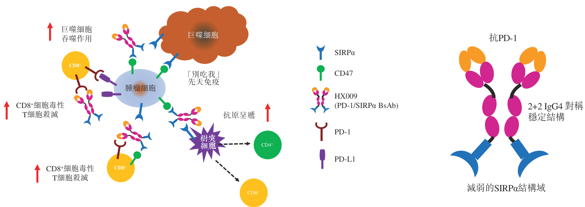

資料來源：公司數據

---

## 第 318 页

此外，HX009與紅細胞(RBC)和血小板的結合極少。如下圖《HX009與RBC的結合》所示，與莫洛利單抗(magrolimab，一種抗CD47單克隆抗體)相比，HX009與RBC的結合甚少。此外，當加入PNGase F（一種去糖基化酶）時，HX009與RBC的結合並沒有增加，表明HX009與紅細胞的親和力較低並非由於細胞表面CD47的糖基化所致。如下圖《HX009與血小板的結合》所示，與莫洛利單抗相比，HX009與血小板的結合明顯較少，表示HX009對血小板的潛在影響甚微。

HX009 與 RBC 的結合

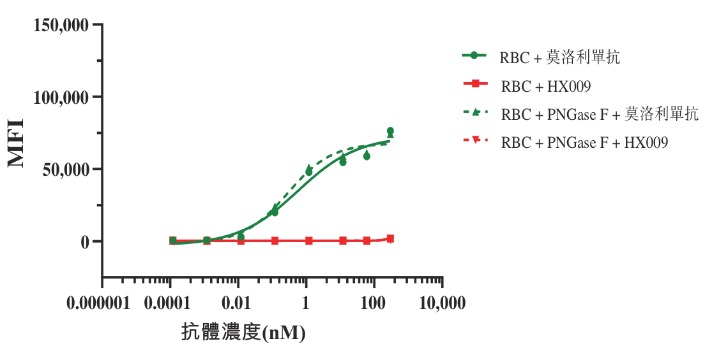

資料來源：公司數據

HX009 與血小板的結合

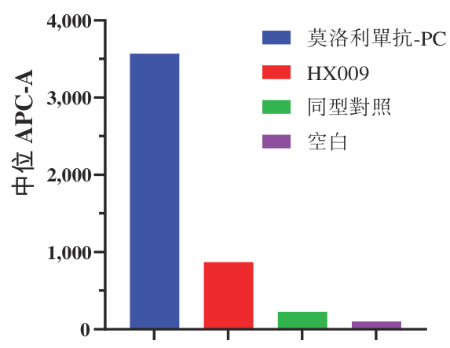

HX009一方面可憑藉PD-1的高親和力，通過腫瘤特異性的遞送，實現穩定的抗腫瘤活性，另一方面由於CD47的親和力降低，HX009可避免與人紅細胞和血小板細胞表面的CD47靶點的結合，從而令貧血和血小板減少症的風險有限，解決CD47靶向藥物相關的問題，例如血液毒性、抗原沉默、脫靶效應以及T細胞凋亡。所有該等因素均可改善抗腫瘤先天及適應性免疫反應，並使HX009有潛力成為免疫檢查點抑制劑新領域的代表。

與監管部門的溝通

澳大利亞藥品管理局(TGA)

根據澳大利亞相關法律及法規，我們於2019年5月就HX009-I-01澳大利亞研究向一家受認可的臨床研究倫理委員會(HREC)（「審批HREC」）提交HREC申請。於2019年7月，該審批HREC簽發批准函（「HREC批准函」），確認批准我們的臨床項目，即HX009-I-01澳大利亞研究。於2019年7月，我們通過澳大利亞藥品管理局網站提交線上通知表。於2022年12月，我們通知澳大利亞藥品管理局，HX009-I-01澳大利亞研究已按照提交的方案完成。此外，儘管根據相關法律及法規，澳大利亞藥品管理局可能要求試驗主辦方提供有關臨床試驗的進一步資料，但我們於2019年7月提交線上通知後，尚未自澳大利亞藥品管理局接獲提供進一步資料的要求或任何負面意見。

---

## 第 319 页

國家藥監局

於2019年7月，我們向國家藥監局提交I期臨床研究方案（「HX009-I-01中國研究方案」），該方案遵循國際協調理事會《藥物臨床試驗質量管理規範》，載明本研究的主要目標是(i)評估HX009的安全性及耐受性；及(ii)確定HX009的最大耐受劑量及二期推薦劑量。

國家藥監局於2019年8月受理HX009-I-01中國研究方案，並於2019年10月向我們發出臨床試驗批准通知書（「HX009國家藥監局一次性傘式批准」），其中確認HX009符合藥品註冊的相關規定，並准許我們根據國家藥監局HX009-I-01方案開展治療晚期惡性腫瘤（例如血液惡性腫瘤、肝癌、非小細胞肺癌、晚期胃癌、黑色素瘤、腎細胞癌和頭頸部鱗狀細胞癌）的臨床試驗。HX009國家藥監局一次性傘式批准亦確認，我們可以根據臨床試驗進展及獲取的臨床試驗數據適當調整我們產品的開發策略及臨床試驗方案，並可在必要時與相關監管部門溝通。我們對HX009-I-01中國研究方案進行修訂，新增Ib期作為原方案的擴展階段，該Ib期為劑量擴展研究，可在倫理委員會批准後開展。我們已於2023年9月提交年度研發期間安全性更新報告，載有相關修訂方案的資料，並於2023年10月在藥審中心官方臨床試驗平台更新方案。

此外，HX009國家藥監局一次性傘式批准規定：(i)申請人在獲得首次臨床試驗許可後，應定期向藥品審評中心（「藥審中心」）提供藥物研發期間安全性更新報告，並於每滿一年後的二個月內提交；及(ii)在完成I期、II期臨床試驗後，開展III期臨床試驗之前，申請人應向藥審中心提出溝通交流會議申請。

於2024年1月，我們的中國法律顧問與國家藥監局藥審中心進行正式電話溝通（「2024年1月正式電話溝通」），其中確認(i)對於新藥I期、II期及III期臨床試驗，國家藥監局採用一次性批准，而非分階段批准；(ii)除在關鍵試驗前尋求交流會議外，主辦企業評估認定已達致安全性評估階段的主要終點後，即可進行下一階段的有效性探索及確認臨床試驗，而無需國家藥監局額外批准或確認，並且藥審中心不會確認完成該等臨床試驗；(iii)若國家藥監局並未就《研發期間安全性更新報告》提出異議，主辦企業可繼續開展臨床試驗；及(iv)臨床分期是為便於了解各階段的目的，只要總體臨床試驗能夠達到評估安全性及有效性的目的，藥審中心等監管部門對主辦企業的內部試驗階段命名並無特別要求。

---

## 第 320 页

根據中國相關法律法規，在完成I期、II期臨床試驗後，開展III期臨床試驗之前，申請人應向藥審中心提出溝通交流會議申請。於2024年6月，我們提交了HX009聯合研究的IND申請，其為一項HX009與關鍵試驗階段(III期)FAKi藥物聯合治療晚期惡性膽道癌及黑色素瘤患者的IIa期臨床研究方案。於2024年9月，國家藥監局就該聯合研究授予臨床試驗批准（「HX009國家藥監局BTC聯合用藥批准」），使我們能夠進行HX009與該FAKi藥物（聯合或不聯合標準化療）的臨床試驗，用於治療晚期實體瘤（包括惡性膽道癌及黑色素瘤）。在我們進行確證性臨床試驗或關鍵性臨床試驗之前，無需額外批准。HX009國家藥監局BTC聯合用藥批准亦規定，在完成探索性臨床試驗後及開展確證性臨床試驗或關鍵性臨床試驗前，申請人應向藥審中心提出溝通交流會議申請，以評估後續臨床研究。

於2024年9月，我們的中國法律顧問連同獨家保薦人及其法律顧問在北京與國家藥監局藥審中心臨床試驗管理辦公室的審查員進行了面對面訪談（「2024年9月藥審中心訪談」），根據我們的中國法律顧問，該審查員是回應我們查詢的合資格人士。於2024年9月藥審中心訪談中，我們向藥審中心詢問：(i) HX009-I-01中國研究的晚期實體瘤Ia期（之前稱為I期）是否被視為國家藥監局HX009-I-01方案下的一項獨立臨床試驗，以及根據其方案中規定的臨床設計，該研究是否是一項常規的I期臨床研究；(ii)鑒於HX009-I-01中國研究的Ia期臨床研究報告已經完成，且本公司已獲得HX009國家藥監局BTC聯合用藥批准，而不論HX009的常規I期臨床研究是否已經完成，國家藥監局對HX009的II期臨床研究是否沒有異議；及(iii)本公司是否可以在III期關鍵試驗階段臨床研究之前進行HX009-I-01中國研究下的臨床研究，而無需獲得國家藥監局的額外監管批准。

藥審中心確認(i) HX009-I-01中國研究的晚期實體瘤Ia期（之前稱為I期）被視為國家藥監局HX009-I-01方案下的獨立臨床試驗，根據其方案中規定的臨床設計，其為一項常規的I期臨床研究。此項常規I期臨床研究已經完成；(ii)目前根據HX009-I-01方案正在進行的Ib期臨床研究在特定適應症患者中進行以評估其療效，一般被視為常規II期臨床研究的一部分，藥審中心並不反對本公司繼續進行II期臨床研究；(iii) HX009國家藥監局一次性傘式批准允許本公司在III期研究之前進行HX009-I-01中國研究下的臨床研究，而無需獲得國家藥監局的額外監管批准；及(iv)根據已完成的HX009-I-01中國研究的常規I期研究（即Ia期）結果，本公司的IIa期臨床研究方案獲得HX009國家藥監局BTC聯合用藥批准。

---

## 第 321 页

獨家保薦人進行了獨立盡職審查，包括(i)審閱HX009國家藥監局一次性傘式批准，其中確認HX009符合藥品註冊的相關規定，並准許本集團根據國家藥監局HX009-I-01方案開展HX009治療晚期惡性腫瘤的臨床試驗；(ii)審閱與國家藥監局藥審中心的2024年正式電話溝通記錄，其中確認若國家藥監局並未就已提交的《研發期間安全性更新報告》提出異議，本集團可繼續開展下一期臨床試驗（於關鍵試驗前）。本集團並無注意到國家藥監局提出任何重大疑慮，亦無收到藥審中心就《研發期間安全性更新報告》的任何異議；(iii)出席2024年9月藥審中心訪談；及(iv)審閱HX009-I-01中國研究(Ia期)的主要研究者於2024年7月發佈的臨床研究報告，其中確認Ia期臨床研究旨在評估HX009在晚期實體瘤患者中的安全性及耐受性且該研究已經完成。根據對該等文件及記錄的審閱以及訪談結果，獨家保薦人認為(i) HX009-I-01中國研究的Ia期（正式稱為I期）是一項獨立試驗，Ia期已完成並達到相等於受規管的I期臨床試驗的終點；及(ii)藥審中心不反對本公司繼續其HX009-I-01項下的Ib期臨床研究（一般被視為常規II期臨床研究的一部分）進行療效評估，因此HX009-I-01符合指南第2.3章項下的核心產品資格要求。

此外，於2025年2月，國家藥監局向我們授予HX009與曲妥珠單抗聯合治療晚期TNBC的IIa期臨床研究批准（「HX009國家藥監局TNBC聯合用藥批准」），使我們能夠對曾經接受一線或二線系統性治療的HER2低或超低表達的不可切除或轉移性TNBC患者，進行HX009與曲妥珠單抗聯合治療的臨床試驗。在我們進行確證性臨床試驗或關鍵性臨床試驗之前，無需額外批准。HX009國家藥監局TNBC聯合用藥批准亦規定，在完成探索性臨床試驗後及開展確證性臨床試驗或關鍵性臨床試驗前，申請人應向藥審中心提出溝通交流會議申請，以評估後續臨床研究。

美國食藥監局

於2023年4月，我們就將在美國開展的Ib/II期研究向美國食藥監局提交IND申請，該Ib/II期臨床研究是一項利用HX009治療彌漫性大B細胞淋巴瘤患者的單臂、多中心、開放標籤臨床研究。於2023年5月，我們收到美國食藥監局的《臨床試驗批准函》（「美國食藥監局批准」），並隨附非強制性臨床建議，這表明，Ib期的建議樣本量（每個劑量水平最多10名患者）可能不足以支持對PK、PD、安全性及療效數據的綜合分析，以選擇RP2D用於研究的II期部分。在啟動試驗的II期部分之前，我們可能需要於初始劑量遞增階段之後進行額外的劑量探索，例如在研究的劑量遞增部分納入更多的患者

---

## 第 322 页

或考慮額外的劑量遞增隊列。其後，我們更新了方案，並於2023年6月向美國食藥監局提交了變更概要。當我們開始相關臨床研究時，我們預期將在美國根據更新後的方案進行相關臨床研究。截至最後實際可行日期，我們並無計劃在美國開始相關臨床研究。

除上文披露的溝通外，我們亦於國家藥監局／IND批准日期後每年特定時間向國家藥監局及美國食藥監局提交《研發期間安全性更新報告》，並且我們並未收到國家藥監局或美國食藥監局就HX009提出任何重大疑慮。

HX009的臨床前研究

腫瘤微環境中的Teff細胞是殺死腫瘤細胞的主要免疫細胞，從而保護人體免受癌症侵害，該過程稱為癌症免疫監視。然而，腫瘤細胞通常會藉由過度表達PD-L1來逃避免疫監視，PD-L1與Teff細胞上的PD-1結合，抑制其殺傷腫瘤的功能。傳統的PD-1或PD-L1阻斷劑已被廣泛用於活化Teff細胞以殺死腫瘤。遺憾的是，由於Teff細胞的活化效果不令人滿意，有相當比例的癌症患者對PD-1或PD-L1阻斷劑產生抗藥性或耐藥性。除PD-1外，文獻顯示Teff細胞亦同時表達CD47，而CD47會與巨噬細胞或樹突狀細胞上的SIRPα相互作用。HX009是一種PD-1/SIRPα雙特異抗體，能夠同時與Teff細胞上的PD-1及CD47合作結合，比傳統的PD-1阻斷劑，如普特利單抗、帕博利珠單抗、納武利尤單抗等，具有更強的誘導性，最終導致Teff細胞更強的活化。如預期般，我們的數據顯示HX009在體外誘導Teff細胞的活化能力比普特利單抗強約三倍。此外，在體內A20小鼠淋巴瘤模型中，HX009的抗腫瘤活性明顯比普特利單抗強。綜合該等結果，可以推測HX009對目前PD-1阻斷劑無反應的癌症患者可能會有更好的抗腫瘤效果。此外，由於HX009亦能抑制CD47/SIRPα的相互作用，因此HX009能強效抑制各種過度表達CD47的淋巴瘤／白血病腫瘤模型的腫瘤生長，表明HX009有可能應用於治療血液系統惡性腫瘤。下文所載詳情已於www.nature.com/scientificreports上刊載，即《新型PD1/CD47雙特異性抗體HX009的臨床前藥理學特性》及《新型PD1/CD47雙靶向BsAb HX009在臨床前模型中顯示出強大的抗淋巴瘤活性》。

如下圖《T細胞活化報告基因試驗》所示，在我們的T細胞活化報告基因試驗中，HX009誘導的T細胞活化多於HX008（一種抗PD-1單克隆抗體）約三倍。值得注意的是，這種增強的T細胞活化可以通過加入對SIPRα具有高親和力的抗SIRPα抗體而被中和，即HX009對T細胞的額外活化很可能是與報告基因細胞表面上的PD-1和CD47順

---

## 第 323 页

式結合的結果。然而，額外的T細胞活化不能通過加入可溶性CD47-Fc來阻斷，意味著即使HX009和CD47的結合是減弱的，可溶性CD47-Fc的結合力仍無法與之競爭。綜上所述，該試驗顯示HX009能夠通過額外的PD-1驅動順式結合於T細胞表面的PD-1及CD47，引起比單用抗PD-1單克隆抗體更強的T細胞活化。

如下圖《hPD-1/hPD-L1/hCD47/hS1RPd HuGEMM小鼠體內的A20-hCD47腫瘤增長》所示，在攜帶表達人類CD47的A20-hCD47 B淋巴瘤腫瘤細胞的hPD-1/hPD-L1/hCD47/hSIRPα HuGEMM小鼠中，用8.8mg/kg的人類SIRPα-Fc給藥會帶來中度抗腫瘤作用，而用抗人PD-1單克隆抗體HX008治療時則只有少許抗腫瘤作用。相反，以10mg/kg同時靶向PD-1及CD47的雙特異性抗體HX009治療引起顯著的抗腫瘤作用，其強於單獨使用HX008或人類SIRPα-Fc。因此，在臨床前模型中，HX009的療效優於HX008。

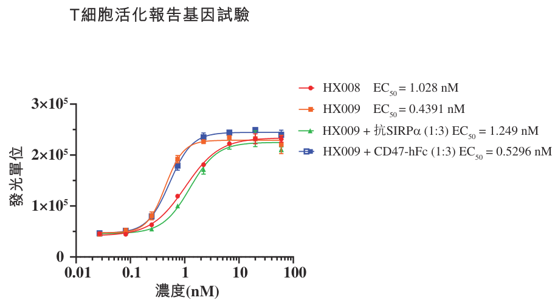

資料來源：公司數據

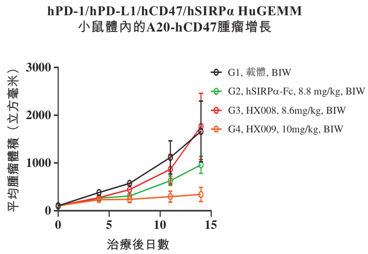

HX009的臨床研究

我們擁有HX009的全球開發及商業化權利。於往績記錄期間及直至最後實際可行日期，我們已分別在澳大利亞及中國完成HX009的I期臨床試驗。在澳大利亞，該試驗是一項首次人體研究，旨在評估HX009在晚期惡性腫瘤患者中的安全性、耐受性及初步有效性（「HX009-I-01澳大利亞研究」）；而在中國，該試驗是為評估HX009在晚期實體瘤患者中的安全性及耐受性的獨立Ia期臨床研究（「HX009-I-01中國研究（Ia期）」），亦為常規I期研究。截至最後實際可行日期，我們正在中國開展三項臨床試驗，即HX009-I-01中國研究（Ib期）、HX009-II-02中國研究（I/II期）及HX009-II-05中國研究（IIa期）。HX009-I-01中國研究（Ib期）旨在進一步評估HX009治療晚期黑色素瘤患者的安全性及耐受性，並初步測定抗腫瘤效果。HX009-II-02中國研究是一項多中心、單臂、復發性／難治性淋巴瘤病人的開放I/II期臨床試驗，其中Ia期為劑量遞增階段，Ib/II期為有效性探索及確認階段。

---

## 第 324 页

目前，我們並不計劃對HX009進行頭對頭研究，因為頭對頭試驗通常是指對照組（現有的標準治療）與實驗組之間的比較，其中所施用的藥物須為相同類別（如mAb、BsAb等）以作療效比較，而主管機關是否要求進行頭對頭試驗通常取決於目標適應症的標準治療。對於HX009的目標適應症及治療線，現階段缺乏標準治療，因此我們預期主管機關不會要求針對其目前的目標適應症進行頭對頭研究。

HX009-I-01澳大利亞研究

HX009-I-01澳大利亞研究是一項首次人體I期臨床試驗，採用開放標籤「3+3」劑量遞增研究。HX009-I-01澳大利亞研究旨在評估HX009在晚期惡性腫瘤患者中的安全性、耐受性及初步有效性，並按照國際協調理事會《藥物臨床試驗質量管理規範》（「ICH GCP」）進行。

HX009-I-01澳大利亞研究分為篩選期（首劑給藥前28天）、治療期及生存隨訪期。治療期持續到受試者出現無法耐受的毒性、撤回同意、出現疾病進展(PD)、死亡、失訪或已接受24個月的研究治療（以先發生者為準）。在因任何理由（死亡除外）終止研究治療後，受試者須於28±7天內返回研究地點以完成治療結束／提前退出(EOT/EW)檢查。研究持續時間為直至所有受試者死亡或最後一名受試者入組後至少24個月（以先發生者為準）。

HX009-I-01澳大利亞研究的受試者關鍵入組標準包括（其中包括）(i)美國東部腫瘤協作組體能狀態評分為0至1；(ii)經組織學證實對標準療法難治／復發的晚期惡性腫瘤，或無有效標準療法可用的晚期惡性腫瘤，或受試者拒絕標準療法；(iii)根據RECIST v1.1至少有1個可測量的腫瘤；及(iv)簽署知情同意書前7天內，器官功能正常，實驗室檢測結果符合方案要求。HX009-I-01澳大利亞研究的受試者關鍵排除標準包括（其中包括）(i)過去兩年內患有活躍的既往惡性腫瘤，但入組研究的受試者腫瘤及已明顯治癒的局部可治癒的癌症除外，例如基底或鱗狀細胞皮膚癌、淺表性膀胱癌或宮頸或乳腺原位癌；(ii)對重組人源化抗PD-1單克隆抗體藥物及其成分過敏；(iii)在首次用藥研究治療前4週內接受任何免疫治療或研究性抗癌治療；對於mAb（用於研究用途或免疫療法），在首次用藥研究治療前6週內接受任何免疫治療或研究性抗癌治療；及(iv)人類免疫缺陷病毒檢測呈陽性，或有活動性乙型肝炎病毒或丙型肝炎病毒。

---

## 第 325 页

在評估總共招募的21名實體瘤患者的以下七個代表性劑量水平後，我們完成對HX009-I-01澳大利亞研究的觀察：0.1 mg/kg (n=2)、0.3 mg/kg (n=3)、1.0 mg/kg (n=3)、2.0 mg/kg (n=3)、3.0 mg/kg (n=3)、5.0 mg/kg (n=3)及7.5 mg/kg (n=4)。於2022年10月25日，HX009-I-01澳大利亞研究的主要研究者發佈臨床研究報告（「HX009-I-01澳大利亞臨床研究報告」），其中主要研究者評估了HX009-I-01澳大利亞臨床研究的臨床結果。根據HX009-I-01澳大利亞臨床研究報告，HX009的質量安全性、藥代動力學及初步有效性數據如下：

• 安全性：HX009的所有七個劑量水平均具有良好的耐受性，並且在七個測試劑量水平均未觀察到劑量限制性毒性。並無報告致命性TEAE或導致研究中止的治療相關不良事件。

• 藥代動力學：HX009的血漿藥代動力學曲線顯示，單次靜脈輸注後全身暴露量與劑量成比例增加；六個治療週期後藥物累積量小。全部劑量範圍的清除率相似，亦與劑量成比例。

• 有效性：所有21名接受治療的受試者均可進行有效性評估。其中三名受試者均出現反應。5.0 mg/kg組中兩名受試者達到完全緩解，1.0 mg/kg組中一名受試者達到部分緩解。該研究對三名出現反應者進行1.5至2年的跟蹤觀察。經觀察，反應可持久，並且未達到中位反應持續時間。根據RECIST 1.1版，中位無進展生存期為64天，中位總生存期為212天。

下圖載有靶病灶大小較基線的最大百分比變化瀑布圖（全分析集）：

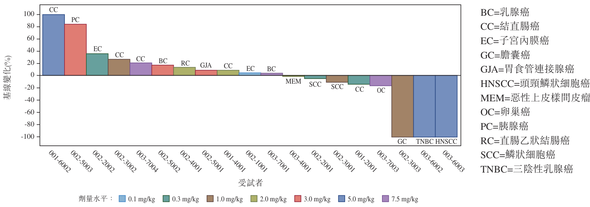

---

## 第 326 页

下圖載有RECIST 1.1版所界定治療持續時間、腫瘤反應及生存狀態的泳道圖（全分析集）：

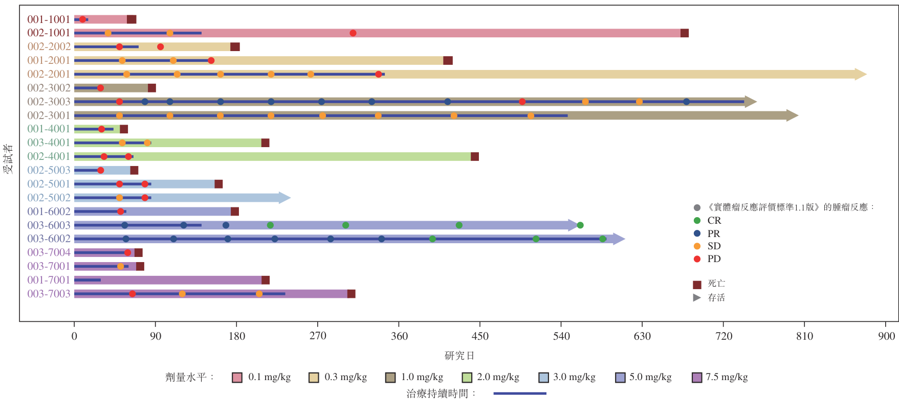

資料來源：公司數據

HX009-I-01 中國研究

HX009-I-01中國研究是一項開放標籤、多中心、多劑量給藥臨床研究，包括獨立的Ia期臨床研究（相當於傳統I期臨床試驗）和Ib期研究。HX009-I-01中國研究旨在評估HX009治療晚期實體瘤患者的安全性、耐受性及初步療效，並已按照國際協調理事會《藥物臨床試驗質量管理規範》（「ICH GCP」）進行。

HX009-I-01中國研究分為篩選期（首次給藥前28天）、治療期及生存隨訪期。治療期持續到受試者出現無法耐受的毒性、出現疾病惡化(PD)、開始新的抗癌治療，死亡、失訪、撤回同意、研究者評估風險超過益處、研究結束；或就Ib期受試者而言，已接受研究治療達24個月（以先發生者為準）。

我們在國家藥監局一次性傘式批准下啟動HX009-I-01中國研究，而HX009-I-01中國研究Ia期首名受試者已於2020年6月入組。於對合共25名入組的實體瘤患者評估以下七個具有代表性的劑量水平後，我們已完成HX009-I-01中國研究Ia期的觀察結果：0.3 mg/kg (n=4)、1.0 mg/kg (n=3)、2.0 mg/kg (n=3)、3.0 mg/kg (n=3)、5.0 mg/kg (n=3)、7.5 mg/kg (n=3)及15.0 mg/kg (n=6)。

---

## 第 327 页

HX009-I-01中國研究Ia期的受試者關鍵入組標準包括（其中包括）(i)美國東部腫瘤協作組體能狀態評分為0至1；(ii)經組織學證實對標準療法難治／復發的晚期惡性腫瘤，或無有效標準療法可用的晚期惡性腫瘤，或受試者拒絕標準療法；(iii)根據RECIST v1.1至少有1個可測量的腫瘤；及(iv)簽署知情同意書前7天內，器官功能正常，實驗室檢測結果符合方案要求。HX009-I-01中國研究Ia期的受試者關鍵排除標準包括（其中包括）(i)過去五年內患有活躍的既往惡性腫瘤，但已治癒的基底細胞皮膚癌或宮頸原位癌除外；(ii)對重組人源化抗PD-1單克隆抗體藥物及其成分過敏；(iii)在首次用藥研究治療前4週內的嚴重感染，或在首次用藥研究治療前兩週內有活動性感染需要口服或靜脈注射抗生素治療的患者；及(iv)人類免疫缺陷病毒檢測呈陽性，或有活動性乙型肝炎病毒或丙型肝炎病毒。

我們於往績記錄期間完成HX009-I-01中國研究的獨立的Ia期臨床研究，這是一項傳統的I期研究，旨在評估HX009對晚期實體瘤患者的安全性和耐受性，並初步測量其抗腫瘤療效。HX009-I-01中國研究(Ia期)的主要研究者已發出日期為2024年7月24日的臨床研究報告。

根據0.3 mg/kg至15.0 mg/kg (Ia期)劑量遞增組的臨床結果，15 mg/kg組觀察到1例劑量限制性毒性（3級貧血），且並未達到最大耐受劑量。共有23名受試者至少進行一次基線後腫瘤評估，其中一名三陰性乳腺癌患者在3 mg/kg劑量水平下達到部分緩解，反應持續時間超過2.5年；八名受試者的病情穩定。並無致命性治療期出現的不良事件或導致研究中止的治療相關不良事件。研究結果表明，每兩週一次1.0 mg/kg至15.0 mg/kg劑量範圍的HX009單一療法屬安全且可能有效，因此支持繼續開展臨床研究，以進一步探索HX009作為單一療法或與其他藥物聯用治療晚期實體瘤的有效性及安全性。

---

## 第 328 页

下圖載有靶病灶大小較基線的最大百分比變化瀑布圖（全分析集）：

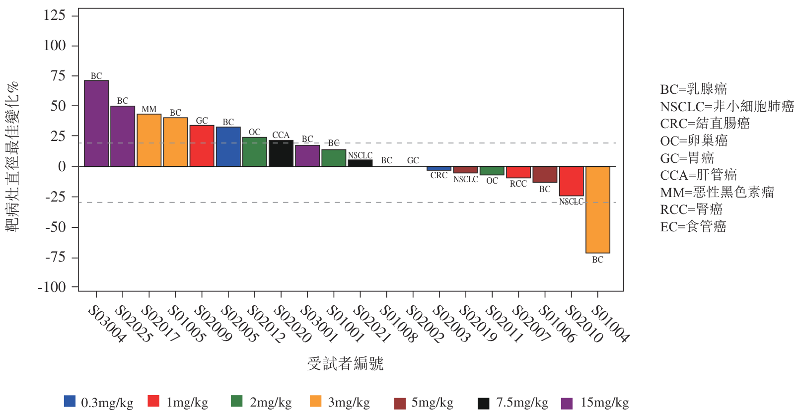

下圖載有RECIST 1.1版所界定治療持續時間、腫瘤反應及生存狀態的泳道圖（全分析集）：

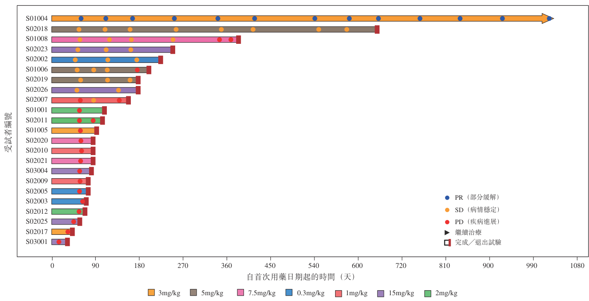

資料來源：公司數據

在HX009-I-01中國研究的Ia期研究中，有三名長期出現反應者及／或患者在接受長期治療後病情保持穩定。出於患者的最佳利益及道德原因，HX009-I-01中國研究的Ia期研究持續開放，允許該等患者在研究中接受HX009治療。此外，我們希望收集所有患者的數據，包括該等長期出現反應者。因此，HX009-I-01中國研究的Ia期保持

---

## 第 329 页

開放（即無數據庫鎖定）約四年，並於2024年7月發出臨床研究報告時完成。同時，儘管基於上述理由，HX009-I-01中國研究的Ia期研究持續開放，HX009-I-01中國研究的Ia期研究劑量遞增於2022年9月完成，並於2023年4月取得其安全性結論並達到試驗終點，國家藥監局對進行Ib期臨床試驗並無異議。

我們進一步在晚期黑色素瘤患者中開展HX009-I-01中國研究的Ib期研究，初始劑量水平為10 mg/kg。該研究是一項單臂、多中心、多隊列、開放標籤臨床研究。該研究包括兩個隊列，分別對晚期黑色素瘤患者進行一線治療（隊列A）及二線和以上治療（隊列B）。於2023年11月，首名受試者入組該研究。截至最後實際可行日期，共有46名受試者（包括隊列A的27名患者及隊列B的19名患者）入組該研究，並接受10 mg/kg劑量水平的HX009治療。彼等為先前未接受PD-1/PD-L1治療（隊列A）或治療進展（隊列B）的不可切除或轉移性晚期黑色素瘤患者。HX009已顯示對晚期黑色素瘤患者的初步治療益處。目前，研究正在進行中，我們計劃就該研究招募不超過80名患者。

於2023年7月18日至2024年7月17日的研發期間安全性更新報告報告期，在HX009-I-01中國研究的Ib期中，有三例死亡案例被研究者評估為與研究產品無關，並得出結論為疾病進展的死亡病例。截至最後實際可行日期，HX009-I-01中國研究的Ib期仍在該等臨床試驗的正常觀察程序下進行，並無被監管機構或倫理委員會採取任何對進行該等臨床試驗具有重大影響的安全相關措施。有關死亡病例的風險因素，請參閱本招章程中的「風險因素－與研發候選藥物有關的風險－我們候選藥物引起的不良事件或不良副作用可能會中斷、延遲或停止臨床試驗，延遲或阻礙監管批准，限制獲批藥物的商業前景，或在監管批准後造成重大負面影響」。

HX009-II-02中國研究

我們根據HX009國家藥監局一次性傘式批准進一步開展HX009的臨床試驗。於2021年10月，主要研究者中心倫理委員會接納我們HX009治療R/R淋巴瘤患者的I/II期臨床試驗（「HX009-II-02中國研究」）。於2022年7月，HX009-II-02中國研究的數據監測委員會（「DMC」）成員一致確認，在HX009-II-02中國研究中，每兩週接受劑量不超過7.5 mg/kg的HX009治療屬安全。於2022年10月，數據監測委員會成員一致確認HX009-II-02中國研究的劑量遞增階段已完成，研究可進入有效性探索階段。有效性探索階段的入組受試者採用10 mg/kg劑量水平，並可酌情探索15 mg/kg劑量水平。截至最後實際可行日期，共有41名受試者入組該研究，並接受10 mg/kg劑量水平的HX009-II-02中國研究，當中20名受試者接受R/R EBV$^{+}$非霍奇金淋巴瘤。截至同日，4名R/R EBV$^{+}$非霍奇金淋巴瘤患者達到部分緩解，5名R/R EBV$^{+}$非霍奇金淋巴瘤患者疾病穩

---

## 第 330 页

定。客觀緩解率為20.0%，疾病控制率45.0%。總體而言，HX009正在為這一難治性患者群體帶來顯著的臨床效益。目前，我們已完成HX009-II-02中國研究的數據庫鎖定，預期於2025年底前完成該研究並提供臨床研究報告。

HX009-II-02中國研究分為篩選期（首次給藥前28天）、治療期及生存隨訪期。治療期持續到受試者死亡、失訪、撤回同意、研究者評估風險超過益處（以先發生者為準）。

HX009-II-02中國研究的受試者關鍵入組標準包括（其中包括）(i)根據2022年第五版世界衛生組織分類標準診斷為淋巴瘤，且符合復發／難治性定義；(ii)在首次給藥前4週內，根據Lugano標準，必須至少有一個可測量的病灶；可測量病灶：淋巴結最長直徑>15mm，其他受累病灶>10mm；過去曾接受過放射治療等局部治療的病灶，若證明有疾病進展且符合可測量病灶的定義，則視為可測量病灶；及(iii)適當的器官及造血功能，滿足方案的要求。HX009-II-02中國研究的受試者關鍵排除標準包括（其中包括）(i)已知的遺傳性或後天性溶血性或出血性疾病病史；(ii)過去五年內患有活躍的既往惡性腫瘤，但已治癒的基底細胞皮膚癌或宮頸原位癌除外；(iii)患有原發性或繼發性中樞神經系統淋巴瘤的受試者；及(iv)既往接受過針對CD47（包括mAb、BsAb等）的靶向治療。

於2022年7月18日至2023年7月17日的研發期間安全性更新報告報告期及直至2023年末，在HX009-II-02中國研究中，曾出現一個死於病毒性心肌炎的死亡病例。研究人員評定該則死亡與試驗用藥品無關。受試者為復發性／難治性淋巴瘤患者，在進入試驗時已處於末期，並已感染COVID-19，其後引發一連串炎症反應導致死亡。HX009-II-02中國研究正在進行臨床試驗的常規觀察程序，監管部門或倫理委員會概未採取會對臨床試驗產生重大影響的安全相關措施。

HX009-II-05中國研究

利用HX009在臨床前研究及I期研究中所觀察到的有前景的初步抗腫瘤活性，我們嘗試與腫瘤微環境重塑劑聯合，以進一步擴大其治療潛力。展望未來，HX009的臨床研究路線圖包括兩項額外的II期聯合研究。於2024年6月，我們向國家藥監局提交HX009聯合研究的IND申請，其為HX009與關鍵試驗階段（III期）FAKi藥物聯合治療晚期惡性膽道癌及黑色素瘤患者的IIa期臨床研究申請（即HX009-II-05中國研究）。

---

## 第 331 页

我們提交的IND申請包括來自四項臨床研究的臨床數據：(i) HX009-I-01澳大利亞研究（一項已完成的I期臨床試驗）；(ii) HX009-I-01中國研究（Ia期）（一項已完成的I期臨床試驗）；(iii)現正進行的HX009-I-01中國研究（Ib期），用於治療；及(iv)用於治療晚期實體瘤的HX009-II-01中國研究。由於我們臨床開發策略的改變，此HX009-II-01中國研究在早期階段已告終止。

我們於2024年9月獲得國家藥監局的臨床研究批准，並於2025年1月入組首例患者。截至最後實際可行日期，市場上並無已獲批准靶向BTC的FAKi，而能否取得HX009用於治療BTC的NDA上市批准取決於此藥物能否成功進行市場開發。截至最後實際可行日期，HX009-II-05中國研究共有九名患者入組，彼等均為曾接受治療的不可切除或轉移性晚期膽道癌患者。截至同日，九名入組患者中有四名達至病情穩定。目前，研究正在進行中，我們計劃就該研究招募不超過30名患者。

關於HX009-II-05中國研究，該研究使用的藥物是一種FAK抑制劑，由應世生物科技（上海）有限公司（「應世上海」，一家於2018年成立的臨床階段生物科技公司，專注於開發FAK抑制劑）進行關鍵階段研究開發。於2024年2月5日，杭州翰思與應世生物科技（南京）有限公司（「應世南京」，應世上海的唯一股東）就HX009與其FAKi藥物的聯合研究訂立合作協議。該協議規定：(i)訂約方須於第一合作階段（涵蓋直至聯合研究的Ib/II期，包括劑量遞增及適應症擴展）及時向另一方免費提供各自的產品（即HX009及FAKi）；(ii)訂約方應真誠磋商，並可達成補充協議以進一步協定彼此在第二合作階段的權利及義務，該階段涵蓋聯合研究的關鍵試驗階段及直至聯合療法獲得市場批准後的15年。截至最後實際可行日期，尚未有靶向BTC的FAK抑制劑獲得批准。因此，我們決定與一種關鍵階段藥物聯合。由於應世將依據我們的合作協議提供該FAKi藥物，因此我們預計不會就該FAKi藥物產生實際成本（標籤、儲存及運送費用除外）。目前，該FAKi藥物正處於關鍵階段(III期)的研究開發，而能否取得HX009用於治療BTC的NDA上市批准取決於此FAKi藥物能否成功進行市場開發。

澳大利亞及中國I期臨床試驗的安全性數據概要

於往績記錄期間，我們的核心產品HX009在澳大利亞及中國開展兩個I期臨床試驗項目，即HX009-I-01澳大利亞研究（I期）及HX009-I-01中國研究（Ia期）。HX009-I-01澳大利亞研究（I期）及HX009-I-01中國研究（Ia期）分別有21名及25名患者入組，我們分別於2022年5月及2024年2月完成了這兩項臨床研究的最後患者最後隨訪。

---

## 第 332 页

下表載列HX009在澳大利亞的I期試驗中按首選術語歸類的常見治療相關治療中出現的不良事件摘要：

按首選術語歸類的治療相關治療中出現的不良事件摘要

<!-- table html -->
<table><tr><td>首選術語</td><td>0.1 mg/kg (N=2)</td><td>0.3 mg/kg (N=3)</td><td>1.0 mg/kg (N=3)</td><td>2.0 mg/kg (N=3)</td><td>3.0 mg/kg (N=3)</td><td>5.0 mg/kg (N=3)</td><td>7.5mg/kg (N=4)</td><td>所有受試者 (N=21)</td></tr><tr><td>至少一次與IP相關的TEAE</td><td>0</td><td>3</td><td>1</td><td>3</td><td>1</td><td>1</td><td>2</td><td>11 (52.4%)</td></tr><tr><td>噁心</td><td>0</td><td>0</td><td>0</td><td>0</td><td>1</td><td>0</td><td>1</td><td>2 (9.5%)</td></tr><tr><td>皮疹</td><td>0</td><td>1</td><td>0</td><td>0</td><td>0</td><td>1</td><td>0</td><td>2 (9.5%)</td></tr><tr><td>嘔吐</td><td>0</td><td>0</td><td>0</td><td>1</td><td>1</td><td>0</td><td>0</td><td>2 (9.5%)</td></tr><tr><td>丙氨酸氨基轉移酶升高</td><td>0</td><td>0</td><td>0</td><td>1</td><td>0</td><td>0</td><td>0</td><td>1 (4.8%)</td></tr><tr><td>貧血</td><td>0</td><td>0</td><td>0</td><td>0</td><td>0</td><td>0</td><td>1</td><td>1 (4.8%)</td></tr><tr><td>天門冬氨酸氨基轉移酶升高</td><td>0</td><td>0</td><td>0</td><td>1</td><td>0</td><td>0</td><td>0</td><td>1 (4.8%)</td></tr><tr><td>蜂窩組織炎</td><td>0</td><td>0</td><td>0</td><td>1</td><td>0</td><td>0</td><td>0</td><td>1 (4.8%)</td></tr><tr><td>食欲減退</td><td>0</td><td>1</td><td>0</td><td>0</td><td>0</td><td>0</td><td>0</td><td>1 (4.8%)</td></tr><tr><td>腹瀉</td><td>0</td><td>0</td><td>0</td><td>0</td><td>1</td><td>0</td><td>0</td><td>1 (4.8%)</td></tr><tr><td>口乾</td><td>0</td><td>0</td><td>0</td><td>0</td><td>0</td><td>0</td><td>1</td><td>1 (4.8%)</td></tr><tr><td>呼吸困難</td><td>0</td><td>0</td><td>0</td><td>0</td><td>0</td><td>0</td><td>1</td><td>1 (4.8%)</td></tr><tr><td>疲勞</td><td>0</td><td>0</td><td>1</td><td>0</td><td>0</td><td>0</td><td>0</td><td>1 (4.8%)</td></tr><tr><td>多汗症</td><td>0</td><td>0</td><td>0</td><td>1</td><td>0</td><td>0</td><td>0</td><td>1 (4.8%)</td></tr><tr><td>甲狀腺功能減退症</td><td>0</td><td>0</td><td>0</td><td>0</td><td>0</td><td>1</td><td>0</td><td>1 (4.8%)</td></tr><tr><td>輸液相關反應</td><td>0</td><td>0</td><td>0</td><td>0</td><td>0</td><td>0</td><td>1</td><td>1 (4.8%)</td></tr><tr><td>嗜睡</td><td>0</td><td>1</td><td>0</td><td>0</td><td>0</td><td>0</td><td>0</td><td>1 (4.8%)</td></tr><tr><td>黏膜炎症</td><td>0</td><td>1</td><td>0</td><td>0</td><td>0</td><td>0</td><td>0</td><td>1 (4.8%)</td></tr></table>
<!-- /table -->

附註：在計算相應的不良事件數目時，如果受試者在一種SOC或PT分類中出現多次不良事件，則僅計算一人。

大部分受試者出現的治療相關治療中出現的不良事件為1至2級的輕至中度不良事件。其中，7.5 mg/kg組的一名受試者出現了3級治療相關治療中出現的不良事件，為輸液相關反應，且對該特定受試者的研究治療因該不良事件而被終止。此事件在7天內解決。並無監管機構提出安全問題或條件，亦無按監管機構要求對HX009-I-01澳大利亞研究的終點或擴展作出任何調整。

---

## 第 333 页

下表載列HX009在中國Ia期試驗中按首選術語（安全性分析集）分類的常見三級或以上治療相關不良事件摘要：

<!-- table html -->
<table><tr><td></td><td colspan="9">≥3級TRAE</td></tr><tr><td>首選術語</td><td>0.3 mg/kg (N=4)</td><td>1 mg/kg (N=3)</td><td>2 mg/kg (N=3)</td><td>3 mg/kg (N=3)</td><td>5 mg/kg (N=3)</td><td>7.5 mg/kg (N=3)</td><td>15 mg/kg (N=6)</td><td>所有受試者 (N=25)</td></tr><tr><td>至少發生1次≥3級的TRAE</td><td>0</td><td>1 (33.3%)</td><td>0</td><td>0</td><td>0</td><td>0</td><td>1 (16.7%)</td><td>2 (8.0%)</td></tr><tr><td>肝損傷</td><td>0</td><td>1 (33.3%)</td><td>0</td><td>0</td><td>0</td><td>0</td><td>0</td><td>1 (4.0%)</td></tr><tr><td>白細胞計數降低</td><td>0</td><td>1 (33.3%)</td><td>0</td><td>0</td><td>0</td><td>0</td><td>0</td><td>1 (4.0%)</td></tr><tr><td>貧血</td><td>0</td><td>0</td><td>0</td><td>0</td><td>0</td><td>0</td><td>1 (16.7%)</td><td>1 (4.0%)</td></tr></table>
<!-- /table -->

附註：在計算相應的不良事件數目時，如果受試者在一種SOC或PT分類中出現多次不良事件，則僅計算一人。

HX009-I-01中國研究（Ia期）報告三宗導致受試者退出研究的TEAE。下表載列按首選術語（安全性分析集）分類的摘要：

導致受試者退出研究的TEAE

<!-- table html -->
<table><tr><td>首選術語</td><td>0.3 mg/kg (N=4)</td><td>1 mg/kg (N=3)</td><td>2 mg/kg (N=3)</td><td>3 mg/kg (N=3)</td><td>5 mg/kg (N=3)</td><td>7.5 mg/kg (N=3)</td><td>15 mg/kg (N=6)</td><td>所有受試者 (N=25)</td></tr><tr><td>至少一項導致受試者退出研究</td><td></td><td></td><td></td><td></td><td></td><td></td><td></td><td></td></tr><tr><td>的TEAE</td><td>1 (25.0%)</td><td>1 (33.3%)</td><td>1 (33.3%)</td><td>0</td><td>0</td><td>0</td><td>0</td><td>3 (12.0%)</td></tr><tr><td>肝損傷</td><td>0</td><td>1 (33.3%)</td><td>0</td><td>0</td><td>0</td><td>0</td><td>0</td><td>1 (4.0%)</td></tr><tr><td>肺部炎症</td><td>0</td><td>0</td><td>1 (33.3%)</td><td>0</td><td>0</td><td>0</td><td>0</td><td>1 (4.0%)</td></tr><tr><td>腸梗阻</td><td>1 (25.0%)</td><td>0</td><td>0</td><td>0</td><td>0</td><td>0</td><td>0</td><td>1 (4.0%)</td></tr></table>
<!-- /table -->

附註：在計算相應的不良事件數目時，如果受試者在一種SOC或PT分類中出現多次不良事件，則僅計算一人。

HX009臨床開發計劃

截至2023年及2024年12月31日止年度及截至2024年及2025年8月31日止八個月，我們為核心產品產生研發成本人民幣13.5百萬元、人民幣19.4百萬元、人民幣17.6百萬元及人民幣19.4百萬元，分別佔我們同期研發開支總額的29.0%、25.9%、30.9%及34.5%。HX009的臨床試驗具有重要里程碑意義，我們在澳大利亞及中國成功完成兩項I期劑量遞增臨床試驗，即HX009-I-01澳大利亞研究及HX009-I-01中國研究（Ia期）。該等試驗對了解HX009的安全性及最佳劑量水平至關重要。完成該等試驗為我們的後續研發階段奠定堅實基礎。

---

## 第 334 页

目前，我們主要在中國開展HX009臨床試驗。其中一項試驗是HX009-I-01中國研究（Ib期），該研究是一項包括兩個隊列的Ib期臨床試驗，其中一個隊列專門針對既往PD-1/PD-L1抑制劑治療後出現疾病進展的晚期黑色素瘤患者。該研究體現出我們一直持續探索該類惡性皮膚癌患者的有效療法。另一個臨床項目是HX009-II-02中國研究，該研究是一項多中心、開放標籤、單臂I/II期臨床試驗，旨在評估HX009在治療中國R/R淋巴瘤（包括R/R EBV+非霍奇金淋巴瘤）患者的安全性及有效性。該研究旨在為該類血癌患者提供新治療選項，具有重要意義。此外，我們啟動治療晚期膽道癌的HX009-II-05中國研究（IIa期），於2025年1月入組首名患者。

此外，我們於2024年11月向國家藥監局提交HX009聯合研究IND，其為一項HX009與德曲妥珠單抗聯合治療晚期三陰性乳腺癌患者的IIa期臨床研究申請（即HX009-II-04中國研究）。我們於2025年2月獲得國家藥監局的臨床研究批准，並預計該聯合研究於2026年完成首名患者招募。關於與曲妥珠單抗的聯合臨床研究，所用的德曲妥珠單抗品牌為Enhertu$^{®}$，由一家日本跨國醫療企業與一家專注於腫瘤、心血管、代謝疾病等多個治療領域創新藥物的跨國製藥公司共同開發。德曲妥珠單抗自2024年起被納入《國家醫保目錄》，而根據弗若斯特沙利文的資料，2025年德曲妥珠單抗的價格為人民幣3,480元／100 mg且市場上有大量供應。截至最後實際可行日期，由於我們尚未開始HX009-II-04中國研究，我們尚未就該聯合藥物產生任何實際成本。本公司正在考慮兩種供應該藥物的方式：(i)由其中一家共同開發商供應（正在磋商中）；及(ii)從市場上的其他供應商採購，本公司已聯繫四家供應商提供該藥物。該等研究旨在探索HX009與現有療法進行聯合治療時提高治療效果的可能性，進而可能為癌症患者提供更好治療效果。該等聯合研究突顯我們一直致力於挖掘HX009的全部潛力以及其在未來癌症治療範例中的地位。

市場機會與競爭

EBV$^{+}$非霍奇金淋巴瘤

EBV$^{+}$非霍奇金淋巴瘤是一種與特定病毒相關的淋巴瘤亞型，現有治療選項通常僅限於化療及放療，並且治療效果遠差於EBV$^{-}$非霍奇金淋巴瘤。HX009治療EBV$^{+}$非霍奇金淋巴瘤是一個頗具前景的細分市場。根據弗若斯特沙利文報告，中國EBV+非霍奇金淋巴瘤新發病例數量已由2019年的12.1千例增加至2024年的13.5千例，複合年增長率為2.1%。預計於2030年及2035年將分別達到15.1千例及16.5千例，複合年增長率

---

## 第 335 页

分別為1.9%及1.8%。同時，全球EBV$^{+}$非霍奇金淋巴瘤新發病例數量已由2019年的83.4千例增加至2024年的94.2千例，複合年增長率為2.5%。預計於2030年及2035年將分別達到104.4千例及115.0千例，複合年增長率分別為1.7%及2.0%。

傳統手術、化療及放射治療對該等惡性腫瘤的療效不佳，並可能導致嚴重的不良反應。根據弗若斯特沙利文報告，儘管約60%至70%的非霍奇金淋巴瘤患者對標準化療方案的CHOP或R-CHOP治療有初步反應，但約30%至40%的非霍奇金淋巴瘤患者對標準CHOP或R-CHOP治療無效或在標準治療後復發。目前市面上並無針對EBV$^{+}$非霍奇金淋巴瘤的特定藥物。免疫檢查點抑制劑在EBV$^{+}$非霍奇金淋巴瘤中顯示出潛力。例如，在一項II期研究中，納武利尤單抗似乎對EBV相關淋巴組織增生性疾病和非霍奇金淋巴瘤患者安全且無意外毒性。所有該等因素導致復發性／難治性非霍奇金淋巴瘤仍屬未獲滿足的醫療需求，因此該市場對於新療法開發是潛力優厚可望帶來豐碩回報的領域。HX009預計將改變治療選項有限且療效不佳的患者群體的治療方式，滿足新型治療解決方案的關鍵市場需求。我們的轉化研究結果顯示，HX009在大型體內淋巴瘤模型中可顯著抑制腫瘤生長，與僅靶向PD-1或僅靶向CD47的療法相比，且展現出更強的抗腫瘤活性，該結果與已發表的文獻一致，透過阻斷CD47可提高對PD-1/PD-L1治療的反應性。此外，我們大型淋巴瘤患者來源的腫瘤異種移植(PDX)模型及患者樣本數據的轉化研究(連同其他研究)顯示，EBV$^{+}$非霍奇金淋巴瘤具有高水平的PD-L1、CD47及OX40。與此一致的是，HX009亦在一項進行中的Ib期臨床研究中顯示出對EBV$^{+}$淋巴瘤的初步抗腫瘤療效，這意味著HX009對EBV$^{+}$淋巴瘤患者具有潛在應用價值。與第一代抗CD47抗體（例如莫洛利單抗）相比，我們的臨床前數據顯示HX009對CD47的親和力較低，因此與紅細胞和血小板的結合極少。此外，PD-1靶向可提高親和力，確保HX009確切且優先針對腫瘤微環境中耗竭的T細胞並對其產生作用，避免與僅靶向CD47的療法相關的抗原沉澱效應或全身毒性。與我們的重點設計一致，HX009在優良實驗室規範(GLP)毒性研究以及首次人體臨床研究中表現出極低的毒性，證明HX009與其他CD47靶向治療藥物（如莫洛利單抗）相比具有更廣泛的治療窗口。

黑色素瘤

黑色素瘤是最嚴重的皮膚癌，其可能在眼睛及身體內部形成，例如鼻子或喉嚨。鑒於黑色素瘤是一種惡性皮膚癌，並且全球新發病例數量不斷上升，HX009在治療晚期黑色素瘤方面具有巨大的市場機會。根據弗若斯特沙利文報告，中國黑色素瘤新發病例數量已由2019年的8.2千例增加至2024年的9.2千例，複合年增長率為2.4%。預計於2030年及2035年將分別達到10.3千例及11.1千例，複合年增長率分別為2.0%

---

## 第 336 页

及1.5%。同時，全球黑色素瘤新發病例數量已由2019年的294.6千例增加至2024年的351.6千例，複合年增長率為3.6%。預計於2030年及2031年將分別達到376.6千例及405.2千例，複合年增長率分別為1.2%及1.5%。根據弗若斯特沙利文報告，於2019年至2024年期間，中國黑色素瘤市場總額由2億美元增加至3億美元，複合年增長率為6.2%。中國黑色素瘤市場近期亦將持續快速增長。中國黑色素瘤市場總額預計於2035年將達到4億美元。同時，全球黑色素瘤市場由2019年的126億美元增加至2024年的184億美元，複合年增長率為7.9%。此外，全球黑色素瘤市場近期亦將持續快速增長。預計於2030年及2035年，全球黑色素瘤市場將分別達到236億美元及273億美元，2024年至2030年期間的複合年增長率為4.2%，2030年至2035年期間的複合年增長率為2.9%。

黑色素瘤對傳統療法具有耐藥性，因此能夠改善患者治療效果的創新療法具有廣闊的市場。黑色素瘤的傳統療法通常包括手術、化療及放療。由於腫瘤細胞遺傳及表觀遺傳改變的不斷累積及微環境明顯變化，傳統療法在治療黑色素瘤時會產生耐藥性。手術及化療作為主要傳統療法，存在若干不容忽視的局限性。儘管納武利尤單抗（歐狄沃）及帕博利珠單抗（可瑞達）等多種PD-1阻斷劑已獲批准作為黑色素瘤的一線治療藥物，但該等PD-1阻斷劑的緩解率非常有限。根據弗若斯特沙利文報告，傳統細胞毒性藥物治療晚期黑色素瘤的效果相對較差，總緩解率為10%至15%。除此之外，大量黑色素瘤患者接受抗PD-1治療後在相對較短的時間內復發，這使復發性／難治性黑色素瘤的治療選擇非常有限。多種化療聯合療法及單一化療無法明顯提高晚期黑色素瘤患者的生存期。中國的肢端雀斑痣樣黑色素瘤患者比白人更常見。根據弗若斯特沙利文報告，中國約60%至70%的黑色素瘤為肢端或黏膜黑色素瘤，對目前的抗PD-1治療反應不佳，而在白人的黑色素瘤中約90%為皮膚黑色素瘤，對抗PD-1治療相對更為敏感。綜合而言，抗PD-1治療後的R/R黑色素瘤仍屬未獲滿足的臨床需求，期盼新一代療法的開發。

免疫療法近年來屢獲成功，有潛力成為大幅提高患者生存率並改善患者生活質量的新療法，尤其是針對不適合頻繁化療或患有晚期、不可切除、復發性疾病的患者。HX009具有獨特的作用機制，有效性及安全性優於現有療法，因此有望佔據較大市場份額。HX009的特點在於PD-1及CD47雙重靶向，而我們的臨床前數據顯示，與僅靶向PD-1或僅靶向CD47的試劑相比，HX009能夠透過同時靶向T細胞上的PD-1和CD47來增強T細胞活化，這意味著比起單靠抗PD-1抗體，HX009具有更強的抗腫瘤作用。據此，在數個臨床前腫瘤模型中，與HX008（一種抗PD-1單克隆抗體）或可瑞達相比，HX009表現出更好的抗腫瘤活性。綜合而言，HX009有望為晚期黑色素瘤患者帶來更

---

## 第 337 页

多臨床益處，尤其是中國的肢端或黏膜黑色素瘤患者。下圖顯示HX009在人類CD47表達A20-huCD47同系基因模型中表現出穩定的腫瘤生長抑制作用，而抗PD-1抗體或huSIPRα-Fc融合蛋白則表現出極小或中度的腫瘤生長抑制作用，顯示HX009通過額外的CD47靶向具備較抗PD-1更強的抗腫瘤療效。

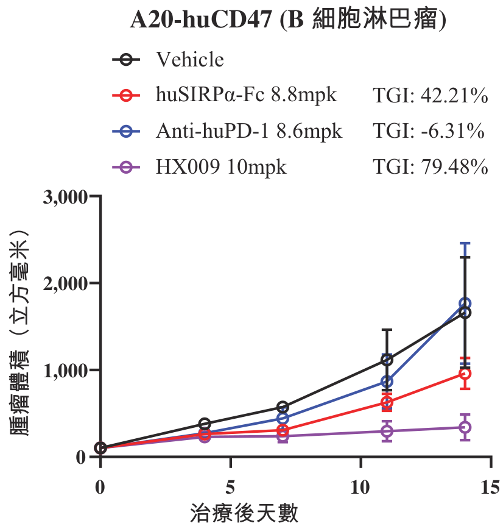

膽道癌

BTC是全球第二大常見肝及膽管癌，通常包括膽管癌及膽囊癌，若干病例亦包括壺腹癌。BTC最常見的症狀是黃疸，其特徵是由於膽管阻塞導致眼睛及皮膚呈深黃色。BTC是常見的膽道系統惡性腫瘤。早期症狀包括腹部不適、食慾減退、體重減輕等，後期可能出現黃疸、腹痛、發燒等症狀。膽囊的位置隱蔽，癌症往往直到晚期階段方可發現，並會導致預後不良。根據弗若斯特沙利文報告，超過65%的BTC患者因被診斷太晚而無法進行根治性手術切除，導致五年生存率約為5%至15%。即便是接受手術治療的患者，一年內的複發率仍高達67%。根據弗若斯特沙利文報告，中國BTC新發病例數量於2024年達到139.8千例。預計於2030年及2035年將分別增加至161.1千例及179.1千例，2024年至2030年期間的複合年增長率為2.4%及2030年至2035年為2.1%。同時，2024年全球BTC新發病例數量達到419.1千例。預計於2030年及2035年將分別增加至505.0千例及582.9千例，複合年增長率分別為3.2%及2.9%。

---

## 第 338 页

儘管手術切除是BTC主要有效的根治性治療手段之一，但BTC的侵襲性非常強，超過65%的患者確診時為時已晚，無法進行手術切除，導致五年生存率約為5%至15%。雖然BTC在基因組、表觀遺傳和分子層面上具有高度異質性，但基因突變頻率相對較低，因此限制了靶向治療的應用，如IDH1抑制劑、BRAF V600E抑制劑、NTRK抑制劑等。因此，以吉西他濱／順鉑(GC)為基礎的治療方案仍然是BTC患者的標準治療。近期，基於TOPAZ-1的III期試驗，德瓦魯單抗（一種抗PD-L1藥物）聯合化療（吉西他濱+順鉑）獲FDA批准用於治療BTC，但接受德瓦魯單抗聯合化療的膽囊癌患者的中位OS為10.7個月（95% CI，8.9-13.2），而僅接受化療的患者的中位OS則為11.0個月（95% CI，8.7-12.8），因此BTC（尤其是膽囊癌）仍屬未獲滿足的醫療需求。已發表的文獻表明，干擾CD47-SIRPα相互作用展現其在BTC治療具潛在用途。此外，HX009在I期臨床試驗中對一名膽囊癌患者展示出令人鼓舞的抗腫瘤療效（部分緩解，PR），肯定HX009在治療BTC方面的進一步研究。癌症相關成纖維細胞(CAF)是腫瘤間質的主要細胞成分，亦是腫瘤微環境中重要的間質細胞，在腫瘤微環境中形成一個阻斷抗腫瘤藥物滲透及白細胞浸潤的物理屏障。BTC的特徵在於腫瘤微環境中存在過多的CAF。已發表的文獻有以下涵義，消耗CAF或通過FAK抑制劑阻斷CAF活性顯著抑制BTC腫瘤生長和轉移，很可能是通過減少腫瘤相關纖維化、增加抗腫瘤藥物滲透和免疫細胞浸潤以及逆轉促癌免疫而達致，最終有利於與免疫療法潛在結合。與此一致的是，我們的轉化研究結果顯示，HX009聯合FAK抑制劑IN10018在對抗PD-1治療完全無反應的「冷腫瘤」模型中表現出良好的抗腫瘤作用，顯示HX009聯合IN10018可能會最大化HX009在BTC（尤其是膽囊癌）中的抗腫瘤活性，而目前的PD-1或PD-L1抗體（如德瓦魯單抗）均未能提供臨床效益。下圖顯示，在對抗PD-1治療無反應的人類CD47表達B16F10-hCD47同系基因模型中，HX009及小分子FAK抑制劑IN10018均無抑制腫瘤生長。相比之下，HX009及IN10018聯用分別表現出較各自單一療法更強的抗腫瘤活性，顯示HX009及IN10018具有協同抗腫瘤作用，該聯合療法可能對PD-1耐藥腫瘤具有巨大潛力。

---

## 第 339 页

B16F10-hCD47 腫瘤增長

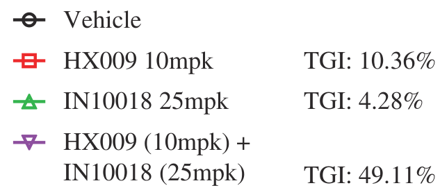

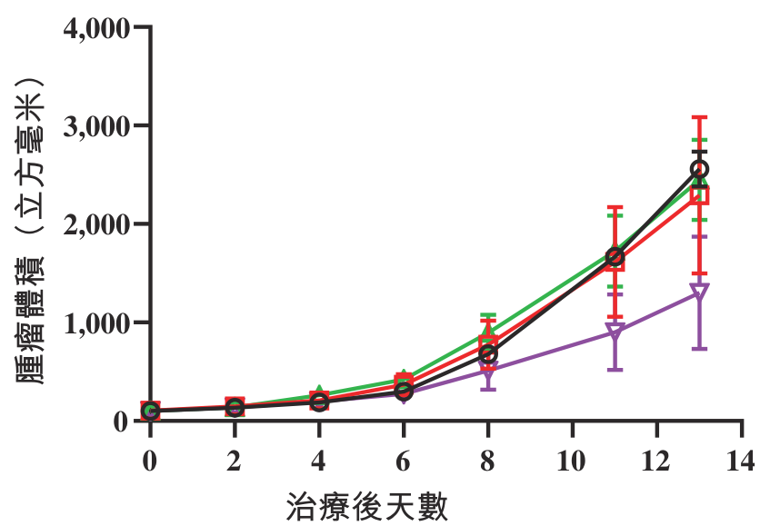

截至最後實際可行日期，尚無靶向CD47的藥物獲批供臨床使用，我們的HX009是全球唯一正處於臨床研究階段的治療晚期黑色素瘤及晚期膽道癌的CD47靶向雙特異性抗體／雙功能融合蛋白。

競爭優勢

我們認為我們的核心產品HX009具有以下競爭優勢：

通過兩種免疫檢查點抑制劑的雙靶向發揮協同治療效果

我們的HX009同時靶向兩種關鍵免疫檢查點PD-1及CD-47，並且有潛力引發協同治療反應。雙靶向機制不僅能夠增強免疫系統識別及攻擊癌細胞的能力，亦可降低單藥免疫療法常見的耐藥性。雙特異性模態預計會激發更強、更持久的抗腫瘤反應，從而改善患者的臨床結果。此外，特別設計的雙特異性藥物預計會提高安全性。

• 潛力巨大的新型靶點選擇

我們的HX009是新型藥物，因此具有目前尚未上市的全新作用機制。HX009的獨特地位令其頗具潛力成為治療EBV$^{+}$非霍奇金淋巴瘤、晚期黑色素瘤等適應症的新標準治療。尤其是，我們近期發表了一項重要觀察結果，EBV$^{+}$非霍奇金淋巴瘤呈現CD47及PD-L1共同表達上調，而HX009很可能因此激發更顯著的活性。作為一種具潛力的療法，HX009有機會彌補治療領域的短板，尤其是針對已窮盡

---

## 第 340 页

現有治療選項或不符合現有標準治療的患者。專門選擇的靶點亦使HX009在知識產權保護及市場獨佔性方面處於有利地位，進而產生長期競爭優勢並為潛在投資者及合作夥伴帶來更具吸引力的價值。

• HX009的多個臨床項目取得積極進展

HX009正在進行的臨床項目展現出具前景的結果，這表明該產品有潛力成為變革性治療選項。多項臨床試驗的積極進展表明HX009是安全的且耐受性良好，且在實體瘤和血液學適應症的多個適應症中也顯示出良好的療效信號，因此，HX009有望達到有效性終點並實現良好的安全性。

• 全球臨床開發潛力

HX009的多個項目已進入臨床階段，並取得良好的理論及臨床成果。在中國，我們已啟動兩項多中心臨床試驗，即HX009在晚期實體瘤患者中的耐受性及藥代動力學I期臨床試驗（中國）（「HX009-I-01中國研究」）及評估重組人源化抗CD47/PD-1雙特異性抗體HX009注射液治療中國復發性／難治性淋巴瘤患者的安全性及有效性的多中心、開放標籤、單臂的I/II期臨床研究（中國）（「HX009-II-02中國研究」）。截至最後實際可行日期，我們已完成HX009-I-01中國研究Ia期，這是一項傳統的I期研究，旨在評估HX009對晚期實體瘤患者的安全性和耐受性，並初步測量其抗腫瘤療效。HX009-I-01中國研究（Ia期）的PI已發出日期為2024年7月24日的臨床研究報告。目前，我們正在進行HX009-II-02中國研究的臨床階段，截至最後實際可行日期已取得積極的初步結果。在美國，我們已就在美國開展HX009用於治療DLBCL的Ib/II期臨床試驗接獲FDA的研究可繼續進行函件。

我們未必能夠最終成功開發及上市HX009。

主要產品－HX301

概述

HX301是一種處於開發階段的新型治療候選藥物，專門靶向各種類型癌症進展的多種重要致癌通路。作為一種在研多激酶抑制劑，HX301因對CSF1R、ARK5、CDK4/6及FLT-3的活性用於治療不同癌症，代表靶向癌症療法的重大進步，並有潛力

---

## 第 341 页

解決難以治療惡性腫瘤患者的未獲滿足醫療需求。HX301靶向多重通路，能夠克服耐藥性機制，並提供比單一靶向藥物更全面的療法。

作用機制

HX301的開發圍繞其獨特作用機制，癌症中經常出現的特異性激酶失調會引起癌細胞不受控生長和存活，HX301可以抑制相關激酶的失調。HX301是一種新型多靶點激酶抑制劑，靶向集落刺激因子-1受體(CSF1R)、AMPK相關蛋白激酶5(ARK5)、細胞週期蛋白依賴性激酶4/6(CDK4/6)及FMS樣酪氨酸激酶3(FLT-3)。HX301作為一種多激酶抑制劑，可通過以下作用機制發揮抗腫瘤效果：(i)通過阻斷CSF1R來抑制浸潤腫瘤巨噬細胞，從而阻斷腫瘤相關巨噬細胞對腫瘤生長的促進作用；及(ii)通過抑制CDK4/6來抑制腫瘤細胞增殖。HX301在抑制CSF1R方面效力最佳，於體外試驗中呈現出次納摩爾級$IC_{50}$。CSF1R或M-CSFR（巨噬細胞集落刺激因子受體）是一種受體酪氨酸激酶，與FLT-3屬同一激酶家族譜系，負責骨髓譜系細胞的生長、生存及極化。CSF1R也經常會過度表達或可能致病，例如在急性髓系白血病及／或腦膠質母細胞瘤中的巨噬細胞／小膠質細胞等腫瘤相關巨噬細胞中，高表達CSF1R可能與癌症預後較差相關。HX301可直接靶向癌細胞（如急性髓系白血病）或間接靶向腫瘤相關巨噬細胞，有潛力成為治療癌症的候選藥物。此外，隨著進行研究並主要經臨床前及／或臨床結果證明穿越血腦屏障的能力，且有臨床前研究證明HX301能夠穿透血腦屏障，腦部與血漿的接觸率約為70%，表明其亦可被開發為治療腦膠質母細胞瘤的有前景療法，而腦膠質母細胞瘤是一種具有巨大未獲滿足醫療需求的侵襲性惡性腫瘤。

與監管部門的溝通

國家藥監局

我們向國家藥監局提交I期臨床研究方案（「HX301-I-01中國研究方案」），該方案遵循ICH GCP，載明本研究的主要目標是(i)評估HX301的安全性及耐受性；及(ii)確定HX301的MTD及RP2D。

國家藥監局於2019年12月受理HX301-I-01中國研究方案，並於2020年1月向我們發出臨床試驗批准通知書（「HX301國家藥監局一次性傘式批准」），其中確認HX301符合藥品註冊的相關規定，並准許我們根據國家藥監局HX301-I-01方案開展該產品治療晚期實體瘤的臨床試驗。HX301國家藥監局一次性傘式批准亦確認，我們可以根據臨床試驗進展及獲取的臨床試驗數據適當調整我們產品的開發策略及臨床試驗方案，並

---

## 第 342 页

可在必要時與相關監管部門溝通。此外，HX301國家藥監局一次性傘式批准規定：(i)申請人在獲得首次臨床試驗許可後，應定期向藥品審評中心（「藥審中心」）提供藥物研發期間安全性更新報告，並於每滿一年後的二個月內提交；及(ii)在完成I期、II期臨床試驗後、開展III期臨床試驗之前，申請人應向藥審中心提出溝通交流會議申請。

於2024年5月，我們向國家藥監局提交HX301聯合研究IND，其為評估HX301聯合替莫唑胺治療腦膠質母細胞瘤患者的安全性及耐受性的II期臨床研究申請（即HX301-II-01中國研究）。我們於2024年8月獲得臨床研究批准，並於2025年1月入組首名患者。

HX301的臨床研究和臨床前聯合療法結果

我們擁有在中國開發及商業化HX301的權利。於往績記錄期間，我們已在中國完成HX301的I期臨床研究，這是一項評估HX301治療晚期實體瘤患者的安全性、耐受性及初步有效性的開放標籤、多中心研究（「HX301-I-01中國研究」）。我們亦致力於推廣HX301的聯合療法，並取得了HX301 GBM聯合用藥批准，使我們能夠開展HX301聯合替莫唑胺治療腦膠質母細胞瘤患者的臨床研究。

除內部工作外，我們亦尋求與行業領先的業務合作夥伴開展全球合作。與Onconova等全球合作夥伴的合作形成一個強大的聯盟，可以顯著擴大HX301的治療應用，並為患有某些類型癌症的患者提供新的治療選項。

HX301-I-01 中國研究

HX301-I-01中國研究是根據國際協調理事會《藥物臨床試驗質量管理規範》（「ICH GCP」）進行。臨床前模型及I期的安全性及有效性數據顯示出頗具前景的結果，彰顯HX301作為各種癌症治療選項的潛力。

HX301-I-01中國研究分為三個階段：(i)篩選期（受試者簽署知情同意書之時至首次給藥前28天）；(ii)治療期（一年）；及(iii)隨訪期（最後一次給藥後90日）。受試者為病理證實患有惡性實體瘤的患者，特別是那些患有晚期惡性實體瘤（轉移性或無法切除）、因疾病進展或毒性無法耐受而標準治療無效（如靶向治療、化療、生物療法、免疫療法等）的患者或那些沒有有效治療方案的患者。

---

## 第 343 页

截至2024年1月12日，共有20名患者入組臨床研究，接受以下五個劑量等級的不同劑量HX301：40 mg（n=3）、80 mg（n=3）、120 mg（n=4）、160 mg（n=3）及200 mg（n=7）。截至最後實際可行日期，我們已完成HX301-I-01中國研究，且HX301-I-01中國研究的主要研究者已出具日期為2024年7月3日的臨床研究報告（「HX301-I-01中國臨床研究報告」），其中主要研究者評估了HX301-I-01中國研究的臨床結果。根據HX301-I-01中國臨床研究報告，HX301的質量安全性、PK及初步有效性數據如下：

安全性：200mg組中兩名患者觀察到劑量限制性毒性，包括一例4級丙氨酸轉氨酶升高及一例3級血小板減少伴隨2級鼻衄（鼻出血），並且均在停藥及進行症狀治療後有所緩解。200 mg劑量組中兩名受試者均出現與研究藥物相關的不良事件，導致永久停藥。四名受試者出現與研究藥物相關的3級或以上不良事件，其中一例為160 mg劑量組，三例為200 mg劑量組。不同劑量組中常見不良事件的發生率及嚴重程度與並無明顯的劑量依賴性趨勢。安全性結果表明，HX301在40 mg至160 mg劑量範圍內的總體安全風險可控，而200 mg劑量組中永久停藥及3級或以上不良事件的風險增加。並無報告致命性TEAE或導致研究中止的TEAE。

PK：PK結果顯示，HX301經口服後，會在體內迅速吸收。主要活性成分A74-6及A74-IMP-01的暴露量隨劑量增加而有所增加。活性成分A74-6在40-120mg的劑量範圍內基本表現出線性PK特徵。然而，由於個體差異，A74-6在160 mg、200 mg等較高劑量下表現出非線性特徵。經多次給藥後，A74-6在各劑量水平的藥物累積量較少。活性成分A74-IMP-01在40 mg至200 mg劑量範圍內基本表現出線性PK特徵。經多次給藥後，A74-IMP-01在各劑量水平的藥物累積量亦較少。

• 有效性：研究人員採用RECIST 1.1版對可供評估的20名患者進行腫瘤評估，其中四名患者的病情穩定，包括200 mg組中兩名乳腺癌患者、120 mg組中一名乳腺癌患者及80 mg組中一名惡性胃腸道間質瘤患者。200 mg組中一名HR+乳腺癌患者接受一年以上治療，達到病情穩定，並實現超過12個月的病情長期穩定。

有效性結果顯示，HX301單一療法的有效性具有一定局限性，但部分患者在80 mg或以上劑量時達到病情穩定，並且劑量越高，病情穩定持續時間可能越長。這為後續臨床開發（尤其是探索聯合療法）提供一定臨床效益支持。

---

## 第 344 页

下圖載有靶病灶大小較基線的最大百分比變化瀑布圖（全分析集）：

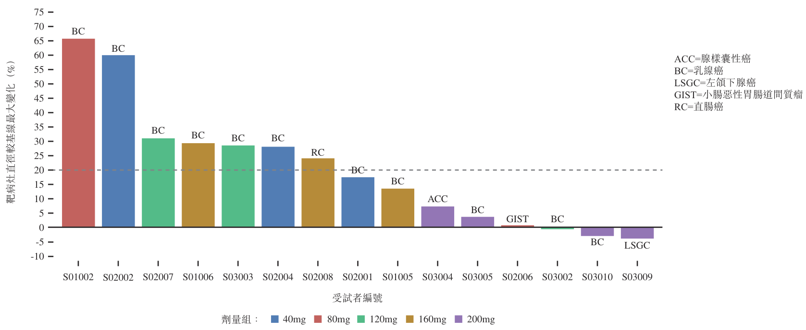

下圖載有RECIST 1.1版所界定治療持續時間、腫瘤反應及生存狀態的泳道圖（全分析集）：

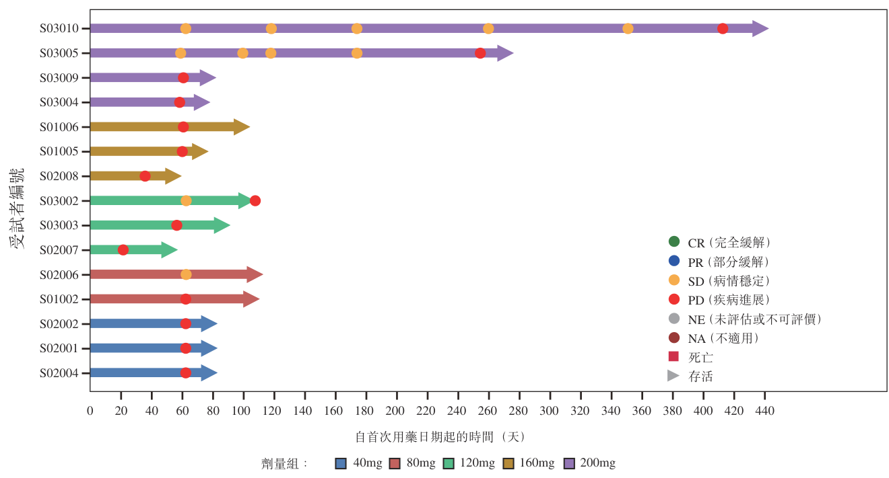

資料來源：公司數據

在HX301-I-01中國研究中，有兩名長期出現反應者或患者在接受長期治療後病情保持穩定。出於患者的最佳利益及道德原因，HX301-I-01中國研究持續開放（即無數據庫鎖定），以允許該等患者在研究中接受HX301治療。我們希望收集所有患者的數據，包括該等長期出現反應者。因此，HX301-I-01中國研究保持開放約四年，並於2024年7月發出臨床研究報告時完成。儘管我們於2024年8月獲得了HX301聯合研究的國家藥監局批准，但較長的持續時間可能會對我們的臨床研究開發速度造成潛在風險。

---

## 第 345 页

臨床前結果和HX301-II-01中國聯合研究

如下圖所示，在此U87 MG人腦膠質母細胞瘤皮下異種移植模型中，單獨使用100 mg HX301或0.5 mg替莫唑胺均可產生輕度至中度抗腫瘤作用，而與HX301或替莫唑胺單獨治療相比，HX301與替莫唑胺聯合治療的抗腫瘤效果更佳，顯示HX301與替莫唑胺之間存在協同效應。

皮下U87 MG腫瘤生長

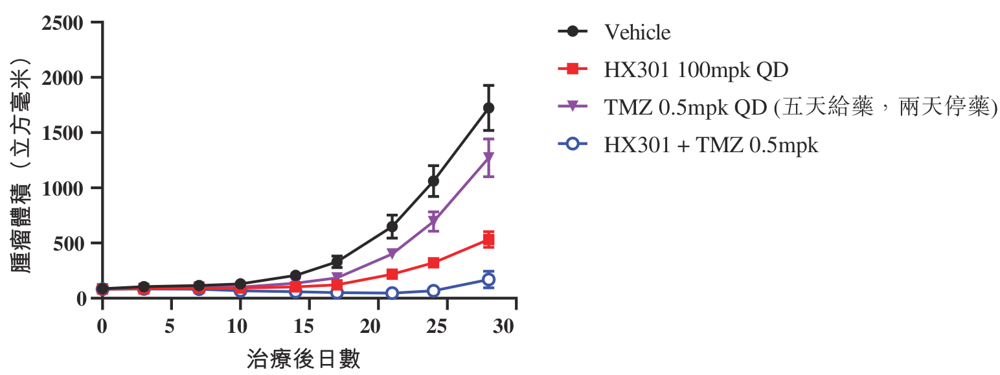

資料來源：公司數據

HX301-II-01中國研究

我們就與替莫唑胺聯合治療腦膠質母細胞瘤向國家藥監局提交II期臨床研究方案（「HX301-II-01中國研究方案」），該方案遵守ICH GCP，並規定主要目的為評估HX301與替莫唑胺聯合治療腦膠質母細胞瘤患者的安全性及耐受性。於2024年8月，國家藥監局向我們發出臨床試驗批准通知書（「HX301 GBM聯合用藥批准」），允許我們開展HX301與替莫唑胺聯合治療腦膠質母細胞瘤患者的臨床試驗。在我們進行確證性臨床試驗或關鍵性臨床試驗之前，無需額外批准。HX301國家藥監局GBM聯合用藥批准亦規定，在完成探索性臨床試驗後及開展確證性臨床試驗或關鍵性臨床試驗前，申請人應向藥審中心提出溝通交流會議申請，以評估後續臨床研究。HX301-II-01中國研究分為兩個階段：(i)篩選期（受試者簽署知情同意書之時至首次給藥前28天）；及(ii)治療期，直至受試者出現無法耐受的毒性反應、撤回同意、出現疾病惡化、死亡（以最早者為準）。

---

## 第 346 页

HX301-II-01中國研究中所用替莫唑胺的品牌名稱為Tazian$^{®}$，乃由擁有大型商業生物製劑GMP生產基地的CDMO公司開發。替莫唑胺已納入《國家醫保目錄》。截至最後實際可行日期，本公司可根據臨床研究的處方結算該藥物的費用，而根據弗若斯特沙利文的資料，2025年該品牌替莫唑胺的價格為人民幣89.43元／20mg*5片且市場上有大量供應。截至最後實際可行日期，我們已就該臨床研究招募七名患者，並就該聯合藥物產生總成本約人民幣17,400元。

中國I期臨床試驗的安全性數據概要

於往績記錄期間，我們的主要產品HX301在中國完成一個臨床試驗項目，即HX301-I-01中國研究。截至2023年12月27日，共有20名晚期實體瘤患者入組中國I期研究並接受治療。

下表載列HX301在中國I期試驗中按標準用詞歸類，治療相關、治療期間出現的不良事件摘要：

<!-- table html -->
<table><tr><td></td><td colspan="6">≥3級治療相關不良事件</td></tr><tr><td>首選術語</td><td>40mg (N=3)</td><td>80mg (N=3)</td><td>120mg (N=4)</td><td>160mg (N=3)</td><td>200mg (N=7)</td><td>總計 (N=20)</td></tr><tr><td>至少發生一次≥3級的TRAE ..</td><td>0</td><td>0</td><td>0</td><td>1 (33.3%)</td><td>3 (42.9%)</td><td>4 (20.0%)</td></tr><tr><td>各類檢查.....</td><td>0</td><td>0</td><td>0</td><td>1 (33.3%)</td><td>2 (28.6%)</td><td>3 (15.0%)</td></tr><tr><td>γ-谷氨酰轉移酶升高.....</td><td>0</td><td>0</td><td>0</td><td>1 (33.3%)</td><td>0</td><td>1 (5.0%)</td></tr><tr><td>丙氨酸氨基轉移酶升高 ..</td><td>0</td><td>0</td><td>0</td><td>0</td><td>1 (14.3%)</td><td>1 (5.0%)</td></tr><tr><td>天門冬氨酸氨基轉移酶升高..</td><td>0</td><td>0</td><td>0</td><td>0</td><td>1 (14.3%)</td><td>1 (5.0%)</td></tr><tr><td>鹼性磷酸酶升高 ..</td><td>0</td><td>0</td><td>0</td><td>1 (33.3%)</td><td>0</td><td>1 (5.0%)</td></tr><tr><td>血小板計數降低 ..</td><td>0</td><td>0</td><td>0</td><td>0</td><td>1 (14.3%)</td><td>1 (5.0%)</td></tr><tr><td>中性粒細胞計數降低 ..</td><td>0</td><td>0</td><td>0</td><td>0</td><td>1 (14.3%)</td><td>1 (5.0%)</td></tr><tr><td>代謝和營養性疾病 ..</td><td>0</td><td>0</td><td>0</td><td>0</td><td>1 (14.3%)</td><td>1 (5.0%)</td></tr><tr><td>高血糖症.....</td><td>0</td><td>0</td><td>0</td><td>0</td><td>1 (14.3%)</td><td>1 (5.0%)</td></tr><tr><td>胃腸系統疾病.....</td><td>0</td><td>0</td><td>0</td><td>0</td><td>1 (14.3%)</td><td>1 (5.0%)</td></tr><tr><td>消化不良.....</td><td>0</td><td>0</td><td>0</td><td>0</td><td>1 (14.3%)</td><td>1 (5.0%)</td></tr></table>
<!-- /table -->

附註：在計算相應的不良事件數目時，如果受試者在一種SOC或PT分類中出現多次不良事件，則僅計作一人。

HX301臨床開發計劃

截至2023年及2024年12月31日止年度以及截至2024年及2025年8月31日止八個月，我們為HX301產生的研發成本分別為人民幣4.3百萬元、人民幣2.7百萬元、人民幣2.4百萬元及人民幣1.9百萬元，分別佔我們同期研發開支總額的9.3%、3.6%、4.8%

---

## 第 347 页

及3.4%。我們已成功完成HX301的I期劑量遞增研究，這對了解該藥物安全性及確定適當劑量水平具有重要里程碑意義。該項基礎工作對安全進入後期臨床研究階段至關重要。

基於I期研究的安全性及有效性結果，我們繼續挖掘HX301與替莫唑胺聯合治療腦膠質母細胞瘤的潛力（即HX301-II-01中國研究），首名患者已於2025年1月入組。截至最後實際可行日期，該研究正在進行中，我們已就該研究招募七名患者。HX301-II-01中國研究旨在評估聯合療法的有效性及安全性，其有潛力提高患者的治療效果。

我們的HX301採用戰略性及合作開發方式。我們認為，通過將我們的自有專業技術與全球合作夥伴的優勢相結合，能夠加快HX301的臨床進展，並最終改善患者的治療效果。即將進行的II期研究是一項重大機遇，有助於推進癌症治療科學發展並實質改善全球患者的生活。

市場機會與競爭

我們的HX301正處於治療腦膠質母細胞瘤的臨床開發階段，而腦膠質母細胞瘤是最具侵襲性且最難治療的癌症之一。腦膠質母細胞瘤的現有治療選項甚少，主要為手術、放療及化療。由於血腦屏障的存在和腫瘤對常規治療產生了耐藥性，這些療法通常效果不佳。腦膠質母細胞瘤更有效療法的醫療需求缺口較大，因此HX301具有巨大市場機會。根據弗若斯特沙利文報告，中國的腦膠質母細胞瘤新發病例數量已由2019年的37.8千例增加至2024年的45.0千例，複合年增長率為3.5%。預計於2030年，新發病例數量將增加至51.4千例，複合年增長率為2.3%；到2035年，新發病例數量將增加至56.8千例，複合年增長率為2.0%。於2024年，中國腦膠質母細胞瘤市場規模達到人民幣12億元，到2030年及2035年將分別擴大至人民幣32億元及人民幣54億元，複合年增長率分別為17.9%及10.7%。

目前，中國僅有一種處於臨床階段用於治療腦膠質母細胞瘤的CSF1R靶向多激酶小分子抑制劑。

我們未必能夠最終成功開發及上市HX301。

HX044

概述

HX044是一種正處於開發階段且有潛力治療多種癌症的創新治療候選藥物，尤其是治療PD-1耐藥癌症（包括但不限於非小細胞肺癌、黑色素瘤、腎細胞癌及胃腸癌）。

---

## 第 348 页

HX044是一種同時靶向兩種不同抗原靶點的雙功能抗CTLA-4抗體SIRP$\alpha$融合蛋白。與傳統單克隆抗體通常僅針對單一抗原相比，HX044雙重靶向旨在以更佳的毒理學特徵，提高免疫系統更有效識別及消除癌細胞的能力。

作為與CTLA-4及CD47結合的新型人源化雙功能抗CTLA-4抗體SIRP$\alpha$融合蛋白，HX044具有以下特點：(i)通過其Fc功能，增加腫瘤浸潤淋巴細胞－Treg清除或腫瘤微環境重組，從而增強療效；(ii)通過降低兩種靶點結合親和力以及減低CTLA-4配體阻斷活性，提高安全性；(iii)參與除了CTLA-4之外的其他ICI作用，例如：腫瘤細胞與巨噬細胞或樹突狀細胞之間的CD47-SIRP$\alpha$阻斷；及(iv)由於降低單一抗體結合親和力導致低抗原沉默，因此可以低劑量進行治療。

我們HX044的表現尤為突出，因為HX044能夠參與多種不同的免疫通路，從而產生更全面、更有效的抗癌免疫反應。HX044可結合兩個靶點，觸發多種免疫細胞的激活機制，進而產生協同效應，並有潛力克服耐藥性及改善癌症患者的臨床結果。

作用機制

CTLA-4是一種典型的免疫檢查點，其功能是通過阻礙抗原呈遞細胞上的共刺激受體CD80/CD86與T細胞上的共刺激分子CD28結合來抑制T細胞功能。抗CTLA-4單克隆抗體伊匹木單抗（一種IgG1 mAb）是首個獲審批的免疫檢查點抑制劑，與PD-1/PD-L1共同成為臨床驗證的兩大免疫腫瘤靶點。重要的是，這兩種ICI具有完全不同的免疫腫瘤MoA。目前IgG1類抗CTLA-4單克隆抗體的MoA包括阻礙CTLA-4與APC上CD80/CD86配體的結合、通過其Fc功能介導的ADCC-/ADCP-效應清除腫瘤浸潤Treg及通過Fc受體(FcR)參與重塑腫瘤微環境中的先天免疫。伊匹木單抗的抗腫瘤效果可能來自一種、兩種或三種上述MoA。然而，由於其治療窗口狹窄，包括劑量限制性毒性及irAE，伊匹木單抗尚未廣泛成功地用於癌症治療。另一方面，最近的研究顯示儘管伊匹木單抗的Fc功能可能是其療效的主要原因，但配體阻斷實際上可能是大多數已觀察到的irAE的主要原因。在這種情況下，創造下一代抗CTLA-4療法的主要目的之一是在維持其Fc功能的同時減低其配體阻斷功能。由於CTLA-4的MoA不同於PD-1/PD-L1，CTLA-4治療的理想目標是治療PD-1耐藥患者或與PD-1聯合使用以增加臨床效果。該等藥物在腫瘤市場預計將有很大的需求。

---

## 第 349 页

HX044是一種專門設計的雙功能抗體融合蛋白，可通過腫瘤微環境內的一個靶點受體及T細胞和其他免疫細胞上的Fc受體靶向腫瘤浸潤免疫細胞（包括Treg及腫瘤相關巨噬細胞等）。作為下一代在研免疫療法，HX044的MoA不同於PD-1/PD-L1阻斷劑，因此適用於治療PD-1耐藥實體瘤。HX044的兩種受體靶點在腫瘤微環境內Treg上均呈現上調。HX044可協調兩種靶點的順式結合，並與腫瘤微環境內其他帶有Fc受體的免疫細胞接觸，進而有效清除腫瘤浸潤淋巴細胞－Treg，並促進腫瘤微環境重組。HX044亦能阻斷巨噬細胞的CD47-SIRPα通路介導的「別吃我」信號激活吞噬作用，並通過Fc功能促進吞噬作用。此外，HX044能阻斷腫瘤細胞CD47與抗原呈遞細胞上的SIRPα結合，激活抗原呈遞作用。HX044可顯著降低兩種靶點受體的結合親和力，因此亦可通過盡量減少全身結合顯著提高安全性。相較於親本單克隆抗體，即使針對抗PD-1治療的耐藥「冷」腫瘤，HX044亦表現出更強的抗腫瘤活性。HX044可顯著擴大治療窗口，因此成為具前景的癌症免疫療法新領域。

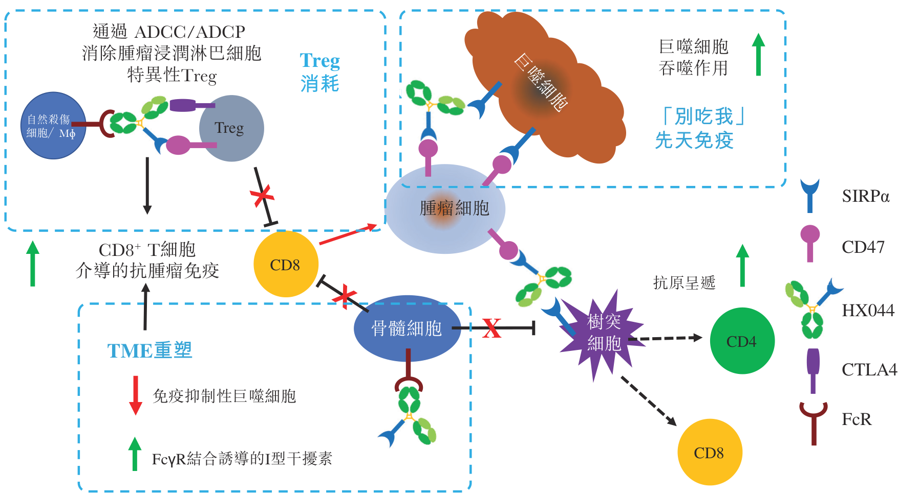

資料來源：公司數據

---

## 第 350 页

與監管部門的溝通

澳大利亞藥品管理局(TGA)

根據澳大利亞相關法律及法規，我們就HX044首次人體I/IIa期臨床研究（「HX044-I-01澳大利亞研究」）向一家受認可的HREC（「審批HREC」）提交HREC申請。於2024年9月10日，審批HREC簽發批准函（「HX044 HREC批准函」），確認批准我們的臨床項目，即HX044-I-01研究。於2024年9月11日，我們透過TGA網站遞交線上通知表格，並於2024年9月23日接獲其確認。於我們提交線上通知後，我們並未收到TGA提供進一步資料的任何要求或負面意見。截至最後實際可行日期，HX044-I-01澳大利亞研究共有八名患者入組。

國家藥監局

我們向國家藥監局提交I期臨床研究方案（「HX044-I-01中國研究方案」），該方案遵循ICH GCP，載明本研究的主要目標是(i)評估HX044的安全性及耐受性；及(ii)通過評估DLT確定HX044在晚期惡性腫瘤受試者中的MTD及／或RP2D。本研究的終點為(i)不良事件、臨床化驗評估、生命體徵及心電圖；及(ii)在首劑研究治療藥物後最多21天內評估DLT。

國家藥監局於2024年11月受理HX044-I-01中國研究方案，並於2025年1月向我們發出臨床試驗批准通知書（「HX044國家藥監局一次性傘式批准」），其中確認HX044符合藥品註冊的相關規定，並准許我們根據國家藥監局HX044-I-01中國研究方案開展該產品治療晚期實體瘤的臨床試驗。此外，我們向國家藥監局提交HX044與普特利單抗聯合治療的補充I/IIa期臨床研究方案，用於晚期實體腫瘤患者。HX044-I-01中國研究經修訂的主要目標為(i)評估HX044單藥或聯合普特利單抗用藥的安全性及耐受性；及(ii)透過評估DLT確定HX044單藥或聯合普特利單抗用於晚期惡性腫瘤受試者的MTD及RP2D。研究終點與上述相同。我們已於2025年9月獲得臨床研究批准，並於2025年11月就聯合治療部分入組首名患者。截至最後實際可行日期，HX044-I-01中國研究的單藥治療部分及聯合治療部分分別入組15名患者及兩名患者。

---

## 第 351 页

HX044臨床前研究

根據弗若斯特沙利文報告，伊匹木單抗目前為唯一獲批用於臨床治療的CTLA-4靶向mAb藥物。如下圖所示，在人類CD47表達「熱腫瘤」模型（高免疫原性，對PD-1 mAb有反應）中，在顯著低劑量時，HX044的抗腫瘤作用較伊匹木單抗為強，顯示HX044的治療窗口較伊匹木單抗更廣。

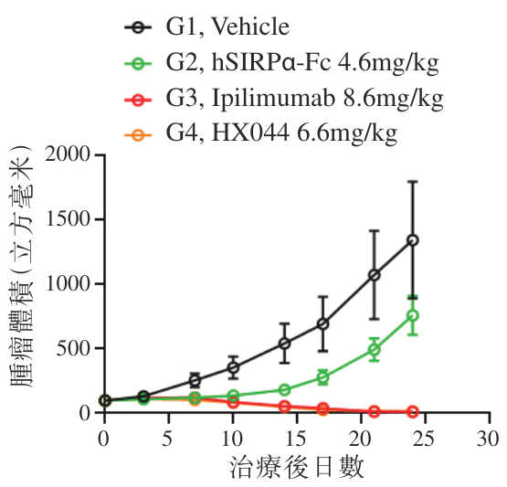

人類CD47表達「熱腫瘤」模型

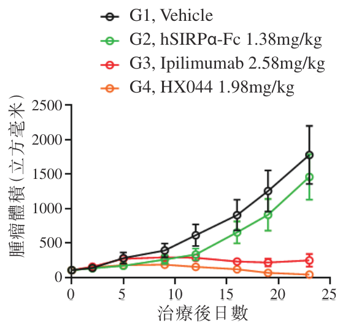

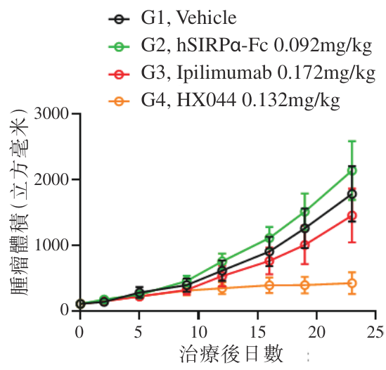

資料來源：公司數據

此外，在表達huCD47的「冷腫瘤」模型（較低免疫原性，對PD-1 mAb無反應）中，HX044顯示出比伊匹木單抗更強的Treg消耗活性，從而產生優於伊匹木單抗的抗腫瘤功效。

人類CD47表達「冷腫瘤」

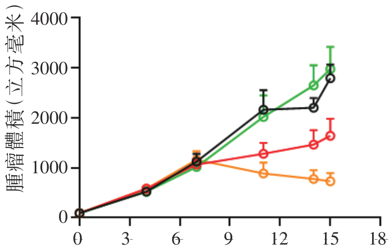

G1, Vehicle
G2, Ipilimumab 4.3mg/kg (1st-2nd)/8.6mg/kg (3rd-5th)
G3, hSIRPα-Fc 2.3mg/kg (1st-2nd)/4.6mg/kg (3rd-5th)
G4, HX044 3.3 (1st-2nd)/6.6mg/kg (3rd-5th)

資料來源：公司數據

---

## 第 352 页

HX044臨床研究

我們擁有HX044的全球開發及商業化權利。

截至最後實際可行日期，我們同時在澳大利亞及中國進行HX044-I-01臨床研究，該研究是HX044對於晚期惡性實體瘤患者的多中心、開放標籤I/IIa期研究，包括劑量遞增階段(I期)及劑量擴展階段(IIa期)，以建立MTD及／或RP2D，並評估單一藥物HX044的初步抗腫瘤活性。對於HX044-I-01澳大利亞研究I期，我們預期招募所有腫瘤類型的患者，無論先前是否使用過PD-1/PD-L1，而對於HX044-I-01澳大利亞研究IIa期，我們將招募先前在選定腫瘤類型中使用PD-1/PD-L1方案治療期間或者之後疾病惡化的患者。我們產品靶向的晚期實體瘤惡性腫瘤是指復發性／難治性實體瘤。

HX044-I-01研究分為篩選期（首次給藥前28天）、治療期（最長達24個月）、安全性隨訪及生存隨訪期。整個研究過程中將對安全性進行持續評估，直至最後一劑研究治療藥物後90(±7)天。參加HX044-I-01澳大利亞研究的受試者將每3週（21±3天）通過靜脈輸注給藥。研究治療每3週（21±3天）進行一次，直至受試者出現無法耐受的毒性、撤回同意、出現疾病惡化、死亡、失訪、開始新的抗癌治療或直至研究治療持續24個月（以先發生者為準）。

HX044-I-01澳大利亞及中國研究的單藥治療部分

我們於2024年10月與一家澳大利亞臨床試驗研究機構訂立臨床試驗研究協議，啟動HX044-I-01澳大利亞研究。截至最後實際可行日期，我們已就HX044-I-01澳大利亞研究入組八名患者。於2025年1月，國家藥監局向我們發出HX044治療晚期惡性實體瘤的臨床試驗批准通知書（「HX044國家藥監局一次性傘式批准」），我們已於2025年3月就此HX044-I-01中國研究完成首名患者入組。截至最後實際可行日期，我們已就HX044-I-01研究的單藥治療部分入組23名患者（八名患者在澳大利亞及15名患者在中國），其中一名患者達至部分緩解及五名患者達至穩定病情。HX044-I-01澳大利亞研究及HX044-I-01中國研究為在不同司法權區進行的同一項研究，而我們預期以上市所得款項淨額為該等臨床研究提供部分資金。詳情請參閱本招股章程「未來計劃及所得款項用途－所得款項用途」。

---

## 第 353 页

HX044-I-01 中國研究的聯合治療部分

我們向國家藥監局提交HX044與普特利單抗聯合治療的補充I/IIa期臨床研究方案，用於晚期實體腫瘤患者，並於2025年9月獲得臨床試驗批准。我們於2025年11月就聯合治療部分入組首名患者。HX044聯合治療研究使用的普特利單抗的品牌為普佑恒$^{TM}$，上市許可由樂普持有。根據弗若斯特沙利文的資料，市場上有充足的普特利單抗供應。截至最後實際可行日期，我們就該聯合治療藥物產生的總成本約為人民幣291,200元。

HX044臨床開發計劃

截至2023年及2024年12月31日止年度及截至2024年及2025年8月31日止八個月，我們為HX044產生的研發成本約為人民幣3.9百萬元、人民幣16.4百萬元、人民幣6.9百萬元及人民幣8.0百萬元，分別佔我們同期研發開支總額約8.3%、21.9%、13.6%及14.2%。

HX044-I-01澳大利亞研究具有重要意義，因為其旨在為PD-1耐藥實體瘤提供一種新免疫療法。我們計劃在澳大利亞和中國同時進行HX044的臨床試驗，以實現兩國優勢互補。澳大利亞擁有靈活的監管環境、簡化的流程、高品質的研究基礎設施和強大的人才資源，而中國則擁有豐富的病患資源、快速成熟的醫療體系和基礎建設、強有力的政策支持和龐大的市場潛力。誠如弗若斯特沙利文確認，生物科技公司同時在澳大利亞和中國進行臨床研究屬於正常做法。然而，由於資本投入較高，且為配合專注於中國主要市場的發展策略，我們並無計劃在澳大利亞進行HX044的關鍵臨床試驗。展望未來，我們預期HX044的臨床研究路線圖包括與若干PD-1靶向藥物的II期聯合研究。我們計劃探究HX044與其他療法在多種癌症類型（包括黑色素瘤、胃腸癌及其他實體瘤）的聯合治療潛力。該項聯合研究旨在探索HX044與現有療法進行聯合治療時提高治療效果的可能性，進而可能為癌症患者提供更好治療效果。該項臨床研究計劃體現出我們一直致力於挖掘HX044的全部潛力，並體現HX044在未來癌症治療模式中的作用。

我們未必能夠最終成功開發及上市HX044。

---

## 第 354 页

臨床前階段候選藥物

HX111

作用機制

HX111是一種專門靶向淋巴瘤／白血病以及若干靶點受體陽性實體瘤（例如很多肉瘤）的抗體偶聯藥物。HX111的靶點在特定淋巴瘤和白血病中過量表達，該靶點作為一個腫瘤相關抗原，涵蓋幾乎所有ATL、AITL、NK/T、組織細胞淋巴瘤等。該等靶點也在諸多實體瘤細胞表面表達，但在正常組織（包括正常血球）中很少表達。相同靶點的單克隆抗體已針對實體瘤進行廣泛的臨床試驗，安全問題甚少，但缺乏療效。HX111在多個臨床前動物模型中顯示出對靶點陽性的淋巴瘤和白血病細胞以及實體瘤細胞的有效清除能力。

HX111臨床開發計劃

我們擁有HX111的全球開發及商業化權利。截至最後實際可行日期，我們已完成HX111的臨床前研究，並於2025年10月向國家藥監局提交HX111 I/IIa期臨床研究的IND申請。我們預期將於2026年第一季度獲得臨床試驗批准。

HX017

作用機制

HX017是一種靶向人體NKG2A/CD94的單克隆抗體，而NKG2A/CD94是一種在自然殺傷細胞及CD8$^{+}$細胞毒性淋巴細胞上表達的異二聚體抑制性受體。HX017可有效阻斷NKG2A/CD94（在癌症及病毒感染患者中經常上調）與其配體人類白血球抗原-E的交互作用，而配體人類白血球抗原-E是一種非典型MHC-I分子，腫瘤通常會上調配體人類白血球抗原-E的表達以逃避免疫監視。HX017是一種可恢復自然殺傷細胞及CD8$^{+}$細胞毒性淋巴細胞的抗腫瘤及／或抗病毒細胞毒性的免疫檢查點抑制劑。HX017是一種新型抗病毒感染劑，可與PD-1抗體聯合作為抗癌免疫療法，尤其是治療HLA-E表達上調的實體瘤。

HX017臨床開發計劃

我們擁有HX017的全球開發及商業化權利。HX017被開發為臨床前候選化合物。截至最後實際可行日期，我們已完成HX017的臨床前研究並達成良好結果。我們預期不會優先進行HX017自主臨床研究，而計劃積極尋求與業界龍頭業務合作夥伴合作，進一步開發HX017。

---

## 第 355 页

HX129

作用機制

HX129是一種專門靶向TRBV12的抗體偶聯藥物，具有30多個家族譜系多態性。特定T細胞源性淋巴瘤／白血病會表達特定的TRBV。HX129抗體僅識別特定的TRBV，並有效清除TRBV特定亞型的淋巴瘤／白血病。HX129對其他TRBV亞型正常T細胞毒性較小，因此其毒性甚低。因此，該抗體偶聯藥物有潛力成為一種安全的T細胞靶向療法。

HX129臨床開發計劃

我們擁有HX129的全球開發及商業化權利。HX129被開發為臨床前候選化合物。截至最後實際可行日期，我們已完成HX129的臨床前研究並達成良好結果。我們預期不會優先進行HX129自主臨床研究，而計劃積極尋求與業界龍頭業務合作夥伴合作，進一步開發HX129。

HX035

HX035是針對兩個不同的OX40表位的新型雙特異性OX40抗體。它是一種強效的耗竭抗體，具有強大且增強的ADCC，明顯優於那些親本單克隆抗體。它也是配體阻斷劑和拮抗抗體。它在體內抗aGVHD模型中顯示了強大的效果，代表了一種有前景的抗自身免疫候選藥物，可應用於各種自身免疫疾病，包括AD等。

HX035臨床開發計劃

我們擁有HX035的全球開發及商業化權利。我們計劃於2026年第一季度前提交HX035的IND申請。

商業化產品

HX008

HX008是一種與人類IgG4同型的人源化PD-1單克隆抗體，可阻斷PD-1與其配體PD-L1及PD-L2結合，從而抑制PD-1信號以恢復免疫細胞殺死癌細胞的能力。HX008採用創新的抗體工程技術將突變引入Fc區以增加FcRn結合，從而大幅延長半衰期並取得強大的臨床抗腫瘤活性以及良好的安全性和有效性。HX008在已完成的實體瘤Ia期臨床試驗中，表現出療效及良好的安全性。此外，HX008半衰期的延長並未引發任何額外AE，並且具有令人鼓舞的臨床療效。

---

## 第 356 页

HX008於2017年8月取得國家藥監局的IND批准，其中包括Ia、Ib期以及隨後的II期及III期臨床研究方案。HX008的Ia期試驗已於2018年5月完成，同時已根據臨床試驗方案確定MTD及RP2D，並於2020年5月完成終版的臨床研究報告。

在我們於2017年8月獲得臨床研究批准後不久，通過於2017年至2019年期間訂立的一系列股權轉讓協議，我們向樂普轉讓了我們於HX008的權利及權益，以換取一次性現金款項人民幣350.0百萬元及年度特許權使用費。國家藥監局於2022年7月及9月授予HX008有條件上市批准，分別用於治療MSI-H/dMMR的實體瘤及無法手術治療或轉移性黑色素瘤。截至最後實際可行日期，我們已全額收到一次性現金款項人民幣350.0百萬元。得益於HX008的成功商業化，截至最後實際可行日期，我們收到2022年、2023年及2024年的HX008年度特許權使用費分別約人民幣0.7百萬元、人民幣4.4百萬元及人民幣13.1百萬元。於2024年8月14日，我們與樂普訂立補充協議，規定樂普轉讓剩餘9%股權並支付相應股權轉讓費人民幣70.0百萬元。此外，本公司有權使用抗PD-1單克隆抗體序列進行新型抗PD-1/CD47雙特異性抗體HX009的獨家研究、開發、改良、聯合療法及商業化活動，並擁有全部知識產權。詳情請參閱本招股章程「－合作協議－HX008股權轉讓協議」。

研究及開發（「研發」）

我們認為，持續研發投入有助於推動業務擴張及維持競爭優勢。我們研發工作的主要動力是解決複雜疾病治療中未獲滿足的醫療需求，我們的總體目標是提供全面患者照護。因此，我們以協作方式戰略性鎖定各種關鍵疾病通路，以期提高總體治療效果並維持平衡。截至2023年及2024年12月31日止年度以及截至2024年及2025年8月31日止八個月，我們產生的研發成本分別為人民幣46.7百萬元、人民幣74.7百萬元、人民幣50.5百萬元及人民幣56.2百萬元。

我們的研發策略

我們的核心研發策略是長期致力於大分子療法創新，尤其重視未獲滿足的臨床需求。我們精心設計研發策略，以期解決各種複雜疾病患者未獲滿足的臨床需求。

---

## 第 357 页

我們的主要研發工作是探索及推進具有高特異性、較強效力及持久療效等獨特優勢的大分子化合物（尤其是雙特異性藥物及抗體偶聯藥物）。蛋白質及抗體等生物製劑能夠靶向深層的疾病機制，因此具有徹底改變治療方式的潛力。

在解決未獲滿足的臨床需求過程中，我們努力探索前人未曾觸達的科學及醫學領域。我們的專家團隊持續參與前沿研究，致力於發現經過理論驗證且可創造突破性療法的新型通路及機制。我們聚焦未獲滿足的臨床需求，勇於探索選定的治療領域，為患者及醫療機構提供全新治療選項。

同時，我們的研發策略亦注重提高現有療法的價值、提高療效及安全性，以及為患者提供便捷服務。我們的工作包括仔細分析現有治療環境、識別短板或局限性以及利用先進技術設計更好的替代方案。

我們採用多管齊下的研發策略，包括：

• 靶點識別及驗證：通過對靶點受體生物學的深入了解，基於豐富的文獻報告和我們自己的觀察，包括使用先進計算及生物信息工具，我們識別新靶點及／或疾病發病機理的新靶點機制，然後驗證其於治療中的潛在藥理學作用。

• 藥物發現及設計：我們的團隊以VersatiBody平台／工作流程為基礎，運用最先進的抗體工程技術，設計和測試大分子面板，以找出同時滿足所需的靶點生物學和藥用性的具有最佳藥理特性的候選分子。

臨床前及轉化研究／開發：我們通過嚴格及全面的體內及體外臨床前測試及全面轉化研究，確保候選藥物按照設計的安全性及有效性，為開展合理臨床開發奠定基礎，包括確定潛在疾病適應症和患者分層。

執行臨床試驗：我們精準設計及開展臨床試驗，並遵守國際協調理事會《藥物臨床試驗質量管理規範》的最高標準及確保監管合規。

• 知識產權管理：我們採用戰略性知識產權管理策略，保護我們的創新成果並維持我們的市場競爭地位。

---

## 第 358 页

• 合作與夥伴關係：我們積極尋求與學術機構、研究組織及行業夥伴的合作，充分利用各種專業技術以加快開發進程。

• 充分了解市場及患者：我們持續與醫學界及患者保持聯繫，確保我們的研發工作切合實際需求與偏好。

我們聚焦於大分子療法、同類首創藥物、同類最佳藥物以及未獲滿足的醫療需求，努力研發變革性藥物，以期顯著提高患者的治療效果，譜寫不同疾病領域護理標準新定義。我們的研發策略是我們堅持創新、始終以患者為中心、不懈追求科學進步的明證。

我們的研發團隊

我們的研發團隊由高技術水平專業人士組成，彼等對腫瘤免疫學、癌症生物學、自身免疫疾病以及轉化醫學及臨床科學擁有廣泛知識及深刻理解。彼等一直引領疾病相關各種通路的調節化合物發現工作，令我們在滿足複雜疾病的臨床需求方面具有獨特優勢。我們的研發團隊由數位知名科學家領導，彼等擁有豐富的藥物開發經驗。截至最後實際可行日期，在我們的董事長兼執行董事張博士及首席商務官唐博士的監督下及在我們的首席執行官兼首席科學家李博士的領導下，我們的研發團隊由20名成員組成，涵蓋生物化學、生物學、藥理學及臨床科學領域。我們管理層團隊中的核心研發人員平均擁有約20年的生物製藥行業工作經驗。全部核心研發人員都曾參與我們核心產品的研發活動並作出貢獻。於往績記錄期間，本集團並無核心研發人員離職。為激勵及留住核心研發人員留任，我們不僅提供經濟報酬及獎金，亦提供分期歸屬的股權激勵。

工藝研究及CMC研究團隊隸屬於我們的研發團隊，擁有五名經驗豐富的僱員，負責開發內部早期階段濕實驗室工藝及方法，涵蓋細胞發育及上下游工藝、偶聯及分析以及外包CMC活動的項目管理。這些外包活動構成了我們在CDMO正在進行的大部分CMC活動，包括早期細胞株構建評估、工藝開發及小試生產。

---

## 第 359 页

我們的研發團隊通常負責核心產品及其他管線產品的全球開發。我們的研發團隊有能力在中國及其他司法權區同時開展不同開發階段的臨床項目。就自主發現及開發的候選藥物而言，我們與臨床開發團隊共同開展藥物發現、質量保證及臨床活動，其中包括：(i)協調所有臨床開發工作；(ii)制定臨床試驗的關鍵要素；(iii)安排及協調合適的CRO參與臨床試驗，並於臨床試驗啟動後進行相關管理；(iv)監督臨床試驗；及(v)指導國內外廣泛的監管互動及協調。

下表載列截至最後實際可行日期按職能及工作地劃分的研發團隊人數明細：

職能／責任 工作地 僱員人數

工藝研究及CMC研究…… 中國 5
藥物發現及GLP研究 …… 中國 10
藥理學及轉化醫學 …… 中國 1
監管事務／項目管理／質量保證 …… 中國 3
整體戰略規劃、新藥開發 …… 香港 1
合計 …… 20

---

## 第 360 页

<!-- table html -->
<table><tr><td colspan="6">下表載列於往績記錄期間及直至最後實際可行日期，我們核心研發人員的身份、職務、專業領域及研發活動的參與及貢獻</td></tr></table>
<!-- /table -->

<!-- table html -->
<table><tr><td>身份</td><td>職務</td><td>加入日期</td><td>專業領域</td><td>自發現核心產品以來對研發活動的參與及貢獻</td></tr><tr><td>張博士</td><td>創始人兼董事長</td><td>2017年3月</td><td>結構生物學</td><td>領導總體戰略規劃及科學開發</td></tr><tr><td>李博士</td><td>首席執行官兼首席科學家</td><td>2022年1月</td><td>臨床前及轉化腫瘤學、病毒感染</td><td>領導總體營運及戰略佈局、產品研發，包括篩選管線產品的適應症，並啟動VersatiBody平台和autoRx40平台</td></tr><tr><td>柯航先生</td><td>非臨床執行總監</td><td>2017年4月</td><td>抗體開發</td><td>領導臨床前抗體篩選、體外療效、非臨床藥理學和毒理學</td></tr><tr><td>楊濤先生</td><td>非臨床高級總監</td><td>2023年3月</td><td>轉化醫學</td><td>領導體內藥理研究和臨床藥理</td></tr><tr><td>彭飛宇先生</td><td>CMC總監</td><td>2017年7月</td><td>CMC研究</td><td>領導內部小規模樣品工藝研究和樣品製備，以及生物製藥和小分子化合物CMC研究和生產管理的外包</td></tr><tr><td>雷娟女士</td><td>RA/PM/QA總監</td><td>2022年4月</td><td>藥品監管</td><td>領導藥品法規事務、項目管理以及研發和生產質量管理</td></tr></table>
<!-- /table -->

---

## 第 361 页

我們的VersatiBody平台

我們的VersatiBody平台是一個創新抗體技術平台，亦是治療抗體新領域的基礎。該多功能平台旨在開發具有增強治療潛力的雙特異性或多特異性抗體、抗體融合蛋白及／或抗體偶聯藥物(ADC)，其重點是調整基於抗體的藥物以滿足特定的靶點生物學要求。該平台的創新設計可以開發出基於抗體的治療藥物，一方面可以製造具有期望穩定性的藥品，另一方面具有期望藥理特性，包括延長半衰期、降低免疫原性及期望藥效學特性，其可為患者帶來更好的療效、安全性及便利性。該平台的靈活設計及工作流程可高效地製造具有該等特性的基於抗體的分子且成功率高。

我們的VersatiBody平台的核心是抗體工程，即對天然存在抗體的結構進行改造，以優化其功能，如抗體對分子及細胞靶點的結合親和力／活性、就先天性及適應性免疫應答而言的免疫原性，以及藥物結合的能力。其結果是可以開發出具有高度特異性及效力的新型抗體治療藥物，以有效治療目標疾病。

我們的VersatiBody平台的核心概念基於兩個重要事實的實現：(i)蛋白質功能取決於其具有序列特異性的特定結構，每種蛋白質（包括抗體）都是獨特且互不相同；及(ii)每種疾病都有其獨特的發病機理，需要不同的介入方式及模態來進行有效治療。與「一刀切」方式不同，VersatiBody平台的主要優勢為其適應性，可促進開發針對廣泛靶點的抗體，開啟治療不同治療領域中各種疾病的空間。該多功能性在快速演變的生物製藥領域尤為寶貴，在該領域中，針對新出現的健康難題快速開發新療法的能力至關重要。我們的VersatiBody平台的主要特點及功能包括：

• 多樣化結構配置：可設計IgG1、IgG4、對稱式(2+2)、非對稱式(1+1)及其他格式，兼顧穩定性、可製造性及治療功能。

以作用機制為導向的設計：可自訂結合區域（例如ScFvs、Fabs、陷阱蛋白、天然配體模擬物）及親和力調節，以實現精確靶向（例如配體阻斷、協同同側結合、效應功能調節）。

• 優化的生物物理特性：透過定制化Fc區工程（例如延長半衰期、效應功能靜默）及結構優化，提升藥代動力學、安全性及療效。

---

## 第 362 页

• 廣泛的治療應用性：已成功應用於我們的管線中，涵蓋免疫腫瘤學（如PD-1、CD47、CTLA-4、OX40）及血管新生(VEGF)等靶點。

我們的VersatiBody平台亦融入模塊化設計元素，可以快速組裝新抗體結構。由於通過該平台生產的抗體大多數是由天然元素組成的變異結構或連接體，所以可使用傳統親和層析將其輕易純化。其不僅可以確保高水平質量控制，亦可簡化抗體開發的生產流程，加快從概念到進行臨床測試所需的時間，進而可能降低藥物開發的總體成本及複雜程度。

我們的VersatiBody平台的功能乃以創建各種雙功能或多功能抗體模態的能力為支撐，其已在我們製造的各種抗體模態管線（HX009、HX044、HX016、HX111、HX035、HX038）中得以證實，這些管線都具有獨特的結構並符合特定靶點生物學要求。下文舉例說明VersatiBody平台開發特定疾病的治療藥物的簡化工作流程：

• 靶點考慮因素：首先，我們需要了解與疾病干預有關的分子靶點、疾病組織及正常組織中的靶點表達概況及靶點生物學，進而了解候選靶向藥物的潛在MoA。

根據MoA進行分子設計：其後，我們根據上述靶點信息設計出一種抗體模態（如BsAb），其通過反式或順式結合，以確定的親和力／活性與預期靶點相互作用。該抗體還可配備完整的Fc功能（如ADCC、ADCP及長半衰期等），或根據所需MoA配備小分子有效載荷。該平台採用模塊化設計並可根據測試反饋進行快速調整，從而有可能開發出優化分子。

可生產性：我們的VersatiBody平台確保設計的抗體分子亦具有可生產性及穩定性，因此可進行高產量及高純度的大規模生產。

我們認為，VersatiBody平台在開發抗體治療藥物方面較為高產，是我們開發下一代抗體療法的強大工具。隨著該平台持續發展，預計未來將在我們生物製藥的創新發展中起關鍵作用。

---

## 第 363 页

我們的autoRx40平台

全球超過600百萬人患有自身免疫疾病，該疾病是公共健康的重大難題及尚未滿足的主要醫療需求。我們的autoRx40平台是一個靶向OX40及其他受體的自身免疫疾病治療平台。最近，OX40與許多其他受體被認定在許多自體免疫及炎症性疾病中扮演核心角色，因此靶向該等受體治療許多自身免疫疾病是可行的。

考慮到OX40與許多自身免疫疾病廣泛相關，而且還有其他受體參與，我們開發了圍繞OX40及其他相關受體為中心的autoRx40治療平台。我們的autoRx40平台是利用我們的VersatiBody平台及OX40單克隆抗體分子框架的優勢創建，因此我們可以快速創建針對特定疾病治療的不同分子。據此，我們已生產多種候選藥物，包括HX035（一種靶向兩種不同OX40表位並可增強抗體依賴性細胞毒性並阻斷OX40-OX40L相互作用的雙特異性抗體）及HX038（一種靶向OX40及另一個相關自體免疫受體的雙特異性抗體）。開發該等候選藥物旨在通過消除致病性細胞或抑制其活化來調節免疫反應，從而減輕自身免疫反應。

我們相信，我們的autoRx40平台可代表治療多種自身免疫疾病的重大進步。隨著平台的不斷發展及候選藥物臨床試驗的進展，其有望改變自身免疫疾病患者的治療格局。

臨床開發能力

我們的臨床開發部門負責臨床試驗的戰略設計及執行。我們精心設計臨床試驗以評估新候選藥物的安全性、耐受性及有效性。臨床開發部門的職責包括制定全面研究方案、確定及聯絡臨床試驗地點及監測試驗進度，確保數據完整性並符合監管標準。我們的臨床開發使命是將實驗室開發的新療法應用於患者治療，並確保新療法科學合理且安全有效。

臨床試驗的設計與實施

本集團的臨床開發部門負責指導整個臨床試驗過程，包括制定方案、監督試驗操作過程以及收集及解釋臨床數據。我們臨床試驗的快速進展可歸因於以下多項主要因素：(i)我們基於卓越的臨床前研究結果，戰術性選擇在全球範圍內開展臨床階段試驗，(ii)精心規劃試驗方案，(iii)與一系列全球各地的醫療中心及主要研究者維持長期合作，及(iv)高效實施試驗。

---

## 第 364 页

我們的臨床開發部門亦主要負責確定合適的臨床地點。我們選擇地點的標準包括所選地點的往績記錄、疾病領域的了解程度、與專家及患者的距離、地理範圍、遵守監管標準及質量控制措施、所提供服務的範圍、員工的專業水平及技術能力等因素。我們已與中國及澳大利亞的眾多醫院及主要研究人員建立臨床試驗合作夥伴關係，從而提高我們針對一系列病症及階段開展臨床試驗的能力。我們認為，該等機構的龐大網絡及地理分佈令我們在執行各種臨床試驗方面具有競爭優勢，並支持同步開展多項試驗。得益於合作關係，我們有能力招募不同受試者群體參與研究，否則我們可能難以實現招募目標。

於往績記錄期間，我們共與六名牽頭主要研究者合作，以開展我們候選藥物的臨床試驗。所有三名牽頭主要研究者均來自中國頭部研究中心（屬於中國頂級醫院），且均為各自疾病領域的全國公認專家。截至2023年及2024年12月31日止年度以及截至2024年及2025年8月31日止八個月，向各牽頭主要研究者的研究中心支付的總金額分別約為人民幣0.4百萬元、人民幣1.2百萬元、人民幣0.8百萬元及人民幣0.9百萬元。據本公司所深知，彼等過往或現在與本集團、董事、股東、高級管理層或彼等各自的任何聯繫人概無關係。牽頭主要研究者負責嚴格按照我們制定的試驗方案、規管法律法規及國際協調理事會的《藥物臨床試驗質量管理規範》原則，在現場開展臨床研究活動，而原則是全面合理執行臨床試驗的質量標準。我們就每項特定試驗指定一名牽頭主要研究者，主要負責遵守試驗方案，並確保在整個試驗期間嚴格遵守良好臨床實踐。具體而言，彼等的職責包括參與試驗設計及規劃、提供專業醫療建議及指導、按方案要求招募合資格患者及收集相應試驗數據。

下表載列截至最後實際可行日期按職能及工作地劃分的臨床開發團隊人數明細：

---

## 第 365 页

下表載列於往績記錄期間及直至最後實際可行日期，我們核心臨床開發人員的身份、職務、專業領域及臨床活動的參與及貢獻情況：

<!-- table html -->
<table><tr><td>身份</td><td>職務</td><td>專業領域</td><td>參與情況</td></tr><tr><td>張女士 ……</td><td>首席醫療官</td><td>臨床腫瘤學</td><td>領導及管理臨床試驗，並參與總體戰略佈局</td></tr><tr><td>孫女士 ……</td><td>臨床開發副總裁</td><td>臨床醫學</td><td>帶領中國臨床團隊以確保臨床開發戰略按計劃實施</td></tr><tr><td>王帥先生 ……</td><td>臨床運營高級總監</td><td>臨床試驗執行</td><td>為支持臨床運營方面的管線開發，帶領臨床運營團隊以確保臨床試驗按計劃進行</td></tr></table>
<!-- /table -->

臨床轉化研究

我們的臨床轉化研究致力於評估治療效果，探索定制治療策略，並藉助最新數據完善個性化醫療指南。該項研究中收集的重要知識有助於引領我們藥物發現工作的創新方向並確保快速進行概念驗證。我們的專長是轉化腫瘤學，包括癌症實驗藥理學建模，尤其是體外（類器官）及體內（患者來源的腫瘤異種移植(PDX)）患者來源的癌症模型、預測性生物標誌物的發現及驗證等；以及伴隨診斷測定的開發。

我們與醫生、科學家及關鍵意見領袖等多元化醫療專業人士建立穩定合作關係，利用彼等的臨床反饋完善我們的候選藥物，包括完善適應症或探索潛在聯合療法。通過該等合作夥伴關係，我們不斷完善產品開發策略。我們的龐大網絡涵蓋領先的合同

---

## 第 366 页

研究組織及醫院，可確保將候選藥物高效推進到臨床試驗階段。我們的綜合策略可加快將研究成果轉化為臨床實踐，進而更快為有需求的患者提供潛在突破性療法。

當與CRO及CDMO合作時，我們會以專業和符合成本效益的標準為依據，包括(i)專業知識及經驗：我們偏好選擇在抗體發現、體內藥理研究、符合GLP的研究、臨床試驗和藥物製造等領域擁有豐富的知識和實踐經驗的CRO及CDMO，確保藥物研發的項目執行及進度準確無誤；(ii)合規及質量保證：所有合作夥伴均須嚴格遵守相關的國內及國際法律、法規及行業標準。穩健的質量管理體系是保證研究資料真實性、可靠性和藥物安全性的必要條件；(iii)成本效益分析：我們在保證服務質量的同時，亦會考慮成本效益，選擇能夠提供高價值服務的CRO及CDMO。這有助於優化資源分配，並支持我們的持續成長；(iv)長期合作潛力：我們看重與CRO及CDMO的長期穩定合作夥伴關係。因此，在選擇合作夥伴時，我們會評估其與我們的企業文化和服務理念是否一致，以及是否具有共同成長和創新的潛力。

與CRO的關係

我們與CRO開展合作，以推進及支持我們的臨床前及臨床研究，並確保遵守現有行業標準。我們的CRO甄選流程涉及多項標準的精細評估，包括資歷、學術及專業背景、行業聲譽及服務費用。CRO均為獨立於本集團的第三方。據我們所深知，該等實體過往或現在與本集團、董事、股東、高級管理層或彼等各自的任何聯繫人概無關連。具體而言，於往績記錄期間及截至最後實際可行日期，張博士並無於我們的主要CRO提供商之一中美冠科生物技術(太倉)有限公司)擁有任何關係。

我們主要CRO在候選產品開發中的參與及貢獻乃根據不同職責劃分。臨床前CRO主要負責在我們的監督下按照約定的研究設計提供與臨床前毒性及安全性評估相關的服務（如動物研究）。臨床CRO負責在我們的密切監督下按照約定的研究設計提供一系列複雜的重要臨床試驗服務。CRO的選擇乃取決於特定試驗的複雜程度及工作量。我們密切監督CRO的運營，並提供精準指示以確保執行試驗的質量及效率。此方針支持我們利用我們在關鍵臨床試驗要素方面（如試驗設計、數據分析及決策）的自有專業技術，同時確保遵守適用法律、法規及行業標準。我們認為，我們與CRO的合作可以顯著加快產品開發進度，並有助於可靠及高效地獲取必要數據。

---

## 第 367 页

我們向CRO支付的服務費主要取決於同類服務的市場價格、入組患者人數、試驗持續時間以及所提供服務的質量及範圍。截至2023年及2024年12月31日止年度以及截至2025年8月31日止八個月，我們分別產生CRO服務費約人民幣6.8百萬元、人民幣19.1百萬元及人民幣11.7百萬元。於往績記錄期間，我們分別於截至2023年及2024年12月31日止年度以及截至2025年8月31日止八個月委聘35家、37家及28家CRO，波動乃主要由於相關期間各個管線產品處於不同開發階段。例如，我們於2024年委聘更多CRO進行臨床開發。下表載列我們於往績記錄期間委聘的主要CRO詳情，該等CRO分別佔我們於2023年、2024年以及截至2025年8月31日止八個月就CRO服務產生的總費用約39.1%、65.9%及38.3%。

<!-- table html -->
<table><tr><td></td><td></td><td></td><td colspan="3">交易額</td></tr><tr><td></td><td></td><td></td><td colspan="2">截至12月31日止年度</td><td>截至8月31日止八個月</td></tr><tr><td>主要CRO</td><td>背景</td><td>參與及貢獻</td><td>2023年</td><td>2024年</td><td>2025年</td></tr><tr><td></td><td></td><td></td><td colspan="3">(人民幣千元)</td></tr><tr><td>中美冠科生物技術（太倉）有限公司</td><td>臨床前CRO</td><td>臨床前藥理作用研究</td><td>1,797.3</td><td>1,860.9</td><td>536.9</td></tr><tr><td>軍科正源 (北京) 藥物研究有限責任公司</td><td>臨床CRO</td><td>臨床研究服務</td><td>580.4</td><td>1,015.3</td><td>零</td></tr><tr><td>昭衍 (蘇州) 新藥研究中心有限公司</td><td>CRO</td><td>藥物研究及安全性評價檢測服務</td><td>零</td><td>4,575.5</td><td>零</td></tr><tr><td>美迪西普亞醫藥科技（上海）有限公司</td><td>CRO</td><td>非臨床安全性評價服務</td><td>零</td><td>3,708.0</td><td>3,265.7</td></tr><tr><td>浙江恒馭生物科技有限公司</td><td>CRO</td><td>細胞測試和病毒清除驗證服務</td><td>零</td><td>零</td><td>925.0</td></tr></table>
<!-- /table -->

---

## 第 368 页

業務

<!-- table html -->
<table><tr><td></td><td></td><td></td><td colspan="3">交易額</td></tr><tr><td></td><td></td><td></td><td colspan="2">截至12月31日止年度</td><td>截至8月31日止八個月</td></tr><tr><td>主要CRO</td><td>背景</td><td>參與及貢獻</td><td>2023年</td><td>2024年</td><td>2025年</td></tr><tr><td></td><td></td><td></td><td colspan="3">(人民幣千元)</td></tr><tr><td>北京信立達醫藥科技有限公司</td><td>CRO</td><td>資料管理和統計分析服務</td><td>279.2</td><td>1,431.7</td><td>599.1</td></tr><tr><td>合計</td><td></td><td></td><td>2,656.9</td><td>12,591.4</td><td>5,326.8</td></tr></table>
<!-- /table -->

我們與CRO通常簽訂的協議的主要條款載列如下。

• 服務。CRO於臨床前研究及臨床試驗的過程中提供處方研究、紀錄保存及報告編製等服務。

• 期限。CRO須於各自的工作訂單所載列的訂明時限內履行其服務，通常為按項目基準。

• 付款。我們須根據各方協定的付款時間表向CRO付款。

• 知識產權。我們擁有CRO於指定工作範圍內所進行項目產生的所有知識產權。

• 保密性。CRO不得披露機密資料，包括（但不限於）協議中規定項目相關的任何技術資料、研究報告或試驗數據。

與CDMO的關係

於往績記錄期間及直至最後實際可行日期，我們與合資格的CDMO合作生產及測試候選藥物，以供臨床前及臨床供應。我們在選擇CDMO時考慮多種因素，例如其生產能力及資質、相關專業知識、聲譽、地理位置、往績表現、產品質量及生產成本、適用的法規及指南以及我們的研發目標。我們已採納並將繼續實施程序，以確保CDMO的生產資質、設施及流程符合適用監管要求以及我們的內部指引及質量標準。

---

## 第 369 页

截至2023年及2024年12月31日止年度以及截至2025年8月31日止八個月，我們分別產生CDMO服務費約人民幣4.8百萬元、人民幣21.6百萬元及人民幣14.5百萬元。於往績記錄期間，我們分別於截至2023年及2024年12月31日止年度以及截至2025年8月31日止八個月委聘10家、11家及9家CDMO，波動乃主要由於相關期間各個管線產品處於不同開發階段。於往績記錄期間及直至最後實際可行日期，我們與主要CDMO維持穩定關係。

支付予CDMO的服務費主要根據類似服務的市場價格以及所提供服務的質量及範圍釐定。下表載列我們於往績記錄期間委聘的主要CDMO詳情，該等CDMO分別佔我們於2023年、2024年以及截至2025年8月31日止八個月就CDMO服務產生的總費用約76.4%、98.6%及54.0%：

<!-- table html -->
<table><tr><td></td><td></td><td></td><td colspan="3">交易額</td></tr><tr><td></td><td></td><td></td><td colspan="2">截至12月31日止年度</td><td>截至8月31日止八個月</td></tr><tr><td>主要CDMO</td><td>背景</td><td>參與及貢獻</td><td>2023年</td><td>2024年</td><td>2025年</td></tr><tr><td></td><td></td><td></td><td colspan="3">(人民幣千元)</td></tr><tr><td>上海澳斯康生物製藥有限公司</td><td>CMC</td><td>小規模測試和流程驗證</td><td>零</td><td>7,433.5</td><td>4,547.0</td></tr><tr><td>南京蓬勃生物科技有限公司</td><td>CMC</td><td>蛋白質表徵服務</td><td>2,292.5</td><td>6,940.3</td><td>3,515.0</td></tr><tr><td>湖北華世通生物醫藥科技有限公司</td><td>CMC</td><td>活性藥物成分的製造及生產服務</td><td>952.9</td><td>577.7</td><td>98.9</td></tr><tr><td>煙台邁百瑞國際生物醫藥有限公司</td><td>CMC</td><td>活性藥物成分的製造及生產服務</td><td>393.9</td><td>364.8</td><td>40.0</td></tr></table>
<!-- /table -->

---

## 第 370 页

業務

<!-- table html -->
<table><tr><td colspan="4">交易額</td></tr><tr><td></td><td></td><td></td><td colspan="3">截至8月31日止八個月</td></tr><tr><td>主要CDMO</td><td>背景</td><td>參與及貢獻</td><td>2023年</td><td>2024年</td><td>2025年</td></tr><tr><td></td><td></td><td></td><td colspan="3">(人民幣千元)</td></tr><tr><td>鎮江蓬勃生物科技有限公司</td><td>CMC</td><td>活性藥物成分的製造及生產服務</td><td>零</td><td>3,012.4</td><td>零</td></tr><tr><td>總計</td><td></td><td></td><td>3,638.3</td><td>21,341.0</td><td>8,200.9</td></tr></table>
<!-- /table -->

我們與CDMO通常簽訂的協議的主要條款載列如下。

• 服務。CDMO根據GMP/cGMP要求、質量標準及協議中規定的時限為我們提供製造服務。

• 質量控制。CDMO有義務確保產品質量符合協議中規定的質量標準以及GMP/cGMP及其他法規的要求。

• 付款。我們須根據協議中規定的付款時間表向CDMO付款，付款時間表通常與製造過程的階段及我們接收的交付成果掛鉤。

• 知識產權。我們擁有外包製造過程中產生的所有知識產權。

• 保密性。CDMO不得披露機密資料，包括（但不限於）協議中規定項目相關的任何技術資料、研究報告或試驗數據，該保密義務通常持續五年。

• 不合格產品的補救措施。若CDMO不交付產品或履行相關協議中的實質性義務，我們有權終止協議並要求支付延遲費及因不履行義務而造成的損失賠償。

---

## 第 371 页

具體而言，於2024年2月，我們與鎮江蓬勃生物科技有限公司（「鎮江蓬勃」，前稱江蘇金斯瑞蓬勃生物科技有限公司）就我們的核心產品HX009的合約開發和製造訂立協議，旨在將交付成果用於HX009的生物製劑許可申請（「HX009 CDMO協議」）。根據HX009 CDMO協議，我們一般有義務提供HX009技術開發工作所需的材料及資料、按照協定的時間表向鎮江蓬勃付款、在指定時限內接收交付成果及遵守包括保密性在內的所有合約條款。另一方面，鎮江蓬勃負責在協定的範圍、質量標準及時間表內完成技術開發工作、向我們交付每個項目階段的成果、確保工作符合規定的質量標準、配合我們進行項目驗收和知識產權轉讓及對合約履行過程中獲得的所有機密資料保密。截至最後實際可行日期，鎮江蓬勃為我們就HX009展開合作的唯一CDMO。鎮江蓬勃為金斯瑞生物科技股份有限公司的成員公司，而金斯瑞生物科技股份有限公司為我們的B+輪投資者的擁有人。詳情請參閱「首次公開發售前投資－首次公開發售前投資者的資料」一段。目前，我們專注於HX009在中國進行中的臨床試驗，即(i) HX009-I-01中國研究（Ib期）；(ii) HX009-II-02中國研究；及(iii) HX009-II-05中國研究。我們亦於2025年2月獲得國家藥監局的批准，進行HX009與曲妥珠單抗聯合治療晚期三陰性乳腺癌患者的聯合研究，我們預計該聯合研究於2026年完成首名患者招募。根據HX009 CDMO協議，鎮江蓬勃負責七批樣品的生產，包括一批關鍵臨床樣品、三批上市許可申請所需的工藝驗證樣品及三批用於CDE現場動態核查的樣品。截至最後實際可行日期，我們尚未與鎮江蓬勃訂立任何商業化合約。為實現HX009的商業化，我們計劃委聘具備能力的CDMO，以進一步發揮互補專長、資源及客戶網絡的優勢。我們或會與大型製藥公司合作，藉助其生產能力、監管專業知識及營銷渠道，加快商業化進程並降低風險。

有關與CRO及CDMO相關的風險，請參閱本招股章程「風險因素－與依賴第三方有關的風險－我們在很大程度上依賴第三方來監控、支援及進行我們候選藥物的臨床試驗及臨床前研究。如果這些第三方未成功履行其合約義務或未配合預期時限，我們未必能夠獲得候選藥物的監管批准或將其商業化，則我們的業務可能會受到重大影響」。

---

## 第 372 页

合作協議

HX008股權轉讓協議

• 2016年1月簽署的技術開發(合作)協議(「2016年合作協議」)

HX008是一種人源化PD-1單克隆抗體，其乃由我們於往績記錄期間前開發。於2016年1月20日，武漢翰雄與中山康方訂立HX008技術開發（合作）協議。根據HX008的2016年合作協議，(i)武漢翰雄及中山康方為HX008專利的共同申請人及共同擁有人；(ii)主要里程碑包括(a)第一個里程碑：獲得人源化候選抗體，即獲得先導抗體和人源化候選抗體；(b)第二個里程碑：穩定表現細胞株，包括表現載體建構、建立穩定細胞株及細胞培養、創建原始細胞庫及測試、專利申請資格確認；(c)第三個里程碑：工藝、分析方法、配方及穩定性測試，包括上下游工藝、建立抗體的分析方法及該等方法的驗證、技術轉移及中試樣品製備、抗體液體配方與穩定性研究、抗體鑑定、確立原液的質量標準；及(d)第四個里程碑：取得臨床研究批文，即委託進行臨床前研究並申報臨床批文。2016年合作協議亦規定，武漢翰雄應提供技術及科學建議與指導，中山康方應生產並實現提交的里程碑，從而符合武漢翰雄評估與驗證。於訂立共同開發協議時，HX008的研發已進行至第三個里程碑後期，即優化了上下游工藝，並初步建立原液的質量標準。

於2016年3月18日，武漢翰雄與中山康方訂立了2016年合作協議的補充協議，其補充規定雙方共同申請臨床研究申請。待取得臨床研究批准後，中山康方應將其在批文項下的權利轉讓予武漢翰雄，由武漢翰雄開展HX008的臨床研究。

於2016年4月1日，武漢翰雄及中山康方就HX008向國家知識產權局提交專利申請。於2016年11月25日，泰州翰中由杭州翰思成立為其全資附屬公司，其為HX008的研發平台。於2017年3月1日，武漢翰雄、中山康方及杭州翰思訂立了2016年合作協議的另一份補充協議。在訂立該補充協議時，武漢翰雄為杭州翰思的全資附屬公司。根據該補充協議，武漢翰雄將其在2016年合作協議項下的所有權利及義務轉讓

---

## 第 373 页

予杭州翰思。武漢翰雄及中山康方向國家知識產權局提出申請，將HX008的專利申請人變更為泰州翰中及中山康方，該申請於2019年1月24日生效。於2019年7月19日，HX008的專利獲授予泰州翰中及中山康方。泰州翰中及中山康方為HX008專利（專利號201610207741.6及201710024750.6）的共同擁有人。

• 2017年9月簽署的股權轉讓協議（「2017年股權轉讓協議」）

於2017年8月，杭州翰思、泰州翰中及中山康方取得HX008的臨床研究批准，且根據先前於2016年及2017年3月訂立的補充協議，杭州翰思有權獨自開展HX008的臨床研究。

鑒於HX008的研發進展，本集團將泰州翰中40%的股權轉讓予寧波厚德義民信息科技有限公司（「寧波厚德義民」），其為樂普的第一大股東及本集團的獨立第三方。寧波厚德義民以代價人民幣50百萬元向杭州翰思收購泰州翰中38.46%的股權，並以代價人民幣70百萬元透過注入新資本的方式進一步認購泰州翰中人民幣2,692,300元的註冊資本。該股權轉讓於2017年12月完成後，泰州翰中由寧波厚德義民及本集團分別持有60%及40%。詳情請參閱本招股章程「歷史、發展及公司架構－出售的附屬公司－泰州翰中」。

透過於2018年8月及2019年2月訂立的合約安排，泰州翰中及中山康方成為HX008專利的共同專利申請人。HX008的專利申請轉讓至泰州翰中已於2019年完成，原因為杭州翰思根據已收款項逐步將其於泰州翰中的股權轉讓予樂普。其中，中山康方放棄其在全球範圍內使用該等專利的權利，並保留了2016年合作協議項下的其他專利權。此外，一旦獲得HX008的臨床研究批准及其新藥審批，泰州翰中將成為其唯一承授人。泰州翰中成為HX008開發和商業化的核心實體。

• 2019年9月及2024年8月簽署的股權轉讓協議（「樂普投資協議」）

於2019年9月3日，我們與樂普（寧波厚德義民的附屬公司）訂立股權轉讓協議。根據該協議，杭州翰思將其於泰州翰中的40%股權轉讓予樂普，以換取(i)按照付款時間表分期支付總額人民幣350.0百萬元（「一次性現金款項」）及轉讓股權，且不附帶任何其他先決條件；及(ii)於HX008商業化後，每年支付HX008銷售收入淨額的4.375%（「年費」）。於往績記錄期間之前，我們收取一次性現金款項人民幣280.0百萬元，而由於樂普未支付一次性現金款項且延遲結算，我們亦於2024年8月14日與樂普訂立補充

---

## 第 374 页

股權轉讓協議，確認轉讓我們於泰州翰中剩餘9%股權，以及支付未付一次性現金款項人民幣70.0百萬元的完成日期。此外，其中重申本公司有權使用抗PD-1單克隆抗體序列進行新型抗PD-1/CD47雙特異性抗體HX009的獨家研究、開發、改良、聯合療法及商業化活動，並擁有全部知識產權。補充股權轉讓於2024年8月28日完成後，我們不再持有泰州翰中任何股權。截至最後實際可行日期，我們已收取所有尚未支付的一次性現金款項作為里程碑付款以及根據其於2022年、2023年及2024年錄得的銷售收入淨額已分別收取約人民幣0.7百萬元、人民幣4.4百萬元及人民幣13.1百萬元作為年費。董事認為，本公司與樂普並無遇到任何重大糾紛或僵局，從而可能對本公司日後的營運及財務狀況造成重大不利影響。

通過轉讓HX008的獨家製造、開發及商業化權利，足證我們有能力將我們的產品轉讓予市場龍頭業務夥伴以進行進一步開發、製造及商業化。此外，受益於樂普擁有強大的抗PD-1抗體藥物生產能力，上述與樂普的股權轉讓使我們可收取一次性現金款項，並於HX008商業化後獲得年費分成。

下表概述HX008的主要歷史發展：

日期 ___ 協議、合約方及責任

2016年1月 …… 2016年合作協議

(i). 武漢翰雄（當時杭州翰思的全資附屬公司）：獨立完成HX008的臨床前藥理毒理、生產、IND申請及臨床試驗

(ii). 中山康方：提供臨床前抗體人源化及上游工藝開發的CRO服務

2016年11月 …… 泰州翰中成立，作為HX008的研發平台，其後繼承武漢翰雄的職責。

2017年8月 …… HX008獲得國家藥監局臨床研究批准

---

## 第 375 页

日期

協議、合約方及責任

2017年9月……2017年股權轉讓協議

(i). 泰州翰中：HX008的研發平台

(ii). 杭州翰思：泰州翰中當時的唯一股東

(iii). 寧波厚德義民：通過股權代價方式投資人民幣50.0百萬元作為「預付款項」以及通過注資方式投資人民幣70.0百萬元作為「研發費用」作為泰州翰中60%股權的代價

2018年5月……完成Ia期（傳統的I期）臨床研究，根據HX008的臨床試驗方案確定MTD及RP2D

2019年9月……2019年樂普投資協議

(i). 杭州翰思；及(ii)樂普

支付一次性現金付款人民幣350.0百萬元及轉讓股權，以分期支付代價，HX008商業化後，每年支付HX008淨銷售收入的4.375%。

2021年6月……樂普向國家藥監局臨申請HX008的NDA，用於治療黑色素瘤

2024年8月……2024年樂普投資協議

(i). 杭州翰思；及(ii)樂普

2019年樂普投資協議的補充協議，內容有關泰州翰中於杭州翰思餘下9%權益及尚未支付的一次性現金付款人民幣70.0百萬元。

2024年8月……杭州翰思完成將剩餘9%股權轉讓予樂普。

2025年6月……樂普完成支付所有尚未支付的一次性現金付款

---

## 第 376 页

HX301 Onconova 共同開發協議

由於預期當時探索我們產品的聯合療法，並進一步拓寬我們免疫腫瘤管線產品的適應症，於2017年12月，杭州翰思與Onconova Therapeutics, Inc.（「Onconova」）就narazaciclib（一種小分子CDK4/6及／或ARK5雙重抑制劑，用於治療人類腫瘤適應症，其於訂立協議當時處於臨床前階段，經進一步開發並更名為HX301以成為我們的管線）的許可、開發及商業化訂立合約（「Onconova共同開發協議」）。Onconova共同開發協議的主要條款如下：

IND支持研究：杭州翰思應盡商業上合理的努力完成narazaciclib的必要臨床前研究，以便杭州翰思和Onconova均能在生效日期後的兩年內分別在大中華區（杭州翰思）和美國(Onconova)提交IND。根據該條款，杭州翰思設計並進行了符合兩個司法權區監管規定的IND支持研究。於2020年1月，杭州翰思獲得HX301國家藥監局一次性傘式批准（編號：CXHL1900340），及於2020年12月，Onconova獲得FDA頒發的「研究可繼續進行」函件。杭州翰思已履行其項下責任。

許可及開發：(i) Onconova向杭州翰思授予在大中華區開發及商業化narazaciclib的獨家許可，而杭州翰思向Onconova授予在大中華區以外地區開發及製造narazaciclib的權利。(ii)根據Onconova共同開發協議，杭州翰思負責所有開發活動，包括在大中華區開展臨床試驗及取得監管批准，而Onconova有權就HX301的任何臨床試驗的設計及實施進行審查並發表意見。(iii)臨床前研究的設計、臨床試驗方案及終點的設計將交由雙方成立的聯合指導委員會（「聯合指導委員會」）審查。雖然各方指定聯合指導委員會的三名代表，惟杭州翰思擁有有關HX301於大中華區內製造、開發或商業化的最終決策權，而Onconova擁有有關臨床前研究設計及實施的最終決策權，以確保在美國提交IND的合規性及充分性。(iv) Onconova亦有權每年不多於一次查驗及檢查杭州翰思或其任何分包商在開發HX301過程中所使用的設施。(v) Onconova須就其與監管機構的任何往來通知杭州翰思（反之亦然）。雙方在與監管機構展開任何溝通前，均須事先取得對方的書面同意，並須將其收到的任何監管機構來函通知對方。

---

## 第 377 页

註冊備案：杭州翰思負責制定監管策略，以獲得並維持HX301在大中華區銷售的監管批准，其中包括準備所有必要的監管文件。Onconova須根據適用法律協助杭州翰思及時提供其擁有及控制的所有證明文件，以便審查及提交該等文件。

製造：一般而言，杭州翰思負責在大中華區製造HX301，且在Onconova的要求下，杭州翰思須按Onconova支付的代價（金額為杭州翰思的實際全額負擔成本加百分之五）向Onconova的I期臨床試驗供應HX301。

商業化：於Onconova共同開發協議的期限內，杭州翰思獨家負責在大中華區將用於治療人類腫瘤適應症的HX301商業化。杭州翰思亦將承擔所有商業化工作相關的成本，包括HX301在大中華區的商業化所產生的前期營銷及其他相關開支。

• 許可費用：該協議概述特定情況下的多項付款，包括：

預付款項：杭州翰思須於Onconova共同開發協議生效日期起計60日內向Onconova支付450,000美元的預付款項。

一 潛在里程碑付款：

(i) 由杭州翰思支付

監管里程碑事件 里程碑付款

獲得首個適應症HX301在中國內地的首次生物製劑
許可證申請批准 …… 5,000,000美元
獲得第二個適應症HX301在中國內地的第二次生物
製劑許可證申請批准 …… 2,500,000美元

---

## 第 378 页

銷售里程碑事件 里程碑付款

HX301在大中華區的年度
總銷售淨額首次超過50,000,000美元..... 2,500,000美元
HX301在大中華區的年度
總銷售淨額首次超過100,000,000美元..... 5,000,000美元
HX301在大中華區的年度
總銷售淨額首次超過1,000,000,000美元..... 50,000,000美元
HX301在大中華區的年度
總銷售淨額首次超過2,500,000,000美元..... 75,000,000美元

(ii) 由Onconova支付

監管里程碑事件 里程碑付款

獲得HX301在美國的首次監管批准..... 2,500,000美元
獲得HX301在大中華區或美國
以外國家或地區的首次監管批准..... 1,000,000美元

一 特許權使用費：

(i) 大中華區內的特許權使用費

產品的年度銷售淨額 特許權使用費

年度總銷售淨額少於100,000,000美元的部分 ..... 3%
年度總銷售淨額等於或多於100,000,000美元
但少於或等於1,000,000,000美元的部分 ..... 5%
年度總銷售淨額多於1,000,000,000美元的部分 ..... 6.5%

(ii) 大中華區以外的特許權使用費

產品的年度銷售淨額 特許權使用費

大中華區以外年度總銷售淨額
達至Onconova共同開發協議
訂明的IND開支上限的部分 ..... 0.5%

---

## 第 379 页

— 轉授許可收入：

(i) 向Onconova支付的轉授許可收入：

期間

Onconova共同開發協議生效日期
至II期試驗啟動之前
自II期試驗啟動至首次商業銷售
首次商業銷售後

向Onconova支付的轉授許可收入
任何轉授許可收入的5%
任何轉授許可收入的2%
0%（概無應付轉授許可收入）

(ii) 向杭州翰思支付的轉授許可收入：

期間

首次IND備案前
自首次IND備案至II期試驗啟動前
自II期試驗啟動至首次商業銷售

向杭州翰思支付的轉授許可收入
0%（概無應付轉授許可收入）
任何轉授許可收入的2%
任何轉授許可收入的5%

知識產權及保密：Onconova完全擁有其僱員、代理商或獨立承包商的發明所有權，而杭州翰思則擁有其內部人員創造的發明。由雙方的僱員、代理商或獨立承包商共同開發的任何發明將歸共同所有（「共同發明」）。雙方同意就該等共同發明的專利進行存檔、申請及維護。各方均有權實施、許可、出讓及利用共同發明及由此產生的專利，而無需另一方同意或向另一方提供補償。該協議包含保密條款，要求雙方對協議項下交換的任何專有資料保密，但法律或法規要求披露者除外。

期限：該協議自2017年12月起生效，並將一直有效，直至全部特許權使用費付款責任屆滿。

---

## 第 380 页

終止：倘另一方嚴重不履行其義務，或另一方申請破產、重整、清算或接管，或倘其將大部分資產轉讓予債權人，則該協議授予雙方終止權。根據該協議，倘杭州翰思未作出商業上合理的努力以將HX301商業化，或杭州翰思或其聯屬公司對任何Onconova專利的有效性提出質疑、啟動異議程序或反對任何專利延期，則Onconova可終止協議。杭州翰思亦可透過向Onconova提供45天事先書面通知終止協議。終止協議將導致(i)即時終止授予杭州翰思的權利及許可；(ii)向Onconova免費轉讓與HX301有關的相關第三方協議及材料；(iii)任何HX301進行中的臨床試驗的管理及表現將予轉讓；(iv)向Onconova交付與HX301有關的所有相關監管備案、批准及商業化數據；及(v)轉讓任何相關專有技術的副本並提供培訓及支持，使Onconova能夠繼續HX301的開發。

然而，我們預計終止協議不會對我們的業務營運產生重大不利影響，因為(i)我們已自主開發HX301的專有開發技術；及(ii)我們已獲得僅授予我們的HX301在中國的臨床研究批准，而我們可以且已經自主於中國進行HX301臨床研究。

商業化

為在激烈競爭中有效抓住市場需求，我們致力於實施戰略性商業化策略，著重建立互利合作關係。我們致力通過合作共贏方式優化候選藥物的全球價值。我們深明打造自主銷售及營銷能力需要作出大量投資，故我們選擇不建立大規模的商業化團隊。相反，我們的策略是建立一支經驗豐富的精幹業務發展團隊，並輔以專科聯盟管理單位。該協作機制有助於我們與未來商業化合作夥伴進行無縫協調。

我們根據管線產品中每種適應症的預期批准時間表，積極尋求建立合作夥伴關係，包括但不限於與擁有強大商業化網絡及擁有我們療法組合相關專業技術的國內外實體進行股權轉讓。通過該等合作夥伴關係，我們能夠在各司法權區（包括美國、歐盟及中國等主要市場）高效推進管線產品的商業化。我們擁有強大的適應能力，並始終採納靈活的策略，以挖掘主要市場的商業價值。為此，我們需要在全球範圍內積極探索協同許可及合作機會。

---

## 第 381 页

知識產權

我們的知識產權對我們的業務至關重要。我們擁有一系列專利及其他知識產權，並已制定保密程序、保密協議、僱員保密協議及其他合約限制，以開發及保護我們業務相關的重要商業技術、發明及技術訣竅。

截至最後實際可行日期，我們(i)擁有七項已授權專利，包括兩項中國已授權專利、三項日本已授權專利及兩項美國已授權專利（其中三項專利與我們的核心產品有關）；及(ii)擁有超過11項待批專利申請，包括一項中國待批專利申請、三項《歐洲專利公約》下待批專利申請（其中一項專利與我們的核心產品有關）及超過七項《專利合作條約》下未公佈的待批專利申請。我們擁有四類專利及專利申請。誠如我們的中國知識產權法律顧問競天公誠律師事務所審查及告知，本公司核心產品及我們的一項主要產品(HX301)於中國的知識產權的所有重大方面可獲若干已註冊專利或待批專利申請覆蓋。此外，鑒於我們已就我們的一項主要產品(HX044)提交具有專利優先權的PCT申請，我們相信若干已註冊專利或待批專利申請可在全球範圍覆蓋我們的兩項主要產品（HX301及HX044）的所有重大方面。

---

## 第 382 页

下表載列截至最後實際可行日期對我們業務營運而言屬重要的專利及專利申請的詳情：

註冊專利（發明類）

<!-- table html -->
<table><tr><td>序號</td><td>申請編號</td><td>專利名稱</td><td>主體事項</td><td>專利權人（專利擁有人）</td><td>發明者</td><td>申請日期</td><td>授予日期</td><td>屆滿日期</td></tr><tr><td>1</td><td>ZL201711298703.7(中國)^(1)</td><td>抗PD-1/CD47的雙特異性</td><td>材料；製備方法；</td><td>杭州翰思</td><td>黃鵟*；張發明；席甘*</td><td>2017年12月8日</td><td>2021年2月23日</td><td>2037年12月8日</td></tr><tr><td></td><td>抗體及其應用</td><td>藥物用途</td><td></td><td></td><td></td><td></td><td></td><td></td></tr><tr><td>2</td><td>6961090(日本)^(1)</td><td>抗PD-1/CD47的雙特異性</td><td>材料；製備方法；</td><td>杭州翰思</td><td>黃鵟*；張發明；席甘*</td><td>2017年12月8日</td><td>2021年11月5日</td><td>2037年12月8日</td></tr><tr><td></td><td>抗體及其應用</td><td>藥物用途</td><td></td><td></td><td></td><td></td><td></td><td></td></tr><tr><td>3</td><td>US11680099B2(美國)^(1)</td><td>抗PD-1/CD47的雙特異性</td><td>材料；材料及其製備方法；</td><td>杭州翰思</td><td>黃鵟*；張發明；席甘*</td><td>2017年12月8日</td><td>2023年6月20日</td><td>2038年7月24日</td></tr><tr><td></td><td>抗體及其應用</td><td>藥物用途</td><td></td><td></td><td></td><td></td><td></td><td></td></tr><tr><td>4</td><td>ZL201811593852.0(中國)</td><td>抗OX40的單克隆抗體</td><td>材料；製備方法；</td><td>杭州翰思</td><td>黃鵟*；張發明；席甘*</td><td>2018年12月25日</td><td>2023年7月14日</td><td>2038年12月25日</td></tr><tr><td></td><td>及其應用</td><td>藥物用途</td><td></td><td></td><td></td><td></td><td></td><td></td></tr></table>
<!-- /table -->

---

## 第 383 页

<!-- table html -->
<table><tr><td>序號</td><td>申請編號</td><td>專利名稱</td><td>主體事項</td><td>專利權人（專利擁有人）</td><td>發明者</td><td>申請日期</td><td>授予日期</td><td>屆滿日期</td></tr><tr><td>5</td><td>6974500(日本)</td><td>提高IgG類抗體對FcRn的結合親和力並延長其血清半衰期的方法</td><td>材料；製備方法</td><td>杭州翰思</td><td>張發明；席甘*；黃鵟*</td><td>2017年1月13日</td><td>2021年12月1日</td><td>2037年1月13日</td></tr><tr><td>6</td><td>7346576(日本)</td><td>抗OX40的單克隆抗體及其應用</td><td>材料；製備方法；藥物用途</td><td>杭州翰思</td><td>黃鵟*；張發明；柯航</td><td>2018年12月25日</td><td>2023年9月19日</td><td>2038年12月25日</td></tr><tr><td>7</td><td>US12195545B2(美國)</td><td>抗OX40的單克隆抗體及其應用</td><td>材料；製備方法；藥物用途</td><td>杭州翰思</td><td>黃鵟*；張發明；柯航</td><td>2018年12月25日</td><td>2025年1月14日</td><td>2041年4月12日</td></tr></table>
<!-- /table -->

---

## 第 384 页

已公佈專利申請（發明類）

<!-- table html -->
<table><tr><td>序號</td><td>申請編號</td><td>專利名稱</td><td>主體事項</td><td>專利申請人（申請擁有人）</td><td>發明者</td><td>申請日期</td></tr><tr><td>1</td><td>EP3569615 (17890966)</td><td>提高IgG類抗體對FcRn的結合親和力並延長其血清半衰期的方法</td><td>方法；材料；製備方法</td><td>杭州翰思</td><td>張發明；席甘*；黃鸝*</td><td>2017年1月13日</td></tr><tr><td>2</td><td>EP3722312 (17934019)^(1)</td><td>抗PD-1/CD47的雙特異性抗體及其應用</td><td>材料；製備方法；藥物用途</td><td>杭州翰思</td><td>黃鸝*；張發明；席甘*</td><td>2017年12月8日</td></tr><tr><td>3</td><td>EP3904383 (18945324)</td><td>抗OX40的單克隆抗體及其應用</td><td>材料；藥物用途</td><td>杭州翰思</td><td>黃鸝*；張發明；柯航</td><td>2018年12月25日</td></tr><tr><td>4</td><td>CN20211385704.1</td><td>重組抗體及其應用</td><td>材料；製備方法；藥物用途</td><td>杭州翰思</td><td>柯航；張發明；彭飛宇</td><td>2021年11月22日</td></tr></table>
<!-- /table -->

---

## 第 385 页

<!-- table html -->
<table><tr><td>未公佈專利申請（發明類）^(1)</td></tr></table>
<!-- /table -->

<!-- table html -->
<table><tr><td>序號</td><td>PCT申請編號</td><td>專利名稱</td><td>專利申請人</td><td>申請日期</td></tr><tr><td>1</td><td>PCT/CN2024/118841^(2)</td><td>治療神經膠質瘤的方法</td><td>本公司</td><td>2024年9月13日</td></tr><tr><td>2</td><td>PCT/CN2024/119462^(3)</td><td>靶向CTLA-4和CD-47的抗體及其用途</td><td>本公司</td><td>2024年9月18日</td></tr><tr><td>3</td><td>PCT/CN2024/119472^(3)</td><td>治療癌症的方法</td><td>本公司</td><td>2024年9月18日</td></tr></table>
<!-- /table -->

(1) 截至最後實際可行日期，該等專利申請尚處於審查過程中，尚未被相關知識產權部門公佈。

(2) 本專利申請屬優先權申請，並涉及我們的其中一項關鍵產品HX301。

(3) 該兩項專利申請均與我們的一項關鍵產品HX044有關，其中，PCT/CN2024/119472為一項優先權申請。

---

## 第 386 页

具體而言，關於註冊專利的第5項（申請編號6974500）及已公佈專利的第1項（申請編號EP3569615(17890966)），根據我們的中國知識產權法律顧問競天公誠律師事務所的意見，該兩項專利申請的PCT申請編號均為PCT/CN2017/071124，在中國屬於201710024748.9同族專利申請（即「提高IgG類抗體對FcRn的結合親和力並延長其血清半衰期的方法」的專利申請）（「FcRn專利申請」）。該FcRn專利申請涉及Fc工程修飾引入突變位點，為本公司自主研發，不屬於與中山康方合作開發的範圍（詳情請參閱「一合作協議－HX008股權轉讓協議」）。我們的中國知識產權法律顧問認為(i)關於我們與中山康方的共同開發，僅限於HX008的抗體發現程序，特別專注於抗原靶向序列相關的研發，申請編號6974500及申請編號EP3569615（17890966）並非與中山康方共同開發的產品；(ii)關於本公司向泰州翰中轉讓專利，專利申請人由杭州翰思無償變更為泰州翰中的責任獲泰州翰中免除。截至最後實際可行日期，中國國家知識產權局駁回了FcRn專利申請。然而，根據我們的中國知識產權法律顧問的意見，有關駁回未必會導致其同族專利／專利申請在其他國家／司法權區無效或被駁回。

我們有關知識產權法律的法律顧問已根據公開在線數據庫中的已提交專利申請以及我們提供的有關待批專利申請的資料，對待批專利申請的法定狀態進行檢查及審查。經過該等檢查及審查後，據彼等所知，並無與該等待批專利申請有關的任何事實或法律障礙會妨礙該等待批專利申請的專利授權，惟於該等專利申請的正常等待獲批及審查期間，該等專利申請仍受適用專利審查機構的審查意見影響。

我們的中國知識產權法律顧問競天公誠律師事務所已就我們的核心產品及主要管線產品進行自由運營檢索及分析以及訴訟檢索及分析，且並未發現該等產品的任何現有關鍵技術或功能侵犯任何中國有效專利的任何重大風險。我們的中國知識產權法律顧問認為於往績記錄期間及直至最後實際可行日期，本集團並無因侵犯第三方知識產權而面臨任何法律、仲裁或行政程序。由於(i)我們目前的業務發展策略專注於中國市場，而優先於目標市場區域的自由實施分析為普遍及具成本效益的做法；及(ii)我們並未開始且亦無計劃在澳大利亞和美國對HX009及HX301進行任何關鍵階段的臨床研究、製造及商業化，因此我們優先在中國對HX009及HX301進行自由實施分析以將侵權風險降到最低。此外，由於HX044處於早期階段，我們並無對HX044進行自由實施分析。隨著研發的進展，我們將進行進一步的自由實施分析。

---

## 第 387 页

鑒於我們的中國知識產權法律顧問的意見，我們的董事確認，於往績記錄期間及直至最後實際可行日期，(i)我們並無因侵犯、盜用或以其他方式侵犯第三方知識產權而面臨任何法律、仲裁或行政訴訟或接獲任何申索通知；及(ii)我們並無作為原告或被告牽涉可能對我們的任何候選藥物研發產生影響的任何可能面臨或待決的知識產權法律程序。

供應商及原材料

供應商

於往績記錄期間，我們的供應商主要包括CRO以及設備、器械及建造服務供應商。我們選擇供應商時會考慮其產品質量、成本、交付標準、行業聲譽及是否符合相關法規和行業標準。

截至2023年及2024年12月31日止年度及截至2025年8月31日止八個月，五大供應商應佔總採購額分別約為人民幣16.3百萬元、人民幣28.6百萬元及人民幣23.3百萬元，分別佔我們總採購額約51.8%、37.4%及45.5%。於該等期間，我們單一最大供應商應佔的採購額分別約為人民幣6.4百萬元、人民幣7.8百萬元及人民幣6.3百萬元，分別約佔我們採購總額的20.4%、10.2%及12.4%。我們認為該等供應有充足的可替代來源，並且我們會根據供應連續性風險評估與可替代來源建立必要的關係。

---

## 第 388 页

業務

以下表格列載截至2025年8月31日止八個月我們五大供應商的詳細資料：

<!-- table html -->
<table><tr><td>供應商</td><td>背景</td><td>產品／服務</td><td>業務關係年限</td><td>信用條款</td><td>採購金額 (人民幣千元)</td><td>佔採購總額的百分比</td></tr><tr><td>南京蓬勃生物科技有限公司</td><td>一家位於江蘇的公司，主要從事CDMO服務</td><td>產品註冊、細胞庫建立和CMC服務的技術開發</td><td>五年</td><td>15天</td><td>6,321</td><td>12.4%</td></tr><tr><td>供應商A</td><td>一家位於湖北的公司，主要提供房屋建築工程、鋼結構工程、市政工程、地基及基礎工程等領域的服務</td><td>裝修服務</td><td>三年</td><td>14天</td><td>4,564</td><td>8.9%</td></tr><tr><td>上海澳斯康生物製藥有限公司</td><td>一家位於上海的生物製藥公司，主要從事CDMO服務</td><td>IND申請前藥物研究及生產材料採購服務</td><td>兩年</td><td>10天</td><td>4,547</td><td>8.9%</td></tr><tr><td>供應商C</td><td>一家位於北京的大型現代化三級甲等腫瘤專科醫院，集醫療、教育、科研及預防於一體</td><td>臨床服務</td><td>三年</td><td>15天</td><td>4,163</td><td>8.1%</td></tr><tr><td>供應商D</td><td>一家總部位於澳大利亞的公司，主要從事提供全面的臨床研究服務</td><td>臨床研究服務</td><td>一年</td><td>30天</td><td>3,682</td><td>7.2%</td></tr><tr><td>總計</td><td></td><td></td><td></td><td></td><td>23,277</td><td>45.6%</td></tr></table>
<!-- /table -->

---

## 第 389 页

業務

下表載列截至2024年12月31日止年度我們五大供應商的詳情：

<!-- table html -->
<table><tr><td>供應商</td><td>背景</td><td>產品／服務</td><td>業務關係年限</td><td>信用條款</td><td>採購金額 (人民幣千元)</td><td>佔採購總額的百分比</td></tr><tr><td>上海澳斯康生物製藥有限公司</td><td>一家位於上海的生物製藥公司，主要從事CDMO服務</td><td>IND申請前藥物研究及生產材料採購服務</td><td>兩年</td><td>10天</td><td>7,765</td><td>10.2%</td></tr><tr><td>南京蓬勃生物科技有限公司</td><td>一家位於江蘇的公司，主要從事CDMO服務</td><td>IND申請前藥物研究服務</td><td>五年</td><td>15天</td><td>7,320</td><td>9.6%</td></tr><tr><td>供應商A</td><td>一家位於湖北的公司，主要提供房屋建築工程、鋼結構工程、市政工程、地基及基礎工程等領域的服務</td><td>裝修服務</td><td>三年</td><td>按交易額每月支付</td><td>4,731</td><td>6.2%</td></tr><tr><td>昭衍（蘇州）新藥研究中心有限公司</td><td>一家位於江蘇的公司，主要以承接服務外包方式從事生物醫藥的技術研發、技術轉讓、技術服務及檢測服務</td><td>藥物研究及安全性評價檢測服務</td><td>兩年</td><td>10個營業日</td><td>4,850</td><td>6.4%</td></tr><tr><td>美迪西普亞醫藥科技（上海）有限公司</td><td>一家位於上海的公司，主要從事生物醫藥產品、醫藥中間體的研發及提供相關技術諮詢</td><td>非臨床安全性評價服務研究</td><td>三年</td><td>七天</td><td>3,923</td><td>5.1%</td></tr><tr><td>總計</td><td></td><td></td><td></td><td></td><td>28,589</td><td>37.4%</td></tr></table>
<!-- /table -->

---

## 第 390 页

業務

下表載列截至2023年12月31日止年度我們五大供應商的詳情：

<!-- table html -->
<table><tr><td>供應商</td><td>背景</td><td>產品／服務</td><td>業務關係年限</td><td>信用條款</td><td>採購金額 (人民幣千元)</td><td>佔採購總額的百分比</td></tr><tr><td>供應商A</td><td>一家位於湖北的公司，主要提供房屋建設工程、鋼結構工程、市政工程以及地基與基礎工程等領域的服務</td><td>裝修服務</td><td>兩年</td><td>按交易額每月付款</td><td>6,405</td><td>20.4%</td></tr><tr><td>供應商B</td><td>一家位於天津的公司，主要從事融資諮詢服務和臨床招募服務</td><td>融資諮詢服務(附註)</td><td>一年</td><td>完成里程碑後10天（如適用）</td><td>4,717</td><td>15.0%</td></tr><tr><td>南京蓬勃生物科技有限公司</td><td>一家位於江蘇的公司，主要從事CDMO服務</td><td>IND申請前藥物研究服務</td><td>四年</td><td>10天</td><td>2,293</td><td>7.3%</td></tr><tr><td>中美冠科生物技術（太倉）有限公司</td><td>一家位於江蘇的公司，主要從事生物醫藥研發外包服務</td><td>藥理功效體內測試服務</td><td>五年</td><td>30天</td><td>1,797</td><td>5.7%</td></tr><tr><td>BLA Regulatory, LLC</td><td>一家位於馬里蘭州的公司，主要從事生物製藥諮詢服務和醫療器械諮詢服務</td><td>醫藥研發諮詢服務</td><td>兩年</td><td>30天</td><td>1,046</td><td>3.3%</td></tr><tr><td>合計</td><td></td><td></td><td></td><td></td><td>16,258</td><td>51.8%</td></tr></table>
<!-- /table -->

附註：供應商B提供的融資諮詢服務主要包括B輪融資的財務顧問服務以及HX009的臨床策略諮詢服務，酬金經公平磋商根據市場慣例以固定投資額比例釐定。

---

## 第 391 页

於往績記錄期間各期間，概無五大供應商為我們的關聯方。截至2023年及2024年12月31日止年度及截至2025年8月31日止八個月，本公司董事或其聯繫人士或據董事所知任何持有本公司股本超過5%之股東，均未在我們五大供應商中擁有任何權益。

原材料

於往績記錄期間，我們已採購用於生產候選藥物的原材料及消耗品。於往績記錄期間，我們並無經歷任何重大原材料價格波動或對我們的經營業績或財務狀況產生重大影響的延誤。我們在臨床試驗中所用候選藥物的原材料及我們實驗室使用的材料一般可通過多名供應商在市場上輕易獲取。

競爭

生物製藥行業市場不斷變化，並且競爭激烈。雖然我們相信我們的研發能力有助於在行業中佔據有利地位，但我們面臨來自國內外生物製藥公司、各種規模的專業製藥和生物技術公司、學術及研究機構的競爭。目前，我們的核心產品HX009面臨激烈的市場競爭，多項PD-1/PD-L1單克隆抗體用於癌症一線治療的臨床試驗正在開展。多家公司正在努力從三線或二線治療推進到一線治療，並繼續擴展至局部晚期癌症的鞏固治療及早中期癌症的新輔助治療。因此，預期更多HX009的競爭藥物於不久將來將獲批准用於癌症的一線治療。

我們認為，我們的主要競爭優勢是我們引領行業的轉化醫學專業技術、對結構生物學的深入了解及強大技術以及經驗豐富的臨床開發能力。我們預期隨著更多新加入者進入市場，競爭將會更加激烈。我們成功開發和商業化的任何候選藥物均會與現有治療方法和可能出現的新藥構成競爭。這突顯了我們持續創新和戰略定位的重要性，以在不斷變化的醫藥領域中保持領先。

---

## 第 392 页

僱員

作為一家生物技術公司，我們的僱員是我們最寶貴的資產。我們由一支多元化且熟練的領袖團隊領導，成員包括在其專業範疇前線的專家。截至最後實際可行日期，我們共有55名僱員，其中49名在中國任職及六名在香港任職。下表載列截至最後實際可行日期按職能分類的僱員明細：

職能
人數

主席 1
研發 20
臨床開發 18
首席商務官 1
財務 5
一般及行政 7
信息技術 2
法律及合規 1
合計 55

僱傭協議

我們與僱員訂立個人僱傭協議，內容涵蓋（其中包括）薪資、僱員福利、工作場所安全及解僱理由等。我們亦與有權接觸我們業務的商業機密或保密資料的相關僱員分別訂立保密協議。

培訓與發展

我們高度重視人才發展和晉升。為提升僱員的專業技能、知識及技術水平，我們提供專門培訓計劃和舉辦有針對性的工作坊，以滿足不同部門僱員的特定需求。這些活動定期舉行，以確保持續的專業發展。

僱員福利

我們致力於確保整個業務網絡的工作環境安全，並確保僱員得到關懷和尊重。我們僱員的薪酬包括薪資、獎金、住房公積金、社保費用及其他福利金。此外，我們為僱員提供各種激勵措施及福利，包括獎金及僱員股份激勵計劃。我們根據適用法律及

---

## 第 393 页

法規為僱員繳納社保費用（包括養老保險、醫療保險、工傷保險、失業保險及生育保險）及住房公積金。

土地及物業

截至最後實際可行日期，我們並無擁有任何不動產。截至最後實際可行日期，我們在中國租賃四項物業，總建築面積約5,880.0平方米，主要用於辦公、研發、生產及住宿。我們認為，我們的現有設施足以滿足近期需求，並且能夠按商業合理的條款覓得其他物業。我們預計租約屆滿後續租不會面臨重大困難。

下表載列截至最後實際可行日期我們租賃物業的詳情：

<!-- table html -->
<table><tr><td>位置</td><td>用途</td><td>總建築面積 (平方米)</td><td>租期</td></tr><tr><td>杭州 …… 辦公室</td><td>130.0</td><td>2025年1月1日－2025年12月31日</td></tr><tr><td>武漢 …… 辦公室／研發</td><td>5,079.4</td><td>2023年12月1日－2028年11月31日</td></tr><tr><td>武漢 …… 住宿</td><td>455.6</td><td>2025年7月1日－2026年6月30日</td></tr><tr><td>上海 …… 辦公室</td><td>215.0</td><td>2024年6月1日－2027年1月15日</td></tr></table>
<!-- /table -->

根據上市規則第五章及《公司（豁免公司及招股章程遵從條文）公告》第6(2)條，本招股章程獲豁免嚴格遵守《公司（清盤及雜項條文）條例》第342(1)(b)條有關《公司（清盤及雜項條文）條例》附表三第34(2)段的規定，即要求我們就所有土地或樓宇的權益編製估值報告，因為截至2024年12月31日我們物業的賬面值概無佔我們綜合資產總額的15%或以上。

截至最後實際可行日期，我們並無擁有任何經營用途的其他不動產。在我們的租約到期後，我們將需要協商續租或搬遷。可供我們選擇的替代場所數量充足，但我們可能因可能的搬遷而招致額外費用。截至最後實際可行日期，我們為經營業務而在中國租賃的兩項物業的租賃協議尚未向相關中國政府部門登記及備案。我們估計，我們可能就該等未經登記租賃協議被判處的最高罰款將為約人民幣20,000元。中國法律顧問告知，未向相關中國政府部門登記該等租賃協議並不影響相關租賃協議的有效性，但相關中國政府部門可能責令我們或出租人在規定時限內登記租賃協議。為確保持續遵守有關登記已簽署租賃協議的中國法律及法規，我們將繼續與出租人聯絡並嘗試登

---

## 第 394 页

記所有未登記租賃。於往績記錄期間，我們並無因租賃物業而產生任何糾紛。我們認為，未登記該等租賃協議不會對我們的經營業績造成任何重大不利影響。有關我們租賃物業的風險詳情，請參閱本招股章程「風險因素－與我們的營運相關的風險－我們面臨租賃物業相關風險」一節。

獎項、刊物及榮譽

我們的項目和實體獲得了多個獎項及榮譽。下表載列截至最後實際可行日期我們獲得政府補助的代表性獎項及項目：

<!-- table html -->
<table><tr><td>獲獎年份</td><td>獎項／項目／榮譽</td><td>頒發機構</td></tr><tr><td>2021年</td><td>浙江省科技型中小企業</td><td>浙江省科學技術廳</td></tr><tr><td>2017年</td><td>CD47/PD-1雙功能抗體 藥物(HX009)（子項目 編號：2017ZX09302010-003-004）</td><td>十三五科技重大專項 「重大新藥創製」 (2017-2020)</td></tr><tr><td>2017年</td><td>長效PD-1抗體藥物(HX008)（子項目編號：2017ZX09302010-004-001）</td><td>十三五科技重大專項 「重大新藥創製」 (2017-2020)</td></tr></table>
<!-- /table -->

此外，我們的進步亦得益於我們長期維持最先進的行業知識及專業技能。我們核心研發團隊的僱員已出版多本刊物，為行業內討論交流作出實質貢獻並促進合作發展。我們的刊物覆蓋前沿行業趨勢及技術突破，以至戰略性業務分析及最佳營運實踐等各項營運相關主題。下表載列截至最後實際可行日期的部分刊物：

<!-- table html -->
<table><tr><td>期刊索引</td><td>標題</td></tr><tr><td>《科學報告》2024年第14卷 第1期第9032頁</td><td>Narazaciclib（一種具有有效抗CSF1R、FLT-3及CDK6活性的新型多激酶抑制劑）在特定臨床前模型中表現出較強的抗急性髓系白血病活性</td></tr></table>
<!-- /table -->

---

## 第 395 页

期刊索引 标题

《癌症免疫治療雜誌》11(增刊1) 502發現可用於潛在癌症免疫治療的HX017 (一種新型NKG2A/CD94單克隆抗體)

《癌症研究》83.7_增刊(2023)：6345-6345．HX009(一種新型同類首創PD-1/CD47雙特異性抗體)的非臨床藥理學

《科學報告》13.1(2023)：5419．HX009：一種同時靶向PD-1/CD47並在臨床前模型中表現出有效抗淋巴瘤活性的新型雙特異性抗體

《癌症研究》83.7_增刊(2023)：5665-5665．HX301(ON1232580)(一種具有有效抗CSF1R及FLT-3活性的新型激酶抑制劑)在特定臨床前模型中表現出較強的抗急性髓系白血病活性

《癌症研究》83.7_增刊(2023)：2980-2980．HX009(一種同類首創PD-1/CD47雙特異性抗體)在PDX模型中表現出抗急性髓系白血病活性

《癌症研究》83.7_增刊(2023)：497-497．HX301(一種同類首創ARK5抑制劑)在ARK5/Myc高表達的臨床前肝細胞癌模型中表現出抗腫瘤活性

《癌症免疫治療雜誌》11(增刊1) 543 CD47xPD1雙特異性抗體HX009對CD47的順式結合／阻斷可增強PD-1阻斷誘導激活T細胞

《歐洲癌症雜誌》174 (2022)：S122-S123．HX301(一種有效的CSF1R抑制劑)可通過抑制腫瘤相關M2巨噬細胞(TAM)增強腫瘤免疫並在同基因EMT-6腫瘤中引發運轉腫瘤抑制

《歐洲癌症雜誌》174 (2022)：S18．HX301(ON123300)在臨床前套細胞淋巴瘤模型(包括布魯頓酪氨酸激酶抑制劑耐藥模型)中表現出廣泛的抗腫瘤活性

《癌症免疫治療雜誌》10(增刊2) 491 HX009(一種臨床階段的同類首創PD-1xCD47雙特異性抗體)臨床前藥理學模型的抗淋巴瘤應用

《癌症免疫治療雜誌》10(增刊2) (2022): A512-A512．106在臨床前階段利用hPD-1/hCD47雙人源化小鼠進行抗PD-1單克隆抗體及抗PD-1×CD47雙特異性抗體RO測定(臨床驗證)

---

## 第 396 页

<!-- table html -->
<table><tr><td>期刊索引</td><td>標題</td></tr><tr><td>《臨床腫瘤學雜誌》第39卷，第15期增刊(2021): 2517-2517 .</td><td>HX009(一種新型重組人源化抗PD-1及CD47雙特異性抗體)治療晚期惡性腫瘤患者的首次人體I期劑量遞增研究</td></tr><tr><td>《Taylor &amp; Francis》，2020,12(1)：1724751.....</td><td>HX008：一種具有有效抗腫瘤活性及優異藥理特性的人源化PD-1阻斷抗體//單克隆抗體</td></tr></table>
<!-- /table -->

環境、社會、健康及安全事宜

管治

我們致力於環境保護，並推動企業社會責任及最佳企業管治常規，為利益相關者創造可持續價值，承擔企業公民的責任。

我們致力於遵守中國監管要求，預防及減少與我們的營運相關的危害和風險，並確保我們僱員和周邊社區的健康與安全。於上市後，我們將遵守環境、社會及管治（「ESG」）報告要求，並有責任根據上市規則附錄C2每年發佈ESG報告。我們將專注於上市規則附錄C2規定的各個領域，以分析及披露重要的ESG事項、風險管理及績效目標的完成情況，尤其是可能對我們運營的可持續性產生重大影響及與我們股東利益相關的環境及社會問題。我們採用全公司範圍的環境、健康及安全政策，以及與危險廢棄物管理、廢水處理、空氣污染控制、環境風險管理、應急及過程安全管理相關的各種系統及程序。我們亦已採用並維持運用一系列規則、標準化操作程序及措施，為我們的僱員持續提供健康與安全的環境。我們實施安全指引，當中載列有關潛在安全隱患的信息及操作程序。我們要求新僱員參加安全培訓，以熟悉相關安全規則和程序。此外，我們已採取相關政策及措施，確保我們工作環境的衛生及僱員的健康。

環境保護

我們致力於通過節能及可持續發展，努力減少對環境的負面影響。我們積極倡導無紙化辦公理念，並鼓勵雙面打印辦公文件。隨著未來業務擴展，我們重視業務增長與ESG需求的平衡，努力實現可持續發展。我們會定期檢視資源消耗的相關重要指

---

## 第 397 页

標，確保符合本集團的需求。我們理解ESG相關事宜的識別及優先順序是一個不斷變化的過程，同時訂立以下指標，作為初步關注事項：

• 降低電力及水資源的消耗密度；

• 倡導綠色辦公，充分利用自然採光，採用空調節能方案；

• 嚴格遵守實驗室處理執行標準；及

• 為僱員提供ESG相關培訓，至少為每人每年兩個工作日。

由於我們目前處於實驗室運作的早期階段，且部分依賴CRO進行測試、臨床試驗及其他活動，目前的業務性質並未使我們面臨環境、健康或工作安全方面的重大風險，且我們預計該等事宜的潛在風險不會對我們的業務營運及財務表現造成重大不利影響。在不遠將來，隨著我們總體業務的發展，我們預計與環境、社會及氣候事宜相關的開支會有所增加，但該等開支佔我們總收入的比例將呈下降趨勢。

於往績記錄期間及直至最後實際可行日期，我們概無因違反任何環境法律或法規而面臨任何罰款或處罰。據我們的董事所深知及所信，我們並無重大環境責任風險，未來亦不會產生重大合規成本。

資源消耗及污染物處置

董事會於上市時根據上市規則附錄C2以及其他相關規則及法規的披露規定為各項重大ESG相關關鍵績效指標（「關鍵績效指標」）設定目標。於設定ESG相關關鍵績效指標目標時，本集團已考慮其截至2023年及2024年12月31日止年度的相關歷史水平，並全面審慎地審議我們未來的業務擴展，旨在兼顧業務增長及環境保護，從而實現可持續發展。我們亦將每年審核我們的關鍵績效指標，以確保其仍適用於本集團。下文載列我們於往績記錄期間的主要關鍵績效指標：

• 耗電量。我們已監測我們的耗電量並採取措施。截至2023年及2024年12月31日止年度以及截至2024年及2025年8月31日止八個月，我們的耗電量分別約為87,674.0千瓦時、221,254,605千瓦時、151,479.0千瓦時及187,501.0千瓦時。

---

## 第 398 页

用水量。我們已監測我們的用水量，並採取措施節約用水。於2023年1月至8月期間，我們並無記錄用水量，因為我們所在工業園區的投資引進政策免除了我們的水費。於2023年9月至12月期間、截至2024年12月31日止年度以及截至2024年及2025年8月31日止八個月，我們分別錄得耗水量約196.0噸、619.0噸、401.0噸及1,590.0噸。

危險廢棄物處置。我們定期監測我們的危險廢棄物處置水平。我們設有一名安全管理員，監控並管理危險廢棄物儲存與處置。我們亦與合資格第三方廢棄物處置公司訂約，負責處置危險物料及廢棄物。截至2023年及2024年12月31日止年度以及截至2024年及2025年8月31日止八個月，我們的危險廢棄物排放量分別為約841.0公斤、406.0公斤、447.0公斤及395.0公斤。

此外，我們已實施綜合指引及政策，加強監管CRO的危險物質及廢棄物處理，其中包括：(i)促進與CRO的公開溝通，討論與危險物質及廢棄物管理相關的任何關注事項、難題或問題，並鼓勵CRO分享最佳實踐及經驗教訓，以不斷提高安全性及合規性；(ii)建立靈活及便利的CRO報告制度，記錄及報告涉及危險物質及廢棄物的任何事件、事故或險情；及(iii)不斷完善及更新我們的指引、方案及／或培訓計劃，確保始終有效且適切。

• 制定明確指引及方案：我們已就CRO的危險物質及廢棄物處理，制定並提供涵蓋臨床試驗各階段的綜合指引及方案，包括安全儲存、運輸、處置及報告程序。

• 開展定期審核及檢查：我們定期對CRO設施進行現場審核及檢查，以確保遵守現有指引及監管要求，包括檢查危險物質及廢棄物的妥當儲存、標籤及處理。

提供培訓及教育：我們為CRO僱員提供培訓及教育計劃，以確保彼等了解危險物質及廢棄物的安全處理、使用及處置，包括提供有關法規、最佳實踐及應急程序的資料。

實施報告制度：我們已建立CRO報告制度，記錄及報告與危險物質及廢棄物有關的任何事件、事故或險情。該制度包括明確的報告指引以及調查及解決事件的流程。

---

## 第 399 页

監督監管合規：我們持續了解最新法規變動，並確保CRO了解並遵守相關規定，其中包括與監管機構定期溝通以及參加特定行業的會議或研討會。

評估表現：我們綜合採用審核、檢查及報告事件審查等方式，定期評估CRO在處理危險物質及廢棄物方面的表現。我們利用該等信息確定需要改進的領域，並向CRO提供反饋。

保持溝通渠道暢通：我們促進與CRO的公開溝通，討論與危險物質及廢棄物管理相關的任何關注事項、難題或問題，並鼓勵CRO分享最佳實踐及經驗教訓，以不斷提高安全性及合規性。

處理不合規行為：我們已針對不遵守指引、方案或監管規定的CRO制定處理措施，包括根據不合規事件的嚴重程度處以罰款、處罰或終止合約。

持續改進流程：我們根據審核、檢查及事件報告中收集的資料，識別監控流程中需要改進之處。我們不斷完善及更新我們的指引、方案及培訓計劃，確保始終有效且適切。

溫室氣體排放

我們計劃減少我們的溫室氣體（「溫室氣體」）排放，為過渡到低碳經濟作出貢獻。在我們的業務運營中，我們盡可能堅持「3R」環境保護方法，即減少廢棄物、重複使用資源及回收舊材料。不同範圍的溫室氣體排放分別來自於業務運營中的本集團車輛燃料消耗（範圍1）、能源消耗（範圍2）、水資源消耗、廢水排放、紙張消耗和員工差旅產生的溫室氣體排放（範圍3）。本集團的溫室氣體排放主要來自範圍2能源間接溫室氣體排放，即為支持我們運營而產生的能源消耗，及範圍3其他間接排放。

我們將實施措施以減少溫室氣體排放，包括(i)提供培訓及教育我們的僱員了解能源效率的概念；(ii)在醒目處張貼節水或節電標識，培養僱員的環保意識；(iii)促進無

---

## 第 400 页

紙化環境，鼓勵使用電子副本而非印刷本，使用雙面打印，以及在沒有機密信息的情況下使用單面打印的紙張；(iv)要求僱員關閉所有不需使用的電器；及(v)執行廢棄物管理政策。

氣候相關風險

我們相信我們不易受到氣候變化的影響。此外，我們認為，中國有關氣候變化的法規的潛在變化不會對我們的業務運營造成不利影響。我們將繼續關注氣候變化風險，並制定應對氣候變化以及颶風及暴雨等極端天氣情況的應急預案。截至最後實際可行日期，我們的業務運營或財務表現並未因氣候變化或極端天氣情況而受到任何重大影響。

僱員健康與安全

我們採取並維持一系列規則、標準操作程序及措施，以維護僱員的健康及維持安全的環境。我們實施安全指引，詳細說明潛在的安全隱患、安全操作、事故預防及事故報告程序，並確保我們的僱員在必要時持續適當地確認彼等對安全事項的理解。特別是，我們(i)制定各種指引，規範實驗室程序以及危險物質及廢棄物的運送、使用、儲存、處理及處置，確保在實驗室材料及廢棄物處置方面嚴格執行該等指引；(ii)定期為僱員提供安全意識培訓，如消防安全培訓課程；(iii)保留所有僱員的健康檔案，僱員於公司工作之前、期間及之後進行健康檢查，特別是從事涉及職業危害的工作的僱員；及(iv)定期進行消防安全檢查、維護消防設備及定期進行緊急演習。

員工福利及多元化

我們致力於在全公司打造開放、包容、平等的工作環境。我們擇優錄用僱員，我們的公司政策是確保為僱員提供平等的機會，不論性別、年齡、種族、宗教信仰或任何其他社會或個人特徵。我們堅持公平且透明的僱員管理制度，努力提升員工隊伍的性別及年齡多元化。

我們已制定人力資源管理政策，系統概述招聘流程、晉升程序、解僱／辭職流程、績效評估方案、留任策略、薪酬福利程序、僱員培訓等。我們實行擇優錄用，確保招聘程序公開、公平、公正。

---

## 第 401 页

供應鏈管理

我們的供應商主要包括原材料供應商及合約服務提供商。我們對供應鏈的考慮因素包括技術品質、成本效益、交付效率及可靠性。因此，我們將供應鏈相關風險界定為原材料短缺、勞動力健康與安全事故、危險廢棄物的妥善處置，以及有關腐敗及貪污的內部控制。

為識別並應對任何潛在風險，我們制定了採購管理政策，明確界定供應商的整體審核及定期評估流程，據此我們建立了合資格供應商名單並不時更新名單。此外，我們已制定有關採購技術合約服務的管理政策，明確服務提供商（包括CRO、檢測機構、臨床試驗中心等）的責任。該等政策亦勾劃出盡職調查程序、揀選準則、審批流程、績效管理及付款結算。此外，我們傾向於選擇屬於上市公司、有一定規模的供應商，因為我們認為這些合作夥伴須遵守更嚴格的合規標準，且能夠提供更環保的產品及服務。我們亦已實施嚴格的反貪腐與反賄賂政策，以防止串通及腐敗行為。

有關環境、健康及安全事宜(EHS)的管治

我們已委聘外部EHS服務提供商。他們與我們的高級管理層合作監察我們對EHS相關法規與政策的合規情況，並監控相關內部措施的實行情況，如：(i)在我們的設施中採取適當的安全措施並實施最佳實踐程序；(ii)為僱員進行定期安全意識培訓；(iii)定期檢查我們的設施，以識別並消除任何潛在的安全隱患；(iv)採納有關任何有害廢棄物處置的適當程序（如《廢棄物管理程序》，旨在有效管理日常業務過程中產生的廢棄物，根據相關法律法規對廢棄物進行固體廢棄物與有害廢棄物的分類標準化處理，並相應處置以減少環境污染；(v)維護設施內事故記錄與處理系統；及(vi)與監管機關進行定期環保合規監察的合作。我們的外部EHS服務提供商可至少每年一次評估或委聘獨立第三方評估ESG風險，並審查我們現有的策略、目標及內部控制。我們隨後將實施必要的改進以減輕風險。

我們的高級管理層以及我們的外部EHS服務提供商實行國家及我們自行制定的安全生產及環境保護指引，並及時跟進地方當局有關消防、安全監督及環境保護的指示

---

## 第 402 页

或通知，以及制定本公司的安全生產政策及操作程序。各級管理人員及全體僱員將根據EHS相關法規及政策以及相關內部措施執行工作責任制度。

病患安全

在臨床研究期間，倘受試者出現任何不適、病情出現新的變化或任何意外情況，無論是否與藥物相關，研究者都將為受試者提供必要的治療，並密切追蹤其健康狀況。倘受試者在臨床研究期間出現嚴重不良事件，研究者將對其進行檢查並提供適當的治療。倘研究期間因臨床研究造成任何損害，將根據相關法律法規及申辦者就該等臨床試驗責任購買的保單對受試者進行賠償。同時，根據臨床研究方案，受試者應定期返回研究中心以便隨訪，期間亦將安排相關的安全性測試。

社會責任

在社會責任方面，我們的公司政策是為僱員提供平等機會，不論性別、年齡、種族、宗教或任何其他社會或個人特徵。我們致力於以保護環境以及僱員及社區健康及安全的方式營運我們的設施。

保險

我們認為我們所購買的保單符合市場慣例且對我們的業務而言足夠為風險和意外事件提供保障。我們的保單覆蓋臨床試驗中不良事件導致任何受試者受傷時我們所承擔的責任。

我們根據中國相關法律法規為僱員購買社會保險。我們認為，我們所購買的保險範圍足以覆蓋我們的現有業務且符合行業標準。於往績記錄期間及截至最後實際可行日期，本集團的部分公司並為僱員繳納按僱員實際薪酬釐定的供款基準計算的社會保險，導致截至2023年及2024年12月31日止年度以及截至2024年及2025年8月31日止八個月的未繳足金額分別為人民幣1.3百萬元、人民幣0.6百萬元、人民幣0.7百萬元及人民幣0.8百萬元。凡未及時為僱員繳納足額社會福利金的，可由主管機關責令改正，要求僱主在規定期限內補足逾期的社會福利金，並且主管機關還可進一步處以罰款或處罰。

---

## 第 403 页

於2018年9月21日，中華人民共和國人力資源和社會保障部發佈《關於貫徹落實國務院常務會議精神切實做好穩定社保費徵收工作的緊急通知》。該通知提出適當降低單位社保繳費比例、確保總體上不增加企業繳費負擔，並嚴禁自行組織對企業歷史社保欠費進行集中清繳。

截至最後實際可行日期，本公司尚未被要求支付滯納金、罰款或遭受與社會保險供款有關的行政處罰。倘主管機關日後要求本公司在規定期限內改正、繳納或補繳社保保費，或發生員工投訴，本公司將積極配合主管機關的要求以履行相關義務，確保本公司不會因未在規定期限內繳款及／或員工投訴而受到主管機關的行政處罰。

根據最高人民法院於2025年8月1日頒佈並自2025年9月1日起生效的《最高人民法院關於審理勞動爭議案件適用法律問題的解釋（二）》（「該解釋」），用人單位與勞動者約定或者勞動者向用人單位承諾無需繳納社會保險費的，人民法院應當認定該約定或者承諾無效。勞動者以用人單位未依法繳納社會保險費為由，請求解除勞動合同並尋求經濟補償的，人民法院應當予以支持。

據中國法律顧問告知，該解釋並未擴大處罰範圍，亦未凌駕於現行法律及法規之上。根據目前的法律及法規，鑒於本公司承諾並保證在接獲主管部門的社會保險供款通知後將按照相關部門的要求及時補繳，本公司在該解釋實施後因上述事項受到主管機關罰款的風險相對較小。因此，本公司認為實施該解釋不會對其業務營運及財務狀況產生重大不利影響。有關詳情，請參閱本招股章程「風險因素－與我們的營運相關的風險－我們可能須繳納額外的社會保險基金及住房公積金供款，以及相關監管機關徵收的滯納金或罰款」。我們已制定及發佈有關社會保險基金、住房公積金供款及租賃物業的相關內部監控政策。政策中也明確界定了相應的負責崗位及職責。人力資源／行政高級經理負責根據我們的內部政策遵守社會保險基金、住房公積金供款及租賃物業登記。內部審計部門亦監察社會保險基金、住房公積金供款及租賃物業的持續合規情況，並監督任何必要措施的實施情況。此外，我們將定期諮詢法律顧問有關中國相

---

## 第 404 页

關法律及法規的意見。我們亦將定期與相關部門保持緊密溝通，以得知最新法律及法規。我們預計自2026年1月1日起完成所有在職員工社會保險供款的全面合規工作。我們相信，該等不合規事項不會對我們的營運及財務表現造成任何重大不利影響，且我們預期將於上市後糾正社會保險基金、住房公積金供款繳存問題。

牌照及許可證

中國法律顧問告知，截至最後實際可行日期，我們已取得中國相關政府機關所頒發對我們在中國營運屬重要的所有牌照、許可證、批准及證書。

下表載列截至最後實際可行日期本集團所取得的節選重要執照及許可證詳情：

<!-- table html -->
<table><tr><td>執照／許可證</td><td>產品</td><td>授予日期</td><td>頒發機構</td><td>持有人</td></tr><tr><td>藥物臨床試驗批件（編號：2017L04642）</td><td>HX008單藥療法</td><td>2017年8月28日</td><td>國家藥監局</td><td>泰州翰中、杭州翰思及中山康方</td></tr><tr><td>CT-2019-CTN-01930-1晚期惡性腫瘤臨床試驗的通知</td><td>HX009單藥療法</td><td>2019年7月17日</td><td>澳大利亞藥品管理局</td><td>HanxBio (Australia)</td></tr><tr><td>藥物臨床試驗通知書（受理編號：CXSL1900098）</td><td>HX009單藥療法</td><td>2019年10月30日</td><td>國家藥監局</td><td>杭州翰思及武漢翰雄</td></tr><tr><td>藥物臨床試驗通知書（受理編號：CXHL1900340）</td><td>HX301單藥療法</td><td>2020年1月6日</td><td>國家藥監局</td><td>杭州翰思及武漢翰雄</td></tr><tr><td>中國人類遺傳資源國際合作科學研究審批決定書（編號：(2022) GH0316）</td><td>不適用</td><td>2022年2月7日</td><td>中國人類遺傳資源管理辦公室</td><td>杭州翰思</td></tr></table>
<!-- /table -->

---

## 第 405 页

業務

<!-- table html -->
<table><tr><td>執照／許可證</td><td>產品</td><td>授予日期</td><td>頒發機構</td><td>持有人</td></tr><tr><td>研究可進行臨床藥物試驗批准（第163935號）……</td><td>HX009單藥療法</td><td>2023年5月18日</td><td>美國食品藥品監督管理局</td><td>杭州翰思</td></tr><tr><td>中國人類遺傳資源國際合作科學研究審批決定書（編號：(2023) GH3403)……</td><td>不適用</td><td>2023年6月30日</td><td>中國人類遺傳資源管理辦公室</td><td>杭州翰思</td></tr><tr><td>藥物臨床試驗批准通知書（受理編號：CXHL2400534）……</td><td>HX301聯合療法</td><td>2024年8月19日</td><td>國家藥監局</td><td>杭州翰思</td></tr><tr><td>中國人類遺傳資源國際合作科學研究審批決定書（編號：(2024) GH0130)……</td><td>不適用</td><td>2024年2月7日</td><td>中國人類遺傳資源管理辦公室</td><td>杭州翰思</td></tr><tr><td>藥物臨床試驗批准通知書（受理編號：CXSL2400419）……</td><td>HX009聯合療法</td><td>2024年9月3日</td><td>國家藥監局</td><td>杭州翰思</td></tr><tr><td>CT-2024-CTN-05006-1晚期實體瘤惡性腫瘤臨床試驗的通知……</td><td>HX044單藥療法</td><td>2024年9月30日</td><td>澳大利亞藥品管理局</td><td>Hanx Biopharmaceuticals (Australia)</td></tr><tr><td>藥物臨床試驗批准通知書（受理編號：CXSL2400783）……</td><td>HX044單藥療法</td><td>2025年1月24日</td><td>國家藥監局</td><td>本公司</td></tr><tr><td>藥物臨床試驗批准通知書（受理編號：CXSL2400830）……</td><td>HX009聯合療法</td><td>2025年2月17日</td><td>國家藥監局</td><td>杭州翰思</td></tr><tr><td>藥物臨床試驗批准通知書（受理編號：CXSL2500595）……</td><td>HX044聯合療法</td><td>2025年9月28日</td><td>國家藥監局</td><td>本公司</td></tr></table>
<!-- /table -->

---

## 第 406 页

法律程序及合規

我們在日常業務過程中或因政府或監管執行活動可能不時牽涉合約糾紛或法律訴訟。於往績記錄期間及直至最後實際可行日期，我們或任何董事概未牽涉或面臨任何可能對我們的業務、財務狀況或整體經營業績產生重大不利影響的重大訴訟、仲裁、行政程序、申索、損害或損失。截至最後實際可行日期，據我們所知，概無針對我們或任何董事的未決或可能提起而個別或整體可能對我們的業務、財務狀況或經營業績造成重大不利影響的訴訟、仲裁或行政程序。於往績記錄期間及直至最後實際可行日期，我們已在所有重大方面遵守我們經營所在司法轄區的所有中國相關法律法規，且我們並無遭受可能對我們的業務、財務狀況或經營業績造成重大不利影響的重大行政處罰。

風險管理及內部控制

我們致力於建立及維持風險管理及內部控制系統（包括我們認為適用於業務營運的政策及程序），並致力持續完善該等系統。

風險管理

我們在業務營運中面臨多種風險，且我們深明風險管理對我們的成果至關重要。有關詳情，請參閱「風險因素」一節有關我們所面臨的多種營運風險及不確定因素的論述。我們亦面臨多種市場風險，尤其是在正常業務過程中產生的信貸、流動資金、利率及貨幣風險。有關該等市場風險的論述，請參閱「財務資料－市場風險披露」。我們已採納一系列風險管理政策，訂明風險管理框架，以持續識別、評估、鑒定及監察與我們的戰略目標有關的主要風險。管理層識別的風險將根據可能性及影響進行分析，由本公司妥善跟進、降低及改正，並向董事報告。我們的審計委員會及董事最終監督風險管理政策的實施。

為監控上市後風險管理政策及企業管治措施的持續實施情況，我們已採取或將採取（其中包括）以下風險管理措施：

• 成立審計委員會，負責審查及監督財務報告流程及內部控制體系；

---

## 第 407 页

採納各項政策確保遵守上市規則，包括但不限於風險管理、關連交易及信息披露等方面；及

• 參加與香港上市規則相關規定及香港公司董事職責有關的培訓課程。

知識產權風險管理

截至最後實際可行日期，我們已設計並採取審慎的內部程序，確保業務營運符合相關規章及法規，以及保護我們的知識產權。

根據這些程序，我們正聘請外部法律顧問審閱並更新與客戶及供應商訂立的合約範本。在我們訂立任何合約或商業安排前，我們的業務營運部門亦與外部法律顧問密切合作審閱具體合約條款，並審閱業務營運的所有相關文件，包括對手方或我們為履行合約義務而取得的執照及許可證以及所有必要的相關盡職審查材料。

在向公眾提供產品及服務前，我們亦聘請外部知識產權法律顧問審查產品及服務是否符合監管規定。我們的外部知識產權法律顧問協助取得任何必要的政府預批准或同意，包括製備並提交所有必要的文件，按規定監管時間向相關政府機關提交，並確保商標、版權及專利註冊的所有必要申請、續期或備案均已及時向主管機關辦理。

内部控制

董事會負責設立內部控制系統並檢查其成效。我們已委任一名內控顧問（「內控顧問」）就重大方面的內部控制執行核實程序（「內部控制檢討」），包括實體層面控制、財務申報與披露控制、人力資源與工資管理、IT系統總體控制及我們營運的其他程序。內控顧問已進行內部控制檢討，確定內控缺陷並提供相應建議。我們已採用相應的補救措施，以提高我們內部控制體系的有效性。內控顧問於2024年10月對我們採取的措施進行後續檢討，且於後續檢討過程中並無進一步重大發現。內控顧問認為(i)本公司已採取相應補救措施糾正所有內部監控缺失；及(ii)本公司整體內部監控系統不存在任何重大缺陷。

---

## 第 408 页

於往績記錄期間，我們定期檢討及加強內部控制系統。下文概述我們已經實施或計劃實施的內部控制政策、措施及程序：

我們已採納若干與業務營運各重大方面有關的措施及程序，如風險管理、保護知識產權、環境保護及職業健康與安全。作為僱員培訓項目的一部分，我們定期向僱員提供有關該等措施及程序的培訓。我們監控我們內部控制政策的執行情況，並向我們的管理層及審計委員會報告發現的弱點及跟進整改行動。

負責監察本集團企業管治的董事亦會定期審閱我們在全球發售後對所有相關法律法規的遵守情況。

我們已設立審計委員會，其(i)就外部核數師的委任及罷免向董事會作出推薦建議；及(ii)審閱本公司財務報表及內部控制系統等。

我們計劃提供多種持續培訓以不時使董事、高級管理人員及有關僱員了解最新的適用法律法規，從而積極地發現與潛在不合規情況有關的問題及事項。

我們計劃維持嚴格的反腐敗及反賄賂政策，故我們認為地方政府為規管製藥行業的腐敗行為而採取嚴苛的措施在各重大方面不會對我們造成不利影響。

反賄賂

我們遵循嚴格的道德準則及反腐敗政策，並期望我們的員工及業務合作夥伴亦嚴格遵守該等準則及政策。我們認為，遵守該等原則有助於盡量減低監管部門為遏止製藥行業不道德行為而採取的嚴格反腐敗措施所造成的影響。我們對業務營運範圍內的賄賂及任何不當付款採取零容忍政策。我們全球範圍內的所有業務往來亦是如此，不論是否涉及與公職人員或醫療服務商的交流互動。在本政策中，不當付款的定義覆蓋廣闊範圍，包括但不限於賄賂、回扣、高價值禮品或招待，以及為獲取不公平商業利益而作出的任何形式付款。我們致力維持精確且詳細的財務記錄，以準確反映出我們的交易及資產處置情況。我們鼓勵拒絕並立即報告任何偽造發票或作出異常、超額或

---

## 第 409 页

未充分記錄的付款的要求。我們的財務記錄嚴禁任何形式的欺騙、遺漏或造假行為。此外，我們努力確保我們的僱員遵守所有相關推廣及廣告法規，包括但不限於嚴禁推廣未經批准用途的藥物或不適合患者群體的藥物以及限制行業主辦的科學及教育活動。

利益衝突與競業禁止

我們的道德指引明確概述潛在利益衝突的界限，涵蓋與供應商的交流、接受招待及禮品、個人經濟利益以及與僱員相關的決策等方面。我們的員工（包括董事及研發人員）不得在與供應商或業務合作夥伴的交易中持有或視同持有既得利益；不得接受相關方的金錢或其他形式的利益；不得有直系親屬受僱於上述實體；或不得在相同或相關行業組織擔任顧問或董事職務。同時，僱員有義務盡力保護保密資料，並認可保密資料的界定及範圍以及知識資產的用途，包括但不限於專業知識轉讓、技術收購以及與潛在違規行為相關的責任。

此外，我們的僱傭合約亦規定，員工於終止僱傭關係後的兩年內禁止參與或協助第三方從事與本公司業務相同或相似或相競爭的活動。未經本公司事先書面同意，員工不得持有、管理、經營或控制任何競爭性實體。

數據隱私保護

我們已制定保護患者資料隱私的協議。我們嚴格執行規管獲取、管理、儲存及檢索患者個人及醫療數據相關的內部準則，致力於保護個人資料並遵守適用的中國數據保護及隱私法例。進行藥物臨床試驗須嚴格遵守中國「《藥物臨床試驗質量管理規範》(GCP)」指引的規定。作為臨床試驗的申辦方，本公司已按照GCP標準建立臨床試驗質量管理體系，以規範收集臨床試驗及受試者相關數據的方法及程序。我們利用本地化的安全信息系統來存儲上述數據。我們亦制定了一套全面的數據安全管理制度及操作程序，實施相關的技術安全措施，嚴格控制數據訪問權限，建立網絡及數據安全監控機制，對可能危害網絡安全及數據完整性的行為採取預防措施，避免數據洩露、篡改、丟失等安全風險。

---

## 第 410 页

我們的標準做法是指示員工保護其控制的任何個人資料。我們的信息技術基礎設施採用先進的安全措施保護信息系統及服務器。我們亦採用一系列安全協議保護數據資產並防止未經授權的網絡入侵。根據國際協調理事會的《藥物臨床試驗質量管理規範》及相關法規，僅適當授權人員方可訪問臨床試驗數據。為加強對我們網絡運營及數據安全的管理，我們已委派特定僱員負責與網絡及信息系統有關的日常維護、訪問控制、安全措施及其他行政任務。

再者，我們與有權存取患者敏感資料的僱員訂立保密協議。除其他條款外，該等協議亦規定該等個人的法定義務，不得在受僱期間濫用保密資料，辭職時須歸還所有保密資料，並且於終止受僱後繼續履行保密義務。我們亦採取一系列措施確保僱員遵守數據安全協議，包括依據嚴格的核准程序授予或撤回員工的數據存取權，從而將數據使用嚴格限制在與患者協定的預期目的內，並符合知情同意書的規定。

此外，我們聘請符合相關監管及登記規定的臨床試驗合作夥伴（例如合約研究組織）。透過執行與臨床試驗合作夥伴訂立的合約，我們明確界定各方的責任。合約規定所有各方須遵守GCP規定，保護試驗中所涉及受試者的隱私、避免將試驗數據用於其他目的及根據GCP標準維護試驗數據。我們亦保留委任監察員監督臨床試驗的權利，確保患者的權益得到保護、試驗記錄及報告中數據的準確性及完整性及對協定方案、GCP指引及相關規定的依從性。

於整個往績記錄期間及直至最後實際可行日期，我們概無發生任何客戶保密資料洩露事件或任何與客戶資料相關且可能對我們的業務營運、財務狀況或經營業績產生重大不利影響的事件。我們的中國法律顧問已確認，於往績記錄期間及截至最後實際可行日期，本公司並無面臨與數據隱私相關的任何重大處罰，並且在所有重大方面一直遵守中國相關法律及法規。

獨家保薦人已進行獨立盡職調查工作，包括(i)審閱臨床數據盡職調查報告及與弗若斯特沙利文(本公司委聘的臨床數據顧問)進行專家訪談，以了解臨床試驗涉及的患者相關資料及數據的範圍及完整性及其意見；(ii)審閱本集團與相關合作夥伴的若干合約，並與彼等(包括PI及CRO)進行訪談，以了解所涉及的患者相關資料及數據以及如

---

## 第 411 页

何轉移及保護該等數據；(iii)獲取並審閱本公司數據合規方面的中國法律顧問出具的數據安全法律意見書；(iv)與數據合規方面的中國法律顧問進行訪談，以了解其意見採用的方法理論及依據；及(v)審閱由獨立查冊代理對本集團進行的背景查冊結果，未發現有關任何違反數據安全及不合規事宜的訴訟或法律程序。

根據我們數據合規方面的中國法律顧問的意見及獨家保薦人進行的盡職調查工作，我們確認本公司已遵守有關數據傳輸（包括患者相關資料及臨床試驗產生的臨床數據）的所有中國法律及法規。

本集團前僱員挪用資金事件

於2016年12月至2020年5月左右，杭州翰思前董事兼總經理、武漢翰雄前董事、法定代表人兼經理及北京翰思前經理兼法定代表人席甘先生（「席先生」）被裁定利用其在杭州翰思的職位之便並濫用行政權力：(i)安排財務部門與多名服務提供商或供應商簽訂虛假合同，從而造成虛開增值稅（「增值稅」）發票及挪用約人民幣1.56百萬元的款項；(ii)以其在杭州翰思的親屬名義冒領資金，非法挪用約人民幣0.29百萬元的款項；及(iii)藉由三名僱員虛報差旅費，挪用人民幣0.18百萬元借予本集團一名僱員（統稱「該等事件」）。根據日期為2022年4月28日的湖北省武漢市中級人民法院刑事裁定書，席先生就該等事件的罪名成立，被處以罰款人民幣200,000元及判處監禁四年八個月。

於該等事件後，本公司已實施相應的內部控制措施及OA（辦公自動化）系統。首先，我們的公章、法定代表人印章及財務印章現由不同僱員保管，避免同一僱員擅自處理印章。第二，自2021年起，本公司已將原有的紙質審批表替換為OA（辦公自動化）系統，並根據OA系統中不同金額的審批權限設定審批流程。為改善企業管治及文件備案，採購、付款、簽訂合同等業務流程現需在OA系統中審批。第三，本公司亦制定了有關費用管理的規則，據此，僱員如今在報銷人民幣1,000元或以上的費用時須提供收據，並在收據之日起六個月內申請報銷。若酬酢開支超過一定限額，亦須事先

---

## 第 412 页

申請並取得批准。最後，我們建立了僱員不當行為舉報制度、僱員反貪污及反洗錢規定，且自事件發生以來一直持續運作並不斷改善。此外，有關僱員不當行為、反腐敗及反洗錢舉報制度的書面政策已於2024年發佈。上述舉報制度包括以下詳細機制：

i. 本公司已發出並執行不當行為舉報機制與管理規程，規定員工不當行為的舉報管道、調查機制及處分機制。同時，亦鼓勵以其他各種形式向本公司審核部門舉報。本公司亦提供訓練課程，以促進員工對上述舉報制度的認識；

ii. 員工與外部利害關係人可將不當行為的線索，透過可選擇匿名方式舉報的舉報電子郵件地址進行舉報。本公司已將上述舉報電子信箱及舉報管道告知所有員工；

iii. 本公司鼓勵所有利害關係人舉報，但本公司禁止報復並確保機密性；及

iv. 不當行為的線索將會轉交本公司審核部門進行調查。調查完成後，調查結果應向本公司管理團隊及審核委員會報告。報告內容包括個案概況、違規事實與性質、證據與調查、人員責任、處分建議、管理建議等。倘本公司管理團隊或審核委員會認為個案需要上報提交至任何司法部門處理，本公司會將個案連同所收集的證據上報至該司法部門。

自糾正缺陷以來，概無涉及本公司、其高級管理層及僱員的欺詐、賄賂或其他涉及本公司的不當行為事件。內控顧問已審查上述內部監控措施，尤其是2021年1月至2024年8月期間的採購及付款證明樣本。內控顧問認為並無發現進一步重大問題。

於席先生任職期間，彼主要負責行政工作及向本公司的臨床試驗團隊提供支持。彼並無參與本集團任何候選藥物管線的研發，亦無參與本集團的重大業務及營運。概無現有僱員被發現牽涉該等事件。此外，本集團已加強其內部控制措施。考慮到上述情況，本公司認為，該等事件及席先生被罷免其於本集團的職務對本集團核心產品及候選產品的營運、研發及商業化並無任何重大影響。除上述事件外，截至最後實際可行日期，本集團及其任何關連人士與席先生並無任何其他糾紛。

---

## 第 413 页

截至最後實際可行日期，武漢瀚中（由席先生擁有60%及席先生的女兒席婧璇女士擁有40%）為本公司附屬公司杭州翰思的少數股東。考慮到目前無法聯繫席先生，現階段與席先生展開任何有關收購其於武漢瀚中持有的杭州翰思股權的磋商，可能並不符合本公司的最佳利益。

中國法律顧問告知，按照相關中國法律及法規，若干專利雖然載明發明人姓名，但一般沒有權利對該等專利申索所有權。以席先生作為發明人的專利將很有可能被分類為服務發明，而根據中國的適用知識產權法律，這些專利的所有權應屬於本公司。

中國法律顧問告知，按照相關中國法律及法規，「發明人」是指對一項發明或創造的主要特徵作出創新貢獻。僅負責組織有關工作的人士、僅促進物料利用及技術條件的人士、或於完成發明或創造過程中僅參與其他支援工作的人士，均不是發明人。根據《中華人民共和國專利法實施細則（2023年修訂）》第十四條，專利法下的「發明人」是指對發明創造的實質性特點作出創造性貢獻的人。該規定明確授予對發明創造的實質性特徵作出創造性貢獻的個人發明權。席先生擔任杭州翰思總經理，負責臨床運營的對外聯絡和協調。考慮到為方便其推進杭州翰思研發管線及對外合作交流的需要，公司將席先生納入為註冊發明人。經本公司核實，席先生並無對該等專利技術方案的形成作出貢獻。倘若席先生對本公司提出申索，要求獲得以他為發明人之一的專利回報及報酬，考慮到他主要專注於本公司的行政工作及對這些專利發明的貢獻微不足道，本公司認為可闡明席先生並非主要發明人或對HX008的發明所作貢獻甚少。席先生可申索的回報及報酬將會非常有限。

席先生連同其女兒席婧璇女士通過其於武漢瀚中的股權間接控制杭州翰思認購出資額的15%。武漢瀚中作為杭州翰思股東，可根據《中華人民共和國公司法》及杭州翰思的組織章程細則行使股東表決權及其他權利。根據杭州翰思的組織章程細則，股東在股東大會上按其出資比例行使投票權。具體而言：(i)股東大會作出增加或者減少註冊資本、分立、合併、解散或者變更本公司形式的決議，必須經代表三分之二以上表決權的股東批准；(ii)修改組織章程細則的決議，必須經代表三分之二以上表決權的股

---

## 第 414 页

東批准；(iii)股東大會對本公司為股東或者實際控制人提供擔保的決議必須經出席會議的股東（不包括該股東或由實際控制人所控制的股東）所持有的過半數表決權通過；及(iv)股東大會的所有其他決議必須經代表過半數表決權的股東批准。基於上文所述杭州翰思組織章程細則中所載的規定，中國法律顧問認為，除杭州翰思向其股東或實際控制人提供擔保事項外（經董事確認，截至最後實際可行日期並無有關安排），或其他可能影響少數股東利益的事項外，武漢瀚中作為持有杭州翰思15%股權持的股東並不會通過其表決權對杭州翰思股東大會的決策事項產生決定性影響。基於上文所述，本公司認為席先生無法對杭州翰思及本集團的營運造成負面影響。

基於上述原因，席先生對杭州翰思的營運造成不利干擾的風險相對較低，且杭州翰思自被本公司收購以來一直作為本集團的主要營運附屬公司，並於過往一直作為與外部合作夥伴訂立協議的主要實體。將我們核心產品的研發平台轉移到另一實體，不僅會產生龐大的成本，亦必須與第三方重新協商合約，從而為本集團帶來不必要的行政及財務負擔。鑒於杭州翰思在本集團營運架構中的牢固角色，以及在現階段重組其研發基礎設施所需的成本，本集團謹此申述，保留杭州翰思作為本集團研發活動的核心平台仍屬合適。

---

## 第 415 页

概覽

於上市後，本集團成員公司與我們關連人士之間達成的若干交易將構成上市規則第十四A章項下的持續關連交易。

關連人士概要

中美華世通生物醫藥科技

中美華世通生物醫藥科技是一家於2009年12月17日在中國成立的有限責任公司，並於全國股轉系統上市（股票代碼：873938）。該公司主要從事糖尿病及腎病等代謝性疾病化學藥物的研發及銷售。自成立起，張博士已成為中美華世通生物醫藥科技的控股股東之一。有關中美華世通生物醫藥科技的更多詳情，請參閱本招股章程「與控股股東的關係－我們與中美華世通生物醫藥科技的關係」一段。

湖北華世通生物醫藥科技有限公司（「湖北華世通」）

湖北華世通為一家於2008年1月31日在中國成立的有限公司，主要從事生產及銷售醫藥化學原材料及醫藥中間體。其為中美華世通生物醫藥科技的全資附屬公司。

完全獲豁免持續關連交易

HX301活性藥品成分（「HX301活性藥品成分」）供應及穩定性測試服務框架協議（「HX301活性藥品成分及穩定性測試服務框架協議」）

我們於2025年12月10日與中美華世通生物醫藥科技訂立HX301活性藥品成分及穩定性測試服務框架協議，據此，中美華世通生物醫藥科技及其附屬公司（包括湖北華世通，連同中美華世通生物醫藥科技，統稱「中美華世通關連人士」）將向本集團供應(i)HX301活性藥品成分；及(ii)提供HX301活性藥品成分的穩定性測試服務。

HX301為一種在研新型治療候選藥物，亦為我們的主要產品之一。有關HX301的進一步資料，請參閱本招股章程「業務－臨床階段候選藥物－主要產品－HX301」一段。

---

## 第 416 页

董事確認，由於我們並無生產設施及測試設施，我們自2020年以來一直對來自中美華世通關連人士的HX301活性藥品成分進行試驗。我們計劃於2029年底左右向國家藥監局申請HX301活性藥品成分商業化。我們亦需提交我們自2018年以來使用的每批次HX301活性藥品成分的穩定性測試結果，該測試旨在確定活性藥品成分的穩定性特徵，以確定HX301活性藥品成分在商業化後的複驗期（即活性藥品成分在特定儲存條件下預期保持符合其穩定性質量標準並可用於生產特定藥品的期限，該期限基於活性藥品成分的穩定性測試結果而確定）。董事確認，我們亦須於2029年取得國家藥監局的批准後每年提交至少一批次HX301活性藥品成分的穩定性測試結果。由於本公司並無生產及測試設施，因此，於往績記錄期間及上市後，我們從擁有生產及測試設施的中美華世通關連人士採購HX301活性藥品成分及穩定性測試服務。

HX301活性藥品成分及穩定性測試服務框架協議的條款

HX301活性藥品成分及穩定性測試服務框架協議的初始期限為上市日期起至2029年12月31日止，並可在滿足有關法律、法規及上市規則的有關要求時續期。

上市規則第14A.52條規定，持續關連交易的協議期限不得超過三年，除非在特殊情況下，交易的性質要求較長的期限。董事認為，HX301活性藥品成分及穩定性測試服務框架協議的性質要求自協議日期起計的較長期間，並持續有效至2029年12月31日，理由為：(i)長期合約安排對開發HX301活性藥品成分而言屬必要及關鍵，因為穩定性測試的持續時間及向當局提交的結果，將影響當局接受商業化的HX301活性藥品成分的複驗期。誠如董事所確認，我們已完成多批次HX301活性藥品成分的5年穩定性測試並每3、6、9、12、18、24、36、48及60個月評估一次其數據，包括物理、化學及微生物測試數據等。將予提交國家藥監局的穩定性結果顯示HX301活性藥品成分於整個5年穩定性測試期內均符合規格。因此，根據市場慣例，我們擬申請批准HX301活性藥品成分商業化，其複驗期為五年，因此需要簽訂為期五年的HX301活性藥品成分及穩定性測試服務框架協議。此外，本公司缺乏對HX301活性藥品成分進行穩定性測試所需的設備。若HX301活性藥品成分及穩定性測試服務框架協議被釐定的期限較短，本公司可能面臨在期限屆滿後未能重續有關協議的不必要及重大風險；(ii)基於以

---

## 第 417 页

上所述，該長期合作符合本公司及股東的整體利益；及(iii)經弗若斯特沙利文確認，HX301活性藥品成分及穩定性測試服務框架協議的期限超過三年，符合現時的行業慣例。

進行交易的理由

中美華世通關連人士一直從事化學小分子藥物行業。彼等於小分子藥物領域擁有強大的研發能力，其生產工廠已通過外國及中國監管機構的GMP審核。此外，於往績記錄期間，我們一直在向中美華世通關連人士採購HX301活性藥品成分（用以生產HX301）及HX301活性藥品成分穩定性測試服務。我們將繼續向中美華世通關連人士採購該等產品及服務，原因是彼等一直在為我們提供與我們所需的安全及品質標準相匹配的標準及品質的有關產品及服務。因此，我們認為中美華世通關連人士熟悉我們的安全及品質標準，並將能夠在對本集團的運營及內部程序造成最小干擾的情況下高效及可靠地滿足我們的需求。

我們認為，我們可從中國按類似條款就生產HX301活性藥品成分接觸相同或類似的供應商，並就HX301活性藥品成分的穩定性測試服務接觸獨立第三方，但從成本或運營角度而言，從獨立第三方進行的有關採購效率將會遜於我們目前與中美華世通關連人士的採購安排。

定價政策

為確保本集團向中美華世通關連人士採購HX301活性藥品成分及HX301活性藥品成分穩定性測試服務的交易條款屬公平合理，符合市場慣例，並確保交易條款對本集團而言不遜於本集團與獨立第三方之間的交易條款，本集團已採取以下措施：

(a) 定期與本集團的供應商（包括中美華世通關連人士及獨立第三方）保持聯繫，以掌握市場發展以及HX301活性藥品成分及HX301活性藥品成分穩定性測試服務的價格走勢；及

(b) 評估、審核及比較報價或提案，並考慮各項因素，包括品質、付款、靈活性及售後服務，以確保擬訂交易符合本集團及股東的整體利益。

---

## 第 418 页

採購HX301活性藥品成分及HX301活性藥品成分穩定性測試服務將參考類似產品及服務的市場價格進行定價。本集團實施各種內部審批及監察程序，包括於必要時，在與中美華世通關連人士訂立任何新的採購安排前，從其他類似產品及服務的獨立供應商獲得報價，並考慮各項評估標準（包括供應商所在地、價格、質量、適用性、付款條款以及提供及交付產品及服務所需的時間），並將獲得的有關報價與中美華世通關連人士的報價比較。

過往金額

截至2023年及2024年12月31日止年度各年以及截至2025年8月31日止八個月，與中美華世通關連人士就採購HX301活性藥品成分及相應穩定性測試服務訂立的合約的合約總額如下：

<!-- table html -->
<table><tr><td></td><td colspan="2">截至下列日期止年度</td><td colspan="2">截至下列日期止八個月</td></tr><tr><td></td><td>2023年 12月31日</td><td>2024年 12月31日</td><td>2025年 8月31日</td></tr><tr><td></td><td>(人民幣元)</td><td>(人民幣元)</td><td>(人民幣元)</td></tr><tr><td>採購合約總額：</td><td></td><td></td><td></td></tr><tr><td>HX301活性藥品成分</td><td>136,500</td><td>0</td><td>0</td></tr><tr><td>穩定性測試服務</td><td>0</td><td>0</td><td>0</td></tr><tr><td>總計</td><td>136,500</td><td>0</td><td>0</td></tr></table>
<!-- /table -->

我們將根據需求採購HX301活性藥品成分及相應穩定性測試服務，需求參考的因素包括但不限於自2020年開始HX301試驗以來未來三年的臨床試驗時間表及進度。因此，我們於2022年底採購了一批次的HX301活性藥品成分（約4公斤）連同各批次HX301活性藥品成分的穩定性測試服務，供2023年至2025年使用（「2022年批次HX301活性藥品成分」）。考慮到我們未來對HX301活性藥品成分的需求，我們於2023年從中美華世通關連人士採購了有關額外數量（約1.7公斤）的HX301活性藥品成分，以作庫存用途。

---

## 第 419 页

年度上限

截至2025年、2026年及2027年12月31日止三個年度，與中美華世通關連人士就採購HX301活性藥品成分及相應穩定性測試服務所訂立合約的合約總額不得超過下表所列建議年度上限：

截至12月31日止年度的建議年度上限

<!-- table html -->
<table><tr><td></td><td colspan="3">截至12月31日止年度的建議年度上限</td></tr><tr><td></td><td>2025年 (人民幣元)</td><td>2026年 (人民幣元)</td><td>2027年 (人民幣元)</td></tr><tr><td>採購合約總額：</td><td></td><td></td><td></td></tr><tr><td>HX301活性藥品成分</td><td>950,000</td><td>950,000</td><td>950,000</td></tr><tr><td>穩定性測試服務</td><td>250,000</td><td>250,000</td><td>250,000</td></tr><tr><td>總計：</td><td>1,200,000</td><td>1,200,000</td><td>1,200,000</td></tr></table>
<!-- /table -->

上限基準

上述HX301活性藥品成分及各批次HX301活性藥品成分的相應穩定性測試服務年度採購金額上限乃參考(i)我們以往向中美華世通關連人士採購HX301活性藥品成分及相應穩定性測試服務的交易金額；(ii)我們開發HX301活性藥品成分的臨床試驗時間表及進度帶動本集團向中美華世通關連人士採購HX301活性藥品成分的預期需求。由於在2029年提交商業化申請前預計自2025年至2027年進行更多臨床試驗，預計我們將於截至2025年、2026年及2027年12月31日止財政年度各年採購一批次HX301活性藥品成分（約4公斤）及各批HX301活性藥品成分的穩定性測試服務。本公司預期將於截至2028年12月31日止財政年度需要約3批次（商業化申請所需的最低批次數量）HX301活性藥品成分（約12公斤）及各批次HX301活性藥品成分的穩定性測試服務，以作申請用途。此外，由於預期國家藥監局將要求本公司在商業化申請後提供一批次HX301活性藥品成分及各自的穩定性測試結果供國家藥監局檢驗，我們將於截至2029年12月31日止財政年度仍需要約一批次HX301活性藥品成分（約4公斤）；及(iii)考慮到生產成本上升及HX301活性藥品成分任何無法預計的需求增加，均可能導致採購金額增加，故在預期採購金額之上預留10%的緩衝。

---

## 第 420 页

根據行業顧問的確認及本公司提供的資料，保薦人認為(i)上述持續關連交易一直並將繼續在本公司的一般及日常業務過程中進行並按一般商業條款或更佳條款訂立，且屬公平合理；(ii)對於該性質及類型的協議，協議期限超過三年屬正常商業慣例。

原材料供應框架協議（「原材料供應框架協議」）

我們於2025年12月10日與中美華世通生物醫藥科技訂立原材料供應框架協議，據此，中美華世通關連人士將向本集團供應小分子，用作開發新產品。

原材料供應框架協議的期限

原材料供應框架協議的初始期限自上市日期起至2027年12月31日止，並可在滿足相關法律、法規及上市規則有關要求時續期。

交易的理由

中美華世通關連人士一直從事生物製藥及小分子藥物行業。彼等於小分子藥物領域擁有強大的研發能力，其生產工廠已通過外國及中國監管機構的GMP審核。此外，於往績記錄期間，我們一直向中美華世通關連人士採購小分子。我們將繼續向中美華世通關連人士採購小分子，原因是彼等一直在為我們提供與我們所需的安全及品質標準相匹配的標準及品質的有關產品及服務。因此，我們認為中美華世通關連人士熟悉我們的安全及品質標準，並將能夠在對本集團的運營及內部程序造成最小干擾的情況下高效及可靠地滿足我們的需求。

我們認為，我們隨時可以在中國按類似條款從獨立第三方獲得相同或相似的小分子，但從成本或運營角度而言，從獨立第三方進行的有關採購效率將會遜於我們目前與中美華世通關連人士的採購安排。

---

## 第 421 页

定價政策

為確保本集團於原材料供應框架協議項下向中美華世通關連人士採購小分子的交易條款屬公平合理且符合市場慣例，且交易條款將於在不遜於本集團與獨立第三方之間的交易條款的情況下，本集團已採取以下措施：

(a) 定期與本集團的供應商（包括中美華世通關連人士及獨立第三方）聯繫，以了解市場動態及小分子的價格走勢；及

(b) 考慮多項因素（包括質量、付款、靈活性及售後服務）後評估、審閱及比較報價單或建議以確保建議交易將符合本集團及股東的整體利益。

小分子的採購將參考可資比較產品及服務的市場價格進行定價。本集團實施各種內部批准及監控程序，包括按需要向類似產品及服務的其他獨立供應商獲取報價，並考慮各種評估標準（包括供應商的地點、價格、質量、適合性、付款條款及供應及交付產品所須時間），然後再與中美華世通關連人士訂立任何新採購安排，並將獲得的有關報價與來自中美華世通關連人士的報價進行比較。

過往金額

截至2023年及2024年12月31日止年度各年以及截至2025年8月31日止八個月，與中美華世通關連人士所訂立小分子採購合約的合約總額如下：

<!-- table html -->
<table><tr><td></td><td colspan="2">截至下列日期止年度</td><td>截至下列日期止八個月</td></tr><tr><td></td><td>2023年12月31日 (人民幣元)</td><td>2024年12月31日 (人民幣元)</td><td>2025年8月31日 (人民幣元)</td></tr><tr><td>小分子採購合約總額</td><td>577,500</td><td>39,000</td><td>559,000</td></tr></table>
<!-- /table -->

---

## 第 422 页

小分子的採購數量取決於我們的需求，並參考我們ADC產品的實驗時間表。董事確認，我們於截至2023年12月31日止年度開始了一個新的ADC產品開發項目。因此，對小分子的需求增加且我們於截至2023年12月31日止年度採購了兩批小分子用於新ADC產品的研發。截至2024年12月31日止年度，我們繼續進行該ADC產品開發項目，因此繼續採購少量小分子。

年度上限

截至2025年、2026年及2027年12月31日止三個年度，與中美華世通關連人士所訂立小分子採購合約的合約總額不得超過下表所列上限：

截至12月31日止年度的

建議年度上限

<!-- table html -->
<table><tr><td>2025年 (人民幣元)</td><td>2026年 (人民幣元)</td><td>2027年 (人民幣元)</td></tr></table>
<!-- /table -->

小分子採購合約總額 …… 1,200,000 600,000 600,000

上述年度採購金額上限乃參考以下各項釐定：(i)我們向中美華世通關連人士採購小分子的過往交易金額；(ii)未來三年我們的ADC候選產品（包括部分新ADC產品的研發）的研發進度帶動本集團向中美華世通關連人士採購小分子的預期需求；及(iii)考慮到生產成本上升、通脹及小分子任何無法預計的需求增加，均可能導致採購金額增加，故在預期採購金額之上預留10%的緩衝。

根據本集團的研究時間表，預期本集團將需四批小分子用作兩項新ADC產品的研發，因此截至2025年12月31日止財政年度，小分子採購的建議年度上限增加至人民幣1.2百萬元。此外，預期本集團於截至2026年及2027年12月31日止財政年度各年將需兩批小分子用作一項新ADC產品的研發。因此，有關採購小分子的建議年度上限降至人民幣600,000元。

---

## 第 423 页

上市規則的涵義

由於本集團符合上市規則第十八A章所規定在聯交所的上市資格，且尚未錄得任何產品銷售收入，根據上市規則第14.07條計算收入比率將產生異常結果，因此我們認為不適用。作為替代方案，我們已根據本集團的研發及一般與行政總開支採用百分比比率測試。此外，由於本公司已與中美華世通關連人士同時訂立HX301活性藥品成分及穩定性測試服務框架協議及原材料供應框架協議，根據上市規則第14A.81條，該等交易須匯總為一系列交易。

有關HX301活性藥品成分及穩定性測試服務框架協議（統稱為「中美華世通關連交易協議」）的歷史交易總額及年度上限總額如下：

歷史交易總額：

<!-- table html -->
<table><tr><td></td><td colspan="2">截至下列日期止年度</td><td>截至下列日期止八個月</td></tr><tr><td></td><td>2023年12月31日 (人民幣元)</td><td>2024年12月31日 (人民幣元)</td><td>2025年8月31日 (人民幣元)</td></tr><tr><td>HX301活性藥品成分及穩定性測試服務框架協議項下的採購合約金額</td><td>136,500</td><td>0</td><td>0</td></tr><tr><td>原材料供應框架協議項下的</td><td></td><td></td><td></td></tr><tr><td>採購合約金額</td><td>577,500</td><td>39,000</td><td>559,000</td></tr><tr><td>總計：</td><td>714,000</td><td>39,000</td><td>559,000</td></tr></table>
<!-- /table -->

建議年度上限總額：

<!-- table html -->
<table><tr><td colspan="4">截至12月31日止年度的建議年度上限</td></tr><tr><td></td><td>2025年 (人民幣元)</td><td>2026年 (人民幣元)</td><td>2027年 (人民幣元)</td></tr><tr><td>HX301活性藥品成分及穩定性測試服務框架協議項下的建議年度上限</td><td>1,200,000</td><td>1,200,000</td><td>1,200,000</td></tr><tr><td>原材料供應框架協議項下的</td><td></td><td></td><td></td></tr><tr><td>建議年度上限</td><td>1,200,000</td><td>600,000</td><td>600,000</td></tr><tr><td>總計：</td><td>2,400,000</td><td>1,800,000</td><td>1,800,000</td></tr></table>
<!-- /table -->

---

## 第 424 页

由於根據上市規則第十四A章個別及合計計算的HX301活性藥品成分及穩定性測試服務框架協議及原材料供應框架協議最高年度上限的最高適用百分比率（利潤比率除外）按年計預期低於5%且最高年度上限低於3,000,000港元，因此，於上市後，HX301活性藥品成分框架協議及中美華世通關連交易協議將構成本公司的持續關連交易，完全豁免上市規則第十四A章項下的申報、公告、年度審核及獨立股東批准規定。

內部控制措施

為確保中美華世通關連交易協議項下的條款屬公平合理或不遜於向獨立第三方提供或自獨立第三方取得的條款且按一般商業條款進行，我們已採納下列內部控制程序：

我們已採納及實施一套關連交易管理制度。根據該制度，董事會審計委員會負責就持續關連交易對相關法律、法規、本公司政策及上市規則的遵守情況進行審查。此外，董事會審計委員會、董事會及本公司多個其他內部部門（包括但不限於財務部門以及合規及法律部門）共同負責評估中美華世通關連交易協議項下的條款，特別是其項下的定價政策及年度上限的公平性；

董事會審核委員會、董事會及本公司多個其他內部部門亦會定期監督該等框架協議的履行情況及交易進度。此外，本公司管理層亦會定期檢討該等框架協議項下的定價政策；

我們的獨立非執行董事及核數師將根據上市規則第14A.55條及第14A.56條對中美華世通關連交易協議項下的持續關連交易進行年度審閱並提供年度確認書，以確認交易乃根據協議條款按一般商業條款及有關定價政策進行；

於考慮HX301活性藥品成分、小分子採購金額及HX301活性藥品成分穩定性測試服務費時，本集團將持續研究現行市況及慣例，並參考本集團與獨立第三方就類似交易訂立的定價及條款，以確保上述關連人士通過雙方商業磋商（視情況而定）提供的定價及條款屬公平、合理，且不遜於向獨立第三方提供的定價及條款；及

---

## 第 425 页

於考慮中美華世通關連交易協議於上市後的任何續新或修訂時，有利益關係的董事及股東須於董事會或股東會（視情況而言）上就批准有關交易的決議案放棄投票，獨立董事及股東則有權考慮非獲豁免持續關連交易的條款（包括建議年度上限）是否公平合理、按一般商業條款訂立並符合本公司及股東的整體利益。倘無法取得獨立董事或獨立股東批准，我們將不會繼續進行框架協議項下交易，惟倘該等交易構成上市規則第14A.35條下的非獲豁免持續關連交易則除外。

董事確認

董事（包括獨立非執行董事）認為，非獲豁免持續關連交易一直並將繼續遵循本公司一般及日常業務規範並按一般商業條款訂立，屬公平合理並符合本公司及股東的整體利益；且非獲豁免持續關連交易的建議年度上限屬公平合理並符合本公司及股東的整體利益。此外，董事亦認為，HX301活性藥品成分及穩定性測試服務框架協議的性質要求自協議日期起有更長的期間，並持續有效至2029年12月31日。有關進一步詳情，請參閱本節上文「完全獲豁免持續關連交易－HX301活性藥品成分（「HX301活性藥品成分」）供應及穩定性測試服務框架協議（「HX301活性藥品成分及穩定性測試服務框架協議」）」一段。

獨家保薦人確認

獨家保薦人已(i)審閱本集團提供的相關文件及資料、(ii)自本公司及董事取得必要的聲明及確認及(iii)參加盡職調查及與本公司管理層商討。基於上文，獨家保薦人認為，非獲豁免持續關連交易已並將繼續遵循本公司一般及日常業務規範並按一般商業條款訂立，屬公平合理並符合本公司及股東的整體利益；且非獲豁免持續關連交易的建議年度上限屬公平合理並符合本公司及股東的整體利益。

此外，考慮到(i)上文所述訂立HX301活性藥品成分及穩定性測試服務框架協議的理由及裨益；(b)弗若斯特沙利文確認HX301活性藥品成分框架協議的條款（超過三年）與現時的行業慣例一致；及(c)相關安排乃按公平原則磋商，並符合上文所載本公司的企業管治措施，因此訂立HX301活性藥品成分及穩定性測試服務框架協議的期限如上文所載屬合理之舉，而此類協議的期限屬正常商業慣例。

---

## 第 426 页

概覽

我們的董事會由9名董事組成，包括3名執行董事、2名非執行董事及4名獨立非執行董事。根據組織章程細則，我們的董事由股東於股東會上選舉及委任，任期三年，可於重選及重新委任後續期。

下表載列截至最後實際可行日期有關我們的董事、監事及高級管理層的若干資料：

董事會成員

<!-- table html -->
<table><tr><td>姓名</td><td>年齡</td><td>於本集團的現任職位</td><td>獲委任為董事的日期</td><td>加入本集團的日期</td><td>於本集團的主要角色及職責</td><td>與其他董事或高級管理層的關係</td></tr><tr><td>張發明博士……</td><td>60歲</td><td>董事長兼執行董事</td><td>2024年3月1日</td><td>2017年3月30日</td><td>負責本集團的整體戰略規劃、業務及科學發展</td><td>不適用</td></tr><tr><td>李其翔博士……</td><td>64歲</td><td>首席執行官、首席科學官、總經理兼執行董事</td><td>2024年3月1日</td><td>2022年1月1日</td><td>負責本集團的整體戰略規劃、新藥開發及日常運營管理</td><td>不適用</td></tr><tr><td>劉敏先生……</td><td>61歲</td><td>首席運營官、副總經理兼執行董事</td><td>2022年12月11日</td><td>2020年7月1日</td><td>負責本集團的運營管理及部門協調</td><td>不適用</td></tr><tr><td>李健博士……</td><td>66歲</td><td>非執行董事</td><td>2024年3月4日</td><td>2024年4月9日</td><td>負責為本集團提供投資戰略及治理指導</td><td>不適用</td></tr></table>
<!-- /table -->

---

## 第 427 页

董事、監事及高級管理層

<!-- table html -->
<table><tr><td>姓名</td><td>年齡</td><td>於本集團的現任職位</td><td>獲委任為董事的日期</td><td>加入本集團的日期</td><td>於本集團的主要角色及職責</td><td>與其他董事或高級管理層的關係</td></tr><tr><td>肖婕妤女士……</td><td>41歲</td><td>非執行董事</td><td>2024年3月1日</td><td>2024年3月1日</td><td>負責為本集團提供投資戰略及治理指導</td><td>不適用</td></tr><tr><td>畢紅鋼博士……</td><td>66歲</td><td>獨立非執行董事</td><td>2024年10月8日*</td><td>2024年10月8日*</td><td>負責監督並向董事會提供獨立意見</td><td>不適用</td></tr><tr><td>陳奇峰先生……</td><td>44歲</td><td>獨立非執行董事</td><td>2024年10月8日*</td><td>2024年10月8日*</td><td>負責監督並向董事會提供獨立意見</td><td>不適用</td></tr><tr><td>王世雄先生……</td><td>50歲</td><td>獨立非執行董事</td><td>2024年10月8日*</td><td>2024年10月8日*</td><td>負責監督並向董事會提供獨立意見</td><td>不適用</td></tr><tr><td>張瓊光博士……</td><td>49歲</td><td>獨立非執行董事</td><td>2024年10月8日*</td><td>2024年10月8日*</td><td>負責監督並向董事會提供獨立意見</td><td>不適用</td></tr></table>
<!-- /table -->

附註：

* 獨立非執行董事的委任將於上市日期生效。

---

## 第 428 页

監事會成員

<!-- table html -->
<table><tr><td>姓名</td><td>年齡</td><td>職位</td><td>獲委任為監事的日期</td><td>加入本集團的日期</td><td>主要角色及職責</td><td>與其他董事或高級管理層的關係</td></tr><tr><td>柯航博士……</td><td>36歲</td><td>監事兼監事會主席</td><td>2022年12月13日</td><td>2017年4月24日</td><td>監督董事會及管理層</td><td>不適用</td></tr><tr><td>孫鵬女士……</td><td>49歲</td><td>監事</td><td>2024年10月8日</td><td>2023年6月26日</td><td>監督董事會及管理層</td><td>不適用</td></tr><tr><td>陳晨女士……</td><td>28歲</td><td>職工代表監事</td><td>2024年10月8日</td><td>2020年9月10日</td><td>監督董事會及管理層</td><td>不適用</td></tr></table>
<!-- /table -->

高級管理層成員

<!-- table html -->
<table><tr><td>姓名</td><td>年齡</td><td>職位</td><td>獲委任為高級管理層的日期</td><td>加入本集團的日期</td><td>主要角色及職責</td><td>與其他董事或高級管理層的關係</td></tr><tr><td>張磊女士……</td><td>61歲</td><td>首席醫學官兼副總經理</td><td>2022年1月1日</td><td>2022年1月1日</td><td>臨床研發管理，並參與制定本集團戰略佈局</td><td>不適用</td></tr><tr><td>張輝先生……</td><td>56歲</td><td>首席財務官、本公司聯席公司秘書、董事會秘書兼副總經理</td><td>2024年8月1日</td><td>2024年8月1日</td><td>監督本集團的財務運營，並負責本集團的企業管治、投資者關係管理及公司秘書事宜</td><td>不適用</td></tr></table>
<!-- /table -->

---

## 第 429 页

<!-- table html -->
<table><tr><td>姓名</td><td>年齡</td><td>職位</td><td>獲委任為高級管理層的日期</td><td>加入本集團的日期</td><td>主要角色及職責</td><td>與其他董事或高級管理層的關係</td></tr><tr><td>唐偉敏博士……</td><td>60歲</td><td>首席商務官</td><td>2025年9月</td><td>2025年9月</td><td>制定及推進企業策略，並透過本集團的跨境交易推動全球增長</td><td>不適用</td></tr></table>
<!-- /table -->

董事

下文載列我們董事的履歷：

執行董事

張發明博士，60歲，本集團董事長兼執行董事。彼於2017年首次加入本集團。彼於2024年3月1日首次獲委任為董事及董事長。彼於2024年8月22日獲調任為執行董事。張博士負責本集團的整體戰略規劃、業務及科學發展。此外，彼自2017年3月30日起獲委任為杭州翰思董事，並自2023年8月23日起獲委任為翰思艾泰董事。

張博士於醫藥及生物技術行業擁有超過30年的豐富研發經驗。於成立本集團前，張博士在美國開始其職業生涯。於1990年3月至1992年3月，張博士從事博士後研究，及於1992年3月至1994年9月，張博士獲調任為德克薩斯大學西南醫學中心研究員。在此期間，張博士負責進行與胰島素信號轉導有關的生物化學研究。於1994年9月至2005年5月，張博士在禮來公司擔任蛋白質優化組的高級科學家，後晉升為全球統計及信息科學部經理，負責藥物開發。於2005年5月至2007年6月，張博士在印第安納大學擔任副教授，負責教授課程及進行癌症及糖尿病領域研究。於2007年6月至2009年9月，張博士在中美冠科生物技術（北京）有限公司（Crown Bioscience Inc.的附屬公司）擔任聯合創始人兼總裁，負責領導藥物開發團隊。經董事會確認，張博士於往績記錄期間及截至最後實際可行日期並無於Crown Bioscience Inc.擁有任何權益。於2009年12月，張博士成立中美華世通生物醫藥科技，自彼時起擔任董事長並自2020年12月起擔任總經理，負責一般運營。有關中美華世通生物醫藥科技的進一步詳情，請參閱本招

---

## 第 430 页

股章程「與控股股東的關係－我們與中美華世通生物醫藥科技的關係」一段。於2011年10月至2014年9月，張博士擔任武漢大學藥學院兼職教授，負責教學、教授課程、督導學生實習或實驗。於2017年11月，張博士通過蔡張生物科技收購本公司，此後領導本公司的整體策略性規劃、業務及科學發展。

張博士於1984年7月畢業於武漢大學，獲物理化學學士學位，並於1987年8月獲高分子化學碩士學位。彼進一步於1990年7月獲得中國科學院生物物理研究所生物化學博士學位，並於2003年8月獲得印第安納大學凱利商學院工商管理碩士學位。

作為一名經驗豐富的科學家，張博士曾獲授以下榮譽稱號：

<!-- table html -->
<table><tr><td>授予時間</td><td>證書</td><td>發證機關</td></tr><tr><td>2013年3月 ……</td><td>2012年度武漢市十佳創業人物</td><td>武漢市人民政府</td></tr><tr><td>2012年8月 ……</td><td>2011年度湖北十佳科技創業人才</td><td>湖北省科學技術廳</td></tr><tr><td>2011年6月 ……</td><td>3551人才計劃榮譽證書</td><td>武漢東湖新技術開發區管委會</td></tr></table>
<!-- /table -->

李其翔博士，64歲，首席執行官、首席科學官、總經理兼執行董事。彼於2022年1月加入本集團，擔任首席執行官兼首席科學官。彼於2024年3月1日獲委任為董事，並於2024年8月22日獲調任為執行董事。彼負責本集團的整體戰略規劃、新藥開發及日常運營管理。

李博士於美國擁有約20年的豐富醫學研發經驗。於加入本集團前，李博士於1991年2月至1996年6月在加利福尼亞大學洛杉磯分校擔任博士後學者，研究重點為醫學－血液學－腫瘤學。於2010年2月至2011年4月，彼於Kylin Therapeutics, Inc.擔任研發總監，負責藥物發現。於2011年4月至2021年12月，彼於Crown Bioscience Inc.擔任首席科學官，負責領導癌症相關研發。

---

## 第 431 页

李博士於1982年年初畢業於中國科學技術大學，獲得生物學學士學位。彼亦於1985年8月獲得復旦大學上海醫學院（前稱為上海醫科大學）基礎醫學碩士學位，並於1991年3月獲得加利福尼亞大學爾灣分校分子生物學與生物化學博士學位。

劉敏先生，61歲，我們的首席運營官、副總經理兼執行董事。彼於2020年7月加入本集團擔任杭州翰思的總經理。彼於2022年12月11日獲委任為董事並於2024年8月22日獲調任為執行董事。此外，彼自2020年11月19日獲委任為杭州翰思的董事，自2021年4月21日起獲委任為武漢翰雄的總經理兼執行董事及自2023年11月23日起獲委任為北京翰思的經理兼執行董事。彼負責本集團的運營管理及部門協作。

於加入本集團之前，彼自1998年6月至2000年5月曾擔任絲寶實業發展（武漢）有限公司鄭州分公司商務代表，負責構建市場網絡及銷售。自2004年11月至2009年11月，彼曾擔任湖北絲寶股份有限公司上海分公司經理，負責構建市場網絡及銷售。自2012年7月至2020年6月，彼曾擔任中美華世通生物醫藥科技副總經理，負責該公司的運營管理。

劉先生於1989年7月畢業於湖北開放大學（前稱為湖北廣播電視大學），主修商業企業管理。彼亦於2010年12月獲得華中科技大學EMBA總裁研修班的畢業證書。

非執行董事

李健博士，66歲，我們的非執行董事。彼於2024年3月4日加入本集團，並獲委任為董事，並於2024年8月22日獲調任為非執行董事。彼負責為本集團的投資戰略及管理提供指導。

李健博士在美國和中國擁有逾16年的豐富醫學研發經驗。李健博士在美國開始其職業生涯。自2008年6月至2011年11月，李健博士曾擔任Nanotarget Limited Liability Company的合夥人，負責公司運營。自2009年2月至2011年10月，李健博士曾擔任滬亞生物國際有限責任公司數據庫與授權部的投資組合顧問，負責發放許可證。此後，李健博士開始於中國工作。自2011年11月至2017年4月，李健博士曾擔任賽諾菲（中

---

## 第 432 页

國）投資有限公司上海分公司的發掘與合作總監，負責戰略及業務開發。自2017年5月至2020年10月，李健博士曾擔任成都先導藥物開發股份有限公司（一家於上海證券交易所上市的公司（股票代碼：688222））的業務開發副總裁兼顧問，負責業務開發。自2021年2月至今，李健博士擔任北京龍磐投資管理諮詢中心（普通合夥）的合夥人，負責生物技術投資。

李健博士於1982年7月畢業於山東大學，獲得微生物學學士學位。彼亦於1985年10月獲得中國農業大學（前稱為北京農業大學）農業微生物學碩士學位，並於1990年2月獲得科隆大學自然科學博士學位。

肖婕妤女士，41歲，我們的非執行董事。彼於2024年3月1日加入本集團，獲委任為董事，並於2024年8月22日獲調任為非執行董事。彼負責為本集團的投資戰略及治理提供指導。

肖女士於企業融資行業擁有豐富的經驗。於加入本集團之前，彼自2012年6月至2015年6月曾擔任武漢光谷創投私募基金管理有限公司的高級投資經理，負責投資及企業融資工作。自2016年2月至2016年10月，彼曾擔任華源證券股份有限公司（前稱為九州證券股份有限公司）湖北分公司的副經理，負責投資銀行、投資及融資工作。自2016年11月至2019年10月，彼曾擔任湖北省長江合志股權投資基金管理股份有限公司的投資董事，負責投資銀行及企業融資工作。自2021年5月至2025年8月，彼曾擔任武漢東湖高新股權投資管理有限公司副總經理，負責投資及融資相關事宜。自2021年7月至2022年7月，彼曾擔任譜高醫療科技（南京）有限公司的董事，負責提供投資策略及公司管治方面的指導。此外，彼亦分別自2021年6月起獲委任為武漢濱通生物技術有限公司的董事並負責提供投資策略及公司管治方面的指導，自2022年1月起獲委任為成都金唯科生技有限公司的董事並負責提供投資策略及公司管治方面的指導及自2022年8月起獲委任為武漢班科生物技術有限公司的董事並負責提供投資策略及公司管治方面的指導。

---

## 第 433 页

肖女士於2005年6月畢業於華中農業大學，獲得植物保護專業學士學位。彼亦於2008年6月獲得上海醫藥工業研究院藥理學碩士學位。彼還於2017年6月獲得中國證券投資基金業協會的基金業從業證書。

獨立非執行董事

畢紅鋼博士，66歲，於2024年10月8日獲委任為獨立非執行董事，自上市日期起生效。彼負責監督董事會並為其提供獨立建議。

畢博士在加拿大、美國和中國擁有逾39年的豐富醫學研發經驗。自1984年至2005年8月，畢博士曾任職於中國醫學科學院藥物研究所、SmithKline Beecham P.L.C（現稱為GlaxoSmithKline P.L.C）及Pfizer Global Research and Development等不同研究所及製藥公司，負責進行及領導多項醫學研究。自2005年8月至2007年8月，畢博士擔任Frontage Laboratories, Inc.的首席執行官。於此期間，彼負責整體營運。自2007年8月至2020年4月，畢博士曾擔任Covance Inc.的集團副總裁，負責一般運營。自2020年5月至2023年11月，畢博士曾擔任徕博科醫藥研發（上海）有限公司高級副總裁兼亞太區負責人，負責一般運營。

畢博士於1982年4月畢業於浙江大學藥學院（前稱為浙江醫科大學），獲得醫學學士學位。彼而後於1992年6月獲得麥吉爾大學哲學博士學位。

陳奇峰先生，44歲，於2024年10月8日獲委任為獨立非執行董事，自上市日期起生效。彼負責監督董事會並為其提供獨立建議。

陳先生於會計方面擁有逾16年經驗。自2004年10月至2009年10月，陳先生曾擔任安永華明會計師事務所(特殊普通合夥)武漢分所的高級審計師，負責審計工作。自2011年1月至2013年11月，陳先生曾擔任德勤華永會計師事務所(特殊普通合夥)的審計經理，負責審計工作。自2014年2月至2019年8月，陳先生曾擔任通用電氣高壓設備(武漢)有限公司(前稱上海電氣阿爾斯通(武漢)變壓器有限公司及阿爾斯通高壓電氣

---

## 第 434 页

設備（武漢）有限公司）的財務總監，負責財務管理。自2019年8月至2022年4月，陳先生曾擔任美好置業集團股份有限公司（一家於深圳證券交易所上市的公司（股票代碼：000667））的財務主管，負責財務管理。

陳先生於2001年6月畢業於中南財經政法大學，通過在線學習獲得會計學學士學位，並於2013年12月獲得會計學碩士學位。此外，陳先生自2018年11月起擔任註冊管理會計師，並自2021年9月起成為中國註冊會計師協會非執業會員。陳先生亦自2023年11月起擔任高級會計師。

王世雄先生，50歲，於2024年10月8日獲委任為獨立非執行董事，自上市日期起生效。彼負責監督董事會並為其提供獨立建議。

自2001年3月至2007年12月，王先生曾擔任大華馬施雲會計師事務所有限公司的審計經理，負責審計工作。自2009年11月至2010年4月，王先生曾擔任陳韻雲律師行的見習律師，負責處理商標及專利相關的案件。自2011年1月至2013年11月，王先生曾就職於君合律師事務所，離職時擔任律師助理，負責處理在香港進行首次公開發售的項目。自2013年11月至2019年3月，王先生曾擔任安勝恪道（香港）有限法律責任合夥律師行的管理律師，負責處理在香港進行首次公開發售的項目。自2019年3月至2021年9月，王先生曾擔任Norton Rose Fulbright (Services) Limited的高級律師，負責處理在香港進行首次公開發售的項目。自2021年10月至2024年10月，王先生擔任陳馮吳律師事務所的合夥人，負責處理在美國進行首次公開發售的項目。

王先生於1998年11月畢業於多倫多大學，獲得商學學士學位。彼亦於2006年7月獲得香港城市大學法學學士學位。彼而後於2008年6月獲得香港大學法律專業證書。自2002年12月起，王先生為全球風險專業人士協會認證金融風險管理師，及自2005年7月起為香港會計師公會註冊會計師。自2003年10月起，彼成為特許金融分析師(CFA)資格的持有人及特許金融分析師協會會員。王先生亦於2010年獲香港高等法院律師資格。

張瓊光博士，49歲，於2024年10月8日獲委任為獨立非執行董事，自上市日期起生效。彼負責監督董事會並為其提供獨立建議。

---

## 第 435 页

自1996年7月至2011年12月，張瓊光博士曾擔任多個製藥相關職位，包括湖北省孝昌縣第一人民醫院藥劑科主管，健民藥業集團股份有限公司（一家於上海證券交易所上市的公司（股票代碼：600976））多家附屬公司的開發人員及項目經理，負責新藥發現，以及武漢市健恒藥業有限公司的質量副總經理，負責針對糖尿病及其他疾病進行中藥研發活動，並就專利申請草擬相關材料。自2013年5月至2017年6月，張瓊光博士曾擔任湖北省食品藥品監督管理局技術審評核查中心的審查員及監察員。自2017年6月至2022年9月，張瓊光博士曾擔任國家藥品監督管理局食品藥品審核查驗中心的監察員。自2022年9月至2023年12月，張瓊光博士曾擔任北京安百勝生物科技有限公司的高級副總裁，該公司為江蘇瑞科生物技術股份有限公司（一家於聯交所主板上市的公司（股份代號：2179））的附屬公司。此外，張瓊光博士曾：(i)自2022年10月起擔任武漢科技大學生命科學與健康學院的兼職教授；及(ii)自2024年1月起擔任北京安百勝生物科技有限公司（江蘇瑞科生物技術股份有限公司的附屬公司）的顧問。

張瓊光博士於1996年6月畢業於湖北中醫藥大學（前稱為湖北中醫學院），獲得中醫學大專文憑。彼亦於2003年6月獲得湖北中醫藥大學中醫藥理學碩士學位。彼而後於2015年6月獲得武漢大學病原生物學博士學位。張瓊光博士自2011年10月起為高級工程師。

上市規則披露規定及董事確認

除本節所披露者外，各董事就其本身確認：

(i) 彼於最後實際可行日期前3年並無於證券在香港或海外任何證券市場上市之公眾公司擔任任何董事職務；

(ii) 彼並無於本公司或本集團其他成員公司擔任其他職位；

---

## 第 436 页

(iii) 除本招股章程「與控股股東的關係－我們的控股股東」一段所披露者外，彼獨立於本公司其他董事、高級管理層、主要股東或控股股東，且與彼等亦無任何關係；

(iv) 除本招股章程「主要股東」及附錄六「C.有關董事、監事及主要股東的進一步資料－1.權益披露」各段所披露者外，彼並無於股份中擁有任何證券及期貨條例第XV部所界定的權益；

(v) 彼概無於直接或間接與我們構成競爭或可能構成競爭的任何業務中擁有根據上市規則須予以披露的任何權益；

(vi) 除張博士還擔任蔡張生物科技（我們的控股股東）的董事外，彼並非於發行人股份及相關股份中擁有權益或淡倉（根據證券及期貨條例第XV部第2及第3分部之條文須向發行人披露）之公司之董事或僱員；

(vii) 就董事作出一切合理查詢後所深知、盡悉及確信，截至最後實際可行日期，概無有關董事之其他資料須根據上市規則第13.51(2)條予以披露，亦無其他有關委任董事之事宜須提請股東垂注。

(viii) 除本集團業務外，彼或彼各自的緊密聯繫人並無從事直接或間接與我們業務構成競爭或可能構成競爭或根據上市規則第8.10條須另行予以披露的業務或於其中擁有任何權益；及

(ix) 彼(i)已於2024年8月取得上市規則第3.09D條所述的法律意見；及(ii)了解彼作為上市規則項下上市發行人董事的責任。

此外，各獨立非執行董事已確認(i)彼就上市規則第3.13(1)條至第(8)條所述各項因素的獨立性；(ii)彼過往或現時於本公司或其附屬公司的業務中並無擁有任何財務或其他權益，亦無與本公司任何核心關連人士（定義見上市規則）有任何關係；及(iii)於彼獲委任時並無其他可能影響其獨立性的因素。

---

## 第 437 页

監事會

我們的監事會由三名成員組成，包括兩名由股東會委任的監事及一名由職工代表大會選舉產生的職工代表監事。我們的監事會負責監督本公司董事會及高級管理層的履職情況，並監督本公司的財務、內部控制及風險狀況。監事任期為三年，可連選連任。截至最後實際可行日期，我們的監事會由柯博士、孫女士及陳女士組成。柯博士為監事會主席。

柯航博士，36歲，我們的監事。彼於2022年12月11日獲委任為監事，並自2024年10月8日起調任為監事會主席。此外，彼自2020年11月19日至2025年3月31日亦獲委任為杭州翰思的監事。彼亦於2025年4月11日獲委任為杭州翰思的經理及法定代表人。彼負責監督我們的董事會及管理層。

柯博士於2017年4月首次加入本集團，其後任職於杭州翰思，期間負責蛋白質純化技術及相關工作。自2024年4月起，彼獲委任為杭州翰思的研發部高級總監，負責臨床前研發及項目管理。

柯博士於2010年6月畢業於武漢大學，獲得生命科學與技術學士學位。彼亦於2017年2月獲得艾克斯－馬賽大學植物生物學博士學位。彼於2022年6月獲杭州市人力資源和社會保障局評為浙江省杭州市高層次人才。此外，柯博士於2018年12月被列入武漢東湖新技術開發區管理委員會的第十一批3551光谷人才計劃名單。

孫鵬女士，49歲，我們的監事。彼於2024年10月8日獲委任為監事。彼負責監督我們的董事會及管理層。

孫女士於2023年6月加入本集團並自此擔任本公司臨床開發副總裁，負責管理中國的臨床開發團隊。於加入本集團前，孫女士於醫學研發方面擁有逾15年經驗。自2008年8月至2010年5月，孫女士曾擔任GSK plc（一家於倫敦證券交易所上市的公司（股票代碼：GSK））全資附屬公司葛蘭素史克（中國）投資有限公司的醫務醫師，負責臨床研究。自2010年7月至2011年9月，孫女士曾擔任Novartis AG（一家於瑞士證券交易所上市的公司（股票代碼：NOVN））全資附屬公司北京諾華製藥有限公司的免疫

---

## 第 438 页

學及傳染病學醫學專家，負責臨床研究。自2011年9月至2016年11月，孫女士曾擔任Bristol Myers Squibb Co.（一家於紐約證券交易所上市的公司（股票代碼：BMY））附屬公司百時美施貴寶（中國）投資有限公司的一名臨床研究疾病學專家，負責臨床研究。自2016年12月至2018年8月，孫女士曾擔任Merck & Co., Inc.（一家於紐約證券交易所上市的公司（股票代碼：MRK））間接全資附屬公司默沙東研發（中國）有限公司的一名臨床研究副總監，負責新藥臨床開發與研究。自2018年9月至2020年3月，孫女士曾擔任先聲藥業集團有限公司（一家於聯交所主板上市的公司（股份代號：2096））間接全資附屬公司上海先聲藥業有限公司的一名臨床科學總監，負責設計臨床研發策略及計劃。自2020年3月至2021年6月，孫女士曾擔任百奧賽圖（北京）醫藥科技股份有限公司（一家於聯交所主板上市的公司（股份代號：2315））全資附屬公司祐和醫藥科技（北京）有限公司的一名醫學總監，負責新藥臨床開發與研究。自2021年6月至2023年6月，孫女士曾擔任上海科州藥物研發有限公司的一名醫學執行董事，負責新藥臨床開發與研究。

孫女士於1998年7月畢業於山東第一醫科大學（前稱為泰山醫學院），獲得臨床醫學學士學位。彼亦於2003年6月獲得暨南大學藥理學碩士學位。

陳晨女士，28歲，我們的監事。彼於2024年10月8日獲委任為職工代表監事。此外，彼自2023年11月23日起亦獲委任為北京翰思的監事。彼亦於2025年3月31日獲委任為杭州翰思的監事。彼負責監督我們的董事會及管理層。

陳女士於2020年9月加入本集團。自2020年9月至2024年9月，陳女士擔任杭州翰思總經理助理，並於2023年9月晉升為人力資源經理，期間負責杭州翰思的人力資源及行政工作。自2024年9月起，陳女士調任為本公司高級人力資源經理兼總經理助理，負責本集團的人力資源及行政工作。

陳女士於2020年6月30日畢業於武漢體育學院武術與民族傳統體育專業，獲得教育學學士學位。

---

## 第 439 页

高級管理層

我們的高級管理層成員負責我們業務的日常管理且有關詳情如下：

張磊女士，61歲，本集團的首席醫學官兼副總經理。彼於2022年1月首次加入本集團擔任首席醫學官。彼負責本集團臨床研發管理並參與制定戰略佈局。

張女士於新藥研發方面擁有逾23年經驗。於加入本集團之前，自1998年2月至2004年8月，彼擔任禮來公司的高級臨床研發助理。自2004年8月至2008年11月，彼擔任Novartis AG（一家分別於瑞士證券交易所（股票代碼：NOVN）及紐約證券交易所（股票代碼：NVS）正式上市的公司）的附屬公司Novartis Pharmaceuticals Corporation的腫瘤學副主任臨床研究醫師，負責多個適應症的臨床開發。自2008年11月至2018年12月，彼於Celgene Corporation擔任執行醫療主任及臨床研發項目負責人，負責牽頭進行臨床研究及新藥發現。自2019年1月至2020年1月，彼擔任Denovo Biopharma LLC的首席醫學官，負責該公司臨床團隊及管線的管理。

張女士於1986年8月畢業於首都醫科大學（前身為首都醫學院），獲醫學學士學位。彼亦於1994年12月獲得弗吉尼亞聯邦大學弗吉尼亞醫學院生物化學碩士學位。

張輝先生，56歲，本公司首席財務官、聯席公司秘書、董事會秘書兼副總經理。彼於2024年8月首次加入本集團，擔任首席財務官兼董事會秘書。此外，彼亦於2025年3月31日獲委任為杭州翰思的董事。彼負責監督本集團的財務運作，以及本集團的企業管治、投資者關係管理及公司秘書事宜。

---

## 第 440 页

張輝先生擁有超過16年的投資銀行和融資經驗。在加入本集團之前，彼曾在以下機構工作：

<!-- table html -->
<table><tr><td>服務期限</td><td>公司名稱</td><td>業務性質</td><td>職務</td></tr><tr><td>2003年10月至2004年10月；及2005年5月至2006年4月</td><td>星展銀行有限公司北京分行 (前稱新加坡發展銀行有限公司北京分行)</td><td>融資業務</td><td>加入星展亞洲融資有限公司北京代表處擔任高級經理，於離職時擔任首席代表</td></tr><tr><td>2006年8月至2007年12月</td><td>法國巴黎資本 (亞洲)有限公司北京代表處</td><td>投資及融資業務</td><td>高級副總裁</td></tr><tr><td>2007年12月至2008年12月</td><td>雷曼兄弟投資諮詢 (上海)有限公司</td><td>投資及融資業務</td><td>高級副總裁</td></tr><tr><td>2010年4月至2011年1月</td><td>德意志銀行 (中國)有限公司北京分行 (德意志銀行 (於法蘭克福證券交易所 (股票代碼：DBK) 及紐約證券交易所 (股票代碼：DB) 上市) 的附屬公司)</td><td>投資及融資業務</td><td>中國融資，環球市場部 DCM／CCG／董事</td></tr><tr><td>2011年2月至2012年2月</td><td>三星證券 (亞洲)有限公司 (Samsung Securities Co., Ltd. (於韓國證券交易所上市，股票代碼：016360) 的附屬公司)</td><td>投資及融資業務</td><td>董事總經理兼投資銀行及本金投資部中國區主管</td></tr></table>
<!-- /table -->

---

## 第 441 页

董事、監事及高級管理層

<!-- table html -->
<table><tr><td>服務期限</td><td>公司名稱</td><td>業務性質</td><td>職務</td></tr><tr><td>2012年2月至2015年1月；及2016年9月至2021年1月……</td><td>國信證券 (香港) 融資有限公司 (國信證券股份有限公司 (於深圳證券交易所上市，股票代碼：002736) 的附屬公司)</td><td>投資及融資業務</td><td>董事總經理、投資銀行部主管兼環球資本市場部主管</td></tr><tr><td>2021年6月至2023年6月……</td><td>北京綠竹生物技術股份有限公司 (於聯交所上市，股份代號：2480)</td><td>生物技術公司</td><td>首席財務官兼環球資本市場部主管</td></tr></table>
<!-- /table -->

張輝先生於1992年7月畢業於上海交通大學，獲得材料工程學士學位。彼於2008年通過遠程學習進一步獲得澳大利亞國立大學管理學碩士學位，並於2024年通過遠程學習於武漢工程大學獲得製藥工程碩士學位。

唐偉敏博士，60歲，本公司首席商務官。彼於2025年9月首次加入本公司，擔任首席商務官。彼負責制定及推進企業策略，並透過本集團的跨境交易推動全球增長。

唐博士在全球製藥與生物技術行業擁有逾20年的領導經驗。加入本集團前，彼曾在百時美施貴寶、安萬特藥品（現稱賽諾菲（藥業））、強生有限公司擔任高級管理層職務多年，彼亦曾任職於輝瑞投資有限公司（前稱美國氰胺公司）。於2018年4月至2024年4月，唐博士擔任天境生物股份有限公司（一家於納斯達克全球市場上市的公司（股票代碼：IMAB））的首席商務官，負責制定及執行全球業務戰略，以及促進與國際製藥公司及研究機構的戰略合作夥伴關係。

唐博士於1986年7月畢業於浙江農業大學（現稱浙江大學），獲得植物病理學學士學位。彼於1990年2月獲得中國科學院微生物研究所微生物學碩士學位，隨後於1997年獲得美國羅格斯大學分子生物學博士學位。

---

## 第 442 页

聯席公司秘書

張輝先生，56歲，於2024年8月1日加入本集團，擔任首席財務官兼董事會秘書。張輝先生於2024年10月31日獲委任為本集團聯席公司秘書。有關張輝先生的進一步履歷詳情，請參閱本節上文「一高級管理層」各段。

李健威先生，為卓佳專業商務有限公司企業服務高級經理，該公司為一家專注於綜合商業、企業及投資者服務的全球專業服務供應商。李先生於2025年6月獲委任為本公司聯席公司秘書。李先生於公司秘書領域擁有逾10年經驗。

李先生為特許秘書、特許管治專業人員以及香港公司治理公會會員及英國特許公司治理公會會員。

董事委員會

董事會將若干職責轉授予各委員會。根據相關中國法律法規及上市規則附錄C1所載企業管治守則，本公司已成立三個董事委員會，即審核委員會、薪酬委員會及提名委員會。

審核委員會

我們已成立審核委員會，並遵照上市規則第3.21條及上市規則附錄C1所載企業管治守則訂明其書面職權範圍。審核委員會由三名董事（即陳先生、王先生及肖女士）組成，並由陳先生擔任主席。審核委員會的主要職責是透過提供本集團財務申報程序、風險管理及內部控制制度有效性的獨立意見以協助董事會，監督審計程序，制定及覆核政策，就委任及罷免外聘核數師向董事會提出建議，以及履行董事會指派的其他職務及職責。

薪酬委員會

我們已成立薪酬委員會，並遵照上市規則第3.25條及上市規則附錄C1所載企業管治守則訂明其書面職權範圍。薪酬委員會由三名董事（即王先生、李健博士及畢博士）組成，並由王先生擔任主席。薪酬委員會的主要職責是制定及覆核董事、監事及高級

---

## 第 443 页

管理層的薪酬政策及架構，參照董事會的企業目標及宗旨覆核及批准管理層的薪酬建議，確保概無董事自行釐定薪酬，並就僱員福利安排提出建議。

提名委員會

我們已成立提名委員會，並遵照上市規則附錄C1所載企業管治守則訂明其書面職權範圍。提名委員會由五名董事（即張博士、畢博士、張瓊光博士、肖婕妤女士及陳奇峰先生）組成，並由張博士擔任主席。提名委員會的主要職責是至少每年覆核董事會的架構、規模及組成（包括技能、知識及經驗），並就任何為配合本公司企業策略而擬對董事會作出的變動向董事會提出建議；物色具備合適資格可擔任潛在董事會成員的人士，並就挑選獲提名人士出任董事職務進行遴選或就此向董事會提出建議；評估獨立非執行董事的獨立性；並就董事委任或重新委任以及董事（尤其是董事長）的繼任計劃的事宜向董事會提出建議。

董事會多元化政策

為了實現可持續及均衡發展，我們已採納董事會多元化政策（「董事會多元化政策」），以實現董事會的多元化。董事會多元化政策載列董事會實現及維持董事會多元化的目標及方法，以提升董事會的效力並認識及接納董事會多元化的裨益。我們致力於確保董事會成員在技能、經驗及觀點多元化方面取得適當平衡，以支持我們實施業務策略。根據董事會多元化政策，我們力求透過考量多項因素實現董事會多元化，有關因素包括但不限於性別、年齡、文化及教育背景、專業經驗、技能、知識及服務年限以及董事會不時認為屬相關及適用的任何其他因素。我們將根據選定候選人將為董事會帶來的功績及貢獻最終決定委任事宜。董事會認為，論功委任能令本公司日後更好地服務股東及其他利益相關者。

董事會目前由九名董事組成，包括三名執行董事、兩名非執行董事及四名獨立非執行董事。目前，我們有一名女性董事和八名男性董事。我們的董事擁有均衡的知識及技能，包括但不限於醫藥產業知識、整體業務管理、法律及會計。彼等取得多個專業的學位，包括醫藥、商業企業管理、法律及會計等。此外，董事會的年齡範圍較廣，介乎41歲至66歲，由八名男性及一名女性組成。我們的董事會相信，我們董事會

---

## 第 444 页

中的女性代表、擁有不同背景及經驗的董事組合以及年齡多元化，將使我們的董事能夠從不同的角度帶來寶貴的觀點及意見，從而提升董事會的決策質量，並使本集團整體受益。基於上文所述，我們認為我們目前的董事會組成符合董事會多元化政策所規定的原則。

我們的提名委員會將不時覆核董事會的組成及根據董事會多元化政策物色及向董事會推薦合適的人選，並就董事會成員的委任提出建議。本公司亦將根據本集團的業務模式及不時的特定需求考慮多種因素，以釐定董事會的最佳組成。

企業管治

我們致力於高標準的企業管治，以保障股東的利益。為此，我們將在上市後遵守上市規則附錄C1所載企業管治守則及企業管治報告項下的企業管治規定。

薪酬政策

我們的董事、監事及高級管理層成員以薪金、酌情花紅、退休計劃供款以及其他津貼及實物福利的形式自本集團收取報酬，惟須遵守適用法律、規則及法規。

我們的董事會將覆核及釐定我們的董事、監事及高級管理層的酬金及薪酬待遇，其於上市後將收到薪酬委員會考量可比公司支付的薪金、我們的董事所付出的時間及承擔的責任以及本集團的表現後所作出的建議。

董事、監事及高級管理層的薪酬

截至2023年及2024年12月31日止財政年度以及截至2025年8月31日止八個月，董事、監事及高級管理層的董事袍金、薪金、津貼及實物福利、酌情花紅、退休計劃供款及離職福利總額分別為人民幣1.9百萬元、人民幣18.3百萬元及人民幣14.4百萬元。根據現時生效的安排，截至2025年12月31日止年度應付予董事及監事的薪酬總額（不包括酌情花紅）估計將為人民幣26.9百萬元。

截至2023年及2024年12月31日止財政年度各年以及截至2025年8月31日止八個月，本公司的五名最高薪酬人士中分別包括一名、四名及三名最高行政人員及董事。截至2023年及2024年12月31日止財政年度各年以及截至2025年8月31日止八個月，五名最高薪酬人士（包括董事）的董事袍金、薪金、津貼及實物福利、酌情花紅、退休計

---

## 第 445 页

劃供款及離職福利總額分別為人民幣23.6百萬元、人民幣5.6百萬元及人民幣12.1百萬元。於往績記錄期間，本公司概無向董事、監事或五名最高薪酬人士支付任何薪酬，或彼等應收取任何薪酬，作為彼等加入本公司或於加入本公司時的獎勵，或作為於往績記錄期間管理本公司或任何附屬公司事務的離任補償。

於往績記錄期間，概無董事及監事放棄或同意放棄任何薪酬。有關於往績記錄期間董事及監事薪酬的詳情以及五名最高薪酬人士的詳情，請參閱本招股章程附錄一所載會計師報告附註9及10。

合規顧問

根據上市規則第3A.19條，本公司已委任紅日資本有限公司為我們的合規顧問（「合規顧問」）。根據上市規則第3A.23條，本公司將在下列情況下及時諮詢合規顧問並徵求意見：

(a) 在監管機構或適用法律要求刊發任何監管公告、通函或財務報告前；

(b) 當擬進行可能構成上市規則第十四或十四A章項下須予公佈或關連交易的交易（包括股份發行及股份購回）時；

(c) 當本公司擬將上市所得款項用於有別於本招股章程詳述之用途時，或當本集團業務活動、發展或業績偏離本招股章程任何預測、估計或其他資料時；及

(d) 當聯交所根據上市規則第13.10條向上市發行人作出查詢時。

根據上市規則第3A.24條，合規顧問將會及時通知本公司聯交所公佈的任何上市規則修訂或補充。合規顧問亦會通知本公司任何適用於我們的新增或修訂的香港法例、法規或守則，及就上市規則及法律及規例的適用要求向我們提供意見。

合規顧問的任期自上市日期起至我們就上市日期後開始的首個完整財政年度發佈年度財務業績報告之日止，或直至協議終止（以較早者為準）。

---

## 第 446 页

概覽

緊隨全球發售及股份拆細完成後（假設超額配股權未獲行使），張博士將：(i)通過翰思生物醫藥（香港）（一家由張博士通過其控制的多家實體（即HanxBio（BVI）、Hanx Biopharmaceuticals及Caizhang Vision）控制的公司）間接持有本公司已發行股本約13.06%；(ii)通過蔡張生物科技（一家由張博士擁有99.9%及由張萬明先生（張博士的兄弟）的配偶羅芳女士擁有0.1%的公司）間接持有本公司已發行股本約40.60%；及(iii)通過武漢翰思持有本公司已發行股本約2.24%，蔡張生物科技為普通合夥人。根據上市規則，張博士、羅芳女士、蔡張生物科技、翰思生物醫藥（香港）、HanxBio（BVI）、Hanx Biopharmaceuticals、武漢翰思及Caizhang Vision將被推定為一組控股股東，將合共持有本公司已發行股本約55.89%的權益。

我們與中美華世通生物醫藥科技的關係

除本公司外，張博士亦在中美華世通生物醫藥科技擔任董事並持有股份。

中美華世通生物醫藥科技為一家於2009年12月17日在中國成立的有限責任公司，並在全國股轉系統上市（股票代碼：873938）。該公司主要從事糖尿病及腎病等代謝性疾病化學藥物的研發和銷售。自成立起，張博士一直為中美華世通生物醫藥科技的控股股東之一，(i)通過湖北省天門市華通化工有限公司（蔡張生物科技的全資附屬公司）與羅芳女士$^{(附註1)}$共同持有中美華世通生物醫藥科技約8.27%的股份；及(ii)通過Waterstone Pharmaceutical (HK) Limited持有中美華世通生物醫藥科技約24.37%的股份。Waterstone Pharmaceutical (HK) Limited是Waterstone Pharmaceuticals Inc.的全資附屬公司，而Waterstone Pharmaceuticals Inc.由張博士及其配偶蔡曉清女士直接及間接合計擁有約92.94%。此外，截至最後實際可行日期，張博士擔任中美華世通生物醫藥科技的董事會主席兼總經理。中美華世通生物醫藥科技亦由北京龍磐創業投資中心（有限合夥）擁有約3.85%，北京龍磐創業投資中心（有限合夥）為北京龍磐（首次公開發售前投資者之一）的普通合夥人北京龍磐投資管理諮詢中心（普通合夥）及由余治華先生

---

## 第 447 页

（北京龍磐及西藏龍磐的最終實益擁有人及杭州翰思董事及北京龍磐於杭州翰思的董事會代表）最終控制的合夥企業。除上文所披露者外，本公司與中美華世通生物醫藥科技之間的股東概無重疊。

考慮到(i)中美華世通生物醫藥科技主要從事糖尿病小化學分子及腎病相關化學藥物的研發，而本集團主要從事癌症腫瘤免疫治療生物大分子的研發；(ii)本集團向中美華世通生物醫藥科技採購用於生產HX301的原料藥，並不意味著中美華世通生物醫藥科技可自行生產HX301，因為中美華世通生物醫藥科技並無能力獨立完成該產品的製備，以申請臨床試驗及上市許可；(iii)鑒於中美華世通生物醫藥科技主要從事糖尿病及腎病等代謝性疾病的化學藥物研發和銷售，據董事所深知，轉向腫瘤藥物開發可能面臨重大挑戰，包括技術路徑差異、研發資源的重新分配及市場准入障礙，需投入大量投資並需數年時間重建其技術平台及管線布局；(iv)本公司與中美華世通生物醫藥科技的五大供應商並無重疊；及(v)除張博士為中美華世通生物醫藥科技董事會主席兼總經理及我們的董事長兼執行董事，本集團於往績記錄期間並無與中美華世通生物醫藥科技共享任何資源或管理職能，本集團認為我們的業務與中美華世通生物醫藥科技的業務有明顯的區別，而我們的董事認為，本集團與中美華世通生物醫藥科技之間並不存在因張博士於中美華世通生物醫藥科技的權益及董事職務而引致的重大競爭。

此外，據張博士確認，本集團的研發工作專注於免疫腫瘤學，而中美華世通生物醫藥科技則一直專注於小化學分子的研發。此外，張博士僅負責中美華世通生物醫藥科技的整體監督及策略制定，中美華世通生物醫藥科技的日常營運及管理由其管理團隊負責。張博士亦已確認，日後彼將能夠在本公司投入至少60%的工作時間。基於上文所述，本公司認為，張博士將能夠在本公司投入足夠的時間。

截至最後實際可行日期，除我們的業務外，我們的控股股東及彼等的緊密聯繫人概無於直接或間接與我們的業務構成競爭或可能構成競爭的業務中擁有任何權益而須根據上市規則第8.10條作出披露。

---

## 第 448 页

獨立於我們的控股股東及彼等的緊密聯繫人

我們相信，我們有能力在上市後獨立於我們的控股股東及彼等各自的緊密聯繫人（本集團除外）開展業務，原因如下：

管理獨立性

我們的董事會由三名執行董事、兩名非執行董事及四名獨立非執行董事組成。張博士為我們的執行董事之一兼董事長。彼自2017年獲委任為杭州翰思的董事以來一直參與本集團的管理。在我們經驗豐富的管理團隊的支持下，預期張博士於上市後將繼續投入足夠的時間參與本集團的日常運營。張博士亦為蔡張生物科技、翰思生物醫藥（香港）、HanxBio (BVI)、Hanx Biopharmaceuticals及Caizhang Vision的董事。截至最後實際可行日期，除張博士外，我們的董事或高級管理人員概無於我們的控股股東或其緊密聯繫人中擔任任何職務。

儘管張博士擔任的上述職責有所重疊，但張博士在本集團履行職責時一直並將繼續得到獨立董事會支持，該董事會由本集團八名其他董事會成員及高級管理層組成。此外，蔡張生物科技、翰思生物醫藥（香港）、HanxBio (BVI)、Hanx Biopharmaceuticals、Caizhang Vision及武漢翰思並無從事其他業務活動。在此基礎上，張博士確認其於上述實體的工作不會影響其履行於本集團的職責。

我們的各名董事均知悉彼作為董事的受信責任，其要求（其中包括）彼須為本公司的利益且以符合本公司最佳利益的方式行事，以及不容許其董事職責與其個人利益之間出現任何衝突。倘本集團與任何董事或彼等各自的緊密聯繫人將訂立的任何交易中出現實際或潛在利益衝突，有利益關係的董事須於本公司的相關董事會會議上就有關交易放棄投票，且不得計入法定人數。

我們的董事會由九名董事組成，其中包括四名獨立非執行董事，佔董事會成員的三分之一。我們的獨立非執行董事在企業管理及管治方面擁有豐富經驗，且任命彼等是為了確保我們的董事會僅在充分考慮獨立和公正意見後作出決定。本公司的若干事項始終必須提交獨立非執行董事審閱。

---

## 第 449 页

我們已採取一系列企業管治措施以管理本集團與控股股東之間出現的利益衝突（如有），以支持我們的獨立管理。有關詳情，請參閱本節下文「企業管治措施」一段。基於上述原因，董事認為，本集團有能力在上市後獨立於我們的控股股東及其各自的緊密聯繫人管理業務。

基於上述原因，董事認為，本集團有能力在上市後獨立於我們的控股股東及其各自的緊密聯繫人管理業務。

經營獨立性

我們擁有獨立於我們的控股股東及彼等各自的緊密聯繫人就自身業務運營作出一切決定及開展自身業務運營的所有權利，並將於上市後繼續如此行事。本集團能夠在不依賴我們的控股股東及彼等各自的緊密聯繫人的情況下經營。

研發

我們擁有獨立於控股股東及彼等各自緊密聯繫人的自身研發平台、人員及生產設施。截至最後實際可行日期，我們的研發平台已僱用20名成員，該等成員均為本集團的全職僱員，且並無於我們的控股股東或彼等各自的緊密聯繫人中擔任任何職位。此外，本集團在中國及其他國家擁有研發及營運所需的逾兩項註冊專利。憑藉該等獨立研發平台、經驗豐富的獨立研發團隊及自有專利，董事相信我們擁有獨立進行研發過程所需的一切資源。

接觸供應商和業務合作夥伴

我們可以獨立接觸我們的供應商以及我們的業務合作夥伴。我們擁有多元化的供應商和業務合作夥伴基礎，其與我們的控股股東及彼等各自的緊密聯繫人並無關連。

運營設施及管理

我們擁有獨立的研發平台。此外，我們擁有全職管理團隊及員工，以獨立於我們的控股股東及彼等各自的緊密聯繫人進行自身的管理和運營。所有關鍵行政職能一直並將由我們自身執行，而無需倚賴我們的控股股東及彼等各自的緊密聯繫人或接受其支援。

---

## 第 450 页

僱員

截至最後實際可行日期，除張博士外，我們所有全職僱員與我們的控股股東及彼等各自的緊密聯繫人並無任何僱傭關係，主要通過內部推薦及外部資源（例如校園招聘、招聘網站及第三方招聘人員）招聘。

我們已制定有關管理利益衝突的協議（「協議」）。根據協議，本公司董事會成員（包括張博士）及高級管理層各自須於每年年底前填寫並簽署利益聲明表格。此外，彼等須在開始知悉潛在利益衝突後五個工作日內向董事會報告潛在利益衝突。收到潛在利益衝突報告後，由畢紅鋼博士（獨立非執行董事）、李博士（首席執行官）、張輝先生（首席財務官）及法務部門負責人組成的利益衝突委員會將以多數票釐定是否出現利益衝突情況。倘出現利益衝突情況，有關人士（亦包括張博士）須披露有關情況，接受董事會其他成員的質詢，且不得計入法定人數。

基於上述原因，董事認為，我們擁有獨立於我們的控股股東及彼等各自的緊密聯繫人就自身業務運營作出一切決定及開展自身業務運營的所有權利，並將於上市後繼續如此行事。

關連交易

於往績記錄期間及其後，本集團已向中美華世通生物醫藥科技及湖北華世通生物醫藥科技有限公司（「湖北華世通」）（中美華世通生物醫藥科技的全資附屬公司）採購並預計持續採購(i)用於生產HX301的活性藥品成分及活性藥品成分的穩定性測試服務；(ii)用於生產HX301的無需測試服務的其他原材料；及(iii)小分子。根據上市規則，該等交易在上市後將構成本集團的持續關連交易。進一步詳情，請參閱本招股章程「關連交易」一節。截至2023年及2024年12月31日止兩個年度以及截至2025年8月31日止八個月，本集團與中美華世通生物醫藥科技的交易金額分別佔本集團研發成本總額的約1.98%、0.05%及1.17%。本集團可獨立獲得其他供應商提供用於生產HX301的活性藥品成分、該活性藥品成分的相應穩定性測試服務、用於生產HX301的其他原材料及小分子，可作為從中美華世通生物醫藥科技及湖北華世通以可比條款採購的原材料及提供的穩定性測試服務的替代品，並已保存一份經批准的供應商名單（截至最後實際可行

---

## 第 451 页

日期包含兩家為上市公司及獨立第三方的供應商），本集團可隨時從中獲得替代品。因此，我們的董事認為，與中美華世通生物醫藥科技及湖北華世通的交易不會影響我們的經營獨立性。上述關連交易於本集團的日常及一般業務過程中簽訂，我們的董事確認，有關交易的條款乃經公平磋商釐定，且不遜於獨立第三方向本公司提供的條款。我們的董事認為本公司與控股股東及其緊密聯繫人進行的持續關連交易並無表明本公司對控股股東存在任何過份依賴，且該等交易對本公司及股東整體有利。

基於上述，我們的董事相信，我們能夠獨立於控股股東及其緊密聯繫人（不包括本集團）運營。

財務獨立性

我們擁有獨立的財務制度，按照本身業務需要作出財務決定。我們亦擁有自身的內部監控及會計系統、會計及財務部門以履行財務職能，均獨立於我們的控股股東及彼等各自的緊密聯繫人。

本集團並無任何並非於日常業務過程中產生的應付或應收我們控股股東或彼等各自的緊密聯繫人的未償還貸款、墊款或結餘，且截至上市日期仍將未償還。截至最後實際可行日期，我們的控股股東或彼等各自的緊密聯繫人就本集團借款提供的所有擔保已解除。我們能夠從獨立第三方獲得融資而無需依賴我們的控股股東或彼等各自的緊密聯繫人提供的任何擔保或保證金，且我們截至最後實際可行日期從獨立第三方投資者獲得一系列首次公開發售前投資。有關首次公開發售前投資的詳情，請參閱本招股章程「歷史、發展及公司架構－首次公開發售前投資」一段。

基於上文所述，我們的董事認為，從財務角度而言，我們能夠獨立於我們的控股股東及彼等各自的緊密聯繫人開展業務，並能夠保持財務獨立，不會過分倚賴我們的控股股東或彼等各自的緊密聯繫人。

不競爭契據

我們的控股股東已各自根據不競爭契據以本公司為受益人（為其本身及作為我們各附屬公司的受託人）作出若干不競爭承諾，據此，控股股東各自共同及個別地向本公司保證及承諾，自上市起至以下較早發生者止：

---

## 第 452 页

(i) 我們的任何控股股東及其緊密聯繫人及／或繼任人個別及／或共同地不再擁有本公司當時全部已發行股本的30%（或上市規則可能不時規定用於釐定公司控股股東門檻的有關百分比）或以上；或

(ii) 股份不再於聯交所上市（因任何原因而暫時停止買賣股份除外），

其將不會，並將促使任何控股股東及其緊密聯繫人（統稱為「受控制人士」）以及其直接或間接控制的任何公司（「受控制公司」）（就不競爭契據而言，不包括本集團任何成員公司）不會單獨或連同任何法團、合夥人、合營企業或其他合約協議，無論直接或間接（無論是否為圖利）進行、參與、持有、從事、收購或經營，或向任何人士、商號或公司（本集團成員公司除外）提供任何形式的資助，以進行直接或間接與本公司或我們任何附屬公司當前進行的任何業務競爭或可能競爭的業務，或在不競爭契據期間，彼等不時在中國或本公司或我們任何附屬公司可能不時開展或從事業務的有關其他地區可能進行之任何其他業務，包括但不限於癌症腫瘤免疫治療的研發以及治療性生物產品的開發（「受限制業務」）。

該不競爭承諾不適用於以下情況：

(i) 持有由本公司或其任何附屬公司不時發行的股份或其他證券；

(ii) 持有任何一家涉足受限制業務的公司的股份或其他證券，而該等股份或證券須於認可證券交易所上市且我們的控股股東及其聯繫人的權益（「權益」按證券及期貨條例第XV部所載條文詮釋）合共不超過該公司相關股本的10%；

(iii) 由本集團與我們的控股股東及／或其緊密聯繫人訂立的合約及其他協議；及

(iv) 經我們的獨立非執行董事決定容許有關介入、參與或從事後，控股股東及／或其緊密聯繫人介入、參與或從事本公司已書面同意介入、參與或從事的受限制業務，惟須遵守獨立非執行董事可能施加的任何條件。

---

## 第 453 页

新商機

倘任何控股股東、其任何關連人士及／或任何受控制公司（「受要約人」）獲要約或知悉可直接或間接從事或擁有受限制業務的任何商機（「新商機」）：

(i) 其將以書面形式及時將有關新商機告知本公司，並向本公司轉介有關新商機以供考慮；及

(ii) 其本身不會亦將促使其受控制人士或受控制公司不會投資或參與任何新商機，惟有關新商機已被董事會獨立委員會（「獨立董事委員會」）（由不時於受限制業務及／或新商機中並無任何重大權益的獨立非執行董事組成）拒絕及我們的控股股東或其受控制人士或受控制公司投資或參與有關新商機的主要條款並不優於本公司可獲得者則除外。僅當接獲獨立董事委員會通知，確認新商機未獲本公司接納及／或不與受限制業務構成競爭時，我們的控股股東、任何受控制人士或任何受控制公司方可參與新商機。倘若受要約人尋求的新商機的條款及條件有任何重大變動，則受要約人可按上文所列的方式將修訂後的新商機轉介予本公司。

一般承諾

為確保履行根據不競爭契據作出的以上不競爭承諾，我們的控股股東應（其中包括）：

(i) 知會董事會有關控股股東與本集團之間存在潛在利益衝突的任何事宜；

(ii) 於本公司提出要求時，向獨立董事委員會提供所有必要資料（包括所有相關財務、營運及市場資料以及其他必要資料）以就遵守不競爭契據的條款及履行不競爭契據的情況進行年度檢查；

(iii) 促使本公司於本公司年度或中期報告向公眾披露，或就獨立董事委員會有關遵守上市規則及不競爭契據條款及履行不競爭契據作出之任何決定刊發公告；

---

## 第 454 页

(iv) 倘獨立董事委員會視為適當，於本公司年度或中期報告中作出有關遵守不競爭契據條款的聲明，並確保所披露有關遵守不競爭契據條款及履行不競爭契據的情況之資料符合上市規則之規定；

(v) 倘獨立董事委員會已拒絕由任何控股股東、其任何關連人士及／或任何受控制公司轉介的新商機，則不論其於其後是否會投資或參與該新商機，促使本公司於本公司年度、中期或季度報告或公告中向公眾披露獨立董事委員會就新商機的決定及作出決定的基準；及

(vi) 於不競爭契據生效期間，如因我們控股股東違反不競爭契據下之任何聲明、保證或承諾而引致之任何損失、負債、損害、成本、費用及開支，充分有效地對本公司作出彌償。

企業管治措施

各控股股東已確認，其已充分理解其以股東整體最佳利益行事的義務。我們的董事深明良好的企業管治對維護股東利益的重要性。我們將採取以下措施，以捍衛良好的企業管治準則，並避免本集團與我們的控股股東之間的潛在利益衝突：

(a) 作為我們籌備上市的一部分，我們已修訂我們的組織章程細則以符合上市規則的規定。具體而言，我們的組織章程細則規定，除非另有規定，否則董事不得就該董事或其任何聯繫人擁有重大利益的任何合約或安排或其他提案的任何決議案投票，且該董事不得計入出席會議的法定人數；

(b) 根據協議，本公司董事會成員及高級管理層各自須於每年年底前填寫並簽署利益聲明表格。此外，彼等須於知悉潛在利益衝突後五個工作日內向董事會報告潛在利益衝突。此外，擁有重大利益的董事自身或其緊密聯繫人應在我們的董事會會議上就可能與我們的任何利益存在衝突或潛在衝突的事項作出充分披露，接受董事會其他成員的質詢，並應放棄就該等事項投

---

## 第 455 页

票，且不得計入法定人數，惟上市規則允許該董事出席或參加該董事會會議則另作別論；

(c) 我們承諾，我們的董事會應確保組成均衡，其中獨立非執行董事不應少於三分之一，以確保我們的董事會能夠在其決策過程中有效行使獨立判斷，並向我們的股東提供獨立建議。我們已任命四名獨立非執行董事，我們相信我們的獨立非執行董事具備足夠經驗，且並無任何可能對其行使獨立判斷造成重大干擾的業務或其他關係，將能夠提供公正的外部意見，以保護我們公眾股東的利益。有關獨立非執行董事的詳情，請參閱本招股章程「董事、監事及高級管理層－董事－獨立非執行董事」各段；

(d) 我們已根據上市規則第3A.19條委任紅日資本有限公司為我們的合規顧問，其將就遵守適用法律及上市規則（包括與董事職責及公司管治有關的各項要求）向我們提供建議和指引；

(e) 本公司已設立內部監控機制，以識別關連交易。於上市之時及之後，倘本公司與控股股東或彼等任何聯繫人訂立關連交易，則本公司將遵守適用的上市規則；及

(f) 根據上市規則的規定，我們的獨立非執行董事應每年審閱任何持續關連交易，並在我們的年度報告中確認該等交易均在我們的一般及日常業務過程中按正常商業條款或不遜於獨立第三方可得或由獨立第三方提供的條款訂立，且該等條款屬公平合理並符合我們股東的整體利益。

基於上文所述，我們的董事認為，我們已採取足夠及適當的企業管治措施，以管理本集團與我們的控股股東之間可能產生的現有及潛在利益衝突，並於上市後保障少數股東的利益。

---

## 第 456 页

據我們董事所知，緊隨全球發售、股份拆細完成及非上市股份轉換為H股後，且不計及因超額配股權獲行使而可能發行的任何H股，下列人士將於股份或相關股份中擁有根據證券及期貨條例第XV部第2及3分部的條文須向我們及聯交所披露的權益及／或淡倉，或直接或間接擁有附有權利可在任何情況下於本公司及本集團其他成員公司的股東會上投票的任何類別股本面值的10%或以上權益：

於本公司的權益

<!-- table html -->
<table><tr><td>姓名／名稱</td><td>權益性質</td><td>於全球發售、股份拆細完成及非上市股份轉換為H股後的股份描述¹</td><td>股份數目</td><td>於全球發售及股份拆細完成後於本公司已發行股本總額的持股概約百分比（假設超額配股權未獲行使）²</td></tr><tr><td>蔡張生物科技³</td><td>實益擁有人；與其他人士共同持有的權益</td><td>H股</td><td>76,138,710</td><td>55.89%</td></tr><tr><td>張博士³</td><td>受控法團權益；與其他人士共同持有的權益</td><td>H股</td><td>76,138,710</td><td>55.89%</td></tr><tr><td>蔡曉清女士⁴</td><td>配偶權益</td><td>H股</td><td>76,138,710</td><td>55.89%</td></tr><tr><td>羅芳女士³</td><td>受控法團權益；與其他人士共同持有的權益</td><td>H股</td><td>76,138,710</td><td>55.89%</td></tr><tr><td>翰思生物醫藥 (香港)⁵</td><td>實益擁有人</td><td>H股</td><td>17,793,640</td><td>13.06%</td></tr></table>
<!-- /table -->

---

## 第 457 页

主要股東

<!-- table html -->
<table><tr><td>姓名／名稱</td><td>權益性質</td><td>於全球發售、股份拆細完成及非上市股份轉換為H股後的股份描述¹</td><td>股份數目</td><td>於全球發售及股份拆細完成後於本公司已發行股本總額的持股概約百分比（假設超額配股權未獲行使）²</td></tr><tr><td>HanxBio (BVI)⁵</td><td>受控法團權益</td><td>H股</td><td>17,793,640</td><td>13.06%</td></tr><tr><td>Hanx Biopharmaceuticals⁵</td><td>受控法團權益</td><td>H股</td><td>17,793,640</td><td>13.06%</td></tr><tr><td>Caizhang Vision⁵</td><td>受控法團權益</td><td>H股</td><td>17,793,640</td><td>13.06%</td></tr><tr><td>武漢翰思</td><td>實益擁有人</td><td>H股</td><td>3,045,070</td><td>2.24%</td></tr><tr><td>北京龍磐</td><td>實益擁有人</td><td>H股</td><td>12,860,470</td><td>9.44%</td></tr><tr><td>北京龍磐投資管理顧問中心（普通合夥）</td><td>受控法團權益</td><td>H股</td><td>12,860,470</td><td>9.44%</td></tr><tr><td>北京龍磐管理顧問有限公司</td><td>受控法團權益</td><td>H股</td><td>12,860,470</td><td>9.44%</td></tr><tr><td>余治華先生⁶</td><td>受控法團權益；配偶權益</td><td>H股</td><td>14,652,130</td><td>10.76%</td></tr><tr><td>孫慧女士⁷</td><td>受控法團權益；配偶權益</td><td>H股</td><td>14,652,130</td><td>10.76%</td></tr><tr><td>杭州紅業睿吉</td><td>實益擁有人</td><td>H股</td><td>12,860,470</td><td>9.44%</td></tr></table>
<!-- /table -->

---

## 第 458 页

主要股東

<!-- table html -->
<table><tr><td>姓名／名稱</td><td>權益性質</td><td>於全球發售、股份拆細完成及非上市股份轉換為H股後的股份描述¹</td><td>股份數目</td><td>於全球發售及股份拆細完成後於本公司已發行股本總額的持股概約百分比（假設超額配股權未獲行使）²</td></tr><tr><td>杭州紅業泰吉投資管理合夥（有限合夥）</td><td>受控法團權益</td><td>H股</td><td>12,860,470</td><td>9.44%</td></tr><tr><td>杭州紅業投資管理有限公司</td><td>受控法團權益</td><td>H股</td><td>12,860,470</td><td>9.44%</td></tr><tr><td>張業焱先生</td><td>受控法團權益</td><td>H股</td><td>12,860,470</td><td>9.44%</td></tr></table>
<!-- /table -->

附註：

1. 為釋疑起見，非上市股份及H股均為本公司股本中的普通股，並被視作一類股份。

2. 按上市後已發行的136,218,830股H股的總數（包括(i)將由非上市股份轉換而來的合共117,897,830股股份；及(ii)根據全球發售將予發行的18,321,000股股份（未經計及因超額配股權獲行使而可能發行的H股））計算。

3. 76,138,710股股份包括：(i)蔡張生物科技持有的55,300,000股股份；(ii)翰思生物醫藥（香港）持有的17,793,640股股份；及(iii)武漢翰思持有的3,045,070股股份。

蔡張生物科技分別由張博士及羅芳女士合法實益擁有99.9%及0.1%。根據上市規則，蔡張生物科技、羅芳女士及張博士被視為本集團的一組控股股東。翰思生物醫藥（香港）由HanxBio (BVI)控制，而HanxBio (BVI)又由Hanx Biopharmaceuticals控制。Hanx Biopharmaceuticals由張博士所控制的Caizhang Vision控制。此外，武漢翰思由蔡張生物科技擁有75%權益，而蔡張生物科技亦為武漢翰思的普通合夥人。因此，張博士、蔡張生物科技、羅芳女士、翰思生物醫藥（香港）、HanxBio (BVI)、Hanx Biopharmaceuticals及Caizhang Vision均被視為於76,138,710股股份中擁有權益。

4. 蔡曉清女士為張博士的配偶，故根據證券及期貨條例，彼被視為於張博士被視作擁有權益的所有股份中擁有權益。

---

## 第 459 页

主要股東

5. 翰思生物醫藥（香港）由HanxBio (BVI)控制。HanxBio (BVI)又由Hanx Biopharmaceuticals控制，而Hanx Biopharmaceuticals由Caizhang Vision控制。因此，翰思生物醫藥（香港）、HanxBio (BVI)、Hanx Biopharmaceuticals及Caizhang Vision均被視為於翰思生物醫藥（香港）持有的17,793,640股股份中擁有權益。

6. 北京龍磐及西藏龍磐由余先生最終控制。此外，彼為孫慧女士的配偶。因此，彼被視為於北京龍磐持有的12,860,470股H股及西藏龍磐持有的1,195,620股H股中擁有權益。根據證券及期貨條例，彼亦被視為於孫慧女士被視為擁有權益的H股中擁有權益。

7. 孫慧女士為Lapam Capital的最終實益擁有人。此外，孫慧女士為余治華先生的配偶。因此，根據證券及期貨條例，彼於Lapam Capital持有的596,040股股份擁有權益，並被視為於余治華先生被視為擁有權益的所有股份中擁有權益。

於本集團其他成員公司(本公司除外)股份中的權益

<!-- table html -->
<table><tr><td>本集團成員公司的名稱</td><td>除本集團成員公司以外擁有10%或以上權益的人士</td><td>權益性質</td><td>註冊資本／擁有權益的股份金額</td><td>於本集團成員公司權益的概約百分比</td></tr><tr><td>杭州翰思</td><td>武漢瀚中</td><td>實益擁有人</td><td>人民幣2.19百萬元</td><td>15%</td></tr></table>
<!-- /table -->

除上文及本招股章程附錄六「C. 有關董事、監事及主要股東的進一步資料－1.權益披露」各段所披露者外，我們的董事並不知悉任何人士將於緊隨全球發售完成後（假設超額配股權未獲行使）於股份或相關股份中擁有根據證券及期貨條例第XV部第2及3分部的條文須予披露的權益及／或淡倉，或直接或間接擁有附有權利可在任何情況下於本公司或本集團任何其他成員公司的股東會上投票的任何類別股本面值的10%或以上權益。

---

## 第 460 页

基石配售

我們已與下文所載的基石投資者（各為「基石投資者」，統稱「基石投資者」）訂立基石投資協議（各為「基石投資協議」，統稱「基石投資協議」），據此，基石投資者同意遵守若干條件，按發售價認購或促使其指定實體認購下表所列數目的發售股份（向下約整至最接近每手100股H股的完整買賣單位）（「基石配售」）。基石投資者投入的投資總額不包括基石投資者將就所認購的國際發售股份而支付的經紀佣金、證監會交易徵費、會財局交易徵費及香港聯交所交易費。

按每股H股32.00港元的發售價（即本招股章程所述的最高發售價）計算，基石投資者將認購的發售股份總數將為2,917,800股發售股份，相當於(i)根據全球發售將予發行的發售股份的約15.93%及緊隨全球發售完成後已發行股本總額的約2.14%（假設超額配股權未獲行使），及(ii)根據全球發售將予發行的發售股份的約13.85%及緊隨全球發售完成後已發行股本總額的約2.10%（假設超額配股權獲悉數行使）。

本公司認為基石配售展示基石投資者對本集團業務及前景的承諾、信心及興趣，並有助於提升本公司的形象。本公司透過本公司業務夥伴介紹而結識基石投資者。

基石配售將構成國際發售的一部分，除非另行取得聯交所同意，否則基石投資者及彼等各自的緊密聯繫人將不會根據全球發售認購任何發售股份（根據基石投資協議除外）。基石投資者將予認購的發售股份將在各方面與繳足已發行H股享有同等地位，並將根據上市規則第8.08條（經修訂並由第19A.13A條取代）計入本公司的公眾持股量。三大公眾股東將遵守上市規則第8.08(3)條，於上市時所持股份不會超過公眾持股量的50%。

緊隨全球發售完成後，基石投資者將不會基於其基石投資而於本公司擁有任何董事會代表權；且概無基石投資者將成為本公司的主要股東。除按最終發售價保證獲分配相關發售股份外，與其他公眾股東相比，基石投資者於其各自的基石投資協議項下並無享有任何優先權。誠如各基石投資者所確認，除依據新上市申請人指南第4.15章

---

## 第 461 页

所載原則獲保證按最終發售價分配相關發售股份外，本公司與基石投資者之間並無附帶安排或協議，亦無通過全球發售或因全球發售直接或間接授予基石投資者任何利益。

就本公司所知、所悉及所信，(i)基石投資者及彼等各自的最終實益擁有人均為獨立第三方；(ii)概無基石投資者或彼等各自的最終實益擁有人習慣聽從本公司、董事、監事、首席執行官、控股股東、主要股東或現有股東或其任何附屬公司或彼等各自的緊密聯繫人有關收購、出售、投票或以其他方式處置發售股份的指示；及(iii)本公司、董事、監事、首席執行官、控股股東、主要股東或現有股東或其任何附屬公司或彼等各自的緊密聯繫人概無直接或間接為基石投資者認購發售股份提供資金。

據本公司所知及經各基石投資者確認，各基石投資者均作出獨立投資決定，其根據基石配售作出的認購將由其自身的內部資源撥付，且彼等擁有充足資金結算其於基石配售項下的相關投資。各基石投資者均已確認，基石配售已取得所有必要批准，且相關基石配售無須取得任何證券交易所或其股東或其他監管機構的特定批准。

基石投資者已同意於本公司H股在聯交所開始買賣前悉數支付彼等已認購的相關發售股份。若干基石投資者已同意，本公司及聯席整體協調人可全權酌情將其將認購的全部或部分發售股份的交付日期延遲至上市日期之後。倘延遲交付，則可能受延遲交付影響的相關基石投資者已同意仍須於上市前悉數支付相關發售股份。因此，基石投資者根據基石投資協議將認購的發售股份將不會延遲結算。

基石投資者將認購的發售股份總數可能因國際發售及香港公開發售之間重新分配發售股份而受到影響。倘香港公開發售對H股的總需求屬本招股章程「全球發售的架構－香港公開發售－重新分配」一節所載的任何情況，本公司及聯席整體協調人可全權酌情（但無責任）根據上市規則第18項應用指引，扣減基石投資者將予認購的發售股

---

## 第 462 页

份數目，以滿足香港公開發售下的公開需求。將予分配予基石投資者的發售股份實際數目詳情，將於2025年12月22日或前後刊發的本公司配發結果公告中披露。

基石投資者

下文所載有關基石投資者的資料由基石投資者就基石配售提供。

富德資源

富德資源投資控股集團有限公司（「富德資源」）為一家於2013年在香港註冊成立的投資公司。富德資源主要從事投資業務，重點投資於能源、資源、化工、房地產及金融領域。富德資源由富德生命人壽保險股份有限公司全資擁有，而該公司的投資者基礎高度分散，並無持股30%或以上的股東。富德生命人壽保險股份有限公司是一家總部位於深圳的全國性專業人壽保險公司。

Sage Partners Master Fund

Sage Partners Master Fund（「Sage Partners」）為於開曼群島註冊成立的獲豁免有限責任公司，由銳智資本有限公司（於2019年於香港註冊成立並持有證監會第9類牌照的投資管理公司）管理。Sage Partners是全權委託基金，主要專注於醫療保健領域及其他新興科技的投資機會。Sage Partners Master Fund的投資者概無持有其30%或以上的權益。據我們董事所知，Sage Partners及其管理公司均為獨立第三方。

國泰君安證券投資（香港）有限公司（有關鯤洋場外掉期）

國泰君安證券投資（香港）有限公司（「國泰君安」）及國泰海通證券股份有限公司（「國泰海通」）將彼此及與鯤洋新格局1號私募證券投資基金（「國泰海通最終客戶（鯤洋）」）訂立一系列跨境delta-1場外掉期交易（「鯤洋場外掉期」），據此，國泰君安將以非全權委託方式持有發售股份，以對沖鯤洋場外掉期，而相關發售股份的經濟風險及回報將轉移至國泰海通最終客戶（鯤洋），並按慣例收取費用及佣金。鯤洋場外掉期將由國泰海通最終客戶（鯤洋）全額出資。

在鯤洋場外掉期存續期間，國泰君安認購的發售股份的所有經濟回報將透過鯤洋

---

## 第 463 页

場外掉期轉移予國泰海通最終客戶（鯤洋）且所有經濟損失將由國泰海通最終客戶（鯤洋）承擔，而國泰君安將不會就發售股份參與任何經濟回報或承擔任何經濟損失。儘管國泰君安將持有發售股份的法定所有權，但根據其內部政策，在鯤洋場外掉期存續期間，國泰君安將不會行使相關發售股份所附帶的投票權。據國泰君安經作出一切合理查詢後所知，國泰海通最終客戶（鯤洋）乃國泰君安、國泰海通及國泰海通所屬集團成員公司的獨立第三方。

國泰君安為香港註冊成立的公司，主要業務為貿易及投資。該公司由中國領先證券公司國泰海通間接全資擁有，而國泰海通於上海（上交所代碼：601211）及香港（聯交所代號：2611）雙重上市。

國泰海通最終客戶（鯤洋）（即鯤洋新格局1號私募證券投資基金），是由上海鯤洋私募基金管理有限公司（「鯤洋上海」）管理的投資基金。概無最終實益擁有人持有鯤洋新格局1號私募證券投資基金30%或以上的權益。

鯤洋上海於2016年在上海成立。鯤洋上海最終由周柯君、周婷婷及李博洋分別擁有75%、20%及5%股權。鯤洋上海持有私募投資基金管理人資格。

海通國際證券有限公司（「海通國際證券」）為全球發售的整體協調人、聯席全球協調人、聯席賬簿管理人、聯席牽頭經辦人及包銷商之一。國泰君安及海通國際證券為國泰海通的間接全資附屬公司。因此，國泰君安為海通國際證券的關連客戶。我們已根據上市規則附錄F1第1C(1)段申請，而聯交所已授予書面同意，允許國泰君安作為基石投資者認購發售股份。有關更多詳情，請參閱本招股章程「豁免嚴格遵守上市規則及豁免遵守公司（清盤及雜項條文）條例－有關關連客戶擬認購H股的同意」各段。

TFI Investment Fund SPC（為及代表其獨立投資組合 TFI Lakeside SP 行事）

TFI Lakeside SP（「TFI基金」）為TFI Investment Fund SPC（一家根據開曼群島法律註冊成立的獲豁免公司）的獨立投資組合，並註冊為獨立投資組合公司，屬獨立第三方。TFI Investment Fund SPC的管理股份100%由TFI Asset Management (Cayman) Ltd.持有。TFI基金的投資經理為天風國際資產管理有限公司。TFI Asset Management (Cayman) Ltd.及天風國際資產管理有限公司均由天風證券股份有限公司（於上海證券交易所上市的公司，股票代碼：601162）間接全資擁有。天風國際資產管理有限公司為於

---

## 第 464 页

香港註冊成立的公司，並為獲證監會根據證券及期貨條例發牌可於香港從事第4類（就證券提供意見）、第5類（就期貨合約提供意見）及第9類（資產管理）受規管活動。概無單一參與投資者持有TFI基金30%或以上的權益。

天風國際證券與期貨有限公司（「天風國際證券」）為全球發售的聯席全球協調人、聯席賬簿管理人、聯席牽頭經辦人及包銷商之一。由於天風國際證券亦由天風證券全資擁有，就配售指引而言，TFI Investment Fund SPC為天風國際證券的關連客戶。我們已根據上市規則附錄F1第1C(1)段申請，而聯交所已授予書面同意，允許TFI Investment Fund SPC作為基石投資者認購發售股份。有關更多詳情，請參閱本招股章程「豁免嚴格遵守上市規則及豁免遵守公司（清盤及雜項條文）條例－有關關連客戶擬認購H股的同意」各段。

Main Source Capital Limited

Main Source Capital Limited為於2022年12月8日在香港註冊成立的投資公司，主要專注於金融投資。Main Source Capital Limited由薛守光先生全資擁有，薛守光先生為一名資深投資者，並已投資多家上市公司。

YStem Capital

YStem Holding Limited（「YStem Capital」）為一家於2024年9月10日在香港註冊成立的投資公司，主要專注於科技領域的投資。YStem Capital的股權由(i)擁有戰略諮詢及私募股權經驗的鄧翰先生持有60%及(ii)於投資銀行領域擁有往績記錄的宋一波先生持有40%，兩者均為獨立第三方。

春雷資本有限公司

春雷資本有限公司（「春雷資本」）為於香港註冊成立的投資公司，並獲證監會根據證券及期貨條例發牌於香港從事第1類（證券交易）、第4類（就證券提供意見）及第9類（資產管理）受規管活動。春雷資本有限公司的股權由Zhou Yuan女士擁有34%、Wu Bo先生擁有33%及Zhang Wenzhen先生擁有33%。上述各位股東均為獨立第三方。

---

## 第 465 页

下表載列基石配售的詳情：

<!-- table html -->
<table><tr><td></td><td colspan="8">按發售價每股H股32.00港元計</td></tr><tr><td>基石投資者</td><td>總投資額^(1)</td><td>將認購的發售股份數目^(4)</td><td>佔發售股份總數的概約百分比</td><td>佔緊隨全球發售完成後已發行股份總數的概約百分比^(5)</td><td>佔發售股份總數的概約百分比</td><td>佔緊隨全球發售完成後已發行股份總數的概約百分比^(5)</td></tr><tr><td>富德資源</td><td>5.00</td><td>38.92</td><td>1,216,100</td><td>6.64%</td><td>0.89%</td><td>5.77%</td><td>0.88%</td></tr><tr><td></td><td>百萬美元</td><td>百萬港元^(2)</td><td></td><td></td><td></td><td></td><td></td></tr><tr><td>Sage Partners</td><td>1.50</td><td>11.67</td><td>364,800</td><td>1.99%</td><td>0.27%</td><td>1.73%</td><td>0.26%</td></tr><tr><td></td><td>百萬美元</td><td>百萬港元^(2)</td><td></td><td></td><td></td><td></td><td></td></tr><tr><td>國泰君安</td><td>1.41</td><td>11.00</td><td>343,700</td><td>1.88%</td><td>0.25%</td><td>1.63%</td><td>0.25%</td></tr><tr><td>（有關鯷洋場外掉期）</td><td>百萬美元^(3)</td><td>百萬港元^(3)</td><td></td><td></td><td></td><td></td><td></td></tr><tr><td>TFI Investment Fund SPC</td><td>1.28</td><td>10.00</td><td>312,500</td><td>1.71%</td><td>0.23%</td><td>1.48%</td><td>0.22%</td></tr><tr><td>（為及代表其獨立投資組合</td><td>百萬美元^(2)</td><td>百萬港元</td><td></td><td></td><td></td><td></td><td></td></tr><tr><td>TFI Lakeside SP行事）</td><td></td><td></td><td></td><td></td><td></td><td></td><td></td></tr><tr><td>Main Source Capital</td><td>1.28</td><td>10.00</td><td>312,500</td><td>1.71%</td><td>0.23%</td><td>1.48%</td><td>0.22%</td></tr><tr><td>Limited</td><td>百萬美元^(2)</td><td>百萬港元</td><td></td><td></td><td></td><td></td><td></td></tr><tr><td>YStem Capital</td><td>1.00</td><td>7.78</td><td>243,200</td><td>1.33%</td><td>0.18%</td><td>1.15%</td><td>0.18%</td></tr><tr><td></td><td>百萬美元</td><td>百萬港元^(2)</td><td></td><td></td><td></td><td></td><td></td></tr><tr><td>春雷資本有限公司</td><td>0.51</td><td>4.00</td><td>125,000</td><td>0.68%</td><td>0.09%</td><td>0.59%</td><td>0.09%</td></tr><tr><td></td><td>百萬美元^(2)</td><td>百萬港元</td><td></td><td></td><td></td><td></td><td></td></tr><tr><td>總計</td><td>12.00</td><td>93.37</td><td>2,917,800</td><td>15.93%</td><td>2.14%</td><td>13.85%</td><td>2.10%</td></tr><tr><td></td><td>百萬美元</td><td>百萬港元</td><td></td><td></td><td></td><td></td><td></td></tr></table>
<!-- /table -->

附註：

(1) 不包括經紀佣金、證監會交易徵費、聯交所交易費及會財局交易徵費。

(2) 為供說明用途，根據本招股章程「有關本招股章程及全球發售的資料－匯率換算」所披露的匯率計算。

(3) 國泰君安同意以總金額人民幣10百萬元按發售價認購發售股份。為供說明用途，港元兌美元金額根據本招股章程「有關本招股章程及全球發售的資料－匯率換算」所披露的匯率計算。

(4) 向下約整至最接近的完整買賣單位100股H股。

(5) 假設本公司已發行股本於最後實際可行日期與上市之間並無任何其他變動。

---

## 第 466 页

<!-- table html -->
<table><tr><td></td><td></td><td></td><td colspan="4">按發售價每股H股30.00港元計</td></tr><tr><td>基石投資者</td><td>總投資額^(1)</td><td>將認購的發售股份數目^(4)</td><td>佔發售股份總數的概約百分比</td><td>佔緊隨全球發售完成後已發行股份總數的概約百分比^(5)</td><td>佔發售股份總數的概約百分比</td><td>佔緊隨全球發售完成後已發行股份總數的概約百分比^(5)</td></tr><tr><td>富德資源</td><td>5.00</td><td>38.92</td><td>1,297,200</td><td>7.08%</td><td>0.95%</td><td>6.16%</td><td>0.93%</td></tr><tr><td></td><td>百萬美元</td><td>百萬港元^(2)</td><td></td><td></td><td></td><td></td><td></td></tr><tr><td>Sage Partners</td><td>1.50</td><td>11.67</td><td>389,100</td><td>2.12%</td><td>0.29%</td><td>1.85%</td><td>0.28%</td></tr><tr><td></td><td>百萬美元</td><td>百萬港元^(2)</td><td></td><td></td><td></td><td></td><td></td></tr><tr><td>國泰君安</td><td>1.41</td><td>11.00</td><td>366,600</td><td>2.00%</td><td>0.27%</td><td>1.74%</td><td>0.26%</td></tr><tr><td>（有關鯷洋場外掉期）</td><td>百萬美元^(3)</td><td>百萬港元^(3)</td><td></td><td></td><td></td><td></td><td></td></tr><tr><td>TFI Investment Fund SPC</td><td>1.28</td><td>10.00</td><td>333,300</td><td>1.82%</td><td>0.24%</td><td>1.58%</td><td>0.24%</td></tr><tr><td>（為及代表其獨立投資組合</td><td>百萬美元^(2)</td><td>百萬港元</td><td></td><td></td><td></td><td></td><td></td></tr><tr><td>TFI Lakeside SP行事）</td><td></td><td></td><td></td><td></td><td></td><td></td><td></td></tr><tr><td>Main Source Capital</td><td>1.28</td><td>10.00</td><td>333,300</td><td>1.82%</td><td>0.24%</td><td>1.58%</td><td>0.24%</td></tr><tr><td>Limited</td><td>百萬美元^(2)</td><td>百萬港元</td><td></td><td></td><td></td><td></td><td></td></tr><tr><td>YStem Capital</td><td>1.00</td><td>7.78</td><td>259,400</td><td>1.42%</td><td>0.19%</td><td>1.23%</td><td>0.19%</td></tr><tr><td></td><td>百萬美元</td><td>百萬港元^(2)</td><td></td><td></td><td></td><td></td><td></td></tr><tr><td>春雷資本有限公司</td><td>0.51</td><td>4.00</td><td>133,300</td><td>0.73%</td><td>0.10%</td><td>0.63%</td><td>0.10%</td></tr><tr><td></td><td>百萬美元^(2)</td><td>百萬港元</td><td></td><td></td><td></td><td></td><td></td></tr><tr><td>總計</td><td>12.00</td><td>93.37</td><td>3,112,200</td><td>16.99%</td><td>2.28%</td><td>14.77%</td><td>2.24%</td></tr><tr><td></td><td>百萬美元</td><td>百萬港元</td><td></td><td></td><td></td><td></td><td></td></tr></table>
<!-- /table -->

附註：

(1) 不包括經紀佣金、證監會交易徵費、聯交所交易費及會財局交易徵費。

(2) 為供說明用途，根據本招股章程「有關本招股章程及全球發售的資料－匯率換算」所披露的匯率計算。

(3) 國泰君安同意以總金額人民幣10百萬元按發售價認購發售股份。為供說明用途，港元兌美元金額根據本招股章程「有關本招股章程及全球發售的資料－匯率換算」所披露的匯率計算。

(4) 向下約整至最接近的完整買賣單位100股H股。

(5) 假設本公司已發行股本於最後實際可行日期與上市之間並無任何其他變動。

---

## 第 467 页

<!-- table html -->
<table><tr><td></td><td colspan="8">按發售價每股H股28.00港元計</td></tr><tr><td></td><td colspan="2">假設超額配股權未獲行使</td><td colspan="4">假設超額配股權獲悉數行使</td></tr><tr><td>基石投資者</td><td>總投資額^(1)</td><td>將認購的發售股份數目^(4)</td><td>佔發售股份總數的概約百分比</td><td>佔緊隨全球發售完成後已發行股份總數的概約百分比^(5)</td><td>佔發售股份總數的概約百分比</td><td>佔緊隨全球發售完成後已發行股份總數的概約百分比^(5)</td></tr><tr><td>富德資源</td><td>5.00 百萬美元</td><td>38.92 百萬港元^(2)</td><td>1,389,800</td><td>7.59%</td><td>1.02%</td><td>6.60%</td><td>1.00%</td></tr><tr><td>Sage Partners</td><td>1.50 百萬美元</td><td>11.67 百萬港元^(2)</td><td>416,900</td><td>2.28%</td><td>0.31%</td><td>1.98%</td><td>0.30%</td></tr><tr><td>國泰君安（有關鯷洋場外掉期）</td><td>1.41 百萬美元^(3)</td><td>11.00 百萬港元^(3)</td><td>392,800</td><td>2.14%</td><td>0.29%</td><td>1.86%</td><td>0.28%</td></tr><tr><td>TFI Investment Fund SPC（為及代表其獨立投資組合 TFI Lakeside SP行事）</td><td>1.28 百萬美元^(2)</td><td>10.00 百萬港元</td><td>357,100</td><td>1.95%</td><td>0.26%</td><td>1.70%</td><td>0.26%</td></tr><tr><td>Main Source Capital Limited</td><td>1.28 百萬美元^(2)</td><td>10.00 百萬港元</td><td>357,100</td><td>1.95%</td><td>0.26%</td><td>1.70%</td><td>0.26%</td></tr><tr><td>YStem Capital</td><td>1.00 百萬美元</td><td>7.78 百萬港元^(2)</td><td>277,900</td><td>1.52%</td><td>0.20%</td><td>1.32%</td><td>0.20%</td></tr><tr><td>春雷資本有限公司</td><td>0.51 百萬美元^(2)</td><td>4.00 百萬港元</td><td>142,800</td><td>0.78%</td><td>0.10%</td><td>0.68%</td><td>0.10%</td></tr><tr><td>總計</td><td>12.00 百萬美元</td><td>93.37 百萬港元</td><td>3,334,400</td><td>18.20%</td><td>2.45%</td><td>15.83%</td><td>2.40%</td></tr></table>
<!-- /table -->

附註：

(1) 不包括經紀佣金、證監會交易徵費、聯交所交易費及會財局交易徵費。

(2) 為供說明用途，根據本招股章程「有關本招股章程及全球發售的資料－匯率換算」所披露的匯率計算。

(3) 國泰君安同意以總金額人民幣10百萬元按發售價認購發售股份。為供說明用途，港元兌美元金額根據本招股章程「有關本招股章程及全球發售的資料－匯率換算」所披露的匯率計算。

(4) 向下約整至最接近的完整買賣單位100股H股。

(5) 假設本公司已發行股本於最後實際可行日期與上市之間並無任何其他變動。

---

## 第 468 页

完成條件

各基石投資者根據各自基石投資協議認購發售股份的責任須待（其中包括）以下完成條件達成後，方可作實：

(a) 香港公開發售及國際發售的包銷協議須於包銷協議所訂明的時間及日期前訂立並生效且成為無條件（根據其各自的原有條款或之後經各方協議豁免或修訂的條款），且上述包銷協議均未被終止；

(b) 本公司與聯席整體協調人（為其本身及代表包銷商）已就發售價達成協議；

(c) 聯交所已批准H股（包括基石投資者認購的H股）上市及買賣，以及其他適用豁免及批准，而有關批准、許可或豁免於H股開始在聯交所買賣前並未被撤銷；

(d) 中國證監會已接納中國證監會備案並於其網站公佈備案結果，且該接納通知及／或公佈的備案結果在H股於聯交所開始買賣之前，並未被拒絕、撤回、撤銷或宣告無效；

(e) 概無任何政府機關實施或頒佈法律禁止完成根據全球發售或相關基石投資協議擬進行的交易，且概無具司法管轄權的法院發出生效的命令或禁令阻止或禁止完成該等交易，包括但不限於任何禁止或限制基石投資者進行基石配售項下H股認購的適用制裁或其他法律限制；及

(f) 相關基石投資者根據各自基石投資協議所作的聲明、保證、承認、承諾及確認在各方面均屬準確及真實，且不具誤導或欺騙性，且相關基石投資者並無重大違反各自的基石投資協議。

---

## 第 469 页

對基石投資者的限制

各基石投資者均已同意，未經本公司、獨家保薦人及聯席整體協調人事先書面同意，於上市日期起計六個月期間（「禁售期」）內任何時間，其不會直接或間接以任何方式出售其根據相關基石投資協議所購入的任何發售股份，或出售持有該等發售股份的任何公司或實體的任何權益，惟特定有限情況除外，例如轉讓予其任何全資附屬公司，該等附屬公司須承擔與該基石投資者相同的義務（包括禁售期限制）。

---

## 第 470 页

緊接全球發售前

截至最後實際可行日期，本公司的註冊股本為人民幣11,789,783元，包括每股面值人民幣1元的11,789,783股非上市股份。

全球發售完成後

緊隨全球發售、股份拆細及非上市股份轉換為H股完成後（假設超額配股權未獲行使），本公司的股本將如下所示：

<!-- table html -->
<table><tr><td>股份描述</td><td>股份數目</td><td>佔全球發售後經擴大已發行股本的概約百分比</td></tr><tr><td>將由非上市股份轉換的H股</td><td>117,897,830</td><td>86.55%</td></tr><tr><td>根據全球發售將予發行的H股</td><td>18,321,000</td><td>13.45%</td></tr><tr><td>總計</td><td>136,218,830</td><td>100%</td></tr></table>
<!-- /table -->

假設超額配股權獲悉數行使，緊隨全球發售、股份拆細及非上市股份轉換為H股後，本公司的股本將如下所示：

<!-- table html -->
<table><tr><td>股份描述</td><td>股份數目</td><td>佔全球發售後經擴大已發行股本的概約百分比</td></tr><tr><td>將由非上市股份轉換的H股</td><td>117,897,830</td><td>84.84%</td></tr><tr><td>根據全球發售將予發行的H股</td><td>21,069,100</td><td>15.16%</td></tr><tr><td>總計</td><td>138,966,930</td><td>100%</td></tr></table>
<!-- /table -->

假設

上表假設全球發售成為無條件，但並未計及我們可能根據向董事授予發行或購回股份的一般授權而發行或購回的任何股份。

---

## 第 471 页

公眾持股量要求

上市規則第8.08(1)(a)及(b)條規定，尋求上市的證券必須有一個公開市場，發行人的上市證券必須維持足夠的公眾持股量。這通常意味著：(i)發行人已發行股本總額的至少25%在任何時候均必須由公眾持有；及(ii)倘若發行人除尋求上市的證券類別外，亦擁有一個或多個證券類別，則於上市時，公眾（在所有受監管市場，包括聯交所）持有的發行人證券總額必須佔發行人已發行股本總額至少25%。

鑒於上文所述，於上市時，本公司已發行股本總額的至少25%須由公眾（定義見上市規則）持有。

我們的股份

於上市、股份拆細及非上市股份轉換為H股完成後，我們的非上市股份將悉數轉換為H股並被視為同類別的股份。除若干合資格中國境內機構投資者、滬港通及深港通下的若干中國合資格投資者以及根據中國相關法律法規或經任何主管部門批准有權持有我們H股的其他人士外，H股一般不得由中國法人及自然人認購或於彼等之間買賣。

股份在所有方面享有相同權益，特別是，在本招股章程日期後宣派、派付或作出的所有股息或分派方面，該等股份享有相同權益。

H股的所有股息將以人民幣計值及宣派，以港元或人民幣支付，而非上市股份的所有股息將以人民幣支付。除現金外，股息亦可以股份形式支付。

非上市股份轉換為H股

我們的非上市股份為目前未在任何證券交易所上市或買賣的非上市股份。

根據國務院證券監管部門及組織章程細則的規定，非上市股份可轉換為H股。有關轉換股份可於境外證券交易所上市或買賣，惟有關轉換股份的轉換及買賣必須在所有所需的內部審批程序已正式完成，並獲得有關中國監管機構（包括中國證監會）及有關境外證券交易所的批准後方可進行。

---

## 第 472 页

此外，有關轉換及買賣應在所有方面遵守國務院證券監管機構規定的法規及有關境外證券交易所規定的法規、要求及程序。

倘若任何非上市股份被轉換為H股且在聯交所買賣，有關轉換需經有關中國監管機構（包括中國證監會）的批准。有關轉換股份於聯交所上市必須獲得聯交所的批准。待履行以下程序後，本公司可在任何建議轉換前申請將全部或任何部分非上市股份作為H股於聯交所上市，以便在向聯交所發出通知及交付股份以在H股股東名冊上登記後迅速完成轉換程序。由於本公司於聯交所首次上市後，任何額外股份的上市通常被聯交所視為純屬行政事宜，因此截至本公司於香港首次上市時，毋須事先申請上市。轉換股份於境外證券交易所上市及買賣，無需我們的股東於股東會上投票。於首次上市後，任何轉換股份於聯交所上市，均須事先以公告的方式知會股東及公眾任何建議轉換。

於獲得所有所需批准後，有關非上市股份將從非上市股份登記冊中撤回，而本公司將於香港的H股股東名冊中重新登記有關股份，並指示H股證券登記處發行H股股票。於本公司H股股東名冊上登記的條件為：(i)H股證券登記處向聯交所提交函件，確認有關H股在H股股東名冊上的登記及H股股票的適當寄發；及(ii)H股獲准於聯交所買賣符合上市規則及中央結算系統一般規則以及不時生效的中央結算系統運作程序規則。轉換股份於本公司的H股股東名冊上重新登記之前，有關股份將不會作為H股上市。

本公司已申請將非上市股份轉換為H股，涉及股份拆細完成後15名股東持有的117,897,830股非上市股份。有關進一步詳情，請參閱本招股章程「歷史、發展及公司架構－本公司的股權架構」一段。

股份轉讓的限制

根據中國公司法，公司於公開發售股份前所發行的股份自有關公開發售的股份於有關證券交易所上市及買賣之日起一年內不得轉讓。因此，本公司於發行H股之前所發行的股份將受限於該法定限制，不得於上市日期起一年內轉讓。

---

## 第 473 页

本公司董事、監事及高級管理層成員應申報彼等於本公司的股權以及彼等的股權的任何變動。我們的董事、監事及高級管理層成員於任期內每年轉讓的股份不得超過彼等各自所持本公司股權總額的25%。上述人士持有的本公司股份，自股份上市及買賣之日起一年內或辭去彼等於本公司職務後半年內不得轉讓。組織章程細則對我們的董事、監事及本公司高級管理層成員所持股份的轉讓可能有其他限制。

有關我們控股股東根據上市規則第10.07條作出的禁售承諾的詳情，請參閱本招股章程「包銷－包銷安排及開支－香港公開發售－根據上市規則向聯交所作出的承諾－控股股東作出的承諾」一段。

股東會

有關須召開股東會的詳情，請參閱本招股章程「附錄五－組織章程細則概要」一段。

登記並非在境外證券交易所上市的股份

根據中國證監會頒佈的《關於境外上市公司非境外上市股份集中登記存管有關事宜的通知》，本公司須於上市後15個營業日內向中國證券登記結算有限責任公司登記其並非在任何境外證券交易所上市的股份，並就我們並非在境外證券交易所上市的股份的集中登記和存放以及我們H股的發售和上市情況向中國證監會提交書面報告。

---

## 第 474 页

閣下應將以下討論及分析與本招股章程附錄一會計師報告所載經審核綜合財務資料連同有關隨附附註一併閱讀。我們的綜合財務資料乃根據香港財務報告準則編製。

以下討論及分析載有若干反映我們當前對未來事項及財務表現（其涉及風險及不明朗因素）看法的前瞻性陳述。該等陳述乃基於我們鑒於我們的經驗及對歷史趨勢、現時狀況及預期未來發展的見解以及我們認為在有關情況下屬適當的任何其他因素所作的假設及分析。然而，實際結果可能因若干因素而與此等前瞻性陳述中的預期結果有重大差異。閣下評估我們的業務時，應審慎考慮本招股章程「風險因素」一節所載資料。

概覽

我們是一家擁有結構生物學、轉化醫學及臨床開發方面自主專業技術及經驗的創新生物科技公司。在我們的使命和願景指引下，我們致力於通過發現、研發及商業化用於癌症及自身免疫疾病精準治療的產品來探索新一代免疫療法，以解決全球市場未獲滿足的醫療需求，從而最終幫助世界各地的患者。

於往績記錄期間前，我們開發了HX008，該產品已轉讓予樂普並其後於2022年商業化。於往績記錄期間，我們已開發出十款候選產品，包括我們的核心產品HX009以及兩款主要產品HX301及HX044。我們的管線開發策略依賴於緝密的方法，優先考慮已驗證的靶點及生物通路（其由轉化的證據及臨床可行性支持），以解決尚未滿足的重大醫療需求，並帶來巨大的臨床效益。

根據HX008的股權轉讓安排，我們自其商業化收取一次性現金付款人民幣350.0百萬元及HX008的年度銷售收入淨額4.375%的年度特許權使用費，於2022年及2023年分別約人民幣0.7百萬元及人民幣4.4百萬元。有關詳情，請參閱本招股章程「業務－合作協議－HX008股權轉讓協議」。除於往績記錄期間前已轉讓予樂普的HX008外，我們目前並無獲批准作商業銷售的產品，亦未自產品銷售中產生任何收入。於往績記錄期間，我們並無盈利，並錄得經營虧損。截至2023年及2024年12月31日止年度以及截至2024年及2025年8月31日止八個月，我們的全面虧損總額分別為人民幣85.1百萬元、人民幣116.9百萬元、人民幣48.4百萬元及人民幣87.4百萬元。我們的全面虧損總額主要來自研發成本及行政開支。

---

## 第 475 页

我們預期於未來幾年營運開支會增加，原因為我們將進一步進行臨床前研究，繼續進行候選藥物的臨床開發，並就候選藥物尋求監管批准，推出管線產品及招聘必要人員以營運我們的業務。我們預期，由於候選藥物的開發狀況、與合作夥伴潛在合作的時間表及條款、監管批准時間表以及候選藥物的商業化，我們於各期間的財務表現將出現波動。

編製基準

歷史財務資料乃根據香港財務報告準則（「香港財務報告準則」）（包括香港會計師公會頒佈的所有香港財務報告準則、香港會計準則及詮釋以及香港公認會計準則）編製。編製整個往績記錄期間的歷史財務資料時，本集團已提早採納自2024年1月1日起開始的會計期間生效的所有香港財務報告準則連同相關過渡條文。歷史財務資料乃根據歷史成本慣例編製，惟於往績記錄期間各期末按公允價值計量的若干金融工具除外。

重大會計政策以及關鍵會計判斷及估計

我們已確定若干對編製我們的綜合財務報表具有重大意義的會計政策。部分會計政策涉及主觀假設及估計，以及有關會計項目的複雜判斷。以下載列我們認為對我們而言屬至關重要或涉及於編製我們的財務報表時所採用的最重大估計及判斷的部分會計政策及估計。重大會計政策資料、判斷及估計對了解我們的財務狀況及經營業績非常重要，其進一步詳情載於本招股章程附錄一會計師報告附註2.3及附註3。

重大會計判斷及估計指對呈列我們的財務狀況及經營業績至為重要之判斷及估計，而往往由於需就本質上不確定及可能於往後期間有所轉變的事項影響作出估計，致令管理層需作出判斷、估計及假設。有關判斷、估計及假設會影響於往績記錄期間所呈報的收入、開支、資產及負債金額及其隨附披露以及或然負債的披露。

---

## 第 476 页

我們持續評估此等基於自身的歷史經驗、知識及對當前業務及其他情況的評估作出的估計，以及我們基於可用資料及我們的最佳假設對未來作出的預期，有關估計及預期共同構成我們對不易從其他來源獲知的事項作出判斷的基準。由於使用估計乃財務報告程序中不可或缺的一部分，故實際結果可能與該等估計及預期存在差異。於應用時，我們的部分會計政策需要作出較其他會計政策更高程度的判斷。我們相信下列重大會計政策資料涉及我們於編製財務報表時採用的最重要的判斷及估計。

重要會計政策

研發成本

所有研究成本均於產生時自損益扣除。

開發新產品的項目所產生的開支僅於本集團可證明完成該無形資產以供使用或銷售的技術可行性、完成意願及使用或出售資產的能力、資產產生未來經濟利益的方式、完成項目的可用資源以及於開發過程中可靠計量開支的能力時予以資本化及遞延。不符合此等標準的產品開發開支將於產生時支銷。

公允價值計量

本集團於有關期間各期末按公允價值計量若干金融工具。公允價值為市場參與者於計量日期於有序交易中出售資產所收取或轉讓負債所支付的價格。公允價值計量乃假設出售資產或轉讓負債的交易於資產或負債的主要市場進行，或於並無主要市場的情況下，於資產或負債的最有利市場進行。主要市場或最有利市場必須為本集團可進入之市場。資產或負債的公允價值乃使用市場參與者於為資產或負債定價時將使用的假設計量，假設市場參與者按其最佳經濟利益行事。

非金融資產的公允價值計量乃經計及一名市場參與者以最多及最佳用途使用資產或將資產出售予能夠以最多及最佳用途使用的另一名市場參與者以產生經濟利益的能力。

本集團採用適用於不同情況的估值方法，且有充足數據可供計量公允價值，盡量使用相關可觀察輸入數據及盡量避免使用不可觀察輸入數據。

---

## 第 477 页

於財務報表計量或披露公允價值的所有資產及負債，均根據對公允價值計量整體而言屬重大的最低級別輸入數據於下述公允價值層級內進行分類：

第一層級 — 基於相同資產或負債於活躍市場的報價（未經調整）

第二層級 — 基於對公允價值計量而言屬重大的可觀察（直接或間接）最低層級輸入數據的估值方法

第三層級 — 基於對公允價值計量而言屬重大的不可觀察最低層級輸入數據的估值方法

就按經常性基準於歷史財務資料確認的資產及負債而言，本集團透過於有關期間各期末重新評估分類（基於對公允價值計量整體而言屬重大的最低層級輸入數據）釐定轉撥是否於各層級間發生。

贖回負債

對於本招股章程附錄一會計師報告附註24詳述的本公司及本公司附屬公司已發行的可贖回普通股，金融負債按贖回金額的攤銷成本確認並計入權益。有關期間的攤銷成本變動於損益確認。當與可贖回普通股相關的贖回權終止，則普通股贖回負債予以抵銷並計入權益。

其他收入

利息收入按應計基準及以實際利率法，透過採用將金融工具於預期年期或較短期間（倘適用）的估計未來現金收入準確貼現至金融資產的賬面淨值之比率予以確認。

以股份為基礎的付款

本公司設有購股權計劃及受限制股份計劃。本集團僱員（包括董事）以股份為基礎的支付形式收取薪酬，而僱員提供服務以換取權益工具（「以權益結算的交易」）。與僱員就授予進行的以權益結算的交易成本參考其獲授當日的公允價值計量。購股權的

---

## 第 478 页

公允價值由外部估值師採用二項式模型釐定，而限制性股份的公允價值則由外部估值師採用現金流量折現法、倒推法及基於期權定價模型的權益分配法釐定。進一步詳情載於本招股章程附錄一會計師報告附註27。

以權益結算的交易成本連同相應的權益增加於業績及／或服務條件達成的期間內確認為僱員福利開支。於各報告期末直至歸屬日期就以權益結算的交易確認的累計開支反映歸屬期已屆滿，以及本集團對最終歸屬權益工具數目的最佳估計。當期損益表中的扣除或計入指累計開支在該期初及期末確認的變動。

在釐定獎勵的授出日期公允價值時，服務及非市場表現條件並無計及在內，惟評估符合條件的可能性乃本集團最佳估計最終將歸屬的權益工具數目的一部分。市場表現條件乃於授予日公允價值內反映。獎勵所附惟並無相關服務要求的任何其他條件被視為非歸屬條件。非歸屬條件於獎勵的公允價值內反映，並導致獎勵即時支出，除非同時存在服務及／或表現條件。

就因非市場表現及／或服務條件未達成而未能最終歸屬的獎勵而言，概無確認開支。倘獎勵包括市場條件或非歸屬條件，則只要達成所有其他表現及／或服務條件，則不論是否達成市場條件或非歸屬條件，交易均視作歸屬處理。

倘以權益結算獎勵的條款經修訂，倘符合獎勵的原有條款，則至少確認一項開支，猶如條款未作修訂。此外，增加以股份為基礎的付款的公允價值總額或以其他方式使僱員受益的任何修改（於修改日期計量）將確認為開支。倘取消以權益結算的獎勵，則其將被視為已於取消日期歸屬，而尚未就該獎勵確認的任何開支將即時予以確認。

重大會計判斷及估計

研發成本

所有研究成本均於產生時計入損益。根據本招股章程附錄一會計師報告附註2.3有關研發成本的會計政策，各管線開發新產品所產生的成本均予以資本化及遞延。釐

---

## 第 479 页

定將予資本化的金額需要管理層就現有管線成功商業化及為本集團帶來經濟利益的技術可行性作出判斷。

出售聯營公司產生的可變代價的公允價值

按公允價值計入損益計量的出售聯營公司產生的可變代價的公允價值乃使用估值技術（包括現金流量折現法）釐定。該等估值需要本集團對主要假設作出估計，包括折現率，而該等假設存在不確定性。

於2023年、2024年12月31日及2025年8月31日，出售聯營公司產生的可變代價的公允價值分別約為人民幣249.3百萬元、人民幣246.4百萬元及人民幣222.2百萬元。進一步詳情載於本招股章程附錄一會計師報告附註19。

以股份為基礎的付款交易的公允價值

估計以股份為基礎的付款交易的公允價值需要確定最合適的估值模式，此取決於授出的條款及條件。此估計亦需要決定估值模式最適當的輸入數據，包括購股權之預期年期、波幅及股息收益，並對其作出假設。

於授出日期與僱員進行的以股份為基礎的付款交易之公允價值的計量，本集團採用二項式模式及倒推法。估計以股份為基礎的付款交易公允價值所用假設及模式於本招股章程附錄一會計師報告附註27中披露。

影響我們經營業績的主要因素

我們的經營業績已經或預期將繼續受大量因素影響，其中諸多因素不受我們控制。關鍵因素的討論載列如下。

候選藥物的開發及商業化

我們的業務及經營業績將取決於我們的候選藥物是否獲得監管機構的批准及能否成功商業化。截至最後實際可行日期，我們已建立一個由10種候選藥物組成的管線，包括三個處於臨床階段、多個處於發現及七個臨床前階段的項目。有關候選藥物開發狀況的詳情，請參閱「業務－我們的產品管線」。

---

## 第 480 页

我們的候選產品尚未獲准商業化，我們並無自銷售候選產品產生任何收入。我們的業務及經營業績取決於我們能否持續推動候選藥物的臨床前及臨床開發，並取得必要的監管批准。一旦將我們的候選藥物商業化，我們的業務及經營業績將受商業化藥物的市場接受度及供應所驅動。為成功開發及推出候選藥物，我們擬推動產品管線的臨床開發、繼續探索產品管線的聯合療法、提升研發能力、升級現有平台及建立新模式藥物的新平台、增強業務發展及全球夥伴關係、繼續建立內部臨床開發團隊，並吸引及留住人才，以推動我們的擴張。詳情請參閱本招股章程「業務－我們的策略」。

我們的成本架構

我們的經營業績受到成本架構的重大影響，成本架構主要包括研發成本及行政開支。

研發成本一直為且預計將繼續為我們成本架構的主要組成部分。於往績記錄期間，我們的研發成本主要包括(i)人工費用；(ii)臨床開支；(iii)技術服務開支；(iv)檢測開支；(v)材料消耗開支；(vi)折舊及攤銷開支；(vii)顧問服務開支；及(viii)其他。詳情請參閱本節「一綜合損益及其他全面收益表選定組成部分的說明－研發成本」。截至2023年及2024年12月31日止年度以及截至2024年及2025年8月31日止八個月，我們的研發成本分別為人民幣46.7百萬元、人民幣74.7百萬元、人民幣50.5百萬元及人民幣56.2百萬元。

於往績記錄期間，我們的行政開支主要包括(i)專業服務開支；(ii)僱員薪酬開支；(iii)租金開支；(iv)辦公開支；(v)商務接待開支；(vi)折舊開支；(vii)差旅開支；(viii)攤銷開支；及(ix)其他開支。詳情請參閱本節「一綜合損益及其他全面收益表選定組成部分的說明－行政開支」。截至2023年及2024年12月31日止年度以及截至2024年及2025年8月31日止八個月，我們的行政開支分別為人民幣17.2百萬元、人民幣46.2百萬元、人民幣16.1百萬元及人民幣27.4百萬元。

我們預計，我們的成本架構會隨著我們業務的不斷發展及擴張而不斷變化。由於我們候選藥物的臨床前研究及臨床試驗繼續取得進展，我們預期將在臨床前研究及臨床試驗開支、原材料採購、生產、銷售及營銷等方面產生額外成本。此外，我們預期與作為香港公眾公司相關的法律、合規、會計、保險以及投資者及公眾關係開支將有所增加。

---

## 第 481 页

為我們的營運籌資

於往績記錄期間，我們主要透過將我們於泰州翰中的股權轉讓及首次公開發售前投資所得資金為我們的營運提供資金。展望將來，倘一款或多款候選藥物成功商業化，我們預期以手頭現金，以及許可安排產生的資金為營運提供部分資金。然而，隨著我們業務的不斷擴張，我們可能需要通過公開或私人發售、債務融資、合作安排或其他來源進一步籌集資金。倘為我們的營運籌資時出現任何波動，將對我們的現金流量計劃及經營業績產生影響。

綜合損益及其他全面收益表選定組成部分的說明

下表載列於所示期間我們的綜合損益及其他全面收益表的選定組成部分：

<!-- table html -->
<table><tr><td></td><td colspan="2">截至12月31日止年度</td><td colspan="2">截至8月31日止八個月</td></tr><tr><td></td><td>2023年</td><td>2024年</td><td>2024年</td><td>2025年</td></tr><tr><td></td><td colspan="4">(人民幣千元) (未經審核)</td></tr><tr><td>其他收入及收益</td><td>6,664</td><td>7,681</td><td>12,313</td><td>2,626</td></tr><tr><td>研發成本</td><td>(46,663)</td><td>(74,721)</td><td>(50,523)</td><td>(56,178)</td></tr><tr><td>行政開支</td><td>(17,220)</td><td>(46,192)</td><td>(16,116)</td><td>(27,436)</td></tr><tr><td>其他開支</td><td>(33,924)</td><td>(209)</td><td>(238)</td><td>(11,413)</td></tr><tr><td>利息開支</td><td>(2,280)</td><td>(9,379)</td><td>(5,853)</td><td>(7,532)</td></tr><tr><td>除税前利潤／(虧損)</td><td>(93,423)</td><td>(122,820)</td><td>(60,417)</td><td>(99,933)</td></tr><tr><td>所得稅開支</td><td>8,263</td><td>5,898</td><td>11,997</td><td>12,495</td></tr><tr><td>年／期內虧損</td><td>(85,160)</td><td>(116,922)</td><td>(48,420)</td><td>(87,438)</td></tr><tr><td>年／期內其他全面收益／(虧損)，扣除稅項</td><td>537</td><td>60</td><td>242</td><td>(423)</td></tr><tr><td>年／期內全面虧損總額</td><td>(84,623)</td><td>(116,862)</td><td>(48,178)</td><td>(87,861)</td></tr></table>
<!-- /table -->

---

## 第 482 页

其他收入及收益

於往績記錄期間，我們的其他收入及收益包括(i)按公允價值計入損益（「按公允價值計入損益」）的金融資產公允價值收益；(ii)地方政府提供的政府補助，主要用於支持本集團的研發活動及業務運營；(iii)結構性存款及理財產品利息收入；及(iv)銀行利息收入。按公允價值計入損益的公允價值收益指泰州翰中股權轉讓至樂普的可變代價。政府補助主要指地方政府為支持本集團的研發支出及業務營運而提供的各種財務支持。概無與該等補助相關的或然事項。我們的銀行利息收入主要來自七天通知存款約人民幣70.0百萬元及到期日為2026年12月22日的三年期定期存款人民幣20.0百萬元。我們來自結構性存款及理財產品的利息收入主要指來自銀行發行的資產管理產品的收入。

下表概述我們於所示期間的其他收入及收益明細：

<!-- table html -->
<table><tr><td></td><td colspan="4">截至12月31日止年度</td><td colspan="4">截至8月31日止八個月</td></tr><tr><td></td><td colspan="2">2023年</td><td colspan="2">2024年</td><td colspan="2">2024年</td><td colspan="2">2025年</td></tr><tr><td></td><td>(人民幣千元)</td><td>%</td><td>(人民幣千元)</td><td>%</td><td>(人民幣千元)</td><td>%</td><td>(人民幣千元)</td><td>%</td></tr><tr><td></td><td colspan="8">(未經審核)</td></tr><tr><td>按公允價值計入損益的</td><td></td><td></td><td></td><td></td><td></td><td></td><td></td><td></td></tr><tr><td>公允價值收益</td><td>–</td><td>–</td><td>1,615</td><td>21.0</td><td>10,689</td><td>86.9</td><td>–</td><td>–</td></tr><tr><td>銀行利息收入</td><td>1,867</td><td>28.0</td><td>1,618</td><td>21.1</td><td>350</td><td>2.8</td><td>171</td><td>6.5</td></tr><tr><td>按公允價值計入損益的</td><td></td><td></td><td></td><td></td><td></td><td></td><td></td><td></td></tr><tr><td>利息收入</td><td>2,258</td><td>33.9</td><td>1,306</td><td>17.0</td><td>917</td><td>7.4</td><td>156</td><td>5.9</td></tr><tr><td>政府補助</td><td>2,539</td><td>38.1</td><td>2,199</td><td>28.6</td><td>231</td><td>1.9</td><td>75</td><td>2.9</td></tr><tr><td>匯兑收益淨額</td><td>–</td><td>–</td><td>943</td><td>12.3</td><td>126</td><td>1.0</td><td>364</td><td>13.9</td></tr><tr><td>其他</td><td>–</td><td>–</td><td>–</td><td>–</td><td>–</td><td>–</td><td>1,860</td><td>70.8</td></tr><tr><td>其他收入及收益總額</td><td>6,664</td><td>100.0</td><td>7,681</td><td>100.0</td><td>12,313</td><td>100.0</td><td>2,626</td><td>100.0</td></tr></table>
<!-- /table -->

---

## 第 483 页

研發成本

於往績記錄期間，我們的研發成本包括(i)人工費用；(ii)臨床開支；(iii)技術服務開支；(iv)檢測開支；(v)材料消耗開支；(vi)折舊及攤銷開支；(vii)諮詢服務開支；及(viii)其他。於往績記錄期間，我們的研發成本主要產生於核心產品的臨床試驗、HX044及HX111的臨床前研究，以及聘請第三方製造商為HX301生產臨床檢測試劑。

下表載列我們於所示期間的研發成本明細：

<!-- table html -->
<table><tr><td></td><td colspan="4">截至12月31日止年度</td><td colspan="4">截至8月31日止八個月</td></tr><tr><td></td><td colspan="2">2023年</td><td colspan="2">2024年</td><td colspan="2">2024年</td><td colspan="2">2025年</td></tr><tr><td></td><td>(人民幣千元)</td><td>%</td><td>(人民幣千元)</td><td>%</td><td>(人民幣千元)</td><td>%</td><td>(人民幣千元)</td><td>%</td></tr><tr><td></td><td colspan="8">(未經審核)</td></tr><tr><td>技術服務開支</td><td>7,393</td><td>15.8</td><td>22,605</td><td>30.3</td><td>15,376</td><td>30.4</td><td>20,885</td><td>37.1</td></tr><tr><td>人工費用</td><td>28,179</td><td>60.3</td><td>24,346</td><td>32.5</td><td>17,433</td><td>34.5</td><td>18,998</td><td>33.8</td></tr><tr><td>臨床開支</td><td>3,115</td><td>6.7</td><td>6,148</td><td>8.2</td><td>3,667</td><td>7.3</td><td>6,779</td><td>12.1</td></tr><tr><td>材料消耗開支</td><td>2,509</td><td>5.4</td><td>4,980</td><td>6.7</td><td>4,719</td><td>9.3</td><td>4,486</td><td>8.0</td></tr><tr><td>諮詢服務開支</td><td>1,062</td><td>2.3</td><td>786</td><td>1.1</td><td>26</td><td>0.1</td><td>564</td><td>1.0</td></tr><tr><td>檢測開支</td><td>1,760</td><td>3.7</td><td>11,200</td><td>15.0</td><td>5,476</td><td>10.8</td><td>2,025</td><td>3.6</td></tr><tr><td>折舊及攤銷開支</td><td>787</td><td>1.7</td><td>1,952</td><td>2.6</td><td>1,314</td><td>2.6</td><td>1,284</td><td>2.3</td></tr><tr><td>其他</td><td>1,858</td><td>4.0</td><td>2,704</td><td>3.6</td><td>2,512</td><td>5.0</td><td>1,157</td><td>2.1</td></tr><tr><td>研發成本總額</td><td>46,663</td><td>100.0</td><td>74,721</td><td>100.0</td><td>50,523</td><td>100.0</td><td>56,178</td><td>100.0</td></tr></table>
<!-- /table -->

---

## 第 484 页

下表載列於所示期間各臨床項目按所產生研發階段劃分的研發成本明細：

<!-- table html -->
<table><tr><td></td><td></td><td colspan="4">截至12月31日止年度</td><td colspan="4">截至8月31日止八個月</td></tr><tr><td></td><td></td><td colspan="2">2023年</td><td colspan="2">2024年</td><td colspan="2">2024年</td><td colspan="2">2025年</td></tr><tr><td></td><td></td><td>(人民幣千元)</td><td>%</td><td>(人民幣千元)</td><td>%</td><td>(人民幣千元)</td><td>%</td><td>(人民幣千元)</td><td>%</td></tr><tr><td>HX009</td><td>HX009臨床前研究</td><td>2,941</td><td>6.3</td><td>6,722</td><td>12.5</td><td>5,658</td><td>14.2</td><td>6,612</td><td>14.7</td></tr><tr><td></td><td>HX009-I-01中國研究</td><td>3,223</td><td>6.8</td><td>7,275</td><td>13.4</td><td>5,987</td><td>15.0</td><td>7,103</td><td>15.9</td></tr><tr><td></td><td>HX009-I-03中國研究(1)</td><td>–</td><td>–</td><td>47</td><td>0.1</td><td>47</td><td>0.1</td><td>–</td><td>–</td></tr><tr><td></td><td>HX009-II-02中國研究</td><td>7,131</td><td>15.3</td><td>3,318</td><td>6.1</td><td>2,994</td><td>7.5</td><td>1,345</td><td>3.0</td></tr><tr><td></td><td>HX009-II-04中國研究</td><td>–</td><td>–</td><td>–</td><td>–</td><td>–</td><td>–</td><td>340</td><td>0.6</td></tr><tr><td></td><td>HX009-II-03美國研究(1)</td><td>91</td><td>0.2</td><td>–</td><td>–</td><td>–</td><td>–</td><td>–</td><td>–</td></tr><tr><td></td><td>HX009-II-06中國研究</td><td>–</td><td>–</td><td>–</td><td>–</td><td>–</td><td>–</td><td>39</td><td>0.1</td></tr><tr><td></td><td>HX009-II-05中國研究</td><td>–</td><td>–</td><td>510</td><td>0.9</td><td>281</td><td>0.7</td><td>2,170</td><td>4.8</td></tr><tr><td></td><td>HX009其他</td><td>119</td><td>0.3</td><td>1,484</td><td>2.7</td><td>208</td><td>0.5</td><td>16</td><td>0.0</td></tr><tr><td></td><td>小計</td><td>13,505</td><td>28.9</td><td>19,356</td><td>35.7</td><td>15,175</td><td>38.0</td><td>17,625</td><td>39.1</td></tr><tr><td>HX301</td><td>HX301臨床前研究</td><td>2,275</td><td>4.9</td><td>995</td><td>1.9</td><td>501</td><td>1.3</td><td>106</td><td>0.2</td></tr><tr><td></td><td>HX301-I-01中國研究</td><td>1,928</td><td>4.1</td><td>811</td><td>1.5</td><td>778</td><td>1.9</td><td>546</td><td>1.2</td></tr><tr><td></td><td>HX301-I-02中國研究(1)</td><td>158</td><td>0.3</td><td>20</td><td>0.0</td><td>–</td><td>–</td><td>–</td><td>–</td></tr><tr><td></td><td>HX301-I-03中國研究(1)</td><td>308</td><td>0.7</td><td>174</td><td>0.3</td><td>537</td><td>1.3</td><td>397</td><td>0.9</td></tr><tr><td></td><td>HX301-II-01中國研究</td><td>–</td><td>–</td><td>27</td><td>0.0</td><td>357</td><td>0.9</td><td>1,030</td><td>2.3</td></tr><tr><td></td><td>HX301其他</td><td>45</td><td>0.1</td><td>648</td><td>1.2</td><td>195</td><td>0.5</td><td>–</td><td>–</td></tr><tr><td></td><td>小計</td><td>4,714</td><td>10.1</td><td>2,675</td><td>4.9</td><td>2,368</td><td>5.9</td><td>2,079</td><td>4.6</td></tr><tr><td>HX044</td><td>HX044臨床前研究</td><td>3,834</td><td>8.2</td><td>15,302</td><td>28.2</td><td>12,282</td><td>30.8</td><td>6,043</td><td>13.4</td></tr><tr><td></td><td>HX044-I-01中國研究</td><td>–</td><td>–</td><td>1,065</td><td>2.0</td><td>904</td><td>2.3</td><td>2,531</td><td>5.6</td></tr><tr><td></td><td>小計</td><td>3,834</td><td>8.2</td><td>16,367</td><td>30.2</td><td>13,186</td><td>33.1</td><td>8,574</td><td>19.0</td></tr><tr><td>其他(2)</td><td></td><td>7,238</td><td>15.5</td><td>5,858</td><td>10.8</td><td>2,744</td><td>6.9</td><td>7,161</td><td>15.9</td></tr><tr><td>人工費用</td><td></td><td>17,372</td><td>37.2</td><td>9,948</td><td>18.4</td><td>6,426</td><td>16.1</td><td>9,654</td><td>21.4</td></tr><tr><td>研發成本總額</td><td></td><td>46,663</td><td>100.0</td><td>54,204</td><td>100.0</td><td>39,899</td><td>100.0</td><td>45,093</td><td>100.0</td></tr></table>
<!-- /table -->

附註：

(1) 我們已完成該等臨床研究的前期工作並產生了研發開支。截至最後實際可行日期，該等臨床研究尚未開始且目前並未進行準備。

(2) 其中包括HX111臨床前研究的研發成本。

---

## 第 485 页

下表載列核心產品於所示期間產生的研發成本明細：

<!-- table html -->
<table><tr><td></td><td colspan="2">截至12月31日止年度</td><td colspan="2">截至8月31日止八個月</td></tr><tr><td></td><td>2023年</td><td>2024年</td><td>2024年</td><td>2025年</td></tr><tr><td></td><td colspan="4">(人民幣千元) (未經審核)</td></tr><tr><td>技術服務開支</td><td>2,885</td><td>8,369</td><td>6,561</td><td>4,034</td></tr><tr><td>人工費用</td><td>5,956</td><td>1,141</td><td>895</td><td>3,367</td></tr><tr><td>臨床開支</td><td>2,917</td><td>7,753</td><td>6,078</td><td>5,982</td></tr><tr><td>材料消耗開支</td><td>66</td><td>913</td><td>716</td><td>2,991</td></tr><tr><td>檢測開支</td><td>863</td><td>330</td><td>259</td><td>108</td></tr><tr><td>其他</td><td>818</td><td>850</td><td>666</td><td>1,143</td></tr><tr><td>核心產品研發總成本</td><td>13,505</td><td>19,356</td><td>15,175</td><td>17,625</td></tr></table>
<!-- /table -->

於往績記錄期間，我們所有的研發成本均已費用化，並未資本化。我們預計我們的研發成本將隨著臨床項目的推進及臨床前和未來候選藥物的持續研發而增加。

行政開支

於往績記錄期間，我們的行政開支包括(i)僱員薪酬開支；(ii)專業服務開支；(iii)租金開支；(iv)辦公開支；(v)商務接待開支；(vi)折舊開支；(vii)差旅開支；(viii)攤銷開支；及(ix)其他開支。自2023年至2024年，我們的行政開支大幅增加，大致與我們的業務及融資業務一致。

---

## 第 486 页

下表概述我們於所示期間的行政開支明細：

<!-- table html -->
<table><tr><td></td><td colspan="4">截至12月31日止年度</td><td colspan="4">截至8月31日止八個月</td></tr><tr><td></td><td colspan="2">2023年</td><td colspan="2">2024年</td><td colspan="2">2024年</td><td colspan="2">2025年</td></tr><tr><td></td><td>(人民幣千元)</td><td>%</td><td>(人民幣千元)</td><td>%</td><td>(人民幣千元)</td><td>%</td><td>(人民幣千元)</td><td>%</td></tr><tr><td></td><td colspan="8">(未經審核)</td></tr><tr><td>僱員薪酬開支</td><td>8,810</td><td>51.1</td><td>26,397</td><td>57.3</td><td>6,902</td><td>42.8</td><td>17,522</td><td>63.9</td></tr><tr><td>上市開支</td><td>–</td><td>–</td><td>10,736</td><td>23.2</td><td>3,934</td><td>24.4</td><td>2,976</td><td>10.9</td></tr><tr><td>折舊開支</td><td>219</td><td>1.3</td><td>3,416</td><td>7.4</td><td>2,309</td><td>14.3</td><td>2,635</td><td>9.6</td></tr><tr><td>專業服務開支</td><td>5,961</td><td>34.6</td><td>3,622</td><td>7.8</td><td>1,786</td><td>11.1</td><td>2,151</td><td>7.8</td></tr><tr><td>商務接待開支</td><td>362</td><td>2.1</td><td>153</td><td>0.3</td><td>107</td><td>0.7</td><td>109</td><td>0.4</td></tr><tr><td>租金開支</td><td>789</td><td>4.6</td><td>56</td><td>0.1</td><td>111</td><td>0.7</td><td>503</td><td>1.8</td></tr><tr><td>差旅開支</td><td>186</td><td>1.1</td><td>163</td><td>0.4</td><td>19</td><td>0.1</td><td>182</td><td>0.7</td></tr><tr><td>辦公開支</td><td>293</td><td>1.7</td><td>694</td><td>1.5</td><td>254</td><td>1.6</td><td>554</td><td>2.0</td></tr><tr><td>攤銷開支</td><td>33</td><td>0.2</td><td>111</td><td>0.2</td><td>–</td><td>0.0</td><td>88</td><td>0.3</td></tr><tr><td>其他開支</td><td>567</td><td>3.3</td><td>844</td><td>1.8</td><td>694</td><td>4.3</td><td>716</td><td>2.6</td></tr><tr><td>行政開支總額</td><td>17,220</td><td>100.0</td><td>46,192</td><td>100.0</td><td>16,116</td><td>100.0</td><td>27,436</td><td>100.0</td></tr></table>
<!-- /table -->

其他開支

於往績記錄期間，我們於截至2023年及2024年12月31日止年度以及截至2024年及2025年8月31日止八個月產生的其他開支分別為人民幣33.9百萬元、人民幣209,000元、人民幣238,000元及人民幣11.4百萬元，主要包括向樂普出售我們於泰州翰中的股權引致可變代價的公允價值虧損。

利息開支

於往績記錄期間，我們的利息開支主要來自贖回負債利息及在武漢新租用的實驗室及辦公室物業（用於我們的日常業務營運）的租賃負債，於截至2023年及2024年12月31日止年度以及截至2024年及2025年8月31日止八個月產生的其他開支分別為人民幣2.3百萬元、人民幣9.4百萬元、人民幣5.9百萬元及人民幣7.5百萬元。

---

## 第 487 页

所得税開支

所得稅開支指即期應付稅項及遞延稅項之總額。於往績記錄期間，我們於2023年及2024年分別產生所得稅開支人民幣8.3百萬元及人民幣5.9百萬元及我們於截至2024年及2025年8月31日止八個月錄得所得稅抵免人民幣12.0百萬元及所得稅開支人民幣12.5百萬元，主要由於就往績記錄期間因出售泰州翰中股權予樂普而作出的股權付款確認遞延稅項。

根據企業所得稅法，我們在中國經營的附屬公司於往績記錄期間的基本稅率為應課稅收入的25%。自2022年10月1日起，產生的額外100%的合資格研發開支可從應課稅收入中扣減。

我們於香港註冊成立的附屬公司須就往績記錄期間在香港產生的估計應課稅溢利按16.5%的稅率繳納所得稅。我們於澳大利亞註冊成立的附屬公司須就於往績記錄期間於澳大利亞產生的估計應課稅溢利按法定稅率25%繳納澳大利亞公司稅。由於附屬公司於往績記錄期間並無產生任何源於澳大利亞的應課稅溢利，故並無計提澳大利亞公司稅撥備。於美國特拉華註冊成立的附屬公司須按21%的稅率繳納法定美國聯邦企業所得稅。其於往績記錄期間亦須按8.25%至11.5%的稅率繳納國家所得稅。

董事確認，於往績記錄期間，我們已向相關稅務機關作出所有必要備案並且已支付所有未付稅項負債，並且據我們所知悉我們與此等稅務機關之間概無任何未決或潛在爭議。

各期間經營業績比較

截至2025年8月31日止八個月與截至2024年8月31日止八個月的比較

其他收入及收益

我們的其他收入及收益由截至2024年8月31日止八個月的人民幣12.3百萬元顯著減少78.7%至截至2025年8月31日止八個月的人民幣2.6百萬元。減少主要是由於2025年並無確認自出售泰州翰中股權產生的可變代價的按公允價值計入損益的公允價值收益。

---

## 第 488 页

研發成本

研發成本由截至2024年8月31日止八個月的人民幣50.5百萬元增加11.2%至截至2025年8月31日止八個月的人民幣56.2百萬元。該增加主要是由於(i)技術服務開支增加人民幣5.5百萬元，主要是由於HX009、HX044及HX111臨床試驗的CMC成本增加；(ii)勞工成本增加人民幣0.7百萬元，主要是由於研發人員的平均薪酬及人數增加；及(iii)2024年下半年授出的股份激勵增加人民幣0.7百萬元，其中部分已於2025年確認。

行政開支

行政開支由截至2024年8月31日止八個月的人民幣16.1百萬元增加70.2%至截至2025年8月31日止八個月的人民幣27.4百萬元，主要是由於僱員薪酬開支增加人民幣2.7百萬元，主要由於2024年8月入職的高級管理人員的薪金及社會保險供款所致。

其他開支

其他開支由截至2024年8月31日止八個月的人民幣0.2元增加人民幣11.2百萬元至截至2025年8月31日止八個月的人民幣11.4百萬元，其主要是由於向樂普出售泰州翰中股權產生的可變代價的按公允價值計入損益的金融資產的虧損。

利息開支

利息開支由截至2024年8月31日止八個月的人民幣5.9百萬元增加28.7%至截至2025年8月31日止八個月的人民幣7.5百萬元，主要是由於首次公開發售前投資產生的贖回負債的利息開支增加人民幣1.7百萬元所致。

所得税開支

截至2025年8月31日止八個月，我們產生所得稅開支人民幣12.5百萬元，而截至2024年8月31日止八個月，我們錄得所得稅抵免人民幣12.0百萬元，主要是由於向樂普出售泰州翰中股權所產生的可變代價波動導致遞延稅項增加人民幣2.7百萬元所致。

---

## 第 489 页

期內虧損

由於以上所述，我們的期內虧損由截至2024年8月31日止八個月的人民幣48.4百萬元增加人民幣39.0百萬元至截至2025年8月31日止八個月的人民幣87.4百萬元。

截至2024年12月31日止年度與截至2023年12月31日止年度的比較

其他收入及收益

我們的其他收入及收益由截至2023年12月31日止年度的人民幣6.7百萬元增加15.3%至截至2024年12月31日止年度的人民幣7.7百萬元。增加金額主要是由於向樂普出售我們於泰州翰中的股權引致的可變代價的按公允價值計入損益的公允價值收益。

研發成本

研發成本由截至2023年12月31日止年度的人民幣46.7百萬元增加60.1%至截至2024年12月31日止年度的人民幣74.7百萬元。該增加主要是由於(i)技術服務開支增加人民幣15.2百萬元，主要是由於HX009、HX044、HX301及HX111臨床試驗的CMC成本增加；(ii)HX044及HX111臨床前毒理學檢測的檢測開支增加人民幣9.4百萬元；及(iii)自供應商採購的材料（包括用於HX301的活性藥物成分以及用於HX044及HX111的原材料）增加令材料消耗開支增加人民幣2.5百萬元。

行政開支

行政開支由截至2023年12月31日止年度的人民幣17.2百萬元增加168.2%至截至2024年12月31日止年度的人民幣46.2百萬元，主要是由於(i)2024年產生的上市開支增加人民幣10.7百萬元；(ii)僱員薪酬開支增加人民幣4.3百萬元，主要是由於我們的業務運營僱員薪金及人數增加；(iii)僱員薪酬開支人民幣13.2百萬元，乃由於2024年授出的股份激勵的數量和價值增加；及(iv)與租賃物業有關的使用權資產折舊產生的折舊開支增加人民幣1.8百萬元。

其他開支

其他開支由截至2023年12月31日止年度的人民幣33.9百萬元減少人民幣33.7百萬元至截至2024年12月31日止年度的人民幣209,000元，主要是由於向樂普出售我們於泰州翰中的股權引致的可變代價的按公允價值計入損益的公允價值虧損。

---

## 第 490 页

利息開支

利息開支由截至2023年12月31日止年度的人民幣2.3百萬元增加人民幣7.1百萬元至截至2024年12月31日止年度的人民幣9.4百萬元，主要是由於首次公開發售前投資產生的贖回負債利息開支增加人民幣6.6百萬元及我們在武漢新租用的實驗室及辦公室物業（用於我們的日常業務營運）的租賃負債利息開支增加人民幣0.5百萬元。

所得税開支

我們於截至2023年及2024年12月31日止年度產生了負數所得稅開支人民幣8.3百萬元及人民幣5.9百萬元，主要由於就往績記錄期間因出售泰州翰中股權予樂普而作出的股權付款確認遞延稅項。

年內虧損

由於以上所述，我們的年內虧損由截至2023年12月31日止年度的人民幣85.2百萬元增加人民幣31.8百萬元至截至2024年12月31日止年度的人民幣116.9百萬元。

綜合財務狀況表若干選定項目的討論

下表載列截至所示日期摘選自我們綜合財務狀況表的若干資料：

<!-- table html -->
<table><tr><td></td><td colspan="2">截至12月31日</td><td>截至8月31日</td><td>截至10月31日</td></tr><tr><td></td><td>2023年</td><td>2024年</td><td>2025年</td><td>2025年</td></tr><tr><td></td><td colspan="4">(人民幣千元)</td></tr><tr><td></td><td colspan="4">(未經審核)</td></tr><tr><td>非流動資產</td><td></td><td></td><td></td><td></td></tr><tr><td>物業、廠房及設備</td><td>8,340</td><td>11,820</td><td>11,907</td><td>11,677</td></tr><tr><td>使用權資產</td><td>15,661</td><td>12,309</td><td>10,525</td><td>10,245</td></tr><tr><td>其他無形資產</td><td>558</td><td>447</td><td>587</td><td>581</td></tr><tr><td>預付款項、其他應收款項及其他資產</td><td>531</td><td>330</td><td>330</td><td>330</td></tr><tr><td>按公允價值計入損益的金融資產</td><td>242,373</td><td>233,778</td><td>210,100</td><td>210,100</td></tr><tr><td>存放於銀行的長期定期存款</td><td>20,016</td><td>–</td><td>–</td><td>–</td></tr><tr><td>非流動資產總額</td><td>287,479</td><td>258,684</td><td>233,449</td><td>232,933</td></tr></table>
<!-- /table -->

---

## 第 491 页

財務資料

截至12月31日 截至8月31日 截至10月31日

2023年 2024年 2025年 2025年

(人民幣千元) (未經審核)

流動資產

預付款項、其他應收款項及其他資產..... 93,900 68,908 38,012 37,321
按公允價值計入損益的金融資產..... 42,361 12,665 22,837 22,837
已抵押存款..... 500 - - - -
現金及現金等價物..... 162,000 161,214 150,000 132,926

流動資產總額..... 298,761 242,787 210,849 193,084

流動負債

貿易應付款項..... 12,936 12,293 16,225 18,485
其他應付款項及應計費用..... 39,667 42,433 10,492 10,416
租賃負債..... 3,201 3,169 3,509 3,517
應付稅項..... 7,069 7,981 7,373 6,564
普通股贖回負債..... - 131,564 138,481 139,359
計息銀行借款..... - - 50,000 42,000

流動負債總額..... 62,873 197,440 226,080 220,341

流動資產淨值／(負債淨額)..... 235,888 45,347 (15,231) (27,257)

非流動負債

遞延稅項負債..... 90,468 78,765 66,270 66,270
租賃負債..... 11,830 8,662 7,157 6,214
普通股贖回負債..... 101,488 - - - -
計息銀行及其他借款..... - - - - 8,000

非流動負債總額..... 203,786 87,427 73,427 80,484

資產淨值..... 319,581 216,604 144,791 125,192

---

## 第 492 页

<!-- table html -->
<table><tr><td></td><td colspan="2">截至12月31日</td><td>截至8月31日</td><td>截至10月31日</td></tr><tr><td></td><td>2023年</td><td>2024年</td><td>2025年</td><td>2025年</td></tr><tr><td></td><td colspan="4">(人民幣千元)</td></tr><tr><td></td><td colspan="4">(未經審核)</td></tr><tr><td>母公司擁有人應佔權益</td><td></td><td></td><td></td><td></td></tr><tr><td>實缴資本</td><td>9,525</td><td>11,790</td><td>11,790</td><td>11,790</td></tr><tr><td>儲備</td><td>258,603</td><td>154,449</td><td>86,018</td><td>66,869</td></tr><tr><td>非控股權益</td><td>51,453</td><td>50,365</td><td>46,983</td><td>46,533</td></tr><tr><td>權益總額</td><td>319,581</td><td>216,604</td><td>144,791</td><td>125,192</td></tr></table>
<!-- /table -->

物業、廠房及設備

我們的物業、廠房及設備主要包括(i)租賃改良；(ii)廠房及機械；(iii)家具及裝置；(iv)汽車；及(v)在建工程。我們的物業、廠房及設備由截至2023年12月31日的人民幣8.3百萬元增加至截至2024年12月31日的人民幣11.8百萬元，乃主要由於就我們在武漢新租用的實驗室及辦公室物業產生的辦公室裝修開支增加。我們的物業、廠房及設備由截至2024年12月31日的人民幣11.8百萬元進一步增加至截至2025年8月31日的人民幣11.9百萬元，主要是由於辦公室工程及若干新增傢俱及固定裝置的增加所致。

截至2023年及2024年12月31日以及2025年8月31日，我們的非金融資產並無發現減值跡象，原因為(i)我們的非金融資產並未因物理損壞而過時；及(ii)我們截至2023年及2024年12月31日止年度以及截至2025年8月31日止八個月的實際虧損並未超過估計虧損。

下表載列我們截至所示日期的物業及設備：

<!-- table html -->
<table><tr><td></td><td colspan="2">截至12月31日</td><td>截至8月31日</td></tr><tr><td></td><td>2023年</td><td>2024年</td><td>2025年</td></tr><tr><td></td><td colspan="3">(人民幣千元)</td></tr><tr><td>租賃改良</td><td>–</td><td>6,743</td><td>8,750</td></tr><tr><td>廠房及機械</td><td>1,761</td><td>2,261</td><td>1,993</td></tr><tr><td>家具及裝置</td><td>160</td><td>144</td><td>498</td></tr><tr><td>汽車</td><td>14</td><td>14</td><td>14</td></tr><tr><td>在建工程</td><td>6,405</td><td>2,658</td><td>652</td></tr><tr><td>物業、廠房及設備總額</td><td>8,340</td><td>11,820</td><td>11,907</td></tr></table>
<!-- /table -->

---

## 第 493 页

使用權資產

我們的使用權資產主要來自租金開支。我們的使用權資產由截至2023年12月31日的人民幣15.7百萬元減少至截至2024年12月31日的人民幣12.3百萬元，並進一步減少至截至2025年8月31日的人民幣10.5百萬元，主要是由於租金開支及租賃付款攤銷所致。

其他無形資產

我們的其他無形資產主要來自我們的軟件。我們的其他無形資產由截至2023年12月31日的人民幣558,000元減少至截至2024年12月31日的人民幣447,000元，乃主要由於現有軟件攤銷。我們的其他無形資產由截至2024年12月31日的人民幣447,000元增加至截至2025年8月31日的人民幣587,000元，主要是由於購買新軟件。

存放於銀行的長期定期存款

我們存放於銀行的長期定期存款由截至2023年12月31日的人民幣20.0百萬元減少至截至2024年12月31日及2025年8月31日的零，乃主要由於贖回三年期定期存款人民幣20.0百萬元。

預付款項、其他應收款項及其他資產

我們的預付款項、其他應收款項及其他資產主要包括出售一間聯營公司產生的應收款項、預付款項、遞延上市開支、可收回稅項、按金及其他應收款項及應收關聯方款項。

我們的預付款項、其他應收款項及其他資產由截至2023年12月31日的人民幣94.4百萬元減少至截至2024年12月31日的人民幣69.2百萬元，乃主要由於出售聯營公司產生的應收款項減少，因為我們於2024年9月收取人民幣40.0百萬元作為向樂普出售我們於泰州翰中的股權的代價的部分付款。根據樂普與我們於2024年8月訂立的補充協議，截至最後實際可行日期，我們已收取尚未支付的一次性現金款項人民幣35.0百萬元。我們的預付款項、其他應收款項及其他資產由截至2024年12月31日的人民幣69.2百萬元減少至截至2025年8月31日的人民幣38.3百萬元，主要是由於出售一間聯營公司產生的應收款項增加人民幣13.1百萬元所致，該款項以樂普的年度特許權使用費收取，金額為人民幣13.1百萬元。

---

## 第 494 页

下表載列截至所示日期我們的預付款項、其他應收款項及其他資產：

<!-- table html -->
<table><tr><td></td><td colspan="2">截至12月31日</td><td>截至8月31日</td></tr><tr><td></td><td>2023年</td><td>2024年</td><td>2025年</td></tr><tr><td></td><td colspan="3">(人民幣千元)</td></tr><tr><td>預付款項</td><td>12,172</td><td>18,541</td><td>16,894</td></tr><tr><td>出售一間聯營公司產生的應收款項(附註)</td><td>75,000</td><td>35,000</td><td>–</td></tr><tr><td>遞延上市開支</td><td>–</td><td>2,684</td><td>6,710</td></tr><tr><td>可收回稅項</td><td>5,522</td><td>9,761</td><td>13,650</td></tr><tr><td>按金及其他應收款項</td><td>1,737</td><td>3,080</td><td>1,088</td></tr><tr><td>應收關聯方款項</td><td>–</td><td>172</td><td>–</td></tr><tr><td>預付款項、其他應收款項及</td><td></td><td></td><td></td></tr><tr><td>其他資產總額</td><td>94,431</td><td>69,238</td><td>38,342</td></tr></table>
<!-- /table -->

附註：指向樂普出售我們於泰州翰中的股權

截至最後實際可行日期，我們截至2025年8月31日的預付款項、按金及其他應收款項中的人民幣6.1百萬元或36.3%其後已結清。

按公允價值計入損益的金融資產

我們按公允價值計入損益的金融資產主要包括出售我們於泰州翰中的股權予樂普產生的可變代價以及結構性存款及理財產品。我們按公允價值計入損益的非流動金融資產於2023年及2024年保持相對穩定。我們的非流動金融資產由截至2024年12月31日的人民幣233.8百萬元下降至截至2025年8月31日的人民幣210.1百萬元，主要由於向樂普出售泰州翰中股權所產生的可變代價波動所致。我們按公允價值計入損益的流動金融資產由截至2023年12月31日的人民幣42.4百萬元大幅減少至截至2024年12月31日的人民幣12.7百萬元，主要包括向樂普出售我們於泰州翰中的股權產生的可變代價。我們按公允價值計入損益的流動金融資產於截至2025年8月31日保持相對穩定於人民幣22.8百萬元。

---

## 第 495 页

我們對購買理財產品維持審慎的投資政策，其中規定購買金額佔最近一期經審計總資產5%至30%的單一理財產品；以及連續12個月內累計購買金額超過最近一期經審計總資產10%須事先取得董事會批准。此外，我們的內部控制政策包括披露政策，其規定投資及購買重大資產符合上市規則第十四章規定的，須於上市後披露。

現金及現金等價物

我們的現金及現金等價物主要包括現金、銀行結餘及定期存款。我們的現金及現金等價物保持相對穩定，截至2023年12月31日及截至2024年12月31日分別為人民幣162.0百萬元及人民幣161.2百萬元。我們的現金及現金等價物由截至2024年12月31日的人民幣161.2百萬元減少至截至2025年8月31日的人民幣150.0百萬元，主要是由於日常經營開支及權益投資付款增加。

下表載列我們截至所示日期的現金及現金等價物：

<!-- table html -->
<table><tr><td></td><td colspan="2">截至12月31日</td><td>截至8月31日</td></tr><tr><td></td><td>2023年</td><td>2024年</td><td>2025年</td></tr><tr><td></td><td colspan="3">(人民幣千元)</td></tr><tr><td>現金及銀行結餘</td><td>158,150</td><td>161,214</td><td>150,000</td></tr><tr><td>定期存款</td><td>24,366</td><td>–</td><td>–</td></tr><tr><td>減：已抵押存款</td><td>500</td><td>–</td><td>–</td></tr><tr><td>減：長期定期存款</td><td>20,016</td><td>–</td><td>–</td></tr><tr><td>現金及現金等價物總計</td><td>162,000</td><td>161,214</td><td>150,000</td></tr></table>
<!-- /table -->

貿易應付款項

我們的貿易應付款項來自日常業務營運，付款期包括一年內、一至兩年、兩至三年及三年以上。

我們的貿易應付款項保持相對穩定，截至2023年12月31日及截至2024年12月31日分別為人民幣12.9百萬元及人民幣12.3百萬元。我們的貿易應付款項由截至2024年12月31日的人民幣12.3百萬元增加至截至2025年8月31日的人民幣16.2百萬元，主要是由於(i)我們的研發開支增加；及(ii)加速HX044的臨床進展。

---

## 第 496 页

下表載列我們於所示年度／期末基於發票日期的貿易應付款項的賬齡分析：

<!-- table html -->
<table><tr><td></td><td colspan="2">截至12月31日</td><td>截至8月31日</td></tr><tr><td></td><td>2023年</td><td>2024年</td><td>2025年</td></tr><tr><td></td><td colspan="3">(人民幣千元)</td></tr><tr><td>一年内</td><td>9,735</td><td>3,450</td><td>11,158</td></tr><tr><td>一至兩年</td><td>2,887</td><td>7,691</td><td>4,346</td></tr><tr><td>兩至三年</td><td>312</td><td>983</td><td>552</td></tr><tr><td>三年以上</td><td>2</td><td>169</td><td>169</td></tr><tr><td>貿易應付款項總計</td><td>12,936</td><td>12,293</td><td>16,225</td></tr></table>
<!-- /table -->

截至最後實際可行日期，我們截至2025年8月31日的貿易應付款項中的人民幣9.3百萬元或57.1%其後已結清。

其他應付款項及應計費用

其他應付款項及應計費用主要包括(i)收購非控股權益產生的應付款項；(ii)待確認政府補助；(iii)應付薪資；(iv)購置物業、廠房及設備的應付款項；(v)應計上市開支；及(vi)其他應付款項。我們的其他應付款項及應計費用由截至2023年12月31日的人民幣39.7百萬元增加至截至2024年12月31日的人民幣42.4百萬元，主要由於2024年應計上市開支增加人民幣2.8百萬元。其他應付款項及應計費用由截至2024年12月31日的人民幣42.4百萬元大幅減少至截至2025年8月31日的人民幣10.5百萬元，主要是由於結清收購杭州翰思的非控股權益產生的應付款項人民幣31.2百萬元。

<!-- table html -->
<table><tr><td></td><td colspan="2">截至12月31日</td><td>截至8月31日</td></tr><tr><td></td><td>2023年</td><td>2024年</td><td>2025年</td></tr><tr><td></td><td colspan="3">(人民幣千元)</td></tr><tr><td>收購非控股權益產生的應付款項</td><td>31,244</td><td>31,244</td><td>–</td></tr><tr><td>於若干條件下將予確認的政府補助</td><td>4,000</td><td>4,000</td><td>4,000</td></tr><tr><td>應付薪資</td><td>2,559</td><td>2,802</td><td>2,263</td></tr><tr><td>購置物業、廠房及設備的應付款項</td><td>1,684</td><td>970</td><td>196</td></tr><tr><td>應計上市開支</td><td>–</td><td>2,758</td><td>3,776</td></tr><tr><td>其他應付款項</td><td>180</td><td>659</td><td>257</td></tr><tr><td>其他應付款項及應計費用總額</td><td>39,667</td><td>42,433</td><td>10,492</td></tr></table>
<!-- /table -->

---

## 第 497 页

租賃負債

我們的租賃負債與我們租賃作為辦公室用於日常業務運營的物業有關。截至2023年及2024年12月31日以及2025年8月31日，我們的流動租賃負債保持相對穩定。我們的非流動租賃負債由截至2023年12月31日的人民幣11.8百萬元減少至截至2024年12月31日的人民幣8.7百萬元，主要由於我們在武漢的實驗室及辦公室物業的租金付款攤銷。截至2025年8月31日，我們的非流動租賃負債輕微減少至人民幣7.2百萬元。

應付稅項

我們的應付稅項主要包括應付所得稅，於往績記錄期間維持不變。

贖回負債

我們的贖回負債由截至2023年12月31日的人民幣101.5百萬元增加至截至2024年12月31日的人民幣131.6百萬元，主要是由於對B+輪投資者的贖回負債。我們的贖回負債於截至2025年8月31日保持相對穩定於人民幣138.5百萬元。

流動資產淨值／(負債淨額)

我們的流動資產淨值由截至2023年12月31日的人民幣235.9百萬元大幅減少至截至2024年12月31日的人民幣45.3百萬元，主要由於(i)普通股贖回負債由非流動重新分類為流動負債；及(ii)按公允價值計入損益的金融資產減少，此乃由於出售HX008的預測可變代價出現波動所致。截至2025年8月31日，我們錄得流動負債淨額人民幣15.2百萬元，此乃主要由於普通股贖回負債人民幣138.5百萬元已入賬為流動負債，而其贖回權將於上市完成前一日自動終止。董事認為，根據我們預計現金流量的審閱，我們預期自2025年8月31日起未來十二個月內不會發生任何現金流出以清償贖回負債，並擁有充足的營運資金以按時償付到期財務負債及責任，並維持自2025年8月31日起未來十二個月的經營。

遞延稅項負債

我們的遞延稅項負債由截至2023年12月31日的人民幣90.5百萬元減少至截至2024年12月31日的人民幣78.8百萬元，並進一步減少至截至2025年8月31日的人民幣66.3百萬元，主要由於確認往績記錄期間出售泰州翰中股權予樂普的股權付款之時間差異。

---

## 第 498 页

主要財務比率

下表載列我們截至所示日期的主要財務比率：

<!-- table html -->
<table><tr><td></td><td colspan="2">截至12月31日</td><td>截至8月31日</td></tr><tr><td></td><td>2023年</td><td>2024年</td><td>2025年</td></tr><tr><td>流動比率(附註)</td><td>4.75</td><td>1.23</td><td>0.93</td></tr></table>
<!-- /table -->

附註：流動比率指流動資產除以截至同日的流動負債。

我們的流動比率由截至2023年12月31日的4.75降低至截至2024年12月31日的1.23，主要是由於根據合約安排確定的確認期間，B+輪投資者的普通股贖回負債從非流動負債重新分類為流動負債。我們的流動比率由截至2024年12月31日的1.23降低至截至2025年8月31日的0.93，主要由於持續經營開支（大部份因研發而產生）及贖回負債增加，金額為人民幣7.0百萬元。

流動資金及資本資源

我們的主要現金用途乃為候選藥物的臨床前及臨床開發、行政開支及其他經常性開支提供資金。截至2023年及2024年12月31日止年度以及截至2024年及2025年8月31日止八個月，我們經營活動所用現金流淨額分別為人民幣52.0百萬元、人民幣104.9百萬元、人民幣67.9百萬元及人民幣59.4百萬元，乃主要由於我們於往績記錄期間產生大量研發成本及管理開支。我們的經營現金流量將繼續受到研發成本的影響。於往績記錄期間及直至最後實際可行日期，我們主要通過向樂普轉讓我們於泰州翰中的股權以及首次公開發售前投資滿足我們的營運資金需求。截至最後實際可行日期，我們已獲得額外承諾銀行融資總額人民幣170.0百萬元，其中人民幣120.0百萬元未動用。

我們的管理層密切監控現金及現金結餘的用途，並致力為我們的營運維持穩健的流動資金狀況。展望未來，我們相信全球發售所得款項淨額、來自潛在合作安排的資金以及候選藥物商業化後我們營運所產生的現金將共同滿足我們的流動資金需求。隨著我們業務的不斷擴張，我們可能需要通過公開或私人發售、債務融資、合作安排或

---

## 第 499 页

其他來源進一步籌集資金。截至2025年8月31日，我們的現金及現金等價物為人民幣150.0百萬元。除本節「一債項」段落所討論者外，截至最後實際可行日期，我們並無任何其他重大按揭、押記、債權證、貸款資本、債務證券、貸款、銀行透支或其他類似債項、融資租賃或租購承擔、承兑負債（一般貿易票據除外）、承兑信貸（有擔保、無擔保、有抵押或無抵押）或擔保或其他或然負債。

現金流量

下表載列我們於所示期間的現金流量：

<!-- table html -->
<table><tr><td></td><td colspan="2">截至12月31日止年度</td><td colspan="2">截至8月31日止八個月</td></tr><tr><td></td><td>2023年</td><td>2024年</td><td>2024年</td><td>2025年</td></tr><tr><td></td><td colspan="4">(人民幣千元) (未經審核)</td></tr><tr><td>經營活動所用現金流量淨額</td><td>(51,994)</td><td>(104,894)</td><td>(67,918)</td><td>(59,390)</td></tr><tr><td>投資活動所得現金流量淨額</td><td>93,956</td><td>96,620</td><td>78,432</td><td>35,742</td></tr><tr><td>融資活動所得現金流量淨額</td><td>90,220</td><td>6,486</td><td>8,463</td><td>12,492</td></tr><tr><td>現金及現金等價物</td><td></td><td></td><td></td><td></td></tr><tr><td>(減少)／增加淨額</td><td>132,182</td><td>(1,788)</td><td>18,977</td><td>(11,156)</td></tr><tr><td>年初現金及現金等價物</td><td>29,789</td><td>162,000</td><td>162,000</td><td>161,214</td></tr><tr><td>匯率變動的影響，淨額</td><td>29</td><td>1,002</td><td>369</td><td>(58)</td></tr><tr><td>年末現金及現金等價物</td><td>162,000</td><td>161,214</td><td>181,346</td><td>150,000</td></tr></table>
<!-- /table -->

經營活動所用現金流量淨額

截至2025年8月31日止八個月，我們經營活動所用現金流量淨額為人民幣59.4百萬元。同期，我們的稅前虧損為人民幣99.9百萬元。期內虧損與經營活動所用現金流量淨額之間的差額主要由於(i)其他應付款項及應計費用減少人民幣3.5百萬元；及(ii)預付款項、其他應收款項及其他資產減少人民幣38.3百萬元，部分被(i)以權益結算的股份薪酬開支人民幣16.0百萬元；(ii)貿易應付款項增加人民幣3.9百萬元；及(iii)利息開支人民幣7.5百萬元所抵銷。

---

## 第 500 页

截至2024年12月31日止年度，我們經營活動所用現金流量淨額為人民幣104.9百萬元。同年，我們的期內除稅前虧損為人民幣122.8百萬元。年內虧損與經營活動所用現金流量淨額之間的差額主要歸因於(i)預付款項、其他應收款項及其他資產增加人民幣16.3百萬元；(ii)繳納所得稅人民幣5.8百萬元；(iii)銀行利息收入人民幣1.6百萬元；(iv)按公允價值計入損益的公允價值收益人民幣1.6百萬元及(v)按公允價值計量計入損益的利息收入人民幣1.3百萬元，部分被(i)以權益結算的股份薪酬開支人民幣22.3百萬元；及(ii)使用權資產折舊人民幣3.4百萬元所抵銷。

截至2023年12月31日止年度，我們經營活動所用現金流量淨額為人民幣52.0百萬元。同期，我們的年內除稅前虧損為人民幣93.4百萬元。年內虧損與經營活動所用現金流量淨額之間的差額乃主要歸因於(i)預付款項、其他應收款項及其他資產增加人民幣4.4百萬元；(ii)按公允價值計入損益的利息收入人民幣2.3百萬元；(iii)已付所得稅人民幣2.1百萬元；(iv)銀行利息收入人民幣1.9百萬元；及(v)其他應付款項及應計費用減少人民幣1.0百萬元，部分被(i)以權益結算以股份為基礎的酬金開支人民幣15.5百萬元；及(ii)按公允價值計入損益的公允價值虧損人民幣33.1百萬元所抵銷。

我們於往績記錄期間錄得經營現金流出淨額。展望未來，我們計劃透過持續推進候選藥物的臨床開發及商業化、商業合作及夥伴關係（包括對外許可、商業化合作）以及優化成本架構及營運效率，改善我們的經營現金流量淨額狀況。尤其是，我們計劃(i)快速推動核心產品的臨床開發及商業化；(ii)探索候選產品的潛在合作機會以吸引潛在戰略合作夥伴；(iii)加強營運資金管理；(iv)於2026年第一季度取得下一輪融資約人民幣100.0百萬元；及(v)執行全面的措施以優化成本管理，旨在加強採購管理，以進一步提高效率。

投資活動所得現金流量淨額

截至2025年8月31日止八個月，我們投資活動所得現金流量淨額為人民幣35.7百萬元，主要由於我們自樂普收取款項，包括(i)因出售我們於泰州翰中的權益而產生的未結清一次性款項人民幣35.0百萬元及(ii)2024年的年度特許權使用費人民幣13.1百萬元，部分被(iii)購買銀行理財產品人民幣10.7百萬元所抵銷。

截至2024年12月31日止年度，我們投資活動所得現金流量淨額為人民幣96.6百萬元，主要歸因於(i)出售聯營公司所得款項人民幣40.0百萬元及(ii)贖回結構性存款及理財產品人民幣35.5百萬元，部分被購置物業、廠房及設備人民幣6.2百萬元所抵銷。

---

## 第 501 页

截至2023年12月31日止年度，我們投資活動所得現金流量淨額為人民幣94.0百萬元，乃主要歸因於(i)出售一間聯營公司所得款項人民幣65百萬元及(ii)贖回結構性存款及理財產品人民幣48.9百萬元，部分被購買長期定期存款人民幣20.0百萬元所抵銷。

融資活動所得現金流量淨額

截至2025年8月31日止八個月，我們的融資活動所得現金流量淨額為人民幣12.5百萬元，主要是由於(i)收購非控股權益的付款人民幣31.2百萬元；及(ii)支付上市開支人民幣4.0百萬元，部分被新計息銀行借款人民幣50.0百萬元所抵銷。

截至2024年12月31日止年度，我們融資活動所得現金流量淨額為人民幣6.5百萬元，主要由於發行股份所得款項人民幣12.8百萬元，部分被租賃付款人民幣3.8百萬元及上市開支人民幣2.5百萬元分別抵銷。

截至2023年12月31日止年度，我們融資活動所得現金流量淨額為人民幣90.2百萬元，乃主要歸因於本公司股份發行所得款項人民幣91.4百萬元，部分被租賃付款人民幣1.2百萬元所抵銷。

現金營運成本

下表載列我們於所示期間的現金營運成本：

<!-- table html -->
<table><tr><td colspan="2">截至12月31日止年度</td><td colspan="2">截至8月31日止八個月</td></tr><tr><td>2023年</td><td>2024年</td><td>2024年</td><td>2025年</td></tr><tr><td colspan="2">(人民幣千元)</td><td colspan="2">(人民幣千元)</td></tr><tr><td colspan="4">(未經審核)</td></tr></table>
<!-- /table -->

有關核心產品研發的成本：

<!-- table html -->
<table><tr><td>HX009</td><td></td><td></td><td></td><td></td></tr><tr><td>技術服務開支</td><td>2,885</td><td>8,369</td><td>6,561</td><td>3,575</td></tr><tr><td>人工費用</td><td>5,956</td><td>1,141</td><td>895</td><td>3,367</td></tr><tr><td>臨床開支</td><td>2,917</td><td>7,753</td><td>6,078</td><td>5,303</td></tr><tr><td>材料消耗開支</td><td>66</td><td>913</td><td>716</td><td>2,991</td></tr><tr><td>檢測開支</td><td>863</td><td>330</td><td>259</td><td>108</td></tr><tr><td>其他</td><td>818</td><td>850</td><td>666</td><td>2,281</td></tr><tr><td>小計</td><td>13,505</td><td>19,356</td><td>15,175</td><td>17,625</td></tr></table>
<!-- /table -->

---

## 第 502 页

財務資料

<!-- table html -->
<table><tr><td colspan="2">截至12月31日止年度</td><td colspan="2">截至8月31日止八個月</td></tr><tr><td>2023年</td><td>2024年</td><td>2024年</td><td>2025年</td></tr><tr><td colspan="4">(人民幣千元)</td><td>(人民幣千元)</td></tr><tr><td colspan="4">(未經審核)</td></tr></table>
<!-- /table -->

有關主要產品研發的成本：

<!-- table html -->
<table><tr><td>HX301</td><td></td><td></td><td></td><td></td></tr><tr><td>人工費用</td><td>1,696</td><td>326</td><td>289</td><td>1,246</td></tr><tr><td>技術服務開支</td><td>1,323</td><td>1,286</td><td>1,138</td><td>243</td></tr><tr><td>臨床開支</td><td>296</td><td>351</td><td>311</td><td>368</td></tr><tr><td>材料消耗開支</td><td>672</td><td>41</td><td>36</td><td>2</td></tr><tr><td>檢測開支</td><td>636</td><td>572</td><td>506</td><td>–</td></tr><tr><td>其他</td><td>91</td><td>99</td><td>88</td><td>220</td></tr><tr><td>小計</td><td>4,714</td><td>2,675</td><td>2,368</td><td>2,079</td></tr><tr><td>HX044</td><td></td><td></td><td></td><td></td></tr><tr><td>人工費用</td><td>497</td><td>638</td><td>514</td><td>1,742</td></tr><tr><td>技術服務開支</td><td>2,232</td><td>13,964</td><td>11,250</td><td>5,493</td></tr><tr><td>臨床開支</td><td>–</td><td>–</td><td>–</td><td>317</td></tr><tr><td>材料消耗開支</td><td>94</td><td>137</td><td>110</td><td>122</td></tr><tr><td>檢測開支</td><td>747</td><td>725</td><td>584</td><td>309</td></tr><tr><td>其他</td><td>264</td><td>903</td><td>727</td><td>591</td></tr><tr><td>小計</td><td>3,834</td><td>16,367</td><td>13,186</td><td>8,574</td></tr></table>
<!-- /table -->

營運資金確認

我們現金的主要用途包括為研發、臨床試驗、設備及原材料採購以及其他經常性費用撥付資金。於往績記錄期間及截至最後實際可行日期，我們主要通過轉讓泰州翰中的股權及首次公開發售前投資的所得款項滿足我們的營運資金需求。我們密切監控現金的使用及現金餘額，並努力維持業務運營所需的穩健流動性。

展望未來，我們相信我們的流動性需求將通過全球發售所得款項淨額、首次公開發售前投資及轉讓我們於泰州翰中的股權的所得款項予以滿足。截至2025年8月31日，我們的現金及現金等價物為人民幣150.0百萬元。除了可能獲得的銀行借款外，我們於上市前並無計劃進行重大外部債務融資。假設未來平均現金消耗率為2024年水平

---

## 第 503 页

的1.9倍，計及估計所得款項淨額（假設超額配股權未獲行使、發售價為每股H股28.0港元（即本招股章程所述指示性發售價範圍的下限）），我們估計截至2025年8月31日的現金及現金等價物將能夠維持我們約31個月的財務可行性。綜合以上因素，董事相信，我們擁有足夠的營運資金，可至少覆蓋最後實際可行日期起未來十二個月內125%的成本，包括一般、行政及經營成本以及研發成本。

債項

下表載列我們截至所示日期按性質劃分的債項：

<!-- table html -->
<table><tr><td></td><td colspan="2">截至12月31日</td><td>截至8月31日</td><td>截至10月31日</td></tr><tr><td></td><td>2023年</td><td>2024年</td><td>2025年</td><td>2025年</td></tr><tr><td></td><td colspan="4">(人民幣千元)</td></tr><tr><td></td><td colspan="4">(未經審核)</td></tr><tr><td>計息銀行借款</td><td>–</td><td>–</td><td>50,000</td><td>50,000</td></tr><tr><td>租賃負債</td><td>15,031</td><td>11,831</td><td>10,666</td><td>9,731</td></tr><tr><td>贖回負債</td><td>101,488</td><td>131,564</td><td>138,481</td><td>139,359</td></tr><tr><td>債項總計</td><td>116,519</td><td>143,395</td><td>199,147</td><td>199,090</td></tr></table>
<!-- /table -->

租賃負債

下表載列我們截至所示日期的租賃負債：

<!-- table html -->
<table><tr><td></td><td colspan="2">截至12月31日</td><td>截至8月31日</td><td>截至10月31日</td></tr><tr><td></td><td>2023年</td><td>2024年</td><td>2025年</td><td>2025年</td></tr><tr><td></td><td colspan="4">(人民幣千元)</td></tr><tr><td></td><td colspan="4">(未經審核)</td></tr><tr><td>流動</td><td>3,201</td><td>3,169</td><td>3,509</td><td>3,517</td></tr><tr><td>非流動</td><td>11,830</td><td>8,662</td><td>7,157</td><td>6,214</td></tr><tr><td>租賃負債總計</td><td>15,031</td><td>11,831</td><td>10,666</td><td>9,731</td></tr></table>
<!-- /table -->

---

## 第 504 页

除上文所討論者外，截至2025年10月31日，我們並無任何其他重大按揭、押記、債權證、貸款資本、債務證券、貸款、銀行透支或其他類似債項、融資租賃或租購承擔、承兑負債（一般貿易票據除外）、承兑信貸（有擔保、無擔保、有抵押或無抵押）或擔保或其他或然負債。

於往績記錄期間及直至最後實際可行日期，概無任何未償還債務的重大契諾及任何違反契諾的情況；本集團在取得銀行貸款及其他借款方面亦未遇到任何困難、亦無拖欠銀行貸款及其他借款或違反契諾。此外，自2025年10月31日起直至本招股章程日期，債務聲明並無任何重大變化。

計息銀行借款

於往績記錄期間，我們的計息銀行借款包括有抵押及無抵押銀行貸款，年利率介乎2.8%至3.1%，並須於一年內償還。截至2023年12月31日及2024年12月31日，我們並無計息銀行借款。截至2025年8月31日，我們的計息銀行借款為人民幣50.0百萬元，主要由於2025年借入了一筆一年期人民幣10.0百萬元的有抵押銀行貸款及一筆一年期人民幣40.0百萬元的無抵押銀行貸款。

董事確認，於往績記錄期間及直至最後實際可行日期，我們在取得銀行借款方面並無遇到任何困難，亦無拖欠銀行借款或違反契諾。截至最後實際可行日期，我們尚有未動用的銀行融資額度人民幣120.0百萬元。

資本開支

我們通常將資本開支用於購買及維護物業、設備及無形資產，以增強研發能力及擴大業務營運、升級設施及提高營運效率。下表載列我們於所示期間的資本開支：

<!-- table html -->
<table><tr><td></td><td colspan="2">截至12月31日</td><td>截至8月31日</td></tr><tr><td></td><td>2023年</td><td>2024年</td><td>2025年</td></tr><tr><td></td><td colspan="3">(人民幣千元)</td></tr><tr><td>租賃改良</td><td>1,959</td><td>463</td><td>464</td></tr><tr><td>軟件</td><td>95</td><td>–</td><td>–</td></tr><tr><td>資本開支總計</td><td>2,054</td><td>463</td><td>464</td></tr></table>
<!-- /table -->

---

## 第 505 页

我們計劃主要通過內部財務資源、全球發售所得款項淨額、銀行借款、潛在合作安排的資金、未來產品銷售預期產生的收入及其他方式為我們的計劃資本開支提供資金。詳情請參閱本招股章程「未來計劃及所得款項用途」。我們會根據我們的發展計劃或就市況及合適的其他因素調整我們任何特定期間的資本開支。

合約責任

資本承擔

截至2023年及2024年12月31日，我們已訂約但未計提撥備的資本承擔分別為人民幣2.1百萬元及人民幣463,000元，其主要與我們日常業務運營購買的軟件及租用的辦公樓相關。截至2025年8月31日，我們並無任何資本承擔。

或然負債

截至2023年及2024年12月31日以及截至2025年8月31日，我們並無任何或然負債。我們確認，截至最後實際可行日期，我們的或然負債概無任何重大變動或安排。

資產負債表外承擔及安排

截至最後實際可行日期，我們並未訂立任何資產負債表外交易。

關聯方交易

截至2023年及2024年12月31日以及截至2025年8月31日，我們的關聯方交易包括對向關聯方購買服務（主要包括對我們的管線產品進行臨床前試驗及生產HX301活性藥品成分以及小分子原料）作出的補償。有關詳情，請參閱本招股章程「關連交易」。

董事認為我們於往績記錄期間的關聯方交易(i)乃相關訂約方於一般及日常業務過程中按正常商業條款訂立；及(ii)不會扭曲我們於往績記錄期間的業績或令過往業績未能反映未來表現。

有關我們於往績記錄期間與關聯方交易的詳情載於本招股章程附錄一會計師報告附註30。

---

## 第 506 页

市場風險披露

與我們的金融資產及負債相關的風險包括外幣風險、信貸風險及流動資金風險。董事審閱並批准該等風險的管理政策並總結如下。更多詳情請參閱本招股章程附錄一所載會計師報告附註33。

信貸風險

載入綜合財務狀況表的計入預付款項、其他應收款項及其他資產的金融資產，已抵押存款、存放於銀行的長期定期存款，現金及現金等價物的賬面值為我們就金融資產須承受的最大信貸風險。

流動資金風險

於管理流動資金風險時，我們監控及維持本集團管理層認為充足的現金及現金等價物水平，以資助營運及減輕現金流量波動的影響。有關我們流動資金風險的進一步詳情，請參閱本招股章程附錄一所載會計師報告附註33。

股息

我們從未就普通股或任何其他證券宣派或派付任何股息。我們目前擬保留所有可用資金及盈利（如有）為我們業務的發展及擴展提供資金，且我們並不打算於可預見未來宣派或派付任何股息。投資者於購買我們的普通股時不應期望能收取現金股息。任何未來派付股息的決定由董事根據我們的組織章程細則及中國公司法酌情決定，並可能基於多項因素，包括我們未來營運及盈利、資本要求及盈餘、整體財務狀況、合約限制及董事可能認為相關的其他因素。我們僅可自合法分派的溢利及儲備宣派或派付股息。中國法規目前僅允許中國公司以根據其組織章程細則及中國會計準則及法規確定的累計可分派除稅後溢利派付股息。經我們的中國法律顧問確認，根據中國法律，我們未來取得的任何淨溢利均須首先用於彌補我們的過往累計虧損，之後我們將有義務將淨溢利的10%分配至我們的法定公積金，直至該公積金達至我們註冊資本的50%以上。因此，我們僅在滿足以下情況時方可宣派股息：(i)我們的過往累計虧損已悉數彌補；及(ii)我們已按上文所述分配足夠的淨溢利至我們的法定公積金。截至最後實際可行日期，本集團並無正式股息政策或預定派息比率。

---

## 第 507 页

可供分派儲備

截至2025年8月31日，我們並無任何可供分派儲備。

上市開支

假設並無根據超額配股權發行發售股份，我們將承擔的上市開支估計約為53.5百萬港元（包括包銷佣金，按發售價每股H股30.00港元計算），佔全球發售所得款項總額的9.7%。上述上市開支包括(i)包銷相關開支（包括包銷商佣金）17.6百萬港元；及(ii)非包銷相關開支35.9百萬港元，包括(a)法律顧問和申報會計師開支20.7百萬港元；及(b)其他費用及開支15.2百萬港元。於往績記錄期間，上市開支約15.0百萬港元已於綜合收益表扣除，而約7.4百萬港元已於權益中扣除。於往績記錄期間後，預期約9.9百萬港元將於我們的綜合損益表中扣除，而約21.2百萬港元將於上市後於權益中扣除。上述上市開支為最後實際可行估計，僅供參考，且實際金額可能與該估計有所不同。

未經審核備考經調整綜合有形資產淨值

詳情請參閱本招股章程「附錄二－未經審核備考財務資料」。

無重大不利變動

董事確認，截至本招股章程日期，自2025年8月31日（即本招股章程附錄一會計師報告所載本公司綜合財務報表的最近的資產負債表日期）起，本公司的財務或營運前景並無重大不利變動。

根據上市規則第13.13至13.19條作出的披露

董事已確認，截至最後實際可行日期，概無任何須根據上市規則第13.13至13.19條的規定予以披露的情況。

---

## 第 508 页

未來計劃

有關我們未來計劃的詳情，請參閱「業務－我們的策略」。

所得款項用途

我們估計，經扣除我們就全球發售應付的包銷佣金、費用及估計開支後，考慮到任何額外酌情激勵費，並假設超額配股權未獲行使，我們按發售價每股H股30.00港元（即本文件所述指示性發售價範圍的中位數）將收取全球發售所得款項淨額約496.3百萬港元。

我們目前擬將有關全球發售所得款項淨額用作以下用途：

• 約35%或173.7百萬港元將用於我們的核心產品（即HX009）的研發；

約10.5%或52.1百萬港元預期將於2026年及2027年用於資助進行中及計劃中的HX009聯合一種治療晚期膽道癌的關鍵試驗階段（III期）FAKi藥物的臨床試驗；

我們預期於2027年前完成HX009-II-05中國研究，預期動用總額約21.2百萬港元進行該臨床研究。我們亦預期於2030年前完成HX009治療晚期膽道癌的關鍵階段臨床研究，預期動用總額約91.6百萬港元進行該臨床研究。

約9.0%或44.7百萬港元預期將用於資助進行中及計劃中的HX009治療R/R EBV$^{+}$非霍奇金淋巴瘤的臨床試驗；

我們預期於2025年前完成HX009-II-02中國研究，分配予此研究的所得款項淨額將於2026年上半年動用。預期總額約5.0百萬港元用作該臨床研究的最終付款。我們亦預期於2028年前完成HX009治療R/R EBV$^{+}$非霍奇金淋巴瘤的關鍵階段臨床研究，分配予此研究的所得款項淨額將於2026年及2027年動用。預期動用總額約100.0百萬港元進行該臨床研究。

約9.0%或44.7百萬港元預期將用於資助進行中及計劃中的HX009治療晚期黑色素瘤的臨床試驗；

---

## 第 509 页

我們預期於2026年前完成HX009-I-01中國研究（Ib期）。我們亦預期於2028年前完成HX009治療晚期黑色素瘤的關鍵階段臨床研究，分配予此研究的所得款項淨額將於2026年及2027年動用。預期動用總額約87.6百萬港元進行該臨床研究。

我們預期於2028年開始R/R EBV$^{+}$非霍奇金淋巴瘤及晚期黑色素瘤在中國的生物製劑許可申請。此外，我們預期於2030年將HX009的適應症擴大至包括晚期膽道癌。

約6.5%或32.3百萬港元預期於2026年及2027年用於資助進行中及計劃中的HX009用於治療晚期TNBC的臨床試驗；

我們預期於2027年前完成HX009-II-04中國研究，預期動用總額約18.2百萬港元進行該臨床研究。我們亦預期於2030年前完成用於治療晚期TNBC的HX009的關鍵階段臨床研究，預期動用總額約82.1百萬港元進行該臨床研究。

分配予HX009的全球發售所得款項淨額將用作：(i)完成HX009-I-01中國研究（Ib期）、HX009-II-02中國研究及HX009-II-05中國研究；(ii)完成HX009-II-04中國研究；(iii)完成HX009用於治療R/R EBV$^{+}$非霍奇金淋巴瘤及晚期黑色素瘤的關鍵階段臨床研究的大部分工作；及(iv)開始HX009用於治療晚期BTC及晚期TNBC的關鍵階段臨床研究。

• 約33%或163.8百萬港元將用於我們的主要產品（即HX301及HX044）的研發；

約8%或39.7百萬港元預期於2026年及2027年用於資助進行中及計劃中的HX301聯合替莫唑胺治療腦膠質母細胞瘤的臨床試驗；

我們預期於2028年初前完成HX301-II-01中國研究，預期動用總額約24.6百萬港元進行該臨床研究。我們亦預期於2029年前完成HX301治療腦膠質母細胞瘤的關鍵階段臨床研究，預期動用總額約120.2百萬港元進行該臨床研究。此外，我們預期於2029年開始HX301在中國的新藥申請。

分配予HX301的全球發售所得款項淨額將用作：(i)完成HX301-II-01中國研究；及(ii)開始HX301用於治療膠質母細胞瘤的關鍵階段臨床研究。

---

## 第 510 页

約25%或124.1百萬港元預期將用於資助進行中及計劃中的HX044治療晚期實體瘤的臨床試驗；

我們預期於2029年前完成HX044-I-01澳大利亞研究及HX044-I-01中國研究，分配予此研究的所得款項淨額將於2026年及2027年動用。預期動用總額約126.9百萬港元進行該等臨床研究。我們亦預期於2031年前完成HX044的關鍵階段臨床研究，分配予此研究的所得款項淨額將於2027年下半年動用。預期動用總額約170.9百萬港元進行該臨床研究。此外，我們預期於2032年開始HX044在中國的生物製劑許可申請。

分配予HX044的全球發售所得款項淨額將用作完成HX044-I-01臨床研究的部分工作。

• 約17%或84.4百萬港元將用於我們其他重要產品的研發，包括：

約6%或29.8百萬港元將用於資助臨床前自身免疫產品（包括HX035及HX038）的研發。我們預期就該項研究及開發的整個生命週期產生總額約539.5百萬港元費用；

約5%或24.8百萬港元將用於資助臨床前免疫腫瘤學產品（包括HX016-9及HX016-7）的研發。我們預期就該項研究及開發的整個生命週期產生總額約242.7百萬港元費用；

約6%或29.8百萬港元將用於資助我們臨床前ADC產品（包括HX111）的研發。我們預期就該項研究及開發的整個生命週期產生總額約214.6百萬港元費用；

• 約5%或25.0百萬港元將用於為商業化及／或業務發展活動提供資金；及

商業化活動，包括(i)約0.2%或1.1百萬港元將用作參加國內外學術會議、醫療行業會議及醫療推廣會議等產生的商務差旅費用；(ii)約0.3%或1.3百萬港元將用作參與該等會議而產生的展覽費；及(iii)約0.6%或3.0百萬港元將用作開發及擴展銷售渠道、供應鏈管理及培訓以及激勵銷售人員所產生的渠道開發及維護費用；

---

## 第 511 页

業務發展活動，包括(i)約0.8%或3.9百萬港元將用作僱員薪金；(ii)約0.8%或4.0百萬港元將用作國內外路演、項目跟進及簽署合作協議所產生的差旅費用；(iii)約1.6%或8.1百萬港元將用作出席國內外商務會議、行業峰會及項目洽談的登記費及參會費；(iv)約0.4%或1.9百萬港元將用作每年購買行業報告及諮詢報告並建立長期市場情報收集機制所產生的市場研究費；及(v)約0.4%或1.9百萬港元將用作法律顧問、財務審計及合約審查成本所產生的諮詢費。

• 約10%或49.4百萬港元將用於營運資金及其他一般企業用途。

倘發售價固定在高於或低於指示性發售價範圍中位數的水平，則上述所得款項分配將按比例調整。

倘超額配股權獲悉數行使，假設發售價為每股股份30.00港元（即指示性發售價範圍的中位數），我們將收取的所得款項淨額將約為575.4百萬港元。倘超額配股權獲悉數行使，我們擬按上述比例將額外所得款項淨額用於上述用途。

在所得款項淨額並未立即用於上述用途及在相關法律及法規允許的範圍內，倘被視為符合本集團的最佳利益，我們可在持牌商業銀行及／或其他認可金融機構（定義見證券及期貨條例或其他司法權區的適用法律及規例）之短期計息賬戶持有該等資金。倘上述所得款項擬定用途出現任何重大變動，我們將刊發適當公告。

就所得款項淨額未能涵蓋的所需資金而言，我們預期以(i)二級市場的股權融資；(ii)通過業務發展對我們的產品進行權益轉讓；及(iii)銀行借款為未撥付的部分提供資金。

---

## 第 512 页

香港包銷商及國際包銷商

工銀國際證券有限公司

中信建投（國際）融資有限公司

招商證券（香港）有限公司

海通國際證券有限公司

建銀國際金融有限公司

天風國際證券與期貨有限公司

農銀國際證券有限公司

浦銀國際融資有限公司

利弗莫爾證券有限公司

老虎證券（香港）環球有限公司

山證國際證券有限公司

貝塔國際證券有限公司

包銷

本招股章程僅就香港公開發售而刊發。香港公開發售由香港包銷商有條件悉數包銷。本公司預期國際發售將由國際包銷商悉數包銷。若保薦人兼整體協調人（為其本身及代表包銷商）與本公司因任何原因而未能協定發售價，則全球發售將不會進行並將告失效。

全球發售包括香港公開發售初步提呈發售的1,832,100股香港發售股份及國際發售初步提呈發售的16,488,900股國際發售股份，在各情況下均須受本招股章程「全球發售的架構」所述的基準重新分配所規限，並視乎超額配股權（倘為國際發售）行使與否而定。

---

## 第 513 页

包銷安排及開支

香港公開發售

香港包銷協議

根據香港包銷協議，我們根據本招股章程及香港包銷協議所載的條款及條件並在其規限下，按發售價提呈發售1,832,100股香港發售股份（可予重新分配）以供香港公眾人士認購。

待(a)聯交所批准已發行H股及根據本招股章程所述全球發售將予發行的H股（包括因超額配股權獲行使而可能發行的任何額外H股）於聯交所主板上市及買賣，且該批准其後未被撤回；及(b)香港包銷協議（包括保薦人兼整體協調人（為其本身及代表香港包銷商）及本公司協定發售價）所載的若干其他條件達成後，香港包銷商已分別但並非共同同意根據本招股章程及香港包銷協議所載的條款及條件，按彼等各自的適用比例認購或促使認購人認購香港公開發售未獲承購的香港發售股份。

香港包銷協議須在（其中包括）滿足國際包銷協議已獲簽立、成為無條件及並無根據其條款予以終止的條件及前提下，方可作實。

終止理由

倘於上市日期上午八時正前任何時間發生以下任何事件，則保薦人兼整體協調人（為其本身及代表香港包銷商）有權藉向本公司發出口頭或書面通知而立即終止香港包銷協議：

(a) 倘下列事件出現、發生、存在或生效：

(i) 香港、中國、新加坡、美國、歐盟（或其任何成員國）、英國或與本集團任何成員公司或全球發售相關的任何其他司法權區（統稱「有關司法權區」）發生不可抗力事件或情況（包括但不限於任何政府行動、宣佈進入全國或國際緊急狀態或戰爭、災難、危機、傳染病、疫病、疾病的爆發、升級、不利突變或惡化（包括但不限於COVID-19、嚴重急性呼吸系統綜合症(SARS)、豬或禽流感、H5N1、H1N1、H7N9、

---

## 第 514 页

埃博拉病毒、中東呼吸系統綜合症及有關／突變形式和此類疾病的升級）、經濟制裁、罷工、勞資糾紛、停工、其他工業行動、火災、爆炸、水災、海嘯、地震、火山爆發、民變、暴動、叛亂、公眾騷亂、戰爭行動、敵對行為的爆發、升級（不論是否宣戰）、天災或恐怖活動（不論是否已獲承認責任）、政府運作癱瘓）或受到該等情況影響；或

(ii) 任何有關司法權區的任何金融、經濟、政治、軍事、工業、財政、監管、貨幣、信貸或市場狀況（包括但不限於股票及債券市場、貨幣及外匯市場、銀行同業市場及信貸市場的狀況）發生任何變動或涉及可能變動的發展，或可能導致任何變動或涉及可能變動的發展的任何事件或情況，或受到該等情況影響；或

(iii) 一般於聯交所、紐約證券交易所、納斯達克全球市場、倫敦證券交易所、東京證券交易所、上海證券交易所或深圳證券交易所證券買賣全面中止、暫停或受限制（包括但不限於施加或規定任何最低或最高價格限制或價格範圍）；或

(iv) 任何有關司法權區全面禁止（由有關主管部門宣佈）商業銀行活動或任何有關司法權區發生商業銀行活動或外匯交易或證券交收或結算服務、手續或事宜受到干擾，或受到該等情況影響；或

(v) 有關司法權區頒佈任何新法律，或現行法律（或任何法院或其他主管當局的解釋或適用）的任何變動或任何涉及預期變動的事態發展或任何可能導致變動或涉及預期變動的事態發展的任何事件或情況；或

(vi) 由或對中國或與本集團任何成員公司有關的任何其他司法權區的直接或間接實施任何形式的經濟制裁；或

(vii) 任何有關司法權區涉及可能變動或影響的稅項或外匯管制、貨幣匯率或外國投資法規（包括但不限於美元、港元或人民幣兌任何外幣出現大幅貶值）的變動或發展，或實施任何外匯管制；或

---

## 第 515 页

(viii) 本集團任何成員公司或董事面臨威脅或遭任何第三方提出的任何訴訟或申索；或

(ix) 任何董事或本公司高級管理層成員被指控可被定罪的罪行或被法律禁止或因其他原因而喪失參與管理公司的資格；或

(x) 本公司董事長或行政總裁離職；或

(xi) 任何有關司法權區的主管機關或政治團體或組織針對任何董事展開任何調查或採取其他行動，或宣佈擬進行調查或採取其他行動；或

(xii) 本集團任何成員公司違反上市規則或適用法例；或

(xiii) 基於任何理由禁止本公司根據全球發售的條款發售、配發、發行或銷售任何股份（包括超額配股權股份）；或

(xiv) 本招股章程（或就擬進行的股份提呈發售及銷售所使用的任何其他文件）或全球發售任何方面不遵守上市規則或任何其他適用法例；或

(xv) 根據公司條例或公司（清盤及雜項條文）條例或上市規則或聯交所及／或證監會任何規定或要求由或規定本公司刊發本招股章程的任何補充或修訂本（或就擬進行的股份提呈發售及銷售所使用的任何其他文件）；或

(xvi) 頒佈法令或提出呈請要求本集團任何成員公司清盤，或本集團任何成員公司與其債權人訂立任何債務重整協議或安排或本集團任何成員公司訂立任何重組安排計劃或通過決議案將本集團任何成員公司清盤，或委任臨時清盤人、接管人或管理人接管本集團任何成員公司的全部或部分重大資產或業務，或本集團任何成員公司發生任何同類事項；

且保薦人兼整體協調人（為其本身及代表香港包銷商）全權認為，該等事件個別或共同：

---

## 第 516 页

(1) 已經或將會或可能對本集團整體的資產、負債、業務、一般事務、管理、前景、股東權益、溢利、虧損、經營業績、狀況或條件、財務或其他方面或表現造成重大及不利影響；或

(2) 已經或將會或可能會對全球發售的成功或香港公開發售的申請認購水平或國際發售的認購踴躍程度造成重大不利影響；或

(3) 導致或將導致或可能會導致進行全球發售或為全球發售進行推廣變得不適宜或不明智或不可行；或

(4) 已經或將會或可能會令香港包銷協議的任何部分（包括包銷）不能夠遵照其條款進行或阻止根據全球發售或其包銷處理申請及／或付款；或

(b) 保薦人兼整體協調人（為其本身及代表香港包銷商）注意到：

(i) 不論是本招股章程及／或由本公司或本公司代表就香港公開發售而刊發或使用之任何通知、公告、廣告、通訊或其他文件（包括當中任何補充或修訂）所載之任何陳述於發表當時或於任何方面已變得失實、不正確或誤導，或不論是本招股章程及／或由本公司或本公司代表就香港公開發售而刊發或使用之任何通知、公告、廣告、通訊或其他文件（包括其任何補充或修訂）所載任何預測、估計、意見發表、意向或期望並非公平誠實及並非以合理假設為基礎；或

(ii) 發生或發現任何事項，而倘該事項於緊接本招股章程刊發日期前已發生或被發現，則將構成不論是本招股章程及／或由本公司或本公司代表就香港公開發售而刊發或使用之任何通知、公告、廣告、通訊或其他文件（包括當中任何補充或修訂）之遺漏；或

---

## 第 517 页

(iii) 施加於香港包銷協議或國際包銷協議任何一方的任何責任（施加於任何香港包銷商或國際包銷商的責任除外）遭違反；或

(iv) 任何事件、行為或遺漏導致或可能導致香港包銷協議所載任何彌償方須負上任何責任；或

(v) 導致本集團的資產、負債、業務、一般事務、管理、前景、股東權益、利潤、虧損、經營業績、狀況或條件、財務或其他情況或表現的任何不利變動或涉及潛在不利變動的任何發展；或

(vi) 任何本公司及其保證股東的陳述、保證、協議及承諾遭違反或因任何事件或事態而使其在任何方面變得失實或不正確或具誤導性；或

(vii) 在上市日期或之前，聯交所上市委員會拒絕或並不給予批准全球發售項將予發行或出售的H股（包括因行使超額配股權而可能發行或出售的任何額外H股及根據股份激勵計劃將予發行的股份）上市及買賣（惟受慣常條件限制者除外），或倘獲批准，其後遭撤回、取消、附帶保留意見（按慣常條件限制者除外）、撤銷或暫緩；或

(viii) 本公司撤回本招股章程（及／或有關全球發售所刊發或使用之任何其他文件）或全球發售；或

(ix) 任何基石投資者在累計投標程序中發出或確認的買賣指示，或任何基石投資者根據與該等基石投資者簽訂的協議作出的投資承諾，已大部分被撤回、終止或取消，或任何基石投資者投資協議已終止。

根據上市規則向聯交所作出的承諾

本公司作出的承諾

根據上市規則第10.08條，我們已向聯交所承諾，自上市日期起計六個月內，我們將不會進一步發行任何H股或可轉換為本公司股本證券的證券（不論是否屬於已上市

---

## 第 518 页

的類別），或就該項發行訂立任何協議（而不論有關H股或證券發行會否將於自上市日期起計六個月內完成），除(a)根據全球發售發行H股或證券（包括超額配股權），或(b)上市規則第10.08條所允許的任何情況外。

控股股東作出的承諾

根據上市規則第10.07條及聯交所發佈的新上市申請人指南第4.13章，各控股股東已向聯交所承諾，除本招股章程所披露者及根據(a)全球發售、(b)超額配股權外，彼等將不會：

(a) 自本招股章程披露其於股權的參考日期起至上市日期起計六個月止期間（「首六個月期間」），出售或訂立任何協議出售任何於本招股章程內顯示其為實益擁有人的H股或證券，或以其他方式就上述設定任何購股權、權利、權益或產權負擔；或

(b) 於首六個月期間屆滿當日起計六個月的期間（「第二個六個月期間」），出售或訂立任何協議出售任何H股或上文(a)段所指證券，或以其他方式就其設定任何購股權、權利、權益或產權負擔，以致緊隨該等出售後或該等購股權、權利、權益或產權負擔經行使或執行後，其將不再為本公司控股股東（定義見上市規則）。

此外，根據上市規則第10.07(2)條附註(3)，各控股股東已分別向聯交所及本公司進一步承諾，於首六個月期間及第二個六個月期間：

(a) 根據上市規則第10.07(2)條附註(2)，當彼以一家認可機構（定義見香港法例第155章《銀行業條例》）為受益人質押／押記其實益擁有的本公司任何H股以獲得真誠商業貸款時，彼須立即知會本公司有關質押或押記以及所質押或押記的本公司H股股份數目；及

(b) 當彼接獲H股股份（或我們的其他證券）的承質押人或承押記人口頭或書面指示，表示將出售已質押或押記的任何H股股份（或我們的其他證券）時，彼須立即知會本公司該等指示。

我們將在獲任何控股股東知會上述事宜後盡快知會聯交所，並根據上市規則第2.07C條規定以公告方式披露該等事宜。

---

## 第 519 页

根據香港包銷協議作出的承諾

本公司作出的承諾

本公司已向獨家保薦人、保薦人兼整體協調人、整體協調人、聯席全球協調人、聯席賬簿管理人、聯席牽頭經辦人、資本市場中介人及香港包銷商各自承諾，除非符合上市規則的規定，否則自香港包銷協議日期起至上市日期後滿六個月之日（包括該日）止期間（「首六個月期間」）內任何時間，未經獨家保薦人及保薦人兼整體協調人（為其本身及代表香港包銷商）事先書面同意，將不會並將促使本集團其他各間成員公司不會：

(a) 配發、發行、出售、接受認購、提呈配發、發行或出售、訂約或同意配發、發行或出售、按揭、押記、質押、出讓、借出、授出或出售任何購股權、認股權證、合約或權利以認購或購買、授出或購買任何購股權、認股權證、合約或權利以配發、發行或出售，或以其他方式轉讓或處置或設立產權負擔於，或同意轉讓或處置或設置產權負擔於（不論為直接或間接，有條件或無條件）本公司任何H股或其他證券或本集團其他成員公司的任何股份或其他證券（如適用）或上述的任何權益（包括但不限於可轉換、可交換或可行使為或代表有權收取任何股份或本集團其他成員公司的任何股份（如適用）的證券，或購買任何股份或本集團其他成員公司的任何股份（如適用）的任何認股權證或其他權利），或就發行預託憑證而向託管商託管本公司任何H股或其他證券或其他本集團成員公司的任何股份或其他證券（如適用）；或

(b) 訂立任何掉期或其他安排，向另一方轉讓本公司任何H股或其他證券或本集團其他成員公司的任何股份或其他證券（如適用）的所有權，或上述的任何權益（包括但不限於可轉換、可交換或可行使為或代表有權收取任何股份或本集團其他成員公司的任何股份（如適用）的任何證券，或購買任何H股或本集團其他成員公司的任何股份（如適用）的任何認股權證或其他權利）的全部或部分經濟影響；或

(c) 進行具有與任何上文(a)或(b)段所指交易經濟效果相同的任何交易；或

(d) 要約或同意或宣佈有意進行上文(a)、(b)或(c)段所述任何交易，

---

## 第 520 页

倘由首六個月期間屆滿當日起六個月期間（「第二個六個月期間」），本公司訂立上文(a)、(b)或(c)段所述任何該等交易，或提呈或同意或訂約或公佈或公開披露有意訂立任何該等交易，本公司將採取一切合理措施確保其將不會造成本公司的證券出現混亂或虛假市場。

控股股東作出的承諾

控股股東已向本公司、獨家保薦人、保薦人兼整體協調人、整體協調人、聯席全球協調人、聯席賬簿管理人、聯席牽頭經辦人、資本市場中介人及香港包銷商承諾，在未經獨家保薦人及保薦人兼整體協調人（為其本身及代表香港包銷商）事先書面同意及除非符合上市規則的規定：

(a) 其將不會於首六個月期間任何時間，(i)銷售、要約銷售、訂約或協議銷售、按揭、押記、質押、抵押、借出、授出或銷售任何購股權、認股權證、合約或購買權利、授出或購買任何購股權、認股權證、合約或銷售權利，或以其他方式轉讓或出售或設立產權負擔於，或同意轉讓或出售或設立產權負擔於（不論直接或間接，有條件或無條件）本公司任何H股或其他證券或當中任何權益（包括但不限於可轉換、可兌換或可行使為任何H股或本身代表可收取有關股份的權利的任何證券，或任何認股權證或可購買有關股份的其他權利），或就發行存託憑證向託管商寄存本公司任何H股或其他證券；或(ii)訂立任何掉期或其他安排以向他人轉讓本公司任何H股或其他證券或當中任何權益（包括但不限於可轉換、可兌換或可行使為任何H股或本身代表可收取有關股份的權利的任何證券，或任何認股權證或可購買有關股份的其他權利）的所有權的全部或任何部分經濟後果；或(iii)訂立與上文(i)或(ii)所述任何交易具相同經濟效益的任何交易；或(iv)要約或同意進行上文(i)、(ii)或(iii)所述任何交易或宣佈進行有關交易的意向，而於各情況下，均不論上文(i)、(ii)或(iii)所述任何交易是否將以交付本公司股份或其他證券或以現金或其他方式進行交收（不論該等股份或其他證券的發行是否將於首六個月期間完成）；

---

## 第 521 页

(b) 其將不會於第二個六個月期間訂立上文(a)(i)、(ii)或(iii)所述任何交易，或要約或協議進行有關交易或宣佈進行有關交易的任何意向，以致緊隨該等交易的任何出售、轉讓或處置或於根據該等交易行使或強制執行任何購股權、權利、權益或產權負擔後其將不再為本公司控股股東；及

(c) 於第二個六個月期間屆滿前，倘其訂立上文(a)(i)、(ii)或(iii)所述任何交易，或要約或同意進行有關交易或宣佈進行有關交易的任何意向，其將採取一切合理步驟以確保其將不會導致本公司的證券出現混亂或虛假市場情況。

控股股東已進一步向本公司、獨家保薦人、保薦人兼整體協調人、整體協調人、聯席全球協調人、聯席賬簿管理人、聯席牽頭經辦人、資本市場中介人及香港包銷商承諾，於香港包銷協議日期起至上市日期後十二個月當日止期間內任何時間：

(a) 倘就真誠商業貸款向認可機構（定義見香港法例第155章《銀行業條例》）質押或抵押實益擁有的本公司任何股份或證券，會即時以書面通知本公司、獨家保薦人、保薦人兼整體協調人、整體協調人及聯席全球協調人有關質押或抵押以及所質押或抵押的股份或證券數目；及

(b) 接獲任何承押人或承押記人有意出售所質押或抵押的本公司任何股份或證券或股份或證券的權益的口頭或書面指示時，即時書面知會本公司、獨家保薦人、保薦人兼整體協調人、整體協調人及聯席全球協調人。

本公司已同意並向獨家保薦人、保薦人兼整體協調人、整體協調人、聯席全球協調人及各香港包銷商承諾，於接獲控股股東的有關書面資料後，本公司會按上市規則盡快知會聯交所及作出公告。

---

## 第 522 页

彌償保證

本公司及控股股東已各自同意就（其中包括）獨家保薦人、保薦人兼整體協調人、整體協調人、聯席全球協調人、聯席賬簿管理人、聯席牽頭經辦人、資本市場中介人及香港包銷商可能會蒙受的若干損失（包括（其中包括）因履行彼等於香港包銷協議項下的責任而產生的損失及我們違反香港包銷協議而產生的損失）作出彌償保證。

香港包銷商於本公司的權益

除本招股章程所披露者及包銷協議項下的義務外，截至最後實際可行日期，概無香港包銷商擁有本公司或本集團任何成員公司之任何股權或實益權益，亦無擁有認購或購買或提名他人認購或購買本公司或本集團任何成員公司證券之任何權利或購股權（不論是否可依法強制執行）。

全球發售完成後，香港包銷商及其聯屬公司可能因履行其於香港包銷協議項下之責任而持有若干H股。

國際發售

國際包銷協議

就國際發售而言，我們預期將與（其中包括）國際包銷商於定價日或前後訂立國際包銷協議。根據國際包銷協議，於本文所載之若干條件規限下及受超額配股權的規限，預期國際包銷商將個別（而非共同）同意購買或促使認購人購買根據國際發售提呈發售的國際發售股份（可（其中包括）在國際發售及香港公開發售之間作出任何重新分配），或促使認購人購買彼等各自適用的國際發售股份部分。預計國際包銷協議可能按與香港包銷協議類似的理由終止。有意投資者務須注意，倘未訂立或終止國際包銷協議，則全球發售將不會進行。預期根據國際包銷協議，本公司將作出類似本節「－包銷安排及開支－香港公開發售－根據香港包銷協議作出的承諾」所述根據香港包銷協議作出之承諾。有關進一步詳情，亦請參閱本招股章程「全球發售的架構－國際發售」一節。

---

## 第 523 页

超額配股權及穩定價格措施

本公司預期授予國際包銷商超額配股權，可由保薦人兼整體協調人（為其本身及代表國際包銷商）於上市日期起至根據香港公開發售截止遞交申請日期後第30日內任何時間行使，據此，本公司可被要求按發售價發行最多合共2,748,100股H股，佔全球發售項下初步可供認購的發售股份數目不多於15%，以補足國際發售項下的超額分配（如有）。有關超額配股權及穩定價格措施安排的更多詳情，請參閱本招股章程「全球發售的架構」一節。

發售股份的限制

本公司並無採取任何行動以使發售股份獲准公開發售，或在香港以外任何司法權區派發本招股章程。因此，在不限制下列事項的情況下，在未獲授權作出有關要約或邀請的任何司法權區或向任何人士作出有關要約或邀請即屬違法的情況下，本招股章程不可用作且不構成要約或邀請。於其他司法權區派發本招股章程及發售及出售發售股份乃受到限制，除非根據該等司法權區的適用證券法例已向相關證券監管機關登記或獲得該機關的批准、授權或豁免，否則不可作出該等行動。尤其是，香港發售股份未曾在中國或美國直接或間接公開發售或出售。

佣金及開支

整體協調人（為其本身及代表包銷商）將收取包銷佣金（「固定費用」），金額相當於全球發售（包括因行使超額配股權而將予發行之任何H股）銷售所得款項總額（統稱「所得款項總額」）的2.4%。此外，本公司可全權酌情向整體協調人支付最高為所得款項總額1%的酌情獎勵費（「酌情費用」）。假設全額支付酌情費用，則應付固定費用與酌情費用之比例為70.6:29.4。

就任何重新分配至國際發售的未獲認購香港發售股份而言，包銷佣金將不會支付予香港包銷商，而將按適用於國際發售的比率支付予相關國際包銷商。

---

## 第 524 页

假設超額配股權未獲行使，並根據發售價30.0港元（即本招股章程所述發售價範圍的中位數）計算，本公司應付的佣金及費用總額（包括酌情獎勵費），連同聯交所上市費、經紀佣金、證監會交易徵費、會財局交易徵費、聯交所交易費、法律及其他專業費用以及與全球發售有關的印刷及其他開支，估計約為41.0百萬港元。

本公司應向獨家保薦人支付合共4.7百萬港元（不包括開支）作為保薦費。

最低公眾持股量

董事及整體協調人將確保完成全球發售後，根據上市規則第8.08條，公眾至少持有已發行H股總數的25%。

獨家保薦人的獨立性

獨家保薦人符合上市規則第3A.07條所載適用於保薦人的獨立性標準。

銀團成員活動

下文載述香港公開發售及國際發售包銷商（統稱為「銀團成員」）可能各自個別進行的不同活動，其並不構成包銷或穩定價格過程的一部分。

銀團成員及彼等的聯屬人士是與全球多個國家有聯繫的多元化金融機構。該等實體為本身及為他人從事廣泛的商業及投資銀行業務、經紀、基金管理、買賣、對沖、投資及其他活動。於銀團成員及彼等各自的聯屬人士的多種日常業務活動過程中，彼等可能為本身及彼等的客戶購買、出售或持有一系列投資，並頻繁交易證券、衍生工具、貸款、商品、貨幣、信貸違約掉期及其他金融工具。該等投資及交易活動可能涉及或關於本公司的資產、證券及／或工具及／或與本公司有關係的人士及實體，亦可能包括就本集團的貸款及其他債務為對沖目的而訂立的掉期及其他金融工具。

就H股而言，彼等的活動可包括擔任H股買家及賣家的代理人、以當事人身份與該等買家及賣家進行交易、自營買賣H股及進行場外或上市衍生工具交易或上市或非上市證券交易（包括發行於證券交易所上市的衍生認股權證等證券），而該等交易的相

---

## 第 525 页

關資產為包括H股在內的資產。該等活動可能需要該等實體進行直接或間接涉及購買及出售H股的對沖活動。所有該等活動可於香港及全球其他地區進行，並可能導致銀團成員及彼等的聯屬人士於H股、包括H股的一籃子證券或指數、可能購買H股的基金單位或有關上述任何一項的衍生工具中持有好倉及／或淡倉。

就銀團成員或彼等的聯屬人士於聯交所或任何其他證券交易所發行任何以H股為其相關證券的上市證券而言，有關交易所的規則可能要求該等證券的發行人（或其聯屬人士或代理人之一）擔任證券的市場莊家或流通量提供者，而於大多數情況下，這亦將導致H股的對沖活動。

所有該等活動均可能於穩定價格期間內及結束後發生，有關進一步詳情，請參閱本招股章程「全球發售的架構」一節。該等活動可能影響H股的市場價格或價值、H股流通量或成交量及H股股價波幅且無法估計此情況每日發生時產生之結果。

謹請注意，當從事任何該等活動時，銀團成員將受到限制，包括以下各項：

(a) 根據銀團成員之間的協議，所有銀團成員（穩定價格經辦人或其指定為穩定價格經辦人的聯屬人士除外）均不得在公開市場或其他地方就發售股份的分銷進行任何交易（包括發行或訂立有關發售股份的任何購股權或其他衍生工具交易），藉以穩定或維持任何發售股份的市價高於發售股份於公開市場上的可能原有水平；及

(b) 所有銀團成員均須遵守所有適用法例，包括證券及期貨條例關於市場不當行為的條文，其中包括禁止內幕交易、虛假交易、操控股價及操縱證券市場的條文。

若干銀團成員或彼等各自的聯屬人士已不時提供且預期將於日後提供投資銀行及其他服務予本公司及本公司各聯屬人士，而有關銀團成員或彼等各自的聯屬人士已就此收取或將收取慣常費用及佣金。此外，銀團成員或彼等各自的聯屬人士可能向投資者提供融資，以為彼等在全球發售中認購發售股份提供資金。

---

## 第 526 页

全球發售

本招股章程乃就作為全球發售的一部分的香港公開發售而刊發。全球發售包括：

(i) 如下文「－香港公開發售」分節所述，通過香港公開發售初步提呈發售供香港公眾人士認購的1,832,100股H股（如下文所述可予調整）；及

(ii) 如下文「－國際發售」分節所述，根據美國證券法S規例於離岸交易中在美國境外（包括香港境內的專業及機構投資者）通過國際發售初步提呈發售的16,488,900股H股（如下文所述可予調整）。

投資者可根據香港公開發售申請香港發售股份或根據國際發售申請或表示有意（如符合資格）認購國際發售股份，惟不可同時進行兩者。

假設超額配股權未獲行使，發售股份將佔緊隨全球發售完成後本公司經擴大已發行股本的約13.45%。倘超額配股權獲悉數行使，發售股份將佔緊隨全球發售完成後及根據超額配股權發行發售股份後本公司經擴大已發行股本的約15.16%。

香港公開發售可供香港公眾人士以及香港機構及專業投資者參與。國際發售將涉及於香港及根據S規例於美國境外的其他司法權區向機構及專業投資者以及預期對國際發售股份有龐大需求的其他投資者選擇性營銷國際發售股份。國際包銷商正徵詢有意投資者認購國際發售項下國際發售股份的意向。有意投資者將須列明彼等擬按不同價格或特定價格認購國際發售項下國際發售股份的數目。

根據香港公開發售及國際發售分別將予提呈發售的發售股份數目可按下文「－香港公開發售－重新分配」分節所述予以重新分配。

本招股章程所提述的申請、申請款項或申請程序，僅與香港公開發售有關。

---

## 第 527 页

香港公開發售

初步提呈發售的香港發售股份數目

我們初步發售1,832,100股H股供香港公眾按發售價認購，佔全球發售項下初步可供認購的發售股份總數10%。緊隨全球發售（假設超額配股權未獲行使）完成後，香港發售股份將佔本公司已發行股本總額約1.3%，惟發售股份可於國際發售及香港公開發售之間重新分配。

香港公開發售可供香港公眾人士以及機構和專業投資者參與。專業投資者一般包括經紀、證券交易商、日常業務涉及股份及其他證券買賣的公司（包括基金經理）以及定期投資股份及其他證券的企業實體。

香港公開發售須待下文「－全球發售的條件」分節所載條件達成後，方告完成。

分配

香港公開發售的發售股份將僅根據香港公開發售所接獲的有效申請水平向投資者作出分配。分配基準可視乎申請人有效申請的香港發售股份數目而有所不同。有關分配可能（如適用）包括抽籤，即部分申請人所獲分配的股份數目或會高於其他申請相同數目香港發售股份的申請人，而未能中籤的申請人可能不會獲發任何香港發售股份。

僅就分配而言，根據香港公開發售可供認購的香港發售股份總數（計及下文所述任何重新分配後）將平均（至最接近完整買賣單位）分為兩組：甲組及乙組（任何零碎股份將分配至甲組）。因此，初步分配給甲組及乙組的香港發售股份最大數目將分別為916,100股及916,000股。甲組的香港發售股份將按平等基準分配予申請香港發售股份且合計認購價格為5百萬港元（不包括應付經紀佣金、證監會交易徵費、會財局交易徵費及聯交所交易費）或以下的有效申請人。乙組的香港發售股份將按平等基準分配予申請香港發售股份且合計認購價格為5百萬港元以上（不包括應付經紀佣金、證監會交易徵費、會財局交易徵費及聯交所交易費）及不超過乙組總值的有效申請人。

---

## 第 528 页

投資者務請注意，甲組的申請與乙組的申請分配比例或會不同。倘其中一組（惟非兩組）的任何香港發售股份認購不足，則剩餘的香港發售股份將轉撥至另一組，以滿足該組需求並進行相應分配。僅就本段而言，發售股份的「價格」指申請時應付的價格（不考慮最終釐定的發售價）。申請人只能從甲組或乙組（惟非兩組）獲分配香港發售股份。

香港公開發售的重複或疑屬重複申請，及認購超過916,000股香港發售股份（即根據香港公開發售初步可供認購的1,832,100股香港發售股份約50%）的任何申請將不獲受理。

重新分配

根據新上市申請人指南第4.14章，在若干情況下，保薦人兼整體協調人可酌情重新分配香港公開發售及國際發售提呈發售的發售股份，並遵循以下機制：

(a) 在香港發售股份獲悉數認購或超額認購（不論倍數）及國際發售股份獲悉數認購或超額認購或認購不足的情況下，則最多916,000股發售股份可從國際發售重新分配至香港公開發售，使香港公開發售項下可供認購的發售股份總數將增至不超過2,748,100股發售股份，佔全球發售項下初步可供認購發售股份數目約15%（超額配股權獲行使前）；及

(b) 在香港發售股份認購不足的情況下：

(i) 倘國際發售股份獲悉數認購或超額認購，則保薦人兼整體協調人有權按照保薦人兼整體協調人認為合適的比例，將所有或任何未獲認購的香港發售股份重新分配至國際發售；及

(ii) 倘國際發售股份認購不足，全球發售將不會進行，惟包銷商將根據招股章程及包銷協議所載的條款及條件，按彼等各自的適用比例認購或促使認購人認購根據全球發售提呈發售而未獲認購的發售股份則除外。

鑒於香港公開發售與國際發售的發售股份的初步分配符合新上市申請人指南第4.14章第2段所載機制B及上市規則第18項應用指引第4.2(b)段的條文，因此無須採用

---

## 第 529 页

強制回補或重新分配機制以將香港公開發售項下發售股份數目增加至全球發售項下提呈發售的發售股份總數的若干比例。

有關香港公開發售與國際發售之間重新分配任何發售股份的詳情，將於全球發售的結果公告中披露。

申請

香港公開發售的各申請人均須於其遞交的申請中承諾及確認，其本人及其為他人利益作出申請的任何人士並無申請或認購或表示有意申請，而且不會申請或認購或表示有意申請國際發售項下的任何國際發售股份，而倘有關承諾及／或確認遭違反及／或失實（視乎情況而定）或其已經或將獲得配售或分配國際發售項下的國際發售股份，則有關申請人的申請將不獲受理。

香港公開發售的申請人可能須於申請時（視乎申請渠道）支付每股發售股份的最高發售價32.0港元，另加每股發售股份的應付經紀佣金、證監會交易徵費、會財局交易徵費及聯交所交易費。倘發售價根據下文「一定價及分配」分節所述方式，最終釐定為低於每股發售股份最高發售價32.0港元，則本公司會向成功申請人不計利息退回適當金額（包括多繳的申請股款應佔的經紀佣金、證監會交易徵費、會財局交易徵費及聯交所交易費）（視乎申請渠道）。有關進一步詳情，請參閱本招股章程「如何申請香港發售股份」一節。

---

## 第 530 页

國際發售

初步提呈發售的國際發售股份數目

國際發售將包括初步提呈發售16,488,900股H股（視乎上文所述重新分配），佔全球發售項下初步可供認購發售股份總數90%。國際發售項下初步提呈發售的發售股份數目（視乎國際發售與香港公開發售之間的任何發售股份重新分配而定）將佔緊隨全球發售完成後本公司經擴大已發行股本的約12.1%（假設超額配股權未獲行使）。

分配

國際發售將包括依據S規例有選擇地向香港及美國以外其他司法權區的機構及專業投資者以及預期對發售股份有龐大需求的其他投資者推銷發售股份。專業投資者一般包括經紀、交易商、日常業務涉及買賣股份及其他證券的公司（包括基金經理），以及定期投資股份及其他證券的企業實體。根據國際發售分配發售股份須根據下文「一定價及分配」分節所述「累計投標」程序進行，且取決於多項因素，包括需求水平及時機、相關投資者於相關行業的投資資產或股本資產的總規模，以及預期有關投資者於發售股份在聯交所上市後會否增購發售股份及／或持有或出售其發售股份。相關分配旨在以建立穩固的專業及機構股東基礎的基準分銷國際發售股份，使本公司及股東整體獲益。

整體協調人（為其本身及代表國際包銷商）可能要求根據國際發售獲提呈發售股份而同時已根據香港公開發售提出申請的任何投資者向整體協調人提供充足資料，使其可識別香港公開發售的有關申請，確保該等投資者不會在香港公開發售中獲配發任何發售股份。

重新分配

根據國際發售將予發行的發售股份總數或會因上文「－香港公開發售－重新分配」分節所述回補安排及／或香港公開發售與國際發售之間的任何發售股份重新分配及超額配股權獲悉數或部分行使而變動。

---

## 第 531 页

超額配股權

就全球發售而言，我們可能會向國際包銷商授出超額配股權，超額配股權可由保薦人兼整體協調人（全權酌情代表國際包銷商）行使。

根據超額配股權（倘已授出），國際包銷商有權（可由保薦人兼整體協調人（全權酌情代表國際包銷商）自國際包銷協議日期起至遞交香港公開發售申請截止日起30日（即可行使超額配股權的截止日期）內隨時行使）要求本公司根據國際發售按發售價額外配發及發行合計不超過2,748,100股發售股份，即不超過全球發售項下初步可供認購發售股份總數的15%，以（其中包括）補足國際發售的超額分配（如有）。

倘超額配股權獲悉數行使，據此將發行的額外國際發售股份將佔緊隨全球發售完成及超額配股權獲行使後本公司已發行股本約2.0%。倘超額配股權獲行使，本公司將刊發公告。

穩定價格行動

穩定價格行動為包銷商在部分市場促進證券分銷的慣用做法。為穩定價格，包銷商可於指定限期在二級市場競投或購入新證券，以減慢並在可能情況下阻止該等證券之首次公開市價跌至低於發售價。該等交易可在容許進行有關行動的所有司法權區進行，惟任何行動均須遵照所有適用法律及監管規定（包括香港法例及監管規定）。在香港，經進行穩定價格行動後的價格不得超逾發售價。

就全球發售而言，穩定價格經辦人、其聯屬人士或代其行事的任何人士（代表包銷商），在香港或其他地區之適用法律許可下，可超額分配或進行交易，旨在於上市日期後的有限期間內穩定或維持H股市價高於公開市場可能出現的水平。然而，穩定價格經辦人或代其行事的任何人士並無進行穩定價格行動的責任。倘進行該等穩定價格行動，則該等穩定價格行動(i)將由穩定價格經辦人或代其行事的任何人士全權酌情，並在穩定價格經辦人合理認為符合我們最佳利益的情況下進行，(ii)可隨時終止，及(iii)須於香港公開發售截止申請日期起30日內結束。

---

## 第 532 页

根據香港法例第571W章證券及期貨條例項下的證券及期貨（穩定價格）規則准許在香港進行的穩定價格行動包括(i)超額分配以防止或盡量減少H股市價下跌；(ii)出售或同意出售H股，務求建立淡倉以防止或盡量減少H股市價下跌；(iii)根據超額配股權購買或認購或同意購買或認購H股，以將以上(i)或(ii)建立之任何倉盤平倉；(iv)純粹為防止或盡量減少H股之任何市價下跌而購買或同意購買任何H股；(v)出售或同意出售任何H股，以將因上述購買而建立之任何倉盤平倉；及(vi)建議或試圖進行如上文(ii)、(iii)、(iv)或(v)所述之任何事宜。

發售股份的有意申請人及投資者尤須注意：

• 穩定價格經辦人或代其行事的任何人士或會就穩定價格行動而持有H股好倉；

• 穩定價格經辦人或代其行事的任何人士持有該好倉之規模及時間或期間並不明確；

• 穩定價格經辦人或代其行事的任何人士一旦將該好倉平倉並於公開市場出售，則可能對H股市價有不利影響；

• 穩定價格期過後不得進行穩定價格行動以支持H股價格，而穩定價格期將於上市日期開始，預期於遞交香港公開發售申請截止日期後第30日屆滿。於該日後，不得再採取任何穩定價格行動，屆時H股的需求或會下跌，因而可能令H股價格下跌；

• 穩定價格經辦人或代其行事的任何人士的穩定價格活動可能會穩定、維持或以其他方式影響H股的市價。這意味著我們的H股價格可能高於公開市場在其他情況下可能存在的價格；

• 採取任何穩定價格行動，未必使H股價格維持於或高於發售價；及

在穩定價格行動中進行的穩定價格出價或交易，可能按等於或低於發售價的價格進行，因此可能以低於發售股份申請人或投資者所支付的價格進行。

為採取穩定價格行動，穩定價格經辦人將通過與已於國際發售中獲分配發售股份的投資者訂立延遲交付安排補足合共最多2,748,100股H股，最多佔全球發售項下初步可供認購發售股份總數的15%。延遲交付安排（倘由投資者特別協定）僅與向該投資

---

## 第 533 页

者延遲交付發售股份有關，分配予該投資者的發售股份的發售價將於上市日期悉數支付。有關補足的規模及超額配股權可獲行使的程度將取決於能否與投資者訂立安排，以便能夠在延遲的基礎上交付足夠數量的H股。倘概無國際發售的投資者同意延遲交付安排，則穩定價格經辦人將不會採取任何穩定價格行動，且超額配股權將不會獲行使。

本公司將根據香港法例第571W章證券及期貨條例的證券及期貨（穩定價格）規則的規定，確保或促使於穩定價格期間結束後七天內發出公告。

超額分配

於就全球發售進行任何H股超額分配後，穩定價格經辦人（或代其行事的任何人士）可透過（其中包括）悉數或部分行使超額配股權、或使用穩定價格經辦人（或代其行事的任何人士）於第二市場以不超過發售價的價格購買的H股或兼用上述各種方式，以補足有關超額分配。

定價及分配

釐定發售股份的定價

保薦人兼整體協調人（為其本身及代表包銷商）與本公司將於定價日（預期為2025年12月19日（星期五）或前後），但無論如何不遲於2025年12月19日（星期五）中午十二時正通過協議釐定全球發售各項發售的發售股份定價，而根據各項發售將分配的發售股份數目將於隨後不久釐定。

發售價範圍

除非另行公告，否則發售價不得超過每股發售股份32.0港元，並預計不低於每股發售股份28.0港元，如下文詳述。香港公開發售的申請人可能須於申請時（視乎申請渠道）支付最高發售價，另加1.0%經紀佣金、0.0027%證監會交易徵費、0.00565%聯交所交易費及0.00015%會財局交易徵費，每手100股發售股份的總額為3,232.27港元。有意投資者務請注意，將於定價日釐定的發售價可能（但預期不會）低於本招股章程所列最低發售價。

---

## 第 534 页

國際包銷商將徵詢有意投資者在國際發售中購入發售股份的意向。有意專業及機構投資者須指明擬按不同價格或特定價格購入國際發售之發售股份的數目。此過程稱為「累計投標」，預期將持續至截止遞交香港公開發售申請當日或前後為止。

保薦人兼整體協調人（為其本身及代表包銷商）如認為合適，可根據有意投資者於國際發售累計投標過程中表達的申請意願水平，在本公司事先同意的情況下，於截止遞交香港公開發售申請當日上午或之前隨時減少本招股章程所述的提呈發售的發售股份數目及／或下調發售價範圍。在此情況下，本公司會在作出有關調減決定後，在可行情況下盡快且無論如何不遲於截止遞交香港公開發售申請當日上午，分別在本公司網站www.hanxbio.com及聯交所網站www.hkexnews.hk刊登有關調減的通知、取消發售以及按經修訂發售股份數目及／或經修訂發售價重新推出全球發售。該通知亦將包括確認或修訂（如適用）目前載於本招股章程的營運資金報表及全球發售統計資料，以及可能因任何該等削減而變更的任何其他財務資料。

本公司亦將於作出有關調減決定後在可行情況下盡快（惟無論如何不得遲於遞交香港公開發售申請截止日期當日上午）：

(a) 根據相關法律或政府當局或監管機構的要求於作出變動決定後在可行情況下盡快刊發補充招股章程，知會投資者有關調減並提供有關變動的所有財務及其他資料；

(b) 延長全球發售接受認購申請的期限，令有意投資者有足夠時間考慮是否作出認購，或重新考慮其已遞交的認購申請（倘適用）；及

(c) 給予已申請認購發售股份的有意投資者撤回認購申請的權利（鑒於情況的變動）。

全球發售將會取消並於其後根據補充招股章程於FINI重新推出。於刊發有關通知及補充招股章程後，經修訂的發售股份的數目及／或發售價範圍將為最終及不可推翻，且倘保薦人兼整體協調人（為其本身及代表包銷商）與本公司協定，發售價將會釐定在經修訂的發售價範圍內。

---

## 第 535 页

倘並無刊發有關通知及補充招股章程，發售股份的數目將不予調低，及／或倘本公司與保薦人兼整體協調人（為其本身及代表包銷商）達成一致意見，無論於何種情況下，發售價的設定將不會超出本招股章程所載的指示性發售價範圍。倘發售股份的數目及／或發售價獲調低，遞交香港公開發售認購申請的申請人有權撤回彼等的申請，除非收到申請人繼續認購的確認。

倘本公司與保薦人兼整體協調人（為其本身及代表包銷商）未能於2025年12月19日（星期五）中午十二時正前就發售價達成協議，則全球發售將不會進行並告失效。

於遞交香港發售股份的申請前，申請人須留意有關調減發售股份數目及／或發售價範圍的任何公告可能於遞交香港公開發售申請截止日期方會刊發。

最終發售價、國際發售踴躍程度、香港公開發售認購水平、香港發售股份分配基準及香港公開發售的分配結果，預期將按本招股章程「如何申請香港發售股份－B.公佈結果」一節所述之方式透過各類渠道公佈。

包銷

香港公開發售由香港包銷商根據香港包銷協議的條款及條件全數包銷，並須於國際包銷協議獲簽訂及成為無條件以及須待本公司與保薦人兼整體協調人（為其本身及代表包銷商）於定價日或前後協定發售價後，方可作實。

我們預期於定價日或前後就國際發售訂立國際包銷協議。

香港包銷協議及國際包銷協議項下的包銷安排概述於本招股章程「包銷」一節。

---

## 第 536 页

全球發售的條件

認購發售股份的所有申請，須於達成以下條件後方獲接納：

(i) 上市委員會批准已發行及根據全球發售將予發行的H股（包括因行使超額配股權而可能額外發行的H股）於聯交所主板上市及買賣，而有關上市及批准於其後未有在H股開始在聯交所買賣前遭撤銷或撤回；

(ii) 本公司與保薦人兼整體協調人（為其本身及代表包銷商）於定價日或前後協定發售價；

(iii) 於定價日或前後簽立及交付國際包銷協議；及

(iv) 包銷商於香港包銷協議及國際包銷協議項下的責任均成為並仍屬無條件且並無根據各包銷協議的條款終止，

上述所有條件均須於各包銷協議指明的日期及時間或之前（惟有關條件在該等日期及時間或之前獲有效豁免則除外）達成。

倘本公司與保薦人兼整體協調人（為其本身及代表包銷商）基於任何理由未能於2025年12月19日（星期五）中午十二時正或之前協定發售價，則全球發售將不會進行並告失效。

香港公開發售及國際發售均須待（其中包括）對方成為無條件及未按各自的條款終止，方告完成。

倘上述條件在指定日期及時間之前並無達成或獲豁免，全球發售將告失效，並將即時通知聯交所。我們將盡快在聯交所網站 www.hkexnews.hk 及本公司網站 www.hanxbio.com 刊發或促成刊發有關香港公開發售失效的通知。在此情況下，我們會按招股章程「如何申請香港發售股份－D.發送／領取H股股票及退回申請股款」一節所載條款，不計利息退還所有申請股款。與此同時，所有申請股款將分開存放於收款銀行或香港其他根據香港法例第155章銀行業條例獲發牌的銀行中的賬戶內。

---

## 第 537 页

發售股份的H股股票僅會於2025年12月23日（星期二）（我們的H股開始買賣日期）上午八時正方會成為有效文件，惟全球發售必須在各方面成為無條件，及本招股章程「包銷」一節所述的終止權利並無獲行使。

申請於聯交所上市

我們已向聯交所申請已發行H股及根據全球發售以及本招股章程所述將予發行的H股上市及買賣。

本公司概無任何部分股份或借貸資本在任何其他證券交易所上市或買賣，並無尋求或擬於不久的將來尋求在其他證券交易所上市或買賣。

H股將合資格納入中央結算系統

本公司已作出一切必要安排，以使H股獲納入中央結算系統。

倘聯交所批准H股上市及買賣，而本公司亦符合香港結算的股份收納規定，H股將獲香港結算接納為合資格證券，自H股在聯交所開始買賣日期或香港結算選擇的任何其他日期起可在中央結算系統內寄存、結算及交收。交易所參與者之間的交易須於任何交易日後第二個結算日在中央結算系統內交收。所有中央結算系統活動均須按照不時生效的《香港結算一般規則》及《香港結算運作程序規則》進行。由於交收安排可能影響投資者的權利及權益，投資者應諮詢彼等的股票經紀或其他專業顧問有關交收安排的詳情。

買賣安排

假設香港公開發售於2025年12月23日（星期二）上午八時正或之前在香港成為無條件，預期H股將於2025年12月23日（星期二）上午九時正起開始在聯交所買賣。

H股將以每手100股H股為單位在聯交所主板買賣，而H股的股份代號將為3378。

---

## 第 538 页

致香港發售股份投資者的重要提示：

全電子化申請程序

我們已就香港公開發售採取全電子化申請程序。申請程序如下。

本招股章程已於聯交所網站 www.hkexnews.hk「披露易>新上市>新上市資料」頁面及我們的網站 www.hanxbio.com 登載。

本招股章程內容與按照公司（清盤及雜項條文）條例第342C條向香港公司註冊處處長登記的招股章程相同。

A. 申請香港發售股份

1. 可申請的人士

倘閣下或閣下代為申請的受益人符合下列各項條件，則可申請香港發售股份：

• 年滿18歲或以上；及

• 擁有香港地址（僅就網上白表服務）。

除非上市規則允許或聯交所已向我們授予豁免及／或同意，倘閣下或閣下代為申請的受益人符合下列各項條件，則閣下不可申請任何香港發售股份：

• 為一名現有股東或其緊密聯繫人；或

• 為一名董事、監事或其任何緊密聯繫人。

2. 申請渠道

香港公開發售將於香港時間2025年12月15日（星期一）上午九時正開始，至2025年12月18日（星期四）中午十二時正結束。

---

## 第 539 页

申請香港發售股份可使用以下其中一個申請渠道：

<!-- table html -->
<table><tr><td>申請渠道</td><td>平台</td><td>投資者對象</td><td>申請時間</td></tr><tr><td>網上白表服務……</td><td>www.hkeipo.hk</td><td>有意領取實物H股股票的投資者。成功申請認購的香港發售股份將以閣下個人名義配發及發行。</td><td>香港時間2025年12月15日（星期一）上午九時正至2025年12月18日（星期四）上午十一時三十分。</td></tr><tr><td></td><td></td><td></td><td>悉數支付申請款項的最後期限為香港時間2025年12月18日（星期四）中午十二時正。</td></tr><tr><td>香港結算EIPO渠道……</td><td>閣下的經紀或託管商（須是香港結算參與者）將按閣下的指示，通過香港結算的FINI系統代表閣下提交EIPO申請</td><td>無意領取實物H股股票的投資者。成功申請認購的香港發售股份將以香港結算代理人的名義配發及發行、直接記存於中央結算系統，並存入閣下指定的香港結算參與者的股份賬戶。</td><td>有關可作出指示的最早時間及最後期限，經紀或託管商的安排或各有不同，請向閣下的經紀或託管商查詢作實。</td></tr></table>
<!-- /table -->

網上白表服務及香港結算EIPO渠道均存在能力上的限制及服務中斷的可能，閣下宜避免待到最後申請日期方申請香港發售股份。

---

## 第 540 页

就通過網上白表服務提出申請者而言，一旦閣下就任何由閣下或為閣下利益透過網上白表服務發出申請指示以申請認購香港發售股份，並完成付款，即被視為作出實際申請。倘閣下為自身利益而發出電子認購指示，則閣下將被視為已聲明僅就閣下利益發出一系列電子認購指示。倘閣下為他人的代理，則閣下將被視為已聲明閣下僅就所代理人士的利益發出一系列電子認購指示，同時聲明閣下獲正式授權作為代理發出該等指示。

為免生疑問，倘若根據網上白表服務發出超過一份申請指示，並取得不同付款參考編號，但並無就某特定參考編號悉數繳足股款，則不構成實際申請。

倘若通過網上白表服務提出申請，閣下將被視為已授權網上白表服務供應商根據本招股章程所載的條款及條件（按網上白表服務的條款及條件補充及修訂）提出申請。

一經指示 閣下的經紀或託管商通過香港結算EIPO渠道代 閣下申請香港發售股份，閣下（倘若屬聯名申請人，則各申請人共同及個別）即被視為已指示及授權香港結算安排香港結算代理人（以有關香港結算參與者代名人的身份行事）代表 閣下申請香港發售股份，並代表 閣下作出本招股章程及其任何補充文件所述的全部事項。

通過香港結算EIPO渠道申請香港發售股份時，閣下向香港結算發出申請指示或由他人為閣下利益而向香港結算發出申請指示（此情況下將由香港結算代理人代表閣下提出申請），而在香港公開發售結束前有關申請指示並未被撤銷或以其他方式失效，即視作已經提出實際申請。

香港結算代理人僅作為閣下的代名人行事，香港結算及香港結算代理人均毋須就香港結算或香港結算代理人為代表閣下申請香港發售股份而採取的任何行動，或就任何違反本招股章程條款及條件的情況而對閣下或任何其他人士負責。

---

## 第 541 页

3. 申請所需資料

提交申請時必須提供以下資料：

<!-- table html -->
<table><tr><td>個人／聯名申請人</td><td>公司申請人</td></tr><tr><td>• 身份證明文件所示全名²</td><td>• 身份證明文件所示全名²</td></tr><tr><td>• 身份證明文件的發出國家或司法權區</td><td>• 身份證明文件的發出國家或司法權區</td></tr><tr><td>• 身份證明文件種類，按以下優先次序排列：</td><td>• 身份證明文件種類，按以下優先次序排列：</td></tr><tr><td>i. 香港身份證；或</td><td>i. 法律實體識別編碼（「LEI」）註冊文件；或</td></tr><tr><td>ii. 國民身份證明文件；或</td><td>ii. 公司註冊證明書；或</td></tr><tr><td>iii. 護照；及</td><td>iii. 商業登記證；或</td></tr><tr><td>• 身份證明文件號碼</td><td>iv. 其他同等文件；及</td></tr><tr><td></td><td>• 身份證明文件號碼</td></tr></table>
<!-- /table -->

附註：

1. 倘若通過網上白表服務提出申請，閣下須提供有效的電郵地址、聯絡電話號碼及香港地址。閣下亦須聲明所提供的身份資料符合下文附註2的規定。若未能提供香港身份證號碼，必須確認閣下並非香港身份證持有人。聯名申請人的數目不得超過四名。如屬商號，申請人必須以個人股東的名義提出申請。

---

## 第 542 页

2. 申請人必須使用身份證明文件上顯示之全名提交申請，姓氏、名字、中間名及其他名稱（如有）必須按身份證明文件所示的相同順序輸入。倘若申請人的身份證明文件同時包含中英文名稱，則兩者皆須提供，否則以中文或英文名稱作申請皆可。申請人必須嚴格按照優先次序選用文件：個人申請人如擁有有效香港身份證（包括香港居民及香港永久性居民），必須在認購香港公開發售股份時使用香港身份證號碼（包括香港居民及香港永久性居民）。同樣，公司申請人如擁有LEI證書，則須以LEI編號作申請。

3. 倘若申請人為受託人，則需要提供受託人的客戶識別信息（「客戶識別信息」）（如上所述）。倘若申請人為投資基金（即集體投資計劃），則需要提供上述已在經紀處開設交易賬戶的資產管理公司或個別基金（如適用）的客戶識別信息。

4. 根據市場慣例，FINI上聯名賬戶持有人的人數上限為四$^{(1)}$人。

5. 倘若以代名人身份提出申請，閣下須提供每名實益擁有人或，如屬聯名實益擁有人，每名聯名實益擁有人的：(i)身份證明文件所示全名、身份證明文件的發出國家或司法權區、身份證明文件種類；及(ii)身份證明文件號碼。倘若能填妥此項資料，有關申請將視作為閣下的利益提交。

6. 倘若以非上市公司身份提出申請而(i)該公司主要從事證券買賣業務；及(ii) 閣下對該公司可行使法定控制權，是項申請將視作為閣下的利益提出，閣下須於申請時提供上述所需資料。

「非上市公司」指其股本證券並無在聯交所或任何其他證券交易所上市的公司。

「法定控制權」指 閣下：

• 控制該公司董事會的組成；

• 控制該公司一半以上的投票權；或

• 持有該公司一半以上的已發行股本（不包括無權獲分派特定金額以外利潤或資本的任何部分股本）。

倘若 閣下是在獲得有效授權書的情況下通過香港結算EIPO渠道提出申請，則我們及整體協調人（作為我們的代理）可在申請符合我們認為合適的條件下（包括出示授權證明），酌情接納有關申請。

未能提供任何所需資料均可能導致 閣下的申請被拒。

---

## 第 543 页

4. 可申請的香港發售股份數目

每手買賣單位

: 100股H股

可申請的香港發售股份數目及申請／成功配發股份時應付的款項

香港發售股份僅可按指定的每手買賣單位申請。有關就每手買賣單位應付的款項請見下表。

每股H股的最高發售價為32.0港元。

倘閣下通過香港結算EIPO渠道提出申請，閣下的經紀或託管商或會要求閣下按經紀或託管商根據香港適用法律及法規釐定的金額預先支付申請款項。閣下有責任遵守經紀或託管商就閣下申請香港發售股份所施加的任何有關預先支付規定。

一經指示 閣下的經紀或託管商通過香港結算EIPO渠道代表 閣下申請香港發售股份，閣下（倘屬聯名申請人，則各申請人共同及個別）即被視為指示及授權香港結算安排香港結算代理人（以相關香港結算參與者代理人的身份行事）從 閣下的經紀或託管商指定銀行的相關代理人銀行戶口中撥付最終發售價、經紀佣金、證監會交易徵費、會財局交易徵費及聯交所交易費。

---

## 第 544 页

倘閣下通過網上白表服務提出申請，請參照下表計算就所選H股數目應付的金額。閣下申請香港發售股份時須全數支付申請時相關的應付最高金額。

<!-- table html -->
<table><tr><td>所申請</td><td>申請／成功</td><td>所申請</td><td>申請／成功</td><td>所申請</td><td>申請／成功</td><td>所申請</td><td>申請／成功</td></tr><tr><td>香港發售</td><td>配發時應付</td><td>香港發售</td><td>配發時應付</td><td>香港發售</td><td>配發時應付</td><td>香港發售</td><td>配發時應付</td></tr><tr><td>股份數目</td><td>最高金額^(2)</td><td>股份數目</td><td>最高金額^(2)</td><td>股份數目</td><td>最高金額^(2)</td><td>股份數目</td><td>最高金額^(2)</td></tr><tr><td></td><td>(港元)</td><td></td><td>(港元)</td><td></td><td>(港元)</td><td></td><td>(港元)</td></tr><tr><td>100</td><td>3,232.27</td><td>2,000</td><td>64,645.45</td><td>10,000</td><td>323,227.20</td><td>300,000</td><td>9,696,816.00</td></tr><tr><td>200</td><td>6,464.54</td><td>2,500</td><td>80,806.80</td><td>20,000</td><td>646,454.40</td><td>400,000</td><td>12,929,088.00</td></tr><tr><td>300</td><td>9,696.81</td><td>3,000</td><td>96,968.15</td><td>30,000</td><td>969,681.60</td><td>500,000</td><td>16,161,360.00</td></tr><tr><td>400</td><td>12,929.09</td><td>3,500</td><td>113,129.52</td><td>40,000</td><td>1,292,908.80</td><td>600,000</td><td>19,393,632.00</td></tr><tr><td>500</td><td>16,161.35</td><td>4,000</td><td>129,290.88</td><td>50,000</td><td>1,616,136.00</td><td>700,000</td><td>22,625,904.00</td></tr><tr><td>600</td><td>19,393.63</td><td>4,500</td><td>145,452.25</td><td>60,000</td><td>1,939,363.20</td><td>800,000</td><td>25,858,176.00</td></tr><tr><td>700</td><td>22,625.90</td><td>5,000</td><td>161,613.60</td><td>70,000</td><td>2,262,590.40</td><td>916,000^(1)</td><td>29,607,611.52</td></tr><tr><td>800</td><td>25,858.18</td><td>6,000</td><td>193,936.32</td><td>80,000</td><td>2,585,817.60</td><td></td><td></td></tr><tr><td>900</td><td>29,090.45</td><td>7,000</td><td>226,259.05</td><td>90,000</td><td>2,909,044.80</td><td></td><td></td></tr><tr><td>1,000</td><td>32,322.72</td><td>8,000</td><td>258,581.75</td><td>100,000</td><td>3,232,272.00</td><td></td><td></td></tr><tr><td>1,500</td><td>48,484.08</td><td>9,000</td><td>290,904.48</td><td>200,000</td><td>6,464,544.00</td><td></td><td></td></tr></table>
<!-- /table -->

附註：

(1) 閣下可申請認購的香港發售股份最高數目，佔初步提呈發售的香港發售股份約50%。

(2) 應付金額包括經紀佣金、證監會交易徵費、聯交所交易費及會財局交易徵費。倘閣下的申請獲接納，則經紀佣金將支付予交易所參與者（定義見上市規則）或網上白表服務供應商（就通過網上白表服務的申請渠道作出的申請而言），而證監會交易徵費、聯交所交易費及會財局交易徵費將分別支付予證監會、聯交所及會財局。

5. 禁止重複申請

除非閣下作為代名人且於申請時提供本節「－A.申請香港發售股份－3.申請所需資料」一段所要求的相關投資者的資料，否則閣下及閣下的聯名申請人概不得為閣下利益提出超過一份申請。倘若閣下被懷疑提交或致使提交超過一份申請，則閣下的所有申請均會遭拒絕受理。

---

## 第 545 页

透過(i)網上白表服務、(ii)香港結算EIPO渠道、或(iii)該兩個渠道同時重複提出申請均被禁止，亦不受理。倘若閣下已透過網上白表服務或香港結算EIPO渠道提出申請，閣下或閣下為其利益而提出申請的任何人士不得進一步申請全球發售的任何發售股份。

H股證券登記處將所有申請錄入其系統，並根據證券登記公司總會有限公司發出的《處理重複／疑屬重複申請的最佳應用指引》（「最佳應用指引」）識別姓名及身份證明文件號碼相同的疑屬重複申請。

由於申請須遵守個人資料收集聲明，所展示的身份證明文件號碼均予以編纂。

6. 申請條款及條件

一經通過網上白表服務或香港結算EIPO渠道申請香港發售股份，閣下（或在某些情況下將由香港結算代理人代表閣下作出以下事項）：

(a) 承諾簽立所有相關文件，並指示及授權本公司及／或整體協調人作為本公司代理為閣下簽立任何文件，並代表閣下處理一切必要事務，以便根據組織章程細則的規定，以閣下或香港結算代理人的名義登記閣下獲分配的任何香港發售股份，及（倘若閣下通過香港結算EIPO渠道提出申請）代表閣下將所配發的香港發售股份直接存入中央結算系統，記存於閣下指定的香港結算參與者的股份戶口；

(b) 確認閣下已閱讀並了解本招股章程及網上白表服務的指定網站（或閣下與閣下經紀或託管商訂立的協議（視乎情況而定））所載的條款及條件以及申請程序，並同意受其約束；

(c) （倘若閣下通過香港結算EIPO渠道提出申請）同意閣下的經紀或託管商與香港結算訂立的參與者協議所載列的安排、承諾及保證，並遵從《香港結算一般規則》及《香港結算運作程序規則》發出申請香港發售股份的申請指示；

(d) 確認閣下知悉本招股章程內有關發售及銷售股份的限制，而該等限制並不適用於閣下或閣下代為申請的受益人；

---

## 第 546 页

(e) 確認 閣下已細閱本招股章程及其任何補充文件，提出申請（或安排提出 閣下的申請（視乎情況而定））時僅依據當中載列的資料及陳述，而不會依賴任何其他資料或陳述；

(f) 同意獨家保薦人、保薦人兼整體協調人、整體協調人、聯席全球協調人、聯席賬簿管理人、聯席牽頭經辦人、資本市場中介人、包銷商、其任何或本公司各自的董事、高級職員、僱員、合夥人、代理、顧問及任何其他參與全球發售的各方（統稱「相關人士」）、H股證券登記處及香港結算均毋須對本招股章程以及其任何補充文件並未載列的任何資料及陳述負責；

(g) 同意就本節「－G.個人資料－3.目的」及「－G.個人資料－4.轉交個人資料」段落項下的目的向本公司、相關人士、H股證券登記處、香港結算、香港結算代理人、聯交所、證監會及任何其他法定監管機關或政府部門或遵照其他法例、規則或規定披露 閣下的申請詳情及個人資料，以及任何其他可能須提供有關 閣下及 閣下代為申請的受益人的個人資料；

(h) 同意（在不影響 閣下的申請（或香港結算代理人的申請（視乎情況而定））一經接納後 閣下可能擁有的任何其他權利下） 閣下不會因無意的失實陳述而撤銷申請；

(i) 同意在公司（清盤及雜項條文）條例第44A(6)條的規限下，任何由閣下或香港結算代理人代表閣下提出的申請一經接納即不可撤回，而申請獲接納與否將以H股證券登記處抽籤結果通知為憑證，有關結果將按本節「－B.公佈結果」一段訂明的時間及方式公佈；

(j) 確認 閣下知悉本節「－C.閣下不獲分配香港發售股份的情況」一段所述的情況；

(k) 同意 閣下的申請或香港結算代理人的申請、任何對申請的接納及由此產生的合約均受香港法例規管及按其詮釋；

(l) 同意遵守公司條例、公司（清盤及雜項條文）條例、組織章程細則以及香港以外任何地區適用於閣下的申請的法例，且我們或相關人士一概不會因

---

## 第 547 页

接納 閣下的購買要約，或 閣下在本招股章程所載的條款及條件項下的權利及責任所引致的任何行動，而違反香港境內及／或境外的任何法例；

(m) 確認(i) 閣下的申請或香港結算代理人代表 閣下提出的申請並非由本公司、本公司或其任何附屬公司的任何董事、最高行政人員、主要股東或現有股東或彼等各自的任何緊密聯繫人直接或間接出資；及(ii) 閣下並非慣於亦不會慣於接收本公司、本公司或其任何附屬公司的任何董事、最高行政人員、主要股東或現有股東或彼等各自的任何緊密聯繫人就有關以 閣下名義登記的股份或由 閣下以其他方式所持股份的收購、出售、投票表決或以其他方式進行處置作出的指示；

(n) 保證 閣下提供的資料屬真實及準確；

(o) 確認 閣下明白本公司及整體協調人將依賴 閣下的聲明及陳述，以決定是否向 閣下分配任何香港發售股份，而倘若 閣下作出虛假聲明，則可能會被檢控；

(p) 同意接納所申請數目或根據申請分配予 閣下但數目較少的香港發售股份；

(q) 聲明及表示此乃 閣下為 閣下本身或 閣下代為申請的受益人所提出及擬提出的唯一申請；

(r) （如本申請是為 閣下本身的利益提出）保證 閣下不曾亦不會為 閣下的利益直接或間接向香港結算發出電子申請指示或透過網上白表服務的申請渠道或交由作為 閣下代理的任何人士或任何其他人士而提出其他申請；及

(s) （倘若 閣下作為代理為另一人士的利益提出申請）保證(i) 閣下（作為代理或為該人士利益）或該人士或任何其他作為該人士代理的人士不曾亦不會向香港結算或網上白表服務供應商發出電子申請指示提出其他申請；及(ii) 閣下獲正式授權作為該人士的代理代為發出電子申請指示。

---

## 第 548 页

B. 公佈結果

分配結果

閣下可透過以下渠道查閱是否成功獲分配任何香港發售股份：

<!-- table html -->
<table><tr><td>平台</td><td>日期／時間</td></tr></table>
<!-- /table -->

透過網上白表服務或香港結算EIPO渠道提出申請：

網站 …… 通過「配發結果」頁面於www.hkeipo.hk/IPOResult（或www.tricor.com.hk/ipo/result）以「按身份證號碼搜索」功能查閱。

載有(i)使用網上白表服務及香港結算EIPO渠道提出而全部或部分成功的申請人，以及(ii)向其有條件配發的香港發售股份數目的完整名單，將顯示於www.hkeipo.hk/IPOResult或www.tricor.com.hk/ipo/result。

聯交所網站 www.hkexnews.hk 及我們的網站 www.hanxbio.com，當中將載有上述H股證券登記處網站鏈接。

電話 …… +852 3691 8488－由H股證券登記處提供的分配結果電話查詢熱線。

香港時間2025年12月22日（星期一）下午十一時正至2025年12月28日（星期日）午夜十二時正全日24小時

不遲於香港時間2025年12月22日（星期一）下午十一時正

由香港時間2025年12月23日（星期二）至2025年12月30日（星期二）期間的上午九時正至下午六時正（星期六、星期日及香港公眾假期除外）

倘若 閣下透過香港結算EIPO渠道提出申請，則亦可由香港時間2025年12月19日（星期五）下午六時正起向 閣下的經紀或託管商查詢。

---

## 第 549 页

香港結算參與者於香港時間2025年12月19日（星期五）下午六時正起全日24小時均可登入FINI查看配發結果，如有任何配發資料不符，須盡快呈報香港結算。

分配公告

本公司預期將於香港時間2025年12月22日（星期一）下午十一時正或之前於聯交所網站www.hkexnews.hk及我們的網站www.hanxbio.com公佈最終發售價、全球發售踴躍程度、香港公開發售的申請認購水平及香港發售股份的分配基準。

C. 閣下不獲分配香港發售股份的情況

閣下務請注意，在下列情況中，閣下或閣下代為申請的受益人將不獲分配香港發售股份：

1. 倘閣下的申請遭撤回：

閣下的申請或香港結算代理人代表 閣下提出的申請可根據公司（清盤及雜項條文）條例第44A(6)條撤回。

2. 倘我們或我們的代理行使酌情權拒絕 閣下的申請：

我們、整體協調人、H股證券登記處及彼等各自的代理及代名人可全權酌情拒絕或接納任何申請，或僅接納任何部分的申請，而毋須就此提供任何原因。

3. 倘香港發售股份的分配無效：

倘若聯交所並無在下列期間內批准股份上市，香港發售股份的分配即告無效：

• 截止辦理申請登記日期起計三個星期內；或

如聯交所在截止辦理申請登記日期後三個星期內知會我們延長有關期間，則在截止辦理申請登記日期後最多六個星期的較長期間內。

---

## 第 550 页

4. 倘：

閣下提出重複或疑屬重複申請。有關重複申請的定義，請參閱本節「−A.申請香港發售股份−5.禁止重複申請」一段；

• 閣下的申請指示並不完整；

• 閣下並無妥為付款（或確認資金（視乎情況而定））；

• 包銷協議並無成為無條件或被終止；

我們或整體協調人相信接納 閣下的申請將導致其或我們違反適用的證券法或其他法例、規則或規定。

5. 倘若配發H股的股款結算失敗：

根據香港結算參與者與香港結算協定的安排，香港結算參與者須於抽籤進行前已在其指定銀行中預留充足的申請資金。香港發售股份抽籤完畢後，收款銀行會從香港結算參與者的指定銀行收取用於結算每名香港結算參與者實際獲配發的香港發售股份所需的資金部分。

股款有結算失敗風險。萬一發生代表 閣下結算所獲配發H股股款的香港結算參與者（或其指定銀行）結算股款失敗的極端情況，香港結算將聯絡失責的香港結算參與者及其指定銀行確定結算失敗的原因，並要求該失責的香港結算參與者糾正或促使糾正結算失敗的問題。

然而，倘若上述結算責任確定未能履行，受影響的香港發售股份將重新分配至全球發售。閣下透過經紀或託管商申請的香港發售股份可能會受影響（視乎結算失敗的程度）。在極端情況下，閣下會因該香港結算參與者結算股款失敗而不獲分配任何香港發售股份。閣下若因股款結算失敗而不獲分配香港發售股份，我們、相關人士、H股證券登記處及香港結算現時及日後概不負責。

D. 發送／領取H股股票及退回申請股款

閣下將就香港公開發售中獲配發的全部香港發售股份獲發一張H股股票（透過香港結算EIPO渠道作出申請者則除外，按其所獲發的H股股票則如下文所述存入中央結算系統）。

---

## 第 551 页

我們不就H股發出臨時所有權文件，亦不就申請時繳付的款項發出收據。

唯獨在全球發售已成為無條件以及本招股章程「包銷－包銷安排及開支－香港公開發售－終止理由」一節所述的終止權利未有行使的情況下，H股股票方會於香港時間2025年12月23日（星期二）上午八時正成為有效證書。投資者如在獲發H股股票前或H股股票成為有效證書前買賣H股，須自行承擔一切風險。

我們保留權利在申請股款過戶前保留任何H股股票及（如適用）任何多收申請股款。

下表載列相關程序及時間：

<!-- table html -->
<table><tr><td>網上白表服務</td><td>香港結算EIPO渠道</td></tr><tr><td>發送／領取H股股票1</td><td></td></tr><tr><td>申請認購500,000股或以上香港發售股份...</td><td>親身前往H股證券登記處卓佳證券登記有限公司(地址為香港夏愨道16號遠東金融中心17樓)領取。</td><td>H股股票將以香港結算代理人的名義發出，並存入中央結算系統，記存於閣下指定的香港結算參與者的股份戶口。</td></tr><tr><td>時間：香港時間2025年12月23日（星期二）上午九時正至下午一時正</td><td>閣下毋須採取任何行動。</td></tr><tr><td>如閣下為個人申請人，閣下不得授權任何其他人士代為領取。如閣下為公司申請人，閣下的授權代表須攜同蓋上公司印鑑的公司授權書領取。</td><td></td></tr></table>
<!-- /table -->

---

## 第 552 页

<!-- table html -->
<table><tr><td>網上白表服務</td><td>香港結算EIPO渠道</td></tr><tr><td>個人及授權代表均須於領取時出示H股證券登記處接納的身份證明文件。</td><td></td></tr><tr><td>附註：如閣下並無在上述領取時間親身領取H股股票，有關股票將以普通郵遞方式寄往閣下的申請指示所示地址，郵誤風險由閣下承擔。</td><td></td></tr><tr><td>申請認購500,000股以下香港發售股份……閣下的H股股票將以普通郵遞方式寄往閣下的申請指示所示地址，郵誤風險由閣下承擔。</td><td></td></tr><tr><td>日期：2025年12月22日 (星期一)</td><td></td></tr><tr><td>閣下多付申請股款的退款機制</td><td></td></tr><tr><td>日期 …… 2025年12月23日 (星期二)</td><td>視乎閣下與閣下經紀或託管商之間的安排</td></tr><tr><td>負責人士 …… H股證券登記處</td><td>閣下的經紀或託管商</td></tr><tr><td>透過單一銀行賬戶缴付申請股款 …… 向閣下指定的銀行賬戶發出網上白表電子自動退款指示。</td><td>閣下的經紀或託管商將根據閣下與其協定的安排向閣下指定的銀行賬戶安排退款。</td></tr><tr><td>透過多個銀行賬戶缴付申請股款 …… 退款支票將通過普通郵遞方式寄往閣下的申請指示所示地址，郵誤風險由閣下承擔。</td><td></td></tr></table>
<!-- /table -->

---

## 第 553 页

附註：

1. 惟倘在2025年12月22日（星期一）上午香港有八號或以上熱帶氣旋警告信號、黑色暴雨警告信號及／或超強颱風後發出的「極端情況」公告生效，導致相關H股股票無法及時發送至香港結算，本公司將根據雙方協定的應急安排，促使H股證券登記處安排送出有關證明文件及H股股票。有關進一步詳情，請參閱本節「-E.惡劣天氣下的安排」一段。

E. 惡劣天氣下的安排

開始及截止辦理申請登記

倘香港在2025年12月18日（星期四）上午九時正至中午十二時正期間任何時間發出以下警告信號：

• 八號或以上熱帶氣旋警告信號；

• 黑色暴雨警告信號；及／或

• 極端情況，

（統稱「惡劣天氣信號」），

本公司不會於2025年12月18日（星期四）開始或截止辦理申請登記。

有關申請登記將改於下一個營業日的上午十一時四十五分至中午十二時正開始辦理及／或於中午十二時正截止辦理，而在該營業日上午九時正至中午十二時正期間並無懸掛任何惡劣天氣信號。

有意投資者務須注意，延遲開始／截止辦理申請登記可能會令上市日期有所延誤。如本招股章程「預期時間表」一節所述的日期有變，我們會於聯交所網站www.hkexnews.hk及我們的網站www.hanxbio.com登載有關新時間表的公告。

倘惡劣天氣信號於上市前的營業日（即2025年12月22日（星期一））上午懸掛，H股證券登記處會作出適當的安排，將H股股票發送至中央結算系統證券存管處的服務櫃檯，以供在上市日期（即2025年12月23日（星期二））買賣。

---

## 第 554 页

倘惡劣天氣信號於2025年12月22日（星期一）懸掛，而閣下申請認購少於500,000股香港發售股份，則實體H股股票將於惡劣天氣信號減弱或取消後（如2025年12月22日（星期一）下午或2025年12月23日（星期二）當日）郵政服務恢復後以普通郵遞方式寄出。

倘惡劣天氣信號於2025年12月23日（星期二）懸掛，而閣下申請認購500,000股或以上香港發售股份，則可於惡劣天氣信號減弱或取消後（如2025年12月23日（星期二）下午或2025年12月24日（星期三）當日）親身前往H股證券登記處領取實體H股股票。

有意投資者務須注意，若選擇收取以本身名義發行的實體H股股票，收到H股股票的時間或會較遲。

F. H股獲准納入中央結算系統

倘若聯交所批准H股於聯交所上市及買賣，而我們亦符合香港結算的股份收納規定，H股將獲香港結算接納為合資格證券，自H股開始買賣日期或香港結算選擇的任何其他日期起可在中央結算系統內寄存、結算及交收。交易所參與者之間的交易須於交易日後第二個結算日在中央結算系統進行交收。

所有在中央結算系統進行的活動均須符合不時生效的《香港結算一般規則》及《香港結算運作程序規則》。

我們已作出一切H股獲准納入中央結算系統所需的必要安排。

閣下應就交收安排的詳情諮詢 閣下的經紀或其他專業顧問的意見，因為該等安排或會影響到 閣下的權利及權益。

G. 個人資料

以下個人資料收集聲明適用於本公司、H股證券登記處、收款銀行及相關人士所收集及持有有關閣下的任何個人資料，如同其適用於香港結算代理人以外的申請人的個人資料一樣。有關個人資料可包括客戶識別編碼及閣下的身份資料。一經向香港結算發出申請指示，即等同確認閣下已閱讀、明白及同意以下個人資料收集聲明的所有條款。

---

## 第 555 页

1. 個人資料收集聲明

此項個人資料收集聲明是向香港發售股份的申請人和持有人說明有關本公司及H股證券登記處有關個人資料和香港法例第486章《個人資料（私隱）條例》方面的政策和慣例。

2. 收集 閣下個人資料的原因

香港發售股份申請人及登記持有人以本身名義申請香港發售股份或轉讓或受讓香港發售股份時或尋求H股證券登記處的服務時，必須確保其向本公司或其代理及H股證券登記處提供準確及最新的個人資料。

未能提供所要求的資料或提供不準確的資料均可能導致 閣下的香港發售股份申請被拒或延遲，或導致本公司或H股證券登記處無法落實轉讓或以其他方式提供服務。此舉也可能妨礙或延遲登記或轉讓 閣下成功申請的香港發售股份及／或寄發 閣下應得的H股股票。

香港發售股份申請人及持有人所提供的個人資料如有任何錯誤，須立即通知本公司及H股證券登記處。

3. 目的

閣下的個人資料可被採用及以任何方式持有、處理及／或保存，以作下列用途：

處理 閣下的申請及退款支票及網上白表電子自動退款指示（如適用）、核實是否符合本招股章程載列的條款和申請程序以及公佈香港發售股份的分配結果；

• 遵守香港及其他地區的適用法律及規定；

以H股持有人（包括香港結算代理人（如適用））的名義登記新發行股份或轉讓或受讓股份；

• 存置或更新本公司股東名冊；

核實H股申請人及持有人的身份以及辨識任何重複的H股申請；

• 便利香港發售股份抽籤程序；

---

## 第 556 页

• 確定H股持有人的受益權利，例如股息、供股和紅股等；

• 分發本公司及其附屬公司的通訊；

• 編製H股持有人的統計數據和資料；

• 披露有關資料以便就權益索償；及

與上述有關的任何其他附帶或相關目的及／或使本公司及H股證券登記處能履行對H股申請人及持有人及／或監管機構承擔的責任及／或H股申請人及持有人不時同意的任何其他目的。

4. 轉交個人資料

本公司及H股證券登記處所持有關香港發售股份申請人及持有人的個人資料將會保密，但本公司及H股證券登記處可以在為達到上述任何目的之必要情況下，向下列任何人士披露、獲取或轉交（無論在香港境內或境外）有關個人資料：

• 本公司委任的代理，例如財務顧問、收款銀行及主要海外股份過戶登記處；

香港結算或香港結算代理人將會就根據其規則或程序，在任一情況下，提供服務或設施或執行其職能，以及操作FINI及中央結算系統（包括香港發售股份申請人要求將有關股份存於中央結算系統）等目的而使用有關個人資料及將之轉交H股證券登記處；

向本公司或H股證券登記處提供與其各自業務營運有關的行政、電訊、電腦、付款或其他服務的任何代理、承包商或第三方服務供應商；

聯交所、證監會及任何其他法定監管機關或政府部門或法例、規則或法規規定的其他機構（包括就聯交所管理上市規則及證監會執行其法定職能等目的）；及

香港發售股份持有人與其進行或擬進行交易的任何人士或機構，例如彼等的銀行、律師、會計師或股票經紀等。

---

## 第 557 页

5. 保留個人資料

本公司及H股證券登記處將按收集個人資料所需的用途保留香港發售股份申請人及持有人的個人資料。無需保留的個人資料將會根據香港法例第486章《個人資料（私隱）條例》銷毀或處理。

6. 查閱和更正個人資料

香港發售股份申請人及持有人有權確定本公司或H股證券登記處是否持有其個人資料，並有權索取有關該資料的副本並更正任何不準確資料。本公司及H股證券登記處有權就處理有關要求收取合理費用。所有查閱資料或更正資料的要求應按本招股章程「公司資料」一節所披露或不時通知的本公司及H股證券登記處的註冊地址送交公司秘書，或送交H股證券登記處的私隱事務主任。

---

## 第 558 页

以下為本公司申報會計師安永會計師事務所(香港執業會計師)發出的報告全文，以供載入本招股章程。

Ernst & Young
27/F, One Taikoo Place
979 King's Road
Quarry Bay, Hong Kong

安永會計師事務所
香港鰂魚涌英皇道 979 號
太古坊一座 27 樓

Tel 電話: +852 2846 9888
Fax 傳真: +852 2868 4432
ey.com

就歷史財務資料致翰思艾泰生物醫藥科技（武漢）股份有限公司列位董事及工銀國際融資有限公司的會計師報告

引言

我們就第I-4至65頁所載翰思艾泰生物醫藥科技（武漢）股份有限公司（「貴公司」）及其附屬公司（統稱「貴集團」）的歷史財務資料出具報告，有關財務資料包括貴集團截至2023年及2024年12月31日止年度各年以及截至2025年8月31日止八個月（「有關期間」）的綜合損益及其他全面收益表、權益變動表及現金流量表、於2023年及2024年12月31日以及2025年8月31日的貴集團綜合財務狀況表及貴公司的財務狀況表，以及重大會計政策資料及其他說明資料（統稱「歷史財務資料」）。第I-4至65頁所載的歷史財務資料構成本報告不可或缺的一部分，乃為載入貴公司就貴公司股份於香港聯合交易所有限公司（「聯交所」）主板首次上市刊發的日期為2025年12月15日的招股章程（「招股章程」）而編製。

董事對歷史財務資料須承擔的責任

貴公司董事負責根據歷史財務資料附註2.1所載的編製基準，編製真實公允的歷史財務資料，並負責採取其認為必要的內部控制，令歷史財務資料的編製不會因欺詐或錯誤而存在重大錯誤陳述。

申報會計師的責任

我們的責任為就歷史財務資料發表意見並向閣下報告我們的意見。我們根據香港會計師公會（「香港會計師公會」）頒佈的香港投資通函呈報準則第200號《投資通函內

---

## 第 559 页

就歷史財務資料出具的會計師報告》進行工作。該準則要求我們遵守道德規範，並規劃及執行相關工作以合理保證歷史財務資料並無重大錯誤陳述。

我們的工作涉及執行程序，以獲取有關歷史財務資料所載金額及披露的證據。所選擇的程序取決於申報會計師的判斷，包括評估由於欺詐或錯誤而導致歷史財務資料存在重大錯誤陳述的風險。在評估該等風險時，申報會計師考慮與該實體根據歷史財務資料附註2.1所載的編製基準編製真實公允的歷史財務資料相關的內部控制，以設計適當的程序，但目的並非對該實體內部控制是否有效發表意見。我們的工作亦包括評價董事所採用的會計政策是否恰當及作出的會計估計是否合理，以及評價歷史財務資料的整體呈列方式。

我們相信，我們獲取的證據充分適當，為我們的意見提供基礎。

意見

我們認為，就會計師報告而言，歷史財務資料已根據歷史財務資料附註2.1所載編製基準，真實而公允地反映貴集團及貴公司於2023年及2024年12月31日以及2025年8月31日的財務狀況以及貴集團於各有關期間的財務表現及現金流量。

中期比較財務資料的審閱

我們已審閱貴集團的中期比較財務資料，當中包括截至2024年8月31日止八個月的綜合損益表及其他全面收益表、權益變動表及現金流量表以及其他解釋資料（「中期比較財務資料」）。貴公司董事負責根據歷史財務資料附註2.1所載的編製基準編製及呈列中期比較財務資料。我們的責任是根據我們的審閱對中期比較財務資料作出結論。我們已根據香港會計師公會頒佈的香港審閱準則第2410號「由實體的獨立核數師執行中期財務資料審閱」進行審閱。審閱工作包括主要向負責財務及會計事宜的人員進行問詢，並應用分析及其他審閱程序。審閱的範圍遠較根據《香港審計準則》進行審核

---

## 第 560 页

的範圍為小，因此無法保證我們會知悉在審計中可能發現的所有重大事項。因此，我們不發表審核意見。根據我們的審閱，我們並無發現任何事項，令我們相信就會計師報告而言，中期比較財務資料在所有重大方面未有按照歷史財務資料附註2.1所載的編製基準編製。

就聯交所證券上市規則及公司（清盤及雜項條文）條例下事項出具的報告

調整

編製歷史財務資料時，並無對第I-4頁所定義的相關財務報表作出調整。

股息

謹此提述歷史財務資料附註12，當中表明貴公司並無就有關期間派付股息。

執業會計師

香港

2025年12月15日

---

## 第 561 页

I. 歷史財務資料

編製歷史財務資料

下文所載為構成本會計師報告不可或缺一部分的歷史財務資料。

歷史財務資料所依據的 貴集團於有關期間的財務報表（「相關財務報表」）由安永會計師事務所根據香港會計師公會頒佈的香港核數準則審核。

歷史財務資料以人民幣（「人民幣」）呈列，除另有說明外，所有數值均約整至最接近的千位數（人民幣千元）。

---

## 第 562 页

綜合損益及其他全面收益表

截至12月31日止年度 截至8月31日止八個月

附註 2023年 2024年 2024年 2025年
人民幣千元 人民幣千元 人民幣千元 人民幣千元

其他收入及收益 5 6,664 7,681 12,313 2,626
研發成本 5 (46,663) (74,721) (50,523) (56,178)
行政開支 6 (17,220) (46,192) (16,116) (27,436)
其他開支 6 (33,924) (209) (238) (11,413)
利息開支 8 (2,280) (9,379) (5,853) (7,532)
除稅前虧損 7 (93,423) (122,820) (60,417) (99,933)
所得稅開支 11 8,263 5,898 11,997 12,495
年／期內虧損 (85,160) (116,922) (48,420) (87,438)
以下應佔：
母公司擁有人 (76,056) (115,830) (47,953) (83,829)
非控股權益 (9,104) (1,092) (467) (3,609)
(85,160) (116,922) (48,420) (87,438)
其他全面收益
於其後期間可重新分類至
損益的其他全面收益：
附屬公司財務報表
換算的匯兌差額 537 60 242 (423)
年內全面虧損總額 (84,623) (116,862) (48,178) (87,861)
以下應佔：
母公司擁有人 (75,381) (115,774) (47,787) (84,479)
非控股權益 (9,242) (1,088) (391) (3,382)
(84,623) (116,862) (48,178) (87,861)
母公司普通股股東應佔每股
虧損（每股以人民幣列示）
基本及攤薄 13 (10.42) (10.60) (4.57) (7.11)

---

## 第 563 页

綜合財務狀況表

附註 於12月31日 於8月31日
2023年 2024年 2025年
人民幣千元 人民幣千元 人民幣千元

非流動資產
物業、廠房及設備 14 8,340 11,820 11,907
使用權資產 15 15,661 12,309 10,525
其他無形資產 16 558 447 587
預付款項、其他應收款項及其他資產 18 531 330 330
按公允價值計入損益（「按公允價值計入損益」）的金融資產 19 242,373 233,778 210,100
長期定期銀行存款 20 20,016 - -
非流動資產總值 287,479 258,684 233,449
流動資產
預付款項、其他應收款項及其他資產 18 93,900 68,908 38,012
按公允價值計入損益的金融資產 19 42,361 12,665 22,837
已抵押存款 20 500 - -
現金及現金等價物 20 162,000 161,214 150,000
流動資產總值 298,761 242,787 210,849
流動負債
貿易應付款項 21 12,936 12,293 16,225
其他應付款項及應計費用 22 39,667 42,433 10,492
租賃負債 15 3,201 3,169 3,509
普通股贖回負債 24 - 131,564 138,481
計息銀行借款 28 - - 50,000
應付稅項 7,069 7,981 7,373
流動負債總額 62,873 197,440 226,080
流動資產淨值／（負債淨額） 235,888 45,347 (15,231)
資產總值減流動負債 523,367 304,031 218,218

---

## 第 564 页

附註 於12月31日 於8月31日
2023年 2024年 2025年
人民幣千元 人民幣千元 人民幣千元

非流動負債
遞延稅項負債 …… 23 90,468 78,765 66,270
租賃負債 …… 15 11,830 8,662 7,157
普通股贖回負債 …… 24 101,488 - -
非流動負債總額 …… 203,786 87,427 73,427
資產淨值 …… 319,581 216,604 144,791

權益
母公司擁有人應佔權益
實繳資本／股本 …… 25 9,525 11,790 11,790
儲備 …… 26 258,603 154,449 86,018
母公司擁有人應佔權益 …… 268,128 166,239 97,808
非控股權益 …… 51,453 50,365 46,983
權益總額 …… 319,581 216,604 144,791

---

## 第 565 页

綜合權益變動表

截至2023年12月31日止年度

<!-- table html -->
<table><tr><td colspan="9">母公司擁有人應佔</td></tr><tr><td>實缴資本人民幣千元(附註25)</td><td>資本儲備*人民幣千元(附註26)</td><td>其他儲備*人民幣千元</td><td>匯兌波動儲備*人民幣千元(附註26)</td><td>以股份為基礎的付款儲備*人民幣千元(附註26)</td><td>保留盈利／(累計虧損)*人民幣千元</td><td>總計人民幣千元</td><td>非控股權益人民幣千元</td><td>權益總額人民幣千元</td></tr><tr><td>於2023年1月1日</td><td>3,600</td><td>–</td><td>(5,000)</td><td>(723)</td><td>29,289</td><td>76,585</td><td>103,751</td><td>316,203</td><td>419,954</td></tr><tr><td>年內虧損</td><td>–</td><td>–</td><td>–</td><td>–</td><td>–</td><td>(76,056)</td><td>(76,056)</td><td>(9,104)</td><td>(85,160)</td></tr><tr><td>年內其他全面虧損：</td><td></td><td></td><td></td><td></td><td></td><td></td><td></td><td></td><td></td></tr><tr><td>換算的匯兑差額</td><td>–</td><td>–</td><td>–</td><td>675</td><td>–</td><td>–</td><td>675</td><td>(138)</td><td>537</td></tr><tr><td>年內全面虧損總額</td><td>–</td><td>–</td><td>–</td><td>675</td><td>–</td><td>(76,056)</td><td>(75,381)</td><td>(9,242)</td><td>(84,623)</td></tr><tr><td>收購非控股權益</td><td>3,215</td><td>38,049</td><td>181,070</td><td>–</td><td>–</td><td>–</td><td>222,334</td><td>(255,508)</td><td>(33,174)</td></tr><tr><td>注資</td><td>780</td><td>90,601</td><td>–</td><td>–</td><td>–</td><td>–</td><td>91,381</td><td>–</td><td>91,381</td></tr><tr><td>A輪及B輪股份的</td><td></td><td></td><td></td><td></td><td></td><td></td><td></td><td></td><td></td></tr><tr><td>贖回負債 (附註24)</td><td>–</td><td>–</td><td>(91,379)</td><td>–</td><td>–</td><td>–</td><td>(91,379)</td><td>–</td><td>(91,379)</td></tr><tr><td>以權益結算以股份</td><td></td><td></td><td></td><td></td><td></td><td></td><td></td><td></td><td></td></tr><tr><td>為基礎的付款 (附註27)</td><td>–</td><td>–</td><td>–</td><td>–</td><td>15,492</td><td>–</td><td>15,492</td><td>–</td><td>15,492</td></tr><tr><td>透過結清負債注資</td><td>1,930</td><td>–</td><td>–</td><td>–</td><td>–</td><td>–</td><td>1,930</td><td>–</td><td>1,930</td></tr><tr><td>於2023年12月31日</td><td>9,525</td><td>128,650</td><td>84,691</td><td>(48)</td><td>44,781</td><td>529</td><td>268,128</td><td>51,453</td><td>319,581</td></tr></table>
<!-- /table -->

---

## 第 566 页

截至2024年12月31日止年度

<!-- table html -->
<table><tr><td colspan="10">母公司擁有人應佔</td></tr><tr><td>實缴資本／股本</td><td>資本儲備*</td><td>其他儲備*</td><td>匯兌波動儲備*</td><td>以股份為基礎的付款儲備*</td><td>保留盈利／（累計虧損）*</td><td>總計</td><td>非控股權益</td><td>權益總額</td></tr><tr><td>人民幣千元 (附註25)</td><td>人民幣千元 (附註26)</td><td>人民幣千元</td><td>人民幣千元 (附註26)</td><td>人民幣千元 (附註26)</td><td>人民幣千元</td><td>人民幣千元</td><td>人民幣千元</td><td>人民幣千元</td></tr><tr><td>於2024年1月1日</td><td>9,525</td><td>128,650</td><td>84,691</td><td>(48)</td><td>44,781</td><td>529</td><td>268,128</td><td>51,453</td><td>319,581</td></tr><tr><td>年內虧損</td><td>–</td><td>–</td><td>–</td><td>–</td><td>–</td><td>(115,830)</td><td>(115,830)</td><td>(1,092)</td><td>(116,922)</td></tr><tr><td>年內其他全面虧損：</td><td></td><td></td><td></td><td></td><td></td><td></td><td></td><td></td><td></td></tr><tr><td>換算的匯兑差額</td><td>–</td><td>–</td><td>–</td><td>56</td><td>–</td><td>–</td><td>56</td><td>4</td><td>60</td></tr><tr><td>年內全面虧損總額</td><td>–</td><td>–</td><td>–</td><td>56</td><td>–</td><td>(115,830)</td><td>(115,774)</td><td>(1,088)</td><td>(116,862)</td></tr><tr><td>注資</td><td>2,265</td><td>10,577</td><td>–</td><td>–</td><td>–</td><td>–</td><td>12,842</td><td>–</td><td>12,842</td></tr><tr><td>B+輪股份的贖回負債 (附註24)</td><td>–</td><td>–</td><td>(21,305)</td><td>–</td><td>–</td><td>–</td><td>(21,305)</td><td>–</td><td>(21,305)</td></tr><tr><td>以權益結算以股份為基礎的付款 (附註27)</td><td>–</td><td>–</td><td>–</td><td>–</td><td>22,348</td><td>–</td><td>22,348</td><td>–</td><td>22,348</td></tr><tr><td>改制為股份有限公司 (附註26)</td><td>–</td><td>(42,919)</td><td>–</td><td>–</td><td>–</td><td>42,919</td><td>–</td><td>–</td><td>–</td></tr><tr><td>於2024年12月31日</td><td>11,790</td><td>96,308</td><td>63,386</td><td>8</td><td>67,129</td><td>(72,382)</td><td>166,239</td><td>50,365</td><td>216,604</td></tr></table>
<!-- /table -->

---

## 第 567 页

截至2024年8月31日止八個月（未經審核）

<!-- table html -->
<table><tr><td colspan="9">母公司擁有人應佔</td></tr><tr><td>實缴資本／股本</td><td>資本儲備</td><td>其他儲備</td><td>匯兑波動儲備</td><td>以股份為基礎的付款儲備</td><td>保留盈利／（累計虧損）</td><td>總計</td><td>非控股權益</td><td>權益總額</td></tr><tr><td>人民幣千元</td><td>人民幣千元 (附註26)</td><td>人民幣千元</td><td>人民幣千元 (附註26)</td><td>人民幣千元 (附註26)</td><td>人民幣千元</td><td>人民幣千元</td><td>人民幣千元</td><td>人民幣千元</td></tr><tr><td>於2024年1月1日</td><td>9,525</td><td>128,650</td><td>84,691</td><td>(48)</td><td>44,781</td><td>529</td><td>268,128</td><td>51,453</td><td>319,581</td></tr><tr><td>期內虧損</td><td>–</td><td>–</td><td>–</td><td>–</td><td>–</td><td>(47,953)</td><td>(47,953)</td><td>(467)</td><td>(48,420)</td></tr><tr><td>期內其他全面虧損：</td><td></td><td></td><td></td><td></td><td></td><td></td><td></td><td></td><td></td></tr><tr><td>換算的匯兑差額</td><td>–</td><td>–</td><td>–</td><td>166</td><td>–</td><td>–</td><td>166</td><td>76</td><td>242</td></tr><tr><td>期內全面虧損總額</td><td>–</td><td>–</td><td>–</td><td>166</td><td>–</td><td>(47,953)</td><td>(47,787)</td><td>(391)</td><td>(48,178)</td></tr><tr><td>注資</td><td>2,265</td><td>10,577</td><td>–</td><td>–</td><td>–</td><td>–</td><td>12,842</td><td>–</td><td>12,842</td></tr><tr><td>B+輪股份的贖回負債</td><td>–</td><td>–</td><td>(21,305)</td><td>–</td><td>–</td><td>–</td><td>(21,305)</td><td>–</td><td>(21,305)</td></tr><tr><td>以權益結算以股份為基礎的付款</td><td>–</td><td>–</td><td>–</td><td>–</td><td>5,561</td><td>–</td><td>5,561</td><td>–</td><td>5,561</td></tr><tr><td>於2024年8月31日</td><td></td><td></td><td></td><td></td><td></td><td></td><td></td><td></td><td></td></tr><tr><td>(未經審核)</td><td>11,790</td><td>139,227</td><td>63,386</td><td>118</td><td>50,342</td><td>(47,424)</td><td>217,439</td><td>51,062</td><td>268,501</td></tr></table>
<!-- /table -->

---

## 第 568 页

截至2025年8月31日止八個月

<!-- table html -->
<table><tr><td colspan="10">母公司擁有人應佔</td></tr><tr><td>實缴資本／</td><td></td><td></td><td></td><td>匯兌</td><td>以股份為基礎</td><td></td><td></td><td></td><td></td></tr><tr><td>股本</td><td>資本儲備*</td><td>其他儲備*</td><td>波動儲備*</td><td>的付款儲備*</td><td>累計虧損*</td><td>總計</td><td>非控股權益</td><td>權益總額</td></tr><tr><td>人民幣千元 (附註25)</td><td>人民幣千元 (附註26)</td><td>人民幣千元</td><td>人民幣千元 (附註26)</td><td>人民幣千元 (附註26)</td><td>人民幣千元</td><td>人民幣千元</td><td>人民幣千元</td><td>人民幣千元</td></tr><tr><td>於2025年1月1日</td><td>11,790</td><td>96,308</td><td>63,386</td><td>8</td><td>67,129</td><td>(72,382)</td><td>166,239</td><td>50,365</td><td>216,604</td></tr><tr><td>期內虧損</td><td>–</td><td>–</td><td>–</td><td>–</td><td>–</td><td>(83,829)</td><td>(83,829)</td><td>(3,609)</td><td>(87,438)</td></tr><tr><td>期內其他全面虧損：</td><td></td><td></td><td></td><td></td><td></td><td></td><td></td><td></td><td></td></tr><tr><td>換算的匯兑差額</td><td>–</td><td>–</td><td>–</td><td>(650)</td><td>–</td><td>–</td><td>(650)</td><td>227</td><td>(423)</td></tr><tr><td>期內全面虧損總額</td><td>–</td><td>–</td><td>–</td><td>(650)</td><td>–</td><td>(83,829)</td><td>(84,479)</td><td>(3,382)</td><td>(87,861)</td></tr><tr><td>以權益結算以股份</td><td></td><td></td><td></td><td></td><td></td><td></td><td></td><td></td><td></td></tr><tr><td>為基礎的付款 (附註27)……</td><td>–</td><td>–</td><td>–</td><td>–</td><td>16,048</td><td>–</td><td>16,048</td><td>–</td><td>16,048</td></tr><tr><td>於2025年8月31日</td><td>11,790</td><td>96,308</td><td>63,386</td><td>(642)</td><td>83,177</td><td>(156,211)</td><td>97,808</td><td>46,983</td><td>144,791</td></tr></table>
<!-- /table -->

該等儲備賬目包括分別於2023年及2024年12月31日以及2025年8月31日的綜合財務狀況表的綜合儲備人民幣258,603,000元、人民幣154,449,000元及人民幣86,018,000元。

---

## 第 569 页

綜合現金流量表

<!-- table html -->
<table><tr><td rowspan="3"></td><td colspan="2">截至12月31日止年度</td><td colspan="2">截至8月31日止八個月</td></tr><tr><td>2023年</td><td>2024年</td><td>2024年</td><td>2025年</td></tr><tr><td>人民幣千元</td><td>人民幣千元</td><td>人民幣千元</td><td>人民幣千元</td></tr><tr><td>經營活動所得現金流量</td><td></td><td></td><td></td><td></td></tr><tr><td>除税前虧損</td><td>(93,423)</td><td>(122,820)</td><td>(60,417)</td><td>(99,933)</td></tr><tr><td>就下列各項作出調整：</td><td></td><td></td><td></td><td></td></tr><tr><td>利息開支</td><td>8</td><td>2,280</td><td>9,379</td><td>5,853</td><td>7,532</td></tr><tr><td>銀行利息收入</td><td>5</td><td>(1,867)</td><td>(1,618)</td><td>(350)</td><td>(171)</td></tr><tr><td>按公允價值計入損益的利息收入</td><td>5</td><td>(2,258)</td><td>(1,306)</td><td>(917)</td><td>(156)</td></tr><tr><td>按公允價值計入損益的</td><td></td><td></td><td></td><td></td><td></td></tr><tr><td>公允價值虧損／(收益)</td><td>5、6</td><td>33,095</td><td>(1,615)</td><td>(10,689)</td><td>11,099</td></tr><tr><td>外匯虧損／(收益)淨額</td><td>5、6</td><td>646</td><td>(943)</td><td>(126)</td><td>(364)</td></tr><tr><td>物業、廠房及設備折舊</td><td>14</td><td>517</td><td>2,016</td><td>1,216</td><td>1,678</td></tr><tr><td>使用權資產折舊</td><td>15</td><td>491</td><td>3,352</td><td>2,247</td><td>2,242</td></tr><tr><td>無形資產攤銷</td><td>16</td><td>33</td><td>111</td><td>74</td><td>88</td></tr><tr><td>以權益結算以股份</td><td></td><td></td><td></td><td></td><td></td></tr><tr><td>為基礎的酬金開支</td><td></td><td>15,492</td><td>22,348</td><td>5,561</td><td>16,048</td></tr><tr><td>預付款項、其他應收款項及</td><td></td><td></td><td></td><td></td><td></td></tr><tr><td>其他資產(增加)／減少</td><td></td><td>(4,419)</td><td>(16,273)</td><td>(8,605)</td><td>2,120</td></tr><tr><td>已抵押存款(增加)／減少</td><td></td><td>(500)</td><td>500</td><td>–</td><td>–</td></tr><tr><td>貿易應付款項增加／(減少)</td><td></td><td>881</td><td>(640)</td><td>(2,677)</td><td>3,929</td></tr><tr><td>其他應付款項及</td><td></td><td></td><td></td><td></td><td></td></tr><tr><td>應計費用(減少)／增加</td><td></td><td>(910)</td><td>8,420</td><td>(1,138)</td><td>(3,502)</td></tr><tr><td>營運所用現金</td><td></td><td>(49,942)</td><td>(99,089)</td><td>(69,968)</td><td>(59,390)</td></tr><tr><td>(已付)／已收所得稅</td><td></td><td>(2,052)</td><td>(5,805)</td><td>2,050</td><td>–</td></tr><tr><td>經營活動所用現金流量淨額</td><td></td><td>(51,994)</td><td>(104,894)</td><td>(67,918)</td><td>(59,390)</td></tr></table>
<!-- /table -->

---

## 第 570 页

<!-- table html -->
<table><tr><td rowspan="3"></td><td colspan="2">截至12月31日止年度</td><td colspan="2">截至8月31日止八個月</td></tr><tr><td>2023年</td><td>2024年</td><td>2024年</td><td>2025年</td></tr><tr><td>人民幣千元</td><td>人民幣千元</td><td>人民幣千元 (未經審核)</td><td>人民幣千元</td></tr><tr><td>投資活動所得現金流量</td><td></td><td></td><td></td><td></td></tr><tr><td>已收利息</td><td>1,851</td><td>1,618</td><td>350</td><td>171</td></tr><tr><td>結構性存款及理財產品</td><td></td><td></td><td></td><td></td></tr><tr><td>利息收入</td><td>2,258</td><td>1,306</td><td>917</td><td>156</td></tr><tr><td>購買物業、廠房及設備</td><td>(4,232)</td><td>(6,210)</td><td>(2,741)</td><td>(1,765)</td></tr><tr><td>購買其他無形資產</td><td>(549)</td><td>–</td><td>–</td><td>(228)</td></tr><tr><td>贖回結構性存款及理財產品</td><td>48,947</td><td>35,470</td><td>35,470</td><td>60,000</td></tr><tr><td>購買結構性存款及理財產品</td><td>–</td><td>–</td><td>–</td><td>(70,731)</td></tr><tr><td>出售聯營公司所得款項</td><td>18</td><td>65,000</td><td>40,000</td><td>40,000</td><td>35,000</td></tr><tr><td>收取出售聯營公司</td><td></td><td></td><td></td><td></td></tr><tr><td>產生的可變代價</td><td>681</td><td>4,436</td><td>4,436</td><td>13,139</td></tr><tr><td>長期定期存款所得款項</td><td>(20,000)</td><td>20,000</td><td>–</td><td>–</td></tr><tr><td>投資活動所得現金流量淨額</td><td>93,956</td><td>96,620</td><td>78,432</td><td>35,742</td></tr></table>
<!-- /table -->

---

## 第 571 页

<!-- table html -->
<table><tr><td rowspan="3"></td><td colspan="2">截至12月31日止年度</td><td colspan="2">截至8月31日止八個月</td></tr><tr><td>2023年</td><td>2024年</td><td>2024年</td><td>2025年</td></tr><tr><td>人民幣千元</td><td>人民幣千元</td><td>人民幣千元（未經審核）</td><td>人民幣千元</td></tr><tr><td>融資活動所得現金流量</td><td></td><td></td><td></td><td></td></tr><tr><td>發行股份所得款項</td><td>91,381</td><td>12,842</td><td>12,842</td><td>–</td></tr><tr><td>租賃付款</td><td>(1,161)</td><td>(3,808)</td><td>(1,944)</td><td>(1,962)</td></tr><tr><td>收購非控股權益付款</td><td>–</td><td>–</td><td>–</td><td>(31,244)</td></tr><tr><td>新計息銀行借款</td><td>–</td><td>–</td><td>–</td><td>50,000</td></tr><tr><td>支付上市開支</td><td>–</td><td>(2,548)</td><td>(2,435)</td><td>(4,026)</td></tr><tr><td>已付利息</td><td>–</td><td>–</td><td>–</td><td>(276)</td></tr><tr><td>融資活動所得現金流量淨額</td><td>90,220</td><td>6,486</td><td>8,463</td><td>12,492</td></tr><tr><td>現金及現金等價物</td><td></td><td></td><td></td><td></td></tr><tr><td>增加／(減少)淨額</td><td>132,182</td><td>(1,788)</td><td>18,977</td><td>(11,156)</td></tr><tr><td>年／期初現金及現金等價物</td><td>29,789</td><td>162,000</td><td>162,000</td><td>161,214</td></tr><tr><td>匯率變動的影響淨額</td><td>29</td><td>1,002</td><td>369</td><td>(58)</td></tr><tr><td>年／期末現金及現金等價物</td><td>162,000</td><td>161,214</td><td>181,346</td><td>150,000</td></tr><tr><td>現金及現金等價物結餘分析</td><td></td><td></td><td></td><td></td></tr><tr><td>現金及銀行結餘</td><td>20</td><td>158,150</td><td>161,214</td><td>181,346</td><td>150,000</td></tr><tr><td>收購時原訂到期日少於三個月的</td><td></td><td></td><td></td><td></td><td></td></tr><tr><td>無抵押定期存款</td><td></td><td>3,850</td><td>–</td><td>–</td><td>–</td></tr><tr><td>現金流量表列示的</td><td></td><td></td><td></td><td></td><td></td></tr><tr><td>現金及現金等價物</td><td></td><td>162,000</td><td>161,214</td><td>181,346</td><td>150,000</td></tr></table>
<!-- /table -->

---

## 第 572 页

貴公司財務狀況表

附註 於12月31日 於8月31日
2023年 2024年 2025年
人民幣千元 人民幣千元 人民幣千元

非流動資產
物業、廠房及設備 14 6,405 10,099 10,393
使用權資產 15 15,452 12,309 10,214
於附屬公司的投資 17 78,438 78,438 78,438
其他無形資產 18 - - 214
預付款項、其他應收款項及其他資產 18 531 - -
長期定期銀行存款 20,016 - -
非流動資產總值 120,842 100,846 99,259
流動資產
預付款項、其他應收款項及其他資產 18 35,488 32,801 53,602
按公允價值計入損益的金融資產 19 10,000 - -
現金及現金等價物 20 15,667 38,956 36,287
流動資產總值 61,155 71,757 89,889
流動負債
貿易應付款項 1,575 1,982 2,869
其他應付款項及應計費用 22 34,268 87,824 84,370
計息銀行借款 28 - - 50,000
普通股贖回負債 24 - 131,564 138,481
租賃負債 15 3,030 3,169 3,265
流動負債總額 38,873 224,539 278,985
流動資產淨值／(負債淨額) 22,282 (152,782) (189,096)
資產總值減流動負債 143,124 (51,936) (89,837)
非流動負債
遞延稅項負債 148 - -
租賃負債 15 11,830 8,662 7,076
普通股贖回負債 24 101,488 - -
非流動負債總額 113,466 8,662 7,076
資產淨值／(負債淨額) 29,658 (60,598) (96,913)
權益／(虧絀)
實繳資本／股本 9,525 11,790 11,790
儲備 26 20,133 (72,388) (108,703)
權益／(虧絀)總額 29,658 (60,598) (96,913)

---

## 第 573 页

II. 歷史財務資料附註

1. 公司資料

翰思艾泰生物醫藥科技（武漢）股份有限公司（「貴公司」）於2014年12月19日根據中華人民共和國（「中國」）公司法在中國註冊成立為一家有限公司。貴公司的註冊辦事處位於中國湖北省武漢市東湖開發區光谷世界城B地塊1棟2單元16層02室。貴公司於2024年11月6日根據中國公司法改制為股份有限公司。

於有關期間，貴公司及其附屬公司（統稱為「貴集團」）主要從事腫瘤免疫療法的研發。

於2025年8月31日，貴公司擁有其附屬公司的直接及間接權益，該等附屬公司均為私營有限公司（或倘於香港境外註冊成立，則與於香港註冊成立私營公司的特徵大致類似），詳情載列如下：

<!-- table html -->
<table><tr><td rowspan="2">名稱</td><td rowspan="2">附註</td><td>註冊成立／登記地點及日期及營業地點</td><td>已發行普通股／註冊股本</td><td colspan="2">貴公司應佔權益百分比</td><td></td></tr><tr><td>直接</td><td>間接</td><td>主要業務</td></tr><tr><td>杭州翰思生物醫藥有限公司（「杭州翰思」）</td><td>(a)</td><td>中國內地</td><td>人民幣</td><td>85%</td><td>–</td><td>候選藥物的研發</td></tr><tr><td>澳洲華世通翰思生物有限公司（「HanxBio (Australia)」）</td><td>(a)</td><td>澳大利亞</td><td>100澳元</td><td>–</td><td>85%</td><td>候選藥物的研發</td></tr><tr><td>武漢翰雄生物技術有限公司（「武漢翰雄」）</td><td>(a)</td><td>中國內地</td><td>人民幣</td><td>–</td><td>85%</td><td>候選藥物的研發</td></tr><tr><td>北京翰思泰生物科技有限公司（「北京翰思」）</td><td>(a)</td><td>中國內地</td><td>人民幣</td><td>–</td><td>85%</td><td>候選藥物的研發</td></tr><tr><td>翰思艾泰生物醫藥科技（香港）有限公司（「翰思艾泰」）</td><td>(b)</td><td>香港</td><td>10,000港元</td><td>100%</td><td>–</td><td>候選藥物的研發</td></tr><tr><td>杭州翰思生物醫藥（香港）有限公司（「杭州翰思（香港）」）</td><td>(b)</td><td>香港</td><td>10,000港元</td><td>–</td><td>85%</td><td>投資控股</td></tr><tr><td>Hanx Biopharmaceuticals Pty Ltd</td><td>(b)</td><td>澳大利亞</td><td>10,000澳元</td><td>–</td><td>100%</td><td>候選藥物的研發</td></tr><tr><td>HanxBio Inc.</td><td>(a)</td><td>美國</td><td>15美元</td><td>–</td><td>100%</td><td>投資控股</td></tr></table>
<!-- /table -->

---

## 第 574 页

附註：

(a) 該等實體並無編製經審核財務報表，原因為該等實體註冊成立所在司法權區相關規則及規例下並無任何法定審核規定。

(b) 於本報告日期，由於該實體於2024年新註冊成立或尚未開始營運，因此並無編製經審核財務報表。

2.1 編製基準

歷史財務資料乃根據香港會計師公會頒佈的香港財務報告準則（「香港財務報告準則」，包括所有香港財務報告準則、香港會計準則（「香港會計準則」）及詮釋）編製。貴集團於編製整個有關期間的歷史財務資料時，已提早採納於2025年1月1日開始的會計期間生效的所有香港財務報告準則及有關過渡條文。

歷史財務資料已根據歷史成本慣例編製，惟若干金融工具按各有關期間末的公允價值計量。

儘管貴集團於2025年8月31日分別錄得流動負債淨額及資產淨值人民幣15,231,000元及人民幣144,791,000元，惟歷史財務資料乃按持續經營基準編製。於2025年8月31日，普通股贖回負債人民幣138,481,000元已入賬為流動負債，而其贖回權將於股份在聯交所完成首次上市前一日自動終止。貴公司董事認為，根據對貴集團預計現金流量的審閱，貴公司預期自2025年8月31日起未來十二個月內不會發生任何現金流出以清償贖回負債，並擁有充足的營運資金以按時償付到期財務負債及責任，並維持自2025年8月31日起未來十二個月的經營。

綜合基準

歷史財務資料包括 貴集團於有關期間的財務報表。附屬公司是 貴公司直接或間接控制的實體（包括結構實體）。當 貴集團因參與被投資公司業務而承擔可變回報風險或有權享有可變回報以及能夠對被投資公司行使其權力以影響其回報（即現有權利賦予 貴集團目前可指示被投資公司相關活動的能力）時，即取得控制權。

於一般情況下存在大多數投票權形成控制權的推定。當貴公司並未擁有被投資公司大多數投票權或類似權利時，貴集團會考慮所有相關事實及情況以評估其是否對被投資公司具有權力，包括：

(a) 與被投資公司的其他投票權持有人之間的合約安排；

(b) 從其他合約安排中獲取的權利；及

(c) 貴集團的投票權和潛在投票權。

附屬公司的歷史財務資料按與貴公司一致的報告期間及會計政策編製。附屬公司的業績自貴集團取得控制權當日起綜合入賬，並繼續綜合入賬直至失去有關控制權之日為止。

損益及其他全面收入各組成部分歸屬於貴集團母公司擁有人及非控股權益，即使由此引致非控股權益出現虧絀結餘。貴集團成員公司之間交易產生的所有集團內部資產及負債、權益、收入、支出及現金流量均在綜合賬目時全數對銷。

倘事實及情況顯示上文所述的三項控制因素的一項或多項出現變動，貴集團會重新評估其是否控制被投資公司。附屬公司的所有權權益變動（並無失去控制權）按權益交易入賬。

---

## 第 575 页

倘 貴集團失去一間附屬公司的控制權，則終止確認相關資產（包括商譽）、負債、任何非控股權益及匯率波動儲備；及於損益內確認所保留任何投資的公允價值及任何因此產生的盈餘或虧絀。先前於其他全面收益內確認的 貴集團應佔部分按 貴集團在直接出售相關資產或負債的情況下須採用的相同基準重新歸類至損益或保留溢利（如適用）。

2.2 已頒佈但尚未生效的香港財務報告準則

貴集團並未於歷史財務資料內應用下列已頒佈但尚未生效的新訂及經修訂香港財務報告準則。貴集團擬於該等新訂及經修訂香港財務報告準則生效時予以應用（如適用）。

香港財務報告準則第9號及香港財務報告 金融工具分類與計量的修訂²
準則第7號（修訂本）……涉及依賴自然能源的電力的合約²
香港財務報告準則第9號及香港財務報告
準則第7號（修訂本）……投資者與其聯營公司或合營企業之間資產出售或注資¹
香港財務報告準則第10號及香港會計
準則第28號（修訂本）……財務報表的呈列及披露³
香港財務報告準則第18號……非公共受託責任附屬公司的披露³
香港財務報告準則第19號……香港財務報告準則第1號、香港財務報告準則第7號、
香港財務報告準則會計準則的年度改進第 香港財務報告準則第9號、香港財務報告準則
11冊 ……第10號及香港會計準則第7號修訂本²

1 尚未釐定強制生效日期但可供採納

2 於2026年1月1日或之後開始的年度期間生效

3 於2027年1月1日或之後開始的年度期間生效

貴集團現正評估該等新訂及經修訂香港財務報告準則於首次應用時的影響。

應用香港財務報告準則第18號將不會對貴集團的綜合財務狀況表產生任何影響，但將對綜合損益及其他全面收益表的呈列產生影響。除香港財務報告準則第18號外，貴公司董事預期應用該等新訂及經修訂香港財務報告準則於可預見未來將不會對貴集團的財務表現及財務狀況產生重大影響。

2.3 重大會計政策

公允價值計量

貴集團於各有關期間末按公允價值計量若干金融工具。公允價值為市場參與者於計量日期於有序交易中出售資產所收取或轉讓負債所支付的價格。公允價值計量乃假設出售資產或轉讓負債的交易於資產或負債的主要市場進行，或於並無主要市場的情況下，於資產或負債的最有利市場進行。主要市場或最有利市場必須為貴集團可進入之市場。資產或負債的公允價值乃使用市場參與者於為資產或負債定價時將使用的假設計量，假設市場參與者按其最佳經濟利益行事。

非金融資產的公允價值計量乃經計及一名市場參與者以最多及最佳用途使用資產或將資產出售予能夠以最多及最佳用途使用的另一名市場參與者以產生經濟利益的能力。

貴集團採用適用於不同情況的估值方法，且有充足數據可供計量公允價值，盡量使用相關可觀察輸入數據及盡量避免使用不可觀察輸入數據。

---

## 第 576 页

於財務報表計量或披露公允價值的所有資產及負債，均根據對公允價值計量整體而言屬重大的最低級別輸入數據於下述公允價值層級內進行分類：

第一層級 — 基於相同資產或負債於活躍市場的報價（未經調整）

第二層級 — 基於對公允價值計量而言屬重大的可觀察（直接或間接）最低層級輸入數據的估值方法

第三層級 — 基於對公允價值計量而言屬重大的不可觀察最低層級輸入數據的估值方法

就按經常性基準於歷史財務資料確認的資產及負債而言，貴集團透過於各有關期間末重新評估分類（基於對公允價值計量整體而言屬重大的最低層級輸入數據）釐定轉撥是否於各層級間發生。

非金融資產減值

倘有跡象顯示出現減值，或須就一項資產（遞延稅項資產除外）進行年度減值測試時，則評估資產的可收回款項。資產的可收回金額乃資產或現金產生單位的使用價值，以及其公允價值減出售成本兩者中的較高者，並就個別資產釐定，除非資產並不產生很大程度上獨立於其他資產或資產組別的現金流入，在此情況下，可收回金額則按資產所屬的現金產生單位予以釐定。

對現金產生單位進行減值測試時，倘可在合理及一致的基礎上進行分配，則公司資產（例如總部大樓）的一部分賬面值會分配予個別現金產生單位，否則分配予最小的現金產生單位組別。

減值虧損僅於資產的賬面值超過其可收回金額時確認。在評估使用價值時，估計日後現金流量按能反映當時市場對貨幣時間價值及該項資產特定風險之評估的除稅前貼現率貼現至其現值。減值虧損於其產生期間在與減值資產功能相符的開支類別的損益中扣除。

將於各有關期間末評估有否跡象顯示以往確認之減值虧損可能不再存在或已減少。倘該等跡象存在，則評估可收回款項。以往就商譽以外之資產所確認的減值虧損僅於用作釐定該資產可收回款項的估計有變時撥回，然而該數額不得超過假設過往年度並無確認資產減值虧損的情況下釐定的賬面值（已扣除任何折舊／攤銷）。該等減值虧損的撥回將於其產生期間計入損益。

關聯方

倘出現下列情況，有關方被視為與貴集團有關聯：

(a) 有關方為下列人士或為下列人士親屬的近親：

(i) 控制或共同控制 貴集團；

(ii) 對 貴集團有重大影響力；或

(iii) 為 貴集團或 貴集團母公司的主要管理層成員；

或

---

## 第 577 页

(b) 有關方為符合下列任何條件的實體：

(i) 該實體與貴集團屬同一集團的成員公司；

(ii) 一間實體為另一實體（或另一實體的母公司、附屬公司或同系附屬公司）的聯營公司或合營企業；

(iii) 該實體與貴集團為同一第三方的合營企業；

(iv) 一實體為第三方的合營企業，而另一實體為第三方的聯營公司；

(v) 該實體為貴集團或與貴集團有關聯的實體就僱員利益設立的離職後福利計劃；及離職後福利計劃的贊助僱主；

(vi) 該實體受(a)項所述人士控制或共同控制；

(vii) 於(a)(i)項所述人士對該實體有重大影響或屬該實體（或該實體的母公司）主要管理層成員；及

(viii) 該實體或其所屬集團之任何成員公司向貴集團或貴集團之母公司提供主要管理層成員服務。

物業、廠房及設備以及折舊

物業、廠房及設備（在建工程（「在建工程」）除外）按成本減累計折舊及任何減值虧損列賬。物業、廠房及設備項目的成本包括其購買價及使資產達致其營運狀況及地點作擬定用途所產生的任何直接應佔成本。

物業、廠房及設備項目投入使用後產生的開支（如維修及保養）通常於產生期間自損益扣除。於符合確認標準的情況下，主要檢查的支出會作為重置於資產賬面值中資本化。倘物業、廠房及設備的主要部分須定期更換，則貴集團會將有關部分確認為具特定使用年期的個別資產並會作出相應折舊。

折舊乃以直線法按各項物業、廠房及設備的估計可使用年期撇銷其成本至其剩餘價值計算。物業、廠房及設備的估計可使用年期如下：

廠房及機械……3至10年
家具及裝置……3至5年
汽車……5年
租賃改良工程……租期或
估計可使用
年期（以較短者
為準）

倘物業、廠房及設備項目各部分的可使用年期存在差異，則該項目的成本合理分配至各個部分，而各個部分獨立計提折舊。剩餘價值、可使用年期及折舊方法須至少於各財政年度末予以檢討，並於合適情況下進行調整。

物業、廠房及設備項目（包括初始確認的任何重大部分）於出售或預期日後使用或出售不會產生任何經濟利益時終止確認。於終止確認資產當年的損益中確認的任何出售或報廢的收益或虧損，為有關資產的出售所得款項淨額與賬面值之間的差額。

在建工程按成本扣除任何減值虧損列賬，且不予折舊。在建工程於竣工及可供使用時重新分類為物業、廠房及設備的適當類別。

---

## 第 578 页

無形資產（商譽除外）

單獨收購的無形資產於初始確認時按成本計量。有限年期的無形資產其後於可使用經濟年期內攤銷，並於有跡象顯示有關無形資產可能減值時評估減值。具有限可使用年期的無形資產的攤銷期間及攤銷方法至少於各財政年度末進行檢討。

軟件

軟件按成本減任何減值虧損列賬，並按其為期2至10年的估計可使用年期以直線法攤銷。

研發成本

所有研究成本均於產生時自損益扣除。

開發新產品的項目所產生的開支僅於貴集團可證明完成該無形資產以供使用或銷售的技術可行性、完成意願及使用或出售資產的能力、資產產生未來經濟利益的方式、完成項目的可用資源以及於開發過程中可靠計量開支的能力時予以資本化及遞延。不符合此等標準的產品開發開支將於產生時支銷。

租賃

貴集團於合約初始時評估有關合約是否為租賃或是否包含租賃。倘合約賦予於一段時間內控制可識別資產使用的權利以換取代價，則該合約為租賃或包含租賃。

貴集團作為承租人

貴集團對所有租賃採用單一確認及計量法，惟短期租賃及低價值資產租賃除外。貴集團確認租賃負債，使租賃付款及使用權資產代表使用相關資產的權利。

(a) 使用權資產

使用權資產於租賃開始日期確認（即相關資產可供使用日期）。使用權資產以成本減累計折舊及任何減值虧損計量，並就租賃負債的任何重新計量作出調整。使用權資產的成本包括已確認的租賃負債金額、已產生的初始直接成本，以及於開始日期或之前作出的租賃付款減去收到的任何租賃優惠。使用權資產按資產的租期及估計可使用年期（以較短者為準）以直線法折舊，具體如下：

實驗室及辦公物業 …… 14個月至5年

倘租賃資產的所有權於租期末轉移至貴集團，或者倘成本顯示將行使購買選擇權，則折舊將使用該資產的估計可使用年期計算。

(b) 租賃負債

租賃負債於租賃開始日期按於租期內作出之租賃付款現值確認。租賃付款包括定額付款（含實質定額款項）減任何應收租賃優惠、取決於指數或利率的可變租賃付款以及預期根據剩餘價值擔保支付的金額。租賃付款亦包括貴集團合理確定行使的購買選擇權的行使價及於租期反映貴集團行使終止租賃選擇權時，就終止租賃支付的罰款。並非取決於某一指數或利率的可變租賃付款於觸發付款的事件或狀況出現期間確認為開支。

---

## 第 579 页

於計算租賃付款現值時，由於租賃中所隱含的利率不易釐定，故貴集團於租賃開始日期使用增量借款利率。於開始日期後，租賃負債的金額增加以反映利息的增加，並因已作出的租賃付款而減少。此外，倘存在租期修改、租期變動、租賃付款變動（例如，由指數或利率變動引起的未來租賃付款變動）或購買相關資產選擇權的評估變動，則重新計量租賃負債的賬面值。

(c) 短期租賃及低價值資產租賃

貴集團將短期租賃確認豁免應用於其短期租賃（即自租賃開始日期起計租期為12個月或以下且不包含購買選擇權的租賃）。其亦將低價值資產租賃確認豁免應用於被視為低價值的辦公設備及筆記本電腦租賃。

短期租賃及低價值資產租賃的租賃付款於租期內按直線法確認為開支。

投資及其他金融資產

初始確認及計量

金融資產於初始確認時分類為其後按攤銷成本、按公允價值計入其他全面收益及按公允價值計入損益計量。

於初始確認時，金融資產分類取決於金融資產的合約現金流量特徵及貴集團管理該等金融資產的業務模式。除並未包含重大融資成分或貴集團已應用不調整重大融資成分影響的可行權宜方法的貿易應收款項外，貴集團初始按其公允價值計量金融資產，倘屬並非按公允價值計入損益的金融資產，則另加交易成本。

為使金融資產按攤銷成本或按公允價值計入其他全面收益分類及計量，需產生僅為支付本金及未償還本金利息（「僅為支付本金及利息」）的現金流量。現金流量並非僅為支付本金及利息的金融資產，不論其業務模式如何，均按公允價值計入損益分類及計量。

貴集團管理金融資產的業務模式指管理其金融資產以產生現金流量的方式。業務模式確定現金流量是否來自收集合約現金流量、出售金融資產，或此兩者。按攤銷成本分類及計量的金融資產乃於旨在持有金融資產以收取合約現金流量的業務模式內持有，而按公允價值計入其他全面收益分類及計量的金融資產乃於旨在持有以收取合約現金流量及出售的業務模式內持有。非於前述業務模式持有的金融資產乃按公允價值計入損益分類及計量。

要求按照市場規定或慣例於通常規定的期限內交付資產的金融資產買賣於交易日（即貴集團承諾購買或出售該資產的日期）予以確認。

後續計量

金融資產的後續計量視乎其如下分類而定：

按攤銷成本計量的金融資產

按攤銷成本計量的金融資產於其後以實際利率法計量並計提減值。當資產被終止確認、修改或減值時，其損益在損益內確認。

---

## 第 580 页

按公允價值計入損益的金融資產

按公允價值計入損益的金融資產按公允價值於財務狀況表列賬，而公允價值變動淨額於損益中確認。

該類別包括 貴集團並無不可撤銷地選擇按公允價值計入其他全面收益進行分類的衍生工具及股權投資。股權投資的股息於支付權確立時亦於損益中確認為其他收入。

當嵌入混合合約（包含金融負債或非金融主體）的衍生工具具備與主體不緊密相關的經濟特徵及風險；擁有與嵌入式衍生工具相同條款的單獨工具符合衍生工具的定義；且混合合約並非按公允價值計入損益，則該衍生工具與主體分開並作為單獨衍生工具列賬。嵌入式衍生工具按公允價值計量，公允價值變動於損益內確認。僅當合約條款出現變動，大幅改變其他情況下所需現金流時；或當原分類至按公允價值計入損益的金融資產獲重新分類時，方作重新評估。

嵌入混合合約（包含金融資產主體）的衍生工具不得分開列賬。該金融資產主體連同嵌入式衍生工具須作為一個整體分類為按公允價值計入損益的金融資產。

終止確認金融資產

金融資產（或（倘適用）一項金融資產的一部分或一組類似金融資產的一部分）主要於下列情況下被終止確認（即自貴集團綜合財務狀況表移除）：

• 自該資產收取現金流量的權利已屆滿；或

貴集團已轉讓其收取該資產所得現金流量的權利，或已承擔根據「轉付」安排向第三方悉數支付（並無出現重大延誤）所收現金流量的責任，並且(a) 貴集團已轉讓該資產的絕大部分風險及回報，或(b) 貴集團並無轉讓或保留該資產的絕大部分風險及回報，但已轉讓該資產的控制權。

當貴集團已轉讓其收取資產所得現金流量的權利或訂立轉付安排時，其會評估是否以及於何種程度上保留該資產所有權的風險及回報。當並無轉讓及保留該資產的絕大部分風險及回報，亦無轉讓該資產的控制權時，貴集團繼續按其持續參與該資產的程度確認已轉讓資產。於該情況下，貴集團亦確認相關負債。已轉讓資產及相關負債按反映貴集團所保留權利及責任的基準計量。

以對已轉讓資產提供擔保的形式進行的持續參與，乃按該資產原賬面值與貴集團可能須償還的最高代價金額兩者中的較低者計量。

金融資產減值

貴集團就並非按公允價值計入損益的所有債務工具確認預期信貸虧損（「預期信貸虧損」）撥備。預期信貸虧損乃基於根據合約到期的合約現金流量與貴集團預期收取並按原始實際利率的近似值貼現的所有現金流量之間的差額釐定。預期現金流量將包括出售所持抵押品或合約條款所包含的其他信貸提升措施所得的現金流量。

一般方法

預期信貸虧損分兩個階段確認。就自初始確認以來並無顯著增加的信貸風險而言，預期信貸虧損就可能於未來12個月內發生的違約事件導致的信貸虧損（12個月預期信貸虧損）計提撥備。就自初始確認以來顯著增加的信貸風險而言，不論何時發生違約，均須就風險餘下年期內的預期信貸虧損計提虧損撥備（全期預期信貸虧損）。

---

## 第 581 页

於各報告日期，貴集團評估金融工具的信貸風險自初始確認以來是否顯著增加。作出評估時，貴集團比較金融工具於報告日期出現違約的風險與該金融工具於初始確認日期出現違約的風險，並考慮毋須花費過多的成本或精力即可獲得的合理及有理據的資料，包括歷史及前瞻性資料。貴集團認為，當合約付款逾期超過30天時，信貸風險會顯著增加。

貴集團將逾期90日的合約付款視為金融資產違約。然而，在若干情況下，當內部或外部資料反映，在沒有計及任何現有信貸增級措施前，貴集團不大可能悉數收到未償還合約款項，則貴集團亦可將其視為金融資產違約。

倘無法合理預期收回合約現金流量，則撇銷金融資產。

按攤銷成本計量的金融資產須按一般方法計提減值，除應用下文詳述的簡化方法的貿易應收款項外，預期信貸虧損的計量於以下階段進行分類。

第一階段 — 信貸風險自初始確認以來並未顯著增加的金融工具，虧損撥備按12個月預期信貸虧損計量

第二階段 — 信貸風險自初始確認以來顯著增加但並非信貸減值金融資產的金融工具，虧損撥備按全期預期信貸虧損計量

第三階段 — 於報告日期已信貸減值（並非購買或原信貸減值）的金融資產，虧損撥備按全期預期信貸虧損計量

金融負債

初始確認及計量

於初始確認時，金融負債劃分為應付款項（如適用）。

所有金融負債初始按公允價值確認，而如屬貸款及借款及應付款項，則扣除直接應佔交易成本。

貴集團的金融負債包括貿易及其他應付款項以及租賃負債。

後續計量

金融負債的後續計量視乎其如下分類而定：

按公允價值計入損益的金融負債

按公允價值計入損益的金融負債包括初始確認時指定為按公允價值計入損益的金融負債。

按攤銷成本列賬的金融負債(貿易及其他應付款項)

於初始確認後，貿易及其他應付款項隨後以實際利率法按攤銷成本計量，除非折現影響為微不足道，在該情況下則按成本列賬。當負債終止確認或按實際利率法進行攤銷程序時，其損益在損益內確認。

攤銷成本於計及收購事項任何折讓或溢價及屬實際利率不可或缺一部分的費用或成本後計算。實際利率攤銷計入損益的融資成本內。

---

## 第 582 页

終止確認金融負債

當負債項下責任已解除、取消或期滿，即會終止確認金融負債。

如一項現有金融負債被來自同一貸款方且大部分條款不同的另一項金融負債所取代，或現有負債的條款被大幅修改，則該項置換或修改視作終止確認原有負債及確認新負債處理，而兩者的賬面值差額於損益確認。

抵銷金融工具

倘目前有可強制執行的法律權力抵銷已確認的金額且有意按照淨額結清，或變現資產同時結清負債，則金融資產和金融負債可予抵銷並於財務狀況表中呈報淨額。

贖回負債

對於附註24詳述的貴公司及貴公司附屬公司已發行的可贖回普通股，金融負債按贖回金額的攤銷成本確認並計入權益。有關期間的攤銷成本變動於損益確認。當與可贖回普通股相關的贖回權終止，則普通股贖回負債予以抵銷並計入權益。

現金及現金等價物

財務狀況表中的現金及現金等價物包括手頭及銀行現金，以及一般於三個月內到期的短期高流動性存款，該等存款可隨時轉換為已知金額的現金，價值變動風險微不足道，並為滿足短期現金承擔而持有。

就綜合現金流量表而言，現金及現金等價物包括手頭及銀行現金以及上文界定的短期存款，減須按要求償還的銀行透支，並構成貴集團現金管理的一部分。

所得税

所得稅包括即期及遞延稅項。有關於損益以外確認的項目的所得稅乃於損益以外於其他全面收益或直接於權益內確認。

即期稅項資產及負債按預期自稅務機關收回或向稅務機關支付的金額，並根據於報告期末已頒佈或實質上頒佈的稅率（及稅法）計量，並經考慮貴集團營運所在國家現行的詮釋及慣例。

遞延稅項使用負債法，就於各有關期間末資產及負債的稅基與其作財務申報用途的賬面值之間的所有暫時差額計提撥備。

遞延稅項負債乃就所有應課稅暫時差額予以確認，惟下列情況除外：

• 遞延稅項負債乃因於一項並非業務合併的交易中初始確認商譽或資產或負債而產生，且於交易時既不影響會計溢利亦不影響應課稅溢利或虧損，亦不會產生同等的應課稅及可扣減暫時差額；及

就有關於附屬公司的投資的應課稅暫時差額而言，當撥回暫時差額的時間可以控制，以及暫時差額不大可能於可預見未來撥回時。

---

## 第 583 页

遞延稅項資產就所有可扣減暫時差額、未動用稅項抵免及任何未動用稅項虧損的結轉予以確認。遞延稅項資產乃於可能有應課稅溢利可用以抵銷可扣減暫時差額以及未動用稅項抵免及未動用稅項虧損可結轉的情況下予以確認，惟下列情況除外：

與可扣減暫時差額相關的遞延稅項資產乃因於一項並非業務合併的交易中初始確認資產或負債而產生，且於交易時既不影響會計溢利亦不影響應課稅溢利或虧損，亦不會產生同等的應課稅及可扣減暫時差額；及

就與於附屬公司的投資有關的可扣減暫時差額而言，僅會於暫時差額很有可能於可預見未來撥回，且有應課稅溢利可用以抵銷該等暫時差額時，方會確認遞延稅項資產。

貴公司於各報告期末檢討遞延稅項資產的賬面值，並於不再可能有充足應課稅溢利以動用全部或部分遞延稅項資產時，相應扣減該賬面值。未確認的遞延稅項資產會於各報告期末重新評估，並於很可能有充足應課稅溢利以收回全部或部分遞延稅項資產的情況下予以確認。

遞延稅項資產及負債按照於各報告期末已頒佈或實質上頒佈的稅率（及稅法），以預計於變現資產或償還負債的期間內適用的稅率計量。

僅當貴集團有可合法執行權利可將即期稅項資產與即期稅項負債抵銷，且遞延稅項資產與遞延稅項負債與同一稅務機關對同一應課稅實體或於各未來期間預期有大額遞延稅項負債或資產需要結算或清償時，擬按淨額基準結算即期稅項負債及資產或同時變現資產及清償負債的不同稅務實體徵收的所得稅相關，則遞延稅項資產與遞延稅項負債可予抵銷。

政府補助

於合理保證可收取政府補助並將符合所有附帶條件時，有關補助按其公允價值予以確認。倘補助與一項開支項目有關，則該等補助於擬用作補償的成本支出期間內系統地確認為收益。

其他收入

利息收入按應計基準及以實際利率法，透過採用將金融工具於預期年期或較短期間（倘適用）的估計未來現金收入準確貼現至金融資產的賬面淨值之比率予以確認。

以股份為基礎的付款

貴公司設有購股權計劃及受限制股份計劃。貴集團僱員（包括董事）以股份為基礎的支付形式收取薪酬，而僱員提供服務以換取權益工具（「以權益結算的交易」）。與僱員就授予進行的以權益結算的交易成本參考其授予當日的公允價值計量。購股權的公允價值由外部估值師採用二項式模型釐定，而限制性股份的公允價值則由外部估值師採用倒推法釐定。進一步詳情載於歷史財務資料附註27。

以權益結算的交易成本連同相應的權益增加於業績及／或服務條件達成的期間內確認為僱員福利開支。於各報告期末直至歸屬日期就以權益結算的交易確認的累計開支反映歸屬期已屆滿，以及貴集團對最終歸屬權益工具數目的最佳估計。當期損益表中的撥備或入賬指累計開支在該期初及期末確認的變動。

---

## 第 584 页

在釐定獎勵的授出日期公允價值時，服務及非市場表現條件並無計及在內，惟評估符合條件的可能性乃貴集團最佳估計最終將歸屬的權益工具數目的一部分。市場表現條件乃於授予日公允價值內反映。獎勵所附惟並無相關服務要求的任何其他條件被視為非歸屬條件。非歸屬條件於獎勵的公允價值內反映，並導致獎勵即時支出，除非同時存在服務及／或表現條件。

就因非市場表現及／或服務條件未達成而未能最終歸屬的獎勵而言，概無確認開支。倘獎勵包括市場條件或非歸屬條件，則只要達成所有其他表現及／或服務條件，則不論是否達成市場條件或非歸屬條件，交易均視作歸屬處理。

倘以權益結算獎勵的條款經修訂，如符合獎勵的原有條款，則至少確認一項開支，猶如條款未作修訂。此外，增加以股份為基礎的付款的公允價值總額或以其他方式使僱員受益的任何修改（於修改日期計量）將確認為開支。倘取消以權益結算的獎勵，則其將被視為已於取消日期歸屬，而尚未就該獎勵確認的任何開支將即時予以確認。

其他僱員福利

退休金計劃

貴集團設於中國內地的附屬公司的僱員須參與地方市政府營運的中央退休金計劃。該等附屬公司須按其薪金的若干百分比向中央退休金計劃供款。有關供款根據中央退休金計劃之規定於應支付時於損益內扣除。

股息

末期股息獲股東於股東大會上批准時確認為負債。

外幣

歷史財務資料以貴公司的功能貨幣人民幣呈列。貴集團各實體釐定其各自功能貨幣，而納入各實體歷史財務資料的項目均採用有關功能貨幣計量。貴集團實體記錄的外幣交易初步按交易當日的各自功能貨幣匯率入賬。以外幣計值的貨幣資產及負債乃按報告期末的功能貨幣匯率換算。貨幣項目結算或換算產生的差額於損益內確認。

按某外幣歷史成本計量的非貨幣項目乃採用初始交易日期的匯率換算。按某外幣的公允價值計量的非貨幣項目乃採用計量公允價值當日的匯率換算。因換算按公允價值計量的非貨幣項目而產生的損益，亦按該項目公允價值變動的損益確認。

於釐定與預付代價有關的非貨幣資產或非貨幣負債終止確認時相關資產、開支或收入於初始確認時的匯率時，初始交易日期為貴集團初始確認因預付代價而產生的非貨幣資產或非貨幣負債的日期。若支付或收取多筆預付款，則貴集團對支付或收取的每一筆預付代價釐定交易日期。

若干境外附屬公司的功能貨幣乃人民幣以外的貨幣。於有關期間末，該等實體的資產及負債按報告期末的匯率換算為人民幣，其損益表則按與交易當日的匯率近似的匯率換算為人民幣。

---

## 第 585 页

因此而產生的匯兌差額於其他全面收益內確認，並累計為匯兌波動儲備，差異屬於非控股權益者除外。出售國外業務時，與該特定國外業務有關的儲備累計金額於損益表內確認。

3. 重大會計判斷及估計

編製 貴集團的歷史財務資料要求管理層作出判斷、估計及假設，此會影響收入、開支、資產及負債的呈報金額及其隨附披露及或然負債的披露。此等假設及估計的不確定因素可能引致未來須就受影響的資產或負債的賬面值作出重大調整。

判斷

在應用 貴集團會計政策的過程中，除涉及估計的判斷外，管理層還做出了下列對財務報表確認金額影響最重大的判斷：

研發成本

所有研究成本均於產生時自損益扣除。開發新產品的每條管線所產生的成本均資本化，並根據歷史財務資料附註2.3中的研發成本的會計政策予以遞延。釐定將予資本化的金額需要管理層對現有管線的技術可行性作出判斷，成功商業化並為貴集團帶來經濟利益。

估計不確定因素

於各有關期間末，關於日後關鍵假設及其他估計不確定因素（此等假設及不確定因素存在導致資產及負債賬面值於下一財政年度內出現重大調整的重大風險）的主要來源闡述如下。

租賃－估算增量借款利率

貴集團無法輕易釐定租賃內所隱含的利率，因此，使用增量借款利率（「增量借款利率」）計量租賃負債。增量借款利率為貴集團於類似經濟環境中為取得與使用權資產價值類似的資產，而以類似抵押品與類似期限借入所需資金應支付的利率。因此，增量借款利率反映貴集團「應支付」的利率，當無可觀察的利率時（如並無達成融資交易的附屬公司）或當須對利率進行調整以反映租賃的條款及條件時（例如並非以附屬公司的功能貨幣租賃），則須作出利率估計。當可觀察輸入數據可用時，貴集團使用可觀察輸入數據（如市場利率）估算增量借款利率並須針對各實體作出特定估計（如附屬公司的獨立信貸評級）。

遞延稅項資產

遞延稅項資產乃於可能有應課稅溢利可供用作抵銷虧損時就未動用稅項虧損確認。根據未來應課稅溢利的可能時間及水平，連同未來稅務籌劃戰略，釐定可確認遞延稅項資產金額以作出重大管理層估計。進一步詳情載於歷史財務資料附註23。

出售聯營公司產生的可變代價之公允價值

出售聯營公司產生的按公允價值計入損益的可變代價之公允價值採用估值技術釐定，包括貼現現金流量法。該估值要求貴集團對受不確定性影響的主要假設（包括貼現率）作出估計。

於2023年及2024年12月31日以及2025年8月31日，出售聯營公司產生的可變代價的公允價值分別為人民幣249,264,000元、人民幣246,443,000元及人民幣222,206,000元。進一步詳情載於歷史財務資料附註19。

---

## 第 586 页

以股份為基礎的付款交易的公允價值

估計以股份為基礎的付款交易的公允價值，需要釐定最合適的估值模型，而這取決於授出的條款及條件。這種估計亦需要釐定估值模型的大部分適當輸入數據，包括購股權的預期年期、波幅及股息收益率，並對該等輸入數據作出假設。

為了計量在授出日期與僱員進行的以股份為基礎的付款交易的公允價值，貴集團使用二項式模型及倒推法。用於估計以股份為基礎的付款交易的公允價值的假設及模型披露於歷史財務資料附註27。

非金融資產（商譽除外）減值

貴集團於各有關期間末評估所有非金融資產（包括使用權資產）是否有任何減值跡象。當有跡象表明其他非金融資產的賬面值或不可收回時對其進行減值測試。當資產或現金產生單位的賬面值超過其可收回金額時，即存在減值，可收回金額按其公允價值減銷售成本與其使用價值兩者中之較高者計算。公允價值減出售成本乃根據類似資產按公平原則進行具約束力的銷售交易所得數據或可觀察市場價格減出售資產的增量成本計算。管理層計算使用價值時，須估計資產或現金產生單位的預期未來現金流量，並選用合適的貼現率，以計算有關現金流量的現值。

4. 經營分部資料

經營分部資料

出於管理目的，貴集團只有一個可呈報經營分部，即研發腫瘤免疫療法。由於此乃貴集團唯一可呈報經營分部，故並無呈列其進一步經營分部分析。

地理資料

由於 貴集團幾乎所有非流動資產位於中國內地，並無根據香港財務報告準則第8號經營分部呈列地理分部資料。

5. 其他收入及收益

其他收入及收益淨額分析如下：

<!-- table html -->
<table><tr><td></td><td colspan="2">截至12月31日止年度</td><td colspan="2">截至8月31日止八個月</td></tr><tr><td></td><td>2023年 人民幣千元</td><td>2024年 人民幣千元</td><td>2024年 人民幣千元（未經審核）</td><td>2025年 人民幣千元</td></tr><tr><td>銀行利息收入</td><td>1,867</td><td>1,618</td><td>350</td><td>171</td></tr><tr><td>結構性存款及理財產品利息收入</td><td>2,258</td><td>1,306</td><td>917</td><td>156</td></tr><tr><td>政府補助*</td><td>2,539</td><td>2,199</td><td>231</td><td>75</td></tr><tr><td>外匯收益淨額</td><td>–</td><td>943</td><td>126</td><td>364</td></tr><tr><td>按公允價值計入損益的</td><td></td><td></td><td></td><td></td></tr><tr><td>公允價值收益</td><td>–</td><td>1,615</td><td>10,689</td><td>–</td></tr><tr><td>其他</td><td>–</td><td>–</td><td>–</td><td>1,860</td></tr><tr><td>總計</td><td>6,664</td><td>7,681</td><td>12,313</td><td>2,626</td></tr></table>
<!-- /table -->

* 政府補助主要指地方政府為支持貴集團的研發活動及業務營運而提供的各項財務支持。概無與該等補助相關的或然事項。

---

## 第 587 页

6. 其他開支

其他開支淨額的分析如下：

<!-- table html -->
<table><tr><td></td><td colspan="2">截至12月31日止年度</td><td colspan="2">截至8月31日止八個月</td></tr><tr><td></td><td>2023年人民幣千元</td><td>2024年人民幣千元</td><td>2024年人民幣千元（未經審核）</td><td>2025年人民幣千元</td></tr><tr><td>預期信貸虧損模式下金融資產的</td><td></td><td></td><td></td><td></td></tr><tr><td>減值虧損，扣除撥回</td><td>108</td><td>–</td><td>–</td><td>–</td></tr><tr><td>出售聯營公司產生的可變代價之</td><td></td><td></td><td></td><td></td></tr><tr><td>公允價值虧損</td><td>33,002</td><td>–</td><td>–</td><td>11,099</td></tr><tr><td>結構性存款及理財產品的</td><td></td><td></td><td></td><td></td></tr><tr><td>公允價值虧損</td><td>93</td><td>–</td><td>–</td><td>–</td></tr><tr><td>外匯虧損淨額</td><td>646</td><td>–</td><td>–</td><td>–</td></tr><tr><td>其他</td><td>75</td><td>209</td><td>238</td><td>314</td></tr><tr><td>總計</td><td>33,924</td><td>209</td><td>238</td><td>11,413</td></tr></table>
<!-- /table -->

7. 除税前虧損

<!-- table html -->
<table><tr><td></td><td colspan="2">截至12月31日止年度</td><td colspan="2">截至8月31日止八個月</td></tr><tr><td>附註</td><td>2023年人民幣千元</td><td>2024年人民幣千元</td><td>2024年人民幣千元（未經審核）</td><td>2025年人民幣千元</td></tr><tr><td>物業、廠房及設備折舊* . . .</td><td>14</td><td>517</td><td>2,016</td><td>1,216</td><td>1,678</td></tr><tr><td>使用權資產折舊* . . . . .</td><td>15</td><td>491</td><td>3,352</td><td>2,247</td><td>2,242</td></tr><tr><td>其他無形資產攤銷* . . . . .</td><td>16</td><td>33</td><td>111</td><td>74</td><td>88</td></tr><tr><td>未計入租賃負債計量的</td><td></td><td></td><td></td><td></td><td></td></tr><tr><td>租賃付款* . . . . . . .</td><td>15</td><td>789</td><td>233</td><td>57</td><td>58</td></tr><tr><td>核數師酬金 . . . . . . .</td><td></td><td>185</td><td>285</td><td>143</td><td>162</td></tr><tr><td>研發成本 . . . . . . .</td><td></td><td>46,663</td><td>74,721</td><td>50,523</td><td>56,178</td></tr><tr><td>僱員福利開支（包括</td><td></td><td></td><td></td><td></td><td></td></tr><tr><td>董事及監事薪酬）：*</td><td></td><td></td><td></td><td></td><td></td></tr><tr><td>工資、薪金及津貼 . . . . .</td><td></td><td>16,376</td><td>18,503</td><td>15,463</td><td>13,643</td></tr><tr><td>退休金計劃供款及</td><td></td><td></td><td></td><td></td><td></td></tr><tr><td>其他社會福利 . . . . .</td><td></td><td>1,275</td><td>2,279</td><td>1,440</td><td>1,529</td></tr><tr><td>以權益結算以股份</td><td></td><td></td><td></td><td></td><td></td></tr><tr><td>為基礎的酬金開支 . . .</td><td></td><td>15,492</td><td>22,348</td><td>5,561</td><td>16,048</td></tr><tr><td>上市開支 . . . . . . .</td><td></td><td>–</td><td>10,736</td><td>1,781</td><td>2,976</td></tr><tr><td>外匯虧損／(收益) 淨額 . . .</td><td>5、6</td><td>646</td><td>(943)</td><td>(126)</td><td>(364)</td></tr><tr><td>利息開支 . . . . . . .</td><td>8</td><td>2,280</td><td>9,379</td><td>5,853</td><td>7,532</td></tr><tr><td>銀行利息收入 . . . . .</td><td>5</td><td>(1,867)</td><td>(1,618)</td><td>(350)</td><td>(171)</td></tr><tr><td>政府補助 . . . . . . .</td><td>5</td><td>(2,539)</td><td>(2,199)</td><td>(231)</td><td>(75)</td></tr><tr><td>結構性存款及理財產品</td><td></td><td></td><td></td><td></td><td></td></tr><tr><td>利息收入 . . . . . . .</td><td>5</td><td>(2,258)</td><td>(1,306)</td><td>(917)</td><td>(156)</td></tr><tr><td>預期信貸虧損模式下金融資產</td><td></td><td></td><td></td><td></td><td></td></tr><tr><td>的減值虧損，扣除撥回 . .</td><td>6</td><td>108</td><td>–</td><td>–</td><td>–</td></tr></table>
<!-- /table -->

---

## 第 588 页

<!-- table html -->
<table><tr><td rowspan="3">附註</td><td colspan="2">截至12月31日止年度</td><td colspan="2">截至8月31日止八個月</td></tr><tr><td>2023年</td><td>2024年</td><td>2024年</td><td>2025年</td></tr><tr><td>人民幣千元</td><td>人民幣千元</td><td>人民幣千元（未經審核）</td><td>人民幣千元</td></tr><tr><td>出售聯營公司產生的</td><td></td><td></td><td></td><td></td></tr><tr><td>可變代價的公允價值</td><td></td><td></td><td></td><td></td></tr><tr><td>虧損／(收益)……5、6</td><td>33,002</td><td>(1,615)</td><td>(10,689)</td><td>11,099</td></tr><tr><td>結構性存款及理財產品的</td><td></td><td></td><td></td><td></td></tr><tr><td>公允價值虧損……6</td><td>93</td><td>–</td><td>–</td><td>–</td></tr></table>
<!-- /table -->

* 於有關期間的物業、廠房及設備折舊、使用權資產折舊、其他無形資產攤銷、與短期租賃有關的開支及僱員福利開支載於綜合損益及其他全面收益表中的「行政開支」及「研發成本」。

8. 利息開支

來自持續經營業務的財務成本分析如下：

<!-- table html -->
<table><tr><td></td><td colspan="2">截至12月31日止年度</td><td colspan="2">截至8月31日止八個月</td></tr><tr><td></td><td>2023年 人民幣千元</td><td>2024年 人民幣千元</td><td>2024年 人民幣千元（未經審核）</td><td>2025年 人民幣千元</td></tr><tr><td>贖回負債利息</td><td>2,211</td><td>8,771</td><td>5,430</td><td>6,917</td></tr><tr><td>有關租賃負債的利息開支</td><td>69</td><td>608</td><td>423</td><td>339</td></tr><tr><td>銀行借款利息</td><td>–</td><td>–</td><td>–</td><td>276</td></tr><tr><td>總計</td><td>2,280</td><td>9,379</td><td>5,853</td><td>7,532</td></tr></table>
<!-- /table -->

9. 董事、監事及最高行政人員酬金

根據上市規則、香港公司條例第383(1)(a)、(b)、(c)及(f)條及《公司（披露董事利益資料）規例》第2部披露的於有關期間的董事及最高行政人員酬金如下：

<!-- table html -->
<table><tr><td></td><td colspan="2">截至12月31日止年度</td><td colspan="2">截至8月31日止八個月</td></tr><tr><td></td><td>2023年 人民幣千元</td><td>2024年 人民幣千元</td><td>2024年 人民幣千元（未經審核）</td><td>2025年 人民幣千元</td></tr><tr><td>袍金</td><td>–</td><td>–</td><td>–</td><td>–</td></tr><tr><td>其他酬金：</td><td></td><td></td><td></td><td></td></tr><tr><td>薪金、津貼及實物福利</td><td>1,670</td><td>4,310</td><td>1,958</td><td>4,395</td></tr><tr><td>表現相關花紅</td><td>141</td><td>2,561</td><td>1,416</td><td>878</td></tr><tr><td>以股份為基礎的酬金</td><td>–</td><td>11,295</td><td>2,979</td><td>9,030</td></tr><tr><td>退休金計劃供款</td><td>82</td><td>162</td><td>49</td><td>96</td></tr><tr><td>總計</td><td>1,893</td><td>18,328</td><td>6,402</td><td>14,399</td></tr></table>
<!-- /table -->

(a) 獨立非執行董事

於有關期間並無應付獨立非執行董事的袍金及其他酬金。

---

## 第 589 页

(b) 執行董事、非執行董事、監事及最高行政人員

截至2023年12月31日止年度

<!-- table html -->
<table><tr><td rowspan="2"></td><td rowspan="2">附註</td><td>袍金</td><td>薪金、津貼及實物福利</td><td>表現相關花紅</td><td>退休金計劃供款</td><td>酬金總額</td></tr><tr><td>人民幣千元</td><td>人民幣千元</td><td>人民幣千元</td><td>人民幣千元</td><td>人民幣千元</td></tr><tr><td>執行董事：</td><td></td><td></td><td></td><td></td><td></td><td></td></tr><tr><td>劉敏先生</td><td>(iii)</td><td>–</td><td>1,205</td><td>100</td><td>17</td><td>1,322</td></tr><tr><td>監事：</td><td></td><td></td><td></td><td></td><td></td><td></td></tr><tr><td>柯航博士</td><td>(iv)</td><td>–</td><td>465</td><td>41</td><td>65</td><td>571</td></tr><tr><td>總計</td><td></td><td>–</td><td>1,670</td><td>141</td><td>82</td><td>1,893</td></tr></table>
<!-- /table -->

截至2024年12月31日止年度

<!-- table html -->
<table><tr><td rowspan="2"></td><td rowspan="2">附註</td><td>袍金</td><td>薪金、津貼及實物福利</td><td>表現相關花紅</td><td>以股份為基礎的付款</td><td>退休金計劃供款</td><td>酬金總額</td></tr><tr><td>人民幣千元</td><td>人民幣千元</td><td>人民幣千元</td><td>人民幣千元</td><td>人民幣千元</td><td>人民幣千元</td></tr><tr><td>執行董事：</td><td></td><td></td><td></td><td></td><td></td><td></td><td></td></tr><tr><td>張發明博士</td><td>(i)</td><td>–</td><td>478</td><td>–</td><td>2,868</td><td>–</td><td>3,346</td></tr><tr><td>李其翔博士</td><td>(ii)</td><td>–</td><td>478</td><td>1,981</td><td>1,600</td><td>–</td><td>4,059</td></tr><tr><td>劉敏先生</td><td>(iii)</td><td>–</td><td>1,500</td><td>125</td><td>5,797</td><td>22</td><td>7,444</td></tr><tr><td>非執行董事：</td><td></td><td></td><td></td><td></td><td></td><td></td><td></td></tr><tr><td>李健博士</td><td>(iv)</td><td>–</td><td>–</td><td>–</td><td>–</td><td>–</td><td>–</td></tr><tr><td>肖婕妤女士</td><td>(v)</td><td>–</td><td>–</td><td>–</td><td>–</td><td>–</td><td>–</td></tr><tr><td>監事：</td><td></td><td></td><td></td><td></td><td></td><td></td><td></td></tr><tr><td>柯航博士</td><td>(vi)</td><td>–</td><td>486</td><td>41</td><td>449</td><td>51</td><td>1,027</td></tr><tr><td>孫鵬女士</td><td>(vii)</td><td>–</td><td>1,200</td><td>400</td><td>558</td><td>68</td><td>2,226</td></tr><tr><td>陳晨女士</td><td>(viii)</td><td>–</td><td>168</td><td>14</td><td>23</td><td>21</td><td>226</td></tr><tr><td>總計</td><td></td><td>–</td><td>4,310</td><td>2,561</td><td>11,295</td><td>162</td><td>18,328</td></tr></table>
<!-- /table -->

截至2024年8月31日止八個月（未經審核）

<!-- table html -->
<table><tr><td rowspan="2"></td><td rowspan="2">附註</td><td>袍金</td><td>薪金、津貼及實物福利</td><td>表現相關花紅</td><td>以股份為基礎的付款</td><td>退休金計劃供款</td><td>酬金總額</td></tr><tr><td>人民幣千元</td><td>人民幣千元</td><td>人民幣千元</td><td>人民幣千元</td><td>人民幣千元</td><td>人民幣千元</td></tr><tr><td>執行董事：</td><td></td><td></td><td></td><td></td><td></td><td></td><td></td></tr><tr><td>張發明博士</td><td>(i)</td><td>–</td><td>316</td><td>–</td><td>1,912</td><td>–</td><td>2,228</td></tr><tr><td>李其翔博士</td><td>(ii)</td><td>–</td><td>316</td><td>1,306</td><td>1,067</td><td>–</td><td>2,689</td></tr><tr><td>劉敏先生</td><td>(iii)</td><td>–</td><td>1,006</td><td>83</td><td>–</td><td>15</td><td>1,104</td></tr><tr><td>非執行董事：</td><td></td><td></td><td></td><td></td><td></td><td></td><td></td></tr><tr><td>李健博士</td><td>(iv)</td><td>–</td><td>–</td><td>–</td><td>–</td><td>–</td><td>–</td></tr><tr><td>肖婕妤女士</td><td>(v)</td><td>–</td><td>–</td><td>–</td><td>–</td><td>–</td><td>–</td></tr><tr><td>監事：</td><td></td><td></td><td></td><td></td><td></td><td></td><td></td></tr><tr><td>柯航博士</td><td>(vi)</td><td>–</td><td>320</td><td>27</td><td>–</td><td>34</td><td>381</td></tr><tr><td>總計</td><td></td><td>–</td><td>1,958</td><td>1,416</td><td>2,979</td><td>49</td><td>6,402</td></tr></table>
<!-- /table -->

---

## 第 590 页

截至2025年8月31日止八個月

<!-- table html -->
<table><tr><td rowspan="2"></td><td rowspan="2">附註</td><td>袍金</td><td>薪金、津貼及實物福利</td><td>表現相關花紅</td><td>以股份為基礎的付款</td><td>退休金計劃供款</td><td>酬金總額</td></tr><tr><td>人民幣千元</td><td>人民幣千元</td><td>人民幣千元</td><td>人民幣千元</td><td>人民幣千元</td><td>人民幣千元</td></tr><tr><td>執行董事：</td><td></td><td></td><td></td><td></td><td></td><td></td><td></td></tr><tr><td>張發明博士</td><td>(i)</td><td>–</td><td>790</td><td>–</td><td>2,796</td><td>7</td><td>3,593</td></tr><tr><td>李其翔博士</td><td>(ii)</td><td>–</td><td>1,068</td><td>489</td><td>1,317</td><td>7</td><td>2,881</td></tr><tr><td>劉敏先生</td><td>(iii)</td><td>–</td><td>1,000</td><td>83</td><td>4,168</td><td>17</td><td>5,268</td></tr><tr><td>非執行董事：</td><td></td><td></td><td></td><td></td><td></td><td></td><td></td></tr><tr><td>李健博士</td><td>(iv)</td><td>–</td><td>–</td><td>–</td><td>–</td><td>–</td><td>–</td></tr><tr><td>肖婕妤女士</td><td>(v)</td><td>–</td><td>–</td><td>–</td><td>–</td><td>–</td><td>–</td></tr><tr><td>監事：</td><td></td><td></td><td></td><td></td><td></td><td></td><td></td></tr><tr><td>柯航博士</td><td>(vi)</td><td>–</td><td>353</td><td>30</td><td>323</td><td>7</td><td>713</td></tr><tr><td>孫鵬女士</td><td>(vii)</td><td>–</td><td>1,067</td><td>267</td><td>401</td><td>45</td><td>1,780</td></tr><tr><td>陳晨女士</td><td>(viii)</td><td>–</td><td>117</td><td>9</td><td>25</td><td>13</td><td>164</td></tr><tr><td>總計</td><td></td><td>–</td><td>4,395</td><td>878</td><td>9,030</td><td>96</td><td>14,399</td></tr></table>
<!-- /table -->

附註：

(i) 張發明博士於2024年3月1日獲委任為貴公司董事。

(ii) 李其翔博士於2024年3月1日獲委任為貴公司董事。

(iii) 劉敏先生於2022年12月11日獲委任為貴公司董事。

(iv) 李健博士於2024年3月4日獲委任為貴公司董事。

(v) 肖婕妤女士於2024年3月1日獲委任為貴公司董事。

(vi) 柯航博士於2022年12月13日獲委任為貴公司監事。

(vii) 孫鵬女士於2024年10月8日獲委任為貴公司監事。

(viii) 陳晨女士於2024年10月8日獲委任為貴公司監事。

10. 五名最高薪酬僱員

截至2023年及2024年12月31日止年度以及截至2024年及2025年8月31日止八個月的五名最高薪酬僱員分別包括1名、4名、4名及3名最高行政人員及董事，其薪酬詳情載於上文附註9。截至2023年及2024年12月31日止年度以及截至2024年及2025年8月31日止八個月並非貴公司董事或最高行政人員的餘下最高薪酬僱員的薪酬詳情如下：

<!-- table html -->
<table><tr><td colspan="2">截至12月31日止年度</td><td colspan="2">截至8月31日止八個月</td></tr><tr><td>2023年</td><td>2024年</td><td>2024年</td><td>2025年</td></tr><tr><td>人民幣千元</td><td>人民幣千元</td><td>人民幣千元（未經審核）</td><td>人民幣千元</td></tr><tr><td>薪金、津貼及實物福利</td><td>2,174</td><td>478</td><td>158</td><td>2,663</td></tr><tr><td>表現相關花紅</td><td>5,906</td><td>3,850</td><td>1,269</td><td>951</td></tr><tr><td>以權益結算的購股權開支</td><td>15,492</td><td>1,280</td><td>853</td><td>8,441</td></tr><tr><td>退休金計劃供款</td><td>35</td><td>–</td><td>–</td><td>18</td></tr><tr><td></td><td>23,607</td><td>5,608</td><td>2,280</td><td>12,073</td></tr></table>
<!-- /table -->

---

## 第 591 页

薪酬在以下範圍內的非董事及非最高行政人員的最高薪酬僱員人數如下：

<!-- table html -->
<table><tr><td colspan="2">截至12月31日止年度</td><td colspan="2">截至8月31日止八個月</td></tr><tr><td>2023年</td><td>2024年</td><td>2024年</td><td>2025年</td></tr><tr><td>人民幣千元</td><td>人民幣千元</td><td>人民幣千元（未經審核）</td><td>人民幣千元</td></tr><tr><td>零至1,000,000港元</td><td>–</td><td>–</td><td>–</td><td>–</td></tr><tr><td>1,000,001港元至2,000,000港元</td><td>–</td><td>–</td><td>–</td><td>–</td></tr><tr><td>2,000,001港元至3,000,000港元</td><td>1</td><td>–</td><td>1</td><td>–</td></tr><tr><td>3,000,001港元至4,000,000港元</td><td>–</td><td>–</td><td>–</td><td>–</td></tr><tr><td>4,000,001港元至5,000,000港元</td><td>–</td><td>–</td><td>–</td><td>–</td></tr><tr><td>5,000,001港元至6,000,000港元</td><td>1</td><td>1</td><td>–</td><td>1</td></tr><tr><td>6,000,001港元至11,000,000港元</td><td>2</td><td>–</td><td>–</td><td>1</td></tr><tr><td>11,000,000港元至12,000,000港元</td><td>–</td><td>–</td><td>–</td><td>–</td></tr><tr><td></td><td>4</td><td>1</td><td>1</td><td>2</td></tr></table>
<!-- /table -->

截至2023年及2024年12月31日止年度以及截至2024年及2025年8月31日止八個月，已就4名、1名、1名及2名非董事及非最高行政人員的最高薪酬僱員對貴集團的服務向彼等授予購股權／受限制股份單位，進一步詳情載於歷史財務資料附註27的披露。有關購股權／受限制股份單位的公允價值（已於歸屬期內於損益中確認）乃於授出日期釐定，且歷史財務資料所載金額已計入上述非董事及非最高行政人員的最高薪酬僱員的披露。

11. 所得税

貴集團須按實體基準就貴集團成員公司住所及經營所在司法權區產生或取得溢利繳納所得稅。

香港

於香港註冊成立的附屬公司須就有關期間在香港產生的估計應課稅溢利按16.5%的稅率繳納所得稅。

中國內地

根據《中華人民共和國企業所得稅法》及相關法規（「企業所得稅法」），於中國內地經營的附屬公司須就應課稅收入按25%的稅率繳納企業所得稅。

澳大利亞

於澳大利亞註冊成立的附屬公司須就於有關期間於澳大利亞產生的估計應課稅溢利按25%的法定稅率繳納澳大利亞公司稅。由於該附屬公司於有關期間並無在澳大利亞產生任何應課稅溢利，故並無就澳大利亞公司稅作出撥備。

---

## 第 592 页

美國

於美國特拉華註冊成立的附屬公司須按21%的法定美國聯邦公司所得稅稅率繳納所得稅。其亦須就有關期間按8.25%至11.5%的稅率繳納州立所得稅。

<!-- table html -->
<table><tr><td></td><td colspan="2">截至12月31日止年度</td><td colspan="2">截至8月31日止八個月</td></tr><tr><td></td><td>2023年 人民幣千元</td><td>2024年 人民幣千元</td><td>2024年 人民幣千元 (未經審核)</td><td>2025年 人民幣千元</td></tr><tr><td>即期所得稅</td><td>2,052</td><td>5,805</td><td>(2,050)</td><td>–</td></tr><tr><td>遞延稅項 (附註23)</td><td>(10,315)</td><td>(11,703)</td><td>(9,947)</td><td>(12,495)</td></tr><tr><td>年／期內稅費</td><td>(8,263)</td><td>(5,898)</td><td>(11,997)</td><td>(12,495)</td></tr></table>
<!-- /table -->

使用 貴公司及其附屬公司所在司法權區的法定稅率適用於除稅前虧損的稅項開支與按實際稅率計量的稅項開支的對賬以及適用稅率（即法定稅率）與實際稅率的對賬，分別如下：

<!-- table html -->
<table><tr><td></td><td colspan="2">截至12月31日止年度</td><td colspan="2">截至8月31日止八個月</td></tr><tr><td></td><td>2023年 人民幣千元</td><td>2024年 人民幣千元</td><td>2024年 人民幣千元 (未經審核)</td><td>2025年 人民幣千元</td></tr><tr><td>除税前虧損</td><td>(93,423)</td><td>(122,820)</td><td>(60,417)</td><td>(99,933)</td></tr><tr><td>按法定稅率計算的稅項</td><td>(23,356)</td><td>(30,705)</td><td>(15,104)</td><td>(24,983)</td></tr><tr><td>地方當局頒佈的其他稅率</td><td>30</td><td>3,069</td><td>207</td><td>474</td></tr><tr><td>合資格研發費用的額外</td><td></td><td></td><td></td><td></td></tr><tr><td>可扣除免稅額</td><td>(6,688)</td><td>(20,034)</td><td>(25,508)</td><td>(24,555)</td></tr><tr><td>不可扣稅開支</td><td>91</td><td>38</td><td>2</td><td>5</td></tr><tr><td>未確認稅項虧損及</td><td></td><td></td><td></td><td></td></tr><tr><td>可扣減暫時性差額</td><td>21,660</td><td>41,734</td><td>28,406</td><td>36,564</td></tr><tr><td>年／期內稅費</td><td>(8,263)</td><td>(5,898)</td><td>(11,997)</td><td>(12,495)</td></tr></table>
<!-- /table -->

貴集團於2023年及2024年12月31日以及2025年8月31日於中國內地累計稅項虧損分別為人民幣15,401,000元、人民幣33,748,000元及人民幣55,553,000元，將於四年至十年屆滿，以抵銷產生虧損的公司的未來應課稅溢利。

貴集團於2023年及2024年12月31日以及2025年8月31日於澳大利亞累計稅項虧損為零，可無限期結轉以抵銷產生虧損的公司的未來應課稅溢利。

貴集團於2023年及2024年12月31日以及2025年8月31日於香港累計稅項虧損為人民幣181,000元、人民幣3,121,000元及人民幣4,731,000元，可無限期結轉以抵銷產生虧損的公司的未來應課稅溢利。

貴集團於2023年及2024年12月31日以及2025年8月31日未確認的可扣減暫時性差額分別為人民幣71,239,000元、人民幣97,858,000元及人民幣146,255,000元。

12. 股息

貴公司於有關期間概無派付或宣派任何股息。

---

## 第 593 页

13. 母公司普通股股東應佔每股虧損

於2024年11月1日，貴公司改制為股份有限公司，根據截至該日註冊實繳資本向貴公司的相關股東發行及配發合共11,789,783股每股面值人民幣1.00元的股份。

每股基本虧損乃根據年內母公司普通股權益持有人應佔虧損及有關期間未發行普通股的加權平均數計算得出。由於每股攤薄虧損於計及以股份為基礎的付款時減少，該等工具對所呈列的每股基本虧損金額產生反攤薄效應，並因此於有關期間計算每股攤薄虧損時予以排除。因此，於計算每股攤薄盈利時概無對有關期間所呈列的每股基本虧損金額作出調整。

每股基本虧損乃基於以下表格計算：

<!-- table html -->
<table><tr><td></td><td colspan="2">截至12月31日止年度</td><td colspan="2">截至8月31日止八個月</td></tr><tr><td></td><td>2023年</td><td>2024年</td><td>2024年</td><td>2025年</td></tr><tr><td></td><td colspan="4">(未經審核)</td></tr><tr><td>虧損</td><td></td><td></td><td></td><td></td></tr><tr><td>用於計算每股基本及攤薄虧損的</td><td></td><td></td><td></td><td></td></tr><tr><td>母公司普通股權益</td><td></td><td></td><td></td><td></td></tr><tr><td>持有人應佔虧損（人民幣千元）...</td><td>(76,056)</td><td>(115,830)</td><td>(47,953)</td><td>(83,829)</td></tr><tr><td>股份</td><td></td><td></td><td></td><td></td></tr><tr><td>用於計算每股基本及攤薄虧損的年內</td><td></td><td></td><td></td><td></td></tr><tr><td>已發行普通股的加權平均數</td><td>7,295,668</td><td>10,931,371</td><td>10,500,399</td><td>11,789,783</td></tr><tr><td>每股虧損（基本及攤薄）</td><td></td><td></td><td></td><td></td></tr><tr><td>（每股人民幣元）</td><td>(10.42)</td><td>(10.60)</td><td>(4.57)</td><td>(7.11)</td></tr></table>
<!-- /table -->

14. 物業、廠房及設備

貴集團

<!-- table html -->
<table><tr><td></td><td>廠房及機器</td><td>家具及裝置</td><td>汽車</td><td>在建工程</td><td>總計</td></tr><tr><td></td><td>人民幣千元</td><td>人民幣千元</td><td>人民幣千元</td><td>人民幣千元</td><td>人民幣千元</td></tr><tr><td>2023年12月31日</td><td></td><td></td><td></td><td></td><td></td></tr><tr><td>於2023年1月1日</td><td></td><td></td><td></td><td></td><td></td></tr><tr><td>成本</td><td>3,154</td><td>421</td><td>468</td><td>549</td><td>4,592</td></tr><tr><td>累計折舊</td><td>(1,015)</td><td>(182)</td><td>(454)</td><td>–</td><td>(1,651)</td></tr><tr><td>賬面淨值</td><td>2,139</td><td>239</td><td>14</td><td>549</td><td>2,941</td></tr><tr><td>於2023年1月1日，經扣除累計折舊</td><td>2,139</td><td>239</td><td>14</td><td>549</td><td>2,941</td></tr><tr><td>添置</td><td>16</td><td>44</td><td>–</td><td>6,405</td><td>6,465</td></tr><tr><td>年內計提折舊</td><td>(394)</td><td>(123)</td><td>–</td><td>–</td><td>(517)</td></tr><tr><td>轉為其他無形資產</td><td>–</td><td>–</td><td>–</td><td>(549)</td><td>(549)</td></tr><tr><td>於2023年12月31日，經扣除累計</td><td></td><td></td><td></td><td></td><td></td></tr><tr><td>折舊</td><td>1,761</td><td>160</td><td>14</td><td>6,405</td><td>8,340</td></tr><tr><td>於2023年12月31日：</td><td></td><td></td><td></td><td></td><td></td></tr><tr><td>成本</td><td>3,170</td><td>465</td><td>468</td><td>6,405</td><td>10,508</td></tr><tr><td>累計折舊</td><td>(1,409)</td><td>(305)</td><td>(454)</td><td>–</td><td>(2,168)</td></tr><tr><td>賬面淨值</td><td>1,761</td><td>160</td><td>14</td><td>6,405</td><td>8,340</td></tr></table>
<!-- /table -->

---

## 第 594 页

<!-- table html -->
<table><tr><td></td><td>租賃改良工程</td><td>廠房及機器</td><td>家具及裝置</td><td>汽車</td><td>在建工程</td><td>總計</td></tr><tr><td></td><td>人民幣千元</td><td>人民幣千元</td><td>人民幣千元</td><td>人民幣千元</td><td>人民幣千元</td><td>人民幣千元</td></tr><tr><td>2024年12月31日</td><td></td><td></td><td></td><td></td><td></td><td></td></tr><tr><td>於2024年1月1日</td><td></td><td></td><td></td><td></td><td></td><td></td></tr><tr><td>成本</td><td>–</td><td>3,170</td><td>465</td><td>468</td><td>6,405</td><td>10,508</td></tr><tr><td>累計折舊</td><td>–</td><td>(1,409)</td><td>(305)</td><td>(454)</td><td>–</td><td>(2,168)</td></tr><tr><td>賬面淨值</td><td>–</td><td>1,761</td><td>160</td><td>14</td><td>6,405</td><td>8,340</td></tr><tr><td>於2024年1月1日，經扣除累計折舊</td><td>–</td><td>1,761</td><td>160</td><td>14</td><td>6,405</td><td>8,340</td></tr><tr><td>添置</td><td>–</td><td>784</td><td>257</td><td>–</td><td>4,455</td><td>5,496</td></tr><tr><td>年內計提折舊</td><td>(1,459)</td><td>(285)</td><td>(272)</td><td>–</td><td>–</td><td>(2,016)</td></tr><tr><td>轉撥</td><td>8,202</td><td>–</td><td>–</td><td>–</td><td>(8,202)</td><td>–</td></tr><tr><td>於2024年12月31日，經扣除累計折舊</td><td>6,743</td><td>2,260</td><td>145</td><td>14</td><td>2,658</td><td>11,820</td></tr><tr><td>於2024年12月31日：</td><td></td><td></td><td></td><td></td><td></td><td></td></tr><tr><td>成本</td><td>8,202</td><td>3,954</td><td>722</td><td>468</td><td>2,658</td><td>16,004</td></tr><tr><td>累計折舊</td><td>(1,459)</td><td>(1,694)</td><td>(577)</td><td>(454)</td><td>–</td><td>(4,184)</td></tr><tr><td>賬面淨值</td><td>6,743</td><td>2,260</td><td>145</td><td>14</td><td>2,658</td><td>11,820</td></tr><tr><td></td><td>租賃改良工程</td><td>廠房及機器</td><td>家具及裝置</td><td>汽車</td><td>在建工程</td><td>總計</td></tr><tr><td></td><td>人民幣千元</td><td>人民幣千元</td><td>人民幣千元</td><td>人民幣千元</td><td>人民幣千元</td><td>人民幣千元</td></tr><tr><td>2025年8月31日</td><td></td><td></td><td></td><td></td><td></td><td></td></tr><tr><td>於2025年1月1日</td><td></td><td></td><td></td><td></td><td></td><td></td></tr><tr><td>成本</td><td>8,202</td><td>3,954</td><td>722</td><td>468</td><td>2,658</td><td>16,004</td></tr><tr><td>累計折舊</td><td>(1,459)</td><td>(1,694)</td><td>(577)</td><td>(454)</td><td>–</td><td>(4,184)</td></tr><tr><td>賬面淨值</td><td>6,743</td><td>2,260</td><td>145</td><td>14</td><td>2,658</td><td>11,820</td></tr><tr><td>於2025年1月1日，經扣除累計折舊</td><td>6,743</td><td>2,260</td><td>145</td><td>14</td><td>2,658</td><td>11,820</td></tr><tr><td>添置</td><td>–</td><td>20</td><td>12</td><td>–</td><td>1,733</td><td>1,765</td></tr><tr><td>期內計提折舊</td><td>(1,303)</td><td>(287)</td><td>(88)</td><td>–</td><td>–</td><td>(1,678)</td></tr><tr><td>轉撥</td><td>3,310</td><td>–</td><td>429</td><td>–</td><td>(3,739)</td><td>–</td></tr><tr><td>於2025年8月31日，經扣除累計折舊</td><td>8,750</td><td>1,993</td><td>498</td><td>14</td><td>652</td><td>11,907</td></tr><tr><td>於2025年8月31日：</td><td></td><td></td><td></td><td></td><td></td><td></td></tr><tr><td>成本</td><td>11,512</td><td>3,974</td><td>1,163</td><td>468</td><td>652</td><td>17,769</td></tr><tr><td>累計折舊</td><td>(2,762)</td><td>(1,981)</td><td>(665)</td><td>(454)</td><td>–</td><td>(5,862)</td></tr><tr><td>賬面淨值</td><td>8,750</td><td>1,993</td><td>498</td><td>14</td><td>652</td><td>11,907</td></tr></table>
<!-- /table -->

於各有關期間末，概無已抵押的物業、廠房及設備。

---

## 第 595 页

貴公司

租賃改良工程 廠房及機器 家具及裝置 在建工程 總計
人民幣千元 人民幣千元 人民幣千元 人民幣千元 人民幣千元

2023年12月31日
於2023年1月1日
添置 …… - - - - 6,405 6,405
於2023年12月31日，經扣除累計折舊及減值 …… - - - - 6,405 6,405
於2023年12月31日：
成本 …… - - - - 6,405 6,405
賬面淨值 …… - - - - 6,405 6,405

2024年12月31日
2024年1月1日
成本 …… - - - - 6,405 6,405
賬面淨值 …… - - - - 6,405 6,405
於2024年1月1日，經扣除累計折舊及減值 …… - - - - 6,405 6,405
添置 …… - 641 208 4,455 5,304
年內計提折舊 …… (1,459) (79) (72) - (1,610)
轉撥 …… 8,202 - - - (8,202) -
於2024年12月31日，經扣除累計折舊及減值 …… 6,743 562 136 2,658 10,099
於2024年12月31日：
成本 …… 8,202 641 208 2,658 11,709
累計折舊及減值 …… (1,459) (79) (72) - (1,610)
賬面淨值 …… 6,743 562 136 2,658 10,099

2025年8月31日
於2025年1月1日
成本 …… 8,202 641 208 2,658 11,709
累計折舊及減值 …… (1,459) (79) (72) - (1,610)
賬面淨值 …… 6,743 562 136 2,658 10,099
於2025年1月1日，經扣除累計折舊及減值 …… 6,743 562 136 2,658 10,099
添置 …… - 20 12 1,733 1,765
期內計提折舊 …… (1,303) (80) (88) - (1,471)
轉撥 …… 3,310 - 429 (3,739) -
於2025年8月31日，經扣除累計折舊及減值 …… 8,750 502 489 652 10,393
於2025年8月31日：
成本 …… 11,512 661 649 652 13,474
累計折舊及減值 …… (2,762) (159) (160) - (3,081)
賬面淨值 …… 8,750 502 489 652 10,393

於各有關期間未，概無已抵押的物業、廠房及設備。

---

## 第 596 页

15. 租賃

貴集團作為承租人

貴集團擁有實驗室及辦公場所租賃合約。物業租賃的租期一般為14個月至5年。一般而言，貴集團受到限制，不得在貴集團以外轉讓及分租租賃資產。

(a) 使用權資產

貴集團使用權資產的賬面值及於有關期間的變動如下：

貴集團

於2023年1月1日 …… 438
添置 …… 15,714
折舊費用 …… (491)
於2023年12月31日及2024年1月1日 …… 15,661
折舊費用 …… (3,352)
於2024年12月31日及2025年1月1日 …… 12,309
添置 …… 458
折舊費用 …… (2,242)
於2025年8月31日 …… 10,525

貴公司

於2023年1月1日 …… 實驗室及辦公場所人民幣千元

添置 …… 15,714
折舊費用 …… (262)
於2023年12月31日及2024年1月1日 …… 15,452
折舊費用 …… (3,143)
於2024年12月31日及2025年1月1日 …… 12,309
折舊費用 …… (2,095)
於2025年8月31日 …… 10,214

---

## 第 597 页

(b) 租賃負債

租賃負債的賬面值及其於有關期間的變動如下：

貴集團

<!-- table html -->
<table><tr><td></td><td colspan="2">於12月31日</td><td>於8月31日</td></tr><tr><td></td><td>2023年人民幣千元</td><td>2024年人民幣千元</td><td>2025年人民幣千元</td></tr><tr><td>年／期初賬面值</td><td>409</td><td>15,031</td><td>11,831</td></tr><tr><td>新租賃</td><td>15,714</td><td>–</td><td>458</td></tr><tr><td>年／期內確認的利息增加</td><td>69</td><td>608</td><td>339</td></tr><tr><td>付款</td><td>(1,161)</td><td>(3,808)</td><td>(1,962)</td></tr><tr><td>年／期末賬面值</td><td>15,031</td><td>11,831</td><td>10,666</td></tr><tr><td>分析為：</td><td></td><td></td><td></td></tr><tr><td>流動部分</td><td>3,201</td><td>3,169</td><td>3,509</td></tr><tr><td>非流動部分</td><td>11,830</td><td>8,662</td><td>7,157</td></tr></table>
<!-- /table -->

貴公司

<!-- table html -->
<table><tr><td></td><td colspan="2">於12月31日</td><td>於8月31日</td></tr><tr><td></td><td>2023年人民幣千元</td><td>2024年人民幣千元</td><td>2025年人民幣千元</td></tr><tr><td>年／期初賬面值</td><td>–</td><td>14,860</td><td>11,831</td></tr><tr><td>新租賃</td><td>15,714</td><td>–</td><td>–</td></tr><tr><td>年／期內確認的利息增加</td><td>55</td><td>605</td><td>328</td></tr><tr><td>付款</td><td>(909)</td><td>(3,634)</td><td>(1,818)</td></tr><tr><td>年／期末賬面值</td><td>14,860</td><td>11,831</td><td>10,341</td></tr><tr><td>分析為：</td><td></td><td></td><td></td></tr><tr><td>流動部分</td><td>3,030</td><td>3,169</td><td>3,265</td></tr><tr><td>非流動部分</td><td>11,830</td><td>8,662</td><td>7,076</td></tr></table>
<!-- /table -->

租賃負債的到期分析於歷史財務資料附註33披露。

損益表中確認的租賃相關費用列示如下：

貴集團

<!-- table html -->
<table><tr><td></td><td colspan="2">截至12月31日止年度</td><td colspan="2">截至8月31日止八個月</td></tr><tr><td></td><td>2023年人民幣千元</td><td>2024年人民幣千元</td><td>2024年人民幣千元（未經審核）</td><td>2025年人民幣千元</td></tr><tr><td>租賃負債利息</td><td>69</td><td>608</td><td>423</td><td>339</td></tr><tr><td>使用權資產折舊費用</td><td>491</td><td>3,352</td><td>2,247</td><td>2,242</td></tr><tr><td>與短期租賃有關的費用</td><td>735</td><td>145</td><td>51</td><td>51</td></tr><tr><td>與低價值資產租賃有關的費用</td><td>54</td><td>88</td><td>6</td><td>7</td></tr><tr><td>於損益中確認的總金額</td><td>1,349</td><td>4,193</td><td>2,727</td><td>2,639</td></tr></table>
<!-- /table -->

---

## 第 598 页

16. 其他無形資產

2023年12月31日

於2023年1月1日 …… 42
添置 …… 549
年內計提攤銷 …… (33)
於2023年12月31日 …… 558

於2023年12月31日：
成本 …… 643
累計攤銷 …… (85)
賬面淨值 …… 558

2024年12月31日

於2024年1月1日，扣除累計攤銷 …… 558
年內計提攤銷 …… (111)
於2024年12月31日 …… 447

於2024年12月31日：
成本 …… 643
累計攤銷 …… (196)
賬面淨值 …… 447

2025年8月31日

於2025年1月1日，扣除累計攤銷 …… 447
添置 …… 228
期內計提攤銷 …… (88)
於2025年8月31日 …… 587

於2025年8月31日：
成本 …… 871
累計攤銷 …… (284)
賬面淨值 …… 587

17. 於附屬公司的投資

貴公司

<!-- table html -->
<table><tr><td></td><td colspan="2">於12月31日</td><td>於8月31日</td></tr><tr><td></td><td>2023年人民幣千元</td><td>2024年人民幣千元</td><td>2025年人民幣千元</td></tr><tr><td>非上市股份，按成本計算</td><td>(a)</td><td>78,438</td><td>78,438</td><td>78,438</td></tr></table>
<!-- /table -->

附註：

(a) 有關貴公司附屬公司的詳情載於本節附註1。

---

## 第 599 页

18. 預付款項、其他應收款項及其他資產

貴集團

<!-- table html -->
<table><tr><td rowspan="3"></td><td colspan="3">於12月31日</td><td>於8月31日</td></tr><tr><td>2023年</td><td>2024年</td><td>2025年</td></tr><tr><td>人民幣千元</td><td>人民幣千元</td><td>人民幣千元</td></tr><tr><td>(a)</td><td>12,172</td><td>18,541</td><td>16,894</td></tr><tr><td>(b)</td><td>75,000</td><td>35,000</td><td>–</td></tr><tr><td>遞延上市開支</td><td>–</td><td>2,684</td><td>6,710</td></tr><tr><td>可收回稅項</td><td>5,522</td><td>9,761</td><td>13,650</td></tr><tr><td>按金及其他應收款項</td><td>1,737</td><td>3,080</td><td>1,088</td></tr><tr><td>應收關聯方款項</td><td>–</td><td>172</td><td>–</td></tr><tr><td>總計</td><td>94,431</td><td>69,238</td><td>38,342</td></tr><tr><td>分析為：</td><td></td><td></td><td></td></tr><tr><td>流動部分</td><td>93,900</td><td>68,908</td><td>38,012</td></tr><tr><td>非流動部分</td><td>531</td><td>330</td><td>330</td></tr></table>
<!-- /table -->

貴公司

<!-- table html -->
<table><tr><td rowspan="3"></td><td colspan="2">於12月31日</td><td>於8月31日</td></tr><tr><td>2023年</td><td>2024年</td><td>2025年</td></tr><tr><td>人民幣千元</td><td>人民幣千元</td><td>人民幣千元</td></tr><tr><td>(a)</td><td>4,031</td><td>4,687</td><td>6,699</td></tr><tr><td>按金及其他應收款項</td><td>424</td><td>2,242</td><td>3,534</td></tr><tr><td>遞延上市開支</td><td>–</td><td>2,684</td><td>6,710</td></tr><tr><td>可收回稅項</td><td>1,241</td><td>3,752</td><td>5,187</td></tr><tr><td>應收附屬公司款項</td><td>30,323</td><td>19,436</td><td>31,472</td></tr><tr><td>總計</td><td>36,019</td><td>32,801</td><td>53,602</td></tr><tr><td>分析為：</td><td></td><td></td><td></td></tr><tr><td>流動部分</td><td>35,488</td><td>32,801</td><td>53,602</td></tr><tr><td>非流動部分</td><td>531</td><td>–</td><td>–</td></tr></table>
<!-- /table -->

附註：

(a) 預付款項指就購買貨品或服務向若干主要供應商作出的墊款。

(b) 於2019年9月，杭州翰思與樂普生物科技股份有限公司（「樂普」）訂立股權轉讓協議，以(i)人民幣350,000,000元（以現金結算）的固定代價；及(ii)PD-1產品商業化後年度淨銷售收入4.375%的可變代價轉讓其於泰州翰中生物醫藥有限公司（「泰州翰中」，為杭州翰思的聯營公司）的40%股權。固定代價的支付及泰州翰中股權的轉讓乃不可撤銷並將分階段結算。

固定代價人民幣210,000,000元、人民幣65,000,000元及人民幣40,000,000元已分別於2023年前以及2023年及2024年期間收取。於2024年8月，杭州翰思與樂普訂立補充協議，規定樂普將於2025年6月之前支付餘下款項人民幣75,000,000元。於2024年9月，已收到人民幣40,000,000元。於2025年7月，已收到人民幣35,000,000元。人民幣13,138,000元乃根據樂普2024年PD-1產品淨銷售收入的4.375%計算得出，並已收到該款項。

---

## 第 600 页

可變代價已確認為按公允價值計入損益的金融資產。於2023年及2024年12月31日以及2025年8月31日，貴集團估計可變代價的公允價值分別為人民幣249,264,000元、人民幣246,443,000元及人民幣222,206,000元（附註19），其後變動已於損益中確認。

於各有關期間末，貴集團的其他應收款項被認為信貸風險較低，因此根據12個月預期信貸虧損法，貴集團評估其他應收款項的預期信貸虧損並不重大。

應收關聯方款項詳情載於附註30。

19. 按公允價值計入損益的金融資產

貴集團

<!-- table html -->
<table><tr><td></td><td colspan="2">於12月31日</td><td>於8月31日</td></tr><tr><td></td><td>2023年 人民幣千元</td><td>2024年 人民幣千元</td><td>2025年 人民幣千元</td></tr><tr><td>出售聯營公司產生的可變代價</td><td>249,264</td><td>246,443</td><td>222,206</td></tr><tr><td>結構性存款及理財產品</td><td>35,470</td><td>–</td><td>10,731</td></tr><tr><td>總計</td><td>284,734</td><td>246,443</td><td>232,937</td></tr><tr><td>分析為：</td><td></td><td></td><td></td></tr><tr><td>流動部分</td><td>42,361</td><td>12,665</td><td>22,837</td></tr><tr><td>非流動部分</td><td>242,373</td><td>233,778</td><td>210,100</td></tr></table>
<!-- /table -->

貴公司

<!-- table html -->
<table><tr><td></td><td colspan="2">於12月31日</td><td>於8月31日</td></tr><tr><td></td><td>2023年 人民幣千元</td><td>2024年 人民幣千元</td><td>2025年 人民幣千元</td></tr><tr><td>結構性存款</td><td>10,000</td><td>–</td><td>–</td></tr></table>
<!-- /table -->

結構性存款購自中國內地信譽良好的商業銀行。由於其合約現金流量並非僅用於支付本金及利息，故強制分類為按公允價值計入損益的金融資產。

20. 現金及現金等價物以及已抵押存款

貴集團

<!-- table html -->
<table><tr><td></td><td colspan="2">於12月31日</td><td>於8月31日</td></tr><tr><td></td><td>2023年 人民幣千元</td><td>2024年 人民幣千元</td><td>2025年 人民幣千元</td></tr><tr><td>現金及銀行結餘</td><td>158,150</td><td>161,214</td><td>150,000</td></tr><tr><td>定期存款</td><td>24,366</td><td>–</td><td>–</td></tr><tr><td></td><td>182,516</td><td>161,214</td><td>150,000</td></tr><tr><td>減：已抵押存款(i)</td><td>500</td><td>–</td><td>–</td></tr><tr><td>長期定期存款</td><td>20,016</td><td>–</td><td>–</td></tr><tr><td>現金及現金等價物</td><td>162,000</td><td>161,214</td><td>150,000</td></tr></table>
<!-- /table -->

---

## 第 601 页

<!-- table html -->
<table><tr><td></td><td colspan="2">於12月31日</td><td>於8月31日</td></tr><tr><td></td><td>2023年 人民幣千元</td><td>2024年 人民幣千元</td><td>2025年 人民幣千元</td></tr><tr><td>以人民幣計值</td><td>140,117</td><td>134,842</td><td>125,254</td></tr><tr><td>以美元計值</td><td>20,850</td><td>24,994</td><td>24,367</td></tr><tr><td>以澳元計值</td><td>1,001</td><td>1,369</td><td>11</td></tr><tr><td>以港元計值</td><td>32</td><td>9</td><td>368</td></tr><tr><td>現金及現金等價物</td><td>162,000</td><td>161,214</td><td>150,000</td></tr></table>
<!-- /table -->

(i) 其指用於商業銀行抵押存款。該等存款並無逾期或減值。

人民幣不得自由兌換為其他貨幣，但根據中國內地的《外匯管理條例》及《結匯、售匯及付匯管理規定》，貴集團可通過獲授權進行外匯業務的銀行將人民幣兌換為其他貨幣。

短期定期存款的期限不足一年，以相應的短期定期存款利率計息。存放於銀行的現金按每日銀行存款浮動利率計息。銀行結餘存放於信譽良好且無拖欠記錄的銀行。現金及銀行結餘的賬面值與其公允價值相若。

長期定期銀行存款為原到期日為三年的存款，按2.90%的固定利率計息及於2024年10月提取。銀行結餘存放於信譽良好且無近期拖欠記錄的銀行。

貴公司

<!-- table html -->
<table><tr><td></td><td colspan="2">於12月31日</td><td>於8月31日</td></tr><tr><td></td><td>2023年 人民幣千元</td><td>2024年 人民幣千元</td><td>2025年 人民幣千元</td></tr><tr><td>現金及銀行結餘</td><td>15,667</td><td>38,956</td><td>36,287</td></tr><tr><td>以人民幣計值</td><td>8,781</td><td>38,259</td><td>35,598</td></tr><tr><td>以美元計值</td><td>6,886</td><td>697</td><td>689</td></tr><tr><td>現金及現金等價物</td><td>15,667</td><td>38,956</td><td>36,287</td></tr></table>
<!-- /table -->

21. 貿易應付款項

於各有關期間末基於發票日期的貿易應付款項的賬齡分析如下：

<!-- table html -->
<table><tr><td></td><td colspan="2">於12月31日</td><td>於8月31日</td></tr><tr><td></td><td>2023年 人民幣千元</td><td>2024年 人民幣千元</td><td>2025年 人民幣千元</td></tr><tr><td>一年內</td><td>9,735</td><td>3,450</td><td>11,158</td></tr><tr><td>一至兩年</td><td>2,887</td><td>7,691</td><td>4,346</td></tr><tr><td>兩至三年</td><td>312</td><td>983</td><td>552</td></tr><tr><td>三年以上</td><td>2</td><td>169</td><td>169</td></tr><tr><td>總計</td><td>12,936</td><td>12,293</td><td>16,225</td></tr></table>
<!-- /table -->

貿易應付款項為免息，通常按10天至30天的期限結算。

---

## 第 602 页

22. 其他應付款項及應計費用

貴集團

<!-- table html -->
<table><tr><td></td><td colspan="2">於12月31日</td><td>於8月31日</td></tr><tr><td></td><td>2023年</td><td>2024年</td><td>2025年</td></tr><tr><td></td><td>人民幣千元</td><td>人民幣千元</td><td>人民幣千元</td></tr><tr><td>收購非控股權益產生的應付款項*</td><td>31,244</td><td>31,244</td><td>–</td></tr><tr><td>將予確認的政府補助**</td><td>4,000</td><td>4,000</td><td>4,000</td></tr><tr><td>應付薪資</td><td>2,559</td><td>2,802</td><td>2,263</td></tr><tr><td>購買物業、廠房及設備的應付款項</td><td>1,684</td><td>970</td><td>196</td></tr><tr><td>應計上市開支</td><td>–</td><td>2,758</td><td>3,776</td></tr><tr><td>其他應付款項</td><td>180</td><td>659</td><td>257</td></tr><tr><td>總計</td><td>39,667</td><td>42,433</td><td>10,492</td></tr></table>
<!-- /table -->

貴公司

<!-- table html -->
<table><tr><td></td><td colspan="2">於12月31日</td><td>於8月31日</td></tr><tr><td></td><td>2023年 人民幣千元</td><td>2024年 人民幣千元</td><td>2025年 人民幣千元</td></tr><tr><td>收購非控股權益產生的應付款項</td><td>31,244</td><td>31,244</td><td>–</td></tr><tr><td>應付薪資</td><td>875</td><td>1,263</td><td>780</td></tr><tr><td>應計上市開支</td><td>–</td><td>2,758</td><td>3,776</td></tr><tr><td>購買物業、廠房及設備的應付款項</td><td>1,684</td><td>970</td><td>196</td></tr><tr><td>應付附屬公司款項</td><td>400</td><td>51,453</td><td>79,453</td></tr><tr><td>其他應付款項</td><td>65</td><td>136</td><td>165</td></tr><tr><td>總計</td><td>34,268</td><td>87,824</td><td>84,370</td></tr></table>
<!-- /table -->

於2025年1月21日及2025年3月3日，已分別向杭州甘明投資管理合夥企業（有限合夥）作出人民幣4,500,000元及人民幣26,744,000元的付款。

** 杭州翰思已入選杭州高新區「5050計劃」，享有若干政策支持及服務。杭州翰思對當地政府的承諾包括（其中包括）仍留在杭州高新區，不減少資本及不改變其資本架構。在某些保證並無豁免的情況下，杭州翰思可能會被要求追回資金，並就因其違反而產生的損失作出賠償。所收人民幣4,000,000元被確認為退款負債。

---

## 第 603 页

23. 遞延稅項

於有關期間遞延稅項資產及負債的變動如下：

遞延稅項資產

<!-- table html -->
<table><tr><td></td><td>可用於抵扣未來應課稅利潤的虧損人民幣千元</td><td>租賃負債人民幣千元</td><td>總計人民幣千元</td></tr><tr><td>於2023年1月1日</td><td>5,891</td><td>101</td><td>5,992</td></tr><tr><td>年內已計入／(扣除)損益表的遞延稅項 (附註11)</td><td>(5,891)</td><td>3,657</td><td>(2,234)</td></tr><tr><td>於2023年12月31日及2024年1月1日</td><td>–</td><td>3,758</td><td>3,758</td></tr><tr><td>年內已計入／(扣除)損益表的遞延稅項 (附註11)</td><td>5,832</td><td>(800)</td><td>5,032</td></tr><tr><td>於2024年12月31日及2025年1月1日</td><td>5,832</td><td>2,958</td><td>8,790</td></tr><tr><td>期內已計入／(扣除)損益表的</td><td></td><td></td><td></td></tr><tr><td>遞延稅項 (附註11)</td><td>(5,020)</td><td>(89)</td><td>(5,109)</td></tr><tr><td>於2025年8月31日</td><td>812</td><td>2,869</td><td>3,681</td></tr></table>
<!-- /table -->

遞延稅項負債

<!-- table html -->
<table><tr><td></td><td>出售聯營公司產生的收益人民幣千元</td><td>因出售聯營公司而產生的公允價值調整人民幣千元</td><td>使用權資產人民幣千元</td><td>總計人民幣千元</td></tr><tr><td>於2023年1月1日</td><td>35,938</td><td>70,727</td><td>110</td><td>106,775</td></tr><tr><td>年內計入損益表的遞延稅項 (附註11)</td><td>(7,946)</td><td>(8,411)</td><td>3,808</td><td>(12,549)</td></tr><tr><td>於2023年12月31日</td><td>27,992</td><td>62,316</td><td>3,918</td><td>94,226</td></tr><tr><td>年內計入損益表的遞延稅項 (附註11)</td><td>(5,125)</td><td>(705)</td><td>(841)</td><td>(6,671)</td></tr><tr><td>於2024年12月31日</td><td>22,867</td><td>61,611</td><td>3,077</td><td>87,555</td></tr><tr><td>期內計入損益表的遞延稅項 (附註11)</td><td>(11,099)</td><td>(6,059)</td><td>(446)</td><td>(17,604)</td></tr><tr><td>於2025年8月31日</td><td>11,768</td><td>55,552</td><td>2,631</td><td>69,951</td></tr></table>
<!-- /table -->

---

## 第 604 页

為呈列目的，部分遞延稅項資產及負債在財務狀況表中已予以抵銷。以下為貴集團用於財務報告目的之遞延稅項餘額分析：

<!-- table html -->
<table><tr><td></td><td colspan="2">於12月31日</td><td>於8月31日</td></tr><tr><td></td><td>2023年 人民幣千元</td><td>2024年 人民幣千元</td><td>2025年 人民幣千元</td></tr><tr><td>於綜合財務狀況表確認的遞延稅項負債淨額</td><td>90,468</td><td>78,765</td><td>66,270</td></tr></table>
<!-- /table -->

未確認遞延稅項資產的項目如下：

<!-- table html -->
<table><tr><td></td><td colspan="2">於12月31日</td><td>於8月31日</td></tr><tr><td></td><td>2023年 人民幣千元</td><td>2024年 人民幣千元</td><td>2025年 人民幣千元</td></tr><tr><td>稅項虧損</td><td>15,582</td><td>36,869</td><td>60,284</td></tr><tr><td>可抵扣暫時性差異</td><td>71,058</td><td>71,670</td><td>79,783</td></tr><tr><td>總計</td><td>86,640</td><td>108,539</td><td>140,067</td></tr></table>
<!-- /table -->

24. 普通股贖回負債

<!-- table html -->
<table><tr><td></td><td colspan="2">於12月31日</td><td>於8月31日</td></tr><tr><td></td><td>2023年 人民幣千元</td><td>2024年 人民幣千元</td><td>2025年 人民幣千元</td></tr><tr><td>A輪</td><td>5,000</td><td>5,000</td><td>5,000</td></tr><tr><td>B輪</td><td>91,379</td><td>91,379</td><td>91,379</td></tr><tr><td>B+輪</td><td>–</td><td>21,305</td><td>21,305</td></tr><tr><td>有關贖回負債的應付利息</td><td>5,109</td><td>13,880</td><td>20,797</td></tr><tr><td></td><td>101,488</td><td>131,564</td><td>138,481</td></tr></table>
<!-- /table -->

2017年，貴公司附屬公司杭州瀚思完成了A輪融資，其中一名A輪投資者為貝達藥業股份有限公司（「貝達藥業」）。貝達藥業以人民幣5百萬元的代價認購了杭州瀚思約7.14%的股權。2023年，貴公司與A輪投資者簽訂了一份資產重組協議（「資產重組協議」），貝達藥業同意將其持有的杭州瀚思6.25%股權轉讓予貴公司。

2023年，B輪投資者同意以總代價約人民幣91.38百萬元認購貴公司約人民幣0.78百萬元的註冊資本。

2024年，揚子投資（香港）有限公司同意以總代價約人民幣10.65百萬元認購貴公司約人民幣0.78百萬元的註冊資本。翰思生物醫藥（香港）以總代價約人民幣10.65百萬元將其持有貴公司的0.87%的股權（註冊資本人民幣0.1百萬元）轉讓予海南揚子投資有限公司（「海南揚子」），此後，海南揚子與其他投資者擁有相同贖回權。

---

## 第 605 页

上述股權的重大條款將影響貴集團的會計處理，相關條款概述如下：

(a) 贖回特徵

倘貴公司未能於2028年1月1日（「截止日期」）或之前完成合資格公開發售，則來自A、B及B+輪投資者的投資將有權但無責任透過向貴公司發出書面通知（「贖回通知」），要求貴公司贖回該優先股東持有的全部或部分當時已發行優先股（「贖回股份」）（每名該等提出請求的優先股股東，統稱「提出請求持有人」）。

此外，於2026年12月31日或之前，如出現以下情況：(i) HX009項目相關藥物未能向國家藥品監督管理局（國家藥監局）或美國食品藥品監督管理局(FDA)提交新藥審批(NDA)或生物製劑許可申請(BLA)；(ii) HX301項目相關藥物未能向國家藥監局提交NDA；及(iii) 貴公司未能以人民幣22億元的投前估值完成不少於人民幣50,000,000元的融資，則武漢市東高仁思股權投資合夥企業（有限合夥）及個人投資者肖女士亦有權要求貴公司贖回當時所有或部分贖回股份。

每名提出請求持有人有權就其各自持有的每股贖回股份獲取一筆金額（「優先股東優先金額」），該金額等於以下兩者中的較高者：(a)優先股原始發行價加上從適用的截止日期（含當日）至贖回日期（含當日）按每年8%的單純利率計算的累計利息之和；及(b)優先股東於截止日期貴公司股權的賬面價值。

根據股東及貴公司就該等特別權利訂立的日期為2024年11月22日的終止協議，贖回權自首次遞交上市的首次上市申請表格日期的前一日起失效，而所有其他特別權利於上市後失效，惟(i)貴公司撤回其公開發售申請；(ii)聯交所、證券及期貨事務監察委員會（證監會）或任何主管證券監管機構決定不批准或拒絕貴公司的上市申請或以其他方式終止上市申請審核程序；或(iii)貴公司未能於2025年12月31日前完成公開發售，則所有該等特別權利應自動恢復，猶如該等權利從未終止。

(b) 呈列及分類

贖回責任產生金融負債，該等負債按贖回金額的淨現值計量。根據於2023年簽訂的協議，倘貴公司未能於2028年1月1日前完成公開發售，則觸發條件會成立。根據股東與貴公司於2024年11月22日就該特別權利訂立的終止協議，倘貴公司未能於2025年12月31日前完成公開發售，則會觸發贖回權。因此，2024年及截至2025年8月31日止八個月的贖回負債被分類為流動負債，而2023年的贖回負債則被分類為非流動負債。

於有關期間，貴集團普通股贖回負債的變動如下：

<!-- table html -->
<table><tr><td></td><td>A輪 人民幣千元</td><td>B輪 人民幣千元</td><td>B+輪 人民幣千元</td><td>應付利息 人民幣千元</td><td>股份總數 人民幣千元</td></tr><tr><td>於2023年1月1日</td><td>5,000</td><td>–</td><td>–</td><td>2,898</td><td>7,898</td></tr><tr><td>確認A輪股份及B輪股份的贖回負債</td><td>–</td><td>91,379</td><td>–</td><td>2,211</td><td>93,590</td></tr><tr><td>於2023年12月31日</td><td>5,000</td><td>91,379</td><td>–</td><td>5,109</td><td>101,488</td></tr></table>
<!-- /table -->

---

## 第 606 页

<!-- table html -->
<table><tr><td></td><td>A輪人民幣千元</td><td>B輪人民幣千元</td><td>B+輪人民幣千元</td><td>應付利息人民幣千元</td><td>股份總數人民幣千元</td></tr><tr><td>確認B+輪股份的贖回負債</td><td>–</td><td>–</td><td>21,305</td><td>629</td><td>21,934</td></tr><tr><td>確認A輪股份及B輪股份的贖回負債</td><td>–</td><td>–</td><td>–</td><td>8,142</td><td>8,142</td></tr><tr><td>於2024年12月31日</td><td>5,000</td><td>91,379</td><td>21,305</td><td>13,880</td><td>131,564</td></tr><tr><td>確認A輪股份、B輪股份及</td><td></td><td></td><td></td><td></td><td></td></tr><tr><td>B+輪股份的贖回負債</td><td>–</td><td>–</td><td>–</td><td>6,917</td><td>6,917</td></tr><tr><td>於2025年8月31日</td><td>5,000</td><td>91,379</td><td>21,305</td><td>20,797</td><td>138,481</td></tr></table>
<!-- /table -->

25. 實繳資本／股本

根據日期為2024年10月8日的股東決議案，貴公司當時的現有股東批准貴公司以11,789,783股每股面值人民幣1.0元的股份改制為股份有限公司。貴公司根據中國公認會計準則且由獨立核數師審核的截至2024年8月31日的資產淨值已轉換為11,789,783股每股人民幣1.0元的普通股並按彼等於貴公司的注資比例發行予貴公司當時的股東。餘下金額轉換為股份溢價。於2024年11月1日向湖北省市場監督管理局完成登記後，貴公司改制為股份有限公司。

貴公司的實繳資本變動概要如下：

<!-- table html -->
<table><tr><td></td><td>附註</td><td>總計人民幣千元</td></tr><tr><td>於2023年1月1日</td><td></td><td>3,600</td></tr><tr><td>重組後增加實繳資本及收購非控股權益</td><td>(a)</td><td>3,215</td></tr><tr><td>透過結清負債注資</td><td>(b)</td><td>1,930</td></tr><tr><td>注資</td><td>(c)</td><td>780</td></tr><tr><td>於2023年12月31日及2024年1月1日</td><td></td><td>9,525</td></tr><tr><td>注資</td><td>(d)</td><td>2,265</td></tr><tr><td>於2024年12月31日、2025年1月1日及2025年8月31日</td><td></td><td>11,790</td></tr></table>
<!-- /table -->

附註：

(a) 於2023年1月，貴公司與北京龍磐生物醫藥創業投資中心（有限合夥）（「北京龍磐」）、貝達藥業股份有限公司（「貝達藥業」）、杭州紅業睿吉投資合夥企業（有限合夥）（「杭州紅業睿吉」）、杭州甘明投資管理合夥企業（有限合夥）（「杭州甘明」）、蔡張生物科技（杭州）有限責任公司（「蔡張生物科技」）及杭州翰思訂立資產重組協議（「資產重組協議」），詳見本招股章程「歷史、發展及公司架構」一節「A輪投資者投資」一段。

---

## 第 607 页

根據資產重組協議，(i)杭州甘明同意以人民幣33,174,000元的現金代價向貴公司轉讓其於杭州翰思的26.25%股權；(ii)北京龍磐同意向貴公司轉讓其於杭州翰思的12.5%股權，代價為人民幣16,510,000元，有關代價透過認購貴公司14.71%股權結算；(iii)杭州紅業睿吉同意向貴公司轉讓其於杭州翰思的12.5%股權，代價為人民幣16,510,000元，有關代價透過認購貴公司14.71%股權結算；及(iv)貝達藥業同意向貴公司轉讓其於杭州翰思的6.25%股權，代價為人民幣8,250,000元，有關代價透過認購貴公司7.35%股權結算。貴公司收購上述非控股權益的實繳資本及資本儲備分別為人民幣3,215,000元及人民幣219,119,000元。上述交易完成後，貴公司擁有杭州翰思85%的股權。

(b) 於2018年11月，蔡張生物科技向杭州甘明提供最高人民幣1,900,000元的貸款，年利率為0.5%。於2023年4月，蔡張生物科技以人民幣1,930,000元的代價將該筆貸款轉讓予貴公司，並將該筆貸款轉為實繳資本。

(c) 於2023年5月，貴公司與武漢市東高仁思股權投資合夥企業（有限合夥）（「武漢東高仁思」）、杭州泰鯤股權投資基金合夥企業（有限合夥）（「杭州泰鯤」）、西藏龍磐中小企業發展基金股權投資合夥（有限合夥）（「西藏龍磐」）、Lapam Capital HK Co., Limited（「Lapam Capital」）及肖婕妤女士訂立投資協議，據此，上述投資者以總代價人民幣91,381,000元認購貴公司註冊資本總額人民幣780,000元，差額人民幣90,601,000元計入資本儲備。

(d) 於2023年5月，翰思生物醫藥（香港）（「翰思香港」，貴集團的僱員持股平台之一）認購貴公司約20%股權。於2024年5月收到307,714美元（相等於人民幣2,186,000元）。於2024年6月12日，海南揚子與翰思香港、張博士、蔡張生物科技及貴公司訂立股權轉讓協議，據此，翰思香港同意向海南揚子轉讓貴公司約0.87%股權，代價約人民幣10.65百萬元。於2024年6月15日，揚子香港與海南揚子、A輪投資者、B輪投資者、翰思香港、蔡張生物科技、張博士及貴公司訂立認購協議。根據認購協議，揚子香港同意以人民幣10.65百萬元認購貴公司約0.66%股權。於2024年10月8日，肖婕妤女士分別與廖彤先生及鄒志勇先生訂立股份轉讓協議，據此，肖女士以零代價：(i)向廖先生轉讓2,135股非上市股份（相當於改制前貴公司人民幣2,135元的股權）；及(ii)向鄒志勇先生轉讓171股非上市股份（相當於改制前貴公司人民幣171元的股權），以解除肖婕妤女士與廖彤先生及鄒志勇先生之間的股權代持安排。

26. 儲備

貴集團

貴集團的儲備金額及其於有關期間的變動於貴集團綜合權益變動表內呈列。

(a) 資本儲備

資本儲備指 貴集團股份溢價，因收購非控股權益、股本重組及發行股份而產生的儲備。資本儲備變動詳情載於歷史財務資料的綜合權益變動表。

(b) 匯兌波動儲備

匯兌波動儲備用於入賬換算功能貨幣並非人民幣的實體財務報表產生的匯兌差異。

---

## 第 608 页

(c) 以股份為基礎的付款儲備

以股份為基礎的付款儲備指以權益結算的股份獎勵。

貴公司

截至2023年12月31日止年度

<!-- table html -->
<table><tr><td></td><td colspan="5">實缴資本／</td></tr><tr><td></td><td>股本人民幣千元</td><td>資本儲備人民幣千元</td><td>其他儲備人民幣千元</td><td>累計虧損人民幣千元</td><td>權益總額人民幣千元</td></tr><tr><td>於2023年1月1日</td><td>3,600</td><td>–</td><td>–</td><td>(265)</td><td>3,335</td></tr><tr><td>年內虧損</td><td>–</td><td>–</td><td>–</td><td>(16,873)</td><td>(16,873)</td></tr><tr><td>收購非控股權益</td><td>3,215</td><td>38,049</td><td>–</td><td>–</td><td>41,264</td></tr><tr><td>注資</td><td>780</td><td>90,601</td><td>–</td><td>–</td><td>91,381</td></tr><tr><td>透過結清負債注資</td><td>1,930</td><td>–</td><td>–</td><td>–</td><td>1,930</td></tr><tr><td>A輪及B輪股份的贖回負債</td><td>–</td><td>–</td><td>(91,379)</td><td>–</td><td>(91,379)</td></tr><tr><td>於2023年12月31日</td><td>9,525</td><td>128,650</td><td>(91,379)</td><td>(17,138)</td><td>29,658</td></tr></table>
<!-- /table -->

截至2024年12月31日止年度

<!-- table html -->
<table><tr><td></td><td>實缴資本／股本人民幣千元</td><td>資本儲備人民幣千元</td><td>其他儲備人民幣千元</td><td>以股份為基礎的付款儲備人民幣千元</td><td>累計虧損人民幣千元</td><td>權益總額人民幣千元</td></tr><tr><td>於2024年1月1日</td><td>9,525</td><td>128,650</td><td>(91,379)</td><td>–</td><td>(17,138)</td><td>29,658</td></tr><tr><td>年內虧損</td><td>–</td><td>–</td><td>–</td><td>–</td><td>(104,141)</td><td>(104,141)</td></tr><tr><td>注資</td><td>2,265</td><td>10,577</td><td>–</td><td>–</td><td>–</td><td>12,842</td></tr><tr><td>以權益結算以股份為基礎的付款</td><td>–</td><td>–</td><td>–</td><td>22,348</td><td>–</td><td>22,348</td></tr><tr><td>B+輪股份的贖回負債</td><td>–</td><td>–</td><td>(21,305)</td><td>–</td><td>–</td><td>(21,305)</td></tr><tr><td>改組為股份公司 (附註26)</td><td>–</td><td>(42,919)</td><td>–</td><td>–</td><td>42,919</td><td>–</td></tr><tr><td>於2024年12月31日</td><td>11,790</td><td>96,308</td><td>(112,684)</td><td>22,348</td><td>(78,360)</td><td>(60,598)</td></tr></table>
<!-- /table -->

截至2024年8月31日止八個月

<!-- table html -->
<table><tr><td></td><td>實缴資本／股本人民幣千元</td><td>資本儲備人民幣千元</td><td>其他儲備人民幣千元</td><td>以股份為基礎的付款儲備人民幣千元</td><td>累計虧損人民幣千元</td><td>權益總額人民幣千元</td></tr><tr><td>於2024年1月1日</td><td>9,525</td><td>128,650</td><td>(91,379)</td><td>–</td><td>(17,138)</td><td>29,658</td></tr><tr><td>期內虧損</td><td>–</td><td>–</td><td>–</td><td>–</td><td>(20,982)</td><td>(20,982)</td></tr><tr><td>注資</td><td>2,265</td><td>10,577</td><td>–</td><td>–</td><td>–</td><td>12,842</td></tr><tr><td>以權益結算以股份為基礎的付款</td><td>–</td><td>–</td><td>–</td><td>5,561</td><td>–</td><td>5,561</td></tr><tr><td>B+輪股份的贖回負債</td><td>–</td><td>–</td><td>(21,305)</td><td>–</td><td>–</td><td>(21,305)</td></tr><tr><td>於2024年8月31日（未經審核）</td><td>11,790</td><td>139,227</td><td>(112,684)</td><td>5,561</td><td>(38,120)</td><td>5,774</td></tr></table>
<!-- /table -->

---

## 第 609 页

截至2025年8月31日止八個月

<!-- table html -->
<table><tr><td></td><td>實缴資本／股本人民幣千元</td><td>資本儲備人民幣千元</td><td>其他儲備人民幣千元</td><td>以股份為基礎的付款儲備人民幣千元</td><td>累計虧損人民幣千元</td><td>權益總額人民幣千元</td></tr><tr><td>於2025年1月1日</td><td>11,790</td><td>96,308</td><td>(112,684)</td><td>22,348</td><td>(78,360)</td><td>(60,598)</td></tr><tr><td>期內虧損</td><td>–</td><td>–</td><td>–</td><td>–</td><td>(52,363)</td><td>(52,363)</td></tr><tr><td>以權益結算以股份為基礎的付款</td><td>–</td><td>–</td><td>–</td><td>16,048</td><td>–</td><td>16,048</td></tr><tr><td>於2025年8月31日</td><td>11,790</td><td>96,308</td><td>(112,684)</td><td>38,396</td><td>(130,723)</td><td>(96,913)</td></tr></table>
<!-- /table -->

27. 股份激勵計劃

2022年股份激勵計劃

根據貴公司股東於2022年1月通過的書面決議案，杭州翰思生物醫藥有限公司（「杭州翰思」，於中國成立的貴公司附屬公司）的董事會通過一項決議案採納高級行政人員股份激勵計劃（「2022年股份激勵計劃」），以推動貴集團的成功並激勵貴集團高級行政人員。截至2022年12月31日止年度，杭州翰思向貴集團合資格高級行政人員授出購股權及受限制股份單位（「受限制股份單位」）。

根據2022年僱員激勵計劃，杭州翰思向貴集團的若干僱員授予合共11,027,549份購股權及2,250,000個受限制股份單位。

2022年受限制股份單位計劃

根據2022年股份激勵計劃，2,250,000個受限制股份單位於2022年1月以認購價每股股份0.15美元授予合資格參與者（「2022年受限制股份單位計劃」）。所有受限制股份單位於2022年1月授予高級行政人員，而無歸屬條件。

於有關期間，2022年股份激勵計劃項下尚未行使的受限制股份單位如下。

<!-- table html -->
<table><tr><td></td><td>受限制股份單位數目</td></tr><tr><td>於2023年1月1日</td><td>2,250,000</td></tr><tr><td>年內授出</td><td>–</td></tr><tr><td>於2023年12月31日及2024年1月1日</td><td>2,250,000</td></tr><tr><td>年內授出</td><td>–</td></tr><tr><td>於2024年12月31日及2025年1月1日</td><td>2,250,000</td></tr><tr><td>期內授出</td><td>–</td></tr><tr><td>於2025年8月31日</td><td>2,250,000</td></tr></table>
<!-- /table -->

於授出日期的受限制股份單位於授出日期的公允價值乃經參考貴集團近期的融資估值估計為人民幣28.17元／單位。

---

## 第 610 页

受限制股份單位的相關股權公允價值乃採用倒推法釐定，而已授出相關普通股的公允價值則採用股權分配模式釐定。無風險利率、波幅、股息率及DLOM等關鍵假設須由貴公司董事根據最佳估計值釐定。

<!-- table html -->
<table><tr><td></td><td>於授出日期</td></tr><tr><td>無風險利率(%)</td><td>2.28</td></tr><tr><td>波幅(%)</td><td>60</td></tr><tr><td>股息率(%)</td><td>0</td></tr><tr><td>DLOM(%)</td><td>24</td></tr></table>
<!-- /table -->

2022年購股權計劃

根據2022年股份激勵計劃，11,027,549份購股權於2022年1月以認購價每股股份0.15美元授予合資格參與者（「2022年購股權計劃」）。於有關期間授出的購股權股份於歸屬開始日期的第一、二及三週年按33%、33%及34%的部分歸屬。貴集團過往並無以現金結算有關購股權的慣例。貴集團將購股權計劃作為權益結算計劃入賬。

購股權於授出日期的公允價值為人民幣47,479,000元。

截至2023年及2024年12月31日止年度以及2025年8月31日，根據2022年購股權計劃計入損的以股份為基礎的付款薪酬開支為人民幣15,492,000元、人民幣5,748,000元及人民幣4,113,000元。

於有關期間，2022年僱員激勵計劃項下尚未行使的購股權如下。

<!-- table html -->
<table><tr><td></td><td>加權平均行使價每股美元</td><td>購股權數目</td></tr><tr><td>於2023年1月1日</td><td>0.15</td><td>11,027,549</td></tr><tr><td>年內授出</td><td>–</td><td>–</td></tr><tr><td>於2023年12月31日及2024年1月1日</td><td>0.15</td><td>11,027,549</td></tr><tr><td>年內授出</td><td>–</td><td>–</td></tr><tr><td>轉換為2024年購股權計劃 (附註)</td><td>(0.15)</td><td>(11,027,549)</td></tr><tr><td>於2024年12月</td><td>–</td><td>–</td></tr></table>
<!-- /table -->

附註：貴公司向上段所述2022年購股權計劃的參與者授予了11,027,549份貴公司購股權，並已轉換為下文2024年購股權計劃所述的2024年購股權計劃。

有關期間內授出2022年購股權計劃項下的以股份為基礎的付款薪酬的公允價值乃經考慮據此授出購股權的條款及條件後採用二項式模式，於授出日期估計。下表載列模式所用輸入數據：

<!-- table html -->
<table><tr><td></td><td>於授出日期</td></tr><tr><td>股息率(%)</td><td>0</td></tr><tr><td>預計波幅(%)</td><td>59.26</td></tr><tr><td>無風險利率(%)</td><td>2.78</td></tr><tr><td>購股權預計年期（年）</td><td>7.96 – 10.96</td></tr></table>
<!-- /table -->

---

## 第 611 页

2024年股份激勵計劃

根據貴公司股東於2024年8月通過的書面決議案，貴集團董事會透過一項決議案修改股份激勵計劃，方式為透過將股份獎勵平台由杭州翰思轉至翰思香港，貴集團的僱員持股平台之一）（「2024年股份激勵計劃」）。根據2024年股份激勵計劃，2022年股份激勵計劃的合資格參與者及所獎勵的貴集團的相關股份數目保持不變。

2024年受限制股份單位計劃

根據2024年股份激勵計劃，2022年股份激勵計劃的相同合資格參與者獲授予與2022年股份激勵計劃相同數目的受限制股份單位及歸屬期，即2,250,000股股份（「2024年受限制股份單位計劃」）。除2024年受限制股份單位計劃規定受限制股份單位僅於成功首次公開發售後可解鎖外，概無有關受限制股份單位的限制的其他修訂。

預期不會就有關修訂確認增量公允價值，乃由於貴公司管理層評估的有關修訂不會導致於修訂日期計量的以股份為基礎的付款的公允價值總額增加。

2024年購股權計劃

根據2024年股份激勵計劃，2022年股份激勵計劃的相同合資格參與者獲授予與2022年購股權計劃相同數目的購股權及歸屬期，即11,027,549股股份，並於2024年8月向一名高級行政人員新授出合共327,942份購股權（其於翰思香港授出）及向貴集團若干僱員新授出合共304,507份購股權（其於武漢市翰思泰管理諮詢合夥企業（有限合夥）（「武漢市翰思泰」，於中國成立的一個僱員激勵平台）授出）（「2024年購股權計劃」）。

於有關期間，2024年購股權計劃（翰思香港平台）項下尚未行使的購股權如下。

<!-- table html -->
<table><tr><td></td><td>加權平均行使價每股美元</td><td>購股權數目</td></tr><tr><td>於2024年1月1日</td><td>–</td><td>–</td></tr><tr><td>自2022年購股權計劃轉換（附註）</td><td>0.15</td><td>11,027,549</td></tr><tr><td>年內授出</td><td>1.37</td><td>327,942</td></tr><tr><td>於2024年12月31日及2025年1月1日</td><td>0.19</td><td>11,355,491</td></tr><tr><td>期內授出</td><td>–</td><td>–</td></tr><tr><td>於2025年8月31日</td><td>0.19</td><td>11,355,491</td></tr></table>
<!-- /table -->

附註：貴公司亦向本附註「2022年購股權計劃」一段所述2022年購股權計劃的參與者授出11,027,549份貴公司購股權。

於各有關期間末尚未行使的購股權的行使價及行使期如下：

於2023年及2024年12月31日以及2025年8月31日

<!-- table html -->
<table><tr><td>購股權數目</td><td>授出日期</td><td>行使價每股美元</td><td>行使期</td></tr><tr><td>327,942</td><td>2024年8月22日</td><td>1.37</td><td>2024年8月22日至2032年8月22日</td></tr></table>
<!-- /table -->

---

## 第 612 页

貴集團應用二項式模型釐定於發行日期已發行購股權的公允價值。主要假設載列如下：

<!-- table html -->
<table><tr><td></td><td>於授出日期</td></tr><tr><td>股息率(%)</td><td>0%</td></tr><tr><td>預計波幅(%)</td><td>68.94%-69.93%</td></tr><tr><td>無風險利率(%)</td><td>1.88%-2.09%</td></tr><tr><td>購股權預計年期（年）</td><td>8</td></tr></table>
<!-- /table -->

截至2024年12月31日止年度，於授出日期的購股權的公允價值為人民幣20,457,022元。於有關期間授出的購股權股份於歸屬開始日期的第一、第二及第三週年按33%、33%及34%的部分歸屬。截至2024年12月31日止年度以及截至2025年8月31日止八個月，於損益中確認的與購股權有關的以股份為基礎的付款開支為人民幣8,526,000元及人民幣6,130,000元。

於有關期間，2024年股份激勵計劃（武漢市翰思泰平台）項下尚未行使的購股權如下。

<!-- table html -->
<table><tr><td></td><td>加權平均行使價每股美元</td><td>購股權數目</td></tr><tr><td>於2024年1月1日</td><td>–</td><td>–</td></tr><tr><td>年內授出</td><td>1.28</td><td>304,507</td></tr><tr><td>於2024年12月31日及2025年1月1日</td><td>1.28</td><td>304,507</td></tr><tr><td>期內授出</td><td>–</td><td>–</td></tr><tr><td>於2025年8月31日</td><td>1.28</td><td>304,507</td></tr></table>
<!-- /table -->

於各有關期間末的尚未行使的購股權的行使價及行使期如下：

於2024年12月31日及2025年8月31日

<!-- table html -->
<table><tr><td>購股權數目</td><td>授出日期</td><td>行使價每股美元</td><td>行使期</td></tr><tr><td>304,507</td><td>2024年8月22日</td><td>1.28</td><td>2024年8月22日至2032年8月22日</td></tr></table>
<!-- /table -->

貴集團應用二項式模型釐定於發行日期已發行購股權的公允價值。主要假設載列如下：

<!-- table html -->
<table><tr><td></td><td>於授出日期</td></tr><tr><td></td><td>2024年8月22日</td></tr><tr><td>股息率(%)</td><td>0%</td></tr><tr><td>預計波幅(%)</td><td>68.94%-69.93%</td></tr><tr><td>無風險利率(%)</td><td>1.88%-2.10%</td></tr><tr><td>購股權預計年期（年）</td><td>8</td></tr></table>
<!-- /table -->

截至2024年12月31日止年度，於授出日期的購股權的公允價值為人民幣19,372,735元。

---

## 第 613 页

每項股份獎勵的授出須符合自授出日期起至自授出日期起三年（以較後者為準）（「服務期」）的服務要求。於有關期間授出的購股權股份於授出日、歸屬開始日期的第一、第二及第三週年按25%、25%、25%及25%的部分歸屬。截至2024年12月31日止年度以及截至2025年8月31日止八個月，於損益中確認的與購股權有關的以股份為基礎的付款開支為人民幣8,074,000元及人民幣5,805,000元。

28. 計息銀行借款

<!-- table html -->
<table><tr><td></td><td colspan="3">於2023年12月31日</td><td colspan="3">於2024年12月31日</td><td colspan="3">於2025年8月31日</td></tr><tr><td></td><td>實際利率 (%)</td><td>到期年份</td><td>人民幣千元</td><td>實際利率 (%)</td><td>到期年份</td><td>人民幣千元</td><td>實際利率 (%)</td><td>到期年份</td><td>人民幣千元</td></tr><tr><td>流動</td><td></td><td></td><td></td><td></td><td></td><td></td><td></td><td></td><td></td></tr><tr><td>擔保銀行貸款</td><td>-</td><td>-</td><td>-</td><td>-</td><td>-</td><td>3</td><td>2026年</td><td>10,000</td></tr><tr><td></td><td></td><td></td><td></td><td></td><td></td><td></td><td>2025年至</td><td></td></tr><tr><td>無擔保銀行貸款</td><td>-</td><td>-</td><td>-</td><td>-</td><td>-</td><td>2.8-3.1</td><td>2026年</td><td>40,000</td></tr><tr><td>總計</td><td></td><td></td><td>-</td><td></td><td></td><td></td><td></td><td>50,000</td></tr></table>
<!-- /table -->

<!-- table html -->
<table><tr><td></td><td colspan="2">於12月31日</td><td>於8月31日</td></tr><tr><td></td><td>2023年</td><td>2024年</td><td>2025年</td></tr><tr><td></td><td>人民幣千元</td><td>人民幣千元</td><td>人民幣千元</td></tr></table>
<!-- /table -->

<!-- table html -->
<table><tr><td>分析為：</td><td></td><td></td><td></td></tr><tr><td>應償還銀行貸款：</td><td></td><td></td><td></td></tr><tr><td>一年内或按要求償還</td><td>–</td><td>–</td><td>50,000</td></tr><tr><td>總計</td><td>–</td><td>–</td><td>50,000</td></tr></table>
<!-- /table -->

(a) 貴集團部分銀行貸款由Wuhan Optics Valley Technology Financing Guarantee Co., Ltd.擔保。

29. 綜合現金流量表附註

重大非現金交易

截至2023年及2024年12月31日止年度以及2025年8月31日，貴集團就辦公室租賃安排的使用權資產及租賃負債非現金增加分別為人民幣15,714,000元、零及人民幣458,000元。

如附註25所披露，截至2023年12月31日止年度，貴集團實繳資本、儲備及其他應付款項的非現金增加分別為人民幣3,215,000元、人民幣219,119,000元及人民幣33,174,000元，以及就透過發行貴公司股份購買杭州翰思非控股股東的股權而言，非控股權益非現金減少人民幣255,508,000元。

如附註25所披露，截至2023年12月31日止年度，貴集團產生實繳資本非現金增加及有關貴公司獲授貸款的其他應付款項非現金減少人民幣1,930,000元已轉為實繳資本。

---

## 第 614 页

(a) 融資活動產生的負債變動

於2023年1月1日 …… 7,898
年內確認的利息增加 …… 2,211
歸類為融資現金流量的B輪股份的額外贖回負債 …… 91,379
新租賃 …… -
歸類為融資現金流量的付款 …… -
於2023年12月31日 …… 101,488

於2024年1月1日 …… 101,488
年內確認的利息增加 …… 8,771
遞延上市開支增加 …… -
歸類為融資現金流量的B輪股份的額外贖回負債 …… 21,305
新租賃 …… -
歸類為融資現金流量的付款 …… -
歸類為經營現金流量的付款 …… -
於2024年12月31日 …… 131,564

於2025年1月1日 … 131,564
期內確認的利息增加 … 6,917
新計息銀行貸款 … -
新租賃 … -
歸類為融資現金流的付款 … -
於2025年8月31日 … 138,481

(b) 租賃現金流出總額

計入現金流量表的租賃現金流出總額如下：

於12月31日

2023年
人民幣千元

2024年
人民幣千元

2025年
人民幣千元

經營活動內 … 789
融資活動內 … 1,161
總計 … 1,950

---

## 第 615 页

(c) 承擔

於2023年及2024年12月31日以及2025年8月31日，貴集團的資本承擔如下：

<!-- table html -->
<table><tr><td></td><td colspan="2">於12月31日</td><td>於8月31日</td></tr><tr><td></td><td>2023年 人民幣千元</td><td>2024年 人民幣千元</td><td>2025年 人民幣千元</td></tr><tr><td>租賃改良工程</td><td>1,959</td><td>463</td><td>464</td></tr><tr><td>軟件</td><td>95</td><td>–</td><td>–</td></tr><tr><td>總計</td><td>2,054</td><td>463</td><td>464</td></tr></table>
<!-- /table -->

30. 關聯方交易

(a) 名稱及關係

貴集團董事認為，於有關期間與貴集團進行交易或擁有結餘的下列公司為關聯方：

<!-- table html -->
<table><tr><td>關聯方名稱</td><td>與 貴集團的關係</td></tr><tr><td>中美華世通生物醫藥科技 (武漢) 股份有限公司</td><td>受董事重大影響的實體</td></tr><tr><td>湖北華世通生物醫藥科技有限公司</td><td>受董事重大影響的實體</td></tr><tr><td>Jiangsu Jinsrui Fuming Biotechnology Co., Ltd</td><td>受董事重大影響的實體</td></tr><tr><td>湖北石河醫藥科技有限公司</td><td>受董事重大影響的實體</td></tr></table>
<!-- /table -->

(b) 與關聯方的交易

於各有關期間，貴集團與關聯方的交易如下：

貴集團

<!-- table html -->
<table><tr><td colspan="2">截至12月31日止年度</td><td colspan="2">截至8月31日止八個月</td></tr><tr><td>2023年</td><td>2024年</td><td>2024年</td><td>2025年</td></tr><tr><td>人民幣千元</td><td>人民幣千元</td><td>人民幣千元（未經審核）</td><td>人民幣千元</td></tr><tr><td>購買服務：</td><td></td><td></td><td></td><td></td></tr><tr><td>中美華世通生物醫藥科技（武漢）股份有限公司</td><td>–</td><td>88</td><td>–</td><td>–</td></tr><tr><td>湖北華世通生物醫藥科技有限公司</td><td>952</td><td>548</td><td>194</td><td>99</td></tr><tr><td>Jiangsu Jinsrui Fuming Biotechnology Co., Ltd</td><td>–</td><td>3,012</td><td>3,012</td><td>2,786</td></tr><tr><td>湖北石河醫藥科技有限公司</td><td>792</td><td>–</td><td>–</td><td>–</td></tr><tr><td></td><td>1,744</td><td>3,648</td><td>3,206</td><td>2,885</td></tr></table>
<!-- /table -->

---

## 第 616 页

(c) 與關聯方的結餘

<!-- table html -->
<table><tr><td></td><td colspan="2">於12月31日</td><td>於8月31日</td></tr><tr><td></td><td>2023年人民幣千元</td><td>2024年人民幣千元</td><td>2025年人民幣千元</td></tr><tr><td>預付款項、其他應收款項及其他資產（貿易）：</td><td></td><td></td><td></td></tr><tr><td>湖北華世通生物醫藥科技有限公司</td><td>–</td><td>73</td><td>–</td></tr><tr><td>Jiangsu Jinsrui Fuming Biotechnology Co., Ltd</td><td>–</td><td>6,422</td><td>3,635</td></tr><tr><td>總計</td><td>–</td><td>6,495</td><td>3,635</td></tr><tr><td>貿易應付款項（貿易）：</td><td></td><td></td><td></td></tr><tr><td>中美華世通生物醫藥科技（武漢）股份有限公司</td><td>47</td><td>47</td><td>–</td></tr><tr><td>湖北華世通生物醫藥科技有限公司</td><td>52</td><td>52</td><td>27</td></tr><tr><td>總計</td><td>99</td><td>99</td><td>27</td></tr></table>
<!-- /table -->

(d) 貴集團主要管理層成員的報酬：

<!-- table html -->
<table><tr><td></td><td colspan="2">截至12月31日止年度</td><td colspan="2">截至8月31日止八個月</td></tr><tr><td></td><td>2023年人民幣千元</td><td>2024年人民幣千元</td><td>2024年人民幣千元（未經審核）</td><td>2025年人民幣千元</td></tr><tr><td>薪金、津貼及實物福利</td><td>1,670</td><td>5,251</td><td>3,385</td><td>7,058</td></tr><tr><td>表現相關花紅</td><td>141</td><td>6,449</td><td>2,962</td><td>1,830</td></tr><tr><td>社會福利及其他福利</td><td>–</td><td>169</td><td>109</td><td>113</td></tr><tr><td>以股份為基礎的付款</td><td>82</td><td>21,102</td><td>14,274</td><td>25,155</td></tr><tr><td></td><td>1,893</td><td>32,971</td><td>20,730</td><td>34,156</td></tr></table>
<!-- /table -->

31. 按類別劃分的金融工具

於各有關期間末，各類金融工具的賬面值如下：

(a) 金融資產

<!-- table html -->
<table><tr><td></td><td colspan="2">於12月31日</td><td>於8月31日</td></tr><tr><td></td><td>2023年人民幣千元</td><td>2024年人民幣千元</td><td>2025年人民幣千元</td></tr><tr><td>按公允價值計入損益的金融資產：</td><td></td><td></td><td></td></tr><tr><td>出售聯營公司產生的可變代價</td><td>249,264</td><td>246,443</td><td>222,206</td></tr><tr><td>結構性存款及理財產品</td><td>35,470</td><td>–</td><td>10,731</td></tr><tr><td>按攤銷成本計量的金融資產：</td><td></td><td></td><td></td></tr><tr><td>計入預付款項、其他應收款項及</td><td></td><td></td><td></td></tr><tr><td>其他資產的金融資產</td><td>76,737</td><td>40,446</td><td>17,982</td></tr><tr><td>長期定期銀行存款</td><td>20,016</td><td>–</td><td>–</td></tr><tr><td>已抵押存款</td><td>500</td><td>–</td><td>–</td></tr><tr><td>現金及現金等價物</td><td>162,000</td><td>161,214</td><td>150,000</td></tr><tr><td>總計</td><td>543,987</td><td>448,103</td><td>400,919</td></tr></table>
<!-- /table -->

---

## 第 617 页

(b) 金融負債

<!-- table html -->
<table><tr><td></td><td colspan="2">於12月31日</td><td>於8月31日</td></tr><tr><td></td><td>2023年 人民幣千元</td><td>2024年 人民幣千元</td><td>2025年 人民幣千元</td></tr><tr><td>按攤銷成本計量的金融負債：</td><td></td><td></td><td></td></tr><tr><td>貿易應付款項</td><td>12,936</td><td>12,293</td><td>16,225</td></tr><tr><td>計入其他應付款項及應計費用的金融負債</td><td>33,108</td><td>35,631</td><td>4,229</td></tr><tr><td>贖回負債</td><td>101,488</td><td>131,564</td><td>138,481</td></tr><tr><td>租賃負債</td><td>15,031</td><td>11,831</td><td>10,666</td></tr><tr><td>總計</td><td>162,563</td><td>191,319</td><td>169,601</td></tr></table>
<!-- /table -->

32. 金融工具的公允價值及公允價值層級

除賬面值與公允價值合理相若的金融工具外，貴集團金融工具的賬面值及公允價值如下：

<!-- table html -->
<table><tr><td colspan="2">於12月31日</td><td colspan="2">於12月31日</td><td colspan="2">於8月31日</td></tr><tr><td colspan="2">2023年</td><td colspan="2">2024年</td><td colspan="2">2025年</td></tr><tr><td>賬面值</td><td>公允價值</td><td>賬面值</td><td>公允價值</td><td>賬面值</td><td>公允價值</td></tr><tr><td>人民幣千元</td><td>人民幣千元</td><td>人民幣千元</td><td>人民幣千元</td><td>人民幣千元</td></tr></table>
<!-- /table -->

<!-- table html -->
<table><tr><td>金融資產</td><td></td><td></td><td></td><td></td><td></td><td></td></tr><tr><td>出售聯營公司產生的</td><td></td><td></td><td></td><td></td><td></td><td></td></tr><tr><td>可變代價</td><td>249,264</td><td>249,264</td><td>246,443</td><td>246,443</td><td>222,206</td><td>222,206</td></tr><tr><td>結構性存款及理財產品</td><td>35,470</td><td>35,470</td><td>–</td><td>–</td><td>10,731</td><td>10,731</td></tr><tr><td></td><td>284,734</td><td>284,734</td><td>246,443</td><td>246,443</td><td>232,937</td><td>232,937</td></tr></table>
<!-- /table -->

管理層已評估現金及現金等價物、已抵押存款的即期部分、貿易應付款項、計入預付款項、其他應收款項及其他資產的金融資產、計入其他應付款項及應計費用的金融負債的公允價值與其賬面值相若，主要由於該等工具的期限較短。

貴集團的財務部門由財務總監帶領，負責釐定金融工具公允價值計量的政策及程序。於各有關期間末，財務部門分析金融工具價值的變動並釐定估值中所應用的主要輸入數據。董事定期審閱金融工具公允價值計量的結果以作財務報告。

除強制出售或清盤出售外，金融資產及負債的公允價值乃按於當前交易中交易雙方願意就交換工具付出的金額列賬。用於評估公允價值的方法及假設如下：

貴集團的結構性存款投資指銀行發行的金融產品。貴集團根據具有類似條款及風險的工具的市場利率使用貼現現金流量估值模型估計該等結構性存款的公允價值。進一步詳情載於歷史財務資料附註19。

---

## 第 618 页

截至2023年及2024年12月31日止年度以及截至2025年8月31日止八個月金融工具估值的估值技術概要如下：

<!-- table html -->
<table><tr><td></td><td>估值技術</td><td>重大不可觀察輸入數據</td><td>利率</td><td>公允價值對輸入數據的敏感度</td></tr><tr><td>出售聯營公司產生的可變代價</td><td>貼現現金流量法</td><td>貼現率無風險利率</td><td>14.87%-15.29%</td><td>附註(a)</td></tr></table>
<!-- /table -->

附註：

(a) 於2023年及2024年以及2025年8月31日，倘貼現率上升／下降1%而所有其他變項維持一致，出售聯營公司產生的可變代價的公允價值將減少／增加人民幣14,951,000元／人民幣16,307,000元、人民幣16,446,100元／人民幣17,937,700元及人民幣11,452,000元／人民幣12,366,000元。

公允價值層級

下表列示貴集團金融工具的公允價值計量層級：

按公允價值計量的資產：

<!-- table html -->
<table><tr><td></td><td colspan="4">使用以下各項進行公允價值計量</td></tr><tr><td></td><td>活躍市場的報價（第一級）人民幣千元</td><td>重大可觀察輸入數據（第二級）人民幣千元</td><td>重大不可觀察輸入數據（第三級）人民幣千元</td><td>總計人民幣千元</td></tr><tr><td>於2023年12月31日</td><td></td><td></td><td></td><td></td></tr><tr><td>出售聯營公司產生的可變代價</td><td>–</td><td>–</td><td>249,264</td><td>249,264</td></tr><tr><td>結構性存款及理財產品</td><td>–</td><td>35,470</td><td>–</td><td>35,470</td></tr><tr><td>總計</td><td>–</td><td>35,470</td><td>249,264</td><td>284,734</td></tr><tr><td>於2024年12月31日</td><td></td><td></td><td></td><td></td></tr><tr><td>出售聯營公司產生的可變代價</td><td>–</td><td>–</td><td>246,443</td><td>246,443</td></tr><tr><td>總計</td><td>–</td><td>–</td><td>246,443</td><td>246,443</td></tr><tr><td>於2025年8月31日</td><td></td><td></td><td></td><td></td></tr><tr><td>出售聯營公司產生的可變代價</td><td>–</td><td>–</td><td>222,206</td><td>222,206</td></tr><tr><td>結構性存款及理財產品</td><td>–</td><td>10,731</td><td>–</td><td>10,731</td></tr><tr><td>總計</td><td>–</td><td>10,731</td><td>222,206</td><td>232,937</td></tr></table>
<!-- /table -->

於各有關期間末，貴集團並無任何按公允價值計量的金融負債。

於有關期間，金融資產及金融負債第一級與第二級之間的公允價值計量並無轉撥，第三級亦無轉入或轉出。

---

## 第 619 页

33. 財務風險管理目標及政策

貴集團的主要金融工具包括現金及現金等價物、已抵押存款、按公允價值計入損益的金融資產、預付款項、其他應收款項及其他資產、其他應付款項及應計費用、貿易應付款項、租賃負債。該等金融工具的主要目的是為支持貴集團的經營業務。貴集團包括貿易應付款項在內的多種其他金融資產及負債直接產生自經營業務。

貴集團金融工具產生的主要風險包括信貸風險及流動資金風險。董事會審核及協定管理各種風險的政策，該等政策概述如下：

(a) 信貸風險

貴集團僅與享負盛名兼信譽可靠的第三方進行交易。此外，貴集團會持續監控應收款項結餘，貴集團面臨的壞賬風險並不重大。

於2023年及2024年12月31日以及2025年8月31日的最大風險敞口及年末階段。

下表列示基於貴集團信貸政策的信貸質素及信貸風險最大敞口，其乃主要基於逾期資料（除非有其他毋須付出過多成本或努力即可獲得的資料），以及於各有關期間末的年末階段分類。所呈列的金額為金融資產的賬面總值。

於2023年12月31日

<!-- table html -->
<table><tr><td></td><td>12個月預期信貸虧損</td><td colspan="4">全期預期信貸虧損</td><td></td></tr><tr><td></td><td>第一階段人民幣千元</td><td>第二階段人民幣千元</td><td>第三階段人民幣千元</td><td>簡化方法人民幣千元</td><td>總計人民幣千元</td></tr><tr><td>計入預付款項、其他應收款項及其他資產的金融資產</td><td></td><td></td><td></td><td></td><td></td></tr><tr><td>－正常*</td><td>76,737</td><td>–</td><td>–</td><td>–</td><td>76,737</td></tr><tr><td>已抵押存款</td><td></td><td></td><td></td><td></td><td></td></tr><tr><td>－尚未逾期</td><td>500</td><td>–</td><td>–</td><td>–</td><td>500</td></tr><tr><td>現金及現金等價物</td><td></td><td></td><td></td><td></td><td></td></tr><tr><td>－尚未逾期</td><td>162,000</td><td>–</td><td>–</td><td>–</td><td>162,000</td></tr><tr><td>長期定期銀行存款</td><td></td><td></td><td></td><td></td><td></td></tr><tr><td>－尚未逾期</td><td>20,016</td><td>–</td><td>–</td><td>–</td><td>20,016</td></tr><tr><td>總計</td><td>259,253</td><td>–</td><td>–</td><td>–</td><td>259,253</td></tr></table>
<!-- /table -->

於2024年12月31日

<!-- table html -->
<table><tr><td></td><td>12個月預期信貸虧損</td><td colspan="4">全期預期信貸虧損</td><td></td></tr><tr><td></td><td>第一階段人民幣千元</td><td>第二階段人民幣千元</td><td>第三階段人民幣千元</td><td>簡化方法人民幣千元</td><td>總計人民幣千元</td></tr><tr><td>計入預付款項、其他應收款項及其他資產的金融資產</td><td></td><td></td><td></td><td></td><td></td></tr><tr><td>－正常*</td><td>40,446</td><td>–</td><td>–</td><td>–</td><td>40,446</td></tr><tr><td>現金及現金等價物</td><td></td><td></td><td></td><td></td><td></td></tr><tr><td>－尚未逾期</td><td>161,214</td><td>–</td><td>–</td><td>–</td><td>161,214</td></tr><tr><td>總計</td><td>201,660</td><td>–</td><td>–</td><td>–</td><td>201,660</td></tr></table>
<!-- /table -->

---

## 第 620 页

於2025年8月31日

<!-- table html -->
<table><tr><td></td><td colspan="5">12個月預期信貸虧損</td></tr><tr><td></td><td colspan="4">全期預期信貸虧損</td></tr><tr><td>第一階段</td><td>第二階段</td><td>第三階段</td><td>簡化方法</td><td>總計</td></tr><tr><td>人民幣千元</td><td>人民幣千元</td><td>人民幣千元</td><td>人民幣千元</td><td>人民幣千元</td></tr></table>
<!-- /table -->

* 於尚未逾期且並無資料指明有關金融資產自初始確認以來信貸風險大幅增加時，計入預付款項、其他應收款項及其他資產的金融資產信貸質素被視為「正常」。否則，該金融資產的信貸質素被視為「可疑」。

(b) 流動資金風險

於管理流動資金風險時，貴集團監控及維持貴集團管理層認為充足的現金及銀行結餘水平，以資助營運及減輕現金流量波動的影響。

貴集團於各有關期間末的金融負債根據合約未貼現付款的到期日如下：

於2023年12月31日

<!-- table html -->
<table><tr><td>按要求</td><td>1年內</td><td>1至3年</td><td>3年以上</td><td>總計</td></tr><tr><td>人民幣千元</td><td>人民幣千元</td><td>人民幣千元</td><td>人民幣千元</td><td>人民幣千元</td></tr><tr><td>計入其他應付款項及應計費用的金融負債</td><td>1,864</td><td>31,244</td><td>–</td><td>–</td><td>33,108</td></tr><tr><td>貿易應付款項</td><td>–</td><td>12,936</td><td>–</td><td>–</td><td>12,936</td></tr><tr><td>贖回負債</td><td>–</td><td>–</td><td>–</td><td>149,119</td><td>149,119</td></tr><tr><td>租賃負債</td><td>–</td><td>3,348</td><td>13,938</td><td>–</td><td>17,286</td></tr><tr><td>總計</td><td>1,864</td><td>47,528</td><td>13,938</td><td>149,119</td><td>212,449</td></tr></table>
<!-- /table -->

於2024年12月31日

<!-- table html -->
<table><tr><td>按要求</td><td>1年內</td><td>1至3年</td><td>3年以上</td><td>總計</td></tr><tr><td>人民幣千元</td><td>人民幣千元</td><td>人民幣千元</td><td>人民幣千元</td><td>人民幣千元</td></tr><tr><td>計入其他應付款項及應計費用的金融負債</td><td>4,387</td><td>31,244</td><td>–</td><td>–</td><td>35,631</td></tr><tr><td>貿易應付款項</td><td>–</td><td>12,293</td><td>–</td><td>–</td><td>12,293</td></tr><tr><td>贖回負債</td><td>–</td><td>142,089</td><td>–</td><td>–</td><td>142,089</td></tr><tr><td>租賃負債</td><td>–</td><td>3,635</td><td>9,693</td><td>–</td><td>13,328</td></tr><tr><td>總計</td><td>4,387</td><td>189,261</td><td>9,693</td><td>–</td><td>203,341</td></tr></table>
<!-- /table -->

---

## 第 621 页

<!-- table html -->
<table><tr><td></td><td colspan="5">於2025年8月31日</td></tr><tr><td></td><td>按要求人民幣千元</td><td>1年內人民幣千元</td><td>1至3年人民幣千元</td><td>3年以上人民幣千元</td><td>總計人民幣千元</td></tr><tr><td>計入其他應付款項及應計費用的金融負債</td><td>4,229</td><td>–</td><td>–</td><td>–</td><td>4,229</td></tr><tr><td>貿易應付款項</td><td>–</td><td>16,225</td><td>–</td><td>–</td><td>16,225</td></tr><tr><td>贖回負債</td><td>–</td><td>138,481</td><td>–</td><td>–</td><td>138,481</td></tr><tr><td>租賃負債</td><td>–</td><td>3,887</td><td>7,414</td><td>1,000</td><td>12,301</td></tr><tr><td>總計</td><td>4,229</td><td>158,593</td><td>7,414</td><td>1,000</td><td>171,236</td></tr></table>
<!-- /table -->

(c) 資本管理

貴集團資本管理的主要目標為確保 貴集團持續發展的能力及保持良好的資本比率，以支持 貴集團的業務及盡量提升擁有人價值。

貴集團根據經濟狀況的變化管理其資本架構及作出調整。為保持或調整資本架構，貴集團或會調整派付予擁有人的股息、擁有人的資本回報或發行新股。貴集團不受任何外部資本要求的約束。於有關期間，並無對管理資本的目標、政策或程序作出更改。

34. 擁有重大非控股權益的非全資附屬公司

有重大非控股權益的 貴集團附屬公司詳情載列如下：

<!-- table html -->
<table><tr><td></td><td colspan="2">於12月31日</td><td>於8月31日</td></tr><tr><td></td><td>2023年</td><td>2024年</td><td>2025年</td></tr><tr><td>非控股權益持有的股權百分比：</td><td></td><td></td><td></td></tr><tr><td>武漢瀚中生物科技股份有限公司</td><td>15%</td><td>15%</td><td>15%</td></tr><tr><td></td><td colspan="2">於12月31日</td><td>於8月31日</td></tr><tr><td></td><td>2023年</td><td>2024年</td><td>2025年</td></tr><tr><td></td><td>人民幣千元</td><td>人民幣千元</td><td>人民幣千元</td></tr><tr><td>非控股權益獲分配的年內虧損：</td><td></td><td></td><td></td></tr><tr><td>武漢瀚中生物科技股份有限公司</td><td>8,310</td><td>3,251</td><td>3,067</td></tr><tr><td>於報告日期非控股權益的累計結餘：</td><td></td><td></td><td></td></tr><tr><td>武漢瀚中生物科技股份有限公司</td><td>63,518</td><td>60,267</td><td>57,200</td></tr></table>
<!-- /table -->

---

## 第 622 页

下表說明了上述附屬公司的財務資料概要。披露的金額是未計任何公司間抵銷之前：

<!-- table html -->
<table><tr><td></td><td colspan="2">於12月31日</td><td>於8月31日</td></tr><tr><td></td><td>2023年 人民幣千元</td><td>2024年 人民幣千元</td><td>2025年 人民幣千元</td></tr><tr><td>總開支</td><td>34,533</td><td>30,831</td><td>24,651</td></tr><tr><td>年內虧損</td><td>55,401</td><td>21,675</td><td>20,444</td></tr><tr><td>年／期內全面虧損總額</td><td>55,401</td><td>21,675</td><td>20,444</td></tr><tr><td>流動資產</td><td>512,374</td><td>448,956</td><td>418,775</td></tr><tr><td>非流動資產</td><td>54,031</td><td>53,500</td><td>53,531</td></tr><tr><td>流動負債</td><td>52,633</td><td>21,914</td><td>24,621</td></tr><tr><td>非流動負債</td><td>90,320</td><td>78,765</td><td>66,351</td></tr><tr><td>經營活動所得／(所用)現金流量淨額</td><td>29,394</td><td>(62,076)</td><td>(17,725)</td></tr><tr><td>投資活動所得現金流量淨額</td><td>76,964</td><td>26,921</td><td>10,779</td></tr><tr><td>現金及現金等價物增加／(減少)淨額</td><td>106,358</td><td>(35,155)</td><td>(6,946)</td></tr><tr><td>年／期初現金及現金等價物</td><td>24,304</td><td>130,662</td><td>95,507</td></tr><tr><td>年／期末現金及現金等價物</td><td>130,662</td><td>95,507</td><td>88,561</td></tr></table>
<!-- /table -->

35. 有關期間後的事項

有關期間結束後並無需要額外披露或調整的重大期後事項。

36. 其後財務報表

貴公司、貴集團或現時組成貴集團的任何公司並無就2025年8月31日之後的任何期間編製任何經審核財務報表。

---

## 第 623 页

本附錄所載以下資料並不構成本招股章程附錄一所載申報會計師安永會計師事務所(香港執業會計師)發出的會計師報告的一部分，載列於此僅供說明之用。未經審核備考財務資料應連同「財務資料」一節及本招股章程附錄一所載會計師報告一併閱讀。

A. 未經審核備考經調整綜合有形資產淨值報表

以下未經審核備考經調整綜合有形資產淨值乃根據香港上市規則第4.29條並參照香港會計師公會頒佈的會計指引第7號「編製備考財務資料以供載入投資通函」編製，僅供說明用途，載列於此以說明全球發售對我們截至2025年8月31日的綜合有形資產淨值的影響，猶如全球發售已於2025年8月31日進行。

本公司擁有人應佔未經審核備考經調整綜合有形資產淨值報表僅為說明用途而編製，且因其假設性質使然，未必能如實反映倘若全球發售於2025年8月31日或任何未來日期完成時的本集團財務狀況。其乃根據本招股章程附錄一所載會計師報告所示我們於2025年8月31日的綜合有形資產淨值編製，並作出下述調整。

<!-- table html -->
<table><tr><td></td><td>於2025年8月31日本公司擁有人應佔本集團綜合有形資產淨值</td><td>估計全球發售所得款項淨額</td><td>轉換優先股對綜合有形資產淨值的估計影響</td><td>於2025年8月31日本公司擁有人應佔未經審核備考經調整綜合有形資產淨值</td><td>於2025年8月31日本公司擁有人應佔未經審核備考經調整每股綜合有形資產淨值</td></tr><tr><td></td><td>人民幣千元 (附註1)</td><td>人民幣千元 (附註2)</td><td>人民幣千元 (附註3)</td><td>人民幣千元</td><td>人民幣元 (附註4)</td><td>港元 (附註5)</td></tr><tr><td>根據發售價每股發售股份</td><td></td><td></td><td></td><td></td><td></td><td></td></tr><tr><td>28.00港元計算</td><td>97,221</td><td>432,463</td><td>138,481</td><td>668,165</td><td>4.91</td><td>5.40</td></tr><tr><td>根據發售價每股發售股份</td><td></td><td></td><td></td><td></td><td></td><td></td></tr><tr><td>32.00港元計算</td><td>97,221</td><td>497,088</td><td>138,481</td><td>732,790</td><td>5.38</td><td>5.92</td></tr></table>
<!-- /table -->

---

## 第 624 页

附註：

1. 於2025年8月31日本公司擁有人應佔本集團綜合有形資產淨值相等於本招股章程附錄一會計師報告所示於2025年8月31日母公司擁有人應佔綜合資產淨值人民幣97.8百萬元（經扣除於2025年8月31日本公司擁有人應佔無形資產人民幣0.6百萬元）。

2. 估計全球發售所得款項淨額乃根據指示性發售價每股28港元及32港元計算，已扣除本集團應付包銷費用及其他相關開支（不包括於往績記錄期間已自損益扣除的上市開支），且並無計及因超額配股權獲行使及／或根據首次公開發售前股份計劃而可能發行的任何股份。估計全球發售所得款項淨額乃按1.0港元兌人民幣0.90919元的匯率由港元換算為人民幣。概不表示港元金額已經、本應或可能按該匯率或任何其他匯率兌換為人民幣，或反之亦然。

3. 優先股將於全球發售完成後轉換為普通股。轉換優先股會將金額為人民幣138.5百萬元的該等優先股從負債重新分類為權益，並因此使本集團於2025年8月31日的未經審核備考經調整綜合有形資產淨值增加人民幣138.5百萬元。

4. 本公司擁有人應佔未經審核備考經調整綜合有形資產淨值及每股金額乃經前述段落（上文附註2及附註3）所述調整後基於136,218,830股已發行股份達致，並假設優先股自動轉換為普通股，以及資本化發行及全球發售已於2025年8月31日完成。

5. 就本未經審核備考經調整有形資產淨值報表而言，以人民幣列賬的結餘按1.00港元兌人民幣0.90919元的匯率換算為港元。

6. 概無對未經審核備考經調整綜合有形資產淨值作出調整，以反映本集團於2025年8月31日後的任何交易結果或其他交易。

---

## 第 625 页

B. 獨立申報會計師就編製備考財務資料的鑒證報告

致翰思艾泰生物醫藥科技（武漢）股份有限公司列位董事

我們已完成鑒證工作，以對翰思艾泰生物醫藥科技（武漢）股份有限公司（「貴公司」）董事（「董事」）所編製貴公司及其附屬公司（以下統稱為「貴集團」）的備考財務資料作出報告，僅供說明用途。備考財務資料包括貴公司刊發的日期為2025年12月15日的招股章程第II-1至II-2頁所載於2025年8月31日的備考綜合有形資產淨值及相關附註（「備考財務資料」）。董事編製備考財務資料所依據的適用準則於招股章程附錄二載述。

備考財務資料由董事編製，以說明(1)全球發售及(2)轉換優先股為普通股對貴集團於2025年8月31日的財務狀況造成的影響，猶如交易已於2025年8月31日進行。作為此程序的一部分，董事已自貴集團截至2025年8月31日止期間的財務報表摘錄有關貴集團財務狀況的資料，並已就上述資料刊發會計師報告。

董事對備考財務資料的責任

董事負責根據香港聯合交易所有限公司證券上市規則（「上市規則」）第4.29段並參照香港會計師公會（「香港會計師公會」）頒佈的會計指引（「會計指引」）第7號「編製備考財務資料以供載入投資通函」編製備考財務資料。

我們的獨立性及質量控制

我們已遵守香港會計師公會所頒佈「專業會計師道德守則」中的獨立性及其他道德要求，該守則建基於誠信、客觀、專業能力和應有謹慎、保密及專業行為等基本原則。

本所應用香港質量管理準則第1號「進行財務報表審核或審閱或其他鑒證或相關服務委聘的事務所的質量管理」，該準則要求本所設計、實施和運行質量管理體系，包括有關遵守道德要求、專業準則及適用的法律及監管規定的政策或程序。

---

## 第 626 页

申報會計師的責任

我們的責任為根據上市規則第4.29(7)段的規定就備考財務資料發表意見，並向閣下報告我們的意見。對於我們過往就編製備考財務資料所用任何財務資料而發出的任何報告，除於報告刊發日期對我們寄發該等報告的收件人所負的責任外，我們概不承擔任何責任。

我們已根據香港會計師公會頒佈的香港鑒證委聘準則第3420號「就編製招股章程所載的備考財務資料發出報告的鑒證委聘」執行我們的工作。此項準則要求申報會計師計劃及執行有關程序，以就董事是否根據上市規則第4.29段並參照香港會計師公會頒佈的會計指引第7號編製備考財務資料獲得合理鑒證。

就本次委聘而言，我們概不負責更新編製備考財務資料所用的任何歷史財務資料或就有關資料重新發出任何報告或意見，且我們在本次委聘過程中亦無對編製備考財務資料所用的財務資料進行審核或審閱。

招股章程所載的備考財務資料僅為說明貴公司進行股份全球發售對貴集團的未經調整財務資料造成的影響，猶如交易已於就說明用途而選擇的較早日期進行。因此，我們概不保證交易的實際結果將與所呈列者相同。

就備考財務資料是否已根據適用準則妥為編製作出報告的合理鑒證委聘涉及執行有關程序，以評估董事於編製備考財務資料所用的適用準則是否為呈列交易直接產生的重大影響提供合理依據，並就下列事項取得充分恰當證據：

• 相關備考調整是否已對該等準則產生適當影響；及

• 備考財務資料是否反映對未經調整財務資料適當應用該等調整。

所選程序取決於申報會計師的判斷，當中已考慮到申報會計師對貴集團性質、與編製備考財務資料有關的交易及其他相關委聘情況的了解。

---

## 第 627 页

本次委聘亦涉及評估備考財務資料的整體呈列方式。

我們相信我們所取得的證據充足並可適當地為我們的意見提供基礎。

意見

我們認為：

(a) 備考財務資料已按所呈列基準妥為編製；

(b) 有關基準與貴集團的會計政策一致；及

(c) 有關調整就根據上市規則第4.29(1)段披露的備考財務資料而言屬恰當。

安永會計師事務所

執業會計師

香港

2025年12月15日

---

## 第 628 页

證券持有人稅項

H股持有人的所得稅及資本收益稅受中國及H股持有人居住所在地司法權區法律及慣例或其他稅收規定的管轄。以下若干相關稅收規定概要以現行法律及慣例為基礎，並無考慮相關法律及政策的預期變動或調整，且不構成任何法律或稅務意見或建議。有關討論並非處理相關H股投資可能的一切稅務後果，亦無考慮任何個別投資者的特定情況，其中部分情況可能受特別的規則所規限。因此，投資者應就H股投資的稅務後果諮詢閣下本身稅務顧問的意見。有關討論乃基於截至本文件日期有效的法律及相關解釋作出，所有法律及相關解釋或會變動或調整，並可能具追溯效力。

下文討論中並無述及股息稅、所得稅、印花稅及遺產稅以外的任何中國稅務問題。有意投資者務請就擁有和出售H股方面涉及的中國、香港及其他稅務後果諮詢其財務顧問。

股息税

個人投資者

根據於2018年8月31日最新修訂的《中華人民共和國個人所得稅法》（「個人所得稅法」），以及於2018年12月18日最新修訂的《中華人民共和國個人所得稅法實施條例》，中國企業分派股息須按20%的統一稅率繳納預扣稅。對於非中國居民的外籍個人，倘從中國企業收取股息，通常須繳納20%的預扣稅，除非獲國務院稅務機關特別批准減免或按相關稅務條約減免。

根據國家稅務總局於2011年6月28日頒佈的《國家稅務總局關於國稅發[1993]045號文件廢止後有關個人所得稅徵管問題的通知》，在香港發行股份的國內非外商投資企業於派付股息時可按10%的稅率預扣個人所得稅。對於身為協定國家居民而收取股息的H股個人持有人，倘其居民身份所屬國家已與中國訂立稅率低於10%的稅收協定，則在香港上市的非外商投資企業可代表該等持有人辦理享受較低稅收優惠待遇的權利申請，一旦獲稅務機關批准，於預扣稅款中多扣繳的款項將予退還。對於身為協定國家

---

## 第 629 页

居民而收取股息的H股個人持有人，倘其國家已與中國訂立稅率高於10%但低於20%的稅收協定，則非外商投資企業須根據該稅收協定的協定稅率預扣，毋須辦理申請。對於身為境外居民而收取股息的H股個人持有人，倘其國家並無與中國訂立任何稅收協定或屬其他情況，則非外商投資企業須預扣20%稅率的稅款。

企業投資者

根據2018年12月29日生效的《中華人民共和國企業所得稅法》（「企業所得稅法」）及於2025年1月20日修訂並生效的《中華人民共和國企業所得稅法實施條例》，倘非居民企業在中國境內並無機構或場所，或在中國境內有機構或場所，但其來自中國的收入與上述機構或場所無實際聯繫，則一般須就來自中國的收入（包括中國居民企業在香港發行股票取得的股息紅利所得）繳納10%的企業所得稅。該預扣稅可根據避免雙重徵稅的適用條約減免。對非居民企業應繳納的前述所得稅，實行源泉扣繳，以支付人為扣繳義務人，稅款由扣繳義務人在每次支付或者到期應支付時，從支付或者到期應支付的款項中扣繳。

國家稅務總局於2008年11月6日頒佈的《關於中國居民企業向境外H股非居民企業股東派發股息代扣代繳企業所得稅有關問題的通知》（國稅函[2008]897號）進一步闡明，中國居民企業派發2008年及以後年度股息時，必須就派付予H股非中國居民企業股東的股息按稅率10%預扣企業所得稅。此外，國家稅務總局於2009年7月24日頒佈並於同日生效的《國家稅務總局關於非居民企業取得B股等股票股息徵收企業所得稅問題的批覆》（國稅函[2009]394號）進一步規定，任何在海外證券交易所上市的中國居民企業必須就派付予非居民企業的2008年及以後年度的股息按稅率10%預扣企業所得稅。上述稅率可根據中國與相關司法權區訂立的稅收協定或協議（如適用）進一步變更。

根據2006年8月21日簽署的《內地和香港特別行政區關於對所得避免雙重徵稅和防止偷漏稅的安排》，中國政府可就中國公司向香港居民（包括自然人和法律實體）支付的股息徵稅，但該稅項不得超過中國公司應付股息總額的10%。如果一名香港居民在一家中國公司直接持有25%或以上股權，則該稅項不得超過該中國公司應付股息總

---

## 第 630 页

額的5%。根據2019年12月6日生效的《<內地和香港特別行政區關於對所得避免雙重徵稅和防止偷漏稅的安排>第五議定書》，以取得上述稅收利益為主要目的而作出的安排不得適用上述規定。稅收協定股息條款的執行還需符合《國家稅務總局關於執行稅收協定股息條款有關問題的通知》(國稅函[2009]81號)等中國稅收法律法規的規定。

稅收條約

居住在已經與中國簽有避免雙重徵稅條約的國家的非中國居民投資者可享有從中國公司收取股息的預扣稅寬減待遇。中國現時與多個國家和地區（包括但不限於香港、澳門、澳大利亞、加拿大、法國、德國、日本、馬來西亞、荷蘭、新加坡、英國及美國等）簽有避免雙重徵稅安排。根據有關所得稅條約或安排有權享有優惠稅率的非中國居民企業須向中國稅務機關申請退還超過協定稅率的預扣稅項，且退款有待中國稅務機關批准。

所得税

個人投資者

根據個人所得稅法及其實施條例，出售中國居民企業股權所變現的收益須繳納20%的所得稅。

根據財政部及國家稅務總局於1998年3月30日發佈的《財政部、國家稅務總局關於個人轉讓股票所得繼續暫免徵收個人所得稅的通知》(財稅字[1998]61號)，自1997年1月1日起，個人轉讓上市公司股票所得繼續暫免徵收個人所得稅。在最新修訂的個人所得稅法及其實施條例中，國家稅務總局並未明確規定是否繼續豁免對個人轉讓上市公司股票所得徵稅。

然而，財政部、國家稅務總局及中國證監會於2009年12月31日聯合發佈《關於個人轉讓上市公司限售股所得徵收個人所得稅有關問題的通知》（財稅[2009]167號），規定個人轉讓國內相關證券交易所上市公司股份所得將繼續免徵個人所得稅，但《關於個人轉讓上市公司限售股所得徵收個人所得稅有關問題的補充通知》（財稅[2010]70號）中所界定的相關限售股份除外。截至最後實際可行日期，前述條文未明確規定是否就非

---

## 第 631 页

中國居民個人轉讓中國居民企業於海外證券交易所上市的股份徵收個人所得稅。就本公司所知，實踐操作中，中國稅務機關尚未就非中國居民個人轉讓中國居民企業於海外證券交易所上市的股份徵收所得稅。

企業投資者

根據企業所得稅法及其實施條例，倘非居民企業在中國境內並無機構或場所，或在中國境內有機構或場所，但其來自中國境內的收入與上述機構或場所無實際聯繫，則非居民企業一般須就來自中國境內的收入（包括來自出售中國居民企業股權所得的收益）繳納10%的企業所得稅；對非居民企業應繳納的前述所得稅，實行源泉扣繳，以支付人為扣繳義務人，稅款由扣繳義務人在每次支付或者到期應支付時，從支付或者到期應支付的款項中扣繳。該稅項可根據有關稅收條約或避免雙重徵稅的協議減免。

印花税

根據1998年10月1日生效並於2011年1月8日修訂的《中華人民共和國印花稅暫行條例》、於1988年10月1日生效的《中華人民共和國印花稅暫行條例實施細則》及於2021年6月10日頒佈並於2022年7月1日生效的《中華人民共和國印花稅法》，就轉讓中國上市公司股份徵收的印花稅不適用於非中國投資者在中國境外購買及處置H股，因為中國印花稅只適用於在中國簽訂或收取並在中國具法律約束力且受中國法律保護的各種文件。《中華人民共和國印花稅法》於2022年7月1日生效後，《中華人民共和國印花稅暫行條例》同時廢止。

遺產稅

截至本文件日期，根據中國法律，中國境內尚未開徵遺產稅。

---

## 第 632 页

外匯

人民幣是中國的法定貨幣，目前受到外匯管制，無法完全自由兌換成外幣。經中國人民銀行（「中國人民銀行」）授權，國家外匯管理局（「國家外匯管理局」）有權行使管理與外匯相關的所有事宜的職能，包括實施外匯管制規定。

根據於2008年8月5日施行的《中華人民共和國外匯管理條例》，所有國際支付及轉移劃分為經常項目及資本項目。經營結匯、售匯業務的金融機構應當對交易單證的真實性及其與外匯收支的一致性進行合理審查，並由外匯管理機關進行監督檢查。對於資本項目，境外機構、境外個人在中國境內直接投資，經有關主管部門批准後，應當到外匯管理機關辦理登記。外匯收入可以調回境內或者存放境外，而資本項目外匯及結匯資金，應當按照有關主管部門及外匯管理機關批准的用途使用。國際收支出現或者可能出現嚴重失衡，以及國民經濟出現或者可能出現嚴重危機時，國家可以對國際收支採取必要的保障、控制等措施。

中國人民銀行於1996年6月20日頒佈《結匯、售匯及付匯管理規定》，於1996年7月1日施行，當中廢除對經常項目外匯兌換的其他限制，但保留對資本項目外匯交易的現有限制。因此，經常項目支付下人民幣一般可自由兌換，如貿易及服務相關外匯交易及股息支付，但資本項目仍不可自由兌換，如直接投資、貸款或投資中國境外證券，除非獲國家外匯管理局或其地方分支機構事先批准。

根據中國人民銀行於2005年7月21日發佈並於同日施行的《關於完善人民幣匯率形成機制改革的公告》，自2005年7月21日起，中國開始實行以市場供求為基礎，參考一籃子貨幣進行調節、有管理的浮動匯率制度。因此，人民幣匯率不再與單一美元掛

---

## 第 633 页

鈞。中國人民銀行於每個工作日收市後公佈當日銀行間外匯市場的美元等交易貨幣對人民幣匯率的收盤價，作為下一個工作日該貨幣對人民幣交易的中間價格。

根據中國有關法律法規，經常項目交易需要外匯的中國企業（包括外商投資企業），可通過在外匯指定銀行開立的外匯賬戶憑有效交易單據及憑證進行支付，無需獲得外匯管理機關的批准。需要外匯向股東分配利潤的外商投資企業及中國企業（如本公司）如按照規定需要以外匯向股東派付股息，則可持董事會或股東會利潤分配決議書從外匯指定銀行的外匯賬戶中支付或者到外匯指定銀行兌付。

根據國務院於2014年10月23日頒佈的《國務院關於取消和調整一批行政審批項目等事項的決定》，其決定取消國家外匯管理局及其分支機構對境外上市外資股項下境外募集資金調回境內人民幣賬戶及結匯審批的規定。

根據國家外匯管理局於2014年12月26日頒佈並實施的《國家外匯管理局關於境外上市外匯管理有關問題的通知》，境內公司應在境外上市發行結束之日起15個工作日內，到其註冊所在地國家外匯管理局辦理境外上市登記；境內公司境外上市募集資金可調回境內或存放境外，但資金用途應與文件或其他披露文件所列相關內容一致。

根據國家外匯管理局頒佈，於2016年6月9日實施並於2023年12月4日修改的《國家外匯管理局關於改革和規範資本項目結匯管理政策的通知》，相關政策已經明確實行意願結匯的資本項目外匯收入（包括境外上市調回資金），可根據境內機構的實際經營需要在銀行辦理結匯。境內機構資本項目外匯收入意願結匯比例暫定為100%。國家外匯管理局可根據國際收支形勢適時對上述比例進行調整。

---

## 第 634 页

根據國家外匯管理局於2015年2月13日頒佈，於2015年6月1日實施並於2019年12月30日部分失效的《關於進一步簡化和改進直接投資外匯管理政策的通知》，境內直接投資項下外匯登記確認及境外直接投資項下外匯登記確認由銀行直接審核辦理，外匯機關通過銀行對直接投資外匯登記實施間接監管。

於2017年1月26日，國家外匯管理局頒佈並實施《國家外匯管理局關於進一步推進外匯管理改革完善真實合規性審核的通知》（匯發[2017]3號），以進一步擴大境內外匯貸款結匯範圍，允許具有貨物貿易出口背景的境內外匯貸款辦理結匯，允許內保外貸項下資金調回境內使用，允許自由貿易試驗區內境外機構境內外匯賬戶結匯，及實施本外幣全口徑境外放款管理（境內機構辦理境外放款業務，本幣境外放款餘額與外幣境外放款餘額合計最高不得超過其上年度經審計財務報表中所有者權益的30%）。

於2019年10月23日，國家外匯管理局頒佈《關於進一步促進跨境貿易投資便利化的通知》（匯發[2019]28號），取消非投資性外商投資企業資本金境內股權投資限制。此外，境內資產變現賬戶資金結匯使用限制被取消及外國投資者保證金使用和結匯限制得到放寬。試點地區符合條件的企業亦獲允許將資本金、外債和境外上市等資本項下收入用於境內支付時，無需事前向銀行逐筆提供真實性證明材料，但其資金使用應當真實合規，並符合現行資本項目收入使用管理規定。

---

## 第 635 页

中國法律體系

中國法律體系以《中華人民共和國憲法》（「《憲法》」）為基礎，《憲法》於1954年9月20日通過及其後於1975年1月17日、1978年3月5日、1982年12月4日、1988年4月12日、1993年3月29日、1999年3月15日、2004年3月14日及2018年3月11日修訂。中國法律體系由成文法律、行政法規、地方性法規、自治條例、單行條例、國務院各部門規章、地方政府規章、特別行政區法律及中國政府為簽署方的國際條約和其他規範性文件組成。法院判決不構成具有法律約束力的先例，但是具有司法參照及指導作用。

根據《憲法》及於2000年3月15日通過並於2015年3月15日及2023年3月13日修正的《中華人民共和國立法法》（「《立法法》」），全國人民代表大會（以下簡稱「全國人大」）及全國人大常務委員會獲賦權行使國家立法權。全國人大有權制定及修改有關國家機構、民事及刑事事務及其他事務的基本法律。全國人大常務委員會制定及修改應由全國人大制定的法律以外的法律，以及在全國人大閉會期間對全國人大制定的法律進行部分補充及修改，但有關補充及修改不得與有關法律的基本原則相抵觸。

國務院為國家最高行政機關，有權根據《憲法》和法律制定行政法規。

省、自治區、直轄市的人民代表大會及其常務委員會根據本行政區域的具體情況和實際需要，在不同《憲法》、法律、行政法規相抵觸的前提下，可以制定地方性法規。設區的市的人民代表大會及其常務委員會根據本市的具體情況和實際需要，在不同《憲法》、法律、行政法規和本省、自治區的地方性法規相抵觸的前提下，可以對城鄉建設與管理、環境保護、歷史文化保護等方面的事項制定地方性法規，法律對設區的市制定地方性法規的事項另有規定的，從其規定。該等地方性法規報省、自治區的人民代表大會常務委員會批准後施行，惟其應符合《憲法》、法律、行政法規和本省、自治區的地方性法規。省、自治區的人民代表大會常務委員會對報請批准的地方性法規，應當對其合法性進行審查，同《憲法》、法律、行政法規和本省、自治區的地方性

---

## 第 636 页

法規不抵觸的，應當在四個月內予以批准。省、自治區的人民代表大會常務委員會在對報請批准的設區的市的地方性法規進行審查時，發現其同本省、自治區的人民政府的規章相抵觸的，應當作出處理決定，解決問題。民族自治地方的人民代表大會有權依照當地民族的政治、經濟和文化的特點，制定自治條例和單行條例。自治區的自治條例和單行條例，報全國人大常務委員會批准後生效。自治州、自治縣的自治條例和單行條例，報省、自治區、直轄市的人民代表大會常務委員會批准後生效。

國務院各部、委員會、中國人民銀行、審計署和具有行政管理職能的直屬機構，可以根據法律和國務院的行政法規、決定、命令，在本部門的權限範圍內，制定規章。省、自治區、直轄市和設區的市、自治州的人民政府，可以根據法律、行政法規和本省、自治區、直轄市的地方性法規，制定規章。

根據《憲法》及《立法法》，法律的解釋權歸全國人大常務委員會。根據1981年6月10日實施的《全國人民代表大會常務委員會關於加強法律解釋工作的決議》，凡屬於法院審判工作中具體應用法律、法令的問題，由最高人民法院進行解釋。凡屬於檢察院檢察工作中具體應用法律、法令的問題，由最高人民檢察院進行解釋。最高人民法院和最高人民檢察院的解釋如果有原則性的分歧，報請全國人大常務委員會解釋或決定。不屬於審判和檢察工作中的其他法律、法令如何具體應用的問題，由國務院及主管部門進行解釋。國務院及其各部委亦有權解釋其頒佈的行政法規及部門規章。在地方層面，地方性法律的解釋權歸頒佈該等法律的地方立法及行政機關。

---

## 第 637 页

中國司法制度

根據《憲法》及於1954年9月21日通過及其後於1979年7月5日、1983年9月2日、1986年12月2日、2006年10月31日及2018年10月26日修訂的《中華人民共和國人民法院組織法》，中國司法制度由最高人民法院、地方各級人民法院和其他專門人民法院組成。

地方各級人民法院分為基層人民法院、中級人民法院和高級人民法院。基層人民法院可以設民事審判庭、刑事審判庭和經濟審判庭。基層人民法院根據地區、人口和案件情況，可以設立若干人民法庭。中級人民法院與基層人民法院的結構類似，根據需要可以設其他專門審判庭。基層人民法院和中級人民法院受上級人民法院監督。最高人民法院是國家最高審判機關。最高人民法院監督地方各級人民法院和專門人民法院的審判工作。最高人民檢察院有權對各級人民法院已經發生法律效力的判決和裁定進行監督，上級人民檢察院有權對下級人民法院已經發生法律效力的判決和裁定進行監督。

根據於1991年4月9日通過及其後於2007年10月28日、2012年8月31日、2017年6月27日及2023年9月1日修訂並自2024年1月1日起施行的《中華人民共和國民事訴訟法》，人民法院實行兩審終審制度。當事人不服地方人民法院第一審判決或裁定的，可提出上訴。人民檢察院可根據法律規定的程序，向上級人民法院提出抗訴。倘在規定時間內當事人並未提出任何上訴而人民檢察院亦無提出抗訴，則該人民法院的判決或裁定為終審的判決或裁定。中級人民法院、高級人民法院和最高人民法院的第二審判決或裁定，以及最高人民法院的第一審判決或裁定都是終審的判決或裁定。然而，最高人民法院對地方各級人民法院已經發生法律效力的判決、裁定、調解書，上級人民法院對下級人民法院已經發生法律效力的判決、裁定、調解書，發現確有錯誤的，有權提審或者指令下級人民法院再審。各級人民法院院長對本院已經發生法律效力的判決、裁定、調解書，發現確有錯誤，認為需要再審的，應當提交同級人民法院審判委員會討論決定。

《中華人民共和國民事訴訟法》對提起民事訴訟的條件、人民法院司法管轄權、民事訴訟的程序以及民事判決或裁定執行程序均有規定。中國境內的民事訴訟各方當事人須遵守《中華人民共和國民事訴訟法》。一般而言，民事案件初始由被告住所地人民

---

## 第 638 页

法院管轄。合同糾紛的當事人可以明文協議選擇民事訴訟的管轄法院，惟擁有管轄權的人民法院須為原告住所地、被告住所地、合同履行地、合同簽訂地、標的物所在地等與爭議有實際聯繫的地點，且選擇不得違反該法對級別管轄和專屬管轄的規定。

外國人、無國籍人、外國企業和組織在中國人民法院起訴、應訴，同中國公民、法人和其他組織有同等的訴訟權利義務。外國法院對中國公民或企業的訴訟權利加以限制的，中國人民法院對該國公民和企業的訴訟權利，實行對等原則。外國人、無國籍人、外國企業和組織在中國人民法院起訴、應訴，需要委託律師代理訴訟的，必須委託中國的律師。發生法律效力的民事判決、裁定，當事人必須履行。倘民事訴訟的一方當事人拒絕遵守人民法院作出的判決或裁定，或中國仲裁庭作出的裁決，則另一方當事人在兩年內可向人民法院申請執行相關判決或裁定，惟可申請延期執行或撤銷。倘在規定期限內，一方當事人仍未履行法院發出執行許可的判決，則法院可根據另一方當事人的申請對該方當事人強制執行判決。

人民法院作出的判決、裁定，如果被執行人或者其財產不在中國領域內，當事人請求執行的，可以由當事人直接向有管轄權的外國法院申請承認和執行。外國法院作出的判決、裁定，經人民法院依照中國與該國締結或者參加的國際條約的規定，或者符合法院根據互惠原則進行的審查結果，認為不違反中國法律的基本原則且不損害國家主權、安全、社會公共利益的，可予以承認和執行。

中國證券法律法規

中國已頒佈一系列與股份發行與交易及信息披露有關的法規。於1992年10月，國務院成立證券委員會及中國證監會。證券委員會負責組織擬定證券法規草案、制定有關證券的政策、制定證券市場發展規劃、指導、協調和監督中國所有證券相關機構

---

## 第 639 页

及管理中國證監會。中國證監會是證券委員會的監管執行機構，負責草擬證券市場的監管條文、監管證券公司、監管中國企業在中國境內或境外公開發售證券、監管證券買賣、編製證券相關統計及進行相關研究和分析。1998年4月，國務院將兩個部門合併改組為中國證監會。

《股票發行與交易管理暫行條例》對股票的發行、股票的交易、上市公司的收購、上市股票的保管、清算和過戶、上市公司的信息披露、調查和處罰及爭議的仲裁作出規定。

於1995年12月25日，國務院頒佈《國務院關於股份有限公司境內上市外資股的規定》。該等規定主要規管境內上市外資股的發行、認購、交易、股息宣派和其他分派事項，以及擁有境內上市外資股的股份有限公司的信息披露。

《中華人民共和國證券法》(「《中國證券法》」)於1999年7月1日生效，並分別於2004年8月28日、2005年10月27日、2013年6月29日、2014年8月31日及2019年12月28日修訂。於2019年12月28日修訂並自2020年3月1日起施行的《中國證券法》分為14章及226個條目，規範(其中包括)證券發行及交易、證券上市、以及上市公司的收購等。

《中國證券法》第224條規定，境內企業直接或者間接到境外發行證券或者將其證券在境外上市交易，應當符合國務院的有關規定。目前，境外發行證券（包括股份）的發行及買賣主要由國務院及中國證監會頒佈的法規及規則管制。

仲裁及仲裁裁決的執行

《中華人民共和國仲裁法》(「《中國仲裁法》」)於1994年8月31日經全國人大常務委員會通過，自1995年9月1日起施行，並分別於2009年8月27日及2017年9月1日修訂。《中國仲裁法》適用於(其中包括)所有當事人已訂立書面協議將事項呈交根據《中國仲

---

## 第 640 页

《裁法》組成的仲裁委員會仲裁的涉及外方的經濟糾紛。《中國仲裁法》規定，中國仲裁協會制定仲裁規則前，仲裁委員會依照《中國仲裁法》和《中華人民共和國民事訴訟法》的有關規定可以制定仲裁暫行規則。當事人達成仲裁協議，一方向人民法院起訴的，人民法院不予受理，但仲裁協議無效的除外。

根據《中國仲裁法》和《中華人民共和國民事訴訟法》，仲裁實行一裁終局的制度，對仲裁當事人具有約束力。倘一方當事人不履行仲裁裁決，另一方當事人可以向人民法院申請執行。倘仲裁程序違法（包括但不限於仲裁庭的組成或者仲裁的程序違反法定程序的、裁決的事項不屬於仲裁協議的範圍或者仲裁委員會無權仲裁的），人民法院經組成合議庭審查核實，裁定不予執行仲裁委員會作出的仲裁決定。

中國涉外仲裁機構作出的仲裁裁決，當事人請求執行的，如果被執行人或者其財產不在中國領域內，應當由當事人向有管轄權的外國法院申請承認和執行。同樣，國外仲裁機構的裁決，可由中國法院按照互惠原則，或者依照中國締結或者參加的國際條約承認和執行。

1986年12月2日，全國人大常務委員會通過決議，中國加入於1958年6月10日通過的《承認及執行外國仲裁裁決公約》（「《紐約公約》」）。《紐約公約》規定，《紐約公約》的各締約國對《紐約公約》的另一締約國作出的所有仲裁裁決均予以承認及執行，但各國保留在若干情況下（包括執行仲裁裁決違反該國公共政策的情況）拒絕強制執行的權利。全國人大常務委員會於中國加入該公約時同時宣稱：(i)中國僅會在互惠原則的基礎上對在另一締約國領土內作出的仲裁裁決的承認和執行適用該公約；及(ii)《紐約公約》僅可適用於根據中國法律視為合同或非合同商事法律關係所引起的爭議。

香港和最高人民法院之間就相互執行仲裁裁決問題達成一致安排。於1999年6月18日，最高人民法院通過《最高人民法院關於內地與香港特別行政區相互執行仲裁裁決

---

## 第 641 页

的安排》，自2000年2月1日起施行，並經《最高人民法院關於內地與香港特別行政區相互執行仲裁裁決的補充安排(2021)》修訂。按照該安排，中國仲裁機構根據仲裁法作出的裁決可在香港執行，而香港仲裁裁決亦可在中國執行。

司法判決及其執行

根據最高人民法院於2008年7月3日頒佈並於2008年8月1日實施的《最高人民法院關於內地與香港特別行政區法院相互認可和執行當事人協議管轄的民商事案件判決的安排》（「安排」），內地人民法院和香港特別行政區法院在具有書面管轄協議的民商事案件中作出的須支付款項的具有執行力的終審判決，當事人可以根據本安排向中國人民法院或者香港特別行政區法院申請認可和執行。「書面管轄協議」，是指當事人為解決與特定法律關係有關的已經發生或者可能發生的爭議，以書面形式明確約定中國人民法院或者香港特別行政區法院具有唯一管轄權的協議。因此，符合上述規定某些條件的在中國或香港作出的終審判決，當事人可以向中國人民法院或者香港特別行政區法院申請認可和執行。於2019年1月18日，香港特別行政區與最高人民法院達成進一步安排《最高人民法院關於內地與香港特別行政區法院相互認可和執行民商事案件判決的安排》（「新安排」），自2024年1月29日起施行並取代安排，但於2024年1月29日之前根據安排達成的「書面管轄協議」仍然適用。該新安排進一步規定了適用於相互認可和執行的判決的範圍、內容、相應的適用程序和方式、一審判決後有關二審、不予認可和執行的情形以及濟助途徑。根據該新安排，相互認可和執行的判決內容包括非金錢判決及若干知識產權案件判決。

---

## 第 642 页

《公司法》、《境外上市試行辦法》及《指引》

全國人大常委會第五次會議於1993年12月29日通過《中華人民共和國公司法》（「《公司法》」），自1994年7月1日起施行，其後分別於1999年12月25日、2004年8月28日、2005年10月27日、2013年12月28日、2018年10月26日及2023年12月29日修訂，並將自2024年7月1日起施行。《公司法》最新修訂本自2024年7月1日起施行。

中國證監會於2023年2月17日發佈及自2023年3月31日起施行的《境內企業境外發行證券和上市管理試行辦法》（「《境外上市試行辦法》」）適用於中國境內公司證券的境外發行和上市。

中國證監會於1997年12月16日發佈、於2023年12月15日最新修訂並自同日起施行的《上市公司章程指引》（「《指引》」）為組織章程細則提供指引。因此，《指引》的內容載於本公司的組織章程細則，其概要載於本招股章程「附錄五－組織章程細則概要」一節。

下文載列適用於本公司的《公司法》、《境外上市試行辦法》及《指引》的主要條文概要。

總則

股份有限公司是指依照《公司法》在中國註冊成立的企業法人，有獨立的法人財產，享有法人財產權，其註冊資本分為等額面值的股份。公司以其全部財產對公司的債務承擔責任。股份有限公司的股東以其認購的股份為限對公司承擔責任。

註冊成立

股份有限公司的設立，可以採取發起設立或者募集設立的方式。設立股份有限公司，應當有一人以上二百人以下為發起人，其中應當有半數以上的發起人在中國境內有住所。發起人應當自公司設立時應發行股份的股款繳足之日起三十日內召開公司

---

## 第 643 页

成立大會。發起人應當在成立大會召開十五日前將會議日期通知各認股人或者予以公告。成立大會應當有持有表決權過半數的認股人出席，方可舉行。成立大會將審議通過組織章程細則、選舉公司董事會成員、監事會成員等事項。大會所有決議，應當經出席會議的認股人所持表決權過半數通過。

董事會應當授權代表，於公司成立大會結束後三十日內向公司登記機關申請設立登記股份有限公司。公司經相關登記機關核發營業執照後正式成立，具有法人資格。

發起人不按照其認購的股份繳納股款，或者作為出資的非貨幣財產的實際價額顯著低於所認購的股份的，其他發起人與該發起人在出資不足的範圍內承擔連帶責任。

股本

公司發起人可以用貨幣出資，也可以用實物、知識產權、土地使用權、股權、債權等可以用貨幣估價並可以依法轉讓的非貨幣財產作價出資；但是，法律、行政法規規定不得作為出資的財產除外。對作為出資的非貨幣財產應當評估作價，核實財產，並將其轉換為股份。公司發行的股份，應當為記名股份。

《境外上市試行辦法》規定，境內企業境外發行上市的，可以以外幣或者人民幣募集資金、進行分紅派息。

根據《境外上市試行辦法》，境內企業直接境外發行上市的，持有其境內未上市股份的股東申請將其持有的境內未上市股份轉換為境外上市股份並到境外交易場所上市流通，應當符合中國證監會有關規定，並委託境內企業向中國證監會備案。前款所稱境內未上市股份，是指境內企業已發行但未在境內交易場所上市或者掛牌交易的股份。境內未上市股份應當在境內證券登記結算機構集中登記存管。境外上市股份的登記結算安排等適用境外上市地的規定。

股票的發行價格可以按票面金額，也可以超過票面金額，但不得低於票面金額。

---

## 第 644 页

股東轉讓其股份，應當在依法設立的證券交易場所進行或者按照國務院規定的其他方式進行。股票的轉讓，由股東以背書方式或者法律、行政法規規定的其他方式進行。

公司公開發行股份前已發行的股份，自公司股票在證券交易所上市交易之日起一年內不得轉讓。公司董事、監事、高級管理人員應當向公司申報所持有的本公司的股份及其變動情況，在就任時確定的任職期間每年轉讓的股份不得超過其所持有本公司股份總數的百分之二十五；所持本公司股份自公司股票上市交易之日起一年內不得轉讓。

股東會會議召開前二十日內或者公司決定分配股利的基準日前五日內，股份轉讓不得記入股東名冊。

配發及發行股份

股份有限公司的發行，實行公平、公正的原則，同類別的每一股份應當具有同等權利。同次發行的同類別股份，每股的發行條件和價格應當相同。其可以按面值或溢價發行股份，但不得發行低於面值的股份。

境外發行上市的境內企業，應當依照《境外上市試行辦法》向中國證監會備案，報送備案報告、法律意見書等有關材料，真實、準確、完整地說明股東信息等情况。境內企業直接境外發行上市的，由發行人向中國證監會備案。境內企業間接境外發行上市的，發行人應當指定一家主要境內運營實體為境內責任人，向中國證監會備案。

增加股本

根據《公司法》，股份有限公司發行新股，股東會應當對下列事項作出決議：批准新股種類及數額、新股發行價格、新股發行的起止日期及向原有股東發行新股的種類及數額等。發行無面額股的，新股發行所得股款的一半以上計入註冊資本的金額。

公司向公眾發售股份時，應當經國務院證券監督管理機構註冊，公告文件。公司發行股份募足股款後，應予公告。

---

## 第 645 页

減少股本

公司可以依照《公司法》規定的下列程序減少註冊資本：(i)公司應當編製資產負債表及財產清單；(ii)減少註冊資本應當經股東會批准；(iii)公司應當自股東會作出減少註冊資本決議之日起十日內通知債權人，並於三十日內在報紙上或者國家企業信用信息公示系統公告；及(iv)債權人自接到通知之日起三十日內，未接到通知的自公告之日起四十五日內，有權要求公司清償債務或者提供相應的擔保。

購回股份

根據《公司法》，股份有限公司不得收購本公司股份。但是，有下列情形之一的除外：(i)減少公司註冊資本；(ii)與持有本公司股份的其他公司合併；(iii)將股份用於員工持股計劃或者股權激勵計劃；(iv)股東因對股東會作出的公司合併、分立決議持異議，要求公司收購其股份；(v)將股份用於轉換公司發行的可轉換為股票的公司債券；及(vi)上市公司為維護公司價值及股東權益所必需。

公司因前款第(i)項、第(ii)項規定的情形收購本公司股份的，應當經股東會決議；公司因前款第(iii)項、第(v)項、第(vi)項規定的情形收購本公司股份的，可以按照組織章程細則或者股東會的授權，經三分之二以上董事出席的董事會會議決議。

公司收購股份後，屬於第(i)項情形的，應當自收購之日起十日內註銷；屬於第(ii)項、第(iv)項情形的，應當在六個月內轉讓或者註銷；屬於第(iii)項、第(v)項、第(vi)項情形的，公司合計持有的本公司股份數不得超過本公司已發行股份總數的百分之十，並應當在三年內轉讓或者註銷。

上市公司收購本公司股份的，應當依照《證券法》的規定履行信息披露義務。上市公司因第(iii)項、第(v)項、第(vi)項規定的情形收購本公司股份的，應當通過公開的集中交易方式進行。

---

## 第 646 页

股份轉讓

股東所持股份可根據相關法律及法規進行轉讓。根據《公司法》，股東轉讓股份，應當在依法設立的證券交易所或者國務院規定的其他方式進行。股東會會議召開前二十日內或者公司決定分配股利的基準日前五日內，不得因記名股份轉讓而變更股東名冊。但是，法律對上市公司股東名冊變更另有規定的，從其規定。

股東

根據《公司法》及《指引》，股份有限公司普通股持有人的權利包括：

(1) 依照其所持有的股份份额获得股利和其他形式的利益分配；

(2) 依法請求、召集、主持、參加或者委派股東代理人參加股東會，並行使相應的表決權；

(3) 對本公司的經營進行監督，提出建議或者質詢；

(4) 依照法律、行政法规及组织章程细则的规定转让、赠与或质押其股份；

(5) 查閱公司的組織章程細則、股東名冊、公司債券存根、股東會議記錄、董事會決議、監事會決議及公司的財務、會計報告；

(6) 公司終止或者清算時，按其所持有的股份份额參加公司剩餘財產的分配；

(7) 對股東會作出的公司合併、分立決議持異議的股東，要求公司收購其股份；及

(8) 法律、行政法规、其他規範性文件及組織章程細則規定的其他股東權利。

---

## 第 647 页

股東的義務包括遵守本公司組織章程細則、就其所認購的股份並按照出資形式繳納股金、以其認購的股份為限對公司的債務及負債承擔責任以及組織章程細則規定的任何其他股東義務。

股東會

股東會是公司的權力機構，依照《公司法》行使其職權。股東會行使下列職權：

(1) 選舉和更換董事、監事，決定有關董事、監事的報酬事項；

(2) 審議批准董事會的報告；

(3) 審議批准監事會的報告；

(4) 審議批准公司的利潤分配方案和彌補虧損方案；

(5) 對公司增加或者減少註冊資本作出決議；

(6) 對發行公司債券作出決議；

(7) 對公司合併、分立、解散、清算或者變更公司形式作出決議；

(8) 修改組織章程細則；及

(9) 組織章程細則規定的其他職權。

股東會應當每年召開一次年會。有下列情形之一的，應當在兩個月內召開臨時股東會會議：

(1) 董事人數不足《公司法》規定人數或者組織章程細則所定人數的三分之二時；

(2) 公司未彌補的虧損達股本總額三分之一時；

---

## 第 648 页

(3) 單獨或者合計持有公司百分之十以上股份的股東請求召開臨時股東會會議時；

(4) 董事會認為必要時；

(5) 監事會提議召開時；或

(6) 組織章程細則規定的其他情形。

根據《公司法》，股東會會議由董事會召集，董事長主持；董事長不能履行職務或者不履行職務的，由副董事長主持；副董事長不能履行職務或者不履行職務的，由過半數的董事共同推舉一名董事主持。

董事會不能履行或者不履行召集股東會會議職責的，監事會應當及時召集和主持；監事會不召集和主持的，連續九十日以上單獨或者合計持有公司百分之十以上股份的股東可以自行召集和主持。

根據《公司法》，召開股東會會議，應當將會議召開的時間、地點和審議的事項於會議召開二十日前通知各股東；臨時股東會會議應當於會議召開十五日前通知各股東。根據《公司章程指引》，發出股東會通知後，無正當理由，股東會不應延期或取消，股東會通知中列明的提案不應取消。一旦出現延期或取消的情形，召集人應當在原定召開日前至少兩個工作日公告並說明原因。

《公司法》並無就構成股東會法定人數的股東人數作出具體規定。根據《公司章程指引》，對於監事會或股東自行召集的股東會，董事會和董事會秘書將予配合。董事會將提供股權登記日的股東名冊。此外，股東會召開時，公司全體董事、監事和董事會秘書應當出席會議，經理和其他高級管理人員應當列席會議。

---

## 第 649 页

根據《公司法》，單獨或者合計持有公司1%以上股份的股東，可以在股東會召開10日前提出臨時提案並書面提交召集人。召集人應當在收到提案後二日內發出股東會補充通知，並公告臨時提案的內容。

根據《公司法》，股東出席股東會，所持每一股份有一表決權，類別股股東除外。公司持有的股份沒有表決權。

股東會選舉董事、監事，可以按照組織章程細則的規定或者股東會的決議，實行累積投票制。根據累積投票制，股東會選舉董事或者監事時，每一股份擁有與應選董事或者監事人數相同的表決權，股東擁有的表決權可以集中使用。

根據《公司法》及《公司章程指引》，股東會作出決議，應當經出席會議的股東所持表決權過半數通過。然而，股東會對下列事項作出決議，應當經出席會議的股東所持表決權的三分之二以上通過：(i)修改組織章程細則；(ii)增加或者減少註冊資本；(iii)股權激勵計劃；(iv)公司在一年內購買、出售重大資產或者擔保金額超過公司最近一期經審計總資產百分之三十的；(v)公司合併、分立、解散、清算或者變更公司形式；及(vi)法律、行政法規或組織章程細則規定的，以及股東會以普通決議認定會對公司產生重大影響的、需要以特別決議通過的其他事項。

根據《公司法》，股東會應當對所議事項的決定作成會議記錄，主持人及出席會議的董事應當在會議記錄上簽名。會議記錄應當與出席股東的簽名冊及代理出席的委託書一併保存。

董事會

根據《公司法》，股份有限公司須設立董事會。規模較小或者股東人數較少的股份有限公司，可以不設董事會，設一名董事，行使《公司法》規定的董事會的職權。董事會成員中應當有公司職工代表，由公司職工通過職工代表大會、職工大會或者其他方

---

## 第 650 页

式民主選舉產生。董事任期由組織章程細則規定，但每屆任期不得超過三年。董事任期屆滿，連選可以連任。董事任期屆滿未及時改選，或董事在任期內辭任導致董事會成員低於法定人數，在正式改選出的董事就任前，原董事仍應依照法律、行政法規和組織章程細則規定，履行董事職務。

根據《公司法》，董事會可行使其以下職權：

(1) 召集股東會，並向股東會報告工作；

(2) 執行股東會的決議；

(3) 決定公司的經營計劃和投資方案；

(4) 制訂公司的利潤分配方案和彌補虧損方案；

(5) 制訂公司增加或者減少註冊資本以及發行公司債券的方案；

(6) 制訂公司合併、分立、解散或者變更公司形式的方案；

(7) 決定公司內部管理機構的設置；

(8) 聘任或者解聘公司經理並決定其報酬事項，並根據經理的提名聘任或者解聘公司副經理、財務負責人並決定其報酬事項；

(9) 制定公司的基本管理制度；及

(10) 行使組織章程細則授予的任何其他權力。

董事會會議

根據《公司法》，股份有限公司董事會每年至少召開兩次會議。董事會應當於會議召開10日前通知全體董事和監事。代表10%以上表決權的股東、三分之一以上董事或者監事會，可以提議召開臨時董事會會議。董事長應自接到提議後10日內，召集和主

---

## 第 651 页

持董事會會議。董事會會議應當有過半數的董事出席方可舉行。董事會作出決議，應當經全體董事的過半數通過。董事會決議的表決，應當一人一票。董事會會議，應當由董事本人出席。董事因故不能出席董事會會議，可以書面委託另一董事代為出席董事會，委託書應當載明對代其出席會議代表的授權範圍。

董事會的決議違反法律、行政法規或者組織章程細則，給公司造成嚴重損失的，參與決議的董事須對公司負賠償責任。但如經證明董事在表決是否通過決議時曾表明異議，且異議有記載於會議記錄的，該董事可免除該責任。

董事長

根據《公司法》，董事會設董事長一名，並可設一名副董事長。董事長及副董事長由全體董事過半數選舉產生。董事長須召集及主持董事會會議，檢查董事會決議的實施情況。副董事長須協助董事長工作。董事長不能履行職務或者不履行職務的，由副董事長代其履行職務。副董事長不能履行職務或不履行職務的，由過半數董事共同推舉一名董事履行其職務。

董事的資格

《公司法》規定，下列人員不得出任董事：

(1) 無民事行為能力或者限制民事行為能力的人；

(2) 因犯有貪污、賄賂、侵佔財產、挪用財產罪或者破壞社會主義市場經濟秩序罪，被判處刑罰，執行期滿未逾五年，或者因犯罪被剝奪政治權利，執行期滿未逾五年的人；被宣告緩刑的，自緩刑考驗期滿之日起未逾二年的人士；

(3) 曾擔任破產清算的公司、企業的董事或者廠長、經理，對該公司、企業的破產負有個人責任，自該公司、企業破產清算完結之日起未逾三年的人；

---

## 第 652 页

(4) 曾擔任因違法被吊銷營業執照、依法被責令關閉的公司、企業的法定代表人，並負有個人責任，自被吊銷營業執照、責令關閉之日起未逾三年的人士；或

(5) 個人因所負數額較大債務到期未清償被人民法院列為失信被執行人的人士。

任何人士不符合資格擔任董事的其他情況載於《公司章程指引》內。

監事會

根據《公司法》，股份有限公司可以按照組織章程細則的規定在董事會中設置由董事組成的審計委員會，行使監事會的職權，不設監事會或者監事。否則，股份有限公司應設監事會，其成員不得少於三人。監事會成員應當包括股東代表和適當比例的公司職工代表，其中職工代表監事的比例不得低於監事人數的三分之一，具體比例由組織章程細則規定。監事會中的公司職工代表由職工通過職工代表大會、職工大會或者其他形式民主選舉產生。董事及高級管理人員不得兼任監事。

監事會設主席一人，可以設副主席。監事會主席及副主席由全體監事過半數選舉產生。監事會主席須召集和主持監事會會議。監事會主席不能履行職務或者不履行職務的，由監事會副主席召集及主持監事會會議。監事會副主席不能履行職務或者不履行職務的，由過半數的監事共同推舉一名監事召集和主持監事會會議。

監事的任期每屆為三年，連選可以連任。監事任期屆滿未及時改選，或者監事在任期內請辭導致監事會成員低於法定人數的，在改選出的監事就任前，原本監事仍應依照法律、行政法規及組織章程細則的規定，履行監事職務。

---

## 第 653 页

公司監事會每六個月至少召開一次會議。根據《公司法》，監事會決議應當經全體監事的半數以上通過。

監事會行使以下職權：

(1) 檢查公司財務狀況；

(2) 對董事、高級管理人員執行職務的行為進行監督，對違反法律、法規、組織章程細則或者股東會決議的董事、高級管理人員提出解任的建議；

(3) 當董事、高級管理人員的行為損害公司的利益時，要求董事、高級管理人員予以糾正；

(4) 提議召開臨時股東會，在董事會不履行本法規定的召集和主持股東會職責時召集和主持股東會；

(5) 向股東會提出決議提案；

(6) 對董事、高級管理人員提起訴訟；

(7) 組織章程細則規定的其他職權；及

(8) 監事可以列席董事會會議，並對董事會決議事項提出質詢或者建議。監事會發現公司經營情況異常，可以進行調查；必要時，可以聘請會計師事務所協助其工作，費用由公司承擔。

經理及高級管理人員

根據《公司法》，公司須設經理一名，由董事會聘任或者解聘。經理須根據組織章程細則的規定或者董事會的授權行使職權。經理列席董事會會議。根據《公司法》，高級管理人員是指公司的經理、副經理、財務負責人、董事會秘書（如屬上市公司）以及組織章程細則規定的其他人員。

---

## 第 654 页

董事、監事及高級管理人員的義務

根據《公司法》，公司董事、監事及高級管理人員須遵守相關的法律、法規及組織章程細則。董事、監事及高級管理人員對公司負有忠實義務，應當採取措施避免自身利益與公司利益衝突，不得利用職權牟取不正當利益。董事、監事及高級管理人員對公司負有勤勉義務，執行職務應當為公司的最大利益盡到管理者通常應有的合理注意。

董事、監事及高級管理人員不得：

(1) 挪用公司財產及資金；

(2) 將公司資金以其個人名義或者以其他個人名義開立賬戶存儲；

(3) 利用職權賄賂或者收受任何其他非法收入；

(4) 接受公司與他人交易的佣金歸為己有；

(5) 未經授權洩露公司商業秘密；或

(6) 違反對公司忠實義務的其他行為。

董事或高級管理人員違反上述規定所取得的收入，應當退還予公司。

董事、監事及高級管理人員，直接或者間接與公司訂立合同或者進行交易，應當就與訂立合同或者進行交易有關的事項向董事會或股東會報告，並按照公司組織章程細則的規定經董事會或股東會決議通過。

董事、監事及高級管理人員，不得利用職務便利為自己或他人謀取本屬於公司的商業機會，但是，有下列情況之一的除外：i)向董事會或者股東會報告，並按照公司組

---

## 第 655 页

織章程細則的規定經董事會或股東會決議通過後；或ii)根據法律、行政法規或者公司組織章程細則的規定，公司不能利用該商業機會。

董事、監事或高級管理人員執行職務違反任何法律、法規或者公司的組織章程細則，給公司造成任何損失的，應對給公司造成的損害負個人責任。

財務與會計

根據《公司法》，公司應依照法律、行政法規和國務院財政部門的規定建立財務與會計制度。公司應在每一財政年度終了時編製財務會計報告，並須依法經會計師事務所審計。公司財務會計報告應依照法律、行政法規和國務院財政部門的規定編製。

根據《公司法》，股份有限公司應當在召開年度股東會至少20日前編製財務會計報告，並置備於公司，供股東查閱。公開發行股份的股份有限公司亦應當公告公司的財務會計報告。

公司分配年度稅後利潤時，應提取稅後利潤的10%列入公司法定公積金，但公司法定公積金累計金額達公司註冊資本50%時，可不再提取。公司的法定公積金不足以彌補以前年度虧損的，在依照前款規定提取法定公積金之前，應當先用當年利潤彌補虧損。公司從稅後利潤中提取法定公積金後，經股東會決議，還可以從稅後利潤中提取任意公積金。彌補虧損及提取公積金後所餘稅後利潤應根據股東持有的股份數目按比例分配，但組織章程細則另有規定者除外。公司持有的股份不得分配任何利潤。

以超過票面金額的價格發行股份所得的溢價款以及國務院財政部門規定列入資本公積金的其他收入，應當列為公司資本公積金。公司的公積金用作彌補公司的虧損、

---

## 第 656 页

擴大公司經營或者轉為增加公司註冊資本。公司使用公積金彌補虧損的，應當先使用任意公積金和法定公積金；仍無法彌補的，可依照有關規定使用資本公積金。法定公積金轉為增加資本時，所留存的法定公積金不得少於轉增前公司註冊資本的25%。

公司除法定會計賬簿外，不得另立會計賬簿。對公司資金，不得以任何個人名義開立賬戶存儲。

審計師的聘用及卸任

根據《公司法》，公司聘用或解聘承辦公司審計業務的會計師事務所，應依照組織章程細則的規定，由股東會、董事會或者監事會決定。股東會、董事會或者監事會就解聘會計師事務所進行表決時，應當允許會計師事務所陳述意見。公司應向聘用的會計師事務所提供真實、完整的會計憑證、會計賬簿、財務會計報告及其他會計資料，不得拒絕、隱匿和謊報。

《公司章程指引》規定，公司保證向聘用的會計師事務所提供真實、完整的會計憑證、會計賬簿、財務會計報告及其他會計資料，不得拒絕、隱瞞或謊報。會計師事務所的審計費用由股東會決定。

利潤分配

根據《公司法》，公司不得在彌補虧損及提取法定公積金之前分配利潤。

合併與分立

根據《公司法》，倘公司合併，應當由合併各方簽訂合併協議，並編製資產負債表及財產清單。公司應當自作出合併決議之日起十日內通知其各自的債權人，並於三十日內在報紙上或者國家企業信用信息公示系統公告。債權人自接到通知之日起三十日內，未接到通知的自公告之日起四十五日內，可以要求公司清償債務或者提供相應的擔保。公司合併時，合併各方的債權及債務，應當由合併後存續的公司或者新設的公司承繼。

公司分立時，其財產作相應的分割。公司應當自作出分立決議之日起十日內通知債權人，並於三十日內在報紙上或者國家企業信用信息公示系統公告。除公司在分立

---

## 第 657 页

前與債權人就債務清償達成的書面協定另有規定外，公司分立前產生的債務由分立後的公司承擔連帶責任。

如果公司合併或者分立涉及變更登記事項，應當向公司登記主管部門備案。如果公司解散，應當依法申請註銷登記。如果設立新公司，公司應當依法申請註冊成立登記。

解散與清算

根據《公司法》，公司因以下原因應予解散：(i)組織章程細則所規定的營業期限屆滿或者組織章程細則規定的其他解散事由出現；(ii)股東會決議解散公司；(iii)因合併或分立需要解散；(iv)被吊銷營業執照，公司被責令關閉或者被撤銷；或(v)公司經營管理發生不能以其他方法解決的嚴重困難，公司繼續存續會使股東利益受到重大損失，持有公司股份佔全部股東表決權10%以上的股東請求人民法院解散公司，人民法院依照情況予以解散公司。有前款所列情形之一的，公司應當在十日內透過國家企業信用信息公示系統進行公示。

在上述第(i)或(ii)項的情形下，倘公司尚未將其資產分配予股東，則公司可通過修改組織章程細則或經股東會決議而存續。依照前款規定修改組織章程細則或股東會決議須經出席股東會的股東所持表決權的三分之二以上通過。

公司若在上述第(i)、(ii)、(iv)或(v)分段所述情況下解散，應當成立清算組。董事為公司的清算義務人，應當在解散事由出現之日起15日內組成清算組進行清算。

公司的清算組成員須由董事組成，惟組織章程細則另有規定或者股東決議另選他人的情況除外。逾期不成立清算組或者成立清算組後不進行清算的，任何利害關係人可以申請人民法院指定有關人員組成清算組。人民法院應受理該申請，並及時組織清算組進行清算。

---

## 第 658 页

清算組在清算期間行使以下職權：

(1) 清理公司財產，並編製資產負債表和資產清單；

(2) 以通知或公告方式通知債權人；

(3) 處理與清算有關的公司未了結的業務；

(4) 清繳所欠稅款以及清算過程中產生的稅款；

(5) 結清公司的應付賬款並收回應收賬款；

(6) 分配公司清償債務後的剩餘財產；及

(7) 代表公司參與民事訴訟。

清算組應當自其成立之日起10日內通知公司的債權人，並於60日內在報紙上或者國家企業信用信息公示系統公告。債權人應自接到通知之日起30日內，未接到通知的自公告之日起45日內，向清算組申報其債權。債權人申報債權，應當說明債權的所有有關事項，並提供證明材料。清算組應當對債權進行登記。在申報債權期間，清算組不得對債權人進行任何債務清償。

清算組在清理公司財產、編製資產負債表和資產清單後，應當制訂清算方案，並報股東會或者人民法院確認。

公司在分別支付清算費用、工資、社會保險費用和法定補償金，清繳所欠稅款，清償公司債務後的剩餘財產，應按照股東持有的股份比例分配。在清算期間，公司繼續存續，但僅可開展與清算相關的經營活動。公司的財產在未按前款規定清償前，不得分配給股東。

清算組在清理公司財產、編製資產負債表和資產清單後，發現公司財產不足以清償債務的，應當依法向人民法院申請宣告破產。

---

## 第 659 页

宣告破產後，清算組應當將所有清算相關事務移交人民法院指定的破產管理人處理。

清算結束後，清算組應當將清算報告呈報股東會或人民法院確認。之後，報告應報送公司登記機關，申請註銷公司登記。

清算組成員履行清算職責，負有忠實義務和勤勉義務。清算組成員怠於清算職責，給公司造成損失的，應當承擔賠償責任。倘清算組成員因故意或者重大過失引致公司及其債權人蒙受任何損失，應負責對公司及其債權人賠償。

組織章程細則的修訂

公司的組織章程細則的任何修訂必須依照公司的組織章程細則規定的程序進行。如涉及公司登記事項，則須到登記機關辦理變更登記。

境外上市

根據《境外上市試行辦法》，發行人在境外首次公開發售或上市的，應當在提交境外發行上市申請文件後3個工作日內向中國證監會備案。發行人境外發行上市後在同一境外市場發行證券的，應當在發行完成後3個工作日內向中國證監會備案。發行人境外發行上市後在其他境外市場發行上市的，應當按照本條第一款的規定進行備案。此外，對備案材料齊全、符合要求的，中國證監會應當自收到備案材料之日起20個工作日內完成備案，並通過網站公示備案信息。對備案材料不齊全或者不符合要求的，中國證監會應當自收到備案材料之日起5個工作日內通知發行人補充材料。發行人應當在30個工作日內補齊材料。

遺失股票

倘股票遺失、失竊或毀壞，有關股東可以根據民事訴訟法的有關規定向人民法院申請宣告該股票無效。人民法院宣告該股票失效後，股東可以向公司申請補發股票。

---

## 第 660 页

本附錄包含本公司組織章程細則的主要條文概要，該等條文將於H股在香港聯交所上市之日起生效。本附錄主要旨在向潛在投資者提供本公司組織章程細則的概覽，因此其中未必包含對潛在投資者而言屬重大的所有資料。

股份及註冊資本

本公司的股份採用股票形式。本公司發行的所有股份均以人民幣計值，且每股面值為人民幣0.1元。

本公司股份的發行實行公開、公平及公正的原則，同種類的每一股份應當具有同等權利。同次發行的同種類股票，每股的發行條件及價格應當相同。任何單位或者個人所認購的股份，每股應當支付相同價額。

股份增減及回購股份

增加資本

本公司根據經營和發展需要，依照法律法規的規定，經股東會作出決議，可以採用下列任一方式增加資本：

(1) 經有關部門批准或登記後公開發售股份；

(2) 非公開配售股份；

(3) 向現有股東配售或配發紅股；

(4) 以公積金轉增股本；或

(5) 法律、行政法規批准的其他方式。

減少資本

本公司可以減少註冊資本。本公司減少註冊資本，應當按照《公司法》及其他相關法規、香港上市規則以及組織章程細則規定的程序辦理。

股份轉讓

本公司公開發售前已發行的股份，自本公司股份於聯交所上市之日起一年內不得轉讓。

---

## 第 661 页

本公司董事、監事及高級管理人員應當向本公司申報所持有的本公司的股份（包括優先股（如有））及其變動情況。其於任職期間每年可轉讓的股份不得超過其所持有本公司同類股份總數的25%。彼等所持本公司股份自本公司股份上市交易之日起一年內不得轉讓。上述人員離職後半年內，不得轉讓其所持有的本公司股份。

股份在法律、行政法規規定的限制轉讓期限內質押的，質權人不得在限制轉讓期限內行使質押權。

香港聯交所相關規則對H股轉讓限制另有規定的，從其規定。

持有本公司5%或以上股份的董事、監事、高級管理人員及股東在買入股份或其他具有股權性質的證券後六個月內賣出股份或其他證券，或在賣出股份後六個月內買入同種股份，由此所得收益歸本公司所有，並由本公司董事會收回其所得收益。但證券公司因購入代銷下的剩餘股份而持有本公司5%或以上股份，以及有中國證監會規定的其他情形的，不受此限制。前段所述董事、監事、高級管理人員及自然人股東持有的股份或具有股權性質的其他證券，包括其配偶、父母、子女持有的股份或具有股權性質的其他證券，以及任何上述人員利用他人賬戶持有的股份或具有股權性質的其他證券。

本公司董事會不按照本條前款規定執行的，股東有權要求董事會在30日內執行。本公司董事會未在上述期限內執行的，股東有權為了本公司的利益以自己的名義直接向人民法院提起訴訟。董事會不執行本條前款規定的，負有責任的董事依法承擔連帶責任。

股東名冊

本公司須依據證券登記處提供的憑證建立股東名冊。股東名冊是證明股東持有本公司股份的充分證據。股東按其所持有股份的種類享有權利，承擔義務；持有同一種類股份的股東，享有同等權利，承擔同種義務。

---

## 第 662 页

本公司召開股東會、分配股利、清算或從事其他需要確認股權的行為時，由董事會或股東會召集人確定股權登記日。股權登記日收市後登記在冊的股東為享有相關權益的股東。

股東的權利與義務

本公司股東享有下列權利：

(1) 依照其所持有的股份份额获得股利和其他形式的利益分配；

(2) 依法請求、召集、主持、參加或者委派股東代表參加股東會，並行使相應的表決權；

(3) 對本公司的經營進行監督，提出建議或者質詢；

(4) 依照法律、行政法規、香港上市規則及組織章程細則的規定轉讓、贈與或質押其所持有的股份；

(5) 查閱組織章程細則、股東名冊、公司債券存根、股東會會議記錄、董事會決議、監事會決議、財務會計報告；

(6) 本公司終止或者清算時，有權按所持有的股份份額參加本公司剩餘財產的分配；

(7) 對股東會作出的合併、分立決議持異議的股東，要求本公司收購其股份；及

(8) 法律、行政法規、部門規章、香港上市規則或組織章程細則規定的其他權利。

本公司股東承擔下列義務：

(1) 遵守法律、行政法規和組織章程細則；

(2) 依其所認購的股份和入股方式繳納股款；

---

## 第 663 页

(3) 除法律、法規另有規定外，不得退股；

(4) 不得滥用股東權利損害本公司或者其他股東的利益；不得滥用本公司法人獨立地位和股東有限責任損害本公司債權人的利益；及

(5) 法律、行政法規、香港上市規則及組織章程細則規定應當承擔的其他義務。

任何股東濫用股東權利給本公司或者其他股東造成損失的，應當依法承擔賠償責任；任何股東濫用本公司法人獨立地位和股東有限責任，逃避債務，嚴重損害本公司債權人利益的，應當對本公司債務承擔連帶責任。

對控股股東權利的限制

本公司的控股股東及實際控制人不得利用其關聯關係損害本公司利益。違反規定，給本公司造成損失的，應當承擔賠償責任。

本公司控股股東及實際控制人對本公司和本公司社會公眾股東負有誠信義務。控股股東應嚴格依法行使出資人的權利。控股股東不得利用利潤分配、資產重組、對外投資、資金佔用、借款擔保等方式損害本公司和社會公眾股東的合法權益，不得利用其控制地位損害本公司和社會公眾股東的利益。

股東會

股東會的一般規定

股東會是本公司的權力機構，行使下列職權：

(1) 選舉和更換非由職工代表擔任的董事、監事，決定有關董事、監事的報酬事項；

(2) 審議批准董事會的報告；

(3) 審議批准監事會的報告；

---

## 第 664 页

(4) 審議批准本公司的利潤分配方案和彌補虧損方案；

(5) 對本公司增加或者減少註冊資本作出決議；

(6) 對發行公司債券或回購股份作出決議；

(7) 對本公司的合併、分立、解散、清算或者變更公司形式作出決議；

(8) 修改組織章程細則；

(9) 對本公司聘用、解聘會計師事務所作出決議；

(10) 審議批准本細則第42條規定的擔保事項；

(11) 審議本公司在一年內購買、出售重大資產超過本公司最近一期經審計總資產30%的事項；

(12) 審議批准變更募集資金用途事項；

(13) 審議股權激勵計劃和僱員持股計劃；及

(14) 審議法律、行政法規、部門規章、香港上市規則及組織章程細則規定應當由股東會決定的其他事項。

股東會分為股東週年大會和臨時股東會。股東週年大會每年召開一次，應當於上一會計年度結束後的六個月內舉行。

有下列情形之一的，董事會在事實發生之日起兩個月以內召開臨時股東會：

(1) 董事人數不足《公司法》規定人數或者組織章程細則所定人數的三分之二時；

(2) 本公司未彌補的虧損達本公司實收股本總額三分之一時；

(3) 單獨或者合計持有本公司10%或以上股份的股東請求召開臨時股東會時；

---

## 第 665 页

(4) 董事會認為必要時；

(5) 監事會提議召開時；或

(6) 法律、行政法規、部門規章、香港上市規則或組織章程細則規定的其他情形。

股東會的召集

獨立非執行董事有權向董事會提議召開臨時股東會。對獨立非執行董事要求召開臨時股東會的提議，董事會應當根據法律、行政法規、香港上市規則和組織章程細則的規定，在收到提議後10日內提出同意或不同意召開臨時股東會的書面反饋意見。

董事會同意召開臨時股東會的，將在作出董事會決議後的五日內發出召開股東會的通知；董事會不同意召開臨時股東會的，應說明理由並公告。

監事會有權向董事會提議召開臨時股東會，並應當以書面形式向董事會提出。董事會應當根據法律、行政法規、香港上市規則和組織章程細則的規定，在收到提案後10日內提出同意或不同意召開臨時股東會的書面反饋意見。

董事會同意召開臨時股東會的，將在作出董事會決議後的五日內發出召開股東會的通知，通知中對原提議的變更，應徵得監事會的同意。

董事會不同意召開臨時股東會，或者在收到提案後10日內未作出反饋的，視為董事會不能履行或者不履行召集股東會職責，監事會可以自行召集和主持。

單獨或者合計持有本公司10%以上股份的股東有權向董事會請求召開臨時股東會，並應當以書面形式向董事會提出。董事會應當根據法律、行政法規、香港上市規則和組織章程細則的規定，在收到請求後10日內提出同意或不同意召開臨時股東會的書面反饋意見。

---

## 第 666 页

董事會同意召開臨時股東會的，應當在作出董事會決議後的五日內發出召開股東會的通知，通知中對原請求的變更，應當徵得相關股東的同意。

董事會不同意召開臨時股東會的，或者在收到請求後10日內未作出反饋的，單獨或者合計持有本公司10%以上股份的股東有權向監事會提議召開臨時股東會，並應當以書面形式向監事會提出請求。

監事會同意召開臨時股東會的，應在收到請求五日內發出召開股東會的通知，通知中對原請求的變更，應當徵得相關股東的同意。

監事會未在規定期限內發出股東會通知的，視為監事會不召集和主持股東會，在此情況下，連續90日以上單獨或者合計持有本公司10%以上股份的股東可以自行召集和主持。

股東會的提案

本公司召開股東會，董事會、監事會以及單獨或者合計持有本公司1%以上股份的股東，有權向本公司提出提案。

單獨或者合計持有公司1%以上股份的股東，可以在股東會召開10日前提出臨時提案並書面提交召集人。召集人應當在收到提案後2日內發出股東會補充通知，告知臨時提案的內容。

除前款規定的情形外，召集人在發出股東會通知後，不得修改股東會通知中已列明的提案或增加新的提案。

股東會通知中未列明或不符合組織章程細則規定的提案，股東會不得進行表決並作出決議。

---

## 第 667 页

股東會的通知

召開股東週年大會的，召集人應在會議召開至少21日前以公告方式通知各股東；召開臨時股東會的，召集人應在會議召開至少15日前以公告方式通知各股東。上述期限不包括會議召開當日。法律、行政法規和本公司股份上市地證券監督管理規則另有規定的，從其規定。

股東會的召開

股權登記日登記在冊的所有股東或其代理人，均有權出席股東會，並依照有關法律、法規、香港上市規則及組織章程細則行使發言權和表決權。

個人股東親身出席會議的，應出示本人身份證或其他能夠表明其身份的有效證件或證明；委託代理他人出席會議的，代理人應出示本人有效身份證件、股東授權委託書。

法人股東應由法定代表人或者法定代表人委託的代理人出席會議。法定代表人出席會議的，應出示本人身份證、能證明其具有法定代表人資格的有效證明；委託代理人出席會議的，代理人應出示本人身份證、法人或機構股東的法定代表人依法出具的書面授權委託書。

非法人組織股東應由負責人（在非法人組織股東為合夥企業的情形下，如管理合夥人為自然人，則負責人為管理合夥人，如管理合夥人為法人或非法人組織，則負責人為管理合夥人的委派代表，下同）或者負責人委託的代理人出席會議。負責人出席會議的，應出示本人身份證、能證明其具有負責人資格的有效證明以及相應持股憑證；委託代理人出席會議的，代理人應出示本人身份證、非法人組織股東的負責人依法出具的書面授權委託書原件（同時加蓋非法人組織股東公章）以及相應持股憑證。

---

## 第 668 页

倘股東為香港不時制定的有關條例所定義的認可結算所（或其代理人），則股東可授權其認為合適的一名或多名人士作為其代表出席任何股東會或債權人會議；然而，倘超過一名人士獲授權，則授權委託書須列明該等人士所代表的股份數目及類別，而授權委託書須由認可結算所的獲授權人士簽署。經此授權的人士可代表認可結算所（或其代理人）出席大會並行使權利，而毋須出示股票、經公證的授權書及／或證明其已獲正式授權的進一步證據，猶如該人士為本公司的個人股東。

股東會決議

股東會決議分為普通決議和特別決議。股東會作出普通決議，應當由出席股東會的股東（包括股東代理人）所持表決權的過半數通過。股東會作出特別決議，應當由出席股東會的股東（包括股東代理人）所持表決權的2/3以上通過。

下列事項由股東會以普通決議通過：

(1) 董事會和監事會的工作報告；

(2) 本公司年度報告；

(3) 董事會擬定的利潤分配方案和彌補虧損方案；

(4) 聘任和解聘董事會和監事會中的非職工代表成員，決定其報酬和支付方法；及

(5) 除法律、行政法規、香港上市規則及組織章程細則規定應當以特別決議通過以外的其他事項。

下列事項由股東會以特別決議通過：

(1) 本公司增加或者減少註冊資本；

(2) 本公司合併、分拆、分立、解散、清算或者變更公司形式；

---

## 第 669 页

(3) 修改組織章程細則；

(4) 本公司在一年內購買、出售重大資產或者擔保金額超過公司最近一期經審計總資產30%的；

(5) 股份激勵計劃；及

(6) 法律、行政法規、香港上市規則或組織章程細則規定的，以及股東會以普通決議認定會對本公司產生重大影響的、需要以特別決議通過的其他事項。

董事及董事會

董事

董事由股東會選舉或更換，並可在任期屆滿前由股東會解任。董事任期為三年，任期屆滿可連選連任，惟有關法律、法規或公司股份上市地的證券監督管理規則另有規定則除外。

董事任期從就任之日起計算，至本屆董事會任期屆滿時為止。董事任期屆滿未及時改選，在改選出的董事就任前，原董事仍應當依照法律、行政法規、部門規章、香港上市規則和組織章程細則的規定，履行董事職務。

董事會

本公司設有董事會。董事會由九名董事組成，其中四名須為獨立非執行董事，且在任何時候獨立非執行董事須佔董事會總數的三分之一或以上。至少一名獨立非執行董事須具備適當的專業資格，且其中一名獨立非執行董事通常須居於香港。

董事會行使下列職權：

(1) 召集股東會，並向股東會報告工作；

(2) 執行股東會的決議；

---

## 第 670 页

(3) 決定本公司的經營計劃和投資方案；

(4) 制定本公司的利潤分配方案和虧損彌補方案；

(5) 制定本公司增加或者減少註冊資本、債券或其他證券的方案及其上市計劃；

(6) 制定本公司重大收購、購回公司股票或者合併、分立、解散及變更公司形式的方案；

(7) 在股東會授權範圍內，決定本公司對外投資、收購及出售資產、資產抵押、對外擔保事項、委託理財、關連交易、對外捐贈等事項；

(8) 決定本公司內部管理機構的設置；

(9) 決定聘任或者解聘本公司總經理、董事會秘書及其他高級管理人員，並決定其報酬事項；根據總經理的提名，決定聘任或者解聘本公司副總經理、首席財務官及其他高級管理人員，並決定其報酬事項；

(10) 制定本公司的基本管理制度；

(11) 制定組織章程細則的修訂方案；

(12) 管理本公司信息披露事項；

(13) 向股東會提請聘請或更換為本公司提供審計服務的會計師事務所；

(14) 聽取本公司總經理的工作匯報並檢查總經理的工作；及

(15) 法律、行政法規、部門規章或本組織章程細則規定以及股東會授予的其他職權。

超過股東會授權範圍的事項，應當提交股東會審議。

---

## 第 671 页

高級管理層

總經理

本公司設有一名總經理，且彼由董事會聘任或解聘，並行使下列職權：

(1) 主持本公司的生產、經營及管理工作，組織實施董事會決議，並向董事會報告工作；

(2) 組織實施本公司年度經營計劃和投資方案；

(3) 擬訂本公司內部管理機構設置方案；

(4) 擬訂本公司的基本管理制度；

(5) 制定本公司的具體規章；

(6) 提請董事會聘任或者解聘本公司副總經理、財務負責人和其他高級管理人員；

(7) 決定聘任或者解聘除應由董事會聘任或者解聘以外的管理人員；及

(8) 組織章程細則或董事會授予的其他職權。

總經理列席董事會會議，但並無擔任董事的總經理在董事會無投票權。

董事會秘書

本公司設有董事會秘書，且彼負責籌備股東會和董事會會議，保存文件和股東資料，並處理信息披露、投資者關係等事宜。

董事會秘書應遵守法律、行政法規、部門規章、香港上市規則和本組織章程細則的相關規定。

---

## 第 672 页

監事會

本公司設有監事會。監事會由三名監事組成，包括本公司兩名股東代表及一名職工代表。監事會的職工代表由本公司職工通過職工代表大會、職工大會或其他形式民主選舉產生。

監事會設有一名主席。監事會主席由全體監事以過半數選舉產生。監事會主席召集和主持監事會會議。倘監事會主席無法履行職責或者未能履行職責，由半數以上監事共同推選一名監事召集和主持監事會會議。

監事會行使下列職權：

(1) 審核董事會編製的本公司定期報告並提出書面審核意見；

(2) 檢討公司財務狀況；

(3) 對董事、高級管理人員執行公司職務的行為進行監督，對違反法律、法規、組織章程細則或者股東會決議的董事、高級管理人員提出罷免的建議；

(4) 當董事、高級管理人員的行為損害公司的利益時，要求彼等糾正該等行為；

(5) 提議召開臨時股東會，在董事會不履行公司法規定的召集和主持股東會職責時召集和主持股東會；

(6) 向股東會提出決議提案；

(7) 依照公司法的規定，對董事、高級管理人員提起訴訟；

(8) 發現本公司經營情況異常，可進行調查；必要時，可聘請會計師事務所、律師事務所等專業機構協助其工作，費用由本公司承擔；及

---

## 第 673 页

(9) 法律、行政法規、香港上市規則及該等細則規定或股東會授予的其他職權。

財務及會計制度

本公司應根據法律、行政法規及中國主管部門的規定建立其財務及會計制度。

通知

本公司可按以下方式發出通知：

(1) 專人遞送；

(2) 透過快件郵寄；

(3) 以郵件、電子郵件或傳真方式；

(4) 以公告方式；

(5) 在符合法律、法規和本公司股份上市地證券監管規則的情況下，在本公司和香港聯交所指定的網站發佈信息；

(6) 本公司或者被通知人事先同意，或者被通知人於收到通知後認可的其他形式；或

(7) 法律、行政法規、部門規章和本組織章程細則規定的任何其他形式。

本公司解散及清算

本公司因下列原因解散：

(1) 組織章程細則規定的解散情況出現；

(2) 股東會決議解散本公司；

(3) 因本公司合併或者分立需要解散；

(4) 依法被吊銷營業執照、責令關閉或者被撤銷；或

---

## 第 674 页

(5) 本公司經營及管理發生嚴重困難，繼續存續會使股東利益受到重大損失，及該等困難無法通過其他途徑解決，在此情況下，持有本公司全部股東表決權10%以上的股東，可以請求人民法院解散本公司。

公司因本組織章程細則的上述第(1)、(2)、(4)及(5)項規定而解散的，公司應進行清算。董事為公司清算的義務人，應當成立清算組以自公司解散事由產生之日起15日內進行清算。清算組由董事組成，但股東會決議推選其他人的情況除外。清算義務人未及時履行清算義務，給公司或者債權人造成損失的，應當承擔賠償責任。

組織章程細則的修訂

有下列情形之一的，本公司應當修訂組織章程細則：

(1) 公司法或有關法律、行政法規及香港上市規則修改後，組織章程細則規定的事項與修改後的法律、行政法規及香港上市規則的規定相抵觸；

(2) 本公司的情況發生變化，且該等變化與組織章程細則所規定的事項不一致；或

(3) 股東會決定修訂組織章程細則。

股東會通過對組織章程細則的修訂需獲主管部門審查批准的，應當將該等修訂報送該主管部門批准。組織章程細則的修訂事項涉及登記的，應當履行依法規定的登記程序。

---

## 第 675 页

A. 有關本集團的進一步資料

1. 本公司成立

本公司於2014年12月19日在中國成立，並根據中國公司法改制為股份有限公司，自2024年11月1日起生效。本公司已在香港設立主要營業地點，地址為香港新界沙田香港科學園科技大道2W大樓3樓，並於2024年12月18日根據公司條例第16部在香港向香港公司註冊處處長註冊為非香港公司。我們的聯席公司秘書之一李健威先生已獲委任為本公司的授權代表，代表本公司於香港接收法律程序文件及通知。由於本公司於中國註冊成立，我們的公司架構及組織章程細則須遵守中國的有關法律法規。我們組織章程細則的相關條文概要載於本招股章程附錄五「組織章程細則概要」。中國法律法規若干相關方面的概要載於本招股章程附錄四「中國主要法律及監管規定概要」一節。

2. 本公司的股本變動

下文載列本公司於緊接本招股章程日期前兩年內的股本變動：

於2024年7月16日，揚子香港認購0.66%的股權（人民幣77,994元），認購金額為人民幣10.65百萬元。認購完成後，本公司的註冊資本由約人民幣11.71百萬元增至人民幣11.79百萬元；

本公司於2024年11月1日根據中國公司法改制為股份有限公司。有關改制完成後，本公司的註冊資本為人民幣11,789,783元，分為11,789,783股每股面值人民幣1.00元的股份；

經我們於2024年11月15日舉行的股東會批准，緊隨上市後，本公司的普通股按一比十的基準分拆，股份面值由每股人民幣1元變為每股人民幣0.1元。緊隨全球發售後（假設股份拆細已完成）及超額配股權未獲行使，本公司的註冊股本為人民幣11,789,783元，分為117,897,830股每股面值人民幣0.1元的股份，所有股本均已繳足；及

緊隨全球發售、股份拆細以及非上市股份轉換為H股完成後，本公司的註冊股本將增加至人民幣13,621,883元，分為136,218,830股已繳足或入賬列為繳足的H股。

---

## 第 676 页

除前文所述及下文「4.股東於2024年11月15日通過的決議案」一段所披露者外，我們的股本於緊接本招股章程日期前兩年內並無變動。

3. 購回股份的限制

有關本公司購回股份限制的詳情，請參閱本招股章程附錄五「組織章程細則概要」一節。

4. 股東於2024年11月15日通過的決議案

於2024年11月15日舉行的本公司臨時股東會上，除其他事項外，股東通過以下決議案：

(a) 緊隨上市後，本公司普通股將按一比十的基準分拆，股份面值將由每股人民幣1元變為每股人民幣0.1元；

(b) 批准發行每股面值人民幣0.1元的H股，有關H股將於聯交所上市；

(c) 將予發行的H股數目將不超過全球發售完成後本公司已發行股本總額的15%；

(d) 待完成中國證監會備案程序及於全球發售完成後，批准股份拆細及將非上市股份全部按一換一基準轉換為H股；

(e) 待全球發售完成後，批准及採納組織章程細則（將於上市時生效），及授權董事會根據聯交所及中國相關監管機構的任何意見修訂組織章程細則；及

(f) 授權董事會處理有關（其中包括）全球發售、發行H股及上市的一切相關事宜。

5. 我們附屬公司詳情

有關我們附屬公司的進一步資料，請參閱「歷史、發展及公司架構－我們的主要附屬公司及主要股權變動」一段及會計師報告附註1。

---

## 第 677 页

6. 我們附屬公司註冊資本的變動

除本招股章程「歷史、發展及公司架構－我們的主要附屬公司及主要股權變動」所披露者外，我們任何附屬公司的註冊資本於緊接本招股章程日期前兩年內並無其他變動。

B. 有關我們業務的進一步資料

1. 重大合約概要

我們已於本招股章程日期前兩年內訂立以下屬重大或可能屬重大的合約（並非於日常業務過程中訂立的合約）：

(a) 不競爭契據；

(b) 本公司、TFI Investment Fund SPC（為及代表其獨立投資組合TFI Lakeside SP行事）、工銀國際融資有限公司及工銀國際證券有限公司所訂立日期為2025年12月11日的基石投資協議，據此，TFI Investment Fund SPC（為及代表其獨立投資組合TFI Lakeside SP）同意根據基石投資協議的條款以總金額10百萬港元按發售價認購發售股份；

(c) 本公司、春雷資本有限公司、工銀國際融資有限公司、工銀國際證券有限公司及中信建投（國際）融資有限公司所訂立日期為2025年12月11日的基石投資協議，據此，春雷資本有限公司同意根據基石投資協議的條款以總金額4百萬港元按發售價認購發售股份；

(d) 本公司、富德資源投資控股集團有限公司、工銀國際融資有限公司及工銀國際證券有限公司所訂立日期為2025年12月11日的基石投資協議，據此，富德資源投資控股集團有限公司同意根據基石投資協議的條款以相等於5百萬美元的港元總金額按發售價認購發售股份；

(e) 本公司、YStem Holding Limited、工銀國際融資有限公司及工銀國際證券有限公司所訂立日期為2025年12月11日的基石投資協議，據此，YStem Holding Limited同意根據基石投資協議的條款以相等於1百萬美元的港元總金額按發售價認購發售股份；

---

## 第 678 页

(f) 本公司、Main Source Capital Limited、工銀國際融資有限公司及工銀國際證券有限公司所訂立日期為2025年12月11日的基石投資協議，據此，Main Source Capital Limited同意根據基石投資協議的條款以總金額10百萬港元按發售價認購發售股份；

(g) 本公司、國泰君安證券投資(香港)有限公司、工銀國際融資有限公司、工銀國際證券有限公司及海通國際證券有限公司所訂立日期為2025年12月11日的基石投資協議，據此，國泰君安證券投資(香港)有限公司同意根據基石投資協議的條款以相等於人民幣10百萬元的港元總金額按發售價認購發售股份；

(h) 本公司、Sage Partners Master Fund、工銀國際融資有限公司及工銀國際證券有限公司所訂立日期為2025年12月11日的基石投資協議，據此，Sage Partners Master Fund同意根據基石投資協議的條款以相等於1.5百萬美元的港元總金額按發售價認購發售股份；及

(i) 香港包銷協議。

2. 知識產權

(a) 商標

截至最後實際可行日期，本集團為以下董事認為對我們業務而言屬重大的商標的註冊擁有人：

<!-- table html -->
<table><tr><td>序號</td><td>商標</td><td>註冊地點</td><td>註冊擁有人名稱</td><td>類別</td><td>註冊編號</td><td>註冊日期</td><td>屆滿日期</td></tr><tr><td>1...</td><td>朝思艾泰</td><td>中國</td><td>本公司</td><td>42</td><td>76738432</td><td>2024年2月1日</td><td>2034年7月27日</td></tr><tr><td>2...</td><td>朝思艾泰</td><td>中國</td><td>本公司</td><td>10</td><td>76738910</td><td>2024年2月1日</td><td>2034年7月27日</td></tr><tr><td>3...</td><td>朝思艾泰</td><td>中國</td><td>本公司</td><td>44</td><td>76738426</td><td>2024年2月1日</td><td>2034年7月20日</td></tr><tr><td>4...</td><td>朝思艾泰</td><td>中國</td><td>本公司</td><td>5</td><td>76726804</td><td>2024年2月1日</td><td>2034年7月20日</td></tr><tr><td>5...</td><td>朝思艾泰</td><td>中國</td><td>本公司</td><td>41</td><td>76731319</td><td>2024年2月1日</td><td>2034年7月27日</td></tr><tr><td>6...</td><td>朝思艾泰</td><td>中國</td><td>本公司</td><td>35</td><td>76732539</td><td>2024年2月1日</td><td>2034年7月20日</td></tr><tr><td>7...</td><td>朝思艾泰</td><td>中國</td><td>本公司</td><td>5</td><td>82265587</td><td>2025年6月21日</td><td>2035年6月20日</td></tr></table>
<!-- /table -->

---

## 第 679 页

<!-- table html -->
<table><tr><td>序號</td><td>商標</td><td>註冊地點</td><td>註冊擁有人名稱</td><td>類別</td><td>註冊編號</td><td>註冊日期</td><td>屆滿日期</td></tr><tr><td>8 . . .</td><td>VersatiBody</td><td>中國</td><td>本公司</td><td>42</td><td>82257397</td><td>2025年6月14日</td><td>2035年6月13日</td></tr><tr><td>9 . . .</td><td>autoRx40</td><td>中國</td><td>本公司</td><td>42</td><td>82262787</td><td>2025年9月14日</td><td>2035年9月13日</td></tr></table>
<!-- /table -->

於最後實際可行日期，在香港已提出以下兩項商標註冊申請：

<!-- table html -->
<table><tr><td>序號</td><td>商標</td><td>申請者</td><td>類別</td><td>申請地點</td><td>申請日期</td><td>申請編號</td></tr><tr><td>1 . . .</td><td>HanXbio 翰思文泰</td><td>本公司</td><td>5、16</td><td>香港</td><td>2024年11月20日</td><td>306731875</td></tr><tr><td>2 . . .</td><td>HanXbio 翰思文泰</td><td>本公司</td><td>5、16</td><td>香港</td><td>2024年11月20日</td><td>306731866</td></tr></table>
<!-- /table -->

(b) 專利

截至最後實際可行日期，本集團已註冊以下董事認為對我們業務而言屬重大的專利：

<!-- table html -->
<table><tr><td>序號</td><td>專利名稱</td><td>註冊擁有人名稱</td><td>專利類型</td><td>註冊地點</td><td>專利編號</td><td>申請日期</td></tr><tr><td>1 . . .</td><td>抗PD-1/CD47的雙特異性抗體及其應用</td><td>杭州翰思</td><td>發明</td><td>中國</td><td>ZL201711298703.7</td><td>2017年12月8日</td></tr><tr><td>2 . . .</td><td>抗OX40的單克隆抗體及其應用</td><td>杭州翰思</td><td>發明</td><td>中國</td><td>ZL201811593852.0</td><td>2018年12月25日</td></tr></table>
<!-- /table -->

截至最後實際可行日期，我們概無申請董事認為對我們業務屬重大的任何專利。

---

## 第 680 页

(c) 域名

截至最後實際可行日期，本集團已註冊以下董事認為對我們業務而言屬重大的域名：

<!-- table html -->
<table><tr><td>序號</td><td>域名</td><td>註冊擁有人</td><td>註冊日期</td><td>屆滿日期</td></tr><tr><td>1</td><td>hanxbio.cn</td><td>本公司</td><td>2016年12月4日</td><td>2026年12月4日</td></tr><tr><td>2</td><td>hanxbio.com</td><td>本公司</td><td>2016年12月4日</td><td>2026年12月4日</td></tr><tr><td>3</td><td>hanxbio.com.cn</td><td>本公司</td><td>2016年12月4日</td><td>2026年12月4日</td></tr></table>
<!-- /table -->

C. 有關董事、監事及主要股東的進一步資料

1. 權益披露

(a) 董事、監事及本公司最高行政人員於本公司及其相聯法團註冊資本中擁有的權益及淡倉

緊隨全球發售、股份拆細及非上市股份轉換為H股完成後，董事、監事或本公司最高行政人員在H股一經上市後於本公司或其相聯法團（定義見證券及期貨條例第XV部）的股份、相關股份及債權證中，擁有根據證券及期貨條例第XV部第7及第8分部須知會本公司及聯交所的權益或淡倉（包括彼等根據證券及期貨條例的有關條文被當作或視為擁有的權益或淡倉），或根據證券及期貨條例第352條須登記於該條所述登記冊的權益或淡倉，或根據上市規則附錄C3所載《上市發行人董事進行證券交易的標準守則》（「標準守則」）須知會本公司及聯交所的權益或淡倉如下：

於本公司股份的權益

<!-- table html -->
<table><tr><td>姓名</td><td>權益性質</td><td>股份類別</td><td>股份數目</td><td>佔已發行股本總額的概約股權百分比</td></tr><tr><td>張博士</td><td>於受控法團的權益¹</td><td>H股</td><td>76,138,710</td><td>55.89%</td></tr><tr><td>肖女士</td><td>實益擁有人</td><td>H股</td><td>11,100</td><td>0.0081%</td></tr></table>
<!-- /table -->

---

## 第 681 页

附註：

1. 該76,138,710股股份包括：(i)蔡張生物科技持有的55,300,000股股份；(ii)翰思生物醫藥（香港）持有的17,793,640股股份；及(iii)武漢翰思持有的3,045,070股股份。

蔡張生物科技由張博士及羅芳女士合法實益擁有99.9%及0.1%。根據上市規則，蔡張生物科技、羅芳女士及張博士被視為本集團的一組控股股東。翰思生物醫藥（香港）由HanxBio (BVI)控制，而HanxBio (BVI)又由Hanx Biopharmaceuticals控制。Hanx Biopharmaceuticals由Caizhang Vision控制，而Caizhang Vision則由張博士控制。此外，武漢翰思由蔡張生物科技擁有75%權益，而蔡張生物科技亦為武漢翰思的普通合夥人。因此，張博士被視為於76,138,710股股份中擁有權益。

(b) 主要股東

除本招股章程「主要股東」一節所披露者外，我們的董事並不知悉任何人士（我們的董事、監事或本公司最高行政人員除外）於緊隨全球發售完成後將於或被視為或被當作於我們的股份或相關股份中擁有根據證券及期貨條例第XV部第2及第3分部條文規定須予披露的權益及／或淡倉，或直接或間接於本集團任何成員公司已發行具投票權的任何類別股份中擁有面值10%或以上權益。

2. 董事及監事的服務協議及委任函詳情

各董事及監事已與本公司訂立服務協議或委任函。該等服務協議及委任函的主要詳情包括(a)服務期限；(b)終止條文；及(c)爭議解決條文。服務協議及委任函可根據組織章程細則及不時適用的法律、規則及法規予以重續。

除上文所披露者外，概無董事或監事已與或擬與本集團任何成員公司訂立服務協議（於一年內屆滿或可由有關僱主於一年內終止而毋須支付賠償（不包括法定賠償）的合約除外）。

3. 董事及監事的薪酬

截至2023年及2024年12月31日止兩個年度以及截至2025年8月31日止八個月，已付或應付董事、監事及高級管理人員的薪酬總額（包括薪金、津貼、實物福利、酌情花紅、退休計劃供款及以股份為基礎的付款）分別為約人民幣1.9百萬元、人民幣18.3百萬元及人民幣14.4百萬元。有關詳情，請參閱本招股章程附錄一所載會計師報告附註9。

---

## 第 682 页

根據現行安排，董事、監事及高級管理人員截至2025年12月31日止年度的薪酬總額（包括薪金、津貼、實物福利、酌情花紅、退休計劃供款及以股份為基礎的付款）估計為不超過人民幣26.9百萬元。

4. 已收代理費或佣金

除本招股章程「包銷」一節所披露者外，於緊接本招股章程日期前兩年內，概無就發行或出售本集團任何成員公司的任何股本而獲給予任何佣金、折扣、代理費、經紀佣金或其他特別條件。

5. 免責聲明

(a) 除本節所披露者外，概無本公司董事、監事或最高行政人員在H股一經於聯交所上市後於本公司或其任何相聯法團（定義見證券及期貨條例）股份、相關股份或債權證中擁有任何根據證券及期貨條例第XV部第7及第8分部須知會本公司及聯交所的權益或淡倉，或根據證券及期貨條例第352條規定須登記於該條所述登記冊的權益或淡倉，或根據《上市發行人董事進行證券交易的標準守則》須知會本公司及聯交所的權益或淡倉；

(b) 於緊接本招股章程日期前兩年內，概無董事或監事或本附錄「E.其他資料－6.專家資格及同意書」一段所述任何專家於本公司發起或本集團任何成員公司收購或出售或租賃或擬收購或出售或租賃的任何資產中擁有任何直接或間接權益；

(c) 概無董事或監事或本附錄「E.其他資料－6.專家資格及同意書」一段所述任何專家於在本招股章程日期仍然存續且對本集團業務整體而言屬重大的任何合約或安排中擁有重大權益；

(d) 除本節所披露者外，概無董事或監事與本集團任何成員公司訂有或擬訂立任何服務合約（不包括於一年內屆滿或僱主可於一年內終止而無須支付賠償（法定賠償除外）的合約）；

---

## 第 683 页

(e) 除本招股章程「主要股東」一節及本附錄上文「C.有關董事、監事及主要股東的進一步資料－1.權益披露」一段所披露者外，概無董事或監事知悉任何人士（並非本公司董事、監事或最高行政人員）將於緊隨全球發售完成後，於我們的股份或相關股份中擁有根據證券及期貨條例第XV部第2及第3分部的條文須予披露的權益或淡倉，或於本集團任何成員公司附帶表決權的已發行股份中直接或間接擁有10%或以上權益；及

(f) 就董事所知，截至最後實際可行日期，概無董事、監事或彼等各自的緊密聯繫人（定義見上市規則）或擁有本公司已發行股本5%以上權益的股東於我們的五大供應商中擁有任何權益。

D. 僱員股份激勵計劃

我們的股權激勵計劃

以下為股權激勵計劃主要條款的概要。股權激勵計劃包括股份期權激勵計劃（「股份期權激勵計劃」）及受限制股份激勵計劃（「受限制股份激勵計劃」）。鑒於上市後將不再根據股份期權激勵計劃授出股份期權，亦不再根據受限制股份激勵計劃授出受限制股份單位，因此股份期權激勵計劃及受限制股份激勵計劃的條款不受上市規則第十七章規定的限制。

A. 股份期權激勵計劃

(i) 目的

股份期權激勵計劃旨在完善本集團的公司治理架構及激勵機制，肯定僱員對本集團的貢獻，激勵本集團管理層及主要員工提升本集團的競爭力，確保本集團未來發展戰略及經營目標的實現。股份期權激勵計劃的實施乃為使股東利益與本集團及僱員利益相一致，有利於本集團的可持續發展。

(ii) 管理

股份期權激勵計劃須經股東會批准，受董事會管理及監事會監督。

---

## 第 684 页

(iii) 參與者

股份期權激勵計劃的參與者包括本集團主要人員（包括我們的執行董事、監事、高級管理層及其他僱員）。

(iv) 期權及股份最大數目

股份期權激勵計劃包括：(i)向合資格中國僱員授出可認購304,507股股份（於上市後將為3,045,070股H股）的期權（「中國股份期權」）；及(ii)向合資格外國及香港僱員授出可認購約1,533,407股股份（於上市後將為15,334,075股H股）的期權（「外國及香港股份期權」）。就中國股份期權而言，其代表於行使期內按行使價購買武漢翰思單位的權利；就各外國及香港股份期權而言，其代表於行使期內按行使價認購HanxBio (BVI)股份的權利。

根據中國股份期權承授人有權認購的股份最大數目為304,507股（於股份拆細及全球發售完成後將為3,045,070股H股），指翰思生物醫藥（香港）於2024年9月29日以人民幣2,785,594元的代價轉讓予武漢翰思的非上市股份數目。根據外國及香港股份期權承授人有權認購的股份最大數目約為1,533,407股（於股份拆細及全球發售完成後將為15,334,075股H股）。

截至最後實際可行日期，根據中國股份期權將予授出的所有非上市股份（上市後將轉換為H股）已由翰思生物醫藥（香港）轉讓予武漢翰思。中國股份期權以及外國及香港股份期權的合資格僱員於中國股份期權以及外國及香港股份期權行使前將無權享有中國股份期權以及外國及香港股份期權的相關股份（「相關股份」）的任何權利。於中國股份期權以及外國及香港股份期權獲行使後，合資格僱員將有權獲得相關股份的經濟利益。此外，合資格僱員應將相關股份的經濟權利以外的權利委託予本公司委任的人士。

---

## 第 685 页

(v) 授出日期及期限

期權授出日期為本集團與合資格僱員訂立授出協議的日期。截至最後實際可行日期，所有期權已授出。股份期權激勵計劃的有效期限自董事會批准股份期權激勵計劃之日起至股份期權激勵計劃項下的期權獲行使或註銷完成之日止，最長不得超過10年。

(vi) 行使期權

承授人可行使期權，惟須達成股份期權激勵計劃下所載年度評估及績效目標。

根據中國股份期權以及外國及香港股份期權授出的期權的行使價分別為每股H股人民幣0.92元及0.14美元。

已授出期權的歸屬時間表為：(i)（就中國股份期權而言）分批於授出日期、授出日期的第一、第二及第三週年歸屬25%；及(ii)（就外國及香港股份期權而言）分批於2024年、2025年及2026年1月1日各歸屬期權總數的三分之一、分批於2023年、2024年、2025年及2026年1月1日各歸屬期權總數的四分之一或分批於授出日期、授出日期的第一、第二及第三週年歸屬25%。

於歸屬期權後，合資格僱員可於期權歸屬日期起計：(i)5年內（就中國股份期權而言）；或(ii)5年或7年內（就外國及香港股份期權而言）向本公司發出書面通知行使期權。

(vii) 尚未行使期權

(i)根據中國股份期權授出而尚未行使的期權相關的H股數目緊隨上市及股份拆細完成後為2,283,803股H股。該等H股由武漢翰思的普通合夥人代表承授人持有；及(ii)根據外國及香港股份期權授出而尚未行使的期權相關的H股數目緊隨上市完成後為13,345,230股H股（假設最後實際可行日期至上市日期之間我們已發行及發行在外股份並無變動）。

---

## 第 686 页

下表載列截至上市日期根據股份期權激勵計劃授予身為本公司董事、監事或高級管理層的關連人士的發行在外股份的詳情：

<!-- table html -->
<table><tr><td>承授人姓名</td><td>於本公司的職位</td><td>住址</td><td>授出日期</td><td>已授出期權的相關H股數目</td><td>每股H股行使價</td><td>期權期間</td><td>歸屬時間表</td><td>尚未行使期權相關的H股佔緊隨上市後已發行股份的百分比^(1)</td></tr><tr><td colspan="9">中國股份期權^(2)</td></tr><tr><td>劉先生 ..</td><td>首席運營官、副總經理兼執行董事</td><td>中國湖北省武漢市洪山區雄楚大道麗島2046 4-1-504室</td><td>2024年8月29日</td><td>2,186,280</td><td>人民幣0.92元</td><td>自期權歸屬日期起計5年</td><td>於以下日期分別歸屬25%：(i)授出日期；(ii)自授出日期起計12個月；(iii)自授出日期起計24個月；及(iv)自授出日期起計36個月</td><td>1.61%</td></tr><tr><td>孫女士 ..</td><td>監事</td><td>中國上海市浦東新區周浦鎮藍靛路1688弄138號1002室</td><td>2024年8月29日</td><td>210,530</td><td>人民幣0.92元</td><td>自期權歸屬日期起計5年</td><td>於以下日期分別歸屬25%：(i)授出日期；(ii)自授出日期起計12個月；(iii)自授出日期起計24個月；及(iv)自授出日期起計36個月</td><td>0.16%</td></tr><tr><td>柯博士 ..</td><td>監事兼監事會主席</td><td>中國湖北省武漢市武昌區中南路21號3棟3號樓202室</td><td>2024年8月29日</td><td>169,440</td><td>人民幣0.92元</td><td>自期權歸屬日期起計5年</td><td>於以下日期分別歸屬25%：(i)授出日期；(ii)自授出日期起計12個月；(iii)自授出日期起計24個月；及(iv)自授出日期起計36個月</td><td>0.12%</td></tr></table>
<!-- /table -->

---

## 第 687 页

<!-- table html -->
<table><tr><td>承授人姓名</td><td>於本公司的職位</td><td>住址</td><td>授出日期</td><td>已授出期權的相關H股數目</td><td>每股H股行使價</td><td>期權期間</td><td>歸屬時間表</td><td>尚未行使期權相關的H股佔緊隨上市後已發行股份的百分比^(1)</td></tr><tr><td>陳女士 ..</td><td>職工代表監事</td><td>中國湖北省武漢市洪山區光谷三路人才公寓E9號樓307室</td><td>2024年8月29日</td><td>13,120</td><td>人民幣0.92元</td><td>自期權歸屬日期起計5年</td><td>於以下日期分別歸屬25%：(i)授出日期；(ii)自授出日期起計12個月；(iii)自授出日期起計24個月；及(iv)自授出日期起計36個月</td><td>0.01%</td></tr><tr><td colspan="9">外國及香港股份期權^(3)</td></tr><tr><td>張博士 ..</td><td>董事長兼執行董事</td><td>中國湖北省武漢市武漢東湖新技術開發區珞瑜東路22號恒大華府42座1單元601室</td><td>2024年8月28日^(4)</td><td>4,675,960</td><td>0.14美元</td><td>自期權歸屬日期起計7年</td><td>於以下日期分別歸屬25%：(i) 2023年1月1日；(ii) 2024年1月1日；(iii) 2025年1月1日；及(iv) 2026年1月1日</td><td>3.43%</td></tr><tr><td>李博士 ..</td><td>首席執行官、首席科學官兼執行董事</td><td>3561 Voyager Ct., Oceanside, California, USA</td><td>2024年8月28日^(4)</td><td>4,099,275</td><td>0.14美元</td><td>自期權歸屬日期起計7年</td><td>於以下日期分別歸屬三分之一：(i) 2024年1月1日；(ii) 2025年1月1日；及(iii) 2026年1月1日</td><td>3.01%</td></tr><tr><td>張女士 ..</td><td>首席醫學官</td><td>9 Hadley Court Basking Ridge, New Jersey, USA</td><td>2024年8月28日^(4)</td><td>3,279,420</td><td>0.14美元</td><td>自期權歸屬日期起計7年</td><td>於以下日期分別歸屬三分之一：(i) 2024年1月1日；(ii) 2025年1月1日；及(iii) 2026年1月1日</td><td>2.41%</td></tr></table>
<!-- /table -->

---

## 第 688 页

附註：

(1) 計算乃基於假設並無根據超額配股權及我們的股份計劃發行新股。

(2) 根據中國股份期權，承授人將獲授武漢翰思單位。中國股份期權承授人的H股數目指承授人將持有武漢翰思單位的部分。

(3) 根據外國及香港股份期權，承授人將獲授HanxBio (BVI)股份。外國及香港股份期權承授人的H股數目指承授人將持有HanxBio (BVI)股份的部分。

(4) 據本公司確認，根據股份期權激勵計劃授予張博士、李博士及張女士的期權，乃取代於2022年1月1日授予張博士、李博士及張女士可認購杭州翰思股權的期權。有關進一步詳情，請參閱本招股章程附錄一所載會計師報告附註27。

下表載列於上市後根據股份期權激勵計劃授予其他承授人（不包括上述本公司關連人士）的發行在外股份的詳情：

<!-- table html -->
<table><tr><td>承授人姓名</td><td>於本公司的職位</td><td>住址</td><td>授出日期</td><td>已授出期權的相關H股數目</td><td>每股股份行使價</td><td>期權期間</td><td>歸屬時間表</td><td>尚未行使期權相關的H股佔緊隨上市後已發行股份的百分比^(1)</td></tr><tr><td>中國股份期權^(2)</td><td></td><td></td><td></td><td></td><td></td><td></td><td></td><td></td></tr><tr><td>楊濤先生...</td><td>研發部非臨床高級總監</td><td>江蘇省太倉市東倉南路12號世紀苑秋萍園18幢405室</td><td>2024年8月29日</td><td>131,180</td><td>人民幣0.92元</td><td>自期權歸屬起計5年</td><td>於以下日期分別歸屬25%：(i)授出日期；(ii)自授出日期起計12個月；(iii)自授出日期起計24個月；及(iv)自授出日期起計36個月</td><td>0.10%</td></tr></table>
<!-- /table -->

---

## 第 689 页

<!-- table html -->
<table><tr><td>承授人姓名</td><td>於本公司的職位</td><td>住址</td><td>授出日期</td><td>已授出期權的相關H股數目</td><td>每股股份行使價</td><td>期權期間</td><td>歸屬時間表</td><td>尚未行使期權相關的H股佔緊隨上市後已發行股份的百分比^(1)</td></tr><tr><td>彭飛宇先生.</td><td>研發部CMC總監</td><td>湖北省武漢市漢陽區江堤街道老關社區城投四新之光觀廷2棟304室</td><td>2024年8月29日</td><td>81,990</td><td>人民幣0.92元</td><td>自期權歸屬起計5年</td><td>於以下日期分別歸屬25%：(i)授出日期；(ii)自授出日期起計12個月；(iii)自授出日期起計24個月；及(iv)自授出日期起計36個月</td><td>0.06%</td></tr><tr><td>王帥先生...</td><td>臨床運營高級總監</td><td>上海市浦東新區創新中路593弄1號1001室</td><td>2024年8月29日</td><td>76,520</td><td>人民幣0.92元</td><td>自期權歸屬起計5年</td><td>於以下日期分別歸屬25%：(i)授出日期；(ii)自授出日期起計12個月；(iii)自授出日期起計24個月；及(iv)自授出日期起計36個月</td><td>0.06%</td></tr><tr><td>雷娟女士...</td><td>藥政法規／項目質量管理總監</td><td>湖北省武漢市東西湖區常青花園街香樟三路1號22棟1單元303室</td><td>2024年8月29日</td><td>71,050</td><td>人民幣0.92元</td><td>自期權歸屬起計5年</td><td>於以下日期分別歸屬25%：(i)授出日期；(ii)自授出日期起計12個月；(iii)自授出日期起計24個月；及(iv)自授出日期起計36個月</td><td>0.05%</td></tr></table>
<!-- /table -->

---

## 第 690 页

<!-- table html -->
<table><tr><td>承授人姓名</td><td>於本公司的職位</td><td>住址</td><td>授出日期</td><td>已授出期權的相關H股數目</td><td>每股股份行使價</td><td>期權期間</td><td>歸屬時間表</td><td>尚未行使期權相關的H股佔緊隨上市後已發行股份的百分比^(1)</td></tr><tr><td>李佳霖女士.</td><td>科學家</td><td>武漢市江岸區黃浦路68號中部戰區總醫院漢口院區家屬區3棟806室</td><td>2024年8月29日</td><td>12,020</td><td>人民幣0.92元</td><td>自期權歸屬起計5年</td><td>於以下日期分別歸屬25%：(i)授出日期；(ii)自授出日期起計12個月；(iii)自授出日期起計24個月；及(iv)自授出日期起計36個月</td><td>0.01%</td></tr><tr><td>陳岑女士...</td><td>科學家</td><td>湖北省武漢市青山區園林路15號大華鉑金瑞府14-1-1602</td><td>2024年8月29日</td><td>8,750</td><td>人民幣0.92元</td><td>自期權歸屬起計5年</td><td>於以下日期分別歸屬25%：(i)授出日期；(ii)自授出日期起計12個月；(iii)自授出日期起計24個月；及(iv)自授出日期起計36個月</td><td>0.01%</td></tr><tr><td>鍾仁先生...</td><td>IT高級經理</td><td>湖北省武漢市光谷生物城K6棟220室</td><td>2024年8月29日</td><td>8,750</td><td>人民幣0.92元</td><td>自期權歸屬起計5年</td><td>於以下日期分別歸屬25%：(i)授出日期；(ii)自授出日期起計12個月；(iii)自授出日期起計24個月；及(iv)自授出日期起計36個月</td><td>0.01%</td></tr></table>
<!-- /table -->

---

## 第 691 页

<!-- table html -->
<table><tr><td>承授人姓名</td><td>於本公司的職位</td><td>住址</td><td>授出日期</td><td>已授出期權的相關H股數目</td><td>每股股份行使價</td><td>期權期間</td><td>歸屬時間表</td><td>尚未行使期權相關的H股佔緊隨上市後已發行股份的百分比^(1)</td></tr><tr><td>許健翎先生．</td><td>財務經理</td><td>中國湖北省武漢市漢陽區琴台大道郭茨口國信新城三期1棟1單元701室</td><td>2024年8月29日</td><td>8,750</td><td>人民幣0.92元</td><td>自期權歸屬起計5年</td><td>於以下日期分別歸屬25%：(i)授出日期；(ii)自授出日期起計12個月；(iii)自授出日期起計24個月；及(iv)自授出日期起計36個月</td><td>0.01%</td></tr><tr><td>任莉萍女士．</td><td>財務經理</td><td>武漢市洪山區徐東大街143號7棟2單元1703室</td><td>2024年8月29日</td><td>7,650</td><td>人民幣0.92元</td><td>自期權歸屬起計5年</td><td>於以下日期分別歸屬25%：(i)授出日期；(ii)自授出日期起計12個月；(iii)自授出日期起計24個月；及(iv)自授出日期起計36個月</td><td>0.01%</td></tr><tr><td>余婷女士...</td><td>醫學副經理</td><td>湖北省武漢市洪山區高新大道666號光谷生物城K2棟314室</td><td>2024年8月29日</td><td>7,650</td><td>人民幣0.92元</td><td>自期權歸屬起計5年</td><td>於以下日期分別歸屬25%：(i)授出日期；(ii)自授出日期起計12個月；(iii)自授出日期起計24個月；及(iv)自授出日期起計36個月</td><td>0.01%</td></tr></table>
<!-- /table -->

---

## 第 692 页

<!-- table html -->
<table><tr><td>承授人姓名</td><td>於本公司的職位</td><td>住址</td><td>授出日期</td><td>已授出期權的相關H股數目</td><td>每股股份行使價</td><td>期權期間</td><td>歸屬時間表</td><td>尚未行使期權相關的H股佔緊隨上市後已發行股份的百分比^(1)</td></tr><tr><td>田琛先生...</td><td>項目經理</td><td>湖北省武漢市萬國城24L棟</td><td>2024年8月29日</td><td>6,560</td><td>人民幣0.92元</td><td>自期權歸屬起計5年</td><td>於以下日期分別歸屬25%：(i)授出日期；(ii)自授出日期起計12個月；(iii)自授出日期起計24個月；及(iv)自授出日期起計36個月</td><td>0.005%</td></tr><tr><td>廖紅秀女士．</td><td>採購部經理</td><td>湖北省武漢市江夏區文化大道清江泓景17棟1單元1604室</td><td>2024年8月29日</td><td>6,560</td><td>人民幣0.92元</td><td>自期權歸屬起計5年</td><td>於以下日期分別歸屬25%：(i)授出日期；(ii)自授出日期起計12個月；(iii)自授出日期起計24個月；及(iv)自授出日期起計36個月</td><td>0.005%</td></tr><tr><td>莫芸隆先生．</td><td>高級醫學經理</td><td>上海市浦東新區周東南路388弄3-204</td><td>2024年8月29日</td><td>5,470</td><td>人民幣0.92元</td><td>自期權歸屬起計5年</td><td>於以下日期分別歸屬25%：(i)授出日期；(ii)自授出日期起計12個月；(iii)自授出日期起計24個月；及(iv)自授出日期起計36個月</td><td>0.004%</td></tr></table>
<!-- /table -->

---

## 第 693 页

<!-- table html -->
<table><tr><td>承授人姓名</td><td>於本公司的職位</td><td>住址</td><td>授出日期</td><td>已授出期權的相關H股數目</td><td>每股股份行使價</td><td>期權期間</td><td>歸屬時間表</td><td>尚未行使期權相關的H股佔緊隨上市後已發行股份的百分比^(1)</td></tr><tr><td>劉暢女士...</td><td>高級經理</td><td>湖北省武漢市洪山區文馨街108號大華南湖公園世家二期4-3-1103</td><td>2024年8月29日</td><td>5,470</td><td>人民幣0.92元</td><td>自期權歸屬起計5年</td><td>於以下日期分別歸屬25%：(i)授出日期；(ii)自授出日期起計12個月；(iii)自授出日期起計24個月；及(iv)自授出日期起計36個月</td><td>0.004%</td></tr><tr><td>劉爽女士...</td><td>高級項目經理</td><td>上海市楊浦區翔殷路791弄42號204室</td><td>2024年8月29日</td><td>5,470</td><td>人民幣0.92元</td><td>自期權歸屬起計5年</td><td>於以下日期分別歸屬25%：(i)授出日期；(ii)自授出日期起計12個月；(iii)自授出日期起計24個月；及(iv)自授出日期起計36個月</td><td>0.004%</td></tr><tr><td>馬俊姣女士.</td><td>高級臨床質量經理</td><td>北京市通州區梨園鎮高樓金第8號樓1單元1304室</td><td>2024年8月29日</td><td>5,470</td><td>人民幣0.92元</td><td>自期權歸屬起計5年</td><td>於以下日期分別歸屬25%：(i)授出日期；(ii)自授出日期起計12個月；(iii)自授出日期起計24個月；及(iv)自授出日期起計36個月</td><td>0.004%</td></tr></table>
<!-- /table -->

---

## 第 694 页

<!-- table html -->
<table><tr><td>承授人姓名</td><td>於本公司的職位</td><td>住址</td><td>授出日期</td><td>已授出期權的相關H股數目</td><td>每股股份行使價</td><td>期權期間</td><td>歸屬時間表</td><td>尚未行使期權相關的H股佔緊隨上市後已發行股份的百分比^(1)</td></tr><tr><td>哈紹紅女士．</td><td>項目經理</td><td>上海市浦東新區張江鎮玉蘭香苑三期1107弄117號樓501室</td><td>2024年8月29日</td><td>4,370</td><td>人民幣0.92元</td><td>自期權歸屬起計5年</td><td>於以下日期分別歸屬25%：(i)授出日期；(ii)自授出日期起計12個月；(iii)自授出日期起計24個月；及(iv)自授出日期起計36個月</td><td>0.003%</td></tr><tr><td>張萌女士...</td><td>數據經理</td><td>河北省石家莊市長安區南高營二區15號樓一單元905室</td><td>2024年8月29日</td><td>4,370</td><td>人民幣0.92元</td><td>自期權歸屬起計5年</td><td>於以下日期分別歸屬25%：(i)授出日期；(ii)自授出日期起計12個月；(iii)自授出日期起計24個月；及(iv)自授出日期起計36個月</td><td>0.003%</td></tr><tr><td>高欣寶女士．</td><td>醫學經理</td><td>陝西省西安市新城區長樂中路38號金花新都匯2單元2702室</td><td>2024年8月29日</td><td>4,370</td><td>人民幣0.92元</td><td>自期權歸屬起計5年</td><td>於以下日期分別歸屬25%：(i)授出日期；(ii)自授出日期起計12個月；(iii)自授出日期起計24個月；及(iv)自授出日期起計36個月</td><td>0.003%</td></tr></table>
<!-- /table -->

---

## 第 695 页

<!-- table html -->
<table><tr><td>承授人姓名</td><td>於本公司的職位</td><td>住址</td><td>授出日期</td><td>已授出期權的相關H股數目</td><td>每股股份行使價</td><td>期權期間</td><td>歸屬時間表</td><td>尚未行使期權相關的H股佔緊隨上市後已發行股份的百分比^(1)</td></tr><tr><td>晏良波先生.</td><td>藥政法規／項目質量管理副經理</td><td>湖北省武漢市東湖新技術開發區光谷七路桃花源小區一期八棟一單元603室</td><td>2024年8月29日</td><td>3,280</td><td>人民幣0.92元</td><td>自期權歸屬起計5年</td><td>於以下日期分別歸屬25%：(i)授出日期；(ii)自授出日期起計12個月；(iii)自授出日期起計24個月；及(iv)自授出日期起計36個月</td><td>0.002%</td></tr><tr><td colspan="9">外國及香港股份期權^(3)</td></tr><tr><td>張輝先生...</td><td>首席財務官、本公司聯席公司秘書、董事會秘書兼副總經理</td><td>中國湖北省武漢市洪山區光谷生物城人才公寓E8號樓2704室</td><td>2024年8月28日</td><td>3,279,420</td><td>0.14美元</td><td>自期權歸屬起計5年</td><td>於以下日期分別歸屬25%：(i)授出日期；(ii)自授出日期起計12個月；(iii)自授出日期起計24個月；及(iv)自授出日期起計36個月</td><td>2.41%</td></tr></table>
<!-- /table -->

附註：

(1) 計算乃基於假設並無根據超額配股權及我們的股份計劃發行新股。

(2) 根據中國股份期權，承授人將獲授武漢翰思單位。中國股份期權承授人的H股數目指承授人將持有武漢翰思單位的部分。

(3) 根據外國及香港股份期權，承授人將獲授HanxBio (BVI)股份。外國及香港股份期權承授人的H股數目指承授人將持有HanxBio (BVI)股份的部分。

---

## 第 696 页

B. 受限制股份激勵計劃

(i) 目的

受限制股份激勵計劃旨在完善本集團的公司治理架構及激勵機制，肯定僱員對本集團的貢獻，激勵本集團管理層及主要員工提升本集團的競爭力，確保本集團未來發展戰略及經營目標的實現。受限制股份激勵計劃的實施乃為使股東利益與本集團及僱員利益相一致，有利於本集團的可持續發展。

(ii) 管理

受限制股份激勵計劃須經股東會批准，受董事會管理及監事會監督。

(iii) 參與者

受限制股份激勵計劃的參與者包括本集團主要人員，即李博士及張女士。

(ix) 期權及股份最大數目

受限制股份激勵計劃包括約17股HanxBio (BVI)股份（「受限制HanxBio (BVI)股份」）將授予合資格僱員，相當於上市後的2,459,565股H股。截至最後實際可行日期，所有受限制HanxBio (BVI)股份已授予並歸屬合資格僱員。

(x) 授出日期及期限

受限制HanxBio (BVI)股份的授出日期應為本集團與合資格僱員訂立授予協議的日期。截至最後實際可行日期，所有受限制HanxBio (BVI)股份已授出。受限制股份激勵計劃的有效期不超過10年，自董事會批准股份期權激勵計劃之日起至受限制HanxBio (BVI)股份根據受限制股份激勵計劃歸屬之日止。截至最後實際可行日期，所有受限制HanxBio (BVI)股份已歸屬，受限制股份激勵計劃已結束。

---

## 第 697 页

(xi) 受限制股份的解除限售及歸屬

截至最後實際可行日期，所有受限制HanxBio (BVI)股份已解除限售並歸屬僱員。下表載列截至最後實際可行日期根據受限制股份激勵計劃授予董事、高級管理層或本公司關連人士的股份數目：

<!-- table html -->
<table><tr><td>承授人姓名</td><td>於本公司的職位</td><td>住址</td><td>受限制HanxBio (BVI)股份代表的相關H股數目</td><td>每股H股授予價</td><td>緊隨上市完成後受限制 HanxBio (BVI) 股份代表的已發行股份的概約百分比（假設超額配股權未獲行使）</td></tr><tr><td>李博士 …</td><td>首席執行官、首席科學官、總經理兼執行董事</td><td>3561 Voyager Ct., Oceanside, California, USA</td><td>1,366,425</td><td>0.14美元</td><td>1.00%</td></tr><tr><td>張女士 …</td><td>首席醫學官兼副總經理</td><td>9 Hadley Court Basking Ridge, New Jersey, USA</td><td>1,093,140</td><td>0.14美元</td><td>0.80%</td></tr></table>
<!-- /table -->

附註：據本公司確認，根據受限制股份激勵計劃授予李博士及張女士的受限制HanxBio (BVI)股份，乃取代於2022年1月1日授予李博士及張女士的杭州翰思受限制股權的股份。有關進一步詳情，請參閱本招股章程附錄一所載會計師報告附註27。

E. 其他資料

1. 遺產税

董事獲告知本公司或我們在中國的任何附屬公司目前須承擔任何重大遺產稅責任的可能性不大。

2. 訴訟

於往績記錄期間及直至最後實際可行日期，我們並無牽涉可能對我們的業務、財務狀況或經營業績造成重大不利影響的任何訴訟、仲裁或行政程序。截至最後實際可

---

## 第 698 页

行日期，我們並不知悉任何未決或威脅我們並可能對我們的業務、財務狀況或經營業績造成重大不利影響的訴訟、仲裁或行政程序。

3. 獨家保薦人

獨家保薦人符合上市規則第3A.07條所載適用於保薦人的獨立性準則。獨家保薦人擔任上市保薦人的費用為600,000美元。

獨家保薦人已代表本公司，向聯交所申請批准由非上市股份轉換的H股及根據全球發售將予發行的H股上市及買賣。

4. 開辦費用

截至最後實際可行日期，本公司並無產生任何重大開辦費用。

5. 發起人

本公司的發起人如下：

<!-- table html -->
<table><tr><td>序號</td><td>本公司發起人名稱</td></tr></table>
<!-- /table -->

1. …… 蔡張生物科技
2. …… 翰思生物醫藥（香港）
3. …… 杭州紅業睿吉
4. …… 武漢翰思
5. …… 北京龍磐
6. …… 貝達藥業
7. …… 武漢東高仁思
8. …… 杭州泰鯤
9. …… 西藏龍磐
10. …… 海南揚子
11. …… 揚子香港
12. …… Lapam Capital
13. …… 肖女士

除本招股章程「歷史、發展及公司架構」一節所披露者外，於緊接本招股章程日期前兩年內，概無就上市及本招股章程所述關聯交易向任何上述發起人支付、配發或給予或建議支付、配發或給予任何現金、證券或其他利益。

---

## 第 699 页

6. 專家資格及同意書

以下為提供本招股章程所載意見或建議的專家資格：

<!-- table html -->
<table><tr><td>名稱</td><td>資格</td></tr><tr><td>工銀國際融資有限公司 …</td><td>根據證券及期貨條例進行第1類（證券交易）、第4類（就證券提供意見）及第6類（就機構融資提供意見）受規管活動的持牌法團</td></tr><tr><td>競天公誠律師事務所 …</td><td>本公司有關中國法律的法律顧問</td></tr><tr><td>安永會計師事務所 …</td><td>執業會計師</td></tr><tr><td></td><td>根據《會計及財務匯報局條例》註冊的公眾利益實體核數師</td></tr><tr><td>弗若斯特沙利文（北京）諮詢</td><td>行業顧問</td></tr><tr><td>有限公司上海分公司</td><td></td></tr></table>
<!-- /table -->

上文所列各專家已就刊發本招股章程發出其各自的同意書，表示同意按其各自所載的形式及涵義於本招股章程內載列其報告、函件、意見、意見摘要及／或引述其名稱，且迄今並無撤回其各自的同意書。

7. 專家於本公司的權益

除本招股章程所披露者以及其於全球發售項下的責任外，本節上文「E.其他資料－6.專家資格及同意書」一段所列人士概無於任何股份或本集團任何成員公司的股份中擁有任何實益或其他權益，亦無擁有認購或提名他人認購本集團任何成員公司任何股份或證券的任何權利或購股權（無論是否可依法強制執行）。

8. H股持有人的税項

出售、購買及轉讓H股須繳納香港印花稅。賣方及買方當前應繳納的稅率為所上市或轉讓的H股的代價或公允價值（以較高者為準）的0.1%。有關稅項的進一步資料，請參閱本招股章程附錄三「稅項及外匯」一段。

---

## 第 700 页

9. 約束力

倘根據本招股章程作出申請，則本招股章程應具有效力，使所有相關人士均受公司（清盤及雜項條文）條例第44A及44B條所有適用條文（罰則條文除外）約束。

10. 其他事項

(a) 於緊接本招股章程日期前兩年內：

(i) 除本招股章程「歷史、發展及公司架構」一節所披露者外，本公司或我們任何附屬公司概無發行或同意發行或建議繳足或部分繳足股份或借貸資本，以換取現金或現金以外的代價；

(ii) 除本招股章程「歷史、發展及公司架構」一節所披露者外，本公司或我們任何附屬公司的股份或借貸資本概無附帶任何購股權，亦無有條件或無條件同意附帶任何購股權；

(iii) 除本招股章程「包銷」一節所披露者外，概無就本公司或我們任何附屬公司任何股份或借貸資本的發行或出售授出或同意授出任何佣金、折扣、經紀佣金或其他特別條款；及

(iv) 除本招股章程「包銷」一節所披露者外，概無就認購、同意認購、促使認購或同意促使認購本公司或我們任何附屬公司的任何股份而支付或應付任何佣金；

(b) 本公司或我們任何附屬公司並無任何創辦人、管理層或遞延股份或任何債權證；

(c) 於本招股章程日期前12個月，本集團業務並無經歷任何中斷以致可能或已經對本集團財務狀況造成重大影響；

(d) 本集團的財務或貿易狀況或前景自2025年8月31日（即本集團最近期經審核綜合財務報表的編製日期）以來並無重大不利變動；

(e) 本集團旗下並無公司現時於任何證券交易所上市或於任何交易系統買賣；

---

## 第 701 页

(f) 我們已作出所有必要安排，以使H股獲准納入中央結算系統進行結算及交收；

(g) 本公司並無未行使的可換股債券或債權證；

(h) 概無放棄或同意放棄未來股息的安排；及

(i) 本公司股本及債券（如有）概無於任何其他證券交易所上市或買賣，且目前並無亦不擬尋求任何上市或上市批准。

11. 雙語招股章程

根據香港法例第32L章《公司（豁免公司及招股章程遵從條文）公告》第4條的豁免規定，本招股章程的中英文版本分開刊發。本招股章程中英文版本如有任何歧義，概以英文版本為準。

---

## 第 702 页

A. 送呈香港公司註冊處處長文件

隨本招股章程一併送呈香港公司註冊處處長以供註冊的文件包括：

(a) 本招股章程附錄六「法定及一般資料－E.其他資料－6.專家資格及同意書」一段所述同意書；及

(b) 本招股章程附錄六「法定及一般資料－B.有關我們業務的進一步資料－1.重大合約概要」一段所述各重大合約。

B. 展示文件

以下文件將於本招股章程日期起計14日（直至及包括該日）內於聯交所網站(www.hkexnews.hk)及本公司網站(http://www.hanxbio.com)刊載：

(a) 組織章程細則；

(b) 安永會計師事務所編製的會計師報告，其全文載於本招股章程附錄一；

(c) 安永會計師事務所編製有關未經審核備考財務資料的報告，其全文載於本招股章程附錄二；

(d) 本集團截至2024年12月31日止兩個年度以及截至2025年8月31日止八個月的經審核綜合財務報表；

(e) 本招股章程附錄六「法定及一般資料－B.有關我們業務的進一步資料－1.重大合約概要」一段所述重大合約；

(f) 本招股章程附錄六「法定及一般資料－C.有關董事、監事及主要股東的進一步資料－2.董事及監事的服務協議及委任函詳情」一段所述本公司與各董事及監事（如適用）之間訂立的服務協議及委任函；

(g) 僱員股份激勵計劃的規則；

---

## 第 703 页

(h) 我們的中國法律顧問競天公誠律師事務所就本集團若干一般公司事務出具的法律意見；

(i) 我們的中國知識產權法律顧問競天公誠律師事務所就本集團在中國的若干知識產權事務出具的法律意見；

(j) 本招股章程附錄六「法定及一般資料－E.其他資料－6.專家資格及同意書」一段所述同意書；

(k) 中國公司法；

(l) 《中國證券法》、《境內企業境外發行證券和上市管理試行辦法》，連同其非官方英譯本；及

(m) 弗若斯特沙利文編製的行業報告。

---

## 第 704 页

翰思艾泰生物醫藥科技（武漢）股份有限公司
Hanx Biopharmaceuticals (Wuhan) Co., Ltd.