## 第 1 页

七牛云

Qiniu Limited
七牛智能科技有限公司

（於英屬維爾京群島註冊成立並遷至開曼群島及於開曼群島存續的有限公司）

股份代號：2567

全球發售

聯席保薦人、整體協調人、聯席全球協調人、聯席賬簿管理人及聯席牽頭經辦人

申萬宏源香港 SHENWAN HONGYUAN

交銀國際
BOCOM International

整體協調人、聯席全球協調人、聯席賬簿管理人及聯席牽頭經辦人

华泰国际
HUATAI INTERNATIONAL

聯席賬簿管理人及聯席牽頭經辦人

廣發證券(香港)

招銀国际

農銀國際
ABC INTERNATIONAL

浙商國際

CMS 招商證券國際

民銀資本

國證國際

聯席牽頭經辦人

富途證券 利弗莫尔证券

老虎證券

---

## 第 2 页

Qiniu Limited
七牛智能科技有限公司

(於英屬維爾京群島註冊成立並遷至開曼群島及於開曼群島存續的有限公司)

全球發售

全球發售的發售股份數目：159,750,000股股份(視乎超額配股權行使與否而定)

香港發售股份數目：15,975,000股股份(可予重新分配)

國際發售股份數目：143,775,000股股份(可予重新分配及視乎超額配股權行使與否而定)

最高發售價：每股發售股份2.86港元，另加1%經紀佣金、0.0027%證監會交易徵費、0.00015%會財局交易徵費及0.00565%聯交所交易費(須於申請時以港元繳足，多繳款項可退還)

面值：每股股份0.0001美元

股份代號：2567

聯席保薦人、整體協調人、聯席全球協調人、

聯席賬簿管理人及聯席牽頭經辦人

申萬充源香港
SHENWAN HONGYUAN

交銀國際
BOCOM International

整體協調人、聯席全球協調人、聯席賬簿管理人及聯席牽頭經辦人

华泰国际
HUATAI INTERNATIONAL

聯席賬簿管理人及聯席牽頭經辦人

廣發証券(香港) 招銀國際 農銀國際 浙商國際 CMS 招商證券國際 民銀資本 國證國際

聯席牽頭經辦人

富途證券

利弗莫尔证券
LIVERMORE HOLDINGS LIMITED

老虎證券

香港交易及結算所有限公司、香港聯合交易所有限公司及香港中央結算有限公司對本招股章程的內容概不負責，對其準確性或完整性亦不發表任何聲明，並表明不會就因本招股章程全部或任何部分內容而產生或因依賴該等內容而引致的任何損失承擔任何責任。

本招股章程副本連同「附錄五一送呈公司註冊處處長及展示文件」所述文件，已按照香港法例第32章公司(清盤及雜項條文)條例第342C條的規定由香港公司註冊處處長登記。證券及期貨事務監察委員會及香港公司註冊處處長對本招股章程或上述任何其他文件的內容概不負責。

發售股份並無及將不會根據美國證券法或美國任何州證券法登記，且不得在美國境內提呈發售、出售、抵押或轉讓，惟豁免根據美國證券法進行登記的規定除外。發售股份可根據S規例通過離岸交易在美國境外提呈發售、出售或交付。

預計發售價將由整體協調人(代表包銷商)與我們於定價日釐定。定價日預計為2024年10月14日(星期一)(香港時間)或前後，惟無論如何不遲於2024年10月14日(星期一)中午十二時正(香港時間)。發售價將不會超過每股發售股份2.86港元且目前預計不會低於每股發售股份2.74港元。倘整體協調人(代表包銷商)與我們因任何理由而未能於截至2024年10月14日(星期一)中午十二時正(香港時間)協定發售價，則全球發售將不會進行並告失效。香港發售股份的申請人在申請時(視乎申請渠道而定)或須就每股香港發售股份支付最高發售價2.86港元，另加1%經紀佣金、0.0027%證監會交易徵費、0.00015%會財局交易徵費及0.00565%聯交所交易費。

有意投資者在決定投資前，須仔細考慮本招股章程所載的全部資料，包括「風險因素」一節所載的風險因素。

整體協調人(為其本身及代表包銷商)經我們同意後，可於截止遞交香港公開發售申請當日上午或之前隨時調減本招股章程所載全球發售項下提呈發售的發售股份數目及／或發售價。在此情況下，我們於不遲於截止遞交香港公開發售申請當日上午在南華早報(英文)及香港經濟日報(中文)刊登，並於聯交所網站www.hkexnews.hk及本公司網站www.qiniu.ltd發佈公告。屆時我們將於實際可行情況下盡快公佈安排詳情。詳情請參閱「全球發售的架構」及「如何申請香港發售股份」章節。

倘若上市日期上午八時正前發生若干事件，整體協調人(為其本身及代表香港包銷商)可終止香港包銷商於香港包銷協議項下的責任。請參閱「包銷—包銷安排及開支—香港公開發售—終止理由」一節。

重要通知

我們已就香港公開發售採取全電子化申請程序。我們不會就香港公開發售向公眾人士提供本招股章程的印刷本。

本招股章程已於香港聯交所網站www.hkexnews.hk及我們的網站www.qiniu.ltd刊發。倘閣下需要本招股章程印刷本，閣下可從上述網址下載並打印。

---

## 第 3 页

重要提示

致投資者的重要提示：

全電子化申請程序

我們已就香港公開發售採取全電子化申請程序。我們不會向公眾人士提供有關香港公開發售的本招股章程的印刷本。

本招股章程可於香港聯交所網站www.hkexnews.hk「披露易>新上市>新上市資料」及我們的網站www.qiniu.ltd查閱。如閣下需要本招股章程印刷本，閣下可從上述網址下載並打印。

閣下可通過以下其中一種方法申請香港發售股份：

(1) 在 www.hkeipo.hk 透過網上白表服務提交網上申請；或

(2) 通過香港結算EIPO渠道以電子化方式提出申請，促使香港結算代理人代表閣下，指示閣下的經紀或託管商(須為香港結算參與者)通過香港結算的FINI系統發出電子認購指示，代表閣下申請香港發售股份。

我們不會提供任何實體渠道以接收公眾的香港發售股份認購申請。根據公司(清盤及雜項條文)條例第342C條送呈香港公司註冊處處長登記的本招股章程電子版本與招股章程印刷版本內容相同。

如 閣下為中介公司、經紀或代理，務請 閣下提示客戶、顧客或委託人(如適用)注意，本招股章程於上述網址可供網上閱覽。

關於 閣下可以通過電子方式申請認購香港發售股份的程序詳情，請參閱本招股章程「如何申請香港發售股份」一節。

---

## 第 4 页

重要提示

閣下應通過網上白表服務或香港結算EIPO渠道申請認購最少1,000股香港發售股份，並按照下表所列確定認購數目。閣下應按照選擇的數目旁載明的金額付款。

<!-- table html -->
<table><tr><td colspan="2">申請／成功配</td><td colspan="2">申請／成功配</td><td colspan="2">申請／成功配</td><td colspan="2">申請／成功配</td></tr><tr><td>所申請香港發發股份時應付</td><td>所申請香港發發股份時應付</td><td>所申請香港發發股份時應付</td><td>所申請香港發發股份時應付</td><td>所申請香港發發股份時應付</td><td>所申請香港發發股份時應付</td><td>所申請香港發發股份時應付</td></tr><tr><td>售股份數目</td><td>最高金額^(2) 港元</td><td>售股份數目</td><td>最高金額^(2) 港元</td><td>售股份數目</td><td>最高金額^(2) 港元</td><td>售股份數目</td><td>最高金額^(2) 港元</td></tr><tr><td>1,000</td><td>2,888.84</td><td>25,000</td><td>72,221.08</td><td>300,000</td><td>866,652.94</td><td>6,000,000</td><td>17,333,058.60</td></tr><tr><td>2,000</td><td>5,777.68</td><td>30,000</td><td>86,665.30</td><td>400,000</td><td>1,155,537.25</td><td>7,000,000</td><td>20,221,901.70</td></tr><tr><td>3,000</td><td>8,666.52</td><td>35,000</td><td>101,109.51</td><td>500,000</td><td>1,444,421.56</td><td>7,987,000^(1)</td><td>23,073,189.84</td></tr><tr><td>4,000</td><td>11,555.38</td><td>40,000</td><td>115,553.72</td><td>600,000</td><td>1,733,305.85</td><td></td><td></td></tr><tr><td>5,000</td><td>14,444.22</td><td>45,000</td><td>129,997.93</td><td>700,000</td><td>2,022,190.16</td><td></td><td></td></tr><tr><td>6,000</td><td>17,333.06</td><td>50,000</td><td>144,442.15</td><td>800,000</td><td>2,311,074.48</td><td></td><td></td></tr><tr><td>7,000</td><td>20,221.90</td><td>60,000</td><td>173,330.59</td><td>900,000</td><td>2,599,958.79</td><td></td><td></td></tr><tr><td>8,000</td><td>23,110.74</td><td>70,000</td><td>202,219.02</td><td>1,000,000</td><td>2,888,843.10</td><td></td><td></td></tr><tr><td>9,000</td><td>25,999.58</td><td>80,000</td><td>231,107.45</td><td>2,000,000</td><td>5,777,686.20</td><td></td><td></td></tr><tr><td>10,000</td><td>28,888.43</td><td>90,000</td><td>259,995.88</td><td>3,000,000</td><td>8,666,529.30</td><td></td><td></td></tr><tr><td>15,000</td><td>43,332.64</td><td>100,000</td><td>288,884.31</td><td>4,000,000</td><td>11,555,372.40</td><td></td><td></td></tr><tr><td>20,000</td><td>57,776.86</td><td>200,000</td><td>577,768.62</td><td>5,000,000</td><td>14,444,215.50</td><td></td><td></td></tr></table>
<!-- /table -->

(1) 閣下可申請的香港發售股份數目上限，佔最初發售的香港發售股份的約50%。

(2) 應付金額包括經紀佣金、證監會交易徵費、聯交所交易費及會財局交易徵費。若申請成功，經紀佣金將付予交易所參與者(定義見上市規則)或網上白表服務供應商(適用於透過網上白表服務供應商申請渠道作出的申請)，而證監會交易徵費、聯交所交易費及會財局交易徵費將分別付予證監會、聯交所及會財局。

申請任何其他數目的香港發售股份將不獲考慮，且任何有關申請將不獲受理。

---

## 第 5 页

倘以下預期時間表有任何變動，我們將於聯交所網站www.hkexnews.hk及本公司網站www.qiniu.ltd刊發公告。

日期$^{(1)}$

香港公開發售開始 …… 2024年9月30日
(星期一)
上午九時正

通過指定網站www.hkeipo.hk使用網上白表服務完成電子申請的截止時間$^{(2)}$ …… 2024年10月10日
(星期四)
上午十一時三十分

開始辦理香港公開發售申請登記$^{(3)}$ …… 2024年10月10日
(星期四)
上午十一時
四十五分

(a)通過網上銀行轉賬或繳費靈轉賬完成網上白表申請付款及(b)向香港結算發出電子認購指示的截止時間$^{(4)}$ …… 2024年10月10日
(星期四)
中午十二時正

倘閣下指示閣下的經紀或託管商(須為中央結算系統結算參與者或中央結算系統託管商參與者)通過中央結算系統終端機發出電子認購指示，代表閣下申請香港發售股份，則閣下應聯絡閣下的經紀或託管商，查詢發出有關指示的截止時間(可能與上文所示截止時間不同)。

截止辦理香港公開發售申請登記$^{(3)}$ …… 2024年10月10日
(星期四)
中午十二時正

預期定價日$^{(5)}$ …… 2024年10月14日
(星期一)

---

## 第 6 页

日期$^{(1)}$

於聯交所網站 www.hkexnews.hk 或本公司網站 www.qiniu.ltd 刊發發售價、國際發售踴躍程度、香港公開發售的申請水平及香港發售股份的分配基準的公告$^{(6)}$

2024年10月15日
(星期二)晚上
十一時正或之前

通過多種渠道公佈香港公開發售分配結果(包括獲接納申請人的身份證明文件號碼(倘適用))，包括：

• 分別於聯交所網站www.hkexnews.hk及本公司網站www.qiniu.ltd發佈公告$^{(6)}$

2024年10月15日
(星期二)
晚上十一時正起

• 於 www.tricor.com.hk/ipo/result 使用「配發結果」頁面或 www.hkeipo.hk/IPOResult 使用「按身份證號碼搜索」功能查閱

2024年10月15日
(星期二)
晚上十一時正至
2024年10月21日
(星期一)
午夜十二時正

• 於上午九時正至下午六時正撥打分配結果查詢
電話熱線+852 3691 8488

2024年10月16日
(星期三)至
2024年10月21日
(星期一)
(不包括星期六、
星期日及
香港公眾假期)

就全部或部分獲接納申請寄發股票或將股票存入中央結算系統$^{(7)(9)}$

2024年10月15日
(星期二)或之前

就全部或部分獲接納申請(倘適用)或全部或部分未獲接納申請寄發網上白表電子自動退款指示／退款支票$^{(8)(9)}$

2024年10月16日
(星期三)或之前

預期股份開始在聯交所買賣.....

2024年10月16日
(星期三)
上午九時正

香港公開發售將於2024年9月30日(星期一)至2024月10月10日(星期四)開始，較一般市場慣例的三天半為長。投資者應注意，預期股份將於2024年10月16日(星期三)在聯交所開始買賣。

---

## 第 7 页

預期時間表\(^{(1)}\)

附註：

(1) 除另有註明外，所有時間均指中國香港當地時間。

(2) 遞交申請截止日期上午十一時三十分後，閣下不得通過指定網站www.hkeipo.hk遞交網上白表服務申請。倘閣下已於上午十一時三十分或之前遞交申請並已自指定網站取得申請參考編號，則閣下可繼續辦理申請手續(即完成繳付申請股款)，直至截止遞交申請日期中午十二時正截止辦理申請登記為止。

(3) 倘於2024年10月10日(星期四)上午九時正至中午十二時正期間的任何時間，中國香港發出八號或以上熱帶氣旋警告信號、「黑色」暴雨警告及／或發生極端情況(統稱「惡劣天氣信號」)，則當日將不會開始或截止辦理申請登記。請參閱本招股章程「如何申請香港發售股份—E.惡劣天氣安排」一節。

(4) 倘申請人通過中央結算系統向香港結算發出電子認購指示申請認購香港發售股份，應參閱本招股章程「如何申請香港發售股份—A.申請香港發售股份—2.申請渠道」一節。

(5) 定價日預期將為2024年10月14日(星期一)或前後。倘因任何原因，整體協調人(為其本身及代表包銷商)與我們未能於2024年10月14日(星期一)中午十二時正或之前協定發售價，則全球發售將不會進行並將告失效。

(6) 本節所載網站或該等網站所載任何資料並不構成本招股章程的一部分。

(7) 僅於全球發售於上市日期上午八時正已成為無條件及本招股章程「包銷—包銷安排及開支—香港公開發售—終止理由」一節所述終止權利未獲行使的情況下，股票方會生效。倘投資者基於公開可得分配詳情或在獲發股票前或於股票生效前交易股份，須自行承擔一切風險。

(8) 電子自動退款指示／退款支票會就香港公開發售項下全部或部分未獲接納申請發出，而倘最終公開發售價低於申請時應付的每股發售股份價格，則亦就全部或部分獲接納申請發出。申請人提供的部分身份證明文件號碼(或倘屬聯名申請人，則排名首位申請人的部分身份證明文件號碼)可能列印於退款支票(倘有)。該等資料亦會轉交第三方作退款用途。銀行可能在兌現退款支票前要求核對申請人的身份證明文件號碼。倘申請人填寫的身份證明文件號碼不準確，可能導致退款支票無效或延誤兌現退款支票。

(9) 通過網上白表服務申請認購1,000,000股或以上香港發售股份的申請人可於2024年10月16日(星期三)或我們公佈為發送股票／電子自動退款指示／退款支票日期的其他日期的上午九時正至下午一時正親自前往我們的香港證券登記處卓佳證券登記有限公司(地址為中國香港夏慤道16號遠東金融中心17樓)領取股票。合資格親自領取的個人申請人不得授權任何其他人士代為領取。倘閣下為公司申請人並合資格派人領取，閣下的授權代表必須攜同蓋上閣下公司印鑑的公司授權書領取。個人及授權代表於領取時均須出示獲香港證券登記處接納的身份證明。

通過香港結算EIPO渠道申請認購香港發售股份的申請人應參閱本招股章程「如何申請香港發售股份—D.發送／領取股票及退回申請股款」一節以了解詳情。

---

## 第 8 页

預期時間表\(^{(1)}\)

通過網上白表服務提出申請及使用單一銀行賬戶繳交申請股款的申請人，其退款(倘有)可以電子自動退款指示方式發送到銀行賬戶內。通過網上白表服務提出申請及使用多個銀行賬戶繳交申請股款的申請人，其退款(倘有)可以退款支票形式向申請人(或倘屬聯名申請人，則為排名首位的申請人)開出，以普通郵遞方式寄發至其申請指示所示地址，郵誤風險概由申請人承擔。

申請認購1,000,000股以下香港發售股份的申請人的股票及／或退款支票(如適用)，以及任何未領取股票及／或退款支票將按有關申請所示地址以普通郵遞方式寄出，郵誤風險概由申請人承擔。

進一步資料載於本招股章程「如何申請香港發售股份—D.發送／領取股票及退回申請股款」一節。

上列預期時間表僅屬概要。有關全球發售架構、申請香港發售股份的程序及預期時間表(包括條件、惡劣天氣安排及發送退款支票及股票)的詳情，閣下請細閱本招股章程「包銷」、「全球發售的架構」及「如何申請香港發售股份」各節。

倘全球發售並未成為無條件或根據其條款予以終止，則全球發售將不會進行。於該情況下，我們將於其後在實際可行情況下盡快刊發公告。

---

## 第 9 页

致投资者的重要通知

本公司僅就香港公開發售及香港發售股份刊發本招股章程，並不構成出售本招股章程所載根據香港公開發售提呈發售的香港發售股份以外任何證券的要約或要約購買的招攬。本招股章程不得用於營銷，亦不構成於任何其他司法權區或任何其他情況下的要約或邀請。本公司並無採取任何行動以獲准在中國香港以外任何司法權區公開發售香港發售股份，亦無採取行動以獲准在中國香港以外任何司法權區派發本招股章程。在其他司法權區就公開發售派發本招股章程及提呈發售和銷售香港發售股份須受到限制，且可能無法進行，除非已根據該等司法權區的適用證券法向相關證券監管機構登記或獲其授權或就此獲其豁免而獲准進行。

閣下應僅依賴本招股章程所載資料作出投資決定。我們並無授權任何人士向閣下提供與本招股章程所載不同的資料。對於並非在本招股章程作出的任何資料或聲明，閣下不應視為經本公司、聯席保薦人、整體協調人、聯席全球協調人、聯席賬簿管理人、聯席牽頭經辦人、任何包銷商、我們或彼等各自董事、高級職員、員工、合夥人、代理或代表，或參與全球發售的任何其他方授權而加以依賴。我們的網站www.qiniu.ltd所載的資料並不構成本招股章程的一部分。

頁次

預期時間表..... i
目錄..... v
概要..... 1
釋義..... 25
技術詞彙..... 39
前瞻性陳述..... 44
風險因素..... 46
豁免及免除嚴格遵守上市規則及公司(清盤及雜項條文)條例..... 101
關於本招股章程及全球發售的資料..... 109
董事及參與全球發售的各方..... 113

---

## 第 10 页

目錄

公司資料..... 121
行業概覽..... 123
監管概覽..... 144
歷史、發展及公司架構..... 174
合約安排..... 202
業務..... 226
董事及高級管理層..... 332
持續關連交易..... 346
股本..... 358
主要股東..... 363
與控股股東的關係..... 366
基石投資者..... 370
財務資料..... 375
未來計劃及所得款項用途..... 439
包銷..... 446
全球發售的架構..... 458
如何申請香港發售股份..... 468
附錄一 - 會計師報告..... I-1
附錄二 - 未經審核備考財務資料..... II-1
附錄三 - 本公司組織章程及開曼群島公司法概要..... III-1
附錄四 - 法定及一般資料..... IV-1
附錄五 - 送呈公司註冊處處長及展示文件..... V-1

---

## 第 11 页

概要

本概要旨在向閣下提供本招股章程所載資料的概覽，其全部內容受本招股章程中其他章節的更詳細的資料及財務資料的限制，並應與之一併閱讀。由於此乃概要，其並未載有對閣下而言可能屬重要的全部資料，在作出投資決定前，閣下務請閱讀本招股章程全文。任何投資均涉及風險。投資於發售股份所涉及的部分特定風險載於本招股章程「風險因素」一節。閣下在決定投資於發售股份前應細閱該節。

概述

我們於中國提供音視頻雲服務，根據艾瑞諮詢，2023年我們的收入佔整個音視頻雲服務市場的1.5%。按2023年收入計算，我們是中國第三大音視頻PaaS服務商，市場份額為5.8%。按2023年APaaS所得收入計算，我們亦是中國第二大音視頻APaaS服務商，市場份額為14.1%。2023年中國雲服務市場規模達到人民幣5,137億元。按管理內容或數據類型劃分，中國雲服務市場可分為音視頻雲服務市場與非音視頻雲服務市場。音視頻雲服務是指製作、存儲、處理、分發、分析、審計、檢索及推薦多媒體格式的非結構化音視頻內容，該等音視頻內容包括錄音、短片、直播視頻、音樂及圖片。非音視頻雲服務指政務雲、零售餐飲雲及工業雲等其他雲服務，該等內容包括結構化資料，如財務資料、客戶聯絡人名單及其他具有標準表格格式的資料，以及若干與音視頻內容無關的非結構化資料，例如文字、電子郵件、文件、已開發的應用程序及項目等。2023年，音視頻雲服務市場達人民幣915億元且佔中國總雲服務市場的17.8%，而2023年PaaS市場及APaaS市場分別為人民幣229億元及人民幣20億元，分別佔整個音視頻雲服務市場的25.0%及2.2%。

PaaS是一種計算服務模式，具體為雲服務提供商通過平台提供一套全面的硬件及軟件資源予用戶，使用戶專注於編寫代碼、配置服務指標及監控應用程序，而毋須分散時間及資源至平台基礎底層的開發及維護，包括硬件維護、操作系統更新、數據備份與恢復、網絡安全、災難恢復等。我們的MPaaS平台為一個PaaS平台，主要專注於提供與音視頻內容(主要包括圖像、音頻及視頻內容)相關的雲服務，包括對象存儲、內容分發、數據處理及實時互動直播，涵蓋音視頻數據收集、存儲、處理、分發及消費的整個週期。

---

## 第 12 页

概要

APaaS為一種計算服務模型，雲服務提供商通過其為用戶提供一個開發、運行及管理應用的一站式平台。憑藉MPaaS技術，我們進一步開發專有低代碼平台，實現從底層技術到高級場景化功能的垂直集成，簡而言之，通過訪問我們的低代碼平台，我們的客戶可以選擇彼等想要開發的具體解決方案，然後通過簡單直觀的步驟來配置應用程序中嵌入的音視頻功能，然後打包且即用的解決方案將可立即部署，因此降低了音視頻產品的使用及訪問難度。我們的APaaS解決方案目前涵蓋五個主要應用場景，包括(i)社交娛樂、(ii)視頻營銷、(iii)視聯網、(iv)智能新媒體及(v)元宇宙，具備上線快、易拓展的特點，顯著提高客戶面向場景化創新的敏捷能力，應對音視頻內容個性化、場景多、時效要求等難點。

我們的產品及服務

我們的主要產品及服務包括(1) MPaaS產品，即一系列音視頻解決方案，包括加速內容分發的專有內容分發網絡（「QCDN」）、存儲內容的對象存儲平台（「Kodo」）、可實時串流音視頻內容的互動直播產品及提供廣泛的資料處理與分析功能的智媒數據分析平台（「Dora」）；以及(2) APaaS解決方案，為基於我們的MPaaS能力及利用我們的低代碼平台的場景化音視頻解決方案，主要旨在使客戶僅需簡易部署，即可快速調用不同功能，實現業務目標。下圖說明我們的商業模式：

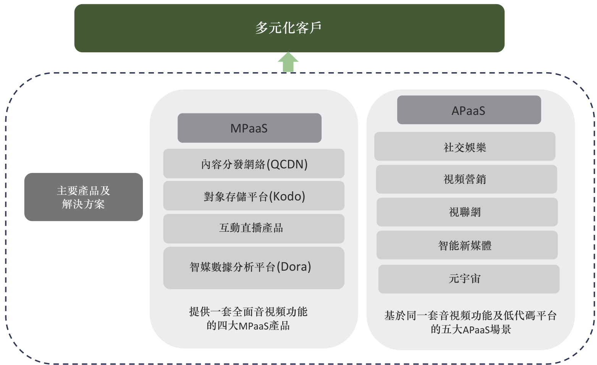

---

## 第 13 页

概要

我們的多元化客戶：我們的客戶涵蓋廣泛的企業(例如應用開發公司及SaaS公司)及個人開發者。我們於經營規模方面具備強大的客戶覆蓋範圍，從行業佼佼者至大型企業、中小型企業及個人。我們的產品滿足不同的客戶需求，從具有場景化需求及有限技術能力的商業企業(通常需要我們的APaaS解決方案)至對底層資源訪問有限的複雜應用開發人員(通常需要我們的MPaaS產品)。

我們的MPaaS產品：我們主要通過離散API及SDK向客戶提供MPaaS產品。利用我們的MPaaS產品，客戶僅需編寫代碼即可連接至我們的平台，通過該平台即可通過離散的API／SDK部署特定的音視頻功能。代碼的複雜性將取決於所需音視頻功能的程度。在定製該等參數後，我們的客戶可將該等音視頻功能嵌入其應用程序中，其僅需要管理其應用程序，而無需維護底層基礎設施。

我們的APaaS解決方案：我們主要以場景化解決方案的形式為客戶提供APaaS解決方案。我們將MPaaS功能與有關客戶的場景化專有技術相結合，並結合我們的低代碼平台，將API／SDK（對應底層音視頻功能）打包至客戶可直接部署的易於訪問且高度定製化的APaaS解決方案中。我們的APaaS解決方案與我們的MPaaS產品共享相同的音視頻功能套件（包括但不限於收集、存儲、處理、分發及分析）。我們的APaaS解決方案允許我們的客戶通過直觀的分步方法定製及開發彼等的應用程序，進一步降低了技術壁壘。

我們產品的競爭優勢

我們的MPaaS產品利用一系列音視頻技術(包括RTC、點播、直播、存儲及內容分發)及一系列AI技術(包括智能視覺、智能語音、智能剪輯、行業算法，內容安全和業務安全)。我們的技術構成了MPaaS產品競爭優勢的基石。例如，我們的QCDN產品已實現廣泛網絡覆蓋、全面節點監控及實時智能分配，為客戶提供低延時的雲服務。我們的Kodo產品支持集中式及邊緣存儲以及多雲部署，使客戶能夠方便地存儲及管理大量資料。我們的Kodo能夠實現較高數據可靠性，公有雲冗餘率為1.14及私有雲冗餘率為1.10。我們的互動直播產品為客戶提供低延時、高穩定性及高可用性的端到端即時通信解決方案。最後，我們的Dora產品提供了廣泛的數據處理及分析功能，使我們的用戶能夠每天處理大量的音視頻內容。詳情請參閱本招股章程「業務－關鍵運營指標」一節。於往績記錄期間，我們的MPaaS業務是我們收入的主要分部。

---

## 第 14 页

概要

憑藉MPaaS技術，我們進一步開發專有低代碼平台，該平台通過簡單直觀的設置，將不同的場景化功能綜合至客戶定製的解決方案，降低了音視頻產品的使用及訪問難度。我們的APaaS解決方案具備上線快、易拓展的特點，顯著提高客戶面向場景化創新的敏捷能力，應對音視頻內容個性化、場景多、時效要求等難點。根據艾瑞諮詢，2021年中國音視頻APaaS市場開始規模商業化並快速增長。我們於2021年決定順應行業發展和市場需求正式推出APaaS業務後，我們的APaaS付費客戶數量由2021年的1,319名增長至2022年的1,967名，並進一步增至2023年的2,597名。根據艾瑞諮詢，僅一年的攀升後，按2022年的收入計算，我們在中國音視頻APaaS市場中排名第二，市場份額為11.9%。2023年我們的市場份額進一步增至14.1%，鞏固了我們作為中國第二大音視頻APaaS服務商的地位。APaaS提供基於應用場景的平台型服務，按照場景打包相應工具和功能。根據艾瑞諮詢，於2023年，中國音視頻APaaS市場規模已達到人民幣20億元，預計於2028年，音視頻APaaS市場規模將達到人民幣144億元，複合年增長率達48.6%。

我們的客戶及供應商

我們的客戶基礎廣泛，遍佈各行各業，包括泛娛樂、社交網絡、醫療、電子商務、教育、媒體、金融服務、汽車、電信和智能製造等。截至2023年12月31日止三個年度以及截至2024年3月31日止三個月，我們來自最大客戶的收益分別佔我們於同期收益的11.3%、8.1%、11.8%及16.1%。於往績記錄期間各年度／期間，我們來自五大客戶的收益分別佔我們同期收益的22.7%、25.5%、34.3%及38.5%。於往績記錄期間，除客戶—供應商集團D為淘寶中國(我們的主要股東)的聯繫人外，我們所有其他五大客戶均為獨立第三方。除淘寶中國外，於往績記錄期間各年度及直至最後實際可行日期，概無董事、彼等的緊密聯繫人或任何股東(據董事所知，擁有我們已發行股本5%以上)於我們五大客戶中擁有任何權益。我們的銷售及營銷策略以及定價模式請參閱本招股章程「業務—銷售及營銷」一節。

我們的供應商主要包括雲技術行業中提供(i)網絡及帶寬服務、(ii)IDC服務及(iii)服務器及存儲服務的企業。截至2023年12月31日止三個年度以及截至2024年3月31日止三個月，與最大供應商的交易金額分別佔該等期間我們採購總額的36.1%、16.3%、5.9%及8.0%。於往績記錄期間之各年度／期間，與五大供應商的交易金額分別佔我們同期採購總額的63.5%、52.4%、25.7%及28.6%。於往績記錄期間，除客戶—供應商集團D為淘寶中國(我們的主要股東)的聯繫人外，我們所有其他五大供應商均為獨立第三方。除淘寶中國外，於往績記錄期間各年度及直至最後實際可行日期，概無董事、彼等的緊密聯繫人或任何股東(據董事所知，擁有我們已發行股本5%以上)於我們五大供應商中擁有任何權益。

---

## 第 15 页

我們的競爭優勢及發展策略

我們相信以下競爭優勢促成了我們的成功，並將有助於推動我們未來的增長：(i)中國第三大音視頻PaaS服務商及第二大音視頻APaaS服務商；(ii)一站式場景化音視頻解決方案彰顯綜合能力與強大拓展能力；(iii)豐富的應用場景助長商業化潛力；(iv)強大的一體化音視頻技術及低代碼平台開發能力；及(v)經驗豐富且富有洞察力的管理團隊及創新能力卓越的研發團隊。

我們擬採取以下策略以進一步發展業務：(i)通過持續在主要場景深耕以發展及擴大我們客戶群；(ii)加快海外業務拓展，打造新的業務增長點；(iii)持續加強研發投入，打造AIGC能力和迭代改進我們的低代碼平台；及(iv)尋求戰略投資及併購。

競爭

音視頻PaaS行業的市場競爭激烈。我們在業務的各個主要方面都面臨競爭。我們與中國其他音視頻PaaS服務商主要在產品功能及範圍、性能、服務的可擴展性及可靠性、技術實力、營銷及銷售能力、用戶體驗、定價、品牌知名度及聲譽等方面競爭。此外，新技術及增強技術可能會進一步加劇我們的行業競爭。按2023年收入計算，我們是中國第三大音視頻PaaS服務商和第二大音視頻APaaS服務商，市場份額分別為5.8%和14.1%。有關詳情，請參閱本招股章程「行業概覽—競爭格局」及「業務—競爭」段落。

隨著新進入者加入市場，音視頻PaaS服務市場正處於快速擴張階段，因此隨著市場規模擴大，頂級參與者的市場份額預計將逐漸減少。根據艾瑞諮詢，儘管於2019年至2023年前五大音視頻PaaS服務提供商的總收入有所增加，但其總市場份額從2019年的46.5%降至2023年的39.4%，於過往五年市場份額下降7.1%。

---

## 第 16 页

合約安排

我們提供雲服務(包括雲計算、存儲及分發)受到相關中國法律及法規的外商投資禁令規管，我們直接或間接通過股本所有權持有合併聯屬實體並不可行。反而，我們決定，依照中國受外商投資禁止規限的行業的一般慣例，我們會根據合約安排通過上海空山持有合併聯屬實體的權益並獲得合併聯屬實體的有效控制權。根據合約安排，上海空山已取得合併聯屬實體的財務及營運政策的有效控制權，並已有權享有合併聯屬實體各自的業務衍生的所有經濟利益。以下為合約安排簡化圖。詳情請參閱本招股章程「合約安排」。

首次公開發售前投資

自2012年至2020年，我們已完成多輪首次公開發售前投資，為此，本公司向相關首次公開發售前投資者發行本公司A系列優先股、B系列優先股、C-1系列優先股、C-2系列優先股、D系列優先股、E-1系列優先股、E-2系列優先股、F系列優先股及F-1系列優先股。我們的首次公開發售前投資者包括MPCs、啟明基金、CBC、FG Venture、Golden Valley、Harvest Yuanxiang、上海張江、上海張江科投、Titanium Ventures、淘寶中國、Magic Logistics、上海燊泰、交銀資產管理、交銀基金、Jumbo Sheen及永祿。詳情請參閱本招股章程「歷史、發展及公司架構—首次公開發售前投資」。

---

## 第 17 页

控股股東

截至最後實際可行日期，許先生透過Dream Galaxy控制我們已發行股本總額約17.9576%。緊隨全球發售完成後及假設超額配股權並無獲行使且並無根據首次公開發售前股份計劃發行任何股份，許先生通過Dream Galaxy將行使本公司股權約16.5208%的表決權。

根據於2024年4月簽署的同意函及於2024年6月簽署的確認書，同意股東賦予Dream Galaxy權利以行使彼等所持的742,707,099股股份所附帶的相關表決權，相當於緊隨全球發售完成後所持有本公司約37.1978%的股權。根據表決代理安排所涉及的相關表決權將於全球發售完成後賦予Dream Galaxy。詳情請參閱「歷史、發展及公司架構－表決代理安排」。

因此，緊隨全球發售完成後(假設超額配股權未獲行使且並無根據首次公開發售前股份計劃發行任何股份)，許先生透過由許先生全資擁有的公司Dream Galaxy根據其所持的股權連同上述同意股東賦予其的表決代理將行使合共1,072,568,979股股份所附帶的表決權，相當於所持本公司約53.7186%的股權。因此，Dream Galaxy與許先生於上市後將成為我們的控股股東。

有關我們與控股股東的關係及控股股東所持股權的詳情請參閱「與控股股東的關係」及「主要股東」各節。

持續關連交易

於往績記錄期間，我們向阿里雲計算有限公司(「阿里雲計算」)提供PaaS解決方案服務，亦自阿里雲計算採購雲服務及電子設備。由於阿里雲計算為我們主要股東之一淘寶中國之聯繫人，故本集團與阿里雲計算之間的交易於上市後構成本公司之持續關連交易。我們已於2023年6月15日與阿里雲計算訂立框架協議，以監管我們於上市後向阿里雲計算銷售及自阿里雲計算採購。該框架協議初始期限將自上市起至2025年12月31日屆滿。

此外，為按照中國適用法律及法規開展相關業務，我們的全資附屬公司上海空山已與七牛信息、北京空山、七牛深圳及登記股東簽訂合約安排。鑑於登記股東（即許先生及呂先生）為本公司之關連人士，合約安排項下擬進行的交易將於上市後構成本公司的持續關連交易。

詳情請參閱本招股章程「持續關連交易」。

---

## 第 18 页

歷史財務資料概要

下表載列於所示期間由我們的合併損益表及合併財務狀況表中摘錄的部分財務數據，其詳情載於本招股章程附錄一中的會計師報告，該等數據應與本招股章程附錄一會計師報告中的歷史財務資料(包括相關附註)一併閱讀。

合併損益表概要

下表載列我們於所示期間的合併損益表概要(項目以絕對金額及所佔收入百分比呈列)：

<!-- table html -->
<table><tr><td></td><td colspan="4">截至12月31日止年度</td><td colspan="4">截至3月31日止三個月</td></tr><tr><td></td><td colspan="2">2021年</td><td colspan="2">2022年</td><td colspan="2">2023年</td><td colspan="2">2023年</td><td colspan="2">2024年</td></tr><tr><td></td><td>人民幣千元</td><td>估收益%</td><td>人民幣千元</td><td>估收益%</td><td>人民幣千元</td><td>估收益%</td><td>人民幣千元</td><td>估收益%</td></tr><tr><td></td><td colspan="10">(未經審核)</td></tr><tr><td>收益</td><td>1,471,010</td><td>100.0</td><td>1,147,290</td><td>100.0</td><td>1,333,991</td><td>100.0</td><td>270,890</td><td>100.0</td><td>342,373</td><td>100.0</td></tr><tr><td>銷售成本</td><td>(1,179,834)</td><td>(80.2)</td><td>(918,649)</td><td>(80.1)</td><td>(1,053,746)</td><td>(79.0)</td><td>(221,372)</td><td>(81.7)</td><td>(271,833)</td><td>(79.4)</td></tr><tr><td>毛利</td><td>291,176</td><td>19.8</td><td>228,641</td><td>19.9</td><td>280,245</td><td>21.0</td><td>49,518</td><td>18.3</td><td>70,540</td><td>20.6</td></tr><tr><td>其他收入及收益</td><td>17,716</td><td>1.2</td><td>19,543</td><td>1.7</td><td>30,854</td><td>2.3</td><td>4,376</td><td>1.6</td><td>370</td><td>0.1</td></tr><tr><td>銷售及行銷費用</td><td>(193,016)</td><td>(13.1)</td><td>(147,521)</td><td>(12.9)</td><td>(139,065)</td><td>(10.4)</td><td>(34,985)</td><td>(12.9)</td><td>(27,442)</td><td>(8.0)</td></tr><tr><td>行政費用</td><td>(119,528)</td><td>(8.1)</td><td>(111,175)</td><td>(9.7)</td><td>(135,824)</td><td>(10.2)</td><td>(31,587)</td><td>(11.7)</td><td>(30,815)</td><td>(9.0)</td></tr><tr><td>研發成本</td><td>(143,357)</td><td>(9.7)</td><td>(128,727)</td><td>(11.2)</td><td>(128,034)</td><td>(9.6)</td><td>(28,039)</td><td>(10.4)</td><td>(33,590)</td><td>(9.8)</td></tr><tr><td>按公平值計入損益的金融資產的公平值收益/(虧損)</td><td></td><td></td><td></td><td></td><td></td><td></td><td></td><td></td><td></td><td></td></tr><tr><td>淨額</td><td>37,238</td><td>2.5</td><td>30,912</td><td>2.7</td><td>(54,682)</td><td>(4.1)</td><td>4,215</td><td>1.6</td><td>(8,864)</td><td>(2.6)</td></tr><tr><td>可轉換可贖回優先股的公平值虧損</td><td>(96,467)</td><td>(6.6)</td><td>(83,810)</td><td>(7.3)</td><td>(156,087)</td><td>(11.7)</td><td>(57,312)</td><td>(21.2)</td><td>(111,528)</td><td>(32.6)</td></tr><tr><td>金融資產減值虧損</td><td>(4,763)</td><td>(0.3)</td><td>(8,233)</td><td>(0.7)</td><td>(11,757)</td><td>(0.9)</td><td>(1,893)</td><td>(0.7)</td><td>(4,396)</td><td>(1.3)</td></tr><tr><td>其他費用</td><td>(2,659)</td><td>(0.2)</td><td>(3,636)</td><td>(0.2)</td><td>(1,596)</td><td>(0.1)</td><td>(404)</td><td>(0.1)</td><td>(144)</td><td>(0.0)</td></tr><tr><td>財務成本</td><td>(6,046)</td><td>(0.4)</td><td>(8,746)</td><td>(0.8)</td><td>(8,162)</td><td>(0.6)</td><td>(2,218)</td><td>(0.8)</td><td>(2,153)</td><td>(0.6)</td></tr><tr><td>除税前虧損</td><td>(219,706)</td><td>(14.9)</td><td>(212,752)</td><td>(18.5)</td><td>(324,108)</td><td>(24.3)</td><td>(98,329)</td><td>(36.3)</td><td>(148,022)</td><td>(43.2)</td></tr><tr><td>年／期內虧損</td><td>(219,706)</td><td>(14.9)</td><td>(212,752)</td><td>(18.5)</td><td>(324,108)</td><td>(24.3)</td><td>(98,329)</td><td>(36.3)</td><td>(148,022)</td><td>(43.2)</td></tr></table>
<!-- /table -->

---

## 第 19 页

非國際財務報告準則計量指標

為補充我們根據國際財務報告準則呈列的合併財務報表，我們亦採用並非國際財務報告準則規定或並非按國際財務報告準則呈列的非國際財務報告準則計量指標(即經調整淨虧損)，作為額外財務計量指標。我們認為，該非國際財務報告準則計量指標有利於通過消除若干項目的潛在影響，對不同時期的經營業績進行比較。我們認為，有關計量指標為投資者及其他人士提供有用的信息，以通過與我們管理層的相同方式了解及評估我們的合併經營業績。然而，我們呈列的經調整淨虧損(非國際財務報告準則計量指標)未必可與其他公司所呈列類似計量指標相比。該非國際財務報告準則計量指標用作分析工具存在局限性，閣下不應視其為獨立於或可代替我們根據國際財務報告準則所呈報經營業績或財務狀況的分析。

我們將經調整淨虧損(非國際財務報告準則計量指標)定義為年／期內溢利／(虧損)，不包括可轉換可贖回優先股的公平值變動影響、以股份為基礎的付款以及上市費用。可轉換可贖回優先股的公平值變動指我們向首次公開發售前投資者所發行可轉換可贖回優先股的公平值變動。上市完成後，可轉換可贖回優先股將自動轉換為普通股，且我們預計上市後不會確認可轉換可贖回優先股的任何其他公平值變動。以股份為基礎的付款具有非現金性質且為根據股份激勵計劃授出購股權所產生的僱員相關開支。上市費用為與全球發售有關的費用。該等調整乃於往績記錄期間持續作出，下表載列所示期間我們的淨虧損與經調整淨虧損(非國際財務報告準則計量指標)的對賬：

<!-- table html -->
<table><tr><td colspan="3">截至12月31日止年度</td><td colspan="3">截至3月31日止三個月</td></tr><tr><td>2021年</td><td>2022年</td><td>2023年</td><td>2023年</td><td>2024年</td></tr><tr><td>（人民幣千元）</td><td>（人民幣千元）</td><td>（人民幣千元）</td><td>（人民幣千元）</td><td>（人民幣千元）</td></tr><tr><td colspan="5">（未經審核）</td></tr></table>
<!-- /table -->

年度／期間我們的淨虧損與經調整淨虧損(非國際財

務報告準則計量指標)之對賬：

<!-- table html -->
<table><tr><td>年度／期間虧損</td><td>(219,706)</td><td>(212,752)</td><td>(324,108)</td><td>(98,329)</td><td>(148,022)</td></tr><tr><td>經調整下列項目：</td><td></td><td></td><td></td><td></td><td></td></tr><tr><td>可轉換可贖回優先股的公平值虧損</td><td>96,467</td><td>83,810</td><td>156,087</td><td>57,312</td><td>111,528</td></tr><tr><td>以股份為基礎的付款</td><td>17,539</td><td>10,283</td><td>33,830</td><td>4,814</td><td>4,735</td></tr><tr><td>上市費用</td><td>–</td><td>–</td><td>18,592</td><td>5,462</td><td>7,518</td></tr></table>
<!-- /table -->

非國際財務報告準則計量指標：

<!-- table html -->
<table><tr><td>經調整淨虧損</td><td>(105,700)</td><td>(118,659)</td><td>(115,599)</td><td>(30,741)</td><td>(24,241)</td></tr></table>
<!-- /table -->

---

## 第 20 页

概要

下表載列於所示期間按服務或產品類型劃分的收益明細(以絕對金額及佔我們總收益的百分比列示)：

<!-- table html -->
<table><tr><td></td><td colspan="4">截至12月31日止年度</td><td colspan="4">截至3月31日止三個月</td></tr><tr><td></td><td>2021年人民幣千元</td><td>2022年人民幣%</td><td>2023年人民幣千元</td><td>2023年人民幣%</td><td>2023年人民幣千元</td><td>2024年人民幣千元</td><td>2024年%</td></tr><tr><td>MPaaS</td><td>1,369,641</td><td>93.1</td><td>874,997</td><td>76.3</td><td>974,507</td><td>73.1</td><td>186,350</td><td>68.8</td><td>249,442</td><td>72.9</td></tr><tr><td>APaaS</td><td>24,901</td><td>1.7</td><td>194,013</td><td>16.9</td><td>281,359</td><td>21.1</td><td>64,074</td><td>23.7</td><td>83,238</td><td>24.3</td></tr><tr><td>其他</td><td>76,468</td><td>5.2</td><td>78,280</td><td>6.8</td><td>78,125</td><td>5.8</td><td>20,466</td><td>7.5</td><td>9,693</td><td>2.8</td></tr><tr><td>總計</td><td>1,471,010</td><td>100.0</td><td>1,147,290</td><td>100.0</td><td>1,333,991</td><td>100.0</td><td>270,890</td><td>100.0</td><td>342,373</td><td>100.0</td></tr></table>
<!-- /table -->

毛利及毛利率

下表載列我們於所示期間的毛利(以絕對金額及佔收益的百分比(即毛利率)列示)：

<!-- table html -->
<table><tr><td></td><td colspan="4">截至12月31日止年度</td><td colspan="4">截至3月31日止三個月</td></tr><tr><td></td><td>2021年人民幣毛利率(%)</td><td>2022年人民幣毛利率(%)</td><td>2023年人民幣毛利率(%)</td><td>2023年人民幣毛利率(%)</td><td>2024年人民幣毛利率(%)</td></tr><tr><td>毛利</td><td></td><td></td><td></td><td></td><td></td><td></td></tr><tr><td>- MPaaS</td><td>244,773</td><td>17.9</td><td>151,331</td><td>17.3</td><td>188,541</td><td>19.3</td><td>29,033</td><td>15.6</td><td>45,289</td><td>18.2</td></tr><tr><td>- APaaS</td><td>6,490</td><td>26.1</td><td>55,000</td><td>28.3</td><td>84,554</td><td>30.1</td><td>18,907</td><td>29.5</td><td>24,272</td><td>29.2</td></tr><tr><td>- 其他</td><td>39,913</td><td>52.2</td><td>22,310</td><td>28.5</td><td>7,150</td><td>9.2</td><td>1,578</td><td>7.7</td><td>979</td><td>10.1</td></tr><tr><td>總計</td><td>291,176</td><td>19.8</td><td>228,641</td><td>19.9</td><td>280,245</td><td>21.0</td><td>49,518</td><td>18.3</td><td>70,540</td><td>20.6</td></tr></table>
<!-- /table -->

我們的總收益由2021年的人民幣1,471.0百萬元減少22.0%至2022年的人民幣1,147.3百萬元，主要是由於我們的MPaaS產品產生的收益減少，惟部分被APaaS解決方案產生的收益(源自我們根據行業發展及市場需求擴展APaaS業務)增加所抵銷。自2021年9月我們正式推出APaaS業務以來，我們在戰略上專注於APaaS業務的運營。來自MPaaS產品的收益由2021年的人民幣1,369.6百萬元減少36.1%至2022年的人民幣875.0百萬元，是由於Kodo、QCDN、互動直播產品和Dora的收益下降。特別是來自Kodo的收益由2021年的人民650.8百萬元減至2022年的人民幣320.4百萬元，主要是由於2022年COVID-19捲土重來導致若干半導體晶片(我們的一體機服務器的主要組成部分)供應短缺，從而對我們的一體機服務器業務造成嚴重的供應鏈中斷，因此我們決定縮減我們的一體機服務器業務，特別是我們為部分私有雲客戶採購一體機服務器。來自APaaS解決方案的收益由2021年的人民幣24.9百萬元增加679.1%至2022年的人民幣194.0百萬元，歸因所有場景的收益增加。

---

## 第 21 页

概要

毛利由2021年的人民幣291.2百萬元減少21.5%至2022年的人民幣228.6百萬元。整體毛利率於2021年及2022年保持相對穩定，分別為19.8%及19.9%。與2021年的17.9%相比，MPaaS的毛利率於2022年保持相對穩定，為17.3%。APaaS的毛利率由2021年的26.1%增至2022年的28.3%，主要是由於初步發展後，我們能夠滿足APaaS市場的較高需求及提供整包服務及低代碼平台等增值服務。

我們的總收益由2022年的人民幣1,147.3百萬元增加16.3%至2023年的人民幣1,334.0百萬元，主要是由於客戶需求增加，以及主要隨著QCDN業務的增長，令得來自APaaS解決方案及MPaaS產品的收益增加。來自MPaaS產品的收益由2022年的人民幣875.0百萬元增加11.4%至2023年的人民幣974.5百萬元，是由於來自QCDN及Dora的收益增加，惟部分被來自Kodo及互動直播產品的收益下降所抵銷。來自APaaS解決方案的收益由2022年的人民幣194.0百萬元增加45.0%至2023年的人民幣281.4百萬元，歸因於視頻營銷收益增加，其次是視聯網場景解決方案收益增加。

毛利由2022年的人民幣228.6百萬元增加22.6%至2023年的人民幣280.2百萬元。整體毛利率由2022年的19.9%增至2023年的21.0%。MPaaS的毛利率由2022年的17.3%增至2023年的19.3%，主要是由於(i)我們調整基礎設施佈局及重新部署部分服務器，導致QCDN及Kodo業務效率提升；及(ii)我們縮減了與若干客戶(尤其是客戶A)的業務，與其他客戶(例如2023年貢獻大部分收入的客戶H、客戶－供應商集團I及客戶－供應商集團J)相比，我們與客戶A的商業條款不太有利。於2021年、2022年、2023年及截至2024年3月31日止三個月，客戶A、客戶H、客戶－供應商集團I及客戶－供應商集團J分別向我們的收益貢獻合共13.9%、22.7%、27.6%及28.0%。APaaS的毛利率由2022年的28.3%增至2023年的30.1%，主要是由於(i)我們能夠滿足APaaS市場的較高需求及提供整包服務及低代碼平台等增值服務，及(ii)調整基礎設施佈局及重新部署服務器使得我們從效率提升中受益。我們的其他業務毛利率由2022年的28.5%降至2023年的9.2%，是由於DPaaS解決方案通常以部署於為客戶建立的私有雲上的專有及技術軟件的形式銷售，因此我們作出策略調整，縮減DPaaS業務(儘管其毛利率相對較高)的規模。由於DPaaS業務不再是我們的業務重點，且產生高昂的經常性研發成本，長遠而言不利於我們的盈利能力，因此我們縮減DPaaS業務。

我們的總收益由截至2023年3月31日止三個月的人民幣270.9百萬元增加26.4%至截至2024年3月31日止三個月的人民幣342.4百萬元，主要是由於我們的MPaaS產品(尤其是QCDN及Kodo)產生的收益增加，以及客戶需求增加導致我們的APaaS解決方案產生的收益增加，惟部分被DPaaS減少及互聯網數據託管服務減少導致其他服務產生的收益減少所抵銷。來自MPaaS產品的收益由截至2023年3月31日止三個月的人民幣186.4百萬元增加33.9%至截至2024年3月31日止三個月的人民幣249.4百萬元，是由於來自QCDN、Kodo及Dora的收益增加，惟部分被互動直播產品的收益微降所抵銷。來自APaaS產品的收益由截至2023年3月31日止三個月的人民幣64.1百萬元增加29.9%至截至2024年3月31日止三個月的人民幣83.2百萬元，主要是由於我們的視頻營銷、視聯網及社交娛樂場景解決方案產生收益的增長。

---

## 第 22 页

概要

毛利由截至2023年3月31日止三個月的人民幣49.5百萬元增加42.5%至截至2024年3月31日止三個月的人民幣70.5百萬元。整體毛利率由截至2023年3月31日止三個月的18.3%增至截至2024年3月31日止三個月的20.6%。MPaaS的毛利率由截至2023年3月31日止三個月的15.6%增至截至2024年3月31日止三個月的18.2%，主要是由於(i)較QCDN業務而言，我們可從利潤率更高的Kodo業務中獲得更多收益，及(ii)我們受益於若干成本控制措施，例如調整基礎設施佈局及重新部署服務器。截至2023年及2024年3月31日止三個月，我們的APaaS毛利率相對穩定，分別為29.5%及29.2%。

詳情請參閱本招股章程「財務資料－各期間經營業績比較」一節。

與2021年的人民幣219.7百萬元相比，我們於2022年的年度虧損保持相對穩定，為人民幣212.8百萬元。我們的年度虧損由2022年的人民幣212.8百萬元增至2023年的人民幣324.1百萬元，主要是由於(i)按公平值計入損益的金融資產的公平值變動波動，由2022年的收益人民幣30.9百萬元轉為2023年的虧損人民幣54.7百萬元；及(ii)可轉換可贖回優先股的公平值虧損由2022年的人民幣83.8百萬元增至2023年的人民幣156.1百萬元，部分被毛利由2022年的人民幣228.6百萬元增至2023年的人民幣280.2百萬元所抵銷。我們的期間虧損由截至2023年3月31日止三個月的人民幣98.3萬元增至截至2024年3月31日止三個月的人民幣148.0百萬元，主要是由於(i)可轉換可贖回優先股的公平值虧損由截至2023年3月31日止三個月的人民幣57.3百萬元增至截至2024年3月31日止三個月的人民幣111.5百萬元，及(ii)按公平值計入損益的金融資產的公平值變動波動，由截至2023年3月31日止三個月的收益人民幣4.2百萬元轉為截至2024年3月31日止三個月的虧損人民幣8.9百萬元，部分被毛利由截至2023年3月31日止三個月的人民幣49.5百萬元增至截至2024年3月31日止三個月的人民幣70.5百萬元所抵銷。儘管2023年及2024年營運表現整體改善，但2022年及2023年以及截至2023年及2024年3月31日止三個月經調整淨虧損(非國際財務報告準則計量指標)相對穩定的部分原因是上文所述自按公平值計入損益的金融資產的公平值變動確認的收益／虧損波動。詳情請參閱「財務資料－經營業績主要組成部分概況」一節。

---

## 第 23 页

合併財務狀況表概要

下表載列於所示日期合併財務狀況表的節選資料：

<!-- table html -->
<table><tr><td></td><td colspan="2">於12月31日</td><td colspan="2">於3月31日</td></tr><tr><td></td><td>2021年 人民幣千元</td><td>2022年 人民幣千元</td><td>2023年 人民幣千元</td><td>2024年 人民幣千元</td></tr><tr><td>非流動資產</td><td>396,277</td><td>350,792</td><td>237,806</td><td>241,694</td></tr><tr><td>流動資產</td><td>688,776</td><td>553,290</td><td>621,974</td><td>616,578</td></tr><tr><td>流動負債</td><td>3,290,190</td><td>3,569,959</td><td>3,872,333</td><td>4,000,365</td></tr><tr><td>流動負債淨額</td><td>2,601,414</td><td>3,016,669</td><td>3,250,359</td><td>3,383,787</td></tr><tr><td>非流動負債</td><td>33,216</td><td>10,301</td><td>2,845</td><td>22,164</td></tr><tr><td>負債淨額</td><td>2,238,353</td><td>2,676,178</td><td>3,015,398</td><td>3,164,257</td></tr></table>
<!-- /table -->

截至2021年、2022年、2023年12月31日及2024年3月31日，我們錄得負債淨額分別為人民幣2,238.4百萬元、人民幣2,676.2百萬元、人民幣3,015.4百萬元及人民幣3,164.3百萬元。我們的淨負債狀況主要是由於我們的可轉換可贖回優先股所致。截至2021年、2022年、2023年12月31日及2024年3月31日，我們的可轉換可贖回優先股分別為人民幣2,672.3百萬元、人民幣3,006.7百萬元、人民幣3,215.0百萬元及人民幣3,332.2百萬元。我們的可轉換可贖回優先股於上市後自動轉換為普通股，因此該等優先股將由負債重新指定為權益，繼而由淨負債狀況轉為淨資產狀況。有關可轉換可贖回優先股的更多詳情，請參閱本招股章程附錄一會計師報告附註28。往績記錄期間，我們產生的淨虧損亦導致我們的淨負債狀況。於2021年、2022年、2023年及截至2024年3月31日止三個月，我們產生的淨虧損分別為人民幣219.7百萬元、人民幣212.8百萬元、人民幣324.1百萬元及人民幣148.0百萬元。往績記錄期間，換算海外業務的匯兌差額及購回已歸屬購股權亦導致淨負債波動。

於2021年、2022年、2023年12月31日及2024年3月31日，我們的流動負債淨額分別為人民幣2,601.4百萬元、人民幣3,016.7百萬元、人民幣3,250.4百萬元及人民幣3,383.8百萬元。

我們的流動負債淨額由2023年12月31日的人民幣3,250.4百萬元增至2024年3月31日的人民幣3,383.8百萬元，主要是由於(i)可轉換可贖回優先股增加人民幣117.2百萬元，(ii)存貨減少人民幣18.3百萬元，及(iii)計息銀行及其他借貸增加人民幣11.9百萬元，惟部分被貿易應收款項及應收票據增加人民幣20.2百萬元所抵銷。

我們的流動負債淨額由2022年12月31日的人民幣3,016.7百萬元增至2023年12月31日的人民幣3,250.4百萬元，主要是由於(i)可轉換可贖回優先股增加人民幣208.4百萬元，(ii)由於我們的業務擴張，貿易應付款項增加人民幣86.9百萬元，(iii)計息銀行及其他借款增加人民幣26.4百萬元，及(iv)現金及現金等價物減少人民幣21.0百萬元，惟部分被(i)由於我們的業務擴張，貿易應收款項及應收票據增加人民幣93.8百萬元，及(ii)應付關連方款項減少人民幣22.8百萬元所抵銷。

---

## 第 24 页

概要

我們的流動負債淨額由2021年12月31日的人民幣2,601.4百萬元增至2022年12月31日的人民幣3,016.7百萬元，主要是由於(i)可轉換可贖回優先股增加人民幣334.3百萬元，(ii)現金及現金等價物減少人民幣98.1百萬元，(iii)貿易應收款項減少人民幣69.3百萬元，及(iv)計息銀行及其他借款增加人民幣60.4百萬元，惟部分被(i)應付關聯方款項減少人民幣71.7百萬元，(ii)定期存款增加人民幣50.8百萬元，及(iii)合約負債減少人民幣20.6百萬元所抵銷。

合併現金流量表概要

下表載列所示期間的現金流量：

<!-- table html -->
<table><tr><td></td><td colspan="3">截至12月31日止年度</td><td colspan="3">截至3月31日止三個月</td></tr><tr><td></td><td>2021年人民幣千元</td><td>2022年人民幣千元</td><td>2023年人民幣千元</td><td>2023年人民幣千元（未經審核）</td><td>2024年人民幣千元</td></tr><tr><td>營運資金變動前的</td><td></td><td></td><td></td><td></td><td></td></tr><tr><td>經營現金流量</td><td>(42,023)</td><td>(39,295)</td><td>4,408</td><td>(18,081)</td><td>(2,206)</td></tr><tr><td>營運資金變動</td><td>(52,949)</td><td>(34,883)</td><td>(15,240)</td><td>49,103</td><td>(4,956)</td></tr><tr><td>經營所用現金</td><td>(94,972)</td><td>(74,178)</td><td>(10,832)</td><td>31,022</td><td>(7,162)</td></tr><tr><td>已收利息</td><td>3,479</td><td>2,834</td><td>6,995</td><td>746</td><td>893</td></tr><tr><td>經營活動(所用)／所得</td><td></td><td></td><td></td><td></td><td></td></tr><tr><td>現金流量淨額</td><td>(91,493)</td><td>(71,344)</td><td>(3,837)</td><td>31,768</td><td>(6,269)</td></tr><tr><td>投資活動所得／(所用)</td><td></td><td></td><td></td><td></td><td></td></tr><tr><td>現金流量淨額</td><td>144,447</td><td>(62,487)</td><td>(14,883)</td><td>(34,860)</td><td>70,039</td></tr><tr><td>融資活動所得／(所用)</td><td></td><td></td><td></td><td></td><td></td></tr><tr><td>現金淨額</td><td>98,052</td><td>20,819</td><td>(4,699)</td><td>(12,780)</td><td>6,210</td></tr><tr><td>現金及現金等價物增加／(減少)淨額</td><td>151,006</td><td>(113,012)</td><td>(23,419)</td><td>(15,872)</td><td>69,980</td></tr><tr><td>年／期初現金及現金等價物</td><td>140,129</td><td>285,523</td><td>187,404</td><td>187,404</td><td>166,378</td></tr><tr><td>匯率變動的影響淨額</td><td>(5,612)</td><td>14,893</td><td>2,393</td><td>(2,375)</td><td>204</td></tr><tr><td>年／期末現金及現金等價物</td><td>285,523</td><td>187,404</td><td>166,378</td><td>169,157</td><td>236,562</td></tr></table>
<!-- /table -->

我們於往績記錄期間錄得經營現金流出淨額，主要是由於淨虧損及營運資金負變動。詳情請參閱「財務資料－流動資金及資本資源－合併現金流量表－經營活動所得／(所用)現金流量淨額」一節。

---

## 第 25 页

業務可持續性及盈利之路

我們於往績記錄期間並無獲得淨利潤，主要是由於以下事件的合併影響：

(a) 業務擴充優先於短期盈利：於往績記錄期間，我們優先發展並持續擴充音視頻MPaaS及APaaS業務，特別是2021年正式推出的相對較新、盈利能力更強的APaaS業務，我們相信該業務具有較高的市場增長潛力。與發展我們的服務相關的研發(包括我們的APaaS業務)涉及大量的投資，且該等投資尚未完全進入回報期。

就實現盈利所需的時間而言，本公司於往績記錄期間的虧損狀況亦符合行業的總體趨勢。根據艾瑞諮詢，鑑於前期的大量投資，尤其是於研究及為快速佔領額外市場份額所採取的一般定價政策，於音視頻PaaS行業營運的公司通常尚未實現盈利。音視頻雲服務商實現盈利通常需要10年以上。

(b) 為應對不斷變化的市場環境而縮減若干業務板塊的決策：雖然我們於2021年於異常有利的市況下錄得35.1%的強勁收入增長，主要是由於受COVID-19爆發及各行業對私有雲及公有雲存儲投資快速增長的推動，雲存儲需求急劇增長使得我們的Kodo業務受益，我們於2022年作出決策來調整業務重點，以應對不斷變化的市場環境。特別是，COVID-19疫情長期反覆，出行受限，加上若干半導體晶片(我們為部分私有雲客戶採購的一體機服務器(須於內部配置預裝音視頻軟件及解決方案的服務器)的主要組成部分)供應短缺，導致對一體機服務器業務的供應鏈中斷，而一體機服務器業務是我們Kodo業務的重要組成部分。鑑於上述事項，我們於2022年作出縮減一體機服務器業務的決策。因此，我們來自Kodo業務的收益從2021年的人民幣650.8百萬元下降至2022年的人民幣320.4百萬元，我們的總收益及毛利亦相應下降。

---

## 第 26 页

概要

(c) 非經常性項目：我們於往績記錄期間產生部分一次性開支，例如2021年諮詢及其他專業服務費人民幣40.8百萬元，主要與我們之前於2021年嘗試在納斯達克上市有關。我們亦於2021年、2022年及2023年以及截至2024年3月31日止三個月因精簡僱員結構而分別產生遣散費人民幣10.1百萬元、人民幣36.6百萬元、人民幣9.2百萬元及人民幣0.2百萬元，及我們於2023年及截至2024年3月31日止三個月分別產生上市費用人民幣18.6百萬元及人民幣7.5百萬元。此外，我們分別於2021年、2022年及2023年以及截至2024年3月31日止三個月確認可換股可贖回優先股的公平值虧損人民幣96.5百萬元、人民幣83.8百萬元、人民幣156.1百萬元及人民幣111.5百萬元。所有該等事項對我們於往績記錄期間的財務表現造成不利影響。

盈利之路

經過多年發展，我們在音視頻PaaS行業(尤其是相對較新的音視頻APaaS行業)逐漸取得了可觀的市場份額及領先地位。根據艾瑞諮詢，就2023年的收入而言，我們為中國第三大音視頻PaaS供應商及第二大音視頻APaaS供應商。我們的經調整淨虧損(非國際財務報告準則計量指標)由2022年的人民幣118.7百萬元減至2023年的人民幣115.6百萬元，再由截至2023年3月31日止三個月的人民幣30.7百萬元減至截至2024年3月31日止三個月的人民幣24.2百萬元，及我們的經調整淨虧損率(非國際財務報告準則計量指標)由2022年的10.3%減至2023年的8.7%及截至2024年3月31日止三個月的7.1%。改善主要是由於MPaaS業務持續恢復，APaaS業務的持續增長，以及於我們努力控制成本之下，我們的成本及費用所佔收入百分比下降。具體而言，我們計劃透過以下方式進一步提升我們的財務表現：

(i) 專注及深化我們的APaaS業務

我們擬進一步滲透及深化APaaS業務的各種應用場景，以在快速增長的音視頻APaaS市場中把握機遇。我們計劃通過升級及迭代我們的低代碼平台以及向現有及新客戶提供各類場景下的更多增值服務，例如智能新媒體場景下的電視廣播拍攝及製作雲解決方案以及視聯網場景下的農業監控解決方案，進一步擴大APaaS業務。

---

## 第 27 页

概要

我們的APaaS新付費客戶開銷亦大幅上漲，由2021年的人民幣8,079元增至2023年的人民幣244,978元，再增至截至2024年3月31日止三個月的人民幣424,853元，主要是由於少數因素，包括(i) APaaS解決方案的特點作為一站式解決方案提供易於訪問及綜合功能可滿足客戶的各種場景需求，(ii)不斷積累APaaS解決方案的市場信心及因此對APaaS解決方案的付費意願，以及(iii)我們的營銷及客戶教育工作，例如，通過採用更主動的客戶關係管理策略，提供個性化的客戶支持及交叉銷售產品及解決方案或升級客戶的檔案，有助於培養客戶忠誠度並吸引更高的支出。我們預計，隨著我們的APaaS業務達到成熟的發展階段以及更多APaaS解決方案的商業化，我們的APaaS客戶群，特別是APaaS新客戶數量以及彼等的平均支出將進一步擴大。

(ii) 保持並持續增強我們的MPaaS業務的競爭優勢

憑藉我們在中國音視頻雲行業的十年經驗，我們開發了強大的MPaaS業務，儘管市場競爭加劇，我們將專注保持有關競爭優勢。我們在服務供應的穩定性及可靠性方面擁有良好的往績記錄，並在客戶中建立了良好的聲譽。例如，我們提供多區域災難恢復能力，以降低任何單一數據中心發生故障時的運營風險。我們的MPaaS產品亦配備了針對孤立事件及安全故障的各種安全保護。

我們計劃鞏固QCDN產品的競爭優勢，此乃與IaaS企業的主戰場。具體而言，我們(i)加強與中國頂級互聯網企業的業務關係，該等企業通常是我們QCDN產品的最大客戶，以進一步鞏固我們的競爭優勢；(ii)提供不同的定價方法(例如根據實際使用情況或服務套餐)，以滿足客戶的不同業務需求及分銷模式；及(iii)從事QCDN產品的研發，例如，CDN節點與AI算力的融合，以在未來提供更具競爭力的CDN產品。

我們一直高度重視持續創新及研發工作，以擴大服務供應並完善我們現有的產品組合。MPaaS發展策略方面，我們計劃進一步鞏固及深化在MPaaS功能方面的優勢，以降低客戶的訪問成本、優化供應鏈資源及提高研發效率。

---

## 第 28 页

(iii) 擴大我們的客戶群及與客戶建立長期關係

於往績記錄期間，我們成功擴大客戶群。MPaaS付費客戶數量由2021年的68,808名增至2022年的83,970名，並於2023年進一步增至92,480名，再由截至2023年3月31日止三個月的62,311名增至截至2024年3月31日止三個月的62,563名。我們旨在培養用戶使用我們產品及服務的習慣，同時擴大我們的客戶群。截至2024年3月31日，我們的註冊用戶超過1,500,000名，其中643,857名為活躍用戶（附註1）。我們擬與現有客戶建立長期關係以及吸引更多註冊用戶，並將彼等或彼等所代表的公司轉化為付費客戶。我們預計經擴大客戶群將帶來規模經濟的增長，從而有助於提高我們的整體盈利能力。

(a) 擴大至我們客戶的更多業務場景及積極識別市場需求。我們計劃在APaaS業務的五大場景中創建更多解決方案，其將有助我們的客戶群及／或彼等的支出的增長。我們通過各種線上及線下渠道(包括知名行業會議、現有客戶見解)積極識別及探索各行各業尚未滿足的客戶需求。除我們之前參加過的知名行業會議外，我們計劃於未來五年內組織或參加30多個展會、交易會及行業會議。

(b) 促進註冊用戶向付費客戶轉化。我們一直專注於多種策略，以加快客戶的決策過程，降低支付門檻，從而鼓勵非付費註冊用戶轉化為付費客戶。將向非付費客戶推送及推廣性價比高、較低支付門檻的產品，提供首購折扣或免費試用，鼓勵其付費購買我們的產品，從而進一步擴大付費客戶群。

附註：

(1) 活躍用戶數量指於相關期間至少使用過我們的一款產品或以其他方式為我們平台的使用作出貢獻的用戶數量。謹此說明，有關活躍用戶包括參與試用我們的產品但未必會成為我們的付費客戶的用戶。

---

## 第 29 页

概要

(iv) 有效管理成本及費用

於往績記錄期間，我們產生大量經營開支，包括銷售及行銷費用、行政費用及研發成本，以擴大業務規模、開發新的解決方案及提高品牌知名度。我們擬通過實現規模經濟及提高銷售效率和成效，以進一步優化經營開支。展望未來，我們擬有效管理成本及開支所佔總收入的百分比並進一步受益於經營槓桿。具體而言：

銷售及行銷費用

2021年、2022年及2023年以及截至2024年3月31日止三個月，我們的銷售及行銷費用分別為人民幣193.0百萬元、人民幣147.5百萬元、人民幣139.1百萬元及人民幣27.4百萬元，分別佔同期收益的13.1%、12.9%、10.4%及8.0%。儘管我們進行了成本控制及人力調整，但我們預期將繼續從我們已建立的品牌知名度提升效果中獲益。具體而言，我們擬透過以下措施提高我們的銷售及營銷效率：

a) 我們已經並將繼續參與知名的行業會議，這有助於我們更好地展示我們的最新產品及服務，以及研究創新，並吸引更多的開發人員和客戶加入我們的平台；

b) 我們積極探索各種行銷渠道，無論是傳統或其他，以進一步提高我們的營銷效率。我們採用搜尋引擎最佳化作為行銷策略，以提高平台流量的質與量；

c) 在客戶管理方面，我們實施了先進高效的系統。除了客戶關係管理(CRM)系統外，我們亦引進了由觀遠數據運營的數據平台，並主要根據客戶的收入貢獻及行業特點實施多級客戶跟進策略。

行政費用

2021年、2022年及2023年以及截至2024年3月31日止三個月，我們的行政費用分別佔總收入的8.1%、9.7%、10.2%及9.0%。我們擬透過提高管理水平、簡化內部工作流程以及利用技術而提高便利性、成本效益及生產力，從而優化我們的行政費用。

我們已經並將繼續全面審查我們的運營，包括研發、銷售及行銷以及客戶支持流程，以精簡我們的業務流程，重點關注核心程式，從而提高效率及成本效益。

---

## 第 30 页

主要財務比率

下表載列我們於所示期間的主要財務比率概要。

<!-- table html -->
<table><tr><td></td><td colspan="3">截至12月31日止年度</td><td>截至3月31日止三個月</td></tr><tr><td></td><td>2021年%</td><td>2022年%</td><td>2023年%</td><td>2024年%</td></tr><tr><td>毛利率</td><td>19.8</td><td>19.9</td><td>21.0</td><td>20.6</td></tr><tr><td>經調整淨虧損率(非國際</td><td></td><td></td><td></td><td></td></tr><tr><td>財務報告準則計量指標)</td><td>(7.2)</td><td>(10.3)</td><td>(8.7)</td><td>(7.1)</td></tr></table>
<!-- /table -->

風險因素

我們面臨的主要風險因素概要包括：(i)我們參與的市場競爭激烈，倘我們未進行有效競爭，則我們的業務、經營業績和財務狀況可能受到損害；(ii)我們經歷收益波動，且倘我們未能有效發展業務，則我們的業務、經營業績和財務狀況可能會受到不利影響；(iii)我們於往績記錄期間錄得淨虧損、流動負債淨額、負債淨額及經營現金流出淨額；(iv)針對我們系統和網絡的安全漏洞和攻擊，以及任何未能以其他方式保護個人、機密和專有信息，均可能損害我們的聲譽，對我們的業務產生負面影響，並對我們的財務狀況和經營業績有重大不利影響；及(v)倘我們未能維護和增強產品及服務的功能、性能、可靠性、設計、安全性和可擴展性以滿足客戶不斷變化的需求，則我們可能會失去客戶。

倘出現上述任何主要風險因素，我們的業務、財務狀況、經營業績及前景均可能會受到重大不利影響。閣下在決定投資於發售股份前應細閱本招股章程「風險因素」整節。

法律程序和合規

於往績記錄期間及直至最後實際可行日期，我們並無牽涉任何我們認為會對我們的業務、經營業績或財務狀況產生重大不利影響的實際或待決法律、仲裁或行政訴訟(包括任何行政處罰、破產或接管程序)。截至最後實際可行日期，就我們所知，我們或我們的任何董事並無面臨我們認為會對我們的業務、經營業績或財務狀況造成重大不利影響的任何待決或構成威脅的法律、仲裁或行政訴訟。

於往績記錄期間及直至最後實際可行日期，我們並無牽涉任何我們認為會對我們的業務、經營業績或財務狀況產生重大不利影響的重大違規事件。

---

## 第 31 页

近期發展

近期業務發展

往績記錄期間後及直至最後實際可行日期，我們的業務營運保持穩定。2023年相較2022年以及截至2024年3月31日止三個月相較2023年同期，收入、毛利及經調整淨虧損(非國際財務報告準則計量指標)有所提升，我們預計2024年的總體情況將持續改善，原因為我們的MPaaS和APaaS業務繼續以目前的勢頭發展。儘管如此，我們仍預計於2024年錄得淨虧損，主要是由於我們的可換股可贖回優先股的公平值虧損，預計產生以股份為基礎的付款及上市費用及鑑於競爭的市場環境，且「業務－業務可持續性及盈利之路」一節所載的我們的財務業績改進舉措將繼續生效。

近期監管發展

中國證監會備案

於2024年6月17日，中國證監會就本公司完成股份於聯交所上市及全球發售的中國備案登記程序發出通知。我們的中國法律顧問表示，本公司已於全球發售及上市前於中國證監會完成所有必要備案。

《人工智能辦法》

於2023年7月10日，中華人民共和國國家互聯網信息辦公室（「網信辦」）頒佈《人工智能辦法》，於2023年8月15日生效。《人工智能辦法》對向中國境內公眾提供生成式人工智能服務的提供者（「人工智能提供者」）實行合規要求。《人工智能辦法》規定（其中包括）：向公眾提供文本、圖片、音頻或視頻的人工智能提供者應承擔作為人工智能生成內容生產者的責任。倘人工智能提供者發現任何非法內容或任何使用者利用生成式人工智能服務從事非法活動，人工智能提供者應警告使用者、限制使用、暫停或終止提供服務、保存相關記錄、向有關主管部門報告或採取其他措施。以及任何提供具有輿論屬性或者社會動員能力的人工智能提供者應當按照有關規定開展安全評估，並履行算法備案、變更或注銷備案手續。詳情請參閱「監管概覽－有關生成式人工智能服務的法規」。截至最後實際可行日期，我們仍正在開發生成式人工智能服務，且尚未向任何第三方提供有關服務。我們的中國法律顧問認為我們在所有重大方面均遵守了《人工智能辦法》。詳情請參閱「業務－遵守《人工智能辦法》」。我們的董事認為《人工智能辦法》不會對我們當前和未來的業務運營和財務表現有重大影響，理由是：(i)我們的中國法律顧問的上述意見；(ii)我們已經並將繼續採取足夠的措施來遵守《人工智能辦法》和有關規定，且該等措施不會對我們的業務和財務表現有任何重大不利影響；及(iii)我們將繼續密切關注市場慣例以及《人工智能辦法》的任何進一步闡釋。

---

## 第 32 页

無重大不利變動

董事已確認，截至本招股章程日期，我們的財務或交易狀況或前景自2024年3月31日（即最新經審核財務報表的截止日期）以來概無任何重大不利變動，且自2024年3月31日以來概無發生對附錄一會計師報告所載資料造成重大影響的任何事件。

股息

股息的宣派、金額及派付由董事酌情決定，並取決於我們的財務狀況、盈利及資本要求，以及合約及法律限制及我們自附屬公司收取股息的能力以及其他因素。股息的宣派及派付亦須遵守任何適用法律及組織章程細則。過往的股息分派記錄不可用作董事會釐定未來可能宣派或派付的股息程度的參考或基準。目前，本集團並無固定股息政策，亦無預定派息率。於往績記錄期間，我們並無宣派或派付任何股息。

我們的開曼群島法律顧問表示，根據開曼群島法律，淨負債或累計虧損的狀況未必限制我們自我們的利潤或股份溢價賬向股東宣派及派付股息，前提是派付股息不會導致本公司無法償還日常業務過程中到期的債務。我們的中國法律顧問表示，根據中國的法律法規，我們的中國附屬公司經彼等各自的股東批准後，可從根據中國會計準則確定的累計稅後利潤(如有)中支付股息，惟(i)我們的中國附屬公司於辦理匯出匯款時應彌補過往年度的虧損；及(ii)中國附屬公司應從根據中國會計準則確定的稅後利潤中撥出不可分配的儲備金。因此，倘我們的中國附屬公司的累計稅後利潤為正，於抵銷過往年度的虧損並撥出必要的儲備金後，可向彼等各自的股東宣派股息。詳情請參閱「財務資料—股息」一節。

全球發售的統計數據\(^{(1)}\)

按每股發售 按每股發售
股份2.74港元 股份2.86港元
的最低指示性 的最高指示性
發售價 發售價

股份市值$^{(2)}$

5,470.8百萬港元 5,710.4百萬港元

本公司擁有人應佔本集團每股備考經調整

合併有形資產淨值$^{(3)}$

0.28港元 0.30港元

---

## 第 33 页

概要

附註：

(1) 本表格中的所有統計數據並無考慮任何因超額配股權獲行使而可能配發及發行的股份，或根據首次公開發售前股份計劃及首次公開發售後購股權計劃可能授出的購股權獲行使而可能發行的任何股份，或本公司根據本招股章程「股本」一節所述授予董事發行或回購股份的一般授權而發行或回購的任何股份。

(2) 市值乃以預期緊隨資本化發行及全球發售完成後發行的1,996,644,474股股份為基礎計算。

(3) 本公司擁有人應佔本集團每股備考經調整合併有形資產淨值於作出本招股章程附錄二「未經審核備考財務資料—A.未經審核備考經調整合併有形資產淨值報表」一段所述的調整後，根據緊隨資本化發行及全球發售完成後預期發行的1,996,644,474股股份計算。

所得款項用途

按每股發售股份2.80港元的發售價計算(即每股發售股份的發售價範圍2.74港元至2.86港元的中位數)，假設並無超額配股權獲行使，我們估計將自全球發售收取374.7百萬港元(相當於約人民幣341.2百萬元)的所得款項淨額。我們擬將所得款項淨額用作以下用途：(i)所得款項淨額約38.0%(或約142.4百萬港元)預期將用於滲透及夯實我們的APaaS業務中應用場景的佔有率及發展與擴大客戶群；(ii)所得款項淨額約20.0%(或約74.9百萬港元)預期將用於擴展海外業務；(iii)所得款項淨額約12.0%(或約45.0百萬港元)預期將用於增強我們的研發能力並完善我們的技術基礎設施；(iv)所得款項淨額約20.0%(或約74.9百萬港元)預期將用於選定合併、收購和戰略投資；及(v)所得款項淨額約10.0%(或約37.5百萬港元)預期將用作營運資金及一般公司用途。有關進一步資料，請參閱本招股章程「未來計劃及所得款項用途」一節。

申請於聯交所上市

我們正在根據上市規則第8.05(3)條申請上市，且符合市值／收益測試，其中包括參考(i)我們於截至2023年12月31日止年度的收益人民幣1,334.0百萬元，超過上市規則第8.05(3)條所規定的500百萬港元；及(ii)我們於上市時的預期市值(按指示性發售價的最低價計算)超過上市規則第8.05(3)條所規定的40億港元。

---

## 第 34 页

上市費用

假設發售價為每股2.80港元(即本招股章程所述的指示性發售價範圍的中位數)，並假設超額配股權未獲行使，我們承擔或將承擔的上市費用總額估計約為人民幣66.2百萬元(相當於約72.6百萬港元)(包括(i)包銷佣金約人民幣21.2百萬元；及(ii)非包銷相關開支約人民幣45.0百萬元，當中包括法律顧問及申報會計師費用及開支約人民幣26.9百萬元及其他費用及開支約人民幣18.1百萬元)，佔全球發售所得款項總額約16.2%。我們預計約人民幣41.8百萬元的上市費用已／將自損益及其他綜合收益表中扣除，其中人民幣18.6百萬元及人民幣7.5百萬元已分別於截至2023年12月31日止年度及截至2024年3月31日止三個月扣除，而約人民幣24.3百萬元將於上市後從權益中扣除。上述上市費用為最新的可行估計，僅供參考，實際金額可能與該估計有所不同。董事預計此等上市費用不會對我們截至2024年12月31日止年度的經營業績產生重大不利影響。

---

## 第 35 页

釋義

於本招股章程內，除文義另有所指外，下列詞彙具有以下涵義。

「會計師報告」指 本公司的會計師報告，全文載於本招股章程附錄一

「聯屬人士」指 直接或間接控制該指定人士或受該指定人士直接或間接共同控制的任何其他人士

「會財局」指 會計及財務匯報局

「《人工智能辦法》」指《生成式人工智能服務管理暫行辦法》

「細則」或「組織章程細則」指 本公司於2024年9月25日有條件採納並將於上市後生效的經修訂及重列的組織章程細則，經不時修訂、補充或以其他方式修改，有關概要載於本招股章程附錄三

「聯繫人」指 具有上市規則賦予該詞的涵義

「北京空山」指 北京空山信息技術有限公司，於2011年9月6日在中國註冊成立的有限責任公司及本公司透過合約安排間接控制的合併聯屬實體之一

「北京空雨」指 北京空雨信息技術有限公司，於2020年11月11日在中國註冊成立的公司，為本公司的間接全資附屬公司

「董事會」指 董事會

「交銀資產管理」指 交銀國際資產管理有限公司，於中國香港註冊成立的公司，為首次公開發售前投資者及獨立第三方

---

## 第 36 页

釋義

「交銀基金」指 Qiniu BOCOM International No.1 Equity Fund，根據中國法律設立的契約型私募基金，為首次公開發售前投資者及獨立第三方

「營業日」指 並非星期六、星期日或中國香港公眾假期的日子

「英屬維爾京群島」指 英屬維爾京群島

「網信辦」指 中華人民共和國國家互聯網信息辦公室

「複合年增長率」指 複合年增長率

「資本化發行」指 按「法定及一般資料—1.有關本公司的進一步資料—D.本公司日期為2024年9月25日的股東決議案」一節所述，將本公司股份溢價賬的進賬金額163,279.5088美元資本化後將予發行1,632,795,088股新股份

「資本市場中介」指「董事及參與全球發售的各方」中指定的資本市場中介

「開曼公司法」或「公司法」指 開曼群島公司法(經修訂)，經不時修訂、補充或以其他方式修改

「CBC」指 CBC Cloud Investment Limited，於英屬維爾京群島註冊成立的公司，為首次公開發售前投資者及獨立第三方

「中央結算系統」指 香港結算設立及運作的中央結算及交收系統

「中國」或「中國境內」指 中華人民共和國，除非文義另有所指及僅就本招股章程而言，不包括中華人民共和國香港特別行政區、中華人民共和國澳門特別行政區及台灣地區

「緊密聯繫人」指 具有上市規則所賦予的涵義

「公司條例」指 香港法例第622章公司條例，經不時修訂、補充或以其他方式修改

---

## 第 37 页

釋義

「公司(清盤及雜項條文) 指 香港法例第32章公司(清盤及雜項條文)條例，經不時修訂、補充或以其他方式修改

「本公司」指 Qiniu Limited (七牛智能科技有限公司*)，於2011年5月23日在英屬維爾京群島註冊成立並於2023年6月14日遷至開曼群島及於開曼群島存續的有限公司

「關連人士」指具有上市規則賦予該詞的涵義

「關連交易」指具有上市規則賦予該詞的涵義

「同意股東」指 Magic Logistics、MPCs、Dustland、啟明基金、CBC、上海燊泰及Jumbo Sheen

「合併聯屬實體」指 我們通過合約安排間接控制的實體，即北京空山、七牛信息及七牛深圳

「合約安排」指 由上海空山、合併聯屬實體及登記股東於2023年5月11日及2024年6月21日訂立的一系列合約安排(視情況而定)。詳情請參閱本招股章程「合約安排」

「控股股東」指 具有上市規則所賦予的涵義，除非文義另有所指，指許先生及Dream Galaxy

「核心關連人士」指具有上市規則所賦予的涵義

「中國證監會」指 中國證券監督管理委員會

「指定銀行」指 就任何香港結算參與者而言，香港結算參與者指定的且獲香港結算批准用於貨幣結算的任何香港銀行

「董事」指 本公司董事

「Dream Galaxy」指 Dream Galaxy Holdings Limited，於2023年1月30日在英屬維爾京群島註冊成立的公司，由許先生全資擁有

---

## 第 38 页

釋義

「Dustland」指 Dustland Ltd.，於2023年1月30日在英屬維爾京群島註冊成立的公司，由呂先生全資擁有

「出口管理條例」指 美國出口管理條例

「企業所得稅」指 企業所得稅

「企業所得稅法」指《中華人民共和國企業所得稅法》，經不時修訂、補充或以其他方式修改

「實體清單」指 美國商務部保留的清單，用於識別有理據被認為涉嫌參與或構成重大風險正在或即將參與違反美國國家安全或外交政策利益的活動，並且按照美國出口管理條例被禁止收購若干或全部項目之外國實體

「永祿」指 永祿控股有限公司，於中國香港註冊成立的公司，為首次公開發售前投資者及獨立第三方

「極端情況」指 香港政府宣佈發生的「極端情況」

「FG Venture」指 FG Venture L.P.，於開曼群島組織的獲豁免有限合夥企業，為首次公開發售前投資者及獨立第三方

「FINI」指「Fast Interface for New Issuance」，由香港結算運營的網上平台，所有新上市股份(定義見香港結算一般規則)須使用該平台獲准買賣及(如適用)收集以及處理相關認購及交收的特定資料

「按公平值計入損益」指 按公平值計入損益

「國內生產總值」指 國內生產總值

「香港結算一般規則」指 聯交所公佈的香港結算一般規則，經不時修訂

「全球發售」指 香港公開發售及國際發售

---

## 第 39 页

釋義

「Golden Valley」指 Golden Valley Holdings Limited，在薩摩亞註冊成立的公司，為首次公開發售前投資者及獨立第三方

「政府部門」指 任何政府、監管或行政委員會、理事會、團體、機關或機構，或任何證券交易所、自律組織，或其他非政府監管機關或任何法院、司法機關、法庭或仲裁人，在各種情況下，不論屬國家、中央、聯邦、省、州、區域、市、地方、國內、國外或超國家機構

「本集團」或「我們」指 本公司及其全部附屬公司及合併聯屬實體，或(如文義可能所指)其中任何一家公司，或(如文義指其註冊成立前的任何時間)其前身公司或其現時附屬公司的前身公司，或其中任何一家公司(如文義可能所指)曾經從事及其後由其承擔的業務

「Harvest Yuanxiang」指 Harvest Yuanxiang (Cayman) Limited，在開曼群島註冊成立的公司，為首次公開發售前投資者及獨立第三方

「網上白表」指 透過於指定網站www.hkeipo.hk遞交網上申請，申請將以申請人名義獲發行香港發售股份

「網上白表服務提供商」指 於指定網站www.hkeipo.hk所列本公司指定的網上白表服務提供商

「香港結算」指 香港中央結算有限公司

「香港結算代理人」指 香港中央結算(代理人)有限公司，為香港結算的全資附屬公司

「香港結算運作程序」指 香港結算的運作程序，其中載有與不時生效的香港結算服務及系統的運作及功能有關的慣例、程序及行政規定或其他規定

「香港結算參與者」指 香港結算當時批准的參與者，作為中央結算系統參與者

---

## 第 40 页

釋義

<!-- table html -->
<table><tr><td>「中國香港」</td><td>指</td><td>中國香港特別行政區</td></tr><tr><td>「港元」</td><td>指</td><td>港元及港仙，香港法定貨幣</td></tr><tr><td>「香港發售股份」</td><td>指</td><td>我們根據香港公開發售初始提呈以供認購的15,975,000股發售股份，可按「全球發售的架構」一節所述方式重新分配</td></tr><tr><td>「香港公開發售」</td><td>指</td><td>根據本招股章程所載的條款與條件提呈香港發售股份以供中國香港公眾人士認購</td></tr><tr><td>「香港證券登記處」</td><td>指</td><td>卓佳證券登記有限公司</td></tr><tr><td>「香港包銷商」</td><td>指</td><td>「包銷 — 香港包銷商」一節所列的香港公開發售包銷商</td></tr><tr><td>「香港包銷協議」</td><td>指</td><td>本公司、許先生、Dream Galaxy、聯席保薦人、整體協調人、香港包銷商及資本市場中介於2024年9月27日就香港公開發售訂立的包銷協議，進一步詳情載於本招股章程「包銷 — 包銷安排及開支 — 香港公開發售 — 香港包銷協議」一節</td></tr><tr><td>「國際財務報告準則」</td><td>指</td><td>國際會計準則理事會頒佈的國際財務報告準則</td></tr><tr><td>「獨立第三方」</td><td>指</td><td>就董事作出一切合理查詢後所知根據上市規則並非本公司關連人士的人士或實體</td></tr><tr><td>「國際發售股份」</td><td>指</td><td>我們根據國際發售初始提呈以供認購的143,775,000股發售股份，連同(倘有關)因超額配股權獲行使而可能配發及發行的任何額外股份，可按「全球發售的架構」一節所述重新分配</td></tr></table>
<!-- /table -->

---

## 第 41 页

釋義

「國際發售」指國際包銷商根據S規例或在其他可豁免美國證券法註冊規定的情況下於美國境外以離岸交易方式按發售價有條件配售國際發售股份(包括向中國香港的專業、機構及其他投資者)

「國際包銷商」指國際包銷協議所列的國際發售包銷商

「國際包銷協議」指將由本公司、許先生、Dream Galaxy、聯席保薦人、整體協調人、國際包銷商及資本市場中介於定價日或前後訂立有關國際發售的包銷協議

「嘉興空山」指空山網絡科技(嘉興)有限公司，為本公司的間接全資附屬公司，於2024年1月26日註冊成立

「聯席賬簿管理人」、
「聯席全球協調人」、
「聯席牽頭經辦人」指「董事及參與全球發售的各方」所指的聯席賬簿管理人、聯席全球協調人及聯席牽頭經辦人

「聯席保薦人」指「董事及參與全球發售的各方」所指的聯席保薦人

「Jumbo Sheen」指 Jumbo Sheen Amber LP，於開曼群島註冊的獲豁免有限合夥企業，為首次公開發售前投資者及獨立第三方

「最後實際可行日期」指 2024年9月21日，即在刊發本招股章程前確定本招股章程所載若干資料的最後實際可行日期

「上市」指股份於聯交所上市

「上市日期」指預計為2024年10月16日或前後，股份於聯交所上市且首次獲准在聯交所進行買賣的日期

「上市規則」指香港聯合交易所有限公司證券上市規則，經不時修訂、補充或以其他方式修改

---

## 第 42 页

釋義

「併購規定」指《關於外國投資者併購境內企業的規定》，經不時修訂、補充或以其他方式修改

「Magic Logistics」指 Magic Logistics Investment Limited，在英屬維爾京群島註冊成立的公司，為首次公開發售前投資者及我們的主要股東

「主板」指 由聯交所營運的證券交易所(不包括期權市場)，獨立於聯交所GEM並與聯交所GEM並行運作

「Matrix HK」指 Matrix Partners China II Hong Kong Limited，在中國香港註冊成立的公司及獨立第三方

「組織章程大綱」或「大綱」指 本公司於2024年9月25日有條件採納並將於上市後生效的經修訂及重列組織章程大綱(經不時修訂)，其概要載於本招股章程附錄三

「工信部」指 中華人民共和國工業和信息化部

「商務部」指 中華人民共和國商務部

「MPCs」指 MPC II L.P.（前稱Matrix Partners China II, L.P.）與MPC II-A L.P.（前稱Matrix Partners China II-A, L.P.），均為在開曼群島註冊的有限合夥企業，為首次公開發售前投資者及獨立第三方

「呂先生」指 呂桂華先生，非執行董事

「許先生」指 許式偉先生，執行董事及董事長

「發改委」指 中華人民共和國國家發展和改革委員會

「發售價」指 每股發售股份2.86港元(不包括1%經紀佣金、0.0027%證監會交易徵費、0.00015%會財局交易徵費及0.00565%聯交所交易費)

---

## 第 43 页

釋義

<!-- table html -->
<table><tr><td>「發售股份」</td><td>指</td><td>香港發售股份及國際發售股份，連同(倘有關)本公司因行使超額配股權而將發行的額外股份</td></tr><tr><td>「整體協調人」、「保薦人兼整體協調人」</td><td>指</td><td>「董事及參與全球發售的各方」所指的整體協調人及保薦人兼整體協調人</td></tr><tr><td>「超額配股權」</td><td>指</td><td>我們將授予國際包銷商的購股權，可由整體協調人(根據國際包銷協議代國際包銷商)行使，要求我們按發售價配發及發行最多23,962,000股額外股份(相當於根據全球發售初步提呈發售的發售股份總數的最多15%)，以(其中包括)補足國際發售中的超額分配(如有)</td></tr><tr><td>「人民銀行」</td><td>指</td><td>中國人民銀行</td></tr><tr><td>「首次公開發售後購股權計劃」</td><td>指</td><td>股東於2024年9月25日有條件採納的購股權計劃。主要條款概要請參閱「附錄四—法定及一般資料—5.購股權計劃—B.首次公開發售後購股權計劃」</td></tr><tr><td>「中國政府部門」</td><td>指</td><td>中國中央政府及所有政府分部(包括省級、市級及其他地區或地方政府實體)及其機構，或(如文義指明)上述任何一個分部或機構</td></tr><tr><td>「中國法律顧問」</td><td>指</td><td>北京市金杜律師事務所，本公司有關中國法律的法律顧問</td></tr><tr><td>「首次公開發售前投資」</td><td>指</td><td>首次公開發售前投資者承擔的本公司首次公開發售前投資。詳情請參閱本招股章程「歷史、發展及公司架構」</td></tr><tr><td>「首次公開發售前投資者」</td><td>指</td><td>淘寶中國、Magic Logistics、MPCs、啟明基金、永祿、CBC、FG Venture、Golden Valley、Harvest Yuanxiang、上海張江、上海張江科投、Titanium Ventures、上海燊泰、交銀資產管理、交銀基金、Jumbo Sheen或其中任何一方</td></tr></table>
<!-- /table -->

---

## 第 44 页

釋義

<!-- table html -->
<table><tr><td>「首次公開發售前股份計劃」</td><td>指</td><td>本公司於2013年1月14日採納的首次公開發售前股份計劃(於2014年6月13日、2017年7月12日、2018年10月25日及2023年5月11日補充及修訂)。其主要條款概述請參閱「附錄四－法定及一般資料－5.購股權計劃－A.首次公開發售前股份計劃」</td></tr><tr><td>「優質客戶」</td><td>指</td><td>相關年度(即截至12月31日止年度)貢獻收入人民幣1,000,000元或以上的付費客戶</td></tr><tr><td>「定價協議」</td><td>指</td><td>由本公司與整體協調人(為其本身及代表包銷商)於定價日訂立以記錄及釐定發售價的協議</td></tr><tr><td>「定價日」</td><td>指</td><td>釐定發售價的日期，預期為2024年10月14日(香港時間)或前後</td></tr><tr><td>「啟明Annex」</td><td>指</td><td>Qiming Venture Partners III Annex Fund, L.P.，於開曼群島組織的獲豁免有限合夥企業，為首次公開發售前投資者及獨立第三方</td></tr><tr><td>「啟明基金」</td><td>指</td><td>啟明Annex、啟明MD及啟明創投的統稱</td></tr><tr><td>「啟明MD」</td><td>指</td><td>Qiming Managing Directors Fund III, L.P.，於開曼群島組織的獲豁免有限合夥企業，為首次公開發售前投資者及獨立第三方</td></tr><tr><td>「啟明創投」</td><td>指</td><td>Qiming Venture Partners III, L.P.，於開曼群島組織的獲豁免有限合夥企業，為首次公開發售前投資者及獨立第三方</td></tr><tr><td>「七牛香港」</td><td>指</td><td>七牛(中國)有限公司，於2011年6月2日在中國香港註冊成立的有限公司，為本公司全資附屬公司</td></tr><tr><td>「七牛信息」</td><td>指</td><td>上海七牛信息技術有限公司，於2011年8月3日在中國成立的有限責任公司及本公司透過合約安排間接控制的合併聯屬實體之一</td></tr></table>
<!-- /table -->

---

## 第 45 页

釋義

「七牛深圳」指 七牛(深圳)雲計算有限公司，於2022年5月6日在中國成立的有限責任公司，由本公司透過合約安排間接控制的合併聯屬實體之一

「研發」指 研究及開發

「登記股東」指 北京空山及七牛信息各自的登記股東，即許先生及呂先生。詳情請參閱本招股章程「合約安排」

「S規例」指 美國證券法S規例

「人民幣」指 人民幣，中國法定貨幣

「國家外匯管理局」指 中華人民共和國外匯管理局

「國家外匯管理局37號文」指《關於境內居民通過特殊目的公司境外投融資及返程投資外匯管理有關問題的通知》

「國家市場監管總局」指 中華人民共和國國家市場監督管理總局，前稱為中華人民共和國國家工商行政管理總局

「國家稅務總局」指 中華人民共和國國家稅務總局

「證券及期貨事務監察委員會」或「證監會」指 中國香港證券及期貨事務監察委員會

「證券及期貨條例」指 香港法例第571章證券及期貨條例，經不時修訂、補充或以其他方式修改

「上海空山」指 空山網絡科技(上海)有限公司，於2012年1月6日在中國註冊成立的公司，本公司的全資附屬公司

---

## 第 46 页

釋義

「上海燊泰」指 上海燊泰投資管理合夥企業(有限合夥)，於中國組織的有限合夥企業，為首次公開發售前投資者及獨立第三方

「上海張江」指 上海張江控股有限公司，於開曼群島註冊成立的公司，為首次公開發售前投資者及獨立第三方

「上海張江科投」指 上海張江科技創業投資有限公司，於中國註冊成立的公司，為首次公開發售前投資者及獨立第三方

「股份」或「普通股」指 本公司股本中每股面值0.0001美元的普通股

「股東」指 股份持有人

「新加坡元」指 新加坡元，新加坡法定貨幣

「穩定價格操作人」指 申萬宏源證券(香港)有限公司

「國務院」指 中華人民共和國國務院

「借股協議」指 預期Dream Galaxy與穩定價格操作人及／或其聯屬人士訂立的協議，據此，穩定價格操作人可(本身或透過其聯屬人士)要求Dream Galaxy向穩定價格操作人提供最多合共23,962,000股股份，以補足(其中包括)國際發售中的任何超額分配

「聯交所」指 香港聯合交易所有限公司

「附屬公司」指 具有上市規則賦予該詞的涵義

「主要股東」指 具有上市規則賦予該詞的涵義

「Superstify Holdings」指 Superstify Technology Holdings Limited，於2022年6月14日在英屬維爾京群島註冊成立，為本公司的全資附屬公司

「Superstify Technology」指 Superstify Technology PTE. LTD.，於2022年6月21日在新加坡註冊成立，為本公司的間接全資附屬公司

---

## 第 47 页

釋義

<!-- table html -->
<table><tr><td>「Superstify VN」</td><td>指</td><td>SUPERSTIFY TECHNOLOGY COMPANY LIMITED* (CÔNG TY TNHH KỸ THUẬT SUPERSTIFY)，於2022年12月1日在越南註冊成立，為本公司的間接全資附屬公司</td></tr><tr><td>「系統」</td><td>指</td><td>中央結算系統、FINI或由或透過香港結算建立、運營及／或以其他方式提供的任何其他平台、設施或系統</td></tr><tr><td>「收購守則」或「香港收購守則」</td><td>指</td><td>證監會發佈的公司收購、合併及股份回購守則，經不時修訂、補充或以其他方式修改</td></tr><tr><td>「淘寶中國」</td><td>指</td><td>淘寶中國控股有限公司，於中國香港註冊成立的公司，為首次公開發售前投資者及主要股東</td></tr><tr><td>「Titanium Ventures」</td><td>指</td><td>Titanium Ventures Fund II, L.P. (前稱Telstra Ventures Fund II, L.P.)，於根西島(海峽群島)註冊成立的有限合夥企業，為首次公開發售前投資者及獨立第三方</td></tr><tr><td>「往績記錄期間」</td><td>指</td><td>截至2021年、2022年及2023年12月31日止年度以及截至2024年3月31日止三個月</td></tr><tr><td>「美元」</td><td>指</td><td>美元，美國的法定貨幣</td></tr><tr><td>「美國證券法」</td><td>指</td><td>1933年美國證券法(經修訂)及據此頒佈的規則及規例</td></tr><tr><td>「包銷商」</td><td>指</td><td>香港包銷商及國際包銷商</td></tr><tr><td>「包銷協議」</td><td>指</td><td>香港包銷協議及國際包銷協議</td></tr><tr><td>「美國」</td><td>指</td><td>美利堅合眾國，其國土、屬地及受其司法管轄的所有地區</td></tr><tr><td>「增值稅」</td><td>指</td><td>增值稅</td></tr><tr><td>「增值電信許可證」</td><td>指</td><td>增值電信業務許可證</td></tr><tr><td>「Viculus Holdings」</td><td>指</td><td>Viculus Technology Holdings Limited，於2022年7月13日在英屬維爾京群島註冊成立，為本公司的全資附屬公司</td></tr></table>
<!-- /table -->

---

## 第 48 页

釋義

「Viculus Technology」指 Viculus Technology PTE. LTD.，於2022年7月28日在新加坡註冊成立，為本公司的間接全資附屬公司

「越南盾」指 越南盾，越南法定貨幣

「WarpDrive Technology」指 WarpDrive Technology PTE. LTD.，於2021年5月19日在新加坡註冊成立，為本公司的間接全資附屬公司

「世界貿易組織」指 世界貿易組織

「%」指 百分比

本招股章程所載若干金額及百分比數字已作湊整。因此，若干表格中顯示為總數的數字未必為前列各數字的算術總和。任何列表或圖表中所顯示總數與所列金額總和之間的任何差異均由於湊整所致。

本招股章程所載中國法律、法規、政府機關、機構及於中國成立的公司或實體的英文名稱為其中文名稱的翻譯，反之亦然，僅供識別之用。如有歧義，概以中文版本為準。

* 僅供參考

---

## 第 49 页

技術詞彙

以下為本招股章程所用與我們及／或我們業務有關的若干詞彙的詞彙表。因此，該等詞彙及其涵義未必與該等詞彙的標準行業涵義或用法相符。

[5G] 指 第5代移動網絡，為繼1G、2G、3G及4G網絡後的新全球無線標準

[8K] 指 一種像素尺寸為7,680 x 4,320的分辨率格式

[AI] 指 人工智能，專注於透過機器模擬人類智慧的計算機科學領域

[AIGC] 指 AI創作內容

[一體機服務器] 指 為客戶(通常為私有雲客戶)採購、配置本集團專有軟件及音視頻解決方案並與之實施的服務器

[安卓] 指 由Google Inc.開發及維護的操作系統，用於觸摸屏技術，包括智能手機及平板電腦

[APaaS] 指 應用平台即服務

[API] 指 應用程序接口，用於促進不同計算機系統之間信息交換與指令執行的計算機編程方法

[app] 指 移動應用

[AR] 指 增強現實，一種現實世界環境的互動體驗，其中現實世界的物品由電腦生成的感官信息增強

[架構] 指 集合信息系統的硬件、軟件、數據及通訊能力的架構

[BERT] 指 來自Transformer的雙向編碼器表示，一種用於自然語言處理的機器學習技術

[複合年增長率] 指 複合年增長率

[CDN] 指 內容分發網絡，分佈於不同地理位置的代理服務器及其數據中心網絡

[集中存储] 指 於大型集中數據中心存儲數據

---

## 第 50 页

技術詞彙

「雲」指 由寄存於互聯網上的遠程服務器組成的網絡，用於存儲、管理、處理數據及提供算法，以取代本地服務器或個人電腦

「雲邊資源調度平台」指 整合QCDN監控調度、對象存儲及算力資源的雲邊一站式資源調度平台

「卷積神經網絡」指 最常用於分析視覺圖像的深度神經網絡

「深度學習」指 構造多層人工神經網絡的機器學習技術，以自原始輸入中精確提取特徵

「Diffusion」指 深度生成模型，通過向現有訓練數據添加噪音，然後逆轉過程來恢復數據

「DPaaS」指 數據平台即服務

「EB」指 艾字節，約等於1,000,000,000吉字節

「邊」或「邊緣」指 使計算及數據存儲更接近數據生成地的硬件或服務

「邊緣存儲」指 將數據存儲於數據源或終端用戶設備附近

「糾刪碼」指 一種數據保護方法，將數據分割成片段，把冗餘數據塊擴展、編碼，並將其存儲在不同的存儲媒體，從而增加容錯系統的冗餘

「GAN」指 生成式對抗網絡，一種機器學習模型，其中兩個神經網絡通過使用深度學習方法相互競爭，以提高預測的準確性

「GPT」指 生成式預訓練Transformer，一種人工智慧語言模型

「GPU」指 圖形處理器

「GRU」指 門控循環單元，循環神經網絡中的一種門控機制

---

## 第 51 页

技術詞彙

<!-- table html -->
<table><tr><td>「高清」</td><td>指</td><td>高清晰度</td></tr><tr><td>「HLS」</td><td>指</td><td>HTTP 直播</td></tr><tr><td>「IaaS」</td><td>指</td><td>基礎設施即服務，一種雲計算形式，通過互聯網提供虛擬計算資源</td></tr><tr><td>「IDC」</td><td>指</td><td>互聯網數據中心</td></tr><tr><td>「iOS」</td><td>指</td><td>由 Apple Inc.開發及維護的移動操作系統，專門用於蘋果觸摸屏技術，包括iPhone、iPod 及iPad</td></tr><tr><td>「IoT」</td><td>指</td><td>物聯網，指物理設備、智能設備及其他嵌入電子、傳感器、執行器及網絡連接的物品的互聯網運作，使該等設備或物品能夠收集及交換數據</td></tr><tr><td>「大語言模型」</td><td>指</td><td>一種深度學習算法，可基於廣大數據組獲得的知識識別、概括、翻譯、預測及生成文本及其他形式內容</td></tr><tr><td>「延時」</td><td>指</td><td>數據從一個點傳輸至另一個點所需時間的表達方式</td></tr><tr><td>「LLaMA」</td><td>指</td><td>由Meta AI開發的大語言模型</td></tr><tr><td>「低代碼」</td><td>指</td><td>一種通過可視化用户交互介面以最少的手動編碼構建應用程序的方法</td></tr><tr><td>「Mbps」</td><td>指</td><td>兆比特每秒</td></tr><tr><td>「元宇宙」</td><td>指</td><td>物理世界、增強現實及虛擬現實在共享數字空間中的融合</td></tr><tr><td>「MPaaS」</td><td>指</td><td>音視頻平台即服務</td></tr><tr><td>「NeRF」</td><td>指</td><td>神經輻射場，可用於從低分辯率輸入生成逼真的圖像，並檢測圖像中的物體</td></tr><tr><td>「OCR」</td><td>指</td><td>光學字符識別</td></tr><tr><td>「OKR」</td><td>指</td><td>目標及關鍵結果，團隊及個人使用的一種協作目標設定方法，用於設定具有可衡量結果的挑戰性、遠大目標</td></tr></table>
<!-- /table -->

---

## 第 52 页

技術詞彙

<!-- table html -->
<table><tr><td>「開源」</td><td>指</td><td>可自由用於可能的修改及再分配的原始碼</td></tr><tr><td>「PaaS」</td><td>指</td><td>平台即服務，提供讓開發者在互聯網構建應用程序的平台及環境的一類雲計算服務</td></tr><tr><td>「PaLM」</td><td>指</td><td>Pathways語言模型，由Google Inc.開發的大語言模型</td></tr><tr><td>「個人電腦」</td><td>指</td><td>個人電腦</td></tr><tr><td>「Pili」</td><td>指</td><td>七牛專有直播視頻雲</td></tr><tr><td>「純代碼」</td><td>指</td><td>為專業開發人員設計的開發平台，旨在支持其使用高級編程語言及工具創建、部署及管理應用程序</td></tr><tr><td>「QoE」</td><td>指</td><td>七牛專有音視頻質量評估系統</td></tr><tr><td>「QRTC」</td><td>指</td><td>七牛專有實時交流</td></tr><tr><td>「QVM」</td><td>指</td><td>七牛虛擬機</td></tr><tr><td>「研發」</td><td>指</td><td>研究與開發</td></tr><tr><td>「冗餘率」</td><td>指</td><td>冗餘率，用於擦除代碼以計量需要多少冗餘數據片來恢復失敗的原有數據</td></tr><tr><td>「RTC」</td><td>指</td><td>實時通訊</td></tr><tr><td>「SaaS」</td><td>指</td><td>軟件即服務，一種軟件許可及交付模式，在該模式中軟件按訂購基礎獲許可並集中託管</td></tr><tr><td>「SDK」</td><td>指</td><td>軟件開發工具包，安裝包內的一套可用於創建與開發應用程序的軟件開發工具</td></tr><tr><td>「中小企」</td><td>指</td><td>中小企業</td></tr><tr><td>「Transformer」</td><td>指</td><td>一種神經網絡，通過跟蹤順序數據中的關係(例如本句話中的單詞)來學習上下文，從而學習意義</td></tr><tr><td>「UHD」</td><td>指</td><td>超高清</td></tr></table>
<!-- /table -->

---

## 第 53 页

技術詞彙

[UI] 指 用戶界面

[Vlog] 指 視頻博客

[VoD] 指 視頻點播

[VR] 指 虛擬現實，計算機生成的三維圖像或環境模擬，可以透過看似真實或物理的方式進行交互

[零代碼] 指 一種通過無需編碼輸入的各種用戶交互界面構建應用程序的方法

---

## 第 54 页

本招股章程所載前瞻性陳述涉及風險及不確定因素

本招股章程載有與我們的計劃、目標、預期及意圖有關的前瞻性陳述，該等陳述可能並不代表我們於有關陳述涉及期間的整體表現。有關陳述反映管理層對未來事件、運營、流動資金及資本資源的現時觀點，其中若干可能不會實現或可能發生變動。該等陳述涉及若干風險、不確定因素及假設，包括本招股章程所述的其他風險因素。閣下務必留意，對任何前瞻性陳述的依賴涉及已知及未知風險及不確定因素。本公司面對可能影響前瞻性陳述準確性的風險及不確定因素包括但不限於以下方面：

• 我們的業務戰略及實現該等戰略的計劃；

• 我們經營所在行業及市場的政治及監管環境變動；

• 我們對獲得及維持監管執照或許可證的能力的預期；

• 競爭狀況變動以及我們於該等狀況下的競爭能力；

• 我們經營所在行業及市場的未來發展、趨勢及狀況；

• 我們經營所在市場的整體經濟、政治及營商狀況；

• 我們的主要客戶及供貨商的行動及影響彼等的事態發展；

• 我們吸引及挽留合資格員工及主要人員的能力；

• 我們的財務狀況及表現；

• 我們的資本開支計劃；

• 我們控制或減少成本的能力；

• 我們的股息政策；及

利率、外匯匯率、股價、數額、業務、利潤率、風險管理及整體市場趨勢的變動或波動。

---

## 第 55 页

前瞻性陳述

可能導致實際表現或成果大相徑庭的其他因素包括但不限於「風險因素」及本招股章程其他章節所討論者。於若干情況下，我們使用「旨在」、「預計」、「相信」、「能夠」、「繼續」、「能」、「估計」、「預期」、「展望未來」、「擬」、「應當」、「或會」、「可能」、「計劃」、「潛在」、「預測」、「預料」、「尋求」、「應該」、「將」、「將會」等詞彙及類似表達以識別前瞻性陳述。特別是，我們於本招股章程「業務」及「財務資料」各節使用該等涉及未來事件、未來的財務、業務或其他表現及發展、行業未來發展以及主要市場整體經濟未來發展的前瞻性陳述。

我們謹此提醒 閣下不應過分依賴基於目前的計劃及估計的該等前瞻性陳述，且應僅就截至作出有關陳述當日的情況而言。我們不承擔因應新資料、未來事件或其他情況更新或修訂任何前瞻性陳述的責任。前瞻性陳述涉及固有的風險及不確定因素，並受假設所規限，其中若干假設不受我們控制。我們謹此提醒 閣下，若干重要因素可能導致實際結果有別於任何前瞻性陳述所表達者或與其截然不同。

因此，閣下不應過分依賴本招股章程的任何前瞻性陳述。本警告聲明適用於本招股章程所載一切前瞻性陳述。

---

## 第 56 页

風險因素

投資我們的股份涉及重大風險。投資股份前，閣下應審慎考慮本招股章程內的所有資料，包括下述風險及不確定因素。下文闡述我們認為屬重大的風險。任何下述風險均可能對我們的業務、財務狀況及經營業績造成重大不利影響。我們股份的市價可能因任何該等風險大幅下跌，而閣下可能會損失所有或部分投資。

該等因素為未必會發生的或然事件，且我們現時無法就任何該等或然事件發生的可能性發表意見。除非另有指明，否則所提供的資料均截至最後實際可行日期，在本招股章程日期後不會作出更新，並受限於本招股章程「前瞻性陳述」所述的警示性陳述。

與我們的業務及行業有關的風險

我們參與的市場競爭激烈，倘我們未進行有效競爭，則我們的業務、經營業績和財務狀況可能受到損害。

音視頻雲服務市場發展迅速且競爭日益激烈。尤其是，IaaS提供商已進入音視頻PaaS市場並與我們競爭。我們所處市場的主要競爭因素包括研發能力、行業知識、持續資本投資、產品組合等。我們若干現有競爭對手可能具有巨大競爭優勢，包括更大的規模、更長的運營歷史、更高的品牌知名度、與客戶、供應商和合作夥伴更穩固的關係及更多的財務、研發、營銷和其他資源。因此，我們的競爭對手可能得以比我們更快、更有效地應對新的或不斷變化的機會、技術、標準或客戶要求。此外，部分競爭對手可能以更低價格提供解決一個或多個功能的產品、解決方案及服務，比我們的產品、解決方案及服務更深入，或在不同地域提供。我們的現有和潛在競爭對手可能會開發和推銷與我們具有的功能類似的新產品、解決方案和服務，從而可能會迫使我們降低價格以保持競爭力。此外，新興及增强科技可能會進一步加劇我們行業的競爭。競爭加劇可能導致我們的產品及解決方案降價、利潤率下降、市場份額減少及市場滲透難度增加，從而可能對我們的業務、前景、財務狀況及經營業績產生重大不利影響。尤其是，IaaS提供商進入PaaS市場導致CDN產品降價。根據艾瑞諮詢，CDN價格自2021年至2022年下降16%，之後CDN價格下降趨勢放緩，自2022年至2023年下降約5%。有關我們經營所在市場的競爭格局詳情，請參閱本招股章程「行業概覽－競爭格局」及「業務－競爭」等節。倘我們無法與當前或潛在競爭對手成功競爭，我們的業務、財務狀況和經營業績可能會受到重大不利影響。

---

## 第 57 页

我們於往績記錄期間經歷收益波動，且倘我們未能有效發展業務，則我們的經營業績和財務狀況可能會受到不利影響。

我們於往績記錄期間經歷收益波動。我們的總收益從2021年的人民幣1,471.0百萬元減少22.0%至2022年的人民幣1,147.3百萬元，再於2023年增加16.3%至人民幣1,334.0百萬元。我們的收益由截至2023年3月31日止三個月的人民幣270.9百萬元增加26.4%至截至2024年3月31日止三個月的人民幣342.4百萬元。2022年我們的總收益減少主要是由於MPaaS產品所得收益減少，惟部分被APaaS解決方案所得收益增加(乃因我們為應對行業發展及市場需求而不斷擴大APaaS業務)所抵銷。詳情請參閱本招股章程「財務資料—各期間經營業績比較」一節。

音視頻PaaS行業尤其是音視頻APaaS行業(在中國屬較新興市場)增長對我們的業務、增長及前景的影響重大。該增長已經並可能繼續對我們的管理、行政、運營、財務和其他資源提出重大需求。此外，我們擬通過擴大業務、提高現有產品和解決方案的市場滲透率以及開發新產品來實現增長。為了保持增長，我們需要吸引更多的客戶，僱用更多合格的研發人員和其他員工，擴大我們的產品範圍，同時增強我們的技術基礎。倘我們未能有效管理業務擴張，我們的成本和費用可能會比計劃增長更快，且我們未必能夠以符合成本效益的方式成功吸引足夠數量的客戶和用戶，應對競爭挑戰，或以其他方式實施我們的業務戰略。

此外，基於各種因素，我們的經營業績日後可能波動。其中不少因素超出我們的控制，而該等因素的可變性和不可預測性可能導致我們在特定期間內無法達到或超出我們的財務預期。因此，我們的過往業績未必能夠代表我們的未來業績。

---

## 第 58 页

風險因素

我們於往績記錄期間錄得淨虧損、流動負債淨額、負債淨額及經營現金流出淨額。

我們過往曾產生虧損。截至2023年12月31日止三個年度以及截至2024年3月31日止三個月，我們分別產生淨虧損人民幣219.7百萬元、人民幣212.8百萬元、人民幣324.1百萬元及人民幣148.0百萬元，而經調整淨虧損(非國際財務報告準則計量指標)分別為人民幣105.7百萬元、人民幣118.7百萬元、人民幣115.6百萬元及人民幣24.2百萬元。由於中國音視頻雲服務市場(尤其是音視頻APaaS市場)仍處於早期發展階段，因此我們在戰略上優先考慮擴大及增加市場份額而非短期盈利，我們於往績記錄期間錄得虧損。我們於2024年仍預期錄得淨虧損，鑑於競爭的市場環境，且「業務－業務可持續性及盈利之路」一節所載的我們的財務業績改進舉措將繼續生效。於2021年、2022年及2023年12月31日以及2024年3月31日，我們的流動負債淨額分別為人民幣2,601.4百萬元、人民幣3,016.7百萬元、人民幣3,250.4百萬元及人民幣3,383.8百萬元，且於2021年、2022年及2023年12月31日以及2024年3月31日，我們亦錄得負債淨額分別為人民幣2,238.4百萬元、人民幣2,676.2百萬元、人民幣3,015.4百萬元及人民幣3,164.3百萬元。於往績記錄期間，我們的流動負債淨額及負債淨額主要是由於可轉換可贖回優先股及/或經營虧損所致。於往績記錄期間，我們經營活動所用現金主要為銷售成本，包括網絡及帶寬成本、服務器及存儲成本、銷售及行銷費用、行政費用及研發開支。本集團於截至2023年12月31日止三個年度以及截至2024年3月31日止三個月分別錄得經營現金流出淨額人民幣91.5百萬元、人民幣71.3百萬元、人民幣3.8百萬元及人民幣6.3百萬元，主要是由於經營淨虧損及營運資金負變動所致。我們無法保證我們未來不會經歷經營現金流出淨額的時期。倘我們未來繼續錄得經營現金流出淨額，我們的營運資金可能受限，從而可能對我們的業務及財務狀況產生不利影響。

針對我們系統和網絡的安全漏洞和攻擊，以及任何未能以其他方式保護個人、機密和專有信息，均可能損害我們的聲譽，對我們的業務產生負面影響，並對我們的財務狀況和經營業績有重大不利影響。

我們已實施各種網絡安全措施，但該等措施可能無法檢測、預防或控制所有危害我們系統的企圖，包括但不限於分佈式阻斷服務攻擊、病毒、特洛伊木馬、惡意軟件、入侵、網絡釣魚攻擊、第三方操縱、安全漏洞、員工不當行為或疏忽或其他攻擊、風險，數據泄露和類似干擾，可能導致服務中斷或危及存儲在我們系統中和由我們系統所傳輸的數據或我們以其他方式維護的數據的安全。違反我們的網絡安全措施可能導致擅自訪問我們的系統、盜用信息或數據、刪除或修改用戶信息、阻斷服務或其他業務運營中斷。由於擅自訪問系統或破壞系統所用的技術頻繁變化，且在針對我們或我們的第三方服務提供商啟動前可能不被發覺，因此無法保證我們將能夠預測或實施足夠的措施來防範該等攻擊。倘我們無法避免該等攻擊和安全漏洞，我們可能會承擔重大的法律和財務責任，我們的聲譽和業務將會受損，且我們可能因銷售損失和客戶不滿而遭受巨額收入損失。

---

## 第 59 页

風險因素

倘我們未能維護和增強產品及服務的功能、性能、可靠性、設計、安全性和可擴展性以滿足客戶不斷變化的需求，則我們可能會失去客戶。

中國的音視頻雲服務市場不斷變化且充滿創新。我們的成功建基於我們致力於開發創新產品和解決方案。我們能否繼續吸引和留住客戶並增加銷售額，很大程度上取決於我們能否繼續改進和增強平台功能、性能、可靠性、設計、安全性和可擴展性。

由於開發新技術昂貴且耗時，因此我們可能遇到困難，從而可能會推遲或阻礙新產品和解決方案的開發、引進或實施。儘管截至目前，我們已在音視頻雲服務開發上投入大量時間和資金，但日後我們未來未必有足夠資源進行同等水平的投入。倘我們無法及時有效地響應客戶不斷變化的需求及市場競爭，改善和增強平台的功能、性能、可靠性、設計、安全性和可擴展性，則我們可能會失去客戶，且我們的業務、財務狀況、經營業績和前景可能會受到重大不利影響。

倘我們未能維持和擴大客戶群，未能透過適應及有效應對快速變化的技術、不斷演變的行業標準及不斷變化的法規，通過我們的產品和解決方案留住客戶，則我們的業務增長可能不可持續且我們的業務可能受到重大不利影響。

為實現業務可持續增長，我們必須不斷吸引新客戶，留住現有客戶，同時增加客戶在我們的產品和解決方案上的增量支出。為跟上客戶不斷變化的需求，我們需要改進現有產品和解決方案，並及時推出新的產品和解決方案。倘我們未能準確識別客戶需求或偏好，或持續為客戶提供為其業務增值的產品和解決方案，則我們可能無法擴大客戶群及我們的客戶可能不願意增加其在我們平台上的支出，因此我們的業務增長可能會停滯。倘業內領先參與者拓展至我們經營的市場部分，我們可能無法留住現有客戶且我們的市場份額可能減少。

音視頻雲服務市場受到快速技術變革、不斷發展的行業標準、法規及客戶需求、要求和偏好的影響。我們的業務能否成功在一定程度上取決於我們有效及時地適應和應對該等變化的能力。倘我們未能升級產品和解決方案而令客戶和終端用戶滿意，並為現有產品提供增強功能和新功能以跟上快速的技術和行業變化，則我們的業務、經營業績和財務狀況可能會受到不利影響。倘出現能夠以更低價格、更高效、更方便或更安全地提供具競爭力的產品、解決方案和服務的新技術，該等技術可能會對我們的有效競爭能力產生不利影響。

---

## 第 60 页

風險因素

我們的平台須與各種網絡、硬件、移動和軟件平台和技術結合，我們需要不斷修改和增強我們的產品和解決方案，以適應該等技術的變化和創新。倘我們的產品和解決方案倘在不斷演變的技術中無法有效發揮作用，則可能會導致對我們產品和解決方案的需求減少。倘我們無法以具有成本效益和及時的方式應對該等變化，則我們的產品和解決方案可能變得不再暢銷、競爭力降低或過時，從而可能對我們的業務、經營業績和財務狀況產生不利影響。

此外，我們未來能否成功很大程度上取決於我們能否升級產品及解決方案。儘管我們致力於研發由技術驅動產品和解決方案，但我們無法向閣下保證，倘我們的產品及解決方案將保持目前的受歡迎程度。倘我們的產品及解決方案已過時，或我們的競爭對手提供更優越的解決方案，則客戶未必會選擇或繼續使用我們的產品及解決方案。因此，我們的業務未必會以我們預期的速度增長，甚至根本不會增長，從而可能會對我們的業務、經營業績、財務狀況和前景產生重大不利影響。

倘我們的產品和解決方案未獲得足夠的市場接納，則我們的業務和競爭地位將受到影響。

為滿足客戶不斷變化的需求，我們在研發方面投入大量資源，以增強我們的產品和解決方案，同時改善我們的平台。當我們開發或購買新的或增強的產品和解決方案時，我們通常會產生費用，並提前投入資源以開發、營銷、推廣和銷售新產品。因此，當我們開發或購買並推出新的或增強的產品和解決方案時，該等產品和解決方案必須獲得高水平的市場接納，以證明我們在開發和推向市場方面的投資金額屬合理。我們的新產品和解決方案或對現有產品和解決方案的改進和更改，可能因多種原因而無法獲得預期的市場接納，其中包括：

未能準確預測功能方面的市場需求，未能及時提供滿足這一需求的產品和解決方案；

• 缺陷、錯誤或中斷；

• 有關我們平台性能或效果的負面宣傳；

法律或監管要求的變動，或法律或監管審查的增加，對我們的平台產生不利影響；

• 競爭對手搶先獲得市場接納；

• 延遲向市場發佈我們平台的增強功能；及

• 我們的競爭對手推出或預期推出競爭產品或解決方案。

---

## 第 61 页

風險因素

倘我們的新產品和解決方案或任何增強功能未能得到充分的市場接納，或其他對手開發的產品和解決方法獲得更多市場接納，則我們的業務及競爭地位可能會受到損害。

倘我們的解決方案向新的垂直行業擴張不成功，則我們的業務、前景及增長勢頭可能受到重大不利影響。

我們的產品及解決方案專為滿足不同垂直行業客戶的多元化需求而設。通過廣泛的平台資源及多年的技術積累，我們在新興垂直行業成功拓展並成為佼佼者。然而，我們無法向閣下保證，我們未來可保持該勢頭。向新的垂直行業擴張涉及新的風險及挑戰。我們對新的垂直行業的不熟悉可能會使我們更難跟上不斷變化的客戶需求及偏好。此外，於我們決定擴展的任何垂直行業中，可能已有一個或多個市場龍頭。該等公司可能能夠比我們更有效地競爭，因為其可能擁有比我們更好的資源，能夠利用其在該市場開展業務的經驗，以及更深入的行業洞察力及更大的客戶品牌知名度。我們將須遵守適用於該等業務的新法律及法規，而未能遵守該等法律及法規將對我們的聲譽、業務、經營業績及財務狀況產生不利影響。向任何新的垂直行業擴張可能會對我們的管理及資源造成重大壓力，而未能成功擴張可能會對我們的業務及前景產生重大不利影響。

為支持我們的業務增長，我們繼續加大研發投入，其費用可能對我們的盈利能力及現金流產生負面影響，且未必會產生我們預期的結果。

我們的技術能力對我們的成功至關重要，因此一直不斷加大研發投入。截至2021年、2022年及2023年12月31日止年度以及截至2024年3月31日止三個月，我們的研發成本分別約為人民幣143.4百萬元、人民幣128.7百萬元、人民幣128.0百萬元及人民幣33.6百萬元，分別佔同期我們經營開支(包括銷售及行銷費用、行政費用及研發成本)的約31.4%、33.2%、31.8%及36.6%。我們經營所在行業面臨快速技術變革，且在技術創新方面亦迅速發展。尤其是，根據艾瑞諮詢，「AIGC+音視頻APaaS」未來有望成為音視頻APaaS的新形態。為使我們的產品及解決方案具備創新性及競爭力，以及緊跟行業發展步伐，例如加入AIGC技術，我們需要於研發投資巨大資源，包括經費及人力投入。因此，我們預期我們的研發費用可能繼續增加。

---

## 第 62 页

風險因素

此外，開發活動本質上具有不確定性，我們在將開發結果商業化方面可能會遇到實際困難。我們的大量研發支出未必會產生相應收益。鑒於技術已經並將繼續快速發展，我們未必能夠及時以高效和具成本效益的方式升級我們的技術，甚至根本無法升級技術。我們行業的新技術可能會使我們正在開發或預期日後開發的平台、產品和解決方案過時、商業上不可行或缺乏吸引力，從而限制我們收回相關開發成本的能力，因而可能導致我們的收入、盈利能力和市場份額下降。

倘我們的產品及服務出現重大錯誤、缺陷或安全問題，我們可能會失去客戶，無法履行我們有關合同負債的責任，並產生巨額補救費用。

儘管經過反覆測試，但我們的產品和解決方案本質上可能包含難以檢測和糾正的技術錯誤、缺陷或安全問題，尤其是在首次推出或實施新版本或升級時。由於我們的產品和解決方案的複雜性，我們未必能夠及時或根本無法修復該等錯誤、缺陷和安全問題。我們可能會產生重大費用以糾正任何重大錯誤或缺陷，並賠償受有關錯誤或缺陷影響的客戶。此外，倘由於有關重大錯誤、缺陷或安全問題，我們未能及時或根本無法向客戶提供規定的產品或解決方案，則我們可能無法履行有關合同負債的責任。截至2021年、2022年及2023年12月31日以及2024年3月31日，有關合約負債分別為人民幣125.9百萬元、人民幣105.4百萬元、人民幣115.2百萬元及人民幣107.4百萬元。

鑒於我們的許多客戶在其業務的關鍵部分使用我們的產品和解決方案，我們的產品或服務的任何錯誤、缺陷或服務中斷均可能給客戶帶來重大損失。我們的客戶可能會就其因有關錯誤而遭受的任何損失向我們尋求重大賠償。有關索賠即使不成功，亦可能成本高昂、耗時且分散管理注意力，導致大量資源被轉移，並對我們的業務、經營業績和財務狀況有不利影響。此外，我們的客戶可能會在社會上分享有關其糟糕體驗的資料，從而導致有關我們的負面宣傳。該等負面宣傳可能會損害我們的聲譽並有損我們日後的銷售。

我們的品牌是我們成功不可或缺的一部分。倘我們未能有效地維護、推廣和提升我們的品牌，無法以具有成本效益的方式開展銷售和營銷活動，且在推廣產品和解決方案時可能受限，我們的業務和競爭優勢可能受到損害。

我們認為，維護、推廣和提升我們的品牌對於維護和擴大我們的業務而言至關重要。維護、推廣和提升我們的品牌在很大程度上取決於我們能否繼續提供精心設計、有用、可靠和創新的產品和解決方案，而我們無法向閣下保證我們會成功做到這一點。

---

## 第 63 页

風險因素

我們認為，隨着市場競爭加劇，品牌知名度的重要性將會增加。除我們能夠以具競爭力的價格提供可靠和有用的產品及解決方案外，我們品牌的成功推廣亦將取決於我們營銷工作的有效性。我們主要通過銷售和營銷團隊及包括開發商口碑推薦在內的眾多免費流量資源，營銷我們的產品和解決方案。於往績記錄期間，我們的品牌營銷已產生巨額成本和費用，且我們擬將繼續努力保持及擴大我們的業務。然而，我們無法向閣下保證我們的銷售和營銷費用將促使收入增加，即使我們成功增加收入，但所增加的收入亦可能不足以抵銷所產生的費用。

由於產品及解決方案的技術性質，我們主要依靠我們的銷售和營銷人員開展營銷活動，推動我們產品和解決方案的銷售。倘我們未能以具有成本效益的方式開展銷售和營銷活動，則我們可能會產生高昂的營銷費用，從而可能會對我們的業務和經營業績產生不利影響。此外，我們的品牌推廣和營銷活動未必會受到客戶和潛在客戶的歡迎，亦可能不會達到我們預期的銷售水平。同時，中國MPaaS產品及APaaS解決方案市場上的營銷方法和工具正在演變，因此我們可能須進一步加強營銷方法並嘗試新的營銷方法，以與行業發展和客戶偏好保持同步。未能以高效和有效的方式引入新的營銷方法可能會降低我們的市場份額，並對我們的財務狀況、經營業績和盈利能力產生重大不利影響。

我們在一定程度上依賴第三方服務提供商開展業務，而有關第三方的任何中斷或延遲或我們自身故障均可能有損我們的客戶體驗。

在業務方面，我們部分依賴第三方服務提供商。例如，我們使用各種第三方雲託管提供商或其他通用IT服務為我們的平台提供雲基礎設施，包括數據中心設施。客戶需要能夠隨時訪問我們的平台，而不會中斷或降低性能，我們為若干客戶提供關於正常運行時間的服務級別承諾。對我們數據中心或雲基礎設施容量的任何限制均可能阻礙我們接納新客戶或擴大現有客戶的使用、託管我們的產品或為客戶服務的能力，從而可能會對我們的業務、財務狀況和經營業績產生不利影響。此外，任何可能由網絡攻擊、自然災害、火災、洪水、嚴重風暴、地震、電力損失、傳染病爆發、電信故障、恐怖主義或其他攻擊或我們無法控制的其他事件引起的影響我們數據中心或雲基礎設施的事件，均可能對我們的平台產生負面影響。由於上述任何原因，影響我們數據中心或技術基礎設施的長期服務中斷將對我們為客戶服務的能力產生負面影響，並可能損害我們對現有和潛在客戶中的聲譽，使我們承擔責任，導致我們失去客戶或以其他方式損害我們的業務。我們亦可能因使用替代提供商或採取其他行動來準備或應對損害我們使用的第三方託管服務的事件而產生重大成本。

---

## 第 64 页

風險因素

此外，該等第三方服務提供商可能無法繼續以商業合理的條款或根本無法向我們提供服務。倘我們失去使用該等服務提供商的權利，可能會導致我們的費用大幅增加，或以其他方式導致我們的解決方案延遲或中斷，直至我們開發出同等技術，或從另一個第三方獲得同等技術，並將其集成到我們的解決方案中。倘與我們合作的第三方的表現差強人意，或其中任何一方違反其對我們的合同責任，則我們可能需要更換該等第三方服務提供商及／或採取其他補救措施，可能會產生額外成本，並對我們向客戶提供產品產生重大不利影響。此外，在我們的合同期限內，我們的第三方服務提供商的財務狀況可能會惡化，亦可能影響該等第三方服務提供商繼續向我們提供服務的能力。

我們的產品和解決方案依賴於服務器的穩定性能，由於內部和外部因素對我們的服務器造成的任何中斷可能減少對我們的產品或解決方案的需求，從而損害我們的業務、聲譽和經營業績，並使我們承擔責任。

我們在一定程度上依賴服務器的穩定性能來提供我們的產品和解決方案。該等服務器可能會因內部和外部因素而中斷，例如維護不當、服務器缺陷、網絡攻擊、人為錯誤或其他超出我們控制的事件。例如，我們的Kodo業務於2022年受到COVID-19的影響，導致一體機服務器業務出現嚴重供應鏈中斷。一體機服務器的交付訂單數量從2021年的228個降至2022年的60個。該等中斷可能導致負面宣傳、競爭地位下降、客戶留存率下降或客戶為其遭受的損失提出索賠。於此情況下，我們可能需要花費額外資源來幫助恢復。此外，我們可能不會為服務器中斷引起的索賠所造成的任何損失投足額保險。因此，我們的聲譽和品牌可能會受到損害，且我們的業務、經營業績和財務狀況可能會受到不利影響。

鑒於我們的許多客戶在對其業務至關重要的流程中使用我們的產品及解決方案，我們產品或解決方案中的任何錯誤、缺陷、安全漏洞或服務中斷均可能給用戶造成損失。有關錯誤、缺陷、安全漏洞或服務中斷可能是由於我們供應商的網絡穩定性或系統服務异常所致。客戶可能會就其遭受的任何損失向我們尋求巨額賠償，或完全停止與我們的業務往來。我們無法向閣下保證，與客戶簽訂的協議中通常包含的限制索賠風險的條款是否具有可執行性及充分行，或是否能以其他方式保護我們免受任何特定索賠的責任或損害。即使不成功，我們的任何客戶對我們提出的索賠亦可能耗時且昂貴，並可能對我們的聲譽及品牌造成重大不利影響，使我們更難銷售產品及解決方案。

---

## 第 65 页

風險因素

我們和我們業務合作夥伴的業務經營受到COVID-19疫情的不利影響，並可能在未來繼續受到COVID-19疫情的影響。

往績記錄期間，COVID-19疫情在世界各地蔓延，帶來了獨特的全球和行業挑戰。新的COVID-19變種亦已出現，其可能會延長COVID-19對全球經濟產生負面影響的時間。我們的總收入由2021年的約人民幣1,471.0百萬元減少22.0%至2022年的約人民幣1,147.3百萬元，部份是由於COVID-19疫情所致。

在COVID-19疫情期間，為遏制病毒的蔓延，世界各地政府實施諸多措施，例如出行限制、隔離及封關，其影響了下游客戶的業務。我們的客戶和供應商亦直接或間接受到COVID-19疫情相關限制的影響。該等措施已經並可能進一步影響我們的人工和運營、我們客戶和供應商及其他商業合作夥伴的運營。與COVID-19疫情相關的不確定性仍然存在，包括病毒的最終傳播、疾病的嚴重程度、疫情持續時間、連續爆發疫情的可能性、世界各地政府部門可能採取的控制病毒或處理其影響的進一步行動，以及由此造成的經濟衰退的範圍和持續時間。

2020年初爆發的COVID-19疫情導致對在線音視頻服務(包括在線視頻、直播及視頻會議)的需求增加，我們的業務因此受益，這也是2021年我們業務大幅增長的部分原因。然而，該等需求增長的影響短暫。2022年我們的業務增長放緩，部分原因亦是COVID-19疫情於2022年在中國的捲土重來。

疫情對我們未來經營業績的影響程度將取決於不確定和不可預測的未來發展，包括COVID-19疫情的頻率、持續時間和程度、不同特徵新變種的出現、控制或治療病例的有效性及針對該等事態發展可能採取的未來行動。

任何政府補助終止、減少或延遲可能會對我們的業務及經營業績造成不利影響。

於往績記錄期間，我們於2021年、2022年及2023年以及截至2024年3月31日止三個月錄得的政府補助分別為人民幣14.8百萬元、人民幣15.2百萬元、人民幣22.5百萬元及人民幣0.3百萬元。政府補助主要涉及中國地方政府對我們的研發活動的財政補助以及額外的進項增值稅抵免，該等補助須由相關政府機構酌情釐定且屬於非經常性質。

我們無法向閣下保證，我們將可繼續獲得同等程度的政府補助，甚至不會獲得政府補助，在此情況下，我們的業務、經營業績及財務狀況可能會受到重大不利影響。

---

## 第 66 页

風險因素

對半導體晶片的供應限制、貿易管制或制裁可能會擾亂我們供應商的運營，進而對我們的業務、經營業績及財務狀況產生不利影響。

半導體晶片用於音視頻雲行業。由於COVID-19疫情、消費電子產品需求增加及勞動力短缺導致的半導體晶片生產中斷，半導體晶片出現全球性供應短缺。另外，自2022年中以來，美國政府宣佈了針對中國AI及半導體技術的新規則及出口管控限制。該等限制阻止美國AI電腦晶片公司向中國出售美國製造的先進晶片、晶片設計軟體、半導體製造設備及AI與超級計算元件。該等限制在一定程度上影響了對中國的半導體晶片供應。

我們無法保證我們的供應商能夠以合理的成本獲得或根本無法獲得足夠數量的半導體晶片及其他主要組件用於其運營。儘管據我們所知，我們的供應商於往績記錄期間及直至最後實際可行日期並未遭遇對彼等的業務產生重大影響的半導體晶片或其他主要組件的供應限制、貿易管制或制裁，但我們無法保證彼等未來不會受到半導體晶片或其他主要組件的供應限制、貿易管制或制裁的重大影響。倘我們的供應商無法採購必要的半導體晶片或其他主要組件，我們供應商的生產及交貨可能會中斷，進而對我們的業務、經營業績及財務狀況產生不利影響。

對中國公司實施的制裁、出口管制及其他經濟或貿易限制可能會影響我們的業務、財務狀況及經營業績。

美國政府已將多家中國公司和機構列入出口管理條例下的實體清單，並對彼等實施有針對性的經濟和貿易限制，如未獲豁免，則將限制彼等獲得美國原產商品和技術，以及含有大量美國原產商品和技術的商品和技術。在若干情況下，美國亦威脅要對中國和總部設在中國的公司實施進一步的出口管制、制裁、貿易禁運、額外進口關稅和其他更嚴格的監管要求。該等制裁、額外關稅和行動引發擔憂，即中國和其他總部設在中國的科技公司在廣泛領域可能面臨越來越多的監管挑戰或更嚴格的限制。此外，包括歐盟及澳大利亞在內的一些其他國家及司法權區亦採取各種出口管制和經濟或貿易制裁制度。

---

## 第 67 页

風險因素

我們為實體清單上的客戶提供的服務主要包括公有雲和私有雲服務，所有該等服務均僅涉及中國國內開發的軟件。於2021年、2022年及2023年以及截至2024年3月31日止三個月，與該等客戶的交易均佔我們總收入的不足4%。根據我們對該等交易的性質、交易金額及我們根據我們的內部控制政策已採取的措施的評估，我們並未停止對該等客戶的服務。我們的法律顧問確認，倘本集團業務或運營並未發生非常重大變動，則不存在本公司或本集團任何成員公司被列入實體名單、特別指定國民清單、未證實清單或非特別指定國民中國軍事綜合體清單的可預見風險。儘管如此，鑒於實體清單上的中國高科技公司在全球供應鏈或中國電信、信息技術基礎設施和人工智能等行業中發揮著重要作用，對該等公司的長期限制可能會對所有相關行業造成重大不利影響，從而可能對我們的業務、財務狀況及經營業績產生重大不利影響。同樣，我們無法預測我們經營或未來可能經營所在國家是否會受到美國或其他政府施加的新的或額外的限制或行動。根據未來可能實施的任何有關限制或行動的可能性、類型、影響和持續時間，我們的業務運營、研發活動及財務狀況及表現可能會受到不利影響。

金融資產的公平值的任何不利變動均可能對我們的經營業績造成不利影響，尤其是於若干金融資產的公平值計量方面涉及使用不可觀察輸入值。

我們的部分金融資產以公平值計量，如於非上市實體的投資。截至2021年、2022年及2023年12月31日以及截至2024年3月31日，計入損益的金融資產的公平值分別為人民幣121.7百萬元、人民幣152.9百萬元、人民幣98.2百萬元及人民幣89.4百萬元。於2021年、2022年及2023年以及截至2024年3月31日止三個月，我們的按公平值計入損益的金融資產的公平值變動淨額分別為收益人民幣37.2百萬元、收益人民幣30.9百萬元、虧損人民幣54.7百萬元及虧損人民幣8.9百萬元。釐定相關金融資產的公平值需要我們作出重大估計，而該等估計可能會發生重大變動，因此固有地涉及一定程度的不確定性。此外，按公平值計入損益的金融資產的公平值變動可能對我們的財務狀況及經營業績造成不利影響。我們無法控制的因素可能會對我們使用的估計產生重大影響並導致其出現不利變動，從而影響相關金融資產的公平值。該等因素包括但不限於外匯匯率、整體經濟狀況、市場利率變動及資本市場穩定性。公平值的向上變動反映了我們的金融資產於相關報告期末的未變現資本收益，主要取決於市場狀況及投資目標的表現，處置該等金融資產前不會產生現金流入。我們金融資產公平值的變化可能部分是由於使用不可觀察輸入值而導致的估值不確定性。我們無法保證金融市場條件的變化會繼續保持過往的的水準或根本不會在我們的金融資產上產生公平值收益。任何該等因素以及其他因素均可能導致我們的估計與實際結果不同，從而可能會對我們的財務狀況及經營業績產生重大不利影響。

---

## 第 68 页

風險因素

可轉換可贖回優先股的公平值乃基於需判斷及假設並涉及使用不可觀察輸入值的估值得出。

就財務報告而言，基於估值方法中使用的輸入值的可觀察性及重要性，我們金融負債的公平值計量分為第一級、第二級或第三級。劃分為第一級及第二級的金融負債的公平值基於可觀察的輸入值釐定，而第三級金融負債的公平值基於估值方法及各種不可觀察輸入值假設釐定，故本質上涉及一定程度的不確定性。本集團的可轉換可贖回優先股的投資的公平值被列為第三級。詳情請參閱本招股章程附錄一所載會計師報告附註3、28及37。

可轉換可贖回優先股的公平值變動為2021年的虧損人民幣96.5百萬元、2022年的虧損人民幣83.8百萬元、2023年的虧損人民幣156.1百萬元，以及截至2024年3月31日止三個月的虧損人民幣111.5百萬元。我們按公平值計量的可轉換可贖回優先股之公平值乃基於估值所需判斷及假設及所涉及使用不可觀察輸入值得出，且會受到超出我們控制範圍的一系列因素的影響。該等因素包括但不限於整體經濟狀況、市場利率變動及資本市場的穩定性。估值可能涉及重大程度的判斷及假設，而其固有得存在不確定性，或會導致重大調整。倘我們按公平值計量的可轉換可贖回優先股之公平值出現波動，我們的業務、經營業績及財務狀況可能會受到重大不利影響。

倘我們的客戶對我們的產品的採用速度慢於我們的預期，則我們的業務、經營業績和財務狀況可能會受到不利影響。

我們的業務依賴於大量客戶採用我們的產品。我們能否進一步擴大客戶群，並使我們的產品獲得更廣泛的市場接受，在一定程度上取決於我們能否有效組織、集中和培訓銷售和營銷人員。我們日後能否實現顯著收入增長在一定程度上取決於我們招聘、培訓和留住足夠數量經驗豐富的銷售專業人員的能力。我們近期的招聘和計劃招聘未必會如預期般有成效和高效，且我們日後可能無法在業務市場上僱用或留住足夠數量的合格人員。

隨着我們尋求增加客戶對我們產品的使用，我們可能會產生更高的成本和更長的銷售週期。採用我們的產品的決定可能需要多個部門的審查和批准，包括產品、營運、財務和法律部門。此外，雖然客戶在承諾大規模部署我們的產品前，可能會在有限基礎上快速部署我們的產品，但其通常須接受有關我們產品的廣泛培訓，並需要大量的客戶支持時間，參與曠日持久的定價談判，並尋求獲得現成的開發資源。倘我們的客戶採用我們的產品慢於我們的預期，我們的業務、經營業績及財務狀況可能受到不利影響。

---

## 第 69 页

風險因素

倘我們未能提供優質客戶服務，則我們的品牌、業務和經營業績可能受損。

我們認為，我們對客戶服務和支持的注重對於吸引新客戶、留住現有客戶和發展業務至關重要。我們在培訓客戶支持團隊和提高客戶服務質量方面作出投入。然而，由於預算限制和員工流失等原因，我們的客戶服務團隊可能無法保持高標準，從而可能會對我們的聲譽以及留住和引進客戶的能力產生不利影響。因此，我們的品牌、業務和經營業績可能受損。

我們採用的定價模式和策略使我們面臨各種挑戰，可能使我們難以從客戶獲得充足價值。

我們通常基於使用量向雲服務客戶收費，在較小程度上，以項目為基礎。該定價模式要求我們對成本進行重大預測和規劃。倘我們的預測和計劃與實際所發生者有重大差異，則我們的業務及財務表現可能受損。我們並不知悉我們的現有或潛在客戶或整個市場是否會繼續接受該定價模式，如不能獲得接受，則我們的業務可能受損。此外，倘我們的競爭對手採用對客戶更具吸引力的新定價模式，我們的業務可能受損。

我們的定價模式亦面臨來自不斷演變的市場變化的挑戰。隨著我們解決方案市場的增長，我們的競爭對手推出與我們的解決方案相抗衡的新解決方案或降低彼等的價格，或我們進入新的垂直或國際市場時，可能無法以過往的定價模式吸引新客戶或留住現有客戶。此外，我們或須保持產品和解決方案的價格與競爭對手持平，以保持競爭地位。倘我們無法提高技術和有效控制成本，則我們的業務、經營業績和財務狀況可能會受到不利影響。

我們未必能夠維持我們產品和解決方案的定價條款或提高我們的客戶保留率。

我們或需降低產品和解決方案的價格以保持競爭力。隨着我們的產品和解決方案市場漸趨成熟，或隨着新的競爭對手推出與我們的產品或解決方案競爭的新產品或解決方案，我們可能無法以與我們歷史上相同的價格或基於相同的定價模式吸引新客戶。此外，若干客戶可能會要求更大的價格優惠。因此，未來我們可能需要降低價格，從而可能對我們的收益、盈利能力、財務狀況和現金流產生重大不利影響。

---

## 第 70 页

風險因素

此外，我們的客戶並無責任就我們產品和解決方案續簽合同。我們的客戶可能縮減購買我們的產品，或按對我們不利的定價條件續期。例如，於往績記錄期間各年度的前五名客戶中，由於商業條款較為不利，我們於往績記錄期間來自客戶A、客戶E及客戶-供應商D的收入減少。我們的歷史客戶保留率未必能反映我們未來的客戶保留率。我們的客戶保留率可能會因多種因素而下降或波動，包括其不滿意我們的定價或產品和解決方案，其持續經營能力和支出水平，以及競爭對手以具競爭力的價格供應新產品等原因。倘我們的客戶不以類似條款續購我們的產品和解決方案或我們未來無法提升或保持客戶留置率，則我們的收入可能下降，而我們的業務可能會受到影響。

國有企業客戶可能會選擇使用其他雲服務，例如國家支持的雲系統，並減少使用我們的產品和解決方案。

我們的部分客戶為國有企業。據我們所知及根據公開資料，於2021年、2022年及2023年以及截至2024年3月31日止三個月，來自國有企業優質客戶的總收入分別為人民幣31.0百萬元、人民幣33.4百萬元、人民幣99.2百萬元及人民幣5.2百萬元，分別佔同期總收入的2.1%、2.9%、7.4%及1.5%。國有企業可能會出於商業、合規或其他原因將其數據遷移至國家支持的雲系統而非我們的雲系統，或選擇其他雲服務商，及減少彼等對我們的產品及解決方案的使用。據董事所盡知及所盡信，本集團的國有企業客戶歷來均未將彼等的數據移轉至國家支援的雲系統。此外，在公開招標過程中，我們可能會面對激烈的競爭及定價壓力。倘我們未能在激烈的投標中勝出，我們的客戶基礎及收益或會減少，而我們的業務及經營業績或會受到不利影響。

我們面臨來自客戶的信貸風險，我們的貿易應收款項及應收票據的可收回性存在不確定性。倘我們未能及時向客戶收取貿易應收款項及應收票據，則我們的業務經營和財務業績可能受到重大不利影響。

由於我們通常授予客戶30至90天的信貸期限，因此我們面臨來自客戶的信貸風險。截至2021年、2022年及2023年12月31日以及2024年3月31日，我們的貿易應收款項及應收票據分別為人民幣260.6百萬元、人民幣191.2百萬元、人民幣285.1百萬元及人民幣305.2百萬元。於2021年、2022年及2023年以及截至2024年3月31日止三個月，我們的貿易應收款項及應收票據週轉天數分別為55天、77天、71天及84天。更多詳情請參閱「財務資料—合併財務狀況表若干主要項目的討論」。

---

## 第 71 页

風險因素

儘管我們在交付產品和服務之前對客戶進行信用評估，但客戶能否及時付款取決於各種因素，例如整體經濟和市場狀況及客戶的現金流狀況，該等因素是我們無法控制的。延遲收到客戶付款或客戶拖欠付款可能會對我們的財務表現、現金流狀況和滿足營運資金要求的能力產生不利影響。無法保證我們的客戶會及時向我們付款，且客戶甚至可能根本不會付款，亦無法保證我們能夠有效管理分期付款產生的壞賬水平。由於就我們貿易應收款項作出的撥備款項列為減值虧損，倘我們無法有效管理與貿易應收款項有關的信貸風險，我們的經營業績將會受到重大不利影響。

我們未來可能會發展及擴大我們的國際業務，可能使我們面臨重大風險。

未來，我們可能會在全球範圍內進一步擴大業務及客戶群。我們現時於中國香港、新加坡及越南設有附屬公司，並計劃專注於東南亞及中東的新興市場。於往績記錄期間，我們於中國香港及新加坡的附屬公司的營運及收入有限，且於越南的附屬公司尚未開始營業。有關我們海外附屬公司註冊成立的詳情請參閱本招股章程「歷史、發展及公司架構—企業發展」一節。我們可能適應並制定應對國際市場的戰略，但無法保證該等努力會產生預期效果。因此，我們或需在全球範圍內投入大量的管理精力及財政資源。就該擴張而言，我們或面臨困難，包括競爭加劇、知識產權的不確定執行、不熟悉市況、貿易應收款項的信貸及收回風險、遵守中國及國外法律及法規的複雜程度、貨幣匯率的潛在不利變動、關稅及貿易壁壘、對我們經營能力的各種監管或合約限制、政治風險以及地理及文化多樣的勞動力及客戶群。如無法克服該等困難，可能會損害我們的業務。

在若干情況下，遵守一個國家的法律及法規的同時可能會違反另一國家的法律及法規。我們無法向閣下保證我們能夠完全遵守各外國司法權區的法律要求，並成功地使我們的商業模式適應當地市場條件。

---

## 第 72 页

風險因素

我們使用第三方授權軟件以提供我們的產品和解決方案。未能維護該等許可證或有關軟件中的任何錯誤可能對我們的業務產生不利影響。

我們將第三方授權的若干軟件納入我們的產品和解決方案，以提供具有吸引力的用戶體驗，並推動客戶接受我們的產品與服務。例如，我們使用第三方授權智能軟件和工具，以便為終端客戶提供量身定製的服務以滿足其特定需求。我們預計未來將繼續依賴有關第三方軟件。儘管我們認為，我們可獲得目前所用第三方軟件的商業合理的替代品，尋找該等替代品之過程可能困難或成本高昂。亦無法保證有關替代品的許可條款與我們目前所用者類似或更有利。

將新的第三方軟件集成到我們現有軟件系統可能會消耗我們大量的時間和資源。我們的產品和解決方案取決第三方軟件與我們的產品及解決方案結合運行之成功，因此第三方軟件中任何未檢測到的錯誤或缺陷均可能損害我們的產品或解決方案，從而對我們客戶的體驗產生不利影響。

我們的一名或多名主要客戶的損失或使用量的大幅減少將導致我們收入下降，並可能損害我們的業務。

我們未來的成功取決於與眾多客戶建立並保持成功的關係。往績記錄期間，我們受一定程度的集中風險規限，是由於我們的大部分收入來自對主要客戶的銷售。於2021年、2022年及2023年各年以及截至2024年3月31日止三個月，五大客戶分別佔我們之各年度收入的約22.7%、25.5%、34.3%及38.5%。同期，我們的最大客戶佔我們各年度收入的約11.3%、8.1%、11.8%及16.1%。此外，往績記錄期間我們的五大客戶產生了變化。於往績記錄期間我們部分主要客戶的需求亦減少。我們無法保證我們的主要客戶將會繼續與我們合作或不會減少彼等與我們的業務。一名或多名主要客戶的流失或任何主要客戶的使用量減少均可能大幅減少我們的收入。倘若我們未能維護現有客戶或與新客戶發展關係，我們的業務將會受損。

---

## 第 73 页

風險因素

競爭加劇、行業趨勢和格局的變化及政府政策可能會對我們客戶經營業務所在行業產生直接影響，並對我們客戶的穩定性產生負面影響，從而可能對我們的業務不利。

我們的大部分收入來自一些行業的客戶，其中部分為競爭激烈的新興行業，例如音視頻行業。有關行業的競爭格局、市場趨勢或用戶行為的任何變化可能對我們的客戶產生負面影響，從而有損其支付以及維持或增加對我們產品和解決方案使用量的能力。此外，部分該等行業受到政府部門的高度監管，而該等中國政府部門有權發佈和實施管理該等行業各個方面的法律及法規。隨着法律及法規的不斷演變，現行法律及法規的變化可能會增加我們未來與客戶合作的不確定性。倘該等法律及法規與其解釋對我們客戶經營所在行業產生限制或負面影響，則我們的業務亦可能受到不利影響。

我們依賴有限數量的供應商提供若干基本產品及服務，可能會對我們有效管理業務的能力產生不利影響，繼而損害我們的業務。

我們依賴有限數量的供應商提供若干基本產品及服務以運營我們的網絡，並為客戶提供產品和解決方案。往績記錄期間，我們受一定程度的集中風險規限，是由於我們向主要供應商採購大部分產品及服務，例如網絡及帶寬、服務器及存儲以及互聯網數據中心服務。於2021年、2022年及2023年各年以及截至2024年3月31日止三個月，我們五大供應商分別佔各年度我們總採購額的約63.5%、52.4%、25.7%及28.6%。同期，最大供應商分別佔各年度我們總採購額的約36.1%、16.3%、5.9%及8.0%。由於自然災害、行業需求增加或我們的供應商缺乏足夠的資格以供應服務器或其他產品或服務，故我們可能會遇到組件短缺或交貨延遲的情況。

我們對該等供應商的依賴使我們面臨風險，包括減少對成本的控制及基於該等產品及服務當時的可用性、條款和定價的限制。我們通常並無與該等供應商簽訂任何保供長期合同。倘我們的若干產品及服務供應中斷或延遲，則無法保證額外的供應或服務能夠作為足夠的替代品，亦無法保證供應將以對我們有利的條件提供(如有)。此外，即使我們能夠以基本相若的條件物色到足夠的替代品，但在該等目標達成前，我們的業務亦可能受到不利影響。我們的產品及服務供應的任何中斷或延遲可能對我們的運營造成延遲或其他限制，從而有損我們與客戶的關係。

---

## 第 74 页

風險因素

我們可能無法獲得或維持經營業務所需一切執照、許可證和批准。

我們的業務和運營受到廣泛監管。我們須從不同的監管機構獲得並保持適用的執照、許可證和批准，以便進行目前或未來的業務，尤其是與我們提供增值電信服務有關的現有或未來業務。我們已擴大增值電信業務許可證（「增值電信許可證」）的授權範圍，以涵蓋我們開展的所有業務活動；然而，無法保證我們已經並會及時將我們開展的所有增值電信業務納入我們增值電信許可證的授權範圍，亦無法保證中國相關政府部門不會以與我們不同的方式詮釋若干增值電信服務。由於我們在增值電信服務領域不斷擴大新的業務運營，且中國現行法律及法規和潛在與電信服務有關的新法律及法規的解釋和應用不斷修訂和發展，我們無法向閣下保證，我們未來將獲得在中國或我們經營所在地區開展業務所需的一切批准、許可證或執照，或能夠維持我們現有的批准、許可證或執照或獲得新的批准、許可證或執照。中國政府部門可能要求我們獲得額外的執照、許可證或批准，以便我們能夠繼續經營現有或未來的業務，或以其他方式禁止我們經營新要求適用的業務類型。此外，新法規或對現有法規的新解釋可能會增加我們的經營成本，使我們無法有效地提供服務，並使我們面臨潛在的處罰和罰款。最後，無法保證我們的現有許可證將會續期，或由於違反相關許可證維護要求而被吊銷。倘中國政府部門認為我們過往或現在於未取得適當或足夠的批准，許可證或許可的情況下經營，尤其是於我們的新業務線的發展過程中，或已頒佈的新法律及法規要求我們獲得額外的批准或許可證，中國政府部門有權（其中包括）責令我們及時整改，而我們可能無法按時整改，因而可能遭中國政府部門罰款，沒收我們的收入，吊銷我們的營業執照，並要求我們停止相關業務或對受影響的業務部分施加限制。任何此類行動均可能對我們的業務、經營業績及財務狀況產生重大不利影響。

---

## 第 75 页

遵守有關網絡安全、信息安全、隱私和數據保護的不斷發展的法律及法規以及其他相關法律和要求可能使我們產生大量的成本，並使我們對業務作出相應的改變。大部分該等法律及法規可能變更和需要解釋，任何不遵守或認為不遵守該等法律及法規的行為可能導致負面宣傳、法律訴訟、或以其他方式損害我們的業務。

有關網絡安全、信息安全、隱私和數據保護、互聯網作為商業媒介使用、人工智能和機器學習中數據的使用以及數據主權要求的法律及法規正在迅速演變，且廣泛及複雜，其中包括各司法權區的不一致和不確定性。基於我們的業務營運，我們須遵守有關網絡安全、信息安全、隱私和數據保護的多項法律及法規。例如，根據《中華人民共和國國家安全法》，國家須建立國家安全審查的監管機構和機制及法則，對關鍵技術、信息技術產品和服務等影響或可能影響國家安全的若干事項進行國家安全審查。此外，有關個人信息保護的監管要求不斷演變，可能會有不同的解釋或重大變化，可能導致我們的責任增加。該等不斷演變的監管要求，例如《中華人民共和國網絡安全法》於2017年6月生效。《中華人民共和國網絡安全法》為「網絡運營商」（可能包括中國所有通過互聯網或其他類型信息網絡提供服務的組織）設立了中國首個國家級數據保護框架。《中華人民共和國網絡安全法》已經並預計將採納多項法規、指引及其他措施。更多詳情請參閱「監管概覽—有關網絡安全及數據安全的法規」及「—有關隱私保護的法規」。

該等和其他類似的法律和監管發展可能會導致法律和經濟的變化，影響我們如何設計、營銷及銷售我們的產品及服務，我們的客戶如何處理和分享數據及我們如何處理和使用數據，從而可能會對我們的產品及服務需求產生不利影響。我們可能會因遵守有關法律及法規、滿足客戶自身遵守適用法律法規的要求以及制定和維持內部合規政策而產生大量成本。

---

## 第 76 页

風險因素

對我們業務夥伴施加的出口管制及經濟或貿易限制可能影響我們的業務、財務狀況及經營業績。

美國政府最近採取各種措施，限制與中國的商業往來和貿易，包括但不限於限制數據傳輸和保護知識產權。我們的業務和前景可能會受到政府政策變化的不利影響，例如美國政府部門實施的制裁和出口管制，包括由於中美政治或經濟關係變化以及其他地緣政治挑戰而實施的制裁。由於美國總統發佈的行政令，任何美籍人士對公開交易的若干中國公司證券的交易，均受到限制，美國證券交易所被禁止允許買賣有關公司的股權證券。該等和其他類似的限制可能會對我們的業務前景有不利影響。無法保證美國政府部門不會進一步限制任何總部位於美國的公司與像我們這樣的中國公司進行貿易，從而可能會對我們的業務造成不利影響。有關措施可能會進一步加劇兩國之間的緊張局勢，不僅對有關兩國的經濟可能有不利影響，甚至可能對全球經濟產生不利影響。由於任何重大經濟衰退，我們的業務、財務狀況和經營業績可能受到不利影響。

美國政府已將多家中國公司和機構列入出口管理條例下的實體清單，並對彼等實施有針對性的經濟和貿易限制，如未獲豁免，則將限制彼等獲得美國原產商品和技術，以及含有大量美國原產商品和技術的商品和技術。雖然我們與其中部分實體開展業務，但由於我們並未向實體清單上所列的任何實體出口、再出口或轉讓任何受出口管理條例約束的美國原產產品、技術、組件或軟件，故並無理由相信我們已違反所施加的限制。儘管如此，鑒於實體清單上的有關中國高科技公司在全球供應鏈或中國科技行業中發揮的重要作用，對該等公司的長期限制可能會對所有有關行業造成重大負面影響，進而可能對我們的業務、財務狀況和經營業績產生重大不利影響。美國或其他司法轄區日後可能對我們的商業夥伴或其供應商施加類似或更廣泛的限制，可能會對該等商業夥伴或其供應商產生重大不利影響，進而影響我們的業務。

儘管我們已採取程序以遵守美國貿易法律和法規，但該等法律和法規較複雜並可能會經常發生變化，且相關法規的解釋和執行涉及較大不確定性，可能是由於我們無法控制的政治及／或其他因素驅動或因國家安全問題加劇。該等潛在限制及任何相關的查詢或調查或任何其他政府行動，可能難以遵守或成本高昂，且可能會(其中包括)延遲或阻礙我們的技術、產品和解決方案的發展，干擾我們供應鏈的穩定，並可能導致負面宣傳，需要大量的管理時間和關注，且我們可能遭受罰款、處罰或指令，要求我們停止或修訂現有商業慣例，其中任何一項均可能對我們的業務、財務狀況和經營業績產生重大不利影響。

---

## 第 77 页

風險因素

我們可能無法獲得、維護和保護我們的知識產權和專有資料，或阻止第三方未經授權使用我們的技術。

我們的商業秘密、商標、版權、專利和其他知識產權對我們的成功至關重要。我們依賴並期望繼續依賴與員工和第三方簽訂的保密協議和競業禁止協議來保護我們的知識財產。然而，我們無法控制的事件可能會對我們的知識產權以及我們產品和品牌的完整性構成威脅。有效保護我們的商標、版權、域名、專利權和其他知識產權既昂貴又具有挑戰性。雖然我們已採取措施保護知識產權，包括實施一套全面的內部政策，對我們的知識產權進行強而有力的管理，並部署專門團隊指導、管理、監督和監察有關我們知識產權的日常工作，但我們無法向閣下保證該等措施足以防範任何潛在的侵權和挪用。此外，我們的知識產權可能會因針對任何第三方的訴訟而被法院宣佈無效或不可執行。我們無法向閣下保證，我們的任何知識產權申請最終將進行註冊或將在我們的業務適用範圍內進行註冊或及時續期。我們的部分未決申請或註冊可能會被其他人成功質疑或證明無效。倘我們的知識產權申請不成功，我們或須為我們受影響的產品或服務使用不同的知識產權，或尋求與任何可能事先擁有註冊、申請或權利的第三方達成協議，但在商業合理的條件下可能無法獲得，甚至根本無法獲得。倘我們未能保護或執行我們的知識產權，我們的競爭對手可能會在未經授權的情況下複製或逆向工程我們的產品和服務，並與我們競爭。因此，我們的客戶和業務合作夥伴可能會使我們服務貶值，我們的有效競爭能力可能會受損，從而可能會對我們的業務、財務狀況和經營業績有重大不利影響。

同樣，為保護我們未獲得專利的專有資料和技術，例如商業機密，我們依賴於與員工和第三方簽訂其中載有對有關資料或技術使用和披露的限制的協議。例如，我們的員工和第三方須在合同期限內和僱傭協議終止後對任何未獲得專利的專有資料和技術保密。此外，與我們的員工和第三方簽訂的協議明確規定有關知識產權所有權和保護的所有權利和義務。該等協議可能不充分或可能遭違反，其中任何一項均可能導致未經授權使用或向包括我們的競爭對手在內的第三方披露我們的商業秘密和其他專有資料。因此，我們可能會失去從有關知識產權中獲得的競爭優勢。我們的知識產權發生重大減值可能會對我們的業務產生重大不利影響。

---

## 第 78 页

風險因素

我們可能會受到知識產權糾紛的影響，該等糾紛成本高昂，且可能使我們承擔重大責任並增加業務成本。

我們競爭所在的市場存在大量專利、版權、商標、商業秘密和其他知識產權及專有權以及與侵犯該等權利有關的糾紛。我們的競爭對手和其他第三方可能基於我們侵犯其知識產權(無論正確與否)而對我們提出法律索賠。中國涵蓋知識產權的有效性、可執行性和保護範圍的知識產權法正在不斷發展，且以訴訟解決商業糾紛的受歡迎程度逐漸增加。我們面臨較高的訴訟風險。任何針對我們知識產權的訴訟(無論成功與否)，均可能損害我們的品牌和聲譽。

為知識產權索賠辯護的成本高昂且可能會對我們的管理和資源帶來巨大負擔。我們作為當事方的任何知識產權訴訟可能要求我們採取以下一項或多項措施：

• 停止銷售、許可或使用包含我們涉嫌侵犯、挪用或侵犯的知識產權的產品或功能；

• 支付大量法律費用、和解金或其他費用或損害賠償，包括對第三方的賠償；

為獲得銷售或使用相關知識產權的權利，獲得許可證或簽訂特許權使用費協議，其中任何一項未必能在合理條件下獲得，甚至根本無法獲得；或

• 重新設計涉嫌侵權的產品以避免侵權、挪用或違規，此舉可能昂貴、耗時或不可能。

此外，無法保證我們在所有法律案件中均能獲得有利判決，於此情況下，我們可能需要支付損害賠償金，或被迫停止使用對我們產品和解決方案至關重要的若干技術或內容。任何由此產生的負債或費用，或我們為限制未來負債而須對我們的產品或解決方案進行的任何更改，可能對我們的業務、經營業績和前景產生重大不利影響。

我們及我們的管理層可能不時受到索賠，涉及糾紛、訴訟及其他法律和行政訴訟。

我們目前並未涉及任何重大法律或行政訴訟。然而，鑒於我們的業務性質，我們及我們的管理層可能遭受潛在索賠或糾紛。我們及我們的管理層已經並可能於未來不時受到或捲入各種索賠、糾紛、訴訟及其他法律和行政訴訟。訴訟可能導致我們產生辯護費用，佔用我們大量資源，並分散管理層對我們日常運營的注意力，任何方面均可能損害我們的業務。客戶、業務夥伴、供應商、競爭對手、員工或政府實體可能在調查及法律訴訟中對我們提出實際或涉嫌違法、違約或侵權索賠。

---

## 第 79 页

風險因素

未能遵守有關社會保險及住房公積金的中國法律及法規可能對我們的財務狀況及經營業績產生不利影響。

根據《中華人民共和國社會保險法》及《住房公積金管理辦法》，僱主必須與員工一同或單獨為員工繳納社會保險費及住房公積金。僱主如未能繳納足夠的社會保險及住房公積金，可能會遭受罰款及法律制裁。我們聘請第三方人力資源機構為部分員工支付社會保險費及住房公積金，是因為該等員工在有關經營實體註冊地以外的城市工作，並聘請第三方人力資源機構為為該等員工在彼等工作所在城市支付社會保險費及住房公積金。如中國相關部門確定該第三方代理安排不符合中國相關法律法規的要求、我們須補充供款、我們不符合勞動法律及法規，或者我們將遭受罰款或其他法律制裁，如責令及時整改，從而我們的業務、財務狀況及經營業績可能會受到不利影響。

由於有關社會保險及住房公積金的法律及政策可能不斷演變，我們無法向閣下保證，我們的就業政策及慣例會一直被視為完全符合中國相關法律及法規，且我們可能面臨勞工糾紛或政府調查。中國政府部門可能加強於社會保險及住房公積金徵收方面的相關措施及要求，從而可能導致更嚴格的執法。遵守更嚴格的監管要求可能增加我們的經營支出，尤其是員工成本。我們無法保證我們須支付的社會保險供款金額不會增加，亦無法保證我們不會被要求支付任何差額或受到任何處罰或罰款，任何該等情況均可能對我們的業務及經營業績產生重大不利影響。

我們依賴高級管理層及其他關鍵員工的持續服務。如我們未能吸引、留住及激勵合資格人員，我們的業務可能受到重大不利影響。

我們未來的業績取決於我們高級管理層的持續服務及貢獻，以監督及執行我們的業務規劃，以及發現及追求新的機遇及創新。我們的高級管理層或其他關鍵員工的任何服務流失均可能嚴重延遲或阻礙我們實現戰略業務目標，並對我們的業務、財務狀況及經營業績產生不利影響。由於最高行政人員的聘用或離職，我們的高級管理團隊可能不時發生變化，從而亦可能會中斷我們的業務。僱用合適的其他人選並將彼等納入我們現有團隊亦需要大量時間、培訓及資源，且可能影響我們現有的企業文化。

---

## 第 80 页

風險因素

涉及我們、我們的股東、董事、高級職員、僱員、聯繫人、客戶及供應商的負面宣傳和指控可能會影響我們的聲譽，因此我們的業務、財務狀況及經營業績可能受到不利影響。

我們、我們的股東、董事、高級職員、僱員、聯繫人、客戶及供應商可能會不時受到負面的媒體報導和宣傳。該等負面媒體報導和宣傳可能會改變市場把我們視為值得信賴的音視頻雲服務提供商的看法。此外，倘若我們的僱員、客戶及供應商不遵守任何法律或法規，我們亦可能遭受負面宣傳或因而使我們的聲譽受損，或我們可能會遭受相關政府部門的調查或處罰。因此，我們可能需要花費大量時間應對指控和負面宣傳以及潛在訴訟並產生大量費用，而且可能無法將該等負面宣傳消除至令我們的投資者、客戶及政府部門滿意的程度。我們可能需要產生重大的開支及分散管理層時間及精力以對該等負面報道或宣傳作出補救措施，而此可能對我們的經營業績產生重大不利影響。

未來戰略收購及投資可能會失敗，並可能對我們的財務狀況和經營業績造成重大不利影響。

我們在未來可能會收購我們認為可以改進我們的產品及解決方案、提高我們的技術能力並擴大我們的客戶覆蓋範圍的業務。我們實施收購戰略的能力將取決於我們識別合適目標的能力、我們按商業合理條款及於預期時間內與彼等達成協議的能力、完成收購所需資金的可獲得性以及我們獲得任何所需股東或政府批准的能力。我們的戰略收購及投資可能會使我們面臨不確定性及風險，包括高昂的收購及融資成本、潛在的持續財務義務及不可預見或隱藏的負債、未能實現我們的預期目標、收益或增加收入的機會、進入我們經驗有限或沒有經驗的市場的不確定性、與整合所收購業務相關的成本及困難以及我們資源及管理層注意力的轉移。我們未能解決該等不確定性及風險，可能會對我們的業務、財務狀況及經營業績產生重大不利影響。即使我們能夠成功收購或投資於合適的業務，我們無法向閣下保證，我們將通過成功整合實現此類收購或投資的預期回報。截至最後實際可行日期，我們尚未發現或追求任何收購或投資目標。如我們未來未能實現此類收購或投資的預期回報，我們的業務、財務狀況、經營業績及前景可能會受到重大不利影響。

收購亦可能使我們面臨需要承擔與被收購公司及其管理層在收購前後的行為有關的後繼責任的風險。我們就收購或投資進行的盡職調查可能有限及不足以發現未知負債，並且我們從被收購公司或投資目標公司的賣方或其股東收到的任何合約擔保或彌償保證可能不足以保護我們免受實際負債或就此向我們作出賠償。與收購或投資有關的重大負債可能會對我們的聲譽產生不利影響，並降低收購或投資的利益。此外，如被收購公司的管理團隊或主要員工未能達到預期的表現，則可能會影響該被收購公司的業務表現，進而對我們的業務、財務狀況和經營業績產生重大不利影響。

---

## 第 81 页

風險因素

我們過往已根據股份激勵計劃授出以股份為基礎的獎勵，且日後將採納首次公開發售後購股權計劃，並可能繼續授出以股份為基礎的獎勵，因而可能導致以股份為基礎的報酬開支增加，並對我們未來的盈利能力產生不利影響。

我們於2013年1月採納首次公開發售前股份計劃，目的為向我們的高級職員、董事、僱員及其他合資格人士授予以股份為基礎的報酬獎勵，以激勵其表現並使其利益與我們的利益保持一致。截至2023年12月31日止三個年度以及截至2024年3月31日止三個月，我們錄得以股份為基礎的付款分別為人民幣17.5百萬元、人民幣10.3百萬元、人民幣33.8百萬元及人民幣4.7百萬元。截至最後實際可行日期，根據首次公開發售前股份計劃已向我們的122名僱員授出合共14,654,577份購股權。更多詳情請參閱「附錄四.法定及一般資料—5.購股權計劃—A.首次公開發售前股份計劃」。

我們認為，授出以股份為基礎的報酬獎勵對我們吸引及挽留關鍵人員及僱員的能力至關重要，且未來我們可能繼續授出以股份為基礎的報酬獎勵。因此，我們與以股份為基礎的報酬相關的開支可能增加，從而可能對我們的財務狀況及經營業績產生重大不利影響。我們吸引或挽留高技能僱員的能力可能因我們的股權或股權獎勵的感知價值下降而受到不利影響。此外，我們無法保證根據我們的股份激勵計劃而保留以供發行的股份數量將足以授出足以招募新僱員及補償現有僱員的股權獎勵。倘我們決定根據我們的股份激勵計劃儲備並發行額外股份，則閣下於本公司的持股將因該等發行進一步遭攤薄。

我們面臨與我們所租賃物業相關的若干風險，我們對若干租賃物業的使用權可能遭物業業主或其他第三方質疑，且我們可能因未登記租賃而遭受罰款，從而可能對我們的業務營運及財務狀況產生不利影響。

我們在中國租賃若干物業用作辦公室、註冊地址及其他用途。我們於中國的租賃物業的部分出租人未能向我們提供有效的業權證及所有權證書。因此，我們無法向閣下保證該等出租人有權將相關物業租賃予我們。如出租人無權將物業出租予我們，且該等物業的擁有人或任何其他利益第三方拒絕認可我們與各自出租人之間的租賃協議，我們可能無法根據各自的租賃協議對擁有人強制執行我們租賃該等物業的權利。如我們的租賃協議被作為此類租賃物業的真正擁有人的第三方聲稱無效，我們可能會被要求騰空物業。此外，我們的若干租賃物業被抵押，因此倘承押人執行抵押，我們或無法繼續使用該等租賃物業。我們無法向閣下保證可隨時按商業合理條款找到合適的其他地點或根本無法找到，而如我們無法及時搬遷我們的業務，我們的業務可能會中斷。

---

## 第 82 页

風險因素

我們部分租賃物業的租賃協議尚未按照中國法律的要求向中國政府部門進行登記。雖然未能登記本身並不會使租賃無效，但中國政府部門可能會責令我們糾正此類違規行為，如此類違規行為未在指定期限內糾正，我們可能會遭受中國政府部門就尚未在中國相關政府部門登記的每份租賃協議處以人民幣1,000元至人民幣10,000元不等的罰款。截至最後實際可行日期，我們並不知悉任何擬進行的監管或政府行動、索賠或調查，亦不知悉第三方對我們使用租賃協議尚未在中國相關政府部門登記的租賃物業提出的任何質疑。然而，我們不能向閣下保證，中國相關政府部門不會因我們未登記任何租賃協議而對我們處以罰款，從而可能對我們的財務狀況產生負面影響。

此外，我們可能無法以商業合理條款延長或續期該等租約，或根本無法延長或續期該等租約。例如，我們與其他企業爭奪某些地點的經營場所。由於對租賃物業的高需求，租金可能會大幅增加。此外，我們可能無法在現有租期屆滿時延長或續期該等租約，因此可能被迫搬遷受影響的業務。這可能會中斷我們的運營，並產生大量的搬遷費用。

如我們未能實施及保持有效的風險管理及內部控制系統，我們可能無法準確報告經營業績或防止欺詐，且投資者信心可能會受到重大不利影響。

我們尋求建立適合我們業務運營的風險管理及內部控制系統，包括組織框架、政策、程序及風險管理方法，並尋求繼續改進該等系統。有關更多詳情請參閱「業務—風險管理及內部控制」。我們的風險管理及內部控制取決於員工的有效實施。由於我們的經營規模巨大，我們無法向閣下保證，有關實施不會涉及任何人為錯誤或失誤，而此舉亦可能會導致我們的經營業績匯報不準確。我們亦可能無法防止員工欺詐行為。由於我們未來可能會提供更廣泛、更多樣化的產品及解決方案，我們提供的服務多樣化將需要進一步增強風險管理及內部控制能力。如我們未能及時調整我們的風險管理及內部控制政策及程序以適應不斷變化的業務，我們的業務、經營業績及財務狀況可能會受到重大不利影響。

---

## 第 83 页

風險因素

業務合作夥伴或我們的僱員違反適用的反賄賂及反貪污法律，以及彼等其他形式的違法行為及失當行為，可能對我們的聲譽及運營造成重大不利影響。

我們的業務運營須遵守多項法律及法規，包括反賄賂及反貪污法律及法規，其中禁止公司及其中介機構向政府或其他各方提供不恰當款項或其他利益以獲取或保留業務。此外，我們在客戶使用我們的產品或服務期間或其他方面控制或預測客戶行為的能力有限。我們明確禁止客戶將我們的雲產品或服務用於非法活動。倘我們的客戶從事非法、欺詐或不當行為，或將我們的雲產品或服務用作非法活動的途徑，我們可能會遭受相關政府部門的調查或處罰。此外，其他客戶及公眾可能認為我們的雲產品或服務不安全，且我們可能會受到負面宣傳並在若干情況下可能會根據適用的法律及法規承擔重大法律責任。

此外，雖然我們已採取及實施內部控制及程序，以監控內外部遵守反賄賂及反貪污法律、法規及政策的情況，但我們無法保證該等內部控制及程序必能有效防止不合規事件及使我們免受相關政府部門因僱員或業務合作夥伴違規而對我們施加的懲罰或責任。倘我們的合規流程或內部控制系統未能妥為執行或運行，我們可能因涉嫌違反該等法律而受到政府部門的調查及訴訟。該等訴訟可能導致罰款或其他責任，並可能對我們的聲譽、業務、財務狀況及經營業績產生重大不利影響。倘我們的任何附屬公司、僱員或其他人士從事欺詐、腐敗或其他不公平商業行為，或以其他方式違反適用的法律、法規或內部控制政策，我們可能會受到一項或多項執法行動，或以其他方式被發現違反該等法律，從而可能導致處罰、罰款或制裁，繼而對我們的聲譽、業務、財務狀況及經營業績產生不利影響。

未來發生任何不可抗力事件、自然災害或爆發傳染性疾病均可能對我們的業務、財務狀況及經營業績產生重大不利影響。

未來發生任何不可抗力事件、自然災害或爆發疫情及傳染性疾病以及全球或地區疫情(包括禽流感、嚴重急性呼吸系統綜合症、H1N1流感、埃博拉病毒、COVID-19疫情及其他疫情)均可能對我們的業務、財務狀況及經營業績產生重大不利影響。爆發疫情或傳染性疾病或我們經營所在地區或全球其他地區的其他不利公共衛生發展可能引發廣泛的衛生危機，並限制受影響區域的業務活動水平，進而對我們的業務產生重大不利影響。

---

## 第 84 页

風險因素

此外，若未來我們經營所在地區發生任何嚴重的自然災害可能對其經濟產生重大不利影響，進而對我們的業務產生重大不利影響。我們無法向閣下保證，未來發生任何自然災害或爆發任何疫情及傳染性疾病或應對該等傳染性疾病的措施不會令我們或我們客戶的運營出現嚴重中斷，進而對我們的業務、財務狀況及經營業績產生重大不利影響。

我們可能並無足夠的保險範圍以承保潛在負債或損失，且倘產生任何該等負債或損失，我們的業務、財務狀況、經營業績和前景可能會受到重大不利影響。

我們在業務方面面臨各種風險，並可能缺乏足夠的範圍保障或並無相關的保險範圍。截至最後實際可行日期，我們並無購買任何業務責任或中斷保險承保我們的業務。我們確定，針對該等風險投購保險的成本及與按商業合理條款購買此類保險有關的困難，使該等保險對我們的業務而言不切實際。然而，任何未投購保險的業務中斷均可能導致我們蒙受巨額成本及分散資源，從而可能對我們的業務和經營業績產生不利影響。

我們可能無法及時或以可接受的條款獲得所需的任何額外資金，或根本無法獲得任何額外資金。此外，我們日後的資金需求可能要求我們出售額外的股權或債務證券，從而可能攤薄我們股東的股權，或使我們受制於契約而可能限制我們的運營或支付股息的能力。

為發展我們的業務並保持競爭力，我們可能不時需要額外資金用於日常運營。我們獲取額外資金的能力受到多種不確定因素的影響，其中包括：

• 我們於經營所處行業的市場地位和競爭力；

• 我們未來的盈利能力、整體財務狀況、經營業績以及現金流量；

• 我們的競爭對手於中國進行集資活動的整體市況；及

• 國際的經濟、政治以及其他狀況。

我們可能無法及時或以可接受的條款獲得額外資金，或根本無法獲得任何額外資金。此外，我們日後的資金或其他業務需求可能要求我們出售額外的股權或債務證券或獲得信貸融資。出售額外股權或與股權掛鉤的證券可能會攤薄我們股東的股權。任何債務的產生亦將導致債務償還義務增加，並可能導致經營和融資契約而可能限制我們的運營或我們向股東支付股息的能力。

---

## 第 85 页

風險因素

本招股章程中所載的市場機遇估計、市場增長預測可能被證明不準確，任何實際或被認為存在的不準確性可能會損害我們的聲譽並對我們的業務產生負面影響。

本招股章程中所載的市場機遇估計和增長預測具有重大的不確定性，並基於可能被證明不準確的假設和估計。用於計算我們市場機遇的變量隨時間發生變化，且無法保證我們的市場機遇估計所涵蓋的任何特定數量或百分比的可尋址公司或終端用戶將購買我們的產品和服務，或為我們產生任何特定收入水平。即使我們競爭所在市場滿足本招股章程中的規模估計和增長預測，我們的業務亦可能因各種原因無法增長，包括我們無法控制的原因，例如我們行業的競爭。

有意投資者謹請注意，公平值的上升變化反映相關報告期末我們金融資產的未變現資本收益，很大程度上取決於市況及投資目標的表現，且於處置該等金融資產之前不會產生現金流入。我們金融資產公平值變動部分是由於使用不可觀察輸入值而產生的估值不確定性。我們無法向閣下保證，金融市場狀況的變化將繼續為我們的金融資產創造過往水平的公平值收益，甚至根本不會創造收益。倘任何該等事件發生，我們的業務、經營業績、財務狀況及前景可能受到不利影響。

我們面臨存貨過時、短缺或過剩的風險。

我們的存貨包括(i)硬盤及配件以及(ii)服務器。儘管我們相信，通過與客戶及合約製造商的密切協調，我們能夠減少採購的硬件及部件，並降低存貨風險，但我們可能在戰略上保持若干關鍵硬件的較高庫存水平，以預防可能出現的全行業短缺。截至2021年、2022年及2023年12月31日以及截至2024年3月31日止三個月，我們的存貨分別為人民幣44.0百萬元、人民幣39.1百萬元、人民幣25.8百萬元及人民幣7.5百萬元。

保持最佳存貨水平對我們業務的成功至關重要。然而，由於各種我們無法控制的因素，包括客戶需求的變化及產品發佈成功的內在不確定性，我們面臨存貨過時及存貨短缺的風險。我們定期跟蹤我們的存貨，使其保持在足以滿足客戶訂單的水平。我們亦積極評估市況變化，並預先儲存戰略部件，以應對潛在的供應短缺。然而，我們無法向閣下保證，我們能夠準確預測該等趨勢及事件，以及避免庫存不足或庫存過剩，亦無法保證我們的存貨管理措施將得到有效實施，從而不會出現嚴重的存貨過時、短缺或過剩。由於不可預見或突發事件，我們可能經歷存貨滯銷、不能迅速利用或出售存貨，或面臨存貨過時的風險，且我們的業務、經營業績、財務狀況及前景可能受到不利影響。

---

## 第 86 页

與我們的合約安排有關的風險

倘若中國政府部門認定就在中國經營業務建立合約安排不符合適用中國法律及法規，或倘若該等法規或詮釋於未來發生變更，我們可能面臨嚴重後果，包括修訂合約安排及放棄我們於合併聯屬實體的權益。

中國現行法律及法規對從事互聯網及其他相關業務(如提供增值通信服務)的公司的外國所有權施加若干限制及禁令。

我們曾於英屬維爾京群島註冊成立為商業公司，後重新遷至開曼群島及作為獲豁免有限公司存續，且我們的中國附屬公司上海空山被視為外商投資企業。為遵守中國法律及法規，我們根據合約安排通過我們的合併聯屬實體在中國開展幾乎所有業務，該合約安排使我們能夠(i)有權指導對我們合併聯屬實體的經濟表現產生最重大影響的活動；(ii)從合併聯屬實體獲得對合併聯屬實體具有潛在重大意義的所有經濟利益；及(iii)於中國法律允許的情況下，有獨家選擇權購買相關股東持有的合併聯屬實體的全部或部分股權，或要求任何相關股東隨時將合併聯屬實體的任何或部分股權轉讓予我們隨時酌情指定的另一個人或實體。由於該等合約安排，我們為合併聯屬實體的主要受益人，並將其財務業績併入我們的財務業績中。我們的合併聯屬實體持有對我們的業務運營至關重要的若干許可證、批准及資產。

---

## 第 87 页

風險因素

我們相信，我們的公司架構及合約安排符合現行適用的中國法律及法規。我們的中國法律顧問基於其對相關法律及法規的了解，認為我們控制合併聯屬實體合約安排項下的各項協議均屬有效、合法及具約束力。然而，我們無法向閣下保證中國政府部門(包括商務部、工信部或其他主管部門)會同意我們的公司架構，或任何上述合約安排符合中國的許可、註冊或其他監管規定、現有政策或未來可能採納的規定或政策。並無具體的中國法律法規對合約安排進行規範。而開曼群島、中國香港或其他國家及地區的法院、仲裁機構及相關政府部門於解釋該等法律法規時可能擁有廣泛的自由裁量權。倘我們的公司架構及合約安排被有主管權力的政府部門視為全部或部分非法，我們可能失去對合併聯屬實體的控制權，並須修改有關架構以符合監管規定。然而，無法保證我們可在不對我們的業務造成重大干擾的情況下實現該目標。此外，倘我們的公司架構及合約安排被認定違反任何現有或未來的法律或法規，相關監管機構將有廣泛酌情權處理該等違規，包括但不限於：

• 吊銷我們的商業及運營許可證；

• 停止或限制我們的運營；

• 對彼等視為我們通過非法經營獲得的收入處以罰款或沒收；

• 施加我們的中國附屬公司或我們的合併聯屬實體可能無法遵守的條件或要求；

要求我們重組我們的所有權結構或運營，包括終止與我們的合併聯屬實體的合約安排；

• 限制或禁止我們使用全球發售所得款項為我們在中國的業務及運營提供資金；或

• 採取其他可能有損我們業務的監管或執法行動。

任何該等行動均可能嚴重干擾我們的業務運營，並可能對我們業務、財務狀況及經營業績產生重大不利影響。此外，如中國政府部門認定我們的公司結構及合約安排違反了中國法律、規則及法規，目前尚不清楚中國政府的行動會對我們以及我們將合併聯屬實體財務業績併入合併財務報表的能力產生什麼影響。如任何該等處罰導致我們無法指導對其經濟表現影響最大的合併聯屬實體的活動及／或我們無法從合併聯屬實體獲得經濟利益，我們可能無法根據國際財務報告準則將合併聯屬實體併入我們的合併財務報表中，從而對我們的經營業績有重大不利影響。

---

## 第 88 页

《中華人民共和國外商投資法》的解釋及實施對我們目前的公司結構、企業管治及業務運營的可行性可能產生影響。

多家中國公司(包括我們)已採納可變利益實體架構，以取得中國現時禁止外商投資之產業所需的牌照及許可證。商務部於2015年1月發佈《外國投資法草案》徵求意見稿或2015年外國投資法草案，據此，通過合約安排所控制的可變利益實體亦被視為外商投資實體(如彼等最終受外國投資者「控制」)。

中國全國人民代表大會於2019年3月15日批准的《中華人民共和國外商投資法》（「2019年外商投資法」）及其實施條例未明確規定其所定義的「外商投資」包括合約安排。未來法律、行政法規或國務院的規定可能將合約安排視為外商投資的一種形式，屆時合約安排是否會被視為違反外商投資准入要求，以及如何處理合約安排應當有待市場觀察。因此，無法保證合約安排及合併聯屬實體的業務在未來不會因中國法律及法規的變化而受到重大不利影響。倘未來的法律、行政法規或國務院的規定要求合併聯屬實體完成進一步行動，於極端情況下，我們可能須解除合約安排及／或處置合併聯屬實體。有關2019年外商投資法的詳情，請參閱本招股章程「合約安排—中國外商投資法律的發展」一節。

我們的絕大部分業務營運依賴於我們合併聯屬實體及其股東之間的合約安排，於提供經營控制權方面可能不如直接所有權有效。

我們依賴並預計將繼續依賴我們的合併聯屬實體及其股東之間的合約安排開展我們於中國的業務。然而，在為我們提供對合併聯屬實體的控制權方面，該等合約安排可能不如直接所有權有效。例如，我們的合併聯屬實體及其股東可能違反彼等與我們的合約安排，方式包括未能以可接受的方式進行我們的合併聯屬實體的經營或採取其他損害我們利益的行動。

---

## 第 89 页

風險因素

倘若我們直接擁有中國合併聯屬實體的所有權，我們將能夠行使股東權利變更合併聯屬實體的董事會，繼而根據任何適用信託義務在管理及運營層面實施調整。然而，在現有合約安排下，我們依賴合併聯屬實體及其股東履行其於合約項下的義務，以行使我們對合併聯屬實體的控制權。倘若與該等合約有關的糾紛一直未得到解決，我們將須通過適用法律的施行及仲裁、訴訟以及其他法律程序強制執行我們在該等合約下的權利，因而面臨適用法律體制下的不確定性。請參閱本節「合併聯屬實體或其股東任何不履行其在我們與其訂立之合約安排下義務的行為可能對我們的部分業務造成重大不利影響。」一段。

合併聯屬實體或其股東任何不履行其在我們與其訂立之合約安排下義務的行為可能對我們的部分業務造成重大不利影響

倘若合併聯屬實體或其股東未有履行彼等各自在合約安排項下的義務，我們執行合約安排以對我們於中國的業務運營進行有效控制的能力可能受到限制，且可能須產生大量成本並耗費額外資源以執行該等安排。我們無法向閣下保證我們的合併聯屬實體或任何其他關聯方已經或將會及時履行合約安排項下的所有義務，其中包括於相關中國政府部門進行股權質押登記，將會對我們對合併聯屬實體的有效控制、我們開展業務的能力以及我們的財務狀況及經營業績產生不利影響。我們可能亦須依賴相應司法救濟，包括尋求強制履行或禁令性救濟及合同救濟，但我們無法向閣下保證該等救濟將充分或有效。例如，倘若我們根據該等合約安排行使購買權時，合併聯屬實體股東拒絕將所持合併聯屬實體的股權轉讓予我們或我們的指定人士，或倘若彼等以其他方式向我們做出不誠信行為，我們則可能須採取法律行動以強制要求彼等履行合約義務。

倘我們行使選擇權收購合併聯屬實體的股權及資產，所有權或資產轉讓可能使我們受到若干限制及承擔巨額成本。

根據合約安排，上海空山或其指定人士有獨家權利以名義價格購買相關股東持有的合併聯屬實體全部或任何部分的股權，除非相關政府部門或中國法律規定須用另外的金額作為購買價，在此情況下購買價將為根據相關規定的最低價。

---

## 第 90 页

風險因素

股權轉讓可能須經工信部、國家市場監管總局及／或彼等地方職能分支機構審批及備案。此外，股權轉讓價可能須由相關稅務機關審查並作稅項調整。合併聯屬實體相關股東將根據合約安排向上海空山或其指定人士支付彼等收取的股權轉讓價。上海空山將收取的金額亦可能須繳納企業所得稅。該稅款可能高昂。

我們的合約安排受中國法律管轄。因此，該等合約將根據中國法律詮釋，任何爭議將根據中國法律程序解決，而其可能不同於其他司法權區。

合約安排項下的所有協議均受中國法律管轄，並規定在中國通過仲裁解決糾紛。因此，該等合約將根據中國法律詮釋，而任何糾紛將根據中國法律程序解決。中國法律有關合併聯屬實體的合約安排如何詮釋或執行的先例及正式指引均有限，因此可能限制我們執行該等合約安排的能力。此外，根據中國法律，仲裁機構的裁決為終局裁決，有關各方不可向法院就仲裁結果進行上訴，倘敗訴方未能在既定時限內履行仲裁裁決，勝訴方僅可通過仲裁裁決認可程序申請在中國法院強制執行仲裁裁決，此舉會產生額外費用及延誤。如果我們無法強制執行該等合約安排，或我們在執行該等合約安排的過程中遭受重大延誤或遇到其他障礙，我們未必能夠對合併聯屬實體實施有效控制，且我們進行業務的能力可能受到不利影響。請參閱本節「中國法律體系可能不同於閣下所處司法權區的法律體系」一段。

合併聯屬實體的股東可能與我們存在實際或潛在利益衝突，從而對我們的業務及財務狀況產生重大不利影響。

我們已指定中國籍個人為合併聯屬實體的股東，持有100%股權。該等個人可能與我們存在利益衝突。我們的各合併聯屬實體由許先生及呂先生分別直接或間接擁有73.5%及26.5%。許先生及呂先生作為本公司間接股東及董事與作為合併聯屬實體的股東及董事之間可能存在利益衝突。我們依賴該等個人遵守開曼群島法律，而有關法律賦予本公司董事及高級職員受信責任。該等責任包括本着誠信從事彼等認為符合本公司整體最佳利益的事宜，且不得使彼等置於彼等對本公司的責任與彼等的個人利益之間存在衝突的局面下。中國法律亦規定，董事或高級管理人員對其領導或管理的公司承擔忠誠受信責任。我們無法向閣下保證，當產生衝突時，合併聯屬實體股東將以本公司最佳利益行事或利益衝突將以對我們有利的方式予以解決。該等個人可能違反或使合併聯屬實體違反現有合約安排。倘我們無法解決我們與該等股東之間的任何利益衝突或爭議，我們可能須依賴法律程序，而這可能費用高昂、耗時且對我們的經營造成干擾。該等法律程序的結果亦存在重大不確定性。

---

## 第 91 页

風險因素

我們與合併聯屬實體訂立的合約安排可能會受到中國稅務機關的審查。倘認定我們欠繳附加稅，則可能會對我們的財務狀況及閣下的投資價值造成負面影響。

根據適用的中國法律法規，關聯方之間的安排及交易可能會受到中國稅務機關審計或質疑。倘中國稅務機關認定涉及合併聯屬實體的合約安排並非按公平基準訂立，從而導致根據適用的中國法律、規則及規例不允許減稅，則我們可能面臨重大不利稅務後果，並以轉讓定價調整的形式調整我們合併聯屬實體的收入。轉讓定價調整可能會導致(其中包括)我們的合併聯屬實體在中國稅收方面錄得的費用扣除額減少，進而增加其稅項負債，而不會減少我們的中國附屬公司的稅收支出。此外，中國稅務機關可能會根據適用的法規對我們的合併聯屬實體徵收調整後但未支付稅款的滯納金及施加其他行政處罰。若我們的合併聯屬實體的稅項負債增加或被要求支付滯納金及其他罰金，則可能會對我們的財務狀況造成重大不利影響。

若我們的合併聯屬實體破產或面臨解散或清算程序，我們可能將無法使用及受益於我們合併聯屬實體所持的資產，而該等資產對我們的業務運營屬重要或有補充作用。

作為我們與合併聯屬實體的合約安排的一部分，有關實體可能在未來持有對我們的業務運營有重要意義或補充作用的若干資產。若我們的任何合併聯屬實體破產且其全部或部分資產開始受債權人的留置權或權利規限，則我們可能無法繼續我們目前通過合約安排開展的部分或全部業務活動，從而可能對我們的業務、財務狀況及經營業績造成重大不利影響。根據合約安排，未經我們事先同意，我們的合併聯屬實體不得以任何方式出售、轉讓、抵押或處置其資產或業務中的法定權益或實益權益。若我們的任何合併聯屬實體進行自動或非自動清盤程序，不相關債權人可能會聲稱對部分或全部該等資產享有權利，從而阻礙我們經營部分業務的能力，並可能對我們的業務、財務狀況及經營業績造成重大不利影響。

與在我們運營所在司法權區開展業務有關的風險

本公司運營所在地監管政策的變化，可能對我們的業務、財務狀況及經營業績造成影響。

我們的絕大部分資產及業務位於中國。因此，我們的業務面臨與在當地開展業務相關的風險，包括但不限於未來監管、政策及法律發展以及中國日益強化的知識產權保護制度，上述各項均可能對我們的業務、經營業績及財務狀況產生不利影響。

---

## 第 92 页

風險因素

中國政府部門已實施措施，強調運用市場力量推動經濟改革並於商務企業建立更佳的企業管治，且該等措施及有關措施的政策不斷演變且予以變化。

中國經濟狀況、中國政府部門政策或中國法律法規的變動或發展，可能對我們的業務及經營業績造成不利影響，導致對我們的產品及服務的需求減少，並對我們的競爭地位造成不利影響。中國政府部門已實施各項措施促進經濟增長及引導資源分配。我們無法向閣下保證，所有有利於中國整體經濟的措施將會對我們有積極影響。例如，政府對資本投資的控制或稅法的變更可能會對我們的財務狀況及經營業績造成不利影響。

中國法律體系可能不同於閣下所處司法權區的法律體系。

中國法律體系是基於成文法的民法體系，而非普通法體系，其依賴裁決先例體系。

20世紀70年代末，中國政府部門開始頒佈一套規管一般經濟事務的綜合法律法規體系。過去三十年立法的整體影響已大幅增加中國各類外商投資形式可獲得的保障。然而，由於法律體系不斷迅速演變，特別是，中國有關音視頻雲服務行業的法律法規正在發展及演變。儘管我們已採取措施遵守適用於我們業務運營的法律及法規，避免根據適用法律及法規進行任何不合規的活動，但中國政府部門未來可能會頒佈新的法律及法規以規範音視頻雲服務行業。我們無法向閣下保證，我們的行為不會被視為違反任何與音視頻雲服務有關的新的中國法律或法規。此外，音視頻雲服務行業的發展可能會導致中國法律、法規及政策或現有法律、法規或政策的詮釋及應用的變化，該等變化可能限制或局限音視頻雲服務市場參與者(如我們)，從而可能會對我們的業務及營運產生重大不利影響。

我們業務的成功運營及增長取決於中國的互聯網基礎設施及電信網絡。

我們的業務依賴於中國互聯網基礎設施的性能及可靠性。如中國的互聯網基礎設施出現中斷、故障或其他問題，我們可能無法接入替代網絡。

---

## 第 93 页

風險因素

此外，隨著中國互聯網行業的飛速發展，對於互聯網基礎設施和電信網絡使用的需求量不斷增加，如電信網絡運營商無法向我們提供必需的帶寬，可能干擾我們網站的速度及可用性。我們無法控制電信運營商提供服務的成本。倘所支付的電信及互聯網服務的價格大幅增長，我們的利潤率可能受到不利影響。另外，如果互聯網接入費用或對互聯網用戶的其他收費上漲，我們的用戶流量可能會縮減，進而可能導致收入的大幅降低。

向我們或我們居於中國的管理層送達傳票或在中國對針對我們或我們居於中國的管理層執行外國法院取得的任何判決均受限於中國法律及中國簽署的國際和地區條約。

我們曾於英屬維爾京群島根據英屬維爾京群島商業公司法(經修訂)註冊成立為股份有限公司，後重新遷往開曼群島及作為獲豁免有限公司存續。我們的絕大部分業務於中國進行，且我們的絕大部分資產位於中國。此外，我們的若干高級行政人員大部分時間居於中國境內，為中國公民。投資者向我們或我們居於中國的管理層送達傳票或在中國對針對我們或我們居於中國的管理層執行外國法院取得的判決均受限於中國法律及中國簽署的國際或地區條約。根據《中華人民共和國民事訴訟法》規定，外國法院作出的發生法律效力的判決、裁定，需要人民法院承認和執行的，可以由當事人直接向有管轄權的中級人民法院申請承認和執行，也可以由外國法院依照該國與中華人民共和國締結或者參加的國際條約的規定，或者按照互惠原則，請求人民法院承認和執行。中國尚未與全部國家和地區締結或者參加國際條約，中國內地與中國香港簽訂了一系列相互認可和執行當事人協議管轄的民商事案件判決的安排，比如：

於2006年7月14日，中國香港與中國訂立《關於內地與香港特別行政區法院相互認可和執行當事人協議管轄的民商事案件判決的安排》（「該安排」），根據該安排，一方可就在香港法院在具有書面管轄協議的民商事案件中作出的須支付款項的具有執行力的終審判決，申請在中國認可及執行該判決。同樣地，一方可就在中國法院在具有書面管轄協議的民商事案件中作出的須支付款項的具有執行力的終審判決，申請在中國香港認可及執行該判決。書面管轄協議指雙方在協議生效日後簽訂的任何書面協議，其中明確指定香港法院或中國法院為對爭議具有唯一管轄權的法院。

---

## 第 94 页

風險因素

於2019年1月18日，最高人民法院及香港特別行政區政府訂立《關於內地與香港特別行政區法院相互認可和執行民商事案件判決的安排》（「新安排」），旨在建立機制進一步澄清及確定香港特別行政區與中國之間在更廣泛的民商事務中的判決的認可及執行。新安排終止了對雙邊認可及執行的書面管轄協議的要求。新安排在最高人民法院頒佈司法解釋並在香港特別行政區完成相關立法程序後方生效。2023年11月10日，香港特別行政區政府在公報刊登《內地民商事判決(相互強制執行)條例》及《內地民商事判決(相互強制執行)規則》及最高人民法院於2024年1月25日頒佈《最高人民法院關於內地與香港特別行政區法院相互認可和執行民商事案件判決的安排》，確認新安排將自2024年1月29日起生效。儘管《新安排》的生效將大幅提升兩地法院相互承認和執行判決的便利性，但我們仍無法保證所有外國法院針對我們或我們居於中國的管理層做出的判決均能得到有效執行。

此外，於2021年1月9日，商務部頒佈《阻斷外國法律與措施不當域外適用辦法》(1號令)，據此，中國的居民、法人或其他組織被外國法律或其他措施禁止或限制從事與第三國(或地區)或其居民、法人或其他組織的正常經濟、貿易和相關活動，其應在30日內如實向商務部報告有關事宜。經評估確認存在外國法律及與其他措施的不當域外適用，商務部將會簽發禁令，以使相關外國法律及其他措施不被接納、執行或遵守，但有關中國的居民、法人或其他組織可向商務部申請豁免遵守有關禁令。

---

## 第 95 页

我們可能依賴我們的中國附屬公司派付的股息及其他股權分派，以滿足我們的任何現金及融資需求，如我們的中國附屬公司向我們作出付款的能力受到任何限制，可能對我們開展業務的能力造成重大不利影響。

我們為一家開曼群島控股公司，且我們主要依賴我們的中國附屬公司派付的股息及其他股權分派，以滿足我們的現金需求，包括償還我們可能產生的任何債務。我們的中國附屬公司分派股息的能力基於其可分派盈利。現行中國法規僅允許我們的中國附屬公司從根據中國會計準則及法規釐定的累計利潤(如有)中向各自的股東派付股息。此外，我們的各家中國附屬公司每年必須從其除稅後利潤(如有)中提取至少10%作為法定公積金，直至該公積金總額達致其各自註冊資本的50%。該等公積金不可作為現金股息分派。倘若我們的中國附屬公司日後以自身名義招致債務，則管限此類債務的文書可能會限制彼等向我們派付股息或作出其他分派的能力。如果我們的中國附屬公司向其各自股東分派股息或其他付款的能力受到任何限制，可能對我們的增長、進行可能對我們業務有利的投資或收購、派付股息或以其他方式為業務提供資金及開展業務的能力造成重大不利限制。

人民銀行及國家外匯管理局於2017年實施了一系列措施，包括對境內公司匯出外匯用於海外收購、派付股息及償還股東貸款進行了進一步的規範。例如，2017年1月26日頒佈的《國家外匯管理局關於進一步推進外匯管理改革完善真實合規性審核的通知》（國家外匯管理局3號文），規定銀行在辦理境內企業向境外股東匯出50,000美元以上的股息交易時，應按真實交易原則審核該境內企業的相關董事會決議案、稅務備案表原件及經審核財務報表。如果我們的中國附屬公司向我們派付股息或作出其他分派的能力受到任何限制，可能對我們的增長、進行可能對我們業務有利的投資或收購、派付股息或以其他方式為業務提供資金及開展業務的能力造成重大不利限制。

---

## 第 96 页

風險因素

此外，企業所得稅法及其實施條例規定，除根據中國政府部門與非中國居民企業身為稅務居民所在的其他國家或地區政府之間的條約或安排減免外，中國公司向非中國居民企業支付的股息將適用10%的預扣稅。根據中國內地與香港特別行政區之間的稅收協定，如果香港企業直接持有中國企業至少25%的股權，則中國企業向香港企業派發股息時的預扣稅稅率由10%的標準稅率寬減為5%。根據行政指導意見，香港居民企業必須滿足以下條件(其中包括)，才能適用減免的預扣稅稅率：(i)必須為公司；(ii)必須在中國居民企業直接擁有規定比例的股權和投票權；及(iii)在取得股息前的12個月內，必須在中國居民企業直接擁有該規定的比例。非居民企業享受減免的預扣稅無需事先取得有關稅務機關的批准。相反，非居民企業及其扣繳義務人可以自評並確認符合享受稅收協定優惠的標準後，直接適用減免後的預扣稅稅率，並在辦理稅務申報時報送必要的表格和證明文件，有關稅務機關將進行稅務申報後審查。因此，倘我們的香港附屬公司滿足《國家稅務總局81號通知》及其他相關稅收規則及條例規定的條件，其從我們的中國附屬公司收到的股息可享受5%的預扣稅率。

然而，如相關稅務機關認為我們的交易或安排以享受稅收優惠為主要目的，相關稅務機關日後可能會調整預扣稅優惠。因此，概不保證寬減為5%的稅率將適用於我們的香港附屬公司從我們的中國附屬公司收到的股息。該預扣稅將減少我們可能從我們的中國附屬公司收到的股息金額。

我們控制的非有形資產(包括印章及印鑒)的保管人或授權用戶可能無法履行其職責，或挪用或濫用該等資產。

根據中國法律，公司交易的法律文件(包括協議及合約)乃以簽署實體的印章或印鑒簽署，或由其法定代表人(其指定已向中國相關市場監督管理局登記及備案)簽署。為保障我們印章及印鑒的使用，我們已就該等印章及印鑒的使用設立內部控制程序及規則。倘擬使用印章及印鑒，負責人員將提交申請，而有關申請隨後將由獲授權僱員根據內部控制程序及規則核實及批准。此外，為保持印章的實物安全，我們一般將印章存放於安全地點，僅供獲授權僱員使用。儘管我們對該等授權僱員進行監控，該程序可能不足以防止一切濫用或疏忽情況。我們的僱員可能會濫用職權，例如，訂立未經我們批准的合約或尋求獲得對我們一家附屬公司或合併聯屬實體的控制權。若任何僱員因任何原因取得、濫用或挪用我們的印章及印鑒或控制的其他非有形資產，我們的正常商業運營可能會受到干擾。我們可能須採取企業或法律行動，這可能需要大量時間及資源去解決，亦可能分散管理層對我們營運的注意力。

---

## 第 97 页

風險因素

中國對境外控股公司向中國實體提供貸款及直接投資中國實體的監管以及政府對貨幣兌換的監管可能會限制或延遲我們將全球發售所得款項用於向我們的中國附屬公司提供貸款或作額外出資以及向合併聯屬實體提供貸款，這可能對我們的流動資金及我們能否為業務提供資金及擴張業務造成不利影響。

我們是一家境外控股公司，通過我們的中國附屬公司及合併聯屬實體在中國開展業務。我們可向我們的中國附屬公司及合併聯屬實體提供貸款，但是須獲得中國政府部門批准，且金額有限，或者我們可對我們位於中國的中國附屬公司作額外出資。

向我們位於中國的中國附屬公司提供任何貸款均須遵守中國法規及進行外匯貸款登記。例如，我們向我們位於中國的中國附屬公司提供活動資金的貸款不能超過法定限額，並且必須向國家外匯管理局的地方分支機構進行登記。此外，外商投資企業應當在其經營範圍內遵循真實、自用原則使用資金。外商投資企業的資金不得用於下列用途：(i)直接或者間接用於企業經營範圍之外或者相關法律法規禁止的支出；(ii)除相關法律法規另有規定外，直接或間接用於投資銀行保本產品以外的證券投資；(iii)向非關聯企業發放貸款，但營業執照明確允許的除外；及(iv)用於支付建設或購買非自用房地產的相關費用(外商投資房地產企業除外)。

國家外匯管理局發佈《關於改革外商投資企業外匯資本金結匯管理方式的通知》(國家外匯管理局19號文)，自2015年6月起施行，代替《關於完善外商投資企業外匯資本金支付結匯管理有關業務操作問題的通知》、《國家外匯管理局關於加強外匯業務管理有關問題的通知》及《關於進一步明確和規範部分資本項目外匯業務管理有關問題的通知》。儘管國家外匯管理局19號文允許外商投資企業將以外幣計值的註冊資本兌換成人民幣資金，用於在中國境內的股權投資，但亦重申了一項原則，即外商投資企業以外幣計值的資本金結匯所得的人民幣不得直接或間接用於其經營範圍以外的用途。因此，目前尚不清楚在實際操作中，國家外匯管理局是否會允許有關資金用於中國的股權投資。國家外匯管理局發佈《國家外匯管理局關於改革和規範資本項目結匯管理政策的通知》(國家外匯管理局16號文)，自2016年6月9日起實施，重申國家外匯管理局19號文所載的部分規則，但亦將禁止外商投資企業以外幣計值的註冊資本兌換的人民幣資金用於發放人民幣委託貸款變更為禁止使用有關資金向非關聯企業發放貸款。違反國家外匯管理局19號文及國家外匯管理局16號文將招致行政處罰。國家外匯管理局19號文和國家外匯管理局16號文可能會影響我們將持有的任何外幣(包括全球發售所得款項淨額)轉移至我們的中國附屬公司的能力，這可能會對我們的流動資金及我們為中國的業務提供資金及擴張業務的能力造成不利影響。

---

## 第 98 页

風險因素

於2019年10月23日，國家外匯管理局發佈《關於進一步促進跨境貿易投資便利化的通知》(28號文)，該文件於同日生效。在符合若干條件的情況下，28號文允許經營範圍不包括投資的外商投資企業或非投資性外商投資企業在中國使用其資本金進行股權投資。

此外，我們的中國附屬公司亦須就支付的任何跨境股東貸款利息代扣10%（倘支付予符合中國內地與香港稅收協定優惠條件的香港居民，則為7%）的所得稅。於支付任何此類股東貸款的利息及本金之前，我們的中國附屬公司須提供國家外匯管理局關於任何此類股東貸款的登記憑證，並可能須提供該股東貸款應付利息預扣稅的支付憑證。

鑒於中國對境外控股公司向中國實體提供貸款及直接投資中國實體的監管有各種規定，我們無法向閣下保證，就日後向我們的中國附屬公司或合併聯屬實體提供貸款或日後向位於中國的外商獨資附屬公司出資，我們將能夠及時辦妥必要的政府登記或取得必要的政府批文(倘須如此行事)。因此，我們能否在需要時向我們的中國附屬公司或合併聯屬實體提供及時的財務支持存在不確定性。倘我們未能辦妥有關登記或取得有關批文，我們使用預期收自全球發售的所得款項以及向中國業務出資或以其他方式為中國業務提供資金的能力可能受到負面影響，這可能對我們的流動資金及我們為業務提供資金及擴張業務的能力造成不利影響。

有關中國居民成立境外特殊目的公司的中國法規，可能會導致我們的中國居民實益擁有人或我們的中國附屬公司承擔責任或處罰、限制我們向我們的中國附屬公司注資的能力、限制我們的中國附屬公司增加註冊資本或向我們分派利潤的能力，或對我們有其他不利影響。

於2014年7月，國家外匯管理局頒佈了國家外匯管理局37號文，取代了《國家外匯管理局關於境內居民通過境外特殊目的公司融資及返程投資外匯管理有關問題的通知》(國家外匯管理局75號文)，而該通知於國家外匯管理局37號文頒佈後失效。國家外匯管理局37號文規定，中國居民(含中國個人和中國企業實體)應在國家外匯管理局或其地方分支機構登記直接或間接境外投資活動。國家外匯管理局37號文適用於我們的中國居民股東，且可能適用於我們在未來進行的任何境外收購。

---

## 第 99 页

風險因素

國家外匯管理局37號文規定，中國居民直接或間接控制的境外實體應向中國政府部門登記及獲得批准。國家外匯管理局37號文中的「控制」一詞泛指中國居民通過收購、信託、代持、投票權、回購、可轉換債券或其他安排取得境外特殊目的公司的經營權、受益權或者決策權。此外，身為特殊目的公司直接或間接股東的任何中國居民，須就該特殊目的公司向國家外匯管理局的地方分支機構更新已備案的登記文件，以反映重大變更。於2015年2月13日，國家外匯管理局頒佈了《國家外匯管理局關於進一步簡化和改進直接投資外匯管理政策的通知》（國家外匯管理局13號文），於2015年6月1日生效。根據國家外匯管理局13號文，入境外商直接投資和出境境外直接投資的外匯登記申請（包括國家外匯管理局37號文規定的登記）將向合資格銀行（而非國家外匯管理局）備案。合資格銀行將在國家外匯管理局的監督下直接審核申請和受理登記。

該等法規可能會對我們現今和未來的架構和投資產生重大影響。我們計劃以符合該等法規及任何其他相關立法的方式構建及執行我們未來的境外收購。然而，我們無法保證，我們能遵守相關法規或其他立法、符合相關法規或其他立法規定的資格，或取得相關法規或其他立法規定的任何批准。此外，我們無法向閣下保證，本公司的任何中國股東或我們投資的任何中國公司能遵守該等規定。該等個人或實體如未能或無法遵守國家外匯管理局法規，可能導致我們遭受罰款或法律制裁，比如限制我們的跨境投資活動或我們的中國附屬公司向本公司分派股息或從本公司獲取以外幣計值的貸款的能力，或阻礙我們分派或支付股息。因此，我們的業務運營及我們向閣下作出分派的能力可能受到重大不利影響。

此外，由於該等外匯法規的詮釋和實施持續演變，我們無法保證持續符合該等外匯法律的要求。例如，我們可能就外匯活動(如股息匯款和以外幣計值的借款)接受更嚴格的審核和批准流程，這可能會對我們的財務狀況及經營業績造成不利影響。此外，如果我們決定收購中國境內公司，我們無法向閣下保證，我們或該公司的擁有人(視情況而定)將能根據外匯法規的規定獲得必要批准或完成必要的備案及登記。這可能會限制我們執行收購策略的能力，且可能對我們的業務及前景造成不利影響。

---

## 第 100 页

風險因素

任何未能遵守有關僱員股權激勵計劃登記規定的中國法規，可能使中國計劃參與者或我們面臨罰款及其他法律或行政制裁。

於2012年2月，國家外匯管理局頒佈了《國家外匯管理局關於境內個人參與境外上市公司股權激勵計劃外匯管理有關問題的通知》，取代了更早之前於2007年頒佈的規則。根據該等規則，除少數例外情況外，參與境外上市公司任何股權激勵計劃的中國公民及在中國連續居住至少一年的非中國公民，必須通過境內合資格代理機構(可為該境外上市公司的中國附屬公司)在國家外匯管理局登記，並完成若干其他程序。此外，須聘請境外受託機構，辦理與行使或出售股權及購買或出售股份和權益有關的事項。此外，國家外匯管理局37號文規定，參與境外非上市特殊目的公司股份激勵計劃的中國居民，在獲得激勵股份或行使購股權前，可向國家外匯管理局或其地方分支機構登記。我們以及身為中國公民或在中國連續居住至少一年且已經或將獲授予激勵股份或購股權的主管人員及其他僱員，現在或將來須遵守該等法規。未能完成國家外匯管理局登記，可能使彼等面臨罰款和法律制裁，且可能會額外限制彼等行使股權或將出售其股份所得款項匯回中國的能力。

就中國企業所得稅而言，我們可能被分類為「中國居民企業」，這可能對我們及我們的股東產生不利稅務後果並對我們的經營業績及閣下投資的價值產生重大不利影響。

根據企業所得稅法及其實施條例，在中國境外成立但「實際管理機構」在中國的企業被視為居民企業，須就其全球所得按25%的稅率繳納企業所得稅。實施條例對「實際管理機構」的定義為對企業的業務、生產經營、人員、賬務、財產等實施實質性全面控制和管理的機構。2009年4月，國家稅務總局發佈《關於境外註冊中資控股企業依據實際管理機構標準認定為居民企業有關問題的通知》(82號文)，訂明認定境外註冊成立的中國控制企業的「實際管理機構」是否位於中國境內的若干標準。儘管該通知僅適用於中國企業或中國企業集團控制的境外企業，而不適用於並非由中國企業或中國企業集團控制的境外企業(如我們)，但該通知所載標準可反映出國家稅務總局關於「實際管理機構」測試如何應用於認定所有境外企業稅收居民身份的一般立場。根據82號文，中國企業或中國企業集團控制的境外註冊成立企業將依據其「實際管理機構」位於中國而被視為中國稅務居民並須就其全球所得繳納中國企業所得稅，惟須符合以下所有條件：(i)日常經營管理場所主要位於中國境內；(ii)企業的財務決策和人事決策由位於中國境內的機構或人員決定，或需要得到位於中國境內的機構或人員批准；(iii)企業的主要財產、會計賬簿、記錄、公司印章、董事會和股東決議案檔案等位於或存放於中國境內；及(iv)企業50%（含50%）以上有投票權的董事或高層管理人員經常居住於中國境內。

---

## 第 101 页

風險因素

我們相信，就中國的稅收而言，本公司不是中國居民企業。然而，企業的稅收居民身份須由中國稅務機構認定，有關「實際管理機構」一詞的解釋存在不確定性。由於我們幾乎所有管理層成員均位於中國，稅收居民身份規定如何應用於我們的情況尚不明確。倘中國稅務機構就中國企業所得稅而言將本公司或我們位於中國境外的任何附屬公司認定為中國居民企業，則本公司或有關附屬公司可能須就其全球收入按25%的稅率繳納中國稅項，這可能大大減少我們的淨收入。此外，我們亦將須履行中國企業所得稅申報責任。此外，倘中國稅務機構就企業所得稅而言認定我們屬中國居民企業，則對於出售或以其他方式處置我們普通股變現的收入，倘該收入或股息被視為源自中國，則可能須繳納中國稅項，而我們支付的股息可能須繳納中國預扣稅，非中國企業股東的適用稅率為10%，而非中國個人股東的適用稅率為20%（在各情況下均受適用稅收協議的條文所規限）。倘我們被認為是中國居民企業，並不明確本公司的非中國股東能否獲得彼等稅務居民國家與中國之間任何稅收協議的利益。任何該等稅款可能減少閣下投資於我們股份的回報。

匯率波動可能導致外匯虧損。

往績記錄期間，我們的大部分收入及開支以人民幣計值，而全球發售所得款項淨額將以港元計值。人民幣兌港元、美元及其他貨幣的價值波動受相關政府部門的政策變動影響，且在很大程度上取決於國內及國際經濟及政治變動以及當地市場的供求情況。難以預測市場力量或政府政策日後將如何影響人民幣與港元、美元或其他貨幣之間的匯率。

全球發售所得款項將以港元收取。因此，人民幣兌港元的任何升值可能降低全球發售所得款項的人民幣價值。相反，人民幣的任何貶值可能對我們以港元計值的股份的價值及應付股息造成不利影響。此外，可供我們以合理成本降低我們面臨的外匯風險的工具有限。此外，我們現時在將大額外幣兌換成人民幣之前亦須獲得國家外匯管理局批准。所有該等因素可能對我們的業務、財務狀況、經營業績及前景造成重大不利影響，並且可能降低以港元計值的股份的價值及應付股息。

匯率波動亦可能令我們產生外匯虧損及影響我們中國附屬公司宣派的任何股息的相對價值。此外，人民幣兌港元或美元的升值或貶值將影響我們的港元或美元財務業績，而不會引致我們的業務或經營業績的任何相關變動。

---

## 第 102 页

風險因素

截至2021年、2022年及2023年12月31日止三個年度以及截至2024年3月31日止三個月，我們於合併損益表錄得的匯兌差額分別為虧損人民幣0.2百萬元、虧損人民幣2.5百萬元、虧損人民幣1.0百萬元及虧損人民幣0.1百萬元。同期，我們於其他綜合收益確認的換算海外業務產生之匯兌差額分別為收益人民幣56.0百萬元、虧損人民幣233.1百萬元、虧損人民幣48.9百萬元及虧損人民幣5.6百萬元，這主要是由於將海外母公司及附屬公司的財務報表折算為國內附屬公司的呈報貨幣(人民幣)。

中國政府部門監管外幣兌換可能限制我們的外匯交易，包括我們股份的股息支付。

中國政府部門對人民幣兌換成外幣(以及在若干情況下向中國境外匯款)實施監管。我們以人民幣收取絕大部分淨收益。根據我們目前的公司架構，於開曼群島的本公司依賴間接來自中國附屬公司的股息付款來滿足我們可能出現的任何現金及融資需求。根據現行中國外匯法規，經常項目付款(如盈利分配以及貿易及服務相關外匯交易)可不必取得國家外匯管理局事先批准以外幣進行，惟需符合若干程序規定。因此，我們的中國附屬公司能以外幣向我們支付股息，而毋須取得國家外匯管理局的事先批准，惟需遵守中國外匯監管的若干程序。然而，人民幣兌換成外幣並匯出中國以支付資本費用(如償還外幣計值貸款)的情況則必須向有關政府機構申請批准或登記。倘外匯監管制度使我們不能取得充足的外幣以滿足我們的外匯需求，我們未必能以外幣向股東支付股息。

通過我們股東或我們非中國控股公司進行轉讓，直接或間接轉讓我們中國居民企業股權可能受到中國法律法規的約束。

於2015年2月3日，國家稅務總局頒佈《國家稅務總局關於非居民企業間接轉讓財產企業所得稅若干問題的公告》（「7號文」），為有關中國稅務機關對非居民企業間接轉讓中國居民企業資產（包括股權）（「中國應課稅資產」）的審查提供全面指引，並同時加強對該等轉讓的審查。例如，7號文提到，倘非居民企業通過出售直接或間接持有中國應課稅資產的境外控股公司的股權而間接轉讓該等中國應課稅資產，且有關轉讓被視為因規避企業所得稅繳納義務而作出且不具有任何其他合理商業目的，則轉讓可能被中國稅務機關重新分類為直接轉讓中國應課稅資產。7號文亦就內部集團重組以及通過公開證券市場買賣股權提出安全港範圍。2017年10月17日，國家稅務總局發佈《國家稅務總局關於非居民企業所得稅源泉扣繳有關問題的公告》（「國家稅務總局37號文」），該公告於2017年12月1日生效。國家稅務總局37號文當中簡化了非居民企業所得稅扣繳的程序。

---

## 第 103 页

風險因素

儘管7號文載有若干豁免，但不確定7號文中的任何豁免是否將適用於轉讓我們的股份，例如在公開市場購買我們的股份，然後通過私下交易出售，反之亦然或我們未來於中國境外進行的涉及中國應課稅資產的任何收購或中國稅務機關會否應用7號文對有關交易進行分類。因此，中國稅務機關可能將屬非居民企業的股東轉讓我們的股份或我們未來於中國境外進行的涉及中國應課稅資產的任何收購視為須遵守上述規定，從而可能令股東或我們承擔額外的中國稅項申報義務或納稅責任。此外，倘我們的股東被視為中國居民企業或中國居民個人，則任何與我們有關的股權轉讓均可能引發我們或該等股東的納稅義務或責任。我們不能保證所有該等股東已經或將會嚴格且及時履行其納稅義務或責任，倘我們未能遵守7號文、國家稅務總局37號文及其他法律法規，中國稅務機關可能會採取行動，包括要求我們在調查過程中提供協助，或可能對我們施加罰款，這可能會對我們的業務運營產生不利影響。

倘我們的中國居民股東或實益擁有人未能遵守中國相關外匯法規，則我們可能面臨處罰，包括限制我們向中國附屬公司注資的能力及中國附屬公司向我們分派利潤的能力。

國家外匯管理局已頒佈若干法規，規定中國居民及中國企業實體須就其直接或間接境外投資活動向國家外匯管理局地方分支機構進行登記並取得批准。國家外匯管理局於2014年7月發佈國家外匯管理局37號文，規定中國居民或實體須就其為進行境外投資或融資而設立或控制離岸實體，向國家外匯管理局或其地方分支機構進行登記該等中國居民在國內企業合法擁有的資產或股權或離岸資產或利益。該等規定適用於我們身為中國居民的股東，並可能適用於我們日後作出的任何境外收購。

根據該等外匯法規，中國居民若對境外公司直接或間接進行投資，或早於該等外匯法規實施前已進行有關投資，則須就該等投資辦理登記。此外，任何中國居民若身為境外公司的直接或間接股東，則須向國家外匯管理局地方分支機構更新有關該境外公司先前已備案的登記資料，以反映涉及其返程投資、股本變更（如中國股東變動、公司名稱變動、營業期限變動、股本增加或減少）、轉讓或置換股份、合併或拆細的任何重大變動。倘若任何中國股東未有辦理所規定之登記或更新先前的登記數據，則該境外母公司的中國附屬公司可能被限制向其境外母公司分派盈利及源於任何減資、轉股或清算的所得款項，而境外母公司亦可能被限制向其中國附屬公司額外注資。此外，未能遵守上述各項外匯登記規定可能導致因逃避適用外匯限制而須按中國法律承擔的責任，包括(i)國家外匯管理局規定於國家外匯管理局指定的時間內調回匯至境外或境內的外匯，處最多佔匯至境外或境內的被視為逃避的或非法的外匯總額30%的罰款，及(ii)在嚴重違規的情況下，處最少佔被視為逃避的或非法的外匯總額30%至最多為其等值的罰款。

---

## 第 104 页

風險因素

我們致力遵循，並確保受條例規管的股東遵循相關國家外匯管理局規定及條例。然而，我們未必可一直監督該等股東遵循國家外匯管理局37號文或其他相關條例。我們無法向閣下保證國家外匯管理局或其地方分支機構將會發出明確規定或以其他方式詮釋有關中國法律法規。任何該等股東未能遵循國家外匯管理局37號文或其他相關條例，則可能令我們遭受罰款或法律制裁、限制我們的國內外投資活動或跨境投資活動、限制我們附屬公司向我們作出分派、支付股息或其他付款的能力或影響我們的股權結構，從而對我們的業務及前景造成不利影響。截至最後實際可行日期，許先生及呂先生已完成彼等的外匯登記。然而，我們可能無法完全了解所有身為中國居民的股東或實益擁有人的身份，並且我們無法向閣下保證我們所有身為中國居民的股東及實益擁有人都將遵守我們的要求作出、獲得或更新任何適用的登記，或及時遵守國家外匯管理局37號文或其他相關規則的其他要求。

由於尚不清楚相關政府機構將會如何詮釋、修訂及實施該等法規及未來有關離岸或跨境交易的任何法規，我們無法預計該等法規會如何影響我們的業務經營或未來戰略。例如，我們可能就外匯活動(如匯出股息及外幣計值借款)面臨更為嚴格的審批程序，這可能對我們的經營業績及財務狀況產生不利影響。此外，倘我們決定收購一家中國境內公司，我們無法向閣下保證我們或該公司擁有人(視情況而定)將能按外匯法規的規定取得必要批文或辦妥必要備案及登記。這可能限制我們實施收購戰略的能力並可能對我們的業務及前景產生不利影響。

---

## 第 105 页

風險因素

任何需要獲得商務部或中國證監會批准的要求均可能延遲全球發售，倘若未能獲得所需的相關批准，則可能對我們的業務、經營業績和聲譽以及股份交易價格造成重大不利影響。

根據商務部、國務院國有資產監督管理委員會、國家稅務總局、中國證監會、國家市場監督管理總局及國家外匯管理局於2006年8月8日聯合發佈、於2006年9月8日生效並於2009年6月22日修訂的《關於外國投資者併購境內企業的規定》，外國投資者在以下情況下或須取得必要批文：(a)購買境內非外商投資企業的股權，使該境內企業變更為外商投資企業；(b)認購境內非外商投資企業增資，使該境內企業變更為外商投資企業；(c)設立外商投資企業，購買並運營境內企業資產；或(d)購買境內企業資產，並以該等資產投資設立外商投資企業。境內公司、企業或境內自然人通過其所設立或控制的離岸實體收購與其有關或相關聯的境內公司，必須經商務部批准。併購規定(其中包括)進一步規定，中國公司或個人為實現上市而設立並直接或間接控制的境外特殊公司或特殊目的公司，須在該特殊目的公司的證券於境外證券交易所上市交易前獲得中國證監會批准，尤其是在特殊目的公司收購中國公司的股份或股權以換取境外公司股份的情況下。根據商務部外商投資部頒佈的《外商投資准入管理指引手冊》(2008年版)，無論(i)內資公司的內資股東是否與外國投資者有關聯；(ii)外國投資者為現有股東還是新投資者，併購規定均不適用於併購外商投資企業的股權。

我們的中國法律顧問告知我們，我們毋須就全球發售或上市及我們的股份於聯交所買賣根據併購規定向中國證監會提交申請以獲得上述批准。我們的中國法律顧問亦告知我們，上文意見受任何新法律、規則及法規或併購規定有關任何形式的具體執行及詮釋規限。然而，我們不能向閣下保證，相關中國政府部門(包括商務部和中國證監會)將持有與我們的中國法律顧問意見一致的結論。倘商務部、中國證監會或其他中國監管機關其後確定我們須就全球發售取得必要的批文，或倘商務部、中國證監會或任何其他中國政府部門於我們上市前頒佈須就本次全球發售取得任何必需的政府批文的任何詮釋或實施細則，我們可能會面臨商務部、中國證監會或其他中國監管機關的處罰。在該情況下，該等監管機構可能會對我們於中國的營運施加罰金或處罰、限制我們於中國的經營特權、延遲或限制全球發售所得款項調回至中國，或採取其他可能令我們的業務、財務狀況、經營業績及前景，以及股份成交價受到重大不利影響的行動。商務部、中國證監會或其他中國監管機構亦可能採取行動要求我們於結算及交付本招股章程所提呈的股份前停止全球發售。

---

## 第 106 页

風險因素

併購規定及若干其他法規就外國投資者進行部分中國公司收購事項制訂相關程序，可能增加我們在中國收購的難度。

併購規定、若干其他關於併購的現行法規及規則以及額外程序及規定，進一步規範了外國投資者的併購活動，包括規定在若干情況下外國投資者取得中國境內企業控制權而轉移該控制權的，必須事先向商務部申報。此外，反壟斷法規定經營者集中達到規定申報標準的，應事先向國家市場監督管理總局申報。此外，由商務部發佈並於2011年9月生效的《商務部實施外國投資者併購境內企業安全審查制度的規定》訂明，外國投資者進行會產生「國家防衛及安全」問題的併購及外國投資者可據此取得境內企業實際控制權從而產生「國家安全」問題的併購，須經由商務部嚴格審查，並須遵守禁止任何意圖繞過安全審查活動的規則。日後，我們可能會通過收購互補性業務擴大我們的業務。遵照上述法規及其他相關規定的要求完成該等交易可能費時，且所需的任何審批程序(包括自商務部及其地方主管部門取得審批)可能會延遲或約束我們完成該等交易的能力，從而可能影響我們擴大業務或保持市場份額的能力。

我們的股東在中國香港未必可對我們和董事及高級管理人員提起訴訟，中國境內法院以境外證券發行和交易活動起訴上市公司和其董事及高級管理人員的案件在實踐中較為少見，我們的股東可能無法找到較多可供參考的案例。

我們曾於英屬維爾京群島根據英屬維爾京群島商業公司法(經修訂)註冊成立為股份有限公司，後重新遷往開曼群島及作為獲豁免有限公司存續，且我們目前大部分營運在中國進行。此外，我們大多數現有董事及高級管理人員為中國公民及居民。因此，若閣下認為閣下權利在所適合證券法或其他法律下遭侵犯，根據中國香港法律及法規，閣下可能難以在中國香港向我們或該等人士送達傳票或在中國香港對我們或該等人士提起訴訟。

此外，中國法律規定了對境外證券發行和交易活動提起訴訟的規定，包括，(i)根據《中華人民共和國涉外法律適用法》，有價證券糾紛可在證券權利實現地法律及最密切聯繫地法律中選擇適用，及(ii)《證券法》也規定了境外證券發行和交易活動擾亂中華人民共和國境內市場秩序，損害境內投資者合法權益時，可適用《證券法》相關規定處理並追究法律責任。但是，投資人在中國境內法院以境外證券發行和交易活動起訴上市公司和其董事及高級管理人員的案件在實踐中較為少見，我們的股東可能無法找到較多可參考的案例。

---

## 第 107 页

與全球發售有關的風險

股份並無先前公開市場，且股份的流通性及市價可能發生波動。

在全球發售完成前，我們的股份並無任何公開市場。我們概不保證我們的股份將在全球發售完成後形成或維持活躍的交易市場。發售價乃由本公司與整體協調人(為其自身及代表包銷商)磋商後釐定，未必能代表我們股份於全球發售完成後的交易價格。我們股份的市價可能會於全球發售完成後任何時間下跌至低於發售價。此外，預期各基石投資者將各自訂立六個月禁售協議，而該等禁售協議將限制該等股東出售其股份，從而減低股份於禁售期的可用公眾持股量(惟受限於慣常例外情況)。因此，該等人士於禁售期內並無出售任何股份可能導致或至少有助於限制股份在市場上的流動性。這可能會影響股東出售其股份的現行市價。

我們股份的交易價格可能波動，從而可能令閣下遭受重大損失。

我們股份的交易價格可能波動，且可能受到我們控制範圍之外的因素影響而大幅波動，包括中國香港、中國、美國及全球其他區域證券市場的整體市場狀況。尤其是，其他業務營運主要位於中國且其證券在中國香港上市的公司的股份表現及市價波動，可能影響我們股份價格的波動及交易量。該等公司證券於其發售之時或之後的交易表現可能影響整體投資者對總部位於中國但在中國香港上市的公司的情緒，因此可能影響我們股份的交易表現。不論我們的實際營運表現如何，該等廣泛的市場及行業因素可能對我們股份的市價及波動性造成重大影響。

閣下的投資將被立即攤薄，且未來亦有可能進一步被攤薄。

由於我們股份的發售價高於緊接全球發售之前的每股合併有形資產淨值，故於全球發售購買我們股份的買家的備考經調整合併有形資產淨值將立即遭到攤薄。我們現有股東的每股股份備考經調整合併有形資產淨值將增加。此外，如未來我們發行更多股份以募集額外資金，我們股份持有人的權益可能被進一步攤薄。

我們已於2013年1月採納首次公開發售前股份計劃，進一步詳情請參閱「附錄四.法定及一般資料—5.購股權計劃—A.首次公開發售前股份計劃」。任何購股權或我們可能不時授出的任何其他股份酬金(包括根據首次公開發售後購股權計劃)均可能會令我們的已發行股本增加，進而可能導致本公司股東的股權攤薄及每股盈利減少。

---

## 第 108 页

風險因素

實際或被視為出售大量股份或有大量股份可供出售，尤其是由董事、主要股東及首次公開發售前投資者作出時，可能會對我們股份的市價產生不利影響。

於未來出售大量我們的股份，尤其是由董事、主要股東及首次公開發售前投資者作出時，或被認為或預期將作出該等出售時，可能會對我們股份在中國香港的市價以及我們在未來於合適的時機以我們認為合適的價格籌集股本的能力產生不利影響。

我們概不保證董事、主要股東及首次公開發售前投資者不會出售任何其目前或未來可能擁有的股份。

倘證券或行業分析員不發佈有關我們業務的研究報告，或倘彼等轉而對我們的股份作出不利評價，則股份的市價及成交量可能會下跌。

行業或證券分析員所發佈的有關我們或我們業務的研究和報告將會影響我們股份的交易市場。倘報導我們的一名或多名分析員降低對我們股份的評級，我們股份的價格可能會下跌。倘其中一名或多名分析員不再報導本公司或未能定期發佈有關我們的報告，則我們可能會失去金融市場的曝光率，進而可能導致我們的股價或成交量下跌。

我們在如何使用全球發售所得款項淨額方面有較大酌情權，閣下未必同意我們如何使用該等所得款項。

我們的管理層可能會以閣下不同意的方式動用全球發售所得款項淨額，或不能給我們的股東帶來有利回報。有關我們使用全球發售所得款項淨額之計劃的詳情，請參閱本招股章程「未來計劃及所得款項用途—所得款項用途」一節。然而，我們的管理層將酌情決定我們所得款項淨額的實際應用。閣下將閣下的資金委託予我們的管理層，閣下必須依賴其判斷，以確定我們對本次全球發售所得款項淨額的具體用途。

我們未必能就股份派付任何股息。

自我們成立以來，我們並無就股份宣派或支付任何股息。我們預計將繼續投資於技術及創新，以實施我們的增長戰略，我們相信這將有助於為客戶、員工和股東創造價值。

我們無法保證全球發售後將於何時以何種形式就股份派付股息。股息宣派由董事會提議，並根據多項因素釐定及受多項因素限制，例如我們的業務及財務表現、資本及監管規定以及其他整體經營情況。即使財務報表顯示我們的營運獲利，我們亦未必有足夠或任何溢利可供日後向股東分派股息。

---

## 第 109 页

風險因素

投資者於強制實施股東權利方面可能面臨困難。

本公司曾於英屬維爾京群島根據英屬維爾京群島商業公司法(經修訂)註冊成立為股份有限公司，後重新遷往開曼群島及作為獲豁免有限公司存續，開曼群島法律在若干方面與中國香港或投資者可能身處之其他司法權區的法律存在差異。本公司的公司事務受大綱及細則、開曼公司法及開曼群島普通法規限。根據開曼群島法律，股東對本公司及／或董事採取法律行動的權利、少數股東提起的訴訟及我們董事對本公司應負的受信責任在很大程度上受開曼群島普通法規限。開曼群島法律下股東權利及我們董事的受信責任可能與中國香港或投資者居住所在之其他司法權區的成文法或司法先例在若干方面有所不同。有鑒於上述所有原因，與香港公司或於其他司法權區註冊成立的公司的股東相比，股東在面對本公司管理層、董事或主要股東採取之法律行動時可能會較難行使其權利。

我們無法向 閣下保證本招股章程所載從不同獨立第三方來源(包括行業專家報告)獲得的若干事實、預測及其他統計數據的準確性或完整性。

本招股章程(尤其是「業務」與「行業概覽」章節)包含與中國音視頻雲服務有關市場的資料及統計數據。該等資料及統計數據取自我們委託的第三方報告及公開可得來源。我們認為該等資料來源為相關資料的適當來源，且我們在摘錄及複製該等信息時已採取合理謹慎態度。然而，我們無法保證該等材料來源的質量或可靠性。我們、整體協調人、聯席全球協調人、聯席保薦人、聯席賬簿管理人、聯席牽頭經辦人、包銷商或參與全球發售的任何其他人士並未對該等資料進行獨立查驗，且概不就其準確性作出任何聲明。該等資料的收集方法可能存在瑕疵或缺陷，或發佈的資料與市場慣例間可能存在差異，這可能會導致本招股章程所載統計數據失實或不可與其他經濟組織編製的統計數據進行比較。因此，閣下不應過度依賴該等資料。此外，我們無法向閣下保證該等資料的呈列或編纂方法或準確程度與其他來源的類似統計數據相仿。閣下應審慎斟酌該等資料或統計數據的重要性。

---

## 第 110 页

閣下應仔細閱讀整份招股章程，亦不應依賴新聞稿或其他媒體所載有關我們及全球發售的任何資料。

在本招股章程日期後及全球發售完成前，可能關於我們及全球發售的新聞及媒體報道，當中可能包含有關我們及全球發售的若干財務資料、預測、估值及其他前瞻性資料。我們並無授權新聞或媒體披露任何該等資料，亦不就該等新聞稿或其他媒體報道的準確性或完整性承擔責任。我們不就關於我們的任何預測、估值或其他前瞻性資料是否適當、準確、完整或可靠發表聲明。倘該等陳述與本招股章程所載資料不一致或衝突，我們對此不承擔任何責任。因此，潛在投資者應僅依據本招股章程所載資料作出投資決定，而不應依賴任何其他資料。閣下作出有關我們股份的投資決定時應僅依賴本招股章程所載資料、全球發售及我們於中國香港發佈的正式公告。我們對新聞或其他媒體報道的任何資料是否準確或完整以及新聞或其他媒體對於我們股份、全球發售或我們的任何預測、觀點或意見是否公平或適當不承擔任何責任。我們不會對任何相關數據或公佈是否適當、準確、完整或可靠作出任何聲明。因此，潛在投資者決定是否投資我們的全球發售時不應依賴任何該等資料、報告或公佈。閣下申購我們的全球發售股份，即視為同意不會依賴並非載於本招股章程及全球發售的任何資料。

閣下作出有關我們股份的投資決定時應僅依賴本招股章程所載資料、全球發售及我們於中國香港發佈的正式公告。我們對新聞或其他媒體報道的任何資料是否準確或完整以及新聞或其他媒體對於我們股份、全球發售或我們的任何預測、觀點或意見是否公平或適當不承擔任何責任。我們不會對任何相關數據或公佈是否適當、準確、完整或可靠作出任何聲明。因此，潛在投資者決定是否投資我們的全球發售時不應依賴任何該等資料、報告或公佈。閣下申購我們的全球發售股份，即視為同意不會依賴並非載於本招股章程及全球發售的任何資料。

---

## 第 111 页

就上市而言，我們已就上市規則及公司(清盤及雜項條文)條例的若干規定向聯交所及證監會尋求以下豁免。

管理層留駐中國香港

根據上市規則第8.12條，發行人須有足夠的管理層人員留駐中國香港。這通常意味着須有至少兩名執行董事通常居於中國香港。鑒於我們的總部及主要業務營運均主要位於中國，並於中國管理及開展主要業務，我們的所有執行董事並非通常居於中國香港，因此將兩名執行董事調往中國香港或額外委任兩名執行董事常駐於中國香港以遵守上市規則第8.12條的規定並不切實可行，且在商業上亦難以實施。因此，本公司已向聯交所申請且聯交所已批准豁免遵守上市規則第8.12條的規定，條件如下：

本公司將根據上市規則第3.05條委任兩名授權代表（「授權代表」）（即執行董事許式偉先生及譚思慧女士（聯席公司秘書之一））作為本公司與聯交所的主要溝通渠道。譚思慧女士通常居於中國香港。各授權代表可應聯交所要求於合理時間內在中國香港與聯交所會面，並可隨時透過電話及電郵聯絡。各授權代表均獲董事會授權代表本公司與聯交所溝通。本公司已根據公司條例第16部註冊為非香港公司，而譚思慧女士已獲授權代表本公司在中國香港接收法律程序文件及通知；

倘聯交所欲就任何事宜聯絡所有董事會成員(包括獨立非執行董事)及高級管理層團隊或其中任何人士，各授權代表均有途徑隨時迅速聯絡彼等。為加強聯交所、授權代表及董事之間的溝通，本公司將實施多項政策，據此(i)各董事須向授權代表提供其移動電話號碼、辦公室電話號碼及電郵地址；(ii)倘該董事預期外遊及不在辦公室，須向授權代表提供其住宿地點的電話號碼；及(iii)全體董事及授權代表將向聯交所提供彼等各自的移動電話號碼、辦公室電話號碼及電郵地址。倘授權代表及董事的聯絡資料有任何變動，我們須立即知會聯交所；

---

## 第 112 页

豁免及免除嚴格遵守上市規則及公司（清盤及雜項條文）條例

根據上市規則第3A.19條，申萬宏源融資(香港)有限公司已獲委任為本公司的合規顧問，以根據上市規則就持續責任向本公司提供專業意見，並除授權代表以外一直作為本公司與聯交所的另一溝通渠道，任期自上市日期起至本公司遵照上市規則第13.46條刊發上市日期後首個完整財政年度的年報當日止。合規顧問的聯絡人將可隨時回答聯交所的查詢；

並非通常居於中國香港的各董事(包括獨立非執行董事)已確認，彼持有或可申請到訪中國香港的有效旅遊證件，並可於接獲合理通知後赴中國香港與聯交所會面；及

本公司亦將於上市後委任其他專業顧問(包括其中國香港法律顧問)，以協助本公司處理聯交所可能提出的任何查詢，並確保與聯交所保持及時有效的溝通。

委任聯席公司秘書

根據上市規則第3.28及8.17條，我們必須委任一名公司秘書，該公司秘書必須為聯交所認為在學術或專業資格或有關經驗方面足以履行公司秘書職能的人士。上市規則第3.28條附註1進一步規定聯交所認可的以下學術或專業資格：

• 香港公司治理公會會員；

• 律師或大律師(定義見法律執業者條例)；及

• 執業會計師(定義見專業會計師條例)。

上市規則第3.28條附註2規定聯交所於評估個別人士的「相關經驗」時將考慮該個人：

• 於發行人及其他發行人任職的年期及其所擔當的角色；

對上市規則以及其他相關法律法規(包括證券及期貨條例、公司條例、公司(清盤及雜項條文)條例及公司收購、合併及股份回購守則)的熟悉程度；

除上市規則第3.29條的最低要求外，該名人士是否曾經及／或將會參加相關培訓；及

---

## 第 113 页

• 其他司法權區的專業資格。

我們已委任張袁昊先生擔任我們其中一名聯席公司秘書。儘管張先生多年來一直協助董事會主席處理董事會事務及公司事務，但其目前不具備上市規則第3.28條及第8.17條項下的任何資質，故張先生可能未能符合上市規則的要求。因此，我們已委任譚思慧女士(其為香港公司治理公會(前稱香港特許秘書公會)會員，完全符合上市規則第3.28條和第8.17條規定)擔任本公司另一名聯席公司秘書。譚女士將在自上市日期起最初三年內向張先生提供協助，以使張先生能夠獲得上市規則第3.28條附註2項下的「相關經驗」，從而全面遵守上市規則第3.28條及第8.17條的規定。

此外，本公司的合規顧問及中國香港法律顧問將在需要時就中國香港企業管治常規及監管合規、上市規則及適用法律法規項下的持續合規義務向張先生提供協助。此外，張先生將盡力參加相關培訓以及了解上市規則及於聯交所上市的發行人的公司秘書須承擔的責任。

我們已向聯交所申請，且聯交所已批准豁免我們嚴格遵守上市規則第3.28條及第8.17條的規定。根據聯交所頒發的新上市申請人指南第3.10章，已授予的豁免自上市日期起計初步為期三年（「豁免期」），且惟須滿足條件：(i)我們聘請譚女士（其具備上市規則第3.28條規定的所有必需資格）在整個豁免期內協助張先生履行其作為聯席公司秘書的職責並掌握上市規則第3.28條附註2規定的「相關經驗」；及(ii)倘在豁免期內本公司嚴重違反上市規則或譚女士不再向張先生提供協助，則豁免將被立即撤銷。

於首三年期限屆滿前，張先生的資格將被重新評估，以確定是否符合上市規則第3.28條及第8.17條所規定的要求及是否仍需要持續協助。預計首三年期限結束時張先生將能夠滿足規定的所有要求。

有關首次公開發售前股份計劃的豁免及免除

上市規則及公司(清盤及雜項條文)條例訂明有關本公司授出購股權的若干披露規定(「購股權披露規定」)：

(a) 上市規則第17.02(1)(b)條規定，計劃的所有條款必須在本招股章程中清楚列明。本公司亦必須在本招股章程中全面披露有關所有尚未行使的購股權的詳情、該等購股權於上市後可能對持股量造成的攤薄影響，以及該等尚未行使的購股權於行使時對每股盈利的影響。

---

## 第 114 页

(b) 上市規則附錄D1A部第27段規定，本公司須在本招股章程列出本集團任何成員公司的任何股本附有購股權、或同意有條件或無條件附有購股權的詳情，包括已經或將會授出購股權所換取的代價、購股權的行使價及行使期、承授人的姓名或名稱及地址。

(c) 公司(清盤及雜項條文)條例附表三第I部第10段要求本公司須披露(其中包括)任何人士憑其購股權或憑其有權獲得的購股權可予認購的本公司任何股份或債權證的數目、描述及款額詳情，連同購股權的詳情，即(a)可行使購股權的期間；(b)根據購股權認購股份或債權證時須支付的價格；(c)換取購股權或換取有權獲得購股權而付出或將付出的代價(如有)；及(d)獲得購股權或有權獲得購股權的人士的姓名及地址，或倘給予現有股東或債券持有人，招股章程必須指明有關股份或債權證。

於最後實際可行日期，根據首次公開發售前股份計劃授出的有效購股權總數為14,654,577份，倘悉數行使，佔本公司緊接資本化發行及全球發售完成前已發行股本約7.2%，或131,891,193股(根據資本化發行進行調整)（「經調整股份」），佔本公司緊隨資本化發行及全球發售完成後(且未計及因行使超額配股權而可能配發及發行的任何股份)已發行股本約6.6%。有關我們的首次公開發售前股份計劃的詳情，請參閱本招股章程附錄四「法定及一般資料—5.購股權計劃—A.首次公開發售前股份計劃」一節。

我們已就於本招股章程披露與購股權及部分承授人有關的若干詳情的購股權披露規定，(i)向聯交所申請豁免嚴格遵守上市規則第17.02(1)(b)條及附錄D1A第27段的披露規定；及(ii)向證監會申請根據公司(清盤及雜項條文)條例第342A條授出豁免證明書，分別豁免本公司嚴格遵守公司(清盤及雜項條文)條例附表三第I部第10(d)段，理由是有關豁免及免除並不會損害投資大眾的利益，而嚴格遵守上述規定將對本公司造成不必要的負擔，理由如下：

(a) 全部122名根據首次公開發售前股份計劃持有尚未行使購股權的人士(「承授人」)中，僅有一名承授人為我們的董事，四名承授人是我們的高級管理層成員。其餘117名承授人為本集團僱員，彼等並非本公司的董事、高級管理層成員或關連人士；

---

## 第 115 页

(b) 董事認為，在上市招股章程中披露我們向每名承授人授出的所有購股權的全部詳情將造成不必要的負擔，這將會導致因嚴格遵守購股權披露規定而大幅增加本招股章程的資料編輯、招股章程編製所需成本及時間。例如，我們需要收集及驗證122名承授人的地址方可滿足披露規定。此外，披露每名承授人的詳細個人信息，包括彼等的姓名、地址及獲授予的購股權數目，可能需要獲得承授人的同意，以遵守個人資料隱私法律及原則，鑒於承授人眾多，獲得此類同意將對本公司造成不必要的負擔；

(c) 購股權的重要資料已於本招股章程中披露，以向潛在投資者提供充足資料，令其在做出投資決策時就購股權對每股盈利／(虧損)的潛在攤薄效應及影響作出知情評估，有關資料包括：(i)首次公開發售前股份計劃主要條款的概要；(ii)購股權涉及的14,654,577股股份(或131,891,193股經調整股份)總數及該等數目的股份佔我們股份的百分比；(iii)緊隨資本化發行及全球發售完成後，悉數行使購股權對每股盈利／(虧損)的攤薄效應及影響(假設未行使超額配股權且並無根據首次公開發售前股份計劃發行股份)；(iv)在本招股章程中披露按個別基準向本公司董事、高級管理層成員及關連人士(如有)授出的購股權的全部詳細資料，有關詳情包括購股權披露規定的全部詳情；(v)就向其他承授人(上文第(iv)分段所述者除外)授出的購股權而言，以下詳情(包括該等承授人的總人數及購股權所涉及的131,891,193股經調整股份的數目)、就授出購股權而支付的代價以及購股權的行使期及行使價(就資本化發行進行調整))均將在本招股章程中披露；及(vi)聯交所及證監會授出的豁免及免除的詳情。上述披露與聯交所頒發的新上市申請人指南第3.6章所載類似情況下聯交所一般所預期的條件相符；

(d) 五名承授人(本公司董事、高級管理層成員或關連人士)已根據首次公開發售前股份計劃獲授購股權以收購總計8,906,076股股份(或80,154,684股經調整股份，佔緊隨資本化發行及全球發售完成後本公司已發行股本的4.0%，未計及根據行使超額配股權及根據首次公開發售前股份計劃授予的購股權而可能發行的股份)，就本公司情況而言屬非重大，且悉數行使該等購股權將不會對本公司的財務狀況造成任何重大不利變動；

---

## 第 116 页

豁免及免除嚴格遵守上市規則及公司（清盤及雜項條文）條例

(e) 嚴格遵守披露規定，包括在不反映資料重要性的情況下按個別基準披露117名承授人的姓名、地址及權利，不會向投資大眾提供任何額外有意義的資料；及

(f) 所有承授人的完整列表(載有公司(清盤及雜項條文)條例附表三第I部第10段所規定的全部詳情)根據本招股章程「附錄五-送呈公司註冊處處長及展示文件—展示文件」可供公眾查閱。

鑒於上文所述，董事認為，於本次申請項下所尋求豁免及免除的批准及不披露所需資料不會損害公眾投資者的利益。

聯交所已批准本公司就根據首次公開發售前股份計劃授出的購股權豁免嚴格遵守購股權披露規定，惟須達成以下條件：

(a) 根據購股權披露規定，將於「附錄四—法定及一般資料—5.購股權計劃—A.首次公開發售前股份計劃」按個別基準披露根據首次公開發售前股份計劃授予本公司每名董事、高級管理層成員及關連人士(如有)的尚未行使購股權的全部詳細資料；

(b) 就根據首次公開發售前股份計劃向其餘承授人(並非本公司董事、高級管理層或關連人士的其他承授人)授出的購股權而言，將按合計基準(根據每名個別承授人所持本公司股份的數目(就資本化發行進行調整前)分類為(1)1至9,999股；(2)10,000至99,999股；及(3)100,000至999,999股)披露。就每手股份而言，下列詳情披露於本招股章程，包括(A)根據首次公開發售前股份計劃所授出購股權相關的承授人總數及本公司股份數目(就資本化發行進行調整前)；(B)就根據首次公開發售前股份計劃授出的購股權而支付的代價(如有)；及(C)根據首次公開發售前股份計劃授出的購股權的行使期及行使價(就資本化發行進行調整)；

(c) 截至最後實際可行日期，根據首次公開發售前股份計劃授出的尚未行使購股權所涉本公司14,654,577股股份總數(就資本化發行進行調整前)及該等股份數目佔本公司已發行股本總數的百分比將於本招股章程披露；

(d) 於「附錄四—法定及一般資料—5.購股權計劃—A.首次公開發售前股份計劃」披露悉數行使根據首次公開發售前股份計劃授出的尚未行使購股權後對每股盈利／(虧損)的攤薄效應及影響；

---

## 第 117 页

豁免及免除嚴格遵守上市規則及公司（清盤及雜項條文）條例

(e) 於「附錄四—法定及一般資料—5.購股權計劃—A.首次公開發售前股份計劃」披露首次公開發售前股份計劃主要條款的概要；

(f) 有關本項豁免的詳情將披露於2024年9月30日(星期一)或之前刊發的本招股章程；

(g) 所有承授人(包括該等詳情已獲披露的人士)的列表(載有購股權披露規定的全部詳情)將根據「附錄五—送呈公司註冊處處長及展示文件—展示文件」可供公眾人士查閱；及

(h) 證監會已同意根據公司(清盤及雜項條文)條例第342A條向本公司授出豁免證書，豁免本公司嚴格遵守公司(清盤及雜項條文)條例附表三第I部第10(d)段。

證監會已同意根據公司(清盤及雜項條文)條例第342A條向我們授出豁免證書，豁免本公司嚴格遵守公司(清盤及雜項條文)條例附表三第I部第10(d)段，惟須符合以下條件：

(a) 於本招股章程個別披露的本公司向本公司董事、高級管理層成員、關連人士(如有)授出的購股權的全部詳情，包括公司(清盤及雜項條文)條例附表三第I部第10段規定的所有詳情；

(b) 就根據首次公開發售前股份計劃向其餘承授人(並非本公司董事、高級管理層或關連人士的其他承授人)授出的購股權而言，將按合計基準(根據每名個別承授人所持本公司股份的數目(就資本化發行進行調整前)分類為(1)1至9,999股；(2)10,000至99,999股；及(3)100,000至999,999股)披露。就每手股份而言，下列詳情披露於本招股章程，包括(A)根據首次公開發售前股份計劃所授出購股權相關的承授人總數及本公司股份數目(就資本化發行進行調整前)；(B)就根據首次公開發售前股份計劃授出的購股權而支付的代價(如有)；及(C)根據首次公開發售前股份計劃授出的購股權的行使期及行使價(就資本化發行進行調整)；

(c) 所有承授人的完整列表(載有公司(清盤及雜項條文)條例附表三第I部第10段所規定的全部詳情)根據「附錄五—送呈公司註冊處處長及展示文件—展示文件」可供公眾查閱；及

(d) 有關豁免的詳情將披露於2024年9月30日(星期一)或之前刊發的本招股章程。

---

## 第 118 页

有關持續關連交易的豁免

為根據適用中國法律及法規在中國開展我們的業務，我們的全資附屬公司上海空山已與合併聯屬實體及登記股東簽訂合約安排。有關合約安排的進一步詳情，請參閱本招股章程「合約安排」。鑑於登記股東許先生及呂先生為本公司的關連人士，故上市時合約安排項下擬進行的交易以及集團間交易（定義見本招股章程「持續關連交易」）構成本公司的持續關連交易。因此，我們已向聯交所申請並獲聯交所授予就有關持續關連交易嚴格遵守上市規則第14A.105條公告、通函及獨立股東批准規定、上市規則第14A.52條所載有關固定期限不得超過三年的規定及上市規則第14A.53條所載有關以貨幣計算的年度上限的規定的豁免。

我們已與阿里雲計算有限公司進行且預計將繼續若干交易，有關交易於上市時將構成上市規則所指的持續關連交易。因此，我們已向聯交所申請並獲聯交所授予就有關持續關連交易嚴格遵守上市規則第14A.105條公告規定的豁免。

---

## 第 119 页

董事對本招股章程內容應履行的責任

本招股章程乃遵照公司(清盤及雜項條文)條例、證券及期貨(在證券市場上市)規則及上市規則而刊載，旨在向公眾提供有關本集團的資料。董事(包括於本招股章程中就此獲提名的任何建議董事)願就本招股章程的資料共同及個別地承擔全部責任。董事經作出一切合理查詢後，確認就其所深知及確信，本招股章程所載資料在各重要方面均準確完備，沒有誤導或欺詐成分，且並無遺漏其他事項，足以令致本招股章程所載任何陳述產生誤導。

全球發售

本招股章程僅就香港公開發售而刊發，香港公開發售構成全球發售的一部分。全球發售包括香港公開發售初步提呈15,975,000股發售股份及國際發售初步提呈143,775,000股發售股份(各自可按本招股章程「全球發售的架構」一節所述基準予以重新分配，而就國際發售而言，視乎超額配股權獲行使與否而定)。

上市由聯席保薦人保薦，而全球發售則由整體協調人管理。根據香港包銷協議，香港公開發售由香港包銷商悉數包銷。有關國際發售的國際包銷協議預期將於定價日或前後訂立。有關包銷商及包銷協議的進一步資料載於本招股章程「包銷」一節。

香港發售股份僅基於本招股章程所載的資料及作出的聲明，並按當中所載的條款並在其條件的規限下發售。概無人士獲授權提供與全球發售有關的任何資料，亦無作出本招股章程中未載有的任何聲明，且本招股章程未載有的任何資料或聲明不得視為已獲本公司、聯席保薦人、整體協調人、聯席全球協調人、聯席賬簿管理人、聯席牽頭經辦人、包銷商、彼等各自的任何董事、高級職員、員工、合夥人、代理、員工或顧問或參與全球發售的任何其他人士授權而加以依賴。

在任何情況下，交付本招股章程或據此進行的任何認購或收購事項均不構成對我們的事務自本招股章程日期以來並無發生變動或合理可能涉及變動的發展的聲明，亦不表示本招股章程所載資料於本招股章程日期後的任何日期均屬正確。

有關全球發售架構(包括其條件)的進一步資料載於「全球發售的架構」一節，而申請香港發售股份的程序載於本招股章程「如何申請香港發售股份」一節。

---

## 第 120 页

有關發售及銷售發售股份的限制

根據香港公開發售購入香港發售股份的每名人士將須或被視為因其購入香港發售股份而確認其知悉本招股章程所述的股份發售及銷售限制。

我們並無採取任何行動以獲准在中國香港以外的任何司法權區公開發售發售股份，亦無採取任何行動以獲准於中國香港以外的任何司法權區派發本招股章程。因此(不限於下文所述)，在未經授權提出要約或邀請的任何司法權區，或向任何人士提出有關要約或邀請即屬違法的任何情況下，本招股章程不得用作亦不構成要約或邀請。在其他司法權區派發本招股章程以及提呈發售及銷售發售股份均須受限制，除非根據相關證券監管機構的登記或授權而獲得有關司法權區適用證券法准許或獲得豁免，否則不得如此行事。具體而言，香港發售股份並無直接或間接在中國內地或美國公開提呈發售或銷售。

申請於聯交所上市

我們已向聯交所申請批准已發行股份、根據全球發售將發行的發售股份(包括因超額配股權獲行使而可能發行的任何股份)及根據首次公開發售前股份計劃及首次公開發售後購股權計劃授出的購股權獲行使而可能發行的任何股份上市及買賣。

預期股份將於2024年10月16日(星期三)在聯交所開始買賣。概無股份或借貸資本在任何其他證券交易所上市或買賣，且截至本招股章程日期，未有或擬於任何其他證券交易所尋求有關上市或上市批准。所有發售股份將在本公司的香港股東名冊上登記，使該等股份能夠在聯交所進行買賣。

根據公司(清盤及雜項條文)條例第44B(1)條，如在截止申請登記日期起計的3個星期屆滿前，或在聯交所或其代表於上述該3個星期內知會本公司的較長期限前(不超過6個星期)，股份在聯交所上市及買賣已被拒絕，則就任何申請而作出的配發，均屬無效。

中國證監會備案

2024年6月17日，中國證監會發佈關於本公司完成股份在聯交所上市及全球發售的中國備案程序的通知。發佈該通知時，中國證監會不對本公司的財務穩健性或本招股章程中任何陳述或意見的準確性承擔責任。

本公司中國法律顧問表示，本公司已於全球發售及上市前向中國證監會完成所有必要備案。

---

## 第 121 页

建議徵詢專業稅務意見

建議全球發售的有意投資者就認購、購買、持有或處置及／或買賣發售股份或行使發售股份所附帶權利的稅務影響諮詢其專業顧問。我們、聯席保薦人、整體協調人、聯席全球協調人、聯席賬簿管理人、聯席牽頭經辦人、包銷商、彼等各自的任何董事、高級職員、員工、合夥人、代理、顧問或代表或參與全球發售的任何其他人士或各方，均不對任何人士因認購、購買、持有、處置或買賣發售股份或行使發售股份所附帶任何權利而產生的任何稅務影響或負債承擔任何責任。

超額配股權及穩定價格行動

與超額配股權及穩定價格行動有關的安排詳情載於本招股章程「包銷」及「全球發售的架構」各節。

香港股東名冊及香港印花稅

本公司主要股東名冊將於其開曼群島股份過戶登記總處Maples Fund Services (Cayman) Limited存置。根據全球發售發行的所有發售股份將於本公司的香港股東名冊登記，由其香港證券登記處卓佳證券登記有限公司於中國香港存置。買賣本公司於香港股東名冊登記的股份將須繳納香港印花稅。

除非本公司另有釐定，否則就股份以港元應付的股息將以普通郵遞寄往各股東登記地址的方式向名列本公司香港股東名冊的股東派付，郵誤風險由股東承擔。

股份將合資格納入中央結算系統

待股份獲准在聯交所上市及買賣及符合香港結算的股份收納規定後，股份將獲香港結算接納為合資格證券，自股份開始在聯交所買賣日期或香港結算決定的任何其他日期起在中央結算系統內記存、結算及交收。聯交所參與者之間的交易必須在任何交易日後的第二個交收日在中央結算系統進行交收。在中央結算系統進行的所有活動均須依據不時生效的香港結算一般規則及香港結算運作程序規則進行。本公司已作出一切必要安排，令股份獲納入中央結算系統。

由於交收安排可能會影響投資者的權利及權益，故投資者應尋求其股票經紀或其他專業顧問的意見，以了解有關安排的詳情。

申請香港發售股份的程序

申請香港發售股份的程序載於本招股章程「如何申請香港發售股份」一節。

---

## 第 122 页

全球發售的架構

有關全球發售的架構(包括其條件)的詳情載於本招股章程「全球發售的架構」一節。

匯率換算

僅為方便 閣下及僅供參考，本招股章程載有若干港元兑人民幣、美元兑人民幣、美元兑港元、新加坡元兑港元的換算。概不表示亦不應詮釋為以一種貨幣計值的金額實際上可按所示匯率轉換為以另一種貨幣計值的金額，或者根本無法轉換。除非另有說明，本招股章程所載港元兑人民幣、美元兑人民幣、美元兑港元、新加坡元兑港元的換算，反之亦然，以下列匯率作出：

1.00港元兑人民幣0.91234元

1.00美元兑人民幣7.11360元

1.00美元兑7.79750港元

1.00新加坡元兑5.96725港元

任何列表所列總數及金額總和之間的任何差異均由於湊整所致。

語言

本招股章程的英文版與本招股章程的中文版之間如有任何歧義，概以本招股章程的英文版為準。本招股章程所載已翻譯為英文且無官方正式英文翻譯的任何法律及規例、政府機關、機構、自然人或其他實體的名稱非官方正式翻譯，僅供參考，並以其各自原語言的名稱為準。

約整

本招股章程所載若干金額及百分比數字經過約整，或約整至小數點後幾位數。因此，若干表格所示的總數未必為其之前數字的算術總和。任何表格、圖表或其他地方所示總額與所列數額總和的差異均為約整所致。

---

## 第 123 页

董事及參與全球發售的各方

<!-- table html -->
<table><tr><td>姓名</td><td>居住地址</td><td>國籍</td></tr><tr><td>董事</td><td></td><td></td></tr><tr><td>執行董事</td><td></td><td></td></tr><tr><td>許式偉先生</td><td>中國上海市 浦東新區 花木鎮櫻花路 801弄7號1002室</td><td>中國</td></tr><tr><td>陳伊玲女士</td><td>中國上海市 浦東新區 張楊路 1515弄8號1803室</td><td>中國</td></tr><tr><td>非執行董事</td><td></td><td></td></tr><tr><td>呂桂華先生</td><td>中國上海市 青浦區 盈港東路 2655弄76號</td><td>中國</td></tr><tr><td>獨立非執行董事</td><td></td><td></td></tr><tr><td>魏少俊先生</td><td>中國北京市 海淀區 東升園公寓宿舍 11號樓1門303室</td><td>中國</td></tr><tr><td>周正先生</td><td>中國香港中環 嘉咸街23號 My Central 21樓F室</td><td>中國</td></tr><tr><td>史清博士</td><td>中國上海市 浦東新區 唐興路 191弄40號702室</td><td>中國</td></tr></table>
<!-- /table -->

詳情請參閱本招股章程「董事及高級管理層」。

---

## 第 124 页

聯席保薦人 申萬宏源融資(香港)有限公司
中國香港
皇后大道東1號
太古廣場三期6樓

交銀國際(亞洲)有限公司
中國香港
德輔道中68號
萬宜大廈9樓

保薦人兼整體協調人 申萬宏源證券(香港)有限公司
中國香港
皇后大道東1號
太古廣場三期6樓

交銀國際證券有限公司
中國香港
德輔道中68號
萬宜大廈15樓

整體協調人 申萬宏源證券(香港)有限公司
中國香港
皇后大道東1號
太古廣場三期6樓

交銀國際證券有限公司
中國香港
德輔道中68號
萬宜大廈15樓

華泰金融控股(香港)有限公司
香港
皇后大道中99號
中環中心62樓

聯席全球協調人 申萬宏源證券(香港)有限公司
中國香港
皇后大道東1號
太古廣場三期6樓

交銀國際證券有限公司
中國香港
德輔道中68號
萬宜大廈15樓

華泰金融控股(香港)有限公司
中國香港
皇后大道中99號
中環中心62樓

---

## 第 125 页

聯席賬簿管理人

申萬宏源證券(香港)有限公司
中國香港
皇后大道東1號
太古廣場三期6樓

交銀國際證券有限公司
中國香港
德輔道中68號
萬宜大廈15樓

華泰金融控股(香港)有限公司
中國香港
皇后大道中99號
中環中心62樓

廣發証券(香港)經紀有限公司
中國香港
灣仔駱克道81號
廣發大廈27樓

招銀國際融資有限公司
中國香港
中環花園道3號
冠君大廈45樓

農銀國際融資有限公司
中國香港
干諾道中50號
中國農業銀行大廈11樓

浙商國際金融控股有限公司
中國香港
上環德輔道中199號
無限極廣場17樓1703-1706

招商證券(香港)有限公司
中國香港
中環康樂廣場8號
交易廣場一期48樓

民銀證券有限公司
中國香港
中環康樂廣場8號
交易廣場一期45樓

---

## 第 126 页

國證國際證券(香港)有限公司
中國香港
中環交易廣場一期39樓

聯席牽頭經辦人

申萬宏源證券(香港)有限公司
中國香港
皇后大道東1號
太古廣場三期6樓

交銀國際證券有限公司
中國香港
德輔道中68號
萬宜大廈15樓

華泰金融控股(香港)有限公司
中國香港
皇后大道中99號
中環中心62樓

廣發証券(香港)經紀有限公司
中國香港
灣仔駱克道81號
廣發大廈27樓

招銀國際融資有限公司
中國香港
中環花園道3號
冠君大廈45樓

農銀國際證券有限公司
中國香港
干諾道中50號
中國農業銀行大廈10樓

浙商國際金融控股有限公司
中國香港
上環德輔道中199號
無限極廣場17樓1703-1706

---

## 第 127 页

招商證券(香港)有限公司
中國香港
中環康樂廣場8號
交易廣場一期48樓

民銀證券有限公司
中國香港
中環康樂廣場8號
交易廣場一期45樓

國證國際證券(香港)有限公司
中國香港
中環交易廣場一期39樓

富途證券國際(香港)有限公司
中國香港
金鐘金鐘道95號
統一中心34樓

利弗莫爾證券有限公司
中國香港
九龍長沙灣道833號
長沙灣廣場二期12樓1214A室

老虎證券(香港)環球有限公司
中國香港
上環德輔道中308號1樓

資本市場中介機構

申萬宏源證券(香港)有限公司
中國香港
皇后大道東1號
太古廣場三期6樓

交銀國際證券有限公司
中國香港
德輔道中68號
萬宜大廈15樓

華泰金融控股(香港)有限公司
香港
皇后大道中99號
中環中心62樓

---

## 第 128 页

廣發証券(香港)經紀有限公司
中國香港
灣仔駱克道81號
廣發大廈27樓

招銀國際融資有限公司
中國香港
中環花園道3號
冠君大廈45樓

農銀國際融資有限公司
中國香港
干諾道中50號
中國農業銀行大廈11樓

農銀國際證券有限公司
中國香港
干諾道中50號
中國農業銀行大廈10樓

浙商國際金融控股有限公司
中國香港
上環德輔道中199號
無限極廣場17樓1703-1706

招商證券(香港)有限公司
中國香港
中環康樂廣場8號
交易廣場一期48樓

民銀證券有限公司
中國香港
中環康樂廣場8號
交易廣場一期45樓

國證國際證券(香港)有限公司
中國香港
中環交易廣場一期39樓

---

## 第 129 页

富途證券國際(香港)有限公司
中國香港
金鐘金鐘道95號
統一中心34樓

利弗莫爾證券有限公司
中國香港
九龍長沙灣道833號
長沙灣廣場二期12樓1214A室

老虎證券(香港)環球有限公司
中國香港
上環德輔道中308號1樓

本公司法律顧問

有關中國香港法律
嘉源律師事務所
中國香港
上環
德輔道中238號
7樓及17樓

有關中國法律
金杜律師事務所
中國上海市
徐匯區
淮海中路999號
上海環貿廣場寫字樓一期17層

有關開曼群島及英屬維爾京群島法律
邁普達律師事務所(香港)有限法律責任合夥
中國香港
灣仔
港灣道18號
中環廣場26樓

有關新加坡法律
藍鈺法律事務所
30 Cecil Street
#10-01/02 Prudential Tower
Singapore 049712

---

## 第 130 页

聯席保薦人及包銷商的
法律顧問

有關中國香港法律

競天公誠律師事務所有限法律責任合夥
中國香港

皇后大道中15號

置地廣場

公爵大廈

32樓3203-3207室

有關中國法律

競天公誠律師事務所
中國上海市

徐匯區淮海中路1010號
嘉華中心45樓

核數師及申報會計師

安永會計師事務所
執業會計師
註冊公眾利益實體核數師
中國香港
鯔魚涌
英皇道979號
太古坊一座27樓

行業顧問

上海艾瑞市場諮詢有限公司
中國上海市
徐匯區滬閔路9333號
徐匯萬科中心H座3層

收款銀行

中國銀行(香港)有限公司
中國香港
花園道1號

收款子銀行

中信銀行(國際)有限公司
中國香港
九龍柯士甸道西1號
環球貿易廣場80樓

---

## 第 131 页

公司資料

註冊辦事處 PO Box 309, Ugland House
Grand Cayman
KY1-1104
Cayman Islands

總部及中國主要營業地點 中國上海市
浦東新區
博霞路66號
Q座1-4樓

中國香港主要營業地點 中國香港九龍
觀塘道348號
宏利廣場5樓

公司網址 www.qiniu.ltd
(本網址所載資料並不構成本招股章程的一部分)

聯席公司秘書 張袁昊先生
中國上海市
浦東新區
博霞路66號
Q座1-4層

譚思慧女士
中國香港九龍
觀塘道348號
宏利廣場5樓

授權代表
許式偉先生
中國上海市
浦東新區
花木鎮櫻花路
801弄7號1002室

譚思慧女士
中國香港九龍
觀塘道348號
宏利廣場5樓

審核委員會
周正先生(主席)
史清博士
魏少俊先生

---

## 第 132 页

公司資料

薪酬委員會
史清博士(主席)
許式偉先生
周正先生
魏少俊先生

提名委員會
許式偉先生(主席)
周正先生
史清博士
魏少俊先生

合規顧問
申萬宏源融資(香港)有限公司
中國香港皇后大道東1號
太古廣場三期6樓

股份過戶登記總處

Maples Fund Services (Cayman) Limited
PO Box 1093, Boundary Hall
Cricket Square
Grand Cayman
KY1-1102
Cayman Islands

香港證券登記處
卓佳證券登記有限公司
中國香港
夏慤道16號
遠東金融中心17樓

主要往來銀行
江蘇銀行股份有限公司上海長寧支行
中國上海市
長寧區
古北路686-1臨

上海浦東發展銀行楊浦分行
中國上海市
楊浦區
許昌路1296號

招商銀行股份有限公司上海分行長樂支行
中國上海市
徐匯區
長樂路801號

中國銀行股份有限公司上海市浦東分行
中國上海市
浦東新區
張楊路838號

---

## 第 133 页

行業概覽

本節及本招股章程其他章節所載資料及統計數據乃摘自我們委託艾瑞諮詢編製的報告、各類政府官方刊物以及其他公開刊物。我們已委託艾瑞諮詢就全球發售編製獨立行業報告。政府官方資料並無經過我們、聯席保薦人、整體協調人、聯席全球協調人、聯席賬簿管理人、聯席牽頭經辦人、任何包銷商、彼等各自的董事及顧問、或參與全球發售的任何其他人士或各方的獨立核實，亦無對其準確性作出任何聲明。

資料來源

就全球發售而言，我們已委託艾瑞諮詢對中國音視頻雲服務市場進行研究及分析，並編寫報告（「艾瑞諮詢報告」）。艾瑞諮詢成立於2002年，是一家位於中國的獨立市場研究機構，為客戶提供專業的行業分析、數據洞察、市場研究、戰略諮詢和數字解決方案。我們已同意就艾瑞諮詢報告支付人民幣600,000元的佣金費用。

編製艾瑞諮詢報告的過程中，艾瑞諮詢進行了初級和二級研究，獲得有關中國音視頻雲服務市場行業趨勢的知識、統計數據、信息和行業見解。初級研究通過採訪主要的行業專家和領先的行業參與者進行。二級研究包括分析各種公開來源的數據，例如中國國家統計局、其他政府部門和各種行業協會、行業專家的刊物和研究報告、上市公司年報和季報、艾瑞諮詢的其他研究報告、在線資源以及艾瑞諮詢研究數據庫的數據。

艾瑞諮詢對中國相關市場規模的預測考慮了多種因素，包括(i)歷史市場規模數據，(ii)音視頻雲服務市場的公開文件和其他公開資料，(iii)其他行業專家的預測，及(iv)對行業發展的看法和估計。艾瑞諮詢編製艾瑞諮詢報告時假設(i)中國的社會、經濟和政治環境在預測期內保持穩定，從而確保音視頻雲服務市場的持續穩定發展；(ii)引用的權威機構的數據保持不變；(iii)相關的關鍵行業驅動因素在預測期內保持相關和適用；及(iv)相關行業不會發生顛覆性變化。

除非另有說明，本節的所有數據及預測均來自艾瑞報告。本公司董事在進行合理查詢後確認，就其所知，自艾瑞諮詢報告發佈之日起，市場資料並無任何不利變化以致可能對本節所披露資料有所保留、抵觸或造成影響。

---

## 第 134 页

中國音視頻市場

隨着網絡技術的發展和音視頻的普及，中國音視頻市場不斷擴張，湧現諸多細分市場，包括長視頻、短視頻、直播、RTC及其相關服務，例如內容製作及音視頻雲服務。2023年，中國音視頻市場規模約為人民幣1.4萬億元，預計自2023年至2028年將繼續以21.8%的複合年增長率增長。

中國音視頻市場規模$^{1}$，2019-2028E

人民幣十億元

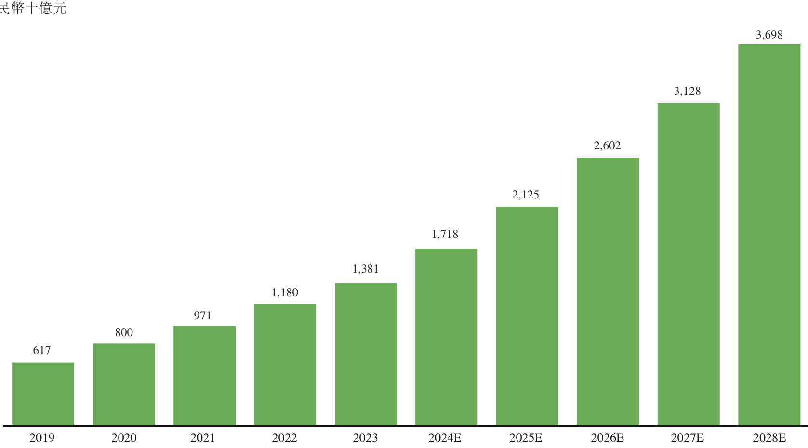

資料來源：中國音數協遊戲工委、中國遊戲產業研究院、艾瑞諮詢

附註：

1. 音視頻市場規模包括來自線上視頻廣告及付款、短視頻及直播、線上音頻、智能語音、虛擬現實、雲服務等市場的收益。

中國雲服務市場

中國雲服務市場包括與音視頻雲、AI雲、政務雲、零售及餐飲雲、工業雲、辦公自動化及大數據等有關的雲服務。2023年，中國雲服務市場達到人民幣5,137億元。2023年，音視頻雲服務市場達人民幣915億元且佔中國雲服務市場總額的17.8%。受算力需求的不斷增加及AIGC的發展，預計中國雲服務市場將繼續增長並於2028年達致人民幣12,688億元。2028年，音視頻雲服務市場預計達人民幣2,405億元且佔中國雲服務市場總額的19.0%。

---

## 第 135 页

行業概覽

中國的雲服務市場按管理的內容或數據類型可分為音視頻及非音視頻雲服務市場。音視頻雲服務是指多媒體格式的非結構化音視頻內容的製作、存儲、處理、分發、分析、審核、檢索和推薦。此類音視頻內容包括錄音、短視頻、直播視頻、音樂和圖片。非音視頻雲服務是指音視頻內容以外的內容的製作、存儲、處理、分發、分析、審核、檢索、推薦等。此類內容包括結構化數據，例如財務數據、客戶聯絡人清單以及具有標準化表格格式的其他數據，可通過企業資源規劃（「ERP」）、客戶關係管理（「CRM」）和其他類似數據庫訪問，以及與音視頻內容無關的若干非結構化數據，例如文字、電子郵件、文件、開發的應用程序和程序等。

中國雲服務市場的市場規模，2019-2028E

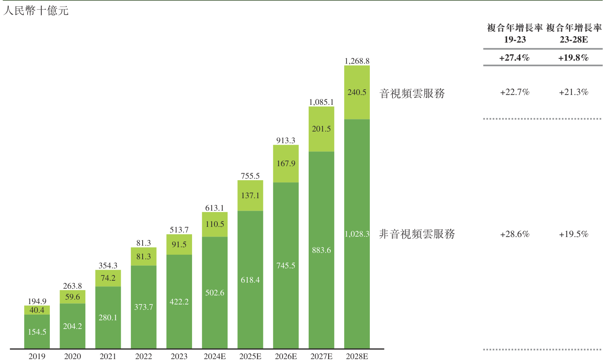

資料來源：中國信息通信研究院、艾瑞諮詢

---

## 第 136 页

中國音視頻雲服務市場

音視頻雲服務類型

音視頻雲服務乃基於雲計算技術，針對視頻與音頻製作、儲存、處理、分發、分析、審核、檢索以及推薦等特定需求而定製。

中國音視頻雲服務市場可劃分為SaaS、PaaS及IaaS市場：

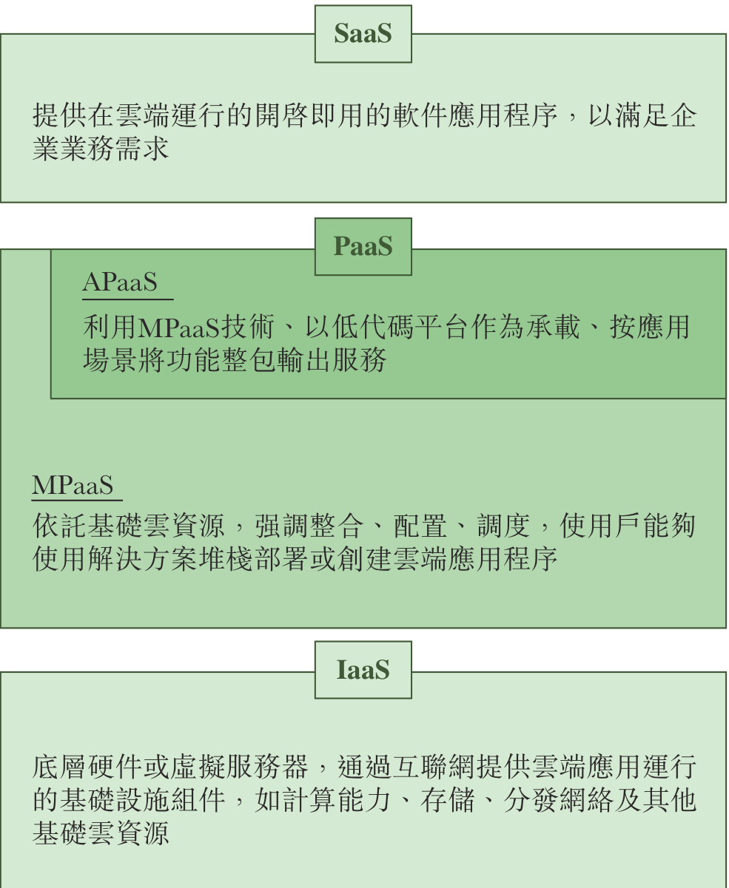

資料來源：艾瑞諮詢

按服務提供商背景，中國音視頻雲服務市場參與者可劃分為(i)非獨立音視頻雲服務提供商，其擁有聯屬公司，提供除音視頻雲服務以外的其他音視頻細分產業服務，非獨立音視頻雲服務提供商可受益於包括彼等聯屬公司在內的生態系統；及(ii)獨立音視頻雲服務提供商，通常以音視頻雲服務為其主營業務。

---

## 第 137 页

行業概覽

下圖對不同類別的雲服務(即SaaS、APaaS、MPaaS及IaaS)的特點進行比較：

<!-- table html -->
<table><tr><td>雲服務類型</td><td>產品／服務形態</td><td>接入方便性</td><td>用戶群體</td><td>應用開發效率</td><td>應用開發門檻</td><td>應用可定製化程度</td><td>維護成本</td><td>數據使用效率</td></tr><tr><td>SaaS</td><td>面向業務的軟件產品或服務</td><td>高</td><td>業務人員</td><td colspan="2">無需客戶開發</td><td>低</td><td>低</td><td>低</td></tr><tr><td rowspan="2">APaaS</td><td>零代碼平台</td><td rowspan="2">高</td><td>業務人員</td><td>高</td><td>低</td><td>較高</td><td>低</td><td rowspan="2">高</td></tr><tr><td>低代碼平台</td><td>入門級開發人員</td><td>中</td><td>中</td><td>較高</td><td>中</td></tr><tr><td>MPaaS</td><td>專業代碼平台</td><td>低</td><td>專業開發人員</td><td>低</td><td>高</td><td>高</td><td>高</td></tr><tr><td>IaaS</td><td>提供必要資源的基礎底層</td><td>低</td><td>專業開發人員</td><td colspan="4">因IaaS不與應用直接相關，故不適用</td><td>不適用</td></tr></table>
<!-- /table -->

資料來源：艾瑞諮詢

附註：

1. 鑑於複雜的工作流程，涉及分發音視頻雲服務、低代碼平台為且於近期將一直為業內訪問音視頻APaaS解決方案的主流技術。

2. 專業代碼平台指通過專業開發人員大量的編碼輸入，構建應用程序的一種方法。專業代碼平台具有高度的靈活性及控制能力，能夠創建高度定製化及複雜的應用程序，同時需要較長的開發週期和較高的開發成本。

中國音視頻雲服務市場的價值鏈

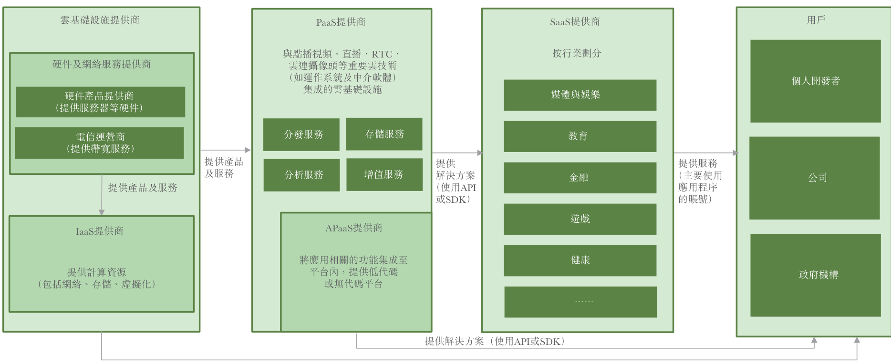

資料來源：艾瑞諮詢

---

## 第 138 页

行業概覽

音視頻雲服務市場的價值鏈相應提供雲產品及服務。雲基礎設施提供商向PaaS提供商及終端用戶提供雲產品及服務。PaaS提供商向SaaS提供商提供具有API或SDK的解決方案。同時，PaaS提供商可以使用APaaS解決方案直接服務終端用戶。SaaS提供商通常向終端用戶提供由PaaS提供商及雲基礎設施提供商提供支持的解決方案構建的特定應用程序。

中國音視頻雲服務市場規模

在網絡基礎設施升級、音視頻傳輸技術迭代等因素的驅動下，音視頻服務時延逐漸降低及在各行各業的應用發展，促使中國音視頻雲服務市場增長。2023年，中國音視頻雲服務市場規模達到人民幣915億元。根據艾瑞諮詢，中國音視頻雲服務市場將在2023年至2028年以21.3%的複合年增長率繼續增長，至2028年，市場規模將達到人民幣2,405億元。

中國音視頻雲服務市場可劃分為SaaS、PaaS及IaaS市場。IaaS是音視頻雲的底層架構及重要組件。SaaS提供標準化應用。然而，中國音視頻市場客戶差異化需求較高，導致SaaS市場發展存在瓶頸。伴隨着音視頻在各行業應用的發展，有進一步發展潛力的PaaS市場份額預計將快速提高。預計PaaS於音視頻雲服務市場的市場份額將從2023年的24.9%提升至2028年32.3%。隨著音視頻APaaS應用低代碼解決方案滿足市場的不同需求，預計APaaS將出現顯著增長。

中國音視頻雲服務市場規模$^{1}$，2019-2028E

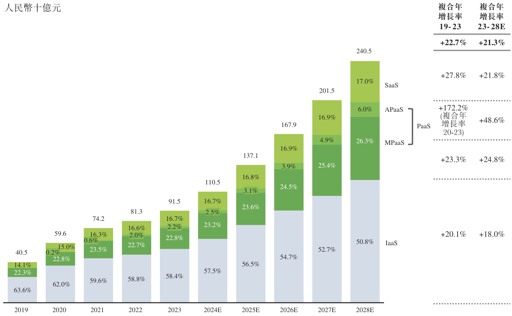

資料來源：專家訪談、艾瑞諮詢

---

## 第 139 页

行業概覽

附註：

1. 市場規模以音視頻雲服務商總收入口徑計算。

2. 圖中總數與所列數字的總和之間如有任何差異，乃由約整造成。

中國音視頻PaaS市場的市場規模$^{1}$，2019-2028E

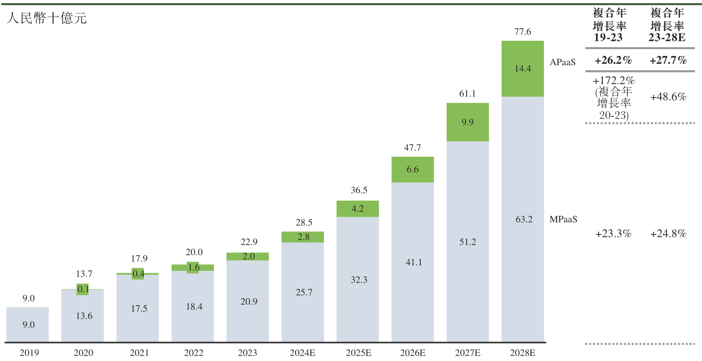

資料來源：專家訪談、艾瑞諮詢

附註：

1. 市場規模以音視頻PaaS提供商總收入口徑計算。

2. 圖中總數與所列數字的總和之間如有任何差異，乃由約整造成。

音視頻PaaS可通過公私有雲傳送。憑藉公有PaaS，客戶共享PaaS提供商通過互聯網提供、管理及交付的數據庫、服務器及存儲系統等基礎設施。客戶通常根據使用情況及使用期限支付服務費。公有PaaS對客戶而言成本較低，是由於其需要的維護成本較少且更具可擴展性。2023年，公有音視頻PaaS的市場規模達到人民幣164億元，佔整體音視頻PaaS市場的71.6%。

---

## 第 140 页

行業概覽

私有PaaS於客戶的私有雲中運行，PaaS提供商幫助在客戶的基礎設施上建立雲環境，按項目收費。基礎設施可根據客戶的偏好及規則進行定製。例如，客戶可能偏好將數據存儲在本地服務器上並在防火牆內訪問數據。私有PaaS於符合安全規定方面具有優勢。2023年，私有音視頻PaaS的市場規模達到人民幣65億元，佔整體音視頻PaaS市場的28.4%。

中國音視頻PaaS服務市場的市場規模，2019-2028E

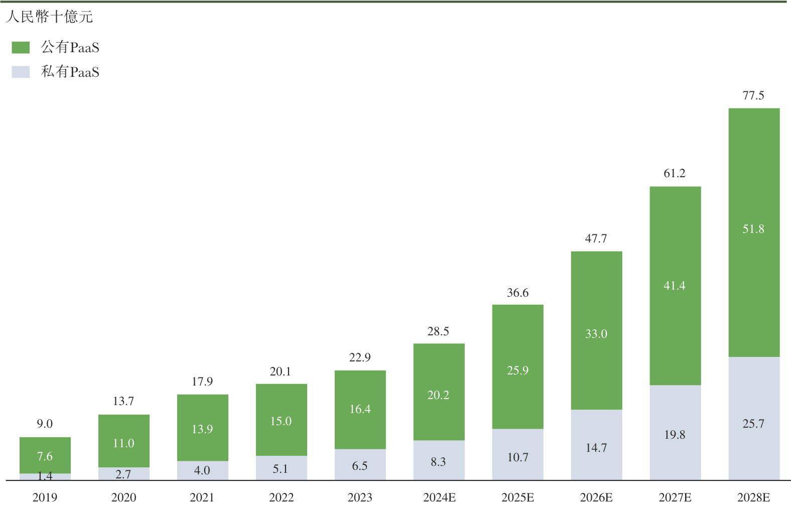

資料來源：專家訪談、艾瑞諮詢

中國音視頻PaaS市場的服務費及成本分析

於公有雲上提供的CDN、對象存儲、互動直播及媒體分析的行業服務費範圍載列如下：

CDN服務通常按使用量計費，並且通常分階段累計收費。根據實際數據使用情況，就流量而言，CDN服務的行業公佈價格範圍約為每GB人民幣0.1元至人民幣0.25元。實際上，由於計費方式不同及CDN服務商提供的折扣不同，收費差異非常明顯。往績記錄期間CDN服務商一直穩定降低其價格以獲取市場份額。

對象存儲服務按使用量收費。根據不同的收費項目，2023年，對象存儲服務的價格標準介乎每月人民幣0.02元/GB至每月人民幣0.15元/GB。由於對象存儲服務更好地支持存儲非結構性數據(例如圖形、音訊及視頻)，於往績記錄期間，對象存儲服務費略增。

• 互動直播服務按使用量收費，其價格可能因分辨率比例、等待速率、所使用的分鐘數等而有很大差異。

---

## 第 141 页

行業概覽

• 媒體分析服務根據使用情況或API調用次數收費，其價格或會視乎選擇特定媒體分析功能而有很大差異。

於公有雲上提供的APaaS的服務費按行業內的使用情況或API調用情況收費。APaaS解決方案的定價亦視乎應用場景、選擇的功能模式及其他因素而有很大差異。

於私有雲上提供的MPaaS及APaaS的服務費於該行業按項目收費，其視乎客戶規模、服務範圍、定製化需求及其他因素而有很大差異。

提供MPaaS及APaaS解決方案所涉及的相關成本主要包括：

從網絡運營商及雲提供商購買網絡及帶寬。往績記錄期間，由於中國採取措施降低企業寬帶和專線接入服務的平均費率，網絡及電信資源成本穩步減少。

服務器及存儲成本。疫情爆發初期，服務器價格出現上漲。價格上漲與晶片組持續短缺、COVID-19限制繼續擾亂供應鏈以及線上活動需求增加有關。隨著供應鏈中斷的緩解，平均價格隨後有所下降並恢復到相對穩定的水平。

中國音視頻PaaS市場驅動因素

對社交娛樂、視頻會議等場景的需求不斷多元化

近年來，人們傾向於在互聯網上進行媒體和娛樂內容消費。此外，短視頻及直播等新穎娛樂形式逐漸成為人們日常生活中不可或缺的一部分。隨著企業全球化和COVID-19疫情推動遠程辦公的興起，更多的企業通過視頻會議和遠程協作工具進行溝通和協作。為支持社交娛樂、視頻會議等場景，可靠的音視頻雲服務至關重要。音視頻PaaS提供(其中包括)高效、穩定且支持開發的視頻處理、存儲服務和分發服務，這對於滿足日益增長的音視頻內容需求至關重要。

客戶對可拓展、可定製、低成本及高效率的音視頻雲服務的需求日益增長

隨著互聯網的普及和移動設備的不斷普及，用戶對優質音視頻服務的要求亦日漸提升。為滿足該等需求，音視頻業務需要靈活、高效且具有拓展性的音視頻雲服務，以快速應對業務發展變化和用戶需求更迭。音視頻PaaS提供了基於整包功能的開放式平台和API接口，客戶可以開發定製解決方案，此舉有助降低開發成本及提升效率。

---

## 第 142 页

雲計算、AI、5G技術等先進技術的持續發展

雲計算技術的持續發展可以提供可擴展的計算和存儲資源以支持音視頻雲服務的大規模發展並推動了音視頻PaaS的市場需求增長。雲計算技術為音視頻PaaS服務提供彈性可擴展性、高度可用性和靈活性，實現海量音視頻內容的高效存儲、處理和傳輸。AI技術可以從音頻智能處理、視頻智能分析、音視頻智能推薦、人機交互、語音識別、AIGC等不同角度智能化音視頻雲服務。AI及AIGC技術可廣泛應用於音視頻內容的自動化編輯、提高圖像和音頻品質、根據提示生成原創音視頻內容等。5G網絡技術賦能下，音視頻內容的實時傳輸和雲端處理將變得更加流暢和高效。此外，5G網絡技術可以實現更快、更可靠的音視頻內容傳輸，使高清視頻、低延時直播等音視頻內容的普及成為可能。VR/AR技術增加了虛擬實境或增強現實設備中直播、視頻聊天等視頻內容的消費，從而增加了音視頻PaaS服務的使用。先進技術的發展以及在音視頻雲服務中的運用都極大促進了市場對音視頻雲服務的需求增長。

中國音視頻PaaS市場進入壁壘

技術壁壘

音視頻PaaS需要具備覆蓋多媒體、網絡通信、雲計算等多領域的技術實力，以實現高可靠性、高可擴展性、低延時和高清晰度。為提供高品質的音視頻PaaS，有效滿足客戶的業務需求，PaaS提供商需具備扎實的技術能力。

基礎資源壁壘

音視頻PaaS的提供需要大規模的網絡設備和服務器資源以提供數據分發和存儲能力。音視頻PaaS亦需要大量的帶寬資源以確保音視頻數據能夠快速、穩定地傳輸。基礎資源的穩定性對於音視頻雲服務的提供至關重要。因此，PaaS提供商需要保持基礎資源的穩定可靠質量，並加強對基礎資源的管理和優化，以提高資源的利用率與降低運營成本。

品牌壁壘

音視頻PaaS提供商的聲譽主要建立於其服務質量與客戶滿意度。客戶選擇音視頻PaaS提供商時通常考慮音視頻編解碼、音視頻傳輸、直播、點播、RTC等服務的服務覆蓋充足度、服務質量與售後支持。因此，具備良好口碑和悠久服務記錄的提供商更容易吸引客戶。

---

## 第 143 页

中國音視頻PaaS市場發展趨勢

音視頻雲服務中PaaS日趨熱門，成為雲服務提供商的新增長動力

音視頻雲服務已呈現「需求與解決方案的差距逐漸縮小」的趨勢。相比從IaaS到PaaS到SaaS再最終到客戶的原始服務流程，客戶更傾向於直接購買一套能夠同時滿足基礎資源配置需求、可定製性和較高可用性的解決方案。PaaS作為SaaS及IaaS的中間層，最易兼具這種通用能力和應用能力。通過不斷增強對客戶的理解，PaaS提供商將推出更多解決方案，為雲服務帶來新的增長。

更多音視頻雲服務提供商致力於提供APaaS

伴隨着APaaS的易部署及可擴展性優勢，行業內服務提供商對低代碼解決方案的關注度不斷提升，2021年以來，已有多家服務提供商開始推出低代碼解決方案形式的APaaS，更有服務提供商開始致力成為APaaS提供商。目前，服務提供商主要通過打包包含基礎UI和功能的SDK推出APaaS。APaaS的出現彌補了其他服務模型的缺陷，例如對客戶開發能力要求較高的MPaaS以及定製化程度較弱的SaaS。APaaS讓客戶可在掌握開發主動權的同時，降低開發成本和縮短開發週期。

雲技術與AI、AIGC、VR/AR的創新結合將加速PaaS在更多場景中的使用

隨着AI、AIGC、VR/AR等新興技術逐漸被使用，音視頻作為重要媒介，必將助力新興技術雲落地，包括：

雲渲染：雲渲染技術將渲染工作搬到雲端，滿足複雜計算和實時渲染的要求，應對元宇宙應用的瓶頸；

數字人：數字人技術將人物形象具象呈現，通常結合渲染、語音生成、動畫生成、音視頻合成顯示及交互。

未來，音視頻雲技術與新興技術結合有望會在更多行業滲透，包括影視、互聯網傳媒、遊戲、金融、文旅、醫療及製造。

---

## 第 144 页

中國音視頻PaaS市場挑戰

交互式革命受到硬件和網絡限制

音視頻是元宇宙和Web 3.0變革中的重要媒介。元宇宙和Web 3.0最終實現交互均需要硬件來實現全息圖像和視覺效果。硬件或硬件相關的技術突破將會對音視頻雲服務在交互式革命中的實際應用產生影響。此外，交互式革命需要高速網絡來傳輸大量數據及確保數據安全，這對網絡傳輸技術提出一定要求。

PaaS市場競爭日趨激烈

發展前景不僅為市場參與者提供機遇，亦帶來潛在的激烈競爭。鑑於PaaS市場份額預計會快速增長，IaaS及SaaS提供商已開始參與到PaaS市場競爭，非獨立音視頻雲服務提供商與獨立音視頻雲服務提供商之間的競爭日益激烈。市場參與者的湧入亦會帶來新的挑戰。展望未來，在日趨激烈的競爭環境下，市場參與者的技術能力、業務開發能力及場景認知將會成為其核心競爭力並形成進入壁壘。

IaaS提供商已進入音視頻PaaS市場並與現有PaaS服務提供商競爭，但IaaS提供商可能缺乏必要的技術專長及場景知識，而該等知識為成立已久的PaaS提供商的主要競爭優勢。詳情請參閱本節「—中國音視頻PaaS市場的進入壁壘」一段。

與IaaS市場鋪設基本的基礎設施且適用於全場景不同，PaaS市場更加分散，以場景需求為主，如工業、運營、政府、零售及音視頻服務需求。IaaS提供商難以高品質地迎合所有需求。此外，IaaS提供商於探索細分商業機會的容量及能力有限，而PaaS提供商有更多渠道接觸更多終端客戶。

市場參與者可能會降低價格以試圖取得競爭優勢。然而，價格未必是PaaS客戶的唯一考慮因素，原因為彼等亦會考慮多種因素，例如整體數據的安全性和可靠性，以及彼等可以獲得的增值服務。

---

## 第 145 页

中國音視頻APaaS市場概覽

音視頻APaaS發展歷程

2019年以來，隨着APaaS市場普及的初步完成，音視頻APaaS開始進佔市場。2019年至2020年，中國音視頻APaaS產品進入試水階段，產品雛形出現。中國音視頻雲服務提供商開始推出音視頻APaaS產品，但大多數產品以測試版或免費試用版在通用服務包中提供，因此多數提供商未明確指出該等產品為APaaS。2021年音視頻APaaS開始大規模商業化。2022年以來，市場對音視頻APaaS的需求進入爆發階段。預計APaaS的易接入與可拓展功能將在未來時代至關重要。2023年以來，音視頻APaaS行業已經開始探索使用AIGC。服務提供商已經開始將AIGC技術融入其音視頻APaaS產品，以增強其產品功能和效率。將AIGC技術融入音視頻APaaS產品有望將賦能創意構思、內容創新和智能內容生成。

就需求而言，客戶需要更為輕量化及一體化的音視頻雲服務。音視頻APaaS結合多種功能以滿足此需求。此外，企業客戶需要更易用、可快速部署及可即時擴展的低代碼解決方案，而音視頻APaaS亦可滿足該需求。近期，低代碼解決方案仍將是行業的主流技術。

從對服務提供商的價值而言，音視頻APaaS提供商可在將客戶需求轉換為解決方案後，使用可滲透至新場景並可快速複製的商業模式。此外，音視頻PaaS提供商可利用彼等自身的PaaS能力及資源，拓展APaaS業務。因此，相比其他提供商，PaaS提供商更容易開發APaaS。

中國音視頻APaaS市場規模、增長潛力及滲透率

2023年，中國音視頻APaaS市場規模已達到人民幣20億元，在音視頻雲服務PaaS及SaaS市場中的滲透率為5.2%。根據艾瑞諮詢，到2028年，音視頻APaaS市場規模預期將達到人民幣144億元，滲透率達到12.1%，從2023年至2028年的複合年增長率為48.6%。PaaS與SaaS常有交集，且APaaS與SaaS可相互替代。隨著APaaS應用低代碼解決方案滿足市場的不同需求，預計APaaS將逐漸佔領MPaaS及SaaS的部分市場份額，並滲透至音視頻PaaS市場及音視頻SaaS市場。

---

## 第 146 页

行業概覽

中國音視頻APaaS市場的市場規模$^{1}$，2020$^{2}$-2028E

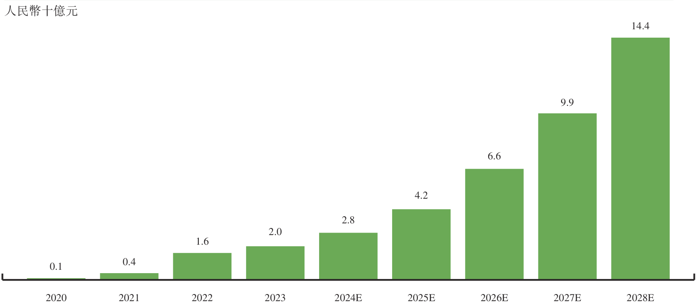

資料來源：專家訪談、艾瑞諮詢

附註：

1. 市場規模以音視頻APaaS提供商總收入口徑計算。

2. APaaS解決方案於2020年首次在行業內商業化，因此APaaS市場規模數據於2020年首次可用。

3. 圖中總數與所列數字的總和之間如有任何差異，乃由約整造成。

音視頻PaaS市場可分為音視頻MPaaS市場與音視頻APaaS市場。音視頻APaaS市場作為PaaS市場下的細分產業，擁有與音視頻PaaS市場相似的若干市場驅動因素、進入壁壘與發展趨勢。此外，音視頻APaaS市場於音視頻PaaS市場中脫穎而出，具有以下獨特的驅動因素、進入壁壘及發展趨勢。

中國音視頻APaaS市場驅動因素

場景的不斷滲透

社交娛樂場景中，虛擬現實應用很可能將帶來音視頻雲服務的增長，而APaaS可快速上線應用的能力賦予其快速拓展的可能。另外，APaaS應用逐漸結合以重塑現有業務。音視頻雲服務可引入直播帶貨、自動駕駛視覺感知、製造業遠程維護及其他應用。

---

## 第 147 页

功能的完善

除音視頻傳輸、製作、處理等基礎服務外，已在客戶業務層面開發出更多基於場景的增值服務，例如企業直播中的流量管理及新媒體中的AI剪輯。該等新服務為APaaS添加更多實用功能，亦向客戶提供價值服務。與PaaS不同，APaaS能夠通過較高溢價服務獲得更多元化的收入來源。另外，結合有關點播、直播及RTC的多項技術，可進一步提升APaaS產品盈利能力。

中國音視頻APaaS市場的進入壁壘

技術壁壘

除音視頻技術的研發過程複雜外，自研音視頻APaaS解決方案的開發壁壘更高，且具有以平台為基礎、特定場景及可商業化的特徵。因此，缺乏技術研發與迭代能力的音視頻APaaS提供商很可能會面臨失去競爭力的風險。

近年來，音視頻IaaS、PaaS及和SaaS服務提供商已開始擴大其產品範圍至音視頻APaaS。相比音視頻IaaS及SaaS提供商，音視頻PaaS提供商可利用其現有的PaaS能力和資源，具備技術優勢。拓展至APaaS業務需要服務提供商重新進行平台搭建和開發場景化解決方案，存在技術門檻和開發週期。

場景知識壁壘

音視頻APaaS使用低代碼平台將不同功能與場景特定知識結合。因此，服務提供商只有深入了解客戶業務流程，方可交付直接滿足客戶需求的場景化解決方案。新進入者無法在短時間內積累多個音視頻場景的深入理解。

客戶資源壁壘

音視頻APaaS提供商可通過積累為不同客戶提供服務的經驗，提升音視頻技術能力、場景了解與客戶服務能力。由於音視頻APaaS解決方案可快速複製至不同客戶，經過客戶驗證的高質量音視頻APaaS解決方案更有可能獲得採購訂單與建立客戶忠誠度。新進入者缺乏足夠的客戶服務經驗與具有競爭力的產品，故難以獲取客戶訂單。

---

## 第 148 页

產品能力矩陣壁壘

音視頻APaaS是一個提供多種音視頻服務組件的綜合服務包。音視頻APaaS提供商不僅需要一套成熟的音視頻通用功能，如點播、直播及RTC，亦需要積累各種的場景化插件，如聊天彈幕、濾鏡、內容審核等。因此，具有豐富的產品能力的音視頻APaaS提供商將更能滿足客戶日益增長的需求，佔據市場有利的競爭地位。

中國音視頻APaaS市場的發展趨勢

融合APaaS產品將擴展至更多場景並為客戶業務增加實際價值

可快速上線、可定製化的音視頻APaaS產品將更好地融入客戶業務場景及產生實際價值。比如，在製造中使用遠程維護替代現場維護，可顯著降低營運成本。金融公司亦可使用音視頻雲技術進行理賠。

技術朝著高分辨率、低延時、較強沉浸感及交互性方向發展

通過提高分辨率、幀率及色域，視頻將更接近現實。通過降低延時，視頻呈現與拍攝的時間間隔將不斷縮小。相關技術還可應用在對音視頻延時要求高的自動駕駛中。另外，元宇宙及Web 3.0將要求音視頻技術創造面向未來的感知體驗。

AIGC技術有望推動音視頻APaaS行業變革

「AIGC+音視頻APaaS」未來有望成為音視頻APaaS的新形態，用戶通過簡單的輸入即可自動生成內容及組裝一個完整音視頻應用。相比現有的音視頻APaaS產品，「AIGC+音視頻APaaS」具備若干優勢，包括更高效率、更方便及更易操作。AI生成的代碼(AIGC的子領域)有潛力通過使用人工智能來提升效率和代碼質量。

音視頻APaaS提供商之間的合作加深

音視頻APaaS市場未來預計將以服務提供商之間的合作增加為特徵。由於APaaS創造更多場景，單一服務提供商越來越難以覆蓋所有場景，音視頻APaaS提供商可相互合作以實現效率。個別服務提供商可通過在特定場景下提供底層資源、技術或行業知識，以從融合輸出中受益。服務提供商亦可從參與的第三方開發者中受益，豐富彼等音視頻雲服務的功能與能力。在此過程中，領先的服務提供商可受益於已建立的具有廣泛場景覆蓋的開放平台。

---

## 第 149 页

中國的CDN、對象存儲服務及硬件市場

CDN、對象存儲服務及硬件是音視頻PaaS市場的主要細分領域。根據艾瑞諮詢，2023年，中國音視頻PaaS市場的CDN服務規模達到人民幣97億元。到2028年，市場規模預期將達到人民幣238億元，從2023年至2028年的複合年增長率為19.8%。根據艾瑞諮詢，2023年，中國音視頻PaaS市場的存儲服務市場規模達到人民幣58億元，且到2028年市場規模預期將達到人民幣200億元，從2023年至2028年的複合年增長率為28.2%。根據艾瑞諮詢，2023年，中國音視頻PaaS市場的服務器硬件市場規模達到人民幣32億元。到2028年，市場規模預期將達到人民幣93億元，從2023年至2028年的複合年增長率為24.0%。下表載列中國的CDN、對象存儲服務及硬件市場的市價及成本趨勢。

市價

CDN

CDN服務通常按使用量計費，並且通常分階段累計收費。實際上，由於計費方式不同及CDN服務商提供的折扣不同，收費差異非常明顯。因此，我們列出發佈價格以供參考。按每月峰值帶寬計，CDN服務的行業平均價格約為每月人民幣7元／Mbps至每月人民幣8元／Mbps。2014年至2021年，CDN服務商一直穩定降低其價格以獲取市場份額。展望未來，CDN的價格預期將隨著成本下降而穩步下降。CDN價格由2021年至2022年下降16%，2022年到2023年CDN價格降幅有所放緩，下降約5%。

成本

CDN涉及的相關成本主要包括網絡及帶寬成本。

從網絡運營商及雲提供商購買網絡及帶寬。往續記錄期間，網絡及電信資源穩步減少。難以跟踪不同運營商的網絡及帶寬的價格趨勢，因為為不同的使用水平及促銷活動提供的折扣不穩定。反之，根據艾瑞諮詢進行的專家訪談結果，於往續記錄期間，網絡及帶寬價格出現了個位數的下降。由於電信運營商競爭加劇及中國政府採取措施降低企業寬帶和專線接入服務的平均資費，預計網絡和帶寬價格將繼續下降。

---

## 第 150 页

行業概覽

市價

對象存儲服務（「對象存儲服務」）

對象存儲服務按使用量收費，2023年，介乎每月人民幣0.02元／GB至每月人民幣0.15元／GB。由於對象存儲服務更好地支持存儲非結構性數據(例如圖形、音頻及視頻)，於往績記錄期間，對象存儲服務費略增。

成本

對象存儲服務涉及的相關成本主要包括服務器及存儲成本。

• 服務器及存儲成本。根據IDC及Counterpoint Research，2021年至2023年，全球服務器平均價格從每台8,048.7美元上漲至每台10,427.1美元，同期複合年增長率為13.8%。疫情爆發初期，服務器價格出現上漲。價格上漲與晶片組持續短缺、COVID-19限制繼續擾亂供應鏈以及線上活動需求增加有關。平均價格於2023年再次上漲之前已逐漸下降，是由於受供應商減產及消費者市場需求復蘇的影響。預計此受供需動態及技術進步影響的波動趨勢未來仍將持續。

根據Statista，於往績記錄期間，全球存儲裝置價格相對穩定，從2021年的每台13.5美元略升至2023年的每台14.1美元，複合年增長率為2.2%，預計將繼續該穩定趨勢。

---

## 第 151 页

行業概覽

市價

服務器硬件

服務器的價格可能會根據處理器速度、記憶體容量、存儲大小及提供的軟件功能等相差徑庭。

成本

根據IDC及Counterpoint Research，2021年至2023年，全球服務器平均價格從每台8,048.7美元上漲至每台10,427.1美元，同期複合年增長率為13.8%。服務器涉及的相關成本主要包括硬盤等部件。由於疫情初期供應鏈短缺以及隨後消費市場需求放緩，主要存儲硬件零部件價格呈現先升後降的走勢。近期，受供應商減產及消費市場需求回暖的影響，價格再度上漲。預計受供需動態及技術進步影響的波動趨勢未來仍將持續。

競爭格局

2023年，按中國音視頻PaaS市場的收入計，前五名服務提供商貢獻合共39.2%的市場份額，其中我們以人民幣13.3億元的收入排名第三，佔5.8%的市場份額。下表載列2023年按收入計中國音視頻PaaS市場的前五名服務提供商。

---

## 第 152 页

2023年中國音視頻PaaS市場排名

<!-- table html -->
<table><tr><td>序號</td><td>公司</td><td>是否為獨立音視頻雲服務提供商</td><td>可比收入¹人民幣十億元</td><td>市場份額%</td></tr><tr><td>1</td><td>競爭對手A²</td><td>x</td><td>3.89</td><td>17.0</td></tr><tr><td>2</td><td>競爭對手B³</td><td>x</td><td>1.47</td><td>6.4</td></tr><tr><td>3</td><td>本集團</td><td>√</td><td>1.33</td><td>5.8</td></tr><tr><td>4</td><td>競爭對手C⁴</td><td>x</td><td>1.31</td><td>5.7</td></tr><tr><td>5</td><td>競爭對手D⁵</td><td>√</td><td>0.99</td><td>4.3</td></tr><tr><td colspan="4">前五大服務提供商</td><td>8.99</td><td>39.2</td></tr><tr><td colspan="4">總市場規模</td><td>22.9</td><td>100.0</td></tr></table>
<!-- /table -->

資料來源：艾瑞諮詢

附註：

1. 可比收入乃基於公司的音視頻PaaS業務收入。

2. 競爭對手A，成立於2009年，為一家提供雲計算及人工智能服務的公司。該公司是一家於2014年在紐約證券交易所上市並於2019年在香港聯交所二次上市的公司的子公司。

3. 競爭對手B，成立於2010年，為一家提供全球化雲產品及服務的中國科技公司。該公司是一家於2004年在聯交所上市的公司的附屬公司。

4. 競爭對手C，成立於2012年，為一家專注於雲計算、大數據及人工智能服務的公司。該公司是一家於2005年在納斯達克全球精選市場上市並於2021年在聯交所二次上市的公司的附屬公司。

5. 競爭對手D，成立於2014年，為一家提供實時語音及視頻參與服務的公司。該公司於2020年在納斯達克全球精選市場上市。

6. 表中總數與所列數字的總和之間如有任何差異，乃由約整造成。

2023年，按中國音視頻APaaS市場收入計，前五名服務提供商貢獻合共48.1%的市場份額，其中我們以人民幣2.8億元的APaaS收入排名第二，佔14.1%的市場份額。下表載列2023年按收入計中國音視頻APaaS市場的前五名服務提供商。

---

## 第 153 页

2023年中國音視頻APaaS市場排名

<!-- table html -->
<table><tr><td>序號</td><td>公司</td><td>是否為獨立音視頻雲服務提供商</td><td>可比收入¹人民幣十億元</td><td>市場份額%</td></tr><tr><td>1</td><td>競爭對手B</td><td>x</td><td>0.33</td><td>16.6</td></tr><tr><td>2</td><td>本集團</td><td>√</td><td>0.28</td><td>14.1</td></tr><tr><td>3</td><td>競爭對手A</td><td>x</td><td>0.19</td><td>9.5</td></tr><tr><td>4</td><td>競爭對手C</td><td>x</td><td>0.10</td><td>4.9</td></tr><tr><td>5</td><td>競爭對手E²</td><td>√</td><td>0.06</td><td>3.0</td></tr><tr><td colspan="3">前五大服務提供商</td><td>0.96</td><td>48.1</td></tr><tr><td colspan="3">總市場規模</td><td>2.0</td><td>100.0</td></tr></table>
<!-- /table -->

資料來源：艾瑞諮詢

附註：

1. 可比收入以公司音視頻APaaS業務所得收入或基於音視頻PaaS收入所佔預計百分比的相關收入計算。僅包括商業化音視頻APaaS產品所得收入。

2. 競爭對手E，成立於2010年，於中國提供企業級直播雲平台。競爭對手E為私營公司，及根據公開資料，其於2018年完成D輪融資人民幣230百萬元。

3. 表中總數與所列數字的總和之間如有任何差異，乃由約整造成。

---

## 第 154 页

有關我們於中國的業務及營運的法律及法規概覽

本節概述了影響我們於中國的業務活動或股東從我們收取股息或其他分配的權利的最重要的規則及法規。

有關外商投資的法規

中國公司的成立、經營和管理主要受最近於2023年修訂並於2024年7月1日開始生效的《中華人民共和國公司法》的規管，本法規同時適用於中國境內內資公司和外商投資公司。外國投資者在中國的投資活動亦受自2020年1月1日起施行的2019年外商投資法、連同國務院於2019年12月26日頒佈的《中華人民共和國外商投資法實施條例》及最高人民法院於2019年12月26日頒佈的《最高人民法院關於適用<中華人民共和國外商投資法>若干問題的解釋》的規管。《中華人民共和國外商投資法》及其實施條例取代了前三部有效的外商投資法及相關實施條例，即《中華人民共和國中外合資經營企業法》、《中華人民共和國中外合作經營企業法》和《中華人民共和國外資企業法》。

根據2019年外商投資法，「外商投資」是指外國投資者（包括外國的個人、企業或者其他外國組織）直接或者間接進行的投資活動，包括下列情形：(i)外國投資者單獨或者與其他投資者共同設立外商投資企業、(ii)外國投資者取得企業的股份、股權、財產份額或者其他類似權益、(iii)外國投資者單獨或者與其他投資者共同投資新建項目，及(iv)法律或行政法規或者國務院規定的其他情形。《中華人民共和國外商投資法實施條例》引入了「穿透」原則，並進一步規定外商投資企業在中國境內的投資亦適用《中華人民共和國外商投資法》及其實施條例。

---

## 第 155 页

2019年外商投資法及其實施條例規定對外商投資實行准入前國民待遇加負面清單管理制度，據此，「准入前國民待遇」指在投資准入階段給予外國投資者及其投資不低於本國投資者及其投資的待遇，惟「限制」或「禁止」類投資行業的外商投資除外，「負面清單」指國家規定在上述「限制」或「禁止」類投資行業對外商投資實施的外商投資准入特別管理措施。負面清單之外的外商投資享有國民待遇。外國投資者不得投資負面清單禁止的領域，在負面清單限制的領域，外國投資者應遵守股權要求、高管要求等特殊規定。同時，有關機構根據國民經濟和社會發展需要，制定鼓勵外商投資產業目錄，列明鼓勵和引導外國投資者投資的特定行業、領域及地區。

目前，管轄外國投資者在中國的投資活動的行業准入許可要求載於兩個目錄，即發改委和商務部於2021年12月27日頒佈的《外商投資准入特別管理措施(負面清單)(2021年版)》(「負面清單」)，於2022年1月1日生效，及發改委和商務部於2022年10月26日頒佈的《鼓勵外商投資產業目錄(2022年版)》(「目錄」，連同負面清單統稱「相關中國法規」)，於2023年1月1日生效。除非中國法律另有明確限制，否則兩個目錄中未列出的行業通常被視為外國投資的「允許」行業。

根據《中華人民共和國外商投資法實施條例》，外商投資企業的登記註冊由國家市場監督管理總局或者其授權的地方機構辦理。外國投資者在依法需要取得許可的行業、領域進行投資的，除法律、行政法規另有規定外，負責實施許可的有關主管部門應當按照與國內投資一致的條件和程序，審核外國投資者的許可申請，不得在許可條件、申請材料、審核環節、審核時限等方面對外國投資者設置歧視性要求。然而，對外國投資者擬投資負面清單內領域，但不符合負面清單規定的，有關主管部門不予辦理許可、企業登記註冊。外國投資者投資負面清單禁止投資的領域的，由有關主管部門責令外國投資者停止投資活動，限期處分股份、資產或者採取其他必要措施，恢復到實施投資前的狀態；有違法所得的，沒收違法所得。

根據2019年外商投資法及其實施條例和商務部及國家市場監督管理總局聯合頒佈並於2020年1月1日生效的《外商投資信息報告辦法》，需建立外商投資信息報告系統，外國投資者或者外商投資企業應當通過企業登記系統以及國家企業信用信息公示系統向商務主管部門報送投資信息，市場監管部門應當及時將上述投資信息推送至商務主管部門。

---

## 第 156 页

監管概覽

此外，商務部應當建立外商投資信息報告系統，及時接收、處理市場監管部門推送的投資信息以及部門共享信息等。外國投資者或者外商投資企業應當通過提交初始報告、變更報告、註銷報告、年度報告等方式報送投資信息。此外，本法規定，本法施行前依照之前的監管法律設立的外商投資企業，在本法施行後五年內可以繼續保留原企業組織形式等。

此外，2019年外商投資法及其實施條例亦規定了外國投資者及其在中國投資的其他保護性規則和原則，其中包括地方政府應當履行對外國投資者、徵收或者徵用外國投資者的投資的承諾，惟在特殊情況下除外，然而，在特殊情況下，徵收、徵用應當依照法定程序進行，並及時給予公平、合理的補償，且禁止強制轉讓技術。

對影響或者可能影響國家安全的外商投資，根據發改委於2020年12月19日頒佈並於2021年1月18日實行的《外商投資安全審查辦法》進行安全審查。根據本辦法，應建立外商投資安全審查工作機制辦公室或工作機制辦公室，承擔外商投資安全審查的日常工作。此外，於軍工行業及配套等關係國防安全的領域的外商投資，或在軍事設施和軍工設施週邊地域投資的外商投資可能導致於重要農產品、重要能源和資源、重大裝備製造、重要基礎設施、重要運輸服務、重要文化產品與服務、重要信息技術和互聯網產品與服務、重要金融服務及關鍵技術等若干重要領域取得企業的實際控制權的外商投資。上述外商投資的外國投資者或者境內相關當事人應當在實施投資前主動向工作機制辦公室申報，工作機制辦公室作出是否需要進行安全審查決定前，當事人不得實施投資。違反規定者，可責令限期申報，處分股權或者資產以及採取其他必要措施，恢復到投資實施前的狀態，消除對國家安全的影響。

與增值電信業務有關的法規

與增值電信業務有關的法規

國務院於2000年9月25日頒佈並於2016年2月最新修訂的《中華人民共和國電信條例》(「《電信條例》」)為電信業務的主要法規。根據《電信條例》，電信業務提供商於開始經營前必須取得工業和信息化部或者省級部門頒發的電信業務經營許可證，否則，業務提供商由監管部門責令改正，處以罰款，並處沒收違法所得。情節嚴重的，可責令關閉其網站。

---

## 第 157 页

根據《電信條例》，中國的所有電信業務分類為基礎電信業務或增值電信業務，增值電信業務指利用公共網絡基礎設施提供的電信與信息業務。工業和信息化部於2017年7月頒佈的《電信業務經營許可管理辦法》對經營增值電信業務所需的許可證種類、獲得此類許可證的所需資質和程序以及有關此類許可證的監督和管理提供了更詳細的規定。

工業和信息化部發佈了一個目錄，作為《電信條例》或《電信業務分類目錄》的附件，於2019年6月最新修訂。根據《電信業務分類目錄》，第一類增值電信業務包括「互聯網數據中心服務」（包括互聯網資源協作服務（「IDC服務」）、「內容分發網絡服務」（「CDN服務」）、「國內互聯網虛擬專用網服務」（「IP-VPN服務」）及「互聯網接入服務」（「ISP服務」）。

此外，於2012年，工業和信息化部頒佈《工業和信息化部關於進一步規範因特網數據中心業務和因特網接入服務業務市場准入工作的通告》（「《第552號通告》」），進一步明確對經營互聯網數據中心及互聯網服務經營者的資金、人員、場地及設施的要求。

2017年1月17日，工業和信息化部進一步發佈《工業和信息化部關於清理規範互聯網網絡接入服務市場的通知》（「《通知》」），當中強調了《第552號通告》所載的要求，禁止無證經營互聯網數據中心服務、ISP服務及CDN服務市場、超地域範圍經營、超業務範圍經營及「層層轉租」。IDC、ISP企業不得將其從中國基礎電信運營商獲取的IP地址、帶寬等網絡接入資源轉租給其他企業，用於經營IDC服務、ISP服務或其他業務。根據《通知》，經營IDC、ISP、CDN等業務的企業應進行全面自查清理，及時糾正各類違規行為，確保經營資質合法合規，網絡設施和線路資源使用規範。各監管部門要督促違規企業及時整改，對拒不整改的企業要依法嚴肅查處；情節嚴重的，應在年檢工作中認定為年檢不合格，將其行為依法列入企業不良信用記錄，經營許可證到期時依法不予續期，並且與基礎電信運營商的合作正在不斷修改及發展。

---

## 第 158 页

有關限制外商投資增值電信業務的法規

根據於2001年11月10日生效的《中華人民共和國加入議定書》，中國承諾開放電信業務，不包括互聯網數據中心服務、CDN服務、IP-VPN服務和ISP服務。根據《內地與香港關於建立更緊密經貿關係的安排》、《內地與澳門關於建立更緊密經貿關係的安排》以及後續不時的修訂本，內地已承諾向中國香港及澳門特別行政區的服務提供商開放上述服務，惟須遵守若干限制的規定。

根據負面清單及《2022年外商投資電信企業管理規定》，按照中國加入WTO承諾開放的增值電信業務種類，外方於增值電信業務的股權比例不得超過50%，國家另有規定的除外。尤其是，《2022年外商投資電信企業管理規定》刪除了之前對經營增值電信業務的外商投資電信企業的外方主要投資者應當具有管理增值電信業務的良好業績和運營經驗的要求。

2006年7月，原工業和信息化部發佈《信息產業部關於加強外商投資經營增值電信業務管理的通知》(「《通知》」)。根據《通知》，外國投資者在中國投資電信業務，應設立外商投資企業，並申請電信業務經營許可證。《通知》進一步規定：(i)中國境內電信企業不得以任何交易形式向外國投資者變相租借、轉讓、倒賣電信業務經營許可，也不得為外國投資者非法經營電信業務提供資源、場地、設施等條件；(ii)增值電信企業或彼等的股東必須直接擁有域名並於由有關企業於日常業務中使用商標；(iii)各增值電信企業應當有經批准的業務運營所需的設施，並在其許可證允許的範圍內維護這些設施；及(iv)所有增值電信業務提供商必須按照中國相關法規規定的標準維護網絡和互聯網安全。許可證持有人未按照《本通知》的要求糾正相關違規行為的，工業和信息化部或者地方主管部門可全權酌情採取措施撤銷該許可證持有人的增值電信業務經營許可。

於2017年1月12日，國務院發佈《國務院關於擴大對外開放積極利用外資若干措施的通知》(「《通知》」)，旨在放寬服務業、製造業、採礦業等領域外資准入限制。尤其是，《通知》旨在推進電信、互聯網、文化、教育、交通運輸等領域向外國投資者有序開放。

---

## 第 159 页

有關網絡安全及數據安全的法規

全國人民代表大會常務委員會於2000年12月28日制定並於2009年8月27日修訂《全國人民代表大會常務委員會關於維護互聯網安全的決定》，當中規定對利用互聯網有下列行為之一，依照中國法律構成犯罪的，將追究刑事責任：(i)侵入國家事務、國防建設、尖端科學技術領域的計算機信息系統；(ii)故意製作、傳播計算機病毒等破壞性程序，攻擊計算機系統及通信網絡，致使計算機系統及通信網絡遭受損害；(iii)違反相關國家規定，擅自中斷計算機網絡或者通信服務；(iv)泄露國家秘密；(v)傳播虛假商業信息；或(vi)利用互聯網侵犯他人知識產權。

公安部、國家保密局、國家密碼管理局、國務院信息化工作辦公室於2007年6月22日發佈《信息安全等級保護管理辦法》（「《本辦法》」）。《本辦法》基於信息系統受到破壞後對公民、法人和其他組織的合法權益、社會秩序和公共利益及國家安全造成損害的程度將信息系統的安全保護分為五級等級。《本辦法》亦規定第二級或以上信息系統的運營商應當在安全保護等級確定後30日內或在信息系統投入使用後向地方主管公安機關辦理備案手續。

公安部於2005年12月13日發佈《互聯網安全保護技術措施規定》（「《互聯網安全保護措施》」），規定互聯網服務提供者和互聯網使用單位應當落實互聯網安全保護技術措施，例如防範計算機病毒、網絡入侵和攻擊破壞等危害網絡安全事項或者行為的技術措施，並要求所有提供互聯網接入服務的單位採取措施記錄並留存用戶註冊信息。根據有關措施，增值電信業務許可證持有人必須定期升級其網站的信息安全和內容監控系統，並且必須向當地公安機關報告任何公開傳播禁止內容的行為。增值電信業務許可證持有人違反上述規定的，公安部和地方公安機關可以吊銷其經營許可證，關閉其網站。

---

## 第 160 页

全國人民代表大會常務委員會於2015年7月1日發佈《中華人民共和國國家安全法》，於同日生效。《中華人民共和國國家安全法》規定，國家建設網絡與信息安全保障體系，提升網絡與信息安全保護能力，實現網絡和信息核心技術、關鍵基礎設施和重要領域信息系統及數據的安全可控。此外，中國應當建立國家安全審查和監管的制度和機制，監控影響或者可能影響國家安全的外商投資、關鍵技術、網絡信息技術產品和服務以及其他重大事項。此外，國家應當建立國家安全審查和監管的制度，對影響或者可能影響國家安全的外商投資、關鍵技術、網絡信息技術產品和服務，以及其他重大事項進行國家安全審查。

全國人民代表大會常務委員會於2016年11月7日頒佈《中華人民共和國網絡安全法》(「《網絡安全法》」)，於2017年6月1日生效。《網絡安全法》適用於在中國境內建設、運營、維護和使用網絡，以及網絡安全的監督管理。根據《網絡安全法》，「網絡」指由計算機或者其他信息終端及相關設備組成的按照一定的規則和程序對信息進行收集、存儲、傳輸、交換、處理的系統。「網絡運營者」指網絡的所有者、管理者和網絡服務提供者，需履行多項安全保護義務，包括：(i)按照網絡安全等級保護制度的要求，履行安全保護義務，制定內部安全管理制度和操作規程，確定網絡安全負責人，採取防範計算機病毒和網絡攻擊等危害網絡安全行為的技術措施及採取監測、記錄網絡運行狀態、網絡安全事件的技術措施，並採取數據分類、重要數據備份和加密等措施；(ii)應當制定網絡安全事件應急預案，及時處置安全風險；在發生危害網絡安全的事件時，立即啟動應急預案，採取相應的補救措施，並向有關主管部門報告；及(iii)應當為公安機關、國家安全機關依法維護國家安全和偵查犯罪的活動提供技術支持和協助。互聯網服務提供者違反《網絡安全法》的，可能被責令改正、警告、罰款、停業整頓、關閉網站及吊銷營業執照。

公安部於2018年9月15日發佈《公安機關互聯網安全監督檢查規定》(「《本規定》」)，於2018年11月1日實施。《本規定》規定公安機關應當對提供下列服務的互聯網運營者開展監督檢查：(i)互聯網接入、互聯網數據中心、內容分發、域名服務；(ii)互聯網信息服務；(iii)公共上網服務；及(iv)其他互聯網服務。檢查的內容應當包括相關互聯網運營者是否已履行《網絡安全法》及其他適用法律及法規的網絡安全義務，例如制定並落實網絡安全管理制度和操作規程、確定網絡安全負責人及採取記錄並留存用戶註冊信息和上網日誌信息的技術措施。

---

## 第 161 页

監管概覽

全國人民代表大會常務委員會於2021年6月10日發佈《中華人民共和國數據安全法》，於2021年9月生效。《中華人民共和國數據安全法》規定了進行數據監控活動的單位和個人的數據安全和隱私義務。《中華人民共和國數據安全法》亦根據數據在經濟社會發展中的重要程度，以及一旦遭到篡改、破壞、泄露或者非法獲取、非法利用，對國家安全、公共利益或者個人、組織合法權益造成的危害程度，對數據實行分類分級保護。各種類型的數據需要按適當的級別進行保護。例如，重要數據的處理者應當指定數據安全負責人和管理機構，對其數據處理活動定期開展風險評估，並向有關主管部門報送風險評估報告。違反《中華人民共和國數據安全法》的，可以責令停止違法行為，給予警告、罰款，或者責令停業，吊銷營業執照或者營業執照。此外，還可以對直接負責的主管人員和其他直接責任人員處以罰款。

工業和信息化部、網信辦及公安部於2021年7月12日聯合頒佈《網絡產品安全性漏洞管理規定》，並於2021年9月1日實施。網絡產品提供者、網絡運營者，以及從事網絡產品安全漏洞發現、收集、發佈等活動的組織或者個人，應當遵守《本規定》，應當建立網絡產品安全漏洞信息接收渠道並留存信息接收日誌不少於6個月。網絡產品提供者應當在2日內向工業和信息化部報送相關網絡產品安全漏洞的信息並向網絡產品用戶提供技術支持。網絡運營者發現或者獲知其網絡、信息系統及其設備存在安全漏洞後，應當採取措施，對安全漏洞進行驗證並完成修補。

國務院於2021年7月30日發佈《關鍵信息基礎設施安全保護條例》，於2021年9月1日實施。根據《關鍵信息基礎設施安全保護條例》，「關鍵信息基礎設施」指公共通信和信息服務以及其他一旦遭到破壞、喪失功能或者數據泄露，可能嚴重危害國家安全、國計民生、公共利益的重要網絡設施、信息系統等。

2021年12月28日，網信辦及其他數個中國政府部門聯合發佈《網絡安全審查辦法》，於2022年2月15日生效。根據本辦法，關鍵信息基礎設施運營者採購網絡產品和服務，網絡平台運營者開展數據處理活動，影響或者可能影響國家安全的，應當進行網絡安全審查。此外，掌握超過100萬用戶個人信息的網絡平台運營者赴國外上市，必須進行網絡安全審查。中國主管政府部門認為影響或者可能影響國家安全的網絡產品和服務以及數據處理活動，可對運營商發起網絡安全審查。

---

## 第 162 页

監管概覽

《網絡安全審查辦法》第十條亦列出網絡安全審查期間應當重點關注的幾個國家安全風險的一般因素：包括(i)關鍵信息基礎設施（「關鍵信息基礎設施」）被非法控制、遭受干擾或者破壞的風險；(ii)產品或服務中斷對關鍵信息基礎設施業務連續性的危害；(iii)產品或服務的安全性、開放性、透明性、來源的多樣性，供應渠道的可靠性以及因為政治、外交、貿易等因素導致供應中斷的風險；(iv)產品或服務提供者遵守中國法律、行政法規、部門規章情況；(v)核心數據、重要數據被竊取、泄露、毀損以及非法利用、非法出境的風險；(vi)上市後存在關鍵信息基礎設施、核心數據、重要數據或者大量個人信息被外國政府影響、控制、惡意利用的風險，以及網絡信息安全風險；及(vii)其他可能危害關鍵信息基礎設施安全、網絡安全和數據安全的因素。《網絡安全審查辦法》規定，相關違法者依照《網絡安全法》及《中華人民共和國數據安全法》承擔法律後果。

此外，我們的中國法律顧問和聯席保薦人的中國法律顧問於2023年4月6日通過在中國網絡安全審查技術與認證中心（「中國網絡安全審查技術與認證中心」）官方網站上公佈的聯繫信息共同向網信辦授權的中國網絡安全審查技術與認證中心進行了電話諮詢。諮詢期間，中國網絡安全審查技術與認證中心確認了，在中國香港上市不屬於《網絡安全審查辦法》第7條「境外上市」的範圍。因此，我們的中國法律顧問認為此類網絡安全審查的強制性要求僅適用於尋求在境外上市的公司，我們無需根據《網絡安全審查辦法》第7條提交與上市相關的網絡安全審查申請，因為在中國香港上市不屬於「境外上市」。

2021年11月4日，網信辦發佈《網絡數據安全管理條例(徵求意見稿)》，規定數據處理者應當申報網絡安全審查，包括(i)處理一百萬人以上個人信息的數據處理者赴「國外上市」的；及(ii)數據處理者赴中國香港上市，影響或者可能影響國家安全的。處理一百萬人以上個人信息的數據處理者亦應遵守《網絡數據安全管理條例(徵求意見稿)》有關重要數據處理者處理重要數據的規定。處理重要數據或者赴境外上市的數據處理者，應當自行或者委託數據安全服務機構每年開展一次數據安全評估，並在每年1月31日前將上一年度數據安全評估報告報設區的市級網信部門。數據處理者向境外提供在中國境內收集和產生的數據，倘數據中包含重要數據或相關數據處理者為關鍵信息基礎設施運營者和處理一百萬人以上個人信息的數據處理者，數據處理者應當通過國家網信部門組織的數據出境安全評估。截至本招股章程日期，該草案尚未正式通過，是否以及何時頒佈該條例草案以及一旦頒佈、其解釋和實施存在重大不確定性。截至最後實際可行日期，我們尚未涉及網信辦展開的網絡安全審查有關的任何調查，且我們尚未被通知出席與有關監管機構的官方會議，亦無就此收到任何問詢、通知、警告或制裁。

---

## 第 163 页

同時，中國監管機構亦加強對境外數據傳輸的監管和管理。網信辦於2022年7月7日發佈了《數據出境安全評估辦法》(「《安全評估辦法》」)，於2022年9月1日生效。根據《安全評估辦法》，數據處理者向境外提供數據，有下列情形之一的，應當通過所在地省級網信部門就數據出境安全評估向網信辦申報數據出境安全評估：(1)數據處理者向境外提供重要數據；(2)關鍵信息基礎設施運營者或處理100萬人以上個人信息的數據處理者向境外提供個人信息；(3)自上年1月1日起累計向境外提供10萬人個人信息或者1萬人敏感個人信息的數據處理者向境外提供個人信息；及(4)網信辦規定的其他需要數據處理者申報數據出境安全評估的情形。此外，於2023年2月22日，網信辦頒佈《個人信息出境標準合同辦法》(「《標準合同辦法》」)，於2023年6月1日生效。根據《標準合同辦法》，個人信息處理者向境外提供個人信息，有下列情形之一的，可選擇使用標準合同並向所在地省級網信部門就向境外提供個人信息備案以履行其義務：(1)非關鍵信息基礎設施運營者；(2)處理個人信息不滿100萬人的；(3)自上年1月1日起累計向境外提供個人信息不滿10萬人的；及(4)自上年1月1日起累計向境外提供敏感個人信息不滿1萬人的。

有關隱私保護的法規

近年來，中國政府部門頒佈了規管互聯網個人信息使用的法律和法規，以保護個人信息免遭未經授權的泄露。《網絡安全法》對網絡運營者提出了多個數據保護義務，包括網絡運營者不得泄露、篡改、毀損其收集的個人信息；未經被收集者同意，不得向他人提供個人信息。此外，網絡運營商有義務刪除非法收集的信息，並糾正不正確的信息。

根據工業和信息化部於2011年12月29日頒佈並於2012年3月15日生效的《規範互聯網信息服務市場秩序若干規定》，未經用戶同意，互聯網信息服務提供者（「ISP」）不得收集用戶個人信息或向第三方提供用戶個人信息，但是法律、行政法規另有規定的除外。「用戶個人信息」指與用戶相關、能夠單獨或者與其他信息結合識別用戶的信息。ISP應當明確告知用戶收集和處理用戶個人信息的方式、內容和用途，不得收集其提供服務所必需以外的信息。ISP應當妥善保管用戶個人信息。用戶個人信息泄露或者可能泄露時，ISP應當立即採取補救措施；造成或者可能造成嚴重後果的，應當立即向電信管理機構報告。

---

## 第 164 页

監管概覽

根據全國人民代表大會常務委員會於2012年頒佈的《關於加強網絡信息保護的決定》及工業和信息化部於2013年頒佈的《電信和互聯網用戶個人信息保護規定》，收集、使用用戶個人信息的，應當遵循合法、正當、必要的原則，應當明確告知收集、使用信息的目的、方式和範圍，取得用戶的同意，收集、使用用戶個人信息不得違反法律法規或與用戶的協議。ISP亦應當嚴格保密其中包含的所有信息，應當進一步不得泄露、篡改或者毀損任何有關信息，不得向第三方出售或者提供任何有關信息。ISP應當採取技術和其他必要措施，防止ISP收集的個人信息的未經授權泄露、毀損、丟失。任何違反上述法律及法規的，可能導致ISP受到警告、罰款、沒收違法所得、吊銷許可證或者取消備案、關閉網站或甚至刑事責任。

根據於2013年4月23日頒佈並生效的《最高人民法院、最高人民檢察院、公安部關於依法懲處侵害公民個人信息犯罪活動的通知》以及於2017年5月8日頒佈並於2017年6月1日生效的《最高人民法院、最高人民檢察院關於辦理侵犯公民個人信息刑事案件適用法律若干問題的解釋》，以下行為可能構成犯罪：(i)違反相關法規向特定人提供公民個人信息或通過信息網絡或其他途徑發佈公民個人信息；(ii)未經被收集個人信息的人同意，向他人提供合法收集的公民個人信息（除信息經過處理無法識別具體個人並且處理後不能恢復的情況外）；(iii)在履行職責或者提供服務過程中違反有關法律、法規收集公民個人信息；或(iv)通過購買、收受、交換等方式非法獲取公民個人信息。

全國人民代表大會於2020年5月28日採用了《中華人民共和國民法典》，並於2021年1月1日起生效。根據《民法典》，自然人的個人信息受法律保護。任何組織或者個人需要獲取他人個人信息的，應當依法取得有關信息並確保信息安全，不得非法收集、存儲、使用、加工、傳輸他人個人信息，不得非法提供或者公開他人個人信息。自然人的個人信息指以電子或者其他方式記錄的能夠單獨或者與其他信息結合識別自然人的各種信息，包括自然人的姓名、出生日期、身份證件號碼、生物識別信息、住址、電話號碼、電子郵箱、健康信息、行蹤信息等。《民法典》修改了互聯網侵權責任規定，進一步明確了互聯網服務提供者關於通知和聲明的避風港規定。《民法典》亦規定，ISP知道或者應當知道網絡用戶的侵害活動，但未採取必要措施的，ISP應當就該網絡用戶的侵權擔連帶責任。

---

## 第 165 页

監管概覽

全國人民代表大會常務委員會於2021年8月20日頒佈了《中華人民共和國個人信息保護法》，自2021年11月1日起生效。根據《個人信息保護法》，「個人信息」是以電子或者其他方式記錄的與已識別或者可識別的自然人有關的各種信息，不包括匿名化處理後的信息。個人信息的處理包括個人信息的收集、存儲、使用、加工、傳輸、提供、公開、刪除等。《個人信息保護法》適用於在中國境內處理自然人個人信息的活動、在中國境外處理中國境內自然人個人信息的活動，以向境內自然人提供產品或者服務為目的，分析、評估境內自然人的行為、或法律、行政法規規定的其他情形。違反《個人信息保護法》處理個人信息，或者被責令改正，給予警告，沒收違法所得，可以責令停業整頓、吊銷相關業務許可或者吊銷營業執照。此外，對違法處理個人信息的應用程序，責令暫停或者終止提供服務；另外，對直接負責的主管人員和其他直接責任人員處以罰款，並可以決定禁止其在一定期限內擔任相關企業的董事、監事、高級管理人員和個人信息保護負責人。

有關生成式人工智能服務的法規

於2023年7月10日，網信辦頒佈《生成式人工智能服務管理暫行辦法》（「《人工智能辦法》」），於2023年8月15日生效。《人工智能辦法》對向中國境內公眾提供服務的人工智能提供者實行合規要求。此外，於2024年2月29日，全國信息安全標準化技術委員會頒佈《生成式人工智能服務安全基本要求》，作為《人工智能辦法》的支持文件。倘任何人工智能提供者違反有關合規規定，主管部門可要求有關人工智能提供者終止提供生成式人工智能服務或對有關人工智能提供者給予其他行政處罰。有關合規規定主要包括：

• 人工智能提供者應當根據法律法規開展預訓練、優化訓練等訓練數據處理活動。

在生成式人工智能技術研發過程中進行數據標注的，人工智能提供者應當制定符合《人工智能辦法》要求的清晰、具體、可操作的標注規則，開展數據標注品質評估，抽樣核驗標注內容的準確性。

---

## 第 166 页

監管概覽

• 人工智能提供者應當與註冊其生成式人工智能服務的用戶(以下稱「用戶」)簽訂服務協議，明確用戶與人工智能提供者的權利義務。

人工智能提供者應當明確並公開其服務的適用用戶、場合、用途，指導用戶科學理性認識和根據法律法規使用生成式人工智能技術，採取有效措施防範未成年人用戶過度依賴或者沉迷生成式人工智能服務。

人工智能提供者對用戶的輸入信息和使用記錄應當根據法律法規履行保護義務，不得收集非必要個人信息，不得非法留存能夠識別用戶身份的輸入信息和使用記錄，不得非法向他人提供用戶的輸入信息和使用記錄。人工智能提供者應當根據法律法規及時受理和處理個人關於查閱、複製、更正、補充、刪除其個人信息等的請求。

向公眾提供文本、圖片、音頻或視頻的人工智能提供者應(i)承擔作為人工智能生成內容生產者的責任，及(ii)任何提供具有輿論屬性或者社會動員能力的人工智能提供者應當按照有關規定開展安全評估，並履行算法備案、變更或注銷備案手續。

房屋租賃相關規定

根據住房和城鄉建設部2010年12月1日頒佈的《商品房屋租賃管理辦法》，房屋租賃合同訂立後30日內，租賃當事人應當到房屋所在地直轄市、縣人民政府建設(房地產)主管部門辦理房屋租賃登記備案。違反上述規定的，可處以每次人民幣1,000元以上人民幣10,000元以下的罰款。此外，房屋出租人不得出租違法建築或者違反規定改變房屋使用性質的房屋。

---

## 第 167 页

有關反不正當競爭的法規

《反不正當競爭法》

根據全國人民代表大會常務委員會於1993年9月2日頒佈並於2019年4月23日修改的《中華人民共和國反不正當競爭法》，不正當競爭指經營者在生產經營活動中，違反《反不正當競爭法》的規定，擾亂市場競爭秩序，損害其他經營者或者消費者的合法權益的行為。根據《反不正當競爭法》，經營者在生產經營活動中，應當遵循自願、平等、公平、誠信的原則，遵守法律和商業道德。經營者不得誤導消費者將其商品視為他人的商品或讓消費者相信其商品與他人的商品存在特定聯繫。經營者不得對其商品的性能、功能、質量、銷售狀況、用戶評價、曾獲榮譽等作虛假或者引人誤解的商業宣傳，欺騙、誤導消費者。經營者不得編造、傳播虛假信息或者誤導性信息，損害競爭對手的商業信譽、商品聲譽。經營者利用網絡從事生產經營活動，應當遵守《反不正當競爭法》的各項規定。經營者不得利用技術手段，通過影響用戶選擇或者其他方式，實施妨礙、破壞其他經營者合法提供的網絡產品或者服務正常運行的行為。違反《反不正當競爭法》的經營者，應根據具體情況承擔相應的民事、行政或刑事責任。

國家市場監督管理總局於2021年8月17日發佈了《禁止網絡不正當競爭行為規定(公開徵求意見稿)》。因此，經營者不得利用數據、算法等技術手段，通過影響用戶選擇或者其他方式，實施流量劫持，或使用技術手段非法取得或使用其他經營者的數據。此外，經營者不得(i)編造、傳播誤導性信息，損害競爭對手的聲譽，或(ii)對相關經營者自身或者其商品的銷售狀況、交易信息、經營數據、用戶評價等作虛假或者引人誤解的商業宣傳，欺騙、誤導消費者或者相關公眾。

---

## 第 168 页

《反壟斷法》

全國人民代表大會常務委員會於2007年8月30日頒佈、並最近於2022年6月24日修改的《中華人民共和國反壟斷法》，適用於中國境內及境外(對境內市場競爭產生排除、限制影響的)的壟斷行為。根據《反壟斷法》，壟斷行為包括：經營者達成壟斷協議、經營者濫用市場支配地位及具有或者可能具有排除、限制競爭效果的經營者集中。經營者集中達到國務院規定的申報標準的，經營者應當事先向反壟斷執法機構申報，未申報的不得實施集中。參與集中指下列情形之一：(i)經營者合併；(ii)經營者通過取得股權或者資產的方式取得對其他經營者的控制權；或(iii)經營者通過合同等方式取得對其他經營者的控制權或者能夠對其他經營者施加決定性影響。經營者未能遵守強制性申報要求的，由反壟斷執法機構責令限期終止和／或撤銷交易，處置相關資產、股份或業務，並處以高達人民幣500,000元的罰款。

全國人民代表大會常務委員會於2022年6月24日決定修訂《反壟斷法》，修訂版本自2022年8月1日起生效。相比原版《反壟斷法》，修訂版進一步規定，經營者不得利用數據和算法、技術、資本優勢以及平台規則等從事《反壟斷法》禁止的壟斷行為，並進一步強調具有市場支配地位的經營者，不得濫用市場支配地位。此外，經修訂條例增加了對非法訂立和實施壟斷協議的罰款，並根據非法集中的情節對經營者實行差別罰款。具體而言，經修訂條例將已達成壟斷協議但尚未實施的經營者罰款上限從人民幣500,000元提高到人民幣3百萬元，並進一步規定已達成和實施壟斷協議但上一年度無銷售額的企業經營者將被罰款高達人民幣5百萬元。例如，參與具有或可能具有排除或限制市場競爭效果的非法集中的經營者，罰款金額不得超過其上一年度銷售額的10%，而參與不具有排除或限制市場競爭效果的非法集中的企業經營者，罰款金額不得超過人民幣5百萬元。經修訂條例還引入了對經營者的法定代表人、主要負責人和直接責任人員對達成壟斷協議負有個人責任的，可以處一百萬元以下的罰款。

國務院反壟斷委員會於2020年9月11日發佈了《經營者反壟斷合規指南》，規定經營者可以根據業務狀況、規模大小、行業特性等，建立反壟斷合規管理制度。

---

## 第 169 页

國務院反壟斷委員會於2021年2月7日發佈了《國務院反壟斷委員會關於平台經濟領域的反壟斷指南》，闡明了各種網絡平台活動被視為構成和實施壟斷協議、濫用市場支配地位以及進行運營商集中的情況。

國家市場監督管理總局於2023年3月10日頒佈了《禁止壟斷協議規定》、《禁止濫用市場支配地位行為規定》和《經營者集中審查規定》。這些規定進一步闡述了評估壟斷協議、濫用行為和企業集中須考慮的因素。此外，《禁止濫用市場支配地位行為規定》明確指出，認定互聯網等新經濟形式經營者具有市場支配地位時須考慮相關行業競爭特點、經營模式、交易金額、交易數量、用戶數量、網絡效應、鎖定效應、技術特性、市場創新、控制流量的能力、掌握和處理相關數據的能力及經營者在關聯市場的市場力量等因素。

有關知識產權的法規

專利

中國專利主要受《中華人民共和國專利法》的保護。中國專利制度應用先申請先備案原則。授予專利權的發明和實用新型專利，應當具備新穎性、創造性和實用性三個條件。專利權的有效期根據專利類型而定，為自申請備案日起10年、15年或20年。

著作權

中國著作權(包括著作權受保護軟件)主要受《中華人民共和國著作權法》及相關法規的保護。根據《著作權法》，著作權受保護軟件的保護期限為50年。於2013年1月30日最新修訂的《信息網絡傳播權保護條例》對著作權和版權管理技術方面的合理使用、法定許可和避風港進行了詳盡規定，並區分了包括著作權所有者、圖書館和互聯網服務提供者在內的各種實體的侵權責任。

國家版權局於2002年2月20日頒佈《計算機軟件著作權登記辦法》，管理軟件著作權登記、軟件著作權專有許可合同和轉讓合同登記。國家版權局主管軟件著作權登記管理工作。中國版權保護中心獲認定為軟件登記機構。中國版權保護中心應當向滿足條件的計算機軟件著作權申請者發佈登記證書。

---

## 第 170 页

商標

註冊商標受《中華人民共和國商標法》及相關法規的保護。商標在國家知識產權局註冊。倘申請註冊的商標，與就用於相同或類似商品或服務的另一個已註冊或已進行初步審查的商標相同或相似，有關商標的申請註冊可能被駁回。商標註冊的有效期為十年內，且可續期，惟遭撤銷者除外。每個續期註冊的有效期為十年。

域名

域名受工業和信息化部於2017年8月24日頒佈並於2017年11月1日生效的《互聯網域名管理辦法》的保護。域名的註冊由按照有關規定設立的域名服務機構辦理。成功註冊的申請人成為域名的持有人。

有關就業、社會保險和住房公積金的法規

根據《中華人民共和國勞動法》及《中華人民共和國勞動合同法》，用人單位必須與每位全職員工簽訂書面勞動合同。所有僱主必須遵守當地最低工資標準。違反《中華人民共和國勞動法》及《中華人民共和國勞動合同法》可能導致罰款或其他行政處罰，情節嚴重的可能導致刑事責任。

此外，根據《中華人民共和國社會保險法》及《住房公積金管理條例》，中國用人單位必須為其僱員提供涵蓋養老、失業、生育、工傷、醫療和住房公積金的福利計劃。

有關外匯和股息分配的法規

有關外匯的法規

中國外匯管理的主要法規是2008年最新修訂的《中華人民共和國外匯管理條例》。根據中國外匯法規，經常項目支付(如利潤分配、利息支付以及與貿易和服務相關的外匯交易)可以按照一定程序以外幣進行，無需事先獲得國家外匯管理局的批准。

相反，人民幣兌換成外幣並出口出境用於支付資本項目(如直接投資、償還外幣貸款、投資匯回和境外證券投資)需遵守相關部門的批准或註冊。

---

## 第 171 页

國家外匯管理局於2012年12月19日發佈、並於2015年5月4日最新修訂的《關於進一步改進和調整直接投資外匯管理政策的通知》（「《第59號通知》」），修訂並簡化現有的外匯手續。根據《第59號通知》，取消國家外匯管理局批准或核准前期費用賬戶、外匯資本金賬戶和相關保證金賬戶等多個專用的外匯開戶，由外國投資者將從中國獲得的人民幣收益再投資及外資企業將外匯利潤及股息匯至其外籍股東。此外，企業可以在不同省份開設多個資本賬戶，這在以前是被禁止的。於2013年，國家外匯管理局要求由國家外匯管理局或其分支機構管理的外國投資者於中國直接投資必須通過註冊進行，並規定銀行應根據國家外匯管理局及其分支機構提供的註冊文件處理與在中國直接投資有關的外匯業務。

2015年2月，國家外匯管理局發佈了《關於進一步簡化和改進直接投資外匯管理政策的通知》（「《國家外匯管理局第13號通知》」），企業和個人可以向符合條件的銀行申請辦理外匯註冊手續，而無需向國家外匯管理局申請外匯註冊批准，符合條件的銀行可以在國家外匯管理局的監管下直接審批和處理註冊。

國家外匯管理局19號文在全國範圍內推廣外商投資企業外匯資本金結匯管理方式的試點改革。國家外匯管理局19號文取代了《國家外匯管理局關於完善外商投資企業外匯資本金支付結匯管理有關業務操作問題的通知》(142號文)和《國家外匯管理局關於在部分地區開展外商投資企業外匯資本金結匯管理方式改革試點有關問題的通知》(36號文)。國家外匯管理局19號文允許在中國設立的所有外商投資企業根據實際業務需要自願將其外匯註冊資本轉換為人民幣，並規定了外商投資企業使用其外匯資本金對應的人民幣進行股權投資的程序，並取消了142號文中的若干限制。然而，國家外匯管理局19號文仍禁止外商投資企業(包括外商投資企業)將其通過外匯資本金轉換獲得的人民幣用於業務範圍之外的支出，也禁止其提供委託貸款或償還非金融企業之間的貸款。

---

## 第 172 页

監管概覽

國家外匯管理局發佈了《關於改革和規範資本項目結匯管理政策的通知》(16號文)，於2016年6月生效，重申了國家外匯管理局19號文中的部分規定。16號文規定，意願結匯適用於外匯資本金、外債資金和境外上市調回資金等，而轉換外匯獲得的相應人民幣資金可用於向關聯方提供貸款或償還公司間貸款(包括第三方預付款)。國家外匯管理局19號文或16號文可能會導致我們延遲或限制使用境外募集的資金向我們的中國附屬公司注入額外的資本，且違反這些規定可能會導致巨額罰款或其他處罰。

國家外匯管理局於2017年1月頒佈了《關於進一步推進外匯管理改革完善真實合規性審核的通知》(3號文)，為境內機構向境外機構匯出利潤提供多項資本監管措施。其中包括：(i)銀行應按真實交易原則審核董事會利潤分配相關決議、稅務備案表原件及經審核財務報表；及(ii)境內機構利潤匯出前應先依法彌補以前年度虧損。此外，根據3號文，境內機構應說明資金來源與用途，提供董事會決議、合同或其他真實性證明材料，作為離岸投資登記手續的一部分。

國家外匯管理局於2019年10月23日頒佈28號文，於當日生效。28號文允許非投資性外商投資企業在不違反現行負面清單且境內所投項目真實、合規的前提下，依法以資本金進行境內股權投資。

股息分配規定

規管中國公司股息分配的主要法律、法規和規章是《中華人民共和國公司法》(適用於中國內地公司和外商投資企業)和2019年外商投資法及其實施條例(適用於外商投資企業)。根據該等法律、法規和規章，中國內地公司和外商投資企業均需將稅後利潤的至少10%列為一般備用金，直到其備用金累計達到註冊資本的50%。中國公司不得分配任何利潤，直到抵銷以前財政年度的任何虧損。過往財政年度的保留利潤可以與本財政年度的可分配利潤一起分配。

---

## 第 173 页

有關中國居民境外投資外匯登記的法規

國家外匯管理局於2014年發佈國家外匯管理局37號文。國家外匯管理局37號文規管與境內居民或實體於中國通過特殊目的公司（「境外特殊目的公司」）境外投融資或返程投資有關的外匯問題。根據國家外匯管理局37號文，「特殊目的公司」指境內居民或機構以投融資為目的，以其合法持有的境內資產或權益，或者以其合法持有的境外資產或權益，在境外直接設立或間接控制的境外企業。「返程投資」指中國境內居民或機構通過特殊目的公司開展的直接投資活動，即通過設立外商投資企業取得所有權、控制權、經營管理權等權益的行為。根據國家外匯管理局37號文，境內居民或機構在向特殊目的公司注入資本前應向國家外匯管理局或其地方分支機構辦理外匯登記手續。

2015年，國家外匯管理局13號文修改了國家外匯管理局37號文，規定境內居民或機構以境外投融資為目的成立或控制的境外企業應向合資格銀行（而非國家外匯管理局或其當地分支機構）登記。在實施國家外匯管理局37號文之前，未按相關規定登記其在境外特殊目的公司中的合法權益或資產的境內居民或機構必須向合資格銀行登記其在境外特殊目的公司中的所有權或控制權。對於已登記的特殊目的公司發生的任何重大變化，如基本信息（包括境內個人及名稱和經營期限的更改）、增減資本、股權轉讓或交換、合併或分立等，必須完成修改登記程序。未遵守國家外匯管理局37號文及後續通知中規定的登記程序，故意隱瞞或未披露以返程投資的形式設立的外商投資企業的控制權，可能會限制外商投資企業的外匯業務，包括向其離岸母公司或關聯公司支付股息和其他分配（如減資、股權轉讓或清算所得），以及其離岸母公司的資本流入，並可能使相關境內居民或機構受到中國外匯管理規定的處罰。

---

## 第 174 页

有關股權激勵計劃的法規

國家外匯管理局於2012年2月頒佈了《關於境內個人參與境外上市公司股權激勵計劃外匯管理有關問題的通知》。根據該通知及其他相關規則及法規，「境內個人」指連續居住在中國一年以上的中國居民或非中國公民(有少數例外)。參與境外上市公司股權激勵計劃的境內個人必須向國家外匯管理局或其地方分支機構登記，並進行幾個其他程序。參與股權激勵計劃的境內個人應當聘請合資格境內機構代為向國家外匯管理局辦理股權激勵計劃的登記和其他手續。相關機構可以是境外上市公司的境內子公司或其他合格機構。參與者還應聘請境外機構辦理其股票期權的行使、相應股票或股權的交易和資金轉移等事宜。此外，如果股權激勵計劃、境內機構或境外主體發生任何重大變化或任何其他重大變化，境內機構必須為股權激勵計劃的變更向國家外匯管理局進行登記手續。境內機構(代表有權行使員工股票期權的境內個人)還必須向國家外匯管理局或其地方分支機構申請年度限額，以便以外匯支付境內個人行使員工股票期權的費用。境內個人從出售股權激勵計劃項下的股票獲得的外匯收入以及境外上市公司分配的股息應在分配給境內居民之前，匯入由中國機構在中國開立的銀行賬戶。境內個人從股權激勵計劃出售股票所得的外匯收入以及境外上市公司分配的股息應匯入由中國機構在中國開立的銀行賬戶，然後再分配給相關境內居民。

有關税收的法規

企業所得稅

根據於2008年1月1日生效並先後於2017年2月24日和2018年12月29日修訂的企業所得稅法及其實施條例，企業分為居民企業和非居民企業。

中國居民企業通常繳納稅率為25%的企業所得稅，但是在中國沒有分支機構的非中國居民企業須就中國境內收入繳納10%的企業所得稅。在中國境外設立且「實際管理機構」在中國境內的企業被視為「居民企業」，意味着其有權獲得類似於中國境內企業的企業所得稅待遇。《企業所得稅法實施條例》將「實際管理機構」定義為實際上對企業的生產、經營、人事、會計、財產等方面具有「實質性和完全的管理和控制」的管理實體。符合「高新技術企業」條件的企業享有15%的企業所得稅稅率，而非25%的法定稅率。只要企業保持其「高新技術企業」的地位，稅收優惠就將得到延續。

---

## 第 175 页

企業所得稅法及其實施條例規定，派發給「非居民企業」投資者的股息，及(a)在中國境內設立機構、場所的或(b)收益(相關股息及收益來源於中國境內的所得)通常就在中國境內設立機構、場所但取得的所得與其所設機構、場所沒有實際聯繫的相關投資者的收入繳納10%的所得稅。根據中國與其他司法轄區之間的稅收協議，可以減少股息所得稅。根據《內地和香港特別行政區關於對所得避免雙重徵稅和防止偷漏稅的安排》(《避免雙重徵稅安排》)及其他適用的中國法律，香港居民企業從中國居民企業獲得的股息預扣稅稅率可以在稅務局主管機關批准下從10%降至5%，前提為中國的稅務局主管機關認為香港居民企業符合《避免雙重徵稅安排》和其他適用法律的相關條件和規定。然而，根據國家稅務總局於2009年2月20日發佈的《關於執行稅收協定股息條款有關問題的通知》，如果中國相關稅務機構自行判斷一家企業因稅務結構或安排而從相應的減稅稅率中受益，該機構可以調整其優惠稅收待遇。國家稅務總局於2018年2月3日發佈《關於稅收協定中「受益所有人」有關問題的公告》，自2018年4月1日起生效，該公告取代了國家稅務總局發佈的關於理解和認定稅收協定中受益所有人的通知和關於認定稅收協定中受益所有人的公告，其中「受益所有人」應明確排除代理人／授權人和基於特定因素和實際情況進行綜合分析，指定電匯損失收款人為「受益所有人」。

增值税

根據國務院於1993年12月13日頒佈並於2017年11月19日最新修訂的《增值稅暫行條例》以及財政部於1993年12月25日頒佈並於2011年10月28日最新修訂的《增值稅暫行條例實施細則》以及國務院於2017年11月19日頒佈並生效的《國務院關於廢止<中華人民共和國營業稅暫行條例>和修改<中華人民共和國增值稅暫行條例>的決定》、財政部和國家稅務總局於2018年4月4日聯合頒佈的《關於調整增值稅稅率的通知》，以及財政部、國家稅務總局和海關總署於2019年3月20日聯合頒佈的《關於深化增值稅改革有關政策的公告》規定，所有在中國境內銷售貨物、提供加工、修理或更換服務或進口貨物的納稅人均應繳納增值稅，增值稅稅率進一步調整為6%、9%或13%。

---

## 第 176 页

根據於2011年10月13日頒佈並於2011年1月1日生效的《財政部、國家稅務總局關於軟件產品增值稅政策的通知》，自行開發和生產軟件產品的增值稅一般納稅人應按照17%的稅率徵收和收取增值稅，並對實際繳納增值稅超過3%部分實行即徵即退政策。

有關境外上市的法規

2006年8月8日，六個中國監管機構頒佈併購規定，該規定自2006年9月8日起生效，並於2009年6月22日修訂。外國投資者購買境內企業的股權或認購境內企業增資，使該境內企業變更設立為外商投資企業，或者外國投資者在中國設立外商投資企業，並通過該企業協議購買境內企業資產且運營該資產，或外國投資者購買境內企業資產，並以該資產投資設立外商投資企業運營該資產時，必須遵守併購規定。根據併購規定，通過收購境內企業並由中國公司或個人控制的境外特殊目的公司以尋求境外上市的，必須獲得中國證監會的批准，然後其證券才能在境外證券交易所上市公開發行。

此外，2021年7月6日，多個中國監管機構頒佈了《關於依法從嚴打擊證券違法活動的意見》，該意見於2021年7月6日公開，並強調需要加強對非法證券活動的管理和對中國公司境外上市的監管，並提出採取有效措施，如推動建立相關監管體系以應對中國境外上市公司面臨的風險和事件，並提出國務院關於該等股份有限制公司境外發行股票及上市的專項規定將進行修訂，因此將澄清國內行業主管部門和監管機構的職責。

中國證監會於2023年2月17日頒佈並於2023年3月31日生效的《境內企業直接或間接境外證券發行上市備案管理新規》。新發佈的《試行辦法》及相關五個指引，以及《關於境內企業境外發行上市備案管理安排的通知》（「《備案安排通知》」）全面完善和改革了中國境內公司證券境外發行上市的現有監管制度，並採取備案監管制度管理中國內地公司證券直接和間接境外發行和上市。根據《試行辦法》，直接或間接尋求在境外市場發行和上市證券的中國內地公司均需向中國證監會履行備案手續並報告相關信息。

---

## 第 177 页

《試行辦法》規定，存在下列情形之一的，不得境外發行上市：(i)法律、行政法規或者國家有關規定明確禁止有關證券發行上市的；(ii)經國務院有關主管部門依法審查認定，擬進行證券發行上市可能危害國家安全的；(iii)中國境內企業所擬進行證券發行上市的，其控股股東或實際控制人最近3年內存在貪污、賄賂、侵佔財產、挪用財產或者破壞社會主義市場經濟秩序的刑事犯罪的；(iv)中國境內企業所擬進行證券發行上市的因涉嫌犯罪或者重大違法違規行為正在被依法立案調查，尚未有明確結論意見的；或(v)控股股東或者受控股股東及／或實際控制人支配的其他股東持有的股權存在重大權屬糾紛的。

根據《試行辦法》，中國境內企業尋求境外市場直接或間接公開發行或者上市證券的，應當在境外提交發行上市申請文件後3個工作日內向中國證監會備案。《試行辦法》亦規定，已完成境外發行上市的發行人在發生重大事件(如控制權變更或自願或強制退市)時向中國證監會提交後續報告。根據《試行辦法》，2023年3月31日後提交有效申請進行境外發行上市的中國境內公司應在三個工作日內提交備案，並在境外發行上市之前完成備案手續。此外，對於具有合約安排的發行人，在針對這些新規定舉行的新聞發佈會上，中國證監會官員澄清稱，中國證監會將徵求中國相關政府部門對合約安排的意見，並允許符合相關要求的具有合約安排的發行人向中國證監會備案進行境外發行上市。

有關我們於中國香港的業務及營運的法律及法規概覽

本節概述與本集團在中國香港的業務及營運有關的主要香港法律、法規及條例。

有關服務供應的法規

在中國香港，服務供應受到服務供應(隱含條款)條例的監管，該條例整合並修訂了有關服務供應合約中隱含條款的法律。一般而言，服務供應(隱含條款)條例(香港法例第457章)(「服務供應條例」)第5及第6條與香港的服務供應商有關。

---

## 第 178 页

服務供應條例第5條規定，凡提供人是在業務過程中行事，則在有關的服務提供合約中，即有一隱含條款，規定該人須以合理程度的謹慎及技術作出服務。服務供應條例第6條規定了在並無明確規定的情況下履行服務的時間。凡服務提供合約就提供人在業務過程中，沒有訂明作出服務的時間，而該時間亦無透過該合約所協議的方式訂定，亦並非以雙方的交易過程來決定，則在該合約中即有一隱含條款，規定提供人須在合理時間內作出該項服務。

有關版權的法規

版權條例(香港法例第528章)規定，認可的作品類別包括文學、戲劇、音樂和藝術作品(無需登記)，其中可包括香港企業的廣告材料。版權條例對若干行為加以限制，例如未經版權所有人授權複製及／或發佈或向公眾提供版權作品的複製品，一旦作出此行為，即構成「直接侵犯版權行為」而無須知悉侵權行為。版權條例允許在未獲得版權所有權授權的情況下就版權作品採取若干行為，例如為批評、評論或報導當前事件而公平處理某一版權作品，在此情況下只要附有該著作作品及其作者的足夠確認聲明即可(「公平交易辯護」)。

根據版權條例，任何人士(包括公司)為任何貿易或業務的目的或在任何該等貿易或業務的過程中，擁有、出售、分發或處理其知道或有理由相信屬侵犯作品版權的複製品，而未經版權所有人同意，便可能因「間接侵犯版權行為」而遭致民事法律責任。然而，任何人僅在其在作出行為時，知道或有理由相信自身是處理侵犯版權複製品的情況下負有法律責任。

商品說明條例

商品說明條例(香港法例第362章)禁止有關營商過程中提供的貨品及服務的虛假商品說明、虛假、具誤導性或不完整的資料、錯誤陳述等。商品說明條例有關商品說明的定義涵蓋廣泛的事宜，包括但不限於貨品以下方面：數量、製造方法、成分、對用途的適用性、可用性、標準合規、任何人士的批准、取得該等貨品的人士以及該等貨品與向某人供應的貨品屬同一種類。

---

## 第 179 页

監管概覽

尤其是，根據商品說明條例，以下條款乃屬相關：

第7條規定，任何人士如在任何貿易或業務的過程中將虛假商品說明應用於任何貨品，或供應或要約供應已應用虛假商品說明的貨品，即屬犯罪。

第7A條規定，商戶如將虛假商品說明應用於向消費者提供或要約向消費者提供的服務，或向消費者提供或要約向消費者提供已應用虛假商品說明的服務，即屬犯罪。

第13E、13F、13G、13H及13I條規定，任何商戶如就任何消費者作出屬誤導性遺漏或具威嚇性、或構成餌誘式廣告宣傳、先誘後轉銷售行為或不當地就產品接受付款的營業行為，即屬犯罪。

任何人士如犯商品說明條例第7、7A、13E、13F、13G、13H或13I條項下的罪行，經循公訴程序定罪，可處罰款500,000港元及監禁五年，及經循簡易程序定罪，可處罰款100,000港元及監禁兩年。

香港公司出售及／或提供軟件的描述須遵守商品說明條例。

有關使用個人資料的法規

個人資料(私隱)條例(香港法例第489章)（「個人資料(私隱)條例」）概述了中國香港現行的個人資料保障制度。個人資料(私隱)條例的目的為在個人資料方面保障個人的私隱，個人資料在個人資料(隱私)條例第2節中界定為以下任何資料：(i)直接或間接與一名在世的個人(資料當事人)有關的；(ii)從該資料直接或間接地確定有關個人的身份是切實可行的；及(iii)該資料的存在形式令予以查閱及處理均是切實可行的。

個人資料(私隱)條例規管資料使用者(即任何單獨或與其他人士共同控制個人資料的收集、持有、處理或使用的人士)的行為。此外，個人資料(私隱)條例附表1資料保障原則(「資料保障原則」)載列資料使用者必須遵守的有關收集、準確程度和保留期限、使用、安全、查閱個人資料的資料等方面的資料保障原則。

個人資料(私隱)條例中並無任何條款直接規定其管轄權區。然而，如在X v Privacy Commissioner for Personal Data AAB15/2019（2020年8月7日）一案中所適用的個人資料(私隱)條例，認為個人資料(私隱)條例不具有域外管轄權，其一般原則是，除非有強烈的指向性，否則本地立法並無域外效力。該案件判決書亦考慮到，個人資料(私隱)條例中並無有關援助外國執行的條款，因此認定個人資料(私隱)條例不具有域外效力。個人資料(私隱)條例不具有域外管轄權，僅涵蓋在中國香港或從中國香港控制業務的資料使用者。

---

## 第 180 页

監管概覽

至於在僱傭中使用個人資料，個人資料(私隱)條例規定，僱主不得在未提供僱主或代表僱主的職業介紹所的身份的招聘廣告中向求職者索取個人資料，例如個人簡歷。不遵守個人資料(私隱)條例的規定可能會導致在任何涉及違反個人資料(隱私)條例的訴訟中對本集團的香港附屬公司或任何代表其行事的第三方作出推定，除非有證據表明，其實際上以不同方式遵守了個人資料(隱私)條例的規定。

有關僱員保險的法規

香港公司必須按照僱員賠償條例(香港法例第282章)的規定，購買僱員賠償保險，以支付香港僱員於受僱過程中發生的人身傷害的賠償和費用。按照行業慣例，香港公司亦為其在中國香港的辦公場所及辦公設備購買並維持辦公保險。該辦公保險主要涵蓋因入室盜竊造成的損失、受保財產的損壞以及因業務中斷造成的成本增加。

與強制性公積金計劃有關的法規

強制性公積金計劃條例(香港法例第485章)規定：「(1)有關僱員的各僱主必須採取一切切實可行的步驟，確保該僱員於指定期間後的許可期限內加入註冊計劃。」

有關我們於新加坡的業務及營運的法律及法規概覽

概覽

我們於新加坡的業務運營須遵守有關貨物買賣、個人資料保護及勞工保護的法律法規。任何違反該等法律及法規對我們的業務運營及未來發展有負面影響。

貨物買賣

新加坡《1979年貨物買賣法》（「《貨物買賣法》」）是新加坡有關貨物買賣的主要管轄法律。《貨物買賣法》適用於賣方為了換取金錢代價而將貨物轉讓或同意將貨物轉讓給買方的任何貨物買賣合約。

《貨物買賣法》第13條規定，憑貨物說明買賣的合約，均有貨物將與說明相符的隱含條件。

《貨物買賣法》第14條規定，在業務過程中買賣的貨物，均有貨物必須達到令人滿意品質的隱含條件。然而，本條件不適用於在合約訂立前曾明確地促請買方注意的任何缺點，或如買方在訂立合約前驗貨，任何缺點可在驗貨時顯現。

---

## 第 181 页

個人資料保護法

新加坡《2012年個人資料保護法》(「《個人資料保護法》」)確立資料保護法例，包括各項規管收集、使用、披露及保管個人資料的規定。該法例識別個別人士保護個人資料的權利(包括存取權及更正權)及機構收集、使用或披露個人資料以作合法及合理用途的需要。

機構須履行個人資料保護法所規定的以下責任：

(a) 於收集、使用或披露個人資料用於明理人士在該情況下認為屬適當的目的前徵得有關人員的同意；

(b) 告知有關人員收集其個人資料的目的；

(c) 僅將個人資料用於有關人員同意的目的；

(d) 制定機制供有關人員撤回同意；

(e) 倘個人資料可能用於作出會影響有關人員的決定，或可能披露予另一機構，則應盡合理努力確保所收集的個人資料準確完整；

(f) 應要求更正有關人員個人資料中的任何錯誤或遺漏；

(g) 應有關人員的要求，向其提供其受該機構管有及控制的個人資料，以及其個人資料於過去一年的使用或披露方式的資料；

(h) 透過作出合理的安全安排保護個人資料，以防止出現未經授權的訪問、收集、使用、披露、複製、修改、處置或類似風險；

(i) 只要可以合理地假設下列情況，即不再保留個人資料：

• 保留個人資料不再為原來收集個人資料的目的；及

• 不須再為商業或法律目的保留個人資料；

(j) 不得將任何個人資料傳輸至新加坡以外的地區，惟根據個人資料保護法載列的規定傳輸者除外；及

---

## 第 182 页

監管概覽

(k) 實施必要的政策及常規以履行其於個人資料保護法下的責任，並應要求提供有關該政策及常規的資料。

(a) 倘個人資料保護委員會發現，某一機構並無遵守個人資料保護法的任何條文，則可向該機構發出以下所有或任何指示：

• 停止違反個人資料保護法的收集、使用或披露個人資料的行為；

• 銷毀在違反個人資料保護法情況下所收集的個人資料；

• 遵從PDPC的任何指示，提供個人資料的訪問權限或更正個人資料；或

• 支付罰金：

對於在新加坡年營業額超過10百萬新加坡元的公司，金額不超過其在新加坡年營業額的10%；

任何其他情況下，該金額不超過1百萬新加坡元。

僱傭及安全

僱用新加坡工人

新加坡《1968年勞動法》（「《勞動法》」）由人力部（「人力部」）管理，載有就業基本條款及條件、僱主權利及責任以及《勞動法》所涵蓋僱員種類。僱主應遵守《勞動法》的規定，尤其是《勞動法》第IV部適用於收取月薪不超過4,500新加坡元的工人及收取月薪不超過2,600新加坡元的僱員（不包括工人）的有關休息日、工時及其他服務條件的規定。

除特殊情況外，概無僱員可於任何一日工作超過12小時，僱員於一個月內的超時工作合計時間不得超過72小時。倘僱主要求一名僱員或一類別的僱員工作超過一日12小時或每月超時工作超過72小時，其須就豁免取得工人處專員(Commissioner for Labour)事先批准並在一名僱員或一類別的僱員獲僱用的地方顯眼地展示批准或副本。

僱用外籍工人

新加坡外籍工人的供應及聘用受外籍勞工僱用法令(1990年)、移民法(1959年)及相關政府憲報監管。對於外籍工人僱用，僱主須確保有關人士申請工作證。工作證的類型及適用於該類型工作證的條件因僱員的技能水平及職業而異。

---

## 第 183 页

監管概覽

除非外籍僱員持有有效工作證且符合工作證監督可能不時規定的外籍僱員工作證條件，否則僱主不得僱用外籍僱員。

中央公積金(「中央公積金」)供款

中央公積金制度為由僱主及僱員供款的強制性社會保障儲蓄計劃，由《1953年中央公積金法》監管及適用於身為按於新加坡訂立的服務合約或其他協議受僱的新加坡公民或新加坡永久居民的所有僱員，惟作為船舶船長、海員或見習生則除外(除非該船舶的擁有人已獲豁免)。

一般工資及額外工資(受限於每年工資上限)須按適用規定比率(視乎(其中包括)僱員年齡及每月工資金額而不同)作出中央公積金供款。僱主須支付僱主與僱員應佔的每月中央公積金供款，惟有權透過自僱員工資扣除有關金額收回僱員應佔的中央公積金供款。

工傷賠償

新加坡《2019年工傷賠償法》（「《工傷賠償法》」）適用於在受聘期間受傷的所有行業工人，該法案載列（其中包括）彼等有權獲得的賠償及有關賠償的計算方法。《工傷賠償法》規定倘於任何受聘期間，工人在該受聘期間發生意外導致受傷，僱主有責任根據《工傷賠償法》的條文支付賠償。

---

## 第 184 页

我們的歷史

概覽

我們的歷史可追溯至2011年5月本公司在英屬維爾京群島註冊成立為境外控股有限公司。2011年8月，七牛信息(我們的合併聯屬實體之一)於中國成立，自其成立起，考慮到對外國投資的監管要求，我們通過合約安排對七牛信息行使控制權，以便於中國開展我們的業務。七牛信息為中國最早主要從事提供音視頻雲服務的服務供應商之一，藉助七牛信息的初步成果，我們進一步拓展業務至(1)MPaaS產品，包括各種音視頻解決方案，包括互動直播產品、智媒數據分析平台、專有內容分發網絡及對象存儲平台，主要旨在服務具備強大開發實力及靈活度要求高的客戶；及(2)APaaS解決方案，為基於我們的MPaaS產品的場景化音視頻解決方案。

自我們成立起，本集團由許先生(我們的董事長、首席執行官、首席技術官及執行董事)領導。詳情請參閱本招股章程「董事及高級管理層—董事—執行董事」。

主要里程碑

下表載列我們的主要里程碑：

<!-- table html -->
<table><tr><td>年份</td><td>里程碑</td></tr><tr><td>2011年</td><td>我們通過2011年8月成立的七牛信息在中國開始音視頻雲服務。</td></tr><tr><td>2012年</td><td>我們於2012年2月完成來自經緯中國運營的一家公司Matrix HK的總金額約1百萬美元的A輪融資。</td></tr><tr><td>2013年</td><td>我們於2013年2月完成來自Matrix HK、啟明MD（啟明創投運營的基金）及啟明創投的總金額約5百萬美元的B輪融資。</td></tr><tr><td></td><td>我們被中國IT兩會評為「2013年度最佳雲存儲平台」及被中國國家信息產業公共服務平台CCIDNET.com評為「2013年度最佳雲技術應用」。</td></tr></table>
<!-- /table -->

---

## 第 185 页

<!-- table html -->
<table><tr><td>年份</td><td>里程碑</td></tr><tr><td>2014年</td><td>我們於2014年11月完成來自CBC Cloud Investment Limited (寬帶資本運營的一家公司)總金額約20百萬美元的C輪融資。 在2014年安卓世界全球開發者大會上，我們被全球互聯網技術大會評為「2014年最佳互聯網服務供應商」，並被國際數據集團評為「最佳雲服務供應商」。</td></tr><tr><td>2015年</td><td>於1月，我們的存儲服務成功通過了可信雲評估，可信雲是中國信息通信研究院旗下唯一的、最權威的雲服務評估和認證體系。</td></tr><tr><td></td><td>於9月，我們在2015年全球雲計算大會(全球最大的雲計算活動之一)上被評為「2014-2015年度中國最具潛力企業獎」。</td></tr><tr><td>2016年</td><td>我們於2016年1月完成來自(其中包括)上海張江及上海張江科投(張江集團運營的公司)總金額約55百萬美元的D輪融資。</td></tr><tr><td>2017年</td><td>我們於2017年12月完成來自(其中包括)淘寶中國總金額約85百萬美元的E輪融資。</td></tr><tr><td></td><td>我們獲得工業和信息化部軟件與集成電路促進中心授予「2017年度信息技術服務業最佳服務獎」及可信雲授予「2016-2017年度可信雲技術創新獎(存儲)」。</td></tr><tr><td>2018年</td><td>我們獲中國電子信息產業發展研究院(亦稱為賽迪研究院)授予「2018中國雲計算領軍企業」。</td></tr><tr><td>2019年</td><td>於5月，我們獲胡潤研究院授予「2019 — 季度胡潤中國潛力獨角獸」及於12月，我們獲中國科學院發佈的《互聯網週刊》授予「2019雲計算領域最具領導力企業」。</td></tr></table>
<!-- /table -->

---

## 第 186 页

<!-- table html -->
<table><tr><td>年份</td><td>里程碑</td></tr><tr><td>2020年</td><td>我們於2020年6月完成來自包括永祿(中國國有企業結構調整基金股份有限公司控制的公司)在內的總金額約93百萬美元的F輪及F-1輪融資。 </td></tr><tr><td></td><td>我們實現的總收益超過人民幣10億元。</td></tr><tr><td>2021年</td><td>我們獲中國信息通信研究院授予「2020-2021年最佳可信雲技術實踐—對象存儲」，並於11月獲中國互聯網協會認定為中國互聯網成長企業二十強之一。</td></tr><tr><td></td><td>我們正式開展APaaS業務。</td></tr></table>
<!-- /table -->

企業發展

本公司

於註冊成立時，本公司獲授權發行最多50,000股每股面值1.00美元的股份。同日，735股及265股股份分別按代價735美元及265美元配發及發行予許先生及呂先生。

於2012年2月22日，本公司股份被拆細為500,000,000股每股面值0.0001美元的股份。股份拆細後，於2012年2月24日，本公司分別向許先生及呂先生進一步配發及發行31,972,500股普通股及11,527,500股普通股，入賬列為繳足股本。

於2014年11月20日，本公司分別向許先生及呂先生按面值回購2,671,180股及2,171,680股普通股，以減少本公司當時已發行股本，以籌備向我們的首次公開發售前投資者發行本公司C-1系列優先股。本公司回購的所有該等普通股均已註銷且已結清回購代價。

自2012年至2020年，我們已完成多輪首次公開發售前投資，為此，本公司向相關首次公開發售前投資者發行本公司A系列優先股、B系列優先股、C-1系列優先股、C-2系列優先股、D系列優先股、E-1系列優先股、E-2系列優先股、F系列優先股及F-1系列優先股。更多詳情請參閱本節的「首次公開發售前投資」。

於2023年6月14日，根據日期為2023年5月11日的股東決議案，本公司不再為根據英屬維爾京群島商業公司法(經修訂)註冊成立的公司，而根據開曼公司法以存續方式註冊為一家獲豁免股份有限公司。

---

## 第 187 页

截至最後實際可行日期，我們有十家附屬公司及三家我們透過合約安排控制的合併聯屬實體，經營我們的主營業務，其詳情載列如下。

七牛香港

七牛香港為於2011年6月2日在中國香港註冊成立的有限責任公司，其已發行股本為1港元。七牛香港自註冊成立起直至最後實際可行日期一直為本公司的全資附屬公司。七牛香港初始註冊成立為投資控股公司以持有上海空山股權，之後於2021年12月起開展業務，提供基礎音視頻服務以及其他雲服務。

嘉興空山

嘉興空山於2024年1月26日在中國成立為有限公司，初始註冊資本為35百萬美元。截至最後實際可行日期，其尚未開展業務運營。嘉興空山自註冊成立起直至最後實際可行日期一直為七牛香港的全資附屬公司。

Superstify Holdings

Superstify Holdings於2022年6月14日在英屬維爾京群島註冊成立為英屬維爾京群島商業公司，已發行股本為1美元。自註冊成立起，Superstify Holdings一直為投資控股公司，以持有Superstify Technology的股權，且一直為本公司的全資附屬公司。

Superstify Technology

Superstify Technology於2022年6月21日在新加坡註冊成立為有限公司，初始向Superstify Holdings發行股本10,000新加坡元（約等於58,300港元）。2023年1月11日，Superstify Holdings增加認購Superstify Technology的290,000股普通股，因此，Superstify Technology的已發行股本增至300,000新加坡元（約等於1,749,240港元）。Superstify Technology乃為把握東南亞音視頻雲服務市場帶來的機遇而註冊成立，且一直為Superstify Holdings的全資附屬公司。

Superstify VN

Superstify VN於2022年12月1日在越南註冊成立為有限公司，初始股本為2,436,000,000越南盾。Superstify VN乃為實現我們在越南市場建立業務的計劃而註冊成立。其自註冊成立起直至最後實際可行日期一直未開展任何業務運營，且為Superstify Technology的全資附屬公司。

---

## 第 188 页

Viculus Holdings

Viculus Holdings於2022年7月13日在英屬維爾京群島註冊成立為英屬維爾京群島商業公司，已發行股本為1美元。自註冊成立起，Viculus Holdings一直為投資控股公司，以持有Viculus Technology的股權，且一直為本公司的全資附屬公司。

Viculus Technology

Viculus Technology於2022年7月28日在新加坡註冊成立為有限公司，已發行股本為10,000新加坡元(約等於58,300港元)。Viculus Technology乃為把握東南亞音視頻雲服務市場帶來的機遇而註冊成立。其於最後實際可行日期一直並無任何業務運營，為Viculus Holdings的全資附屬公司。

WarpDrive Technology

WarpDrive Technology於2021年5月19日在新加坡註冊成立為有限公司，已發行股本為100,000新加坡元(約等於583,000港元)。WarpDrive Technology乃為把握東南亞音視頻雲服務市場帶來的機遇而註冊成立，且自註冊成立起一直為七牛香港的全資附屬公司，其於2021年11月開始經銷銷售IT硬件及軟件的業務。

上海空山

上海空山於2012年1月6日於中國成立為有限責任公司，初始註冊資本為600,000美元(約等於4,696,200港元)，主要從事網絡科技及軟件開發。經七牛香港數輪注資(均已結清)後，於最後實際可行日期，上海空山的註冊資本為16.8百萬美元(約等於131.2百萬港元)。上海空山自註冊成立起直至最後實際可行日期一直為七牛香港的全資附屬公司。

北京空雨

北京空雨於2020年11月11日在中國成立為有限責任公司，初始註冊資本為人民幣2百萬元，主要從事網絡科技、硬件及軟件開發。北京空雨自註冊成立起直至最後實際可行日期一直為上海空山的全資附屬公司。

七牛信息

七牛信息於2011年8月3日在中國成立為有限責任公司，初始註冊資本為人民幣1百萬元。於最後實際可行日期，七牛信息的註冊資本已增至人民幣50百萬元。七牛信息已取得增值電信許可證，主要從事雲服務，例如雲端運算、存儲及分發。七牛信息自註冊成立起直至最後實際可行日期一直由許先生及呂先生分別持有73.5%及26.5%。

---

## 第 189 页

北京空山

北京空山於2011年9月6日在中國成立為有限責任公司，初始註冊資本為人民幣50,000元。於最後實際可行日期，北京空山的註冊資本已增至人民幣10百萬元。北京空山已取得IDC許可證以開展IDC相關業務。截至最後實際可行日期，其尚未開展業務運營。北京空山自註冊成立起直至最後實際可行日期一直由許先生及呂先生分別持有73.5%及26.5%。

七牛深圳

七牛深圳於2022年5月6日在中國成立為有限責任公司，初始註冊資本為人民幣10百萬元。於最後實際可行日期，七牛深圳已取得增值電信許可證並主要從事雲計算及分發等雲服務。自註冊成立起直至最後實際可行日期，七牛深圳由七牛信息全資擁有。

之前的美國上市嘗試

於2021年，本公司尋求在美國納斯達克全球精選市場首次公開發售本公司的美國存託股份。在嘗試美國上市時，我們於2021年2月向美國證券及交易委員會（「美國證交會」）遞交多項文件作審查之用，包括登記聲明草擬本。在美國證交會審查過程中，我們一般收到與澄清及披露我們業務及經營業績若干方面有關的意見，我們已通過書面回覆及隨後向美國證交會遞交的登記聲明妥善解決該等意見。美國證交會的主要意見包括：

• 披露與MPaaS優質客戶相關的詳情，例如數量、每名優質客戶的平均收入及淨擴張率；

• 澄清2021年第一季度付費客戶數量的下降趨勢；

• 披露因當時中美關係以及國際制裁和出口管制，美國證券交易所可能被禁止允許部分與中國軍方有聯繫的中國公司的美國存托股交易，並可能限制我們的業務擴張；

• 披露已授出的購股權詳情，包括已發行的購股權數量、相關股份的公平值以及購股權的公平值；及

• 澄清及闡述若干重要會計政策。

---

## 第 190 页

於2022年9月，於註冊聲明被美國證交會宣佈生效之前，由於當時美國資本市場的不利情況，我們自願撤回美國上市申請。通過(i)於我們的書面回復中向美國證交會解釋或澄清；及(ii)於註冊聲明草擬本中添加及／或修改若干披露以進行澄清，我們已妥善解決美國證交會的上述意見。我們於處理美國證交會的意見時並無遇到任何困難，且於我們嘗試美國上市的過程中與美國證交會或當中參與的專業人士並無任何分歧。

董事確認，(i)本公司決定不再嘗試在美國上市是由於資本市場的不利情況，而非在處理美國證交會意見方面的任何困難；(ii)倘我們選擇繼續嘗試在美國上市，美國證交會的意見中並無任何實質內容導致美國證交會阻止我們繼續嘗試在美國上市；及(iii)與美國證交會或其他專業人士在預期美國上市方面並無分歧。在此基礎上，亦無(i)與上市有關且應於本招股章程中披露以供投資者對本公司進行知情評估；(ii)會影響本公司上市適合性；及(iii)需提請聯交所及投資者注意的有關美國上市嘗試的事項。

就之前的美國上市嘗試，聯席保薦人進行的盡職調查包括審閱其獲提供與美國證交會的書面通訊及有關之前的美國上市嘗試的獨立執業會計師出具的報告，聯席保薦人亦與我們討論，以便進一步了解之前的美國上市嘗試。按照聯席保薦人進行的盡職調查以及其獲提供的有關資料及陳述，聯席保薦人並無得悉任何事宜，使其懷疑上述我們的意見。

終止先前合約安排

根據於2012年初簽訂的一系列合約安排（「先前合約安排」），我們透過主要可變利益實體在中國開展大部分業務。

鑒於先前合約安排乃於本集團發展的早期階段簽訂，且多年來監管環境不斷變化，就上市而言及為符合聯交所規定(包括上市規則及聯交所發佈的新上市申請人指南第4.1章項下的「嚴格限定」要求)以及中國相關法律及法規繼續合併聯屬實體的業務運營，我們終止先前合約安排，並於2023年5月11日及2024年6月21日簽訂新合約安排。

合約安排

為使我們能遵照上市規則及中國相關法律及法規經營北京空山、七牛信息及七牛深圳的業務，我們於2023年5月11日及2024年6月21日透過全資附屬公司上海空山與北京空山、七牛信息、七牛深圳及登記股東簽訂了獨立合約安排。詳情請參閱本招股章程「合約安排」。

---

## 第 191 页

首次公開發售前投資

我們自本公司註冊成立起獲得以下多輪首次公開發售前投資。

首次公開發售前投資概要

首次公開發售前投資詳情

自本公司註冊成立以來，我們已收到以下幾輪首次公開發售前投資（統稱「首次公開發售前投資」）。下表載列首次公開發售前投資概要：

<!-- table html -->
<table><tr><td>投資者名稱</td><td>相關認購協議日期</td><td>每股認購價</td><td>認購股份數目</td><td>認購協議項下交易的完成日期</td><td>認購價結算日期</td><td>每輪首次公開發售前投資後本公司的款後估值 (美元)²</td></tr><tr><td>Matrix HK</td><td>2012年2月22日</td><td>0.08美元</td><td>12,500,000股A系列優先股</td><td>2012年2月24日</td><td>2012年2月29日</td><td>5,280,000</td></tr><tr><td>Matrix HK、啓明MD及啓明創投</td><td>2013年1月14日</td><td>0.27美元</td><td>3,125,000股B系列優先股（面向Matrix HK）、15,147,569股B系列優先股(面向啓明創投)及477,431股B系列優先股(面向啓明MD)</td><td>2013年2月4日</td><td>2013年2月4日（面向Matrix HK）及2012年11月28日及2013年2月4日（面向啓明創投及啓明MD）</td><td>22,882,500</td></tr><tr><td>Matrix HK、啓明創投、啓明MD及CBC</td><td>2014年6月13日</td><td>0.7434美元（就C-1系列而言，面向Matrix HK、啓明MD及啓明創投）</td><td>2,017,857股C-1系列優先股（面向Matrix HK）、1,956,200股C-1系列優先股(面向啓明創投)及61,657股C-1系列優先股(面向啓明MD)</td><td>2014年7月11日（面向C-1系列及C-2系列）</td><td>2014年3月13日（就C-1系列而言，面向Matrix HK）、2014年3月14日（就C-1系列而言，面向啓明MD及啓明創投）、2014年7月11日及2014年7月14日（面向C-2系列）</td><td>66,000,688</td></tr></table>
<!-- /table -->

---

## 第 192 页

歷史、發展及公司架構

<!-- table html -->
<table><tr><td>投資者名稱</td><td>相關認購協議日期</td><td>每股認購價</td><td>認購股份數目</td><td>認購協議項下交易的完成日期</td><td>認購價結算日期</td><td>每輪首次公開發售前投資後本公司的款後估值(美元)²</td></tr><tr><td></td><td></td><td>0.8260美元(就C-2系列而言，分別面向Matrix HK、啓明創投、啓明MD及CBC)</td><td>2,019,909股C-2系列優先股(面向Matrix HK)、1,958,190股C-2系列優先股(面向啓明創投)、61,719股C-2系列優先股(面向啓明MD)及16,138,821股C-2系列優先股(面向CBC)</td><td></td><td></td><td>90,000,058</td></tr><tr><td>Matrix HK、啓明創投、啓明MD及CBC</td><td>2014年11月13日</td><td>0.7434美元</td><td>1,716,851股C-1系列優先股(面向Matrix HK)、1,664,392股C-1系列優先股(面向啓明創投)、52,459股C-1系列優先股(面向啓明MD)及1,409,158股C-1系列優先股(面向CBC)</td><td>2014年11月20日(面向C-1系列)</td><td>2014年11月24日(面向C-1系列)</td><td>66,000,688</td></tr><tr><td>Matrix HK、啓明Annex、CBC、FG Venture及Golden Valley</td><td>2015年10月12日</td><td>1.9209美元</td><td>1,853,067股D系列優先股(面向Matrix HK)、2,111,407股D系列優先股(面向啓明Annex)、427,294股D系列優先股(面向CBC)、4,164,756股D系列優先股(面向FG Venture)及520,594股D系列優先股(面向Golden Valley)</td><td>2015年10月13日</td><td>2015年7月23日及2015年10月14日(面向Matrix HK)、2015年7月23日及2015年10月13日(面向啓明Annex)、2015年7月30日(面向CBC)、2015年10月16日(面向FG Venture)及2015年10月19日(面向Golden Valley)</td><td>226,743,818</td></tr></table>
<!-- /table -->

---

## 第 193 页

歷史、發展及公司架構

<!-- table html -->
<table><tr><td>投資者名稱</td><td>相關認購協議日期</td><td>每股認購價</td><td>認購股份數目</td><td>認購協議項下交易的完成日期</td><td>認購價結算日期</td><td>每輪首次公開發售前投資後本公司的款後估值(美元)²</td></tr><tr><td>Matrix HK、Harvest Yuanxiang、Telstra Ventures Pty Limited、上海張江及上海張江科投</td><td>2015年12月30日</td><td>1.9209美元</td><td>312,357股D系列優先股(面向Matrix HK)、7,808,917股D系列優先股(面向Harvest Yuanxiang)、3,123,567股D系列優先股(面向Telstra Ventures Pty Limited)、5,205,945股D系列優先股(面向上海張江)及3,123,567股D系列優先股(面向上海張江科投)</td><td>2016年1月8日</td><td>2016年6月29日(面向Matrix HK)、2016年4月6日、2016年5月3日及2016年6月23日(面向Harvest Yuanxiang)、2016年1月27日(面向上海張江)、2016年1月19日(面向上海張江科投)及2016年1月8日(面向Telstra Ventures Pty Limited)</td><td>264,343,599</td></tr><tr><td>淘寶中國、Magic Logistics</td><td>2017年7月11日</td><td>2.2041美元</td><td>16,637,398股E-2系列優先股(面向淘寶中國)及18,483,981股E-2系列優先股(面向Magic Logistics)</td><td>2017年7月12日</td><td>2017年7月17日(面向淘寶中國)及2017年7月21日(面向Magic Logistics)</td><td>380,724,999</td></tr><tr><td>上海燊泰</td><td>2017年10月18日</td><td>每股E-1系列優先股1.7633美元¹</td><td>944,863股E-1系列優先股</td><td>2017年12月28日(面向E-1系列及E-2系列)</td><td>2018年1月2日(面向E-1系列及E-2系列)</td><td>388,435,618</td></tr><tr><td></td><td></td><td>每股E-2系列優先股2.2041美元</td><td>2,551,144股E-2系列優先股</td><td></td><td></td><td></td></tr><tr><td>交銀資產管理及交銀基金</td><td>2018年10月25日</td><td>3.344648美元</td><td>8,550,976股F系列優先股(面向交銀資產管理)及1,376,093股F系列優先股(面向交銀基金)</td><td>2018年10月26日(面向交銀資產管理)及2019年7月25日(面向交銀基金)</td><td>2018年11月13日、2020年6月29日及2020年7月31日(面向交銀資產管理)及2019年2月1日(面向交銀基金)</td><td>622,640,744</td></tr><tr><td>Jumbo Sheen</td><td>2019年8月8日</td><td>3.344648美元</td><td>2,989,851股F系列優先股</td><td>2019年8月9日</td><td>2019年8月16日</td><td>632,640,657</td></tr><tr><td>永祿</td><td>2019年10月10日</td><td>3.344648美元</td><td>14,949,256股F-1系列優先股</td><td>2020年5月27日</td><td>2020年6月8日</td><td>682,640,614</td></tr></table>
<!-- /table -->

---

## 第 194 页

附註：

1. 每股E-1系列優先股的認購價低於D系列優先股的認購價，是由於大部分E-1系列優先股由先前的優先股轉換而來，因此已採用特別折扣。詳情請參閱下文「—本公司優先股的後續變動」。

2. 款後估值是將當時每股認購價乘以相關認購完成後的股份總數而計算得出。

本公司優先股的後續轉讓

於2017年7月12日，淘寶中國(i)自Matrix HK收購5,369,380股A系列優先股；(ii)自啟明創投收購6,831,969股B系列優先股；(iii)自啟明MD收購215,334股B系列優先股；及(iv)自CBC收購1,040,433股C-1系列優先股及6,006,870股C-2系列優先股。淘寶中國收購的每股優先股的代價為1.7633美元，為E-2系列首次公開發售前投資的折扣認購價格，乃相關各方經公平磋商釐定。隨後同日，淘寶中國將所有上述優先股轉換為19,463,986股本公司E-1系列優先股。

於2017年7月12日，Magic Logistics (i)自Matrix HK收購1,902,888股A系列優先股；(ii)自啟明創投收購2,421,222股B系列優先股；(iii)自啟明MD收購76,314股B系列優先股；及(iv)自CBC收購368,725股C-1系列優先股及2,128,811股C-2系列優先股。Magic Logistics收購的每股優先股的代價為1.7633美元。隨後同日，Magic Logistics將所有該等優先股轉換為6,897,960股本公司E-1系列優先股。

於2018年6月29日，Telstra Ventures Pty Limited按評估代價將3,123,567股D系列優先股轉讓予Titanium Ventures Fund II, L.P.（前稱Telstra Ventures Fund II, L.P.）。

於2023年5月11日，Matrix HK (i)向MPC II-A L.P.（前稱Matrix Partners China II-A, L.P.）轉讓522,773股A系列優先股、312,500股B系列優先股、373,471股C-1系列優先股、201,991股C-2系列優先股及216,543股D系列優先股；及(ii)向MPC II L.P.（前稱Matrix Partners China II, L.P.）轉讓4,704,959股A系列優先股、2,812,500股B系列優先股、3,361,237股C-1系列優先股、1,817,918股C-2系列優先股及1,948,881股D系列優先股。該等轉讓的代價乃按每股A系列優先股0.08美元、每股B系列優先股0.27美元、每股C-1系列優先股0.7434美元、每股C-2系列優先股0.8260美元及每股D系列優先股1.9209美元計算，相等於每個系列優先股各自的原始認購價。該等轉讓已於2023年6月6日完成。Matrix HK及MPCs分別為經緯中國旗下運作的基金及公司。

---

## 第 195 页

下表載列首次公開發售前投資的詳情，包括各首次公開發售前投資者所付每股成本(經計及資本化發行)及各自的發售價折讓：

<!-- table html -->
<table><tr><td>首次公開發售前投資者</td><td>投資總額 (港元)</td><td>股份總數 (計及資本化發行後)</td><td>每股成本 (計及資本化發行後)¹ (港元)</td><td>發售價折讓²</td><td>上市後股權³</td></tr><tr><td>MPCs</td><td>76,932,928.71</td><td>146,454,957</td><td>0.5253</td><td>81.24%</td><td>7.34%</td></tr><tr><td>啓明基金</td><td>79,108,661.18</td><td>125,515,665</td><td>0.6303</td><td>77.49%</td><td>6.29%</td></tr><tr><td>CBC</td><td>57,946,206.48</td><td>75,873,906</td><td>0.7637</td><td>72.72%</td><td>3.80%</td></tr><tr><td>FG Venture</td><td>62,380,622.24</td><td>37,482,804</td><td>1.6642</td><td>40.56%</td><td>1.88%</td></tr><tr><td>Golden Valley</td><td>7,797,570.29</td><td>4,685,346</td><td>1.6642</td><td>40.56%</td><td>0.23%</td></tr><tr><td>Harvest Yuanxiang</td><td>116,963,659.22</td><td>70,280,253</td><td>1.6642</td><td>40.56%</td><td>3.52%</td></tr><tr><td>上海張江</td><td>77,975,777.80</td><td>46,853,505</td><td>1.6642</td><td>40.56%</td><td>2.35%</td></tr><tr><td>上海張江科投</td><td>46,785,466.68</td><td>28,112,103</td><td>1.6642</td><td>40.56%</td><td>1.41%</td></tr><tr><td>Titanium Ventures</td><td>46,785,466.68</td><td>28,112,103</td><td>1.6642</td><td>40.56%</td><td>1.41%</td></tr><tr><td>淘寶中國</td><td>553,554,938.14</td><td>324,912,456</td><td>1.7037</td><td>39.15%</td><td>16.27%</td></tr><tr><td>Magic Logistics</td><td>412,516,720.75</td><td>228,437,469</td><td>1.8058</td><td>35.51%</td><td>11.44%</td></tr><tr><td>上海燊泰</td><td>56,836,394.03</td><td>31,464,063</td><td>1.8064</td><td>35.49%</td><td>1.58%</td></tr><tr><td>交銀資產管理</td><td>223,008,537.24</td><td>76,958,784</td><td>2.8978</td><td>不適用</td><td>3.85%</td></tr><tr><td>交銀基金</td><td>35,888,357.90</td><td>12,384,837</td><td>2.8978</td><td>不適用</td><td>0.62%</td></tr><tr><td>Jumbo Sheen</td><td>77,974,993.51</td><td>26,908,659</td><td>2.8978</td><td>不適用</td><td>1.35%</td></tr><tr><td>永祿</td><td>389,874,993.62</td><td>134,543,304</td><td>2.8978</td><td>不適用</td><td>6.74%</td></tr></table>
<!-- /table -->

附註：

1. 每股成本乃根據首次公開發售前投資者的投資總額除以首次公開發售前投資者將持有的股份數目(計及資本化發行後)而計算。

2. 發售價折讓乃根據以下假設計算：(i)發售價為每股2.80港元，即發售價範圍的中位數；及(ii)本公司的優先股按一股換一股的基準轉換為普通股。

3. 假設本公司優先股按一比一基準悉數轉換為本公司普通股，超額配股權未獲行使及並無根據首次公開發售前股份計劃發行任何股份。

---

## 第 196 页

下表載列首次公開發售前投資的其他詳情：

理由及裨益

於每次首次公開發售前投資時，我們的董事認為本公司將受益於：

• 為我們的業務發展提供資金及補充本公司營運資金的額外資本；

首次公開發售前投資者可能為本公司帶來的行業見解、業務擴張建議或戰略方向；

首次公開發售前投資者強大的行業領先地位及豐富的經驗，加強了本公司與首次公開發售前投資者的業務合作，並形成互補產業鏈；

首次公開發售前投資者於香港資本市場的人脈及經驗，可能有助於本公司未來融資；及

首次公開發售前投資者的投資足證彼等對我們的業務、優勢及前景的信心及認可，可能吸引對本公司的進一步投資。

認購價基準

我們收到的首次公開發售前投資代價乃由本公司與相關首次公開發售前投資者參考本公司於相關時間的估值，經考慮投資的時間以及我們的業務及運營實體的狀況後公平磋商釐定。

---

## 第 197 页

所得款項用途

上述首次公開發售前投資所得款項用於本集團的主要業務運營，包括持續建設及升級一站式場景化音視頻功能、持續增強產品及技術的核心競爭力、改善客戶服務、銷售及營銷以及補充本公司營運資金。

截至最後實際可行日期，除F-1輪融資所得款項外，首次公開發售前投資的全部所得款項已悉數動用。

首次公開發售前投資者資料

首次公開發售前
投資者名稱

首次公開發售前投資者資料

淘寶中國控股有限公司

淘寶中國控股有限公司是一家在中國香港註冊成立的公司，是阿里巴巴集團控股有限公司（「阿里巴巴」）的間接全資附屬公司。彼是與中國商業及地方消費服務企業有關的阿里巴巴的若干主要附屬公司的控股公司。阿里巴巴是一家於1999年6月28日根據開曼群島法律註冊成立的獲豁免有限公司，其於紐約證券交易所（股份代號：BABA）及聯交所（股份代號：9988）上市。

Magic Logistics
Investment Limited

Magic Logistics Investment Limited 是一家在英屬維爾京群島註冊成立的公司，其由Yunfeng Fund II AIV, L.P.（「Yunfeng LP」，其普通合夥人為開曼群島的獲豁免公司Yunfeng Fund II AIV GP, Ltd.（「Yunfeng GP」））全資擁有。Yunfeng LP作為Yunfeng Fund II, L.P.（「Yunfeng Fund」，開曼群島獲豁免有限合夥）的另類基金成立並由其間接控制。Yunfeng LP的有限合夥人均為獨立第三方，彼等概無於其中持有超過或等於30%合夥權益。Yunfeng GP由虞鋒先生（為獨立第三方並為雲鋒基金（「雲鋒基金」）的創始人）全資擁有。雲鋒基金是一家於2010年在中國成立的領先的私募股權公司。雲鋒基金在其專注的領域，包括科技及商業服務形成了深厚的行業專業知識和行業洞察力。

---

## 第 198 页

首次公開發售前
投資者名稱

首次公開發售前投資者資料

MPCs

MPCs為根據開曼群島法律註冊成立的獲豁免有限合夥企業，就董事所知，彼等的普通合夥人均為MPC Management II, L.P.（於開曼群島註冊的獲豁免有限合夥）。MPCs的有限合夥人均為獨立第三方，彼等概無於其中持有超過或等於30%合夥權益。MPC Management II, L.P.的普通合夥人為MPC GPGP II Ltd.（於開曼群島註冊成立的公司）。徐傳陛為MPC GPGP II Ltd.的控股股東。MPCs是風險投資基金，主要目的是在中國進行投資，重點關注先進技術、移動互聯網、醫療保健及消費領域的公司。該等實體為經緯創投旗下經營的基金及公司。經緯創投成立於2008年，是中國領先的專注於早期階段和早期增長交易的風險投資公司之一。經緯創投主要投資於新經濟、深度技術、工業數字化、醫療保健、前沿技術和新消費品牌。

啟明基金

啟明基金為根據開曼群島法律註冊的獲豁免有限合夥企業。Qiming GP III, L.P.是Qiming Venture Partners III, L.P.及Qiming Venture Partners III Annex Fund, L.P.的普通合夥人，而Qiming Corporate GP III, Ltd.是Qiming GP III, L.P.及Qiming Managing Directors Fund III, L.P.的普通合夥人。Qiming Corporate GP III, Ltd.（分別由鄺子平先生、Gary Rieschel先生、Nisa Bernice Leung女士及Robert Headley先生各自持有25%）控制行使啟明基金持有的股份表決權及投資權。除本公司的前董事鄺子平先生及我們的若干附屬公司外，啟明基金的所有其他有限合夥人均為獨立第三方，彼等概無於其中持有超過或等於30%合夥權益。啟明基金是啟明創投旗下經營的風險投資基金。基於公開可得資料，啟明創投成立於2006年，是一家領先的中國風險投資公司，管理資產逾90億美元。自成立以來，啟明創投專注於投資中國的科技與消費和醫療保健行業的企業。

---

## 第 199 页

首次公開發售前
投資者名稱

首次公開發售前投資者資料

CBC Cloud Investment Limited

CBC Cloud Investment Limited是一家在英屬維爾京群島註冊成立的公司，由China Broadband Capital Partners II, L.P.全資擁有。China Broadband Capital Partners II, L.P.為於開曼群島註冊的私募基金，包括CBC Partners II, L.P.（開曼群島的獲豁免有限合夥企業，即普通合夥人）及17名有限合夥人。China Broadband Capital Partners II, L.P.的全部有限合夥人均為獨立第三方且彼等概無於其中持有超過或等於30%合夥權益。CBC Ultimate Partners II Ltd（開曼群島的獲豁免公司）是CBC Partners II, L.P.的普通合夥人，及由田溯寧先生（其創立了寬帶資本，該公司為專注技術、媒體及電信投資的私募股權公司）間接全資擁有。於2023年1月31日，寬帶資本管理基金總規模逾700百萬美元。

FG Venture, L.P.

FG Venture, L.P.是一家在開曼群島註冊成立的獲豁免有限合夥企業。於2022年12月31日，FG Venture, L.P.管理資產逾100百萬美元。就董事所知，FG Venture, L.P.的普通合夥人為FG Venture LLC，而FG Venture LLC為根據開曼群島法例註冊的有限公司。FG Venture LLC由STFH Limited（於英屬維爾京群島註冊成立的公司）及Venture Philosophy Limited（於英屬維爾京群島註冊成立的公司）分別擁有55%及45%權益。STFH Limited及Venture Philosophy Limited均由獨立第三方錢昱女士全資擁有。FG Venture, L.P.的全部有限合夥人均為獨立第三方且彼等概無於其中持有超過或等於30%合夥權益。

Golden Valley Holdings Limited

Golden Valley Holdings Limited是一家在薩摩亞註冊成立的公司，乃為從事半導體及軟件行業股權投資而設立。其由運來有限公司（為英屬維爾京群島公司及由獨立第三方鄭玉芬獨自擁有）全資擁有。

---

## 第 200 页

首次公開發售前
投資者名稱

首次公開發售前投資者資料

Harvest Yuanxiang
(Cayman) Limited

Harvest Yuanxiang (Cayman) Limited是一家在開曼群島註冊成立的公司，其由Shenzhen Harvest Yuanxiang Equity Investment Partnership (Limited Partnership)（「Shenzhen Harvest」）間接控制，而該公司是一家根據中國法律註冊的有限合夥企業，由其普通合夥人嘉實投資管理有限公司（「Harvest Investments」）控制。Shenzhen Harvest有四名有限合夥人，其中和潤領航投資管理（北京）有限公司（「和潤領航」，於中國成立的公司）為最大有限合夥人（持有Shenzhen Harvest約47.19%權益）。和潤領航最終由獨立第三方姜濤及張茹控制。Shenzhen Harvest的其他三名有限合夥人亦為獨立第三方且彼等概無於其中持有超過或等於30%合夥權益。於2022年12月31日及2023年6月30日，Shenzhen Harvest管理資產約為人民幣250百萬元。Harvest Investments為中國的一家私募股權投資公司，其於中國成功發掘、投資及與醫藥公司及具備領先技術的公司合夥。Harvest Investments最終由獨立第三方邵剛控制。

Titanium Ventures Fund II, L.P.

Titanium Ventures Fund II, L.P.（前稱Telstra Ventures Fund II, L.P.)為根西島（海峽群島）的註冊有限合夥企業，就董事所知，其普通合夥人是T Ventures Fund II GP, L.P.（根西島有限合夥）。就董事所知，T Ventures Fund II GP, L.P.的普通合夥人是T Ventures II GP, Ltd.，T Ventures II GP, Ltd.由Mark Sherman及Matthew Koertge（均為獨立第三方）分別擁有50%及50%。Titanium Ventures Fund II, L.P.有14名有限合夥人，其中Telstra Limited為其最大有限合夥人（持有Titanium Ventures Fund II, L.P.約62.58%權益）。Telstra Limited為Telstra Group Limited的全資附屬公司，而Telstra Group Limited為於澳大利亞證券交易所上市的澳大利亞公司(ASX: TLS)及澳大利亞的領先電信公司。Titanium Ventures Fund II, L.P.的其他有限合夥人亦為獨立第三方且彼等概無於其中持有超過或等於30%合夥權益。Titanium Ventures Fund II, L.P.是一家風險投資基金，旨在通過投資非上市科技公司獲取資本回報。於2023年6月30日，Titanium Ventures Fund II, L.P.管理多家技術公司投資逾410百萬美元。

---

## 第 201 页

首次公開發售前

投資者名稱

首次公開發售前投資者資料

上海張江控股有限
公司及上海張江科
技創業投資有限
公司

上海張江控股有限公司為於開曼群島註冊成立的公司。及上海張江高科技園區開發股份有限公司(於上海證券交易所上市之公司，股份代號：600895)之附屬公司。截至2022年12月31日止年度，上海張江高科技園區開發股份有限公司向主要從事各種科學及技術界別的逾10家不同合夥企業或公司作出股權投資人民幣1,136,956,500元。上海張江科技創業投資有限公司為於中國上海註冊成立的公司及由上海張江(集團)有限公司全資擁有，而上海張江(集團)有限公司為國有獨資風投企業。張江集團主要專注促進張江成為中國乃至全世界的科學及技術創新中心，並已透過上海張江科技創業投資有限公司完成數十個直投項目，如盛美半導體設備(上海)股份有限公司(於上海證券交易所上市的公司，股份代號：688082)、韋捷科技股份有限公司(於上海證券交易所上市的公司，股份代號：688220)及安集微電子科技(上海)股份有限公司(於上海證券交易所上市的公司，股份代號：688019)。上海張江控股有限公司及上海張江科技創業投資有限公司的最終股東為上海浦東新區人民政府國有資產監督管理委員會。

---

## 第 202 页

首次公開發售前
投資者名稱

上海燊泰投資管理合夥企業(有限合夥)

交銀國際資產管理有限公司及Qiniu BOCOM
International No.1
Equity Fund

首次公開發售前投資者資料

上海燊泰投資管理合夥企業(有限合夥)為於中國成立的有限合夥企業，主要從事本公司股權投資。上海燊泰投資管理合夥企業(有限合夥)的普通合夥人為於中國成立的有限合夥企業上海燊立投資管理合夥企業(有限合夥)。上海燊泰有三名有限合夥人，即(i)上海產業知識產權運營創業投資中心(有限合夥)（「上海產業知識產權營創有限合夥」），於中國成立的有限合夥，於其中持有約50.61%合夥權益且最終由獨立第三方鄒澤炯控制；(ii)王兆蘇，為於其中持有約40.49%合夥權益的獨立第三方；及(iii)虞炯先生，為於其中持有約8.90%合夥權益的獨立第三方。上海燊立投資管理合夥企業(有限合夥)的普通合夥人為天炯業燊資產管理(上海)有限公司(「天炯業燊」，為天炯投資管理(上海)有限公司之全資附屬公司)，該公司由獨立第三方虞炯先生控制。天炯業燊於2022年12月31日的管理資產為約人民幣150百萬元。

交銀國際資產管理有限公司為(「交銀資產管理」)於中國香港註冊成立的公司，為交銀國際控股有限公司(「交銀國際」)(聯交所上市公司，股份代碼：3329)的全資附屬公司，從事資產管理業務。其自2007年起於中國香港註冊成立，且致力為公司、機構及高淨值個人客戶提供全範圍的資產管理服務，包括公募及私募基金，投資管理賬戶，私募股權投資基金以及投資諮詢業務。於2022年12月31日，交銀國際的管理資產總額逾200億港元。根據證券及期貨條例，交銀資產管理獲持牌進行第一類(證券交易)、第四類(就證券提供意見)及第九類(資產管理)受規管活動，並合資格作為人民幣合資格境外機構投資者(RQFII)及合資格通過債券通進行債券交易。

---

## 第 203 页

首次公開發售前
投資者名稱

首次公開發售前投資者資料

Qiniu BOCOM International No.1 Equity Fund 為交銀國際私募股權基金管理(深圳)有限公司(「交銀深圳」)根據中國法律成立的契約性私募基金，專為投資本公司而設立。交銀深圳是於2016年2月3日在中國註冊成立的有限公司，為交銀國際的附屬公司。

交銀資產管理與Qiniu BOCOM International No.1 Equity Fund乃由我們的財務顧問於2017年向本集團推介，由於對本集團的業務前景及長遠發展充滿信心，彼等於2018年成為本集團的首次公開發售前投資者。

根據上市規則，交銀資產管理、交銀深圳及交銀國際(亞洲)有限公司(聯席保薦人)為「保薦人集團」的成員。

Jumbo Sheen Amber LP Jumbo Sheen Amber LP為於開曼群島註冊成立的獲豁免有限合夥企業，主要目的為投資技術、媒體及電信及醫療保健行業。Jumbo Sheen Amber LP的普通合夥人是Jumbo Sheen (Cayman) GP Ltd，該公司為於開曼群島註冊成立的有限公司及由獨立第三方姚其湧先生控制。除姚其湧先生外，並無股東持有Jumbo Sheen (Cayman) GP Ltd股份超過或等於30%。Jumbo Sheen Amber LP有一名有限合夥人，即Leader Value Limited，為朱佳慧女士(獨立第三方)間接全資擁有的英屬維爾京群島公司。於2022年12月31日，Jumbo Sheen Amber LP管理多家公司股權及基金投資超過180百萬美元。

---

## 第 204 页

首次公開發售前

投資者名稱

首次公開發售前投資者資料

永祿控股有限公司

永祿控股有限公司為於中國香港註冊成立的公司，由中國國有企業結構調整基金股份有限公司最終控股，而中國國有企業結構調整基金股份有限公司為於中國註冊成立的公司，其由若干國有企業持有並最終由國務院國有資產監督管理委員會持有。其主要從事私募集資、股權投資、項目投資、資本投資、投資諮詢及企業管理諮詢。永祿控股有限公司於2022年12月31日的管理資產超過850百萬美元。

首次公開發售前投資者之特別權利

首次公開發售前投資者獲授予若干特別權利，包括(其中包括)註冊權、提交財務報表、檢查、美國稅務事宜、優先認購權、董事會組成和投票事宜、優先購買權、銷售限制、知情權、拖售權，共同出售權及任命董事及管理層的權利以及要求贖回本公司優先股的權利(「撤資權」)。

下文載列若干特別權利概況：

特別權利

概況

註冊權

倘本公司於指定時間收到首次公開發售前投資者的書面請求，要求本公司根據證券法備案註冊聲明，則本公司須(其中包括)於該請求日期後60日內備案S-1表格的登記聲明。

交付財務報表

本公司須(i)於各財政年度結束後90日將經審核綜合財務報表；(ii)於每個季度／月末後指定期間天將季度／月份的未經審核綜合財務報表；(iii)於各財政年度／季度結束前將下一個財政年度／季度的計劃預算及業務計劃；及(iv)應首次公開發售前投資者可能合理要求將其他財務資料交付予各首次公開發售前投資者。

---

## 第 205 页

<!-- table html -->
<table><tr><td>特別權利</td><td>概況</td></tr><tr><td>優先購買權</td><td>倘本公司擬提呈發售或出售任何額外股本證券，本公司須首先向首次公開發售前投資者提呈發售。</td></tr><tr><td>委任董事的權利、董事會組成及投票權</td><td>首次公開發售前投資者有權委任合共八名董事加入董事會，而許先生(為多數普通股持有人)有權委任八名董事加入董事會並擔任董事會主席。倘票數相等，根據股東協議的條款，董事會主席可投第二票或決定性一票。</td></tr><tr><td>第一拒絕權及共售權</td><td>許先生及呂先生均已向各首次公開發售前投資者授出優先購買權，可按相同價格及相同條款及條件優先購買許先生及呂先生擬向任何第三方買家出售的全部股份中其各自按比例所佔的股份。</td></tr><tr><td></td><td>任何尚未行使優先購買權的首次公開發售前投資者可選擇行使其權利，按相同條款及條件共同出售其股份，最多不超過其按比例持有的股份。</td></tr><tr><td>拖售權</td><td>倘本公司所有已發行股份(按轉換基準)三分之二或以上的持有人批准將本公司出售(滿足指定條件，包括但不限於本公司的估值)予他人，則本公司普通股及優先股的所有其他持有人應採取該行動支持該出售，並應按相同條款將其各自所持相同百分比的股權轉讓予買方。</td></tr><tr><td>撤資權</td><td>各首次公開發售前投資者有權於指定期間後要求本公司按協定價格贖回其持有的本公司優先股。</td></tr></table>
<!-- /table -->

除於我們首次提交上市申請(「首次申請呈文」)之前已終止的撤資權外，所有其他特別權利將在全球發售完成後終止。在以下情況下，撤資權將會恢復：(i)全球發售未於2025年1月1日或之前完成；(ii)本公司正式撤回上市申請；(iii)上市申請被聯交所拒絕；或(iv)上市申請已失效，且此後四個月內未重新提交。

---

## 第 206 页

本公司所有優先股將於上市日期轉換為本公司普通股。有關本公司股份的更多資料，請參閱本招股章程附錄三中的「本公司組織章程及開曼群島公司法概要」。

各首次公開發售前投資者同意有關其自上市日期起12個月期間於本公司的首次公開發售前投資的禁售安排。詳情請參閱「包銷－首次公開發售前投資者承諾」。

遵守臨時指引及指引信

基於(i)首次公開發售前投資代價於首次申請呈文前至少28個整日結算；及(ii)授予首次公開發售前投資者的有關本公司的特別權利於首次申請呈文後暫停及／或將於上市後終止，聯席保薦人已確認，首次公開發售前投資符合聯交所頒發的新上市申請人指南第4.2章所載的規定。

表決代理安排

根據於2024年4月簽署的同意函及於2024年6月簽署的確認書，同意股東同意委任由許先生全資擁有的公司Dream Galaxy作為彼等的代理人及受委代表，以於本公司股東大會上行使彼等持有的所有股份所附的投票權。根據表決代理安排所涉及的相關表決權將於全球發售完成後賦予Dream Galaxy。授予Dream Galaxy的此類投票權包括：

1. 召集和出席股東大會的權利；

2. 代表同意股東就同意股東於本公司股東大會上審議批准的所有決議案行使表決權，包括但不限於提議和選舉由股東委任或解聘的任何董事及本公司其他任何高級管理人員的權利；及

3. 股東根據不時修訂的組織章程細則可以行使的任何其他表決權。

透過將有關表決權委託給Dream Galaxy，同意股東確認彼等對許先生以符合本集團及股東的整體利益的方式行事的領導及管理的支持及信心。表決代理安排有利於本公司整體戰略規劃和決策過程。

全體同意股東已不可撤銷地確認，(a)只要彼等持有任何股份，表決代理安排將於上市後生效，並保持有效，且彼等於此期間不會撤銷各自的表決代理安排；(b)彼等同意自上市日期起計12個月期間（「投資者禁售期」）的禁售安排；及(c)倘同意股東將其股份的任何部分轉讓予獨立第三方，則該部分股份將不再受表決代理安排所規限，而同意股東仍將持有的股份會繼續受表決代理安排所規限。

---

## 第 207 页

經考慮上述同意股東的確認函及同意股東已同意投資者禁售期的禁售，我們預期投資者禁售期屆滿前，表決代理安排不會被任何同意股東終止。此外，基於各同意股東已訂立獨立於其他同意股東的表決代理安排，且同意股東亦已確認，同意股東終止(如有)不會影響其他同意股東的表決代理安排的有效性。

公眾持股量

由於全球發售完成後淘寶中國及Magic Logistics將各自持有本公司已發行股本總額的10%以上，因此彼等均將為本公司主要股東。因此，彼等所持股份將於全球發售完成後不計入本公司公眾持股量。其他同意股東(即MPCs、Dustland、啟明基金、CBC、上海燊泰及Jumbo Sheen)持有的股份亦將不會計入本公司的公眾持股量，原因為彼等同意於全球發售完成後將彼等各自的表決權委託予Dream Galaxy。除淘寶中國、Magic Logistics、MPCs、Dustland、啟明基金、CBC、上海燊泰及Jumbo Sheen外，概無餘下首次公開發售前投資者(即永祿、FG Venture、Golden Valley、Harvest Yuanxiang、上海張江、上海張江科投、Titanium Ventures、交銀資產管理及交銀基金)（「餘下首次公開發售前投資者」)(i)為本集團的核心關連人士；(ii)為由本集團核心關連人士直接或間接提供的資金收購證券的任何人士；或(iii)就以其名義登記或其以其他方式持有的股份，慣性地受本集團核心關連人士指示進行收購、出售、投票或以其他方式處置該等股份，餘下首次公開發售前投資者所持的股份(相當於緊隨全球發售完成後本公司已發行股本總額的約22.0076%（假設本公司的優先股按一比一的比例全部轉換為本公司的普通股，且尚未行使超額配股權且並無計及因根據首次公開發售前股份計劃授出之任何購股權獲行使而可能發行之任何股份))將於全球發售完成後計入本公司公眾持股量。

經計及餘下首次公開發售前投資者所持股份及根據全球發售將向公眾股東發行的股份，本公司將能夠滿足上市規則第8.08條下的公眾持股量要求。

資本化發行

待本公司股份溢價賬具備充裕結餘，或因根據全球發售發售股份而獲得進賬後，董事將獲授權透過將本公司股份溢價賬的進賬額合共163,279.5088美元撥充資本，於緊接上市日期前一日營業時間結束時(或按彼等指示)，向名列本公司股東名冊的股東按彼等各自於本公司的持股比例配發及發行合共1,632,795,088股按面值入賬列作繳足的股份，而根據資本化發行將予配發及發行的股份在所有方面與當時現有已發行股份享有同等地位。

---

## 第 208 页

公司架構

全球發售前的公司架構

下圖載列緊接全球發售完成前本集團的股權架構(假設本公司的優先股按一股換一股基準悉數轉換為本公司普通股，且並無根據首次公開發售前股份計劃發行股份)：

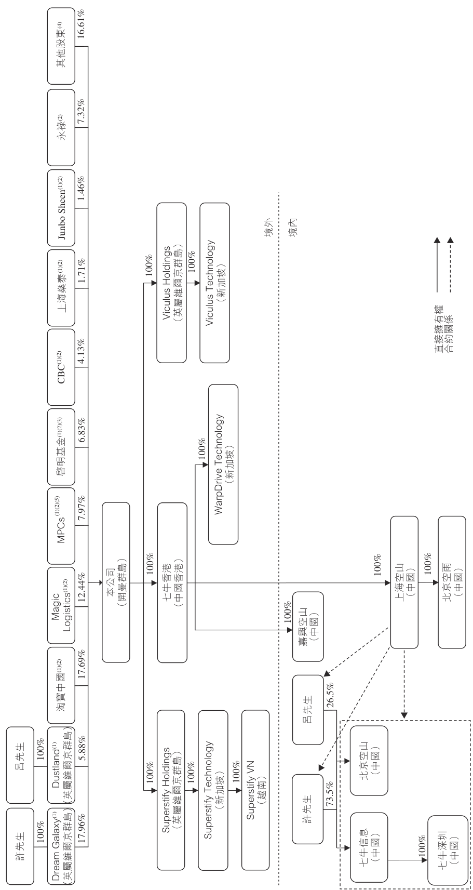

附註：

於2024年4月及2024年6月，同意股東簽署了同意函及／或確認書，據此，同意股東同意委任由許先生全資擁有的公司Dream Galaxy作為其代理人及受委代表，以於本公司股東大會上行使彼等持有的所有股份所附的投票權。詳情請參閱本節上文「-表決代理安排」。

淘寶中國、Magic Logistics、MPCs、啓明基金、CBC、上海燊泰、Jumbo Sheen及永祿為我們的首次公開發售前投資者。詳情請參閱本節「首次公開發售前投資」。

其他股東包括(i)FG Venture（持有本公司股份2.04%）；(ii) Golden Valley（持有本公司股份0.26%）；(iii) Harvest Yuanxiang（持有本公司股份3.83%）；(iv)上海張江（持有本公司股份2.55%）；(v)上海張江科投（持有本公司股份1.53%）；(vi) Titanium Ventures（持有本公司股份1.53%）；(vii)交銀資產管理（持有本公司股份4.19%）；及(viii)交銀基金（持有本公司股份0.67%），均為我們的首次公開發售前投資者。詳情請參閱本節「首次公開發售前投資」。

(5) MPCs所持股份為MPC II L.P.（前稱Matrix Partners China II, L.P.)及MPC II-A L.P.（前稱Matrix Partners China II-A, L.P.)所持股份（分別持有我們7.17%及0.80%的股份）的總和。

---

## 第 209 页

緊隨全球發售完成後的公司架構

下圖載列緊隨全球發售完成後本集團的股權架構(假設本公司優先股按一股基準悉數轉換為本公司普通股，超額配股權未獲行使且並無根據首次公開發售前股份計劃發行股份)：

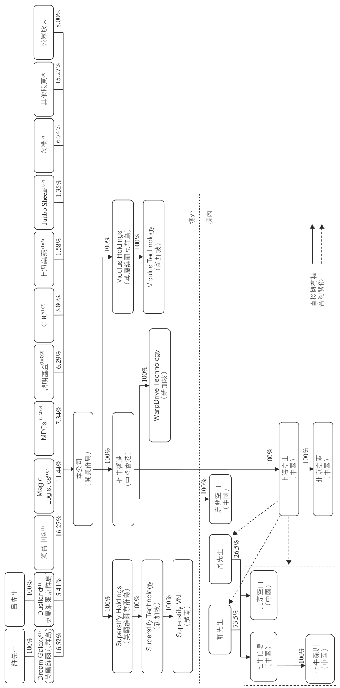

於2024年4月及2024年6月，同意股東簽署了同意函及／或確認書，據此，同意股東同意委任由許先生全資擁有的公司Dream Galaxy作為其代理人及受委代表，以於本公司股東大會上行使彼等持有的所有股份所附的投票權。詳情請參閱本節上文「-表決代理安排」。

淘寶中國、Magic Logistics、MPCs、啓明基金、CBC、上海榮泰、Jumbo Sheen及永祿為我們的首次公開發售前投資者。詳情請參閱本節「首次公開發售前投資」。

(3) 啓明基金所持股份為啓明MD、啓明創投及啓明Annex所持股份(分別持有我們0.16%、5.17%及0.95%的股份)的總和。

其他股東包括(i)FG Venture(持有本公司股份1.88%); (ii) Golden Valley(持有本公司股份0.23%); (iii) Harvest Yuanxiang(持有本公司股份3.52%); (iv)上海張江科投(持有本公司股份2.35%); (v)上海張江科投(持有本公司股份1.41%); (vi) Titanium Ventures(持有本公司股份1.41%); (vii)交銀資產管理(持有本公司股份3.85%); 及(viii)交銀基金(持有本公司股份0.62%)，均為我們的首次公開發售前投資者。詳情請參閱本節「首次公開發售前投資」。

(5) MPCs所持股份為MPC II L.P.（前稱Matrix Partners China II, L.P.）及MPC II-A L.P.（前稱Matrix Partners China II-A, L.P.）所持股份（分別持有我們6.46%及0.72%的股份）的總和。

---

## 第 210 页

中國監管規定

併購規定

根據併購規定，外國投資者或須在下列情況下獲得必要批准：

(a) 購買境內非外商投資企業的股權使該境內企業變更設立為外商投資企業；

(b) 認購境內非外商投資企業增資使該境內企業變更設立為外商投資企業；

(c) 設立外商投資企業，並通過該企業購買境內企業資產且運營該資產；或

(d) 購買境內企業資產，並以該資產投資設立外商投資企業。

併購規定(其中包括)進一步規定，由中國公司或個人直接或間接控制並為中國公司的權益在境外上市而成立的境外特殊公司或特殊目的公司，在特殊目的公司以境外公司的股份作為支付手段收購中國公司的股份或股本權益的情況下，該特殊目的公司的證券於境外證券交易所上市及交易前須取得中國證監會批准。

我們的中國法律顧問已告知我們，根據其對中國現行法律法規的瞭解，我們無需向中國證監會提交申請以批准我們的股份根據併購規定在聯交所上市及買賣，鑑於(i)我們的中國附屬公司乃通過直接投資而非以併購中國境內公司(該公司由併購規定所界定的屬我們的實益擁有人的中國實體或個人擁有)的股權或資產方式註冊成立的外商投資企業；(ii)我們並不構成適用於併購規定相關規定的「特殊目的公司」。然而，我們的中國法律顧問進一步告知我們，其上文所概述意見須遵守與併購規定有關的任何新的法律、法規和規則或詳細實施和解釋。

中國國家外匯管理局登記

根據國家外匯管理局頒佈並於2014年7月4日生效的國家外匯管理局37號文，(a)中國居民在以資產或權益向其以投融資為目的直接設立或間接控制的境外特殊目的公司(「境外特殊目的公司」)出資前，應向國家外匯管理局地方分局申請辦理登記；及(b)辦理初步登記後，如境外特殊目的公司發生(其中包括)境外特殊目的公司的中國居民股東、境外特殊目的公司的名稱、經營期限的變更，或境外特殊目的公司的增資或減資、股權轉讓或置換、合併或分立等重要事項變更，中國居民應向國家外匯管理局地方分局辦理變更登記手續。根據國家外匯管理局37號文，未有遵守上述登記程序可能導致處罰。

---

## 第 211 页

國家外匯管理局37號文取代了國家外匯管理局於2005年10月21日發佈並於2005年11月1日生效的國家外匯管理局75號文。

根據國家外匯管理局發佈並於2015年6月1日生效的《關於進一步簡化和改進直接投資外匯管理政策的通知》，接收國家外匯管理局登記的權利已由國家外匯管理局地方分局移交予境內實體資產或權益所在的合資格銀行。

據我們的中國法律顧問告知，許先生及呂先生已於2011年12月6日完成初始外匯登記手續。

---

## 第 212 页

合約安排

概覽

中國的外商投資活動主要受相關中國法規規管。就外商投資而言，相關中國法規將產業分為三大類，即「鼓勵類」、「限制類」及「禁止類」。未列入相關中國法規的產業通常被視為屬於第四類「允許類」。詳情請參閱本招股章程「監管概覽—有關外商投資的法規」。

下表載列七牛信息、七牛深圳及北京空山的主要業務(根據相關中國法規，屬外商投資禁止類業務(「相關業務」))及相應的商業界別：

<!-- table html -->
<table><tr><td>中國公司</td><td>相關業務簡介</td><td>相關中國法規下的商業界別</td><td>相關業務所需許可證</td><td>相關中國法規下的類別</td></tr><tr><td>七牛信息</td><td>雲服務，包括雲計算、存儲及分發</td><td>互聯網數據中心業務、互聯網接入業務、國內互聯網虛擬專用網業務及內容分發網絡業務</td><td>增值稅許可證(業務類型及覆蓋範圍：互聯網數據中心服務、互聯網接入服務、國內互聯網協議虛擬專用網絡服務及內容分發網絡服務)</td><td>禁止類</td></tr><tr><td>七牛深圳</td><td>雲服務，包括雲計算及分發</td><td>內容分發網絡業務及互聯網數據中心業務</td><td>增值稅許可證(業務類型及覆蓋範圍：內容分發網絡服務及互聯網數據中心服務)</td><td>禁止類</td></tr><tr><td>北京空山</td><td>截至最後實際可行日期，尚未實際開展任何實質業務，擬開展互聯網數據中心相關的雲服務</td><td>互聯網數據中心業務</td><td>增值稅許可證(業務類型及覆蓋範圍：互聯網數據中心服務)（「IDC許可證」）</td><td>禁止類</td></tr></table>
<!-- /table -->

截至最後實際可行日期，北京空山已取得IDC許可證以開展相關業務，且我們的董事確認其將僅從事負面清單項下「禁止類」業務類別項下的相關業務。預計北京空山短期內不會開始任何實質性業務運營。

---

## 第 213 页

合約安排

我們僅有一家香港附屬公司，即七牛香港，而七牛香港並不符合《內地與香港關於建立更緊密經貿關係的安排》及《內地與澳門關於建立更緊密經貿關係的安排》(統稱為「CEPA」)有關規定中對香港增值電信服務供應商的所有要求，亦不具有申請香港工業貿易署頒發的香港增值電信服務供應商所需的實際經驗，而其為享有CEPA項下優惠待遇的先決條件。因此，我們不符合CEPA豁免增值電信服務50%股權的條件。誠如以上所示，由於我們目前經營所在的行業的某些領域中的外商投資受到現行中國法律及法規的外商投資禁止，我們確定我們直接或間接通過股本所有權持有合併聯屬實體並不可行。反而，我們決定，依照中國受外商投資禁止規限的行業的一般慣例，我們會根據合約安排通過上海空山持有合併聯屬實體的權益並獲得合併聯屬實體的有效控制權。

我們於2023年5月11日及2024年6月21日通過上海空山與合併聯屬實體及登記股東訂立合約安排，據此，上海空山已取得合併聯屬實體的財務及營運政策的有效控制權，並已有權享有合併聯屬實體各自的業務衍生的所有經濟利益。

董事認為合約安排專門基於以下理由而設：

1. 根據負面清單，在中國加入世貿組織時承諾開放的電信業務範圍內，外國投資者不得持有經營該等增值電信業務(電子商務、國內多方通信、存儲轉發類及呼叫中心除外)的企業50%以上的股權。互聯網數據中心業務、互聯網接入業務、國內互聯網虛擬專用網業務和內容分發網絡業務等不屬於中國加入世貿組織承諾向外商投資開放的增值電信業務，一般不允許外商投資，但根據《內地與香港關於建立更緊密經貿關係的安排》或《內地與澳門關於建立更緊密經貿關係的安排》，在中國香港或澳門註冊成立的合資格電信服務企業的若干獲准投資除外。

2. 2023年5月30日，我們的中國法律顧問諮詢了中國工業和信息化部（「增值電信經營業務諮詢」），中國工業和信息化部確認(i)合約安排並未受到現行法律及法規的禁止；及(ii)外國投資者不得直接及間接持有經營相關業務的任何企業的股權。我們的中國法律顧問表示，中國工業和信息化部負責審批外商投資企業的增值電信許可證，因此為回答有關諮詢的主管機構。

---

## 第 214 页

合約安排

董事認為，合約安排屬公平合理，原因如下：(i)合約安排由上海空山、北京空山、七牛信息、七牛深圳及登記股東及彼等的配偶之間自由磋商及訂立；(ii)通過與在中國成立的附屬公司之一上海空山訂立獨家業務合作協議(定義見下文)，北京空山、七牛信息及七牛深圳各自將享有我們所提供更為完善的經濟及技術支持，並於上市後擁有更好的市場聲譽；及(iii)若干其他公司採用類似的安排來達到相同目的。

倘我們的相關業務不再被禁止進行外商投資或中國相關政府部門向由本公司設立的中外合資經營企業或獨資外國投資實體授予增值電信許可證及／或有關我們的相關業務的其他必要許可證，我們將於許可範圍內全部或部分解除及終止合約安排，並直接持有相關中國法律法規允許的最大所有權權益百分比。

有關根據中國法律及法規適用於相關業務的許可及批准規定的詳情，請參閱本招股章程「監管概覽—與增值電信業務有關的法規」。

此外，於我們的日常業務過程中，我們通過合併聯屬實體七牛信息進行少數股權投資，以持有多家中國公司（「少數股權投資公司」）的非控股權益，而該等公司通常為我們業務的上下游行業參與者，提供與我們有較強相關性及協同效應的產品、服務及／或資源。由於若干少數股權投資公司之協議或組織章程細則所訂明的轉讓限制（「轉讓限制」），七牛信息實際上難以向本集團其他附屬公司轉讓其於各少數股權投資公司之權益。中國法律顧問認為，由於轉讓限制，七牛信息於向任何第三方轉讓其任何權益前，須取得相關少數股權投資公司之實際控制人或其他股東之書面同意。截至最後實際可行日期，我們已要求相關少數股權投資公司之實際控制人／其他股東批准將七牛信息持有之權益轉讓予上海空山，而未能取得批准。因此，少數股權投資公司的股份繼續由七牛信息持有。我們承諾除有關業務外，於上市後將不會從事新業務或對任何實體作出更多投資。由於截至2023年12月31日止三個年度，各少數股權投資公司的營收佔本集團於各年度營收的百分比均低於2%，由此可見少數股權投資公司的被動及不重大性質，且實際上我們並未合併或控制該等少數股權投資公司，加上上述原因，我們的董事認為少數股權投資公司對本集團而言微不足道，且合約安排屬狹義。我們預計相比本集團的總收入，近期各少數股權投資公司貢獻的收入百分比將保持穩定且不會超過5%。

---

## 第 215 页

合約安排

以下簡化圖表列示合約安排所訂明的經濟利益由綜合聯屬實體流向本集團的過程：

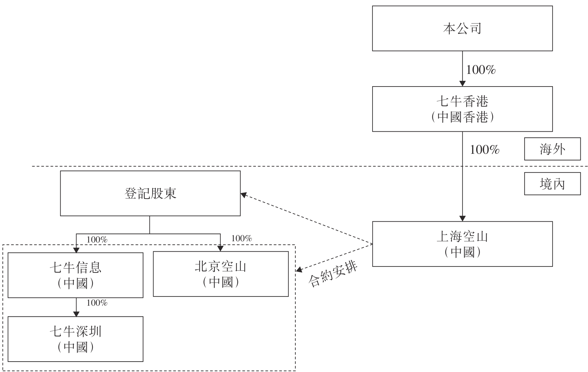

附註：

(1) 「→」表示股權中的法律及實益擁有權。

(2) 「—→」表示通過合約安排建立的合約關係。

(3) 上海空山提供技術支持、諮詢服務及其他服務，以換取合併聯屬實體各自的服務費。詳情請參閱本節「合約安排重要條款概要—獨家業務合作協議」。

(4) 登記股東向上海空山發出獨家購買權協議，以收購於合併聯屬實體的全部或部分股權及／或資產。詳情請參閱本節「合約安排重要條款概要—獨家購買權協議」。

(5) 登記股東向上海空山授出優先抵押權益，抵押於合併聯屬實體的全部股權。詳情請參閱本節「合約安排重要條款概要—股權質押協議」。

(6) 登記股東向上海空山發出授權委託書，以行使一切於合併聯屬實體的股東權利。詳情請參閱本節「合約安排重要條款概要—授權委託書」。

(7) 許先生及呂先生(各自均為個人登記股東並有配偶)各自的配偶向上海空山發出承諾。詳情請參閱本節「合約安排重要條款概要—配偶同意函」。

---

## 第 216 页

合約安排

(8) 截至最後實際可行日期，北京空山及七牛信息由以下登記股東持有以下百分比：

<!-- table html -->
<table><tr><td>股東</td><td>概約持股百分比</td></tr><tr><td>許先生</td><td>73.5%</td></tr><tr><td>呂先生</td><td>26.5%</td></tr><tr><td>合計</td><td>100.00%</td></tr></table>
<!-- /table -->

合約安排重要條款概要

獨家業務合作協議

北京空山、七牛信息及七牛深圳各自與上海空山於2023年5月11日及2024年6月21日訂立獨家業務合作協議（「獨家業務合作協議」），據此，上海空山同意以換取服務費的方式向北京空山、七牛信息及七牛深圳提供技術支持、諮詢及其他服務，包括但不限於：

• 進行市場調查並提供市場推廣諮詢服務；

• 提供廣告經紀及代理服務；

• 提供內容檢索、查找及處理服務；

• 提供中短期市場開發及市場規劃服務；

提供管理諮詢服務和支持，協助北京空山、七牛信息及七牛深圳引進先進的管理理念和模式；

• 提供網站維護和網絡安全服務；

• 提供與業務相關的軟件和硬件開發和研究服務；

• 提供技術開發、技術諮詢、技術轉讓和技術推廣服務；

通過該等知識產權開展業務活動為北京空山、七牛信息及七牛深圳提供知識產權許可服務；

• 提供其他技術服務；

• 提供公共關係服務；

---

## 第 217 页

合約安排

• 提供代銷服務；

為北京空山、七牛信息及七牛深圳的勞動用工提供諮詢服務和支持，包括但不限於組織實施行政人員、管理人員和其他人員的培訓和考核，協助建立完善的人力資源管理體系，實現良好的人力資源配置；

根據北京空山、七牛信息及七牛深圳各自的業務需要，提供相關的行政管理、內部審批監控和資產管理諮詢服務；及

北京空山、七牛信息及七牛深圳在中國法律允許的範圍內不時要求的其他相關服務。

受遵守相關中國法律及法規的規限，獨家業務合作協議項下的服務費須包括北京空山、七牛信息及七牛深圳根據獨家業務合作協議的合併除稅前溢利總額(並無計算技術諮詢及服務費)的100%(經抵銷上一財政年度的任何累計虧絀(如有)及扣除必要營運成本、開支及稅項後)。儘管有上述規定，上海空山有權參考提供技術諮詢及服務、北京空山、七牛信息及七牛深圳各自的營運條件及發展需要等具體情況調整服務費的金額。服務費須每季度計算並支付。

上海空山須向北京空山、七牛信息及七牛深圳提供上述服務，這意味着北京空山、七牛信息及七牛深圳不僅同意接受上海空山提供的以上服務，各自亦同意在獨家業務合作協議期限內，未經上海空山的事先書面同意，北京空山、七牛信息及七牛深圳不得(1)直接或間接接受任何第三方提供且與獨家業務合作協議項下擬提供的服務相同或類似的服務；或(2)與其他實體、企業或任何第三方建立與獨家業務合作協議所促成者相似的合作關係。上海空山可以委任可能與北京空山、七牛信息及七牛深圳訂立若干協議的其他協議方，以向北京空山及七牛信息提供獨家業務合作協議項下的諮詢及／或服務。

獨家業務合作協議亦規定，於履行獨家業務合作協議期間，上海空山於北京空山、七牛信息及七牛深圳及其附屬公司(如有)開發或創建的任何及所有知識產權中擁有獨家專有權及利益。

---

## 第 218 页

合約安排

獨家業務合作協議須自簽署後生效，此後仍將一直不可撤銷，直至(i)北京空山、七牛信息及七牛深圳於獨家業務合作協議的期限內破產、清盤、終止或解散，於有關破產、清盤、終止或解散日期；(ii)在北京空山、七牛信息及七牛深圳的股東持有的北京空山、七牛信息及七牛深圳各自的全部股權及／或北京空山、七牛信息及七牛深圳的全部資產已合法轉讓至上海空山及／或上海空山根據登記股東、上海空山以及北京空山、七牛信息及七牛深圳簽署的獨家購買權協議指定的一名或多名人士後；(iii)上海空山或其全資附屬公司正式註冊為北京空山、七牛信息及七牛深圳的唯一股東時，一旦上海空山根據適用的中國法律被允許直接持有北京空山、七牛信息及七牛深圳的股權及上海空山及／或其附屬公司或分公司可合法從事北京空山、七牛信息及七牛深圳的業務。儘管以上所述，上海空山有權通過向北京空山、七牛信息及七牛深圳發出30日的書面通知隨時終止獨家業務合作協議。然而，北京空山、七牛信息及七牛深圳無權單方面終止獨家業務合作協議。

獨家購買權協議

北京空山、七牛信息及七牛深圳各自與上海空山及登記股東於2023年5月11日及2024年6月21日訂立獨家購買權協議（「獨家購買權協議」），據此，(i)上海空山（或其指定人士）獲授予可隨時及不時按中國適用法律法定允許的最低價格向登記股東購買北京空山、七牛信息及七牛深圳的全部或任何部分股權的不可撤銷及獨家權利（「股份購買權」），及(ii)上海空山（或其指定人士）獲授予隨時及不時按中國適用法律法定允許的最低價格向北京空山、七牛信息及七牛深圳購買北京空山、七牛信息及七牛深圳的全部或任何部分資產的不可撤銷及獨家權利（「資產購買權」，連同股份購買權，統稱「獨家購買權」）。

---

## 第 219 页

合約安排

為行使獨家購買權，上海空山(或其指定人士)應發出書面通知(「通知」)，當中應載有行使獨家購買權的決定以及相關股權及／或資產的轉讓日期。行使股份購買權轉讓股權時，各登記股東應當簽署股東決議及／或出具同意放棄中國法律項下任何優先購買權的書面聲明和相關股東之間的協議，亦並簽署股份轉讓協議以及其他必要的協議和文件及採取一切必要的行動，以便通知中所載的北京空山、七牛信息及七牛深圳的相關股權可在不附帶任何擔保權益的情況下，能夠有效地轉讓予上海空山(或其指定人士)並以其名義登記。行使資產購買權轉讓資產時，北京空山、七牛信息及七牛深圳各自簽署股東決議，各登記股東在北京空山、七牛信息及七牛深圳的相關內部審批程序中應投票贊成本次資產轉讓，北京空山、七牛信息及七牛深圳應簽署資產轉讓協議及其他必要的協議和文件並採取一切必要的行動，以便北京空山、七牛信息及七牛深圳各自在通知中所列的相關資產可有效地轉讓予上海空山(或其指定人士)並以其名義登記，而不附帶任何擔保權益。

一旦上海空山及／或其指定人士正式擁有已轉讓股權及／或資產，則上海空山或其指定人士須於七個營業日內將購買價款支付予登記股東及／或北京空山、七牛信息及七牛深圳指定的銀行賬戶。在相關中國法律及法規的規限下，登記股東應退還購買價款的任何金額。

北京空山、七牛信息及七牛深圳及登記股東(作為北京空山及七牛信息的股東，在股東授權下)個別及共同不可撤銷地承諾及保證(其中包括)：

未經上海空山事先書面同意，不得以任何形式補充、更改或修訂北京空山、七牛信息及七牛深圳的組織章程細則，或增加或削減其註冊資本，或以其他方式更改其註冊資本架構；

根據良好的商業準則及慣例保持本公司的有效存續、審慎有效地經營其業務及處理其事務；

未經上海空山事先書面同意，自簽署獨家購買權協議日期(一般業務過程中所規定者除外)起任何時候不得就北京空山、七牛信息及七牛深圳及其各自附屬公司的任何資產、業務或收入的合法或實益權益進行出售、轉讓、按揭或以其他方式處置，或允許對其設立任何其他擔保權益；

---

## 第 220 页

合約安排

除非中國法律規定，否則未經上海空山事先書面同意，北京空山、七牛信息及七牛深圳不得進行解散或清盤。在發生清盤後，登記股東不可撤銷地承諾，彼等將在相關時間免費或按中國法律允許的最低價格向上海空山或其指定人士全額支付其收取的任何餘下剩餘價值。倘該項付款為中國法律所禁止，登記股東承諾將資金委託予上海空山託管，並與上海空山合作簽訂託管協議或其他相關法律文件；

未經上海空山事先書面同意，不得產生、繼承、擔保或承擔任何債務，除非(1)法律債務在一般或日常業務過程中產生，而非借款產生；或(2)該等債務已向上海空山披露並獲上海空山的書面同意；

一直在正常業務過程中經營全部業務，以保持北京空山、七牛信息及七牛深圳及其附屬公司的資產價值，且不得作出任何可能影響彼等營運情況及資產價值的行為／疏忽；

除一般業務過程中訂立的協議外，未經上海空山事先書面同意，北京空山、七牛信息及七牛深圳及其各自附屬公司不得訂立金額超過人民幣1百萬元的任何重大協議(包括但不限於將產生負債或導致重大不利影響的貸款、外部擔保、物業出售及其他協議)；

未經上海空山事先書面同意，北京空山、七牛信息及七牛深圳及其附屬公司不得向任何人士提供任何貸款、擔保或信貸；

應上海空山的要求，向上海空山提供有關北京空山、七牛信息及七牛深圳及其附屬公司的營運及財務狀況的一切資料；

倘適用，北京空山、七牛信息及七牛深圳各自須向上海空山批准的保險公司投購保險，投保的金額及類型應與經營類似業務及於相同領域擁有類似財產或資產的公司所投保的金額及類型一致；

未經上海空山事先書面同意，北京空山、七牛信息及七牛深圳及其各自附屬公司不得兼併任何實體或與任何實體合併或收購任何實體或投資任何實體；

---

## 第 221 页

合約安排

須立即知會上海空山發生或可能發生有關北京空山、七牛信息及七牛深圳或其各自附屬公司的資產、業務及收益的訴訟、仲裁或行政程序，並按照上海空山的合理要求採取一切必要措施，並僅在上海空山事先書面同意的情況下就有關程序達成和解；

須為維護北京空山、七牛信息及七牛深圳及／或其各自附屬公司對所有資產的所有權而簽立一切必要或適當文件，採取一切必要或適當行動及提出一切必要或適當控告或針對所有要求適當辯護提出必要及適當申索；

未經上海空山事先書面同意，不得以任何形式向股東派發任何股息、紅利或任何資產。倘登記股東取得上述任何福利，彼須於三個工作日內知會上海空山並立即無償將相關福利轉讓至上海空山；及

應上海空山的要求，委任上海空山指定的任何人士為北京空山、七牛信息及七牛深圳的董事及／或執行董事、總經理、首席財務官及其他高級管理人員；

登記股東個別及共同不可撤銷地承諾及保證，彼等應(其中包括)：

與上海空山簽署股權質押協議的同時簽署獨家購買權協議，將彼等所持的北京空山、七牛信息及七牛深圳的全部股權以優先質押的形式質押予上海空山並完成股權質押註冊程序；

未經上海空山事先書面同意，自簽署獨家購買權協議日期後的任何時間，不得出售、轉讓、按揭或以其他方式處置北京空山、七牛信息及七牛深圳的任何合法或實益權益，或容許對其設立任何其他擔保權益，惟獨家購買權協議項下產生的擔保權益及按照股權質押協議對登記股東的股權設立的質押則除外；倘上海空山事先書面同意，且倘登記股東出售、轉讓或以其他方式處置任何合法或實益權利及權益，則所收取的代價應悉數轉讓至上海空山(惟根據貸款協議首先用於償還貸款除外)；

---

## 第 222 页

合約安排

未經上海空山事先書面同意，保證北京空山、七牛信息及七牛深圳的股東大會及促使北京空山、七牛信息及七牛深圳的董事會或執行董事(董事會缺席的情況下)不得批准出售、轉讓、按揭或以其他方式處置登記股東所持北京空山、七牛信息及七牛深圳的任何合法或實益權益，或容許對其設立任何擔保權益，惟批准獨家購買權協議項下產生的擔保權益及根據股權質押協議對北京空山、七牛信息及七牛深圳的股權設立的質押則除外；

未經上海空山事先書面同意，保證北京空山、七牛信息及七牛深圳的股東大會及促使北京空山、七牛信息及七牛深圳的董事會或執行董事(董事會缺席的情況下)不得批准北京空山、七牛信息及七牛深圳兼併任何公司或與任何公司合併或收購任何公司或投資任何公司；

須立即知會上海空山發生或可能發生任何有關北京空山、七牛信息及七牛深圳的股權的訴訟、仲裁或行政程序，並根據上海空山的合理要求採取一切必要措施，並僅在上海空山事先書面同意的情況下就有關程序達成和解；

保證北京空山、七牛信息及七牛深圳各自的股東大會及促使北京空山、七牛信息及七牛深圳的董事會或執行董事(董事會缺席的情況下)投票贊成轉讓獨家購買權協議中訂明的已購買股權並應上海空山的要求採取任何其他行動；

簽立一切必要或適當文件，採取一切必要或適當行動並提出一切必要或適當控告，或對所有必要及適當申索進行辯護，以保持彼等於北京空山、七牛信息及七牛深圳的股份擁有權；

應上海空山的隨時要求，無條件立即將彼等的股權及／或資產轉讓予上海空山或上海空山隨時指定的人士；

同意簽署一份令上海空山滿意的不可撤銷授權委託書，授權上海空山及／或指定人士行使作為北京空山、七牛信息及七牛深圳的股東的所有權利；

---

## 第 223 页

合約安排

嚴格遵守獨家購買權協議的條文及登記股東、北京空山、七牛信息及七牛深圳及上海空山之間共同或個別訂立的任何其他協議，認真履行該等協議項下的責任，不得作出任何可能影響該等協議的有效性或可執行性的行為／疏忽。倘登記股東仍保留彼等於獨家購買權協議或獨家購買權協議的訂約方所簽署的股權質押協議或上海空山的授權委託書項下股權的任何權利，則登記股東不得行使有關權利(上海空山書面指示除外)。

根據上海空山的要求，委任上海空山指定的任何人士作為北京空山、七牛信息及七牛深圳的董事及／或執行董事，並促進委任上海空山指定的任何人士為總經理、首席財務官及其他高級管理人員；

倘登記股東從北京空山、七牛信息及七牛深圳取得任何溢利、股息、股利、清算款項及／或分派任何資產，彼等須於三個工作日內知會上海空山並立即無償將相關福利轉讓予上海空山或上海空山指定的任何方。

根據獨家購買權協議的條文，除非獨家購買權協議因登記股東所持的北京空山、七牛信息及七牛深圳的任何股權及／或登記股東所持的北京空山、七牛信息及七牛深圳的股權對應的資產已合法轉讓予上海空山及／或其指定人士而予以終止，否則將繼續生效。儘管上文所述，上海空山一直有權通過向登記股東及北京空山、七牛信息及七牛深圳提前三十(30)日發出書面通知隨時終止，且上海空山無需就單方面終止獨家購買權協議賠償任何違約債務。

股權質押協議

北京空山、七牛信息及七牛深圳各自與上海空山及登記股東於2023年5月11日及2024年6月21日訂立股權質押協議（「股權質押協議」），據此，登記股東同意優先向上海空山質押彼等於北京空山、七牛信息及七牛深圳的所有現時及未來相關股權，以保證上海空山因登記股東及／或北京空山、七牛信息及七牛深圳的違約而遭受的所有直接、間接、後果性虧損及可預測利益損失，登記股東及北京空山、七牛信息及七牛深圳應按時全面履行合約安排，包括但不限於北京空山、七牛信息及七牛深圳向上海空山支付合約安排規定的諮詢及服務費（無論有關費用是否到期及因到期日、提早收款要求或其他原因而應予以支付）。

---

## 第 224 页

合約安排

股權質押協議項下的質押直至以下事項發生前仍有效：(1)合約安排到期或提前終止；(2)合約安排項下的所有服務費用均已支付，且登記股東、北京空山、七牛信息及七牛深圳及彼等的股東不再承擔合約安排項下的任何責任；及(3)根據獨家購買權協議的規定，在登記股東將北京空山、七牛信息及七牛深圳的全部股權合法轉讓予上海空山及／或其指定的人士後。

一旦發生違約事件(定義見股權質押協議)及其持續期間及發出違約通知後，上海空山須有權根據任何適用的中國法律及股權質押協議作為被擔保方行使所有有關權利，包括但不限於與基於貨幣估值的股權(有關股權轉換為或轉換自拍賣或出售登記股東股權所得款項)一併優先支付。

授權委託書

各登記股東於2023年5月11日及2024年6月21日訂立授權委託書(「授權委託書」)，據此，各登記股東無條件及不可撤銷地委任上海空山或其指定人士(包括但不限於我們的董事以及彼等的繼承人及清盤人(取代我們的董事)，但不包括登記股東)作為彼等的獨家實際代理人，代表彼等行使北京空山、七牛信息及七牛深圳的當時有效的組織章程細則所載彼等作為北京空山、七牛信息及七牛深圳的股東擁有的所有權利，包括但不限於：

出席北京空山、七牛信息及七牛深圳的股東大會，並代表彼等各自簽署相關股東大會記錄、決議或其他法律文件；

根據法律及北京空山、七牛信息及七牛深圳的組織章程細則行使彼等各自享有的所有股東權利，包括但不限於股東表決權、出售或轉讓、質押或處置彼等各自的全部或部分股權，決定北京空山、七牛信息及七牛深圳各自的增資、減持、合併、分立、股權轉讓等事項，決定北京空山、七牛信息及七牛深圳的業務政策和投資計劃，決定北京空山、七牛信息及七牛深圳各自的財務預算和分配方案，決定北京空山、七牛信息及七牛深圳各自的任何資產處置，批准北京空山、七牛信息及七牛深圳的年度預算或宣派股息，決定北京空山、七牛信息及七牛深圳的解散和清算，任命北京空山、七牛信息及七牛深圳各自的清算組成員，批准北京空山、七牛信息及七牛深圳各自的清算方案和報告等；

---

## 第 225 页

合約安排

作為各登記股東的授權代表，指派及選舉北京空山、七牛信息及七牛深圳的法定代表人、董事長、董事(或執行董事)、監事、總經理及其他高級管理人員；

就公司註冊與相關市場監督管理部門簽署的文件、會議紀要及備案文件，保留簽署的文件(包括但不限於會議紀要及決議)，以及代表各登記股東簽署和行使與北京空山、七牛信息及七牛深圳的股權相關的股東權利，以及向相關市場監督管理部門備案文件；

指在北京空山、七牛信息及七牛深圳破產的情況下登記股東行使表決權；及

其他適用的中國法律及北京空山、七牛信息及七牛深圳的組織章程細則(及其修訂本)訂明的其他股東權利。

登記股東承諾，彼等將不會撤銷委任上海空山及其指定人士為彼等的實際代理人，且有關委任並無實際或潛在利益衝突。

授權委託書須自完成簽署後生效，只要各登記股東持有北京空山、七牛信息及七牛深圳的股權，此後仍將一直生效。

配偶同意函

登記股東各自的配偶已簽署同意函(統稱「配偶同意函」)，內容有關(其中包括)(i)其確認並同意，在任何情況下，各登記股東持有並將持有的北京空山、七牛信息及七牛深圳的股權(連同其中任何其他權益)為登記股東的個人財產且並不屬於配偶共同持有公共財產的範圍內。登記股東可自行決定質押、出售或以其他方式處置有關權益，無需取得配偶同意；(ii)彼無條件且不可撤銷地放棄根據任何司法權區的適用法律可能授予彼有關北京空山、七牛信息及七牛深圳的股權的任何權利或權益，且彼承諾不申索有關權利或權益；(iii)在履行、修改或終止合約安排或簽立其他文件以替代合約安排項下的任何協議時，毋需經彼授權或同意；(iv)彼將簽立一切必要文件並採取一切必要行動以確保合約安排得以按時履行；(v)彼在任何時候將不會採取任何與配偶同意函及合約安排相抵觸的行動；及(vi)彼在任何情況下將不會採取任何行動阻止合約安排得以履行。

---

## 第 226 页

合約安排

各登記股東的配偶已同意，登記股東持有的現有及未來股權應根據獨家購買權協議、獨家業務合作協議、股權質押協議及授權委託書及上述的不時修訂本的安排處理。各登記股東的配偶進一步確認、承諾及保證，倘發生死亡、喪失工作能力、離婚、破產或登記股東其他可能影響行使彼等各自於北京空山、七牛信息及七牛深圳的股權(連同當中任何其他權益))的情況，登記股東各自的配偶、繼承人、託管人、債權人以及可能因上述事件而就北京空山、七牛信息及七牛深圳各自的股權(連同其中任何其他權益)申索權利或其他利益的任何其他人士／實體不得於任何情況下以任何形式採取任何影響或妨礙登記股東於合約安排項下的履約責任的行動。

登記股東之確認函

根據合約安排項下的協議，各登記股東向上海空山承諾，倘登記股東身故、喪失行為能力、離婚、破產或任何其他可能影響其於北京空山、七牛信息及七牛深圳的權益的情況，則登記股東的繼承人、清盤人及任何其他可能因上述事件而直接或間接獲得權益或相關權利的人士／實體不得損害或阻礙合約安排的執行。

糾紛解決

各合約安排包含糾紛解決條文。根據有關條文，倘發生因履行合約安排或與合約安排有關的任何糾紛時，任何一方有權按照當時有效的仲裁規則向上海仲裁委員會提交相關糾紛。仲裁須在上海進行。仲裁須為保密，仲裁期間使用的語言須為中文。仲裁裁決須為最終裁決，對各方均具有約束力。

在仲裁庭組成之前以及倘適用，合約安排的訂約方應有權向主管司法權區的法院申請頒佈及／或執行保全措施或其他適用的臨時措施以支持仲裁的進行，包括但不限於扣留或凍結其他方的財產或股權的判決或裁決。仲裁裁決生效後，合約安排的訂約方應有權向主管法院申請執行仲裁裁決。中國、中國香港、開曼群島或其他司法權區的主管法院(包括本公司註冊成立地點的法院、上海空山的註冊成立地點的法院或上海空山或北京空山或七牛信息或七牛深圳的主要資產所處的地點的法院)應被視為對上述目的具有管轄權。

---

## 第 227 页

合約安排

然而，我們的中國法律顧問已告知，上述條文可能無法根據中國法律及法規強制執行。舉例而言，仲裁庭無權授出有關禁令救濟，或將無法根據現行的中國法律及法規命令上海空山進行清盤。此外，中國香港及開曼群島等境外法院授出的臨時濟助或執行令可能無法在中國取得認可或強制執行。

由於以上所述，倘北京空山、七牛信息及七牛深圳或登記股東違反任何合約安排，我們可能無法及時獲得充足的補救措施，且我們對北京空山、七牛信息及七牛深圳施行有效控制權及我們經營業務的能力可能受到重大不利影響。詳情請參閱本招股章程「風險因素—與我們的合約安排有關的風險」。

繼承

合約安排所載條文對於登記股東的繼承者亦具有約束力，猶如繼承者為合約安排的簽署方。根據中國繼承法律，法定繼承者包括配偶、子女、父母、兄弟、姐妹、祖父母以及外祖父母，而繼承者的任何違約行為均被視為違反合約安排。倘存在違約行為，上海空山可行使其對於繼承者的權利。

利益衝突

登記股東已在授權委託書中承諾，彼等在授權委託書項下的每項授權不會導致登記股東與上海空山及／或其授權人士之間存在任何實際或潛在的利益衝突。倘登記股東與北京空山、七牛信息及七牛深圳及上海空山的境外母公司或上海空山或其附屬公司之間存在潛在利益衝突，則登記股東將優先保護且不會損害上海空山的境外母公司或上海空山的利益。倘各登記股東亦為上海空山的境外母公司或上海空山的董事(或執行董事)或高級管理人員，則各登記股東將授權上海空山或根據上海空山的指示，登記股東以外的其他董事(或執行董事)和高級管理人員(亦並非北京空山、七牛信息及七牛深圳的股東)行使授權委託書項下的權利。各登記股東不得與北京空山、七牛信息、七牛深圳或上海空山及其代理人簽署任何存在利益衝突的法律文件。各登記股東不得作出導致其與上海空山及其股東之間發生利益衝突的行為或疏忽。若出現該利益衝突(上海空山有權單方面決定是否出現該等利益衝突)，各登記股東應在上海空山或其代理人同意的情況下盡快採取措施消除該利益衝突。倘登記股東拒絕採取措施消除利益衝突，上海空山有權行使獨家購買權協議項下的購買權。

---

## 第 228 页

虧損攤分

概無構成合約安排的協議規定，本公司或我們的全資中國附屬公司上海空山有責任分攤北京空山、七牛信息及七牛深圳各自的虧損。再者，北京空山、七牛信息及七牛深圳各自為有限責任公司，須獨自以其擁有的資產及財產對其自身債務及虧損承擔責任。根據相關中國法律及法規，本公司或上海空山無需攤分北京空山、七牛信息及七牛深圳各自的虧損，亦無需向北京空山、七牛信息及七牛深圳提供財務支持。上海空山可以其唯一酌情權決定向北京空山、七牛信息及七牛深圳提供或協助其取得財務支持。儘管如此，鑒於本集團通過合併聯屬實體在中國開展相關業務，而前述實體持有必要的中國經營許可證及批文，加上合併聯屬實體的經營業績及資產與負債乃根據適用會計原則併入本集團的經營業績及資產與負債，倘合併聯屬實體錄得虧損，本公司的業務、財務狀況及經營業績均會受到不利影響。

清盤

根據獨家購買權協議，除非中國法律規定，未經上海空山的書面同意，北京空山、七牛信息及七牛深圳不得解散或清盤。清算後，根據當時的中國法律的規定和要求，各登記股東不可撤銷地向上海空山或上海空山的指定方承諾全額支付登記股東、北京空山、七牛信息及七牛深圳收到的任何餘下剩餘價值，或促使支付該項付款。上海空山或其指定方應無償或以當時中國法律允許的最低價格取得該剩餘價值。倘該付款為中國法律所禁止，則各登記股東承諾為上海空山保管該款項，並與上海空山合作簽署保管協議或其他相關法律文件。

保險

我們的經營涉及若干風險，尤其是與我們的公司架構及合約安排有關的風險。我們已確定，與業務責任或中斷有關風險的保險成本及以商業上合理的條款獲得此類保險的困難令我們不能實施此類保險。因此於最後實際可行日期，本公司並無任何投保以覆蓋與合約安排有關的風險。詳情請參閱本招股章程「風險因素—與我們的合約安排有關的風險」。

本公司確認

截至最後實際可行日期，本公司根據合約安排通過北京空山、七牛信息及七牛深圳經營業務時並無遭到任何中國主管機關的干涉或阻礙。

---

## 第 229 页

合約安排的效力

我們認為，藉助合約安排而形成的機制使我們得以有效控制北京空山、七牛信息及七牛深圳，乃為實現我們的業務目標以及在我們、上海空山及登記股東發生任何糾紛時保護及保障本公司及未來公眾股東的權益而精心設計，理由如下：

(i) 獨家業務合作協議項下的安排將確保北京空山、七牛信息及七牛深圳經營所得的全部經濟利益將流入上海空山，同時確保符合中國適用法律法規，並允許北京空山、七牛信息及七牛深圳繼續持有及重續中國相關政府部門規定的相關經營牌照及許可證以及經營外國投資者或外商擁有或投資實體被禁止經營的增值電信服務及營運服務，因此符合本集團的整體最佳利益。上海空山應負責推進關鍵業務決策過程並提供整體業務建議及諮詢服務，而北京空山、七牛信息及七牛深圳應負責經營相關業務並按照相關中國法律法規以及授予北京空山、七牛信息及七牛深圳的增值電信許可證所載的條件持有相關知識產權，因此，上海空山與北京空山、七牛信息及七牛深圳各自之間的資產及人員配置有明確劃分，將使北京空山、七牛信息及七牛深圳及上海空山可妥善履行彼等各自於合約安排項下的責任，亦可確保本公司及相關業務在遵守合約安排及適用法律法規的同時穩健有效運作；

(ii) 根據獨家購買權協議，登記股東已授予上海空山隨時及不時自登記股東購買北京空山、七牛信息及七牛深圳的全部或任何部分股權的不可撤銷及獨家權利，金額為上海空山的註冊資本金額乘以上海空山的股權總額中所購買的股權比例或根據相關中國適用法律法定允許的最低價格，在此情況下，購買價須為有關要求下的最低金額。該等條文令上海空山或其指定人士可擔任其自行選擇的股東以隨時接手北京空山、七牛信息及七牛深圳各自的股權，從而確保本集團將在獨家購買權協議項下相關權利獲行使後繼續持有北京空山、七牛信息及七牛深圳各自的權益；

---

## 第 230 页

合約安排

(iii) 根據股權質押協議，登記股東需向上海空山質押彼等各自於北京空山、七牛信息或七牛深圳的全部股權，所有該等質押均需向相關行政部門登記。登記質押可有效防止登記股東通過在上海空山不知情或未經上海空山批准的情況下向善意第三方轉讓彼等於北京空山、七牛信息或七牛深圳的股權，而妨礙上海空山對北京空山、七牛信息或七牛深圳的控制；

(iv) 根據授權委託書，登記股東已無條件及不可撤銷地委任上海空山或其指定人士(包括但不限於董事及彼等的繼承人以及代替董事的清盤人，惟不包括登記股東)行使彼等作為北京空山、七牛信息或七牛深圳的股東所擁有全部權利的權力。該等條文規定上海空山有權決定或隨時變更北京空山、七牛信息或七牛深圳的董事會及管理團隊的構成，從而令上海空山擁有無需登記股東採取任何其他行動或合作即可控制北京空山、七牛信息或七牛深圳各自的權力，繼而賦予本公司及我們合法擁有的附屬公司對上海空山的管控權；

(v) 根據配偶同意函，各登記股東的配偶同意函不會採取任何阻止履行合約安排的行為；及

(vi) 我們將透過上海空山僅批准及同意北京空山、七牛信息或七牛深圳進行外商投資實體根據中國法律法規本將被禁止或限制經營的相關業務，以確保合約安排乃為我們的業務而精心設計。

合約安排的合法性

基於上文所述，我們的中國法律顧問認為：

(i) 經合約安排的訂約方確認，北京空山、七牛信息、七牛深圳及上海空山各自己取得一切必要批文及授權以簽立並履行合約安排；

(ii) 各合約安排均對其項下的各方具約束力且彼等概無違反《中國民法典》條文(尤其包括有關「惡意串通，損害他人合法權益」的規定)或概不屬於《中國民法典》規定的可能導致合同無效的任何情形；

(iii) 概無合約安排違反北京空山、七牛信息、七牛深圳或上海空山組織章程細則的任何條文；

---

## 第 231 页

合約安排

(iv) 合約安排的訂立及履行無需中國政府部門的任何批准或授權，惟以下情況除外：

(a) 上海空山根據獨家購買權協議行使認股權購買北京空山、七牛信息及七牛深圳的全部或部分股權及／或資產須取得中國監管機構的批准及／或向其辦理登記；

(b) 股權質押協議項下擬進行的任何股權質押均須向當地工商行政管理局辦理登記；

(c) 合約安排項下爭議解決條文規定的仲裁裁決／臨時濟助應取得中國法院認可；及

(d) 股權質押協議項下質押股權的任何轉讓須取得中國監管機構的批准及／或向其辦理登記。

(v) 合約安排在所有重大方面均符合現行適用法律及法規。根據中國法律，每份合約安排對其項下的各方均屬有效、合法並具約束力，惟合約安排規定仲裁庭可就北京空山、七牛信息及七牛深圳的股權或資產授出補救措施、禁令救濟(例如禁止開展業務或強制轉移資產)或勒令北京空山、七牛信息及七牛深圳各自清盤，且中國、中國香港、開曼群島(即本公司註冊成立地點)及其他司法權區(即北京空山、七牛信息及七牛深圳的主要資產所處的地點)的主管法院亦具有可針對北京空山、七牛信息及七牛深圳的股權或財產權益授出或強制執行仲裁裁決及臨時救濟的司法管轄權。然而，中國法律顧問已告知，由境外法院(例如中國香港及開曼群島法院)授出的臨時救濟或強制執行命令可能無法於中國獲得認可或強制執行。詳情請參閱本節「合約安排重要條款概要—糾紛解決」。

然而，我們無法保證日後中國監管機構將不會採納與我們的中國法律顧問的上述意見相反或不同的觀點。詳情請參閱本招股章程「風險因素—與我們的合約安排有關的風險」。

基於上述分析及中國法律顧問的意見，並經考慮上述諮詢期間中國政府部門給出的確認後，董事認為，採納合約安排不大可能根據適用中國法律被視為失效或無效。詳情請參閱本招股章程「風險因素—與我們的合約安排有關的風險」。

---

## 第 232 页

鑒於合約安排將於上市後構成本公司的非豁免持續關連交易，我們已向聯交所尋求並已獲其授出豁免。詳情請參閱本招股章程「持續關連交易」。

中國外商投資法律的發展

《外商投資法》(2019年版)

2019年外商投資法取代了《中外合資經營企業法》、《中外合作經營企業法》及《外資企業法》。詳情請參閱本招股章程「監管概覽—與外商投資有關的法規」。

2019年外商投資法對合約安排的影響

2019年外商投資法將外商投資界定為外國投資者在中國直接或間接進行的投資活動，並載列應被視為外商投資的具體情況。此外，2019年外商投資法規定，外商投資包括外國投資者根據法律、行政法規及國務院規定的條文通過任何其他方式在中國進行的投資。我們的中國法律顧問確認，2019年外商投資法並無規定合約安排為外商投資的一種形式。就此而言，倘並無其他已頒佈的國家法律、行政法規或監管規定禁止或限制合約安排的運作或影響合約安排的合法性，則2019年外商投資法將不會對中國合約安排造成重大影響，且合約安排項下的各項協議及合約安排的合法性及有效性將不會受到影響。詳情請參閱本節「合約安排的合法性」。

然而，相關中國主管部門未來頒佈的法律、法規或條文可能會將合約安排視為一種外商投資形式，屆時，合約安排可能被視為違反外商投資准入要求。因此，無法保證合約安排及合併聯屬實體的業務日後不會因中國法律法規的變動而受到重大不利影響。詳情請參閱本招股章程「風險因素—與我們的合約安排有關的風險」。

---

## 第 233 页

有關合約安排的會計層面

將合併聯屬實體的財務業績綜合入賬

根據獨家業務合作協議，各方同意，作為上海空山所提供服務的代價，北京空山、七牛信息及七牛深圳將向上海空山支付服務費。在遵守中國法律的前提下，為彌補過往年度虧損(如有必要)並扣除業務營運所需的必要成本、開支和稅項後，北京空山、七牛信息及七牛深圳向上海空山支付綜合稅前利潤總額(即北京空山、七牛信息及七牛深圳及其所有附屬公司的綜合稅前利潤)作為獨家業務合作協議規定的服務費，不計算獨家業務合作協議項下的服務費。因此，上海空山可透過獨家業務合作協議全權酌情獲取北京空山、七牛信息及七牛深圳及其附屬公司的全部經濟利益。

此外，根據獨家業務合作協議及獨家購買權協議，由於作出任何分派前須經上海空山事先書面同意，故上海空山對向北京空山、七牛信息及七牛深圳的股權持有人派發股息或任何其他款項擁有絕對合約控制權。倘登記股東自北京空山、七牛信息及七牛深圳收取任何溢利分派或股息，登記股東須於三個營業日知會上海空山並立即向上海空山或其指定人士免費轉移有關款項。

基於該等合約安排，本公司已透過上海空山獲得北京空山、七牛信息及七牛深圳以及其各自附屬公司的控制權，且本公司可全權酌情收取北京空山、七牛信息及七牛深圳以及其各自附屬公司產生的全部經濟利益回報。因此，北京空山、七牛信息及七牛深圳以及其各自附屬公司的經營業績、資產及負債以及現金流量均於本公司的財務報表中綜合入賬。

就此而言，董事認為，本公司可將北京空山、七牛信息及七牛深圳以及其各自附屬公司的財務業績於本集團的財務資料中綜合入賬，猶如其為本公司的附屬公司。北京空山、七牛信息及七牛深圳以及其各自附屬公司的業績的綜合入賬基準於本招股章程附錄一會計師報告附註1、2.4及3披露。

---

## 第 234 页

遵守合約安排

本集團已採取以下措施以確保通過實施合約安排而維持本集團的有效運營以及遵守合約安排：

(i) 作為內部控制措施的一部分，實施及遵守合約安排產生的重大問題或中國政府部門進行的任何監管查詢均會於發生時呈報董事會(如有必要)作檢討及討論；

(ii) 董事會(尤其是獨立非執行董事)將至少每年檢討一次合約安排的總體履行及遵守情況，且獨立非執行董事的確認將於年度報告予以披露；

(iii) 本公司將於年度及中期報告中披露合約安排的總體履行及遵守情況，以向股東及有意投資者提供最新資料；

(iv) 本公司及董事承諾會於年度及中期報告中定期更新有關對2019年外商投資法的遵守情況；及有關2019年外商投資法的最新監管發展情況；

(v) 本公司將於必要時委聘外部法律顧問或其他專業顧問，協助董事會檢討合約安排的實施情況以及檢討北京空山、七牛信息及七牛深圳的法律合規情況，解決合約安排引致的具體問題或事項；

(vi) 北京空山、七牛信息及七牛深圳的公司印鑒、財務印鑒、合約印鑒及重要公司證書由本集團財務及法律部門分別保管。本集團任何僱員如欲使用印鑒，須取得本集團業務、法律及／或財務部門主管(視情況而定)的內部批准，以及相關上級部門的批准；

(vii) 由於合約安排將於上市後構成本集團的持續關連交易，本公司已向聯交所申請，且聯交所已授出豁免。詳情載於本招股章程「持續關連交易」。本公司將遵守聯交所將就所授予豁免所規定的條件；

---

## 第 235 页

合約安排

(viii) 董事會(包括獨立非執行董事)將確保北京空山、七牛信息及七牛深圳保留並繼續持有所有所需的相關知識產權(包括商標、計算器軟件、版權及域名)以維持及重續中國相關政府部門規定的經營牌照及許可證，日後及倘中國法律法規准許，上海空山或本集團任何其他持有法定權益的成員公司應為將對本集團業務屬重要的任何其他新開發商標的登記擁有人；及

(ix) 本集團將在允許的範圍內盡快就相關業務的營運調整或解除(視情況而定)合約安排，而我們將直接持有相關中國法律法規所允許的最高所有權權益百分比，以允許相關業務由本公司的自有附屬公司進行及經營，而無需作出此類安排。

此外，儘管執行董事許先生以及非執行董事呂先生亦為登記股東，但我們相信董事能夠獨立履行其於本集團的職責，且本集團有能力通過以下措施於上市後獨立管理我們的業務：

(i) 細則所載董事會決策機制包括避免利益衝突的條文，其中訂明，倘有關合約或安排發生重大利益衝突，董事須在切實可行的情況下於最早舉行的董事會會議上申報其利益的性質，倘董事被視為於任何合約或安排中擁有重大權益，則該名董事須放棄投票且不得計入法定人數之內；

(ii) 各董事知悉其作為董事的受信責任，規定(其中包括)董事須為本集團效益及最佳利益行事；

(iii) 我們已委任三名獨立非執行董事，佔董事會一半席位，以平衡有利益關係董事及獨立董事的人數，旨在促進本公司及股東的整體利益；及

(iv) 我們將根據上市規則的規定於公告、通函、年度及中期報告中披露董事會(包括獨立非執行董事)所審閱有關各董事及其聯繫人與本集團業務或可能與本集團業務競爭的任何業務或權益及有關任何上述人士與本集團或可能與本集團存在任何其他利益衝突的事項之決定。

---

## 第 236 页

概覽

我們於中國提供音視頻雲服務，根據艾瑞諮詢，2023年我們的收入佔整個音視頻雲服務市場的1.5%。根據艾瑞諮詢，按2023年收入計算，我們是中國第三大音視頻PaaS服務商，市場份額為5.8%，而按2023年APaaS所得收入計算，我們亦是中國第二大音視頻APaaS服務商，市場份額為14.1%。根據艾瑞諮詢的數據，2023年中國雲服務市場規模將達到人民幣5,137億元。按管理內容或數據類型劃分，中國雲服務市場可分為音視頻雲服務市場與非音視頻雲服務市場。音視頻雲服務是指製作、存儲、處理、分發、分析、審計、檢索及推薦多媒體格式的非結構化音視頻內容，而非音視頻雲服務指政務雲、零售餐飲雲及工業雲等其他雲服務。2023年，音視頻雲服務市場達人民幣915億元且佔中國總雲服務市場的17.8%，而2023年，PaaS市場及APaaS市場分別佔整個音視頻雲服務市場的25.0%及2.2%。

PaaS是一種計算服務模式，具體為雲服務提供商通過平台提供一套全面的硬件及軟件資源予用戶，使用戶專注於編寫代碼、配置服務指標及監控應用程序，而毋須分散時間及資源至平台基礎底層的開發及維護，包括硬件維護、操作系統更新、數據備份與恢復、網絡安全、災難恢復等。我們的MPaaS平台為一個PaaS平台，主要專注於提供與音視頻內容(主要包括圖像、音頻及視頻內容)相關的雲服務，包括對象存儲、內容分發、數據處理及實時互動直播，涵蓋音視頻數據收集、存儲、處理、分發及消費的整個週期。我們是為數不多的開發全面且高性能的MPaaS產品、擁有集成且覆蓋音視頻業務各環節的技術能力的公司之一。

---

## 第 237 页

APaaS為一種計算服務模型，雲服務提供商通過其為用戶提供一個開發、運行及管理應用的一站式平台。憑藉MPaaS技術，我們進一步開發專有低代碼平台，實現從底層技術到高級場景化功能的垂直集成，簡而言之，通過訪問我們的低代碼平台，我們的客戶可以選擇彼等想要開發的具體解決方案，然後通過簡單直觀的步驟來配置應用程序中嵌入的音視頻功能，然後打包且即用的解決方案將可立即部署，因此降低了音視頻產品的使用及訪問難度。我們的APaaS解決方案目前涵蓋五個主要應用場景，包括(i)社交娛樂、(ii)視頻營銷、(iii)視聯網、(iv)智能新媒體及(v)元宇宙，具備上線快、易拓展的特點，顯著提高客戶面向場景化創新的敏捷能力，應對音視頻內容個性化、場景多、時效要求等難點。

我們旨在培養用戶使用我們產品及服務的習慣以及擴大客戶基礎。我們的活躍用戶數量從2021年的541,578人增至2022年的600,245人，再進一步增至2023年的654,179人，再由截至2023年3月31日止三個月的600,605人增至截至2024年3月31日止三個月的643,857人。MPaaS付費客戶數量從2021年的68,808人增至2022年的83,970人，再進一步增至2023年的92,480人，再由截至2023年3月31日止三個月的62,311人增至截至2024年3月31日止三個月的62,563人。APaaS付費客戶數量從2021年的1,319人增至2022年的1,967人，再進一步增至2023年的2,597人，再由截至2023年3月31日止三個月的1,867人增至截至2024年3月31日止三個月的2,303人。付費客戶總數從2021年的70,672人增至2022年的86,451人，再進一步增至2023年的95,848人，再由截至2023年3月31日止三個月的64,918人增至截至2024年3月31日止三個月的65,080人。

---

## 第 238 页

我們的產品及服務

我們的主要產品及服務包括(1) MPaaS產品，即一系列音視頻解決方案，包括加速內容分發的專有內容分發網絡（「QCDN」）、存儲內容的對象存儲平台（「Kodo」）、互動直播產品及智媒數據分析平台（「Dora」），主要服務於開發能力強及具有較強靈活性需求的客戶；以及(2) APaaS解決方案，為基於我們的MPaaS能力及利用我們的低代碼平台的場景化音視頻解決方案，主要旨在使客戶僅需簡易部署，即可快速調用不同功能，實現業務目標。下圖說明我們的商業模式：

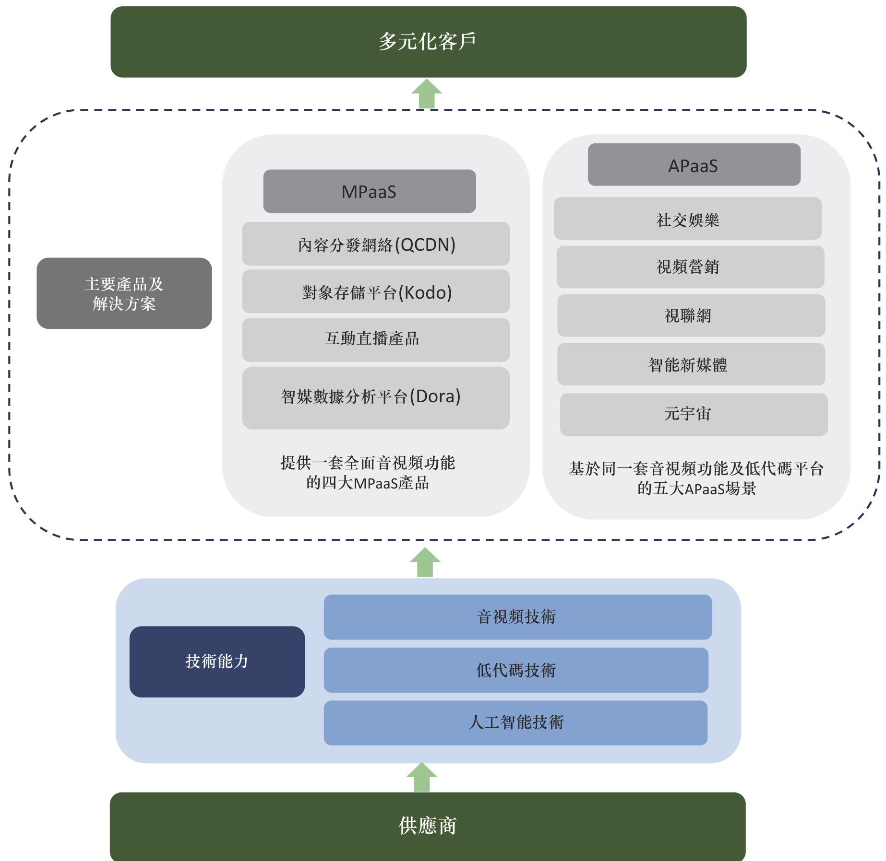

---

## 第 239 页

我們的多元化客戶：我們的客戶涵蓋廣泛的企業(例如應用開發公司及SaaS公司)及個人開發者。我們於經營規模方面具備強大的客戶覆蓋範圍，從行業佼佼者至大型企業、中小型企業及個人。我們的產品滿足不同的客戶需求，從具有場景化需求及有限技術能力的商業企業(通常需要我們的APaaS解決方案)至對底層資源訪問有限的複雜應用開發人員(通常需要我們的MPaaS產品)。

我們的MPaaS產品：我們主要通過離散API$^{(1)}$及SDK$^{(2)}$向客戶提供MPaaS產品。利用我們的MPaaS產品，客戶僅需編寫代碼即可連接至我們的平台，通過該平台即可通過離散的API／SDK部署特定的音視頻功能。代碼的複雜性將取決於所需音視頻功能的程度。在定製該等參數後，我們的客戶可將該等音視頻功能嵌入其應用程序中，其僅需要管理其應用程序，而無需維護底層基礎設施。因此，我們的MPaaS產品適合技術能力較強且需要較高靈活性的客戶。

我們的ApaaS解決方案：我們主要以場景化解決方案(通常為API/SDK的組合)的形式為客戶提供APaaS解決方案。我們將MPaaS功能與有關客戶的場景化專有技術相結合，並結合我們的低代碼平台，將API／SDK(對應底層音視頻功能)打包至客戶可直接部署的易於訪問且高度定製化的APaaS解決方案中。我們的APaaS解決方案與我們的MPaaS產品共享相同的音視頻功能套件(包括但不限於收集、存儲、處理、分發及分析)。我們的APaaS解決方案允許我們的客戶通過直觀的分步方法定製及開發彼等的應用程序，進一步降低了技術壁壘。因此，我們的APaaS解決方案適合技術能力相對有限，業務情境分工明確且需要快速驗證其業務模式的客戶。

我們的技術能力：多年的經驗使我們能夠獨立開發關鍵技術，以支持我們的場景化一站式音視頻解決方案。我們的部分關鍵技術包括：(i)音視頻技術，例如音視頻編解碼能力，以較低的帶寬成本減少存儲空間並提高二次編碼的圖像質量，以及多維度的綜合智能調度管理系統，降低由於意外客戶流量而導致的系統風險及成本風險；(ii)低代碼平台，通常通過易於訪問的用戶介面提供用於創建應用軟件的開發環境，從而提高其對音視頻功能的可訪問性；及(iii)人工智能技術，結合音視頻處理技術及深度學習模型，可幫助評估圖像及視頻的畫質及美觀度，生產多維度的客觀質量指標，以指導和定位具體的質量問題。

---

## 第 240 页

我們的供應商：為了向客戶提供音視頻雲服務，我們依賴供應商提供的基礎設施及服務，其中最主要的是(i)網絡及帶寬資源、(ii)硬件(例如服務器及存儲設備)及軟件(例如操作系統及應用程序服務)資源及(iii)計算資源(主要為CPU及GPU)。我們亦向從事音視頻相關增值服務(例如視頻會議系統及音視頻編輯工具)的生態系統合作夥伴獲得音視頻服務許可證，並將該等功能集成到我們的平台中，以便根據客戶的具體業務需求輕鬆訪問客戶。

我們的定價模式：我們根據具體的產品／解決方案以及產品／解決方案是通過公有雲還是私有雲部署，採用不同的定價模式。APaaS解決方案的定價已考慮APaaS解決方案的附加功能(包括低代碼平台)所帶來的價值，因此在類似情況下，APaaS解決方案的單價通常高於MPaaS產品的單價。

附註：

(1) API或應用程序編程接口，由軟件開發人員用於根據其開發需求執行特定的開發操作，例如通過向底層應用程序引入直播功能。API通常單獨部署，或嵌入SDK中。

(2) SDK或軟件開發工具包，通常由一系列API、文檔、說明和工具組成，軟件開發人員可通過各種格式訪問該等API、文檔和工具，以實現特定軟件功能。

我們產品的競爭優勢

我們是為數不多的擁有開發全面且高性能的MPaaS產品、擁有集成且覆蓋音視頻業務各環節的技術能力的公司之一。我們的MPaaS產品利用一系列音視頻技術(包括RTC、點播、直播、存儲及內容分發)及一系列AI技術(包括智能視覺、智能語音、智能剪輯、行業算法，內容安全和業務安全)。我們的技術構成了MPaaS產品競爭優勢的基石。例如，我們的QCDN產品已實現廣泛網絡覆蓋、全面節點監控及實時智能分配，為客戶提供低延時的雲服務。截至2024年3月31日止三個月，我們的MPaaS平台平均每天提供逾46億分鐘的音視頻播放，根據艾瑞諮詢，處於行業平均水平高位。我們的Kodo產品支持集中式及邊緣存儲以及多雲部署，使客戶能夠方便地存儲及管理大量資料。根據艾瑞諮詢，Kodo能夠實現較高數據可靠性，公有雲冗餘率為1.14及私有雲冗餘率為1.10，均優於行業平均水平。我們的互動直播產品為客戶提供低延時、高穩定性、高可用性的端到端即時通信解決方案。最後，我們的Dora產品提供了廣泛的數據處理及分析功能，使我們的用戶能夠每天處理大量的音視頻內容。詳情請參閱本招股章程「業務－關鍵運營指標」一節。於往績記錄期間，我們的MPaaS業務是我們收入的主要分部。

---

## 第 241 页

憑藉MPaaS技術，我們進一步開發專有低代碼平台，該平台通過簡單直觀的設置，將不同的場景化功能綜合至客戶定製的解決方案，降低了音視頻產品的使用及訪問難度。我們的APaaS解決方案具備上線快、易拓展的特點，顯著提高客戶面向場景化創新的敏捷能力，應對音視頻內容個性化、場景多、時效要求等難點。根據艾瑞諮詢，2021年中國音視頻APaaS市場開始規模商業化並快速增長。我們於2021年決定順應行業發展和市場需求正式推出APaaS業務後，我們的APaaS付費客戶數量由2021年的1,319名增至2022年的1,967名，並於2023年進一步增至2,597名。根據艾瑞諮詢，僅一年的攀升後，按2022年的收入計算，我們在中國音視頻APaaS市場中排名第二，市場份額為11.9%。2023年我們的市場份額進一步增至14.1%，鞏固了我們作為中國第二大音視頻APaaS服務商的地位。APaaS提供基於應用場景的平台型服務，按照場景打包相應工具和功能。根據艾瑞諮詢，於2023年，中國音視頻APaaS市場規模已達到人民幣20億元，預計於2028年，音視頻APaaS市場規模將達到人民幣144億元，複合年增長率達48.6%。

我們的競爭優勢

我們相信以下競爭優勢促成了我們的成功，並將有助於推動我們未來的增長：

中國第三大音視頻PaaS服務商及第二大音視頻APaaS服務商

根據艾瑞諮詢，按2023年收入計算，我們是中國第三大音視頻PaaS服務商，市場份額為5.8%。作為獨立的音視頻PaaS服務商，我們能夠與各IaaS服務商合作，同時避免與IaaS服務商直接競爭和高額資本支出。此外，我們靈活調用資源，有效控制成本，並使我們的客戶能夠按照其需求選擇產品與服務，提升用戶體驗。我們旨在培養用戶使用我們產品及服務的習慣以及擴大客戶基礎。截至2024年3月31日，我們的註冊用戶逾1,500,000名，大部分為各個企業的開發者或開發者團隊。於2023年及截至2024年3月31日止三個月，我們的付費客戶分別為95,848名及65,080名。

---

## 第 242 页

我們的領先市場地位部分源於我們快速適應新產業發展的能力。成立於2011年，我們建立了中國最早提供音視頻雲服務的平台之一，並持續服務音視頻行業逾十年。我們開發全面及高性能的MPaaS產品，並擁有集成且覆蓋音視頻業務各環節的技術能力。於往績記錄期間，我們的MPaaS業務是我們收入的最大分部。截至2024年3月31日止三個月，我們的MPaaS平台平均每天提供逾46億分鐘的音視頻播放。截至2024年3月31日，我們的MPaaS平台擁有EB級別的數據存儲規模。隨着泛娛樂、大電商、元宇宙等音視頻應用日益普及，客戶需求日益增加且變化快速，需要一體化及延展性更強的音視頻雲服務。因此，APaaS產品的出現可滿足不同場景下快速開發創新的能力。根據艾瑞諮詢，中國音視頻APaaS市場2021年開始規模商業化並快速增長。緊跟市場趨勢，適應行業新的發展，我們於2021年9月正式推出APaaS業務。根據艾瑞諮詢，在僅一年的發展後，於2022年，按收入計，我們在中國音視頻APaaS市場排名第二，市場份額為11.9%。2023年我們的市場份額進一步增至14.1%，鞏固了我們作為中國第二大音視頻APaaS服務商的地位。

我們的APaaS解決方案使用低代碼技術，可進行快速部署且易於擴展。我們的客戶僅需簡易部署，即可快速調用不同功能，實現業務目標，顯著提高其面向場景化創新的敏捷能力，有效應對音視頻內容個性化、場景多、時效要求等難點。

我們的市場領導地位及出眾業績已通過眾多獎項及榮譽獲得認可。例如，我們於2021年受中國信息通信研究院認可為2020-2021年度可信雲技術最佳實踐，獲新浪頒發的年度最受關注創業企業獎，並於2022年及2023年獲上海市經濟和信息化委員會評選為上海軟件和信息技術服務業百強。

---

## 第 243 页

一站式場景化音視頻解決方案彰顯綜合能力與強大拓展能力

作為提供一站式場景化音視頻解決方案的行業領導者，我們認為以下若干關鍵因素使我們能夠取得成功以及在行業內的領導地位：

MPaaS的綜合能力—憑藉深耕音視頻行業十餘年，截至2024年3月31日，我們積累了1,303個API和大量的客戶群，了解市場需求。在音視頻基礎能力上，我們做到了多場景、全能力、全鏈路的功能完備性。音視頻內容採集主要集中在手機攝像頭、監控攝像頭、電腦攝像頭等，主要的交互形式呈現為直播、點播、實時互動。我們在音視頻採集的來源和交互形式的方向自研了相關產品，實現了場景設置的廣泛覆蓋。我們亦掌握音視頻交互鏈路涉及到的編解碼、存儲、分發、視頻AI處理，包括審核、標註、增強等能力，實現了全能力的覆蓋。同時，我們在多終端、跨區域的複雜設備環境中積累了豐富的調優排障經驗，實現了廣泛連接。

具備拓展能力及可擴展業務運營—我們已在音視頻行業深耕十餘年並與音視頻行業的主要參與者進行合作，我們已形成多元化音視頻場景認知，能夠敏銳地洞察來自不同客戶對各種場景的需求。2023年中國音視頻應用下載量前20名中，15名應用的運營商是我們的客戶，足證我們的市場領先地位。在開拓一個新場景時，我們通常先與行業或場景中的代表公司合作，了解其需求，並開發新的場景化音視頻解決方案。隨後，我們快速複製拓展新解決方案，以服務其他潛在客戶，從而實現規模化。以視頻互動營銷場景為例，我們與以娛樂節目著稱的中國最大的地方電視台之一合作，透過app播放端提供明星、粉絲一起看綜藝的場景化解決方案，實現了明星與明星之間、明星與粉絲之間的實時營銷和實時互動。該解決方案成功支持了該電視台的多個熱門綜藝的互動營銷活動。通過與該電視台合作，我們積累了直播語聊的專業知識，並將多種音視頻功能轉化為低代碼模塊。隨後，我們複製此解決方案，為其他若干有類似需求的視頻營銷客戶提供服務。

---

## 第 244 页

業務

開放的平台以實現商業價值收益—通過降低了低代碼平台場景的接入門檻，我們不僅使得客戶可以在短時間內創建代碼，亦為客戶提供簡潔高效的獨立擴展現有場景的方法。憑藉我們低代碼平台的可擴展架構及封裝，我們不斷升級低代碼平台及功能插件，令客戶僅通過選擇更新的功能插件即可訪問新場景功能。利用我們的領域友好的視覺化、場景化及模組化的低代碼平台，我們令客戶能夠快速構建及開發其自身業務所需。

此外，我們開發解決方案及插件市場，通過將第三方開發人員引入我們的平台，使我們的客戶與第三方開發人員能夠獲得積極反饋。依托於低代碼平台強大的可擴展性，我們平台的SDK可公開獲得，支持具備音視頻開發能力的第三方開發人員提交場景相關的音視頻功能組件，以豐富及增強我們平台的功能。舉例而言，我們的合作夥伴商湯提供了美顏SDK插件，我們將其接入並封裝在我們的低代碼平台上，以令客戶可使用該插件。因此，我們的客戶可以在我們的平台上選擇購買最新及偏好的組件。該能力是客戶選擇使用我們服務的一個重要考慮因素。

基於上述優勢，我們成功積累了龐大的客戶基礎。我們MPaaS付費客戶的數量由2021年的68,808名增至2022年的83,970名，並於2023年進一步增至92,480名，再由截至2023年3月31日止三個月的62,311名增至截至2024年3月31日止三個月的62,563名。APaaS付費客戶的數量由2021年的1,319名增至2022年的1,967名，並於2023年進一步增至2,597名，再由截至2023年3月31日止三個月的1,867名增至截至2024年3月31日止三個月的2,303名。

豐富的應用場景助長商業化潛力

自2021年9月我們正式推出APaaS業務以來，我們的APaaS解決方案已應用於多種場景，創造了一個平台與多個場景的「1+N」商業佈局。目前，在戰略上，我們正聚焦五大場景，其中，我們於社交娛樂及視頻營銷場景實現了可觀收益，足證我們強大的產品商業化能力。我們亦在快速發展視聯網、智能新媒體及元宇宙場景。

在社交娛樂場景，我們為移動社交娛樂提供一站式解決方案，包括圖片處理分發、短視頻處理與點播、長視頻處理與點播、文件分發與下載、賽事或秀場直播等。基於我們在雲基礎設施、多媒體數據的智能處理和便於使用的低代碼平台方面的優勢，我們的APaaS解決方案使我們的客戶能夠僅需約10行代碼即可快速啟動社交娛樂的應用程序。於往績記錄期間，我們的社交娛樂場景客戶運營的app包括美篇、糖豆和唱吧。

---

## 第 245 页

我們的視頻營銷場景是客戶以音視頻等媒體內容為載體的營銷場景。我們提供在視頻營銷場景中具有廣泛連接的解決方案，幫助客戶在營銷各階段觸達其目標客戶。結合企業直播營銷、互動營銷等解決方案，客戶可快速搭建自有直播平台，提升用戶粘性並促進轉化。

在視聯網場景，我們提供集音視頻雲管理、計算引擎、場景感知分析、雲編解碼及存儲等服務的一站式視聯網解決方案，支持通過多種協議接入各類物聯網視頻設備，提供一體化視頻智能處理服務以及其他功能，比如直播、遠程管理、行為監測、告警回放、智能運維及讀取管理。我們的解決方案應用於智能家居、車載視覺智能、智能工業互聯、幼教遠程監看等。

在智能新媒體場景，依託於在音視頻數據處理的能力，我們研發出廣電相關解決方案，包括智能媒資管理、新媒體拍攝及製作，覆蓋拍攝、剪輯、多模態分析、內容審核、數據管理及內容存儲的核心廣電工作流，實現了全能力的覆蓋。通過和領先的廣電媒體合作，研發出基於5G環境下拍攝的實時管理和監看服務。此外，利用強大的AI識別分析能力，我們能夠完成快速剪輯，並將內容實時推送至數據管存系統中，為客戶提供兼顧低延時及高吞吐的解決方案。

在元宇宙場景，依托3D視覺引擎技術和音視頻通信技術，我們提供虛擬場景生成、數字人、虛擬空間、元宇宙XR直播等方案，讓客戶以低代碼或零代碼技術構建元宇宙交互場景。我們為公園等多種場館提供文旅元宇宙體驗解決方案，終端用戶可以足不出戶體驗遊園，生成個性化Vlog或結識其他遊客。從空間生成、數字人投放到場景內音視頻通信，我們實現了元宇宙內的人際通信閉環，並幫助客戶在元宇宙場景內繼續拓展其業務。

通過場景化經驗積累，我們預期會進一步改進現有技術並推動創新，維持產品與服務優勢，從而提升客戶的忠誠度，於2023年及截至2024年3月31日止三個月，我們APaaS付費客戶的留存率分別達到87.9%及93.7%，足證我們解決方案的效率及成功。

---

## 第 246 页

強大的一體化音視頻技術及低代碼平台開發能力

我們的核心優勢在於我們的一體化MPaaS技術，幫助客戶處理服務器與存儲系統等資源投入大、數據傳輸與處理技術要求嚴格、直播延遲等用戶體驗差等痛點。我們的技術能力使我們能夠為客戶提供具備成本效應及效率的解決方案，使其受惠於我們解決音視頻解決方案技術複雜性方面的專業知識。多年的經驗積累使我們自主擁有能夠支撐我們一站式場景化音視頻解決方案的所有關鍵技術。我們的部分關鍵技術包括：

AI技術

綜合智能多媒體技術—結合音視頻處理技術和深度學習模型，通過在大規模的專家標註樣本集上，利用卷積神經網絡和門控循環單元(GRU)學習視頻內容特徵和時序信息，同時結合多任務學習，支持圖片、視頻的畫質、美觀度等質量評估，我們可精準輸出多維度的客觀質量指標，指導定位具體質量問題。

高商業效率的智能AI服務—我們在高性能的雲服務器和大規模的存儲資源基礎上，構建了深度學習平台，其可使用大語言模型，如BERT、GPT、Transformer、LLaMA、PaLM等。通過使用大語言模型，我們能夠培養音視頻生成、文本生成等內容生成能力。另外結合多模態大語言模型可以處理多種結構或類型數據，通過人類反饋強化學習持續促進大語言模型改進。我們與大語言模型的互動及對大語言模型的重複利用使其進一步貼合我們的業務場景，提升了結果的可控性和準確性。我們引入行業內的業務合作夥伴，構建開放平台，在各場景為客戶提供更全面的服務。

音視頻技術

音視頻編解碼能力—我們專有的銳智轉碼模塊嵌入式場景可適應算法增強及細節降噪算法，以及高性能h264及h265壓縮技術可減少存儲空間，在更低的帶寬成本下提升二次編碼的畫質，編解碼技術在音視頻雲服務行業處於先進地位。

監控流量、成本、故障等多維度的綜合智能調度管理系統。作為主流音視頻服務商，我們能夠實現近100%的實時精準可控調度，降低因客戶突發流量導致的系統風險和成本風險，系統故障率較低。

---

## 第 247 页

低代碼平台

在MPaaS技術基礎上，我們開發低代碼平台。本着提升針對客戶的易使用性的宗旨，我們在平台設計上着重考慮了易用性、擴展性和開放性，確保客戶可輕鬆找到所需功能。我們旨在通過提供便捷的可視化、場景化、模塊化的插件，降低客戶入門門檻。

除擁有先進技術外，我們積極推動強大的開發者生態的建設，運營多個面向開發者的社群，主張技術共享並發起各類技術傳播的活動。截至2024年3月31日，我們的註冊用戶逾1,500,000名，大部分為各個企業的開發者或開發者團隊。通過聚合開發者，我們將其經驗沉澱至我們的平台，提高創新效率，循環賦能開發者；同時開發者亦是我們未來潛在客戶，為我們提供更多商業機會。

經驗豐富且富有洞察力的管理團隊及創新能力卓越的研發團隊

我們由富有洞察力且經驗豐富的高級管理團隊帶領，彼等擁有深厚的行業及管理經驗，對市場有著敏銳的觀察力，並具備高效的執行力與創新思想。

我們的創始人兼首席執行官許式偉先生為本公司帶來逾20年的行業及管理經驗。許先生於2011年5月創立了本公司，此後一直領導本集團的戰略發展。彼曾為金山軟件有限公司的技術總監，設計了金山WPS Office 2005的整體架構(其就此獲得國務院頒發的國家科學技術進步獎二等獎)。許先生亦創建了編程語言Go+，具備低代碼、複雜度低和滿足低齡化人群的特點，能吸引廣泛的開發者。

我們的首席運營官陳伊玲女士在互聯網及相關領域擁有逾17年的專業經驗。彼於2014年10月加入本集團，為本公司發展的多個方面作出貢獻，包括運營、人力資源及市場推廣。我們的首席財務官韓斌先生在融資和法律行業擁有逾20年的專業經驗。韓先生曾就職於聯交所，任華東地區代表。此外，我們的高級管理團隊的其他成員及主要僱員擁有於全球知名的科技公司工作的經驗。

員工是我們最寶貴的資產。尤其是，我們擁有強大的研發團隊。截至2024年3月31日，我們的研發團隊由168名成員組成，佔我們僱員總數的43.3%，大部分擁有該行業的相關的背景和從業經驗。

我們相信經驗豐富的管理團隊及卓越的研發團隊使我們能夠把握中國乃至全球音視頻行業發展的機遇，推動我們實現快速可持續增長。

---

## 第 248 页

我們的發展策略

我們擬採取以下策略以進一步發展業務：

通過持續在主要場景深耕以發展及擴大我們客戶群

根據艾瑞諮詢，於2023年，中國音視頻PaaS及SaaS市場規模為人民幣381億元，預計於2028年將達人民幣1,183億元，複合年增長率達25.4%。憑藉我們多年的經驗及專有技術，我們計劃繼續優化音視頻交互體驗，深耕APaaS市場的五大場景，將APaaS解決方案推廣至場景中的其他客戶，以進一步擴大業務。

為實現該目標，我們計劃加強對不同行業或場景中代表企業的了解，積累場景專有知識及經驗並拓展業務。具體而言，我們計劃創造更多的五大場景的解決方案。在智能新媒體場景，我們計劃提升為廣電傳媒設計的智能拍攝、智能媒資、智能剪輯等方案的設計和管理，增加我們的廣電類客戶。在視聯網場景中，我們計劃為農業環境開發解決方案，包括直接連接攝像頭上雲及AI處理匯集數據，更好地幫助提升農業的數字化，從而提高效率。在元宇宙場景，我們計劃通過構建數字人，實現營銷目的。我們計劃構建2D及3D的數字人，該等數字人在外貌、表達及互動方面與人類極其相似，可通過直播展現營銷功能，同時通過深度學習技術，使用戶可對該等數字人的性能反饋，用戶的市場營銷可得以提升。作為現實世界與虛擬世界的連接，我們相信元宇宙場景可能帶來全新的社交和娛樂體驗。我們計劃將AIGC的創造性與3D內容生成技術結合。例如，可通過AI生成及加強數字人。此外，我們計劃使用AI加強元宇宙的空間生成，將現實世界複製到虛擬世界。

此外，我們計劃加強鞏固與各行業領先企業的業務及合作，通過創立及維持服務領先企業的優勢及口碑，吸引業內更多中小企業，從而加快拓展與中小企業的業務，打造一個積累經驗、資源及聲譽的良性循環。為進一步拓展客戶群體，我們計劃加強營銷活動及提高我們的品牌知名度，包括組織行業盛事、舉辦研討會及各種會議、走訪各行業領軍企業等；並招聘具備行業知識的人才來擴展我們的銷售團隊以加強業務關係網絡。

加快海外業務拓展，打造新的業務增長點

除中國音視頻雲服務市場蓬勃發展外，全球音視頻雲服務市場預計未來數年亦將迎來蓬勃發展期。

---

## 第 249 页

業務

在往績記錄期間，我們主要協助中國音視頻社交及電商等企業出海。未來，除協助中國企業出海外，我們將緊抓巨大的海外市場機遇。我們目前已在中國香港及新加坡設有附屬公司，並開展了業務，取得了一些收入。根據艾瑞諮詢，東南亞、中東音視頻雲服務市場整體滲透率較低，音視頻雲服務市場發展尚在早期，具有巨大的增量空間。我們計劃在海外市場複製中國市場的成功。作為第一步，我們計劃打造PaaS的基礎設施，為在海外提供一站式場景化音視頻解決方案打好技術基礎。我們亦計劃建立本地的銷售和技術團隊，與本地夥伴合作以將產品及服務本地化，與企業客戶建立長期的商業關係，拓展海外客戶基礎。

此外，我們也已在越南設立附屬公司，計劃拓展越南市場。此外，我們計劃進一步開拓海外市場，已在印尼、馬來西亞和沙特阿拉伯開展音視頻雲市場可行性研究。

持續加強研發投入，打造AIGC能力和迭代改進我們的低代碼平台

技術能力是我們成功的核心基礎，因此我們計劃持續投資研發以保持在音視頻雲服務市場的領先地位，打造技術壁壘。

根據艾瑞諮詢，2023年以來各廠商已開始將AIGC技術應用到音視頻APaaS解決方案中以增強產品功能與效率，「AIGC+音視頻APaaS」未來有望成為音視頻APaaS的新形態，即用戶通過簡單的需求輸入，即可自動編寫代碼、組裝一個完整音視頻應用，並可以通過簡單的代碼編寫或拖拉拽對應用進行個性化調整。我們計劃調用多種生成模型，包括圖片生成、情緒化語音生成、音樂音效生成、視頻生成、3D生成、角色動畫生成、場景動畫生成及代碼生成，並把結果整合到輸出場景，通過我們的音視頻和RTC輸出到多種內容渠道。

在打造AIGC能力方面，我們計劃加大投入3D內容生成平台，進一步提高平台的易用性和內容生成效率。同時計劃在3D創作和渲染方面更多地採用AI技術。具體而言，我們計劃優化3D生成模型及可用於不同場景的低精度模型。另外，我們計劃使用圖片生成能力生成虛擬場景地圖，對3D場景進行布局和分割後，切分小任務調用基礎建模能力和模型市場來完成場景搭建，突破目前3D模型生成普遍的短板。此外，角色動畫是虛擬內容重要的一環，我們計劃使用AI學習大量視頻，提取人物、動物、遊戲角色表情、動作和動畫，融合骨骼綁定動畫技術，結合場景生成自然的角色動畫。

---

## 第 250 页

低代碼平台亦是我們的研發重點。我們計劃持續提升低代碼平台的三個方面，即易用性、擴展性和開放性。我們也計劃繼續鞏固並優化我們的音視頻數據傳輸、壓縮、渲染等技術。我們計劃加強低代碼內容生成平台，使其可採用低代碼或者零代碼的方式進行內容創作，並提升音視頻內容的交互行為。

此外，為吸引及挽留專業人才以持續創新業務，我們計劃持續投資及擴大我們的研發團隊，於各領域招募更多人才。

尋求戰略投資及併購

我們計劃繼續有選擇地尋求戰略投資和收購，旨在與我們的APaaS解決方案形成協同效應、加強我們的技術和場景化實力以及擴大我們的客戶群。因此，我們計劃在與五大深耕場景功能或相關底層音視頻技術相關的領域物色潛在標的。潛在目標包括以成功的PaaS或SaaS產品，尋求與我們的技術堆棧及業務互補的領先音視頻或AI技術業務，以拓寬我們的客戶群。截至最後實際可行日期，我們尚未確定任何投資或收購目標。

我們的產品和解決方案

我們的業務模式

我們主要以「七牛雲」品牌運營。我們的主要產品及服務大致分為MPaaS$^{(1)}$（或媒體平台服務）產品及APaaS（或應用平台服務）解決方案交付。PaaS是一種計算服務模式，具體為雲服務提供商通過平台提供一套全面的硬件及軟件資源予用戶，使用戶專注於編寫代碼、配置服務指標及監控應用程序，而毋須分散時間及資源至平台基礎底層的開發及維護，包括硬件維護、操作系統更新、數據備份與恢復、網絡安全、災難恢復等。我們的MPaaS平台為一個PaaS平台，主要專注於提供與音視頻內容（主要包括圖像、音頻及視頻內容）相關的雲服務，包括對象存儲、內容分發、數據處理及實時互動直播，涵蓋音視頻數據收集、存儲、處理、分發及消費的整個週期。我們是為數不多的開發全面且高性能的MPaaS產品、擁有集成且覆蓋音視頻業務各環節的技術能力的公司之一。

附註：

(1) 根據艾瑞諮詢的數據，就行業術語而言，本公司將「MPaaS」或媒體平台服務定義為音視頻平台服務，而「APaaS」指音視頻應用平台服務。

---

## 第 251 页

我們的客戶涉獵廣泛的企業模式(如應用開發公司及SaaS公司)及個人開發者。我們於經營規模方面具備強大的客戶覆蓋範圍，從行業佼佼者至大型企業、中小型企業及個人。我們的產品滿足不同的客戶需求，從具有場景化需求及有限技術能力的商業企業(通常需要我們的APaaS解決方案)至對底層資源訪問有限的複雜應用開發人員(通常需要我們的MPaaS產品)。

APaaS為一種計算服務模型，雲服務提供商通過其為用戶提供一個開發、運行及管理應用的一站式平台。憑藉MPaaS技術，我們進一步開發專有低代碼平台，實現從底層技術到高級場景化功能的垂直集成，簡而言之，通過訪問我們的低代碼平台，我們的客戶可以選擇彼等想要開發的具體解決方案，然後通過簡單直觀的步驟來配置應用程序中嵌入的音視頻功能，然後打包且即用的解決方案將可立即部署，因此降低了音視頻產品的使用及訪問難度。我們的APaaS解決方案目前涵蓋五個主要應用場景，包括(i)社交娛樂、(ii)視頻營銷、(iii)視聯網、(iv)智能新媒體及(v)元宇宙，從而具備上線快、易拓展的特點，顯著提高客戶面向場景化創新的敏捷能力，應對音視頻內容個性化、場景多、時效要求等難點。

我們通過API及SDK向客戶提供MPaaS產品，並以場景化解決方案的形式向客戶提供APaaS解決方案。憑藉我們的MPaaS產品，客戶可通過離散的API及SDK透過我們的平台編寫代碼以連接至音視頻功能，並根據其業務需求定製參數。我們的APaaS解決方案將API及SDK(對應底層音視頻功能)打包成易於訪問的解決方案，使客戶能夠使用我們具有明確定義的配置及功能插件的低代碼平台編寫最少的代碼，以根據其特定的業務場景部署音視頻功能。

我們的MPaaS產品利用了我們多年來於技術平台下積累的音視頻功能，而我們的APaaS解決方案則於該平台下運用同一套音視頻功能並根據我們APaaS客戶的具體業務需求將該等功能包裝成場景化解決方案，通過我們專有的低代碼平台交付，該平台提供訪問方便且具有直觀的應用程序開發。換而言之，我們的MPaaS能力結合專有的低代碼平台及場景化技術，構成了我們APaaS業務的核心競爭力。

---

## 第 252 页

我們的客戶可視乎業務需求使用MPaaS及APaaS解決方案中的一種或兩種。通常而言，需要快速驗證業務模式的新客戶會優先使用APaaS進行場景化業務驗證。一旦業務模式得到驗證，並且客戶希望獲得更多自主權以及整合其特定需求的能力，彼等通常會選擇使用MPaaS產品重構其部分業務，以完全控制底層代碼及迭代速度。例如，擁有多個項目團隊的企業客戶可能會根據自己的具體業務需求同時使用MPaaS產品及APaaS解決方案－擁有足夠技術資源及專業知識且對靈活性要求較高的項目團隊通常會選擇MPaaS產品，該產品允許彼等根據業務需求調整存儲的使用情況、CDN及其他產品，而技術資源有限但注重業務驗證的項目團隊通常會選擇APaaS解決方案，該方案的開發門檻較低及滿足業務需求且能夠快速調整。

我們根據具體的產品／解決方案採用不同的定價模式。此外，我們視乎產品／解決方案是否通過公有雲或私有雲部署而採取不同收費方式。例如，倘部署於公有雲，MPaaS產品通常按實際使用情況收費，而APaaS解決方案則通常按實際使用情況或服務包收費。一般而言，我們會根據API調用情況的複雜程度為其設定不同的單價。再者，APaaS解決方案的定價計及APaaS解決方案的其他特徵(包括低代碼平台)帶來的價值，因此APaaS解決方案的單價普遍高於類似情形下MPaaS產品的單價。有關我們定價模式的詳情，請參閱本招股章程「業務－定價」一節。

截至2021年、2022年及2023年12月31日及截至2024年3月31日，我們的註冊用戶數量分別達1,217,596名、1,350,001名、1,497,516名及1,516,411名。下表載列我們於往績記錄期間的收入明細。

<!-- table html -->
<table><tr><td></td><td colspan="4">截至12月31日止年度</td></tr><tr><td></td><td>2021年</td><td>2022年</td><td>2023年</td><td>2024年</td></tr><tr><td></td><td>人民幣千元</td><td>人民幣千元</td><td>人民幣千元</td><td>人民幣千元</td></tr><tr><td>MPaaS</td><td>1,369,641</td><td>874,997</td><td>974,507</td><td>249,442</td></tr><tr><td>APaaS</td><td>24,901</td><td>194,013</td><td>281,359</td><td>83,238</td></tr><tr><td>其他</td><td>76,468</td><td>78,280</td><td>78,125</td><td>9,693</td></tr><tr><td></td><td>1,471,010</td><td>1,147,290</td><td>1,333,991</td><td>342,373</td></tr></table>
<!-- /table -->

---

## 第 253 页

業務

下表載列所示期間按公有雲及私有雲部署以絕對金額計我們的收入明細以及所佔我們收入的百分比：

<!-- table html -->
<table><tr><td></td><td colspan="4">截至12月31日止年度</td><td colspan="4">截至3月31日止三個月</td></tr><tr><td></td><td>2021年</td><td>2022年</td><td>2023年</td><td>2024年</td></tr><tr><td></td><td>所佔總收入</td><td>所佔總收入</td><td>所佔總收入</td><td>所佔總收入</td></tr><tr><td></td><td>收入百分比</td><td>收入百分比</td><td>收入百分比</td><td>收入百分比</td></tr><tr><td></td><td>人民幣千元</td><td>人民幣千元</td><td>人民幣千元</td><td>人民幣千元</td></tr><tr><td>公有雲</td><td>976,770</td><td>66.4</td><td>924,123</td><td>80.5</td><td>1,034,862</td><td>77.6</td><td>271,655</td><td>79.3</td></tr><tr><td>私有雲</td><td>494,240</td><td>33.6</td><td>223,167</td><td>19.5</td><td>299,129</td><td>22.4</td><td>70,718</td><td>20.7</td></tr></table>
<!-- /table -->

附註：

(1) 公有雲業務收入包括通過公共互聯網提供的MPaaS產品及APaaS解決方案的收入。私有雲業務收入包括一體機服務器、軟件及相關維護以及互聯網數據託管服務的收入。

我們的MPaaS產品

我們的MPaaS產品藉助一系列音視頻相關技術(包括與RTC、點播、直播、存儲及內容分發相關的音視頻技術)及一系列AI技術(包括智能視覺、智能語音、智能剪輯、行業算法、內容安全及業務安全)。通過我們的技術，我們實現網絡覆蓋範圍廣、全面節點監控及實時智能配置，為客戶提供優質低延時的雲服務。我們的MPaaS產品包括(i) QCDN，我們的專有內容分發網絡；(ii)Kodo，我們的對象存儲平台；(iii)互動直播產品；及(iv)Dora，我們的智媒數據分析平台。

我們的MPaaS產品主要特徵如下：

• 全方位—我們的MPaaS解決方案嵌入了全方位功能，可滿足客戶在圖像、音頻和視頻處理及分析用例中的各種需求。

• 具有成本效益—我們全方位的解決方案使我們的客戶能夠輕鬆快速地設計、開發和推出產品。此外，我們的定價模式使我們的客戶能夠以不高的前期成本嘗試新產品，並降低開發成本。

• 穩定可靠 — 我們提供多區域救災功能，以降低任一數據中心故障帶來的運營風險。我們的MPaaS產品還配備有針對孤立事件及安全故障的各種安全保護。我們每天處理數百萬請求，平均回覆率為99.9%。

---

## 第 254 页

業務

可擴展和兼容—我們的MPaaS產品的高擴展性可賦能客戶根據其需求及針對各種用例進行二次開發。我們提供大量兼容且易於嵌入的API和SDK，可輕鬆整合，從而幫助客戶減少開發及檢修工作。截至2024年3月31日，我們已經累積了1,303個API，體現了我們的全場景MPaaS能力。

智能—我們構建了基於大模型及深度學習的智能音視頻處理能力組合。我們通過分析音視頻數據具備多模態處理能力，可用於支持端到端音視頻設置中的智能音視頻評估、智能識別及智能審核等功能。基於逾十年的行業經驗及技術迭代，我們已自主研發核心算法，使得我們能夠滿足客戶對處理準確度及效率的需求。

截至2024年3月31日止三個月，我們的MPaaS平台平均提供超過46億分鐘的音視頻播放。於2024年3月31日，我們的MPaaS平台的資料存儲規模為EB級。我們多樣化的MPaaS產品為客戶提供了一站式集成服務。許多客戶同時購買及使用我們的多種產品，以滿足彼等的需求。例如，客戶可使用Kodo存儲媒體數據，該等數據可由Dora編輯、轉碼或以其他方式處理，並根據開發者的需求通過我們的互動直播產品及QCDN交付予彼等的用戶。我們的MPaaS產品可作為構建塊，為客戶在其應用中嵌入各種功能，並提供底層雲服務，以支持彼等的運行。特別是，就功能重要性及收入貢獻而言，QCDN及Kodo為主要的MPaaS產品。QCDN及Kodo分別支持的存儲及分發功能的無縫集成，形成我們MPaaS業務的支柱，並為所有MPaaS功能提供底層支持。

下圖說明向客戶提供服務時我們的不同MPaaS產品之間的相互關係：

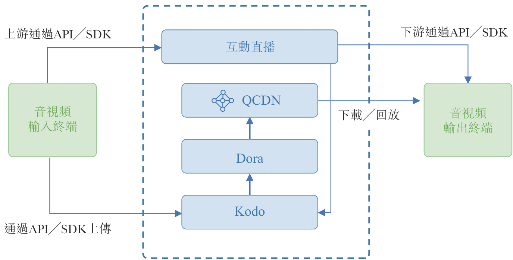

---

## 第 255 页

業務

上圖說明涉及MPaaS產品互動的三個主要應用場景：

• 視頻點播：源自音視頻輸入終端的視頻內容通過上傳API/SDK上傳至Kodo，再由Dora處理並通過QCDN分發。用戶可通過音視頻輸出終端下載或回放視頻。

• 直播：源自音視頻輸入終端的視頻內容通過API/SDK上傳至我們的互動直播產品，再通過API/SDK下傳至音視頻輸出終端，以便在用戶設備上回放。

• 直播回放：這是上述兩個應用場景的結合。視頻內容並非上傳至互動直播產品後通過下游API/SDK傳輸至用戶設備，而是先上傳至Kodo存儲，再通過QCDN分發至用戶設備。

除上述應用場景外，用戶可根據業務需求通過離散的API/SDK分別部署我們的每個MPaaS產品。

由於我們的MPaaS產品涵蓋了音視頻數據收集、存儲、處理、分發及消費的整個週期，且可方便地部署在一個平台上，因此我們的MPaaS客戶通常同時使用多個MPaaS產品。截至2024年3月31日止三個月，逾50%的MPaaS客戶同時購買兩種或以上MPaaS產品。

下表載列於所示期間我們按產品類別劃分的MPaaS產品收益明細(以絕對金額及佔MPaaS產品收益的百分比列示)。

<!-- table html -->
<table><tr><td></td><td colspan="4">截至12月31日止年度</td><td colspan="4">截至3月31日止三個月</td></tr><tr><td></td><td colspan="2">2021年</td><td colspan="2">2022年</td><td colspan="2">2023年</td><td colspan="2">2024年</td></tr><tr><td></td><td>佔MPaaS總收益</td><td>佔MPaaS總收益</td><td>佔MPaaS總收益</td><td>佔MPaaS總收益</td></tr><tr><td></td><td>收益的百分比</td><td>收益的百分比</td><td>收益的百分比</td><td>收益的百分比</td></tr><tr><td></td><td>人民幣千元</td><td>%</td><td>人民幣千元</td><td>%</td><td>人民幣千元</td><td>%</td></tr><tr><td>QCDN</td><td>585,513</td><td>42.7</td><td>488,932</td><td>55.9</td><td>628,371</td><td>64.5</td><td>176,779</td><td>70.9</td></tr><tr><td>Kodo</td><td>650,764</td><td>47.5</td><td>320,359</td><td>36.6</td><td>297,791</td><td>30.5</td><td>63,958</td><td>25.6</td></tr><tr><td>互動直播產品</td><td>87,067</td><td>6.4</td><td>50,526</td><td>5.8</td><td>17,175</td><td>1.8</td><td>3,571</td><td>1.4</td></tr><tr><td>Dora</td><td>46,297</td><td>3.4</td><td>15,180</td><td>1.7</td><td>31,170</td><td>3.2</td><td>5,134</td><td>2.1</td></tr><tr><td>總計</td><td>1,369,641</td><td>100.0</td><td>874,997</td><td>100.0</td><td>974,507</td><td>100.0</td><td>249,442</td><td>100.0</td></tr></table>
<!-- /table -->

---

## 第 256 页

下表載列所示期間MPaaS付費客戶的數量及彼等的平均收入貢獻。有關MPaaS付費客戶的留存率及擴展率的詳細討論，請參閱本招股章程「業務—關鍵運營指標」一節。

<!-- table html -->
<table><tr><td></td><td colspan="3">截至12月31日止年度</td><td colspan="3">截至3月31日止三個月</td></tr><tr><td></td><td>2021年</td><td>2022年</td><td>2023年</td><td>2023年</td><td>2024年</td></tr><tr><td>MPaaS付費客戶的數量</td><td>68,808</td><td>83,970</td><td>92,480</td><td>62,311</td><td>62,563</td></tr><tr><td>– QCDN</td><td>54,892</td><td>56,800</td><td>61,868</td><td>41,586</td><td>41,210</td></tr><tr><td>– Kodo</td><td>39,122</td><td>55,370</td><td>61,456</td><td>41,248</td><td>42,177</td></tr><tr><td>– 互動直播</td><td>2,193</td><td>1,906</td><td>1,850</td><td>967</td><td>890</td></tr><tr><td>– Dora</td><td>4,183</td><td>3,917</td><td>3,763</td><td>2,294</td><td>2,235</td></tr><tr><td>MPaaS付費客戶的平均收入貢獻(人民幣元)</td><td>19,905</td><td>10,420</td><td>10,537</td><td>2,991</td><td>3,987</td></tr></table>
<!-- /table -->

QCDN—內容分發網絡

內容分發網絡為分佈於不同地理位置的服務器集群，可將內容緩存於終端用戶附近，從而可實現快速傳輸互聯網內容(包括音視頻內容)。我們的融合QCDN產品通過從多個供應商(主要包括IaaS雲供應商)，及其次從我們的專有基礎設施建立一個全球CDN節點網絡，從而優化數據網絡的加速。QCDN通過較為通暢及可靠的路徑智能地規劃客戶的終端用戶的路線，加快內容交付時間。QCDN具有全面的內容分發網絡監控、節點智能調度等功能，提供穩定快速的網絡接入服務，確保我們的客戶服務穩定一致。網絡資源對我們的QCDN產品至關重要。為提升我們的競爭優勢，我們與廣泛的供應商建立採購關係，使我們能夠根據市況作出最佳採購決策及調整，並降低對底層資源單一供應商的依賴風險。此外，通過下文詳述的我們自主開發的智能調度服務，我們有能力管理不同的網絡資源，為我們的客戶提供穩定優質的服務。

QCDN的主要特徵包括：

• 集成網絡—我們的QCDN產品是一種綜合控制解決方案，其包括多個供應商中可覆蓋全球不同區域的節點，從而確保高度穩定。

• 實時控制—我們提供實時網絡可用和訪問表現監控。

• 智能調度—我們基於我們的IP數據庫，並結合網絡停機時間和表現監控，開發集成調度系統，支持一系列調度協議。可實現實時調度，並保護我們的客戶免受訪問劫持。

---

## 第 257 页

我們的QCDN產品致力於將音視頻內容從集中存儲(如Kodo)分發至用戶終端(如移動設備及網頁)。在沒有QCDN的情況下，用戶終端通常從集中存儲中檢索數據，需要的網絡路徑長，導致下載緩慢或失敗。我們提供基於智能調度服務的融合QCDN服務。本質上，我們的QCDN產品採購大量邊緣節點(即位於不同地區的小型數據中心)，並將下載請求定向最近的邊緣節點。邊緣節點存儲從集中存儲下載的內容，允許經由該等邊緣節點的相同內容的後續下載繞過集中存儲，從而顯著提高下載速度。中間源節點指位於集中存儲及邊緣節點之間的節點，可助減少集中存儲上的請求負載，從而加快下載請求速度。我們的QCDN產品包括資源中心及控制中心，而控制中心包括配置中心、監控及調度系統及路由系統。資源中心包括連接數據源、邊緣節點、中間源節點及代表終端用戶的用戶終端的網絡路徑。配置中心根據域配置確定用戶使用的邊緣節點。監控及調度系統基於實時網絡條件決定指導用戶終端下載請求的邊緣接點。路由系統確定邊緣節點將下載請求定向至集中存儲的網絡路徑。企業或個人開發者可通過配置中心完成配置管理，其中包括資源和內容的配置。基於控制中心的監控系統、調度系統及路由系統，我們的QCDN產品能夠提高內容的命中率，提升用戶訪問體驗、降低回源帶寬成本。下圖闡明我們QCDN產品的一般工作流程：

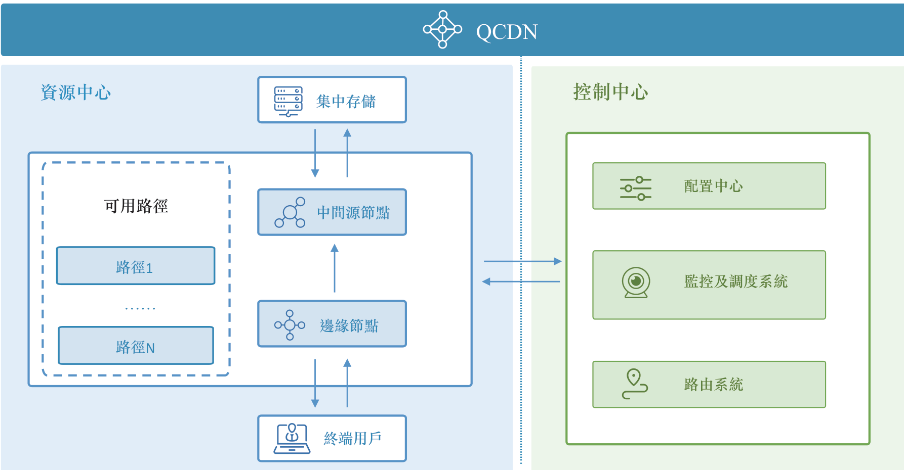

---

## 第 258 页

我們於公有雲上向客戶提供QCDN產品，按網絡流量或帶寬使用情況收費。針對有海外業務的客戶，我們也提供全球QCDN服務。

酷開科技

深圳市酷開網絡科技股份有限公司，成立於2006年，為互聯網智能電視行業提供技術與運維服務。主要業務有：大內容業務、數字化營銷業務、融媒體業務及智屏業務。

主要場景

• 智能電視點播內容分發

解決方案與價值：

• 提供自研的邊緣加速能力和端到端的質量監控體系，帶來更好的用戶觀看體驗。

• 我們的智能調度能力有助客戶減少流量成本。

基於我們的音視頻處理能力，客戶可實現組成其大內容業務核心的高清及超高清的內容轉碼。

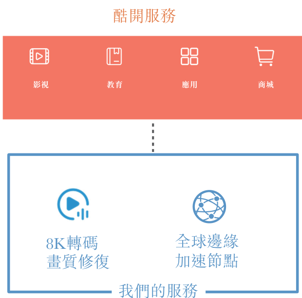

Kodo — 對象存儲平台

對象存儲是一種用於存儲非結構化數據的數據存儲架構，其將數據劃分為單元，即「對象」，並將其存儲於扁平結構數據環境中。各「對象」均包括數據、元數據及唯一識別碼，應用程序可利用該等識別字輕鬆訪問及檢索。Kodo是我們的專有對象數據存儲及管理平台，支持集中存儲及邊緣存儲。Kodo可作為雲端異構數據池，即表示所有類型任何規模的數據，包括文本、圖像、音頻、視頻、結構化表格等（無論是結構化、半結構化或非結構化），可整合並存儲在一個集中位置。這異構數據池可為用戶提供全面的數據訪問及存儲，以及全生命週期的數據管理，而無需考慮數據的原始格式。Kodo可以與其他數據分析產品（如Dora）一起使用，使用戶能夠優化海量數據的底層價值。用戶可對存儲數據運行不同類型的分析，以提供可行見解並推動更好的決策。Kodo設計在雲原生架構上，支持多雲部署。通過簡單可靠的API及SDK連接我們的平台，客戶能夠便捷地傳輸和管理數據。由於人工智能的發展增加了對存儲及算力的需求，我們於2023年開始向客戶提供存儲及算力一體機服務器。

Kodo的主要特徵包括：

• 上傳／下載 — 我們為用戶提供針對不同上傳或下載場景的各類API／SDK和工具，並通過加速服務支持自服務器下載和客戶直接上傳。

• 跨區域同步 — 跨區域同步通過簡單的操作為用戶提供不同存儲區域的數據遷移和同步，實現異地數據容災。

---

## 第 259 页

業務

生命週期管理—用戶可以通過生命週期管理根據其業務需求選擇存儲空間。其可以設置成允許自動轉換為指定存儲類型或在經過設定的時間後自動刪除。

低頻存儲—低頻存儲較標準存儲價格更實惠，可應用於數據實時訪問、讀取頻率低的業務場景，如數據備份等。

鏡像存儲—鏡像存儲可用於業務系統中現有數據的遷移，幫助用戶無縫完成數據遷移，而不會影響對業務系統的訪問。

OPPO

OPPO廣東移動通信有限公司，是全球領先的智能設備生產商。

主要場景

• 文件下載、存儲和分發

解決方案與價值

我們的對象存儲及智能音視頻功能支持客戶智能手機雲服務的相關服務，例如用戶數據的雲備份。

我們的對象存儲及綜合CDN服務有助無縫存儲及分發客戶應用市場、硬件升級及系統升級的相關內容。

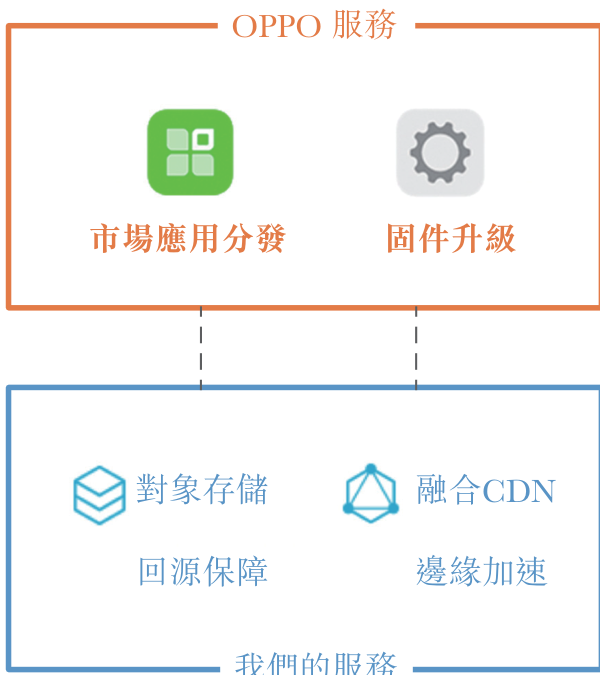

Kodo有時於公有雲提供給我們的客戶，按存儲量收費。對雲中的兼容性、可靠度、隱私性和安全性有更高需求的客戶，Kodo也可以部署在客戶的服務器或我們為客戶搭建的私有雲上，按存儲量收費。如果由我們搭建私有雲，我們有時會為客戶提供一體機服務器服務。我們通過構建海外雲基礎設施發展海外的存儲業務，並藉此逐步鋪開我們雲存儲節點和海外供應鏈能力。

---

## 第 260 页

2021年，隨著COVID-19爆發及各行業對私有雲及公有雲存儲投資快速增長，推動雲存儲需求急劇增長，令我們的Kodo業務受益，我們於2022年面臨有關一體機服務器業務的部分限制，詳述如下：

宏觀經濟因素：我們的一體機服務器業務依賴半導體晶片的穩定供應。由於COVID-19疫情、消費電子產品需求增加以及勞動力短缺導致的半導體晶片生產中斷，全球半導體晶片供應出現短缺。此外，自2022年中以來，美國政府宣佈了針對中國人工智能及半導體技術的新規則與出口管制政策。該等限制措施阻止了美國人工智能電腦晶片公司向中國出售美國製造的先進晶片、晶片設計軟體、半導體製造設備以及人工智能及超級計算所需的零部件。該等限制措施影響了對中國的半導體晶片供應。儘管我們通常使用的半導體晶片可能不受相關出口管制限制，但我們注意到宏觀經濟因素可能會增加日後我們硬件業務的不確定性。

針對COVID-19的出行限制：2022年，中國的COVID-19導致許多城市實施臨時限制措施，包括我們總部所在地上海。根據上海市政府發佈的公告，上海於2022年3月22日至2022年6月1日期間實施出行限制。我們的大部分銷售及行銷團隊成員均駐紮上海，於上海臨時出行限制期間，彼等無法拜訪客戶或開展面對面的行銷活動。出行限制亦影響了硬件的供應及交付，推遲了我們為客戶部署及實施解決方案的時間，對一體機服務器業務造成了嚴重干擾。例如，一體機服務器的交付訂單數量從2021年的228個降至2022年的60個。我們的硬件交付亦由於交通限制而遭到延遲。

鑑於面臨上文所詳述的限制及由於我們重新調整了業務重點，特別是在2021年9月正式推出APaaS業務，一體機服務器業務的作用已經減弱。對各業務分部的資源利用情況進行評估後，我們於2022年2月作出決策，縮減一體機服務器業務，將更多資源投至資本密集度較低但毛利率較高的APaaS解決方案。我們自2022年4月開始優化專門負責硬件業務的銷售人員。2023年，隨著行業內一體機服務器業務復蘇，我們逐漸增加一體機服務器業務。倘上述宏觀經濟因素或其他相關因素於未來發生變化，我們將審查與硬件相關業務有關的風險，並調整我們的業務戰略。

---

## 第 261 页

互動直播產品

互動直播是指在互聯網上即時或接近即時地同時錄製及播放音視頻內容，觀眾可通過規定的方式進行互動、參與或影響直播體驗。與我們的QCDN產品主要解決音視頻內容播放的用例相比，我們的互動直播產品解決了從主播到觀眾的實時音視頻分發的用例。我們的互動直播產品可滿足開發者在直播和實時互動中不同用例對成本效益及低延時的各種需求。我們提供具備直播發佈、轉碼、時移、數據處理及監控、實時交流等各種功能且延時低、穩定性強及可用程度高的端到端解決方案模組。此外，我們還以SDK的形式為客戶提供各種附加功能，幾乎涵蓋了短視頻和直播中的所有用例，例如拍攝、編輯和發佈。

我們的互動直播產品的主要特徵包括：

• 優質可靠 — 我們提供優質可靠的直播與實時互動。我們的平台提供高性能延時和媒體質量，能在具有挑戰性的網絡條件下工作。我們的客戶可從我們的服務級別協議中得到保證，該等協議提供可用性(例如正常運行時間)及體驗(例如延時)保證。

• 功能全面 — 我們的產品功能廣泛，通過API/SDK、產品用例及第三方插件提供一系列構建塊，以改進客戶的產品並增強終端用戶體驗，例如HLS時移、直播錄製、直播觀看次數統計等。

安全合規 — 我們運用IP限制、時間戳熱鏈接保護(使用時間戳記限制連結有效時間的認證方法)和回撥身份驗證等多種驗證方法，以最大限度地提高數據安全性。此外，我們利用Dora的內容監控等功能幫助客戶滿足各種合規要求。

我們將互動直播產品於公有雲提供給客戶，按使用量收費。

---

## 第 262 页

業務

我們的互動直播產品可實現將實時音視頻內容從主播分發至觀眾以及主播之間以及主播與觀眾之間的實時互動。在典型的多主機語音聊天場景中，主播通過Pili（我們的直播分發工具）廣播實時音視頻內容至觀眾的用戶終端（如移動設備及網頁）。此外，QRTC（我們的實時內容傳輸工具）可同時接收及廣播來自其他主播及觀眾的內容，實現視頻會議及涉及多個主播及觀眾的互動直播等功能。下圖說明我們互動直播產品的典型業務流。

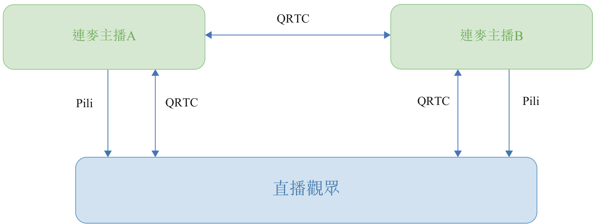

Dora — 智媒數據分析平台

Dora是我們的雲端智媒數據分析平台，提供廣泛的數據處理和分析能力。媒體數據分析需要大量的資源投入、先進技術和複雜的功能系統。我們提供Dora來解決這些需求。Dora利用深度學習技術提供智能數據識別、監控和分析功能，使我們的用戶每天可處理大量音視頻內容。

Dora的主要特徵包括：

• 媒體數據處理 — Dora提供基礎和高階圖像、音頻和視頻處理，包括格式轉換、編輯、畫質增強、轉碼及人像美化等。

識別服務—我們使用深度學習演算法提供識別服務，例如面部識別、場景及對象檢測以及媒體內容標記。我們還提供內容監控功能，幫助客戶滿足各種合規要求。

可定製功能—Dora還為我們客戶提供豐富的公開API/SDK系列，使客戶能夠根據個人需求和要求輕鬆訪問和整合商業合作夥伴開發的各種功能。

---

## 第 263 页

業務

通過多媒體數據處理能力(例如多媒體質量分析及多媒體內容提升)及智能多媒體處理能力(例如業務安全及智能識別相關算法)，我們提供跨多個業務應用場景(例如攝像頭內容智能分析、媒資智能標註、智能監控)的多種音視頻處理能力。下圖闡明Dora的核心能力：

<!-- table html -->
<table><tr><td>應用場景</td><td>攝像頭內容智能分析</td><td>媒資智能標註</td><td>……</td><td>智能監控</td></tr><tr><td>智能多媒體處理</td><td>業務安全相關人臉驗證／內容審核／智能風控</td><td>智能識別人臉對比／語音識別／語音合成／智能翻譯</td></tr><tr><td>多媒體數據處理</td><td>多媒體質量分析</td><td>多媒體內容提升</td></tr></table>
<!-- /table -->

Dora可於公有雲提供給我們大多數客戶，根據API調用次數或使用量收費，其次也可以部署在為客戶搭建的私有雲上，按項目收費。

KOOWO 酷我科技

酷我科技是一家致力於發展以音樂為核心的數字娛樂服務，為互聯網民提供一站式數字娛樂體驗的應用軟件公司。

主要場景

• 圖片內容審核與處理

解決方案

我們提供智能圖片處理能力，針對客戶音樂專輯、音樂社區相關的圖片進行轉碼、壓縮等服務。

我們提供圖片內容審核服務，鑒別黃圖、敏感、暴力等內容，維護客戶音樂社區的內容健康。

我們的APaaS解決方案

我們憑藉十餘年音視頻雲服務行業經驗，洞悉音視頻場景並掌握不同客戶的場景化需求。我們亦已開發一個低代碼平台，為我們的用戶提供一套全面的可定製的音視頻功能及直觀的應用程序開發環境，使彼等能夠有效地開發新應用，而毋須參與編寫複雜代碼及執行大量腳本測試的漫長過程。通過將場景化專業知識與透過低代碼平台交付的我們的MPaaS能力相結合，我們於2021年9月正式推出APaaS業務，涵蓋大量主要音視頻場景。

---

## 第 264 页

我們的APaaS解決方案的主要特徵包括：

高度定製化的場景化解決方案—我們的場景化APaaS解決方案使企業和個人開發者能夠根據業務場景快速創建、處理和分發滿足不同定製需求的音視頻內容。

開放性高—我們APaaS解決方案提供的開放性平台，軟件開發人員可參與我們平台的開發並為平台的音視頻功能做出貢獻，使我們的用戶能夠訪問更全面及最新一套的音視頻功能，同時為我們創造商業價值。

與各種系統高度兼容—我們的低代碼平台與各類主流系統廣泛兼容，可輕鬆地連接至外部系統，這顯著增強APaaS解決方案的可訪問性。

我們憑藉多年來從MPaaS業務積累的經驗，迅速將APaaS解決方案拓展至五大應用場景，包括(i)社交娛樂；(ii)視頻營銷；(iii)視聯網；(iv)智能新媒體及(v)元宇宙。瞬息萬變的音視頻行業意味著音視頻應用場景的邊界正在不斷變化。我們會繼續以我們的一個平台與多個場景的「1+N」策略為依托，開發及迭代我們的APaaS解決方案，以滿足客戶不斷變化的需求及技術創新，並於商機出現時將我們在現有應用場景的成功經驗複製到新的應用場景。

根據艾瑞諮詢，2023年，我們是中國第二大音視頻APaaS供應商，市場份額為14.1%。2023年，我們有2,597名APaaS付費客戶，較2022年增長32.0%，客戶留存率為87.9%。截至2024年3月31日止三個月，我們有2,303名APaaS付費客戶，較2023年同期增長23.4%，客戶留存率為93.7%。

往績記錄期間，大量APaaS付費客戶從我們的MPaaS付費客戶升級而來，是因為我們提供的APaaS解決方案能吸引大量的客戶，彼等需要更直觀及易於訪問的應用開發環境及工具，專門迎合其場景化業務需求，使其能夠更有效地構建複雜的音視頻應用。

下表載列所示期間我們從MPaaS客戶升級而來的APaaS客戶比率：

<!-- table html -->
<table><tr><td colspan="3">截至12月31日止年度</td><td colspan="3">截至3月31日止三個月</td></tr><tr><td>2021年</td><td>2022年</td><td>2023年</td><td>2023年</td><td>2024年</td></tr></table>
<!-- /table -->

自MPaaS客戶升級而來的APaaS客戶比率

<!-- table html -->
<table><tr><td>(累計)(%)</td><td>96.0</td><td>94.7</td><td>91.3</td><td>95.3</td><td>92.4</td></tr></table>
<!-- /table -->

---

## 第 265 页

儘管MPaaS客戶升級為APaaS客戶，我們的大多數客戶於升級後同時使用我們的MPaaS產品及APaaS解決方案。截至2023年12月31日止三個年度及截至2024年3月31日止三個月，自MPaaS升級繼續使用我們的MPaaS產品的APaaS客戶數量分別為159名、322名、459名及275名。

除MPaaS客戶升級外，獨家使用我們APaaS解決方案的新客戶數量逐漸增加，且彼等的平均收入貢獻大幅增加。下表載列所示期間我們的新APaaS客戶（即非從MPaaS客戶升級而來）的數量及平均收入貢獻：

<!-- table html -->
<table><tr><td></td><td colspan="3">截至12月31日止年度</td><td colspan="3">截至3月31日止三個月</td></tr><tr><td></td><td>2021年</td><td>2022年</td><td>2023年</td><td>2023年</td><td>2024年</td></tr><tr><td>APaaS新客戶數量</td><td>53</td><td>69</td><td>162</td><td>30</td><td>35</td></tr><tr><td>APaaS新客戶平均收入貢獻(人民幣元)</td><td>8,079</td><td>138,653</td><td>244,978</td><td>346,795</td><td>424,853</td></tr></table>
<!-- /table -->

下表載列於所示期間我們根據向APaaS客戶提供的場景化解決方案分類，按應用場景劃分的APaaS解決方案收益(以絕對金額及佔APaaS解決方案收益的百分比列示)。

<!-- table html -->
<table><tr><td></td><td colspan="4">截至12月31日止年度</td><td colspan="4">截至3月31日止三個月</td></tr><tr><td></td><td>2021年</td><td>2022年</td><td>2023年</td><td>2023年</td><td>2024年</td></tr><tr><td></td><td>佔APaaS總收益百分比</td><td>佔APaaS總收益百分比</td><td>佔APaaS總收益百分比</td><td>佔APaaS總收益百分比</td><td>佔APaaS總收益百分比</td></tr><tr><td>收益</td><td>人民幣千元</td><td>人民幣千元</td><td>人民幣千元</td><td>人民幣千元</td><td>人民幣千元</td><td>人民幣千元</td></tr><tr><td>社交娛樂</td><td>14,450</td><td>58.1</td><td>97,770</td><td>50.4</td><td>86,796</td><td>30.9</td><td>27,754</td><td>33.3</td></tr><tr><td>視頻營銷</td><td>9,446</td><td>37.9</td><td>87,357</td><td>45.0</td><td>170,261</td><td>60.5</td><td>45,249</td><td>54.4</td></tr><tr><td>視聯網</td><td>404</td><td>1.6</td><td>5,507</td><td>2.8</td><td>18,935</td><td>6.7</td><td>8,991</td><td>10.8</td></tr><tr><td>智能新媒體</td><td>601</td><td>2.4</td><td>3,212</td><td>1.7</td><td>5,063</td><td>1.8</td><td>1,150</td><td>1.4</td></tr><tr><td>元宇宙</td><td>–</td><td>–</td><td>167</td><td>0.1</td><td>304</td><td>0.1</td><td>94</td><td>0.1</td></tr><tr><td>總計</td><td>24,901</td><td>100.0</td><td>194,013</td><td>100.0</td><td>281,359</td><td>100.0</td><td>83,238</td><td>100.0</td></tr></table>
<!-- /table -->

---

## 第 266 页

我們主要按實際使用情況或服務包(配置固定的存儲、數據、軟件包等)向APaaS付費客戶收費。下表載列所示期間APaaS付費客戶的數量及彼等的平均收入貢獻。有關APaaS付費客戶的留存率及擴展率的詳細討論，請參閱本招股章程「業務—關鍵運營指標」一節。

<!-- table html -->
<table><tr><td></td><td colspan="3">截至12月31日止年度</td><td colspan="3">截至3月31日止三個月</td></tr><tr><td></td><td>2021年</td><td>2022年</td><td>2023年</td><td>2023年</td><td>2024年</td></tr><tr><td>APaaS付費客戶的數量</td><td>1,319</td><td>1,967</td><td>2,597</td><td>1,867</td><td>2,303</td></tr><tr><td>– 社交娛樂</td><td>531</td><td>792</td><td>899</td><td>702</td><td>752</td></tr><tr><td>– 視頻營銷</td><td>699</td><td>1,017</td><td>1,474</td><td>1,004</td><td>1,318</td></tr><tr><td>– 視聯網</td><td>70</td><td>116</td><td>172</td><td>122</td><td>165</td></tr><tr><td>– 智能新媒體</td><td>18</td><td>39</td><td>65</td><td>43</td><td>65</td></tr><tr><td>– 元宇宙</td><td>1</td><td>3</td><td>9</td><td>2</td><td>7</td></tr><tr><td>APaaS付費客戶的平均收入貢獻(人民幣元)</td><td>18,879</td><td>98,634</td><td>108,340</td><td>34,319</td><td>36,143</td></tr></table>
<!-- /table -->

下表載列所示期間APaaS付費客戶數量的變動：

<!-- table html -->
<table><tr><td></td><td colspan="3">截至12月31日止年度</td><td colspan="3">截至3月31日止三個月</td></tr><tr><td></td><td>2021年</td><td>2022年</td><td>2023年</td><td>2023年</td><td>2024年</td></tr><tr><td>由MPaaS付費客戶升級的APaaS付費客戶數量^(1)(6)</td><td>1,266</td><td>1,862</td><td>2,371</td><td>1,779</td><td>2,128</td></tr><tr><td>由MPaaS付費客戶升級的APaaS付費客戶佔比^(2) (%)</td><td>96.0</td><td>94.7</td><td>91.3</td><td>95.3</td><td>92.4</td></tr><tr><td>由MPaaS升級繼續使用我們MPaaS產品的APaaS付費客戶數量^(3)</td><td>159</td><td>322</td><td>459</td><td>170</td><td>275</td></tr><tr><td>APaaS新付費客戶數量^(4)(6)</td><td>53</td><td>69</td><td>161</td><td>30</td><td>35</td></tr><tr><td>APaaS新付費客戶的平均貢獻^(5)(人民幣元)</td><td>8,079</td><td>138,653</td><td>244,978</td><td>346,795</td><td>424,853</td></tr><tr><td>APaaS新付費客戶貢獻所佔APaaS收入百分比(%)</td><td>1.7</td><td>4.9</td><td>14.0</td><td>16.2</td><td>17.9</td></tr></table>
<!-- /table -->

---

## 第 267 页

業務

附註：

(1) 由MPaaS客戶升級的APaaS付費客戶數量指本年度／期間由過往或本年度／期間的MPaaS付費客戶升級的APaaS付費客戶的數量。為免生疑，截至2023年及2024年3月31日止三個月由MPaaS客戶升級的APaaS付費客戶數量僅計及(i)通過購買我們的MPaaS產品首次成為我們客戶；及(ii)截至2023年及2024年3月31日止三個月對APaaS作出收入貢獻的客戶數量。

(2) 由MPaaS付費客戶升級的APaaS付費客戶佔比指本年度／期間由過往或本年度／期間MPaaS付費客戶升級的APaaS付費客戶累計數量佔本年度／期間APaaS付費客戶總數的百分比。

(3) 由MPaaS升級繼續使用我們MPaaS產品的APaaS付費客戶數量指本年度／期間(a)由過往或本年度／期間的MPaaS付費客戶升級及(b)自升級以來繼續為我們的MPaaS業務收入作出貢獻的APaaS付費客戶數量。

(4) APaaS新付費客戶數量指於過往或本年度／期間並非由MPaaS付費客戶升級，亦非我們過往APaaS付費客戶的APaaS付費客戶數量。

(5) APaaS新付費客戶的平均貢獻指各APaaS新付費客戶於年／期內產生的平均收入。

(6) 由於為計算本年度／期間APaaS付費客戶數量，過往年度／期間繼續購買我們的APaaS解決方案的APaaS付費客戶亦考慮在內，由MPaaS付費客戶升級而來的APaaS付費客戶數量與APaaS新付費客戶數量之和可能不等於相關年度／期間的APaaS付費客戶數量。

社交娛樂

在社交娛樂場景，我們為客戶社交娛樂的不同用例提供一站式解決方案，包括音視頻內容處理、分發和直播。截至最後實際可行日期，針對社交娛樂的場景，我們已經成功開發下列解決方案：圖片處理與分發、短視頻處理與點播、長視頻處理與點播、文件分發與下載、賽事／秀場直播。

---

## 第 268 页

案例研究—圖片處理及分發解決方案

傳統的圖片處理及分發服務提供商往往採用割裂的方式提供服務，即客戶需要針對圖片的存儲、處理及分發採購單獨的產品，且須透過各種API/SDK接入彼等的應用程序及進行多種測試，以獲得完整的功能。我們提供的圖片處理及分發解決方案，可以一次性簡化整個服務交付過程。以電商圖片處理為例，客戶僅需通過直觀的低代碼平台訪問我們的APaaS解決方案，而彼等於上傳圖片時僅需定製好若干圖片處理功能和基礎性的配置，此後的所有操作均能由系統自動處理。下圖說明我們的圖片處理及分發解決方案的一般工作流程：

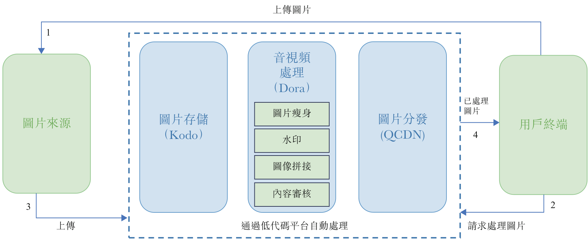

如上圖所示，當用戶終端(如移動設備及網頁)通過我們的圖片處理及分發解決方案請求圖片文件時，我們的QCDN被觸發並自動向Kodo發送下載請求。同時，Kodo根據客戶的配置利用Dora的圖片處理能力，並將處理後的圖片返回至QCDN。處理後的圖片自動存儲於Kodo並透過QCDN分發回至用戶終端。整個過程中，用戶終端與我們的低代碼平台之間並無直接互動，我們的客戶僅負責定製配置，無需編寫代碼以連接與我們平台的影像處理功能對應的API/SDK，亦毋須了解不同組件之間交互的技術方面，從而大大降低了使用我們音視頻服務的技術壁壘。隨着電商平台的顯著增長，從存儲到款式處理、審核和版權保護，圖片處理需求出現顯著增長。我們的一站式APaaS解決方案滿足不斷增長的圖片處理需求，提供圖片上傳加速、處理、審核、存儲和內容分發等一整套服務。

---

## 第 269 页

業務

我們的一站式圖片處理和分發解決方案利用了我們的以下基礎MPaaS能力：

• 雲儲存—來自我們客戶的電商平台的圖像將被自動儲存在Kodo。

處理分析工具—圖像上傳至Kodo後，會被Dora平台下我們的雲原生多媒體處理分析工具處理，如標準化格式、裁剪和精簡、浮水印應用及暴力和色情內容鑒別。

內容分發網絡—我們客戶的終端用戶請求訪問相應圖像時，會部署我們的QCDN以加速數據網絡並通過最近的路徑為用戶提供路由，從而實現頁面的快速載入並改善用戶體驗。

例如，一家中國領先的興趣驅動型移動社交平台，為其用戶提供移動遊戲聊天室和社交聊天室等功能，是往績記錄期間使用我們APaaS社交娛樂解決方案的客戶。我們的APaaS解決方案支持其超過一百萬日活躍用戶的大量音視頻內容（包括圖像、視頻及音頻內容）的便捷上傳、處理及分發。

案例研究—音視頻點播解決方案

我們提供一站式的音視頻點播方案，該方案能覆蓋絕大多數音視頻播放場景，如短視頻點播、長視頻點播及播客。我們可實現全流程一體化管理，包括數據的上傳、處理、內容審核、存儲及分發。下圖說明我們的音視頻點播解決方案的一般工作流程：

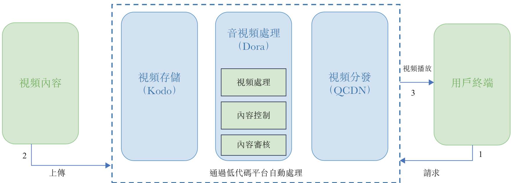

---

## 第 270 页

如上圖所示，我們的音視頻點播解決方案支持分發預先製作的視頻，以便在移動設備及網頁等用戶終端播放。於典型的MPaaS場景中，我們的客戶將在Kodo存儲視頻，利用Dora進行視頻處理或內容審核，並使用QCDN將視頻內容分發至用戶終端，此舉需要我們的客戶有強大的技術開發能力，可編寫代碼以通過離散API／SDK連接到該等功能。我們的APaaS音視頻點播解決方案將該等功能打包至一個解決方案中以便客戶輕鬆訪問及配置。其包括一個用戶友好的配置界面，允許客戶逐步配置視頻上傳、存儲、處理、內容審查及分發。在整個過程中，用戶終端與我們的低代碼平台之間並無直接互動。這消除了客戶額外開發的需要，同時使彼等能夠享受我們提供的全套音視頻功能。

唱吧

唱吧是一款音樂內容社群應用，支持K歌、錄唱、直播等功能。

主要場景

• 社交娛樂場景下的音視頻點播解決方案

解決方案

• 提供一站式音視頻功能，包括音樂視頻數據點播及下載。

提供數據存儲和內容審核服務，包括鑒別內容涉黃、敏感人物等，幫助打造更加安全的互聯網環境。

視頻營銷

我們的視頻營銷場景提供了涵蓋不同營銷用例的解決方案，當中涉及使用音視頻內容，幫助我們的客戶同時於線上接觸大量目標消費者。通過將互動式直播等多種MPaaS能力及場景化專有技術與營銷策略相結合，我們令客戶可快速搭建自有的定製直播平台，便於訪問且設置簡單，從而提高用戶忠誠度並促進轉化。截至最後實際可行日期，針對視頻營銷的場景，我們已經成功開發了下列解決方案：企業直播、互動營銷、低代碼營銷直播、統一消息分發(其為一種融合的多重傳播渠道(如電子郵件、短信及社交媒體)的行銷方式，可從一個中心位置實現信息的即時廣泛傳播)、短視頻營銷。

---

## 第 271 页

案例研究—企業直播解決方案

直播越來越多地應用於企業的營銷活動、培訓、會議等常見營銷場景，旨在通過高度互動的營銷策略，與用戶建立更緊密的關係。我們的APaaS企業直播解決方案使我們的企業客戶能夠快速訪問直播服務，將彼等在線店舖的營銷內容實時準確地傳輸至觀眾(即目標客戶)。我們的企業客戶也可以使用直播數據(由我們的平台處理並根據客戶的配置自動生成)改進運營和營銷策略。

我們APaaS企業直播解決方案的功能包括：

快速組合直播平台—透過低代碼平台利用我們易於使用且直觀的工具包，我們的客戶可以快速組合一個定製化的互動直播平台，該平台可以提供廣泛的功能，包括直播的啟動、與觀眾的實時音頻互動、實時彈幕聊天和產品的直播營銷。

強大的擴展能力—我們的所有組件及模塊，如實時語音聊天及直播管理，均內置於我們的平台中，可通過我們的低代碼平台上的API/SDK輕鬆訪問。我們的客戶可以根據自身需要快速組合組件及模塊來定製應用，全部無需編寫複雜的代碼即可連接到相應的API/SDK。隨後，彼等亦可於需要時通過我們的平台向彼等的應用程序添加新的組件及模塊，而無需重寫代碼。

增強用戶數據的安全性—利用我們的低代碼平台，我們的客戶可從本地IDC到指定雲服務器自由決定其業務數據的存儲位置，為我們的客戶節省時間和資源以與相關供應商建立單獨的聯繫並從相關供應商採購服務。

金山辦公

金山辦公是國內最大的自主研發的辦公軟件開發商。旗下有WPS Office、金山文檔、稻殼兒、金山詞霸等辦公軟件產品和服務。

主要場景

• 視頻營銷場景下的企業直播解決方案

解決方案

• 我們提供智能圖片處理功能及營銷內容海量數據存儲。

我們支持營銷圖片內容的分發加速，實現內容快速觸達到用戶。通過端到端的校驗，確保內容分發至用戶的成功率。

---

## 第 272 页

視聯網

在視聯網場景，我們提供集音視頻雲管理、計算引擎、場景感知分析、雲編解碼、視頻智能處理等其他音視頻功能的一站式解決方案，支持廣泛的物聯網設備，且具備日常生活中各類場景使用的應用，均可通過我們直觀的低代碼平台訪問，該平台旨在滿足不同的應用場景，降低客戶的開發複雜度。例如，我們的解決方案可應用於智能家居、車載視覺智能、智能工業互聯、幼教遠程監看等。截至最後實際可行日期，在視聯網場景下，我們已經成功開發了包括智能家居、智能場館及智能攝像頭上雲等解決方案。

案例研究—智能攝像頭上雲解決方案

我們提供一站式智能攝像頭上雲方案，針對車載、智能家居等不同場地。通過使用我們的解決方案，攝像頭設備的視頻數據即時上傳到雲端，基於客戶根據場景需求配置的功能在我們的雲端進行處理，並推送至用戶的設備以實現實時監看。通過對攝像頭數據的上雲處理，實現海量數據之底層價值的進一步優化，解決更複雜業務場景的訴求。

神州鷹—掌通家園

掌通家園為基於「硬件+軟件+服務+移動互聯網+雲技術」組合構建的學習互動交流平台；家長可以隨時獲知幼兒園的最新動態，和老師一對一交流，觀看實時視頻，實現家校的無縫對接。

主要場景

• 視聯網場景下的智能攝像頭上雲解決方案

解決方案

我們提供場館攝像頭或移動設備從實時流媒體到音視頻內容回放的一體化監控、管理和預警服務及支持。

---

## 第 273 页

智能新媒體

在智能新媒體場景，我們研發出廣電相關解決方案，覆蓋從拍攝、剪輯、多模態分析至內容審核、數據管理及內容存儲的核心電視廣播工作流，通過和領先的廣電企業合作，研發出基於5G環境下拍攝的實時管理和監看服務。此外，利用強大的AI識別分析能力，完成快速剪輯，並將大量內容低延時實時推送至數據管存系統中。在利用與我們的MPaaS產品相同之音視頻功能的同時，我們的低代碼平台和場景化專有技術使我們的客戶能夠以更少的技術開發成本快速組裝必要的服務，以滿足其特定業務需求。截至最後實際可行日期，在智能新媒體的場景下，我們成功開發了包括智能媒資、新媒體拍攝及製作在內的不同解決方案。

案例研究—新媒體拍攝及製作解決方案

傳統的電視綜藝節目拍攝和製作過程，從現場準備、現場拍攝到鏡頭交付、集群和轉碼，通常需要至少十天。隨着5G網絡、超高清視頻等先進技術的發展，對傳統製作流程替代選擇的需求增長，包括多攝像機集中管理、遠程監控製作以及大量原始音視頻內容快編。

我們的APaaS新媒體拍攝製作解決方案主要通過5G智能盒子交付，可實現拍攝設備的集中管理及遠程控制。5G智能盒子的採集終端通常相容主流介面和常見的視頻流協議。其播放終端支持最多九個併發實時視頻流、即時預覽、文本標記等多種功能。我們的雲存儲最多可查看30天的視頻文件。5G智能盒子亦可提供多种初步編輯功能，包括(i)聲紋識別，通過與聲紋數據庫進行比較，在音頻文件中提取及識別語音信息；(ii)人臉識別，能夠準確識別視頻文件中客人的面部信息；及(iii)場景識別，能夠根據信息分析(例如場景中的人物數量)識別鏡頭類型。

我們相信，我們的APaaS解決方案有助於有效解決傳統媒體製作的痛點。我們的APaaS解決方案的主要優勢包括：

實時監控—基於我們的視頻直播設備管理功能，電視導演可以通過網絡或移動設備監控拍攝過程及控制多個設備。在拍攝設備出現缺陷或故障時，可以向監控人員發出預警。

提能增效—我們的智能初步編輯功能亦兼具各種高級功能，而該等功能過往在更耗時的後期製作過程中執行，例如精確定位啟用了我們的人工智能功能，從而具有顯著縮短製作週期及大幅降低後期製作成本的潛力。

---

## 第 274 页

降低風險—我們的自動雲備份服務有助於解決與硬盤丟失或損壞相關的風險。我們的平台亦支持遠程監控及拍攝，這在COVID-19疫情等不利情況下尤其有用。我們的智能初步編輯功能能夠對原始視頻素材進行首次剪輯，同時不會影響保留有用內容以作進一步編輯。

中國以娛樂節目著稱的最大電視台之一的後期製作技術公司採納我們的新媒體拍攝及製作解決方案，在製作過程中實現設備和任務的管理。我們的解決方案使電視導演能夠實現實時監看製作過程，並支持原始素材快編及數據批量處理，從而提高從拍攝到後期製作的效率。

元宇宙

在元宇宙場景，我們將音視頻功能與3D視覺引擎技術相結合，讓客戶通過我們的低代碼平台構建元宇宙交互場景。我們的解決方案支持場景生成、數字人物創建及場景內音視頻通信，該等為元宇宙中允許人際通信的重要組成部分，且對於我們的客戶在元宇宙場景中擴展業務並創造超越現實的商業價值具有巨大的潛力。截至最後實際可行日期，在元宇宙場景下，我們已成功開發以下解決方案：虛擬場景生成、數字人、元宇宙XR直播。

案例研究-文旅數字人解決方案

於此解決方案中，打造具有鮮明特色的數字人作為虛擬人，為文化旅遊點代言。該數字人可廣泛用於宣傳視頻或虛擬直播，以與觀眾產生共鳴。此外，通過結合裸眼3D、全息投影、AR/VR及動作捕捉技術，數字人指引遊客參觀景點及自然風光、欣賞文化表演和3D虛實互動。

上海浦江郊野公園奇蹟花園

主要場景

• 元宇宙場景下的文旅數字人解決方案

解決方案

• 用戶可在微信上通過線上的元宇宙文旅小程序隨時隨地看到園區景觀。

• 用戶可使用規定模板快速生成自己的個性化游園Vlog，並上傳至其社交媒體平台。

通過小程序，用戶一邊游園，一邊能結識到其他游客，並用自己的元宇宙形象進行互動。

---

## 第 275 页

業務

下表載列我們的MPaaS與APaaS業務在主要功能、缺點、目標客戶、定價模式、為客戶帶來的附加值、底層技術基礎設施及於中國音視頻雲服務市場的市場定位的主要區別：

<!-- table html -->
<table><tr><td colspan="2">MPaaS</td><td>APaaS</td></tr><tr><td>主要功能</td><td>• 通過離散與單獨的音視頻功能相關的API或SDK啟用，更易於擴展，尤其適合資源密集型業務場景</td><td>• 以場景化解決方案的形式交付，並通過我們的低代碼平台訪問定製化音視頻功能</td></tr><tr><td>為客戶帶來的附加值</td><td>• 靈活性高 • 穩定可靠性強</td><td>• 訪問簡單方便 • 多樣的音視頻功能，滿足具體業務場景</td></tr><tr><td>缺點</td><td>• 需要更強的技術能力方能訪問我們的產品 • 定價易顯著受資源價格波動的影響</td><td>• 與MPaaS產品相比，可擴展性較小</td></tr><tr><td>目標客戶</td><td>• 技術能力較強、靈活性要求較高的客戶</td><td>• 技術能力相對有限且業務場景清晰劃分、彼等的業務模式需要快速驗證的客戶 • 擁有必要技術能力但對自身資源發展技術持謹慎態度的客戶</td></tr><tr><td>定價模式</td><td>• （就公有雲而言）通常根據實際使用情況按月收取服務費 • （就私有雲而言）通常根據所需軟硬件規模及私有雲授權期限收費</td><td>• （就公有雲而言）通常根據實際使用情況或服務包按月收取服務費 • （就私有雲而言）通常根據項目的具體需求收取一次性服務費</td></tr></table>
<!-- /table -->

---

## 第 276 页

業務

<!-- table html -->
<table><tr><td colspan="2">MPaaS</td><td colspan="2">APaaS</td></tr><tr><td>底層技術基礎設施</td><td>• 基礎音視頻功能、資源調度、故障隔離等 • AI技術</td><td>• 低代碼平台 • 全部MPaaS功能 • 支持通過簡單的外掛程式升級以融入新功能</td></tr><tr><td>於中國音視頻雲服務市場的市場定位</td><td>• 專業開發人員可以使用該平台進行高度定製的應用程序開發</td><td>• 入門級開發人員或不具備程式設計知識的人員可以直接使用高效的應用程序開發</td></tr></table>
<!-- /table -->

下表載列我們的MPaaS產品及APaaS解決方案的目標客戶的行業、業務性質、規模及在各自行業中的地位、支出模式和支出水準的詳細比較：

MPaaS目標客戶

APaaS目標客戶

<!-- table html -->
<table><tr><td>行業</td><td>• 涉及廣泛的行業，主要包括TMT(技術、媒體及電信)行業的公司，例如短視頻社區、電商平台、科技平台等</td><td>• 涉及廣泛的行業(尤其是經營實體經濟的公司)，包括金融、能源、製造、房地產等</td></tr><tr><td>業務性質</td><td>• 通常為商業模式由廣告流量驅動的公司</td><td>• 通常為正在進行數字化轉型的企業</td></tr><tr><td>規模及於各自行業的地位</td><td>• 大型、中型及長尾企業</td><td>• 中小型企業</td></tr><tr><td>支出模式</td><td>• 通常根據實際需求進行採購及偶爾按項目交付</td><td>• 通常根據年度預算進行採購並按項目交付</td></tr><tr><td>支出水準</td><td>• 大中型企業的支出水準普遍較高，而大量長尾企業的支出水準普遍較低</td><td>• 客户通常擁有適當消費能力</td></tr></table>
<!-- /table -->

---

## 第 277 页

其他

我們開發了Pandora以向客戶提供DPaaS解決方案。Pandora是一個實時機器數據分析平台，包括收集、索引、搜索、報告、分析、警報、監控及數據管理功能。Pandora使我們的客戶能夠開發、運行及管理數據分析應用，而無需從零開始構建及維護基礎底層。

Pandora可預置在客戶的服務器上，按項目收費。此外，Pandora亦可於公有雲提供予我們的客戶，按使用情況收費。由於我們主要從事音視頻雲服務市場，在繼續執行與客戶的現有合同的同時，我們並無計劃擴大DPaaS業務。

我們同時提供其他雲服務，主要包括QVM，為一套包括雲服務器、數據庫、網絡、安全及存儲的綜合解決方案。我們提供安全、可擴展、點播計算資源，以便客戶靈活部署應用及工作量。針對我們的QVM服務，我們按使用情況向客戶收費。我們根據客戶需求向彼等提供其他雲服務。

渠道

下表載列我們的服務供應渠道及其各自的特徵及預期商業化時間表：

服務渠道

特徵

預計商業化時間表

APaaS解決方案－將APaaS解決方案擴大至應用場景

智能新媒體下的電視廣播拍

攝及製作雲解決方案

其建立在並進一步鞏固我們在綜藝節目

2024年下半年

拍攝及製作方面的能力及經驗的基礎

上，將我們的能力擴展到大眾電視廣播

行業的拍攝和製作過程中。我們可

靠的雲服務調度能力，能靈活結合各種

音視頻雲服務，包括如智能拍攝、

智能媒資及智能剪輯等，從而進一步

降低製作團隊的技術部署門檻。

---

## 第 278 页

業務

<!-- table html -->
<table><tr><td>服務渠道</td><td>特徵</td><td>預計商業化時間表</td></tr><tr><td>AIGC數字人解決方案</td><td>其基於元宇宙場景下的數字人解決方案開發而成，且我們計劃設計出在外觀、表情及互動上與人類非常接近的2D及3D數字人。該等數字人可用於直播及直播流營銷目的，從而為客戶節省成本及資源，同時提升用戶參與度及滿意度。</td><td>2024年下半年</td></tr><tr><td>視聯網場景下的農業監控解決方案</td><td>其能夠在農業場所進行安防監控，並開發與農牧產品的生長與健康有關的算法。通過將攝像頭直接連接到雲上，並對採集到的數據進行AI處理，從而提高農業的數字化及效率。</td><td>2025年上半年</td></tr><tr><td>AIGC 3D內容生成平台</td><td>其建立在我們的數字人生成、3D對象生成及3D材料與圖像生成能力的基礎上，可用於3D場景及角色生成，以及遊戲腳本及代碼生成，從而加速內容創作流程及提升彼等音視頻內容的整體質量。</td><td>2025年下半年</td></tr><tr><td colspan="3">MPaaS解決方案－鞏固及深化我們的MPaaS功能優勢，減少客戶訪問成本，優化供應鏈資源及提高研發效率</td></tr><tr><td>雲邊資源調度平台</td><td>其能在雲邊實現資源監控及媒資調度，並支持邊緣計算場景，有助於減少延時。其亦能擴展資源以適應不斷變化的工作量需求。</td><td>2024年下半年</td></tr><tr><td>AIGC Kodo解決方案</td><td>其實現了數據湖及數據存儲的集成，並與主流向量數據庫(包括各種公開源數據、非結構化數據及大數據等)兼容，可用於提供一站式AIGC數據存儲解決方案及幫助減少存儲成本及處理時間，同時提升數據安全及可靠性。</td><td>2024年下半年</td></tr></table>
<!-- /table -->

---

## 第 279 页

業務可持續性及盈利之路

我們於往績記錄期間並無獲得淨利潤，主要是由於以下事件的合併影響：

(a) 業務擴充優先於短期盈利：於往績記錄期間，我們優先發展並持續擴充音視頻MPaaS及APaaS業務，特別是2021年正式推出的相對較新、盈利能力更強的APaaS業務，我們相信該業務具有較高的市場增長潛力。根據艾瑞諮詢，2023年中國音視頻APaaS市場規模為人民幣20億元，預計2028年將達到人民幣144億元，複合年增長率為48.6%。由於中國APaaS市場仍處於早期發展階段並正在經歷快速增長，因此我們對業務進行戰略投資，優先考慮業務擴充及市場份額增長，而非短期盈利，以於上升的市場中抓住市場機會。例如，與發展我們的服務相關的研發(包括我們的APaaS業務)涉及大量的投資，且該等投資尚未完全進入回報期。截至2023年12月31日止三個年度以及截至2024年3月31日止三個月，我們產生的研發開支分別為人民幣143.4百萬元、人民幣128.8百萬元、人民幣128.0百萬元及人民幣33.6百萬元。特別是，我們投入大量投資開發APaaS解決方案的新功能，其中部分尚未帶來可觀的收入，但我們相信具有很高的市場潛力，其中包括(i)社交娛樂場景的音視頻點播解決方案；(ii)視頻營銷場景下的企業直播解決方案；(iii)視聯網場景下的智能攝像頭上雲解決方案；(iv)智能新媒體場景下的新媒體拍攝及製作解決方案；及(v)元宇宙場景下的數字人解決方案。有關該等解決方案的市場潛力詳情，請參閱本節「-(i)專注及深化我們的APaaS業務」一段。

就實現盈利所需的時間而言，本公司於往績記錄期間的虧損狀況亦符合行業的總體趨勢。根據艾瑞諮詢，鑑於前期的大量投資，尤其是於研究及為快速佔領額外市場份額所採取的一般定價政策，於音視頻PaaS行業營運的公司通常尚未實現盈利。音視頻雲服務商實現盈利通常需要十年以上。例如，競爭對手A（如「行業概覽－競爭格局」一段所列），於2009年成立的領先音視頻雲服務商，宣佈其於2022年財政年度首次取得年度正淨利潤，歷時13年轉為盈利。根據艾瑞諮詢，前五大音視頻PaaS競爭對手中僅一家公司於2023年實現盈利。

---

## 第 280 页

(b) 為應對不斷變化的市場環境而縮減若干業務板塊的決策：雖然我們於2021年於異常有利的市況下錄得35.1%的強勁收入增長，主要是由於受COVID-19爆發及各行業對私有雲及公有雲存儲投資快速增長的推動，雲存儲需求急劇增長使得我們的Kodo業務受益，我們於2022年作出決策來調整業務重點，以應對不斷變化的市場環境。特別是，COVID-19疫情長期反覆，出行受限，加上若干半導體晶片(我們為部分私有雲客戶採購的一體機服務器(須於內部配置預裝音視頻軟件及解決方案的服務器)的主要組成部分)供應短缺，導致對一體機服務器業務的供應鏈中斷，而一體機服務器業務是我們Kodo業務的重要組成部分。鑑於上述事項，我們於2022年作出縮減一體機服務器業務的決策。因此，我們來自Kodo業務的收入從2021年的人民幣650.8百萬元下降至2022年的人民幣320.4百萬元，我們的總收益及毛利亦相應下降。由於2023年COVID-19基本得到控制，供應鏈穩定恢復，我們於2023年將資源重新分配至Kodo業務。我們的客戶參與通常需要時間才能實現實際收入增長。尤其是，由於Kodo產品採購通常按項目基準進行，故客戶從一個服務提供者切換至另一個需要時間。因此，與2022年相比，2023年我們來自Kodo業務的收入仍保持在較低水平人民幣297.8百萬元。另一方面，由於我們的APaaS業務處於早期發展階段，故上述事件並未對APaaS業務產生任何重大影響，因此我們的APaaS業務實現顯著增長，且其未涉及向我們客戶提供的任何一體機服務器。

(c) 非經常性項目：我們於往績記錄期間產生部分一次性開支，例如2021年諮詢及其他專業服務費人民幣40.8百萬元，主要與我們之前於2021年嘗試在納斯達克上市有關。我們亦於2021年、2022年及2023年以及截至2024年3月31日止三個月因精簡僱員結構而分別產生遣散費人民幣10.1百萬元、人民幣36.6百萬元、人民幣9.2百萬元及人民幣0.2百萬元，及我們於2023年及截至2024年3月31日止三個月分別產生上市費用人民幣18.6百萬元及人民幣7.5百萬元。此外，我們分別於2021年、2022年及2023年以及截至2024年3月31日止三個月確認可換股可贖回優先股的公平值虧損人民幣96.5百萬元、人民幣83.8百萬元、人民幣156.1百萬元及人民幣111.5百萬元。所有該等事項對我們於往績記錄期間的財務表現造成不利影響。

---

## 第 281 页

盈利之路

經過多年發展，我們在音視頻PaaS行業(尤其是相對較新的音視頻APaaS行業)逐漸取得了可觀的市場份額及領先地位。根據艾瑞諮詢的數據，就2023年的收入而言，我們為中國第三大音視頻PaaS供應商及第二大音視頻APaaS供應商。展望未來，我們計劃著重關注擴大業務的同時實現盈利。我們的經調整淨虧損(非國際財務報告準則計量指標)由2022年的人民幣118.7百萬元減至2023年的人民幣115.6百萬元，再由截至2023年3月31日止三個月的人民幣30.7百萬元減至截至2024年3月31日止三個月的人民幣24.2百萬元，及我們的經調整淨虧損率(非國際財務報告準則計量指標)由2022年的10.3%減至2023年的8.7%及截至2024年3月31日止三個月的7.1%。改善主要是由於MPaaS業務持續恢復，APaaS業務的持續增長，以及於我們努力控制成本之下，我們的成本及費用所佔收入百分比下降，其部分被以公平值計入損益的金融資產的公平值變動帶來的損益波動所抵銷。我們預計隨著行業及我們的業務的增長，以及我們為進一步提升效率所實施的措施，我們的經調整淨虧損(非國際財務報告準則計量指標)於整個2024年將持續提升。具體而言，我們計劃通過以下方式進一步提高我們的財務表現：(i)專注及深化我們的APaaS業務；(ii)保持並持續增強我們的MPaaS業務的競爭優勢；(iii)擴大我們的客戶群以及向彼等提供的解決方案；及(iv)有效管理成本。

(i) 專注及深化我們的APaaS業務

隨著音視頻雲行業的發展，對(i)音視頻功能的更多定製，(ii)對客戶操作的多種場景有較深入的了解，(iii)技術門檻較低、更容易及時接入，(iv)場景化音視頻功能的智能陣列更強；及(v)總體上服務品質及效率的需求顯著提高。憑藉逾十年的音視頻雲服務行業經驗，我們開發MPaaS業務的各種音視頻功能，並了解音視頻場景且洞悉廣大客戶群的場景化需求。結合專有低代碼平台，我們快速開發了APaaS解決方案，涵蓋了廣泛的音視頻場景。

我們擬進一步滲透及深化APaaS業務的各種應用場景，以在快速增長的音視頻APaaS市場中把握機遇。由於音視頻APaaS市場是一個新興行業分部，我們作為市場領導者，受益於明顯的先行優勢，例如強大的議價能力。2023年及截至2024年3月31日止三個月，我們APaaS業務的毛利率為30.1%及29.2%，而同期MPaaS業務的毛利率為19.3%及18.2%。我們計劃通過升級及迭代我們的低代碼平台以及向現有及新客戶提供各類場景下的更多增值服務，例如智能新媒體場景下的電視廣播拍攝及製作雲解決方案以及視聯網場景下的農業監控解決方案，進一步擴大APaaS業務。

---

## 第 282 页

於2021年正式推出我們的APaaS業務後，我們的APaaS解決方案獲得好評，此舉導致我們的APaaS客戶群顯著擴大，主要是由於(i)對有場景需求使用我們的APaaS解決方案的MPaaS客戶進行大範圍升級；及(ii)APaaS新付費客戶(即並非從MPaaS客戶升級而來)逐漸增加。

我們的APaaS新付費客戶開銷亦大幅上漲，由2021年的人民幣8,079元增至2023年的人民幣244,978元，再增至截至2024年3月31日止三個月的人民幣424,853元，主要是由於少數因素，包括(i)APaaS解決方案的特點作為一站式解決方案提供易於訪問及綜合功能可滿足客戶的各種場景需求，(ii)不斷積累APaaS解決方案的市場信心及因此對APaaS解決方案的付費意願，以及(iii)我們的營銷及客戶教育工作，例如，通過採用更主動的客戶關係管理策略，提供個性化的客戶支持及交叉銷售產品及解決方案或升級客戶的檔案，有助於培養客戶忠誠度並吸引更高的支出。具體而言，我們(i)組建了專門的獲客團隊，探索潛在客戶並了解彼等的需求和偏好；(ii)採取廣泛的營銷及品牌推廣舉措，涉及不同渠道、廣告、社交媒體、行業會議、業務合作等；(iii)為潛在客戶提供免費試用及演示，以提高彼等對APaaS解決方案的認識並獲得第一手經驗；及(iv)與業務夥伴開展多維度合作，共同推廣APaaS解決方案。例如，獲客團隊由以下成員組成：(a)產品團隊，負責了解及分析客戶需求，確保我們的APaaS解決方案符合彼等的業務要求；(b)售前團隊，提供技術支援並解決客戶查詢，幫助潛在客戶了解我們APaaS解決方案的技術詳情及優勢；及(c)銷售團隊，負責與潛在客戶直接溝通及談判，確保客戶轉化及滿意度。我們預計，隨著我們的APaaS業務達到成熟的發展階段以及更多APaaS解決方案的商業化，我們的APaaS客戶群，特別是APaaS新客戶數量以及彼等的平均支出將進一步擴大。

---

## 第 283 页

(ii) 保持並持續增強我們的MPaaS業務的競爭優勢

憑藉我們在中國音視頻雲行業的十年經驗，我們開發了強大的MPaaS業務，儘管市場競爭加劇，我們將專注保持有關競爭優勢。我們在服務供應的穩定性及可靠性方面擁有良好的往績記錄，並在客戶中建立了良好的聲譽。例如，我們提供多區域災難恢復能力，以降低任何單一數據中心發生故障時的運營風險。我們的MPaaS產品亦配備了針對孤立事件及安全故障的各種安全保護。因此，我們的MPaaS產品每天能夠處理數以千萬計的請求，平均可用性高達99.9%。根據艾瑞諮詢，按運營指標計，截至2024年3月31日，我們已經積累了1,303個API，處於行業高端水準。根據艾瑞諮詢，截至2024年3月31日，我們的MPaaS平台的數據存儲總規模為1.5EB，存儲文件總數為4,947億份，處於行業領先地位。根據艾瑞諮詢，我們的Kodo產品能夠實現較高數據可靠性，公有雲冗餘率為1.14及私有雲冗餘率為1.10，兩者均優於行業平均水準。

我們相信我們與IaaS企業之間的競爭並不是零和博弈，且我們計劃鞏固QCDN產品的競爭優勢，此乃與IaaS企業的主戰場。根據艾瑞諮詢，中國音視頻PaaS市場仍處於高速增長期，其中MPaaS的市場規模到2028年預期將達到人民幣632億元，同期複合年增長率為24.8%。因此，如我們這般的現有音視頻雲服務提供商及新市場參與者(例如IaaS企業)均將公開以搶佔不斷擴大的市場份額，而非從現有的市場參與者中奪取份額。事實上，根據艾瑞諮詢，2023年，我們的收入增長率(即16.3%)高於同期中國前五大音視頻PaaS服務提供商(包括三家IaaS企業)的平均增長率(即11.4%)，同期我們在音視頻PaaS市場的市場份額由5.7%增至5.8%。有關我們與IaaS企業的競爭及QCDN產品的競爭優勢詳情，請參閱本招股章程「業務－競爭」一節。具體而言，由於CDN服務通常為與IaaS企業競爭的主戰場，為應對與該等IaaS提供商的競爭，我們(i)加強與中國頂級互聯網企業的業務關係，該等企業通常是我們QCDN產品的最大客戶，以進一步鞏固我們的競爭優勢；(ii)提供不同的定價方法(例如根據實際使用情況或服務套餐)，以滿足客戶的不同業務需求及分銷模式；及(iii)從事QCDN產品的研發，例如，CDN節點與AI算力的融合，以在未來提供更具競爭力的CDN產品。因此，我們的QCDN業務於2023年及2024年第一季度出現反彈，2023年錄得收入人民幣628.4百萬元，而2022年為人民幣488.9百萬元，同比增長28.5%，以及截至2024年3月31日止三個月錄得收入人民幣176.8百萬元，而截至2023年3月31日止三個月為人民幣145.2百萬元，同比增長21.7%。根據艾瑞諮詢，領先的PaaS提供商正在努力提高利潤率及服務品質，減少大規模促銷及價格競爭，預期該趨勢有利於市場的整體盈利能力，並將有助於穩定競爭格局。

---

## 第 284 页

我們一直高度重視持續創新及研發工作，以擴大服務供應並完善我們現有的產品組合。MPaaS發展策略方面，我們計劃進一步鞏固及深化在MPaaS功能方面的優勢，以降低客戶的訪問成本、優化供應鏈資源及提高研發效率。例如，我們在2024年上半年推出一站式音視頻統一接入平台，匯聚直播、實時互動及攝像頭上雲等底層網絡，進一步降低客戶的音視頻產品的開發複雜度。特別是，一旦客戶於使用互動直播產品時完成流域及回放域的配置，平台自動配置存儲及審核設置。此舉節省客戶訪問互動直播產品約40%的程序，從而降低開發其應用程序的複雜性，並相應降低其訪問成本。雲邊資源調度平台預期將於2024年底商業化，將實現雲邊媒體資源的資源監控及調度，支持有助於降低延時的邊緣算力場景，並實現資源擴展以適應工作負載不斷變化的需求。具體而言，其可實現以毫秒為間隔對資源狀態的實時監控。當檢測到資源故障時，平台可切換至新的可用資源，並在幾秒內實現故障恢復，而傳統的節點配置可能需要幾分鐘方能完成相同的任務。因此，與傳統方法相比，雲邊緣調度平台可有效地實現降低延時。最後，預期於2024年下半年推出的AIGC Kodo解決方案可用於交付一站式AIGC數據存儲解決方案，並幫助減少存儲成本及處理時間。所有該等發展預計將進一步增強我們MPaaS解決方案的功能及用戶友好性，從而推動我們現有及MPaaS新客戶的新需求。加上我們在應對上述競爭方面的不懈努力，我們相信我們將繼續保持在市場上有效競爭。

---

## 第 285 页

(iii) 擴大我們的客戶群及與客戶建立長期關係

於往績記錄期間，我們成功擴大客戶群。MPaaS付費客戶數量由2021年的68,808名增至2022年的83,970名，並於2023年進一步增至92,480名，再由截至2023年3月31日止三個月的62,311名增至截至2024年3月31日止三個月的62,563名。我們旨在培養用戶使用我們產品及服務的習慣，同時擴大我們的客戶群。截至2024年3月31日，我們的註冊用戶超過1,500,000名，其中643,857名為活躍用戶（附註1）。我們擬與現有客戶建立長期關係以及吸引更多註冊用戶，並將彼等或彼等所代表的公司轉化為付費客戶。我們預計經擴大客戶群將帶來規模經濟的增長，從而有助於提高我們的整體盈利能力。具體而言：

(a) 與客戶建立長期關係。作為音視頻雲行業的早期市場參與者之一，我們積累了廣泛的客戶群，該等客戶群一直與我們一起快速發展。我們與客戶共同成長。憑藉我們的技術，我們能夠在客戶發展的不同階段為其提供量身定製的產品及服務，尤其進一步加強我們與該等客戶的長期關係，並有效增加來自該等客戶的平均收入，原因為彼等擴展業務並增加對音視頻雲服務的需求。例如，客戶－供應商集團I是一家提供音視頻社交網絡服務的中國社交媒體公司的集團公司，而客戶H是一家在聯交所上市的中國科技公司，經營領先的內容社區及社交平台，分別自2015年及2014年以來一直為我們的客戶，當時該兩家公司均仍處於相對早期發展階段。客戶－供應商集團I及客戶H繼續與我們共同成長，多年來與我們的業務大幅增長，截至2023年12月31日止年度及截至2024年3月31日止三個月已成為我們最大的兩名客戶。截至2023年12月31日止年度，客戶－供應商集團I及客戶H分別為我們貢獻收入人民幣157.5百萬元及人民幣104.1百萬元，分別佔同期我們總收入的11.8%及7.8%。截至2024年3月31日止三個月，客戶－供應商集團I及客戶H分別為我們貢獻收入人民幣55.2百萬元及人民幣21.1百萬元，分別佔同期我們總收入的16.1%及6.2%。於2021年、2022年、2023年及截至2024年3月31日止三個月，客戶A、客戶H、客戶－供應商集團I及客戶－供應商集團J分別向我們的收入貢獻合共13.9%、22.7%、27.6%及28.0%。我們在音視頻雲行業積累的經驗使我們能夠快速適應新的市場需求，從而享有先發優勢，並與具有良好業務前景的初創及更成熟的企業共同成長。我們計劃繼續深化與現有客戶的合作，尤其關注具有良好業務條件及良好增長前景的客戶，以建立長期關係。

附註：

(1) 活躍用戶數量指於相關期間至少使用過我們的一款產品或以其他方式為我們平台的使用作出貢獻的用戶數量。謹此說明，有關活躍用戶包括參與試用我們的產品但未必會成為我們的付費客戶的用戶。

---

## 第 286 页

(b) 擴大至我們客戶的更多業務場景及積極識別市場需求。我們一直專注於創建場景化音視頻解決方案，以滿足客戶的不同場景需求。我們計劃在APaaS業務的五大場景中創建更多解決方案，其將有助我們的客戶群及／或彼等的支出的增長。例如，在智能新媒體場景中，我們計劃加強智能拍攝、智能媒資及智能剪輯的設計及管理，並為廣電傳媒提供其他解決方案。在視聯網場景中，我們計劃為農業環境開發解決方案。在元宇宙場景中，我們計劃創建用於營銷目的的數字人。我們通過各種線上及線下渠道(包括知名行業會議、現有客戶見解)積極識別及探索各行各業尚未結識的客戶需求。例如，作為新媒體行業會議及論壇的積極參與者，我們了解到傳統綜藝節目製作過程中的痛點，包括數百台攝像機同時在戶外工作、頻繁更換存儲卡、導演切換不同機位以監控拍攝過程等，通常需要大量的人力及維護成本。有鑒於此，我們開發了一種新的媒體拍攝及製作解決方案，使電視導演能夠實現對製作過程的實時監控，並支持原始素材的快速編輯及數據的批量處理，從而提高從拍攝到後期製作的效率。除我們之前參加過的知名行業會議外，我們計劃於未來五年內組織或參加30多個展會、交易會及行業會議。我們旨在將該等多樣化需求整合並擴展至我們的產品開發平台，使我們能夠創新及優化我們的產品及服務。

(c) 促進註冊用戶向付費客戶轉化。我們一直專注於多種策略，以加快客戶的決策過程，降低支付門檻，從而鼓勵非付費註冊用戶轉化為付費客戶。例如，我們簡化平台介面，因此用戶在完成用戶認證後即可一鍵下單，從而縮短決策過程。將向非付費客戶推送及推廣性價比高、較低支付門檻的產品，提供首購折扣或免費試用，鼓勵其付費購買我們的產品，從而進一步擴大付費客戶群。例如，2021年11月，我們為尚未購買我們任何產品的Kodo用戶推出了兩個Kodo資源包(以更具競爭力的價格捆綁各種Kodo資源)的特別折扣。自推出促銷活動以來，每日購買上述資源包的Kodo客戶數量增加逾十倍。截至2023年12月31日止三個年度及截至2024年3月31日止三個月，我們錄得轉換率(按相關期間新註冊用戶於同一期間轉換為付費客戶的百分比計算)分別8.0%、17.3%、20.4%及15.3%。我們將酌情考慮進行類似促銷活動，以加快註冊用戶向付費客戶的轉化。詳情請參閱本招股章程「業務－關鍵運營指標」一節。

---

## 第 287 页

(iv) 有效管理成本及費用

於往績記錄期間，我們產生大量經營開支，包括銷售及行銷費用、行政費用及研發成本，以擴大業務規模、開發新的解決方案及提高品牌知名度。儘管2022年較為困難，我們錄得收益減少，但我們縮小銷售團隊及行政團隊的規模並優化研發團隊，於不影響營運的情況下力求控制成本，並透過我們的成本控制措施，設法將經調整淨虧損(非國際財務報告準則計量指標)維持在2021年的類似水平。我們擬通過實現規模經濟及提高銷售效率和成效，以進一步優化經營開支。展望未來，我們擬有效管理成本及開支所佔總收入的百分比並進一步受益於經營槓桿。具體而言：

銷售及行銷費用

2021年、2022年及2023年以及截至2024年3月31日止三個月，我們的銷售及行銷費用分別為人民幣193.0百萬元、人民幣147.5百萬元、人民幣139.1百萬元及人民幣27.4百萬元，分別佔同期收入的13.1%、12.9%、10.4%及8.0%。自2022年起，我們的銷售及行銷費用佔收入的比例有所下降，2023年及2024年第一季度進一步下降，其乃由於我們的成本控制努力以及由此產生的人事調整。儘管進行了成本控制及人員調整，我們仍期望繼續從我們已建立的更高品牌知名度中獲益。具體而言，我們打算透過以下措施提高銷售及行銷效率：

(a) 我們已經並將繼續參加世界人工智能大會(World Artificial Intelligence Conference)、QCon全球軟體發展峰會(QCon Global Software Development Summit)、全球運營峰會(Global Operation Summit)、全球人工智能技術大會(Global Artificial Intelligence Technology Conference)、ArchSummit、全球互聯網架構大會(Global Internet Architecture Conference)、上海網絡安全博覽會暨高峰論壇(Shanghai Cyber Security Fair and Summit Forum)、智能製造論壇(Smart Manufacturing Forum)、國際智能網聯汽車技術大會(International Congress of Intelligent and Connected Vehicles Technology)等行業知名會議。該等會議及活動幫助我們更好地展示了最新的產品、服務及研究創新成果，吸引了更多開發者及客戶使用我們的平台，鞏固了我們在音視頻PaaS行業的領先市場地位。例如，我們於2023年3月於深圳舉辦閉門會議，吸引了20多家生物技術公司參會，進而轉化為截至2023年12月31日止年度與參會公司的合約價值人民幣數百萬元。我們將繼續專注於該等高效且勞動密集程度較低的渠道，以提高我們的銷售及行銷效率；

---

## 第 288 页

(b) 我們積極探索各種行銷渠道，無論是傳統渠道亦或其他渠道，以進一步提高我們的行銷效率。我們的銷售及行銷團隊致力於與客戶接觸，了解客戶需求，提高服務品質。此外，我們採用搜尋引擎優化作為行銷策略，以提高平台流量的品質及數量。我們亦重視與業務相關企業的合作，為彼等提供平台建設所需的資源及技術指導，從而為我們的平台帶來更多流量及收入。例如，我們於2023年與20家企業(為我們的音視頻功能供應商)達成了業務合作，主要由人工智能服務供應商及其他音視頻解決方案供應商組成。往績記錄期間內，我們亦與第三方訂立業務合作協議，目的是通過收入共享機制共同開發產品。有關該等業務合作夥伴安排的詳情，請參閱本招股章程「業務－我們的供應商－業務合作夥伴安排」一節。透過與該等業務夥伴的密切合作，我們亦獲得了有關客戶經營所在的業務場景的重要知識，這有助於提高我們場景化平台的深度及廣度，吸引更多相同業務場景的客戶；

(c) 透過內部培訓及考核制度，我們建立了一支訓練有素的銷售及行銷團隊。我們對銷售及行銷團隊進行定期培訓(培訓內容包括產品知識、銷售及談判技巧)以及臨時的售前及小團隊培訓。例如，截至2023年12月31日止三個年度及截至2024年3月31日止三個月，我們合共為員工舉辦了超過80次培訓。我們將繼續在內部培訓系統中投入資源，以提高銷售及行銷團隊的能力及效率；及

(d) 我們在客戶管理方面實施了先進高效的系統。除了客戶關係管理(CRM)系統能夠簡化及優化銷售流程、即時查看銷售機會及溝通記錄等，我們亦於2022年引入了觀遠數據運營的數據平台，透過結合商業智能工具，促進銷售數據分析、優化資源配置、預測及規劃。我們的銷售及行銷團隊能夠檢索觀遠數據平台生成的數據圖表，涵蓋了客戶管理及銷售激勵的各個方面，包括客戶使用的日常監控、損益分析、週期比較及績效激勵等。此外，我們亦根據客戶的收入貢獻及行業特點，實施了多級客戶跟進策略。例如，較高級別的客戶將由我們經驗豐富的線下銷售團隊進行一對一跟進。線下銷售團隊可提供全方位的專業諮詢服務，並提供與該等關鍵客戶最相關的解決方案，旨在進一步提高客戶忠誠度及滿意度，從而提高留存率。該等努力均有望不斷提高我們的行銷效率。

---

## 第 289 页

研發成本

截至2024年3月31日，我們擁有一支168人的研發團隊，佔當時員工總數的43.3%。2021年、2022年及2023年以及截至2024年3月31日止三個月，我們的研發成本分別為人民幣143.4百萬元、人民幣128.7百萬元、人民幣128.0百萬元及人民幣33.6百萬元，分別佔各期間總收入的9.7%、11.2%、9.6%及9.8%。我們的研發團隊於2022年進行縮減，原因是我們決定裁減對本公司業務貢獻較小且不再為本公司重點的業務(如DPaaS業務)的研發人員。

展望未來，我們將繼續加強研發能力，以保持我們的競爭力。我們預計將保持與我們的規模及長期業務增長相適應的研發團隊規模，並繼續提供有競爭力的薪酬及福利，以吸引及留住人才。同時，我們計劃繼續提高研發效率。我們將透過採取以下措施，於短期財務業績與長期業務前景及盈利能力之間取得最佳平衡：

(a) 我們已經並將繼續對產品組合進行深入審查，將研發工作集中在具有重大財務影響及／或較高回報的產品上(如我們的APaaS解決方案)，以提高研發效率。例如，鑑於人工智能應用的爆發式增長，我們計劃開發AIGC Kodo解決方案，其可用於提供一站式AIGC數據存儲解決方案，並幫助客戶降低存儲成本，縮短處理時間。此外，元宇宙場景中，針對電商場景中的痛點(如24小時直播行銷，通常需要花費大量的主播成本)，我們正在開發AIGC數字人解決方案，包括2D及3D數字人，該等數字人於外形、表情及互動上與人類非常相似，可用於直播及直播行銷。所有該等業務場景均為具有長期商業前景，我們相信，隨著該等解決方案的商業化，我們快速適應客戶業務場景的能力將有利於未來中長期的盈利能力；及

(b) 我們於研發部門推行跨團隊協作機制，以提高研發效率。具體而言，我們將不同產品團隊的研發人員整合起來，促進項目的合作及共同開發，這對於依賴類似底層資源及基礎設施的產品尤其有效。結合跨產品、跨團隊的架構設計審查機制，我們透過重複利用以往的研發工作來實現項目的快速完成，從而更有效地利用資源，提高整體研發效率。以QCDN產品的若干研發項目為例，月均完成的任務數從2022年的186項增至2023年的232項。

---

## 第 290 页

儘管於往績記錄期間對研發團隊進行了優化，我們於2021年成功開發了APaaS業務，已獲得市場認可，並確保了我們於音視頻雲服務行業的領先地位，足證我們的研發能力。透過上述提高研發效率的措施，我們預計，隨著我們業務的持續增長及我們對研發的謹慎投資，我們的研發費用佔總收入的比例將逐漸下降。

行政費用

2021年、2022年及2023年以及截至2024年3月31日止三個月，我們的行政費用分別佔總收入的8.1%、9.7%、10.2%及9.0%。2021年至2022年，我們的行政費用佔總收入的比例有所上升，主要原因是：(i)收入減少；及(ii)2022年，我們為控制成本而縮減團隊規模，導致遣散費增加。2023年，我們的行政費用佔總收入的比例進一步上升，主要原因是：(i)以股份為基礎的付款增加導致員工成本增加；及(ii)與我們建議上市有關的上市費用增加，惟部分被2023年減少裁員導致的遣散費減少所抵銷。截至2024年3月31日止三個月我們的行政費用佔總收入的比例有所下降，主要是由於遣散費減少。我們擬透過提高管理水平、簡化內部工作流程以及利用技術而提高便利性、成本效益及生產力，從而優化我們的行政費用。

我們根據市場情況定期進行管理審查，以確保高效率及高效益的運營，我們相信我們在進一步提高運營效率方面仍有巨大空間。我們已經並將繼續全面審查我們的運營，包括研發、銷售及行銷以及客戶支援流程，以精簡我們的業務流程，重點關注核心程式，從而提高效率及成本效益。例如，我們引入了HRSaaS人才管理平台，將員工入職、調動及離職系統化，提高了處理行政事務的效率。通過在行政事項上實施更標準的操作流程，我們預期進一步提高我們的運營效率。

透過上述提高運營效率的措施以及減少上市費用等非經常性開支，我們預計，隨著規模經濟的擴大及運營效率的提高，行政費用佔總收入的比例將逐漸下降。

---

## 第 291 页

營運資金充足性

考慮到我們的現金及現金等價物、經營現金流量、銀行借款、可用銀行融資及全球發售估計所得款項淨額，董事認為我們有充足的營運資金，可滿足我們目前及自本招股章程日期起計未來12個月的需求。經考慮上文所述，並基於本公司就營運資金充足性發出的書面確認、對會計師報告的審閱、於往績記錄期間對本集團歷史財務資料進行的財務盡職調查及與董事的討論，聯席保薦人並未注意到任何重大事項，足以質疑本公司的結論，即本公司擁有充足營運資金滿足其目前及自本招股章程日期起計未來十二個月的需求。

我們的基礎設施和技術

我們的雲原生基礎底層和網絡

通過與主流雲計算服務商合作，我們的技術基礎設施建立在高度可擴展的雲原生技術架構之上。雲原生基礎設施代表了一種設計、構建及運行工作負荷的方式，其於雲中構建，並充分利用了雲計算模式的優勢。基於該雲架構，我們在中國及海外建立了廣泛的網絡，並實現EB級存儲容量。我們的雲基礎底層和網絡使我們能夠實時處理大量數據，並確保大規模高速穩定的性能，以適應和支持客戶不斷增長的需求。我們一直持續對技術基礎設施和網絡進行投資，確保我們的雲基礎底層能夠有效滿足我們不斷增長的業務需求。

我們的技術基礎設施由位於中國及其他國家和地區的地理上分散的數據中心的服務器提供支持，因此我們的網絡能夠確保服務一致性，消除任何單個數據中心故障的運營風險。此外，我們還制定了一套全面的應急計劃，以管理任何緊急情況或服務中斷的潛在風險。我們還定期測試系統的數據恢復能力，有助於我們確保可以完全檢索備份數據。截至本招股章程日期，我們未遇到任何重大服務中斷。

我們創建一個開放式平台架構，鼓勵第三方開發者和業務合作夥伴為我們的客戶提供創新的應用程序，我們相信這將豐富我們的產品和技術平台。我們的開放式架構有助於將客戶和第三方應用程序集成到我們的平台。通過最低或低代碼要求，我們支持使用聲明式高級編程抽象思維進行應用程序的快速開發、部署、執行和管理。

我們的技術能力

十多年的積累使我們能夠獨立開發支持我們一站式場景化音視頻解決方案的關鍵技術。我們的一些關鍵技術包括：

---

## 第 292 页

音視頻技術

音視頻編解碼能力

我們擁有銳智轉碼場景中自研的場景自適應增強算法、降噪細節增強算法以及自研的H264及H265高性能壓縮算法，降低了存儲空間，並以較低的帶寬成本提升了二次編碼的畫質。銳智轉碼通過智能場景識別、畫質增強(反交錯、紋理細節增強)、音頻增強(去燥、音量、響度歸一化)、感興趣區域(ROI)編碼及高效的場景自適應壓縮算法，為直播／點播場景降低了存儲空間(行業領先的平均節省率為45%)和傳輸帶寬成本，提升了視頻畫質及音響效果。

多雲智能調度管理

我們的多雲智能調度管理技術集成了網絡停機時間和性能監控，能夠自動選擇最佳線路，實現文件的複製和備份。傳統CDN服務商僅提供標準內容分發服務，而我們的多雲智能調度管理技術採用集成控制協議，從多個供應商中選擇覆蓋全球不同區域的優質線路，從而確保高穩定性。此外，我們基於我們的IP數據庫並結合網絡停機時間和性能監控開發了我們的智能調度系統，以支持一系列調度協議。這些調度協議有效地保護客戶免受訪問劫持，並允許實時準確和可控的調度。利用解耦網絡架構，我們的智能調度管理系統能夠在網絡故障時快速切換線路，將平均故障恢復時間縮短至五分鐘以內。

作為主流音視頻流量承載服務商，我們能夠實現實時精準及可控調度，降低因客戶突發流量導致的系統風險和成本風險。根據艾瑞諮詢，我們是率先為CDN服務開發多雲智能調度管理的PaaS參與者之一。

全球軟件定義直播網絡

我們開發了部署在全球加速節點上的全球軟件定義直播網絡LiveNet。傳統的直播網絡採用具有多個中心和層次的樹形結構，而LiveNet採用分散的網狀網絡，其中基礎底層節點直接、動態和非分層地連接到盡可能多的其他節點並相互協作。LiveNet能夠持續測量每個節點之間的傳輸性能，並進行優化和按路線傳輸。因此，有LiveNet的支持，我們能夠提供具有高彈性、高可用性和低延時的互動直播和實時通訊產品，其功能齊全，包括彈性點播網絡資源、故障節點自動超時、靈活的節點操作、基於策略的分路等。

---

## 第 293 页

根據艾瑞諮詢，我們是中國率先開發全球軟件定義直播網絡的PaaS參與者之一。

雲原生媒體數據分析平台

我們的媒體數據分析平台藉助雲原生架構，可在分散式多集群環境中實現媒體應用程序的平穩運行和開發。我們使客戶能夠根據自身的實際業務需要選擇產品和功能，為彼等提供極大的靈活度。此外，由於我們服務更多用戶或開發其他用例，我們用戶可以快速擴展而不會產生巨額成本，同時保持優質的用戶體驗。我們亦能夠不斷更新和開發新功能，而不會影響其他功能模組或整個基礎底層。該結構有助於定製、迭代和交付滿足客戶要求和偏好的可配置功能。

根據艾瑞諮詢，我們是中國率先開發雲原生媒體數據分析架構的PaaS參與者之一。

低冗餘糾刪碼

藉助我們的糾刪碼架構，我們以經濟高效的方式為客戶提供高度可靠的數據。Kodo能夠確保數據高度可靠，於公有雲的行業領先的冗餘率為1.14。對於本地部署客戶，Kodo能夠根據業務需要將冗餘率調整至行業領先水平1.10。此外，與傳統的複製方法相比，Kodo能夠降低存儲成本。

AI技術

綜合智能多媒體技術

基於音視頻處理技術和深度學習模型，我們的綜合智能多媒體技術通過在大規模的專家標註樣本集上，利用卷積神經網絡和門控循環單元(GRU)學習視頻內容特徵和時序信息。通過結合多任務學習，我們能夠評估圖片及視頻的畫質及美觀度，從而可精準輸出多維度的客觀質量指標，以指導及定位具體質量問題。

高業務效率的智能AI服務

憑藉高性能的雲服務器和大規模的存儲資源，我們開發了可利用BERT、GPT、Transformer、LLaMA及PaLM等大語言模型的深度學習平台。通過使用大語言模型，我們能夠培養音視頻生成和文本生成等內容生成能力。另外，我們結合多模態大語言模型，可處理多種結構或類型數據，並通過人類反饋強化學習持續促進大語言模型改進。我們與大語言模型的互動及反復利用將使它們能夠進一步適應我們的業務場景，我們結果的可控性和準確度得到提高。我們讓行業內的商業合作夥伴共同構建開放的平台，並在各種場景下為客戶提供更全面的服務。

---

## 第 294 页

同時，我們於提供音視頻雲服務時已應用大語言模型開發組件且我們將構建更多具有商業價值的AI開發組件，讓我們的客戶可以更快速的接入以授權其應用。例如，我們基於視覺識別技術(如目標檢測、人像摳圖及追蹤)開發廣告投放工具，可結合場景關鍵字和Diffusion及GAN等模型快速生成廣告投放內容，使我們的客戶能於視頻中快速插入或替換廣告內容。我們計劃使用AIGC開發組件中的大語言模型、多模態大模型、生成式大模型、NeRF三維重建、骨骼綁定等算法，在圖片生成、音頻生成、文本生成、視頻生成、3D生成、動作生成等領域提供更具有競爭力的服務能力。

低代碼平台

低代碼平台支撐了我們APaaS解決方案的核心優勢。我們的APaaS解決方案嵌入了各種API和SDK，設計簡單，功能全面。我們的APaaS解決方案利用我們現有的技術功能平台，為我們的客戶提供低代碼開發工具，幫助客戶快速方便地開發應用程序，同時大幅降低訪問複雜應用程序的技術門檻。使用我們APaaS解決方案的客戶可以享受我們直觀、廣泛且易於使用的開發工具，從我們低代碼音視頻庫中選擇可滿足其業務需求的必要模組，因此，我們幫助客戶有效地將我們的產品集成到彼等的應用程序中。

我們的低代碼平台有以下優勢：

提高開發效率—我們的低代碼平台使開發者能夠更快地構建音視頻應用程序，從而提高開發效率以及節省人力及時間資源。

提高應用程序質量—我們的低代碼平台集成各種音視頻處理技術和AI技術，可以幫助開發者構建更智能的應用程序，並提供高速、高效、高可用的音視頻處理服務，從而提高應用程序的質量和性能。

擴展產品功能—我們的低代碼平台提供豐富的音視頻處理能力和AI技術，可以為現有的APaaS解決方案添加新的功能和特性，擴展產品的功能。

根據艾瑞諮詢，我們是開發APaaS解決方案並實現商業化的首批市場參與者之一。

關鍵運營指標

我們使用以下關鍵運營指標管理我們的業務。我們利用該等指標評估我們的業務進展，並就如何分配資金、時間及技術投資作出決策。

---

## 第 295 页

業務

下表載列了於／截至2023年12月31日止年度與我們業務相關的關鍵運營指標(就與同行相比而言)、衡量運營績效時對應的收入部門或子部門，以及與同行的比較(如適用)：

<!-- table html -->
<table><tr><td>關鍵運營指標</td><td>於及截至 2023年12月31日止年度</td><td>相關 收入部門 或子部門</td><td>與同行比較 (如適用)</td></tr><tr><td>使用我們網絡模塊的應用程序的數量</td><td>約21,000個</td><td>MPaaS</td><td>處於行業水平 (10,000-35,000)</td></tr><tr><td>數據存儲規模</td><td>1.4 EB</td><td>MPaaS</td><td>處於行業水平 (EB級)</td></tr><tr><td>文件存儲數量</td><td>4,919億個</td><td>MPaaS</td><td>不適用</td></tr><tr><td>音視頻播放日均時長</td><td>36億分鐘</td><td>QCDN</td><td>處於行業高端水平 (逾10億分鐘)</td></tr><tr><td>冗餘率</td><td>公有雲為1.14及私有雲為1.10</td><td>Kodo</td><td>優於同行水平 (公有雲為1.25及私有雲為1.15)</td></tr></table>
<!-- /table -->

註冊用戶與活躍用戶的數量

<!-- table html -->
<table><tr><td></td><td colspan="3">於／截至12月31日止年度</td><td colspan="3">於／截至3月31日止三個月</td></tr><tr><td></td><td>2021年</td><td>2022年</td><td>2023年</td><td>2023年</td><td>2024年</td></tr><tr><td>註冊用戶的數量</td><td>1,217,596</td><td>1,350,001</td><td>1,497,516</td><td>1,407,087</td><td>1,516,411</td></tr><tr><td>活躍用戶的數量^(1)</td><td>541,578</td><td>600,245</td><td>654,179</td><td>600,605</td><td>643,857</td></tr></table>
<!-- /table -->

附註：

(1) 活躍用戶數量指於相關期間至少使用過我們的一款產品或以其他方式為我們平台的使用作出貢獻的用戶數量。謹此說明，有關活躍用戶包括參與試用我們產品的用戶且未必為我們的付費客戶。

註冊用戶及活躍用戶的數量乃衡量我們平台的滲透率及受歡迎程度，並證明了我們吸引用戶使用我們平台的能力。隨著我們將該等用戶轉化為付費客戶，我們的註冊用戶群將作為我們日後增長的重要推動力。往績記錄期間我們的註冊用戶群有所增長。根據艾瑞諮詢，截至2023年12月31日，我們平台的註冊用戶數量為逾1.4百萬名，高於行業水平(介乎數萬至數百萬)。

---

## 第 296 页

付費客戶的數量

<!-- table html -->
<table><tr><td></td><td colspan="3">截至12月31日止年度</td><td colspan="3">截至3月31日止三個月</td></tr><tr><td></td><td>2021年</td><td>2022年</td><td>2023年</td><td>2023年</td><td>2024年</td></tr><tr><td>MPaaS付費客戶的數量</td><td>68,808</td><td>83,970</td><td>92,480</td><td>62,311</td><td>62,563</td></tr><tr><td>APaaS付費客戶的數量</td><td>1,319</td><td>1,967</td><td>2,597</td><td>1,867</td><td>2,303</td></tr></table>
<!-- /table -->

我們增加MPaaS及APaaS付費客戶數量的能力是我們擴大業務及日後增長機會的能力的重要指標。為免生疑，截至2023年及2024年3月31日止三個月的MPaaS／APaaS付費客戶數量僅計及截至2023年及2024年3月31日止三個月對MPaaS／APaaS作出收入貢獻的客戶。

API的數量

所擁有的API數量乃衡量音視頻雲服務供應商提供的功能範圍。API數量越多，服務商向其用戶提供的功能範圍越大，以建立並提高彼等平台的音視頻應用程序。憑藉於音視頻行業十多年的經驗，於2023年12月31日及2024年3月31日，我們分別累計1,292個及1,303個API。

註冊用戶轉化付費客戶的轉化率

註冊用戶轉化付費客戶的轉化率乃衡量轉化過程在通過PaaS服務從用戶參與中產生收益方面的有效性，按相關期間新註冊用戶於同一期間轉換為付費客戶的百分比計算。截至2023年12月31日止三年度以及截至2023年及2024年3月31日止三個月，我們的註冊用戶轉化為付費客戶的轉化率分別為8.0%、17.3%、20.4%、16.4%及15.3%。

---

## 第 297 页

平均收入貢獻、留存率及收入淨擴展率

<!-- table html -->
<table><tr><td></td><td colspan="3">截至12月31日止年度</td><td colspan="3">截至3月31日止三個月</td></tr><tr><td></td><td>2021年</td><td>2022年</td><td>2023年</td><td>2023年</td><td>2024年</td></tr><tr><td>平均收入貢獻 (人民幣元)^(1)：</td><td></td><td></td><td></td><td></td><td></td></tr><tr><td>- MPaaS 付費客戶</td><td>19,905</td><td>10,420</td><td>10,537</td><td>2,991</td><td>3,987</td></tr><tr><td>- APaaS 付費客戶</td><td>18,879</td><td>98,634</td><td>108,340</td><td>34,319</td><td>36,143</td></tr><tr><td>留存率 (%)^(2)：</td><td></td><td></td><td></td><td></td><td></td></tr><tr><td>- MPaaS 付費客戶</td><td>72.1</td><td>72.5</td><td>67.6</td><td>84.7</td><td>84.0</td></tr><tr><td>- APaaS 付費客戶</td><td>–</td><td>88.8</td><td>87.9</td><td>94.2</td><td>93.7</td></tr><tr><td>收入淨擴展率 (%)^(3)：</td><td></td><td></td><td></td><td></td><td></td></tr><tr><td>- MPaaS 付費客戶</td><td>133.3</td><td>63.9</td><td>111.7</td><td>93.5</td><td>96.1</td></tr><tr><td>- APaaS 付費客戶</td><td>–</td><td>779.1</td><td>145.0</td><td>119.8</td><td>108.4</td></tr></table>
<!-- /table -->

附註：

(1) MPaaS/APaaS付費客戶的平均收入貢獻指每名MPaaS／APaaS付費客戶(視情況而定)於相關年度／期間產生的平均收入。

(2) MPaaS/APaaS付費客戶的留存率指緊接上一年度／期間MPaaS/APaaS付費客戶(視情況而定)於本年度／期間仍為我們的MPaaS/APaaS付費客戶(視情況而定)的百分比。

(3) 收入淨擴展率指本年度／期間的MPaaS／APaaS付費客戶(視情況而定)的收入貢獻與緊接上一年度／期間的MPaaS／APaaS付費客戶(視情況而定)的收入貢獻的比率。

我們保持長期收益增長的能力取決於我們逐漸增強客戶忠誠度及粘性、增加客戶對平台的使用及提高來自現有客戶的收益的能力。我們通過衡量MPaaS及APaaS付費客戶的留存率及收入淨擴展率追蹤我們於此領域的表現。2023年，我們的MPaaS付費客戶的留存率下降，主要是由於本公司於2023年專注於更大客戶的決策導致長尾客戶的流失。有關收入淨擴展率的波動詳情，請參閱本招股章程「財務資料－關鍵運營指標」一段。我們的MPaaS付費客戶的收入淨擴展率亦處於行業標準範圍，於領先參與者中介乎85%至122%。

---

## 第 298 页

使用我們網絡模塊的應用程序的數量

使用我們的網絡模塊的應用程序的數量乃衡量音視頻雲服務商提供的網絡模塊的受歡迎程度。其亦反映音視頻雲服務商將市場需求與不同網絡模塊提供的各種功能相匹配的能力。截至2023年12月31日止年度及截至2024年3月31日止三個月，分別有約21,000個及22,000個應用程序使用我們的網絡模塊。根據艾瑞諮詢，於2023年，使用我們網絡模塊的應用程序的數量約為21,000個，高於行業水平。行業水平介乎10,000個至35,000個。

數據存儲規模及存儲文件的數量

數據存儲級別乃衡量數據存儲能力及可擴展性。數據存儲級別越高，可存儲的數據越多，可服務的客戶亦越多。於2023年12月31日及2024年3月31日，我們MPaaS平台數據存儲總規模為1.4EB及1.5EB，及存儲於我們的MPaaS平台上的文件總數分別為4,919億份及4,947億份。根據艾瑞諮詢，業內領先參與者的平均數據存儲規模約為EB級。根據艾瑞諮詢，由於文件類型及存儲數量各有不同，業內參與者存儲的文件數量數以百萬甚至數亦萬億計。因此，與業內參與者進行對比毫無意義。

音視頻播放時長

音視頻播放時長乃衡量透過PaaS服務計量用戶消費的音視頻內容(包括点播及直播)的數量。截至2022年及2023年12月31日止年度以及截至2024年3月31日止三個月，我們的MPaaS平台音視頻播放日均分別為15億分鐘、36億分鐘及46億分鐘。根據艾瑞諮詢，截至2023年12月31日，我們的MPaaS平台的日均音視頻播放量處於行業高位，其中領先的音視頻PaaS服務供應商的日均音視頻播放量超過10億分鐘。

Kodo的冗餘率

擦除編碼的冗餘率乃衡量恢復失敗的原始數據需要多少冗餘數據塊。於合理的可靠性範圍內，冗餘率越低，存儲效率越高，存儲成本越低。Kodo能夠實現高數據可靠性，公有雲的冗餘率為1.14，而私有雲為1.10。根據艾瑞諮詢，公有雲服務的平均冗餘率約為1.25，而私有雲服務的平均冗餘率約為1.15。

---

## 第 299 页

研發

我們認為，我們強大的研發能力以及通過開發創新解決方案緊跟技術快速發展和進步的能力對於我們的持續成功至關重要。截至2023年12月31日止三個年度以及截至2024年3月31日止三個月，我們的研發費用分別為人民幣143.4百萬元、人民幣128.7百萬元、人民幣128.0百萬元及人民幣33.6百萬元，分別佔同期收益的9.7%、11.2%、9.6%及9.8%。我們對研發活動的持續投資創造了豐富的知識產權。

研發團隊

我們的技術能力是由我們才華橫溢、敬業的研發人員建立。我們專注於建立和維護大量有才華的研究人員，以推動我們的研發工作。我們為新員工提供嚴格的培訓，使之熟悉我們的平台。截至最後實際可行日期，我們擁有一支由174名專業研發人員組成的團隊，佔我們僱員總數的約45.0%。我們的研發團隊中有超過90%的成員擁有本科及以上學歷。我們鼓勵不同的觀點引導我們獲得靈感並改進我們的產品和解決方案。

我們的創辦人、首席執行官及首席技術官許式偉先生引導我們的研發團隊，其為本公司帶來逾20年行業及管理經驗。其曾為金山軟件有限公司的技術總監，負責金山WPS2005軟件的整體架構並主導分佈式存儲實驗室。許先生亦為編程語言Go+的發明人，其具備低代碼、複雜度低的特徵，受年輕人青睞且吸引廣大開發者。

研發程序

我們解決方案的研發通常歷時最長8個月，取決於項目的複雜程度。我們研發程序的關鍵步驟包括：

需求收集—我們自客戶反饋(通過售前、售中及售後支持)、產品經理進行的市場需求分析以及本公司自上而下的戰略規劃等各種來源收集資料。

需求審核—我們為在sprint週期(為一個固定時段，在此期間，我們的研發團隊將專注於新功能的構建、測試及發佈)需求較高的解決方案開發新功能。儘管一個sprint週期通常需時兩週，但倘新功能相對簡單，我們可於兩週內推出新功能。

架構設計—我們基於審核結果進行技術設計。我們的計劃除需達到技術標準外，必須滿足可用性及直觀的用戶介面等非技術性要求。最終確定設計方案通常由sprint負責人或首席技術官(當涉及較複雜的項目)敲定。

---

## 第 300 页

業務

• 功能開發與自測—我們完成新功能後會書寫單元測試以測試代碼並進行自測，以全面審核新功能是否滿足技術及非技術性標準及要求。

• 質量保證及用戶驗收—我們對用戶端進行用戶驗收測試，以審核新功能是否滿足用戶需求及預期。

• 灰度發佈(部分用戶可以體驗) — 我們向若干被選定的用戶(其曾表達對新功能的需求)發佈含有新功能的新版解決方案。灰度發佈期間，我們監控進展並測試新功能的實際性能是否符合真實用戶需求及預期。

• 正式發佈(所有用戶均可體驗) — 我們向所有用戶推出功能完整的新版解決方案。

知識產權

我們的專利、版權、商標、商業秘密及其他知識產權對我們的業務運營至關重要。就此而言，我們主要依賴專利、版權、商標、商業秘密及反不正當競爭法及合約權利(如與僱員、客戶及其他人士之間的保密協議)來保護我們的知識產權。我們在所訂立的僱傭協議及商業協議中明確聲明有關我們知識產權的所有權及保護的一切權利及義務。此外，我們實施一系列全面的措施以保護我們的知識產權。詳情請參閱本節「風險管理及內部控制—知識產權風險管理」一段。

截至2024年3月31日，我們於中國境內擁有14個重要專利及7個重要軟件著作權，主要為(其中包括)雲存儲、內容分發、媒體數據處理及分析技術。此外，截至2024年3月31日，我們在中國境內擁有9個重要商標及4個重要域名、5個中國香港重要商標及3個重要境外域名。我們的重大知識產權詳情請參閱本招股章程附錄四「法定及一般資料—2.有關我們的業務的進一步資料—B.知識產權」一段。

於往績記錄期間及截至最後實際可行日期，我們並無任何第三方知識產權侵權方面的重大糾紛或申索。

---

## 第 301 页

數據隱私及數據安全

我們視數據安全與隱私為業務的重中之重。本集團的雲服務在內部運營。於我們的業務過程中，我們可能會收集、處理及存儲客戶的個人數據。根據《七牛雲隱私權政策》（「隱私權政策」）的規定，客戶向我們註冊賬戶前須同意該隱私政策，個人數據可分為(i)賬戶註冊數據(如真實姓名、電郵地址)、(ii)即時身份驗證資料(如手機號碼及面部圖像)，(iii)付款資料(如銀行賬戶、付款及訂單資料)，及(iv)客戶參加我們的行銷與推廣活動時自願提供的其他資料。我們僅於核實客戶身份、向客戶提供相關產品或服務、安全及通信以及處理付款所必需的範圍內處理該等個人資料。謹此說明，我們無法存取客戶／終端用戶的資料，且我們的客戶／終端用戶在使用我們的雲平台時保留對其數據的全部所有權及控制權。

根據隱私權政策，除非獲得客戶的許可及授權，否則我們不會與第三方共用、披露或轉讓客戶的個人數據。於業務過程中，我們的若干產品或服務可能會從第三方採購或由第三方提供，例如我們的供應商、服務提供者及第三方SDK。該等情況下，我們與第三方共用提供此類產品或服務所需的個人數據前，會單獨徵求客戶的許可及授權。

為防止任何未經授權的數據訪問或非法使用，我們僅允許擔任特定職位的若干級別員工在按需知情的基礎上訪問數據，並保存該等員工的訪問記錄。於一般業務過程中，我們毋須訪問或使用任何敏感個人資料(即與個人有關，可用作識別有關個人的資料)。倘存在訪問或使用該敏感個人資料的必要情況，我們要求有關訪問或使用須提請獲得授權。我們實時監控並記錄敏感個人資料的任何訪問或使用。

數據安全系統及基礎設施

為了加強數據保護，我們在軟件／應用和基礎設施層面部署了不同的加密方法。在我們的業務過程中收集的數據被儲存在我們由防火牆保護的數據庫中，並受額外的加密和解密程序保障。我們採用RSA密碼系統，以避免數據泄漏及保證通訊和數據傳輸的安全。數據通過數據庫分片的方式進行隨機分割，即以特定格式將數據分割成大量小塊，分散於不同機器上，以提高安全性。

客戶使用我們的產品或服務期間，我們將保存客戶的個人數據。除非相關法律法規要求或經客戶授權，否則我們保存個人數據的時間不會超過實現許可目的所需的時間，並將酌情刪除或匿名化該等個人數據。

---

## 第 302 页

數據安全策略

為了減少濫用數據的風險，我們定期為員工提供數據安全和保護培訓。根據我們的內部政策，我們的員工會因違反我們的數據安全政策而受到懲罰，罰款程度取決於違規行為的嚴重程度和頻率。我們還設有應急計劃並定期進行數據備份和恢復測試，以提高我們系統的彈性、可靠性和穩定性。我們已成立一個由七名成員組成的數據安全小組，負責監督我們的數據安全及數據合規。兩名成員已取得中國境內公安局頒發的網絡安全管理員證書，且核心成員具備多年的IT行業工作經驗。我們的員工須向我們的數據安全小組報告任何數據安全事件(如機密數據的泄漏或丟失)，該小組隨後將調查事件的原因，監督實施任何整改措施及負責部門或團隊採取的任何後續措施，以防止類似事件的再次發生。

我們的數據安全系統已經通過了國際公認的信息安全管理系統標準ISO27001(信息安全管理系統認證)。當涉及收集個人信息時，我們要求客戶在隱私權政策中同意彼等將遵守個人信息收集適用的所有相關法律。我們的存儲服務自2015年起獲得中國信息通信研究院的「可信雲」認證，表明我們的公有雲及私有雲服務符合行業及監管標準，安全可信。我們亦根據《信息安全等級保護管理辦法》完成了主要業務信息系統於中國多級保護體系下的定級及備案。例如，七牛信息的網站系統(二級)及雲存儲系統(三級)已獲得信息系統安全等級保護備案證書。

此外，我們設有整套系統以確保數據安全及隱私：

我們根據適用法律法規制定並實施了各種政策及措施，如《數據安全管理制度》、《個人信息安全管理制度》及《網絡安全管理制度》，以確保我們的員工處理數據及開展業務時有清晰透明的準則可循。

我們透過內部政策實施存取控制，該等政策包括《數據分級保護實施方案》。數據被分為四級，即機密、秘密、僅供內部使用及供外部使用，事先獲得授權的員工方可訪問機密及秘密數據。

我們定期對員工進行有關數據安全及隱私法律法規及內部政策的內部培訓，以提高彼等對數據安全及個人隱私的認識，防止數據被濫用。員工可查閱培訓材料，我們對違反數據安全政策的員工進行處罰。

---

## 第 303 页

業務

我們基於《七牛雲備份與恢復管理制度》設立了數據備份及恢復機制和災難恢復應急計劃，以提高系統的彈性、可靠性及穩定性。結構敏感性數據採用現場加密存儲。

於往績記錄期間，我們並未遭遇任何重大數據泄漏或數據丟失，且並未受到有關網絡安全、數據保護或其他類似事件的任何行政調查或懲罰。於往績記錄期間及直至最後實際可行日期，我們認為我們在各重大方面已遵守有關收集、持有、使用及披露數據的適用法律法規。

數據隱私及保護法律法規

就數據收集而言，數據安全法規定，網絡運營者在收集及使用個人信息時，應當遵循「合法、正當、必要」的原則，明示收集、使用信息的規則、目的、方式和範圍，並經被收集者（「資料當事人」）同意。網絡運營者未經資料當事人事先同意，不得向他人披露該等個人信息。

就數據管理及數據安全而言，數據安全法訂明，開展數據處理活動應當依照法律法規的規定，建立健全全流程數據安全管理制度，組織開展數據安全教育培訓，採取相應的技術措施和其他必要措施，以保障數據安全。更多詳情請參閱「監管概覽—有關網絡安全及數據安全的法規」及「有關隱私保護的法規」兩節。

本集團從未因違反適用數據安全或網絡安全法律而遭受任何處罰或索償，且已採取相關措施以滿足上述數據安全及網絡安全規定。

於往績記錄期間及截至最後實際可行日期，(i)於國內營運期間收集及產生的任何數據(包括個人資料)現時及將來均儲存於中國大陸境內，且不會轉移至中國大陸境外；(ii)中國大陸境外的任何機構、組織或個人均無法獲取於國內儲存的任何數據；(iii)我們的生成式人工智能服務的開發及隨後該服務的提供目前及未來均不涉及跨境數據轉移；(iv)我們的生成式人工智能服務僅於中國大陸範圍內提供，不會涉及向境外出口或提供演算法、技術或應用程序。鑑於本公司之業務不涉及跨境資料轉移，本公司之中國法律顧問認為《安全評估措施》及《標準合約措施》不適用於本公司。基於以上所述，本公司董事認為《安全評估措施》及《標準合約措施》不會對本公司目前及未來之業務營運及財務表現造成重大影響。

---

## 第 304 页

由於(i)我們已按照適用法律及法規採納有關個人信息及數據安全的措施及政策；(ii)本集團從未因違反適用個人信息及數據安全法律及法規而遭受任何處罰或索償；(iii)我們將密切關注及評估有關網絡安全及數據安全法律的進一步監管發展，並遵守最新的監管規定；及(iv)我們的中國法律顧問認為，我們的業務運營於往績記錄期間及直至最後實際可行日期在所有重大方面均符合所有現行中國數據隱私及保護法律及法規。我們的董事認為，本集團在所有重大方面符合有關數據隱私及保護的所有適用中國法律及法規，且從未因違反適用數據安全或網絡安全法律而遭受任何處罰或索償。

銷售及營銷

我們主要通過內部直銷團隊銷售及營銷我們的音視頻雲服務，截至最後實際可行日期，該團隊包括121名僱員。我們通常通過利用商圈中的網絡效應及持份者的口碑引介，偶爾通過電話及現場銷售進行銷售，以具成本效益的方式戰略性地擴大我們的市場佔有率及擴張業務。通過參與不同行業的峰會及論壇等各類直銷活動，我們可接觸到各種企業及組織。

我們的行業領先客戶包括上市公司及其他大型企業，涵蓋艾瑞諮詢所發佈的中國前20家音視頻移動應用中的15家。截至2023年12月31日止三個年度以及截至2024年3月31日止三個月，該等行業領先客戶貢獻的總收益分別佔我們收益的19.6%、26.3%、31.4%及33.0%。

截至2023年12月31日止三個年度以及截至2024年3月31日止三個月，我們的銷售及行銷費用分別為人民幣193.0百萬元、人民幣147.5百萬元、人民幣139.1百萬元及人民幣27.4百萬元，分別佔同期收益的13.1%、12.9%、10.4%及8.0%。

定價

我們通常根據使用情況向雲服務客戶收費，其次是根據項目收費。我們根據具體的產品／解決方案採用不同的定價模式。例如，倘部署於公有雲，MPaaS產品通常按實際使用情況收費，而APaaS解決方案則通常按實際使用情況或服務包收費。此外，基於產品／解決方案乃部署於公有雲或私有雲，我們的收費方式亦有所不同。通常情況下，通過公有雲部署產品／解決方案的客戶按實際使用情況或服務包收取月度服務費，而通過私有雲部署產品／解決方案的客戶則根據所需軟件及硬件的規模收取一次過部署費，並根據具體項目的授權期限收取維護費。一般而言，我們會考慮多項因素，包括但不限於(i)服務種類；(ii)音視頻雲服務市場的競爭對手所提供的同類服務的市場價格；(iii)客戶種類及其行業；(iv)市場需求；及(v)我們的成本及利潤率，以全面及按個別情況釐定向客戶收取的服務費。

---

## 第 305 页

業務

一般而言，但我們會根據API調用情況的複雜程度為其設定不同的單價。例如，圖像合成API(涉及處理多個圖像)的單價通常是圖像壓縮API的兩倍。

下表載列基於我們提供的核心收益分部(因此亦為核心服務)對定價模式進行的細分：

產品／解決方案

定價模式

公有雲

QCDN 通常基於數據流量(即透過網絡傳輸的數據的量)及頻寬 (即數據透過CDN網絡傳輸的速度，通常會隨著使用人數及數據量的增加而增加)按實際使用情況收費

Kodo 通常基於存儲(即資料於雲端所佔用的儲存空間)、數據流量、API調用等按實際使用情況收費

Dora 通常基於不同的處理項目及方法按實際使用情況收費。包括處理期限、處理的圖像數量、API調用等

互動直播 通常基於數據流量(即透過網絡傳輸的直播數據的量)及頻寬 (即將數據傳輸至使用者的速度，通常會隨受眾人數及數據量的增加而增加)按實際使用情況收費

APaaS 解決方案 通常按實際使用情況(如數據量或存儲量、數據流量、頻寬、處理期限、API調用等)或按服務包(配備固定存儲、數據、軟件包等)收費

私有雲

所有產品／解決方案 通常基於所需軟件及硬件的規模收取一次過部署費，
(包括MPaaS及APaaS) 並根據具體項目的授權期限收取維護費

有關我們定價模式的詳情，請參閱本招股章程「財務資料—重大會計資料及估計—收益確認」一段。

---

## 第 306 页

我們的客戶

我們的客戶基礎廣泛，遍佈各行各業，包括泛娛樂、社交、醫療、電子商務、教育、媒體、金融服務、汽車、電信和智能製造等。我們大部分客戶均位於中國。截至2023年12月31日止三個年度以及截至2024年3月31日止三個月，我們分別有68,808名、83,970名、92,480名及62,563名MPaaS付費客戶。截至2023年12月31日止三個年度以及截至2024年3月31日止三個月，我們分別有1,319名、1,967名、2,597名及2,303名APaaS付費客戶。

截至2023年12月31日止三個年度以及截至2024年3月31日止三個月，我們的收益分別為人民幣1,471.0百萬元、人民幣1,147.3百萬元、人民幣1,334.0百萬元及人民幣342.4百萬元。截至2023年12月31日止三個年度以及截至2024年3月31日止三個月，我們並無嚴重依賴任何單一客戶。截至2023年12月31日止三個年度以及截至2024年3月31日止三個月，我們來自最大客戶的收益分別佔我們於該期間收益的11.3%、8.1%、11.8%及16.1%。截至2023年12月31日止三個年度以及截至2024年3月31日止三個月，我們來自五大客戶的收益分別佔我們於該期間收益的22.7%、25.5%、34.3%及38.5%。於往績記錄期間，我們的客戶一般通過銀行轉賬結算付款。於往績記錄期間各年度，我們已與五大客戶建立並維持穩定及良好的關係，其中大部分關係達5年或以上。

---

## 第 307 页

業務

下文為於往績記錄期間各年度／期間我們來自五大客戶的收益明細及彼等各自的背景資料：

截至2021年12月31日止年度：

<!-- table html -->
<table><tr><td>排名</td><td>客戶</td><td>提供的服務類型</td><td>交易額 (人民幣千元)</td><td>佔總收益的百分比 (%)</td><td>背景及主要業務活動</td><td>與本集團建立關係的年份</td><td>註冊資本</td><td>信貸期^(9)</td></tr><tr><td>1</td><td>客戶A</td><td>MPaaS</td><td>166,107</td><td>11.3</td><td>一組中國公司(聯交所及納斯達克上市公司之聯營公司)，主要從事手遊製作及點播平台運營</td><td>2017年</td><td>附註(1)</td><td>收到發票後90天</td></tr><tr><td>2</td><td>客戶E</td><td>MPaaS</td><td>65,031^(6)</td><td>4.4</td><td>一家中國公司，主要從事社交媒體及電商平台運營</td><td>2015年</td><td>100百萬美元</td><td>收到發票後90天</td></tr><tr><td>3</td><td>客戶F</td><td>MPaaS</td><td>37,582</td><td>2.6</td><td>一家中國公司，主要從事信息技術及計算機軟件服務</td><td>2020年</td><td>人民幣10.98百萬元</td><td>收到發票後5個工作日／無</td></tr><tr><td>4</td><td>客戶G</td><td>MPaaS</td><td>33,904</td><td>2.3</td><td>一家中國公司，主要從事雲及邊緣計算服務</td><td>2018年</td><td>人民幣17百萬元</td><td>收到發票後90個工作日</td></tr><tr><td>5</td><td>客戶—供應商集團D</td><td>MPaaS</td><td>30,927^(7)</td><td>2.1</td><td>一家中國公司集團(聯交所及紐約證券交易所上市公司之聯營公司，為中國最大互聯網公司之一)，主要從事電商、互聯網、雲計算、零售及技術服務</td><td>2014年</td><td>附註(2)</td><td>收到發票後45個工作日</td></tr></table>
<!-- /table -->

---

## 第 308 页

業務

截至2022年12月31日止年度：

<!-- table html -->
<table><tr><td>排名</td><td>客戶</td><td>提供的服務類型</td><td>交易額 (人民幣千元)</td><td>佔總收益的百分比 (%)</td><td>背景及主要業務活動</td><td>與本集團建立關係的年份</td><td>註冊資本</td><td>信貸期^(9)</td></tr><tr><td>1</td><td>客戶H</td><td>MPaaS</td><td>92,466</td><td>8.1</td><td>一家中國公司(聯交所上市公司之聯營公司)，主要從事社交媒體與直播平台運營</td><td>2014年</td><td>60億美元</td><td>收到發票後30天</td></tr><tr><td>2</td><td>客戶—供應商集團I</td><td>MPaaS及其他</td><td>71,146</td><td>6.2</td><td>一家中國公司集團，主要從事雲服務及社交媒體與直播平台運營</td><td>2015年</td><td>100百萬美元</td><td>60天</td></tr><tr><td>3</td><td>客戶A</td><td>MPaaS</td><td>61,450^(8)</td><td>5.4</td><td>一組中國公司(聯交所及納斯達克上市公司之聯營公司)，主要從事手遊製作及點播平台運營</td><td>2017年</td><td>附註(1)</td><td>收到發票後90天</td></tr><tr><td>4</td><td>客戶—供應商集團J</td><td>MPaaS</td><td>34,140</td><td>3.0</td><td>一家中國公司集團(聯交所上市公司之附屬公司，為中國最大互聯網公司之一)，主要從事互聯網及雲服務</td><td>2015年</td><td>附註(3)</td><td>收到發票後20個工作日</td></tr><tr><td>5</td><td>客戶G</td><td>MPaaS</td><td>32,300</td><td>2.8</td><td>一家中國公司，主要從事雲及邊緣計算服務</td><td>2018年</td><td>人民幣17百萬元</td><td>收到發票後90天</td></tr></table>
<!-- /table -->

---

## 第 309 页

業務

截至2023年12月31日止年度：

<!-- table html -->
<table><tr><td>排名</td><td>客戶</td><td>提供的服務類型</td><td>交易額 (人民幣千元)</td><td>佔總收益的百分比 (%)</td><td>背景及主要業務活動</td><td>與本集團建立關係的年份</td><td>註冊資本</td><td>信貸期^(9)</td></tr><tr><td>1</td><td>客戶－供應商集團I</td><td>MPaaS及其他</td><td>157,457</td><td>11.8</td><td>一家中國公司集團，主要從事雲服務及社交媒體與直播平台運營</td><td>2015年</td><td>100百萬美元</td><td>60天</td></tr><tr><td>2</td><td>客戶H</td><td>MPaaS</td><td>104,092</td><td>7.8</td><td>一家中國公司(聯交所上市公司之聯營公司)，主要從事社交媒體與直播平台運營</td><td>2014年</td><td>60億美元</td><td>收到發票後30天</td></tr><tr><td>3</td><td>客戶－供應商集團J</td><td>MPaaS</td><td>85,824</td><td>6.4</td><td>一家中國公司集團(聯交所上市公司之附屬公司，為中國最大互聯網公司之一)，主要從事互聯網及雲服務</td><td>2015年</td><td>附註(3)</td><td>收到發票後28個工作日</td></tr><tr><td>4</td><td>客戶K</td><td>MPaaS</td><td>73,501</td><td>5.5</td><td>一家中國公司(上海證券交易所上市公司之附屬公司)，主要從事數據處理及電信服務</td><td>2023年</td><td>人民幣700百萬元</td><td>80%預付，20%於收到貨物後六個月內收到</td></tr><tr><td>5</td><td>客戶集團M</td><td>MPaaS及其他</td><td>36,957</td><td>2.8</td><td>一家中國公司集團(納斯達克上市公司之附屬公司)，中國領先的在線視頻播放平台之一</td><td>2018年</td><td>附註(4)</td><td>收到發票後90天</td></tr></table>
<!-- /table -->

---

## 第 310 页

業務

截至2024年3月31日止三個月：

<!-- table html -->
<table><tr><td>排名</td><td>客戶</td><td>提供的服務類型</td><td>交易額 (人民幣千元)</td><td>佔總收益的百分比 (%)</td><td>背景及主要業務活動</td><td>與本集團建立關係的年份</td><td>註冊資本</td><td>信貸期^(9)</td></tr><tr><td>1.</td><td>客戶－供應商集團I</td><td>MPaaS</td><td>55.2</td><td>16.1</td><td>一家中國公司集團，主要從事雲服務及社交媒體與直播平台運營</td><td>2015年</td><td>100百萬美元</td><td>60天</td></tr><tr><td>2.</td><td>客戶H</td><td>MPaaS</td><td>21.1</td><td>6.2</td><td>一家中國公司(聯交所上市公司之聯營公司)，主要從事社交媒體與直播平台運營</td><td>2014年</td><td>60億美元</td><td>收到發票後30天</td></tr><tr><td>3.</td><td>客戶N</td><td>MPaaS</td><td>20.3</td><td>5.9</td><td>一家中國公司，主要於中國從事提供密集型計算服務，專注於超級計算、人工智能及大數據領域的信息技術服務</td><td>2023年</td><td>人民幣 收到貨物及發票10百萬元 後六個月</td></tr><tr><td>4.</td><td>客戶－供應商集團O</td><td>MPaaS</td><td>18.3</td><td>5.4</td><td>一家中國公司集團(聯交所上市公司之附屬公司)，主要從事人工智能軟件的研發及應用</td><td>2020年</td><td>附註(5) 收到貨物及發票後180天</td></tr></table>
<!-- /table -->

---

## 第 311 页

業務

<!-- table html -->
<table><tr><td>排名</td><td>客戶</td><td>提供的服務類型</td><td>交易額 (人民幣千元)</td><td>佔總收益的百分比 (%)</td><td>背景及主要業務活動</td><td>與本集團建立關係的年份</td><td>註冊資本</td><td>信貸期^(9)</td></tr><tr><td>5.</td><td>客戶－供應商集團J</td><td>MPaaS</td><td>16.8</td><td>4.9</td><td>一家中國公司集團(聯交所上市公司之附屬公司，為中國最大互聯網公司之一)，主要從事互聯網及雲服務</td><td>2015年</td><td>附註(3) 收到發票後28個工作日</td></tr></table>
<!-- /table -->

附註：

(1) 其包括客戶A及其聯屬人士。客戶A及其聯屬人士的註冊資本分別為人民幣10.99百萬元及人民幣500百萬元。

(2) 客戶—供應商集團D中我們客戶的註冊資本分別為人民幣10億元、人民幣18億元及人民幣0.24百萬元。

(3) 客戶—供應商集團J中我們客戶的註冊資本分別為人民幣65百萬元、人民幣10.4億元及20億美元。

(4) 客戶集團 M 中我們的客戶的註冊資本分別為人民幣5百萬元及人民幣30百萬元。

(5) 我們客戶在客戶－供應商集團O的註冊資本分別為人民幣239.4百萬元、人民幣162.5億元及人民幣35億元。

(6) 於往績記錄期間，我們決定自2022年起逐步減少對客戶E的銷售，是由於我們分配資源至商業條款更為有利的其他客戶所致。

(7) 於往績記錄期間，主要由於客戶—供應商集團D的若干項目需要向我們採購音視頻PaaS服務，我們於2021年及2022年向客戶—供應商集團D進行了大量銷售。我們對客戶—供應商集團D的銷售額逐漸減少。

(8) 於往績記錄期間，我們逐步縮減了與商業條款較差的客戶A的業務，以便更好地將資源配置給商業條款更優的其他客戶。

(9) 信貸期中的發票指增值稅發票。

於往績記錄期間，除客戶—供應商集團D為淘寶中國(我們的主要股東)的聯繫人外，於往績記錄期間各年度／期間，我們所有其他五大客戶均為獨立第三方。除淘寶中國外，於往績記錄期間各年度及直至最後實際可行日期，概無董事、彼等的緊密聯繫人或任何股東(據董事所知，擁有我們已發行股本5%以上)於我們五大客戶中擁有任何權益。詳情請參閱「持續關連交易—部分獲豁免持續關連交易」一段。

---

## 第 312 页

業務

往績記錄期間，我們與客戶就MPaaS及APaaS產品或解決方案訂立的標準協議的主要條款摘要載列如下：

範圍。我們通常在服務條款中規定我們的MPaaS服務(QCDN、Kodo、互動直播產品和Dora)及APaaS解決方案(社交娛樂、視頻營銷、視聯網、智能新媒體及元宇宙)的範圍。

定價。我們主要按實際使用情況(如使用的數據或存儲量、API調用次數等)或基於服務包(配備固定存儲、數據等)向客戶收費。關於我們的MPaaS及APaaS收費模式的詳情，請參閱「業務—銷售及營銷一定價」。

付款及信貸期。我們每月向客戶發送發票，詳細說明其於前一個月實際使用我們的服務的情況。客戶通常一般須按月結算發票。我們一般給予客戶30至90日的信貸期。

保密性。雙方均有義務於合約期內及合約期結束後，對另一方提供的所有機密資料進行嚴格保密。

期限及終止。該協議通常為期一年。任何一方均可提前30日書面通知或以付款代替通知的情況下終止協議。協議可按相同條款延期，直到客戶停止使用服務。

客戶支持

我們致力於向客戶提供雲技術的服務及授權。秉承以客戶為中心的服務理念，我們一直優先考慮客戶的需求並致力向客戶提供特別的體驗。因此，我們的品牌於音視頻雲行業得到了廣泛認可，且於往績記錄期間，中國前20大音視頻移動應用程序的15家為我們的客戶。

我們不斷努力提高客戶滿意度和提升服務質量，我們設有專職客戶支持和服務團隊，專注於實時解決問題，最終目標是提升用戶體驗和客戶粘性。此外，我們亦向客戶提供輔助庫、全面的用戶指南以及廣泛的代碼示例和演示。

我們的供應商

我們的供應商主要包括雲技術行業中提供(i)網絡及帶寬服務、(ii)IDC服務及(iii)服務器及存儲服務的企業。截至2023年12月31日止三個年度以及截至2024年3月31日止三個月，我們與最大供應商的交易金額分別佔我們於該等期間的總採購成本的36.1%、16.3%、5.9%及8.0%。截至2023年12月31日止三個年度以及截至2024年3月31日止三個月，我們與五大供應商的交易金額分別佔我們總採購成本的63.5%、52.4%、25.7%及28.6%。於往績記錄期間，我們一般通過銀行轉賬向供應商結算款項。於往績記錄期間各年度，我們已與五大供應商建立及維繫穩定及良好的關係，其中大部分關係已達6年或以上。

---

## 第 313 页

業務

下文為我們於往績記錄期間各年度／期間的五大供應商的明細及彼等各自的背景資料：

截至2021年12月31日止年度：

<!-- table html -->
<table><tr><td>排名</td><td>供應商</td><td>提供的服務類型</td><td>交易額 (人民幣千元)</td><td>佔總採購額的百分比 (%)</td><td>背景及主要業務活動</td><td>與本集團建立關係的年份</td><td>註冊資本</td><td>信貸期^(5)</td></tr><tr><td>1</td><td>客戶—供應商集團D</td><td>網絡及帶寬、服務器及存儲</td><td>478,398</td><td>36.1</td><td>一家中國公司集團(聯交所及紐約證券交易所上市公司之聯營公司，為中國最大互聯網公司之一)，主要從事電商、互聯網、雲計算、零售及技術服務</td><td>2014年</td><td>附註(1)</td><td>約三個月／無</td></tr><tr><td>2</td><td>供應商集團D</td><td>服務器及存儲</td><td>132,160</td><td>10.0</td><td>一家中國境內及中國澳門公司集團(聯交所及深圳證券交易所上市公司之附屬公司)，主要從事信息技術基礎設施服務</td><td>2020年</td><td>附註(2)</td><td>無</td></tr><tr><td>3</td><td>供應商A</td><td>網絡及帶寬及IDC</td><td>94,678</td><td>7.1</td><td>一家中國公司，主要從事網絡及帶寬與IDC服務</td><td>2014年</td><td>人民幣50億元</td><td>收到賬單後約三至四個月</td></tr><tr><td>4</td><td>供應商E</td><td>服務器及存儲</td><td>81,416</td><td>6.1</td><td>一家中國公司，主要從事軟件工程及人工智能服務</td><td>2021年</td><td>人民幣50百萬元</td><td>無</td></tr></table>
<!-- /table -->

---

## 第 314 页

業務

<!-- table html -->
<table><tr><td>排名</td><td>供應商</td><td>提供的服務類型</td><td>交易額 (人民幣千元)</td><td>佔總採購額的百分比 (%)</td><td>背景及主要業務活動</td><td>與本集團建立關係的年份</td><td>註冊資本</td><td>信貸期^(5)</td></tr><tr><td>5</td><td>供應商F</td><td>服務器及存儲</td><td>55,929</td><td>4.2</td><td>一家中國公司，主要從事服務器及存儲服務</td><td>2021年</td><td>人民幣70百萬元</td><td>無</td></tr></table>
<!-- /table -->

截至2022年12月31日止年度：

<!-- table html -->
<table><tr><td>排名</td><td>供應商</td><td>提供的服務類型</td><td>交易額 (人民幣千元)</td><td>佔總採購額的百分比 (%)</td><td>背景及主要業務活動</td><td>與本集團建立關係的年份</td><td>註冊資本</td><td>信貸期^(5)</td></tr><tr><td>1</td><td>客戶—供應商集團D</td><td>網絡及帶寬、服務器及存儲</td><td>136,499</td><td>16.3</td><td>一家中國公司集團(聯交所及紐約證券交易所上市公司之聯營公司，為中國最大互聯網公司之一)，主要從事電商、互聯網、雲計算、零售及技術服務</td><td>2014年</td><td>附註(1)</td><td>約三個月</td></tr><tr><td>2</td><td>客戶—供應商集團G</td><td>網絡及帶寬</td><td>84,839</td><td>10.2</td><td>一家中國公司集團，主要從事雲服務及提供信息與通訊技術基礎設施及裝置</td><td>2020年</td><td>附註(3)</td><td>收到賬單後三個月</td></tr><tr><td>3</td><td>供應商A</td><td>網絡及帶寬及IDC</td><td>76,178</td><td>9.1</td><td>一家中國公司，主要從事網絡及帶寬與IDC服務</td><td>2014年</td><td>人民幣50億元</td><td>收到賬單後約三至四個月</td></tr></table>
<!-- /table -->

---

## 第 315 页

業務

<!-- table html -->
<table><tr><td>排名</td><td>供應商</td><td>提供的服務類型</td><td>交易額 (人民幣千元)</td><td>佔總採購額的百分比 (%)</td><td>背景及主要業務活動</td><td>與本集團建立關係的年份</td><td>註冊資本</td><td>信貸期^(5)</td></tr><tr><td>4</td><td>供應商集團D</td><td>服務器及存儲以及技術服務</td><td>73,064</td><td>8.7</td><td>一家公司集團(聯交所及深圳證券交易所上市公司之附屬公司)，主要從事信息技術基礎設施服務</td><td>2020年</td><td>附註(2)</td><td>無／收到發票後約一個月</td></tr><tr><td>5</td><td>客戶—供應商集團I</td><td>網絡及帶寬以及技術服務</td><td>67,813</td><td>8.1</td><td>一家中國公司集團，主要從事雲服務及社交媒體與直播平台運營</td><td>2015年</td><td>附註(4)</td><td>60天</td></tr></table>
<!-- /table -->

截至2023年12月31日止年度：

<!-- table html -->
<table><tr><td>排名</td><td>供應商</td><td>提供的服務類型</td><td>交易額 (人民幣千元)</td><td>佔總採購額的百分比 (%)</td><td>背景及主要業務活動</td><td>與本集團建立關係的年份</td><td>註冊資本</td><td>信貸期^(5)</td></tr><tr><td>1</td><td>客戶－供應商集團I</td><td>網絡及帶寬以及技術服務</td><td>58,034</td><td>5.9</td><td>一家中國公司集團，主要從事雲服務及社交媒體與直播平台運營</td><td>2015年</td><td>附註(4)</td><td>60天</td></tr><tr><td>2</td><td>供應商H</td><td>服務器及存儲</td><td>51,313</td><td>5.2</td><td>一家中國公司，主要從事為軟件及硬件集成提供雲計算整體解決方案</td><td>2023年</td><td>人民幣20百萬元</td><td>無</td></tr></table>
<!-- /table -->

---

## 第 316 页

業務

<!-- table html -->
<table><tr><td>排名</td><td>供應商</td><td>提供的服務類型</td><td>交易額 (人民幣千元)</td><td>佔總採購額的百分比 (%)</td><td>背景及主要業務活動</td><td>與本集團建立關係的年份</td><td>註冊資本</td><td>信貸期^(5)</td></tr><tr><td>3</td><td>供應商A</td><td>網絡及帶寬及IDC</td><td>48,491</td><td>5.0</td><td>一家中國公司，主要從事網絡及帶寬與IDC服務</td><td>2014年</td><td>人民幣50億元</td><td>收到賬單後約三至四個月</td></tr><tr><td>4</td><td>供應商C</td><td>網絡及帶寬及IDC</td><td>47,183</td><td>4.8</td><td>一家中國公司，主要從事信息技術管理及雲計算服務</td><td>2011年</td><td>人民幣51百萬元</td><td>90天</td></tr><tr><td>5</td><td>客戶－供應商集團G</td><td>網絡及帶寬</td><td>46,514</td><td>4.8</td><td>一家中國公司集團，主要從事雲服務及提供信息與通訊技術基礎設施及裝置</td><td>2020年</td><td>附註(3)</td><td>收到賬單後兩個月</td></tr></table>
<!-- /table -->

截至2024年3月31日止三個月：

<!-- table html -->
<table><tr><td>排名</td><td>供應商</td><td>提供的服務類型</td><td>交易額 (人民幣千元)</td><td>佔總採購額的百分比 (%)</td><td>背景及主要業務活動</td><td>與本集團建立關係的年份</td><td>註冊資本</td><td>信貸期^(5)</td></tr><tr><td>1.</td><td>客戶－供應商集團I</td><td>網絡及帶寬技術服務</td><td>19.1</td><td>8.0</td><td>一家中國公司集團，主要從事雲服務及社交媒體與直播平台運營</td><td>2015年</td><td>附註(4)</td><td>60天</td></tr></table>
<!-- /table -->

---

## 第 317 页

業務

<!-- table html -->
<table><tr><td>排名</td><td>供應商</td><td>提供的服務類型</td><td>交易額 (人民幣千元)</td><td>佔總採購額的百分比 (%)</td><td>背景及主要業務活動</td><td>與本集團建立關係的年份</td><td>註冊資本</td><td>信貸期^(5)</td></tr><tr><td>2.</td><td>供應商I</td><td>服務器及存儲</td><td>16.6</td><td>6.9</td><td>一家中國公司，主要從事為社會信息化提供綜合技術服務及整體解決方案</td><td>2024年</td><td>人民幣12百萬元</td><td>收到貨物及發票後六個月</td></tr><tr><td>3.</td><td>客戶－供應商集團G</td><td>網絡及帶寬</td><td>11.8</td><td>4.9</td><td>一家中國公司集團，主要從事雲服務及提供信息與通訊技術基礎設施及裝置</td><td>2020年</td><td>附註(3)</td><td>收到賬單後兩個月</td></tr><tr><td>4.</td><td>供應商J</td><td>網絡及帶寬</td><td>10.8</td><td>4.5</td><td>一家中國公司，主要從事提供電子計算機技術服務及技術諮詢</td><td>2022年</td><td>人民幣10百萬元</td><td>收到發票後60天</td></tr><tr><td>5.</td><td>供應商K</td><td>技術服務</td><td>10.4</td><td>4.3</td><td>一家於聯交所上市的中國公司，主要從事為企業級用戶提供全棧互動式人工只能解決方案</td><td>2023年</td><td>人民幣31.06百萬元</td><td>合約簽訂後30天內支付30%，收到貨物後15天內支付60%，最終驗收後15天支付10%</td></tr></table>
<!-- /table -->

附註：

(1) 客戶—供應商集團D中我們供應商的註冊資本分別為人民幣10億元、人民幣80百萬元及42億新加坡元。

(2) 供應商集團D中我們供應商的註冊資本分別為1.03百萬澳元及人民幣10.4億元。

(3) 客戶—供應商集團G中我們供應商的註冊資本分別為人民幣50億元及人民幣500百萬元。

---

## 第 318 页

業務

(4) 客戶—供應商集團I中我們供應商的註冊資本為人民幣10億元。

(5) 信貸期中的發票指增值稅發票。

我們在採購網絡及帶寬服務、服務器及存儲服務以及IDC服務方面擁有大量供應商，彼等分散於中國及海外各地。例如，我們的IDC供應商遍佈中國不同地區的20多個城市，可保證在某些地區發生服務器故障時維持我們服務的穩定性。於往績記錄期間，我們並無遭遇供應商價格的任何重大波動、供應商重大違約、供應商延遲交付訂單的情況。

於往績記錄期間，除客戶—供應商集團D為淘寶中國(我們的主要股東)的聯繫人外，我們於往績記錄期間各年度／期間的所有其他五大供應商均為獨立第三方。除淘寶中國外，於往績記錄期間各年度／期間及直至最後實際可行日期，概無董事、彼等的緊密聯繫人或任何股東(據董事所知，擁有我們已發行股本5%以上)於我們五大供應商中擁有任何權益。詳情請參閱「持續關連交易—非豁免持續關連交易」一段。

於往績記錄期間，我們與供應商就網絡及帶寬及IDC服務所訂立協議的主要條款概要載列如下：

網絡及帶寬以及IDC服務

範圍。對於網絡及帶寬服務，我們有權使用加速數據網絡的CDN，用於數據密集型產品及解決方案。對於IDC，我們採購數據中心的空間及基礎底層。

• 定價。我們通常按實際使用情況收費。

• 付款及信貸期。我們通常須在供應商開出前上一個月應計服務的發票後三個月內向其付款。

• 保密性。雙方均有義務在合約期內及合約期結束後對另一方提供的所有機密資料進行最嚴格保密。

期限及終止。該協議通常為期一年。任何一方均可在事先通知的情況下終止該協議。除非雙方另有約定，協議的期限通常可在相同條件下延長一年。

---

## 第 319 页

業務合作夥伴安排

我們主要專注於開發專有技術以保持核心競爭力，同時亦致力於建立及維護與行業參與者的關係。例如，我們從供應商(彼等通常為我們的業務合作夥伴，從事音視頻會議系統及音視頻編輯工具等音視頻相關增值服務)購買音視頻服務的許可證，並將該等功能集成到我們的平台中，以便客戶根據其特定業務需求使用。

我們亦與第三方業務合作夥伴簽訂協議，在有限情況下共同開發具有收益共享機制產品或解決方案。於往績記錄期間，我們已與一家專門開發具有美顏及濾鏡功能軟件的第三方簽訂業務合作夥伴協議。與我們同期的總銷售成本及總收入相比，總採購額均不重大。

與上述業務合作夥伴的業務安排的關鍵條款如下：

• 合作期限：一年。

• 合作模式：我們有權將業務合作夥伴的軟件集成到我們的產品中，該等產品由我們的客戶以直播及短視頻SDK的形式部署。

• 收益共享：按照規定的收益共享比例以不應低於協議所載標準價格的相關服務價格(惟倘事先已獲得業務合作夥伴同意除外)計算。

• 所有權：知識產權由業務合作夥伴與我們共同擁有。

重疊客戶及供應商

於往績記錄期間，我們五大客戶中的部分客戶(客戶－供應商集團D、客戶－供應商集團I、客戶－供應商集團J及客戶－供應商集團O)亦為我們的供應商，其中客戶－供應商集團D及客戶－供應商集團I於往績記錄期間的一個或以上期間為五大供應商。此外，截至2022年及2023年12月31日止年度以及截至2024年3月31日止三個月我們的五大供應商之一(客戶－供應商集團G)亦為我們往績記錄期間的客戶。

客戶—供應商集團D為公司集團，而該等公司為於聯交所主板上市的中國科技公司的聯營公司，專注於電子商務、互聯網、雲計算、零售及科技。客戶—供應商集團D為2021年我們的第五大客戶，於2021年及2022年為我們的最大供應商。於往績記錄期間，我們向客戶—供應商集團D提供MPaaS（包括我們的Dora、QCDN及Kodo產品）。同時，由於客戶—供應商集團D為雲服務商，故我們向其購買網絡及帶寬以及服務器及存儲服務用於我們的業務。

---

## 第 320 页

客戶—供應商集團I為一家中國社交媒體公司的公司集團，提供音視頻社交網絡服務。客戶—供應商集團I為2022年我們第二大客戶及第五大供應商及於2023年為最大客戶及供應商。於往績記錄期間，我們向客戶—供應商集團I提供Kodo、Dora、QCDN及Pandora。同時，由於客戶—供應商集團I為一家雲服務商，故我們從其購買網絡及帶寬服務用於我們的業務，以增強我們的跨區域雲技術能力及效率。

客戶—供應商集團J為一家於聯交所主板上市的中國最大互聯網公司之一旗下的公司集團，經營領先的多用途即時消息、社交媒體及移動支付應用程序。客戶—供應商集團J分別於2022年及2023年為我們的第四及第三大客戶。於往績記錄期間，我們向客戶—供應商集團J提供Kodo、Dora、QCDN及互動直播產品。同時，由於客戶—供應商集團J為雲服務商，故我們從其購買網絡及帶寬服務用於我們的業務，以增強我們的跨區域雲技術能力及效率。

客戶—供應商集團G為一家中國科技公司的公司集團，提供信息及通訊技術基礎設施及裝置。客戶—供應商集團G於2022年為我們的第二大供應商。於往績記錄期間，我們向客戶—供應商集團G提供Kodo。同時，由於客戶—供應商集團G為雲服務商，故我們向其購買網絡及帶寬服務。

客戶－供應商集團O為一家於聯交所上市的公司的公司集團，主要從事人工智能軟件的研發及應用。截至2024年3月31日止三個月，客戶－供應商集團O為我們的第四大客戶。於往績記錄期間，我們主要向客戶－供應商集團O提供Kodo。同時，由於客戶－供應商集團O為AI軟件公司，故我們向其購買AI音視頻SDK服務。

有關該等客戶和供應商的詳情，請參閱本節「我們的客戶」及「我們的供應商」各段。根據艾瑞諮詢，在音視頻雲服務行業內，擁有重疊客戶—供應商屬行業慣例。

---

## 第 321 页

下表載列我們於往績記錄期間來自該等重疊客戶—供應商的總銷售收入及採購金額：

<!-- table html -->
<table><tr><td></td><td colspan="4">截至12月31日止年度</td><td>截至3月31日止三個月</td></tr><tr><td></td><td>2021年</td><td>2022年</td><td>2023年</td><td>2024年</td></tr><tr><td>對重疊客戶—供應商集團D、I、J、G及O的銷售(人民幣千元)</td><td>51,283</td><td>115,916</td><td>251,934</td><td>100,296</td></tr><tr><td>佔總收入的百分比</td><td>3.5%</td><td>10.1%</td><td>18.9%</td><td>29.3</td></tr><tr><td>自重疊客戶—供應商集團D、I、J、G及O的採購(人民幣千元)</td><td>514,212</td><td>289,881</td><td>142,618</td><td>39,305</td></tr><tr><td>佔總採購成本的百分比</td><td>38.8%</td><td>34.7%</td><td>14.6%</td><td>16.4</td></tr></table>
<!-- /table -->

董事確認，我們向所有重疊客戶—供應商的銷售或購買乃於日常業務過程中根據一般商業條款及按公平基準進行。據董事所知及所信，除客戶—供應商集團D外，該等重疊客戶—供應商均為獨立第三方。除客戶—供應商集團D外，於往績記錄期間，概無董事、彼等各自的緊密聯繫人或任何股東（據董事所知，擁有我們已發行股本5%以上）於重疊客戶—供應商中擁有任何權益。除上文所披露者外及據董事所知，於往績記錄期間，我們的主要客戶與主要供應商並無任何其他重疊。

制裁

於往績記錄期間，我們與實體清單及／或特別指定國民和被封鎖人員清單（「特別指定國民清單」）上的若干公司訂有交易。

採購

截至最後實際可行日期，我們有六名供應商名列於實體清單且並無供應商名列於特別指定國民清單。於往績記錄期間，我們主要從實體清單上的供應商採購CDN服務及雲服務器。截至2023年12月31日止三個年度及截至2024年3月31日止三個月，該等公司的交易額分別為人民幣15.9百萬元、人民幣85.0百萬元、人民幣46.6百萬元及人民幣11.8百萬元，分別佔總採購額的1.2%、10.2%、4.8%及4.9%。有關與從名列於實體清單的實體採購相關的風險，請參閱本招股章程「風險因素—與我們的業務及行業有關的風險—對我們業務夥伴施加的出口管制及經濟或貿易限制可能影響我們的業務、財務狀況及經營業績」。

---

## 第 322 页

業務

根據出口管理條例，倘實體清單上的實體是買方、終端用戶、中間收貨人或最終收貨人，涉及出口管理條例規定的任何物品的出口、再出口或國內轉讓的任何交易均需要工業和安全局的許可證（「工業和安全局許可證」）。於往績記錄期間，據董事所盡知，我們從實體清單上的公司採購的任何物品毋須遵守出口管理條例，亦無涉及任何實際或疑似違反出口管理條例。因此，我們有關美國出口管理法律的法律顧問認為，於往績記錄期間及直至最後實際可行日期，我們從實體清單上的供應商採購的物品及服務範圍並無違反出口管理條例的任何適用限制。我們的美國出口管制法律方面的法律顧問確認，在本集團的業務或營運並無十分重大變動的情況下，本公司或本集團任何成員並無被列入實體清單、特別指定國民清單、未證實清單（「未證實清單」）或非特別指定國民中國軍事綜合體清單（「非特別指定國民中國軍事綜合體清單」）的可預見風險。倘我們向任何供應商採購的行為因對其實施的任何制裁而受到限制或禁止，我們可按相若條款向其他供應商採購類似服務。

提供服務

截至最後實際可行日期，我們有17名客戶名列於實體清單且有三名客戶名列於特別指定國民清單。於往績記錄期間，我們主要向實體清單及特別指定國民清單上的客戶提供公私有雲服務。截至2023年12月31日止三個年度及截至2024年3月31日止三個月，該等公司的交易額分別為人民幣4.3百萬元、人民幣5.5百萬元、人民幣12.2百萬元及人民幣10.8百萬元，分別佔我們採購總額的0.3%、0.5%、0.9%及3.1%。

倘實體清單或特別指定國民清單上的實體是買方、終端用戶、中間收貨人或最終收貨人，由於我們向客戶提供的服務並無涉及出口管理條例規定的任何物品的出口、再出口或國內轉讓，我們開展該交易時無需工業和安全局許可證且我們提供有關服務並不構成任何實際或疑似違反出口管理條例。因此，我們的法律顧問認為，於往績記錄期間及直至最後實際可行日期，我們向實體清單及特別指定國民清單上的客戶提供的物品及服務範圍並無違反出口管理條例的任何適用限制。我們的法律顧問確認，在本集團的業務或營運並無十分重大變動的情況下，本公司或本集團任何成員並無將被列入實體清單、特別指定國民清單、未證實清單或非特別指定國民中國軍事綜合體清單的可預見風險。

根據我們的內部監控政策，即《七牛雲反舞弊反賄賂管理機制》，本集團所有僱員將因參與賄賂、腐敗、挪用及欺詐以換取個人或商業利益而受到處罰。審計部門負責根據一套規定的標準(包括可疑活動的範圍、嚴重性及複雜性)識別、評估並向首席執行官報告腐敗事件。作為預防措施，我們亦不時加強內部監控措施，以防止賄賂及貪污。此外，我們於採購合同中加入一項保證，即供應商應向我們保證彼等所提供的所有商品或服務均符合美國相關貿易管制及制裁法律法規。

---

## 第 323 页

競爭

音視頻PaaS行業的市場競爭激烈。我們在業務的各個主要方面都面臨競爭。尤其是，我們主要與中國其他音視頻PaaS服務商競爭。我們主要在產品功能及範圍、性能、服務的可擴展性及可靠性、技術實力、營銷及銷售能力、用戶體驗、定價、品牌知名度及聲譽等方面競爭。此外，新技術及增強技術可能會進一步加劇我們的行業競爭。按2023年收入計算，我們是中國第三大音視頻PaaS服務商和第二大音視頻APaaS服務商，市場份額分別為5.8%和14.1%。有關詳情，請參閱「行業概覽－競爭格局」。

與IaaS提供商的競爭

於往績記錄期間，我們經歷來自主要專注於IaaS的大型互聯網企業的日益激烈的競爭，該等企業已擴展至提供PaaS及SaaS解決方案。該等IaaS企業通常積累大量底層資源，這使彼等於資源密集型細分市場(尤其是CDN業務)具有競爭優勢。根據艾瑞諮詢，由於CDN業務的性質，在從一家服務提供商轉換至另一家服務供應商時，轉換成本通常較低，因此未來我們競爭對手的降價壓力將主要涉及CDN業務。儘管如此，我們相信，我們在戰略上處於有利地位，能夠克服該等IaaS企業的競爭，是由於(i)我們專注於提供一站式平台，基於客戶的定製化業務需求和痛點，實現從底層技術(例如內容分發網絡及對象存儲服務)到高級場景化功能的垂直集成，避免與IaaS企業直接競爭，該等企業通常為其客戶提供非定製基礎設施；(ii)我們主要提供集成CDN服務，減少對單一IaaS供應商的依賴並提供多雲調度能力，可以靈活控制底層資源及各種產品功能，例如為客戶降低回源成本(即向原始CDN服務器發送請求／從原始CDN服務器檢索數據的成本)；及(iii)我們的輕資產模式以及對底層資源廣泛來源保持訪問的重點關注，使得我們能夠感知並快速應對日益變化的市場環境。

考慮到我們的市場份額及本招股章程「業務—業務可持續性及盈利之路」一節所詳述的競爭優勢，我們認為，我們處於可有效競爭的有利地位。然而，我們的部分現有競爭對手擁有更高的知名度、更廣泛的布局、更長的經營歷史、更大的客戶群以及更雄厚的財務、技術及其他資源。有關市場競爭的風險，請參閱「風險因素－與我們的業務及行業有關的風險－我們參與的市場競爭激烈，倘我們未進行有效競爭，我們的業務、經營業績和財務狀況可能受到損害」。有關我們行業競爭格局的更多資料，請參閱「行業概覽」。

---

## 第 324 页

與SaaS提供商的競爭

APaaS 指一種憑藉 MPaaS 技術，基於應用場景通過使用低代碼平台並包裝該等功能以提供服務的服務。用戶可以利用 APaaS 的靈活性及易用性設計在短時間內滿足特定需求的應用程序，從而促進創新和適應性。相反，SaaS 要求用戶依賴 SaaS 服務商提供的即用型功能及更新，從而限制了定製應用程序以滿足特定需求的能力。因此，APaaS 與 SaaS 可以互換，以較少的開發資源及更短的開發週期實現特定的功能。下表載列 MPaaS/APaaS 與 SaaS 在主要功能、目標客戶、為客戶帶來的附加值、底層技術基礎設施、應用及定價模式的比較：

SaaS

主要功能

• 通過於雲上運行的即用型軟件應用程序啟動

• 提供商預設的固定功能

目標客戶

• 技術能力相對有限或並無技術能力且業務需求清晰的客戶(經常為業務人員)

為客戶帶來

• 訪問方便

的附加值

• 基於業務場景的多樣化能力

MPaaS/APaaS

通過較高級別(即更專業及基於場景)的API/SDK啟用，並通過我們的低代碼平台訪問多種功能

• 更多定製功能，靈活度更高

• 技術能力相對有限且業務場景清晰、需要快速驗證的客戶

• 擁有必要技術知識但不願耗費資源開發該功能的客戶

• 訪問方便

• 基於業務場景的多樣化能力

• 強大的可擴展性及迭代能力

• 數據可存儲於客戶自身的平台並用於企業間應用程序

---

## 第 325 页

業務

SaaS

底層技術 • 即用型軟件應用程序
基礎設施 • 支持自動更新

MPaaS/APaaS

• 低代碼平台
• 支持通過簡單的外掛程式升級以融入新功能

應用 • 廣泛應用於各種音視頻場景，更專注於提供場景化功能

定價模式 • 通常收取定期訂閱費(通常每年)

• 廣泛應用於各種音視頻場景，更靈活地提供跨場景功能

• 根據實際使用情況或服務包按月收取服務費

• 或根據項目的具體需求收取一次過服務費

根據艾瑞諮詢，預期APaaS將能夠滲透SaaS市場，尤其是滿足中小型客戶的定製化需求。音視頻服務市場呈現出有利於APaaS發展的特點，原因為大部分音視頻內容處理及參與均適用於各種場景，APaaS可以輕鬆交付。例如，在本公司的APaaS圖像處理及分發解決方案中，客戶可實現簡化的圖像處理、分發及編輯功能，而該等功能在SaaS應用程序中亦可用，但可進一步定製圖像存儲設置、圖像CDN域設置及圖像預設設置，從而優化流程以滿足個別客戶的需求。該定製能力於類似SaaS應用中無法實現。再舉例我們的APaaS數字人解決方案，客戶可以生成數字人的短視頻，類似於其他公司提供的SaaS應用程序。然而，我們的APaaS解決方案較我們的對手方的SaaS應用允許出於不同目的而有更多的定製，如人的外貌、體格、聲音、情緒，以及後期製作的空間。

據本公司所知，於往績記錄期間，我們並無發現任何重大流失APaaS客戶。

---

## 第 326 页

僱員

截至最後實際可行日期，我們擁有387名全職僱員。下表載列我們截至2021年、2022年、2023年12月31日及2024年3月31日及截至最後實際可行日期按職能劃分的僱員人數：

<!-- table html -->
<table><tr><td rowspan="2">職能</td><td colspan="4">截至12月31日</td><td colspan="4">截至3月31日</td><td colspan="2">截至最後實際可行</td></tr><tr><td>2021年</td><td>%</td><td>2022年</td><td>%</td><td>2023年</td><td>%</td><td>2024年</td><td>%</td><td>日期</td><td>%</td></tr><tr><td>研發</td><td>254</td><td>40.3</td><td>172</td><td>39.3</td><td>170</td><td>43.6</td><td>168</td><td>43.3</td><td>174</td><td>45.0</td></tr><tr><td>銷售及營銷</td><td>281</td><td>44.5</td><td>177</td><td>40.4</td><td>137</td><td>35.1</td><td>134</td><td>34.5</td><td>121</td><td>31.3</td></tr><tr><td>一般及行政</td><td>69</td><td>10.9</td><td>62</td><td>14.2</td><td>59</td><td>15.1</td><td>62</td><td>16.0</td><td>68</td><td>17.6</td></tr><tr><td>運營與維護</td><td>27</td><td>4.3</td><td>27</td><td>6.1</td><td>24</td><td>6.2</td><td>24</td><td>6.2</td><td>24</td><td>6.2</td></tr><tr><td>總計</td><td>631</td><td>100.0</td><td>438</td><td>100.0</td><td>390</td><td>100.0</td><td>388</td><td>100.0</td><td>387</td><td>100.0</td></tr></table>
<!-- /table -->

我們的僱員目前由工會代表。我們認為，我們與僱員維持了良好的工作關係，而我們於往績記錄期間沒有經歷任何重大勞資糾紛，我們的業務營運過程中招聘員工亦無遭遇任何困難。

招聘政策

我們主要透過招聘機構、校園招聘會、內部推薦計劃及在線渠道(包括我們的公司網站及社交平台)招聘僱員。我們專注並投入資源，以確保我們的文化及品牌對潛在及現有員工保持高度吸引力。作為我們招聘及留聘戰略的一部分，我們已制定全面的培訓計劃，涵蓋的主題包括我們的企業文化、僱員的權利及責任、團隊建設、職業行為、合規及工作績效。我們向員工提供定期技術培訓，使得彼等熟悉我們產品及解決方案的新功能。我們亦邀請管理人員參加公司培訓並鼓勵其為制定我們的業務戰略做出貢獻。透過此等培訓，我們確保僱員的技能組合與時俱進，讓彼等能夠發現及滿足客戶的需求。我們認為，我們的培訓文化有助於加強我們招聘及留聘合資格僱員的能力。

我們與僱員訂立標準的僱傭、保密和不競爭協議。根據中國法律法規，我們參與由相關各地的省級及市級政府組織的住房公積金及各類僱員社會保障計劃，包括住房、退休金、醫療、工傷及失業福利計劃。

於往績記錄期間及直至最後實際可行日期，我們認為，我們與僱員保持了良好的工作關係，我們並無遇到任何重大勞資糾紛，我們的業務營運過程中招聘員工亦無遭遇任何困難。

---

## 第 327 页

薪酬及福利

我們認為，我們的成功取決於我們吸引、留聘及激勵合資格人才的能力。作為我們人力資源戰略的一部分，我們提供有競爭力的薪資、績效晉升、獎勵購股權、分紅及健康津貼等其他激勵措施。我們還為各部門提供團建預算，用於為員工組織會議、培訓及修養。因此，我們自成立以來已成功吸引並留聘我們的核心僱員。

物業

我們的公司總部位於中國上海市浦東新區博霞路66號Q座1-4層。截至最後實際可行日期，我們並無擁有任何物業。截至最後實際可行日期，我們於中國租賃七處物業，總建築面積約為7,857.9平方米。該等物業用作我們的管理總部，可用於我們的銷售及營銷、研發及一般行政活動。我們認為中國內地有充足的物業供應，我們不依靠現有租賃物業進行業務營運。

截至最後實際可行日期，我們的租賃物業中，五份租賃協議尚未根據適用的中國法律法規向中國政府部門登記及備案。中國法律顧問表示，未能完成登記及備案租賃協議不會影響該等租賃的有效性或阻礙我們使用相關物業，而倘我們未於相關機構規定的時間範圍內糾正有關不合規行為，則可能就每項未登記的租賃協議遭到最高人民幣10,000元的罰款。我們的中國法律顧問表示，未登記租賃協議將不會影響租賃協議的有效性，且我們迄今有權根據租賃協議使用該等物業，是因為該等租賃協議合法、有效及可執行。此外，我們的租賃物業主要用作辦公，我們能夠相對輕鬆地靈活搬遷，對我們的業務持續經營影響不大。因此，我們認為未登記該等租賃協議將個別或共同不會對我們的業務運營產生重大不利影響。詳情請參閱「風險因素—與我們的業務及行業有關的風險—我們面臨與我們所租賃物業相關的若干風險，我們對若干租賃物業的使用權可能遭物業業主或其他第三方質疑，且我們可能因未登記租賃而遭受罰款，從而可能對我們的業務營運及財務狀況產生不利影響」一段。

---

## 第 328 页

業務

截至最後實際可行日期，出租人已向我們提供六處租賃物業的相關所有權證。我們尚未取得總建築面積約31.82平方米(佔所有租賃物業總建築面積約0.4%)的一處租賃物業的相關所有權證。中國法律顧問表示，未能取得租賃物業的相關所有權證，可能導致相關租賃協議被主管部門認定無效或我們不能繼續使用租賃物業的風險。惟若我們因該租賃物業的產權瑕疵而遭受損失，則我們可依據《中華人民共和國民法典》的有關規定向出租方要求減少租金或無需支付租金。截至最後實際可行日期，儘管租賃物業的實際使用並未受到影響，租賃物業亦並未因未能獲得相關所有權證而受到主管部門的任何爭議或調查或處罰，惟倘我們租賃的有關物業為因第三方或機構質疑而終止或失效，我們則須尋找替代場所並產生搬遷成本。我們相信市場上有相若租金的替代物業，使用替代物業不會對我們的業務營運產生重大不利影響。此外，我們的一項租賃物業被抵押，因此倘承押人執行抵押，我們或無法繼續使用該等租賃物業。

我們已在以下方面加強內部監控措施：(i)加強對僱員的法律合規培訓，包括委聘外部中國法律顧問向僱員提供相關法律法規的培訓；及(ii)定期了解有關物業租賃的中國法律法規的最新發展。

保險

我們的僱員相關保險包括中國法律法規規定的養老保險、失業保險、工傷保險及醫療保險。

根據一般市場慣例，我們並未投購任何中國法律沒有強制性規定的業務中斷保險或產品責任保險。我們沒有投購關鍵人員保險、對我們網絡基礎設施或信息技術系統作出損害賠償的保險或任何物業保險。於往績記錄期間，我們並無提出任何與我們業務有關的重大保險索償。

我們相信我們的保險政策符合中國相關規則及法規。詳情請參閱本招股章程「風險因素—與我們的業務及行業有關的風險—我們可能並無足夠的保險範圍以承保潛在負債或損失，且倘產生任何該等負債或損失，我們的業務、財務狀況、經營業績和前景可能會受到重大不利影響」一段。

---

## 第 329 页

牌照、許可證及批文

於往績記錄期間及直至最後實際可行日期，我們已自有關監管機構取得對我們於中國營運屬重大的所有規定牌照、批文及許可證。下表載列我們的重大牌照及許可證清單：

<!-- table html -->
<table><tr><td>牌照／許可證</td><td>持有人</td><td>授出機構</td><td>授出日期</td><td>到期日</td></tr><tr><td>增值電信業務經營許可證</td><td>七牛信息</td><td>工信部</td><td>2023.8.17</td><td>2026.03.24</td></tr><tr><td>高新技術企業證書</td><td>七牛信息</td><td>上海市科學技術委員會；上海市財政局；上海市稅務局；國稅總局</td><td>2022.12.14</td><td>2025.12.14</td></tr><tr><td>信息系統安全等級保護備案證明(二級網站體系)</td><td>七牛信息</td><td>上海市公安局</td><td>2018.04.25</td><td>–</td></tr><tr><td>信息系統安全等級保護備案證明(三級七牛雲存儲體系)</td><td>七牛信息</td><td>上海市公安局</td><td>2018.04.25</td><td>–</td></tr><tr><td>增值電信業務經營許可證</td><td>七牛深圳</td><td>工信部</td><td>2023.03.08</td><td>2027.10.31</td></tr><tr><td>增值電信業務經營許可證</td><td>北京空山</td><td>工信部</td><td>2023.04.19</td><td>2028.04.19</td></tr></table>
<!-- /table -->

---

## 第 330 页

法律程序及不合規情況

於往績記錄期間及直至最後實際可行日期，我們並無牽涉任何我們認為會對我們的業務、經營業績或財務狀況產生重大不利影響的實際或待決司法、仲裁或行政訴訟(包括任何行政處罰、破產或接管程序)。截至最後實際可行日期，就我們所知，我們或我們的任何董事並無面臨我們認為會對我們的業務、經營業績或財務狀況造成重大不利影響的任何待決或構成威脅的法律、仲裁或行政訴訟。

於往績記錄期間及直至最後實際可行日期，我們並無牽涉任何我們認為會對我們的業務、經營業績或財務狀況產生重大不利影響的重大違規事件。

於往績記錄期間及直至最後實際可行日期，我們的產品及解決方案並未出現任何重大錯誤、缺陷、安全漏洞或服務中斷，我們亦未受到任何客戶對我們提出的任何重大索賠。

遵守《人工智能辦法》

截至最後實際可行日期，我們正在開發生成式人工智能服務，但尚未向任何第三方提供生成式人工智能服務。我們擬透過七牛信息提供生成式人工智能服務。我們並無因違反《人工智能辦法》而遭受任何主管部門的任何調查或行政處罰。我們已經並將根據《人工智能辦法》和有關規定採取一系列措施：

七牛信息使用互聯網上公開可得的數據(如公開來源數據集)開展培訓，並遵守相關公開來源協議、聲明或授權協議。

七牛信息擬主要向企業而非個人提供服務，並將與用戶簽訂服務協議，明確權利義務。七牛信息在訓練數據處理活動中並無使用個人信息。

七牛信息將完善並嚴格實施內部控制系統，並履行網絡信息安全義務。七牛信息將及時採取停止生成、停止傳輸、消除任何已發現的違法內容等處置措施，採取模型優化訓練等措施進行整改，並向有關主管部門報告；倘涉及個人信息，七牛信息將根據法律法規履行個人信息保護義務。

---

## 第 331 页

業務

七牛信息將不會在生成式人工智能技術研發過程中進行數據標注。七牛信息將採取適當措施保護用戶的輸入信息及使用記錄，根據適用法律對圖片、視頻等生產內容進行標識，明確並公開服務的適用群體、場合、用途，指導用戶科學理性認識和根據法律法規使用生成式人工智能技術。

七牛信息將建立投訴、舉報機制，設置便捷的投訴、舉報入口。

基於上文所述，我們的中國法律顧問認為我們在所有重大方面均遵守了《人工智能辦法》。

我們的董事認為《人工智能辦法》不會對我們當前和未來的業務運營和財務表現有重大影響，理由是：(i)我們的中國法律顧問的上述意見；(ii)我們已經或將採取足夠的措施來遵守《人工智能辦法》和有關規定，且該等措施不會對我們的業務和財務表現有任何重大不利影響；及(iii)我們將繼續密切關注市場慣例以及《人工智能辦法》的任何進一步闡釋。

環境、社會及管治事宜

我們並無運作任何生產設施。因此，我們並無面臨任何重大的健康、安全或環境風險。為確保遵守適用法律法規，我們的人力資源部將(如需要及經諮詢我們的法律顧問)調整我們的人力資源政策以適應有關勞動安全法律法規中出現的重大變動。我們預期不會在該等方面產生任何重大責任或開支。於往績記錄期間及截至最後實際可行日期，我們並無因違反健康、安全或環境法規而被處以任何罰款或受到其他處罰。

企業社會責任

自成立以來，我們一直致力於實現長期可持續增長。為實現這一目標，我們努力與所有持份者合作，確保本集團不僅是卓越的音視頻雲服務商，亦是受尊敬的市場參與者。這包括不斷評估及提升我們於經營所在社區及環境中的作用。因此，我們致力於與我們的合作夥伴、客戶、投資者、僱員及整個社會合作，為建設一個健康、穩健及可持續的未來發揮我們的作用。

---

## 第 332 页

經濟責任及員工關懷

我們認為人才是取得成功所不可或缺的一部分，故我們力求不斷實現業務及發展目標以創造價值，這將使我們能夠對人才進行再投資。我們已為各級僱員的職業發展及培訓投入大量資源。有關培訓包括新人培訓、在職培訓、專業發展研討會及認可教育課程。我們亦已制定全面的審查制度及晉升途徑，以明確僱員於本集團內部的職業發展機會。通過提供專業發展資源及清晰職業路徑，我們培養了專業的企業文化，並向僱員證明我們重視彼等所作的貢獻。

除社會保險及住房公積金供款外，我們亦提供全面的薪酬及福利待遇，包括具競爭力的薪資、獎金、產假以及其他津貼。我們亦推崇多元化和包容性，故我們所有員工在各方面均享有平等機會，包括招聘、培訓、福利保障、效力本公司期間的職業及個人發展。此外，我們還將繼續倡導工作與生活平衡的文化，致力為員工營造積極、舒適的工作環境。有關詳情，請參閱本節「僱員—薪酬及福利」一段。我們對全體僱員一視同仁，不分年齡、種族或性別。

環境責任

我們致力於減少對環境的影響。儘管我們並不認為音視頻雲服務行業是環境問題的主要來源，但我們認為，社會上的每一個人均應為保護環境盡一份力。

因此，我們已採取環保措施及政策，包括但不限於：

• 關閉所有不使用的電子設備及電燈；

• 安裝節能燈；

• 通過在容易到達的地點提供回收箱來鼓勵回收利用；

• 停止在我們的食堂及茶水間提供一次性餐具；

• 使用電子渠道進行內部溝通，以盡量減少紙張浪費；

• 鼓勵雙面列印及廢紙再利用；及

在正常工作時間後及非工作日關閉所有空調，鼓勵僱員開空調時關好門窗，夏季空調溫度不得低於26攝氏度，並定期安排技術人員維護冷卻系統。

---

## 第 333 页

下表載列我們總部於往績記錄期間的耗電量、紙張消耗量及水消耗量：

<!-- table html -->
<table><tr><td></td><td colspan="3">截至12月31日止年度</td><td>截至3月31日止三個月</td></tr><tr><td></td><td>2021年</td><td>2022年</td><td>2023年</td><td>2024年</td></tr><tr><td>總部耗電量(千瓦時)</td><td>610,697</td><td>549,497</td><td>457,882</td><td>133,627</td></tr><tr><td>總部紙張消耗量(千張)</td><td>92.2</td><td>145.0^(1)</td><td>264.2^(2)</td><td>41.9</td></tr><tr><td>總部水消耗量(立方米)</td><td>2,445</td><td>1,697^(3)</td><td>1,736^(4)</td><td>337</td></tr></table>
<!-- /table -->

附註：

(1) 我們於2022年的紙張消耗量大幅增加，是由於COVID-19期間上海的出行限制以及隨之而來的內部打印需求增加。

(2) 我們於截至2023年12月31日止年度的紙張消耗量大幅增加，是由於就上市申請大量文件進行保密印刷所致。

(3) 由於出行限制措施以及因COVID-19在中國捲土重來，導致於2022年3月至5月期間關閉辦公場所，我們截至2022年12月31日止年度的水消耗量大幅下降。

(4) 自2022年11月起，我們總部辦公場所的總面積有所減少，因此截至2023年12月31日止年度的水消耗量少於截至2021年12月31日止年度的水消耗量。

2023年，作為成本控制措施，我們調整基礎設施佈局，並重新部署服務器。我們選擇的數據中心符合國家碳排放標準。選擇數據中心時，我們與低能耗的優質服務供應商合作。特別是，我們會選擇電力使用效率值較高的資料中心。

為有效解決供應鏈的環境風險，我們選擇供應商時實施了嚴格的品質要求及標準。我們優先選擇取得認可環保認證的硬件及軟件供應商，以證明我們對於永續經營的堅定承諾，並嚴格要求硬件及軟件供應商遵守相關的環保標準及法規。此外，我們強調透明度與資料分享，以有效管理整個供應鏈的環境風險。我們鼓勵供應商就其環保實務及法規更新進行開放式溝通。該協同合作的方式促使同心協力向可持續發展邁進。透過提高透明度，我們確保供應商知情，並有能力做出對環境負責的決策。透過優先選擇符合我們環境價值觀的供應商並提高透明度，我們積極管理並降低環境風險。

---

## 第 334 页

社會責任

我們一直為社會福利作出貢獻，持續分擔我們的企業社會責任。例如，於COVID-19疫情期間，我們向一間醫院捐贈了醫療物資並從雲南省採購了農產品。我們亦通過與相關持份者溝通了解並滿足彼等的需求來承擔社會責任。本集團鼓勵僱員參與社會服務及慈善活動，積極促進社會和諧發展。2022年，在我們的鼓舞下，15名僱員自願在COVID-19疫情期間為社區提供後勤支援。

環境、社會及管治相關風險與機遇

於往績記錄期間及截至最後實際可行日期，我們並無因違反有關健康、工作安全或環境的適用法律及法規而受到任何調查、查詢、罰款或處罰。我們並無遇到任何因違反或違背適用法律及法規而對我們的財務狀況或業務營運造成重大不利影響的事件，亦無收到任何第三方索賠或法律訴訟。

我們設有《七牛全面風險管理辦法》，當中訂明董事會、管理層及僱員在識別、評估、監察及管理信貸及流動資金風險、市場風險、營運風險、聲譽風險、合規風險，以及信息及數據安全風險等方面的角色及職責。我們設有風險管理工作組，由各部門負責人組成。例如，財務部、市場部及審計部分別負責管理及處理流動資金風險、聲譽風險及全面風險管理。風險管理工作組將識別及評估我們面臨的風險，制定措施以減輕或化解已識別的風險，並定期向董事會報告。

我們的合規管理部一直在短期、中期及長期評估及管理與環境、社會及管治相關的風險及機遇。下表概述我們對環境、社會及管治相關風險的評估，我們認為該等風險對我們及我們的持份者至關重要。

---

## 第 335 页

風險及影響

短期氣候風險：全球氣候變化引發的洪水、颱風及熱浪等極端天氣可能會嚴重影響電力供應的穩定性及可持續性，從而導致電力短缺及我們的業務運營中斷。該等自然災害亦可能嚴重影響我們供應商的數據中心的安全穩定運行及業務連續性。服務中斷或重大設備損壞可能會對我們服務的可持續性產生負面影響。

聲譽及市場風險：隨著中國政府與全球投資者對環境、社會及管治問題(尤其是環境問題)的日益關注，對政策變化或市場情緒的不作為或被動反應可能會對我們的聲譽、市場地位產生負面影響或導致我們丟失融資機會。

我們的回應

通過構建全球CDN節點網絡，我們的QCDN產品採用融合CDN方式。我們的數據中心分散在不同地區，從而分散了極端天氣中斷的風險。我們選擇嚴格遵守數據中心極端天氣的緊急運轉程序書的數據中心提供商。

為積極應對此類風險，我們的風險控制部門將氣候相關的風險納入其風險評估模型及研究可能對聲譽造成的影響並採取後續措施。此外，我們建立了透明的信息披露機制，以便更好地向利益相關者傳達我們於環境、社會及管治方面的努力和目標。

---

## 第 336 页

風險及影響

中期 政策風險：與就業、健康及安全以及碳排放與電力限制相關的監管政策的實施可能會增加我們的營運及合規成本。特別是，電力限制可能會對我們供應商的互聯網資料中心及雲存儲設施的營運造成負面影響，進而對我們的業務營運及財務狀況造成重大影響。

技術風險：隨著低碳技術及其他新興技術的快速發展，倘未能及時識別並應用新興技術，可能會給我們的運營帶來更大的氣候相關風險。

我們的回應

我們的風險管理團隊密切關注政策法規的變化，確保我們的業務運營符合相關監管要求。為減少電力限制對我們的影響，我們對供應鏈實施嚴格控制，並選擇節能環保的數據中心。具體而言，選擇供應商時，我們會根據國家產業標準及法規(例如電力使用效率「電力使用效率」等級)評估我們的數據中心供應商。

我們計劃緊跟最新技術發展，特別是低碳技術以及其他與環境、社會及管治相關的技術，並考慮採用與環境、社會及管治相關的技術。

---

## 第 337 页

風險及影響

長期氣候風險：氣候變化可能會導致洪水、風暴、沙塵暴、長期乾旱等天氣相關災害更加頻繁地發生，倘該等災害發生在我們的週邊地區，可能會對我們及我們業務合作夥伴的業務營運造成負面影響，長遠而言，這可能會導致運營不穩定及成本更高。

我們的回應

於選擇數據中心服務提供商等業務合作夥伴時，我們非常重視可持續性標準。我們將積極探索並優先與利用風電、水電、太陽能等清潔可再生能源及利用自然資源和餘熱回收進行服務器冷卻的數據中心提供商進行業務合作。

風險管理及內部控制

我們已設立及目前維持風險管理及內部控制系統，包括我們認為對我們的業務營運適當的政策及程序。我們致力於持續改善該等系統。我們在業務營運的各個方面(如信息技術、財務申報、合規和人力資源)採用及實施全面的風險管理政策。董事會負責建立和更新我們的內部控制系統，而高級管理層則監督每個附屬公司和職能部門的內部控制程序和措施的日常執行情況。

信息及數據安全風險管理

為保證我們業務的健康及持續發展，我們致力於透過政策及程序建立及維護完善的信息安全管理及營運風險管理系統。

在業務開展過程中，我們處理客戶的數據，該等數據儲存在雲平台上。除收集客戶的電話號碼，用於賬戶註冊及驗證外，我們不會收集或利用該等數據並僅根據客戶的需求提供報告或分析。我們從未因違反適用數據安全或網絡安全法律而遭到任何處罰或索償。我們已採用嚴謹的加密算法對數據加密存儲，並嚴格執行數據訪問及傳輸制度，以保證客戶數據的機密性。我們亦已制定嚴格的內部控制及數據訪問機制，以及有關處理客戶數據的具體審批流程及操作流程。在該等機制及流程下，任何違反信息安全條例的操作均會施以內部紀律處分。一般而言，我們的員工可以訪問的用戶信息是匿名及非敏感信息。預期我們的員工會參加我們定期組織的數據保護培訓。

---

## 第 338 页

我們亦有全面的數據備份系統，數據被加密並存儲在不同位置的服務器上，以減少數據丟失的風險。此外，我們定期進行數據恢復測試，以檢查備份系統的狀態。

此外，我們的數據安全小組亦負責監測任何可疑的數據提取及傳輸活動，以及根據法律法規的變化及技術發展，加強我們的數據保護系統。同時，該小組負責檢查、討論及改進我們的信息安全管理技術及內部控制系統，以確保用戶的數據得到充分的保護。

於往績記錄期間，本集團並無遭受任何對本集團營運產生重大影響的中斷、數據丟失及／或客戶投訴。

知識產權風險管理

除作出商標及專利登記申請外，我們亦已採納下列關鍵措施以管理我們的知識產權風險：(i)建立一個專門的知識產權法律工作組，以指導、管理、監督及監控我們在知識產權方面的日常工作；(ii)在我們開始相關業務之前進行知識產權註冊申請；(iii)及時註冊、備案和申請我們知識產權的所有權；(iv)一旦發現與我們的知識產權有任何潛在衝突，積極跟蹤知識產權的註冊及授權狀態並及時採取行動；(v)將技術開發區域及商業機密保護區域的實體區域分開，該等區域只能在嚴格的訪問規則下獲得授權訪問；及(vi)在所有我們訂立的僱傭合同及商業合同中明確聲明所有權及保護知識產權的權利及義務。

營運風險管理

我們十分重視對客戶發佈內容的審核。我們研發了一套專有的智能內容審查系統，該系統採用機器學習技術，可以在幾秒內確定客戶發佈的內容(包括文字、圖片及視頻)是否已經或有可能違規，且我們對此進行相應管理(如透過攔截有關內容發佈等措施)。同時，我們成立營運風險管理小組，小組成員對我們平台上的內容進行全面審核。

此外，終端客戶可透過不同的渠道向我們反饋或舉報客戶所發佈的任何違規內容。根據有關法律及法規，我們的營運風險管理小組會刪除或者下架違規內容，並對相關客戶進行處罰。

監管合規風險管理

為有效管理我們的合規及法律風險，我們採用嚴格的內部程序，以確保我們的業務營運符合相關規則及條例。

---

## 第 339 页

根據該等程序，我們的內部法律部門履行審查及更新我們與客戶簽訂合同形式的基本職能。我們的法律部門檢查合同條款並審查我們業務營運的所有相關文件，包括在我們訂立任何合同或業務安排之前，對手方履行其業務合同義務獲得的牌照及許可證以及所有必要的相關盡職調查材料。

我們亦制定詳盡的內部程序，以確保向公眾提供我們的服務及分銷內容之前，我們的內部法律部門審查有關服務及分銷內容，包括現有服務的升級，以符合法規要求。我們的內部法律部門負責獲得任何必要的政府預先批准或同意，包括籌備所有必要文件並在規定的監管時間內向相關政府部門提交備案。

根據法律、法規及行業標準的變化，我們不斷完善內部政策，並更新法律文件的內部模板。我們對我們的營運及僱員活動的各個方面進行合規管理。我們亦建立僱員違反法律、法規及內部政策的問責制度。此外，我們不斷檢討風險管理政策及措施的執行情況，以確保我們的政策及實施有效及充足。

我們已制定經高級管理層批准的僱員手冊，並分發予所有僱員。該手冊包含有關基本工作規則、職業道德、保密、疏忽、反賄賂與反腐敗的內部規則和指引。我們為僱員提供定期培訓，以解釋僱員手冊指引。

財務報告風險管理

我們擁有一系列與財務報告風險管理有關的政策，如財務系統管理、資產保護管理、預算管理及營運分析管理。我們亦設有程序來執行該等政策，我們的財務部門在審查我們的管理賬目時會遵循該等政策。此外，我們為財務部門員工提供定期培訓，以確保其了解我們的會計政策及程序。

投資風險管理

我們投資或收購對我們業務有所補充的業務，例如能夠擴大我們的服務範圍並能夠加強我們研發能力的業務。我們通常計劃長期持有我們的投資。為保障股東權益並控制投資相關的潛在風險，我們一般要求被投資公司授予我們慣常的投資者保障權利。

---

## 第 340 页

在我們的投資項目中，我們的公司戰略管理中心根據我們的投資策略物色投資項目並預先評估該等投資項目的風險及潛力。我們視乎投資項目中的具體情況採用不同級別的批准及盡職調查機制。我們的財務及法務部就交易評估、結構、分析、溝通、執行、風險控制、報告及投資後風險管理與公司戰略管理中心合作。此外，我們的財務及法務部定期監督交易行為。任何重大問題將會及時向董事會和由若干擁有豐富行業經驗的高級管理團隊成員組成的公司戰略管理中心報告以作出進一步討論。

內部控制風險管理

為確保我們的業務經營遵守適用的規則及法規，我們已設計並採納一套嚴格的內部控制政策。為確保我們內部控制的有效性，我們的業務部門(即銷售部門)與職能部門(如安全風控部門及運維部門)密切合作。我們的內部控制團隊亦將定期審查我們風險管理程序及政策的狀態及有效性，以確保我們的程序及政策實施有效且充足。

獎項及榮譽

於往績記錄期間，我們在服務、技術及創新方面獲得獎項及榮譽。下表載列我們已獲得的部分著名獎項及榮譽的詳情：

<!-- table html -->
<table><tr><td>獎項／榮譽</td><td>獲獎年份</td><td>頒獎部門／機構</td></tr><tr><td>上海軟件和信息技術服務業百強</td><td>2023 年</td><td>上海市經濟和信息化委員會</td></tr><tr><td>優秀服務支撐單位</td><td>2023 年</td><td>上海市信息網絡安全管理協會</td></tr><tr><td>高新技術企業</td><td>2022 年</td><td>上海市科學技術委員會</td></tr><tr><td>上海軟件和信息技術服務業百強</td><td>2022 年</td><td>上海市經濟和信息化委員會</td></tr><tr><td>REAL 100 創新機構</td><td>2022 年</td><td>界面</td></tr></table>
<!-- /table -->

---

## 第 341 页

業務

<!-- table html -->
<table><tr><td>獎項／榮譽</td><td>獲獎年份</td><td>頒獎部門／機構</td></tr><tr><td>年度最受關注創業企業獎</td><td>2021年</td><td>新浪</td></tr><tr><td>WISE 2021數字化創新標桿獎</td><td>2021年</td><td>36氪</td></tr><tr><td>2020-2021年度可信雲技術最佳實踐—對象存儲</td><td>2021年</td><td>中國信息通信研究院</td></tr><tr><td>2021中國汽車產業數字化服務商五十強</td><td>2021年</td><td>億歐智庫</td></tr><tr><td>雲服務先鋒機構獎</td><td>2021年</td><td>零壹財經</td></tr><tr><td>2021中國數字化轉型服務商TOP100</td><td>2021年</td><td>億歐智庫</td></tr><tr><td>中國互聯網成長企業二十強</td><td>2021年</td><td>中國互聯網協會</td></tr></table>
<!-- /table -->

---

## 第 342 页

董事會

董事會現時由六名董事組成，包括兩名執行董事、一名非執行董事及三名獨立非執行董事。董事會的職能及職責包括但不限於召開股東大會、於股東大會上報告董事會的工作表現、實施於股東大會上通過的決議案、釐定業務及投資計劃、制定年度財務預算及決算賬目、制定增加或削減資本建議以及行使組織章程細則授予的其他權力、職能及職責。

下表載列有關我們董事的若干資料：

<!-- table html -->
<table><tr><td>姓名</td><td>年齡</td><td>職位</td><td>角色及職責</td><td>加入本集團時間</td><td>獲委任為董事日期</td></tr><tr><td>執行董事</td><td></td><td></td><td></td><td></td><td></td></tr><tr><td>許式偉先生</td><td>46歲</td><td>董事會主席兼執行董事</td><td>本集團的整體策略規劃及營運決策</td><td>2011年5月</td><td>2011年5月23日</td></tr><tr><td>陳伊玲女士</td><td>41歲</td><td>執行董事</td><td>監督本集團的日常管理及營運、策略規劃及業務發展</td><td>2014年10月</td><td>2023年3月13日</td></tr><tr><td>非執行董事</td><td></td><td></td><td></td><td></td><td></td></tr><tr><td>呂桂華先生</td><td>44歲</td><td>非執行董事</td><td>參與制定本集團總體策略</td><td>2011年5月</td><td>2011年5月23日</td></tr><tr><td>獨立非執行董事</td><td></td><td></td><td></td><td></td><td></td></tr><tr><td>魏少俊先生</td><td>43歲</td><td>獨立非執行董事</td><td>監管及向董事會提供獨立判斷</td><td>2024年9月25日</td><td>2024年9月25日</td></tr></table>
<!-- /table -->

---

## 第 343 页

<!-- table html -->
<table><tr><td>姓名</td><td>年齡</td><td>職位</td><td>角色及職責</td><td>加入本集團時間</td><td>獲委任為董事日期</td></tr><tr><td>周正先生</td><td>39歲</td><td>獨立非執行董事</td><td>監管及向董事會提供獨立判斷</td><td>2024年9月25日</td><td>2024年9月25日</td></tr><tr><td>史清博士</td><td>46歲</td><td>獨立非執行董事</td><td>監管及向董事會提供獨立判斷</td><td>2024年9月25日</td><td>2024年9月25日</td></tr></table>
<!-- /table -->

董事

執行董事

許式偉先生，46歲，於2011年5月23日獲委任為董事，其後於2023年6月26日調任為執行董事。許先生亦為董事會主席、本公司首席執行官兼首席技術官及我們若干附屬公司及合併聯屬實體(例如七牛香港、WarpDrive Technology及七牛信息)的董事。許先生負責本集團的整體策略規劃及營運決策。

許先生擁有逾20年信息技術行業經驗。許先生於2011年5月成立本公司。於本公司註冊成立之前，許先生於2009年至2011年在上海盛大網絡發展有限公司擔任高級研究員，主導推出盛大網盤及盛大雲計算。許先生於2000年至2008年擔任多個技術職位，包括於金山軟件有限公司(聯交所上市公司，股份代號：3888)擔任技術總監，彼於該公司設立了專注於研發分佈式存儲技術的實驗室。

許先生於2000年7月獲得南京大學理論物理學專業理學學士學位。

許先生因在信息技術行業的貢獻獲得多項認可。彼於2007年12月因開發WPS Office 2005的貢獻而獲國務院授予國家科學技術進步獎二等獎，亦於2016年11月因參與開發面向開發者的雲存儲框架及數據管理平台而獲上海市人民政府授予上海市科學技術獎三等獎。

許先生是《Go語言編程》一書的主編之一，亦為Mark Summerfield所著「Programming in Go: Creating applications for the 21st century」的譯者之一。許先生亦為本集團多項關鍵專利的發明人／聯合發明人。

---

## 第 344 页

許先生為以下解散公司的董事，並確認該等公司於緊接其解散前具有償還能力，且並無未決索賠或負債。相關詳情如下：

<!-- table html -->
<table><tr><td>公司名稱</td><td>成立地點</td><td>現狀</td><td>撤銷註冊日期</td><td>原因</td></tr><tr><td>杭州歐盾七牛科技有限公司</td><td>中國</td><td>因撤銷註冊而解散</td><td>2023年3月1日</td><td>無業務營運</td></tr><tr><td>杭州壹馬科技有限公司</td><td>中國</td><td>因撤銷註冊而解散</td><td>2023年4月4日</td><td>無業務營運</td></tr></table>
<!-- /table -->

陳伊玲女士，41歲，於2023年3月13日獲委任為董事，其後於2023年6月26日調任為執行董事。陳女士亦為本公司首席運營官及我們若干附屬公司及合併聯屬實體(例如七牛香港、WarpDrive Technology及七牛信息)的董事或監事。陳女士負責監督本集團的日常管理及營運、策略規劃及業務發展。

陳女士擁有逾17年的信息技術行業工作經驗。彼於2014年10月加入本集團，加入之初為人力資源總監，後於2017年1月晉升為人力資源部副總裁。彼於2020年6月調任為運營部副總裁，並於2021年5月至2021年12月擔任首席營銷官，之後擔任首席運營官。加入本集團前，陳女士曾於2011年1月至2014年9月在上海勝略軟件技術有限公司(思愛普(中國)(「思愛普」)之附屬公司，一間軟件公司)工作。

陳女士於2005年6月獲得湖南工程學院人力資源管理專業管理學學士學位，自2021年10月起，彼於長江商學院攻讀高級管理人員工商管理碩士課程。

非執行董事

呂桂華先生，44歲，於2011年5月23日獲委任為董事，其後於2023年6月26日獲調任為非執行董事。呂先生亦為我們若干附屬公司及合併聯屬實體(例如七牛香港及七牛信息)的董事。呂先生負責參與制定本集團總體策略。

---

## 第 345 页

呂先生擁有逾21年信息技術行業經驗。於加入本集團之前，彼於2009年8月至2011年6月擔任盛大遊戲有限公司(一間在線遊戲公司，現稱為盛趣信息技術(上海)有限公司)的部門經理。呂先生於2004年3月至2009年8月於群碩軟件擔任軟件開發經理。於2001年7月至2004年3月，呂先生於金山軟件有限公司(一間於聯交所上市的公司，股份代號：3888)擔任軟件工程師。

呂先生於2001年6月獲得浙江大學機械工程及自動化專業工學學士學位。

呂先生為《Go語言編程》一書的另一位主編及Mark Summerfield所著「Programming in Go: Creating applications for the 21st century」的譯者之一。呂先生亦為本集團多項關鍵專利的發明人／聯合發明人。

獨立非執行董事

魏少俊先生，43歲，於2024年9月25日獲委任為獨立非執行董事，負責監督及向董事會提供獨立判斷。

魏先生擁有逾17年信息技術行業經驗。彼自2021年6月起一直擔任拼途(北京)信息技術有限公司(一個提供打車及拼車服務的在線出行平台)的高級技術總監，負責優化智能算法。自2018年10月至2021年6月，魏先生曾於上海連尚網絡科技有限公司(一間提供網絡接入的公司)擔任信息管理部副總裁，負責信息管理及視頻推廣業務。在此之前，於2012年9月至2018年10月，魏先生曾任天津奇思科技有限公司(一間軟件公司，現稱為三六零科技集團有限公司)之技術總監，負責網絡爬蟲、自然語言加工、推廣及其他相關業務。自2006年7月至2012年9月，彼曾任百度集團股份有限公司(一家於聯交所及納斯達克上市的公司，聯交所股份代號：9888及納斯達克股份代號：BIDU)之技術經理，負責網絡爬蟲及搜索引擎。

魏先生於2000年7月獲得南京大學物理學(光電子)專業理學學士學位，及於2006年7月獲得清華大學計算機科學與技術專業工學碩士學位。

周正先生，39歲，於2024年9月25日獲委任為獨立非執行董事，負責監督及向董事會提供獨立判斷。

---

## 第 346 页

周先生擁有逾11年企業融資及資本市場行業經驗。彼自2023年2月起一直擔任中升集團控股有限公司(一家於聯交所上市之汽車公司，股份代號：881)首席戰略官，主要負責財務及戰略規劃以及資本市場相關事宜。自2017年11月至2021年4月，彼曾擔任維信金科控股有限公司(一家於聯交所上市之線上消費者金融服務提供商，股份代號：2003)的首席財務官。在此之前，彼曾於2016年5月至2017年11月任職於瑞士信貸(香港)有限公司(瑞士信貸銀行股份有限公司(一間投資銀行)的附屬公司)，擔任副總裁，及自2011年3月至2015年5月任職於Blackstone Advisory Partners L.P.(黑石集團的附屬公司)。

周先生於2008年11月獲得香港科技大學工商管理(財務學)學士學位及於2021年6月獲得麻省理工學院斯隆管理學院工商管理碩士學位。

史清博士，46歲，於2024年9月25日獲委任為獨立非執行董事，負責監督及向董事會提供獨立判斷。

史博士擁有逾18年研發行業經驗。彼自2017年6月起擔任裕太微電子股份有限公司(於上海證券交易所上市之公司，股份代號：688515，主要業務是開發、設計及銷售通信晶片)主席兼首席技術官。於2007年7月至2017年5月，史博士曾擔任高通企業管理(上海)有限公司(一間電信公司)研發總監。在此之前，史博士曾於2006年12月至2007年6月擔任上海貝爾阿爾卡特股份有限公司(一間電信公司，現稱上海諾基亞貝爾股份有限公司)研發科學家。於2005年7月至2006年11月，史博士曾擔任上海伽利略導航有限公司(現稱上海北伽導航科技有限公司)(一家以衛星導航研究及產業化為主要業務的公司)研發經理。

史博士於2006年3月獲得中國科學院上海微系統與信息技術研究所微電子及固體電子學專業博士學位，於2000年7月獲得南京大學物理微電子學專業理學學士學位。

---

## 第 347 页

史博士為以下解散公司的董事，並確認該等公司於緊接其解散前具有償還能力，且並無未決索賠或負債。相關詳情如下：

<!-- table html -->
<table><tr><td>公司名稱</td><td>成立地點</td><td>現狀</td><td>撤銷註冊日期</td><td>撤銷註冊的原因</td></tr><tr><td>上海英飛恩電子科技有限公司</td><td>中國</td><td>因撤銷註冊而解散</td><td>2021年1月3日</td><td>無業務營運</td></tr></table>
<!-- /table -->

根據上市規則的其他披露

各董事確認，彼(i)已於2023年6月25日取得上市規則第3.09D條所述的法律意見；及(ii)了解其作為上市發行人於上市規則下的義務。

各獨立非執行董事確認，(i)彼有關上市規則第3.13(1)至(8)條所述各因素之獨立性；(ii)截至最後實際可行日期，彼於過往或目前並無於本公司或其附屬公司之業務中擁有財務或其他權益，亦無與上市規則項下本公司任何核心關連人士有任何聯繫；及(iii)並無其他可影響其獲委任時之獨立性的因素。

除上文所披露者外，董事各自(i)於最後實際可行日期並無於本公司或本集團其他成員公司擔任其他職位；(ii)於最後實際可行日期與任何董事、本公司高級管理層或主要股東並無其他關係；及(iii)於本招股章程日期前三年內並無於上市公司擔任任何其他董事職務。

於緊隨全球發售完成後，除本招股章程「主要股東」及「附錄四—法定及一般資料」一節所披露的股份權益外，董事各自並無於股份中擁有任何證券及期貨條例第XV部所界定的權益，或為擁有本公司股份及相關股份權益或短倉的某公司董事或僱員。董事各自己確認，彼等概無從事任何直接或間接與我們的業務競爭或可能競爭的業務，亦概無於該等業務中持有權益(本集團業務除外)。

除本招股章程所披露者外，據董事作出一切合理查詢後所深知、盡悉及確信，於最後實際可行日期，概無其他有關委任董事的事宜需提請股東垂注及亦無有關董事的資料須根據上市規則第13.51(2)(h)至(v)條的規定予以披露。

---

## 第 348 页

高級管理層

下表列示於本招股章程日期我們高級管理層的主要資料：

<!-- table html -->
<table><tr><td>姓名</td><td>年齡 職位</td><td>角色及職責</td><td>加入本集團時間</td><td>委任為高級管理層日期</td></tr><tr><td>許式偉先生</td><td>46歲 首席執行官及首席技術官</td><td>本集團的整體策略規劃及營運決策</td><td>2011年5月</td><td>2011年5月23日（首席執行官）2022年8月1日（首席技術官）</td></tr><tr><td>陳伊玲女士</td><td>41歲 首席運營官</td><td>監督本集團的日常管理及營運、策略規劃及業務發展</td><td>2014年10月</td><td>2021年12月2日</td></tr><tr><td>韓斌先生</td><td>56歲 首席財務官</td><td>負責融資及資本市場運作以及協助董事長制定我們的策略</td><td>2022年11月</td><td>2022年11月7日</td></tr><tr><td>張袁昊先生</td><td>33歲 財務總監及聯席公司秘書</td><td>負責財務部日常管理、處理企業管治相關事宜及為董事會提供協助</td><td>2015年5月</td><td>2018年10月15日（財務總監）2023年6月26日（聯席公司秘書）</td></tr><tr><td>李麗娜女士</td><td>40歲 人力資源總監</td><td>負責人力資源部管理及監督招聘及員工關係</td><td>2017年11月</td><td>2021年12月24日</td></tr><tr><td>江文龍先生</td><td>36歲 技術副總裁</td><td>負責本集團產品研發</td><td>2012年8月</td><td>2021年5月1日</td></tr></table>
<!-- /table -->

---

## 第 349 页

我們的執行董事(即許式偉先生及陳伊玲女士)同時擔任本集團的高級管理層職位。有關彼等各自之履歷，請參閱本節上文「一董事一執行董事」。

韓斌先生，56歲，於2022年11月加入本集團並為本公司首席財務官。韓先生負責融資及資本市場運作以及協助董事長制定本集團的策略。

加入本集團前，韓先生於2019年7月至2022年11月擔任云想科技控股有限公司(聯交所上市的公司，股份代號：2131，一間在線廣告解決方案服務公司)的高級副總裁，負責融資和投資管理。彼於2017年8月至2019年3月擔任上海楓華教育科技有限公司(一間教育公司)的副總裁，主要負責融資和投資管理。在此之前，彼曾於2014年3月至2017年8月擔任方達律師事務所(一間律師事務所)的資深律師和資本市場部總監。韓先生於2008年11月至2014年3月於聯交所工作，其最後任職為華東地區代表。在此之前，彼於2000年3月至2004年4月於湖北黃鶴律師事務所擔任律師。韓先生自2023年6月起擔任中國高科集團股份有限公司(於上海證券交易所上市之公司，股份代號：600730，主要業務為提供職業教育)獨立董事。

韓先生於1990年7月獲得北京師範大學天文系專業理學學士學位，其後分別於1999年6月和2005年11月於武漢大學和多倫多大學獲得法律碩士學位。彼亦於2011年11月獲得香港大學法學博士學位。韓先生於2000年6月獲得中國司法部頒發的中國執業律師資格。

張袁昊先生，33歲，於2018年10月獲委任為我們財務總監及於2023年6月26日獲委任為我們的聯席公司秘書。張先生負責本集團財務部日常管理、處理企業管治相關事宜及為董事會提供協助。

張先生擁有逾11年財務行業經驗。張先生於2015年5月加入本集團，最初擔任財務經理，其後於2018年10月擢升為財務總監。加入本集團前，張先生於2012年9月至2015年5月在安永華明會計師事務所上海分所(一家會計師事務所)擔任審計師。

張先生於2012年7月獲得復旦大學會計專業管理學學士學位。彼自2015年6月起為上海市註冊會計師協會的非執業會員。彼於2016年3月通過中國司法部組織的國家司法考試。

李麗娜女士，40歲，於2021年12月獲委任為我們人力資源總監。李女士負責人力資源部門的管理，以及監督招聘及員工關係。

---

## 第 350 页

李女士擁有逾15年人力資源行業經驗。李女士於2017年11月加入本集團，擔任人力資源部薪酬福利經理、高級薪酬福利經理、薪酬福利總監，其後於2021年12月獲委任為人力資源總監。加入本集團前，李女士曾於2016年5月至2017年11月擔任嗶哩嗶哩股份有限公司(於聯交所上市(股份代號：9626)及納斯達克上市(股份代號：BILI)的公司)集團內的薪酬福利經理及於2011年4月至2016年5月擔任南僑投資控股股份有限公司(於台灣證券交易所上市的公司(股份代號：1702))集團內的人力資源部課長，負責監督人力資源事宜。於2008年7月至2010年5月，彼任職於九陽股份有限公司(家用電器製造商)，擔任人力資源專員及招聘專員，負責建立薪酬激勵政策及負責人員招聘工作。

李女士於2007年7月獲得大慶石油學院(現稱為東北石油大學)通信工程專業工學學士學位。

江文龍先生，36歲，於2021年5月獲委任為本公司技術副總裁。江先生負責本集團的產品研發。

江先生擁有逾11年雲計算行業經驗。彼於2012年8月加入本集團，最初為服務器開發高級開發人員。彼於2013年5月獲擢升為技術總監，監督雲存儲產品的研發。江先生於2019年5月進一步擢升為高級研發總監，負責雲存儲、CDN及直播等領域的研發。

江先生於2010年6月獲得廈門大學軟件工程專業工學學士學位。於2016年11月，江先生因參與開發面向開發者的雲存儲框架及數據管理平台而獲得上海市人民政府授予上海市科學技術獎三等獎。

聯席公司秘書

張袁昊先生，33歲，於2023年6月26日獲委任為我們的聯席公司秘書。有關其背景的詳情，請見上文「一高級管理層」。

譚思慧女士，於2023年6月26日獲委任為我們的聯席公司秘書。譚女士於公司秘書領域擁有逾10年經驗，且一直為香港上市公司以及私人公司及離岸公司提供專業的企業服務。彼目前為卓佳專業商務有限公司的企業服務經理，該公司為全球性的專業服務提供商，專門從事提供商務、企業及投資者綜合服務。

---

## 第 351 页

譚女士為特許秘書、特許企業管治專業人員及香港公司治理公會及英國特許公司治理公會會士。譚女士於2004年5月獲得英屬哥倫比亞大學心理學學士學位及於2019年9月獲得香港理工大學公司管治碩士學位。

根據上市規則第3.28條，發行人必須委任一名個別人士為公司秘書，該名人士必須為聯交所認為在學術或專業資格或有關經驗方面足以履行公司秘書職責的人士。

我們已向聯交所申請，且聯交所已批准豁免嚴格遵守上市規則第3.28及8.17條有關公司秘書資格的規定。有關該項豁免申請的進一步詳情，請參閱本招股章程「豁免及免除嚴格遵守上市規則及公司(清盤及雜項條文)條例—委任聯席公司秘書」。

董事會委員會

審核委員會

我們已遵照上市規則第3.21條成立審核委員會，其書面職權範圍符合上市規則附錄C1所載企業管治守則第D.3段。審核委員會的主要職能為就我們財務申報、風險管理及內部控制系統的成效提供獨立意見、監督審核流程、制定及審閱政策並履行董事會指派的其他職務及責任。

審核委員會由三名成員組成，周正先生、史清博士及魏少俊先生。周正先生為審核委員會主席，其為獨立非執行董事，具備上市規則第3.10(2)及3.21條規定的適當會計及相關財務管理專業知識。

薪酬委員會

我們已遵照上市規則第3.25條成立薪酬委員會，其書面職權範圍符合上市規則附錄C1所載企業管治守則第E.1段。薪酬委員會的主要職責為(i)制定及審閱有關董事及高級管理層薪酬的政策及架構以及設立正式且透明的程序來制定有關薪酬政策，並就上述事項向董事會提供建議；(ii)釐定各執行董事及高級管理層的具體薪酬方案條款；及(iii)根據董事會不時決議的公司目標和宗旨，審批績效薪酬。

薪酬委員會由四名成員組成，即史清博士、許式偉先生、周正先生及魏少俊先生。史清博士為薪酬委員會主席。

---

## 第 352 页

提名委員會

我們已遵照上市規則附錄C1所載企業管治守則第B.3段成立提名委員會，並制定其書面職權範圍。提名委員會的主要職責為(i)定期審閱董事會的架構、規模和組成，並就董事會組成的任何建議變動作出推薦建議；(ii)物色、挑選提名董事人選或就有關事項向董事會作出推薦建議；(iii)確保董事會多元化；(iv)評估獨立非執行董事的獨立性；及(v)就委任、重新委任及罷免董事以及董事的繼任計劃相關事宜向董事會作出推薦建議。

提名委員會由四名成員組成，即許式偉先生、周正先生、史清博士及魏少俊先生。許式偉先生為提名委員會主席。

董事會多元化政策

我們已實行董事會多元化政策(「董事會多元化政策」)，該政策列明實現及保持董事會多元化的目標和方法，以提高董事會的有效性。根據董事會多元化政策，我們在選擇董事會候選人時會考慮多項因素，包括但不限於專業經驗、技能、知識、性別、年齡、文化以及教育背景、種族和服務年限，力求實現董事會的多元化。本公司認可並接受擁有多元化董事會的裨益，同時認為董事會層面的日益多元化(包括性別多元化)是維持本公司競爭優勢、提高其吸引並留住人才及激勵員工的能力的基石。我們還採取了並將繼續採取措施在本公司各層面促進性別多元化，包括但不限於在董事會及高級管理層層面。

董事具有均衡的知識及技能組合，包括管理、戰略及業務發展、研發、銷售及營銷、法律合規及企業融資等方面。董事的年齡介乎39歲到46歲，且董事會中皆有男性及女性代表。我們的提名委員會將會審閱及評估董事會的組成，並就董事會成員的委任向董事會提出建議。同時，提名委員會將考慮成員多元化各方面的裨益，包括但不限於專業經驗、技能、知識、教育背景、年齡、性別、文化及種族以及服務年限，以確保董事會能在人才、技能、經驗和多元化方面維持適當的範圍及平衡。

---

## 第 353 页

我們將繼續採取措施，促進本公司各級別的性別多元化，包括但不限於董事會及高級管理層級別。我們將鼓勵現任董事會成員(尤其是提名委員會成員)推薦女性候選董事，並採取其他行動，例如邀請部分優秀中高層女性員工出席及旁聽董事會會議，以促進董事會成員多元化。此舉將使我們的董事會在該等潛在女性候選人被提名加入董事會前對其有更多的了解，並為潛在女性候選人提供機會為董事職責做好準備。我們亦將繼續於招聘中高層員工時確保性別多元化，使我們適時擁有一批女性高級管理層及董事會的潛在繼任者，以確保董事會的性別多元化。本集團將繼續重視女性人才的培訓，並為女性員工提供長期發展機會，包括但不限於業務運營、管理、會計及財務、法律及合規。因此，我們認為，我們的董事會未來將有機會從一批女性候選人物色有能力的中高層女性員工，提名其為董事。

合規顧問

我們已根據上市規則第3A.19條委任申萬宏源融資(香港)有限公司為我們上市後的合規顧問。根據上市規則第3A.23條，我們的合規顧問將在我們就以下情況向其諮詢時向我們提供建議：

(i) 刊發任何規管公告、通函或財務報告前；

(ii) 本集團擬根據上市規則進行交易(可能屬須予公佈或關連交易)，包括股份發行及股份回購；

(iii) 倘本集團擬以與本招股章程所詳述者不同的方式使用全球發售所得款項，或倘本集團的業務活動、發展或經營業績偏離本招股章程內的任何預測、估計或其他資料；及

(iv) 倘聯交所就股份價格或成交量的異常變動向本公司作出問詢。

合規顧問的任期將自上市日期起至本集團遵照上市規則第13.46條刊發上市日期後開始的首個完整財政年度的財務業績當日止，且有關委任可由雙方協議予以延長。

競爭

本公司各董事確認，截至最後實際可行日期，其並無於與或可能與我們業務直接或間接構成競爭的業務中擁有任何須根據上市規則第8.10條作出披露的權益。

---

## 第 354 页

遵守企業管治守則

根據上市規則附錄C1企業管治守則之守則條文C.2.1，主席及行政總裁角色應予分開，而不應由同一個人擔任。許式偉先生現任本公司主席兼行政總裁。鑒於許先生成立本公司，且自2011年5月起一直負責整體管理及監督本集團的日常運營，董事會認為，許先生同時兼任二職便於有效管理及運營，符合本集團的最佳利益。因此，我們的董事認為偏離該守則條文屬適當。儘管存在該偏離，但我們的董事認為，我們的董事會能夠高效工作，並及時討論所有關鍵及適當的問題，履行其職責。此外，由於所有重大決策均將在與董事會成員及相關董事會委員會協商後作出，且董事會中有三名獨立非執行董事提供獨立觀點，因此，董事會認為有足夠的保障措施確保董事會內部的充分權力平衡。儘管如此，董事會將根據當前情況不時審查董事會及高級管理層的架構及組成，以保持本公司高水準的公司治理常規。

除上文所披露者外，我們預計會於上市後遵守上市規則附錄C1所載的企業管治守則所載的守則條文。本公司認為，董事會應由執行董事及獨立非執行董事均衡組成，以加強董事會獨立性，使其可有效地作出獨立判斷。

薪酬政策

截至2023年12月31日止三年度各年以及截至2024年3月31日止三個月，我們董事的薪酬總額(包括袍金、薪金、津貼及實物福利、績效花紅、以股份為基礎的付款、退休金計劃供款及離職福利)分別約為人民幣12.4百萬元、人民幣15.5百萬元、人民幣17.9百萬元及人民幣3.8百萬元。於上述期間，並無董事放棄或同意放棄任何薪酬安排。

截至2023年12月31日止三年度各年以及截至2024年3月31日止三個月，本公司前五位最高薪酬個人分別包括兩名、兩名、一名及兩名董事。向本集團前五位最高薪酬個人支付的薪酬總額(包括薪金、津貼及實物福利、績效花紅、以股份為基礎的付款、退休金計劃供款及離職福利)分別約為人民幣24.2百萬元、人民幣24.5百萬元、人民幣37.4百萬元及人民幣7.2百萬元。

於往績記錄期間，本集團概無向任何董事或前五位最高薪酬個人(包括董事及僱員)支付酬金，作為吸引彼等加入本集團或加入本集團後之獎金或離職賠償。

除上文所披露者外，本集團於往績記錄期間概無向任何董事或其代表支付或應付其他薪酬。

---

## 第 355 页

根據首次公開發售前股份計劃，合資格參與者，包括本公司的僱員及董事以及服務供應商，有權獲授購股權以認購股份。首次公開發售前股份計劃條款的進一步詳情於本招股章程附錄四—「法定及一般資料—5.購股權計劃—A.首次公開發售前股份計劃」中詳述。

首次公開發售後購股權計劃

我們已有條件採納首次公開發售後購股權計劃。首次公開發售後購股權計劃的主要條款概述於本招股章程附錄四—「法定及一般資料—5.購股權計劃—B.首次公開發售後購股權計劃」。

---

## 第 356 页

概覽

我們過往曾與我們的關連人士進行若干交易。該等交易將於上市後繼續，因此將構成上市規則項下我們的持續關連交易。

關連人士

下表載列上市後將成為我們關連人士的若干人士及彼等與本集團關係的性質：

關連人士名稱

與本集團關係

許先生

執行董事、行政總裁及控股股東

呂先生

非執行董事

阿里雲計算

我們的主要股東淘寶中國的聯繫人

持續關連交易概要

交易

適用上市規則

尋求豁免

全面獲豁免持續關連交易

向阿里雲計算的銷售

14A.76

不適用

部分獲豁免持續關連交易

自阿里雲計算採購

14A.35

公告

14A.76

14A.105

非豁免持續關連交易

合約安排

14A.35-36

公告、通函、獨立股東

14A.46

批准、年度上限及協

14A.49

議期限不超過三年

14A.52-59

14A.105

---

## 第 357 页

全面獲豁免持續關連交易

向阿里雲計算的銷售

背景

於往績記錄期間，我們向阿里雲計算有限公司（「阿里雲計算」）提供PaaS解決方案服務。

與阿里雲計算的框架協議

我們於2023年6月15日與阿里雲計算訂立買賣框架協議（「框架協議」），內容有關我們向阿里雲計算的銷售及自阿里雲計算的採購，自上市後生效。根據框架協議，本集團將訂立單獨協議，載列提供各類服務的具體範圍、具體條款及條件、付款方式及服務費的計算方式。我們向阿里雲計算收取的服務費將由訂約方參考市場費率基於(其中包括)所提供服務類型及實際用途公平協商釐定。

框架協議初步期限自上市起至2025年12月31日屆滿。

定價政策

框架協議方面，與阿里雲計算訂立任何個別協議前，我們將參考其他第三方服務供應商提供的類似服務的當前市場費率，以及本集團就向獨立第三方提供的類似服務所收取的服務費。我們將計及與阿里雲計算的銷量，釐定本集團向阿里雲計算收取的售價以及現行市場費率，其可通過比較向第三方提供的當前價格而釐定。我們將僅於該協議條款符合本公司及股東整體最佳利益時方訂立個別協議。

交易的理由

阿里雲計算是中國最大的雲服務商之一，需要PaaS解決方案服務。根據艾瑞諮詢的資料，2023年，我們被評為中國第三大音視頻PaaS服務供應商及第二大音視頻APaaS服務供應商。考慮到我們的領先市場地位，以及我們自2017年以來通過長期合作建立的對阿里雲計算的運營、品質控制及具體要求的充分瞭解，預計阿里雲計算將繼續向我們下訂單。我們將依靠我們的定價政策及內部控制措施，確保向阿里雲計算銷售我們的服務的條款公平合理，或不遜於我們的獨立第三方所獲得的條款，並在正常商業條款下進行。

---

## 第 358 页

基於以上所述，預計我們向阿里雲計算的銷售將使本集團及我們的股東整體受益。本公司董事認為，本公司向阿里雲計算的銷售一直並將繼續於本集團的日常及一般業務過程中進行。

歷史金額

於往績記錄期間我們向阿里雲計算銷售的歷史交易金額載列如下：

交易金額(人民幣千元)

<!-- table html -->
<table><tr><td></td><td colspan="3">截至2024年</td></tr><tr><td colspan="4">截至12月31日止財政年度</td><td>3月31日</td></tr><tr><td>2021年</td><td>2022年</td><td>2023年</td><td>止三個月</td></tr><tr><td>阿里雲計算</td><td>30,901</td><td>10,630</td><td>421</td><td>-</td></tr></table>
<!-- /table -->

年度上限

就向阿里雲計算的銷售而言，截至2025年12月31日止兩個年度的交易金額不得超過下表所載建議年度上限：

建議年度上限(人民幣千元)
2024年 2025年

<!-- table html -->
<table><tr><td>阿里雲計算</td><td>500</td><td>500</td></tr></table>
<!-- /table -->

上述建議年度上限主要基於以下因素釐定：

(1) 往績記錄期間的歷史交易金額；

(2) 阿里雲計算對我們服務的預計需求；及

(3) 第三方服務商提供類似服務的現行及預計市場費率。

上市規則的涵義

根據上市規則，由於框架協議項下擬進行之銷售的適用百分比率按年計算預計將低於0.1%（或人民幣3百萬元），根據上市規則第14A.76(1)條，該等交易全面豁免遵守上市規則第14A章的申報、年度審查、公告、通函及獨立股東批准的所有規定。

---

## 第 359 页

部分獲豁免持續關連交易

自阿里雲計算採購

背景

於往績記錄期間，我們自阿里雲計算採購雲服務及電子設備。根據框架協議，本集團將於必要時訂立單獨的採購協議，列明白阿里雲計算購買的具體範圍、具體條款及條件、付款方式及代價計算方式。

定價政策

與阿里雲計算訂立任何個別協議前，倘類似服務或產品於市場上可獲得，我們將參考其他第三方服務／產品供應商提供的類似服務及產品的當前市場費率。此外，採購價將參考獨立供應商向本集團提供的品質、數量、規格及所需交貨時間（如適用）等服務及產品的定價條款，其中應包括本集團認可供應商名單上至少三家獨立服務／產品供應商的報價（如適用）。我們將僅於該協議條款符合本公司及股東整體最佳利益時方訂立個別協議。

交易的理由

阿里雲計算是中國最大的雲服務商之一。我們與阿里雲計算自2017年起建立長期合作關係，多年來，我們認為我們對彼此的運作、品質控制及具體要求有相互瞭解。阿里雲計算有能力以可靠方式向本集團提供產品及／或服務，且條款不遜於市場上其他供應商，這將確保本集團的業務運作順利。因此，我們預期在上市後將繼續購買阿里雲計算提供的產品及／或服務。

董事認為自阿里雲計算採購乃於且將繼續於本集團的日常及一般業務過程中進行。

---

## 第 360 页

歷史金額

於往績記錄期間我們自阿里雲計算採購的歷史交易金額載列如下：

交易金額(人民幣千元)

<!-- table html -->
<table><tr><td></td><td colspan="3">截至2024年</td></tr><tr><td></td><td>截至12月31日止財政年度</td><td>3月31日</td></tr><tr><td>2021年</td><td>2022年</td><td>2023年</td><td>止三個月</td></tr><tr><td>阿里雲計算</td><td>374,479</td><td>136,499</td><td>37,398</td><td>7,885</td></tr></table>
<!-- /table -->

為盡量降低供應商集中所帶來的運營風險，於2022年，我們開始在市場上向其他供應商購買阿里雲計算所提供的類似服務及產品。因此，2022年及2023年與阿里雲計算的交易額大幅下降。

年度上限

就我們自阿里雲計算的採購而言，截至2025年12月31日止兩個年度的交易金額不得超過下表所載建議年度上限：

建議年度上限(人民幣千元)
2024年 2025年

<!-- table html -->
<table><tr><td>阿里雲計算</td><td>50,000</td><td>50,000</td></tr></table>
<!-- /table -->

上述建議年度上限主要基於以下因素釐定：

(1) 往績記錄期間的歷史交易金額；

(2) 我們對阿里雲計算所提供設備及服務的預計需求；及

(3) 第三方供應商提供類似服務及產品的現行及預計市場價格。

---

## 第 361 页

上市規則的涵義

由於就上市規則第14A章計算的截至2025年12月31日止兩個年度各年框架協議項下擬進行之採購的最高適用百分比率按年計算預計將超過0.1%但低於5%，根據上市規則第14A.76(2)條，有關交易須遵守上市規則第14A章的申報、年度審查及公告規定，但豁免遵守通函及獨立股東批准規定。

董事確認

董事(包括獨立非執行董事)認為，上述與阿里雲計算的持續關連交易乃於且將於我們的一般及日常業務過程中按慣常或更佳商業條款訂立，屬公平合理，且符合本公司及股東的整體利益，及有關交易的建議年度上限屬公平合理且符合本公司及股東的整體利益。

聯席保薦人確認

基於本公司提供的文件及數據以及參與的盡職調查及與我們的討論，聯席保薦人認為上述與阿里雲計算的持續關連交易乃於且將於我們的一般及日常業務過程中按慣常或更佳商業條款訂立，屬公平合理，且符合本公司及股東的整體利益，及有關交易的建議年度上限屬公平合理且符合本公司及股東的整體利益。

豁免申請

我們已向聯交所申請而聯交所已批准我們就上述「部分獲豁免持續關連交易」分節所述的交易豁免嚴格遵守上市規則第14A.35條項下的公告規定。

獨立非執行董事及本公司核數師將審閱上述與阿里雲計算的持續關連交易項下的交易是否乃分別根據框架協議及合作協議的主要條款及定價政策而訂立。根據上市規則的規定，獨立非執行董事及核數師的確認將每年予以披露。

如超出上文所載的任何建議年度上限或該等交易的條款發生重大更改，本公司將遵守上市規則項下的適用規定。

---

## 第 362 页

內部控制措施

為確保相關框架協議中(如適用)持續關連交易的條款公平合理或不遜於向或自獨立第三方取得的條款且按正常商業條款進行，我們已採納下列內部控制程序：

我們已採納及實施一套關連交易管理制度。根據該制度，審核委員會負責就持續關連交易對相關法律、法規、我們的政策及上市規則的遵守情況進行審查。此外，審核委員會、董事會及本公司多個其他內部部門(包括但不限於財務部門以及法務部)共同負責評估框架協議中持續關連交易的條款，特別是各協議項下的定價政策及年度上限的公平性；

審核委員會、董事會及本公司多個其他內部部門(包括但不限於財務部門以及法務部)亦會定期監督履行情況及框架協議項下交易的進度。此外，我們的管理層亦會定期檢討框架協議的定價政策；

我們的獨立非執行董事及核數師將對框架協議項下的持續關連交易進行年度審閱並提供年度確認書，以確保根據上市規則第14A.55及14A.56條交易乃根據協議條款按正常商業條款及有關定價政策進行；

考慮與關連人士的交易有關的費用及收費時，我們將定期研究現行市況及慣例，並參考本集團與獨立第三方就類似交易訂立的定價及條款，以確保上述關連人士通過雙方商業磋商(視情況而定)提供的定價及條款屬公平、合理，且不遜於獨立第三方提供的定價及條款；及

在考慮框架協議於上市後的任何續新或修訂時，有利益關係的董事及股東須於相關董事會會議或股東大會(視乎情況而定)上就批准有關持續關連交易的決議案放棄投票，及獨立非執行董事將考慮框架協議的建議續新或修訂條款。獨立股東將有權考慮不獲豁免持續關連交易的條款(包括建議年度上限)是否公平合理，以及是否按正常商業條款訂立並符合本公司及股東的整體利益。

---

## 第 363 页

合約安排

背景

按本招股章程「合約安排」一節所披露，由合併聯屬實體在中國開展的本集團若干業務（「相關業務」）須受有關外資所有權的外商投資禁令所規限。因此，作為外國投資者，本公司不得持有合併聯屬實體的股權，該等合併聯屬實體目前持有在中國開展我們的MPaaS和APaaS業務所需的增值電信許可證。為按照中國適用法律及法規開展相關業務，我們的全資附屬公司上海空山已與合併聯屬實體及登記股東簽訂合約安排。

合約安排使我們能夠(其中包括)(i)從合併聯屬實體獲得絕大部分經濟利益，作為上海空山向其提供服務的代價；(ii)對合併聯屬實體行使有效控制；及(iii)在中國法律及法規允許的情況下持有可收購合併聯屬實體全部或部分股權及／或資產的獨家購買權。

有關合約安排的進一步詳情，請參閱本招股章程「合約安排」一節。

上市規則的涵義

鑒於登記股東許先生和呂先生為本公司的關連人士，合約安排項下擬進行的交易為本公司持續關連交易。由於有關合約安排項下擬進行交易根據上市規則的最高適用百分比率按年計算預期將超過5%，因此合約安排須遵守上市規則第14A章下的申報、年度審核、公告、通函及獨立股東批准規定。

我們的董事(包括獨立非執行董事)認為(i)合約安排對本集團的法律架構和業務至關重要；及(ii)合約安排乃於本集團的一般及日常業務過程中按正常商業條款訂立，屬公平合理且符合本公司和股東的整體利益。

因此，儘管合約安排項下擬進行之交易及相關的任何其他交易、合約和協議，或(其中包括)與本集團的任何其他成員公司(另一方)簽訂的現有交易、合約和協議的續期(「集團間交易」)於上市時在技術上構成上市規則第14A章項下本公司的持續關連交易，我們的董事認為，合約安排是本集團法律結構及業務運營的基礎，倘該等交易須嚴格遵守上市規則第14A章的規定(其中包括公告、通函和獨立股東批准規定)，將帶來不必要的負擔且不切實際，並為本公司增加不必要的行政成本。

---

## 第 364 页

合約安排的豁免申請

就合約安排而言，我們已申請且聯交所已授出豁免嚴格遵守(i)就上市規則第14A章項下有關根據上市規則第14A.105條之合約安排項下擬進行交易的公告、通函及獨立股東批准規定；(ii)上市規則第14A.53條項下有關為合約安排項下交易訂立年度上限的規定；及(iii)上市規則第14A.52條項下有關將合約安排期限限定在三年或以內的規定，只要股份於聯交所上市，但須滿足下列條件：

(i) 未經獨立非執行董事批准不得變更

未經獨立非執行董事批准，構成合約安排的任何協議不得作出變更。

(ii) 未經獨立股東批准不得變更

除下文(iv)段所述外，未經獨立股東批准，構成合約安排的任何協議將不得作出變更。一經取得獨立股東對任何變更的批准，則無須根據上市規則第14A章作出進一步公告或取得獨立股東批准，除非及直至建議作出進一步變更。本公司年報中合約安排的定期申報規定(如下文(v)段所載)將持續適用。

(iii) 經濟利益的靈活性

合約安排將繼續使得本集團通過(i)本集團在中國適用法律允許的範圍內以最低代價收購合併聯屬實體的全部或部分股權的認股權及／或資產(若在中國適用法律允許的範圍內)；(ii)在相關業務架構下，我們的合併聯屬實體獲得的絕大部分利潤均由本集團保留，因此無須就合併聯屬實體根據各自相關獨家業務合作協議應付予上海空山的服務費用金額訂立年度上限；及(iii)本集團有權控制合併聯屬實體的管理及運營和實際所有投票權，以獲得我們的合併聯屬實體的經濟利益。

---

## 第 365 页

(iv) 重續及複製重訂

一方面，在合約安排就本公司與其直接控股附屬公司的關係提供可接受框架的前提下，及另一方面，可於現有安排到期後，合併聯屬實體可能就本集團認為可提供業務便利時可能有意成立的從事與本集團相同業務的任何現有或新外商獨資企業或營運公司(包括分公司)，按照與現有合約安排大致相同的條款與條件，重續及／或複製重訂該框架，而毋須取得股東批准。然而，本集團可能成立的從事與本集團相同業務的任何現有或新外商獨資企業或營運公司(包括分公司)的董事、行政高管或主要股東，將於重續及／或複製重訂合約安排時被視為本公司關連人士，該等關連人士與本公司之間的交易(根據類似合約安排進行者除外)須遵守上市規則第14A章的規定。此項條件須符合相關中國法律法規與審批。

(v) 持續申報及批准

我們將持續披露有關合約安排的詳情，如下：

各財政期間內執行的合約安排將遵照上市規則相關條文在本公司的年報及賬目中披露。

獨立非執行董事將每年審議合約安排，在相關年度的本公司年報及賬目中確認：(1)該年度所進行的交易乃遵照合約安排相關條文而訂立；(2)北京空山及七牛信息並未向彼等各自的權益持有人派發且其後亦未另行轉撥或轉讓給本集團的任何股息或其他分派；及(3)本集團與合併聯屬實體於相關財政期間根據上文(iv)段訂立、重續或複製的任何新合約對股東而言屬公平合理或有利，且符合本公司及股東的整體利益。

本公司審計師將對根據合約安排作出的交易執行年度審議程序，並將向董事呈交函件，向聯交所呈交副本，確認交易已獲董事批准，並已遵照相關合約安排訂立，而北京空山及七牛信息並未向彼等各自的權益持有人派發且其後亦未另行轉撥或轉讓給本集團的任何股息或其他分派。

---

## 第 366 页

持續關連交易

就上市規則第14A章而言，尤其是有關「關連人士」的定義，合併聯屬實體將被視為我們的全資附屬公司，而與此同時，合併聯屬實體的董事、行政高管或主要股東及其各自的聯繫人將被視為本公司(就此而言不包括合併聯屬實體)的關連人士，該等關連人士與本集團(就此而言包括合併聯屬實體)之間的交易(根據合約安排進行者除外)將須遵守上市規則第14A章的規定。

合併聯屬實體將承諾，我們的股份在聯交所上市期間，合併聯屬實體將容許本集團管理層及本公司申報會計師查閱其全部相關紀錄，以便審核持續關連交易。

此外，我們已申請且聯交所已批准，我們的股份於聯交所上市期間，可豁免嚴格遵守以下規定：(i)就任何集團間交易(上文所定義者)項下擬進行的交易遵守上市規則第14A.105條的公告、通函及獨立股東批准規定；(ii)根據上市規則第14A.53條就任何集團間交易項下擬進行的交易訂立年度上限；及(iii)根據上市規則第14A.52條將任何集團間交易的有效期限定為三年或以內。惟該豁免須以合約安排持續生效及合併聯屬實體將繼續被視為我們的附屬公司為條件，而同時合併聯屬實體的董事、主要行政人員或主要股東及其各自的聯繫人將被視為本公司(就此而言不包括合併聯屬實體)的關連人士，該等關連人士與本集團(就此而言包括合併聯屬實體)之間的交易(根據合約安排及集團間交易進行者除外)須遵守上市規則第14A章的規定。

倘若日後上市規則的任何修訂對本節所述持續關連交易施加較截至最後實際可行日期所適用者更嚴格的規定，我們將立即採取措施確保於合理時間內符合該等新規定。

董事確認

本公司董事(包括獨立非執行董事)認為，合約安排及其項下擬進行的交易乃於且將於我們的一般及日常業務過程中按一般或更佳商業條款訂立，屬公平合理，且符合本公司及股東的整體利益。董事認為，就合約安排項下相關協議條款(年期期限超過三年)而言，此類合約安排定為該期限乃合理且符合正常商業慣例，以確保(i)合併聯屬實體的財務及經營政策可由上海空山實際控制；(ii)上海空山可持續取得源自合併聯屬實體的經濟利益；及(iii)不間斷防止合併聯屬實體的任何可能資產及價值外洩。

---

## 第 367 页

聯席保薦人確認

聯席保薦人已(i)審閱本公司提供的與上述持續關連交易有關的文件及數據；(ii)取得本公司及董事的必要聲明及確認；及(iii)參與盡職調查並與本集團管理層進行討論。聯席保薦人認為，合約安排及其中所涉交易已經並將於我們的日常及一般業務過程中按正常商業條款或更優條款訂立，屬公平合理，且符合本公司及股東的整體利益。

聯席保薦人認為，就合約安排項下相關協議條款(年期期限超過三年)而言，此類合約安排設定為該期限乃合理且符合正常商業慣例，以確保(i)合併聯屬實體的財務及經營可由上海空山實際控制；(ii)上海空山可取得源自合併聯屬實體的經濟利益；及(iii)不間斷防止合併聯屬實體的任何可能資產及價值外洩。

---

## 第 368 页

股本

緊接(i)本公司優先股轉換，(ii)資本化發行及(iii)全球發售前，本公司的法定及已發行股本如下：

法定股本：

數目 股份描述

<!-- table html -->
<table><tr><td>數目</td><td>股份描述</td><td>面值 (美元)</td></tr><tr><td>344,557,754</td><td>股每股面值0.0001美元的普通股</td><td>34,455.7754</td></tr><tr><td>5,227,732</td><td>股每股面值0.0001美元的A系列優先股</td><td>522.7732</td></tr><tr><td>9,205,161</td><td>股每股面值0.0001美元的B系列優先股</td><td>920.5161</td></tr><tr><td>7,469,416</td><td>股每股面值0.0001美元的C-1系列優先股</td><td>746.9416</td></tr><tr><td>12,042,958</td><td>股每股面值0.0001美元的C-2系列優先股</td><td>1,204.2958</td></tr><tr><td>28,651,471</td><td>股每股面值0.0001美元的D系列優先股</td><td>2,865.1471</td></tr><tr><td>27,306,809</td><td>股每股面值0.0001美元的E-1系列優先股</td><td>2,730.6809</td></tr><tr><td>37,672,523</td><td>股每股面值0.0001美元的E-2系列優先股</td><td>3,767.2523</td></tr><tr><td>12,916,920</td><td>股每股面值0.0001美元的F系列優先股</td><td>1,291.6920</td></tr><tr><td>14,949,256</td><td>股每股面值0.0001美元的F-1系列優先股</td><td>1,494.9256</td></tr><tr><td>500,000,000</td><td>總計</td><td>50,000.00</td></tr></table>
<!-- /table -->

已發行股本：

數目 股份描述

<!-- table html -->
<table><tr><td>數目</td><td>股份描述</td><td>面值 (美元)</td></tr><tr><td>48,657,140</td><td>股每股面值0.0001美元的普通股</td><td>4,865.7140</td></tr><tr><td>5,227,732</td><td>股每股面值0.0001美元的A系列優先股</td><td>522.7732</td></tr><tr><td>9,205,161</td><td>股每股面值0.0001美元的B系列優先股</td><td>920.5161</td></tr><tr><td>7,469,416</td><td>股每股面值0.0001美元的C-1系列優先股</td><td>746.9416</td></tr><tr><td>12,042,958</td><td>股每股面值0.0001美元的C-2系列優先股</td><td>1,204.2958</td></tr><tr><td>28,651,471</td><td>股每股面值0.0001美元的D系列優先股</td><td>2,865.1471</td></tr><tr><td>27,306,809</td><td>股每股面值0.0001美元的E-1系列優先股</td><td>2,730.6809</td></tr><tr><td>37,672,523</td><td>股每股面值0.0001美元的E-2系列優先股</td><td>3,767.2523</td></tr><tr><td>12,916,920</td><td>股每股面值0.0001美元的F系列優先股</td><td>1,291.6920</td></tr><tr><td>14,949,256</td><td>股每股面值0.0001美元的F-1系列優先股</td><td>1,494.9256</td></tr><tr><td>204,099,386</td><td>總計</td><td>20,409.9386</td></tr></table>
<!-- /table -->

---

## 第 369 页

股本

假設超額配股權未獲行使且並無根據首次公開發售前股份計劃發行股份，則緊隨資本化發行及全球發售完成後本公司已發行股本如下：

<!-- table html -->
<table><tr><td>數目</td><td>股份描述</td><td>面值 (美元)</td></tr><tr><td>48,657,140</td><td>股於本招股章程日期已發行普通股</td><td>4,865.7140</td></tr><tr><td>155,442,246</td><td>股於悉數轉換優先股後已發行普通股</td><td>15,544.2246</td></tr><tr><td>1,632,795,088</td><td>股根據資本化發行將予發行的普通股</td><td>163,279.5088</td></tr><tr><td>159,750,000</td><td>股根據全球發售將予發行的普通股</td><td>15,975.0000</td></tr><tr><td>1,996,644,474</td><td>總計</td><td>199,664.4474</td></tr></table>
<!-- /table -->

假設超額配股權獲悉數行使且並無根據首次公開發售前股份計劃發行股份，則緊隨資本化發行及全球發售完成後本公司已發行股本如下：

<!-- table html -->
<table><tr><td>數目</td><td>股份描述</td><td>面值 (美元)</td></tr><tr><td>48,657,140</td><td>股於本招股章程日期已發行普通股</td><td>4,865.7140</td></tr><tr><td>155,442,246</td><td>股於悉數轉換優先股後已發行普通股</td><td>15,544.2246</td></tr><tr><td>1,632,795,088</td><td>股根據資本化發行將予發行的普通股</td><td>163,279.5088</td></tr><tr><td>159,750,000</td><td>股根據全球發售將予發行的普通股</td><td>15,975.0000</td></tr><tr><td>23,962,000</td><td>股根據超額配股權將予發行的普通股</td><td>2,396.2000</td></tr><tr><td>2,020,606,474</td><td>總計</td><td>202,060.6474</td></tr></table>
<!-- /table -->

---

## 第 370 页

假設

上表假設全球發售成為無條件，本公司優先股悉數轉換為股份，且根據資本化發行及全球發售發行股份，未計及根據行使根據首次公開發售前股份計劃及首次公開發售後購股權計劃可能授出的購股權配發及發行的任何股份，或我們根據下文所述授予我們的董事發行或回購股份的一般授權而可能發行或回購的任何股份。

地位

發售股份將為本公司股本中的普通股，在所有方面與本招股章程所述已發行或將發行的所有股份具有同等地位，特別是，於本招股章程日期後的記錄日期將就股份宣派、作出或支付的所有股息或其他分派享有悉數權利。

配發及發行新股份的一般授權

在全球發售成為無條件規限下，董事獲授一般授權以配發、發行及處置已發行股份總數不超過下列兩項總和的本公司股本中的股份：

(i) 緊隨全球發售完成後已發行股份總數的20%；及

(ii) 本公司根據下文所述董事獲授予購回股份的一般授權購回的股份總數(如有)。

此項一般授權將一直有效，直至下列最早發生的事項為止：

(i) 本公司下屆股東週年大會結束；或

(ii) 本公司受細則或任何適用法例規定須舉行下屆股東週年大會的期限屆滿；或

(iii) 股東在股東大會上通過普通決議案修訂或撤回授權時。

有關此項一般授權的進一步資料載於本招股章程附錄四—「法定及一般資料—1.有關本公司的進一步資料—D.本公司日期為2024年9月25日的股東決議案」。

---

## 第 371 页

購回股份的一般授權

在全球發售成為無條件的規限下，董事獲授一般授權，可行使本公司所有權力以購回股份總數不超過緊隨全球發售完成後已發行股份總數的10%的股份。

此項授權僅有關於在聯交所或股份上市(及證監會及聯交所就此認可)的任何其他證券交易所根據上市規則作出的購回。相關上市規則的概要載於本招股章程附錄四—「法定及一般資料—1.有關本公司的進一步資料—E.購回我們的股份」。

此項購回股份的一般授權將一直有效，直至下列最早發生的事項為止：

(i) 本公司下屆股東週年大會結束；或

(ii) 本公司受細則或任何適用法例規定須舉行下屆股東週年大會的期限屆滿；或

(iii) 股東在股東大會上通過普通決議案修訂或撤回授權時。

有關此項一般授權的進一步資料載於本招股章程附錄四—「法定及一般資料—1.有關本公司的進一步資料—D.本公司日期為2024年9月25日的股東決議案」。

首次公開發售前股份計劃

我們已採納首次公開發售前股份計劃。首次公開發售前股份計劃主要條款概要載於附錄四—「法定及一般資料—5.購股權計劃—A.首次公開發售前股份計劃」。

首次公開發售後購股權計劃

根據股東於2024年9月25日通過的書面決議案，我們已有條件採納首次公開發售後購股權計劃。首次公開發售後購股權計劃的主要條款概要載於附錄四—「法定及一般資料—5.購股權計劃—B.首次公開發售後購股權計劃」。

---

## 第 372 页

須舉行股東大會及類別股東大會的情況

上市後，本公司將僅有一個股份類別(即普通股)，每股普通股與其他股份具有同等權益。

根據開曼公司法，法例並無規定獲豁免公司須舉行任何股東大會或類別股東大會。股東大會或類別股東大會的舉行按照公司的組織章程細則規定進行。因此，本公司將根據細則規定舉行股東大會，概要載於附錄三—「本公司組織章程及開曼群島公司法概要」。

---

## 第 373 页

主要股東

就董事所知，緊隨全球發售完成前後(假設本公司的優先股按一比一的比例全部轉換為本公司的普通股，且尚未行使超額配股權且並無計及因根據首次公開發售前股份計劃授出之任何購股權獲行使而可能發行之任何股份)，以下人士將於股份或相關股份中擁有根據證券及期貨條例第XV部第2及3分部條文須向我們披露的權益或淡倉，或直接或間接擁有本集團任何成員公司的已發行投票權股份10%或以上之權益。

(a) 於本公司股份的權益

<!-- table html -->
<table><tr><td rowspan="2">股東名稱</td><td rowspan="2">權益性質</td><td colspan="2">截至最後實際可行日期所持有的股份^(1)(2)數目 概約百分比</td><td colspan="2">緊隨全球發售完成後所持有的股份數目 概約百分比</td></tr><tr><td>許先生^(3)(7)</td><td>受控法團權益</td><td>36,651,320</td><td>17.9576%</td><td>329,861,880</td><td>16.5208%</td></tr><tr><td></td><td>協議一方的權益</td><td>不適用</td><td>不適用</td><td>742,707,099</td><td>37.1978%</td></tr><tr><td>Dream Galaxy^(3)(8)</td><td>實益擁有人</td><td>36,651,320</td><td>17.9576%</td><td>329,861,880</td><td>16.5208%</td></tr><tr><td></td><td>協議一方的權益</td><td>不適用</td><td>不適用</td><td>742,707,099</td><td>37.1978%</td></tr><tr><td>周培女士^(4)</td><td>配偶權益^(4)</td><td>36,651,320</td><td>17.9576%</td><td>329,861,880</td><td>16.5208%</td></tr><tr><td>淘寶中國</td><td>實益擁有人</td><td>36,101,384</td><td>17.6881%</td><td>324,912,456</td><td>16.2729%</td></tr><tr><td>Magic Logistics</td><td>實益擁有人</td><td>25,381,941</td><td>12.4361%</td><td>228,437,469</td><td>11.4411%</td></tr><tr><td>MPCs^(5)</td><td>實益擁有人</td><td>16,272,773</td><td>7.9730%</td><td>146,454,957</td><td>7.3351%</td></tr><tr><td>啟明基金^(6)</td><td>實益擁有人</td><td>13,946,185</td><td>6.8330%</td><td>125,515,665</td><td>6.2863%</td></tr><tr><td>永祿</td><td>實益擁有人</td><td>14,949,256</td><td>7.3245%</td><td>134,543,304</td><td>6.7385%</td></tr><tr><td>呂先生^(9)</td><td>受控法團權益</td><td>12,005,820</td><td>5.8823%</td><td>108,052,380</td><td>5.4117%</td></tr></table>
<!-- /table -->

---

## 第 374 页

主要股東

<!-- table html -->
<table><tr><td>股東名稱</td><td>權益性質</td><td colspan="2">截至最後實際可行日期所持有的股份^(1)(2)數目 概約百分比</td><td colspan="2">緊隨全球發售完成後所持有的股份數目 概約百分比</td></tr><tr><td>Dustland^(9)</td><td>實益擁有人</td><td>12,005,800</td><td>5.8823%</td><td>108,052,380</td><td>5.4117%</td></tr><tr><td>陳明星女士^(10)</td><td>配偶權益</td><td>12,005,820</td><td>5.8823%</td><td>108,052,380</td><td>5.4117%</td></tr></table>
<!-- /table -->

附註：

(1) 所述全部權益均為好倉。

(2) 基於假設本公司所有優先股將按一股換一股基準轉換為普通股計算。

(3) Dream Galaxy為許先生全資擁有的公司，因此根據證券及期貨條例，許先生被視為擁有Dream Galaxy所持股份權益。

(4) 周培女士為許先生的配偶。根據證券及期貨條例，周女士被視為擁有與許先生擁有權益之相同數目股份的權益。

(5) 緊隨全球發售完成後，MPCs將透過MPC II L.P.（前稱Matrix Partners China II, L.P.）及MPC II-A L.P.（前稱Matrix Partners China II-A, L.P.）分別持有131,809,455股股份及14,645,502股股份。

(6) 緊隨全球發售完成後，啟明基金將透過Qiming Venture Partners III, L.P.、Qiming Venture Partners III Annex Fund, L.P.及Qiming Managing Directors Fund III, L.P.分別持有103,258,440股股份、19,002,663股股份及3,254,562股股份。

(7) 許先生將有權行使合共1,072,568,979股股份所附帶的表決權，相當於緊隨全球發售完成後透過Dream Galaxy所持有本公司約53.7186%的股權。詳情請參閱「歷史、發展及公司架構－表決代理安排」。

(8) Dream Galaxy將有權行使合共1,072,568,979股股份所附帶的表決權，相當於緊隨全球發售完成後所持有本公司約53.7186%的股權。詳情請參閱「歷史、發展及公司架構－表決代理安排」。

(9) Dustland為呂先生全資擁有的公司，因此根據證券及期貨條例，呂先生被視為擁有Dustland所持股份權益。

(10) 陳明星女士為呂先生的配偶。根據證券及期貨條例，陳女士被視為擁有與呂先生擁有權益之相同數目股份的權益。

---

## 第 375 页

主要股東

除本節及本招股章程附錄四—「法定及一般資料—3.有關董事的進一步資料及「4.權益披露—A.主要股東」所披露者外，就董事所知，緊接全球發售完成後(並無計及因根據首次公開發售前股份計劃可能授出之任何購股權獲行使而可能發行之任何股份)，並無任何人士於任何股份或相關股份中擁有根據證券及期貨條例第XV部第2及3分部條文須向我們披露的實益權益或淡倉，或直接或間接擁有本集團任何成員公司的已發行投票權股份10%或以上之權益。董事並不知悉任何於日後可能導致本公司控制權發生變動的任何安排。

---

## 第 376 页

與控股股東的關係

截至最後實際可行日期，許先生透過Dream Galaxy控制我們已發行股本總額約17.9576%。緊隨全球發售完成後及假設超額配股權並無獲行使且並無根據首次公開發售前股份計劃發行任何股份，許先生通過Dream Galaxy將行使本公司股權約16.5208%的表決權。

根據於2024年4月簽署的同意函及於2024年6月簽署的確認書，同意股東賦予Dream Galaxy權利以行使彼等所持的742,707,099股股份所附帶的相關表決權，相當於緊隨全球發售完成後所持有本公司約37.1978%的股權。根據表決代理安排所涉及的相關表決權將於全球發售完成後賦予Dream Galaxy。詳情請參閱「歷史、發展及公司架構－表決代理安排」。

因此，緊隨全球發售完成後(假設超額配股權未獲行使且並無根據首次公開發售前股份計劃發行任何股份)，許先生透過由許先生全資擁有的公司Dream Galaxy根據其所持的股權連同上述同意股東賦予其的表決代理權將行使合共1,072,568,979股股份所附帶的表決權，相當於所持本公司約53.7186%的股權。因此，Dream Galaxy與許先生於上市後將成為我們的控股股東。

有關控股股東的股權詳情請參閱「主要股東」一節。

獨立於控股股東

截至最後實際可行日期，控股股東及其各自的緊密聯繫人均未於任何與本集團業務有直接或間接競爭或有可能競爭的業務中擁有任何權益，而根據上市規則第8.10條此等業務均需披露。

經考慮以下因素，董事確信我們於上市後能夠獨立於控股股東及其緊密聯繫人開展業務。

管理獨立性

我們的業務由董事會及高級管理層管理及經營。上市後，董事會將由六名董事組成，包括兩名執行董事、一名非執行董事及三名獨立非執行董事(其中許先生為我們的控股股東，詳情如上文所述)。有關詳情請參閱「董事及高級管理層」一節。

---

## 第 377 页

董事認為，董事會整體及高級管理層成員均能夠獨立履行其於本集團的職責，而本集團有能力獨立於控股股東及其緊密聯繫人管理我們的業務。我們認為，許先生的控股股東角色不會對許先生履行其對本集團的技能、關注及勤勉職責的能力產生重大影響，原因如下：

(a) 各董事均知悉其作為董事的受信責任，該等責任要求(其中包括)董事以符合本公司利益的方式為本公司的利益行事，且不容許其董事職責與個人利益之間出現任何衝突；

(b) 我們的日常管理及運營由高級管理團隊進行，彼等均於本公司從事的行業擁有豐富經驗，因此將能作出符合本集團最佳利益的業務決策；

(c) 我們有三名獨立非執行董事，而本公司的若干事宜須一直交由獨立非執行董事審核；

(d) 倘本集團與董事或彼等各自的聯繫人將訂立的任何交易將產生潛在利益衝突，則有利益關係的董事須於本公司相關董事會會議上就該等交易投票前申報有關利益的性質；及

(e) 我們已採納一系列企業管治措施，管理本集團與控股股東之間的利益衝突(如有)，從而支持我們的獨立管理。有關進一步資料，請參閱本節「-企業管治措施」。

基於上文所述，董事相信，董事會整體與高級管理團隊可獨立於控股股東履行管理責任。

運營獨立性

本集團的運營獨立於控股股東。本集團(透過附屬公司及合併聯屬實體)持有開展業務所需的所有重要牌照並擁有所有相關知識產權。我們有充足的資本、設施、設備及僱員，可獨立於控股股東經營業務。我們亦有獨立的客戶渠道及獨立的管理團隊經營業務。

基於上文所述，董事相信我們能夠獨立於控股股東經營業務。

---

## 第 378 页

財務獨立性

我們有獨立的內部控制及會計系統。我們亦有獨立的財務部門負責履行財務職能。如有需要，我們能夠在不依賴控股股東的情況下向第三方取得融資。截至最後實際可行日期，概無控股股東或其各自的緊密聯繫人提供或獲授的貸款或擔保尚未償還。

基於上文所述，董事認為，我們在財務上獨立於控股股東及其各自的緊密聯繫人。

企業管治

本公司將遵守上市規則附錄C1所載企業管治守則及企業管治報告的條文，當中載有良好企業管治的原則，內容有關(其中包括)董事、主席及首席執行官、董事會組成、委任、重選及罷免董事、彼等的責任及薪酬以及與股東溝通。

董事明白良好企業管治對保障股東權益的重要性。我們將採取以下企業管治措施管理本集團與控股股東之間的潛在利益衝突：

1. 本公司已建立內部控制機制以識別關連交易。上市後，倘本公司與控股股東或其聯繫人訂立關連交易，本公司將遵守適用的上市規則；

2. 舉行股東大會以考慮控股股東或其聯繫人擁有重大權益的建議交易，相關控股股東不得就決議案投票，且不得計入投票的法定人數內；

3. 董事會將由執行董事及非執行董事均衡組合而成(包括不少於三分之一的獨立非執行董事)，以確保董事會在決策過程中能有效地行使獨立判斷並向我們的股東提供獨立的建議。獨立非執行董事的詳情載於「董事及高級管理層」一節，彼等個別及整體具備履行職能所需的知識及經驗。彼等將審查本集團與控股股東間有否存在任何利益衝突並將提供公正及專業的意見，以保障我們少數股東的權益；

4. 倘董事(包括獨立非執行董事)合理要求提供獨立專業人士意見(如財務顧問意見)，則委聘該等獨立專業人士的費用由本公司承擔；及

---

## 第 379 页

與控股股東的關係

5. 我們已委任申萬宏源融資(香港)有限公司為我們的合規顧問，其將會就遵守企業管治多項規定等適用法律及上市規則向我們提供意見及指引。

基於上文所述者，董事信納已採取充分的企業管治措施，以於上市後管理本集團與控股股東之間的利益衝突，並保障少數股東的權益。

---

## 第 380 页

我們的基石投資者

我們已與禾順有限合夥（「禾順」或「基石投資者」）訂立基石投資協議（「基石投資協議」）。

基石配售

禾順已同意在若干條件的規限下，按發售價認購或促使其指定實體認購63,900,000股發售股份，佔緊隨全球發售完成後已發行股份總數的約3.20%（假設超額配股權未獲行使且並無根據首次公開發售前股份計劃發行股份）（「基石配售」）。

基石投資者將根據國際發售及作為國際發售的一部分認購發售股份。本公司認為，憑藉基石投資者的投資經驗，基石配售將有助於提升本公司的形象。

基石投資者根據基石配售將予認購的發售股份不會出現延遲交付、延遲結算或類似安排。基石投資者已同意於發售股份於聯交所上市前就其已認購的相關發售股份付款。基石投資者將予認購的發售股份將在所有方面與其他已發行的繳足發售股份享有同等地位，並將根據上市規則第8.24條計入本公司的公眾持股量。

本公司與基石投資者之間並無訂立任何附屬協議及任何附屬安排，亦無因上市或與上市有關而直接或間接授予基石投資者任何利益，且與其他公眾股東相比，除按發售價保證分配相關發售股份外，基石投資者於基石投資協議中並無任何優先權利。於緊隨全球發售完成後，基石投資者不會於董事會擁有任何代表，亦不會成為本公司的主要股東，且除根據基石投資協議外，基石投資者將不會認購全球發售項下的任何發售股份。

我們結識基石投資者始於彼等透過我們於2023年6月公佈的申請版本獲悉投資本公司的機會，並與我們取得聯繫。誠如基石投資者所確認，其作為基石投資者於本公司持有權益乃基於其對本公司業務及前景的信心。誠如基石投資者所確認，其於基石配售項下的認購將由其自有內部財務資源撥付，且其擁有足夠資金清償其於基石配售項下的投資。

---

## 第 381 页

基石投資者

就本公司所深知，

(i) 基石投資者為獨立第三方，並非本公司之關連人士、現有股東或該等現有股東的緊密聯繫人；

(ii) 基石投資者並無就以其名義登記或以其他方式持有的本公司證券的收購、出售、表決或其他處置慣於接受本公司、董事、本公司主要行政人員、我們的控股股東、主要股東或現有股東或其任何附屬公司或彼等各自的緊密聯繫人的指令行事；及

(iii) 基石投資者對有關發售股份的認購不由本公司、董事、本公司主要行政人員、我們的控股股東、主要股東或現有股東或其任何附屬公司或彼等各自的緊密聯繫人提供資金。

誠如「全球發售的架構－香港公開發售－重新分配」一節所述，倘香港公開發售出現超額認購，則基石投資者根據基石配售將認購的發售股份總數可能受發售股份於國際發售與香港公開發售之間的重新分配影響。基石投資者已同意，倘無法滿足上市規則第8.08(3)條規定，即三名最大公眾股東可於上市日期實益擁有不超過公眾持有股份的50%，則本公司、整體協調人及聯席保薦人有權可全權酌情調整基石投資者將予認購的發售股份數目的分配，以滿足上市規則第8.08(3)條的規定。有關將分配予基石投資者的發售股份實際數目的詳情將於本公司於2024年10月15日或前後發佈的配發結果公告中披露。

---

## 第 382 页

基石投資者

下表載列基石配售的若干詳情：

<!-- table html -->
<table><tr><td>基石投資者</td><td>投資金額^(1)</td><td>股份數目</td><td>佔發售股份總數的概約百分比</td><td>佔國際發售股份的概約百分比</td><td>緊隨全球發售完成後於本公司的股權概約百分比</td></tr><tr><td></td><td>發售</td><td>配股權</td><td>配股權獲</td><td>配股權</td><td>配股權獲</td><td>配股權</td><td>配股權獲</td></tr><tr><td></td><td></td><td>未獲行使</td><td>悉數行使</td><td>未獲行使</td><td>悉數行使</td><td>未獲行使</td><td>悉數行使</td></tr><tr><td colspan="9">基於發售價2.74港元(即指示性發售價範圍的下限)</td></tr><tr><td>禾順</td><td>人民幣175.09百萬元</td><td>63,900,000</td><td>40.0%</td><td>34.8%</td><td>44.4%</td><td>38.1%</td><td>3.20</td><td>3.16</td></tr><tr><td colspan="9">基於發售價2.80港元(即指示性發售價範圍的中位數)</td></tr><tr><td>禾順</td><td>人民幣178.92百萬元</td><td>63,900,000</td><td>40.0%</td><td>34.8%</td><td>44.4%</td><td>38.1%</td><td>3.20</td><td>3.16</td></tr><tr><td colspan="9">基於發售價2.86港元(即指示性發售價範圍的上限)</td></tr><tr><td>禾順</td><td>人民幣182.75百萬元</td><td>63,900,000</td><td>40.0%</td><td>34.8%</td><td>44.4%</td><td>38.1%</td><td>3.20</td><td>3.16</td></tr></table>
<!-- /table -->

附註：

所有股份數目及金額僅供說明用途。

假設並無根據首次公開發售前股份計劃發行股份。

(1) 不包括經紀佣金、證監會交易徵費、聯交所交易費及會財局交易徵費。

---

## 第 383 页

有關基石投資者的資料

禾順是一家於2024年5月7日在香港成立的有限合夥企業。禾順的普通合夥人是百澤控股有限公司(其為嘉興市秀洲區金控投資管理有限公司(「秀洲金控」)的全資附屬公司)。秀洲金控目前管理超過人民幣20億元的投資，專注於半導體、新能源、高端裝備製造、生物醫藥及互聯網等。秀洲金控是嘉興市嘉秀發展投資控股集團有限公司(「嘉秀控股」)的全資附屬公司，而嘉秀控股由浙江嘉興高新控股集團有限公司全資擁有，而浙江嘉興高新控股集團有限公司是嘉興市人民政府國有資產監督管理委員會(「嘉興市國資委」)的投資機構。禾順的有限合夥人為嘉興秀洲翎航二號股權投資合夥企業(有限合夥)，其普通合夥人為秀洲金控，有限合夥人為嘉秀控股及嘉興市秀洲高新投資有限公司，而嘉興市秀洲高新投資有限公司由嘉興市國資委及浙江省財政廳間接擁有。

禾順毋須就基石配售於其合夥人會議上獲得批准。

先決條件

基石投資者根據基石投資協議收購有關發售股份的責任須受(其中包括)下列交割條件所規限：

(a) 香港包銷協議及國際包銷協議於不遲於該等包銷協議所訂明的時間及日期訂立、生效及成為無條件(根據其各自的原有條款或其後經訂約方協商而豁免或修訂)，且上述包銷協議並未終止；

(b) 發售價已由本公司與整體協調人(代表全球發售包銷商)協定；

(c) 聯交所已批准股份(包括基石投資者將予認購的股份)上市及買賣，並授出其他適用豁免及批准，而有關批准、許可或豁免在股份開始於聯交所買賣前並無被撤銷；

(d) 任何政府部門概無制定或頒佈相關法律或法規禁止完成全球發售或本招股章程項下擬進行的交易，且主管司法權區的法院亦無生效的命令或禁令阻止或禁止完成有關交易；及

---

## 第 384 页

基石投資者

(e) 基石投資者於基石投資協議項下的聲明、保證、承諾、承認及確認在各方面均為(截至基石投資協議日期)及將為(截至根據基石投資協議的條款及條件認購發售股份的截止日期)準確及真實且並無誤導成分，且基石投資者並無嚴重違反基石投資協議。

基石投資者出售發售股份的限制

基石投資者已同意，於上市日期後十二個月期間（「禁售期」）的任何時間，其將不會直接或間接出售其根據基石投資協議所購買的任何發售股份，惟向其將受與基石投資者相同的責任約束（包括禁售期限制）的任何全資附屬公司作出轉讓等的若干有限情況除外。

---

## 第 385 页

關於我們財務狀況及經營業績的以下討論與分析應與本招股章程附錄一會計師報告所載於2021年、2022年及2023年12月31日及截至該等日期止年度各年以及截至2024年3月31日止三個月的合併財務報表及隨附附註一併閱讀。會計師報告乃根據國際財務報告準則編製。有意投資者應閱覽本招股章程附錄一所載整份會計師報告，而不應僅倚賴本節所載資料。以下討論與分析載有前瞻性陳述，涉及多項風險與不確定因素。有關該等風險與不確定因素的其他資料，請參閱「風險因素」。

概覽

根據艾瑞諮詢，按2023年收入計算，我們是中國第三大音視頻PaaS服務商，市場份額為5.8%。根據艾瑞諮詢，按2023年APaaS收入計算，我們亦是中國第二大音視頻APaaS服務商，市場份額為14.1%。

我們的產品及服務包括(1)MPaaS產品，即一系列音視頻產品解決方案，包括專有內容分發網絡（「QCDN」）、對象存儲平台（「Kodo」）、互動直播產品及智媒數據分析平台（「Dora」），主要服務於開發能力強及具有較強靈活性需求的客戶；以及(2)APaaS解決方案，為基於我們的MPaaS能力及利用我們的低代碼平台的場景化音視頻解決方案，旨在使客戶僅需簡易部署，即可快速調用不同功能，實現業務目標。

往績記錄期間，我們於2021年、2022年及2023年以及截至2024年3月31日止三個月的收益分別為人民幣1,471.0百萬元、人民幣1,147.3百萬元、人民幣1,334.0百萬元及人民幣342.4百萬元。於2021年、2022年及2023年以及截至2024年3月31日止三個月，我們的經調整淨虧損(非國際財務報告準則計量指標)分別為人民幣105.7百萬元、人民幣118.7百萬元、人民幣115.6百萬元及人民幣24.2百萬元。詳情請參閱本節「非國際財務報告準則計量指標」一段。

呈列基準

我們的歷史財務資料按綜合入賬基準編製。所有集團內公司間交易及結餘已於合併入賬時對銷。

影響經營業績的主要因素

以下為已經並將繼續影響我們的業務、財務狀況、經營業績及前景的主要因素。

---

## 第 386 页

中國經濟狀況的趨勢與我們經營所在行業的發展

我們的業務及經營業績受到中國整體經濟狀況及中國音視頻PaaS行業(包括音視頻MPaaS行業、音視頻APaaS行業)的顯著影響。根據艾瑞諮詢，中國音視頻PaaS市場由2019年的人民幣90億元增至2023年的人民幣229億元，複合年增長率為26.2%。

我們旨在抓住並相信我們已充分準備繼續抓住我們經營所在行業發展帶來的各種市場機會。例如，根據艾瑞諮詢，中國音視頻APaaS市場於2021年開始規模商業化並快速發展。根據艾瑞諮詢，中國音視頻APaaS市場從2020年的人民幣1億元增至2023年的人民幣20億元，複合年增長率為172.2%。緊跟市場趨勢，我們於2021年9月正式推出APaaS業務。來自APaaS業務的收益由2021年的人民幣24.9百萬元增至2022年的人民幣194.0百萬元，按收益計，我們於2022年是中國第二大音視頻APaaS提供商。來自APaaS業務的收益由2022年的人民幣194.0百萬元進一步增至2023年的人民幣281.4百萬元，並由截至2023年3月31日止三個月的人民幣64.1百萬元進一步增至截至2024年3月31日止三個月的人民幣83.2百萬元。隨著APaaS應用低代碼解決方案滿足市場的不同需求，預計APaaS將逐漸佔據MPaaS及SaaS的部分市場份額。根據艾瑞諮詢，2023年音視頻APaaS於音視頻PaaS及SaaS市場的滲透率達到5.2%，預計2028年將達到12.1%。我們力爭把握音視頻APaaS不斷增長的市場機遇。展望未來，預期中國音視頻PaaS行業的發展受到媒體和娛樂內容的數字化、視頻會議、遠程協作等應用的興起、以及雲計算、人工智能、5G技術等技術的發展推動。

往績記錄期間，我們的絕大部分業務營運均位於中國，且我們的絕大部分收益均源自中國。我們的收益取決於產品及服務於中國的需求，而有關需求可能取決於中國的整體經濟增長。中國經濟和市場狀況受到多個我們無法控制的因素(例如COVID-19疫情、失業率、通貨膨脹或通貨緊縮、實際可支配收入、利率、衰退、稅項及貨幣匯率)的影響。例如，由於2020年初爆發了COVID-19疫情，對線上音視頻服務(包括線上視頻、直播及視頻會議)的需求增加，我們的業務從中受益。然而我們的業務增長放緩部分是由於2022年中國再度出現COVID-19疫情，許多城市(包括我們總部所在的上海)實施了臨時限制。我們的大部分銷售及行銷團隊成員均位於上海，由於上海出行限制，彼等無法拜訪客戶或開展當面推廣。出行限制影響了硬件的供應及交付，使得我們為客戶部署及實施解決方案遭延後，導致我們的一體機服務器業務的供應鏈中斷，而一體機服務器業務為我們Kodo業務的重要組成部分。由於我們主要依賴實地探訪及面對面的討論來尋求一體機服務器業務的商機，該業務涉及實物交付及大額交易。由於上海出行限制，我們的銷售工作大幅減少。

---

## 第 387 页

財務資料

儘管2022年下半年出行限制放鬆，2022年最後一個季度，我們的大量客戶及員工感染COVID-19，不得不呆在家中，這再次阻礙了我們2022年的業務活動。因此，我們於2021年與超過1,500名潛在客戶聯繫、協商或發掘硬件相關業務商機，而2022年我們僅有約800次相關機會。部分由於COVID-19的影響，一體機服務器的交付訂單數量由2021年的228件減至2022年的60件。2023年及截至2024年3月31日止三個月，主要由於行業內一體機服務器業務復蘇，我們的一體機服務器業務逐漸恢復。

2021年中國互聯網及音視頻雲服務市場等相關行業快速增長之後，由於COVID-19疫情的爆發，許多活動轉移到線上，故音視頻雲服務PaaS市場為應對過往年度的過度擴張而於2022年經歷了重新調整及市場增長放緩。例如，中國音視頻MPaaS市場由2021年的人民幣175億元增至2022年的人民幣184億元，複合年增長率僅為5.1%，而2018年至2022年的複合年增長率為32.9%。音視頻MPaaS市場由2022年人民幣184億元增加13.6%至2023年人民幣209億元。請參閱「風險因素—與我們的業務及行業有關的風險—我們和我們業務合作夥伴的業務經營受到COVID-19疫情的不利影響，並可能在未來繼續受到COVID-19疫情的影響」。

我們保留和擴大現有客戶的使用以及獲得新客戶的能力

我們已積累廣泛而多元化的客戶群，廣泛涵蓋行業內的垂直領域。由於我們努力擴張業務，MPaaS客戶的數量由2021年的68,808名增至2022年的83,970名，並進一步增至2023年的92,480名。我們的MPaaS客戶數量由截至2023年3月31日止三個月的62,311名進一步增至截至2024年3月31日止三個月的62,563名。我們的MPaaS產品提供給全方位的客戶。一方面，MPaaS產品提供給具有開發能力並利用我們的MPaaS功能的大客戶。另一方面，MPaaS產品提供給有限使用我們產品(例如小規模雲存儲)的小客戶。截至2023年12月31日，我們擁有超過1,400,000名註冊用戶。2022年，我們通過提供促銷激活MPaaS的註冊用戶群，因此包括個人開發者在內的中小客戶數量大幅增加。為應對行業發展及市場需求，2021年，我們決定正式推出APaaS業務，其後，APaaS客戶數量由2021年的1,319名增至2022年的1,967名。我們的APaaS客戶數量由2022年的1,967名進一步增至2023年的2,597名。我們的APaaS客戶數量由截至2023年3月31日止三個月的1,867名進一步增至截至2024年3月31日止三個月的2,303名。我們計劃抓住中國音視頻APaaS市場增長的機會，進一步擴展APaaS客戶。2021年、2022年及2023年以及截至2024年3月31日止三個月，我們MPaaS業務的客戶保留率分別為72.1%、72.5%、67.6%及84.0%。2022年及2023年以及截至2024年3月31日止三個月，我們APaaS業務的客戶保留率分別達到88.8%、87.9%及93.7%。

---

## 第 388 页

財務資料

我們的目標是通過(其中包括)進一步提高現有產品和解決方案的質量和效率、提供更多創新產品和解決方案以及實施針對我們所運營的垂直領域量身定製的有效銷售策略，挽留現有客戶並獲得新客戶。我們的經營業績和增長前景將部分取決於我們吸引新的客戶。

此外，我們的業務亦受到客戶平均貢獻的影響，我們相信，我們的許多現有客戶都有很大的增長機會。於2021年、2022年、2023年以及截至2024年3月31日止三個月，MPaaS客戶的平均貢獻分別為人民幣19,900元、人民幣10,400元、人民幣10,500元及人民幣4,000元。2022年MPaaS客戶的平均貢獻減少主要是由於包括上述個人開發者在內的中小客戶數量增加。此外，部分MPaaS客戶(尤其是客戶A)縮減對我們的支出。2023年MPaaS客戶的平均貢獻保持相對穩定。我們的APaaS客戶於2021年、2022年、2023年以及截至2024年3月31日止三個月的平均貢獻分別為人民幣18,900元、人民幣98,600元、人民幣108,300元及人民幣36,100元。除2021年起步期間，APaaS客戶的平均貢獻相對較高，是由於APaaS市場需求較高，我們的APaaS客戶傾向基於場景需求購買解決方案，彼等較僅可有限使用我們產品的小客戶具有更高貢獻。此外，由於我們為APaaS客戶提供整包服務。通過使用我們的低代碼平台，我們的APaaS客戶傾向使用我們的全方位服務，包括分發、存儲及其他功能。鑒於我們的APaaS業務的毛利率相比MPaaS業務而言較高及APaaS業務每名客戶的平均貢獻較高，我們一直向MPaaS客戶推廣APaaS解決方案，旨在保留並增加來自現有客戶的收益。為繼續擴大客戶群的使用，我們將繼續提供優質的以客戶為中心的產品及解決方案，並推出新產品和功能以及根據客戶的需求量身定製的創新用例。

我們升級和擴展我們的產品和解決方案以及有效競爭的能力

我們的成功乃基於我們致力於開發創新及高性能的音視頻MPaaS及APaaS產品及解決方案，以及我們識別和滿足客戶業務需求的能力。我們的業務前景在很大程度上取決於我們能否繼續增強我們的產品和解決方案的功能、性能、可靠性、安全性、可擴展性，並引進先進及創新的產品和解決方案，從而使我們能夠獲得更多的市場份額、享受較好的規模經濟並提高我們的盈利能力。

數年來，我們已開發四種MPaaS產品，即(i)QCDN，我們的專有內容分發網絡；(ii)Kodo，我們的對象存儲平台；(iii)互動直播產品；及(iv)Dora，我們的智媒數據分析平台。我們一直不斷升級我們的MPaaS產品，以滿足客戶需求。自我們於2021年9月正式推出APaaS業務後，我們從社交娛樂和視頻營銷兩大場景獲得了可觀的收益。我們計劃進一步開發視聯網、智能新媒體以及元宇宙等其他APaaS場景。

---

## 第 389 页

財務資料

我們致力於提供優質產品及解決方案，以保持我們的市場領先地位。我們的業務和經營業績取決於我們能否在我們經營的垂直領域內有效競爭。我們的競爭優勢可能受到研發能力、行業知識、持續資本投資、產品組合等因素的影響。我們相信，廣泛的產品系列、專有技術及傑出的研發能力使得我們從競爭對手中脫穎而出，並幫助我們建立了競爭對手難以超越的較高進入壁壘。然而，我們仍面臨來自行業內眾多參與者的競爭。競爭加劇可能會對我們的業務、財務狀況及經營業績產生重大不利影響。

我們繼續投資技術創新及人才招聘的能力

我們已經並將繼續對技術創新進行重大投資，以鞏固我們的市場領先地位。我們能否改進現有產品及解決方案以及開發新產品和解決方案取決於我們用於開發及向客戶提供優質MPaaS及APaaS服務的技術。因此，持續投資於技術創新以增強我們的產品及解決方案的能力對我們而言至關重要。我們計劃繼續投資吸引更多有才能的研發人員以升級及迭代我們的低代碼平台，並進一步開發及將先進技術應用於AI、機器學習、雲計算及數據分析領域，以增強我們的技術優勢及提升我們的解決方案及產品的功能和客戶體驗。

截至2024年3月31日，我們設有168名成員的研發團隊，佔截至2024年3月31日員工總數的約43.3%。於2021年、2022年及2023年以及截至2024年3月31日止三個月，我們分別產生研發成本人民幣143.4百萬元、人民幣128.7百萬元、人民幣128.0百萬元及人民幣33.6百萬元，分別佔我們相應期間總收益的9.7%、11.2%、9.6%及9.8%。由於我們計劃繼續投資於研發並專注於創新以保持競爭力，我們預計未來我們的研發成本可能增加。

我們有效控制成本及開支的能力

我們的盈利能力極大取決於我們管理及控制成本及開支的能力。我們的銷售成本主要包括網絡及帶寬成本、服務器及存儲成本、設備折舊、互聯網數據中心機櫃成本、技術服務費及僱員成本。網絡及帶寬成本主要為與分發或內容分發相關的資源成本。往績記錄期間，於2021年、2022年、2023年以及截至2024年3月31日止三個月，網絡及帶寬成本分別佔銷售成本總額的52.8%、61.4%、61.3%及64.6%。服務器及存儲成本主要與數據存儲有關。於往績記錄期間，服務器及存儲成本分別佔2021年、2022年、2023年以及截至2024年3月31日止三個月我們銷售成本總額的30.5%、14.4%、16.5%及15.4%。由於我們的絕大部分成本與來自第三方的分發及存儲服務有關，我們的銷售成本很大程度取決於該服務的市場價格。

---

## 第 390 页

在銷售及行銷費用方面，我們預計將繼續從我們品牌知名度增強的網絡效應中獲益。我們亦計劃通過提高我們的管理標準、簡化我們的內部工作流程以及利用技術推動便利性、成本效益及生產力以優化我們的行政費用。2022年，為致力於控制成本，我們精簡了銷售團隊及行政團隊。具體而言，與2021年相比，於2022年，我們的銷售團隊及行政團隊的人數分別減少104名及7名。與2022年相比，於2023年，我們的銷售團隊及行政團隊的人數分別減少40名及2名。銷售及行銷費用中員工成本由2021年的人民幣138.9百萬元減至2022年的人民幣118.3百萬元及2023年的人民幣104.1百萬元，並由截至2023年3月31日止三個月的人民幣26.9百萬元減至截至2024年3月31日止三個月的人民幣21.1百萬元，主要是由於我們致力於成本控制。行政費用中員工成本由2021年的人民幣56.8百萬元減至2022年的人民幣50.2百萬元。行政費用中員工成本由2022年的人民幣50.2百萬元增至2023年的人民幣76.3百萬元，主要是由於非現金性質的以股份為基礎的付款增加人民幣25.1百萬元。截至2024年3月31日止三個月，行政費用中的員工成本相比2023年同期的人民幣16.1百萬元，保持相對穩定，為人民幣16.6百萬元。

關鍵運營指標

以下載列管理我們的業務時所考慮的若干關鍵績效指標。

<!-- table html -->
<table><tr><td></td><td colspan="3">截至12月31日止年度</td><td colspan="2">截至3月31日止三個月</td></tr><tr><td></td><td>2021年</td><td>2022年</td><td>2023年</td><td>2023年</td><td>2024年</td></tr><tr><td>MPaaS付費客戶平均貢獻(人民幣元)^(1)</td><td>19,905</td><td>10,420</td><td>10,537</td><td>2,991</td><td>3,987</td></tr><tr><td>APaaS付費客戶平均貢獻(人民幣元)^(2)</td><td>18,879</td><td>98,634</td><td>108,340</td><td>34,319</td><td>36,143</td></tr><tr><td>MPaaS付費客戶的收入淨擴展率(%)^(3)</td><td>133.3</td><td>63.9</td><td>111.7</td><td>93.5</td><td>96.1</td></tr><tr><td>APaaS付費客戶的收入淨擴展率(%)^(4)</td><td>不適用</td><td>779.1</td><td>145.0</td><td>119.8</td><td>108.4</td></tr></table>
<!-- /table -->

附註：

(1) 按期內來自MPaaS的總收益除以期內MPaaS客戶數量計算。

(2) 按期內來自APaaS的總收益除以期內APaaS客戶數量計算。

(3) 按MPaaS客戶於本期間的收益貢獻與MPaaS客戶於本期間上一期間的收益貢獻之比計算。

(4) 按APaaS客戶於本期間的收益貢獻與APaaS客戶於緊接上一期間的收益貢獻之比計算。

---

## 第 391 页

MPaaS客戶平均貢獻

MPaaS客戶平均貢獻由2021年的人民幣19,900元減至2022年的人民幣10,400元，主要是由於(i)我們向MPaas客戶提供促銷套餐，從而使包括個人開發者在內的中小型客戶數量顯著增加，令MPaaS客戶數量增加；(ii)由於COVID-19的影響導致若干半導體晶片(我們為客戶採購的一體機服務器的主要組成部分)供應短缺，對一體機服務器業務(通常具有較高的收益貢獻)的供應鏈因此中斷，一體機服務器業務的收入減少；及(iii)我們的若干主要客戶(例如客戶A)(我們有策略地縮減與彼等的業務規模)的收入減少。MPaaS客戶的平均貢獻與2022年的人民幣10,400元相比，2023年為人民幣10,500元，保持相對穩定。我們的MPaaS客戶的平均貢獻由截至2023年3月31日止三個月的人民幣3,000元增至截至2024年3月31日止三個月的人民幣4,000元，主要原因是(i)我們加強與主要客戶的業務合作，及(ii)主要由於隨著一體機服務器業務的復甦，客戶需求大幅增長，我們擴大Kodo業務。

APaaS客戶平均貢獻

APaaS客戶平均貢獻由2021年的人民幣18,900元人民幣增至2022年的人民幣98,600元，部分原因是我們的APaaS業務於2021年尚處於起步階段，由2022年的人民幣98,600元增至2023年的人民幣108,300元，主要是由於從MPaaS升級而來的APaaS客戶及我們的APaaS新用戶對APaaS解決方案的需求不斷增加。我們的APaaS客戶的平均貢獻由截至2023年3月31日止三個月的人民幣34,300元微增至截至2024年3月31日止三個月的人民幣36,100元。

MPaaS客戶的收入淨擴展率

MPaaS客戶的收入淨擴展率受MPaaS客戶的保留率影響，於2021年、2022年及2023年分別為72.1%、72.5%及67.6%。MPaaS客戶的收入淨擴展率由2021年的133.3%減至2022年的63.9%，是由於(i)2022年客戶保留率為72.5%；(ii)我們的MPaaS收入，特別是一體機服務器業務收入因COVID-19的影響而減少；及(iii)若干客戶的需求減少。MPaaS客戶的收入淨擴展率由2022年的63.9%增至2023年的111.7%，主要是由於(i)部分MPaaS客戶，尤其是我們的主要優質客戶，大幅增加有關我們QCDN及Dora產品的支出所致，符合行業增長；及(ii)我們的整體業務從COVID-19及供應鏈中斷的不利影響中恢復。MPaaS客戶以美元為基礎的擴展率由截至2023年3月31日止三個月的93.5%微增至截至2024年3月31日止三個月的96.1%。

---

## 第 392 页

APaaS客戶的收入淨擴展率

2022年APaaS客戶的收入淨擴展率達779.1%，主要是由於(i)2021年，由於處於早期發展階段，APaaS業務客戶貢獻的起點較低，特別是由於我們於2021年9月才開始APaaS業務；及(ii)2022年，隨著行業趨勢，客戶對我們APaaS解決方案的需求大幅增長。2023年，APaaS客戶的收入淨擴展率為145.0%，主要是由於(i)隨著行業趨勢，APaaS業務於2023年繼續擴張；及(ii)提高我們的APaaS解決方案的市場接受度。APaaS客戶以美元為基礎的擴展率由截至2023年3月31日止三個月的119.8%微減至截至2024年3月31日止三個月的108.4%。

重大會計資料及估計

收益確認

來自客戶合約的收益

我們主要從事提供MPaaS產品、APaaS解決方案及其他服務(包括DPaaS解決方案及其他雲服務)的業務。

來自客戶合約的收益在商品或服務的控制權轉移給客戶時確認，其金額反映了我們預期有權交換該等商品或服務的代價。

當合約中代價包含可變金額時，估計我們將有權在向客戶轉移商品或服務時獲得該代價金額。可變代價於合約開始時估計，並受到限制，直到後來與可變代價相關的不確定性得到解決時，累計確認的收益數額大部分不大可能撥回。

當合約包含一個融資部分，為客戶提供融資轉讓商品或服務超過一年的重大利益時，收益按應收金額的現值計量，使用我們和客戶之間在合約開始時的單獨融資交易中反映的貼現率貼現。當合約包含一個融資部分，為我們提供超過一年的重大財務利益時，根據合約確認的收益包括根據實際利息法對合約負債累積的利息支出。對於客戶付款和轉讓承諾的商品或服務之間的期限為一年或更短的合約，交易價格不因重大融資部分的影響而調整，採用國際財務報告準則第15號中的實用權宜之計。

我們來自客戶合約的收益並無重大的可變代價及融資部分。

---

## 第 393 页

財務資料

我們的PaaS解決方案，包括MPaaS、APaaS及DPaaS，乃作為公有雲的雲服務提供予我們的客戶，根據使用量收費，或者由私有雲提供，按項目收費。其他雲服務根據服務期的使用量收費。

在公有雲上提供的PaaS解決方案的收益，包括互動直播產品、內容分發網絡服務、對象存儲解決方案、智媒數據分析產品和其他雲服務，乃基於使用量計量，並於一段時間內確認，使用輸出法衡量迄今為止提供給客戶之服務的價值，一旦消費便不可退回，因為客戶同步接收及消費我們提供的服務。我們使用月度使用記錄確認一段時間的收益，因為其最大程度準確描述服務的同時消費與交付。各月底，交易代價根據使用記錄釐定，因此並無必要對報告期以後的交易價格進行估計。

此外，計入提供附加功能之互動直播的軟件許可證所得收入在客戶接受軟件許可時按時間點確認。該軟件許可將提供使用權及於授予客戶的時間點存在的功能。除承諾授予許可外並無其他履約責任。因此，我們將許可入賬列為某一時間點滿足的履約責任。

在私有雲上提供的PaaS服務的收益包括硬件銷售、軟件許可和交付後的維護服務。來自硬件銷售和軟件許可的收益在客戶接受時(即我們的商品或服務的控制權轉移給客戶時)確認。來自軟件許可的收益於時間點確認，因為該軟件可提供獨立功能，而毋須向客戶提供維護服務。一旦客戶完成了對軟件功能的測試(作為驗收程序)，客戶可自行從軟件許可中獲得大量利益。我們亦按照同一合約的規定，在銷售後的特定時期(通常是客戶驗收後的一至三年)提供相關的維護服務。提供該等維護服務乃為維護及提高軟件的有效性，因此被作為一項單獨的履約義務入賬。來自該等交付後維護服務的收益在服務期內以直線基準確認，因客戶收到並使用我們提供的服務。

可轉換可贖回優先股

本公司發行的A系列、B系列、C-1系列、C-2系列、D系列、E-1系列、E-2系列、F系列及F-1系列可轉換可贖回優先股(統稱為「優先股」)於發生若干事項時可贖回。該等工具亦可根據持有人的選擇轉換成本公司的普通股，或於本公司首次公開發售時自動轉換。

---

## 第 394 页

財務資料

我們指定優先股為按公平值計入損益的金融負債，初始按公平值確認。任何直接應佔交易成本於損益表中確認為「財務成本」。初始確認後，優先股按公平值列賬，公平值變動於損益表確認，但屬於自身信貸風險變動的部分應計入其他綜合收益。

截至2021年及2022年12月31日，可轉換可贖回優先股被歸類為流動負債，原因為優先股持有人可要求本公司於12個月內贖回彼等的優先股或將可換股可贖回優先股轉換為普通股。於2023年12月31日及2024年3月31日，可換股可贖回優先股被分類為流動負債，原因為倘行使若干贖回權，即使本公司可將贖回可換股可贖回優先股引致的負債的清償期自2023年12月31日及2024年3月31日起至少遞延12個月，優先股持有人仍可於12個月內將可換股可贖回優先股轉換為普通股。

發行給投資者的工具並無於活躍的市場上交易，各自的公平值乃使用估值技術釐定，包括現金流貼現法及期權定價模型。該等估值乃基於貼現率、無風險利率、缺乏市場性及波動性時的關鍵貼現參數，該等參數具有不確定因素，可能與實際結果有重大差異。更多詳情請參閱本招股章程附錄一會計師報告附註28。

非金融資產減值

當顯示有減值存在或當資產需要每年作減值測試(存貨、遞延稅項資產及金融資產除外)，則估計資產的可收回金額。資產的可收回金額以資產或現金產生單位(「現金產生單位」)的使用價值與其公平值之較高者減出售成本計算，及以個別資產釐定，除非資產主要依靠其他資產或組別資產而本身無產生現金流入，該情況下，可收回金額由資產所屬的現金產生單位釐定。在測試現金產生單位減值時，若公司資產(例如，總部大樓)的賬面金額的一部分可以在合理且一致的基礎上進行分配，則分配至單個現金產生單位，否則將分配至最小的現金產生單位組。

減值虧損僅於資產賬面值超過其可收回金額時確認。評估使用價值時，估計未來現金流量乃以反映當前市場對貨幣時間價值及資產特定風險的評估的除稅前貼現率折現至其現值。減值虧損於其產生的期間在損益表中支銷，並計入與減值資產的功能一致的有關費用類別內。

---

## 第 395 页

財務資料

於各報告期末，會就是否有任何跡象顯示先前確認的減值虧損不再存在或可能已減少作出評估。倘有該等跡象，便會估計可收回金額。先前就資產(商譽除外)確認的減值虧損，僅於用以釐定該資產的可收回金額的估計有變時予以撥回，但撥回金額不得高於假設過往年度並無就該資產確認減值虧損而應有的賬面值(扣除任何折舊／攤銷)。此減值虧損的撥回計入發生當期的損益表內。

我們根據國際會計準則第36號資產減值評估所有非金融資產(包括物業、廠房及設備、使用權資產及無形資產)於各報告期末是否存在減值跡象。鑒於由於我們仍處於在快速增長的音視頻PaaS市場擴大業務及運營的階段，且正在持續投資研發，故我們於整個往績記錄期間內持續虧損，這表明我們的非金融資產(包括物業、廠房及設備、使用權資產及無形資產)存在潛在減值，我們於各報告期末進行減值測試。於2021年、2022年及2023年12月31日以及2024年3月31日，非金融資產(包括物業、廠房及設備、使用權資產及無形資產)的賬面值分別為人民幣274.6百萬元、人民幣197.9百萬元、人民幣139.6百萬元及152.4百萬元。截至2021年、2022年及2023年12月31日以及2024年3月31日，服務器及計算機設備為物業、廠房及設備中最重要的組成部分，約佔物業、廠房及設備賬面總值的97%。使用權資產包括辦公樓、服務器及計算機設備以及辦公設備及傢俱。無形資產包括辦公軟件。我們認為，物業、廠房及設備、使用權資產及無形資產均歸屬於一個現金產生單位，即提供及研發音視頻PaaS解決方案的現金產生單位。

為了進行減值檢討，將非金融資產的賬面值與相應的可收回金額進行比較，可收回金額主要基於使用價值。使用價值乃資產或現金產生單位預計產生的未來現金流量的現值。由於該資產產生的現金流入很大程度上不獨立於其他資產或資產組別的現金流入，因此可收回金額乃就該資產所屬現金產生單位所釐定。我們估計現金產生單位的預期未來現金流量，並選擇合適的貼現率以計算該等現金流量的現值。此外，我們委任一名獨立外部估值師，評估現金產生單位的可收回金額，並利用我們在音視頻PaaS行業的經驗，根據過往業績以及彼等對未來業務計劃及市場發展的預期提供預測。

---

## 第 396 页

財務資料

於2021年、2022年及2023年12月31日以及2024年3月31日，現金產生單位的可收回金額乃基於使用價值計算釐定，而使用價值乃採用經高級管理層批准的財務預算中的現金流量預測計算，涵蓋2021年末減值測試的七年期、2022年末減值測試的六年期、2023年末減值測試的五年期及於2024年3月31日減值測試的4.8年期。我們認為預測期的長度屬合適，是由於與其他行業的公司相比，音視頻PaaS公司通常需要更長的時間才能達到穩定增長狀態，尤其是考慮到中國的音視頻PaaS行業是一個於未來數年會有快速增長的新興行業，且我們仍處於在快速增長的音視頻PaaS市場擴大業務及運營的階段。預計現金流量已更新，以反映對產品及服務的需求。我們亦認為，預測期的長短反映資產的剩餘加權平均估計使用壽命。預測毛利率上升主要是由於較高利潤率的APaaS業務及持續成本優化預計將帶來更高的收入貢獻所致。我們適當的預算、預測及控制流程合理地保證了資料的準確性及可靠性。根據評估結果，使用價值高於物業、廠房及設備、使用權資產及無形資產的賬面價值，因此並無確認減值。

下表載列我們於減值評估中的主要假設：

<!-- table html -->
<table><tr><td></td><td colspan="2">於12月31日</td><td colspan="2">於3月31日</td></tr><tr><td></td><td>2021年</td><td>2022年</td><td>2023年</td><td>2024年</td></tr><tr><td>毛利率</td><td>19.9%-28.8%</td><td>20.0%-28.8%</td><td>21.4%-28.8%</td><td>21.4%-28.8%</td></tr><tr><td>年收入增長率</td><td>-22%-26%</td><td>8.7%-26%</td><td>10%-15%</td><td>10%-15%</td></tr><tr><td>税前貼現率</td><td>14.3%</td><td>15.1%</td><td>15.9%</td><td>16.1%</td></tr></table>
<!-- /table -->

減值測試中使用的預測毛利率及預測年收入增長率乃我們根據我們的過往業績及對市場發展的預期而釐定。貼現率反映市場對時間價值及行業相關具體風險的評估。該等估計及判斷可能會受到未來市場或經濟狀況意外變化的影響。我們的董事已考慮減值評估中所採用關鍵假設的合理可能變化，並認為不會導致任何減值費用的確認。

更多詳情請參閱本招股章程附錄一會計師報告附註2.4及附註3。

---

## 第 397 页

財務資料

合併損益表

下表載列我們於所示期間的合併損益表概要(行列項目以絕對金額及佔我們收益的百分比列示)。

<!-- table html -->
<table><tr><td></td><td colspan="4">截至12月31日止年度</td><td colspan="6">截至3月31日止三個月</td></tr><tr><td></td><td>2021年</td><td>2022年</td><td>2023年</td><td>2023年</td><td>2024年</td></tr><tr><td></td><td>人民幣千元</td><td>佔收益%</td><td>人民幣千元</td><td>佔收益%</td><td>人民幣千元</td><td>佔收益%</td><td>人民幣千元</td><td>佔收益%</td><td>人民幣千元</td><td>佔收益%</td></tr><tr><td></td><td colspan="10">(未經審核)</td></tr><tr><td>收益</td><td>1,471,010</td><td>100.0</td><td>1,147,290</td><td>100.0</td><td>1,333,991</td><td>100.0</td><td>270,890</td><td>100.0</td><td>342,373</td><td>100.0</td></tr><tr><td>銷售成本</td><td>(1,179,834)</td><td>(80.2)</td><td>(918,649)</td><td>(80.1)</td><td>(1,053,746)</td><td>(79.0)</td><td>(221,372)</td><td>(81.7)</td><td>(271,833)</td><td>(79.4)</td></tr><tr><td>毛利</td><td>291,176</td><td>19.8</td><td>228,641</td><td>19.9</td><td>280,245</td><td>21.0</td><td>49,518</td><td>18.3</td><td>70,540</td><td>20.6</td></tr><tr><td>其他收入及收益</td><td>17,716</td><td>1.2</td><td>19,543</td><td>1.7</td><td>30,854</td><td>2.3</td><td>4,376</td><td>1.6</td><td>370</td><td>0.1</td></tr><tr><td>銷售及行銷費用</td><td>(193,016)</td><td>(13.1)</td><td>(147,521)</td><td>(12.9)</td><td>(139,065)</td><td>(10.4)</td><td>(34,985)</td><td>(12.9)</td><td>(27,442)</td><td>(8.0)</td></tr><tr><td>行政費用</td><td>(119,528)</td><td>(8.1)</td><td>(111,175)</td><td>(9.7)</td><td>(135,824)</td><td>(10.2)</td><td>(31,587)</td><td>(11.7)</td><td>(30,815)</td><td>(9.0)</td></tr><tr><td>研發成本</td><td>(143,357)</td><td>(9.7)</td><td>(128,727)</td><td>(11.2)</td><td>(128,034)</td><td>(9.6)</td><td>(28,039)</td><td>(10.4)</td><td>(33,590)</td><td>(9.8)</td></tr><tr><td>按公平值計入損益的金融資產的公平值</td><td></td><td></td><td></td><td></td><td></td><td></td><td></td><td></td><td></td><td></td></tr><tr><td>收益/(虧損)淨額</td><td>37,238</td><td>2.5</td><td>30,912</td><td>2.7</td><td>(54,682)</td><td>(4.1)</td><td>4,215</td><td>1.6</td><td>(8,864)</td><td>(2.6)</td></tr><tr><td>可轉換可贖回優先股</td><td></td><td></td><td></td><td></td><td></td><td></td><td></td><td></td><td></td><td></td></tr><tr><td>的公平值虧損</td><td>(96,467)</td><td>(6.6)</td><td>(83,810)</td><td>(7.3)</td><td>(156,087)</td><td>(11.7)</td><td>(57,312)</td><td>(21.2)</td><td>(111,528)</td><td>(32.6)</td></tr><tr><td>金融資產減值虧損</td><td>(4,763)</td><td>(0.3)</td><td>(8,233)</td><td>(0.7)</td><td>(11,757)</td><td>(0.9)</td><td>(1,893)</td><td>(0.7)</td><td>(4,396)</td><td>(1.3)</td></tr><tr><td>其他費用</td><td>(2,659)</td><td>(0.2)</td><td>(3,636)</td><td>(0.2)</td><td>(1,596)</td><td>(0.1)</td><td>(404)</td><td>(0.1)</td><td>(144)</td><td>(0.0)</td></tr><tr><td>財務成本</td><td>(6,046)</td><td>(0.4)</td><td>(8,746)</td><td>(0.8)</td><td>(8,162)</td><td>(0.6)</td><td>(2,218)</td><td>(0.8)</td><td>(2,153)</td><td>(0.6)</td></tr><tr><td>除税前虧損</td><td>(219,706)</td><td>(14.9)</td><td>(212,752)</td><td>(18.5)</td><td>(324,108)</td><td>(24.3)</td><td>(98,329)</td><td>(36.3)</td><td>(148,022)</td><td>(43.2)</td></tr><tr><td>年／期內虧損</td><td>(219,706)</td><td>(14.9)</td><td>(212,752)</td><td>(18.5)</td><td>(324,108)</td><td>(24.3)</td><td>(98,329)</td><td>(36.3)</td><td>(148,022)</td><td>(43.2)</td></tr></table>
<!-- /table -->

---

## 第 398 页

非國際財務報告準則計量指標

為補充我們根據國際財務報告準則呈列的合併財務報表，我們亦採用並非國際財務報告準則規定或並非按國際財務報告準則呈列的非國際財務報告準則計量指標(即經調整淨虧損)，作為額外財務計量指標。我們認為，該非國際財務報告準則計量指標有利於通過消除若干項目的潛在影響，對不同時期的經營業績進行比較。我們認為，有關計量指標為投資者及其他人士提供有用的信息，以通過與我們管理層的相同方式了解及評估我們的合併經營業績。然而，我們呈列的經調整淨虧損(非國際財務報告準則計量指標)未必可與其他公司所呈列類似計量指標相比。該非國際財務報告準則計量指標用作分析工具存在局限性，閣下不應視其為獨立於或可代替我們根據國際財務報告準則所呈報經營業績或財務狀況的分析。

我們將經調整淨虧損(非國際財務報告準則計量指標)定義為年／期內溢利／(虧損)，不包括可轉換可贖回優先股的公平值變動影響、以股份為基礎的付款以及上市費用。可轉換可贖回優先股的公平值變動指我們向首次公開發售前投資者所發行可轉換可贖回優先股的公平值變動。上市完成後，可轉換可贖回優先股將自動轉換為普通股，且我們預計上市後不會確認可轉換可贖回優先股的任何其他公平值變動。以股份為基礎的付款具有非現金性質且為根據股份激勵計劃授出購股權所產生的僱員相關開支。上市費用為與全球發售有關的費用。該等調整乃於往績記錄期間持續作出，下表載列所示期間我們的淨虧損(非國際財務報告準則計量指標)與經調整淨虧損的對賬：

<!-- table html -->
<table><tr><td colspan="3">截至12月31日止年度</td><td colspan="3">截至3月31日止三個月</td></tr><tr><td>2021年（人民幣千元）</td><td>2022年（人民幣千元）</td><td>2023年（人民幣千元）</td><td>2023年（人民幣千元）</td><td>2024年（人民幣千元）</td></tr><tr><td></td><td></td><td></td><td>(未經審核)</td><td></td></tr></table>
<!-- /table -->

<!-- table html -->
<table><tr><td>年度／期間我們的淨虧損與</td><td></td><td></td><td></td><td></td><td></td></tr><tr><td>經調整淨虧損之對賬(非國際</td><td></td><td></td><td></td><td></td><td></td></tr><tr><td>財務報告準則計量指標)：</td><td></td><td></td><td></td><td></td><td></td></tr><tr><td>年度／期間虧損</td><td>(219,706)</td><td>(212,752)</td><td>(324,108)</td><td>(98,329)</td><td>(148,022)</td></tr><tr><td>經調整下列項目：</td><td></td><td></td><td></td><td></td><td></td></tr><tr><td>可轉換可贖回優先股的公</td><td></td><td></td><td></td><td></td><td></td></tr><tr><td>平值虧損</td><td>96,467</td><td>83,810</td><td>156,087</td><td>57,312</td><td>111,528</td></tr><tr><td>以股份為基礎的付款</td><td>17,539</td><td>10,283</td><td>33,830</td><td>4,814</td><td>4,735</td></tr><tr><td>上市費用</td><td>–</td><td>–</td><td>18,592</td><td>5,462</td><td>7,518</td></tr></table>
<!-- /table -->

非國際財務報告準則計量

指標：

<!-- table html -->
<table><tr><td>經調整淨虧損</td><td>(105,700)</td><td>(118,659)</td><td>(115,599)</td><td>(30,741)</td><td>(24,241)</td></tr></table>
<!-- /table -->

---

## 第 399 页

經營業績主要組成部分概況

收益

往績記錄期間，我們的收益主要來自向客戶提供MPaaS產品、APaaS解決方案及其他服務。下表載列於所示期間按服務或產品類型劃分的收益明細（以絕對金額及佔我們總收益的百分比列示）：

MPaaS

來自我們的MPaaS產品的收益主要源自QCDN、Kodo、互動直播產品和Dora。

於2021年、2022年、2023年以及截至2024年3月31日止三個月，來自MPaaS產品的收益分別為人民幣1,369.6百萬元、人民幣875.0百萬元、人民幣974.5百萬元及人民幣249.4百萬元，相當於相同期間總收益的約93.1%、76.3%、73.1%及72.9%。下表載列於所示期間按產品類型劃分的MPaaS產品的收益明細（以絕對金額及佔MPaaS產品收益的百分比列示）。

<!-- table html -->
<table><tr><td></td><td colspan="4">截至12月31日止年度</td><td colspan="4">截至3月31日止三個月</td></tr><tr><td></td><td>2021年 人民幣千元</td><td>2022年 % 人民幣千元</td><td>2023年 % 人民幣千元</td><td>2023年 % 人民幣千元</td><td>2024年 % 人民幣千元</td><td>%</td></tr><tr><td></td><td colspan="6">(未經審核)</td></tr><tr><td>QCDN</td><td>585,513</td><td>42.7</td><td>488,932</td><td>55.9</td><td>628,371</td><td>64.5</td><td>145,200</td><td>77.9</td><td>176,779</td><td>70.9</td></tr><tr><td>Kodo</td><td>650,764</td><td>47.5</td><td>320,359</td><td>36.6</td><td>297,791</td><td>30.5</td><td>35,184</td><td>18.9</td><td>63,958</td><td>25.6</td></tr><tr><td>互動直播產品</td><td>87,067</td><td>6.4</td><td>50,526</td><td>5.8</td><td>17,175</td><td>1.8</td><td>3,905</td><td>2.1</td><td>3,571</td><td>1.4</td></tr><tr><td>Dora</td><td>46,297</td><td>3.4</td><td>15,180</td><td>1.7</td><td>31,170</td><td>3.2</td><td>2,061</td><td>1.1</td><td>5,134</td><td>2.1</td></tr><tr><td>總計</td><td>1,369,641</td><td>100.0</td><td>874,997</td><td>100.0</td><td>974,507</td><td>100.0</td><td>186,350</td><td>100.0</td><td>249,442</td><td>100.0</td></tr></table>
<!-- /table -->

---

## 第 400 页

財務資料

QCDN。我們的融合QCDN產品通過從多個供應商(主要包括IaaS雲供應商和傳統CDN供應商)在全球範圍內構建CDN節點，優化了數據網絡的加速。QCDN主要於公有雲按網絡流量或帶寬的使用情況收費，考慮的因素包括內容分發量和請求服務的時間。2023年，來自QCDN的收益達人民幣628.4百萬元，較2022年增加28.5%，是由於我們(i)加強與中國頂級互聯網企業的業務關係，該等企業通常是我們QCDN產品的主要客戶；(ii)提供不同的定價方法(例如根據實際使用情況或服務套餐)，以滿足客戶的不同業務需求及分銷模式；及(iii)從事QCDN產品的研發，例如，CDN節點與AI算力的融合，以提供更具競爭力的CDN產品。截至2024年3月31日止三個月，QCDN產生的收益為人民幣176.8百萬元，較截至2023年3月31日止三個月增長21.7%，乃由於我們繼續加強與主要客戶的業務關係，從而提高了QCDN客戶的平均貢獻率。

Kodo。Kodo可於公有雲提供予客戶，按存儲容量收費，包括每日存儲數據的加權平均大小等因素。此外，就對雲上的兼容性、可靠性、隱私和安全性有更高要求的客戶而言，Kodo亦可配置於客戶的服務器上或我們為客戶建立的私有雲上，按存儲容量收費。考慮與一體機服務器業務的相關特定風險後，我們於2021年12月作出決定，縮減一體機服務器業務(為我們Kodo業務的重要組成部分)規模。2023年，由於行業內一體機服務器業務復蘇，我們逐漸增加一體機服務器業務。截至2024年3月31日止三個月，Kodo的收益達人民幣64.0百萬元，與2023年同期相比增長81.8%，是由於一體機伺服器業務在行業內持續復蘇，而2023年前三個月Kodo的收益貢獻相對較低。

互動直播產品。我們的互動直播產品專為直播和實時互動的應用場景設計。互動直播產品於公有雲提供給客戶，主要按使用情況收費。

Dora。Dora是我們的雲端智媒數據分析平台，提供強大的數據處理能力。大部分客戶於公有雲上使用Dora，按API調用次數或使用情況收費。其次，Dora亦可配置在為客戶構建的私有雲上，按項目收費。

有關MPaaS產品及彼等各自的費用模式詳情，請參閱「業務—我們的產品及解決方案—我們的MPaaS產品」。

APaaS

來自我們的APaaS解決方案的收益源自五個應用場景，即社交娛樂、視頻營銷、視聯網、智能新媒體以及元宇宙。

---

## 第 401 页

財務資料

於2021年、2022年及2023年以及截至2024年3月31日止三個月，來自APaaS解決方案的收益分別為人民幣24.9百萬元、人民幣194.0百萬元、人民幣281.4百萬元及人民幣83.2百萬元，相當於相同期間總收益的1.7%、16.9%、21.1%及24.3%。下表載列於所示期間根據向客戶提供的場景化解決方案分類，按應用場景劃分的來自APaaS解決方案的收益明細(以絕對金額及佔APaaS解決方案收益的百分比列示)。

<!-- table html -->
<table><tr><td></td><td colspan="4">截至12月31日止年度</td><td colspan="6">截至3月31日止三個月</td></tr><tr><td></td><td>2021年 人民幣千元</td><td>2022年 % 人民幣千元</td><td>2023年 % 人民幣千元</td><td>2023年 % 人民幣千元</td><td>2024年 % 人民幣千元</td><td></td></tr><tr><td></td><td colspan="6">(未經審核)</td></tr><tr><td>視頻營銷</td><td>9,446</td><td>37.9</td><td>87,357</td><td>45.0</td><td>170,261</td><td>60.5</td><td>36,747</td><td>57.4</td><td>45,249</td><td>54.4</td></tr><tr><td>社交娛樂</td><td>14,450</td><td>58.1</td><td>97,770</td><td>50.4</td><td>86,796</td><td>30.9</td><td>23,218</td><td>36.2</td><td>27,754</td><td>33.3</td></tr><tr><td>視聯網</td><td>404</td><td>1.6</td><td>5,507</td><td>2.8</td><td>18,935</td><td>6.7</td><td>2,595</td><td>4.0</td><td>8,991</td><td>10.8</td></tr><tr><td>智能新媒體</td><td>601</td><td>2.4</td><td>3,212</td><td>1.7</td><td>5,063</td><td>1.8</td><td>1,474</td><td>2.3</td><td>1,150</td><td>1.4</td></tr><tr><td>元宇宙</td><td>-</td><td>-</td><td>167</td><td>0.1</td><td>304</td><td>0.1</td><td>40</td><td>0.1</td><td>94</td><td>0.1</td></tr><tr><td>總計</td><td>24,901</td><td>100.0</td><td>194,013</td><td>100.0</td><td>281,359</td><td>100.0</td><td>64,074</td><td>100.0</td><td>83,238</td><td>100.0</td></tr></table>
<!-- /table -->

視頻營銷。我們提供在視頻營銷場景中具有廣泛連接的解決方案，幫助客戶在營銷各階段觸達其目標客戶。結合企業直播營銷、互動營銷等方案，並基於我們的綜合廣告平台及廣告後歸因分析平台，我們令客戶可快速搭建自有直播平台，提升用戶粘性並促進轉化。

社交娛樂。我們為移動社交娛樂提供一站式解決方案，包括圖片處理與分發、短視頻處理與點播、長視頻處理與點播、文件分發與下載、賽事／秀場直播。

視聯網、智能新媒體以及元宇宙。我們有關視聯網、智能新媒體以及元宇宙的APaaS業務處於早期發展階段。

我們按(i)實際使用情況(如數據或存儲使用量、API調用次數等)，或(ii)服務包(配置固定的存儲、數據、軟件包等)向APaaS客戶收費。

有關APaaS解決方案及彼等各自的費用模式詳情，請參閱「業務—我們的產品及解決方案—我們的APaaS解決方案」。

---

## 第 402 页

其他

作為我們的MPaaS和APaaS解決方案的補充，我們亦為客戶提供其他可信的雲服務，主要包括DPaaS、QVM及互聯網數據中心託管服務。其他服務並非我們的業務重心。作為我們綜合服務的一部分，我們根據客戶的需求向客戶提供其他服務，而我們來自其他服務的收入於往績記錄期間根據客戶的需求波動。

我們主要通過Pandora從我們的DPaaS解決方案中獲得收益，Pandora為我們的客戶提供一個解決方案，使客戶能夠開發、運行及管理數據分析應用，而無需從零開始構建及維護基礎底層。就Pandora的客戶而言，我們按使用情況或項目收費，以滿足企業多樣化的數據分析需求。

QVM是一套全面的解決方案，包括雲服務器、數據庫、網絡、安全和存儲。我們提供安全、可擴展的按需計算資源，使客戶能夠靈活部署應用程序和工作負載。對於我們的QVM服務，我們按實際使用情況向客戶收費。

有關其他服務及彼等各自的費用模式詳情，請參閱「業務—我們的產品及解決方案—其他」。

於2021年、2022年及2023年以及截至2024年3月31日止三個月，來自其他服務的收益分別為人民幣76.5百萬元、人民幣78.3百萬元、人民幣78.1百萬元及人民幣9.7百萬元，相當於相同期間總收益的約5.2%、6.8%、5.8%及2.8%。

銷售成本

銷售成本包括與向客戶提供產品相關的成本和費用。該等銷售成本主要包括(i)向網絡運營商及雲提供商購買的網絡和帶寬，(ii)與我們為客戶所採購的硬件、所購買的虛擬機器服務及存儲相關服務有關的服務器及存儲成本，(iii)主要與服務器和網絡設備有關的折舊及攤銷，(iv)互聯網數據中心機櫃成本，(v)與SDK、AI、短信服務及自第三方購買的其他服務或軟件相關的技術服務費，(vi)與我們項目運維團隊的工資、花紅、福利及以股份為基礎的付款相關的員工成本，及(vii)設備配件及物流開支等其他雜項開支。

---

## 第 403 页

財務資料

下表載列我們於所示期間的銷售成本明細(以絕對金額及佔銷售成本總額的百分比列示)：

<!-- table html -->
<table><tr><td colspan="4">截至12月31日止年度</td><td colspan="4">截至3月31日止三個月</td></tr><tr><td>2021年人民幣千元</td><td>2022年% 人民幣千元</td><td>2023年% 人民幣千元</td><td>2023年% 人民幣千元</td><td>2024年% 人民幣千元</td><td></td></tr><tr><td colspan="6">（未經審核）</td></tr><tr><td>網絡和帶寬成本</td><td>622,537</td><td>52.8</td><td>563,738</td><td>61.4</td><td>645,676</td><td>61.3</td><td>146,968</td><td>66.4</td><td>175,712</td><td>64.6</td></tr><tr><td>服務器及存儲成本</td><td>360,096</td><td>30.5</td><td>132,580</td><td>14.4</td><td>173,679</td><td>16.5</td><td>11,971</td><td>5.4</td><td>41,879</td><td>15.4</td></tr><tr><td>互聯網數據中心機櫃成本</td><td>60,209</td><td>5.1</td><td>92,054</td><td>10.0</td><td>101,021</td><td>9.6</td><td>27,781</td><td>12.5</td><td>14,761</td><td>5.4</td></tr><tr><td>技術服務費</td><td>35,390</td><td>3.0</td><td>35,661</td><td>3.9</td><td>63,112</td><td>6.0</td><td>14,345</td><td>6.5</td><td>25,265</td><td>9.3</td></tr><tr><td>折舊及攤銷費用</td><td>70,371</td><td>6.0</td><td>74,546</td><td>8.1</td><td>53,519</td><td>5.1</td><td>16,189</td><td>7.3</td><td>10,299</td><td>3.8</td></tr><tr><td>員工成本</td><td>20,560</td><td>1.7</td><td>15,498</td><td>1.7</td><td>13,699</td><td>1.3</td><td>3,602</td><td>1.6</td><td>3,310</td><td>1.2</td></tr><tr><td>其他</td><td>10,671</td><td>0.9</td><td>4,572</td><td>0.5</td><td>3,040</td><td>0.2</td><td>516</td><td>0.3</td><td>607</td><td>0.3</td></tr><tr><td>總計</td><td>1,179,834</td><td>100.0</td><td>918,649</td><td>100.0</td><td>1,053,746</td><td>100.0</td><td>221,372</td><td>100.0</td><td>271,833</td><td>100.0</td></tr></table>
<!-- /table -->

下表載列我們的MPaaS業務於所示期間的銷售成本明細(以絕對金額及佔我們的MPaaS業務的銷售成本總額的百分比列示)：

<!-- table html -->
<table><tr><td colspan="4">截至12月31日止年度</td><td colspan="4">截至3月31日止三個月</td></tr><tr><td>2021年人民幣千元</td><td>2022年% 人民幣千元</td><td>2023年% 人民幣千元</td><td>2023年% 人民幣千元</td><td>2024年% 人民幣千元</td><td></td></tr><tr><td colspan="6">（未經審核）</td></tr><tr><td>網絡和帶寬成本</td><td>615,092</td><td>54.7</td><td>490,028</td><td>67.7</td><td>558,014</td><td>71.0</td><td>129,042</td><td>82.0</td><td>147,362</td><td>72.2</td></tr><tr><td>服務器及存儲成本</td><td>337,284</td><td>30.0</td><td>109,141</td><td>15.1</td><td>148,384</td><td>18.9</td><td>5,766</td><td>3.7</td><td>36,801</td><td>18.0</td></tr><tr><td>折舊及攤銷費用</td><td>65,178</td><td>5.8</td><td>50,619</td><td>7.0</td><td>24,716</td><td>3.1</td><td>8,943</td><td>5.7</td><td>3,754</td><td>1.8</td></tr><tr><td>互聯網數據中心機櫃成本</td><td>53,973</td><td>4.8</td><td>41,700</td><td>5.8</td><td>28,500</td><td>3.6</td><td>9,345</td><td>5.9</td><td>4,153</td><td>2.0</td></tr><tr><td>技術服務費</td><td>25,367</td><td>2.3</td><td>17,042</td><td>2.4</td><td>15,505</td><td>2.0</td><td>1,264</td><td>0.8</td><td>10,224</td><td>5.0</td></tr><tr><td>員工成本</td><td>18,425</td><td>1.6</td><td>11,869</td><td>1.6</td><td>8,848</td><td>1.1</td><td>2,594</td><td>1.6</td><td>1,498</td><td>0.7</td></tr><tr><td>其他</td><td>9,549</td><td>0.8</td><td>3,267</td><td>0.4</td><td>1,999</td><td>0.3</td><td>363</td><td>0.3</td><td>361</td><td>0.3</td></tr><tr><td>總計</td><td>1,124,868</td><td>100.0</td><td>723,666</td><td>100.0</td><td>785,966</td><td>100.0</td><td>157,317</td><td>100.0</td><td>204,153</td><td>100.0</td></tr></table>
<!-- /table -->

---

## 第 404 页

財務資料

下表載列我們的APaaS業務於所示期間的銷售成本明細(以絕對金額及佔我們的APaaS業務的銷售成本總額的百分比列示)：

<!-- table html -->
<table><tr><td colspan="4">截至12月31日止年度</td><td colspan="4">截至3月31日止三個月</td></tr><tr><td>2021年人民幣千元</td><td>2022年% 人民幣千元</td><td>2023年% 人民幣千元</td><td>2023年% 人民幣千元</td><td>2024年% 人民幣千元</td><td></td></tr><tr><td colspan="6">（未經審核）</td></tr><tr><td>網絡和帶寬成本</td><td>7,445</td><td>40.4</td><td>73,711</td><td>53.0</td><td>87,662</td><td>44.5</td><td>17,925</td><td>39.7</td><td>28,350</td><td>48.1</td></tr><tr><td>技術服務費</td><td>2,221</td><td>12.1</td><td>7,227</td><td>5.2</td><td>34,086</td><td>17.3</td><td>10,213</td><td>22.6</td><td>14,057</td><td>23.8</td></tr><tr><td>折舊及攤銷費用</td><td>3,754</td><td>20.4</td><td>23,552</td><td>16.9</td><td>28,681</td><td>14.6</td><td>7,205</td><td>16.0</td><td>6,540</td><td>11.1</td></tr><tr><td>互聯網數據中心機櫃成本</td><td>3,380</td><td>18.4</td><td>21,785</td><td>15.7</td><td>25,095</td><td>12.8</td><td>5,314</td><td>11.8</td><td>5,038</td><td>8.5</td></tr><tr><td>服務器及存儲成本</td><td>924</td><td>5.0</td><td>8,744</td><td>6.3</td><td>15,547</td><td>7.9</td><td>3,379</td><td>7.5</td><td>2,935</td><td>5.0</td></tr><tr><td>員工成本</td><td>359</td><td>1.9</td><td>2,970</td><td>2.1</td><td>4,761</td><td>2.4</td><td>987</td><td>2.2</td><td>1,805</td><td>3.1</td></tr><tr><td>其他</td><td>328</td><td>1.8</td><td>1,024</td><td>0.8</td><td>973</td><td>0.5</td><td>144</td><td>0.2</td><td>241</td><td>0.4</td></tr><tr><td>總計</td><td>18,411</td><td>100.0</td><td>139,013</td><td>100.0</td><td>196,805</td><td>100.0</td><td>45,167</td><td>100.0</td><td>58,966</td><td>100.0</td></tr></table>
<!-- /table -->

毛利及毛利率

下表載列我們於所示期間的毛利(以絕對金額及佔收益的百分比(即毛利率)列示)：

<!-- table html -->
<table><tr><td colspan="4">截至12月31日止年度</td><td colspan="4">截至3月31日止三個月</td></tr><tr><td>2021年</td><td>2022年</td><td>2023年</td><td>2023年</td><td>2024年</td><td></td></tr><tr><td>人民幣千元</td><td>毛利率 (%)</td><td>人民幣千元</td><td>毛利率 (%)</td><td>人民幣千元</td><td>毛利率 (%)</td><td>人民幣千元</td><td>毛利率 (%)</td></tr><tr><td colspan="8">（未經審核）</td></tr><tr><td>毛利</td><td></td><td></td><td></td><td></td><td></td><td></td><td></td><td></td><td></td><td></td></tr><tr><td>- MPaaS</td><td>244,773</td><td>17.9</td><td>151,331</td><td>17.3</td><td>188,541</td><td>19.3</td><td>29,033</td><td>15.6</td><td>45,289</td><td>18.2</td></tr><tr><td>- APaaS</td><td>6,490</td><td>26.1</td><td>55,000</td><td>28.3</td><td>84,554</td><td>30.1</td><td>18,907</td><td>29.5</td><td>24,272</td><td>29.2</td></tr><tr><td>- 其他</td><td>39,913</td><td>52.2</td><td>22,310</td><td>28.5</td><td>7,150</td><td>9.2</td><td>1,578</td><td>7.7</td><td>979</td><td>10.1</td></tr><tr><td>總計</td><td>291,176</td><td>19.8</td><td>228,641</td><td>19.9</td><td>280,245</td><td>21.0</td><td>49,518</td><td>18.3</td><td>70,540</td><td>20.6</td></tr></table>
<!-- /table -->

---

## 第 405 页

財務資料

與我們的MPaaS業務相比，我們受益於APaaS業務較高的毛利率，是因為我們使用我們的低代碼平台提供了一站式場景化解決方案，以提供整包服務。我們的APaaS業務的毛利率較高部分歸因於(i)我們的若干高附加值SDK，例如音視頻終端處理及數字人，我們可就此獲得額外收入；及(ii)我們的低代碼圖像處理及視頻營銷綜合處理等若干功能，我們不就此單獨收費但其為我們的解決方案帶來溢價，我們可就整包服務收取更高價格。我們受益於強大的談判能力。此外，由於音視頻APaaS市場為新行業分部，相比MPaaS市場，市場參與者相對較新。再者，我們能夠在APaaS場景中重用現有模塊及解決方案，並可複製及擴展解決方案以服務其他客戶，同時節約我們的成本。

其他收入及收益

其他收入及收益主要包括(i)政府補助，主要涉及中國地方政府對我們研發活動的財政補助和附加進項增值稅抵免；(ii)來自我們銀行存款的銀行利息收入；(iii)理財產品的投資收入；(iv)租賃的不可撤銷期限變動導致的租期修訂；以及其他。下表載列我們於所示期間的其他收入組成部分(以絕對金額列示)及佔我們其他收入及收益的比例：

<!-- table html -->
<table><tr><td></td><td colspan="4">截至12月31日止年度</td><td colspan="4">截至3月31日止三個月</td></tr><tr><td></td><td>2021年人民幣千元</td><td>2022年% 人民幣千元</td><td>2023年% 人民幣千元</td><td>2023年% 人民幣千元</td><td>2024年% 人民幣千元</td><td>%</td></tr><tr><td>其他收入及收益</td><td></td><td></td><td></td><td></td><td></td><td></td></tr><tr><td>政府補助</td><td>14,782</td><td>83.4</td><td>15,230</td><td>77.9</td><td>22,470</td><td>72.8</td><td>1,652</td><td>37.8</td><td>288</td><td>77.8</td></tr><tr><td>銀行利息收入</td><td>2,745</td><td>15.5</td><td>3,607</td><td>18.5</td><td>7,622</td><td>24.7</td><td>1,782</td><td>40.7</td><td>82</td><td>22.2</td></tr><tr><td>按公平值計入損益的理財產品的投資收入</td><td>110</td><td>0.6</td><td>211</td><td>1.1</td><td>-</td><td>-</td><td>-</td><td>-</td><td>-</td><td>-</td></tr><tr><td>租賃的不可撤銷期限變動導致的租期修訂</td><td>-</td><td>-</td><td>-</td><td>-</td><td>259</td><td>0.8</td><td>-</td><td>-</td><td>-</td><td>-</td></tr><tr><td>外匯差額淨額</td><td>-</td><td>-</td><td>-</td><td>-</td><td>-</td><td>-</td><td>441</td><td>10.1</td><td>-</td><td>-</td></tr><tr><td>其他</td><td>79</td><td>0.5</td><td>495</td><td>2.5</td><td>503</td><td>1.7</td><td>501</td><td>11.4</td><td>-</td><td>-</td></tr><tr><td>總計</td><td>17,716</td><td>100.0</td><td>19,543</td><td>100.0</td><td>30,854</td><td>100.0</td><td>4,376</td><td>100.0</td><td>370</td><td>100.0</td></tr></table>
<!-- /table -->

---

## 第 406 页

銷售及行銷費用

我們的銷售及行銷費用主要包括(i)與我們的銷售人員相關的員工成本，包括我們的銷售及營銷員工的工資、花紅、福利及以股份為基礎的付款，(ii)促銷費用，主要是為銷售及營銷而舉行的會議所產生的費用、我們支付給主要搜索引擎的推廣費用及銷售佣金，(iii)我們的銷售及營銷人員產生的辦公和差旅費用，(iv)分配至銷售及營銷部門的折舊和攤銷費用，及(v)其他雜項費用，例如有關市場可行性調查的諮詢費用、物業服務及公共費用。於2021年、2022年及2023年以及截至2024年3月31日止三個月，我們的銷售及行銷費用分別佔收益的13.1%、12.9%、10.4%及8.0%。

下表載列於所示期間銷售及行銷費用的主要組成部分明細(以絕對金額及佔銷售及行銷費用總額的百分比列示)：

<!-- table html -->
<table><tr><td></td><td colspan="4">截至12月31日止年度</td><td colspan="6">截至3月31日止三個月</td></tr><tr><td></td><td>2021年 人民幣千元</td><td>2022年 % 人民幣千元</td><td>2023年 % 人民幣千元</td><td>2023年 % 人民幣千元</td><td>2024年 % 人民幣千元</td><td></td></tr><tr><td></td><td colspan="10">(未經審核)</td></tr><tr><td>員工成本</td><td>138,922</td><td>72.0</td><td>118,276</td><td>80.2</td><td>104,122</td><td>74.9</td><td>26,880</td><td>76.8</td><td>21,092</td><td>76.9</td></tr><tr><td>促銷費用</td><td>26,598</td><td>13.8</td><td>11,255</td><td>7.6</td><td>18,787</td><td>13.5</td><td>4,003</td><td>11.4</td><td>3,574</td><td>13.0</td></tr><tr><td>辦公和差旅費用</td><td>15,526</td><td>8.0</td><td>8,226</td><td>5.6</td><td>7,624</td><td>5.5</td><td>1,920</td><td>5.5</td><td>1,132</td><td>4.1</td></tr><tr><td>折舊和攤銷費用</td><td>8,081</td><td>4.2</td><td>7,058</td><td>4.8</td><td>5,775</td><td>4.2</td><td>1,363</td><td>3.9</td><td>1,202</td><td>4.4</td></tr><tr><td>其他</td><td>3,889</td><td>2.0</td><td>2,706</td><td>1.8</td><td>2,757</td><td>1.9</td><td>819</td><td>2.4</td><td>442</td><td>1.6</td></tr><tr><td>總計</td><td>193,016</td><td>100.0</td><td>147,521</td><td>100.0</td><td>139,065</td><td>100.0</td><td>34,985</td><td>100.0</td><td>27,442</td><td>100.0</td></tr></table>
<!-- /table -->

行政費用

我們的行政費用主要包括(i)與我們的行政人員相關的員工成本，包括行政人員的工資、花紅、福利及以股份為基礎的付款，(ii)主要與我們之前嘗試於納斯達克上市網絡安全服務、媒體諮詢服務有關的諮詢和其他專業服務費用以及對我們的系統進行壓力測試的費用，(iii)有關建議上市的上市費用，(iv)向僱員支付的遣散費，(v)分配至我們行政部門的折舊和攤銷費用，(vi)我們行政人員產生的辦公和差旅費用，及(vii)其他雜項費用，例如預留互聯網數據中心機櫃成本、物業服務及公共費用以及銀行服務費。於2021年、2022年、2023年以及截至2024年3月31日止三個月，我們的行政費用分別佔收益的8.1%、9.7%、10.2%及9.0%。

---

## 第 407 页

財務資料

下表載列於所示期間行政費用的組成部分明細(以絕對金額及佔行政費用總額的百分比列示)。

<!-- table html -->
<table><tr><td></td><td colspan="4">截至12月31日止年度</td><td colspan="4">截至3月31日止三個月</td></tr><tr><td></td><td>2021年 人民幣千元</td><td>2022年 % 人民幣千元</td><td>2023年 % 人民幣千元</td><td>2023年 % 人民幣千元</td><td>2024年 % 人民幣千元</td><td></td></tr><tr><td></td><td colspan="6">(未經審核)</td></tr><tr><td>員工成本</td><td>56,777</td><td>47.5</td><td>50,194</td><td>45.1</td><td>76,331</td><td>56.2</td><td>16,121</td><td>51.0</td><td>16,631</td><td>54.0</td></tr><tr><td>諮詢和其他專業</td><td></td><td></td><td></td><td></td><td></td><td></td><td></td><td></td><td></td><td></td></tr><tr><td>服務費用</td><td>40,841</td><td>34.2</td><td>12,147</td><td>10.9</td><td>19,161</td><td>14.1</td><td>5,768</td><td>18.3</td><td>4,468</td><td>14.5</td></tr><tr><td>上市費用</td><td>–</td><td>–</td><td>–</td><td>–</td><td>18,592</td><td>13.7</td><td>5,462</td><td>17.3</td><td>7,518</td><td>24.4</td></tr><tr><td>遣散費</td><td>10,093</td><td>8.4</td><td>36,603</td><td>32.9</td><td>9,192</td><td>6.8</td><td>1,156</td><td>3.7</td><td>150</td><td>0.5</td></tr><tr><td>折舊和攤銷費用</td><td>5,436</td><td>4.5</td><td>4,923</td><td>4.4</td><td>4,254</td><td>3.1</td><td>1,046</td><td>3.3</td><td>865</td><td>2.8</td></tr><tr><td>辦公和差旅費用</td><td>1,075</td><td>0.9</td><td>2,922</td><td>2.6</td><td>3,915</td><td>2.9</td><td>975</td><td>3.1</td><td>527</td><td>1.7</td></tr><tr><td>其他</td><td>5,306</td><td>4.5</td><td>4,386</td><td>4.1</td><td>4,379</td><td>3.2</td><td>1,059</td><td>3.3</td><td>656</td><td>2.1</td></tr><tr><td>總計</td><td>119,528</td><td>100.0</td><td>111,175</td><td>100.0</td><td>135,824</td><td>100.0</td><td>31,587</td><td>100.0</td><td>30,815</td><td>100.0</td></tr></table>
<!-- /table -->

研發成本

研發成本主要包括(i)研發人員的員工成本，包括研發員工的工資、花紅、福利及以股份為基礎的付款，(ii)外包非關鍵研發予第三方的研發相關服務費，(iii)分配至我們研發部門的折舊和攤銷費用以及研發活動所用服務器及設備的折舊，(iv)研發人員產生的辦公和差旅費用，以及(v)其他雜項費用，例如物業服務及公共費用以及分配至我們研發部門的互聯網數據中心機櫃成本。於2021年、2022年及2023年以及截至2024年3月31日止三個月，研發成本分別佔收益的9.7%、11.2%、9.6%及9.8%。

---

## 第 408 页

財務資料

下表載列於所示期間研發成本的組成部分明細(以絕對金額及佔研發成本總額的百分比列示)：

<!-- table html -->
<table><tr><td colspan="4">截至12月31日止年度</td><td colspan="4">截至3月31日止三個月</td></tr><tr><td>2021年人民幣千元</td><td>2022年% 人民幣千元</td><td>2023年% 人民幣千元</td><td>2023年% 人民幣千元</td><td>2024年% 人民幣千元</td><td></td></tr><tr><td>員工成本</td><td>123,857</td><td>86.4</td><td>116,152</td><td>90.2</td><td>102,313</td><td>79.9</td><td>25,100</td><td>89.5</td><td>27,182</td><td>80.9</td></tr><tr><td>研發相關服務費</td><td>7,187</td><td>5.0</td><td>1,500</td><td>1.2</td><td>14,724</td><td>11.5</td><td>137</td><td>0.5</td><td>3,817</td><td>11.4</td></tr><tr><td>折舊和攤銷費用</td><td>6,899</td><td>4.8</td><td>6,952</td><td>5.4</td><td>7,348</td><td>5.7</td><td>1,849</td><td>6.6</td><td>1,712</td><td>5.1</td></tr><tr><td>辦公和差旅費用</td><td>2,692</td><td>1.9</td><td>1,461</td><td>1.1</td><td>1,358</td><td>1.1</td><td>413</td><td>1.5</td><td>310</td><td>0.9</td></tr><tr><td>其他</td><td>2,722</td><td>1.9</td><td>2,662</td><td>2.1</td><td>2,291</td><td>1.8</td><td>540</td><td>1.9</td><td>569</td><td>1.7</td></tr><tr><td>總計</td><td>143,357</td><td>100.0</td><td>128,727</td><td>100.0</td><td>128,034</td><td>100.0</td><td>28,039</td><td>100.0</td><td>33,590</td><td>100.0</td></tr></table>
<!-- /table -->

按公平值計入損益的金融資產的公平值變動淨額

我們按公平值計入損益的金融資產的公平值變動淨額與於非上市實體投資的公平值變動有關，主要包括於中國七家信息技術服務公司的少數股權投資，我們持有的股權介乎3.8633%至30%。我們於按公平值計入損益的金融資產項下對非上市實體的股權投資如下：

序號 名稱

我們所持

股權百分比 業務性質

1 北京鈦霧網絡科技有限公司

30.0000% 網絡資料與技術服務

2 深圳市溪數科技有限公司

3.8633% 數據處理、軟件及信息技術服務

3 上海零米信息技術有限公司

6.3467% 數據處理、軟件及信息技術服務

---

## 第 409 页

財務資料

<!-- table html -->
<table><tr><td>序號</td><td>名稱</td><td>我們所持股權百分比</td><td>業務性質</td></tr><tr><td>4</td><td>牛利智能物聯科技(杭州)有限公司</td><td>8.0360%</td><td>數據處理、軟件及信息技術服務</td></tr><tr><td>5</td><td>衢州泰輯信息科技有限公司</td><td>5.4374%</td><td>軟件與信息技術服務</td></tr><tr><td>6</td><td>深圳市咫尺網絡科技開發有限公司</td><td>4.6878%</td><td>數據庫、軟件與信息技術服務</td></tr><tr><td>7</td><td>上海閃馬智能科技有限公司</td><td>8.3561%</td><td>數據處理、軟件及信息技術服務</td></tr></table>
<!-- /table -->

按公平值計入損益的金融資產的公平值變動主要由該等投資的市場估值所致。於2021年、2022年、2023年以及截至2024年3月31日止三個月，我們按公平值計入損益的金融資產的公平值變動分別為收益人民幣37.2百萬元、收益人民幣30.9百萬元、虧損人民幣54.7百萬元及虧損人民幣8.9百萬元。

可轉換可贖回優先股的公平值變動

可轉換可贖回優先股的公平值變動指我們向若干首次公開發售前投資者發行的可轉換可贖回優先股的公平值變動。我們並無將任何嵌入衍生品從主工具中分離，並將整個工具指定為按公平值計入損益的金融負債。彼等初始按公平值確認，初始確認後，可轉換可贖回優先股的公平值變動於損益確認，惟部分歸屬於應於其他綜合收益確認的信貸風險變動(如有)除外。董事認為，於往績記錄期間並無重大信貸風險變化。進一步詳情請參閱本招股章程附錄一會計師報告的附註28。可轉換可贖回優先股的公平值變動於2021年、2022年、2023年以及截至2024年3月31日止三個月分別為虧損人民幣96.5百萬元、人民幣83.8百萬元、人民幣156.1百萬元及人民幣111.5百萬元。全球發售之前，可轉換可贖回優先股不在活躍市場交易，彼等於各報告日期的價值乃使用估值技術釐定。

金融資產減值虧損

金融資產減值虧損主要與貿易應收款項的壞賬撥備有關。於2021年、2022年、2023年以及截至2024年3月31日止三個月，我們錄得金融資產減值虧損分別人民幣4.8百萬元、人民幣8.2百萬元、人民幣11.8百萬元及人民幣4.4百萬元。

---

## 第 410 页

其他費用

其他費用主要與資產處置虧損、匯兌虧損及於聯營公司之投資的減值有關。於2021年、2022年、2023年以及截至2024年3月31日止三個月，我們錄得其他費用分別人民幣2.7百萬元、人民幣3.6百萬元、人民幣1.6百萬元及人民幣0.1百萬元。

財務成本

財務成本包括計息銀行及其他借款的利息及租賃負債的利息。於2021年、2022年、2023年以及截至2024年3月31日止三個月，財務成本分別為人民幣6.0百萬元、人民幣8.7百萬元、人民幣8.2百萬元及人民幣2.2百萬元。

所得税

於往績記錄期間，我們錄得所得稅開支為零。截至最後實際可行日期，我們與任何稅務機構並無任何糾紛。

我們須按不同司法權區的不同稅率繳納所得稅。以下概述影響我們在中國內地、開曼群島、英屬維爾京群島、中國香港及新加坡適用稅率的主要因素。

中國內地

根據企業所得稅法，我們於中國註冊成立的附屬公司須就應課稅溢利按法定稅率25%繳稅，惟七牛信息獲授稅務優惠及按優惠稅率繳稅除外。

七牛信息於2019年獲得「高新技術企業」資格，並於2022年重續資格，因此七牛信息於2019年至2024年享有15%的優惠稅率。

開曼群島

根據開曼群島的現行法律，我們無需繳納所得稅或資本利得稅。

英屬維爾京群島

根據英屬維爾京群島規則及規例，我們無需繳納任何所得稅。

中國香港

於往績記錄期間，我們於中國香港註冊成立的附屬公司須就於中國香港產生的任何估計應課稅溢利按法定稅率16.5%繳納香港利得稅。由於我們於往績記錄期間並無源自中國香港或於中國香港賺取應課稅溢利，故並無就香港利得稅作出撥備。

---

## 第 411 页

新加坡

於往績記錄期間，新加坡的所得稅率為17%。此外，以其他形式被課以一般稅項的公司應課稅收入首10,000新加坡元的四分之三獲豁免課徵企業稅，而其後最高至190,000新加坡元的一半則獲豁免課徵企業稅。餘下應課稅收入(扣除免稅額後)將按現行企業稅稅率全額應稅。

年／期內虧損

由於上文所述，我們於2021年、2022年、2023年及截至2024年3月31日止三個月分別錄得虧損人民幣219.7百萬元、人民幣212.8百萬元、人民幣324.1百萬元及人民幣148.0百萬元。

年／期內綜合虧損總額

由於上文所述，我們於2021年、2022年、2023年及截至2024年3月31日止三個月分別錄得綜合虧損總額人民幣163.7百萬元、人民幣445.8百萬元、人民幣373.1百萬元及人民幣153.6百萬元。年／期內虧損與年／期內綜合虧損總額之間的差異主要是由於換算匯兌差額(包括隨後期間可能重新分類的換算匯兌差額及不會重新分類至損益的換算匯兌差額)所致。

隨後期間不會重新分類至損益的換算匯兌差額主要是將本公司的經營業績及財務狀況從我們的功能貨幣(美元)換算為呈報貨幣(人民幣)所產生的差額。根據國際會計準則第21.48號，出售海外業務時，與該海外業務有關在其他綜合收益中確認並在權益單獨組成部分中累計的匯兌差額的累計金額應從權益重新分類至損益。根據國際會計準則第21.8號，「海外業務」界定為屬報告實體的附屬公司、聯營公司、合營安排或分公司的實體，其業務基地位於或於報告實體以外國家或貨幣進行。本公司不屬於國際會計準則第21.8號項下對海外業務的定義，因此與本公司貨幣換算有關的匯兌差額金額將不會於隨後期間重新分類至損益。

各期間經營業績比較

截至2024年3月31日止三個月與截至2023年3月31日止三個月的比較

收益

我們的總收益由截至2023年3月31日止三個月的人民幣270.9百萬元增加26.4%至截至2024年3月31日止三個月的人民幣342.4百萬元，主要是由於(i)我們的MPaaS產品(尤其是QCDN及Kodo)產生的收益增加；及(ii)客戶需求增加導致我們的APaaS解決方案產生的收益增加，惟部分被DPaaS減少及互聯網數據託管服務減少導致其他服務產生的收益減少所抵銷。

---

## 第 412 页

MpaaS

來自MPaaS產品的收益由截至2023年3月31日止三個月的人民幣186.4百萬元增加33.9%至截至2024年3月31日止三個月的人民幣249.4百萬元，是由於來自QCDN、Kodo及Dora的收益增加，惟部分被互動直播產品的收益微降所抵銷。

具體而言，來自MPaaS產品的收益增加主要是由於(i)來自QCDN的收益由截至2023年3月31日止三個月的人民幣145.2百萬元增至截至2024年3月31日止三個月的人民幣176.8百萬元，乃由於我們加強了與主要客戶的業務合作；(ii)來自Kodo的收益由截至2023年3月31日止三個月的人民幣35.2百萬元增至截至2024年3月31日止三個月的人民幣64.0百萬元，主要是由於隨著從COVID-19中恢復，市場狀況趨於穩定，導致客戶需求大幅增長，以及2023年前三個月Kodo的收入貢獻相對較低；及(iii)來自Dora的收益由截至2023年3月31日止三個月的人民幣2.1百萬元增至截至2024年3月31日止三個月的人民幣5.1百萬元，主要是由於對嵌入式人工智能功能的市場需求強勁以及我們不斷努力改善Dora平台。互動直播產品的收益由截至2023年3月31日止三個月的人民幣3.9百萬元微減至截至2024年3月31日止三個月的人民幣3.6百萬元，而部分抵銷了來自QCDN、Kodo及Dora的收益增長。

APaaS

來自APaaS產品的收益由截至2023年3月31日止三個月的人民幣64.1百萬元增加29.9%至截至2024年3月31日止三個月的人民幣83.2百萬元，主要是由於我們的視頻營銷、視聯網及社交娛樂場景解決方案產生收益的增長。由於我們向更多客戶推廣我們的商業化視頻營銷解決方案，來自視頻營銷的收入增加了。由於我們優化了流媒體服務，吸引了更多客戶，視聯網的收入亦有所增加。由於我們提供更多功能，並通過場景化解決方案吸引客戶，因此來自社交娛樂的收入增加。

其他

我們的其他服務的收益由截至2023年3月31日止三個月的人民幣20.5百萬元減少52.6%至截至2024年3月31日止三個月的人民幣9.7百萬元，主要是由於DPaaS業務的減少及我們的互聯網數據託管服務所致。

---

## 第 413 页

銷售成本

銷售成本由截至2023年3月31日止三個月的人民幣221.4百萬元增加22.8%至截至2024年3月31日止三個月的人民幣271.8百萬元，主要是由於(i)服務器及存儲成本由截至2023年3月31日止三個月的人民幣12.0百萬元增至截至2024年3月31日止三個月的人民幣41.9百萬元，主要是由於我們的一體機業務增長導致服務器採購成本增加，及(ii)網絡及帶寬成本由截至2023年3月31日止三個月的人民幣147.0百萬元增至截至2024年3月31日止三個月的人民幣175.7百萬元，主要是由我們QCDN業務增長所推動，惟部分被以下各項所抵銷：(i)互聯網數據中心機架成本由截至2023年3月31日止三個月的人民幣27.8百萬元減至截至2024年3月31日止三個月的人民幣14.8百萬元，主要是由於我們努力控制成本以調整我們的基礎設施佈局並重新部署我們部分服務器，及(ii)折舊及攤銷費用的下降，是由於部分服務器已悉數折舊。

毛利及毛利率

毛利由截至2023年3月31日止三個月的人民幣49.5百萬元增加42.5%至截至2024年3月31日止三個月的人民幣70.5百萬元。整體毛利率由截至2023年3月31日止三個月的18.3%增至截至2024年3月31日止三個月的20.6%。

MPaaS的毛利率由截至2023年3月31日止三個月的15.6%增至截至2024年3月31日止三個月的18.2%，主要是由於(i)較QCDN業務而言，我們可從通常毛利率更高的Kodo業務中獲得更多收益，及(ii)我們受益於若干成本控制措施，例如調整基礎設施佈局及重新部署服務器。截至2023年及2024年3月31日止三個月，我們的APaaS毛利率相對穩定，分別為29.5%及29.2%。

其他收入及收益

其他收入及收益由截至2023年3月31日止三個月的人民幣4.4百萬元減少91.5%至截至2024年3月31日止三個月的人民幣0.4百萬元，主要是由於(i)政府補助減少人民幣1.4百萬元，主要乃由於截至2023年3月31日止三個月我們收取一次過政府補貼，及(ii)銀行利息收入減少人民幣1.7百萬元，是由於我們將若干銀行定期存款轉至活期賬戶，以用於業務發展。

銷售及行銷費用

銷售及行銷費用由截至2023年3月31日止三個月的人民幣35.0百萬元減少21.6%至截至2024年3月31日止三個月的人民幣27.4百萬元，主要是由於員工成本由截至2023年3月31日止三個月的人民幣26.9百萬元減至截至2024年3月31日止三個月的人民幣21.1百萬元，是由於我們繼續控制成本。銷售及行銷費用佔總收益的比例由截至2023年3月31日止三個月的12.9%減至截至2024年3月31日止三個月的8.0%。

---

## 第 414 页

行政費用

行政費用由截至2023年3月31日止三個月的人民幣31.6百萬元減少2.4%至截至2024年3月31日止三個月的人民幣30.8百萬元，主要是由於(i)諮詢及其他專業服務費由截至2023年3月31日止三個月的人民幣5.8百萬元減至截至2024年3月31日止三個月的人民幣4.5百萬元，及(ii)遣散費由截至2023年3月31日止三個月的人民幣1.2百萬元減至截至2024年3月31日止三個月的人民幣0.2百萬元。我們的行政費用佔總收益的比例由截至2023年3月31日止三個月的11.7%降至截至2024年3月31日止三個月的9.0%。

研發成本

我們的研發成本由截至2023年3月31日止三個月的人民幣28.0百萬元增加19.8%至截至2024年3月31日止三個月的人民幣33.6百萬元，主要是由於我們委聘第三方進行若干非核心的研發項目導致研發相關服務費由截至2023年3月31日止三個月的人民幣0.1百萬元增至截至2024年3月31日止三個月的人民幣3.8百萬元。

按公平值計入損益的金融資產公平值變動淨額

截至2023年3月31日止三個月，我們錄得按公平值計入損益的金融資產的公平值收益淨額人民幣4.2百萬元，而截至2024年3月31日止三個月，我們錄得公平值虧損淨額人民幣8.9百萬元，主要是由於我們的部分投資於該期間的市值下降所致。

可轉換可贖回優先股的公平值變動

可轉換可贖回優先股的公平值虧損由截至2023年3月31日止三個月的人民幣57.3百萬元增加94.6%至截至2024年3月31日止三個月的人民幣111.5百萬元，是由於期內本公司的估值於期內增加使得我們向首次公開發售前投資者發行的可轉換可贖回優先股的公平值變動所致。

金融資產減值虧損

金融資產(主要為貿易應收款項)的減值虧損由截至2023年3月31日止三個月的人民幣1.9百萬元增加132.2%至截至2024年3月31日止三個月的人民幣4.4百萬元，主要原因是由於我們擴張業務及來自有較長收款週期的Kodo業務的貿易應收款項增加，截至2024年3月31日止三個月我們為應收款項計提更多撥備。

其他費用

其他費用由截至2023年3月31日止三個月的人民幣0.4百萬元減少64.4%至截至2024年3月31日止三個月的人民幣0.1百萬元，主要是由於截至2023年3月31日止三個月有關提前終止辦公室租賃所產生費用所致。

---

## 第 415 页

財務成本

截至2024年3月31日止三個月，我們的財務成本保持相對穩定，為人民幣2.2百萬元，而截至2023年3月31日止三個月為人民幣2.2百萬元。

期內虧損

由於上文所述，我們於截至2023年3月31日止三個月錄得虧損人民幣98.3百萬元，而截至2024年3月31日止三個月錄得虧損人民幣148.0百萬元。

期內經調整淨虧損(非國際財務報告準則計量指標)

由於上文所述，我們的經調整淨虧損(非國際財務報告準則計量指標)由截至2023年3月31日止三個月的人民幣30.7百萬元減至截至2024年3月31日止三個月的人民幣24.2百萬元。

截至2023年12月31日止年度與截至2022年12月31日止年度的比較

收益

我們的總收益由2022年的人民幣1,147.3百萬元增加16.3%至2023年的人民幣1,334.0百萬元，主要是由於客戶需求QCDN業務增長令MPaaS增多使得來自APaaS解決方案的收益增加，惟部分被我們的策略調整使得來自DPaaS業務的收益減少所抵銷。

MPaaS

來自MPaaS產品的收益由2022年的人民幣875.0百萬元增加11.4%至2023年的人民幣974.5百萬元，是由於來自QCDN及Dora的收益增加，惟部分被來自Kodo及互動直播產品的收入下降所抵銷。

具體而言，來自MPaaS產品的收益上升主要是由於(i)來自QCDN的收益由2022年的人民幣488.9百萬元增至2023年的人民幣628.4百萬元，原因為主要客戶(包括客戶H、客戶－供應商集團I及客戶－供應商集團J，該等客戶的業務需求因彼等的視頻有大量瀏覽量而增加)的客戶需求增加，此乃由於我們提高產品供應及服務迎合了彼等的特定分銷需求所致；及(ii)來自Dora的收益由2022年的人民幣15.2百萬元增至2023年的人民幣31.2百萬元，原因為我們提高產品供應以滿足AI能力的市場需求。來自QCDN及Dora的收益上升部分被以下各項抵銷：(i)來自Kodo的收益由2022年的人民幣320.4百萬元減至2023年的人民幣297.8百萬元，原因為部分Kodo客戶升級至使用我們的APaaS視聯網解決方案，以及我們的部分Kodo客戶減少了採購，例如將舊數據存檔並將其轉移至訪問頻率較低、延遲較高的存儲模式；及(ii)來自互動直播產品的收益由2022年的人民幣50.5百萬元減至2023年的人民幣17.2百萬元，原因為客戶的商業條款不太有利，因此我們縮減了與若干客戶(例如客戶A)的業務往來；此外，使用互動直播產品的部分客戶轉向我們的APaaS解決方案。

---

## 第 416 页

APaaS

來自APaaS解決方案的收入由2022年的人民幣194.0百萬元增加45.0%至2023年的人民幣281.4百萬元，主要歸因於視頻營銷收入增加，其次是視聯網收入增加。視頻營銷收入增加是由於我們將若干視頻營銷解決方案商業化並從互動營銷等解決方案獲得顯著收益，及來自部分現有解決方案(例如企業直播)的收益亦增加。由於各種攝像機的市場使用量增加，來自我們的視聯網的收入亦有所增加。我們亦向APaaS客戶提供更多增值服務，使得每名APaaS客戶的平均貢獻由2022年的人民幣98,600元增至2023年的人民幣108,300元。我們的APaaS客戶數量由2022年的1,967名增至2023年的2,597名。我們於2023年擁有161名APaaS新客戶，該等客戶於2023年貢獻了合共人民幣39.4百萬元的APaaS收入及平均貢獻為人民幣245,000元。

其他

來自其他服務的收益於2022年及2023年分別保持穩定在人民幣78.3百萬元及人民幣78.1百萬元。

銷售成本

銷售成本由2022年的人民幣918.6百萬元增加14.7%至2023年的人民幣1,053.7百萬元，主要是由於(i)網絡及帶寬成本由2022年的人民幣563.7百萬元增至2023年的人民幣645.7百萬元，主要受QCDN業務增長所推動；(ii)一體機服務器業務的硬件成本增加導致服務器及存儲成本由2022年的人民幣132.6百萬元增至2023年的人民幣173.7百萬元；(iii)技術服務費由2022年的人民幣35.7百萬元增至2023年的人民幣63.1百萬元，主要是由於業務擴展導致短信服務費所致；(iv)互聯網數據託管服務(我們的其他雲服務之一)增長，使得互聯網數據中心機櫃成本由2022年的人民幣92.1百萬元增至2023年的人民幣101.0百萬元。

毛利及毛利率

毛利由2022年的人民幣228.6百萬元增加22.6%至2023年的人民幣280.2百萬元。整體毛利率由2022年的19.9%增至2023年的21.0%。

---

## 第 417 页

MPaaS的毛利率由2022年的17.3%增至2023年的19.3%，主要是由於(i)我們的基礎設施佈局調整逾期時間長及重新部署部分服務器，導致QCDN及Kodo業務效率提升；及(ii)我們縮減了與若干客戶(尤其是客戶A)的業務，與其他客戶(例如2023年貢獻大部分收入的客戶H、客戶—供應商集團I及客戶—供應商集團J)相比，我們與客戶A的商業條款不太有利。APaaS的毛利率由2022年的28.3%增至2023年的30.1%，主要是由於(i)我們能夠滿足APaaS市場的較高需求及提供整包服務及低代碼平台等增值服務，及(ii)調整基礎設施佈局及重新部署服務器使得我們從效率提升中受益。我們的其他業務毛利率由2022年的28.5%降至2023年的9.2%，是由於DPaaS解決方案通常以部署於為客戶建立的私有雲上的專有及技術軟件的形式銷售，因此我們作出策略調整，縮減DPaaS業務(儘管其毛利率相對較高)的規模。由於DPaaS業務不再是我們的業務重點，且產生高昂的經常性研發成本，長遠而言不利於我們的盈利能力，因此我們縮減DPaaS業務。

其他收入及收益

其他收入及收益由2022年的人民幣19.5百萬元增加57.9%至2023年的人民幣30.9百萬元，主要是由於(i)主要有關附加進項增值稅抵免的政府補助增加人民幣7.2百萬元，及(ii)銀行利息收入增加人民幣4.0百萬元，主要是由於銀行利率上升。

銷售及行銷費用

銷售及行銷費用由2022年的人民幣147.5百萬元減少5.7%至2023年的人民幣139.1百萬元，主要是由於員工成本由2022年的人民幣118.3百萬元減至2023年的人民幣104.1百萬元，主要是由於我們繼續精簡銷售團隊結構，導致銷售及營銷人員的人數由2022年12月31日的177名減至2023年12月31日的137名。銷售及行銷費用所佔我們總收入的比例由2022年的12.9%減至2023年的10.4%。

行政費用

行政費用由2022年的人民幣111.2百萬元增加22.2%至2023年的人民幣135.8百萬元，主要是由於(i)員工成本由2022年的人民幣50.2百萬元增至2023年的人民幣76.3百萬元，主要是由於以股份為基礎的付款增加人民幣25.1百萬元所致，及(ii)上市費用由2022年的零增至2023年的人民幣18.6百萬元，主要與建議上市有關，惟部分被由於2023年裁員人數較少，遣散費由2022年的人民幣36.6百萬元減至2023年的人民幣9.2百萬元所抵銷。

研發成本

研發成本於2023年保持相對穩定在人民幣128.0百萬元，而2022年為人民幣128.7百萬元。

---

## 第 418 页

按公平值計入損益的金融資產公平值變動淨額

我們於2022年及2023年分別錄得按公平值計入損益的金融資產公平值收益淨額人民幣30.9百萬元及公平值虧損淨額人民幣54.7百萬元，主要是由於有關期間我們的若干投資的市場估值減少所致。

可轉換可贖回優先股的公平值變動

可轉換可贖回優先股的公平值虧損由2022年的人民幣83.8百萬元增加86.2%至2023年的人民幣156.1百萬元，是由於本公司的估值增加使得我們向首次公開發售前投資者發行的可轉換可贖回優先股的公平值變動所致。

金融資產減值虧損

金融資產(主要為貿易應收款項)的減值虧損由2022年的人民幣8.2百萬元增加42.8%至2023年的人民幣11.8百萬元，主要是由於我們根據業務增長增加計提減值虧損所致。

其他費用

其他費用由2022年的人民幣3.6百萬元減少56.1%至2023年的人民幣1.6百萬元，主要是由於外匯虧損由2022年的人民幣2.5百萬元減至2023年的人民幣1.0百萬元所致。

財務成本

與2022年的人民幣8.7百萬元相比，2023年的財務成本保持相對穩定，為人民幣8.2百萬元。

年內虧損

由於上文所述，我們於2022年及2023年分別錄得虧損人民幣212.8百萬元及人民幣324.1百萬元。

年內經調整淨虧損(非國際財務報告準則計量指標)

由於上文所述，我們的經調整淨虧損(非國際財務報告準則計量指標)從2022年的人民幣118.7百萬元略減至2023年的人民幣115.6百萬元。

---

## 第 419 页

截至2022年12月31日止年度與截至2021年12月31日止年度的比較

收益

我們的總收益由2021年的人民幣1,471.0百萬元減少22.0%至2022年的人民幣1,147.3百萬元，主要是由於我們的MPaaS產品產生的收益減少，惟部分被APaaS解決方案產生的收益(源自我們根據行業發展及市場需求擴展APaaS業務)增加所抵銷。自2021年9月我們正式推出APaaS業務以來，我們在戰略上專注於APaaS業務的運營。於往績記錄期間，我們的大多數APaaS客戶乃自有場景需求的MPaaS客戶升級而來。

MPaaS

來自MPaaS產品的收益由2021年的人民幣1,369.6百萬元減少36.1%至2022年的人民幣875.0百萬元，是由於Kodo、QCDN、互動直播產品和Dora的收入下降。

具體而言，(i)來自Kodo的收益由2021年的人民幣650.8百萬元減至2022年的人民幣320.4百萬元，主要是由於我們決定縮減一體機服務器業務規模，特別是Kodo私有雲，我們為若干客戶採購一體機服務器，因為2022年COVID-19反覆導致若干半導體晶片(我們的一體機服務器的主要組成部分)供應短缺，因此導致體機服務器業務的供應鏈嚴重中斷。具體而言，一體機服務器交付訂單數量由2021年的228個減至2022年的60個。此外，2020年爆發COVID-19疫情後，雲存儲投資自2022年起快速增長，雲存儲需求增長逐漸飽和，雲存儲增長放緩，客戶對Kodo產品的需求下降；(ii)QCDN解決方案的收益由2021年的人民幣585.5百萬元減至2022年的人民幣488.9百萬元，原因為部分客戶的需求因彼等減少與我們的支出而減少。此外，由於我們評估與客戶的業務關係時開始重視盈利能力，客戶A的商業條款不太有利，因此我們縮減了與客戶A的業務往來；(iii)由於來自我們的若干客戶的收益減少，音視頻雲服務PaaS市場的重新調整及放緩及我們的部分客戶轉向APaaS解決方案，來自互動直播產品的收益由2021年的人民幣87.1百萬元減至2022年的人民幣50.5百萬元及來自Dora的收益由2021年的人民幣46.3百萬元減至2022年的人民幣15.2百萬元。

---

## 第 420 页

APaaS

來自APaaS解決方案的收入由2021年的人民幣24.9百萬元增加679.1%至2022年的人民幣194.0百萬元，歸因所有場景的收入增加。APaaS收入增加主要是由於(i)我們的APaaS客戶數目由2021年的1,319名增至2022年的1,967名；及(ii)由於我們向APaaS客戶提供更多增值服務，每名APaaS客戶的平均貢獻由2021年的人民幣18,900元增至2022年的人民幣98,600元。由於我們的APaaS業務處於早期發展階段，故2022年COVID-19長期反覆及若干半導體晶片(我們為客戶採購的一體機服務器的主要組成部分)供應短缺在很大程度上並未影響我們的APaaS業務。因此，APaaS業務實現顯著增長，且不涉及向客戶提供的任何一體機服務器。我們的大量APaaS客戶是被我們的APaaS解決方案所吸引的MPaaS客戶，而我們的部分APaaS客戶是被一站式場景化音視頻解決方案所吸引的新客戶。我們於2021年及2022年分別擁有53及69家APaaS新客戶。2021年及2022年，APaaS新客戶的平均貢獻分別為人民幣8,100元及人民幣138,700元。2021年我們的APaaS業務處於增長階段，增長期結束後，我們為APaaS新客戶提供更多增值服務。2022年，我們的APaaS新客戶合共貢獻了人民幣9.6百萬元的APaaS收入。從MPaaS升級的APaaS客戶可能根據彼等自身的需求繼續使用我們的MPaaS產品。於2021年及2022年，從MPaaS升級的159名及322名APaaS客戶繼續使用我們的MPaaS產品。

其他

與2021年的人民幣76.5百萬元相比，來自其他服務的收益於2022年保持相對穩定，為人民幣78.3百萬元。

銷售成本

銷售成本由2021年的人民幣1,179.8百萬元減少22.1%至2022年的人民幣918.6百萬元，主要是由於(i)服務器及存儲成本由2021年的人民幣360.1百萬元減至2022年的人民幣132.6百萬元，主要與來自MPaaS的收益減少(尤其是來自Kodo的收益)一致，及(ii)網絡及帶寬成本由2021年的人民幣622.5百萬元減至2022年的人民幣563.7百萬元，主要是來自MPaaS的收益減少，惟部分被互聯網數據中心機櫃成本由2021年的人民幣60.2百萬元增至2022年的人民幣92.1百萬元所抵銷，其主要與互聯網數據託管服務(我們的其他雲服務之一)增加有關。

毛利及毛利率

毛利由2021年的人民幣291.2百萬元減少21.5%至2022年的人民幣228.6百萬元。整體毛利率於2021年及2022年保持相對穩定，分別為19.8%及19.9%。

與2021年的17.9%相比，MPaaS的毛利率於2022年保持相對穩定，為17.3%。APaaS的毛利率由2021年的26.1%增至2022年的28.3%，主要是由於初步發展後，我們能夠滿足APaaS市場的較高需求及提供整包服務及低代碼平台等增值服務。

---

## 第 421 页

其他收入及收益

其他收入及收益由2021年的人民幣17.7百萬元增加10.3%至2022年的人民幣19.5百萬元，主要是由於2022年銀行存款增加使得銀行利息收入增加人民幣0.9百萬元。

銷售及行銷費用

銷售及行銷費用由2021年的人民幣193.0百萬元減少23.6%至2022年的人民幣147.5百萬元，主要是由於(i)我們努力控制成本及就此作出的人員調整使得銷售及營銷人員的人數由2021年12月31日的281名減至2022年12月31日的177名，進而員工成本由2021年的人民幣138.9百萬元減至2022年的人民幣118.3百萬元，期間我們裁員了84名員工(此乃由於DPaaS和Kodo業務銷售團隊成員的減少以及銷售團隊的重組)，及(ii)促銷費用由2021年的人民幣26.6百萬元減至2022年的人民幣11.3百萬元及辦公和差旅費用由2021年的人民幣15.5百萬元減至2022年的人民幣8.2百萬元，原因為2022年COVID-19疫情在中國反覆導致我們舉辦的促銷活動較少並減少差旅。

行政費用

行政費用由2021年的人民幣119.5百萬元減少7.0%至2022年的人民幣111.2百萬元，主要是由於(i)諮詢和其他專業服務費用由2021年的人民幣40.8百萬元減至2022年的人民幣12.1百萬元，原因為2021年我們嘗試於納斯達克上市，及(ii)由於我們的行政人員數量從2021年12月31日的69名減至2022年12月31日的62名，導致員工成本由2021年的人民幣56.8百萬元減至2022年的人民幣50.2百萬元所致，惟部分被遣散費由2021年的人民幣10.1百萬元增至2022年的人民幣36.6百萬元所抵銷，原因為我們於2022年為控制成本而精簡團隊。

研發成本

研發成本由2021年的人民幣143.4百萬元減少10.2%至2022年的人民幣128.7百萬元，主要是由於員工成本由2021年的人民幣123.9百萬元減至2022年的人民幣116.2百萬元，該減少是由於(i)我們減少DPaaS業務的研發團隊成員以及優化研發架構而裁減了76名員工，使得研發人員的人數由2021年12月31日的254名減至2022年12月31日的172名；及(ii)研發相關服務費由人民幣7.2百萬元降至人民幣1.5百萬元。

按公平值計入損益的金融資產公平值收益淨額

我們於2021年及2022年錄得按公平值計入損益的金融資產公平值收益淨額人民幣37.2百萬元及人民幣30.9百萬元，主要是由於我們的若干投資的市場估值增加所致。

---

## 第 422 页

可轉換可贖回優先股的公平值變動

我們於2021年及2022年分別錄得可轉換可贖回優先股的公平值虧損人民幣96.5百萬元及人民幣83.8百萬元，是由於我們向首次公開發售前投資者發行的可轉換可贖回優先股的公平值變動所致。

金融資產減值虧損

金融資產(主要為貿易應收款項)的減值虧損由2021年的人民幣4.8百萬元增加72.9%至2022年的人民幣8.2百萬元，主要是由於我們於2022年就貿易應收款項計提更多撥備。

其他費用

其他費用由2021年的人民幣2.7百萬元增加36.7%至2022年的人民幣3.6百萬元，主要是由於匯兌差額虧損增加人民幣2.3百萬元所致。

財務成本

財務成本由2021年的人民幣6.0百萬元增加44.7%至2022年的人民幣8.7百萬元，主要是由於2022年的銀行借款增加導致銀行及其他貸款的利息開支進一步增加人民幣3.5百萬元所致。

年內虧損

由於上文所述，我們於2021年及2022年分別錄得虧損人民幣219.7百萬元及虧損人民幣212.8百萬元。

年內經調整淨虧損(非國際財務報告準則計量指標)

由於上文所述，我們的經調整淨虧損(非國際財務報告準則計量指標)從2021年的人民幣105.7百萬元增至2022年的人民幣118.7百萬元。

---

## 第 423 页

合併財務狀況表若干主要項目的討論

物業、廠房及設備

我們的物業、廠房及設備包括(i)服務器及計算機設備，(ii)租賃裝修及(iii)辦公設備和傢俱。

下表載列截至所示日期物業、廠房及設備的主要組成部分：

<!-- table html -->
<table><tr><td></td><td colspan="2">於12月31日</td><td colspan="2">於3月31日</td></tr><tr><td></td><td>2021年人民幣千元</td><td>2022年人民幣千元</td><td>2023年人民幣千元</td><td>2024年人民幣千元</td></tr><tr><td>服務器及計算機設備</td><td>224,048</td><td>167,275</td><td>124,017</td><td>115,699</td></tr><tr><td>租賃裝修</td><td>5,516</td><td>3,262</td><td>2,076</td><td>1,555</td></tr><tr><td>辦公設備和傢俱</td><td>1,557</td><td>1,274</td><td>858</td><td>1,133</td></tr><tr><td>總計</td><td>231,121</td><td>171,811</td><td>126,951</td><td>118,387</td></tr></table>
<!-- /table -->

我們的物業、廠房及設備從截至2021年12月31日的人民幣231.1百萬元減至2022年12月31日的人民幣171.8百萬元，並進一步減至2023年12月31日的人民幣127.0百萬元及2024年3月31日的人民幣118.4百萬元，主要是由於相關期間的折舊費用所致。

使用權資產

使用權資產包括(i)樓宇，(ii)服務器及計算機設備，及(iii)辦公設備及傢俱。

下表載列截至所示日期使用權資產的主要組成部分：

<!-- table html -->
<table><tr><td></td><td colspan="2">於12月31日</td><td colspan="2">於3月31日</td></tr><tr><td></td><td>2021年人民幣千元</td><td>2022年人民幣千元</td><td>2023年人民幣千元</td><td>2024年人民幣千元</td></tr><tr><td>樓宇</td><td>28,516</td><td>19,500</td><td>10,177</td><td>33,657</td></tr><tr><td>服務器及計算機設備</td><td>12,826</td><td>5,879</td><td>2,094</td><td>251</td></tr><tr><td>辦公設備及傢俱</td><td>1,807</td><td>734</td><td>398</td><td>77</td></tr><tr><td>總計</td><td>43,149</td><td>26,113</td><td>12,669</td><td>33,985</td></tr></table>
<!-- /table -->

---

## 第 424 页

財務資料

使用權資產由2021年12月31日的人民幣43.1百萬元減至2022年12月31日的人民幣26.1百萬元，並進一步減至2023年12月31日的人民幣12.7百萬元，主要是由於相關期間的折舊開支所致。使用權資產由2023年12月31日的人民幣12.7百萬元增至2024年3月31日的人民幣34.0百萬元，主要是由於期內我們續期若干租賃協議所致。

按公平值計入損益的金融資產

按公平值計入損益的金融資產包括於非上市實體之投資。按公平值計入損益的金融資產由2021年12月31日的人民幣121.7百萬元增至2022年12月31日的人民幣152.9百萬元，但減至2023年12月31日的人民幣98.2百萬元，並進一步減至2024年3月31日的人民幣89.4百萬元，主要是由於非上市實體投資的公平值波動。

我們擁有一套全面的內部政策及指引，從而監督及控制與我們於非上市實體的投資組合相關的投資風險。我們的企業戰略管理中心亦負責監督我們的投資。我們的公司策略管理中心負責提出、分析及評估對此類產品的潛在投資。我們的董事會成員、高級管理層及財務部門在管理企業運營的財務方面擁有豐富經驗。具體而言，我們的首席財務官韓斌先生在資本市場和投資管理方面擁有約15年的經驗。財務部主管張袁昊先生於財務行業方面擁有逾10年的經驗。董事會釐定我們的投資策略並致力於確保我們於非上市實體的投資符合相關法律及法規。在對非上市實體進行任何重大投資或改進我們現有的投資組合前，該提議應經董事會審閱及批准。

我們與此類非上市實體相關的投資策略著重於在獲得可觀的投資回報的同時，控制金融風險。為控制風險敞口，我們在全面考慮多項因素(包括但不限於宏觀經濟環境、整體市況、非上市實體的財務表現、投資的預計利潤或潛在虧損及我們自身的營運資金狀況)後，方會作出與非上市實體相關的投資決定。

上市後，我們擬嚴格按照我們的內部政策及指引繼續投資非上市實體，且倘非上市實體投資屬上市規則第十四章項下須予公佈的交易，我們將遵守上市規則第十四章的相關規定，包括公告、申報及／或股東批准的規定(如適用)。

存貨

我們的存貨包括(i)硬盤和配件及(ii)待售服務器。截至2021年、2022年及2023年12月31日以及2024年3月31日，我們的存貨價值分別佔我們流動資產總額的6.4%、7.1%、4.1%及1.2%。

---

## 第 425 页

財務資料

下表載列截至所示日期的存貨結餘概要：

<!-- table html -->
<table><tr><td></td><td colspan="2">於12月31日</td><td colspan="2">於3月31日</td></tr><tr><td></td><td>2021年人民幣千元</td><td>2022年人民幣千元</td><td>2023年人民幣千元</td><td>2024年人民幣千元</td></tr><tr><td>硬盤和配件</td><td>24,398</td><td>23,795</td><td>5,628</td><td>4,324</td></tr><tr><td>待售服務器</td><td>19,565</td><td>15,293</td><td>20,163</td><td>3,199</td></tr><tr><td>總計</td><td>43,963</td><td>39,088</td><td>25,791</td><td>7,523</td></tr></table>
<!-- /table -->

存貨由2021年12月31日的人民幣44.0百萬元減至2022年12月31日的人民幣39.1百萬元，並進一步減至2023年12月31日的人民幣25.8百萬元及2024年3月31日的人民幣7.5百萬元，主要是由於我們出售若干存貨所致。

下表載列所示日期的存貨賬齡分析：

<!-- table html -->
<table><tr><td></td><td colspan="2">於12月31日</td><td colspan="2">於3月31日</td></tr><tr><td></td><td>2021年人民幣千元</td><td>2022年人民幣千元</td><td>2023年人民幣千元</td><td>2024年人民幣千元</td></tr><tr><td>一年以內</td><td>43,963</td><td>33,955</td><td>19,790</td><td>2,036</td></tr><tr><td>一至兩年</td><td>–</td><td>5,133</td><td>4,890</td><td>2,238</td></tr><tr><td>兩至三年</td><td>–</td><td>–</td><td>1,111</td><td>3,249</td></tr><tr><td></td><td>43,963</td><td>39,088</td><td>25,791</td><td>7,523</td></tr></table>
<!-- /table -->

截至最後實際可行日期，於2024年3月31日存貨中人民幣1.3百萬元或17.1%已於2024年3月31日之後動用、消耗或銷售。我們相信我們的存貨並無任何重大可收回性問題且已作出充足撥備，原因為(i)於往績記錄期間各年度末，存貨的可變現淨值超過存貨成本，(ii)於截至最後實際可行日期，我們收購存貨的價格乃為存貨的市價或低於存貨的市價；及(iii)預期我們將於2024年餘下期間內銷售截至2024年3月31日約一半庫存。

---

## 第 426 页

下表載列所示期間的存貨週轉天數。

<!-- table html -->
<table><tr><td></td><td colspan="3">截至12月31日止年度</td><td>截至3月31日止三個月</td></tr><tr><td></td><td>2021年</td><td>2022年</td><td>2023年</td><td>2024年</td></tr><tr><td>存貨週轉天數^(1)</td><td>8</td><td>16</td><td>11</td><td>6</td></tr></table>
<!-- /table -->

附註：

(1) 按存貨平均結餘除以有關年度的銷售成本再乘以相關期間的天數計算。存貨平均結餘的計算方法為有關期間的期初結餘及期末結餘總和除以二。

我們的存貨週轉天數相對較短，是由於我們主要為PaaS提供商，存貨於我們的業務中並非重大。

貿易應收款項及應收票據

貿易應收款項及應收票據為日常業務過程中我們應收客戶與產品及所提供的服務有關的未付款項。貿易應收款項及應收票據於我們擁有收取代價的無條件權利時入賬。貿易應收款項及應收票據一般為一年內到期結算，因此均被分類為流動。應收票據為賬齡六個月以內的銀行承兑匯票。

我們的貿易應收款項及應收票據由2021年12月31日的人民幣260.6百萬元減至2022年12月31日的人民幣191.2百萬元，主要是由於來自MPaaS的收益減少。我們的貿易應收款項及應收票據由2022年12月31日的人民幣191.2百萬元增至2023年12月31日的人民幣285.1百萬元，並進一步增至截至2024年3月31日的人民幣305.2百萬元，主要是由於我們的收益增加，部分歸因於本公司授予稍長信貸期的Kodo業務所得收入比例增加。於往績記錄期間，我們的貿易應收款項及應收票據的波動與我們的收益變動基本一致。我們一般向客戶授出30至90日的信貸期。因此，我們於各報告期末的貿易應收款項及應收票據結餘通常與之前90天內賺取的收益相對應。我們就大型Kodo項目向若干具有較強議價能力的大客戶授予長達180日的信貸期。例如，截至2024年3月31日止三個月，我們的前五大客戶中的兩名(客戶N及客戶—供應商集團O)獲授180日的信貸期。

---

## 第 427 页

財務資料

下表載列截至所示日期的貿易應收款項及應收票據：

<!-- table html -->
<table><tr><td></td><td colspan="2">於12月31日</td><td colspan="2">於3月31日</td></tr><tr><td></td><td>2021年人民幣千元</td><td>2022年人民幣千元</td><td>2023年人民幣千元</td><td>2024年人民幣千元</td></tr><tr><td>貿易應收款項</td><td>273,258</td><td>211,164</td><td>305,719</td><td>333,431</td></tr><tr><td>應收票據</td><td>–</td><td>–</td><td>3,400</td><td>–</td></tr><tr><td>減：減值</td><td>(12,673)</td><td>(19,921)</td><td>(24,063)</td><td>(28,182)</td></tr><tr><td></td><td>260,585</td><td>191,243</td><td>285,056</td><td>305,249</td></tr></table>
<!-- /table -->

於2021年、2022年、2023年及截至2024年3月31日止三個月，於合併損益表中入賬列為金融資產減值虧損的貿易應收款項及應收票據減值虧損撥備分別為人民幣4.3百萬元、人民幣7.2百萬元、人民幣9.7百萬元及人民幣4.1百萬元。於2021年、2022年、2023年及截至2024年3月31日止三個月，貿易應收款項及應收票據減值虧損撥備分別佔我們收益的0.3%、0.6%、0.7%及1.2%，對往績記錄期間合併損益表並無重大影響。

我們通常授予客戶30至90日的信貸期。下表載列截至所示日期貿易應收款項及應收票據的賬齡分析(基於發票日期並已扣除虧損撥備)：

<!-- table html -->
<table><tr><td></td><td colspan="2">於12月31日</td><td colspan="2">於3月31日</td></tr><tr><td></td><td>2021年人民幣千元</td><td>2022年人民幣千元</td><td>2023年人民幣千元</td><td>2024年人民幣千元</td></tr><tr><td>90天內</td><td>187,746</td><td>153,835</td><td>214,309</td><td>232,148</td></tr><tr><td>90天至6個月</td><td>66,626</td><td>24,879</td><td>54,727</td><td>48,817</td></tr><tr><td>6至12個月</td><td>5,313</td><td>9,858</td><td>14,497</td><td>23,227</td></tr><tr><td>1至2年</td><td>900</td><td>2,671</td><td>1,523</td><td>1,057</td></tr><tr><td></td><td>260,585</td><td>191,243</td><td>285,056</td><td>305,249</td></tr></table>
<!-- /table -->

我們定期審閱客戶的付款歷史並亦每月審閱貿易應收款項及應收票據的賬齡。我們相信我們的信貸控制政策屬適當。

---

## 第 428 页

下表載列所示年度貿易應收款項及應收票據週轉天數：

<!-- table html -->
<table><tr><td></td><td colspan="4">截至</td></tr><tr><td></td><td colspan="3">3月31日</td></tr><tr><td></td><td colspan="3">止三個月</td></tr><tr><td></td><td>2021年</td><td>2022年</td><td>2023年</td><td>2024年</td></tr><tr><td>貿易應收款項及應收票據週轉天數^(1)</td><td>55</td><td>77</td><td>71</td><td>84</td></tr></table>
<!-- /table -->

附註：

(1) 按貿易應收款項及應收票據期初及期末的平均結餘(減值前)除以有關期間的總收益再乘以相關期間的天數計算。

我們的貿易應收款項及應收票據週轉天數由2021年的55天增至2022年的77天，主要是由於2022年貿易應收款項的期初結餘相對較大，以及我們的部分客戶於COVID-19疫情期間需要更長的信貸期所致。我們的貿易應收款項及應收票據週轉天數於2023年保持相對穩定在71天。我們的貿易應收款項及應收票據週轉天數由2023年的71天增至截至2024年3月31日止三個月的84天，主要是由於我們的業務擴展，及有較長收款週期的Kodo業務的貢獻增加。

截至最後實際可行日期，我們於2024年3月31日的減值前貿易應收款項總額中，有人民幣212.0百萬元(或約63.6%)已期後結算。

預付款、按金及其他應收款項

預付款、按金及其他應收款項包括(i)預付款、(ii)預付上市費用、(iii)應收購買折扣、(iv)遞延資產、(v)可收回增值稅及(vi)按金及其他應收款項。截至2021年、2022年及2023年12月31日以及2024年3月31日，預付款、按金及其他應收款項分別為人民幣31.0百萬元、人民幣19.6百萬元、人民幣28.4百萬元及人民幣20.9百萬元。

---

## 第 429 页

財務資料

下表載列截至所示日期預付款、按金及其他應收款項的主要組成部分。

<!-- table html -->
<table><tr><td></td><td colspan="2">於12月31日</td><td colspan="2">於3月31日</td></tr><tr><td></td><td>2021年 人民幣千元</td><td>2022年 人民幣千元</td><td>2023年 人民幣千元</td><td>2024年 人民幣千元</td></tr><tr><td>預付款</td><td>13,908</td><td>5,826</td><td>11,105</td><td>8,831</td></tr><tr><td>預付上市費用</td><td>–</td><td>–</td><td>5,025</td><td>2,404</td></tr><tr><td>應收購買折扣</td><td>9,682</td><td>1,531</td><td>2,248</td><td>1,558</td></tr><tr><td>遞延資產</td><td>232</td><td>1,523</td><td>1,530</td><td>2,090</td></tr><tr><td>可收回增值稅</td><td>–</td><td>2,390</td><td>497</td><td>494</td></tr><tr><td>按金及其他應收款項</td><td>7,128</td><td>8,364</td><td>8,043</td><td>5,501</td></tr><tr><td>總計</td><td>30,950</td><td>19,634</td><td>28,448</td><td>20,878</td></tr></table>
<!-- /table -->

預付款由2021年12月31日的人民幣13.9百萬元減至2022年12月31日的人民幣5.8百萬元，主要是由於採購服務器的預付款減少。預付款由2022年12月31日的人民幣5.8百萬元增至2023年12月31日的人民幣11.1百萬元，主要是由於軟件採購預付款增加。預付款由截至2023年12月31日的人民幣11.1百萬元減至截至2024年3月31日的人民幣8.8百萬元，主要是由於購買服務器的預付款減少。

應收購買折扣由2021年12月31日的人民幣9.7百萬元減至2022年12月31日的人民幣1.5百萬元，是由於我們作出與硬件相關的業務規模縮減決定所致。應收購買折扣由2022年12月31日的人民幣1.5百萬元略增至2023年12月31日的人民幣2.2百萬元，主要是由於網絡及帶寬採購增加所致。應收購買折扣由截至2023年12月31日的人民幣2.2百萬元減至截至2024年3月31日的人民幣1.6百萬元，主要是由於供應商清償採購回扣。

於2021年、2022年及2023年12月31日，我們的遞延資產分別為人民幣0.2百萬元、人民幣1.5百萬元及人民幣1.5百萬元。我們的遞延資產於2022年及2023年12月31日保持穩定在人民幣1.5百萬元。我們的遞延資產由截至2023年12月31日的人民幣1.5百萬元增至截至2024年3月31日的人民幣2.1百萬元。

可收回增值稅由2021年12月31日的零增至2022年12月31日的人民幣2.4百萬元，是由於2022年收益減少所致。可收回增值稅由2022年12月31日的人民幣2.4百萬元減至2023年12月31日的人民幣0.5百萬元，是由於年內利用增值稅抵扣項目所致。截至2024年3月31日，我們的可收回增值稅保持相對穩定，為人民幣0.5百萬元。

---

## 第 430 页

按金及其他應收款項由2021年12月31日的人民幣7.1百萬元增至2022年12月31日的人民幣8.4百萬元，主要是由於租賃按金增加所致。按金及其他應收款項由2022年12月31日的人民幣8.4百萬元略減至2023年12月31日的人民幣8.0百萬元。按金及其他應收款項由2023年12月31日的人民幣8.0百萬元減至截至2024年3月31日的人民幣5.5百萬元，主要是由於截至2024年3月31日止三個月收取按金人民幣2.0百萬元。

貿易應付款項

與2021年12月31日的人民幣148.7百萬元相比，我們的貿易應付款項於2022年12月31日保持相對穩定，為人民幣144.1百萬元。我們的貿易應付款項由2022年12月31日的人民幣144.1百萬元增至2023年12月31日的人民幣231.0百萬元。截至2024年3月31日，貿易應付款項保持相對穩定，為人民幣230.4百萬元。進一步詳情請參閱附錄一會計師報告附註23。

下表載列截至所示日期貿易應付款項的賬齡分析：

<!-- table html -->
<table><tr><td></td><td colspan="2">於12月31日</td><td colspan="2">於3月31日</td></tr><tr><td></td><td>2021年人民幣千元</td><td>2022年人民幣千元</td><td>2023年人民幣千元</td><td>2024年人民幣千元</td></tr><tr><td>6個月內</td><td>148,507</td><td>142,317</td><td>226,506</td><td>223,718</td></tr><tr><td>6至12個月</td><td>–</td><td>1,419</td><td>3,277</td><td>5,289</td></tr><tr><td>1年以上</td><td>179</td><td>322</td><td>1,173</td><td>1,371</td></tr><tr><td></td><td>148,686</td><td>144,058</td><td>230,956</td><td>230,378</td></tr></table>
<!-- /table -->

下表載列所示期間的貿易應付款項週轉天數：

<!-- table html -->
<table><tr><td></td><td colspan="3">截至12月31日止年度</td><td>3月31日止三個月</td></tr><tr><td></td><td>2021年</td><td>2022年</td><td>2023年</td><td>2024年</td></tr><tr><td>貿易應付款項週轉天數^(1)</td><td>44</td><td>58</td><td>65</td><td>76</td></tr></table>
<!-- /table -->

附註：

(1) 按貿易應付款項期初及期末的平均結餘除以有關期間的總銷售成本再乘以相關期間的天數計算。

---

## 第 431 页

我們的貿易應付款項週轉天數由2021年的44天增至2022年的58天，主要是由於2022年銷售成本減少而貿易應付款項保持穩定，這主要是由於我們改進了現金管理。我們的貿易應付款項週轉天數由2022年的58天增至2023年的65天，並進一步增至截至2024年3月31日止三個月的76天，是由於我們更好地利用了供應商提供的信貸期。

截至最後實際可行日期，我們於2024年3月31日的貿易應付款項中，有人民幣179.0百萬元(或約77.7%)已期後結算。

其他應付款項及應計開支

其他應付款項及應計開支包括(i)應付工資，(ii)應計開支，(iii)應計上市費用，(iv)其他應付稅項，(v)購回已歸屬的購股權的應付款項及(vi)按金及其他應付款項。於2021年、2022年及2023年12月31日以及2024年3月31日，其他應付款項及應計開支分別為人民幣85.7百萬元、人民幣72.0百萬元、人民幣70.2百萬元及人民幣78.0百萬元。

下表載列截至所示日期其他應付款項及應計開支的主要組成部分。

<!-- table html -->
<table><tr><td></td><td colspan="2">於12月31日</td><td colspan="2">於3月31日</td></tr><tr><td></td><td>2021年 人民幣千元</td><td>2022年 人民幣千元</td><td>2023年 人民幣千元</td><td>2024年 人民幣千元</td></tr><tr><td>應付工資</td><td>66,753</td><td>55,975</td><td>50,098</td><td>57,641</td></tr><tr><td>應計開支</td><td>11,532</td><td>9,263</td><td>11,285</td><td>9,336</td></tr><tr><td>應計上市費用</td><td>–</td><td>–</td><td>4,112</td><td>5,817</td></tr><tr><td>其他應付稅項</td><td>6,470</td><td>2,594</td><td>3,342</td><td>3,723</td></tr><tr><td>購回已歸屬的購股權</td><td>–</td><td>2,259</td><td>–</td><td>–</td></tr><tr><td>按金</td><td>221</td><td>747</td><td>326</td><td>326</td></tr><tr><td>其他應付款項</td><td>741</td><td>1,198</td><td>1,074</td><td>1,124</td></tr><tr><td>總計</td><td>85,717</td><td>72,036</td><td>70,237</td><td>77,967</td></tr></table>
<!-- /table -->

應付工資由2021年12月31日的人民幣66.8百萬元減至2022年12月31日的人民幣56.0百萬元，主要是由於我們的員工人數由2021年12月31日的631名減至2022年12月31日的438名。應付工資由2022年12月31日的人民幣56.0百萬元減至2023年12月31日的人民幣50.1百萬元，主要是由於2023年12月31日員工人數進一步減至390名以及應付分紅減少。應付工資由2023年12月31日的人民幣50.1百萬元增至2024年3月31日的人民幣57.6百萬元，主要是由於2024年3月31日的應付獎金增加。

---

## 第 432 页

財務資料

應計開支主要包括應付諮詢和其他專業服務費用、營銷費用、辦公費用及員工補償。應計開支由2021年12月31日的人民幣11.5百萬元減至2022年12月31日人民幣9.3百萬元，主要是由於COVID-19疫情導致應付諮詢和其他專業服務費用、營銷費用及應付員工差旅補償費用減少所致。應計開支由2022年12月31日為人民幣9.3百萬元增至2023年12月31日人民幣11.3百萬元，主要是由於應付市場營銷費用增加。應計開支由截至2023年12月31日的人民幣11.3百萬元減至截至2024年3月31日的人民幣9.3百萬元，主要是由於截至2024年3月31日止三個月結算諮詢和其他專業服務費用。

於2021年、2022年及2023年12月31日以及2024年3月31日，有關上市的應計上市費用分別為零、零、人民幣4.1百萬元及人民幣5.8百萬元。

其他應付稅項主要包括個人所得稅及應付增值稅。其他應付稅項由2021年12月31日的人民幣6.5百萬元減至2022年12月31日人民幣2.6百萬元，主要是由於收益減少使得應付增值稅減少。其他應付稅項由2022年12月31日的人民幣2.6百萬元增至2023年12月31日人民幣3.3百萬元並進一步增至2024年3月31日的人民幣3.7百萬元，主要是由於收益增加導致應付增值稅增加所致。

按金及其他應付款項主要包括應付按金。按金及其他應付款項由2021年12月31日的人民幣1.0百萬元增至2022年12月31日人民幣1.9百萬元，主要是由於客戶按金增加所致。按金及其他應付款項由2022年12月31日的人民幣1.9百萬元減至2023年12月31日人民幣1.4百萬元，主要是由於償還供應商的按金所致。截至2024年3月31日，按金及其他應付款項保持穩定，為人民幣1.5百萬元。

合約負債

合約負債指我們根據與客戶訂立的合約協議而確認相關收益前所收取的代價。

於2021年、2022年及2023年12月31日以及2024年3月31日，我們分別錄得合約負債人民幣125.9百萬元、人民幣105.4百萬元、人民幣115.2百萬元及人民幣107.4百萬元，整體符合相同期間的收益變動。

截至最後實際可行日期，截至2024年3月31日的人民幣48.9百萬元(即約45.6%)的合約負債已確認為收入。

---

## 第 433 页

關聯方交易

下文載列於所示日期我們與關聯方的結餘。

與關聯方的未結清結餘

<!-- table html -->
<table><tr><td></td><td colspan="2">於12月31日</td><td colspan="2">於3月31日</td></tr><tr><td>2021年</td><td>2022年</td><td>2023年</td><td>2024年</td></tr><tr><td>人民幣千元</td><td>人民幣千元</td><td>人民幣千元</td><td>人民幣千元</td></tr><tr><td>應收關聯方款項：</td><td></td><td></td><td></td><td></td></tr><tr><td>貿易</td><td></td><td></td><td></td><td></td></tr><tr><td>受對本公司有重大影響力的一名投資者</td><td></td><td></td><td></td><td></td></tr><tr><td>之最終控股公司控制的實體</td><td>8,669</td><td>5,242</td><td>4,293</td><td>5,567</td></tr><tr><td>本集團對其有重大影響力之實體</td><td>5,570</td><td>5,639</td><td>5,600</td><td>5,600</td></tr><tr><td>許先生對其有重大影響力之實體¹</td><td>295</td><td>1,672</td><td>2,188</td><td>2,199</td></tr><tr><td>減值</td><td>(604)</td><td>(1,589)</td><td>(3,652)</td><td>(3,929)</td></tr><tr><td></td><td>13,930</td><td>10,964</td><td>8,429</td><td>9,437</td></tr><tr><td>非貿易</td><td></td><td></td><td></td><td></td></tr><tr><td>本集團對其有重大影響力之實體²</td><td>2,000</td><td>2,000</td><td>–</td><td>–</td></tr><tr><td>應付關聯方款項：</td><td></td><td></td><td></td><td></td></tr><tr><td>貿易</td><td></td><td></td><td></td><td></td></tr><tr><td>受對本公司有重大影響力的一名投資者</td><td></td><td></td><td></td><td></td></tr><tr><td>控制的實體</td><td>115,768</td><td>42,726</td><td>19,755</td><td>15,515</td></tr><tr><td>本集團對其有重大影響力之實體</td><td>10,123</td><td>11,453</td><td>11,604</td><td>11,246</td></tr><tr><td></td><td>125,891</td><td>54,179</td><td>31,359</td><td>26,761</td></tr></table>
<!-- /table -->

---

## 第 434 页

財務資料

附註：

(1) 該實體為北京空際科技有限公司（「北京空際」，一家由許先生投資的初創公司）。許先生控制北京空際16.11%的股權，並擔任其五名董事之一。根據會計規則，北京空際受到我們股東及執行董事許先生的重大影響。

(2) 該實體為北京鈦霧網絡科技有限公司（「北京鈦霧」）。七牛信息持有北京鈦霧30%的股權。於2020年3月25日，七牛信息向北京鈦霧提供無擔保、免息及須按要求償還之貸款人民幣2.0百萬元，以支持其業務運營。北京鈦霧已於2023年10月償還該貸款。

我們不時與關聯方訂立交易。董事認為，附錄一會計師報告附註35所載各關聯方交易由相關方於日常業務過程中按公平基準及一般商業條款進行。董事亦認為，於往績記錄期間，我們的關聯方交易不會使往績記錄業績失實或令歷史業績不能反映未來表現。

債務及或然負債

下表載列截至所示日期的債務組成部分：

<!-- table html -->
<table><tr><td></td><td colspan="2">於12月31日</td><td colspan="2">於3月31日</td><td>於7月31日</td></tr><tr><td></td><td>2021年人民幣千元</td><td>2022年人民幣千元</td><td>2023年人民幣千元</td><td>2024年人民幣千元</td><td>2024年人民幣千元（未經審核）</td></tr><tr><td>流動</td><td></td><td></td><td></td><td></td><td></td></tr><tr><td>計息銀行及其他借款</td><td>115,111</td><td>175,514</td><td>201,890</td><td>213,793</td><td>188,086</td></tr><tr><td>可轉換可贖回優先股</td><td>2,672,314</td><td>3,006,655</td><td>3,215,039</td><td>3,332,247</td><td>3,360,538</td></tr><tr><td>租賃負債</td><td>14,870</td><td>11,929</td><td>7,537</td><td>11,754</td><td>12,743</td></tr><tr><td></td><td>2,802,295</td><td>3,194,098</td><td>3,424,466</td><td>3,557,794</td><td>3,561,367</td></tr><tr><td>非流動</td><td></td><td></td><td></td><td></td><td></td></tr><tr><td>計息銀行及其他借款</td><td>19,004</td><td>3,290</td><td>–</td><td>–</td><td>–</td></tr><tr><td>租賃負債</td><td>13,984</td><td>7,011</td><td>2,508</td><td>21,849</td><td>18,567</td></tr><tr><td></td><td>32,988</td><td>10,301</td><td>2,508</td><td>21,849</td><td>18,567</td></tr><tr><td>總計</td><td>2,835,283</td><td>3,204,399</td><td>3,426,974</td><td>3,579,643</td><td>3,579,934</td></tr></table>
<!-- /table -->

---

## 第 435 页

計息銀行及其他借款

下表載列截至所示日期的計息銀行及其他借款明細：

<!-- table html -->
<table><tr><td></td><td colspan="3">於12月31日</td><td>於3月31日</td><td>於7月31日</td></tr><tr><td></td><td>2021年人民幣千元</td><td>2022年人民幣千元</td><td>2023年人民幣千元</td><td>2024年人民幣千元</td><td>2024年人民幣千元(未經審核)</td></tr><tr><td>流動</td><td></td><td></td><td></td><td></td><td></td></tr><tr><td>有擔保銀行貸款</td><td>50,000</td><td>130,000</td><td>198,600</td><td>213,793</td><td>188,086</td></tr><tr><td>無擔保銀行貸款</td><td>50,000</td><td>29,800</td><td>–</td><td>–</td><td>–</td></tr><tr><td>長期其他貸款的有擔保流動部分</td><td>15,111</td><td>15,714</td><td>3,290</td><td>–</td><td>–</td></tr><tr><td>總計</td><td>115,111</td><td>175,514</td><td>201,890</td><td>213,793</td><td>188,086</td></tr><tr><td>非流動</td><td></td><td></td><td></td><td></td><td></td></tr><tr><td>有擔保其他貸款</td><td>19,004</td><td>3,290</td><td>–</td><td>–</td><td>–</td></tr><tr><td>總計</td><td>134,115</td><td>178,804</td><td>201,890</td><td>213,793</td><td>188,086</td></tr></table>
<!-- /table -->

計息銀行及其他借款主要產生自主要用於日常營運及管理現金流的有擔保及無擔保銀行貸款及有擔保借款。於往績記錄期間有關我們從中國的商業銀行借款的貸款協議載有限制我們(其中包括)使用所借資金的標準契約，且在(其中包括)發生合併、收購、分拆、投資合營企業、業務範圍變更、出售或處置重大資產、公司重組、重大外部投資、承擔額外債務融資、重大訴訟或清盤、破產或減少註冊資本時，我們須通知銀行及／或事先取得銀行的書面同意。經我們的董事確認，於往績記錄期間及直至最後實際可行日期，我們並無違反貸款協議項下的任何重大契約，亦無拖欠任何貸款。我們的銀行貸款於往績記錄期間增加，是由於我們計劃利用向我們提供的較低銀行借款利率。我們的有擔保其他貸款指與服務器有關的融資租賃責任。

截至最後實際可行日期，我們未動用的銀行融資為人民幣223.6百萬元。除日常業務過程中不時產生的額外銀行借款外，我們目前於全球發售之前或之後短期內並無任何重大外部債務融資計劃。

---

## 第 436 页

可轉換可贖回優先股

於2021年、2022年、2023年12月31日、2024年3月31日及2024年7月31日，可轉換可贖回優先股分別為人民幣2,672.3百萬元、人民幣3,006.7百萬元、人民幣3,215.0百萬元、人民幣3,332.2百萬元及人民幣3,360.5百萬元。由於我們的可轉換可贖回優先股於上市後將自動轉換為普通股，因此可轉換可贖回優先股將從負債重新指定為權益，此後我們將從淨負債狀態恢復至淨資產狀態。有關可轉換可贖回優先股的進一步詳情，請參閱本招股章程附錄一會計師報告附註28。

租賃負債

我們租賃物業以經營我們的業務，而我們的租賃負債與租賃辦公場所及服務器有關。租賃負債由2021年12月31日的人民幣28.9百萬元減至2022年12月31日的人民幣18.9百萬元，並進一步減至2023年12月31日的人民幣10.0百萬元，主要歸因於所作出的租賃付款所致。我們的租賃負債由2023年12月31日的人民幣10.0百萬元增至2024年3月31日的人民幣33.6百萬元，主要是由於我們於期內續期若干租賃協議所致。我們的租賃負債由2024年3月31日的人民幣33.6百萬元減至2024年7月31日的人民幣31.3百萬元，主要是由於所作出的租賃付款所致。

下表載列截至所示日期的租賃負債：

<!-- table html -->
<table><tr><td></td><td colspan="3">於12月31日</td><td colspan="2">於3月31日</td><td>於7月31日</td></tr><tr><td></td><td>2021年人民幣千元</td><td>2022年人民幣千元</td><td>2023年人民幣千元</td><td>2024年人民幣千元</td><td>2024年人民幣千元（未經審核）</td></tr><tr><td>流動</td><td>14,870</td><td>11,929</td><td>7,537</td><td>11,754</td><td>12,743</td></tr><tr><td>非流動</td><td>13,984</td><td>7,011</td><td>2,508</td><td>21,849</td><td>18,567</td></tr><tr><td>總計</td><td>28,854</td><td>18,940</td><td>10,045</td><td>33,603</td><td>31,310</td></tr></table>
<!-- /table -->

除上文所披露者外及除一般貿易及其他應付款項及應付關聯方款項外，截至2024年7月31日(即釐定我們債務的最後實際可行日期)，我們並無任何未償還按揭、抵押、債權證、其他已發行債務資本、銀行透支、借款、承兌負債或其他類似債務、租購承擔、擔保或或然負債。

自2024年7月31日起及直至本招股章程日期，我們的債務及或然負債概無任何重大變動，且董事確認，我們截至最後實際可行日期並無任何外部融資計劃。董事預期於需要時獲得銀行融資並無任何潛在困難。

---

## 第 437 页

或然負債

截至最後實際可行日期，我們並無任何重大或然負債。

流動負債淨額

下表載列截至所示日期流動資產及負債的節選資料：

<!-- table html -->
<table><tr><td></td><td colspan="3">於12月31日</td><td colspan="2">於3月31日</td><td>於7月31日</td></tr><tr><td></td><td>2021年人民幣千元</td><td>2022年人民幣千元</td><td>2023年人民幣千元</td><td>2024年人民幣千元</td><td>2024年人民幣千元（未經審核）</td></tr><tr><td>流動資產</td><td></td><td></td><td></td><td></td><td></td></tr><tr><td>存貨</td><td>43,963</td><td>39,088</td><td>25,791</td><td>7,523</td><td>6,797</td></tr><tr><td>貿易應收款項及應收票據</td><td>260,585</td><td>191,243</td><td>285,056</td><td>305,249</td><td>405,039</td></tr><tr><td>預付款、按金及其他應收款項</td><td>30,950</td><td>19,634</td><td>28,448</td><td>20,878</td><td>19,529</td></tr><tr><td>按公平值計入損益的金融資產</td><td>–</td><td>–</td><td>50</td><td>50</td><td>–</td></tr><tr><td>應收關聯方款項</td><td>15,930</td><td>12,964</td><td>8,429</td><td>9,437</td><td>8,164</td></tr><tr><td>定期存款</td><td>51,187</td><td>101,941</td><td>107,822</td><td>36,879</td><td>58,770</td></tr><tr><td>受限制現金</td><td>638</td><td>1,016</td><td>–</td><td>–</td><td>–</td></tr><tr><td>現金及現金等價物</td><td>285,523</td><td>187,404</td><td>166,378</td><td>236,562</td><td>147,791</td></tr><tr><td>流動資產總額</td><td>688,776</td><td>553,290</td><td>621,974</td><td>616,578</td><td>646,090</td></tr><tr><td>流動負債</td><td></td><td></td><td></td><td></td><td></td></tr><tr><td>貿易應付款項</td><td>148,686</td><td>144,058</td><td>230,956</td><td>230,378</td><td>292,641</td></tr><tr><td>其他應付款項及應計開支</td><td>85,717</td><td>72,036</td><td>70,237</td><td>77,967</td><td>75,919</td></tr><tr><td>遞延收益</td><td>1,663</td><td>228</td><td>90</td><td>90</td><td>90</td></tr><tr><td>合約負債</td><td>125,938</td><td>105,360</td><td>115,225</td><td>107,375</td><td>108,362</td></tr><tr><td>計息銀行及其他借款</td><td>115,111</td><td>175,514</td><td>201,890</td><td>213,793</td><td>188,086</td></tr><tr><td>可轉換可贖回優先股</td><td>2,672,314</td><td>3,006,655</td><td>3,215,039</td><td>3,332,247</td><td>3,360,538</td></tr><tr><td>應付關聯方款項</td><td>125,891</td><td>54,179</td><td>31,359</td><td>26,761</td><td>27,831</td></tr><tr><td>租賃負債</td><td>14,870</td><td>11,929</td><td>7,537</td><td>11,754</td><td>12,743</td></tr><tr><td>流動負債總額</td><td>3,290,190</td><td>3,569,959</td><td>3,872,333</td><td>4,000,365</td><td>4,066,210</td></tr><tr><td>流動負債淨額</td><td>(2,601,414)</td><td>(3,016,669)</td><td>(3,250,359)</td><td>(3,383,787)</td><td>(3,420,120)</td></tr></table>
<!-- /table -->

---

## 第 438 页

財務資料

於2021年、2022年、2023年12月31日、2024年3月31日及2024年7月31日，我們的流動負債淨額分別為人民幣2,601.4百萬元、人民幣3,016.7百萬元、人民幣3,250.4百萬元、人民幣3,383.8百萬元及人民幣3,420.1百萬元。

截至2021年、2022年及2023年12月31日、2024年3月31日以及2024年7月31日，我們的流動負債淨額主要是由於可換股可贖回優先股。截至2021年、2022年及2023年12月31日、2024年3月31日以及2024年7月31日，可換股可贖回優先股分別為人民幣2,672.3百萬元、人民幣3,006.7百萬元、人民幣3,215.0百萬元、人民幣3,332.2百萬元及人民幣3,360.5百萬元。由於上市後自動轉換為普通股，我們的可換股可贖回優先股將由負債重新指定為權益，之後我們預計不會確認可換股可贖回優先股公平值變動的任何進一步虧損或收益，且我們將從淨負債狀況重回淨資產狀況。有關可換股可贖回優先股的進一步詳情，請參閱本招股章程附錄一會計師報告附註28。

我們相信，隨著業務的增長，我們的淨流動負債狀況將隨著經營活動所得現金流入淨額而改善。我們亦計劃通過以下方式改善我們的淨流動負債狀況：(i)利用我們的行業領先地位，與客戶及供應商協商更有利的合約條款；(ii)繼續密切監控我們的流動資金狀況，以確保其符合我們的業務運營及擴張計劃；(iii)妥善管理我們的現金及流動資產水平，以確保有足夠的現金流以滿足任何計劃或意外的現金需求；(iv)更好地管理我們的應收賬款的收款，於財務部建立一個應收賬款團隊，負責對賬及向客戶收回應收賬款；及(v)分配指定人員聯繫不同的客戶，並執行每月應收賬款對賬及跟進客戶。

我們的流動負債淨額由2024年3月31日的人民幣3,383.8百萬元增至2024月7月31日的人民幣3,420.1百萬元，主要是由於(i)現金及現金等價物減少人民幣88.8百萬元，(ii)貿易應付款項增加人民幣62.3百萬元，及(iii)可轉換可贖回優先股增加人民幣28.3百萬元，惟部分被(i)貿易應收款項及應收票據增加人民幣99.8百萬元，及(ii)計息銀行及其他借貸減少人民幣25.7百萬元所抵銷。

我們的流動負債淨額由2023年12月31日的人民幣3,250.4百萬元增至2024年3月31日的人民幣3,383.8百萬元，主要是由於(i)可轉換可贖回優先股增加人民幣117.2百萬元，(ii)存貨減少人民幣18.3百萬元，及(iii)計息銀行及其他借貸增加人民幣11.9百萬元，惟部分被貿易應收款項及應收票據增加人民幣20.2百萬元所抵銷。

---

## 第 439 页

我們的流動負債淨額由2022年12月31日的人民幣3,016.7百萬元增至2023年12月31日的人民幣3,250.4百萬元，主要是由於(i)可轉換可贖回優先股增加人民幣208.4百萬元，(ii)由於我們的業務擴張，貿易應付款項增加人民幣86.9百萬元，(iii)計息銀行及其他借款增加人民幣26.4百萬元，及(iv)現金及現金等價物減少人民幣21.0百萬元，惟部分被(i)由於我們的業務擴張，貿易應收款項及應收票據增加人民幣93.8百萬元，及(ii)應付關連方款項減少人民幣22.8百萬元所抵銷。

我們的流動負債淨額由2021年12月31日的人民幣2,601.4百萬元增至2022年12月31日的人民幣3,016.7百萬元，主要是由於(i)可轉換可贖回優先股增加人民幣334.3百萬元，(ii)現金及現金等價物減少人民幣98.1百萬元，(iii)貿易應收款項減少人民幣69.3百萬元，及(iv)計息銀行及其他借款增加人民幣60.4百萬元，惟部分被(i)應付關聯方款項減少人民幣71.7百萬元，(ii)定期存款增加人民幣50.8百萬元，及(iii)合約負債減少人民幣20.6百萬元所抵銷。

流動資金及資本資源

我們過往主要以業務運營所得款項、銀行借款及發行優先股為我們的現金需求提供資金。全球發售後，我們擬透過業務運營所得現金及銀行借款，連同全球發售所得款項淨額為我們未來的資金需求提供資金。我們預期未來可取得用於撥付營運的融資不會發生任何重大變化。

截至2021年、2022年及2023年12月31日以及2024年3月31日，我們的現金及現金等價物分別為人民幣285.5百萬元、人民幣187.4百萬元、人民幣166.4百萬元及人民幣236.6百萬元。

---

## 第 440 页

合併現金流量表

下表載列我們於所示期間的現金流量：

<!-- table html -->
<table><tr><td></td><td colspan="3">截至12月31日止年度</td><td colspan="2">截至3月31日止三個月</td></tr><tr><td></td><td>2021年人民幣千元</td><td>2022年人民幣千元</td><td>2023年人民幣千元</td><td>2023年人民幣千元（未經審核）</td><td>2024年人民幣千元</td></tr><tr><td>營運資金變動前的經營現金流量</td><td>(42,023)</td><td>(39,295)</td><td>4,408</td><td>(18,081)</td><td>(2,206)</td></tr><tr><td>營運資金變動</td><td>(52,949)</td><td>(34,883)</td><td>(15,240)</td><td>49,103</td><td>(4,956)</td></tr><tr><td>經營所用現金</td><td>(94,972)</td><td>(74,178)</td><td>(10,832)</td><td>31,022</td><td>(7,162)</td></tr><tr><td>已收利息</td><td>3,479</td><td>2,834</td><td>6,995</td><td>746</td><td>893</td></tr><tr><td>經營活動(所用)/所得現金流量淨額</td><td>(91,493)</td><td>(71,344)</td><td>(3,837)</td><td>31,768</td><td>(6,269)</td></tr><tr><td>投資活動所得/(所用)現金流量淨額</td><td>144,447</td><td>(62,487)</td><td>(14,883)</td><td>(34,860)</td><td>70,039</td></tr><tr><td>融資活動所得/(所用)現金流量淨額</td><td>98,052</td><td>20,819</td><td>(4,699)</td><td>(12,780)</td><td>6,210</td></tr><tr><td>現金及現金等價物增加/(減少)淨額</td><td>151,006</td><td>(113,012)</td><td>(23,419)</td><td>(15,872)</td><td>69,980</td></tr><tr><td>年/期初現金及現金等價物</td><td>140,129</td><td>285,523</td><td>187,404</td><td>187,404</td><td>166,378</td></tr><tr><td>匯率變動的影響淨額</td><td>(5,612)</td><td>14,893</td><td>2,393</td><td>(2,375)</td><td>204</td></tr><tr><td>年/期末現金及現金等價物</td><td>285,523</td><td>187,404</td><td>166,378</td><td>169,157</td><td>236,562</td></tr></table>
<!-- /table -->

經營活動所得／(所用)現金流量淨額

經營所得現金流入主要來自銷售產品及服務的收入。經營所得現金流出主要是支付網絡及帶寬成本、服務器及存儲成本、銷售及行銷費用、行政費用及研發成本等銷售成本。

經營所得現金反映了我們的所得稅前損益，並根據以下兩項進行調整(i)若干項目的現金流量影響，包括金融資產減值虧損、物業、廠房及設備及使用權資產的折舊、以股份為基礎的付款、財務成本、銀行利息收入、可轉換可贖回優先股公平值變動損益及按公平值計入損益的金融資產，以及(ii)營運資金變動的影響。

---

## 第 441 页

財務資料

於往績記錄期間，我們在管理運營現金流量方面作出改進。我們經營活動所用現金流量淨額由2021年的人民幣91.5百萬元減至2022年的人民幣71.3百萬元，再大幅減至2023年的人民幣3.8百萬元。我們計劃專注於發展我們在中國的業務，並將及時向海外擴張。更多詳情請參閱本招股章程「業務－我們的發展策略－加快海外業務拓展，打造新的業務增長點」一段。我們計劃通過獲取更多新客戶及升級更多現有客戶以使用APaaS解決方案，來進一步提高盈利能力，以提高客戶貢獻，從而擴大我們的市場份額並獲得市場聲譽。此外，我們對行業格局及客戶組合進行全面審查，以識別可能對我們的利潤率產生不利商業條款或負面影響的客戶。我們擬與彼等協商改善商業條款，或縮減與該等客戶的合作，轉而將資源集中在有助於提高我們盈利能力的客戶身上。於往績記錄期間，我們與若干客戶以較不利的商業條款進行友好協商，且以較高價格向彼等提供我們的產品或解決方案。對於我們未能達成共識的客戶，倘我們認為商業條款令我們難以接受，則會逐步縮減／終止該業務關係，但我們會與該等客戶保持密切聯繫，以尋求未來商機。為改進及完善我們的營運資金管理，我們將繼續利用自身的行業領先地位，與客戶及供應商協商更有利的合約條款。我們亦定期對客戶進行信用審查，對於被評估為壞賬風險相對較高的客戶，我們會縮短授予彼等的信貸期限。我們預期通過提升經營業績及盈利能力以及現金流量管理措施，繼續改善經營現金流量。

截至2024年3月31日止三個月，我們的經營活動所用現金淨額為人民幣6.3百萬元。於此期間，營運資本變動前的經營現金流出為人民幣2.2百萬元。我們的現金流量進一步受到營運資本調整的不利影響，主要包括：(i)應收款項及應收票據增加人民幣24.3百萬元，(ii)合約負債減少人民幣7.9百萬元，及(iii)應付關聯方款項減少人民幣4.6百萬元。惟由以下各項部分抵銷：(i)存貨減少人民幣18.4百萬元，(ii)預付款、按金及其他應收款減少人民幣8.0百萬元，及(iii)其他應付款項及應計費用增加人民幣7.3百萬元。

2023年，經營活動所用現金淨額為人民幣3.8百萬元。本年度，營運資金變動前的經營現金流入為人民幣4.4百萬元。我們的現金流量受到營運資金調整的負面影響，主要包括(i)貿易應收款項及應收票據增加人民幣103.5百萬元，(ii)應付關聯方款項減少人民幣22.8百萬元，部分被以下各項抵銷(i)貿易應付款項增加人民幣86.9百萬元及(ii)存貨減少人民幣16.9百萬元。

2022年，經營活動所用現金淨額為人民幣71.3百萬元。於本年度，營運資金變動前的經營現金流出為人民幣39.3百萬元。我們的現金流量進一步受到營運資金調整的負面影響，主要包括(i)主要由於我們向關聯方付款導致的應付關聯方款項減少人民幣71.7百萬元及(ii)合約負債減少人民幣20.6百萬元，部分被以下各項抵銷(i)貿易應收款項減少人民幣62.1百萬元及(ii)預付款、按金及其他應收款項減少人民幣11.3百萬元。

---

## 第 442 页

財務資料

2021年，經營活動所用現金淨額為人民幣91.5百萬元。於本年度，營運資金變動前的經營現金流出為人民幣42.0百萬元。我們的現金流量進一步受到營運資金調整的負面影響，主要包括(i)貿易應收款項增加人民幣102.8百萬元；(ii)存貨增加人民幣34.4百萬元；及(iii)預付款、按金及其他應收款項增加人民幣12.4百萬元，部分被以下各項抵銷(i)應付關聯方款項增加人民幣32.1百萬元，(ii)合約負債增加人民幣26.5百萬元，(iii)其他應付款項及應計開支增加人民幣22.9百萬元，及(iv)貿易應付款項增加人民幣12.7百萬元。

投資活動所得／(所用)現金流量淨額

投資活動所用現金主要包括購買定期存款、投資理財產品的付款、購買物業、廠房及設備的付款、購買按公平值計入損益的金融資產及貸款予關聯方。投資活動所得現金主要包括定期存款到期的所得款項、贖回按公平值計入損益的金融資產的所得款項及貸款予關聯方的還款。

截至2024年3月31日止三個月，投資活動所得現金流量淨額為人民幣70.0百萬元，主要是由於定期存款到期收益人民幣92.1百萬元所致。其部分被購買定期存款人民幣21.9百萬元所抵銷。

2023年，投資活動所用現金流量淨額為人民幣14.9百萬元，主要包括(i)購買定期存款人民幣162.6百萬元，及(ii)購買物業、廠房及設備人民幣11.6百萬元，惟部分被定期存款到期的所得款項人民幣157.4百萬元所抵銷。

2022年，投資活動所用現金流量淨額為人民幣62.5百萬元，主要包括(i)購買定期存款人民幣177.6百萬元，(ii)購買按公平值計入損益的金融資產人民幣25.0百萬元及(iii)購買物業、廠房及設備人民幣16.1百萬元，惟部分被(i)定期存款到期的所得款項人民幣127.6百萬元，及(ii)贖回按公平值計入損益的金融資產人民幣25.2百萬元所抵銷。

2021年，投資活動所得現金流量淨額為人民幣144.4百萬元，主要包括(i)定期存款到期的所得款項人民幣410.8百萬元，及(ii)贖回按公平值計入損益的金融資產的所得款項人民幣40.1百萬元，惟部分被(i)購買物業、廠房及設備人民幣182.0百萬元，(ii)購買定期存款人民幣63.8百萬元，及(iii)購買按公平值計入損益的金融資產人民幣60.9百萬元所抵銷。

融資活動所得現金淨額

融資活動所得現金主要包括計息銀行及其他借款的所得款項。融資活動所用現金主要包括償還計息銀行及其他借款、購回已歸屬的購股權及償還租賃負債的本金部分。

---

## 第 443 页

截至2024年3月31日止三個月，融資活動所得現金流量淨額為人民幣6.2百萬元，主要是由於計息銀行及其他借款的收益人民幣45.0百萬元所致。其部分被以下各項所抵銷：(i)償還計息銀行及其他借款人民幣33.1百萬元，及(ii)償還租賃負債本金人民幣3.3百萬元。

2023年，融資活動所用現金流量淨額為人民幣4.7百萬元，主要是由於(i)償還計息銀行及其他借款人民幣185.3百萬元，(ii)償還租賃負債的本金部分人民幣13.2百萬元，(iii)已付利息人民幣8.2百萬元，及(iii)支付上市費用人民幣4.1百萬元，惟部分被計息銀行及其他借款的所得款項人民幣208.4百萬元所抵銷。

2022年，融資活動所得現金流量淨額為人民幣20.8百萬元，主要為計息銀行及其他借款的所得款項人民幣159.8百萬元，惟部分被(i)償還計息銀行及其他借款人民幣115.1百萬元，及(ii)償還租賃負債的本金部分人民幣15.1百萬元所抵銷。

2021年，融資活動所得現金流量淨額為人民幣98.1百萬元，主要為計息銀行及其他借款的所得款項人民幣134.1百萬元，惟部分被(i)償還租賃負債的本金部分人民幣18.0百萬元，及(ii)償還計息銀行及其他借款人民幣12.0百萬元所抵銷。

主要財務比率

下表載列我們於所示期間的主要財務比率概要。

<!-- table html -->
<table><tr><td></td><td colspan="3">截至12月31日止年度</td><td>截至3月31日止三個月</td></tr><tr><td></td><td>2021年%</td><td>2022年%</td><td>2023年%</td><td>2024年%</td></tr><tr><td>毛利率</td><td>19.8</td><td>19.9</td><td>21.0</td><td>20.6</td></tr><tr><td>經調整淨虧損率（非國際財務報告準則計量指標）^(1)</td><td>(7.2)</td><td>(10.3)</td><td>(8.7)</td><td>(7.1)</td></tr></table>
<!-- /table -->

附註：

(1) 指所示期間的經調整淨虧損(非國際財務報告準則計量指標)除以總收入。

我們的經調整淨虧損率(非國際財務報告準則計量指標)從2021年的7.2%增至2022年的10.3%，是由於我們的經調整淨虧損(非國際財務報告準則計量指標)略增而收益減少所致。我們的經調整淨虧損率(非國際財務報告準則計量指標)由2022年的10.3%減至2023年的8.7%，主要是由於我們的毛利率增加及費用(尤其是銷售及行銷費用)減少，而2023年我們的收益增加所致。我們的經調整淨虧損率(非國際財務報告準則計量指標)進一步減至截至2024年3月31日止三個月的7.1%，主要是由於我們的費用(尤其是銷售及行銷費用)減少，而收益較2023年同期增加。

---

## 第 444 页

資本支出

資本支出主要包括固定資產支出，包括物業、廠房及設備以及使用權資產，特別是服務器、計算機設備、辦公設備和傢俱，以及租賃裝修及樓宇。

下表載列我們於所示期間的資本支出：

<!-- table html -->
<table><tr><td></td><td colspan="4">截至</td></tr><tr><td></td><td colspan="4">3月31日止三個月</td></tr><tr><td></td><td>截至12月31日止年度</td><td></td><td></td><td></td></tr><tr><td></td><td>2021年人民幣千元</td><td>2022年人民幣千元</td><td>2023年人民幣千元</td><td>2024年人民幣千元</td></tr><tr><td>物業、廠房及設備</td><td>182,015</td><td>16,132</td><td>11,611</td><td>93</td></tr><tr><td>使用權資產</td><td>6,536</td><td>5,210</td><td>4,683</td><td>26,868</td></tr><tr><td>總計</td><td>188,551</td><td>21,342</td><td>16,294</td><td>26,961</td></tr></table>
<!-- /table -->

於往績記錄期間，我們主要以經營活動所得現金及銀行借款為資本支出提供資金。我們估計，截至2024年12月31日止年度的資本支出約為人民幣50百萬元，包括使用權資產約人民幣30百萬元及人民幣20百萬元用於購買物業、廠房及設備。我們預計透過經營所得現金、全球發售所得款項淨額及其他融資共同為該等資本支出提供資金。

合約責任及商業承擔

資本承擔

我們於往績記錄期間的資本承擔主要與收購物業、廠房及設備的已訂約資本支出有關。於2021年、2022年及2023年12月31日以及2024年3月31日，我們的已訂約但尚未撥備的資本支出總額分別為零、人民幣1.1百萬元、零及人民幣0.3百萬元。

資產負債表外承擔及安排

截至最後實際可行日期，我們並無任何重大資產負債表外承擔或安排。

財務風險披露

我們的活動面臨各種財務風險，主要包括利率風險、外幣風險、信貸風險及流動資金風險。我們的整體風險管理程序側重金融市場的不可預測性，務求盡量減少對我們財務表現的潛在不利影響。

---

## 第 445 页

利率風險

我們面臨的市場利率變動風險主要與我們按浮動利率計息的銀行借款有關。我們的政策為結合使用固定及可變利率債務管理我們的利息成本。於2021年、2022年及2023年12月31日，我們概無計息借款按浮動利率計息。因此，截至各往績記錄期間末，我們的現金流量並無任何重大利率風險。

外幣風險

本公司及於開曼群島、英屬維爾京群島、中國香港、新加坡及越南註冊成立的附屬公司的功能貨幣為美元。我們面臨以美元以外貨幣計值的交易的外幣風險。此外，在中國，我們主要以人民幣開展業務，而以人民幣以外貨幣計值的交易面臨外幣風險。外匯風險來自以相關集團實體功能貨幣以外的貨幣計值的未來商業交易及已確認資產及負債。截至各往績記錄期間末，我們並無任何重大外幣風險。

信貸風險

我們僅向公認及信譽良好的客戶提供信貸期。我們的政策為，所有有意以信用條款進行交易的客戶均要經過信用核證程序。此外，本集團持續監察應收款項結餘。有關我們信貸風險的進一步詳情，請參閱附錄一會計師報告附註38。

流動資金風險

我們監控並維持管理層認為足夠的現金及現金等價物水平，以為經營提供資金並減輕現金流量波動的影響。有關我們信貸風險的進一步詳情，請參閱附錄一會計師報告附註38。

股息

本公司為於英屬維爾京群島註冊成立並遷至開曼群島及於開曼群島存續的有限公司。我們並無預先釐定派息比率。我們派付的任何股息將由董事酌情決定，並將取決於我們的未來運營及盈利、資本需求及盈餘、整體財務狀況、合約限制及董事認為相關的其他因素。任何股息宣派及派付以及股息金額將須遵守組織章程大綱及組織章程細則以及開曼公司法。股東可於股東大會上批准宣派任何股息，惟不得超過董事會建議的金額。我們的開曼群島法律顧問表示，根據開曼群島法律，淨負債或累計虧損的狀況未必限制我們自我們的利潤或股份溢價賬向股東宣派及派付股息，前提是派付股息不會導致本公司無法償還日常業務過程中到期的債務。

---

## 第 446 页

日後是否派付任何股息及股息金額亦將取決於我們可否自附屬公司獲得股息而定。中國法律規定，股息僅可自按照中國會計原則計算的年內利潤派付。我們的中國法律顧問表示，根據中國的法律法規，我們的中國附屬公司經彼等各自的股東批准後，可從根據中國會計準則確定的累計稅後利潤(如有)中支付股息，惟(i)我們的中國附屬公司於辦理匯出匯款時應彌補過往年度的虧損；及(ii)中國附屬公司應從根據中國會計準則確定的稅後利潤中撥出不可分配的儲備金。因此，倘我們的中國附屬公司的累計稅後利潤為正，於抵銷過往年度的虧損並撥出必要的儲備金後，可向彼等各自的股東宣派股息。

目前，本集團並無固定的股息政策，亦無預設的股息分配比例。於往績記錄期間，我們並無宣派或派付任何股息。

營運資金確認

經計及我們的現金及現金等價物、經營現金流量、銀行借款、可用銀行融資及我們從全球發售可得的估計所得款項淨額，董事認為，我們擁有充足的營運資金可應付目前及自本招股章程日期起計未來最少十二個月的需求。

可供分派儲備

截至2024年3月31日，我們有負保留溢利，不可用於分派予股東。

上市費用

假設發售價為每股2.80港元(即本招股章程所述的指示性發售價範圍的中位數)，並假設超額配股權未獲行使，我們承擔或將承擔的上市費用總額估計約為人民幣66.2百萬元(相當於約72.6百萬港元)(包括(i)包銷佣金約人民幣21.2百萬元；及(ii)非包銷相關開支約人民幣45.0百萬元，當中包括法律顧問及申報會計師費用及開支約人民幣26.9百萬元及其他費用及開支約人民幣18.1百萬元)，佔全球發售所得款項總額約16.2%。我們預計上市費用中約人民幣41.8百萬元已經／將自損益及其他綜合收益表中扣除，其中人民幣18.6百萬元及人民幣7.5百萬元已分別於截至2023年12月31日止年度及截至2024年3月31日止三個月扣除，而約人民幣24.3百萬元將於上市後從權益中扣除。上述上市費用為最新的可行估計，僅供參考，實際金額可能與該估計有所不同。董事預計此等上市費用不會對我們截至2024年12月31日止年度的經營業績產生重大不利影響。

---

## 第 447 页

未經審核備考經調整合併有形資產淨值

以下本集團未經審核備考經調整合併有形資產淨值報表乃根據上市規則第4.29條編製，以說明截至2024年3月31日全球發售對本集團合併有形資產淨值的影響，猶如全球發售已於該日進行。

本集團未經審核備考經調整合併有形資產淨值報表乃僅就說明用途而編製，且因其假設性質使然，未必能真實反映於2024年3月31日或全球發售後任何未來日期本集團的合併有形資產淨值。有關報表乃基於截至2024年3月31日本集團經審核合併有形負債淨值(如本招股章程附錄一所示)編製，並作出如下調整。

<!-- table html -->
<table><tr><td></td><td>截至2024年3月31日本公司</td><td>估計上市時可轉換</td><td>本公司擁有人應佔</td><td></td><td></td><td></td></tr><tr><td>擁有人應佔</td><td>估計</td><td>可贖回</td><td>未經審核</td><td></td><td></td></tr><tr><td>本集團合併</td><td>全球發售</td><td>優先股</td><td>備考經調整</td><td></td><td></td></tr><tr><td>有形負債</td><td>所得款項</td><td>重新分類</td><td>合併有形</td><td>未經審核備考經調整</td><td></td></tr><tr><td>淨額</td><td>淨額</td><td>的相關影響</td><td>資產淨值</td><td>每股合併有形資產淨值</td><td></td></tr><tr><td>人民幣千元</td><td>人民幣千元</td><td>人民幣千元</td><td>人民幣千元</td><td>人民幣元</td><td>港元</td></tr><tr><td>(1)</td><td>(2)</td><td>(3)</td><td></td><td>(4)</td><td>(5)</td></tr><tr><td>按發售價每股2.74港元</td><td>(3,164,257)</td><td>359,735</td><td>3,332,247</td><td>527,725</td><td>0.26</td><td>0.28</td></tr><tr><td>按發售價每股2.86港元</td><td>(3,164,257)</td><td>376,393</td><td>3,332,247</td><td>544,383</td><td>0.27</td><td>0.30</td></tr></table>
<!-- /table -->

附註：

1. 截至2024年3月31日本公司擁有人應佔本集團合併有形負債淨額乃基於本招股章程附錄一會計師報告所載截至2024年3月31日本公司擁有人應佔合併負債淨額人民幣3,164,257,000元而計算得出。

2. 估計全球發售所得款項淨額乃按指示性發售價每股股份2.74港元及2.86港元基於發售價計算，並經扣除本集團應付包銷費用及其他相關費用(不包括已計入往績記錄期間損益的上市費用)，且並無計及因行使超額配股權及／或首次公開發售前股份計劃而可予發行的任何股份。估計全球發售所得款項淨額按1.0港元兌人民幣0.91234元的匯率從港元兌換成人民幣。概不表示港元金額已經、可能已經或可能會以該匯率或任何其他匯率轉換為人民幣，或根本不會進行轉換，反之亦然。

---

## 第 448 页

財務資料

3. 就未經審核備考財務資料而言，考慮到估計上市時可轉換可贖回優先股重新分類的相關影響，本公司擁有人應佔未經審核備考經調整有形資產淨值將增加人民幣3,332,247,000元，即於2024年3月31日優先股的公平值。於上市及全球發售完成後，所有優先股將自動轉換為股份。該等優先股將自負債重新分類為權益。自負債重新分類為權益的金額將為全球發售當日優先股的公平值。

4. 本公司擁有人應佔未經審核備考經調整合併有形資產淨值及每股金額乃經上文各段(上文附註2及3)所述調整後基於1,996,644,474股已發行股份得出，並假設優先股自動轉換為普通股，資本化發行及全球發售已於2024年3月31日完成。

5. 就未經審核備考經調整有形資產淨值而言，以人民幣列示的餘額按1.00港元兌人民幣0.91234元的匯率轉換為港元。

6. 未經審核備考經調整合併有形資產淨值並無作出任何調整，以反映本集團於2024年3月31日後訂立的任何交易結果或其他交易。

無重大不利變動

董事已確認，我們的財務或交易狀況或前景自2024年3月31日(即最新經審核財務報表的截止日期)以來概無任何重大不利變動，且自2024年3月31日以來概無發生對附錄一會計師報告所載資料造成重大影響的任何事件。

根據上市規則第13.13至13.19條所作披露

董事確認，於最後實際可行日期，概無任何須根據上市規則第13.13至13.19條的規定予以披露的情況。

---

## 第 449 页

未來計劃

有關未來計劃的詳情，請參閱本招股章程「業務—我們的發展策略」。

所得款項用途

假設超額配股權未獲行使及發售價為每股股份2.80港元(即發售價範圍每股發售股份2.74港元至2.86港元的中位數)，我們預計將自全球發售收取所得款項淨額約374.7百萬港元(經扣除包銷佣金及與全球發售有關的開支)。

我們擬按下列用途使用全球發售所得款項淨額：

(a) 所得款項淨額約38.0%（或約142.4百萬港元）預期將用於滲透及夯實我們的APaaS業務中應用場景的佔有率及發展與擴大客戶群，包括：

1) 所得款項淨額約15.0%（或約56.2百萬港元）預期將用於購買(i)網絡及帶寬，及(ii)服務器及存儲以支持業務增長。網絡及帶寬成本是我們於往績記錄期間最大的銷售成本，於2021年、2022年、2023年及截至2024年3月31日止三個月分別佔總銷售成本的52.8%、61.4%、61.3%及64.6%。此外，服務器及存儲成本於2021年、2022年、2023年及截至2024年3月31日止三個月分別佔我們總銷售成本的30.5%、14.4%、16.5%及15.4%。我們預計，隨著業務增長，我們將需要更多帶寬及存儲，我們計劃在APaaS的全部五大場景中使用額外帶寬及存儲。特別是，我們計劃支出約21.6百萬港元用於購買網絡及帶寬，以及約34.6百萬港元用於購買服務器及存儲。具體而言，我們計劃購買兩種類型的網絡及帶寬，即：(i)採用雙活或三活架構的核心數據中心帶寬，支持上傳及下載的基本要求，並滿足災難恢復要求。我們的數據中心目前擁有單活架構的帶寬。採用雙活或三活架構的數據保存在兩個或三個數據中心並備份。當數據從其中一個數據中心上傳時，數據可以快速分發到其他數據中心。倘其中一個數據中心出現技術故障，則另一個數據中心將進行備份，確保業務連續性，保持數據可訪問性，從而提高可靠性；及(ii)CDN帶寬。我們亦計劃收購約450台服務器。於450台服務器中，我們計劃收購約225台用於存儲的服務器（具有36個大容量硬盤的高密度存儲模型）以及約225台用於計算的服務器（具有96個CPU內核及至少256GB內存）。我們計劃收購的服務器規格乃基於當前的市場供應而定。我們會根據市況及技術進步不時評估並選擇最具競爭力及成本效益模型的服務器。

---

## 第 450 页

具體而言，我們計劃創建更多的五大場景解決方案。在智能新媒體場景，我們計劃提升為廣電傳媒場景設計的智能拍攝、智能媒資、智能剪輯等方案的設計和管理，增加我們的廣電類客戶。在視聯網場景中，我們計劃為農業場景開發一個解決方案，包括直接連接攝像頭上雲、所匯集數據的AI處理，更好地幫助提升農業的數字化及提高效率。在元宇宙場景，我們計劃通過構建數字人進行營銷。我們計劃構建2D、3D數字人，該數字人在外貌、表達及互動方面與人類極其相似，可通過直播展現營銷功能，同時通過深度學習技術，利用用戶對該等數字人的性能反饋，提升客戶的市場營銷；

2) 所得款項淨額約9.0%（或約33.7百萬港元）預期將用於提升銷售及營銷功能。具體而言，未來36至60個月，我們計劃動用約33.7百萬港元(i)舉辦全國性及區域性的峰會、論壇和展會，邀請客戶及媒體平台等潛在業務夥伴；(ii)通過搜索引擎、社交媒體平台和定向廣告等線上渠道提高我們的品牌形象。我們相信，投資銷售及營銷活動將有助於我們獲得市場認可、鞏固我們的市場地位並擴大我們的客戶群。

3) 所得款項淨額約14.0%（或約52.5百萬港元）預期將用於招聘人員開發及積累APaaS的更多深入場景。我們預期將於未來60個月內以具有競爭力的平均年薪約人民幣600,000元至人民幣700,000元增聘合共約25名具有本科或以上學歷及擁有逾五年軟件工程領域相關經驗或與APaaS五大主要場景相關的行業經驗的工程師。

(b) 所得款項淨額約20.0%（或約74.9百萬港元）預期將用於未來36至60個月擴展海外業務，包括：

1) 所得款項淨額約8.0%（或約30.0百萬港元）預期將用於提升我們的海外IT基礎設施，以支持我們的客戶群和流量的增長以及我們的CDN系統，通過實時優化和分配來管理和優化服務器的工作負載，從而提高網絡效率。具體而言，我們計劃通過購買約350台服務器與更多網絡及帶寬，改進我們的系統，並為我們的海外客戶增加服務器容量和帶寬；

---

## 第 451 页

2) 所得款項淨額約12.0%（或約45.0百萬港元）預期將用於在中國香港及東南亞等音視頻行業處於發展初期且具有較大增長潛力的地區及國家建立本地團隊。目前，我們正在東南亞積極尋找合適的人才，以實現市場擴張的目標。隨著海外業務的拓展，我們計劃於2024年下半年或2025年上半年建立一支能夠在當地開展業務的團隊。我們計劃通過建立具有本地經驗和國際視野的海外運營團隊，提供本地運營支持和客戶服務，從而擴大我們佔有率和客戶群。具體而言，我們計劃招募多隻團隊，分別約有七名、七名及三名成員，均具有本科或以上學歷，以及具有在中國香港、新加坡及越南逾五年相關的營銷或運營經驗，以提供客戶服務並開展當地營銷和品牌推廣活動。預計新聘的香港團隊成員的平均年薪約為人民幣800,000元至人民幣1,000,000元。預計新聘的新加坡團隊成員的平均年薪約為人民幣1,000,000元至人民幣1,200,000元。預計新聘的越南團隊成員的平均年薪約為人民幣400,000元至人民幣500,000元。我們還計劃在相應的海外市場租賃辦公場所作為我們的分支機構。於新加坡及越南租賃辦公場所的預期年租金分別約為人民幣500,000元及人民幣120,000元。

(c) 所得款項淨額約12.0%（或約45.0百萬港元）預期將用於提升我們的研發能力並完善我們的技術基礎設施，包括：

1) 所得款項淨額約8.0%（或約30.0百萬港元）預期將用於未來36至60個月打造我們的AIGC能力。其中，(i)約19.8百萬港元預期將用於招聘約9名員工的團隊，其中包括四名工程師、一名產品經理及四名運營員工，每名成員均具有碩士或以上學歷且擁有逾七年軟件工程、產品或營運管理或算法研究的相關經驗。預計新聘的工程師的平均年薪約為人民幣1,000,000元至人民幣1,200,000元。預計新聘的產品經理的平均年薪約為人民幣800,000元至人民幣1,000,000元。預計新聘的運營員工的平均年薪約為人民幣500,000元至人民幣600,000元；(ii)約10.2百萬港元預計將用於購買具有充足數據存儲能力的合計約17台服務器及購買高性能的雲計算服務。

---

## 第 452 页

具體而言，我們計劃加大投入目前正在開發的3D內容生成平台，以進一步提高平台的易用性和內容生成效率。我們已完成3D內容生成平台的初步技術研究，並正在開發及改進該平台的功能與特性。我們的3D內容生成平台目前具有基本的3D數字人生成、3D對象生成、3D場景生成以及3D材料及圖片生成特性，可用於營銷或遊戲場景中生成簡單的3D內容。3D內容生成平台的目的是在3D場景生成的背景下，利用AI技術提供內容生成、腳本生成及低代碼腳本繪製功能。同時我們計劃在3D創作和渲染方面更多地採用AI技術並進一步提高3D場景生成能力。具體而言，我們計劃優化3D生成模型及可用於不同場景的低精度模型。另外，我們計劃使用圖片生成能力生成虛擬場景地圖，對3D場景進行佈局和分割後，切分小任務調用基礎建模能力和模型市場來完成場景搭建，突破目前3D模型生成的短板。此外，角色動畫是虛擬內容重要的一環。我們計劃使用AI學習大量視頻，提取人物、動物、遊戲角色表情、動作和動畫，融合骨骼綁定動畫技術，結合場景生成自然的角色動畫；

2) 所得款項淨額約4.0%（或約15.0百萬港元）預期將用於未來36至60個月升級迭代低代碼平台。我們預期將以具有競爭力的平均年薪約人民幣750,000元至人民幣900,000元增聘約七名具有本科或以上學歷及擁有逾五年軟件工程或平台開發領域相關經驗的開發人員，以開發及提升低代碼平台。

具體而言，我們計劃繼續提升低代碼平台的三個方面，即易用性、擴展性和開放性。我們也計劃繼續鞏固並優化我們的音視頻數據傳輸、壓縮、渲染等技術。

---

## 第 453 页

(d) 所得款項淨額約20%（或約74.9百萬港元）預期將用於選定合併、收購和戰略投資，包括於未來36至60個月繼續尋找可以補充或增強我們現有業務、並在戰略上有利於我們未來長期目標的潛在業務和資產。潛在目標包括擁有領先的音視頻或AI技術，與我們的技術堆棧互補的業務，以及擁有成功的PaaS或SaaS產品以擴大我們客戶群的業務等。在選擇收購和投資機會時，我們會考慮許多因素，包括我們的戰略目標和目標公司的市場地位、管理經驗、估值、往績記錄和財務表現。我們將選擇以下目標公司：(i)處於成長階段，(ii)由具有五年以上經驗的高級管理層領導，(iii)在供應PaaS或SaaS產品方面具有成功往績記錄，並在音視頻或AI技術方面具有健全知識產權、人才和技術技能，藉此擴大我們的能力，及(iv)最近三年的平均年收入至少人民幣50百萬元及估值介乎人民幣100百萬元至人民幣500百萬元（受未來市況、行業發展和估值倍數（例如可資比較公司的市銷率和市盈率）的規限）。我們主要考慮位於中國的目標，且我們了解到，業內有此類目標。根據艾瑞諮詢，中國有超過20個目標符合我們的標準。

截至最後實際可行日期，我們尚未確定任何具體收購目標，亦未採用具體時間表或預期資本支出計劃來實施任何收購，且我們並無就擬動用全球發售所得款項的任何相關交易訂立任何協議、承諾或諒解。運用所得款項的時間表將視乎能否確定合適的目標、市況及戰略收購的投機性質。

---

## 第 454 页

(e) 所得款項淨額約10.0%（或約37.5百萬港元）預期將用作營運資金及一般公司用途。

下表載列我們所得款項計劃用途的預計實施時間表：

<!-- table html -->
<table><tr><td></td><td colspan="6">截至12月31日止年度</td></tr><tr><td></td><td>2024年 (百萬港元)</td><td>2025年 (百萬港元)</td><td>2026年 (百萬港元)</td><td>2027年 (百萬港元)</td><td>2028年 (百萬港元)</td><td>總計 (百萬港元)</td></tr><tr><td>滲透及夯實我們的APaaS業務中應用場景的佔有率及發展與擴大客戶群</td><td></td><td></td><td></td><td></td><td></td><td></td></tr><tr><td>購買網絡及帶寬及服務器</td><td>6.1</td><td>10.3</td><td>11.4</td><td>12.7</td><td>15.7</td><td>56.2</td></tr><tr><td>提升銷售及營銷功能</td><td></td><td></td><td></td><td></td><td></td><td></td></tr><tr><td>–通過線上渠道提高我們的品牌知名度</td><td>1.4</td><td>4.7</td><td>7.4</td><td>9.5</td><td>10.9</td><td>33.7</td></tr><tr><td>招聘人員開發及積累APaaS的更多深入場景</td><td>0.7</td><td>5.7</td><td>11.0</td><td>15.8</td><td>19.3</td><td>52.5</td></tr><tr><td>擴展海外業務</td><td></td><td></td><td></td><td></td><td></td><td></td></tr><tr><td>提升我們的海外IT基礎設施</td><td>2.7</td><td>4.9</td><td>5.4</td><td>6.0</td><td>10.9</td><td>30.0</td></tr><tr><td>於各地區及國家建立本地團隊</td><td>0.3</td><td>5.3</td><td>8.0</td><td>11.3</td><td>20.1</td><td>45.0</td></tr><tr><td>提升我們的研發能力並完善我們的技術基礎設施</td><td></td><td></td><td></td><td></td><td></td><td></td></tr><tr><td>打造我們的AIGC能力</td><td>0.5</td><td>3.9</td><td>6.3</td><td>7.5</td><td>11.8</td><td>30.0</td></tr><tr><td>升級迭代低代碼平台</td><td>0.2</td><td>1.8</td><td>2.7</td><td>3.7</td><td>6.6</td><td>15.0</td></tr><tr><td>選定合併、收購和戰略投資</td><td>–</td><td>18.7</td><td>18.7</td><td>18.7</td><td>18.7</td><td>74.9</td></tr><tr><td>運營資金和一般公司用途</td><td>2.9</td><td>8.6</td><td>8.6</td><td>8.7</td><td>8.6</td><td>37.5</td></tr><tr><td>總計</td><td>14.9</td><td>64.1</td><td>79.6</td><td>93.8</td><td>122.3</td><td>374.7</td></tr></table>
<!-- /table -->

---

## 第 455 页

倘發售價定於較發售價範圍中位數的較高價或較低價或超額配股權獲行使，則上述所得款項的分配將按比例調整。

倘發售價定為每股發售股份2.86港元(即發售價範圍的上限)及假設超額配股權未獲行使，我們將收取的所得款項淨額為約383.8百萬港元(經扣除包銷佣金及與全球發售有關的開支)。

倘發售價定為每股發售股份2.74港元(即發售價範圍的下限)及假設超額配股權未獲行使，我們將收取的所得款項淨額為約365.6百萬港元(經扣除包銷佣金及與全球發售有關的開支)。

倘超額配股權獲悉數行使，經扣除包銷佣金及與全球發售有關的開支，我們將收取的額外所得款項淨額介乎約62.2百萬港元(假設發售價為每股股份2.74港元，即發售價範圍的下限)至65.0百萬港元(假設發售價為每股股份2.86港元，即發售價範圍的上限)。

倘全球發售所得款項淨額並無立即用於上述用途，則將僅存放於持牌商業銀行及／或其他獲授權金融機構(定義見證券及期貨條例或其他司法權區的適用法律法規)的短期計息賬戶中。

---

## 第 456 页

香港包銷商

申萬宏源證券(香港)有限公司

交銀國際證券有限公司

華泰金融控股(香港)有限公司

廣發証券(香港)經紀有限公司

招銀國際融資有限公司

農銀國際證券有限公司

浙商國際金融控股有限公司

招商證券(香港)有限公司

民銀證券有限公司

國證國際證券(香港)有限公司

富途證券國際(香港)有限公司

利弗莫爾證券有限公司

老虎證券(香港)環球有限公司

包銷

本招股章程僅就香港公開發售而刊發。香港公開發售由香港包銷商有條件悉數包銷。國際發售則預期由國際包銷商悉數包銷。倘因任何理由，整體協調人(為其本身及代表包銷商)與本公司未能協定發售價，則全球發售將不會進行且告失效。

全球發售包括初步提呈發售15,975,000股香港發售股份的香港公開發售與初步提呈發售143,775,000股國際發售股份的國際發售，於各情況下均可根據本招股章程「全球發售的架構」一節所述基準重新分配，並視乎超額配股權行使與否而定(倘為國際發售)。

包銷安排及開支

香港公開發售

香港包銷協議

根據香港包銷協議，本公司根據本招股章程及香港包銷協議所載條款及條件，按發售價提呈發售15,975,000股香港發售股份以供香港公眾認購。

待(a)聯交所授出或同意授出批准本招股章程所述我們的已發行及將予發行股份上市及買賣，且該批准股份上市及買賣其後於股份開始在聯交所買賣前並未遭撤回；及(b)香港包銷協議所載若干其他條件達成後，香港包銷商同意個別而不

---

## 第 457 页

包銷

會共同認購或促使認購人按本招股章程及香港包銷協議所載條款及條件認購香港公開發售項下提呈發售但未獲認購的香港發售股份。

香港包銷協議須待(其中包括)國際包銷協議獲簽立、成為無條件及並無根據其條款予以終止，方可作實。

終止理由

倘於上市日期上午八時正前出現以下情況，聯席保薦人及整體協調人(為其本身及代表香港包銷商)可全權酌情通過書面通知本公司，以即時終止香港包銷協議：

(a) 下列情況發生、出現、存在或生效：

(i) 於中國香港、中國、美國、英國、歐盟任何成員國或與本集團任何成員公司或全球發售相關的任何其他司法權區(統稱「相關司法權區」)發生或影響相關司法權區的任何不可抗力性質的地方、全國、地區或國際事件或情況或連串事件或情況(包括政府行動、宣佈全國性或國際性緊急狀態或宣戰、災難、危機、傳染病、疫症、疾病爆發、突變、惡化或升級(包括但不限於嚴重急性呼吸系統綜合症(SARS)、豬流感或禽流感、H1N1、H5N1、H1N7、H7N9、埃博拉病毒、中東呼吸綜合症及COVID-19以及相關／突變形式)、經濟制裁、罷工、勞資糾紛、停工、其他行業行動、火災、爆炸、水災、地震、海嘯、火山爆發、民眾暴動、暴亂、叛亂、嚴重交通中斷、公眾動亂、戰爭、敵對行動爆發或升級(不論是否已宣戰或宣佈進入緊急狀態)、天災或恐怖活動(無論是否聲稱負責)；或

(ii) 於任何相關司法權區發生或影響任何相關司法權區的任何地方、全國、地區或國際金融、經濟、政治、軍事、工業、法律、財政、監管、貨幣、信貸或市場事宜或狀況或股本證券或外匯管制或任何貨幣或交易結算系統或其他金融市場(包括但不限於股票及債券市場、貨幣及外匯市場、銀行同業市場及信貸市場的狀況，或任何歐盟成員國自願或被迫宣佈其擬脫離歐盟或歐洲聯盟經濟暨貨幣聯盟)的任何變化或涉及潛在轉變的發展，或任何導致或可能導致任何變化或涉及潛在轉變的發展的任何事件或情況或連串事件或情況，或香港貨幣與美國貨幣價值掛鉤、或人民幣與任何外幣或貨幣掛鉤的系統，或港幣或人民幣兌任何外幣的重估價值變動，或任何其他貨幣匯率的變動；或

---

## 第 458 页

包銷

(iii) 聯交所、紐約證券交易所、納斯達克全球市場、倫敦證券交易所、上海證券交易所或深圳證券交易所全面停止、暫停或限制證券買賣(包括但不限於實行或規定任何最低或最高價格限制或價格範圍)；或

(iv) 任何相關司法權區或影響任何相關司法權區的商業銀行活動全面停止(無論是否由財政司司長或香港金融管理局或其他主管部門施加)，或任何相關司法權區的商業銀行活動、外匯買賣、證券交收或結算服務、程序或事宜遭受任何干擾；或

(v) 任何相關司法權區頒佈或影響任何相關司法權區的任何新法律，或現有法律(或任何法院或其他主管部門的詮釋或應用)出現任何變動或涉及潛在轉變的發展、或可能導致變動或涉及潛在轉變的發展的任何事件或情況；或

(vi) 由任何相關司法權區或對任何相關司法權區直接或間接實施任何形式的經濟制裁，或撤銷任何形式的優惠貿易待遇；或

(vii) 任何相關司法權區的稅務或外匯管制、貨幣匯率或外商投資規例的任何變動或涉及潛在轉變的發展或任何修訂，或影響稅務或外匯管制、貨幣匯率或外商投資規例的任何變動或涉及潛在轉變的發展(包括但不限於港元或人民幣兌任何外幣出現大幅貶值)，或任何相關司法權區實施任何外匯管制；或

(viii) 本招股章程「風險因素」一節所載任何風險的任何變動、發展或涉及潛在轉變的事件或發生有關風險；或

(ix) 任何第三方威脅或唆使針對本集團任何成員公司或任何董事或本集團任何高級管理層成員進行或提出的任何訴訟、監管或紀律處分、法律行動、糾紛或索償；或

(x) 本集團任何成員公司或任何董事或本集團任何高級管理層成員違反上市規則或適用法律；或

(xi) 本集團任何成員公司遭頒令或呈請清盤，或本集團任何成員公司與其債權人達成任何債務重整協議或安排，或本集團任何成員公司訂立債務償還安排計劃或通過任何將本集團任何成員公司清盤的決議案，或委任臨時清盤人、接管人或管理人接管本集團任何成員公司的全部或部分重大資產或業務，或本集團任何成員公司發生任何同類事件；或

---

## 第 459 页

包銷

(xii) 任何債權人要求本集團任何成員公司償還或支付本集團任何成員公司負責的任何未到期債務；或

(xiii) 任何相關司法權區的機關或政治機構或組織公佈或開始對本集團任何成員公司或任何董事或本集團任何高級管理層成員展開任何調查或其他行動或公佈有意對上述任何一方展開調查或採取其他行動；或

(xiv) 任何董事或本集團任何高級管理層成員離職，

而聯席保薦人及整體協調人(為其本身或代表香港包銷商)全權酌情認為上述情況個別或整體：(a)已經或將會或可能對本集團整體的資產、負債、業務、管理、一般事務、前景、股東權益、利潤、虧損、經營業績、狀況或情況、財務或其他方面或表現產生任何重大不利影響；或(b)已經或將會或有可能對全球發售的成功或香港公開發售項下的申請水平或國際發售項下的踴躍程度或發售股份於二級市場買賣造成重大不利影響；或(c)已經或將會或可能導致進行全球發售或推銷全球發售或根據本招股章程所載的條款及方式交付發售股份變得不實際可行或無法進行；或(d)已經或將會或可能使香港包銷協議任何部分(包括包銷)無法或實際不可根據其條款履行，或阻止或耽誤根據全球發售或根據包銷處理申請及／或付款；或

(b) 聯席保薦人及整體協調人知悉：

(i) 本公司或代表本公司就香港公開發售而刊發或使用的任何發售文件(香港包銷協議所界定者)、正式通告、有效文件(香港包銷協議所界定者)及／或任何通知、公告、廣告、通訊或其他文件(包括其任何補充或修訂)(統稱「要約相關文件」)的任何陳述在任何重大方面於刊發時或事後成為不實、失實、不準確、不完整或在任何方面存在誤導或欺詐性，或任何要約相關文件所載的任何估計、預測、意見、意圖或期望並非公平誠實及基於合理假設而作出；或

(ii) 出現或發現任何事項，倘該事項於緊接招股章程日期之前出現或發現，將使任何要約相關文件構成失實陳述或重大遺漏；或

---

## 第 460 页

包銷

(iii) 重大違反對香港包銷協議或國際包銷協議任何一方(對任何聯席保薦人、香港包銷商或國際包銷商施加者除外)所施加的任何責任；或

(iv) 任何導致或可能導致任何彌償保證人根據香港包銷協議須承擔任何責任的事件、行為或遺漏；或

(v) 違反任何保證，或任何事件或情況導致保證的任何方面的不實、不準確或有所誤導；或

(vi) 聯交所於上市日期或之前拒絕或不批准根據全球發售將發行或出售的股份(包括可能因行使超額配股權而發行或出售的任何額外股份)上市及買賣(受慣常條件限制者除外)，或於授出批准後撤回、限制(慣常條件除外)或撤銷有關批准；或

(vii) 本公司撤回任何要約相關文件或全球發售；或

(viii) 任何人士(聯席保薦人除外)撤回或需撤回其同意在本招股章程引述其名稱或刊發任何香港公開發售文件；或

(ix) 根據全球發售的條款，禁止本公司以任何理由發售、分配、發行或出售任何股份(包括因行使超額配售權而將發行的股份)；或

(x) 本公司或其任何行政人員根據或就香港包銷協議或全球發售發出的任何證明於任何方面失實或存在誤導；或

(xi) 董事或本集團高級管理層成員被控可公訴罪行，或遭法例禁止或因其他理由不合資格參與一家公司的管理或擔任其董事；或

(xii) 本招股章程、中國證監會備案或就擬發售及銷售發售股份或全球發售的任何方面使用的任何其他文件違反上市規則、中國證監會規則或任何其他適用法律；

(xiii) 本公司根據公司條例或公司(清盤及雜項條文)條例、中國證監會規則或上市規則或香港聯交所、中國證監會及／或證監會的任何規定或要求，刊發或要求刊發本招股章程(或就擬發售及銷售股份而刊發或使用的任何其他文件)的任何補償或修訂本；

---

## 第 461 页

包銷

(xiv) 令本集團任何成員公司的資產、負債、業務、一般事務、管理、前景、股東權益、利潤、虧損、經營業績、狀況或情況(財務或其他方面)或表現有任何重大不利變動或可能導致重大不利變動的任何發展；或

(xv) 與任何基石投資者簽署協議後，該基石投資者的投資承諾已撤回、終止或取消，或在累計投標過程中下達或確認的買賣盤的重要部分已撤回、終止或取消，而該等遭撤回、終止或取消的買賣盤未通過其他買賣盤獲悉數彌補或任何替代買賣盤後續遭撤回、終止或取消。

根據上市規則向聯交所作出的承諾

本公司的承諾

我們已向聯交所承諾，於上市日期起計六個月內，我們不會再發行股份或可轉換成我們的權益證券的證券(不論是否屬於已上市類別)，本公司亦不會訂立協議發行此等股份或證券(不論有關股份的發行會否在上市日期起計六個月內完成)，惟根據全球發售、行使超額配股權、或上市規則第10.08條所允許的情況除外。

控股股東的承諾

根據上市規則第10.07條，各控股股東已向聯交所及本公司承諾，除非根據全球發售，在未經聯交所事先書面同意或除非另行遵照上市規則的適用規定，否則其不會並將促使有關登記持有人將不會：

(a) 於本招股章程披露其於本公司的股權當日至上市日期起計滿六個月當日止期間（「首六個月期間」），直接或間接出售或訂立任何協議出售與本招股章程所示為實益擁有人有關的本公司任何證券或以其他方式就有關證券設立任何認股權、權利、權益或產權負擔；及

(b) 於首六個月期間屆滿當日起計六個月期間內，直接或間接出售或訂立任何協議出售上文第(a)段所指任何證券或以其他方式就有關證券設立任何購股權、權利、權益或產權負擔，而緊隨有關出售或該等認股權、權利、權益或產權負擔行使或執行後，其不再為本公司的控股股東。

---

## 第 462 页

包銷

根據上市規則第10.07(2)條附註3，各控股股東已向聯交所及本公司承諾，於本招股章程披露其於本公司的股權當日至上市日期起計滿十二個月當日止期間，其將會並將促使有關登記持有人：

(i) 當其根據上市規則第10.07條附註2以認可機構(定義見香港法例第155章銀行業條例)為受益人質押或押記其實益擁有的本公司任何證券時，須立即通知本公司有關質押或押記以及所質押或押記的證券數目；及

(ii) 當其接獲本公司任何證券的承押人或承押記人的口頭或書面指示，表示將會處置任何已質押或已押記證券時，須立即將有關指示通知本公司。

本公司將於其獲控股股東告知上述(i)及(ii)段所述的事項後立即通知聯交所，並根據上市規則當時適用規定以發佈公告的方式盡快披露該等事項。

根據香港包銷協議作出的承諾

本公司的承諾

根據香港包銷協議，本公司亦已分別向聯席保薦人、保薦人兼整體協調人、整體協調人、聯席全球協調人、聯席賬簿管理人、聯席牽頭經辦人、銀團資本市場中介機構及香港包銷商承諾，除根據全球發售(包括根據超額配股權)外，於香港包銷協議日期起至上市日期起計滿六個月當日(包括該日)止期間(「首六個月期間」)，除非經聯席保薦人及整體協調人(為其本身及代表香港包銷商)事先書面同意及符合上市規則的規定(且僅於取得任何相關中國部門同意後(如需要))，否則本公司不會且促使本集團任何其他成員公司不會：

(a) 直接或間接、有條件或無條件發售、配發、發行、出售、接受認購、提呈配發、發行或出售、訂約或同意配發、發行或出售、轉讓、按揭、質押、抵押、擔保、借出、授出或出售任何購股權、認股權證、訂約或有權認購或購買、授出或購買任何購股權、認股權證、訂約或有權配發、發行或出售或以其他方式轉讓或處置，或同意轉讓或處置本公司任何股份或任何其他證券或本集團有關其他成員公司的任何股份或其他證券(如適用)或任何上述所附權益(包括但不限於可轉換或可交換或可行使以取得或附有權利可收取或附有認股權證或其他權利可購買本公司任何股份或其他權益證券或本集團有關其他成員公司的任何股份或其他證券(如適用)的任何證券)或就此或同意就此設立產權負擔(定義見香港包銷協議)，

---

## 第 463 页

包銷

或購回本公司任何股份或任何其他證券或本集團有關其他成員公司的任何股份或其他證券(如適用)的任何法定或實益權益，或就存託憑證的發行於存託機構存託本公司任何股份或其他權益證券或本集團有關其他成員公司的任何股份或其他證券(如適用)；或

(b) 訂立任何掉期或其他安排，向另一方轉讓本公司任何股份或其他權益證券或本集團有關其他成員公司的任何股份或其他證券(如適用)的認購權或擁有權(法定或實益)或任何上述所附權益(包括但不限於可轉換或可交換或可行使以取得或附有權利可收取或附有認股權證或其他權利可購買本公司任何股份或其他權益證券或本集團有關其他成員公司的任何股份或其他證券(如適用)的任何證券)之全部或部分經濟後果；或

(c) 訂立有上文(a)或(b)段所述交易相同經濟影響的任何交易；或

(d) 要約、訂約、或同意或宣佈、或公開披露進行上文(a)、(b)或(c)段所述任何交易的任何意向，

各情況下，無論上述任何交易是否通過交付權益證券、現金或其他方式結算(無論權益證券的發行是否將在首六個月期間完成)。

本公司進一步同意，倘本公司於首六個月期間屆滿之日起計六個月期間（「第二個六個月期間」）進行上述(a)、(b)或(c)段所述的任何交易，或要約或同意或訂約或宣佈或公開披露訂立或進行任何該等交易的任何意向，則本公司將採取一切合理措施，確保本公司不會使股份造成無序或虛假市場。

控股股東的承諾

根據香港包銷協議，控股股東已分別向本公司、聯席保薦人、保薦人兼整體協調人、整體協調人、聯席全球協調人、資本市場中介機構、聯席賬簿管理人、聯席牽頭經辦人及香港包銷商承諾，除根據全球發售外，未經聯席保薦人及整體協調人(為其本身及代表香港包銷商)事先書面同意及除非符合上市規則的規定(且僅於取得任何相關中國部門同意後(如需要))：

(a) 其不會且將促使有關登記持有人、任何代名人或代其信託持有的受託人及其控制的公司不會於本協議日期起至上市日期起計滿十二個月當日（包括該日）止期間（「十二個月期間」）任何時間，(i)直接或間接、有條件或無條件發售、出售、要約出售、訂約或同意出售、轉讓、按揭、質押、抵押、借出、授出或出售任何購股權、認股權證、訂約或有權購買、授出或購買任何購股權、認股權證、訂約或有權出售或以其他方式轉讓或處置，或同意轉讓或處置其截至本招股章程日期實益擁有的本公司任何股份或其他權益證券或當中任何權益（包括但不限於可轉換或可交換或可行使以取得或附有權利可收取或附有認股權證或其他權利可購買任何

---

## 第 464 页

包銷

股份或任何該等其他權益證券(如適用)的任何證券或當中任何權益)(「禁售證券」)或就此設立產權負擔，或就存託憑證的發行於存託機構存託任何禁售證券；或(ii)訂立任何掉期或其他安排，將任何禁售證券的任何經濟後果(法定或實益)全部或部分轉讓予他人；或(iii)訂立或進行任何與上文(i)或(ii)所列任何交易有相同經濟效果的交易；或(iv)要約、訂約、同意或宣佈、或公開披露進行上文第9.3.1(i)、(ii)或(iii)條所列任何交易的任何意向，於各情況下，無論上文第(i)、(ii)或(iii)條所列任何交易是否通過交付本公司股份或其他權益證券或以現金或其他方式結算(無論有關交易是否於十二個月期間內完成)；及

(b) 於十二個月期間屆滿後，倘其或任何有關登記持有人、任何代名人或代其信託持有的受託人及其控制的公司訂立上文第a(i)、(ii)或(iii)段所列任何交易，或要約或同意或宣佈進行任何有關交易的任何意向，其將會採取一切合理措施確保其不會使本公司證券造成無序或虛假市場。

首次公開發售前投資者承諾

各首次公開發售前投資者已同意以本公司、聯席保薦人及整體協調人(為其本身及代表包銷商)為受益人的禁售安排(「禁售安排」)。根據禁售安排，於上市日期起至上市日期起計12個月當日(包括該日)止期間，各首次公開發售前投資者同意及承諾不會(i)於上市後出售其就首次公開發售前投資應持有之任何股份；(ii)直接或間接訂立與任何上述交易具有相同經濟效果之任何交易；或(iii)同意或訂約或公開宣佈有意與第三方訂立任何上述交易，惟將相關股份轉讓予首次公開發售前投資者之聯屬人士等情況除外。

彌償保證

我們已承諾就聯席保薦人、保薦人兼整體協調人、整體協調人、聯席全球協調人、聯席賬簿管理人、聯席牽頭經辦人、銀團資本市場中介機構及香港包銷商(為其本身及代其參與全球發售的董事、行政人員、僱員、代理人、受讓人及聯屬人士)各自可能蒙受的若干損失(包括因其履行香港包銷協議的責任及本公司違反香港包銷協議而導致的任何損失)作出彌償保證並應要求彌償(按除稅後基準)及以免彼等招致損失。

---

## 第 465 页

香港包銷商於本集團的權益

除各自於香港包銷協議及國際包銷協議的責任或本招股章程另行披露者外，於最後實際可行日期，包銷商概無於本公司任何股份或證券或本集團任何其他成員公司的任何股份或證券中直接或間接持有權益或擁有任何可認購或提名他人認購本公司任何股份或證券或本集團任何其他成員公司的任何股份或證券的權利或購股權(不論可否依法執行)。

於全球發售完成後，香港包銷商及其聯屬公司可能因履行各自於香港包銷協議及／或國際包銷協議的責任而持有本公司若干股份。

國際發售

國際發售

就國際發售而言，預期我們將於定價日與(其中包括)國際包銷商訂立國際包銷協議。根據國際包銷協議，國際包銷商將在若干條件的規限下，各自而非共同同意購買國際發售股份或促使買方購買根據國際發售初步提呈發售的國際發售股份。請參閱本招股章程「全球發售的架構—國際發售」。有意投資者謹請注意，倘並無訂立國際包銷協議，全球發售將不會進行。

超額配股權

根據國際包銷協議，我們計劃向國際包銷商授出超額配股權，可由整體協調人(為其本身及代表國際包銷商)全權酌情決定於自上市日期起直至遞交香港公開發售申請表格截止日期起計30日止一次或多次全部或部分行使，以要求我們按發售價額外發行及配發合共不超過23,962,000股股份，不超過根據全球發售初步提呈之發售股份的15%，用於應付(其中包括)國際發售之超額分配(如有)。請參閱本招股章程「全球發售的架構—超額配股權」。

佣金及費用

包銷商將收取全部發售股份(包括根據超額配股權將予發行的發售股份)發售價總額3.8%的包銷佣金(「固定費用」)。本公司可全權酌情決定向一名或多名包銷商支付獎勵費，最高不超過所有發售股份(包括根據超額配股權將予發行的發售股份)發售價的1.4%（「酌情費用」）。假設酌情費用已全額支付，則應付固定費用及酌情費用的比例約為73:27，無論超額配股權是否未獲行使或獲悉數行使。對於重新分配至國際發售的未認購香港發售股份，我們將按照適用於國際發售的費率支付包銷佣金，該佣金將支付予相關國際包銷商，而非香港包銷商。

---

## 第 466 页

包銷

包銷佣金及費用連同上市費、證監會交易徵費、會財局交易徵費、聯交所交易費、法律及其他專業費用、印刷及與全球發售有關的我們應付的其他費用，估計合共約為72.6百萬港元(基於發售價每股發售股份2.80港元(即發售價範圍的中位數)，並假設超額配股權未獲行使)。

聯席保薦人的獨立性

各聯席保薦人均符合上市規則第3A.07條所載適用於保薦人的獨立性準則。

交銀資產管理及交銀基金為首次公開發售前投資者，截至最後實際可行日期，合共持股佔我們的已發行股本總額的約4.86%（假設優先股按一比一基準悉數轉換為普通股）。有關交銀資產管理及交銀基金的最終實益擁有人之進一步詳情，請參閱「歷史、發展及公司架構—首次公開發售前投資—首次公開發售前投資者資料」一節。交銀資產管理、交銀國際私募股權基金管理(深圳)有限公司(交銀基金的基金經理)及交銀國際(亞洲)有限公司(聯席保薦人)為上市規則所定義的「保薦人集團」的成員。根據上市規則第3A.07(1)條，由於交銀資產管理及交銀基金於本公司的合共持股低於限額指標(直至上市日期將保持不變)，亦並無導致上市規則第3A.07條的任何情況，交銀國際(亞洲)有限公司符合上市規則第3A.07條所載適用於保薦人的獨立性準則。

由於並無存在上市規則第3A.07條所載的任何情況，申萬宏源融資(香港)有限公司符合上市規則第3A.07條所載適用於保薦人的獨立性準則。

銀團成員活動

香港公開發售及國際發售的包銷商(統稱為「銀團成員」)及彼等的聯屬人士可能各自個別進行並不構成包銷或穩定價格過程一部分的各種活動(詳情載於下文)。

銀團成員及彼等的聯屬人士是與全世界多個國家有聯繫的多元化金融機構。該等實體為本身及為其他人士從事廣泛的商業及投資銀行業務、經紀、基金管理、買賣、對沖、投資及其他活動。於銀團成員及彼等各自的聯屬人士的多種日常業務活動過程中，彼等可能為本身及彼等的客戶購買、出售或持有一系列投資，並積極買賣證券、衍生工具、貸款、商品、貨幣、信貸違約掉期及其他金融工具。該等投資及買賣活動可能涉及或關於本公司及／或與本公司有聯繫的人士及實體的資產、證券及／或工具，亦可能包括就本集團的貸款及其他債務為對沖目的而訂立的掉期及其他金融工具。

---

## 第 467 页

包銷

就股份而言，銀團成員及彼等的聯屬人士的活動可包括擔任股份買家及賣家的代理人、以主事人身份(包括在全球發售中作為股份初始買家的借款人，而有關融資可能以股份作抵押)與該等買家及賣家進行交易、自營買賣股份及進行場外或上市衍生工具交易或上市及非上市證券交易(包括發行於證券交易所上市的衍生認股權證等證券)，而該等交易的相關資產為包括股份在內的資產。該等交易可與選定交易對手以雙邊協議或買賣方式進行。該等活動可能需要該等實體進行涉及直接或間接購買及出售股份的對沖活動，而有關活動可能對股份的交易價產生不利影響。所有該等活動可於香港及全球其他區域進行，並可能導致銀團成員及彼等的聯屬人士於股份、包括股份的一籃子證券或指數、可能購買股份的基金單位或有關上述任何一項的衍生工具中持有好倉及／或淡倉。

就銀團成員或彼等的聯屬人士於聯交所或任何其他證券交易所發行任何以股份為其相關證券的上市證券而言，有關證券交易所的規則可能要求該等證券的發行人(或其聯屬人士或代理人之一)擔任證券的莊家或流通量提供者，而於大多數情況下，這亦將導致股份的對沖活動。

所有該等活動可能於「全球發售的架構」一節所述的穩定價格期間內及該期間結束後發生。該等活動可能影響股份的市價或價值、股份的流通量或交易量及股份的價格波幅，而有關活動的發生對每日的影響程度無法預估。

謹請注意，當從事任何該等活動時，銀團成員將受到若干限制，包括以下各項：

(a) 銀團成員(穩定價格操作人或代其行事的任何人士除外)一概不得於公開市場或其他地方就分銷發售股份進行任何交易(包括發行或訂立任何有關發售股份的購股權或其他衍生工具交易)，以將任何發售股份的市價穩定或維持於與其當時的公開市價不同的水平；及

(b) 銀團成員必須遵守所有適用法律及法規，包括證券及期貨條例關於市場不當行為的條文，並包括禁止內幕交易、虛假交易、操控股價及操縱證券市場的條文。

若干銀團成員或彼等各自的聯屬人士已不時提供且預期將於日後提供投資銀行、貸款及其他服務予本公司及彼等各自的聯屬人士，而有關銀團成員或彼等各自的聯屬人士已就此收取或將收取慣常費用及佣金。

此外，銀團成員或彼等各自的聯屬人士可向投資者提供資金以供彼等於全球發售中認購發售股份。

---

## 第 468 页

全球發售

本招股章程乃就香港公開發售(作為全球發售一部分)而刊發。全球發售由以下部分組成：

按下文「香港公開發售」所述在中國香港初步提呈15,975,000股發售股份(可按下文所述調整)的香港公開發售；及

根據下文「一國際發售」所述S規例在美國境外以離岸交易方式(包括向專業、機構及企業投資者以及在中國香港預期對發售股份有大量需求的其他投資者)初步提呈配售143,775,000股發售股份(可按下文所述調整及視乎超額配股權行使與否而定)的國際發售。

投資者可：

根據香港公開發售申請香港發售股份；或

根據國際發售申請或表明有意認購國際發售股份，

但不可同時申請兩者。

全球發售中159,750,000股發售股份將佔緊隨資本化發行及全球發售完成後(不計及行使超額配股權)本公司已發行股本總數的約8.0%。倘全面行使超額配股權，則發售股份將佔緊隨資本化發行及全球發售完成後本公司已發行股本總數約9.1%。

香港公開發售供中國香港公眾人士及香港機構及專業投資者認購。國際發售將涉及根據S規例向中國香港及美國以外其他司法權區的機構及專業投資者及預期對國際發售股份有大量需求的其他投資者選擇性營銷國際發售股份。國際包銷商正遊說準投資者對購買國際發售股份表示有意認購。準投資者須指明其準備以不同價格或某一特定價格在國際發售下認購國際發售股份的數目。

對申請、申請款項或申請程序的提述僅與香港公開發售有關。

---

## 第 469 页

香港公開發售及國際發售項下分別發售的發售股份數量可能會被重新分配，詳見下文「一香港公開發售—重新分配」一節。

香港公開發售

初步提呈發售的發售股份的數目

我們初步提呈發售15,975,000股發售股份(佔全球發售初步可供認購的發售股份總數的10%)以供中國香港公眾人士認購。緊隨資本化發行及全球發售完成後(假設未行使超額配股權)，香港公開發售項下提呈發售的發售股份的數目將佔本公司已發行股本總數約0.8%，惟發售股份可能於國際發售與香港公開發售之間重新分配。

香港公眾人士與機構及專業投資者均可參與香港公開發售。專業投資者一般包括日常業務涉及買賣股份及其他證券的經紀、交易商及公司(包括基金經理)和經常投資股份及其他證券的公司實體。

香港公開發售須待下文「—全球發售的條件」所載條件達成後，方告完成。

分配

根據香港公開發售向投資者分配香港發售股份將基於所接獲香港公開發售的有效申請水平而定。分配基準可能因申請人有效申請的香港發售股份數目而有所不同。本公司(倘必要)可按抽籤方式分配香港發售股份，即部分申請人獲分配的香港發售股份數目可能高於其他申請相同數目的申請人，而未能中籤的申請人可能不獲分配任何香港發售股份。

僅就分配而言，經計及下述任何重新分配，香港公開發售可供認購的發售股份總數將平均分為兩組(任何零碎股份將分配至甲組)：

甲組：甲組的香港發售股份將按公平基準分配予申請香港發售股份總認購價(不包括應付的經紀佣金、證監會交易徵費、聯交所交易費以及會財局交易徵費)為5百萬港元或以下的申請人；及

乙組：乙組的香港發售股份將按公平基準分配予申請香港發售股份總認購價(不包括應付的經紀佣金、證監會交易徵費、聯交所交易費以及會財局交易徵費)為5百萬港元以上及不超過乙組價值的申請人。

---

## 第 470 页

投資者謹請留意甲組及乙組申請的分配比例或有不同。倘其中一組(而非兩組)的香港發售股份認購不足，則剩餘的香港發售股份將轉撥至另一組以滿足該組的需求並作出相應分配。僅就本分節而言，香港發售股份的「認購價」乃指申請時的應付價格(毋須顧及最後釐定的發售價)。申請人僅可從甲組或乙組(而非兩組)獲分配香港發售股份。

香港公開發售的重複或疑屬重複申請及認購超過7,987,000股香港發售股份(即香港公開發售項下初步可供認購的15,975,000股香港發售股份的約50%)的任何申請將不予受理。

重新分配

香港公開發售與國際發售之間的發售股份可予重新分配。上市規則第18項應用指引第4.2段要求建立回補機制，倘若國際發售獲悉數認購或超額認購且達到香港公開發售預先設定的若干總需求水平，該機制會將香港公開發售項下發售股份數目增至全球發售提呈發售的發售股份總數的特定比例。

倘若根據香港公開發售有效申請的發售股份數目相當於香港公開發售初步可供認購發售股份總數的(a)15倍或以上但少於50倍；(b)50倍或以上但少於100倍；及(c)100倍或以上，則發售股份將由國際發售重新分配至香港公開發售。由於有關重新分配，香港公開發售項下可供認購的發售股份總數將增至47,925,000股發售股份(若屬(a))、63,900,000股發售股份(若屬(b))及79,875,000股發售股份(若屬(c))，分別約佔全球發售項下初步可供認購發售股份總數的30%、40%及50%（於行使任何超額配股權之前）。

在各情況下，重新分配至香港公開發售的額外發售股份將在甲組與乙組之間分配，而且分配予國際發售的發售股份數目將按整體協調人認為適當的方式相應減少。

此外，整體協調人可將發售股份從國際發售分配至香港公開發售，以滿足香港公開發售的有效申請。根據聯交所發佈的新上市申請人指引第4.14章，倘(i)國際發售股份認購不足而香港發售股份獲悉數認購或超額認購(不論超額認購的倍數)；或(ii)國際發售股份獲悉數認購或超額認購，香港發售股份亦獲悉數認購或超額認購，而超額認購的數量少於根據香港公開發售初步可供認購的香港發售股份數目15倍，則重新分配後，可分配至香港公開發售的最高發售股份總數不得超過香港公開發售初步分配的兩倍(即31,950,000股)，最終發售價格範圍應釐定為指示性發售價範圍的下限(即每股發售股份2.74港元)。

---

## 第 471 页

此外，整體協調人(為其本身及代表包銷商)可將發售股份由國際發售分配至香港公開發售，以滿足香港公開發售的有效申請。

倘若香港公開發售未獲悉數認購，整體協調人可按其認為合適的比例，將悉數或任何未獲認購的香港發售股份重新分配至國際發售。

倘國際發售股份認購不足，而香港發售股份亦認購不足，全球發售將不會進行，除非包銷商將認購或促使認購人按本招股章程及包銷協議的條款及條件認購根據全球發售提呈發售但未獲認購的各自適用比例的發售股份。

申請

香港公開發售的每名申請人均須於遞交的申請內作出承諾及確認，申請人本身及為其利益提出申請的任何人士並無亦不會申請、認購或表示有意申請國際發售的任何國際發售股份。倘若該承諾及／或確認遭違反及／或失實(視情況而定)或有關申請人已獲或將獲配售或分配國際發售的國際發售股份，則有關申請將不獲受理。

香港公開發售的申請人或須於申請時(視乎申請渠道而定)繳付每股發售股份2.86港元的最高價，另須按每股發售股份加付1.0%經紀佣金、0.0027%證監會交易徵費、0.00565%聯交所交易費及0.00015%會財局交易徵費，即一手1,000股股份合共2,888.84港元。倘按下文「一定價及分配」所述方式於定價日最終釐定的發售價低於每股發售股份2.86港元的最高價，則本公司將不計利息向獲接納申請人(視乎申請渠道而定)退回適當款項(包括多繳申請股款應佔的經紀佣金、證監會交易徵費、聯交所交易費及會財局交易徵費)。進一步詳情請參閱本招股章程「如何申請香港發售股份」一節。

國際發售

初步提呈發售的發售股份數目

我們將根據國際發售初步提呈發售143,775,000股發售股份以供認購，佔全球發售項下發售股份的90%。視乎國際發售與香港公開發售之間發售股份的重新分配情況，假設超額配股權未獲行使，國際發售項下提呈發售的發售股份數目將佔緊隨資本化發行及全球發售完成後已發行股本總數的約7.2%。

---

## 第 472 页

分配

國際發售將包括依據S規例僅向美國境內合資格機構買家以及中國香港及美國境外其他司法權區內預計對發售股份有較大需求的機構及專業投資者和其他投資者推銷發售股份。專業投資者一般包括日常業務涉及買賣股份及其他證券的經紀、交易商、公司(包括基金經理)以及經常投資於股份及其他證券的企業實體。根據國際發售的發售股份分配將按下文「一定價及分配」所載「累計投標」程序進行，並取決於多項因素，包括需求程度及時間、有關投資者於有關行業的投資資產或股本資產總額，以及預期有關投資者於上市後會否增購股份及／或持有或出售股份。有關分配旨在以建立穩固的專業及機構股東基礎為基準分派國際發售股份，從而對本公司及其股東整體有利。

整體協調人(為其本身及代表國際包銷商)可要求已根據國際發售獲提呈發售股份及根據香港公開發售提出申請的任何投資者向整體協調人提供充分資料，以供識別根據香港公開發售提出的有關申請，並確保將該等申請從香港公開發售的任何發售股份申請中剔除。

重新分配

上文「一香港公開發售一重新分配」所述回補安排、全部或部分超額配股權及／或將原本包括在香港公開發售的未獲認購發售股份重新分配，可能會改變根據國際發售將予發行的發售股份總數。

超額配股權

就全球發售而言，預期我們將向國際包銷商授出超額配股權。

根據超額配股權，國際包銷商有權(可由整體協調人行使)自上市日期起至遞交香港公開發售申請截止日期後30日內，隨時要求本公司按國際發售的發售價額外發行不超過23,962,000股股份(相當於全球發售初步可供認購發售股份總數的約15%)，以(其中包括(例如實施下文「一穩定價格」所載獲准進行的穩定價格行動))補足國際發售的超額分配(如有)。

倘超額配股權獲悉數行使，則據此發行的額外股份將相當於緊隨資本化發行及全球發售完成後已發行股本總數約1.2%。倘超額配股權獲行使，本公司將刊發公告。

---

## 第 473 页

穩定價格

穩定價格是包銷商在部分市場中為促進證券分銷而採用的手法。為穩定價格，包銷商可於特定期間內在二級市場競投或購買證券，從而減慢並盡量防止有關證券的首次公開市價下跌至低於發售價。有關交易可於所有獲准進行上述行動的司法權區進行，惟在各情況下均須遵守所有適用法律及監管規定，包括中國香港的適用法律及監管規定。在中國香港，採取穩定價格行動所達致的價格不得高於發售價。

穩定價格操作人(或代其行事的任何人士)可就全球發售代表包銷商在上市日期後一段限定期間進行超額分配或交易，藉此將我們的股份市價穩定或維持在高於其於公開市場原有市價的水平。然而，穩定價格操作人或代其行事的任何人士並無責任進行任何有關穩定價格行動。有關穩定價格行動一經採取，將由穩定價格操作人或代其行事的任何人士全權酌情進行且可隨時終止，並須於遞交香港公開發售申請截止日期後第30日結束。

根據證券及期貨條例的證券及期貨(穩定價格)規則獲准在中國香港進行的穩定價格行動包括(i)超額分配以防止或盡量減低股份市價下跌，(ii)出售或同意出售我們的股份，從而建立淡倉以防止或盡量減低我們股份市價下跌，(iii)購買或同意購買根據超額配股權發售的股份，藉此將按上文(i)或(ii)建立的任何倉盤平倉，(iv)購買或同意購買任何股份，僅為防止或盡量減低我們股份市價下跌，(v)出售或同意出售任何股份，以將因上述購買而建立的任何倉盤平倉，及(vi)建議或意圖進行上文(ii)、(iii)、(iv)或(v)項所述任何事項。

謹請股份的有意申請人及投資者特別留意：

• 穩定價格操作人(或代其行事的任何人士)可就穩定價格行動維持股份好倉；

• 穩定價格操作人(或代其行事的任何人士)維持該等好倉的程度及時間或期限均無法確定；

• 穩定價格操作人(或代其行事的任何人士)將任何該等好倉平倉及在公開市場出售可能對股份市價造成不利影響；

為支持股份價格而採取穩定價格行動的時間不可超逾穩定價格期間。穩定價格期間將由上市日期開始，預計於2024年11月9日(星期六)(即遞交香港公開發售申請截止日期後第30日)屆滿，此後不得再進行支持股份價格的行動，股份的需求及價格可能因而下跌；

---

## 第 474 页

全球發售的架構

• 穩定價格行動無法確保股份價格維持於或高於發售價；及

穩定價格行動過程中的競價或交易，可能按相等於或低於發售價的價格進行，即可按低於發售股份申請人或投資者所付價格進行穩定競價或交易。

本公司將確保或促使在穩定價格期間屆滿後七日內根據證券及期貨條例的證券及期貨(穩定價格)規則刊發公告。

超額分配

就全球發售而超額分配股份後，穩定價格操作人(或代其行事的任何人士)可通過(其中包括)悉數或部分行使超額配股權、利用穩定價格操作人(或代其行事的任何人士)按不高於發售價的價格在二級市場購買的股份，或通過下文詳述的借股安排等方式(或兼用上述各種方式)補足有關超額分配。

借股協議

為方便就全球發售所涉超額分配進行結算，穩定價格操作人可選擇與本公司控股股東Dream Galaxy訂立協議，以其自身名義或透過其聯屬人士借入最多23,962,000股股份，佔全球發售項下初步可供認購發售股份總數的約15%。倘訂立有關協議項下的借股安排，該安排毋須受上市規則第10.07(1)(a)條限制，惟須透過以下方式遵守上市規則第10.07(3)條規定：

有關借股安排已全部載於本招股章程中，而借股的唯一目的為於超額配股權獲行使之前補回任何淡倉；

穩定價格操作人(或代其行事的任何人士)自Dream Galaxy借入的股份數目上限為超額配股權獲悉數行使後可能發行的股份數目上限；

所借入相同數目的股份須於(a)可行使超額配股權的截止日期；及(b)超額配股權獲悉數行使的當日(以較早者為準)之後三個營業日內，歸還予Dream Galaxy或其代名人；

有關借股安排將符合所有適用的上市規則、法律及其他監管規定；及

穩定價格操作人(或代其行事的任何人士)不會就有關借股安排向Dream Galaxy支付任何款項。

---

## 第 475 页

定價及分配

當確定市場對發售股份的需求後，我們與整體協調人(為其本身及代表包銷商)將於定價日釐定發售價並簽立協議。定價日預期為2024年10月14日(星期一)或前後。

除非另行公佈(詳情見下文)，發售價將不超過每股發售股份2.86港元，且預期不低於每股發售股份2.74港元。如閣下申請香港公開發售的發售股份，閣下或須支付最高發售價每股發售股份2.86港元(視乎申請渠道而定)，另加1.0%經紀佣金、0.0027%證監會交易徵費、0.00565%聯交所交易費及0.00015%會財局交易徵費，每手1,000股股份的總額為2,888.84港元。

倘按下文所述方式最終釐定的發售價低於2.86港元，我們將退還有關差額(包括多繳申請股款應佔的經紀佣金、證監會交易徵費、聯交所交易費及會財局交易徵費)(視乎申請渠道而定)。我們將不會就任何退還款項支付利息。請參閱本招股章程「如何申請香港發售股份」一節。

國際包銷商將徵詢有意投資者擬在國際發售中認購發售股份的踴躍程度。有意專業及機構投資者須指明其準備以不同價格或特定價格購買國際發售項下發售股份的數目。預期此「累計投標」過程將一直持續直至及於遞交香港公開發售申請截止日期或前後終止。

整體協調人(為其本身及代表包銷商)如認為適當，可在獲得本公司事先同意後，根據有意投資者在有關國際發售的累計投標過程中的踴躍程度，於遞交香港公開發售申請截止日期當日上午或之前任何時間調減所提呈發售股份數目及／或本招股章程所述發售價範圍。在此情況下，本公司將在決定作出有關調減後盡快且無論如何不遲於遞交香港公開發售申請截止日期當日上午分別在聯交所網站(www.hkexnews.hk)及本公司網站(www.qiniu.ltd)（該網站的內容不構成本招股章程的一部分）刊登調減通知。本公司亦將在決定作出有關調減後盡快刊發補充招股章程，向投資者提供有關根據全球發售提呈發售的發售股份數目及／或發售價之變動的更新資料。全球發售必須首先取消，其後根據補充招股章程在FINI重啟。發出有關通知及補充招股章程後，經修訂的發售股份數量及／或發售價範圍將為最終及具决定性，倘整體協調人(為其本身及代表包銷商)及本公司同意，則發售價將定於經修訂發售價範圍內。

---

## 第 476 页

全球發售的架構

於遞交香港發售股份申請前，申請人謹請留意，任何有關調減發售股份數目及／或發售價範圍的公告可能於遞交香港公開發售申請截止日期當日方作出。有關通知亦將確認或修訂(如適用)本招股章程「概要」一節目前所載的營運資金聲明、全球發售統計數據及因有關調減而可能有所變動的任何其他財務資料。倘無刊發任何有關通知，則發售價(倘由本公司與整體協調人(為其本身及代表包銷商)協定)無論如何不會定於本招股章程所述發售價範圍之外。

倘閣下在遞交香港公開發售申請截止日期前已提交香港發售股份申請，則閣下將不得於其後撤回申請。然而，倘調減發售股份數目及／或發售價範圍，申請人將獲通知須確認其申請。倘申請人已獲通知但並未根據通知的程序確認其申請，則所有未確認的申請將被視為已撤銷。

倘調減發售股份數目，整體協調人可酌情重新分配根據香港公開發售及國際配售將予提呈發售的發售股份數目，惟香港公開發售的發售股份數目不得低於根據全球發售可供認購發售股份總數的10%（假設未行使超額配股權）。

最終發售價、國際發售的踴躍程度、香港公開發售項下可供認購發售股份的分配基準及香港公開發售項下成功申請人的身份文件號碼預期將按本招股章程「如何申請香港發售股份—B.公佈結果」一段所述方式於多種渠道公佈。

全球發售的條件

所有發售股份申請須待下列條件達成後方可獲接納：

聯交所批准已發行及根據本招股章程所述將發行的股份(包括因超額配股權獲行使而可能發行的股份)上市及買賣；

• 發售價已獲我們與整體協調人(為其本身及代表包銷商)釐定；

• 於定價日或前後簽立及交付國際包銷協議；及

香港包銷商於香港包銷協議項下的責任及國際包銷商於國際包銷協議項下的責任成為無條件，且並無按各自協議的條款予以終止，

---

## 第 477 页

各條件均須於香港包銷協議及／或國際包銷協議(視情形而定)指定的日期及時間或之前達成(於該等日期及時間或之前獲有效豁免者除外)，且無論如何不遲於2024年10月30日(星期三)，即本招股章程日期後第30日。

倘於定價日或之前我們與整體協調人(為其本身及代表包銷商)基於任何原因而未能協定發售價，則全球發售將不會進行並將告失效。

香港公開發售及國際發售均須待(其中包括)彼此的發售成為無條件且並無根據其各自的條款終止方告完成。倘上述條件未能在指定時間及日期前達成或獲豁免，全球發售將告失效，並須即時知會聯交所。本公司將於香港公開發售失效翌日在聯交所網站(www.hkexnews.hk)及本公司網站(www.qiniu.ltd)刊發香港公開發售失效的通知。在該情況下，所有申請股款將根據本招股章程「如何申請香港發售股份—D.發送／領取股票及退回申請股款」一段所載條款不計利息退還。同時，所有申請股款將存入收款銀行或根據香港法例第155章銀行業條例的其他香港持牌銀行內開設的獨立銀行賬戶。

包銷協議

香港公開發售由香港包銷商根據香港包銷協議條款悉數包銷，須待我們與整體協調人(為其本身及代表包銷商)於定價日協定發售價後方可作實。

我們預期將於定價日訂立有關國際發售的國際包銷協議。

包銷安排、香港包銷協議及國際包銷協議的若干條款概述於本招股章程「包銷」一節。

交易安排

假設香港公開發售於2024年10月16日(星期三)上午八時正或之前在香港成為無條件，預期股份將於2024年10月16日(星期三)上午九時正在聯交所開始買賣。

股份將以每1,000股股份為買賣單位，股份代號為2567。

---

## 第 478 页

致香港發售股份投資者的重要提示

全電子化申請程序

我們已就香港公開發售採取全電子化申請程序及申請程序如下。

本招股章程已於聯交所網站www.hkexnews.hk「披露易>新上市>新上市資料」及我們的網站www.qiniu.ltd刊發。

根據公司(清盤及雜項條文)條例第342C條送呈香港公司註冊處處長登記的招股章程內容與本招股章程相同。

A. 申請香港發售股份

1. 可提出申請的人士

如 閣下或 閣下為其利益提出申請的人士符合以下條件，可申請香港發售股份：

• 年滿18歲或以上；

• 擁有中國香港地址(僅就網上白表服務而言)；及

• 身處美國境外且並非美籍人士(定義見美國證券法S規例)。

如 閣下或 閣下為其利益提出申請的人士符合以下條件，除非上市規則允許，否則下列人士概不得申請任何香港發售股份：

• 為現有股東或實益擁有人；或

• 為董事或其任何緊密聯繫人。

2. 申請渠道

香港公開發售期間將於2024年9月30日(星期一)上午九時正開始至2024年10月10日(星期四)中午十二時止(香港時間)截止。

---

## 第 479 页

如何申請香港發售股份

閣下可使用以下申請渠道之一申請香港發售股份：

<!-- table html -->
<table><tr><td>申請渠道</td><td>平台</td><td>目標投資者</td><td>申請時間</td></tr><tr><td>網上白表服務</td><td>www.hkeipo.hk</td><td>願意收取實物股票的投資者。獲接納申請的香港發售股份將以閣下的名義配發及發行。</td><td>於2024年9月30日(星期一)上午九時正至2024年10月10日(星期四)上午十一時三十分(香港時間)</td></tr><tr><td>香港結算EIPO渠道</td><td>閣下的經紀或託管商(須為香港結算參與者)根據閣下的指示透過香港結算FINI系統代表閣下遞交EIPO申請</td><td>不願意收取實物股票的投資者。獲接納申請的香港發售股份將以香港結算代理人的名義配發及發行，並直接存入中央結算系統，以記存於閣下指定的香港結算參與者股份戶口。</td><td>繳足申請股款的截止時間為2024年10月10日(星期四)中午十二時正(香港時間)。聯繫閣下的經紀或託管商作出有關指示的較早時間及較後時間，或會因經紀或託管商而有差異。</td></tr></table>
<!-- /table -->

網上白表服務及香港結算EIPO渠道為存在能力限制及服務中斷的可能的服務，閣下宜避免待到申請截止日期方申請香港發售股份。

倘閣下透過網上白表服務提出申請，則閣下就本身或為閣下利益透過網上白表服務發出申請香港發售股份的任何認購指示而作出的付款一經完成，即被視為已提出實際申請。如為閣下利益發出電子認購指示，聲明僅為閣下利益發出一組電子認購指示。如閣下為他人的代理人，聲明閣下僅為其他人士利益發出一組電子認購指示，及閣下已獲正式授權作為彼等的代理人發出該等指示。

謹此說明，如根據網上白表服務發出超過一項認購指示，並取得不同申請參考編號，但並無就某個參考編號繳足股款，則不構成實際申請。

如 閣下通過網上白表服務提出申請，閣下即授權網上白表服務提供商根據本招股章程所載條款與條件(經網上白表服務的條款與條件補充及修訂)提出申請。

---

## 第 480 页

如何申請香港發售股份

一經指示 閣下的經紀或託管商通過香港結算EIPO渠道代表 閣下申請香港發售股份，閣下(如屬聯名申請人，則各申請人共同及個別)即視為已指示及授權香港結算促使香港結算代理人(以有關香港結算參與者代名人的身份行事)代表 閣下申請認購香港發售股份並代表 閣下作出本招股章程所述的全部事項及任何補充事項。

就通過香港結算EIPO渠道提出申請的人士而言，閣下或為閣下利益向香港結算發出任何認購指示(在此情況下，香港結算代理人將代表閣下提出申請)，則視為作出一項實際申請。

香港結算代理人將僅擔任 閣下的代理人，香港結算或香港結算代理人概不就香港結算或香港結算代理人代表 閣下申請香港發售股份所採取的任何行動或違反本招股章程的任何條款及條件向 閣下或任何其他人士承擔責任。

3. 申請所需的資料

閣下須於申請中提供以下資料：

個人申請人

公司申請人

• 身份證件所示的全名$^{2}$

• 身份證件所示的全名$^{2}$

• 身份證件的簽發國家或司法管轄區

身份證件的簽發國家或司法管轄區

• 身份證件類型，按優先順序排列：

身份證件類型，按優先順序排列：

i. 中國香港身份證；或

i. 法人機構識別碼註冊文件；或

ii. 國民身份證件；或

ii. 公司註冊證書；或

iii. 護照；及

iii. 商業登記證；或

• 身份證件號碼

iv. 其他同等文件；及

• 身份證件號碼

附註：

1. 如閣下通過網上白表服務提出申請，閣下須提供有效的電郵地址、聯繫電話號碼及中國香港地址。閣下亦須聲明閣下提供的身份信息符合下文附註2所述的要求。尤其是，倘閣下無法提供香港身份證號碼，閣下須確認閣下並無持有香港身份證。聯名申請人數不可超過四人。倘閣下為法團，則申請人必須以個人股東名義申請。

---

## 第 481 页

如何申請香港發售股份

2. 必須使用申請人身份證件上顯示的全名。倘申請人的身份證件同時包含英文及中文姓名，則必須同時使用英文及中文姓名。否則，英文或中文名稱均可接受。必須嚴格遵守申請人身份證件類型的優先順序，倘個人申請人持有有效的香港身份證，則在申請認購公開發售的股份時必須使用香港身份證號碼。同樣，就公司申請人而言，倘實體擁有法人機構識別碼證書，則必須使用法人機構識別碼。

3. 倘申請人是受託人，則需提供上文所述的受託人的客戶身份資料（「客戶身份資料」）。倘申請人是投資基金（即集體投資計劃），則需提供上文所述已在經紀商開設交易賬戶的資產管理公司或個人基金的客戶身份資料（倘適用）。

4. 根據市場慣例，FINI聯名賬戶持有人的最高數量上限為4人。

5. 倘閣下以代理人身份申請，閣下須提供：(i)全名(如身份證件上所示)、身份證件的簽發國家或司法管轄區、身份證件類型；(ii)每名實益擁有人的身份證件號碼，或如屬聯名實益擁有人，每名聯名實益擁有人的身份證件號碼。倘閣下不提供此信息，則是項申請將被視為是為了閣下的利益而提出。

6. 倘閣下以非上市公司身份申請且(i)該公司的主營業務為證券買賣；及(ii)閣下對該公司行使法定控制權，則是項申請將被視為是為了閣下的利益提出，且閣下應於上文所述的申請中提供所需的資料。

「非上市公司」指股本證券並無在聯交所或任何其他證券交易所上市的公司。

「法定控制權」指閣下：

• 控制本公司董事會的組成；

• 控制本公司一半以上的投票權；或

• 持有本公司一半以上已發行股本(不包括無權參與超逾指定金額的利潤或資本分派的任何部分股本)。

就通過香港結算EIPO渠道提出申請並根據授權書提出申請的人士，我們及整體協調人(作為我們的代理)可酌情考慮是否按我們認為合適的任何條件(包括授權書的證據)接受申請。

未能提供任何所需資料可能導致閣下的申請遭拒絕。

---

## 第 482 页

4. 申請香港發售股份的允許數量

每手買賣單位

: 1,000

申請香港發售股份的允許數量及應繳申請股款／獲成功配發的股款

香港發售股份僅可按指定每手買賣單位申請。請參閱下表中與各指定每手買賣單位相關的應繳款項小。

最高發售價為每股2.86港元。

倘閣下透過香港結算EIPO渠道提出申請，則閣下須基於閣下的經紀或託管商(乃基於香港適用法律及法規釐定)指定的金額預付閣下的申請資金。

一經指示 閣下的經紀或託管商通過香港結算EIPO渠道代表 閣下申請香港發售股份，閣下(如屬聯名申請人，則各申請人共同及個別)即視為已指示及授權香港結算促使香港結算代理人(以有關香港結算參與者代名人的身份行事)安排從 閣下的經紀或託管商的指定銀行的相關代名人銀行賬戶中扣除款項，以支付最終發售價、經紀佣金、證監會交易徵費、聯交所交易費及會財局交易徵費。

倘閣下透過網上白表服務提出申請，則閣下可參考下表了解閣下所選擇的股份數量之應繳款項。閣下須於申請香港發售股份時繳足申請時應繳最大款項。

---

## 第 483 页

如何申請香港發售股份

<!-- table html -->
<table><tr><td>申請／成功配</td><td>申請／成功配</td><td>申請／成功配</td><td>申請／成功配</td></tr><tr><td>所申請香港發發股份時應付</td><td>所申請香港發發股份時應付</td><td>所申請香港發發股份時應付</td><td>所申請香港發發股份時應付</td></tr><tr><td>售股份數目</td><td>最高金額^(2) 港元</td><td>售股份數目</td><td>最高金額^(2) 港元</td><td>售股份數目</td><td>最高金額^(2) 港元</td><td>售股份數目</td><td>最高金額^(2) 港元</td></tr><tr><td>1,000</td><td>2,888.84</td><td>25,000</td><td>72,221.08</td><td>300,000</td><td>866,652.94</td><td>6,000,000</td><td>17,333,058.60</td></tr><tr><td>2,000</td><td>5,777.68</td><td>30,000</td><td>86,665.30</td><td>400,000</td><td>1,155,537.25</td><td>7,000,000</td><td>20,221,901.70</td></tr><tr><td>3,000</td><td>8,666.52</td><td>35,000</td><td>101,109.51</td><td>500,000</td><td>1,444,421.56</td><td>7,987,000^(1)</td><td>23,073,189.84</td></tr><tr><td>4,000</td><td>11,555.38</td><td>40,000</td><td>115,553.72</td><td>600,000</td><td>1,733,305.85</td><td></td><td></td></tr><tr><td>5,000</td><td>14,444.22</td><td>45,000</td><td>129,997.93</td><td>700,000</td><td>2,022,190.16</td><td></td><td></td></tr><tr><td>6,000</td><td>17,333.06</td><td>50,000</td><td>144,442.15</td><td>800,000</td><td>2,311,074.48</td><td></td><td></td></tr><tr><td>7,000</td><td>20,221.90</td><td>60,000</td><td>173,330.59</td><td>900,000</td><td>2,599,958.79</td><td></td><td></td></tr><tr><td>8,000</td><td>23,110.74</td><td>70,000</td><td>202,219.02</td><td>1,000,000</td><td>2,888,843.10</td><td></td><td></td></tr><tr><td>9,000</td><td>25,999.58</td><td>80,000</td><td>231,107.45</td><td>2,000,000</td><td>5,777,686.20</td><td></td><td></td></tr><tr><td>10,000</td><td>28,888.43</td><td>90,000</td><td>259,995.88</td><td>3,000,000</td><td>8,666,529.30</td><td></td><td></td></tr><tr><td>15,000</td><td>43,332.64</td><td>100,000</td><td>288,884.31</td><td>4,000,000</td><td>11,555,372.40</td><td></td><td></td></tr><tr><td>20,000</td><td>57,776.86</td><td>200,000</td><td>577,768.62</td><td>5,000,000</td><td>14,444,215.50</td><td></td><td></td></tr></table>
<!-- /table -->

(1) 閣下可申請的香港發售股份數目上限，佔最初發售的香港發售股份的約50%。

(2) 應付金額包括經紀佣金、證監會交易徵費、聯交所交易費及會財局交易徵費。若申請成功，經紀佣金將付予交易所參與者（定義見上市規則）或網上白表服務提供商（適用於透過網上白表提供商申請渠道作出的申請），而證監會交易徵費、聯交所交易費及會財局交易徵費將分別付予證監會、聯交所及會財局。

5. 禁止重複申請

除非 閣下為代名人且於申請時提供「— A. 申請香港發售股份 — 3. 申請所需的資料」一段所需資料，否則 閣下或 閣下的聯名申請人概不得為 閣下本身的利益提出超過一份申請。倘 閣下疑屬遞交或促使遞交超過一份申請，閣下的所有申請概不受理。

透過(i)網上白表服務，(ii)香港結算EIPO渠道，或(iii)兩個渠道同時提出的重複申請將被禁止且不獲受理。倘閣下已透過網上白表服務或香港結算EIPO渠道提出申請，則閣下或閣下為其利益提出申請的人士不得進一步申請全球發售中的任何發售股份。

根據證券登記公司總會有限公司刊發的《處理重複／疑屬重複申請的最佳應用指引》（「最佳應用指引」），香港證券登記處將所有申請記錄於其系統內，並識別多份疑屬相同姓名以及身份證明文件號碼的申請。

---

## 第 484 页

由於申請需遵守個人資料收集聲明，所示的身份識別號碼會作編纂處理。

6. 申請的條款與條件

通過網上白表服務或香港結算EIPO渠道提出申請香港發售股份後，閣下(或視情況而定，香港結算代理人將代表閣下進行以下事宜)：

(i) 承諾簽立所有相關文件並指示及授權我們及／或身為我們的代理人的整體協調人，按照組織章程細則的規定將閣下獲分配的任何香港發售股份以閣下名義或以香港結算代理人名義登記而代表閣下簽立任何文件及代閣下進行一切必需事宜，及(倘閣下透過香港結算EIPO渠道提出申請)代表閣下將獲配發的香港發售股份直接存入中央結算系統，以記存於閣下指定的香港結算參與者股份戶口；

(ii) 確認 閣下已閱讀本招股章程及網上白表服務指定網站(或視情況而定，閣下與閣下的經紀或託管商簽訂的協議)所載條款與條件以及申請手續，並同意受其約束；

(iii) （倘閣下透過香港結算EIPO渠道提出申請)同意閣下的經紀或託管商與香港結算訂立的參與者協議項下的安排、承諾及保證並遵守香港結算一般規則及香港結算運作程序規則所列就申請認購香港發售股份發出認購指示；

(iv) 確認 閣下已知悉本招股章程內有關發售及銷售股份的限制且該等限制並不適用於 閣下或 閣下為其利益作出申請的任何人士；

(v) 確認 閣下已閱讀本招股章程及其任何補充文件，且提出申請(或視情況而定，促使 閣下作出申請)時僅依賴本招股章程所載資料及陳述，不會依賴任何其他資料或陳述；

(vi) 同意聯席保薦人、整體協調人、聯席全球協調人、聯席賬簿管理人、聯席牽頭經辦人、包銷商、彼等各自或本公司的任何董事、高級職員、僱員、合夥人、代理、顧問及參與全球發售的任何其他各方（「相關人士」）、香港證券登記處及香港結算均毋須對本招股章程及其任何補充文件以外的任何資料及陳述負責；

---

## 第 485 页

如何申請香港發售股份

(vii) 就本節「— G. 個人資料 — 3. 目的」及「4. 轉交個人資料」一段而言，同意向我們、相關人士、香港證券登記處、香港結算、香港結算代理人、聯交所、證監會及任何其他法定監管機構或政府機構或法律、規則或法規另有規定者披露閣下的申請及閣下的個人資料及有關閣下及閣下為其利益作出申請的任何人士的任何其他個人資料；

(viii) 同意(在不影響閣下可能擁有的任何其他權利的情況下)由香港結算代理人提出的申請一經接納，即不得因無意的失實陳述而撤銷；

(ix) 同意根據公司(清盤及雜項條文)條例第44A(6)條，閣下或香港結算代理人代表閣下提出的申請一經接納，該申請概不可撤回，而申請獲接納與否將以香港證券登記處以本節「—B.公佈結果」一段指定的時間及方式刊登有關每手結果公告作為憑證；

(x) 確認 閣下知悉本節「— C. 閣下不獲配發香港發售股份的情況」一段所詳列的情況；

(xi) 同意 閣下的申請或香港結算代理人的申請、對有關申請的任何接納及據此訂立的合約，將受香港法例管轄及按其詮釋；

(xii) 同意遵守適用於 閣下的申請之公司條例、公司(清盤及雜項條文)條例、組織章程細則及香港以外任何地區的法律，且我們或相關人士概不會因接納 閣下的購買要約，或 閣下根據本招股章程所載條款與條件的權利及責任引致的任何行動，而違反中國香港境內及／或境外的任何法例；

(xiii) 聲明、保證及承諾(i) 閣下明白香港發售股份尚未亦不會根據美國證券法登記；及(ii) 閣下及 閣下為其利益申請香港發售股份的人士均身處美國境外(定義見S規例)，或屬S規例第902條第(h)(3)段所述的人士；

(xiv) 確認(a) 閣下的申請或香港結算代理人代表 閣下作出的申請並非直接或間接由本公司、本公司或其任何附屬公司的任何董事、最高行政人員、主要股東或現有股東或彼等各自的緊密聯繫人撥資；及(b) 閣下不習慣或將不習慣接受本公司、本公司或其任何附屬公司的任何董事、最高行政人員、主要股東或現有股東或彼等各自的任何緊密聯繫人有關以 閣下的名義登記的股份或 閣下以其他方式持有的股份之收購、處置、表決或其他處置的指示；

---

## 第 486 页

(xv) 保證 閣下提供的資料真實準確；

(xvi) 確認 閣下知悉我們及整體協調人將依賴 閣下的聲明及陳述決定是否向 閣下配發任何香港發售股份。 閣下如作出虛假聲明，可能會被檢控；

(xvii)同意接納所申請的香港發售股份數目或分配予 閣下但數目少於所申請的香港發售股份；

(xviii)聲明及表示此乃 閣下為本身或為其利益提出申請的人士所提出及擬提出的唯一申請；

(xix)（如申請為閣下本身的利益提出）保證作為閣下代理人的任何人士或任何其他人士並無亦不會為閣下的利益通過直接或間接向香港結算或透過網上白表服務提供商申請渠道供應商發出電子認購指示提出其他申請；及

(xx)（如閣下作為代理為另一人士的利益提出申請）保證(1)閣下(作為該名人士的代理或為其利益)或該名人士或作為其代理的任何其他人士並無亦不會通過向香港結算或網上白表服務提供商發出電子認購指示提出其他申請；及(2)閣下獲正式授權作為該其他人士的代理代為發出電子認購指示。

---

## 第 487 页

B. 公佈結果

分配結果

閣下可透過以下其中一種方法核查 閣下是否獲成功分配任何香港發售股份：

平台 日期／時間

透過網上白表服務或香港結算EIPO渠道提出申請：

網站 在 www.hkeipo.hk/IPOResult 使用「配發結果」頁面（或 www.tricor.com.hk/ipo/result 使用「按身份證號碼搜索」功能）查閱
於2024年10月15日(星期二)晚上十一時正至2024年10月21日(星期一)午夜十二時正(香港時間)全日24小時

(i)使用網上白表服務及香港結算EIPO渠道的全部或部分成功申請人及(ii)有條件向彼等分配的香港發售股份數目之完整名單(其中包括)將登載於www.hkeipo.hk/IPOResult或www.tricor.com.hk/ipo/result。

聯交所網站 www.hkexnews.hk 及我們的網站 www.qiniu.ltd 將提供上述香港證券登記處網站的鏈接。

不遲於2024年10月15日(星期二)晚上十一時正(香港時間)

電話 +852 3691 8488 — 香港證券登記處提供的分配結果電話查詢熱線

於2024年10月16日(星期三)至2024年10月21日(星期一)的營業日上午九時正至下午六時正(香港時間)

就透過香港結算EIPO渠道提出申請的相關人士而言，閣下亦可於2024年10月14日(星期一)下午六時正(香港時間)起向閣下的經紀或託管商核查。

香港結算參與者可於2024年10月14日(星期一)下午六時正起(香港時間)全日24小時登入FINI並審查配發結果，並應盡快向香港結算匯報有關分配的任何不符資料。

---

## 第 488 页

分配公告

我們預期不遲於2024年10月15日(星期二)晚上十一時正(香港時間)於聯交所網站www.hkexnews.hk及我們的網站www.qiniu.ltd公佈最終發售價、全球發售踴躍程度、香港公開發售的申請認購水平及香港發售股份分配基準。

C. 閣下不獲配發香港發售股份的情況

閣下須注意，在下列情況中，閣下或閣下為其利益提出申請的人士將不獲配發香港發售股份：

1. 如 閣下的申請遭撤回：

根據公司(清盤及雜項條文)條例第44A(6)條，閣下的申請或香港結算代理人代表閣下提出的申請可能遭撤回。

2. 如我們或我們的代理人行使酌情權拒絕 閣下的申請：

我們、整體協調人、香港證券登記處及彼等各自的代理人及代名人可全權酌情拒絕或接納任何申請，或僅接納任何部分申請，而毋須提供任何理由。

3. 如香港發售股份的配發作廢：

倘聯交所在下列期間未批准股份上市，則配發的香港發售股份將告作廢：

• 由截止辦理申請登記日期起計三星期內；或

（如聯交所在截止辦理申請登記日期後三星期內通知我們延長有關期間）由截止辦理申請登記日期起計最多六星期內。

4. 如：

• 閣下提出重複申請或疑屬重複申請；請參閱本節「— A.申請香港發售股份—5.禁止重複申請」一段有關構成重複申請的情況；

• 閣下的申請指示不完整；

• 閣下並無妥為付款(或資金確認，視情況而定)；

• 包銷協議並無成為無條件或終止；

我們或整體協調人相信接納 閣下的申請將導致彼等或我們違反適用的證券法或其他法例、規則或規定。

---

## 第 489 页

5. 如配發股份的貨幣結算失敗：

基於香港結算參與者與香港結算之間的安排，香港結算參與者須在抽籤前須持有足夠的申請資金以存入彼等的指定銀行。香港發售股份抽籤後，收款銀行將從彼等的指定銀行收取結算各香港結算參與者的實際配發香港發售股份所需的部分資金。

存在貨幣結算失敗的風險。倘代表閣下支付閣下所配發股份的香港結算參與者(或其指定銀行)出現貨幣結算失敗的極端情況，香港結算將聯繫違約的香港結算參與者及其指定銀行以確定失敗的原因並要求該違約的香港結算參與者改正或促使其改正。

然而，倘無法履行該結算責任，受影響的香港發售股份將重新分配至全球發售。若結算失敗，閣下透過經紀或託管商申請的香港發售股份可能會受到影響。在極端情況下，閣下將因該香港結算參與者的貨幣結算失敗而不獲配發任何香港發售股份。倘因貨幣結算失敗而未能向閣下分配香港發售股份，我們、相關人士、香港證券登記處及香港結算概不承擔責任。

D. 發送／領取股票及退回申請股款

閣下將就香港公開發售中獲分配的全部香港發售股份獲發一張股票(通過香港EIPO渠道作出的申請所獲發的股票則如下文所述存入中央結算系統)。

本公司不會就股份發出臨時所有權文件，亦不就申請時繳付的款項發出收據。

股票僅會於2024年10月16日(星期三)上午八時正(香港時間)全球發售已成為無條件以及「包銷」一節所述終止權利並未行使的情況下有效。投資者如在獲發股票前或股票生效前買賣股份，須自行承擔風險。

本公司保留權利在申請股款過戶前保留任何股票及任何多繳申請股款(如適用)。

---

## 第 490 页

以下載列相關程序及時間：

網上白表服務

香港結算EIPO渠道

發送／領取股票附註

申請認購1,000,000股或以上香港發售股份

於香港證券登記處卓佳證券登記有限公司(地址為中國香港夏慤道16號遠東金融中心17樓)親自領取股票

時間：2024年10月16日(星期三)上午九時正至下午一時正(香港時間)

如閣下為個人申請人，閣下不得授權任何其他人士代領。如閣下為公司申請人，閣下的授權代表須攜同蓋上公司印鑒的授權書領取。

個人申請人及授權代表於領取時均須出示香港證券登記處接納的身份證明文件。

註：如閣下未於上述時間內親身領取股票，股票將以普通郵遞方式寄往閣下申請指示所示地址，郵誤風險由閣下承擔。

股票將以香港結算代理人的名義發行，存入中央結算系統並計入閣下的指定香港結算參與者股份戶口

閣下無須採取任何行動

---

## 第 491 页

如何申請香港發售股份

<!-- table html -->
<table><tr><td>申請認購1,000,000股以下香港發售股份</td><td>網上白表服務</td><td>香港結算EIPO渠道</td></tr><tr><td>閣下的股票將以普通郵遞方式寄往閣下申請指示所示地址，郵誤風險由閣下承擔</td><td></td><td></td></tr><tr><td>日期：2024年10月15日(星期二)</td><td></td><td></td></tr><tr><td>閣下的任何多繳申請股款之退款機制</td><td></td><td></td></tr><tr><td>日期</td><td>2024年10月16日(星期三)</td><td>視乎 閣下與 閣下的經紀或託管商的安排而定</td></tr><tr><td>責任方</td><td>香港證券登記處</td><td>閣下的經紀或託管商</td></tr><tr><td>以單一銀行賬戶繳付申請股款</td><td>根據網上白表電子自動退款指示存入 閣下的指定銀行賬戶</td><td>根據 閣下與其的安排，閣下的經紀或託管商將安排退款至 閣下的指定銀行賬戶</td></tr><tr><td>以多個銀行賬戶繳付申請股款</td><td>退款支票將以普通郵遞方式寄往 閣下的申請指示所示地址，郵誤風險由 閣下承擔</td><td></td></tr></table>
<!-- /table -->

附註：除於2024年10月15日(星期二)上午香港政府宣佈發出8號或以上熱帶氣旋警告信號、「黑色」暴雨警告信號及／或發生「極端情況」公告導致相關股票無法及時發送至香港結算外，本公司應促使香港證券登記處根據雙方協定的應急安排安排交付證明文件及股票。請參閱本節「—E.惡劣天氣安排」。

---

## 第 492 页

E. 惡劣天氣安排

開始及截止辦理申請登記

如中國香港於2024年10月10日(星期四)上午九時正至中午十二時正任何時間發出或發生：

• 8號或以上熱帶氣旋警告信號；

• 「黑色」暴雨警告；及／或

• 極端情況(統稱「惡劣天氣信號」)，

本公司不會於2024年10月10日(星期四)辦理或截止申請登記。

而改為在下一個於上午九時正至中午十二時正任何時間並無生效的惡劣天氣信號的營業日上午十一時四十五分至中午十二時正辦理申請登記及／或於中午十二時正截止辦理申請登記。

潛在投資者應留意，延遲開始／截止辦理申請名單可能會導致上市日期延期。倘本招股章程「預期時間表」一節所述的日期有任何變動，本公司將發出經修訂時間表的公告並登載於聯交所網站www.hkexnews.hk及我們的網站www.qiniu.ltd。

如於2024年10月15日(星期二)懸掛惡劣天氣信號，香港證券登記處做出適當安排，將股票交付至中央結算系統證券存管處櫃檯，以便於2024年10月16日(星期三)可供買賣。

如於2024年10月15日(星期二)懸掛惡劣天氣信號，對於1,000,000股以下香港發售股份的申請，實物股票將於惡劣天氣信號減弱或取消後(例如於2024年10月15日(星期二)下午或2024年10月16日(星期三))於郵局重新開放後以普通郵遞方式寄送。

如於2024年10月16日(星期三)懸掛惡劣天氣信號，對於1,000,000股或以上香港發售股份的申請，實物股票將於惡劣天氣信號減弱或取消後(例如於2024年10月16日(星期三)下午或2024年10月17日(星期四))可從香港證券登記處的辦公室領取。

潛在投資者應留意，倘彼等選擇以彼等本身名義發行的實物股票，領取股票或會延遲。

---

## 第 493 页

F. 股份獲准納入中央結算系統

如聯交所批准股份上市及買賣，而我們亦符合香港結算的股份收納規定，股份將獲香港結算接納為合資格證券，自股份開始買賣日期或香港結算選擇的任何其他日期起可在中央結算系統內記存、結算及交收。交易所參與者之間的交易須於任何交易日後第二個交收日在中央結算系統進行交收。

所有在中央結算系統的活動均須依據不時生效的香港結算一般規則及香港運作程序規則進行。

本公司已作出一切必要安排，使股份獲准納入中央結算系統。

閣下應就交收安排詳情諮詢股票經紀或其他專業顧問的意見，因為該等安排可能影響投資者的權利及權益。

G. 個人資料

下文個人資料收集聲明適用於本公司、香港證券登記處、收款銀行及相關人士所收集並持有關閣下的任何個人資料，亦同樣適用於香港結算代理人以外申請人的個人資料。此個人資料可能包括客戶識別號碼及閣下的身份資料。閣下通過香港結算發出認購指示，即表示閣下已閱讀、了解及同意下文個人資料收集聲明的所有條款。

1. 個人資料收集聲明

此個人資料收集聲明旨在向香港發售股份的申請人及持有人說明本公司及香港證券登記處有關個人資料和香港法例第486章《個人資料(私隱)條例》方面的政策和慣例。

2. 收集閣下個人資料的原因

香港發售股份申請人及登記持有人以本身名義申請香港發售股份或轉讓或受讓香港發售股份時或尋求香港證券登記處的服務時，須確保向本公司或代理人及香港證券登記處提供個人資料屬準確。未能提供所要求的資料或提供不準確的資料可能導致閣下的香港發售股份申請被拒或延遲，或本公司或香港證券登記處無法落實轉讓或提供服務。此舉也可能妨礙或延遲登記或轉讓閣下成功申請的香港發售股份及／或寄發閣下應得的股票。香港發售股份的申請人及持有人所提供的個人資料如有任何錯誤，須立即通知本公司及香港證券登記處。

---

## 第 494 页

3. 目的

閣下的個人資料可以任何方式被使用、持有、處理及／或保存，以作下列用途：

處理 閣下的申請及退款支票及網上白表電子自動退款指示(如適用)、核實是否符合本招股章程載列的條款和申請程序以及公佈香港發售股份的分配結果；

• 遵守中國香港及其他地區的適用法律及法規；

以股份持有人(包括香港結算代理人(如適用))的名義登記新發行股份或轉讓或受讓股份；

• 存置或更新本公司股東名冊；

• 核實股份申請人及持有人的身份並識別任何重複的股份申請；

• 促進香港發售股份中籤；

• 確定股份持有人的受益權利，例如股息、供股和紅股等；

• 分發本公司及附屬公司的通訊；

• 編製統計資料及股份持有人資料；

• 披露有關資料以便就權益索償；及

與上述有關的任何其他附帶或相關目的及／或使本公司及香港證券登記處能履行對股份申請人及持有人及／或監管機構的責任及／或股份申請人及持有人不時同意的任何其他目的。

---

## 第 495 页

4. 轉交個人資料

本公司及香港證券登記處所持有關香港發售股份申請人及持有人的個人資料將會保密，但本公司及香港證券登記處可在為達到上述任何目的之必要情況下，向下列任何人士披露、獲取或轉交(無論在香港境內或境外)有關個人資料：

本公司委任的代理人，例如財務顧問、收款銀行及主要境外股份過戶登記處；

香港結算或香港結算代理人將使用個人資料，並可能將個人資料轉移至香港證券登記處，於各情況下均為根據其規則或程序提供其服務或設施或履行其職能以及操作FINI及中央結算系統(包括香港發售股份申請人要求存入中央結算系統)；

向本公司或香港證券登記處提供與其各自業務營運有關的行政、電訊、計算機、付款或其他服務的任何代理人、承包商或第三方服務提供商；

聯交所、證監會及任何其他法定監管機關或政府部門或遵照其他法例、規則或法規，以便聯交所管理上市規則及證監會履行其法定職能；及

香港發售股份持有人與或擬與之進行交易的任何人士或機構，例如彼等的銀行、律師、會計師或經紀等。

5. 保留個人資料

本公司及香港證券登記處將按收集個人資料所需的用途保留香港發售股份申請人及持有人的個人資料。無需保留的個人資料將會根據香港法例第486章《個人資料(私隱)條例》銷毀或處理。

6. 查閱和更正個人資料

香港發售股份申請人及持有人有權確定本公司或香港證券登記處是否持有其個人資料，並有權索取有關該資料的副本並更正任何不準確資料。本公司和香港證券登記處有權就處理有關要求收取合理費用。所有查閱資料或更正資料的要求應按本招股章程「公司資料」一節所披露或不時通知的本公司及香港證券登記處註冊地址送交本公司秘書，或向香港證券登記處的私隱事務主任提出。

---

## 第 496 页

Ernst & Young
27/F, One Taikoo Place
979 King's Road
Quarry Bay, Hong Kong

安永會計師事務所
香港鰂魚涌英皇道979號
太古坊一座27樓

Tel 電話: +852 2846 9888
Fax 傳真: +852 2868 4432
ey.com

致七牛智能科技有限公司列位董事、申萬宏源融資(香港)有限公司及交銀國際(亞洲)有限公司就歷史財務資料出具的會計師報告

序言

本所(以下簡稱「我們」)謹此就七牛智能科技有限公司(「貴公司」)及其附屬公司(統稱為「貴集團」)的歷史財務資料作出報告(載於第I-4至I-96頁)，此等歷史財務資料包括貴集團截至2021年、2022年及2023年12月31日止年度各年以及截至2024年3月31日止三個月(「相關期間」)的合併損益表、綜合收益表、權益變動表及現金流量表、於2021年、2022年及2023年12月31日以及2024年3月31日貴集團的合併財務狀況表及貴公司的財務狀況表，以及主要會計政策資料及其他解釋資料(統稱為「歷史財務資料」)。第I-4至I-96頁所載歷史財務資料為本報告的組成部分，其擬備以供收錄於貴公司於2024年9月30日就貴公司股份在香港聯合交易所有限公司(「聯交所」)主板首次上市而刊發的招股章程(「招股章程」)內。

董事就歷史財務資料須承擔的責任

貴公司董事負責根據歷史財務資料附註2.1及2.2所載呈列基準及編製基準擬備真實而中肯的歷史財務資料，並對其認為為使歷史財務資料的擬備不存在由於欺詐或錯誤而導致的重大錯誤陳述所必需的內部控制負責。

申報會計師的責任

我們的責任是對歷史財務資料發表意見，並向閣下報告我們的意見。我們已按照香港會計師公會(「香港會計師公會」)頒佈的香港投資通函呈報準則第200號「投資通函內就歷史財務資料出具的會計師報告」執行我們的工作。該準則要求我們遵守道德規範，並規劃及執行工作以對歷史財務資料是否不存在任何重大錯誤陳述獲取合理保證。

---

## 第 497 页

我們的工作涉及執行程序以獲取有關歷史財務資料所載金額及披露的證據。所選擇的程序取決於申報會計師的判斷，包括評估由於欺詐或錯誤而導致歷史財務資料存在重大錯誤陳述的風險。在評估該等風險時，申報會計師考慮與該實體根據歷史財務資料附註2.1及2.2所載呈列基準及編製基準擬備真實而中肯的歷史財務資料相關的內部控制，以設計適當的程序，但目的並非對該實體內部控制是否有效發表意見。我們的工作亦包括評價董事所採用會計政策是否恰當及作出的會計估計是否合理，以及評價歷史財務資料的整體列報方式。

我們相信，我們獲取的證據充分且適當，足以為發表意見提供基礎。

意見

我們認為，就本會計師報告而言，歷史財務資料已根據歷史財務資料附註2.1及2.2所載呈列基準及編製基準，真實而中肯地反映貴集團及貴公司於2021年、2022年及2023年12月31日以及2024年3月31日的財務狀況及貴集團於各相關期間的財務表現及現金流量。

審閱中期比較財務資料

我們已審閱貴集團的中期比較財務資料，包括截至2023年3月31日止三個月的合併損益表，綜合收益表、權益變動表及現金流量表以及其他解釋性資料（「中期比較財務資料」）。貴公司董事須負責根據歷史財務資料附註2.1及2.2分別載列的呈列基準及編製基準，編製及呈列中期比較財務資料。我們的責任是根據我們的審閱，對中期比較財務資料發表結論。我們已根據香港會計師公會頒佈的香港審閱準則第2410號「由實體的獨立核數師執行中期財務資料審閱」進行審閱。審閱包括主要向負責財務和會計事務的人員作出查詢，及應用分析性及其他審閱程序。審閱的範圍遠較根據香港審計準則進行審計的範圍為小，故不能令我們保證我們將知悉在審計中可能被發現的所有重大事項。因此，我們不會發表審計意見。根據我們的審閱，我們並無發現任何事項令我們相信，就會計師報告而言，中期比較財務資料在各重大方面未有根據歷史財務資料附註2.1及2.2分別載列的呈列基準及編製基準編製。

---

## 第 498 页

根據聯交所證券上市規則及公司(清盤及雜項條文)條例對事項出具的報告

調整

在擬備歷史財務資料時，並無對第I-4頁所界定的相關財務報表作出任何調整。

股息

我們參考歷史財務資料附註11，其說明貴公司並無就相關期間支付任何股息。

安永會計師事務所

執業會計師

中國香港

2024年9月30日

---

## 第 499 页

I. 歷史財務資料

編製歷史財務資料

下文所載歷史財務資料為本會計師報告的組成部分。

作為歷史財務資料基礎的 貴集團相關期間的財務報表，已由安永會計師事務所根據香港會計師公會頒佈的香港審計準則進行審計（「相關財務報表」）。

除另有說明外，歷史財務資料以人民幣（「人民幣」）呈列，且所有數值均約整至最接近的千位數（人民幣千元）。

---

## 第 500 页

合併損益表

<!-- table html -->
<table><tr><td></td><td colspan="3">截至12月31日止年度</td><td colspan="3">截至3月31日止三個月</td></tr><tr><td>附註</td><td>2021年人民幣千元</td><td>2022年人民幣千元</td><td>2023年人民幣千元</td><td>2023年人民幣千元（未經審核）</td><td>2024年人民幣千元</td></tr><tr><td>收益</td><td>5</td><td>1,471,010</td><td>1,147,290</td><td>1,333,991</td><td>270,890</td><td>342,373</td></tr><tr><td>銷售成本</td><td></td><td>(1,179,834)</td><td>(918,649)</td><td>(1,053,746)</td><td>(221,372)</td><td>(271,833)</td></tr><tr><td>毛利</td><td></td><td>291,176</td><td>228,641</td><td>280,245</td><td>49,518</td><td>70,540</td></tr><tr><td>其他收入及收益</td><td>5</td><td>17,716</td><td>19,543</td><td>30,854</td><td>4,376</td><td>370</td></tr><tr><td>銷售及行銷費用</td><td></td><td>(193,016)</td><td>(147,521)</td><td>(139,065)</td><td>(34,985)</td><td>(27,442)</td></tr><tr><td>行政費用</td><td></td><td>(119,528)</td><td>(111,175)</td><td>(135,824)</td><td>(31,587)</td><td>(30,815)</td></tr><tr><td>研發成本</td><td></td><td>(143,357)</td><td>(128,727)</td><td>(128,034)</td><td>(28,039)</td><td>(33,590)</td></tr><tr><td>按公平值計入損益的金融資產的公平值收益／(虧損)淨額</td><td></td><td>37,238</td><td>30,912</td><td>(54,682)</td><td>4,215</td><td>(8,864)</td></tr><tr><td>可轉換可贖回優先股的公平值虧損</td><td>28</td><td>(96,467)</td><td>(83,810)</td><td>(156,087)</td><td>(57,312)</td><td>(111,528)</td></tr><tr><td>金融資產減值虧損</td><td></td><td>(4,763)</td><td>(8,233)</td><td>(11,757)</td><td>(1,893)</td><td>(4,396)</td></tr><tr><td>其他費用</td><td></td><td>(2,659)</td><td>(3,636)</td><td>(1,596)</td><td>(404)</td><td>(144)</td></tr><tr><td>財務成本</td><td>7</td><td>(6,046)</td><td>(8,746)</td><td>(8,162)</td><td>(2,218)</td><td>(2,153)</td></tr><tr><td>除税前虧損</td><td>6</td><td>(219,706)</td><td>(212,752)</td><td>(324,108)</td><td>(98,329)</td><td>(148,022)</td></tr><tr><td>所得稅開支</td><td>10</td><td>–</td><td>–</td><td>–</td><td>–</td><td>–</td></tr><tr><td>年／期內虧損</td><td></td><td>(219,706)</td><td>(212,752)</td><td>(324,108)</td><td>(98,329)</td><td>(148,022)</td></tr><tr><td>應佔：</td><td></td><td></td><td></td><td></td><td></td><td></td></tr><tr><td>母公司擁有人</td><td></td><td>(219,706)</td><td>(212,752)</td><td>(324,108)</td><td>(98,329)</td><td>(148,022)</td></tr><tr><td>母公司普通股權持有人應佔每股虧損</td><td></td><td></td><td></td><td></td><td></td><td></td></tr><tr><td>基本(人民幣元)</td><td>12</td><td>(4.52)</td><td>(4.37)</td><td>(6.66)</td><td>(2.02)</td><td>(3.04)</td></tr><tr><td>攤薄(人民幣元)</td><td></td><td>(4.52)</td><td>(4.37)</td><td>(6.66)</td><td>(2.02)</td><td>(3.04)</td></tr></table>
<!-- /table -->

---

## 第 501 页

合併綜合收益表

<!-- table html -->
<table><tr><td></td><td colspan="3">截至12月31日止年度</td><td colspan="3">截至3月31日止三個月</td></tr><tr><td></td><td>2021年人民幣千元</td><td>2022年人民幣千元</td><td>2023年人民幣千元</td><td>2023年人民幣千元（未經審核）</td><td>2024年人民幣千元</td></tr><tr><td>年／期內虧損</td><td>(219,706)</td><td>(212,752)</td><td>(324,108)</td><td>(98,329)</td><td>(148,022)</td></tr><tr><td>其他綜合收益</td><td></td><td></td><td></td><td></td><td></td></tr><tr><td>隨後期間可能重新分類至損益的其他綜合收益：</td><td></td><td></td><td></td><td></td><td></td></tr><tr><td>換算匯兑差額</td><td>33,179</td><td>(134,894)</td><td>(24,226)</td><td>18,866</td><td>(2,763)</td></tr><tr><td>隨後期間不會重新分類至損益的其他綜合收益：</td><td></td><td></td><td></td><td></td><td></td></tr><tr><td>換算匯兑差額</td><td>22,827</td><td>(98,203)</td><td>(24,716)</td><td>18,808</td><td>(2,809)</td></tr><tr><td>年／期內其他綜合收益(扣除稅項)</td><td>56,006</td><td>(233,097)</td><td>(48,942)</td><td>37,674</td><td>(5,572)</td></tr><tr><td>年／期內綜合收益總額</td><td>(163,700)</td><td>(445,849)</td><td>(373,050)</td><td>(60,655)</td><td>(153,594)</td></tr><tr><td>應佔：</td><td></td><td></td><td></td><td></td><td></td></tr><tr><td>母公司擁有人</td><td>(163,700)</td><td>(445,849)</td><td>(373,050)</td><td>(60,655)</td><td>(153,594)</td></tr></table>
<!-- /table -->

---

## 第 502 页

合併財務狀況表

<!-- table html -->
<table><tr><td></td><td>附註</td><td>2021年12月31日人民幣千元</td><td>2022年12月31日人民幣千元</td><td>2023年12月31日人民幣千元</td><td>2024年3月31日人民幣千元</td></tr><tr><td>非流動資產</td><td></td><td></td><td></td><td></td><td></td></tr><tr><td>物業、廠房及設備</td><td>13</td><td>231,121</td><td>171,811</td><td>126,951</td><td>118,387</td></tr><tr><td>使用權資產</td><td>14</td><td>43,149</td><td>26,113</td><td>12,669</td><td>33,985</td></tr><tr><td>其他無形資產</td><td>15</td><td>301</td><td>–</td><td>–</td><td>–</td></tr><tr><td>於聯營公司的投資</td><td>17</td><td>–</td><td>–</td><td>–</td><td>–</td></tr><tr><td>按公平值計入損益的金融資產</td><td>18</td><td>121,706</td><td>152,868</td><td>98,186</td><td>89,322</td></tr><tr><td>非流動資產總額</td><td></td><td>396,277</td><td>350,792</td><td>237,806</td><td>241,694</td></tr><tr><td>流動資產</td><td></td><td></td><td></td><td></td><td></td></tr><tr><td>存貨</td><td>19</td><td>43,963</td><td>39,088</td><td>25,791</td><td>7,523</td></tr><tr><td>貿易應收款項及應收票據</td><td>20</td><td>260,585</td><td>191,243</td><td>285,056</td><td>305,249</td></tr><tr><td>預付款、按金及其他應收款項</td><td>21</td><td>30,950</td><td>19,634</td><td>28,448</td><td>20,878</td></tr><tr><td>按公平值計入損益的金融資產</td><td>18</td><td>–</td><td>–</td><td>50</td><td>50</td></tr><tr><td>應收關聯方款項</td><td>35</td><td>15,930</td><td>12,964</td><td>8,429</td><td>9,437</td></tr><tr><td>定期存款</td><td>22</td><td>51,187</td><td>101,941</td><td>107,822</td><td>36,879</td></tr><tr><td>受限制現金</td><td>22</td><td>638</td><td>1,016</td><td>–</td><td>–</td></tr><tr><td>現金及現金等價物</td><td>22</td><td>285,523</td><td>187,404</td><td>166,378</td><td>236,562</td></tr><tr><td>流動資產總額</td><td></td><td>688,776</td><td>553,290</td><td>621,974</td><td>616,578</td></tr><tr><td>流動負債</td><td></td><td></td><td></td><td></td><td></td></tr><tr><td>貿易應付款項</td><td>23</td><td>148,686</td><td>144,058</td><td>230,956</td><td>230,378</td></tr><tr><td>其他應付款項及應計開支</td><td>24</td><td>85,717</td><td>72,036</td><td>70,237</td><td>77,967</td></tr><tr><td>遞延收益</td><td>27</td><td>1,663</td><td>228</td><td>90</td><td>90</td></tr><tr><td>合約負債</td><td>25</td><td>125,938</td><td>105,360</td><td>115,225</td><td>107,375</td></tr><tr><td>計息銀行及其他借款</td><td>26</td><td>115,111</td><td>175,514</td><td>201,890</td><td>213,793</td></tr><tr><td>可轉換可贖回優先股</td><td>28</td><td>2,672,314</td><td>3,006,655</td><td>3,215,039</td><td>3,332,247</td></tr><tr><td>應付關聯方款項</td><td>35</td><td>125,891</td><td>54,179</td><td>31,359</td><td>26,761</td></tr><tr><td>租賃負債</td><td>14</td><td>14,870</td><td>11,929</td><td>7,537</td><td>11,754</td></tr><tr><td>流動負債總額</td><td></td><td>3,290,190</td><td>3,569,959</td><td>3,872,333</td><td>4,000,365</td></tr><tr><td>流動負債淨額</td><td></td><td>(2,601,414)</td><td>(3,016,669)</td><td>(3,250,359)</td><td>(3,383,787)</td></tr><tr><td>總資產減流動負債</td><td></td><td>(2,205,137)</td><td>(2,665,877)</td><td>(3,012,553)</td><td>(3,142,093)</td></tr></table>
<!-- /table -->

---

## 第 503 页

合併財務狀況表(續)

<!-- table html -->
<table><tr><td rowspan="2">附註</td><td>2021年12月31日人民幣千元</td><td>2022年12月31日人民幣千元</td><td>2023年12月31日人民幣千元</td><td>2024年3月31日人民幣千元</td></tr><tr><td>非流動負債</td><td></td><td></td><td></td><td></td></tr><tr><td>計息銀行及其他借款</td><td>26</td><td>19,004</td><td>3,290</td><td>–</td><td>–</td></tr><tr><td>租賃負債</td><td>14</td><td>13,984</td><td>7,011</td><td>2,508</td><td>21,849</td></tr><tr><td>遞延收益</td><td>27</td><td>228</td><td>–</td><td>337</td><td>315</td></tr><tr><td>非流動負債總額</td><td></td><td>33,216</td><td>10,301</td><td>2,845</td><td>22,164</td></tr><tr><td>負債淨額</td><td></td><td>(2,238,353)</td><td>(2,676,178)</td><td>(3,015,398)</td><td>(3,164,257)</td></tr><tr><td>權益</td><td></td><td></td><td></td><td></td><td></td></tr><tr><td>母公司擁有人應佔權益</td><td></td><td></td><td></td><td></td><td></td></tr><tr><td>股本</td><td>30</td><td>31</td><td>31</td><td>31</td><td>31</td></tr><tr><td>儲備</td><td>32</td><td>(2,238,384)</td><td>(2,676,209)</td><td>(3,015,429)</td><td>(3,164,288)</td></tr><tr><td>權益虧絀</td><td></td><td>(2,238,353)</td><td>(2,676,178)</td><td>(3,015,398)</td><td>(3,164,257)</td></tr></table>
<!-- /table -->

---

## 第 504 页

合併權益變動表

截至2021年12月31日止年度

母公司擁有人應佔

<!-- table html -->
<table><tr><td></td><td>股本人民幣千元 (附註30)</td><td>購股權儲備*人民幣千元 (附註31)</td><td>外幣換算儲備*人民幣千元</td><td>累計虧損*人民幣千元</td><td>權益虧絀人民幣千元</td></tr><tr><td>於2021年1月1日</td><td>31</td><td>111,175</td><td>20,065</td><td>(2,223,410)</td><td>(2,092,139)</td></tr><tr><td>年內虧損</td><td>–</td><td>–</td><td>–</td><td>(219,706)</td><td>(219,706)</td></tr><tr><td>年內其他綜合收益：</td><td></td><td></td><td></td><td></td><td></td></tr><tr><td>換算匯兌差額</td><td>–</td><td>–</td><td>56,006</td><td>–</td><td>56,006</td></tr><tr><td>年內綜合虧損總額</td><td>–</td><td>–</td><td>56,006</td><td>(219,706)</td><td>(163,700)</td></tr><tr><td>以權益結算的</td><td></td><td></td><td></td><td></td><td></td></tr><tr><td>購股權安排</td><td>–</td><td>17,539</td><td>–</td><td>–</td><td>17,539</td></tr><tr><td>購回已歸屬購股權</td><td>–</td><td>(53)</td><td>–</td><td>–</td><td>(53)</td></tr><tr><td>於2021年12月31日</td><td>31</td><td>128,661</td><td>76,071</td><td>(2,443,116)</td><td>(2,238,353)</td></tr></table>
<!-- /table -->

---

## 第 505 页

合併權益變動表(續)

截至2022年12月31日止年度

母公司擁有人應佔

<!-- table html -->
<table><tr><td></td><td>股本人民幣千元 (附註30)</td><td>購股權儲備*人民幣千元 (附註31)</td><td>外幣換算儲備*人民幣千元</td><td>累計虧損*人民幣千元</td><td>權益虧絀人民幣千元</td></tr><tr><td>於2022年1月1日</td><td>31</td><td>128,661</td><td>76,071</td><td>(2,443,116)</td><td>(2,238,353)</td></tr><tr><td>年內虧損</td><td>–</td><td>–</td><td>–</td><td>(212,752)</td><td>(212,752)</td></tr><tr><td>年內其他綜合收益：</td><td></td><td></td><td></td><td></td><td></td></tr><tr><td>換算匯兌差額</td><td>–</td><td>–</td><td>(233,097)</td><td>–</td><td>(233,097)</td></tr><tr><td>年內綜合虧損總額</td><td>–</td><td>–</td><td>(233,097)</td><td>(212,752)</td><td>(445,849)</td></tr><tr><td>以權益結算的</td><td></td><td></td><td></td><td></td><td></td></tr><tr><td>購股權安排</td><td>–</td><td>10,283</td><td>–</td><td>–</td><td>10,283</td></tr><tr><td>購回已歸屬購股權</td><td>–</td><td>(2,259)</td><td>–</td><td>–</td><td>(2,259)</td></tr><tr><td>於2022年12月31日</td><td>31</td><td>136,685</td><td>(157,026)</td><td>(2,655,868)</td><td>(2,676,178)</td></tr></table>
<!-- /table -->

---

## 第 506 页

合併權益變動表(續)

截至2023年12月31日止年度

母公司擁有人應佔

<!-- table html -->
<table><tr><td></td><td>股本人民幣千元 (附註30)</td><td>購股權儲備*人民幣千元 (附註31)</td><td>外幣換算儲備*人民幣千元</td><td>累計虧損*人民幣千元</td><td>權益虧絀人民幣千元</td></tr><tr><td>於2023年1月1日</td><td>31</td><td>136,685</td><td>(157,026)</td><td>(2,655,868)</td><td>(2,676,178)</td></tr><tr><td>年內虧損</td><td>–</td><td>–</td><td>–</td><td>(324,108)</td><td>(324,108)</td></tr><tr><td>年內其他綜合收益：</td><td></td><td></td><td></td><td></td><td></td></tr><tr><td>換算匯兌差額</td><td>–</td><td>–</td><td>(48,942)</td><td>–</td><td>(48,942)</td></tr><tr><td>年內綜合虧損總額</td><td>–</td><td>–</td><td>(48,942)</td><td>(324,108)</td><td>(373,050)</td></tr><tr><td>以權益結算的</td><td></td><td></td><td></td><td></td><td></td></tr><tr><td>購股權安排</td><td>–</td><td>33,830</td><td>–</td><td>–</td><td>33,830</td></tr><tr><td>於2023年12月31日</td><td>31</td><td>170,515</td><td>(205,968)</td><td>(2,979,976)</td><td>(3,015,398)</td></tr></table>
<!-- /table -->

---

## 第 507 页

合併權益變動表(續)

截至2023年3月31日止三個月

母公司擁有人應佔

<!-- table html -->
<table><tr><td></td><td>股本人民幣千元 (附註30)</td><td>購股權儲備*人民幣千元 (附註31)</td><td>外幣換算儲備*人民幣千元</td><td>累計虧損*人民幣千元</td><td>權益虧絀人民幣千元</td></tr><tr><td>於2023年1月1日</td><td>31</td><td>136,685</td><td>(157,026)</td><td>(2,655,868)</td><td>(2,676,178)</td></tr><tr><td>期內虧損(未經審核)</td><td>–</td><td>–</td><td>–</td><td>(98,329)</td><td>(98,329)</td></tr><tr><td>期內其他綜合收益：</td><td></td><td></td><td></td><td></td><td></td></tr><tr><td>(未經審核)</td><td></td><td></td><td></td><td></td><td></td></tr><tr><td>換算匯兌差額 (未經審核)</td><td>–</td><td>–</td><td>37,674</td><td>–</td><td>37,674</td></tr><tr><td>期內綜合虧損總額 (未經審核)</td><td>–</td><td>–</td><td>37,674</td><td>(98,329)</td><td>(60,655)</td></tr><tr><td>以權益結算的購股權安排(未經審核)</td><td>–</td><td>4,814</td><td>–</td><td>–</td><td>4,814</td></tr><tr><td>於2023年3月31日 (未經審核)</td><td>31</td><td>141,499</td><td>(119,352)</td><td>(2,754,197)</td><td>(2,732,019)</td></tr></table>
<!-- /table -->

---

## 第 508 页

合併權益變動表(續)

截至2024年3月31日止三個月

母公司擁有人應佔

<!-- table html -->
<table><tr><td></td><td>股本人民幣千元(附註30)</td><td>購股權儲備*人民幣千元(附註31)</td><td>外幣換算儲備*人民幣千元</td><td>累計虧損*人民幣千元</td><td>權益虧絀人民幣千元</td></tr><tr><td>於2024年1月1日</td><td>31</td><td>170,515</td><td>(205,968)</td><td>(2,979,976)</td><td>(3,015,398)</td></tr><tr><td>期內虧損</td><td>–</td><td>–</td><td>–</td><td>(148,022)</td><td>(148,022)</td></tr><tr><td>期內其他綜合收益：</td><td></td><td></td><td></td><td></td><td></td></tr><tr><td>換算匯兌差額</td><td>–</td><td>–</td><td>(5,572)</td><td>–</td><td>(5,572)</td></tr><tr><td>期內綜合虧損總額</td><td>–</td><td>–</td><td>(5,572)</td><td>(148,022)</td><td>(153,594)</td></tr><tr><td>以權益結算的購股權安排</td><td>–</td><td>4,735</td><td>–</td><td>–</td><td>4,735</td></tr><tr><td>於2024年3月31日</td><td>31</td><td>175,250</td><td>(211,540)</td><td>(3,127,998)</td><td>(3,164,257)</td></tr></table>
<!-- /table -->

* 該等儲備賬包括於2021年、2022年及2023年12月31日以及2024年3月31日合併財務狀況表內的儲備分別為人民幣(2,238,384,000)元、人民幣(2,676,209,000)元、人民幣(3,015,429,000)元及人民幣(3,164,288,000)元。

---

## 第 509 页

合併現金流量表

<!-- table html -->
<table><tr><td></td><td colspan="3">截至12月31日止年度</td><td colspan="3">截至3月31日止三個月</td></tr><tr><td>附註</td><td>2021年人民幣千元</td><td>2022年人民幣千元</td><td>2023年人民幣千元</td><td>2023年人民幣千元（未經審核）</td><td>2024年人民幣千元</td></tr><tr><td>經營活動所得現金流量</td><td></td><td></td><td></td><td></td><td></td></tr><tr><td>除稅前虧損：</td><td>(219,706)</td><td>(212,752)</td><td>(324,108)</td><td>(98,329)</td><td>(148,022)</td></tr><tr><td>經調整：</td><td></td><td></td><td></td><td></td><td></td></tr><tr><td>金融資產減值虧損</td><td>6</td><td>4,763</td><td>8,233</td><td>11,757</td><td>1,893</td><td>4,396</td></tr><tr><td>以股份為基礎的付款</td><td>6 ` 31</td><td>17,539</td><td>10,283</td><td>33,830</td><td>4,814</td><td>4,735</td></tr><tr><td>物業、廠房及設備折舊</td><td>6 ` 13</td><td>67,113</td><td>70,932</td><td>52,862</td><td>15,452</td><td>10,668</td></tr><tr><td>使用權資產折舊</td><td>6 ` 14(a)</td><td>22,443</td><td>22,246</td><td>18,034</td><td>4,995</td><td>3,410</td></tr><tr><td>其他無形資產攤銷</td><td>6 ` 15</td><td>1,231</td><td>301</td><td>–</td><td>–</td><td>–</td></tr><tr><td>出售物業、廠房及設備項目的虧損淨額</td><td>6</td><td>273</td><td>1,095</td><td>21</td><td>2</td><td>–</td></tr><tr><td>租賃的不可撤銷期限變動導致的租期修訂</td><td>5</td><td>–</td><td>–</td><td>(259)</td><td>–</td><td>–</td></tr><tr><td>財務成本</td><td>7</td><td>6,046</td><td>8,746</td><td>8,162</td><td>2,218</td><td>2,153</td></tr><tr><td>銀行利息收入</td><td>5</td><td>(2,745)</td><td>(3,607)</td><td>(7,622)</td><td>(1,782)</td><td>(82)</td></tr><tr><td>按公平值計入損益的理財產品的投資收入</td><td>5</td><td>(110)</td><td>(211)</td><td>–</td><td>–</td><td>–</td></tr><tr><td>外幣匯兑差額淨額</td><td>6</td><td>198</td><td>2,541</td><td>962</td><td>(441)</td><td>144</td></tr><tr><td>於聯營公司投資的減值虧損</td><td>6 ` 17</td><td>1,703</td><td>–</td><td>–</td><td>–</td><td>–</td></tr><tr><td>公平值虧損/(收益)淨額：</td><td></td><td></td><td></td><td></td><td></td><td></td></tr><tr><td>可轉換可贖回優先股</td><td>6 ` 28</td><td>96,467</td><td>83,810</td><td>156,087</td><td>57,312</td><td>111,528</td></tr><tr><td>按公平值計入損益的金融資產</td><td>6</td><td>(37,238)</td><td>(30,912)</td><td>54,682</td><td>(4,215)</td><td>8,864</td></tr></table>
<!-- /table -->

---

## 第 510 页

合併現金流量表(續)

<!-- table html -->
<table><tr><td></td><td colspan="3">截至12月31日止年度</td><td colspan="2">截至3月31日止三個月</td></tr><tr><td></td><td>2021年人民幣千元</td><td>2022年人民幣千元</td><td>2023年人民幣千元</td><td>2023年人民幣千元（未經審核）</td><td>2024年人民幣千元</td></tr><tr><td>受限制現金(增加)／減少</td><td>(638)</td><td>(378)</td><td>1,016</td><td>–</td><td>–</td></tr><tr><td>貿易應收款項及應收票據(增加)／減少</td><td>(102,804)</td><td>62,094</td><td>(103,507)</td><td>(22,459)</td><td>(24,312)</td></tr><tr><td>存貨(增加)／減少</td><td>(34,379)</td><td>4,875</td><td>16,853</td><td>752</td><td>18,399</td></tr><tr><td>應收關聯方款項減少/(增加)</td><td>4,814</td><td>1,981</td><td>472</td><td>(345)</td><td>(1,285)</td></tr><tr><td>預付款、按金及其他應收款項(增加)／減少</td><td>(12,364)</td><td>11,316</td><td>(3,789)</td><td>(3,556)</td><td>7,964</td></tr><tr><td>貿易應付款項增加/(減少)</td><td>12,679</td><td>(4,628)</td><td>86,898</td><td>68,611</td><td>(578)</td></tr><tr><td>合約負債增加/(減少)</td><td>26,478</td><td>(20,578)</td><td>9,865</td><td>(4,958)</td><td>(7,850)</td></tr><tr><td>應付關聯方款項增加/(減少)</td><td>32,093</td><td>(71,712)</td><td>(22,820)</td><td>2,949</td><td>(4,598)</td></tr><tr><td>其他應付款項及應計開支增加/(減少)</td><td>22,941</td><td>(16,190)</td><td>(427)</td><td>8,337</td><td>7,326</td></tr><tr><td>遞延收益(減少)／增加</td><td>(1,769)</td><td>(1,663)</td><td>199</td><td>(228)</td><td>(22)</td></tr><tr><td>經營(所用)／所得現金</td><td>(94,972)</td><td>(74,178)</td><td>(10,832)</td><td>31,022</td><td>(7,162)</td></tr><tr><td>已收利息</td><td>3,479</td><td>2,834</td><td>6,995</td><td>746</td><td>893</td></tr><tr><td>經營活動(所用)／所得現金流量淨額</td><td>(91,493)</td><td>(71,344)</td><td>(3,837)</td><td>31,768</td><td>(6,269)</td></tr></table>
<!-- /table -->

---

## 第 511 页

合併現金流量表(續)

<!-- table html -->
<table><tr><td></td><td colspan="3">截至12月31日止年度</td><td colspan="3">截至3月31日止三個月</td></tr><tr><td></td><td>2021年人民幣千元</td><td>2022年人民幣千元</td><td>2023年人民幣千元</td><td>2023年人民幣千元（未經審核）</td><td>2024年人民幣千元</td></tr><tr><td>投資活動所得現金流量</td><td></td><td></td><td></td><td></td><td></td></tr><tr><td>購買物業、廠房及設備</td><td>(182,015)</td><td>(16,132)</td><td>(11,611)</td><td>(5,297)</td><td>(93)</td></tr><tr><td>出售物業、廠房及設備所得款項</td><td>280</td><td>3,415</td><td>32</td><td>12</td><td>–</td></tr><tr><td>購買按公平值計入損益的金融資產</td><td>(60,941)</td><td>(25,000)</td><td>(50)</td><td>–</td><td>–</td></tr><tr><td>贖回按公平值計入損益的金融資產</td><td>40,110</td><td>25,211</td><td>–</td><td>–</td><td>–</td></tr><tr><td>償還關聯方貸款</td><td>–</td><td>–</td><td>2,000</td><td>–</td><td>–</td></tr><tr><td>購買定期存款</td><td>(63,757)</td><td>(177,597)</td><td>(162,614)</td><td>(33,011)</td><td>(21,945)</td></tr><tr><td>定期存款到期的所得款項</td><td>410,770</td><td>127,616</td><td>157,360</td><td>3,436</td><td>92,077</td></tr><tr><td>投資活動所得／(所用)現金流量淨額</td><td>144,447</td><td>(62,487)</td><td>(14,883)</td><td>(34,860)</td><td>70,039</td></tr><tr><td>融資活動所得現金流量</td><td></td><td></td><td></td><td></td><td></td></tr><tr><td>償還租賃負債的本金部分</td><td>(17,951)</td><td>(15,124)</td><td>(13,226)</td><td>(2,839)</td><td>(3,310)</td></tr><tr><td>計息銀行及其他借款所得款項</td><td>134,115</td><td>159,800</td><td>208,400</td><td>39,800</td><td>45,000</td></tr><tr><td>償還計息銀行及其他借款</td><td>(12,013)</td><td>(115,111)</td><td>(185,314)</td><td>(43,723)</td><td>(33,097)</td></tr><tr><td>購回已歸屬購股權</td><td>(53)</td><td>–</td><td>(2,259)</td><td>(2,259)</td><td>–</td></tr><tr><td>已付利息</td><td>(6,046)</td><td>(8,746)</td><td>(8,162)</td><td>(2,218)</td><td>(2,153)</td></tr><tr><td>支付上市費用</td><td>–</td><td>–</td><td>(4,138)</td><td>(1,541)</td><td>(230)</td></tr><tr><td>融資活動所得／(所用)現金流量淨額</td><td>98,052</td><td>20,819</td><td>(4,699)</td><td>(12,780)</td><td>6,210</td></tr></table>
<!-- /table -->

---

## 第 512 页

合併現金流量表(續)

<!-- table html -->
<table><tr><td></td><td colspan="3">截至12月31日止年度</td><td colspan="3">截至3月31日止三個月</td></tr><tr><td>附註</td><td>2021年人民幣千元</td><td>2022年人民幣千元</td><td>2023年人民幣千元</td><td>2023年人民幣千元（未經審核）</td><td>2024年人民幣千元</td></tr><tr><td>現金及現金等價物增加/(減少)淨額</td><td>151,006</td><td>(113,012)</td><td>(23,419)</td><td>(15,872)</td><td>69,980</td></tr><tr><td>年／期初現金及現金等價物</td><td>140,129</td><td>285,523</td><td>187,404</td><td>187,404</td><td>166,378</td></tr><tr><td>外幣匯兑差額淨額的影響</td><td>(5,612)</td><td>14,893</td><td>2,393</td><td>(2,375)</td><td>204</td></tr><tr><td>年／期末現金及現金等價物</td><td>285,523</td><td>187,404</td><td>166,378</td><td>169,157</td><td>236,562</td></tr><tr><td>現金及現金等價物結餘分析</td><td></td><td></td><td></td><td></td><td></td></tr><tr><td>現金及銀行結餘</td><td>22</td><td>337,348</td><td>290,361</td><td>274,200</td><td>302,725</td><td>273,441</td></tr><tr><td>減：於取得時原到期日為三個月</td><td></td><td></td><td></td><td></td><td></td><td></td></tr><tr><td>以上的無抵押定期存款</td><td>22</td><td>51,187</td><td>101,941</td><td>107,822</td><td>132,552</td><td>36,879</td></tr><tr><td>受限制現金</td><td>22</td><td>638</td><td>1,016</td><td>–</td><td>1,016</td><td>–</td></tr><tr><td>合併財務狀況表及合併現金流量表所列現金及現金等價物</td><td></td><td>285,523</td><td>187,404</td><td>166,378</td><td>169,157</td><td>236,562</td></tr></table>
<!-- /table -->

---

## 第 513 页

貴公司財務狀況表

<!-- table html -->
<table><tr><td>附註</td><td>2021年12月31日人民幣千元</td><td>2022年12月31日人民幣千元</td><td>2023年12月31日人民幣千元</td><td>2024年3月31日人民幣千元</td></tr><tr><td>非流動資產</td><td></td><td></td><td></td><td></td></tr><tr><td>於附屬公司的權益</td><td>16</td><td>1,492,227</td><td>1,632,477</td><td>1,689,803</td><td>1,696,986</td></tr><tr><td>非流動資產總值</td><td></td><td>1,492,227</td><td>1,632,477</td><td>1,689,803</td><td>1,696,986</td></tr><tr><td>流動資產</td><td></td><td></td><td></td><td></td><td></td></tr><tr><td>預付款、按金及其他應收款項</td><td>21</td><td>197</td><td>181</td><td>5,193</td><td>2,642</td></tr><tr><td>應收附屬公司款項</td><td>35</td><td>189,641</td><td>197,699</td><td>177,999</td><td>174,167</td></tr><tr><td>現金及現金等價物</td><td>22</td><td>5,084</td><td>921</td><td>1,847</td><td>472</td></tr><tr><td>流動資產總額</td><td></td><td>194,922</td><td>198,801</td><td>185,039</td><td>177,281</td></tr><tr><td>流動負債</td><td></td><td></td><td></td><td></td><td></td></tr><tr><td>其他應付款項及應計開支</td><td>24</td><td>4,739</td><td>4,143</td><td>6,859</td><td>7,643</td></tr><tr><td>可轉換可贖回優先股</td><td>28</td><td>2,672,314</td><td>3,006,655</td><td>3,215,039</td><td>3,332,247</td></tr><tr><td>流動負債總額</td><td></td><td>2,677,053</td><td>3,010,798</td><td>3,221,898</td><td>3,339,890</td></tr><tr><td>流動負債淨額</td><td></td><td>(2,482,131)</td><td>(2,811,997)</td><td>(3,036,859)</td><td>(3,162,609)</td></tr><tr><td>總資產減流動負債</td><td></td><td>(989,904)</td><td>(1,179,520)</td><td>(1,347,056)</td><td>(1,465,623)</td></tr><tr><td>負債淨額</td><td></td><td>(989,904)</td><td>(1,179,520)</td><td>(1,347,056)</td><td>(1,465,623)</td></tr><tr><td>權益</td><td></td><td></td><td></td><td></td><td></td></tr><tr><td>股本</td><td>30</td><td>31</td><td>31</td><td>31</td><td>31</td></tr><tr><td>儲備</td><td>32</td><td>(989,935)</td><td>(1,179,551)</td><td>(1,347,087)</td><td>(1,465,654)</td></tr><tr><td>權益虧絀</td><td></td><td>(989,904)</td><td>(1,179,520)</td><td>(1,347,056)</td><td>(1,465,623)</td></tr></table>
<!-- /table -->

---

## 第 514 页

II. 歷史財務資料附註

1. 公司資料

貴公司為一家於2011年5月23日在英屬維爾京群島註冊成立的有限責任公司。於2023年6月，貴公司重新遷址至開曼群島並以有限公司存續。貴公司註冊地點為PO Box 309, Ugland House, Grand Cayman, KY1-1104, Cayman Islands。

貴公司為一家投資控股公司。於相關期間，貴公司的附屬公司(包括受控結構性實體)(統稱為「貴集團」)主要從事向企業客戶提供專注於一站式音視頻雲服務的平台即服務(「PaaS」)服務。

於相關期間末，貴公司於其附屬公司(包括受控結構性實體(均為私人有限責任公司，或倘於中國香港以外註冊成立，則與在中國香港註冊成立之私人公司具有基本類似特徵))中擁有直接及間接權益，有關詳情載列如下：

<!-- table html -->
<table><tr><td>名稱</td><td>註冊成立／登記地點及日期以及營業地點</td><td>已發行普通／註冊股本的面值</td><td>貴公司應佔股權比例直接%</td><td>間接%</td><td>主要業務</td></tr><tr><td>七牛(中國)有限公司(「七牛中國」)(附註(a))</td><td>中國香港2011年6月2日</td><td>1.00港元</td><td>100</td><td>–</td><td>投資控股、網絡技術、硬件及軟件開發</td></tr><tr><td>Superstify Technology Holdings Limited(「Superstify」)(附註(c))</td><td>英屬維爾京群島2022年6月14日</td><td>1.00美元</td><td>100</td><td>–</td><td>投資控股</td></tr><tr><td>Viculus Technology Holdings Limited(「Viculus」)(附註(c))</td><td>英屬維爾京群島2022年7月13日</td><td>1.00美元</td><td>100</td><td>–</td><td>投資控股</td></tr><tr><td>Superstify Technology Company Limited (CÓNG TY TNHH KỶ THUẬT SUPERSTIFY)(「Superstify VN」)(附註(e))</td><td>越南2022年12月1日</td><td>2,436,000,000越南盾</td><td>–</td><td>100</td><td>網絡技術、硬件及軟件開發</td></tr><tr><td>空山網絡科技(上海)有限公司(「上海空山」)(附註(b))*</td><td>中華人民共和國(「中國」)/中國內地2012年1月6日</td><td>16,800,000美元</td><td>–</td><td>100</td><td>投資控股、網絡技術、軟件開發</td></tr><tr><td>北京空雨信息技術有限公司(附註(b))</td><td>中國／中國內地2020年11月11日</td><td>人民幣2,000,000元</td><td>–</td><td>100</td><td>網絡技術、硬件及軟件開發</td></tr><tr><td>上海七牛信息技術有限公司(「七牛信息」)(附註(b))**</td><td>中國／中國內地2011年8月3日</td><td>人民幣50,000,000元</td><td>–</td><td>100</td><td>網絡技術、硬件及軟件開發</td></tr></table>
<!-- /table -->

---

## 第 515 页

<!-- table html -->
<table><tr><td>名稱</td><td>註冊成立／登記地點及日期以及營業地點</td><td>已發行普通／註冊股本的面值</td><td>貴公司應佔股權比例直接%</td><td>間接%</td><td>主要業務</td></tr><tr><td>北京空山信息技術有限公司(「北京空山」)(附註(b))</td><td>中國／中國內地2011年9月6日</td><td>人民幣10,000,000元</td><td>–</td><td>100</td><td>計算機系統服務及諮詢服務</td></tr><tr><td>上海七牛網絡科技有限公司(「七牛網絡」)(附註(f))***</td><td>中國／中國內地2012年11月29日</td><td>人民幣50,000元</td><td>–</td><td>100</td><td>網絡技術、硬件及軟件開發</td></tr><tr><td>江西七牛信息科技有限公司(「江西七牛信息」)(附註(g))***</td><td>中國／中國內地2022年5月12日</td><td>人民幣10,000,000元</td><td>–</td><td>100</td><td>網絡技術、硬件及軟件開發</td></tr><tr><td>七牛(深圳)雲計算有限公司(「七牛深圳」)(附註(d))</td><td>中國／中國內地2022年5月6日</td><td>人民幣10,000,000元</td><td>–</td><td>100</td><td>網絡技術、硬件及軟件開發</td></tr><tr><td>WarpDrive Technology PTE. LTD (「WarpDrive」)(附註(c))</td><td>新加坡2021年5月19日</td><td>100,000新加坡元</td><td>–</td><td>100</td><td>硬件及軟件開發</td></tr><tr><td>Superstify Technology PTE. LTD (「Superstify PTE.」)(附註(c))</td><td>新加坡2022年6月21日</td><td>300,000新加坡元</td><td>–</td><td>100</td><td>投資控股、網絡技術、硬件及軟件開發</td></tr><tr><td>Viculus Technology PTE. LTD (「Viculus PTE.」)(附註(c))</td><td>新加坡2022年7月28日</td><td>10,000新加坡元</td><td>–</td><td>100</td><td>網絡技術、硬件及軟件開發</td></tr><tr><td>空山網絡科技(嘉興)有限公司(「嘉興空山」)(附註(h))</td><td>中華人民共和國(「中國」)/中國內地2024年1月26日</td><td>35,000,000美元</td><td>–</td><td>100</td><td>網絡技術及軟件開發</td></tr></table>
<!-- /table -->

* 上海空山根據中國法律註冊為外商獨資企業。

** 七牛信息於相關期間為七牛深圳的直接控股公司並於2022年5月至2023年11月為江西七牛信息的直接控股公司。

*** 七牛網絡及江西七牛信息分別於2023年9月及2023年11月通過註銷解散。

由於該等在中國註冊之實體並未註冊任何官方英文名稱，故其英文名稱為貴公司管理層對其中文名稱進行直譯所作最大努力之譯名。貴集團在中國註冊之附屬公司均為有限責任公司。

---

## 第 516 页

附註：

(a) 根據香港財務報告準則(「香港財務報告準則」)編製的該實體截至2021年及2022年12月31日止年度的法定財務報表已由香港註冊執業會計師TC-Professional CPA Limited審核。截至本報告日期，截至2023年12月31日止年度的法定財務報表尚未刊發。

(b) 根據中國公認會計原則(「中國公認會計原則」)編製的該等實體截至2021年、2022年及2023年12月31日止年度的法定財務報表已由中國註冊會計師上海遠想會計師事務所(普通合夥)審核。

(c) 由於該等實體不受其註冊成立所在司法權區的相關規則及條例下的任何法定審核要求的規限，故並未編製該等實體截至2021年、2022年及2023年12月31日止年度的經審核財務報表。

(d) 根據中國公認會計原則(「中國公認會計原則」)編製的該實體截至2022年及2023年12月31日止年度的法定財務報表已由中國註冊會計師上海遠想會計師事務所(普通合夥)審核。

(e) 由於該實體乃於2022年新註冊成立，故並未編製該實體截至2022年12月31日止年度的經審核財務報表。該實體截至2023年12月31日止年度的法定財務報表由於越南註冊的註冊會計師DAITIN AUDITING COMPANY LIMITED根據越南會計準則(「越南會計準則」)審核。

(f) 根據中國公認會計原則(「中國公認會計原則」)編製的該實體截至2021年及2022年12月31日止年度的法定財務報表已由中國註冊會計師上海遠想會計師事務所(普通合夥)審核。由於該實體於2023年9月通過註銷解散，故並未編製該實體截至2023年12月31日止年度的經審核財務報表。

(g) 根據中國公認會計原則(「中國公認會計原則」)編製的該實體截至2022年12月31日止年度的法定財務報表已由中國註冊會計師上海遠想會計師事務所(普通合夥)審核。由於該實體於2023年11月通過註銷解散，故並未編製該實體截至2023年12月31日止年度的經審核財務報表。

(h) 由於該實體於2024年新註冊成立，因此並無為其編製截至2021年、2022年及2023年12月31日止年度的經審核財務報表。

合約安排

由於在中國提供線上信息服務(「相關業務」)的外國所有權受到監管限制，故七牛信息及北京空山以及彼等之附屬公司(統稱為「中國經營實體」)於相關期間開展若干雲服務業務。貴公司之全資附屬公司上海空山(「外商獨資企業」)已與中國經營實體及彼等各自之登記股權持有人簽訂一系列合約安排(「合約安排」)。儘管外商獨資企業並無於中國經營實體中擁有任何直接或間接權益，合約安排的安排使外商獨資企業能夠對中國經營實體行使有效控制，以獲得絕大部分經濟利益及擁有收購於中國經營實體全部或部分股權的獨家購買權。合約安排詳情載於招股章程「合約安排」一節。

2.1 呈列基準

歷史財務資料按綜合入賬基準編製。所有集團內公司間交易及結餘已於合併入賬時對銷。

---

## 第 517 页

2.2 編製基準

歷史財務資料乃根據國際財務報告準則（「國際財務報告準則」，包括國際會計準則理事會（「國際會計準則理事會」）批准的所有準則及詮釋）編製。貴集團在編製整個相關期間的歷史財務資料時提早採用自2024年1月1日起開始之會計期間生效的所有國際財務報告準則連同相關過渡條款。

歷史財務資料乃根據歷史成本慣例編製，惟已按公平值計量之按公平值計入損益的金融資產及可轉換可贖回優先股除外。

儘管於2024年3月31日貴集團分別錄得流動負債淨額及負債淨額人民幣3,383,787,000元及人民幣3,164,257,000元，歷史財務資料仍按持續經營基準編製。於2024年3月31日，流動負債淨額及負債淨額主要來自可轉換可贖回優先股（「優先股」），金額為人民幣3,332,247,000元。貴公司董事認為，由於相關贖回權將被終止，且該等金融工具將於貴公司股份在聯交所上市後不可撤銷地轉換為股權，因此預計無需支付向投資者發行的金融工具產生的負債清償費用。此外，於2024年3月31日，貴集團的未動用銀行貸款為人民幣165,400,000元。經考慮上文所述，連同涵蓋貴集團管理層所編製截至2024年3月31日止不少於12個月期間的現金流預測，貴公司董事認為貴集團有充足財務資源於未來十二個月持續經營。因此，貴公司董事認為，按持續經營基準編製歷史財務資料屬適當。

2.3 已頒佈但尚未生效的國際財務報告準則

貴集團尚未於歷史財務資料中應用以下已頒佈但尚未生效的經修訂國際財務報告準則。

國際財務報告準則第18號

財務報表的列報及披露$^{3}$

國際財務報告準則第19號

無公共受託責任的附屬公司：披露$^{3}$

國際財務報告準則第9號及國際財務報告

金融工具的分類及計量的修訂$^{2}$

準則第7號(修訂本)

國際財務報告準則第10號及國際會計準則第28號(修訂本)

投資者與其聯營公司或合營企業之間的資產出售或出資$^{4}$

國際會計準則第21號(修訂本)

缺乏可兌換性$^{1}$

1 於2025年1月1日或之後開始的年度期間生效

2 於2026年1月1日或之後開始的年度期間生效

3 於2027年1月1日或之後開始的年度期間生效

4 強制生效日期待定，惟已可應用

有關預期適用於貴集團的國際財務報告準則的更多資料於下文載述。

國際財務報告準則第18號取代了國際會計準則第1號財務報表的列報，回應了投資者對公司財務業績更多資料的需求。國際財務報告準則第18號引入了關於損益表內呈報的新要求，包括指定的總計及小計。該準則亦要求披露管理層定義的業績指標，並根據主要財務報表及附註所釐定的「角色」對財務資料的匯總及分類提出了新的要求。其他會計準則亦有相應修訂。例如，對國際會計準則第7號進行了狹義範疇的修訂，並將以前載於國際會計準則第1號的若干要求移至國際會計準則第8號，後者亦更名為國際會計準則第8號財務報表的編製基礎。對國際會計準則第34號中期財務報告進行了修訂，要求對管理層定義的業績指標進行新的披露。對其他準則亦進行了相應的微調。國際財務報告準則第18號於2027年1月1日或之後開始的報告期間生效，可提前應用。年度及中期財務報表均需追溯應用。基於初步評估，採用國際財務報告準則第18號不大可能對貴集團的財務狀況及財務業績產生重大影響。

---

## 第 518 页

國際財務報告準則第19號允許無公共受託責任的合資格附屬公司可應用國際財務報告準則第19號的精簡披露規定，同時仍應用國際財務報告準則其他會計準則中的確認、計量及呈報規定。合資格實體(包括中間母公司)可於其合併、單獨或個別財務報表中應用國際財務報告準則第19號，並適用於年度及中期報告。國際財務報告準則第19號於2027年1月1日或之後開始的報告期間生效，可提前應用。根據初步評估，國際財務報告準則第19號預計不會對貴集團的財務報表產生任何重大影響。

國際財務報告準則第9號及國際財務報告準則第7號的修訂本明確了金融負債於「結算日」終止確認，並引入了於結算日前終止確認使用電子支付系統結算的金融負債的會計政策選擇。通過對或有特徵評估的額外指導，明確了具有環境、社會及治理相關特徵的金融資產的分類。對非資源貸款及合約類關聯工具進行了澄清。對於具有或有特徵的金融工具以及分類為按公平值計入其他綜合收益的權益工具引入了額外的披露內容。該等修訂於2026年1月1日或之後開始的年度期間生效，可提前應用，並可選擇僅對或有特徵提前應用修訂。預計該等修訂不會對貴集團的財務報表產生任何重大影響。

國際財務報告準則第10號及國際會計準則第28號(修訂本)解決國際財務報告準則第10號與國際會計準則第28號之間對於處理投資者與其聯營公司或合營企業之間的資產出售或出資的規定的不一致性。該等修訂要求於投資者與其聯營公司或合營企業之間的資產出售或出資構成一項業務時，確認下游交易產生的全部收益或虧損。對於不構成業務的資產交易，交易所產生的收益或虧損僅以無關連投資者於該聯營公司或合營企業的權益為限，於投資者的損益中確認。該等修訂將於未來期間應用。國際財務報告準則第10號及國際會計準則第28號(修訂本)的以往強制生效日期已被剔除。然而，該等修訂可於現時採納。預期該等修訂不會對貴集團的財務報表產生任何重大影響。

國際會計準則第21號(修訂本)明確規定實體應如何評估某種貨幣是否可兌換為另一種貨幣，以及在缺乏可兌換性的情況下，實體應如何估計計量日的即期匯率。該等修訂要求披露信息，使財務報表使用者能夠了解貨幣不可兌換的影響。允許提前應用。在應用該等修訂時，實體不能重列比較信息。初始應用該等修訂的任何累積影響應在初始應用之日確認為對保留溢利期初餘額的調整或對權益單獨組成部分中累積的貨幣換算差額的調整(如適用)。預計該等修訂不會對貴集團的財務報表產生任何重大影響。

2.4 重大會計政策資料

合併基準

合併財務報表包括 貴公司及其附屬公司(統稱為「貴集團」)於相關期間的財務報表。附屬公司即由 貴公司直接或間接控制的實體，包括結構性實體。若 貴集團可藉對被投資方的參與而獲得或有權獲得可變回報，且有能力通過其對被投資方的權力(即向 貴集團給予當前能力指示被投資方有關活動的現有權利)而影響有關回報，則說明 貴集團對該被投資方具有控制權。

一般而言，假設擁有大多數投票權即擁有控制權。若貴公司直接或間接擁有被投資方一半以下投票權或類似權利，則貴集團在評估其是否對被投資方擁有權力時將考慮所有相關事實及情況，包括：

(a) 與被投資方其他投票持有人的合約安排；

(b) 因其他合約安排而產生的權利；及

(c) 貴集團的投票權及潛在投票權。

附屬公司與貴公司財務報表的報告期相同，並採用一致會計政策編製。附屬公司的業績由貴集團取得控制權之日起綜合入賬，並將繼續綜合入賬直至該控制權終止之日。

---

## 第 519 页

損益及其他綜合收益的各部分歸屬於貴集團母公司擁有人及非控股權益，即使這會引致非控股權益結餘為負數。與貴集團成員公司之間交易有關的所有集團內公司的資產及負債、權益、收入、開支及現金流量均於綜合入賬時全數對銷。

倘事實和情況顯示上文所述的三項控制因素其中一項或多項出現變動，貴集團會重新評估其是否控制被投資方。附屬公司的所有權權益發生變動(並無失去控制權)按權益交易入賬。

倘貴集團失去對一間附屬公司的控制權，則其終止確認有關資產(包括商譽)、負債、任何非控股權益及外幣匯兌波動儲備；及於損益確認所保留任何投資的公平值及任何因此產生的盈餘或虧損。先前於其他綜合收益內確認的貴集團應佔部分按貴集團直接出售有關資產或負債時所需的相同基準重新分類至損益或保留溢利(如適用)。

於聯營公司的投資

聯營公司為貴集團對其具有重大影響力的實體。重大影響力為有權參與被投資方的財務及經營政策決策，但不控制或共同控制該等政策。

貴集團於聯營公司的投資按權益會計法下 貴集團應佔資產淨值減任何減值虧損在合併財務狀況表中列賬。

貴集團應佔聯營公司收購後業績及其他綜合收益分別計入合併損益表及合併其他綜合收益表。此外，倘於聯營公司的權益直接確認出現變動，則貴集團會於合併權益變動表確認其應佔任何變動(倘適用)。貴集團與其聯營公司間交易的未變現收益及虧損將以貴集團於聯營公司的投資為限對銷，惟倘已確認虧損為所轉讓資產減值的憑證則除外。收購聯營公司所產生的商譽已計入貴集團於聯營公司的投資。

倘失去對聯營公司的重大影響力後，貴集團將以公平值計量及確認任何保留投資。聯營公司在失去重大影響力時的賬面值與保留投資及處置收益的公平值之間的任何差額，均於損益確認。

此外，對於若干於聯營公司的投資，貴集團選擇根據國際財務報告準則第9號以公平值計入損益的方式計量，乃由於貴集團通過風險資本投資組織根據公平值管理該等投資。

公平值計量

貴集團於各報告期末按公平值計量其於非上市實體之投資、理財產品及可轉換可贖回優先股。公平值乃市場參與者之間於計量日期進行的有序交易中出售資產所收取或轉讓負債所支付的價格。公平值乃假設出售資產或轉讓負債的交易於該資產或負債的主要市場(倘無主要市場，則為對該資產或負債最有利的市場)進行而計量。貴集團必須可於該主要市場或最有利市場進行交易。資產或負債的公平值乃採用市場參與者為資產或負債定價時所用的假設計量，並假設市場參與者按本身最佳經濟利益行事。

非金融資產的公平值計量計及市場參與者透過最大限度使用該資產達致最佳用途，或將該資產售予將最大限度使用該資產達致最佳用途的另一市場參與者而產生經濟利益的能力。

貴集團採用在有關情況下屬適當且有充足數據計量公平值的估值技術，以盡量使用相關可觀察輸入值及盡量減少使用不可觀察輸入值。

---

## 第 520 页

公平值於財務報表計量或披露的所有資產及負債乃基於對公平值計量整體而言屬重大的最低層輸入值按以下公平值層級分類：

第1級 — 按相同資產或負債於活躍市場的報價(未經調整)

第2級 — 基於對公平值計量而言屬重大的可觀察(直接或間接)最低層級輸入值的估值方法

第3級 — 基於對公平值計量而言屬重大的不可觀察最低層級輸入值的估值方法

就按經常性基準於財務報表確認的資產及負債而言，貴集團透過於各報告期末重新評估分類(基於對公平值計量整體而言屬重大的最低層級輸入值)釐定各層級之間是否發生轉移。

非金融資產減值

倘一項資產(存貨、遞延稅項資產及金融資產除外)存在減值跡象，或須進行年度減值測試，則會估計該資產的可收回金額。資產的可收回金額為資產或現金產生單位的使用價值及公平值減出售成本兩者中的較高者，並按個別資產釐定，除非資產產生的現金流入不能大致獨立於其他資產或資產組別所產生者，在此情況下，可收回金額按資產所屬的現金產生單位釐定。在對現金產生單位進行減值測試時，若公司資產(例如，總部大樓)賬面值的一部分可在合理且一致的基礎上進行分配，則分配予單個現金產生單位，否則將分配至最小的現金產生單位組別。

減值虧損僅於資產的賬面值超過其可收回金額時確認。評估使用價值時，估計未來現金流量會採用反映當時市場對貨幣時間價值及資產特定風險之評估的稅前貼現率貼現至其現值。減值虧損於產生期間在與減值資產功能一致的開支類別中自損益表扣除。

於各報告期末，會就是否有任何跡象顯示先前確認之減值虧損不再存在或可能已減少作出評估。倘有該等跡象，便會估計可收回金額。先前就資產(不包括商譽)確認之減值虧損，僅於用以釐定該資產之可收回金額之估計有變時予以撥回，但撥回金額不得高於假設過往年度並無就該資產確認減值虧損而應有之賬面值(扣除任何折舊／攤銷)。此減值虧損之撥回計入發生當期之損益表。

關連方

任何一方如屬以下情況，即視為貴集團的關連方：

(a) 倘屬以下人士，即該人士或該人士之近親與貴集團有關連：

(i) 控制或共同控制 貴集團；

(ii) 對貴集團有重大影響力；或

(iii) 為貴集團或貴集團母公司之主要管理層成員。

或

(b) 倘符合下列任何條件，即該實體與貴集團有關連：

(i) 該實體與貴集團屬同一集團之成員公司；

(ii) 一實體為另一實體(或其他實體之母公司、附屬公司或同系附屬公司)之聯營公司或合營企業；

---

## 第 521 页

(iii) 該實體與貴集團屬同一第三方之合營企業；

(iv) 一實體為第三方實體之合營企業，而另一實體為第三方實體之聯營公司；

(v) 該實體為貴集團或與貴集團有關連之實體就僱員利益設立之離職後福利計劃；

(vi) 該實體受(a)所識別人士控制或共同控制；

(vii) 於(a)(i)所識別人士對該實體有重大影響力或屬該實體(或該實體之母公司)主要管理層成員；及

(viii) 該實體或其所屬集團的成員公司向貴集團或貴集團的母公司提供主要管理人員服務。

物業、廠房及設備及折舊

物業、廠房及設備按成本減累計折舊及任何減值虧損列賬。物業、廠房及設備項目之成本包括其購買價格和將資產運抵指定地點並使其達到能夠按照預定之方式進行運作狀態之任何直接可歸屬成本。

物業、廠房及設備項目投入運行後產生之支出，如維修和保養，通常在費用發生當期之損益表中扣除。倘符合確認標準，主要檢查之支出於資產賬面值中資本化為重置成本。倘物業、廠房及設備之重要部份須不時更換，則貴集團將該等部份確認為具有特定使用年限之個別資產並相應對其計提折舊。

物業、廠房及設備各項目在採用直線法計算折舊之估計使用期限內撇銷其成本至其殘值。就該目的所用之主要年度比率如下：

租賃物業裝修

服務器及計算機設備

辦公設備及傢俱

資產估計可使用年期與租期之較短者

20%

20%

倘物業、廠房及設備項目其中部分的可用年期不同，該項目的成本會按合理基準分配至有關部分，而各部分均分開計提折舊。殘值、可用年期及折舊方法將至少於各財政年度末檢討及按需要作出調整。

物業、廠房及設備項目(包括任何初次確認的重大部分)於出售或預期使用或出售有關項目不會產生未來經濟利益時終止確認。於終止確認資產年度在損益表確認的出售或報廢資產的收益或虧損，為出售有關資產所得款項淨額與其賬面值兩者間的差額。

無形資產(商譽除外)

分開購入的無形資產於初次確認時按成本計量。無形資產的可用年期被評估為有限或無限。可用年期有限的無形資產其後在可用的經濟年期內攤銷，並在有跡象顯示無形資產可能已減值時進行減值評估。可用年期有限的無形資產的攤銷期和攤銷法至少於各財政年度末作檢討。

軟件

所購軟件按成本減任何減值虧損列賬，並按其估計可使用年限3至5年以直線法攤銷，主要參考所購軟件的許可期限而釐定。

---

## 第 522 页

研發成本

所有研發成本於產生時計入損益表。

開發新產品的項目支出，僅在貴集團能夠證明完成無形資產的技術可行性以使其可以使用或銷售、其完成的意圖及使用或銷售該資產的能力、該資產將如何產生未來的經濟利益、有資源完成該項目以及有能力可靠地衡量開發過程中的支出時，方予以資本化及遞延。不符合此等標準的產品開發支出於產生時計入支出。

租賃

貴集團於合約開始時評估合約是否為租賃或包含租賃。倘合約於一段時間內轉讓控制已識別資產使用的權利以換取代價，則該合約為租賃或包含租賃。

貴集團作為承租人

貴集團對所有租賃採用單一確認及計量方法，惟短期租賃及低價值資產租賃除外。貴集團確認用於支付租賃款項的租賃負債及代表相關資產使用權的使用權資產。

(a) 使用權資產

使用權資產於租賃的開始日期(即相關資產可供使用的日期)確認。使用權資產按成本減任何累計折舊及任何減值虧損進行計量，並對任何重新計量的租賃負債進行調整。使用權資產的成本包括已確認的租賃負債金額、已產生的初始直接成本，以及在開始日期或之前支付的租賃付款，減去收取的任何租賃優惠。使用權資產以直線法於租賃期及資產的估計使用年限兩者中較短的時間內計提折舊，具體如下：

服務器及計算機設備
5年
辦公設備及傢俱
5年
樓宇
1.08至6年

倘租賃資產的所有權於租賃期結束轉移至貴集團或成本反映購買選擇權的行使，則使用資產的估計使用壽命計提折舊。

(b) 租賃負債

租賃負債於租賃開始日按租賃期內將支付的租賃付款的現值確認。租賃付款包括固定付款(包括實質固定付款)減任何應收租賃獎勵，取決於指數或利率的可變租賃付款，以及根據剩餘價值擔保預期支付的金額。租賃付款亦包括貴集團合理確定行使的購買選擇權的行使價格及終止租賃的罰款付款(倘租賃期反映貴集團行使終止選擇權)。不依賴於指數或利率的可變租賃付款於觸發付款的事件或條件發生的期間確認為開支。

計算租賃付款的現值時，貴集團採用其在租賃開始日的增量借款利率，乃由於租賃內含利率不易確定。開始日期之後，租賃負債的金額增加以反映利息增加，並因已支付的租賃付款而減少。此外，倘發生修改、租賃期的變動、租賃付款的變動(例如，由於指數或利率的變化而導致未來租賃付款的變化)或購買相關資產的期權評估的變化，租賃負債的賬面金額將被重新計量。

(c) 短期租賃及低價值資產租賃

貴集團將短期租賃確認豁免應用於其機器及設備的短期租賃(即自開始日期起租期為12個月或以下且不包含購買選擇權的租賃)。其亦將低價值資產租賃確認豁免應用於被視為低價值的辦公設備租賃。短期租賃及低價值資產租賃的租賃付款於租期內按直線法確認為開支。

---

## 第 523 页

投資及其他金融資產

初步確認及計量

於初步確認時，金融資產其後分類為按攤銷成本、按公平值計入其他綜合收益及按公平值計入損益計量。

初步確認時的金融資產分類取決於金融資產的合約現金流量特徵及貴集團管理該等金融資產的業務模式。除了並不包含顯著融資組成部分或貴集團已就此應用不調整重大融資成分影響的可行權宜方法之貿易應收款項及應收票據外，貴集團初步按公平值加上(倘金融資產並非按公平值計入損益)交易成本計量金融資產。並不包含顯著的融資組成部分或貴集團已就此應用可行權宜方法之貿易應收款項及應收票據，乃按下文「收入確認」所載政策根據國際財務報告準則第15號釐定之交易價格計量。

為使金融資產按攤銷成本或按公平值計入其他綜合收益進行分類及計量，需產生純粹為支付本金及未償還本金利息（「純粹為支付本金及利息」）的現金流量。無論業務模式如何，現金流量不屬於純粹為支付本金及利息的金融資產均按公平值計入損益進行分類及計量。

貴集團管理金融資產的業務模式指其如何管理其金融資產以產生現金流量。業務模式確定現金流量是否來自收集合約現金流量、出售金融資產或兩者兼有。以攤銷成本分類及計量的金融資產乃在以持有金融資產以收取合約現金流量為目標的業務模式下持有，而按公平值計入其他綜合收益分類及計量的金融資產乃在以持有以收取合約現金流量及銷售為目標的業務模式下持有。不在上述業務模式內持有的金融資產按公平值計入損益分類及計量。

按照一般市場規定或慣例在指定期間內交付資產的金融資產買賣於交易日(即貴集團承諾買賣該資產的日期)確認。

後續計量

金融資產的後續計量取決於其如下分類：

以攤銷成本計量的金融資產(債務工具)

以攤銷成本計量的金融資產其後使用實際利率法計量，且可能減值。當資產終止確認、修訂或減值時，收益及虧損於損益表確認。

按公平值計入損益之金融資產

按公平值計入損益之金融資產於財務狀況表中以公平值列賬，公平值變動淨額於損益表確認。

該類別包括 貴集團並未不可撤銷地選擇按公平值計入其他綜合收益的非上市實體投資。分類為按公平值計入損益的金融資產的非上市實體投資的股息亦於損益表中確認為其他收入，條件為支付權已確立。

終止確認金融資產

金融資產(或(倘適用)一項金融資產的一部分或一組類似金融資產的一部分)將主要在下列情況下終止確認(即從貴集團合併財務狀況表移除)：

• 收取該項資產所得現金流量的權利已屆滿；或

---

## 第 524 页

貴集團已轉讓其收取該項資產所得現金流量的權利，或已根據一項「轉付」安排承擔向第三方全數支付(不得出現重大延誤)所收現金流量的責任；且(a)貴集團已轉讓該項資產的絕大部分風險及回報；或(b)貴集團並無轉讓或保留該項資產絕大部分風險及回報，但已轉讓該項資產的控制權。

如 貴集團已轉讓其收取該項資產所得現金流量之權利或已訂立一項轉付安排，貴集團評估是否已保留該資產之所有權風險及回報及保留之範圍。當貴集團並無轉讓或保留資產的絕大部分風險及回報，亦無轉讓資產控制權，貴集團將以其持續參與程度為限繼續確認所轉讓資產。於該情況下，貴集團亦確認相關負債。已轉讓資產及相關負債乃按反映貴集團保留之權利及義務之基準計量。

以對已轉讓資產擔保的形式作出的持續參與按該資產原賬面值與貴集團可能須償還的最高代價兩者的較低者計量。

金融資產減值

貴集團對並非按公平值計入損益的所有債務工具確認預期信貸虧損(「預期信貸虧損」)的撥備。預期信貸虧損以按照合約到期之合約現金流與貴集團預期收取之所有現金流兩者之差額為基準，並按與原實際利率相若之利率貼現。預期現金流將包括出售所持抵押品或構成合約條款組成部分之其他增信安排之現金流。

一般方法

預期信貸虧損分兩個階段確認。就自初始確認以來信貸風險並無大幅增加之信貸敞口而言，貴集團會為未來12個月內可能發生之違約事件所產生之信貸虧損(12個月預期信貸虧損)計提預期信貸虧損撥備。就自初始確認以來信貸風險大幅增加之信貸敞口而言，貴集團須就預期於敞口餘下年期產生之信貸虧損計提虧損撥備，而不論違約之時間(全期預期信貸虧損)。

於各相關期間末，貴集團會評估金融工具之信貸風險自初始確認以來有否大幅增加。當進行此評估時，貴集團會比較該金融工具於報告日期及於初始確認日期出現之違約風險，並會考慮毋須花費過多成本或精力即可獲得之合理而具理據支持之資料，包括歷史及前瞻性資料。貴集團認為，當合約付款逾期超過90天時，信貸風險大幅增加。

貴集團認為，當合約付款逾期超過180天時，金融資產即已違約。然而，於若干情況下，在並無計及貴集團持有之任何增信安排前，貴集團亦可於內部或外部資料顯示貴集團不大可能悉數收取尚未償還合約金額時將金融資產視作違約。倘無法合理地預期收回合約現金流，則貴集團會撇銷金融資產。

按攤銷成本計量的金融資產按一般方法可能會減值，且除應用簡化方法的貿易應收款項及應收票據外，彼等分類為以下階段用於計量預期信貸虧損，詳情如下。

第一階段 — 信貸風險自初始確認以來並無大幅增加，且虧損撥備按等同於12個月預期信貸虧損之金額計量之金融工具

第二階段 — 信貸風險自初始確認以來大幅增加(惟並非已信貸減值之金融資產)，且虧損撥備按等同於全期預期信貸虧損之金額計量之金融工具

第三階段 — 於報告日期為已信貸減值(惟並非購買或發起之已信貸減值)，且虧損撥備按等同於全期預期信貸虧損之金額計量之金融資產

---

## 第 525 页

簡化方法

就不含重大融資組成部分之貿易應收款項及應收票據而言，或當貴集團應用可行權宜方法不調整重大融資組成部分之影響時，貴集團應用簡化方法計算預期信貸虧損。根據簡化方法，貴集團並無追蹤信貸風險之變動，而是基於各報告日期之全期預期信貸虧損確認虧損撥備。貴集團已設立建基於歷史信貸虧損經驗之撥備矩陣，並就債務人及經濟環境特定之前瞻性因素作出調整。

金融負債

初步確認及計量

金融負債乃於初步確認時分類為按公平值計入損益的金融負債、貸款及借款、應付款項（如適用）。

所有金融負債初步按公平值確認，如屬貸款及借款以及應付款項，則扣除直接應佔交易成本。

貴集團的金融負債包括貿易應付款項、其他應付款項及應計開支、可轉換可贖回優先股、計息銀行及其他借款及租賃負債。

後續計量

金融負債的後續計量乃視乎其以下分類而定：

以攤銷成本計量的金融負債(貿易及其他應付款項及借款)

於初步確認後，貿易及其他應付款項、計息借款於其後採用實際利率法按攤銷成本計量，除非貼現的影響不大，則會按成本列賬。當負債終止確認及已透過實際利率法攤銷時，收益及虧損會於損益表確認。

在計算攤銷成本時，考慮收購產生的任何折價或溢價，還包括作為實際利率不可或缺部分的費用或成本。實際利率攤銷計入損益表的財務成本內。

可轉換可贖回優先股

貴公司發行的A系列、B系列、C-1系列、C-2系列、D系列、E-1系列、E-2系列、F系列及F-1系列可轉換可贖回優先股(統稱「優先股」)於發生若干事件後可贖回。該等契據亦可按持有人的選擇或於貴公司首次公開發售(「首次公開發售」)發生後自動轉換為貴公司普通股。

貴集團將優先股指定為按公平值計入損益的金融負債，初始按公平值確認。任何直接應佔交易成本於損益表確認為「財務成本」。初始確認後，優先股按公平值計量，公平值變動於損益表確認，惟自有信貸風險變動應佔部分應計入其他綜合收益。

終止確認金融負債

當相關負債的責任被解除或取消或屆滿，即終止確認金融負債。

當現有金融負債以同一貸款人按極為不同的條款提供的另一項金融負債所取代，或對現有負債的條款作出重大修訂，此類交換或修訂被視為終止確認原有負債及確認新負債，有關賬面值的差額於損益表確認。

---

## 第 526 页

存貨

存貨以成本及可變現淨值兩者之較低者列賬。成本按特定識別基準釐定，就在產品及製成品而言，成本包括直接材料、直接人工及適當比例的間接費用。可變現淨值按估計售價減完成及出售所產生的任何估計成本計算。

現金及現金等價物

財務狀況表中的現金及現金等價物包括手頭現金和銀行存款，以及一般在三個月內到期的高流動性短期存款，這些存款可隨時兌換成已知金額的現金，價值變動風險很小，持有目的是為了滿足短期現金承諾。

就合併現金流量表而言，現金及現金等價物包括手頭現金、銀行存款和上述定義的短期存款，減去應要求償還並構成貴集團現金管理組成部分的銀行透支。

撥備

倘由於過去的事件而產生現時義務(法定或推定)，且很可能需要未來資源流出以履行該義務，倘對該義務的金額作出可靠估計，則確認撥備。

當貼現的影響重大時，為撥備確認的金額為預計為履行義務所需的未來支出於報告期末的現值。因時間推移而產生的折現現值金額的增加計入損益表的財務成本內。

於保修期間，貴集團就銷售若干產品及提供服務發生的缺陷提供一般維修的擔保。就貴集團提供該等保證型擔保而作出的撥備乃初步根據銷量以及過往維修及退貨程度經驗確認，並貼現至其現值(如適當)。保修相關成本乃每年進行修訂。

所得税

所得稅包括即期稅項及遞延稅項。所得稅如涉及在損益以外確認的項目，均在損益外確認，可在其他綜合收益或直接在權益內確認。

即期稅項資產及負債乃根據於報告期末已頒佈或實質上已頒佈的稅率(及稅法)，並考慮貴集團經營業務所在國家的現有法例詮釋及慣例，按預期將獲稅務機關退回或支付予稅務機關的金額計算。

遞延稅項乃就資產及負債的稅基與其作財務報告用途的賬面值之間於各報告期末的所有暫時差額，採用負債法作出撥備。

遞延稅項負債乃就所有應課稅暫時差額而確認，惟下列情況除外：

如遞延稅項負債由初步確認商譽或並非業務合併的交易中的資產或負債產生，及於進行交易時對會計利潤與應課稅溢利或虧損均無影響且不產生相等的應課稅及可扣減暫時差額；及

就與於附屬公司、聯營公司及合營企業的投資有關的應課稅暫時差額而言，暫時差額的撥回時間為可控制，且該等暫時差額於可見將來可能不會撥回。

遞延稅項資產就所有可抵扣暫時差額、結轉未動用稅務抵免及任何未動用稅務虧損作出確認。遞延稅項資產以可能有應課稅溢利用作對銷可抵扣暫時差額、結轉未動用稅項抵免及未動用稅項虧損為限予以確認，惟下列情況除外：

---

## 第 527 页

與可抵扣暫時差額有關的遞延稅項資產乃因在一項並非業務合併的交易中首次確認資產或負債而產生，且於交易時並不影響會計溢利或應課稅溢利或虧損且不產生相等的應課稅及可扣減暫時差額；及

就涉及於附屬公司、聯營公司及合營企業的投資的可抵扣暫時差額而言，只有在暫時差額有可能在可預見將來撥回，且日後有可能出現可利用該等暫時差額予以抵扣的應課稅溢利時，方會確認遞延稅項資產。

遞延稅項資產之賬面值乃於各報告期末進行檢討，並於不再可能有足夠應課稅溢利可供動用以動用所有或部分遞延稅項資產時作出調減。如果可能有足夠應課稅溢利以收回全部或部分相關遞延稅項資產，則會在各報告期末重估未確認的遞延稅項資產。

遞延稅項資產及負債乃按預期適用於變現資產或清還負債期間的稅率，根據於報告期末已頒佈或實質上已頒佈的稅率(及稅法)計算。

當且僅當貴集團有可合法強制執行權利將即期稅項資產與即期稅項負債抵銷，且遞延稅項資產與遞延稅項負債與同一稅務機關對同一應課稅實體或於各未來期間預期有大額遞延稅項負債或資產需要結算或收回時，擬按淨額基準結算即期稅項負債及資產或同時變現資產及結算負債的不同應課稅實體徵收的所得稅相關，則遞延稅項資產與遞延稅項負債可予抵銷。

政府補助

政府補助在可合理保證將收到且所有附帶條件將得到遵守的情況下，按其公平值確認。當補助與開支項目相關時，其於計劃補償的成本被記為開支的期間內系統地確認為收入或報告相關開支的扣減。

倘補助與資產相關，則公平值計入遞延收入賬，並在相關資產的預期使用年期內每年等額轉入損益表內，或自資產賬面值中扣除，並以減少折舊開支的方式轉入損益表內。

收入確認

來自客戶合約的收益

貴集團主要從事提供MPaaS產品、APaaS解決方案、DPaaS解決方案及其他雲服務業務。

(1) 音視頻平台即服務(「MPaaS」)提供互動直播產品、智媒數據分析解決方案、內容分發網絡服務及對象存儲解決方案。

(2) 應用平台即服務(「APaaS」)提供一站式場景化音視頻解決方案，利用MPaaS技術以低代碼方式打包不同場景的音視頻功能。其主要集成圖片處理、直播與互動、場景感知分析、音視頻處理、存儲服務。

(3) 數據平台即服務(「DPaaS」)為企業客戶提供數據分析，使其可開發、運行及管理數據分析應用，而不需要自己建立及維護基礎底層。

(4) 其他雲服務主要包括雲虛擬機器，其為一套全面的解決方案，包括雲服務器、數據庫、網絡、安全和存儲。

---

## 第 528 页

來自客戶合約的收益於商品或服務之控制權移讓予客戶時，按能反映貴集團預期有權就該等商品或服務所換取之代價金額確認。

倘合約代價包含可變金額，則其根據貴集團於就交換向客戶轉讓商品或服務時將享有的代價金額進行估計。可變代價於合約開始時估計並受到限制，直至與可變金額相關的不確定性於其後解除時，有關累計已確認收入金額的重大收入撥回極可能不會產生時止。

倘合約包括給予客戶有關向其轉讓商品或服務的重大融資利益(一年以上)的融資組成部分，則收入以應收金額現值計量，並按可反映於合約開始時貴集團及客戶獨立融資交易的貼現率進行貼現。倘合約包括向貴集團提供超過一年的重大融資利益的融資組成部分時，則合約項下確認的收入包括按實際利率法合約負債累計的利息開支。倘合約中有關客戶付款與轉讓承諾商品或服務的期限少於一年，則交易價格不會根據融資組成部分的影響予以調整，而是應用國際財務報告準則第15號項下的實際權宜方法。

貴集團來自客戶合約的收益並無重大可變代價及融資組成部分。

貴集團的PaaS解決方案(包括MPaaS、APaaS及DPaaS)以公有雲(主要按使用量收費)或私有雲(按項目收費)的形式作為雲服務提供予客戶。其他雲服務根據服務期內的使用量收費。

來自公有雲上提供的PaaS解決方案(包括互動直播產品、內容分發網絡服務、對象存儲解決方案、智媒數據分析產品及其他雲服務)的收入按使用情況基準計量，並隨時間推移確認，使用輸出法計量迄今向客戶所提供服務的價值，由於客戶同時收取及消耗貴集團提供的利益，因此一旦消耗，概無退貨權利。貴集團使用每月使用記錄確認隨時間推移的收入，因為其最忠實地描述了服務的同時消耗和交付。於每個月末，交易代價根據使用記錄釐定，因此毋須估計報告期後的交易價格。

此外，計入提供附加功能之互動直播的軟件許可所得收入在客戶接受軟件許可時按時間點確認。該軟件許可將提供使用權及於授予客戶的時間點存在的功能。除承諾授予許可外並無其他履約責任。因此，貴集團將許可入賬列為某一時間點滿足的履約責任。

來自私有雲上提供的PaaS服務的收入包括硬件銷售、軟件許可和交付後維護服務。來自硬件銷售及軟件許可的收益於客戶接受的時間點確認，即貴集團商品或服務的控制權轉移至客戶時。來自軟件許可的收入於該時間點確認，是因為該軟件可提供獨立功能，而毋須向客戶提供維護服務。客戶完成作為驗收程序的軟件功能測試後，可自行從軟件許可中獲得實質性的利益。貴集團亦根據同一合約的規定，於銷售後特定期間(通常為客戶驗收後1至3年)提供相關維護服務。該等維護服務乃為維護及改善軟件的有效性而提供，因此入賬列作獨立履約責任。該等交付後維護服務的收入於客戶收取及消耗貴集團提供的利益時按直線法於服務期內確認。

其他收入

利息收入採用實際利率法按應計基準確認，採用足以將金融工具於其預計年期或較短期間(如適用)的估計未來現金收入確切貼現至金融資產賬面淨值的利率。

---

## 第 529 页

委託人與代理人

當另一方從事向客戶提供硬件，貴集團釐定其承諾的性質是否為提供硬件本身的履約義務(即貴集團為委託人)或安排由另一方提供該硬件(即貴集團為代理人)。

倘貴集團在向客戶轉讓硬件之前控制該硬件，則貴集團為委託人。

倘貴集團的履約責任為安排另一方提供硬件，則貴集團為代理人。在此情況下，在將硬件轉讓予客戶之前，貴集團不控制另一方提供的硬件。當貴集團為代理人時，應就為換取另一方安排提供的指定硬件預期有權取得的任何收費或佣金的金額確認收入。

合約負債

合約負債於貴集團在轉讓相關商品或服務前收到客戶的付款或到期付款(以較早者為準)時確認。當貴集團履行合約(即將相關商品或服務的控制權轉移至客戶)時，合約負債確認為收入。

以股份為基礎的付款

貴公司設有一項購股權計劃，旨在向為貴集團業務成功作出貢獻的合資格參與者提供激勵及獎勵。貴集團僱員(包括董事)按以股份為基礎的付款的方式收取酬金，據此僱員提供服務以作為股本工具的代價(「股本結算交易」)。

與僱員進行股本結算交易的成本，乃參考授出當日的公平值計算。公平值乃由外聘估值師使用貼現現金流量法、期權定價模型以及二項式模型釐定，其進一步詳情披露於歷史財務資料附註31。

股本結算交易成本連同權益的相應增加於達到績效及／或服務條件的期間內於僱員福利開支中確認。由各報告期末直至歸屬日就股本結算交易確認的累計開支，反映歸屬期屆滿部份以及貴集團對最終將會歸屬的股本工具數目的最佳估計。在某一期間損益表內的扣除或進賬，乃反映累計開支於期初與期末確認時的變動。

釐定報酬的授出日公平值並不考慮服務及非市場績效條件，惟能達成條件的可能性則被評定為將最終歸屬為貴集團股本工具數目的最佳估計的一部份。市場績效條件將反映在授出日的公平值。附帶於報酬中但並無相關聯服務要求的其他任何條件皆視為非歸屬條件。反映非歸屬條件的報酬公平值若當中不包含服務及／或績效條件乃即時予以支銷。

因未能達至非市場績效及／或服務條件，而導致最終並無歸屬的報酬並不會確認支銷，惟包括一項市場或非歸屬條件的報酬，無論市場或非歸屬條件是否達成，其均會被視為已歸屬，前提是所有其他績效及／或服務條件須已達成。

倘報酬之原有條款已達成，而若以股權支付之報酬條款有所變更，所確認之開支最少須達到猶如條款並無任何變更之水平。此外，倘若按變更日期之計量，任何變更導致以股份為基準之付款總公平值有所增加，或對僱員帶來其他利益，則應就該等變更確認開支。

倘若以股權支付之報酬被註銷，應被視為已於註銷日期歸屬，任何尚未確認之報酬開支，均應立即確認。此包括屬貴集團或僱員控制範圍內之非歸屬條件並無達成之任何報酬。然而，誠如前段所述，若授予新報酬代替已註銷之報酬，並於授出日期指定為替代報酬，則已註銷之報酬及新報酬，均應被視為原報酬的變更。

---

## 第 530 页

計算每股盈利時，未行使購股權之攤薄效應反映為額外股份攤薄。

其他僱員福利

退休金計劃

貴集團設於中國內地附屬公司的僱員須參與地方市政府營辦的中央退休金計劃。該等附屬公司須按僱員工資的一定百分比向中央退休金計劃作出供款。供款於根據中央退休金計劃規則應付時自損益表扣除。

貴集團亦根據強制性公積金計劃條例為貴集團於香港經營的附屬公司的僱員實施界定供款的強制性公積金退休福利計劃（「強積金計劃」）。供款乃基於僱員的基本薪金的一定百分比作出，並於應支付時根據強積金計劃的規則自損益表扣除。強積金計劃的資產在獨立管理的基金中與貴集團的資產分開持有。貴集團的僱主供款於繳入強積金計劃時全部歸屬於僱員。

離職福利

離職福利乃於 貴集團不可再撤回提供該等福利時及 貴集團確認涉及離職福利付款的重組成本時(以較早者為準)確認。

借款成本

收購、建設或生產並需要長時間才可以投入擬定用途或銷售的合資格資產直接應佔的借款成本會資本化為資產成本的一部分。當資產大體上可作其擬定用途或出售時，即停止將該等借款成本撥充資本。所有其他借款成本於產生期間支銷。借貸成本包括實體就借入資金而產生的利息及其他成本。

股息

股息於股東大會上獲股東批準時確認為負債。

外幣

歷史財務資料以人民幣呈列。於英屬維京群島注冊成立並遷至開曼群島的貴公司的功能貨幣為美元。貴集團內各實體釐定其自身功能貨幣及計入各實體財務資料的項目使用功能貨幣計量。貴集團實體列賬的外幣交易初步按交易當日各自的功能貨幣匯率入賬。以外幣為單位的貨幣資產及負債按報告期末的功能貨幣匯率換算。除被指定作貴集團海外業務投資淨額對沖部分的貨幣項目外，結算或換算貨幣項目產生的所有匯兌差額均於損益表確認。所產生的差額會於其他綜合收益中確認直至投資淨額出售為止，於此時，累積款項會重新分類至損益表。該等貨幣項目匯兌差額應佔的稅項開支及進賬亦計入其他綜合收益。

以外幣按歷史成本項目計量的非貨幣項目按首次交易日期的匯率換算。以外幣按公平值計量的非貨幣項目按計量公平值當日的匯率換算。換算按公平值計量的非貨幣項目產生的收益或虧損按與確認項目公平值變動的收益或虧損一致的方式處理(即公平值收益或虧損於其他綜合收益或損益確認的項目的匯兌差額亦分別於其他綜合收益或損益確認)。

---

## 第 531 页

於終止確認與預付代價有關的非貨幣資產或非貨幣負債時，為釐定初步確認相關資產、開支或收入採用的匯率，初步交易日期為貴集團初步確認預付代價產生的非貨幣資產或非貨幣負債的日期。倘存在多筆預付款項或預收款項，貴集團就每筆預付代價的付款或收款釐定交易日期。

並無在中國內地經營之貴集團實體的功能貨幣為人民幣以外貨幣。於各相關期間末，該等實體的資產及負債按各相關期間末的匯率換算為人民幣，其損益表則按交易日期的近似匯率換算為人民幣。

所產生的匯兌差額於其他綜合收益確認，並於外匯波動儲備累計。出售海外業務時，與該特定海外業務有關的儲備累計金額於損益表確認。海外業務界定為屬報告實體的附屬公司、聯營公司、合營安排或分公司的實體，其業務基地位於或於報告實體以外國家或貨幣進行。

收購海外業務所產生的任何商譽以及收購所產生的資產及負債賬面值的任何公平值調整均被視為該海外業務的資產及負債，並按收市匯率換算。

就合併現金流量表而言，貴集團並非在中國內地營運的實體的現金流量按現金流量日期的匯率換算為人民幣。於特定年度內產生的有關實體經常性現金流量按該特定年度加權平均匯率換算為人民幣。

3. 重大會計判斷及估計

編製 貴集團的歷史財務資料要求管理層作出影響收入、開支、資產及負債的報告金額以及隨附披露及或然負債披露的判斷、估計及假設。該等假設及估計的不確定性可能會導致未來對受影響資產或負債的賬面值進行重大調整。

判斷

應用 貴集團會計政策的過程中，除涉及估計的判斷外，管理層作出以下對歷史財務資料中確認的金額影響最大的判斷：

合約安排

如附註1所披露，貴集團對中國經營實體行使控制權，並透過合約安排享有中國經營實體的絕大部分經濟利益及風險敞口。

貴公司並未持有中國經營實體的任何直接股權。然而，由於合約安排，貴公司有權對中國經營實體施加權利，有權自其參與中國經營實體而享有可變回報，並有能力透過對中國經營實體的權利，影響該等回報。因此，貴公司將中國經營實體列為間接附屬公司並將中國經營實體的財務狀況及業績併入相關期間的歷史財務資料。

釐定帶有續約選項之合約的租期時的重大判斷

貴集團有若干租賃合約含有續約及終止選項。貴集團評估是否行使續約或終止選項時運用判斷，即貴集團可在考慮所有對其產生經濟激勵的相關因素後選擇續約或終止。開始日期後，倘有重大事件或情況變化在其控制範圍內，並影響其行使或不行使續約或終止租賃選項的能力(例如，建造重大租賃裝修或對租賃資產進行重大定製)，貴集團將重新評估租期。

---

## 第 532 页

估計不確定因素

涉及將來的主要假設及各報告期末的其他主要估計不確定因素來源並很有可能引致資產及負債賬面值於下一財政年度內大幅調整的主要假設在下文闡述。

以股份為基礎的付款

貴集團實施購股權計劃，目的是為貴公司董事及貴集團僱員提供激勵。購股權的公平值於授出日期按貼現現金流量法、定價模型及二項式模型釐定。估值技術由一名獨立估值師於進行估值前認證及校對以確保輸出數據反映市況。若干輸入值，如有關缺乏市場流動性的折讓率（「DLOM」）、貼現率及波幅需管理層估計。倘任何估計及假設出現變動，其可導致將於損益表中確認的公平值變動。更多詳情載於歷史財務資料附註31。

租賃—估計增量借款利率

貴集團無法輕易釐定租賃內所隱含的利率，因此，使用增量借款利率（「增量借款利率」）計量租賃負債。增量借款利率為貴集團於類似經濟狀況中為取得與使用權資產價值相近之資產，而以類似抵押品與類似期間借入所需資金應支付之利率。因此，增量借款利率反映了貴集團「應支付」的利率，當無可觀察的利率時（如就並無訂立融資交易的附屬公司而言）或當須對利率進行調整以反映租賃的條款及條件時（如租賃並非按附屬公司的功能貨幣訂立），則須作出利率估計。當可觀察輸入值可用時（如附屬公司的單獨信用評級），貴集團使用可觀察輸入值（如市場利率）估算增量借款利率並須作出若干實體特定的估計。

於非上市實體投資的公平值

當財務狀況表中入賬的金融資產公平值不能從活躍市場中得出時，其公平值使用估值技術確定，包括使用可比較的近期公平交易及其他市場參與者普遍使用的其他估值技術。該等模型的輸入值在可行情況下取自可觀察的市場，而在不可行情況下，確定公平值時需要作出一定程度的判斷。該等判斷包括對輸入值的考慮，如隱含權益價值、波幅及貼現率。關於該等因素之假設的變化可能影響金融工具的申報公平值。

貴集團將該等投資的公平值歸類為第三級。更多詳情載於歷史財務資料附註37。

可轉換可贖回優先股的公平值

發行給投資者的工具並無於活躍的市場上交易，各自的公平值乃使用估值技術釐定，包括貼現現金流量法及期權定價模型。該等估值乃基於貼現率、無風險利率、缺乏市場流動性的折讓及波幅等關鍵參數，該等參數具有不確定因素，可能與實際結果有重大差異。更多詳情載於歷史財務資料附註28及37。

非金融資產(商譽除外)的減值

貴集團於各報告期間末評估所有非金融資產(包括使用權資產)是否存在任何減值跡象。無限使用年期的無形資產每年進行減值測試，及於出現相關跡象的其他時間進行減值測試。倘有跡象表明賬面值可能無法收回，則對其他非金融資產進行減值測試。當資產或現金產生單位的賬面值超過其可收回金額(公平值減出售成本與使用價值之間較高者)時，則出現減值。公平值減出售成本以類似資產公平交易的約束性銷售交易所得數據或可觀察市場價格減出售該資產的增量成本為基準計算。計算使用價值時，管理層須估計資產或現金產生單位的預期未來現金流量及選擇合適貼現率以計算該等現金流量的現值。

---

## 第 533 页

貿易應收款項及應收票據的預期信貸虧損撥備

貴集團使用撥備矩陣就貿易應收款項及應收票據計算預期信貸虧損。撥備率基於具有類似虧損模式的各客戶分部組別的應收款項賬齡。

撥備矩陣初步基於貴集團的過往觀察所得違約率而定。貴集團將調整矩陣以根據前瞻性資料調整過往信貸虧損經驗。例如，倘預計下一年的預測經濟狀況(即國內生產總值)將會惡化，而導致違約事件數目增加，則調整過往違約率。於各報告日，過往觀察所得違約率將予更新，並分析前瞻性估計的變動。

對過往觀察所得違約率、預測經濟狀況及預期信貸虧損間的相關性進行的評估屬重大估計。預期信貸虧損的金額易受環境及預測經濟狀況變化影響。貴集團的過往信貸虧損經驗及經濟狀況預測亦未必代表客戶於未來的實際違約情況。有關貴集團貿易應收款項及應收票據預期信貸虧損的資料披露於附註20。

4. 經營分部資料及收益

經營分部資料

貴集團主要從事向中國內地的客戶提供PaaS服務。

董事會作出資源分配決策及評估 貴集團業績時，會審查 貴集團的合併業績。董事會認為，貴集團於一個業務分部中營運，分部業績的衡量乃基於合併損益表及合併其他綜合收益表所呈現的經營利潤。

地域資料

由於 貴集團幾乎所有的非流動資產位於中國內地，且 貴集團於相關期間的幾乎所有收益均來自於中國內地的業務，因此並無按照國際財務報告準則第8號經營分部的規定呈報地域資料。

主要客戶的資料

於各相關期間，向單獨佔貴集團總收益10%以上的客戶之銷售所產生的收益載列如下：

<!-- table html -->
<table><tr><td colspan="3">截至12月31日止年度</td><td colspan="3">截至3月31日止三個月</td></tr><tr><td>2021年</td><td>2022年</td><td>2023年</td><td>2023年</td><td>2024年</td></tr><tr><td>人民幣千元</td><td>人民幣千元</td><td>人民幣千元</td><td>人民幣千元</td><td>人民幣千元</td></tr><tr><td colspan="6">(未經審核)</td></tr><tr><td>客戶A</td><td>166,107</td><td>不適用</td><td>不適用</td><td>不適用</td><td>不適用</td></tr><tr><td>客戶I</td><td>不適用</td><td>不適用</td><td>157,457</td><td>30,292</td><td>55,216</td></tr><tr><td>客戶H</td><td>不適用</td><td>不適用</td><td>不適用</td><td>30,955</td><td>不適用</td></tr></table>
<!-- /table -->

截至2022年12月31日止年度，並無客戶單獨貢獻收益達貴集團總收益的10%以上。

5. 收益、其他收入及溢利

來自客戶合約的收益分析如下：

---

## 第 534 页

(a) 收益的分類資料

產品／服務的類別

<!-- table html -->
<table><tr><td></td><td colspan="3">截至12月31日止年度</td><td colspan="2">截至3月31日止三個月</td></tr><tr><td></td><td>2021年人民幣千元</td><td>2022年人民幣千元</td><td>2023年人民幣千元</td><td>2023年人民幣千元（未經審核）</td><td>2024年人民幣千元</td></tr><tr><td>MPaaS</td><td>1,369,641</td><td>874,997</td><td>974,507</td><td>186,350</td><td>249,442</td></tr><tr><td>APaaS</td><td>24,901</td><td>194,013</td><td>281,359</td><td>64,074</td><td>83,238</td></tr><tr><td>DPaaS</td><td>35,914</td><td>16,085</td><td>4,698</td><td>2,321</td><td>398</td></tr><tr><td>其他雲服務</td><td>40,554</td><td>62,195</td><td>73,427</td><td>18,145</td><td>9,295</td></tr><tr><td>總計</td><td>1,471,010</td><td>1,147,290</td><td>1,333,991</td><td>270,890</td><td>342,373</td></tr></table>
<!-- /table -->

收益確認的時間

<!-- table html -->
<table><tr><td></td><td colspan="3">截至12月31日止年度</td><td colspan="2">截至3月31日止三個月</td></tr><tr><td></td><td>2021年人民幣千元</td><td>2022年人民幣千元</td><td>2023年人民幣千元</td><td>2023年人民幣千元（未經審核）</td><td>2024年人民幣千元</td></tr><tr><td>於某一時間段內轉至客戶的服務產生的收益</td><td>983,260</td><td>961,089</td><td>1,090,230</td><td>258,422</td><td>277,274</td></tr><tr><td>於某一時間點轉至客戶的商品或服務產生的收益</td><td>487,750</td><td>186,201</td><td>243,761</td><td>12,468</td><td>65,099</td></tr><tr><td>總計</td><td>1,471,010</td><td>1,147,290</td><td>1,333,991</td><td>270,890</td><td>342,373</td></tr></table>
<!-- /table -->

(b) 履約義務

貴集團的PaaS解決方案，包括MPaaS、APaaS及DPaaS，乃按公有雲上提供的雲服務(主要按使用量收費)或按私有雲上提供的解決方案(按項目收費)的方式提供給客戶。其他雲服務按服務期內的使用量收費。

有關 貴集團的履約義務的資料概述如下：

公有雲上提供的PaaS解決方案

PaaS公有雲服務為客戶提供對貴集團企業雲計算平台的訪問，按使用量確認收益。按使用量計算的費用於使用發生之期間確認為收益。貴集團按月度使用記錄確認一段時間的收益，因為其最大程度準確反映服務的即時消費及交付。各月底，按使用記錄釐定交易代價，因此並無必要對報告期後的交易價格進行估計。此外，來自軟件許可的收益於客戶接受軟件許可時的時間點確認，是由於該軟件許可將提供使用權及於授予客戶的時間點存在的功能。貴集團並無向客戶提供其他履約責任。

---

## 第 535 页

私有雲上提供的PaaS解決方案

貴集團於私有雲上提供的PaaS解決方案通常包括銷售硬件、軟件許可及交付後的維護服務。來自於軟件許可及硬件銷售的收益於向客戶交付時的時間點確認，即貴集團的商品或服務的控制權轉移至客戶時確認。來自維護服務的收益乃於客戶收到且消耗貴集團提供的利益時於服務期內以直線法確認。

其他雲服務

其他雲服務主要包括雲虛擬機器，其為一套全面的解決方案，包括雲服務器、數據庫、網絡、安全及存儲。其他雲服務的收益於服務期內按實際使用情況確認。

(c) 與合約負債有關的收益確認

相關期間確認的收益額於報告期初計入合約負債中，分別為人民幣69,091,000元、人民幣91,503,000元、人民幣60,352,000元、人民幣36,208,000元(未經審核)及人民幣44,959,000元。

下表包括分配至截至各相關期間末剩餘履約義務(未履行或部分未履行)的交易價格，以下披露的金額不包括受限制的重大可變代價：

<!-- table html -->
<table><tr><td></td><td colspan="3">截至12月31日止年度</td><td colspan="2">截至3月31日止三個月</td></tr><tr><td></td><td>2021年人民幣千元</td><td>2022年人民幣千元</td><td>2023年人民幣千元</td><td>2023年人民幣千元（未經審核）</td><td>2024年人民幣千元</td></tr><tr><td>預計達成</td><td></td><td></td><td></td><td></td><td></td></tr><tr><td>1年內</td><td>124,501</td><td>104,334</td><td>76,577</td><td>69,103</td><td>71,135</td></tr><tr><td>1年以上</td><td>1,437</td><td>1,026</td><td>38,648</td><td>31,299</td><td>36,240</td></tr><tr><td>合約負債</td><td>125,938</td><td>105,360</td><td>115,225</td><td>100,402</td><td>107,375</td></tr></table>
<!-- /table -->

---

## 第 536 页

對其他收入及收益的分析如下：

<!-- table html -->
<table><tr><td></td><td colspan="3">截至12月31日止年度</td><td colspan="2">截至3月31日止三個月</td></tr><tr><td></td><td>2021年人民幣千元</td><td>2022年人民幣千元</td><td>2023年人民幣千元</td><td>2023年人民幣千元（未經審核）</td><td>2024年人民幣千元</td></tr><tr><td>其他收入</td><td></td><td></td><td></td><td></td><td></td></tr><tr><td>政府補助</td><td>14,782</td><td>15,230</td><td>22,470</td><td>1,652</td><td>288</td></tr><tr><td>銀行利息收入</td><td>2,745</td><td>3,607</td><td>7,622</td><td>1,782</td><td>82</td></tr><tr><td>按公平值計入損益的理財產品的投資收入</td><td>110</td><td>211</td><td>–</td><td>–</td><td>–</td></tr><tr><td>小計</td><td>17,637</td><td>19,048</td><td>30,092</td><td>3,434</td><td>370</td></tr><tr><td>收益</td><td></td><td></td><td></td><td></td><td></td></tr><tr><td>租賃的不可撤銷期限變動導致的</td><td></td><td></td><td></td><td></td><td></td></tr><tr><td>租期修訂</td><td>–</td><td>–</td><td>259</td><td>–</td><td>–</td></tr><tr><td>匯兑差額，淨額</td><td>–</td><td>–</td><td>–</td><td>441</td><td>–</td></tr><tr><td>其他</td><td>79</td><td>495</td><td>503</td><td>501</td><td>–</td></tr><tr><td>小計</td><td>79</td><td>495</td><td>762</td><td>942</td><td>–</td></tr><tr><td>總計</td><td>17,716</td><td>19,543</td><td>30,854</td><td>4,376</td><td>370</td></tr></table>
<!-- /table -->

---

## 第 537 页

6. 除税前虧損

貴集團的除稅前虧損乃於扣除／(計入)以下各項後得出：

<!-- table html -->
<table><tr><td></td><td></td><td colspan="3">截至12月31日止年度</td><td colspan="3">截至3月31日止三個月</td></tr><tr><td>附註</td><td>2021年人民幣千元</td><td>2022年人民幣千元</td><td>2023年人民幣千元</td><td>2023年人民幣千元（未經審核）</td><td>2024年人民幣千元</td></tr><tr><td>銷售成本</td><td>1,179,834</td><td>918,649</td><td>1,053,746</td><td>221,372</td><td>271,833</td></tr><tr><td>物業、廠房及設備折舊*</td><td>13</td><td>67,113</td><td>70,932</td><td>52,862</td><td>15,452</td><td>10,668</td></tr><tr><td>使用權資產折舊*</td><td>14(a)</td><td>22,443</td><td>22,246</td><td>18,034</td><td>4,995</td><td>3,410</td></tr><tr><td>其他無形資產攤銷*</td><td>15</td><td>1,231</td><td>301</td><td>–</td><td>–</td><td>–</td></tr><tr><td>未計入租賃負債計量的</td><td></td><td></td><td></td><td></td><td></td><td></td></tr><tr><td>租賃付款</td><td></td><td>96</td><td>115</td><td>611</td><td>440</td><td>58</td></tr><tr><td>研發成本</td><td></td><td>143,357</td><td>128,727</td><td>128,034</td><td>28,039</td><td>33,590</td></tr><tr><td>核數師酬金</td><td></td><td>59</td><td>62</td><td>74</td><td>69</td><td>69</td></tr><tr><td>上市費用</td><td></td><td>–</td><td>–</td><td>18,592</td><td>5,462</td><td>7,518</td></tr><tr><td>公平值(收益)／虧損，淨額：</td><td></td><td></td><td></td><td></td><td></td><td></td></tr><tr><td>按公平值計入損益的</td><td></td><td></td><td></td><td></td><td></td><td></td></tr><tr><td>金融工具</td><td></td><td>(37,238)</td><td>(30,912)</td><td>54,682</td><td>(4,215)</td><td>8,864</td></tr><tr><td>可轉換可贖回優先股</td><td>28</td><td>96,467</td><td>83,810</td><td>156,087</td><td>57,312</td><td>111,528</td></tr><tr><td>匯兑差額淨額</td><td></td><td>198</td><td>2,541</td><td>962</td><td>(441)</td><td>144</td></tr><tr><td>銀行利息收入</td><td>5</td><td>(2,745)</td><td>(3,607)</td><td>(7,622)</td><td>(1,782)</td><td>(82)</td></tr><tr><td>金融資產減值虧損</td><td></td><td>4,763</td><td>8,233</td><td>11,757</td><td>1,893</td><td>4,396</td></tr><tr><td>對聯營公司投資的減值虧損</td><td></td><td>1,703</td><td>–</td><td>–</td><td>–</td><td>–</td></tr><tr><td>出售物業、廠房及設備項目的虧損，淨額</td><td></td><td>273</td><td>1,095</td><td>21</td><td>2</td><td>–</td></tr><tr><td>員工福利支出(包括董事及主要行政人員的酬金(附註8))**：</td><td></td><td></td><td></td><td></td><td></td><td></td></tr><tr><td>工資、薪金及其他津貼</td><td></td><td>274,946</td><td>272,983</td><td>221,310</td><td>56,658</td><td>52,366</td></tr><tr><td>退休金計劃供款及社會福利</td><td></td><td>57,724</td><td>53,457</td><td>50,517</td><td>11,387</td><td>11,264</td></tr><tr><td>以股份為基礎的付款</td><td>31</td><td>17,539</td><td>10,283</td><td>33,830</td><td>4,814</td><td>4,735</td></tr></table>
<!-- /table -->

截至2021年、2022年及2023年12月31日止年度以及截至2023年及2024年3月31日止三個月，物業、廠房及設備以及使用權資產的折舊以及其他無形資產攤銷總額分別為人民幣77,270,000元、人民幣81,498,000元、人民幣60,867,000元、人民幣18,038,000元（未經審核）及人民幣12,011,000元，已計入上文披露的銷售成本及研發成本。

**截至2021年、2022年及2023年12月31日止年度以及截至2023年及2024年3月31日止三個月，員工福利支出分別為人民幣144,417,000元、人民幣131,650,000元、人民幣116,012,000元、人民幣28,702,000元（未經審核）及人民幣30,492,000元，已計入上文披露的銷售成本及研發成本。

---

## 第 538 页

7. 財務成本

財務成本的分析如下：

<!-- table html -->
<table><tr><td></td><td colspan="3">截至12月31日止年度</td><td colspan="2">截至3月31日止三個月</td></tr><tr><td></td><td>2021年人民幣千元</td><td>2022年人民幣千元</td><td>2023年人民幣千元</td><td>2023年人民幣千元（未經審核）</td><td>2024年人民幣千元</td></tr><tr><td>計息銀行及其他借款的利息</td><td>4,097</td><td>7,551</td><td>7,421</td><td>2,001</td><td>2,000</td></tr><tr><td>租賃負債的利息</td><td>1,949</td><td>1,195</td><td>741</td><td>217</td><td>153</td></tr><tr><td>總計</td><td>6,046</td><td>8,746</td><td>8,162</td><td>2,218</td><td>2,153</td></tr></table>
<!-- /table -->

8. 董事及最高行政人員的酬金

於相關期間已付或應付 貴公司董事及最高行政人員的酬金如下：

<!-- table html -->
<table><tr><td></td><td colspan="3">截至12月31日止年度</td><td colspan="2">截至3月31日止三個月</td></tr><tr><td></td><td>2021年人民幣千元</td><td>2022年人民幣千元</td><td>2023年人民幣千元</td><td>2023年人民幣千元（未經審核）</td><td>2024年人民幣千元</td></tr><tr><td>袍金</td><td>–</td><td>–</td><td>–</td><td>–</td><td>–</td></tr><tr><td>其他薪酬：</td><td></td><td></td><td></td><td></td><td></td></tr><tr><td>薪金、津貼及實物福利</td><td>5,971</td><td>1,710</td><td>2,169</td><td>438</td><td>747</td></tr><tr><td>績效花紅*</td><td>977</td><td>–</td><td>–</td><td>–</td><td>1,232</td></tr><tr><td>以股份為基礎的付款</td><td>4,993</td><td>350</td><td>15,487</td><td>4,041</td><td>1,709</td></tr><tr><td>退休金計劃供款</td><td>437</td><td>238</td><td>286</td><td>69</td><td>73</td></tr><tr><td>離職職利</td><td>–</td><td>13,241</td><td>–</td><td>–</td><td>–</td></tr><tr><td>總計</td><td>12,378</td><td>15,539</td><td>17,942</td><td>4,548</td><td>3,761</td></tr></table>
<!-- /table -->

上文所披露酬金包括若干董事獲委任為貴公司董事前收到的酬金。

* 貴公司若干董事有權享有與貴集團經營業績掛鉤的花紅付款。

相關期間內，若干董事因其為貴集團提供的服務而根據貴公司的購股權計劃獲授購股權，更多詳情載於歷史財務資料附註31。此類購股權的公平值已於歸屬期的損益表中確認，並於授予日期釐定，本年度歷史財務資料中所含金額已載於上述董事及最高行政人員的酬金披露中。

---

## 第 539 页

(a) 董事及最高行政人員

<!-- table html -->
<table><tr><td>薪金、津貼袍金及實物福利人民幣千元</td><td>以股份為績效花紅基礎的付款人民幣千元</td><td>退休金計劃供款人民幣千元</td><td>離職福利人民幣千元</td><td>薪酬總額人民幣千元</td></tr></table>
<!-- /table -->

截至2021年12月31日止年度

<!-- table html -->
<table><tr><td>董事：</td><td></td><td></td><td></td><td></td><td></td><td></td><td></td></tr><tr><td>呂桂華先生</td><td>–</td><td>1,235</td><td>–</td><td>–</td><td>89</td><td>–</td><td>1,324</td></tr><tr><td>陳超先生</td><td>–</td><td>1,454</td><td>297</td><td>3,324</td><td>106</td><td>–</td><td>5,181</td></tr><tr><td>紀強先生</td><td>–</td><td>1,436</td><td>288</td><td>1,669</td><td>121</td><td>–</td><td>3,514</td></tr><tr><td>鄺子平先生</td><td>–</td><td>–</td><td>–</td><td>–</td><td>–</td><td>–</td><td>–</td></tr><tr><td>劉唯先生</td><td>–</td><td>–</td><td>–</td><td>–</td><td>–</td><td>–</td><td>–</td></tr><tr><td>熊飛先生</td><td>–</td><td>–</td><td>–</td><td>–</td><td>–</td><td>–</td><td>–</td></tr><tr><td>仇小川先生</td><td>–</td><td>–</td><td>–</td><td>–</td><td>–</td><td>–</td><td>–</td></tr><tr><td>朱藝愷先生</td><td>–</td><td>–</td><td>–</td><td>–</td><td>–</td><td>–</td><td>–</td></tr><tr><td>李武先生</td><td>–</td><td>–</td><td>–</td><td>–</td><td>–</td><td>–</td><td>–</td></tr><tr><td>賈秋然先生</td><td>–</td><td>–</td><td>–</td><td>–</td><td>–</td><td>–</td><td>–</td></tr><tr><td>李津先生</td><td>–</td><td>–</td><td>–</td><td>–</td><td>–</td><td>–</td><td>–</td></tr><tr><td>蔣雁翔先生</td><td>–</td><td>–</td><td>–</td><td>–</td><td>–</td><td>–</td><td>–</td></tr></table>
<!-- /table -->

最高行政人員：
許式偉先生

總計

<!-- table html -->
<table><tr><td>薪金、津貼袍金及實物福利人民幣千元</td><td>以股份為績效花紅基礎的付款人民幣千元</td><td>退休金計劃供款人民幣千元</td><td>離職福利人民幣千元</td><td>薪酬總額人民幣千元</td></tr></table>
<!-- /table -->

截至2022年12月31日止年度

<!-- table html -->
<table><tr><td>董事：</td><td></td><td></td><td></td><td></td><td></td><td></td><td></td></tr><tr><td>陳超先生</td><td>–</td><td>473</td><td>–</td><td>303</td><td>63</td><td>8,171</td><td>9,010</td></tr><tr><td>紀強先生</td><td>–</td><td>230</td><td>–</td><td>47</td><td>42</td><td>5,070</td><td>5,389</td></tr><tr><td>呂桂華先生</td><td>–</td><td>–</td><td>–</td><td>–</td><td>–</td><td>–</td><td>–</td></tr><tr><td>蔣雁翔先生</td><td>–</td><td>–</td><td>–</td><td>–</td><td>–</td><td>–</td><td>–</td></tr><tr><td></td><td>–</td><td>703</td><td>–</td><td>350</td><td>105</td><td>13,241</td><td>14,399</td></tr><tr><td>最高行政人員：</td><td></td><td></td><td></td><td></td><td></td><td></td><td></td></tr><tr><td>許式偉先生</td><td>–</td><td>1,007</td><td>–</td><td>–</td><td>133</td><td>–</td><td>1,140</td></tr><tr><td>總計</td><td>–</td><td>1,710</td><td>–</td><td>350</td><td>238</td><td>13,241</td><td>15,539</td></tr></table>
<!-- /table -->

---

## 第 540 页

<!-- table html -->
<table><tr><td>薪金、津貼袍金及實物福利人民幣千元</td><td>以股份為基礎的付款人民幣千元</td><td>退休金計劃供款人民幣千元</td><td>離職福利人民幣千元</td><td>薪酬總額人民幣千元</td></tr><tr><td>截至2023年12月31日止年度</td><td></td><td></td><td></td><td></td><td></td><td></td></tr><tr><td>董事：</td><td></td><td></td><td></td><td></td><td></td><td></td></tr><tr><td>陳超先生</td><td>–</td><td>–</td><td>–</td><td>–</td><td>–</td><td>–</td></tr><tr><td>紀強先生</td><td>–</td><td>–</td><td>–</td><td>–</td><td>–</td><td>–</td></tr><tr><td>呂桂華先生</td><td>–</td><td>–</td><td>–</td><td>–</td><td>–</td><td>–</td></tr><tr><td>蔣雁翔先生</td><td>–</td><td>–</td><td>–</td><td>–</td><td>–</td><td>–</td></tr><tr><td>陳伊玲女士</td><td>–</td><td>750</td><td>–</td><td>15,487</td><td>143</td><td>–</td><td>16,380</td></tr><tr><td></td><td>–</td><td>750</td><td>–</td><td>15,487</td><td>143</td><td>–</td><td>16,380</td></tr><tr><td>最高行政人員：</td><td></td><td></td><td></td><td></td><td></td><td></td><td></td></tr><tr><td>許式偉先生</td><td>–</td><td>1,419</td><td>–</td><td>–</td><td>143</td><td>–</td><td>1,562</td></tr><tr><td>總計</td><td>–</td><td>2,169</td><td>–</td><td>15,487</td><td>286</td><td>–</td><td>17,942</td></tr><tr><td>薪金、津貼袍金及實物福利人民幣千元</td><td>薪金、津貼及實物福利人民幣千元</td><td>績效花紅人民幣千元</td><td>以股份為基礎的付款人民幣千元</td><td>退休金計劃供款人民幣千元</td><td>離職福利人民幣千元</td><td>薪酬總額人民幣千元</td></tr><tr><td>（未經審核）</td><td>（未經審核）</td><td>（未經審核）</td><td>（未經審核）</td><td>（未經審核）</td><td>（未經審核）</td><td>（未經審核）</td></tr><tr><td>截至2023年3月31日止三個月</td><td></td><td></td><td></td><td></td><td></td><td></td></tr><tr><td>董事：</td><td></td><td></td><td></td><td></td><td></td><td></td></tr><tr><td>陳超先生</td><td>–</td><td>–</td><td>–</td><td>–</td><td>–</td><td>–</td><td>–</td></tr><tr><td>紀強先生</td><td>–</td><td>–</td><td>–</td><td>–</td><td>–</td><td>–</td><td>–</td></tr><tr><td>呂桂華先生</td><td>–</td><td>–</td><td>–</td><td>–</td><td>–</td><td>–</td><td>–</td></tr><tr><td>蔣雁翔先生</td><td>–</td><td>–</td><td>–</td><td>–</td><td>–</td><td>–</td><td>–</td></tr><tr><td>陳伊玲女士</td><td>–</td><td>188</td><td>–</td><td>4,041</td><td>34</td><td>–</td><td>4,263</td></tr><tr><td></td><td>–</td><td>188</td><td>–</td><td>4,041</td><td>34</td><td>–</td><td>4,263</td></tr><tr><td>最高行政人員：</td><td></td><td></td><td></td><td></td><td></td><td></td><td></td></tr><tr><td>許式偉先生</td><td>–</td><td>250</td><td>–</td><td>–</td><td>35</td><td>–</td><td>285</td></tr><tr><td>總計</td><td>–</td><td>438</td><td>–</td><td>4,041</td><td>69</td><td>–</td><td>4,548</td></tr></table>
<!-- /table -->

---

## 第 541 页

<!-- table html -->
<table><tr><td>薪金、津貼</td><td>以股份為</td><td>退休金</td></tr><tr><td>袍金及實物福利</td><td>績效花紅</td><td>基礎的付款</td><td>計劃供款</td><td>離職福利</td><td>薪酬總額</td></tr><tr><td>人民幣千元</td><td>人民幣千元</td><td>人民幣千元</td><td>人民幣千元</td><td>人民幣千元</td><td>人民幣千元</td></tr></table>
<!-- /table -->

截至2024年3月31日

止三個月

董事：

呂桂華先生

陳伊玲女士

<!-- table html -->
<table><tr><td>-</td><td>-</td><td>-</td><td>-</td><td>-</td><td>-</td><td>-</td></tr><tr><td>-</td><td>188</td><td>203</td><td>1,709</td><td>37</td><td>-</td><td>2,137</td></tr><tr><td>-</td><td>188</td><td>203</td><td>1,709</td><td>37</td><td>-</td><td>2,137</td></tr></table>
<!-- /table -->

最高行政人員：

許式偉先生

總計

賈秋然先生於2020年5月27日獲委任為董事，並自2021年4月30日起辭任董事。

李津先生於2020年7月15日獲委任為董事，並自2021年2月19日起辭任該職。

鄺子平先生、劉唯先生、熊飛先生、仇小川先生、朱藝愷先生及李武先生辭任董事職務，自2021年4月30日起生效。

陳伊玲女士於2023年3月13日獲委任為董事。紀強先生自2023年3月13日起辭任董事。

陳超先生自2023年5月9日起辭任董事。

蔣雁翔先生自2023年5月11日起辭任董事。

於相關期間，並無董事或主要行政人員放棄或同意放棄任何薪酬安排。

---

## 第 542 页

9. 五名最高薪僱員

於截至2021年、2022年及2023年12月31日止年度以及截至2023年及2024年3月31日止三個月，五名最高薪僱員分別包括2名董事、2名董事、1名董事、1名董事及2名董事，其薪酬詳情載於上文附註8。其餘3名、3名、4名、4名及3名最高薪僱員(既非貴公司董事，亦非主要行政人員)於相關期間的薪酬詳情如下：

<!-- table html -->
<table><tr><td></td><td colspan="3">截至12月31日止年度</td><td colspan="2">截至3月31日止三個月</td></tr><tr><td></td><td>2021年人民幣千元</td><td>2022年人民幣千元</td><td>2023年人民幣千元</td><td>2023年人民幣千元（未經審核）</td><td>2024年人民幣千元</td></tr><tr><td>薪金、津貼及實物福利</td><td>3,632</td><td>3,353</td><td>3,393</td><td>1,225</td><td>1,008</td></tr><tr><td>績效花紅</td><td>522</td><td>464</td><td>1,106</td><td>289</td><td>422</td></tr><tr><td>以股份為基礎的付款</td><td>8,195</td><td>5,855</td><td>16,112</td><td>522</td><td>1,866</td></tr><tr><td>退休金計劃供款</td><td>340</td><td>399</td><td>429</td><td>140</td><td>118</td></tr><tr><td>離職福利</td><td>2,793</td><td>–</td><td>–</td><td>–</td><td>–</td></tr><tr><td>總計</td><td>15,482</td><td>10,071</td><td>21,040</td><td>2,176</td><td>3,414</td></tr></table>
<!-- /table -->

薪酬介乎以下範圍內的非董事及非主要行政人員的最高薪僱員的人數如下：

<!-- table html -->
<table><tr><td></td><td colspan="3">截至12月31日止年度</td><td colspan="2">截至3月31日止三個月</td></tr><tr><td></td><td>2021年</td><td>2022年</td><td>2023年</td><td>2023年（未經審核）</td><td>2024年</td></tr><tr><td>零至4,500,000港元</td><td>–</td><td>2</td><td>3</td><td>4</td><td>3</td></tr><tr><td>4,500,001港元至9,000,000港元</td><td>3</td><td>1</td><td>–</td><td>–</td><td>–</td></tr><tr><td>9,000,001港元至18,000,000港元</td><td>–</td><td>–</td><td>1</td><td>–</td><td>–</td></tr><tr><td>總計</td><td>3</td><td>3</td><td>4</td><td>4</td><td>3</td></tr></table>
<!-- /table -->

於相關期間，一名非董事兼非主要行政人員的最高薪僱員因向貴集團提供服務而獲授購股權，有關進一步詳情載於歷史財務資料附註31的披露資料內。該等購股權的公平值乃於授出日期釐定，已於歸屬期內在損益表中確認，計入本年度歷史財務資料的金額包括在以上非董事兼非主要行政人員的最高薪僱員薪酬披露資料內。

10. 所得税

貴集團須就貴集團成員公司於其居籍及營運所在的國家／司法權區內產生或源起的溢利按實體基準繳納所得稅。

開曼群島

貴公司於2023年遷至開曼群島註冊為獲豁免有限公司，根據開曼群島現行稅務法律獲豁免繳納開曼群島所得稅。

英屬維爾京群島

根據英屬維爾京群島的規則及條例，貴集團不需要繳納任何所得稅。

---

## 第 543 页

新加坡

於相關期間，新加坡的所得稅率為17%。此外，在貴公司的應課稅收入中，首10,000新加坡元以下的四分之三，以及其後至190,000新加坡元的二分之一，可免交公司稅。免稅後的剩餘應課稅收入將按現行公司稅率全額徵稅。

中國香港

於中國香港註冊成立的附屬公司須就相關期間於中國香港產生的任何估計應課稅溢利按16.5%的法定稅率繳納香港利得稅。由於貴集團於相關期間並無源自中國香港或在中國香港賺取的應課稅溢利，故並無就香港利得稅作出撥備。

越南

根據越南的相關法律法規，於越南的附屬公司須按20%的法定稅率納稅。

中國內地

於中國內地註冊成立的附屬公司須就其根據2008年1月1日生效的中國企業所得稅法釐定的應課稅溢利按25%的法定稅率納稅，惟七牛信息可按優惠稅率納稅。

七牛信息於2019年獲得了「高新技術企業」資格，並於2022年更新該資格，因此其於相關期間可享受15%的優惠稅率。

貴集團所得稅開支的主要組成部分如下：

<!-- table html -->
<table><tr><td></td><td colspan="3">截至12月31日止年度</td><td colspan="3">截至3月31日止三個月</td></tr><tr><td></td><td>2021年人民幣千元</td><td>2022年人民幣千元</td><td>2023年人民幣千元</td><td>2023年人民幣千元（未經審核）</td><td>2024年人民幣千元</td></tr><tr><td>即期所得稅</td><td>–</td><td>–</td><td>–</td><td>–</td><td>–</td></tr><tr><td>遞延所得稅(附註29)</td><td>–</td><td>–</td><td>–</td><td>–</td><td>–</td></tr><tr><td>年／期內總稅費</td><td>–</td><td>–</td><td>–</td><td>–</td><td>–</td></tr></table>
<!-- /table -->

---

## 第 544 页

按 貴公司及其附屬公司居籍所在的國家／司法權區法定稅率計算適用於除稅前虧損的稅項支出與按實際稅率計算的稅項支出的對賬如下：

<!-- table html -->
<table><tr><td></td><td colspan="3">截至12月31日止年度</td><td colspan="3">截至3月31日止三個月</td></tr><tr><td></td><td>2021年人民幣千元</td><td>2022年人民幣千元</td><td>2023年人民幣千元</td><td>2023年人民幣千元（未經審核）</td><td>2024年人民幣千元</td></tr><tr><td>除稅前虧損</td><td>(219,706)</td><td>(212,752)</td><td>(324,108)</td><td>(98,329)</td><td>(148,022)</td></tr><tr><td>按各實體所在司法權區的法定稅率所計算的稅項</td><td>(26,286)</td><td>(35,094)</td><td>(42,626)</td><td>(10,121)</td><td>(8,536)</td></tr><tr><td>以下各項的稅務影響：</td><td></td><td></td><td></td><td></td><td></td></tr><tr><td>優惠稅率的影響</td><td>(3,163)</td><td>3,187</td><td>7,223</td><td>1,550</td><td>846</td></tr><tr><td>無需納稅的收入</td><td>(228)</td><td>(388)</td><td>(1,164)</td><td>(251)</td><td>–</td></tr><tr><td>不可扣稅費用</td><td>1,456</td><td>518</td><td>881</td><td>89</td><td>223</td></tr><tr><td>不可扣稅之以股份為基礎的付款</td><td>3,370</td><td>2,179</td><td>6,700</td><td>1,131</td><td>899</td></tr><tr><td>合資格研發成本的額外可抵扣津貼(a)</td><td>(8,173)</td><td>(10,563)</td><td>(11,730)</td><td>(2,843)</td><td>(2,330)</td></tr><tr><td>未確認稅項虧損</td><td>31,204</td><td>39,491</td><td>39,041</td><td>9,994</td><td>8,172</td></tr><tr><td>未確認暫時性差額</td><td>1,820</td><td>670</td><td>1,675</td><td>451</td><td>726</td></tr></table>
<!-- /table -->

按 貴集團實際稅率計算的稅費

(a) 合資格研發成本的額外可抵扣津貼。根據中國國家稅務總局頒佈的相關法律法規，從事研發活動的企業釐定其截至2021年12月31日止年度及截至2022年9月30日止九個月的應課稅溢利時，可將其產生的研發成本的175%列為可扣稅費用。根據相關法律法規，自2022年10月1日起之期間，上述扣減率增至200%。

於2021年、2022年及2023年12月31日以及2024年3月31日貴集團於中國內地的累計稅項虧損分別為人民幣704,247,000元、人民幣795,639,000元、人民幣812,937,000元及人民幣848,070,000元，可結轉五至十年，以抵銷發生虧損之實體的未來應課稅溢利。於2021年、2022年及2023年12月31日以及2024年3月31日，貴集團的可抵扣暫時性差額總計分別為人民幣22,150,000元、人民幣26,614,000元、人民幣33,996,000元及人民幣38,835,000元。

於2021年、2022年及2023年12月31日以及2024年3月31日貴集團於新加坡的累計稅項虧損分別為人民幣325,000元、人民幣1,194,000元、人民幣4,769,000元及人民幣8,164,000元，可無限期結轉，以抵銷發生虧損之實體的未來應課稅溢利。

11. 股息

貴公司於相關期間並無宣派及派付股息。

---

## 第 545 页

12. 母公司普通股權益持有人應佔每股虧損

基本

截至2021年、2022年及2023年12月31日止年度以及截至2023年及2024年3月31日止三個月，每股基本虧損乃按貴公司普通股權持有人應佔虧損除以已發行普通股的加權平均數計算。

<!-- table html -->
<table><tr><td></td><td colspan="3">截至12月31日止年度</td><td colspan="3">截至3月31日止三個月</td></tr><tr><td></td><td>2021年人民幣千元</td><td>2022年人民幣千元</td><td>2023年人民幣千元</td><td>2023年人民幣千元（未經審核）</td><td>2024年人民幣千元</td></tr><tr><td>貴公司擁有人應佔虧損</td><td>(219,706)</td><td>(212,752)</td><td>(324,108)</td><td>(98,329)</td><td>(148,022)</td></tr><tr><td>已發行普通股的加權平均數</td><td>48,657,140</td><td>48,657,140</td><td>48,657,140</td><td>48,657,140</td><td>48,657,140</td></tr><tr><td>每股基本虧損(以每股人民幣元列示)</td><td>(4.52)</td><td>(4.37)</td><td>(6.66)</td><td>(2.02)</td><td>(3.04)</td></tr></table>
<!-- /table -->

攤薄

每股攤薄虧損乃透過調整發行在外之普通股加權平均數計算，以假設轉換所有潛在攤薄普通股。貴公司有兩類潛在攤薄普通股：可轉換可贖回優先股及購股權。

由於 貴集團於截至2021年、2022年及2023年12月31日止年度以及截至2023年及2024年3月31日止三個月產生虧損，故潛在攤薄普通股並無計入計算每股攤薄虧損，原因為將導致反攤薄。

---

## 第 546 页

13. 物業、廠房及設備

<!-- table html -->
<table><tr><td></td><td>服務器及計算機設備人民幣千元</td><td>辦公設備及傢俱人民幣千元</td><td>租賃裝修人民幣千元</td><td>總計人民幣千元</td></tr><tr><td>2021年12月31日</td><td></td><td></td><td></td><td></td></tr><tr><td>於2021年1月1日：</td><td></td><td></td><td></td><td></td></tr><tr><td>成本</td><td>328,650</td><td>5,860</td><td>14,479</td><td>348,989</td></tr><tr><td>累計折舊</td><td>(220,379)</td><td>(4,211)</td><td>(7,627)</td><td>(232,217)</td></tr><tr><td>賬面淨值</td><td>108,271</td><td>1,649</td><td>6,852</td><td>116,772</td></tr><tr><td>於2021年1月1日，扣減累計折舊</td><td>108,271</td><td>1,649</td><td>6,852</td><td>116,772</td></tr><tr><td>添置</td><td>179,527</td><td>677</td><td>1,811</td><td>182,015</td></tr><tr><td>出售</td><td>(553)</td><td>–</td><td>–</td><td>(553)</td></tr><tr><td>年內計提折舊</td><td>(63,197)</td><td>(769)</td><td>(3,147)</td><td>(67,113)</td></tr><tr><td>於2021年12月31日，扣減累計折舊</td><td></td><td></td><td></td><td></td></tr><tr><td>累計折舊</td><td>224,048</td><td>1,557</td><td>5,516</td><td>231,121</td></tr><tr><td>於2021年12月31日及2022年1月1日：</td><td></td><td></td><td></td><td></td></tr><tr><td>成本</td><td>498,062</td><td>6,538</td><td>16,290</td><td>520,890</td></tr><tr><td>累計折舊</td><td>(274,014)</td><td>(4,981)</td><td>(10,774)</td><td>(289,769)</td></tr><tr><td>賬面淨值</td><td>224,048</td><td>1,557</td><td>5,516</td><td>231,121</td></tr></table>
<!-- /table -->

---

## 第 547 页

<!-- table html -->
<table><tr><td></td><td>服務器及計算機設備人民幣千元</td><td>辦公設備及傢俱人民幣千元</td><td>租賃裝修人民幣千元</td><td>總計人民幣千元</td></tr><tr><td>2022年12月31日</td><td></td><td></td><td></td><td></td></tr><tr><td>於2022年1月1日：</td><td></td><td></td><td></td><td></td></tr><tr><td>成本</td><td>498,062</td><td>6,538</td><td>16,290</td><td>520,890</td></tr><tr><td>累計折舊</td><td>(274,014)</td><td>(4,981)</td><td>(10,774)</td><td>(289,769)</td></tr><tr><td>賬面淨值</td><td>224,048</td><td>1,557</td><td>5,516</td><td>231,121</td></tr><tr><td>於2022年1月1日，扣減累計折舊</td><td>224,048</td><td>1,557</td><td>5,516</td><td>231,121</td></tr><tr><td>添置</td><td>15,019</td><td>275</td><td>838</td><td>16,132</td></tr><tr><td>出售</td><td>(4,499)</td><td>(11)</td><td>–</td><td>(4,510)</td></tr><tr><td>年內計提折舊</td><td>(67,293)</td><td>(547)</td><td>(3,092)</td><td>(70,932)</td></tr><tr><td>於2022年12月31日，扣減累計折舊</td><td></td><td></td><td></td><td></td></tr><tr><td>累計折舊</td><td>167,275</td><td>1,274</td><td>3,262</td><td>171,811</td></tr><tr><td>於2022年12月31日及2023年1月1日：</td><td></td><td></td><td></td><td></td></tr><tr><td>成本</td><td>507,531</td><td>6,799</td><td>17,128</td><td>531,458</td></tr><tr><td>累計折舊</td><td>(340,256)</td><td>(5,525)</td><td>(13,866)</td><td>(359,647)</td></tr><tr><td>賬面淨值</td><td>167,275</td><td>1,274</td><td>3,262</td><td>171,811</td></tr></table>
<!-- /table -->

---

## 第 548 页

<!-- table html -->
<table><tr><td></td><td>服務器及計算機設備人民幣千元</td><td>辦公設備及傢俱人民幣千元</td><td>租賃裝修人民幣千元</td><td>總計人民幣千元</td></tr><tr><td>2023年12月31日</td><td></td><td></td><td></td><td></td></tr><tr><td>於2023年1月1日：</td><td></td><td></td><td></td><td></td></tr><tr><td>成本</td><td>507,531</td><td>6,799</td><td>17,128</td><td>531,458</td></tr><tr><td>累計折舊</td><td>(340,256)</td><td>(5,525)</td><td>(13,866)</td><td>(359,647)</td></tr><tr><td>賬面淨值</td><td>167,275</td><td>1,274</td><td>3,262</td><td>171,811</td></tr><tr><td>於2023年1月1日，扣減累計折舊</td><td>167,275</td><td>1,274</td><td>3,262</td><td>171,811</td></tr><tr><td>添置</td><td>9,144</td><td>–</td><td>2,467</td><td>11,611</td></tr><tr><td>出售</td><td>(53)</td><td>–</td><td>–</td><td>(53)</td></tr><tr><td>轉至存貨</td><td>(3,556)</td><td>–</td><td>–</td><td>(3,556)</td></tr><tr><td>年內計提折舊</td><td>(48,793)</td><td>(416)</td><td>(3,653)</td><td>(52,862)</td></tr><tr><td>於2023年12月31日，扣減累計折舊</td><td></td><td></td><td></td><td></td></tr><tr><td>累計折舊</td><td>124,017</td><td>858</td><td>2,076</td><td>126,951</td></tr><tr><td>於2023年12月31日：</td><td></td><td></td><td></td><td></td></tr><tr><td>成本</td><td>511,128</td><td>6,799</td><td>19,595</td><td>537,522</td></tr><tr><td>累計折舊</td><td>(387,111)</td><td>(5,941)</td><td>(17,519)</td><td>(410,571)</td></tr><tr><td>賬面淨值</td><td>124,017</td><td>858</td><td>2,076</td><td>126,951</td></tr></table>
<!-- /table -->

---

## 第 549 页

<!-- table html -->
<table><tr><td></td><td>服務器及計算機設備人民幣千元</td><td>辦公設備及傢俱人民幣千元</td><td>租賃裝修人民幣千元</td><td>總計人民幣千元</td></tr><tr><td>2024年3月31日</td><td></td><td></td><td></td><td></td></tr><tr><td>於2024年1月1日：</td><td></td><td></td><td></td><td></td></tr><tr><td>成本</td><td>511,128</td><td>6,799</td><td>19,595</td><td>537,522</td></tr><tr><td>累計折舊</td><td>(387,111)</td><td>(5,941)</td><td>(17,519)</td><td>(410,571)</td></tr><tr><td>賬面淨值</td><td>124,017</td><td>858</td><td>2,076</td><td>126,951</td></tr><tr><td>於2024年1月1日，扣減累計折舊</td><td>124,017</td><td>858</td><td>2,076</td><td>126,951</td></tr><tr><td>添置</td><td>93</td><td>–</td><td>–</td><td>93</td></tr><tr><td>轉至存貨</td><td>(131)</td><td>–</td><td>–</td><td>(131)</td></tr><tr><td>轉自使用權資產</td><td>1,828</td><td>314</td><td>–</td><td>2,142</td></tr><tr><td>期內計提折舊</td><td>(10,108)</td><td>(39)</td><td>(521)</td><td>(10,668)</td></tr><tr><td>於2024年3月31日，扣減累計折舊</td><td>115,699</td><td>1,133</td><td>1,555</td><td>118,387</td></tr><tr><td>於2024年3月31日：</td><td></td><td></td><td></td><td></td></tr><tr><td>成本</td><td>547,491</td><td>13,076</td><td>19,595</td><td>580,162</td></tr><tr><td>累計折舊</td><td>(431,792)</td><td>(11,943)</td><td>(18,040)</td><td>(461,775)</td></tr><tr><td>賬面淨值</td><td>115,699</td><td>1,133</td><td>1,555</td><td>118,387</td></tr></table>
<!-- /table -->

於2021年、2022年及2023年12月31日以及2024年3月31日，貴集團部分賬面淨值分別約人民幣50,109,000元、人民幣39,363,000元、人民幣28,617,000元及零的物業、廠房及設備予以抵押，作為貴集團的銀行及其他借款的擔保(附註26)。

14. 租賃

貴集團作為承租人

貴集團就其業務過程中使用的各類樓宇、服務器及計算機設備訂有租賃合約。樓宇租賃的租期通常為23至65個月，服務器及計算機設備以及辦公設備及傢俱的租期通常為5年。其他租賃協議的租期通常為12個月或以下。

---

## 第 550 页

(a) 使用權資產

貴集團的使用權資產於相關期間的賬面值及其變動情況如下：

<!-- table html -->
<table><tr><td></td><td>服務器及計算機設備人民幣千元</td><td>辦公設備及傢俱人民幣千元</td><td>樓宇人民幣千元</td><td>總計人民幣千元</td></tr><tr><td>於2021年1月1日</td><td>19,773</td><td>2,858</td><td>36,425</td><td>59,056</td></tr><tr><td>添置</td><td>–</td><td>143</td><td>6,393</td><td>6,536</td></tr><tr><td>折舊開支</td><td>(6,947)</td><td>(1,194)</td><td>(14,302)</td><td>(22,443)</td></tr><tr><td>於2021年12月31日</td><td>12,826</td><td>1,807</td><td>28,516</td><td>43,149</td></tr><tr><td>於2022年1月1日</td><td>12,826</td><td>1,807</td><td>28,516</td><td>43,149</td></tr><tr><td>添置</td><td>–</td><td>–</td><td>5,210</td><td>5,210</td></tr><tr><td>折舊開支</td><td>(6,947)</td><td>(1,073)</td><td>(14,226)</td><td>(22,246)</td></tr><tr><td>於2022年12月31日</td><td>5,879</td><td>734</td><td>19,500</td><td>26,113</td></tr><tr><td>於2023年1月1日</td><td>5,879</td><td>734</td><td>19,500</td><td>26,113</td></tr><tr><td>添置</td><td>315</td><td>–</td><td>4,368</td><td>4,683</td></tr><tr><td>租賃的不可撤銷期限變動導致的租期修訂</td><td>–</td><td>–</td><td>(93)</td><td>(93)</td></tr><tr><td>折舊開支</td><td>(4,100)</td><td>(336)</td><td>(13,598)</td><td>(18,034)</td></tr><tr><td>於2023年12月31日</td><td>2,094</td><td>398</td><td>10,177</td><td>12,669</td></tr><tr><td>於2024年1月1日</td><td>2,094</td><td>398</td><td>10,177</td><td>12,669</td></tr><tr><td>決定行使延期選擇權而重新評估租期轉至物業、廠房及設備</td><td>–</td><td>–</td><td>26,868</td><td>26,868</td></tr><tr><td>折舊開支</td><td>(1,828)</td><td>(314)</td><td>–</td><td>(2,142)</td></tr><tr><td>折舊開支</td><td>(15)</td><td>(7)</td><td>(3,388)</td><td>(3,410)</td></tr><tr><td>於2024年3月31日</td><td>251</td><td>77</td><td>33,657</td><td>33,985</td></tr></table>
<!-- /table -->

---

## 第 551 页

(b) 租賃負債

租賃負債於相關期間的賬面值及其變動情況如下：

<!-- table html -->
<table><tr><td></td><td colspan="2">於12月31日</td><td colspan="2">於3月31日</td></tr><tr><td></td><td>2021年人民幣千元</td><td>2022年人民幣千元</td><td>2023年人民幣千元</td><td>2024年人民幣千元</td></tr><tr><td>年／期初賬面值</td><td>40,269</td><td>28,854</td><td>18,940</td><td>10,045</td></tr><tr><td>新租約</td><td>6,536</td><td>5,210</td><td>4,683</td><td>–</td></tr><tr><td>決定行使延期選擇權而</td><td></td><td></td><td></td><td></td></tr><tr><td>重新評估租期</td><td>–</td><td>–</td><td>–</td><td>26,868</td></tr><tr><td>年／期內確認的利息遞增</td><td>1,949</td><td>1,195</td><td>741</td><td>153</td></tr><tr><td>租賃的不可撤銷期限變動</td><td></td><td></td><td></td><td></td></tr><tr><td>導致的租期修訂</td><td>–</td><td>–</td><td>(352)</td><td>–</td></tr><tr><td>支付費用</td><td>(19,900)</td><td>(16,319)</td><td>(13,967)</td><td>(3,463)</td></tr><tr><td>年／期末賬面值</td><td>28,854</td><td>18,940</td><td>10,045</td><td>33,603</td></tr><tr><td>分析為：</td><td></td><td></td><td></td><td></td></tr><tr><td>流動部分</td><td>14,870</td><td>11,929</td><td>7,537</td><td>11,754</td></tr><tr><td>非流動部分</td><td>13,984</td><td>7,011</td><td>2,508</td><td>21,849</td></tr></table>
<!-- /table -->

租賃負債的到期分析於歷史財務資料附註38中披露。

(c) 計入損益中的租賃相關金額如下：

<!-- table html -->
<table><tr><td></td><td colspan="2">於12月31日</td><td colspan="3">截至3月31日止三個月</td></tr><tr><td></td><td>2021年人民幣千元</td><td>2022年人民幣千元</td><td>2023年人民幣千元</td><td>2023年人民幣千元（未經審核）</td><td>2024年人民幣千元</td></tr><tr><td>租賃負債的利息</td><td>1,949</td><td>1,195</td><td>741</td><td>217</td><td>153</td></tr><tr><td>使用權資產的折舊費用</td><td>22,443</td><td>22,246</td><td>18,034</td><td>4,995</td><td>3,410</td></tr><tr><td>短期租賃相關費用(計入銷售成本、銷售及行銷費用、行政費用以及研發成本)</td><td>72</td><td>65</td><td>595</td><td>430</td><td>58</td></tr><tr><td>低值資產之租賃相關費用(計入銷售成本、銷售及行銷費用、行政費用以及研發成本)</td><td>24</td><td>50</td><td>16</td><td>10</td><td>–</td></tr><tr><td>於損益中確認的總額</td><td>24,488</td><td>23,556</td><td>19,386</td><td>5,652</td><td>3,621</td></tr></table>
<!-- /table -->

(d) 租賃的現金流出總額於歷史財務資料附註33(c)中披露。

---

## 第 552 页

15. 其他無形資產

<!-- table html -->
<table><tr><td></td><td>2021年人民幣千元</td><td>於12月31日2022年人民幣千元</td><td>2023年人民幣千元</td><td>於3月31日2024年人民幣千元</td></tr><tr><td>軟件</td><td></td><td></td><td></td><td></td></tr><tr><td>於1月1日：</td><td></td><td></td><td></td><td></td></tr><tr><td>成本</td><td>6,672</td><td>6,672</td><td>6,672</td><td>6,672</td></tr><tr><td>累計攤銷</td><td>(5,140)</td><td>(6,371)</td><td>(6,672)</td><td>(6,672)</td></tr><tr><td>賬面淨值</td><td>1,532</td><td>301</td><td>–</td><td>–</td></tr><tr><td>於1月1日的成本，已扣除累計攤銷</td><td></td><td></td><td></td><td></td></tr><tr><td>攤銷</td><td>1,532</td><td>301</td><td>–</td><td>–</td></tr><tr><td>年／期內撥備攤銷</td><td>(1,231)</td><td>(301)</td><td>–</td><td>–</td></tr><tr><td>於12月31日：</td><td>301</td><td>–</td><td>–</td><td>–</td></tr><tr><td>於12月31日：</td><td></td><td></td><td></td><td></td></tr><tr><td>成本</td><td>6,672</td><td>6,672</td><td>6,672</td><td>6,672</td></tr><tr><td>累計攤銷</td><td>(6,371)</td><td>(6,672)</td><td>(6,672)</td><td>(6,672)</td></tr><tr><td>賬面淨值</td><td>301</td><td>–</td><td>–</td><td>–</td></tr></table>
<!-- /table -->

16. 於附屬公司的權益

貴公司

<!-- table html -->
<table><tr><td></td><td>2021年人民幣千元</td><td>於12月31日2022年人民幣千元</td><td>2023年人民幣千元</td><td>於3月31日2024年人民幣千元</td></tr><tr><td>於附屬公司的投資*</td><td>108,214</td><td>108,214</td><td>108,214</td><td>108,214</td></tr><tr><td>視作以股份為基礎的付款產生的投資**</td><td>128,661</td><td>136,685</td><td>170,515</td><td>175,250</td></tr><tr><td>應收附屬公司款項***</td><td>1,255,352</td><td>1,387,578</td><td>1,411,074</td><td>1,413,522</td></tr><tr><td>總計</td><td>1,492,227</td><td>1,632,477</td><td>1,689,803</td><td>1,696,986</td></tr></table>
<!-- /table -->

* 貴公司附屬公司的詳情披露於附註1。

**該款項指 貴公司向附屬公司僱員授出購股權以考慮彼等向該等附屬公司提供服務而產生的以股份為基礎的報酬開支，視作 貴公司向該等附屬公司作出的投資。以股份為基礎的付款的詳情請參閱附註31。

*** 該金額指向附屬公司的貸款且 貴公司並無計劃於可見未來回收該等款項。

---

## 第 553 页

17. 於聯營公司的投資

<!-- table html -->
<table><tr><td></td><td>2021年人民幣千元</td><td>於12月31日2022年人民幣千元</td><td>2023年人民幣千元</td><td>於3月31日2024年人民幣千元</td></tr><tr><td>分佔淨資產</td><td>47</td><td>47</td><td>–</td><td>–</td></tr><tr><td>收購時的商譽</td><td>1,656</td><td>1,656</td><td>–</td><td>–</td></tr><tr><td>減值</td><td>(1,703)</td><td>(1,703)</td><td>–</td><td>–</td></tr><tr><td>總計</td><td>–</td><td>–</td><td>–</td><td>–</td></tr></table>
<!-- /table -->

貴集團與聯營公司的貿易應收及應付款項結餘於歷史財務資料附註35中披露。

截至2021年、2022年及2023年12月31日止年度以及截至2024年3月31日止三個月貴集團的聯營公司被視為不屬個別重大。

<!-- table html -->
<table><tr><td>名稱</td><td>註冊成立地點／註冊及業務地點</td><td colspan="4">已發行面值／註冊股本</td><td colspan="4">貴集團應佔所有權權益的比例</td><td colspan="2">主要業務活動</td></tr><tr><td></td><td></td><td colspan="2">於12月31日</td><td colspan="2">於3月31日</td><td colspan="2">於12月31日</td><td colspan="2">3月31日</td></tr><tr><td></td><td></td><td>2021年人民幣千元</td><td>2022年人民幣千元</td><td>2023年人民幣千元</td><td>2024年人民幣千元</td><td>2021年%</td><td>2022年%</td><td>2023年%</td><td>2024年%</td></tr><tr><td>杭州壹馬科技有限公司*</td><td>中國／中國內地</td><td>1,250</td><td>1,250</td><td>不適用</td><td>不適用</td><td>30</td><td>30</td><td>不適用</td><td>不適用</td><td>提供視頻數據</td></tr><tr><td>杭州歐盾七牛科技有限公司**</td><td>中國／中國內地</td><td>1,000</td><td>1,000</td><td>不適用</td><td>不適用</td><td>30</td><td>30</td><td>不適用</td><td>不適用</td><td>管理解決方案網絡技術、硬件及軟件</td></tr></table>
<!-- /table -->

* 於2023年4月，杭州壹馬科技有限公司通過註銷解散。

**於2023年3月，杭州歐盾七牛科技有限公司通過註銷解散。

下表說明 貴集團非個別重大的聯營公司的匯總財務資料：

<!-- table html -->
<table><tr><td></td><td>2021年人民幣千元</td><td>於12月31日2022年人民幣千元</td><td>2023年人民幣千元</td><td>於3月31日2024年人民幣千元</td></tr><tr><td>本年度／期間在聯營公司溢利及</td><td></td><td></td><td></td><td></td></tr><tr><td>綜合收益總額中的份額</td><td>–</td><td>–</td><td>–</td><td>–</td></tr><tr><td>已確認減值虧損</td><td>(1,703)</td><td>–</td><td>–</td><td>–</td></tr><tr><td>貴集團於聯營公司之投資的</td><td></td><td></td><td></td><td></td></tr><tr><td>賬面總值</td><td>–</td><td>–</td><td>–</td><td>–</td></tr></table>
<!-- /table -->

---

## 第 554 页

18. 按公平值計入損益的金融資產

<!-- table html -->
<table><tr><td></td><td>2021年人民幣千元</td><td>於12月31日2022年人民幣千元</td><td>2023年人民幣千元</td><td>於3月31日2024年人民幣千元</td></tr><tr><td>於非上市實體之投資</td><td>121,706</td><td>152,868</td><td>98,186</td><td>89,322</td></tr><tr><td>於理財產品之投資</td><td>–</td><td>–</td><td>50</td><td>50</td></tr><tr><td>總計</td><td>121,706</td><td>152,868</td><td>98,236</td><td>89,372</td></tr><tr><td>分析為：</td><td></td><td></td><td></td><td></td></tr><tr><td>流動部分</td><td>–</td><td>–</td><td>50</td><td>50</td></tr><tr><td>非流動部分</td><td>121,706</td><td>152,868</td><td>98,186</td><td>89,322</td></tr></table>
<!-- /table -->

通過風險資本投資組織管理的於聯營公司的若干投資根據國際財務報告準則第9號以公平值計入損益的金融資產的方式計量，金額分別為人民幣120,274,000元、人民幣146,441,000元、人民幣94,678,000元及人民幣86,394,000元。

19. 存貨

<!-- table html -->
<table><tr><td></td><td>2021年人民幣千元</td><td>於12月31日2022年人民幣千元</td><td>2023年人民幣千元</td><td>於3月31日2024年人民幣千元</td></tr><tr><td>硬盤及配件</td><td>24,398</td><td>23,795</td><td>5,628</td><td>4,324</td></tr><tr><td>待售服務器</td><td>19,565</td><td>15,293</td><td>20,163</td><td>3,199</td></tr><tr><td>總計</td><td>43,963</td><td>39,088</td><td>25,791</td><td>7,523</td></tr></table>
<!-- /table -->

20. 貿易應收款項及應收票據

<!-- table html -->
<table><tr><td></td><td>2021年人民幣千元</td><td>於12月31日2022年人民幣千元</td><td>2023年人民幣千元</td><td>於3月31日2024年人民幣千元</td></tr><tr><td>貿易應收款項</td><td>273,258</td><td>211,164</td><td>305,719</td><td>333,431</td></tr><tr><td>應收票據</td><td>–</td><td>–</td><td>3,400</td><td>–</td></tr><tr><td>小計</td><td>273,258</td><td>211,164</td><td>309,119</td><td>333,431</td></tr><tr><td>減值</td><td>(12,673)</td><td>(19,921)</td><td>(24,063)</td><td>(28,182)</td></tr><tr><td>總計</td><td>260,585</td><td>191,243</td><td>285,056</td><td>305,249</td></tr></table>
<!-- /table -->

---

## 第 555 页

貴集團向若干信譽良好且長期合作的客戶提供信貸期。信貸期通常介乎約30至90日。各客戶均有最高信用額。為盡量減少信貸風險，貴集團力求對未償還應收款項保持嚴格控制，並設有信用控制部門。逾期餘額由高級管理層定期審查。各相關期間末，貴集團有若干集中信貸風險，乃由於貴集團的貿易應收款項中分別有28%、21%、18%、15%與54%、49%、43%、37%來自貴集團的最大債務人及前五大債務人。除上述集中信貸風險外，貴集團的貿易應收款項與大量多元化客戶相關。貴集團並無對貿易應收款項餘額持有任何抵押品或其他信用增強措施。貿易應收款項不計息。就其他客戶而言，貴集團一般要求提前付款。

貴集團的應收票據為賬齡三個月以內的銀行承兑匯票。應收票據按簡化法計提減值，其影響被視為甚微。

於2021年、2022年及2023年12月31日以及2024年3月31日，貴集團並無對貿易應收款項及應收票據餘額持有任何抵押品或其他信用增強措施。

各相關期間末，貿易應收款項及應收票據的賬齡分析(基於發票日期並已扣除虧損撥備)如下：

<!-- table html -->
<table><tr><td></td><td colspan="2">於12月31日</td><td colspan="2">於3月31日</td></tr><tr><td></td><td>2021年人民幣千元</td><td>2022年人民幣千元</td><td>2023年人民幣千元</td><td>2024年人民幣千元</td></tr><tr><td>90天內</td><td>187,746</td><td>153,835</td><td>214,309</td><td>232,148</td></tr><tr><td>90天至6個月</td><td>66,626</td><td>24,879</td><td>54,727</td><td>48,817</td></tr><tr><td>6至12個月</td><td>5,313</td><td>9,858</td><td>14,497</td><td>23,227</td></tr><tr><td>1至2年</td><td>900</td><td>2,671</td><td>1,523</td><td>1,057</td></tr><tr><td>總計</td><td>260,585</td><td>191,243</td><td>285,056</td><td>305,249</td></tr></table>
<!-- /table -->

貿易應收款項及應收票據減值虧損撥備的變動如下：

<!-- table html -->
<table><tr><td></td><td>2021年人民幣千元</td><td>於12月31日2022年人民幣千元</td><td>2023年人民幣千元</td><td>於3月31日2024年人民幣千元</td></tr><tr><td>年／期初</td><td>8,340</td><td>12,673</td><td>19,921</td><td>24,063</td></tr><tr><td>減值虧損淨額</td><td>4,333</td><td>7,248</td><td>9,694</td><td>4,119</td></tr><tr><td>撇銷為不可收回的款項</td><td>–</td><td>–</td><td>(5,552)</td><td>–</td></tr><tr><td>年／期末</td><td>12,673</td><td>19,921</td><td>24,063</td><td>28,182</td></tr></table>
<!-- /table -->

減值分析於各報告日進行，使用撥備矩陣衡量預期信貸虧損。撥備率基於具有類似虧損模式的各類客戶群組的應收款項賬齡天數計算。該計算方法反映了餘額的賬齡、存在的爭議、近期歷史付款模式、任何其他有關對手方信用度的可用資料以及來自宏觀經濟的影響。貴集團採用簡化法計算國際財務報告準則第9號規定的預期信貸虧損，該方法允許對所有貿易應收款項使用全期預期虧損撥備。

---

## 第 556 页

下表載列 貴集團使用撥備矩陣計算的貿易應收款項及應收票據的信貸風險資料：

於2021年12月31日

<!-- table html -->
<table><tr><td></td><td>90天內</td><td>90天至6個月</td><td>6至12個月</td><td>1至2年</td><td>2年以上</td><td>總計</td></tr><tr><td>預期信貸虧損率</td><td>0.91%</td><td>2.53%</td><td>26.09%</td><td>84.92%</td><td>100.00%</td><td>4.64%</td></tr><tr><td>賬面總值(人民幣千元)</td><td>189,467</td><td>68,356</td><td>7,188</td><td>5,970</td><td>2,277</td><td>273,258</td></tr><tr><td>預期信貸虧損(人民幣千元)</td><td>1,721</td><td>1,730</td><td>1,875</td><td>5,070</td><td>2,277</td><td>12,673</td></tr></table>
<!-- /table -->

於2022年12月31日

<!-- table html -->
<table><tr><td></td><td>90天內</td><td>90天至6個月</td><td>6至12個月</td><td>1至2年</td><td>2年以上</td><td>總計</td></tr><tr><td>預期信貸虧損率</td><td>1.18%</td><td>3.14%</td><td>26.83%</td><td>73.17%</td><td>100.00%</td><td>9.43%</td></tr><tr><td>賬面總值(人民幣千元)</td><td>155,666</td><td>25,685</td><td>13,473</td><td>9,954</td><td>6,386</td><td>211,164</td></tr><tr><td>預期信貸虧損(人民幣千元)</td><td>1,831</td><td>806</td><td>3,615</td><td>7,283</td><td>6,386</td><td>19,921</td></tr></table>
<!-- /table -->

於2023年12月31日

<!-- table html -->
<table><tr><td></td><td>90天內</td><td>90天至6個月</td><td>6至12個月</td><td>1至2年</td><td>2年以上</td><td>總計</td></tr><tr><td>預期信貸虧損率</td><td>1.52%</td><td>5.19%</td><td>27.49%</td><td>82.72%</td><td>100.00%</td><td>7.78%</td></tr><tr><td>賬面總值(人民幣千元)</td><td>217,624</td><td>57,722</td><td>19,992</td><td>8,812</td><td>4,969</td><td>309,119</td></tr><tr><td>預期信貸虧損(人民幣千元)</td><td>3,315</td><td>2,995</td><td>5,495</td><td>7,289</td><td>4,969</td><td>24,063</td></tr></table>
<!-- /table -->

於2024年3月31日

<!-- table html -->
<table><tr><td></td><td>90天內</td><td>90天至6個月</td><td>6至12個月</td><td>1至2年</td><td>2年以上</td><td>總計</td></tr><tr><td>預期信貸虧損率</td><td>1.68%</td><td>5.76%</td><td>24.22%</td><td>87.74%</td><td>100.00%</td><td>8.45%</td></tr><tr><td>賬面總值(人民幣千元)</td><td>236,105</td><td>51,800</td><td>30,651</td><td>8,623</td><td>6,252</td><td>333,431</td></tr><tr><td>預期信貸虧損(人民幣千元)</td><td>3,957</td><td>2,983</td><td>7,424</td><td>7,566</td><td>6,252</td><td>28,182</td></tr></table>
<!-- /table -->

---

## 第 557 页

21. 預付款、按金及其他應收款項

貴集團

<!-- table html -->
<table><tr><td></td><td>2021年人民幣千元</td><td>於12月31日2022年人民幣千元</td><td>2023年人民幣千元</td><td>於3月31日2024年人民幣千元</td></tr><tr><td>預付款</td><td>13,908</td><td>5,826</td><td>11,105</td><td>8,831</td></tr><tr><td>可收回增值稅</td><td>–</td><td>2,390</td><td>497</td><td>494</td></tr><tr><td>應收購買折扣</td><td>9,682</td><td>1,531</td><td>2,248</td><td>1,558</td></tr><tr><td>遞延資產</td><td>232</td><td>1,523</td><td>1,530</td><td>2,090</td></tr><tr><td>上市費用</td><td>–</td><td>–</td><td>5,025</td><td>2,404</td></tr><tr><td>按金及其他應收款項</td><td>7,128</td><td>8,364</td><td>8,043</td><td>5,501</td></tr><tr><td>總計</td><td>30,950</td><td>19,634</td><td>28,448</td><td>20,878</td></tr></table>
<!-- /table -->

貴公司

<!-- table html -->
<table><tr><td></td><td>2021年人民幣千元</td><td>於12月31日2022年人民幣千元</td><td>2023年人民幣千元</td><td>於3月31日2024年人民幣千元</td></tr><tr><td>上市費用</td><td>–</td><td>–</td><td>5,025</td><td>2,404</td></tr><tr><td>遞延資產</td><td>197</td><td>181</td><td>168</td><td>238</td></tr><tr><td>總計</td><td>197</td><td>181</td><td>5,193</td><td>2,642</td></tr></table>
<!-- /table -->

預付款主要指預付供應商的款項。

應收購買折扣主要指供應商給予的批量折扣並以現金結算所產生的應收款項。

按金及其他應收款項主要指租賃按金及供應商按金。

由於自初始確認起，信貸風險概無明顯增加，會為未來12個月可能發生的違約事件所產生的信用虧損(12個月預期信貸虧損)計提預期信貸虧損撥備。於2021年、2022年及2023年12月31日以及2024年3月31日，貴集團對其他應收款項進行信貸評級。貴集團按12個月預計損失法評估該等應收款項的預期信貸虧損並不重大。鑑於與債務人的合作及應收款項的良好收款記錄，管理層認為貴集團的未償還其他應收款項結餘中固有的信貸風險並不重大。

---

## 第 558 页

22. 現金及現金等價物、受限制現金及存款

貴集團

<!-- table html -->
<table><tr><td></td><td>2021年人民幣千元</td><td>於12月31日2022年人民幣千元</td><td>2023年人民幣千元</td><td>於3月31日2024年人民幣千元</td></tr><tr><td>現金及銀行結餘</td><td>337,348</td><td>290,361</td><td>274,200</td><td>273,441</td></tr><tr><td>減：取得時原到期日超過三個月的未質押定期存款*</td><td>(51,187)</td><td>(101,941)</td><td>(107,822)</td><td>(36,879)</td></tr><tr><td>受限制現金**</td><td>(638)</td><td>(1,016)</td><td>–</td><td>–</td></tr><tr><td>現金及現金等價物</td><td>285,523</td><td>187,404</td><td>166,378</td><td>236,562</td></tr><tr><td>以下列貨幣計值：</td><td></td><td></td><td></td><td></td></tr><tr><td>人民幣</td><td>170,319</td><td>94,395</td><td>117,521</td><td>121,593</td></tr><tr><td>美元</td><td>114,742</td><td>92,510</td><td>47,371</td><td>113,609</td></tr><tr><td>港元</td><td>462</td><td>499</td><td>229</td><td>112</td></tr><tr><td>新加坡元</td><td>–</td><td>–</td><td>1,255</td><td>1,244</td></tr><tr><td>越南盾</td><td>–</td><td>–</td><td>2</td><td>4</td></tr></table>
<!-- /table -->

* 短期銀行存款指原到期日超過三個月但少於一年的存款。

** 於2021年、2022年及2023年12月31日以及2024年3月31日，人民幣638,000元、人民幣1,016,000元、零及零的受限制現金指保證金。

貴公司

<!-- table html -->
<table><tr><td></td><td>2021年人民幣千元</td><td>於12月31日2022年人民幣千元</td><td>2023年人民幣千元</td><td>於3月31日2024年人民幣千元</td></tr><tr><td>現金及現金等價物</td><td>5,084</td><td>921</td><td>1,847</td><td>472</td></tr><tr><td>以下列貨幣計值：</td><td></td><td></td><td></td><td></td></tr><tr><td>美元</td><td>5,084</td><td>921</td><td>1,847</td><td>472</td></tr></table>
<!-- /table -->

人民幣不可自由兌換成其他貨幣。然而，根據中國內地之外匯管理條例及結匯、售匯及付匯管理規定，貴集團獲准透過獲授權進行外匯業務之銀行將人民幣兌換為其他貨幣。

銀行現金根據每日銀行存款利率以浮動利率賺取利息。視乎貴集團之即時現金需求，定期存款期限為一天至十二個月不等，並以相應短期定期存款利率賺取利息。銀行結餘及定期存款存入信譽良好且近期無拖欠記錄之銀行。

---

## 第 559 页

23. 貿易應付款項

於各相關期間末貿易應付款項根據發票日期之賬齡分析如下：

<!-- table html -->
<table><tr><td></td><td>於12月31日 2021年人民幣千元</td><td>於12月31日 2022年人民幣千元</td><td>於3月31日 2023年人民幣千元</td><td>於3月31日 2024年人民幣千元</td></tr><tr><td>6個月內</td><td>148,507</td><td>142,317</td><td>226,506</td><td>223,718</td></tr><tr><td>6至12個月</td><td>–</td><td>1,419</td><td>3,277</td><td>5,289</td></tr><tr><td>1年以上</td><td>179</td><td>322</td><td>1,173</td><td>1,371</td></tr><tr><td>總計</td><td>148,686</td><td>144,058</td><td>230,956</td><td>230,378</td></tr></table>
<!-- /table -->

貿易應付款項不計息並通常於30至90日的期限內結算。

24. 其他應付款項及應計開支

貴集團

<!-- table html -->
<table><tr><td></td><td colspan="2">於12月31日</td><td colspan="2">於3月31日</td></tr><tr><td></td><td>2021年人民幣千元</td><td>2022年人民幣千元</td><td>2023年人民幣千元</td><td>2024年人民幣千元</td></tr><tr><td>應付工資</td><td>66,753</td><td>55,975</td><td>50,098</td><td>57,641</td></tr><tr><td>其他應付稅項</td><td>6,470</td><td>2,594</td><td>3,342</td><td>3,723</td></tr><tr><td>應計上市費用</td><td>–</td><td>–</td><td>4,112</td><td>5,817</td></tr><tr><td>應計開支</td><td>11,532</td><td>9,263</td><td>11,285</td><td>9,336</td></tr><tr><td>購回已歸屬的購股權</td><td>–</td><td>2,259</td><td>–</td><td>–</td></tr><tr><td>按金</td><td>221</td><td>747</td><td>326</td><td>326</td></tr><tr><td>其他應付款項</td><td>741</td><td>1,198</td><td>1,074</td><td>1,124</td></tr><tr><td>總計</td><td>85,717</td><td>72,036</td><td>70,237</td><td>77,967</td></tr></table>
<!-- /table -->

貴公司

<!-- table html -->
<table><tr><td></td><td>2021年人民幣千元</td><td>於12月31日 2022年人民幣千元</td><td>2023年人民幣千元</td><td>於3月31日 2024年人民幣千元</td></tr><tr><td>應計上市費用</td><td>–</td><td>–</td><td>4,112</td><td>5,817</td></tr><tr><td>其他應付款項</td><td>4,739</td><td>4,143</td><td>2,747</td><td>1,826</td></tr><tr><td>總計</td><td>4,739</td><td>4,143</td><td>6,859</td><td>7,643</td></tr></table>
<!-- /table -->

其他應付款項及應計開支不計息並須於要求時償還。

---

## 第 560 页

25. 合約負債

<!-- table html -->
<table><tr><td></td><td>2021年人民幣千元</td><td>於12月31日2022年人民幣千元</td><td>2023年人民幣千元</td><td>於3月31日2024年人民幣千元</td></tr><tr><td>合約負債</td><td>125,938</td><td>105,360</td><td>115,225</td><td>107,375</td></tr></table>
<!-- /table -->

合約負債包括就交付音視頻PaaS服務及解決方案而預收客戶的款項。截至2022年12月31日止年度有所減少，主要是由於從客戶處收到的預付款減少以及於2022年底履行更多的服務及產品責任所致。截至2023年12月31日止年度，合約負債增加主要是由於2023年末從客戶處收到的與提供服務和產品有關的預付款增加。截至2024年3月31日止期間內的減少主要是由於從客戶收到的預付款項減少，以及於2024年3月底履行了更多的服務及產品責任。

26. 計息銀行及其他借款

<!-- table html -->
<table><tr><td></td><td colspan="3">2021年12月31日</td><td colspan="3">2022年12月31日</td><td colspan="3">2023年12月31日</td><td colspan="3">2024年3月31日</td></tr><tr><td></td><td>實際利率 (%)</td><td>到期日 人民幣千元</td><td>實際利率 (%)</td><td>到期日 人民幣千元</td><td>實際利率 (%)</td><td>到期日 人民幣千元</td><td>實際利率 (%)</td><td>到期日 人民幣千元</td></tr><tr><td>即期</td><td></td><td></td><td></td><td></td><td></td><td></td><td></td><td></td></tr><tr><td>銀行貸款－有擔保</td><td>3.70-4.00</td><td>2022年</td><td>50,000</td><td>3.30-3.70</td><td>2023年</td><td>130,000</td><td>3.00-3.65</td><td>2024年</td><td>198,600</td><td>3.00-3.50</td><td>2025</td><td>213,793</td></tr><tr><td>銀行貸款－無擔保</td><td>4.35-5.50</td><td>2022年</td><td>50,000</td><td>3.70-5.50</td><td>2023年</td><td>29,800</td><td>-</td><td>-</td><td>-</td><td>-</td><td>-</td><td>-</td></tr><tr><td>其他長期貸款的即期</td><td></td><td></td><td></td><td></td><td></td><td></td><td></td><td></td><td></td><td></td><td></td><td></td></tr><tr><td>部分－有擔保</td><td>9.49</td><td>2022年</td><td>15,111</td><td>9.49</td><td>2023年</td><td>15,714</td><td>9.49</td><td>2024年</td><td>3,290</td><td>-</td><td>-</td><td>-</td></tr><tr><td>非即期</td><td></td><td></td><td></td><td></td><td></td><td></td><td></td><td></td><td></td><td></td><td></td><td></td></tr><tr><td>其他貸款－有擔保</td><td>2023年至</td><td></td><td></td><td></td><td></td><td></td><td></td><td></td><td></td><td></td><td></td><td></td></tr><tr><td></td><td>9.49</td><td>2024年</td><td>19,004</td><td>9.49</td><td>2024年</td><td>3,290</td><td>-</td><td>-</td><td>-</td><td>-</td><td>-</td><td>-</td></tr><tr><td>總計</td><td></td><td></td><td>134,115</td><td></td><td></td><td>178,804</td><td></td><td></td><td>201,890</td><td></td><td></td><td>213,793</td></tr></table>
<!-- /table -->

<!-- table html -->
<table><tr><td></td><td>2021年人民幣千元</td><td>於12月31日2022年人民幣千元</td><td>2023年人民幣千元</td><td>於3月31日2024年人民幣千元</td></tr><tr><td>分析為：</td><td></td><td></td><td></td><td></td></tr><tr><td>可償還銀行貸款</td><td></td><td></td><td></td><td></td></tr><tr><td>一年內</td><td>100,000</td><td>159,800</td><td>198,600</td><td>213,793</td></tr><tr><td>可償還其他借款</td><td></td><td></td><td></td><td>–</td></tr><tr><td>一年內</td><td>15,111</td><td>15,714</td><td>3,290</td><td>–</td></tr><tr><td>第二年</td><td>15,714</td><td>3,290</td><td>–</td><td>–</td></tr><tr><td>第三至五年(包括首尾兩年)</td><td>3,290</td><td>–</td><td>–</td><td>–</td></tr><tr><td>總計</td><td>134,115</td><td>178,804</td><td>201,890</td><td>213,793</td></tr></table>
<!-- /table -->

附註：

(a) 貴集團若干銀行及其他借款以抵押 貴集團的物業、廠房及設備作擔保，物業、廠房及設備於相關期間末的賬面值為約人民幣50,109,000元、人民幣39,363,000元、人民幣28,617,000元及零。

---

## 第 561 页

(b) 於2021年12月31日，期限為2021年9月29日至2022年9月28日的銀行貸款人民幣10,000,000元由上海市中小微企業政策性融資擔保基金管理中心提供擔保。該筆銀行貸款已於2022年9月悉數償還。

(c) 貴集團的其他貸款為中關村科技租賃股份有限公司提供的融資租賃，已於2024年3月全部償還。

27. 遞延收益

<!-- table html -->
<table><tr><td></td><td>2021年人民幣千元</td><td>於12月31日2022年人民幣千元</td><td>2023年人民幣千元</td><td>於3月31日2024年人民幣千元</td></tr><tr><td>政府補助：</td><td></td><td></td><td></td><td></td></tr><tr><td>非即期</td><td>228</td><td>–</td><td>337</td><td>315</td></tr><tr><td>即期</td><td>1,663</td><td>228</td><td>90</td><td>90</td></tr><tr><td>總計</td><td>1,891</td><td>228</td><td>427</td><td>405</td></tr></table>
<!-- /table -->

於相關期間遞延收益的變動如下：

<!-- table html -->
<table><tr><td></td><td>2021年人民幣千元</td><td>於12月31日2022年人民幣千元</td><td>2023年人民幣千元</td><td>於3月31日2024年人民幣千元</td></tr><tr><td>年／期初</td><td>3,660</td><td>1,891</td><td>228</td><td>427</td></tr><tr><td>年／期內已收</td><td>250</td><td>–</td><td>427</td><td>–</td></tr><tr><td>年／期內計入損益</td><td>(2,019)</td><td>(1,663)</td><td>(228)</td><td>(22)</td></tr><tr><td>年／期末</td><td>1,891</td><td>228</td><td>427</td><td>405</td></tr></table>
<!-- /table -->

就貴集團用作補償尚未承擔的研發成本所收取的政府補助計入遞延收入，並按系統性基準於其擬補償的成本支銷期間確認為收入。已收政府補助與於服務器及計算機設備投資的資產有關，計入遞延收入，並於相關資產的預期可使用年期內確認為收入。

28. 可轉換可贖回優先股

貴集團及貴公司

於2012年2月24日，貴公司發行12,500,000股每股面值0.08美元的A系列可轉換可贖回優先股（「A系列優先股」），總代價為1,000,000美元（相等於人民幣6,292,000元）。

於2013年2月4日，貴公司發行18,750,000股每股面值0.27美元的B系列可轉換可贖回優先股（「B系列優先股」），總代價為5,063,000美元（相等於人民幣31,825,000元）。

於2014年7月11日，貴公司分別發行4,035,714股每股面值0.74美元的C-1系列可轉換可贖回優先股（「C-1系列優先股」）及20,178,639股每股面值0.83美元的C-2系列可轉換可贖回優先股（「C-2系列優先股」），總代價分別為3,000,000美元（相等於人民幣18,396,000元）及16,667,000美元（相等於人民幣102,449,000元）。

於2014年11月20日，四名第三方投資者從創辦人購買4,842,860股普通股，總代價為3,600,000美元（相等於人民幣22,112,000元），該等股份其後重新指定至C-1系列優先股。

C-1系列優先股及C-2系列優先股統稱為C系列優先股。

---

## 第 562 页

於2015年10月13日及2016年1月8日，貴公司合共發行28,651,471股每股面值1.92美元的D系列可轉換可贖回優先股（「D系列優先股」），總代價為55,036,000美元（相等於人民幣351,487,000元）。

於2017年7月12日，兩名第三方投資者從A、B、C系列優先股持有人購買26,361,946股優先股（包括7,272,268股A系列優先股、9,544,839股B系列優先股、1,409,158股C-1系列優先股及8,135,681股C-2系列優先股），總代價為46,483,000美元（相等於人民幣314,048,000元），該等股份其後重新指定至E-1系列可轉換可贖回優先股（「E-1系列優先股」）。

於2017年12月28日，貴公司發行944,863股每股面值1.76美元的E-1系列優先股，總代價為1,666,000美元（相等於人民幣10,842,000元）。

於2017年7月12日及2017年12月28日，貴公司合共發行37,672,523股每股面值2.20美元的E-2系列可轉換可贖回優先股（「E-2系列優先股」），總代價為83,033,000美元（相等於人民幣558,992,000元）。

E-1系列優先股及E-2系列優先股統稱為E系列優先股。

於2018年10月26日、2019年7月25日及2019年8月9日，貴公司合共發行12,916,920股每股面值3.34美元的F系列可轉換可贖回優先股（「F系列優先股」），總代價為43,203,000美元（相等於人民幣300,364,000元），其中28,000,000美元（相等於人民幣194,961,000元）、14,603,000美元（相等於人民幣101,186,000元）及600,000美元（相等於人民幣4,217,000元）分別於2018年、2019年及2020年收到。

於2020年5月27日，貴公司向永祿控股有限公司（「永祿」）發行14,949,256股每股面值3.34美元的F-1系列可轉換可贖回優先股（「F-1系列優先股」），總代價為50,000,000美元（相等於人民幣354,410,000元）。F-1系列優先股的條款與F系列優先股的條款相同。F-1系列優先股及F系列優先股統稱為下表內的F系列優先股。

上述A至F系列可轉換可贖回優先股統稱為「優先股」。

所有系列優先股的主要條款概述如下：

贖回權及價格

於發生以下事項後(以較早發生者為準)：(i)A系列優先股持有人決定行使贖回權(A系列優先股持有人有權於2016年6月30日開始隨時要求貴公司贖回全部當時已發行但尚未流通的股份)，或(ii)未經董事會批准(包括優先股的所有董事投贊成票)，若干合約安排已終止，優先股投資者隨時有權要求貴公司贖回彼等的投資。

贖回價為原始投資額的200%（就A系列投資者而言）、原始投資額的150%（就B至E系列投資者而言）及原始投資額的140%（就F系列投資者而言）。倘在貴公司任何未來融資中發行的任何其他類別股份獲授按更優惠的方式計算的贖回價，則價格可能發生變化，按不遜於有關其他類別股份的價格的方式重新計算。

贖回的優先順序從高到低如下：F-1系列優先股、F系列優先股、E-2系列優先股、D系列優先股、E-1系列優先股、C系列優先股、B系列優先股及A系列優先股。

---

## 第 563 页

於2023年6月26日，貴集團與A系列至F系列優先股持有人簽訂協議終止附於可轉換可贖回優先股的贖回權。儘管上文所述，貴公司同意倘(i)於香港聯合交易所有限公司的首次公開發售（「香港首次公開發售」）於2025年1月1日或之前尚未完成；(ii)貴公司正式撤回香港首次公開發售的A1備案；(iii)香港首次公開發售的A1備案被香港聯合交易所有限公司拒絕；或(iv)香港首次公開發售的A1備案失效及之後四個月內並無再次備案（各自為「觸發事件」），根據協議終止的贖回權應自動恢復及復原，彼等各自於股東協議項下責任及義務應於發生觸發事件後全面生效及有效。

一旦發生任何觸發事件，優先股持有人有權要求貴公司贖回其投資。收到優先股持有人的贖回請求後，貴公司應於十五個工作日內向各持有人發出書面通知（「贖回通知」）。贖回任何優先股的截止日期（「贖回截止日期」）將不遲於贖回通知日期起計六個月，於貴公司辦事處或當時已發行及流通在外的優先股持有人與本公司可能共同書面協定的其他日期或其他地點進行。

轉換權

各優先股持有人可選擇在原始發行日期之後任何時間，按初始轉換比率1:1將各優先股轉換為已悉數繳足並無須課稅的普通股，視乎以下各項予以調整：(i)就股份分拆及合併進行調整；(ii)就普通股股息及分派進行調整；(iii)就其他股息進行調整；(iv)就重組、合併、整合、重新分類、交換、替代進行調整；(v)按低於轉換價銷售股份；及(vi)其他攤薄事件。各優先股將自動於下列較早發生者按當時適用之轉換價轉換為普通股：(a)合資格首次公開發售結束，或(b)大部分各輪優先股持有人就有關各輪優先股透過書面同意或協議規定的日期。

股息權利

當貴公司董事會宣派優先股股息時，會在貴公司所有其他現有或未來類別或系列股(包括普通股)的持有人之前及優先於彼等按每股優先股每年8%派發非累計股息。於優先股息於貴公司任何財政年度悉數派付或宣派及劃撥後，可於該財政年度就普通股從合法可用資金中宣派任何額外股息，而如宣派該等額外股息，則該等額外股息須就已轉換的普通股及所有優先股按比例宣派。

清盤優先權

倘貴公司發生任何清算，優先股持有人應有權在向任何普通股持有人作出任何分派或付款前，優先就每股優先股收取相當於其初始發行價百分之百(100%)的每股清算優先受償金(經就股份分拆、股份利息、合併、資本重整及類似交易作出調整)(視情況而定)，另加A至F系列優先股持有人當時所持每股優先股的所有相應應計但未支付的股息(經就股份分拆、股份利息、合併、資本重整及類似交易作出調整)。

可轉換可贖回優先股的會計處理

貴公司並無將任何嵌入式衍生工具與主工具分開，並將全部工具指定為按公平值計入損益的金融負債。任何直接應佔交易成本於損益表中確認為財務成本。初步確認後，優先股的公平值變動於損益表確認，惟信貸風險變動應佔部分除外，該部分應於其他綜合收益確認(如有)。貴公司董事認為，於相關期間並無重大信貸風險變動。

於2021年及2022年12月31日，可轉換可贖回優先股被分類為流動負債，是由於優先股持有人可於12個月內要求貴公司贖回其優先股或將可轉換可贖回優先股轉換為普通股。於2023年12月31日及2024年3月31日，可轉換可贖回優先股分類為流動負債，是由於優先股持有人可於12個月內將可轉換可贖回優先股轉換為普通股，即使貴公司可於2023年12月31日及2024年3月31日起計最少十二個月內延遲結算因贖回可轉換可贖回優先股而產生的負債(如已行使若干贖回權)。

---

## 第 564 页

可轉換可贖回優先股的變動載列如下：

<!-- table html -->
<table><tr><td></td><td>A系列優先股人民幣千元</td><td>B系列優先股人民幣千元</td><td>C-1系列優先股人民幣千元</td><td>C-2系列優先股人民幣千元</td><td>D系列優先股人民幣千元</td><td>E-1系列優先股人民幣千元</td><td>E-2系列優先股人民幣千元</td><td>F系列優先股人民幣千元</td><td>總計人民幣千元</td></tr><tr><td>於2021年1月1日</td><td>60,760</td><td>108,317</td><td>92,819</td><td>151,098</td><td>454,980</td><td>397,675</td><td>691,309</td><td>680,309</td><td>2,637,267</td></tr><tr><td>匯兑差額</td><td>(1,380)</td><td>(2,465)</td><td>(2,135)</td><td>(3,482)</td><td>(10,822)</td><td>(9,416)</td><td>(16,215)</td><td>(15,505)</td><td>(61,420)</td></tr><tr><td>公平值變動</td><td>(842)</td><td>(982)</td><td>1,085</td><td>2,333</td><td>36,209</td><td>27,908</td><td>35,253</td><td>(4,497)</td><td>96,467</td></tr><tr><td>於2021年12月31日及</td><td></td><td></td><td></td><td></td><td></td><td></td><td></td><td></td><td></td></tr><tr><td>2022年1月1日</td><td>58,538</td><td>104,870</td><td>91,769</td><td>149,949</td><td>480,367</td><td>416,167</td><td>710,347</td><td>660,307</td><td>2,672,314</td></tr><tr><td>匯兑差額</td><td>5,749</td><td>10,291</td><td>8,984</td><td>14,681</td><td>45,469</td><td>40,538</td><td>65,274</td><td>59,545</td><td>250,531</td></tr><tr><td>公平值變動</td><td>7,740</td><td>13,694</td><td>11,506</td><td>18,809</td><td>24,894</td><td>47,528</td><td>(7,683)</td><td>(32,678)</td><td>83,810</td></tr><tr><td>於2022年12月31日及</td><td></td><td></td><td></td><td></td><td></td><td></td><td></td><td></td><td></td></tr><tr><td>2023年1月1日</td><td>72,027</td><td>128,855</td><td>112,259</td><td>183,439</td><td>550,730</td><td>504,233</td><td>767,938</td><td>687,174</td><td>3,006,655</td></tr><tr><td>匯兑差額</td><td>1,315</td><td>2,346</td><td>2,015</td><td>3,283</td><td>9,547</td><td>8,692</td><td>13,361</td><td>11,738</td><td>52,297</td></tr><tr><td>公平值變動</td><td>11,190</td><td>19,151</td><td>13,267</td><td>20,560</td><td>24,769</td><td>16,819</td><td>40,355</td><td>9,976</td><td>156,087</td></tr><tr><td>於2023年12月31日及</td><td></td><td></td><td></td><td></td><td></td><td></td><td></td><td></td><td></td></tr><tr><td>2024年1月1日</td><td>84,532</td><td>150,352</td><td>127,541</td><td>207,282</td><td>585,046</td><td>529,744</td><td>821,654</td><td>708,888</td><td>3,215,039</td></tr><tr><td>貨幣換算差額</td><td>152</td><td>271</td><td>229</td><td>372</td><td>1,037</td><td>945</td><td>1,443</td><td>1,231</td><td>5,680</td></tr><tr><td>公平值變動</td><td>6,458</td><td>11,300</td><td>8,895</td><td>14,267</td><td>23,792</td><td>28,375</td><td>18,322</td><td>119</td><td>111,528</td></tr><tr><td>於2024年3月31日</td><td>91,142</td><td>161,923</td><td>136,665</td><td>221,921</td><td>609,875</td><td>559,064</td><td>841,419</td><td>710,238</td><td>3,332,247</td></tr></table>
<!-- /table -->

貴集團應用貼現現金流量法及期權定價法釐定可轉換可贖回優先股的公平值。主要假設載列如下：

<!-- table html -->
<table><tr><td></td><td colspan="2">於12月31日</td><td colspan="2">於3月31日</td></tr><tr><td></td><td>2021年</td><td>2022年</td><td>2023年</td><td>2024年</td></tr><tr><td>貼現率</td><td>14.00%</td><td>14.00%</td><td>14.00%</td><td>14.00%</td></tr><tr><td>無風險利率</td><td>0.51%</td><td>4.68%</td><td>4.70%</td><td>5.24%</td></tr><tr><td>缺乏市場流動性的折讓（「DLOM」）</td><td>15.00%</td><td>9.00%</td><td>7.00%</td><td>7.00%</td></tr><tr><td>波幅</td><td>41.53%</td><td>29.52%</td><td>51.64%</td><td>51.25%</td></tr></table>
<!-- /table -->

貼現率乃於考慮了包括無風險利率、比較行業風險、股份風險溢價、公司規模和非系統風險因素後確定。貴集團根據估值日到期時間接近預期退出時間的美國政府債券的收益率來估計無風險利率。DLOM乃通過Finnerty期權模式進行量化。該期權定價方法下，假設認沽期權乃於私人持有的股份可出售之前以股份的平均價格成交，認沽期權的成本被認為是確定DLOM的基礎。該期權定價方法是估計DLOM的常用方法之一，其可考慮到流動性事件的時間，如首次公開發售，以及股份的估計波幅等因素。估值日期離預期的流動性事件越遠，認沽期權的價值就越高，因此隱含DLOM越高。波幅是根據從估值日開始的一段時期內可比公司的每日股價回報的年化標準差來估計，並且與到期時間的跨度相似。除上述採用的假設，貴公司對未來業績的預測亦被納入確定優先股在估值日的公平值的因素。

---

## 第 565 页

管理層認為歸屬於該等工具自身信貸風險變動的優先股的公平值變動並不重大。

下文概述公平值等級的第三級內金融負債估值的重要不可觀察輸入值與各相關期間末的量化敏感性分析：

2021年12月31日

<!-- table html -->
<table><tr><td>估值技術</td><td>重大不可觀察輸入值</td><td>輸入值</td><td>輸入值上升／（下降）(%)</td><td>公平值對輸入值的敏感度人民幣千元</td></tr><tr><td rowspan="3">貼現現金流量法及期權定價法</td><td>貼現率</td><td>14.00%</td><td>1/(1)</td><td>(40,554)/41,550</td></tr><tr><td>無風險利率</td><td>0.51%</td><td>1/(1)</td><td>(23)/23</td></tr><tr><td>DLOM</td><td>15.00%</td><td>1/(1)</td><td>(3,823)/3,822</td></tr><tr><td>波幅</td><td>41.53%</td><td>1/(1)</td><td>(628)/627</td></tr></table>
<!-- /table -->

2022年12月31日

<!-- table html -->
<table><tr><td>估值技術</td><td>重大不可觀察輸入值</td><td>輸入值</td><td>輸入值上升／（下降）(%)</td><td>公平值對輸入值的敏感度人民幣千元</td></tr><tr><td rowspan="4">貼現現金流量法及期權定價法</td><td>貼現率</td><td>14.00%</td><td>1/(1)</td><td>(40,193)/41,218</td></tr><tr><td>無風險利率</td><td>4.68%</td><td>1/(1)</td><td>(97)/97</td></tr><tr><td>DLOM</td><td>9.00%</td><td>1/(1)</td><td>(2,316)/2,316</td></tr><tr><td>波幅</td><td>29.52%</td><td>1/(1)</td><td>(25)/24</td></tr></table>
<!-- /table -->

2023年12月31日

<!-- table html -->
<table><tr><td>估值技術</td><td>重大不可觀察輸入值</td><td>輸入值</td><td>輸入值上升／（下降）(%)</td><td>公平值對輸入值的敏感度人民幣千元</td></tr><tr><td rowspan="4">貼現現金流量法及期權定價法</td><td>貼現率</td><td>14.00%</td><td>1/(1)</td><td>(41,494)/41,885</td></tr><tr><td>無風險利率</td><td>4.70%</td><td>1/(1)</td><td>(132)/133</td></tr><tr><td>DLOM</td><td>7.00%</td><td>1/(1)</td><td>(2,094)/2,094</td></tr><tr><td>波幅</td><td>51.64%</td><td>1/(1)</td><td>(320)/316</td></tr></table>
<!-- /table -->

---

## 第 566 页

2024年3月31日

<!-- table html -->
<table><tr><td>估值技術</td><td>重大不可觀察輸入值</td><td>輸入值</td><td>輸入值上升／（下降）（%）</td><td>公平值對輸入值的敏感度人民幣千元</td></tr><tr><td>貼現現金流量法及期權定價法</td><td>貼現率</td><td>14.00%</td><td>1/(1)</td><td>(41,673)/42,688</td></tr><tr><td></td><td>無風險利率</td><td>5.24%</td><td>1/(1)</td><td>(111)/111</td></tr><tr><td></td><td>DLOM</td><td>7.00%</td><td>1/(1)</td><td>(2,167)/2,167</td></tr><tr><td></td><td>波幅</td><td>51.25%</td><td>1/(1)</td><td>(127)/121</td></tr></table>
<!-- /table -->

29. 遞延稅項

遞延稅項負債

<!-- table html -->
<table><tr><td></td><td>按公平值計入損益的金融資產人民幣千元</td><td>使用權資產人民幣千元</td><td>總計人民幣千元</td></tr><tr><td>於2021年1月1日</td><td>3,186</td><td>8,858</td><td>12,044</td></tr><tr><td>年內計入／(扣除自)損益的遞延稅項</td><td>5,586</td><td>(2,386)</td><td>3,200</td></tr><tr><td>於2021年12月31日及2022年1月1日</td><td>8,772</td><td>6,472</td><td>15,244</td></tr><tr><td>年內計入／(扣除自)損益的遞延稅項</td><td>4,637</td><td>(2,555)</td><td>2,082</td></tr><tr><td>於2022年12月31日及2023年1月1日</td><td>13,409</td><td>3,917</td><td>17,326</td></tr><tr><td>年內扣除自損益的遞延稅項</td><td>(8,202)</td><td>(1,821)</td><td>(10,023)</td></tr><tr><td>於2023年12月31日及2024年1月1日期內(扣除自)／計入損益的遞延稅項</td><td>5,207</td><td>2,096</td><td>7,303</td></tr><tr><td></td><td>(1,329)</td><td>3,174</td><td>1,845</td></tr><tr><td>於2024年3月31日</td><td>3,878</td><td>5,270</td><td>9,148</td></tr></table>
<!-- /table -->

---

## 第 567 页

遞延稅項資產

<!-- table html -->
<table><tr><td></td><td>租賃負債人民幣千元</td><td>可供抵銷未來應課稅溢利的虧損人民幣千元</td><td>總計人民幣千元</td></tr><tr><td>於2021年1月1日</td><td>6,040</td><td>6,004</td><td>12,044</td></tr><tr><td>年內(扣除自)／計入損益的遞延稅項</td><td>(1,712)</td><td>4,912</td><td>3,200</td></tr><tr><td>於2021年12月31日及2022年1月1日</td><td>4,328</td><td>10,916</td><td>15,244</td></tr><tr><td>年內(扣除自)／計入損益的遞延稅項</td><td>(1,487)</td><td>3,569</td><td>2,082</td></tr><tr><td>於2022年12月31日及2023年1月1日</td><td>2,841</td><td>14,485</td><td>17,326</td></tr><tr><td>年內扣除自損益的遞延稅項</td><td>(1,142)</td><td>(8,881)</td><td>(10,023)</td></tr><tr><td>於2023年12月31日及2024年1月1日期內計入／(扣除自)損益的遞延稅項</td><td>1,699</td><td>5,604</td><td>7,303</td></tr><tr><td></td><td>3,510</td><td>(1,665)</td><td>1,845</td></tr><tr><td>於2024年3月31日</td><td>5,209</td><td>3,939</td><td>9,148</td></tr></table>
<!-- /table -->

就呈列而言，若干遞延稅項資產及負債已於合併財務狀況表抵銷。以下為就財務報告而作出的遞延稅項結餘分析：

<!-- table html -->
<table><tr><td></td><td colspan="2">於12月31日</td><td colspan="2">於3月31日</td></tr><tr><td></td><td>2021年人民幣千元</td><td>2022年人民幣千元</td><td>2023年人民幣千元</td><td>2024年人民幣千元</td></tr><tr><td>於合併財務狀況表內確認</td><td></td><td></td><td></td><td></td></tr><tr><td>之遞延稅項資產淨值</td><td>–</td><td>–</td><td>–</td><td>–</td></tr><tr><td>於合併財務狀況表內確認</td><td></td><td></td><td></td><td></td></tr><tr><td>之遞延稅項負債淨值</td><td>–</td><td>–</td><td>–</td><td>–</td></tr><tr><td>總計</td><td>–</td><td>–</td><td>–</td><td>–</td></tr></table>
<!-- /table -->

由於產生該等虧損的附屬公司已虧損一段時間，應課稅溢利可用以抵銷稅項虧損的機會被認為不大，故概無就該等虧損確認遞延稅項資產。請參閱附註10以了解並無就若干附屬公司的稅項虧損及可扣減暫時性差額確認遞延稅項資產。

---

## 第 568 页

30. 股本

法定：

<!-- table html -->
<table><tr><td></td><td>普通股數目千股</td><td>普通股面值千美元</td></tr><tr><td>於2021年、2022年及2023年12月31日以及2024年3月31日</td><td>344,558</td><td>34</td></tr></table>
<!-- /table -->

已發行及悉數繳足

<!-- table html -->
<table><tr><td></td><td>普通股數目千股</td><td>普通股面值千美元</td><td>普通股等額面值人民幣千元</td></tr><tr><td>於2021年、2022年及2023年12月31日以及2024年3月31日</td><td>48,657</td><td>5</td><td>31</td></tr></table>
<!-- /table -->

於2020年、2021年及2023年12月31日以及2024年3月31日，已發行且流通在外的普通股數目為48,657,140股。

31. 以股份為基礎的付款

股份激勵計劃

於2013年1月14日，貴公司董事會批准設立購股權計劃，該計劃隨後於2014年6月13日、2017年7月12日、2018年10月25日及2023年5月11日補充，旨在吸引、激勵、挽留及獎勵若干僱員及董事。根據此購股權計劃可能發行的最高股份數目應為18,107,143股普通股。購股權計劃自2013年起生效，有效期為10年，授權貴公司董事酌情按照協定代價向貴公司僱員授予購股權以認購貴公司的股份。2023年5月11日，貴公司股東批准將購股權計劃期限延長至20年。由於在2020年、2021年及2022年從前僱員回購已歸屬的購股權，故根據購股權計劃可能發行的最高股份數目減至14,654,577股。

購股權已劃分不同級別的歸屬期限，應於四年內歸屬，條件為僱員繼續留任服務。就A類歸屬計劃而言，已授出購股權總數的一定比例(10%至25%)緊隨授出日期後歸屬，餘下已授出購股權於未來48個月內每月等額分批歸屬。就B類歸屬計劃而言，已授出購股權總數的一定比例(0%至20%)緊隨授出日期後歸屬，餘下已授出購股權於授出日期起第一、第二、第三及第四週年等額分批歸屬。就C類歸屬計劃而言，25%的已授出購股權於授出日期起滿第一週年當日歸屬，餘下已授出購股權於未來36個月內每月等額分批歸屬。通常，購股權將不遲於授出日期起滿10年之日屆滿。

截至2020年、2021年及2022年12月31日止年度，貴集團從前僱員分別認購3,242,722份、9,844份及200,000份已歸屬購股權，以交換總現金代價分別3,607,000美元(相等於人民幣24,867,000元)、8,000美元(相等於人民幣53,000元)及318,200美元(相等於人民幣2,259,000元)。

已回購的購股權已從購股權計劃中註銷。貴公司購股權計劃項下的可發行股份數目通過從前僱員回購的已歸屬購股權數目而減少。

購股權並無賦予持有人獲享股息或於股東大會投票之權利。

---

## 第 569 页

於相關期間，根據股份獎勵計劃授出的以下股份尚未發行：

<!-- table html -->
<table><tr><td></td><td>購股權數目</td><td>每股平均行使價美元</td></tr><tr><td>於2021年1月1日</td><td>12,048,002</td><td>1.42</td></tr><tr><td>年內授出</td><td>1,740,917</td><td>2.20</td></tr><tr><td>年內沒收</td><td>(340,673)</td><td>2.29</td></tr><tr><td>年內屆滿</td><td>(728,901)</td><td>1.33</td></tr><tr><td>年內購回</td><td>(9,844)</td><td>2.02</td></tr><tr><td>於2021年12月31日</td><td>12,709,501</td><td>1.51</td></tr><tr><td>於2022年1月1日</td><td>12,709,501</td><td>1.51</td></tr><tr><td>年內授出</td><td>4,249,500</td><td>1.71</td></tr><tr><td>年內沒收</td><td>(1,570,957)</td><td>1.93</td></tr><tr><td>年內屆滿</td><td>(3,214,543)</td><td>1.41</td></tr><tr><td>年內購回</td><td>(200,000)</td><td>0.41</td></tr><tr><td>於2022年12月31日</td><td>11,973,501</td><td>1.57</td></tr><tr><td>於2023年1月1日</td><td>11,973,501</td><td>1.57</td></tr><tr><td>年內授出</td><td>2,996,076</td><td>1.51</td></tr><tr><td>年內沒收</td><td>(331,949)</td><td>2.70</td></tr><tr><td>年內屆滿</td><td>(328,051)</td><td>2.55</td></tr><tr><td>於2023年12月31日</td><td>14,309,577</td><td>1.51</td></tr><tr><td>於2024年1月1日</td><td>14,309,577</td><td>1.51</td></tr><tr><td>期內授出</td><td>–</td><td>–</td></tr><tr><td>期內沒收</td><td>(34,752)</td><td>2.70</td></tr><tr><td>期內屆滿</td><td>(55,248)</td><td>2.70</td></tr><tr><td>於2024年3月31日</td><td>14,219,577</td><td>1.50</td></tr></table>
<!-- /table -->

於截至2021年、2022年及2023年12月31日止年度以及截至2023年及2024年3月31日止三個月貴集團分別確認以股份為基礎的薪酬開支人民幣17,539,000元、人民幣10,283,000元及人民幣33,830,000元、人民幣4,814,000元(未經審核)及人民幣4,735,000元。

於2021年、2022年及2023年12月31日以及2024年3月31日，8,142,880份、6,400,492份、9,199,482份及9,648,735份購股權已歸屬但尚未行使。

---

## 第 570 页

於各相關期間末，尚未行使購股權的行使價及行使期如下：

<!-- table html -->
<table><tr><td></td><td colspan="3">截至12月31日止年度</td><td colspan="2">截至3月31日止三個月</td></tr><tr><td></td><td>2021年</td><td>2022年</td><td>2023年</td><td>2023年 (未經審核)</td><td>2024年</td></tr><tr><td>購股權數目</td><td>12,709,501</td><td>11,973,501</td><td>14,309,577</td><td>11,741,501</td><td>14,219,577</td></tr><tr><td>行使價</td><td>0.14美元至 2.70美元</td><td>0.14美元至 2.70美元</td><td>0.14美元至 2.70美元</td><td>0.14美元至 2.70美元</td><td>0.14美元至 2.70美元</td></tr><tr><td>加權平均餘下合約期限</td><td>6.32</td><td>7.02</td><td>7.27</td><td>6.62</td><td>7.02</td></tr></table>
<!-- /table -->

於相關期間，已授出購股權的公平值乃於授出日期使用貼現現金流量法、期權定價模型及二項式模型，並採用下列假設估計：

<!-- table html -->
<table><tr><td></td><td colspan="3">截至12月31日止年度</td><td colspan="2">截至3月31日止三個月</td></tr><tr><td></td><td>2021年</td><td>2022年</td><td>2023年</td><td>2023年 (未經審核)</td><td>2024年</td></tr><tr><td>預期波幅</td><td>53.2%至53.7%</td><td>53.1%至53.4%</td><td>52.89%至53.4%</td><td>52.89%至53.4%</td><td>不適用</td></tr><tr><td>無風險利率</td><td>1.2%至1.9%</td><td>2.7%至3.9%</td><td>4.0%</td><td>4.0%</td><td>不適用</td></tr><tr><td>行使倍數</td><td>2.2</td><td>2.2</td><td>2.2至2.8</td><td>2.2至2.8</td><td>不適用</td></tr><tr><td>預期沒收率</td><td>2.0%至10.0%</td><td>10.0%</td><td>10.0%</td><td>10.0%</td><td>不適用</td></tr><tr><td>加權平均股價</td><td>1.7美元至 1.8美元</td><td>1.8美元至 1.9美元</td><td>2.2美元</td><td>2.2美元</td><td>不適用</td></tr><tr><td>購股權預期期限</td><td>10年</td><td>10年</td><td>10年</td><td>10年</td><td>不適用</td></tr></table>
<!-- /table -->

截至2024年3月31日止三個月，並無新授出任何購股權。

---

## 第 571 页

32. 儲備

貴集團

貴集團於相關期間的儲備金額及變動於合併權益變動表呈列。

(a) 以股份為基礎的付款儲備

以股份為基礎的付款儲備指歷史財務資料附註31所載的以權益結算的股份獎勵。

貴公司

<!-- table html -->
<table><tr><td></td><td>購股權儲備人民幣千元</td><td>外幣換算儲備人民幣千元</td><td>累計虧損人民幣千元</td><td>總計人民幣千元</td></tr><tr><td>於2021年1月1日</td><td>111,175</td><td>(9,687)</td><td>(1,024,205)</td><td>(922,717)</td></tr><tr><td>年內虧損</td><td>–</td><td>–</td><td>(109,689)</td><td>(109,689)</td></tr><tr><td>其他綜合收益：</td><td></td><td></td><td></td><td></td></tr><tr><td>換算匯兌差額</td><td>–</td><td>24,985</td><td>–</td><td>24,985</td></tr><tr><td>年內綜合虧損總額</td><td>–</td><td>24,985</td><td>(109,689)</td><td>(84,704)</td></tr><tr><td>以權益結算的購股權安排</td><td>17,539</td><td>–</td><td>–</td><td>17,539</td></tr><tr><td>購回已歸屬的購股權</td><td>(53)</td><td>–</td><td>–</td><td>(53)</td></tr><tr><td>於2021年12月31日</td><td>128,661</td><td>15,298</td><td>(1,133,894)</td><td>(989,935)</td></tr><tr><td></td><td>購股權儲備人民幣千元</td><td>外幣換算儲備人民幣千元</td><td>累計虧損人民幣千元</td><td>總計人民幣千元</td></tr><tr><td>於2022年1月1日</td><td>128,661</td><td>15,298</td><td>(1,133,894)</td><td>(989,935)</td></tr><tr><td>年內虧損</td><td>–</td><td>–</td><td>(84,239)</td><td>(84,239)</td></tr><tr><td>其他綜合收益：</td><td></td><td></td><td></td><td></td></tr><tr><td>換算匯兌差額</td><td>–</td><td>(113,401)</td><td>–</td><td>(113,401)</td></tr><tr><td>年內綜合虧損總額</td><td>–</td><td>(113,401)</td><td>(84,239)</td><td>(197,640)</td></tr><tr><td>以權益結算的購股權安排</td><td>10,283</td><td>–</td><td>–</td><td>10,283</td></tr><tr><td>購回已歸屬的購股權</td><td>(2,259)</td><td>–</td><td>–</td><td>(2,259)</td></tr><tr><td>於2022年12月31日</td><td>136,685</td><td>(98,103)</td><td>(1,218,133)</td><td>(1,179,551)</td></tr></table>
<!-- /table -->

---

## 第 572 页

<!-- table html -->
<table><tr><td></td><td>購股權儲備人民幣千元</td><td>外幣換算儲備人民幣千元</td><td>累計虧損人民幣千元</td><td>總計人民幣千元</td></tr><tr><td>於2023年1月1日</td><td>136,685</td><td>(98,103)</td><td>(1,218,133)</td><td>(1,179,551)</td></tr><tr><td>年內虧損</td><td>–</td><td>–</td><td>(176,650)</td><td>(176,650)</td></tr><tr><td>其他綜合收益：</td><td></td><td></td><td></td><td></td></tr><tr><td>換算匯兌差額</td><td>–</td><td>(24,716)</td><td>–</td><td>(24,716)</td></tr><tr><td>年內綜合虧損總額</td><td>–</td><td>(24,716)</td><td>(176,650)</td><td>(201,366)</td></tr><tr><td>以權益結算的購股權安排</td><td>33,830</td><td>–</td><td>–</td><td>33,830</td></tr><tr><td>於2023年12月31日</td><td>170,515</td><td>(122,819)</td><td>(1,394,783)</td><td>(1,347,087)</td></tr><tr><td></td><td>購股權儲備人民幣千元</td><td>外幣換算儲備人民幣千元</td><td>累計虧損人民幣千元</td><td>總計人民幣千元</td></tr><tr><td>於2024年1月1日</td><td>170,515</td><td>(122,819)</td><td>(1,394,783)</td><td>(1,347,087)</td></tr><tr><td>期內虧損</td><td>–</td><td>–</td><td>(120,493)</td><td>(120,493)</td></tr><tr><td>其他綜合收益：</td><td></td><td></td><td></td><td></td></tr><tr><td>換算匯兌差額</td><td>–</td><td>(2,809)</td><td>–</td><td>(2,809)</td></tr><tr><td>期內綜合虧損總額</td><td>–</td><td>(2,809)</td><td>(120,493)</td><td>(123,302)</td></tr><tr><td>以權益結算的購股權安排</td><td>4,735</td><td>–</td><td>–</td><td>4,735</td></tr><tr><td>於2024年3月31日</td><td>175,250</td><td>(125,628)</td><td>(1,515,276)</td><td>(1,465,654)</td></tr></table>
<!-- /table -->

---

## 第 573 页

33. 合併現金流量表的附註

(a) 主要非現金交易

於截至2021年、2022年、2023年12月31日止年度以及截至2024年3月31日止三個月，就物業的租賃安排而言，貴集團的使用權資產非現金添置分別為人民幣6,536,000元、人民幣5,210,000元、人民幣4,683,000元及人民幣26,868,000元，及租賃負債非現金添置分別為人民幣6,536,000元、人民幣5,210,000元、人民幣4,683,000元及人民幣26,868,000元。

(b) 融資活動所產生負債的變動

<!-- table html -->
<table><tr><td></td><td>計息銀行及其他借款人民幣千元</td><td>租賃負債人民幣千元</td><td>可轉換可贖回優先股人民幣千元</td><td>總計人民幣千元</td></tr><tr><td>於2021年1月1日</td><td>12,013</td><td>40,269</td><td>2,637,267</td><td>2,689,549</td></tr><tr><td>融資現金流量變動</td><td>118,005</td><td>(19,900)</td><td>–</td><td>98,105</td></tr><tr><td>公平值變動</td><td>–</td><td>–</td><td>96,467</td><td>96,467</td></tr><tr><td>匯兌差額</td><td>–</td><td>–</td><td>(61,420)</td><td>(61,420)</td></tr><tr><td>新租賃</td><td>–</td><td>6,536</td><td>–</td><td>6,536</td></tr><tr><td>利息開支</td><td>4,097</td><td>1,949</td><td>–</td><td>6,046</td></tr><tr><td>於2021年12月31日</td><td>134,115</td><td>28,854</td><td>2,672,314</td><td>2,835,283</td></tr><tr><td></td><td>計息銀行及其他借款人民幣千元</td><td>租賃負債人民幣千元</td><td>可轉換可贖回優先股人民幣千元</td><td>總計人民幣千元</td></tr><tr><td>於2022年1月1日</td><td>134,115</td><td>28,854</td><td>2,672,314</td><td>2,835,283</td></tr><tr><td>融資現金流量變動</td><td>37,138</td><td>(16,319)</td><td>–</td><td>20,819</td></tr><tr><td>公平值變動</td><td>–</td><td>–</td><td>83,810</td><td>83,810</td></tr><tr><td>匯兌差額</td><td>–</td><td>–</td><td>250,531</td><td>250,531</td></tr><tr><td>新租賃</td><td>–</td><td>5,210</td><td>–</td><td>5,210</td></tr><tr><td>利息開支</td><td>7,551</td><td>1,195</td><td>–</td><td>8,746</td></tr><tr><td>於2022年12月31日</td><td>178,804</td><td>18,940</td><td>3,006,655</td><td>3,204,399</td></tr></table>
<!-- /table -->

---

## 第 574 页

<!-- table html -->
<table><tr><td></td><td>計息銀行及其他借款人民幣千元</td><td>租賃負債人民幣千元</td><td>可轉換可贖回優先股人民幣千元</td><td>總計人民幣千元</td></tr><tr><td>於2023年1月1日</td><td>178,804</td><td>18,940</td><td>3,006,655</td><td>3,204,399</td></tr><tr><td>融資現金流量變動</td><td>15,665</td><td>(13,967)</td><td>–</td><td>1,698</td></tr><tr><td>公平值變動</td><td>–</td><td>–</td><td>156,087</td><td>156,087</td></tr><tr><td>匯兌差額</td><td>–</td><td>–</td><td>52,297</td><td>52,297</td></tr><tr><td>新租賃</td><td>–</td><td>4,683</td><td>–</td><td>4,683</td></tr><tr><td>租賃的不可撤銷期限變動導致的租期修訂</td><td>–</td><td>(352)</td><td>–</td><td>(352)</td></tr><tr><td>利息開支</td><td>7,421</td><td>741</td><td>–</td><td>8,162</td></tr><tr><td>於2023年12月31日</td><td>201,890</td><td>10,045</td><td>3,215,039</td><td>3,426,974</td></tr><tr><td></td><td>計息銀行及其他借款人民幣千元</td><td>租賃負債人民幣千元</td><td>可轉換可贖回優先股人民幣千元</td><td>總計人民幣千元</td></tr><tr><td>於2024年1月1日</td><td>201,890</td><td>10,045</td><td>3,215,039</td><td>3,426,974</td></tr><tr><td>融資現金流量變動</td><td>9,903</td><td>(3,463)</td><td>–</td><td>6,440</td></tr><tr><td>公平值變動</td><td>–</td><td>–</td><td>111,528</td><td>111,528</td></tr><tr><td>匯兌差額</td><td>–</td><td>–</td><td>5,680</td><td>5,680</td></tr><tr><td>決定行使延期選擇權而重新評估租期</td><td>–</td><td>26,868</td><td>–</td><td>26,868</td></tr><tr><td>利息開支</td><td>2,000</td><td>153</td><td>–</td><td>2,153</td></tr><tr><td>於2024年3月31日</td><td>213,793</td><td>33,603</td><td>3,332,247</td><td>3,579,643</td></tr></table>
<!-- /table -->

---

## 第 575 页

(c) 租賃的現金流出總額

計入合併現金流量表的租賃現金流出總額如下：

<!-- table html -->
<table><tr><td></td><td>2021年人民幣千元</td><td>於12月31日2022年人民幣千元</td><td>2023年人民幣千元</td><td>於3月31日2024年人民幣千元</td></tr><tr><td>於經營活動內</td><td>96</td><td>115</td><td>611</td><td>58</td></tr><tr><td>於融資活動內</td><td>19,900</td><td>16,319</td><td>13,967</td><td>3,463</td></tr><tr><td>總計</td><td>19,996</td><td>16,434</td><td>14,578</td><td>3,521</td></tr></table>
<!-- /table -->

34. 承擔

於各相關期間末，貴集團有以下合約承擔：

<!-- table html -->
<table><tr><td></td><td>2021年人民幣千元</td><td>於12月31日2022年人民幣千元</td><td>2023年人民幣千元</td><td>於3月31日2024年人民幣千元</td></tr><tr><td>已訂約但尚未撥備：</td><td></td><td></td><td></td><td></td></tr><tr><td>物業、廠房及設備</td><td>–</td><td>1,069</td><td>–</td><td>336</td></tr></table>
<!-- /table -->

---

## 第 576 页

35. 關聯方交易

董事認為以下各方為相關期間內與貴集團有重大交易或結餘的關聯方。

(a) 關聯方的名稱及關係

姓名／名稱

與貴集團的關係

許式偉

股東及行政管理人員

呂桂華

股東及行政管理人員

陳超

行政管理人員

紀強

行政管理人員

陳伊玲

行政管理人員

韓斌

行政管理人員

張袁昊

行政管理人員

江文龍

行政管理人員

李麗娜

行政管理人員

阿里巴巴集團控股有限公司之附屬公司

受對貴公司有重大影響力的一名投資者之最終控股公司控制的實體

杭州壹馬科技有限公司

貴集團對其有重大影響力之實體

深圳市咫尺網絡科技開發有限公司

貴集團對其有重大影響力之實體

上海閃馬智能科技有限公司

貴集團對其有重大影響力之實體

上海鯨舵信息科技有限公司

貴集團對其有重大影響力之實體

北京鈦霧網絡科技有限公司

貴集團對其有重大影響力之實體

上海泰輯軟件有限公司

貴集團對其有重大影響力之實體

深圳泰辑物聯網科技有限公司

貴集團對其有重大影響力之實體

北京空際科技有限公司

股東及行政管理人員對其有重大影響力之實體

---

## 第 577 页

(b) 與關聯方的交易

<!-- table html -->
<table><tr><td colspan="3">截至12月31日止年度</td><td colspan="3">截至3月31日止三個月</td></tr><tr><td>2021年人民幣千元</td><td>2022年人民幣千元</td><td>2023年人民幣千元</td><td>2023年人民幣千元（未經審核）</td><td>2024年人民幣千元</td></tr></table>
<!-- /table -->

受對 貴公司有重大影響力的一名投資者之最終控股公司控制的實體：

銷售產品或提供服務 30,927 10,687 495 105 1,246

購買產品或服務 478,398 136,499 37,398 7,164 7,885

貴集團對其有重大影響力之

實體：

銷售產品或提供服務

購買產品或服務

股東及行政管理人員對其有

重大影響力之實體：

銷售產品或提供服務

該等交易乃根據參與各方共同協議的條款及條件進行。

(c) 與關聯方的未付結餘

貴集團

<!-- table html -->
<table><tr><td>2021年人民幣千元</td><td>於12月31日2022年人民幣千元</td><td>2023年人民幣千元</td><td>於3月31日2024年人民幣千元</td></tr></table>
<!-- /table -->

應收關聯方款項：

貿易

受對 貴公司有重大影響力的一名投資者之最終

控股公司控制的實體

貴集團對其有重大影響力

之實體

股東及行政管理人員對其

有重大影響力之實體

減值

<!-- table html -->
<table><tr><td>8,669</td><td>5,242</td><td>4,293</td><td>5,567</td></tr><tr><td>5,570</td><td>5,639</td><td>5,600</td><td>5,600</td></tr><tr><td>295</td><td>1,672</td><td>2,188</td><td>2,199</td></tr><tr><td>(604)</td><td>(1,589)</td><td>(3,652)</td><td>(3,929)</td></tr><tr><td>13,930</td><td>10,964</td><td>8,429</td><td>9,437</td></tr></table>
<!-- /table -->

非貿易

貴集團對其有重大影響力

之實體

<!-- table html -->
<table><tr><td>2,000</td><td>2,000</td><td>–</td><td>–</td></tr></table>
<!-- /table -->

貴集團就根據國際財務報告準則第9號須進行減值評估的應收關聯方款項按預期信貸虧損模式進行減值評估。有關預期信貸虧損的金額於各報告日期更新，以反映自初始確認起的信貸風險變動。於2021年、2022年及2023年12月31日以及2024年3月31日，應收關聯方款項的減值金額分別為人民幣604,000元、人民幣1,589,000元、人民幣3,652,000元及人民幣3,929,000元。

---

## 第 578 页

應收 貴集團對其有重大影響力之實體的非貿易款項為無擔保、免息及按要求償還，且將於2023年10月結算。

<!-- table html -->
<table><tr><td>2021年人民幣千元</td><td>於12月31日2022年人民幣千元</td><td>2023年人民幣千元</td><td>於3月31日2024年人民幣千元</td></tr></table>
<!-- /table -->

應付關聯方款項：

<!-- table html -->
<table><tr><td>貿易</td><td></td><td></td><td></td><td></td></tr><tr><td>受對 貴公司有重大影響力的一名投資者的最終控股公司所控制的實體</td><td>115,768</td><td>42,726</td><td>19,755</td><td>15,515</td></tr><tr><td>貴集團對其有重大影響力之實體</td><td>10,123</td><td>11,453</td><td>11,604</td><td>11,246</td></tr><tr><td>總計</td><td>125,891</td><td>54,179</td><td>31,359</td><td>26,761</td></tr></table>
<!-- /table -->

應付關聯方款項為無擔保、免息及通常於30至90日的期限內結清。

貴公司

<!-- table html -->
<table><tr><td>2021年人民幣千元</td><td>於12月31日2022年人民幣千元</td><td>2023年人民幣千元</td><td>於3月31日2024年人民幣千元</td></tr></table>
<!-- /table -->

應收附屬公司款項：

<!-- table html -->
<table><tr><td>非貿易</td><td></td><td></td><td></td><td></td></tr><tr><td>七牛(中國)</td><td>136,651</td><td>118,278</td><td>85,749</td><td>82,208</td></tr><tr><td>七牛信息</td><td>52,453</td><td>76,741</td><td>85,380</td><td>83,090</td></tr><tr><td>上海空山</td><td>537</td><td>591</td><td>602</td><td>603</td></tr><tr><td>Superstify PTE</td><td>–</td><td>2,089</td><td>2,125</td><td>2,129</td></tr><tr><td>Superstify</td><td>–</td><td>–</td><td>4,143</td><td>6,137</td></tr><tr><td>總計</td><td>189,641</td><td>197,699</td><td>177,999</td><td>174,167</td></tr></table>
<!-- /table -->

應收附屬公司的非貿易款項為無擔保、免息及按要求償還。

(d) 貴集團關鍵管理人員的薪酬：

<!-- table html -->
<table><tr><td></td><td colspan="3">截至12月31日止年度</td><td colspan="2">截至3月31日止三個月</td></tr><tr><td></td><td>2021年人民幣千元</td><td>2022年人民幣千元</td><td>2023年人民幣千元</td><td>2023年人民幣千元（未經審核）</td><td>2024年人民幣千元</td></tr><tr><td>短期僱員福利</td><td>11,901</td><td>6,100</td><td>6,849</td><td>1,507</td><td>3,226</td></tr><tr><td>退休金計劃供款及社會福利</td><td>921</td><td>794</td><td>857</td><td>207</td><td>221</td></tr><tr><td>以股份為基礎的付款</td><td>9,770</td><td>5,284</td><td>28,373</td><td>4,413</td><td>3,648</td></tr><tr><td>離職福利</td><td>–</td><td>13,241</td><td>–</td><td>–</td><td>–</td></tr><tr><td>總計</td><td>22,592</td><td>25,419</td><td>36,079</td><td>6,127</td><td>7,095</td></tr></table>
<!-- /table -->

---

## 第 579 页

呂桂華先生於2021年9月24日辭任行政管理人員。紀強先生於2022年4月15日辭任行政管理人員。陳超先生於2022年7月29日辭任行政管理人員。韓斌先生獲委任為行政管理人員，自2022年11月7日起生效。

有關董事及主要行政人員的酬金詳情載於歷史財務資料附註8。

36. 金融工具分類

於2021年、2022年及2023年12月31日以及2024年3月31日，各類別金融工具的賬面值如下：

2021年12月31日

金融資產

<!-- table html -->
<table><tr><td></td><td>按公平值計入損益的金融資產人民幣千元</td><td>按攤銷成本列賬之金融資產人民幣千元</td><td>總計人民幣千元</td></tr><tr><td>按公平值計入損益的金融資產</td><td>121,706</td><td>–</td><td>121,706</td></tr><tr><td>貿易應收款項及應收票據</td><td>–</td><td>260,585</td><td>260,585</td></tr><tr><td>應收關聯方款項</td><td>–</td><td>15,930</td><td>15,930</td></tr><tr><td>計入預付款、按金及其他應收款項的金融資產</td><td>–</td><td>16,810</td><td>16,810</td></tr><tr><td>定期存款</td><td>–</td><td>51,187</td><td>51,187</td></tr><tr><td>受限制現金</td><td>–</td><td>638</td><td>638</td></tr><tr><td>現金及現金等價物</td><td>–</td><td>285,523</td><td>285,523</td></tr><tr><td>總計</td><td>121,706</td><td>630,673</td><td>752,379</td></tr></table>
<!-- /table -->

金融負債

<!-- table html -->
<table><tr><td></td><td>按公平值計入損益的金融負債人民幣千元</td><td>按攤銷成本列賬之金融負債人民幣千元</td><td>總計人民幣千元</td></tr><tr><td>貿易應付款項</td><td>–</td><td>148,686</td><td>148,686</td></tr><tr><td>計入其他應付款項及應計開支的</td><td></td><td></td><td></td></tr><tr><td>金融負債</td><td>–</td><td>12,494</td><td>12,494</td></tr><tr><td>應付關聯方款項</td><td>–</td><td>125,891</td><td>125,891</td></tr><tr><td>租賃負債</td><td>–</td><td>28,854</td><td>28,854</td></tr><tr><td>計息銀行及其他借款</td><td>–</td><td>134,115</td><td>134,115</td></tr><tr><td>可轉換可贖回優先股</td><td>2,672,314</td><td>–</td><td>2,672,314</td></tr><tr><td>總計</td><td>2,672,314</td><td>450,040</td><td>3,122,354</td></tr></table>
<!-- /table -->

---

## 第 580 页

2022年12月31日

金融資產

<!-- table html -->
<table><tr><td></td><td>按公平值計入損益的金融資產人民幣千元</td><td>按攤銷成本列賬之金融資產人民幣千元</td><td>總計人民幣千元</td></tr><tr><td>按公平值計入損益的金融資產</td><td>152,868</td><td>–</td><td>152,868</td></tr><tr><td>貿易應收款項及應收票據</td><td>–</td><td>191,243</td><td>191,243</td></tr><tr><td>應收關聯方款項</td><td>–</td><td>12,964</td><td>12,964</td></tr><tr><td>計入預付款、按金及其他應收款項的金融資產</td><td>–</td><td>9,895</td><td>9,895</td></tr><tr><td>定期存款</td><td>–</td><td>101,941</td><td>101,941</td></tr><tr><td>受限制現金</td><td>–</td><td>1,016</td><td>1,016</td></tr><tr><td>現金及現金等價物</td><td>–</td><td>187,404</td><td>187,404</td></tr><tr><td>總計</td><td>152,868</td><td>504,463</td><td>657,331</td></tr></table>
<!-- /table -->

<!-- table html -->
<table><tr><td></td><td>按公平值計入損益的金融負債人民幣千元</td><td>按攤銷成本列賬之金融負債人民幣千元</td><td>總計人民幣千元</td></tr><tr><td>貿易應付款項</td><td>–</td><td>144,058</td><td>144,058</td></tr><tr><td>計入其他應付款項及應計開支的</td><td></td><td></td><td></td></tr><tr><td>金融負債</td><td>–</td><td>13,467</td><td>13,467</td></tr><tr><td>應付關聯方款項</td><td>–</td><td>54,179</td><td>54,179</td></tr><tr><td>租賃負債</td><td>–</td><td>18,940</td><td>18,940</td></tr><tr><td>計息銀行及其他借款</td><td>–</td><td>178,804</td><td>178,804</td></tr><tr><td>可轉換可贖回優先股</td><td>3,006,655</td><td>–</td><td>3,006,655</td></tr><tr><td>總計</td><td>3,006,655</td><td>409,448</td><td>3,416,103</td></tr></table>
<!-- /table -->

2023年12月31日

金融資產

<!-- table html -->
<table><tr><td></td><td>按公平值計入損益的金融資產人民幣千元</td><td>按攤銷成本列賬之金融資產人民幣千元</td><td>總計人民幣千元</td></tr><tr><td>按公平值計入損益的金融資產</td><td>98,236</td><td>–</td><td>98,236</td></tr><tr><td>貿易應收款項及應收票據</td><td>–</td><td>285,056</td><td>285,056</td></tr><tr><td>應收關聯方款項</td><td>–</td><td>8,429</td><td>8,429</td></tr><tr><td>計入預付款、按金及其他應收款項的金融資產</td><td>–</td><td>10,291</td><td>10,291</td></tr><tr><td>定期存款</td><td>–</td><td>107,822</td><td>107,822</td></tr><tr><td>現金及現金等價物</td><td>–</td><td>166,378</td><td>166,378</td></tr><tr><td>總計</td><td>98,236</td><td>577,976</td><td>676,212</td></tr></table>
<!-- /table -->

---

## 第 581 页

金融負債

<!-- table html -->
<table><tr><td></td><td>按公平值計入損益的金融負債人民幣千元</td><td>按攤銷成本列賬之金融負債人民幣千元</td><td>總計人民幣千元</td></tr><tr><td>貿易應付款項</td><td>–</td><td>230,956</td><td>230,956</td></tr><tr><td>計入其他應付款項及應計開支的金融負債</td><td>–</td><td>16,797</td><td>16,797</td></tr><tr><td>應付關聯方款項</td><td>–</td><td>31,359</td><td>31,359</td></tr><tr><td>租賃負債</td><td>–</td><td>10,045</td><td>10,045</td></tr><tr><td>計息銀行及其他借款</td><td>–</td><td>201,890</td><td>201,890</td></tr><tr><td>可轉換可贖回優先股</td><td>3,215,039</td><td>–</td><td>3,215,039</td></tr><tr><td>總計</td><td>3,215,039</td><td>491,047</td><td>3,706,086</td></tr></table>
<!-- /table -->

2024年3月31日

金融資產

<!-- table html -->
<table><tr><td></td><td>按公平值計入損益的金融資產人民幣千元</td><td>按攤銷成本列賬之金融資產人民幣千元</td><td>總計人民幣千元</td></tr><tr><td>按公平值計入損益的金融資產</td><td>89,372</td><td>–</td><td>89,372</td></tr><tr><td>貿易應收款項及應收票據</td><td>–</td><td>305,249</td><td>305,249</td></tr><tr><td>應收關聯方款項</td><td>–</td><td>9,437</td><td>9,437</td></tr><tr><td>計入預付款、按金及其他應收款項的金融資產</td><td>–</td><td>7,059</td><td>7,059</td></tr><tr><td>定期存款</td><td>–</td><td>36,879</td><td>36,879</td></tr><tr><td>現金及現金等價物</td><td>–</td><td>236,562</td><td>236,562</td></tr><tr><td>總計</td><td>89,372</td><td>595,186</td><td>684,558</td></tr></table>
<!-- /table -->

金融負債

<!-- table html -->
<table><tr><td></td><td>按公平值計入損益的金融負債人民幣千元</td><td>按攤銷成本列賬之金融負債人民幣千元</td><td>總計人民幣千元</td></tr><tr><td>貿易應付款項</td><td>–</td><td>230,378</td><td>230,378</td></tr><tr><td>計入其他應付款項及應計開支的金融負債</td><td>–</td><td>16,603</td><td>16,603</td></tr><tr><td>應付關聯方款項</td><td>–</td><td>26,761</td><td>26,761</td></tr><tr><td>租賃負債</td><td>–</td><td>33,603</td><td>33,603</td></tr><tr><td>計息銀行及其他借款</td><td>–</td><td>213,793</td><td>213,793</td></tr><tr><td>可轉換可贖回優先股</td><td>3,332,247</td><td>–</td><td>3,332,247</td></tr><tr><td>總計</td><td>3,332,247</td><td>521,138</td><td>3,853,385</td></tr></table>
<!-- /table -->

---

## 第 582 页

37. 金融工具的公平值及公平值等級

貴集團金融工具(不包括賬面值與公平值合理相若的金融工具)之賬面值及公平值載列如下：

於2021年12月31日

<!-- table html -->
<table><tr><td></td><td>賬面值人民幣千元</td><td>公平值人民幣千元</td></tr><tr><td>金融負債</td><td></td><td></td></tr><tr><td>計息銀行及其他借款</td><td>19,004</td><td>18,744</td></tr></table>
<!-- /table -->

於2022年12月31日

<!-- table html -->
<table><tr><td></td><td>賬面值人民幣千元</td><td>公平值人民幣千元</td></tr><tr><td>金融負債</td><td></td><td></td></tr><tr><td>計息銀行及其他借款</td><td>3,290</td><td>3,145</td></tr></table>
<!-- /table -->

管理層已評估現金及現金等價物、受限制現金、定期存款、貿易應收款項及應收票據、應收關聯方款項、計入預付款、按金及其他應收款項的金融資產、貿易應付款項、計入其他應付款項及應計開支的金融負債、應付關聯方款項、租賃負債及短期計息銀行及其他借款的公平值與其賬面值相若，乃主要由於該等工具均於短期內到期所致。

以 貴集團財務經理為首的財務部負責釐定金融工具公平值計量的政策及程序。財務經理直接向財務總監及董事匯報。於各報告日期，財務部分析金融工具的價值變動並釐定估值所採用的主要輸入值。估值由財務總監審閱及批准。董事每年討論估值過程及結果兩次以進行中期及年度財務呈報。

金融資產及負債的公平值按自願訂約方(強迫或清盤出售除外)當前交易中該工具的可交換金額入賬。

在評估公平值時已採用下列方法及假設：

按公平值計入損益的金融資產的公平值已參考市場法，使用權益估值分配模型估計。該等估值技術乃基於未受可觀察市價或利率支持的假設。董事認為，採用該估值技術得出並列賬於合併財務狀況表的估計公平值及列賬於合併損益表的公平值之相關變動乃屬合理，且於相關期間未屬最佳值。

計息銀行及其他借款非流動部分的公平值乃使用有類似條款、信貸風險及餘下到期日的工具目前可得的利率折現預期未來現金流計算。於各相關期間末，就計息銀行及其他借款而言，因貴集團自身不履約風險而引致的公平值變動經評估並不重大。

---

## 第 583 页

以下為於各相關期間末的金融工具估值的重大不可觀察輸入值概要連同量化敏感度分析：

2021年12月31日

<!-- table html -->
<table><tr><td>按公平值計入損益的金融資產</td><td>估值技術</td><td>重大不可觀察輸入值</td><td>輸入值</td><td>公平值對輸入值之敏感度</td></tr><tr><td>於非上市實體之投資</td><td>估值倍數</td><td>市銷倍數(「市銷率」)</td><td>1.8至21.4</td><td>輸入值增加／減少10%將導致公平值增加／減少9%</td></tr><tr><td></td><td></td><td>缺乏市場流動性的折讓(「DLOM」)</td><td>28.0%至37.0%</td><td>輸入值增加／減少10%將導致公平值減少／增加5%</td></tr><tr><td></td><td></td><td>波幅</td><td>40.1%至50.1%</td><td>輸入值增加／減少10%將導致公平值減少／增加3%</td></tr><tr><td></td><td>最新融資價格法</td><td>最新融資價格</td><td>143.5至340.7</td><td>輸入值增加／減少10%將導致公平值增加／減少10%</td></tr><tr><td>2022年12月31日</td><td></td><td></td><td></td><td></td></tr><tr><td>按公平值計入損益的金融資產</td><td>估值技術</td><td>重大不可觀察輸入值</td><td>輸入值</td><td>公平值對輸入值之敏感度</td></tr><tr><td>於非上市實體之投資</td><td>估值倍數</td><td>市銷倍數(「市銷率」)</td><td>3.2至10.8</td><td>輸入值增加／減少10%將導致公平值增加／減少8%</td></tr><tr><td></td><td></td><td>缺乏市場流動性的折讓(「DLOM」)</td><td>24.0%至36.0%</td><td>輸入值增加／減少10%將導致公平值減少／增加4%</td></tr><tr><td></td><td></td><td>波幅</td><td>43.9%至56.5%</td><td>輸入值增加／減少10%將導致公平值減少／增加3%</td></tr><tr><td></td><td>最新融資價格法</td><td>最新融資價格</td><td>42.1至143.5</td><td>輸入值增加／減少10%將導致公平值增加／減少10%</td></tr></table>
<!-- /table -->

---

## 第 584 页

2023年12月31日

<!-- table html -->
<table><tr><td>按公平值計入損益的金融資產</td><td>估值技術</td><td>重大不可觀察輸入值</td><td>輸入值</td><td>公平值對輸入值的敏感性</td></tr><tr><td>於非上市實體之投資</td><td>估值倍數</td><td>市銷倍數(「市銷率」)</td><td>3.6至10.6</td><td>輸入值增加／減少10%將導致公平值增加／減少9%</td></tr><tr><td></td><td></td><td>缺乏市場流動性的折讓(「DLOM」)</td><td>32.0%至36.0%</td><td>輸入值增加／減少10%將導致公平值減少／增加4%</td></tr><tr><td></td><td></td><td>波幅</td><td>45.8%至58.2%</td><td>輸入值增加／減少10%將導致公平值減少／增加0.1%</td></tr></table>
<!-- /table -->

2024年3月31日

<!-- table html -->
<table><tr><td>按公平值計入損益的金融資產</td><td>估值技術</td><td>重大不可觀察輸入值</td><td>輸入值</td><td>公平值對輸入值的敏感性</td></tr><tr><td>於非上市實體之投資</td><td>估值倍數</td><td>市銷倍數(「市銷率」)</td><td>3.1至11.4</td><td>輸入值增加／減少10%將導致公平值增加／減少11%</td></tr><tr><td></td><td></td><td>缺乏市場流動性的折讓(「DLOM」)</td><td>28.0%至36.0%</td><td>輸入值增加／減少10%將導致公平值減少／增加5%</td></tr><tr><td></td><td></td><td>波幅</td><td>48.9%至55.4%</td><td>輸入值增加／減少10%將導致公平值減少／增加0.1%</td></tr></table>
<!-- /table -->

公平值等級

下表說明 貴集團金融工具的公平值計量等級：

按公平值計量的資產：

於2021年12月31日

使用下列數據的公平值計量

<!-- table html -->
<table><tr><td>於活躍市場的報價（第1級）人民幣千元</td><td>重大可觀察輸入值（第2級）人民幣千元</td><td>重大不可觀察輸入值（第3級）人民幣千元</td><td>總計人民幣千元</td></tr></table>
<!-- /table -->

按公平值計入損益的
金融資產

---

## 第 585 页

於2022年12月31日

使用下列數據的公平值計量

<!-- table html -->
<table><tr><td>於活躍市場的報價（第1級）人民幣千元</td><td>重大可觀察輸入值（第2級）人民幣千元</td><td>重大不可觀察輸入值（第3級）人民幣千元</td><td>總計人民幣千元</td></tr><tr><td>按公平值計入損益的金融資產</td><td>–</td><td>–</td><td>152,868</td><td>152,868</td></tr></table>
<!-- /table -->

於2023年12月31日

使用下列數據的公平值計量

<!-- table html -->
<table><tr><td>於活躍市場的報價（第1級）人民幣千元</td><td>重大可觀察輸入值（第2級）人民幣千元</td><td>重大不可觀察輸入值（第3級）人民幣千元</td><td>總計人民幣千元</td></tr><tr><td>按公平值計入損益的金融資產</td><td>–</td><td>50</td><td>98,186</td><td>98,236</td></tr></table>
<!-- /table -->

於2024年3月31日

使用下列數據的公平值計量

<!-- table html -->
<table><tr><td>於活躍市場的報價（第1級）人民幣千元</td><td>重大可觀察輸入值（第2級）人民幣千元</td><td>重大不可觀察輸入值（第3級）人民幣千元</td><td>總計人民幣千元</td></tr><tr><td>按公平值計入損益的金融資產</td><td>–</td><td>50</td><td>89,322</td><td>89,372</td></tr></table>
<!-- /table -->

於相關期間，第3級內的公平值計量變動如下：

<!-- table html -->
<table><tr><td>於 2021 年12 月 31 日人民幣千元</td><td>於 2022 年12 月 31 日人民幣千元</td><td>於 2023 年12 月 31 日人民幣千元</td><td>於 2024 年3 月 31 日人民幣千元</td></tr><tr><td>按公平值計入損益的金融資產</td><td></td><td></td><td></td><td></td></tr><tr><td>年／期初</td><td>63,527</td><td>121,706</td><td>152,868</td><td>98,186</td></tr><tr><td>購買</td><td>20,941</td><td>250</td><td>–</td><td>–</td></tr><tr><td>按公平值計入損益的金融資產之公平值收益／（虧損）淨額</td><td>37,238</td><td>30,912</td><td>(54,682)</td><td>(8,864)</td></tr><tr><td>年／期末</td><td>121,706</td><td>152,868</td><td>98,186</td><td>89,322</td></tr></table>
<!-- /table -->

---

## 第 586 页

按公平值計量的負債：

於2021年12月31日

使用下列數據的公平值計量

<!-- table html -->
<table><tr><td>於活躍市場的報價（第1級）人民幣千元</td><td>重大可觀察輸入值（第2級）人民幣千元</td><td>重大不可觀察輸入值（第3級）人民幣千元</td><td>總計人民幣千元</td></tr><tr><td>可轉換可贖回優先股</td><td>–</td><td>–</td><td>2,672,314</td><td>2,672,314</td></tr></table>
<!-- /table -->

於2022年12月31日

使用下列數據的公平值計量

<!-- table html -->
<table><tr><td>於活躍市場的報價（第1級）人民幣千元</td><td>重大可觀察輸入值（第2級）人民幣千元</td><td>重大不可觀察輸入值（第3級）人民幣千元</td><td>總計人民幣千元</td></tr><tr><td>可轉換可贖回優先股</td><td>–</td><td>–</td><td>3,006,655</td><td>3,006,655</td></tr></table>
<!-- /table -->

於2023年12月31日

使用下列數據的公平值計量

<!-- table html -->
<table><tr><td>於活躍市場的報價（第1級）人民幣千元</td><td>重大可觀察輸入值（第2級）人民幣千元</td><td>重大不可觀察輸入值（第3級）人民幣千元</td><td>總計人民幣千元</td></tr><tr><td>可轉換可贖回優先股</td><td>–</td><td>–</td><td>3,215,039</td><td>3,215,039</td></tr></table>
<!-- /table -->

於2024年3月31日

使用下列數據的公平值計量

<!-- table html -->
<table><tr><td>於活躍市場的報價（第1級）人民幣千元</td><td>重大可觀察輸入值（第2級）人民幣千元</td><td>重大不可觀察輸入值（第3級）人民幣千元</td><td>總計人民幣千元</td></tr><tr><td>可轉換可贖回優先股</td><td>–</td><td>–</td><td>3,332,247</td><td>3,332,247</td></tr></table>
<!-- /table -->

---

## 第 587 页

於相關期間，第3級內的公平值計量變動如下：

<!-- table html -->
<table><tr><td></td><td>於 2021 年 12 月 31 日人民幣千元</td><td>於 2022 年 12 月 31 日人民幣千元</td><td>於 2023 年 12 月 31 日人民幣千元</td><td>於 2024 年 3 月 31 日人民幣千元</td></tr><tr><td>可轉換可贖回優先股</td><td></td><td></td><td></td><td></td></tr><tr><td>年／期初</td><td>2,637,267</td><td>2,672,314</td><td>3,006,655</td><td>3,215,039</td></tr><tr><td>匯兑差額</td><td>(61,420)</td><td>250,531</td><td>52,297</td><td>5,680</td></tr><tr><td>可轉換可贖回優先股的公平值變動</td><td>96,467</td><td>83,810</td><td>156,087</td><td>111,528</td></tr><tr><td>年／期末</td><td>2,672,314</td><td>3,006,655</td><td>3,215,039</td><td>3,332,247</td></tr></table>
<!-- /table -->

可轉換可贖回優先股的變動披露於歷史財務資料附註28。

於相關期間，金融資產及金融負債的第1級與第2級公平值計量之間並無轉撥，亦並無轉入或轉出第3級。

38. 金融風險管理目標及政策

貴集團的主要金融工具包括按公平值計入損益的金融資產、計息銀行及其他借款、可轉換可贖回優先股及現金及銀行結餘。該等金融工具的主要目的是為貴集團的經營籌集資金。貴集團擁有多種其他金融資產及負債，如直接因經營產生的貿易應收款項及應收票據以及貿易應付款項。

貴集團金融工具產生的主要風險為利率風險、外匯風險、信貸風險及流動資金風險。董事會審閱並同意管理上述各風險的政策，有關政策概述如下。

利率風險

貴集團面對市場利率變動的風險主要與貴集團按浮動利率計息的銀行借款有關。

貴集團的政策為同時運用定息及浮息債務管理利息成本。於2021年、2022年及2023年12月31日以及2024年3月31日，概無貴集團計息借款按浮息計息。因此，於各相關期間末，貴集團的現金流量中並無任何重大利率風險敞口。

外匯風險

貴公司及其於開曼群島、英屬維爾京群島、中國香港、新加坡及越南註冊成立的附屬公司的功能貨幣為美元，概無貴集團就以美元以外的貨幣計值的交易承受外匯風險。此外，於中國內地，貴集團的業務主要以人民幣進行，因而以人民幣以外的貨幣計值的交易承受外匯風險。外匯風險來自未來商業交易以及並非以相關集團實體的功能貨幣計值的已確認資產及負債。

於各相關期間末，貴集團並無任何重大外匯風險敞口。

信貸風險

貴集團僅提供信貸期予經認可的、信譽良好的客戶。按照貴集團的政策，需對所有要求按信貸期進行交易的客戶進行信用審核。另外，貴集團對應收款項餘額進行持續監控。

---

## 第 588 页

最高風險及年末所處階段

下表根據 貴集團的信貸政策，列示信貸質素及最高信貸風險敞口，除非毋須過大成本或努力便可獲得其他資料，否則下表主要以逾期資料及於各相關期間末之年末分階段分類為基礎。

所呈列的金額為金融資產的總賬面值。

於2021年12月31日

<!-- table html -->
<table><tr><td></td><td>12個月預期信用虧損</td><td colspan="4">全期預期信貸虧損</td></tr><tr><td></td><td>第一階段人民幣千元</td><td>第二階段人民幣千元</td><td>第三階段人民幣千元</td><td>簡化方法人民幣千元</td><td>總計人民幣千元</td></tr><tr><td>貿易應收款項及</td><td></td><td></td><td></td><td></td><td></td></tr><tr><td>應收票據*</td><td>–</td><td>–</td><td>–</td><td>260,585</td><td>260,585</td></tr><tr><td>應收關聯方款項</td><td>2,000</td><td>–</td><td>–</td><td>13,930</td><td>15,930</td></tr><tr><td>計入預付款、按金及其他應收款項的金融資產</td><td></td><td></td><td></td><td></td><td></td></tr><tr><td>– 正常**</td><td>16,810</td><td>–</td><td>–</td><td>–</td><td>16,810</td></tr><tr><td>定期存款</td><td></td><td></td><td></td><td></td><td></td></tr><tr><td>– 尚未逾期</td><td>51,187</td><td>–</td><td>–</td><td>–</td><td>51,187</td></tr><tr><td>受限制現金</td><td></td><td></td><td></td><td></td><td></td></tr><tr><td>– 尚未逾期</td><td>638</td><td>–</td><td>–</td><td>–</td><td>638</td></tr><tr><td>現金及現金等價物</td><td></td><td></td><td></td><td></td><td></td></tr><tr><td>– 尚未逾期</td><td>285,523</td><td>–</td><td>–</td><td>–</td><td>285,523</td></tr><tr><td>總計</td><td>356,158</td><td>–</td><td>–</td><td>274,515</td><td>630,673</td></tr></table>
<!-- /table -->

於2022年12月31日

<!-- table html -->
<table><tr><td></td><td>12個月預期信用虧損</td><td colspan="4">全期預期信貸虧損</td></tr><tr><td></td><td>第一階段人民幣千元</td><td>第二階段人民幣千元</td><td>第三階段人民幣千元</td><td>簡化方法人民幣千元</td><td>總計人民幣千元</td></tr><tr><td>貿易應收款項及</td><td></td><td></td><td></td><td></td><td></td></tr><tr><td>應收票據*</td><td>–</td><td>–</td><td>–</td><td>191,243</td><td>191,243</td></tr><tr><td>應收關聯方款項</td><td>2,000</td><td>–</td><td>–</td><td>10,964</td><td>12,964</td></tr><tr><td>計入預付款、按金及其他應收款項的金融資產</td><td></td><td></td><td></td><td></td><td></td></tr><tr><td>– 正常**</td><td>9,895</td><td>–</td><td>–</td><td>–</td><td>9,895</td></tr><tr><td>定期存款</td><td></td><td></td><td></td><td></td><td></td></tr><tr><td>–尚未逾期</td><td>101,941</td><td>–</td><td>–</td><td>–</td><td>101,941</td></tr><tr><td>受限制現金</td><td></td><td></td><td></td><td></td><td></td></tr><tr><td>– 尚未逾期</td><td>1,016</td><td>–</td><td>–</td><td>–</td><td>1,016</td></tr><tr><td>現金及現金等價物</td><td></td><td></td><td></td><td></td><td></td></tr><tr><td>– 尚未逾期</td><td>187,404</td><td>–</td><td>–</td><td>–</td><td>187,404</td></tr><tr><td>總計</td><td>302,256</td><td>–</td><td>–</td><td>202,207</td><td>504,463</td></tr></table>
<!-- /table -->

---

## 第 589 页

於 2023 年 12 月 31 日

<!-- table html -->
<table><tr><td></td><td>12個月預期信用虧損</td><td colspan="4">全期預期信貸虧損</td></tr><tr><td></td><td>第一階段人民幣千元</td><td>第二階段人民幣千元</td><td>第三階段人民幣千元</td><td>簡化方法人民幣千元</td><td>總計人民幣千元</td></tr><tr><td>貿易應收款項及</td><td></td><td></td><td></td><td></td><td></td></tr><tr><td>應收票據*</td><td>–</td><td>–</td><td>–</td><td>285,056</td><td>285,056</td></tr><tr><td>應收關聯方款項</td><td>–</td><td>–</td><td>–</td><td>8,429</td><td>8,429</td></tr><tr><td>計入預付款、按金及其他應收款項的金融資產</td><td></td><td></td><td></td><td></td><td></td></tr><tr><td>－正常**</td><td>10,291</td><td>–</td><td>–</td><td>–</td><td>10,291</td></tr><tr><td>定期存款</td><td></td><td></td><td></td><td></td><td></td></tr><tr><td>－尚未逾期</td><td>107,822</td><td>–</td><td>–</td><td>–</td><td>107,822</td></tr><tr><td>現金及現金等價物</td><td></td><td></td><td></td><td></td><td></td></tr><tr><td>－尚未逾期</td><td>166,378</td><td>–</td><td>–</td><td>–</td><td>166,378</td></tr><tr><td>總計</td><td>284,491</td><td>–</td><td>–</td><td>293,485</td><td>577,976</td></tr></table>
<!-- /table -->

於2024年3月31日

<!-- table html -->
<table><tr><td></td><td>12個月預期信貸虧損</td><td colspan="4">全期預期信貸虧損</td></tr><tr><td></td><td>第一階段人民幣千元</td><td>第二階段人民幣千元</td><td>第三階段人民幣千元</td><td>簡化方法人民幣千元</td><td>總計人民幣千元</td></tr><tr><td>貿易應收款項及應收票據*</td><td>–</td><td>–</td><td>–</td><td>305,249</td><td>305,249</td></tr><tr><td>應收關聯方款項</td><td>–</td><td>–</td><td>–</td><td>9,437</td><td>9,437</td></tr><tr><td>計入預付款、按金及其他應收款項的金融資產</td><td></td><td></td><td></td><td></td><td></td></tr><tr><td>－正常**</td><td>7,059</td><td>–</td><td>–</td><td>–</td><td>7,059</td></tr><tr><td>定期存款</td><td></td><td></td><td></td><td></td><td></td></tr><tr><td>－尚未逾期</td><td>36,879</td><td>–</td><td>–</td><td>–</td><td>36,879</td></tr><tr><td>現金及現金等價物</td><td></td><td></td><td></td><td></td><td></td></tr><tr><td>－尚未逾期</td><td>236,562</td><td>–</td><td>–</td><td>–</td><td>236,562</td></tr><tr><td>總計</td><td>280,500</td><td>–</td><td>–</td><td>314,686</td><td>595,186</td></tr></table>
<!-- /table -->

就貴集團採用簡化減值方法的貿易應收款項及應收票據而言，基於撥備矩陣的資料於歷史財務資料附註20披露。

**計入預付款、按金及其他應收款項的金融資產的信貸質素在未到期且沒有信息表明該金融資產自初始確認後信貸風險顯著增加時被視為「正常」。否則，金融資產的信貸質素被視為「可疑」。

---

## 第 590 页

流動資金風險

貴集團監測並維持 貴集團管理層認為足夠的現金及現金等價物水平，以便為營運提供資金並減輕現金流量波動的影響。

貴集團於各相關期間末基於合約未貼現付款的金融負債到期情況如下：

<!-- table html -->
<table><tr><td></td><td colspan="4">於 2021 年 12 月 31 日</td></tr><tr><td></td><td>1 年內或按要求人民幣千元</td><td>1 年至 5 年人民幣千元</td><td>5 年以上人民幣千元</td><td>總計人民幣千元</td></tr><tr><td>計入其他應付款項及應計開支的</td><td></td><td></td><td></td><td></td></tr><tr><td>金融負債</td><td>12,494</td><td>–</td><td>–</td><td>12,494</td></tr><tr><td>計息銀行及其他借款</td><td>120,229</td><td>21,677</td><td>–</td><td>141,906</td></tr><tr><td>貿易應付款項</td><td>148,686</td><td>–</td><td>–</td><td>148,686</td></tr><tr><td>可轉換可贖回優先股</td><td>2,790,162</td><td>–</td><td>–</td><td>2,790,162</td></tr><tr><td>租賃負債</td><td>15,939</td><td>15,016</td><td>–</td><td>30,955</td></tr><tr><td>應付關聯方款項</td><td>125,891</td><td>–</td><td>–</td><td>125,891</td></tr><tr><td>總計</td><td>3,213,401</td><td>36,693</td><td>–</td><td>3,250,094</td></tr><tr><td></td><td colspan="4">於 2022 年 12 月 31 日</td></tr><tr><td></td><td>1 年內或按要求人民幣千元</td><td>1 年至 5 年人民幣千元</td><td>5 年以上人民幣千元</td><td>總計人民幣千元</td></tr><tr><td>計入其他應付款項及應計開支的</td><td></td><td></td><td></td><td></td></tr><tr><td>金融負債</td><td>13,467</td><td>–</td><td>–</td><td>13,467</td></tr><tr><td>計息銀行及其他借款</td><td>179,886</td><td>3,441</td><td>–</td><td>183,327</td></tr><tr><td>貿易應付款項</td><td>144,058</td><td>–</td><td>–</td><td>144,058</td></tr><tr><td>可轉換可贖回優先股</td><td>3,047,879</td><td>–</td><td>–</td><td>3,047,879</td></tr><tr><td>租賃負債</td><td>12,493</td><td>7,359</td><td>–</td><td>19,852</td></tr><tr><td>應付關聯方款項</td><td>54,179</td><td>–</td><td>–</td><td>54,179</td></tr><tr><td>總計</td><td>3,451,962</td><td>10,800</td><td>–</td><td>3,462,762</td></tr></table>
<!-- /table -->

---

## 第 591 页

<!-- table html -->
<table><tr><td></td><td colspan="4">於2023年12月31日</td></tr><tr><td></td><td>1年內或按要求人民幣千元</td><td>1年至5年人民幣千元</td><td>5年以上人民幣千元</td><td>總計人民幣千元</td></tr><tr><td>計入其他應付款項及應計開支的金融負債</td><td>16,797</td><td>–</td><td>–</td><td>16,797</td></tr><tr><td>計息銀行及其他借款</td><td>205,379</td><td>–</td><td>–</td><td>205,379</td></tr><tr><td>貿易應付款項</td><td>230,956</td><td>–</td><td>–</td><td>230,956</td></tr><tr><td>可轉換可贖回</td><td></td><td></td><td></td><td></td></tr><tr><td>優先股*</td><td>–</td><td>3,099,563</td><td>–</td><td>3,099,563</td></tr><tr><td>租賃負債</td><td>7,765</td><td>2,555</td><td>–</td><td>10,320</td></tr><tr><td>應付關聯方款項</td><td>31,359</td><td>–</td><td>–</td><td>31,359</td></tr><tr><td>總計</td><td>492,256</td><td>3,102,118</td><td>–</td><td>3,594,374</td></tr></table>
<!-- /table -->

<!-- table html -->
<table><tr><td></td><td colspan="4">於2024年3月31日</td></tr><tr><td></td><td>1年內或按要求人民幣千元</td><td>1年至5年人民幣千元</td><td>5年以上人民幣千元</td><td>總計人民幣千元</td></tr><tr><td>計入其他應付款項及應計開支的金融負債</td><td>16,603</td><td>–</td><td>–</td><td>16,603</td></tr><tr><td>計息銀行及其他借款</td><td>216,921</td><td>–</td><td>–</td><td>216,921</td></tr><tr><td>貿易應付款項</td><td>230,378</td><td>–</td><td>–</td><td>230,378</td></tr><tr><td>可轉換可贖回</td><td></td><td></td><td></td><td></td></tr><tr><td>優先股*</td><td>–</td><td>3,104,946</td><td>–</td><td>3,104,946</td></tr><tr><td>租賃負債</td><td>12,654</td><td>23,929</td><td>–</td><td>36,583</td></tr><tr><td>應付關聯方款項</td><td>26,761</td><td>–</td><td>–</td><td>26,761</td></tr><tr><td>總計</td><td>503,317</td><td>3,128,875</td><td>–</td><td>3,632,192</td></tr></table>
<!-- /table -->

* 該金額指贖回可轉換可贖回優先股的價格。於2023年12月31日及2024年3月31日，可轉換可贖回優先股的到期日介乎1年至5年之間，原因是倘若某些贖回權已行使，貴公司可將贖回可轉換可贖回優先股所產生的負債結算延遲至少十二個月。

資本管理

貴集團資本管理的主要目標是保障貴集團持續經營的能力以及維持良好資本比率以支持其業務及為股東創造最大價值。

貴集團管理其資本架構，並就經濟情況變動作出調整。貴集團可調整支付予股東的股息款項、向股東發還資本或發行新股以維持或調整資本架構。貴集團毋須遵守任何外界施加之資本要求。於相關期間，貴集團並無對資本管理的目標、政策或過程作出改變。

39. 2024年3月31日後事項

於2024年3月31日之後，貴公司或貴集團並無進行任何重大後續事項。

40. 期後財務報表

貴公司、貴集團或貴集團現時旗下任何公司概無就2024年3月31日後的任何期間編製任何經審核財務報表。

---

## 第 592 页

本附錄所載以下資料並不構成本招股章程附錄一所載申報會計師安永會計師事務所(香港執業會計師)出具的會計師報告的一部分，載入本招股章程僅供說明用途。未經審核備考財務資料應與「財務資料」及本招股章程附錄一所載會計師報告一併閱讀。

A. 未經審核備考經調整合併有形資產淨值報表

以下為根據上市規則第4.29條並參照香港會計師公會頒佈的會計指引第7號編製備考財務資料以供載入投資通函編製的未經審核備考經調整合併有形資產淨值，僅供說明，載於下文旨在說明全球發售對我們於2024年3月31日的合併有形資產淨值的影響，猶如全球發售已於2024年3月31日進行。

本公司擁有人應佔未經審核備考經調整合併有形資產淨值為僅供說明用途編製，由於其假設性質，其未必真實反映假設全球發售於2024年3月31日或任何未來日期已完成的情況下本集團的財務狀況。其乃根據本招股章程附錄一會計師報告所載我們於2024年3月31日的合併資產淨值編製，並作出以下調整。

<!-- table html -->
<table><tr><td></td><td>截至2024年3月31日</td><td colspan="4">本公司</td></tr><tr><td>本公司</td><td>估計上市時</td><td>擁有人應佔</td></tr><tr><td>擁有人應佔</td><td>估計可轉換</td><td>未經審核</td></tr><tr><td>本集團合併</td><td>全球發售可贖回優先股</td><td>備考經調整</td></tr><tr><td>有形負債</td><td>所得款項</td><td>重新分類</td><td>合併有形</td><td>未經審核備考經調整</td></tr><tr><td>淨額</td><td>淨額</td><td>的相關影響</td><td>資產淨值</td><td>每股合併有形資產淨值</td></tr><tr><td>人民幣千元(附註1)</td><td>人民幣千元(附註2)</td><td>人民幣千元(附註3)</td><td>人民幣千元</td><td>人民幣元(附註4)</td><td>港元(附註5)</td></tr><tr><td>按發售價每股2.74港元</td><td>(3,164,257)</td><td>359,735</td><td>3,332,247</td><td>527,725</td><td>0.26</td><td>0.28</td></tr><tr><td>按發售價每股2.86港元</td><td>(3,164,257)</td><td>376,393</td><td>3,332,247</td><td>544,383</td><td>0.27</td><td>0.30</td></tr></table>
<!-- /table -->

---

## 第 593 页

附註：

1. 截至2024年3月31日本公司擁有人應佔本集團合併有形負債淨額乃基於本招股章程附錄一會計師報告所載截至2024年3月31日本公司擁有人應佔合併負債淨額人民幣3,164,257,000元計算。

2. 估計全球發售所得款項淨額乃按指示性價格每股股份2.74港元及2.86港元基於發售價計算，並經扣除本集團應付包銷費用及其他相關費用(不包括已計入往績記錄期間損益的上市費用)，且並無計及因行使超額配股權及／或首次公開發售前股份計劃而可予發行的任何股份。估計全球發售所得款項淨額按1.0港元兌人民幣0.91234元的匯率從港元兌換成人民幣。概不表示港元金額已經、可能已經或可能會以該匯率或任何其他匯率轉換為人民幣，或根本不會進行轉換，反之亦然。

3. 就未經審核備考財務資料而言，考慮到估計上市時可轉換可贖回優先股重新分類的相關影響，本公司擁有人應佔未經審核備考經調整有形資產淨值將增加人民幣3,332,247,000元，即於2024年3月31日優先股的公平值。於上市及全球發售完成後，所有優先股將自動轉換為股份。該等優先股將自負債重新分類為權益。自負債重新指定為權益的金額將為全球發售當日優先股的公平值。

4. 本公司擁有人應佔未經審核備考經調整合併有形資產淨值及每股金額乃經上文各段(上文附註2及3)所述調整後基於1,996,644,474股已發行股份得出，並假設優先股自動轉換為普通股，資本化發行及全球發售已於2024年3月31日完成。

5. 就本未經審核備考經調整有形資產淨值報表而言，以人民幣列示的餘額按1.00港元兌人民幣0.91234元的匯率轉換為港元。

6. 未經審核備考經調整合併有形資產淨值並無作出任何調整，以反映本集團於2024年3月31日後訂立的任何交易結果或其他交易。

---

## 第 594 页

Ernst & Young
27/F, One Taikoo Place
979 King's Road
Quarry Bay, Hong Kong

安永會計師事務所
香港鮑魚涌英皇道979號
太古坊一座27樓

Tel 電話: +852 2846 9888
Fax 傳真: +852 2868 4432
ey.com

獨立申報會計師就編製備考財務資料發出的核證報告

致七牛智能科技有限公司列位董事

我們已完成核證工作以就由七牛智能科技有限公司（「貴公司」）董事（「董事」）編製的貴公司及其附屬公司（以下統稱為「貴集團」）的備考財務資料提交報告，僅供說明之用。備考財務資料包括於2024年3月31日的備考合併有形資產淨值及其相關附註（載於貴公司發出的日期為2024年9月30日的招股章程第II-1至II-2頁內）（「備考財務資料」）。董事編製備考財務資料所依據的適用準則於招股章程附錄二載述。

備考財務資料由董事編製，以說明貴公司全球發售股份對貴集團於2024年3月31日的財務狀況造成的影響，猶如交易已於2024年3月31日進行。作為此程序的一部分，有關貴集團財務狀況的資料已由董事摘錄自貴集團截至2024年3月31日止期間的財務報表，而有關這些報表的會計師報告已刊發。

董事就備考財務資料的責任

董事負責根據香港聯合交易所有限公司證券上市規則（「上市規則」）第4.29段並參照香港會計師公會（「香港會計師公會」）頒佈的會計指引（「會計指引」）第7號編製備考財務資料以供載入投資通函編製備考財務資料。

我們的獨立性及質量控制

我們已遵守香港會計師公會頒佈的專業會計師道德守則的獨立性及其他道德規範，而這些規範以誠信、客觀、專業能力及應有謹慎、保密及專業行為作為基本原則。

本事務所應用香港質量控制準則第1號有關進行財務報表審核或審閱或其他核證或相關服務業務的公司的質量控制，並相應設有全面的質量控制體系，包括有關遵從道德規範、專業標準及適用的法律法規的成文政策及程序。

---

## 第 595 页

申報會計師的責任

我們的責任為根據上市規則第4.29(7)段的規定，就備考財務資料發表意見並向閣下匯報我們的意見。對於我們過往就編製備考財務資料所採用的任何財務資料而發出的任何報告，除於報告刊發日期對這些報告的收件人所負的責任外，我們概不承擔任何責任。

我們已根據香港會計師公會頒佈的香港核證委聘準則第3420號就編製招股章程所載的備考財務資料發出核證委聘報告進行工作。此項準則要求申報會計師計劃及執行有關程序，以合理確保董事已根據上市規則第4.29段並參照香港會計師公會頒佈的會計指引第7號編製備考財務資料。

就是次委聘而言，我們概不負責更新編製備考財務資料時所用的任何歷史財務資料或就有關資料重新發出任何報告或意見，且我們在是次委聘過程中亦並無對編製備考財務資料時所用的財務資料進行審核或審閱。

招股章程所載的備考財務資料僅為說明貴公司股份全球發售對貴集團的未經調整財務資料造成的影響，猶如該交易已於就說明用途而選擇的較早日期進行。因此，我們概不保證交易的實際結果將與所呈列者相同。

就備考財務資料是否已根據適用準則妥為編製而發出的合理核證委聘報告，涉及進行有關程序以評估董事於編製備考財務資料時所用的適用準則有否為呈列交易直接產生的重大影響提供合理依據以及就下列事項取得充分恰當憑據：

• 相關備考調整是否已對這些準則產生適當影響；及

• 備考財務資料是否反映對未經調整財務資料恰當地應用這些調整。

所選程序取決於申報會計師的判斷，當中已考慮到申報會計師對貴集團性質、與編製備考財務資料有關的交易及其他相關委聘情況的了解。

是次委聘亦涉及評估備考財務資料的整體呈列方式。

我們相信我們所取得的憑據屬充分恰當，足以為我們的意見提供基礎。

---

## 第 596 页

意見

我們認為：

(a) 備考財務資料已按所述基準妥為編製；

(b) 有關基準與貴集團的會計政策一致；及

(c) 有關調整就根據上市規則第4.29(1)段披露的備考財務資料而言屬恰當。

此致

安永會計師事務所

執業會計師

香港

2024年9月30日

---

## 第 597 页

本公司組織章程概要

1 組織章程大綱

本公司的組織章程大綱於2024年9月25日獲有條件地採納，並規定(其中包括)本公司股東承擔的責任屬有限，而本公司的成立宗旨並無限制，且本公司擁有全部的權力及權限實施未受開曼群島公司法或任何其他法律禁止的任何宗旨。

誠如附錄五「送呈公司註冊處處長及展示文件」一節所述，組織章程大綱於聯交所及本公司網站展示。

2 組織章程細則

本公司組織章程細則於2024年9月25日獲有條件地採納，其中包括以下條文：

2.1 董事

(a) 配發及發行股份的權力

在組織章程大綱條文(及本公司於股東大會上可能給予的任何指示)的規限下，並在不損害任何現有股份附帶的任何權利的情況下，董事可於彼等認為合適的時間，按彼等認為合適的其他條款向彼等認為合適的人士配發、發行股份、就股份授出購股權或以其他方式處置股份，無論股份有無附帶優先、遞延或其他權利或限制，亦無論是否與股息或其他分派、投票、退還資本或其他因素有關。

(b) 出售本公司或任何附屬公司資產的權力

在公司法、組織章程大綱及細則條文以及任何特別決議案給予的任何指示的規限下，本公司的事務由可行使本公司一切權力的董事管理。對組織章程大綱及細則所作的任何修改及該等指示不會令董事先前所作出應屬有效(若該等修改並未作出或該等指示並無提出)的任何事項無效。

(c) 對離職的補償或付款

組織章程細則並無有關對離職董事作出補償或付款的條文。

(d) 向董事贷款

組織章程細則並無有關向董事作出貸款的條文。

---

## 第 598 页

(e) 提供財務資助購買股份

組織章程細則並無有關本公司提供財務資助以購買本公司或其附屬公司股份的條文。

(f) 披露與本公司或其任何附屬公司所訂立合約中擁有的權益

任何人均不會因為以賣方、買方或其他身份與本公司簽訂合約而失去擔任董事或替任董事的資格，亦不會因為擔任董事或替任董事而無法以上述身份與本公司簽訂合約，且任何有關合約或本公司或他人代表本公司簽訂的任何董事或替任董事以任何方式在其中享有利益的任何合約或交易均不得且無須被撤銷，按此簽訂合約或享有利益的任何董事或替任董事均無需因為其董事職位或因此建立的受信關係而有義務向本公司說明其從上述任何合約或交易中獲得的任何利潤，前提是該董事或替任董事於有關合約或交易中享有的利益的性質已由該董事或替任董事在考量該合約或交易以及針對該合約或交易表決之時或之前披露。

倘一名董事或其任何緊密聯繫人於任何合約或安排或任何其他建議中存在任何重大利益，則該名董事無權就與之有關的任何董事決議案進行投票(該董事亦不得計入與之有關的法定人數)，而倘該名董事已投票，則其票數不得計算在內(其亦不得計入該決議案的法定人數)，但該項禁制不適用於任何下列事項，即：

(i) 就董事或其任何緊密聯繫人應本公司或其任何附屬公司的要求或為本公司或其任何附屬公司的利益借出款項或招致或承擔的債務，向該董事或其任何緊密聯繫人作出的任何抵押或彌償保證；

(ii) 就董事或其任何緊密聯繫人因本公司或其任何附屬公司的債務或責任根據一項擔保或彌償保證或通過作出抵押個別或共同承擔全部或部分責任，而向第三方作出任何抵押或彌償保證；

(iii) 涉及提呈發售本公司或本公司可能發起或於其中擁有權益的任何其他公司的股份、債權證或其他證券以供認購或購買的任何建議，而董事或其任何緊密聯繫人在提呈發售的包銷或分包銷中以參與者身份擁有權益或將擁有權益；

(iv) 任何涉及本公司或其任何附屬公司員工福利的任何建議或安排，包括：

---

## 第 599 页

(A) 採納、修訂或執行董事或其任何緊密聯繫人可據此獲利的任何員工股份計劃或任何股權激勵計劃或購股權計劃；或

(B) 採納、修訂或執行涉及董事、其緊密聯繫人以及本公司或其任何附屬公司員工的養老金或退休、身故或傷殘福利計劃，而並無給予任何董事或其任何緊密聯繫人任何與該計劃或基金有關的類別人士一般所未獲賦予的特權或利益；及

(v) 董事或其任何緊密聯繫人僅因其於本公司的股份或債權證或其他證券擁有權益，而與本公司股份或債權證或其他證券的其他持有人以相同方式擁有權益的任何合約或安排。

(g) 薪酬

支付予董事的薪酬(如有)應為董事釐定的薪酬。董事亦可報銷出席董事會議或董事委員會會議、或本公司股東大會或本公司任何類別股份或債券的持有人特別會議，或處理與本公司有關的事務或履行董事職責而產生的所有差旅、住宿和其他合理開支，或就此收取董事會所釐定的固定津貼，或同時收取部分固定津貼和報銷部分開支。

倘任何董事提供董事認為其擔任董事日常職務以外的任何服務，則董事可批准向該董事支付額外酬金。兼任本公司諮詢人、受權人或律師或以其他方式為本公司提供專業服務的董事，可獲支付董事酬金以外的額外費用。

(h) 退任、委任及罷免

本公司可通過普通決議案委任任何人士為董事，以填補空缺或作為額外董事。

即使組織章程細則或本公司與任何董事之間的任何協議載有任何規定，本公司可在該董事任期屆滿前通過普通決議案罷免該董事(包括常務董事或其他執行董事)，並可通過普通決議案推選其他人士代替其職務。遭罷免的董事因終止董事職務或因終止董事職務而終止任何其他聘任或職務而應獲得的補償或賠償不應被剝奪。

---

## 第 600 页

董事可委任任何人士為董事，以填補空缺或作為額外董事，惟委任後的董事人數不得超過組織章程細則規定或根據組織章程細則釐定的董事人數上限。任何就此獲委任的董事的任期僅限至該董事獲委任後首屆股東週年大會止，並於該大會上符合資格膺選連任。

毋須以持有股份作為出任董事的資格，出任董事亦無特定的年齡限制。

董事職位將在下列情況下出現空缺：

(i) 董事向本公司發出書面通知辭去董事職位；

(ii) 董事在未作出專門請假的情況下連續12個月缺席(為免生疑問，亦未派受委代表或其委任的替任董事)，且董事會通過決議確認該董事已因此而離職；

(iii) 董事身故、破產或與其全體債權人達成任何安排或償債協議；

(iv) 董事被發現或出現神志失常；或

(v) 董事接獲由不少於四分之三(或倘非整數，則以最接近的較低整數為準)的當時在任董事(包括該董事)簽署的書面通知而被撤職。

於本公司每屆股東週年大會上，當時在任的三分之一的董事(或倘若董事人數並非三或三的倍數，則為最接近但不少於三分之一的人數)須輪值退任，但每名董事(包括以特定任期獲委任的董事)須至少每三年輪值退任一次。退任董事須任職直至其退任所在會議結束，且有資格於該會議重選連任。本公司在任何董事退任的任何股東週年大會上，可選舉相同人數的人士出任董事以填補空缺。

(i) 借貸權力

董事可行使本公司全部權力，借入款項並將本公司的業務、財產及資產(現有及未來)和未催繳股本或其中任何部分予以按揭或抵押，並發行債權證、債務證券、按揭物、債券和其他相關證券(不論是直接發行或作為本公司或任何第三方債務、負債或責任的抵押品)。

---

## 第 601 页

2.2 更改組織章程文件

除非通過特別決議案，否則概不得對組織章程大綱或細則作出任何更改或修訂。

2.3 更改現有股份或各類股份附有的權利

倘在任何時候本公司股本分為不同類別股份，則在發行當時的任何類別附有的全部或任何權利(除非該類別股份的發行條款另行規定)，不論本公司是否清盤，只可經由不少於持有該類已發行股份四分之三投票權的持有人書面同意，或經由該類股份持有人在另行召開的大會上以不少於四分之三大多數票通過的決議案批准而修訂。組織章程細則有關股東大會的所有條文在經必要變通後適用於任何該等會議，惟所需法定人數必須為持有或由其受委代表或正式授權代表予以代表不少於該類別已發行股份三分之一投票權的一名或多名人士。

除非該等類別股份發行條款附帶的權利另有明確規定，任何類別股份持有人享有的權利，不應因增設或發行與其享有同等權益的其他股份而視為被更改。

2.4 更改股本

本公司可通過普通決議案：

(a) 增加經普通決議案通過的股本金額並附帶本公司在股東大會上決定的權利、優先權及特權；

(b) 將其全部或任何股本合併及拆分為面額高於其現有股份的股份。於將繳足股款的股份合併及拆分為面額較高的股份時，董事可以其認為權宜的方式解決可能出現的任何困難，尤其是可(在不影響前述一般性的原則下)在將予合併股份的持有人之間，決定將何種特定股份合併為合併股份，以及若任何人士有權獲配發合併股份的零碎部分，該等零碎部分可由董事就此委任的若干人士出售，而該獲委任人士可將出售股份轉讓予買家，而並不應對此等轉讓的有效性提出質疑，而該等出售所得款項淨額(扣除出售開支後)可按有權獲發零碎合併股份的人士的權利及權益的比例進行分派，或為本公司利益而支付予本公司；

---

## 第 602 页

(c) 通過再拆分其現有股份或其中任何部分，將全部或任何部分的股本拆分為金額小於組織章程大綱所規定金額的股份或無面值的股份；及

(d) 註銷在普通決議案通過之日無人認購或同意認購的任何股份，並根據所註銷股份的金額減少其股本金額。

本公司在公司法條文的規限下，可通過特別決議案削減其股本或任何資本贖回儲備。

2.5 特別決議案—須以大多數票通過

組織章程細則定義的「特別決議案」一詞與公司法所定義者具有相同含義，就此而言，所需的大多數票應不少於有權投票的本公司股東在股東大會親自或(若股東為法團)由其正式獲授權代表或受委代表(若允許委任受委代表)投出的票數的四分之三，而指明擬提呈決議案作為特別決議案的有關大會通告已妥為發出，特別決議案亦包括由有權在本公司股東大會上投票的全部本公司股東以一份或多份各由一名或多名股東簽署的文據以書面方式批准的特別決議案，而如此採納的特別決議案的生效日期即為該份文據或該等文據最後一份(如多於一份)的簽立日期。

相對而言，根據組織章程細則，「普通決議案」一詞指須由有權投票的本公司股東在根據組織章程細則規定舉行的股東大會親自或(如股東為法團)由其正式獲授權代表或受委代表(若允許委任受委代表)投票以簡單多數票通過的決議案，包括所有上述本公司股東以書面批准的普通決議案。

2.6 表決權

在不影響任何股份所附任何權利或限制的情況下，在任何股東大會上，各親自(或倘股東為法團，則為其正式授權代表)或由受委代表出席大會的本公司股東均有權(a)發言；(b)以舉手方式表決時，均可投一票；及(c)於投票表決時，均可就其持有的每股股份投一票。

倘有任何股東被要求根據上市規則放棄就任何特定決議案表決，或被限制只可投票贊成或反對任何特定決議案，則該股東一旦違反有關要求或限制時，其親身或由代表所投票數一概不得計算在內。

---

## 第 603 页

倘為聯名持有人，排名靠前的持有人所投之票(無論是親自或通過受委代表)(或如股東為法團或其他非自然人，則由其正式獲授權代表或受委代表)應獲接納，而不接受其他聯名持有人的所投之票，排名次序以本公司股東名冊中持有人的排名次序釐定。

精神不健全或任何有管轄權的法院已就其作出精神不健全認定的股東，在舉手或投票表決時，可通過其監護人、接管人、財產保佐人或上述法院指定代表該名股東的其他人士表決，任何該等監護人、接管人、財產保佐人或其他人士可通過受委代表表決。

任何人士均不會被計入任何股東大會法定人數或有權於任何股東大會上投票，除非該名人士於記錄日期已就該會議登記為股東或已支付當時就該等股份應付的所有催繳款項或其他款項。

在任何股東大會上，任何提呈大會表決的決議案均應通過投票方式表決決定，惟大會主席可准許上市規則規定的純粹與程序或行政事宜有關的決議案以舉手方式表決。

身為本公司股東的任何法團或其他非自然人可根據其組織章程文件，或在該等條文缺失的情況下，經其董事或其他監管機構的決議，授權其認為適當的人士擔任其代表，出席本公司任何會議或任何類別股東會議，獲授權人士有權行使倘該法團為個人股東可行使的相同權力。

倘一家認可結算所(或其代名人)為本公司股東，則其可以授權其認為適當的一名或多名人士作為代表，出席本公司任何股東大會或本公司任何類別股東的任何股東大會，惟倘超過一名人士獲授權，則授權文件須列明各名獲授權人士所代表的股份數目及類別。根據該規定獲授權的人士有權代表認可結算所(或其代名人)行使該名人士代表的認可結算所(或其代名人)可行使的同樣權利及權力，包括發言權及在允許舉手表決時，以個人身份於舉手表決時投票，猶如該名人士為持有該授權書所載的股份數目及類別的本公司個人股東。

2.7 股東週年大會及股東特別大會

本公司須於每個財政年度舉行一次股東大會作為其股東週年大會，該股東週年大會應於有關財政年度結束後的六個月內(或上市規則或聯交所可能允許的其他有關期間內)舉辦。召開大會的通知中須指明其為股東週年大會。

---

## 第 604 页

董事可召開股東大會，並須於股東要求時立刻著手召開本公司的股東特別大會。股東要求是指在提出要求之日，一名或多名持有附有本公司股東大會表決權的已發行股份不少於10%投票權(按一股一票的基準計算)的股東的要求。上述股東要求必須列明將添加至大會會議議程的議題及決議案，且必須由申請人簽署並送交本公司的中國香港主要辦事處或(倘本公司不再有該主要辦事處)本公司註冊辦事處。該要求可由多份格式類似的文件組成，每份文件均由一名或多名申請人簽署。倘在股東提出要求之日並無董事或在股東提出要求之日後21日之內董事並無妥為召開須於其後21日之內召開的股東大會，申請人或代表全部申請人表決權半數以上的任何申請人可以自行召開股東大會，但通過該方式召開的任何大會不得遲於前述21日期限到期後3個月之內舉行。申請人召開股東大會的方式，應盡可能與董事召開股東大會的方式一致。

2.8 賬目及審計

董事應安排備存關於以下各項的適當會計賬簿：本公司收支的所有款項以及該等收支所涉及的事項；本公司的所有商品買賣；及本公司的資產與負債。該等會計賬簿必須自其編製之日起計保存至少五年。若有關會計賬簿無法真實、公平地反映本公司事務的狀態並說明其交易，則不應視為已備存適當會計賬簿。

董事須決定是否允許非董事的本公司股東查閱本公司賬目及賬簿或其一，並決定查閱的範圍、時間、地點及受何種條件及法規的規限。除非經公司法或董事或本公司股東大會授權，否則任何非董事的股東均無權查閱本公司賬目或賬簿或文件。

董事須安排編製及於每屆股東週年大會向本公司呈報由上一份賬目刊發後開始的有關期間的損益賬，連同於損益賬結算日的資產負債表、董事對於有關損益賬涵蓋期間本公司損益及於有關期末本公司業務狀況的報告、有關該等賬目的核數師報告，以及法律可能規定的其他報告及賬目。

---

## 第 605 页

2.9 核數師

本公司須在每屆股東週年大會通過普通決議案委任一名或多名本公司核數師，任期至下屆股東週年大會為止。本公司可於核數師任期屆滿前通過普通決議案罷免核數師。並非獨立於本公司的人士不得獲委任為本公司核數師。核數師薪酬須由本公司於委任核數師的股東週年大會上通過普通決議案或以有關決議案訂明的方式釐定。

2.10 會議通知及將於會上進行事項

股東週年大會須以不少於21日的通知召開，任何股東特別大會須以不少於14日的通知召開，通知期不包括遞交之日或視作遞交之日及發出通知之日。召開股東週年大會的通知須指明該會議為股東週年大會，而召開會議以通過特別決議案的通知須指明擬提呈議案為一項特別決議案。每份通知須列明會議地點、日期及時間，以及將於會議中討論的決議案及事項的一般性質詳情。儘管存在上述規定，對於本公司的股東大會，無論是否已發出所述的通知或組織章程細則中關於股東大會的規定是否得到遵守，只要經以下人士同意，該股東大會即被視為已正式召開：

(a) 若為股東週年大會，由全體有權出席該會議並在會上投票的本公司股東同意：及

(b) 倘為股東特別大會，由有權出席該會議並在會上投票的大多數股東(合共持有的股份以面值計不少於具有該項權利的股份的95%)。

於發出股東大會通知之後但在大會召開之前，或在押後股東大會之後但在續會召開之前(不論是否需要發出續會通知)，如董事全權酌情認為按有關股東大會通知所指定的日期或時間及地點舉行股東大會並不可行或並不合理(不論基於任何原因)，則董事可以更改或押後股東大會至另一日期、時間及地點進行。

董事亦有權在召開股東大會的每一份通知中規定，如烈風警告或黑色暴雨警告於股東大會當日任何時間生效(除非有關警告在董事於相關通知中指明的股東大會前最短時間內撤銷)，股東大會將予押後至較後日期重新召開，而不作另行通知。

---

## 第 606 页

當股東大會押後時：

(a) 本公司須盡力在切實可行範圍內盡快於本公司網站發出及於聯交所網站上發佈該押後通知，該通知應根據上市規則載明有關押後的原因，惟未能發出或發佈該通知不會影響股東大會因烈風或黑色暴雨警告於大會當日生效而自動押後；

(b) 董事須釐定重新召集會議之日期、時間及地點，並提前最少七個整日發出重新召集會議的通知，且相關通知須指明延會重新召開的日期、時間及地點，以及代表委任書在續會上被視作有效的提交日期及時間(惟就原始會議提交的任何代表委任書在續會上仍繼續有效，除非經撤銷或已替換新代表委任書)；及

(c) 僅載列於原始會議的通知中的事務方可於重新召集的會議上處理，而為重新召集的會議發出的通知無需指明將在重新召集的會議上處理的事務，亦無需重新發送任何隨附文件。倘將於該重新召集的會議上處理新的事務，本公司應按照組織章程細則的規定，對該重新召集的會議發出新的通知。

2.11 股份轉讓

股份轉讓可以轉讓文據(必須為書面文據且與聯交所規定的任何標準轉讓格式或董事批准的該等其他格式一致)進行。轉讓文據須由轉讓人及(除非董事另有決定)承讓人雙方或其代表簽署。在承讓人姓名列入本公司的股東名冊前，轉讓人仍應被視為股份的持有人。

董事可拒絕登記任何未繳足股本或本公司擁有留置權的股份轉讓。董事亦可拒絕登記任何股份的轉讓，除非：

(a) 向本公司提交轉讓文據連同有關的股票(於轉讓登記後將予註銷)，及董事合理要求可證明轉讓人有權進行轉讓的其他證明；

(b) 轉讓文據只涉及一類股份；

(c) 轉讓文據已妥為加蓋印花(如須加蓋印花)；

---

## 第 607 页

(d) 如將股份轉讓予聯名持有人，則獲轉讓股份的聯名持有人不得超過四名；

(e) 有關股份不涉及以本公司為受益人的任何留置權；及

(f) 就此向本公司支付金額不超出聯交所不時釐定的最高應付金額的費用(或董事不時要求的較低數額)。

如董事拒絕登記任何股份轉讓，須在兩個月內向有關轉讓人及承讓人發出拒絕登記通知。

在本公司暫停辦理股東登記手續期間不得辦理轉讓登記。董事通過在聯交所網站以發佈廣告的方式或在上市規則的規限下，由本公司按組織章程細則規定的方式送達通知的電子通信方式或於報章以發佈廣告的方式提前至少10個營業日發出通知(或如屬供股，則至少為6個營業日的通知)，可於董事不時釐定的期間及時間內暫停辦理股東登記手續，惟在任何年度內，暫停辦理股東登記手續的期間不得超過30日(或本公司股東以普通決議案釐定的較長期間，惟該期間在任何年度均不得超過60日)。

2.12 本公司購回本身股份的權力

在公司法條文的規限下，本公司可購回本身的股份，惟(a)購回方式首先須經本公司股東通過普通決議案批准，及(b)任何有關購買應僅根據聯交所或香港證券及期貨事務監察委員會所頒佈並不時生效的任何有關守則、規則或法規作出。

2.13 本公司任何附屬公司擁有股份的權力

組織章程細則並無關於附屬公司擁有股份的規定。

2.14 股息及其他分派方式

在公司法及組織章程細則的規限下，本公司可通過普通決議案議決就已發行股份派付股息及作出其他分派，並授權利用本公司合法可用的資金支付該等股息及作出其他分派，惟股息金額不得超過董事所建議者。除從本公司的已變現或未變現利潤、股份溢價賬支付的股息或作出的分派外，或法律允許之外，概不得支付任何股息或作出其他分派。

---

## 第 608 页

董事可不時向本公司股東派付董事認為就本公司利潤而言屬合理的中期股息。此外，董事會可不時按其認為適當的金額及於其認為適當的日期宣派及派付特別股息。

除任何股份所附權利另有規定者外，所有股息及其他分派須按股東於派付股息的任何期間所持股份的實繳股款派付。就此而言，在催繳前就股份所繳付的股款不會視為股份的實繳股款。

董事可從應付本公司任何股東的任何股息或其他分派中扣減其當時應付本公司的全部催繳股款或其他應付股款(如有)。董事可保留就本公司有留置權的股份應付的任何股息或其他應付股款，亦可將該等股息或款項用作抵償具有留置權的債務、負債或承擔。

本公司毋須承擔股息的利息。除任何股份所附權利另有規定者外，可以任何貨幣派付股息及其他分派。

當董事或本公司在股東大會上議決就本公司股本派付或宣派股息時，董事可繼而議決：(a)配發入賬列為繳足股款的股份以支付全部或部分股息，而所配發的股份須與承配人已持有的股份屬於相同類別，惟有權獲派股息的本公司股東可選擇收取現金作為全部或部分股息以代替配發；或(b)有權獲派股息的本公司股東可選擇獲配發入賬列為繳足股款的股份以代替董事認為適合的全部或部分股息，而所配發的股份須與承配人已持有的股份屬於相同類別。本公司在董事建議下亦可通過普通決議案就本公司任何一項特定股息議決(儘管有上述情況)指定該股息可通過配發入賬列為繳足股款的股份悉數支付股息，而不給予本公司股東選擇收取現金股息以代替配發的權利。

就股份向持有人支付的任何股息、利息或其他現金金額，須以電匯付予持有人或以支票或股息單郵寄往有權收取股息的持有人的登記地址，如屬聯名持有人，則郵寄往在本公司股東名冊就聯名持有股份而排名首位的持有人的登記地址，或持有人或聯名持有人以書面指示的人士及地址。每份支票或股息單的抬頭人須為向其發送的人士。就兩名或以上聯名持有人所持有的股份而言，任何一名持有人均可就任何股息、其他分派、花紅或其他應付款項發出有效收據。

任何於有關股息或分派應付日期後六年後仍未認領的股息或其他分派，可被沒收並撥歸本公司所有。

---

## 第 609 页

在本公司股東以普通決議案批准的情況下，董事可議決以分派指定資產（尤其是（但不限於）通過分派任何其他公司的股份、債權證或證券或以任何一種或多種上述方式）的方式支付全部或部分股息或其他分派，而當有關分派出現任何困難時，董事可以其認為適當的方式解決，尤其可不理會零碎配額，將零碎股份向上或向下約整或規定零碎股份須撥歸本公司利益，亦可為分派而釐定該等指定資產或其中任何部分的價值，並可釐定按所釐定的價值向本公司任何股東支付現金，以調整全體股東的權利，並可在董事認為適當的情況下將任何該等指定資產交予受託人。

2.15 受委代表

有權出席及在本公司股東大會上投票的本公司股東可委派其他人士(必須為個人)作為受委代表，代其出席及投票，以此方式獲委派的受委代表享有與股東同等的權利在會議上發言。股東可親身或通過受委代表投票。受委代表毋須為本公司股東。股東可委任任何數目的受委代表代其出席任何單一股東大會(或任何單一類別大會)。

委任受委代表的文據須為書面文據，且須經由委任人或獲其書面正式授權的代表親筆簽署。倘委任人為法團或其他非自然人，經由獲其正式授權的代表親筆簽署。

董事可在召開任何會議或續會的通告或本公司發出的受委代表委任文據中，列明受委代表委任文據存放的方式(包括以電子方式)、地點及時間(不遲於舉行委任代表相關的會議或續會的指定開始時間)。

受委代表委任文據可以任何常見或慣用格式(或董事批准的其他格式)提呈，並可表明其僅適用於特定會議或其任何續會或適用於所有會議，直至該委任撤回為止。

2.16 催繳股款及沒收股份

在配發及發行任何股份的條款的規限下，董事可向本公司股東催繳有關彼等所持股份尚未繳付的任何股款(不論為股份面值或溢價)，而本公司各股東須按規定的時間向本公司支付就其股份催繳的股款(須接獲不少於14個整日列明付款時間的通知)。董事可釐定撤銷或延遲催繳全部或部分股款。催繳股款可能須以分期支付。被催繳股款的人士在轉讓有關被催繳股款的股份後仍有責任支付被催繳的股款。

---

## 第 610 页

於授權催繳的董事決議案通過之時，即視為作出催繳。股份的聯名持有人須共同及各別支付有關股份的所有催繳股款及期的分期付款。

倘催繳股款於到期應付後仍不獲繳付，應繳股款的人士應就未支付的款項繳納從催繳股款到期及應付之日至實際繳付日期為止的利息，利率由董事釐定(另加本公司因其欠款產生的所有費用)，但董事有權豁免支付全部或部分利息或費用。

倘任何催繳股款或催繳股款的分期付款於到期應付後仍不獲繳付，董事可向應繳股款的人士發出不少於14個整日的通知，要求支付未繳付的款額連同任何應計利息，以及本公司因其欠款產生的任何費用。該通知須指明付款地點，並須列明倘該通知不獲遵從，則該等已催繳股款的股份將予沒收。

倘該通知不獲遵從，於支付通知要求的款項前，獲發出通知的任何股份可通過董事決議案予以沒收。有關沒收將包括被沒收股份在沒收前尚未支付的所有股息、其他分派或其他應付款項。

被沒收股份可按董事認為合適的條款及方式出售、重新配發或以其他方式處置。

已被沒收股份的人士就有關被沒收股份而言，不再為本公司股東，並須向本公司退回任何被沒收股份的股票以作註銷，但仍有責任向本公司支付其於沒收日期就該等股份應付本公司的所有款項，連同董事可釐定利率的有關利息，然而，若本公司已全額收到就該等股份到期應付的款項，則其責任應告終止。

2.17 查閱股東名冊

本公司應根據公司法的規定存置或安排他人存置本公司股東名冊。於董事通過於聯交所網站刊登廣告，或遵照上市規則，按組織章程細則所規定本公司可以電子方式發送通知的途徑發出電子通訊，或於報章刊登廣告的方式發出10個營業日的通知(或如屬供股，則為6個營業日的通知)後，可於董事決定的時間及期間內，整體或就任何類別股份暫停辦理股東登記手續，惟於任何年度內暫停辦理股東登記手續的期間不得超過30日(或本公司股東可能以普通決議案決定的較長期間，惟該期間於任何年度不得超過60日)。

---

## 第 611 页

除暫停辦理股東登記手續外，股東名冊須於營業時間內免費供本公司任何股東查閱。

2.18 會議及單獨類別會議的法定人數

除非出席會議的人數達到法定人數，否則任何股東大會概不得處理任何事項。本公司兩名股東親身或受委代表(如股東為法團或其他非自然人，則由其正式授權代表或受委代表)出席會議即達成法定人數，惟倘本公司僅有一名股東有權於股東大會上投票，則該名親身或由受委代表出席的股東(如股東為法團或其他非自然人，則由其正式授權代表或受委代表)即達成法定人數。

本公司單獨類別股份持有人的單獨股東大會法定人數如上文第2.3段所述。

2.19 少數權益股東被欺詐或壓迫時的權利

組織章程細則中並無有關少數股東被欺詐或壓迫時的權利的規定。

2.20 清盤程序

根據公司法，本公司可通過特別決議案議決將本公司自動清盤。

在任何股份所附權利規限下，在清盤中：

(a) 倘可供分派予本公司股東的資產不足以償還本公司全部繳足股本，則該等資產的分派方式為盡可能由本公司股東按清盤開始時彼等各自所持股份的已繳足股本或應已繳足股本比例承擔虧損；

(b) 倘可供分派予本公司股東的資產超過償還清盤開始時的本公司全部繳足資本，則餘額須按該等股東於清盤開始時分別就其所持股份繳足的資本比例分派予彼等。

---

## 第 612 页

倘本公司清盤，清盤人可於獲得本公司的特別決議案批准及取得公司法規定的任何其他批准後，將本公司全部或任何部分資產以實物形式分派予本公司股東(不論該等資產是否包含同類財產)，並為上述目的確認任何資產的價值，並決定本公司股東之間或不同類別的股東之間的分配方式。清盤人可在獲得同樣批准的情況下，將該等資產的全部或任何部分交予清盤人於獲得同樣批准的情況下認為適當並以本公司股東為受益人而設立的信託的受託人，惟不得強迫本公司任何股東接受任何附帶債務的資產、股份或其他證券。

2.21 無法聯繫的股東

本公司有權出售本公司任何股東的任何股份或因該股東身故或破產或施行法律而成為股份權益擁有人的人士的股份，前提是：(a)合共不少於三張有關應以現金支付該等股份持有人任何款項的支票或股息單於12年期間內全部仍未兌現；(b)本公司在上述期間或下文第(d)段所述的三個月限期屆滿前，並無接獲任何有關該股東下落或存在的消息；(c)於12年期間內，至少應已就上述股份派發三次股息，而股東於有關期間內並無領取股息；及(d)12年期間期滿時，本公司已設法以廣告方式於報章(或在上市規則規限下，按組織章程細則所載本公司須以電子方式送交通知的規定，以電子通訊方式)發出通知，表示有意出售有關股份，且自刊登廣告日期起三個月期間已屆滿，並已知會聯交所本公司欲出售該等股份。任何出售所得款項淨額歸本公司所有，而本公司收到有關所得款項淨額後，將欠負有關前股東一筆相等於出售所得款項淨額的款項。

開曼群島公司法及稅項概要

1 緒言

公司法在頗大程度上根據舊有英格蘭公司法訂立，不過公司法與現行英格蘭公司法有重大差異。以下為公司法若干條文的概要，但此概要並不包括所有適用的限制及例外情況，亦非對可能與有利益關係人士可能更為熟悉的司法權區內的同類條文有所不同的所有公司法及稅務事宜的總覽。

2 註冊成立

本公司於2011年5月23日於英屬維爾京群島根據英屬維爾京群島商業公司法(經修訂)註冊成立為股份有限公司，於2023年6月14日根據公司法遷至開曼群島並於開曼群島作為獲豁免有限公司存續，因而須主要於開曼群島以外地區開展業務經營。本公司須每年向開曼群島公司註冊處處長呈交年度報告，並根據法定股本數額繳付費用。

---

## 第 613 页

3 股本

公司法准許公司發行普通股、優先股、可贖回股份或上述任何股份的任何組合。

公司法規定，倘公司按溢價發行股份，不論是旨在換取現金或其他代價，須將相當於該等股份溢價總值的款項撥入「股份溢價賬」。對於公司根據作為收購或註銷任何其他公司股份代價的任何安排配發並以溢價發行的股份的溢價，公司可選擇不按上述規定處理。公司法規定，在遵守公司的組織章程大綱及細則條文(如有)的情況下，公司可按其不時決定的方式運用股份溢價賬，其中包括(但不限於)：

(a) 向股東支付分派或股息；

(b) 繳足公司尚未發行股份的股款並將其作為繳足紅股向股東發行；

(c) 贖回及購回股份(受限於公司法第37條的規定)；

(d) 核銷公司的開辦費用；

(e) 核銷公司發行任何股份或債權證所支付的費用、佣金或所給予的折扣；及

(f) 支付贖回或購買公司任何股份或債權證應付的溢價。

除非在緊隨擬付分派或股息之日後，公司仍有能力償還於日常業務過程中到期的債務，否則不可動用股份溢價賬向股東支付分派或股息。

公司法規定，受限於開曼群島大法院的確認，股份有限公司或具有股本的擔保有限公司如獲組織章程細則授權，則可通過特別決議案以任何方式削減股本。

受限於公司法的詳細規定，股份有限公司或具有股本的擔保有限公司如獲組織章程細則授權，則可發行由公司或股東選擇贖回或有責任贖回的股份。此外，如該公司獲組織章程細則授權，則可購回本身的股份，包括任何可贖回股份。該等購買的方式須經組織章程細則或該公司普通決議案授權。組織章程細則可規定購回方式可由公司董事決定。公司只可贖回或購買其本身已繳足股款的股份。如公司

---

## 第 614 页

贖回或購買其本身股份後再無任何持股的股東，則不可贖回或購買本身股份。除非在緊隨擬議付款之日後，公司仍有能力償還其在日常業務過程中到期的債務，否則公司以其股本贖回或購買其本身的股份，乃屬違法。

開曼群島並無明文限制公司提供財務資助以購買或認購公司本身或其控股公司的股份。因此，如公司董事在履行審慎及誠信職責的情況下認為提供資助的目的適當且符合公司利益，公司可適當地提供財務資助。有關資助應以公平方式進行。

4 股息及分派

除公司法第34條外，公司法並無有關派付股息的法定條文。根據英國判例法(就該領域而言可能於開曼群島具有說服力)，股息只可以利潤支付。此外，公司法第34條規定，如通過償債能力測試，且在遵守公司組織章程大綱及細則有關條文(如有)的情況下，則可由股份溢價賬支付股息及分派(詳情請參閱上文第3段)。

5 股東訴訟

預期開曼群島法院將遵循英國的判例法案例。開曼群島的法院已採用及沿用福斯訴哈伯特規則(及其例外情況，在例外情況下准許少數股東以公司名義提起集體訴訟或衍生訴訟，反對(a)超越公司權限或非法的行為；(b)對公司實施控制的人士對少數股東構成欺詐的行為；及(c)未取得需要的有效或特定多數股東決議的行為)。

6 保護少數股東

如公司並非銀行且其股本分為股份，則開曼群島大法院可根據持有公司已發行股份不少於五分之一的股東的申請，委派調查員審查公司的事務並按大法院指定的方式向法院呈報結果。

公司任何股東均可向開曼群島大法院呈請，如法院認為根據公正衡平的理由公司理應清盤，則可發出清盤令。

作為一般規則，股東對公司的索償必須基於開曼群島適用的一般合同法或侵權法，或根據公司的組織章程大綱及細則作為股東所享有的個別權利而提出。

開曼群島法院已經採用及沿用英國普通法中有關大多數股東不可對少數股東進行欺詐行為的規定。

---

## 第 615 页

7 處置資產

公司法並無特定條文限制董事處置公司資產的權力。根據一般法律，董事在行使上述權力時須以審慎及誠信的態度並按適當的目的及符合公司利益的方式進行。

8 會計及審計規定

公司法要求公司須就下列各項保存適當的賬冊：

(a) 公司所有收支款項，及有關該等收支發生的事項；

(b) 公司所有銷貨與購貨；及

(c) 公司的資產及負債。

如賬冊不能真實公平地反映公司事務狀況及解釋有關交易，則不視為已保存適當的賬冊。

9 股東名冊

獲豁免公司可在董事會不時認為適當的地點(不論在開曼群島境內或境外)存放其股東名冊總冊及分冊，惟必須符合其組織章程細則的規定。公司法並無規定獲豁免公司須向開曼群島公司註冊處處長提交股東名單，因此股東姓名及地址並非公開記錄，且不可供公眾查閱。

10 查閱賬目和記錄

根據公司法，公司股東概無查閱或獲取公司股東名冊或公司記錄副本的一般權利，但具有公司組織章程細則可能載有的權利。

11 特別決議案

公司法規定，特別決議案須獲至少三分之二有權出席股東大會並在會上投票的股東或(如准許委派代表)其代表在股東大會通過，且召開該大會的通告已按規定發出並指明擬提呈的決議案為特別決議案，但公司可於組織章程細則指明通過決議案所需多數高於三分之二，且可另外規定該所需多數(不少於三分之二)可因須經特別決議案批准的事項而有所不同。如公司組織章程細則許可，公司當時所有有權投票的股東以書面簽署的決議案亦可具有特別決議案的效力。

---

## 第 616 页

12 附屬公司擁有母公司的股份

公司法並不禁止開曼群島公司購買及持有母公司的股份，但只有在公司宗旨許可的情況下方可進行。任何附屬公司的董事在進行上述購買時，須持審慎誠信的態度行事，並具適當目的及符合附屬公司利益。

13 兼併與合併

公司法允許開曼群島公司之間以及開曼群島公司與非開曼群島公司之間進行兼併與合併。就此而言，(a)「兼併」指兩家或以上成員公司合併，並將該等公司的業務、財產及負債歸屬至其中一家存續公司；及(b)「合併」指兩家或以上成員公司整合為一家合併公司，並將該等公司的業務、財產及負債歸屬至該合併公司。為進行該等兼併或合併，書面兼併或合併計劃須獲各成員公司的董事批准，其後須獲(a)各成員公司特別決議案授權及(b)成員公司的組織章程細則可能列明的其他授權(如有)。該書面兼併或合併計劃，連同有關合併或存續公司償債能力的聲明、各成員公司的資產及負債清單以及將有關兼併或合併證書的副本送交各成員公司股東及債權人，並在開曼群島憲報刊登該兼併或合併通告的承諾，必須向開曼群島公司註冊處處長存檔。除若干特殊情況外，有異議的股東有權於遵守要求的程序後獲支付其股份的公平值(若各方未能就此達成共識，則由開曼群島法院決定)。依照該等法定程序執行的兼併或合併毋須法院批准。

14 重組

有法律條文規定進行重組及合併須在為此而召開的股東或債權人大會(視情況而定)獲得佔出席大會的(a)股東的75%價值，或(b)債權人的75%價值的大多數批准，且其後獲開曼群島大法院認可。雖然有異議的股東可向大法院表示申請批准的交易對股東所持股份並無給予合理價值，但如無證據顯示管理層有欺詐或不誠實，大法院不大可能僅因上述理由而否決該項交易，而倘若該項交易獲批准及完成，有異議股東將不會獲得類似諸如美國公司的有異議股東一般會具有的估值權利(即按照法院對其股份的估值而獲得現金的權利)。

---

## 第 617 页

15 收購

倘若一家公司提出收購另一家公司的股份的要約，且在提出收購要約後四個月內，不少於90%被收購股份的持有人接受收購要約，則收購人於上述四個月屆滿後的兩個月內的任何時間，可發出通知要求有異議的股東按收購要約的條款轉讓其股份。有異議的股東可在該通知發出後一個月內向開曼群島大法院申請反對轉讓。有異議的股東須證明大法院應行使酌情權，但除非有證據顯示收購人與接納收購要約的股份持有人之間存在欺詐、惡意或共謀行為，以不公平手段逼退少數股東，否則大法院不太可能會行使其酌情權。

16 賠償

開曼群島法律並不限制公司的組織章程細則對高管人員及董事作出賠償的範圍，除非開曼群島法院認為任何有關條文與公共政策相違背(例如表示對犯罪行為後果作出賠償)。

17 重組

公司可基於以下理由向開曼群島大法院提出委任重組官員的呈請：

(a) 已經或可能無法償還債務；及

(b) 擬根據公司法、外國法律或通過雙方同意的重組方式向其債權人(或其類別)提出和解或安排。

大法院可(其中包括)於聆訊有關呈請後作出命令，委任一名重組官員，該官員具有法院可能下達的權力並履行有關職能。於(i)提出委任重組官員的呈請後但在作出委任重組官員的命令之前的任何時間；及(ii)作出委任重組官員的命令後的任何時間，除非有關命令已獲解除，否則不得對公司提起訴訟、法律行動或其他法律程序(刑事法律程序除外)，不得通過將公司清盤的決議案，亦不得對公司提出清盤呈請，惟經法院許可者除外。然而，即使提出委任重組官員的呈請或委任重組官員，對公司全部或部分資產擁有擔保的債權人仍有權強制執行擔保，而毋須經法院許可，亦不須參考獲委任的重組官員。

---

## 第 618 页

18 清盤

法院可對公司頒令強制清盤，公司亦可(a)(倘若有能力償債)根據其股東特別決議案，或(b)(倘若無力償債)根據其股東的普通決議案自動清盤。清盤人負責追收公司資產(包括出資人(股東)應付的款項(如有))、確定債權人名單及償還公司所欠債權人的債務(如資產不足償還全部債務，則按比例償還)，並確定出資人名單，然後按其股份所附權利向其分派剩餘資產(如有)。

19 轉讓的印花稅

開曼群島對開曼群島公司股份轉讓並不徵收印花稅，但轉讓在開曼群島持有土地權益的公司股份除外。

20 稅務

根據開曼群島稅務減免法(經修訂)第6條，本公司已取得開曼群島財政司司長的以下承諾：

(a) 開曼群島對利潤、收入、收益或增值徵稅的法例並不適用於本公司或本公司的業務；及

(b) 此外，毋須就以下各項繳納利潤、收入、收益或增值或遺產稅或繼承稅性質的稅項：

(i) 本公司的股份、債權證或其他責任；或

(ii) 全部或部分預扣稅務減免法(經修訂)第6(3)條所界定的任何有關付款。

開曼群島目前並無根據利潤、收入、收益或增值對個人或公司徵收任何稅款，且並無類似繼承稅或遺產稅的稅項。除在開曼群島司法權區內簽立或帶入開曼群島司法權區的若干文書可能不時適用的印花稅外，開曼群島政府並無徵收可能對本公司屬重大的其他稅項。開曼群島並無訂立任何適用於由或向本公司支付的任何款項的雙重徵稅協定。

21 外匯管制

開曼群島並無外匯管制法規或貨幣限制。

---

## 第 619 页

22 一般資料

本公司有關開曼群島法律的法律顧問邁普達律師事務所(香港)有限法律責任合夥已向本公司送呈一封意見函件，概述開曼群島公司法有關方面。該函件連同公司法副本於附錄五「送呈公司註冊處處長及展示文件」一節所述網站展示。任何人士如欲獲取開曼群島公司法的詳細概要，或有關開曼群島公司法與其較為熟悉的任何司法權區法律差異的意見，應諮詢獨立法律意見。

---

## 第 620 页

1. 有關本公司的進一步資料

A. 註冊成立

本公司於2011年5月23日在英屬維爾京群島註冊成立為境外控股有限公司。本公司於2023年6月14日遷至開曼群島及於開曼群島存續為獲豁免有限公司，我們的註冊辦事處位於PO Box 309, Ugland House, Grand Cayman, KY1-1104, Cayman Islands。

我們已設立香港營業地點，地址為中國香港九龍觀塘道348號宏利廣場5樓，並已於2023年7月14日在中國香港根據公司條例第16部註冊為非香港公司。譚思慧女士為我們的法律程序文件代理人，代表本公司在中國香港接收法律程序文件及通知。

由於我們遷至開曼群島及於開曼群島存續，因此須遵守開曼群島相關法律法規。開曼群島法律法規相關方面及我們的組織章程細則的概要載於本招股章程附錄三。

B. 本公司股本的變動

於緊接本招股章程日期前兩年內本公司的股本並無變更。

C. 附屬公司

(a) 附屬公司

我們的主要附屬公司之部分詳情載於本招股章程附錄一會計師報告。

(b) 附屬公司股本變動

除「歷史、發展及公司架構—企業發展」中披露的情況外，於緊接本招股章程日期前兩年內本公司的附屬公司之任何股本並無變更。

除本招股章程附錄一會計師報告所述的附屬公司外，本公司並無其他附屬公司。

---

## 第 621 页

D. 本公司日期為2024年9月25日的股東決議案

於2024年9月25日，本公司股東通過(其中包括)以下決議案：

(a) 於上市日期上市時及緊接於上市日期上市前有條件批准及採納大綱及細則；

(b) 受制於及有條件地待本招股章程「全球發售的架構—全球發售的條件」一段所載條件達成(或(如適用)豁免)以及本公司的股份溢價賬因根據全球發售發行發售股份而錄得進賬額後，我們的董事獲授權將本公司股份溢價賬中的進賬額163,279.5088美元資本化，藉以向資本化發行前(或按董事指示的其他時間)名列存置於開曼群島的本公司股東名冊總冊內的股份持有人按彼等各自的持股比例，按面值配發及發行合共1,632,795,088股入賬列作繳足的股份，且根據此決議案獲配發及發行的股份與當時現有已發行股份在所有方面均享有同等地位；

(c) 通過增設4,500,000,000股股份，本公司的法定股本由50,000美元(分為500,000,000股股份)增至500,000美元(分為5,000,000,000股股份)；

(d) 批准全球發售、上市及超額配股權，及授權董事磋商及協定發售價以及配發及發行發售股份(包括根據超額配股權配發及發行者)；

(e) 向董事授出一般授權（「發行授權」），以配發、發行及處理任何股份或可換股證券（包括出售或轉讓任何庫存股份的權力，以及作出要約或協議的權力，或授出將會或可能要求配發及發行股份或出售或轉讓庫存股份的證券的權力），並作出或授出將或可能須配發、發行或處理該等股份的要約、協議或購股權，惟董事如此配發、發行或處理或同意配發、發行或處理的股份數目不得超過緊隨全球發售完成後已發行股份總數的20%；

(f) 向董事授出一般授權（「購回授權」），以在聯交所或本公司證券可能上市且就此獲證監會及聯交所認可的任何其他證券交易所購回本身股份，惟相關股份數目不得超過緊隨全球發售完成後已發行股份總數的10%；

---

## 第 622 页

(g) 擴大發行授權，將董事根據該一般授權可配發及發行或同意配發及發行的股份總數增加相當於本公司根據購回授權所購回股份總數的數額，惟該擴大數額不得超過緊隨全球發售完成後已發行股份總數的10%；及

(h) 批准及採納首次公開發售後購股權計劃。

上述各項一般授權的有效期至下列最早者為止：

(i) 本公司下屆股東週年大會結束之時，惟該授權於該大會上以通過的普通決議案無條件或有條件更新則作別論；

(ii) 開曼群島任何適用法律或本公司大綱及細則規定本公司須舉行下屆股東週年大會的期限屆滿之時；及

(iii) 股東於股東大會上通過普通決議案撤銷或變更有關授權之時。

E. 購回我們的股份

本節載列聯交所規定載於本招股章程的有關我們購回本身股份的資料。

(a) 上市規則的規定

上市規則准許以聯交所為第一上市地的公司於聯交所購回本身股份，惟須受若干限制，其中較重要者概述如下：

(i) 股東批准

以聯交所為第一上市地的公司的全部購回股份(如屬股份，則須悉數繳足)建議須由股東事先通過普通決議案(以一般授權或就個別交易給予特別批准的方式)批准。

---

## 第 623 页

根據股東於2024年9月25日通過的決議，董事獲授購回授權，以行使本公司一切權力，於聯交所或本公司證券可能上市且獲證監會及聯交所就此認可的任何其他證券交易所購回不超過緊隨全球發售完成後已發行股份總數10%的股份。該項授權將於以下日期屆滿(以最早發生者為準)：(i)本公司下屆股東週年大會結束時(除非經股東於股東大會上以普通決議案無條件或受條件所限重續)；(ii)組織章程細則或任何其他適用法律規定本公司須舉行下屆股東週年大會的期限屆滿時；及(iii)股東於股東大會上以普通決議案修訂或撤回該授權當日。

(ii) 資金來源

我們購回股份的資金必須從根據組織章程大綱及組織章程細則以及香港及開曼群島適用法律法規可供合法撥作此用途的資金中撥付。上市公司不得以非現金代價或非聯交所交易規則不時規定的結算方式在聯交所購回本身證券。就開曼群島法律而言，本公司作出的任何購買所用資金可能從利潤或就購買目的而發行新股份的所得款項，或來自股份溢價賬的進賬金額，或倘根據組織章程細則獲授權及在開曼群島公司法的規限下從資本中撥付。購買時應付高於購買股份面值的任何溢價，必須從利潤或股份溢價賬的進賬金額，或倘根據組織章程細則獲授權及在開曼群島公司法的規限下從資本中撥付。

(iii) 買賣限制

上市公司可在聯交所購回的股份總數最多為已發行股份總數的10%。於任何購回後30日期間內，公司不得在未經聯交所事先批准下新發行或宣佈建議新發行股份(惟在有關購回前因尚未行使的認股權證、購股權或規定上市公司發行證券的類似工具獲行使而發行的證券除外)。此外，倘購買價較先前五個交易日股份於聯交所買賣的平均收市價高出5%或以上，則上市公司不得於聯交所購回其股份。上市規則亦規定，倘購回證券會導致公眾人士持有的證券數量低於聯交所規定的有關指定最低百分比，則上市公司不得購回其證券。公司須促使其委任購回證券的經紀應聯交所可能要求向聯交所披露有關代上市公司購回證券的資料。

---

## 第 624 页

(iv) 購回股份的地位

所有購回證券(不論是在聯交所內進行或以其他方式)將自動失去其上市地位，而相關證書亦須予以註銷及銷毀。根據開曼群島法律，除非在進行購買前，本公司董事決議持有本公司所購買股份作為庫存股份，否則本公司所購買的股份須被視為已註銷，而本公司已發行股本的金額須按該等股份的面值減少。然而，根據開曼群島公司法，購買股份不會被視為削減法定股本的金額。

(v) 暫停購回

發生股價敏感事件或作出股價敏感決定後，直至公佈相關股價敏感資料前，上市公司不得購回任何證券。尤其於緊接以下日期(以較早者為準)前一個月期間內：(a)批准上市公司任何年度、半年度、季度或任何其他中期業績(不論是否為上市規則所規定者)的董事會會議日期(按上市規則首次知會聯交所的日期)及(b)上市公司根據上市規則刊登公司任何年度或半年度，或季度或任何其他中期業績公告(不論是否為上市規則所規定者)的最後期限，上市公司不得在聯交所購回其股份，但特殊情況除外。此外，倘上市公司違反上市規則，則聯交所或會禁止其於聯交所購回證券。

(vi) 申報規定

有關在聯交所或其他證券交易所購回股份的若干資料，須於不遲於下一個營業日的早市或任何開市前時段(以較早者為準)開始交易前30分鐘向聯交所申報。此外，上市公司年報須披露有關年度內購回股份的詳情，包括每月購回股份數量(無論在聯交所或其他證券交易所)、每股購買價或就全部該等購回已付的最高及最低價格(如有關)，以及已付總價格。

---

## 第 625 页

(vii) 核心關連人士

上市公司不得明知而向「核心關連人士」購回其股份，核心關連人士指公司或其任何附屬公司的董事、最高行政人員或主要股東或其緊密聯繫人，而核心關連人士亦不得明知而向公司出售其股份。

(b) 購回的理由

董事相信，股東授予董事一般授權以便我們在市場購回股份，符合我們及股東的最佳利益。購回可能使每股資產淨值及／或每股盈利增加，惟須視乎當時市況及融資安排而定，並僅在董事相信購回對我們及股東有利的情況下方會購回股份。

(c) 購回資金

購回股份須以根據組織章程細則及開曼群島適用法律可合法撥作此用途的資金撥付。董事不得在聯交所以非現金代價或非聯交所交易規則規定的結算方式購回股份。根據上文所述，董事作出的購回須以本公司利潤、就購回而發行新股份的所得款項，或資本(倘若組織章程細則許可及符合開曼公司法)撥付，購回時應付溢價則以本公司利潤、本公司股份溢價賬的進賬或資本(倘若組織章程細則許可及符合開曼公司法)撥付。

然而，倘行使購回授權會對本公司的營運資金要求或董事認為不時適合本公司的資產負債水平造成重大不利影響，則董事不擬在該情況下行使購回授權。

---

## 第 626 页

(d) 一般事項

倘若悉數行使購回授權，按緊隨資本化發行及全球發售完成後已發行1,996,644,474股股份(假設並無行使超額配股權且並無根據首次公開發售前股份計劃發行任何股份)計算，本公司於下列最早日期前最多可購回約199,664,447股股份：

• 本公司下屆股東週年大會結束時(除非股東在股東大會上通過普通決議案無條件或有條件更新)；

• 組織章程細則或任何適用法律規定本公司須舉行下屆股東週年大會的期限屆滿時；或

• 股東在股東大會通過普通決議案修改或撤回該授權之日。

董事向聯交所承諾，彼等將於適當情況下根據上市規則及開曼群島適用法律行使購回授權。

董事或(就董事作出一切合理查詢後所盡知)彼等各自的緊密聯繫人(定義見上市規則)現時無意向本公司出售任何股份。

概無核心關連人士(定義見上市規則)知會我們，表示其目前有意在購回授權獲行使時向我們出售其股份，亦無承諾不會向我們出售其股份。

倘因根據購回授權購回股份導致股東所持我們投票權比例增加，則就收購守則而言，有關增加將被視為一項收購。因此，一名股東或一組一致行動的股東可獲得或鞏固對我們的控制權，因而須根據收購守則規則26提出強制要約。除上述者外，就董事所知，根據購回授權進行任何購回不會產生收購守則所述的任何後果。

倘購回股份會導致公眾所持股份數目下降至低於當時已發行股份的25%，僅在徵得聯交所同意豁免上市規則有關上述公眾持股量的規定後方可進行。相信此項規定的豁免通常僅在特殊情況下方會授出。

---

## 第 627 页

2. 有關我們的業務的進一步資料

A. 重大合同概要

以下為我們於本招股章程日期前兩年內訂立的重大或可能屬重大的合同(並非於日常業務過程中訂立者)，每份合同的副本已送呈香港公司註冊處處長登記：

(1) 空山網絡科技(上海)有限公司(「上海空山」)與北京空山信息技術有限公司(「北京空山」)於2023年5月11日訂立的獨家業務合作協議，據此，上海空山同意向北京空山提供全面業務支持、技術服務及諮詢服務，以換取服務費(「北京空山合作協議」)；

(2) 上海空山、許式偉(「許先生」)、呂桂華(「呂先生」)與北京空山於2023年5月11日訂立的獨家購買權協議，據此，許先生及呂先生同意授予上海空山不可撤銷及專有權利，可自許先生及呂先生受讓(無附加其他條件)彼等各自於北京空山的任何或所有股權，以及北京空山同意授予上海空山不可撤銷及獨家權利，可(無附加其他條件)按中國法律法定允許的最低購買價格自北京空山受讓其任何或所有資產(「北京空山購買權協議」)；

(3) 許先生簽署的日期為2023年5月11日的授權委託書，據此許先生不可撤銷及無條件授權上海空山為被授權人，行使其作為北京空山股東的一切權利(「許先生的北京空山授權書」)；

(4) 呂先生簽署的日期為2023年5月11日的授權委託書，據此呂先生不可撤銷及無條件授權上海空山為被授權人，行使其作為北京空山股東的一切權利(「呂先生的北京空山授權書」)；

(5) 上海空山、許先生、呂先生與北京空山於2023年5月11日訂立的股權質押協議，據此許先生及呂先生同意向上海空山質押彼等各自所持北京空山全部股權，作為履行獨家業務合作協議、獨家購買權協議及授權委託書項下合約責任的擔保(「北京空山質押協議」)；

---

## 第 628 页

(6) 周培(「周女士」)簽署的日期為2023年5月11日的配偶同意函，據此彼無條件同意許先生根據一系列協議(包括北京空山質押協議、北京空山購買權協議及許先生的北京空山授權書)就其名下現在及未來持有的北京空山股權作出的安排，且彼承諾不會採取任何行動損害上述協議；

(7) 陳明星(「陳女士」)簽署的日期為2023年5月11日的配偶同意函，據此彼無條件同意呂先生根據一系列協議(包括北京空山質押協議、北京空山購買權協議及呂先生的北京空山授權書)就其名下現在及未來持有的北京空山股權作出的安排，且彼承諾不會採取任何行動損害上述協議；

(8) 上海空山與上海七牛信息技術有限公司(「七牛信息」)於2023年5月11日訂立的獨家業務合作協議，據此上海空山同意向七牛信息提供全面業務支持、技術服務及諮詢服務，以換取服務費(「2023年七牛合作協議」)；

(9) 上海空山、許先生、呂先生與七牛信息於2023年5月11日訂立的獨家購買權協議，據此，許先生及呂先生同意授予上海空山不可撤銷及獨家權利，可自許先生及呂先生受讓(無附加其他條件)其所持七牛信息的全部或部分股權，以及七牛信息同意授予上海空山不可撤銷及專有權利，可(無附加其他條件)按中國法律法定允許的最低購買價格自七牛信息受讓其全部或部分資產(「2023年七牛購買權協議」)；

(10) 許先生簽署的日期為2023年5月11日的授權委託書，據此許先生不可撤銷及無條件授權上海空山為被授權人，行使其作為七牛信息股東的一切權利(「許先生的2023年七牛授權書」)；

(11) 呂先生簽署的日期為2023年5月11日的授權委託書，據此呂先生不可撤銷及無條件授權上海空山為被授權人，行使其作為七牛信息股東的一切權利(「呂先生的2023年七牛授權書」)；

(12) 上海空山、許先生、呂先生與北京空山於2023年5月11日訂立的股權質押協議，據此許先生及呂先生同意向上海空山質押彼等各自所持七牛信息全部股權，作為履行獨家業務合作協議、獨家購買權協議及授權委託書項下合約責任的擔保(「2023年七牛質押協議」)；

---

## 第 629 页

(13) 周女士簽署的日期為2023年5月11日的配偶同意函，據此彼無條件同意許先生根據一系列協議(包括2023年七牛質押協議、2023年七牛購買權協議及許先生的2023年七牛授權書)就其名下現在及未來持有的七牛信息股權作出的安排，且彼承諾不會採取任何行動損害上述協議(「周女士的2023年七牛承諾」)；

(14) 陳女士簽署的日期為2023年5月11日的配偶同意函，據此彼無條件同意呂先生根據一系列協議(包括2023年七牛質押協議、2023年七牛購買權協議及呂先生的2023年七牛授權書)就其名下現在及未來持有的七牛信息股權作出的安排，且彼承諾不會採取任何行動損害上述協議(「陳女士的2023年七牛承諾」)；

(15) 上海空山、七牛信息、許先生、呂先生、周女士及陳女士於2024年6月21日訂立的終止協議，據此訂約方同意終止2023年七牛合作協議、2023年七牛購買權協議、2023年七牛質押協議、許先生的2023年七牛授權書、呂先生的2023年七牛授權書、周女士的2023年七牛承諾及陳女士的2023年七牛承諾；

(16) 上海空山、七牛信息與七牛(深圳)雲計算有限公司(「七牛深圳」)於2024年6月21日訂立的獨家業務合作協議，據此，上海空山同意向七牛信息及七牛深圳提供全面業務支持、技術服務及諮詢服務，以換取服務費(「2024年七牛合作協議」)；

(17) 上海空山、許先生、呂先生與七牛信息於2024年6月21日訂立的獨家購買權協議，據此，許先生及呂先生同意授予上海空山不可撤銷及專有權利，可自許先生及呂先生受讓(無附加其他條件)其所持七牛信息的全部或部分股權，以及七牛信息同意授予上海空山不可撤銷及專有權利，可(無附加其他條件)按中國法律法定允許的最低購買價格自七牛信息受讓其全部或部分資產(「2024年七牛信息購買權協議」)；

(18) 上海空山、七牛信息與七牛深圳於2024年6月21日訂立的獨家購買權協議，據此，七牛信息同意授予上海空山不可撤銷及專有權利，可自七牛信息受讓(無附加其他條件)其所持七牛深圳的全部或部分股權，以及七牛深圳同意授予上海空山不可撤銷及專有權利，可(無附加其他條件)按中國法律法定允許的最低購買價格自七牛深圳受讓其全部或部分資產(「2024年七牛深圳購買權協議」)；

(19) 許先生簽署的日期為2024年6月21日的授權委託書，據此許先生不可撤銷及無條件授權上海空山為被授權人，行使其作為七牛信息股東的一切權利(「許先生的2024年授權書」)；

---

## 第 630 页

(20) 呂先生簽署的日期為2024年6月21日的授權委託書，據此呂先生不可撤銷及無條件授權上海空山為被授權人，行使其作為七牛信息股東的一切權利（「呂先生的2024年授權書」）；

(21) 七牛信息簽署的日期為2024年6月21日的授權委託書，據此七牛信息不可撤銷及無條件授權上海空山為被授權人，行使其作為七牛深圳股東的一切權利（「七牛信息的授權書」）；

(22) 上海空山、許先生、呂先生與七牛信息於2024年6月21日訂立的股權質押協議，據此許先生及呂先生同意向上海空山質押彼等各自所持七牛信息全部股權，作為履行獨家業務合作協議、獨家購買權協議及授權委託書項下合約責任的擔保（「2024年七牛信息質押協議」）；

(23) 上海空山、七牛信息與七牛深圳於2024年6月21日訂立的股權質押協議，據此七牛信息同意向上海空山質押其所持七牛深圳全部股權，作為履行獨家業務合作協議、獨家購買權協議及授權委託書項下合約責任的擔保（「2024年七牛深圳質押協議」）；

(24) 周女士簽署的日期為2024年6月21日的配偶同意函，據此彼同意許先生根據一系列協議（包括2024年七牛信息質押協議、2024年七牛信息購買權協議及許先生的2024年授權書）就其名下現在及未來持有的七牛信息股權作出的安排，且彼承諾不會採取任何行動損害上述協議；

(25) 陳女士簽署的日期為2024年6月21日的配偶同意函，據此彼同意呂先生根據一系列協議（包括2024年七牛信息質押協議、2024年七牛信息購買權協議及呂先生的2024年授權書）就其名下現在及未來持有的七牛信息股權作出的安排，且彼承諾不會採取任何行動損害上述協議；

(26) Qiniu Limited與Dream Galaxy Holdings Limited於2023年1月31日訂立的承擔協議，據此Dream Galaxy Holdings Limited同意遵守並受股東協議的條文對持有普通股一方的所有責任、承擔及義務約束；

(27) Qiniu Limited與Dustland Ltd.於2023年1月31日訂立的承擔協議，據此Dustland Ltd.同意遵守並受股東協議的條文對持有普通股一方的所有責任、承擔及義務約束；

---

## 第 631 页

(28) Qiniu Limited與Matrix Partners China II, L.P.於2023年5月11日訂立的承擔協議，據此Matrix Partners China II, L.P.同意遵守並受股東協議的條文對持有優先股一方的所有責任、承擔及義務約束；

(29) Qiniu Limited與Matrix Partners China II-A, L.P.於2023年5月11日訂立的承擔協議，據此Matrix Partners China II-A, L.P.同意遵守並受股東協議的條文對持有優先股一方的所有責任、承擔及義務約束；

(30) Qiniu Limited、七牛(中國)有限公司、空山網絡科技(上海)有限公司、北京空山信息技術有限公司、上海七牛信息技術有限公司、上海七牛網絡科技有限公司、Qiming Venture Partners III, L.P.、Qiming Managing Directors Fund III, L.P.、Qiming Venture Partners III Annex Fund L.P.、MATRIX PARTNERS CHINA II, L.P.、MATRIX PARTNERS CHINA II-A, L.P.、CBC Cloud Investment Limited、FG Venture L.P.、Golden Valley Holdings Limited、Harvest Yuanxiang (Cayman) Limited、Telstra Ventures Fund II, L.P.、上海張江控股有限公司、上海張江科技創業投資有限公司、淘寶中國控股有限公司、Magic Logistics Investment Limited、上海燊泰投資管理合夥企業(有限合夥)、交銀國際資產管理有限公司、Qiniu BOCOM International No.1 Equity Fund、Jumbo Sheen Amber LP、永祿控股有限公司、許式偉、Dream Galaxy Holdings Limited、呂桂華及Dustland Ltd.於2023年6月26日訂立的股東協議的補充協議，據此，協議各方同意(其中包括)終止撤資權及其他特別權利；

(31) 七牛智能科技有限公司、七牛(中國)有限公司、空山網絡科技(上海)有限公司、北京空山信息技術有限公司、上海七牛信息技術有限公司、上海七牛網絡科技有限公司、Qiming Venture Partners III, L.P.、Qiming Managing Directors Fund III, L.P.、Qiming Venture Partners III Annex Fund L.P.、MPC II L.P.、MPC II-A L.P.、CBC Cloud Investment Limited、FG Venture L.P.、Golden Valley Holdings Limited、Harvest Yuanxiang (Cayman) Limited、Titanium Ventures Fund II, L.P.、上海張江控股有限公司、上海張江科技創業投資有限公司、淘寶中國控股有限公司、Magic Logistics Investment Limited、上海燊泰投資管理合夥企業(有限合夥)、交銀國際資產管理有限公司、Qiniu BOCOM International No.1 Equity Fund、Jumbo Sheen Amber LP、永祿控股有限公司、許式偉、Dream Galaxy Holdings Limited、呂桂華及Dustland Ltd.於2024年9月25日訂立的股東協議的第二份補充協議，據此，協議各方同意(其中包括)修訂股東協議附錄A所定義的「合資格首次公開發售」一詞的定義及說明；

---

## 第 632 页

(32) 七牛智能科技有限公司、禾順有限合夥、申萬宏源融資(香港)有限公司、交銀國際(亞洲)有限公司、申萬宏源證券(香港)有限公司與交銀國際證券有限公司於2024年9月26日訂立的基石投資協議，據此禾順有限合夥同意按發售價認購63,900,000股股份；及

(33) 香港包銷協議。

B. 知識產權

(a) 專利

截至最後實際可行日期，我們擁有以下我們認為對我們的業務屬或可能屬重要的專利：

<!-- table html -->
<table><tr><td>編號</td><td>專利</td><td>註冊擁有人</td><td>專利編號</td><td>類型</td><td>有效期</td></tr><tr><td>1.</td><td>數據管理裝置及方法</td><td>七牛信息</td><td>CN201310355089.9</td><td>發明專利</td><td>2013年8月15日至2033年8月14日</td></tr><tr><td>2.</td><td>一種文件存儲方法、系統及計算機存儲介質</td><td>七牛信息</td><td>CN201710480364.8</td><td>發明專利</td><td>2017年6月22日至2037年6月21日</td></tr><tr><td>3.</td><td>一種分佈式存儲內存管理方法、系統及計算機存儲介質</td><td>七牛信息</td><td>CN201710480382.6</td><td>發明專利</td><td>2017年6月22日至2033年6月21日</td></tr><tr><td>4.</td><td>一種媒體播放方法、裝置以及媒體播放系統</td><td>七牛信息</td><td>CN201810476477.5</td><td>發明專利</td><td>2018年5月17日至2038年5月16日</td></tr><tr><td>5.</td><td>一種驗證方法以及七牛信息系統</td><td>七牛信息</td><td>CN201811227621.8</td><td>發明專利</td><td>2018年10月22日至2038年10月21日</td></tr></table>
<!-- /table -->

---

## 第 633 页

<!-- table html -->
<table><tr><td>編號</td><td>專利</td><td>註冊擁有人</td><td>專利編號</td><td>類型</td><td>有效期</td></tr><tr><td>6.</td><td>音視頻傳輸帶寬自適應方法</td><td>七牛信息</td><td>CN202010876742.6</td><td>發明專利</td><td>2020年8月27日至2040年8月26日</td></tr><tr><td>7.</td><td>一種內容分發網絡的緩存讀寫系統和方法</td><td>七牛信息</td><td>CN202010937835.5</td><td>發明專利</td><td>2020年9月9日至2040年9月8日</td></tr><tr><td>8.</td><td>音視頻的連麥合流方法、裝置、電子設備及存儲介質</td><td>七牛信息</td><td>CN202010953283.7</td><td>發明專利</td><td>2020年9月11日至2040年9月10日</td></tr><tr><td>9.</td><td>一種RTMP快速發佈和訂閱方法</td><td>七牛信息</td><td>CN202010955088.8</td><td>發明專利</td><td>2020年9月12日至2040年9月11日</td></tr><tr><td>10.</td><td>基於http-dns的動態視頻流接入系統及方法</td><td>七牛信息</td><td>CN202010998220.3</td><td>發明專利</td><td>2020年9月22日至2040年9月21日</td></tr><tr><td>11.</td><td>一種文件系統的用戶操作發現方法和裝置</td><td>七牛信息</td><td>CN201110302797.7</td><td>發明專利</td><td>2011年9月30日至2031年9月29日</td></tr><tr><td>12.</td><td>一種內容分發網絡緩存節點的熱點均衡方法及系統</td><td>七牛信息</td><td>CN202011259526.3</td><td>發明專利</td><td>2020年11月12日至2040年11月11日</td></tr></table>
<!-- /table -->

---

## 第 634 页

<!-- table html -->
<table><tr><td>編號</td><td>專利</td><td>註冊擁有人</td><td>專利編號</td><td>類型</td><td>有效期</td></tr><tr><td>13.</td><td>域名帶寬成本優化式投放方法、裝置及計算機設備</td><td>七牛信息</td><td>CN202110175220.8</td><td>發明專利</td><td>2021年2月7日至2041年2月6日</td></tr><tr><td>14.</td><td>一種在RTC網絡中對合流任務動態均衡調度方法及系統</td><td>七牛信息</td><td>CN202110069188.5</td><td>發明專利</td><td>2021年1月19日至2041年1月18日</td></tr></table>
<!-- /table -->

(b) 商標

(i) 註冊商標

截至最後實際可行日期，本集團已註冊以下我們認為對本集團業務屬重要的商標：

<!-- table html -->
<table><tr><td>編號 商標</td><td>註冊擁有人</td><td>類別</td><td>註冊編號</td><td>註冊日期</td><td>註冊地點</td><td>日期</td></tr><tr><td>1.</td><td>七牛</td><td>上海空山</td><td>42</td><td>14056050</td><td>2015年4月21日</td><td>中國</td><td>2025年4月20日</td></tr><tr><td>2.</td><td>七牛云</td><td>上海空山</td><td>42</td><td>14056063</td><td>2015年4月21日</td><td>中國</td><td>2025年4月20日</td></tr><tr><td>3.</td><td></td><td>上海空山</td><td>42</td><td>19171161</td><td>2017年4月17日</td><td>中國</td><td>2027年4月6日</td></tr><tr><td>4.</td><td>QINIU</td><td>上海空山</td><td>42</td><td>19214123</td><td>2017年4月14日</td><td>中國</td><td>2027年4月13日</td></tr><tr><td>5.</td><td>七牛</td><td>上海空山</td><td>9</td><td>23499959</td><td>2019年12月14日</td><td>中國</td><td>2029年12月13日</td></tr></table>
<!-- /table -->

---

## 第 635 页

<!-- table html -->
<table><tr><td>編號</td><td>商標</td><td>註冊擁有人</td><td>類別</td><td>註冊編號</td><td>註冊日期</td><td>註冊地點</td><td>日期</td></tr><tr><td>6.</td><td>七牛云</td><td>上海空山</td><td>9</td><td>23500026</td><td>2019年9月7日</td><td>中國</td><td>2029年9月6日</td></tr><tr><td>7.</td><td>七牛云</td><td>上海空山</td><td>9</td><td>23500467</td><td>2019年12月14日</td><td>中國</td><td>2029年12月13日</td></tr><tr><td>8.</td><td>七牛云</td><td>上海空山</td><td>42</td><td>23500333</td><td>2018年11月28日</td><td>中國</td><td>2028年11月27日</td></tr><tr><td>9.</td><td>七牛云</td><td>上海空山</td><td>42</td><td>23500300</td><td>2018年11月28日</td><td>中國</td><td>2028年11月27日</td></tr><tr><td>10.</td><td>七牛云</td><td>上海空山</td><td>9,42</td><td>304434570</td><td>2018年2月14日</td><td>中國香港</td><td>2028年2月13日</td></tr><tr><td>11.</td><td>QINIU</td><td>上海空山</td><td>9,42</td><td>304434589</td><td>2018年2月14日</td><td>中國香港</td><td>2028年2月13日</td></tr><tr><td>12.</td><td>七牛云</td><td>上海空山</td><td>9,42</td><td>304434598</td><td>2018年2月14日</td><td>中國香港</td><td>2028年2月13日</td></tr><tr><td>13.</td><td>七牛</td><td>上海空山</td><td>9,42</td><td>304434606</td><td>2018年2月14日</td><td>中國香港</td><td>2028年2月13日</td></tr><tr><td>14</td><td>七牛</td><td>七牛信息</td><td>9,42</td><td>306286997</td><td>2023年7月5日</td><td>中國香港</td><td>2033年7月4日</td></tr></table>
<!-- /table -->

(c) 域名

截至最後實際可行日期，我們已經以本集團相關成員公司的名義註冊以下我們認為對我們的業務屬或可能屬重要的域名：

<!-- table html -->
<table><tr><td>編號</td><td>域名</td><td>註冊擁有人</td><td>到期日</td></tr><tr><td>1.</td><td>clouddn.com</td><td>七牛信息</td><td>2025年4月14日</td></tr><tr><td>2.</td><td>cloudvdn.com</td><td>七牛信息</td><td>2025年2月24日</td></tr><tr><td>3.</td><td>qiniu.com</td><td>七牛信息</td><td>2024年11月8日</td></tr><tr><td>4.</td><td>qiniudns.com</td><td>七牛信息</td><td>2025年7月30日</td></tr></table>
<!-- /table -->

---

## 第 636 页

(d) 版權

截至最後實際可行日期，我們已經以本集團相關成員公司的名義註冊以下我們認為對我們的業務屬或可能屬重要的版權：

<!-- table html -->
<table><tr><td>編號 版權</td><td>註冊擁有人</td><td>註冊編號</td><td>註冊日期</td><td>屆滿日期</td></tr><tr><td>1. 七牛雲音視頻處理系統 V1.0</td><td>七牛信息</td><td>2016SR048499</td><td>2016年3月9日</td><td>2064年 12月31日</td></tr><tr><td>2. 七牛雲直播軟件V1.0</td><td>七牛信息</td><td>2016SR046218</td><td>2016年3月7日</td><td>2065年 12月31日</td></tr><tr><td>3. 七牛雲短視頻軟件(IOS版)</td><td>七牛信息</td><td>2018SR324567</td><td>2018年5月10日</td><td>2067年 12月31日</td></tr><tr><td>4. 七牛雲短視頻軟件(Android版)(簡稱：七牛雲短視頻軟件)V1.0</td><td>七牛信息</td><td>2018SR222786</td><td>2018年3月30日</td><td>2067年 12月31日</td></tr><tr><td>5. 七牛雲QCDN緩存系統服務 V1.0</td><td>七牛信息</td><td>2020SR1271834</td><td>2020年12月31日</td><td>2066年 12月31日</td></tr><tr><td>6. 七牛雲企業級對象存儲軟件(簡稱：Kodo Enterprise) V3.0</td><td>七牛信息</td><td>2021SR0857771</td><td>2021年6月8日</td><td>2071年 12月31日</td></tr><tr><td>7. 七牛雲企業級大數據存儲軟件V3.0</td><td>七牛信息</td><td>2023SR0559074</td><td>2023年5月23日</td><td>2073年 12月31日</td></tr></table>
<!-- /table -->

---

## 第 637 页

3. 有關董事的進一步資料

A. 董事服務合同詳情及委任函

(a) 執行董事

各執行董事已與本公司訂立服務合同，期限為三年。

(b) 非執行董事

我們的非執行董事已與本公司訂立委任函，期限為三年。

(c) 獨立非執行董事

各獨立非執行董事已與本公司訂立委任函，期限為三年。

除上述外，概無董事已經或擬與本集團任何成員公司訂立服務合同(不包括於一年內屆滿或僱主可於一年內無須支付賠償(法定賠償除外)而終止的合同)。

B. 董事薪酬

除本招股章程「董事及高級管理層—薪酬政策」及附錄一會計師報告內財務資料附註8所披露者外，截至2021年、2022年及2023年12月31日止年度各年以及截至2024年3月31日止三個月，並無董事收取任何其他袍金、薪金、津貼、以股份為基礎的薪酬、退休金計劃的供款及其他福利(如適用)。

根據現時有效的安排，估計本公司截至2024年12月31日止年度應付董事有關擔任董事的薪酬總額(包括袍金、薪金、退休金計劃的供款及其他福利，不包括以股份為基礎的薪酬)約為人民幣4.9百萬元。

於往績記錄期間，並無任何董事放棄或同意放棄任何薪酬或實物福利的安排。

---

## 第 638 页

4. 權益披露

A. 主要股東

有關緊隨全球發售完成後將於股份或相關股份擁有根據證券及期貨條例第XV部第2及3分部的條文須向我們及聯交所披露的權益或淡倉或直接或間接擁有附帶權利可於任何情況下在本公司股東大會表決的任何類別股本面值10%或以上權益的人士資料(本公司董事及最高行政人員除外)，詳情請參閱「主要股東」。

除上文披露者外，就董事及最高行政人員所知，並無任何人士(本公司董事及最高行政人員除外)在股份上市後於本公司股份及相關股份中擁有根據證券及期貨條例第XV部第2及3分部的條文須向我們披露的權益或淡倉，或直接或間接擁有附帶權利可於任何情況下在本公司股東大會表決的任何類別股本面值10%或以上的權益。

B. 董事或最高行政人員

(a) 董事於緊接資本化發行及全球發售完成後於本公司及其相聯法團的股本中的權益及淡倉

緊接資本化發行及全球發售完成後(假設並無行使超額配股權且並無根據首次公開發售前股份計劃發行任何股份)，董事及最高行政人員於本公司及其相聯法團(定義見證券及期貨條例第XV部)的股份、相關股份及債權證中擁有須根據證券及期貨條例第XV部第7及第8分部通知本公司及聯交所(包括根據證券及期貨條例有關條文被當作或視作擁有之權益及淡倉)，或須根據證券及期貨條例第352條記錄於本條所述登記冊，或根據上市規則所載上市公司董事進行證券交易的標準守則須通知本公司及聯交所的權益或淡倉如下：

---

## 第 639 页

於股份及相關股份的權益

<!-- table html -->
<table><tr><td>董事及最高行政人員姓名</td><td>權益性質</td><td>於資本化發行及全球發售後證券數目</td><td>於緊接資本化發行及全球發售後於本公司的概約持股百分比^(1)</td></tr><tr><td>許先生</td><td>受控法團權益^(2)</td><td>329,861,880</td><td>16.5208%</td></tr><tr><td></td><td>協議一方的權益^(3)</td><td>742,707,099</td><td>37.1978%</td></tr><tr><td>陳伊玲女士</td><td>實益擁有人</td><td>50,400,000^(4)</td><td>2.5242%</td></tr><tr><td>呂先生</td><td>受控法團權益^(5)</td><td>108,052,380</td><td>5.4117%</td></tr></table>
<!-- /table -->

附註：

(1) 基於緊接資本化發行及全球發售後(假設並無行使超額配股權且並無根據首次公開發售前股份計劃發行任何股份)已發行合共1,996,644,474股股份計算。

(2) 許先生擁有Dream Galaxy(由許先生全資擁有)所持329,861,880股股份的權益。

(3) 根據表決代理安排，許先生將有權行使合共742,707,099股股份所附帶的表決權，相當於緊隨全球發售完成後所持有本公司約37.1978%的股權。詳情請參閱「歷史、發展及公司架構－表決代理安排」。

(4) 陳伊玲女士於根據首次公開發售前股份計劃獲授的50,400,000份購股權中擁有權益(根據資本化發行進行調整)。

(5) 呂先生擁有Dustland(由呂先生全資擁有的公司)所持108,052,380股股份的權益。

(b) 根據證券及期貨條例第XV部第2及第3分部須予披露的權益及淡倉

有關緊接全球發售完成後將於股份或相關股份中擁有或被視為或被當作擁有根據證券及期貨條例第XV部第2及3分部條文須向本公司披露的實益權益或淡倉，或直接或間接擁有附帶權利可於任何情況下在本集團任何其他成員公司的股東大會上投票的任何類別股本面值10%或以上權益的人士的資料，請參閱「主要股東」。

---

## 第 640 页

除上文所載者外，截至最後實際可行日期，董事概不知悉任何人士將於緊接全球發售完成後直接或間接擁有附帶權利可在任何情況下於本集團任何成員公司股東大會上投票的任何類別股本面值10%或以上權益。

C. 免責聲明

除本招股章程披露者外：

(a) 除本附錄「4.權益披露」所披露者外，概無本公司董事或最高行政人員在股份上市後於本公司或任何相聯法團(定義見證券及期貨條例第XV部)的股份、相關股份及債權證中擁有根據證券及期貨條例第XV部第7及8分部須知會我們及聯交所的任何權益及淡倉(包括根據證券及期貨條例有關條文被當作或視作擁有的權益及淡倉)，或根據證券及期貨條例第352條須記入該條所述登記冊的權益及淡倉，或根據上市公司董事進行證券交易的標準守則須知會我們及聯交所的權益及淡倉；

(b) 概無董事為預期將於股份在聯交所上市後於股份中擁有根據證券及期貨條例第XV部第2及3分部條文須向本公司及聯交所披露的權益的公司的董事或僱員；

(c) 概無董事或名列本附錄「6.其他資料-F.專家資格」的任何人士於本招股章程日期存續的任何合同或安排中擁有對我們的業務而言屬重大的重大權益；

(d) 概無董事或名列本附錄「6.其他資料-F.專家資格」的任何人士於我們的發起或我們於緊接本招股章程刊發前兩年內收購、出售或租賃或公司擬收購、出售或租賃的資產中擁有權益；

(e) 概無名列本附錄「6.其他資料-F.專家資格」一段的任何人士：(i)於我們的任何股份或我們任何附屬公司的任何股份中擁有法定或實益權益；或(ii)擁有可認購或提名他人認購我們的證券的任何權利(不論是否可依法強制執行)；及

(f) 於往績記錄期間各年度／期間，概無董事或彼等各自的聯繫人或本公司任何股東(就董事所知為擁有我們已發行股本5%以上者)於五大供應商或五大客戶中擁有任何權益。

---

## 第 641 页

5. 購股權計劃

A. 首次公開發售前股份計劃

下文概述首次公開發售前股份計劃的主要條款。

(a) 目的

本首次公開發售前股份計劃旨在為擔負重要職責的職位招攬及留住最優秀人才，向選定僱員、董事及顧問提供額外獎勵，以及給予該等個人或實體獲得本公司成功時的專有權益的機會，以促進本公司業務的成功，或允許彼等購買股份以增加此權益。首次公開發售前股份計劃提供直接獎勵或出售股份及授出購買股份的購股權。

(b) 可參與人士

(i) 僅服務提供商，或者就本公司的任何僱員福利計劃（包括首次公開發售前股份計劃）為服務提供商設立的信託或公司，合資格根據首次公開發售前股份計劃獲授股份。

(ii) 僅合資格的僱員可根據首次公開發售前股份計劃獲授購股權。

「僱員」指(1)本公司、控股公司及附屬公司的僱員(包括董事及高級職員)；及(2)董事。

「服務提供商」指(1)僱員；及(2)本公司、控股公司、附屬公司或其財務報表擬併入本公司之可變利益實體聘請的向有關實體提供善意諮詢或顧問服務並就服務取得報酬的任何人士。

(c) 管理

首次公開發售前股份計劃由本公司首席執行官或獲董事會批准及委任的有關其他人士作為管理人(「管理人」)或彼的授權代表管理。

---

## 第 642 页

(d) 授出股份或購買股份的權利

根據首次公開發售前股份計劃，股份或購買股份的權利（「股份購買權」）之各承授人須與本公司訂立股份獎勵協議（「股份獎勵協議」）或股份購買協議（「限制性股份購買協議」）（視情況而定），方可接受獎勵。有關協議載有相關授出股份或股份購買權的條款及條件（視情況而定）。

(i) 股份購買權提議的期限 — 倘授出的任何股份購買權在授出日期後30天內(或限制性股份購買協議中規定的更長時間)沒有行使，將自動屆滿。

(ii) 購買價格 — 如適用的限制性股份購買協議或股份獎勵協議所載，購買價格(如有)應由管理人酌情全權釐定。

(iii) 對股份轉讓的限制 — 根據股份購買權獎勵或出售的任何股份應受管理人可能釐定的該等特別沒收條件、回購或贖回權、優先購買權、市場規避期和其他轉讓限制所規限。除可能適用於股份持有人的任何一般限制外，前句所述限制載於適用的限制性股份購買協議或股份獎勵協議(如適用)中。

(e) 授出購股權

根據首次公開發售前股份計劃，購股權的各承授人須與本公司訂立購股權協議（「購股權協議」），方可接受購股權，有關協議載有相關授出購股權的條款及條件。有關承授人接受購股權的授出毋須支付代價。

(i) 行使購股權的時間 — 每份購股權協議應規定全部或任何分期之購股權將可行使的日期。每份購股權協議亦應規定向合資格人士授予相關購股權的期限；惟該期限不得超過授出日期起計十(10)年。

(ii) 股份價格 — 就根據首次公開發售前股份計劃授出的任何特定購股權而言，每股股份的行使價應載於相關購股權協議中。

---

## 第 643 页

(iii) 終止一倘發生以下任何事件，則未歸屬的購股權應失效且不得歸屬於相關選定承授人：

倘承授人因任何原因(死亡除外)不再為服務提供商，則承授人的購股權應於以下情形中的最早者屆滿：

(A) 有關購股權的屆滿日；

(B) 承授人因殘疾以外的任何原因終止作為服務提供商的關係後的第30天，或購股權協議中規定的較晚日期；或

(C) 承授人因殘疾原因終止作為服務提供商的關係後的六個月期的最後一天，或購股權協議中規定的較晚日期。

倘承授人在擔任服務提供商的期間死亡，則承授人的購股權將於以下日期中的較早者屆滿：

(A) 屆滿日；

(B) 緊隨承授人死亡後的六個月期間的最後一天，或購股權協議中規定的較晚日期。

(f) 屬承授人個人所有的權利

授出的任何股份、股份購買權或購股權屬承授人個人所有，可全部或部分行使。承授人不得以任何方式出售、轉讓、抵押、按揭、設立產權負擔或以任何第三方的利益增設任何法定或實益權益，惟(i)按遺囑或適用的世襲和分配法律或根據合格的家庭關係令或(ii)就本公司任何僱員福利計劃(包括首次公開發售前股份計劃)為單個或多個服務提供商設立的信託或公司除外。

(g) 股份地位

承授人(或任何其他人士)於完成登記為股份持有人前，因行使購股權而將獲獎勵、購買或獲配發的股份將不附帶投票權。在上文所述規限下，因購股權獲行使而將予配發的股份享有同等地位並賦予可享有同等投票權、股息、轉讓及其他權利，包括於發行日期已發行繳足股份所附因清盤而產生的權利，尤其(但在不抵觸上文所述的一般原則的情況下)就有關投票、轉讓及其他權利而言，包括因本公司清盤所產生的權利及於發行當日或之後派付或作出任何股息或分派的權利。

---

## 第 644 页

(h) 將授出或發行的股份數目上限

根據首次公開發售前股份計劃項下授出的購股權而可能授出或配發及發行的股份數目上限不得超過18,107,143股股份(不計及資本化發行的影響)(其後就股份分拆、股利及類似事件按比例作出調整)。

(i) 股本變更的影響

受本公司成員公司根據適用法律採取任何必要行動所規限，每份已發行的獎勵(根據首次公開發售前股份計劃的條款未退還、註銷或屆滿)所涉及的股份類別、數量和類型，以及每股股份的購買價或每份購股權的行使價，應就以下情況按比例作出調整：本公司已發行股份或其他證券的數目或類型的任何增加、減少或變化，或將本公司已發行股份或其他證券換成或換為本公司或繼承實體的不同數目或類型的股份或其他證券，或換為其他財產(包括但不限於現金)，或因股份拆分、逆轉股份拆分、股份紅利、現金以外的財產紅利、股份合併、股份交換、合併、兼併、資本重組、重新註冊、重組、企業架構變化、重新分類或其他本公司未收代價即生效的股份分配所導致的股份其他變化。調整應由董事會作出，董事會的決定為最終、具有約束力及決定性。除本文明確規定者外，本公司發行的本公司任何類別股本證券，或可轉換為任何類別股本證券的證券，均不得影響或導致獎勵所涉股份數目、類別或價格遭調整。

(j) 終止

首次公開發售前股份計劃於下列較早日期終止：

(i) 自採納日期起計的第二十週年；及

(ii) 董事會釐定的提前終止日期。

截至最後實際可行日期，並無根據首次公開發售前股份計劃授出任何股份或股份購買權。

---

## 第 645 页

(k) 尚未行使的授出

於最後實際可行日期，根據首次公開發售前股份計劃授出的尚未行使購股權總數為14,654,577份，倘悉數行使，佔本公司緊接資本化發行及全球發售完成前已發行股本約7.2%，或131,891,193股（根據資本化發行進行調整）（「經調整股份」），佔本公司緊隨全球發售完成後（且未計及因行使超額配股權而可能配發及發行的任何股份）已發行股本約6.5%。

下表載列根據首次公開發售前股份計劃向董事及高級管理層的成員授出的購股權詳情：

<!-- table html -->
<table><tr><td>姓名</td><td>與本集團的關係</td><td>地址</td><td>授出日期</td><td>屆滿日期</td><td>基於所授出的購股權的相關股份的數量(就資本化發行進行調整前)</td><td>基於所授購股權的相關股份的數量(就資本化發行進行調整)</td><td>行使價(就資本化發行進行調整)</td><td>佔緊隨全球發售完成後本公司經擴大已發行股本的概約百分比¹</td><td>行使期</td></tr><tr><td>陳伊玲</td><td>執行董事</td><td>中國上海市浦東新區張楊路</td><td>2014年10月8日</td><td>2034年10月8日</td><td>500,000</td><td>50,400,000</td><td>0.0459美元至0.1889美元</td><td>2.47%</td><td>歸屬日期至屆滿日期</td></tr><tr><td></td><td></td><td>1515弄8號1803室</td><td>2018年11月25日</td><td>2028年11月25日</td><td>500,000</td><td></td><td></td><td></td><td></td></tr><tr><td></td><td></td><td></td><td>2019年1月25日</td><td>2029年1月25日</td><td>500,000</td><td></td><td></td><td></td><td></td></tr><tr><td></td><td></td><td></td><td>2020年8月25日</td><td>2030年8月25日</td><td>900,000</td><td></td><td></td><td></td><td></td></tr><tr><td></td><td></td><td></td><td>2022年10月25日</td><td>2032年10月25日</td><td>3,200,000</td><td></td><td></td><td></td><td></td></tr></table>
<!-- /table -->

---

## 第 646 页

<!-- table html -->
<table><tr><td>姓名</td><td>與本集團的關係</td><td>地址</td><td>授出日期</td><td>屆滿日期</td><td>基於所授出的購股權的相關股份的數量(就資本化發行進行調整前)</td><td>基於所授出的購股權的相關股份的數量(就資本化發行進行調整)</td><td>行使價(就資本化發行進行調整)</td><td>佔緊隨全球發售完成後本公司經擴大已發行股本的概約百分比1</td><td>行使期</td></tr><tr><td>韓斌</td><td>首席財務官</td><td>中國上海市靜安區中山北路899弄</td><td>2023年5月25日</td><td>2033年5月25日</td><td>2,000,000</td><td>18,000,000</td><td>0.1667美元</td><td>0.88%</td><td>歸屬日期至屆滿日期</td></tr><tr><td>張袁昊</td><td>財務部總監及聯席公司秘書</td><td>上海市浦東新區晨暉路828弄</td><td>2015年8月25日</td><td>2025年8月25日</td><td>5,000</td><td>765,000</td><td>0.0459美元至0.3000美元</td><td>0.04%</td><td>歸屬日期至屆滿日期</td></tr><tr><td></td><td></td><td></td><td>2016年3月25日</td><td>2026年3月25日</td><td>15,000</td><td></td><td></td><td></td><td></td></tr><tr><td></td><td></td><td></td><td>2019年9月25日</td><td>2029年9月25日</td><td>35,000</td><td></td><td></td><td></td><td></td></tr><tr><td></td><td></td><td></td><td>2022年4月25日</td><td>2032年4月25日</td><td>30,000</td><td></td><td></td><td></td><td></td></tr><tr><td>李麗娜</td><td>人力資源部總監</td><td>中國上海市浦東新區朱家港路399弄</td><td>2018年2月25日</td><td>2028年2月25日</td><td>5,000</td><td>1,089,684</td><td>0.1667美元至0.3000美元</td><td>0.05%</td><td>歸屬日期至屆滿日期</td></tr><tr><td></td><td></td><td></td><td>2019年9月25日</td><td>2029年9月25日</td><td>35,000</td><td></td><td></td><td></td><td></td></tr><tr><td></td><td></td><td></td><td>2020年8月25日</td><td>2030年8月25日</td><td>10,000</td><td></td><td></td><td></td><td></td></tr><tr><td></td><td></td><td></td><td>2023年5月25日</td><td>2033年5月25日</td><td>71,076</td><td></td><td></td><td></td><td></td></tr></table>
<!-- /table -->

---

## 第 647 页

<!-- table html -->
<table><tr><td>姓名</td><td>與本集團的關係</td><td>地址</td><td>授出日期</td><td>屆滿日期</td><td>基於所授出的購股權的相關股份的數量(就資本化發行進行調整前)</td><td>基於所授購股權的相關股份的數量(就資本化發行進行調整)</td><td>行使價(就資本化發行進行調整)</td><td>佔緊隨全球發售完成後本公司經擴大已發行股本的概約百分比¹</td><td>行使期</td></tr><tr><td>江文龍</td><td>技術副總裁</td><td>中國上海市浦東新區千匯路198弄</td><td>2013年8月1日</td><td>2033年8月1日</td><td>300,000</td><td>9,900,000</td><td>0.0150美元至0.1667美元</td><td>0.49%</td><td>歸屬日期至屆滿日期</td></tr><tr><td></td><td></td><td></td><td>2014年8月1日</td><td>2034年8月1日</td><td>200,000</td><td></td><td></td><td></td><td></td></tr><tr><td></td><td></td><td></td><td>2018年11月25日</td><td>2028年11月25日</td><td>150,000</td><td></td><td></td><td></td><td></td></tr><tr><td></td><td></td><td></td><td>2019年1月25日</td><td>2029年1月25日</td><td>150,000</td><td></td><td></td><td></td><td></td></tr><tr><td></td><td></td><td></td><td>2022年11月25日</td><td>2032年11月25日</td><td>300,000</td><td></td><td></td><td></td><td></td></tr></table>
<!-- /table -->

附註：

1. 假設並未行使超額配股權且未根據首次公開發售前股份計劃發行股份。

除上文所披露者外，並無根據首次公開發售前股份計劃向本公司董事、高級管理層成員或任何關連人士授出購股權。

除上文所披露的五名承授人外，其餘117名並非董事、本公司高級管理層成員或關連人士的承授人已根據首次公開發售前股份計劃獲授可於緊接資本化發行完成前認購5,748,501股股份（或51,736,509股經調整股份）的購股權。詳情請參閱下表。

---

## 第 648 页

<!-- table html -->
<table><tr><td>緊接資本化發行完成前授出的購股權的未行使股份範圍</td><td>承授人總數</td><td>授出日期</td><td>屆滿日期</td><td>基於所授出的購股權的相關股份的數量(就資本化發行進行調整前)</td><td>基於所授出的購股權的相關股份的數量(就資本化發行進行調整)</td><td>行使價（就資本化發行進行調整）</td><td>佔緊隨全球發售完成後本公司經擴大已發行股本的概約百分比1</td><td>行使期</td></tr><tr><td>1股至9,999股</td><td>44</td><td>2015年6月5日至2024年8月25日</td><td>2025年6月5日至2034年8月25日</td><td>180,334</td><td>1,623,006</td><td>0.05美元至0.3美元</td><td>0.08%</td><td>歸屬日期至屆滿日期</td></tr><tr><td>10,000股至99,999股</td><td>60</td><td>2013年8月1日至2024年8月25日</td><td>2025年6月5日至2034年8月25日</td><td>1,880,667</td><td>16,926,003</td><td>0.015美元至0.3美元</td><td>0.83%</td><td>歸屬日期至屆滿日期</td></tr><tr><td>100,000股至999,999股</td><td>13</td><td>2013年8月1日至2024年8月25日</td><td>2026年2月25日至2034年8月25日</td><td>3,687,500</td><td>33,187,500</td><td>0.015美元至0.3美元</td><td>1.63%</td><td>歸屬日期至屆滿日期</td></tr></table>
<!-- /table -->

附註：

1. 根據緊隨資本化發行及全球發售完成後已發行的1,996,644,474股股份計算(假設超額配股權未獲行使，且未根據首次公開發售前股份計劃發行股份)。

截至最後實際可行日期，經計及已授出、購回及失效的購股權，根據首次公開發售前股份計劃可授出的所有購股權已全部授出，不得再根據首次公開發售前股份計劃授出購股權。

假設首次公開發售前股份計劃項下發行在外的購股權已獲悉數行使，則根據緊隨全球發售完成後已發行的2,152,498,167股股份計算(假設超額配股權未獲行使)，股東於緊隨全球發售後的股權及每股盈利將被攤薄約6.5%。

我們已向聯交所申請批准因行使首次公開發售前股份計劃項下已授出之購股權而可能發行之股份於主板上市及買賣。

---

## 第 649 页

本公司已(i)向聯交所申請且獲授予豁免嚴格遵守上市規則第17.02(1)(b)條及附錄D1A第27段的披露規定；及(ii)向證監會申請且獲授予豁免嚴格遵守公司條例附表3第I部第10(d)段的披露規定。詳情請參閱本招股章程「豁免及免除嚴格遵守上市規則及公司（清盤及雜項條文）條例」一節。

B. 首次公開發售後購股權計劃

根據日期為2024年9月25日的股東決議案，我們有條件採納了首次公開發售後購股權計劃(於上市時生效)。首次公開發售後購股權計劃的主要條款概述如下。

(a) 首次公開發售後購股權計劃的目的

首次公開發售後購股權計劃的目的為使本公司能夠向合資格參與者(定義見下文)授出購股權(「購股權」)，作為對彼等對本公司及／或任何其附屬公司的貢獻或潛在貢獻的激勵或獎勵，以挽留優秀僱員及與服務供應商(定義見下文)維持長期關係。董事認為，透過向選定參與者授出購股權獎勵彼等對本集團作出的貢獻乃屬適當，原因為其將本公司的價值與選定參與者的利益掛鉤，並將激勵彼等為本集團的利益工作。

(b) 可參與人士

董事可全權酌情邀請屬以下任何參與者(「合資格參與者」)類別之任何人士接納購股權，以認購股份：

1. 本集團任何成員公司的董事及僱員(包括根據計劃獲授購股權或獎勵作為與本集團任何成員公司訂立僱傭合約的獎勵的人士)（「僱員參與者」）；

2. 本公司控股公司、同系附屬公司或聯營公司的董事及僱員(「相關實體參與者」)；及

---

## 第 650 页

3. 於日常及一般業務過程中持續或經常向本集團提供符合本集團長期增長利益的服務的人士及不包括(為免生疑問)(A)就集資、合併或收購提供顧問服務的配售代理或財務顧問，(B)提供鑒證的專業服務供應商(如核數師或估值師)，或其他需要公正及客觀地履行其服務的專業服務供應商(「服務供應商」)，而有關人士乃屬於以下類別或可能符合以下資格標準：

(i) 供應商：屬於此類別的服務供應商主要為供應商，其供應雲服務及電子設備；

(ii) 承包商、代理商、諮詢人及顧問：屬於此類別的服務供應商主要為就本集團的主要業務及／或本集團可能不時開展的其他主要業務活動方面，或從商業角度上屬適宜及必要以及透過為本集團引入新客戶或商機及／或應用上述領域的專業技能及／或知識有助維持或提升本集團競爭力方面，向本集團提供設計、研究、開發或其他支援或任何建議、諮詢、專業或其他服務的獨立承包商、代理商、諮詢人及顧問；或

(iii) 業務或合營夥伴：屬於此類別的服務供應商主要為在商業角度上屬適宜及必要以及透過為本集團引入新客戶或商機有助維持或提升本集團競爭力方面，向本集團提供服務的業務或合營夥伴。

任何合資格參與者獲授購股權的資格須由董事不時根據董事對其對本集團發展及增長所作貢獻的意見釐定。

(c) 要約及授出購股權

本公司獲悉內幕消息後，直至(包括)本公司根據上市規則的規定公佈該內幕消息後的交易日，不得授出任何購股權。尤其於緊接以下日期(以較早者為準)前一個月起計：(i)批准本公司任何年度、半年度、季度或任何其他中期業績(不論上市規則有否規定)的董事會會議日期(即根據上市規則首次知會聯交所的日期)；及(ii)本公司根據上市規則刊發任何年度或半年度業績公告的截止日期(無論上市規則有否規定)。

---

## 第 651 页

倘董事會決定向合資格參與者要約授出購股權，董事會須向相關合資格參與者送交一份函件（「要約函」），其中包括：(a)合資格參與者之姓名、地址及職業；(b)要約日期（定義見下文）；(c)接納日期；(d)購股權期間的開始日期（定義見下文）；(e)歸屬期（定義見下文）及歸屬條件（如有）；(f)要約之購股權涉及之股份數目；(g)行使價（定義見下文），以及行使購股權之時及因而就股份支付行使價之方式；(h)該購股權的到期日；(i)接納購股權之方法；及(j)與購股權要約有關之其他條款及條件，而董事會認為有關條款及條件屬公平合理但並不抵觸首次公開發售後購股權計劃及上市規則。

當本公司於要約日期(定義見下文)起計7日內接獲由承授人(「計劃承授人」)正式簽署的要約接納函件副本(當中清楚列明接納要約所涉及的股份數目)連同以本公司為收款人的1.0港元匯款(作為授出購股權的代價)時，授出購股權的要約(「要約」)將被視作已獲接納及已生效。有關匯款無論如何不得退還並應視為部分行使價的支付。購股權一經接納，即視為自要約日期(定義見下文)起授出。

(d) 行使價

購股權行使價(「行使價」)須為董事會於授出有關購股權時全權酌情釐定的價格(且須於要約函中列明)，惟在任何情況下，行使價須至少為下列各項的較高者：

1. 股份於授出日期(必須為營業日)(「要約日期」)在聯交所每日報價表所報的收市價；

2. 股份於緊接要約日期前五(5)個營業日在聯交所每日報價表所報之平均收市價；及

3. 股份的面值。

(e) 最高股份數目及合資格參與者的最大權利

根據首次公開發售後購股權計劃授出的購股權或根據其他計劃可能授出的購股權及獎勵所涉及的股份數目上限為上市日期已發行股份百分之十(10)(「計劃授權限額」)。謹此說明，上市前根據首次公開發售前股份計劃已授出的獎勵不會影響該計劃授權限額，該計劃授權限額與本計劃生效(即上市日期)後授出的獎勵有關。

---

## 第 652 页

根據首次公開發售後購股權計劃授出的購股權或根據其他計劃授出的購股權及獎勵可能授予服務供應商的股份數目上限為上市日期已發行股份百分之二(2)(「服務供應商分項限額」)，屬計劃授權限額內。釐定服務供應商分項限額之基準包括授予服務供應商所產生之潛在攤薄影響、在達致首次公開發售後購股權計劃之目的及保障股東免因向服務供應商授出大量購股權而遭受攤薄影響之間保持平衡之重要性、服務供應商應佔本集團收益或溢利之實際或預期增加、於本集團業務中使用服務供應商之程度、服務供應商目前之付款及／或結算安排以及由於本公司預期大多數購股權將授予僱員參與者，因而有需要預留較大部份的計劃授權限額以供向僱員參與者授出購股權。鑒於上述各項，董事認為2%之分項限額將不會導致現有股東之股權受到過度攤薄。

考慮到概無其他涉及授出新股份購股權之股份計劃、本集團之招聘慣例及組織架構以及服務提供商為我們業務之長期增長作出貢獻，董事會認為服務供應商分項限額屬適當及合理，原因為其提供向服務供應商授出購股權，以達致首次公開發售後購股權計劃目的之靈活性，而2%之低門檻可就避免遭受過度攤薄提供充分保障。

就計算10%限額及服務供應商分項限額而言，根據首次公開發售後購股權計劃或任何其他計劃的條款失效的購股權將不會計算在內。

本公司可於股東批准最近一次更新或採納首次公開發售後購股權計劃當日起計三(3)年後於股東大會上尋求股東、任何控股股東及其聯繫人(倘無控股股東，則為本公司的董事(不包括獨立非執行董事)及主要行政人員及其各自的聯繫人)批准更新計劃授權限額(包括服務供應商分項限額)。

根據「經更新」的計劃授權，就上市發行人所有計劃所授予的所有購股權及獎勵而可能發行的股份總數，不得超過經更新計劃授權獲批准之日已發行股份(不包括庫存股份)的10%。一份載有上市規則所規定資料的通函將寄發予股東，以於會上尋求股東批准。

---

## 第 653 页

於任何12個月期間，因行使授予各合資格參與者的購股權及獎勵(不包括根據首次公開發售後購股權計劃的條款而失效的任何獎勵)而已發行及將予發行的股份總數，不得超過已發行股份(不包括庫存股份)的1%（「個人限額」）。倘進一步向合資格參與者授出購股權或獎勵將導致於直至有關進一步授出日期(包括該日)止12個月期間因行使已授予及將授予有關合資格參與者的所有購股權及獎勵(不包括根據首次公開發售後購股權計劃的條款而失效的任何獎勵)而已發行及將予發行的股份超過個人上限，則須經股東於股東大會上批准，而有關合資格參與者及其緊密聯繫人(定義見上市規則，或倘參與者為關連人士，則為其聯繫人)須放棄投票。本公司須向股東寄發一份載有上市規則規定的資料的通函。將授予該計劃承授人之購股權數目及條款(包括行使價)須於尋求股東批准前釐定，而就計算行使價而言，建議進一步授出購股權之董事會會議日期應被視為授出日期。

(f) 向董事、主要行政人員或主要股東或彼等各自的任何聯繫人授出購股權

向一名身為本公司的董事、主要行政人員或主要股東(定義見上市規則)或彼等各自的聯繫人的合資格參與者授出任何購股權，須經獨立非執行董事(不包括身為購股權或獎勵承授人的任何獨立非執行董事)批准。

倘董事會建議向身為本公司獨立非執行董事或本公司主要股東(具有上市規則所賦予的涵義)或彼等各自的任何聯繫人的合資格參與者授出任何購股權，將導致於截至有關授出的建議要約日期(包括該日)止12個月期間，因行使根據首次公開發售後購股權計劃及本公司任何其他股份計劃已授出及將予授出的所有購股權及獎勵(不包括根據首次公開發售後購股權計劃的條款而失效的任何購股權及獎勵)而已發行及將予發行的股份合共超過於要約日期已發行股份(不包括庫存股份)總數的0.1%，則除獨立非執行董事之批准、本公司向其股東發出通函及股東於股東大會上批准外，相關計劃承授人、其聯繫人及上市發行人的所有核心關連人士須於該股東大會上放棄投贊成票。

---

## 第 654 页

向身為本公司董事、主要行政人員或主要股東的任何計劃承授人或彼等各自的任何聯繫人授予的購股權或獎勵的條款的任何變動均必須由股東在股東大會上批准(該承授人、其聯繫人及本公司所有核心關連人士須放棄投贊成票)(如果首次授予購股權或獎勵需要此類批准(除非變動根據首次公開發售後購股權計劃的現有條款自動生效))。就此而言，本公司須遵守上市規則第13.40、13.41及13.42條(或當時生效的繼承性條款)規定。

(g) 行使購股權

購股權可於董事會全權酌情釐定及董事會通知各計劃承授人可行使購股權的期間內，隨時根據首次公開發售後購股權計劃的條款行使，惟於任何情況下，該期間不得超過根據首次公開發售後購股權計劃授出任何特定購股權當日起計十(10)年(「購股權期間」)。

本公司無意就首次公開發售後購股權計劃動用庫存股份(如有)。

(h) 歸屬

首次公開發售後購股權計劃項下全部購股權之歸屬期(「歸屬期」)為自要約日期開始至相關計劃承授人有權行使購股權之日期結束。歸屬期不得少於十二(12)個月。董事會有權決定根據以下任何情況向僱員參與者授出較短的歸屬期：

1. 向新僱員授出「補償性」購股權，以取代該僱員離開前僱主時被沒收的獎勵或購股權；

2. 向因身故、健康欠佳、受傷或殘疾或不可抗力事件而被終止僱傭關係的僱員參與者授予；

3. 因行政及合規理由而在一年內分批的授予，包括如非因行政或合規理由，而本應提前授予但須於後續批次方能授予的購股權，在有關情況下，歸屬期可能會較短，以計及購股權本應被授予的時間；

4. 授予附帶混合或加速歸屬期安排的購股權，使有關購股權可在12個月內均匀地漸次歸屬；及

5. 以按與表現掛鉤的歸屬條件(而非與時間掛鉤的歸屬準則)授予。

---

## 第 655 页

本公司認為，設置較短的歸屬期可令本集團靈活行事，以更有效吸引及留聘有關合資格參與者繼續為本集團服務，同時向彼等提供更多激勵，以實現本集團的目標，從而實現首次公開發售後購股權計劃的目的。

(i) 表現目標及退扣機制

根據首次公開發售後購股權計劃授出的購股權須受該計劃及相關要約函所載的歸屬條件所規限。根據要約函的條款，計劃承授人行使購股權前毋須達成任何特定表現目標，且並無收回或預扣任何計劃承授人薪酬(可能包括任何已授出購股權)的退扣機制。

(j) 購股權屬計劃承授人個人所有

除為計劃承授人及該計劃承授人的任何家族成員的利益而向工具轉讓購股權(須獲得聯交所授出豁免)外，購股權屬計劃承授人個人所有，不得出讓或轉讓。計劃承授人不得以任何方式就任何購股權進行出售、轉讓、押記、抵押、設置產權負擔或為任何第三方設立任何(法定或實益)權益，惟根據首次公開發售後購股權計劃的條款，因計劃承授人身故或喪失行為能力而向該遺產代理人轉移購股權除外。

(k) 身故或終止受僱、董事職務、職位或委任時的權利

倘計劃承授人因身故、健康欠佳、受傷、傷殘或因一項或多項理由（包括被裁定嚴重行為失當、或已就涉及彼之品格或誠信或與本集團及／或其附屬公司（按董事會釐定）之僱員或僱問有關之任何刑事罪行被定罪）而終止與本集團的關係，或任何其他理由使僱員根據普通法或其他適用法律或根據計劃承授人與本公司或相關附屬公司之服務合同而被單方面終止其僱用或服務（「特定理由」）以外的任何理由而不再為合資格參與者，計劃承授人可在終止日期後的一個月內（或董事會可能決定的更長時間）行使其在終止合資格參與者身份之日應得的購股權（以尚未行使者為限）（對於因受僱於本公司或其任何附屬公司而成為合資格參與者的計劃承授人而言，該日期應為其在本公司或相關附屬公司的最後實際工作日，無論是否以支付薪金代替通知）。

---

## 第 656 页

倘計劃承授人因身故、健康欠佳、受傷或傷殘(均須具有獲董事會信納的證明)而不再為合資格參與者，且並無發生特定理由下的事件，則計劃承授人或計劃承授人的遺產代理人有權於終止為參與者或身故當日起計12個月(或董事會可能釐定的較長期間)內悉數行使購股權(以尚未行使者為限)。

如於上述「(h)歸屬」一段中所列出，董事會可以向因身故、健康欠佳、受傷或傷殘而被終止僱傭關係的僱員參與者授予較短的歸屬期(即少於12個月)。如該等情況發生在要約日期的12個月內，董事會有權授予計劃承授人較短的歸屬期，並容許計劃承授人或計劃承授人的遺產代理人行使全部購股權(以未行使者為限)。董事會相信於例外情況下，容許靈活授予較短歸屬期為必要，及只限每個案例個別行使。

(1) 收購時的權利

倘所有股份持有人(或所有該等持有人，惟要約人及／或要約人控制的任何人士及／或與收購人聯合或一致行動的人士除外)獲提出全面或部分要約(不論以收購要約、股份購回要約或安排計劃或其他類似方式進行)，則本公司須合理盡力促使該要約亦按相同條款(經作出必要修改後)並假設承授人藉全數行使獲授的購股權成為股東的情況下，向所有計劃承授人提出。倘該收購建議成為或宣佈為無條件，則計劃承授人有權於該全面要約成為或宣佈為無條件之日期後14天內任何時間全數行使其購股權(以尚未行使者為限)。

(m) 訂立債務和解或安排時的權利

倘本公司與其債權人(或任何類別債權人)或本公司與其股東(或任何類別股東)就本公司的重組或兼併計劃作出債務和解或安排，則本公司須於向其股東或債權人發出召開考慮該計劃或安排的會議通知同日，向所有計劃承授人發出有關通知，而任何計劃承授人(或其法定遺產代理人)據此通知有權於相關法庭召開考慮該等債務和解或安排的會議之日的前一營業日的中午12點(香港時間)前的任何時間，行使其全部或任何部份的購股權，倘該等會議召開多次，以第一次會議日期為準。本公司可於隨後要求有關計劃承授人轉讓或以其他方式處置因行使其購股權而發行的股份，以便令計劃承授人的地位盡可能地接近假設有關股份須受有關債務和解或安排規限的情況。

---

## 第 657 页

(n) 行使價的調整

倘於購股權仍可行使的期間，本公司進行資本化發行、供股、股份合併或拆細或股本削減，則對(a)首次公開發售後購股權計劃或任何購股權所涉及的股份數目(以未行使者為限)；及／或(b)行使價；及／或(除非相關承授人選擇放棄該等調整)購股權所包括或依然包括在購股權的股份數目，進行經當時的核數師或本公司的獨立財務顧問證明為公平合理的相應修改(如有)，惟(i)任何該等調整須令計劃承授人獲得與彼在緊接有關調整前應有權擁有的本公司已發行股份(四捨五入至最接近的完整股數)相同之比例；(ii)不得作出該等調整，以致股份將按少於其面值的價格發行；(iii)發行本集團股份或其他證券作為某項交易的代價，不得被視為須作出該等調整的情況；及(iv)任何該等調整須遵守上市規則及聯交所不時頒佈之上市規則的適用規則、守則、指引及／或詮釋。

此外，就任何該等調整而言，除對資本化發行作出的任何調整外，有關核數師或獨立財務顧問必須書面向董事確認該等調整符合上市規則相關條文的規定。

(o) 購股權失效

購股權將於下列最早發生者自動失效，並不可予以行使(以尚未行使者為限)：

1. 購股權期間屆滿時；

2. 行使購股權期間屆滿的日期；

3. 要約(或(視情形而定)經修訂要約)日期屆滿；

4. 本公司開始清盤當日(根據開曼群島公司法釐定)；

---

## 第 658 页

5. 計劃承授人因被終止僱傭而不再為合資格僱員的日期，而計劃承授人被終止僱傭，是因為一項或多項原因，包括計劃承授人自願辭職或其被判行為失當罪名，或發現其因於僱傭(不論有關僱傭合約是否已終止)期內違反僱傭條款而對本集團造成重大損失或損害，或因其未能通過年度評估而被終止僱傭，或已經被判行為失當罪名或作出破產行為或無力償債，或已與債權人全面作出任何償還安排或債務重組協議，或就任何涉及其操守或誠信的刑事罪行而被定罪，或基於任何其他原因(倘經董事會決定)，僱主依法或根據任何適用法律或按照計劃承授人與本公司或有關附屬公司訂立的服務合約有權終止僱用計劃承授人。董事會或有關附屬公司的董事會就計劃承授人的僱傭關係已經或尚未終止的決議案為最終決定；

6. 計劃承授人違反規則或購股權根據首次公開發售後購股權計劃註銷當日；或

7. 本公司及／或其任何附屬公司基於上文(k)所載以外的理由終止僱用計劃承授人當日後30日當日。

(p) 因購股權獲行使而配發的股份的地位

因購股權獲行使而將予配發的股份須受當時生效的細則所有條文所規限，並將在各方面與發行日期已發行繳足股份享有同等地位，並擁有相同的投票、股息、轉讓及其他權利(包括本公司清盤產生的權利)，以及有關於發行日期或之後派付或作出的任何股息或其他分派的權利。

因購股權獲行使而發行的股份與記錄日期在配發日期之前的股份附帶的任何權利並無享有相同地位。

(q) 首次公開發售後購股權計劃的期限

首次公開發售後購股權計劃將於首次公開發售後購股權計劃獲採納當日起計十(10)年期間內有效。

---

## 第 659 页

(r) 註銷已授出購股權

註銷任何已授出購股權必須經相關購股權的計劃承授人書面批准。倘本公司註銷購股權，則向同一計劃承授人授出新購股權僅可在計劃授權限額或股東批准之新限額內尚有未發行購股權(不包括已註銷之購股權)之情況下進行。

(s) 終止首次公開發售後購股權計劃

本公司可隨時通過董事會決議案或股東的股東大會決議案終止首次公開發售後購股權計劃的運作，而在此情況下，將不能再授出任何購股權，但首次公開發售後購股權計劃的條文仍將具有十足效力，並使終止首次公開發售後購股權計劃前或根據首次公開發售後購股權計劃的條文規定所授出的購股權(以尚未行使者為限)可有效行使。上述終止前已授出的購股權(以尚未行使者為限)將繼續有效，並可根據首次公開發售後購股權計劃行使。

(t) 首次公開發售後購股權計劃條文之修訂

對首次公開發售後購股權計劃之條款及條件作出之任何重大修訂或對上市規則第17.03條所載事項或有關計劃承授人或合資格參與者(視情況而定)利益之條文作出之任何修訂，均須經本公司股東於股東大會上事先批准，而根據首次公開發售後購股權計劃可能獲發行股份或為其利益而發行股份之任何人士及彼等各自之聯繫人須放棄投票，惟首次公開發售後購股權計劃之經修訂條款須繼續遵守上市規則及任何其他適用法律之有關條文。

倘首次授出購股權獲董事會、薪酬委員會、獨立非執行董事及／或本公司股東(視情況而定)批准，則參與者獲授的購股權條款的任何變動須經董事會、薪酬委員會、獨立非執行董事及／或本公司股東(視情況而定)批准(惟根據首次公開發售後購股權計劃條款自動生效的任何變動除外)。

對董事會修改首次公開發售後購股權計劃條款的授權的任何改變，須經股東於股東大會上批准。

---

## 第 660 页

6. 其他資料

A. 遺產稅

我們得知，本公司或本集團任何成員公司毋須承擔重大遺產稅責任。

B. 訴訟

截至最後實際可行日期，我們並無涉及任何重大訴訟、仲裁或行政程序，且就董事所知，並無待決或可能提出而針對本集團任何成員公司的重大訴訟、仲裁或行政程序。

C. 聯席保薦人

聯席保薦人已代表我們向聯交所申請批准我們已發行及根據全球發售將予發行的所有股份(包括因超額配股權獲行使及根據首次公開發售前股份計劃授出的購股權獲行使可能發行的任何額外股份)上市及買賣。

聯席保薦人申萬宏源融資(香港)有限公司及交銀國際(亞洲)有限公司符合上市規則第3A.07條所載適用於保薦人的獨立準則。

交銀資產管理及交銀基金為首次公開發售前投資者，截至最後實際可行日期，合共持股佔我們的已發行股本總額的約4.86%（假設優先股按一比一基準悉數轉換為普通股）。有關交銀資產管理及交銀基金的最終實益擁有人之進一步詳情，請參閱「歷史、發展及公司架構—首次公開發售前投資—首次公開發售前投資者資料」一節。交銀資產管理、交銀國際私募股權基金管理(深圳)有限公司(交銀基金的基金經理)及交銀國際(亞洲)有限公司(聯席保薦人之一)為上市規則所定義的「保薦人集團」的成員。根據上市規則第3A.07(1)條，由於交銀資產管理及交銀基金於本公司的合共持股乃低於限額指標(直至上市日期將保持不變)，亦並無導致上市規則第3A.07條的任何情況，其符合上市規則第3A.07條所載適用於保薦人的獨立性準則。

由於並無存在上市規則第3A.07條所載的任何情況，申萬宏源融資(香港)有限公司符合上市規則第3A.07條所載適用於保薦人的獨立性準則。

我們已與各聯席保薦人訂立委聘協議，據此，我們同意就聯席保薦人擔任本公司的全球發售聯席保薦人向彼等支付合計4百萬港元。

---

## 第 661 页

D. 合規顧問

我們已遵照上市規則第3A.19條的規定，委任申萬宏源融資(香港)有限公司為合規顧問。

E. 籌辦費用

我們並無產生重大籌辦費用。

F. 專家資格

以下為提供本招股章程所載意見或建議的專家的資格(定義見上市規則)：

名稱

資格

申萬宏源融資(香港)有限公司

根據證券及期貨條例可從事證券及期貨條例下第1類(證券交易)、第4類(就證券提供意見)及第6類(就機構融資提供意見)受規管活動的持牌法團

交銀國際(亞洲)有限公司

根據證券及期貨條例可從事證券及期貨條例下第1類(證券交易)及第6類(就機構融資提供意見)受規管活動的持牌法團

金杜律師事務所

中國法律顧問

邁普達律師事務所(香港)有限
法律責任合夥

開曼群島法律顧問

安永會計師事務所

執業會計師

上海艾瑞市場諮詢有限公司

行業顧問

G. 發起人

就上市規則而言，我們並無發起人。

H. 專家同意書

本附錄「6.其他資料－F.專家資格」所述專家已各自就刊發本招股章程發出同意書，同意按其所載形式及內容加載其報告及／或函件及／或意見及／或引述其名稱，且並無撤回其同意書。

---

## 第 662 页

截至最後實際可行日期，上文所列專家概無於本集團任何成員公司擁有任何股權，或(倘適用)公司(清盤及雜項條文)條例第44A條的權利(罰則除外)。

I. 無重大不利變動

董事經進行所有盡職調查後確認，自2024年3月31日起直至本招股章程日期，我們的財政或經營狀況並無重大不利變動。

J. 約束力

倘依據本招股章程提出申請，本招股章程即具效力，使一切有關人士須受(如適用)公司(清盤及雜項條文)條例第44A及44B條的所有條文(罰則除外)約束。

K. 關聯方交易

於緊接本招股章程日期前兩年內，我們訂立了本招股章程附錄一所載會計師報告內財務資料附註35所述相關關聯方交易。

L. 一般事項

除本招股章程所披露者外：

(a) 於緊接本招股章程日期前兩年內，我們概無發行或同意發行繳足或部分繳款的任何股份或借貸資本，以換取現金或現金以外的代價；

(b) 本集團的股份或借貸資本(如有)並無附帶期權或有條件或無條件同意附帶期權；

(c) 我們並無發行或同意發行任何創始人股份、管理層股份或遞延股份；

(d) 本公司概無尚未行使的可轉換債務證券或債權證；

(e) 概無影響我們從中國香港境外匯入利潤或將資本調回中國香港的限制；

(f) 於緊接本招股章程日期前兩年內，概無就發行或出售本公司的任何股本而授出佣金、折扣、經紀佣金或其他特別條款；

(g) 概無有關放棄或同意放棄未來股息的安排；

---

## 第 663 页

(h) 於過去12個月內，我們的業務並無受到可能或已經對財務狀況產生重大影響的干擾；及

(i) 本公司股票及債務證券(如有)概無於任何其他證券交易所上市或買賣，亦概無尋求或擬尋求批准上市或買賣。

N. 雙語招股章程

本公司已依據香港法例第32L章《公司(豁免公司及招股章程遵從條文)公告》第4條規定的豁免，分別刊發本招股章程英文及中文版本。

---

## 第 664 页

送呈公司註冊處處長文件

隨本招股章程的副本一併送呈香港公司註冊處處長登記的文件為：

(a) 本招股章程附錄四「法定及一般資料—2.有關我們的業務的進一步資料—A.重大合同概要」所提述的各重大合同的副本；及

(b) 本招股章程附錄四「法定及一般資料—6.其他資料—H.專家同意書」提述的書面同意書。

展示文件

下列文件的副本將自本招股章程日期起計14日(截至及包括該日)內於聯交所網站(www.hkexnews.hk)及本公司網站(www.qiniu.ltd)展示：

(a) 組織章程細則；

(b) 安永會計師事務所編製的截至2021年、2022年及2023年12月31日止三個年度以及截至2024年3月31日止三個月的會計師報告，其全文載於本招股章程附錄一；

(c) 本集團截至2021年、2022年及2023年12月31日止三個年度以及截至2024年3月31日止三個月的經審核合併財務報表；

(d) 安永會計師事務所編製的有關本集團的未經審核備考財務資料的報告，其全文載於本招股章程附錄二；

(e) 我們的中國法律顧問金杜律師事務所就本集團於中國的一般事宜及物業權益出具的法律意見；

(f) 有關開曼群島法律的法律顧問邁普達律師事務所(香港)有限法律責任合夥編製的意見函，當中概述本招股章程附錄三「本公司組織章程及開曼群島公司法概要」提述的開曼群島公司法的若干方面；

(g) 本招股章程附錄四「法定及一般資料—2.有關我們的業務的進一步資料—A.重大合同概要」提述的重大合同；

(h) 本招股章程附錄四「法定及一般資料—6.其他資料—H.專家同意書」提述的書面同意書；

---

## 第 665 页

(i) 本招股章程附錄四「法定及一般資料—3.有關董事的進一步資料-A.董事服務合同詳情及委任函」提述的服務合同及委任函；

(j) 開曼群島公司法；

(k) 首次公開發售前股份計劃的條款；

(l) 首次公開發售後購股權計劃的規則；及

(m) 上海艾瑞市場諮詢有限公司發佈的行業報告。

可供查閱文件

根據首次公開發售前股份計劃授出的發行在外購股權的所有承授人的完整列表(載有上市規則及公司(清盤及雜項條文)條例所規定的全部詳情)可於本招股章程日期起計14天(包括該日)的正常營業時間內在本公司位於中國香港九龍觀塘道348號宏利廣場5樓的中國香港主要營業地點供公眾人士查閱。

---

## 第 666 页

七牛云