## 第 1 页

小米集团

（於開曼群島註冊成立以不同投票股權控制的有限公司）

股票代碼: 1810

全球發售

聯席保薦人、聯席全球協調人、聯席賬簿管理人及聯席牽頭經辦人

聯席全球協調人、聯席賬簿管理人及聯席牽頭經辦人

聯席賬簿管理人及聯席牽頭經辦人

---

## 第 2 页

XIAOMI CORPORATION

小米集团

(於開曼群島註冊成立以不同投票權控制的有限公司)

全球發售

全球發售的發售股份數目：2,179,585,000股發售股份(包括1,434,440,000股新B類股份及745,145,000股

香港發售股份數目：108,980,000股發售股份(可重新分配)

國際發售股份數目：2,070,605,000股發售股份(包括1,325,460,000股新B類股份及745,145,000股銷售股份，可重新分配及視乎超額配股權行使與否而定)

最高發售價：每股發售股份22.00港元，另加1%經紀佣金、0.0027%證監會交易徵費及0.005%聯交所交易費(須於申請時以港元繳足，多繳款項可退還)

面值：每股發售股份0.0000025美元

股份代號：1810

聯席保薦人、聯席全球協調人、聯席賬簿管理人及聯席牽頭經辦人

Goldman Sachs 高盛

Morgan Stanley

摩根士丹利

CLSA 中信里昂證券

聯席全球協調人、聯席賬簿管理人及聯席牽頭經辦人

J.P.Morgan

CREDIT SUISSE
瑞信

Deutsche Bank
德意志銀行

CICC 中金公司

農銀國際
ABC INTERNATIONAL

中銀國際

建银国际
CCB International

招銀国际
CMB INTERNATIONAL

ICBC 國 工银国际

聯席賬簿管理人及聯席牽頭經辦人

AMTD尚乘

Bank of America
Merrill Lynch

BNP PARIBAS

中國銀河國際
CHINA GALAXY INTERNATIONAL

CMS 招商證券國際

富途證券
WWW.FUTUS.COM

國泰君安國際
GUOTAI JUNAN INTERNATIONAL

HSBC 滙豐

UBS

中泰國際
ZHONGTAI INTERNATIONAL

香港交易及結算所有限公司、香港聯合交易所有限公司及香港中央結算有限公司對本招股章程的內容概不負責，對其準確性或完整性亦不發表任何聲明，並表明不會就因本招股章程全部或任何部分內容而產生或因依賴該等內容而引致的任何損失承擔任何責任。

本招股章程連同附錄五「送呈香港公司註冊處處長及備查文件」所述文件，已按照香港法例第32章公司(清盤及雜項條文)條例第342C條的規定由香港公司註冊處處長登記。香港證券及期貨事務監察委員會及香港公司註冊處處長對本招股章程或上述任何其他文件的內容概不負責。

預期發售價將由聯席代表(本身及代表包銷商)與本公司於定價日協定。預期定價日為2018年6月29日(星期五)或前後，且無論如何不遲於2018年7月3日(星期二)。除另有公佈外，發售價不會超過22.00港元，而現時預計不少於17.00港元。倘聯席代表(本身及代表包銷商)與本公司基於任何原因截止2018年7月3日(星期二)未能協定發售價，則全球發售不會進行並告失效。

聯席代表(本身及代表包銷商)經本公司同意後可於截止遞交香港公開發售申請當日上午或之前，隨時調減全球發售的發售股份數目及／或調低指示發售價範圍至低於本招股章程所述水平。在此情況下，將不遲於截止遞交香港公開發售申請當日上午，在南華早報(英文)及香港經濟日報(中文)與聯交所網站www.hkexnews.hk及本公司網站www.mi.com刊登公告。

倘上市日期上午八時正前發生若干事件，聯席代表(本身及代表包銷商)可終止香港包銷商根據香港包銷協議自行及促使認購人認購香港發售股份的責任。有關理由載於本招股章程「包銷」一節。

發售股份未曾亦不會根據美國證券法或美國任何州證券法登記，亦不可在美國大陸或向美國人士(定義見S規例)或以其名義或為其利益提呈發售、出售、質押或轉讓，惟以豁免或毋須遵守美國證券法登記規定的交易進行除外。發售股份可(i)根據豁免遵守美國證券法登記規定僅向第144A條界定的合資格機構買家及(ii)根據S規例在美國境外以離岸交易方式提呈發售及出售。

本公司以不同投票權控制。有意投資者務請留意投資不同投票權架構公司的潛在風險，特別是不同投票權受益人的利益未必總與股東整體利益一致，而不論其他股東如何投票，不同投票權受益人會對股東決議案的結果有重大影響。有關本公司所採用不同投票權架構的風險詳情，請參閱「風險因素—與全球發售有關的風險」。有意投資者務請經過審慎周詳的考慮方決定是否投資本公司。

---

## 第 3 页

香港公開發售開始以及白色及黃色申請表格可供索取 …… 2018年6月25日(星期一)上午九時正
透過指定網站www.eipo.com.hk使用白表eIPO服務
完成電子認購申請的截止時間$^{(2)}$ …… 2018年6月28日(星期四)上午十一時三十分
開始辦理申請登記$^{(3)}$ …… 2018年6月28日(星期四)上午十一時四十五分
(a)遞交白色及黃色申請表格；(b)透過網上銀行轉賬或
繳費靈付款轉賬完成白表eIPO申請付款；及
(c)向香港結算發出電子認購指示的截止時間 …… 2018年6月28日(星期四)中午十二時正
截止辦理申請登記$^{(3)}$ …… 2018年6月28日(星期四)中午十二時正
預期定價日 …… 2018年6月29日(星期五)
(1) 在南華早報(英文)及香港經濟日報(中文)
公佈發售價、國際發售踴躍程度、香港公開發售的
申請數量及香港發售股份的分配基準 …… 2018年7月6日(星期五)或之前
(2) 透過「如何申請香港發售股份—公佈結果」所述
不同渠道公佈香港公開發售的分配結果 …… 自2018年7月6日(星期五)起
(3) 於本公司網站www.mi.com及聯交所網站
www.hkexnews.hk刊登有關上文(1)及(2)的公告 …… 自2018年7月6日(星期五)起
於www.iporesults.com.hk
(或https://www.eipo.com.hk/en/Allotment(英文)；
https://www.eipo.com.hk/zh-hk/Allotment(中文))
(附設「按身份證號碼搜索」功能)公佈香港公開發售
的分配結果 …… 2018年7月6日(星期五)
寄發股票及白表電子退款指示／退款支票$^{(4)(5)}$ …… 2018年7月6日(星期五)或之前
預計發售股份在聯交所開始買賣 …… 2018年7月9日(星期一)上午九時正

附註：

(1) 所有日期及時間均指香港日期及時間。

(2) 遞交申請截止日上午十一時三十分後，閣下不得再透過指定網站www.eipo.com.hk使用白表eIPO服務提交申請。倘閣下於上午十一時三十分前已經遞交申請並已從指定網站取得付款參考編號，閣下將獲准繼續辦理申請手續（完成支付申請款項），直至遞交申請截止日中午十二時正止（即截止辦理申請登記之時）。

(3) 倘於2018年6月28日(星期四)上午九時正至中午十二時正期間的任何時間，香港發出「黑色」暴雨警告信號或八號或以上熱帶氣旋警告信號，則當日不會開始及截止辦理申請登記。請參閱「如何申請香港發售股份」。

(4) 股票僅在全球發售已於上市日期(預期為2018年7月9日(星期一))上午八時正或之前在所有方面成為無條件的情況下，方會於當日上午八時正生效。按公開分配詳情或於收取股票前或於股票生效前買賣發售股份的投資者，須自行承擔全部風險。

(5) 全部或部分申請不成功的申請者，以及申請成功但發售價低於申請時應付價格的申請者，將獲發出電子退款指示／退款支票。

有關全球發售的架構的詳情(包括其條件)以及香港發售股份的申請程序，請分別參閱「全球發售的架構」及「如何申請香港發售股份」。

倘全球發售並無成為無條件或根據其條款終止，全球發售將不會進行。在此情況下，本公司其後將於實際可行情況下盡快刊發公告。

---

## 第 4 页

致有意投資者的重要通知

本公司僅就香港公開發售及香港發售股份刊發本招股章程，除根據香港公開發售提呈發售的香港發售股份外，本招股章程並非出售或招攬購買任何證券的要約。本招股章程不得用作亦非在任何其他司法權區或任何其他情況下的要約或邀請。本公司並無採取任何行動以獲准在香港以外任何司法權區公開發售香港發售股份，亦無採取行動以獲准在香港以外任何司法權區派發本招股章程。在其他司法權區就公開發售派發本招股章程和提呈及出售香港發售股份須受限制，除非根據該等司法權區的適用證券法向有關證券監管機關登記或獲其准許或豁免，否則不得進行上述活動。

閣下應僅依賴本招股章程及申請表格所載資料作出投資決定。香港公開發售僅基於本招股章程所載資料及聲明進行。我們並無授權任何人士向閣下提供有別於本招股章程所載的資料。對於並非本招股章程及申請表格所載的任何資料或聲明，閣下不應視為經本公司、聯席保薦人、聯席代表、聯席全球協調人、聯席賬簿管理人、聯席牽頭經辦人、任何包銷商、彼等各自董事、高級職員、僱員、代理或代表或參與全球發售的任何其他各方授權而加以依賴。

頁次

預期時間表..... i

目錄..... ii

來自董事長的公開信..... 1

概要..... 6

釋義..... 26

技術詞彙..... 44

前瞻性陳述..... 47

風險因素..... 48

豁免遵守上市規則及豁免遵守公司(清盤及雜項條文)條例..... 96

關於本招股章程及全球發售的資料..... 126

董事及參與全球發售的各方..... 130

公司資料..... 139

行業概覽..... 141

法規..... 156

歷史、重組及企業架構..... 186

業務..... 206

合約安排..... 277

---

## 第 5 页

目錄

財務資料……300
與控股股東的關係……363
關連交易……368
股本……384
主要股東……390
基石投資者……393
董事及高級管理人員……399
未來計劃及所得款項用途……413
包銷……416
全球發售的架構……429
如何申請香港發售股份……440
附錄一 會計師報告……I-1
附錄二 未經審計備考財務資料……II-1
附錄三 本公司章程及開曼公司法概要……III-1
附錄四 法定及一般資料……IV-1
附錄五 送呈香港公司註冊處處長及備查文件……V-1

---

## 第 6 页

來自董事長的公開信

您好！感謝您對小米的關注和支持。當您打開這份文件時，看到的不僅僅是一家風華正茂、勃勃向上的公司，更是一份由勇氣和信任所支撐的新商業藍圖。

在此，我想向您說明，小米是誰，小米為什麼而奮鬥。

# 小米不是單純的硬件公司，而是創新驅動的互聯網公司。

具體而言，小米是一家以手機、智能硬件和IoT平台為核心的互聯網公司。我們的使命是，始終堅持做“感動人心、價格厚道”的好產品，讓全球每個人都能享受科技帶來的美好生活。

8年來的每一天裏，“和用戶交朋友，做用戶心中最酷的公司”的願景都在驅動著我們努力創新，不斷追求極致的產品和效率，成就了一個不斷締造成長奇蹟的小米。

2010年4月成立小米時，我和我的合夥人們只有一個簡單的想法：做一款讓我們自己喜歡、覺得夠酷的智能手機。我們8個聯合創始人中，6人是工程師，另外2人是設計師，都是消費電子設備狂熱的“發燒友”。

“感動人心，價格厚道”這八個字是一體兩面、密不可分的整體，遠超用戶預期的極致產品，還能做到“價格厚道”，才能真正“感動人心”。創新科技和頂尖設計是小米基因中的追求，我們的工程師們醉心於探究前人從未嘗試的技術與產品，在每一處細節都反覆雕琢，立志拿出的每一款產品都遠超用戶預期。我們相信打破陳規的勇氣和精益求精的信念才是我們能一直贏得用戶欣賞、擁戴的關鍵。

不止於技術，我們推崇大膽創新的文化。從手機工藝、屏幕和芯片等技術的前沿探索，到數年贏得的200多項全球設計大獎；從“鐵人三項”商業模式，到通過“生態鏈”公司集群；從“用戶參與的互聯網開發模式”，到小米線上線下一體的高效新零售創新精神，在小米蓬勃發展並滲透到每個角落，推動我們不斷加快探索的步伐。

目前，我們是全球第四大智能手機製造商，並且創造出眾多智能硬件產品，其中多個品類銷量第一。我們還建成了全球最大消費類IoT物聯網平台，連接超過1億台智能設備。與此同時，我們還擁有1.9億MIUI月活躍用戶，並為他們提供一系列創新的互聯網服務。

真正讓我們更加自豪的並非是這些數字，而是中國智能手機和智能設備等一系列行業的面貌因為我們的出現而徹底改變。

我們推動了智能手機在中國的快速普及和品質提升，這為中國移動互聯網的快速爆發打下堅實基礎。移動支付、電商、社交網絡、短視頻等行業在中國的蓬勃發展都有賴於

---

## 第 7 页

來自董事長的公開信

移動互聯網湧入了數以億計的龐大人口。中國這一全球最大市場中，移動互聯網行業的跨越式發展、成熟的背後，我們也被公認作出了不少貢獻。

優秀的公司賺的是利潤，卓越的公司贏的是人心。更讓我們自豪的是，我們是一家少見的擁有“粉絲文化”的高科技公司。被稱為“米粉”的熱情的用戶不但遍及全球、數量巨大，而且非常忠誠於我們的品牌、並積極參與我們產品的開發和改進。

# 浴火重生，小米商業模式被充分驗證

作為一家年輕的互聯網公司，小米的發展並非一路坦途。2016年，我們的市場佔有率曾有過下滑。我們清醒地認識到早先幾年過於迅猛的發展背後還有很多基礎沒有夯實，因此我們主動減速、積極補課。2017年，小米順利完成“創新+質量+交付”的三大補課任務，迅速重回世界前列。

據我們了解，除了小米，還沒有任何一家手機公司，銷量下滑之後能夠成功逆轉。

浴火重生，小米經歷了一家能夠長期穩定發展的公司所必需的修煉。我們的管理更加有序，我們的人才儲備更加充實，我們的技術積累更加深厚，我們的供應鏈能力和產能管理能力更加強大。

更重要的是，我們的商業模式經歷了考驗，得到了充分驗證。

小米不是單純的硬件公司，而是創新驅動的互聯網公司。儘管硬件是我們重要的用戶入口，但我們並不期望它成為我們利潤的主要來源。我們把設計精良、性能品質出眾的產品緊貼硬件成本定價，通過自有或直供的高效線上線下新零售渠道直接交付到用戶手中，然後持續為用戶提供豐富的互聯網服務。

這就是我們獨創的“鐵人三項”商業模式：硬件+新零售+互聯網服務。小米至今的成就說明了這一模式強大的生命力。創業僅7年時間，我們年收入就突破了千億元人民幣，這一成長速度是許多傳統公司無法企及的。

效率的提升來自於運營成本，尤其是交付產品給用戶時的交易成本的極大降低，小米獨特的商業模式使得商品既好又便宜得以實現，造就了用戶信任的基礎。

# 永遠堅持硬件綜合淨利率不超過5%

小米創辦之初，我們就有一個宏大的理想：要改變商業世界中普遍低下的效率。

---

## 第 8 页

來自董事長的公開信

一件成本15美元的襯衣在中國的商店裏要賣到150美元，定倍率有驚人的10倍。一雙鞋要加5到10倍，一條領帶加20多倍，這樣的例子舉不勝數。

但我始終難以理解，為什麼生產和流通的效率長期不能提高？為什麼商業運轉中間環節的巨大耗損要讓用戶買單？為什麼所有“cost down”的努力都只在那10%的生產成本裏摳索，而從不向無謂耗損的那90%運營、交易成本開刀？

小米有勇氣、有決心推動一場深刻的商業效率革命。在2011年初，小米迎來第一次年會時，我向在場的全公司100多名員工和他們的家屬們說，我們要做出性能、體驗都最好的智能手機，只售300美元—當時主流的智能手機售價普遍在600美元以上。

偉大的公司都是把好東西越做越便宜，把每一份精力都專心投入做好產品，讓用戶付出的每一分錢都足有所值。

用戶是我們一切業務運轉考量的核心。小米前進的路上，我們一直在思考：從古至今，商業世界變化紛繁，跳出形形色色的商業模式話題之外，始終不變的是什麼？

用戶對“感動人心、價格厚道”的產品的期待，這就是小米的答案。

有很多我們的用戶說，進入小米之家或者登錄小米商城，可以放心地“閉著眼睛買”，因為品質、價格一定都是最優的。這是對我們最大的肯定，也是我們的終極追求。

沒有用戶的信任，就沒有我們追求的高效。用戶的信任，就是小米模式的基石。效率，就是小米模式的靈魂。持續贏得用戶的信任，我們的任何業務都將無往不利。而一家真正實現世界級效率的公司，將擁有穿越經濟周期、持續抓住行業湧現的新機會和長久保持優秀運營表現的能力。

“感動人心、價格厚道”不是一句空話，這八個字是我們的價值觀和精神信條。在此，我要向所有現有和潛在的用戶承諾：從2018年起，小米每年整體硬件業務的綜合淨利率不會超過5%。如有超出部分，我們都將回饋給用戶。

因為，我們始終堅信，相比追求一次性硬件銷售利潤，追求產品體驗更有前途；相比渠道層層加價，真材實料、定價厚道終究更得人心。

我們始終堅信，我們的信念—大眾消費商品應該主動控制合理的利潤—將成為不

---

## 第 9 页

來自董事長的公開信

可阻擋的時代潮流，任何貪戀高毛利的舉措都將走向一條不歸之路。

所以，我想向您說明，我們會更看重長期用戶價值的維護，小米的商業價值和您的投資價值，也將來源且僅來源於用戶價值的不斷放大實現。

硬件綜合淨利率永不超過5%就是小米高效的證明。我們深知，小米的理念最終成為社會的共識尚需時日，但時間會是小米的朋友，我們固執的堅持、持續的投入、堅決的執行終將換來理想的實現。

# 建設全球化開放生態，我們的征途是星辰大海

今天，小米走到了歷史性的重要節點。面向未來，小米建立的全球化商業生態有著極具想像力的遠大前景。

小米要構建的絕不是一個封閉的商業帝國。小米也不僅是一家創新的科技公司，更是數字時代的生活方式的創立和推動者。讓全球每個人都能享受科技帶來的美好生活，要實現這一目標，1家小米遠遠不夠，需要100家甚至更多的“小米”，一起建立起豐富而繁榮的新商業生態。

“德不孤，必有鄰”，通過獨特的“生態鏈模式”，小米投資、帶動了更多志同道合的創業者，圍繞手機業務構建起手機配件、智能硬件、生活消費產品三層產品矩陣。現在，小米已經投資了90多家生態鏈企業，改變了上百個行業，未來這個數字會更加龐大。

這樣的改變不僅發生在中國。以智能手機業務為例，在全球已進入的70多個國家和地區市場中，我們已經在印度取得份額第一，並在15個國家名列前茅。我們正在並將繼續證明，小米模式在全球都具有可快速複製的普遍性。

建立全球化的開放生態，讓小米長期發展的機遇更多、邊界更廣闊、根基更穩健。大數據、人工智能的時代就在眼前，我們相信我們全球生態平台所生成的大量獨特的數據，能讓我們更為敏銳、精準地洞察用戶的需求，為我們在未來贏得巨大優勢。

小米是一家工程師文化主導的公司。工程師們的夢想就是持續探索先進技術，並惠及盡可能多的用戶，做用戶心中最酷的公司是我們的願景。我們堅信，科技創新進步帶來的利益應該能被大眾輕易共享，互聯網精神的本質是透明、高效以及平等普惠。

最大的平等，莫過於日常生活體驗的平等：讓所有人，不論他／她是什麼膚色、什麼信仰，來自什麼地方，受過什麼教育，都能一樣輕鬆享受科技帶來的美好生活。

---

## 第 10 页

來自董事長的公開信

這就是我和小米所有員工夜以繼日持續奮鬥的目標。

感謝您關注小米，和我們並肩投身於創造商業效率新典範，用科技改善人類生活的壯麗事業。許商業以敦厚，許科技以溫暖，許大眾以幸福，我們的征途是星辰大海，現在才剛剛走出了第一步，我們已經改變了幾億人的生活，未來我們將成為全球幾十億人生活中的一部分。

厚道的人運氣不會太差。請和我們一起，永遠相信美好的事情即將發生。

雷軍

---

## 第 11 页

概要

本概要為閣下提供本招股章程所載資料的總覽，並非載有全部可能對閣下重要的資料。閣下在決定投資發售股份前，應細閱整份招股章程。

投資涉及風險，而部分有關投資發售股份的特定風險載於「風險因素」一節。閣下在決定投資發售股份前，應小心細閱該節。

概覽

小米是一家以手機、智能硬件和IoT平台為核心的互聯網公司。

我們的使命

我們始終堅持做「感動人心、價格厚道」的好產品，讓全球每個人都能享受科技帶來的美好生活。

在雷軍的領導下，小米由一群深具造詣的工程師與設計師於2010年創立。他們認為高質量且精心設計的科技產品和服務應被全世界輕易享用。為此，我們始終追求創新、質量、設計、用戶體驗與效率提升，致力於以厚道的價格持續提供最佳科技產品和服務。

我們的承諾：在此，我们要向所有現有和潛在的用戶承諾，從2018年開始，每年小米整體硬件業務(包括智能手機、IoT及生活消費產品)的綜合淨利率不會超過5%。如有超出的部分，我們都將回饋給用戶。

我們的願景

和用戶交朋友，做用戶心中最酷的公司。

我們的核心價值觀

我們的價值觀是「真誠」與「熱愛」。

我們的價值觀讓我們能夠努力、樂觀、持之以恒地堅守我們的使命和願景。對我們從事事業的熱愛驅動我們在所有產品中追求工匠精神。我們對所有細節追求完美極致，即使這些細節未必被其他人即時注意到。真誠促使我們將用戶放在一切工作的中心，用心傾聽用戶的需求，並推動我們在商業模式上追求效率以持續向用戶提供價值。

我們的米粉

我們擁有龐大且高度活躍的全球用戶群。截至2018年3月，MIUI月活躍用戶大約190百萬。我們與眾不同的全球用戶中有一群被稱為「米粉」的熱心用戶，他們非常忠誠於小米品牌、積極參與我們的平台、並積極為我們的產品研發提供建議。截至2018年3月31日，擁

---

## 第 12 页

概要

有5個以上非智能手機或筆記本電腦的小米互聯產品的「米粉」數超過1.4百萬。此外，我們的用戶在MIUI論壇中積極發表建議，2018年3月我們的MIUI論壇有超過9百萬月活躍用戶。自我們在2010年8月推出MIUI論壇至2018年3月31日，我們的用戶累計在其上發佈了約250百萬條帖子。

我們的里程碑

自我們在2010年創立以來，我們獨特的使命、願景及核心價值觀使我們能夠取得如下重大成就：

• 2012年：年銷售額突破10億美元(成立2年後實現)

• 2014年：成為中國大陸市場出貨量排名第一的智能手機公司(根據IDC統計，在推出我們首款智能手機3年後實現)

• 2014年：年銷售額突破100億美元(成立4年後實現，根據艾瑞諮詢，為史上最快)

• 2015年：MIUI系統月活躍用戶超過1億

• 2017年：成為全球最大的消費級IoT平台，以連接設備(不包括智能手機及筆記本電腦)數量統計，根據艾瑞諮詢

• 2017年：2017年第四季度成為印度市場出貨量排名第一的智能手機公司（根據IDC統計，正式進入印度市場三年半後實現）

• 2017年：根據艾瑞諮詢，2017年，與全球收入超過人民幣1千億元且盈利的上市公司相比，按收入增長速度計算，小米在互聯網公司中排名第一，在所有公司中排名第二

我們的商業模式

我們的公司以創新和效率為根基。作為一家由工程師和設計師創建的公司，我們崇尚大膽創新的互聯網文化，並不斷探索前沿科技。創新精神在小米蓬勃發展並滲透到每個角落。同時，我們不懈追求效率的持續提升。我們致力於降低運營成本，並同時把效率提升產生的價值回饋給我們的用戶。

---

## 第 13 页

概要

我們獨特且強大的「鐵人三項」商業模式由三個相互協作的支柱組成—(i)創新、高質量、精心設計且專注於卓越用戶體驗的硬件，(ii)使我們能以厚道的價格銷售產品的高效新零售和(iii)豐富的互聯網服務。

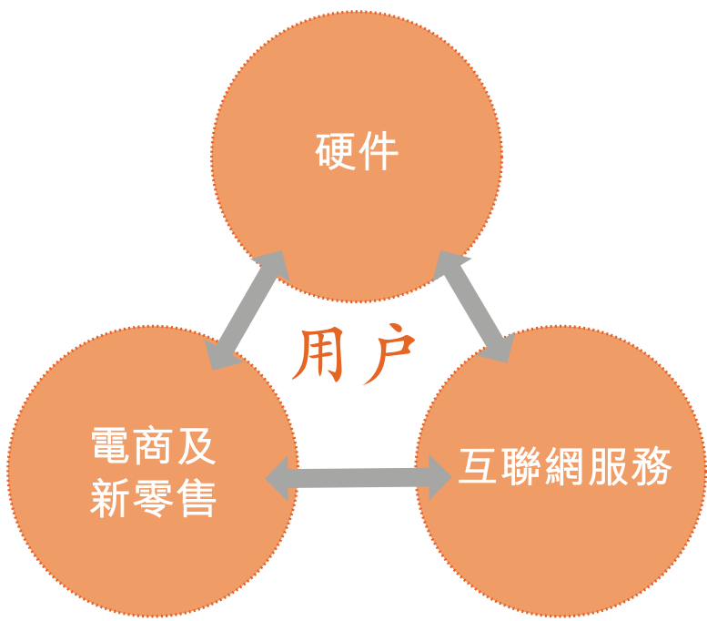

我們主要是互聯網公司，初期以嶄新的零售渠道，向用戶出售各種自有操作系統MIUI驅動的智能硬件產品，從而建立龐大的自有平台，為用戶提供各式各樣的互聯網服務。提供互聯網服務的過程中，我們亦收集寶貴的用戶信息，讓我們可以更了解用戶的需要，加上雲計算與人工智能的協助，進一步改良產品及服務。與其他以較高成本爭取客戶的互聯網平台比較，我們通過出售智能硬件產品，順理成章吸納互聯網服務的用戶而賺取保守的利潤。我們的用戶群龐大、忠誠度高及黏性強，即使2015年及2016年間我們智能手機銷量減少，惟營業紀錄期來自MIUI的月活躍用戶穩定增加。在我們的用戶群中有一群非常專一且高度忠誠的用戶，稱為米粉。這些粉絲對小米充滿熱情並擁有我們的許多產品。我們獲得米粉的建設性回應及功能創意，轉而不斷改良產品和服務，包括產品及服務的設計、開發，亦與硬件及互聯網合作夥伴同共推出產品和服務。我們相信，以業務模式而言，我們在一眾同業之中別樹一幟，並且有龐大而熱情的用戶群。

硬件

我們提供一系列自主或與生態鏈企業共同開發的硬件產品。我們不論是自主或與生態鏈企業共同開發的所有產品都專注於創新、質量、設計和用戶體驗。我們致力將產品定位在廣大用戶可接受的價位，以確保廣泛的接受程度及高留存水平。在核心自家產品方面，我們專注於設計和研發一系列先進的硬件產品，包括智能手機、筆記本電腦、智能電視、人工智能音箱和智能路由器。於營業紀錄期，我們的收入大部分來自銷售智能手機。營業紀錄期所售75%以上智能手機(按部算)價格為人民幣1,299元及以下。2016年，我們的智能手

---

## 第 14 页

概要

機銷量下滑，主要由於(i)我們於2016年投資建立高效的線下零售渠道，以便更好地把握線下機遇和補充我們目前堅實的電子商務基礎；及(ii)我們自2010年開始營運以來收入從零快速增至2015年的人民幣668億元。2016年，我們專注於加強創新、品質及供應管理，為擴大經營規模及業務擴張打造更堅實基礎。結果，我們在重新調整策略後於2017年恢復快速增長。

我們同時擴展到其他產品。截至2018年3月31日，我們通過投資和管理建立了由超過210家公司組成的生態鏈，其中超過90家公司專注於研發智能硬件和生活消費產品。截至2018年3月31日數據，我們連接了超過1億台設備（不包括智能手機及筆記本電腦）。這些產品互通互聯，既改善了用戶的生活，又為我們的互聯網服務提供了專屬平台。我們亦有發展一系列的生活消費產品以進一步提高品牌知名度並將用戶流量導向我們的零售渠道。

新零售

高效的全渠道新零售分銷平台是我們增長策略的核心組成部分，使我們能在高效運營的同時擴展用戶覆蓋範圍並增強用戶體驗。成立以來，我們一直專注於產品的在線直銷，以達到最大效率，並與用戶建立直接的數字化互動關係。根據IDC統計，2018年第一季度我們在中國大陸和印度的線上智能手機出貨量均排名第一。2015年以來，我們通過我們自營的米家門店顯著擴大了線下零售直銷網絡，從而擴大我們的覆蓋範圍並提供更豐富的用戶體驗，在實行線上下同品同價的同時，保持了與線上渠道相似的運營效率。我們高效的全渠道銷售策略使我們能夠以厚道的價格向最廣泛的用戶群體提供產品。

互聯網服務

我們通過提供互聯網服務讓我們的用戶擁有完整的移動互聯網體驗。於2018年3月，我們基於安卓原生系統的自有操作系統MIUI擁有大約190百萬月活躍用戶。MIUI與安卓生態系統充分兼融，包括了安卓生態系統上的所有手機應用程序。它構成了一個開放的平台讓我們提供一系列廣泛的互聯網服務，包括內容、娛樂、金融服務和效能工具。我們設備的互聯性，以及硬件和互聯網服務的無縫集成，使我們可以向用戶提供更好的用戶體驗。此外，我們有著開發爆款應用程序的優良往績。2018年3月，我們開發了38個月活躍用戶超過10百萬的應用程序和18個月活躍用戶超過50百萬的應用程序，包括我們的小米應用商店、小米瀏覽器、小米音樂和小米視頻。2018年3月，我們的用戶每天使用我們的智能手機的平均時間是大約4.5小時。相比其他獲客成本較高的互聯網平台，我們通過硬件銷售獲得用戶的過程本身是盈利的。

網絡效應

我們獨特而強大的鐵人三項商業模式由三個緊密相連且相互協同的支柱構成。我們努力提供高品質、高性能和精心設計且定價厚道的爆款產品。這些產品能為我們的零售渠道帶來更多客流量。我們通過高效率的新零售渠道(例如電商平台和米家)以厚道的價格向

---

## 第 15 页

概要

用戶交付我們的產品。通過我們的互聯網服務，我們密切地與使用我們平台的用戶互動，從而增加用戶黏性，帶來新的變現機會。

雲、大數據和人工智能(AI)

我們相信我們平台所生成的大量獨特的消費和行為數據，為我們帶來了大數據和人工智能領域的巨大優勢。因此，我們可利用對用戶個性化需求和喜好的了解，提供定制的推薦並進一步增強我們的變現能力。通過2012年推出的小米賬戶服務，我們的用戶可以使用我們提供的雲服務、在線購物、享受內容以及其他眾多服務。截至2018年3月31日，我們經過用戶事先允許已在雲服務中累積收集了超過230PB的專有數據。這些數據是以嚴格隱私標準與數據安全要求存儲。請參閱「—數據隱私及保護」一節。自2016年以來，我們的MIUI和小米商城由TrustArc（一家隱私合規和風險管理公司）對隱私政策和控制措施進行全面評估並認證。我們的深度學習和人工智能技術能力以及我們平台的活躍用戶參與使得我們能夠持續完善產品和服務。例如，人臉識別技術是我們計算機視覺的核心技術，當用戶數據不斷增加，我們的算法可進一步提升精確度及效率，形成與用戶活動的正向反饋循環。整個過程僅根據已收集的用戶行為數據進行，不涉及用戶的數據隱私。未來，我們將繼續推出支持人工智能的新技術產品和服務，例如我們在2017年7月推出的小米AI音箱。

我們經過用戶事先允許後根據用戶所接受服務的類型，可收集以下類別的個人及行為數據：(i)聯繫信息；(ii)設備信息；(iii)軟件及應用程序使用信息；(iv)上傳至小米雲服務的資料；(v)社交活動；(vi)交易活動；(vii)位置信息；及(viii)互聯網瀏覽內容。我們僅為產品及服務開發更先進的人工智能技術而處理行為數據。我們自行管理收集的用戶數據，在符合相關法律法規及經用戶允許的情況下可就經許可用途分析及使用該等數據。所有用戶及行為數據僅根據地方法律法規儲存一定期限，且僅至收集及處理有關數據的業務目的達成之時（以較早者為準）。我們會採取所有法律手段處置違反我們數據私隱及保護政策的僱員及業務夥伴。我們有一套全面的技術措施以防不當使用及披露數據。

我們的業務分部收入

<!-- table html -->
<table><tr><td colspan="6">截至12月31日止年度</td><td colspan="4">截至3月31日止三個月</td></tr><tr><td></td><td colspan="2">2015年</td><td colspan="2">2016年</td><td colspan="2">2017年</td><td colspan="2">2017年</td><td colspan="2">2018年</td></tr><tr><td></td><td>人民幣</td><td>%</td><td>人民幣</td><td>%</td><td>人民幣</td><td>%</td><td>人民幣</td><td>%</td></tr><tr><td></td><td colspan="8">（千元，百分比除外）</td></tr><tr><td>智能手機</td><td>53,715,410</td><td>80.4</td><td>48,764,139</td><td>71.3</td><td>80,563,594</td><td>70.3</td><td>12,193,852</td><td>65.8</td><td>23,239,490</td><td>67.5</td></tr><tr><td>IoT與生活消費產品</td><td>8,690,563</td><td>13.0</td><td>12,415,438</td><td>18.1</td><td>23,447,823</td><td>20.5</td><td>4,160,665</td><td>22.5</td><td>7,696,566</td><td>22.4</td></tr><tr><td>互聯網服務</td><td>3,239,454</td><td>4.9</td><td>6,537,769</td><td>9.6</td><td>9,896,389</td><td>8.6</td><td>2,029,637</td><td>10.9</td><td>3,231,350</td><td>9.4</td></tr><tr><td>其他</td><td>1,165,831</td><td>1.7</td><td>716,815</td><td>1.0</td><td>716,936</td><td>0.6</td><td>147,639</td><td>0.8</td><td>244,956</td><td>0.7</td></tr><tr><td>總計</td><td>66,811,258</td><td>100.0</td><td>68,434,161</td><td>100.0</td><td>114,624,742</td><td>100.0</td><td>18,531,793</td><td>100.0</td><td>34,412,362</td><td>100.0</td></tr></table>
<!-- /table -->

---

## 第 16 页

我們的客戶和供應商

我們的客戶主要包括(i)購買產品的終端用戶、(ii)購買我們產品的線上及線下分銷商、(iii)廣告服務的廣告客戶及(iv)互聯網增值服務用戶。提供優秀的客戶服務乃重中之重。我們的客服人員提供的優質服務及退換貨政策彰顯了我們對客戶的承諾。

我們根據預測生產計劃從頂級供應商處採購生產自家產品所用原材料和組件。營業紀錄期，我們絕大部分自家產品由中國大陸的外包合作夥伴使用主要由我們提供及採購的組件及原材料組裝。我們與生態鏈企業密切合作，共同設計及研發硬件產品，生態鏈企業向我們供應成品，以向客戶銷售及分銷。我們亦從不同的互聯網服務夥伴為我們的互聯網服務取得數字內容。

我們的成本結構

我們的成本與開支主要是有關自家產品原材料及組件的採購成本、外包合作夥伴收取的組裝成本、與互聯網服務有關的費用（例如內容及帶寬費用、服務器託管費與雲服務有關的成本）及我們的銷售及市場推廣開支、研發費用（包括僱員福利開支）。

我們的全球機遇

自2010年成立以來，我們不斷通過領先的商業模式拓展在中國大陸的用戶群。我們還成功制定了針對新市場的國際策略，截至2018年3月31日已進入74個國家和地區的市場。我們在主要國際市場成功立足。例如，截至2018年第一季度我們在印度的智能手機出貨量排名第一。根據IDC統計，截至2017年第四季度我們亦在15個市場名列前5。

隨着我們在全球進行業務擴展，我們能在收入增長的同時實現盈利能力的提升。營業紀錄期，我們的收入從2015年的人民幣668億元增至2017年的人民幣1,146億元，再由截至2017年3月31日止三個月的人民幣185億元增至截至2018年3月31日止三個月的人民幣344億元。2017年經調整非國際財務報告準則利潤人民幣54億元，而2015年則有經調整非國際財務報告準則虧損人民幣3億元。我們的經調整非國際財務報告準則利潤由截至2017年3月31日止三個月的人民幣7億元增加至截至2018年3月31日止三個月的人民幣17億元。

我們的行業和競爭格局

我們經營全球智能手機、消費級物聯網、互聯網服務及新零售行業，這些行業競爭激烈，且進入門檻極高。

全球的智能手機用戶群龐大且不斷增長。根據IDC統計，智能手機設備總數量由2015年的2,871.0百萬部增至2017年的3,665.7百萬部，複合年增長率為13.0%。預期於2022年將達

---

## 第 17 页

概要

到4,798.5百萬部，2017年至2022年的複合年增長率為5.5%。隨著新興市場增長的推動，預期全球智能手機使用率將會上升。高性價比的設備和優秀的用戶體驗將推動出貨量及智能手機使用率增加。此外，由於製造有競爭力的智能手機需要進行研發及設計原型，有關前期成本高昂，故進入智能手機市場的門檻較高。領先智能手機公司擁有穩固的地位、市場品牌認可度高、穩定的供應鏈及成熟的分銷渠道，新市場參與者不大可能與其競爭並獲得巨大市場份額。市場參與者需要達到龐大的規模，方可實現經營槓桿並建立長期可持續的商業模式。

由於感應器及設備處理器的技術有所改良，使互聯網連接成為各種消費產品的標準功能，預計全球消費級IoT市場將持續倍增。根據艾瑞諮詢，消費級IoT終端的數量由2015年的30億個增加至2017年的49億個，複合年增長率為27.7%。預期於2022年將達153億個，2017年至2022年的複合年增長率為25.4%。IoT設備龐大且快速增長的基礎可收集大量實時數據，促進多種消費用途的研發。成功的消費級IoT戰略不僅要求公司提供優質且設計精良的產品，亦須提供多類可通過米家app等單一應用程序無縫互連的產品，以滿足用戶日常需求。

互聯網是個人與世界互動不可缺少的工具。根據艾瑞諮詢，全球互聯網服務市場規模由2015年的10,106億美元增至2017年的15,409億美元，複合年增長率為23.5%。隨著智能手機成為客戶訪問互聯網的主要媒介，移動互聯網滲透率上升，預計全球互聯網服務市場規模於2022年將達到26,009億美元，複合年增長率為11.0%。互聯網服務市場競爭激烈，由眾多提供有競爭力的服務參與者分佔。能透過銷售硬件設備獲得及挽留用戶的公司通過以更低成本獲取客戶、與用戶互動更深入及提高收集數據能力增強競爭力。

新零售可理解為依托於技術手段，實現線上、線下零售渠道無縫融合，提高效率。線上線下零售渠道高度融合，推動客戶流量，從而提高整體銷售效率。新零售亦透過自有線上線下渠道直接向消費者分銷，從而提高成本效率，並減少對額外分銷層級的需求。

競爭優勢

我們認為以下競爭優勢對成功至關重要且令我們從競爭對手中脫穎而出：

• 我們的創始人團隊；

• 熱情的用戶；

• 鐵人三項商業模式；

• 創新和設計；

---

## 第 18 页

概要

• 效率；

• 生態鏈；

• 雲、大數據和人工智能；及

• 全球拓展。

我們的戰略

為實現使命並進一步鞏固領導地位，我們擬推行以下戰略：

• 始終重視創新、品質、設計和用戶體驗；

• 保持極致高效；

• 擴大爆款產品品類；

• 豐富互聯網服務；

• 投資並擴大生態鏈；及

• 深化國際擴張。

不同投票權架構及不同投票權受益人

本公司有不同投票權架構，自全球發售完成當時起生效。根據該架構，本公司股本將分為A類股份及B類股份。對於提呈本公司股東大會的任何決議案，A類股份持有人每股可投10票，而B類股份持有人則每股可投一票，惟就有限保留事項有關的決議案投票除外，在此情況下，每股股份享有一票投票權。

緊隨全球發售完成後，假設並無行使超額配股權及根據首次公開發售前僱員購股權計劃授出的購股權，則不同投票權受益人為雷軍及林斌。除有關保留事項的決議案外，不同投票權受益人可就本公司股東大會上任何事項的股東決議案行使以下投票權：

(a) 雷軍可因(i)實益擁有4,295,187,720股A類股份，(ii)實益擁有2,283,106,380股B類股份及(iii)根據投票代理協議的378,410,630股B類股份行使55.20%投票權；及

(b) 林斌可因(i)實益擁有2,400,000,000股A類股份及(ii)實益擁有391,233,610股B類股份行使29.52%投票權。

詳情請參閱「股本—不同投票權架構」一節。2018年6月20日，雷軍及林斌各自根據上市規則第8A.43條向本公司作出具法律效力的承諾，以股東為受益人且可由股東執行。詳情請參閱「股本—不同投票權受益人的承諾」一節。

本公司採用不同投票權架構，儘管不同投票權受益人並不擁有本公司股本的大部分

---

## 第 19 页

概要

經濟利益，但不同投票權受益人可對本公司行使投票控制權。不同投票權受益人目光長遠，實施長期策略，其遠見及領導能使本公司長期受益。

雷軍及林斌是董事會2010年5月首三名董事中的其中兩名。執行董事僅由雷軍及林斌擔任並將一直擔任。本集團發展之初，雷軍及林斌均參與本集團的財務及業務策略和研發。

自本公司成立以來，雷軍一直負責本公司的戰略發展方向，亦負責本公司的企業策略、公司文化及主要產品和服務。雷軍默默推動本公司業務策略及企業理念發展，主要包括提高效率、降低成本同時兼顧用戶體驗，創造優質產品並以實惠的價格出售。雷軍令本公司專注創新、質量及供應管理。因此，本公司的智能手機質量與銷量大幅提升，令2017年收入增加。雷軍大力支持建立米粉社群並利用小米論壇及小米社區等社群參與活動打造本公司的品牌及企業形象，亦招攬有策略及經驗的首次公開發售前投資者，大大有助我們增長。雷軍積極參與本集團的投資策略，讓本集團與被投資公司建立密切的合作關係，創造生態鏈協同效應，同時獲得穩定的經常性投資收入。

林斌負責本公司智能手機業務，自本公司成立以來一直擔任總裁。林斌有科學及工程背景，曾任微軟和谷歌等跨國科技公司的高級管理層。林斌憑藉獨特的技能及知識，對我們智能手機業務的發展及成功發揮重要作用。本集團發展之初，林斌主要負責本公司的人士招聘及日常營運。隨著本公司智能手機業務的發展，林斌的職務範圍擴展至管理與供應商的戰略合作及海外銷售。截至2014年10月，林斌同時獲委任為本集團在線業務(包括小米商城)總經理，負責本公司的銷售、推廣、物流、客戶服務及售後服務工作。在林斌的領導下，本公司實施新的零售策略，整合線上銷售渠道與線下店舖(例如米家)。

有意投資者務請留意投資不同投票權架構公司的潛在風險，特別是，不同投票權受益人的利益未必始終與股東整體利益一致，而不論其他股東如何投票，不同投票權受益人將對本公司事務及股東決議案的結果施加重大影響。有意投資者務請經過審慎周詳的考慮後方決定是否投資本公司。有關本公司所採用不同投票權架構的風險詳情，請參閱「風險因素—與不同投票權架構有關的風險—股份所有權集中限制股東影響公司事務的能力」及「風險因素—與不同投票權架構有關的風險—A類股份持有人或會對我們施加重大影響，未必會以我們獨立股東的最佳利益行事」章節。

---

## 第 20 页

概要

風險因素

我們的業務及全球發售涉及若干風險，該等風險載於「風險因素」一節。閣下在決定投資我們的股份前，應細閱該節的全部內容。我們面臨的部分主要風險涉及：

我們於產品及服務所在全球市場(競爭劇烈且技術發展日新月異)有效競爭的能力；

• 我們有效管理增長或執行策略的能力；

• 我們維持產品及服務的信譽品牌形象的能力；

• 我們成功管理頻繁的產品推出及過渡的能力；

• 我們擴大及維持用戶群的能力，以及用戶的參與度；

我們過往產生虧損及有淨負債，而日後可能持續產生虧損且未必能宣派或派付股利；

• 我們維持增長趨勢的能力；

• 我們的營運歷史有限，因此難以評估未來前景；

• 智能手機銷售額佔我們收入的較大部分；及

我們挽留現有廣告客戶或吸引新的廣告客戶、維持及增加我們廣告預算的份額和及時收取應收賬款的能力。

合約安排

本公司經營或可能經營的部分行業須遵守中國大陸現行法律及法規的限制。為遵守該等法律，同時利用國際資本市場及維持對所有業務的有效控制，我們於2017年12月1日、2018年4月11日及2018年4月17日訂立合約安排，據此控制合併聯屬實體。因此，我們並無直接擁有合併聯屬實體任何股權。根據合約安排，我們取得對合併聯屬實體財務及經營政策的有效控制，並有權獲得彼等經營業務所產生的所有經濟利益。詳情請參閱「合約安排」一節。

下列簡圖說明根據合約安排所訂明的合併聯屬實體對本集團的經濟利益流向：

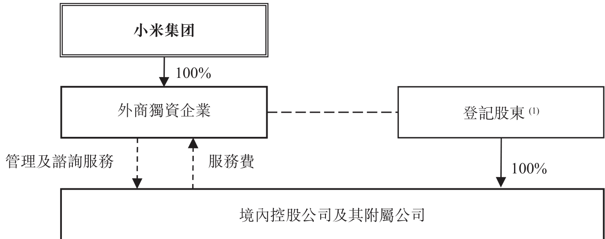

---

## 第 21 页

概要

附註：

(1) 登記股東指境內控股公司的登記股東，即(i)北京瓦力文化、(ii)美卓軟件設計、(iii)小米科技、(iv)北京多看、(v)北京瓦力網絡、(vi)小米影業、(vii)北京小米電子軟件及(viii)有品信息科技。

(i) 北京瓦力文化由雷軍及尚進分別擁有90%及10%。

(ii) 美卓軟件設計由朱印及李炯分別擁有61%及39%。

(iii) 小米科技由雷軍、黎萬強、洪鋒及劉德分別擁有77.80%、10.12%、10.07%及2.01%。

(iv) 北京多看由雷軍及王川分別擁有38.25%及61.75%。

(v) 北京瓦力網絡由雷軍、劉泱、梁秋實、劉景岩、袁彬及南楠分別擁有10%、65%、14%、6%、3%及2%。

(vi) 小米影業由黎萬強、洪鋒及劉德分別擁有87.92%、10.07%及2.01%。

(vii) 北京小米電子軟件由雷軍及洪鋒分別擁有90%及10%。

(viii) 有品信息科技由雷軍、洪鋒、劉德及黎萬強分別擁有70%、10%、10%及10%。

(2) 「→」指股權中的直接法定及實益擁有權。

(3) 「---」指合約關係。

(4) 「---」指外商獨資企業通過(1)行使境內控股公司所有股東權利的授權書；(2)收購境內控股公司全部或部分股權的獨家選擇權；及(3)境內控股公司股權的股本質押來控制登記股東和境內控股公司。

商務部於2015年1月公佈《外國投資法草案》，當中訂明「特別管理措施目錄」中若干行業的外國投資限制，但並未訂明納入特別管理措施目錄範圍的業務。此外，《外國投資法草案》規定，在中國大陸成立但由外國投資者「控制」的實體將被視為外商投資實體，而在外國司法權區成立的實體如獲得外國投資主管部門裁定由中國大陸實體及／或公民「控制」，則會就投資視為中國大陸境內實體。截至最後可行日期，《外國投資法草案》僅為草案，尚不確定《外國投資法草案》是否會頒佈及生效或其頒佈及生效的時間表及(倘若生效)其是否會在經歷進一步頒佈程序之後以現有草擬形式頒佈。詳情請參閱「風險因素—與合約安排有關的風險」及「合約安排—中國大陸外國投資法律的發展」章節。

控股股東

緊隨全球發售完成後，我們的執行董事、創始人、董事長兼首席執行官雷軍將透過多個中間實體持有並控制4,295,187,720股A類股份及2,283,106,380股B類股份（假設上市後全部優先股轉換為B類股份）。假設並無行使超額配股權及根據首次公開發售前僱員購股權計劃授出的購股權，雷軍的總持股量將佔我們已發行股本約29.40%並將持有本公司可於股東大會就決議案（少數與保留事項有關的決議案除外，在此情況下，每股股份享有一票投票權）行使的投票權約54.74%。因此，雷軍將於上市後成為控股股東。雷軍透過Smart Mobile Holdings Limited及Smart Player Limited兩間全資中間實體持有本公司權益。根據投票代理協議，若干少數股東亦已授予雷軍B類股份的投票代理權，相當於緊隨全球發售完成後（假設並無行使超額配股權及根據首次公開發售前僱員購股權計劃授出的購股權）本公司已發行股本的1.69%或投票權的0.46%（與保留事項有關的決議案除外）。

---

## 第 22 页

概要

控股股東有關詳情請參閱「與控股股東的關係」一節。

歷史財務資料概要

下表載列營業紀錄期合併財務資料的財務數據概要，摘錄自本招股章程附錄一所載會計師報告。下文所載合併財務數據概要應與本招股章程的合併財務報表及其附註一併閱讀，以保證其完整性。合併財務資料乃根據國際財務報告準則編製。

合併損益表

<!-- table html -->
<table><tr><td colspan="6">截至12月31日止年度</td><td colspan="6">截至3月31日止三個月</td></tr><tr><td></td><td colspan="2">2015年</td><td colspan="2">2016年</td><td colspan="2">2017年</td><td colspan="2">2017年</td><td colspan="2">2018年</td></tr><tr><td></td><td>人民幣</td><td>%</td><td>人民幣</td><td>%</td><td>人民幣</td><td>%</td><td>人民幣</td><td>%</td><td>人民幣</td><td>%</td></tr><tr><td colspan="10">（千元，百分比除外）</td></tr><tr><td>收入</td><td>66,811,258</td><td>100.0</td><td>68,434,161</td><td>100.0</td><td>114,624,742</td><td>100.0</td><td>18,531,793</td><td>100.0</td><td>34,412,362</td><td>100.0</td></tr><tr><td>銷售成本</td><td>(64,111,325)</td><td>(96.0)</td><td>(61,184,806)</td><td>(89.4)</td><td>(99,470,537)</td><td>(86.8)</td><td>(16,067,675)</td><td>(86.7)</td><td>(30,110,935)</td><td>(87.5)</td></tr><tr><td>毛利</td><td>2,699,933</td><td>4.0</td><td>7,249,355</td><td>10.6</td><td>15,154,205</td><td>13.2</td><td>2,464,118</td><td>13.3</td><td>4,301,427</td><td>12.5</td></tr><tr><td>銷售及推廣開支</td><td>(1,912,765)</td><td>(2.9)</td><td>(3,022,313)</td><td>(4.4)</td><td>(5,231,540)</td><td>(4.6)</td><td>(726,857)</td><td>(3.9)</td><td>(1,402,829)</td><td>(4.1)</td></tr><tr><td>行政開支</td><td>(766,252)</td><td>(1.1)</td><td>(926,833)</td><td>(1.4)</td><td>(1,216,110)</td><td>(1.1)</td><td>(240,209)</td><td>(1.3)</td><td>(465,323)</td><td>(1.4)</td></tr><tr><td>研發開支</td><td>(1,511,815)</td><td>(2.3)</td><td>(2,104,226)</td><td>(3.1)</td><td>(3,151,401)</td><td>(2.7)</td><td>(604,689)</td><td>(3.3)</td><td>(1,103,775)</td><td>(3.2)</td></tr><tr><td>按公允價值計入損益之</td><td></td><td></td><td></td><td></td><td></td><td></td><td></td><td></td><td></td><td></td></tr><tr><td>投資公允價值變動</td><td>2,813,353</td><td>4.2</td><td>2,727,283</td><td>4.0</td><td>6,371,098</td><td>5.6</td><td>1,179,700</td><td>6.4</td><td>1,762,868</td><td>5.1</td></tr><tr><td>分佔按權益法入賬之投資</td><td></td><td></td><td></td><td></td><td></td><td></td><td></td><td></td><td></td><td></td></tr><tr><td>（虧損）／收益</td><td>(92,781)</td><td>(0.1)</td><td>(150,445)</td><td>(0.2)</td><td>(231,496)</td><td>(0.2)</td><td>(66,404)</td><td>(0.4)</td><td>16,329</td><td>0.0</td></tr><tr><td>其他收入</td><td>522,436</td><td>0.8</td><td>540,493</td><td>0.8</td><td>448,671</td><td>0.4</td><td>24,156</td><td>0.1</td><td>158,226</td><td>0.5</td></tr><tr><td>其他（虧損）／收益淨額</td><td>(379,439)</td><td>(0.6)</td><td>(528,250)</td><td>(0.8)</td><td>72,040</td><td>0.1</td><td>(75,319)</td><td>(0.4)</td><td>97,567</td><td>0.3</td></tr><tr><td>經營利潤</td><td>1,372,670</td><td>2.0</td><td>3,785,064</td><td>5.5</td><td>12,215,467</td><td>10.7</td><td>1,954,496</td><td>10.5</td><td>3,364,490</td><td>9.7</td></tr><tr><td>財務(費用)／收入淨額</td><td>(85,867)</td><td>(0.1)</td><td>(86,246)</td><td>(0.1)</td><td>26,784</td><td>0.0</td><td>(12,121)</td><td>(0.1)</td><td>17,834</td><td>0.1</td></tr><tr><td>可轉換可贖回優先股公允價值變動</td><td>(8,759,314)</td><td>(13.1)</td><td>(2,523,309)</td><td>(3.7)</td><td>(54,071,603)</td><td>(47.2)</td><td>(9,464,478)</td><td>(51.1)</td><td>(10,071,376)</td><td>(29.3)</td></tr><tr><td>除所得稅前(虧損)／利潤</td><td>(7,472,511)</td><td>(11.2)</td><td>1,175,509</td><td>1.7</td><td>(41,829,352)</td><td>(36.5)</td><td>(7,522,103)</td><td>(40.7)</td><td>(6,689,052)</td><td>(19.5)</td></tr><tr><td>所得稅費用</td><td>(154,519)</td><td>(0.2)</td><td>(683,903)</td><td>(1.0)</td><td>(2,059,763)</td><td>(1.8)</td><td>(344,915)</td><td>(1.9)</td><td>(338,359)</td><td>(1.0)</td></tr><tr><td>年度／期間(虧損)／利潤</td><td>(7,627,030)</td><td>(11.4)</td><td>491,606</td><td>0.7</td><td>(43,889,115)</td><td>(38.3)</td><td>(7,867,018)</td><td>(42.6)</td><td>(7,027,411)</td><td>(20.5)</td></tr><tr><td>非國際財務報告準則計量：</td><td></td><td></td><td></td><td></td><td></td><td></td><td></td><td></td><td></td><td></td></tr><tr><td>經調整(虧損)／利潤</td><td></td><td></td><td></td><td></td><td></td><td></td><td></td><td></td><td></td><td></td></tr><tr><td>（未經審核）^(1)</td><td>(303,887)</td><td>(0.5)</td><td>1,895,657</td><td>2.8</td><td>5,361,876</td><td>4.7</td><td>660,530</td><td>3.6</td><td>1,699,301</td><td>4.9</td></tr></table>
<!-- /table -->

附註：

(1) 我們將非國際財務報告準則經調整(虧損)/利潤定義為期內虧損或利潤，經加回以下各項調整：(i)可轉換可贖回優先股公允價值變動、(ii)以股份為基礎的薪酬、(iii)投資公允價值增益淨值及(iv)收購導致的無形資產攤銷。經調整(虧損)/利潤並非國際財務報告準則要求或按國際財務報告準則呈列的衡量方法。經調整

---

## 第 23 页

概要

(虧損)／利潤僅限用作分析工具，閣下不應將其與根據國際財務報告準則報告的經營業績或財務狀況分開考慮或視作替代分析。詳情請參閱「財務資料—非國際財務報告準則計量：經調整(虧損)／利潤」。

我們認為連同相應國際財務報告準則計量一併呈列非國際財務報告準則計量，可免除管理層認為對我們經營業績沒有指標作用的項目的潛在影響（例如若干非現金項目和若干投資交易的影響），為投資者及管理層提供關於財務狀況及經營業績相關財務及業務趨勢的有用信息。我們亦認為，非國際財務報告準則計量適用於評估本集團的經營表現。本公司日後審閱其財務業績或會不時剔除其他項目。下表載列截至2018年及2017年3月31日止三個月與截至2017年、2016年及2015年12月31日止年度的非國際財務報告準則財務計量與根據國際財務報告準則編製的最接近計量之調節：

截至2018年3月31日止三個月

<!-- table html -->
<table><tr><td></td><td colspan="6">調整</td></tr><tr><td>呈報</td><td>可轉換可贖回優先股公允價值變動</td><td>以股份為基礎的薪酬</td><td>投資公允價值增益淨值^(1)</td><td>收購所得無形資產攤銷^(2)</td><td>非國際財務報告準則</td></tr><tr><td>期內(虧損)／利潤</td><td>(7,027,411)</td><td>10,071,376</td><td colspan="2">(人民幣千元，除非另有說明)</td><td>520</td><td>1,699,301</td></tr><tr><td>淨利潤率</td><td>(20.5)%</td><td></td><td></td><td></td><td>4.9%</td></tr></table>
<!-- /table -->

截至2017年3月31日止三個月

<!-- table html -->
<table><tr><td></td><td colspan="6">調整</td></tr><tr><td>呈報</td><td>可轉換可贖回優先股公允價值變動</td><td>以股份為基礎的薪酬</td><td>投資公允價值增益淨值^(1)</td><td>收購所得無形資產攤銷^(2)</td><td>非國際財務報告準則</td></tr><tr><td>期內(虧損)／利潤</td><td>(7,867,018)</td><td>9,464,478</td><td colspan="2">(人民幣千元，除非另有說明)</td><td>611</td><td>660,530</td></tr><tr><td>淨利潤率</td><td>(42.6)%</td><td></td><td></td><td></td><td>3.6%</td></tr></table>
<!-- /table -->

截至2017年12月31日止年度

<!-- table html -->
<table><tr><td></td><td colspan="6">調整</td></tr><tr><td>呈報</td><td>可轉換可贖回優先股公允價值變動</td><td>以股份為基礎的薪酬</td><td>投資公允價值增益淨值^(1)</td><td>收購所得無形資產攤銷^(2)</td><td>非國際財務報告準則</td></tr><tr><td>年度(虧損)／利潤</td><td>(43,889,115)</td><td>54,071,603</td><td colspan="2">(人民幣千元，除非另有說明)</td><td>2,384</td><td>5,361,876</td></tr><tr><td>淨利潤率</td><td>(38.3)%</td><td></td><td></td><td></td><td>4.7%</td></tr></table>
<!-- /table -->

截至2016年12月31日止年度

<!-- table html -->
<table><tr><td></td><td colspan="6">調整</td></tr><tr><td>呈報</td><td>可轉換可贖回優先股公允價值變動</td><td>以股份為基礎的薪酬</td><td>投資公允價值增益淨值^(1)</td><td>收購所得無形資產攤銷^(2)</td><td>非國際財務報告準則</td></tr><tr><td>年度利潤</td><td>491,606</td><td>2,523,309</td><td colspan="2">(人民幣千元，除非另有說明)</td><td>2,511</td><td>1,895,657</td></tr><tr><td>淨利潤率</td><td>0.7%</td><td></td><td></td><td></td><td></td><td>2.8%</td></tr></table>
<!-- /table -->

---

## 第 24 页

概要

<!-- table html -->
<table><tr><td colspan="7">截至2015年12月31日止年度</td></tr><tr><td></td><td>呈報</td><td>可轉換可贖回優先股公允價值變動</td><td>以股份為基礎的薪酬</td><td>投資公允價值增益淨值(1)</td><td>收購所得無形資產攤銷(2)</td><td>非國際財務報告準則</td></tr><tr><td>年度虧損</td><td>(7,627,030)</td><td>8,759,314</td><td>690,742</td><td>(2,130,169)</td><td>3,256</td><td>(303,887)</td></tr><tr><td>淨利潤率</td><td>(11.4)%</td><td></td><td></td><td></td><td></td><td>(0.5)%</td></tr></table>
<!-- /table -->

附註：

(1) 包括股權投資及優先股投資公允價值增益，扣除期間出售的投資累計公允價值變動、投資減值撥備，及對聯營公司失去重大影響力的重新計量與按公允價值計入損益的金融資產轉為按權益法計量投資的重新計量（扣除稅項）。

(2) 指收購導致的無形資產攤銷，扣除稅項。

合併資產負債表數據摘錄

<!-- table html -->
<table><tr><td></td><td colspan="3">12月31日</td><td>3月31日</td></tr><tr><td></td><td>2015年</td><td>2016年</td><td>2017年</td><td>2018年</td></tr><tr><td></td><td colspan="4">（人民幣千元）</td></tr><tr><td>非流動資產總值</td><td>14,184,010</td><td>20,129,283</td><td>28,731,300</td><td>31,064,904</td></tr><tr><td>流動資產總值</td><td>24,952,527</td><td>30,636,318</td><td>61,138,461</td><td>61,028,696</td></tr><tr><td>資產總額</td><td>39,136,537</td><td>50,765,601</td><td>89,869,761</td><td>92,093,600</td></tr><tr><td>非流動負債總額</td><td>109,310,565</td><td>116,760,214</td><td>169,947,781</td><td>174,795,022</td></tr><tr><td>流動負債總額</td><td>16,464,280</td><td>26,063,262</td><td>47,132,671</td><td>45,289,639</td></tr><tr><td>流動資產淨值</td><td>8,488,247</td><td>4,573,056</td><td>14,005,790</td><td>15,739,057</td></tr><tr><td>負債總額</td><td>125,774,845</td><td>142,823,476</td><td>217,080,452</td><td>220,084,661</td></tr><tr><td>淨負債</td><td>(86,638,308)</td><td>(92,057,875)</td><td>(127,210,691)</td><td>(127,991,061)</td></tr><tr><td>股本</td><td>150</td><td>150</td><td>150</td><td>150</td></tr><tr><td>儲備</td><td>(86,714,628)</td><td>(92,191,820)</td><td>(127,272,511)</td><td>(127,992,149)</td></tr><tr><td>非控股權益</td><td>76,170</td><td>133,795</td><td>61,670</td><td>938</td></tr><tr><td>權益總額</td><td>(86,638,308)</td><td>(92,057,875)</td><td>(127,210,691)</td><td>(127,991,061)</td></tr></table>
<!-- /table -->

合併現金流量表數據摘錄

<!-- table html -->
<table><tr><td colspan="3">截至12月31日止年度</td><td colspan="2">截至3月31日止三個月</td></tr><tr><td>2015年</td><td>2016年</td><td>2017年</td><td>2017年</td><td>2018年</td></tr><tr><td></td><td colspan="4">（人民幣千元）</td></tr><tr><td>經營活動(所用)／所得</td><td></td><td></td><td></td><td>(未經審核)</td></tr><tr><td>現金淨額(1)</td><td>(2,601,311)</td><td>4,531,264</td><td>(995,669)</td><td>(1,246,696)</td><td>(1,277,682)</td></tr><tr><td>投資活動所得／(所用)</td><td></td><td></td><td></td><td></td><td></td></tr><tr><td>現金淨額</td><td>873,395</td><td>(3,735,267)</td><td>(2,677,714)</td><td>2,659,857</td><td>460,647</td></tr><tr><td>融資活動所得／(所用)</td><td></td><td></td><td></td><td></td><td></td></tr><tr><td>現金淨額</td><td>568,383</td><td>(72,141)</td><td>6,214,930</td><td>1,337,144</td><td>3,337,476</td></tr><tr><td>現金及現金等價物(減少)／</td><td></td><td></td><td></td><td></td><td></td></tr><tr><td>增加淨額</td><td>(1,159,533)</td><td>723,856</td><td>2,541,547</td><td>2,750,305</td><td>2,520,441</td></tr><tr><td>年／期初現金及現金等價物</td><td>9,264,955</td><td>8,394,078</td><td>9,230,320</td><td>9,230,320</td><td>11,563,282</td></tr><tr><td>現金及現金等價物的</td><td></td><td></td><td></td><td></td><td></td></tr><tr><td>匯率變動影響</td><td>288,656</td><td>112,386</td><td>(208,585)</td><td>(68,054)</td><td>(56,710)</td></tr><tr><td>年／期末現金及現金等價物</td><td>8,394,078</td><td>9,230,320</td><td>11,563,282</td><td>11,912,571</td><td>14,027,013</td></tr></table>
<!-- /table -->

附註：

(1) 營業紀錄期，我們分別於2015年、2017年及2018年第一季度錄得經營現金流出人民幣26億元、人民幣10億元及人民幣13億元。2015年的經營現金流出主要是由於(其中包括)期內經調整淨虧損所致。我們自2015年起

---

## 第 25 页

概要

在全球範圍內大規模擴張，尚處於國際業務發展初期，加上為建立在海外市場地位的投資，是2015年智能手機業務分部出現毛損的原因。2017年的經營現金流出主要是由於(其中包括)互聯網金融業務(按收入貢獻計算不屬於核心業務)性質導致應收貸款及利息增加。除相關期間主要由互聯網金融業務產生的應收貸款及利息增長外，我們於2017年錄得經營現金流量人民幣59億元。2018年第一季度經營現金流出主要是由於(其中包括)貿易應付款項的季節性減少與其他應付款項及應計費用減少。衡量我們過往經營活動所用營運現金、整體財務表現及可用財務資源後，我們相信我們的營運資金足以應付本招股章程日期起計12個月的預計資本需要。

截至2018年3月31日，我們有淨負債人民幣1,280億元及累計虧損人民幣1,360億元，主要是由於我們的可轉換可贖回優先股有大額公允價值虧損。可轉換可贖回優先股在合併資產負債表列為按公允價值計入損益的金融負債；初始按公允價值確認，而公允價值增加於合併損益表內確認為公允價值虧損。由於我們發行的可轉換可贖回優先股將自動轉換為普通股，因此可轉換可贖回優先股的公允價值虧損為非現金特別項目，不會於股份在聯交所上市後重現，但我們仍會由於上市前可轉換可贖回優先股的公允價值虧損而保留累計虧損。預期可轉換可贖回優先股的公允價值虧損，會對我們截至2018年12月31日止年度的財務業績有不利影響。

主要比率／指標

下表載列於所示期間我們的主要比率／指標：

<!-- table html -->
<table><tr><td></td><td colspan="3">截至12月31日止年度</td><td colspan="2">截至3月31日止三個月</td></tr><tr><td></td><td>2015年</td><td>2016年</td><td>2017年</td><td>2017年</td><td>2018年</td></tr><tr><td>總收入增長(%)</td><td>不適用</td><td>2.4</td><td>67.5</td><td>不適用</td><td>85.7</td></tr><tr><td>智能手機分部收入增長(%)</td><td>不適用</td><td>(9.2)</td><td>65.2</td><td>不適用</td><td>90.6</td></tr><tr><td>智能手機銷量(千台)</td><td>66,546</td><td>55,419</td><td>91,410</td><td>13,085</td><td>28,413</td></tr><tr><td>智能手機平均售價（人民幣元）</td><td>807.2</td><td>879.9</td><td>881.3</td><td>931.9</td><td>817.9</td></tr><tr><td>IoT與生活消費產品分部</td><td></td><td></td><td></td><td></td><td></td></tr><tr><td>收入增長(%)</td><td>不適用</td><td>42.9</td><td>88.9</td><td>不適用</td><td>85.0</td></tr><tr><td>每售一部智能手機的IoT與生活消費產品分部收入（人民幣元）</td><td>130.6</td><td>224.0</td><td>256.5</td><td>318.0</td><td>270.9</td></tr><tr><td>互聯網服務分部收入增長(%)</td><td>不適用</td><td>101.8</td><td>51.4</td><td>不適用</td><td>59.2</td></tr><tr><td>期終MIUI的月活躍用戶人數（百萬）</td><td>112.2</td><td>134.8</td><td>170.8</td><td>138.3</td><td>190.0</td></tr><tr><td>每用戶平均互聯網服務收入^(1)（人民幣元）</td><td>28.9</td><td>48.5</td><td>57.9</td><td>14.7</td><td>17.0</td></tr><tr><td>硬件毛利率^(2) (%)</td><td>(0.2)</td><td>4.4</td><td>8.7</td><td>7.3</td><td>7.0</td></tr><tr><td>互聯網服務分部毛利率(%)</td><td>64.2</td><td>64.4</td><td>60.2</td><td>60.4</td><td>62.3</td></tr><tr><td>廣告服務毛利率(%)</td><td>91.1</td><td>85.6</td><td>81.8</td><td>83.7</td><td>82.3</td></tr><tr><td>互聯網增值服務毛利率(%)</td><td>29.6</td><td>34.2</td><td>32.0</td><td>37.3</td><td>34.7</td></tr><tr><td>非國際財務報告準則經調整（虧損）／利潤^(3)</td><td></td><td></td><td></td><td></td><td></td></tr><tr><td>（人民幣千元）</td><td>(303,887)</td><td>1,895,657</td><td>5,361,876</td><td>660,530</td><td>1,699,301</td></tr><tr><td>非國際財務報告準則淨利潤率^(4) (%)</td><td>(0.5)</td><td>2.8</td><td>4.7</td><td>3.6</td><td>4.9</td></tr><tr><td>現金循環週期^(5)（天數）</td><td>(20)</td><td>(35)</td><td>(38)</td><td>(39)</td><td>(33)</td></tr></table>
<!-- /table -->

附註：

(1) 按互聯網服務分部收入除以期終MIUI的月活躍用戶人數計算。

(2) 硬件毛利率等於智能手機分部毛利加IoT與生活消費產品分部毛利的總和除以所示期間這兩個分部的總收入再乘以100%。

(3) 我們將非國際財務報告準則經調整(虧損)/利潤定義為期內虧損或利潤，經加回以下各項調整：(i)可轉換可贖回優先股公允價值變動、(ii)以股份為基礎的薪酬、(iii)投資公允價值增益淨值及(iv)收購導致的無形資產攤銷。

(4) 指非國際財務報告準則經調整(虧損)/利潤除以所示期間的總收入。

(5) 現金循環週期等於存貨周轉天數加貿易應收款項周轉天數減貿易應付款項周轉天數。

---

## 第 26 页

申請於聯交所上市

我們已向上市委員會申請批准已發行B類股份(包括優先股轉換而來的B類股份)以及根據(i)全球發售、(ii)超額配股權獲行使、(iii)根據首次公開發售前僱員購股權計劃授出的購股權獲行使、(iv)根據首次公開發售後購股權計劃授出的購股權獲行使、(v)根據股份獎勵計劃授出的獎勵及(vi)A類股份按一比一基準轉換為B類股份將予發行的B類股份上市及買賣。

未來股利

我們是根據開曼群島法例註冊成立的控股公司。因此，任何未來股利的派付及金額亦將取決於能否自附屬公司收到股利。中國法律規定股利僅可以根據中國會計原則計算的年內利潤派付，而中國會計原則與其他司法權區的公認會計原則(包括國際財務報告準則)在多個方面存在差異。中國法律亦規定外資企業須劃撥至少10%的除稅後利潤至法定公積金，直至法定公積金累積金額達企業註冊資本(如有)的50%或以上，而法定公積金不得用作現金股利分派。

向股東作出的股利分派於有關股利獲股東或董事(如適用)批准期間確認為負債。營業紀錄期，我們並無派付或宣派任何股利。我們目前並無正式的股利政策或固定的股利派付比率。根據開曼群島法例，有累計虧損的財務狀況不一定限制我們向股東宣派及支付股利，因為不論我們的盈利能力，我們仍可以從股份溢價賬宣派及支付股利。

全球發售

本招股章程乃就作為全球發售一部分的香港公開發售而刊發。全球發售由以下部分組成：

(a) 香港公開發售，按下文「— 香港公開發售」一節所述在香港初步提呈108,980,000股發售股份(可予重新分配)；及

(b) 國際發售，根據S規例於美國境外及根據第144A條或美國證券法其他豁免登記規定於美國境內向合資格機構買家初步提呈2,070,605,000股發售股份(包括1,325,460,000股新B類股份及745,145,000股銷售股份)(可予重新分配及視乎超額配股權行使與否而定)。

發售股份將佔緊隨全球發售完成後(假設超額配股權及根據首次公開發售前僱員購股權計劃授出的購股權未獲行使)本公司已發行股本9.74%。

---

## 第 27 页

中國存託憑證

2018年3月30日，國務院辦公廳轉發的證監會《關於開展創新企業境內發行股票或存託憑證試點的若干意見》（「中國存託憑證意見」）說明了試點原則、試點企業以及發行條件等事項。2018年5月11日，中國證監會發佈關於就《關於修改<證券發行與承銷管理辦法>的決定》公開徵求意見的通知以實施中國存託憑證意見。2018年6月6日，中國證監會頒佈《存託憑證發行與交易管理辦法（試行）》（「存託憑證試行辦法」）。有關中國存託憑證發行的中國大陸規則及法規詳情，請參閱「法規—與中國存託憑證發行有關的法規」一節。

我們根據存託憑證試行辦法，於2018年6月7日向中國證監會提交中國存託憑證發行申請。於2018年6月18日，我們向中國證監會發信，表示經過仔細考慮，計劃先完成全球發售，日後待時機適合在中國大陸進行中國存託憑證發行。根據上市規則第10.08條，我們不得於上市後6個月內發行任何中國存託憑證相關股份。倘我們於上市後6個月內進行中國存託憑證發行，我們將向聯交所申請豁免遵守上市規則第10.08條的規定，惟須經聯交所批准。倘若我們重新進行中國存託憑證發行而監管當局批准中國存託憑證發行並成功發行，可能對全體股東產生攤薄影響。我們並不能提供中國存託憑證發行上市開支的精確預算或時間表。

經參考相關監管機關於中國大陸頒佈及截至最後可行日期我們所知的規則及法規，我們認為中國存託憑證發行（倘進行）不會對股東（包括但不限於全球發售投資者）權利有重大不利的普遍影響。不同投票權受益人不會參與中國存託憑證發行。我們確認倘中國存託憑證發行完成且上市規則及香港其他有關法律方面所提供股東保障水平與存託憑證試行辦法、中國存託憑證意見及中國大陸其他有關法律或上海證券交易所規則方面所提供者有別，本公司將遵守向我們股東權利及權益所提供保障水平更高的法律、法規或規則（視情況而定）。

近期發展

營業紀錄期末及直至本招股章程日期，我們的收入大幅增長。我們打算繼續推出新產品及服務，向全球擴張。

2018年4月2日，我們向Smart Mobile Holdings Limited（雷軍控制的實體）發行63,959,619股每股面值0.000025美元的B類普通股（或股份分拆後639,596,190股B類股份），作為雷軍對本

---

## 第 28 页

概要

公司所作貢獻的獎勵。因此，本集團於2018年4月2日將人民幣9,827,157,000元確認為以股份為基礎的薪酬開支。

經進行董事認為合適的充分盡職審查工作並經審慎周詳考慮後，董事確認，截至本招股章程日期，除上文所披露者外，我們的財務或交易狀況或前景自2018年3月31日（即本招股章程附錄一會計師報告所呈報期間的截止日期）以來概無任何重大不利變動，且自2018年3月31日以來亦無發生任何對本招股章程附錄一會計師報告所載資料有重大影響的事件。

發售統計

下表所有統計數據乃基於以下假設：(i)全球發售已完成且已根據全球發售發行1,434,440,000股B類股份；及(ii)全球發售完成後，已發行在外22,376,130,830股股份。

<!-- table html -->
<table><tr><td></td><td>按發售價 22.00港元計算</td><td>按發售價 17.00港元計算</td></tr><tr><td>股份市值^(1) ……</td><td>492,275百萬港元</td><td>380,394百萬港元</td></tr><tr><td>每股未經審計備考經調整有形資產淨額^(2)(3) ……</td><td>3.31港元</td><td>2.99港元</td></tr><tr><td></td><td>（人民幣2.71元）</td><td>（人民幣2.45元）</td></tr></table>
<!-- /table -->

附註：

(1) 市值按預期緊隨全球發售完成後已發行22,376,130,830股股份計算。

(2) 截至2018年3月31日的每股未經審計備考經調整有形資產淨額經作出附錄二所述調整按預期緊隨全球發售完成後已發行22,376,130,830股股份計算。

(3) 每股未經審計備考有形資產淨額乃經作出以上各段所述調整後，按已發行22,376,130,830股股份（包括2018年4月2日向Smart Mobile Holdings Limited發行的63,959,619股B類股份（或股份分拆後639,596,190股B類股份），完成優先股轉換為B類股份及股份分拆）計算（假設全球發售已於2018年3月31日完成），惟並無計及行使超額配股權或根據首次公開發售前僱員購股權計劃授出的購股權或本公司可能根據授予董事的一般授權而發行或購回的任何股份。

有關股東應佔未經審計備考經調整每股有形資產淨額的計算方法，請參閱附錄二「未經審計備考財務資料」一節。

上市開支

按指示發售價範圍中間價19.50港元計算，我們有關全球發售的應付相關上市總開支估計約為人民幣373.9百萬元（經扣除包銷佣金及獎勵費、證監會交易徵費及聯交所交易費約人民幣288.2百萬元後約為人民幣85.7百萬元（假設超額配股權未獲行使）），其中人民幣25.4百萬元計入截至2017年12月31日止年度的合併損益表，人民幣12.0百萬元計入截至2018年3月31日止三個月的合併損益表。我們預計2018年上市總開支人民幣55.7百萬元將計入截至2018年12月31日止年度的合併損益表，其餘約人民幣292.8百萬元將撥作資本。

---

## 第 29 页

所得款項用途

假設發售價為每股股份19.50港元（即指示發售價範圍每股股份17.00港元至22.00港元的中間價），我們預計自全球發售所得款項淨額約為27,560.9百萬港元（經扣除包銷佣金及我們就全球發售已付及應付的其他估計費用，並已計及任何額外酌情獎勵費（假設全數支付酌情獎勵費））。我們擬將本次發售所得款項淨額作以下用途：

約30%（約8,268.3百萬港元）用於研發及開發核心自家產品，包括智能手機、智能電視、筆記本電腦、人工智能音箱和智能路由器。我們的計劃包括但不限於聘請工程師、設計師、科學家及其他人才、擴大我們在國內外的知識產品組合以及進一步投資開發信息技術基建、人工智能技術與數據分析能力。我們擬動用本次發售的部分所得款項撥付若干涉及(i)系統芯片、相機及其他智能手機核心部件；(ii)智能手機及智能電視操作系統及(iii)人工智能技術的主要研發項目。該等研發項目的成果將應用於我們日後擬發佈的一系列產品；

約30%（約8,268.3百萬港元）用於投資擴大及加強IoT與生活消費產品及移動互聯網服務（包括人工智能）等主要行業的生態鏈。截至2018年3月31日，我們已投資及管理由超過210家公司組成的生態鏈。我們有許多非常成功的投資。例如，根據艾瑞諮詢基於2017年及2018年第一季度出貨量的統計顯示，全球第一的移動電源、空氣淨化器和電動滑板車公司及中國大陸第一的智能穿戴設備公司均是我們投資的公司。我們計劃繼續識別、投資及培育具潛力的公司，特別是IoT及移動互聯網服務領域，與我們有共同理念和價值觀，且能進一步加強和豐富我們提供的產品與服務以提升用戶體驗的公司。我們亦可能增加持有我們有大多數控制權並已於我們財務報表綜合入賬之實體股權。我們的投資戰略是進一步增加與核心業務有關的更廣泛「生態鏈」之成員公司，令我們實現戰略協同，供應予該等公司的產品、服務及／或資源亦有助其有效豐富提供予用戶的產品及服務組合，研發與我們互補之專利技術，或助力我們進入新市場以拓展國際業務。有關我們截至最後可行日期的建議收購詳情，請參閱「豁免遵守上市規則及豁免遵守公司（清盤及雜項條文）條例—有關營業紀錄期之後收購或擬收購的業務或附屬公司的豁免」一節。我們並無計劃將全球發售所得款項用於該等建議收購；

約30%（約8,268.3百萬港元）用於全球擴張，包括但不限於就各項業務職能聘請當地團隊及投資零售合作夥伴。我們計劃發揮強大的執行能力，將我們獨有的業務模式延身至國際市場並加入當地元素，以擴大用戶基礎和提高用戶變現。除

---

## 第 30 页

概要

加強在印度的市場領導地位外，我們將專注滲透新市場。年內，我們計劃進入或鞏固於東南亞及歐洲（包括已取得初步成功的印尼及西班牙）的市場地位。2019年及展望未來，我們將於歐洲、亞洲及其他地區進一步擴大地區覆蓋範圍；及

• 約10%（約2,756.1百萬港元）作營運資金及一般公司用途。

倘發售價定為指示發售價範圍的最高價或最低價，則全球發售所得款項淨額將分別增加或減少約3,586.1百萬港元。在此情況下，我們將按比例增加或減少分配作上述用途的所得款項淨額。

假設發售價為每股發售股份19.50港元（即指示發售價範圍的中間價），我們預計售股股東根據全球發售出售銷售股份所得款項淨額約為14,347.6百萬港元（經扣除包銷佣金和售股股東應付的估計相關費用，並假設超額配股權未獲行使）。假設發售價為每股發售股份19.50港元（即指示發售價範圍的中間價），我們亦預計售股股東根據全球發售出售購股權股份所得款項淨額約為2,415.5百萬港元（經扣除包銷佣金和期權授予人應付的估計相關費用，並假設超額配股權獲悉數行使）。假設發售價為每股發售股份19.50港元（即指示發售價範圍的中間價），我們預計根據全球發售發行購股權股份的額外所得款項淨額約為3,879.6百萬港元（假設超額配股權獲悉數行使）。無論有否行使超額配股權，我們均不會由於全球發售而收取出售銷售股份及購股權股份所得款項淨額。

---

## 第 31 页

釋義

在本招股章程內，除文義另有指明外，下列詞語具有以下涵義。若干技術詞彙的解釋載於「技術詞彙」一節。

「聯屬人士」指就任何特定人士而言，指該特定人士直接或間接控制或受其控制或與其直接或間接受共同控制的任何其他人士

「申請表格」指有關香港公開發售所用的白色申請表格、黃色申請表格及綠色申請表格，或依文義所指其中任何一種申請表格

「細則」或「組織章程細則」指本公司於2018年6月17日採納的將自上市起有效的組織章程細則（不時修訂），有關概要載於附錄三「本公司章程及開曼公司法概要」一節

「聯繫人」指具有上市規則賦予該詞的涵義

「北京小米數碼科技」指北京小米數碼科技有限公司，於2010年12月21日根據中國大陸法律成立的有限公司，為我們的間接全資附屬公司

「北京多看」指北京多看科技有限公司，於2010年2月10日根據中國大陸法律成立的有限公司，為我們的合併聯屬實體

「北京小米電子軟件」指北京小米電子軟件技術有限公司，於2014年7月1日根據中國大陸法律成立的有限公司，為我們的合併聯屬實體

「北京瓦力」指瓦力信息技術(北京)有限公司，於2010年2月22日根據中國大陸法律成立的有限公司，為我們的間接全資附屬公司

「北京瓦力文化」指北京瓦力文化傳播有限公司，於2014年5月8日根據中國大陸法律成立的有限公司，為我們的合併聯屬實體

---

## 第 32 页

<!-- table html -->
<table><tr><td colspan="3">釋義</td></tr><tr><td>「北京瓦力網絡」</td><td>指</td><td>北京瓦力網絡科技有限公司，於2009年6月1日根據中國大陸法律成立的有限公司，為我們的合併聯屬實體</td></tr><tr><td>「北京文米」</td><td>指</td><td>北京文米文化有限公司，於2016年12月28日根據中國大陸法律成立的有限公司，為我們的間接全資附屬公司</td></tr><tr><td>「董事會」</td><td>指</td><td>董事會</td></tr><tr><td>「巴西」</td><td>指</td><td>巴西聯邦共和國</td></tr><tr><td>「營業日」</td><td>指</td><td>香港銀行通常開放辦理一般銀行業務的日子(不包括星期六、星期日或香港公眾假期)</td></tr><tr><td>「英屬維京群島」</td><td>指</td><td>英屬維京群島</td></tr><tr><td>「開曼公司法」</td><td>指</td><td>開曼群島法例第22章公司法(1961年第3號法例，不時修訂或補充)</td></tr><tr><td>「開曼註冊處處長」</td><td>指</td><td>開曼群島公司註冊處處長</td></tr><tr><td>「中央結算系統」</td><td>指</td><td>香港結算設立及運作的中央結算及交收系統</td></tr><tr><td>「中央結算系統結算參與者」</td><td>指</td><td>獲准以直接結算參與者或全面結算參與者身份參與中央結算系統的人士</td></tr><tr><td>「中央結算系統託管商參與者」</td><td>指</td><td>獲准以託管商參與者身份參與中央結算系統的人士</td></tr><tr><td>「中央結算系統投資者戶口持有人」</td><td>指</td><td>獲准以投資者戶口持有人身份參與中央結算系統的人士，可為個人、聯名個人或公司</td></tr><tr><td>「中央結算系統參與者」</td><td>指</td><td>中央結算系統結算參與者、中央結算系統託管商參與者或中央結算系統投資者戶口持有人</td></tr><tr><td>「中國存託憑證」</td><td>指</td><td>中國存託憑證存管處發行的中國存託憑證</td></tr><tr><td>「中國存託憑證發行」</td><td>指</td><td>於中國大陸公開發行中國存託憑證</td></tr></table>
<!-- /table -->

---

## 第 33 页

<!-- table html -->
<table><tr><td colspan="3">釋義</td></tr><tr><td>「重慶小米小額貸款」</td><td>指</td><td>重慶市小米小額貸款有限公司，於2015年6月12日根據中國大陸法律成立的有限公司，為我們的間接全資附屬公司</td></tr><tr><td>「A類股份」</td><td>指</td><td>本公司股本內每股面值0.0000025美元的A類普通股，附有本公司不同投票權，使A類股份持有人可就本公司股東大會提呈的任何決議案享有每股十票的投票權，惟就有關保留事項的決議案享有每股一票的投票權</td></tr><tr><td>「B類股份」</td><td>指</td><td>本公司股本內每股面值0.0000025美元的B類普通股，使B類股份持有人可就本公司股東大會提呈的任何決議案享有每股一票的投票權</td></tr><tr><td>「聯合創始人」</td><td>指</td><td>洪鋒、黎萬強、林斌、劉德、王川、黃江吉及周光平</td></tr><tr><td>「公司(清盤及雜項條文)條例」</td><td>指</td><td>香港法例第32章公司(清盤及雜項條文)條例(不時修訂、補充或以其他方式修改)</td></tr><tr><td>「公司條例」</td><td>指</td><td>香港法例第622章公司條例(不時修訂、補充或以其他方式修改)</td></tr><tr><td>「本公司」</td><td>指</td><td>小米集團(前稱精銳有限公司)，於2010年1月5日根據開曼群島法例註冊成立的有限公司</td></tr><tr><td>「關連人士」</td><td>指</td><td>具有上市規則賦予該詞的涵義</td></tr><tr><td>「關連交易」</td><td>指</td><td>具有上市規則賦予該詞的涵義</td></tr><tr><td>「合併聯屬實體」</td><td>指</td><td>我們透過合約安排控制的實體，即境內控股公司及其各自的附屬公司(各為「合併聯屬實體」)，詳情載於「歷史、重組及企業架構」一節</td></tr><tr><td>「控股股東」</td><td>指</td><td>具有上市規則賦予該詞的涵義，除文義另有指明外，指雷軍及雷軍透過其擁有本公司權益的直接與間接持有公司</td></tr></table>
<!-- /table -->

---

## 第 34 页

釋義

<!-- table html -->
<table><tr><td></td><td></td><td>(即Smart Mobile Holdings Limited及Smart Player Limited) ，詳情載於「與控股股東的關係」一節</td></tr><tr><td>「中國證監會」</td><td>指</td><td>中國證券監督管理委員會</td></tr><tr><td>「董事」</td><td>指</td><td>本公司董事</td></tr><tr><td>「現有細則」</td><td>指</td><td>股東於2017年8月24日通過特別決議案採納的本公司第十五版經修訂及重列組織章程大綱及細則</td></tr><tr><td>「創始人」</td><td>指</td><td>創始人雷軍和七位聯合創始人(洪鋒、黎萬強、林斌、劉德、王川、黃江吉及周光平)</td></tr><tr><td>「全球發售」</td><td>指</td><td>香港公開發售及國際發售</td></tr><tr><td>「綠色申請表格」</td><td>指</td><td>將由白表eIPO服務供應商香港中央證券登記有限公司填寫的申請表格</td></tr><tr><td>「本集團」或「我們」</td><td>指</td><td>本公司及其不時的附屬公司及合併聯屬實體</td></tr><tr><td>「香港結算」</td><td>指</td><td>香港中央結算有限公司，為香港交易及結算所有限公司的全資附屬公司</td></tr><tr><td>「香港結算代理人」</td><td>指</td><td>香港中央結算(代理人)有限公司，為香港結算的全資附屬公司</td></tr><tr><td>「香港」</td><td>指</td><td>中華人民共和國香港特別行政區</td></tr><tr><td>「港元」</td><td>指</td><td>香港法定貨幣港元</td></tr><tr><td>「香港發售股份」</td><td>指</td><td>根據香港公開發售初始提呈以供認購的108,980,000股B類股份(或會按「全球發售的架構」一節所述方式重新分配)</td></tr><tr><td>「香港公開發售」</td><td>指</td><td>根據本招股章程及申請表格所載的條款及條件按發售價(另加1%經紀佣金、0.0027%證監會交易徵費及0.005%聯交</td></tr></table>
<!-- /table -->

---

## 第 35 页

釋義

<!-- table html -->
<table><tr><td></td><td></td><td>所交易費)提呈香港發售股份以供香港公眾人士認購，有關詳情載於「全球發售的架構」一節</td></tr><tr><td>「香港證券及期貨條例」或「證券及期貨條例」</td><td>指</td><td>香港法例第571章證券及期貨條例(不時修訂、補充或以其他方式修改)</td></tr><tr><td>「香港證券登記處」</td><td>指</td><td>香港中央證券登記有限公司</td></tr><tr><td>「香港包銷商」</td><td>指</td><td>「包銷—香港包銷商」一節所列的香港公開發售包銷商</td></tr><tr><td>「香港包銷協議」</td><td>指</td><td>聯席保薦人、聯席全球協調人、香港包銷商與本公司於2018年6月22日就香港公開發售訂立的包銷協議，有關詳情載於「包銷」一節</td></tr><tr><td>「IDC」</td><td>指</td><td>行業顧問IDC諮詢(北京)有限公司</td></tr><tr><td>「印尼盾」</td><td>指</td><td>印尼法定貨幣印尼盾</td></tr><tr><td>「國際財務報告準則」</td><td>指</td><td>國際會計準則理事會不時頒佈的國際財務報告準則</td></tr><tr><td>「獨立第三方」</td><td>指</td><td>就董事作出一切仔細審慎查詢後所知並非與本公司有關連(定義見上市規則)的人士或公司</td></tr><tr><td>「印度」</td><td>指</td><td>印度共和國</td></tr><tr><td>「印尼」</td><td>指</td><td>印度尼西亚共和國</td></tr><tr><td>「盧比」</td><td>指</td><td>印度法定貨幣印度盧比</td></tr><tr><td>「國際發售股份」</td><td>指</td><td>根據國際發售按發售價初始提呈以供認購的2,070,605,000股B類股份(包括1,325,460,000股新B類股份及745,145,000股銷售股份)，以及(如有關)可能因行使超額配股權而出售的額外B類股份(或會按「全球發售的架構」一節所述方式重新分配)</td></tr><tr><td>「國際發售」</td><td>指</td><td>根據國際包銷協議的條款及條件依據美國證券法S規例以離岸交易方式在美國境外及依據第144A條或美國證券法</td></tr></table>
<!-- /table -->

---

## 第 36 页

釋義

<!-- table html -->
<table><tr><td></td><td></td><td>其他豁免登記規定在美國境內僅向合資格機構買家按發售價有條件配售國際發售股份，有關詳情載於「全球發售的架構」一節</td></tr><tr><td>「國際包銷商」</td><td>指</td><td>國際發售的包銷商</td></tr><tr><td>「國際包銷協議」</td><td>指</td><td>預期由本公司與聯席代表於定價日或前後就國際發售訂立的國際包銷協議，有關詳情載於「包銷」一節</td></tr><tr><td>「艾瑞諮詢」</td><td>指</td><td>行業顧問中國上海艾瑞市場諮詢股份有限公司</td></tr><tr><td>「聯席賬簿管理人」</td><td>指</td><td>高盛(亞洲)有限責任公司、摩根士丹利亞洲有限公司(僅就香港公開發售)、Morgan Stanley &amp; Co. International plc(僅就國際發售)、中信里昂證券有限公司、摩根大通證券(亞太)有限公司(僅就香港公開發售)、J.P. Morgan Securities plc(僅就國際發售)、瑞士信貸(香港)有限公司、德意志銀行香港分行、中國國際金融香港證券有限公司、農銀國際融資有限公司、中銀國際亞洲有限公司、建銀國際金融有限公司、招銀國際融資有限公司、工銀國際融資有限公司、尚乘環球市場有限公司、法國巴黎證券(亞洲)有限公司、中國銀河國際證券(香港)有限公司、招商證券(香港)有限公司、花旗環球金融亞洲有限公司(僅就香港公開發售)、花旗環球金融有限公司(僅就國際發售)、富途證券國際(香港)有限公司、國泰君安證券(香港)有限公司、Merrill Lynch (Asia Pacific) Limited、香港上海滙豐銀行有限公司、UBS AG香港分行及中泰國際證券有限公司</td></tr><tr><td>「聯席全球協調人」</td><td>指</td><td>高盛(亞洲)有限責任公司、摩根士丹利亞洲有限公司、中信里昂證券有限公司、摩根大通證券(亞太)有限公司、瑞士信貸(香港)有限公司、德意志銀行香港分行、中國國際金融香港證券有限公司、農銀國際融資有限公司、中銀國</td></tr></table>
<!-- /table -->

---

## 第 37 页

釋義

<!-- table html -->
<table><tr><td>「聯席牽頭經辦人」</td><td>指</td><td>高盛(亞洲)有限責任公司、摩根士丹利亞洲有限公司(僅就香港公開發售)、Morgan Stanley &amp; Co. International plc(僅就國際發售)、中信里昂證券有限公司、摩根大通證券(亞太)有限公司(僅就香港公開發售)、J.P. Morgan Securities plc(僅就國際發售)、瑞士信貸(香港)有限公司、德意志銀行香港分行、中國國際金融香港證券有限公司、農銀國際證券有限公司、中銀國際亞洲有限公司、建銀國際金融有限公司、招銀國際融資有限公司、工銀國際證券有限公司、尚乘環球市場有限公司、法國巴黎證券(亞洲)有限公司、中國銀河國際證券(香港)有限公司、招商證券(香港)有限公司、花旗環球金融亞洲有限公司(僅就香港公開發售)、花旗環球金融有限公司(僅就國際發售)、富途證券國際(香港)有限公司、國泰君安證券(香港)有限公司、Merrill Lynch (Asia Pacific) Limited、香港上海滙豐銀行有限公司、UBS AG香港分行及中泰國際證券有限公司</td></tr></table>
<!-- /table -->

<!-- table html -->
<table><tr><td>「聯席代表」</td><td>指</td><td>高盛(亞洲)有限責任公司、摩根士丹利亞洲有限公司(僅就香港公開發售)、Morgan Stanley &amp; Co. International plc (僅就國際發售)及中信里昂證券有限公司</td></tr></table>
<!-- /table -->

<!-- table html -->
<table><tr><td>「聯席保薦人」</td><td>指</td><td>高盛(亞洲)有限責任公司、摩根士丹利亞洲有限公司及中信里昂證券資本市場有限公司</td></tr></table>
<!-- /table -->

<!-- table html -->
<table><tr><td>「最後可行日期」</td><td>指</td><td>2018年6月15日，即本招股章程刊發前確定當中若干資料的最後可行日期</td></tr></table>
<!-- /table -->

<!-- table html -->
<table><tr><td>「上市」</td><td>指</td><td>B類股份在聯交所主板上市</td></tr></table>
<!-- /table -->

<!-- table html -->
<table><tr><td>「上市委員會」</td><td>指</td><td>聯交所上市委員會</td></tr></table>
<!-- /table -->

<!-- table html -->
<table><tr><td>「上市日期」</td><td>指</td><td>B類股份上市及首次獲准在聯交所買賣的日期，預期約為2018年7月9日(星期一)</td></tr></table>
<!-- /table -->

---

## 第 38 页

<!-- table html -->
<table><tr><td colspan="3">釋義</td></tr><tr><td>「上市規則」</td><td>指</td><td>香港聯合交易所有限公司證券上市規則(不時修訂、補充或以其他方式修改)</td></tr><tr><td>「主板」</td><td>指</td><td>聯交所運作的證券交易所(不包括期貨市場)，獨立於聯交所GEM並與其並行運作</td></tr><tr><td>「大綱」或「組織章程大綱」</td><td>指</td><td>本公司於2018年6月17日採納的組織章程大綱(不時修訂)，概要載於附錄三「本公司章程及開曼公司法概要」一節</td></tr><tr><td>「小米商城」</td><td>指</td><td>我們在Mi.com及小米移動應用程序的線上市場</td></tr><tr><td>「商務部」</td><td>指</td><td>中華人民共和國商務部</td></tr><tr><td>「新B類股份」</td><td>指</td><td>本公司根據全球發售按發售價提呈以供認購的B類股份</td></tr><tr><td>「發售價」</td><td>指</td><td>根據香港公開發售提呈香港發售股份以供認購及根據國際發售提呈國際發售股份的每股發售股份最終價格(不包括1.0%經紀佣金、0.0027%證監會交易徵費及0.005%聯交所交易費)不超過22.00港元，預期不低於17.00港元，將按「全球發售的架構一定價及分配」一節所述方式釐定</td></tr><tr><td>「發售股份」</td><td>指</td><td>香港發售股份及國際發售股份，即本公司B類股份及(如有關)將因行使超額配股權而出售或發行的額外B類股份</td></tr><tr><td>「境內控股公司」</td><td>指</td><td>(i)北京瓦力文化；(ii)美卓軟件設計；(iii)小米科技；(iv)北京多看；(v)北京瓦力網絡；(vi)小米影業；(vii)北京小米電子軟件及(viii)有品信息科技</td></tr><tr><td>「期權授予人」</td><td>指</td><td>Morningside China TMT Fund I, L.P.及Morningside China TMT Fund II, L.P.</td></tr></table>
<!-- /table -->

---

## 第 39 页

釋義

「購股權股份」指因行使超額配股權而將予出售或發行的B類股份(包括本公司將發行的最多201,486,000股新B類股份及期權授予人將出售的最多125,451,000股B類股份)

「超額配股權」指本公司及期權授予人根據國際包銷協議授予國際包銷商的期權，可由聯席代表(代表國際包銷商)行使，據此要求期權授予人按發售價出售合共不超過125,451,000股額外B類股份及要求本公司發行201,486,000股新B類股份(相當於全球發售初始可供認購發售股份約15%)，以(其中包括)補足國際發售的超額分配(如有)

「菲律賓」指 菲律賓共和國

「Pinecone International」指 Pinecone International Limited，於2014年11月7日根據開曼群島法例註冊成立的獲豁免有限公司，為我們的間接全資附屬公司

「Pinecone購股權計劃一」指 Pinecone International於2015年7月30日採納的購股權計劃（不時修訂），主要條款載於附錄四「法定及一般資料—購股權計劃—Pinecone購股權計劃一」一節

「Pinecone購股權計劃二」指 Pinecone International於2018年6月17日採納的購股權計劃（不時修訂），主要條款載於附錄四「法定及一般資料—購股權計劃—Pinecone購股權計劃二」一節

「首次公開發售後購股權計劃」指 本公司於2018年6月17日採納的首次公開發售後購股權計劃，主要條款載於附錄四「法定及一般資料—購股權計劃—首次公開發售後購股權計劃」一節

「首次公開發售前僱員購股權計劃」指 本公司於2011年5月5日採納並於2012年8月24日更替及不時修訂的首次公開發售前僱員股份獎勵計劃，主要條款載

---

## 第 40 页

釋義

於附錄四「法定及一般資料 — 購股權計劃 — 首次公開發售前僱員購股權計劃」一節

「首次公開發售前投資」

指

首次公開發售前投資者根據首次公開發售前股東協議作出的本公司首次公開發售前投資，有關詳情載於「歷史、重組及企業架構」一節

「首次公開發售前投資者」

指

All-Stars XMI Limited、Apoletto China I, L.P.、Apoletto China II, L.P.、Apoletto China III, L.P.、Apoletto China IV, L.P.、Apoletto Investment II, L.P.、Apoletto Limited、Binghe Age Group Corporation、Bridge Street 2015, L.P.、Bright Inspiration Holdings Limited、Broad Street Principal Investments, L.L.C.、CCDD International Holdings Limited、Celia Safe Inc.、China TMT Holding I Limited、China TMT Holding II Limited、Circle Creek Investments Limited、Colorful Mi Limited、Dragoneer Global Fund II, L.P.、Duke King Holdings Limited、Evertide Limited、Fast Sino Holdings Limited、Gamnat Pte. Ltd.、Gifted Jade Limited、童士豪、HOPU Gioura Company Limited、IDG-Accel China Growth Fund II L.P.、IDG-Accel China Investors II L.P.、JONGMI Limited、Kawa Investments LLC、遠通集團有限公司、Matrix Partners China I, L.P.、Matrix Partners China I-A, L.P.、MBD 2015, L.P.、Mecca International (BVI) Limited、Mifans Investment LLC、Mirodesign Limited、Morningside China TMT Fund I, L.P.、Morningside China TMT Fund II, L.P.、Moussedragon, L.P.、Nokia Growth Partners II, L.P.、Patrick Raymon MC Goldrick、Powerful Era Limited、Qiming Managing Directors Fund II, L.P.、Qiming Venture Partners II, L.P.、Qiming Venture Partners II-C, L.P.、Qualcomm Incorporated、RNT Associates International Pte. Ltd.、Robin Hon Bun Chan、2015 Employee Offshore Aggregator, L.P.、2020 Investment Partners Limited、Sennett Investments (Mauritius) Pte Ltd.、Shiny Stone Limited、Shunwei Ventures Limited、Sinarmas Digital Ventures (HK) Limited、Smart Promise Limited、Smart System Investment Fund, L.P.、Stone Street 2015, L.P.、Techline Investment Pte Ltd、Wali International Holdings Ltd及Wealth Plus Investments Limited

「首次公開發售前股東協議」

指

本公司、若干集團公司、創始人、聯合創始人與首次公開發售前投資者於2015年7月3日訂立的第十一版經修訂及重列股東協議

---

## 第 41 页

<!-- table html -->
<table><tr><td colspan="3">釋義</td></tr><tr><td>「優先股」</td><td>指</td><td>A系列優先股、B系列優先股、C系列優先股、D系列優先股、E系列優先股及F系列優先股</td></tr><tr><td>「定價協議」</td><td>指</td><td>本公司與聯席代表(本身及代表包銷商)於定價日或前後為記錄及釐定發售價而訂立的協議</td></tr><tr><td>「定價日」</td><td>指</td><td>本公司與聯席代表(本身及代表包銷商)協定發售價的日期，預期為2018年6月29日(星期五)(香港時間)或前後，而無論如何不遲於2018年7月3日(星期二)</td></tr><tr><td>「主要股份過戶處」</td><td>指</td><td>Maples Fund Services (Cayman) Limited</td></tr><tr><td>「招股章程」</td><td>指</td><td>就香港公開發售刊發的本招股章程</td></tr><tr><td>「合格境外機構投資者」</td><td>指</td><td>獲中國證監會認證，可投資以人民幣計價並在中國境內證券交易所上市股份的合資格境外機構投資者</td></tr><tr><td>「合資格機構買家」</td><td>指</td><td>第144A條所界定的合資格機構買家</td></tr><tr><td>「登記股東」</td><td>指</td><td>境內控股公司的登記股東，詳情載於「合約安排」一節</td></tr><tr><td>「S規例」</td><td>指</td><td>美國證券法S規例</td></tr><tr><td>「保留事項」</td><td>指</td><td>根據組織章程細則每股股份可就此於本公司股東大會投一票的決議案，即：(i)修訂大綱或細則，包括修改任何類別股份所附的權利；(ii)委任、選舉或罷免任何獨立非執行董事；(iii)委任或撤換本公司核數師；及(iv)本公司主動清盤或解散</td></tr><tr><td>「美卓軟件設計」</td><td>指</td><td>美卓軟件設計(北京)有限公司，於2012年4月24日根據中國大陸法律成立的有限公司，為我們的合併聯屬實體</td></tr></table>
<!-- /table -->

---

## 第 42 页

釋義

「人民幣」指中國大陸法定貨幣人民幣

「第144A條」指美國證券法第144A條

「國家外匯管理局」指中華人民共和國國家外匯管理局

「銷售股份」指售股股東根據國際發售按發售價提呈出售的B類股份（根據超額配股權所提呈者除外）

「美國證交委」指美國證券交易委員會

「售股股東」指 China TMT Holding I Limited、China TMT Holding II Limited、Lofty Power International Limited、Mini Stone Limited、Morningside China TMT Fund I, L.P.、Morningside China TMT Fund II, L.P.、Natural Hero Limited、黃江吉

「A系列優先股」指本公司法定股本內每股面值0.0000025美元的A系列優先股，其中3,925,913,020股於最後可行日期已發行，並由A系列優先股股東持有，各自享有首次公開發售前股東協議所載的權利、優先權、特權及限制

「A系列優先股股東」指A系列優先股持有人

「B系列優先股」指 B-1系列優先股及B-2系列優先股

「B系列優先股股東」指B系列優先股持有人

「B-1系列優先股」指本公司法定股本內每股面值0.0000025美元的B-1系列優先股，其中2,211,569,100股於最後可行日期已發行，並由B系列優先股股東持有，各自享有首次公開發售前股東協議所載的權利、優先權、特權及限制

「B-2系列優先股」指本公司法定股本內每股面值0.0000025美元的B-2系列優先股，其中330,495,920股於最後可行日期已發行，並由B系

---

## 第 43 页

釋義

<!-- table html -->
<table><tr><td></td><td></td><td></td><td>列優先股股東持有，各自享有首次公開發售前股東協議所載的權利、優先權、特權及限制</td></tr><tr><td>「C系列優先股」</td><td>指</td><td>本公司法定股本內每股面值0.0000025美元的C系列優先股，其中1,720,943,480股於最後可行日期已發行，並由C系列優先股股東持有，各自享有首次公開發售前股東協議所載的權利、優先權、特權及限制</td></tr><tr><td>「C系列優先股股東」</td><td>指</td><td>C系列優先股持有人</td></tr><tr><td>「D系列優先股」</td><td>指</td><td>本公司法定股本內每股面值0.0000025美元的D系列優先股，其中1,021,276,800股於最後可行日期已發行，並由D系列優先股股東持有，各自享有首次公開發售前股東協議所載的權利、優先權、特權及限制</td></tr><tr><td>「D系列優先股股東」</td><td>指</td><td>D系列優先股持有人</td></tr><tr><td>「E系列優先股」</td><td>指</td><td>E-1系列優先股及E-2系列優先股</td></tr><tr><td>「E系列優先股股東」</td><td>指</td><td>E系列優先股持有人</td></tr><tr><td>「E-1系列優先股」</td><td>指</td><td>本公司法定股本內每股面值0.0000025美元的E-1系列優先股，其中212,776,760股於最後可行日期已發行，並由E系列優先股股東持有，各自享有首次公開發售前股東協議所載的權利、優先權、特權及限制</td></tr><tr><td>「E-2系列優先股」</td><td>指</td><td>本公司法定股本內每股面值0.0000025美元的E-2系列優先股，其中510,315,120股於最後可行日期已發行，並由E系列優先股股東持有，各自享有首次公開發售前股東協議所載的權利、優先權、特權及限制</td></tr></table>
<!-- /table -->

---

## 第 44 页

<!-- table html -->
<table><tr><td colspan="3">釋義</td></tr><tr><td>「F系列優先股」</td><td>指</td><td>F-1系列優先股及F-2系列優先股</td></tr><tr><td>「F系列優先股股東」</td><td>指</td><td>F系列優先股持有人</td></tr><tr><td>「F-1系列優先股」</td><td>指</td><td>本公司法定股本內每股面值0.0000025美元的F-1系列優先股，其中487,871,040股於最後可行日期已發行，並由F系列優先股股東持有，各自享有首次公開發售前股東協議所載的權利、優先權、特權及限制</td></tr><tr><td>「F-2系列優先股」</td><td>指</td><td>本公司法定股本內每股面值0.0000025美元的F-2系列優先股，其中83,760,370股於最後可行日期已發行，並由F系列優先股股東持有，各自享有首次公開發售前股東協議所載的權利、優先權、特權及限制</td></tr><tr><td>「證監會」</td><td>指</td><td>香港證券及期貨事務監察委員會</td></tr><tr><td>「股份」</td><td>指</td><td>本公司股本內A類股份及／或B類股份(視乎文義而定)</td></tr><tr><td>「股份獎勵計劃」</td><td>指</td><td>本公司於2018年6月17日採納的股份獎勵計劃，主要條款載於附錄四「法定及一般資料－股份獎勵計劃」一節</td></tr><tr><td>「股份分拆」</td><td>指</td><td>2018年6月17日，本公司已發行及未發行股本中每股面值0.000025美元的股份拆分為10股每股面值0.0000025美元的相應類別股份，詳情載於「歷史、重組及企業架構—股份分拆」一節</td></tr><tr><td>「股東」</td><td>指</td><td>股份持有人</td></tr><tr><td>「新加坡」</td><td>指</td><td>新加坡共和國</td></tr><tr><td>「穩定價格經辦人」</td><td>指</td><td>摩根士丹利亞洲有限公司</td></tr><tr><td>「借股協議」</td><td>指</td><td>預期由(其中包括)Morningside China TMT Fund I, L.P.及穩定價格經辦人訂立的借股協議，穩定價格經辦人合共借入最多326,937,000股B類股份以補足國際發售的超額分配</td></tr><tr><td>「聯交所」</td><td>指</td><td>香港聯合交易所有限公司</td></tr><tr><td>「附屬公司」</td><td>指</td><td>具有公司條例第15條賦予該詞的涵義</td></tr></table>
<!-- /table -->

---

## 第 45 页

<!-- table html -->
<table><tr><td colspan="3">釋義</td></tr><tr><td>「主要股東」</td><td>指</td><td>具有上市規則賦予該詞的涵義</td></tr><tr><td>「收購守則」</td><td>指</td><td>證監會頒佈的公司收購及合併守則(不時修訂、補充或以其他方式修改)</td></tr><tr><td>「天津小米商業保理」</td><td>指</td><td>小米商業保理(天津)有限責任公司，於2018年3月21日根據中國大陸法律成立的有限公司，為我們的間接全資附屬公司</td></tr><tr><td>「田米科技」</td><td>指</td><td>北京田米科技(香港)有限公司，於2016年4月4日根據香港法例註冊成立的有限公司，為我們的間接全資附屬公司</td></tr><tr><td>「營業紀錄期」</td><td>指</td><td>截至2015年、2016年及2017年12月31日止三個財政年度以及截至2018年3月31日止三個月</td></tr><tr><td>「包銷商」</td><td>指</td><td>香港包銷商及國際包銷商</td></tr><tr><td>「包銷協議」</td><td>指</td><td>香港包銷協議及國際包銷協議</td></tr><tr><td>「美國」</td><td>指</td><td>美利堅合眾國，其國土、屬地及受其司法管轄的所有地區</td></tr><tr><td>「美國證券法」</td><td>指</td><td>1933年美國證券法(經修訂)及據此頒佈的規則及規例</td></tr><tr><td>「美元」</td><td>指</td><td>美國法定貨幣美元</td></tr><tr><td>「可變利益實體」</td><td>指</td><td>可變利益實體</td></tr><tr><td>「投票代理協議」</td><td>指</td><td>2020 Investment Partners Limited、Binghe Age Group Corporation、CCDD International Holdings Limited、Celia Safe Inc.、Duke King Holdings Limited、Fast Sino Holdings Limited、JONGMI Limited、遠通集團有限公司、Matrix Partners China I, L.P.、Matrix Partners China I-A, L.P.、Mifans Investment LLC、Mirodesign Limited、Patrick Raymon MC Goldrick、RNT Associates International Pte. Ltd.、Sinarmas Digital Ventures (HK) Limited、Wali International Holdings Ltd、Wealth Plus Investments Limited各自於2018年6月18日以雷軍為受益人簽立的投票代理協議，據此，雷軍就相關股東持有的若干B類股份獲授投票代理權</td></tr></table>
<!-- /table -->

---

## 第 46 页

釋義

<!-- table html -->
<table><tr><td>「不同投票權」</td><td>指</td><td>具有上市規則賦予該詞的涵義</td></tr><tr><td>「外商獨資企業」</td><td>指</td><td>北京拜恩、小米移動軟件、北京文米、北京小米數碼科技、天津小米商業保理、北京瓦力、小米通訊及小米有品科技</td></tr><tr><td>「白表eIPO」</td><td>指</td><td>申請人通過白表eIPO服務供應商指定網站www.eipo.com.hk在網上提交以申請人本身名義獲發香港發售股份的申請</td></tr><tr><td>「白表eIPO服務供應商」</td><td>指</td><td>香港中央證券登記有限公司</td></tr><tr><td>「不同投票權受益人」</td><td>指</td><td>具有上市規則賦予該詞的涵義，除文義另有指明外，指A類股份持有人雷軍及林斌，A類股份賦予彼等不同投票權，詳情載於「股本」一節</td></tr><tr><td>「不同投票權架構」</td><td>指</td><td>具有上市規則賦予該詞的涵義</td></tr><tr><td>「小米通訊」</td><td>指</td><td>小米通訊技術有限公司，於2010年8月25日根據中國大陸法律成立的有限公司，為我們的間接全資附屬公司</td></tr><tr><td>「小米金融」</td><td>指</td><td>Xiaomi Finance Inc.，於2018年2月15日根據開曼群島法例註冊成立的獲豁免有限公司，為我們的直接全資附屬公司</td></tr><tr><td>「小米金融集團」</td><td>指</td><td>小米金融及其不時的附屬公司及合併聯屬實體</td></tr><tr><td>「小米金融(香港)」</td><td>指</td><td>小米金融(香港)有限公司，於2015年4月17日根據香港法例註冊成立的有限公司，為我們的間接全資附屬公司</td></tr><tr><td>「小米香港」</td><td>指</td><td>Xiaomi H.K. Limited，於2010年4月7日根據香港法例註冊成立的有限公司，為我們的直接全資附屬公司</td></tr><tr><td>「小米科技」</td><td>指</td><td>小米科技有限責任公司，於2010年3月3日根據中國大陸法律成立的有限公司，為我們的合併聯屬實體</td></tr></table>
<!-- /table -->

---

## 第 47 页

<!-- table html -->
<table><tr><td colspan="3">釋義</td></tr><tr><td>「小米印度科技」</td><td>指</td><td>Xiaomi Technology India Private Limited，於2014年10月7日根據印度法例註冊成立的有限公司，為我們的間接全資附屬公司</td></tr><tr><td>「小米移動軟件」</td><td>指</td><td>北京小米移動軟件有限公司，於2012年5月8日根據中國大陸法律成立的有限公司，為我們的間接全資附屬公司</td></tr><tr><td>「小米影業」</td><td>指</td><td>小米影業有限責任公司，於2016年6月7日根據中國大陸法律成立的有限公司，為我們的合併聯屬實體</td></tr><tr><td>「小米新加坡」</td><td>指</td><td>Xiaomi Singapore Pte. Ltd.，於2013年12月23日根據新加坡法例註冊成立的有限公司，為我們的直接全資附屬公司</td></tr><tr><td>「小米有品科技」</td><td>指</td><td>小米有品科技有限公司，於2018年5月8日根據中國大陸法律成立的有限公司，為我們的間接全資附屬公司</td></tr><tr><td>「小米集團」</td><td>指</td><td>本集團(小米金融集團除外)</td></tr><tr><td>「小米金融重組」</td><td>指</td><td>集團內公司間金融相關業務重組，詳情載於「歷史、重組及企業架構—金融相關業務重組」</td></tr><tr><td>「小米金融重組貸款」</td><td>指</td><td>小米集團於最後可行日期就小米金融重組向小米金融集團墊付約830百萬美元及人民幣299百萬元的一次性貸款</td></tr><tr><td>「小米金融購股權計劃一」</td><td>指</td><td>小米金融於2018年6月17日採納的首項購股權計劃(不時修訂)，主要條款載於附錄四「法定及一般資料—購股權計劃—小米金融購股權計劃一」一節</td></tr><tr><td>「小米金融購股權計劃二」</td><td>指</td><td>小米金融於2018年6月17日採納的第二項購股權計劃，主要條款載於附錄四「法定及一般資料—購股權計劃—小米金融購股權計劃二」一節</td></tr><tr><td>「小米金融購股權計劃」</td><td>指</td><td>小米金融購股權計劃一及小米金融購股權計劃二</td></tr></table>
<!-- /table -->

---

## 第 48 页

<!-- table html -->
<table><tr><td colspan="3">釋義</td></tr><tr><td>「有品信息科技」</td><td>指</td><td>有品信息科技有限公司，於2018年4月4日根據中國大陸法律成立的有限公司，為我們的合併聯屬實體</td></tr><tr><td>「珠海小米通訊」</td><td>指</td><td>珠海小米通訊技術有限公司，於2013年1月25日根據中國大陸法律成立的有限公司，為我們的間接全資附屬公司</td></tr><tr><td>「%」</td><td>指</td><td>百分比</td></tr></table>
<!-- /table -->

除明確指明或文義另有指明外，本招股章程的所有數據均截至本招股章程刊發日期。

本招股章程所載的若干金額及百分比數字已約整。因此，若干表格所列總數未必為前列各項數字的算術總和。

---

## 第 49 页

技術詞彙

本詞彙表載有本文件所使用有關本公司及我們業務的若干詞彙釋義，部分與標準行業釋義未必相符。

3C 指 計算機、通信及消費電子

人工智能 指 人工智能，用於研發模擬及擴展人類智能的理論、方法、技術及應用系統的科技

年度雙十一購物節 指 中國大陸11月11日的年度線上購物營銷活動

應用程序 指 設計給智能手機及其他移動裝置運行的計算機程序

公測 指 軟件或硬件的第二階段測試，通常亦是最後測試，由隨機抽樣的目標用戶測試產品在現實環境的表現性能

大數據 指 巨型多元化的數據集，可透過新處理模式，發掘隱藏模式、未知的關連、市場趨勢、客戶喜好及其他有用信息資產，增強決策力、洞察力及處理優化能力

散景效果 指 一個攝影名詞，表示照片中不合焦距部分的矇矓美感

CADR 指 潔淨空氣輸出率，量度空氣淨化器輸出的潔淨空氣量，以每分鐘立方英尺為單位

雲系統 指 雲端計算供應商的服務器因應用戶要求通過互聯網提供的應用程序、服務或資源系統

DRAM 指 動態隨機存儲器，每比特數據存儲於獨立電容器的隨機存儲器

生態鏈企業 指 與我們合作共同設計及開發若干IoT及生活消費產品的公司，及與我們合作為我們用戶提供互聯網服務的公司

商品成交總額 指 在指定期間於特定市場或通過特定平台出售的商品總額

---

## 第 50 页

技術詞彙

IaaS 指 基礎設施即服務，提供標準化且高度自動化服務，服務供應商擁有及維持聯網計算資源及存儲能力，並按需求提供予客戶

ICP許可證 指 互聯網信息服務的增值電信業務經營許可證

自家產品 指 本公司自主設計及開發的產品，並無與生態鏈企業合作

IoT 指 物聯網，具備信息感應功能(例如二維碼識別、射頻識別(「RFID」)、紅外線感應器、全球定位系統及雷射掃描儀等)的實物裝置網絡，可進行智能識別、定位、追蹤、監察及管理

知識產權 指 知識產權

信息安全管理體系 指 我們專為保障用戶資料設計的專利信息安全系統

激光測距傳感器 指 使用激光技術的無接觸距離測量感應器

LED顯示器 指 使用一排發光二極管作為視頻播放像素的平面直角顯示器

月活躍用戶 指 每月活躍用戶，一個曆月內最少啟用應用程序或操作系統一次的裝置數目；就MIUI論壇而言，指一個曆月內最少登陸MIUI論壇一次的註冊用戶數目；

當計算月活躍用戶時，MIUI一個月的天數隨特定曆月的天數而變化；而就其他所有情況而言，一個月的天數為30日

MIUI 指 我們基於安卓原生系統研發的自有操作系統

NAND 指 NAND閃存，無需電力即可保存數據的非易失性存儲技術

---

## 第 51 页

技術詞彙

<!-- table html -->
<table><tr><td>OLED顯示屏</td><td>指</td><td>使用平面發光技術的有機發光二極體顯示屏，使顯示屏更輕薄</td></tr><tr><td>PaaS</td><td>指</td><td>平台即服務，提供允許客戶研發、運行及管理應用程序平台的雲計算服務，毋須構建及維護與研發及發佈應用程序相關的基礎設施</td></tr><tr><td>PB</td><td>指</td><td>拍字節，數據存儲單位字節的倍數，一拍字節等於1015字節</td></tr><tr><td>反滲透</td><td>指</td><td>逆滲透，一種水淨化的技術，使用半透膜去除飲用水中的離子、分子及大顆粒</td></tr><tr><td>SKU</td><td>指</td><td>最小存貨單位</td></tr><tr><td>SLAM</td><td>指</td><td>同步定位與地圖構建，一種電腦運算法，不斷同步追蹤感測器在未知環境的位置，以構建或更新該未知環境的地圖</td></tr><tr><td>系統芯片(SoC)</td><td>指</td><td>一個將電腦或其他電子系統集成到單一芯片的集成電路</td></tr></table>
<!-- /table -->

---

## 第 52 页

本招股章程所載若干前瞻性陳述，因其性質使然，均受重大風險及不確定因素影響。任何表示或涉及討論預期、相信、計劃、目標、假設或未來事件或表現（通常但未必一定透過使用「將」、「預期」、「預計」、「估計」、「相信」、「日後」、「必須」、「或會」、「尋求」、「應該」、「有意」、「計劃」、「預測」、「可能」、「前景」、「目的」、「旨在」、「追求」、「目標」、「指標」、「時間表」和「展望」等詞彙或短語）的陳述並非歷史事實，而是具有前瞻性，且可能涉及估計及假設，並受風險（包括但不限於本招股章程詳述的風險因素）、不確定因素及其他因素影響，其中部分不受本公司控制且難以預料。因此，該等因素可能導致實際業績或結果與前瞻性陳述所示者有重大差異。

前瞻性陳述乃以有關未來事件的假設及因素(或被證實為不準確)為依據。該等假設及因素基於我們現時可得我們所經營業務的資料。可能影響實際業績的風險、不確定因素及其他因素(其中多項非我們所能控制)包括但不限於：

• 我們的經營及業務前景；

• 我們的業務及經營策略以及我們實施該等策略的能力；

• 開發及管理經營及業務的能力；

• 在(其中包括)資本、技術及技能人才方面的競爭；

• 我們控制成本的能力；

• 我們的股利政策；

• 我們經營所處行業及地區市場中監管及經營狀況的變更；及

• 「風險因素」一節所述的所有其他風險及不確定因素。

由於實際業績或結果可能與任何前瞻性陳述所示者有重大差異，我們強烈建議投資者不應過分依賴任何該等前瞻性陳述。任何前瞻性陳述僅截至陳述之日為止，除上市規則規定外，我們並無責任更新任何前瞻性陳述以反映作出該陳述之日後的事件或情況或反映意外事件的發生。有關我們或任何董事意向的陳述或提述於本招股章程日期作出。任何該等意向可能因未來發展而變動。

本招股章程的所有前瞻性陳述均明確受此警示聲明規限。

---

## 第 53 页

閣下就發售股份作出任何投資決定前，應審慎考慮本文件所載的全部資料，包括下述風險因素。任何該等風險均可能對我們的業務、財務狀況或經營業績產生重大不利影響。發售股份市價可能因任何該等風險而大幅下跌，而閣下可能損失全部或部分投資。

我們認為我們的營運涉及若干風險，其中大部分非我們所能控制。我們已將該等風險及不確定性因素分類如下：(i)與我們業務及行業有關的風險；(ii)與在中國大陸開展業務有關的風險；(iii)與合約安排有關的風險；(iv)與不同投票權架構有關的風險；及(v)與全球發售有關的風險。目前不為我們所知或未於下文明示或暗示或我們目前認為不重大的其他風險及不確定性因素亦可能有損我們的業務、財務狀況及經營業績。閣下在考慮我們的業務及前景時應計及我們面臨的挑戰(包括本節所論述者)。

與我們業務及行業有關的風險

我們產品及服務所在全球市場競爭劇烈且技術發展日新月異，而我們未必能在該等市場有效競爭。

我們產品及服務所在全球市場劇烈競爭，有關市場特徵是價格競爭激烈、頻繁推陳出新、產品生命週期短、行業標準不斷演變、產品價格及性能特徵持續完善、競爭對手迅速採用改良的技術及產品、消費者對價格敏感且喜好不一。

我們能否成功競爭很大程度上取決於我們能否不斷於市場上及時推出創新產品、服務及技術。我們設計及開發若干主要硬件產品、MIUI自有操作系統、多個軟件應用程序及相關服務，而我們能否推出全新或改良產品、服務及技術取決於多項因素，包括我們和生態鏈企業及時成功研發。因此，我們須大力投資研發。新產品、服務及技術的研發過程較為複雜且需時需資，而結果無法預料。由於較為複雜，我們日後可能延遲完成開發及推出全新及改良產品、服務及技術。我們對研發活動投入時間及資源後可能根本不會產生預期利益。倘我們不能繼續開發、銷售及提供創新產品及服務，或競爭對手侵犯我們的知識產權，則我們維持競爭優勢的能力或受不利影響。

我們與擁有大量技術、推廣、分銷及其他資源且已與硬件、軟件及數字內容提供商建立關係的公司劇烈競爭。此外，競爭對手降低售價並一直試圖生產模仿我們產品特徵及應用的產品或相互合作以提供較現時所提供者更具競爭力的解決方案，我們會因此面對劇烈競爭。部分競爭對手相比我們經驗更豐富，品牌知名度更高，產品範圍更廣及分銷渠道

---

## 第 54 页

風險因素

更多。現有競爭對手及新進入者亦可能致力開發新產品及服務組合、技術或產能而可能導致我們所提供部分產品及服務過時或競爭力減弱，且部分競爭對手相比我們可能採取更激進的定價政策或投入更多資源用於推廣及宣傳活動。出現上述任何情況均可能妨礙我們的增長及競爭實力並降低我們的市場份額。因此，我們的業務、經營業績、財務狀況及前景可能受重大不利影響。

倘我們不能有效管理增長或執行策略，我們的業務及前景或受重大不利影響。

近年來我們的業務大幅增長，且預期業務、收入及僱員人數會持續增長。此外，由於我們增加產品及服務種類，我們須與更多合作夥伴高效合作，並維持及鞏固與現有及新合作夥伴的共贏關係。我們亦須持續改進及升級基礎設施及技術，加強對營運、財務及管理方面的監控，完善供應商及分銷商管理，精簡報告制度及程序，擴充、培訓及管理不斷增加的僱員。所有該等活動均需要大量管理、財務及人力資源。我們無法保證能有效管理增長，亦不保證現有基礎設施、系統、程序及監控或任何新完善措施足以成功支持業務擴張，也不保證我們的策略及新業務計劃能成功實施。倘我們不能有效管理增長或執行策略，我們的擴張未必會成功，而我們的業務及前景可能受重大不利影響。

維持產品及服務的信譽品牌形象對我們的成功至關重要，否則將嚴重損害我們的聲譽及品牌，可能對我們的業務、財務狀況及經營業績有重大不利影響。

我們的產品及服務已於全球樹立良好品牌及聲譽，特別是在中國大陸及印度等市場。我們的產品及服務喪失信譽可能有損品牌價值，或會嚴重削減我們的收入及削弱盈利能力。我們能否維持硬件產品及互聯網服務信譽品牌地位相當依賴：

• 我們所提供產品的質量、設計及優惠定價；

• 為用戶提供超凡購物體驗；

• 用戶對我們產品及服務的滿意度；

• 透過推廣及品牌宣傳活動提高品牌知名度；及

在出現有關產品質量、服務、定價或真偽方面的負面報導或影響我們或其他互聯網公司的其他事件時保護我們的聲譽及商譽。

公眾如認為我們的產品及服務有缺陷或對其他方面不滿意，即使實際上並不正確或因為個別事件，仍可能有損我們的聲譽，降低我們的品牌價值，破壞我們已建立的信任及信譽，並對我們吸引新用戶或挽留現有用戶的能力有不利影響。倘我們不能維持聲譽、提

---

## 第 55 页

高品牌知名度或提升對我們產品及服務的正確認識，則可能難以維持及增加用戶，而我們的業務及增長前景或會受重大不利影響。

倘我們未能成功管理頻繁的產品推出及產品過渡，則未必能維持競爭力或刺激客戶需求。

由於我們所在行業頻繁波動且競爭激烈，我們須持續推出新產品、服務及技術，改良現有產品及服務，有效刺激客戶對全新及升級產品的需求並有效管理以過渡至該等全新及升級產品。成功推出新產品取決於多項因素，包括但不限於及時成功開發產品、市場接受程度、管理新產品產量提升事宜相關風險的能力、新產品有否可用的應用軟件、能否按預期產品需求有效管理購貨承諾及存貨水平、能否按適當數量及預計成本供應產品以滿足預期需求與新產品可能在推出初期有質量或其他缺陷或瑕疵的風險。因此，我們無法預先確定新產品推出及過渡的最終影響。此外，技術迅速發展與升級，或會使現時消費者一般可以購買的有類似形式和功能的智能手機變得落伍或無用，而新興的產品及服務可能取代消費者所熟知的智能手機。若然如此，我們無法保證可以及時甚至未能開發並在市場推出新式的產品、服務及技術，以維持或加強我們在行業中的領先地位。若未能成功，或未能掌握最新的技術演進，可能對我們的業務、前景及財務表現造成重大不利影響。

如我們未能擴大或維持用戶群，或用戶參與度不再提升或下降，我們的業務及經營業績可能受重大不利影響。

用戶規模及用戶參與水平對我們能否取得成功至關重要。我們的業務一直依賴且將繼續高度依賴用戶及其對我們產品及服務的忠誠度及參與水平。如用戶認為我們的產品及服務不再如相關競爭產品一般實用及具吸引力，我們未必能擴大或維持用戶基礎及用戶參與水平。多項因素可能對用戶增長、留存及參與度產生不利影響，包括：

• 儘管我們持續研究、監控及分析用戶需求，惟未必能識別並滿足不斷變化的用戶需求；

我們未必能及時開發及推出全新或升級產品及服務，或我們所推出的全新或升級產品及服務可能不獲用戶青睞；

我們可能無法及時更新現有技術或開發新技術，以保持市場領先地位或緊跟市場發展步伐；

我們未必能繼續通過口碑推介及應用程序內交叉推廣，成功帶動用戶自然增長，從而可能導致用戶基礎增長放緩或停滯或需要我們增加宣傳及廣告支出或投入更多額外資源以獲取用戶；

---

## 第 56 页

風險因素

我們未必能阻止或遏制對我們產品及服務的不當使用，從而可能導致公眾對我們存有負面看法，並損害我們的品牌或聲譽；

我們可能會遇到技術或其他問題，使產品及服務無法順利及可靠地運行或以其他方式對用戶體驗產生不利影響；

競爭對手可能推出或開發用戶體驗更佳的類似或破壞性產品及服務，可能導致我們流失現有用戶或新用戶增長下滑；

我們可能無法解決用戶有關隱私、通訊、數據安全、安全性或其他方面的擔憂；及

我們或會被迫以可能影響用戶體驗的方式修改產品及服務，以滿足立法、法規、政府政策所施加的規定或政府部門提出的要求。

我們的業務須遵守中國大陸與國際各項有關數據保護的法律、規則、政策及其他義務。任何流失或未經授權使用及洩露機密資料和個人信息的行為均可能令我們面臨嚴重的聲譽、財務、法律及經營後果。

我們的業務需使用及存儲機密資料，其中包括用戶及僱員的個人身份信息（「PII」）。我們須遵守國內外有關收集、使用、保存、保護及傳送PII的法律。許多情況下，該等法律不僅適用於第三方交易，而且可能限制我們與國際附屬公司之間傳送PII。若干司法權區已通過該方面法律，而其他司法權區正考慮施加額外限制。有關法律不斷演變，各司法權區之間亦可能有所不同。遵守層出不窮且一直演變的國際規定可能令我們產生巨額成本或需我們變更業務慣例。不合規事宜可導致嚴重的處罰或法律責任。外國有關數據保護、私穩及其他法律法規所規定的責任與中國大陸的未必相同，限制亦可以更為嚴格。全球各地的監管當局正考慮多項有關數據保護的法例及監管計劃。此外，美國、歐洲以至其他地區對客戶及數據的保護法例的詮釋及執行並不確定。該等法例的詮釋和引用，可能與我們處理數據的方法不符。該等法律法規定建議若然採納，根據有關的詮釋，除可能罰款外，亦可能下令要求我們更改處理數據的方法，可能對我們的業務及經營業績有不利影響。我們遵守各項法律須動用相當費用，亦可能要改變經營方法以至不利我們的業務。最近歐洲的立法，使得有關個人數據轉移方面的守法問題並不確定。例如，歐盟2018年5月25日採納的數據保護規定大綱（「規定大綱」），適用於我們在歐盟成立的機構所進行的活動，亦涵蓋我們向歐盟用戶提供產品及服務。規定大綱提出一系列新的遵例規定，或會導致我們變更業務方式，並且大大增加違規的財務罰款。

我們在互聯網平台及報章陳述中提供隱私政策及信息，聲明我們對PII的使用及披露。如有違反該等公開聲明或國內外其他私隱或數據保護法律法規，政府機關或其他人士可能

---

## 第 57 页

對我們提起訴訟。除聲譽影響外，亦可能包括持續審核要求及重大法律責任等處罰。數據安全措施不能提供絕對安全保障，仍有可能發生流失或未經授權使用或洩露機密資料（尤其是PII）的事件，對我們的聲譽、財務狀況及經營業績產生重大不利影響。

不時會有人質疑我們的產品、服務或業務程序會否損害用戶、客戶及其他方面的私隱，對我們有關收集、使用、披露或保護PII的方法或其他私隱事宜亦有所疑慮，即使毫無理據，亦可能損害我們的聲譽，不利我們的經營業績。

我們的業務亦需與供應商及其他第三方交流部分機密資料。我們已採取行動保護向第三方提供的機密資料，但有關措施未必有效，仍有可能發生流失或未經授權使用或洩露機密資料的事件，對我們的聲譽、財務狀況及經營業績產生重大不利影響。例如，我們可能面對影響信息技術系統的安全漏洞，破壞機密資料的保密、完整或使用。有關事故會（其中包括）削弱我們吸引及挽留用戶使用產品及服務的能力、影響股份市價、嚴重破壞供應商及分銷商關係及令我們面臨訴訟或政府調查，可能導致我們遭處罰、罰款或裁決。

我們的產品及服務涉及貯存和傳送用戶及客戶的專有信息，如有盜竊或保安漏洞，會令我們面對失去該等信息的風險，或者有關信息被濫用或披露，引致訴訟及可能承擔責任。系統失靈或保安系統遭到襲擊，會導致用戶數據公開、我們或用戶不能取得有關的數據，會對我們的聲譽及品牌有重大損害，因而損害我們的業務，亦削弱我們吸納及保留用戶的能力。我們會繼續動用相當資源維持內部程序及保護措施，以免遭盜竊及破壞保安系統。我們實施制度及程序保護信息技術系統以防未經授權使用或洩露敏感數據，包括利用加密和認證技術。如所有公司一樣，該等安全措施可能不足以應對一切意外，亦可能容易發生黑客入侵、僱員過失、失職、系統錯誤、密碼管理漏洞或其他違規行為。例如，第三方可能試圖欺騙誘導僱員或用戶洩露用戶名、密碼或其他敏感信息，繼而可能用於訪問我們的信息技術系統。為幫助保護用戶及我們自身，我們監視服務與系統的異常活動，在可疑情況下或凍結賬戶，繼而可能導致（其中包括）延遲或遺漏用戶指令、阻止用戶使用產品及服務或使我們面對申索或針對我們的其他法律訴訟。

我們過往產生虧損及有淨負債。我們日後可能持續產生虧損且未必能宣派或派付股利。

營業紀錄期，我們於2015年產生虧損人民幣76億元、於2016年產生利潤人民幣491.6百萬元並於2017年與截至2017年及2018年3月31日止三個月分別產生虧損人民幣439億元、人

---

## 第 58 页

民幣79億元及人民幣70億元。經扣除(i)可轉換可贖回優先股公允價值變動；(ii)以股份為基礎的薪酬；(iii)投資公允價值的增益淨值；及(iv)收購導致的無形資產攤銷的影響，我們於2015年的經調整非國際財務報告準則虧損為人民幣303.9百萬元，於2016年及2017年與截至2017年及2018年3月31日止三個月的經調整非國際財務報告準則利潤分別為人民幣1,895.7百萬元、人民幣5,361.9百萬元、人民幣660.5百萬元及人民幣1,699.3百萬元。我們無法保證我們日後能賺取利潤。此外，我們預計日後成本及開支金額會增加，原因是(i)業務、用戶群及分銷網絡持續擴張；(ii)持續投資技術基礎設施及網絡；(iii)我們持續擴大用戶群使得銷售及推廣開支增加；及(iv)推出其他新產品及服務可能產生前期成本，改變現有收入及成本結構，押後我們實現盈利的時間。倘我們不能維持或提高經營利潤率，日後可能持續虧損。

截至2018年3月31日，我們有淨負債人民幣1,280億元及累計虧損人民幣1,360億元，主要是由於我們的可轉換可贖回優先股有大額公允價值虧損。可轉換可贖回優先股在合併資產負債表列為按公允價值計入損益的金融負債；初始按公允價值確認，而公允價值增加於合併損益表內確認為公允價值虧損。由於我們發行的可轉換可贖回優先股將自動轉換為普通股，因此可轉換可贖回優先股的公允價值虧損為非現金項目，不會於股份在聯交所上市後的財政年度重現，但我們仍會由於上市前可轉換可贖回優先股的公允價值虧損而保留累計虧損。根據開曼群島法例，股利可以股份溢價賬宣派及派付，而不論我們的盈利能力。然而，有關累計虧損可能減少可用於宣派及派付潛在股利的資金來源，對我們於上市後宣派及派付股利的整體能力產生不利影響。

我們未必能維持過往增長。

我們自2010年開始營運起一直快速增長。營業紀錄期，我們的總收入由2015年的人民幣668億元增至2016年的人民幣684億元，再增至2017年的人民幣1,146億元，再由截至2017年3月31日止三個月的人民幣185億元增至截至2018年3月31日止三個月的人民幣344億元。然而，無法保證我們於日後期間能維持過往增長。消費者支出減少、競爭加劇、零售業或線上零售業增長放緩、供應及生產瓶頸、出現替代業務模式、政府政策轉變或整體經濟狀況等若干可能的原因，或會導致我們的收入增長放緩或收入減少。倘增長下降，投資者對我們業務及業務前景的看法可能受不利影響，而我們股份的市價可能下跌。

我們的營運歷史有限，因此難以評估未來前景。

我們於2010年開始營運。我們的營運歷史較短，因此難以評估未來前景或預測未來業績。用戶及業務合作夥伴可能無法全面理解我們產品及服務的價值，而潛在新用戶及業務合作夥伴可能難以區分我們與競爭對手的產品及服務。倘我們不能讓用戶及業務合作夥伴

---

## 第 59 页

伴認可我們產品及服務的價值，則我們產品及服務不能按預期繼續形成市場，或我們不能滿足營運所在不斷發展變化的行業需求，我們的業務可能受重大不利影響。

我們透過提供互聯網服務變現的營運歷史有限。2015年、2016年及2017年與2017年及2018年第一季度，互聯網服務分部分別貢獻我們總收入的4.9%、9.6%、8.6%、10.9%及9.4%。我們目前主要從廣告服務及互聯網增值服務（主要包括遊戲）賺取互聯網服務收入。倘互聯網活動不能提升我們從現有服務及用戶變現的能力或讓我們形成新的變現途徑，我們未必能維持或增加互聯網服務收入及利潤或收回相關成本。此外，我們日後可能推出新服務以進一步擴大互聯網服務收入來源，包括我們過往開發或營運經驗有限或無相關經驗的服務。倘該等全新或改良服務不能吸引用戶、客戶或平台合作夥伴，我們的業務及經營業績可能因此受損。

智能手機銷售額佔我們收入的大部分，而有關銷售額減少或相關成本增加可能重大不利影響我們的業務。

營業紀錄期，我們大部分收入來自智能手機銷售。截至2015年、2016年及2017年12月31日止年度與2017年及2018年第一季度，智能手機分部分別貢獻我們總收入的80.4%、71.3%、70.3%、65.8%及67.5%，而我們的智能手機銷售收入於2016年有所下降。儘管我們一直通過擴展互聯網服務及銷售IoT與生活消費產品，擴大收入來源，惟倘我們不能按預期擴大收入來源，則可能繼續高度依賴智能手機銷售賺取大部分收入。智能手機銷量減少或價格下跌、用戶喜好轉變或智能手機出現嚴重質量問題可能重大不利影響我們的業務及經營業績。此外，我們面對智能手機組件及材料價格上漲風險。雖然我們可盡力透過智能手機定價反映有關增加，惟未必能完全或及時轉嫁有關成本。我們的未來增長及財務表現可能部分取決於我們能否開發、生產及銷售智能手機。倘我們不能交付用戶認為實用及具吸引力的改良產品、新版本或新產品，我們的業務及經營業績可能受損。

2018年第一季度全球市場的智能手機銷量及平均售價呈下跌趨勢。全球市場的智能手機銷量及平均售價繼續下跌或會對我們的業務有重大不利影響。

智能手機於全球市場的銷量及平均售價整體下跌。2018年第一季度，全球智能手機出貨量及全球智能手機平均售價分別按季減少15.6%及4.6%。儘管2018年第一季度我們的智能手機銷量及銷售智能手機所得總收入分別按季快速增長117.1%及90.6%，我們無法向閣下保證我們可迅速應對全球智能手機市場的挑戰以自競爭對手處奪得市場份額，尤其是在

---

## 第 60 页

我們正進行全球擴張的情況下。全球市場的智能手機銷量及平均售價繼續下跌或會對我們的業務增長有不利影響，進而對我們的經營業績及財務狀況有重大不利影響。

倘我們不能挽留現有廣告客戶或吸引新的廣告客戶在平台投放廣告、不能維持及增加我們廣告預算的份額或無法及時收取應收賬款，我們的財務狀況及經營業績可能受到重大不利影響。

目前，廣告是我們互聯網服務收入的最大來源。我們無法向閣下保證日後能挽留廣告客戶、不斷吸引新的廣告客戶，或甚至根本不能挽留廣告客戶。倘廣告客戶發現其他途徑可獲取更豐厚回報或競爭對手提供更符合廣告客戶目標的廣告服務，我們或會流失廣告客戶。此外，第三方可能開發或使用若干技術以屏蔽廣告客戶在我們平台投放的廣告，繼而導致我們流失廣告客戶，不利於我們的經營業績。由於多數廣告客戶均不受長期合約約束，故彼等毋須承擔重大責任即可輕易減少或終止與我們的廣告安排。不能挽留現有廣告客戶或吸引新的廣告客戶在平台投放廣告，可能會對我們的財務狀況及經營業績造成重大不利影響。

我們的品牌廣告客戶通常透過不同的第三方廣告公司與我們訂立廣告協議。因此，我們倚賴第三方廣告公司向品牌廣告客戶進行銷售及收取款項。廣告客戶及廣告公司財務穩健可對我們收取應收賬款產生影響。此外，儘管我們於訂立廣告合約前會評估能否收回廣告服務費，惟我們無法向閣下保證我們能夠或將能夠準確評估各廣告客戶或廣告公司的信用，倘廣告客戶或廣告公司無法向我們及時付款，可能會不利於我們的流動資金及現金流。另外，中國大陸部分廣告公司間進行合併，若此趨勢持續，少數大型廣告公司可能要求就廣告公司服務收取更高回扣，繼而減少我們的廣告收入。

我們的其他互聯網服務收入主要來自線上遊戲。倘我們不能以合理條款獲得合適的第三方線上遊戲，則其他互聯網服務收入或會受到重大不利影響。

互聯網服務分部收入來自(i)廣告服務及(ii)主要包括線上遊戲的互聯網增值服務。線上遊戲的成功取決於我們能否以合理條款獲得合適的第三方遊戲。我們未必能夠發掘流行且有利可圖的遊戲並以可接受的條款授權該等遊戲。流行遊戲受歡迎的時間可能不長，流行遊戲的遊戲開發商或會終止與我們合作。此外，中外遊戲市場競爭加大或對遊戲開發商與我們的費用分成安排有負面影響。如發生上述任何情況，我們的互聯網增值服務收入會受到重大不利影響，導致我們的業務、財務狀況及經營業績亦可能受到重大不利影響。

---

## 第 61 页

我們的業務面對國際營運風險。

我們許多收入來自國際營運。營業紀錄期，2015年、2016年及2017年與2017年及2018年第一季度，我們分別有6.1%、13.4%、28.0%、23.2%及36.2%的收入來自全球其他地區。由於我們計劃於更多新興市場及地區擴展業務，我們或須因應各項法律規定及市況調整業務模式以適應當地市場。我們的國際營運及擴展活動已經且可能繼續導致成本增加，並會面對多項風險，包括競爭加劇、知識產權執行的不確定性、分銷物流更加複雜及遵守外國法律法規的複雜程度。遵守相關中國及外國法律法規(例如進出口規定、反貪腐法律、稅法、外匯管制及現金回流限制、資料私隱規定、環境法律、勞動法律、限制外國投資及反競爭法規)會導致在外國司法權區經營業務的成本及風險增加。儘管我們已執行政策及程序以遵守該等法律法規，惟僱員、承包商或代理可能違反相關法律法規。在若干情況下，遵守一國的法律法規可能違反另一國的法律法規。違反該等法律法規可能對我們的品牌、國際增長及業務產生重大不利影響。

我們亦可能受其他與國際活動有關風險的重大影響，包括但不限於經濟及勞工狀況、稅金、稅項及其他成本增加與政局不穩。在外國銷售產品的利潤率及銷售包括從國外供應商所獲組件在內的產品利潤率可能受到國際貿易法規(包括稅金、關稅及反傾銷處罰)的重大不利影響。我們亦就與若干國際市場客戶的貿易應收款項面對信貸及回收風險。無法保證我們能有效減少信貸風險及避免虧損。

中國大陸及全球經濟狀況可能對我們產生重大不利影響。

我們的營運及表現相當依賴中國大陸及全球經濟狀況。中國大陸及全球經濟狀況不穩定會引致風險，原因是信用限制、失業率上升、金融市場波動、政府緊縮計劃、負面財政新聞、收入或資產價值下降及／或其他因素，可能導致消費者及企業推遲消費。該等全球及地區經濟狀況可能對我們產品及服務需求有重大不利影響。需求亦可能因貨幣波動而與我們的預期截然不同。其他可能影響全球或地區需求的因素包括燃料及其他能源成本變動、房地產及按揭市場狀況、失業、勞工及醫療成本、能否獲取信貸、消費者信心及其他影響消費者消費行為的宏觀經濟因素。該等及其他經濟因素可能對我們產品及服務需求有重大不利影響。

我們依賴第三方知識產權，惟未必能按商業合理條款甚至根本不能獲得。

我們許多產品及所提供服務涉及或依賴第三方知識產權，而這需要有關第三方許可。例如，我們已與手機通訊市場多家全球技術領導者訂立全球知識產權交叉許可協議。此外，

---

## 第 62 页

風險因素

我們與多名第三方訂約以向用戶提供彼等的數字內容，包括音樂、影片、電視節目及網絡文學。無法保證可按可接受條款甚至根本不能取得必要許可。倘我們不能按可接受條款重續任何知識產權許可協議，則未必能於產品中使用對我們成功至關重要的有關第三方專利及技術。隨著我們不斷推出新產品與服務及擴展全球業務，我們向第三方知識產權持有人支付的許可及專利費或會大幅上升。我們無法保證將能有效控制向第三方支付的許可及專利費水平，而該等費用的大幅上升可能對我們日後的盈利能力有重大不利影響。物色替代專利及技術可能較困難且需要時間，而我們未必能成功物色到替代技術或於產品中運用有關技術。另外，部分第三方內容提供商及分銷商目前或日後可能提供競爭產品及服務，並可能採取行動令我們更難以或不大可能於日後獲得許可或以其他方式分銷彼等的內容。其他內容擁有人、提供商或分銷商或會限制我們獲得有關內容或提高有關內容成本。此外，我們亦在Google開發的免費安卓原生系統建立專有操作系統MIUI。倘Google限制安卓原生系統或其模組的接入、對使用安卓原生系統收費或不再更新安卓原生系統，則MIUI的持續運行或會受到嚴重影響，而我們的智能手機及互聯網服務分部，以至業務營運及經營業績整體亦會受到重大不利影響。不能取得第三方知識產權的使用權或不能按商業合理條款使用有關知識產權，可能妨礙我們銷售若干產品、提供包括數字內容在內的若干服務或在其他方面對我們的財務狀況及經營業績產生重大不利影響。

我們可能受被指侵犯知識產權等法律及行政訴訟的不利結果影響。

我們於日常業務過程中牽涉若干法律、行政訴訟及索償且尚未全面了結，日後亦可能牽涉新索償。此外，我們所訂立部分協議包括彌償條款，可能於受彌償第三方遭索償時產生成本及損失。特別是，我們曾經並可能不斷面對與我們產品及服務所用技術或知識產權有關且被指侵犯或違反知識產權的若干知識產權索償（包括專利、版權及商標糾紛），日後亦可能牽涉新索償。例如，2014年12月5日，Telefonaktiebolaget LM Ericsson (PUBL)（「愛立信」）向印度新德里德里高等法院(High Court of Delhi)提起民事訴訟，我們的附屬公司小米科技及小米印度科技等為被告。愛立信聲稱我們在印度銷售及推廣的若干型號手機及其他手機配件包含其於印度註冊的通訊領域八項專利但未獲愛立信有效許可，侵犯了相關專利。2018年5月30日，TOT Power Control SL（「TOT」）於西班牙巴塞隆拿第四商業法院提出民事訴訟，指稱被告小米科技（其中包括）侵犯TOT於西班牙註冊的其中一項有關無線通訊系統的專利，在西班牙出售多款使用該項專利的手機但未有從TOT取得有效的許可。此外，2018年1月12日，宇龍計算機通信科技（深圳）有限公司（「宇龍」）向廣東省深圳市中級人民法院提起訴訟，我們的附屬公司小米通訊、小米科技及小米之家商業有限公司深圳第一分公司為

---

## 第 63 页

被告。宇龍聲稱我們生產及銷售的產品包含其所持三項發明專利所涵蓋的技術，侵犯了相關專利。宇龍於2018年5月3日向深圳市中級人民法院提交呈請，請求法院對小米通訊授出禁令。此外，2018年5月10日，宇龍向江蘇省南京市中級人民法院提起訴訟，小米通訊、小米科技及小米之家商業有限公司南京第一分公司為被告。宇龍聲稱我們生產、承諾銷售及銷售的被指侵權產品包含宇龍所持發明專利所涵蓋的技術，侵犯了相關專利。另外，杭州聯安安防工程有限公司（「杭州聯安」）於2017年12月4日向浙江省杭州市中級人民法院提起訴訟，小米通訊、小米科技及若干其他人士為被告。杭州聯安聲稱我們在小米商城及第三方線上分銷夥伴銷售的若干產品侵犯「MIKA米家」商標。我們於若干司法權區的法院及仲裁機構積極抗辯侵權訴訟（包括上文所述者）。該等訴訟的原告不時尋求禁令及重大損害賠償。

此外，我們亦曾並可能繼續面臨各類侵犯或濫用知識產權的索償，相關索償是由於互聯網服務供應商通過我們平台提供的遊戲、視頻及音樂等數字內容及互聯網服務所引致。我們可能無法及時整改或移除所有潛在侵權內容及服務，亦無法向閣下保證我們不會面臨因互聯網服務供應商違反彼等合約責任而引致的侵犯或濫用知識產權的索償。

不考虑特定索償、法律及行政訴訟(例如訴訟、禁令及政府調查)的法律意義，有關索償、法律及行政訴訟可能需時需資並會干擾我們的營運，分散管理層精力。為此，我們過往曾訂立並可能訂立新的或進一步許可協議或其他安排以解決訴訟及調解有關糾紛。無法保證可按可接受條款取得有關協議或不會發生訴訟。該等協議亦可能導致經營開支大幅增加。

董事確認，營業紀錄期及直至最後可行日期，我們或任何董事並無未了結或面對任何法律或行政訴訟(包括上文概述者)，以致個別或共同對我們的業務、財務狀況或經營業績有重大影響。然而，日後可能出現的新法律或行政訴訟及索償及我們面對的現有法律或行政訴訟及索償本身具有不確定性。倘一項或以上法律或行政事宜判定我們敗訴或受彌償第三方申索金額超出管理層預期或授出若干禁令防止我們於產品及服務中使用若干技術，則我們的業務及財務狀況可能受重大不利影響。另外，相關結果可能導致我們面對重大賠償性、懲罰性或三倍金錢損失、被迫交出收入或利潤、公司補救措施、禁令救濟或強制執行，可能對我們的財務狀況及經營業績有重大不利影響。有關我們法律訴訟及不合規事件的進一步詳情，請參閱「業務—法律訴訟及合規」一節。

---

## 第 64 页

我們未必能阻止他人擅用我們的知識產權，可能有損我們的業務及競爭地位。

我們認為商標、版權、專利、域名、專業知識、專有技術及類似知識產權對我們能否取得成功至關重要，我們依賴知識產權法律及合約安排（包括保密、發明轉讓及與僱員及其他人士的不競爭協議）共同保護專有權利。由於品牌知名度高，我們可能極易遭仿冒及知識產權盜竊活動。儘管已採取相關措施，惟我們的任何知識產權可能遭質疑、變得無效、遭規避或不當使用，亦可能不足以為我們提供競爭優勢。此外，無法保證專利申請將獲批，亦不保證任何授權專利足以保護我們的知識產權，也不保證有關專利不會遭第三方質疑或被司法部門視為無效或不可執行。另外，由於我們行業的技術發展日新月異，我們的部分業務依賴第三方開發或許可的技術，而我們未必能按合理條款甚至根本不能從有關第三方獲得或持續獲得許可及技術。

在中國大陸註冊、維持及執行知識產權一般較困難。相關法律法規仍待司法詮釋及執行，且由於法律解釋缺乏明確指引，因此未必能貫徹應用。交易對手可能違反保密、發明轉讓及不競爭協議，而我們未必有充分補救措施。因此，我們未必能在中國大陸有效保護知識產權或執行合約權利。監察他人擅用我們的知識產權較困難且成本較高，而我們採取的措施可能不足以防止侵犯或濫用我們的知識產權。倘我們提起訴訟以執行知識產權，有關訴訟可能導致大額成本及分散管理及財務資源，且可能導致我們的知識產權無效或範圍縮小。無法保證我們將於有關訴訟中勝訴，即便勝訴，亦未必能獲得足夠補償。此外，我們的商業機密可能泄露予競爭對手或競爭對手可能另行獲得或獨立發現我們的商業機密。未能維持、保護或執行知識產權可能對我們的業務、財務狀況及經營業績有重大不利影響。

我們的知識產權組合可能出現若干其他問題。我們與生態鏈企業共同擁有若干專利、與該等合作夥伴所生產硬件產品有關的若干其他知識產權及用戶數據。我們的生態鏈企業可能利用該等知識產權及用戶數據自行開發及製造競爭產品或利用該等資源委聘其他公司開發及製造競爭產品。此外，我們未必能在可能發生未經授權的第三方套用或使用我們專有技術的所有國家及地區有足夠知識產權，且我們知識產權範圍在若干國家及地區可能受到更多限制。我們的現有及日後專利可能不足以保護產品、服務、技術或設計及／或可能無法阻止他人開發競爭產品、服務、技術或設計。我們無法準確預測專利及其他知識產權的有效性及是否可執行。

---

## 第 65 页

倘我們未能及時自客戶收回貿易應收款項，甚至根本無法收回，我們的流動資金及財務狀況或會受到嚴重不利影響。

我們無法向閣下保證客戶會持續按時足額還款。倘我們無法及時收回全部或部分款項，甚至根本無法收回，或主要客戶延長貿易應收款項周轉天數，我們的流動資金及財務狀況或會受到嚴重不利影響。

除購貨承諾取消風險外，我們亦面對存貨及其他資產風險。

我們針對超過可實現淨值的存貨計提跌價。截至2015年、2016年及2017年12月31日止年度與2018年第一季度，我們的存貨減值開支分別為人民幣777.0百萬元、人民幣280.0百萬元、人民幣652.6百萬元及人民幣321.8百萬元。我們亦於有事件或情況顯示資產賬面值未必可收回時檢討長期資產有否減值。此外，我們亦面對有關應收貸款的信貸風險，而倘該等應收貸款的違約風險大幅增加，則我們將面對大額的減值開支。倘我們確定發生減值，則會撇銷資產賬面值超出公允價值的部分。儘管我們認為目前有關存貨、資本資產、存貨預付款項、應收貸款及其他資產的撥備充足，惟由於我們競爭所在行業產品淘汰速度極快且無法預測，因此無法保證我們不會產生額外費用。

我們須於產品發佈及出貨前訂購產品或產品組件並建立庫存。由於我們所在市場波動、競爭激烈且技術及價格迅速變化，我們可能預測不準及訂購或生產過量或不足組件或產品。

未來經營業績取決於我們能否按商業合理條款取得足夠數量的原材料、組件及產品。

由於我們目前從少量來源獲取若干核心原材料及組件，我們面對供應及定價風險。2015年、2016年及2017年各年與截至2018年3月31日止三個月，自前五大供應商的採購額分別約佔我們相應期間採購總額的41.7%、37.6%、42.0%及37.3%。截至2015年、2016年及2017年12月31日止年度與截至2018年3月31日止三個月，最大供應商分別佔我們相應期間採購總額約11.8%、13.8%、14.3%及10.2%。部分原材料及組件(包括可從多個來源獲得者)有時會面對全行業短缺、商品定價大幅波動的情況。雖然我們已訂立協議以獲取若干原材料、組件及IoT生活消費產品供應，惟無法保證我們能或者能按類似條款延展或重續該等協議。若干原材料、組件及產品供應商可能面臨財政困難情況，可能導致供應商業務失利或特定行業整合，進一步限制我們按商業合理條款獲取足夠數量原材料及組件的能力。全球或地區經濟狀況對供應商的影響亦可能影響我們獲取原材料、組件及產品的能力。因此，我們仍面對重大供應短缺及價格上漲風險。

---

## 第 66 页

風險因素

我們的新產品可能利用從少量來源獲取的定製組件。倘組件或產品使用新技術，初始產能可能受限，直至供應商產量穩定或產能提升。我們能否持續獲得或按可接受價格獲得該等組件受到多項原因影響，包括該等供應商是否決定集中生產普通組件及產品而非符合我們要求的定製組件及產品。全新或現有產品組件供應可能延誤或受限，而主要合作夥伴可能延遲向我們運送完成的產品。

我們依賴領先系統芯片供應商高通供應我們大部分智能手機產品的系統芯片。

我們依賴美國領先系統芯片供應商高通，高通是我們最大的系統芯片供應商，供應我們大部分智能手機產品的系統芯片。營業紀錄期，高通亦為我們最大的供應商。2018年4月，美國商務部取消中國大陸一家大型電信公司的出口特權。我們無法保證日後不會面對美國政府的類似出口限制。倘我們無法繼續採購高通系統芯片，我們未必能在短期內或根本不能物色到替代系統芯片供應商。倘我們須遵守任何出口限制，使我們在美國採購原材料及組件(包括系統芯片)的能力受到限制，則我們的業務營運及財務業績或會受到重大不利影響。

我們依賴供應商及外包合作夥伴提供組件、產品組裝及物流服務。以上安排削弱我們對生產及分銷的直接控制。我們的供應、組裝及物流夥伴未有履行責任或未有遵守所有相關法規，或會對我們組件或製成品的成本或供應有重大不利影響。

我們絕大部分組裝工作全部或部分由位於中國大陸、印度及印尼的外包合作夥伴進行。我們亦外包大部分運輸及物流管理工作。雖然該等安排可降低經營成本，但亦會削弱我們對生產及分銷的直接控制。我們與供應商及外包合作夥伴合作可能面對經營困難，包括可用產能降低、不能滿足產品規格要求、質量控制不足、不能符合生產截止時限、組裝成本增加及所需提前期更長。供應商及外包合作夥伴的生產及組裝業務可能因設備故障、勞工罷工或短缺、自然災害、組件或材料短缺、成本上升、環保問題或其他類似問題而中斷。此外，我們日後未必能與供應商及外包合作夥伴重續合約或物色到能配合我們計劃推出之新產品提供服務、組件及組裝工作的替代合作夥伴。儘管與該等合作夥伴的安排可能包含保修開支補償條文，惟倘出現產品缺陷我們仍須負責為消費者提供保修服務，並可能面對意外產品缺陷或保修責任。供應、組裝及物流合作夥伴未能履行責任或未有遵守所有相關法規，可能對我們的成本或組件或製成品供應產生重大不利影響。此外，於我們主要地點或轉移至最終目的地進行的組裝及物流工作可能因多個原因中斷，包括但不限於自然

---

## 第 67 页

及人為災害、信息技術系統故障、商業糾紛、軍事行動或經濟、商務、勞工、環境、公共衛生或政治問題。

本集團若干現有供應商曾經違反環保規定。

本集團若干現有供應商曾經違反環保規定。我們不能保證供應商日後不會違反相關環保法律法規。我們的供應商違反相關環保法律法規可能會導致我們停止向用戶供應產品、使我們的銷售成本增加，對我們的業務營運及財務業績有重大不利影響。

前五大客戶自我們採購的產品或服務大幅減少可能對我們有重大不利影響。

2015年、2016年及2017年與截至2018年3月31日止三個月，我們前五大客戶分別約佔總收入29.7%、27.0%、32.0%及27.4%。截至2015年、2016年及2017年12月31日止年度與截至2018年3月31日止三個月，我們的最大客戶佔我們的收入分別約10.4%、15.4%、13.5%及11.1%。我們無法保證日後可與前五大客戶維持良好業務關係。前五大客戶未必可於日後繼續為我們提供水平與過往相當的新業務，甚至根本不提供業務。倘任何該等前五大客戶因任何原因大幅減少自我們的採購量，或完全終止與我們的業務關係，或清盤或未及時支付採購的款項，我們無法保證可自其他客戶尋得新業務，以足額彌補大幅減少的採購量或業務虧損。此外，我們無法保證自其他客戶尋得的用於替代的新業務(如有)將有相當的商業條款。倘出現上述任何情況，我們的業務、經營業績及財務狀況將受重大不利影響。

我們的產品及服務可能不時出現質量問題，可能導致銷量減少及經營利潤率降低，令我們的聲譽受損。

我們提供的複雜硬件產品及服務可能存在設計及製造缺陷。尖端操作系統軟件及應用程序(例如我們所提供者)可能含有「漏洞」，可能導致軟件擬定運行意外中斷。我們的互聯網服務可能不時出現中斷、運行緩慢或錯誤或遭惡意攻擊等情況。我們自第三方採購或由外包合作夥伴組裝的組件及產品亦可能有缺陷。無法保證我們能發掘及糾正所提供硬件、軟件及服務中的所有缺陷，而不能發掘及糾正有關缺陷可能導致收入損失、重大保修及其他開支、糾紛及相關的法律訴訟，令我們的聲譽受損。

我們日後的表現部分取決於第三方軟件開發商的支持。

我們認為用戶決定是否購買我們的硬件產品取決於所提供的第三方軟件應用程序及服務。概不保證第三方開發商會為產品不斷開發及維護軟件應用程序和服務。倘我們產品的第三方軟件應用程序和服務停止開發及維護，客戶或會選擇不再購買產品。安卓設備技

---

## 第 68 页

風險因素

術日新月異，倘第三方開發商不能或選擇不再跟隨變化潮流，則第三方應用程序未必能順暢運行，亦可能引起客戶不滿。提供及開發該等應用程序亦取決於開發商能否理解和分析為我們設備而非競爭對手平台開發、維護或升級軟件的相對優勢。若開發商將精力集中於該等競爭平台，我們設備應用程序的供應及品質均可能受不利影響。

我們開拓新產品類型及大量增加SKU均可能面臨新的挑戰和更多風險。

近年來，我們擴展產品供應，加入IoT與生活消費產品等廣泛商品。不斷開拓多元的新產品類型並大量增加SKU涉及新的風險和挑戰。我們對該等產品不夠熟悉且缺乏有關該等產品的客戶資料，或會更難預測用戶需求及喜好。我們可能誤判用戶需求，導致存貨增加而令存貨減值。我們檢查與控制質素並確保妥善處理、存儲及交付亦可能更為困難。我們銷售新產品或會造成較高退貨率、收到更多客戶投訴及面臨高昂的產品責任索賠，不利於品牌、聲譽和財務表現。此外，新類型產品的購買力可能不大，我們未必能與供應商及生態鏈企業磋商有利條款，亦可能需以平價贏取市場佔有率或保持在新型產品中的競爭力。我們的新類型產品可能難以盈利，且利潤率(如有)可能低於預期，繼而對我們的整體盈利能力與經營業績不利。我們無法向閣下保證能夠收回推出該等新類型產品的投資。

行使根據小米金融購股權計劃已授出或將授出的購股權可能會隨時間大幅攤薄我們所持小米金融的權益，導致小米金融的經營業績不再屬於本集團的經營業績合併範圍。

我們於2018年採納小米金融購股權計劃。詳情請參閱附錄四「法定及一般資料—購股權計劃—小米金融購股權計劃一」及「—小米金融購股權計劃二」章節。

截至最後可行日期，小米金融是我們的全資附屬公司，小米金融計入本集團合併財務報表。

根據小米金融購股權計劃授出購股權會導致本集團合併損益表產生以股份為基礎的薪酬開支，相關影響取決於有關購股權估值，並考慮到行使價、歸屬期、相關股份波動、小米金融的公司價值及估值師所用估值模型等。特別是，根據小米金融購股權計劃二，任何將授出購股權的每股行使價須由小米金融董事會於授出時釐定，惟不得低於基於採納日期前小米金融最近期估值得出的每股估值。具體而言，我們已於上市前根據小米金融購股權計劃一授出購股權。授出購股權或會大幅增加以股份為基礎的薪酬開支，並於該等購股權獲行使時攤薄我們所持的小米金融股權。

---

## 第 69 页

承授人可酌情行使小米金融購股權計劃之購股權，惟須遵守授出條款及條件。行使有關購股權可能會隨時間而大幅攤薄我們於小米金融的權益。根據小米金融購股權計劃將授出的購股權所代表的小米金融最高股份數目佔小米金融已發行股本總數的60%，因此可能極大幅度攤薄我們於小米金融的權益。假設小米金融的股本及因悉數行使小米金融購股權計劃授出的購股權而發行的最高股份數目不變，我們於小米金融的權益將攤薄至40%。倘我們於小米金融的投票權攤薄至半數以下，我們或會失去對小米金融的控制。倘我們因有關攤薄而失去對小米金融的控制，小米金融或不再為我們的附屬公司，我們亦可能無法將小米金融的經營業績合併入賬至本集團的經營業績。失去對小米金融的控制權是重大經濟事件，會改變本集團與小米金融的關係，亦可能對我們的財務報表有重大影響。

倘小米金融因實行小米金融購股權計劃而不再為我們的附屬公司，我們預計透過剩餘權益對小米金融保留重大影響力（但並非控制權），並採用權益會計法將小米金融入賬為聯營公司。於小米金融不再為我們附屬公司之日，我們會按公允價值計量剩餘權益。我們會終止確認小米金融的資產與負債和有關非控股權益及權益組成部分。終止合併入賬後首次確認為聯營公司產生的收益或虧損會於本集團合併損益表確認為「終止合併入賬附屬公司產生的收益或／（虧損）」。根據權益會計法，小米金融的收入及小米金融合併財務報表內的其他獨立項目均不再相應計入本集團合併財務報表項目。我們會將於小米金融剩餘的擁有權價值狀況作為單獨項目於本集團合併財務報表呈列。終止合併入賬小米金融的經營業績亦可能對我們的收入及資產等項目有重大影響，進而影響所呈報經營業績的比較。

由於我們不能預測小米金融的未來發展或我們會否失去及何時失去對小米金融的權益控制，故我們現階段無法計量財務影響。2018年第一季度，小米金融集團的收入及毛利分別佔本集團收入及毛利的約0.9%及3.3%。於2018年3月31日，小米金融集團總資產佔本集團約13.5%。小米金融仍處於發展早期，我們無法向閣下保證小米金融日後對本集團而言會否變得更重要，尤其是當小米金融的發展速度整體超越本集團時。總體而言，小米金融對本集團越重要，則小米金融終止合併入賬預計對我們財務報表產生的影響越大。

此外，小米金融的核心業務與本集團不同。隨著小米金融業務日漸成熟，概不保證本公司與小米金融的持股員工及／或購股權持有人的利益始終保持一致，以及「豁免遵守上市規則及豁免遵守公司(清盤及雜項條文)條例—有關小米金融購股權計劃二的豁免」一節所述有關保障措施會充分保護我們的利益。

---

## 第 70 页

技術日新月異可能令我們的無形資產減值，對呈報的經營業績有不利影響。

於2015年、2016年及2017年12月31日與2018年3月31日，我們的無形資產分別為人民幣553.8百萬元、人民幣1,120.1百萬元、人民幣2,274.4百萬元及人民幣2,246.4百萬元。於2015年、2016年及2017年12月31日與2018年3月31日，無形資產當中的商標、專利及域名分別為人民幣271.4百萬元、人民幣474.8百萬元、人民幣723.2百萬元及人民幣731.0百萬元。商標、專利及域名的可使用年期有限，按成本減累計攤銷列賬。攤銷通過直線法將商標、專利及域名的成本分攤至其估計可使用年期1至16年計算。如事件或情況轉變(包括公司價值減少及行業發展放緩)顯示賬面值可能無法收回，我們須對無形資產進行減值檢討。我們產品及服務所在全球市場競爭激烈，有關市場特徵包括競爭對手迅速採用改良的技術及產品，這對相關無形資產所得現金流量及無形資產估計可使用年期所用假設有不利影響。倘無形資產的賬面值確定減值，我們須撇減賬面值或於財務報表錄得盈利支出，對經營業績有重大不利影響。

我們須遵守全球法律法規，該等法律法規的變更會增加我們的成本並個別或整體對業務產生不利影響。

我們須遵守對國內外業務多方面有影響的法律法規。中國大陸及國外的法律法規對我們業務的影響涉及(但不限於)勞工、廣告、數字內容、消費者保護、房地產、票據、電子商務、宣傳、服務質量、通訊、移動通訊及媒體、電視、知識產權擁有權及侵權、税收、進出口規定、反腐、外匯管制及現金回流限制、數據隱私規定、反競爭、環保、健康與安全等方面。違反任何法規而導致法律訴訟可能會中斷我們的業務，管理層要費神兼顧，我們所面對該等法律訴訟的結果亦相當不確定。

例如，我們經營所在的許多司法權區訂有大量關於移動通訊及媒體設備的法律法規且可能有變。有關變動或包括限制生產、組裝、分銷及使用設備等。該等設備還須獲政府及正規組織認證並受其監管，使用網絡亦須獲電信運營商認證並受其監管。該等認證手續繁瑣且耗時，可能導致增加測試規定、修改產品或延遲發貨日期，亦可能阻止我們銷售部分產品。

遵守相關法律法規及類似規定可能甚為繁瑣且所費不菲，各司法權區之間亦可能有別，會進一步增加合規成本及業務成本。日後因該等法律法規或相關詮釋改變而產生的任何有關成本，可個別或整體降低產品及服務對用戶的吸引力、導致於一個或多個地區延遲發佈新產品或導致改變或限制我們的商業活動。無法保證僱員、承包商、代理或業務夥伴不會違反該等法律法規或我們的合規政策及程序。

---

## 第 71 页

任何貿易或進口保護政策均可能影響我們的業務。

我們向國外多個國家出口產品並從中獲得巨大銷售額。倘我們出口的任何國家對中國大陸實施貿易制裁或對硬件設備執行進口限制或徵收關稅，我們的業務及經營可能受到不利影響。此外，我們倚賴若干海外供應商提供組裝硬件設備所需的組件及原材料。倘中國大陸政府徵收進口關稅、實施貿易限制或其他貿易壁壘而影響該等組件及原材料進口，我們未必能以具競爭力的價格獲得所需組件或原材料的穩定供應，對業務及經營亦可能有重大不利影響。

我們須遵守政府經濟制裁法律，可能會使我們負上責任或削弱我們於國際市場的競爭力。

我們出口產品必須符合不同司法權區各項經濟及貿易制裁法律。例如，美國經濟制裁禁止向美國經濟制裁針對的國家、政府及個人供應產品及服務。英國金融制裁及歐盟制裁亦有類似制度，禁止向彼等制裁名單內的國家、政府及個人供應產品及服務。儘管我們採取預防措施以免向任何受制裁目標供應產品，但獨立分銷商仍有可能不顧該等預防措施而向受制裁目標供應產品。上述供應會導致政府調查、處罰及名譽受損等負面後果。我們日後可能遭到有關遵守政府經濟制裁法律的強制行動，所產生的處罰及費用會對業務和經營業績造成重大影響。

我們的成就主要有賴高級管理層及關鍵人員的持續服務與企業文化及價值觀的不斷發展。

我們日後成就主要有賴高級管理層及其他關鍵僱員不斷貢獻，彼等的地位難以替代。任何行政高管(尤其是執行董事、創始人、董事長兼首席執行官雷軍)、高級管理層團隊和其他資深僱員離職，均會有損業務。互聯網及技術行業的人才競爭尤其激烈。我們未來的成功取決於能否吸引大量優秀僱員及留任現有關键僱員，否則我們的業務及增長可能受到重大不利影響。

創始團隊的成員(均為工程師或產品設計師)造就了我們坦誠開放、富有活力、團結協作的獨特企業文化。我們非常重視用戶，堅信技術創新的成果應造福所有人。企業文化及價值觀以往助力我們迅速發展，倘我們不能貫徹獨特的企業文化及價值觀，我們可能面對失去用戶、僱員及合作夥伴信任的風險，可能嚴重不利於我們的經營。

---

## 第 72 页

倘不能在招募、培訓及留任優秀人才或充足人手的同時控制勞工成本，我們的業務或會受到重大不利影響。

我們擬招聘更多優秀僱員支持業務經營及計劃中的擴張。日後的成就很大程度上取決於我們能否招募、培訓及留任優秀人才，尤其是有豐富互聯網行業經驗的技術、營銷及其他營運人員。經驗豐富的中層管理人員對實施業務策略、執行業務計劃及支持業務營運和增長舉足輕重。管理與營運制度的有效運作亦有賴管理層及僱員的努力及出色表現。基於業內人才及勞動力需求高且競爭激烈的特點，我們概不保證能夠吸引或留任必要的優秀員工或其他資深僱員以實現策略目標。中國大陸及其他地方的勞工成本隨著全球經濟發展而增加。此外，我們培訓新僱員融入經營的能力亦可能有限，未必能及時滿足業務發展需求或甚至根本不能滿足，快速擴張也可能降低我們維持企業文化的能力。

我們與第三方線上分銷夥伴關係惡化會對業務及經營業績有重大不利影響。

我們透過第三方線上分銷夥伴在全球線上分銷網絡銷售產品。在中國大陸，我們與領先的電商公司京東及蘇寧易購等合作。在印度及世界其他地區，我們主要通過Flipkart、TVS Electronics及亞馬遜實現線上銷售。該等第三方電商公司是我們產品重要的分銷渠道。我們一般與各電商公司訂立非獨家框架協議，定期獲取訂單並在約定時限內交付產品。

目前我們與合作夥伴及其他第三方的協議一般不會禁止彼等與我們的競爭對手合作或銷售競爭對手的產品。競爭對手或更能激勵第三方線上分銷夥伴為產品提供有利條件以提高銷量。此外，倘第三方線上分銷夥伴因市場需求下降、市場競爭及分銷網絡效率降低等多種原因而無法成功銷售我們的產品，我們的收入或會減少。尋求、建立和維護與第三方線上分銷夥伴的關係需投入大量時間及資源。概不保證我們能於該等框架協議屆滿時續約或以可接受的條款續約。如因任何原因導致我們與第三方線上分銷夥伴關係惡化，我們的業務及經營業績或會受到重大不利影響。

我們的零售店需要並將繼續需要大量投資及資源投入，故面臨多項風險及不明朗因素。

我們的零售店需要於設備及租賃物業裝修、信息系統、存貨和人員方面進行大量投資。我們亦已就零售商舖訂立巨額經營租賃承擔。個別或多家店舖的銷售下降或關閉或表現欠佳，會導致高昂的租賃終止成本、設備及租賃物業裝修撇銷和遣散費。零售經營方面

---

## 第 73 页

風險因素

許多特有因素(部分因素非我們所能控制)會帶來風險及不明朗因素。此等風險及不明朗因素包括(但不限於)宏觀經濟因素(可能會對整體零售業務造成不利影響)及我們無法管理與店舖建設及經營相關的成本、管理零售業務的環境更嚴峻、與零售存貨價值意外波動相關的成本和我們無法以合理成本取得及續訂優質零售地點的租約。

我們面對有關收購、投資與結盟的風險。

我們已投資且日後亦可能投資各式各樣的業務、技術與企業，亦可能不時進行收購及結盟。有關舉措可能會涉及重大風險及不明朗因素，包括干擾管理層目前經營、超出預期負債及開支和我們在盡職調查時並無發現的未識別事宜。該等新項目存在固有風險而未必會成功。此外，完成投資或收購後，我們為實現協同效益或會分配大量資源將新業務整合融入現時的業務。整合過程涉及若干風險及不確定因素，部分非我們所能控制，概不保證我們將實現預期利益、協同效應、成本節約或效益。該等交易亦面對以下等方面的重大挑戰與風險：

對於我們並無控制權的投資，我們對相關投資目標的營運影響力有限，可能無法達致我們作出該等投資的策略目標；

資本回報不明確。例如，我們於聯營公司的投資(截至2018年3月31日為人民幣27億元)的收回程度並不明確，僅可於收到該等聯營公司派付股利時方會有回報，除非我們出售投資；

不可預見或隱藏的負債或額外營運虧損、成本及開支，可能導致我們進行收購或投資後受到不利影響；及

按公允價值計入損益之投資及可轉換可贖回優先股的公允價值變動對財務表現的影響，而且該等投資的估值需要使用不可觀察的數據與判斷，會計估計亦涉及不明確因素。

此外，除非出售有關資產或收取股利，否則該等投資的損益不會使我們的現金狀況有任何改變，因此我們的流動資金可能緊拙。於2018年3月31日，按權益法計算，其中人民幣12億元聯營公司投資(佔43.3%)為在中國大陸及美國主要證券交易所上市的公眾公司，其餘投資並無已知的市場交易參考。

信息技術系統故障或網絡中斷均可能影響我們的業務及聲譽。

我們可能遭遇天災、意外、電力中斷、通訊故障、恐怖襲擊或戰爭、計算機病毒、物理或電子侵入等事件或中斷導致信息技術系統故障或網絡中斷。系統冗餘和其他連續措施

---

## 第 74 页

未必有效或充分，業務持續性及災難恢復計劃亦未必萬無一失。有關故障或中斷會對我們業務有不利影響，包括不能訪問互聯網服務、干擾客戶交易或阻礙組裝及運輸產品。該等事件或嚴重不利於我們的聲譽、財務狀況及經營業績或使我們面對負面報導、申索或針對我們的其他法律訴訟。

我們的交付、退換貨政策或會對經營業績有不利影響。

我們採用的運輸政策未必將所有運輸成本均轉嫁予用戶。我們亦採用貼心的退換貨政策方便客戶在完成購買後輕鬆改變主意。我們可能須依法不時採用新的退換貨政策或修訂現有政策。該等政策可提高用戶的購物體驗及客戶忠誠度，從而幫助我們獲取並留住用戶。然而，有關政策或會令我們產生未必可自增加的收入收回的額外成本及開支。倘退換貨政策遭大量客戶濫用，我們的成本或會大幅增加而經營業績或會受重大不利影響。倘修訂有關政策以減少成本及開支，用戶或有不滿，從而導致現有用戶流失或無法以理想的速度獲取新用戶，我們的經營業績或會受重大不利影響。

倘我們所售產品造成人身傷害或財產損失，我們可能面臨產品責任索賠。

我們銷售的部分產品或有缺陷。因此，銷售此類產品或會導致我們面臨有關人身傷害或財產損失的產品責任索賠或我們可能須採取產品召回或其他措施。遭遇此類傷害或損害的第三方或會對我們(作為產品的銷售方)提起索賠或法律訴訟。儘管我們可根據法律對此等產品的供應商及製造商行使追索權，但向彼等行使權力可能耗資耗時而最終徒勞。我們為於若干分銷渠道及市場銷售的產品購買第三方責任險及產品責任險，但保險範圍未必可完全覆蓋所有的損害賠償且索賠過程可能較長。因此，任何重大產品責任索賠或訴訟或會對我們的業務、財務狀況及經營業績造成重大不利影響。即使索賠失敗，也可能因抗辯而導致消耗資金及管理資源，亦可能對我們聲譽有負面影響。

未能續訂現有租約或為設施覓得理想的替代場所或會對我們的業務造成重大不利影響。

我們主要為辦公室及線下零售商店租賃物業。我們未必能且甚至有可能完全無法按商業合理條款在有關租約當期屆滿後成功延期或續訂，因此或須搬遷受影響的業務，可能造成營運中斷並產生高額搬遷開支，對我們的業務、財務狀況及經營業績造成不利影響。此外，我們與其他企業競爭位於特定地點或規模理想的物業。因此，即使我們可延期或續訂租約，但租金或會應租賃物業的高需求而大幅增加。再者，隨著業務持續增長，我們未

---

## 第 75 页

必能為設施覓得理想的替代場所，而未能搬遷受影響的業務或會對我們的業務及營運有不利影響。

我們經營新興行業互聯網金融業務的經驗有限，該業務受中國大陸逐漸完善的法規管制。我們互聯網金融業務資產質量的嚴重惡化或會對我們的業務、經營業績及財務狀況造成不利影響。

我們近期開始參與中國大陸的互聯網金融行業。中國大陸的互聯網金融行業是新興行業，其監管框架正逐漸完善，於可預見未來仍存在不確定性。我們已開發多種金融產品及消費者融資解決方案。拓展此新業務領域面臨全新的風險與挑戰。對於若干金融產品，我們已使用或將使用自有資金。我們對互聯網金融行業缺乏了解或會令我們難以預測市場需求及偏好以及開發出迎合市場需求及偏好的金融產品。我們未必能成功識別新產品及服務機會，或及時以具成本效益的方式創造並向用戶推出該等機會，或用戶可能對我們所提供金融產品的回報感到失望。此外，我們管理資產組合質量的能力將對我們互聯網金融業務的經營業績有重大影響。資產組合質量整體惡化可由多項原因引致，包括中國大陸或全球經濟增長放緩、中國大陸或全球金融行業的流動性或信貸危機等不可控因素。我們互聯網金融業務資產質量的任何嚴重惡化或會對我們的業務、經營業績及財務狀況造成不利影響。

我們的業務可能受政治事件、戰爭、恐怖主義、公共衛生問題、自然災害及其他業務中斷所影響。

戰爭、恐怖主義、地緣政治不確定因素、公共衛生問題及其他業務中斷已經且可能破壞或中斷國際貿易及全球經濟，進而或會對我們、我們的供應商、物流服務供應商、外包夥伴及用戶造成重大不利影響。我們的業務營運可能因(其中包括)自然災害(無論因氣候變化還是其他原因引致)、火災、電力短缺及其他工業事故、恐怖襲擊及其他敵對行為、勞動糾紛、公共衛生問題、存在反華情緒及相關事件、示威遊行或政策(如針對中國大陸公司實施保護主義)及其他我們不可控的事件而中斷。該等事件或會降低我們產品的需求，令我們難以或無法製造並交付產品予用戶或接收來自供應商及生態鏈企業的組件或產品，導致我們的供應鏈供應延遲且低效。儘管我們的供應商須保持安全的工作環境並安全操作，但工業事故仍可能發生並造成我們業務中斷及聲譽受損。倘出現流行病等重大公共衛生問題，則更嚴格的員工出行限制、貨運服務的額外限制、限制區域間產品流動的政府行動、新產品的生產延遲及我們外包夥伴、組件供應商及生態鏈企業的營運中斷或會對我們造成不利影響。倘發生自然災害，我們或會遭遇重大損失，需花費大量時間及開支以恢復營運。

---

## 第 76 页

我們的財務表現受美元兑本地貨幣價值變動風險的影響。

我們主要的外幣匯率變動風險涉及不以人民幣或美元計值的國際市場銷售額。例如，印度銷售額以印度盧比計值，而於印度及全球其他地方產生的開支(尤其是銷售成本)乃以美元計值。印度盧比等外幣兌美元貶值對我們以此外幣計值的銷售額及收益的美元價值有不利影響，且通常會導致外國市場的產品價格增高，可能降低我們產品的需求。外幣匯率波動或會對我們產品(包括以美元採購的組件)於國際市場的銷售利潤率有重大不利影響。某些情況下，我們可能基於競爭或其他原因決定不提高當地價格以完全抵銷美元升值的影響，而此舉將對我們以印度盧比等外幣計值的銷售額及收益的美元價值有不利影響。此外，外幣(尤其是美元)的升值或會增加我們以此等外幣計值的產品組件成本，繼而對我們的毛利率不利。

更高的勞工成本及通脹水平或會對我們的業務及盈利能力產生不利影響。

中國大陸、印度及世界其他地方的勞工成本近年來不斷上升。勞工成本上升或會反映在外包夥伴向我們收取的製造費用及成品價格中。此外，全球多個地區（尤其是我們獲取絕大部分原材料的亞洲）的通脹率不斷上升，對我們及供應商均有不利影響。

由於智能設備市場競爭激烈，我們外包夥伴及生態鏈企業的更高勞工成本及原材料價格上升導致的成本上漲無法以提高零售價的形式輕易轉嫁予終端用戶。因此，倘日後勞工成本及通脹水平持續上升，我們的盈利能力或會受不利影響。

我們或會受稅率變動、國內外採納新稅法的影響或可能須承擔額外稅務負債。

我們須繳納中國大陸及世界其他眾多司法權區(包括我們許多附屬公司所在地印度)的稅項。不同司法權區的稅率或會因經濟及政治狀況而大幅變動。我們的實際稅率或會受於法定稅率不同的國家之收益組合變化、遞延稅項資產及負債的估值變化或稅法及其詮釋變化影響。

我們亦須接受國內及國際稅務機關及政府機構對納稅申報及其他稅務事項的審查。我們定期評估有關審查導致不良後果的可能性以釐定我們稅項撥備是否充足。我們無法保證該等審查結果。倘我們的實際稅率上升，或最終確定的欠繳稅額超出過往累計的金額，我們的財務狀況、經營業績及現金流量可能受到不利影響。

---

## 第 77 页

使用開源軟件或會對我們產品銷售能力產生負面影響並招致訴訟。

我們部分技術包含開源軟件，日後我們或會繼續使用開源軟件。例如，程序代碼編寫、編譯及修訂、代碼庫管理及HTTP & HTTP/2客戶服務的部分技術使用開源軟件。開源軟件通常由其作者或其他第三方根據開源許可證授權。該等授權可能要求我們遵守若干不利條件，包括須無償提供包含開源軟件的產品及服務、須公開我們基於、包含或使用開源軟件創建的更改或衍生產品的源代碼，或須根據特定開源許可證的條款授權相關更改或衍生產品。此外，倘第三方軟件提供商授權我們的軟件包含開源軟件，我們可能須無償公開或提供包含該授權軟件的源代碼或對該授權軟件所作更改的源代碼。倘發佈我們所使用或授權開源軟件的作者或第三方聲稱我們未遵守相關許可證的條款，我們或需大量法律費用抗辯此類指控及可能遭遇重大損失，並被禁止銷售包含開源軟件的產品及服務。任何上述情況均可致使我們產品及服務銷售中斷並損害我們的業務。

我們過往錄得負經營現金流量。我們或需額外資金，惟未必或可能根本無法以我們可接受的條款獲得融資。

我們於2015年、2017年及2018年第一季度錄得經營現金流出，分別為人民幣26億元、人民幣10億元及人民幣13億元。鑑於過往的現金需求及迅速增長，我們日後或會因業務狀況變化或其他未來發展（包括定價政策變動、營銷活動或我們決定參與的投資）而或需額外的現金資源。倘該等資源無法滿足我們的現金需求，我們可能尋求獲取信貸融資或出售額外股權或債券。出售額外股票可能會攤薄現有股東的股權。舉債會加重償債責任，並可能產生限制我們營運的經營及財務契諾。如有融資提供，尚不能確定我們能否以可接受的條款獲得理想金額的融資。

我們已根據首次公開發售前僱員購股權計劃授出購股權，亦可能根據該計劃授出額外受限制股份單位、購股權或其他以股份為基礎的獎勵，可能會令以股份為基礎的薪酬開支增加及攤薄現有股東的股權。

我們設立首次公開發售前僱員購股權計劃向僱員、董事及顧問授予以股份為基礎的薪酬獎勵，以激勵其表現並將其利益與我們利益掛鉤。截至最後可行日期，我們授出可認購合共2,512,694,900股B類股份(按股份分拆調整)的購股權。截至2015年、2016年及2017年12月31日止年度與2017年及2018年第一季度，我們以股份為基礎的薪酬開支分別為人民幣690.7百萬元、人民幣871.2百萬元、人民幣909.2百萬元、人民幣136.2百萬元及人民幣488.2百萬元。我們或會根據首次公開發售前僱員購股權計劃授出更多以股份為基礎的獎勵。2018年4月2日，我們向Smart Mobile Holdings Limited（雷軍控制的實體）按票面價值發行63,959,619

---

## 第 78 页

股每股面值0.000025美元的B類普通股（或股份分拆後639,596,190股B類股份），作為雷軍對本公司所作貢獻的回報。上述發行使2018年第二季及2018年全年有大額的以股份為基礎的薪酬開支。本集團於2018年4月2日確認以股份為基礎的薪酬開支人民幣9,827,157,000元。我們額外授出任何以股份為基礎的獎勵將進一步增加我們以股份為基礎的薪酬開支及攤薄現有股東的股權。

我們的保險範圍有限，可能令我們產生重大成本及遭遇業務中斷。

我們持有多類保單以防範風險及意外事件發生。我們持有少量第三方保單，範圍覆蓋產品責任、財產及建築責任等若干潛在風險及責任。我們為印度及若干其他市場的海外交易購買貿易保險。我們亦為中國大陸的僱員購買社會保障保險，包括養老保險、失業保險、工傷保險及醫療保險，並為海外僱員購買法定保險。然而，由於中國大陸的保險行業仍處於早期發展階段，其保險公司所提供的保險產品通常不似更發達國家的保險公司所提供者廣泛。我們無法向閣下保證我們的保險範圍足以覆蓋所有的風險並可防止遭受任何損失，亦無法保證能夠及時根據現有的保單成功索賠損失，甚至完全無法索賠。倘我們遭受任何非保單範圍內的損失，或賠償金額大幅少於實際損失，我們的業務、財務狀況及經營業績或會受到嚴重不利影響。

此外，根據一般市場慣例，我們並無購買中國大陸法律未強制要求購買的營業中斷險。我們並無購買關鍵人員人壽保險或信息技術基礎設施或信息技術系統損壞保單。任何信息技術基礎設施或信息技術系統的中斷或自然災害均可能招致巨大成本及令資源分散，而我們並無保險覆蓋該等損失。因此，我們的業務、財務狀況及經營業績或會受到不利影響。

第三方或會對我們實施反競爭、騷擾或其他不正當行為，包括向監管部門投訴、發佈負面博文及公開散佈對我們業務的惡意評估，該等行為或會有損我們的聲譽，導致我們市場份額、客戶及收入流失。

我們或為第三方反競爭、騷擾或其他不正當行為的目標，包括匿名或以其他方式向監管部門投訴。我們可能因該等第三方行為而遭政府或監管部門調查，繼而花費大量時間及成本處理有關事宜。我們無法保證能於合理時間內有效反駁每項指控，甚至有可能根本無法反駁。此外，任何人（不論與我們相關與否）均可於線上匿名發佈直接或間接針對我們的指控。消費者重視關於零售商、製造商及其產品和服務的現成信息，經常未經進一步調查或驗證或不考慮準確性即據此採取行動。社交媒體信息幾乎隨手可得，而其影響亦是立竿見影。社交媒體即時發佈其訂閱者及參與者發佈的內容，並不過濾或驗證所發佈內容的

---

## 第 79 页

風險因素

準確性。所發佈信息未必準確，可能對我們不利，有損我們的財務表現、前景或業務，且可迅速造成傷害，我們並無機會補救或糾正。我們的聲譽可能因公開散佈對我們的業務的匿名指控或惡意中傷而受不利影響，繼而致使我們的市場份額、客戶及收入流失。

政局不穩或經濟自由化及放鬆管制政策轉變可能嚴重損害印度的整體營商環境及經濟狀況，特別是我們的業務。

我們的業務可能受印度政府所採納經濟政策的重大影響。自1991年以來，歷屆政府均奉行經濟自由化及金融行業改革政策。印度政府近年來致力推進經濟改革，而現任印度政府已實施政策並採取措施持續推行歷屆政府奉行的經濟自由化政策。無法保證自由化政策日後會繼續推行。經濟自由化速率可能改變，且規管影響印度投資的外商投資、貨幣匯率及其他事宜的特定法律及政策亦可能轉變。

印度政府過往曾對經濟多個方面施加並會繼續施加影響。印度政府經濟自由化及放鬆管制政策轉變會擾亂印度的整體營商環境及經濟狀況，特別是我們的業務及營運，原因在於我們大量的收入來自印度。這可能對我們的財務狀況及經營業績有重大不利影響。

印度法律、規則及法規變更與法律不確定因素(包括應用公司及稅務法律的不利影響)或會對我們的業務及財務表現有不利影響。

印度監管及政策環境不斷演變且可能變更。倘我們不能合理應對及遵守印度相關法律及政策變更(包括下文所述情況)，或會對我們印度的業務、前景、財務狀況及經營業績有不利影響。

例如，2017年7月1日，印度政府於國內全面實施貨品和服務稅（「GST」）制度，將中央及邦政府的稅項及徵費合併為統一的稅率架構。然而，鑑於最近方推出該制度，故並無實施或遵守GST的相關過往常規。實施新的GST制度增加了印度公司的經營及合規負擔，亦導致各種不確定因素。日後增加或修訂GST制度或會進一步影響於印度營運的公司的整體稅務效率，且可能導致應付其他重大稅項。此外，2016年11月，印度政府廢止若干高價值貨幣，導致短期內印度貿易及零售業務受影響。有關業務其後需推出其他銷售工具以改善收回過程。另外，一般反避稅規則於2017年4月1日生效。目前尚無法確定應用該等條文對我們印度業務的影響。

我們及印度業務適用的現有或新頒佈法律、規則及法規的不利變動或詮釋可能對我們的印度業務及財務表現有不利影響。該等不利變動可能降低對我們產品及服務的需求、

---

## 第 80 页

增加成本及／或增加我們於印度的責任，繼而可能對我們的財務狀況及經營業績有重大不利影響。有關印度業務適用的重大法律法規詳情，請參閱「法規—與我們業務有關的印度法律及法規」一節。

倘印度施行更嚴格勞動法或其他行業標準適用於我們，我們的經營業績或會受不利影響。

印度施行嚴格的勞動立法保護工人權益，包括載有糾紛解決及僱員罷免詳細程序的立法及裁員時向僱主施加財務責任的立法。此外，我們或須遵守若干有關僱員的行業標準。我們的僱員日後可能組建工會。倘該等勞動法或行業標準更加嚴格或執行方面更加嚴肅，或我們的僱員加入工會，則我們可能難以維持靈活的人力資源政策、罷免或縮減僱員規模，而任何有關情況均可能對我們的業務、經營業績、財務狀況及現金流有重大不利影響。

此外，印度制定立法對外包行業工作時間或工作環境施加限制，可能對我們的業務、經營業績及財務狀況有不利影響。

與在中國大陸開展業務有關的風險

在複雜監管環境下，倘我們未能獲得並維持適用於我們中國大陸業務的必要許可及批准，或我們須執行需時需資的合規行動，我們的業務、財務狀況及經營業績可能受重大不利影響。

中國大陸互聯網及移動行業受到高度監管。我們於中國大陸的附屬公司及可變利益實體須從不同監管部門取得並維持相關許可及批准以提供現有服務。根據中國大陸的現有監管體制，多個監管機構（包括但不限於國家廣播電視總局、文化部、工信部及國務院新聞辦）共同監管互聯網行業的主要方面，包括移動互聯網及手機遊戲業務。營運商須就相關互聯網業務取得各項政府批准及許可。

我們已取得ICP許可證(有關提供互聯網信息服務)、增值電信業務經營許可證(有關信息服務(不含互聯網信息服務))、增值電信業務經營許可證(有關國內多方通訊)、移動通信轉售業務批文、網絡文化經營許可證(有關互聯網節目、劇目及表演)、網絡文化經營許可證(有關經營在線遊戲)、網絡出版服務許可證、支付業務許可證、經營保險經紀業務許可證及小額貸款公司經營許可證，該等許可及批准一般由政府定期審查或重續。無法保證我們可及時成功更新或重續業務所需許可，亦不保證該等許可足以開展現時或未來所有業務。請參閱「業務—法律訴訟及合規」一節。

規管我們業務活動的現有及未來法律法規的解釋及實施存在大量不確定因素。無法保證我們不會因有關部門更改對有關法律法規的詮釋而被發現違反任何未來法律法規或任

---

## 第 81 页

何現時生效之法律法規。倘我們無法辦妥、取得或維持任何必要許可或批准或辦理必要備案手續，則可能遭受多項處罰，例如沒收不獲許可互聯網或移動業務收入、被處罰款及終止或限制營運。任何該等處罰均可能中斷我們的業務營運並對我們的業務、財務狀況及經營業績產生重大不利影響。

中國大陸政府經濟及政治政策的不利變動可能會嚴重不利中國大陸整體經濟增長，從而對我們的業務及經營業績有重大不利影響。

我們大部分業務均於中國大陸開展，且大部分收入均來自中國大陸。因此，我們的經營業績、財務狀況及前景受中國大陸經濟、政治與法制發展的影響。過去數十年，經濟改革令中國大陸經濟大幅增長。然而，中國大陸的任何經濟改革政策或措施均可能不時修訂或更改。中國大陸經濟在很多方面有別於大多數發達國家的經濟，包括政府干預程度、經濟發展水平、增長率、外匯管制及資源分配。儘管中國大陸經濟在過去數十年大幅增長，但其增速已自2012年起有所放緩，且不同地區和不同經濟領域的增長情況參差不齊。

中國大陸政府通過戰略性資源配置、控制外幣債務支付、制訂貨幣政策及向特定行業或公司提供優惠待遇，在中國大陸經濟增長中發揮重大控制作用。儘管中國大陸經濟在過去十年大幅增長，但相關增長未必會持續，任何增速減緩均可能對我們的業務有負面影響。如中國大陸的經濟狀況、政府政策或法律法規出現不利變動，均可能對中國大陸整體經濟增長有重大不利影響。該等發展可能不利於我們的業務，導致對我們產品的需求下降，對我們的競爭地位產生不利影響。

中國大陸的法律體系存在不確定因素，可能對我們可獲取的法律保護構成限制。

中國大陸法律體系是基於成文法的民法法系。與普通法體系不同，該民法法系中已審結的法律案件並無多少先例價值。中國大陸的法律體系發展迅速，許多法律法規及規則的解釋可能不一致。我們的外商獨資企業於中國大陸註冊成立，由我們全資擁有，整體受限於適用於中國大陸外商投資的法律法規，亦受限於適用於外商獨資企業的特定法律法規。然而，該等法律法規及法律規定不斷變化，其解釋與實施亦涉及不確定因素。該等不確定因素可能對我們可獲取的法律保護構成限制。此外，我們無法預測中國大陸法律體系未來發展的影響，尤其是與互聯網相關行業有關的發展，包括頒佈新法、變更現有法律或解釋

---

## 第 82 页

或執行，或國家法律優先於地方法規。上述情況對我們的合約、財產(包括知識產權)及訴訟權利構成的不可預測性，可能對我們的業務有不利影響，損害我們持續經營的能力。此外，在中國大陸提起的任何訴訟均可能耗時較長，招致巨額成本，並分散資源及管理層注意力。

中國大陸對互聯網信息傳播的管制及審查可能對我們的業務有不利影響，並使我們須就在我們平台發佈的內容承擔責任。

中國大陸互聯網公司受限於各種現行及新訂規則、法規、政策以及牌照及許可證規定。就實施該等規則、法規、政策及規定而言，如互聯網或移動內容服務供應商被視為在線上或移動設備上提供非法內容，則相關政府機構可能勒令其暫停提供相關服務或撤銷其牌照，且上述懲罰措施可能因政府持續開展清除線上禁止內容的行動而被加強。例如，2016年7月，公安部開展「網絡直播平台專項整治」行動。基於公開資料，該行動旨在通過(其中包括)追究為發佈非法或色情信息及內容提供便利的個人及企業實體的責任，清除直播網站的非法或色情信息及內容。有關信息安全與審查相關法規的詳情，請參閱「法規—有關信息安全及審查的法規」一節。

我們竭力清除應用程序及網站的非法內容。然而，政府標準及解釋可能發生變化，令致我們目前的監控工作不夠充分。我們無法保證我們的業務及營運可在未來免受政府行動或制裁。倘出現針對我們的政府行動或制裁，或廣泛傳言我們遭受政府行動或制裁，則我們的聲譽及品牌形象可能受損，亦可能失去用戶及業務合作夥伴，從而對收入及經營業績有重大不利影響。

就中國大陸企業所得稅而言，我們可能歸類為「中國大陸居民企業」，從而可能引致不利於我們及我們股東的稅務結果，並對我們的經營業績及閣下的投資價值有重大不利影響。

根據《中華人民共和國企業所得稅法》（「企業所得稅法」，於2008年1月1日生效），並非於中國大陸成立但「實際管理機構」位於中國大陸的企業被視為「中國大陸居民企業」，一般須就其全球收入按25%的統一企業所得稅稅率（「企業所得稅稅率」）繳稅。根據企業所得稅法實施條例，「實際管理機構」是對企業的生產經營、人員、賬務及財產等實施實質性管理及控制的組織機構。

於2009年4月22日，國家稅務總局發佈《關於境外註冊中資控股企業依據實際管理機構標準認定為居民企業有關問題的通知》（「82號文」），當中載明認定並非於中國大陸註冊但由中國大陸企業或中國大陸企業集團控制的企業的「實際管理機構」是否位於中國大陸的標

---

## 第 83 页

準及程序。繼國家稅務總局82號文後，於2011年7月27日，國家稅務總局發佈《境外註冊中資控股居民企業所得稅管理辦法》(試行)（「國家稅務總局第45號公告」），為國家稅務總局82號文的實施提供更多指導；該公告於2011年9月1日生效並於2015年4月17日修訂。國家稅務總局第45號公告澄清了居民身份認定、認定後管理及主管稅務機構程序方面的若干問題。

根據82號文，如符合以下所有情況，則由中國大陸企業或中國大陸企業集團控制的外國企業會被視為中國大陸居民企業：(i)高級管理層及負責日常營運的核心管理部門主要位於中國大陸；(ii)財務及人力資源決策須由位於中國大陸的人士或機構決定或批准；(iii)主要資產、賬簿、公司印鑑以及董事會及股東大會會議紀錄與檔案位於或存放於中國大陸；及(iv)企業至少一半擁有投票權的董事或高級管理層居住在中國大陸。國家稅務總局第45號公告規定，倘在境外註冊成立但由中國大陸居民控制的企業出示中國大陸稅務居民認定憑證副本，則納稅人在向該於境外註冊成立但由中國大陸居民控制的企業支付來自中國大陸的股利、利息、版稅等時不應預扣10%的所得稅。

儘管82號文及國家稅務總局第45號公告明確規定上述標準適用於並非在中國大陸註冊但由中國大陸企業或中國大陸企業集團控制的企業，但82號文可能反映了國家稅務總局對外國企業稅收居所的一般認定標準。倘中國大陸稅收機構認定我們就中國大陸企業所得稅而言為中國大陸居民企業，則會對全球應課稅收入徵收25%的中國大陸企業所得稅，這可能對我們滿足現金需求的能力產生重大不利影響。

中國大陸法律法規針對外國投資者收購中國大陸公司的部分情況制定了更為複雜的程序，這可能使我們在中國大陸更難以通過收購實現增長。

《併購規定》、全國人大常委會於2007年8月頒佈的《反壟斷法》及商務部於2011年8月頒佈的《商務部實施外國投資者併購境內企業安全審查制度的規定》（「《安全審查規定》」）等多項中國大陸法律法規制定的程序與規定預期將令外國投資者在中國大陸進行併購活動更為耗時及複雜。其中包括，在若干情況下，如由中國大陸企業或居民設立或控制的境外公司收購聯屬的大陸公司，須取得商務部批准。中國大陸法律法規亦規定若干併購交易須接受合併控制審查或安全審查。

---

## 第 84 页

我們已經並可能繼續通過收購互補業務實現業務擴充。根據上述法規及其他相關規則的規定完成相關交易可能相當費時，且任何規定的批准程序（包括取得商務部或其地方主管部門的批准）可能延誤或阻礙我們完成有關交易的能力。尚不明確我們的業務是否會被視為處於可能引起「國家防禦及安全」或「國家安全」隱患的行業。然而，商務部或其他政府機構可能在未來發佈說明，認定我們的業務所在行業須接受安全審查，在此情況下，我們未來在中國大陸進行的收購（包括通過與目標實體訂立合約控制安排進行的收購）可能會被密切審查或遭到禁止。我們未來通過收購擴展業務或維持或擴大市場份額的能力可能因此受到重大不利影響。

中國大陸稅務機構對收購交易實施更為嚴格的審查可能對我們的業務營運、收購或重組策略或閣下的投資價值產生負面影響。

根據國家稅務總局於2009年12月發佈的《國家稅務總局關於加強非居民企業股權轉讓所得企業所得稅管理的通知》（「國家稅務總局698號文」，自2008年1月1日起追溯應用），當非居民企業通過處置境外非上市控股公司股權而間接轉讓中國大陸居民企業股權（「間接轉讓」），且該境外控股公司所處稅收司法權區(i)實際稅率低於12.5%，或(ii)不對其居民的外國收入徵收所得稅，則該非居民企業作為轉讓人，須向該中國大陸居民企業的主管稅務機構報告此間接轉讓。中國大陸稅務機構採用「實質重於形式」的原則，即倘境外控股公司缺乏合理的商業目的而是為降低、規避或遞延中國大陸稅費的目的而成立，則中國大陸稅務機構可能會忽略其存在。

於2011年3月28日，國家稅務總局發佈國家稅務總局公告2011年第24號（「國家稅務總局第24號公告」，於2011年4月1日生效），當中澄清了與698號文相關的若干問題。根據國家稅務總局第24號公告，「實際稅負」指出售境外控股公司股權所得收益的實際稅負；而「不徵所得稅」指對出售境外控股公司股權所得收益於境外控股公司作為居民的司法權區不徵收所得稅。

於2015年2月3日，國家稅務總局發佈《國家稅務總局關於非居民企業間接轉讓財產企業所得稅若干問題的公告》（「國家稅務總局7號文」），該公告廢除了國家稅務總局698號文中的若干規定，當中若干其他規則亦就國家稅務總局698號文作出澄清。國家稅務總局7號文為有關非居民企業間接轉讓中國大陸應課稅資產提供全面指引，同時加強中國大陸稅務機構對該等轉讓的審查。根據國家稅務總局7號文，倘非居民企業透過出售直接或間接持有中國大陸應課稅資產的海外控股公司的股權而間接轉讓該等中國大陸應課稅資產，中國大陸稅務機構有權否定該海外控股公司的存在並視該交易為直接轉讓中國大陸企業所得稅而不

---

## 第 85 页

風險因素

具有任何其他合理商業目的，從而對中國大陸應課稅資產的間接轉讓重新定性。然而，國家稅務總局7號文載有若干豁免，包括(i)倘非居民企業透過收購及出售於公開市場上持有中國大陸應課稅資產的海外上市公司的股份而從間接轉讓該等中國大陸應課稅資產中產生收入；及(ii)倘在非居民企業已直接持有及出售中國大陸應課稅資產的情況下間接轉讓該等中國大陸應課稅資產，則有關轉讓所得收入將可根據適用稅務條約或安排豁免繳付中國大陸企業所得稅。

2017年10月17日，國家稅務總局發佈《國家稅務總局關於非居民企業所得稅源泉扣繳有關問題的公告》（「國家稅務總局37號公告」，於2017年12月1日生效），並廢除國家稅務總局698號文及國家稅務總局7號文的若干條文。根據國家稅務總局37號公告，倘扣繳相關所得稅的義務人未有或未能扣繳，則收取相關收入的非居民企業須向相關稅務機構申報並支付本應扣繳的稅款。應扣稅收益按有關轉讓所得收入扣除股權賬面淨值計算。

我們已進行且可能進行涉及公司架構變動的收購，且若干當時股東曾將我們的股份轉讓予現有股東。我們概不保證中國大陸稅務機構不會酌情調整任何資本收益，或對我們施加納稅申報義務，或要求我們協助中國大陸稅務機構就此進行相關調查。對我們股份轉讓徵收任何中國大陸稅項或對有關收益的任何調整均可能令我們招致額外支出，且可能對閣下的投資價值產生負面影響。

不再享有目前的優惠稅收待遇或稅法出現其他不利變動可能導致額外的合規責任及成本。

我們部分中國大陸營運實體從事高科技及軟件行業，根據現行中國大陸稅法享受各類優惠稅收待遇。我們的中國大陸附屬公司屬中國大陸大力扶持的高新技術企業、軟件企業及中國大陸國家規劃佈局內的重點軟件企業，倘符合相關規定，則可能合資格享有該三大類優惠稅收待遇。

合資格高新技術企業的適用企業所得稅稅率為15%。相關機構每三年重估高新技術企業資質。此外，合資格軟件企業有權自首個盈利年度起享受兩年豁免隨後三年減半的免稅期。軟件企業資質須每年評估。中國大陸國家規劃佈局內的合資格重點軟件企業的適用企業所得稅稅率為每年10%。重點軟件企業資質須每兩年評估。不再享有任何類別的優惠稅收待遇均可能對我們的經營業績有重大不利影響。請參閱「經營業績主要組成部分說明—稅項—中國大陸」一節。

---

## 第 86 页

閣下可能須就我們支付的股利或轉讓我們股份所實現的任何收益繳納中國大陸所得稅。

根據企業所得稅法及其實施條例，除非中國大陸與閣下居住所在司法權區訂立的任何適用稅收條約或類似安排定有不同的所得稅安排，否則來源中國大陸並應向身為非中國大陸居民企業且在中國大陸並無設立機構或營業地點或雖已設立機構或營業地點但相關收入與相關機構或營業地點沒有實際聯繫的投資者支付的股利，通常須按10%的稅率繳納中國大陸預扣稅。倘有關投資者轉讓股份所實現的任何收益被認為是在中國大陸獲得的收入，則須繳納10%（或更低稅率）的中國大陸所得稅，惟條約或類似安排另有規定除外。根據《中華人民共和國個人所得稅法》及其實施條例，來源中國大陸支付予非中國大陸居民的外國個人投資者的股利一般須按20%的稅率繳納中國大陸預扣稅，而該等投資者通過轉讓股份而取得的來源中國大陸的收益一般須繳納20%的中國大陸所得稅，惟在以上各情況下均可享受適用稅收條約及中國大陸法律所載的任何稅收減免。

儘管我們絕大部分業務營運位於中國大陸，但仍不清楚在我們被視為中國大陸居民企業的情況下，我們就股份支付的股利或自轉讓我們股份實現的收益是否會被視為在中國大陸獲得的收入而須繳納中國大陸所得稅。倘通過轉讓我們股份所實現的收益或向我們非居民投資者支付的股利被徵收中國大陸所得稅，則閣下於我們股份的投資價值可能受到重大不利影響。此外，即使股東居住所在司法權區與中國大陸訂有稅收條約或安排，該等股東亦未必合資格享有有關稅收條約或安排的利益。

中國大陸政府實施營業稅改徵增值稅的試點計劃可能使我們支付更多稅費，因而可能會對我們的財務狀況及經營業績有重大不利影響。

根據國務院於1993年12月13日頒佈的《中華人民共和國營業稅暫行條例》，在中國大陸提供屬服務業範疇的應課稅服務的納稅人一般須按收入的5%繳納營業稅。2011年11月16日，財政部及國家稅務總局頒佈《營業稅改徵增值稅試點方案》。根據此方案及相關通知，自2012年1月1日起，若干試點地區的運輸及船運行業以及部分現代服務行業的營業稅改徵增值稅。根據試點方案，部分現代服務行業適用6%的增值稅稅率。2016年3月23日，財政部及國家稅務總局發佈《關於全面推開營業稅改徵增值稅試點的通知》，據此，截至2016年5月1日，營業稅改徵增值稅的試點方案擴大至所有地區及行業。儘管目前我們中國大陸營運實體的主營業務毋須繳納較高的增值稅，但我們無法保證日後毋須繳納較高的增值稅。

---

## 第 87 页

中國大陸對境外控股公司對中國大陸實體的貸款及直接投資的法規可能延誤或阻礙我們使用全球發售所得款項向中國大陸附屬公司提供貸款或額外注資，因而可能會對我們的流動資金和撥付及擴展業務的能力有重大不利影響。

全球發售完成後，我們可能以股東貸款或注資的方式向中國大陸附屬公司轉移資金或提供資金。向屬於外商投資企業（「外商投資企業」）的中國大陸附屬公司作出的任何貸款，不得超過對相關附屬公司註冊資本與投資額之間差額的法定限制，並須向國家外匯管理局或其地方主管部門登記。

此外，我們向中國大陸附屬公司作出的任何注資須經商務部或其地方主管部門批准。我們可能無法及時甚至根本無法獲得該等政府登記或批准。倘我們未能獲得有關登記或批准，則我們及時向中國大陸附屬公司提供貸款或注資的能力可能會受不利影響，繼而可能會對我們的流動資金和撥付及擴展業務的能力有重大不利影響。

2015年3月30日，國家外匯管理局發佈《國家外匯管理局關於改革外商投資企業外匯資本金結匯管理方式的通知》（「19號文」），自2015年6月1日起取代142號文。然而，19號文允許中國大陸的外商投資企業將以外幣兌換而來的人民幣結算的註冊資本用於股權投資，但仍不得用於投資證券市場、提供信託貸款或購買任何投資物業，惟其他法律法規另有規定則除外。19號文可能限制我們向中國大陸附屬公司轉移全球發售所得款項淨額及將所得款項淨額兌換為人民幣的能力。

倘我們的中國大陸居民股東或實益擁有人未有遵守相關中國大陸外匯法規，則我們可能會受到處罰，包括限制我們向中國大陸附屬公司注資的能力及中國大陸附屬公司向我們分派利潤的能力。

國家外匯管理局發佈《關於境內居民通過特殊目的公司境外投融資及返程投資外匯管理有關問題的通知》（「37號文」），於2014年7月4日生效，取代先前的《關於境內居民通過境外特殊目的公司融資及返程投資外匯管理有關問題的通知》（「75號文」）。37號文規定，中國大陸居民（包括中國大陸個人及機構）須就為進行海外投融資而直接設立或間接控制境外特殊目的公司，向國家外匯管理局或其地方主管機關登記相關中國大陸居民於大陸企業合法擁有的資產或股權或境外資產或權益。此外，當境外特殊目的公司發生基本信息變動（包括變更中國大陸個人股東、名稱及經營期限）、增加或減少投資額、股份轉讓或交換或合併或

---

## 第 88 页

分立等重大事件時，該等中國大陸居民須向國家外匯管理局或其地方主管機關更新外匯登記。

倘任何持有境外特殊目的公司權益且根據37號文被認定為中國大陸居民的股東未有向國家外匯管理局地方主管機關辦理規定的外匯登記，則該境外特殊目的公司的中國大陸附屬公司可能會被禁止向境外母公司分派利潤及股利，或被禁止進行其他後續跨境外匯活動，且境外特殊目的公司向中國大陸附屬公司加投資本的能力亦可能受到限制。此外，倘未有遵守上述國家外匯管理局的登記規定，則可能因規避適用外匯限制而須承擔中國大陸法律規定的責任。

由於我們可能無法完全得知身為中國大陸居民的所有股東或實益擁有人的身份，故我們未必能確認彼等的身份以確保彼等遵守37號文或其他相關規則。此外，我們無法保證身為中國大陸居民的股東及實益擁有人均會及時按照我們的要求作出、取得或更新任何相關登記，或遵守37號文作出的其他規定或其他相關規則。即使身為中國大陸居民的股東及實益擁有人遵守有關要求，但由於各種原因（包括超出我們及彼等控制的原因），我們亦無法保證彼等會及時成功取得或更新37號文或其他相關規則規定的任何登記。倘經37號文認定屬於中國大陸居民的任何股東未有向國家外匯管理局地方主管機關辦理規定的外匯登記，則我們的中國大陸附屬公司或會被禁止向我們分派利潤及股利，或被禁止進行其他後續跨境外匯活動，且我們向中國大陸附屬公司加投資本的能力亦可能受到限制，繼而可能對我們的業務有不利影響。

我們主要依賴中國大陸附屬公司就股權支付的股利及其他分派滿足現金及融資需求。倘中國大陸附屬公司向我們付款的能力受到任何限制，則可能對我們開展業務的能力或財務狀況有重大不利影響。

我們是控股公司，主要依賴中國大陸附屬公司可能就股權支付的股利及其他分派和合併聯屬實體的匯款滿足現金及融資需求，包括向我們的普通股持有人支付股利及其他現金分派和償還我們可能產生的任何債務所需的資金。倘中國大陸附屬公司或合併聯屬實體日後以自身名義招致債務，則債務文書可能會限制彼等向我們支付股利或作出其他分派的能力。

根據中國大陸法律法規，中國大陸外商獨資企業僅可以根據中國大陸會計準則及法規釐定的保留盈利支付股利。此外，外商獨資企業須每年在彌補往年累計虧損(如有)後，至少撥出稅後利潤的10%作為法定儲備金，直至有關儲備金的總額達到註冊資本的50%。外商獨資企業董事會可酌情決定將根據中國大陸會計準則計算的稅後利潤的一部分撥至員

---

## 第 89 页

工福利及獎勵基金。該等儲備金和員工福利及獎勵基金不可作為現金股利分派。倘合併聯屬實體向中國大陸全資附屬公司匯款以向我們支付股利或作出其他分派的能力受到任何限制，則可能對我們發展、作出可能對我們業務有利的投資或收購、支付股利或以其他方式為業務提供資金及開展業務的能力有重大不利限制。

對人民幣匯入及匯出中國大陸的限制及政府對貨幣兌換的管控可能限制我們支付股利及償還其他債務的能力，亦可能影響閣下的投資價值。

中國大陸政府對人民幣兌換為外幣及貨幣匯出中國大陸進行管控。我們有相當大部分收入以人民幣收取。根據我們目前的企業架構，我們的收入主要來自中國大陸附屬公司的股利付款。我們可將一部分收入兌換為其他貨幣以償還外幣債務，例如向若干供應商付款及就股份支付已宣派的股利（如有）。缺少可動用外幣可能會限制中國大陸附屬公司匯出足夠外幣向我們支付股利或其他款項的能力，亦可能以其他方式限制彼等償還外幣債務的能力。

根據現行中國大陸外匯法規，經常賬戶項目(包括利潤分派、利息支付、貿易及服務相關外匯交易)可在遵守若干程序規定的情況下以外幣支付，而毋須經國家外匯管理局事先批准。然而，倘人民幣兌換為外幣並匯出中國大陸以支付資本開支(例如償還外幣計值貸款)，則須經主管政府部門批准或向主管政府部門登記。中國大陸政府日後可能酌情限制經常賬目交易兌換外幣的權限。倘外匯管制體系妨礙我們獲取充足的外幣以滿足我們的外幣需求，則我們未必能以外幣向股東支付股利。此外，概不保證日後不會頒佈新法規進一步限制人民幣匯入或匯出中國大陸。

匯率波動可能導致匯兌虧損。

人民幣兌港元、美元及其他貨幣的價值或會因中國大陸政府政策而變動，且很大程度上取決於國內外經濟及政治發展與當地市場的供求狀況。2005年7月，中國大陸政府修改沿用十年之久的人民幣價值與美元掛鉤政策，令隨後三年內人民幣兌美元升值逾20%。自2008年7月至2010年6月，人民幣兌美元的匯率保持穩定且在較窄幅內波動。2010年6月，中國人民銀行提高了匯率的靈活性，自2010年6月30日至2013年12月31日，人民幣兌美元升值約12.0%，而2014年人民幣兌美元貶值約2.5%。2015年8月，中國人民銀行改變了計算人民

---

## 第 90 页

幣兌美元中間價的方式，要求提交參考匯率的做市商考慮前一日的即期收盤匯率、外匯供需情況及主要貨幣匯率的變動情況。因此，2015年人民幣兌美元貶值約5.8%。2015年11月30日，國際貨幣基金組織執行董事會完成對組成特別提款權（「特別提款權」）一籃子貨幣的五年定期審查，決定自2016年10月1日起，人民幣成為可自由使用貨幣，並作為繼美元、歐元、日圓及英鎊後的第五種貨幣納入特別提款權一籃子貨幣。截至2015年、2016年及2017年12月31日止年度與2017年及2018年第一季度，我們分別錄得匯兌虧損淨額人民幣506.5百萬元、人民幣54.3百萬元、人民幣144.3百萬元、人民幣76.7百萬元及人民幣28.1百萬元。匯兌差額指由於本集團的公司採用的功能貨幣有別於本公司及本集團財務報表採用的呈報貨幣人民幣，而由於換算而出現的差額。截至2015年、2016年及2017年12月31日止年度與2018年第一季度，我們的其他綜合收益表所記錄的匯兌差額分別減少人民幣56億元、減少人民幣68億元、增加人民幣79億元及增加人民幣57億元。匯兌差額主要來自本公司將財務報表的功能貨幣美元換算為呈報貨幣人民幣。隨著外匯市場發展及利率自由化與人民幣國際化推進，中國大陸政府可能於日後宣佈外匯制度的其他變更，我們無法向閣下保證日後人民幣兌港元或美元不會大幅升值或貶值。

全球發售所得款項將以港元收取。因此，倘人民幣兌美元、港元或任何其他外幣升值，可能導致全球發售所得款項價值減少。相反，任何人民幣貶值情況可能對我們股份的價值及就股份應付的外幣股利有不利影響。此外，可供我們以合理成本降低外幣風險的工具有限。再者，目前我們亦須經國家外匯管理局批准方可將大額外幣兌換為人民幣。該等因素均可能對我們的業務、財務狀況、經營業績及前景有重大不利影響，亦可能減少我們的股份價值及就股份應付的外幣股利。

向我們或本文件所列居住在中國大陸的董事或高級職員送達法律程序文件或在中國大陸執行針對彼等的非中國大陸法院判決並非易事。

我們大部分資產位於中國大陸，且本文件所列大部分董事和高級職員及其各自大部分資產均位於中國大陸。因此，向我們大多數董事及高級職員送達非中國大陸的法律程序文件(包括就適用證券法引起的事項發出的法律程序文件)並非易事。中國大陸並無與美國、英國及許多其他國家訂立互相認可及執行雙方法院判決的條約。因此，閣下可能難以對我們或居住在中國大陸的董事或高級職員執行任何非中國大陸法院的判決。

---

## 第 91 页

2006年7月14日，香港與中國大陸訂立《關於內地與香港特別行政區法院相互認可和執行當事人協議管轄的民商事案件判決的安排》（「安排」，於2008年7月3日修訂），倘持有書面選用法院協議，由香港法院發出要求就民商事案件支付款項的終審判決的當事人，可向中國大陸法院申請認可和執行判決。同樣，倘持有書面選用法院協議，由中國大陸法院發出要求就民商事案件支付款項的終審判決的當事人，可向香港法院申請認可和執行判決。書面選用法院協議是指當事人於安排生效之日後以書面形式訂立的協議，當中明確約定香港法院或中國大陸法院對糾紛具有唯一管轄權。因此，倘發生糾紛的各方未協商訂立書面選用法院協議，則不可能在中國大陸執行香港法院作出的判決。儘管經修訂安排已於2008年8月1日生效，但尚無法確定根據安排提起的任何訴訟的結果及有效性。

我們面臨與自然災害、流行病及爆發其他傳染病有關的風險。

我們的業務可能受到自然災害或傳染病爆發的不利影響。中國大陸或我們經營所在任何其他市場發生該等自然災害、傳染病爆發及其他不利公共衛生狀況，均可能損害我們的網絡基礎設施或信息技術系統或影響我們工作人員的生產效率，導致我們的業務營運嚴重中斷，進而對我們的財務狀況及經營業績有不利影響。我們並無採納任何書面應急計劃以應對未來任何自然災害或禽流感、H1N1流感、SARS或任何其他流行病的爆發。

與合約安排有關的風險

倘中國大陸政府認為確立我們業務營運架構的協議不符合中國大陸法律法規，或倘日後該等法規或其詮釋有變，則我們可能受到嚴厲懲罰或被迫放棄於該等業務的權益。

目前中國大陸法律法規對從事增值電信服務及其他相關業務（包括提供互聯網信息及文化服務）的公司的外資擁有權實施若干限制或禁止。具體而言，根據《外商投資產業指導目錄》，經營某些互聯網服務屬於增值電信服務業務，因而視為「限制」類，而營運線上及手機遊戲和向公眾提供視聽節目服務及在線閱讀服務則屬於互聯網文化服務業務，因而視為「禁止」類。我們是根據開曼群島法例註冊成立的公司。為遵守中國大陸法律法規，我們透過於中國大陸註冊成立的多個可變利益實體於中國大陸開展互聯網相關業務。可變利益實體由身為創始人、聯合創始人或股東的中國大陸居民擁有，我們與彼等訂有合約安排。合

---

## 第 92 页

風險因素

約安排可使我們有效控制各可變利益實體，令我們獲取可變利益實體產生的絕大部分經濟利益及將可變利益實體的財務業績併入我們的經營業績。中國大陸政府未必會承認該等安排符合中國大陸持牌、登記或其他監管規定、現有政策或日後可能採納的規定或政策。該等合併聯屬實體持有相關業務所必需的牌照、批准及重要資產。

君合向我們表示，(i)目前及緊隨本次發售生效後，我們中國大陸的重大外商獨資企業及重大可變利益實體的擁有權架構並無亦不會違反中國大陸現行適用法律、法規或規則；及(ii)面臨於「一與合約安排有關的風險」及「合約安排」章節所披露之風險，我們的重大外商獨資企業、重大可變利益實體與彼等各自的股權持有人訂立的合約安排協議受中國大陸法律規管，屬有效、具約束力並可根據其條款及中國大陸現行適用法律法規執行，且並無違反任何中國大陸現行適用法律。然而，目前或未來中國大陸法律法規的詮釋及應用涉及大量不確定因素。中國大陸相關監管機構有權自行釐定特定合約架構有否違反中國大陸法律法規。因此，我們無法向閣下保證中國大陸政府最終不會持與君合相反的意見。倘我們被認定違反任何中國大陸法律法規，或倘我們的重大外商獨資企業、重大合併聯屬實體與彼等各自的股權持有人訂立的合約安排被任何中國大陸法院、仲裁庭或監管機構釐定為非法或無效，則相關政府機構有權自行處理相關違反情況，包括但不限於：

• 撤銷構成有關合約安排的協議；

• 撤銷我們的業務及經營牌照；

• 要求我們停止經營或限制經營；

• 限制我們獲取收入的權利；

• 關閉我們全部或部分網站或服務；

• 向我們徵收罰金及／或沒收彼等認為通過違規營運獲得的收益；

通過迫使我們設立新企業、重新申請所需牌照或搬遷業務經營地點、員工辦公地點及資產所在地，要求我們重建營運架構；

• 施加我們可能無法遵守的額外條件或要求；或

• 採取其他可能損害我們業務的監管或執行行動。

另外，重大合併聯屬實體的任何已登記的股權持有人名下的任何資產（包括相關股權）可能因針對該持有人的訴訟、仲裁或其他司法或糾紛解決程序而由法院保管。我們無法確定股權將會根據合約安排出售。此外，中國大陸可能出台新的法律、規則及法規以施加額外規定，可能使我們的企業架構及合約安排面臨其他挑戰。發生任何該等事件或施加任何

---

## 第 93 页

該等處罰均可能對我們開展互聯網相關業務的能力有重大不利影響。此外，倘施加任何該等處罰導致我們無法指導合併聯屬實體及其附屬公司活動或喪失收取其經濟利益的權利，則我們不能再將該等合併聯屬實體併入我們的財務報表，因而對我們的經營業績有不利影響。

《中華人民共和國外國投資法(草案徵求意見稿)》的頒佈時間表、解釋及實施，以及其將如何影響我們目前企業架構、企業管治及業務營運的存續均存在大量不確定因素。

商務部於2015年1月公佈了《中華人民共和國外國投資法(草案徵求意見稿)》(「《外國投資法草案》」)，旨在於其頒佈後取代中國大陸監管外國投資的三部現行法律，即《中華人民共和國中外合資經營企業法》、《中華人民共和國中外合作經營企業法》及《中華人民共和國外資企業法》連同其實施規則及附屬規定。《外國投資法草案》現僅為草案形式。儘管商務部在2015年年初徵集《外國投資法草案》意見，但其頒佈時間表、解釋及實施仍存在大量不確定因素。倘《外國投資法草案》按現有版本頒佈，可能會在多個方面嚴重影響我們目前企業架構、企業管治及業務營運的存續。其他詳情請參閱「合約安排—中國大陸外國投資法律的發展」一節。

《外國投資法草案》(其中包括)擴展了外國投資的定義並就認定一家公司是否為外資企業(「外資企業」)引入「實際控制」原則。一旦實體被認定為外資企業，且所從事行業列入國務院將於其後另行頒佈的「負面清單」，其將受限於負面清單所載的外國投資限制或禁令(此情況須由商務部批准市場進入)。

根據《外國投資法草案》，倘透過合約安排控制的可變利益實體或合併聯屬實體最終由外國投資者「控制」，其亦將被視為外資企業。

《外國投資法草案》仍涉及大量不確定因素，包括其最終的內容（尤其是有關可變利益實體結構的規定）、採納時間或生效日期等。我們的執行董事、創始人、董事長兼首席執行官雷軍是中國大陸公民且將於緊隨全球發售完成後（假設並無行使超額配股權及根據首次公開發售前僱員購股權計劃授出的購股權）實益擁有我們發行在外股本投票權的54.74%，因此為本公司的「實際控制人」。然而，君合認為截至最後可行日期以下方面尚不明確：(i)符合大陸企業資格須達至的「實際控制」水平；(ii)外國投資者根據合約安排經營的大陸企業將受到的監管；及(iii)將被《外國投資法草案》歸入負面清單「限制業務」或「禁止業務」的業務。

---

## 第 94 页

如頒佈後有效的《外國投資法草案》(i)並未認可我們合約安排的架構為大陸投資；(ii)並未向香港、澳門及台灣的投資者提供任何優惠待遇；(iii)要求外資企業申請准入許可（允許外國投資者投資負面清單上「限制」及／或「禁止」業務的政府許可），若我們未取得該准入許可，合約安排或會被視為無效及不合法。因此，本集團或被逼放棄在中國大陸的相關業務（定義見「合約安排」一節），將無法繼續經營相關業務。有關《外國投資法草案》及負面清單及其可能對本公司產生的影響，以及我們為維持對合併聯屬實體的控制及獲得其經濟利益而可能採取的措施的詳情，請參閱本文件「合約安排—中國大陸外國投資法律的發展」。

鑑於相關政府機構在詮釋外國投資法律時擁有廣泛的自由裁量權，且說明中所建議的在《外國投資法草案》生效前對現有合約安排的處理採取的三種可能方法存在不確定性（進一步詳情載於本文件「合約安排—中國大陸外國投資法律的發展」一節），在最壞的情況下，合約安排可能會被相關政府機構視為無效及不合法，相關業務可能會被相關政府機構勒令在現有架構下終止經營，且未必會在發生以下情況時可持續發展：(i)相關業務的經營被確認屬於「負面清單」範圍內，(ii)我們的合約安排未被相關政府機構視為大陸投資，及(iii)控制大陸企業的香港、澳門及台灣投資者並無任何特別待遇。因此，我們將無法通過合約安排的方式經營相關業務，並將失去根據合約安排自重大外商獨資企業及重大合併聯屬實體獲得經濟利益的權利，而重大合併聯屬實體的財務業績亦將不再合併入賬至本集團的財務業績，且我們將須根據相關會計準則取消確認其資產及負債。在這種情況下，聯交所或認為本公司不再適合上市並被交易所摘牌。

此外，《全國人民代表大會常務委員會關於修改〈中華人民共和國外資企業法〉等四部法律的決定》於2016年9月3日獲頒佈並已於2016年10月1日生效。詳情請參閱「法規—有關外商獨資企業的法規」一節。

我們的合約安排未必能如直接所有權一樣有效提供營運控制，且可變利益實體股東可能無法履行其於合約安排的責任。

由於中國大陸法律限制外商參股中國大陸相關業務，因此，我們通過合併聯屬實體在中國大陸經營相關業務，我們於該等實體並無所有權權益，而是依賴與合併聯屬實體及彼等各自權益持有人訂立的一系列合約安排控制及經營該等業務。我們相關業務的收入及

---

## 第 95 页

現金流量均來自合併聯屬實體。合約安排未必如直接所有權一樣讓我們有效控制合併聯屬實體。例如，直接所有權可使我們直接或間接行使我們作為股東的權利使合併聯屬實體董事會作出變動，從而可使管理層作出變動（受限於任何適用的受信責任）。然而，根據合約安排，在法律上，倘合併聯屬實體或彼等各自權益持有人未能履行其各自於合約安排的責任，我們可能須產生巨額費用及花費大量資源執行該等安排，以及訴諸於訴訟或仲裁及依賴中國大陸法律的法律救濟。該等救濟可能包括尋求具體合約履行或禁令救濟及申索賠償金，而任何該等救濟未必有效。倘我們無法執行該等合約安排或我們在執行該等合約安排過程中遭到重大延誤或其他困難，我們未必能對我們的聯屬實體實施有效控制，並可能失去對合併聯屬實體所擁有資產的控制權。因此，我們可能無法將合併聯屬實體合併入賬至我們的合併財務報表，從而可能會對我們的經營業績及財務狀況產生重大不利影響。

我們或會喪失使用合併聯屬實體所持牌照、批文及資產或以其他方式從中獲益的能力，從而可能令我們無法經營部分或全部業務及限制我們的增長。

雖然我們絕大部分收入來自外商獨資企業(亦是我們的附屬公司)，且該等企業持有我們絕大部分經營資產，但我們的合併聯屬實體持有經營相關業務所需的牌照、批文及資產和一系列旗下公司的股權，且適用中國大陸法律通常限制或禁止外商投資該等公司。合約安排所載條款明確規定合併聯屬實體權益持有人有責任確保合併聯屬實體有效存續，不得處置合併聯屬實體的重大資產或任何股權。但是，倘合併聯屬實體權益持有人違反該等合約安排的條款並自願清盤合併聯屬實體，或任何合併聯屬實體宣佈破產且其全部或部分資產受限於留置權或第三方債權人權利或未經我們同意而遭另行出售，我們可能無法經營我們部分或全部相關業務或無法以其他方式自合併聯屬實體所持資產中獲益，從而可能會對我們的相關業務、財務狀況及經營業績有重大不利影響。此外，若合併聯屬實體進行自願或非自願清盤，其權益持有人或非關聯第三方債權人或會就該等合併聯屬實體的部分或全部資產申索權利，從而妨礙我們經營業務及限制我們的增長。

中國大陸稅務機構可能會詳細審查我們與合併聯屬實體訂立的合約安排。關聯方交易定價的任何變動均可能引致額外稅款，從而大幅降低我們的合併利潤及閣下的投資價值。

中國大陸的稅務制度快速演變，且由於中國大陸稅務法律的詮釋方式可能有明顯不同，因此對中國大陸的納稅人而言存在重大不確定因素。中國大陸稅務機構或會聲稱我們

---

## 第 96 页

或附屬公司或合併聯屬實體或彼等權益持有人應當及／或須就先前或未來的收入或收益繳納額外稅款。尤其是，根據適用中國大陸法律、規則及規例，關聯方之間的安排及交易（例如我們與合併聯屬實體訂立的合約安排）或會受到中國大陸稅務機構的審查或質疑。倘中國大陸稅務機構認定任何合約安排並非按公平基準訂立，並因此構成優惠的轉讓定價，相關附屬公司及／或合併聯屬實體及／或合併聯屬實體權益持有人的中國大陸稅項負債或會增加，從而導致我們整體稅項負債增加。此外，中國大陸稅務機構或會施加逾期繳稅利息。若我們的稅項負債增加，利潤可能會大幅降低。

合併聯屬實體的權益持有人、董事及行政人員以及執行其他策略計劃的僱員可能與本公司存在潛在利益衝突。

中國大陸法律規定，董事及行政高管應當對所主管或管理的公司承擔信託責任。合併聯屬實體的董事及行政高管（包括我們的執行董事、創始人、董事長兼首席執行官雷軍）須以可變利益實體的利益誠信行事，不得利用彼等各自職位謀取個人利益。另一方面，雷軍作為本公司董事，根據開曼群島法例對本公司及其股東整體負有關懷及忠誠責任。我們通過合約安排控制合併聯屬實體，且合併聯屬實體的業務營運與附屬公司的業務營運密不可分。但是，由於該等個人兼任合併聯屬實體的董事及行政高管和本公司的董事或僱員，或兼任合併聯屬實體權益持有人和本公司的董事或僱員多重身份，因此可能存在利益衝突。

我們無法保證出現任何利益衝突時，該等個人將總是按符合本公司利益的方式行事，或利益衝突將總是以對我們有利的方式解決。我們亦無法保證該等個人將能確保合併聯屬實體不會違反現有合約安排。倘我們不能解決任何該等利益衝突或相關糾紛，我們可能須依賴法律程序解決該等糾紛及／或根據合約安排採取強制措施，而該等法律程序的結果存在重大不確定因素。請參閱上文「—我們或會喪失使用合併聯屬實體所持牌照、批文及資產或以其他方式從中獲益的能力，從而可能令我們無法經營部分或全部業務及限制我們的增長」一節。

我們以合約安排的方式通過合併聯屬實體在中國大陸開展業務營運，但合約安排的若干條款未必能根據中國大陸法律強制執行。

構成合約安排的所有協議均受中國大陸法律監管，並規定在中國大陸通過仲裁解決糾紛。因此，該等協議將根據中國大陸法律詮釋，而糾紛將根據中國大陸法律程序解決。

---

## 第 97 页

中國大陸的法律環境不如其他司法權區完善，且中國大陸法律體系的不確定性可能限制我們強制執行合約安排的能力。倘我們無法執行合約安排，或我們在執行過程中遭遇重大延誤或其他阻礙，我們將難以對合併聯屬實體實施有效控制，且我們開展相關業務的能力、財務狀況及相關業務的經營業績可能會受到重大不利影響。

合約安排包含仲裁機構可對合併聯屬實體的股份及／或資產判予救濟，或對合併聯屬實體判予禁令救濟及／或清盤的條文。該等協議亦包含有司法管轄權的法院有權授出臨時救濟以支持仲裁直至組成仲裁庭的條文。但根據中國大陸法律，該等條款未必可強制執行。根據中國大陸法律，倘發生糾紛，仲裁機構並無權力授出禁令救濟或發出暫時性或決定性的清盤命令以保護合併聯屬實體的資產或股權。此外，海外法院（如香港及開曼群島法院）授出的臨時救濟或強制執行命令在中國大陸未必會被認可或可強制執行。中國大陸法律允許仲裁機構發出以受損害方為受益人轉讓合併聯屬實體資產或股權的判決。因此，倘合併聯屬實體及／或其各自權益持有人違反構成合約安排的任何協議，而我們無法強制執行合約安排，則我們未必能對合併聯屬實體實施有效控制，從而可能會對我們開展業務的能力產生不利影響。

倘我們行使購買權購買合併聯屬實體的股權，則所有權轉讓可能令我們遭受若干限制並產生巨額成本。

根據國務院頒佈的《外商投資電信企業管理規定》(「外資電信企業」)，外國投資者不得持有提供增值電信服務(包括ICP服務)的任何公司超過50%的股權。此外，在中國大陸投資增值電信業務的主要外國投資者必須具有經營增值電信業務的過往經驗以及海外業務營運的良好往績(「資質要求」)。目前，適用中國大陸法律、法規或規則均無就資質要求作出明確指引或詮釋。儘管我們已採取多項措施以符合資質要求，但我們仍面對無法及時滿足相關要求的風險。倘中國大陸法律允許外國投資者在中國大陸投資增值電信企業，我們可能無法在有能力遵守資質要求前解除合約安排，若我們嘗試在有能力遵守資質要求前解除合約安排，我們未必有資格經營我們的增值電信企業，並可能被強制暫停其營運，從而可能對我們的業務、財務狀況及經營業績產生重大不利影響。

根據合約安排，我們擁有自合併聯屬實體各自權益持有人以名義價格(等於外商獨資企業向合併聯屬實體權益持有人授出的貸款)購買合併聯屬實體全部或任何部分股權的獨

---

## 第 98 页

家權利，除非相關政府機構或中國大陸法律規定以其他金額為購買價，在此情況下，購買價須為相關規定下的最低金額。根據相關法律及法規，各自權益持有人須向外商獨資企業退還其已收取的任何購買價款項。倘退還購買價，主管稅務機構可能要求外商獨資企業參考市場價值就所有權轉讓收入支付企業所得稅，在此情況下，相關稅額可能較為高昂。

與不同投票權架構有關的風險

股份所有權集中限制股東影響公司事務的能力。

本公司通過不同投票權控制。每股A類股份享有10票投票權，每股B類股份享有一票投票權，惟就極少數保留事項有關的決議案投票除外，在此情況下，每股A類股份和每股B類股份均享有一票投票權。緊隨全球發售完成後，雷軍和林斌將成為不同投票權受益人，並將共同實益擁有我們全部已發行在外A類股份，相當於我們已發行股本投票權約81.02%（假設並無行使超額配股權及根據首次公開發售前僱員購股權計劃授出的購股權），且各股份就除保留事項以外事項的其他決議案均享有一票表決權。因此，雷軍和林斌在可預見未來對本公司的管理及事務和須經股東批准的所有事項有重大影響力，包括董事選舉（不包括委任、選舉或罷免任何獨立非執行董事）及本公司或資產的合併或出售等重大公司交易。此外，由於每股B類股份的投票權僅為每股A類股份投票權的十分之一（適用法律有所規定及與保留事項相關則除外），因此發行B類股份（包括期貨股份收購交易及僱員股權獎勵計劃）可能延長不同投票權受益人緊隨全球發售完成後對我們投票權的擁有時限及鞏固彼等釐定提交予股東供其投票的大多數事項的結果的能力。有關股東架構的其他詳情，請參閱「股本—不同投票權架構」一節。

控制權集中限制或不利於股東對公司事務的影響力，因此，我們或須採取股東認為無益的行動。因此，我們發售股份的市價或受不利影響。

A類股份持有人或會對我們施加重大影響，未必會以我們獨立股東的最佳利益行事。

全球發售完成後，不同投票權受益人將能夠對本公司事務施加重大影響，並將能影響任何股東決議案的結果，而不論其他股東的投票表決。A類股份持有人的利益未必與股東整體利益完全一致，而投票權集中亦可能延遲、遞延或阻止本公司控制權的變動。

---

## 第 99 页

與全球發售有關的風險

我們的B類股份過往並未在公開市場流通，且B類股份的流通性及市價可能發生波動。

在全球發售完成前，我們的B類股份並未在任何公開市場流通。我們概不保證我們的B類股份將在全球發售完成後形成或維持活躍的交易市場。發售價乃由本公司與聯席代表（為其自身及代表包銷商）磋商後釐定，未必能代表我們B類股份於全球發售完成後的交易價格。我們B類股份的市價可能會於全球發售完成後任何時間下跌至低於發售價。

我們B類股份的交易價格可能波動，從而可能令閣下遭受重大損失。

我們B類股份的交易價格可能波動，且可能受到我們控制範圍之外的因素影響而大幅波動，包括香港、中國大陸、美國及全球其他地區證券市場的整體市場狀況。尤其是，其他業務營運主要位於中國大陸且其證券在香港上市的公司的股份表現及市價波動，可能影響我們B類股份價格及交易量的波動性。眾多總部位於中國大陸的公司的證券已在香港上市，部分公司的證券正準備在香港上市。部分該等公司的股價曾經歷劇烈波動，包括首次公開發售後價格大幅下跌。該等公司證券在發售之時或之後的交易表現可能影響整體投資者對總部位於中國大陸但在香港上市的公司的情緒，因此可能影響我們B類股份的交易表現。該等廣泛的市場及行業因素可能嚴重影響我們B類股份的市價及波動性，而不論我們的實際營運表現如何。

實際或被視為出售大量股份或有大量股份可供出售，尤其是由董事、行政高管及主要股東作出時，可能會對我們B類股份的市價產生不利影響。

於未來出售大量我們的股份，尤其是由董事、行政高管及主要股東作出時，或被認為或預期將作出該等出售時，可能會對我們B類股份在香港的市價以及我們在未來於合適的時機以我們認為合適的價格籌集股本的能力產生負面影響。

由若干股東持有的股份須遵守由我們的B類股份開始於聯交所買賣之日起計的若干禁售期。儘管就我們所知，目前並無任何有關人士有意於禁售期屆滿後出售大量其所持B類股份，但概不保證該等人士不會出售任何其目前或未來可能擁有的B類股份。

閣下的投資將被立即及大幅攤薄，且未來亦有可能進一步被攤薄。

由於我們B類股份的發售價高於我們B類股份在緊接全球發售之前的每B類股有形賬

---

## 第 100 页

面淨值，因此，於全球發售購買我們B類股份的買家將立即遭到攤薄。如果未來我們發行更多B類股份，全球發售股份的買家的股權比例可能被進一步攤薄。

概無法保證本文件所載從不同政府刊物、市場數據提供者及其他獨立第三方來源(包括行業專家報告)獲得的若干事實、預測及其他統計數據的準確性或完整性。

本文件，尤其是「行業概覽」一節，包含與智能手機、消費級IoT及互聯網服務行業以及零售市場有關的資料及統計數據。該等資料及統計數據摘錄自我們委託或公開可得的第三方報告。我們認為該等資料來源為相關資料的適當來源，且我們在摘錄及複製該等資料時已採取合理謹慎態度。然而，我們無法保證該等資料來源的質量或可靠性。我們、聯席全球協調人、聯席保薦人、聯席賬簿管理人、聯席牽頭經辦人、包銷商或全球發售任何其他有關人士並未對該等資料進行獨立查驗，且概不就其準確性作出任何聲明。該等資料的收集方法可能存在瑕疵或缺陷，或發佈的資料及市場慣例間可能存在差異，這可能會導致統計數據失實或不可與其他經濟組織編製的統計數據進行比較。因此，閣下不應過度依賴該等資料。此外，概無法保證該等資料的呈列或編纂方法或準確程度與其他來源的統計數據相仿。閣下於任何情況下均應審慎考慮該等資料或統計數據的重要性。

閣下應仔細閱讀整份文件，且不應依賴新聞報道或其他媒體所載與我們及全球發售有關的任何資料或我們所發出有關中國存託憑證發行的資料。

我們強烈提醒 閣下不可依賴新聞報道或其他媒體所載與我們及全球發售有關的任何資料。於本文件刊發之前，已有關於我們、全球發售及中國存託憑證發行的新聞及媒體報道。該等新聞及媒體報道可能包括對部分本文件未有刊載資料的引述，包括部分經營及財務信息及預測、評估及我們就中國存託憑證發行(我們曾就此向中國證監會提出申請)在中國大陸披露的其他資料。2018年6月18日，我們向中國證監會提交函件，表明經審慎考慮後，我們擬先完成全球發售，日後在恰當時機再於中國大陸進行中國存託憑證發行。儘管中國存託憑證發行不會與全球發售同時進行，但仍有有關我們、全球發售及中國存託憑證發行的新聞及媒體報導。我們並未授權在新聞或媒體中披露任何有關資料，亦不就任何該等新聞或媒體報道或任何該等資料或刊物的準確性或完整性承擔任何責任。我們概不就任何該等資料或刊物的任何適宜性、準確性、完整性或可靠性作出任何聲明。倘任何該等資料與本文件所載資料不一致或有所衝突，我們概不為此承擔責任，閣下亦不應依賴該等資料。閣下應僅依賴我們在香港所發出的本招股章程、申請表格及正式公告所載資料作出有關我們B類股份的投資決定。

---

## 第 101 页

豁免遵守上市規則及豁免遵守公司（清盤及雜項條文）條例

為籌備全球發售，我們已尋求在以下方面豁免嚴格遵守上市規則的相關規定及豁免遵守公司(清盤及雜項條文)條例。

有關管理層留駐香港的豁免

根據上市規則第8.12條，發行人必須有足夠的管理層留駐香港。這通常是指至少須有兩名執行董事常居香港。

就符合上市規則第8.12條規定而言，我們並未有足夠管理層常駐香港。本集團的管理層、業務運營及資產主要處於香港境外。本集團的主要管理總部及高級管理人員主要位於中國大陸。董事認為，委任通常居於香港的執行董事將對本集團不利或不適當，因而並不符合本公司及股東的整體最佳利益。因此，我們已向聯交所申請且聯交所已批准我們豁免嚴格遵守上市規則第8.12條的規定。為確保與聯交所的有效溝通，我們將作出以下安排：

(a) 根據上市規則第3.05條，我們已委任並將繼續維持兩名授權代表(即執行董事林斌及聯席公司秘書蘇嘉敏)時刻作為聯交所與本公司溝通的主要渠道。我們的授權代表均可隨時通過電話、傳真及／或電郵與聯交所聯繫，以即時處理聯交所的查詢。我們的兩名授權代表均已獲授權代表我們與聯交所溝通；

(b) 我們將實行政策，向各授權代表以及聯交所提供各董事的詳細聯絡方式，例如移動電話號碼、辦公室電話號碼、住所電話號碼、電郵地址及傳真號碼。此舉將確保各授權代表以及聯交所有方法在需要時即時聯絡全體董事（包括獨立非執行董事），包括董事外出時可與其溝通的方法；

(c) 我們將確保並非通常居於香港的全體董事持有有效訪港旅遊證件，並將可於被要求會面後的合理時間內前往香港與聯交所會面；

(d) 我們已根據上市規則第8A.33及第8A.34條聘用合規顧問(即國泰君安融資有限公司)（「合規顧問」）為我們提供服務。聯席保薦人代表本公司表示，合規顧問將作為本公司授權代表以外與聯交所溝通的額外渠道。合規顧問將向本公司提供有

---

## 第 102 页

豁免遵守上市規則及豁免遵守公司（清盤及雜項條文）條例

關持續遵守上市規則方面的專業建議。我們將確保合規顧問可就履行合規顧問職責及時聯絡本公司授權代表及董事，以取得合規顧問可能需要或可能合理要求的有關資料及協助。合規顧問亦將會就遵守上市規則第8A.34條提供建議；及

(e) 聯交所與董事的會面可通過授權代表或合規顧問安排，或於合理時間範圍內直接與董事會面。倘授權代表及／或合規顧問有任何變動，本公司將會根據上市規則在切實可行情況下盡快通知聯交所。

有關聯席公司秘書的豁免

根據上市規則第8.17及3.28條，公司秘書必須為聯交所認為在學術或專業資格或有關經驗方面足以履行公司秘書職責的人士。根據上市規則第3.28條附註1，聯交所接納下列各項為認可學術或專業資格：

(a) 香港特許秘書公會會員；

(b) 香港法例第159章法律執業者條例所界定的律師或大律師；及

(c) 香港法例第50章專業會計師條例所界定的執業會計師。

根據上市規則第3.28條附註2，評估是否具備「有關經驗」時，聯交所會考慮下列各項：

(a) 該名人士任職於發行人及其他發行人的年期及其所擔當的角色；

(b) 該名人士對上市規則以及其他相關法例及規則(包括證券及期貨條例、公司條例、公司(清盤及雜項條文)條例及收購守則)的熟悉程度；

(c) 除上市規則第3.29條的最低要求外，該名人士是否曾經及／或將會參加相關培訓；及

(d) 該名人士於其他司法權區的專業資格。

本公司已委任林冠男及卓佳專業商務有限公司的蘇嘉敏為本公司聯席公司秘書。蘇嘉敏為特許秘書及香港特許秘書公會會員，因此達到上市規則第3.28條附註1的資格要求，並符合上市規則第8.17條的規定。

林冠男於2018年2月加入本集團擔任企業融資總監。林冠男有逾13年業務諮詢及投資銀行經驗。加入本集團前，彼自2005年7月至2008年8月於McKinsey&Company任職，自2008年9月至2010年8月於麥格理資本證券股份有限公司任職，及自2010年9月至2018年2月於德意志銀行集團任職。

---

## 第 103 页

豁免遵守上市規則及豁免遵守公司（清盤及雜項條文）條例

因此，儘管林冠男並不具有上市規則第3.28條要求的公司秘書正式資格，但我們已向聯交所申請，且聯交所已授出有關嚴格遵守上市規則第3.28及8.17條要求的豁免，故林冠男可以被委任為本公司的聯席公司秘書。

此豁免的授出期限為三年，條件為於林冠男履行其作為聯席公司秘書的職責及取得上市規則第3.28條要求的有關經驗的過程中，作為本公司聯席公司秘書的蘇嘉敏將與其密切合作並向其提供協助。倘蘇嘉敏於上市後的三年期間不再向作為聯席公司秘書的林冠男提供協助，豁免將即時撤銷。此外，自上市日期起計三年內，林冠男將遵從上市規則第3.29條的年度專業培訓規定，並將提升其對上市規則的認識。本公司將進一步確保林冠男可獲得相關培訓及支援，讓其更了解上市規則及聯交所上市發行人的公司秘書職責。緊隨三年期間結束前，本公司將進一步評估林冠男的資格及經驗以及是否需要蘇嘉敏的持續幫助。我們將與聯交所聯絡，以讓其評估林冠男於此三年獲得蘇嘉敏的協助後是否已取得上市規則第3.28條附註2所指的對執行公司秘書職責而言屬必要的技能及有關經驗，如是，則毋須作出進一步的豁免。

有關林冠男與蘇嘉敏資格的進一步資料，請參閱「董事及高級管理人員」一節。

有關持續關連交易的豁免

我們已訂立若干交易，根據上市規則，該等交易於全球發售完成後將屬於本公司的持續關連交易，包括因我們同意將小米金融視為關連附屬公司而會視為關連交易的交易。我們已就該等持續關連交易向聯交所申請豁免嚴格遵守(如適用)上市規則第14A章所載(i)公告及獨立股東批准規定、(ii)年度上限規定及(iii)限制持續關連交易年期規定，且聯交所已就此授出豁免。有關此方面的詳情，請參閱「關連交易」一節。

有關首次公開發售前僱員購股權計劃及Pinecone購股權計劃一的豁免

上市規則及公司(清盤及雜項條文)條例指定有關本公司授出購股權的若干披露規定(「購股權披露規定」)：

(a) 上市規則第17.02(1)(b)條規定，本招股章程須清晰列明計劃的所有條款。本公司亦必須在招股章程披露所有未行使購股權的細節，及行使該等購股權對上市後

---

## 第 104 页

的股權及每股盈利的潛在攤薄影響。以上規定適用於首次公開發售前僱員購股權計劃及Pinecone購股權計劃一。

(b) 上市規則附錄一A部第27段規定，本公司須在招股章程列出本集團任何成員公司附有或同意有條件或無條件附有購股權的股本詳情，包括已授出或將會授出的購股權代價與購股權的行使價及行使期、承受人的名稱和地址。以上規定適用於首次公開發售前僱員購股權計劃及Pinecone購股權計劃一。

(c) 公司(清盤及雜項條文)條例附表三第I部第10段規定，本公司須在招股章程列出(其中包括)任何人士所獲或可獲購股權可認購的本公司股份或債券之數目、內容及金額等詳情，亦包括購股權的若干細節，例如可行使的期限、認購股份或債券時須付的價格，獲得或可行使購股權的代價(如有)與獲得購股權人士的姓名及地址。以上規定適用於首次公開發售前僱員購股權計劃。

截至2018年6月14日，本公司已向超過7,126名承授人（包括本集團的高級管理人員及其他僱員）授出首次公開發售前僱員購股權計劃的購股權及／或受限制股份單位（統稱「獎勵」），可認購合共2,512,694,900股B類股份（按股份分拆調整），佔(i)本公司總投票權約3.04%（按每股A類股份對本公司股東大會決議案（保留事項除外）有十票投票權，而每股B類股份有一票投票權，並假設超額配股權並無行使及並無因行使根據首次公開發售前僱員購股權計劃授出的購股權而發行股份）；及(ii)緊隨全球發售完成後已發行股份總數約11.23%（假設超額配股權並無行使及並無因行使根據首次公開發售前僱員購股權計劃授出的購股權而發行股份）。首次公開發售前僱員購股權計劃的條款，請參閱附錄四「法定及一般資料—購股權計劃—首次公開發售前僱員購股權計劃」一節。上市後，本公司不會再根據首次公開發售前僱員購股權計劃授出購股權。本公司概無向董事或其他關連人士授出任何購股權或受限制股份單位。

Pinecone International已根據Pinecone購股權計劃一向177名承授人（均為本集團僱員）授出購股權（「現有授出」），可認購合共9,532,868股每股面值0.0001美元的Pinecone International普通股（「Pinecone普通股」），相當於已發行Pinecone普通股總數約38.13%。假設Pinecone International所有類別優先股已按一比一比例轉換為Pinecone普通股，預計現有授出相當於已發行股份總數約10.83%。有關Pinecone購股權計劃一的條款，請參閱附錄四「法定及一般資料—購股權計劃—Pinecone購股權計劃一」一節。概無根據Pinecone購股權計劃一向本公司

---

## 第 105 页

豁免遵守上市規則及豁免遵守公司（清盤及雜項條文）條例

董事、高級管理人員或其他關連人士授出購股權。上市後，Pinecone International不會再根據Pinecone購股權計劃一授出購股權。

基於以下理由，嚴格遵守上述規定或條件對本公司而言負擔過重，故本公司已向聯交所及證監會申請(i)就首次公開發售前僱員購股權計劃授出的獎勵及Pinecone購股權計劃一所授出的購股權豁免嚴格遵守上市規則第17.02(1)(b)條及附錄一A部第27段的披露規定和公司(清盤及雜項條文)條例附表三第10(d)段及上市規則第17.02(1)(b)條及附錄一A部第27段所規定提供所有承授人詳情的條件；及(ii)根據公司(清盤及雜項條文)條例第342A條發出豁免證書，就首次公開發售前僱員購股權計劃所授出的獎勵豁免本公司嚴格遵守公司(清盤及雜項條文)條例附表三第I部第10(d)段的披露規定：

(a) 由於涉及超過7,300名承授人，且考慮到資料整理、招股章程編製及印刷成本及時間均會大幅增加，故此嚴格遵守相關披露規定在本招股章程內逐個列出首次公開發售前僱員購股權計劃及Pinecone購股權計劃一所有承授人的全部詳情對本公司而言成本過高且負擔過重；

(b) 截至最後可行日期，首次公開發售前僱員購股權計劃及Pinecone購股權計劃一的承授人當中，有10名屬本公司高級管理人員，其餘7,293名屬本集團僱員但並非本公司關連人士，故嚴格遵守購股權披露規定個別披露彼等姓名、地址及權利將需大量頁數額外披露資料；

(c) 我們披露各承授人的個人資料(包括獲授的購股權數目)須取得所有承授人的同意書以遵守個人資料隱私法律及原則，但由於承授人眾多，本公司要獲取同意書過於繁重；

(d) 授予及悉數行使首次公開發售前僱員購股權計劃及 Pinecone 購股權計劃一的購股權應不會對本公司的財務狀況有任何重大不利影響；

(e) 未能遵守上述披露規定將不會阻礙本公司向有意投資者提供有關本公司業務、資產、負債、財務狀況、管理及前景的知情評估；及

(f) 有關首次公開發售前僱員購股權計劃授出的獎勵及 Pinecone 購股權計劃一授出的購股權重大資料將於本招股章程披露，包括視乎首次公開發售前僱員購股權計劃而定的B類股份總數及視乎 Pinecone 購股權計劃一而定的 Pinecone 普通股總數、每股股份的行使價、根據首次公開發售前僱員購股權計劃授出的獎勵發行

---

## 第 106 页

股份及 Pinecone 購股權計劃一授出的購股權獲行使後對股權的潛在攤薄影響及對每股股份的盈利影響。董事認為，有意投資者在投資決策過程中對本公司作出知情評估合理所需的資料將載入本招股章程。

基於上述原因，董事認為根據該申請尋求所授出的豁免不會損害公眾投資者的利益。

聯交所已批准本公司豁免就首次公開發售前僱員購股權計劃所授出獎勵及Pinecone購股權計劃一所授出的購股權嚴格遵守上市規則第17.02(1)(b)條及附錄一A部第27段的披露規定，惟須達成以下條件：

(a) 按照上市規則第17.02(1)(b)條及附錄一A部第27段和公司(清盤及雜項條文)條例附表三第I部第10段的規定，在附錄四「法定及一般資料—購股權計劃—首次公開發售前僱員購股權計劃」一節個別披露。根據首次公開發售前僱員購股權計劃向每名身為本公司高級管理人員、董事或其他關連人士(如有)的承授人授出的所有獎勵詳情；

(b) 對於根據首次公開發售前僱員購股權計劃授予其餘承授人(非上文(a)所述者)的獎勵，將按合併基準披露，並根據各授出個案的相關B類股份數目分組，即：(1)1至499,999股B類股份；(2)500,000至999,999股B類股份；(3)1,000,000至4,999,999股B類股份；及(4)超過5,000,000股B類股份。對於每組B類股份，將按合併基準作出以下披露：(1)根據首次公開發售前僱員購股權計劃所授出獎勵的承授人總數和所涉B類股份數目；(2)根據首次公開發售前僱員購股權計劃所授出獎勵的已付代價；及(3)根據首次公開發售前僱員購股權計劃所授出獎勵的行使期及行使價；

(c) 本招股章程會披露於最後可行日期根據首次公開發售前僱員購股權計劃所授出獎勵涉及的B類股份總數、該等B類股份佔本公司全部已發行股本的百分比以及根據首次公開發售前僱員購股權計劃所授出獎勵涉及的B類股份佔本公司有投票權股本的百分比；

(d) 根據首次公開發售前僱員購股權計劃所授出獎勵悉數發行B類股份後對每股B類股份盈利的攤薄效應及影響將於附錄四「法定及一般資料—購股權計劃—首次公開發售前僱員購股權計劃」一節披露；

(e) 根據 Pinecone 購股權計劃一授出的購股權將按合計基準披露：(1) Pinecone 購股權計劃一的承授人總數及購股權所涉 Pinecone 普通股總數；(2) 就 Pinecone 購股權計劃一所授出購股權支付的代價；及(3) Pinecone 購股權計劃一所授購股權的

---

## 第 107 页

豁免遵守上市規則及豁免遵守公司（清盤及雜項條文）條例

行使期及行使價；(4)截至最後可行日期根據 Pinecone 購股權計劃一授出的購股權所涉 Pinecone 普通股總數；及(5)截至最後可行日期該等 Pinecone 普通股數目佔 Pinecone International 已發行股本總數的百分比；

(f) 根據 Pinecone 購股權計劃一授出的購股權獲悉數行使後的攤薄效應將於本招股章程披露；

(g) 首次公開發售前僱員購股權計劃及 Pinecone 購股權計劃一的主要條款概要將於附錄四「法定及一般資料—購股權計劃」一節披露；

(h) 豁免詳情將於本招股章程披露；及

(i) 證監會根據公司(清盤及雜項條文)條例發出豁免證書，就首次公開發售前僱員購股權計劃所授出的獎勵豁免本公司遵守公司(清盤及雜項條文)條例附表三第I部第10(d)段披露規定。

證監會已根據公司(清盤及雜項條文)條例第342A條就首次公開發售前僱員購股權計劃所授出的獎勵向本公司授出豁免證書，惟須達成以下條件：

(a) 按照公司(清盤及雜項條文)條例附表三第I部第10段的規定，在附錄四「法定及一般資料—購股權計劃—首次公開發售前僱員購股權計劃」一節個別披露根據首次公開發售前僱員購股權計劃向每名身為本公司高級管理人員、董事或其他關連人士(如有)的承授人授出的所有獎勵詳情；

(b) 對於根據首次公開發售前僱員購股權計劃授予其餘承授人(非上文(a)所述者)的獎勵，將按合併基準披露，並根據各授出個案的相關B類股份數目分組，即：(1)1至499,999股B類股份；(2)500,000至999,999股B類股份；(3)1,000,000至4,999,999股B類股份；及(4)超過5,000,000股B類股份。對於每組B類股份，將按合併基準作出以下披露：(1)根據首次公開發售前僱員購股權計劃所授出獎勵的承授人總數和所涉B類股份數目；(2)根據首次公開發售前僱員購股權計劃所授出獎勵的已付代價；及(3)根據首次公開發售前僱員購股權計劃所授出獎勵的行使期及行使價；

(c) 豁免詳情將於本招股章程披露；及

(d) 本招股章程在2018年6月25日或之前發出。

有關首次公開發售前僱員購股權計劃及Pinecone購股權計劃一的詳情載於附錄四「法

---

## 第 108 页

定及一般資料—購股權計劃—首次公開發售前僱員購股權計劃」及「法定及一般資料—購股權計劃—Pinecone購股權計劃一」一節。

有關小米金融購股權計劃二的豁免

我們於2018年6月17日採納小米金融購股權計劃二。詳情請參閱附錄四「法定及一般資料—購股權計劃—小米金融購股權計劃二」一節。具體而言，小米金融購股權計劃二有以下特徵：

(a) 根據小米金融購股權計劃將授出的購股權所代表的小米金融最高股份數目佔小米金融已發行股本總數的60%；

(b) 根據小米金融購股權計劃二將授出的購股權的行使價須由小米金融董事會釐定，且不得低於基於採納小米金融購股權計劃二之前小米金融最近期估值得出的每股估值；及

(c) 小米金融購股權計劃二不對各參與者設定最高配額，雷軍除外（請參閱下文「一聯交所授出豁免的條件」）。

小米金融購股權計劃二並非完全遵守上市規則第17章的規定。上市規則第17.02(1)(b)條規定，倘新申請人的購股權計劃並無遵守上市規則第17章的規定，則上市後不得再根據該計劃授出購股權。我們預期於上市後根據小米金融購股權計劃二授出購股權。因此，我們已就本分節所詳述嚴格遵守上市規則的規定申請且聯交所已授出若干豁免。

小米金融購股權計劃的背景資料及運作

小米金融處於初期發展階段，主要集中於金融科技行業的初創業務。由於小米金融所經營的行業創新且競爭激烈，故我們認為「員工持股管理」的發展模式有助招聘及留用金融技術行業炙手可熱的人才，有利小米金融的長遠增長。我們計劃讓小米金融的管理層／僱員日後持有大量股權。因此，我們採納小米金融購股權計劃，並有意於上市後根據小米金融購股權計劃二向合適的管理層／僱員授出購股權。倘購股權計劃完全符合上市規則第17章的規定，便無法在吸引人才方面與同業競爭，對小米金融長遠增長幫助有限，可能最終影響我們能否提供獎勵以確保小米金融管理團隊竭力為長遠業務增長作出貢獻。

---

## 第 109 页

截至本招股章程日期，小米金融的100,000,000股已發行股份均由本公司持有。

我們現時預期執行董事、創始人、董事長、首席執行官兼控股股東雷軍會在小米金融的發展過程中擔當策略性角色。雷軍根據小米金融購股權計劃一獲授的購股權相當於42,070,000股小米金融股份，亦相當於(i)截至最後可行日期小米金融已發行股份約42.07%；及(ii)小米金融已發行股份約16.8280%（假設相當於小米金融購股權計劃所規定小米金融股份數目上限的購股權已授出及獲悉數行使）。詳情請參閱附錄四「法定及一般資料—購股權計劃—小米金融購股權計劃一」一節。上市後不會根據小米金融購股權計劃一進一步授出購股權。雷軍參與小米金融購股權計劃二須受限制（請參閱「—聯交所授出豁免的條件」）。

承授人可酌情行使小米金融購股權計劃之購股權，惟須遵守授出條款及條件。行使有關購股權可能會隨時間而大幅攤薄我們於小米金融的權益。根據小米金融購股權計劃將授出的購股權所代表的小米金融最高股份數目佔小米金融已發行股本總數的60%，因此可能極大幅度攤薄我們於小米金融的權益。假設小米金融的股本及因悉數行使小米金融購股權計劃授出的購股權而發行的最高股份數目不變，我們於小米金融的權益將攤薄至40%。倘我們於小米金融的投票權攤薄至半數以下，我們或會失去對小米金融的控制。倘我們因有關攤薄而失去對小米金融的控制，小米金融或不再為我們的附屬公司，我們亦可能無法將小米金融的經營業績合併入賬至本集團的經營業績。有關上述攤薄的其他資料，亦請參閱「風險因素—行使根據小米金融購股權計劃已授出或將授出的購股權可能會隨時間大幅攤薄我們所持小米金融的權益，導致小米金融的經營業績不再屬於本集團的經營業績合併範圍」。

小米金融的業務並非本集團的核心業務，且對本集團營業紀錄期的業績貢獻不大。因此，目前預計小米金融購股權計劃的潛在財務及攤薄效應對本集團整體而言並不重大。2018年第一季度，小米金融集團的收入及毛利分別佔本集團收入及毛利的約0.9%及3.3%。於2018年3月31日，小米金融集團總資產佔本集團總資產約13.5%。小米金融購股權計劃的每份購股權有關每股小米金融股份認購價，由小米金融董事會於授出時決定，不得低於按計劃採納日期前小米金融最近估值(假設小米金融重組已完成)計算的每股價值。假設小米金融重組已完成，則2017年12月31日小米金融股權的估值為人民幣383,250,000元。以小米金融合共已發行100,000,000股股份計算，每股估值為人民幣3.8325元。

---

## 第 110 页

豁免遵守上市規則及豁免遵守公司（清盤及雜項條文）條例

我們認為，就小米金融的未來發展而言，實施小米金融購股權計劃符合本公司（及全體股東）和小米金融購股權計劃參與者的利益。尤其是，小米金融購股權計劃的計劃限額較大，長遠來看，實施該計劃有助小米金融物色合適的管理人員，實現「員工持股管理」公司的企業願景及轉變。

上市規則的相關規定

上市規則第17.02(1)(b)條規定，倘新申請人的購股權計劃並無遵守上市規則第17章的規定，則上市後不得再根據該計劃授出購股權。

上市規則第17.03(3)條附註1規定，可於所有根據購股權計劃及任何其他計劃授出的購股權予以行使時發行的證券總數，合計不得超過有關附屬公司於購股權計劃批准日期已發行的有關類別證券的10%。附註1亦規定，上市發行人可於股東大會尋求股東批准，更新該計劃的10%限額，但更新限額後可於附屬公司計劃授出的所有購股權予以行使時發行的證券總數不得超過批准限額日的已發行有關類別證券的10%。

上市規則第17.03(3)條附註2規定，可於購股權計劃及任何其他計劃所有已授出但未行使的購股權予以行使時發行的證券總數，不得超過有關附屬公司有關類別證券的30%。

上市規則第17.03(4)條附註4規定，除非以附註4所載形式獲股東批准，否則每名參與人在任何12個月內獲授的購股權（包括已行使及未行使的購股權）予以行使時所發行及將發行的證券總數，不得超過有關附屬公司已發行的有關類別證券的1%。

上市規則第17.04(1)條規定，如根據任何上市發行人附屬公司的計劃向上市發行人的董事、最高行政人員或主要股東或其各自聯繫人授予購股權時，須經上市發行人的獨立非執行董事批准。倘根據有關附屬公司的計劃向上市發行人的主要股東或獨立非執行董事或其各自聯繫人授予購股權，會令計至有關人士獲授購股權當日止的12個月內所有已授予及將授予的購股權（包括已行使、已註銷以及尚未行使的購股權）予以行使後所發行及將發行的證券合計超過已發行的有關類別證券的0.1%，則再次授予購股權須經上市發行人的股東批准。

上市規則第14.20及14A.80條規定，遵守上市規則第14或14A章有關交易分類的規模測試規定時，任何百分比率如導致異常結果則可不理會。

---

## 第 111 页

豁免遵守上市規則及豁免遵守公司（清盤及雜項條文）條例

上市規則第14.29條規定，上市發行人的附屬公司配發股本可能導致上市發行人於該附屬公司的股權百分比減少，有關配發會導致視作處置。

上市規則第14A.92(3)(b)條規定，根據符合第17章的購股權計劃或上市發行人於證券首次開始在聯交所買賣前採納的購股權計劃向關連人士發行證券時，倘聯交所已批准將根據計劃發行的證券上市，則可完全豁免遵守上市規則第14A章的規定。

豁免

我們已申請且聯交所已授出以下批准，惟須達成「一聯交所授出豁免的條件」所載條件方可作實：

1. 豁免就小米金融購股權計劃二嚴格遵守上市規則第17.02(1)(b)條、第17.03(3)條附註1及2、第17.03(4)條附註4和第17.04(1)條；

2. 根據上市規則第14.20及14A.80條，根據第14及14A章就依據小米金融購股權計劃二授出購股權進行相關比率測試時不理會資產比率測試，原因是資產比率測試可能導致異常結果；

3. 上市規則第14A.92(3)(b)條適用於因行使根據小米金融購股權計劃授出的購股權而發行股份；及

4. 上市規則第14.29條不適用於小米金融因行使根據小米金融購股權計劃授出的購股權而發行股份。

以上為適用於小米金融購股權計劃所涉小米金融股份的豁免及特許，不得在本集團其他成員公司的購股權計劃普遍應用。

豁免理由

我們提交予聯交所的理由包括：

1. 就小米金融的未來發展而言，根據所獲豁免實施小米金融購股權計劃符合本公司(及全體股東)和小米金融購股權計劃參與者的利益。小米金融購股權計劃的計劃限額較大，長遠來看，實施該計劃有助小米金融物色合適的管理人員，實現「員工持股管理」公司的企業願景及轉變。我們認為，鑑於小米金融經營所在金融技術行業較為新穎，參與管理常規對小米金融日後的發展及成功至關重要。

---

## 第 112 页

就此而言，上市規則第17.03(4)條附註4及第17.04(1)條所規定各購股權計劃參與者的個別限制可能限制參與者自小米金融的長遠成功獲益，進而可能限制本公司吸引及激勵小米金融的主要持股員工以創業方式發展業務的能力；

2. 倘本公司須完全遵守上市規則第17.03(3)條附註1及2舉行多次股東大會以批准及更新小米金融購股權計劃二的限額，或批准向參與者授出超過上市規則第17.03(4)條附註4及／或上市規則第17.04(1)條所規定限額的購股權，則本公司的負擔會過於繁重，且最終可能影響本公司能否提供獎勵以確保小米金融管理團隊竭力為長遠業務增長作出貢獻；及

3. 小米金融的業務並非本集團的核心業務之一，且對本集團營業紀錄期的業績貢獻不大。因此，即使按獲授豁免的基準實施小米金融購股權計劃，預計該計劃的潛在財務及攤薄效應對本集團整體而言並不重大。

聯交所授出豁免的條件

聯交所授出的豁免須受以下條件限制，而以下條件乃根據小米金融購股權計劃二偏離上市規則第17章的特點用作保障本公司(及股東)所持小米金融的權益：

1. 不競爭承諾。小米金融已向我們作出不競爭承諾，據此，小米金融不會從事將與我們不時進行的業務競爭或可能競爭的業務(小米金融除外)。

2. 關連附屬公司。倘我們將小米金融入賬列作附屬公司，則我們會於上市後視小米金融集團的各成員公司為「關連附屬公司」（定義見上市規則第14A.16條），且會遵守上市規則第14A章有關小米集團與小米金融集團之間交易的關連交易規定，惟本公司就小米金融重組且基於小米金融當時及截至最後可行日期仍為本公司全資附屬公司而向小米金融墊付的免息一次性小米金融重組貸款除外。有關該等交易的詳情，請參閱「關連交易」。

3. 優先購買權。小米金融已就小米金融發行的任何新股份(因行使小米金融購股權計劃的購股權而發行者除外)向我們授出優先購買權。

---

## 第 113 页

4. 薪酬委員會檢討。倘本招股章程所述任何董事或高級管理人員會獲授小米金融購股權計劃二的任何購股權，則有關購股權會成為該等董事／高級管理人員的整體薪酬待遇一部分，因此須受薪酬委員會（按上市規則規定由獨立非執行董事出任主席，且成員大部分為獨立非執行董事）的監督及批准。

5. 雷軍的個別限制。小米金融購股權計劃二載有明確條文，規定授予雷軍的購股權須受整體限制，有關限制規定倘授予雷軍購股權會導致雷軍所持小米金融權益超過28.0467%（即截至最後可行日期雷軍實際持有本公司的全面攤薄股本），則不得向雷軍授出任何購股權。上述評估可按「全面攤薄」基準進行（假設雷軍及小米金融購股權計劃的任何其他承授人所持小米金融股份的任何購股權已悉數行使）。

---

## 第 114 页

6. 上市規則第14／14A章。倘我們將小米金融入賬列作附屬公司，則我們會將小米金融購股權計劃二授出的任何購股權視作處置我們所持小米金融權益，並會遵守(i)上市規則第14A章有關根據小米金融購股權計劃二向我們關連人士授出購股權的規定；及(ii)上市規則第14章有關小米金融購股權計劃二按以下個別情況授出購股權(整體)的規定：

(a) 規模測試比率。根據小米金融購股權計劃二授出購股權會根據上市規則第14.22條及／或第14A.81條於任何12個月內按以下基準合併計算（視情況而定），並會根據上市規則第14.07條按相關規模測試計量。下表概述根據小米金融購股權計劃二授出購股權遵守上市規則第14及14A章的情況：

(i) 有關授出購股權的公告／股東批准規定

<!-- table html -->
<table><tr><td>遵守上市規則</td><td>公告規定</td><td>股東批准規定</td></tr><tr><td>1. 第14章</td><td>所有授出的購股權總數於任意12個月期間匯總。倘任何下列比率≥ 5%： • 代價比率； • 盈利比率；及 • 收益比率，</td><td>所有授出的購股權總數於任意12個月期間匯總。倘任何下列比率≥ 25%： • 代價比率； • 盈利比率；及 • 收益比率，</td></tr><tr><td>2. 第14A章</td><td>則須根據上市規則第14章發怖公告。授予身為關連人士之個人承授人的購股權於任意12個月期間匯總。倘任何下列比率≥ 0.1%（或1%，僅於承授人為小米金融關連人士時）： • 代價比率；及 • 收益比率，</td><td>則須根據上市規則第14章獲股東批准。授予身為關連人士之個人承授人的購股權於任意12個月期間匯總。倘任何下列比率≥ 5%： • 代價比率；及 • 收益比率，</td></tr><tr><td></td><td>則須根據上市規則第14A章發怖公告。</td><td>則須根據上市規則第14A章獲獨立股東批准。</td></tr></table>
<!-- /table -->

---

## 第 115 页

豁免遵守上市規則及豁免遵守公司（清盤及雜項條文）條例

(ii) 就以上用途根據上市規則第14.07條採用及計算有關規模測試

<!-- table html -->
<table><tr><td>規模測試</td><td>計算</td><td>附註</td></tr><tr><td>1. 資產比率</td><td>由於根據上市規則第14.07(1)條計算資產比率會出現上市規則第14.2條及／或第14A.80條所指的異常結果(視情況而定)，故上市規則第14.07(1)條的資產比率並不適用。</td><td>本公司與小米金融業務之資產組合無法比較。本公司採用「輕資產」新經濟公司模式，因而大部分資產為知識產權、品牌及管理層和員工的才幹，而非大量物業、廠房及設備資產組成的傳統「重資產」舊有經濟業務。另一方面，小米金融的金融服務業務需要大量資本(包括監管資本的需求(如適用))，因此資產負債表有大額金融資產(如包括進行金融服務業務需要的資本、貸款業務的客戶應收貸款及保險業務的投資／保險資產)。</td></tr><tr><td>2. 代價比率</td><td>根據第14A章：過去12個月授予身為關連人士之個人承授人的購股權的已付總價格加上總行使價除以本公司總市值。</td><td>根據上市規則第14.15條，倘小米金融最近的評估公允價值遠高於用於釐定授出購股權行使價時的公允價值，則分子應為過去12個月授予身為關連人士之個人承授人之購股權所代表股權應佔小米金融的公允價值(根據第14A章)或過去12個月授出的所有購股權(根據第14章)加上已就該等購股權支付的總價格(以較高者為準)。</td></tr><tr><td>3. 盈利比率</td><td>根據第14章：過去12個月授出購股權總數所代表小米金融股權的百分比總額乘以小米金融的淨利潤除以本公司的淨利潤。</td><td>倘根據小米金融購股權計劃二授出購股權會導致按全面攤薄基準(假設上述根據小米金融購股權計劃授出的購股權及所有其他未行使之購股權已悉數行使)小米金融不再為我們的附屬公司，則為進行規模測試，盈利比率的分子應為小米金融淨利潤總額之100%。</td></tr></table>
<!-- /table -->

---

## 第 116 页

豁免遵守上市規則及豁免遵守公司（清盤及雜項條文）條例

<!-- table html -->
<table><tr><td>規模測試</td><td>計算</td><td>附註</td></tr><tr><td>4. 收益比率</td><td>根據第14A章：過去12個月授予身為關連人士之個人承授人的購股權所代表小米金融股權的百分比總額×小米金融的收入除以本公司的收入。 根據第14章：過去12個月授出購股權總數所代表小米金融股權的百分比總額乘以小米金融的收入除以本公司的收入。</td><td>倘根據小米金融購股權計劃二授出購股權會導致按全面攤薄基準（假設上述根據小米金融購股權計劃授出的購股權及所有其他未行使之購股權已悉數行使）小米金融不再為我們的附屬公司，則為進行規模測試，收益比率的分子應為小米金融總收入之100%。</td></tr><tr><td>5. 股本比率</td><td>上市規則第14.07(5)條規定之股本比率並不適用。</td><td>實施小米金融購股權計劃不會涉及發行代價股份。</td></tr></table>
<!-- /table -->

(b) 採用不同投票權架構。為符合上市規則第8A.25條，「股本—不同投票權架構」一節所載的不同投票權架構適用於上市規則第14章及／或第14A章有關取得股東批准的規定，惟任何有重大權益之股東（即須獲得相關批准之購股權建議承授人）須根據上市規則第14.46條及／或第14A.36條投棄權票（視情況而定）。

(c) 就小米金融因行使小米金融購股權計劃的購股權而發行股份的合規要求。由於(i)對於根據小米金融購股權計劃一已授出的購股權，所有有關資料已於本招股章程向投資者披露；及(ii)對於上市後將根據小米金融購股權計劃二授出的購股權，我們授出相關購股權之時應已遵守相關要求（請參閱上文第(a)段），故小米金融因行使小米金融購股權計劃授出的購股權而發行股份將不被當作根據上市規則第14.29條「視為處置」我們所持小米金融之權益。上市規則第14A.92(3)(b)條適用於小米金融購股權計劃，倘小米金融因關連人士行使小米金融購股權計劃的購股權而向該關連人士發行股份可獲豁免遵守上市規則第14A章有關任何年度審閱或股東批准之規定，惟倘獲小米金融購股權計劃授予購股權之任何關連人士通知我們不會行使任何購股權或購股權到期，我們會根據上市規則第2.07C條發出公告以遵守上市規則第14A.61條之披露規定。

---

## 第 117 页

有關 Pinecone 購股權計劃二的豁免

我們於2018年6月17日採納 Pinecone 購股權計劃二。詳情請參閱附錄四「法定及一般資料—購股權計劃—Pinecone 購股權計劃二」一節。

上市規則的相關規定

上市規則第17.03(3)條附註2規定，可於購股權計劃及任何其他計劃所有已授出但未行使的購股權予以行使時發行的證券總數，不得超過有關附屬公司有關類別證券的30%（「附註2」）。

豁免

截至最後可行日期，Pinecone International 的股本包括(i)普通股（「Pinecone 普通股」）；及(ii)A系列優先股（「Pinecone A 系列優先股」）。截至最後可行日期，已發行25,000,000股Pinecone普通股（由Pinecone International股東（我們除外）持有）及63,000,000股Pinecone A系列優先股（由我們持有）。Pinecone A 系列優先股附帶的特別權利（「特別權利」）包括股利權、清盤權利、換股權、反攤薄保護、規定若干事項須獲Pinecone A系列優先股持有人批准的其他保護條文及贖回權。所有Pinecone A系列優先股均可按一比一基準轉換為Pinecone普通股，惟須根據Pinecone International的組織章程細則所載事項作出若干調整。就提呈Pinecone International股東表決的所有事項，Pinecone普通股及Pinecone A系列優先股須按「經轉換」基準共同投票。

Pinecone購股權計劃二有以下特徵：

(a) 可能因行使根據Pinecone購股權計劃二及任何其他購股權計劃授出的購股權而發行的Pinecone普通股最高數目（「Pinecone計劃限額」）為2,467,132股，佔已發行Pinecone普通股約9.87%；

(b) Pinecone計劃限額或會更新至本公司股東於股東大會批准更新當時已發行Pinecone普通股的10%；

(c) 可能因行使根據Pinecone購股權計劃二及Pinecone International任何其他計劃已授出但尚未行使的所有購股權而發行的Pinecone普通股最高數目佔已發行Pinecone普通股的48%（「總體限額」）；

(d) 於任何12個月期間行使根據Pinecone購股權計劃二向每名參與者授出的購股權（包括已行使及尚未行使的購股權）而發行及將發行的Pinecone普通股數目，不得超過已發行Pinecone普通股數目的1.0%，除非經本公司股東於股東大會批准；及

---

## 第 118 页

豁免遵守上市規則及豁免遵守公司（清盤及雜項條文）條例

(e) 根據Pinecone購股權計劃二向本公司的主要股東或獨立非執行董事或彼等各自聯繫人授出任何購股權，會令計至有關人士獲授購股權當日止的12個月內所有已授予及將授予的購股權（包括已行使、已註銷以及尚未行使的購股權）予以行使後所發行及將發行的Pinecone普通股合計超過已發行Pinecone普通股的0.1%，再次授予購股權須經本公司股東於股東大會批准。

截至最後可行日期，已根據Pinecone購股權計劃一向177名僱員授出相當於約9,532,868股普通股的購股權（「現有授出」），尚未行使。上市後不會根據Pinecone購股權計劃一授出購股權。詳情請參閱附錄四「法定及一般資料—購股權計劃—Pinecone購股權計劃—已授出但尚未行使的Pinecone購股權」一節。

鑑於上述特徵，我們已申請且聯交所已批准我們豁免嚴格遵守上市規則第17.03(3)條附註2。我們向聯交所提出申請的原因包括：

(a) 現有授出佔已發行Pinecone普通股總數約38.13%，超過附註2規定的30%限額。倘Pinecone購股權計劃二嚴格遵守附註2，假設概無現有授出的購股權獲行使，則不得根據Pinecone購股權計劃二授出購股權。此將妨礙Pinecone International使用Pinecone購股權計劃二激勵及吸引合適僱員。承授人可酌情行使現有授出的購股權，惟須遵守授出的條款及條件。等待承授人行使根據現有授出獲授的購股權至現有授出佔已發行Pinecone普通股總數少於30%方根據Pinecone購股權計劃二授出購股權對Pinecone International而言不切實際；

(b) Pinecone International於2015年7月採納Pinecone購股權計劃一，根據該計劃的條款，Pinecone International可授出涉及合共12,000,000股Pinecone普通股的購股權（「Pinecone購股權儲備」）。Pinecone購股權儲備乃Pinecone International股東協商的結果，該等股東認為相關規模的購股權儲備對Pinecone International的未來發展至關重要。已發行Pinecone普通股的整體限額為48%，旨在實施Pinecone購股權儲備。由於所採納Pinecone購股權計劃二的已發行Pinecone普通股的整體限額為48%，故因可能行使根據Pinecone購股權計劃二及任何其他計劃授出但尚未行使的全部發行在外購股權（包括現有授出）而發行的Pinecone普通股總數將相等於Pinecone購股權儲備，佔已發行Pinecone普通股總數約13.63%（按「經轉換」基準）；

(c) 由於48%已發行Pinecone普通股的整體限額佔已發行Pinecone普通股約13.63%（按「經轉換」基準），故根據Pinecone International採納的所有購股權計劃可能授出的

---

## 第 119 页

購股權獲行使對本公司所持Pinecone International權益的潛在實際攤薄影響上限（「Pinecone僱員購股權計劃攤薄上限」）將低於附註2規定的限額。此外，本公司於2015年8月認購Pinecone A系列優先股時已考慮、接受並同意有關潛在攤薄影響；及

(d) 我們基於公開資料，就多間芯片組技術行業上市公司於納斯達克或紐約證券交易所進行首次公開發售之前及之時所採用的同類僱員購股權計劃的購股權儲備進行比較。Pinecone購股權儲備佔Pinecone International（按經轉換基準）已發行股本總數約13.64%（為同類公司購股權儲備規模的下限）。因此，我們認為Pinecone International的購股權儲備總數在行業內屬合理。我們亦相信芯片組技術需要漫長的發展期及長期投入大量研發人力。因此，採納具有合理規模之購股權儲備的購股權計劃符合行業慣例，對本集團吸引及激勵合適僱員亦屬必要。

聯交所已授出所請求的豁免，條件為我們將採納以下保障措施以保障其他股東的權益：

(a) 僅授出認購Pinecone普通股的購股權。為確保根據Pinecone International採納的所有購股權計劃可能授出的購股權獲行使對本公司所持Pinecone International權益的潛在實際攤薄影響上限不會超過Pinecone僱員購股權計劃攤薄上限，不得根據Pinecone購股權計劃二授出Pinecone普通股以外任何類別股份的購股權。

(b) 不同投票權受益人。不同投票權受益人目前概無持有Pinecone International的任何權益（包括購股權）。我們目前預期不會於可見將來向任何不同投票權受益人授出任何購股權以認購Pinecone普通股。為進一步保障其他股東的權益，我們同意(i)向任何不同投票權受益人授出任何購股權須遵守上市規則第17.04(1)條所載限制，以致倘根據Pinecone購股權計劃二向不同投票權受益人或其任何聯繫人授出任何購股權，會令計至有關人士獲授購股權當日止的12個月內所有已授予及將授予的購股權（包括已行使、已註銷以及尚未行使的購股權）予以行使後所發行及將發行的Pinecone普通股合計超過已發行Pinecone普通股的0.1%，再次授予購股權須經本公司股東於股東大會批准。

(c) 董事及高級管理層。倘本招股章程所述任何董事或高級管理人員會獲授Pinecone購股權計劃二的任何購股權，則有關購股權會成為該等董事／高級管理人員的

---

## 第 120 页

整體薪酬待遇一部分，因此須受薪酬委員會(按上市規則規定由獨立非執行董事出任主席，且成員大部分為獨立非執行董事)的監督及批准，亦須遵守上市規則第17.03(4)條於任何十二個月期間個人參與者1%的限額規定及/或上市規則第17.04(1)條的相關規定(如適用)。

(d) 遵守上市規則第14章規定。我們預期運作Pinecone International購股權計劃不會導致Pinecone International的經營業績終止與本集團合併，且我們目前無意於可見將來終止合併Pinecone International的經營業績。然而，倘根據Pinecone購股權計劃二授出購股權會導致按全面攤薄基準(假設上述根據Pinecone購股權計劃一及Pinecone購股權計劃二授出的購股權及所有其他未行使之購股權已悉數行使)Pinecone International不再為我們的附屬公司，則我們同意遵守上市規則第14章規定，理由為此舉會導致本公司「視為處置」Pinecone International，而上市規則第14.07條規定的相關規模測試將按有關期間Pinecone International的資產總額、淨利潤總額及總收入之100%計量。

有關營業紀錄期之後收購或擬收購的業務或附屬公司的豁免

根據上市規則第4.04(2)及4.04(4)(a)條，上市文件所載的會計師報告必須包括自其最近期經審核賬目的結算日以來所收購、同意收購或擬收購的任何附屬公司或業務於緊接上市文件刊發前三個財政年度各年的收益表及資產負債表（「目標歷史財務資料」）。

此外，本集團可能增加持有本集團有大多數控制權並已於本集團財務報表綜合入賬之實體股權。然而，由於此種情況並不包括收購公司或業務，且相關實體之財務貢獻已在本集團財務報表中反映，故本公司相信其增加持有股權並不屬於第4.04(2)及4.04(4)條規定之收購。

根據聯交所發出的指引信HKEX-GL32-12（「GL32-12」），收購的業務包括收購聯營公司及收購另一間公司的任何股權。根據GL32-12，聯交所經考慮所有相關事實及情況後可能會按個別情況考慮授出上市規則第4.04(2)及4.04(4)條的豁免。聯交所通常會就於日常及一般業務過程中收購股本證券授出豁免，條件如下：(i)以申請人交易紀錄期內最近一個財政年度為基準計算，各項收購的百分比率(定義見上市規則第14.04(9)條)均低於5%；(ii)申請人

---

## 第 121 页

豁免遵守上市規則及豁免遵守公司（清盤及雜項條文）條例

不能對相關公司或業務行使控制權，亦無重大影響力；及(iii)上市文件應包括進行收購的理由，並確認交易對手及其最終實益擁有人均為申請人及其關連人士的獨立第三方。此外，聯交所通常會就收購業務或附屬公司授出豁免，條件如下：(i)按申請人交易紀錄期內最近一個財政年度為基準計算，已收購或將收購業務或附屬公司的百分比率（定義見上市規則第14.04(9)條）均低於5%；(ii)已收購或將收購業務或附屬公司的歷史財務資料不可用或取得或編製該等財務資料過於煩冗；及(iii)上市文件應至少包括上市規則第14章有關須予披露交易規定的各收購事項資料。

生態鏈企業投資

本集團於營業紀錄期對中國大陸及境外多家公司進行投資（「投資事項」）。該等獲投資公司通常為本集團核心業務更廣泛生態鏈之成員公司，並提供本集團認為可讓該等公司更有效率為本集團用戶擴大產品及服務範圍之產品、服務及／或資源，或已開發與本集團互補之專利技術，或有助本集團進入新市場以拓展國際業務之能力。本集團將繼續投資屬於本集團生態鏈一部分且與本集團業務與發展策略互補之業務。

本集團進行的大部分投資事項均為被動投資（通常於目標公司持有股權不超過30%），因此投資事項之目標公司並無於本集團綜合入賬，而本集團對目標公司之董事會亦並無控制權。

本集團於營業紀錄期因應新興技術趨勢及突破進行投資，相信能為本集團帶來龐大機遇，為其客戶提供價值，有助本集團增長。

除七項投資額均超過100百萬美元的投資項目外，投資中的大多數投資事項的金額均少於人民幣20百萬元。

自2018年3月31日（即本集團最近期經審核賬目的結算日）起至最後可行日期，本集團已進行或擬進行的多項投資，詳情載列如下：

<!-- table html -->
<table><tr><td>編號</td><td>目標公司名稱</td><td>投資額（千元）</td><td>持股／股權百分比</td><td>主要業務</td><td>確定投資額之基準</td></tr><tr><td>1.</td><td>公司A</td><td>3,750 美元</td><td>1.5%</td><td>Wifi及藍牙IoT解決方案</td><td>根據最新融資輪次估值</td></tr><tr><td>2.</td><td>公司B</td><td>人民幣 400元</td><td>10%</td><td>虛擬現實</td><td>根據目標公司所需營運資金計算</td></tr></table>
<!-- /table -->

---

## 第 122 页

豁免遵守上市規則及豁免遵守公司（清盤及雜項條文）條例

<!-- table html -->
<table><tr><td>編號</td><td>目標公司名稱</td><td>投資額 (千元)</td><td>持股／股權百分比</td><td>主要業務</td><td>確定投資額之基準</td></tr><tr><td>3.</td><td>公司C</td><td>人民幣 3,000元</td><td>10%</td><td>咖啡機</td><td>根據目標公司所需營運資金計算</td></tr><tr><td>4.</td><td>公司D</td><td>12,000 美元</td><td>4.9%</td><td>硬件分銷及零售</td><td>根據目標公司支持分銷及零售本集團產品所需營運資金計算</td></tr><tr><td>5.</td><td>公司E</td><td>人民幣 20,000元</td><td>10%</td><td>發音研究</td><td>根據目標公司所需營運資金計算</td></tr><tr><td>6.</td><td>公司F</td><td>人民幣 3,250元</td><td>2.5%</td><td>母嬰用品</td><td>根據目標公司所需營運資金計算</td></tr><tr><td>7.</td><td>公司G</td><td>人民幣 42,140元</td><td>3.6%</td><td>彈性印製電路製造</td><td>市盈率</td></tr><tr><td>8.</td><td>公司H</td><td>11,780 美元</td><td>20.8%</td><td>新聞整合</td><td>戰略投資</td></tr><tr><td>9.</td><td>公司I</td><td>1,500美元</td><td>15%</td><td>智能家居及 IoT設備</td><td>戰略投資</td></tr><tr><td>10.</td><td>公司J</td><td>人民幣 26,240元</td><td>6.02%</td><td>製造濾器</td><td>市盈率</td></tr><tr><td>11.</td><td>公司K</td><td>人民幣 60,000元</td><td>2.4%</td><td>製造電池</td><td>市盈率</td></tr><tr><td>12.</td><td>公司L</td><td>人民幣 17,900元</td><td>5%</td><td>開發及設計光學產品用於生產精密光學濾鏡及反射鏡</td><td>市盈率</td></tr><tr><td>13.</td><td>公司M</td><td>人民幣 4,220元</td><td>11%</td><td>兒童用品</td><td>根據目標公司所需營運資金計算</td></tr><tr><td>14.</td><td>公司N</td><td>6,500美元</td><td>13%</td><td>金融科技</td><td>根據目標公司所需營運資金計算</td></tr></table>
<!-- /table -->

---

## 第 123 页

豁免遵守上市規則及豁免遵守公司（清盤及雜項條文）條例

<!-- table html -->
<table><tr><td>編號</td><td>目標公司名稱</td><td>投資額 (千元)</td><td>持股／股權百分比</td><td>主要業務</td><td>確定投資額之基準</td></tr><tr><td>15.</td><td>公司O</td><td>3,000美元</td><td>1.83%</td><td>EV、工業及電訊行業充電器／變壓器的GaN電路IC</td><td>市盈率</td></tr><tr><td>16.</td><td>公司P</td><td>人民幣 150,000元</td><td>4.89%</td><td>晶片設計</td><td>市盈率</td></tr><tr><td>17.</td><td>公司Q</td><td>人民幣 2,800元</td><td>9.51%</td><td>汽車IoT</td><td>根據目標業務所需資本</td></tr><tr><td>18.</td><td>公司R</td><td>24,480 美元</td><td>3.8%</td><td>應用程序</td><td>根據目標業務所需資本</td></tr><tr><td>19.</td><td>公司S</td><td>人民幣 5,000元</td><td>5%</td><td>保健</td><td>根據目標業務所需資本</td></tr><tr><td>20.</td><td>公司T</td><td>24,000 美元</td><td>14.29%</td><td>共享服務</td><td>根據目標業務所需資本</td></tr><tr><td>21.</td><td>深圳市璽佳創新有限公司</td><td>人民幣 3,500元</td><td>5%</td><td>腕錶</td><td>市盈率</td></tr><tr><td>22.</td><td>上海墨咕智能科技有限公司</td><td>人民幣 2,000元</td><td>10%</td><td>電子墨水產品</td><td>根據目標業務所需資本</td></tr><tr><td>23.</td><td>寧波舜誠科技有限公司(有待成立)</td><td>人民幣 1,500元</td><td>10%</td><td>光學儀器</td><td>根據目標業務所需資本</td></tr><tr><td>24.</td><td>Windy Hill Pte., Ltd.</td><td>2,000 美元</td><td>16.6%</td><td>虛擬信用卡</td><td>根據目標業務所需資本</td></tr><tr><td>25.</td><td>Iflix Limited</td><td>25,000 美元</td><td>5%</td><td>線上娛樂服務</td><td>根據目標業務所需資本</td></tr><tr><td>26.</td><td>廣州深聲科技有限公司</td><td>人民幣 18,000元</td><td>15%</td><td>人工智能研究及應用</td><td>根據目標業務所需資本</td></tr><tr><td>27.</td><td>北京熵簡科技有限公司</td><td>人民幣 10,000元</td><td>5%</td><td>數據公司</td><td>根據目標業務所需資本</td></tr></table>
<!-- /table -->

---

## 第 124 页

豁免遵守上市規則及豁免遵守公司（清盤及雜項條文）條例

<!-- table html -->
<table><tr><td>編號</td><td>目標公司名稱</td><td>投資額 (千元)</td><td>持股／股權百分比</td><td>主要業務</td><td>確定投資額之基準</td></tr><tr><td>28.</td><td>漾子家居(天津)有限公司</td><td>人民幣 3,200元</td><td>10%</td><td>傢俬</td><td>根據目標公司所需營運資金計算</td></tr><tr><td>29.</td><td>深圳市拓野機器人自動化有限公司</td><td>人民幣 20,000元</td><td>5%</td><td>自動系統</td><td>市盈率</td></tr><tr><td>30.</td><td>Mohalla Tech Provate Limited</td><td>17,060 美元</td><td>3.55%</td><td>用戶生成內容平台</td><td>根據目標公司所需營運資金計算</td></tr><tr><td>31.</td><td>棉捷(北京)網絡科技有限公司</td><td>人民幣 2,500元</td><td>10%</td><td>服裝</td><td>根據目標公司所需營運資金計算</td></tr><tr><td>32.</td><td>愛尚生活生活用品有限公司(有待成立)</td><td>人民幣 1,000元</td><td>10%</td><td>日用品</td><td>根據目標公司所需營運資金計算</td></tr><tr><td>33.</td><td>寧波小觀文化創意有限公司</td><td>人民幣 125元</td><td>10%</td><td>知識產權衍生品</td><td>根據目標公司所需營運資金計算</td></tr><tr><td>34.</td><td>Navi Travel Holdings Limited</td><td>590美元</td><td>2.5%</td><td>旅遊服務應用程序</td><td>根據目標公司所需營運資金計算</td></tr><tr><td>35.</td><td>深圳市鑫信騰科技有限公司</td><td>人民幣 20,000元</td><td>8%</td><td>偵測設備</td><td>市盈率</td></tr><tr><td>36.</td><td>深圳黑桃黑科技有限公司</td><td>人民幣 1,250元</td><td>12.5%</td><td>工業設計工作室</td><td>根據目標公司所需營運資金計算</td></tr><tr><td>37.</td><td>Youmi Co., Ltd.</td><td>340 美元</td><td>5%</td><td>分銷商</td><td>根據目標公司所需營運資金計算</td></tr><tr><td>38.</td><td>南京遍宇聯動科技有限公司</td><td>人民幣 3,000元</td><td>10%</td><td>企業IoT解決方案</td><td>根據目標公司所需營運資金計算</td></tr><tr><td>39.</td><td>小吉生物科技(上海)有限公司</td><td>人民幣 10,000元</td><td>10%</td><td>智能硬件</td><td>根據目標公司所需營運資金計算</td></tr><tr><td>40.</td><td>深圳七面服飾有限公司</td><td>人民幣 1,500元</td><td>10%</td><td>皮革產品</td><td>根據目標公司所需營運資金計算</td></tr><tr><td>41.</td><td>深圳魔耳智能聲學科技有限公司</td><td>人民幣 2,300元</td><td>11.5%</td><td>音箱</td><td>根據目標公司所需營運資金計算</td></tr></table>
<!-- /table -->

---

## 第 125 页

豁免遵守上市規則及豁免遵守公司（清盤及雜項條文）條例

<!-- table html -->
<table><tr><td>編號</td><td>目標公司名稱</td><td>投資額 (千元)</td><td>持股／股權百分比</td><td>主要業務</td><td>確定投資額之基準</td></tr><tr><td>42.</td><td>廈門樂范健康科技有限公司</td><td>人民幣 4,000元</td><td>10%</td><td>消費品 (保健及按摩相關產品)</td><td>根據 2017 年 12 月 31 日進行的資產估值計算</td></tr><tr><td>43.</td><td>上海文采實業有限公司</td><td>人民幣 6,000元</td><td>8%</td><td>消費品 (文具)</td><td>根據 2017 年 12 月 31 日進行的資產估值計算</td></tr><tr><td>44.</td><td>Finnov Private Limited</td><td>280 美元</td><td>1%</td><td>金融科技</td><td>戰略投資</td></tr><tr><td>45.</td><td>深圳雲英谷科技有限公司</td><td>人民幣 2,500元</td><td>0.42%</td><td>顯示技術</td><td>根據目標公司所需營運資金計算</td></tr><tr><td>46.</td><td>杭州璽匠文化創意股份有限公司</td><td>人民幣 67,223元</td><td>4.13%</td><td>銅及木工藝品</td><td>根據目標公司所需營運資金計算</td></tr></table>
<!-- /table -->

上述投資均將以現金完成。經董事作出一切合理查詢後所知、得悉及所信，上述所有目標公司及其最終實益擁有人均為本公司及其關連人士之獨立第三方。在本公司一般業務過程中，本公司預期在最後可行日期後及本招股章程刊發日期之前繼續進行其他投資事項(連同上述列出之投資事項，合稱「2018年投資」)。2018年投資尚未完成之最終條款或會變更。

2018年投資收購旨在進一步增加與本集團核心業務有關的更廣泛「生態鏈」之成員公司，令本集團實現戰略協同，供應予該等公司的產品、服務及／或資源亦有助其有效豐富提供予本集團用戶的產品及服務組合，或研發與本集團互補之專利技術，或助力本集團進入新市場以拓展國際業務。

聯交所授出豁免的條件

我們已就2018年投資向聯交所申請且聯交所已同意授出豁免嚴格遵守上市規則第4.04(2)及4.04(4)條，理由如下：

1. 日常及一般業務過程

進行該種性質的股權投資為本集團日常業務過程之一部分。本公司從2011年起進行投資，迄今為止及於營業紀錄期已分別進行超過200項及100項投資事項。本公司的投資團隊由約12名成員組成，全職負責投資事項。

---

## 第 126 页

投資事項分類為按公允價值計入損益的金融資產投資，並非於本集團的財務報表綜合入賬。公允價值變動於其產生期內計入損益，並於收益表中按「投資公允價值變動」呈列。處置後，出售所得款項淨額與賬面值之差額亦會於收益表中按「其他(虧損)／收益淨額」呈列。

2. 按本公司營業紀錄期最近一個財政年度為基準計算，各項投資的百分比率均低於5%

按本公司營業紀錄期最近一個財政年度為基準計算，2018年投資之百分比率均遠低於5%，預期任何其後投資亦會保持在該等水平。就本公司所知，2018年投資並不受上市規則第14.22條的合併計算規定所限。

據此，我們認為2018年投資並不重大，且預期2018年投資不會對本集團的業務、財務狀況或營運有任何重大影響。

3. 本公司對相關公司或業務並無控制權，亦並無重大影響力

我們僅持有2018年投資所涉各目標公司的少數權益，對其董事會亦並無控制權，預期即使其後有任何投資亦會如是。由於本集團對2018年投資所涉各目標公司並無控制權或重大影響力，故我們不能迫使或要求目標公司配合我們進行審核工作以符合上市規則第4.04(2)及4.04(4)(a)條之相關規定。

4. 本招股章程其他披露

我們已於本節提供2018年投資的其他資料。該等資料包括(倘適用)根據上市規則第14章須予披露的交易要求的資料，例如投資理由，以及交易對手及其最終實益擁有人均為本公司及其關連人士的獨立第三方之確認。謹此說明，本招股章程並無披露2018年投資的若干目標公司名稱，是由於(i)我們已與該等公司訂立保密協議，且並無獲所有該等公司同意作出披露；及／或(ii)截至最後可行日期，我們並未就所有相關投資訂立具法律約束力的協議，而在本招股章程披露相關公司名稱屬商業敏感資料，或會削弱我們完成相關建議投資項目的能力及／或(iii)由於我們經營所在行業的競爭性質，披露我們投資或建議投資的公司名屬商業敏感資料，競爭對手或會預測我們的業務發展計劃。

---

## 第 127 页

本公司預期不會使用建議上市的任何所得款項作為上述投資事項的資金。

收購公司X（「目標公司」）

我們建議收購目標公司全部股權（「建議收購事項」），總代價為人民幣85百萬元，預期以現金結算。代價乃由目標公司與本公司計及內容合併業務的潛在策略聯盟等多項因素後公平磋商釐定。我們擬動用內部資源撥付現金代價。截至最後可行日期，除條款清單外，目標公司與本公司並無訂立任何具體協議。

目標公司於2004年開始營業，從事互聯網視頻業務。本公司確認，建議收購事項與我們的業務及增長策略一致。預期建議收購事項於上市後完成。

董事認為，建議收購事項的條款公平合理，符合股東的整體利益。就董事所知、所悉及所信，並作出一切合理查詢後，目標公司及其最終實益擁有人為獨立於本公司及其關連人士的第三方。

聯交所授出豁免的條件

我們已就建議收購事項向聯交所申請且聯交所已批准我們豁免嚴格遵守上市規則第4.04(2)條及4.04(4)條，理由如下：

1. 按本公司營業紀錄期最近一個財政年度為基準計算，建議收購事項的百分比率均低於5%

按本公司營業紀錄期最近一個財政年度為基準計算，建議收購事項的百分比率均大幅低於5%。因此，我們認為建議收購事項並不重大，預期不會對本集團的業務、財務狀況或營運有重大影響。

2. 目標公司的歷史財務資料不可用或取得或編製該等財務資料過於煩冗

我們目前並無持有目標公司任何股權，亦無目標公司董事會的代表席位，因此無法迫使目標公司於本公司招股章程中披露其歷史財務資料。此外，我們與申報會計師須投入大量時間及資源全面熟悉目標公司管理層賬目政策及編製必要的財務資料和上市文件披露資料的證明文件。因此，在緊迫時間內披露上市規則第4.04(2)條及4.04(4)條規定的目標公司經審核財務資料並不可行。

---

## 第 128 页

此外，考慮到建議收購事項並不重大及預期不會對本集團的業務、財務狀況或營運有重大影響，編製目標公司營業紀錄期的財務資料並納入我們的上市文件並無意義且過於煩冗。

3. 本招股章程其他披露

我們已在本招股章程中提供有關建議收購事項的其他資料，包括(如適用)上市規則第14章規定有關須予披露交易的資料，如投資理由和對手方及其最終實益擁有人為本公司及其關連人士的獨立第三方之確認。謹此說明，本招股章程不披露目標公司的身份，原因在於(i)截至最後可行日期本公司仍未就建議收購訂立有法定約束力的協議，在本招股章程披露目標公司的名稱屬商業敏感資料，可能影響本公司達成計劃中的投資(例如包括本公司競爭對手在本招股章程獲悉後接觸目標公司提出另一投資建議)及(ii)基於本公司所經營的行業競爭狀況，披露目標公司身份屬商業敏感資料，應避免競爭對手獲悉我們的業務增長計劃。

我們預計不會動用建議上市任何所得款項撥付建議收購事項。

有關股本變動披露規定的豁免

我們已申請且聯交所已豁免嚴格遵守上市規則附錄一A部第26段有關披露本集團任何成員公司於緊接本招股章程刊發前兩年內的任何股本變動資料的規定。

我們已識別我們認為屬主要附屬公司及合併聯屬實體的七個實體，該等實體為本集團過往業績的主要貢獻者（「主要實體」）。詳情請參閱「歷史、重組及企業架構—主要附屬公司及合併聯屬實體」一節。本集團於全球逾10個不同司法權區擁有約100間附屬公司及合併聯屬實體。披露該等對於投資者不重大或不重要的資料會令本公司負擔過重。例如，截至2017年12月31日止財政年度，披露有關資料的主要實體的總收入約佔本集團總收入的92.9%。因此，本集團其餘附屬公司及合併聯屬實體對本集團的整體業績貢獻甚微。

因此，本公司及主要實體的股本變動詳情披露於附錄四「法定及一般資料—有關本公司、附屬公司及合併聯屬實體的其他資料—附屬公司及合併聯屬實體股本變動」一節。

---

## 第 129 页

此外，本集團的所有重大股權變動及所採取的重組步驟均已載入「歷史、重組及企業架構」一節。

有關回補機制的豁免

上市規則第18項應用指引第4.2段規定設立回補機制，其效用為在股份認購達到若干指定的總需求量時，增加香港公開發售股份數目至全球發售所提呈發售股份總數的特定百分比。我們已向聯交所申請並已獲准豁免嚴格遵守上市規則第18項應用指引第4.2段的規定，惟根據香港公開發售初次分配的B類股份須不少於全球發售的5%，以使出現超額認購，聯席代表可在與我們磋商後於截止辦理申請登記後按以下基準啟用回補機制：

倘根據香港公開發售有效申請的發售股份數目等於根據香港公開發售初始可供認購的發售股份數目15倍或以上但少於50倍，則會增加擬從國際發售重新分配至香港公開發售的發售股份數目，使香港公開發售可供認購的發售股份總數增至152,571,000股B類股份，佔全球發售初始可供認購發售股份約7%；

倘根據香港公開發售有效申請的發售股份數目等於根據香港公開發售初始可供認購的發售股份數目50倍或以上但少於100倍，則會增加擬從國際發售重新分配至香港公開發售的發售股份數目，使香港公開發售可供認購的發售股份總數增至196,163,000股B類股份，佔全球發售初始可供認購發售股份約9%；及

倘根據香港公開發售有效申請的發售股份數目等於根據香港公開發售初始可供認購的發售股份數目100倍或以上，則會增加擬從國際發售重新分配至香港公開發售的發售股份數目，使香港公開發售可供認購的發售股份總數增至217,959,000股B類股份，佔全球發售初始可供認購發售股份約10%。

在各情況下，重新分配至香港公開發售的額外發售股份將於甲組及乙組間分配，且分配至國際發售的發售股份數目將會按聯席代表認為適當的方式相應調減。此外，聯席代表可將發售股份從國際發售分配至香港公開發售，以滿足香港公開發售的有效申請。

---

## 第 130 页

豁免遵守上市規則及豁免遵守公司（清盤及雜項條文）條例

倘香港公開發售未悉數認購，則聯席代表有權按其認為適當的比例將全部或任何未獲認購的香港公開發售股份重新分配至國際發售。

請參閱「全球發售的架構—香港公開發售—重新分配」一節。

---

## 第 131 页

董事就本招股章程內容須負的責任

本招股章程載有遵照公司(清盤及雜項條文)條例、香港法例第571V章證券及期貨(在證券市場上市)規則及上市規則的規定而向公眾提供有關本集團的資料，董事共同及個別就此承擔全部責任。董事在作出一切合理查詢後確認，就彼等所知及所信，本招股章程所載資料在各重大方面均屬準確及完整，並無誤導或欺詐成分，亦無遺漏任何其他事項致使其中任何陳述或本招股章程產生誤導。

全球發售

本招股章程僅就香港公開發售(為全球發售的一部分)刊發。香港公開發售申請人須遵守本招股章程及申請表格所載香港公開發售的條款及條件。

香港發售股份僅基於本招股章程及申請表格所載資料及所作陳述，依據當中所載條款及條件提呈發售。概無人士獲授權就全球發售提供資料或作出任何並無載於本招股章程及相關申請表格的陳述，而任何並無載於本招股章程及申請表格的資料或陳述不得視為已獲本公司、聯席保薦人、聯席代表、聯席全球協調人、聯席賬簿管理人、聯席牽頭經辦人及任何包銷商及彼等各自的任何董事、代理、僱員或顧問或參與全球發售的任何其他人士授權而加以依賴。

上市由聯席保薦人保薦，而全球發售由聯席全球協調人管理。根據香港包銷協議，香港公開發售由香港包銷商根據香港包銷協議的條款悉數包銷，惟須待聯席代表(本身及代表包銷商)與本公司於定價日釐定發售價後方可作實。國際發售預期將會由國際包銷商根據國際包銷協議(預期將於定價日或前後簽訂)的條款及條件悉數包銷。

發售價預期將由聯席代表(本身及代表包銷商)與本公司於定價日釐定。定價日預期為2018年6月29日(星期五)或前後，惟無論如何不遲於2018年7月3日(星期二)(除聯席代表(本身及代表包銷商)與本公司另行釐定外)。倘因任何原因，聯席代表(本身及代表包銷商)與本公司未能於2018年7月3日(星期二)或之前協定發售價，則全球發售將不會成為無條件並即告失效。

有關包銷商及包銷安排的詳情，請參閱「包銷」一節。

---

## 第 132 页

申請香港發售股份的程序

香港發售股份的申請程序載於「如何申請香港發售股份」及相關申請表格。

全球發售的架構及條件

有關全球發售的架構(包括其條件)的詳情載於「全球發售的架構」一節。

提呈發售及銷售股份的銷售限制

根據香港公開發售購買香港發售股份的每名人士須確認或於購買發售股份時視作確認知悉本招股章程及相關申請表格所述發售股份的發售限制。

我們並未採取任何行動准許在香港境外的任何司法權區公開發售發售股份或派發本招股章程及／或申請表格。因此，在任何不准提呈發售或提出發售邀請的司法權區，或向任何人士提呈發售或提出發售邀請即屬違法的情況下，本招股章程不得用作亦不構成提呈發售或發售邀請。在其他司法權區派發本招股章程以及提呈發售及銷售發售股份均須受到限制或可能無法進行，惟已根據該等司法權區的適用證券法向相關證券監管機構登記或獲其授權或就此獲其豁免而獲准進行者除外。

申請於聯交所上市

我們已向上市委員會申請批准已發行B類股份(包括優先股轉換而來的B類股份)以及根據(i)全球發售、(ii)超額配股權獲行使、(iii)根據首次公開發售前僱員購股權計劃授出的購股權獲行使、(iv)根據首次公開發售後購股權計劃授出的購股權獲行使、(v)根據股份獎勵計劃授出的獎勵及(vi)A類股份按一比一基準轉換為B類股份將予發行的B類股份上市及買賣。

預期B類股份將於2018年7月9日(星期一)開始在聯交所買賣。除申請中國存託憑證於上海證券交易所上市外，我們概無B類股份或借貸資本於任何其他證券交易所上市或買賣，且現時並無尋求亦不擬尋求該等上市或批准上市。所有發售股份將於本公司的香港證券登記處登記，確保其可於聯交所買賣。

根據公司(清盤及雜項條文)條例第44B(1)條，倘於登記認購申請截止日期起三個星期或聯交所於上述三個星期內知會本公司的較長期間(不超過六個星期)屆滿前，B類股份未能獲准於聯交所上市及買賣，則就任何申請進行的任何配發將告無效。

---

## 第 133 页

超額配股權及穩定價格

有關超額配股權及穩定價格安排的詳情載於「全球發售的架構」一節。假設超額配股權獲悉數行使，本公司及期權授予人將須發行／出售合共最多326,937,000股B類股份。

將合資格納入中央結算系統的股份

倘B類股份獲准於聯交所上市及買賣，且本公司符合香港結算的股份收納規定，則B類股份將獲香港結算接納為合資格證券，可於上市日期或香港結算釐定的任何其他日期起於中央結算系統記存、結算及交收。聯交所參與者之間的交易須於任何交易日後的第二個營業日於中央結算系統交收。所有中央結算系統內的活動均須遵守不時有效的《中央結算系統一般規則》及《中央結算系統運作程序規則》。

我們已作出一切必要安排，以使B類股份獲納入中央結算系統。投資者應向其股票經紀或其他專業顧問諮詢交收安排的詳情以及有關交收安排會對其權利及權益產生的影響。

股東名冊及印花稅

我們的股東名冊總冊將由開曼群島的主要股份過戶處Maples Fund Services (Cayman) Limited存置於開曼群島，而我們的香港股東名冊將由香港證券登記處存置於香港。

所有根據香港公開發售及國際發售的申請發行的發售股份均將於本公司在香港的香港股東名冊登記。買賣在香港股東名冊中登記的B類股份須繳納香港印花稅。有關香港印花稅的詳情，請諮詢專業稅務意見。

股份認購、購買及轉讓登記

本公司已指示香港證券登記處香港中央證券登記有限公司不得，且其已同意不會以任何特定持有人的名義登記任何股份的認購、購買或轉讓，除非及直至該持有人就有關股份向香港證券登記處交付經簽署表格聲明：

• 與本公司及各股東協定，且本公司與各股東協定遵守及遵從開曼公司法及細則；

• 與本公司及各股東協定持有人可自由轉讓股份；及

• 授權本公司代其與本公司各董事、經理及高級職員訂立合約，據此，有關董事、經理及高級職員承諾遵守及遵從細則所規定其對股東的責任。

---

## 第 134 页

建議諮詢專業稅務意見

全球發售的有意投資者如對認購、持有及買賣股份(或行使其所附權利)的稅務影響有任何疑問，應諮詢其專業顧問。謹此強調，本公司、聯席保薦人、聯席全球協調人、聯席賬簿管理人、聯席牽頭經辦人、包銷商、彼等各自的任何聯屬人士、董事、監事、僱員、代理、顧問或參與全球發售的任何其他各方概不就因認購、購買、持有或處置股份或行使其任何相關權利而對股份持有人造成的任何稅務影響或負債承擔任何責任。

匯率換算

僅為方便閣下，本招股章程載有以人民幣、港元及美元計值的若干金額之間的換算。本公司對人民幣能否按所示匯率實際兌換為另一種貨幣或是否根本無法兌換概不發表任何聲明。除另有指明外，(i)人民幣與港元按人民幣0.8193元兑1.00港元的匯率換算，該匯率是中國人民銀行於2018年6月15日就外匯交易公佈的現行匯率；及(ii)美元、人民幣及港元按人民幣6.4379元及7.8492港元兑1.00美元的匯率換算，該匯率是美國聯邦儲備局於2018年6月15日的H.10統計數據所訂的中午買入匯率。

語言

本招股章程的英文版與中文版如有任何歧異，概以英文版為準(除非另有指明)。然而，本招股章程英文版所述任何實體的非英文名稱與其英文譯名如有任何歧異，概以其各自原本語言的名稱為準。

約整

本招股章程內任何表格所列總額與數額總和如有任何差異，皆為約整所致。

---

## 第 135 页

董事及參與全球發售的各方

有關董事資料的詳情，請參閱「董事及高級管理人員」一節。

董事

姓名 地址 国籍

執行董事

雷軍 …… 中國
北京市
朝陽區
北四環中路6號
華亭嘉園
A座19E

林斌 …… 中國
廣東省深圳市
羅湖區
文錦北路1052號

非執行董事

許達來 …… 32D, Watten Rise
Singapore 286651
新加坡

劉芹 …… 中國
上海市
徐匯區
華山路823號
8號房

獨立非執行董事

陳東升 …… 中國
北京市
西城區
鬧市口大街
1號院3號樓

李家傑 …… 香港
麥當勞道36號22樓
中國（香港）

王舜德 …… 中國
浙江省杭州市
西湖區
綠城西溪誠園
守純苑3號樓2座801室

---

## 第 136 页

參與全球發售的各方

聯席保薦人 高盛(亞洲)有限責任公司
香港
皇后大道中2號
長江集團中心68樓

摩根士丹利亞洲有限公司
香港
九龍柯士甸道西1號
環球貿易廣場46樓

中信里昂證券資本市場有限公司
香港
金鐘道88號
太古廣場一座18樓

聯席全球協調人 高盛(亞洲)有限責任公司
香港
皇后大道中2號
長江集團中心59樓

摩根士丹利亞洲有限公司
香港九龍
柯士甸道西1號
環球貿易廣場46樓

中信里昂證券有限公司
香港
金鐘道88號
太古廣場1期18樓

摩根大通證券(亞太)有限公司
香港中環
干諾道中8號
遮打大廈28樓

瑞士信貸(香港)有限公司
香港九龍
柯士甸道西1號
環球貿易廣場88樓

德意志銀行香港分行
香港九龍
柯士甸道西1號
環球貿易廣場52樓

中國國際金融香港證券有限公司
香港中環
港景街1號
國際金融中心一期29樓

---

## 第 137 页

農銀國際融資有限公司
香港
干諾道中50號
中國農業銀行大廈11樓

中銀國際亞洲有限公司
香港
花園道1號
中銀大廈26樓

建銀國際金融有限公司
香港中環
干諾道中3號
中國建設銀行大廈12樓

招銀國際融資有限公司
香港中環
花園道3號
冠君大廈45樓

工銀國際融資有限公司
香港花園道3號
中國工商銀行大廈37樓

聯席賬簿管理人

高盛(亞洲)有限責任公司
香港
皇后大道中2號
長江集團中心59樓

摩根士丹利亞洲有限公司(僅就香港公開發售)
香港九龍
柯士甸道西1號
環球貿易廣場46樓

Morgan Stanley & Co. International plc（僅就國際發售）
25 Cabot Square
Canary Wharf
London E14 4QA
United Kingdom

中信里昂證券有限公司
香港
金鐘道88號
太古廣場1期18樓

摩根大通證券(亞太)有限公司(僅就香港公開發售)
香港中環
干諾道中8號
遮打大廈28樓

---

## 第 138 页

J.P. Morgan Securities plc (僅就國際發售)
25 Bank Street
Canary Wharf
London E14 5JP
United Kingdom

瑞士信貸(香港)有限公司
香港九龍
柯士甸道西1號
環球貿易廣場88樓

德意志銀行香港分行
香港九龍
柯士甸道西1號
環球貿易廣場52樓

中國國際金融香港證券有限公司
香港中環
港景街1號
國際金融中心一期29樓

農銀國際融資有限公司
香港
干諾道中50號
中國農業銀行大廈11樓

中銀國際亞洲有限公司
香港
花園道1號
中銀大廈26樓

建銀國際金融有限公司
香港中環
干諾道中3號
中國建設銀行大廈12樓

招銀國際融資有限公司
香港中環
花園道3號
冠君大廈45樓

工銀國際融資有限公司
香港花園道3號
中國工商銀行大廈37樓

尚乘環球市場有限公司
香港中環
干諾道中41號
盈置大廈23-25樓

---

## 第 139 页

法國巴黎證券(亞洲)有限公司
香港
國際金融中心二期59樓

中國銀河國際證券(香港)有限公司
香港
上環
干諾道中111號
永安中心20樓

招商證券(香港)有限公司
香港中環
康樂廣場8號
交易廣場1座48樓

花旗環球金融亞洲有限公司(僅就香港公開發售)
香港中環
花園道3號
冠君大廈50樓

花旗環球金融有限公司(僅就國際發售)
33 Canada Square
Canary Wharf
London E14 5LB
United Kingdom

富途證券國際(香港)有限公司
香港上環
文咸西街18號
盤谷銀行大廈11樓

國泰君安證券(香港)有限公司
香港
皇后大道中181號
新紀元廣場
低座27樓

Merrill Lynch (Asia Pacific) Limited
香港
皇后大道中2號
長江集團中心55樓

香港上海滙豐銀行有限公司
香港
皇后大道中1號

UBS AG香港分行
香港中環
金融街8號
國際金融中心二期52樓

中泰國際證券有限公司
香港
德輔道中189號
李寶椿大廈7樓

---

## 第 140 页

聯席牽頭經辦人

高盛(亞洲)有限責任公司
香港
皇后大道中2號
長江集團中心59樓

摩根士丹利亞洲有限公司(僅就香港公開發售)
香港九龍
柯士甸道西1號
環球貿易廣場46樓

Morgan Stanley & Co. International plc (僅就國際發售)
25 Cabot Square
Canary Wharf
London E14 4QA
United Kingdom

中信里昂證券有限公司
香港
金鐘道88號
太古廣場1期18樓

摩根大通證券(亞太)有限公司(僅就香港公開發售)
香港中環
干諾道中8號
遮打大廈28樓

J.P. Morgan Securities plc (僅就國際發售)
25 Bank Street
Canary Wharf
London E14 5JP
United Kingdom

瑞士信貸(香港)有限公司
香港九龍
柯士甸道西1號
環球貿易廣場88樓

德意志銀行香港分行
香港九龍
柯士甸道西1號
環球貿易廣場52樓

中國國際金融香港證券有限公司
香港中環
港景街1號
國際金融中心一期29樓

---

## 第 141 页

農銀國際證券有限公司
香港
干諾道中50號
中國農業銀行大廈10樓

中銀國際亞洲有限公司
香港
花園道1號
中銀大廈26樓

建銀國際金融有限公司
香港中環
干諾道中3號
中國建設銀行大廈12樓

招銀國際融資有限公司
香港中環
花園道3號
冠君大廈45樓

工銀國際證券有限公司
香港
花園道3號
中國工商銀行大廈37樓

尚乘環球市場有限公司
香港中環
干諾道中41號
盈置大廈23-25樓

法國巴黎證券(亞洲)有限公司
香港
國際金融中心二期59樓

中國銀河國際證券(香港)有限公司
香港
上環
干諾道中111號
永安中心20樓

招商證券(香港)有限公司
香港中環
康樂廣場8號
交易廣場1座48樓

花旗環球金融亞洲有限公司(僅就香港公開發售)
香港中環
花園道3號
冠君大廈50樓

---

## 第 142 页

花旗環球金融有限公司(僅就國際發售)
33 Canada Square
Canary Wharf
London E14 5LB
United Kingdom

富途證券國際(香港)有限公司
香港上環
文咸西街18號
盤谷銀行大廈11樓

國泰君安證券(香港)有限公司
香港
皇后大道中181號
新紀元廣場
低座27樓

Merrill Lynch (Asia Pacific) Limited
香港
皇后大道中2號
長江集團中心55樓

香港上海滙豐銀行有限公司
香港
皇后大道中1號

UBS AG香港分行
香港中環
金融街8號
國際金融中心二期52樓

中泰國際證券有限公司
香港
德輔道中189號
李寶椿大廈7樓

核數師兼申報會計師

羅兵咸永道會計師事務所
執業會計師
香港中環
太子大廈22樓

本公司法律顧問

香港及美國法律：
世達國際律師事務所及其聯屬人士
香港
皇后大道中15號
置地廣場
公爵大廈42樓

中國大陸法律：
君合律師事務所
中國
北京市
建國門北大街8號
華潤大廈20層

---

## 第 143 页

開曼群島法律：
邁普達律師事務所(香港)有限法律責任合夥
香港
皇后大道中99號
中環中心53樓

聯席保薦人及包銷商法律顧問

香港及美國法律：
高偉紳律師行
香港
康樂廣場1號
怡和大廈27樓

中國大陸法律：
競天公誠律師事務所
中國
北京市
建國路77號
華貿中心3號寫字樓34層

行業顧問

中國上海艾瑞市場諮詢股份有限公司
中國
上海市
徐匯區
漕溪北路333號
中金國際廣場B座701室

IDC諮詢(北京)有限公司
中國
北京市
北三環東路36號
環球貿易中心E座901室

收款銀行

中國銀行(香港)有限公司
香港
花園道1號

永隆銀行有限公司
香港
德輔道中45號
永隆銀行大廈

渣打銀行(香港)有限公司
香港
九龍觀塘
觀塘道388號
渣打中心15樓

恒生銀行有限公司
香港中環
德輔道中83號

---

## 第 144 页

公司資料

註冊辦事處 Maples Corporate Services Limited
PO Box 309
Ugland House
Grand Cayman, KY1-1104
Cayman Islands

中國大陸總部及主要營業地點 中國
北京市
海淀區
清河中街68號
華潤五彩城寫字樓

香港主要營業地點 香港
皇后大道東183號
合和中心54樓

公司網站 www.mi.com
（本招股章程在本公司網站可供查閱。除本招股章程所載資料外，本公司網站所載其他資料並非本招股章程的一部分）

聯席公司秘書 林冠男
中國
北京市
海淀區
清河中街68號
華潤五彩城寫字樓

蘇嘉敏 (HKICS、ICSA)
香港
皇后大道東183號
合和中心54樓

授權代表 林斌
中國
廣東省深圳市
羅湖區
文錦北路1052號

蘇嘉敏
香港
皇后大道東183號
合和中心54樓

審核委員會 陳東升
許達來
王舜德(委員會主席)

---

## 第 145 页

公司資料

薪酬委員會 陳東升(委員會主席)
雷軍
王舜德

提名委員會 李家傑(委員會主席)
林斌
王舜德

企業管治委員會 陳東升(委員會主席)
李家傑
王舜德

合規顧問 國泰君安融資有限公司
香港
皇后大道中181號
新紀元廣場
低座27樓

香港證券登記處 香港中央證券登記有限公司
香港
灣仔
皇后大道東183號
合和中心
17樓1712至1716室

主要股份過戶處 Maples Fund Services (Cayman) Limited
PO Box 1093, Boundary Hall
Cricket Square
Grand Cayman KY1-1102
Cayman Islands

主要往來銀行 招商銀行北京分行首體支行
中國
北京市
海淀區
西直門外大街168號
騰達大廈1層

---

## 第 146 页

本節及本招股章程其他章節所載若干資料及統計數據乃摘錄自多個政府及其他公開來源及由艾瑞諮詢編製的市場研究報告以及由IDC刊發的市場數據。艾瑞諮詢及IDC均為由本公司委託的獨立行業顧問。本公司委託艾瑞諮詢編製市場研究報告（「艾瑞諮詢報告」）並購買由IDC編製及刊發的市場數據（「IDC報告」）。摘錄自艾瑞諮詢報告及IDC報告的資料不應視為投資發售股份的基準，亦不應視為艾瑞諮詢或IDC對本公司任何證券價值或投資本公司是否可行發表的意見。我們相信該等資料及統計數據的來源就有關資料及統計數據而言屬恰當，而我們於摘錄及轉載有關資料及統計數據時已採取合理審慎態度。我們無理由相信該等資料及統計數據屬虛假或有誤導成分或遺漏任何事實以致該等資料及統計數據在任何重大方面屬虛假或有誤導成分。本公司或參與全球發售的任何其他各方（艾瑞諮詢及IDC除外）或彼等各自董事、高級職員、僱員、顧問或代理概無獨立核實該等資料及統計數據，亦無就該等資料及統計數據的準確性或完整性發表任何聲明。因此，閣下不應過份應依賴該等資料及統計數據。有關與我們行業有關風險的討論，請參閱「風險因素—與我們業務及行業有關的風險」一節。

資料來源

我們已委託艾瑞諮詢進行有關全球智能手機、消費級物聯網、互聯網服務及新零售市場的市場研究。我們已購買由IDC編製有關全球智能手機市場的市場數據，以載入本招股章程。我們相信艾瑞諮詢及IDC均具備國際及中國市場相關行業的專業研究能力及經驗。由於艾瑞諮詢及IDC採用不同的假設及估計且其可獲得的若干數據亦有限制，對若干行業數據的可比較性或有影響。

除另有指明外，本節所載數據及預測均摘錄自艾瑞諮詢報告或IDC報告。我們亦參考「概要」、「風險因素」、「業務」及「財務資料」數節所載的若干資料，以更全面介紹我們所經營的行業。

艾瑞諮詢報告

艾瑞諮詢為獨立市場顧問，為互聯網及資訊科技等多個行業公司提供市場研究、資料及建議。我們同意就2018年5月1日刊發的艾瑞諮詢報告支付約人民幣650,000元的委託費用。艾瑞諮詢報告採用在中國大陸及全球進行的一手及二手研究編製。一手研究涉及與專家訪談及進行線上問卷調查。線上問卷調查是由具統計顯著性的中國大陸居民隨機抽樣進行。二手研究採用了政府部門刊發的資料及統計數據、行業專家發表的刊物及研究、上市公司年度及季度報告、艾瑞諮詢的其他研究報告、網絡資源及艾瑞諮詢的研究數據庫數據等。

---

## 第 147 页

艾瑞諮詢對中國大陸各個互聯網有關市場的規模進行預測時考慮多項因素：(i)市場規模過往數據、(ii)有關主要電子商業公司及IoT產品製造商的公開文件及其他公開資料以及該等公司於接受艾瑞諮詢訪談或與艾瑞諮詢溝通時表達對自身經營業績的預測、(iii)其他行業專家的預測及(iv)艾瑞諮詢對行業發展的看法及估計。艾瑞諮詢對IoT硬件市場及互聯網服務市場的市場規模的預測乃基於若干假設，包括：(i)中國大陸經濟及國內生產總值的預期增長率及(ii)中國大陸互聯網基礎設施的改善水平、互聯網數據成本及網速，並考慮了其他因素，包括有關用戶基礎規模及用戶行為的過往數據。上述假設及因素是否準確或對艾瑞諮詢報告的可靠性有影響。

IDC報告

IDC為獨立國際行業顧問，提供有關資訊科技、電信及消費技術市場的市場資訊、諮詢服務及活動。我們同意支付約人民幣609,000元購買IDC報告所載資料，以載入本招股章程。IDC報告於2018年2月刊發。於編製IDC報告時，IDC進行一手研究，與國家、地區及全球的銷售商及渠道進行訪談，並收集市場價格資料。IDC亦使用財務盈利報表進行二手研究，與進出口海關紀錄及供應鏈反饋等其他數據來源進行比較。IDC對於市場規模的預測乃採用集中預測模式，基於過往數據、主要的宏觀經濟假設及供應鏈與銷售商對未來產量的意見作出。IDC的市場預測方法考慮多項因素，包括(i)過往數據、(ii)宏觀經濟環境、(iii)IDC估計相關市場的關鍵市場推動力及限制，以及(iv)專家對未來發展的意見。IDC對市場規模的預測乃基於若干假設，包括(i)全球及中國大陸社會、經濟及政治環境穩定；(ii)行業關鍵推動力在預測期間仍然相關且適用；及(iii)相關行業並無重大變動。

董事確認

董事於作出合理查詢及採取合理審慎措施後確認，自艾瑞諮詢報告及IDC報告刊發日期以來，市場資料並無不利變動，致使本行業概覽章節內的資料有保留、互相矛盾或受到影響。

智能手機市場

智能手機用戶

全球的智能手機用戶群龐大且不斷增長。根據IDC統計，智能手機設備總數量由2015年的2,871.0百萬部增至2017年的3,665.7百萬部，複合年增長率為13.0%。預期於2022年將達

---

## 第 148 页

行業概覽

到4,798.5百萬部，2017年至2022年的複合年增長率為5.5%。下表載列全球及按地區劃分的智能手機設備總數量：

<!-- table html -->
<table><tr><td colspan="9">智能手機用戶數量(百萬人)</td><td colspan="2">複合年增長率</td></tr><tr><td></td><td>2015年</td><td>2016年</td><td>2017年</td><td>2018年（預測）</td><td>2019年（預測）</td><td>2020年（預測）</td><td>2021年（預測）</td><td>2022年（預測）</td><td>2015年至2017年</td><td>2017年至2022年</td></tr><tr><td>中國大陸</td><td>808.1</td><td>850.0</td><td>892.3</td><td>923.5</td><td>950.5</td><td>963.1</td><td>976.0</td><td>994.5</td><td>5.1%</td><td>2.2%</td></tr><tr><td>新興市場^(1)</td><td>1,301.1</td><td>1,642.6</td><td>1,933.6</td><td>2,168.2</td><td>2,363.1</td><td>2,543.2</td><td>2,711.7</td><td>2,863.7</td><td>21.9%</td><td>8.2%</td></tr><tr><td>全球其他地方^(2)</td><td>761.8</td><td>806.5</td><td>839.8</td><td>866.9</td><td>889.7</td><td>910.1</td><td>925.9</td><td>940.4</td><td>5.0%</td><td>2.3%</td></tr><tr><td>總計</td><td>2,871.0</td><td>3,299.1</td><td>3,665.7</td><td>3,958.6</td><td>4,203.2</td><td>4,416.4</td><td>4,613.5</td><td>4,798.5</td><td>13.0%</td><td>5.5%</td></tr></table>
<!-- /table -->

資料來源：IDC

附註：

(1) 新興市場指澳洲、加拿大、中國大陸、日本、韓國、美國及西歐以外的市場。

(2) 全球其他地方指澳洲、加拿大、日本、韓國、美國及西歐。

隨著新興市場增長的推動，預期全球智能手機使用率將會上升。4G/LTE的推出以及無線技術(包括5G)的進步促進了互聯網的普及，推動了智能手機市場的增長。收入水平和消費者支出增加令消費者對更高性能、更好用戶體驗及美觀設計的智能手機需求日益增加。智能手機由於供應鏈優化、直接面向消費者的分銷模式及為迎合不同收入水平而設有不同價位等多項因素價格日益親民。下表載列全球及按地區劃分的智能手機滲透率：

<!-- table html -->
<table><tr><td></td><td>2015年</td><td>2016年</td><td>2017年</td><td>2018年（預測）</td><td>2019年（預測）</td><td>2020年（預測）</td><td>2021年（預測）</td><td>2022年（預測）</td></tr><tr><td>中國大陸</td><td>58.9%</td><td>61.7%</td><td>64.5%</td><td>66.5%</td><td>68.2%</td><td>69.0%</td><td>69.7%</td><td>70.9%</td></tr><tr><td>新興市場^(1)</td><td>26.1%</td><td>32.5%</td><td>37.7%</td><td>41.7%</td><td>44.8%</td><td>47.6%</td><td>50.0%</td><td>52.2%</td></tr><tr><td>全球其他地方^(2)</td><td>76.0%</td><td>80.1%</td><td>83.1%</td><td>85.4%</td><td>87.3%</td><td>89.0%</td><td>90.3%</td><td>91.4%</td></tr><tr><td>總計</td><td>39.0%</td><td>44.3%</td><td>48.7%</td><td>52.1%</td><td>54.7%</td><td>56.9%</td><td>58.8%</td><td>60.6%</td></tr></table>
<!-- /table -->

資料來源：IDC

附註：

(1) 新興市場指澳洲、加拿大、中國大陸、日本、韓國、美國及西歐以外的市場。

(2) 全球其他地方指澳洲、加拿大、日本、韓國、美國及西歐。

---

## 第 149 页

智能手機出貨量及銷售額

全球智能手機出貨量持續上升，新興市場的增長率為最高。根據IDC統計，全球智能手機出貨量由2015年的1,437.6百萬部增加至2017年的1,465.2百萬部，複合年增長率為1.0%。2018年第一季度，全球智能手機出貨量按季減少15.6%。受印度(2017年按出貨量計為第三大智能手機市場，在2020年將成為第二大市場)等新興市場的推動，智能手機出貨量預期於2022年將達到1,654.1百萬部，自2017年起的複合年增長率為2.5%。下表載列全球及按地區劃分的智能手機出貨量：

<!-- table html -->
<table><tr><td></td><td colspan="8">智能手機出貨量(百萬部)</td><td colspan="2">複合年增長率</td></tr><tr><td></td><td>2015年</td><td>2016年</td><td>2017年</td><td>2018年 (預測)</td><td>2019年 (預測)</td><td>2020年 (預測)</td><td>2021年 (預測)</td><td>2022年 (預測)</td><td>2015年至 2017年</td><td>2017年至 2022年</td></tr><tr><td>中國大陸</td><td>429.9</td><td>467.3</td><td>444.3</td><td>412.6</td><td>415.9</td><td>429.3</td><td>432.1</td><td>433.6</td><td>1.7%</td><td>(0.5)%</td></tr><tr><td>新興市場^(1)</td><td>621.1</td><td>622.1</td><td>643.5</td><td>671.7</td><td>715.5</td><td>757.3</td><td>797.8</td><td>832.6</td><td>1.8%</td><td>5.3%</td></tr><tr><td>全球其他地方^(2)</td><td>386.5</td><td>379.5</td><td>377.5</td><td>378.4</td><td>378.9</td><td>381.9</td><td>384.7</td><td>387.9</td><td>(1.2)%</td><td>0.5%</td></tr><tr><td>總計</td><td>1,437.6</td><td>1,468.9</td><td>1,465.2</td><td>1,462.7</td><td>1,510.3</td><td>1,568.5</td><td>1,614.5</td><td>1,654.1</td><td>1.0%</td><td>2.5%</td></tr></table>
<!-- /table -->

資料來源：IDC

附註：

(1) 新興市場指澳洲、加拿大、中國大陸、日本、韓國、美國及西歐以外的市場。

(2) 全球其他地方指澳洲、加拿大、日本、韓國、美國及西歐。

根據IDC統計，2015年至2017年間，全球智能手機銷售額由4,258億美元增加至4,583億美元，複合年增長率為3.8%。預期於2022年將達到5,980億美元，複合年增加率為5.5%。下表載列全球及按地區劃分的智能手機銷售額：

<!-- table html -->
<table><tr><td></td><td colspan="8">智能手機銷售額(十億美元)</td><td colspan="2">複合年增長率</td></tr><tr><td></td><td>2015年</td><td>2016年</td><td>2017年</td><td>2018年 (預測)</td><td>2019年 (預測)</td><td>2020年 (預測)</td><td>2021年 (預測)</td><td>2022年 (預測)</td><td>2015年至 2017年</td><td>2017年至 2022年</td></tr><tr><td>中國大陸</td><td>111.8</td><td>120.2</td><td>133.5</td><td>141.2</td><td>150.0</td><td>165.5</td><td>177.2</td><td>185.7</td><td>9.3%</td><td>6.8%</td></tr><tr><td>新興市場^(1)</td><td>132.8</td><td>125.4</td><td>139.3</td><td>156.3</td><td>162.6</td><td>169.0</td><td>174.9</td><td>181.4</td><td>2.4%</td><td>5.4%</td></tr><tr><td>全球其他地方^(2)</td><td>181.2</td><td>170.4</td><td>185.5</td><td>207.0</td><td>211.5</td><td>218.6</td><td>223.3</td><td>230.9</td><td>1.2%</td><td>4.5%</td></tr><tr><td>總計</td><td>425.8</td><td>416.0</td><td>458.3</td><td>504.5</td><td>524.1</td><td>553.1</td><td>575.4</td><td>598.0</td><td>3.8%</td><td>5.5%</td></tr></table>
<!-- /table -->

資料來源：IDC

附註：

(1) 新興市場指澳洲、加拿大、中國大陸、日本、韓國、美國及西歐以外的市場。

(2) 全球其他地方指澳洲、加拿大、日本、韓國、美國及西歐。

智能手機組件及材料

智能手機的主要組件及材料包括鋰離子電池、移動DRAM記憶體、移動NAND記憶體、移動系統芯片、顯示器和相機模組。根據艾瑞諮詢，由於技術不斷進步，2015年至2017年間，鋰離子電池、移動NAND及1080像素顯示器的平均價格有所下降。2015年至2017年間，

---

## 第 150 页

行業概覽

移動系統芯片、移動DRAM及相機模組的成本稍微上升。具體而言，由於供過於求且消費者對個人電腦的需求下降，使移動DRAM的價格於2016年有所下降。然而，由於移動及服務器應用的需求，移動DRAM的價格於2017年回升。2018年第一季度，全球智能手機平均售價按季減少4.6%。下表載列2015年至2017年間鋰離子電池、移動DRAM記憶體、移動NAND記憶體、移動系統芯片、顯示器及相機模組的全球平均單價。

組件價格(美元)

<!-- table html -->
<table><tr><td></td><td>2015年</td><td>2016年</td><td>2017年</td></tr><tr><td>組件</td><td></td><td></td><td></td></tr><tr><td>鋰離子電池(美元／千瓦時).....</td><td>357.0</td><td>293.2</td><td>251.8</td></tr><tr><td>移動DRAM記憶體(美元／GB).....</td><td>6.0</td><td>3.5</td><td>6.7</td></tr><tr><td>移動NAND記憶體(美元／GB).....</td><td>0.6</td><td>0.4</td><td>0.5</td></tr><tr><td>移動系統芯片(美元／件).....</td><td>34.6</td><td>35.2</td><td>36.5</td></tr><tr><td>1080像素顯示器(美元／件).....</td><td>16.0</td><td>13.5</td><td>12.0</td></tr><tr><td>相機模組(美元／件).....</td><td>4.1</td><td>4.4</td><td>5.1</td></tr></table>
<!-- /table -->

資料來源：艾瑞諮詢

競爭格局

由於製造有競爭力的智能手機需要進行研發及設計原型，有關前期成本高昂，故進入智能手機市場的門檻較高。市場參與者需要達到龐大的規模，方可實現經營槓桿並建立長期可持續的商業模式。領先智能手機公司擁有穩固的地位、市場品牌認可度高、穩定的供應鏈及成熟的分銷渠道，新市場參與者不大可能與其競爭並獲得巨大市場份額。

---

## 第 151 页

行業概覽

此外，新興市場的出貨量增長最快，價格合理且具有高性能及良好用戶體驗的智能手機將推動出貨量增加及智能手機的普及。下表載列不同價格範圍的智能手機於全球及按地區劃分的出貨量百分比，顯示市場由價格介乎200美元至500美元的智能手機所推動：

按價格劃分的智能手機出貨量百分比

<!-- table html -->
<table><tr><td></td><td>2015年</td><td>2016年</td><td>2017年</td></tr><tr><td>全球</td><td></td><td></td><td></td></tr><tr><td>價格介乎0美元至200美元</td><td>53.6%</td><td>52.5%</td><td>48.1%</td></tr><tr><td>價格介乎200美元至300美元</td><td>12.0%</td><td>14.2%</td><td>16.1%</td></tr><tr><td>價格介乎300美元至500美元</td><td>11.1%</td><td>13.7%</td><td>15.2%</td></tr><tr><td>價格超過500美元</td><td>23.3%</td><td>19.5%</td><td>20.6%</td></tr><tr><td>中國大陸</td><td></td><td></td><td></td></tr><tr><td>價格介乎0美元至200美元</td><td>56.8%</td><td>48.1%</td><td>39.9%</td></tr><tr><td>價格介乎200美元至300美元</td><td>13.7%</td><td>18.3%</td><td>18.5%</td></tr><tr><td>價格介乎300美元至500美元</td><td>14.3%</td><td>22.9%</td><td>28.9%</td></tr><tr><td>價格超過500美元</td><td>15.3%</td><td>10.8%</td><td>12.6%</td></tr><tr><td>新興市場^(1)</td><td></td><td></td><td></td></tr><tr><td>價格介乎0美元至200美元</td><td>67.9%</td><td>68.9%</td><td>64.8%</td></tr><tr><td>價格介乎200美元至300美元</td><td>13.0%</td><td>14.4%</td><td>17.9%</td></tr><tr><td>價格介乎300美元至500美元</td><td>7.6%</td><td>7.4%</td><td>7.9%</td></tr><tr><td>價格超過500美元</td><td>11.5%</td><td>9.3%</td><td>9.4%</td></tr></table>
<!-- /table -->

資料來源：IDC

附註：

(1) 新興市場指澳洲、加拿大、中國大陸、日本、韓國、美國及西歐以外的市場。

操作系統性能、設計外觀、電池性能、中央處理器性能及相機質素等主要因素均影響智能手機產品客戶的滿意度。根據艾瑞諮詢於2018年3月所進行的調查，經評估十三項主要影響客戶對智能手機品牌滿意度的因素，小米於整體客戶滿意度名列第一。按20歲以下年輕客戶滿意度計算，小米亦名列第一。下表載列於2017年第四季度及2018年第一季度智能手機銷售商按出貨量計算的市場份額排名以及彼等各自出貨量的按年變動：

2017年第四季度智能手機銷售商按出貨量計算的市場份額排名

<!-- table html -->
<table><tr><td>公司</td><td>全球</td><td>中國大陸</td><td>印度</td><td>新興市場^(1)</td></tr><tr><td>小米</td><td>第四名(7.2%)</td><td>第四名(13.9%)</td><td>第一名(26.8%)</td><td>第三名(7.3%)</td></tr><tr><td>蘋果</td><td>第一名(19.7%)</td><td>第五名(12.9%)</td><td>第九名(2.8%)</td><td>第二名(8.5%)</td></tr><tr><td>華為</td><td>第三名(10.7%)</td><td>第一名(21.3%)</td><td>第十五名(0.8%)</td><td>第四名(7.0%)</td></tr><tr><td>聯想</td><td>第八名(3.1%)</td><td>第二十六名(0.1%)</td><td>第四名(5.6%)</td><td>第五名(5.5%)</td></tr><tr><td>歐珀</td><td>第五名(6.9%)</td><td>第二名(17.5%)</td><td>第五名(4.9%)</td><td>第七名(4.4%)</td></tr><tr><td>三星</td><td>第二名(18.9%)</td><td>第九名(1.0%)</td><td>第二名(24.2%)</td><td>第一名(29.9%)</td></tr><tr><td>維沃</td><td>第六名(6.0%)</td><td>第三名(16.5%)</td><td>第三名(6.5%)</td><td>第九名(2.8%)</td></tr></table>
<!-- /table -->

資料來源：IDC

附註：

(1) 新興市場指澳洲、加拿大、中國大陸、日本、韓國、美國及西歐以外的市場。

---

## 第 152 页

行業概覽

2018年第一季度智能手機銷售商按出貨量計算的市場份額排名

<!-- table html -->
<table><tr><td>公司</td><td>全球</td><td>中國大陸</td><td>印度</td><td>新興市場^(1)</td></tr><tr><td>小米</td><td>第四名(8.4%)</td><td>第四名(15.1%)</td><td>第一名(30.3%)</td><td>第二名(9.0%)</td></tr><tr><td>蘋果</td><td>第二名(15.7%)</td><td>第五名(11.3%)</td><td>第十一名(1.5%)</td><td>第四名(6.7%)</td></tr><tr><td>華為</td><td>第三名(11.8%)</td><td>第一名(24.2%)</td><td>第八名(2.3%)</td><td>第三名(8.4%)</td></tr><tr><td>聯想</td><td>第八名(2.7%)</td><td>第二十六名(0.1%)</td><td>第六名(3.4%)</td><td>第七名(4.5%)</td></tr><tr><td>歐珀</td><td>第五名(7.4%)</td><td>第二名(18.9%)</td><td>第三名(7.4%)</td><td>第六名(5.1%)</td></tr><tr><td>三星</td><td>第一名(23.5%)</td><td>第六名(1.3%)</td><td>第二名(25.1%)</td><td>第一名(32.3%)</td></tr><tr><td>維沃</td><td>第六名(5.6%)</td><td>第三名(16.3%)</td><td>第四名(6.7%)</td><td>第九名(2.9%)</td></tr></table>
<!-- /table -->

資料來源：IDC

附註：

(1) 新興市場指澳洲、加拿大、中國大陸、日本、韓國、美國及西歐以外的市場。

2017年第四季度出貨量按年變動

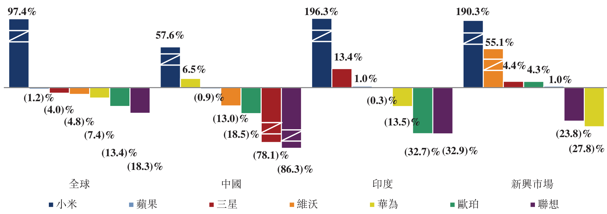

資料來源：IDC

2018年第一季度出貨量按年變動

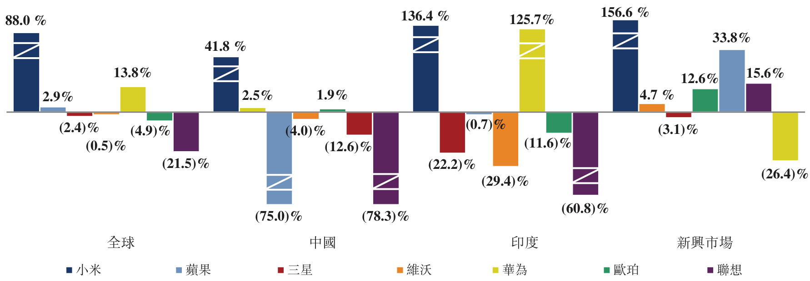

資料來源：IDC

---

## 第 153 页

行業概覽

下表載列於2018年第一季度中國大陸及印度的智能手機品牌按線上出貨量計算的排名。根據IDC統計，除於2018年第一季度線上出貨量在印度排名第一以外，小米於2018年第一季度按線下智能手機出貨量計算在印度亦排名第二，市場份額為14%。

<!-- table html -->
<table><tr><td colspan="2">2018年第一季度按出貨量計算中國大陸智能手機品牌線上銷售排名</td><td colspan="2">2018年第一季度按出貨量計算印度智能手機品牌線上銷售排名</td></tr><tr><td>1) 小米(27.1%)</td><td>1) 小米(59.6%)</td></tr><tr><td>2) 榮耀(21.7%)</td><td>2) 三星(8.6%)</td></tr><tr><td>3) 蘋果(9.8%)</td><td>3) 摩托羅拉(6.8%)</td></tr><tr><td>4) 華為(9.1%)</td><td>4) 榮耀(6.5%)</td></tr><tr><td>5) 維沃(9.1%)</td><td>5) 蘋果(2.1%)</td></tr></table>
<!-- /table -->

資料來源：IDC

消費級物聯網（「IoT」）市場

物聯網（「IoT」）為設備（或「物件」）之間的網絡，可透過互聯網進行無縫通信。消費級IoT市場指IoT設備銷售及提供面向消費者的IoT驅動服務。與消費相關的IoT應用涵蓋範圍甚廣，包括資訊及娛樂、保健、智能家居、家居保安及安全等。

根據艾瑞諮詢，全球消費級IoT硬件銷售額由2015年的3,063億美元增加至2017年的4,859億美元，複合年增長率為26.0%。預計於2022年將達15,502億美元，複合年增長率為26.1%。中國大陸消費級IoT硬件銷售額由2015年的715億美元增至2017年的1,188億美元，複合年增長率為28.9%。預計於2022年將達3,118億美元，複合年增長率為21.3%。下表載列全球及中國大陸消費級IoT硬件的銷售額：

<!-- table html -->
<table><tr><td colspan="9">全球消費級IoT硬件銷售額(十億美元)</td><td colspan="2">複合年增長率</td></tr><tr><td></td><td>2015年</td><td>2016年</td><td>2017年</td><td>2018年（預測）</td><td>2019年（預測）</td><td>2020年（預測）</td><td>2021年（預測）</td><td>2022年（預測）</td><td>2015年至2017年</td><td>2017年至2022年</td></tr><tr><td>智能家居設備</td><td>181.7</td><td>225.3</td><td>293.2</td><td>393.3</td><td>457.0</td><td>509.8</td><td>549.5</td><td>580.5</td><td>27.0%</td><td>14.6%</td></tr><tr><td>穿戴式設備</td><td>12.4</td><td>14.9</td><td>18.3</td><td>23.6</td><td>28.3</td><td>32.4</td><td>35.5</td><td>39.2</td><td>21.3%</td><td>16.5%</td></tr><tr><td>其他(1)</td><td>112.2</td><td>135.1</td><td>174.5</td><td>252.3</td><td>365.7</td><td>526.6</td><td>715.1</td><td>930.6</td><td>24.7%</td><td>39.8%</td></tr><tr><td>總計</td><td>306.3</td><td>375.3</td><td>485.9</td><td>669.2</td><td>851.1</td><td>1,068.9</td><td>1,300.1</td><td>1,550.2</td><td>26.0%</td><td>26.1%</td></tr></table>
<!-- /table -->

資料來源：艾瑞諮詢

附註：

(1) 其他主要包括汽車市場網絡、智能保健市場及其他。

<!-- table html -->
<table><tr><td colspan="9">中國大陸消費級IoT硬件銷售額(十億美元)</td><td colspan="2">複合年增長率</td></tr><tr><td></td><td>2015年</td><td>2016年</td><td>2017年</td><td>2018年（預測）</td><td>2019年（預測）</td><td>2020年（預測）</td><td>2021年（預測）</td><td>2022年（預測）</td><td>2015年至2017年</td><td>2017年至2022年</td></tr><tr><td>智能家居設備</td><td>58.7</td><td>73.2</td><td>97.6</td><td>126.0</td><td>150.1</td><td>172.0</td><td>188.4</td><td>201.0</td><td>29.0%</td><td>15.5%</td></tr><tr><td>穿戴式設備</td><td>1.9</td><td>2.8</td><td>3.8</td><td>5.0</td><td>6.0</td><td>7.0</td><td>7.9</td><td>8.7</td><td>41.4%</td><td>17.8%</td></tr><tr><td>其他(1)</td><td>10.9</td><td>13.3</td><td>17.3</td><td>24.4</td><td>35.7</td><td>53.3</td><td>75.7</td><td>102.1</td><td>25.9%</td><td>42.6%</td></tr><tr><td>總計</td><td>71.5</td><td>89.3</td><td>118.8</td><td>155.4</td><td>191.8</td><td>232.3</td><td>271.9</td><td>311.8</td><td>28.9%</td><td>21.3%</td></tr></table>
<!-- /table -->

資料來源：艾瑞諮詢

附註：

(1) 其他主要包括汽車市場網絡、智能保健市場及其他。

---

## 第 154 页

行業概覽

由於感應器及設備處理器的技術有所改良，使互聯網連接成為各種消費產品的標準功能，預計全球消費級IoT市場將持續倍增。此外，供應商於單一生態鏈下透過連接多數產品提供更好的用戶體驗能力增強，消費級IoT使用率將進一步增加。5G基礎設施的推出亦將支援數十億設備的連接，該等設備連接要求低延遲率及高數據密度。此外，持續投資軟件技術、雲基礎設施及人工智能將加強IoT服務於應用、分析、數據共享及存儲方面的功能。

因此，現代消費者周邊已連接IoT設備數量迅速增加。根據艾瑞諮詢，消費級IoT終端的數量由2015年的30億個增加至2017年的49億個，複合年增長率為27.7%。預期於2022年將達153億個，2017年至2022年的複合年增長率為25.4%。下圖載列全球IoT終端數量：

IoT終端數量

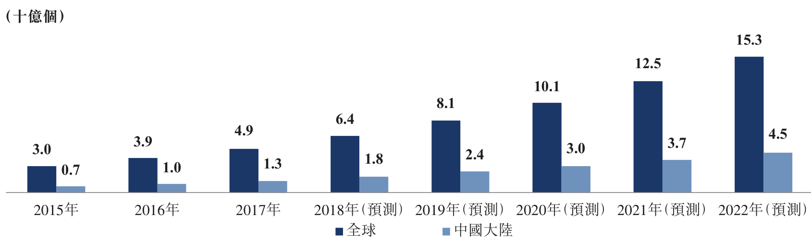

資料來源：艾瑞諮詢

IoT設備龐大且快速增長的基礎可收集大量實時數據，促進多種消費用途的研發。IoT終瑞支援流數據分析，可更了解消費者需求及偏好，以優化產品性能、提高消費產品體驗，並推出各種應用場景的新產品。

競爭格局

成功的消費級IoT戰略不僅要求公司提供優質且設計精良的產品，亦須提供多類可通過米家app等單一應用程序無縫互連的產品，以滿足用戶日常需求。

根據艾瑞諮詢，截至2018年3月31日，按已連接設備(不包括智能手機及筆記本電腦)的數量計算，小米為全球領先的IoT平台。下表載列於2018年3月31日按已連接設備數量計算的消費級IoT硬件全球市場份額：

2018年第一季度按已連接設備數量計算的消費級IoT市場份額

<!-- table html -->
<table><tr><td></td><td>小米</td><td>亞馬遜</td><td>蘋果</td><td>谷歌</td><td>三星</td></tr><tr><td>市場份額^(1)</td><td>1.9%</td><td>1.2%</td><td>1.0%</td><td>0.9%</td><td>0.8%</td></tr></table>
<!-- /table -->

資料來源：艾瑞諮詢

附註：

(1) 市場份額不包括智能手機及筆記本電腦。

---

## 第 155 页

行業概覽

根據艾瑞諮詢，小米的競爭優勢是其IoT產品種類繁多且價格大眾化，且IoT產品可透過米家app進行無縫集成及統一控制。其他IoT供應商傾向集中推出垂直領域內的單一產品或產品售價較高。下圖比較自小米購買的IoT產品生態鏈及購買類似規格的其他產品之價格作舉例。

小米生態鏈的IoT設備與可比較競爭對手產品的比較$^{(1)}$

<!-- table html -->
<table><tr><td></td><td>智能電視</td><td>人工智能音箱</td><td>路由器</td><td>滑板車</td><td>穿戴式設備</td><td>空氣淨化器</td><td>感應加熱電飯煲</td><td>掃地機器人</td><td>智能相機</td><td>淨水器</td><td>成本總額</td></tr><tr><td>小米型號</td><td>小米電視</td><td>小米AI音箱</td><td>小米路由器</td><td>米家電動滑板車</td><td>小米手環</td><td>小米米家空氣淨化器</td><td>米家壓力IH電飯煲</td><td>米家掃地機器人</td><td>米家智能攝像機</td><td>小米淨水器</td><td>1,185美元至2,990美元</td></tr><tr><td>價格</td><td>138美元至1,492美元</td><td>26美元至46美元</td><td>15美元至107美元</td><td>308美元</td><td>23美元</td><td>108美元至231美元</td><td>62美元至154美元</td><td>260美元</td><td>15美元至62美元</td><td>230美元至307美元</td><td></td></tr><tr><td>系統</td><td colspan="11">統一由米家app控制</td></tr></table>
<!-- /table -->

<!-- table html -->
<table><tr><td>競爭對手型號</td><td>Samsung UA Series</td><td>Sonos One</td><td>TP-Link DR Series</td><td>INMOTION V Series</td><td>Apple Watch</td><td>Honeywell KJ Series</td><td>Panasonic SR Series</td><td>iRobot Roomba® Series</td><td>Ezviz Smart Camera</td><td>Philips WP4170</td><td>3,200美元至7,864美元</td></tr><tr><td>價格</td><td>446美元至3,333美元</td><td>279美元</td><td>13美元至230美元</td><td>508美元</td><td>249美元</td><td>325美元至833美元</td><td>156美元至586美元</td><td>741美元至1,304美元</td><td>22美元至81美元</td><td>461美元</td><td></td></tr><tr><td>系統</td><td>Samsung Smarthings</td><td>Amazon Alexa</td><td>TP-Link Mobile APP</td><td>INMOTION Mobile APP</td><td>Watch OS 4</td><td>JD Smart</td><td>Panasonic Smart</td><td>iRobot</td><td>Ezviz Cloud</td><td>Ali Smart Cloud</td><td></td></tr></table>
<!-- /table -->

資料來源：艾瑞諮詢

附註：

(1) 比較範圍僅限於中國大陸可用產品。

互聯網服務市場

互聯網日益普及，已成為不可或缺的媒介。用戶可透過互聯網創建及提供服務。移動及高速互聯網連接的廣泛應用使互聯網滲透多種服務，包括電子商務、通信、教育、醫療、媒體及娛樂、信息服務、金融及其他地區服務。互聯網已成為個人與世界互動不可缺少的工具。

---

## 第 156 页

互聯網服務市場規模

根據艾瑞諮詢，2015年至2017年間，全球互聯網服務市場規模由10,106億美元增至15,409億美元，複合年增長率為23.5%。預計於2022年將達到26,009億美元，複合年增長率為11.0%。根據艾瑞諮詢，2015年至2017年間，中國互聯網服務市場規模由1,891億美元增至3,202億美元，複合年增長率為30.1%。預計於2022年將達到6,692億美元，複合年增長率為15.9%。互聯網服務市場可進一步分類至以下分部：互聯網零售、在線廣告、在線遊戲、互聯網金融、應用程序商店及其他互聯網服務。下表載列互聯網服務總市場規模及各互聯網服務分部的市場規模：

<!-- table html -->
<table><tr><td colspan="9">全球互聯網服務市場規模(十億美元)</td><td colspan="2">複合年增長率</td></tr><tr><td></td><td>2015年</td><td>2016年</td><td>2017年</td><td>2018年（預測）</td><td>2019年（預測）</td><td>2020年（預測）</td><td>2021年（預測）</td><td>2022年（預測）</td><td>2015年至2017年</td><td>2017年至2022年</td></tr><tr><td>互聯網零售</td><td>494.5</td><td>601.4</td><td>754.3</td><td>901.4</td><td>957.0</td><td>1,013.7</td><td>1,072.7</td><td>1,129.7</td><td>23.5%</td><td>8.4%</td></tr><tr><td>在線廣告</td><td>212.2</td><td>262.9</td><td>312.0</td><td>361.7</td><td>411.6</td><td>461.0</td><td>510.7</td><td>560.4</td><td>21.3%</td><td>12.4%</td></tr><tr><td>在線遊戲</td><td>139.4</td><td>161.5</td><td>179.9</td><td>195.9</td><td>211.8</td><td>228.3</td><td>244.2</td><td>260.4</td><td>13.6%</td><td>7.7%</td></tr><tr><td>互聯網金融</td><td>49.7</td><td>69.7</td><td>94.9</td><td>117.6</td><td>140.8</td><td>163.9</td><td>186.8</td><td>208.7</td><td>38.2%</td><td>17.1%</td></tr><tr><td>應用程序商店</td><td>37.0</td><td>52.8</td><td>71.0</td><td>92.2</td><td>109.2</td><td>128.4</td><td>147.5</td><td>165.7</td><td>38.6%</td><td>18.5%</td></tr><tr><td>其他互聯網服務</td><td>77.8</td><td>101.8</td><td>128.8</td><td>153.8</td><td>181.8</td><td>213.2</td><td>246.2</td><td>276.0</td><td>28.6%</td><td>16.5%</td></tr><tr><td>總計</td><td>1,010.6</td><td>1,250.2</td><td>1,540.9</td><td>1,822.5</td><td>2,012.1</td><td>2,208.5</td><td>2,408.2</td><td>2,600.9</td><td>23.5%</td><td>11.0%</td></tr></table>
<!-- /table -->

資料來源：艾瑞諮詢

中國大陸互聯網服務市場規模(十億美元)

<!-- table html -->
<table><tr><td></td><td>2015年</td><td>2016年</td><td>2017年</td><td>2018年（預測）</td><td>2019年（預測）</td><td>2020年（預測）</td><td>2021年（預測）</td><td>2022年（預測）</td><td>2015年至2017年</td><td>2017年至2022年</td></tr><tr><td>互聯網零售</td><td>105.3</td><td>129.3</td><td>164.4</td><td>200.5</td><td>224.1</td><td>246.1</td><td>267.0</td><td>286.8</td><td>25.0%</td><td>11.8%</td></tr><tr><td>在線廣告</td><td>35.1</td><td>43.4</td><td>54.6</td><td>70.1</td><td>87.6</td><td>107.7</td><td>130.8</td><td>151.6</td><td>24.7%</td><td>22.7%</td></tr><tr><td>在線遊戲</td><td>23.1</td><td>26.9</td><td>34.9</td><td>42.5</td><td>49.7</td><td>55.7</td><td>59.6</td><td>62.1</td><td>23.0%</td><td>12.2%</td></tr><tr><td>互聯網金融</td><td>13.2</td><td>24.2</td><td>31.1</td><td>39.2</td><td>47.6</td><td>55.3</td><td>62.4</td><td>69.2</td><td>53.6%</td><td>17.3%</td></tr><tr><td>應用程序商店</td><td>2.1</td><td>5.5</td><td>12.6</td><td>17.3</td><td>23.6</td><td>28.9</td><td>34.9</td><td>40.4</td><td>145.7%</td><td>26.3%</td></tr><tr><td>其他互聯網服務</td><td>10.4</td><td>15.8</td><td>22.6</td><td>29.7</td><td>37.2</td><td>44.4</td><td>51.8</td><td>59.1</td><td>47.4%</td><td>21.2%</td></tr><tr><td>總計</td><td>189.1</td><td>245.2</td><td>320.2</td><td>399.3</td><td>469.9</td><td>538.0</td><td>606.4</td><td>669.2</td><td>30.1%</td><td>15.9%</td></tr></table>
<!-- /table -->

資料來源：艾瑞諮詢

競爭格局

互聯網服務市場競爭激烈，由眾多提供有競爭力的服務參與者分佔。互聯網公司通常花費大量營銷費用建立並挽留用戶群。因此，能透過銷售硬件設備獲得及挽留用戶的公司通過降低獲取客戶成本、增加用戶參與頻率及提高收集數據能力加強互聯網服務的競爭力。

獲取客戶成本

獲取客戶成本為任何互聯網服務模式重要的成本組成部分。提供互聯網服務的智能手機公司可憑藉銷售設備獲得客戶並賺取利潤，而其他互聯網模式獲得客戶則需要產生費用。下圖載列2017年全球僅提供互聯網服務供應商獲取每名新月活躍用戶的成本。下圖表

---

## 第 157 页

行業概覽

明選定的領先互聯網公司均產生獲取客戶成本，而小米則透過硬件銷售賺取利潤並獲得客戶。

2017年選定的全球領先互聯網公司每名新月活躍用戶的獲取客戶成本$^{(1)}$

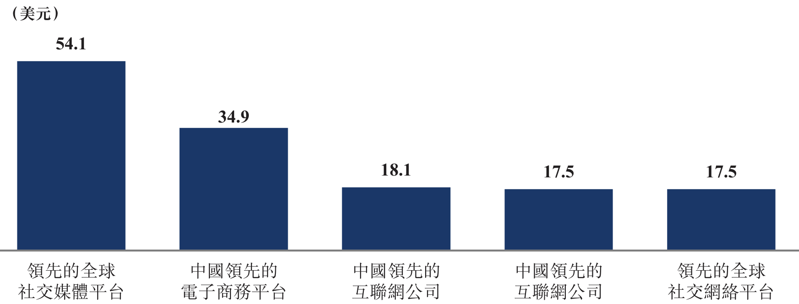

資料來源：艾瑞諮詢

附註：

(1) 包括截至2018年4月27日市值達150億美元及以上的選定領先互聯網公司。

智能手機作為移動互聯網及用戶互動工具的媒介

智能手機是消費者連接互聯網的主要媒介。由於手機逐漸成為連接互聯網的主要途徑，2017年全球移動互聯網用戶數量佔互聯網用戶總數量的50.8%，預計於2022年將達到68.6%。下表載列移動互聯網用戶數量及滲透率：

<!-- table html -->
<table><tr><td></td><td colspan="8">全球移動互聯網用戶</td><td colspan="2">複合年增長率</td></tr><tr><td></td><td>2015年</td><td>2016年</td><td>2017年</td><td>2018年（預測）</td><td>2019年（預測）</td><td>2020年（預測）</td><td>2021年（預測）</td><td>2022年（預測）</td><td>2015年至2017年</td><td>2017年至2022年</td></tr><tr><td>全球(百萬人) ……</td><td>3,089.6</td><td>3,339.8</td><td>3,879.5</td><td>4,309.4</td><td>4,719.9</td><td>5,148.4</td><td>5,576.7</td><td>6,007.0</td><td>12.1%</td><td>9.1%</td></tr><tr><td>滲透率(佔人口百分比) ……</td><td>42.6%</td><td>44.7%</td><td>50.8%</td><td>54.5%</td><td>57.7%</td><td>61.3%</td><td>64.7%</td><td>68.6%</td><td>9.2%</td><td>6.2%</td></tr></table>
<!-- /table -->

資料來源：艾瑞諮詢

<!-- table html -->
<table><tr><td></td><td colspan="8">中國大陸移動互聯網用戶</td><td colspan="2">複合年增長率</td></tr><tr><td></td><td>2015年</td><td>2016年</td><td>2017年</td><td>2018年（預測）</td><td>2019年（預測）</td><td>2020年（預測）</td><td>2021年（預測）</td><td>2022年（預測）</td><td>2015年至2017年</td><td>2017年至2022年</td></tr><tr><td>中國大陸(百萬人) ……</td><td>619.8</td><td>695.3</td><td>752.6</td><td>799.6</td><td>843.5</td><td>888.4</td><td>932.2</td><td>976.6</td><td>10.2%</td><td>5.3%</td></tr><tr><td>滲透率(佔人口百分比) ……</td><td>45.1%</td><td>50.3%</td><td>54.1%</td><td>57.5%</td><td>60.9%</td><td>64.5%</td><td>68.1%</td><td>71.7%</td><td>9.6%</td><td>5.8%</td></tr></table>
<!-- /table -->

資料來源：艾瑞諮詢

智能手機的普及亦大幅增加使用互聯網的時間，擴大了互聯網服務的潛在市場。

因此，智能手機公司可把握用戶長時間使用互聯網帶來的機會。例如，2018年3月，小米用戶每天平均使用智能手機的時間約為4.5小時。由於智能手機已成為日常生活不可或缺的工具，向用戶提供創新硬件及互聯網服務的公司的用戶參與頻率會較高。

---

## 第 158 页

智能手機和IoT數據的價值

智能手機已成為日常生活不可或缺的工具，智能手機的使用幾乎滲透生活各個方面，並且可收集大量數據。智能手機廣泛的應用範圍涵蓋了各種日常使用場景，使互聯網服務供應商可收集用戶行為、消費和偏好的數據，以改善用戶體驗，提供更優質的服務。

IoT的普及也帶來了大量在線連接設備，可隨時隨地收集用戶數據及偏好。同時提供IoT產品的公司參考透過實時傳感器獲得的數據為消費者進一步研發額外的用例和應用程序（例如有人工智能功能產品）。

用戶盈利實現率

主要互聯網服務供應商的用戶盈利實現階段各有不同。互聯網服務供應商的用戶盈利實現程度均有所不同，視乎其各自的策略及業務模式的成熟程度。根據艾瑞諮詢，以2017年互聯網服務收入計，小米位列全球前25公司。然而，根據艾瑞諮詢，2017年小米每用戶平均互聯網服務收入為9.0美元，與選定的全球領先互聯網服務供應商的每用戶平均互聯網服務收入相比，仍有相當大的增長空間。

2017年選定的全球領先互聯網公司每月活躍用戶的互聯網服務收入$^{(1)}$

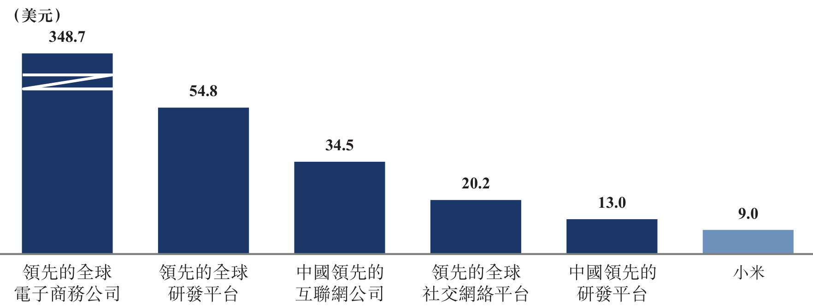

資料來源：艾瑞諮詢

附註：

(1) 包括截至2018年4月27日市值150億美元以上的選定領先互聯網公司。

新零售

新零售可理解為依托於技術手段，實現線上、線下零售渠道無縫融合，提高效率。線上線下零售渠道高度融合，推動客戶流量，從而提高整體銷售效率。新零售亦透過自有線上線下渠道直接向消費者分銷，從而提高成本效率，並減少對額外分銷層級的需求。

由於線上零售可為消費者提供更多產品選擇並增加價格透明度，亦使消費者可以快捷的方式選購心儀產品，故線上零售發展迅速。此外，新興市場的線下零售基礎設施不足，

---

## 第 159 页

行業概覽

促進了線上零售的迅速發展，故新興市場的線上零售增長尤為迅速。根據艾瑞諮詢，2017年全球線上購物人數達到1,660.0百萬人，預期於2022年將達到2,225.6百萬人，複合年增長率為6.0%。中國大陸線上的購買人數達到533.3百萬人，預期於2022年將達到804.8百萬人，複合年增長率為8.6%。

線上購物人數

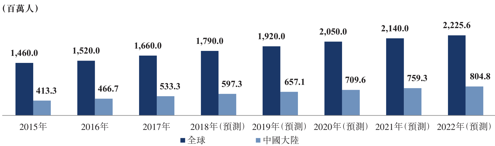

資料來源：艾瑞諮詢

線上零售市場乃由眾多參與者透過不同業務模式(例如平台市場或直銷)提供不同種類的產品。根據艾瑞諮詢，2017年及2018年第一季度，按商品成交總額計，小米商城是中國大陸第三大3C與家電直銷線上零售平台及印度第三大直銷線上零售平台。

然而，線下零售業務可補充線上零售業務，並進一步滲透到較落後的農村地區，該等地區的互聯網普及率較低，線下零售的模式仍受消費者歡迎。下表載列中國大陸及印度的農村及城市地區的互聯網滲透率。

<!-- table html -->
<table><tr><td></td><td colspan="8">互聯網滲透率</td></tr><tr><td></td><td>2015年</td><td>2016年</td><td>2017年</td><td>2018年（預測）</td><td>2019年（預測）</td><td>2020年（預測）</td><td>2021年（預測）</td><td>2022年（預測）</td></tr><tr><td>中國大陸</td><td></td><td></td><td></td><td></td><td></td><td></td><td></td><td></td></tr><tr><td>城市</td><td>64.5%</td><td>67.6%</td><td>70.0%</td><td>72.5%</td><td>74.8%</td><td>77.2%</td><td>79.5%</td><td>81.9%</td></tr><tr><td>農村</td><td>32.0%</td><td>33.5%</td><td>35.6%</td><td>37.7%</td><td>39.7%</td><td>41.8%</td><td>43.9%</td><td>45.8%</td></tr><tr><td>印度</td><td></td><td></td><td></td><td></td><td></td><td></td><td></td><td></td></tr><tr><td>城市</td><td>60.2%</td><td>59.1%</td><td>64.1%</td><td>67.1%</td><td>70.8%</td><td>73.7%</td><td>77.3%</td><td>80.7%</td></tr><tr><td>農村</td><td>15.3%</td><td>17.7%</td><td>20.4%</td><td>23.2%</td><td>25.9%</td><td>28.7%</td><td>31.4%</td><td>34.2%</td></tr></table>
<!-- /table -->

資料來源：艾瑞諮詢

零售商可利用線上及線下渠道擴大客戶觸點及所提供服務範圍，從而獲得更廣泛的用戶群，更深入地了解消費者，以提供更無縫和更優質的零售體驗。

由於新零售專注提供卓越的用戶體驗並可直接與消費者互動，新零售的銷售效率較

---

## 第 160 页

行業概覽

傳統零售高。例如，根據艾瑞諮詢，按每平方米的零售額計算，小米2017年的銷售效率全球排名第二，比中國大陸領先的傳統零售商高十倍以上。

新零售亦可消除中間人，從而專注高效分銷，與通常利用多層分銷的傳統智能手機銷售模式有所不同。直接面向消費者的零售商可透過減少不必要的分銷層級，降低渠道成本並降低價格，將所節省的成本轉予消費者，產品的整體競爭力及吸引力因而得以提高。

---

## 第 161 页

法規

我們的業務主要位於中國大陸，且大部分銷售額亦源自中國大陸。因此，中國大陸的法律法規與我們的業務最為關切，包括(但不限於)有關增值電信服務、研發及銷售手機、移動互聯網應用程序信息服務、信息安全及審查、隱私保護、網絡遊戲、網絡出版及知識產權的法律法規。此外，我們有部分收入來自香港及印度，故香港及印度的法律法規亦與我們有關。

與中國存託憑證有關的法規

2018年6月6日，中國證監會頒佈《存託憑證發行與交易管理辦法(試行)》(「存託憑證試行辦法」)及《試點創新企業境內發行股票或存託憑證並上市監管工作實施辦法》(「存託憑證監管辦法」)。

存託憑證試行辦法規定，倘境外基礎證券發行人(「境外發行人」)的股權結構、公司治理、運行規範等事項適用境外發行人註冊成立地點所在司法權區的法律法規，則對中國境內投資者的保護水平不得低於中國大陸法律、行政法規及中國證監會規定的要求。存託憑證持有人享有的權益須與境外基礎證券持有人(「境外證券持有人」)整體享有的權益相當，且兩者的保障不得存在跨境歧視。

境外發行人須確保存託憑證持有人實際享有的資產收益、參與重大公司決策、清盤及發生類似事項時的剩餘財產分配等權益與境外證券持有人享有的權益相當。境外證券持有人不得作出任何損害存託憑證持有人合法權益的行為。此外，倘法律、行政法規及中國證監會規定對投資者保護有強制性規定，則須從其規定。境外發行人及存託人須按照存託協議約定，採用安全、經濟及便捷的方式為存託憑證持有人行使權利提供便利。倘存託人代存託憑證持有人行使境外基礎證券相應權利，須按照存託協議約定的方式事先徵求存託憑證持有人同意。

存託憑證在境內首次公開發行及上市後，倘境外發行人新增證券為基礎證券的存託憑證，則須遵守相關證券法、存託憑證監管辦法及中國證監會關於上市公司證券發行的規定。依法公開發行的存託憑證須在境內證券交易所上市交易。

境外發行人、其控股股東、最終控制人等信息披露義務人須確保其在境外市場披露的信息同步在境內市場披露。

---

## 第 162 页

法規

倘境外發行人的股東、最終控制人、董事、監事、高級管理人員和其他投資者在中國大陸減持其持有的已發行存託憑證，賣方須遵守法律、法規、中國證監會規定及有關證券交易所業務規則的規定。

中證中小投資者服務中心有限責任公司（「投資者服務中心」）可購買最小交易份額的存託憑證，依法行使存託憑證持有人的各項權利。投資者服務中心可接受存託憑證持有人的委託，代為行使存託憑證持有人的各項權利。根據適用法律法規，投資者服務中心可代存託憑證持有人向中國大陸法院提起民事訴訟。

倘境外發行人具有附帶不同股東投票權的股份，則持有特別投票權的股東須按照適用的法律法規及境外發行人的組織章程細則行使投票權，不得濫用特別投票權，亦不得損害存託憑證持有人等境內投資者的合法權益。倘出現上述情形以致存託憑證持有人的合法權益受損，境外發行人及特別投票權股東須予以改正，並依法承擔對有關持有人的損害賠償責任。倘存託憑證持有人與境外發行人、存託人及證券服務機構發生糾紛，可向投資者服務中心或其他依法設立的調解組織申請調解。

存託憑證暫停及終止上市的程序須於相關境內證券交易所的適用規則訂明。倘存託憑證終止上市，存託人須根據存託協議的約定，為存託憑證持有人行使權利提供必要保障。倘存託憑證終止上市，存託人須根據存託協議的約定賣出基礎證券，並將賣出所得扣除稅費後及時分配給存託憑證持有人。倘無法賣出基礎證券，境外發行人須在存託協議中作出合理安排，保障存託憑證持有人的合法權益。

存託憑證監管辦法規定，倘試點紅籌企業適用註冊成立地點所在司法權區的公司法及其他法律法規，則其投資者權益保護水平(包括資產收益、參與重大公司決策、清盤及發生類似事項時的剩餘財產分配等權益)不應低於中國大陸法律、行政法規及中國證監會整體規定的要求。試點紅籌企業須保障存託憑證持有人實際享有的權益與境外證券持有人享有的權益相當。

存託憑證監管辦法進一步規定，倘境外發行人具有附帶不同投票權的股份，則相關安排須符合基礎證券擬上市的相關證券交易所規定，並須明確維持特殊投票權的前提條件。特殊投票權不得隨相關股份的轉讓而轉讓。除非存託憑證上市前境外發行人的組織章程細

---

## 第 163 页

則已有合理規定，否則存託憑證上市後不得通過任何方式提高特殊投票權股份的數量及其代表投票權的比例。

與增值電信服務有關的法規

增值電信服務許可證

國務院於2000年9月25日頒佈中華人民共和國電信條例（「電信條例」），最近於2016年2月6日修訂，是監管中國大陸電信服務供應商的框架。電信條例規定電信服務供應商開始經營前須取得經營許可證。電信條例將電信業務分為基礎電信業務及增值電信業務。根據工業和信息化部（「工信部」）於2015年12月28日修訂的電信條例隨附的電信業務分類目錄，通過固定網絡、移動網絡及互聯網提供的信息服務屬於增值電信業務。

國務院於2000年9月25日頒佈並於2011年1月8日修訂的互聯網信息服務管理辦法（「互聯網管理辦法」），制定了有關提供互聯網信息服務的指引。互聯網管理辦法將互聯網信息服務分類為經營性互聯網信息服務及非經營性互聯網信息服務。互聯網內容提供服務的經營性運營商須就提供互聯網信息服務從相關電信機關取得ICP許可證。工信部於2017年7月3日頒佈並於2017年9月1日生效的電信業務經營許可管理辦法規定增值電信服務的經營性運營商首先須取得工信部或其省級機關的ICP許可證。此外，取得許可證的運營商須在每年第一季向審批機構報告業務狀況及服務水平。

外商投資限制

外商直接投資中國大陸電信企業受國務院於2001年12月11日頒佈並分別於2008年9月10日及2016年2月6日修訂的外商投資電信企業管理規定所規管。該規定要求外資參與的中國大陸增值電信企業須以中外合資企業形式成立，而外國投資者對企業的出資比例不得超過50%。此外，經營中國大陸增值電信業務的外商投資增值電信企業的主要外商投資者必須具有經營增值電信業務的良好業績及運營經驗，所謂主要外商投資者，指所有外商投資者中出資最多且佔所有外商投資者總投資額不少於30%的投資者。而且，符合以上要求的外

---

## 第 164 页

商投資者須取得工信部及商務部或其授權的地方部門批准（就是否授出批文有相當大的酌情權），方可開始於中國大陸的增值電信業務。

於2006年7月，信息產業部(工信部的前身)發佈信息產業部關於加強外商投資經營增值電信業務管理的通知(「信息產業部通知」)，規定境內電信企業禁止以任何形式向外國投資者出租、出讓、倒賣電信業務經營許可證，或以任何形式為外國投資者在中國大陸非法經營電信業務提供資源、場地、設施及其他協助。此外，根據信息產業部通知，外商投資的增值電信服務經營者所使用的互聯網域名及註冊商標應為該經營者(或其股東)依法持有。

外國投資者於中國大陸的投資活動主要受商務部及國家發展和改革委員會（「國家發改委」）於2017年6月28日聯合頒發並於2017年7月28日生效的外商投資產業指導目錄（2017年修訂）（「目錄」）所規管。目錄將外商投資產業劃分成四類，即「鼓勵」類、「限制」類、「禁止」類，而所有未被列入以上類別的產業視為「允許」類。根據目錄，本公司的中國大陸附屬公司目前所提供的互聯網信息服務屬於增值電信服務（電子商務除外）及互聯網文化經營（音樂除外）的範圍，分別屬於「限制」類及「禁止」類。

製造及銷售手機的法規

製造及銷售手機的一般管理規定

根據國家質量監督檢驗檢疫總局（「質檢總局」）（已併入國家市場監督管理總局）於2009年7月3日頒佈的強制性產品認證管理規定，國家指定的產品如未獲認證（「強制產品認證」）且加上中國強制認證標籤，則不可在其他業務交收、出售、進口或使用。須通過強制產品認證的產品，國家設有統一的產品目錄（「3C目錄」）、統一的技術規範強制要求、標準及合格評定程序、統一的認證標籤及統一的收費標準。根據質檢總局及中國國家認證認可監督管理委員會（「國家認監委」）於2001年12月3日發佈的第一批實施強制性產品認證的產品目錄（「第一批3C產品目錄」），手機用戶終端及CDMA數字蜂窩移動台須通過強制產品認證，方可交收、出售、進口或使用。

除強制產品認證外，在中國大陸出售無線電組件產品須按照國務院及中央軍委於1993年9月11日頒佈並於2016年11月11日修訂的中華人民共和國無線電管理條例，與國家無線電管理委員會（「國家無線電管理委員會」）及國家質量技術監督局（「國家質監局」，質檢總局的

---

## 第 165 页

前身)於1997年10月7日頒佈的生產無線電發射設備的管理規定，取得無線電發射設備型號核准證。

此外，信息產業部於2001年5月10日頒佈電信設備進網管理辦法，後於2014年9月23日經工信部修訂，規定國家對電信終端設備、無線電通信設備及連接公眾電信網絡的聯網設備實施進網許可制度。須通過進網許可制度的電信設備須取得工信部發出的電信設備進網許可（「進網許可」）。未有進網許可的電信設備不得連接公眾電信網絡，亦不可在國內市場出售。生產企業申請進網許可，須提交電信設備檢測機構發出的測試報告或強制產品認證的證書。倘若申請無線電發射設備的進網許可，亦須提交工信部發出的無線電發射設備型號核准證。

品質的規定

在中國大陸製造產品須遵守1993年2月22日頒佈及於2000年7月8日與2009年8月27日修訂的中華人民共和國產品質量法（「產品質量法」）。根據產品質量法，產品製造商須就產品缺陷引致的人身或財物損傷賠償，除非製造商可以證明(i)並無流通產品；(ii)產品流通當時並無缺陷；或(iii)產品流通當時的科學或技術認知不足以發現缺陷。

中華人民共和國消費者權益保護法（「消費者保護法」）於1993年10月31日頒佈並於1994年1月1日生效，再於2009年8月27日及2013年10月25日修訂。根據消費者保護法，除另有規定外，提供產品或服務的運營者根據產品質量法及其他法律法規須承擔民事責任。2009年12月26日頒佈而於2010年7月1日生效的中華人民共和國侵權責任法規定，倘若有缺陷產品引致損失，受害人可以要求產品製造商或賣家賠償。倘若缺陷是由於賣家導致，則製造商可在賠償受害人後要求賣家補償。倘若缺陷是由於製造商導致，則賣家可在賠償受害人後要求製造商補償。

進出口貨品登記

根據全國人大常委會於1987年1月22日頒佈，先後於2000年7月8日、2013年6月29日、2013年12月28日、2016年11月7日及2017年11月4日修訂的中華人民共和國海關法，除另有規

---

## 第 166 页

定外，進出口貨品的報關手續可以由收貨人及發貨人自行辦理，亦可以委託已在海關登記的經紀代辦。進出口貨品的收貨人及發貨人與辦理報關的經紀均須根據法例在海關辦理登記。

根據海關總署於2014年3月13日頒佈及生效並於2017年12月20日修訂的中華人民共和國海關報關單位註冊登記管理規定，報關單位的登記包括報關單位、發貨人、收貨人及進出口貨物的登記。發貨人、收貨人及進出口貨物須按照法例規定在當地海關辦理登記。

有關移動互聯網應用程序信息服務的法規

移動互聯網應用程序受中央網信辦於2016年6月28日頒佈並於2016年8月1日生效的移動互聯網應用程序信息服務管理規定（「應用程序管理規定」）規管。

應用程序管理規定規定，應用程序信息服務提供商須取得法律法規要求的相關資質，嚴格落實信息安全管理責任並履行其義務，包括建立及完善保護用戶信息安全及信息內容審核管理等機制，保障用戶在使用過程中的知情權及選擇權，亦要記錄用戶每天的信息及保留60天。應用商店服務提供商須在服務上線運營後30日內，向所在地地方互聯網信息辦公室備案。此外，互聯網應用商店服務提供商和互聯網應用程序信息服務提供商須簽訂服務協議，明確雙方權利及義務。

有關信息安全及審查的法規

為了維護國家安全，互聯網內容在中國大陸受到規管及限制。全國人民代表大會常務委員會（「全國人大常委會」）於2000年12月28日發佈維護互聯網安全的決定（於2009年8月27日修訂），對有下列行為的人士追究刑事責任：(i)侵入具戰略重要性的計算機或系統；(ii)傳播政治有害信息；(iii)泄露國家秘密；(iv)傳播虛假商業信息或(v)侵犯他人知識產權。1997年，公安部頒佈計算機信息網絡國際聯網安全保護管理辦法（經國務院於2011年1月8日修訂），禁止利用互聯網洩露國家秘密、傳播擾亂社會秩序的內容。公安部有權監督及監察，而地方公安局亦可行使管轄權。倘ICP許可證持有人違反該等管理辦法，中華人民共和國政府可撤回其ICP許可證並關閉其網站。

---

## 第 167 页

2016年11月7日，全國人大常委會頒佈中華人民共和國網絡安全法（於2017年6月1日生效），據此，網絡運營者開展經營和服務活動，必須遵守法律法規，履行網絡安全保護義務。通過網絡提供服務，須依照法律法規的規定和國家標準的強制要求，採取技術措施和其他必要措施，保障網絡安全、穩定運行，有效應對網絡安全事件，防範網絡違法犯罪活動，維護網絡數據完整、保密和可用，且網絡運營者不得收集與其提供的服務無關的個人信息，不得違反法律法規的規定和雙方的約定收集、使用個人信息，且關鍵信息基礎設施的網絡運營者在中國大陸境內運營中收集和產生的個人信息和重要數據須在境內存儲。運營者採購網絡產品和服務，可能影響國家安全的，須通過國家網絡安全審查。2017年5月2日，中央網信辦發佈網絡產品和服務安全審查辦法（試行）（於2017年6月1日生效），提出更多有關網絡安全審查規定的詳細規則。

與隱私保護有關的法規

2005年12月13日，公安部發佈互聯網安全保護技術措施規定（「互聯網保護措施」），於2006年3月1日生效。根據互聯網保護措施，互聯網服務提供者須妥善落實防範計算機病毒、數據備份及其他相關措施，記錄並留存用戶註冊信息、登錄和退出時間、互聯網地址、發帖內容和時間等若干信息至少60天，偵測、停止傳輸違法信息，並保留相關記錄。2012年12月，全國人大常委會頒佈關於加強網絡信息保護的決定，加強對信息安全及互聯網隱私的法律保護。2013年7月，工信部頒佈電信和互聯網用戶個人信息保護規定，規管在中國大陸提供電信服務和互聯網信息服務的過程中個人信息的收集和使用，個人信息包括用戶姓名、出生日期、身份證件號碼、住址、電話號碼、賬號和密碼等能夠識別用戶的信息。於2011年12月29日，工信部頒佈規範互聯網信息服務市場秩序若干規定，自2012年3月15日起生效，訂明未經用戶同意，互聯網信息服務提供者不得收集與用戶相關、能夠單獨或者與其他信息結合識別用戶的信息，不得將用戶個人信息提供給他人，但是法律、行政法規另有規定的除外。2017年5月8日，最高人民法院、最高人民檢察院發佈最高人民法院、最高人民檢察院關於辦理侵犯公民個人信息刑事案件適用法律若干問題的解釋，對有關中華人民共和國刑法第253條之一規定的「侵犯公民個人信息」罪行的若干概念進行說明，包括「公民

---

## 第 168 页

個人信息」、「提供」及「非法獲取」。解釋亦對確定此罪行屬「情節嚴重」及「情節特別嚴重」的標準詳細說明。

有關網絡遊戲的法規

網絡遊戲的一般管理規定

根據由國務院下屬中央機構編製委員會辦公室發出並於2009年9月7日生效的關於印發〈中央編辦對文化部(已併入文化和旅遊部)、國家廣播電影電視總局(「廣電總局」)(已併入國家新聞出版廣電總局)、新聞出版總署〈「三定」規定〉中有關動漫、網絡遊戲和文化市場綜合執法的部分條文的解釋〉的通知，新聞出版總署負責對網絡遊戲在互聯網上傳的審批，一旦上傳，則由文化部管理。

文化部於2010年6月3日頒佈網絡遊戲管理暫行辦法（「網絡遊戲管理辦法」），於2017年12月15日修訂，規管網絡遊戲業務的多種活動，包括網絡遊戲研發及製作、網絡遊戲運營、網絡遊戲虛擬貨幣發行、虛擬貨幣交易服務。網絡遊戲管理辦法規定，從事網絡遊戲運營的實體必須取得網絡文化經營許可證，進口網絡遊戲的內容須經文化部審批方可發佈，而國產網絡遊戲的內容須在發佈後30日內向文化部備案。網絡遊戲管理辦法亦規定網絡遊戲運營商須保護網絡玩家的權益，並指定了網絡遊戲運營商和網絡遊戲玩家之間的服務協議所必須載有的若干條款。由文化部發佈並於2010年7月29日生效的文化部關於貫徹實施〈網絡遊戲管理暫行辦法〉的通知列明受網絡遊戲管理辦法規管的實體及文化部審查網絡遊戲內容的相關程序，強調對網絡遊戲未成年玩家的保護並要求網絡遊戲運營商向玩家推進實名註冊。

於2016年5月24日，國家新聞出版廣電總局頒佈關於移動遊戲出版服務管理的通知，自2016年7月1日起生效，規定遊戲出版服務單位負責遊戲內容審核及遊戲出版物號申領工作。於2016年12月1日，文化部頒佈文化部關於規範網絡遊戲運營加強事中事後監管工作的通知，自2017年5月1日起生效，載有關於網絡遊戲以下各方面的規定：(i)明確網絡遊戲運營範圍；(ii)規範網絡遊戲虛擬道具發行服務；(iii)加強網絡遊戲用戶權益保護；(iv)加強網絡遊戲運營事中事後監管；及(v)嚴肅查處違法違規運營行為。

---

## 第 169 页

有關防沉迷系統及實名登記的規定

於2007年4月15日，為防止青少年沉迷網絡遊戲，包括新聞出版總署、教育部、公安部、工信部等八個中華人民共和國政府部門聯合發出關於保護未成年人身心健康實施網絡遊戲防沉迷系統的通知，要求中國所有的網絡遊戲運營商實施防沉迷系統及實名登記制度。根據防沉迷系統，對於18歲以下的遊戲玩家視為未成年玩家，以連續遊戲不超過三小時屬於「健康」，三至五小時視為「沉迷」，而五小時或以上則屬於「不健康」。遊戲運營商若發現遊戲玩家的上線時間達到「沉迷」程度，須將該玩家的遊戲價值減半，如達到「不健康」程度則減至零。為識別遊戲玩家是否未成年以遵守防沉迷制度，應採用實名登記制度，要求網絡遊戲玩家以真實身份資料登記，方可參加網絡遊戲。

虛擬貨幣的法規

文化部及商務部於2009年6月4日聯合發佈關於加強網絡遊戲虛擬貨幣管理工作的通知（「虛擬貨幣管理通知」），要求(a)發行網絡遊戲虛擬貨幣（預付卡及／或預付款或預付卡積點的形式）或(b)提供網絡遊戲虛擬貨幣交易的企業，在上述通知發出後三個月內向文化部的省級分支提出申請。虛擬貨幣管理通知禁止發行網絡遊戲虛擬貨幣的企業提供容許虛擬貨幣交易的服務。未有提交必要申請的企業會遭處分，包括（但不限於）強制整改措施及罰款。

外商投資限制

於2009年9月28日，新聞出版總署連同國家版權局及全國「掃黃打非」工作小組辦公室聯合頒佈的關於貫徹落實國務院〈「三定」規定〉和中央編辦有關解釋，進一步加強網絡遊戲前置審批和進口網絡遊戲審批管理的通知（「新聞出版總署通知」），規定（其中包括）禁止外商投資者以全資附屬公司、股權式合資企業或合作經營企業等方式在中國大陸投資或從事網絡遊戲營運服務，並明確規定外國投資者不得通過建立其他合資公司、簽訂合約安排或提供技術支持等間接方式控制或參與境內網絡遊戲營運業務。嚴重違反新聞出版總署通知者將導致吊銷或註銷相關許可證及登記。

---

## 第 170 页

有關互聯網出版的法規

網絡出版服務許可證

根據新聞出版總署與工信部於2016年2月4日聯合頒佈並於2016年3月10日生效的網絡出版服務管理規定（「網絡出版規定」），網絡出版業務須取得網絡出版服務許可證（「網絡出版服務許可證」）。

互聯網內容的限制

中國大陸的互聯網信息內容亦受到高度監管。於2007年2月16日，新聞出版總署頒佈新聞出版總署關於加強音像製品、電子出版物和網絡出版物審讀工作的通知，加強對網絡出版物的審讀工作，包括(i)對未出版的音像製品及電子出版物年度選題計劃的審核；(ii)對已出版的音像製品及電子出版物的專項審讀和日常審讀；及(iii)對網絡出版內容的監管。根據互聯網管理辦法，提供違禁互聯網內容的違規者會遭處分，包括刑事制裁、暫停運營進行整改，甚至撤銷ICP許可證。

互聯網信息服務提供商亦須監控其網站。根據網絡出版規定，網絡出版服務單位須實行出版物內容審核責任制度、責任編輯制度、責任校對制度等管理制度，保障網絡出版物出版質量。

外商投資的限制

外國投資者於中國大陸的投資活動主要受商務部及國家發改委於2017年6月28日聯合頒發並於2017年7月28日生效的目錄所規管。目錄將外商投資產業劃分成四類，分別為「鼓勵」類、「限制」類、「禁止」類，而所有未被列入以上類別的產業視為「允許」類。根據目錄，本公司中國大陸附屬公司目前所提供的互聯網信息服務屬於增值電信服務（電子商務除外）及互聯網文化經營（音樂除外）的範圍，分別屬於「限制」類及「禁止」類。此外，「圖書編輯」亦於「禁止」類列作新增項目。

有關知識產權的法規

著作權法

中國已頒佈多項關於保護著作權的法律法規。中國是若干著作權保護的主要國際公約的締約國，並於1992年10月簽署保護文學和藝術作品伯爾尼公約、於1992年10月簽署世界版權公約及於2001年12月加入世界貿易組織時簽署與貿易有關的知識產權協定。

---

## 第 171 页

法規

中華人民共和國著作權法(2010年修訂)（「著作權法」）規定，中國公民、法人或其他組織的作品，包括(其中包括)文學、藝術、自然科學、社會科學、工程技術及計算機軟件，不論有否發表，均享有著作權。著作權法的目的旨在鼓勵有益於社會主義精神文明、物質文明建設的作品的創作和傳播，促進中國文化事業的發展與繁榮。

根據於2006年7月1日生效並於2013年1月30日修訂的信息網絡傳播權保護條例，進一步規定網絡信息服務提供者在多種情況下可能承擔責任，包括網絡服務提供者明知道或者有合理的理由應當知道網絡侵權的行為但未採取措施刪除或阻止或斷開相關內容的鏈接，或雖然不知道有關侵權行為，但在接到權利人的侵權通知書後未能採取有關措施的情形。

國家版權局（「國家版權局」）於2016年11月4日頒佈並於同日生效的關於加強網絡文學作品版權管理的通知規定，通過信息網絡提供文學作品以及提供相關網絡服務的網絡服務商，須加強版權監督管理，建立健全侵權作品處理機制，依法履行保護網絡文學作品版權的責任，亦須依法履行傳播文學作品的版權審查和審慎履行職責的責任，除法律、法規另有規定外，未經權利人許可，不得傳播其文學作品，且須建立版權投訴機制，積極受理權利人投訴，及時依法處理權利人的合法訴求。

信息產業部及國家版權局所頒佈並於2005年5月30日生效的互聯網著作權行政保護辦法規定，著作權人發現互聯網傳播的內容侵犯其著作權，向互聯網信息服務提供者發出通知後，互聯網信息服務提供者須立即採取措施移除相關內容、記錄相關信息，並保留著作權人的通知6個月。互聯網信息服務提供者明知互聯網內容提供者通過互聯網實施侵犯他人著作權的行為，或者雖不明知，但接到著作權人通知後未採取措施移除相關內容，同時損害社會公共利益的，侵權人須被責令停止侵權行為，並被處沒收違法所得及處以非法經營額3倍以下的罰款；非法經營額難以計算的，可以處人民幣100,000元以下的罰款。

國家版權局於2015年頒佈的關於規範網絡轉載版權秩序的通知包含以下四大要點：(i)載明現有法律及法規中與互聯網著作權有關的若干重大事項，包括新聞定義、載明不適用於互聯網著作權的法定許可及不得歪曲篡改標題和作品的原意；(ii)指引報刊及媒體進一

---

## 第 172 页

步加強對版權的內部管理，特別是要求報刊載明其內容的版權來源；(iii)鼓勵報刊及互聯網媒體積極進行版權合作；及(iv)要求各級版權行政管理部門加大對版權監管力度。

國家版權局於2002年2月20日頒佈的計算機軟件著作權登記辦法（「軟件著作權登記辦法」）規管軟件著作權登記、軟件著作權專有許可合同及轉讓合同登記。國家版權局主管全國軟件著作權登記管理工作，並認定中國版權保護中心（「中國版權保護中心」）為軟件登記機構。中國版權保護中心將向符合軟件著作權登記辦法及計算機軟件保護條例規定的計算機軟件著作權申請人授出登記證書。

商標法

商標受1982年8月23日頒佈並先後於1993年2月22日、2001年10月27日及2013年8月30日修訂的中華人民共和國商標法以及國務院於2002年8月3日頒佈的中華人民共和國商標法實施條例(2014年修訂)保護。在中國大陸，註冊商標包括商品商標、服務商標、集體商標和證明商標。

國家工商行政管理總局（「工商總局」）（已併入國家市場監督管理總局）轄下的商標局負責商標註冊並就各註冊商標授出為期10年的有效期。註冊商標需要在有效期屆滿後繼續使用的，可每十年續期一次。註冊續期申請須在有效期屆滿前十二個月內提交。商標註冊人可通過訂立商標許可合同允許另一方使用其註冊商標。商標許可合同須向商標局存檔備案。授權方須監督使用商標的商品質量，而被授權方須保證相關商品的質量。就商標而言，中華人民共和國商標法就商標註冊時採用「申請在先」原則。申請註冊的商標，凡與已經註冊的其他商標或在同一種或類似商品或服務上經過初始審定及批准使用的商標相同或者近似，商標註冊申請可能被駁回。申請商標註冊的任何人士不得損害他人現有的在先權利，也不得搶先註冊他人已經使用並有「一定影響」的商標。

域名

互聯網域名登記及相關事宜主要由中國互聯網絡信息中心（「中國互聯網絡信息中心」為中國大陸的域名註冊處）發出於2012年5月29日生效的中國互聯網絡信息中心域名註冊實施細則、工信部2017年8月24日頒佈於2017年11月1日生效的互聯網絡域名管理辦法及中國互

---

## 第 173 页

法規

聯網絡信息中心頒佈而於2014年9月1日生效的域名爭議解決辦法所規管。域名登記由根據相關法規設立的域名服務代理辦理，成功登記後，申請人即成為域名的持有人。

專利法

根據2008年12月27日修訂的中華人民共和國專利法及2010年1月9日修訂的中華人民共和國專利法實施細則，專利分為三類：即發明專利、實用新型專利及外觀設計專利。

發明專利旨在保護產品的新技術解決方案。申請發明專利必須證明相關產品具有新穎、創意及實際用途。授出發明專利須披露及公開。一般而言，專利管理當局在接獲申請後18個月內公佈，且倘若經初始審議符合專利法規定，可應申請人要求縮短公佈期。專利管理當局在接獲申請後三年內進行詳細的審議。保護期由申請日期起計二十年。授出發明專利後，除非法例另有規定，否則未經專利持有人許可，個人或機構不得生產、使用、求售、出售或進口專利產品，或使用專利的方法或以其他方式使用、求售、出售或進口直接運用專利方法獲得的產品。

實用新型專利旨在保護產品外型、結構或同時保護產品外型和結構且實用的新技術解決方案。實用新型專利申請人必須證明有關產品具有新穎、創意及實際用途。實用新型專利一經申請即批准及登記，除非專利管理當局經過初始審議後有理由拒絕。實用新型專利一經申請即須披露及公開。保護期由申請日期起計十年。授出實用新型專利後，除非法例另有規定，否則未經專利持有人許可，個人或機構不得生產、使用、求售、出售或進口專利產品，或使用專利的方法或以其他方式使用、求售、出售或進口直接運用專利方法獲得的產品。

外觀設計專利旨在保護產品外型、款式或同時保護兩者的新設計，亦保護產品外型或款式與顏色結合所營造的美感，且須能夠在工業應用。外觀設計專利的申請人必須證明有關產品與以前的設計並不相同。申請程序及保護期與實用新型專利相同。授出外觀設計專利後，未經專利持有人許可，個人或機構不得生產、求售、出售或進口受外觀設計專利保護的產品。

---

## 第 174 页

金融業務相關規定

小貸業務相關規定

根據中國銀行業監督管理委員會（「中國銀監會」，現已併入中國銀行保險監督管理委員會）和中國人民銀行（「人民銀行」）於2008年5月4日發佈的《關於小額貸款公司試點的指導意見》，申請設立小額貸款公司，應向省級政府主管部門提出正式申請，經批准後，到當地工商行政管理部門申請辦理註冊登記手續並領取營業執照。小額貸款公司的主要資金來源為股東繳納的資本金、捐贈資金，以及來自不超過兩個銀行業金融機構的融入資金。在法律、法規規定的範圍內，小額貸款公司從銀行業金融機構獲得融入資金的餘額，不得超過資本淨額的50%。貸款利率上限放開，但不得超過司法部門規定的上限，下限為人民銀行公佈的貸款基準利率的0.9倍。

支付業務相關規定

根據人民銀行於2010年5月19日頒佈的《非金融機構支付服務管理辦法》，非金融機構提供支付服務，應當依據本辦法規定取得支付業務許可證，成為支付機構。支付業務許可證的申請人應當為在中華人民共和國境內依法設立的有限責任公司或股份有限公司，且為非金融機構法人。支付機構應當按規定向所在地人民銀行分支機構報送支付業務統計報表和財務會計報告等資料，並且其實繳貨幣資本與客戶備付金日均餘額的比例不得低於10%。支付機構超出《支付業務許可證》有效期限繼續從事支付業務的，人民銀行及其分支機構責令其終止支付業務。2017年1月13日，人民銀行頒佈了《關於實施支付機構客戶備付金集中存管有關事項的通知》。根據該通知，從2017年4月17日起，支付機構應將客戶備付金按照一定比例交存至指定機構專用存款賬戶，該賬戶資金暫不計付利息。該比例於2017年12月29日由人民銀行在《關於調整支付機構客戶備付金集中交存比例的通知》中調整，該通知要求2018年2月至4月按每月10%逐月提高集中交存比例。

商業保理相關規定

商業保理在中國大陸屬較新業務模式，商務部已發文在特定地區推進商業保理發展。根據商務部於2012年6月27日頒佈的《關於商業保理試點有關工作的通知》，獲准在天津濱海新區及上海浦東新區開展商業保理試點，探索商業保理發展途徑，更好地發揮商業保理在擴大出口及支持中小企業發展等方面的積極作用。而後於2012年12月，上述商業保理試點

---

## 第 175 页

拓展至廣州及深圳，允許香港、澳門合資格投資者在上述城市設立商業保理企業。根據商務部於2013年8月26日發佈並於2015年10月28日修訂的《商務部關於在重慶兩江新區、蘇南現代化建設示範區、蘇州工業園區開展商業保理試點有關問題的覆函》，商業保理試點拓展至重慶兩江新區、蘇南現代化建設示範區及蘇州工業園區。

有關外匯的法規

外匯一般管制

根據於1996年1月29日頒佈並最後於2008年8月5日修訂的中華人民共和國外匯管理條例以及國家外匯管理局（「國家外匯管理局」）及其他相關政府部門頒佈的多項法規，就經常賬戶項目（例如貿易相關收支，以及支付利息及股利）而言，人民幣可兌換為其他貨幣。就資本賬戶項目（例如直接股本投資、貸款及撤資）而言，兌換人民幣為其他貨幣及將所兌換外幣匯出中國境外，須經國家外匯管理局或其地方分局事先批准。與中國大陸進行的交易有關的款項須以人民幣支付。除另獲批准，否則中國公司須退回自海外收取的外匯或將有關款項存放於海外。外商投資企業可將外匯存放於指定外匯銀行的經常賬戶內，惟不得超過國家外匯管理局或地方分局所設定的上限。根據中國相關規定及法規，經常賬戶下的外匯所得款項可保留或出售予從事結匯、售匯的金融機構。就資本賬戶下的外匯所得款項而言，則須經國家外匯管理局批准後才可保留或出售予從事結匯、售匯的金融機構，惟倘根據中國大陸相關規定及法規毋須取得有關批準則除外。

根據國家外匯管理局於2012年11月19日頒佈、於2012年12月17日生效，並於2015年5月4日進一步修訂的國家外匯管理局關於進一步改進和調整直接投資外匯管理政策的通知（「國家外匯管理局第59號通知」），直接投資所開立外匯賬戶及入賬毋須批准。國家外匯管理局第59號通知亦簡化外資企業的資本驗證及確認手續、外國投資者收購中方股權所需的海外資本及外匯註冊手續，並進一步改善外資企業的外匯資本的結匯管理。

2014年7月4日，國家外匯管理局頒佈關於境內居民通過特殊目的公司境外投融資及返程投資外匯管理有關問題的通知（「第37號通知」），自2014年7月4日起生效。根據第37號通知，(1)中國大陸居民運用中國居民直接成立或間接控制的境外特殊目的公司的資產或股權進行投資或融資前，須先向國家外匯管理局的地方分支辦理登記，且(2)在初始登記後，該

---

## 第 176 页

法規

中國居民亦須向國家外匯管理局的地方分支登記境外特殊目的公司的重大變更，包括(但不限於)境外特殊目的公司中國大陸居民股東、境外特殊目的公司名稱、經營期限的變更、該中國居民出資的增減、股份轉讓或交換、合併或分立。此外，根據於2015年2月13日頒佈並於2015年6月1日生效的關於進一步簡化和改進直接投資外匯管理政策的通知(「國家外匯管理局第13號通知」)，上述登記須由根據國家外匯管理局第13號通知認可的合資格銀行審閱及辦理，而國家外匯管理局及其分支會通過合資格銀行間接規管外匯登記。

國家外匯管理局關於改革外商投資企業外匯資本金結匯管理方式的通知（「第19號通知」）於2015年3月30日頒佈並於2015年6月1日生效。根據國家外匯管理局第19號通知，外商投資企業可按照其實際業務需要就其資本賬戶中經外匯局辦理貨幣注資權益確認（或經銀行辦理貨幣出資入賬登記）的外匯資本金在銀行辦理結匯。目前，外商投資企業可酌情結算其全部外匯資本金；外商投資企業須如實將其資本金用於營業範圍內的自有經營用途；如普通外商投資企業使用已結外匯作出境內股權投資，則被投資企業須首先辦理境內再投資登記手續，並向註冊所在地的外匯局（銀行）開立對應的結匯待支付賬戶。國家外匯管理局關於改革和規範資本項目結匯管理政策的通知（「國家外匯管理局第16號通知」）於2016年6月9日頒佈並生效。根據國家外匯管理局第16號通知，在中國大陸註冊的企業還可自行酌情將其外債由外幣轉換為人民幣。國家外匯管理局第16號通知就自行酌情轉換資本賬戶項目（包括但不限於外幣資本金及外債）下的外匯提供了統一標準，適用於所有在中國大陸註冊的企業。國家外匯管理局第16號通知重申了公司自外幣資金兌換來的人民幣資金不得直接或間接用於經營範圍以外的用途，且不得用於中國大陸的證券投資或除銀行保本型產品之外的其他投資理財，除非另有明確規定。此外，兌換的人民幣不得用於向非關聯企業發放貸款，經營範圍明確許可的情形除外；不得用於建設、購買非自用房地產（房地產企業除外）。

2012年2月，國家外匯管理局發出國家外匯管理局關於境內個人參與境外上市公司股權激勵計劃外匯管理有關問題的通知（「股權計劃規則」），參與境外上市公司股權激勵計劃的個人如屬中國居民或在中國大陸連續居住不少於一年的境外居民，除少數特殊情況外，須通過國內合資格的代理（可以是該境外上市公司的中國附屬公司），向國家外匯管理局或

---

## 第 177 页

其地方分支登記，並且辦理其他手續。參與者必須聘請境外委託機構處理有關行使購股權、買賣相關股票或權益或資金轉移的事宜。此外，倘若股權激勵計劃、中國大陸代理或境外委託機構有重大變更或出現其他重大變化，中國大陸代理須修改國家外匯管理局有關該股權激勵計劃的登記。中國大陸代理必須代表有權行使僱員購股權的中國大陸居民向國家外匯管理局或其地方分支申請支付外匯的全年限額，以便該中國大陸居民可行使僱員購股權。中國大陸居民因出售根據股權激勵計劃獲得的股份所收取的外匯及收取該境外上市公司股利的外匯，在分派予中國大陸居民之前，必須存入中國大陸代理在中國大陸開設的銀行戶口。根據國家稅務總局所發出而於2009年8月24日生效的國家稅務總局關於股權激勵有關個人所得稅問題的通知，上市公司及其國內機構須根據有關「工資與薪金收入」及購股權收入的個人所得稅計算辦法，依法扣繳有關收入的個人所得稅。

有關股利分派的法規

中國大陸的外資企業股利分派的主要監管法律及法規包括2005年及2013年修訂的中華人民共和國公司法、中華人民共和國外資企業法與其實施細則、1979年頒佈最近於2016年修訂的中華人民共和國中外合資經營企業法與1983年頒佈而最近於2014年修訂的實施細則及1988年頒佈而最近於2016年修訂的中華人民共和國中外合作經營企業法與1995年頒佈而最近於2014年修訂的實施細則。根據中國大陸現行監管規定，在中國大陸的外資企業僅可自根據中國大陸會計準則及法規計算的累計利潤(如有)支付股利。中國大陸公司須將其稅後利潤至少10%撥入一般儲備金，直至該等儲備金累計金額達其註冊資本的50%，而有關外商投資法律另有規定的，從其規定。中國大陸公司於過往財政年度的任何虧損獲抵銷前，不得分派任何利潤。過往財政年度的留存利潤可連同本財政年度的可分派利潤一起進行分派。

有關外資公司與其中國附屬公司之間貸款的法規

作為外資企業股東的外商投資者所作貸款被視為中國大陸外債，並受到多部法律和法規監管，包括國務院頒佈的中華人民共和國外匯管理條例、國家外匯管理局、國家發改委及財政部頒佈並於2003年3月1日執行的外債管理暫行辦法、國家外匯管理局於1987年8月

---

## 第 178 页

27日頒佈的外債統計監測暫行規定、於1998年1月1日生效的外債統計監測實施細則、中國人民銀行於1996年頒佈的結匯、售匯及付匯管理規定及國家外匯管理局於2013年4月28日頒佈的外債登記管理辦法。

根據該等規則及法規，以外債形式向中國實體作出的股東貸款不需要國家外匯管理局的事先批准。然而，該等外債必須向國家外匯管理局或其地方分局辦理登記手續並由其記錄。根據中華人民共和國企業所得稅法，除非有關外商股東註冊成立的司法權區與中國有規定了不同預扣稅安排的稅務條約，否則貸款的利息付款（如有）須繳納10%的預扣稅。根據工商總局於1987年2月17日頒佈的國家工商行政管理局關於中外合資經營企業註冊資本與投資總額比例的暫行規定，如外資企業的外債金額超過借款限額，該企業須向相關中國監管機構申請增加總投資額及註冊資本以准許該超額外債向國家外匯管理局登記。

有關外商獨資企業的法規

根據2016年9月3日修訂的中華人民共和國外資企業法及於2014年2月19日修訂的中華人民共和國外資企業法實施細則，成立外商獨資企業（「外商獨資企業」）的申請在獲頒批准證書前須經商務部審查及批准。

2016年9月3日，全國人民代表大會常務委員會關於修改〈中華人民共和國外資企業法〉等四部法律的決定（「關於修改四部法律的決定」）獲頒佈並於2016年10月1日生效。於2016年10月8日，外商投資企業設立及變更備案管理暫行辦法（「備案辦法」）獲商務部頒佈並於2017年7月30日修訂及生效。關於修改四部法律的決定及備案辦法修改了中華人民共和國外資企業法相關行政審批條文及其他相關法律，亦變更有關外商投資企業註冊成立及變更的相關手續。倘外商投資企業及企業的註冊成立或變更並不涉及中國政府所規定的准入特別管理措施（「負面清單」），則相關審批流程目前將由備案管理流程所替代。根據備案辦法，倘外商投資企業的註冊成立不屬於負面清單的範圍，則該等企業須在取得企業名稱預核准後及在營業執照簽發前或在營業執照簽發後30日內辦理備案手續。在備案辦法的備案範圍內，

---

## 第 179 页

倘外商投資企業或其投資者的基本信息發生變更，註冊成立之外商投資企業併購交易的基本信息發生變更，外商投資企業的股權(股份)或合作權益發生變更，外商投資企業的財產或權利及利益合併、分立或解散、對外抵押或轉讓以及發生其他事宜，外商投資企業均須在發生該等變更後30日內通過綜合管理系統在線備案相關文件。於2016年10月8日，中華人民共和國國家發展和改革委員會、中華人民共和國商務部公告2016年第22號獲頒佈，訂明負面清單須與目錄一致。

有關併購及海外上市的法規

於2006年8月8日，包括商務部及中國證監會在內的中國六個政府及監管機構頒佈關於外國投資者併購境內企業的規定（「併購規定」），作為有關外國投資者併購境內企業的新法規，於2006年9月8日生效，並於2009年6月22日修訂。外國投資者購買境內公司股權或認購境內公司增資而將境內公司性質變為外商投資企業；或境外投資者在中國大陸設立外商投資企業購買境內公司資產並經營有關資產；或外國投資者購買境內公司資產而通過注入有關資產設立外商投資企業並經營有關資產，須遵守併購規定。併購規定（其中包括）要求為上市而成立並由中國大陸公司或個人直接或間接控制的境外特殊公司（或特殊目的公司）的證券在境外證券交易所上市及買賣前須取得中國證監會批准。

與勞動就業及社會福利有關的法規

勞動合同法

於2008年1月1日實施及於2012年12月28日修訂的中華人民共和國勞動合同法（「勞動合同法」）主要旨在規範勞動者與用人單位的權利及責任，包括有關訂立、履行及終止勞動合同的事項。根據勞動合同法，倘企業或機構將與或已與勞動者建立勞動關係，須訂立書面勞動合同。企業及機構不得強迫勞動者加班，且用人單位須按照國家有關規定向勞動者支付加班費。而且，勞動報酬不得低於當地最低工資標準並須準時支付勞動報酬予勞動者。除此以外，根據勞動合同法，(i)用人單位自用工之日起超過1個月不滿1年未與勞動者訂立書面勞動合同的，須向勞動者每月支付兩倍的工資。用人單位自用工之日起超過1年未與勞動者訂立書面勞動合同的，視為用人單位與勞動者已訂立「無固定期限」勞動合同；(ii)某些情形下（勞動者在該用人單位連續工作滿十年的），勞動者可要求用人單位訂立無固定期限勞動合同；(iii)勞動者必須遵守勞動合同內有關商業秘密及不競爭方面的規定；(iv)如用人單位支付僱員專業培訓的費用，則勞動合同可訂明服務期限。如僱員違反服務期限，則賠

---

## 第 180 页

償金額不得超過相關培訓開支；(v)用人單位未依法為勞動者繳納社會保險費的，勞動者可以解除勞動合同；(vi)用人單位以擔保或其他方式向勞動者收取金錢或財物，可被處以每名僱員人民幣500元以上但人民幣2,000元以下的罰款；及(vii)用人單位蓄意拖欠勞動者薪金而未能於勞動管理機關所限的若干時期內支付其拖欠之薪金，除須支付全額薪金外，須按拖欠金額的50%至100%向勞動者支付賠償金。

根據於1994年7月5日頒佈、於1995年1月1日生效並於2009年8月27日修訂的中華人民共和國勞動法，企業及機構必須建立、改善勞動安全衛生制度，嚴格執行國家勞動安全衛生規程和標準，並對中國大陸勞動者進行勞動安全衛生教育。勞動安全衛生設施必須符合國家規定的標準。企業及機構必須為勞動者提供符合國家規定及相關勞工保護條文的勞動安全衛生條件。

社會保險及住房公積金

根據於2004年1月1日實施並於2010年修訂的工傷保險條例、於1995年1月1日實施的企業職工生育保險試行辦法、於1997年7月16日頒佈的國務院關於建立統一的企業職工基本養老保險制度的決定、於1998年12月14日頒佈的國務院關於建立城鎮職工基本醫療保險制度的決定、於1999年1月22日頒佈的失業保險條例、1999年1月22日實施的社會保險費徵繳暫行條例及於2011年7月1日實施的中華人民共和國社會保險法的規定，企業有責任為其中國大陸僱員提供涵蓋養老保險、失業保險、生育保險、工傷保險及醫療保險的福利計劃。該等付款須交予當地的行政機關，如未有供款，用人單位或會受到罰款並被勒令在限定時限內補繳相關款項。

根據國務院於1999年頒佈並於2002年修訂的住房公積金管理條例，單位須到住房公積金管理中心辦理住房公積金繳存登記，經住房公積金管理中心審核後，到相關銀行為本單位職工辦理住房公積金賬戶設立手續。單位亦須為其職工按時、足額繳存住房公積金。

與稅收有關的法規

企業所得稅

於2007年3月16日，全國人民代表大會頒佈中華人民共和國企業所得稅法（於2017年2月24日修訂），於2007年12月6日，國務院頒佈中華人民共和國企業所得稅法實施條例（統稱

---

## 第 181 页

「企業所得稅法」。企業所得稅法於2008年1月1日生效。根據企業所得稅法，納稅人分為居民企業及非居民企業。根據企業所得稅法及相關實施條例，企業適用的統一所得稅稅率為25%。然而，非居民企業在中國大陸未設立永久機構、場所的，或者雖設立機構、場所但取得的所得與其所設機構、場所沒有實際聯繫的，企業所得稅須按其來自中國大陸的收入的10%繳納。

國家稅務總局（「國家稅務總局」）於2009年4月22日頒佈並於2014年1月29日修訂的關於境外註冊中資控股企業依據實際管理機構標準認定為居民企業有關問題的通知，載明認定於中國大陸境外註冊且由中國大陸企業或中國大陸企業集團控制的企業的「實際經營管理機構」是否位於中國大陸的標準及程序。

企業所得稅法規定，對於向「非居民企業」投資者支付的股利，倘該投資者(a)在中國大陸未設立機構或場所，或(b)在中國大陸設立機構或場所，但相關收入與有關機構或場所並無實際聯繫，而相關股利及收入源自中國大陸，則一般須按適用稅率10%繳納所得稅。適用於股利的所得稅可根據中國與我們境外股東所在的司法權區所訂立的稅務條約而減少。根據內地和香港特別行政區關於對所得避免雙重徵稅和防止偷漏稅的安排（「避免雙重徵稅安排」）及其他適用的中國大陸法律，倘香港居民企業被中國大陸稅務主管部門認定為符合該避免雙重徵稅安排及其他適用法律的相關條件及規定，於接獲稅務主管部門批准後，香港居民企業自中國大陸居民企業取得的股利適用的預扣稅稅率可由10%減至5%。然而，根據國家稅務總局於2009年2月20日發佈的關於執行稅收協定股利條款有關問題的通知（「81號通知」），倘相關中國稅務機關酌情認定公司因以獲取優惠的稅收地位為主要目的的交易或安排而自有關減免所得稅稅率獲益，該等中國稅務機關可調整優惠稅收待遇；及根據國家稅務總局於2009年10月27日發佈的關於如何理解和認定稅收協定中「受益所有人」的通知以及國家稅務總局於2012年6月29日發佈的關於認定稅收協定中「受益所有人」的公告，以逃避或減少稅收、轉移或累積利潤等為目的而設立的導管公司不被認定為實益所有人，因而不可根據避免雙重徵稅安排適用上文所述的調減為5%的所得稅率。

根據企業所得稅法，高新技術企業的企業所得稅率為15%。根據於2008年1月1日生效

---

## 第 182 页

並於2016年1月29日修訂的高新技術企業認定管理辦法，高新技術企業證書的有效期為三年。

增值税及營業税

中華人民共和國增值稅暫行條例由國務院於1993年12月13日頒佈及於1994年1月1日生效，隨後於2008年11月5日修訂、於2009年1月1日生效並隨後於2016年2月6日及2017年11月19日修訂。中華人民共和國增值稅暫行條例實施細則(2011年修訂)由財政部及國家稅務總局於2008年12月18日頒佈，並隨後於2011年10月28日修訂並於2011年11月1日生效(統稱「增值稅法」)。根據增值稅法，所有在中國大陸銷售貨物、提供加工、修理修配勞務以及進口貨物的企業及個人均須繳納增值稅。就銷售或進口增值稅法所列以外貨物的增值稅一般納稅人而言，適用增值稅率為17%。2018年4月4日，財政部和國家稅務總局頒佈了關於調整增值稅稅率的通知，降低了應稅銷售行為和進出口貨物的稅率，以及納稅人進購農產品的扣除率。

2016年3月23日，財政部與國家稅務總局發佈關於全面推開營業稅改徵增值稅試點的通知（「36號通知」），確定自2016年5月1日起以增值稅全面取代營業稅。

國家稅務總局於2016年5月6日頒佈國家稅務總局關於發佈〈營業稅改徵增值稅跨境應稅行為增值稅免稅管理辦法(試行)〉的公告，規定倘若境內企業提供跨境應課稅服務，例如技術轉移、技術顧問、軟件服務等，則上述跨境應課稅服務豁免增值稅。

股利預扣稅

企業所得稅法規定，自2008年1月1日起，10%的所得稅率全面適用於宣派予在中國大陸未設立機構、場所，或者雖設立機構、場所但取得的所得與其所設機構、場所沒有實際聯繫的境外居民投資者的來源於中國大陸的股利。

根據避免雙重徵稅安排及中國其他適用法律，如一家香港居民企業被中國大陸主管稅務部門認定符合避免雙重徵稅安排及其他適用法律的相關條件及要求，該香港居民企業來源於中國大陸居民企業的股利的10%預扣稅可調減為5%。然而，根據81號通知，倘相關中國大陸稅務機關酌情認定公司因以獲取優惠的稅收地位為主要目的的交易或安排而自有

---

## 第 183 页

關減免所得稅稅率獲益，該等中國大陸稅務機關可調整優惠稅收待遇；根據國家稅務總局於2009年10月27日頒佈的關於如何理解和認定稅收協定中「受益所有人」的通知，以逃避或減少稅收、轉移或累積利潤等為目的而設立的導管公司，不得被認定為受益所有人，因而無權根據避免雙重徵稅安排適用上文所述的調減為5%的所得稅率。

與我們業務有關的香港法律及法規

電訊條例

我們在香港進口及銷售有無線電通訊功能的智能手機及其他消費電子產品，有關方面受到香港法例第106章電訊條例（「電訊條例」）規管。根據電訊條例，在營商過程或業務運作中(i)買賣作無線電通訊之用的器具或材料或該等器具的任何組件；或(ii)買賣產生並發射無線電波的任何種類器具，不論該等器具是否預定作或能否作無線電通訊之用，須獲得無線電商牌照（放寬限制）。除非獲通訊事務管理局另行批准，否則將無線電通訊發送器具進口至香港或由香港出口須獲得無線電商牌照（放寬限制）。根據香港法例第106Z章電訊（電訊器具）（豁免領牌）令，進出口符合若干規格的通訊器具毋須獲得無線電商牌照（放寬限制）。

並無持有所需牌照的人士一經簡易程序定罪可被罰款50,000港元及監禁兩年。無線電商牌照(放寬限制)通常為期12個月，可於支付規定費用後續期。我們全資附屬公司Xiaomi H.K. Limited於2013年1月4日獲發無線電商牌照(放寬限制)。

貨品售賣條例

香港法例第26章貨品售賣條例（「貨品售賣條例」）主要規管銷售貨品的合約。貨品售賣條例規定賣方對買方承擔的責任，包括(i)倘賣方在業務過程中出售貨品，而買方以明示或默示方式令賣方知悉其乃為某特定用途而購買該貨品，該貨品須在合理程度上符合該用途；(ii)貨品須與任何已提供的描述相符；及(iii)貨品須符合常人合理滿意的標準。

消費品安全條例

香港法例第456章消費品安全條例（「消費品安全條例」）規定製造商有責任確保提供的消費品符合合理的安全程度。根據消費品安全條例，所有以供於香港使用而製造的產品須符合一般安全規定。除非成功進行免責辯護，否則違反消費品安全條例屬刑事罪行。一經定罪，任何首次被定罪的人士可被罰款100,000港元及監禁一年。倘再被定罪，則可被罰款

---

## 第 184 页

500,000港元及監禁兩年。倘持續違規，則就持續違規期間每日罰款額外1,000港元。海關關長可要求立即回收認為有重大風險及可能導致嚴重身體傷害的手機或消費電子產品。

商品說明條例

香港法例第362章商品說明條例（「商品說明條例」）規管於貿易過程中提供的手機及消費電子產品的商品說明及陳述。根據商品說明條例，任何人士於營商或業務過程中均不得就任何商品作出虛假商品說明或使用虛假商標。此外，任何人士不得銷售或進出口帶有虛假陳述或商標的商品。商戶與消費者進行交易時，不得作出：(i)誤導性遺漏；(ii)威嚇性的營業行為；(iii)餌誘式廣告宣傳；(iv)先誘後轉銷售行為；或(v)不當地接受付款。任何人士違反商品說明條例最高可被罰款500,000港元及監禁五年。

稅務條例

根據香港法例第112章稅務條例（「稅務條例」）第20(2)條規定，凡身為香港居民的人士與「有密切聯繫」非居住於香港的人士進行交易，而其交易方式致使於香港產生的利潤少於預期產生的正常利潤，則該名非居住於香港的人士依據其與該名身為香港居民的人士的聯繫而經營的業務，須視作於香港進行，而該名非居住於香港的人士從該業務所獲得的利潤，則須以該名身為香港居民的人士的名義評稅並繳納稅項。稅務條例第2-A條授予稅務局（「稅務局」）廣泛權力收取非居於香港的人士的應繳稅項。

稅務局亦可根據稅務條例第16(1)、17(1)(b)及17(1)(c)條不接納香港居民產生的支出並根據稅務條例第61及61A條等一般反避稅條文對整項安排提出質疑，從而作出轉讓定價調整。

與我們業務有關的印度法律及法規

與行業有關的法律

2012年電子及資訊科技產品（強制註冊要求）法令(Electronics and Information Technology Goods (Requirements for Compulsory Registration) Order, 2012)（經修訂）（「強制註冊法令」）

根據強制註冊法令，任何人不得為銷售、進口、出售或分銷而製造或存儲(i)不符合強制註冊法令規定之印度標準（「印度標準」）的商品（定義見強制註冊法令）；及(ii)於獲得印度政府消費者事務、食品和公共分配部印度標準局（「印度標準局」）發出的唯一註冊號碼後，未獲得印度標準局不時發出的「認證標誌」的商品。製造商合資格申請並自印度標準局取得唯一註冊號碼。強制註冊法令亦規定，製造商須銷毀不符合相關印度標準的次品或有缺陷的商品。為確保符合強制註冊法令，有關當局有權查詢資料及檢查樣本、檢查書籍或任何其他文件或貨物，並進入任何處所搜查，扣押違反強制註冊法令的貨物。

---

## 第 185 页

法規

對於強制註冊法令所涵蓋在印度銷售的「小米」商品，取得印度標準局唯一註冊號碼為相關商品製造商的責任。

國際移動設備識別碼（「國際移動設備識別碼」）及特殊吸收比率（「特殊吸收比率」）

GSM手機製造商或品牌擁有人須就其手機設備型號取得國際移動設備識別碼，就此須於全球移動通信系統協會註冊。擬進口GSM手機到印度的已註冊製造商或品牌擁有人須就將進口到印度的手機國際移動設備識別碼向全球移動通信系統協會申請國際移動設備識別碼證書。印度禁止進口任何無國際移動設備識別碼的GSM手機或無電子序列編號或移動設備識別碼的CDMA手機。移動設備的品牌擁有人或進口商須向印度海關遞交國際移動設備識別碼證書及其他進口文件，海關將核實有關證書以確保（其中包括）國際移動設備識別碼屬真實、進口商詳情已提供及國際移動設備識別碼與所進口品牌及型號一致。海關亦可能隨機抽查貨物，核實進口商遞交的國際移動設備識別碼與進口商遞交的清單。由於印度附屬公司及與其交易的移動設備品牌擁有人均不製造移動設備，故毋須於全球移動通信系統協會註冊。

此外，僅符合印度政府通信局電信部（「電信部」）所規定特殊吸收比率值的手機獲准於印度生產或進口到印度國內市場，惟須遵守若干條款及條件，包括須於手機上標明特殊吸收比率值，於出售手機時供消費者參考，且手機（包括進口到印度的手機）製造商須就國際認證實驗室或印度電信工程中心認證實驗室核定的特殊吸收比率值向印度電信工程中心自行申報，並向電信部遞交副本。

電信部無線規劃協調局授出的許可證

根據1933年印度無線電報法(經修訂)，任何人士均不得在未獲1885年印度電報法(經修訂)所規定機關授出的有效許可證的情況下擁有無線電報設備，即用於或可用於無線通信的設備、裝置、工具或材料。電信部無線規劃協調局(「無線規劃協調局」)頒授營運無線設備的許可證及批准，包括在若干頻帶按無干擾非保護共享(非排他)基準建立、維護、運行、擁有或經營無線設備的設備類型批准及將無線傳輸及／或收發設備進口至印度的許可證。

2001年能源節約法(Energy Conservation Act, 2001)（經修訂）（「能源節約法」）及2016年能源效率局（彩色電視標籤資料及展視方式）規則(Bureau of Energy Efficiency (Particulars and Manner of their Display on Labels of Colour Televisions) Regulations, 2016)（「能源效率局規則」）

根據能源節約法賦予的權力，印度政府能源部能源效率局（「能源效率局」）頒佈了能源效率局規則，以規範彩色電視標籤上須顯示的資料以及有關標籤的展視方式。彩色電視

---

## 第 186 页

法規

製造商及進口商須向能源效率局申請於彩色電視貼上標籤，而該等標籤須載有特定資料，包括電器的星級（即基於中央政府發出的能耗標準而釐定的能源效率等級，以表示彩色電視的年度能源表現）。有關許可在特定期間內有效，並受若干其他條件限制，包括提供載有貼上標籤設備的生產資料及應計標籤費用的季度報告。根據能源節約法，違反有關展視標籤的規定，最高可被罰款1,000,000盧比。倘持續違反有關規定，則就持續違規期間每日罰款額外最多10,000盧比。

「其他服務供應商」註冊

使用獲授權電訊服務供應商提供之電信設施而提供服務（如電話銀行、電信交易、電子商務及電話服務中心等）的任何公司，均須向電信部註冊成為「其他服務供應商」（「其他服務供應商」），並須遵守電信部不時頒發的條款和條件。註冊僅於特定地區有效。申請人可申請註冊為國內其他服務供應商在印度境內提供服務，及／或註冊成為國際其他服務供應商在印度境外提供服務。除非註冊中另有規定，否則其他服務供應商的註冊自簽發當日起計為期20年，亦可續期10年。電信部可自發或根據投訴進行調查，以確定是否違反其他服務供應商註冊的任何條款和條件。倘違規，電信部可註銷其他服務供應商的註冊。

外商投資法規

根據印度政府商工部工業政策與促進部頒佈的綜合外國直接投資政策（於2017年8月28日生效）（經修訂）（「外國直接投資政策」）及1999年外匯管理法以及印度儲備銀行據此頒佈的規則、法規及通知（全部經修訂）（「外匯管理法」），從事批發貿易的公司可通過報備制（即毋須政府事先批准）由外商獨資經營，惟須遵守若干特定的指引及申報規定。此外，從事企業對企業電子商務及單一品牌產品零售的公司亦可由外商獨資經營，惟須符合若干條件。其他服務供應商亦可通過報備制由外商獨資經營。違反外匯管理法最高可被罰款違反所涉款項三倍的金額（倘金額可量化）或最多200,000盧比（倘金額不可量化）。倘持續違規，則會再就持續違規期間每日罰款最多5,000盧比。

進出口編號

1992年對外貿易(發展及管理)法(Foreign Trade (Development and Regulation) Act, 1992)（經修訂）(「對外貿易法」)對對外貿易的發展及管理進行規管。除非已獲得印度政府商工部對外貿易聯合總監辦公室授出的進出口編號，任何人士不得進行任何進出口貿易。根據對

---

## 第 187 页

外貿易法，違反與中央貨物稅、關稅、外匯有關的任何法律或觸犯根據印度政府頒佈的任何其他法律所涉任何其他經濟罪行，則會被暫停或取消進出口編號。印度政府在進行調查後確信正進口到印度的貨物數量有增加，而該等情況會或可能會嚴重損害國內行業，則會對進口貨物實行數量限制。

知識產權法(Intellectual Property Laws)

1999年商標法(Trade Marks Act, 1999)（經修訂）（「商標法」）

商標法規管對商標的法定保護，並禁止於印度使用虛假商標。有效的商標註冊賦予商標註冊所擁有人專有權利可就商標所註冊的商品或服務使用商標，並於有關商標遭侵權的情況下提出解決辦法。除非有關商標已註銷，否則商標註冊自授出當日起計為期十年。根據商標法，商標註冊的申請須向專利、設計與商標註冊局局長（即商權註冊處處長）提出。根據商標法，任何人士侵權、偽造及申請虛假商標並利用有關商標以混淆公眾可遭處罰。

1957年版權法(Copyright Act, 1957)（經修訂）（「版權法」）

版權法規管印度的版權保護，並對(其中包括)版權的註冊、指讓及許可進行規管。根據版權法，除若干例外情況外，原創文學、戲劇、音樂或藝術作品、電影及錄音均有版權。根據版權法，儘管並非必須註冊版權方可獲取或使用版權，惟有關註冊可推定註冊擁有人擁有相關版權。版權保護自作者去世或發表作品(視情況而定)當年的下一曆年起計為期60年。倘版權遭侵犯，版權擁有人可作出民事索償，包括要求支付賠償金、扣查賬目及發出禁令，並要求向版權所有人交出侵權複製品。版權擁有人亦可要求作出刑事檢控，包括監禁及罰款以及扣押侵權複製品。

1970年專利法(Patents Act, 1970)（經修訂）（「專利法」）

專利法規管印度的專利制度。根據專利法，涉及發明並可應用於工業方面的產品及工藝均合資格獲得專利。在印度獲得的專利由提交專利申請當日起計為期20年。自根據法律獲正式授權的人士進口專利產品以生產及銷售或分銷產品不會視為侵權行為。倘任何有利害關係人士基於若干理由作出申訴，包括考慮到於聲明日期前印度公眾已知或公開使用或於印度或其他地方發表的專利，認為在任何完整專利聲明書中聲稱的發明為毫無新意或不涉及任何發明，則有關專利或遭撤消。

環境法律

1986年環境保護法(Environment Protection Act, 1986)（經修訂）（「環保法」）的實施旨在保護及改善環境。根據環保法，中央政府已獲授權採取任何措施以保護及改善環境質素以及

---

## 第 188 页

法規

預防環境污染，包括制訂規管有關事宜的規定。任何人士違反環保法規定或根據環保法訂立的規定，最高可被監禁五年及／或罰款100,000盧比。倘持續違反規定，則會就持續違規期間每日額外罰款5,000盧比。倘持續違規一年以上，最高可被監禁七年。

2016年電子廢棄物(管理)規則(E-Waste (Management) Rules, 2016)（經修訂）（「電子廢棄物規則」）

電子廢棄物規則規管電子廢棄物及電子廢棄物規則所涵蓋的電器及電子設備（包括有關組件、消耗品、零件及備件）的製造、銷售、轉讓、採購、收集、儲存及處理過程中涉及的所有製造商、生產商、消費者、大宗消費者、收集中心、經銷商、電子零售商、翻新商、拆卸商及回收商。根據電子廢棄物規則，若干電器及電子設備的任何生產商（包括以其自有品牌銷售由其他製造商或供應商生產之任何已組裝電器及電子設備及有關組件、消耗品、零件或備件的任何人士，或銷售進口電器及電子設備及有關部件、消耗品、零部件或備件的任何人士）須申請延長生產者責任授權（「延長生產者責任授權」），有關申請須列明其電子廢棄物渠道化的計劃，以確保對有關廢棄物進行無害環境管理。倘製造商、生產商、進口商、運輸商、翻新商、拆卸商及回收商因不當處理及管理電子廢棄物而對環境或第三方造成損害，須對所有相關損害承擔責任。倘彼等違反經中央污染控制委員會事先通過由相關國家污染控制委員會頒佈的電子廢棄物規則，則可被罰款。

競爭法

2002年競爭法(Competition Act, 2002)(經修訂)（「競爭法」）規管可能對印度的競爭有重大不利影響的行為。根據競爭法，倘就生產、供應、分銷、儲存、購買或控制貨物或提供服務而正式或非正式訂立任何安排、協議或一致行動協議對或可能對印度的競爭有重大不利影響，則有關安排、協議或一致行動協議將會失效。倘競爭對手之間直接或間接訂立協議以操控購買或銷售價格、限制或控制生產、供應、市場、技術研發、投資或提供服務、按地區、貨物或服務種類或市場客戶數量瓜分市場分額或操縱投標，則會視為對印度的競爭有重大不利影響，且有關協議將會失效。倘不同市場內不同生產階段的人員訂立任何協議（包括搭售安排，獨家供應及分銷協議以及導致拒絕維護交易或轉售價格的協議），而該等協議對印度競爭有重大不利影響，則有關協議將會失效。

競爭法亦禁止企業濫用其主導地位。任何人士違反競爭法規定可遭印度競爭委員會(Competition Commission of India)終止其違反競爭的協議或濫用其主導地位的行為（視情況而定），並可能受到處罰。此外，印度競爭委員會已獲授境外管轄權力，可對印度境外發生但對印度競爭有重大不利影響的任何協議或濫用行為進行調查。

---

## 第 189 页

超過一定收入和資產上限的收購、兼併及合併須獲印度競爭委員會的事先批准。有關當局會禁止及取消對或可能對印度競爭有重大不利影響的收購、兼併或合併。

消費者保障

1986年消費者保護法(Consumer Protection Act, 1986)(經修訂)（「消費者保護法」）載有保障消費者利益及解決消費者糾紛的規定。消費者保護法設立機制，使消費者在商品缺陷、服務缺陷、不公平或限制貿易行為及定價過高的情況下投訴貿易商或服務供應商。「缺陷」一詞定義廣泛，涵蓋質素、數量、功效、純度或標準等方面的任何缺點、缺陷及不足。根據消費者保護法，已實施國家、州份及地區的三級消費者申訴補償機制。倘貨物被發現有缺陷，商家或須(其中包括)除去有問題貨物中的缺陷、以完好無缺的新貨物替換貨物及向投訴人退回已支付的金額，並須就消費者因該等商家的疏忽而遭受的任何損失或傷害支付賠償，包括懲罰性罰金。違反有關當局的命令或會遭刑事處罰，可被罰款最高10,000盧比及／或監禁三年。

執行民事責任

1908年民事訴訟法典(Code of Civil Procedure, 1908)(經修訂)（「民事訴訟法典」）規定在法定的基礎上承認並執行外國判決。

根據民事訴訟法典，除非(i)有司法管轄權的法院未有作出判決；(ii)判決並非根據案情作出；(iii)根據表面程序，判決乃基於對國際法律的錯誤觀點作出或在印度法律適用的情況下拒絕承認有關法律；(iv)作出判決的程序與自然公義相抵觸；(v)判決乃通過欺詐而作出；或(vi)判決所基於的觀點違反任何印度現行法律，否則對於任何直接裁決的事項，外國判決為最終判決。

根據民事訴訟法典，除非與記載者相反，否則印度法院於收到聲稱為外國判決的已核證文本後須假定有關判決乃由有司法管轄權的法院作出。然而，根據民事訴訟法典，有關假定或會因證明法院並無司法管轄權而被取代。

印度並無就承認或執行外國判決而訂立任何國際條約。根據民事訴訟法典，倘外國判決乃於印度政府已正式宣佈為往復地區的任何國家或地區的高等法院（民事訴訟法典所定義者）作出，則有關判決可視為由印度相關法院作出而於印度執行。然而，上述情況僅適用於貨幣法令或判決（所涉款項的性質與稅務、性質類似的其他費用或罰款或其他處罰等應付款項不同）。上述情況亦不適用於仲裁裁決。

---

## 第 190 页

根據民事訴訟法典，印度政府已宣佈香港、英國及北愛爾蘭等司法權區為往復地區。然而，美國並非往復地區。並非往復地區的法院作出的判決僅可通過對判決提出新訴訟而執行，而非以法律程序執行。有關訴訟須在作出判決之日起計三年內在印度提出，提出的方式與在印度提出任何其他執行民事責任的訴訟者相同。倘在印度提出訴訟，印度法院裁定賠償金的基準不大可能與外國法院所採用者相同。此外，倘印度法院認為賠償金額過高或與公共政策或印度慣例不符，則印度法院不大可能執行外國判決。此外，任何以外幣計值的判決或裁決須於判決或裁決之日而非於支付日期兌換為印度盧比，故可能增加與外匯有關的風險。尋求在印度執行外國判決的一方須獲得印度儲備銀行批准，方能將收回的任何金額匯出印度境外。任何有關金額或須根據相關法律繳納所得稅。

---

## 第 191 页

概覽

2010年初，我們由創始人雷軍及聯合創始人成立，彼等共同認為，創新、高質量且精心設計的科技產品和服務應被全球大衆輕易享用。雷軍曾擔任科技行業的計算機工程師，亦是著名的天使投資者，積累了近三十年經驗，而聯合創始人均為工程師或設計師，擁有數十年的軟硬件開發經驗。我們的創始人及聯合創始人以個人資金為本集團的成立出資。

業務里程碑

以下概述我們自2010年創立以來的主要業務發展里程碑：

<!-- table html -->
<table><tr><td>年度</td><td>事件</td></tr><tr><td>2012年</td><td>年銷售額突破10億美元(成立2年後實現)</td></tr><tr><td>2014年</td><td>成為中國大陸市場出貨量排名第一的智能手機公司(根據IDC統計，在推出我們首款智能手機3年後實現)</td></tr><tr><td>2014年</td><td>年銷售額突破100億美元(成立4年後實現，根據艾瑞諮詢為史上最快)</td></tr><tr><td>2015年</td><td>MIUI系統月活躍用戶超過1億</td></tr><tr><td>2017年</td><td>根據艾瑞諮詢，以連接設備(不包括智能手機及筆記本電腦)數量統計，成為全球最大的消費級IoT平台</td></tr><tr><td>2017年</td><td>2017年第四季度成為印度市場出貨量排名第一的智能手機公司(根據IDC統計，正式進入印度市場3.5年後實現)</td></tr><tr><td>2017年</td><td>根據艾瑞諮詢，2017年，與全球收入超過人民幣1千億元且盈利的上市公司相比，按收入增長速度計算，小米在互聯網公司中排名第一，在所有公司中排名第二</td></tr></table>
<!-- /table -->

主要附屬公司及合併聯屬實體

營業紀錄期對我們的經營業績有重大貢獻的本集團各成員公司的主要業務、成立日期及開業日期如下：

<!-- table html -->
<table><tr><td>實體名稱</td><td>主要業務</td><td>成立及開業日期</td></tr><tr><td>小米科技</td><td>電子商務業務</td><td>2010年3月3日</td></tr><tr><td>小米香港</td><td>智能手機及生態鏈企業產品的批發及零售</td><td>2010年4月7日</td></tr><tr><td>小米通訊</td><td>研發及銷售智能手機、銷售生態鏈企業產品及提供客戶服務</td><td>2010年8月25日</td></tr><tr><td>小米移動軟件</td><td>軟硬件開發及提供軟件相關服務</td><td>2012年5月8日</td></tr></table>
<!-- /table -->

---

## 第 192 页

歷史、重組及企業架構

<!-- table html -->
<table><tr><td>實體名稱</td><td>主要業務</td><td>成立及開業日期</td></tr><tr><td>珠海小米通訊</td><td>智能手機、生態鏈企業產品及備品備件採購及銷售、原材料採購</td><td>2013年1月25日</td></tr><tr><td>小米印度科技</td><td>智能手機及生態鏈企業產品銷售</td><td>2014年10月7日</td></tr><tr><td>重慶小米小額貸款</td><td>互聯網金融和消費貸款服務</td><td>2015年6月12日</td></tr></table>
<!-- /table -->

本公司主要股權變動

本公司於2010年1月5日在開曼群島註冊成立為獲豁免有限責任公司，法定股本為50,000美元，分為50,000股每股面值1.00美元的普通股。

成立後，我們於2010年8月17日至2010年12月21日進行資本重組。隨後，法定股本中的普通股重新分類並重新指定為162,500,000股A類普通股及600,000,000股B類普通股，每股面值均為0.0001美元。

2010年8月17日及2010年12月20日，我們向創始人及聯合創始人發行合共162,500,000股A類普通股和57,500,000股B類普通股，每股面值均為0.0001美元。

2010年9月28日至2012年6月22日，我們進行七輪首次公開發售前融資，合共發行102,500,000股A系列優先股、70,831,503股B系列優先股、43,023,587股C系列優先股及13,189,777股D系列優先股（隨後有調整），詳情載於本節「—首次公開發售前投資」。

2014年3月14日，我們進行股份分拆，當時已發行及未發行股本中的每股股份拆分為四股每股面值0.000025美元的相應類別股份，隨後我們的股本分為(i)692,215,076股每股面值0.000025美元的A類普通股及2,828,385,900股每股面值0.000025美元的B類普通股、(ii)396,000,000股每股面值0.000025美元的A系列優先股、(iii)221,498,524股每股面值0.000025美元的B-1系列優先股、(iv)33,249,592股每股面值0.000025美元的B-2系列優先股、(v)172,094,348股每股面值0.000025美元的C系列優先股、(vi)102,127,680股每股面值0.000025美元的D系列優先股、(vii)21,277,676股每股面值0.000025美元的E-1系列優先股及(viii)72,351,828股每股面值0.000025美元的E-2系列優先股。

2013年8月6日至2017年8月24日，我們進行兩輪首次公開發售前融資，合共發行72,309,188股每股面值0.000025美元的E系列優先股及57,163,141股每股面值0.000025美元的F系列優先股（隨後有調整），詳情載於「—首次公開發售前投資」一節。

---

## 第 193 页

2018年4月2日，我們向Smart Mobile Holdings Limited（雷軍控制的實體）按票面價值發行63,959,619股每股面值0.000025美元的B類普通股（或股份分拆後639,596,190股B類股份），作為雷軍對本公司所作貢獻的獎勵。

有關A類股份及B類股份權利的詳情，請參閱「股本」一節。

各輪首次公開發售前融資後，我們進一步進行對本集團並不重大的已發行股本變更。有關緊接全球發售前本公司股權架構的詳情，請參閱「—本公司資本化」一節。

股份分拆

2018年6月17日，我們進行股份分拆，將當時已發行及未發行股本中的每股股份拆分為10股每股面值0.0000025美元的相應類別股份，隨後我們的股本分為(i)6,883,856,790股每股面值0.0000025美元的A類股份及28,012,081,370股每股面值0.0000025美元的B類股份；(ii)3,930,080,080股每股面值0.0000025美元的A系列優先股；(iii)2,214,985,240股每股面值0.0000025美元的B-1系列優先股；(iv)330,495,920股每股面值0.0000025美元的B-2系列優先股；(v)1,720,943,480股每股面值0.0000025美元的C系列優先股；(vi)1,021,276,800股每股面值0.0000025美元的D系列優先股；(vii)212,776,760股每股面值0.0000025美元的E-1系列優先股；(viii)510,315,120股每股面值0.0000025美元的E-2系列優先股；(ix)487,871,040股每股面值0.0000025美元的F-1系列優先股及(x)83,760,370股每股面值0.0000025美元的F-2系列優先股。

主要收購、處置及合併

我們自成立以來未曾進行任何我們認為重大的收購、處置或合併。有關我們認為並不重大的若干少數投資，請參閱「財務資料—若干主要合併資產負債表項目討論」。

金融相關業務重組

金融相關業務的背景及小米金融重組

小米金融為本集團的金融服務部門，處於發展初期。小米金融經營金融科技行業的新創業務，尤其包括人工智能化的在線金融服務、科技化銀行服務的移動應用程序、理財、貸款及保險產品和消費付款解決方案與通過不斷分析消費者大數據建立專有信用信息數據庫。小米金融業務並非我們的核心業務，但涉及我們核心業務的不同業務模式、價值鏈、生態鏈、風險情況及增長策略。

小米金融業務主要通過(其中包括)重慶小米小額貸款及我們的合併聯屬實體北京小

---

## 第 194 页

米電子軟件在中國大陸進行。2018年第一季度，小米金融集團的收入及毛利分別佔本集團收入及毛利的約0.9%及3.3%。於2018年3月31日，小米金融集團總資產將佔本集團約13.5%。

為精簡金融相關業務的各經營實體，並在未來可將小米金融集團完全自本集團分拆，使其不再為本集團的合併附屬公司，我們已完成下文所述的小米金融重組。完成小米金融重組後，金融相關業務將由本公司單一全資附屬公司小米金融持有。下圖列示小米金融重組完成後小米金融集團的企業架構：

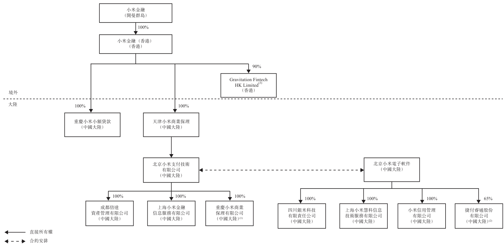

附註：

(1) 於最後可行日期，重慶小米商業保理有限公司（「重慶保理」）全部股權由小米科技（不屬於小米金融集團的公司）擁有。根據小米金融重組，小米科技所持重慶保理股權正轉讓予北京小米支付技術有限公司，惟須取得中國大陸相關監管機構批准。

(2) 於最後可行日期，捷付睿通股份有限公司（「捷付睿通」）由小米科技（不屬於小米金融集團的公司）、盛銀和睿科技有限公司及武軍（後兩者均為獨立第三方）分別擁有65%、32%及3%權益。根據小米金融重組，小米科技所持捷付睿通股權正轉讓予北京小米電子軟件，惟須取得中國大陸相關監管機構批准。

(3) Gravitation Fintech HK Limited餘下10%股權由獨立第三方尚乘集團有限公司持有。

小米集團於最後可行日期就小米金融重組向小米金融集團墊付約830百萬美元及人民幣299百萬元的小米金融重組貸款。相關貸款為免息一次性貸款，惟小米金融於及截至最後可行日期仍為本公司全資附屬公司。

小米金融購股權計劃

鑑於小米金融經營行業的新穎性及競爭力，我們相信「員工持股管理」的發展模式有助於招聘並留住金融科技行業的優秀人才，及有益於小米金融的長遠發展。因此，我們的

---

## 第 195 页

目標是讓小米金融的管理層及僱員日後持有公司的大量股份。為此，我們採納小米金融購股權計劃，並計劃上市後向合適的管理層及僱員授出購股權。有關小米金融購股權計劃的詳情，請參閱附錄四「法定及一般資料—購股權計劃—小米金融購股權計劃一」及「法定及一般資料—購股權計劃—小米金融購股權計劃二」兩節。

小米金融購股權計劃二未全面遵守上市規則第17章的規定。為於上市後根據小米金融購股權計劃二授出購股權，我們已申請且聯交所已授出「豁免遵守上市規則及豁免遵守公司(清盤及雜項條文)條例—有關小米金融購股權計劃二的豁免」一節所述若干豁免。

根據小米金融購股權計劃將授出的購股權所代表的小米金融最高股份數目佔小米金融已發行股本總數的60%。根據小米金融購股權計劃授出購股權會導致以股份為基礎的薪酬計入本集團的合併損益表，相關影響將取決於有關購股權估值，而有關估值經計及行使價、歸屬期、相關股份波動、小米金融的公司價值及估值師所用估值模型等。承授人可酌情行使小米金融購股權計劃之購股權，惟須遵守授出條款及條件。行使小米金融購股權計劃的購股權會隨時間實質地攤薄本公司所持小米金融的權益。我們預期上述股權攤薄後，小米金融將不再是本公司附屬公司，其經營業績亦不再於本集團合併入賬。停止合併入賬前，小米金融集團會基於獨立運營的原則，逐步減少對小米集團的財務及其他資源依賴，控制各類金融業務的風險敞口，最大限度地保護本公司及股東的整體利益。預料當小米金融集團的商業營運成熟，可逐步從業務積累資本及對外融資，可獨立於小米集團營運。當小米金融集團清償所欠小米集團的貸款及解除小米集團提供的擔保，小米金融集團對小米集團財務協助的依賴會逐步減少。停止合併入賬後，我們將僅根據權益會計法入賬所持小米金融的權益，因此小米金融收入或小米金融合併財務報表內任何其他個別項目不會計入本集團合併財務報表的相應項目。有關攤薄詳情，請參閱「風險因素—行使根據小米金融購股權計劃已授出或將授出的購股權可能會隨時間大幅攤薄我們所持小米金融的權益，導致小米金融的經營業績不再屬於本集團的經營業績合併範圍」一節。

作為聯交所就小米金融購股權計劃二授出的豁免條件之一，上市後我們將小米金融視為「關連附屬公司」（定義見上市規則第14A.16條），只要我們將小米金融入賬列為附屬公

---

## 第 196 页

司，則須遵守上市規則第14A章的相關關連交易規定(惟上述小米金融重組貸款除外)。有關我們與小米金融集團預計於上市後仍會持續的持續關連交易，請參閱「關連交易」。

---

## 第 197 页

下表載列於本招股章程日期及全球發售完成後的股權架構（假設並無行使超額配股權及根據首次公開發售前僱員購股權計劃授出的購股權）。

<!-- table html -->
<table><tr><td>股東</td><td>A類股份</td><td>B類股份</td><td>A系列優先股</td><td>B-1系列優先股</td><td>B-2系列優先股</td><td>E-1系列優先股</td><td>E-2系列優先股</td><td>F-1系列優先股</td><td>F-2系列優先股</td><td>本招股章程日期每股面值0.0000025美元的股份總數合計(a)</td><td>本招股章程日期所有權百分比合計(b)</td><td>全球發售完成後所有權百分比合計(c)</td></tr><tr><td>林斌(3)</td><td>2,400,000,000</td><td>91,233,610</td><td>300,000,000</td><td>—</td><td>—</td><td>—</td><td>—</td><td>—</td><td>—</td><td>2,791,233,610</td><td>13.3286%</td><td>12,4742%</td></tr><tr><td>Smart Mobile Holdings Limited(4)</td><td>4,295,187,720</td><td>726,559,230</td><td>1,252,000,000</td><td>245,325,520</td><td>—</td><td>—</td><td>—</td><td>—</td><td>—</td><td>6,519,072,470</td><td>31.1296%</td><td>29,1340%</td></tr><tr><td>Smart Player Limited(4)</td><td>—</td><td>59,221,630</td><td>—</td><td>—</td><td>—</td><td>—</td><td>—</td><td>—</td><td>—</td><td>59,221,630</td><td>0.2828%</td><td>0.2647%</td></tr><tr><td>童士豪</td><td>—</td><td>488,520</td><td>—</td><td>—</td><td>—</td><td>—</td><td>—</td><td>—</td><td>—</td><td>488,520</td><td>0.0023%</td><td>0.0022%</td></tr><tr><td>遠通集團有限公司</td><td>—</td><td>21,320,320</td><td>—</td><td>—</td><td>—</td><td>—</td><td>—</td><td>—</td><td>—</td><td>21,320,320</td><td>0.1018%</td><td>0.0953%</td></tr><tr><td>Duke King Holdings Limited</td><td>—</td><td>25,295,590</td><td>—</td><td>—</td><td>—</td><td>—</td><td>—</td><td>—</td><td>—</td><td>25,295,590</td><td>0.1208%</td><td>0.1130%</td></tr><tr><td>Wisdom Bloom International Limited(5)</td><td>—</td><td>138,708,900</td><td>94,770,450</td><td>—</td><td>—</td><td>—</td><td>—</td><td>—</td><td>—</td><td>233,479,350</td><td>1.1149%</td><td>1.0434%</td></tr><tr><td>JONGMI Limited</td><td>—</td><td>8,000,000</td><td>—</td><td>—</td><td>—</td><td>—</td><td>—</td><td>—</td><td>—</td><td>8,000,000</td><td>0.0382%</td><td>0.0358%</td></tr><tr><td>Mirodesign Limited</td><td>—</td><td>16,000,000</td><td>—</td><td>—</td><td>—</td><td>—</td><td>—</td><td>—</td><td>—</td><td>16,000,000</td><td>0.0764%</td><td>0.0715%</td></tr><tr><td>Wali International Holdings Ltd</td><td>—</td><td>15,713,880</td><td>—</td><td>—</td><td>—</td><td>—</td><td>—</td><td>—</td><td>—</td><td>15,713,880</td><td>0.0750%</td><td>0.0702%</td></tr><tr><td>Matrix Partners China I, L.P.</td><td>—</td><td>13,261,800</td><td>—</td><td>—</td><td>—</td><td>—</td><td>—</td><td>—</td><td>—</td><td>13,261,800</td><td>0.0633%</td><td>0.0593%</td></tr><tr><td>Matrix Partners China I-A, L.P.</td><td>—</td><td>1,343,720</td><td>—</td><td>—</td><td>—</td><td>—</td><td>—</td><td>—</td><td>—</td><td>1,343,720</td><td>0.0064%</td><td>0.0060%</td></tr><tr><td>Lofty Power International Limited(6)</td><td>—</td><td>227,965,820</td><td>96,509,600</td><td>—</td><td>—</td><td>—</td><td>—</td><td>—</td><td>—</td><td>324,475,420</td><td>1.5494%</td><td>1.3567%</td></tr><tr><td>Zhou Guangping(7)</td><td>—</td><td>284,041,680</td><td>583,860</td><td>15,189,120</td><td>—</td><td>—</td><td>—</td><td>—</td><td>—</td><td>299,814,660</td><td>1.4317%</td><td>1.3399%</td></tr><tr><td>Colorful Mi Limited.</td><td>—</td><td>122,537,260</td><td>85,104,170</td><td>137,640,000</td><td>35,524,160</td><td>—</td><td>—</td><td>—</td><td>—</td><td>397,903,470</td><td>1.9001%</td><td>1.7782%</td></tr><tr><td>Mini Stone Limited(8)</td><td>—</td><td>577,965,820</td><td>96,509,600</td><td>—</td><td>—</td><td>—</td><td>—</td><td>—</td><td>—</td><td>674,475,420</td><td>3.2207%</td><td>2.9582%</td></tr><tr><td>Wong Kong Kat</td><td>—</td><td>677,477,300</td><td>509,600</td><td>—</td><td>—</td><td>—</td><td>—</td><td>—</td><td>—</td><td>677,986,900</td><td>3.2375%</td><td>2.7461%</td></tr><tr><td>Natural Hero Limited(9)</td><td>—</td><td>677,477,300</td><td>509,600</td><td>—</td><td>—</td><td>—</td><td>—</td><td>—</td><td>—</td><td>677,986,900</td><td>3.2375%</td><td>2.9365%</td></tr><tr><td>Gifted Jade Limited(10)</td><td>—</td><td>3,377,000</td><td>—</td><td>—</td><td>—</td><td>—</td><td>—</td><td>—</td><td>—</td><td>3,377,000</td><td>0.0161%</td><td>0.0151%</td></tr><tr><td>Powerful Era Limited</td><td>—</td><td>10,000,000</td><td>—</td><td>—</td><td>—</td><td>—</td><td>—</td><td>—</td><td>—</td><td>10,000,000</td><td>0.0478%</td><td>0.0447%</td></tr><tr><td>Bright Inspiration Holdings Limited(10)</td><td>—</td><td>5,000,000</td><td>—</td><td>—</td><td>—</td><td>—</td><td>—</td><td>—</td><td>—</td><td>5,000,000</td><td>0.0239%</td><td>0.0223%</td></tr><tr><td>Qiming Managing Directors Fund II, L.P.(11)</td><td>—</td><td>—</td><td>—</td><td>—</td><td>—</td><td>—</td><td>—</td><td>—</td><td>—</td><td>10,993,360</td><td>0.0525%</td><td>0.0491%</td></tr><tr><td>Qiming Venture Partners II-C, L.P.(11)</td><td>—</td><td>—</td><td>—</td><td>—</td><td>—</td><td>—</td><td>—</td><td>—</td><td>—</td><td>66,149,810</td><td>0.3159%</td><td>0.2956%</td></tr><tr><td>Qiming Venture Partners II, L.P.(11)</td><td>—</td><td>—</td><td>—</td><td>—</td><td>—</td><td>—</td><td>—</td><td>—</td><td>—</td><td>755,432,330</td><td>3.6073%</td><td>3.3761%</td></tr><tr><td>2020 Investment Partners Limited</td><td>—</td><td>634,260</td><td>171,290</td><td>—</td><td>—</td><td>—</td><td>—</td><td>—</td><td>—</td><td>3,305,520</td><td>743,740</td><td>0.0247%</td><td>0.0231%</td></tr><tr><td>Mifans Investment LLC</td><td>—</td><td>646,940</td><td>74,430</td><td>—</td><td>—</td><td>—</td><td>—</td><td>—</td><td>—</td><td>3,371,640</td><td>758,620</td><td>0.0252%</td><td>0.0235%</td></tr><tr><td>Binghe Age Group Corporation</td><td>—</td><td>951,380</td><td>256,940</td><td>109,460</td><td>—</td><td>—</td><td>—</td><td>—</td><td>—</td><td>4,958,290</td><td>1,115,610</td><td>0.0370%</td><td>0.0346%</td></tr><tr><td>Moussedragon, L.P.</td><td>—</td><td>951,380</td><td>256,940</td><td>109,460</td><td>355,640</td><td>—</td><td>—</td><td>—</td><td>—</td><td>4,958,290</td><td>1,115,610</td><td>0.0370%</td><td>0.0346%</td></tr><tr><td>Celia Safe Inc</td><td>—</td><td>1,585,640</td><td>428,230</td><td>182,420</td><td>592,740</td><td>—</td><td>—</td><td>—</td><td>—</td><td>8,263,810</td><td>1,859,360</td><td>0.0617%</td><td>0.0577%</td></tr><tr><td>Evertide Limited</td><td>—</td><td>3,171,280</td><td>856,460</td><td>364,850</td><td>1,185,470</td><td>—</td><td>—</td><td>—</td><td>—</td><td>16,527,630</td><td>3,718,720</td><td>0.1233%</td><td>0.1154%</td></tr><tr><td>Circle Creek Investments Limited</td><td>—</td><td>3,171,280</td><td>856,460</td><td>364,850</td><td>1,185,480</td><td>—</td><td>—</td><td>—</td><td>—</td><td>16,527,630</td><td>3,718,710</td><td>0.1233%</td><td>0.1154%</td></tr><tr><td>HOPU Gioura Company Limited</td><td>—</td><td>3,171,280</td><td>856,470</td><td>364,860</td><td>1,185,480</td><td>—</td><td>—</td><td>—</td><td>—</td><td>16,527,630</td><td>3,718,720</td><td>0.1233%</td><td>0.1154%</td></tr><tr><td>Shiny Stone Limited</td><td>—</td><td>6,342,560</td><td>1,712,920</td><td>729,700</td><td>2,370,960</td><td>—</td><td>—</td><td>—</td><td>—</td><td>33,055,250</td><td>7,437,430</td><td>0.2466%</td><td>0.2308%</td></tr><tr><td>Smart System Investment Fund, L.P.</td><td>—</td><td>9,513,850</td><td>2,569,390</td><td>1,094,560</td><td>3,556,410</td><td>—</td><td>—</td><td>—</td><td>—</td><td>49,582,890</td><td>11,156,160</td><td>0.3699%</td><td>0.3462%</td></tr><tr><td>Techline Investments Pte Ltd</td><td>—</td><td>9,513,850</td><td>2,569,390</td><td>1,094,560</td><td>3,556,430</td><td>—</td><td>—</td><td>—</td><td>—</td><td>49,582,880</td><td>11,156,150</td><td>0.3699%</td><td>0.3462%</td></tr><tr><td>Kawa Investments LLC</td><td>—</td><td>—</td><td>2,000,000</td><td>—</td><td>—</td><td>—</td><td>—</td><td>—</td><td>—</td><td>2,000,000</td><td>0.0096%</td><td>0.0089%</td></tr><tr><td>Robin Hon Bun Chan</td><td>—</td><td>—</td><td>—</td><td>—</td><td>—</td><td>—</td><td>—</td><td>—</td><td>—</td><td>1,910,040</td><td>0.0091%</td><td>0.0085%</td></tr><tr><td>All-Stars XMI Limited</td><td>—</td><td>31,776,240</td><td>8,581,770</td><td>3,655,830</td><td>11,878,470</td><td>—</td><td>—</td><td>—</td><td>—</td><td>165,606,840</td><td>37,261,540</td><td>1.2356%</td><td>1.1564%</td></tr><tr><td>China TMT Holding I Limited(12)</td><td>—</td><td>194,764,080</td><td>—</td><td>—</td><td>—</td><td>—</td><td>—</td><td>—</td><td>—</td><td>194,764,080</td><td>0.9300%</td><td>0.0000%</td></tr><tr><td>China TMT Holding II Limited(12)</td><td>—</td><td>38,592,120</td><td>1,733,805,980</td><td>972,413,800</td><td>—</td><td>—</td><td>—</td><td>—</td><td>—</td><td>32,707,070</td><td>0.1562%</td><td>0.0000%</td></tr><tr><td>Morningside China TMT Fund I, L.P.(12)</td><td>—</td><td>—</td><td>—</td><td>—</td><td>—</td><td>—</td><td>—</td><td>—</td><td>—</td><td>2,888,064,700</td><td>2.3159%</td><td>1.9106%</td></tr><tr><td>Morningside China TMT Fund II, L.P.(12)</td><td>—</td><td>—</td><td>—</td><td>—</td><td>—</td><td>—</td><td>—</td><td>—</td><td>—</td><td>484,997,700</td><td>13.7910%</td><td>11.3771%</td></tr><tr><td>CCDD International Holdings Limited</td><td>—</td><td>—</td><td>—</td><td>—</td><td>—</td><td>—</td><td>—</td><td>—</td><td>—</td><td>97,241,360</td><td>0.4643%</td><td>0.4346%</td></tr></table>
<!-- /table -->

---

## 第 198 页

<!-- table html -->
<table><tr><td>股東</td><td>A類股份</td><td>B類股份</td><td>A系列優先股</td><td>B-2系列優先股</td><td>C系列優先股</td><td>D系列優先股</td><td>E-1系列優先股</td><td>E-2系列優先股</td><td>F-1系列優先股</td><td>F-2系列優先股</td><td>本招股章程日期每股面值0.000025美元的股份總數合計^(1)</td><td>本招股章程日期所有權百分比合計^(1)</td><td>全球發售完成後所有權百分比合計^(2)</td></tr><tr><td>IDG-Accel China Investors II L.P.^(13)</td><td>—</td><td>—</td><td>—</td><td>—</td><td>14,439,920</td><td>—</td><td>—</td><td>—</td><td>—</td><td>—</td><td>0.1280%</td><td>0.1198%</td></tr><tr><td>IDG-Accel China Growth Fund II L.P.^(13)</td><td>—</td><td>—</td><td>—</td><td>—</td><td>176,563,840</td><td>—</td><td>—</td><td>—</td><td>—</td><td>—</td><td>1.5656%</td><td>1.4652%</td></tr><tr><td>Wealth Plus Investments Limited</td><td>—</td><td>—</td><td>—</td><td>—</td><td>—</td><td>—</td><td>—</td><td>—</td><td>—</td><td>—</td><td>0.5152%</td><td>0.4822%</td></tr><tr><td>Smart Promise Limited</td><td>—</td><td>—</td><td>—</td><td>—</td><td>—</td><td>—</td><td>—</td><td>—</td><td>—</td><td>—</td><td>0.0266%</td><td>0.0249%</td></tr><tr><td>Qualcomm Incorporated</td><td>—</td><td>—</td><td>—</td><td>—</td><td>18,667,750</td><td>0.0891%</td><td>0.1824%</td><td>0.4560%</td><td>2.9151%</td><td>1.1221%</td><td>0.0834%</td><td>0.1707%</td></tr><tr><td>Fast Sino Holdings Limited</td><td>—</td><td>—</td><td>—</td><td>—</td><td>38,200,720</td><td>0.4560%</td><td>0.4560%</td><td>2.9151%</td><td>2.7282%</td><td>1.0502%</td><td>0.4268%</td></tr><tr><td>Sennett Investments (Mauritius) Pte Ltd</td><td>—</td><td>—</td><td>—</td><td>—</td><td>95,501,840</td><td>1.1221%</td><td>0.0912%</td><td>0.0854%</td><td>0.0854%</td><td>0.0854%</td><td>0.0854%</td></tr><tr><td>Shunwei Ventures Limited^(14)</td><td>—</td><td>—</td><td>—</td><td>—</td><td>610,471,890</td><td>2.9151%</td><td>1.1221%</td><td>0.0912%</td><td>0.0854%</td><td>0.0854%</td><td>0.0854%</td></tr><tr><td>Gannat Pte. Ltd.</td><td>—</td><td>—</td><td>—</td><td>—</td><td>234,992,650</td><td>1.1221%</td><td>0.0912%</td><td>0.0854%</td><td>0.0854%</td><td>0.0854%</td><td>0.0854%</td></tr><tr><td>Apoletto Limited^(16)</td><td>—</td><td>—</td><td>—</td><td>—</td><td>19,100,280</td><td>—</td><td>—</td><td>—</td><td>—</td><td>—</td><td>1.7495%</td><td>1.6374%</td></tr><tr><td>Apoletto China I, L.P.^(16)</td><td>—</td><td>—</td><td>—</td><td>—</td><td>366,382,680</td><td>1.8079%</td><td>1.8079%</td><td>1.6920%</td><td>1.6920%</td><td>1.6920%</td><td>1.6920%</td></tr><tr><td>Apoletto China II, L.P.^(16)</td><td>—</td><td>—</td><td>—</td><td>—</td><td>378,595,440</td><td>0.1156%</td><td>0.1156%</td><td>1.1415%</td><td>1.1415%</td><td>1.1415%</td><td>1.1415%</td></tr><tr><td>Apoletto China III, L.P.^(16)</td><td>—</td><td>—</td><td>—</td><td>—</td><td>24,208,150</td><td>1.2197%</td><td>1.2197%</td><td>2.0296%</td><td>1.8995%</td><td>1.8995%</td><td>1.8995%</td></tr><tr><td>Apoletto China IV, L.P.^(16)</td><td>—</td><td>—</td><td>—</td><td>—</td><td>212,776,760</td><td>42,640,640</td><td>—</td><td>425,033,880</td><td>2.0296%</td><td>0.0237%</td><td>0.0222%</td></tr><tr><td>Nokia Growth Partners II, L.P.</td><td>—</td><td>—</td><td>—</td><td>—</td><td>—</td><td>—</td><td>—</td><td>4,958,300</td><td>0.0004%</td><td>0.0003%</td><td>0.0003%</td></tr><tr><td>MBD 2015, L.P.</td><td>—</td><td>—</td><td>—</td><td>—</td><td>—</td><td>—</td><td>—</td><td>74,370</td><td>0.0017%</td><td>0.0016%</td><td>0.0016%</td></tr><tr><td>Stone Street 2015, L.P.</td><td>—</td><td>—</td><td>—</td><td>—</td><td>—</td><td>—</td><td>—</td><td>358,290</td><td>0.0019%</td><td>0.0018%</td><td>0.0018%</td></tr><tr><td>RNT Associates International Pte. Ltd.</td><td>—</td><td>—</td><td>—</td><td>—</td><td>—</td><td>—</td><td>—</td><td>405,880</td><td>0.0024%</td><td>0.0024%</td><td>0.0022%</td></tr><tr><td>2015 Employee Offshore Aggregator, L.P.</td><td>—</td><td>—</td><td>—</td><td>—</td><td>—</td><td>—</td><td>—</td><td>495,830</td><td>0.0039%</td><td>0.0037%</td><td>0.0037%</td></tr><tr><td>Dragoneer Global Fund II, L.P.</td><td>—</td><td>—</td><td>—</td><td>—</td><td>—</td><td>—</td><td>—</td><td>819,740</td><td>0.0047%</td><td>0.0047%</td><td>0.0044%</td></tr><tr><td>Bridge Street 2015, L.P.</td><td>—</td><td>—</td><td>—</td><td>—</td><td>—</td><td>—</td><td>—</td><td>991,660</td><td>0.0066%</td><td>0.0066%</td><td>0.0062%</td></tr><tr><td>Sinarmas Digital Ventures (HK) Limited</td><td>—</td><td>—</td><td>—</td><td>—</td><td>—</td><td>—</td><td>—</td><td>2,479,140</td><td>0.0118%</td><td>0.0111%</td><td>0.0111%</td></tr><tr><td>Broad Street Principal Investments, L.L.C.</td><td>—</td><td>—</td><td>—</td><td>—</td><td>—</td><td>—</td><td>—</td><td>4,462,460</td><td>0.0213%</td><td>0.0199%</td><td>0.0199%</td></tr><tr><td>Mecca International (BVI) Limited</td><td>—</td><td>—</td><td>—</td><td>—</td><td>—</td><td>—</td><td>—</td><td>99,166,010</td><td>0.4735%</td><td>0.4432%</td><td>0.4432%</td></tr><tr><td>公眾股東</td><td>—</td><td>—</td><td>—</td><td>—</td><td>—</td><td>—</td><td>—</td><td>—</td><td>—</td><td>—</td><td>9.7407%</td><td>100%</td></tr><tr><td>總計</td><td>6,695,187,720</td><td>3,741,581,500</td><td>3,925,913,020</td><td>2,211,569,100</td><td>330,495,920</td><td>1,720,943,480</td><td>1,021,276,800</td><td>212,776,760</td><td>510,315,120</td><td>487,871,040</td><td>83,760,370</td><td>20,941,690,830</td><td>100%</td></tr></table>
<!-- /table -->

附註：

(1) 本公司將在全球發售完成時採用不同投票權架構，分為A類股份及B類股份兩類股份。A類股份的股東可每股投十票，B類股份的股東每股可投一票。在所有其他方面，A類股份與B類股份地位相同。全球發售完成後每股優先股將自動轉換為一股B類股份。

(2) 假設並無行使超額配股權及根據首次公開發售前僱員購股權計劃授出的購股權。

(3) 林斌（作為受託人）以信託方式為林斌及其家族成員的利益持有2,400,000股A類股份及300,000,000股A系列優先股。餘下股份由林斌直接持有。

(4) Smart Mobile Holdings Limited及Smart Player Limited的全部權益以信託方式為雷軍及其家屬的利益持有。包括按票面價值向Smart Mobile Holdings Limited發行的

639,596,190股B類股份，作為雷軍對本公司所作貢獻的獎勵。

(5) Wisdom Bloom International Limited的全部權益以信託方式為（其中包括）王川及其家族成員的利益持有。
(6) Lofty Power International Limited的全部權益以信託方式為（其中包括）劉德及其家族成員的利益持有。
(7) 周光平（作為受託人）以信託方式為（其中包括）周光平及其家族成員的利益持有273,041,680股B類股份及15,189,120股B-2系列優先股。餘下股份由周光平直接持有。

Mini Stone Limited 的全部權益以信託方式為（其中包括）洪鋒及其家族成員的利益持有。
Natural Hero Limited 的全部權益以信託方式為（其中包括）黎萬強及其家族成員的利益持有。

---

## 第 199 页

(10) Gifted Jade Limited 的全部權益由許達來全資持有。Bright Inspiration Holdings Limited是Shunwei China Internet Fund III, L.P.的全資附屬公司。Shunwei Capital Partners III GP, L.P.是Shunwei China Internet Fund III L.P.的普通合夥人。Shunwei Capital Partners III GP Limited是Shunwei Capital Partners III GP, L.P.的普通合夥人，而Shunwei Capital Partners III GP, L.P.由許達來控制。

(11) Qiming Venture Partners II L.P. 及 Qiming Venture Partners II-C, L.P. 是 Qiming GP II, L.P. 管理的基金，而 Qiming GP II, L.P. 普通合夥人為 Qiming Corporate GP II, Ltd.，Qiming Corporate GP II, Ltd. 亦是 Qiming Managing Directors Fund II, L.P. 的普通合夥人。

(12) 晨興集團包括 China TMT Holding I Limited、Morningside China TMT Fund I, L.P.、China TMT Holding II Limited 及 Morningside China TMT Fund II, L.P.。

(13) IDG-Accel China Growth Fund II L.P. 及 IDG-Accel China II Investors L.P. 是 IDG-Accel China Growth Fund GP II Associates Ltd. 控制的基金。

(14) Shunwei Ventures Limited 是 Shunwei China Internet Fund, L.P. 的全資附屬公司，Shunwei Capital Partners GP, L.P. 是 Shunwei China Internet Fund, L.P. 的普通合夥人，Shunwei Capital Partners GP Limited 是 Shunwei Capital Partners GP, L.P. 的普通合夥人，而 Shunwei Capital Partners GP, L.P. 由我們非執行董事許達來控制。

(15) Gamnat Pte. Ltd 由 Equivest Pte. Ltd 全資擁有，隸屬於 GIC Pte Ltd.。

(16) Apoletto China I, L.P.、Apoletto China II, L.P.、Apoletto China III, L.P.、Apoletto China IV, L.P. 及 Apoletto Investments II, L.P. 是 Apoletto Managers Limited 管理的基金，而 Apoletto Managers Limited 由 Galileo (PTC) Limited 全資擁有。

歷史、重組及企業架構

---

## 第 200 页

首次公開發售前投資

1. 概覽

我們自成立以來接獲九輪投資，概要如下。根據以下首次公開發售前投資，所有首次公開發售前投資者均獲發本公司優先股。

<!-- table html -->
<table><tr><td></td><td>輪次</td><td>首份購股協議日期</td><td>最後支付代價日期</td><td>購股協議所涉股份總數</td><td>已付每股成本^(1)</td><td>本公司募集資金總額</td><td>較發售價折讓^(2)</td></tr><tr><td>1.</td><td>A系列</td><td>2010年9月28日</td><td>2011年5月17日</td><td>102,500,000股A系列優先股</td><td>每股A系列優先股0.10美元</td><td>10,250,000美元</td><td>99.90%</td></tr><tr><td>2.</td><td>B系列</td><td>2010年12月21日</td><td>2010年12月24日</td><td>60,775,862股B-1系列優先股4,297,283股B-2系列優先股</td><td>每股B-1系列0.411348美元</td><td>27,500,030.15美元</td><td>99.57%</td></tr><tr><td>3.</td><td>B+系列</td><td>2011年4月11日</td><td>2011年4月21日</td><td>4,727,011股B-2系列優先股</td><td>每股B-2系列優先股0.581763美元</td><td>2,750,000美元</td><td>99.41%</td></tr><tr><td>4.</td><td>B++系列</td><td>2011年8月24日</td><td>2011年9月16日</td><td>1,031,347股B-2系列優先股</td><td>每股B-2系列優先股0.581763美元</td><td>600,000美元</td><td>99.41%</td></tr><tr><td>5.</td><td>C系列</td><td>2011年9月30日</td><td>2012年4月16日</td><td>42,020,822股C系列優先股</td><td>每股C系列優先股2.0942美元</td><td>88,000,000美元</td><td>97.89%</td></tr><tr><td>6.</td><td>C+系列</td><td>2011年11月10日</td><td>2011年11月29日</td><td>1,002,765股C系列優先股</td><td>每股C系列優先股2.0942美元</td><td>2,100,000美元</td><td>97.89%</td></tr><tr><td>7.</td><td>D系列</td><td>2012年6月22日</td><td>2012年12月21日</td><td>26,379,554股D系列優先股</td><td>每股D系列優先股8.1882美元</td><td>216,000,000美元</td><td>91.76%</td></tr><tr><td>8.</td><td>E系列</td><td>2013年8月5日</td><td>2013年8月6日</td><td>5,319,419股E-1系列優先股1,066,016股E-2系列優先股</td><td>每股E-1系列優先股15.04美元每股E-2系列優先股18.76美元</td><td>100,000,000美元</td><td>84.24%</td></tr><tr><td>9.</td><td>F系列</td><td>2014年12月23日</td><td>2017年8月24日</td><td>48,787,104股F-1系列優先股8,376,037股F-2系列優先股</td><td>每股F-1系列優先股20.1682美元每股F-2系列優先股17.9273美元</td><td>983,948,070.89美元150,159,728美元</td><td>18.82%27.84%</td></tr></table>
<!-- /table -->

附註：

(1) 如適用，需經調整以反映後續股份分拆及其他資本重組。

(2) 較發售價折讓乃假設發售價為每股股份19.50港元（即指示發售價範圍17.00港元至22.00港元的中間價）計算。

---

## 第 201 页

2. 首次公開發售前投資主要條款

禁售期

按本公司或包銷商要求，未經本公司或包銷商(視情況而定)事先書面同意，首次公開發售前投資者不會於定價日起計最多一百八十(180)天內出售或以其他方式轉讓或處置本公司任何證券(經相關法律許可向聯屬人士轉讓除外)。

根據指引信HKEX-GL93-18，所有主要首次公開發售前投資者須於上市後最少六個月內，保留彼等上市時所持投資總額最少50%。

首次公開發售前投資所得款項用途

我們將首次公開發售前投資所得款項全部用於業務發展及營運，包括但不限於人員招聘、新業務及產品開發、技術基礎設施、辦公用品及推廣。

首次公開發售前
投資者為本公司
創造的策略利益

於首次公開發售前投資時，董事認為，本公司可受益於首次公開發售前投資者投資本公司所提供的額外資本及彼等知識與經驗。

已付代價釐定基準

首次公開發售前投資代價經計及投資時間及我們的業務與營運實體狀況後由本公司與首次公開發售前投資者公平磋商後釐定。

3. 首次公開發售前投資者的特別權利

所有首次公開發售前投資者目前受現有細則的條款約束，現有細則將於全球發售完成後以細則取代。根據首次公開發售前股東協議，首次公開發售前投資者獲授有關本公司的若干特別權利，包括慣常獲取未來各輪出資優先購買權、知情權及反攤薄與否決權。首次公開發售前股東協議及有關特別權利將根據首次公開發售前股東協議條款於全球發售完成後終止。

所有優先股將於全球發售完成後轉換為B類股份，屆時我們的股本將包括兩類股份即A類股份及B類股份。A類股份及B類股份所附帶權利的詳情請參閱「股本」一節。

4. 公眾持股量

全球發售完成後（假設並無行使超額配股權及根據首次公開發售前僱員購股權計劃授出的購股權），Smart Mobile Holdings Limited 及 Smart Player Limited 將合共持有本公司已發行

---

## 第 202 页

股本的約29.40%（一股一票）。Smart Mobile Holdings Limited 及 Smart Player Limited 由本公司執行董事兼核心關連人士（定義見上市規則）雷軍控制。因此，Smart Mobile Holdings Limited 及 Smart Player Limited 直接或間接所持股份不會計入公眾持股量。

全球發售完成後（假設並無行使超額配股權及根據首次公開發售前僱員購股權計劃授出的購股權），林斌將擁有本公司已發行股本約12.47%的權益（一股一票）。林斌為本公司執行董事兼核心關連人士（定義見上市規則）。因此，林斌直接或間接所持股份不會計入公眾持股量。

全球發售完成後（假設並無行使超額配股權及根據首次公開發售前僱員購股權計劃授出的購股權），Shunwei Ventures Limited 將擁有本公司已發行股本的約2.73%（一股一票）。全球發售完成後（假設並無行使超額配股權及根據首次公開發售前僱員購股權計劃授出的購股權），Bright Inspiration Holdings Limited將擁有本公司已發行股本約0.02%（一股一票）。Shunwei Ventures Limited及Bright Inspiration Holdings Limited由許達來間接控制。全球發售完成後（假設並無行使超額配股權及根據首次公開發售前僱員購股權計劃授出的購股權），Gifted Jade Limited 將擁有本公司已發行股本約0.02%的權益（一股一票）。Gifted Jade Limited 由許達來全資擁有。許達來為本公司非執行董事兼核心關連人士（定義見上市規則）。因此，Shunwei Ventures Limited、Bright Inspiration Holdings Limited及Gifted Jade Limited 所持股份不會計入公眾持股量。

全球發售完成後（假設並無行使超額配股權及根據首次公開發售前僱員購股權計劃授出的購股權），Morningside China TMT Fund I, L.P.及Morningside China TMT Fund II, L.P.將合共擁有本公司已發行總股本13.29%的權益（一股一票），屬上市規則所界定的本公司核心關連人士。此外，Morningside China TMT Fund I, L.P.及Morningside China TMT Fund II, L.P.由TMT General Partner Ltd.間接控制，而後者屬上市規則所界定的劉芹的緊密聯繫人。劉芹為非執行董事，屬於上市規則所界定的本公司核心關連人士。因此，Morningside China TMT Fund I, L.P.及Morningside China TMT Fund II, L.P.直接及間接所持股份不會計入公眾持股量。

除上述外，全球發售完成後（假設並無行使超額配股權及根據首次公開發售前僱員購股權計劃授出的購股權），其他首次公開發售前投資者（不包括創始人、聯合創始人及彼等控制的實體）將共同持有4,464,562,030股B類股份（一股一票），相當於本公司已發行股本的約19.95%。除上文所披露者外，概無其他首次公開發售前投資者為本公司核心關連人士（定義見上市規則）。因此，其他首次公開發售前投資者所持股份將計入公眾持股量。

---

## 第 203 页

5. 主要首次公開發售前投資者資料

下文載列首次公開發售前投資者的概述，彼等為資深投資者(私募股權基金及投資公司)，於本公司有重大投資(各自於緊接全球發售前持有我們已發行在外股份總數介乎1.0349%至15.86%（假設全部優先股轉換為B類股份））。

Morningside China TMT Fund I, L.P. 及 Morningside China TMT Fund II, L.P. 為於開曼群島註冊的私募股權基金。Morningside China TMT Fund I, L.P. 由其普通合夥人 Morningside China TMT GP, L.P. 控制。Morningside China TMT Fund II, L.P. 由其普通合夥人 Morningside China TMT GP II, L.P. 控制。Morningside China TMT GP, L.P. 及 Morningside China TMT GP II, L.P. 均由彼等的普通合夥人 TMT General Partner Ltd. 控制。China TMT Holding I Limited 及 China TMT Holding II Limited 均為於英屬維京群島註冊成立的投資控股公司，分別由 Morningside China TMT Fund I, L.P. 及 Morningside China TMT Fund II, L.P. 全資擁有。截至本招股章程日期，Morningside China TMT Fund I, L.P. 、Morningside China TMT Fund II 、L.P. 、China TMT Holding I Limited 及 China TMT Holding II Limited 共同持有已發行在外股份總數的約17.19%（假設全部優先股轉換為B類股份）。

Qiming Venture Partners II, L.P.、Qiming Venture Partners II-C, L.P. 及 Qiming Managing Directors Fund II, L.P. 統稱為 Qiming Group。Qiming Venture Partners II, L.P. 及 Qiming Venture Partners II-C, L.P. 的普通合夥人為 Qiming GP II, L.P.。Qiming GP II, L.P. 為開曼群島獲豁免有限合夥企業，普通合夥人為 Qiming Corporate GP II, Ltd.。Qiming Corporate GP II, Ltd. 為開曼群島有限公司，亦是 Qiming Managing Directors Fund II, L.P. 的普通合夥人。截至本招股章程日期，Qiming Group 共同持有已發行在外股份總數的約 3.98%（假設全部優先股轉換為 B 類股份）。

IDG-Accel China Growth Fund II L.P.（「IDG-Accel Growth II」）及 IDG-Accel China Investors II L.P.（「IDG-Accel Investors II」，與 IDG-Accel Growth II 統稱為「IDG-Accel Fund II」）均為開曼群島獲豁免有限合夥企業。IDG-Accel Fund II 主要對處於成長階段的中國大陸公司進行風險投資。IDG-Accel Fund II 由其唯一普通合夥人 IDG-Accel China Growth Fund II Associates L.P. 管理及控制，而 IDG-Accel China Growth Fund II Associates L.P. 亦為開曼群島獲豁免有限合夥企業，由其普通合夥人 IDG-Accel China Growth Fund GP II Associates Ltd.（「IDG-Accel GP Ltd.」，為開曼群島有限公司）控制。IDG-Accel GP Ltd. 亦是 IDG-Accel Investors II 的唯一普通合夥人。截至本招股章程日期，IDG-Accel Fund II 持有已發行在外股份總數的約 1.69%（假設全部優先股轉換為 B 類股份）。

Apoletto China I, L.P.、Apoletto China II, L.P.、Apoletto China III, L.P.、Apoletto China IV, L.P. 及 Apoletto Investments II, L.P. 均為 Apoletto Managers Limited（由 Galileo (PTC) Limited 全資擁有（統稱「Apoletto」））管理的基金。截至本招股章程日期，Apoletto China I, L.P.、Apoletto Limited、Apoletto China II, L.P.、Apoletto China III, L.P.、Apoletto China IV, L.P. 及 Apoletto Investments II, L.P. 共同持有已發行在外股份總數的約 6.92%（假設全部優先股轉換為 B 類股份）。

Gamnat Pte. Ltd 由 Equivest Pte. Ltd 全資擁有，隸屬於 GIC Pte Ltd.（「GIC」）。GIC 是 1981 年成立的全球領先投資公司，旨在管理新加坡外匯儲備。作為規範的長期投資者，GIC

---

## 第 204 页

對投資有獨特定位，投資多個資產類別，包括股票、固定收入、私募股權、房地產及基礎設施。GIC的投資覆蓋40多個國家，二十多年來一直投資新興市場。截至本招股章程日期，GIC持有已發行在外股份總數的約1.12%（假設全部優先股轉換為B類股份）。

Shunwei Ventures Limited 是根據英屬維京群島法律註冊成立的投資控股公司，由專注於技術、媒體及電信行業風險投資的基金 Shunwei China Internet Fund, L.P. 全資擁有。Shunwei China Internet Fund, L.P. 的普通合夥人為 Shunwei Capital Partners GP, L.P.，而 Shunwei Capital Partners GP, L.P. 的普通合夥人為 Shunwei Capital Partners GP Limited。截至本招股章程日期，Shunwei Ventures Limited 持有已發行在外股份總數的約 2.92%（假設全部優先股轉換為 B 類股份）。

All-Stars XMI Limited 是根據英屬維京群島法律註冊成立的股份有限公司及由All-Stars Investment Limited 控制的投資控股公司，專注投資技術領先企業，且已購買本公司優先股。截至本招股章程日期，All-Stars XMI Limited 持有已發行在外股份總數的約1.24%（假設全部優先股轉換為B類股份）。

遵守暫行指引及指引信

根據本公司所提供有關首次公開發售前投資的文件，聯席保薦人確認，首次公開發售前投資遵守聯交所於2012年1月發佈及於2017年3月更新的指引信HKEX-GL29-12、聯交所於2012年10月發佈及於2013年7月及2017年3月更新的指引信HKEX-GL43-12以及聯交所於2012年10月發佈及於2017年3月更新的指引信HKEX-GL44-12。

中國大陸監管規定

根據商務部、國務院國有資產監督管理委員會、國家稅務總局、中國證監會、工商總局及國家外匯管理局於2006年8月8日聯合頒佈、於2006年9月8日生效並於2009年6月22日修訂的《關於外國投資者併購境內企業的規定》（「併購規定」），中國大陸公司或個人如欲通過其依法成立或控制的境外公司收購其關聯大陸公司，須經商務部審批。併購規定（其中包括）進一步規定，中國大陸公司或個人為實現上市而設立並直接或間接控制的境外特殊公司或特殊目的公司，須在該特殊目的公司的證券於境外證券交易所上市交易前獲得中國證監會批准，尤其是在特殊目的公司收購中國大陸公司的股份或股權以換取境外公司股份的情況下。

由於(i)中國證監會目前並無發佈有關類似本次全球發售的發售是否須遵守併購規定的明確規定或詮釋；(ii)我們的中國大陸附屬公司通過境外直接投資成立，而非通過合併或

---

## 第 205 页

收購併購規定所界定大陸公司成立；及(iii)併購規定並無條款將合約安排明確分類為須遵守併購規定的交易，因此我們中國大陸法律方面的法律顧問君合律師事務所認為，除非日後頒佈新的法律法規或商務部及中國證監會發佈有關併購規定的新條款或詮釋，否則毋須就本次全球發售取得中國證監會或商務部的事先批准。但是，併購規定的詮釋及實施詳情仍不確定。

中國大陸國家外匯管理局登記

根據國家外匯管理局頒佈的於2014年7月14日生效並取代《關於境內居民通過特殊目的公司境外投融資及返程投資外匯管理有關問題的通知》（「國家外匯管理局75號文」）的《關於境內居民通過特殊目的公司境外投融資及返程投資外匯管理有關問題的通知》（「國家外匯管理局37號文」），(a)中國大陸居民以投資或融資為目的直接創立或間接控制境外特殊目的公司（「境外特殊目的公司」），在向境外特殊目的公司提供資產或股權之前必須向國家外匯管理局地方分局登記；(b)初次登記後，中國大陸居民亦須於國家外匯管理局地方分局登記有關境外特殊目的公司的任何重大變更，其中包括境外特殊目的公司的中國大陸居民股東變更、境外特殊目的公司的名稱變更、經營條款變更或境外特殊目的公司資本增減、股權轉讓或交換以及合併或拆分。根據國家外匯管理局37號文，未有遵守該等登記手續或會遭受處罰。

根據國家外匯管理局頒佈的於2015年6月1日生效的《關於進一步簡化和改進直接投資外匯管理政策的通知》（「國家外匯管理局13號文」），接受國家外匯管理局登記的權限由國家外匯管理局地方分局轉到大陸企業資產或權益所在地銀行。

我們中國大陸法律方面的法律顧問君合律師事務所表示，創始人雷軍及所有中國大陸居民聯合創始人即洪鋒、黎萬強、劉德及王川已按照國家外匯管理局37號文完成登記。

---

## 第 206 页

緊接全球發售前企業架構

下圖列示緊接全球發售完成前本集團的企業及股權架構。

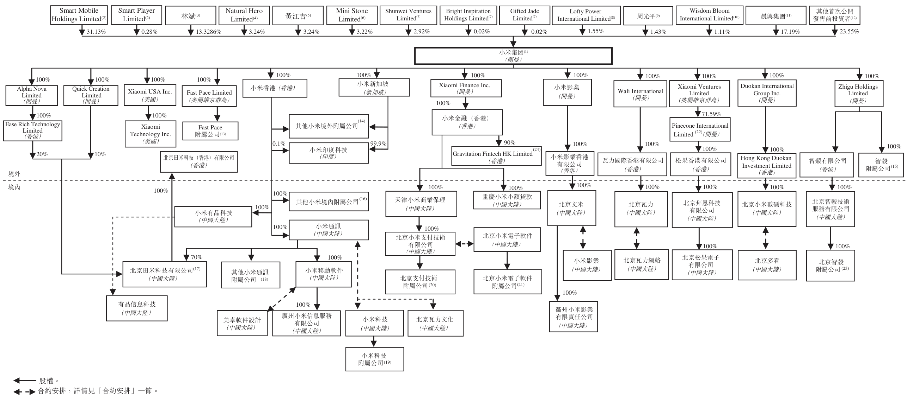

附註：

(1) 本公司有不同投票權架構，自全球發售完成當時起生效。詳情請參閱全球發售完成當時公司架構及「股本—不同投票權架構」一節。

(2) Smart Mobile Holdings Limited 及 Smart Player Limited 的全部權益以信託方式為雷軍及其家屬的利益持有。雷軍為創始人。此外，根據投票代理協議，若干少數股東已就保留事項授予雷軍B類股份的投票委託權，相當於緊隨全球發售完成後（假設並無行使超額配股權及根據首次公開發售前僱員購股權計劃授出的購股權）本公司已發行股本的1.69%或投票權的0.46%。

(3) 林斌(作為受託人)以信託方式為林斌及其家族成員的利益持有2,400,000,000股A類股份及300,000,000股A系列優先股。林斌為聯合創始人。餘下股份由林斌直接持有。

(4) Natural Hero Limited的全部權益以信託方式為黎萬強及其家屬的利益持有。黎萬強為聯合創始人。

(5) 黃江吉為聯合創始人。

(6) Mini Stone Limited的全部權益以信託方式為洪鋒及其家屬的利益持有。洪鋒為聯合創始人。

歷史、重組及企業架構

---

## 第 207 页

(7) Shunwei Ventures Limited是Shunwei China Internet Fund, L.P.的全資附屬公司。Shunwei Capital Partners GP, L.P.是Shunwei China Internet Fund, L.P.的普通合夥人。Shunwei Capital Partners GP, L.P.由我們的非執行董事許達來控制。Bright Inspiration Holdings Limited是Shunwei China Internet Fund III, L.P.的全資附屬公司。Shunwei Capital Partners III GP, L.P.是Shunwei China Internet Fund III L.P.的普通合夥人。Shunwei Capital Partners III GP, L.P.的普通合夥人，而Shunwei Capital Partners III GP, L.P.由許達來控制。Gifted Jade Limited全部權益由許建來全資擁有。

(8) Lofty Power International Limited的全部權益以信託方式為劉德及其家屬的利益持有。劉德為聯合創始人。

(9) 周光平（作為受託人）以信託方式為周光平及其家族成員的利益持有273,041,680股B類股份及15,189,120股B-2系列優先股。餘下股份由周光平直接持有。周光平為聯合創始人。

(10) Wisdom Bloom International Limited的全部權益以信託方式為王川及其家屬的利益持有。王川為聯合創始人。

(11) 晨興集團包括 Morningside China TMT Fund I, L.P., Morningside China TMT Fund II, L.P., China TMT Holding I Limited 及 China TMT Holding II Limited。晨興集團由 TMT General Partner Ltd.間接控制。截至最後可行日期，非執行董事劉芹持有 TMT General Partner Ltd.的控股權益。詳情請參閱「一首次公開發售前投資—主要

餘下權益由其他首次公開發售前投資者持有。詳情請參閱上文「一首次公開發售前投資—概覽」。

(12) 餘下權益由其他首次公開發售前投資者持有。詳情請參閱上文「一首次公開發售前投資—概覽」。

(13) Fast Pace 附屬公司包括 Fast Pace Limited 的下列直接全資附屬公司，均於英屬維京群島註冊成立：

(d) Xiaomi Communications and Logistics India Private Limited，於印度註冊成立，由小米新加坡及小米印度科技董事Jain Manu Kumar分別擁有99.9967%及0.0033%權益；

(e) Xiaomi Malaysia SDN. BHD.，於馬來西亞註冊成立，由小米新加坡全資擁有；
(f) Xiaomi Philippines Corporation，於菲律賓註冊成立，由小米新加坡擁有99.9944%權益及由Jose Cochingyan、Sheryl Bartolone、Aimee Abigail Salamat、Liu Yi及Enerie Medrano（均為Xiaomi Philippines Corporation董事）合共擁有0.0056%權益；

(g) Xiaomi Technology Spain, S.L.，於西班牙註冊成立，由小米香港全資擁有；
(h) Xiaomi Singapore Fintech Private Limited，於新加坡註冊成立，由小米金融（香港）有限公司全資擁有；
(i) Xiaomi Technology (Thailand) Limited於泰國註冊成立，分別由小米香港、小米新加坡、Fast Pace Limited、Jantapa Erjongmanee女士、Teerak Tongrak先生及Kantaphas Akaraborworn先生均為獨立第三方；及

(i) 我們正安排在法國成立Xiaomi Technology France SAS及在波蘭成立Xiaomi Technology (Polska) spółka z ograniczoną odpowiedzialnością (「Xiaomi Technology Poland」)，我們預期將於本招股章程日期後完成。Xiaomi Technology France SAS及Xiaomi Technology Poland將為本公司的全資附屬公司。

(a) Maine Hub Company LLC, 於美國註冊成立，由 Zhigu Holdings Limited 直接全資擁有；及

(b) Artois LLC, 於美國註冊成立，由 Maine Hub Company LLC 全資擁有。
就董事所知，截至最後可行日期，Maine Hub Company LLC 及 Artois LLC 均在辦理註銷。
(16) 其他小米大陸附屬公司包括本公司於中國大陸成立的下列間接全資附屬公司：

(b) 北京小米電子產品有限公司，由小米香港全資擁有；及

(17) 北京田米科技有限公司餘下30%權益由本公司兩家間接全資附屬公司分別持有20%及10%，正取得公司轉讓登記。

(18) 其他小米通訊附屬公司包括小米通訊的下列直接全資附屬公司：

(d) 廣東小米科技有限責任公司；

---

## 第 208 页

(b) 捷付睿通股份有限公司（「捷付睿通」）。截至最後可行日期，捷付睿通由小米科技擁有65%、並由盛銀和睿科技有限公司及武軍（均為獨立第三方）擁有32%及3%權益；根據小米金融重組，

32%及3%權益。根據小米金融重組，小米科技所持捷付睿通股權正轉讓予北京小米電子軟件，惟須取得中國大陸相關監管機構批准。

Pinecone International餘下28.41%權益由X-Lab Limited及周光平分別持有23.30%及5.11%。X-Lab Limited由Pinecone International的創始人全資擁有。

(a) 北京智毅睿技術服務有限公司，由北京智毅技術服務有限公司全資擁有；
(b) 北京智毅技術諮詢服務有限公司，由北京智毅睿拓技術服務有限公司全資擁有；及

---

## 第 209 页

(c) 北京睿創投資管理中心（有限合夥），由普通合夥人北京智毅技術諮詢服務有限公司控制的有限合夥企業，由北京智毅技術諮詢服務有限公司、天津金米投資合夥企業（有限合夥）、中關村科技園區海淀園創業服務中心、北京中關村創業投資發展有限公司、成都金山互動娛樂科技有限公司及惠州TCL移動通信有限公司分別擁有10%、30%、20%及10%權益。北京智毅技術諮詢服務有限公司及天津金米投資合夥企業（有限合夥）為本集團全資附屬公司。中關村科技園區海淀園創業服務中心、北京中關村創業投資發展有限公司、成都金山互動娛樂科技有限公司及惠州TCL移動通信有限公司均為獨立第三方。

(24) Gravitation Fintech HK Limited餘下10%股權由獨立第三方尚乘集團有限公司持有。

---

## 第 210 页

緊隨全球發售後企業架構

下圖列示緊隨全球發售完成後本集團的企業及股權架構（假設並無行使超額配股權及根據首次公開發售前僱員購股權計劃授出的購股權）。

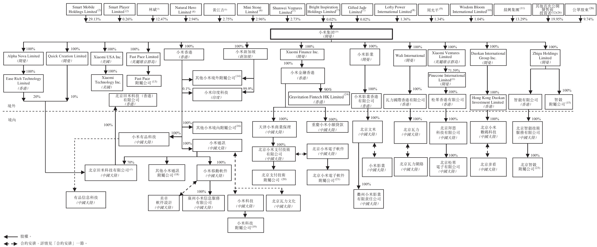

附註(2)至(24)：請參閱前面數頁所載詳情，或會就股份分拆及優先股轉換為B類股份作出調整。

(25) 股東以不同投票權方式控制本公司。根據該架構，本公司股本將分為A類股份及B類股份。對於提呈本公司股東大會的任何決議案，A類股份持有人每股可投10票，而B類股份持有人則每股可投一票，惟就有限保留事項有關的決議案投票除外，在此情況下，每股股份享有一票投票權。就保留事項以外所有事項的決議案，緊隨全球發售後不同投票權受益人雷軍及林斌透過彼等實益擁有的股份可行使的投票權所佔比例分別為55.20%及29.52%。詳情請參閱「股本—不同投票權架構」一節。

(26) 按每一股股份可投一票的基準，假設並無行使超額配股權及根據首次公開發售前僱員購股權計劃授出的購股權，緊隨全球發售完成後的預期公眾持股量為42.07%，當中包括其他公眾股東及並非本公司核心關連人士之其他首次公開發售前投資者將持有的B類股份。

歷史、重組及企業架構

---

## 第 211 页

小米是一家以手機、智能硬件和IoT平台為核心的互聯網公司。

我們的使命

我們始終堅持做「感動人心、價格厚道」的好產品，讓全球每個人都能享受科技帶來的美好生活。

在雷軍的領導下，小米由一群深具造詣的工程師與設計師於2010年創立。他們認為高質量且精心設計的科技產品和服務應被全世界輕易享用。為此，我們始終追求創新、質量、設計、用戶體驗與效率提升，致力於以厚道的價格持續提供最佳科技產品和服務。

我們的承諾：在此，我們要向所有現有和潛在的用戶承諾，從2018年開始，每年小米整體硬件業務(包括智能手機、IoT及生活消費產品)的綜合淨利率不會超過5%。如有超出的部分，我們都將回饋給用戶。

我們的願景

和用戶交朋友，做用戶心中最酷的公司。

我們的核心價值觀

我們的價值觀是「真誠」與「熱愛」。

我們的價值觀讓我們能夠努力、樂觀、持之以恒地堅守我們的使命和願景。對我們從事事業的熱愛驅動我們在所有產品中追求工匠精神。我們對所有細節追求完美極致，即使這些細節未必被其他人即時注意到。真誠促使我們將用戶放在一切工作的中心，用心傾聽用戶的需求，並推動我們在商業模式上追求效率以持續向用戶提供價值。

---

## 第 212 页

我們的米粉

我們擁有龐大且高度活躍的全球用戶群。截至2018年3月，MIUI月活躍用戶大約190百萬。我們與眾不同的全球用戶中有一群被稱為「米粉」的熱心用戶，他們非常忠誠於小米品牌、積極參與我們的平台、並積極為我們的產品研發提供建議。截至2018年3月31日，擁有5個以上非智能手機或筆記本電腦的小米互聯產品的「米粉」數超過1.4百萬。此外，我們的用戶在MIUI論壇中積極發表建議，2018年3月我們的MIUI論壇有超過9百萬月活躍用戶。自我們在2010年8月推出MIUI論壇至2018年3月31日，我們的用戶累計在其上發佈了約250百萬條帖子。

「爆米花」—米粉活動

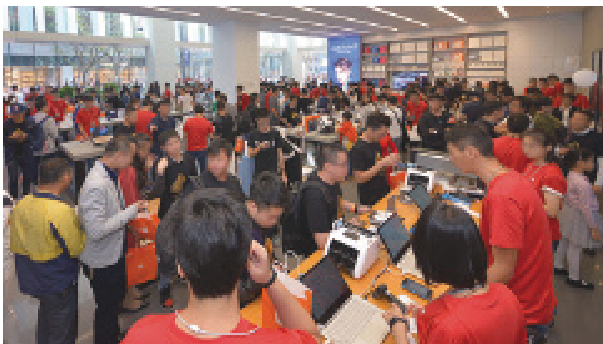

深圳

「爆米花」—米粉活動

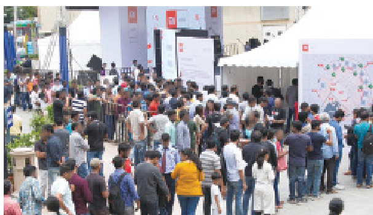

班加羅爾

馬德里

我們的里程碑

自我們在2010年創立以來，我們獨特的使命、願景及核心價值觀使我們能夠取得如下重大成就：

• 2012年：年銷售額突破10億美元(成立2年後實現)

2014年：成為中國大陸市場出貨量排名第一的智能手機公司（根據IDC統計，在推出我們首款智能手機3年後實現）

2014年：年銷售額突破100億美元（成立4年後實現，根據艾瑞諮詢，為史上最快）

• 2015年：MIUI系統月活躍用戶超過1億

2017年：成為全球最大的消費級IoT平台，以連接設備（不包括智能手機及筆記本電腦）數量統計，根據艾瑞諮詢

2017年：2017年第四季度成為印度市場出貨量排名第一的智能手機公司（根據IDC統計，正式進入印度市場三年半後實現）

2017年：根據艾瑞諮詢，2017年，與全球收入超過人民幣1千億元且盈利的上市公司相比，按收入增長速度計算，小米在互聯網公司中排名第一，在所有公司中排名第二

---

## 第 213 页

我們的商業模式

我們的公司以創新和效率為根基。作為一家由工程師和設計師創建的公司，我們崇尚大膽創新的互聯網文化，並不斷探索前沿科技。創新精神在小米蓬勃發展並滲透到每個角落。同時，我們不懈追求效率的持續提升。我們致力於降低運營成本，並同時把效率提升產生的價值回饋給我們的用戶。

我們獨特且強大的「鐵人三項」商業模式由三個相互協作的支柱組成—(i)創新、高質量、精心設計且專注於卓越用戶體驗的硬件，(ii)使我們能以厚道的價格銷售產品的高效新零售和(iii)豐富的互聯網服務。

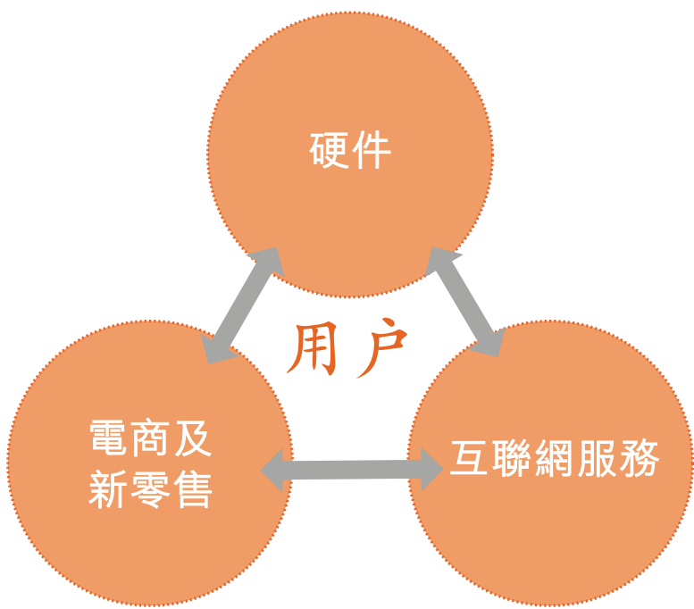

硬件

我們提供一系列自主或與生態鏈企業共同開發的硬件產品。我們不論是自主或與生態鏈企業共同開發的所有產品都專注於創新、質量、設計和用戶體驗。我們致力將產品定位在廣大用戶可接受的價位，以確保廣泛的接受程度及高留存水平。在核心自家產品方面，我們專注於設計和研發一系列先進的硬件產品，包括智能手機、筆記本電腦、智能電視、人工智能音箱和智能路由器。於營業紀錄期，我們的收入大部分來自銷售智能手機。營業紀錄期所售75%以上智能手機(按部算)價格為人民幣1,299元及以下。2016年，我們的智能手機銷量下滑，主要由於(i)我們於2016年投資建立高效的線下零售渠道，以便更好地把握線下機遇和補充我們目前堅實的電子商務基礎；及(ii)我們自2010年開始營運以來收入從零快速增至2015年的人民幣668億元。2016年，我們專注於加強創新、品質及供應管理，為擴大經營規模及業務擴張打造更堅實基礎。結果，我們在重新調整策略後於2017年恢復快速增長。

我們同時擴展到其他產品。截至2018年3月31日，我們通過投資和管理建立了由超過210家公司組成的生態鏈，其中超過90家公司專注於研發智能硬件和生活消費產品。根據艾瑞諮詢，截至2018年3月31日，按已連接設備(不包括智能手機及筆記本電腦)的數量計算，

---

## 第 214 页

業務

我們是全球最大的消費級IoT平台。截至2018年3月31日數據，我們連接了超過1億台設備（不包括智能手機及筆記本電腦）。這些產品互通互聯，既改善了用戶的生活，又為我們的互聯網服務提供了專屬平台。我們亦有發展一系列的生活消費產品以進一步提高品牌知名度並將用戶流量導向我們的零售渠道。

新零售

高效的全渠道新零售分銷平台是我們增長策略的核心組成部分，使我們能在高效運營的同時擴展用戶覆蓋範圍並增強用戶體驗。成立以來，我們一直專注於產品的在線直銷，以達到最大效率，並與用戶建立直接的數字化互動關係。根據IDC統計，2018年第一季度我們在中國大陸和印度的線上智能手機出貨量均排名第一。尤其是根據艾瑞諮詢，小米商城按2017年及2018年第一季度商品成交總額計已成為中國大陸第三大3C與家電線上零售直銷平台。艾瑞諮詢數據還顯示，從商品成交總額來看，我們在2017年及2018年第一季度還是印度第三大線上零售直銷平台。2015年以來，我們通過我們自營的米家門店顯著擴大了線下零售直銷網絡，從而擴大我們的覆蓋範圍並提供更豐富的用戶體驗，在實行線上下同品同價的同時，保持了與線上渠道相似的運營效率。根據艾瑞諮詢，2017年，我們自營米家店面的每平米平均銷售額在全球零售連鎖店中排名第二。我們高效的全渠道銷售策略使我們能夠以厚道的價格向最廣泛的用戶群體提供產品。

互聯網服務

我們通過提供互聯網服務讓我們的用戶擁有完整的移動互聯網體驗。於2018年3月，我們基於安卓原生系統的自有操作系統MIUI擁有大約190百萬月活躍用戶。MIUI與安卓生態系統充分兼融，包括了安卓生態系統上的所有手機應用程序。它構成了一個開放的平台讓我們提供一系列廣泛的互聯網服務，包括內容、娛樂、金融服務和效能工具。我們設備的互聯性，以及硬件和互聯網服務的無縫集成，使我們可以向用戶提供更好的用戶體驗。此外，我們有著開發爆款應用程序的優良往績。2018年3月，我們開發了38個月活躍用戶超過10百萬的應用程序和18個月活躍用戶超過50百萬的應用程序，包括我們的小米應用商店、小米瀏覽器、小米音樂和小米視頻。2018年3月，我們的用戶每天使用我們的智能手機的平均時間是大約4.5小時。相比其他獲客成本較高的互聯網平台，我們通過硬件銷售獲得用戶的過程本身是盈利的。

網絡效應

我們獨特而強大的鐵人三項商業模式由三個緊密相連且相互協同的支柱構成。我們努力提供高品質、高性能和精心設計且定價厚道的爆款產品。這些產品能為我們的零售渠道帶來更多客流量。我們通過高效率的新零售渠道(例如電商平台和米家)以厚道的價格向用戶交付我們的產品。通過我們的互聯網服務，我們密切地與使用我們平台的用戶互動，從而增加用戶黏性，帶來新的變現機會。

---

## 第 215 页

這一商業模式在我們的平台上形成了強大的網絡效應，提升了用戶體驗、參與度和留存率。隨着我們更多的產品和服務實現互聯，我們能提供更好、更豐富的用戶體驗，從而為我們的平台吸引更多的用戶。

雲、大數據和人工智能(AI)

我們相信我們平台所生成的大量獨特的消費和行為數據，為我們帶來了大數據和人工智能領域的巨大優勢。例如，我們極其廣泛的互聯智能硬件將我們的平台深深植入用戶的日常生活；我們的零售渠道使我們能深入理解用戶的購買習慣；我們的用戶通過使用我們的雲服務、應用程序和互聯網服務展現出了他們的在線消費偏好。因此，我們可利用對用戶個性化需求和喜好的了解，提供定制的推薦並進一步增強我們的變現能力。通過2012年推出的小米賬戶服務，我們的用戶可以使用我們提供的雲服務、在線購物、享受內容以及其他眾多服務。截至2018年3月31日，我們經過用戶事先允許已在雲服務中累積收集了超過230PB的專有數據。這些數據是以嚴格隱私標準與數據安全要求存儲。請參閱「—數據隱私及保護」一節。自2016年以來，我們的MIUI和小米商城由TrustArc（一家隱私合規和風險管理公司）對隱私政策和控制措施進行全面評估並認證。我們的深度學習和人工智能技術能力以及我們平台的活躍用戶參與使得我們能夠持續完善產品和服務。例如，人臉識別技術是我們計算機視覺的核心技術，當用戶數據不斷增加，我們的算法可進一步提升精確度及效率，形成與用戶活動的正向反饋循環。整個過程僅根據已收集的用戶行為數據進行，不涉及用戶的數據隱私。未來，我們將繼續推出支持人工智能的新技術產品和服務，例如我們在2017年7月推出的小米AI音箱。

我們的全球機遇

自2010年成立以來，我們不斷通過領先的商業模式拓展在中國大陸的用戶群。我們還成功制定了針對新市場的國際策略，截至2018年3月31日已進入74個國家和地區的市場。我們在主要國際市場成功立足。例如，截至2018年第一季度我們在印度的智能手機出貨量排名第一。根據IDC統計，截至2017年第四季度我們亦在15個市場名列前5。

我們同時預見到巨大的全球機遇。據艾瑞諮詢統計，2017年全球約有39億移動互聯網用戶。據IDC及艾瑞諮詢統計，2017年至2022年，全球智能手機及消費級IoT設備用戶基數複合年增長率預計分別為6%和25%，這意味着消費者將持續尋求以實惠的價格獲取優質產品和服務，享受互聯生活方式。

例如在印度，我們的紅米Note 5 Pro的定價大幅度低於同類產品，但仍提供了優質的產品性能和用戶體驗。通過堅持專注於非凡用戶體驗的創新、優質、精心設計且價格厚道

---

## 第 216 页

的產品和服務，我們相信小米有著得天獨厚的優勢來滿足全球用戶的需求。通過讓地球上的每個人都能享受科技帶來的美好生活，我們擁抱這一機會來改變世界。

隨着我們在全球進行業務擴展，我們能在收入增長的同時實現盈利能力的提升。營業紀錄期，我們的收入從2015年的人民幣668億元增至2017年的人民幣1,146億元，再由截至2017年3月31日止三個月的人民幣185億元增至截至2018年3月31日止三個月的人民幣344億元。2017年經調整非國際財務報告準則利潤人民幣54億元，而2015年則有經調整非國際財務報告準則虧損人民幣3億元。我們的經調整非國際財務報告準則利潤由截至2017年3月31日止三個月的人民幣7億元增加至截至2018年3月31日止三個月的人民幣17億元。

我們的優勢

1. 我們的創始人團隊

小米由我們的創始人、董事長兼首席執行官雷軍領導。雷軍是一位擁有接近30年行業經驗且備受尊敬的企業家。雷軍早前聯合創辦金山軟件(香港聯交所股份代號：3888)和卓越網(2004年售予亞馬遜)等成功的互聯網公司，並且是YY Inc.（納斯達克股份代號：YY）和優視科技(2014年售予阿里巴巴)等領先互聯網公司的重要投資者。雷軍在軟件、電商、投資和移動互聯網服務領域擁有優異的業績和非常豐富的經驗，為實現我們的願景及具體計劃執行方面提供了明確的領導和強而有力的保證。

雷軍的標誌性領導力在全球得到認可。2013年，雷軍被中國中央電視台評選為「中國經濟年度人物」。2015年，雷軍作為唯一的中國企業家入選《時代》雜誌「年度全球最具影響力100人」，同年，他獲得亞洲協會頒發的「亞洲創變者獎」。2017年11月，雷軍當選為中華全國工商業聯合會副主席。2018年2月，雷軍亦當選為中國質量協會副會長。

雷軍與聯合創始人共同創建小米，他們都是擁有數十年軟硬件開發經驗的工程師或設計師。他們在創立小米之前擁有在全球頂尖科技公司包括谷歌、微軟和摩托羅拉的工作經驗。我們的創始人在建立真正透明、高效、包容和平易近人的公司文化方面發揮關鍵作用。這種文化是我們積極實現所有產品和服務的創新、質量、設計和用戶體驗成就堅強有力的核心推動力。

2. 熱情的用戶

憑藉我們創新、高質量、精心設計和專注於卓越用戶體驗的技術產品和服務以及我們獨特的商業模式，我們積累了龐大且迅速增長的用戶群。

我們用戶的參與度非常高，並在小米平台中使用大量時間進行互動。2018年3月，我們用戶平均每天使用我們的智能手機的時間大約為4.5個小時。我們相信我們的用戶對我們的品牌非常有信心。

---

## 第 217 页

在我們的用戶群中有一群非常專一且高度忠誠的用戶，稱為米粉。這些粉絲對小米充滿熱情並擁有我們的許多產品。譬如截至2018年3月31日，擁有5個以上小米非智能手機和筆記本電腦的互聯產品的用戶數超過1.4百萬。此外，我們的米粉積極關注並支持本公司的最新業務發展。米粉的影響力更擴至海外，如在印度、印尼和西班牙，數以千計的熱情米粉在每一家新旗艦店開業時都會在店外排隊多達數小時。此外，熱心米粉進行的口碑營銷，幫助了我們持續降低推廣成本；他們具建設性的產品反饋，幫助了我們不斷改進我們的產品和服務。我們的用戶在我們的MIUI論壇上積極發言，2018年3月MIUI論壇擁有超過9百萬月活躍用戶。自我們在2010年8月推出MIUI論壇至2018年3月31日，我們的用戶累計在其上發佈了約250百萬條帖子。

3. 鐵人三項商業模式

我們認為我們獨特商業模式的三個組成部分是相輔相成的，令我們能夠創造一個可持續並不易被競爭對手複製的商業模式，並築起了強大的競爭壁壘。我們的智能硬件產品、新零售和互聯網服務的無縫結合所創造出的網絡效應增強了用戶體驗、參與感和留存率。隨着互聯的產品和服務增多，我們的用戶體驗將變得更優更豐富，吸引更多的用戶選擇我們的產品和服務。

智能手機和IoT產品構成了我們吸引新用戶的寶貴平台。我們創新、高質量、精心設計且以用戶為中心的硬件能為用戶提供互聯網服務入口，使我們在獲得用戶的同時獲得利潤。我們的爆款產品也為我們的零售渠道帶來了更多客流量。此外，我們的全渠道零售戰略包含高效及互補的線上和線下零售渠道，令我們能夠以極為親民的價格銷售我們的產品、擴大銷售範圍，加大產品經銷的力度，以迅速拓展我們各地區的用戶群。我們通過創新的硬件及高效的新零售積累了大量高度參與的用戶，再通過提供互聯網服務的廣闊平台（包括我們專有應用程序）變現。

憑藉創新的硬件產品、卓越的用戶體驗和高效的新零售，我們已積累了龐大活躍而忠誠的用戶群體，使得我們能夠通過廣告和互聯網增值服務進行有效變現。我們的每用戶平均互聯網服務收入從2015年的人民幣28.9元上升至2017年的人民幣57.9元。互聯網服務是我們整體業務的重要組成部分。截至2018年3月31日止三個月，我們9.4%的收入及46.8%的毛利來自互聯網服務。

借助規模經濟效應，隨着我們業務規模的擴大，我們實現利潤和利潤率的增長。2015年我們經調整非國際財務報告準則虧損人民幣3億元，在2017年經調整非國際財務報告準則利潤達人民幣54億元。我們的經調整非國際財務報告準則利潤由截至2017年3月31日止三個月的人民幣7億元增加至截至2018年3月31日止三個月的人民幣17億元。

---

## 第 218 页

4. 創新和設計

我們在創新和設計方面有著優異的往績。我們發揮自有的設計能力並利用來自用戶和米粉的持續反饋開發兼具先進功能和美觀設計的人性化優質產品和服務。

譬如我們的小米MIX手機以全陶瓷機身和全面屏為特色。根據艾瑞諮詢，小米MIX和小米MIX 2是被法國喬治蓬皮杜國家藝術文化中心收藏的首批智能手機。截至2018年3月31日，我們的智能手機和IoT產品共計榮獲了超過200項工業設計獎項。我們被授予德國紅點最佳設計獎、德國iF設計金獎、美國IDEA設計金獎及Good Design金獎。這些獎項進一步證明了我們業界領先的設計實力和工藝水平。

我們已經實現了眾多技術突破。2017年，通過發佈並在小米5C系列產品中內置我們的澎湃S1系統芯片，小米成為目前全球四家擁有自主研發手機系統芯片的智能手機廠商之一（根據艾瑞諮詢）。截至2018年3月31日，我們的專利組合包括16,000多項正在受理中的專利申請及7,000多項已授權專利，其中約50%的授權專利是在海外獲得。

此外，我們基於安卓原生系統開發了我們自己的操作系統MIUI。自2010年8月以來，我們結合米粉的反饋持續改進MIUI平台並且每周更新MIUI開發版至今。此外，我們亦具備開發爆款應用程序的能力。於2018年3月，我們開發了38個月活躍用戶超過10百萬的應用程序和18個月活躍用戶超過50百萬的應用程序，包括我們的小米應用商店、小米瀏覽器、小米音樂和小米視頻。

5. 效率

我們不懈追求運營效率，將節約的成本回饋給我們的用戶。

憑藉較低的分銷成本，我們的線上銷售渠道效率非常高。借助於電子商務市場的增長，我們能夠吸引更多偏好線上購物的客戶通過我們的線上渠道進行購買。小米商城和有品是我們自有的直銷電子商務平台。根據IDC統計，2018年第一季度我們在中國大陸和印度的線上智能手機出貨量均排名第一。尤其是根據艾瑞諮詢，截至2017年及2018年第一季度，小米商城按商品成交總額計已成為中國大陸第三大3C與家電線上零售直銷平台。艾瑞諮詢數據還顯示，從商品成交總額來看，我們在2017年及2018年第一季度還是印度第三大線上零售直銷平台。我們利用第三方電子商務平台，如京東、天猫、Flipkart、TVS Electronics及亞馬遜的本土化銷售及營銷專長、物流設施和支付系統。自2013年我們首次參加以來，智能手機出貨量穩居天猫「年度雙十一購物節」第一名。

除了我們的線上渠道，我們還建立了與之互補的線下零售網絡。我們的線下零售網絡由我們自營的米家零售門店和直接由我們提供產品的第三方線下零售合作夥伴組成。截

---

## 第 219 页

至2018年3月31日，我們在中國大陸擁有的米家零售門店數由截至2016年12月31日的51家增長至331家。我們的米家零售門店通過為客戶提供親身產品體驗增進客戶購買我們線下和線上產品的意向。我們優異的線下客戶售後服務和店舖體驗也提高了用戶的忠誠度和滿意度。

我們的線下零售戰略與線上有相似的效率，2017年米家零售自營門店平均年銷售額約每平米人民幣24萬元，根據艾瑞諮詢，在全球零售連鎖店中位居第二。我們將繼續通過直接向我們的線下終端零售合作夥伴供應硬件產品來維持我們高效的線下零售，從而減少分銷層級之間多餘的價格加成。

我們的運營效率也體現在供應鏈成本上。我們的規模經濟效應利用與我們的組裝和元器件供應商第三方合作夥伴的關係，使我們獲得更高效的定價並優化成本結構。

6. 生態鏈

我們通過提供一系列自主或與生態鏈企業同共研發的科技產品和服務建立起一個巨大的生態鏈。

截至2018年3月31日，我們投資或孵化超過210家公司，包括90多家專注於發展智能硬件及生活消費產品以加強我們的生態鏈的公司。我們有許多非常成功的投資。例如，根據艾瑞諮詢分別基於2017年及2018年第一季度出貨量的統計顯示，全球第一的移動電源、空氣淨化器和電動滑板車公司及中國大陸第一的智能穿戴設備公司均是我們投資的公司。我們發掘並幫助與我們價值觀一致、有發展前景的初創企業及創始人，並通過我們的品牌、資本、供應鏈、產品設計和管理專業經驗以及高效的線上線下零售網絡對其提供支持。根據艾瑞諮詢，這一策略使我們得以建成截至2018年3月31日以連接設備(不包括智能手機及筆記本電腦)數量統計全球最大的消費級IoT平台。截至2018年3月，我們擁有超過1億台連接設備(不包括智能手機及筆記本電腦)，並全部連入我們的平台。我們也在移動互聯網方面的其他戰略領域進行投資。

戰略投資是我們企業發展戰略的核心部分。我們的投資戰略是(i)通過投資且成為活躍的股東加深與合作夥伴的戰略合作及(ii)謹慎進行財務投資，只投資於一流的合作夥伴。此外，我們相信投資使我們能高效擴展自身生態鏈。通過共享資源，我們能加快創新產品和服務面市時間，同時又無損我們向用戶提供優質、精心設計和非凡體驗的承諾。

我們的戰略投資不僅使我們能夠與被投資公司建立密切的合作關係並在我們的生態鏈中形成協同效應，也為我們提供了穩定和經常性的投資收益。

---

## 第 220 页

7. 雲、大數據和人工智能

我們相信我們平台所生成的大量獨特的消費和行為數據為我們帶來了大數據和人工智能領域的巨大優勢。我們的雲服務使用戶能夠通過一個小米賬戶連接到我們的智能硬件、在線零售和互聯網服務，從而使我們能夠在整個平台獲取數據。例如，我們極其廣泛的互聯智能硬件，將我們的平台融入用戶的日常生活；我們的零售渠道使我們能深刻理解用戶的購買習慣；我們的用戶通過我們應用程序和服務展現出了他們的在線消費偏好。通過2012年推出的小米賬戶服務，我們的用戶可以使用我們所提供的雲服務、在線購物、享受內容以及其他眾多服務。截至2018年3月31日，我們經過用戶事先允許已在雲服務中累積收集了超過230PB的專有數據。這些數據是以嚴格隱私標準與數據安全要求存儲。

我們利用對於用戶日常生活的深刻洞察進一步提升用戶體驗，根據當地市場定制並推出創新科技產品和服務。自2012年以來，我們一直致力於開發深度學習和人工智能技術，並已將這類技術融入我們的產品和服務中。例如，我們的人工智能技術使我們能夠改進我們智能手機拍攝照片的圖像質量，優化MIUI操作系統的圖像搜索和通知功能，以及自主開發影片面部識別功能等。我們也開始發展面向用戶的人工智能相關產品，以滿足用戶不斷變化的需求並提升他們的體驗。

自2017年以來，小米及其生態鏈企業推出了13個垂直領域內的人工智能相關產品，包括小米MIX 2S、小米電視、小米盒子及小米AI音箱，搭載了小愛同學、人工智能內容推薦等直接面向用戶、顯著改善交互功能。用戶對這些產品進行了非常積極的反饋。截至2018年3月31日，超過23百萬台智能設備已安裝了我們的小愛同學，於2018年3月有超過13百萬月活躍用戶。截至2018年3月31日，我們的小愛同學能夠控制我們平台118種型號的產品，其應用場景涵蓋內容、效能工具和其他形式的交互。

8. 全球拓展

我們已成功拓展海外市場。根據艾瑞諮詢，小米已成為全球最受認可的消費類電子品牌之一。截至2018年3月31日，小米的產品已進入全球74個國家和地區。根據IDC統計，截至2017年第四季度，我們全球15個市場智能手機出貨量排名前五。

我們獨特的鐵人三項商業模式不僅在中國大陸取得成功，而且在全球其他地區也得到了驗證並成功進行複製。根據IDC統計，我們在正式進入印度市場三年半後即成為該國最大的智能手機公司，在2017年第四季度所佔市場份額達26.8%。根據IDC統計，2018年第一季度我們在印度的智能手機出貨量仍然排名第一，所佔市場份額為30.3%。根據IDC統計，2018年第一季度小米印度的智能手機在印度的線上出貨量排名第一，而且艾瑞諮詢數據顯示，從商品成交總額來看，小米印度分別在2017年及2018年第一季度還是印度第三大線上直銷平台。我們擁有本地化的產品和研發團隊，並根據印度當地情況定制產品和服務。例

---

## 第 221 页

如，我們特別為我們的智能手機設計增加雙層石墨散熱膜從而使手機溫度降低；調整我們智能手機的充電器，以應對印度電力供應波動的情況。我們國際化的成功證明了我們的商業模式可以被拓展到很多中國大陸以外的其他國家及地區。

相比於2016年人民幣91億元的海外市場銷售額，2017年，我們海外市場的銷售額達到人民幣321億元，佔我們總收入的28.0%。相比於截至2017年3月31日止三個月人民幣43億元的海外市場銷售額，截至2018年3月31日止三個月，我們海外市場的銷售額達到人民幣125億元，佔我們總收入的36.2%。

我們的戰略

1. 始終重視創新、品質、設計和用戶體驗

我們將持續專注對產品的工匠精神。我們將始終重視技術創新、質量和設計，從而增強高質量用戶體驗並增加我們的高忠誠度和參與度的用戶群。展望未來，我們將繼續投資於研發，並謹慎管理我們優質人力資源，以保持我們在創新、質量、設計和用戶體驗方面的領導地位。

2. 保持極致高效

我們將繼續強化我們高效的零售渠道，提高供應鏈成本效率及分銷效率來保持我們的產品和服務能處於合理價格水平，以便增加我們的用戶群。我們將繼續在線上及線下這麼做。

3. 擴大爆款產品品類

我們將繼續開發並有選擇地發佈新的爆款產品，包括新型智能手機、IoT和生活消費產品以及互聯網服務以滿足我們用戶的多樣化需求。我們相信，開發和發佈新的爆款產品是我們的基因並能夠通過我們的生態鏈進行延展。

4. 豐富互聯網服務

我們將開發並投資於多樣化的互聯網服務，進一步提升用戶體驗、參與度和留存率。我們相信，互聯網服務將能使我們繼續擴大用戶群，並提升用戶變現能力，這將進一步促進我們的財務增長和提高盈利能力。此外，我們還會向用戶推廣我們的雲計算服務。我們遵守嚴格的數據保密政策，利用我們先進的大數據和人工智能實力分析我們的專有數據，通過更智能和量身定制的服務改善用戶體驗。

5. 投資並擴大生態鏈

我們將繼續發掘和孵化有發展前景的公司，尤其是在IoT及移動互聯網服務領域，從而擴大我們的生態鏈。我們將加強對生態鏈企業的支持，促使他們能夠迅速發展並研發創新、優質、精心設計、提供非凡用戶體驗的產品和服務。通過擴大我們的生態鏈，我們能夠加快推出優勢互補的產品和服務，從而擴大我們在中國大陸及全球的用戶群市場。

---

## 第 222 页

6. 深化國際擴張

我們希望憑藉我們強而有力的執行能力，將我們獨特的商業模式擴展到海外並將其本土化，以便擴大我們的用戶群並提升用戶變現率。例如，我們將利用印度智能手機排名第一的優勢擴展用戶群並提升變現能力。在中國大陸和印度以外，我們將專注於在全球進行大力擴張，以抓住未來的巨大增長機遇。

業務

本公司以創新和效率為基礎。作為一家由工程師及設計師創辦的公司，我們秉承大膽創新的文化，推動技術不斷突破。創新精神在小米蓬勃發展並滲透到每個角落，此外我們亦崇尚效率。我們堅信我們需要對各方面行為精益求精並杜絕浪費，盡力節省成本，回饋用戶。

我們獨特且強大的「鐵人三項」商業模式由三個相互協作的支柱組成：(i)創新、高品質、精心設計且專注於卓越用戶體驗的硬件；(ii)使我們能以厚道的價格銷售產品的高效新零售和(iii)豐富的互聯網服務。

營業紀錄期，我們的收入來自四大業務分部：智能手機、IoT與生活消費產品、互聯網服務及其他。下表載列所示年度四大業務分部以絕對金額及佔總收入百分比呈列的收入明細：

<!-- table html -->
<table><tr><td colspan="6">截至12月31日止年度</td><td colspan="4">截至3月31日止三個月</td></tr><tr><td></td><td colspan="2">2015年</td><td colspan="2">2016年</td><td colspan="2">2017年</td><td colspan="2">2017年</td><td colspan="2">2018年</td></tr><tr><td></td><td>人民幣</td><td>%</td><td>人民幣</td><td>%</td><td>人民幣</td><td>%</td><td>人民幣</td><td>%</td></tr><tr><td></td><td colspan="8">（千元，百分比除外）</td></tr><tr><td>智能手機</td><td>53,715,410</td><td>80.4</td><td>48,764,139</td><td>71.3</td><td>80,563,594</td><td>70.3</td><td>12,193,852</td><td>65.8</td><td>23,239,490</td><td>67.5</td></tr><tr><td>IoT與生活消費產品</td><td>8,690,563</td><td>13.0</td><td>12,415,438</td><td>18.1</td><td>23,447,823</td><td>20.5</td><td>4,160,665</td><td>22.5</td><td>7,696,566</td><td>22.4</td></tr><tr><td>互聯網服務</td><td>3,239,454</td><td>4.9</td><td>6,537,769</td><td>9.6</td><td>9,896,389</td><td>8.6</td><td>2,029,637</td><td>10.9</td><td>3,231,350</td><td>9.4</td></tr><tr><td>其他</td><td>1,165,831</td><td>1.7</td><td>716,815</td><td>1.0</td><td>716,936</td><td>0.6</td><td>147,639</td><td>0.8</td><td>244,956</td><td>0.7</td></tr><tr><td>總計</td><td>66,811,258</td><td>100.0</td><td>68,434,161</td><td>100.0</td><td>114,624,742</td><td>100.0</td><td>18,531,793</td><td>100.0</td><td>34,412,362</td><td>100.0</td></tr></table>
<!-- /table -->

硬件

在2018年第一季度，我們產品組合中有約1,600種產品的SKU在中國大陸銷售，均為自主研發或與生態鏈企業合作研發。我們向中國大陸消費者供應全線產品，而在全球其他國家及地區供應的硬件產品各異。

豐富的產品。我們設計和研發核心自家產品，包括智能手機、筆記本電腦、智能電視、人工智能音箱及智能路由器。截至2018年3月31日，我們通過投資和管理建立包括逾210家公司的生態鏈（其中90多家公司專注於研發智能硬件及生活消費產品），豐富了生態鏈產

---

## 第 223 页

品。生態鏈企業與我們協作，以用戶為中心，生產智能家電、可穿戴產品及出行設備等多種IoT與生活消費產品。無論是自主或與生態鏈企業合作設計和生產的產品，均共享同一理念且通過創新技術、高品質、精心設計、專注於卓越用戶體驗與價格厚道獨特結合使得產品更為出色。

技術創新、高品質及工匠精神。我們不斷致力於將行業最新技術的創新成果運用於各個產品。例如，我們首推全面屏的智能手機，使用多項創新技術，如使用震動陶瓷聲學技術取代揚聲器及使用超聲波距離傳感器取代紅外距離傳感器。我們相信公司所有品牌（主要為小米、紅米、米家及有品）的所有類型產品均高品質且美觀，且用戶認可我們所有的產品均有著高品質及工匠精神。為加強品牌辨識度，我們僅與我們的產品及設計理念相同的硬件及生活消費產品夥伴合作。

截至2018年3月31日，我們已獲中外知名協會及組織頒發200多項行業設計獎項，嘉許我們產品設計出眾。獎項包括德國紅點最佳設計獎、德國iF設計金獎、美國IDEA設計金獎及Good Design金獎。根據艾瑞諮詢，小米MIX及小米MIX 2是最先被法國喬治蓬皮杜國家藝術文化中心列入館藏的智能手機。小米MIX亦分別被赫爾辛基芬蘭國家設計博物館及慕尼黑國際設計博物館列為世界知名館藏及永久館藏。

---

## 第 224 页

卓越的用戶體驗。我們的智能手機及智能電視與MIUI操作系統完美融合。我們的IoT產品與自有的米家app無縫連接，可讓我們發掘多種應用場景。例如，截止2018年3月31日，我們專有的小愛同學，可控制我們平台118個型號的產品，包括智能燈具、小米電視、小米米家空氣淨化器及各種其他可連接智能家居產品。小米手環可在感應到用戶入睡後自動關閉智能燈具。用戶可設置小米米家空氣淨化器在檢測到需更換現有濾芯時自動透過米家app下單。

逾90家公司專注於開發智能硬件及生活消費產品

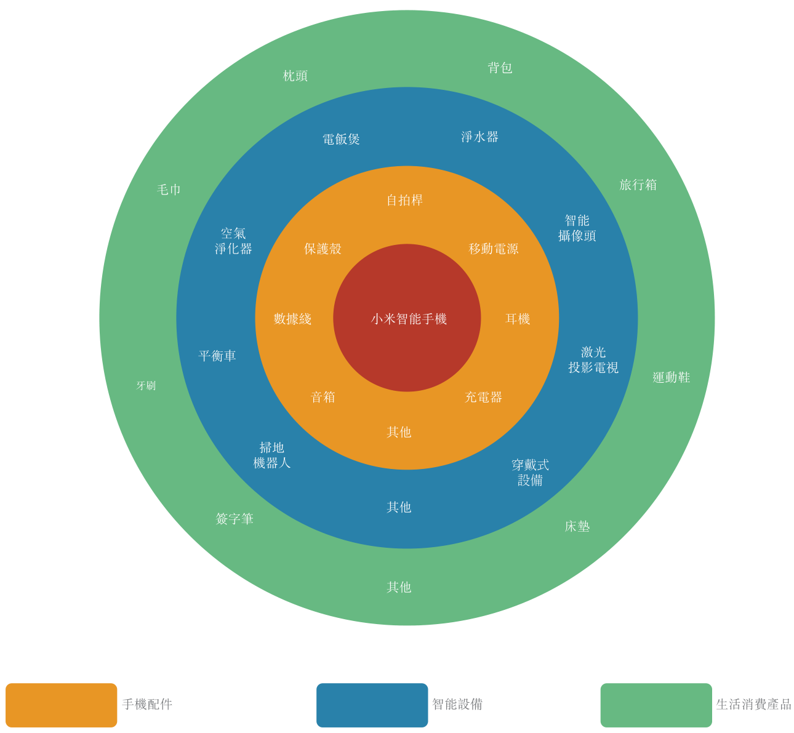

為實現使命，我們向現有及潛在用戶承諾：從2018年開始，每年小米整體硬件業務（包括智能手機、IoT及生活消費產品）的綜合淨利率不會超過5%。如有超出的部分，我們都將回饋給用戶。

以下章節所引述建議零售價為中國大陸建議零售價。中國大陸以外市場的建議零售價與中國大陸相近，惟須經當地市場調整。

核心自家產品

智能手機

根據IDC統計，2018年第一季度，我們在全球的智能手機出貨量排名第四，在印度的智能手機出貨量排名第一。為迎合多樣的用戶群，我們在下列五個價格區間都有智能手機

---

## 第 225 页

業務

產品：(i)人民幣3,000元及以上；(ii)人民幣2,000元至人民幣2,999元；(iii)人民幣1,300元至人民幣1,999元；(iv)人民幣800元至人民幣1,299元；及(v)人民幣799元及以下，與同類產品相比，我們的所有手機均以最厚道價格發佈。我們的智能手機搭載基於安卓原生系統研發的自有操作系統MIUI。

高端旗艦機
（人民幣3,000元及以上）

小米MIX 2S

小米MIX 2

小米8探索版

旗艦機
（人民幣2,000元至人民幣2,999元）

小米6

小米Note 3

小米8

中高端機
（人民幣1,300元至人民幣1,999元）

小米Max 2

小米5C

小米5X／小米A1

小米8 SE

中端機
（人民幣800元至人民幣1,299元）

紅米5／5 Pro

紅米5 Plus

入門機
（人民幣799元及以下）

紅米5／5A

紅米Note 5A／紅米Y1

小米MIX 2S

小米MIX 2

小米8探索版

小米6

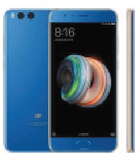

小米Note 3

小米8

下表列載於營業紀錄期各價格區間智能手機的銷售收入及銷量：

<!-- table html -->
<table><tr><td></td><td colspan="6">截至12月31日止年度</td><td colspan="4">截至3月31日止三個月</td></tr><tr><td></td><td colspan="2">2015年</td><td colspan="2">2016年</td><td colspan="2">2017年</td><td colspan="2">2017年</td><td colspan="2">2018年</td></tr><tr><td>價格區間</td><td>收入（人民幣千元）</td><td>售出數量（千部）</td><td>收入（人民幣千元）</td><td>售出數量（千部）</td><td>收入（人民幣千元）</td><td>售出數量（千部）</td><td>收入（人民幣千元）</td><td>售出數量（千部）</td></tr><tr><td>高端旗艦機</td><td>—</td><td>—</td><td>249,415</td><td>81</td><td>4,002,451</td><td>1,386</td><td>486,800</td><td>157</td><td>1,315,245</td><td>496</td></tr><tr><td>旗艦機</td><td>19,676,989</td><td>12,497</td><td>10,744,606</td><td>6,915</td><td>12,244,855</td><td>6,013</td><td>2,107,969</td><td>1,227</td><td>2,840,235</td><td>1,576</td></tr><tr><td>中高端機</td><td>3,671,985</td><td>3,249</td><td>7,247,131</td><td>6,399</td><td>12,384,232</td><td>10,222</td><td>1,487,557</td><td>1,094</td><td>4,800,870</td><td>4,281</td></tr><tr><td>中端機</td><td>16,823,250</td><td>24,023</td><td>22,390,316</td><td>26,781</td><td>35,884,356</td><td>43,299</td><td>6,206,611</td><td>6,865</td><td>8,861,220</td><td>10,991</td></tr><tr><td>入門機</td><td>13,543,186</td><td>26,777</td><td>8,132,671</td><td>15,243</td><td>16,047,700</td><td>30,490</td><td>1,904,915</td><td>3,742</td><td>5,421,920</td><td>11,069</td></tr><tr><td>總計</td><td>53,715,410</td><td>66,546</td><td>48,764,139</td><td>55,419</td><td>80,563,594</td><td>91,410</td><td>12,193,852</td><td>13,085</td><td>23,239,490</td><td>28,413</td></tr></table>
<!-- /table -->

(i) 高端旗艦機：人民幣3,000元及以上

小米MIX 2S。我們於2018年3月發佈了全新高端旗艦智能手機小米MIX 2S，該機型延續該智能手機產品線的高端配置傳統，搭配全面屏及四曲面陶瓷機身。根據艾瑞諮詢，我

---

## 第 226 页

我們是首家推出搭載最新高通驍龍845處理器的智能手機的中國公司。該智能手機配備高達8GB的運行內存及256GB的機身存儲，擁有1.4微米超大像素AI超感光雙攝相機、雙核自動對焦及多項其他頂尖技術。該機型內置小愛同學，支持無線充電、人臉解鎖、多功能NFC及43頻全球頻段。

小米MIX 2。於2017年9月推出的小米MIX 2與Philippe Starck聯手設計，擁有全面屏及全陶瓷機身，斬獲多項大獎。該機型搭載高通驍龍835處理器，且5.99英寸顯示屏應用了多項頂尖技術：薄膜覆晶封裝工藝將底邊縮短；定製圓角讓視野最大化；定製微型前置相機；及超聲波距離傳感器以檢測靠近屏幕的物體。因此，該機型機身比一般5.5英寸屏智能手機還小。

小米8探索版。小米8探索版於2018年5月推出，是全球首款支持壓感屏幕指紋識別技術的智能手機，也是全球首款配備3D結構光技術面部解鎖功能的安卓設備，可快速匹配用戶面部特徵點，同時減少3D數據處理量，從而降低能耗。小米8探索版的新表情功能可讓用戶根據其面部表情創造動態表情包。小米8探索版亦採用透明玻璃蓋板，顯示濃濃的科技感及內部組件的細膩。

(ii) 旗艦機：人民幣2,000元至人民幣2,999元

小米6。旗艦智能手機小米6搭載高通驍龍835處理器，配備高達6GB運行內存、5.15英寸護眼屏、後置雙攝、內置3,350毫安時電池及四曲面玻璃機身。小米6後置廣角及長焦雙攝像頭，支持2倍光學變焦及10倍數碼變焦，同時配備4軸光學防抖，降低手抖或運動的影響，讓相片及視頻保持清晰。小米6發佈於2017年4月。

小米Note 3。智能手機小米Note 3發佈於2017年9月，後置廣角及長焦雙攝像頭，用戶可拍攝具散景效果的俏麗人像。2微米合成大像素能更好地捕捉光線，減少噪點。此外，小米Note 3具AI人臉解鎖功能，內置3,500毫安時電池及5.5英寸顯示屏。

小米8。小米8是我們的8週年旗艦手機，亦是全球首款雙頻GPS手機，支持L1 + L5雙頻定位，有效改善導航精準度。小米8集美學、人體工學與質量於一體，搭載高通驍龍845旗艦處理器，配備四曲面玻璃機身、航空級鋁合金框架及2.5D 6.21英寸全面屏，屏幕比例為18.7:9，屏佔比高達86.68%。配置12MP AI雙攝，小米8提升了小米MIX 2S提供的獨特攝影體驗，其傳感器的DxOMark（國際相機評測機構）評分全球排名第四。此外，小米8配備20MP攝像頭，運用像素合併技術將四個像素合成一個1.8 $\mu$m的大像素，暗光拍照更清晰明亮。

---

## 第 227 页

(iii) 中高端機：人民幣1,300元至人民幣1,999元

小米Max 2。小米Max 2是尺寸介乎智能手機與平板電腦之間的「平板手機」，配備6.44英寸大屏和可續航兩天的5,300毫安時大電量電池，沉浸式大屏的影音及遊戲體驗更震撼。分屏模式可讓用戶一屏瀏覽兩種不同內容，例如邊看視頻邊聊天。全金屬的機身加上弧形收邊，方便單手操作。小米Max 2發佈於2017年5月。

小米5C。小米5C是我們首款搭載自主設計研發的澎湃S1八核系統芯片的智能手機。澎湃S1採用高能效ARM Cortex-A53處理器，以big.LITTLE設計將2.2 GHz四核與1.4 GHz四核相結合。小米5C顯示屏為5.15英寸，輕至135克，後置12MP 1.25微米大像素攝像頭，弱光狀態下仍能拍攝高畫質相片。小米5C發佈於2017年2月。根據艾瑞諮詢，我們是全世界擁有設計自有智能手機芯片技術能力僅有的四家現有智能手機公司之一。

小米5X／小米A1。

智能手機小米5X後置廣角及長焦雙攝像頭，能夠計算及區分前後背景物件，打造單反相機般的景深效果，用戶能夠拍攝具散景效果的動人人像。小米5X配置5.5英寸顯示屏，全金屬機身設計，內置3,080毫安時大電量電池。小米5X發佈於2017年7月。

我們攜手谷歌發佈的小米A1是小米5X的全球版。該設備搭載光學變焦雙攝像頭設置，並具備與小米5X相若的功能。小米A1於2017年9月率先於印度發佈，其後走向全球市場。

小米8 SE。小米8 SE專為喜愛小型智能手機的用戶設計。小米8 SE配備5.88英寸三星AMOLED全面屏，全球率先搭載高通最新驍龍710處理器，與高通驍龍660處理器相比，性能更優且省電30%以上。

(iv) 中端機：人民幣800元至人民幣1,299元

紅米Note 5／5 Pro。中端智能手機紅米Note 5的拍攝實力與旗艦機旗鼓相當，1.4微米大像素雙攝像頭、AI攝像頭功能加上前置攝像頭帶LED自拍燈，能夠隨時隨地拍攝高畫質相片，是功能強大的設備。根據艾瑞諮詢，紅米Note 5是全球首款搭載高通驍龍636處理器的手機，14納米技術打造，採用18:9全面屏，內置4,000毫安時大電量電池。紅米Note 5首先於2018年2月在印度作為紅米Note 5 Pro發佈，隨後於2018年3月在中國大陸以紅米Note 5發佈。

紅米5 Plus。紅米5 Plus將全面屏的創新成果應用於我們的千元機，定製5.99英寸18:9顯示屏，搭載高通驍龍625處理器，內置4,000毫安時電池，後置1.25微米大像素攝像頭，前置柔光自拍攝像頭。紅米5 Plus發佈於2017年12月。

---

## 第 228 页

(v) 入門機：人民幣799元及以下

紅米5／5A。智能手機紅米5和紅米5A價格實惠，滿足大多數用戶的日常需求。紅米5配備5.7英寸顯示屏、高通驍龍450處理器及3,300毫安時電池。紅米5A輕至137克，配備5英寸護眼顯示屏、13MP攝像頭、高通驍龍425處理器及雙SIM卡槽。紅米5A及紅米5先後發佈於2017年10月及12月。

紅米Note 5A／紅米Y1。智能手機紅米Note 5A高配版前置16MP攝像頭，帶模擬自然光的獨立自拍燈，打造面部輪廓更清晰、膚色更明亮、眼神更動人的美顏自拍。該機型配備5.5英寸顯示屏、指紋識別功能及高通驍龍435處理器，除雙SIM卡槽外還專門設置microSD卡槽。紅米Note 5A搭載高通驍龍425處理器，有雙SIM卡槽，亦專門設置microSD卡槽。兩款機型均於2017年8月在中國大陸發佈，並於2017年11月作為紅米Y1 Lite及紅米Y1在印度發佈。

智能電視

根據艾瑞諮詢，我們提供的各尺寸智能電視在主要同類產品中具有最高性價比。我們的智能電視產品包括工藝精湛的小米電視4及小米電視4A／4C。我們的所有電視均內置PatchWall（MIUI操作系統上運行的專有人工智能電視操作系統），可理解用戶喜好並智能分類內容。2017年12月，我們的智能電視平均每天處理84百萬次播放需求。我們的智能電視銷售量增長強勁，2017年同比增長124%，2018年第一季度同比增長464%。除控制電視外，PatchWall可讓用戶聲控多種相兼容的智能家居設備。我們亦提供小米盒子（內容串流媒體設備及遊戲裝置），建議零售價人民幣199元起。2018年3月，小米電視和小米盒子的月活躍用戶分別為約5百萬和8百多萬。

根據艾瑞諮詢，小米盒子2017年的出貨量中國大陸排名第一，小米電視2018年3月的出貨量中國大陸排名第二，同月的出貨量全球排名前十。另外，根據艾瑞諮詢，在2017年國慶黃金周，中國大陸五款線上最暢銷電視中有四款來自小米。

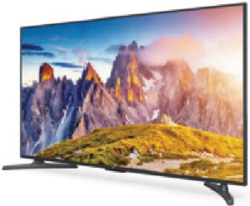

小米電視4

小米電視4A/4C

小米電視4。小米電視4為4K HDR智能電視系列，有49英寸、55英寸及65英寸三種尺寸。根據艾瑞諮詢，小米電視4為當時最薄的LED電視，4.9毫米極薄無邊框設計令視覺體驗

---

## 第 229 页

更身臨其境。小米電視4配備4K LED顯示器，支持播放HDR10內容，能夠展現更細膩豐富的色彩，亦設置雙揚聲器打造杜比音效及DTS音效，帶來逼真的電影體驗。小米電視4的建議零售價為人民幣3,399元至人民幣9,999元。

小米電視4A／4C。小米電視4A有32英寸、40英寸、43英寸、49英寸、50英寸、55英寸及65英寸七種尺寸，前四種尺寸型號配備全高清屏，後三種配備4K屏。小米電視4C為超窄邊框智能電視系列，有43英寸及55英寸兩種尺寸，均為超窄邊框搭配有光澤的鋼琴烤漆，大大提升視覺效果。小米電視4A及小米電視4C的建議零售價分別為人民幣999元至人民幣4,799元及人民幣1,599元至人民幣2,899元。

筆記本電腦

我們專注於設計及研發輕型、便攜、性能完善的筆記本電腦，以在規格相當的同類產品中提供最佳質量和最優價格。我們有三條筆記本電腦產品線—小米筆記本Air、小米筆記本Pro及小米遊戲本。最新型號當中，小米筆記本Air 12.5英寸售價人民幣3,599元起，小米筆記本Air 13.3英寸售價人民幣4,599元起，小米筆記本Pro 15.6英寸售價人民幣5,599元起，及小米遊戲本15.6英寸售價人民幣5,999元起。根據艾瑞諮詢，我們的筆記本電腦在主要同類產品中擁有最佳性價比。

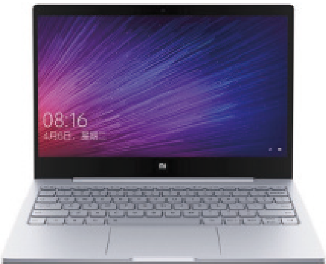

小米筆記本Air

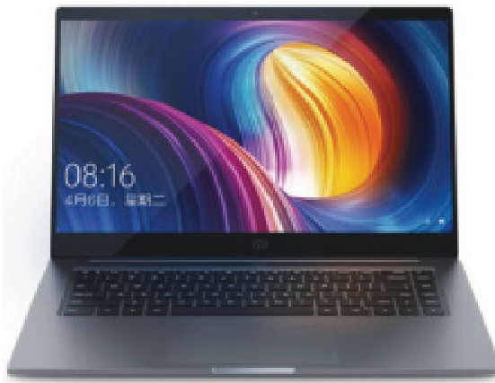

小米筆記本Pro

小米遊戲本

小米筆記本Air

小米筆記本Air機身輕薄，性能優異。Air有12.5英寸及13.3英寸兩種尺寸。兩個版本均配備1C快充功能。12.5英寸型號僅重1.07千克，配備的高密度電池可支持在線視頻播放達9.5小時。13.3英寸型號重1.30千克，配備英特爾酷睿i5或i7處理器、英特爾高清顯卡620、NVIDIA GeForce 940MX或MX 150顯卡、高達8GB的運行內存、高達256GB的固態硬盤及可支持在線視頻播放達8小時的高密度電池。12.5英寸及13.3英寸型號均為極簡風格，機身被鋁合金包裹，組裝全尺寸背光鍵盤、多點式觸控板及廣視角全高清防眩光屏幕。

小米筆記本Pro

小米筆記本Pro是一款強悍的多媒體筆記本，重量低於2千克，配備最新的英特爾酷睿i5或i7處理器、NVIDIA MX150顯卡、全尺寸背光鍵盤(19.5毫米舒適大鍵距)、全金屬機身

---

## 第 230 页

（鎂合金骨架，更強抗壓）、1C快充功能及七大擴充接口，亦具有多點式觸控板及15.6英寸廣視角全高清防眩光屏幕。

小米遊戲本

小米遊戲本15.6英寸配備英特爾酷睿i7處理器，可讓用戶獲得極佳工作及娛樂體驗。小米遊戲本採用極簡設計，配備16百萬色四分區鍵盤，30鍵防衝突設計以精準連招釋放。五個可編程按鍵位於左側，方便快速使用重要功能。為加強長時間遊戲時的性能，小米遊戲本亦配備大直徑熱管、12伏散熱風扇及四個出風口，可有效散熱。

人工智能音箱

根據艾瑞諮詢，我們的人工智能音箱出貨量於2017年在中國大陸排名第一，並於2018年第一季度排名第二。人工智能音箱具備高端性能，同時兼顧設計及便攜性，且根據艾瑞諮詢，我們的人工智能音箱在主要同類產品中的性價比最高。用戶可通過Wi-Fi連接我們的聲控人工智能音箱與其他智能硬件產品，下達個性化語音命令。人工智能音箱有小米AI音箱及小米小愛音箱mini兩種型號，建議零售價分別為人民幣299元及人民幣169元。我們人工智能音箱的價格及質量極具競爭力。與小米AI音箱同類的其他人工智能音箱價格通常介乎人民幣699元至人民幣1,000元，而與小米小愛音箱mini同類的則通常為人民幣299元。於2017年12月，人工智能音箱平均每日進行3.4百萬次交互。2018年3月，用戶每日在我們人工智能音箱平均花費時間約一小時。

小米AI音箱

小米小愛音箱mini

小米AI音箱

小米AI音箱搭載了聲控智能小愛同學目前可響應用戶的中文命令。小米AI音箱採用優質音響系統，配備六個環形麥克風，全方位探測語音命令。通過語音命令，用戶可收聽網絡廣播電台、流媒體音樂及有聲讀物。小米AI音箱亦可作為個人助手，傳遞天氣、交通狀況、個人日曆提醒及最新新聞等信息。小米AI音箱也是智能家居助手，用戶可下達個性化語音命令無縫控制智能家用設備。小米AI音箱亦可通過米家智能插座及米家智能插線板等產品控制部分「非智能」家用設備。用戶可通過預設問題及答案訓練人工智能助理，讓其成為更好的日常陪伴。

---

## 第 231 页

我們的專有聲控小愛同學，也內置在我們的其他智能設備中，例如智能手機，小米電視等。截至2017年12月31日及2018年3月31日，內置小愛同學的設備累計激活數量分別為7百萬和23百萬。於2018年3月，我們有超過13百萬名小愛同學的月活躍用戶。截至2018年3月31日，小愛同學可控制118個型號的產品，包括小米盒子、米家掃地機器人、米家IH電飯煲、小米空氣淨化器、米家直流變頻落地扇及智能燈具。

小米小愛音箱mini

小米小愛音箱mini是小米AI音箱的迷你版，為人工智能驅動的個人聲控數字助手，可用於控制我們智能家居產品線上的多款產品。這是一款便攜式助手，設計緊湊。

智能路由器

根據艾瑞諮詢，我們的智能路由器在主要同類產品中具有最高性價比。我們當前的Wi-Fi設備型號包括小米路由器3（人民幣149元）、3C（人民幣99元）、3G（人民幣249元）、3A（人民幣139元）、小米路由器Pro（人民幣499元）及小米路由器HD（人民幣1,199元）。

小米路由器Pro及小米路由器HD是專為滿足所有家庭網絡需求而設計的智能設備，均配備1TB或2TB硬盤驅動器。Pro及HD型號配備金屬機身，以增強穩定性，4x4天線則令無線覆蓋更為廣闊。在高達2,533Mbps的無線傳輸速率及MU-MIMO支持下，即使多台設備同時接入，用戶亦可獲得穩定、高速連接。

小米路由器3、3C、3G及3A均為易用Wi-Fi路由器，確保有穩定無線網絡體驗。小米路由器3配備128MB只讀內存及128MB內存。小米路由器3A配備加強天線。小米路由器3G配備雙核處理器、128MB只讀內存、256MB內存及USB 3.0接口。四種型號均配備四根天線，可通過小米路由器應用程序控制。小米路由器應用程序功能強大，例如增強網絡安全及未成年人保護。

與生態鏈企業協同生產的產品

我們與生態鏈企業合作設計並研發各類智能硬件產品，該等產品通過互聯網平台整合，滿足了用戶日常需求，旨在為用戶提供數字化生活方式。無論是自主或與生態鏈企業合作設計和生產的產品，均共享同一理念且通過創新技術、高品質、精心設計、專注於卓越用戶體驗與價格厚道獨特結合使得產品更為出色。

---

## 第 232 页

下表載列我們特定產品的價格與主要競爭對手的價格對比：

<!-- table html -->
<table><tr><td>特定產品</td><td>建議價格範圍（人民幣元）</td><td>主要競爭對手的指標價格範圍（人民幣元）</td></tr><tr><td>空氣淨化器</td><td>379–1,999</td><td>2,000–10,000</td></tr><tr><td>小米手環2</td><td>149</td><td>299–699</td></tr><tr><td>掃地機器人</td><td>1,699</td><td>3,000–8,000</td></tr><tr><td>淨水器</td><td>1,499–1,999</td><td>3,000–4,000</td></tr><tr><td>行李箱</td><td>299–1,999</td><td>299–5,000</td></tr><tr><td>電磁加熱電飯煲</td><td>399–999</td><td>3,000–6,000</td></tr><tr><td>激光投影儀</td><td>9,999</td><td>29,999–132,000</td></tr><tr><td>可折疊電動自行車</td><td>2,999</td><td>6,999–8,999</td></tr><tr><td>無人機</td><td>2,999</td><td>4,000–7,000</td></tr></table>
<!-- /table -->

為促進硬件產品與米家app及IoT平台的整合，我們為生態鏈企業提供可無縫併入彼等之設備的硬件及軟件模組。合作夥伴無需大量投資資源開發複雜的綜合軟件，生態鏈企業可通過我們預先與相關軟件包裝好的模組，僅須編製通訊協議。將模組併入硬件產品方面，我們有穩健的安全標準保護互聯網及IoT平台。

我們與生態鏈企業合作研發的產品主要分為手機周邊、智能設備及生活消費產品三類。

精選手機周邊產品

移動電源

根據艾瑞諮詢，我們的移動電源分別於2017年及2018年第一季度全球出貨量第一。小米移動電源有20,000毫安時、10,000毫安時及5,000毫安時等容量。例如，小米移動電源10,000毫安時高配版機身光滑纖薄，支持Type-C充電及雙向快充，一次充電量可為3,000毫安時智能手機充電2.4次。

耳機

我們提供四種型號的經典入耳式耳機（價格介乎人民幣29元至人民幣149元）、三種型號的藍牙入耳式耳機（價格介乎人民幣59元至人民幣169元）、一種型號的降噪入耳式耳機（售價人民幣299元）及兩種型號的頭戴式耳機（價格介乎人民幣199元至人民幣499元）。上述耳機均音質不凡，設計美觀，佩戴體驗舒適。

精選智能硬件產品

空氣淨化器

根據艾瑞諮詢，我們的空氣淨化器分別於2017年及2018年第一季度全球出貨量第一。根據艾瑞諮詢，自我們推出空氣淨化器以來，按出貨量計算我們在中國大陸各年均排名第

---

## 第 233 页

業務

一。2017年12月，我們的空氣淨化器每日平均淨化空氣15億立方米。根據艾瑞諮詢，2017年「年度雙十一購物節」期間，我們的空氣淨化器出貨量在天貓、京東及蘇寧易購等主要電商平台的空氣淨化器類別中排名第一。我們生態鏈企業目前推出的空氣淨化器型號包括小米空氣淨化器2（人民幣699元）、小米米家空氣淨化器2S（人民幣899元）、米家空氣淨化器Pro（人民幣1,499元）、米家空氣淨化器MAX（人民幣1,999元）及米家車載空氣淨化器（人民幣379元）。

小米空氣淨化器2機身緊湊，採用單電機雙風扇設計，其CADR（潔淨空氣量）達每小時310立方米，適用於21平方米至37平方米的空間。小米米家空氣淨化器2S為升級版，配備可顯示PM2.5指數、溫度及濕度的OLED顯示屏，以及幫助精準探測小到0.3微米顆粒物的激光傳感器。米家空氣淨化器Pro配備OLED顯示屏及升級風道和增壓系統，CADR可達每小時500立方米，覆蓋60平方米的室內空間。米家空氣淨化器MAX採用雙進風系統，增大了進風、出風面積，令表現更出色，其潔淨空氣量可達每小時1,000立方米，覆蓋高達120平方米的室內空間。上述空氣淨化器均可通過Wi-Fi連至米家app。

米家車載空氣淨化器專為車內使用而設，CADR可達每小時60立方米，大約可在三分鐘淨化普通家用轎車約3立方米的空氣，亦支持智能手機以藍牙控制。

運動手環

根據艾瑞諮詢，分別按2017年及2018年第一季度運動手環出貨量計，我們於中國大陸排名第一，於全球排名第二。2017年12月，我們的運動手環每日平均記錄步數達370億步。小米手環2為配備OLED顯示屏的智能運動手環，可追蹤各類生物特徵數據，例如步數、心率、睡眠時間及質量。佩戴者久坐時，手環會輕微震動提醒佩戴者稍作休息。用戶亦可將手環與「小米運動」手機應用程序同步，以實時監控跑步速度和心率及評估睡眠質量。此外，用戶手機收到來電、短信及通知時，手環會震動提醒，亦可即時解鎖安卓智能手機而毋須任何密碼或指紋。小米手環2採用高密度鋰聚合物電池，充一次電通常可正常使用20多天。

掃地機器人

2017年12月，我們的米家掃地機器人平均每天清掃地面7.9百萬平方米。米家掃地機器人是一款備受歡迎且極其智能的機器人，定價人民幣1,699元，配備激光測距傳感器(LDS)，每秒可360度掃描周圍1,800次。米家掃地機器人採用同步定位與地圖構建(SLAM)算法，可構建房間地圖，規劃最佳清掃路徑。米家掃地機器人配備12類傳感器及眾多先進功能，讓房間清潔更智能高效。用戶可通過米家app遠程啟動及控制米家掃地機器人，設定定期清掃安排。

滑板車／平衡車

根據艾瑞諮詢，我們的電動滑板車2017年及2018年第一季度均為全球出貨量第一。根

---

## 第 234 页

據艾瑞諮詢，2017年「年度雙十一購物節」期間，九號平衡車Plus出貨量在天貓、京東及蘇寧易購等主要電商平台的平衡車類別中排名第一。

小米米家電動滑板車屢獲設計大獎，操作簡易，一次充電可行駛30千米，重約12.5千克，配備LED前大燈及制動充電等功能。用戶可通過米家app控制米家電動滑板車。

九號平衡車是一款自動平衡滑板車，一次充電可行駛22千米，最高速度可達每小時16千米，亦可爬15度陡坡，最大承壓85千克。在「鎖定」模式下，滑板車被移動時會向所有者發出警報。九號平衡車Plus是九號平衡車的升級版，配備增強型鎂合金底盤，最大承壓100千克，一次充電可行駛35千米。九號平衡車Plus配備遠程遙控器，用戶在20米內毋須使用智能手機便可輕鬆控制其行動。米家app可控制九號平衡車及九號平衡車Plus。

淨水器

我們的淨水器2017年12月平均每天過濾八百萬杯水。根據艾瑞諮詢，2017年「年度雙十一購物節」期間，小米淨水器出貨量在主要電商平台(包括天貓、京東及蘇寧易購)淨水器類別中穩居第一。小米淨水器是一款精心設計的淨水器，採用反滲透(RO)技術，對自來水增壓，令其通過反滲透膜以獲得純淨水。小米淨水器採用四級RO過濾程序，最終獲得乾淨的純淨水。小米淨水器配備400加侖大流量RO濾芯及優化濾水通道，有效提升過濾效率，獲得高速水流。用戶可通過米家app監控小米淨水器，實時監察濾芯效率，獲得更換濾芯提醒，並通過應用程序下單輕鬆購買新濾芯。用戶可便捷地更換濾芯。

電磁加熱電飯煲

智能電磁加熱電飯煲有三升、四升和米家壓力IH電飯煲三款。其中，米家壓力IH電飯煲利用磁性安全閥給內膽精準施加1.2個大氣壓，讓水溫上升至理想的105攝氏度進行烹煮，最終煮出香甜米飯。米家壓力IH電飯煲亦採用電磁加熱技術提高熱效率。為確保受熱均匀及蓄熱性能佳，米家壓力IH電飯煲的灰鑄鐵內膽經69道工藝鑄造而成。米家壓力IH電飯煲售價人民幣999元。

智能攝像頭

我們目前的智能攝像頭型號包括米家智能攝像機雲台版(人民幣199元)、米家小白智能攝像機(人民幣399元)及米家智能攝像機(人民幣199元)。

上述智能攝像頭均配備720P或1080P高清分辯率及互聯網連接，用戶可通過米家app實時遠程監控。

---

## 第 235 页

激光投影電視

米家激光投影電視可投射高達150英寸超大畫面，採用超短焦鏡頭設計，打破傳統投影遠距離投射帶來的使用不便，可放置在距離顯示器5至50厘米處，配置3,000:1的高對比度與5,000流明亮度。高科技產品米家激光投影電視搭載PatchWall，採用緊湊極簡的「box」設計，內置優質音響系統。用戶在家即可享受私人影院效果。米家激光投影電視的建議零售價為人民幣9,999元。

生活消費產品

我們透過新零售平台提供生態鏈企業高品質和設計精美的家品及個人配飾等生活消費產品。該等生活消費產品可加強我們的品牌形象並為平台帶來額外流量。我們堅守與自身品牌系列產品同樣的標準審慎採購甄選生活消費產品。所選中的生活消費產品均設計精良，細節考究。例如，小米90分滑輪旅行箱沿用小米簡約設計，採用經久耐用的聚碳酸酯(PC)材質，有效抗震及防跌落。旅行箱的輪子由熱塑性彈性體(TPE)材料製成，使滑輪防震、有彈性及降噪。根據艾瑞諮詢，2017年「年度雙十一購物節」期間，該旅行箱出貨量在天貓旅行箱類別中排名第一。

IoT開發者平台

IoT開發者平台於2017年11月推出後，截至2018年3月31日，我們的IoT開發者平台已經讓580多個開發者接入了我們的平台。除生態鏈企業外，IoT開發者平台亦向其他欲將其設備與平台其他聯網設備互聯，從而透過我們獲得更多用戶的開發者開放。開發者可在設備生命週期的任何階段於IoT開發者線上平台免費申請將設備接入平台。設備通過我們的質量及兼容性測試後，其開發者即可享受我們全面管理及整合的支持及服務以及一系列基礎及高階開發能力，如硬件連接、IoT模塊、雲平台及儲存、應用程序遠程控制、聲控及內容分享。

提供給生態鏈企業的價值

少數股權投資。我們為生態鏈企業提供早期資金支持，助力彼等成功發展，並持有合作夥伴的少數股權。

孵化支持。我們於生態鏈企業早期發展階段提供孵化支持，包括人力資源和其他管理支持及協助。

產品設計及研發支持。我們運用自身知名的工業設計實力及技術能力研發生態鏈硬件產品，並要求合作夥伴嚴格遵循我們品牌一貫秉承的產品設計及質量標準。

---

## 第 236 页

業務

供應鏈管理支持。透過我們的專業知識和原材料及組件供應商網絡，我們協助合作夥伴以優惠條款獲取優質材料。此外，我們與合作夥伴分享有關運營效率的經驗，助其管理生產相關成本。

品牌、市場營銷及零售支持。通過我們品牌的高辨識度和高效的新零售平台，小米價格厚道的IoT與生活消費產品的爆款效應會使得參與其中的生態鏈企業迅速提升企業知名度、行業地位與銷量。

新零售

通過新零售策略，我們將線上、線下銷售渠道緊密結合，減少中間商層數、實現更高的效率、並以統一的厚道價格向用戶提供相同的產品。下表列載於營業紀錄期我們智能手機及IoT和生活消費產品分部的多種分銷渠道及其各自的收入貢獻：

<!-- table html -->
<table><tr><td></td><td colspan="4">截至12月31日止年度</td><td colspan="4">截至3月31日止三個月</td></tr><tr><td>分銷渠道</td><td colspan="2">2015年</td><td colspan="2">2016年</td><td colspan="2">2017年</td><td colspan="2">2018年</td></tr><tr><td></td><td>人民幣</td><td>百分比</td><td>人民幣</td><td>百分比</td><td>人民幣</td><td>百分比</td><td>人民幣</td><td>%</td></tr><tr><td></td><td colspan="8">（以千元列示（除百分比外））</td></tr><tr><td>線上：</td><td></td><td></td><td></td><td></td><td></td><td></td><td></td><td></td></tr><tr><td>直銷^(1)</td><td>43,019,390</td><td>68.9</td><td>25,865,166</td><td>42.3</td><td>29,231,710</td><td>28.1</td><td>8,126,490</td><td>26.3</td></tr><tr><td>分銷商^(2)</td><td>10,997,964</td><td>17.6</td><td>20,113,009</td><td>32.9</td><td>38,422,430</td><td>36.9</td><td>9,588,489</td><td>31.0</td></tr><tr><td>線下：</td><td></td><td></td><td></td><td></td><td></td><td></td><td></td><td></td></tr><tr><td>直銷^(3)</td><td>361,429</td><td>0.6</td><td>1,660,126</td><td>2.7</td><td>5,413,525</td><td>5.2</td><td>2,516,412</td><td>8.1</td></tr><tr><td>分銷商^(4)</td><td>8,027,190</td><td>12.9</td><td>13,541,276</td><td>22.1</td><td>30,943,752</td><td>29.8</td><td>10,704,665</td><td>34.6</td></tr><tr><td>合計</td><td>62,405,973</td><td>100.0</td><td>61,179,577</td><td>100.0</td><td>104,011,417</td><td>100.0</td><td>30,936,056</td><td>100.0</td></tr></table>
<!-- /table -->

附註：

(1) 線上直銷渠道主要包括小米商城、有品平台及天貓旗艦店。

(2) 線上分銷商主要為第三方線上分銷夥伴。

(3) 線下直銷渠道主要為米家。

(4) 線下分銷商主要為第三方分銷夥伴。

2015年至2017年分銷渠道組合的變動反映我們對加強分銷商合作關係的投資。我們與分銷商的框架協議合約一般不會規定最低購買量。對於大陸分銷商，我們的框架協議一般不會指明銷售目標。我們會不時與大陸分銷商溝通銷售預期，但若未達致銷售預期，並無處罰措施。對於國際分銷商，我們大部分框架合約仍會指明月或年購買目標，列明有關分銷商的最低購買量。如國際分銷商未達到指定購買目標，則我們可停止與該等分銷商的合約。對各國際分銷商施加的購買目標因多項因素而有所不同，包括與相關分銷商協定的金額和分銷商對我們產品的需求。我們不向大陸分銷商提供保證庫存，而是僅向我們不直接提供售後服務的司法權區的國際分銷商提供保證庫存。我們通常(i)為智能手機國際分銷商提供2%的保證庫存作為一年保修，(ii)為其他硬件產品國際分銷商提供按銷量2%計的備品

---

## 第 237 页

業務

備件，惟不會交付但須自提供予分銷商的售價中扣除。為避免分銷商間可能出現自身蠶食情況，我們(i)不允許分銷商退還產品，除非根據相關法律及法規視該等產品存在缺陷；(ii)應用專有技術系統監測分銷商的銷售情況；及(iii)要求分銷商定期提供銷售報告，以便我們及時跟進其銷售情況。

線上

根據IDC統計，於2018年第一季度，我們的線上智能手機出貨量於中國大陸及印度均排名第一。憑藉我們的線上專長，客戶群廣泛覆蓋(尤其是透過小米商城和有品平台)中國大陸整個電商領域。根據艾瑞咨詢，2017年天貓「年度雙十一購物節」期間，我們在天貓20多個產品類別出貨量中排名第一。

運營初期，我們通過自營線上分銷渠道獨家銷售我們的產品。我們把握電商增長趨勢及其分銷效率，與領先的第三方線上電商夥伴合作獲取更多客戶，從而擴展線上分銷渠道。因此，我們相信已於整個線上零售領域取得卓越成績。我們的線上分銷模式提供給我們明顯的優勢，包括較低的分銷成本。

直接線上零售

目前我們的線上直銷零售渠道包括小米商城、有品平台及天貓旗艦店。我們高效的平台使我們可以以厚道的價格將產品及服務直接銷售給用戶。

小米商城

小米商城可通過移動app及Mi.com訪問，直接向用戶提供我們的全線產品。中國大陸、印度及部分特定全球市場的用戶可直接自當地小米商城app和網站購買我們的產品，其他全球市場，小米商城則是客戶了解我們產品及服務的集中平台。小米商城以個性化產品推薦及生動的產品描述精心為用戶提供良好的購物體驗。根據艾瑞諮詢，於2013年至2017年「年度雙十一購物節」期間，在各品牌旗艦店之中，我們的天貓旗艦店銷量「五連冠」。

客戶可使用小米商城移動app快速有效地發現、瀏覽、選擇及購買產品。我們分析及了解客戶的交易紀錄及其在移動app上的瀏覽模式，力求為客戶提供定製化的購物體驗，以增加客戶黏性及交叉銷售機會。我們持續研發附加功能提升用戶體驗。例如，客戶可通過語音輸入新增地址，系統從數據庫中智能識別匹配正確地址，節省用戶時間。

有品

有品是我們新創建的電商市場，不僅銷售小米品牌的產品，亦出售由我們精選的其他品牌高質量產品。2018年第一季度，有品銷售超過2,700種SKU。有品電商平台提供眾多

---

## 第 238 页

暢銷優質產品，與我們既有業務模式互補。有品包括有品移動app及Youpin.mi.com網站，代表高品位及高品質，而這亦是該名稱的中文涵義。

我們精心挑選各類目的限量SKU，關注潛在「爆品」，藉此從其他電商公司中脫穎而出。平台目前有逾15個類目，包括家居、出行、電子、娛樂、服飾、運動及個人護理。我們對在有品上架的所有商品均有嚴格規定及高標準。平台商品與我們自身品牌系列產品的設計理念相若，給客戶高品牌辨識度、高性價比且簡約時尚的體驗。在有品上架是產品質量與設計精美的保證，故商家明白商品在有品上架會提升品牌知名度，有助增加銷售額。

第三方線上分銷夥伴

我們透過第三方電商夥伴在全球線上分銷網絡銷售產品。在中國大陸，我們與主要電商公司京東及蘇寧等合作，彼等直接購買我們的產品後向終端用戶分銷。在印度及世界其他地區，我們主要通過Flipkart、TVS Electronics及亞馬遜等第三方電商實現線上銷售。我們相信透過該等領先電商運營商線上分銷產品可利用彼等已有的客戶基礎及品牌知名度，助力我們在全球不同市場獲得更多客戶。

我們一般與線上分銷夥伴訂立非獨家框架協議，定期獲取訂單並在約定時限內交付產品。根據框架協議適用的相關中國大陸法律或其他適用法律，除非我們的產品出現質量問題，否則分銷夥伴不得退貨。框架協議通常為期一年，經雙方同意可續期。

下表載列所示期間我們線上分銷商的數量變動：

<!-- table html -->
<table><tr><td></td><td colspan="3">截至12月31日止年度</td><td>截至3月31日止三個月</td></tr><tr><td></td><td>2015年</td><td>2016年</td><td>2017年</td><td>2018年</td></tr><tr><td>期初</td><td>36</td><td>58</td><td>90</td><td>109</td></tr><tr><td>新增線上分銷商</td><td>23</td><td>37</td><td>40</td><td>15</td></tr><tr><td>期內終止的線上分銷商數量</td><td>1</td><td>5</td><td>21</td><td>25</td></tr><tr><td>線上分銷商淨增加／(減少)</td><td>22</td><td>32</td><td>19</td><td>(10)</td></tr><tr><td>期末</td><td>58</td><td>90</td><td>109</td><td>99</td></tr></table>
<!-- /table -->

營業紀錄期線上分銷商增加是由於業務擴張所致。

---

## 第 239 页

線下

線下我們主要透過零售店米家向用戶直接銷售產品及透過第三方分銷網絡銷售。第三方分銷網絡包括(i)中國大陸電信運營商；(ii)中國大陸零售連鎖店及直供點及(iii)國際分銷商，包括批發分銷商、電信運營商及授權店。作為重要的線下零售策略的一部分，我們致力於中間商不多於一個，以確保分銷效率、具競爭力的零售價及優質的用戶體驗。

直接線下零售

作為新零售策略重要的一環，我們主要在中國大陸及印度建設了龐大的米家線下零售店網絡，確保讓客戶滿意的一致購物體驗。在中國大陸，米家的足跡遍佈絕大部分省市。截至2018年3月31日，我們在中國大陸有331家米家。我們通常在中國大陸的大城市運營米家。

我們的米家一般位於高級購物商場及城市購物區的人流密集區域。米家旨在增強產品及服務的展示和營銷。店內人員訓練有素，非常熟悉我們的產品。此外，我們相信與目標客戶直接交流是展示我們產品優勢的有效方式。為提升客戶體驗及運營效率，我們並不鼓勵店內人員主動向潛在客戶推銷產品或服務。根據艾瑞諮詢，2017年在全球零售連鎖店中，米家自營店的坪效名列第二。

第三方線下分銷網絡

我們透過中國移動、中國聯通和中國電信等中國大陸電信運營商分銷產品。根據與電信運營商的分銷協議，特定電信運營商僅可在協議訂明的地域範圍內按協議訂明的價格分銷產品。根據相關中國大陸法律，除非我們的產品存在缺陷，否則合作的電信運營商不得退貨。

此外，我們與消費電子零售連鎖店及直供點合作分銷產品。我們的零售連鎖夥伴包括領先的全國及地區性零售企業，我們通常與各零售商訂立非獨家框架協議，按單個訂單基準向零售商銷售產品。為進一步滲透中國大陸及印度中小城市及農村地區，我們與直供點「小米首選合作夥伴」訂立獨家框架協議分銷產品。

我們不承諾向零售商或直供點回購產品。我們建議最低零售價格。零售商及直供點是我們的客戶而非代理，因為產品一經出售並交付，彼等便承受產品損壞及過時的風險，且根據相關適用法律，除非我們的產品存在缺陷，否則不得退貨。框架協議一般為期一年。

---

## 第 240 页

對於特定國際市場，我們的分銷夥伴在若干指定區域內向其他次級分銷商及零售商分銷產品，然後由次級分銷商及零售商銷售予終端用戶。分銷商一般專門負責分銷智能硬件及經營完善的當地分銷網絡。我們通常與各分銷商訂立非獨家框架協議，按單個訂單基準向分銷商銷售產品。此外，我們授權特定國際市場的第三方夥伴在其實體店獨家銷售我們的產品。我們掌控授權店的室內設計確保品牌呈列風格統一，提高在全球市場的知名度。我們為授權店夥伴提供銷售及服務指導確保客戶獲得滿意體驗。根據與國際分銷商（包括批發分銷商及授權店夥伴）的框架協議，我們不授予分銷商退貨權利，且在任何情況下我們均無責任自分銷商回購產品。

我們建議最低零售價格。倘分銷商未達到框架協議所載的採購量，我們一般有權單方面終止框架協議。與分銷商的框架協議通常初始為期一年，到期後自動續期一年，除非任意一方在到期後終止協議。

下表載列所示期間我們於中國大陸及世界其他地區的線下分銷商的數量變動：

<!-- table html -->
<table><tr><td></td><td colspan="3">截至12月31日止年度</td><td>截至3月31日止三個月</td></tr><tr><td></td><td>2015年</td><td>2016年</td><td>2017年</td><td>2018年</td></tr><tr><td>期初</td><td>24</td><td>93</td><td>299</td><td>1,103</td></tr><tr><td>新增線下分銷商</td><td>70</td><td>231</td><td>920</td><td>680</td></tr><tr><td>期內終止的線下分銷商數量</td><td>1</td><td>25</td><td>116</td><td>190</td></tr><tr><td>線下分銷商淨增加</td><td>69</td><td>206</td><td>804</td><td>490</td></tr><tr><td>期末</td><td>93</td><td>299</td><td>1,103</td><td>1,593</td></tr></table>
<!-- /table -->

互聯網服務

基於我們龐大、多樣且高度參與的用戶群，我們能有效地拓展我們的服務品類。自成立起，我們一直專注於完善我們產品與互聯網服務的融合及設備的聯通，以提供更佳用戶體驗。因此，我們實現了高水平的用戶參與度及留存率。2018年3月，我們的用戶平均每日使用我們的智能手機約4.5小時。此外，我們研發爆款應用程序的能力有目共睹。2018年3月，我們擁有38款月活躍用戶人數逾一千萬、18款月活躍用戶人數逾五千萬的應用程序，包括小米應用商店、小米瀏覽器、小米音樂及小米視頻。2018年3月，按我們智能手機的月活躍用戶人數計，我們自行研發的應用程序在中國大陸多個類別中排名第一，包括瀏覽器、音樂、視頻、文學和安全。2018年3月，用戶使用我們的智能手機總時長中超過20%是在使用小米自行研發的應用程序。在MIUI體系之外，本公司還在其他操作系統為用戶提供互聯網服務，包括「小米商城」、「有品」、「米家」以及「小米運動」。這些服務拓展了公司的用戶群體，讓小米整體生態更加豐富。

---

## 第 241 页

MIUI

MIUI是我們基於安卓原生系統構建的專有操作系統，與安卓生態鏈全面兼容。所有安卓應用程序均與MIUI兼容。

我們於2010年基於安卓操作系統研發出第一版深度定製及本土化的MIUI，以適應消費者的使用習慣。自此MIUI憑藉其直觀、快速且穩定的特點廣受用戶歡迎。過去八年，在發佈穩定版本前，我們每週會先推出公測版收集用戶反饋及建議，據此分析及改進系統。我們研發了眾多功能，持續優化以改善其基本框架，提高可用性及用戶體驗，因此吸引大量用戶積極參與。例如，在最新操作系統MIUI 9穩定版本發佈四個月內，我們65%以上的手機用戶升級到了MIUI 9穩定版本。

MIUI支持我們智能手機的全套功能，並為用戶及開發者提供各種定製服務，滿足彼等需求。例如，小米推送是一項穩定、可靠及有效的通知服務，不僅為我們的用戶及開發者提供MIUI上的系統層面信息通知渠道，還是全安卓及iOS平台研發者的通知解決方案。截至最後可行日期，小米推送已經為中國大陸絕大部分受歡迎應用程序提供服務，而根據艾瑞諮詢，分別按2017年及2018年第一季度使用推送服務的裝置數量計，小米推送在中國大陸所有安卓推送服務供應商中排名第一。2018年3月，使用我們小米推送服務的設備約有950百萬台，包括各種操作系統的智能手機、筆記本電腦、小米電視及小米盒子。有關我們軟件工程(包括MIUI研發流程)的詳情，請參閱「—研發—軟件工程」。MIUI及研發投入反映了我們持續提升用戶體驗的熱情及對用戶的真誠。

MIUI的主要特色及創新如下：

系統優化。我們全方面優化MIUI，確保在手機上運行時達最佳性能。我們透過多種舉措提升系統穩定性及速度並減少耗電量，包括發佈速度提升、動態資源分配、關鍵場景加速、核心擁塞控制及自動緩存清理。因此，MIUI反應迅速而流暢。

出色的界面及用戶體驗。MIUI的眾多特色確保了出色的可用性及用戶體驗。例如，MIUI系統圖標以動畫體現操作動作。用戶可在同一界面同時運行兩款應用程序，並為各應用程序調整屏幕空間。MIUI主界面高度定製，簡單動作即可重排圖標，添加小工具及卸載應用程序。MIUI通知欄按應用程序分類通知以免雜亂，簡潔而全面地展示信息。

傳送門。MIUI借助人工智能實力提供該功能，用戶僅需長按任意文字區域而不必離開當前使用的應用程序，即可獲得影評、百科及地圖等多種場景的海量信息。

---

## 第 242 页

業務

• 通知過濾。通知過濾可自動識別並攔截所有類型的垃圾電話及短信。

• 一鍵換機。用戶換用我們的新機時，僅需輕輕一點，一鍵換機功能會快速配對兩台設備，幫助用戶將舊機上的全部內容安全轉移至新機。

• 應用雙開。對於微信、臉書等應用程序，用戶可創建並登陸兩個賬號，此乃iOS及安卓都尚未支持的重要功能。

• 手機分身。用戶可使用不同的密碼或指紋進入不同空間，各空間有各自的牆紙、應用程序、文件及照片，工作休閒互不干擾。

• 小米快傳。毋須聯網即可透過小米快傳使用藍牙在設備間無縫傳輸文件。

• 黃頁。黃頁可識別具體的商業電話及基於其他用戶的標記將其他來電分類，為用戶提供來電信息。黃頁亦提供該等商業電話號碼的其他資料，如有關企業的地址、官網鏈接及微博賬號等。

• 國際漫遊虛擬SIM卡。用戶通過MIUI便捷購買虛擬SIM卡後即可於國際旅行時享受便利的數據網絡服務。

• 萬能遙控器。小米萬能遙控器可讓客戶使用手機控制電視、空調及眾多其他家電。

我們所有智能手機均預置MIUI，其他安卓智能手機用戶亦可免費安裝MIUI。MIUI的系統框架、設計及內容均為不同市場進行了定制，故我們在全球各地出貨的智能手機所預置的MIUI，可能與我們本地智能手機所預置的不盡相同。

小米雲服務

小米雲服務是我們的雲儲存及雲計算服務，為用戶個人數據的儲存及備份需求提供一站式解決方案。小米雲服務與我們的手機等產品無縫銜接，為用戶數據提供全面便捷的儲存服務，包括用戶的聯繫人、短信、照片、視頻及文件數據。小米雲服務同步個人用戶於不同設備的數據，透過統一的線上賬號在所有設備間更新數據。不論哪台設備數據變動，所儲存數據均自動同步，使數據遷移更簡單。設備連接Wi-Fi後，小米雲服務即自動備份用戶數據，小米雲服務配置一系列可使多台設備運行更快，更安全及節省大量成本的功能。小米雲服務為普通用戶計劃提供5GB免費空間。用戶可支付年費升級小米雲服務會員儲存計劃，增多20GB、100GB或1024GB儲存空間並享受其他特權。

小米應用商店

小米應用商店是安卓移動應用程序的分發平台。2018年3月，在我們智能手機上首次安裝的應用程序中有超過85%透過小米應用商店下載。用戶可以安全簡便地在小米應用商

---

## 第 243 页

店中為其移動設備瀏覽、查找及獲取各種移動應用程序。通過各類應用程序，用戶獲取視頻、音樂、遊戲及電子書等互聯網內容非常方便。我們憑藉專有研發能力及技術，與應用程序研發商及內容提供商建立穩固關係，於小米應用商店提供大量移動應用程序及其他內容。

小米瀏覽器

小米瀏覽器為用戶提供快速安全的瀏覽體驗。小米瀏覽器可識別搜索結果中的惡意網站並自動屏蔽及掃描瀏覽器所下載文件排除安全威脅。小米瀏覽器亦有「隱私瀏覽」選項，用戶上網不會留下任何歷史訪問紀錄。小米瀏覽器的界面及功能對用戶非常友好，例如用戶可將書籤存入小米雲服務，隨時隨地可在移動設備查看書籤。此外，小米瀏覽器亦有密碼管理器基於安全的雲系統幫助用戶輕鬆登入不同線上服務的多個個人賬戶。

小米安全中心

小米安全中心是互聯網安全應用程序，可免費下載，集殺毒、防惡意軟件、防釣魚、屏蔽惡意網站及保護線上購物安全功能於一身，利用雲數據分析引擎保護用戶免受安全威脅及惡意應用程序。該程式可定期或按需要安檢用戶設備，以安全威脅數據庫進行檢測。

小米遊戲中心

截至2018年3月31日，小米遊戲中心有超過30,000款遊戲，涵蓋休閒、動作與冒險、角色扮演及策略等主要類型。我們尋求與領先的遊戲製作商及個體開發商合作，為用戶提供最廣泛的遊戲選擇。用戶可找到最新的動作類熱門遊戲及流行休閒遊戲。通過大數據分析功能，我們根據各種因素(包括用戶的個人喜好及偏好)定製主頁顯示及遊戲排名。因此，用戶可獲得精選遊戲及個性化的遊戲體驗。此外，我們提供直播服務，讓玩家創建、分享及發現各類手機遊戲相關內容。用戶可通過評論內容或贈送虛擬禮物與主播互動。

小米視頻

小米視頻是我們智能手機主要的視頻內容分銷平台，內容來自第三方。我們與主流內容提供商合作，擴展並豐富內容庫以為用戶提供優質內容。小米視頻是用戶了解熱門及推薦內容的一站式門戶。我們基於大數據分析用戶瀏覽習慣，學習用戶品味及偏好，於小米視頻首頁動態更新用戶最喜愛的內容。界面的合併查看功能旨在提升用戶體驗。會員服

---

## 第 244 页

務通常為付費訂閱用戶提供多樣會員特權，盡享極致影音體驗。根據艾瑞諮詢，按平均月活躍用戶計，小米視頻於中國大陸整體排名第四，按2017年及2018年第一季度平均月活躍用戶計，小米視頻於視頻聚合類別名列第一。

小米音樂

我們音樂平台有源於第三方的豐富流行歌手及唱片，用戶可欣賞中外流行歌手的豐富音樂內容。音樂庫涵蓋所有主流音樂類型，如流行、節奏藍調、古典及中國傳統音樂。我們亦提供播客及脱口秀供用戶訂閱。小米音樂透過改善搜索功能及人工智能個性化推薦滿足聽眾的多樣需求。我們基於多項因素推薦播放列表，包括用戶過往的音樂選擇、播放習慣、時間或假日及地點。儘管我們的流媒體音樂服務一般免費供用戶使用，但我們仍為喜好高質量音樂格式或下載若干音樂的用戶有償提供會員服務。根據艾瑞諮詢，分別按2017年及2018年第一季度的平均月活躍用戶計，小米音樂在中國大陸智能手機廠商所提供全部音樂應用程序中排名第一。

多看閱讀

多看閱讀為電子閱讀平台，讀者可輕鬆訪問內容庫中多種多樣的第三方內容。我們致力為用戶提供最廣泛最優質的在線原創內容庫。多看閱讀文庫涵蓋各種類別的文學作品，例如奇幻、武俠、科幻、推理及言情作品。

小米直播

小米直播為提供在線娛樂直播服務的合併互動直播平台，用戶可享受多渠道的直播服務及內容。目前，小米直播最熱門的頻道主題包括音樂、脱口秀、金融、遊戲、網絡文學。小米直播目錄按話題及共同興趣分類，可用關鍵詞搜索，有助用戶便捷查找。各個組別內的頻道按熱度排名。此外，小米直播支持個性化濾鏡及鏡頭、虛擬禮品及相關特效等有趣特性，部分特性運用了人臉識別及增強現實技術。小米直播亦為用戶提供發佈及與其他小米直播用戶共享信息、照片及短信的功能。

金融相關業務

我們於2015年推出互聯網金融業務。其後，我們研發了創新金融產品及互聯網支付平台，以滿足用戶不同的財務目標。我們的貸款產品包括分期付款貸款及消費貸款，用戶可分別使用該等貸款購買我們的硬件及滿足彼等的其他財務需求。我們主要通過小米金融、小米錢包及小米貸款手機應用程序分銷我們的貸款產品。除貸款產品外，小米錢包有手機錢包及支付功能，例如轉賬及支付賬單。2016年12月，我們在中國大陸聯合創辦中國大陸第三家互聯網銀行，擁有少數股權。

---

## 第 245 页

業務

我們擁有以龐大而多樣的用戶數據庫為基礎的十分先進且定製化的信用評估及風險控制方法。我們分析用戶日常使用我們產品及服務所積累的數據，通過我們的專有風險評估模型評估彼等信用風險，並根據信用評估結果預先批准相關用戶獲得一定數量的信用額度。我們於使用用戶數據前獲得用戶事先許可，收集彼等個人數據。我們設有嚴格的用戶數據保密公司政策，並採取技術措施確保用戶個人數據安全，防止個人數據被盜用、洩露、損壞或丟失。

我們預期會繼續專注於發展以下金融相關業務：

• 供應鏈融資業務。供應鏈融資業務利用本集團上游及下游供應鏈，向優質消費者提供保理服務及其他創新貿易金融及營運資金解決方案。我們認為，該等服務的市場需求龐大，且有利的政府政策可促進該業務增長。此外，推出有關融資有助本集團形成更健全且經濟實力更強的供應鏈，大大提高供應效率、可靠性及確定性。

• 互聯網小微融資業務。我們透過互聯網平台向優質消費者提供線上小微融資產品(尤其是具備銷售點或購買場景及特定用途的分期貸款)，亦會利用生態鏈用戶基礎、用戶數據分析及行為模式，不斷發展及優化大數據風險管理平台。此外，我們或會推出與智能手機及其他智能硬件產品有關的產品租賃服務。我們亦計劃發展金融技術實力，為金融機構提供信用評估支持服務及其他相關分析，加強彼等的風險管理。

截至2015年、2016年及2017年12月31日與2018年3月31日，墊付予客戶的小微貸款未償還總額分別約為人民幣102.0百萬元、人民幣1,613.3百萬元、人民幣8,418.2百萬元及人民幣8,479.1百萬元。下表概述營業紀錄期墊付予客戶的小微貸款詳情：

<!-- table html -->
<table><tr><td></td><td colspan="3">截至12月31日止年度</td><td>截至3月31日止三個月</td></tr><tr><td></td><td>2015年</td><td>2016年</td><td>2017年</td><td>2018年</td></tr><tr><td>平均貸款金額(人民幣)</td><td>1,500</td><td>2,300</td><td>3,600</td><td>4,000</td></tr><tr><td>平均貸款期限(月)</td><td>6.05</td><td>7.59</td><td>8.16</td><td>8.81</td></tr><tr><td>平均年貸款利率(%)</td><td>18</td><td>17</td><td>17</td><td>16</td></tr></table>
<!-- /table -->

• 支付服務。我們將拓展線上及線下支付服務，與我們的生態鏈無縫銜接以促成與用戶的付款交易。我們亦會加大研發投入，旨在確保支付服務有效且安全。

• 理財產品分銷。我們透過我們的應用程序推廣聲譽卓著的金融機構的優質理財產品，加強產品篩選程序，確保僅向消費者推廣符合相關法律法規的產品。

---

## 第 246 页

我們已完成小米金融重組，金融相關業務將由小米金融持有（請參閱「歷史、重組及企業架構—金融相關業務重組」）。由於小米金融重組，小米集團截至最後可行日期向小米金融集團提供約830百萬美元及人民幣299百萬元的小米金融重組貸款。透過運作小米金融購股權計劃，我們預計小米金融日後不再為本集團的合併附屬公司。停止合併入賬前，小米金融集團會基於獨立運營的原則，逐步減少對小米集團的財務及其他資源依賴，控制各類金融業務的風險敞口，最大限度地保護本公司及股東的整體利益。預料當小米金融集團的商業營運成熟，可逐步從業務積累資本及對外融資，可獨立於小米集團營運。當小米金融集團清償所欠小米集團的貸款及解除小米集團提供的擔保，小米金融集團對小米集團財務協助的依賴會逐步減少。

有關小米集團向小米金融集團提供的財務資助詳情，請參閱「關連交易 — 小米金融框架協議—根據小米金融框架協議擬進行交易的詳情—金融服務」。

變現

目前我們服務的變現主要集中在中國大陸，重點為互聯網廣告及增值服務。我們已開始培養於印度、印尼、俄羅斯及全球其他地區的互聯網服務變現能力。例如，在印度、印尼及俄羅斯，按月活躍用戶人數計，2018年3月，小米音樂應用程序、小米瀏覽器應用程序及小米視頻應用程序分別在我們智能手機的音樂類目、瀏覽器類目及視頻類目下排名第一、第二及第二。盈利方式強調在不犧牲卓越的用戶體驗的前提下的長期可持續的變現能力。

我們的硬件為用戶提供使用我們互聯網服務的平台，讓我們透過廣告及多元化互聯網增值服務變現。我們利用專有技術及大數據分析能力為我們的合作夥伴及用戶提供更全面及創新的服務。

廣告

我們的廣告分銷渠道主要包括我們的手機應用程序及智能電視。於中國大陸，我們有於2018年3月擁有逾一千萬月活躍用戶人數的38個應用程序及擁有逾五千萬月活躍用戶人數的18個應用程序，如小米應用商店、小米瀏覽器、小米音樂及小米視頻。我們為廣告客戶提供展示類及效果類廣告等多種廣告形式，以滿足彼等特定的業務需求及營銷目標。憑藉我們強大的大數據分析及人工智能功能，我們可定製廣告內容的外觀、觀感及展示時機，使其與其他內容無縫結合，同時不犧牲用戶體驗。我們的廣告客戶涵蓋汽車、日用品、互

---

## 第 247 页

業務

聯網服務及金融服務等不同行業，彼等直接向我們投放廣告或通過聘請廣告代理及經銷商與我們訂立合同發佈廣告。我們主要通過提供展示類及效果類廣告服務自該分銷渠道獲取廣告收入。對於展示類廣告服務，我們一般按廣告在我們的互聯網平台展示的時長向廣告客戶收取費用。對於效果類廣告服務，我們一般於用戶點擊廣告內容時按每點擊基準、向用戶展示廣告內容時按每顯示基準或用戶下載第三方應用程序時按每下載基準向廣告客戶收取費用。我們的其他廣告服務主要包括為第三方應用程序開發商於我們的智能手機預裝移動應用程序。下表載列我們於營業紀錄期的廣告收入明細：

<!-- table html -->
<table><tr><td colspan="3">截至12月31日止年度</td><td colspan="2">截至3月31日止三個月</td></tr><tr><td>2015年</td><td>2016年</td><td>2017年</td><td>2017年</td><td>2018年</td></tr><tr><td colspan="6">（人民幣千元）</td></tr><tr><td colspan="6">（未經審核）</td></tr><tr><td>效果類廣告服務</td><td>1,328,893</td><td>2,650,459</td><td>3,638,176</td><td>734,112</td><td>1,380,253</td></tr><tr><td>展示類廣告服務</td><td>—</td><td>263,265</td><td>665,336</td><td>96,108</td><td>276,152</td></tr><tr><td>其他廣告服務</td><td>491,744</td><td>924,696</td><td>1,310,877</td><td>178,118</td><td>217,619</td></tr><tr><td>總計</td><td>1,820,637</td><td>3,838,420</td><td>5,614,389</td><td>1,008,338</td><td>1,874,024</td></tr></table>
<!-- /table -->

我們針對廣告商的程序化營銷功能可於我們的手機應用程序實現效果營銷。我們提供一套分析工具幫助廣告客戶評估其廣告效果，並改進點擊率等關鍵指標。我們允許電子商務廣告客戶將彼等產品目錄整合至我們的平台，進行更精準的產品定位及推廣。透過分析競標價及廣告點擊率，我們的大數據技術能實現實時動態競標程序來提升變現。通過使用匯總行為定位數據與分析，我們不斷提高廣告客戶網絡營銷服務的效果。

互聯網增值服務

互聯網增值服務的大部分收入來自線上遊戲。我們向第三方遊戲開發商提供精簡數字銷售、分銷及運營支持服務。我們向第三方遊戲開發商提供廣泛的運營支持，共同提升用戶參與度及增加盈利。例如，我們密切監視並分析遊戲關鍵性能指標，包括每日活躍用戶、每日平均在線時長、付費用戶轉化率及保留率。基於該等指標及憑藉我們的大數據功能，我們的遊戲運營團隊主動發現有待改進之處並為遊戲開發商提供診斷建議。我們亦設計促銷活動，增加遊戲開發商曝光度及提高績效，及致力與主要遊戲出版商維持密切及互惠關係。我們平台的多數遊戲是免費的，我們主要通過銷售充值於遊戲內的虛擬貨幣獲取收入，該收入須遵守與第三方遊戲開發商訂立的收入分成安排。我們首先通過平台向用戶收費，其後與遊戲開發商按一定比例共享收入，惟少數開發商除外，彼等首先通過自身的收費及計費系統收取付款，其後我們於賬目結算後獲得部分收入。

---

## 第 248 页

我們其他互聯網增值服務收入的來源主要包括用戶付費訂閱優質娛樂內容（例如在線視頻、文學和音樂），直播和互聯網金融服務。

為互聯網服務合作夥伴提供的價值

大量活躍用戶群及用戶直接互動。就用戶群及參與度而言，我們運營中國大陸最大的互聯網平台之一。我們的互聯網服務合作夥伴可通過我們的平台有效且高效地獲得增量用戶流量及盈利機會。

市場營銷及推廣。憑藉我們用戶(尤其是米粉)的規模及高參與度，我們的互聯網服務合作夥伴能利用數據及交互式媒體進行特殊促銷及目標營銷活動，這是傳統媒體或社交網絡平台不能實現的。

動態IoT平台及豐富的應用場景。我們處於中國大陸IoT轉型的前沿，我們的互聯網平台涵蓋所有常見應用場景。我們鼓勵合作夥伴利用我們的基礎設施，建設並提供處於下一波技術革命浪潮前沿的互聯網服務。

大數據分析。於嚴格的數據隱私及保護政策範圍內，通過進行對用戶行為及偏好的複雜的分析，我們能幫助我們的合作夥伴更有效的定位產品組合及營銷推廣。

全球業務

我們於2014年開始全球擴張，自2016年起顯著加快步伐。截至2018年3月31日，我們的產品銷往五大洲74個國家及地區。根據IDC統計，就2017年第四季度出貨量而言，我們於下列15個國家及地區名列智能手機品牌前五名：印度、緬甸、烏克蘭、中國大陸、埃及、希臘、以色列、卡塔爾、俄羅斯、印尼、新加坡、波蘭、保加利亞、捷克及哈薩克斯坦。我們不僅獲得業務廣度，亦通過成為多個潛力巨大的主要國家及地區的市場領軍者，在全球業務版圖上取得了顯著的業務縱深擴張。於該等國家及地區，我們嚴格遵守當地法律法規勤勉工作，複製我們獨特的硬件、新零售及互聯網服務「鐵人三項」業務模式。與2016年的13.4%及2015年的6.1%相比，2017年我們於中國大陸以外地區的收入佔總收入的28.0%。與截至2017年3月31日止三個月的23.2%相比，截至2018年3月31日止三個月我們於中國大陸以外地區的收入佔總收入的36.2%。

印度

印度是我們除中國大陸之外最大的市場，是我們國際擴張的成功範例。我們於2014年進軍印度市場，根據IDC統計，於三年半內成為了印度按出貨量計排名第一的智能手機公司。我們建立了強大的新零售基礎設施以分銷我們的產品及服務。除在線小米商城外，我們於印度的線上銷售渠道亦包括Flipkart、TVS Electronics及亞馬遜等流行電子商務市場。線

---

## 第 249 页

下渠道包括米家的廣泛網絡及第三方運營的授權零售店。我們亦為印度市場定製產品，例如，由於印度平均氣溫較高，我們增強了硬件產品的耐熱性及抗腐蝕性。此外，我們正在擴大印度市場的產品組合，例如，我們於2018年2月發佈小米電視。

為遵守當地法規規定，我們與當地外包夥伴合作，在印度組裝當地銷售的智能手機，亦通過與當地合作夥伴(如視頻內容供應商)合作及對當地合作夥伴進行投資，擴展向印度用戶提供的互聯網服務。

世界其他地區

為產品選擇新銷售目的國家及地區時，我們優先考慮人口眾多、具有良好電信基礎設施且具有戰略重要性的市場。除印尼所售智能手機為根據我們的質量控制指引於當地組裝外，我們直接將成品運往該等當地市場。

客戶及客戶服務

客戶

我們的客戶主要包括(i)購買產品的終端用戶、(ii)購買我們產品的線上及線下分銷商、(iii)廣告服務的廣告客戶及(iv)互聯網增值服務用戶。

於2015年、2016年及2017年與截至2018年3月31日止三個月，我們的前五大客戶分別貢獻總收入的29.7%、27.0%、32.0%及27.4%。截至2015年、2016年及2017年12月31日止年度與截至2018年3月31日止三個月，最大客戶分別佔我們收入約10.4%、15.4%、13.5%及11.1%。於2017年，五大客戶包括(i)中國大陸一家領先的電商公司、(ii)印度一家電商公司、(iii)中國大陸一家消費電子零售公司、(iv)印度一家消費電子分銷商及(v)一家領先的國際線上電商公司印度分公司。請參閱「風險因素—與我們業務及行業有關的風險—前五大客戶自我們採購的產品或服務大幅減少可能對我們有重大不利影響」。

營業紀錄期，本公司董事、其聯繫人或任何股東（據董事所知擁有本公司已發行股本超過5%者）概無持有我們任何前五大客戶的任何權益。

客戶服務

提供優秀的客戶服務乃重中之重。我們的客服人員提供的優質服務及退換貨政策彰顯了我們對客戶的承諾。截至2018年3月31日，我們於全球15個城市設有15個客戶服務中心，處理用戶對我們產品和服務的諮詢及投訴。用戶可全天候透過在線客服、客戶服務熱線、小米微信官方賬號及微博官方賬號的在線文字即時信息以及電子郵件等多種方式對產品及訂購流程進行諮詢和投訴。我們的客服代表須完成產品和服務知識、投訴處理及溝通技巧方面的培訓。

---

## 第 250 页

售後服務

在符合監管規定的前提下，我們通常允許用戶於特定期間內退回於線上渠道購買的未使用商品及更換瑕疵品。根據相關法律法規規定，客戶購買的產品如有缺陷或質量問題亦可換貨。在中國大陸，除某些少數特定產品僅在包裝完好無損的前提下允許退貨，一般情況下我們允許客戶於購買之日起7日內無條件退還網購產品，並允許客戶於購買之日起15日內退換瑕疵品。對於退貨、換貨或維修瑕疵產品，我們的客戶可前往授權服務中心或將該等貨品快遞至我們的產品維修中心。

在中國大陸、印度和其他14個國家及地區，我們負責包括由我們自己或通過分銷商售予終端用戶的所有小米品牌產品的售後服務。在部分國際市場，當地分銷商負責為終端用戶更換產品以及提供服務和支持。根據框架協議，這些合作夥伴負責按照我們要求的服務標準提供售後服務。

營業紀錄期，2015年、2016年及2017年與截至2018年3月31日止三個月，中國大陸退回的產品總價值分別為人民幣1,150.8百萬元、人民幣710.8百萬元、人民幣1,000.5百萬元及人民幣229.0百萬元，佔相關年度中國大陸總收入約1.8%、1.2%、1.2%及1.0%。營業紀錄期及直至最後可行日期，並無對我們的業務有不利影響的重大產品召回、退貨、產品責任索賠、保修開支或客戶投訴。

交付

我們相信可靠及時的產品交付是提供優質購物體驗的關鍵因素。我們使用第三方物流服務供應商運輸客戶線上購買的產品。我們已與第三方物流服務供應商建立業務關係，擴大我們產品可以送達的地域範圍。我們通常能在線上訂單下達後一至七天內將產品交付予終端用戶。

保修

我們通常為產品提供特定期限的備品備件和人工保修。基本保修期通常為自購買之日起一至三年。在中國大陸，我們亦為維修產品所用零部件提供90天的保修。在若干司法權區，當地法律要求製造商在法規規定的期間(通常至少兩年)保證產品質量。此外，我們的不少產品允許用戶購買付費延保(如有提供)。

根據與外包合作夥伴簽訂的框架協議，一般情況下合作夥伴須修復產品重大質量問題，若重大質量問題乃因其組裝過程所致，亦須向我們賠償造成的任何實際損失。若重大質量問題乃由我們的產品設計或所採購的部件及原材料引致，則外包合作夥伴不予負責。我們為售予國際分銷合作夥伴的硬件產品提供為期一年的技術支持及備品備件支持。

---

## 第 251 页

截至2015年、2016年及2017年12月31日止年度與截至2018年3月31日止三個月，我們的保修開支分別為人民幣1,260.4百萬元、人民幣1,036.2百萬元、人民幣1,828.6百萬元及人民幣586.2百萬元。

市場營銷及用戶參與度

品牌及認可

自成立以來，我們始終重視客戶反饋及與用戶直接溝通。我們不斷推出爆款產品，倚賴口碑營銷，並無與我們規模相當的公司一般花費大額銷售及推廣開支。我們積累了龐大、活躍及忠誠的用戶基礎。為進一步擴大客戶基礎，我們邀請當紅明星擔任代言人，並贊助流行綜藝節目。

社群及參與

我們擁有一個與我們核心價值觀相同且關係緊密的用戶社群。他們積極參與我們的小米社區、MIUI論壇、各類其他社交媒體平台、我們的研發活動及線下活動。我們透過與用戶(尤其是米粉)親密互動及積極傾聽反饋來促進並支持用戶社區發展。我們在研發過程中加強用戶的參與感，米粉可直接向我們的工程師及研發人員提供寶貴的建議及見解，使我們能夠及時並準確抓住用戶需求及市場趨勢。

社交媒體

小米社區及MIUI論壇是我們的官方在線論壇，用戶可於此分享想法和經驗、發現新功能及為我們的產品及服務提出改進建議。2018年3月，MIUI論壇擁有超過九百萬月度活躍用戶。我們的工程師會定期參與在線討論論壇，回答用戶的問題，了解用戶日新月異的需求。我們亦開設多個官方社交媒體賬號，通過解決用戶的問題及疑慮積極與彼等互動。我們於小米社區新聞頻道發佈有關本公司及產品的最新消息及更新。我們的用戶也可以通過其他的社交媒體平台和我們進行互動。截至2018年3月31日，微博共計擁有約296億條與小米相關的帖子。2018年第一季度，小米官方微信賬戶擁有超過37百萬閱讀瀏覽量。

線下活動

我們的官方線下活動稱之為「爆米花」。該等活動涵蓋米粉見面會、運動會及與我們管理團隊共進晚宴。米粉通常積極參與該等活動的策劃及組織以提升他們的參與感。我們緊密且充滿活力的米粉社區備受矚目，該等活動於社交媒體引起轟動。口碑營銷及熱情的米粉推薦使我們受益匪淺。

數據隱私及保護

我們致力於保護用戶的個人資料及隱私。我們認為用戶了解我們處理其資料的方式

---

## 第 252 页

業務

至關重要，可讓用戶在決定其個人資料的使用及共享方式時做出知情選擇。為此，我們僅於用戶事先同意的情況下收集其個人資料及數據並為用戶提供退出或登錄選擇。

我們在全公司範圍內制定嚴格的數據收集及處理政策並實施一系列程序及軟件控制，以保護用戶個人資料及隱私。根據該政策，任何用戶數據處理均須通過以下評估程序：(i)明確通知用戶收集及使用其數據的原因及方式；(ii)為用戶提供多階段退出或登錄選擇；(iii)作出合理努力，防止任何用戶數據丟失或洩漏；(iv)容許用戶查閱我們所持有關彼等的所有資料；及(v)有效執行政策。未經用戶許可，我們不向其他公司散佈或出售用戶的個人數據用於廣告或其他目的，且會在網絡傳輸時加密用戶資料。我們亦會使用若干軟件及硬件加密技術，來保護後端存儲中的敏感用戶資料。我們經過用戶事先允許後根據用戶所接受服務的類型，可收集以下類別的個人及行為數據：(i)聯繫信息（如姓名、生日、性別、手機號碼、電郵地址及收件地址）；(ii)設備信息（如序列編號及硬件使用型號）；(iii)軟件及應用程序使用信息；(iv)上傳至小米雲服務的資料（如照片、視頻及聯繫人）；(v)社交活動（如現任僱主、職稱及教育背景）；(vi)交易活動（如購買紀錄、銀行賬號及信用卡號碼）；(vii)位置信息；及(viii)互聯網瀏覽內容。我們僅為產品及服務開發更先進的人工智能技術而處理行為數據。為盡量降低數據丟失或洩漏風險，我們定期進行數據備份及數據恢復測試。我們亦要求在訪問或處理任何用戶資料時均須通過嚴格的評估審批程序，確保執行的請求有效合法。我們專有的移動安全軟件實時保護用戶遠離釣魚網站。為遵守相關當地法律法規，用戶及行為數據主要儲存於我們國內外雲服務提供商的設施，該等提供商來自中國大陸及印度。所有用戶及行為數據僅根據地方法律法規儲存一定期限，且僅至收集及處理有關數據的業務目的達成之時（以較早者為準）。我們自行管理收集的用戶數據，在符合相關法律法規及經用戶允許的情況下可就經許可用途分析及使用該等數據。

我們嚴格遵守規定政策，設有專責團隊實施穩私條例，將用戶數據安全及隱私放在首位。自2016年起，我們的MIUI及小米商城隱私條例已通過TrustArc認證。TrustArc是一家隱私合規及風險管理公司，負責全面評估隱私政策及控制措施。大數據團隊的每一名成員除簽署標準僱傭協議外，還須簽署有關保護用戶數據的附加協議。僱員如有違反僱員手冊所載的數據私隱及保護政策，我們可能根據上述附加協議對涉事僱員採取嚴格紀律處分，包括可能停職、對有關僱員造成的損失採取法律行動。同樣，我們亦會對違反合作協議所載數據私隱及保護條款的業務夥伴採取法律行動。我們防止不當使用及披露數據的具體措施包括：(i)嚴格區分業務及用戶數據；(ii)網絡隔離；(iii)多重驗證；及(iv)先進的加密及水印技術。

---

## 第 253 页

技術及信息技術基礎設施

雲計算

我們先進及強大的雲計算功能使我們能為用戶提供差異化服務，支持我們持續數據分析工作。對於向我們授予許可的個人用戶，我們利用雲計算技術儲存並分析用戶數據，為用戶提供定製服務以增強用戶體驗。例如，對於我們智能手機拍攝的照片，經用戶事先同意，雲計算系統會分析及識別照片中的物品、場景及人物，方便用戶使用關鍵詞更精準地搜索相冊中的照片。通過收集及分析用戶數據與用戶行為的能力，雲計算技術作為通用分析及處理引擎，可於頻繁及重要的用戶場景中優化產品功能，從而提高我們產品的競爭力。例如，我們根據不同國家及地區用戶的拍攝習慣設計及生產定製優化產品。

此外，雲計算技術使我們的生態鏈企業能夠安全運營業務。合作夥伴連接我們的企業雲可實現實時存儲及數據備份，並以高效、具成本效益及靈活的方式實現高容量及可擴展的數據處理。雲計算亦支持新興應用，因此IoT硬件可進行本地邊緣AI計算，同時借助雲端進行全球協作及大規模的機器學習。

大數據

我們的數據科學家負責數據預處理、數據建模及數據挖掘，以及創建定製的數據分析。我們的大數據處理及高級算法功能使我們能夠分析大量數據，並據此設計及定製更多創新產品與服務，更好地為用戶服務及創造價值。

經用戶事先同意，我們透過平台產品及服務收集各類數據，例如日誌、用戶行為及模式。我們擁有用戶行為及序列數據，嚴格根據數據隱私標準及數據安全規定存儲。

所有數據均匯集於一個平台以便分析，並進一步分類為多個層次，每個層次需要不同級別的訪問權限。我們不同的運營部門經用戶同意，可實時訪問所需的用戶數據，並利用該等數據完善功能及性能。

人工智能

我們的人工智能技術團隊負責研發與完善我們專有的計算算法及機器學習能力，並將最新人工智能技術應用於我們的產品及服務。我們的工程師將開源軟件與我們強大的專有技術結合，形成企業級平台以提供一體化的數據管理、機器學習及先進分析的功能。我們在各項業務中成功應用先進的人工智能以提升用戶體驗和變現。

---

## 第 254 页

計算機視覺

我們的計算機視覺技術採用先進算法精確檢測、識別及辨認物體、場景、圖像和人臉，為用戶提供人臉檢測和照片分類等功能。人臉識別技術是我們計算機視覺的核心技術，當用戶數據不斷增加我們的算法可進一步提升精確度及效率，形成與用戶活動的正向反饋循環。整個過程僅根據已收集的用戶行為數據進行，不涉及用戶的數據隱私。

我們的人臉檢測技術可準確快速檢測照片中人臉的位置及數量。人臉點測技術可快速精確鎖定主要面部特徵及構成。我們亦開發了人臉邊界檢測、人臉顏色優化、人像分割及白平衡優化的高級功能。該等技術使我們的智能手機僅用一個攝像頭即可拍出逼真的散景效果人像照片。視覺識別應用程序能夠辨認及識別花卉、植物、車輛、食物、名人、動物、藝術品及海報等不同實物，幫助用戶獲取相關資料或圖像或瀏覽已識別對象的相關類似產品。

語音識別及自然語言處理

我們根據專有測試標準與認證系統，研發領先的語音識別及自然語言處理技術。語音識別功能以高度準確、快速識別和將口頭中文轉成文本為特色，為進一步處理與分析奠定基礎。機器翻譯系統在大規模併行語料庫上運作，實現高度準確的語言配對。我們將複雜算法應用於各種日常用戶場景，持續提升及擴大自身團隊及第三方開發者所開發語音控制的應用。

2018年3月31日，我們專有的人工智能助手可控制平台內118個型號的智能硬件運行，且支持數百萬智能設備在內容、應用工具及其他形式的交互場景中使用。人工智能音箱能夠根據用戶的個人語言、搜索及偏好與其進行智能對話，並回應一系列個性化問詢，而作為虛擬助手，亦可識別用戶語音、掌握用戶資料的語境知識，以完成用戶分配的各項日常任務。人工智能音箱亦可透過我們的人工智能平台與自身應用程序及第三方應用程序互動，提供導航及在小米商城預訂產品等服務。我們基於雲端的開放平台可讓第三方開發者為我們的人工智能語音音箱編寫新的語音控制軟件及技能。

搜索及建议

我們利用人工智能技術研發出一套優質的互聯網服務搜索及個性化推薦系統，讓用戶可隨時隨地獲取所需信息、應用程序、遊戲、音樂、視頻及商品等。系統透過機器學習技術更好地理解內容，包括過濾色情內容、分類內容及提取語義標籤。例如，用戶搜索特定內容時，系統首先基於搜索詞識別查詢意圖，再透過搜索排序算法匹配並返回最符合用戶意圖的內容。用戶並無明確搜索意圖時，系統基於該用戶資料及過往搜索紀錄預測用戶

---

## 第 255 页

可能最感興趣的內容。現時我們的搜索及個性化推薦系統應用於我們多項服務，包括小米商城、小米音樂、小米視頻、小米應用商店、小米遊戲中心、小米瀏覽器及小米電視。例如，用戶進入小米商城主頁後，系統會基於預測的用戶興趣推薦不同產品。用戶將產品加入購物車後，系統亦會推薦可能吸引用戶的其他產品。我們透過該等技術提供更好的用戶體驗，增加銷售轉化率。

信息技術基礎設施

我們的網絡基礎設施旨在滿足營運需求，支持業務增長，確保營運的可靠及互聯網平台上的資料安全。我們會繼續開發平台，為用戶提供涵蓋全部互聯網服務的輕鬆無縫的體驗，同時提升互聯網平台的可靠性及延展性。

雲服務

中國大陸方面，我們與IaaS雲服務提供商金山雲簽約，利用金山雲的計算服務、存儲器、服務器及帶寬等基礎設施。我們亦於中國大陸使用微軟Azure雲服務等公共雲服務，確保業務平穩運營。我們的數據存儲可在兩個雲中心之間高效切換。PaaS供應商企業雲將外部雲服務系統與我們的生態鏈企業連接，為彼等提供產品研發及分銷解決方案。我們的系統基礎設施託管在中國大陸多個城市的冗餘中心，備份存儲於雲服務供應商的獨立數據庫。我們有多層冗餘確保網絡可靠，亦有工作數據冗餘模型每天對數據庫進行全面備份。

對於世界其他地區，我們主要與亞馬遜Web服務簽訂合同為我們提供雲服務。現有雲服務協議每年自動續約，除非我們或服務供應商在續約日期前的特定期間內解除協議。

信息安全

我們致力維護安全平台及保護用戶信息安全。我們已根據ISO27001國際框架建立信息安全管理體系，從安全政策及技術控制等多方面管理及保護我們的信息。我們的網絡及應用系統使用深度防禦安全系統多層保護，包括網絡隔離、嚴格訪問控制及應用程序與雲服務器的協議安全傳輸。我們已實施網絡邊界訪問控制及遠程訪問多要素授權，防止未經授權訪問系統。我們亦實施多項安全程式，包括安全基線檢查、強制執行密碼的嚴格政策及數據審閱機構的定期審閱機制。

我們的多層安全技術每天自動防禦惡意攻擊，確保多種情況下用戶數據的安全。通訊模塊會自動攔截垃圾郵件和詐騙電話，並實時向中央互聯網服務提供商站點發出警報。

---

## 第 256 页

支付模塊於支付程序觸發時即自動掃描手機安全。賬戶模塊可檢測惡意登錄並防止賬戶洩漏。應用程序安全模塊會掃描潛在病毒並於用戶安裝前阻止任何已檢測的病毒程序。

此外，我們每天會在獨立及不同的加密數據備份系統對用戶及其他形式的數據進行備份，盡量降低數據遺失風險。我們也經常檢查備份系統，確保其正常運行並獲得良好維護。

支付

在中國大陸，我們的硬件產品銷售及售予用戶的互聯網繳費服務主要通過微信支付、支付宝和小米支付等第三方支付渠道支付。我們與支付渠道訂立支付服務協議，初始期限通常為一年或兩年，通常於期滿時自動續期。全球範圍而言，我們主要透過國際信用卡及線上支付服務供應商接收付款。

研發

我們所處的行業，技術發展迅速，研發並推出新產品、服務及技術的能力，決定了我們能否在競爭中獲勝。我們熱衷於研發創新性技術、不斷更新及完善技術基礎設施的功能及特性以提升現有產品及服務，我們通過內部研發、獲得第三方知識產權授權及收購第三方業務及技術拓寬供應範圍。

截至2018年3月31日，我們的研發人員共有5,515人。研發團隊由工業設計工程師、電氣工程師、機械工程師、計算機科學家、軟件工程師及移動應用程序研發人員組成。2015年、2016年及2017年與截至2018年3月31日止三個月，我們的研發開支分別為人民幣15億元、人民幣21億元、人民幣32億元及人民幣11億元，同期專利申請開支分別為人民幣77.9百萬元、人民幣170.7百萬元、人民幣139.0百萬元及人民幣28.7百萬元。詳情請參閱「—知識產權」。

產品規劃

我們的研發計劃中有大量待研發或正在研發的未來產品，我們持續密切監察用戶偏好並進行相應調整更新產品規劃。我們透過提供前沿產品或為現有產品添加新功能和優化已有功能突破技術邊界。例如，我們首推全面屏智能手機使用多項創新技術，如使用震動陶瓷聲學技術取代揚聲器及使用超聲波距離傳感器取代紅外距離傳感器。

工業設計及硬件工程

我們十分注重研發以及工程、工業設計與製造團隊之間的密切合作，以推動產品創新。當開發項目啟動，我們會成立跨部門團隊以設計產品，並實現生產。工業設計團隊在

---

## 第 257 页

業務

整個產品開發週期與產品經理及研發工程師密切合作，所有成員皆具備良好的技術背景，亦了解設計。硬件工程師負責產品配置，與工業設計工程師密切合作，改良產品佈局及設計。工業設計和硬件工程師亦與負責製造過程的工程師密切溝通，調整產品設計及硬件配置，確保有效生產功能強大的產品。

自有硬件產品進行商業化生產前，新產品須通過高標準的工程驗證測試、設計驗證測試及生產驗證測試。我們推出產品後，會通過不斷監督用戶反饋發現缺陷、完善產品、改善設計。

軟件工程

我們的軟件工程師負責研發互聯網服務產品及軟件平台，以支持產品與互聯網服務整合以及用戶數據的傳輸、儲存及處理。截至2018年3月31日，MIUI部門有2,275名僱員，其中1,692名成員為軟件工程師。我們在軟件研發中秉承效率、安全及可靠的理念。

軟件研發過程不斷受用戶需求和我們的創新意願所驅動。我們密切監督用戶行為及偏好，並通過研發新功能或完善現有MIUI和移動應用程序的功能以適應變化或轉變。為保持創新，我們鼓勵僱員與用戶和米粉保持密切溝通，部分情況下保持面對面互動，以了解其需求，並在更新現有應用程序或製作新應用程序方面的新理念方面給予研發團隊自主權及自由。

新應用程序、MIUI或現有應用程序重大更新的研發流程通常可分為項目啟動及研發、公測、發佈和持續優化等數個階段。

一旦通過各種渠道了解到用戶需求未得到滿足，我們會開發樣品，並在用戶組成的小規模群體中進行數輪測試，然後組建跨部門項目團隊，開展深入的可行性研究。倘我們認為新應用程序或更新全面可行，則會繼續制定新應用程序或更新的研發、內部測試及發佈。對於適應海外市場的MIUI更新或應用程序本地化處理，技術團隊會與當地團隊密切合作，以了解用戶需求，並跨越語言及文化的差異將需求轉化為有效的產品。

項目啟動及研發階段完成後，我們繼而開展內部測試解決公測版本中可能存在的任何重大技術問題及軟件漏洞，隨後向選定的用戶推出全新或更新的MIUI或應用程序公測版。我們推出服務後，持續觀察分析用戶行為，並根據用戶反饋不斷優化功能及性能。

---

## 第 258 页

原材料、組件、製成品及互聯網服務供應商

採購

我們根據預測生產計劃從頂級供應商處採購生產自家產品所用原材料和組件，然後將自主設計產品的組裝外包予外包夥伴。我們與生態鏈企業密切合作，共同設計及研發硬件產品，生態鏈企業向我們供應成品，以向客戶銷售及分銷。

儘管對自家產品至關重要的大部分原材料及組件一般可從多個來源取得，但目前少許組件僅採購自業內最優質的單一或少數供應商。因此，我們所用的不少原材料及組件（包括可從多個來源取得的原材料及組件）有時或會受整個行業短缺及價格大幅波動影響。請參閱「風險因素—與我們業務及行業有關的風險—未來經營業績取決於我們能否按商業合理條款取得足夠數量的原材料、組件及產品」。

我們的自主設計產品使用若干競爭對手通常不會使用的定制組件，我們推出的新產品通常使用單一或少數供應商供應的定製組件。當組件或產品採用新技術，初期可能會存在產能限制，直至供應商產量穩定或產能增加。倘該等原材料及組件供應商決定專注生產普通組件而不生產符合我們要求的定制組件，可能會影響我們是否可以，甚至根本不能持續按可接受價格不斷取得原材料及組件。

2015年、2016年及2017年各年與截至2018年3月31日止三個月，自前五大供應商的採購額分別約佔我們相應期間採購總額的41.7%、37.6%、42.0%及37.3%。截至2015年、2016年及2017年12月31日止年度與截至2018年3月31日止三個月，最大供應商分別佔我們相應期間採購總額約11.8%、13.8%、14.3%及10.2%。截至2018年3月31日，我們與前五大供應商已維持五至八年的業務關係。前五大供應商位於中國大陸、美國及香港。截至2018年3月31日止三個月，我們五大供應商包括(i)位於美國的領先系統芯片供應商；(ii)位於香港的電子組件供應商；(iii)位於中國大陸的記憶體及觸控螢幕組件供應商；(iv)位於香港的記憶體及電子組件供應商；及(v)位於中國大陸的觸控螢幕組件供應商。2017年，我們的前五大供應商包括(i)位於美國的領先系統芯片供應商；(ii)位於香港的記憶體及電子組件供應商；(iii)位於香港的組件供應商；(iv)位於中國大陸的觸控螢幕組件供應商；及(v)位於香港的電子組件供應商。2016年，我們的前五大供應商包括(i)位於美國的領先系統芯片供應商；(ii)位於中國大陸的觸控螢幕組件供應商；(iii)位於香港的記憶體及電子組件供應商；(iv)位於香港的組件供應商；及(v)位於中國大陸的領先智能手機外包組裝商。2015年，我們的前五大供應商包括(i)位於美國的領先系統芯片供應商；(ii)位於香港的組件供應商；(iii)位於中國大陸的觸控螢幕組件供應商；(iv)位於中國大陸的領先智能手機外包組裝商；及(v)位於香港的電子組件

---

## 第 259 页

業務

供應商。請參閱「風險因素—與我們業務及行業有關的風險—未來經營業績取決於我們能否按商業合理條款取得足夠數量的原材料、組件及產品」。

營業紀錄期，本公司董事、其聯繫人或任何股東（據董事所知擁有本公司已發行股本超過5%者）概無持有我們任何前五大供應商的任何權益。

主要原材料及組件供應商

組裝自家產品所用的主要組件及原材料包括系統芯片、顯示器、內存卡、電池及相機模組。我們直接從供應商或其授權分銷商採購主要組件及原材料。我們積極權衡硬件產品需求滾動預測與組件及原材料存貨水平，力求避免組件及原材料短缺。我們相信我們與供應商擁有良好的關係。此外，我們自行設計系統芯片等若干主要組件。

我們通常就主要組件與供應商訂立框架協議，據此發出獨立採購訂單並協商各個採購訂單的價格及訂購量。供應商負責將我們採購的物品運輸至指定位置。除若干主要組件及材料須支付預付款外，供應商及其授權分銷商通常會向我們授出60至90天的賬期。一般而言，供應商須就其組件及材料引致的任何直接經濟損失向我們作出賠償。框架協議通常為期一年，可經雙方協定延期。

主要生態鏈硬件產品供應商

向我們供應製成品的主要生態鏈企業包括：

• 智米。智米是智能空氣淨化器及空氣質量監測器的供應商。

• 華米。華米是智能手環、手錶(不包括兒童手錶及石英手錶)、體重秤及相關配件產品的供應商。

• 紫米技術。紫米技術是移動電源硬件產品套件的供應商。

• 石頭科技。石頭科技是智能掃地機器人的供應商。

• 納恩博。納恩博是智能滑板車的供應商。

• 雲米。雲米是淨水器及若干其他IoT智能家電設備的供應商。

• 萬魔。萬魔是耳機的供應商。

生態鏈硬件產品供應商通常亦會向我們授出60至90天的賬期。

---

## 第 260 页

主要互聯網服務供應商

我們自多家互聯網服務夥伴獲取互聯網服務數字內容。根據互聯網服務類型，主要互聯網服務夥伴包括：

• 遊戲：騰訊、昆侖及網易。

• 視頻：愛奇藝及搜狐。

• 網絡文學：閱文集團。

• 音樂：滾石唱片。

• 新聞：一點資訊。

我們通常會與互聯網服務供應商訂立收入分成協議。

組裝

目前我們的絕大部分自家產品由中國大陸外包夥伴組裝，部分產品按相關地方法規在印度及印尼組裝。例如，營業紀錄期，2015年、2016年、2017年及截至2018年3月31日止三個月，我們組裝的智能手機分別約為69.0百萬部、50.6百萬部、95.0百萬部及24.4百萬部。外包夥伴按我們所定設計規格及標準生產產品。我們擁有硬件生產的主要專利和技術。合作夥伴專門組裝電子設備，我們認為其經驗豐富，能滿足我們的產量、成本及嚴格的質量要求。截至2018年3月31日，我們與前五大外包夥伴維持一至六年的業務關係。營業紀錄期，前五大外包夥伴皆非我們的關連人士。

我們已與各外包夥伴訂立框架協議。每份框架協議均載有一般合作條款及條件。根據框架協議，合作夥伴按產品模型及系列的組裝量及規格報出組裝費用，由雙方按單獨生產訂單以書面形式確認。通常於交貨後一段時間內支付組裝費用。我們須滾動預測組裝量，提前發出訂單。倘訂貨量高於預測量，合作夥伴有責任確保及時滿足我們預測量一定百分比之內的超額需求。我們須至少提前兩個月通知合作夥伴超出一定預測量百分比的組裝需求。一般情況下，倘合作夥伴未能滿足我們超出一定數量的預測量，則須補償我們因此產生的經濟損失。批量組裝前，我們亦會與合作夥伴共同測試新產品模型和系列，以評估合作夥伴的設施及技術能力，優化整個流程。合作夥伴須妥善保管原材料、控制組裝過程中原材料損耗及遵守我們協定的質量標準。框架協議通常為期三年，期滿時可協商續約，並載有常見終止條款。

外包夥伴使用主要由我們採購的組件和原材料組裝硬件設備。我們的工程師及其他質量保證專業人士監督組裝過程及遵守全部協議的情況。我們相信，相較設立和維持自有

---

## 第 261 页

組裝設施，外包組裝過程令我們更易於規模化和更靈活運作。我們定期評估與其他外包夥伴合作的必要性及益處，以支持業務營運。

主要國內外包夥伴

我們委聘中國大陸外包夥伴組裝自主研發硬件產品，包括富士康（為我們生產產品的組裝工廠，位於河北省）及英華達（為我們生產產品的工廠，位於江蘇省）。我們中國大陸外包夥伴組裝的產品於中國大陸及全球（印度及印尼除外）銷售。我們為智能電視委聘的外包夥伴主要為TCL Multimedia。營業紀錄期，我們未曾遇到中國大陸合作夥伴在組裝或交付硬件設備方面出現重大延誤的情況。

主要國際外包夥伴

印度是我們第二大市場。我們主要依賴印度的外包夥伴富士康組裝我們於印度銷售的產品。營業紀錄期，我們未曾遇到印度合作夥伴在組裝或交付硬件設備方面出現重大延誤的情況。

物流及存貨管理

物流及倉庫

我們的倉庫存儲製成品、部分組件及原材料，委聘第三方物流服務供應商提供付運服務。通過質量檢測的製成品由物流服務供應商從外包夥伴處運至我們的倉庫，並按我們的規格及質量標準包裝，隨後運至地區倉庫，最終運至用戶及分銷商等客戶所指定的地點。

存貨管理

我們的存貨包括自有硬件產品組件及原材料和製成品。我們有嚴格的存貨控制政策，以監測存貨水平並盡力減少存貨積壓。通過與客戶及外包夥伴密切合作、定期自供應商採購組件，我們能夠留存更少的原材料及在製品存貨，降低存貨風險。然而，為避免供應短缺，我們或會策略性地留存較多的主要組件存貨，優先佔有整個行業可能短缺的材料。

產品質量保證

我們致力維持最高水平的產品質量。我們設計並執行質量管理體系，為持續完善產品和流程提供框架，並設有產品質量保證委員會，監督質量管理體系的執行。小米質量委員會由董事長雷軍領導，該委員會制定質量保證政策，於各運營部門設立質量提升小組以改善質量。

---

## 第 262 页

業務

新產品線方面，我們全面檢查產品驗證測試階段的樣品及其各個組件，確保符合結構設計和工業設計的所有技術規定。記錄檢查結果的一套產品樣品文件會在覆核及審批後方移交外包夥伴開始組裝。

我們亦為批量生產線設立質量保證團隊，該團隊按產品類型制訂、溝通並監督質量標準。

我們可使用外包夥伴的各間組裝工廠，質量控制團隊會持續監控組件、材料及製成品的質量以及合作夥伴工廠的組裝過程。

我們熱切尋求與用戶保持友好關係，積極響應用戶需求，將用戶對產品的反餓反映在產品上。我們亦不斷完善產品，提高競爭力。我們於2017年榮獲「中國製造2025」十佳品質榮譽獎。雷軍於2017年獲國家質檢總局授予「「質量之光」年度質量人物」榮譽，於2018年2月獲委任為中國質量協會副會長。

我們的互聯網服務產品方面，尤其是我們為用戶提供的線上遊戲、音樂、新聞、影片、移動應用程序及網絡文學，我們一直執行嚴格的內容審查及監察，確保我們平台的內容符合有關法律及法規。我們的互聯網服務部有專責人員審閱及監察所提供的內容，確保我們互聯網服務產品具有高質素，且符有相關法律及法規。

知識產權

知識產權是我們的業務根基，我們投入大量時間及資源開發並保護知識產權。我們目前擁有眾多與自行設計和生態鏈硬件產品、軟件及互聯網服務若干方面有關的知識產權，涵蓋中國大陸及多個境外司法權區的商標、版權、域名、商號、商業機密、專利和其他專有權利。生態鏈硬件產品方面，我們通常獨家擁有此類產品設計相關的知識產權，與生態鏈企業共同擁有因聯合研發產品而產生的相關技術知識產權。生態鏈企業可使用此類共有知識產權開發生產特徵與我們產品明顯不同的自有品牌產品，如欲將該知識產權授予第三方使用，則須事先徵得我們同意。我們已與移動通信市場多家全球技術龍頭企業簽訂全球知識產權交叉許可協議。

我們設計不少產品的過程中會用到自第三方授權的知識產權。我們自2010年起已與高通建立業務關係。2016年9月，我們與高通訂立3G及4G中國大陸專利許可協議，據此高通授予我們中國大陸3G及4G完整設備專利許可（須付費）。該協議目前有效，且載有慣常終止

---

## 第 263 页

業務

條文。2017年11月，我們進一步拓展與高通的合作，與其訂立多產品專利許可協議。根據該協議，高通授予我們中國大陸以外地區3G及4G設備特定專利許可（須付費）。我們於2018年4月與高通訂立新的多產品專利許可協議，取代於2017年11月與高通訂立的多產品專利許可協議。根據新許可協議，除根據舊協議授予我們的技術外，高通再授予我們中國大陸以外地區的若干技術許可（須付費）。新訂立的許可協議目前有效，且載有慣常終止條文。高通是我們最大的芯片供應商，我們大部分智能手機均依賴高通的芯片供應。

2016年5月，我們與微軟訂立合作及許可協議，據此，微軟同意與我們合作部署與安卓兼容智能手機及平板電腦相關的Microsoft Office和微軟小娜應用程序，並於中國大陸、印度及若干其他國家及地區銷售預裝微軟軟件套件的產品。我們與微軟的合作內容包括預裝軟件、技術支援以及專利許可與交易。與微軟的協議目前有效，且載有慣常終止條文。我們亦於2016年5月與微軟訂立購買協議，據此微軟將專利轉讓予我們。

2016年12月，我們透過與 Via Licensing Corporation 訂立專利許可協議取得 Via Licensing Corporation 進階音訊編碼(AAC)專利池專利技術的使用許可。我們編碼或解碼數據的設備根據AAC標準獲授專利權（須付費）。與 Via Licensing Corporation 訂立的許可協議目前有效，且載有慣常終止條文。

2017年6月，我們與諾基亞訂立為期多年的專利協議，我們就應用移動網絡標準技術的設備進行相關移動網絡標準必要專利交叉授權並收購諾基亞若干專利資產。該協議目前有效，且載有慣常終止條文。

上述與高通、微軟、Via Licensing Corporation及諾基亞的協議到期日介乎2019年5月15日至2022年12月31日。該等協議續期須經各方同意，而我們預期當該等協議到期後需要續期時不會遇到重大困難。

未來或須申請或重續產品、加工及服務各方面相關的許可證。儘管我們過往通常能夠以合理商業條款獲得相關許可證，但不能保證未來亦可以合理條款獲得甚至根本無法獲得相關許可證。請參閱「風險因素—與我們業務及行業有關的風險—我們依賴第三方知識產權，惟未必能按商業合理條款甚至根本不能獲得。」

知識產權保護

如欲實現業務的可持續發展及增長，我們須在策略上優先保護我們的商標、版權、域名、商號、商業機密、專利及其他專有權利。我們定期提交專利及其他專有權利申請，

---

## 第 264 页

保護我們研發設計的創新成果，目前正在全球範圍內申請數以千計的知識產權。特別是，我們已在中國大陸和全球多個國家及司法權區積累了大量已授權專利，包括實用新型及外觀設計專利等。我們認為知識產權的有效期足以覆蓋我們產品及服務的預計使用年期。

我們倚賴中國大陸及其他司法權區的專利、商標、版權及其他知識產權保護法、公平貿易慣例、保密程序以及合約條款保護知識產權。一般而言，我們的僱員必須簽訂標準僱傭合約，當中載有條款聲明僱員代表本公司達成的所有發明、商業機密、研發成果及其他工藝均為我們的財產，並將其可就相關作品獲得的任何所有權轉交我們。儘管我們已採取預防措施，第三方仍有可能侵犯我們的知識產權。第三方未經授權使用我們的知識產權及我們為防止第三方未經授權使用我們的知識產權所產生的費用可能會對我們的業務及經營業績有不利影響。請參閱「風險因素—與我們業務及行業有關的風險—我們未必能阻止他人擅用我們的知識產權，可能有損我們的業務及競爭地位。」

知識產權地區分佈

截至2018年3月31日，我們已獲得中華人民共和國國家知識產權局3,600多項授權專利，並於中國大陸有10,900項專利申請正在受理中。放眼全球，我們已在多個海外國家及司法權區（主要是美國、歐洲（包括但不限於英國、法國、德國）、印度、日本及俄羅斯）註冊3,500多項專利，並有5,800多項專利申請正在受理中。

截至2018年3月31日，我們擁有約140項軟件著作權及約150項其他版權，均已在中華人民共和國國家版權局註冊且均為自創版權。截至2018年3月31日，我們已於中國商標局註冊約1,600個不同類目的商標。此外，我們在其他國家和地區約有3,700個註冊商標。

截至2018年3月31日，我們擁有超過500個註冊域名，包括官方網站的域名。我們定期為域名續費。

營業紀錄期及直至最後可行日期，我們與第三方並無任何重大知識產權糾紛或任何其他重大待裁決知識產權法律訴訟。

我們重大知識產權的詳情請參閱本招股章程附錄四「法定及一般資料—有關我們業務的其他資料—知識產權」。

---

## 第 265 页

戰略投資

我們的成功取決於能否為用戶創造具吸引力的新產品、服務及體驗，能否順應日新月異的技術趨勢，能否進入新的地域市場以及能否推動我們產品和服務的廣泛應用。我們的投資策略是(i)通過投資且成為活躍的股東加深與合作夥伴的戰略合作；及(ii)謹慎進行財務投資，只投資於一流的合作夥伴。我們的企業發展投資方向包括(i)IoT及生活消費產品投資、(ii)媒體和娛樂投資、(iii)移動互聯網投資、(iv)互聯網金融投資及(v)人工智能投資。截至2015年、2016年及2017年12月31日止年度與截至2018年3月31日止三個月，我們的已變現投資收入分別為人民幣533.5百萬元、人民幣29.5百萬元、人民幣283.4百萬元及人民幣83.8百萬元。截至2015年、2016年及2017年12月31日止年度與截至2018年3月31日止三個月，按公允價值計入損益之長期投資收益分別為人民幣28億元、人民幣27億元、人民幣64億元及人民幣18億元。我們的策略投資不僅使我們能夠與被投資公司建立密切的合作關係並在我們的生態系統中形成協同效應，也為我們提供了穩定和經常性的投資收益。

2017年，我們與湖北長江經濟帶產業基金組建合資企業，共同成立由我們私募股權團隊經營的投資基金。該投資基金以財務回報為目的，致力於投資智能硬件價值鏈上游的世界一流組件及製造公司。

競爭

我們的產品和服務市場競爭激烈，業務在各個方面均面臨嚴峻挑戰。這些市場產品更迭頻繁，技術突飛猛進，大大提高了移動通信和媒體設備、筆記本電腦及其他智能設備的性能及使用。我們通常與其他互聯網競爭對手競爭用戶的使用時間。對我們至關重要的主要競爭因素包括產品功能、性價比、產品質量及可靠度、設計創新、軟件整合及用戶體驗、市場推廣及分銷能力、服務和支持以及企業聲譽。我們的主要競爭對手包括國內及全球互聯網行業龍頭企業以及蘋果、三星、華為、歐珀及維沃等其他智能設備主要生產商。

我們在管理層、工程師、設計師及產品經理等高技能人才方面面臨激烈競爭。我們的增長部分取決於能否挽留現有人員及增聘高技能僱員。

僱員

截至2018年3月31日，我們擁有14,513名全職僱員，其中13,935名位於中國大陸，主要在北京總部，其餘主要分佈在印度、台灣、香港及印尼。我們預期會繼續在中國大陸及世界其他地區主要目標市場增聘人手。截至2018年3月31日，我們的研發人員合共5,515人，在多個部門任職。截至2018年3月31日，我們的研發人員中，36.1%持有博士或碩士學位，54.5%

---

## 第 266 页

業務

持有學士學位。大部分研發人員均是電子信息與軟件工程的專業人士，而許多核心研發團隊成員亦曾在微軟、谷歌、高通及摩托羅拉等國際科技巨頭公司任職。下表載列2018年3月31日我們按職能劃分的僱員人數：

職能

銷售與服務部 …… 6,048 41.7
MIUI …… 2,275 15.7
手機部 …… 1,292 8.9
生態鏈 …… 955 6.6
行政部 …… 852 5.9
人工智能與雲平台 …… 700 4.8
國際業務部 …… 618 4.2
信息部 …… 450 3.1
電視部 …… 435 3.0
其他 …… 888 6.1
總計 …… 14,513 100.0

我們能否成功取決於能否吸引、挽留及激勵合資格僱員。根據我們的人力資源策略，我們向僱員提供具有競爭力的薪酬待遇。截至2018年3月31日，5,500多名僱員持有以股份為基礎的獎勵。因此，我們成功吸引並挽留合資格僱員，尤其是核心僱員。

我們在中國大陸主要透過招聘機構、校園招聘會及在線渠道(包括我們的公司網站及社交網絡平台)招聘僱員，尤其是工程師及技術人員。我們主要透過招聘機構及推介招聘海外僱員。我們推行培訓政策，定期安排內部講師及第三方顧問向僱員提供管理、技術及其他培訓。

根據中國大陸法規的規定，我們參與當地相關市級及省級政府組織的各類僱員社會保險計劃，包括住房、養老金、醫療、工傷及失業福利保險，按僱員薪金的規定百分比供款。

營業紀錄期，我們為僱員安排參與若干社會保險計劃。然而，主要是由於新人在加盟當月要辦理行政手續，供款程序仍在辦理或社會保險計劃戶口仍屬前僱主所設立，因此於營業紀錄期我們有少數僱員未有參與若干社會保險計劃。營業紀錄期，根據有關當局發出的證明，有關部門並無因上述事宜而對我們作出嚴重處分。各控股股東已承諾，對於上市前有關當局可能對中國大陸的附屬公司徵收的任何罰款或補充供款承擔責任，惟我們須先利用自有財務資源繳清該等罰款或補充供款。

分紅一般由我們酌情發放，一方面取決於僱員表現，另一方面取決於我們業務的整

---

## 第 267 页

業務

體表現。我們已經且計劃日後繼續向僱員授出股份激勵獎勵，以激勵僱員為我們的增長及發展作出長期貢獻。於中國大陸以外地區，我們遵守當地法律法規向僱員提供福利。

我們認為，我們與僱員的工作關係良好，營業紀錄期並無經歷任何重大勞資糾紛，招聘營運所需僱員時亦無遭遇任何困難。

保險

我們投購各類保單防範風險及意外事件。我們已購買財產保險，涵蓋產品及固定資產庫存的有形損耗、損毀或損壞的所有風險。我們亦為中國大陸的小米之家投購公眾責任保險，對米家業務經營過程中可能遭遇的人身損害、財產損失及人身傷害等各類索償作出保障。此外，我們為在建米家購買建築全險保險，涵蓋財產損失及第三方傷害或建設項目可能產生的損害索償。我們為在北美銷售的生態鏈硬件產品購買產品責任保險，亦為部分其他市場的海外交易投購貿易保險。

按照一般市場慣例，我們並未購買中國大陸相關法律未有強制要求購買的營業中斷險。我們並未購買關鍵人員人壽保險、信息技術基礎設施或信息技術系統損害保險，亦未針對合約安排的相關風險購買保險。營業紀錄期，我們並未就業務提出任何重大保險索賠。請參閱「風險因素—與我們業務及行業有關的風險—我們的保險範圍有限，可能令我們產生重大成本及遭遇業務中斷。」

物業

截至2018年4月30日，我們透過位於中國大陸、印度、印尼、俄羅斯、香港、泰國、越南、墨西哥、西班牙、波蘭、美國、巴基斯坦及阿拉伯聯合酋長國的301項租賃物業及5項自有物業經營業務。我們將中國大陸的租賃及自有物業和印度的租賃物業用作辦事處、米家零售店、研發中心及客服中心，而位於其他國家及地區的物業則用作辦事處。該等物業用作非物業活動(定義見上市規則第5.01(2)條)，主要用作我們經營業務的辦公場所及零售網點。我們認為，鑒於我們已將產品的組裝外包，且中國大陸及我們設有辦公場所的國家及地區有充足的物業供應，我們並不依賴現有租賃或自有物業經營業務。

根據《公司條例(豁免公司及招股章程遵從條文)公告》第6(2)條，本招股章程豁免遵守公司條例第342(1)(b)條要求就我們所持全部土地或樓宇權益編製估值報告的規定，原因是截至2018年3月31日，我們各項物業權益的賬面值均低於合併資產總值的15%。

---

## 第 268 页

自有物業

土地及樓宇

下表概述截至2018年3月31日我們在中國大陸擁有的土地使用權：

<!-- table html -->
<table><tr><td>編號</td><td>說明／位置</td><td>總園區面積 (平方米)</td><td>在建中的地盤面積 (平方米)</td><td>現有用途</td><td>到期日</td></tr><tr><td>1</td><td>北京亦莊</td><td>106,518</td><td>191,303</td><td>辦公</td><td>2065年11月2日</td></tr><tr><td>2</td><td>北京海淀</td><td>43,991</td><td>348,006</td><td>辦公</td><td>2066年4月12日</td></tr><tr><td>3</td><td>廣東廣州</td><td>12,013</td><td>103,205</td><td>辦公</td><td>2056年2月19日或 2066年2月19日</td></tr></table>
<!-- /table -->

截至最後可行日期，我們已就所有上表列示的土地使用權獲得土地使用權證。土地使用權的授權期為40至50年。

截至最後可行日期，我們正在北京海淀區的地塊上為規劃的小米產業園建設新辦公大樓（「產業園」）。相關建築施工部門確認，產業園大樓的建設遵守相關法律法規且施工質量令人滿意。相關消防及公安部門亦已確認，產業園大樓符合相關消防標準，並無違反任何消防法律或法規。我們定期檢查並維護相關物業，以確保安全狀況令人滿意。根據安全紀錄及我們已採取的措施，我們相信我們的所有樓宇均可用作商業相關用途。

租賃物業

截至2018年4月30日，我們238項中的37項中國大陸租賃物業的出租人尚未向我們提供有效的業權證書、有效的商用業權證書或相關授權文件，以證明彼等有權向我們出租相關物業。因此，該等租賃可能無效，並存在我們可能無法繼續使用有關物業的風險。

根據有關中國大陸法律及法規，物業租賃合約必須向中國大陸住房和城鄉建設部地方主管部門登記備案。截至2018年4月30日，我們於中國大陸租賃的238項物業中有234項未完成租賃登記，主要是由於登記需要出租人的共同配合，而相關出租人的合作難以取得。我們將採取所有合理可行措施確保登記備案該等租賃。我們的中國大陸法律顧問君合律師事務所表示，未辦理租賃合約登記備案不影響中國大陸法律賦予租賃協議的效力，但每項未登記備案的租賃可能會被處以最高人民幣10,000元的罰款。根據《商品房屋租賃管理辦法》，估計最高罰款總額約為人民幣2.3百萬元。

健康、安全與環境事宜

我們聘用外包合作夥伴組裝自主研發的硬件產品，且倚賴合作夥伴供應生態鏈硬件產品成品。我們不經營任何生產或組裝設施，僅營運部分關鍵倉庫及委聘第三方運輸產品。

---

## 第 269 页

業務

因此，我們並無面臨重大健康、安全或環境風險。為確保遵守不時適用的法律及法規，我們的人力資源部將在必要時與法律顧問磋商後調整人力資源政策，以適應相關勞動與安全法律及法規的重大變動。營業紀錄期及直至最後可行日期，我們並無因未遵守健康、安全或環境法規而被處以任何重大罰款或其他處罰。

我們的環保管理政策(簡稱環保政策)已分發至各有關內部部門、外包合作夥伴及其他供應商。根據環保政策，供應商須承諾按照環保政策提供原材料及組件，且供應商須建立相關的內部控制系統，以監察污染物／危險物的使用。供應商亦須提交(i)已簽署的聲明，表示供應商承諾(其中包括)倘若其原材料、組件、生產方法及地點有任何轉變及產品不符合環保政策的標準，彼等會通知我們；(ii)第三方精準分析報告；及(iii)所用物料的清單。

在衡量智能手機潛在新供應商時，除評審所提供原材料、組件及服務的品質外，我們亦特別重視以下四個因素：(i)環保管理；(ii)健康及安全的管理；(iii)信息保安管理；及(iv)社會責任管理。在環保管理方面，我們進行17項拆解測試，以衡量智能手機潛在新供應商各種環保措施及能力。在衡量筆記本電腦潛在新供應商時，我們會實地視察潛在供應商的廠房，以確定(i)是否符合全國及地方的環保法規；(ii)有否定期進行內部環保遵例審查且審查結果有否恰當記錄；(iii)設計及生產過程有否考慮環保因素；及(iv)生產設施有否充分環保且是否遵守勞工安全規定。

在計劃建設和租賃項目裝修方面，我們的整個可行性研究工作，會包括聘請獨立合資格顧問編撰節能、環境生態和社會經濟影響的報告。

我們的倉庫、線下商店和辦公室方面，有內部政策要求所有僱員盡力節能和減少耗用辦公室用品。此外，我們的實體設施盡可能只會購買環保的裝置、器具和辦公室用品。

本集團若干現有供應商曾經違反環保規定。無論現時或營業紀錄期，該等供應商合計對本集團而言並不重要。該等供應商已糾正過往不合環保規定的狀況，現時均符合與我們訂立的相關供應協議。我們的內部有關環保的控制政策，指定我們與供應商訂立的供應合約要載有供應商的承諾，表明供應商會遵守有關的環保法律法規，並且彌償我們由於供

---

## 第 270 页

應商違反環保規定的所有損失。上市後，我們會遵守上市規則第13.91條有關環境、社會及管治披露的規定。

我們籌備及計劃於上市後實施環境、社會及管治政策框架，但會於上市前開始進行相關環境、社會及管治考量及在採購過程中貫徹環境、社會及管治措施。我們會專注上市規則附錄二十七《環境、社會及管治報告指引》指明的各個方面，特別是可能對我們業務可持續發展有重大影響及關係股東利益的環境及社會事宜。我們已設定內部控制系統及風險管理程序規管可持續發展相關做法，為董事會及主要利益相關者進行有效環境、社會及管治管理提供合理保證。

環境及自然資源方面，我們的可持續發展目標為透過持續改進，減少對環境的不利影響。針對價值鏈所涉營運司法權區及活動，我們計劃提升可持續發展進程中所有利益相關者的意識及參與度，減少碳排放及對環境、生物多樣性及自然資源的不利影響。除實施環境、社會及管治政策外，我們亦計劃實施多項措施推廣環保政策。我們鼓勵全體員工節能及在工作場所將環保融入日常行為習慣中。我們日後亦會採取更多措施及進行環保意識培育，減少資源消耗及對環境的影響。

能耗方面，我們將採取多項措施提高辦公室節能減排意識。我們鼓勵按需使用能源，並積極鼓勵僱員通過電郵提醒進行無紙化通訊。

排放方面，我們明白使用購買電力會導致碳及其他溫室氣體排放。我們已經並將繼續有意識地測量及監察各營運地點公司辦事處的耗電量。為確保正常的日常業務運作，公司辦事處須使用電力。在價值鏈中，我們亦須關注供應商(包括硬件生態鏈企業)營運的生產設施所耗電力。

我們致力於以環保及對社會負責的方式管理供應鏈。為確保在我們的價值鏈上貫徹合乎道德及對社會負責任的經營手法，我們絕不姑息不道德待遇及非法勞工行為，包括強迫勞動、童工及不人道的工作環境。我們編製全面的供應鏈管理程序，以規管我們於採購、委聘、表現評估及品質檢查方面的事宜，並採取必要措施確保組裝、原材料、組件及產品供應商符合各自營運地點要求的監管合規規定。例如，在委聘過程中，我們巡視場地並要求合約製造商提供證據或參考資料，以證明其服務質素、營運慣例、財政能力及合規方面的往績紀錄。此外，我們亦要求供應商(包括硬件生態鏈企業)取得ISO 14001及OHSAS 18001等證書。我們也強制規定供應商根據合約責任確保我們產品所用的原材料及部件均符合國

---

## 第 271 页

際安全、健康及質量規定，包括有害物質限制(RoHS)指令、化學品註冊、評估、授權和限制(REACH)法規、廢棄電器及電子設備指令(WEEE指令)及綠色包裝。

我們正處於挑選領先環境、社會及管治諮詢公司的最後階段，計劃在上市前委聘有關公司，旨在：(i)進一步加強我們的環境、社會及管治風險管理、內部控制程序合規及信息管理及報告機制，確保全面遵守香港上市公司的所有規定及責任；(ii)協助實施、有效運行及監控並持續優化我們的環境、社會及管治管理系統；及(iii)通過有效的溝通方法提升本集團內部有關環境、社會及管治合規的整體意識。

企業社會責任

自成立以來，我們一直從事慈善事業並將生態鏈的利益擴散至整個社區，致力於可持續的企業責任項目。例如，我們積極參與赈災，亦熱心支持醫療。我們相信將社會責任融入商業模式是履行企業社會責任的最佳途徑。

工作機會

我們生態鏈廣泛，需要多種產品及服務供應商，這創造了就業機會。除為硬件及互聯網服務合作夥伴提供直接商機外，我們的生態鏈亦為製造、物流、培訓及其他技術或互聯網專業的服務供應商創造了新機遇。

法律訴訟及合規

法律訴訟

營業紀錄期及直至最後可行日期，我們於日常業務過程中牽涉法律或其他糾紛。大部分法律訴訟涉及我們提起的知識產權索償，以保護我們所擁有或獲許可的知識產權。針對我們提起的法律訴訟包括其他技術公司及智能手機製造商所提出有關知識產權侵權的申索。請參閱「風險因素—與我們業務及行業有關的風險—我們可能受被指侵犯知識產權等法律及行政訴訟的不利結果影響」一節。

董事確認，營業紀錄期及直至最後可行日期，我們或任何董事並無未了結或面對任何法律訴訟，以致個別或共同對我們的業務、財務狀況或經營業績有重大不利影響。

合規

營業紀錄期及直至最後可行日期，我們有若干與部分業務資格有關的不合規事件，

---

## 第 272 页

相信該等事件不會個別或共同對我們的業務、財務狀況或經營業績產生重大不利影響，且對本集團整體而言均並不重大。

遊戲業務

董事相信營業紀錄期，下列不合規事件對我們的業務、財務狀況或經營業績並無重大不利影響。

君合表示，根據相關中國大陸法律及法規，實體透過信息網絡向公眾提供互聯網遊戲須持有網絡出版服務許可證。

我們的合併聯屬實體北京瓦力網絡及小米科技經營網絡遊戲分銷業務。北京瓦力網絡及小米科技均未持有所需的網絡出版服務許可證。君合表示，在無網絡出版服務許可證情況下經營可能遭受的最高處罰包括責令停業整頓及撤銷ICP許可證或關閉網站。北京瓦力網絡已申請網絡出版服務許可證，而小米科技正在籌備申請網絡出版服務許可證（預期於上市前提交申請）。基於我們對相關程序的了解，與有關部門溝通後，目前仍未知何時能取得所需許可證。

北京瓦力網絡及小米科技與持有網絡出版服務許可證的出版商合作開展網絡遊戲分銷業務，為了解該不合規事件對營運的潛在影響，我們在君合幫助下於2018年4月與有關政府部門北京市新聞出版廣電局（「北京廣電局」）訪談。北京廣電局向我們確認，認可取得網絡出版服務許可證前根據臨時安排與合資格出版商合作開展網絡遊戲分銷業務。君合認為，北京廣電局是具備必要知識的主管部門，可作出有關確認。

截至2015年、2016年及2017年12月31日止年度與截至2018年3月31日止三個月，提供該等服務產生的收入佔我們各期間總收入不足0.05%，貢獻甚微。董事認為上述情況並無亦不會對我們的業務、財務狀況或經營業績產生重大不利影響。董事確認，我們並無因該不合規事件面臨任何監管通知、罰款、處罰或執法行動。

在線閱讀業務

董事認為，營業紀錄期，下文載列的不合規事件對我們的業務、財務狀況或經營業績並無重大不利影響。

按相關中國大陸法律及法規規定，實體出版及傳播原創文學作品或動漫作品須持有

---

## 第 273 页

業務

網絡出版服務許可證，明確批准出版及傳播原創文學作品或動漫作品。

北京多看透過其平台出版及傳播原創文學作品及動漫作品。然而，北京多看所持網絡出版服務許可證獲批項目並無明確包括出版及傳播原創文學作品或動漫作品。

在有網絡出版服務許可證但無明確獲批出版及傳播原創文學作品或動漫作品情況下經營可能遭受的最高處罰包括警告及責令整改，倘屬嚴重違犯，則停業整頓及撤銷網絡出版服務許可證。

出版及傳播原創文學作品及動漫作品的業務是我們的周邊業務之一。截至2015年、2016年及2017年12月31日止年度與截至2018年3月31日止三個月，提供該等服務產生的收入貢獻甚微，佔我們各期間總收入不足0.2%。董事認為上述情況並無亦不會對我們的業務、財務狀況或經營業績產生重大不利影響。董事確認，我們並無因該不合規事件面臨任何監管通知、罰款、處罰或執法行動。我們目前並無計劃大幅擴展在線閱讀業務，預計在上市後短期內該業務亦不會變成重要業務。

視頻業務

董事認為，營業紀錄期，下文載列的不合規事件對我們的業務、財務狀況或經營業績並無重大不利影響。

按相關中國大陸法律及法規規定，實體開展視頻直播業務須持有信息網絡傳播視聽節目許可證（「視聽節目許可證」）。小米科技經營小米視頻、快視頻、圍觀視頻、想看視頻及小米直播。小米視頻的所有視頻會引導至持有必要許可證的第三方網站。與北京廣電局溝通後，我們認為小米科技經營小米視頻毋須持有任何許可證。然而，圍觀視頻及想看視頻的若干視頻及小米直播的若干非直播視頻可直接播放，因此小米科技須就經營該等視頻服務取得視聽節目許可證，惟目前並無持有。在無該許可證情況下經營可能遭受的最高處罰包括責令暫停服務、沒收用作非法活動的相關設備並處業務總投資額一至兩倍的罰款。

根據相關中國大陸法律，僅國家直接或間接全資擁有或控制的實體方合資格申請視聽節目許可證。小米科技不合資格申請該許可證。

於快視頻、圍觀視頻、想看視頻及小米直播開展視頻業務（與直播無關）是我們的周邊業務之一。截至2015年、2016年及2017年12月31日止年度與截至2018年3月31日止三個月，提

---

## 第 274 页

供該等服務產生的收入僅包括廣告收入，貢獻甚微，均佔我們總收入不足0.05%。董事認為上述情況並無亦不會對我們的業務、財務狀況或經營業績產生重大不利影響。董事確認，我們並無因該不合規事件面臨任何監管通知、罰款、處罰或執法行動。本公司目前並無計劃大幅擴展視頻業務，預計在上市後短期內該業務亦不會變成重要業務。

新聞業務

董事認為，營業紀錄期，下文載列的不合規事件對我們的業務、財務狀況或經營業績並無重大不利影響。

按相關中國大陸法律及法規規定，實體從事新聞媒體業務須持有互聯網新聞信息服務許可證。小米科技經營小米瀏覽器，向小米瀏覽器用戶播放(其中包括)持有互聯網新聞信息服務許可證的第三方透過與我們的合作提供的新聞。我們於2018年4月與北京市互聯網信息辦公室溝通。北京市互聯網信息辦公室向我們確認，(i)北京市互聯網信息辦公室不反對上述我們與持有互聯網新聞信息服務許可證的第三方之間的合作；及(ii)短期內互聯網新聞信息服務許可證的發放會受嚴格限制。值得注意的是，北京市互聯網信息辦公室可能仍會要求小米科技持有互聯網新聞信息服務許可證。我們正在籌備申請該許可證。然而，我們預計或會難以取得該許可證，而我們在無互聯網新聞信息服務許可證的情況下經營新聞業務可能被北京市互聯網信息辦公室視為違規。在無該許可證情況下經營可能遭受的最高處罰包括責令暫停服務並處人民幣10,000元至人民幣30,000元的罰款。君合認為，北京市互聯網信息辦公室是具備必要知識的主管部門，可作出有關確認。

新聞業務是我們的周邊業務之一。截至2015年、2016年及2017年12月31日止年度與截至2018年3月31日止三個月，提供該等服務產生的收入僅包括廣告收入，貢獻甚微，分別佔我們總收入的零、不足0.2%、不足0.3%及不足0.4%。董事認為，上述情況並無亦不會對我們的業務、財務狀況或經營業績產生重大不利影響。董事確認，我們並無因該不合規事件面臨任何監管通知、罰款、處罰或執法行動。

内部控制措施

上述過往不合規事件主要是由於行政監督、監管風險監控不足及相關業務經理不熟悉且未能全面理解相關規定。

在內部控制顧問協助下，我們完善內部控制措施，以防止再次發生不合規事件。內部控制顧問檢討許可證更新及續期程序。根據內部控制顧問的建議，我們已完善程序，包

---

## 第 275 页

業務

括妥善存檔並採取更高效的內部審批程序以更新及續期許可證。此外，董事認為我們已採納充足內部控制措施，確保能取得及維持運營所需所有重要政府備案、批文及許可。該等措施包括：

• 成立由大多數獨立非執行董事組成的審核委員會，監督我們的內部控制系統；

• 法務部繼續監督我們的法律法規合規事宜，包括密切監控相關法律法規的任何更新；

• 我們將外聘法律顧問於必要時就合規事宜提供建議；及

• 制定其他措施，包括執行內部政策並向有關人員提供培訓課程。

董事對不合規事件的意見

董事認為，基於上文所述，營業紀錄期，概無不合規事件對我們的業務、財務狀況或經營業績有重大不利影響。我們已採取內部控制措施，以防止日後發生不合規事件。

風險管理及內部控制

我們一直致力建設及維持風險管理及內部控制系統，包括我們認為對我們的業務營運屬適當的政策、程序及風險管理方法，並致力持續改善該等系統。

我們已於業務營運的各個方面(如財務申報、信息系統、內部控制、人力資源及投資管理)採用及實施全面的風險管理政策。

財務申報風險管理

我們已就財務申報風險管理落實一系列會計政策，如財務報告管理政策、預算管理政策、財務報表編製政策以及財務部及員工管理政策。我們已落實各項程序以實施會計政策，而我們的財務部根據相關程序審閱我們的管理賬目。我們亦定期向財務部員工提供培訓，確保其了解我們的財務管理及會計政策，並於日常營運中執行該等政策。

截至2018年3月31日，我們的財務部有358名僱員，由首席財務官領導。

信息系統風險管理

充分維護、儲存及保護用戶數據及其他相關資料是我們成功的關鍵所在。我們已實

---

## 第 276 页

業務

施相關內部程序及控制，以確保用戶數據得到保護，並避免相關數據洩漏及遺失。營業紀錄期及直至最後可行日期，我們並未遇到任何用戶數據嚴重洩漏或遺失的情況。

我們於企業層面建立有系統而統一的用戶賬戶授權及管理機制，據此定期檢查用戶賬戶狀態及相關授權資料。我們定期評估數據庫及服務器的安全配置，並實施系統日誌管理程序。

我們設有一系列備份管理程序。我們於人工智能及雲平台部署了不同備份機制，視乎業務需求包括本地備份及異地備份，以盡量降低用戶數據遺失或洩漏的風險。我們就異地備份的設計、實施及監控與信息部訂立協議。我們定期進行數據恢復測試並保留相關紀錄。

我們持續為僱員提供信息安全培訓，並不時討論任何事宜或必要的更新情況。我們亦設有評估重大風險和制訂應災計劃的應急機制，並定期進行緊急情況演練。

截至2018年3月31日，人工智能與雲平台和信息技術部共有1,150名僱員。該團隊共同負責信息技術系統及基礎設施，其部分職責包括確保用戶數據的使用、維護及保護符合我們的內部規則及適用法律法規。

內部控制風險管理

我們設計及採用嚴格內部程序，以確保業務運營遵守相關規則及法規。截至2018年3月31日，我們的內部控制及內部審核團隊約有20名僱員。該團隊與業務部門緊密合作，(i)進行風險評估，並就風險管理策略提供意見；(ii)提升業務流程效率，並監督內部控制成效；及(iii)在全公司推廣風險意識。

根據我們的流程，由逾70名員工組成的內部法務部負責在簽署任何合同及開展業務安排前審閱我們的業務合同及相關文件，包括對方為履行業務合約義務取得的牌照及許可證以及所有必要的相關盡職調查材料。

我們亦落實詳細的內部程序，以確保內部法務部在產品及服務(包括對現有產品的升級)向公眾推出前進行審核，以符合監管規定。內部法務部負責取得任何必需的政府預批或同意，包括於規定監管期限內編製及提交所有必要文件於相關政府機關備案。

我們的互聯網金融業務亦有若干合規團隊，負責制訂及實施有關互聯網金融的政策及分析我們所提供服務的監管環境。

---

## 第 277 页

業務

在知識產權相關事宜上，除內部法務部外，我們還專門安排專業的外部知識產權法律顧問協助我們註冊、申請及審查我們的相關專利及商標權。

我們持續審核風險管理政策及措施的實施，以確保政策及實施有效且充分。

人力資源風險管理

我們制訂經管理層批准的僱員手冊及行為守則，並已派發予所有僱員。僱員手冊載有有關最佳商業慣例、職業道德、防詐騙機制、失職及腐敗的內部規則及指引。我們定期向僱員提供培訓及資源，令彼等了解僱員手冊所載指引的最新情況。我們基於現時離職率及未來業務計劃制訂來年招聘計劃，並借助信息技術不斷完善招聘流程。對將入職僱員，我們亦有嚴格的背景核查流程。

此外，我們定期提供專門的培訓，以滿足各部門僱員的特定需求。我們設有培訓中心，定期由資深僱員或外部顧問舉辦課題對我們業務營運相當重要的內部培訓課程。培訓中心安排定期培訓，審閱培訓內容，跟進僱員的情況以評估相關培訓的影響。通過這些培訓，我們確保員工保有最新的技能。

我們亦實施反腐敗政策，以防止公司內部出現任何腐敗行為。我們的內部舉報渠道向員工開放，供其舉報任何腐敗行為，而員工亦可以向內部審核部匿名舉報。我們設有專責團隊，負責調查被舉報的事件，並採取適當的措施。

投資風險管理

我們設立符合我們業務策略的年度投資計劃。

我們通常傾向長期持有我們的投資。我們一般以優先股(倘公司在中國大陸境外註冊成立)或附優先權的普通股(倘公司在中國大陸註冊成立)的形式作出投資。為管理與投資相關的潛在風險，我們一般要求被投資公司向我們授出慣常的少數投資者保護權利。

我們的投資部負責投資項目的搜尋、篩選、執行及投後管理。該部門根據我們的投資策略尋覓投資項目並進行全面的投資前盡職調查，以評估投資項目的風險及可能性。根據投資項目涉及的具體情況，我們採用不同級別的批准及盡職調查機制。在年度預算內，若投資指標低於一定標準，則主管該業務單元的若干經授權高級副總裁可直接批准投資，惟須知會投資部、首席財務官及首席執行官。若建議投資額超過一定金額，建議投資項目

---

## 第 278 页

須提交(i)首席財務官；(ii)首席執行官及首席財務官，或(iii)董事會批准。獲有關審批部門批准後，投資部其後草擬並向目標公司出具條款清單，當中載明主要投資條款。倘於商討後目標公司與我們雙方同意條款清單，則該部門將會對目標公司進行法律、業務、財務及經營方面的盡職調查。完成盡職調查後，投資部將進行投資

此外，我們的投資部負責定期監控各項投資的表現。該部門亦負責編製分析報告及就降低各投資項目所涉任何風險的措施提出建議。我們已就投資項目及文件歸檔制定管理流程，以確保各投資決定及項目被妥當登記及存檔。有關資產處置的全部決策須詳細紀錄代價及須取得負責人員的批准。

審核委員會的經驗及資質與董事會監管

我們已設立審核委員會，以檢討及監督財務申報流程及內部控制系統和持續監控公司內風險管理政策的實施情況，確保內部控制系統能夠有效識別、管理及降低業務營運所涉風險。審核委員會由三名成員組成，即陳東升、許達來及王舜德。陳東升及王舜德為獨立非執行董事，而許達來為非執行董事。王舜德為審核委員會主席。有關審核委員會成員的專業資格及經驗詳情，請參閱「董事及高級管理人員」。

我們亦設有內部審核部，其負責制定及實施風險管理政策，審核該等政策的有效性，並向審核委員會報告發現的任何問題。內部審核部成員定期召開會議，以討論我們面臨的任何內部控制問題及解決該等問題所採取的相應措施。內部審核部向審核委員會報告，確保及時向委員會送達所發現的任何重大問題。審核委員會其後就問題進行討論，並於必要時向董事會報告。

風險管理政策實施持續監控措施

審核委員會、內部審核部及高級管理層持續共同監控風險管理政策的實施情況，以確保我們的政策及實施有效充分。

---

## 第 279 页

牌照、許可證及批准

董事經君合告知後確認，截至最後可行日期，除本招股章程所披露者外，我們已向相關政府機關取得所有對我們於中國大陸經營業務屬重要的必要牌照、批准及許可證。下表載列我們重要牌照及許可證的詳情：

<!-- table html -->
<table><tr><td>牌照／許可證</td><td>持有人</td><td>授出日期</td><td>到期日</td><td>牌照／許可證說明</td></tr><tr><td>ICP許可證.....</td><td>北京瓦力網絡</td><td>2016年10月12日</td><td>2021年10月12日</td><td>第二類增值電信業務中的信息服務業務(僅限互聯網信息服務)，不含新聞、出版、教育、醫療保健、藥品和醫療器械、電子公告服務</td></tr><tr><td>ICP許可證.....</td><td>小米科技</td><td>2016年9月6日</td><td>2021年9月6日</td><td>第二類增值電信業務中的信息服務業務(僅限互聯網信息服務)，不含新聞、出版、教育、醫療保健、藥品和醫療器械、電子公告服務</td></tr><tr><td>ICP許可證.....</td><td>北京多看</td><td>2018年4月11日</td><td>2023年4月11日</td><td>第二類增值電信業務中的信息服務業務(僅限互聯網信息服務)，含出版；不含信息搜索查詢服務、信息即時交互服務</td></tr><tr><td>增值電信業務經營許可證.....</td><td>小米科技</td><td>2018年5月18日</td><td>2020年5月7日</td><td>第一類增值電信業務中的互聯網數據中心業務(僅限於互聯網資源合作服務)；第二類增值電信業務中的國內多方面通信服務業務</td></tr></table>
<!-- /table -->

---

## 第 280 页

業務

<!-- table html -->
<table><tr><td>牌照／許可證</td><td>持有人</td><td>授出日期</td><td>到期日</td><td>牌照／許可證說明</td></tr><tr><td>增值電信業務 經營許可證</td><td>捷付睿通股份有限公司</td><td>2016年6月30日</td><td>2021年6月30日</td><td>1、第二類增值電信業務中的信息服務業務（不含互聯網信息服務），覆蓋範圍為內蒙古自治區；2、第二類增值電信業務中的信息服務業務（僅限互聯網信息服務），服務項目：不含信息即時交互服務、信息搜索查詢服務</td></tr><tr><td>增值電信業務 經營許可證</td><td>小米科技</td><td>2018年5月31日</td><td>2023年5月31日</td><td>第二類增值電信業務中的在線數據處理及交易處理業務（僅限於經營電子商務，不包括互聯網金融及在線預約出租車）</td></tr><tr><td>移動通信轉售 業務批文</td><td>小米科技</td><td>2016年7月5日</td><td>不適用</td><td>移動通信轉售業務</td></tr><tr><td>網絡文化經營 許可證</td><td>北京瓦力網絡</td><td>2018年4月26日</td><td>2019年9月18日</td><td>利用信息網絡經營演出劇（節）目、表演、動漫產品、遊戲產品（含網絡遊戲虛擬貨幣發行）</td></tr><tr><td>網絡文化經營 許可證</td><td>小米科技</td><td>2018年4月23日</td><td>2020年1月31日</td><td>利用信息網絡經營音樂娛樂產品、遊戲產品</td></tr><tr><td>網絡出版服務 許可證</td><td>北京多看</td><td>2017年1月1日</td><td>2021年12月31日</td><td>在中國大陸通過互聯網（包括移動網絡）傳播正版書籍及期刊</td></tr><tr><td>支付業務許可證</td><td>捷付睿通股份有限公司</td><td>2016年8月29日</td><td>2021年8月28日</td><td>在線支付、移動支付、銀行卡收單</td></tr></table>
<!-- /table -->

---

## 第 281 页

業務

<!-- table html -->
<table><tr><td>牌照／許可證</td><td>持有人</td><td>授出日期</td><td>到期日</td><td>牌照／許可證說明</td></tr><tr><td>營業執照中的經營範圍……</td><td>重慶小米小額貸款</td><td>2015年7月2日</td><td>—</td><td>重慶九大區的貸款票據貼現及資產轉移；上述業務僅可於該九大區以外的地區線上進行</td></tr></table>
<!-- /table -->

---

## 第 282 页

合約安排的背景

我們的合併聯屬實體現為境內控股公司及其各自的附屬公司，該等公司均根據中國大陸法律成立。

按下文所述，我們當前及可能經營所在行業若干領域的投資受當前中國大陸法律及法規限制。經諮詢我們的中國大陸法律顧問君合律師事務所後，我們確定本公司不可直接通過股本所有權而持有合併聯屬實體。我們決定改用中國大陸有外商投資限制產業之慣例，通過外商獨資企業(作為一方)與合併聯屬實體及登記股東(作為另外一方)訂立合約安排，以獲取當前合併聯屬實體所經營業務的實際控制權及其產生的所有經濟利益。

為遵守中國大陸法律及法規，同時利用國際資本市場及維持對所有業務的實質控制，我們進行了一系列重組活動。根據重組，我們分別於2017年12月1日、2018年4月11日及2018年4月17日訂立現時有效的合約安排，據此外商獨資企業取得對合併聯屬實體財務及經營政策的實質控制，並有權獲得所經營業務產生的所有經濟利益。因此，我們並無直接擁有合併聯屬實體任何股權。

董事認為合約安排公平合理，原因在於：(i)合約安排乃由外商獨資企業與合併聯屬實體及彼等的登記股東經自由磋商後訂立；(ii)通過與本公司的中國大陸附屬公司外商獨資企業訂立獨家業務合作協議，合併聯屬實體可從我們獲得更好的經濟及技術支持，且在上市後獲得更佳的市場聲譽；及(iii)不少其他公司均藉類似的安排達致相同目的。

中國大陸有關外商擁有權限制的法律及法規

中國大陸的外商投資活動主要受商務部和國家發改委聯合頒佈並不時修訂的《外商投資產業指導目錄》（「目錄」）所規管。目錄將外商投資產業分為四大類，即「鼓勵類」、「限制類」、「禁止類」及「允許類」（最後一類包括所有未列入「鼓勵類」、「限制類」及「禁止類」的產業）。

君合確認，合併聯屬實體從事的以下業務視為「禁止類」，嚴格禁止外商投資：(i)經營網絡文化業務；(ii)互聯網視聽節目服務；(iii)互聯網出版業務；及(iv)新業務（統稱「禁止類業務」）。

君合確認，合併聯屬實體從事的以下業務視為「限制類」，限制外國投資者不得持有

---

## 第 283 页

提供該等服務之公司50%以上股權或須滿足若干資質要求：(i)電子商務市場業務；(ii)雲儲存服務及其他增值電信服務業務；及(iii)轉售移動通信產品（統稱「限制類業務」）。

君合確認，合併聯屬實體亦從事保理業務，現正從境內控股公司轉出，惟須中國大陸相關監管機構批准（連同禁止類業務及限制類業務稱為「相關業務」）。

此外，我們目前並無且日後亦不會從事下列業務：(i)廣播電視節目製作及經營；(ii)電影發行；(iii)銷售證券投資基金；(iv)個人信用調查及(v)其他增值電信服務業務。君合確認，該等業務均受或可能受外商投資限制所規限。

我們根據合約安排經營相關業務，且基於下列理由，認為合約安排經過嚴謹設計。

(i) 電子商務市場業務

小米科技持有開展電子商務市場業務所需ICP許可證，現從事互聯網信息服務。

儘管本集團的直銷業務並非限制外商投資的業務，但我們為客戶提供便利的解決方案，以滿足彼等對我們產品的所有採購需求，因此使用同一域名及網站經營直銷業務和市場業務對本集團至關重要。我們亦可借助綜合直銷及市場平台更有效收集並分析客戶數據，以提升市場營銷、推銷及存貨管理。我們的直銷業務由外商獨資企業小米通訊及其全資附屬公司珠海小米通訊技術有限公司及廣州小米通訊技術有限公司而非小米科技經營。小米通訊、珠海小米通訊技術有限公司及廣州小米通訊技術有限公司與客戶訂立銷售合約，並向客戶收款，而小米科技並無就我們的直銷業務與客戶訂立任何合約。小米通訊、珠海小米通訊技術有限公司及廣州小米通訊技術有限公司僅利用小米科技所經營的網站出售我們的產品及提供售後服務。並無強制法律規定小米通訊、珠海小米通訊及廣州小米通訊技術有限公司須自設網站以向客戶銷售產品。小米科技為本集團綜合直銷及市場平台的供應商，讓我們的客戶獲得便利而全面的購物體驗。

在中國大陸提供互聯網信息服務主要受《互聯網信息服務管理辦法》（「《互聯網辦法》」）所規管。據此，「互聯網信息服務」分為(i)「經營性互聯網信息服務」，指通過互聯網向上網用戶有償提供信息或網頁設計等服務；及(ii)「非經營性互聯網信息服務」，指通過互聯網向

---

## 第 284 页

上網用戶無償提供公開、共享信息等服務。根據《互聯網辦法》，經營性互聯網信息服務提供商須取得ICP許可證，而非經營性互聯網信息服務提供商僅須遵守備案規定（即將域名向電信主管機構備案）。2018年3月，我們與工業和信息化部（「工信部」，批准經營互聯網信息服務申請的最高權力機構）面談，工信部確認，小米科技須就電子商務市場業務持有ICP許可證。

儘管過去ICP許可證在極少情況下會授予中外合資企業，但工信部亦向我們確認，本公司設立的中外合資企業申請ICP許可證目前不會獲批。君合認為，工信部為發出相關確認的主管機構。

(ii) 雲儲存服務及其他增值電信服務業務

雲儲存服務業務方面，我們向個人終端用戶及生態鏈公司提供雲數據備份服務。該等服務視為《電信業務分類目錄(2015年版)》的互聯網數據中心業務，亦視為增值電信服務。經營該業務須就互聯網數據中心服務(包括互聯網資源協作服務)取得增值電信業務經營許可證(「IDC許可證」)。工信部向我們確認，我們目前無法就中外合資企業或外商獨資投資實體取得IDC許可證。因此，我們認為合約安排經過嚴謹設計，我們須通過合約安排經營雲儲存服務業務。

我們的手機應用商店及在線平台的第三方支付服務等其他增值電信服務業務方面，君合表示，由於涉及提供互聯網信息服務，因此根據相關中國大陸法律及法規須取得ICP許可證。工信部確認，我們目前無法通過上述中外合資企業或外商獨資投資實體取得ICP許可證，故通過該等企業或實體申請ICP許可證不可行，因此我們認為合約安排經過嚴謹設計，我們須通過合約安排經營增值電信服務。

(iii) 轉售移動通信產品

根據工信部於2013年5月17日頒佈的《工業和信息化部關於開展移動通信轉售業務試點工作的通告》（「通告」）及其附件《移動通信轉售業務試點方案》，移動通信轉售視為基礎電信服務。根據《外資電信企業規定》（定義見下文），外國投資者於從事基礎電信服務（無線尋呼服務除外）之外資電信企業的注資比例最終不得超過49%，而從事基礎電信業務之外資電

---

## 第 285 页

信企業的主要外國投資者須持有於註冊所在國家或地區從事基礎電信業務的許可證，亦須具備經營基礎電信業務的經驗及良好的境外業務經營紀錄。工信部頒佈《關於移動通信轉售業務正式商用的通告》(自2018年5月1日生效)，據此，外資企業可根據適用中國大陸法律及法規申請經營移動通信轉售業務。然而，工信部向我們確認：(i)當前中國大陸政策不允許任何中外合資企業經營移動通信產品轉售業務及(ii)即使該通告實施，中外合資企業(外資最高擁有49%股權)仍難以取得經營該業務的批准。由於我們目前通過中外合資企業或外商獨資投資實體經營移動通信轉售業務不可行，而須通過合約安排方式，因此我們認為合約安排經過嚴謹設計。

(iv) 保理

我們的保理業務不受任何外國投資限制所限，我們正將該業務轉出境內控股公司。截至最後可行日期，重慶小米商業保理有限公司（「重慶保理」）由小米科技全資持有。重慶保理的權益正轉至北京小米支付技術有限公司，惟須中國大陸相關機構批准。

重慶兩江新區現代服務業局（「該局」）曾為重慶商業保理公司監管機構。該局負責監管及監察商業保理公司的業務營運，包括批准所有權變更。2018年5月8日，商務部頒佈《關於融資租賃公司、商業保理公司和典當行管理職責調整有關事宜的通知》，將監管商業保理公司的職責劃歸中國銀行保險監督管理委員會，由地方政府完成轉讓。經該局於2018年5月24日確認，監管權力轉讓尚未完成，該局不再審批重慶商業保理公司的任何所有權變更。

(v) 少數投資及我們的業務「生態鏈」

此外，我們在日常業務過程中對多個公司作出少數投資。該等公司通常為與我們業務相關的廣泛「生態鏈」成員，提供的產品、服務及／或資源應會有效助力豐富我們的產品及服務組合，研發的專有技術與我們互補或有能力幫助我們進軍新市場。該等投資主要通過合併聯屬實體小米科技的附屬公司（即天津金星投資有限公司及天津金米投資合夥企業（有限合夥））作出。大多數投資金額低於人民幣20百萬元。該等投資屬非主動投資，歸類為金融資產的非控股權益按公允價值呈列，不會於財務報表合併入賬，亦不屬本集團一部分。

---

## 第 286 页

合約安排

上述投資對我們均不重大。鑑於該等投資並不重大，亦非我們合併或控制，綜合考慮上述原因，董事認為合約安排經過嚴謹設計。

該等投資主要是歸類為按公允價值計入損益之金融資產投資，並非於本集團的財務報表合併入賬。公允價值變動於其產生期內計入損益，並於收益表中按「投資公允價值變動」呈列。處置後，出售所得款項淨額與賬面值之差額亦會於收益表中按「其他(虧損)／收益淨額」呈列。

根據合約安排所持投資對我們而言並不重大，根據合約安排所持按公允價值計入損益的長期投資分別約佔我們於2015年、2016年及2017年12月31日與截至2018年3月31日資產總額的7.8%、8.6%、8.1%及7.9%，而根據合約安排所持按公允價值計入損益的投資公允價值變動分別約佔我們截至2015年、2016年及2017年12月31日止年度與截至2018年3月31日止三個月總收入的1.5%、1.2%、2.2%及(0.1)%。根據合約安排所持由前五大投資應佔並按公允價值計入損益的長期投資合共分別約佔我們於2015年、2016年及2017年12月31日與2018年3月31日資產總額的6.1%、6.2%、6.2%及5.9%，而根據合約安排所持由前五大投資應佔並按公允價值計入損益的投資公允價值變動合共分別約佔我們截至2015年、2016年及2017年12月31日止年度與截至2018年3月31日止三個月總收入的1.2%、0.9%、2.2%及(0.2)%。

若我們日後取得被投資公司的控制權，我們將根據被投資公司的業務性質，考慮重組其所有權，令其成為本公司直接或間接附屬公司。

因此，我們認為由於該等合約安排乃讓本集團可在受中國大陸外商投資限制規限的行業經營業務，故此該等合約安排均經過嚴謹設計。我們將於業務不再受禁或受限於外商投資時全部或部分解除及終止合約安排。

《外資電信企業規定》的資質要求

於2001年12月11日，國務院頒佈《外商投資電信企業管理規定》（「《外資電信企業規定》」），並於2008年9月10日及2016年2月6日修訂。根據《外資電信企業規定》，外國投資者不得持有提供增值電信服務（包括互聯網內容提供服務）的公司股權超過50%。此外，投資中國大陸增值電信業務的外國投資者必須具備經營增值電信業務的過往經驗及良好的境外業務經營紀錄（「資質要求」）。現時，概無適用的中國大陸法律、法規或規則就資質要求作出明確的指引或詮釋。我們於2018年3月諮詢工信部，工信部確認現時並無有關外國投資者如何達致資質要求的明確指引，而認定外國投資者是否符合資質要求的標準較為嚴格。

---

## 第 287 页

合約安排

儘管資質要求缺乏明確的指引或詮釋，但我們已逐漸累積海外電信業務經營的往績紀錄，以盡早取得相關資格，從而當相關中國大陸法律允許外國投資者投資從事增值電信業務的企業及持有其任何股權時收購境內控股公司或任何合併聯屬實體的全部股權。為符合資質要求，我們正在發展及累積海外運營經驗，例如：

(i) 我們註冊成立多個海外實體以擴展海外業務；

(ii) 小米科技已與第三方訂立協議以經營及管理域名www.mi.com/in/，旨在於印度推廣及銷售我們的產品與服務；及

(iii) 我們已註冊多個海外域名以推廣我們的產品與服務。

我們向工信部諮詢時，工信部亦確認，倘我們在一段時期內持續採取上述措施，積累《外資電信企業規定》所要求於海外市場提供增值電信服務的經驗，則我們採取的以上措施可能被視為滿足資質要求。

在適用及必要的情況下，我們將於上市後在年度及中期報告披露境外業務計劃的進展及任何資質要求的更新資料，以知會股東及其他投資者。我們亦將定期向中國大陸相關機關查詢，以了解任何新的監管發展及評估我們的海外經驗水平是否足以滿足資質要求。

合約安排

下列簡圖說明根據合約安排所訂明的合併聯屬實體對本集團的經濟利益流向。

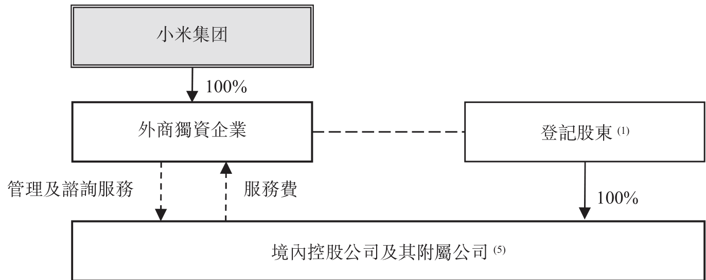

附註：

(1) 登記股東指境內控股公司的登記股東，即(i)北京瓦力文化；(ii)美卓軟件設計；(iii)小米科技；(iv)北京多看；(v)北京瓦力網絡；(vi)小米影業；(vii)北京小米電子軟件；及(viii)有品信息科技。

(i) 北京瓦力文化由雷軍及尚進分別擁有90%及10%。

(ii) 美卓軟件設計由朱印及李炯分別擁有61%及39%。

(iii) 小米科技由雷軍、黎萬強、洪鋒及劉德分別擁有77.80%、10.12%、10.07%及2.01%。

---

## 第 288 页

合約安排

(iv) 北京多看由王川及雷軍分別擁有61.75%及38.25%。

(v) 北京瓦力網絡由雷軍、劉泱、梁秋實、劉景岩、袁彬及南楠分別擁有10%、65%、14%、6%、3%及2%。

(vi) 小米影業由黎萬強、洪鋒及劉德分別擁有87.92%、10.07%及2.01%。

(vii) 北京小米電子軟件由雷軍及洪鋒分別擁有90%及10%。

(viii) 有品信息科技由雷軍、洪鋒、劉德及黎萬強分別擁有70%、10%、10%及10%。

(2) 「→」指股權中的直接法定及實益擁有權。

(3) 「---」指合約關係。

(4) 「---」指外商獨資企業通過(i)行使境內控股公司所有股東權利的授權書、(ii)收購境內控股公司全部或部分股權的獨家選擇權及(iii)境內控股公司股權的股本質押來控制登記股東和境內控股公司。

(5) 該等附屬公司包括目前並無進行任何業務營運但擬從事須根據《外商投資產業指導目錄》遵守外商投資限制之業務的若干公司。有關境內控股公司附屬公司的詳情，請參閱「歷史、重組及企業架構」一節。

合約安排的重大條款概要

各外商獨資企業與境內控股公司所訂合約安排包括的各項具體協議說明如下。

獨家業務合作協議

境內控股公司與外商獨資企業分別於2017年12月1日、2018年4月11日、2018年4月17日及2018年6月4日訂立獨家業務合作協議（「獨家業務合作協議」），據此，以每月服務費作交換，境內控股公司同意委聘外商獨資企業為其技術支持、顧問及其他服務的獨家提供商，包括下列服務：

(i) 使用外商獨資企業合法擁有的任何相關軟件；

(ii) 研發、維護及升級有關境內控股公司業務的軟件；

(iii) 設計、安裝、日常管理、維護及升級網絡系統、硬件和數據庫設計；

(iv) 向境內控股公司相關僱員提供技術支持和員工培訓服務；

(v) 提供技術及市場信息諮詢、收集和研究方面的協助（不包括中國大陸法律禁止外商獨資企業從事的市場研究業務）；

(vi) 提供企業管理諮詢；

(vii) 提供營銷和宣傳服務；

(viii) 提供客戶訂單管理和客戶服務；

(ix) 轉讓、租賃和處置設備或物業；及

(x) 境內控股公司在中國大陸法律許可範圍內不時要求的其他相關服務。

根據獨家業務合作協議，服務費應包括全部境內控股公司合併利潤總額（經扣除上一財政年度合併聯屬實體的任何累計虧絀、經營成本、開支、稅項及其他法定供款）。儘管如

---

## 第 289 页

合約安排

此，外商獨資企業可能根據中國大陸稅務法律及稅務慣例調整服務費範圍及金額，且境內控股公司將接受有關調整。外商獨資企業須每月計算服務費並向境內控股公司開具相應發票。儘管獨家業務合作協議中有付款安排，外商獨資企業仍可調整付款時間及付款方式，且境內控股公司將接受任何有關調整。

此外，未經外商獨資企業事先書面同意，在獨家業務合作協議期限內，境內控股公司不得就獨家業務合作協議涉及的服務和其他事宜直接或間接接受任何第三方提供的相同或任何同類服務，亦不得和任何第三方建立與根據獨家業務合作協議形成者類似的合作關係。外商獨資企業可指定其他方向境內控股公司提供獨家業務合作協議的服務，該其他方可與境內控股公司訂立若干協議。

獨家業務合作協議亦規定外商獨資企業對境內控股公司在獨家業務合作協議實施期間研發或生成的任何及所有知識產權擁有獨家專有權利和相關權益。

除非(a)根據獨家業務合作協議的條文終止；(b)外商獨資企業以書面終止；或(c)相關政府機關拒絕外商獨資企業或境內控股公司已屆滿的經營期限續期(此時獨家業務合作協議將於該經營期限屆滿時終止)，否則獨家業務合作協議將一直有效。

獨家選擇權協議

根據境內控股公司、外商獨資企業與登記股東分別於2017年12月1日、2018年4月11日、2018年4月17日及2018年6月4日訂立的獨家選擇權協議（「獨家選擇權協議」），外商獨資企業有權在任何時間及不時要求登記股東將其於境內控股公司的任何或所有股權全部或部分轉讓予外商獨資企業及／或其指定的第三方，代價相等於結欠登記股東的相關未償還貸款（或按所轉讓股權比例計算的部分貸款額）或（如適用）按象徵式價格，除非相關政府機構或中國大陸法律要求以另一金額作為購買價，在此情況下，購買價須為有關要求中的最低金額。

境內控股公司與登記股東(其中包括)立約承諾：

(i) 未經外商獨資企業事先書面同意，不會以任何方式增補、變更或修訂境內控股公司的章程文件，增減註冊資本或以其他方式改變註冊資本結構；

(ii) 將按照良好的財務和業務標準及慣例確保境內控股公司的企業存續，通過審慎、

---

## 第 290 页

合約安排

有效地經營業務及處理事務取得和維持所有必要的政府牌照及許可證；

(iii) 未經外商獨資企業事先書面同意，不會於簽署獨家選擇權協議後任何時間以任何方式出售、出讓、質押或處置境內控股公司任何超過人民幣1,000,000元的重大資產或重大業務或收入的法定或實益權益，或准許就此設立任何抵押權益的產權負擔；

(iv) 未經外商獨資企業事先書面同意，除於正常業務過程中引致的債務（貸款引致的應付款項除外）外，境內控股公司不會引致、承繼、擔保或承擔任何債務；

(v) 境內控股公司將一直於正常業務過程中經營所有業務以保持資產價值並避免可能對境內控股公司的經營狀況和資產價值有不利影響的任何作為／疏忽；

(vi) 未經外商獨資企業事先書面同意，除於正常業務過程中簽立的合約外，不會促使境內控股公司簽立任何價值超過人民幣1,000,000元的重大合約；

(vii) 未經外商獨資企業事先書面同意，不會促使境內控股公司向任何人士提供任何貸款或信貸；

(viii)會應外商獨資企業要求向外商獨資企業提供與境內控股公司的業務經營和財務狀況有關的資料；

(ix) 若外商獨資企業要求，會按經營同類業務之公司的一般投保金額及類型，就境內控股公司的資產和業務投購及維持外商獨資企業接受之承保人的保險；

(x) 未經外商獨資企業事先書面同意，不會促使或准許境內控股公司合併、與之整合、收購或投資於任何人士；

(xi) 倘發生或可能發生與境內控股公司的資產、業務或收入有關的任何訴訟、仲裁或行政程序，會立即通知外商獨資企業；

(xii) 為保持境內控股公司對其所有資產的所有權，會簽署所有必要或適當的文件，採取所有必要或適當的行動及提出所有必要或適當的投訴或對所有申索提出必要及適當的抗辯；

(xiii)未經外商獨資企業事先書面同意，境內控股公司不會以任何方式向股東分派股利，條件是在外商獨資企業書面要求後，境內控股公司須立即向股東分派全部可分派利潤；

(xiv)應外商獨資企業要求，會委任外商獨資企業指定的任何人士擔任境內控股公司的董事及／或高級管理層；及

(xv) 除非中國大陸法律另行強制要求，否則未經外商獨資企業事先書面同意，不會解散或清算境內控股公司。

---

## 第 291 页

合約安排

此外，登記股東(其中包括)立約承諾：

(i) 未經外商獨資企業書面同意，除股權質押協議及授權書規定的權益外，不會以任何其他方式出售、出讓、質押或處置境內控股公司的法定或實益權益，或允許就此設立任何抵押權益的產權負擔，且促使境內控股公司的股東會議及董事會不批准有關事宜；

(ii) 就每次股權購買權獲行使，促使境內控股公司的股東會議就批准股權轉讓及外商獨資企業要求的任何其他行動進行表決；

(iii) 會就任何其他股東向境內控股公司轉讓股權放棄所享有的優先購買權（如有），並同意境內控股公司其他各股東與外商獨資企業及境內控股公司簽立與獨家選擇權協議、股權質押協議及授權書類似的協議，並同意不採取與其他股東簽立的文件（如有）相衝突的任何行動；及

(iv) 各登記股東會根據中國大陸法律以饋贈方式向外商獨資企業或其被指定人轉讓任何利潤或股利。

登記股東亦承諾，在不違反相關法律及法規的前提下，倘外商獨資企業根據獨家選擇權協議行使選擇權以收購境內控股公司的權益，彼等將向外商獨資企業退回所收取的任何代價。

除非在登記股東所持境內控股公司的全部股權轉讓予外商獨資企業或彼等被指定人的情況下被終止，否則獨家選擇權協議一直有效。

股權質押協議

根據外商獨資企業、登記股東及境內控股公司分別於2017年12月1日、2018年4月11日、2018年4月17日及2018年6月4日訂立的股權質押協議（「股權質押協議」），登記股東同意將各自所持境內控股公司的全部股權（包括就股份支付的任何利息或股利）質押予外商獨資企業，作為擔保履行合約責任和支付未償還債務的抵押權益。

有關境內控股公司的質押在向有關工商行政管理局完成登記後生效，在登記股東和境內控股公司完全履行相關合約安排的全部合約責任，及登記股東和境內控股公司於相關合約安排下的所有未償還債務獲全數支付前一直有效。

於發生違約事件(定義見股權質押協議)後，於違約事件持續期間，外商獨資企業有權要求境內控股公司的股東(即登記股東)立即支付境內控股公司根據獨家業務合作協議須

---

## 第 292 页

合約安排

支付的任何款項、償還任何貸款並支付任何其他到期款項，且外商獨資企業有權作為被擔保方根據任何適用的中國大陸法律及股權質押協議行使所有有關權利，包括但不限於優先以股權(基於有關股權轉換所得的貨幣估值)或書面通知登記股東的股權拍賣或出售所得款項獲支付。

我們預期相關法律及法規規定的股權質押協議登記將於上市日期前根據股權質押協議的條款及中國大陸法律法規辦妥。

授權書

登記股東分別於2017年12月1日、2018年4月11日、2018年4月17日及2018年6月4日簽訂授權書（「授權書」）。根據授權書，登記股東不可撤回地委任外商獨資企業及其指定人士（包括但不限於董事及取代董事的繼承人及清盤人，但不包括非獨立人士或可能產生利益衝突的人士）作為其實際代理人以代其行使，且同意及承諾在並無獲得該等實際代理人事先書面同意的情況下不會行使彼等就所持境內控股公司的股權所擁有的任何及全部權利，包括但不限於：

(i) 召開及出席境內控股公司的股東大會；

(ii) 向相關公司註冊處提交文件；

(iii) 根據法律及境內控股公司的章程文件行使所有股東權利及股東投票權，包括但不限於出售、出讓、抵押或處置境內控股公司的任何或全部股權；

(iv) 以有關股東名義及代表有關股東簽署任何及全部書面決議案及會議紀錄和批准組織章程細則的修訂；及

(v) 提名或委任境內控股公司的法人代表、董事、監事、總經理及其他高級管理層。

此外，各股東持有境內控股公司股權期間，授權書將一直有效。

借款合同

僅就北京瓦力文化、小米科技、北京小米電子軟件及有品信息科技而言，相關外商獨資企業與彼等登記股東已分別於2017年12月1日、2018年4月11日、2018年4月17日及2018年6月4日訂立借款合同（「借款合同」），據此外商獨資企業同意向登記股東提供貸款，全數用作對相關境內控股公司的投資。未經相關放款人事先書面同意，該等貸款不得用於任何其他用途。

各項貸款的年期自協議訂立日期開始，直至放款人根據相關獨家選擇權協議行使獨

---

## 第 293 页

合約安排

家認購選擇權當日、發生若干指定終止事件時(如放款人向借款人發出書面通知要求還款)或借款人違約時(以較早者為準)為止。

於放款人行使獨家認購選擇權後，借款人可向放款人或其指定的人士或實體轉讓所持相關境內控股公司的全部股權，並將轉讓所得款項償還貸款。倘轉讓所得款項相當於或低於相關借款合同的貸款本金額，則該貸款將視為免息。倘轉讓所得款項超過相關借款合同的貸款本金額，則高出的部分將視為相關借款合同的貸款利息。

登記股東確認

各登記股東已確認，(i)其配偶無權申索各境內控股公司的任何權益(連同其中的任何其他權益)或對各境內控股公司的日常管理施加影響；及(ii)倘其身故、無行為能力、離婚或任何其他事件導致無法作為各境內控股公司的股東行使其權利，會採取必要措施保障所擁有各境內控股公司的權益(連同其中的任何其他權益)且其繼承人(包括其配偶)不會申索各境內控股公司的任何權益(連同其中的任何其他權益)以使登記股東於境內控股公司的權益不受影響。

配偶承諾

各登記股東的配偶(如適用)已簽署承諾書(「配偶承諾」)，以承諾(i)各登記股東所擁有各境內控股公司的權益(連同其中任何其他權益)不屬共同財產，及(ii)無權享有或控制各登記股東的權益且不會申索該等權益。

爭議解決

合約安排的每份協議載有爭議解決條文。根據有關條文，倘因履行合約安排或就合約安排而產生任何爭議，任何一方有權提交相關爭議予北京仲裁委員會依據當時有效的仲裁規則進行仲裁。仲裁須保密，且仲裁期間所用的語言須為中文。仲裁裁決為最終定論，且對所有訂約方均具有約束力。爭議解決條文亦規定，仲裁庭可就境內控股公司的股份或資產授予補救措施或禁令救濟(例如限制商業行為，限制或規限轉讓或出售股份或資產)或下令將境內控股公司清盤；任何一方可向香港、開曼群島(即本公司的註冊成立地點)、中國大陸及外商獨資企業或境內控股公司的主要資產所在地的法院申請臨時補救措施或禁令救濟。

然而，君合表示，根據中國大陸法律，上述條文未必可執行。例如，仲裁機構無權授予此類禁令救濟，亦不得根據現有中國大陸法律勒令我們的合併聯屬實體清盤。此外，

---

## 第 294 页

由香港及開曼群島等境外法院授予的臨時補救措施或執行命令未必能在中國大陸得到認可或強制執行。

由於上文所述，倘境內控股公司或登記股東違反任何合約安排，我們未必可及時獲得足夠補救，因而我們對合併聯屬實體實施有效控制及經營業務的能力可能受到重大不利影響。有關其他詳情，請參閱本文件「風險因素—與合約安排有關的風險」一節。

利益衝突

各登記股東已於授權書作出不可撤回的承諾，當中列明就合約安排可能產生的潛在利益衝突。詳情請參閱上文「—授權書」分段。

分擔虧損

根據相關中國大陸法律及法規，本公司及外商獨資企業均毋須按法律規定分擔我們合併聯屬實體的虧損或向合併聯屬實體提供財務支援。此外，我們的合併聯屬實體為有限責任公司，須獨自以其擁有的資產及財產為其自身債務及虧損負責。外商獨資企業擬於視為必要時持續向我們的合併聯屬實體提供財務支援或協助合併聯屬實體取得財務支援。此外，鑑於本集團通過持有所需的中國大陸營運牌照及批文的合併聯屬實體於中國大陸進行絕大部分業務經營，且其財務狀況及經營業績根據適用會計準則併入本集團財務報表，倘我們的合併聯屬實體蒙受虧損，本公司的業務、財務狀況及經營業績將會受到不利影響。

然而，按獨家選擇權協議所規定，未經外商獨資企業事先書面同意，境內控股公司不得(其中包括)(i)以任何方式出售、轉讓、抵押或處置其超過人民幣1,000,000元的任何重大資產；(ii)簽立價值超過人民幣1,000,000元的任何重大合約，惟於日常業務過程中所訂立者除外；(iii)向任何第三方提供任何形式的貸款、信貸或擔保，或允許任何第三方就其資產或股權增設任何其他抵押權益；(iv)產生、繼承、擔保或撥備任何並非於日常業務過程中產生的債務；(v)與任何第三方進行任何合併，或獲任何第三方收購或投資於任何第三方；及(vi)增減註冊資本，或以任何其他方式更改註冊資本的結構。因此，由於協議的相關限制條文，倘因境內控股公司蒙受任何虧損，則對外商獨資企業及本公司的潛在不利影響可限制在特定程度。

清盤

根據獨家選擇權協議，倘根據中國大陸法律規定進行強制清盤，我們合併聯屬實體的股東須在中國大陸法律允許的情況下，將其自清盤收取的所得款項贈予外商獨資企業或其指定人士。

---

## 第 295 页

保險

本公司並未投保以保障與合約安排有關的風險。

確認干預及阻撓

截至最後可行日期，我們依據合約安排通過合併聯屬實體經營業務並無遭到任何中國大陸監管部門干預或阻撓。

合約安排的合法性

基於上文所述，君合認為，合約安排僅為減少與相關中國大陸法律及法規的潛在衝突而設，且：

(i) 各合約安排的訂約方已取得所有必要批文及授權，以簽立及履行合約安排；

(ii) 各協議的訂約方有權簽立協議及履行協議所規定各自的義務。各協議均對訂約方具有約束力，且概無協議被視為「以合法形式掩蓋非法目的」及根據中華人民共和國合同法（「中國合同法」）屬無效；

(iii) 概無合約安排違反我們的境內控股公司或外商獨資企業的組織章程細則的任何條文；

(iv) 各合約安排的訂約方毋須自中國大陸政府機構取得任何批文或授權，惟：

(a) 外商獨資企業根據就獨家選擇權協議所持的權利行使選擇權以收購我們境內控股公司的全部或部分股權須經中國大陸政府機構批准、同意、備案及／或登記；

(b) 根據股份質押協議擬進行的任何股份質押須在主管工商行政管理局登記；及

(c) 合約安排糾紛解決條文規定的仲裁裁決／臨時補救措施須經中國大陸法院認可方能強制執行；

(v) 各合約安排根據中國大陸法律有效、合法及具約束力，惟有關爭議解決及清盤委員會的下列條文除外：

(a) 合約安排規定，任何爭議須提交予北京仲裁委員會根據當時有效的仲裁規則仲裁，仲裁須於北京進行。合約安排亦規定，仲裁機構可能就我們境內控股公司的股份或資產授予臨時補救措施或禁令救濟（例如經營業務或迫使轉

---

## 第 296 页

合約安排

讓資產)或下令將我們的合併聯屬實體清盤；而香港、開曼群島(即本公司的註冊成立地點)及中國大陸(即我們境內控股公司的註冊成立地點)的法院亦有權就我們的境內控股公司的股份或財產授出及／或執行仲裁裁決及臨時補救措施。然而，據君合所告知，由海外法院(如香港及開曼群島法院)授予的臨時補救措施或執行令未必可在中國大陸獲認可或執行；及

(b) 合約安排規定，我們境內控股公司的股東承諾會在遵守有關法律法規的情況下委任由外商獨資企業指派的委員會為我們境內控股公司清盤時的清盤委員會，以管理其資產。然而，該條文不適用於中國大陸法律要求強制清盤或因破產清盤的情況。

《網絡出版服務管理規定》(「網絡出版規定」)由國家新聞出版廣電總局與工信部於2016年2月4日聯合頒佈並於2016年3月10日生效。根據網絡出版規定，國家新聞出版廣電總局(互聯網出版服務行業的主管部門)負責全國網絡出版服務的事先批准、監督及管理。

文化部於2011年2月17日頒佈的《互聯網文化管理暫行規定》(「互聯網文化規定」)規定，互聯網文化單位分為經營性互聯網文化單位及非經營性互聯網文化單位。申請設立經營性互聯網文化單位，須向相關文化行政部門申請批准，並取得網絡文化經營許可證。

根據網絡遊戲管理辦法第3條及《中央編辦對文化部、國家廣播電影電視總局(「廣電總局」)、中華人民共和國新聞出版總署(「新聞出版總署」)〈「三定」規定〉中有關動漫、網絡遊戲和文化市場綜合執法的部分條文的解釋》(「解釋」)第2條，新聞出版總署負責審批在互聯網上傳的網絡遊戲，而於上傳後，網絡遊戲則由文化和旅遊部管理。

於2005年7月6日，五家中國大陸監管機構，即文化部、廣電總局、新聞出版總署、中國證監會及商務部，聯合採納《關於文化領域引進外資的若干意見》(「引進外資意見」)。根據引進外資意見，外商投資者不得從事互聯網出版等業務。根據引進外資意見，外商投資者不得開展通過信息網絡傳播音視頻節目業務。於2009年9月28日，新聞出版總署連同國家版權局及全國「掃黃打非」辦公室聯合發佈《關於貫徹落實國務院〈「三定」規定〉和中央編辦

---

## 第 297 页

合約安排

有關解釋，進一步加強網絡遊戲前置審批和進口網絡遊戲審批管理的通知》（「新聞出版總署通知」）。新聞出版總署通知第4條規定，外商投資者不得以獨資、合資、合作等方式在中國大陸投資從事網絡遊戲運營服務，並明確禁止外商投資者通過設立其他合資公司、簽訂合約安排或提供技術支持等間接方式控制或參與境內網絡遊戲運營業務。

儘管如此，2018年3月及4月，本公司的代表及聯席保薦人的代表分別諮詢了北京市文化局、北京市新聞出版廣電局和工信部。君合表示，(i)上述機構均是本公司主要業務活動的主管政府機構；(ii)相關機構確認，除在線閱讀及互聯網遊戲的出版外，採用合約安排並不違反中國大陸法律及法規；(iii)對於互聯網遊戲的出版，監管已出版遊戲的主管機構北京市文化局確認，採用合約安排並不違反中國大陸法律及法規，亦不影響本公司已取得的現有執照的有效性；及(iv)中國大陸法律法規並無禁止在線閱讀業務採用合約安排。雖然北京市新聞出版廣電局在我們諮詢過程中並無對在線閱讀業務採用合約安排的合法性發表意見，但亦無表明採用合約安排違反中國大陸法律法規。此外，工信部確認，採用合約安排並不違反中國大陸法律法規。

根據上述分析及君合的意見，董事認為採用合約安排不大可能會根據適用的中國大陸法律法規被視為並無作用或無效。君合認為，北京市文化局、北京市新聞出版廣電局和工信部有能力且獲授權詮釋本公司經營業務所在行業的中國大陸相關法律、法規及規則及作出上述口頭確認。請參閱「風險因素—與合約安排有關的風險—倘中國大陸政府認為確立我們業務營運架構的協議不符合中國大陸法律法規，或倘日後該等法規或其詮釋有變，則我們可能受到嚴厲懲罰或被迫放棄於該等業務的權益」一節。

我們知悉最高人民法院於2012年10月作出的裁決（「最高人民法院裁決」）以及上海國際仲裁中心於2010年及2011年作出的兩項仲裁決定致使若干合約協議無效，原因是以規避中國大陸的外商投資限制為目的訂立該等協議，違反了中國合同法第52條以及中華人民共和國民法通則所載「以合法形式掩蓋非法目的」的禁止條文。據進一步報道，上述法院裁決及仲裁決定可能增加(i)中國大陸法院及／或仲裁小組對境外投資者為在中國大陸從事受限

---

## 第 298 页

合約安排

制或禁止業務而通常採用的合約架構採取類似行動的可能性及(ii)引發有關合約架構的登記股東違背其合約責任。根據中國合同法第52條，有下列五種情形之一的，合同無效：(i)一方以欺詐、脅迫的手段訂立合同，損害國家利益；(ii)惡意串通，損害國家、集體或第三方利益；(iii)損害社會公共利益；(iv)以合法形式掩蓋非法目的；或(v)違反法律、行政法規的強制性規定。君合認為合約安排的相關條款不屬於上述五種情形。尤其是，君合認為，由於合約安排並非出於非法目的而訂立，故合約安排不會被視為「以合法形式掩蓋非法目的」，因而亦不屬於上文中國合同法第52條的第(iv)種情形。合約安排的目的是(a)令境內控股公司能夠將其經濟利益轉讓予外商獨資企業，作為委聘外商獨資企業為其獨家服務供應商的服務費及(b)確保登記股東不會採取與外商獨資企業的利益衝突的任何行動。根據中國合同法第4條(載列中國合同法基本原則的中國合同法第一章(一般規定)的其中一條)，合約安排的當事人依法享有自願訂立合同的權利，任何人士不得非法干預。此外，合約安排的作用為允許本公司在聯交所上市的同時獲取合併聯屬實體的經濟利益，並非出於非法目的，這一點可由多家目前上市的公司亦採用類似合約安排的事實證明。總而言之，君合認為，合約安排不屬於中國合同法第52條所載五種情形中的任何一種。

中國大陸外國投資法律的發展

《外國投資法草案》

背景

商務部於2015年1月公佈《外國投資法草案》，旨在於其頒佈後代替中國大陸外國投資方面的主要現有法律及法規。商務部於2015年初就此草案徵求意見，其最終形式、頒佈時間、解釋及實施方面存在重大不確定性。《外國投資法草案》如按擬訂形式頒佈，可能對規管中國大陸外國投資的整個法律框架造成重大影響。

負面清單

《外國投資法草案》訂明「特別管理措施目錄」（即「負面清單」）中若干行業的外國投資限制。《外國投資法草案》所載的「特別管理措施目錄」分別將相關禁止及限制行業分類為禁止實施目錄及限制實施目錄。

---

## 第 299 页

合約安排

外國投資者不得投資禁止實施目錄列明的任何領域。如任何外國投資者直接或者間接持有任何境內企業的股份、股權、財產或者其他權益或表決權，該境內企業不得投資禁止實施目錄列明的任何領域，國務院另有規定者除外。

外國投資者如符合若干條件並在投資前申請許可，則可投資限制實施目錄列明的領域。

然而，《外國投資法草案》並未訂明納入禁止實施目錄及限制實施目錄範圍的業務。

「實際控制權」原則

《外國投資法草案》旨在(其中包括)提出「實際控制權」原則，以確定一家公司是否屬於外商投資企業或外商投資實體(「外商投資實體」)。《外國投資法草案》明確規定，在中國大陸成立但由外國投資者「控制」的實體會被視為外商投資實體，而在外國司法權區成立的實體如獲得外國投資主管部門裁定由中國大陸實體及／或公民「控制」，則會就限制實施目錄的投資視為中國大陸境內實體，須受外國投資相關主管部門審查。就上述規定而言，《外國投資法草案》所界定的「控制」，包括以下概述的類別：

(i) 直接或間接持有相關實體股權、資產、投票權或類似股權的50%或以上；

(ii) 直接或間接持有相關實體股權、資產、投票權或類似股權不足50%，但是：

(a) 有權直接或間接委派或取得董事會或其他類似決策機構至少50%席位；

(b) 有權確保其提名的人士取得董事會或其他類似決策機構至少50%席位；或

(c) 擁有對決策機構(例如股東大會或董事會)發揮重大影響力的投票權；或

(iii) 有權通過合約或信託安排對相關實體的經營、財務、人事及技術事宜發揮決定性的影響。

就「實際控制權」而言，《外國投資法草案》觀察控制外商投資實體的最終自然人或企業的身份。「實際控制權」則指通過投資安排、合約安排或其他權利及決策安排控制企業的權力或職位。《外國投資法草案》第19條將「實際控制人」定義為直接或間接控制外國投資者或外商投資實體的自然人或企業。

倘若一個實體被確定為外商投資實體，且其投資額超過若干上限或其業務屬於國務院日後發出的「特別管理措施目錄」，則須外國投資主管部門裁定市場准入。

---

## 第 300 页

《外國投資法草案》對可變利益實體的影響

不少中國大陸公司採用「可變利益實體」的架構。根據《外國投資法草案》，經由合約安排控制的可變利益實體如最終由外國投資者「控制」，亦會被視為外商投資實體。就經營限制實施目錄所列行業的新可變利益實體架構而言，倘若可變利益實體架構下的境內企業的最終控制人身為中國大陸公民（中國大陸國有企業或機構或中國大陸公民），該境內企業可能被視為中國投資者，故此可變利益實體架構可能被視為合法。相反，倘若最終控制人為外國公民，則該境內企業可能會被視為外國投資者或外商投資實體，故此在未取得必要許可的情況下通過可變利益實體架構經營該境內企業可能會被視為非法。

《外國投資法草案》及其隨附說明（「說明」）並無規定有關處理《外國投資法草案》生效前已經存在的可變利益實體架構的明確指示。然而，說明擬就處理具有現有可變利益實體架構且於「特別管理措施目錄」所列行業進行業務的外商投資實體採取三種可能的方法：

(i) 要求向主管機構申報實際控制權歸屬於中國大陸投資者，然後可變利益實體架構可予保留；

(ii) 要求向主管機構申請證明實際控制權歸屬於中國大陸投資者，在主管機構認定後，可變利益實體架構可予保留；及

(iii) 要求向主管機構申請准入許可以繼續使用可變利益實體架構。主管機構連同相關部門將於考慮外商投資實體的實際控制權及其他因素後作出決定。

謹此進一步說明，根據第一種可能的方法，「申報」僅為信息披露責任，即企業毋須獲得主管機構的任何確認或准入許可，而就第二種及第三種方法而言，企業須獲得主管機構的確認或准入許可。就後兩種方法而言，第二種方法側重於控制人的國籍，而第三種方法亦可能考慮控制人國籍（並未在《外國投資法草案》或說明中明確界定）以外的其他因素。

上述三種可能的方法載列於說明是為了就現有合約安排的處理而徵求公眾意見，尚未正式採納，且可能在考慮公眾諮詢的結果後作出修訂及修改。

倘外國投資者及外商投資實體通過委託控股、信託、多層次再投資、租賃、訂約、融資安排、協定控制、海外交易或其他方式而規避《外國投資法草案》的條文、未經許可投資禁止實施目錄中列明的行業或投資限制實施目錄中列明的行業或違反《外國投資法草案》列

---

## 第 301 页

合約安排

明的信息報告義務，則可能按情況根據《外國投資法草案》第144條(在禁止目錄內投資)、第145條(違反准入許可規定)、第147條(違反信息報告義務的行政法律責任)或第148條(違反信息報告義務的刑事法律責任)作出處罰。

倘外國投資者在未取得必要許可的情況下投資禁止實施目錄或限制實施目錄中列明的行業，則作出投資所在地的省、自治區及／或直轄市的外國投資主管部門須責令於規定時間內停止投資、出售任何股權或其他資產，沒收違法所得，並處人民幣100,000元以上、人民幣1百萬元以下或不超過違法投資額10%的罰款。

倘外國投資者或外商投資實體違反《外國投資法草案》的規定，包括未有按時履行或規避履行信息報告義務，或掩蓋事實或提供虛假或誤導性資料，則作出投資所在地的省、自治區及／或直轄市的外國投資主管部門須責令於規定時間內修正。未有於規定時間內修正的，或情形嚴重的，處人民幣50,000元以上、人民幣500,000元以下或不超過投資額5%的罰款。

倘外國投資者或外商投資實體違反《外國投資法草案》的規定，包括規避履行信息報告義務，或掩蓋事實或提供虛假或誤導性資料，且情形極其嚴重者，則對外國投資者或外商投資實體處以罰款，對直接負責的主管人員及其他責任人處以一年以下有期徒刑或刑事拘留。

《外國投資法草案》的頒佈狀況

截至最後可行日期，尚不確定《外國投資法草案》是否會頒佈及生效或其頒佈及生效的時間表及(倘若生效)其是否會在經歷進一步頒佈程序之後以現有草擬形式頒佈。此外，商務部並無頒佈規管現有合約安排的任何明確規定或法規。

《外國投資法草案》對本公司的潛在影響

本公司是否由中國大陸實體及／或公民控制

倘《外國投資法草案》以當前草案形式頒佈，基於(i)身為中國公民的控股股東雷軍於全球發售完成時將合共控制本公司54.74%投票權（假設並無行使超額配股權及概無因行使根據首次公開發售前僱員購股權計劃授出的購股權發行股份），因而由於雷軍(中國國民)間接持有本公司50%或以上股權、資產、投票權或同類股權而符合《外國投資法草案》的第一

---

## 第 302 页

合約安排

項「控制權」規定；(ii)本公司根據合約安排透過外商獨資企業對合併聯屬實體行使實際控制權，且可對境內控股公司發揮具決定性的影響力，因而由於雷軍可根據合約安排發揮具決定性的影響力而符合《外國投資法草案》的第三項「控制權」規定，因此君合認為我們可申請認可合約安排為國內投資，而合約安排應會視為合法。

相關業務是否列入將由國務院發佈的「特別管理措施目錄」

倘若我們經營相關業務未納入「特別管理措施目錄」且我們能夠根據中國大陸法律合法經營該業務，我們的外商獨資企業將根據獨家選擇權協議行使認購期權，以在獲得相關部門的重新批准的情況下收購合併聯屬實體的股權並解除合約安排。

倘若經營相關業務納入「特別管理措施目錄」，視乎最終頒佈的外國投資法律中可能採用的「控制權」的定義以及在新外國投資法律生效前存在的可變利益實體架構的處理方式，合約安排可能被視為受禁止或限制的外國投資，故此可能被視為無效及非法。因此，我們將無法通過合約安排經營相關業務並會喪失獲取合併聯屬實體的經濟利益的權利。因此，該等實體的財務業績不再併入本集團的財務業績，我們須根據相關會計準則取消確認其資產及負債。我們會因取消確認而確認投資虧損。

我們業務的持續性

倘若最終頒佈的新外國投資法以及最終發佈的「特別管理措施目錄」要求我們採取進一步行動保留合約安排，我們將採取一切合理的措施及行動，以遵守當時有效的外國投資法律並盡量降低有關法律對本公司的不利影響。然而，並不保證我們能夠完全遵守有關法律。在最糟糕的情況下，我們將無法通過合約安排經營相關業務並會喪失獲取合併聯屬實體的經濟利益的權利。在此情況下，聯交所亦可能認為本公司不再適合在聯交所上市並將股份除牌。詳情請參閱本文件「風險因素—與合約安排有關的風險」一節。

然而，考慮到多個現有實體通過合約安排經營且部分實體已在國外取得上市地位，董事認為倘若《外國投資法草案》獲頒佈，相關部門不可能會採取追溯效力以要求相關企業廢除合約安排。君合相信，中國大陸政府可能會對外國投資的監督以及對其產生影響的法律及法規的實施採取謹慎態度，並根據實際的不同情況作出決定。

---

## 第 303 页

董事承諾，倘若本公司在上市後須根據證券及期貨條例第XIVA部公佈有關資料，本公司會及時公佈(i)《外國投資法草案》的任何更新或重大改動及(ii)倘若新外國投資法已經頒佈，該法律、本公司為遵守該法律而採取的特定措施（經君合的意見支持）以及其對我們業務營運及財務狀況的影響的清楚描述及分析。

修訂四部境內投資法律的決定

中華人民共和國全國人大常務委員會於2016年9月3日頒佈《全國人大常委會關於修改〈中華人民共和國外資企業法〉等四部法律的決定》，於2016年10月1日生效，並擬修改現行外商投資法律體制。

合約安排的會計方面及綜合我們合併聯屬實體的財務業績

根據國際財務報告準則第10號—合併財務報表，附屬公司是另一公司(稱為母公司)所控制的公司。當投資方獲得或有權享有參與被投資方所得的可變回報且有能力透過對被投資方的權力影響該等回報時，則投資方控制被投資方。雖然本公司並不直接或間接擁有合併聯屬實體，但上述合約安排讓本公司可對合併聯屬實體行使控制權。

獨家業務合作協議約定，作為外商獨資企業提供服務的代價，各境內控股公司將向外商獨資企業支付服務費。服務費可由外商獨資企業調整，相等於境內控股公司的全部綜合利潤總額(扣除過往財政年度合併聯屬實體的累計虧損(如有)、相關法律及法規要求保留或預扣的成本、開支、稅項及付款)。外商獨資企業可根據中國大陸稅務法律及常規以及我們合併聯屬實體的營運資金需求酌情調整服務範圍及費用。外商獨資企業亦有權定期省覽或查驗合併聯屬實體的賬目。因此，外商獨資企業有能力全權酌情通過獨家業務合作協議獲取境內控股公司的全部經濟利益。

此外，根據獨家業務合作協議及獨家選擇權協議，由於須取得外商獨資企業的事先書面同意後方可作出任何分派，故此對於向合併聯屬實體的股權持有人分派股利或任何其他款項，外商獨資企業擁有絕對合約控制權。倘若登記股東自合併聯屬實體收取任何利潤分派或股利，登記股東必須立即將該款項支付或轉讓予本公司（須在根據相關法律及法規繳納相關稅款之後）。

由於這些合約安排，本公司已通過外商獨資企業取得合併聯屬實體的控制權，並可

---

## 第 304 页

合約安排

全權酌情獲取合併聯屬實體產生的全部經濟利益回報。因此，合併聯屬實體的經營業績、資產及負債及現金流量於本公司的財務報表合併入賬。

就此而言，董事認為本公司能夠將合併聯屬實體的財務業績併入本集團的財務資料，猶如這些實體為本公司的附屬公司。將合併聯屬實體的業績合併入賬的基準於本文件附錄一會計師報告附註1披露。

遵守合約安排

本集團已採取以下措施，以確保本集團實施合約安排以有效經營業務及遵守合約安排：

(i) 倘需要，實施及遵守合約安排過程中出現的重大問題或政府機構的任何監管查詢將於發生時呈報董事會審閱及討論；

(ii) 董事會將至少每年一次審閱履行及遵守合約安排的整體情況；

(iii) 本公司將於年報中披露其履行及遵守合約安排的整體情況；及

(iv) 本公司將於必要時委聘外部法律顧問或其他專業顧問，以協助董事會審閱合約安排的實施情況、審閱外商獨資企業及合併聯屬實體的法律合規情況以處理合約安排引致的具體問題或事宜。

---

## 第 305 页

閣下閱讀以下討論與分析時，應與本招股章程附錄一會計師報告所載經審核合併財務資料(包括其附註)一併閱讀。我們的合併財務資料乃根據國際財務報告準則編製。

以下討論與分析載有前瞻性陳述，反映我們當前對未來事件及財務表現之觀點。該等陳述乃基於我們根據自身經驗及對過往趨勢、當前狀況及預期未來發展以及我們認為適合當下情形的其他因素的認知而作出的假設與分析。然而，實際結果與發展是否符合我們的預期及預測取決於多項風險與不確定因素。在評估我們的業務時，閣下應謹慎考慮本招股章程提供之資料，包括「風險因素」及「業務」章節。

就本節而言，除非文義另有所指，否則2015年、2016年及2017年指截至該等年份12月31日止財政年度，而2017年及2018年第一季度則分別指截至2017年及2018年3月31日止三個月。除非文義另有所指，否則本節所述財務資料是合併財務資料。

概覽

小米是一家以手機、智能硬件和IoT平台為核心的互聯網公司。在雷軍的領導下，小米由一群深具造詣的工程師與設計師於2010年創立。他們認為高質量且精心設計的科技產品和服務應被全世界輕易享用。為此，我們始終追求創新、質量、設計、用戶體驗與效率提升，致力於以厚道的價格持續提供最佳科技產品和服務。

我們獨特且強大的「鐵人三項」商業模式由三個相互協作的支柱組成—(1)創新、高質量、精心設計且專注於卓越用戶體驗的硬件，(2)使我們能以厚道的價格銷售產品的高效新零售和(3)豐富的互聯網服務。

我們提供一系列自主或與生態鏈企業共同開發的硬件產品。我們不論是自主或與生態鏈企業共同開發的所有產品都專注於創新、質量、設計和用戶體驗。我們致力於將產品定位在廣大用戶可接受的價位，以確保廣泛的接受程度及高留存水平。在核心自家產品方面，我們專注於設計和研發一系列先進的硬件產品，包括智能手機、筆記本電腦、智能電視、人工智能音箱和智能路由器。我們同時擴展到其他產品。截至2018年3月31日，我們通過投資和管理建立了由超過210家公司組成的生態系統，其中超過90家公司專注於研發智能硬件和生活消費產品。根據艾瑞諮詢，截至2018年3月31日，按已連接設備的數量計算，我們是全球最大的消費級IoT平台（不包括智能手機及筆記本電腦）。截至2018年3月31日數據，我們連接了超過1億台設備（不包括智能手機及筆記本電腦）。這些產品互通互聯，既改善了

---

## 第 306 页

用戶的生活，又為我們的互聯網服務提供了專屬平台。我們亦有發展一系列的生活消費產品以進一步提高品牌知名度並將用戶流量導向我們的零售渠道。

高效的全渠道新零售分銷平台是我們增長策略的核心組成部分，使我們能在高效運營的同時擴展用戶覆蓋範圍並增強用戶體驗。成立以來，我們一直專注於產品的在線直銷，以達到最大效率，並與用戶建立直接的數字化互動關係。根據IDC統計，2018年第一季度我們在中國大陸和印度的線上智能手機出貨量均排名第一。尤其是根據艾瑞諮詢，小米商城按2017年及2018年第一季度商品成交總額計已成為中國大陸第三大3C與家電線上零售直銷平台。艾瑞諮詢數據還顯示，從商品成交總額來看，我們在2017年及2018年第一季度還是印度第三大線上零售直銷平台。2015年以來，我們通過我們自營的米家門店顯著擴大了線下零售直銷網絡，從而擴大我們的覆蓋範圍並提供更豐富的用戶體驗，在實行線上下同品同價的同時，保持了與線上渠道相似的運營效率。根據艾瑞諮詢，2017年，我們自營米家店面的每平米平均營業收入在全球零售連鎖店中排名第二。我們高效的全渠道銷售策略使我們能夠以厚道的價格向最廣泛的用戶群體提供產品。

我們通過提供互聯網服務讓我們的用戶擁有完整的移動互聯網體驗。於2018年3月，我們的基於安卓的自有操作系統MIUI擁有大約190百萬月活躍用戶。MIUI與安卓生態系統充分兼融，包括了安卓生態系統上的所有手機應用。它構成了一個開放的平台讓我們提供一系列廣泛的互聯網服務，包括內容、娛樂、金融服務和效能工具。我們設備的互聯性，以及硬件和互聯網服務的無縫集成，使我們可以向用戶提供更好的用戶體驗。此外，我們有著開發爆款應用程序的優良往績。截至2018年3月31日，我們開發了38個月活躍用戶超過10百萬的應用程序和18個月活躍用戶超過50百萬的應用程序，包括我們的小米應用商店、小米瀏覽器、小米音樂和小米視頻。2018年3月，我們的用戶每天使用我們的智能手機的平均時間是大約4.5小時。相比其他獲客成本較高的互聯網平台，我們通過硬件銷售獲得用戶賺取保守的利潤。

營業紀錄期，我們的總收入由2015年的人民幣668億元增至2016年的人民幣684億元，再增至2017年的人民幣1,146億元。我們的總收入由截至2017年3月31日止三個月的人民幣185億元增加至截至2018年3月31日止三個月的人民幣344億元。於2015年、2016年及2017年，我們的經營利潤分別為人民幣1,372.7百萬元、人民幣3,785.1百萬元及人民幣12,215.5百萬元。截至2017年及2018年3月31日止三個月，我們的經營利潤分別為人民幣1,954.5百萬元及人民幣3,364.5百萬元。經扣除(i)可轉換可贖回優先股公允價值變動；(ii)以股份為基礎的薪酬開支；(iii)投資公允價值增益淨值；及(iv)收購導致的無形資產攤銷的影響，我們2015年的經調整非國際財務報告準則虧損為人民幣303.9百萬元，2016年及2017年與2017年及2018年第一季度的經調整非國際財務報告準則利潤分別為人民幣1,895.7百萬元、人民幣5,361.9百萬元、人民幣660.5百萬元及人民幣1,699.3百萬元。詳情請參閱「—合併損益表」及「—非國際財務報告準則計量：經調整(虧損)／利潤」。我們分別於2015年錄得虧損人民幣7,627.0百萬元，2016年錄得利潤人民幣491.6百萬元，2017年與2017年及2018年第一季度錄得虧損人民幣43,889.1百萬元、人民幣7,867.0百萬元及人民幣7,027.4百萬元。

---

## 第 307 页

呈列基準

本集團歷史財務資料已根據國際會計準則理事會頒佈的適用國際財務報告準則（「國際財務報告準則」）編制。歷史財務資料已根據歷史成本法編制，並就按公允價值列賬的金融資產及金融負債的重估作出修訂。

編製符合國際財務報告準則的歷史財務資料須作出若干關鍵會計估計。管理層亦須在採用本集團會計政策的過程中作出判斷。涉及高度判斷或極為複雜的範疇，或涉及對歷史財務資料屬重大的假設及估計的範疇披露於本招股章程附錄一會計師報告附註4。

所有有效準則、準則修訂及詮釋均獲本集團於營業紀錄期貫徹應用。

影響經營業績的主要因素

我們的經營業績一直且預期會繼續受多個因素的重大影響，當中多個因素超出我們的控制範圍，包括以下各項：

一般因素

我們的業務及經營業績受到影響中國大陸與我們主要國際市場廣大互聯網行業及消費電子行業的一般因素的影響，該等因素包括：

• 整體經濟增長及人均可支配收入水平；

• 移動互聯網使用率及普及率的增長；

• 智能手機、IoT與生活消費產品市場的發展及競爭；

• 互聯網服務市場的發展與競爭；及

• 新型且更先進的技術產品及服務。

任何該等整體行業狀況的不利變動均可能對我們產品及服務的需求造成負面影響並對我們經營業績造成重大不利影響。

特定因素

我們的經營業績亦受到影響經營業績的特定因素的影響，包括下列主要因素：

產品受歡迎程度

我們絕大部分收入來自產品(尤其是智能手機和IoT與生活消費產品)銷售。近年來智能手機分部及IoT與生活消費產品分部收入增長，主要是由於現有產品(包括新型號)銷量增

---

## 第 308 页

加且產品類別擴充。為保持增長，我們必須不斷創造及研發以用戶為中心的優質精良產品以提高銷量。此外，智能手機和IoT與生活消費產品分部的收入受產品售價影響，而產品售價又受到組件及原材料成本變動、新型號的預期需求量、目標用戶的收入水平、銷售渠道組合的變動、舊型號的過往銷量及同類產品價格的影響。尤其是智能手機的平均售價通常會在生命週期內下降。現有智能手機型號平均售價下降的影響被我們不斷推出的新型號和擴充的產品類別所抵銷。

互聯網服務收入的增長

營業紀錄期，我們的互聯網服務分部實現高毛利率，對整體盈利能力十分重要。

我們互聯網服務收入的增長最終取決於互聯網服務範圍、用戶群規模及用戶參與度與支出水平。互聯網服務收入主要來自廣告及互聯網增值服務(主要包括線上遊戲)。我們平台吸引廣告商是由於我們的用戶規模、用戶參與度及具有吸引力的用戶群特性。我們的增值服務取決於用戶群(尤其是付費用戶人數)的整體規模及用戶參與度，而能否維持及擴大用戶群和維持及提高用戶參與度與支出取決於我們能否持續提供熱門服務、通過技術創新推薦個性化服務和內容及提供優質用戶體驗。我們將繼續利用大數據分析能力，了解用戶興趣，及不斷變化的用戶需求及喜好，推出更多熱門及個性化的產品及服務。

開拓及滲透國際市場

截至2018年3月31日，我們的產品銷往五大洲74個國家及地區。營業紀錄期，我們的國際(尤其是印度)業務大幅增長。2015年、2016年及2017年與2017年及2018年第一季度，總收入中分別6.1%、13.4%、28.0%、23.2%及36.2%來自中國大陸之外的銷售。我們相信全球化機遇十分重要，我們將不斷加大銷售及推廣力度、拓寬分銷渠道並投資基礎設施和投入人手支持國際拓展，亦計劃憑藉強大的執行力，於國際市場將我們獨特的業務模式本地化。我們相信於印度智能手機市場的領先地位為我們在印度深入拓展用戶群和互聯網服務以改善用戶體驗及進一步增加用戶變現奠定了穩固的基礎。於中國大陸及印度之外，我們將專注於其他市場(例如東南亞、歐洲、俄羅斯及其他地區)拓展業務。我們或因各種法律規定及市場狀況而須調整業務模式以適應當地市場。我們的主要交易貨幣與國際市場使用的外幣之間的匯率波動或會影響我們的財務狀況及經營業績。

---

## 第 309 页

戰略投資

營業紀錄期，我們於中國大陸及全球其他地區投資多家公司。該等被投資公司主要可有效幫助擴充我們的產品及服務，提供與我們互補的專有技術或能幫助我們拓展國際業務。我們的戰略投資能提供額外的持續收入。我們計劃繼續投資與我們業務及增長策略互補的公司。該等投資視乎所涉及的金額及我們所投資公司的表現而可能影響我們的經營業績及財務狀況。於2015年、2016年及2017年與2018年第一季度，我們已實現投資收益分別為人民幣533.5百萬元、人民幣29.5百萬元、人民幣283.4百萬元及人民幣83.8百萬元。於2015年、2016年及2017年與2017年及2018年第一季度，按公允價值計入損益之長期投資公允價值增益分別為人民幣28億元、人民幣27億元、人民幣64億元、人民幣12億元及人民幣18億元。

供應鏈成本管理

智能手機分部及IoT與生活消費產品分部方面，自家產品的原材料、組件及組裝成本和自合作夥伴採購生態鏈產品的成本是我們過往銷售成本的最大組成部分。自發展初期，我們採用合約外包形式組裝自家產品，嚴格控制採購、生產及質量保證流程。我們有效控制供應鏈及其他生產成本的能力於現時及日後均一直影響盈利能力。對於非自主研發產品，我們倚賴我們的生態鏈企業供應成品。銷售該等生態鏈產品的銷售成本主要為該等產品的生產成本及與我們合作夥伴的收益分成。我們主動管理合作夥伴的生態鏈產品成本，我們相信與生態鏈企業維持互利互惠關係對業務及增長前景至關重要。我們為生態鏈企業帶來大量業務需求，使其能夠迅速將產品推出市面並擴展業務。另一方面，我們的生態鏈企業憑藉研發能力，幫助我們快速進軍新市場，讓我們豐富產品組合。

其次，我們的銷售成本因全球業務而受匯率波動影響。我們向海外業務合作夥伴收取或支付外幣時因貿易應收款項及貿易應付款項而面臨外匯風險。

互聯網服務分部方面，與遊戲開發商及其他內容提供商的收入分成是我們銷售成本的一大部分。我們能否與互聯網服務夥伴維持互利互惠關係以確保和促進向用戶提供優質且有吸引的互聯網服務，將對經營業績有重大影響。

投資人力資源、技術及基礎設施

我們是技術公司，所在的經營市場競爭激烈。我們現時及日後均會一直大力投資人力資源、技術及基礎設施，鞏固我們的市場領導地位並提供優質的用戶體驗。隨著我們擴張組織，加上增加研發投資、擴充產品及服務和拓寬零售渠道，吸引及留任人才對業務、經

---

## 第 310 页

營及增長前景至關重要。我們將繼續培育人才，尤其是工程師、設計師及產品管理人員。截至2018年3月31日，我們的5,500多名僱員持有以股份為基礎的獎勵。

此外，我們已投入且將繼續投入巨大資源於研發技術。隨著我們不斷投資，近年來我們的專利組合(尤其是全球專利組合)迅速增多。我們預期未來的投資會包括設計和研發功能及性能更完善的新產品及服務，以及不斷建立全球專利儲備。我們亦將繼續更新及增加技術基礎設施，跟上業務的發展步伐。近年來我們已投資大量資源開發雲、大數據及人工智能功能，預計於不久的將來會繼續投資。

推廣及品牌宣傳

我們其中一項增長策略為提高品牌認知度以吸引新用戶。我們不斷推出熱門產品及服務，倚靠口碑營銷，而非花費如此規模的公司一般所不斷花費的大額銷售及推廣開支。自2016年起，為擴大除技術發燒友之外的用戶群，我們精心準備各類銷售和推廣活動及有效的品牌宣傳活動，導致銷售及推廣開支按絕對金額及佔總收入百分比計均有所增加。該等工作包括擴大米家店鋪的龐大網絡、開展線上、電視及其他線下廣告活動和邀請知名人士宣傳品牌。隨著我們不斷擴展國內及全球業務，在不久的將來推廣及品牌宣傳開支或會持續增加。

營運資金管理

我們能否有效控制營運資金已影響及將持續影響營運現金流。我們積極管理銷售貨品及提供服務產生的貿易應收款項和供應商提供貨品及服務產生的貿易應付款項。我們亦憑藉自身規模與客戶及供應商商討具吸引力的合約條款。此外，我們計劃維持適當的存貨水平以滿足產品的市場需求。

土地使用權及辦公大樓的資本開支

為配合員工人數的增長及以最具成本效益的方式擴展國內及全球業務，我們現時及日後均會不斷取得土地使用權，亦會投入資源在有利位置(例如北京、武漢、成都、南京及深圳)建設辦公大樓。隨著我們於更多國家及地區拓展業務，資本開支或會影響整體流動資金。

重大會計政策及估計

我們部分會計政策需要就會計項目運用估計及假設和複雜判斷。我們在應用會計政策時所採用的估計及假設和作出的判斷對我們的財務狀況及經營業績有重大影響。我們的管理層根據過往經驗及其他因素(包括根據當時情況視為對未來事件屬合理的預期)持續評

---

## 第 311 页

估該等估計、假設及判斷。營業紀錄期，我們管理層的估計或假設與實際結果之間並無任何重大偏差，且我們對該等估計及假設並無作出任何重大變更。

我們對未來作出估計及假設。所得的會計估計如其定義很少會與相關實際結果相同。我們於下文載列我們相信很大機會導致對下個財政年度資產及負債賬面值作出重大調整的會計政策。對了解我們財務狀況及經營業績十分重要的重大會計政策、估計、假設及判斷詳述於本招股章程附錄一會計師報告附註2及4。

收入確認

我們的收入主要來自銷售產品及提供互聯網服務。

收入按已收或應收代價的公允價值計量，指銷售貨物或提供服務的應收款項，扣除折扣、退貨及增值稅列賬。當符合下文所述我們各業務的特定條件時，我們將確認收入。

產品銷售

直接向客戶銷售智能手機、IoT及生活消費產品等主要產品的收入於我們的客戶驗收產品轉移貨物控制權時確認。客戶對產品有全權酌情權，客戶驗收產品不受任何未完成責任的影響。

我們主要通過銀行或第三方在線支付平台在交付產品之前或交付時自客戶收取現金。在產品驗收前自客戶收取的現金確認為客戶預付款。在中國大陸，除某些少數產品僅在包裝完好無損的前提下允許退貨，一般我們允許客戶於購買之日起7日內無條件退還網購產品，並允許客戶於購買之日起15日內退換瑕疵品。我們對銷售退貨的估計依據歷史結果，亦考慮客戶類型、交易類型及各安排的具體事項。

互聯網服務

互聯網服務主要包括廣告服務及互聯網增值服務。

廣告服務

我們的廣告收入主要來自展示類及效果類廣告。

向我們智能手機及其他設備用戶提供展示類廣告的收入在合約期內以直線法確認。

---

## 第 312 页

效果類廣告收入則按實際效果衡量標準確認。我們通常基於(i)用戶點擊廣告內容時按每點擊基準；(ii)向用戶播放廣告內容時按每顯示基準；或(iii)用戶下載第三方應用程序時按每下載基準確認發佈廣告所得收入。

互聯網增值服務

我們根據於交易中是否擔任主理人或代理而按總額或淨額確認互聯網增值服務（包括線上遊戲）收入。線上遊戲方面，當我們有訂明或內在義務維護相關應用程序及允許用戶進入相關應用程序時，我們會在估計用戶關係持續期間遞延相關收入。

我們根據多項因素的持續評估釐定收入應按總額抑或按淨額呈報。釐定我們向客戶提供服務時擔任主理人還是代理，首先需確定向客戶銷售貨物或提供服務前由誰控制指定貨物或服務。倘我們向客戶銷售貨物或提供服務前控制貨物或服務，則我們為交易的主理人。倘我們擁有：(i)控制權轉至客戶前，另一方的產品或其他資產；(ii)另一方提供服務的權利，使我們能夠指示該方代表我們向客戶提供服務；或(iii)與其他產品或服務一併提供予客戶前，另一方的產品或服務，則我們視為擁有控制權。倘無法確定控制權，我們考慮以下因素：(i)誰為安排的主要負責人；(ii)誰可自由訂立售價；及(iii)誰承擔存貨風險。因此，我們基於各類服務所承擔的特定職責及責任採用不同的收入確認方法。

我們預計不會訂立向終端客戶移交相關產品或服務及客戶付款之間的期限超過一年的合約。因此，我們不會就貨幣的時間價值調整任何交易價格。

外幣折算

功能和列報貨幣

我們各實體的財務資料所列項目均以該實體經營所在的主要經濟環境的貨幣計量（「功能貨幣」）。本公司的功能貨幣為美元。我們的主要附屬公司於中國大陸註冊成立，且該等附屬公司視人民幣為功能貨幣。除另有說明外，我們決定以人民幣呈列歷史財務資料。

交易及結餘

外幣交易採用交易或項目重新計量的估值日期的匯率換算為功能貨幣。結算此等交易產生的匯兌收益及虧損以及將外幣計值的貨幣資產和負債以年終匯率折算產生的匯兌收益及虧損在合併損益表確認。

---

## 第 313 页

匯兌收益及虧損在合併損益表「其他(虧損)/收益淨額」中列報。

非貨幣性金融資產及負債(例如按公允價值計入損益的工具)的折算差額於損益中確認為公允價值變動的一部分。

集團公司

功能貨幣與列報貨幣不同的所有實體(當中沒有惡性通貨膨脹經濟的貨幣)的業績和財務狀況按如下方法換算為列報貨幣：

• 每份列報的資產負債表的資產和負債按該資產負債表日期的收市匯率換算；

每份收益表的收入及開支按平均匯率換算(除非此匯率並不代表交易日期匯率的累計影響的合理約數；在此情況下，收入及開支按交易日期的匯率換算)；及

• 所有由此產生的匯兌差額在其他綜合收益中確認。

購買境外實體產生的商譽及公允價值調整視為該境外實體的資產和負債，並按交易截止日期的匯率換算。匯兌差額在其他綜合收益中確認。

處置海外業務及部分處置

處置海外業務(即處置我們所持海外業務的全部權益，或處置涉及失去對附屬公司(包括海外業務)的控制權、失去對合營企業(包括海外業務)的共同控制權或失去對聯營公司(包括海外業務)的重大影響力)時，就本公司擁有人應佔該業務而於權益內累計的所有貨幣換算差額重新分類至損益。

倘部分處置並無導致我們失去對附屬公司(包括海外業務)的控制權，則按比例分佔的累計貨幣換算差額重新歸入非控股權益，而非於損益確認。就所有其他部分處置(即我們於聯營公司或合營企業的擁有權減少但並無導致失去重大影響力或共同控制權)而言，按比例分佔的累計匯兌差額重新分類至損益。

金融資產

分類

我們將金融資產分為以下計量類別：

其後按公允價值計量(計入其他綜合收益或計入損益)的金融資產；及

• 按攤餘成本計量的金融資產。

---

## 第 314 页

分類視乎管理金融資產的業務模式及現金流量合約條款而定。

以公允價值計量的資產的收益及虧損計入損益或其他綜合收益。債務工具投資的計量視乎持有該投資之業務模式而定。並非持作買賣的權益工具投資的計量取決於初始確認時有否不可撤回地選擇將權益投資按公允價值計入其他綜合收益。

有關各類金融資產的詳情，請參閱本招股章程附錄一會計師報告附註19。

我們僅當管理該等資產之業務模式變動時重新分類債務投資。

計量

初始確認時，我們按公允價值加(倘屬並非按公允價值計入損益之金融資產)收購金融資產直接應佔交易成本計量金融資產。按公允價值計入損益之金融資產的交易成本計入損益。

確定具有嵌入衍生工具的金融資產的現金流是否僅為支付本金和利息時，應整體考慮金融資產。

債務工具

債務工具之後續計量視乎管理資產之業務模式及該資產之現金流量特徵而定。我們將債務工具分類為三個計量類別：

• 攤餘成本。倘為收回合約現金流量而持有之資產的現金流量僅為支付本金及利息，則該等資產按攤餘成本計量。後續按攤餘成本計量且並非對沖關係一部分之債務投資的收益或虧損於該資產終止確認或減值時在損益確認。該等金融資產的利息收入按實際利息法計入財務收入。

• 按公允價值計入其他綜合收益。倘為收回合約現金流量及出售金融資產而持有之資產的現金流量僅為支付本金及利息，則該等資產按公允價值計入其他綜合收益。賬面值變動計入其他綜合收益，惟於損益確認之減值收益或虧損、利息收入及匯兌收益及虧損之確認除外。終止確認金融資產時，先前於其他綜合收益確認之累計收益或虧損由權益重新分類至損益並確認為其他虧損／收益淨額。該等金融資產的利息收入按實際利息法計入財務收入。匯兌收益及虧損與減值費用計入其他虧損／收益淨額。

---

## 第 315 页

財務資料

• 按公允價值計入損益。未達攤餘成本或按公允價值計入其他綜合收益標準的資產按公允價值計入損益。後續按公允價值計入損益且並非對沖關係一部分之債務投資的收益或虧損於損益確認，並於產生期間在損益表的其他虧損／收益淨額列報淨額。

權益工具

我們後續按公允價值計量所有權益投資。營業紀錄期，概無於其他綜合收益呈列投資之公允價值增益或虧損。當我們確立收取股利款項的權利時，該等投資的股利繼續於損益確認為其他收入。

按公允價值計入損益之金融資產的公允價值變動於合併損益表確認。按公允價值計入其他綜合收益之權益投資的減值虧損（及減值虧損撥回）並無與其他公允價值變動分開列報。

減值

根據國際財務報告準則第9號的預期信貸虧損模式，我們的金融資產分類如下：

• 小額貸款業務的應收貸款；

• 銷售貨品或提供服務的貿易應收款項；及

• 其他應收款項。

我們按預期基準評估以攤餘成本列賬的債務工具及財務擔保合約風險相關的預期信貸虧損。所用減值方法視乎信用風險有否大幅增加而定。有關我們釐定信用風險有否大幅增加的方法詳情，請參閱本招股章程附錄一會計師報告附註3.1(b)。

我們應用國際財務報告準則第9號允許的簡易方法評估貿易應收款項，國際財務報告準則第9號規定於初始確認應收款項時確認預期存續期虧損。

其他應收款項減值按12個月預期信貸虧損或預期存續期信貸虧損計量，視乎初始確認後信用風險有否大幅增加而定。倘自初始確認後應收款項信用風險大幅增加，則減值按預期存續期信貸虧損計量。

終止確認

金融資產

滿足下列條件之一時，我們將終止確認金融資產：(i)收取該金融資產現金流量的合約權利終止；或(ii)收取該金融資產現金流量的合約權利已轉移，並且我們已轉移該金融資產所有權絕大部分風險及回報；或(iii)我們保留收取該金融資產現金流量的合約權利，但承擔將現金流量支付予最終收款方的合約義務，滿足終止確認現金流量轉移的全部條件（「轉移」條件），並且我們已轉移該金融資產所有權絕大部分風險及回報。

---

## 第 316 页

財務資料

倘金融資產整體轉移滿足終止確認條件，則於損益確認下列兩項金額的差額：

• 所轉移金融資產的賬面值；及

• 因轉移而收取的代價與已直接於權益確認的累計損益之和。

倘我們既無轉移亦無保留所有權絕大部分風險及回報並繼續控制所轉讓資產，我們會繼續按持續參與程度確認資產並確認該資產為相關負債。

資產支持證券

作為業務運營的一部分，我們會將與互聯網金融業務相關的金融資產證券化，通常透過向特殊目的公司出售該等資產，由其向投資者發行證券。

其他金融負債

負債責任解除、取消或到期時，終止確認金融負債。倘現有金融負債由同一貸主根據截然不同條款訂立之其他金融負債取代，或現有負債之條款經大幅修改，該項交換或修改視為終止確認原負債及確認新負債，且相應賬面值之差額於損益確認。

無形資產

商譽

商譽產生自收購附屬公司，並相當於所轉讓代價、被收購方的非控股權益金額及被收購方過往權益於收購日的公允價值超過所收購可識別淨資產公允價值的數額。

就減值測試而言，在業務合併中購入的商譽會分配至各現金產生單位或現金產生單位組別（預期可從合併中獲取協同利益）。獲分配商譽的每個單位或單位組別指在實體內商譽被視為內部管理用途的最底層次。商譽在經營分部層次進行監控。

我們每年對商譽進行減值檢討，如事件或情況轉變顯示可能存在減值，則更頻密地檢討。包含商譽的現金產生單位的賬面值與可收回數額（使用價值與公允價值減處置成本之較高者）比較。任何減值須即時確認為費用且後續不予撥回。

牌照

牌照包括第三方支付牌照及其他牌照。第三方支付牌照指由中國政府部門發出批准我們經營第三方支付業務的牌照。其他牌照主要包括自第三方獲得的某些知識產權的授權

---

## 第 317 页

使用。所獲得的該等牌照按歷史成本列賬。具有無限使用年期的牌照每年測試減值並按成本減累計減值虧損列賬。其他牌照則使用直線法(可反映無形資產未來經濟利益預期消耗模式)於估計可使用年期攤銷。

商標、專利及域名

單獨收購的商標、專利及域名按歷史成本列賬。於業務合併中購入的商標、專利及域名按收購日期的公允價值確認。商標、專利及域名的可使用年期有限，按成本減累計攤銷列賬。攤銷利用直線法將商標、專利及域名的成本分攤至其估計可使用年期1至16年計算。

其他無形資產

其他無形資產主要包括電腦軟件，初始按購買及令其投入使用所產生的成本確認及計量。其他無形資產於估計可使用年期內按直線法攤銷，並於合併損益表中經營開支的攤銷入賬。

研發開支

研究支出於產生時確認為開支。有關設計及測試全新或改良產品的開發項目成本於符合確認條件時資本化為無形資產。該等條件包括：

• 完成軟件產品以供使用在技術上可行；

• 管理層有意完成軟件產品並使用或出售產品；

• 有能力使用或出售軟件產品；

• 能論證軟件產品如何產生可能未來經濟利益；

• 有充足技術、財務及其他資源完成開發及使用或出售軟件產品；及

• 軟件產品開發期間應佔支出能可靠計量。

其他不符合該等條件的開發支出於產生時確認為開支。

可轉換可贖回優先股(「優先股」)

我們發行的優先股可自開始贖回日期(即2019年12月23日)起隨時按持有人選擇贖回。該工具可於2015年7月3日後按持有人選擇轉換為B類股份，或於我們發生(i)合資格公開發售

---

## 第 318 页

（定義見本招股章程附錄一會計師報告附註35）結束或(ii)經過半數發行在外A系列優先股持有人書面同意或經三分之二以上發行在外優先股（A系列優先股除外）持有人書面同意後自動轉換為B類股份，詳情載於本招股章程附錄一會計師報告附註35。

我們將優先股指定為按公允價值計入損益的金融負債，初始按公允價值確認。任何直接應佔交易成本於合併損益表確認為財務成本。

初始確認後，優先股以公允價值列賬，公允價值變動於合併損益表確認。

優先股分類為非流動負債，原因在於優先股持有人於報告期末後至少12個月方可要求我們贖回優先股。

以股份為基礎的薪酬

我們經營以股份為基礎的薪酬計劃，據此獲取僱員服務，作為權益工具代價。為獲授權益工具(期權及受限制股份單位)所獲僱員服務公允價值確認為開支，而權益相應增加。將支銷總金額經參考所授權益工具(期權及受限制股份單位)的公允價值釐定：

包括任何市場表現條件(例如實體股價)；

• 不包括任何服務及非市場表現歸屬條件(例如盈利能力、銷售增長目標及於特定期間僱員於實體的留任情況)的影響；及

包括任何非歸屬條件(例如僱員提供服務或於規定期間持有股份的規定)的影響。

非市場表現及服務條件納入有關預期將歸屬期權及受限制股份單位數目的假設。總開支於歸屬期(滿足所有具體歸屬條件的期間)內確認。

於各報告期末，我們根據非市場表現及服務條件修訂對預期將歸屬的受限制股份單位及購股權數目的估計，並於合併損益表中確認修訂原有估計的影響(如有)，同時對權益作出相應調整。

在若干情況下，僱員可於授出日期前提供服務，因此，於授出日期的公允價值乃為確認於服務開始日期至授出日期期間開支而估計。

存貨

存貨主要包括原材料、在製品、製成品及備品備件，按成本(採用加權平均法)及可

---

## 第 319 页

實現淨值之較低者列賬。可實現淨值按日常業務過程中估計售價減估計完成成本、相關可變銷售開支及相關稅項計算。

應用國際財務報告準則第15號及國際財務報告準則第9號

國際財務報告準則第15號「客戶合約之收益」取代之前的收益準則國際會計準則第18號「收益」及國際會計準則第11號「建造合約」以及相關詮釋。國際財務報告準則第9號「金融工具」取代國際會計準則第39號「金融工具：確認及計量」。該等準則於2018年1月1日或之後開始的年度期間生效且可予提早採納。

我們已於營業紀錄期貫徹應用國際財務報告準則第15號及國際財務報告準則第9號。我們已評估採納國際財務報告準則第15號及國際財務報告準則第9號對財務報表的影響，並認為採納該等準則不會對我們營業紀錄期的財務狀況及表現造成重大影響。

---

## 第 320 页

財務資料

合併損益表

下表載列合併損益表概要，當中呈列於所示期間各項目的金額及佔收入百分比。

<!-- table html -->
<table><tr><td colspan="6">截至12月31日止年度</td><td colspan="6">截至3月31日止三個月</td></tr><tr><td colspan="2">2015年</td><td colspan="2">2016年</td><td colspan="2">2017年</td><td colspan="2">2017年</td><td colspan="2">2018年</td></tr><tr><td>人民幣</td><td>%</td><td>人民幣</td><td>%</td><td>人民幣</td><td>%</td><td>人民幣</td><td>%</td><td>人民幣</td><td>%</td></tr><tr><td colspan="10">(千元，百分比除外)</td></tr><tr><td colspan="10">(未經審核)</td></tr><tr><td>收入</td><td>66,811,258</td><td>100.0</td><td>68,434,161</td><td>100.0</td><td>114,624,742</td><td>100.0</td><td>18,531,793</td><td>100.0</td><td>34,412,362</td><td>100.0</td></tr><tr><td>銷售成本</td><td>(64,111,325)</td><td>(96.0)</td><td>(61,184,806)</td><td>(89.4)</td><td>(99,470,537)</td><td>(86.8)</td><td>(16,067,675)</td><td>(86.7)</td><td>(30,110,935)</td><td>(87.5)</td></tr><tr><td>毛利</td><td>2,699,933</td><td>4.0</td><td>7,249,355</td><td>10.6</td><td>15,154,205</td><td>13.2</td><td>2,464,118</td><td>13.3</td><td>4,301,427</td><td>12.5</td></tr><tr><td>銷售及推廣開支</td><td>(1,912,765)</td><td>(2.9)</td><td>(3,022,313)</td><td>(4.4)</td><td>(5,231,540)</td><td>(4.6)</td><td>(726,857)</td><td>(3.9)</td><td>(1,402,829)</td><td>(4.1)</td></tr><tr><td>行政開支</td><td>(766,252)</td><td>(1.1)</td><td>(926,833)</td><td>(1.4)</td><td>(1,216,110)</td><td>(1.1)</td><td>(240,209)</td><td>(1.3)</td><td>(465,323)</td><td>(1.4)</td></tr><tr><td>研發開支</td><td>(1,511,815)</td><td>(2.3)</td><td>(2,104,226)</td><td>(3.1)</td><td>(3,151,401)</td><td>(2.7)</td><td>(604,689)</td><td>(3.3)</td><td>(1,103,775)</td><td>(3.2)</td></tr><tr><td>按公允價值計入損益之</td><td></td><td></td><td></td><td></td><td></td><td></td><td></td><td></td><td></td><td></td></tr><tr><td>投資公允價值變動</td><td>2,813,353</td><td>4.2</td><td>2,727,283</td><td>4.0</td><td>6,371,098</td><td>5.6</td><td>1,179,700</td><td>6.4</td><td>1,762,868</td><td>5.1</td></tr><tr><td>分佔按權益法入賬之投資</td><td></td><td></td><td></td><td></td><td></td><td></td><td></td><td></td><td></td><td></td></tr><tr><td>(虧損)／收益</td><td>(92,781)</td><td>(0.1)</td><td>(150,445)</td><td>(0.2)</td><td>(231,496)</td><td>(0.2)</td><td>(66,404)</td><td>(0.4)</td><td>16,329</td><td>0.0</td></tr><tr><td>其他收入</td><td>522,436</td><td>0.8</td><td>540,493</td><td>0.8</td><td>448,671</td><td>0.4</td><td>24,156</td><td>0.1</td><td>158,226</td><td>0.5</td></tr><tr><td>其他(虧損)／收益淨額</td><td>(379,439)</td><td>(0.6)</td><td>(528,250)</td><td>(0.8)</td><td>72,040</td><td>0.1</td><td>(75,319)</td><td>(0.4)</td><td>97,567</td><td>0.3</td></tr><tr><td>經營利潤</td><td>1,372,670</td><td>2.0</td><td>3,785,064</td><td>5.5</td><td>12,215,467</td><td>10.7</td><td>1,954,496</td><td>10.5</td><td>3,364,490</td><td>9.7</td></tr><tr><td>財務(費用)／收入淨額</td><td>(85,867)</td><td>(0.1)</td><td>(86,246)</td><td>(0.1)</td><td>26,784</td><td>0.0</td><td>(12,121)</td><td>(0.1)</td><td>17,834</td><td>0.1</td></tr><tr><td>可轉換可贖回優先股公允價值</td><td></td><td></td><td></td><td></td><td></td><td></td><td></td><td></td><td></td><td></td></tr><tr><td>變動</td><td>(8,759,314)</td><td>(13.1)</td><td>(2,523,309)</td><td>(3.7)</td><td>(54,071,603)</td><td>(47.2)</td><td>(9,464,478)</td><td>(51.1)</td><td>(10,071,376)</td><td>(29.3)</td></tr><tr><td>除所得稅前(虧損)／利潤</td><td>(7,472,511)</td><td>(11.2)</td><td>1,175,509</td><td>1.7</td><td>(41,829,352)</td><td>(36.5)</td><td>(7,522,103)</td><td>(40.7)</td><td>(6,689,052)</td><td>(19.5)</td></tr><tr><td>所得稅費用</td><td>(154,519)</td><td>(0.2)</td><td>(683,903)</td><td>(1.0)</td><td>(2,059,763)</td><td>(1.8)</td><td>(344,915)</td><td>(1.9)</td><td>(338,359)</td><td>(1.0)</td></tr><tr><td>年度／期間(虧損)／利潤</td><td>(7,627,030)</td><td>(11.4)</td><td>491,606</td><td>0.7</td><td>(43,889,115)</td><td>(38.3)</td><td>(7,867,018)</td><td>(42.6)</td><td>(7,027,411)</td><td>(20.5)</td></tr><tr><td>非國際財務報告準則計量：</td><td></td><td></td><td></td><td></td><td></td><td></td><td></td><td></td><td></td><td></td></tr><tr><td>經調整(虧損)／利潤</td><td></td><td></td><td></td><td></td><td></td><td></td><td></td><td></td><td></td><td></td></tr><tr><td>(未經審核)(1)</td><td>(303,887)</td><td>(0.5)</td><td>1,895,657</td><td>2.8</td><td>5,361,876</td><td>4.7</td><td>660,530</td><td>3.6</td><td>1,699,301</td><td>4.9</td></tr></table>
<!-- /table -->

附註：

(1) 我們將「經調整(虧損)／利潤」定義為年度／期間虧損或利潤加回(i)可轉換可贖回優先股公允價值變動、(ii)以股份為基礎的薪酬、(iii)投資公允價值增益淨值及(iv)收購導致的無形資產攤銷。經調整(虧損)／利潤並非國際財務報告準則要求或按國際財務報告準則呈列的衡量方法。經調整(虧損)／利潤僅限用作分析工具，閣下不應將其與根據國際財務報告準則報告的經營業績或財務狀況分開考慮或視作替代分析。詳情請參閱「—非國際財務報告準則計量：經調整(虧損)／利潤」。

---

## 第 321 页

經營業績主要組成部分說明

本公司

主要經營決策者負責分配資源及評估營運分部的表現，會定期審閱及評估我們的業務活動。主要經營決策者由作出策略決定的首席執行官擔任，彼認為我們的業務由四個分部營運及管理。

收入

營業紀錄期，我們的收入來自四大業務分部：智能手機、IoT與生活消費產品、互聯網服務及其他。智能手機分部的收入來自智能手機銷售。IoT與生活消費產品分部的收入包括銷售(i)其他自家產品，包括智能電視、筆記本電腦、人工智能音箱及智能路由器；及(ii)生態鏈產品，包括部分IoT及其他智能硬件產品及部分生活消費產品收入。互聯網服務分部的收入來自廣告服務及互聯網增值服務。其他分部的收入主要來自硬件產品維修服務。

下表載列於所示期間分部收入的金額及佔總收入百分比：

<!-- table html -->
<table><tr><td colspan="6">截至12月31日止年度</td><td colspan="4">截至3月31日止三個月</td></tr><tr><td></td><td colspan="2">2015年</td><td colspan="2">2016年</td><td colspan="2">2017年</td><td colspan="2">2017年</td><td colspan="2">2018年</td></tr><tr><td></td><td>人民幣</td><td>%</td><td>人民幣</td><td>%</td><td>人民幣</td><td>%</td><td>人民幣</td><td>%</td></tr><tr><td></td><td colspan="8">（千元，百分比除外）</td></tr><tr><td></td><td colspan="8">（未經審核）</td></tr><tr><td>智能手機</td><td>53,715,410</td><td>80.4</td><td>48,764,139</td><td>71.3</td><td>80,563,594</td><td>70.3</td><td>12,193,852</td><td>65.8</td><td>23,239,490</td><td>67.5</td></tr><tr><td>IoT與生活消費產品</td><td>8,690,563</td><td>13.0</td><td>12,415,438</td><td>18.1</td><td>23,447,823</td><td>20.5</td><td>4,160,665</td><td>22.5</td><td>7,696,566</td><td>22.4</td></tr><tr><td>互聯網服務</td><td>3,239,454</td><td>4.9</td><td>6,537,769</td><td>9.6</td><td>9,896,389</td><td>8.6</td><td>2,029,637</td><td>10.9</td><td>3,231,350</td><td>9.4</td></tr><tr><td>廣告服務</td><td>1,820,637</td><td>2.7</td><td>3,838,420</td><td>5.6</td><td>5,614,389</td><td>4.9</td><td>1,008,338</td><td>5.4</td><td>1,874,024</td><td>5.4</td></tr><tr><td>互聯網增值服務</td><td>1,418,817</td><td>2.2</td><td>2,699,349</td><td>4.0</td><td>4,282,000</td><td>3.7</td><td>1,021,299</td><td>5.5</td><td>1,357,326</td><td>4.0</td></tr><tr><td>其他</td><td>1,165,831</td><td>1.7</td><td>716,815</td><td>1.0</td><td>716,936</td><td>0.6</td><td>147,639</td><td>0.8</td><td>244,956</td><td>0.7</td></tr><tr><td>總計</td><td>66,811,258</td><td>100.0</td><td>68,434,161</td><td>100.0</td><td>114,624,742</td><td>100.0</td><td>18,531,793</td><td>100.0</td><td>34,412,362</td><td>100.0</td></tr></table>
<!-- /table -->

---

## 第 322 页

財務資料

地域方面，於2015年、2016年及2017年與2017年及2018年第一季度，我們分別有93.9%、86.6%、72.0%、76.8%及63.8%的收入來自中國大陸。下表載列於所示期間來自中國大陸及全球其他地區收入的金額及佔總收入百分比：

<!-- table html -->
<table><tr><td colspan="6">截至12月31日止年度</td><td colspan="4">截至3月31日止三個月</td></tr><tr><td colspan="2">2015年</td><td colspan="2">2016年</td><td colspan="2">2017年</td><td colspan="2">2017年</td><td colspan="2">2018年</td></tr><tr><td>人民幣</td><td>%</td><td>人民幣</td><td>%</td><td>人民幣</td><td>%</td><td>人民幣</td><td>%</td></tr><tr><td colspan="9">（千元，百分比除外）</td></tr><tr><td colspan="8">（未經審核）</td></tr><tr><td>中國大陸</td><td>62,755,575</td><td>93.9</td><td>59,279,381</td><td>86.6</td><td>82,543,462</td><td>72.0</td><td>14,228,850</td><td>76.8</td><td>21,942,103</td><td>63.8</td></tr><tr><td>全球其他地區</td><td>4,055,683</td><td>6.1</td><td>9,154,780</td><td>13.4</td><td>32,081,280</td><td>28.0</td><td>4,302,943</td><td>23.2</td><td>12,470,259</td><td>36.2</td></tr><tr><td>總計</td><td>66,811,258</td><td>100.0</td><td>68,434,161</td><td>100.0</td><td>114,624,742</td><td>100.0</td><td>18,531,793</td><td>100.0</td><td>34,412,362</td><td>100.0</td></tr></table>
<!-- /table -->

智能手機

我們透過新零售渠道直接向終端用戶銷售智能手機，亦透過線上及線下分銷夥伴銷售智能手機。我們致力於向最廣大的用戶群提供價格厚道的智能手機。下表載列於所示期間智能手機的平均售價、銷量及總銷售收入。

<!-- table html -->
<table><tr><td></td><td colspan="3">截至12月31日止年度</td><td colspan="2">截至3月31日止三個月</td></tr><tr><td></td><td>2015年</td><td>2016年</td><td>2017年</td><td>2017年</td><td>2018年</td></tr><tr><td>平均售價(人民幣元)^(1)</td><td>807.2</td><td>879.9</td><td>881.3</td><td>931.9</td><td>817.9</td></tr><tr><td>智能手機銷量(千部)</td><td>66,546</td><td>55,419</td><td>91,410</td><td>13,085</td><td>28,413</td></tr><tr><td>智能手機分部總收入</td><td></td><td></td><td></td><td></td><td></td></tr><tr><td>（人民幣千元）</td><td>53,715,410</td><td>48,764,139</td><td>80,563,594</td><td>12,193,852</td><td>23,239,490</td></tr></table>
<!-- /table -->

附註：

(1) 平均售價等於智能手機分部總收入除以智能手機總銷量。

由於不同價格機型的銷量及銷售渠道組合等各種因素，過去幾年智能手機的平均售價有所波動。2016年至2017年，智能手機分部收入增長65.2%，而2015年至2016年下降9.2%。截至2017年3月31日止三個月至截至2018年3月31日止三個月，智能手機分部收入增長90.6%。

IoT與生活消費產品

我們於營業紀錄期大幅擴充產品類別並有系統地推出一系列熱門產品。除自家產品外，我們亦與生態鏈企業合作設計和研發各類智能家居、健康與健身、旅行、音頻、兒童及其他IoT產品和部分生活消費產品，該等產品的銷售推動了用戶群的增長。截至2015年、2016年及2017年12月31日止年度與截至2018年3月31日止三個月，我們銷售核心自家產品（智能手機除外，包括筆記本電腦、智能電視、人工智能音箱和智能路由器）所得收入分別為人民幣3,815.2百萬元、人民幣4,626.7百萬元、人民幣10,038.7百萬元及人民幣3,765.4百萬元。截至2015年、2016年及2017年12月31日止年度與截至2018年3月31日止三個月，我們銷售生態

---

## 第 323 页

鏈企業提供的IoT與生活消費產品所得收入分別為人民幣4,875.4百萬元、人民幣7,788.7百萬元、人民幣13,409.1百萬元及人民幣3,931.2百萬元。我們生態鏈企業提供的IoT與生活消費產品整體毛利率高於核心自家產品（智能手機除外，包括筆記本電腦、智能電視、人工智能音箱和智能路由器）的整體毛利率。

互聯網服務

互聯網服務收入的增長最終取決於用戶群規模及用戶參與度與支出水平。MIUI操作系統的月活躍用戶由2015年12月的112.2百萬人增加20.1%至2016年12月的134.8百萬人，再增加26.7%至2017年12月的170.8百萬人。於2017年3月至2018年3月，MIUI的月活躍用戶由138.3百萬人增加37.4%至190.0百萬人。平均每用戶互聯網服務收入（按期間互聯網服務收入除以該期間最後一個月的月活躍用戶的比值計算）由2015年的人民幣28.9元增至2016年的人民幣48.5元，再增至2017年的人民幣57.9元，並由2017年第一季度的人民幣14.7元增至2018年第一季度的人民幣17.0元。互聯網服務收入來自廣告及互聯網增值服務（主要包括線上遊戲）。下表載列所示期間來自廣告及互聯網增值服務的互聯網服務收入（均以絕對值列示）及佔互聯網服務收入總額的百分比：

<!-- table html -->
<table><tr><td colspan="6">截至12月31日止年度</td><td colspan="4">截至3月31日止三個月</td></tr><tr><td></td><td colspan="2">2015年</td><td colspan="2">2016年</td><td colspan="2">2017年</td><td colspan="2">2017年</td><td colspan="2">2018年</td></tr><tr><td></td><td>人民幣</td><td>%</td><td>人民幣</td><td>%</td><td>人民幣</td><td>%</td><td>人民幣</td><td>%</td></tr><tr><td colspan="9">（千元，百分比除外）</td></tr><tr><td>廣告服務</td><td>1,820,637</td><td>56.2</td><td>3,838,420</td><td>58.7</td><td>5,614,389</td><td>56.7</td><td>1,008,338</td><td>49.7</td><td>1,874,024</td><td>58.0</td></tr><tr><td>互聯網增值服務</td><td>1,418,817</td><td>43.8</td><td>2,699,349</td><td>41.3</td><td>4,282,000</td><td>43.3</td><td>1,021,299</td><td>50.3</td><td>1,357,326</td><td>42.0</td></tr><tr><td>總計</td><td>3,239,454</td><td>100.0</td><td>6,537,769</td><td>100.0</td><td>9,896,389</td><td>100.0</td><td>2,029,637</td><td>100.0</td><td>3,231,350</td><td>100.0</td></tr></table>
<!-- /table -->

我們主要透過線上分銷渠道(包括移動應用程序及智能電視)提供廣告獲得廣告收入。我們為廣告客戶提供展示類及效果類廣告等多種廣告形式，以滿足客戶特定的業務需求及營銷目標。向我們所營運線上、移動平台及其他設備用戶提供展示類廣告的收入在合約期內以直線法確認。效果類廣告收入則按實際效果衡量標準確認。我們通常基於用戶點擊廣告內容時按每點擊基準、向用戶播放廣告內容時按每顯示基準或用戶下載第三方應用程序時按每下載基準確認發佈廣告所得收入。

線上遊戲營運收入主要來自銷售虛擬貨幣用於購買所營運遊戲的虛擬物品，受與第三方遊戲開發商的收入分成安排所規限。2015年、2016年及2017年與2017年及2017年及2018年第一季度，線上遊戲營運收入分別為人民幣1,334.5百萬元、人民幣2,135.0百萬元、人民幣2,546.1百萬元、人民幣671.5百萬元及人民幣770.7百萬元。

我們其他互聯網增值服務收入的來源主要包括用戶付費訂閱優質娛樂內容（例如在線視頻、網絡文學和音樂）、直播和互聯網金融服務。

---

## 第 324 页

其他

其他分部收入主要來自硬件產品維修服務。

銷售成本

智能手機分部和IoT與生活消費產品分部的銷售成本主要包括(i)自家產品的原材料組件採購成本；(ii)自家產品外包夥伴所收組裝費；(iii)自家產品所用若干技術許可費；(iv)以生產成本及收益分享形式向採購生態鏈產品的夥伴支付的費用；(v)保修開支；及(vi)存貨減值撥備。互聯網服務分部銷售成本主要包括(i)向遊戲開發商支付的內容費；及(ii)與帶寬、服務器託管及雲服務相關的費用。其他分部的銷售成本主要包括硬件維修費用。

下表載列於所示期間按分部劃分的銷售成本及佔總收入百分比：

<!-- table html -->
<table><tr><td colspan="6">截至12月31日止年度</td><td colspan="4">截至3月31日止三個月</td></tr><tr><td></td><td colspan="2">2015年</td><td colspan="2">2016年</td><td colspan="2">2017年</td><td colspan="2">2017年</td><td colspan="2">2018年</td></tr><tr><td></td><td>人民幣</td><td>%</td><td>人民幣</td><td>%</td><td>人民幣</td><td>%</td><td>人民幣</td><td>%</td></tr><tr><td></td><td colspan="8">(千元，百分比除外)</td></tr><tr><td>智能手機</td><td>53,886,309</td><td>80.7</td><td>47,082,377</td><td>68.8</td><td>73,462,255</td><td>64.1</td><td>11,475,466</td><td>61.9</td><td>22,049,712</td><td>64.1</td></tr><tr><td>IoT與生活消費產品</td><td>8,655,686</td><td>13.0</td><td>11,402,565</td><td>16.7</td><td>21,496,958</td><td>18.8</td><td>3,690,751</td><td>19.9</td><td>6,718,684</td><td>19.5</td></tr><tr><td>互聯網服務</td><td>1,160,777</td><td>1.7</td><td>2,329,294</td><td>3.4</td><td>3,935,638</td><td>3.4</td><td>804,712</td><td>4.4</td><td>1,219,413</td><td>3.5</td></tr><tr><td>廣告服務</td><td>162,359</td><td>0.2</td><td>552,949</td><td>0.8</td><td>1,024,581</td><td>0.9</td><td>164,343</td><td>0.9</td><td>332,564</td><td>1.0</td></tr><tr><td>互聯網增值服務^(1)</td><td>998,418</td><td>1.5</td><td>1,776,345</td><td>2.6</td><td>2,911,057</td><td>2.5</td><td>640,369</td><td>3.5</td><td>886,849</td><td>2.5</td></tr><tr><td>其他</td><td>408,553</td><td>0.6</td><td>370,570</td><td>0.5</td><td>575,686</td><td>0.5</td><td>96,746</td><td>0.5</td><td>123,126</td><td>0.4</td></tr><tr><td>總計</td><td>64,111,325</td><td>96.0</td><td>61,184,806</td><td>89.4</td><td>99,470,537</td><td>86.8</td><td>16,067,675</td><td>86.7</td><td>30,110,935</td><td>87.5</td></tr></table>
<!-- /table -->

附註：

(1) 截至2015年、2016年及2017年12月31日止年度與截至2017年及2018年3月31日止三個月，線上遊戲業務的銷售成本分別為人民幣807.2百萬元、人民幣1,154.8百萬元、人民幣1,435.0百萬元、人民幣331.4百萬元及人民幣430.5百萬元，佔同期總收入百分比分別為1.2%、1.7%、1.3%、1.8%及1.3%。

下表載列所示期間我們的銷售成本明細：

<!-- table html -->
<table><tr><td colspan="4">截至12月31日止年度</td><td colspan="2">截至3月31日止三個月</td></tr><tr><td></td><td>2015年</td><td>2016年</td><td>2017年</td><td>2017年</td><td>2018年</td></tr><tr><td></td><td colspan="4">(人民幣千元)</td></tr><tr><td>已售存貨成本</td><td>59,224,465</td><td>55,575,050</td><td>89,468,462</td><td>14,362,625</td><td>27,163,131</td></tr><tr><td>許可費</td><td>1,631,909</td><td>1,895,042</td><td>3,447,479</td><td>533,884</td><td>780,894</td></tr><tr><td>保修開支</td><td>1,260,386</td><td>1,036,167</td><td>1,828,622</td><td>260,881</td><td>586,245</td></tr><tr><td>向遊戲開發商及視頻供應商</td><td></td><td></td><td></td><td></td><td></td></tr><tr><td>支付的內容費</td><td>737,579</td><td>1,071,883</td><td>1,383,626</td><td>306,337</td><td>420,924</td></tr><tr><td>雲服務、帶寬及服務器託管費</td><td>313,645</td><td>601,492</td><td>929,872</td><td>204,590</td><td>334,998</td></tr><tr><td>存貨減值撥備</td><td>776,989</td><td>280,045</td><td>652,560</td><td>67,275</td><td>321,765</td></tr><tr><td>其他</td><td>166,352</td><td>725,127</td><td>1,759,916</td><td>332,083</td><td>502,978</td></tr><tr><td>總計</td><td>64,111,325</td><td>61,184,806</td><td>99,470,537</td><td>16,067,675</td><td>30,110,935</td></tr></table>
<!-- /table -->

---

## 第 325 页

財務資料

毛利

下表載列於所示期間毛利金額及佔收入百分比(即毛利率)：

<!-- table html -->
<table><tr><td></td><td colspan="4">截至12月31日止年度</td><td colspan="4">截至3月31日止三個月</td></tr><tr><td></td><td colspan="2">2015年</td><td colspan="2">2016年</td><td colspan="2">2017年</td><td colspan="2">2017年</td><td colspan="2">2018年</td></tr><tr><td></td><td>人民幣</td><td>%</td><td>人民幣</td><td>%</td><td>人民幣</td><td>%</td><td>人民幣</td><td>%</td></tr><tr><td></td><td colspan="8">(千元，百分比除外)</td></tr><tr><td>毛利</td><td>2,699,933</td><td>4.0</td><td>7,249,355</td><td>10.6</td><td>15,154,205</td><td>13.2</td><td>2,464,118</td><td>13.3</td><td>4,301,427</td><td>12.5</td></tr></table>
<!-- /table -->

下表載列於所示期間按分部劃分的毛(損)／利及毛(損)／利率：

<!-- table html -->
<table><tr><td></td><td colspan="4">截至12月31日止年度</td><td colspan="4">截至3月31日止三個月</td></tr><tr><td></td><td colspan="2">2015年</td><td colspan="2">2016年</td><td colspan="2">2017年</td><td colspan="2">2017年</td><td colspan="2">2018年</td></tr><tr><td></td><td>人民幣</td><td>%</td><td>人民幣</td><td>%</td><td>人民幣</td><td>%</td><td>人民幣</td><td>%</td></tr><tr><td></td><td colspan="8">(千元，百分比除外)</td></tr><tr><td>智能手機</td><td>(170,899)</td><td>(0.3)</td><td>1,681,762</td><td>3.4</td><td>7,101,339</td><td>8.8</td><td>718,386</td><td>5.9</td><td>1,189,778</td><td>5.1</td></tr><tr><td>IoT與生活消費產品</td><td>34,877</td><td>0.4</td><td>1,012,873</td><td>8.2</td><td>1,950,865</td><td>8.3</td><td>469,914</td><td>11.3</td><td>977,882</td><td>12.7</td></tr><tr><td>互聯網服務</td><td>2,078,677</td><td>64.2</td><td>4,208,475</td><td>64.4</td><td>5,960,751</td><td>60.2</td><td>1,224,925</td><td>60.4</td><td>2,011,937</td><td>62.3</td></tr><tr><td>廣告服務</td><td>1,658,278</td><td>91.1</td><td>3,285,471</td><td>85.6</td><td>4,589,808</td><td>81.8</td><td>843,995</td><td>83.7</td><td>1,541,460</td><td>82.3</td></tr><tr><td>互聯網增值服務^(1)</td><td>420,399</td><td>29.6</td><td>923,004</td><td>34.2</td><td>1,370,943</td><td>32.0</td><td>380,930</td><td>37.3</td><td>470,477</td><td>34.7</td></tr><tr><td>其他</td><td>757,278</td><td>65.0</td><td>346,245</td><td>48.3</td><td>141,250</td><td>19.7</td><td>50,893</td><td>34.5</td><td>121,830</td><td>49.7</td></tr><tr><td>總計</td><td>2,699,933</td><td>4.0</td><td>7,249,355</td><td>10.6</td><td>15,154,205</td><td>13.2</td><td>2,464,118</td><td>13.3</td><td>4,301,427</td><td>12.5</td></tr></table>
<!-- /table -->

附註：

(1) 截至2015年、2016年及2017年12月31日止年度與截至2017年及2018年3月31日止三個月，線上遊戲業務的毛利分別為人民幣527.3百萬元、人民幣980.2百萬元、人民幣1,111.1百萬元、人民幣340.1百萬元及人民幣340.2百萬元，而毛利率分別為39.5%、45.9%、43.6%、50.6%及44.1%。

2015年智能手機分部的毛損主要是由於期內我們出售較多利潤相對偏低的產品。我們自2015年起在全球範圍內大規模擴張，尚處於國際業務發展初期，加上為建立在海外市場地位的投資，是2015年智能手機業務分部出現毛損的原因。

銷售及推廣開支

銷售及推廣開支主要包括(i)線下推廣及廣告開支；(ii)線上推廣及廣告開支；(iii)銷售及推廣人員的相關僱員福利開支（包括薪金、花紅和以股份為基礎的薪酬）；及(iv)貨運與運輸成本。線下推廣及廣告活動主要包括在軌道交通站點、廣告牌及住宅和商業樓宇發佈廣告。線上推廣及廣告活動主要包括在電影及電視劇、網絡視頻平台、受歡迎的移動應用程序及搜索引擎投放廣告和名人代言。貨運與運輸成本指我們產品運送至客戶所產生的開支。

---

## 第 326 页

下表載列所示期間我們的銷售及推廣開支明細：

<!-- table html -->
<table><tr><td></td><td colspan="3">截至12月31日止年度</td><td colspan="2">截至3月31日止三個月</td></tr><tr><td></td><td>2015年</td><td>2016年</td><td>2017年</td><td>2017年</td><td>2018年</td></tr><tr><td></td><td colspan="5">(人民幣千元)</td></tr><tr><td>推廣及廣告開支</td><td>152,909</td><td>963,418</td><td>1,921,590</td><td>163,407</td><td>337,599</td></tr><tr><td>僱員福利開支</td><td>661,082</td><td>863,045</td><td>1,210,186</td><td>137,991</td><td>414,537</td></tr><tr><td>貨運與運輸成本</td><td>618,843</td><td>583,897</td><td>1,016,117</td><td>180,482</td><td>343,325</td></tr><tr><td>其他</td><td>479,931</td><td>611,953</td><td>1,083,647</td><td>244,977</td><td>307,368</td></tr><tr><td>總計</td><td>1,912,765</td><td>3,022,313</td><td>5,231,540</td><td>726,857</td><td>1,402,829</td></tr></table>
<!-- /table -->

營業紀錄期，銷售及推廣開支大幅增長，主要是由於(i)隨著米家網絡迅速擴張，致力於品牌、產品及服務推廣的銷售及推廣團隊有所擴展；(ii)中國大陸及全球其他地區的推廣活動增加；及(iii)2016年至2017年間，產品出貨量增加及快速海外擴張導致貨運與運輸成本上升。

行政開支

行政開支主要包括(i)行政管理人員的相關僱員福利開支(包括薪金、花紅和以股份為基礎的薪酬)；(ii)若干第三方諮詢及專業服務費；(iii)分配至行政開支的折舊及攤銷開支；及(iv)分配至行政開支的租金、公共設施及其他辦公開支。

營業紀錄期，行政開支穩步增加主要是由於因應業務擴張，員工人數增加，其次是由於專業費用增加。

研發開支

研發開支主要包括(i)研發人員的相關僱員福利開支(包括薪金、花紅和以股份為基礎的薪酬)；(ii)樣品測試、數據服務及認證費用；(iii)若干第三方諮詢及專業服務費；及(iv)分配至研發開支的租金、公共設施及其他辦公開支。

---

## 第 327 页

下表載列所示期間我們的研發開支明細：

<!-- table html -->
<table><tr><td></td><td colspan="3">截至12月31日止年度</td><td colspan="2">截至3月31日止三個月</td></tr><tr><td></td><td>2015年</td><td>2016年</td><td>2017年</td><td>2017年</td><td>2018年</td></tr><tr><td></td><td colspan="5">(人民幣千元)</td></tr><tr><td>僱員福利開支</td><td>1,023,415</td><td>1,443,244</td><td>2,239,765</td><td>450,909</td><td>798,720</td></tr><tr><td>研發開支^(1)</td><td>290,477</td><td>317,321</td><td>500,369</td><td>94,027</td><td>125,032</td></tr><tr><td>諮詢及專業服務費</td><td>77,909</td><td>170,691</td><td>139,032</td><td>8,295</td><td>28,704</td></tr><tr><td>公用服務及辦公開支</td><td>33,703</td><td>53,065</td><td>114,614</td><td>15,696</td><td>32,202</td></tr><tr><td>其他</td><td>86,311</td><td>119,905</td><td>157,621</td><td>35,762</td><td>119,117</td></tr><tr><td>總計</td><td>1,511,815</td><td>2,104,226</td><td>3,151,401</td><td>604,689</td><td>1,103,775</td></tr></table>
<!-- /table -->

附註：

(1) 研發開支主要包括樣品測試、數據服務及認證費用。

營業紀錄期，研發開支增加主要是由於研發人員增加。

以股份為基礎的薪酬

2011年5月，董事批准小米集团2011年僱員購股權計劃，後以首次公開發售前僱員購股權計劃整個取代，以吸引、激勵、留任及獎勵部分僱員及董事。根據首次公開發售前僱員購股權計劃，我們獲授權授予僱員及董事購股權及受限制股份單位。以股份為基礎的薪酬開支包括部分薪金及福利，該等開支將反映在銷售及推廣開支、行政開支及研發開支中。

對於授予僱員的購股權，我們已使用貼現現金流量法釐定本公司相關股權的公允價值及採納權益分配模式釐定相關普通股的公允價值。我們基於最佳估計釐定貼現率及未來表現預測等主要假設。基於相關普通股的公允價值，我們使用二項式期權定價模型釐定購股權於授出日期的公允價值。我們於2014年8月建立發展基金，並邀請部分僱員參與（「員工基金」）。員工基金詳情請參閱本招股章程附錄一所載會計師報告附註29。

截至2015年、2016年及2017年12月31日止年度與截至2017年及2018年3月31日止三個月，合併損益表開支項目所確認授予僱員首次公開發售前僱員購股權計劃總開支分別為人民幣621.6百萬元、人民幣813.9百萬元、人民幣807.9百萬元、人民幣92.6百萬元及人民幣476.4百萬元。我們仍會就根據首次公開發售後購股權計劃和員工基金進一步授出獎勵產生費用，如日後授出額外購股權及受限制股份單位，則會產生額外開支。

按公允價值計入損益之投資公允價值變動

我們於損益確認以下各類投資的公允價值變動：(i)按公允價值計入損益之短期投資，

---

## 第 328 页

財務資料

即以人民幣計值但浮動收益的理財產品；(ii)股權投資（以權益法入賬者除外）；及(iii)可轉換可贖回優先股或附有優先權的普通股投資。

下表載列於所示期間按資產類別劃分的按公允價值計入損益之投資公允價值變動明細：

<!-- table html -->
<table><tr><td></td><td colspan="3">截至12月31日止年度</td><td colspan="2">截至3月31日止三個月</td></tr><tr><td></td><td>2015年</td><td>2016年</td><td>2017年</td><td>2017年</td><td>2018年</td></tr><tr><td></td><td colspan="3">(人民幣千元)</td><td colspan="2">(未經審核)</td></tr><tr><td>按公允價值計入損益之</td><td></td><td></td><td></td><td></td><td></td></tr><tr><td>短期投資公允價值變動...</td><td>11,943</td><td>4,537</td><td>21,076</td><td>535</td><td>11,654</td></tr><tr><td>按公允價值計入損益之</td><td></td><td></td><td></td><td></td><td></td></tr><tr><td>長期投資公允價值變動^(1)...</td><td>2,801,410</td><td>2,722,746</td><td>6,350,022</td><td>1,179,165</td><td>1,751,214</td></tr><tr><td>總計</td><td>2,813,353</td><td>2,727,283</td><td>6,371,098</td><td>1,179,700</td><td>1,762,868</td></tr></table>
<!-- /table -->

附註：

(1) 指(i)股權投資公允價值變動及(ii)優先股投資公允價值變動。

分佔按權益法入賬之投資(虧損)/收益

我們錄得分佔投資(虧損)/收益，主要是由於營業紀錄期按權益法入賬若干錄得虧損的被投資公司。

於2018年3月31日，我們投資組合的總價值約為人民幣22,587.9百萬元，根據(i)按公允價值計入損益的權益投資公允價值人民幣7,544.0百萬元；(ii)按公允價值計入損益之優先股投資人民幣12,375.2百萬元；及(iii)按權益法入賬之投資賬面值人民幣2,668.7百萬元的總合計算。

其他收入

其他收入主要包括(i)政府補助；(ii)增值稅及其他退稅；(iii)股利收入；及(iv)理財產品收入。

---

## 第 329 页

財務資料

下表載列於所示期間其他收入金額及佔總收入百分比明細：

<!-- table html -->
<table><tr><td colspan="6">截至12月31日止年度</td><td colspan="4">截至3月31日止三個月</td></tr><tr><td></td><td colspan="2">2015年</td><td colspan="2">2016年</td><td colspan="2">2017年</td><td colspan="2">2017年</td><td colspan="2">2018年</td></tr><tr><td></td><td>人民幣</td><td>%</td><td>人民幣</td><td>%</td><td>人民幣</td><td>%</td><td>人民幣</td><td>%</td></tr><tr><td></td><td colspan="8">(千元，百分比除外)</td></tr><tr><td>政府補助</td><td>87,698</td><td>0.1</td><td>217,046</td><td>0.3</td><td>121,151</td><td>0.1</td><td>7,556</td><td>0.0</td><td>88,281</td><td>0.3</td></tr><tr><td>增值稅及其他退稅</td><td>38,017</td><td>0.1</td><td>121,939</td><td>0.2</td><td>3,738</td><td>0.0</td><td>17</td><td>0.0</td><td>12,369</td><td>0.0</td></tr><tr><td>股利收入</td><td>3,652</td><td>0.0</td><td>96,328</td><td>0.1</td><td>106,291</td><td>0.1</td><td>2,704</td><td>0.0</td><td>—</td><td>—</td></tr><tr><td>理財產品收入(1)</td><td>393,069</td><td>0.6</td><td>105,180</td><td>0.2</td><td>217,491</td><td>0.2</td><td>13,879</td><td>0.1</td><td>57,576</td><td>0.2</td></tr><tr><td>總計</td><td>522,436</td><td>0.8</td><td>540,493</td><td>0.8</td><td>448,671</td><td>0.4</td><td>24,156</td><td>0.1</td><td>158,226</td><td>0.5</td></tr></table>
<!-- /table -->

附註：

(1) 指(i)按公允價值計入損益之短期投資收入及(ii)按攤餘成本計量之短期投資利息收入。

其他(虧損)/收益淨額

其他(虧損)/收益淨額主要包括(i)處置投資收益；(ii)重新計量失去對聯營公司的重大影響力；(iii)匯兌虧損淨額；及(iv)按權益法入賬之投資減值。處置投資收益主要來自處置於被投資公司的股權投資。產生匯兌虧損淨額主要是由於人民幣與美元之間的匯率波動所致。

下表載列於所示期間其他(虧損)/收益淨額及佔總收入百分比明細：

<!-- table html -->
<table><tr><td colspan="6">截至12月31日止年度</td><td colspan="4">截至3月31日止三個月</td></tr><tr><td></td><td colspan="2">2015年</td><td colspan="2">2016年</td><td colspan="2">2017年</td><td colspan="2">2017年</td><td colspan="2">2018年</td></tr><tr><td></td><td>人民幣</td><td>%</td><td>人民幣</td><td>%</td><td>人民幣</td><td>%</td><td>人民幣</td><td>%</td></tr><tr><td></td><td colspan="8">(千元，百分比除外)</td></tr><tr><td></td><td colspan="8">(未經審核)</td></tr><tr><td>處置投資收益(1)</td><td>533,516</td><td>0.8</td><td>29,490</td><td>0.0</td><td>283,437</td><td>0.3</td><td>3</td><td>0.0</td><td>31,073</td><td>0.1</td></tr><tr><td>投資重新計量及減值(2)</td><td>(421,717)</td><td>(0.6)</td><td>(511,532)</td><td>(0.7)</td><td>—</td><td>—</td><td>—</td><td>—</td><td>126,614</td><td>0.4</td></tr><tr><td>匯兌虧損淨額</td><td>(506,528)</td><td>(0.8)</td><td>(54,291)</td><td>(0.1)</td><td>(144,265)</td><td>(0.1)</td><td>(76,654)</td><td>(0.4)</td><td>(28,137)</td><td>(0.1)</td></tr><tr><td>其他</td><td>15,290</td><td>0.0</td><td>8,083</td><td>0.0</td><td>(67,132)</td><td>(0.1)</td><td>1,332</td><td>0.0</td><td>(31,983)</td><td>(0.1)</td></tr><tr><td>總計</td><td>(379,439)</td><td>(0.6)</td><td>(528,250)</td><td>(0.8)</td><td>72,040</td><td>0.1</td><td>(75,319)</td><td>(0.4)</td><td>97,567</td><td>0.3</td></tr></table>
<!-- /table -->

附註：

(1) 指(i)處置按公允價值計入損益之長期投資淨收益及(ii)處置按權益法入賬之投資淨收益。

(2) 指(i)投資的計量由按公允價值計入損益的金融資產轉為按權益法入賬之投資；(ii)重新計量失去對聯營公司的重大影響力及(iii)按權益法入賬之投資減值。

---

## 第 330 页

經營利潤

下表載列於所示期間經營利潤的金額及佔收入百分比(或經營利潤率)：

<!-- table html -->
<table><tr><td colspan="6">截至12月31日止年度</td><td colspan="4">截至3月31日止三個月</td></tr><tr><td colspan="2">2015年</td><td colspan="2">2016年</td><td colspan="2">2017年</td><td colspan="2">2017年</td><td colspan="2">2018年</td></tr><tr><td>人民幣</td><td>%</td><td>人民幣</td><td>%</td><td>人民幣</td><td>%</td><td>人民幣</td><td>%</td></tr><tr><td colspan="9">(千元，百分比除外)</td></tr><tr><td>經營利潤</td><td>1,372,670</td><td>2.0</td><td>3,785,064</td><td>5.5</td><td>12,215,467</td><td>10.7</td><td>1,954,496</td><td>10.5</td><td>3,364,490</td><td>9.7</td></tr></table>
<!-- /table -->

財務(費用)／收入淨額

財務(費用)／收入淨額指財務收入扣除財務成本之淨額。財務收入包括銀行存款(包括銀行結餘及定期存款)利息收入，而財務費用包括利息開支。

可轉換可贖回優先股公允價值變動

可轉換可贖回優先股公允價值變動指我們所發行優先股的公允價值變動。截至2015年、2016年及2017年12月31日止年度與2017年及2018年第一季度，可轉換可贖回優先股公允價值變動分別為人民幣88億元、人民幣25億元、人民幣541億元、人民幣95億元及人民幣101億元。於全球發售前，優先股並無於活躍市場交易，於各報告日期的公允價值使用估值方法釐定。有關估值之主要假設的詳情，請參閱本招股章程附錄一會計師報告附註35。全球發售完成後，我們的所有優先股將自動轉換為B類股份。每股優先股的公允價值屆時將等於轉換日期的每股普通股公允價值，即全球發售的發售價。

我們將優先股指定為以公允價值計量的金融負債。優先股的任何公允價值變動於合併損益表入賬列為「可轉換可贖回優先股公允價值變動」。

税項

於2015年、2016年及2017年與2017年及2018年第一季度，所得稅費用分別為人民幣154.5百萬元、人民幣683.9百萬元、人民幣21億元、人民幣344.9百萬元及人民幣338.4百萬元。截至最後可行日期，我們概無與任何稅務機構產生任何糾紛。我們須按不同司法權區的所得稅稅率繳稅。以下概述影響我們在開曼群島、英屬維京群島、香港、中國大陸及印度適用稅率的主要因素。

開曼群島及英屬維京群島

我們根據開曼公司法註冊成立為獲豁免有限公司。開曼群島現時並無對個人或公司之利潤、收入、收益或增值徵稅，且無承繼稅或遺產稅。除不時因在開曼群島司法權區內訂立若干文據或將該等文據帶入開曼群島而可能須支付的若干印花稅(如適用)外，開曼群

---

## 第 331 页

島政府應不會對本公司徵收其他重大稅項。開曼群島並無參與訂立任何適用於本公司所作出或向本公司作出付款的雙重徵稅協定。我們的英屬維京群島股份有限公司根據英屬維京群島商業公司法(經修訂)註冊成立或註冊為有限公司，目前免繳所得稅及企業稅。此外，英屬維京群島並無向根據英屬維京群島商業公司法(經修訂)註冊成立或註冊的公司徵收資本利得稅。

香港

根據現行法例、詮釋及慣例，營業紀錄期的香港利得稅稅率為應課稅利潤的16.5%。

中國大陸

營業紀錄期，我們就中國大陸業務的所得稅撥備乃根據現行法例、詮釋及慣例，就應課稅利潤按稅率25%計算。

我們的部分附屬公司享受9%至15%的優惠稅率。2012年，北京小米移動軟件有限公司根據中國大陸相關法律及法規列為軟件企業。因此，北京小米移動軟件有限公司獲豁免2012年至2013年兩年所得稅，其後2014年至2016年三年的法定所得稅率25%減半。北京小米移動軟件有限公司亦符合「高新技術企業」資格，自2017年起享受優惠所得稅稅率15%。西藏紫米通訊技術有限公司於中國大陸西藏自治區成立，於截至2015年、2016年及2017年12月31日止年度的優惠稅率為9%，而截至2018年3月31日止三個月則為15%。

根據中華人民共和國國務院頒佈並自2008年起生效的相關法律法規，從事研發活動的企業於釐定年度應課稅利潤時，可將所產生研發開支的150%列作可扣減稅項開支（「超額抵扣」）。我們確定營業紀錄期實體的應課稅利潤時，已就實體可要求的超額抵扣做出最佳估計。

印度

營業紀錄期，印度實體的所得稅撥備乃根據現行法例、詮釋及慣例，就應課稅利潤按30%至35%的實際稅率計算。

---

## 第 332 页

利潤／(虧損)

下表載列於所示期間利潤／(虧損)的金額及佔收入百分比(淨利潤率)：

<!-- table html -->
<table><tr><td colspan="4">截至12月31日止年度</td><td colspan="4">截至3月31日止三個月</td></tr><tr><td colspan="2">2015年</td><td colspan="2">2016年</td><td colspan="2">2017年</td><td colspan="2">2017年</td><td colspan="2">2018年</td></tr><tr><td>人民幣</td><td>%</td><td>人民幣</td><td>%</td><td>人民幣</td><td>%</td><td>人民幣</td><td>%</td></tr><tr><td colspan="9">(千元，百分比除外)</td></tr><tr><td colspan="8">(未經審核)</td></tr><tr><td>利潤／(虧損).....</td><td>(7,627,030)</td><td>(11.4)</td><td>491,606</td><td>0.7</td><td>(43,889,115)</td><td>(38.3)</td><td>(7,867,018)</td><td>(42.6)</td><td>(7,027,411)</td><td>(20.5)</td></tr></table>
<!-- /table -->

董事會議決，截至2018年12月31日止年度及其後各年，我們將整體硬件業務（包括智能手機、IoT及生活消費產品）的稅後淨利潤率（「利潤率」）的上限設為5%。利潤率按以下公式（「公式」）計算：

• 利潤率＝基於財政年度管理賬目的整個硬件業務銷售相關稅後淨利（「淨利」）／同一財政年度整體硬件業務的收入；及

淨利 = (整體硬件業務的收入 - 整體硬件業務相關的已售商品成本 - 整體淨硬件業務銷售相關的銷售及推廣開支、研發開支及行政開支) × (1 - 本集團上一財政年度的實際稅率)。

公式中的開支不包括以股份為基礎的薪酬開支。倘根據上述公式計算，任何財政年度的實際利潤率超過5%，我們會將超過5%的部分以董事認為合理的方式返還給用戶。

非國際財務報告準則計量：經調整(虧損)/利潤

為補充我們根據國際財務報告準則編製及呈列的綜合業績，我們亦採用並非國際財務報告準則要求或並非按國際財務報告準則呈列的經調整(虧損)/利潤，作為額外財務計量。我們認為連同相應國際財務報告準則計量一併呈列非國際財務報告準則計量，可免除管理層認為對我們經營業績沒有指標作用的項目的潛在影響(例如若干非現金項目和若干投資交易的影響)，為投資者及管理層提供關於財務狀況及經營業績相關財務及業務趨勢的有用信息。我們亦認為，非國際財務報告準則計量適用於評估本集團的經營表現。本公司日後審閱其財務業績或會不時剔除其他項目。該項非國際財務報告準則計量僅限用作分析工具，閣下不應將其與根據國際財務報告準則報告的經營業績或財務狀況分開考慮或視作替代分析。此外，該項非國際財務報告準則財務計量的定義或會與其他公司所用類似定義不同。

---

## 第 333 页

財務資料

下表載列截至2018年及2017年3月31日止三個月與截至2017年、2016年及2015年12月31日止年度的非國際財務報告準則財務計量與根據國際財務報告準則編製的最接近計量之調節：

截至2018年3月31日止三個月

<!-- table html -->
<table><tr><td colspan="6">調整</td></tr><tr><td>呈報</td><td>可轉換可贖回優先股公允價值變動</td><td>以股份為基礎的薪酬</td><td>投資公允價值增益淨值(1)</td><td>收購所得無形資產攤銷(2)</td><td>非國際財務報告準則</td></tr><tr><td>期內(虧損)／利潤</td><td>(7,027,411)</td><td>10,071,376</td><td>488,237</td><td>(1,833,421)</td><td>520</td><td>1,699,301</td></tr><tr><td>淨利潤率</td><td>(20.5)%</td><td></td><td></td><td></td><td></td><td>4.9%</td></tr></table>
<!-- /table -->

截至2017年3月31日止三個月

<!-- table html -->
<table><tr><td colspan="6">調整</td></tr><tr><td>呈報</td><td>可轉換可贖回優先股公允價值變動</td><td>以股份為基礎的薪酬</td><td>投資公允價值增益淨值(1)</td><td>收購所得無形資產攤銷(2)</td><td>非國際財務報告準則</td></tr><tr><td>期內(虧損)／利潤</td><td>(7,867,018)</td><td>9,464,478</td><td>136,176</td><td>(1,073,717)</td><td>611</td><td>660,530</td></tr><tr><td>淨利潤率</td><td>(42.6)%</td><td></td><td></td><td></td><td></td><td>3.6%</td></tr></table>
<!-- /table -->

截至2017年12月31日止年度

<!-- table html -->
<table><tr><td colspan="6">調整</td></tr><tr><td>呈報</td><td>可轉換可贖回優先股公允價值變動</td><td>以股份為基礎的薪酬</td><td>投資公允價值增益淨值(1)</td><td>收購所得無形資產攤銷(2)</td><td>非國際財務報告準則</td></tr><tr><td>年度(虧損)／利潤</td><td>(43,889,115)</td><td>54,071,603</td><td>909,155</td><td>(5,732,151)</td><td>2,384</td><td>5,361,876</td></tr><tr><td>淨利潤率</td><td>(38.3)%</td><td></td><td></td><td></td><td></td><td>4.7%</td></tr></table>
<!-- /table -->

截至2016年12月31日止年度

<!-- table html -->
<table><tr><td colspan="6">調整</td></tr><tr><td>呈報</td><td>可轉換可贖回優先股公允價值變動</td><td>以股份為基礎的薪酬</td><td>投資公允價值增益淨值(1)</td><td>收購所得無形資產攤銷(2)</td><td>非國際財務報告準則</td></tr><tr><td>年度利潤</td><td>491,606</td><td>2,523,309</td><td>871,230</td><td>(1,992,999)</td><td>2,511</td><td>1,895,657</td></tr><tr><td>淨利潤率</td><td>0.7%</td><td></td><td></td><td></td><td></td><td>2.8%</td></tr></table>
<!-- /table -->

截至2015年12月31日止年度

<!-- table html -->
<table><tr><td colspan="6">調整</td></tr><tr><td>呈報</td><td>可轉換可贖回優先股公允價值變動</td><td>以股份為基礎的薪酬</td><td>投資公允價值增益淨值(1)</td><td>收購所得無形資產攤銷(2)</td><td>非國際財務報告準則</td></tr><tr><td>年度虧損</td><td>(7,627,030)</td><td>8,759,314</td><td>690,742</td><td>(2,130,169)</td><td>3,256</td><td>(303,887)</td></tr><tr><td>淨利潤率</td><td>(11.4)%</td><td></td><td></td><td></td><td></td><td>(0.5)%</td></tr></table>
<!-- /table -->

附註：

(1) 包括股權投資及優先股投資公允價值增益，扣除期間出售的投資累計公允價值變動、投資減值撥備，及對聯營公司失去重大影響力的重新計量與按公允價值計入損益的金融資產轉為按權益法計量投資的重新計量（扣除稅項）。

(2) 指收購導致的無形資產攤銷，扣除稅項。

---

## 第 334 页

各期間經營業績比較

截至2018年3月31日止三個月與截至2017年3月31日止三個月比較

收入

我們的總收入由截至2017年3月31日止三個月的人民幣185億元增加85.7%至截至2018年3月31日止三個月的人民幣344億元。中國大陸收入由截至2017年3月31日止三個月的人民幣142億元增加54.2%至截至2018年3月31日止三個月的人民幣219億元，而海外收入由截至2017年3月31日止三個月的人民幣43億元增加189.8%至截至2018年3月31日止三個月的人民幣125億元。

智能手機

智能手機分部收入由截至2017年3月31日止三個月的人民幣122億元增加90.6%至截至2018年3月31日止三個月的人民幣232億元，主要是由於智能手機銷量增加，部分因平均售價下降而抵銷。截至2018年3月31日止三個月，我們售出約28.4百萬部智能手機，而截至2017年3月31日止三個月售出約13.1百萬部。截至2018年3月31日止三個月，智能手機的平均售價為每部人民幣817.9元，而截至2017年3月31日止三個月為每部人民幣931.9元，是由於我們根據產品週期推出的部分特定智能手機型號銷量比例較高而價格較低所致。

IoT與生活消費產品

IoT與生活消費產品分部收入由截至2017年3月31日止三個月的人民幣42億元增加85.0%至截至2018年3月31日止三個月的人民幣77億元，主要是由於我們現有產品銷量持續上升，例如智能電視及筆記本電腦。智能電視及筆記本電腦等主要IoT產品的銷售收入由截至2017年3月31日止三個月的人民幣1,192.8百萬元增加167.9%至截至2018年3月31日止三個月的人民幣3,195.9百萬元。

互聯網服務

互聯網服務分部收入由截至2017年3月31日止三個月的人民幣20億元增加59.2%至截至2018年3月31日止三個月的人民幣32億元，主要是由於廣告與遊戲營運收入增加。MIUI的月活躍用戶由2017年3月的138.3百萬人增加37.4%至2018年3月的190.0百萬人。平均每用戶互聯網服務收入(按截至某一年度3月31日止三個月的互聯網服務收入除以該年度3月的月活躍用戶的比值計算)由截至2017年3月31日止三個月的人民幣14.7元增至截至2018年3月31日止三個月的人民幣17.0元。

其他

其他分部收入由截至2017年3月31日止三個月的人民幣147.6百萬元增加65.9%至截至2018年3月31日止三個月的人民幣245.0百萬元，主要是硬件維修收益上升所致。

---

## 第 335 页

銷售成本

我們的銷售成本由截至2017年3月31日止三個月的人民幣161億元增加87.4%至截至2018年3月31日止三個月的人民幣301億元。

智能手機

智能手機分部銷售成本由截至2017年3月31日止三個月的人民幣115億元增加92.1%至截至2018年3月31日止三個月的人民幣220億元，主要是由於智能手機銷量上升。智能手機分部所售存貨成本由截至2017年3月31日止三個月的人民幣106億元增加93.4%至截至2018年3月31日止三個月的人民幣205億元。付予第三方知識產權持有人的許可費由截至2017年3月31日止三個月的人民幣526.1百萬元增加44.9%至截至2018年3月31日止三個月的人民幣762.3百萬元。保修開支由截至2017年3月31日止三個月的人民幣223.7百萬元增加129.1%至截至2018年3月31日止三個月的人民幣512.6百萬元，由於準備作日後銷售的存貨增加，存貨減值撥備由截至2017年3月31日止三個月的人民幣70.6百萬元增加252.5%至截至2018年3月31日止三個月的人民幣248.9百萬元。

IoT與生活消費產品

IoT與生活消費產品分部銷售成本由截至2017年3月31日止三個月的人民幣37億元增加82.0%至截至2018年3月31日止三個月的人民幣67億元，主要是由於筆記本電腦及智能電視銷量上升。

互聯網服務

互聯網服務分部銷售成本由截至2017年3月31日止三個月的人民幣804.7百萬元增加51.5%至截至2018年3月31日止三個月的人民幣12億元，主要是由於與遊戲開發商分享的收入增加和用戶流量及參與度提升導致基礎設施服務開支增加。與遊戲開發商分享的收入由截至2017年3月31日止三個月的人民幣277.9百萬元增加30.5%至截至2018年3月31日止三個月的人民幣362.6百萬元。雲服務、帶寬及服務器託管費由截至2017年3月31日止三個月的人民幣204.6百萬元增加63.7%至截至2018年3月31日止三個月的人民幣335.0百萬元。

其他

其他分部銷售成本由截至2017年3月31日止三個月的人民幣96.7百萬元增加27.3%至截至2018年3月31日止三個月的人民幣123.1百萬元，主要是由於硬件維修成本增加。

毛利及毛利率

基於上文所述，毛利由截至2017年3月31日止三個月的人民幣25億元增加74.6%至截至2018年3月31日止三個月的人民幣43億元。智能手機分部毛利率由截至2017年3月31日止三個

---

## 第 336 页

月的5.9%降至截至2018年3月31日止三個月的5.1%，主要是由於我們根據產品週期推出的部分特定智能手機型號銷量比例較高而價格較低所致。IoT與生活消費產品分部毛利率由截至2017年3月31日止三個月的11.3%升至截至2018年3月31日止三個月的12.7%。互聯網服務分部毛利率由截至2017年3月31日止三個月的60.4%升至截至2018年3月31日止三個月的62.3%。基於上文所述，毛利率由截至2017年3月31日止三個月的13.3%降至截至2018年3月31日止三個月的12.5%。

銷售及推廣開支

銷售及推廣開支由截至2017年3月31日止三個月的人民幣726.9百萬元增加93.0%至截至2018年3月31日止三個月的人民幣14億元，主要是由於銷售及推廣人員的薪金與福利、宣傳及廣告開支和包裝與運輸開支增加。宣傳及廣告開支由截至2017年3月31日止三個月的人民幣163.4百萬元增加106.6%至截至2018年3月31日止三個月的人民幣337.6百萬元，主要是由於期內宣傳活動增加。銷售及推廣人員薪金及福利(包括僱員福利開支和以股份為基礎的薪酬)有所增加，主要是由於人手增加。

行政開支

行政開支由截至2017年3月31日止三個月的人民幣240.2百萬元增加93.7%至截至2018年3月31日止三個月的人民幣465.3百萬元，主要是由於行政管理人員數目增加導致薪金和福利(包括僱員福利開支和以股份為基礎的薪酬)增加。

研發開支

研發開支由截至2017年3月31日止三個月的人民幣604.7百萬元增加82.5%至截至2018年3月31日止三個月的人民幣11億元，主要是由於研發人員的薪酬總額增加。研發人員薪金及福利(包括僱員福利開支和以股份為基礎的薪酬)有所增加，主要是由於人手增加。研發人員由2017年3月31日的3,675人增加50.1%至2018年3月31日的5,515人。

按公允價值計入損益之投資公允價值變動

按公允價值計入損益之投資公允價值變動由截至2017年3月31日止三個月的人民幣12億元增加49.4%至截至2018年3月31日止三個月的人民幣18億元，主要是由於我們自所投資的數家公司錄得公允價值增益。

分佔按權益法入賬之投資(虧損)/收益

分佔按權益法入賬之投資(虧損)/收益由截至2017年3月31日止三個月的虧損人民幣66.4百萬元變為截至2018年3月31日止三個月的收益人民幣16.3百萬元，主要是由於我們自所投資的公司錄得收益。

---

## 第 337 页

其他收入

其他收入由截至2017年3月31日止三個月的人民幣24.2百萬元大幅增加555.0%至截至2018年3月31日止三個月的人民幣158.2百萬元，主要是由於政府補助增加。

其他(虧損)／收益淨額

其他(虧損)／收益淨額由截至2017年3月31日止三個月的淨虧損人民幣75.3百萬元變為截至2018年3月31日止三個月的淨收益人民幣97.6百萬元，主要是由於按公允價值計入損益之金融資產轉移至按權益法入賬之投資而重新計量投資增加。

經營利潤

基於上文所述，截至2017年及2018年3月31日止三個月的經營利潤分別為人民幣20億元及人民幣34億元。

財務(費用)／收入淨額

截至2017年3月31日止三個月的財務費用淨額為人民幣12.1百萬元，而截至2018年3月31日止三個月的財務收入淨額為人民幣17.8百萬元。

可轉換可贖回優先股公允價值變動

可轉換可贖回優先股公允價值變動入賬列為「可轉換可贖回優先股公允價值變動」。可轉換可贖回優先股公允價值變動由截至2017年3月31日止三個月的虧損人民幣95億元增至截至2018年3月31日止三個月的虧損人民幣101億元，是由於本公司的估值改變。有關可轉換可贖回優先股公允價值變動的詳情，請參閱本招股章程附錄一會計師報告附註35。

除所得税前虧損

基於上文所述，截至2017年及2018年3月31日止三個月，我們錄得除所得稅前虧損分別人民幣75億元及人民幣67億元。

所得稅費用

所得稅費用於截至2017年3月31日止三個月為人民幣344.9百萬元及於截至2018年3月31日止三個月為人民幣338.4百萬元，相對穩定。

期間虧損

基於上文所述，截至2017年及2018年3月31日止三個月，我們錄得虧損分別人民幣79億元及人民幣70億元。

---

## 第 338 页

截至2017年12月31日止年度與截至2016年12月31日止年度比較

收入

我們的總收入由2016年的人民幣684億元增加67.5%至2017年的人民幣1,146億元。中國大陸收入由2016年的人民幣593億元增加39.2%至2017年的人民幣825億元，而海外收入由2016年的人民幣91億元大幅增加250.4%至2017年的人民幣321億元。

智能手機

智能手機分部收入由2016年的人民幣488億元增加65.2%至2017年的人民幣806億元，主要是由於智能手機銷量大幅增加。2017年，我們售出約91.4百萬部智能手機，而2016年售出約55.4百萬部。2017年，智能手機的平均售價為每部人民幣881.3元，而2016年為每部人民幣879.9元。

IoT與生活消費產品

IoT與生活消費產品分部收入由2016年的人民幣124億元增加88.9%至2017年的人民幣235億元，主要是由於IoT與生活消費產品種類大幅擴充，加上現有產品日益受消費者青睞，例如智能電視及筆記本電腦。智能電視及筆記本電腦等主要IoT產品的銷售收入由2016年的人民幣3,372.2百萬元增加146.5%至2017年的人民幣8,312.4百萬元。

互聯網服務

互聯網服務分部收入由2016年的人民幣65億元增加51.4%至2017年的人民幣99億元，主要是由於廣告及遊戲業務收入增加。MIUI的月活躍用戶由2016年12月的134.8百萬人增加26.7%至2017年12月的170.8百萬人。平均每用戶互聯網服務收入（按某一年度的互聯網服務收入除以該年度12月的月活躍用戶的比值計算）由2016年的人民幣48.5元增至2017年的人民幣57.9元。

其他

其他分部收入由2016年的人民幣716.8百萬元變為2017年的人民幣716.9百萬元，保持穩定。

銷售成本

我們的銷售成本由2016年的人民幣612億元增加62.6%至2017年的人民幣995億元。

智能手機

智能手機分部銷售成本由2016年的人民幣471億元增加56.0%至2017年的人民幣735億元，主要是由於智能手機銷量增加導致相關成本增加所致。智能手機分部所售存貨成本由

---

## 第 339 页

2016年的人民幣441億元增加53.7%至2017年的人民幣678億元。付予第三方知識產權持有人的許可費由2016年的人民幣19億元增加78.9%至2017年的人民幣34億元。保修開支由2016年的人民幣9億元增加77.8%至2017年的人民幣16億元，存貨減值撥備由2016年的人民幣203.0百萬元增加178.6%至2017年的人民幣565.6百萬元。

IoT與生活消費產品

IoT與生活消費產品分部銷售成本由2016年的人民幣114億元增加88.5%至2017年的人民幣215億元，大致與IoT及生活消費產品收入增長一致。

互聯網服務

互聯網服務分部銷售成本由2016年的人民幣23億元增加69.0%至2017年的人民幣39億元，主要是由於與遊戲開發商分享的收入增加，加上用戶流量及參與度提升導致基礎設施開支增加。與遊戲開發商分享的收入由2016年的人民幣10億元增加20.0%至2017年的人民幣12億元。雲服務、帶寬及服務器託管費由2016年的人民幣601.5百萬元增加54.6%至2017年的人民幣929.9百萬元。

其他

其他分部銷售成本由2016年的人民幣370.6百萬元增加55.4%至2017年的人民幣575.7百萬元，主要是由於硬件維修費用增加。

毛利及毛利率

基於上文所述，毛利由2016年的人民幣72億元大幅增加109.0%至2017年的人民幣152億元。智能手機分部毛利率由2016年的3.4%大幅升至2017年的8.8%，主要是由於產品組合變動。IoT與生活消費產品分部毛利率保持相對穩定，2016年及2017年分別為8.2%及8.3%。互聯網服務分部毛利率由2016年的64.4%降至2017年的60.2%，是由於我們大幅提升互聯網服務質量，使得雲服務、帶寬及服務器託管費增速超過分部收入。此外，毛利率較其他互聯網增值服務低的互聯網金融服務對互聯網服務分部收入貢獻變高。基於上文所述，毛利率由2016年的10.6%升至2017年的13.2%。

銷售及推廣開支

銷售及推廣開支由2016年的人民幣30億元增加73.1%至2017年的人民幣52億元，主要是由於宣傳及廣告開支和銷售及推廣人員薪金及福利增加。宣傳及廣告開支由2016年的人民幣963.4百萬元大幅增加99.5%至2017年的人民幣19億元，主要是由於我們全面加強新推出產品及品牌的宣傳及廣告活動。銷售及推廣人員薪金及福利(包括僱員福利開支和以股份為基礎的薪酬)有所增加，主要是由於銷售及推廣人員增加。

---

## 第 340 页

行政開支

行政開支由2016年的人民幣9億元增加31.2%至2017年的人民幣12億元，主要是由於行政管理人員增加導致薪金及福利(包括僱員福利開支和以股份為基礎的薪酬)增加。

研發開支

研發開支由2016年的人民幣21億元增加49.8%至2017年的人民幣32億元，主要是由於研發人員增加導致研發人員薪酬總額增加，加上樣品測試及認證費用增加所致。研發人員薪金及福利(包括僱員福利開支和以股份為基礎的薪酬)有所增加，主要是由於研發人員增加。研發人員由2016年12月31日的3,441人增加52.5%至2017年12月31日的5,247人。

按公允價值計入損益之投資公允價值變動

按公允價值計入損益之投資公允價值變動由2016年的人民幣27億元大幅增加133.6%至2017年的人民幣64億元，主要是由於我們自所投資的數家公司錄得重大公允價值增益所致。

分佔按權益法入賬之投資虧損

分佔按權益法入賬之投資虧損由2016年的人民幣150.4百萬元增加53.9%至2017年的人民幣231.5百萬元，是由於若干投資虧損增加。

其他收入

其他收入由2016年的人民幣540.5百萬元減少17.0%至2017年的人民幣448.7百萬元，主要是由於政府補助和增值稅及其他退稅減少，惟部分被短期投資利息收入增加所抵銷。

其他(虧損)／收益淨額

其他(虧損)／收益淨額由2016年的淨虧損人民幣528.3百萬元變為2017年的淨收益人民幣72.0百萬元，主要是由於處置長期投資收益增加且按權益法入賬之投資並無減值，惟部分被活期存款賬和貿易及其他應收款項的美元貶值導致匯兌虧損增加所抵銷。

經營利潤

基於上文所述，2016年及2017年的經營利潤分別為人民幣38億元及人民幣122億元。

財務(費用)／收入淨額

2016年的財務費用淨額為人民幣86.2百萬元，而2017年的財務收入淨額為人民幣26.8百萬元，主要是由於銀行存款增加令利息增加，惟部分被利息開支增加所抵銷。利息開支

---

## 第 341 页

有所增加，主要是由於銀行借款增加，加上該等銀行借款的平均利率上升，惟部分被撥作資本的利息開支增加所抵銷。

可轉換可贖回優先股公允價值變動

可轉換可贖回優先股公允價值變動入賬列為「可轉換可贖回優先股公允價值變動」。可轉換可贖回優先股公允價值變動由2016年的虧損人民幣25億元增至2017年的虧損人民幣541億元，是由於本公司估值變動所致。有關可轉換可贖回優先股公允價值變動的詳情，請參閱本招股章程附錄一會計師報告附註35。

除所得税前(虧損)/利潤

基於上文所述，2017年我們錄得除所得稅前虧損人民幣418億元，而2016年錄得除所得稅前利潤人民幣12億元。

所得税費用

所得稅費用由2016年的人民幣683.9百萬元增至2017年的人民幣21億元，主要是由於2017年經營利潤大幅增加。

年度(虧損)/利潤

基於上文所述，2017年我們錄得虧損人民幣439億元，而2016年錄得利潤人民幣491.6百萬元。

截至2016年12月31日止年度與截至2015年12月31日止年度比較

收入

我們的總收入由2015年的人民幣668億元增加2.4%至2016年的人民幣684億元。全球範圍而言，中國大陸收入由2015年的人民幣628億元減少5.5%至2016年的人民幣593億元，而海外收入由2015年的人民幣40億元增加125.7%至2016年的人民幣91億元。

智能手機

智能手機分部收入由2015年的人民幣537億元減少9.2%至2016年的人民幣488億元，主要是由於智能手機銷量減少，惟部分被智能手機平均售價上升所抵銷。2016年，我們售出約55.4百萬部智能手機，而2015年售出約66.5百萬部。2016年，智能手機的平均售價為每部人民幣879.9元，而2015年為每部人民幣807.2元。

IoT與生活消費產品

IoT與生活消費產品分部收入由2015年的人民幣87億元增加42.9%至2016年的人民幣124億元，主要是由於IoT與生活消費產品組合大幅擴充，加上該等產品日益受消費者青睞。

---

## 第 342 页

主要IoT產品(包括智能電視及筆記本電腦)的銷售收入由2015年的人民幣2,612.0百萬元增加29.1%至2016年的人民幣3,372.2百萬元。

互聯網服務

互聯網服務分部收入由2015年的人民幣32億元大幅增加101.8%至2016年的人民幣65億元，主要是由於用戶群擴大及用戶參與度提升，帶動廣告及互聯網增值服務收入增加。MIUI操作系統的月活躍用戶由2015年12月的112.2百萬人增加20.1%至2016年12月的134.8百萬人。平均每用戶互聯網服務收入(按某一年度的互聯網服務收入除以該年度12月的月活躍用戶的比值計算)由2015年的人民幣28.9元增至2016年的人民幣48.5元。

其他

其他分部收入由2015年的人民幣12億元減少38.5%至2016年的人民幣7億元，主要是由於來自我們智能手機用戶購買中國大陸電信運營商的移動服務計劃的收入分成減少。

銷售成本

我們的銷售成本由2015年的人民幣641億元減少4.6%至2016年的人民幣612億元。

智能手機

智能手機分部銷售成本由2015年的人民幣539億元減少12.6%至2016年的人民幣471億元，主要是由於智能手機銷量減少所致。智能手機分部所售存貨成本由2015年的人民幣504億元減少12.5%至2016年的人民幣441億元。付予第三方知識產權持有人的許可費由2015年的人民幣16億元增加18.8%至2016年的人民幣19億元。保修開支由2015年的人民幣11億元減少18.2%至2016年的人民幣9億元，存貨減值撥備由2015年的人民幣764.8百萬元減少73.5%至2016年的人民幣203.0百萬元。

IoT與生活消費產品

IoT與生活消費產品分部銷售成本由2015年的人民幣87億元增加31.7%至2016年的人民幣114億元，主要是由於IoT與生活消費產品的收入增加。

互聯網服務

互聯網服務分部銷售成本由2015年的人民幣11億元大幅增加100.7%至2016年的人民幣23億元，主要是由於與遊戲開發商分享的收入增加，加上用戶流量及參與度提升導致基礎設施服務開支增加。與遊戲開發商及視頻供應商分享的收入由2015年的人民幣737.6百萬元增加45.3%至2016年的人民幣11億元。雲服務、帶寬及服務器託管費由2015年的人民幣313.6百萬元增加91.8%至2016年的人民幣601.5百萬元。

---

## 第 343 页

其他

其他分部銷售成本由2015年的人民幣408.6百萬元減少9.3%至2016年的人民幣370.6百萬元，主要是由於維修費用減少。

毛利及毛利率

基於上文所述，毛利由2015年的人民幣27億元大幅增加168.5%至2016年的人民幣72億元。2015年，智能手機分部錄得毛損率0.3%，而2016年錄得毛利率3.4%，主要是由於產品組合變動(2016年毛利率較高的產品相對較多)。IoT與生活消費產品分部毛利率由2015年的0.4%大幅升至2016年的8.2%，主要是由於推出新型號及改良型號、產品類別擴充及銷量迅速增長，產生了顯著的規模經濟效應。互聯網服務分部毛利率由2015年的64.2%升至2016年的64.4%。2016年，我們亦從毛利率高於智能手機分部的IoT與生活消費產品分部及互聯網服務分部錄得明顯較高比例的總收入。毛利率由2015年的4.0%升至2016年的10.6%。

銷售及推廣開支

銷售及推廣開支由2015年的人民幣19億元增加58.0%至2016年的人民幣30億元，主要是由於銷售產品過程中所進行的產品、服務及品牌宣傳及廣告力度大幅增加，與口碑營銷互補。宣傳及廣告開支由2015年的人民幣152.9百萬元大幅增至2016年的人民幣963.4百萬元，主要是由於推出新產品及全面提升品牌知名度相關的宣傳及廣告活動增加。

行政開支

行政開支由2015年的人民幣8億元增加21.0%至2016年的人民幣9億元，主要是由於支持不斷增長的業務營運的行政管理人員的薪金及福利(包括僱員福利開支和以股份為基礎的薪酬)增加。

研發開支

隨著我們對人員、技術及基礎設施增投資源，研發開支由2015年的人民幣15億元增加39.2%至2016年的人民幣21億元，主要是由於研發人員增加導致研發人員薪酬總額增加，加上研發支出增加所致。研發人員薪酬(包括薪金及福利(包括僱員福利開支和以股份為基礎的薪酬))有所增加，主要是由於研發人員增加。研發人員由2015年12月31日的2,292人增加50.1%至2016年12月31日的3,441人。

---

## 第 344 页

按公允價值計入損益之投資公允價值變動

按公允價值計入損益之投資公允價值變動於2015年及2016年相對穩定，分別為人民幣28億元及人民幣27億元。

分佔按權益法入賬之投資虧損

分佔按權益法入賬之投資虧損由2015年的人民幣92.8百萬元增加62.2%至2016年的人民幣150.4百萬元，是由於若干按權益法入賬之投資虧損增加。

其他收入

其他收入由2015年的人民幣522.4百萬元增加3.5%至2016年的人民幣540.5百萬元，主要是由於新的政府補助、股利收入增加和增值稅及其他退稅增加，惟部分被短期投資收入減少所抵銷。

其他(虧損)／收益淨額

其他虧損淨額由2015年的人民幣379.4百萬元增加39.2%至2016年的人民幣528.3百萬元，主要是由於處置長期投資收益減少，惟部分被增持美元資產導致匯兌虧損減少所抵銷。

經營利潤

基於上文所述，2015年及2016年的經營利潤分別為人民幣14億元及人民幣38億元。

財務(費用)／收入淨額

基於上文所述，我們於2015年及2016年的財務費用分別為人民幣85.9百萬元及人民幣86.2百萬元。

可轉換可贖回優先股公允價值變動

可轉換可贖回優先股公允價值變動於2015年為虧損人民幣88億元，而2016年為虧損人民幣25億元，是由於本公司估值變動所致。有關可轉換可贖回優先股公允價值變動的詳情，請參閱本招股章程附錄一會計師報告附註35。

除所得税前(虧損)/利潤

基於上文所述，2016年我們錄得除所得稅前利潤人民幣12億元，而2015年錄得除所得稅前虧損人民幣75億元。

所得稅費用

所得稅費用由2015年的人民幣154.5百萬元增至2016年的人民幣683.9百萬元，主要是由於應繳所得稅實體利潤增加。

---

## 第 345 页

年度(虧損)/利潤

基於上文所述，2016年我們錄得利潤人民幣491.6百萬元，而2015年錄得虧損人民幣76億元。

若干主要合併資產負債表項目討論

下表載列所示日期摘錄自本招股章程附錄一會計師報告所載經審核合併財務報表的合併財務狀況表節選資料。

<!-- table html -->
<table><tr><td></td><td colspan="3">12月31日</td><td>3月31日</td></tr><tr><td></td><td>2015年</td><td>2016年</td><td>2017年</td><td>2018年</td></tr><tr><td></td><td colspan="4">（人民幣千元）</td></tr><tr><td>非流動資產總值</td><td>14,184,010</td><td>20,129,283</td><td>28,731,300</td><td>31,064,904</td></tr><tr><td>流動資產總值</td><td>24,952,527</td><td>30,636,318</td><td>61,138,461</td><td>61,028,696</td></tr><tr><td>資產總額</td><td>39,136,537</td><td>50,765,601</td><td>89,869,761</td><td>92,093,600</td></tr><tr><td>非流動負債總額</td><td>109,310,565</td><td>116,760,214</td><td>169,947,781</td><td>174,795,022</td></tr><tr><td>流動負債總額</td><td>16,464,280</td><td>26,063,262</td><td>47,132,671</td><td>45,289,639</td></tr><tr><td>負債總額</td><td>125,774,845</td><td>142,823,476</td><td>217,080,452</td><td>220,084,661</td></tr><tr><td>淨負債</td><td>(86,638,308)</td><td>(92,057,875)</td><td>(127,210,691)</td><td>(127,991,061)</td></tr><tr><td>股本</td><td>150</td><td>150</td><td>150</td><td>150</td></tr><tr><td>儲備</td><td>(86,714,628)</td><td>(92,191,820)</td><td>(127,272,511)</td><td>(127,992,149)</td></tr><tr><td>非控股權益</td><td>76,170</td><td>133,795</td><td>61,670</td><td>938</td></tr><tr><td>權益總額</td><td>(86,638,308)</td><td>(92,057,875)</td><td>(127,210,691)</td><td>(127,991,061)</td></tr><tr><td>權益及負債總額</td><td>39,136,537</td><td>50,765,601</td><td>89,869,761</td><td>92,093,600</td></tr></table>
<!-- /table -->

---

## 第 346 页

財務資料

下表載列所示日期我們的流動資產及流動負債：

<!-- table html -->
<table><tr><td></td><td colspan="3">12月31日</td><td>3月31日</td><td>4月30日</td></tr><tr><td></td><td>2015年</td><td>2016年</td><td>2017年</td><td>2018年</td><td>2018年</td></tr><tr><td></td><td colspan="5">(人民幣千元)</td></tr><tr><td>流動資產</td><td></td><td></td><td></td><td></td><td>(未經審核)</td></tr><tr><td>存貨</td><td>8,643,183</td><td>8,378,342</td><td>16,342,928</td><td>15,136,731</td><td>15,793,328</td></tr><tr><td>貿易應收款項</td><td>1,470,155</td><td>2,089,518</td><td>5,469,507</td><td>6,045,241</td><td>7,901,897</td></tr><tr><td>應收貸款</td><td>100,980</td><td>1,598,063</td><td>8,144,493</td><td>8,185,244</td><td>8,400,560</td></tr><tr><td>預付款項及其他應收款項</td><td>3,118,768</td><td>4,748,418</td><td>11,393,910</td><td>12,090,162</td><td>12,162,922</td></tr><tr><td>按攤餘成本計量之短期投資</td><td>1,629,000</td><td>80,000</td><td>800,000</td><td>1,000,000</td><td>700,000</td></tr><tr><td>按公允價值計入損益之短期投資</td><td>789,943</td><td>3,437,537</td><td>4,488,076</td><td>2,644,754</td><td>5,276,299</td></tr><tr><td>短期銀行存款</td><td>739,360</td><td>440,156</td><td>225,146</td><td>221,398</td><td>28,180</td></tr><tr><td>受限制現金</td><td>67,060</td><td>633,964</td><td>2,711,119</td><td>1,678,153</td><td>1,359,945</td></tr><tr><td>現金及現金等價物</td><td>8,394,078</td><td>9,230,320</td><td>11,563,282</td><td>14,027,013</td><td>16,882,483</td></tr><tr><td>流動資產總值</td><td>24,952,527</td><td>30,636,318</td><td>61,138,461</td><td>61,028,696</td><td>68,505,614</td></tr><tr><td>流動負債</td><td></td><td></td><td></td><td></td><td></td></tr><tr><td>貿易應付款項</td><td>14,225,540</td><td>17,577,702</td><td>34,003,331</td><td>29,491,076</td><td>33,983,839</td></tr><tr><td>其他應付款項及應計費用</td><td>1,275,068</td><td>1,876,267</td><td>4,223,979</td><td>3,201,447</td><td>4,631,096</td></tr><tr><td>客戶預付款</td><td>530,675</td><td>1,836,174</td><td>3,390,650</td><td>4,382,266</td><td>3,792,368</td></tr><tr><td>借款</td><td>—</td><td>3,768,500</td><td>3,550,801</td><td>5,806,972</td><td>6,261,874</td></tr><tr><td>所得稅負債</td><td>101,345</td><td>257,558</td><td>421,113</td><td>525,967</td><td>318,933</td></tr><tr><td>保修撥備</td><td>331,652</td><td>747,061</td><td>1,542,797</td><td>1,881,911</td><td>1,881,822</td></tr><tr><td>流動負債總額</td><td>16,464,280</td><td>26,063,262</td><td>47,132,671</td><td>45,289,639</td><td>50,869,932</td></tr><tr><td>流動資產淨額</td><td>8,488,247</td><td>4,573,056</td><td>14,005,790</td><td>15,739,057</td><td>17,635,682</td></tr></table>
<!-- /table -->

存貨

我們的存貨包括原材料、製成品、在製品、備品備件及其他。下表載列所示日期我們的存貨明細：

<!-- table html -->
<table><tr><td></td><td colspan="3">12月31日</td><td>3月31日</td></tr><tr><td></td><td>2015年</td><td>2016年</td><td>2017年</td><td>2018年</td></tr><tr><td></td><td colspan="4">(人民幣千元)</td></tr><tr><td>原材料</td><td>1,052,131</td><td>2,958,699</td><td>5,117,285</td><td>5,772,873</td></tr><tr><td>在製品</td><td>1,735,739</td><td>988,561</td><td>1,352,886</td><td>1,628,394</td></tr><tr><td>製成品</td><td>5,622,542</td><td>3,326,181</td><td>8,461,798</td><td>6,126,809</td></tr><tr><td>備品備件</td><td>772,070</td><td>906,155</td><td>1,569,040</td><td>1,361,844</td></tr><tr><td>其他^(1)</td><td>261,929</td><td>481,905</td><td>510,061</td><td>746,552</td></tr><tr><td></td><td>9,444,411</td><td>8,661,501</td><td>17,011,070</td><td>15,636,472</td></tr><tr><td>減：減值撥備^(2)</td><td>(801,228)</td><td>(283,159)</td><td>(668,142)</td><td>(499,741)</td></tr><tr><td>總計</td><td>8,643,183</td><td>8,378,342</td><td>16,342,928</td><td>15,136,731</td></tr></table>
<!-- /table -->

附註：

(1) 其他主要包括在途存貨。

(2) 就存貨賬面值超過其可實現淨值的金額確認減值撥備，並於合併損益表入賬列作「銷售成本」。截至2015年、2016年及2017年12月31日止年度與截至2018年3月31日止三個月，存貨減值費用撥備分別為人民幣777.0百萬元、人民幣280.0百萬元、人民幣652.6百萬元及人民幣321.8百萬元。

---

## 第 347 页

我們的存貨由2015年12月31日的人民幣86億元減少3.1%至2016年12月31日的人民幣84億元，主要是由於製成品及在製品分別減少人民幣23億元及人民幣7億元，惟部分被原材料增加人民幣19億元所抵銷。製成品減少，主要是由於我們於2016年下半年推出小米MIX及小米Note 2等新型智能手機，結果銷售有所改善。原材料增加，主要是由於預計會推出新產品而增加生產所需採購。

我們的存貨由2016年12月31日的人民幣84億元大幅增加95.1%至2017年12月31日的人民幣163億元，主要是由於原材料及製成品分別增加人民幣22億元及人民幣51億元。原材料增加，主要是由於我們為生產2018年第一季度所推出的兩款新型智能手機紅米Note 5及小米MIX 2S而增購原材料。製成品增加，主要是由於我們於2017年推出小米MIX 2及小米6等智能手機型號和基於其受歡迎程度預測的需求所致。

我們的存貨由2017年12月31日的人民幣163億元減少7.4%至2018年3月31日的人民幣151億元，主要是由於製成品減少人民幣23億元。我們的製成品減少主要是由於若干智能手機型號於2018年第一季相當受歡迎而有較高的銷量所致。

下表載列所示期間我們的存貨周轉天數：

<!-- table html -->
<table><tr><td></td><td colspan="3">截至12月31日止年度</td><td>截至3月31日止三個月</td></tr><tr><td></td><td>2015年</td><td>2016年</td><td>2017年</td><td>2018年</td></tr><tr><td>存貨周轉天數^(1)</td><td>49</td><td>51</td><td>45</td><td>47</td></tr></table>
<!-- /table -->

附註：

(1) 某一期間的存貨周轉天數等於所示期間期初與期末存貨結餘的平均數除以該期間銷售成本再乘以該期間天數，如為完整年度或三個月期間則分別乘以365天或90天。

存貨周轉天數由截至2015年12月31日止年度的49天增至截至2016年12月31日止年度的51天，再由截至2016年12月31日止年度的51天減至截至2017年12月31日止年度的45天，主要是由於產品的銷售週期加快。我們的存貨周轉天數由截至2017年12月31日止年度的45天增至截至2018年3月31日止三個月的47天，主要是由於中國農曆新年假期的季節性因素所致。

截至2018年4月30日，已售出截至2018年3月31日的存貨人民幣9,959.5百萬元（即65.8%）。

貿易應收款項

貿易應收款項指就購買我們於日常業務過程中所提供的服務或所銷售的存貨而應收客戶或代理的未清償款項。倘預期貿易應收款項將於一年或以內（或於一年後但於相關業務

---

## 第 348 页

的正常營運週期內)收回，則分類為流動資產，否則呈列為非流動資產。應收第三方貿易款項信用期為180天。

下表載列所示日期我們的貿易應收款項：

<!-- table html -->
<table><tr><td></td><td colspan="3">12月31日</td><td>3月31日</td></tr><tr><td></td><td>2015年</td><td>2016年</td><td>2017年</td><td>2018年</td></tr><tr><td></td><td colspan="4">（人民幣千元）</td></tr><tr><td>第三方</td><td>1,487,537</td><td>1,981,250</td><td>5,337,711</td><td>5,927,531</td></tr><tr><td>關聯方</td><td>13,177</td><td>148,316</td><td>188,616</td><td>172,048</td></tr><tr><td></td><td>1,500,714</td><td>2,129,566</td><td>5,526,327</td><td>6,099,579</td></tr><tr><td>減：減值撥備</td><td>(30,559)</td><td>(40,048)</td><td>(56,820)</td><td>(54,338)</td></tr><tr><td>總計</td><td>1,470,155</td><td>2,089,518</td><td>5,469,507</td><td>6,045,241</td></tr></table>
<!-- /table -->

貿易應收款項由2015年12月31日的人民幣15億元增加42.1%至2016年12月31日的人民幣21億元，主要是由於互聯網服務大幅增長，加上海外(尤其是應收款項天數較長的若干海外市場)銷售增加。

貿易應收款項由2016年12月31日的人民幣21億元大幅增加161.8%至2017年12月31日的人民幣55億元，主要是由於產品銷售額整體增長、海外市場分銷商的貿易應收款項增加和互聯網服務發展。

貿易應收款項由2017年12月31日的人民幣55億元增加10.5%至2018年3月31日的人民幣60億元，主要是由於海外銷量增加和互聯網服務收入上升。

下表載列所示日期貿易應收款項的賬齡分析：

<!-- table html -->
<table><tr><td></td><td colspan="3">12月31日</td><td>3月31日</td></tr><tr><td></td><td>2015年</td><td>2016年</td><td>2017年</td><td>2018年</td></tr><tr><td></td><td colspan="4">（人民幣千元）</td></tr><tr><td>貿易應收款項</td><td></td><td></td><td></td><td></td></tr><tr><td>三個月內</td><td>1,319,371</td><td>1,943,643</td><td>5,099,590</td><td>5,768,887</td></tr><tr><td>三至六個月</td><td>115,680</td><td>115,885</td><td>302,354</td><td>185,689</td></tr><tr><td>六個月至一年</td><td>62,083</td><td>38,097</td><td>39,028</td><td>89,012</td></tr><tr><td>一至兩年</td><td>3,580</td><td>30,840</td><td>53,613</td><td>23,399</td></tr><tr><td>兩年以上</td><td>—</td><td>1,101</td><td>31,742</td><td>32,592</td></tr><tr><td>總計</td><td>1,500,714</td><td>2,129,566</td><td>5,526,327</td><td>6,099,579</td></tr></table>
<!-- /table -->

下表載列所示期間貿易應收款項的周轉天數：

<!-- table html -->
<table><tr><td></td><td colspan="3">截至12月31日止年度</td><td>截至3月31日止三個月</td></tr><tr><td></td><td>2015年</td><td>2016年</td><td>2017年</td><td>2018年</td></tr><tr><td>貿易應收款項周轉天數^(1)</td><td>7</td><td>9</td><td>12</td><td>15</td></tr></table>
<!-- /table -->

附註：

(1) 某一期間的貿易應收款項周轉天數等於期初與期末貿易應收款項的平均值除以同一期間收入再乘以365天（就完整年度而言）或90天（就三個月期間而言）。

---

## 第 349 页

截至2015年、2016年及2017年12月31日止年度，貿易應收款項周轉天數分別為7天、9天及12天。貿易應收款項周轉天數由截至2017年12月31日止年度的12天增至截至2018年3月31日止三個月的15天，主要是由於海外銷量增加和互聯網服務收入上升。

截至2018年4月30日，已結清截至2018年3月31日的貿易應收款項人民幣43億元（即71.2%）。

應收貸款

應收貸款主要包括向客戶提供互聯網金融業務的附屬公司貸款。

應收貸款由2015年12月31日的人民幣101.0百萬元大幅增至2016年12月31日的人民幣16億元，再增至2017年12月31日的人民幣81億元，主要是由於互聯網金融業務增長。應收貸款於2017年12月31日為人民幣81億元而於2018年3月31日為人民幣82億元，相對穩定。

截至2018年4月30日，已償還截至2018年3月31日的應收貸款人民幣2,124.2百萬元（即26.0%）。

預付款項及其他應收款項

預付款項及其他應收款項主要包括就外包原材料應收外包夥伴款項、可收回增值稅及其他稅項、應收進出口代理款項、向供應商預付款、向關聯方貸款、預付貸款融資手續費及其他預付開支、應收市場發展基金款項、應收處置投資款項、向供應商支付按金、應收僱員員工基金相關款項和應收利息。市場發展基金指就支持供應商品牌之推廣活動將自供應商收取的付款。

下表載列所示日期我們的預付款項及其他應收款項：

<!-- table html -->
<table><tr><td></td><td colspan="3">12月31日</td><td>3月31日</td></tr><tr><td></td><td>2015年</td><td>2016年</td><td>2017年</td><td>2018年</td></tr><tr><td></td><td colspan="4">（人民幣千元）</td></tr><tr><td>就供應原材料應收外包夥伴款項</td><td>347,639</td><td>1,929,600</td><td>5,663,419</td><td>7,013,423</td></tr><tr><td>可收回增值稅及其他稅項</td><td>1,657,857</td><td>1,173,704</td><td>3,387,401</td><td>3,022,342</td></tr><tr><td>應收進出口代理款項</td><td>—</td><td>132,493</td><td>644,766</td><td>133,118</td></tr><tr><td>向供應商預付款</td><td>350,516</td><td>114,770</td><td>304,286</td><td>294,088</td></tr><tr><td>向關聯方貸款</td><td>76,463</td><td>74,329</td><td>62,143</td><td>58,267</td></tr><tr><td>預付貸款融資手續費及其他預付開支</td><td>143,731</td><td>183,248</td><td>195,592</td><td>294,571</td></tr><tr><td>應收市場發展基金款項</td><td>—</td><td>105,654</td><td>199,751</td><td>104,435</td></tr><tr><td>應收處置投資款項</td><td>203,831</td><td>164,281</td><td>108,056</td><td>84,199</td></tr><tr><td>向供應商支付按金</td><td>28,795</td><td>563,688</td><td>96,913</td><td>312,441</td></tr><tr><td>應收僱員員工基金相關款項</td><td>156,200</td><td>142,200</td><td>114,850</td><td>114,250</td></tr><tr><td>應收利息</td><td>21,826</td><td>21,401</td><td>104,521</td><td>82,343</td></tr><tr><td>其他</td><td>131,910</td><td>143,050</td><td>512,212</td><td>576,685</td></tr><tr><td>總計</td><td>3,118,768</td><td>4,748,418</td><td>11,393,910</td><td>12,090,162</td></tr></table>
<!-- /table -->

---

## 第 350 页

向關聯方貸款將於上市後繼續，不涉及我們的控股股東或關連人士。該等貸款按公平基準進行。

對於印度的硬件產品銷售，我們向印度外包夥伴提供原材料，外包夥伴將該等原材料組裝成製成品後銷往當地營運附屬公司。於營業紀錄期，就供應原材料應收外包夥伴款項增加主要由於印度的產品銷售快速增長。

按攤餘成本計量之短期投資

按攤餘成本計量之短期投資包括聲譽良好的大型商業銀行所發行保證收益的銀行理財產品。截至2015年、2016年及2017年12月31日與2018年3月31日，該等投資概無逾期。

按攤餘成本計量之短期投資由2015年12月31日的人民幣16億元減至2016年12月31日的人民幣80.0百萬元，主要是由於我們減少購買保證收益偏低的理財產品，以尋求浮動利率產品更佳收益。結果，按攤餘成本計量之短期投資購買額僅為人民幣12億元，而2016年到期者為人民幣27億元。按攤餘成本計量之短期投資由2016年12月31日的人民幣80.0百萬元大幅增至2017年12月31日的人民幣8億元，主要是由於經營活動所得現金增加和增購保證收益的銀行理財產品。按攤餘成本計量之短期投資由2017年12月31日的人民幣8億元增加25.0%至2018年3月31日的人民幣10億元。

按公允價值計入損益之短期投資

按公允價值計入損益之短期投資包括聲譽良好的大型商業銀行所發行的浮動收益理財產品。截至2015年、2016年及2017年12月31日與2018年3月31日，該等投資概無逾期。

按公允價值計入損益之短期投資由2015年12月31日的人民幣8億元增至2016年12月31日的人民幣34億元，再增加30.6%至2017年12月31日的人民幣45億元，主要是由於自銀行增購理財產品。按公允價值計入損益之短期投資由2017年12月31日的人民幣45億元減少41.1%至2018年3月31日的人民幣26億元，主要是由於期內已到期的理財產品金額高於新購入的理財產品金額。

---

## 第 351 页

按公允價值計入損益之長期投資

下表載列所示日期按公允價值計入損益之長期投資：

<!-- table html -->
<table><tr><td></td><td colspan="3">12月31日</td><td>3月31日</td></tr><tr><td></td><td>2015年</td><td>2016年</td><td>2017年</td><td>2018年</td></tr><tr><td></td><td colspan="4">（人民幣千元）</td></tr><tr><td>按公允價值計入損益之長期投資</td><td></td><td></td><td></td><td></td></tr><tr><td>股權投資</td><td></td><td></td><td></td><td></td></tr><tr><td>上市</td><td>3,026,959</td><td>3,302,689</td><td>5,764,532</td><td>5,761,366</td></tr><tr><td>非上市</td><td>851,682</td><td>1,201,237</td><td>1,683,719</td><td>1,782,653</td></tr><tr><td>優先股投資</td><td>4,512,153</td><td>7,845,272</td><td>11,408,710</td><td>12,375,184</td></tr><tr><td>總計</td><td>8,390,794</td><td>12,349,198</td><td>18,856,961</td><td>19,919,203</td></tr></table>
<!-- /table -->

我們優先股投資的被投資公司主要從事IoT與生活消費產品、媒體娛樂、移動互聯網、互聯網金融及人工智能相關業務。該等投資通常為可轉換可贖回優先股或附有優先權的普通股。我們有權要求被投資公司按贖回事件的保證預定固定金額贖回我們所持全部股份，非發行人所能控制。因此，該等投資入賬列為債務工具投資，以按公允價值計入損益之金融資產計量。

按公允價值計入損益之長期投資由2015年12月31日的人民幣84億元增加47.2%至2016年12月31日的人民幣123億元，再增加52.7%至2017年12月31日的人民幣189億元，是由於我們的投資活動及被投資公司估值全面提升。按公允價值計入損益之長期投資由2017年12月31日的人民幣189億元增加5.6%至2018年3月31日的人民幣199億元。

於公開買賣證券之長期投資相對穩定，由2015年12月31日的人民幣3,027.0百萬元增至2016年12月31日的人民幣3,302.7百萬元，再增加74.5%至2017年12月31日的人民幣5,764.6百萬元，反映公開被投資公司市值全面增加。2017年12月31日及2018年3月31日於公開買賣證券之長期投資分別為人民幣58億元及人民幣58億元，相對穩定。

土地使用權及土地使用權預付款

土地使用權指中國大陸土地使用權預付款，初始按成本列賬，以直線法於租期內支銷。收購該等土地使用權主要用於建設辦公綜合樓。土地使用權的授權期限為40至50年。

於2015年、2016年及2017年12月31日與2018年3月31日，土地使用權預付款分別為人民幣26億元、零、零及零。於2015年、2016年及2017年12月31日與2018年3月31日，土地使用權分別為零、人民幣35億元、人民幣34億元及人民幣34億元。2015年，我們付款收購若干土地

---

## 第 352 页

使用權用於新辦公樓，並已於2016年取得相關證書。有關付款於2015年列賬作預付款項，而後於2016年確認為土地使用權。根據與當地政府部門或當地政府於2015年及2016年簽訂的協議，我們合共支付人民幣36億元收購土地使用權用於新辦公樓。

無形資產

下表載列於所示日期我們的無形資產明細：

<!-- table html -->
<table><tr><td></td><td colspan="3">12月31日</td><td>3月31日</td></tr><tr><td></td><td>2015年</td><td>2016年</td><td>2017年</td><td>2018年</td></tr><tr><td></td><td colspan="4">（人民幣千元）</td></tr><tr><td>商標、專利及域名</td><td>271,409</td><td>474,814</td><td>723,205</td><td>730,998</td></tr><tr><td>許可證</td><td>637</td><td>371,579</td><td>1,279,951</td><td>1,196,762</td></tr><tr><td>商譽</td><td>248,167</td><td>248,167</td><td>248,167</td><td>282,090</td></tr><tr><td>其他</td><td>33,546</td><td>25,573</td><td>23,029</td><td>36,554</td></tr><tr><td>總計</td><td>553,759</td><td>1,120,133</td><td>2,274,352</td><td>2,246,404</td></tr></table>
<!-- /table -->

無形資產由2015年12月31日的人民幣553.8百萬元大幅增加102.3%至2016年12月31日的人民幣11億元，主要是由於我們收購第三方支付牌照持有人使牌照增加人民幣371.2百萬元及我們收購若干專利使商標、專利及域名增加人民幣203.4百萬元。

無形資產由2016年12月31日的人民幣11億元大幅增加103.0%至2017年12月31日的人民幣23億元，主要是由於使用知識產權的許可權利增加。

2017年12月31日及2018年3月31日的無形資產保持相對穩定，分別為人民幣23億元及人民幣22億元。

貿易應付款項

貿易應付款項指我們就日常業務過程中自供應商購買的貨品或服務付款的責任。倘貿易應付款項於一年內或一般業務營運週期(如較長)到期，則分類為流動負債，否則呈列為非流動負債。貿易應付款項初始按公允價值確認，其後採用實際利息法按攤餘成本計量。貿易應付款項主要包括存貨應付款項及許可費。

貿易應付款項由2015年12月31日的人民幣142億元增加23.6%至2016年12月31日的人民幣176億元，再增加93.4%至2017年12月31日的人民幣340億元，主要是由於若干型號智能手機日益受歡迎，預期需求強勁，我們為此增加存貨，使得存貨應付款項及許可費增加。貿易應付款項由2017年12月31日的人民幣340億元減少13.3%至2018年3月31日的人民幣295億元，主要是由於季節性因素所致。

---

## 第 353 页

財務資料

下表載列於所示日期基於發票日期的貿易應付款項賬齡分析：

<!-- table html -->
<table><tr><td></td><td colspan="3">12月31日</td><td>3月31日</td></tr><tr><td></td><td>2015年</td><td>2016年</td><td>2017年</td><td>2018年</td></tr><tr><td></td><td colspan="4">（人民幣千元）</td></tr><tr><td>三個月內</td><td>12,586,016</td><td>15,590,971</td><td>32,859,302</td><td>28,577,140</td></tr><tr><td>三至六個月</td><td>469,059</td><td>690,100</td><td>936,690</td><td>807,140</td></tr><tr><td>六個月至一年</td><td>786,894</td><td>606,043</td><td>180,060</td><td>89,502</td></tr><tr><td>一至兩年</td><td>383,292</td><td>687,632</td><td>22,525</td><td>16,729</td></tr><tr><td>兩年以上</td><td>279</td><td>2,956</td><td>4,754</td><td>565</td></tr><tr><td>總計</td><td>14,225,540</td><td>17,577,702</td><td>34,003,331</td><td>29,491,076</td></tr></table>
<!-- /table -->

下表載列於所示期間我們的貿易應付款項周轉天數：

<!-- table html -->
<table><tr><td></td><td colspan="3">截至12月31日止年度</td><td>截至3月31日止三個月</td></tr><tr><td></td><td>2015年</td><td>2016年</td><td>2017年</td><td>2018年</td></tr><tr><td>貿易應付款項周轉天數^(1)</td><td>76</td><td>95</td><td>95</td><td>95</td></tr></table>
<!-- /table -->

附註：

(1) 某一期間的貿易應付款項周轉天數等於期初及期末貿易應付款項結餘平均值除以同一期間銷售成本再乘以365天（就全年或產生收入期間而言）。

貿易應付款項周轉天數由截至2015年12月31日止年度的76天增至截至2016年12月31日止年度的95天，主要是由於與供應商結算時增加使用後付款而非預付款項。

貿易應付款項周轉天數於截至2016年12月31日止年度至截至2017年12月31日止年度維持不變，主要是由於我們的供應鏈管理政策一致。

截至2017年12月31日止年度至截至2018年3月31日止三個月的貿易應付款項周轉天數亦維持不變。

截至2018年4月30日，已結清截至2018年3月31日的貿易應付款項人民幣224億元（或76.0%）。

---

## 第 354 页

其他應付款項及應計費用

下表載列於所示期間我們的其他應付款項及應計費用：

<!-- table html -->
<table><tr><td></td><td colspan="3">截至12月31日止年度</td><td>截至3月31日止三個月</td></tr><tr><td></td><td>2015年</td><td>2016年</td><td>2017年</td><td>2018年</td></tr><tr><td></td><td colspan="4">（人民幣千元）</td></tr><tr><td>為第三方收取款項</td><td>6,304</td><td>115,740</td><td>1,056,228</td><td>775,384</td></tr><tr><td>應付工資及福利</td><td>264,387</td><td>403,872</td><td>694,887</td><td>410,141</td></tr><tr><td>應付按金</td><td>160,225</td><td>259,206</td><td>678,472</td><td>600,417</td></tr><tr><td>員工基金</td><td>381,360</td><td>409,771</td><td>469,930</td><td>480,520</td></tr><tr><td>應計開支</td><td>111,064</td><td>159,284</td><td>373,034</td><td>256,413</td></tr><tr><td>應付建設成本</td><td>—</td><td>142,520</td><td>241,881</td><td>247,252</td></tr><tr><td>自關聯方貸款</td><td>31,184</td><td>50,873</td><td>51,336</td><td>42,245</td></tr><tr><td>投資應付款項</td><td>120,216</td><td>106,737</td><td>151,712</td><td>99,924</td></tr><tr><td>其他應付稅項</td><td>29,838</td><td>41,870</td><td>59,431</td><td>62,710</td></tr><tr><td>其他</td><td>170,490</td><td>186,394</td><td>447,068</td><td>226,441</td></tr><tr><td>總計</td><td>1,275,068</td><td>1,876,267</td><td>4,223,979</td><td>3,201,447</td></tr></table>
<!-- /table -->

自關聯方貸款已於2018年4月底結清。該等貸款按公平基準進行。

其他應付款項及應計費用由2015年12月31日的人民幣13億元增至2016年12月31日的人民幣19億元，主要是由於應付建設成本、應付工資及福利、應付按金及為我們線上銷售渠道的第三方供應商收取款項分別增加人民幣142.5百萬元、人民幣139.5百萬元、人民幣99.0百萬元及人民幣109.4百萬元。

其他應付款項及應計費用由2016年12月31日的人民幣19億元增至2017年12月31日的人民幣42億元，主要是由於為我們線上銷售渠道的第三方供應商收取款項、應付按金及應付工資及福利分別增加人民幣9億元、人民幣419.3百萬元及人民幣291.0百萬元。

其他應付款項及應計費用由2017年12月31日的人民幣42億元減少至2018年3月31日的人民幣32億元，主要是由於在若干市場增加直接分銷，導致代第三方分銷商收取的金額減少及我們已在2018年第一季度支付2017年全年獎金（與我們過往慣例一致）導致應付薪金減少。

截至2018年4月30日，已結清截至2018年3月31日的其他應付款項及應計費用人民幣13億元（或41.3%）。

客戶預付款

客戶預付款指於客戶接收產品或我們履行服務前自客戶收取的現金。

客戶預付款由2015年12月31日的人民幣530.7百萬元增至2016年12月31日的人民幣18億元，再增至2017年12月31日的人民幣34億元，主要是由於我們的業務整體增長，加上產品及

---

## 第 355 页

服務日益受歡迎。客戶預付款由2017年12月31日的人民幣34億元增加至2018年3月31日的人民幣44億元，主要是由於硬件銷量及互聯網服務收入增加。

截至2018年4月30日，已結清截至2018年3月31日的客戶預付款人民幣39億元（或87.9%）。

主要比率／指標

除合併財務報表所示計量外，我們使用下列主要比率／指標評估業務、計量業績、制定財務預測及作出策略決定。

下表載列於所示期間我們的主要比率／指標：

<!-- table html -->
<table><tr><td></td><td colspan="3">截至12月31日止年度</td><td colspan="2">截至3月31日止三個月</td></tr><tr><td></td><td>2015年</td><td>2016年</td><td>2017年</td><td>2017年</td><td>2018年</td></tr><tr><td>總收入增長(%)</td><td>不適用</td><td>2.4</td><td>67.5</td><td>不適用</td><td>85.7</td></tr><tr><td>智能手機分部收入增長(%)</td><td>不適用</td><td>(9.2)</td><td>65.2</td><td>不適用</td><td>90.6</td></tr><tr><td>智能手機銷量(千台)</td><td>66,546</td><td>55,419</td><td>91,410</td><td>13,085</td><td>28,413</td></tr><tr><td>智能手機平均售價(人民幣元)</td><td>807.2</td><td>879.9</td><td>881.3</td><td>931.9</td><td>817.9</td></tr><tr><td>IoT與生活消費產品分部收入增長(%)</td><td>不適用</td><td>42.9</td><td>88.9</td><td>不適用</td><td>85.0</td></tr><tr><td>每售一部智能手機的IoT與生活</td><td></td><td></td><td></td><td></td><td></td></tr><tr><td>消費產品分部收入(人民幣元)</td><td>130.6</td><td>224.0</td><td>256.5</td><td>318.0</td><td>270.9</td></tr><tr><td>互聯網服務分部收入增長(%)</td><td>不適用</td><td>101.8</td><td>51.4</td><td>不適用</td><td>59.2</td></tr><tr><td>期終MIUI的月活躍用戶人數(百萬)</td><td>112.2</td><td>134.8</td><td>170.8</td><td>138.3</td><td>190.0</td></tr><tr><td>每用戶平均互聯網服務收入^(1)（人民幣元）</td><td>28.9</td><td>48.5</td><td>57.9</td><td>14.7</td><td>17.0</td></tr><tr><td>硬件毛利率^(2) (%)</td><td>(0.2)</td><td>4.4</td><td>8.7</td><td>7.3</td><td>7.0</td></tr><tr><td>互聯網服務分部毛利率(%)</td><td>64.2</td><td>64.4</td><td>60.2</td><td>60.4</td><td>62.3</td></tr><tr><td>廣告服務毛利率(%)</td><td>91.1</td><td>85.6</td><td>81.8</td><td>83.7</td><td>82.3</td></tr><tr><td>互聯網增值服務毛利率(%)</td><td>29.6</td><td>34.2</td><td>32.0</td><td>37.3</td><td>34.7</td></tr><tr><td>非國際財務報告準則經調整</td><td></td><td></td><td></td><td></td><td></td></tr><tr><td>（虧損）／利潤^(3)（人民幣千元）</td><td>(303,887)</td><td>1,895,657</td><td>5,361,876</td><td>660,530</td><td>1,699,301</td></tr><tr><td>非國際財務報告準則</td><td></td><td></td><td></td><td></td><td></td></tr><tr><td>淨利潤率^(4) (%)</td><td>(0.5)</td><td>2.8</td><td>4.7</td><td>3.6</td><td>4.9</td></tr><tr><td>現金循環週期^(5)（天數）</td><td>(20)</td><td>(35)</td><td>(38)</td><td>(39)</td><td>(33)</td></tr></table>
<!-- /table -->

附註：

(1) 按互聯網服務分部收入除以期終MIUI的月活躍用戶人數計算。

(2) 硬件毛利率等於智能手機分部毛利加IoT與生活消費產品分部毛利的總和除以所示期間這兩個分部的總收入再乘以100%。

(3) 我們將非國際財務報告準則經調整(虧損)/利潤定義為期內虧損或利潤，經加回以下各項調整：(i)可轉換可贖回優先股公允價值變動、(ii)以股份為基礎的薪酬、(iii)投資公允價值增益淨值及(iv)收購導致的無形資產攤銷。

(4) 指非國際財務報告準則經調整(虧損)/利潤除以所示期間的總收入。

(5) 現金循環週期等於存貨周轉天數加貿易應收款項周轉天數減貿易應付款項周轉天數。

有關影響相關期間收入增長、毛利率的因素討論，請參閱上文「—各期間經營業績比較—截至2018年3月31日止三個月與截至2017年3月31日止三個月比較」、「—各期間經營業績比較—截至2017年12月31日止年度與截至2016年12月31日止年度比較」及「—各期間經營

---

## 第 356 页

業績比較—截至2016年12月31日止年度與截至2015年12月31日止年度比較」。有關存貨周轉天數的討論，請參閱上文「一若干主要合併資產負債表項目討論」。

流動資金及資本資源

營業紀錄期及直至最後可行日期，我們過往主要以經營所得現金及銀行借款滿足現金需求。於2015年、2016年及2017年12月31日與2018年3月31日，我們的現金及現金等價物分別為人民幣84億元、人民幣92億元、人民幣116億元及人民幣140億元。

展望未來，相信我們將以經營活動所得現金、不時從資本市場籌措的其他資金及全球發售所得款項淨額共同撥付流動資金需求。除本文件所述者外，我們目前並無任何重大額外外界融資計劃。

下表載列於所示期間我們的現金流量：

<!-- table html -->
<table><tr><td colspan="3">截至12月31日止年度</td><td colspan="2">截至3月31日止三個月</td></tr><tr><td>2015年</td><td>2016年</td><td>2017年</td><td>2017年</td><td>2018年</td></tr><tr><td colspan="5">(人民幣千元)</td></tr><tr><td>經營活動(所用)／所得現金淨額</td><td>(2,601,311)</td><td>4,531,264</td><td>(995,669)</td><td>(1,246,696)</td><td>(1,277,682)</td></tr><tr><td>投資活動所得／(所用)現金淨額</td><td>873,395</td><td>(3,735,267)</td><td>(2,677,714)</td><td>2,659,857</td><td>460,647</td></tr><tr><td>融資活動所得／(所用)現金淨額</td><td>568,383</td><td>(72,141)</td><td>6,214,930</td><td>1,337,144</td><td>3,337,476</td></tr><tr><td>現金及現金等價物(減少)／增加淨額</td><td>(1,159,533)</td><td>723,856</td><td>2,541,547</td><td>2,750,305</td><td>2,520,441</td></tr><tr><td>期初現金及現金等價物</td><td>9,264,955</td><td>8,394,078</td><td>9,230,320</td><td>9,230,320</td><td>11,563,282</td></tr><tr><td>現金及現金等價物的匯率變動影響</td><td>288,656</td><td>112,386</td><td>(208,585)</td><td>(68,054)</td><td>(56,710)</td></tr><tr><td>期末現金及現金等價物</td><td>8,394,078</td><td>9,230,320</td><td>11,563,282</td><td>11,912,571</td><td>14,027,013</td></tr></table>
<!-- /table -->

經營活動(所用)／所得現金淨額

經營活動(所用)／所得現金淨額指經營(所用)／所得現金減已付所得稅。經營(所用)／所得現金主要包括期內虧損或利潤(經非現金項目及營運資金變動調整)。

截至2018年3月31日止三個月，經營活動所用現金淨額為人民幣13億元，相當於經營所用現金人民幣10億元加已付所得稅人民幣3億元。經營活動所用現金主要是由於除所得稅前虧損人民幣67億元，並已就下列各項作出調整：(i)加回非現金項目，主要包括可轉換可贖回優先股的公允價值變動人民幣101億元，部分被按公允價值計入損益之長期投資的公允價值增益人民幣18億元抵銷；及(ii)營運資金變動，主要包括貿易應付款項季節性減少人民幣43億元和其他應付款項及應計費用減少人民幣10億元。

---

## 第 357 页

2017年，經營活動所用現金淨額為人民幣10億元，指經營所得現金人民幣5億元減已付所得稅人民幣15億元。經營所用現金主要是由於除所得稅前虧損人民幣418億元所致，並經以下各項調整：(i)加回非現金項目，主要包括可轉換可贖回優先股公允價值變動人民幣541億元，部分被按公允價值計入損益之長期投資公允價值增益人民幣64億元所抵銷；及(ii)營運資金變動，主要包括存貨、互聯網金融業務相關的應收貸款及利息、預付款項及其他應收款項和貿易應付款項分別增加人民幣86億元、人民幣69億元、人民幣66億元及人民幣155億元。2017年的經營現金流出主要是由於互聯網金融業務(按收入貢獻計算不屬於核心業務)性質導致應收貸款及利息增加所致。因性質使然，互聯網金融業務的資本需求(包括監管資本要求(如適用))極大，致使應收貸款等金融資產產生重大資產負債表金額。我們按本金減呆賬撥備將該業務產生的貸款於合併資產負債表入賬。營業紀錄期，我們將若干應收貸款轉為證券，並完成發行數輪資產支持證券。截至2017年12月31日止年度，資產支持證券發行總額為人民幣48億元，其中39億元為優先批次，人民幣9億元為次級批次，已獲本集團悉數購買，而人民幣2億元由我們償還。營業紀錄期，我們亦將若干應收貸款轉為證券，並通過第三方信託籌集數輪資金。有關管理該等應收貸款的其他資料請參閱「財務資料—信貸風險」。2017年，除主要由互聯網金融業務產生的應收貸款及利息增長外，我們錄得經營現金流入人民幣59億元。

2016年，經營活動所得現金淨額為人民幣45億元，指經營所得現金人民幣47億元減已付所得稅人民幣2億元。經營所得現金主要是由於除所得稅前利潤人民幣12億元所致，並經以下各項調整：(i)加回非現金項目，主要包括可轉換可贖回優先股公允價值變動人民幣25億元，部分被按公允價值計入損益之長期投資公允價值增益人民幣27億元所抵銷；及(ii)營運資金變動，主要包括貿易應付款項增加人民幣34億元。

2015年，經營活動所用現金淨額為人民幣26億元，指經營所用現金人民幣23億元及已付所得稅人民幣3億元。經營所用現金主要是由於虧損人民幣75億元所致，並經以下各項調整：(i)加回非現金項目，主要包括可轉換可贖回優先股公允價值變動人民幣88億元，部分被按公允價值計入損益之長期投資公允價值增益人民幣28億元所抵銷；及(ii)營運資金變動，主要包括貿易應付款項增加人民幣16億元和其他應付款項及應計費用減少人民幣24億元。2015年的經營現金流出主要是由於期內經調整淨虧損所致。我們自2015年起在全球範圍內大規模擴張，尚處於國際業務整體發展初期，加上為建立在海外市場地位的投資，是2015年智能手機業務分部出現毛損的原因。

---

## 第 358 页

投資活動所得／(所用)現金淨額

截至2018年3月31日止三個月，投資活動所得現金淨額為人民幣5億元，主要是由於購買及結算理財產品所得現金淨額人民幣17億元，部分被購買長期投資（包括按公允價值計入損益之長期投資及使用權益法入賬之投資）人民幣8億元及資本開支人民幣7億元所抵銷。

2017年，投資活動所用現金淨額為人民幣27億元，主要是由於購買及結算理財產品（包括按公允價值計入損益之短期投資及按攤餘成本計量之短期投資）所用現金淨額人民幣17億元及資本開支人民幣12億元。

2016年，投資活動所用現金淨額為人民幣37億元，主要是由於購買及結算理財產品所用現金淨額人民幣11億元、資本開支人民幣18億元及購買長期投資人民幣17億元。

2015年，投資活動所得現金淨額為人民幣9億元，主要是由於購買及結算理財產品所得現金淨額人民幣56億元，部分被資本開支人民幣25億元及購買長期投資人民幣35億元所抵銷。

融資活動所得／(所用)現金淨額

截至2018年3月31日止三個月，融資活動所得現金淨額為人民幣33億元，主要是由於借款所得款項人民幣39億元，部分被償還借款人民幣5億元所抵銷。

2017年，融資活動所得現金淨額為人民幣62億元，主要是由於借款所得款項人民幣112億元（主要為互聯網金融業務提供資金），部分被償還借款人民幣45億元所抵銷。

2016年，融資活動所用現金淨額為人民幣72.1百萬元，主要是由於存入受限制現金人民幣624.3百萬元及已付利息人民幣137.8百萬元，部分被借款所得款項人民幣740.0百萬元所抵銷。

2015年，融資活動所得現金淨額為人民幣568.4百萬元，主要是由於借款所得款項人民幣32億元及發行可轉換可贖回優先股所得款項人民幣14億元，部分被償還借款人民幣40億元所抵銷。

債務

借款

2015年、2016年及2017年12月31日與2018年3月31日及4月30日，我們的借款總額分別為人民幣32億元、人民幣42億元、人民幣108億元、人民幣141億元及人民幣138億元。

---

## 第 359 页

財務資料

除非我們可無條件遞延至報告期末後至少12個月方結算負債，否則借款分類為流動負債。借款初始按公允價值扣除已產生交易成本確認，其後按攤餘成本列賬。

下表載列於所示日期我們計入非流動負債及流動負債的借款：

<!-- table html -->
<table><tr><td></td><td colspan="3">12月31日</td><td>3月31日</td><td>4月30日</td></tr><tr><td></td><td>2015年</td><td>2016年</td><td>2017年</td><td>2018年</td><td>2018年</td></tr><tr><td></td><td colspan="5">(人民幣千元)</td></tr><tr><td>計入非流動負債：</td><td></td><td></td><td></td><td></td><td>(未經審核)</td></tr><tr><td>資產支持證券</td><td>—</td><td>390,000</td><td>2,400,105</td><td>920,968</td><td>502,285</td></tr><tr><td>透過信託籌集資金</td><td>—</td><td>—</td><td>400,000</td><td>400,000</td><td>—</td></tr><tr><td>有抵押借款</td><td>—</td><td>—</td><td>714,107</td><td>809,619</td><td>834,309</td></tr><tr><td>無抵押借款</td><td>3,246,800</td><td>—</td><td>3,737,100</td><td>6,119,291</td><td>6,165,370</td></tr><tr><td>計入流動負債：</td><td></td><td></td><td></td><td></td><td></td></tr><tr><td>抵押借款</td><td>—</td><td>300,000</td><td>729,404</td><td>715,114</td><td>718,087</td></tr><tr><td>資產支持證券</td><td>—</td><td>—</td><td>1,491,147</td><td>2,587,998</td><td>2,446,270</td></tr><tr><td>透過信託籌集資金</td><td>—</td><td>—</td><td>1,170,250</td><td>2,343,860</td><td>2,627,517</td></tr><tr><td>無抵押借款</td><td>—</td><td>3,468,500</td><td>160,000</td><td>160,000</td><td>470,000</td></tr></table>
<!-- /table -->

我們於2014年11月1日訂立三年期銀行借款合同。我們於2015年7月13日提取5億美元定期貸款。該等借款無抵押，主要用於營運。

2016年，我們自寧波銀行借入短期借款人民幣350.0百萬元，為互聯網金融業務提供資金。截至2016年12月31日，人民幣50.0百萬元已償還，餘下借款以銀行存款90.0百萬美元作抵押，該筆銀行存款於合併資產負債表入賬作「受限制現金」。

營業紀錄期，我們完成數輪資產支持證券（「資產支持證券」）發行，為互聯網金融業務提供資金。2016年，我們發行了人民幣500.0百萬元資產支持證券，其中人民幣390.0百萬元為優先批次，人民幣110.0百萬元為次級批次，且已被我們悉數購回。

2017年，用於建設辦公樓的長期借款人民幣714.1百萬元由在建工程及土地使用權約人民幣36億元擔保。

我們於2017年還清寧波銀行剩餘借款，再獲一筆新的短期借款人民幣350.0百萬元，為互聯網金融業務提供資金。

我們於2017年8月2日償還2014年11月1日的三年期定期貸款，並於2017年7月26日訂立另一份三年期銀行借款合同。我們於2017年8月2日及2018年3月27日分別提取定期貸款5億美元及4億美元。

2017年，我們亦發行了人民幣48億元資產支持證券，其中人民幣39億元為優先批次，人民幣856.0百萬元為次級批次且本集團已悉數購回並償還人民幣166.4百萬元。我們亦透過第三方信託進行的數輪籌資共籌得人民幣12億元。進行以上融資活動乃為互聯網金融業務提供資金。

---

## 第 360 页

於截至2018年3月31日止三個月間，用於建設辦公樓的額外長期借款人民幣95.5百萬元以約人民幣36億元的在建工程及土地使用權抵押。

於截至2018年3月31日止三個月間，人民幣382.3百萬元的資產支持證券已償還且並無發行額外資產支持證券。

截至最後可行日期，我們的未動用銀行融資為人民幣96億元。

於2015年、2016年及2017年12月31日與2017年及2018年3月31日，計息負債的年利率分別介乎2.56%至2.61%、2.95%至4.79%、2.22%至9.00%、3.35%至7.80%及2.22%至9.00%。

營業紀錄期及直至最後可行日期，我們並無違反與上述各貸款人所訂立相關協議當中任何契諾。董事確認，我們毋須就任何銀行貸款或其他借款遵守任何協議的其他重大契諾。董事亦確認，營業紀錄期我們並無延遲或拖欠償還借款。考慮到我們的財務狀況，董事認為，我們能在當前市況下遵守該等契諾，且截至2017年12月31日，我們的籌資能力並無受重大影響。

可轉換可贖回優先股

截至2015年、2016年、2017年12月31日及2018年3月31日，可轉換可贖回優先股的公允價值分別為人民幣1,059億元、人民幣1,158億元、人民幣1,615億元及人民幣1,653億元。有關可轉換可贖回優先股的詳情，請參閱本招股章程附錄一會計師報告附註35。2018年3月31日至2018年4月30日，我們並無發行或回購任何可轉換可贖回優先股。

或有負債

截至2015年、2016年及2017年12月31日、2018年3月31日與2018年4月30日，我們並無任何重大或有負債。

資本開支及按公允價值計入損益之長期投資

下表載列於所示期間我們的資本開支及長期投資的支出：

<!-- table html -->
<table><tr><td></td><td colspan="3">截至12月31日止年度</td><td colspan="2">截至3月31日止三個月</td></tr><tr><td></td><td>2015年</td><td>2016年</td><td>2017年</td><td>2017年</td><td>2018年</td></tr><tr><td></td><td colspan="5">(人民幣千元)</td></tr><tr><td>資本開支</td><td>2,524,356</td><td>1,826,245</td><td>1,217,806</td><td>178,284</td><td>706,042</td></tr><tr><td>長期投資的支出(1)</td><td>2,891,017</td><td>809,882</td><td>813,175</td><td>96,497</td><td>600,242</td></tr><tr><td>總計</td><td>5,415,373</td><td>2,636,127</td><td>2,030,981</td><td>274,781</td><td>1,306,284</td></tr></table>
<!-- /table -->

附註：

(1) 營業紀錄期長期投資的支出指股權投資及優先股投資。

---

## 第 361 页

我們的過往資本開支主要包括興建及裝修辦公綜合樓產生的物業及設備開支和無形資產開支。營業紀錄期我們主要以經營活動所得現金及銀行借款撥付資本開支需求及長期投資的支出。2015年、2016年及2017年與截至2017年及2018年3月31日止三個月，我們的資本開支及長期投資的支出分別為人民幣54億元、人民幣26億元、人民幣20億元、人民幣3億元及人民幣13億元。

我們計劃使用經營所得現金流量及全球發售所得款項淨額撥付計劃資本開支及按公允價值計入損益之長期投資。詳情請參閱本招股章程「未來計劃及所得款項用途」。我們或會根據持續業務需求重新分配用於資本開支及按公允價值計入損益之長期投資的資金。

有關我們投資政策及投資風險管理的討論，請參閱本招股章程「業務 — 風險管理及內部控制 — 投資風險管理」。

合約責任

我們的承擔主要包括期內已訂約但尚未產生的資本開支、經營租賃承擔及其他承擔。

資本承擔

下表載列於所示日期我們的資本承擔：

<!-- table html -->
<table><tr><td></td><td colspan="3">12月31日</td><td>3月31日</td></tr><tr><td></td><td>2015年</td><td>2016年</td><td>2017年</td><td>2018年</td></tr><tr><td></td><td colspan="4">（人民幣千元）</td></tr><tr><td>物業及設備</td><td>75,351</td><td>273,789</td><td>1,486,029</td><td>1,394,479</td></tr><tr><td>無形資產</td><td>239,866</td><td>159,280</td><td>112,888</td><td>103,942</td></tr><tr><td>投資</td><td>349,027</td><td>305,281</td><td>198,788</td><td>153,880</td></tr><tr><td>總計</td><td>664,244</td><td>738,350</td><td>1,797,705</td><td>1,652,301</td></tr></table>
<!-- /table -->

經營租賃承擔

我們根據不可撤銷經營租賃協議租賃辦公室。相關租期為一至五年，且大部分租賃協議可在租約屆滿時按市價重續。

下表載列不可撤銷經營租賃的未來最低租金總額：

<!-- table html -->
<table><tr><td></td><td colspan="3">12月31日</td><td>3月31日</td></tr><tr><td></td><td>2015年</td><td>2016年</td><td>2017年</td><td>2018年</td></tr><tr><td></td><td colspan="4">（人民幣千元）</td></tr><tr><td>不超過一年</td><td>72,409</td><td>273,145</td><td>258,230</td><td>303,662</td></tr><tr><td>超過一年但不超過五年</td><td>93,747</td><td>411,999</td><td>280,613</td><td>357,689</td></tr><tr><td>總計</td><td>166,156</td><td>685,144</td><td>538,843</td><td>661,351</td></tr></table>
<!-- /table -->

---

## 第 362 页

資產負債表外承諾及安排

截至最後可行日期，除財務擔保合約外，我們並無訂立任何資產負債表外安排。

重大關聯方交易

我們不時與關聯方進行交易。營業紀錄期，我們與關聯方進行多項有關我們的聯營公司或雷軍之聯營公司的買賣物品及服務交易。2015年、2016年及2017年與截至2018年3月31日止三個月，(i)分別向關聯方銷售物品及服務人民幣83.3百萬元、人民幣614.9百萬元、人民幣765.9百萬元及人民幣133.1百萬元；及(ii)分別自關聯方購入物品及服務人民幣44億元、人民幣71億元、人民幣133億元及人民幣37億元。截至2015年、2016年及2017年12月31日與2018年3月31日，(i)應收關聯方貿易款項分別為人民幣13.2百萬元、人民幣148.3百萬元、人民幣188.6百萬元及人民幣172.0百萬元；(ii)應付關聯方貿易款項分別為人民幣8億元、人民幣21億元、人民幣32億元及人民幣25億元；(iii)其他應收關聯方款項分別為人民幣110.1百萬元、人民幣145.4百萬元、人民幣181.8百萬元及人民幣225.3百萬元；(iv)其他應付關聯方款項分別為人民幣18.7百萬元、人民幣112.1百萬元、人民幣424.6百萬元及人民幣231.0百萬元；(v)預付關聯方款項分別為人民幣9.6百萬元、人民幣40.6百萬元、人民幣67.3百萬元及人民幣86.2百萬元；(vi)向關聯方貸款分別為人民幣76.5百萬元、人民幣74.3百萬元、人民幣62.1百萬元及人民幣58.3百萬元；及(vii)自關聯方貸款分別為人民幣31.2百萬元、人民幣50.9百萬元、人民幣51.3百萬元及人民幣42.2百萬元。關聯方交易詳情請參閱本招股章程附錄一會計師報告附註39。

董事認為，營業紀錄期我們與關聯方的交易公平進行，不會影響我們的經營業績或使過往業績無法反映未來表現。

金融風險披露

我們的業務面臨各種金融風險：市場風險(包括外匯風險、利率風險及價格風險)、信貸風險及流動資金風險。我們的整體風險管理計劃側重金融市場的不可預測性，務求減少對財務表現的潛在不利影響。高級管理層負責管理風險。

市場風險

外匯風險

我們的交易以功能貨幣美元計值及結算。我們的附屬公司主要在中國大陸營運，面對若干貨幣敞口(主要有關美元)引致的外匯風險。因此，從海外業務夥伴收取或將收取外幣或向海外業務夥伴支付或將支付外幣時，主要面對來自中國大陸附屬公司已確認資產及負債的外匯風險。

對於功能貨幣為人民幣的附屬公司而言，倘人民幣兑美元升值或貶值5%，而所有其他變量保持不變，則截至2015年12月31日止年度的除所得稅前利潤將因換算以美元計值之

---

## 第 363 页

貨幣負債淨額的匯兌收益淨額而增加或減少約人民幣36.0百萬元，而截至2016年及2017年12月31日止年度與截至2017年及2018年3月31日止三個月的除所得稅前利潤將因換算以美元計值之貨幣資產淨額的匯兌虧損淨額而分別減少或增加人民幣147.3百萬元、人民幣124.4百萬元、人民幣2.9百萬元及人民幣217.6百萬元。

利率風險

利率風險主要來自按浮動及固定利率計息的借款（詳情披露於本招股章程附錄一會計師報告附註3.1(a)）、按攤餘成本計量的短期投資、應收貸款、短期銀行存款及現金及現金等價物。按浮動利率計息的借款令我們面對現金流利率風險，而按固定利率計息的借款令我們面對公允價值利率風險。

倘按浮動利率計息的借款利率上升或下降50個基點，截至2015年、2016年及2017年12月31日止年度與截至2017年及2018年3月31日止三個月的除所得稅前利潤將分別減少或增加約人民幣16.2百萬元、減少或增加約人民幣17.3百萬元、減少或增加人民幣16.3百萬元、減少或增加人民幣17.2百萬元及減少或增加人民幣28.3百萬元。該分析並無計及已資本化利息的影響。

倘現金及現金等價物的利率上升或下降50個基點，截至2015年、2016年及2017年12月31日止年度與截至2017年及2018年3月31日止三個月的除所得稅前利潤將分別增加或減少人民幣42.0百萬元、增加或減少人民幣46.2百萬元、增加或減少人民幣57.8百萬元、增加或減少人民幣59.6百萬元及增加或減少人民幣70.1百萬元。

我們定期監察利率風險，確保不會面對不必要的重大利率變動風險。

價格風險

我們就所持按公允價值計入損益之長期投資及短期投資面對價格風險。我們並無面對商品價格風險。為管理投資引致的價格風險，我們分散投資組合。高級管理層分別管理各項投資。敏感度分析乃由管理層進行。有關詳情請參閱本招股章程附錄一會計師報告附註3.3。

信貸風險

我們面臨與現金及現金等價物、短期銀行存款、受限制現金、按攤餘成本計量之短期投資、應收貸款、貿易應收款項、其他應收款項及財務擔保合約有關的信貸風險。上述各類金融資產的賬面值為我們就各類金融資產所面臨的最大信貸風險。

---

## 第 364 页

財務資料

為管理來自現金及現金等價物、短期銀行存款、受限制現金及短期投資的風險，我們僅與中國大陸國有或聲譽卓著的金融機構及中國大陸以外地區聲譽卓著的國際金融機構交易。該等金融機構近期並無違約紀錄。

為管理來自貿易應收款項的風險，我們已制定政策確保向信用紀錄妥當之交易對手授予信用期，而管理層會持續評估交易對手的信用。我們授予客戶的信用期一般不超過180天，並會考慮客戶財務狀況、過往經驗等因素評估該等客戶的信貸質素。鑑於應收客戶款項的收款紀錄良好，管理層認為應收彼等未償還貿易應收款項結餘的信貸風險並不重大。

就其他應收款項而言，管理層會基於過往結算紀錄及過往經驗對其他應收款項是否可回收定期作出整體評估及個別評估。基於與債務人的過往合作及應收彼等款項的收款紀錄良好，管理層認為應收彼等未償還其他應收款項結餘的信貸風險並不重大。

財務擔保合約規定我們須作出特定付款以彌償債權人(即銀行及金融機構)因債務人未有作出到期付款而產生的虧損。就財務擔保合約而言，我們已採取措施管理信貸風險，包括信用檢查，舞弊檢查和風險監控預警。來自財務擔保合約的最大信貸風險約為人民幣31億元，大部分初始確認時並未信用減值，後續檢查未見重大信用風險上升，我們在每一個報告日對此等減值損失確認相關減值準備。

為管理來自應收貸款的風險，我們執行標準化信貸管理程序。審批前調查方面，我們利用大數據技術運作平台及系統，以完善審批流程，所涉內容包括信貸分析、評估是否可自借款人收回款項與是否會有不當及欺詐行為。信用檢查管理方面，我們設定具體政策及程序評估貸款組合。後續監督方面，我們每三個月對每名借款人進行信用檢查。對於不合資格借款人，會即時終止先前發放的信貸額度。貸款一經發放，我們會採用欺詐檢測模型評估所有借款人以防止欺詐行為。貸後監督方面，本集團設立風險監控預警機制，透過定期監察、系統預警及相關解決方案識別減值貸款。就風險管理目的評估信貸風險較複雜，需要使用模型，原因在於有關風險會因市況轉變、預期現金流及時間流逝而改變。評估資產組合的信貸風險包括進一步評估發生違約的可能性、相關虧損比率及交易對手的違約相關性。我們採用違約概率（「違約概率」）、違約敞口（「違約敞口」）及違約損失率（「違約損失率」）計量信貸風險，與根據國際財務報告準則第9號計量預期信貸虧損（「預期信貸虧損」）所用方法類似。

---

## 第 365 页

流動資金風險

我們旨在維持充足的現金及現金等價物。由於相關業務性質不斷變化，我們的政策是定期監察流動資金風險，維持充足的現金及現金等價物或調整融資安排以滿足流動資金需求。

我們基於各資產負債表日至合約到期日之剩餘期限將按淨額基準結算之非衍生金融負債劃分為相關到期組別，相關分析請參閱本招股章程附錄一會計師報告附註3.1(c)。

<!-- table html -->
<table><tr><td></td><td>不足一年</td><td>一至兩年</td><td>兩至五年</td><td>五年以上</td><td>總計</td></tr><tr><td></td><td colspan="5">(人民幣千元)</td></tr><tr><td>2015年12月31日</td><td></td><td></td><td></td><td></td><td></td></tr><tr><td>借款</td><td>—</td><td>3,246,800</td><td>—</td><td>—</td><td>3,246,800</td></tr><tr><td>貿易應付款項</td><td>14,225,540</td><td>—</td><td>—</td><td>—</td><td>14,225,540</td></tr><tr><td>其他應付款項</td><td>938,463</td><td>71,581</td><td>—</td><td>—</td><td>1,010,044</td></tr><tr><td>2016年12月31日</td><td></td><td></td><td></td><td></td><td></td></tr><tr><td>借款</td><td>3,768,500</td><td>390,000</td><td>—</td><td>—</td><td>4,158,500</td></tr><tr><td>貿易應付款項</td><td>17,577,702</td><td>—</td><td>—</td><td>—</td><td>17,577,702</td></tr><tr><td>其他應付款項</td><td>1,347,907</td><td>1,081</td><td>—</td><td>—</td><td>1,348,988</td></tr><tr><td>2017年12月31日</td><td></td><td></td><td></td><td></td><td></td></tr><tr><td>借款</td><td>3,550,801</td><td>2,820,105</td><td>3,717,184</td><td>714,023</td><td>10,802,113</td></tr><tr><td>貿易應付款項</td><td>34,003,331</td><td>—</td><td>—</td><td>—</td><td>34,003,331</td></tr><tr><td>其他應付款項</td><td>3,568,286</td><td>206,935</td><td>216,496</td><td>143,953</td><td>4,135,670</td></tr><tr><td>資產負債表外擔保負債</td><td>2,152,169</td><td>—</td><td>—</td><td>—</td><td>2,152,169</td></tr><tr><td>2018年3月31日</td><td></td><td></td><td></td><td></td><td></td></tr><tr><td>借款</td><td>5,806,972</td><td>1,340,968</td><td>6,099,291</td><td>809,619</td><td>14,056,850</td></tr><tr><td>貿易應付款項</td><td>29,491,076</td><td>—</td><td>—</td><td>—</td><td>29,491,076</td></tr><tr><td>其他應付款項</td><td>3,052,147</td><td>303,673</td><td>239,270</td><td>160,975</td><td>3,756,065</td></tr><tr><td>資產負債表外擔保負債</td><td>3,069,484</td><td>—</td><td>—</td><td>—</td><td>3,069,484</td></tr></table>
<!-- /table -->

未來股利

我們是根據開曼群島法例註冊成立的控股公司。因此，任何未來股利的派付及金額亦將取決於能否自附屬公司收到股利。中國法律規定股利僅可以根據中國會計原則計算的年內利潤派付，而中國會計原則與其他司法權區的公認會計原則（包括國際財務報告準則）在多個方面存在差異。中國法律亦規定外資企業須劃撥至少10%的除稅後利潤至法定公積金，直至法定公積金累積金額達企業註冊資本（如有）的50%或以上，而法定公積金不得用作現金股利分派。

向股東作出的股利分派於有關股利獲股東或董事(如適用)批准期間確認為負債。營業紀錄期，我們並無派付或宣派任何股利。我們目前並無股利派付比率，且股利分派將根據經營業績、現金流量、財務狀況、資本充足率、自投資組合生態鏈企業收取的現金股利、

---

## 第 366 页

未來業務前景、支付股利的法定及監管限制和董事會可能認為相關的其他因素釐定。根據開曼群島法例，有累計虧損的財務狀況不一定限制我們向股東宣派及支付股利，因為不論我們的盈利能力，我們仍可以從股份溢價賬宣派及支付股利。

營運資金

經計及我們可獲得的財務資源，包括手頭現金及現金等價物、可用銀行融資及全球發售估計所得款項淨額，董事認為，我們有充足營運資金可滿足現時需求及本招股章程日期起未來12個月的需求。

可供分派儲備

截至2018年3月31日，我們並無任何可供分派儲備。

上市開支

按發售價中間價19.5港元計算，我們有關全球發售的應付相關上市總開支估計約為人民幣373.9百萬元（經扣除包銷佣金及獎勵費、證監會交易徵費及聯交所交易費約人民幣288.2百萬元後約為人民幣85.7百萬元（假設超額配股權未獲行使）），其中人民幣25.4百萬元計入截至2017年12月31日止年度的合併損益表，人民幣12.0百萬元計入截至2018年3月31日止三個月的合併損益表。我們預計2018年上市總開支人民幣55.7百萬元將計入截至2018年12月31日止年度的合併損益表，其餘約人民幣292.8百萬元將撥作資本。

未經審計備考經調整有形資產淨額報表

下文載列根據上市規則第4.29條編製的未經審計備考經調整有形資產淨額，乃為說明全球發售對截至2018年3月31日股東應佔合併有形資產淨額的影響，猶如全球發售已於該日進行。

未經審核備考經調整有形資產淨額僅為說明用途而編製，且基於假設性質，未必可真實反映假設全球發售於2018年3月31日或任何未來日期完成情況下我們的合併有形資產淨額。

<!-- table html -->
<table><tr><td></td><td>2018年3月31日本公司擁有人應佔本集團未經調整經審計合併有形負債淨額^(1)</td><td>估計全球發售所得款項淨額^(2)</td><td>估計上市後可轉換可贖回優先股條款變動的相關影響^(3)</td><td>本公司擁有人應佔本集團未經審計備考經調整有形資產淨額</td><td colspan="2">每股未經審計備考經調整有形資產淨額^(4)(5)</td></tr><tr><td></td><td>人民幣千元</td><td>人民幣千元</td><td>人民幣千元</td><td>人民幣千元</td><td>人民幣元</td><td>港元</td></tr><tr><td>按發售價每股股份17.00港元計算 …</td><td>(130,238,403)</td><td>19,679,490</td><td>165,330,822</td><td>54,771,909</td><td>2.45</td><td>2.99</td></tr><tr><td>按發售價每股股份22.00港元計算 …</td><td>(130,238,403)</td><td>25,481,768</td><td>165,330,822</td><td>60,574,187</td><td>2.71</td><td>3.31</td></tr></table>
<!-- /table -->

---

## 第 367 页

財務資料

附註：

(1) 2018年3月31日本公司擁有人應佔本集團未經調整經審計合併有形負債淨額摘錄自本招股章程附錄一會計師報告，乃根據2018年3月31日本公司擁有人應佔本集團經審計合併負債淨額約人民幣127,991,999,000元計算，並就2018年3月31日的無形資產約人民幣2,246,404,000元作出調整。

(2) 本公司自全球發售收取的估計款項淨額乃分別按每股股份17.00港元及22.00港元的指示發售價計算，已扣除本公司應付的包銷費用及其他相關開支（不包括截止2018年3月31日已計入合併損益表約人民幣37,441,381元的上市開支），且並無計及因行使超額配股權而可能出售或行使根據首次公開發售前僱員購股權計劃授出的購股權而可能發行的任何股份或本公司可能根據授予董事的一般授權發行或購回的任何股份。

(3) 上市及全球發售完成後，所有優先股將自動轉換為B類股份。該等優先股將由負債重新指定為權益。因此，就未經審計備考財務資料而言，本公司擁有人應佔未經審計備考經調整有形資產淨額將增加人民幣165,330,822,000元，即優先股於2018年3月31日之賬面值。

(4) 每股未經審計備考有形資產淨額乃經作出以上各段所述調整後，按已發行22,376,130,830股股份（包括2018年4月2日向Smart Mobile Holdings Limited發行的63,959,619股每股面值0.000025美元的B類普通股（或股份分拆後639,596,190股B類股份）、完成優先股轉換為B類股份）計算（假設全球發售已於2018年3月31日完成），惟並無計及因行使超額配股權而可能出售或行使根據首次公開發售前僱員購股權計劃授出的購股權而可能發行的任何股份或本公司可能根據授予董事的一般授權發行或購回的任何股份。

(5) 就未經審計備考經調整有形資產淨額而言，以人民幣列賬的金額已按人民幣1.00元兌1.2206港元的匯率換算為港元。概不表示人民幣金額已經、應已或可以按該匯率換算為港元，反之亦然。

(6) 並無作出任何調整以反映本集團於2018年3月31日後的任何經營業績或進行的其他交易。

無重大不利變動

經進行董事認為合適的充分盡職審查工作並經審慎周詳考慮後，董事確認，截至本招股章程日期，除以下所述者外，我們的財務或交易狀況或前景自2018年3月31日（即本招股章程附錄一會計師報告所呈報期間的截止日期）以來概無任何重大不利變動，且自2018年3月31日以來亦無發生任何對本招股章程附錄一會計師報告所載資料有重大影響的事件。

2018年4月2日，我們以票面價值向Smart Mobile Holdings Limited（雷軍控制的實體）發行63,959,619股每股面值0.000025美元的B類普通股（或股份分拆後639,596,190股B類股份），作為雷軍對本公司所作貢獻的獎勵。因此，本集團於2018年4月2日將人民幣9,827,157,000元確認為以股份為基礎的薪酬開支。

根據上市規則第13.13至13.19條披露

董事確認，除本招股章程另有披露外，截至最後可行日期，並無出現任何情況致使我們須遵守上市規則第13.13至13.19條的披露規定。

---

## 第 368 页

控股股東

緊隨全球發售完成後，我們的執行董事、創始人、董事長兼首席執行官雷軍將透過多個中間實體持有並控制4,295,187,720股A類股份及2,283,106,380股B類股份（假設上市後全部優先股轉換為B類股份）。假設超額配股權未獲行使及概無因行使根據首次公開發售前僱員購股權計劃授出的購股權而發行股份，雷軍的總持股量將佔我們已發行股本約29.40%，並將透過其實益擁有的股份持有本公司可於股東大會就決議案（少數與保留事項有關的決議案除外，在此情況下，每股股份享有一票投票權）行使的投票權約54.74%。因此，雷軍將於上市後成為控股股東。雷軍透過Smart Mobile Holdings Limited及Smart Player Limited等中間實體持有本公司權益。此外，根據投票代理協議，若干少數股東亦已授予雷軍B類股份的投票代理權，相當於本公司已發行股本約1.69%及投票權約0.46%（與保留事項有關的決議案除外）。

下圖說明我們控股股東的投票權於緊隨全球發售完成後（假設並無行使超額配股權及根據首次公開發售前僱員購股權計劃授出的購股權）對保留事項以外的股東大會各事項決議案的最終實益權益情況：

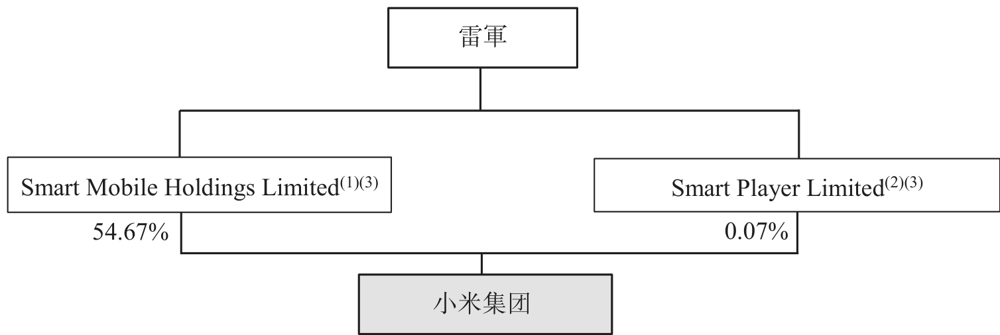

附註：

(1) 緊隨全球發售完成後（假設並無行使超額配股權及根據首次公開發售前僱員購股權計劃授出的購股權），Smart Mobile Holdings Limited 將持有4,295,187,720股A類股份及2,223,884,750股B類股份，合共佔本公司投票權約54.67%。除保留事項的決議案外，於股東大會就決議案進行投票時，每股A類股份可投十票，而每股B類股份可投一票。就保留事項而言，A類股份每股股份可投一票，而雷軍可行使與保留事項相關的投票權總百分比約為29.40%。

(2) 緊隨全球發售完成後（假設並無行使超額配股權及根據首次公開發售前僱員購股權計劃授出的購股權），Smart Player Limited 將持有59,221,630股B類股份，佔本公司可於股東大會就除保留事項以外的決議案行使的投票權約0.07%及佔本公司與保留事項相關的投票權約0.26%。

(3) Smart Mobile Holdings Limited及Smart Player Limited均由Sunrise Vision Holdings Limited全資擁有，而Sunrise Vision Holdings Limited由Parkway Global Holdings Limited全資擁有。Parkway Global Holdings Limited的全部權益由雷軍（作為委託人）以其本身及家族為受益人成立信託持有。

有關A類股份附帶的不同投票權詳情，請參閱「股本」一節。

---

## 第 369 页

雷軍為中國大陸著名的天使投資人。除於本公司擁有權益及擔任董事外，亦在若干公眾上市公司擔任非執行董事職位及持有非控股權益。由於該等公司獨立運作，作為上市公司亦有各自的股東基礎，雷軍目前並無意將所持該等公司的任何權益注入本公司。

雷軍是金山軟件有限公司(香港聯交所股份代號：3888)（「金山軟件」）的聯合創始人，截至最後可行日期為該公司非執行董事、董事長兼薪酬委員會成員，控制其投票權不足30%。雷軍亦在金山軟件的若干集團公司擔任董事職務。金山軟件主要從事(i)研究及開發遊戲，以及提供線上遊戲、手機遊戲及休閒遊戲服務；(ii)提供雲儲存及雲計算服務；及(iii)設計、研究及開發和銷售推廣WPS Office辦公軟件產品及服務。

自2010年10月至2018年3月，雷軍為 Cheetah Mobile Inc.（紐交所股份代號：CMCM）（「獵豹移動」）的董事。截至最後可行日期，雷軍持有獵豹移動已發行股本不足2%。獵豹移動經營的平台為客戶提供移動及桌上電腦應用程序，並使用其專利雲數據分析引擎，作為客戶的全球內容推廣渠道。

自2011年7月至2016年8月，雷軍為YY Inc.（納斯達克股份代號：YY）（「歡聚時代」）的主席。截至最後可行日期，雷軍持有歡聚時代已發行股本不足20%。歡聚時代是一個直播平台，用戶可透過現場直播的集體活動，運用語音、文字及視頻互相交流。用戶可自行建立及組織不同規模的群組，發掘和參與各種類型的線上活動，包括音樂表演、線上遊戲、交友秀、遊戲直播和在線學習等。

根據我們的鐵人三項業務模式，儘管營業紀錄期絕大部分收入來自銷售智能手機及其他產品，但我們亦提供互聯網服務。我們的互聯網服務收入主要來自廣告及其他互聯網增值服務，包括線上遊戲。我們亦透過小米雲服務向用戶提供雲儲存及雲計算服務。有關我們業務的其他詳情，請參閱「業務—業務」一節。雖然我們經營的若干互聯網相關行業與金山軟件、獵豹移動及歡聚時代相似，但董事認為，金山軟件、獵豹移動及歡聚時代（一方）與本集團（另一方）之間並無重大競爭，主要是由於該等公司與本集團的整體業務模式性質不同。具體而言，營業紀錄期，我們約90%以上的收入來自智能手機、IoT和生活消費產品銷售，而金山軟件、獵豹移動或歡聚時代並無從事智能手機和其他IoT及生活消費產品設計及生產。此外，根據我們的鐵人三項業務模式，我們主要透過銷售產品獲取用戶群，再策略性地向該用戶群提供互聯網服務。此外，若干業務方面，金山軟件、獵豹移動及歡聚時代服務的目標客戶與我們的目標客戶可能不同。例如，金山軟件提供的雲儲存及雲計算服務面向普通大眾，而我們提供的服務主要面向本公司產品及服務的現有個人用戶及本集團旗下實體。

---

## 第 370 页

雷軍亦是順為資本（「順為」）的創始合夥人。順為由投資基金組成，專注於互聯網及科技行業的初創期、起步期、發展初期至中期與成長期的資本投資。雖然順為可能收購與本集團所經營領域相若的科技與互聯網行業若干業務的非控股權益，但順為僅是金融投資者，對於任何所投資公司的管理或股權並無控制權。因此，我們相信順為不會於任何重大方面與本集團競爭。除順為所持的少數投資外，雷軍個人亦持有多個行業私人公司的眾多少數權益，且就其所知，該等公司與本集團概無重大競爭。

獨立於控股股東

經考慮以下因素，董事信納我們能夠於上市後獨立於控股股東及其緊密聯繫人開展業務。

管理獨立

我們的業務由董事會及高級管理層管理及開展。上市後，董事會將由七名董事組成，包括兩名執行董事、兩名非執行董事及三名獨立非執行董事。有關詳情，請參閱「董事及高級管理人員」一節。

董事認為我們的董事會及高級管理層將獨立於控股股東運作，原因在於：

(a) 各董事知悉其作為董事的受信職責，該等責任要求(其中包括)董事為本公司的裨益及利益行事，且不容許其董事職責與個人利益之間出現任何衝突；

(b) 我們的日常管理及經營由高級管理團隊執行，所有成員在本公司所從事的行業擁有深厚經驗，因此有能力作出符合本集團最佳利益的業務決策；

(c) 我們有三名獨立非執行董事，本公司的若干事項一貫須呈交獨立非執行董事審議；

(d) 倘本集團將與董事或其各自的聯繫人訂立的任何交易產生潛在利益衝突，則擁有利益的董事須在本公司相關董事會會議上就相關交易投票前申報相關利益的性質；及

(e) 我們已採納一系列企業管治措施以管理本集團與控股股東之間的利益衝突（如有），為我們的獨立管理提供支持。有關詳情，請參閱本節「—企業管治措施」。

基於上文所述，董事認為，董事會整體及我們的高級管理團隊能夠獨立於控股股東履行管理職責。

---

## 第 371 页

經營獨立

本集團的經營並不依賴控股股東。除「業務—業務—牌照、許可證及批准」、「業務—業務—知識產權」及「業務—業務—法律訴訟及合規」各節所披露者外，本集團（透過我們的附屬公司及合併聯屬實體）持有所有主要牌照並擁有開展業務所需的所有相關知識產權及研發設施。我們擁有充足的資金、設施、設備及員工，可獨立於控股股東經營我們的業務。我們亦擁有獨立的渠道接觸客戶及獨立的管理團隊經營業務。

基於上文所述，董事認為我們能夠獨立於控股股東進行經營。

財務獨立

我們擁有獨立的內部控制及會計系統，亦擁有獨立的財務部門負責履行財政職能。如有必要，我們能夠在不依賴控股股東的情況下自第三方取得融資。

截至上市日期，控股股東或其各自聯繫人概無提供或獲授未償還貸款或未解除擔保。

基於上文所述，董事認為，董事及高級管理人員能夠在上市後獨立於控股股東及其各自緊密聯繫人，且不會過度依賴控股股東及其各自緊密聯繫人開展業務。

根據上市規則第8.10條作出的披露

控股股東確認，截至最後可行日期，除本集團業務外，彼等並無於現時或可能直接或間接與我們的業務競爭的業務中擁有任何須根據上市規則第8.10條作出披露的權益。

企業管治措施

本公司及董事致力於秉持及實施最高企業管治標準，深諳保護全體股東(包括少數股東)權利及權益的重要性。有鑒於此，本公司根據第8A.30條成立企業管治委員會，採納與上市規則附錄14守則條文D.3.1條及第8A.30條一致的職權範圍。企業管治委員會成員為在監管私人及香港上市公司企業管治相關職能方面有豐富經驗的獨立非執行董事。企業管治委員會的主要職責為確保本公司的經營及管理切合全體股東利益、本公司遵守上市規則及本公司的不同投票權架構得到保障。

根據組織章程細則，倘任何在提交要求當日合共持有佔本公司實繳股本不少於十分

---

## 第 372 页

之一並附帶本公司股東大會投票權的股份的一名或以上股東提交書面要求，則本公司將召開股東特別大會。此外，本公司將於上市後採用的股東溝通政策鼓勵股東直接以書面形式向董事及本公司提交管治相關事宜。

我們採納以下措施以保障良好的企業管治標準並避免本集團與控股股東間出現潛在利益衝突：

(a) 根據細則，倘舉行股東大會審議交易建議，而控股股東或其各自任何聯繫人於當中擁有重大權益，則相關控股股東或聯繫人將不會就相關決議案投票；

(b) 本公司已建立內部控制機制以識別關連交易。上市後，倘本公司與控股股東或其任何聯繫人訂立關連交易，本公司將遵守適用的上市規則；

(c) 獨立非執行董事將按年審查本集團與控股股東之間是否存在任何利益衝突並提供公正及專業意見以保障少數股東的利益；

(d) 控股股東將承諾提供所有必要資料，包括所有相關財務、經營及市場資料以及獨立非執行董事進行年度審查所要求的任何其他必要資料；

(e) 根據上市規則規定，本公司將在年報或以公告形式披露有關獨立非執行董事所審議事項的決定；

(f) 倘董事合理要求獨立專業人士(如財務顧問)提供意見，則委任相關獨立專業人士的費用由本公司承擔；

(g) 我們已委任國泰君安融資有限公司作為合規顧問，以就遵守適用法律法規以及上市規則(包括與企業管治有關的各項規定)向我們提供意見及指引；及

(h) 我們已遵照上市規則及上市規則附錄14企業管治守則及企業管治報告成立審核委員會、薪酬委員會、提名委員會及企業管治委員會，並訂立書面職權範圍。審核委員會所有成員(包括主席)均為獨立非執行董事。

基於上文所述，董事信納已採取充足企業管治措施管理上市後本集團與控股股東之間可能發生的利益衝突以及保障少數股東的利益。

---

## 第 373 页

關連人士

下表載列於上市後將成為或我們同意視為我們關連人士的各方以及彼等與本公司的關係性質：

<!-- table html -->
<table><tr><td>姓名／名稱</td><td>關連關係</td></tr><tr><td>小米金融集團</td><td>我們同意將小米金融集團各成員公司視為關連附屬公司(上市規則第14A.16條所界定者)</td></tr><tr><td>雷軍</td><td>雷軍，本公司執行董事、創始人、董事長、首席執行官、控股股東兼主要股東</td></tr><tr><td>SmartMi International Ltd（「智米」，連同其不時的附屬公司統稱「智米集團」）</td><td>非執行董事許達來的聯繫人(上市規則第14A.12A(1)(c)條所界定者)</td></tr></table>
<!-- /table -->

我們已與上述關連人士訂立若干交易，該等交易於上市後將成為我們的持續關連交易。

持續關連交易概要

<!-- table html -->
<table><tr><td></td><td>交易</td><td>持續關連交易類別</td><td>適用上市規則</td><td>豁免</td><td colspan="3">截至12月31日止年度的建議年度上限</td></tr><tr><td>1.</td><td>小米金融框架協議</td><td></td><td></td><td></td><td>2018年</td><td>2019年</td><td>2020年</td></tr><tr><td>(i)</td><td>小米集團向小米金融集團供應產品</td><td>部分豁免</td><td>第14A.35條第14A.76(2)條第14A.105條</td><td>公告規定</td><td>人民幣173百萬元</td><td>人民幣621百萬元</td><td>人民幣1,087百萬元</td></tr><tr><td>(ii)</td><td>小米集團與小米金融集團的數據共享及協作</td><td>全面豁免</td><td>第14A.76(1)條</td><td>不適用</td><td>不適用</td><td>不適用</td><td>不適用</td></tr><tr><td>(iii)</td><td>小米集團向小米金融集團授出知識產權許可</td><td>全面豁免</td><td>第14A.76(1)條</td><td>不適用</td><td>不適用</td><td>不適用</td><td>不適用</td></tr><tr><td>(iv)</td><td>小米金融集團向小米集團提供支付及結算服務</td><td>部分豁免</td><td>第14A.35條第14A.76(2)條第14A.105條</td><td>公告規定</td><td>人民幣170百萬元</td><td>人民幣250百萬元</td><td>人民幣390百萬元</td></tr><tr><td>(v)</td><td>小米集團向小米金融集團提供營銷服務</td><td>部分豁免</td><td>第14A.35條第14A.76(2)條第14A.105條</td><td>公告規定</td><td>人民幣339百萬元</td><td>人民幣543百萬元</td><td>人民幣828百萬元</td></tr><tr><td>(v)</td><td>小米金融集團向小米集團提供營銷服務</td><td>全面豁免</td><td>第14A.76(1)條</td><td>不適用</td><td>不適用</td><td>不適用</td><td>不適用</td></tr></table>
<!-- /table -->

---

## 第 374 页

關連交易

<!-- table html -->
<table><tr><td></td><td colspan="7">截至12月31日止年度的建議年度上限</td></tr><tr><td>(vi)</td><td>交易 小米集團向小米金融集團提供全面支持服務</td><td>持續關連交易類別 部分豁免</td><td>適用上市規則 第14A.35條 第14A.76(2)條 第14A.105條</td><td>豁免 公告規定</td><td>2018年 人民幣133百萬元</td><td>2019年 人民幣173百萬元</td><td>2020年 人民幣213百萬元</td></tr><tr><td>(vi)</td><td>小米金融集團向小米集團提供全面支持服務</td><td>全面豁免</td><td>第14A.76(1)條</td><td>不適用</td><td>不適用</td><td>不適用</td><td>不適用</td></tr><tr><td>(vii)</td><td>小米集團向小米金融集團提供金融服務(小米金融重組貸款除外)</td><td>不獲豁免</td><td>第14A.35條 第14A.36條 第14A.53條 第14A.105條</td><td>公告規定及獨立股東批准</td><td>人民幣12,770百萬元</td><td>人民幣14,950百萬元</td><td>人民幣14,550百萬元</td></tr><tr><td>(vii)</td><td>小米金融集團向小米集團提供金融服務</td><td>全面豁免</td><td>第14A.90條</td><td>不適用</td><td>不適用</td><td>不適用</td><td>不適用</td></tr><tr><td>2.</td><td>智米框架協議</td><td></td><td></td><td></td><td></td><td></td><td></td></tr><tr><td></td><td>本集團與智米集團合作</td><td>不獲豁免</td><td>第14A.35條 第14A.36條 第14A.53條 第14A.105條</td><td>公告規定及獨立股東批准</td><td>人民幣3,800百萬元</td><td>人民幣6,500百萬元</td><td>人民幣10,400百萬元</td></tr><tr><td>3.</td><td>合約安排</td><td></td><td></td><td></td><td></td><td></td><td></td></tr><tr><td></td><td>外商獨資企業與境內控股公司的合約安排</td><td>不獲豁免</td><td>第14A.35條 第14A.36條 第14A.52條 第14A.53條 第14A.105條</td><td>公告及獨立股東批准、年度上限、協議期不超過三年</td><td>不適用</td><td>不適用</td><td>不適用</td></tr></table>
<!-- /table -->

1. 小米金融框架協議

(a) 背景

上市日期前，小米集團及小米金融集團各成員公司間曾進行集團內公司間交易。聯交所就小米金融購股權計劃授出豁免的其中一項條件為我們於上市後將小米金融集團各成員公司視作本公司「關連附屬公司」（上市規則第14A.16條所界定者），且只要我們視小米金融為附屬公司，我們將遵守上市規則第14A章的有關關連交易規定（小米金融重組產生的一

---

## 第 375 页

次性小米金融重組貸款除外)(請參閱「豁免遵守上市規則及豁免遵守公司(清盤及雜項條文)條例—有關小米金融購股權計劃二的豁免」。因此，根據上市規則，於上市後，涉及小米集團與小米金融集團的集團內公司間交易將成為關連交易。該等交易及聯交所批准豁免嚴格遵守上市規則第14A章有關規定的豁免詳情載列如下。

2018年6月18日，本公司（為本身及代表小米集團）與小米金融（為本身及代表小米金融集團）訂立框架協議（「小米金融框架協議」），據此小米集團與小米金融集團將相互或由一方向另一方提供：(i)產品供應；(ii)數據共享及協作；(iii)知識產權許可；(iv)支付及結算服務；(v)營銷服務；(vi)全面支持服務；及(vii)金融服務。

小米金融框架協議自2018年1月1日至2020年12月31日（包括首尾兩日）為期三年。

小米集團任何成員公司與小米金融集團有關成員公司可能就上述任何交易訂立特定協議，以制定具體條款，惟該等條款須遵守上市規則及小米金融框架協議的規定。

儘管小米金融集團旗下成員公司視為我們的「關連附屬公司」，但小米金融集團為本集團的一部分，我們通過小米金融框架協議加強集團內部的協同效應以實現本集團各項業務目標乃商業合理的舉措。該等安排對本集團整體有重大戰略優勢，尤其是資源優化及配置方面，而集團內部協同效應亦可為本集團整體節省大量成本。基於上文所述，董事（包括獨立非執行董事）認為上市後繼續進行該等交易符合本公司及股東整體最佳利益。

(b) 根據小米金融框架協議擬進行交易的詳情

(i) 產品供應

小米集團須不時向小米金融集團供應產品，包括智能手機及其他消費電子產品。供應產品的同時亦推出產品租賃業務。該等產品的採購價須參考各自市價由訂約方基於公平合理基準協定。有關市價則參考小米集團不時根據既有定價指引向獨立第三方銷售相關產品的普遍價格水平。

截至2015年、2016年及2017年12月31日止三年度與截至2018年3月31日止三個月，小米金融集團向小米集團採購產品的購買價總額分別約為人民幣0.4百萬元、人民幣0.2百萬元、人民幣3.3百萬元及人民幣0.7百萬元。

由於預期小米集團向小米金融集團供應產品按年計算的最高相關百分比率超過0.1%但低於5%，且符合一般商業條款，故此根據上市規則第14A.76(2)(a)條，該項交易將屬部分

---

## 第 376 页

豁免持續關連交易，獲准豁免遵守上市規則第14A章的獨立股東批准規定，惟須遵守申報及公告規定。

根據上市規則第14A.53條，我們已設定截至2018年、2019年及2020年12月31日止三年度小米金融集團就該項交易向小米集團最高採購額的年度上限，分別為人民幣173百萬元、人民幣621百萬元及人民幣1,087百萬元。該等年度上限主要根據預期小米金融集團從小米集團採購的產品數量（預計將因小米金融集團即將推出產品租賃業務及相關業務日後增長而大幅增加）而定。預期小米金融集團產品租賃業務涉及小米金融集團自小米集團購買手機等產品後將該等產品租予消費者。我們認為消費者對該等產品租賃計劃的需求較大，因此小米金融集團將自小米集團購買的產品數量亦會增加。特別是，釐定年度上限時，我們已假設(i)小米金融集團的產品租賃業務可能於2018年下半年左右推出，考慮到擬定產品組合、相關產品現行市價及業務初步規劃規模，所涉採購額將高達人民幣173百萬元；及(ii)基於2016年至2017年我們過往年收入增長約67%，預計2018年至2019年及2019年至2020年小米金融集團的產品租賃業務會按年增長約70%至80%。上述假設僅用於釐定年度上限，不應視作小米集團或小米金融集團收入、盈利能力或交易前景的直接或間接指標。

(ii) 數據共享及協作

小米集團及小米金融集團須將用戶使用小米集團或小米金融集團(視情況而定)產品或服務而收集或產生的數據(須遵守適用法律及合約規定)提供予小米集團及小米金融集團聯合維護的大數據平台，而小米集團與小米金融集團將可共享該平台。

根據該數據共享及協作安排，任何一方均毋須支付任何費用或其他報酬。截至2015年、2016年及2017年12月31日止三年度與截至2018年3月31日止三個月，該項交易並無任何過往交易金額。

由於預期該項交易按年計算的最高相關百分比率低於0.1%，且符合一般商業條款，故此根據上市規則第14A.76(1)(a)條，該項交易將屬全面豁免持續關連交易，獲准豁免遵守上市規則第14A章的申報、公告及獨立股東批准規定。

(iii) 知識產權許可

小米集團須向小米金融集團授予免許可費許可，供其使用有關小米金融集團產品及服務品牌的若干商標、標誌及域名。此外，小米集團須向小米金融集團授予許可，供其使

---

## 第 377 页

關連交易

用由小米集團擁有及／或開發且有關小米金融集團產品及／或服務的若干專利與技術。作為使用若干專利及技術的回報，小米集團可向小米金融集團收取相關訂約方參考提供予小米金融集團之相關專利及技術的重要性及一般授出同類專利或技術許可之互聯網公司及／或其他可比較公司的市場慣例基於公平合理基準協定之許可費付款。

由於我們截至2015年、2016年及2017年12月31日止三年度各年與截至2018年3月31日止三個月均未就該等集團內部交易收取任何許可費，故此該項交易並無過往交易金額。

由於預期該項交易按年計算的最高相關百分比率低於0.1%，且符合一般商業條款，故此根據上市規則第14A.76(1)(a)條，該項交易將屬全面豁免持續關連交易，獲准豁免遵守上市規則第14A章的申報、公告及獨立股東批准規定。

(iv) 支付及結算服務

小米金融集團須通過不時經營的線上及線下支付平台及其他支付服務向小米集團提供安全可靠的支付及結算服務和其他輔助服務。

服務費由有關方參考市價按公平合理基準協定。市價指獨立第三方按一般商業條款提供相同或類似服務的費率。倘市價不適用，交易條款將參考與獨立第三方訂立的同類可比交易釐定，在可行情況下，確保與小米集團訂立之交易的條款不遜於向獨立第三方提供或自獨立第三方獲得的條款。

截至2015年、2016年及2017年12月31日止三年度與截至2018年3月31日止三個月，小米集團就小米金融集團所提供支付服務產生的服務費總額分別約為人民幣40.3百萬元、人民幣43.9百萬元、人民幣49.9百萬元及人民幣9.4百萬元。

由於預期該項交易按年計算的最高相關百分比率超過0.1%但低於5%，且符合一般商業條款，故此根據上市規則第14A.76(2)(a)條，該項交易將屬部分豁免持續關連交易，獲准豁免遵守上市規則第14A章的獨立股東批准規定，惟須遵守申報及公告規定。

根據上市規則第14A.53條，我們已設定截至2018年、2019年及2020年12月31日止三年度該項交易應付最高累計費用的年度上限，分別為人民幣170百萬元、人民幣250百萬元及人民幣390百萬元。該等年度上限主要根據過往交易金額及預期通過小米金融集團運營的平台及提供的服務促成的交易量與付款金額而定。具體而言，我們預期小米集團的新零售分

---

## 第 378 页

銷平台持續擴張會致使小米集團對小米金融集團的支付及結算服務產生需求。特別是，釐定年度上限時，我們亦計及小米金融集團正快速擴張線上及線下支付服務。該等服務是小米集團服務及產品的重要支付方式。由於該等服務不斷深入市場並獲得小米集團產品及服務買家與用戶的普遍歡迎，預計2018年支付交易將顯著增長。基於預期小米金融集團的支付服務會愈加普及，加上2016年至2017年我們自中國大陸賺取的收入過往按年增長約39%，我們預計2018年至2019年及2019年至2020年支付交易會按年增長約45%至55%。上述假設僅用於釐定年度上限，不應視作小米集團或小米金融集團收入、盈利能力或交易前景的直接或間接指標。

(v) 營銷服務

小米集團與小米金融集團須互相提供綜合營銷服務，包括線上及移動應用程序營銷服務、人流重定向、市場推廣、交叉營銷、營銷分析、移動設備的廣告及應用程序預安裝。

服務費由有關方參考市價按公平合理基準協定。市價指獨立第三方按一般商業條款提供相同或類似服務的費率。倘市價不適用，交易條款將參考與獨立第三方訂立的同類可比交易釐定，在可行情況下，確保與小米集團訂立之交易的條款不遜於向獨立第三方提供或自獨立第三方獲得的條款。

小米集團向小米金融集團提供營銷服務

截至2015年、2016年及2017年12月31日止三年度與截至2018年3月31日止三個月，小米金融集團就小米集團所提供營銷服務產生的總營銷服務費分別約為人民幣9.7百萬元、人民幣1.8百萬元、人民幣70.8百萬元及人民幣33.4百萬元。我們預期，作為處於發展階段之快速發展的企業，小米金融集團將致力提升用戶流量並實現當中的經濟價值，因此其對營銷服務的未來需求將會大幅增加。

由於預期小米集團向小米金融集團提供的營銷服務按年計算的最高相關百分比率超過0.1%但低於5%，且符合一般商業條款，故此根據上市規則第14A.76(2)(a)條，該項交易將屬部分豁免持續關連交易，獲准豁免遵守上市規則第14A章的獨立股東批准規定，惟須遵守申報及公告規定。

根據上市規則第14A.53條，我們已設定截至2018年、2019年及2020年12月31日止三年度該項交易應收最高累計費用的年度上限，分別為人民幣339百萬元、人民幣543百萬元及

---

## 第 379 页

人民幣828百萬元。該等年度上限主要根據我們的營銷指示及品牌策略、小米集團可提供營銷服務的性質及規模、預期小米金融集團作為快速發展初創企業的增長及對營銷服務需求的持續上升以及小米金融集團產品及服務的有關市場滲透成本釐定。由於小米金融集團處於發展階段，須持續大力推廣以提升知名度及認可度。小米集團的用戶群即小米金融集團策略重要的目標客戶群，小米金融集團利用小米集團的營銷服務屬商業合理。因此，我們預計2018年至2019年及2019年至2020年小米金融集團應付小米集團的營銷費用將按年增長約50%至60%。具體而言，為推廣小米金融集團的移動應用程序及服務，我們預期於小米集團的手機上預裝小米金融集團研發的移動應用程序。作為回報，小米金融集團須向小米集團支付若干營銷費用。上述年度上限已計入預裝小米金融集團移動應用程序的手機的預期銷量及小米金融集團為此應付的預期營銷費用。上述假設僅用於釐定年度上限，不應視作小米集團或小米金融集團收入、盈利能力或交易前景的直接或間接指標。

小米金融集團向小米集團提供營銷服務

該項交易並無過往交易金額。由於小米金融集團的用戶基礎、服務平台及營運不斷完善並實現多元化，我們預計小米集團與小米金融集團之間會有合作營銷機會。我們預計小米集團日後可把握該等機會，透過小米金融集團的生態鏈及用戶流量推廣及宣傳產品及服務。

由於預期小米金融集團向小米集團提供營銷服務按年計算的最高相關百分比率低於0.1%，且符合一般商業條款，故此根據上市規則第14A.76(1)(a)條，該項交易將屬全面豁免持續關連交易，獲准豁免遵守上市規則第14A章的申報、公告及獨立股東批准規定。

(vi) 全面支持服務

小米集團與小米金融集團須互相提供全面支持服務，包括數據服務及系統、人力資源、勞工服務、行政服務、分析、辦公空間、辦公系統及支援服務、軟件及系統、法律及會計服務、銷售服務、營銷發展、技術支援服務、研究及開發服務、僱員培訓及招聘、管理服務、採購功能支援服務、資訊科技服務、軟件開發、產品銷售及代理服務、營運及維護服務和諮詢服務。

服務費一般須按提供有關服務的實際成本(包括相關間接費用)或在適當情況下參考市場上可比較服務的定價而定。

---

## 第 380 页

小米集團向小米金融集團提供全面支持服務

過往由於小米集團與小米金融集團作為單一經濟單位營運，故我們並無就彼等之間的大部分集團內公司間支持服務收費。截至2015年、2016年及2017年12月31日止三年度與截至2018年3月31日止三個月，小米金融集團就小米集團所提供支持服務產生的總服務費分別約為零、人民幣28.2百萬元、人民幣12.8百萬元及人民幣6.6百萬元。

由於預期小米集團向小米金融集團提供支持服務按年計算的最高相關百分比率超過0.1%但低於5%，且符合一般商業條款，故此根據上市規則第14A.76(2)(a)條，該項交易將屬部分豁免持續關連交易，獲准豁免遵守上市規則第14A章的獨立股東批准規定，惟須遵守申報及公告規定。

根據上市規則第14A.53條，我們已設定截至2018年、2019年及2020年12月31日止三年度小米金融集團就該項交易應付小米集團最高累計費用的年度上限，分別為人民幣133百萬元、人民幣173百萬元及人民幣213百萬元。該等年度上限主要根據小米金融集團相對於本集團整體的營運水平並參考員工數量、本集團主要成本組成部分（包括勞工成本、數據服務器維護及經營成本、後勤辦公成本、租金和其他物業相關開支以及其他間接費用）的預期增長釐定。由於日後小米金融集團營運擴張，需要小米集團提供大量行政及管理服務，尤其是數據系統及支持和人力資源。基於我們對小米金融集團營運規模的預期，預計2018年小米金融集團應付小米集團的支持服務費將為人民幣133百萬元。基於2016年至2017年本集團整體行政開支過往按年增長31%，我們預計2018年至2019年及2019年至2020年小米金融集團應付小米集團的支持服務費將按年增長約20%至30%。上述假設僅用於釐定年度上限，不應視作小米集團或小米金融集團收入、盈利能力或交易前景的直接或間接指標。

小米金融集團向小米集團提供全面支持服務

過往由於小米集團與小米金融集團作為單一經濟單位營運，故我們並無就彼等之間的大部分集團內公司間支持服務收費。截至2015年、2016年及2017年12月31日止三年度與截至2018年3月31日止三個月，小米集團就小米金融集團所提供支持服務產生的總服務費分別約為零、人民幣9.2百萬元、人民幣32.6百萬元及人民幣9.4百萬元。

由於預期小米金融集團向小米集團提供支持服務按年計算的最高相關百分比率低於0.1%，且符合一般商業條款，故此根據上市規則第14A.76(1)(a)條，該項交易將屬全面豁免持續關連交易，獲准豁免遵守上市規則第14A章的申報、公告及獨立股東批准規定。

---

## 第 381 页

(vii) 金融服務

小米集團與小米金融集團須相互提供金融服務，包括借款及其他信貸和擔保服務以及可能包括結算服務、承兌票據、委託貸款、信託貸款、信用驗證、資產支持證券及融資、財務及融資諮詢在內的其他金融服務。

借款及其他信貸服務方面，借款利率參考中國人民銀行頒佈的基準利率由訂約方基於公平合理基準協定。其他金融服務方面，收費將遵循中國人民銀行或中國銀行業監督管理委員會就該等服務釐定的相關規定收費率。倘並無適用的相關規定收費率，則費用將參考同類金融服務的市價由雙方公平合理協定。市價指獨立第三方按一般商業條款提供相同或類似服務的費率。倘市價不適用，交易條款將參考與獨立第三方訂立的同類可比交易釐定，在可行情況下，確保與小米集團訂立之交易的條款不遜於向獨立第三方提供或自獨立第三方獲得的條款。我們有關中國大陸法律的法律顧問君合律師事務所表示，小米集團與小米金融之間的借貸活動是在日常業務過程中的公司間借款，提供上述借貸服務毋須中國大陸相關法規要求的借貸執照。

倘小米金融因小米金融購股權計劃之購股權獲行使而不再為我們的附屬公司，訂約方將根據當時的一般商業條款重新協定小米集團向小米金融集團的貸款利率以及所提供金融服務的適用收費。

針對小米金融重組，截至最後可行日期，小米集團向小米金融集團提供一次性無抵押及免息小米金融重組貸款830百萬美元及人民幣299百萬元。該等小米金融重組貸款乃基於當時及截至最後可行日期小米金融仍為本公司全資附屬公司而作出，不受小米金融框架協議所約束。

小米集團向小米金融集團提供金融服務

於2015年、2016年及2017年12月31日與2018年3月31日，小米集團向／為小米金融集團提供貸款或擔保的未償還金額分別為人民幣2.9百萬元、人民幣610.0百萬元、人民幣5,625.1百萬元及人民幣5,428.6百萬元。

由於預期小米集團向小米金融集團提供金融服務按年計算的最高相關百分比率超過5%，故此該項交易將屬不獲豁免持續關連交易，須遵守上市規則第14A章的申報、公告及獨立股東批准規定。

根據上市規則第14A.53條規定，我們已設定截至2018年、2019年及2020年12月31日止三年度該項交易下小米集團向小米金融提供金融服務最高金額（包括已收取及預期將收取

---

## 第 382 页

關連交易

的利息及費用)的年度上限(不包括小米集團就小米金融重組向小米金融集團提供的一次性小米金融重組貸款)，分別為人民幣12,770百萬元、人民幣14,950百萬元及人民幣14,550百萬元。該最高金額適用於相關年度的每日金額，而該每日最高金額於相關年度每日結束時按個別基準的未償還金額計算，而不匯總過往的每日金額。

年度上限主要根據小米集團準備就其估計臨時盈餘現金來源、集團間流動性、小米集團與小米金融集團目前尚未結算的財務資助金額以及過往交易金額在任何時間承擔的最高金額而定。預期小米金融集團將從事金融技術行業的資本密集型業務。由於小米金融集團仍處於發展階段，故近期須小米集團撥付大量集團內部資金以滿足資本要求。此外，我們預期小米金融集團將於日後擴充產品組合（包括向供應商提供保理服務的供應鏈融資業務），會產生大量資金需求。我們預期小米金融集團將提供的保理服務需求較大，而有利的政府政策對該業務能否大幅增長起決定性作用，亦會因此增加小米金融集團的資本要求。小米金融集團的供應鏈融資業務正處於起步階段，我們預期該業務可利用小米集團優質上遊供應商及生態鏈企業的廣泛網絡，於2018年實現顯著增長。為適應有關增長，我們預計2018年小米金融集團將須從小米集團獲取額外融資約人民幣7,000百萬元。由於小米金融集團的營運步入正軌，我們預計其對小米集團的融資依賴會逐漸減少。小米金融集團會積極物色替代融資方案，包括發行資產支持證券。因此，預期2019年後小米集團給予小米金融集團的財務資助將維持相對穩定。上述假設僅用於釐定年度上限，不應視作小米集團或小米金融集團收入、盈利能力或交易前景的直接或間接指標。

小米金融集團向小米集團提供金融服務

於2015年、2016年及2017年12月31日與2018年3月31日，小米金融集團向／為小米集團提供貸款或擔保的未償還金額分別為零、人民幣1,003.1百萬元、人民幣950.6百萬元及人民幣926.4百萬元。

我們預計小米金融集團將向小米集團提供的金融服務主要為上市規則第14A.23(4)條所界定之財務資助，無抵押及符合一般商業條款(或條款對小米集團有利)。因此，根據上市規則第14A.90條，該項交易將屬全面豁免持續關連交易，獲准豁免遵守申報、公告及獨立股東批准規定。

---

## 第 383 页

2. 智米框架協議

智米是我們的主要生態鏈企業，為本集團供應智能空氣淨化器、空氣質量監測器及其他智能硬件產品。透過與該生態鏈企業合作，我們能成功推出空氣淨化器及相關IoT設備組合，形成生態鏈的重要環節。具體而言，根據艾瑞諮詢，2017年及2018年第一季度按全球空氣淨化器出貨量計算，我們均排名第一。基於上文所述，董事認為上市後繼續並加強有關合作符合本公司及股東整體最佳利益。

2018年6月18日，本公司(為本身及代表本集團)與智米(為本身及代表智米集團)訂立智米框架協議，據此本集團須採購而智米集團須供應空氣淨化器及加濕器等智能硬件產品。本集團須在其平台出售該等產品，並向智米集團支付有關銷售所得部分利潤(「利潤分享」)。

上述持續關連交易將自2018年1月1日至2020年12月31日(包括首尾兩日)為期三年。

本集團任何成員公司與智米集團任何成員公司可能就根據智米框架協議擬進行之交易訂立具體協議，以落實具體條款，惟有關條款須符合上市規則及智米框架協議規定。合作條款須基於公平合理基準釐定，且向小米集團提供之條款不得遜於向獨立第三方提供者。具體而言，該等產品價格按成本加成基準釐定，利潤率一般不得超過2%，且利潤分享金額參考本集團與其他生態鏈企業的合作條款釐定。

截至2015年、2016年及2017年12月31日止三年度與截至2018年3月31日止三個月，本集團因合作所產生的採購價及利潤分享總額分別約為人民幣481.9百萬元、人民幣1,027.4百萬元、人民幣1,931.0百萬元及人民幣348.0百萬元。

由於預期本集團與智米集團的合作按年計算的最高百分比率超過5%，該項交易將屬不獲豁免持續關連交易，須遵守上市規則第14A章的申報、公告及獨立股東批准規定。

根據上市規則第14A.53條，我們已設定截至2018年、2019年及2020年12月31日止三年度該項交易應付最高總代價(包括採購價及利潤分享)的年度上限，分別為人民幣3,800百萬元、人民幣6,500百萬元及人民幣10,400百萬元。該等年度上限主要根據(i)過往交易金額；(ii)各市場對我們空氣淨化器及相關產品組合的持續需求；(iii)基於生產成本(特別是勞工、原材料及部件的成本)持續上升而計算的未來三年單價合理增長；(iv)通過全球擴展業務(尤其是線上及線下的新零售渠道)預期達致的額外銷售增長；及(v)預期智米集團將研發可併入我們生態鏈的新型號或不同規格的空氣淨化器、空氣質量監測器及其他智能硬件產品，因

---

## 第 384 页

而將向智米集團作出大額採購以及產生應付智米集團的利潤分享而定。尤其是，釐定該等年度上限時，我們考慮未來三年的交易金額年度增長趨勢，參考以下各項預計：(i) IoT及生活消費產品所得整體收入的過往增長趨勢，2016年至2017年增加約88.9%；(ii)由於我們最大化銷售力度及零售渠道，進一步滲透市場，預期2018年仍繼續經營的空氣淨化器及相關產品的銷量強勁增長；及(iii)主要由於空氣淨化器及相關產品的市場已經成熟，預計2019年至2020年的成交量增長會逐漸放緩。上述假設僅用於釐定年度上限，不應視作本集團或智米集團收入、盈利能力或交易前景的直接或間接指標。

3. 合約安排

(a) 背景

按「合約安排」一節所披露，由於中國對外資擁有權的監管限制，故此我們部分業務透過中國大陸合併聯屬實體進行。

我們並無持有合併聯屬實體的任何權益。確切地說，我們透過合約安排有效控制該等合併聯屬實體，並可取得其絕大部分經濟利益，預期會繼續如此。我們、外商獨資企業、合併聯屬實體及其股東之間的合約安排可促使我們(i)取得合併聯屬實體的絕大部分經濟利益，以換取外商獨資企業提供的服務；(ii)對合併聯屬實體實施有效控制；及(iii)持有獨家期權，可在中國法律許可的情況下購買合併聯屬實體全部或部分股權。

有關包括合約安排在內的協議詳情，請參閱「合約安排」一節。

(b) 上市規則的影響

就上市規則第14A章而言，尤其是有關「關連人士」的定義，合併聯屬實體將被視為本公司的全資附屬公司，而其董事、最高行政人員或主要股東(定義見上市規則)及彼等各自的聯繫人將被視為本公司的「關連人士」。

合約安排的相關交易為本公司持續關連交易。根據上市規則，合約安排的相關交易最高適用百分比率(不包括利潤比率)預期超過5%。因此，有關交易須遵守上市規則第14A章的申報、年度審閱、公告及獨立股東批准規定。

---

## 第 385 页

(c) 申請豁免

(i) 申請豁免的理由

董事(包括獨立非執行董事)認為，合約安排及相關交易對我們的法律結構與業務營運至為重要，該等交易一直且將繼續在我們日常及一般業務過程中按公平合理的一般商業條款或更佳條款訂立，且符合本集團及股東的整體利益。

董事亦相信，根據我們的架構，合併聯屬實體的財務業績併入我們的財務報表，猶如該等公司為本公司全資附屬公司，其業務的全部經濟利益均流入本集團，使本集團處於與關連交易規則相關的特殊狀況。因此，儘管合約安排的相關交易在技術上屬於上市規則第14A章所界定的持續關連交易，但董事認為，倘合約安排的所有交易嚴格遵守上市規則第14A章所載規定(其中包括公告及獨立股東批准規定等)，將會造成不當負擔，亦難切實執行，並且將為本公司增添不必要的行政成本。

此外，鑑於合約安排是在上市前訂立並已於本招股章程披露，而本公司有意投資者將根據有關披露參與全球發售，因此董事認為，緊隨上市後就此遵守公告及獨立股東批准規定，將會為本公司增加不必要的行政成本。

為確保本集團於採納合約安排後的營運穩健及有效，本集團管理層計劃採取下列措施：

作為內部監控措施的一部分，董事會將定期檢查落實及履行合約安排所產生的主要事宜，最少每季一次。作為定期檢查程序的一部分，董事會將決定是否需要聘請法律顧問及／或其他專業人士，以協助本集團處理合約安排所產生的具體事宜；

董事會將定期討論有關合規及政府機關的監管查詢事宜(如有)，最少每季一次；

本集團相關業務單位及營運部門會定期向本公司高級管理層報告合約安排的合規及履行情況以及其他相關事宜，最少每月一次；及

有關合約安排的持續關連交易，本公司須遵守聯交所發出的豁免所訂明的條件。

---

## 第 386 页

(ii) 申請豁免的條件

基於合約安排，我們已向聯交所申請且聯交所已批准我們於股份在聯交所上市期間，(i)根據上市規則第14A.105條規定就合約安排的相關交易豁免嚴格遵守上市規則第14A章的公告、通函及獨立股東批准規定；(ii)豁免嚴格遵守上市規則第14A.53條就合約安排的相關交易訂立年度上限的規定；及(iii)豁免嚴格遵守上市規則第14A.52條有關合約安排有效期限定為三年或以內的規定，惟須受以下條件規限。

未經獨立非執行董事批准不得變更

除下文所述者外，未經獨立非執行董事批准，合約安排不得作出任何變更（包括有關任何應付外商獨資企業的費用）。

未經獨立股東批准不得變更

除下文所述者外，未經獨立股東批准，管轄合約安排的協議不得作出任何變更。任何變更一經取得獨立股東批准，除上述者外，根據上市規則第14A章毋須再發出公告或尋求獨立股東批准，除非及直至本公司擬作進一步變更。然而，就合約安排在本公司年報作定期報告的規定將繼續適用。

經濟利益及靈活性

合約安排將繼續讓本集團可通過以下途徑收取源於合併聯屬實體的經濟利益：(i)本集團(倘及當適用中國法律允許時)無償或以適用中國法律法規允許的最低金額對價收購合併聯屬實體全部或部分股本權益的股份期權；(ii)將合併聯屬實體所賺取利潤絕大部分轉歸本集團所有的業務結構，以致毋須就合併聯屬實體根據合約安排應付外商獨資企業的服務費金額訂立年度上限；及(iii)本集團對合併聯屬實體管理營運的控制權，以及對其全部表決權的實際控制權。

重續及複製

在合約安排就本公司及其直接控股附屬公司與合併聯屬實體之間的關係提供可接受框架的前提下，可於(i)現有安排到期後，(ii)就登記股東或合併聯屬實體董事的任何變動，或(iii)就所從事業務與本集團業務相似或有關的任何現有、新成立或收購的外商獨資企業或營運公司(包括分公司)，重續及／或複製該框架，而毋須取得股東批准。重續及／或複製

---

## 第 387 页

關連交易

框架須為業務權宜之計而進行。然而，本集團可能成立的從事與本集團相同業務的任何現有或新外商獨資企業或營運公司(包括分公司)的董事、最高行政人員或主要股東，將於重續及／或複製合約安排後被視為本集團關連人士，該等關連人士與本集團之間的交易(根據類似合約安排進行者除外)須遵守上市規則第14A章的規定。此項條件以符合相關中國法律法規與批准為前提。

重續或複製的框架將與現有合約安排的條款與條件大致相同。

持續申報及批准

我們會持續披露合約安排的詳情：

各財政期間內執行的合約安排將遵照上市規則相關條文在本公司的年報及賬目中披露；

獨立非執行董事將每年審議合約安排，在本公司相關年度的年報及賬目中確認：(i)該年度所進行的交易乃遵照合約安排相關條文而訂立；(ii)合併聯屬實體並未向其股權持有人派發且其後亦未另行轉撥或轉讓給本集團任何股利或其他分派；及(iii)本集團與合併聯屬實體於上述相關財政期間訂立、重續或複製的任何新合約對本集團股東而言屬公平合理或有利，且符合股東的整體利益；

本公司核數師將根據香港會計師公會頒佈的香港核證委聘準則第3000號「審核或審閱歷史財務資料以外之核證委聘」及參照實務說明第740號「關於香港上市規則所述持續關連交易的核數師函件」對根據合約安排作出的交易執行年度審議程序，並將向董事呈交函件，向聯交所呈交副本，確認交易已獲董事批准，並已遵照相關合約安排訂立，而合併聯屬實體並未向其股權持有人派發且其後亦未另行轉撥或轉讓給本集團的任何股利或其他分派；

就上市規則第14A章而言，尤其是有關「關連人士」的定義，合併聯屬實體將被視為本公司的附屬公司，而與此同時，合併聯屬實體的董事、最高行政人員或主要股東及彼等各自的聯繫人將被視為本公司(就此而言不包括合併聯屬實體)的關連人士(按上市規則所適用者)，該等關連人士與本集團(就此而言包括合併聯屬

---

## 第 388 页

實體)之間的交易(根據合約安排進行者除外)須遵守上市規則第14A章的規定；及

合併聯屬實體將承諾，股份在聯交所上市期間，合併聯屬實體將容許本集團管理層及本公司核數師查閱全部相關紀錄，以便本公司核數師審議關連交易。

豁免

我們已向聯交所申請且聯交所已批准我們就上述部分豁免持續關連交易豁免嚴格遵守上市規則的公告規定。

我們已向聯交所申請且聯交所已批准我們就小米金融框架協議及智米框架協議所涉不獲豁免持續關連交易豁免嚴格遵守上市規則第14A章的公告、通函及獨立股東批准規定。

我們已向聯交所申請且聯交所已批准我們就合約安排(i)豁免嚴格遵守上市規則第14A章的公告、通函及獨立股東批准規定；(ii)豁免嚴格遵守上市規則第14A.52條年期不得超過三年的規定；及(iii)豁免嚴格遵守上市規則第14A.53(1)條訂立年度上限金額的規定。

董事的確認

董事(包括獨立非執行董事)認為上述持續關連交易於日常及一般業務過程中按公平合理的一般商業條款訂立，且符合本公司及股東的整體利益，而持續關連交易的建議年度上限(如有)屬公平合理，符合本公司及股東的整體利益。

董事(包括獨立非執行董事)認為合約安排及相關交易對我們的法律結構與業務營運至為重要，且有關交易一直並將會於本集團日常及一般業務過程中按公平合理的一般商業條款或更佳條款訂立，符合本集團及股東的整體利益。

聯席保薦人的確認

聯席保薦人基於我們提供的文件及數據，並參與盡職調查及與我們討論後，其認為(i)上述部分豁免及不獲豁免持續關連交易一直並將會於日常及一般業務過程中按一般商業條款訂立，公平合理，符合本公司及股東的整體利益；及(ii)該等部分豁免及不獲豁免持續關連交易的建議年度上限(倘適用)公平合理，符合本公司及股東的整體利益。

---

## 第 389 页

法定及已發行股本

以下為緊接及緊隨全球發售完成前後本公司的法定及已發行股本概述，乃假設(i)全球發售成為無條件且發售股份已根據全球發售發行，(ii)並無行使超額配股權，(iii)並無行使根據首次公開發售前僱員購股權計劃授出的購股權，(iv)每股優先股轉換為一股B類股份及(v)A類股份概無轉換成B類股份。

1. 於本招股章程日期的股本(假設每股優先股轉換為一股B類股份)

(i) 法定股本

<!-- table html -->
<table><tr><td>數目</td><td>股份概述</td><td>股份概約總面值</td></tr><tr><td>6,883,856,790股</td><td>A類股份</td><td>17,209.64美元</td></tr><tr><td>38,524,586,180股</td><td>B類股份</td><td>96,311.47美元</td></tr><tr><td>總計</td><td></td><td>113,521.11美元</td></tr></table>
<!-- /table -->

(ii) 已發行及將發行繳足或入賬列為繳足

<!-- table html -->
<table><tr><td>6,695,187,720股</td><td>已發行A類股份</td><td>16,737.97美元</td></tr><tr><td>14,246,503,110股</td><td>已發行B類股份</td><td>35,616.26美元</td></tr><tr><td>總計</td><td></td><td>52,354.23美元</td></tr></table>
<!-- /table -->

2. 緊隨全球發售完成後的股本

(i) 法定股本\(^{(1)}\)

<!-- table html -->
<table><tr><td>數目</td><td>股份概述</td><td>股份概約總面值</td></tr><tr><td>70,000,000,000股</td><td>A類股份</td><td>175,000.00美元</td></tr><tr><td>200,000,000,000股</td><td>B類股份</td><td>500,000.00美元</td></tr><tr><td>總計</td><td></td><td>675,000.00美元</td></tr></table>
<!-- /table -->

(ii) 已發行及將發行繳足或入賬列為繳足

<!-- table html -->
<table><tr><td>6,695,187,720股</td><td>已發行A類股份</td><td>16,737.97美元</td></tr><tr><td>14,246,503,110股</td><td>已發行B類股份</td><td>35,616.26美元</td></tr><tr><td>1,434,440,000股</td><td>根據全球發售將發行的B類股份</td><td>3,586.10美元</td></tr><tr><td>總計</td><td></td><td>55,940.33美元</td></tr></table>
<!-- /table -->

附註：

(1) 根據股東於2018年6月17日通過的決議案，所有優先股轉換為B類股份後，本公司的法定股本將由113,521.11美元（分為6,883,856,790股每股面值0.0000025美元的A類股份及38,524,586,180股每股面值0.0000025美元的B類股份）增至675,000.00美元（分為70,000,000,000股每股面值0.0000025美元的A類股份及200,000,000,000股每股面值0.0000025美元的B類股份），自上市日期生效。

上表不計及本公司可能根據下文所述授予董事的一般授權而發行或回購的任何股份。

不同投票權架構

本公司正建議採用不同投票權架構，緊隨全球發售完成後生效。根據該架構，本公司股本將分為A類股份及B類股份。對於提呈本公司股東大會的任何決議案，A類股份持有

---

## 第 390 页

股 本

人每股可投10票，而B類股份持有人則每股可投一票，惟就極少數保留事項有關的決議案投票除外，在此情況下，每股股份享有一票投票權。

保留事項包括：

(i) 修訂大綱或細則，包括修改任何類別股份所附的權利；

(ii) 委任、選舉或罷免任何獨立非執行董事；

(iii) 委任或撤換本公司核數師；及

(iv) 本公司主動清盤或解散。

此外，持有不少於本公司實繳股本十分之一並附帶股東大會投票權之股份的股東（包括B類股份持有人），有權召開本公司股東特別大會，並在會議議程加入決議案。

詳情請參閱附錄三組織章程細則概要。

緊隨全球發售完成後，不同投票權受益人為雷軍及林斌。雷軍將實益擁有4,295,187,720股A類股份，約佔本公司就除保留事項以外事項的股東決議案投票權的51.98%（假設並無行使超額配股權及根據首次公開發售前僱員購股權計劃授出的購股權）。A類股份由Smart Mobile Holdings Limited（由雷軍（作為委託人）以其本身及家族為受益人成立的信託間接全資擁有的公司）持有。林斌將實益擁有2,400,000,000股A類股份，約佔本公司就除保留事項以外事項的股東決議案投票權的29.04%（假設並無行使超額配股權及根據首次公開發售前僱員購股權計劃授出的購股權）。A類股份由林斌作為林斌信託受託人代林斌及其家族持有。

本公司採用不同投票權架構，儘管不同投票權受益人並不擁有本公司股本的大部分經濟利益，但不同投票權受益人可對本公司行使投票控制權。不同投票權受益人目光長遠，實施長期策略，其遠見及領導能使本公司長期受益。

下表載列於全球發售完成後不同投票權受益人將持有的所有權及投票權：

<!-- table html -->
<table><tr><td></td><td>股份數目</td><td>已發行股本概約百分比^(1)</td><td>投票權概約百分比^(1)(2)</td></tr><tr><td>不同投票權受益人所持A類股份</td><td>6,695,187,720</td><td>29.92%</td><td>81.02%</td></tr><tr><td>不同投票權受益人所持B類股份^(3)</td><td>2,674,339,990</td><td>11.95%</td><td>3.24%</td></tr><tr><td>總計</td><td>9,369,527,710</td><td>41.87%</td><td>84.26%</td></tr></table>
<!-- /table -->

附註：

(1) 上表假設並無行使超額配股權及根據首次公開發售前僱員購股權計劃授出的購股權。

---

## 第 391 页

股 本

(2) 基於A類股份股東每股可投10票而B類股份股東每股可投一票計算。

(3) 假設每股優先股均已轉換為一股B類股份。

一股A類股份可轉換為一股B類股份。所有已發行在外的A類股份全部轉換為B類股份後，本公司將發行6,695,187,720股B類股份，相當於本公司已發行流通的B類股份總數約42.70%或經擴大已發行股本約29.92%（假設並無行使超額配股權及根據首次公開發售前僱員購股權計劃授出的購股權且並無發行其他股份）。

根據上市規則第8A.22條，倘並無不同投票權受益人實益擁有我們任何A類股份，A類股份附有的不同投票權即終止。以下事項可導致上述情況：

(i) 發生上市規則第8A.17條所載的任何情況，尤其是不同投票權受益人：(1)身故；(2)不再為董事會成員；(3)聯交所認為其喪失履行董事職責的能力；或(4)聯交所認為其不再符合上市規則所載有關董事的要求；

(ii) 除上市規則第8A.18條批准的情況外，當A類股份持有人將全部A類股份的實益擁有權或當中經濟利益或當中附有的投票權轉讓予其他人士；

(iii) 代不同投票權受益人持有A類股份的工具不再符合上市規則第8A.18(2)條規定；或

(iv) 所有A類股份已轉換為B類股份。

除A類股份附帶的不同投票權外，所有類別股份附帶的權利均相同。有關A類股份及B類股份的權利、優先權、特權及限制的詳情，請參閱附錄三「本公司章程及開曼公司法概要—組織章程細則」一節。

不同投票權受益人

緊隨全球發售完成後，不同投票權受益人為雷軍及林斌。雷軍將實益擁有4,295,187,720股A類股份，約佔本公司就除保留事項以外事項的股東決議案投票權的51.98%（假設並無行使超額配股權及根據首次公開發售前僱員購股權計劃授出的購股權）。A類股份由Smart Mobile Holdings Limited（由雷軍（作為委託人）以其本身及家族為受益人成立的信託間接全資擁有的公司）持有。林斌將實益擁有2,400,000,000股A類股份，約佔本公司就除保留事項以外事項的股東決議案投票權的29.04%（假設並無行使超額配股權及根據首次公開發售前僱員購股權計劃授出的購股權）。A類股份由林斌作為林斌信託受託人代林斌及其家族持有。

本公司採用不同投票權架構，儘管不同投票權受益人並不擁有本公司股本的大部分

---

## 第 392 页

股 本

經濟利益，但不同投票權受益人可對本公司行使投票控制權。不同投票權受益人目光長遠，實施長期策略，其遠見及領導能使本公司長期受益。

有意投資者務請留意投資不同投票權架構公司的潛在風險，特別是不同投票權受益人的利益未必總與股東整體利益一致，而不論其他股東如何投票，不同投票權受益人將對本公司事務及股東決議案的結果施加重大影響。有意投資者務請經過審慎周詳的考慮後方決定是否投資本公司。有關本公司所採用不同投票權架構的風險詳情，請參閱「風險因素—與全球發售有關的風險—股份所有權集中限制股東影響公司事務的能力」及「風險因素—與全球發售有關的風險—A類股份持有人或會對我們施加重大影響，未必會以我們獨立股東的最佳利益行事」章節。

不同投票權受益人的承諾

根據上市規則第8A.43條，各不同投票權受益人須向本公司作出具法律效力的承諾，承諾彼會遵守第8A.43條有關股東利益且可由股東執行的規定。2018年6月20日，雷軍及林斌已各自向本公司承諾（「承諾」）當身為不同投票權受益人時：

(1) 須遵守(倘彼透過有限合夥人、信託、私人公司或其他機構持有的股份附有彼為受益人的不同投票權，則會盡力促使該有限合夥人、信託、私人公司或其他機構遵守)所有上市規則第8A.09、8A.14、8A.15、8A.17、8A.18及8A.24條不時生效的相關規定(「規定」)；及

(2) 須盡力促使本公司遵守所有相關規定。

謹此說明，規定須視乎上市規則第2.04條是否另有規定為準。各不同投票權受益人已知悉及認同，股東是基於以上承諾而收購及持有股份。各不同投票權受益人已知悉及認同，承諾之目的在於給予本公司及全體股東權益，可由本公司及／或任何股東對不同投票權受益人執行。

當(i)本公司於聯交所除牌之日；及(ii)不同投票權受益人不再為本公司不同投票權受益人之日(以較早發生者為準)承諾即時終止。謹此說明，承諾終止不會影響本公司及／或任何股東及／或不同投票權受益人截至終止日期的任何權利、補償權利、義務或責任(包括於終止日期或之前就任何違反承諾提出的損失索償及／或禁制申請)。

承諾受香港法例規管，承諾產生的所有事項、申索或糾紛均受香港法院的專屬司法管轄權管轄。

---

## 第 393 页

地位

發售股份與本招股章程所述現時已發行或將發行的所有B類股份在各方面均享有同等權益，將合資格平等享有就股份於本招股章程日期後的記錄日期所宣派、作出或派付的一切股利或其他分派。

股本變動

根據開曼公司法與組織章程大綱及組織章程細則的條款，本公司可不時由股東通過普通決議案：(i)增加股本；(ii)將股本合併然後拆分為面值較高的股份；(iii)將股份分拆為多類股份；(iv)將股份分拆為面值較低的股份；及(v)註銷任何無人認購的股份。此外，本公司可在不違反開曼公司法的前提下以股東通過特別決議案的方式削減股本或股本贖回儲備。詳情請參閱附錄三「本公司章程及開曼公司法概要—組織章程細則—更改股本」一節。

購股權計劃

本公司已採納首次公開發售前僱員購股權計劃及首次公開發售後購股權計劃。詳情請參閱附錄四「法定及一般資料—購股權計劃—首次公開發售前僱員購股權計劃」及「法定及一般資料—購股權計劃—首次公開發售後購股權計劃」兩節。

小米金融已採納小米金融購股權計劃一及小米金融購股權計劃二。詳情請參閱附錄四「法定及一般資料—購股權計劃—小米金融購股權計劃一」及「法定及一般資料—購股權計劃—小米金融購股權計劃二」兩節。

Pinecone International已採納Pinecone購股權計劃一及Pinecone購股權計劃二。其他詳情請參閱附錄四「法定及一般資料—購股權計劃—Pinecone購股權計劃一」及「法定及一般資料—購股權計劃—Pinecone購股權計劃二」兩節。

發行股份的一般授權

董事獲授一般無條件授權（可由雷軍代為行使），以配發、發行及處置B類股份，總面值不得超過以下總和，惟須待全球發售成為無條件方可作實：

• 緊隨全球發售完成後已發行股份(不包括因超額配股權、根據首次公開發售前僱員購股權計劃授出的購股權及根據首次公開發售後購股權計劃可能授出的購股權獲行使而將予發行的任何B類股份和A類股份按一比一基準轉換為B類股份時發行的B類股份)總面值的20%；及

• 本公司根據本節「一購回股份的一般授權」一段所述授權購回的股份總面值。

---

## 第 394 页

股 本

該項發行B類股份的一般授權將於下列最早者屆滿：

本公司下一屆股東週年大會結束時，除非股東於股東大會以普通決議案無條件或有條件重續；或

• 組織章程大綱及組織章程細則或其他適用法律規定本公司須舉行下一屆股東週年大會的期限屆滿時；或

• 股東於股東大會通過普通決議案變更或撤銷此項授權之日。

有關該項一般授權的詳情，請參閱附錄四「法定及一般資料 — 有關本公司、附屬公司及合併聯屬實體的其他資料 — 本公司股東於2018年6月17日的決議案」一節。

購回股份的一般授權

董事獲授一般無條件授權(可由雷軍代為行使)，以行使本公司的一切權力購回本身的證券，面值不超過緊隨全球發售完成後已發行股份(不包括因超額配股權、根據首次公開發售前僱員購股權計劃授出的購股權及根據首次公開發售後購股權計劃可能授出的購股權獲行使而將予發行的任何B類股份和A類股份按一比一基準轉換為B類股份時發行的B類股份)總面值的10%，惟須待全球發售成為無條件方可作實。

該項購回授權僅與於聯交所或股份上市(並已就此獲證監會及聯交所認可)的任何其他證券交易所進行的購回有關，且須按上市規則進行。相關上市規則概要載於附錄四「法定及一般資料—有關本公司、附屬公司及合併聯屬實體的其他資料—購回本身證券」一節。

該項購回股份的一般授權將於下列最早者屆滿：

本公司下一屆股東週年大會結束時，除非股東於股東大會以普通決議案無條件或有條件重續；或

• 組織章程大綱及組織章程細則或其他適用法律規定本公司須舉行下一屆股東週年大會的期限屆滿時；或

• 股東於股東大會通過普通決議案變更或撤銷此項授權之日。

有關購回授權的詳情，請參閱附錄四「法定及一般資料 — 有關本公司、附屬公司及合併聯屬實體的其他資料 — 購回本身證券」一節。

---

## 第 395 页

主要股東

就董事所知，緊隨全球發售完成後（假設並無行使超額配股權及根據首次公開發售前僱員購股權計劃授出的購股權，且每股優先股自動轉換成一股B類股份，而A類股份概不得轉換成B類股份），以下各方將於本公司股份或相關股份中(i)擁有根據證券及期貨條例第XV部第2及3分部條文須向本公司及聯交所披露的權益及／或淡倉，或(ii)直接或間接擁有有權在本公司或本集團任何其他成員公司股東大會所有情況下投票的任何類別股本面值10%或以上的權益及／或淡倉（視情況而定）：

<!-- table html -->
<table><tr><td>主要股東名稱</td><td>身份／權益性質</td><td>股份數目^(1)</td><td>佔本公司各類別股份的概約持股百分比^(1)</td></tr><tr><td>A類股份</td><td></td><td></td><td></td></tr><tr><td>Smart Mobile Holdings Limited^(2) . . .</td><td>實益權益</td><td>4,295,187,720</td><td>19.20%</td></tr><tr><td>Sunrise Vision Holdings Limited^(2) . . .</td><td>於受控制法團的權益</td><td>4,295,187,720</td><td>19.20%</td></tr><tr><td>Parkway Global Holdings Limited^(2) . .</td><td>於受控制法團的權益</td><td>4,295,187,720</td><td>19.20%</td></tr><tr><td>ARK Trust (Hong Kong) Limited^(2) . .</td><td>受託人</td><td>4,295,187,720</td><td>19.20%</td></tr><tr><td>雷軍 . . . . . . . . .</td><td>信託受益人^(2)</td><td>4,295,187,720</td><td>19.20%</td></tr><tr><td></td><td>信託創始人^(2)</td><td>4,295,187,720</td><td>19.20%</td></tr><tr><td>林斌^(3) . . . . . . . . .</td><td>實益權益</td><td>2,400,000,000</td><td>10.73%</td></tr><tr><td></td><td>受託人</td><td>2,400,000,000</td><td>10.73%</td></tr><tr><td>B類股份</td><td></td><td></td><td></td></tr><tr><td>Smart Mobile Holdings Limited^(2) . . .</td><td>實益權益</td><td>2,223,884,750</td><td>9.94%</td></tr><tr><td>Smart Player Limited^(2) . . . . . . .</td><td>實益權益</td><td>59,221,630</td><td>0.26%</td></tr><tr><td>Sunrise Vision Holdings Limited^(2) . .</td><td>於受控制法團的權益</td><td>2,283,106,380</td><td>10.20%</td></tr><tr><td>Parkway Global Holdings Limited^(2) . .</td><td>於受控制法團的權益</td><td>2,283,106,380</td><td>10.20%</td></tr><tr><td>ARK Trust (Hong Kong) Limited^(2) . .</td><td>受託人</td><td>2,283,106,380</td><td>10.20%</td></tr><tr><td>雷軍 . . . . . . . . .</td><td>創始人／</td><td></td><td></td></tr><tr><td></td><td>信託受益人^(2)</td><td>2,283,106,380</td><td>10.20%</td></tr><tr><td></td><td>有關本公司權益的協議方權益^(2)</td><td>378,410,630</td><td>1.69%</td></tr></table>
<!-- /table -->

---

## 第 396 页

主要股東

<!-- table html -->
<table><tr><td>主要股東名稱</td><td>身份／權益性質</td><td>股份數目^(1)</td><td>佔本公司各類別股份的概約持股百分比^(1)</td></tr><tr><td>林斌^(3)</td><td>實益權益</td><td>91,233,610</td><td>0.41%</td></tr><tr><td></td><td>受託人及信託受益人</td><td>300,000,000</td><td>1.34%</td></tr><tr><td>Qiming Venture Partners II, L.P.^(4)</td><td>實益權益</td><td>755,432,330</td><td>3.38%</td></tr><tr><td>Qiming Managing Directors Fund II, L.P.^(4)</td><td>實益權益</td><td>10,993,360</td><td>0.05%</td></tr><tr><td>Qiming Venture Partners II-C, L.P.^(4)</td><td>實益權益</td><td>66,149,810</td><td>0.30%</td></tr><tr><td>Jianming Shi^(5)</td><td>於受控制法團的權益</td><td>2,973,276,550</td><td>13.29%</td></tr><tr><td>Morningside Venture (VII) Limited^(5)</td><td>於受控制法團的權益</td><td>2,973,276,550</td><td>13.29%</td></tr><tr><td>Landmark Trust Switzerland SA（作為全權信託的受託人）^(5)</td><td>於受控制法團的權益</td><td>2,973,276,550</td><td>13.29%</td></tr><tr><td>TMT General Partner Ltd.^(5)</td><td>於受控制法團的權益</td><td>2,973,276,550</td><td>13.29%</td></tr><tr><td>Morningside China TMT Fund I, L.P.^(5)</td><td>實益權益</td><td>2,545,762,780</td><td>11.38%</td></tr><tr><td>Morningside China TMT Fund II, L.P.^(5)</td><td>實益權益</td><td>427,513,770</td><td>1.91%</td></tr><tr><td>劉芹^(5)</td><td>於受控制法團的權益</td><td>2,973,276,550</td><td>13.29%</td></tr><tr><td>Apoletto China I, L.P.^(6)</td><td>實益權益</td><td>366,382,680</td><td>1.64%</td></tr><tr><td>Apoletto China II, L.P.^(6)</td><td>實益權益</td><td>378,595,440</td><td>1.69%</td></tr><tr><td>Apoletto Investments II, L.P.^(6)</td><td>實益權益</td><td>24,208,150</td><td>0.11%</td></tr><tr><td>Apoletto China III, L.P.^(6)</td><td>實益權益</td><td>255,417,400</td><td>1.14%</td></tr><tr><td>Apoletto China IV, L.P.^(6)</td><td>實益權益</td><td>425,033,880</td><td>1.90%</td></tr></table>
<!-- /table -->

附註：

(1) 上表假設並無行使超額配股權及根據首次公開發售前僱員購股權計劃授出的購股權，且各優先股將於全球發售成為無條件時自動轉換成B類股份，而A類股份概無轉換成B類股份。

(2) Smart Mobile Holdings Limited及Smart Player Limited均由Sunrise Vision Holdings Limited全資擁有，而Sunrise Vision Holdings Limited由Parkway Global Holdings Limited全資擁有。Parkway Global Holdings Limited的全部權益由ARK Trust (Hong Kong) Limited以受託人身份代表由雷軍(作為委託人)成立並以雷軍及其家族為受益人的信託持有。根據證券及期貨條例，雷軍因此視為擁有Smart Mobile Holdings Limited所持4,295,187,720股A類股份及2,223,884,750股B類股份權益。根據證券及期貨條例，雷軍視為擁有Smart Player Limited所持59,221,630股B類股份權益。根據投票代理協議，雷軍有權行使合共378,410,630股B類股份的投票權。

(3) 林斌(作為林斌信託的受託人)代表林斌及其家庭成員持有2,400,000,000股A類股份及300,000,000股B類股份。

(4) Qiming Venture Partners II, L.P.及Qiming Venture Partners II-C, L.P.的普通合夥人為Qiming GP II, L.P.。Qiming GP II, L.P.為開曼群島的獲豁免有限合夥企業，其普通合夥人為Qiming Corporate GP II, Ltd.。Qiming Corporate GP II, Ltd.為開曼群島的有限公司，亦是Qiming Managing Directors Fund II, L.P.的普通合夥人。

---

## 第 397 页

主要股東

(5) TMT General Partner Ltd.控制Morningside China TMT GP, L.P.及Morningside China TMT GP II, L.P.,而Morningside China TMT GP, L.P.及Morningside China TMT GP II, L.P.分別控制Morningside China TMT Fund I, L.P.及Morningside China TMT Fund II, L.P（「Morningside Funds」）。因此，TMT General Partner視為於Morningside Funds持有權益的股份中擁有權益。

我們的非執行董事劉芹、Jianming Shi及Morningside Venture (VII) Limited可於TMT General Partner Ltd.的股東大會上行使三分之一投票權，或控制有關投票權的行使，故視為於TMT General Partner Ltd.持有權益的股份中擁有權益。Morningside Venture (VII) Limited由Landmark Trust Switzerland SA（作為Chan Tan Ching Fen女士為其若干家族成員及其他慈善公益對象的利益所設立全權信託的受託人）透過一系列全資控股公司間接持有全部股權。概無董事為該信託的受益人。

(6) Apoletto China I, L.P.、Apoletto China II, L.P.、Apoletto China III, L.P.、Apoletto China IV, L.P.及Apoletto Investments II, L.P.為Apoletto Managers Limited管理的基金，而Apoletto Managers Limited由Galileo (PTC) Limited全資擁有。

除上文所披露者外，就董事所知，緊隨全球發售完成後（假設超額配股權未獲行使及概無因行使根據首次公開發售前僱員購股權計劃授出的購股權而發行股份，且每股優先股將於全球發售成為無條件時自動轉換成一股B類普通股，而A類股份概無轉換成B類股份），並無任何人士將於本公司的股份或相關股份中擁有任何根據證券及期貨條例第XV部第2及3分部條文須向本公司披露的權益及／或淡倉，或將直接或間接擁有有權在本公司或本集團其他成員公司的股東大會所有情況下投票的任何類別股本面值10%或以上的權益及／或淡倉。就董事所知，並無任何安排可能導致日後本公司或本集團任何其他成員公司的控制權有變。

---

## 第 398 页

基石配售

我們已與下文所述的基石投資者（「基石投資者」）訂立基石投資協議（「基石投資協議」），基石投資者已同意在若干條件規限下按發售價收購若干數目的發售股份（「基石配售」）。

假設發售價為17.00港元（即本招股章程所載指示發售價範圍的最低價），基石投資者將收購的發售股份總數為252,378,200股發售股份，相當於發售股份約11.58%及緊隨全球發售完成後已發行股本總額約1.13%（假設並無行使超額配股權及根據首次公開發售前僱員購股權計劃授出的購股權）。

假設發售價為19.50港元（即本招股章程所載指示發售價範圍的中間價），基石投資者將收購的發售股份總數為220,022,200股發售股份，相當於發售股份約10.09%及緊隨全球發售完成後已發行股本總額約0.98%（假設並無行使超額配股權及根據首次公開發售前僱員購股權計劃授出的購股權）。

假設發售價為22.00港元（即本招股章程所載指示發售價範圍的最高價），基石投資者將收購的股份總數為195,019,800股發售股份，相當於發售股份約8.95%及緊隨全球發售完成後已發行股本總額約0.87%（假設並無行使超額配股權及根據首次公開發售前僱員購股權計劃授出的購股權）。

基石配售將屬國際發售的一部分，而基石投資者不會收購全球發售的任何發售股份（根據基石投資協議進行者除外）。基石投資者將收購的發售股份將於所有方面與已發行繳足股份享有同等地位，並會根據上市規則第8.24條計入本公司的公眾持股量。緊隨全球發售完成後，基石投資者不會於本公司有任何董事會代表，亦不會成為本公司主要股東。就本公司所知，各基石投資者均為獨立第三方，且並非我們的關連人士（定義見上市規則）。

基石投資者將根據基石配售購入的發售股份總數，可能按「全球發售的安排—香港公開發售—重新分配」一節所述因香港公開發售超額認購導致發售股份在國際發售與香港公開發售之間重新分配而受到影響。向基石投資者作出分配的詳情將於2018年7月6日或前後刊發的本公司分配結果公告中披露。

---

## 第 399 页

基石投資者

以下有關我們基石投資者的資料由基石投資者就基石配售而提供。

1. 國開裝備產業投資基金

國開裝備產業投資基金(天津)合夥企業(有限合夥)(「國開裝備產業投資基金」)已同意按發售價以518,000,000港元收購所能獲得既定數目的發售股份(約減至最接近的完整買賣單位)。

國開裝備產業投資基金由國開金融聯合其他機構投資者共同設立。國開裝備產業投資基金致力於戰略新興產業投資，重點包括高端裝備與智能製造、集成電路、新能源與環境技術、材料科學、航天航空科技、信息通訊技術與人工智能以及醫療健康等產業。國開裝備產業投資基金以提升「中國智造2025」能力為己任，通過產業投資與戰略管理，支持製造業的轉型升級與戰略新興產業的發展。

2. 天海投資有限公司

天海投資有限公司已同意按發售價以30,000,000美元收購所能獲得既定數目的發售股份（約減至最接近的完整買賣單位）。

天海投資有限公司為順豐控股股份有限公司(深圳證券交易所證券代碼：002352)的境外投資平台，並由順豐控股有限公司(於香港註冊成立的公司，由順豐控股股份有限公司間接擁有)擁有。

3. 中國移動國際控股有限公司

中國移動國際控股有限公司已同意按發售價以784,800,000港元收購所能獲得既定數目的發售股份（約減至最接近的完整買賣單位）。

中國移動國際控股有限公司在香港註冊成立，是中國移動有限公司（股份在聯交所上市（香港聯交所股份代號：941）；美國存託股份在紐約證券交易所上市（股份代號：CHL））的全資附屬公司。中國移動有限公司為中國移動通信集團有限公司的附屬公司。

中國移動國際控股有限公司的主要業務是投資控股，所持股份包括中國移動國際有限公司（負責中國移動通信集團有限公司的國際業務）全部權益及True Corporation Public Company Limited（泰國通信服務供應商）部分權益。

---

## 第 400 页

4. CICFH Entertainment Opportunity SPC — CICFH Innovative Trend Fund I SP

CICFH Entertainment Opportunity SPC代表及為CICFH Innovative Trend Fund I SP（「CICFH Entertainment Opportunity SPC — CICFH Innovative Trend Fund I SP」）已同意按發售價以1,500,000,000港元收購所能獲得既定數目的發售股份（約減至最接近的完整買賣單位）。

CICFH Entertainment Opportunity SPC — CICFH Innovative Trend Fund I SP為於開曼群島註冊成立的基金，由中投中財基金管理有限公司（「中投中財」）管理。中投中財由著名中國國企及私營金融機構成立，為領先金融控股集團，管理政府基金及聚焦電子科技、傳媒、電信通訊(TMT)、娛樂、保健及環保行業的行業綜合基金。

中投中財已與安徽、雲南及湖北省的國有企業成立多個行業基金。中投中財為湖北省長江經濟帶產業基金的創始人之一。中投中財管理安徽省China He Fund旗下的多個子行業基金，金額達人民幣150億元。

中投中財致力整合中國大陸音樂行業，協助建立全球最大的數碼音樂公司。中投中財與China Science Academy Holdings的聯合保健平台正積極開發線上線下保健服務。中投中財亦對人壽保險公司、金融科技公司、電影影院、體育公司及能源存儲公司等其他行業進行大額投資。

5. CMC Concord

CMC Concord Investment Partnership, L.P.（「CMC Concord」）已同意按發售價以220,000,000港元收購所能獲得既定數目的發售股份（約減至最接近的完整買賣單位）。

CMC Concord是開曼群島獲豁免有限合夥企業，主要投資亞太地區資本市場，由招商局集團有限公司的間接全資附屬公司China Merchants Nova GP Limited管理。

CMC Concord由招商局集團間接全資擁有的China Merchants Nova GP Limited（與兩位聯席賬簿管理人及聯席牽頭經辦人招銀國際融資有限公司及招商證券（香港）有限公司同屬一個公司集團）管理，因此，根據上市規則附錄6第13(7)段，CMC Concord為招銀國際融資有限公司及招商證券（香港）有限公司的關連客戶。我們已根據上市規則附錄6第5(1)段向聯交所申請而聯交所已批准本公司向CMC Concord（作為基石投資者）分配國際發售的B類股份。

6. Grantwell Fund LP

Grantwell Fund LP已同意按發售價以31,500,000美元收購所能獲得既定數目的發售股份（約減至最接近的完整買賣單位）。

---

## 第 401 页

Grantwell Fund LP是於開曼群島註冊成立的有限合夥基金，是專注於境外股權投資項目的美元基金。Grantwell Fund LP由保利房地產（集團）股份有限公司（上海證券交易所證券代碼：600048）（「保利房地產」，中國保利集團有限公司擁有的房地產公司）創辦。中國保利集團有限公司是國務院國有資產監督管理委員會管理的大型企業。中國保利集團有限公司秉承「為國防現代化服務，為國家現代化服務」的宗旨，已形成以軍民品貿易、房地產開發、文化藝術經營、礦產資源領域投資開發及民爆科技為主業的發展格局。具體而言，保利房地產為中國保利集團有限公司旗下的房地產業務運營平台，具備國家一級房地產開發資質。

7. Qualcomm Asia Pacific Pte. Ltd.

Qualcomm Asia Pacific Pte. Ltd.已同意按發售價以100,000,000美元收購所能獲得既定數目的發售股份(約減至最接近的完整買賣單位)。

Qualcomm Asia Pacific Pte. Ltd.為2007年8月29日在新加坡註冊成立的有限公司，主要業務包括股權投資、提供軟件顧問服務及其他顧問服務。該公司是納斯達克上市的Qualcomm Incorporated的間接全資附屬公司，而Qualcomm Incorporated是採用CDMA及其他先進技術開發及提供創新數字無線通訊產品和服務的領先公司之一。

Qualcomm Asia Pacific Pte. Ltd.是Qualcomm Incorporated（我們的現有股東之一）的緊密聯繫人，截至本招股章程日期持有本公司股本約0.0891%股權。我們已根據上市規則附錄6第5(2)段向聯交所申請而聯交所已批准本公司向Qualcomm Asia Pacific Pte. Ltd.（作為基石投資者）分配國際發售的B類股份。

---

## 第 402 页

下表列出基石配售的細節：

<!-- table html -->
<table><tr><td></td><td></td><td colspan="4">假設最終發售價為每股17.0港元（即指示發售價範圍的最低價）</td><td colspan="4">假設最終發售價為每股19.5港元（即指示發售價範圍的中間價）</td><td colspan="4">假設最終發售價為每股22.0港元（即指示發售價範圍的最高價）</td></tr><tr><td>基石投資者</td><td>總投資額</td><td>所收購發售股份數目(2)</td><td>發售股份概約百分比</td><td>股權概約百分比(3)</td><td>發售股份概約百分比</td><td>股權概約百分比(3)</td><td>所收購發售股份數目(2)</td><td>發售股份概約百分比</td><td>股權概約百分比(3)</td><td>發售股份概約百分比</td><td>股權概約百分比(3)</td><td>發售股份概約百分比</td><td>股權概約百分比(3)</td></tr><tr><td>國開裝備產業投資基金</td><td>518,000,000港元</td><td>30,470,400</td><td>1.40%</td><td>0.14%</td><td>1.22%</td><td>0.13%</td><td>26,564,000</td><td>1.22%</td><td>0.12%</td><td>1.06%</td><td>0.12%</td><td>23,545,400</td><td>1.08%</td><td>0.11%</td><td>0.94%</td><td>0.10%</td></tr><tr><td>天海投資有限公司</td><td>30,000,000美元</td><td></td><td></td><td></td><td></td><td></td><td></td><td></td><td></td><td></td><td></td><td></td><td></td><td></td><td></td><td></td></tr><tr><td></td><td>(235,476,000港元)(1)</td><td>13,851,400</td><td>0.64%</td><td>0.06%</td><td>0.55%</td><td>0.06%</td><td>12,075,600</td><td>0.55%</td><td>0.05%</td><td>0.48%</td><td>0.05%</td><td>10,703,400</td><td>0.49%</td><td>0.05%</td><td>0.43%</td><td>0.05%</td></tr><tr><td>中國移動國際控股有限公司</td><td>784,800,000港元</td><td>46,164,600</td><td>2.12%</td><td>0.21%</td><td>1.84%</td><td>0.20%</td><td>40,246,000</td><td>1.85%</td><td>0.18%</td><td>1.61%</td><td>0.18%</td><td>35,672,600</td><td>1.64%</td><td>0.16%</td><td>1.42%</td><td>0.16%</td></tr><tr><td>CICFH Entertainment Opportunity SPC</td><td></td><td></td><td></td><td></td><td></td><td></td><td></td><td></td><td></td><td></td><td></td><td></td><td></td><td></td><td></td><td></td></tr><tr><td>— CICFH Innovative Trend Fund I SP.</td><td>1,500,000,000港元</td><td>88,235,200</td><td>4.05%</td><td>0.39%</td><td>3.52%</td><td>0.39%</td><td>76,923,000</td><td>3.53%</td><td>0.34%</td><td>3.07%</td><td>0.34%</td><td>68,181,800</td><td>3.13%</td><td>0.30%</td><td>2.72%</td><td>0.30%</td></tr><tr><td>CMC Concord</td><td>220,000,000港元</td><td>12,941,000</td><td>0.59%</td><td>0.06%</td><td>0.52%</td><td>0.06%</td><td>11,282,000</td><td>0.52%</td><td>0.05%</td><td>0.45%</td><td>0.05%</td><td>10,000,000</td><td>0.46%</td><td>0.04%</td><td>0.40%</td><td>0.04%</td></tr><tr><td>Grantwell Fund LP</td><td>31,500,000美元</td><td></td><td></td><td></td><td></td><td></td><td></td><td></td><td></td><td></td><td></td><td></td><td></td><td></td><td></td><td></td><td></td></tr><tr><td></td><td>(247,249,800港元)(1)</td><td>14,544,000</td><td>0.67%</td><td>0.06%</td><td>0.58%</td><td>0.06%</td><td>12,679,400</td><td>0.58%</td><td>0.06%</td><td>0.51%</td><td>0.06%</td><td>11,238,600</td><td>0.52%</td><td>0.05%</td><td>0.45%</td><td>0.05%</td></tr><tr><td>Qualcomm Asia Pacific Pte. Ltd.</td><td>100,000,000美元</td><td></td><td></td><td></td><td></td><td></td><td></td><td></td><td></td><td></td><td></td><td></td><td></td><td></td><td></td><td></td><td></td></tr><tr><td></td><td>(784,920,000港元)(1)</td><td>46,171,600</td><td>2.12%</td><td>0.21%</td><td>1.84%</td><td>0.20%</td><td>40,252,200</td><td>1.85%</td><td>0.18%</td><td>1.61%</td><td>0.18%</td><td>35,678,000</td><td>1.64%</td><td>0.16%</td><td>1.42%</td><td>0.16%</td></tr></table>
<!-- /table -->

附註：

(1) 按「關於本招股章程及全球發售的資料—匯率換算」一節所載1.00美元兌7.8492港元的匯率計算。

(2) 須約減至最接近200股的完整買賣單位。

(3) 緊接全球發售完成且假設並無行使首次公開發售前僱員購股權計劃的購股權。

基石投資者

---

## 第 403 页

完成條件

各基石投資者根據基石投資協議收購發售股份的責任，有下列(其中包括)的完成條件：

(i) 已訂立香港包銷協議及國際包銷協議並且已生效，且不遲於香港包銷協議及國際包銷協議的指定日期及時間成為無條件（按原有條款或各方其後同意豁免或修改的條款），且香港包銷協議及國際包銷協議均並無終止；

(ii) 本公司與聯席全球協調人(代表全球發售包銷商)協定發售價；

(iii) 上市委員會批准股份(包括基石配售的股份)上市及買賣，且已授出其他適用的豁免及批准，而股份在聯交所開始買賣前上述批准、許可或豁免並無撤回；

(iv) 政府當局(定義見基石投資協議)並無頒佈法例禁止進行全球發售或基石投資協議的交易，且有司法管轄權的法院亦無頒令或禁止致使實際排除或阻止上述交易；及

(v) 基石投資者在基石投資協議所作的聲明、保證、承諾及確認現時及日後(截至基石投資協議達成時)所有內容均一直準確及真實，並無誤導，且並無違反基石投資協議。

基石投資者的限制

各基石投資者已同意，自上市日期起六個月內(「禁售期」)不會直接或間接出售根據有關基石投資協議所購買的發售股份，惟若干少數情況除外，例如向全資附屬公司轉讓而該全資附屬公司接受與該基石投資者相同的限制，包括禁售期的限制。

---

## 第 404 页

董事及高級管理人員

董事會有七名董事，包括兩名執行董事、兩名非執行董事及三名獨立非執行董事。下表列出董事的若干資料：

<!-- table html -->
<table><tr><td>姓名</td><td>年齡</td><td>職位</td><td>加入本集團日期</td><td>委任董事日期</td><td>角色及職責</td></tr><tr><td>陳東升</td><td>60</td><td>獨立非執行董事</td><td>2018年4月</td><td>本招股章程日期^(2)</td><td>為董事會提供獨立意見及判斷。薪酬委員會主席、企業管治委員會主席、審核委員會成員。</td></tr><tr><td>許達來</td><td>46</td><td>非執行董事</td><td>2013年8月</td><td>2013年8月6日</td><td>為董事會提供專業意見及判斷。審核委員會成員。</td></tr><tr><td>李家傑</td><td>55</td><td>獨立非執行董事</td><td>2018年4月</td><td>本招股章程日期^(2)</td><td>為董事會提供獨立意見及判斷。提名委員會主席兼企業管治委員會成員。</td></tr><tr><td>雷軍</td><td>48</td><td>執行董事、創始人、董事長兼首席執行官</td><td>2010年3月</td><td>2010年5月3日</td><td>全面負責本公司策略、公司文化及關鍵產品，以及監管高級管理團隊。薪酬委員會成員。</td></tr><tr><td>林斌</td><td>50</td><td>執行董事、聯合創始人兼總裁</td><td>2010年5月</td><td>2010年5月3日</td><td>負責本公司智能手機業務。提名委員會成員。</td></tr><tr><td>劉芹^(1)</td><td>45</td><td>非執行董事</td><td>2010年5月</td><td>2010年5月3日</td><td>為董事會提供專業意見及判斷。</td></tr><tr><td>王舜德</td><td>57</td><td>獨立非執行董事</td><td>2018年4月</td><td>本招股章程日期^(2)</td><td>為董事會提供獨立意見及判斷。審核委員會主席、提名委員會成員、薪酬委員會成員兼企業管治委員會成員。</td></tr></table>
<!-- /table -->

---

## 第 405 页

附註：

(1) 劉芹原名劉雅。

(2) 委任陳東升、李家傑及王舜德為獨立非執行董事自本招股章程日期起生效。

除下文披露者外，(1)各董事於緊接最後可行日期前三年內並無擔任其他上市公司的董事職位，(2)董事亦無其他資料須根據上市規則第13.51(2)(a)至(v)條披露，且(3)並無其他事宜須股東注意。

執行董事

雷軍，48歲，執行董事、創始人、董事長及首席執行官。雷軍全面負責本公司策略、公司文化及關鍵產品，並監管高級管理團隊。雷軍現任本集團多家附屬公司、合併聯屬實體及經營實體的董事。

雷軍是中國大陸知名的天使投資者。雷軍於1992年加入金山軟件有限公司(香港聯交所股份代號：3888)並擔任金山軟件多個高級職位，包括自2011年7月起擔任董事長，自2008年8月起擔任非執行董事，自1998年至2007年12月擔任首席執行官。2011年7月至2018年3月，雷軍擔任Cheetah Mobile Inc.(紐交所股份代號：CMCM)董事長。2011年7月至2016年8月，雷軍擔任YY Inc.(納斯達克股份代號：YY)董事長。

雷軍於1991年7月1日取得武漢大學計算機科學學士學位。自2003年11月起，雷軍擔任武漢大學校董，自2017年11月起出任中華全國工商業聯合會副主席，自2017年12月起出任中國質量協會副會長。

林斌，50歲，執行董事、聯合創始人及總裁，負責本公司智能手機業務。林斌現時在本集團多家主要附屬公司擔任董事。

於2010年加入本集團前，林斌自2006年至2010年在Google Inc.出任工程總監，自1995年至2006年在Microsoft Corporation任職，其中自2003年至2006年在Microsoft (China) Limited出任工程總監等職位。在此之前，林斌自1993年5月起擔任ADP Inc.網絡工程師。

林斌曾擔任多個客座教授及兼職教授職位，包括於2002年擔任浙江大學及同濟大學的客座教授，2002年至2005年擔任南開大學的兼職教授，2005年至2008年擔任中山大學的兼職教授。林斌目前任塔夫茨大學工程學院諮詢委員會成員。

林斌於1990年7月取得中山大學電子工程學士學位，再於1992年6月取得Drexel University理學碩士學位。

---

## 第 406 页

非執行董事

許達來，46歲，非執行董事，現任本公司多家附屬公司的董事。許達來自2011年4月起擔任順為資本的聯合創始人兼首席執行官。許先生於2009年6月至2011年3月任北京世威史帶投資顧問有限公司投資部董事總經理。在此之前，許達來擔任GIC Special Investments (Beijing) Company Ltd.副總裁，負責大中華地區的私人投資，自2006年8月至2008年5月亦擔任金山軟件董事。

許達來於1996年7月23日取得新加坡國立大學機械工程學士學位，1999年9月23日取得斯坦福大學理學碩士學位，主修工業工程(工程管理)。許達來於2000年10月11日亦獲得投資管理與研究協會(現稱為特許金融分析師協會)的特許金融分析師資格。

劉芹，45歲，非執行董事，現任本公司多家主要附屬公司的董事。劉芹於2007年6月聯合創辦Morningside Venture Capital Limited（「MSVC」），並一直擔任該公司董事總經理。MSVC所管理的基金是本集團最早期的投資者之一。在共同創辦MSVC前，劉芹曾任多個職務，包括在2000年7月至2008年11月期間擔任晨興信息科技諮詢（上海）有限公司的業務研發董事，自2008年6月起出任YY Inc.（納斯達克股份代號：YY）董事，自2005年9月起出任Xunlei Limited（納斯達克股份代號：XNET）的董事。

劉芹於1993年7月取得北京科技大學工業電氣自動化學士學位，於2000年4月22日取得中歐國際工商學院工商管理碩士學位。

獨立非執行董事

陳東升，60歲，自本招股章程日期起獲委任為獨立非執行董事。陳東升自1996年7月起擔任泰康保險集團股份有限公司(前稱泰康人壽保險股份有限公司)（「泰康」）董事長。彼現任泰康首席執行官，並於泰康集團擔任多個董事職務。此前，自1993年5月起，陳東升擔任中國嘉德國際拍賣有限公司董事長兼總經理。在此之前，陳東升亦是國務院發展研究中心發佈的管理世界(月刊)的副主編。

陳東升擔任泰康集團領導職務期間監督集團企業管治架構的改革及持續優化，因而積累豐富的企業管治經驗。陳東升任期內實施的主要企業管治舉措包括(i)制定泰康集團之企業管治機構的架構、職能及問責制度，(ii)引進董事會的執行、審核、提名及薪酬委員會，通過選舉挑選成員，及(iii)委任獨立董事。

---

## 第 407 页

陳東升於1983年7月30日及1996年6月30日分別獲得武漢大學政治經濟學士學位及政治經濟博士學位。

李家傑，金紫荊星章，太平紳士，DBA (Hon)，55歲，自本招股章程日期起獲委任為獨立非執行董事。李家傑自1985年起擔任恒基兆業地產有限公司(香港聯交所股份代號：0012)執行董事，自1993年起擔任副總裁，主要負責恒基兆業地產集團中國業務的發展。彼自1993年起擔任恒基兆業發展有限公司(香港聯交所股份代號：0097)執行董事及副主席，亦擔任恒基兆業有限公司副主席。自2013年5月起李家傑擔任東亞銀行有限公司(香港聯交所股份代號：0023)非執行董事及自2016年4月起擔任薪酬委員會成員，自1990年3月起擔任香港中華煤氣有限公司(香港聯交所股份代號：0003)非執行董事。

李家傑擔任多家香港上市公司的董事及董事委員會成員而獲得豐富的處理企業管治事宜經驗。李家傑的經驗包括(i)審查、監察公司的政策、運作及合規情況並作出建議，及(ii)實施措施確保董事會與股東有效溝通。因此，李家傑在執行相關上市規則規定及董事職務方面訓練有素而富有經驗。

李家傑於2009年榮獲太平紳士稱號，於2015年獲香港特別行政區政府頒授金紫荊星章。

李家傑於2009年9月獲香港大學頒授名譽大學院士銜及於2014年7月3日獲愛丁堡龍比亞大學頒授榮譽工商管理博士學位。

王舜德，57歲，自本招股章程日期起獲委任為獨立非執行董事。加入本集團前，王舜德自2014年7月起擔任Rokid Corporation Ltd首席財務官，並自2014年7月起擔任金山軟件的獨立非執行董事、提名委員會主席、薪酬委員會主席及審核委員會成員。2011年12月至2012年7月，王舜德曾任金山軟件執行董事及首席財務官，2007年4月至2011年9月擔任獨立非執行董事、審核委員會主席及薪酬委員會成員，2007年8月至2011年9月擔任Alibaba Group Holding Ltd（紐約證券交易所股份代號：BABA）的財務副總裁及公司企業控制官。在此之前，王舜德於2003年8月至2007年8月為Goodbaby Children Products Group首席財務官，2001年9月至2003年7月擔任萬威國際有限公司（香港聯交所股份代號：167）之財務（產品部）副總裁。王舜德在財務控制、營運、策略規劃與實行、私人股權投資及出售策略方面經驗豐富。

王舜德擔任香港上市公司獨立非執行董事及各董事委員會主席或成員等多個高級職位而積累豐富的企業管治經驗，包括(i)審查、監察公司的政策、運作及合規情況並作出建

---

## 第 408 页

議，(ii)評估獨立非執行董事是否獨立；(iii)董事會與股東的有效溝通，(iv)通曉上市規則的規定，及(v)了解董事為公司及股東整體最佳利益行業的責任。

王舜德於1986年9月13日取得澳門東亞大學社會理學士學位，於1987年12月3日取得University of Lancaster財務專業理學碩士學位，並於1994年4月15日取得澳洲Charles Stuart University會計碩士學位。王舜德於1996年1月1日獲香港會計師公會認可為執業會計師，自2005年4月21日起亦為香港會計師公會資深會員。此外，王舜德於1994年4月20日獲澳洲會計師公會認可為執業會計師，並於2005年9月22日成為澳洲會計師公會資深會員。

高級管理人員

下表列出本集團高級管理人員的資料：

<!-- table html -->
<table><tr><td>姓名</td><td>年齡</td><td>職位</td><td>加入本集團日期</td><td>角色及職責</td></tr><tr><td>周受資</td><td>35</td><td>高級副總裁 首席財務官</td><td>2015年7月</td><td>負責本公司財務、投資及人力資源職能。</td></tr><tr><td>洪鋒</td><td>41</td><td>聯合創始人 高級副總裁 (互聯網服務)</td><td>2010年12月</td><td>負責MIUI平台及本公司移動互聯網及互聯網金融業務。</td></tr><tr><td>JAIN Manu Kumar</td><td>37</td><td>副總裁 小米印度 總經理</td><td>2014年10月</td><td>負責本公司印度業務。</td></tr><tr><td>雷軍</td><td>48</td><td>創始人、 董事長 首席執行官</td><td>2010年3月</td><td>全面負責本公司策略、公司文化及關鍵產品，以及監管高級管理團隊。</td></tr><tr><td>黎萬強</td><td>41</td><td>聯合創始人、 高級副總裁 品牌戰略官</td><td>2010年3月</td><td>負責本公司品牌、市場及公關策略。</td></tr><tr><td>林斌</td><td>50</td><td>聯合創始人 總裁</td><td>2010年5月</td><td>負責本公司智能手機業務。</td></tr><tr><td>劉德</td><td>44</td><td>聯合創始人 高級副總裁 (生態鏈)</td><td>2010年9月</td><td>負責本公司IoT及生活消費產品業務。</td></tr><tr><td>祁燕</td><td>68</td><td>高級副總裁 (內部營運及 公共事務)</td><td>2013年1月</td><td>負責本公司行政及監察事務。</td></tr></table>
<!-- /table -->

---

## 第 409 页

董事及高級管理人員

<!-- table html -->
<table><tr><td>姓名</td><td>年齡</td><td>職位</td><td>加入本集團日期</td><td>角色及職責</td></tr><tr><td>尚進</td><td>42</td><td>副總裁 (互娛)</td><td>2014年9月</td><td>負責本公司遊戲及直播業務。</td></tr><tr><td>王川</td><td>49</td><td>聯合創始人高級副總裁 (電視業務)</td><td>2012年11月</td><td>負責本公司智能電視業務。</td></tr><tr><td>汪凌鳴</td><td>43</td><td>副總裁 (銷售及服務)</td><td>2017年3月</td><td>負責發展及執行本公司在中國大陸的銷售策略及客服、物流和售後。</td></tr><tr><td>王翔</td><td>57</td><td>高級副總裁 (全球業務)</td><td>2015年7月</td><td>負責本公司全球業務及中國大陸以外所有地區的營運；全球知識產權策略及法務。</td></tr><tr><td>張峰</td><td>48</td><td>副總裁 (供應鏈)</td><td>2016年9月</td><td>負責管理本公司智能手機供應鏈流程的所有關鍵方面。</td></tr></table>
<!-- /table -->

除下文披露者外，各高級管理人員於緊接最後可行日期前三年內並無擔任其他上市公司的董事職位，各高級管理人員亦無其他資料須根據上市規則第13.51(2)(a)至(v)條披露，且並無其他事宜須股東注意。

周受資，35歲，本公司高級副總裁兼首席財務官，負責本集團財務、投資及人力資源職能。2015年7月加入本集團之前，周受資於2011年8月至2015年6月任職於DST Investment Management Ltd.，為其合夥人。加入DST Investment Management Ltd.前，周受資於2006年7月至2008年7月期間就職於Goldman Sachs International。

周受資於2006年8月1日取得倫敦大學學院經濟理學士學位，再於2011年3月8日取得哈佛商學院工商管理碩士學位。

洪鋒，41歲，聯合創始人，高級副總裁(互聯網服務)，負責MIUI平台及本公司移動互聯網及互聯網金融業務。2010年12月加入本集團之前，洪鋒於2005年5月至2010年12月在Google Inc.擔任多個職位，包括高級產品經理。2001年5月至2005年5月，洪鋒在Siebel Systems（隨後由Oracle America, Inc.收購）擔任首席軟件工程師。

洪鋒於1999年7月取得上海交通大學計算機及應用學士學位，於2001年5月5日取得Purdue University理學碩士學位。

---

## 第 410 页

Jain Manu Kumar，37歲，副總裁，小米印度總經理，負責本公司印度業務。Jain Manu Kumar於2014年10月加入本集團，主理小米印度業務。在2014年1月之前，彼供職於Jabong.com。2007年6月至2011年12月，Jain Manu Kumar就職於McKinsey & Company，離職前任項目經理一職。

Jain Manu Kumar於2003年8月9日取得Indian Institute of Technology Delhi的機械工程學士學位，再於2007年取得Indian Institute of Management Calcutta管理研究生文憑。

雷軍，48歲，創始人、首席執行官、董事長兼執行董事。其他資料請參閱本節「—執行董事」段落。

黎萬強，41歲，聯合創始人、高級副總裁兼首席品牌戰略官，負責本公司品牌、市場及公關策略。於2010年3月加入本集團前，黎萬強自2000年6月至2010年1月曾在金山軟件出任總經理等多個職位。

黎萬強於2000年7月3日取得西安工程大學(前稱西北紡織工學院)工業設計學士學位。

林斌，50歲，聯合創始人、總裁、執行董事。其他資料請參閱本節「—執行董事」段落。

劉德，44歲，聯合創始人兼高級副總裁(生態鏈)，負責本公司IoT及生活消費產品業務。2002年10月，劉德聯合創辦北京新鋒銳工業設計公司並擔任執行董事。

劉德先後於1996年7月1日及2001年3月27日取得北京理工大學工業設計學士學位及機械設計及理論碩士學位。劉德於2010年4月24日獲美國加利福尼亞帕薩迪的Art Center College of Design工業設計碩士學位。

祁燕，68歲，高級副總裁（內部營運及公共事務），負責本公司行政及監管事務。2013年1月加入本集團前，祁燕於2010年9月至2012年12月曾任愛國者電子科技有限公司首席執行官，於2004年9月至2010年9月曾任愛國者數碼科技有限公司首席執行官。祁燕自1993年5月起擔任中國民主建國會（「中國民主建國會」）北京市委員會組織部部長，再於1993年12月獲委任為副秘書長，後於1999年1月退休。祁燕於1993年12月至1997年1月亦為北京市建華實驗學校校長。

祁燕自2017年11月起擔任慧聰網有限公司(香港聯交所股份代號：2280)獨立非執行

---

## 第 411 页

董事，自2015年11月起擔任北京動力未來科技股份有限公司(全國中小企業股份轉讓系統股份代號：839032)董事。

祁燕於1998年6月30日取得中國社會科學研究生院的應用社會學碩士學位。

尚進，42歲，副總裁(互娛)，負責本公司遊戲及直播業務。2014年9月加入本集團前，尚進聯合創辦北京麒麟網文化股份有限公司(前稱北京麒麟網信息科技有限公司)並於2007年7月至2014年2月擔任首席執行官。此前，尚進自2005年2月起擔任北京暢遊天下網絡技術有限公司(隨後作為Changyou.com Limited的一部分上市，納斯達克股份代號：CYOU)副總經理。尚進於1999年11月至2005年2月任職於金山軟件，擔任項目經理、技術人員及部門副經理等。

尚進自2018年2月起擔任北京掌趣科技股份有限公司(深圳證券交易所股份代號：300315)董事。

2010年，尚進獲得中關村高端領軍人物榮譽，亦於2011年獲選為遊戲行業十大最具影響力人物。尚進於1998年7月取得大連理工大學物理學學士學位。

王川，49歲，聯合創始人兼高級副總裁(電視業務)，負責本公司智能電視業務。王川於2010年2月聯合創辦北京多看，現時擔任該公司首席執行官。王川亦自2006年6月加入北京雷石天地電子技術有限公司起擔任主席。

王川自2014年3月及2017年12月起分別擔任Xunlei Limited（納斯達克股份代號：XNET）董事及董事長。彼自2014年11月起亦為IQIYI, INC.（納斯達克股份代號：IQ）董事，並擔任浙江華策影視股份有限公司（深圳證券交易所股份代號：300133）獨立非執行董事。

王川於1993年7月10日取得北京工業大學的計算機科學及工程學士學位。

汪凌鳴，43歲，副總裁(銷售及服務)，負責發展及執行本公司在中國大陸的銷售策略及客服、物流和售後。

於2017年3月加入本集團前，汪凌鳴擔任話機世界通信集團股份有限公司的副總裁。於2009年至2013年10月，汪凌鳴曾任北京百納威爾科技有限公司（「百納威爾」）副總裁。百納威爾全資擁有北京天宇朗通通信設備股份有限公司。

汪凌鳴於1997年7月1日取得浙江工商大學的國際貿易及商業學士學位。汪凌鳴於2017

---

## 第 412 页

年4月獲浙江工商大學委任為導師，於2017年4月獲浙江工商大學創業學院委任為創業導師。

王翔，57歲，高級副總裁(全球業務)，負責本公司全球業務以及中國大陸以外所有地區的營運、全球知識產權策略及法務。王翔有超過20年半導體及通信行業經驗，曾於2002年7月至2015年6月在高通無線半導體技術有限公司(QUALCOMM, Inc.（納斯達克股份代號：QCOM）(「高通」)集團成員公司)擔任多個職位，包括環球高級副總裁及大中華總裁，監管高通在大中華區的業務。王翔於1992年4月至2000年11月擔任摩托羅拉(中國)電子有限公司(現稱摩托羅拉系統(中國)有限公司)經理。

王翔於1984年7月14日取得北京工業大學的無線電電子學士學位，主修半導體物理及器件。

張峰，48歲，副總裁(供應鏈)，負責管理本公司智能手機供應鏈流程的所有關鍵方面。2013年，張峰加入江蘇紫米電子技術有限公司並擔任總經理，為本公司研發供電設備，是本集團生態鏈企業之一。張先生於1993年9月至2012年2月擔任英業達集團多個職位，包括研發總監及本集團南京分部總經理。

張峰於1991年7月取得上海科學技術大學(現稱上海大學)的無線電電子學士學位。

聯席公司秘書

林冠男，自2018年4月30日起獲委任為聯席公司秘書。林冠男於2018年2月加入本集團擔任企業融資總監。林冠男有逾13年業務諮詢及投資銀行經驗。加入本集團前，林先生於2005年7月至2008年8月於McKinsey&Company任職，2008年9月至2010年8月於麥格理資本證券股份有限公司任職，及自2010年9月至2018年2月於德意志銀行集團任職。

林冠男於2005年3月獲加利福尼亞大學聖塔芭芭拉分校電子與計算機工程碩士學位，並於2003年6月獲得國立台灣大學電氣工程與計算機科學學院工程學士學位。

蘇嘉敏，自2018年4月30日起獲委任為聯席公司秘書。蘇嘉敏為卓佳專業商務有限公司企業服務部總監，擁有逾15年公司秘書經驗，一直為上市公司及跨國、私營及境外公司提供專業公司秘書服務。2000年8月至2003年12月，蘇嘉敏曾任職登捷時有限公司(現稱卓佳登捷時有限公司)，於2004年1月加入卓佳專業商務有限公司。蘇嘉敏現時亦擔任其他聯交所上市公司的公司秘書。

---

## 第 413 页

蘇嘉敏於1996年11月取得香港理工大學會計學學士學位，為香港特許秘書公會（「香港特許秘書公會」）及英國特許秘書及行政人員公會的特許秘書及會員，亦獲得香港特許秘書公會的執業資格。

董事酬金

我們與董事訂立的服務合約及委任書的詳情，請參閱附錄四「法定及一般資料—有關董事的其他資料—董事服務合約及委任書詳情」一節。

截至2015年、2016年及2017年12月31日止年度董事的酬金(包括底薪、房屋津貼、其他津貼及實物福利、退休計劃供款及酌情花紅)總額分別為零、零及零。

截至2015年、2016年及2017年12月31日止財政年度，五位並非本集團董事或主要行政人員的最高薪酬人士的酬金(包括底薪、房屋津貼、其他津貼及實物福利、退休計劃供款及酌情花紅)總額分別為人民幣251.34百萬元、人民幣281.63百萬元及人民幣196.07百萬元。

除上文所披露者外，於營業紀錄期本集團並無向董事支付或應付董事任何其他款項。

於營業紀錄期，並無向董事或五位最高薪酬人士支付酬金以吸引加入本集團或作為加入本集團的獎勵。於營業紀錄期，並無董事或已離任董事因失去本集團任何成員公司的董事職位或其他有關管理本集團任何成員公司事務的職位而獲支付或可收取賠償。於營業紀錄期並無董事放棄任何酬金。

企業管治

我們已根據上市規則附錄14所載企業管治守則(「企業管治守則」)採取若干企業管治措施，旨在維持高水平的企業管治。高水平的企業管治對保障股東利益相當重要。為達到此目標，我們上市後將會遵守企業管治守則的規定(除下文「董事長兼首席執行官」所披露者外)。審核委員會、薪酬委員會、提名委員會及企業管治委員會的主席均為獨立非執行董事，且大部分成員均為獨立非執行董事。

審核委員會

我們已按照上市規則第3.21條及企業管治守則成立審核委員會。審核委員會的主要職責是審閱及監察本集團的財務申報程序及內部控制制度，審批關連交易及向董事會提供

---

## 第 414 页

意見。審核委員會包括一名非執行董事及兩名獨立非執行董事，即陳東升、許達來及王舜德，其中王舜德擔任委員會主席，具備上市規則第3.10(2)及3.21條要求的資格。

薪酬委員會

我們已按照上市規則第3.25條及企業管治守則成立薪酬委員會。薪酬委員會的主要職責是檢討董事及高級管理人員的薪酬待遇、花紅及其他報酬並向董事會提交建議。薪酬委員會包括陳東升、雷軍及王舜德，其中陳東升擔任委員會主席。

提名委員會

我們已按照企業管治守則及上市規則第8A章成立提名委員會。提名委員會的主要職責是向董事會提交有關委任董事及董事會換屆的建議。提名委員會包括王舜德、李家傑及林斌，其中李家傑擔任委員會主席。

企業管治委員會

我們已按照企業管治守則及上市規則第8A章成立企業管治委員會。企業管治委員會的主要職責是確保本公司的營運及管理符合全體股東的利益，亦確保本公司遵守上市規則並維護本公司不同投票權的架構。

企業管治委員會包括三名獨立非執行董事，即陳東升、李家傑及王舜德，其中陳東升擔任委員會主席。有關彼等處理企業管治相關事宜的經驗詳情，請參閱上文「— 獨立非執行董事」一節各獨立非執行董事的履歷。

根據上市規則第8A.30條及上市規則附錄14所載企業管治守則，企業管治委員會按其職權範圍所載的工作包括：

(a) 制定及檢討本公司的企業管治政策及常規，並向董事會提出建議；

(b) 審查及監督董事及高級管理人員的培訓及持續職業發展；

(c) 檢討及監察本公司在遵守法律及監管規定方面的政策及常規；

(d) 制定、檢討及監察僱員及董事的行為守則及合規手冊（如有）；

---

## 第 415 页

(e) 檢討本公司遵守守則的情況及於企業管治報告的披露；

(f) 檢討及監察本公司是否以全體股東的利益運營及管理；

(g) 每年確認不同投票權受益人於整個年度內為本公司董事會成員，且於相關財政年度並無發生上市規則第8A.17條所涉事件；

(h) 每年確認不同投票權受益人於整個年度內有否遵守上市規則第8A.14、8A.15、8A.18及8A.24條；

(i) 檢討及監察利益衝突管理，並就任何有關本公司、附屬公司或合併聯屬實體及／或股東與不同投票權受益人之間有否潛在利益衝突的事項向董事會提出建議；

(j) 檢討及監察與本公司不同投票權架構(包括本公司及／或附屬公司或合併聯屬實體與不同投票權受益人之間的關連交易)有關的所有風險，並就任何該等交易向董事會提出建議；

(k) 就合規顧問的任免向董事會提出建議；

(l) 力求確保本公司與股東之間持續有效溝通，尤其是有關上市規則第8A.35條的規定；

(m) 至少每半年或一年一次報告企業管治委員會涉及職權範圍各方面的工作，包括按不遵守就解釋基準披露就上文(i)至(k)項事宜向董事會提出的建議。

根據上市規則第8A.32條，本公司於上市後為載入中期及年度報告而編製的企業管治報告將包括相關期間企業管治委員會的工作概述。

獨立非執行董事的職責

根據上市規則第8A.26條，具不同投票權架構的上市公司的獨立非執行董事的角色須包括及不限於企業管治守則條文A.6.2、A.6.7及A.6.8所述的職能。我們的獨立非執行董事職能包括：

(a) 參與董事會會議，在涉及策略、政策、公司表現、問責性、資源、主要委任及操守準則等事宜上，提供獨立的意見；

(b) 在出現潛在利益衝突時發揮牽頭引導作用；

(c) 應邀出任審核委員會、薪酬委員會、提名委員會及其他管治委員會成員；

---

## 第 416 页

(d) 仔細檢查本公司的表現是否達到既定的企業目標和目的，並監察匯報公司表現的事宜；

(e) 定期出席董事會及同時出任委員會成員的委員會的會議並積極參與會務，以其技能、專業知識及不同的背景及資格作出貢獻；

(f) 透過提供獨立、富建設性及有根據的意見對本公司制定策略及政策作出正面貢獻；及

(g) 出席股東大會，對股東的意見有公正的了解。

董事長兼首席執行官

根據企業管治守則第A.2.1條，在聯交所上市的公司應當遵守但可以選擇偏離有關董事長與首席執行官職責區分並且由不同人士擔任的規定。我們並無區分，現時由雷軍兼任董事長及首席執行官。董事會相信將董事長與首席執行官的角色由同一人承擔，會有利於確保本集團有統一領導，使本集團的整體策略規劃更有實效及效率。董事會認為目前架權無損權力與授權的制衡，更可讓本公司及時且有效決策及執行。董事會將繼續檢討，當時機合適會基於本集團的整體狀況，考慮區分本公司董事長與首席執行官的角色。有關本公司企業管治措施的其他資料，請參閱「與控股股東的關係—企業管治措施」一節。

合規顧問

我們已根據上市規則第8A.33條委聘國泰君安融資有限公司擔任合規顧問（「合規顧問」）。合規顧問會向我們提供有關遵守上市規則及相關香港法例的指引及建議。根據上市規則第3A.23條及8A.34條，合規顧問會就若干情況及／或事宜向本公司提供意見：

(a) 發出任何監管公告、通函或財務報告前；

(b) 當會進行須予通知或關連交易(包括發行及購回股份)時；

(c) 當提議運用全球發售所得款項而有別於本招股章程所詳述者，或本集團的業務營運、發展及業績有別於本招股章程的預測、估計或其他資料時；

(d) 聯交所根據上市規則第13.10條向本公司查詢本公司上市證券價格或成交量異常變化或其他事宜時；

(e) 不同投票權架構；

---

## 第 417 页

(f) 本公司不同投票權受益人擁有利益的交易；及

(g) 當本公司、其附屬公司及／或股東(視為一組)與本公司不同投票權受益人出現潛在利益衝突時。

合規顧問的任期自上市日期開始。根據上市規則第8A.33條，本公司須長期聘任合規顧問。

根據上市規則第8.10條作出的披露

雷軍及許達來為順為資本（「順為」）的創始合夥人。順為經營專注於互聯網及技術行業孵化、初創、早期至中期及成長資本投資的投資基金。儘管順為或會收購若干經營與本集團所經營者相似的技術及互聯網業務的非控股權益，惟順為為純資本投資公司，一般對被投資公司的管理層或股權不會擁有控制權。因此，我們相信順為與本集團並無任何重大競爭。

各董事確認於最後可行日期，除本招股章程所披露者外，並無擁有與本公司業務有或可能有直接或間接重大競爭的業務權益而須根據上市規則第8.10條披露。

---

## 第 418 页

未來計劃

有關我們未來計劃的詳情，請參閱「業務—我們的戰略」一節。

所得款項用途

假設發售價為每股股份19.50港元（即指示發售價範圍每股股份17.00港元至22.00港元的中間價），我們預計自全球發售所得款項淨額約為27,560.9百萬港元（經扣除包銷佣金及我們就全球發售已付及應付的其他估計費用，並已計及任何額外酌情獎勵費（假設全數支付酌情獎勵費））。我們擬將本次發售所得款項淨額作以下用途：

約30%（約8,268.3百萬港元）用於研發及開發核心自家產品，包括智能手機、智能電視、筆記本電腦、人工智能音箱和智能路由器。我們的計劃包括但不限於聘請工程師、設計師、科學家及其他人才、擴大我們在國內外的知識產品組合以及進一步投資開發信息技術基建、人工智能技術與數據分析能力。我們擬動用本次發售的部分所得款項撥付若干涉及(i)系統芯片、相機及其他智能手機核心部件；(ii)智能手機及智能電視操作系統及(iii)人工智能技術的主要研發項目。該等研發項目的成果將應用於我們日後擬發佈的一系列產品；

約30%（約8,268.3百萬港元）用於投資擴大及加強IoT與生活消費產品及移動互聯網服務（包括人工智能）等主要行業的生態鏈。截至2018年3月31日，我們已投資及管理由超過210家公司組成的生態鏈。我們有許多非常成功的投資。例如，根據艾瑞諮詢基於2017年及2018年第一季度出貨量的統計顯示，全球第一的移動電源、空氣淨化器和電動滑板車公司及中國大陸第一的智能穿戴設備公司均是我們投資的公司。我們計劃繼續識別、投資及培育具潛力的公司，特別是IoT及移動互聯網服務領域，與我們有共同理念和價值觀，且能進一步加強和豐富我們提供的產品與服務以提升用戶體驗的公司。我們亦可能增加持有我們有大多數控制權並已於我們財務報表綜合入賬之實體股權。我們的投資戰略是進一步增加與核心業務有關的更廣泛「生態鏈」之成員公司，令我們實現戰略協同，供應予該等公司的產品、服務及／或資源亦有助其有效豐富提供予用戶的產品及服務組合，研發與我們互補之專利技術，或助力我們進入新市場以拓展國際業務。有關我們截至最後可行日期的建議收購詳情，請參閱「豁免遵守上市規則及豁免遵守公司（清盤及雜項條文）條例—有關營業紀錄期之後收購或擬收購的業務或附屬公司的豁免」一節。我們並無計劃將全球發售所得款項用於該等建議收購；

---

## 第 419 页

約30%（約8,268.3百萬港元）用於全球擴張，包括但不限於就各項業務職能聘請當地團隊及投資零售合作夥伴。我們計劃發揮強大的執行能力，將我們獨有的業務模式延身至國際市場並加入當地元素，以擴大用戶基礎和提高用戶變現。除加強在印度的市場領導地位外，我們將專注滲透新市場。年內，我們計劃進入或鞏固於東南亞及歐洲（包括已取得初步成功的印尼及西班牙）的市場地位。2019年及展望未來，我們計劃於歐洲、亞洲及其他地區進一步擴大地區覆蓋範圍；及

• 約10%（約2,756.1百萬港元）作營運資金及一般公司用途。

倘發售價定為指示發售價範圍的最高價或最低價，則全球發售所得款項淨額將分別增加或減少約3,586.1百萬港元。在此情況下，我們將按比例增加或減少分配作上述用途的所得款項淨額。

假設發售價為每股股份19.50港元（即指示發售價範圍的中間價），我們預計售股股東根據全球發售出售銷售股份所得款項淨額約為14,347.6百萬港元（經扣除包銷費用及佣金和售股股東應付的估計費用，並假設超額配股權未獲行使）。假設發售價為每股股份19.50港元（即指示發售價範圍的中間價），我們亦預計售股股東根據全球發售出售購股權股份所得款項淨額約為2,415.5百萬港元（經扣除包銷費用及佣金和期權授予人應付的估計費用，並假設超額配股權獲悉數行使）。假設發售價為每股發售股份19.50港元（即指示發售價範圍的中間價），我們預計根據全球發售發行購股權股份的額外所得款項淨額約為3,879.6百萬港元（假設超額配股權獲悉數行使）。

倘全球發售所得款項淨額毋須立即用作上述用途，或我們無法按擬定計劃實施任何發展計劃，我們可能會在認為符合本公司最佳利益的情況下，將該等資金持作短期存款。在此情況下，我們將會遵守上市規則的適當披露規定。

由於我們為境外控股公司，我們須向中國大陸附屬公司注資及提供借款，致使本次發售所得款項淨額可作上述用途。該等注資及借款須遵守多項中國大陸法律及法規的限制，並須通過多項審批程序。除象徵式手續費外，向相關中國部門辦理借款或注資的登記毋須任何費用。根據中國大陸法律及法規，中國大陸政府當局須於指定限期（一般少於90日）內批准有關申請或註冊或拒絕我們的申請。然而，實際所用時間或會因行政延誤而延長。我們無法向閣下保證可及時獲得使用上述所得款項淨額所需的相關政府機關批准，或完成所需的註冊及備案手續，甚至可能根本無法獲得批准或完成相關手續，原因是中國大陸對

---

## 第 420 页

境外控股公司向中國大陸實體借款及直接投資的監管可能會拖延或妨礙我們使用本次發售所得款項向經營附屬公司作出借款或額外注資，從而可能會對我們的流動資金、籌資能力及業務擴張產生重大不利影響。

---

## 第 421 页

香港包銷商

高盛(亞洲)有限責任公司

摩根士丹利亞洲有限公司

中信里昂證券有限公司

摩根大通證券(亞太)有限公司

瑞士信貸(香港)有限公司

德意志銀行香港分行

中國國際金融香港證券有限公司

農銀國際證券有限公司

中銀國際亞洲有限公司

建銀國際金融有限公司

招銀國際融資有限公司

工銀國際證券有限公司

尚乘環球市場有限公司

法國巴黎證券(亞洲)有限公司

中國銀河國際證券(香港)有限公司

招商證券(香港)有限公司

花旗環球金融亞洲有限公司

富途證券國際(香港)有限公司

國泰君安證券(香港)有限公司

Merrill Lynch (Asia Pacific) Limited

香港上海滙豐銀行有限公司

UBS AG香港分行

中泰國際證券有限公司

包銷安排

香港公開發售

香港包銷協議

本公司於2018年6月22日訂立香港包銷協議，據此按本招股章程及申請表格所載條款及條件以發售價提呈發售108,980,000股香港發售股份(可重新分配)以供香港公眾人士認購。

香港包銷商已個別而非共同同意按本招股章程、申請表格及香港包銷協議所載條款及條件認購或促使認購人認購香港公開發售提呈發售但未獲認購的香港發售股份，惟須視乎上市委員會是否批准根據本招股章程所述全球發售已發行及將發行的B類股份(包括可能因行使超額配股權而發行的任何額外股份及可能根據首次公開發售前僱員購股權計劃、首次公開發售後購股權計劃、股份獎勵計劃及將優先股轉換為B類股份而發行的任何額外股份)上市及買賣，以及有否達成香港包銷協議所載若干其他條件(其中包括聯席代表(本身及代表香港包銷商)與本公司協定發售價)方可作實。

---

## 第 422 页

包銷

香港包銷協議須待(其中包括)國際包銷協議簽訂及成為無條件且並無根據其條款終止後，方可作實。

終止理由

倘於上市日期上午八時正前任何時間發生以下任何事件，聯席代表(本身及代表香港包銷商)經口頭或書面通知本公司可即時全權酌情終止香港包銷協議：

(A) 下列情況發生、出現、存在或生效：

(a) 於或影響香港、中國、美國、英國、歐盟(或其任何成員國)(均為「相關司法權區」)的任何法院或其他主管機關頒佈任何新法律或法規，或現有法律或法規出現任何變動或涉及潛在變動的發展，或現有法律或法規的詮釋或應用出現任何變動或涉及潛在變動的發展；或

(b) 於或影響任何相關司法權區的地方、全國、區域或國際金融、政治、軍事、工業、經濟、貨幣市場、財政或監管或市況或任何貨幣或交易結算系統(包括但不限於股票及債券市場、貨幣及外匯市場和銀行同業市場的市況、港元與美元價值掛鉤的制度變動)出現任何變動或涉及潛在變動或發展的發展，或可能導致或反映有關變動或發展或潛在變動或發展的任何事件或連串事件；或

(c) 於任何相關司法權區發生或直接或間接影響任何相關司法權區的任何不可抗力事件或連串事件(包括但不限於政府行動、罷工、火災、爆炸、地震、水災、海嘯、民亂、暴亂、公眾騷亂、戰爭、恐怖活動(無論是否追究責任)、天災、疾病或傳染病爆發、經濟制裁、任何地方、國家、區域或國際性敵對行動爆發或升級(無論有否宣戰)或其他緊急狀態或災難或任何形式的危機)；或

(d) 聯交所、紐約證券交易所、納斯達克全球市場、倫敦證券交易所、東京證券交易所、上海證券交易所或深圳證券交易所上市或報價的任何證券全面停止、暫停或限制買賣(包括但不限於實行或規定任何最低或最高價格限制或售價範圍)；或

(e) 任何相關司法權區的商業銀行活動全面停頓或受到影響，或任何相關司法權區的商業銀行活動、外匯買賣、證券交收或結算服務、流程或事宜中斷或受到影響；或

---

## 第 423 页

包銷

(f) 任何相關司法權區發生任何(A)外匯管制、貨幣匯率或外商投資法規的變動或涉及潛在變動的發展（包括但不限於港元與美元或人民幣與任何外幣價值掛鉤的制度變動），或(B)稅務變動或涉及潛在變動的發展而對B類股份投資有不利影響；或

(g) 本公司根據公司條例或上市規則或按聯交所或證監會的規定或要求但未經聯席保薦人事先同意而刊發或要求刊發招股章程的補充或修訂、申請表格、初始發售通函或發售通函或發售及出售B類股份的其他相關文件；或

(h) 本集團任何成員公司面臨或被提起任何訴訟、索償、或其他法律或監管行動；或

(i) 任何集團公司、董事違反公司條例、中國公司法或上市規則或任何法律；或

(j) 本公司董事長或行政高管或本公司董事離職或彼等被控以可起訴罪行或被依法禁止或因其他理由不合資格參與公司管理，或任何相關司法權區的政府、政治或監管機構對任何董事展開行動；或

(k) 任何集團公司的盈利、經營業績、業務、業務前景、財務或交易狀況、境況（財務或其他）或前景出現任何重大不利變動或潛在重大不利變動（包括任何第三方威脅或針對任何集團公司的訴訟或索償）；或

(l) 債權人要求任何集團公司償還債務或提出清盤或清算任何集團公司的呈請，或任何集團公司與債權人達成債務重組或安排或訂立安排計劃或通過清盤任何集團公司的決議案，或委任臨時清算人、接管人或管理人接管任何集團公司的全部或部分資產或業務，或任何集團公司發生類似事項；或

(m) 本公司任何附屬公司非主動清盤的命令或呈請，或本集團任何附屬公司與債權人達成債務重組或安排，或本公司任何附屬公司訂立任何安排計劃，或本公司任何附屬公司主動清盤的決議案，或委任臨時清算人、接管人或管理人接管本公司任何附屬公司的全部或部分重大資產或業務，或本公司任何附屬公司發生類似事項；或

(n) 本公司因任何理由被禁止根據全球發售的條款配發、發行或出售B類股份（包括超額配股權股份）；或

---

## 第 424 页

包銷

(o) 任何相關司法權區以任何方式直接或間接對本公司或本公司任何附屬公司實施經濟制裁；或

聯席代表(本身及代表聯席賬簿管理人及香港包銷商)全權認為該等情況(個別或共同):(A)現時或日後或可能會對本公司或本集團整體的資產、負債、業務、一般事務、管理、股東權益、利潤、虧損、經營業績、(財務或其他)狀況或境況或前景或本公司任何現有或潛在股東的資格產生重大不利影響或嚴重損害；或(B)已經或將會或可能對全球發售的成功或發售股份的申請或接納或認購或購買水平或發售股份的分派有重大不利影響，及／或已經或很可能或可能導致按預期履行或實施香港包銷協議、香港公開發售或全球發售的任何重大部分不可行或不明智或不可能；或(C)現時或日後或可能會導致按招股章程、申請表格、正式通告、初始發售通函或發售通函所訂條款及方式進行香港公開發售及／或全球發售或交付發售股份不可行或不明智或不可能；或(D)將導致或可能導致香港包銷協議的一部分(包括包銷)無法按其條款履行，或阻礙全球發售或其包銷的申請及／或付款進程；或

(B) 聯席代表(本身及代表聯席賬簿管理人及香港包銷商)知悉：：

(a) 香港公開發售文件及／或本公司或代表本公司就香港公開發售刊發或使用的任何通知、公告、廣告、通訊(包括其補充或修訂)所載的任何陳述於刊發時失實、不完整、任何重要內容不準確或具誤導成分，或香港公開發售文件及／或就此刊發的任何通知、公告、廣告、與聯交所或證監會的通訊所述任何預測、估計、觀點、意圖或預期整體並不公平誠實且並非根據合理理由或(如適用)合理假設作出；或

(b) 招股章程(或就擬認購及出售發售股份所用任何其他文件)或全球發售的任何方面不符合上市規則或任何其他適用法律；或

(c) 發生或發現任何於緊接招股章程日期前發生或發現而未於招股章程披露即屬重大遺漏的事項；或

(d) 違反本公司於香港包銷協議或國際包銷協議(視情況而定)作出的任何陳述或保證，或發生事情或事件令該等陳述或保證失實、不正確、不準確或具誤導成分；或

---

## 第 425 页

包銷

(e) 出現任何事件、作為或不作為而導致或可能導致本公司承擔根據香港包銷協議作出彌償的任何責任；或

(f) 出現任何會影響本公司營運、財務狀況、聲譽或董事會組成的訴訟或糾紛或潛在訴訟或糾紛；或

(g) 本公司嚴重違反香港包銷協議或國際包銷協議的任何義務；或

(h) 任何專家(刊發招股章程以所示形式或內容載入其報告、意見函或提述其名稱須獲得其同意)於招股章程刊發前撤回各自的同意(聯席保薦人除外)；或

(i) 任何重大不利變動；或

(j) 許可於上市日期或之前遭拒絕或不獲授出(根據任何適用條件除外)，或授出後有關許可遭撤回、取消、限制(根據任何適用條件除外)、撤銷或扣留；或

(k) 本公司已撤回招股章程（及／或就全球發售而刊發或使用的任何其他文件）或全球發售；或

則聯席代表可(本身及代表聯席賬簿管理人及香港包銷商)在向本公司發出口頭或書面通知後即時全權酌情終止香港包銷協議。

本公司的承諾

根據上市規則第10.08條，我們已向聯交所承諾，自股份首次於聯交所開始買賣起計六個月內不會發行任何額外股份或可轉換為本公司股本證券的證券（不論該類股份或證券是否已上市），亦不會就有關發行訂立任何協議（不論股份或證券發行會否於開始買賣起計六個月內完成），惟以下情況除外：

(a) 上市規則第10.08條規定的若干情況下；

(b) 根據全球發售；

(c) 可能根據首次公開發售前僱員購股權計劃、首次公開發售後購股權計劃及股份獎勵計劃而發行的股份；及

(d) 將優先股轉換為B類股份。

根據香港包銷協議，本公司已分別向聯席保薦人、聯席代表、聯席全球協調人、聯席賬簿管理人、聯席牽頭經辦人及香港包銷商承諾，除(i)根據全球發售（包括根據超額配股權）；(ii)本招股章程所披露由本公司於有關日期發行在外的證券轉換後而發行的任何股份；及(iii)可能根據(a)行使首次公開發售前僱員購股權計劃及首次公開發售後購股權計劃的購股

---

## 第 426 页

包銷

權或授出的受限制股份單位及(b)股份獎勵計劃授出的任何獎勵而發行的任何股份，於香港包銷協議日期起至上市日期起計滿六個月當日（包括該日）止期間（「首六個月期間」），除非經聯席保薦人及聯席代表（本身及代表香港包銷商）事先書面同意及符合上市規則的規定，否則本公司不會：

(i) 直接或間接、有條件或無條件配發、發行、出售、接受認購、提呈配發、發行或出售、訂約或同意配發、發行或出售、指讓、按揭、質押、抵押、指讓、擔保、借出、授出或出售任何購股權、認股權證、訂約或有權認購或購買、授出或購買任何購股權、認股權證、訂約或有權配發、發行或出售或以其他方式轉讓或處置，或同意轉讓或處置或購回本公司任何股本或任何其他證券（如適用）的法定或實際權益或任何上述所附權益（包括但不限於可轉換或可交換或可行使以取得或有權收取本公司任何股本或其他證券（如適用）的任何證券或任何認股權證或購買本公司任何股本或其他證券（如適用）的其他權利）或就此或同意就此設立產權負擔，或就存託憑證的發行於存託機構存託本公司任何股本或其他證券（如適用）；或

(ii) 訂立任何掉期或其他安排，向另一方轉讓本公司股份或任何其他證券（如適用）擁有權（法定或實際）或任何上述所附權益（包括但不限於可轉換或可交換或可行使以取得任何股份或本公司股份的任何證券或有權收取任何股份或本公司股份的任何證券或任何認股權證或其他購買任何股份或本公司股份的權利）之全部或部分經濟後果；或

(iii) 訂立有上文(i)或(ii)段所述交易相同經濟影響的任何交易；或

(iv) 提出或同意或宣佈進行上文(i)、(ii)或(iii)段所述任何交易的的任何意向，

在上述任何情況下，不論上文(i)、(ii)或(iii)段所述任何交易是否以交付本公司股份或其他證券或現金或其他方式結算，惟上述限制不適用於本公司(i)根據全球發售（包括根據超額配股權）；(ii)因香港招股章程所披露由本公司於有關日期發行在外的證券轉換；及(iii)可能根據(a)行使首次公開發售前僱員購股權計劃及首次公開發售後購股權計劃的購股權或授出的受限制股份單位及(b)股份獎勵計劃授出的任何獎勵而發行股份。

控股股東的承諾

根據上市規則第10.07(1)條，各控股股東已向聯交所及本公司承諾，在未獲得聯交所

---

## 第 427 页

包銷

書面同意的情況下或除非符合上市規則規定，其不會且將促使相關登記持有人(如有)不會：

(i) 於本招股章程披露其持股量當日起至上市日期起計滿六個月當日止期間，出售或訂立任何協議出售任何本招股章程所示其為實益擁有人(定義見上市規則第10.07(2)條)的股份，或以其他方式就上述股份設立任何購股權、權利、權益或產權負擔(「相關證券」)；及

(ii) 於上文(i)段所述期間屆滿當日起計六個月期間，出售或訂立任何協議出售任何相關證券或以其他方式就上述任何相關證券設立任何購股權、權利、權益或產權負擔，以致緊隨出售或行使或執行該等購股權、權利、權益或產權負擔後，其不再為本公司控股股東(定義見上市規則)。

此外，根據上市規則第10.07條附註3，各控股股東已向聯交所及本公司承諾，於本招股章程披露其持股量當日起至上市日期起計滿12個月當日止期間，其將：

(a) 如其以認可機構(定義見香港法例第155章銀行業條例)為受益人就真正商業貸款質押及／或押記其實益擁有的任何股份或本公司其他證券，則須即時書面通知本公司有關質押或押記以及所質押或押記的股份數目；及

(b) 如其接獲任何股份的承押人或承押記人口頭或書面指示，表明將出售任何已質押及／或押記的股份，則須即時將有關指示通知本公司。

若干股東的承諾

Apoletto China I, L.P.、Apoletto China II, L.P.、Apoletto China III, L.P.、Apoletto China IV, L.P.、Apoletto Investment II, L.P.、Apoletto Limited、Binghe Age Group Corporation、Bridge Street 2015, L.P.、Bright Inspiration Holdings Limited、Broad Street Principal Investments, L.L.C.、CCDD International Holdings Limited、Celia Safe Inc.、Circle Creek Investments Limited、Colorful Mi Limited、Dragoneer Global Fund II, L.P.、Duke King Holdings Limited、Evertide Limited、Fast Sino Holdings Limited、Gamnat Pte. Ltd.、Gifted Jade Limited、童士豪、HOPU Gioura Company Limited、IDG-Accel China Growth Fund II L.P.、IDG-Accel China Investors II L.P.、JONGMI Limited、Kawa Investments LLC、遠通集團有限公司、Matrix Partners China I, L.P.、Matrix Partners China I-A, L.P.、MBD 2015, L.P.、Mecca International (BVI) Limited、Mifans Investment LLC、Mirodesign Limited、Moussedragon, L.P.、Nokia Growth Partners II, L.P.、Patrick Raymon MC Goldrick、Powerful Era Limited、Qiming Managing Directors Fund II, L.P.、Qiming Venture Partners II, L.P.、Qiming Venture Partners II-C, L.P.、

---

## 第 428 页

包銷

Qualcomm Incorporated、RNT Associates International Pte. Ltd.、Robin Hon Bun Chan、2015 Employee Offshore Aggregator, L.P.、2020 Investment Partners Limited、Sennett Investments (Mauritius) Pte Ltd.、Shiny Stone Limited、Shunwei Ventures Limited、Sinarmas Digital Ventures (HK) Limited、Smart Promise Limited、Smart System Investment Fund, L.P.、Stone Street 2015, L.P.、Techline Investment Pte Ltd、Wali International Holdings Ltd、Wealth Plus Investments Limited、林斌、王川及周輝（「簽署股東」）分別以聯席保薦人及聯席代表（代表包銷商）為受益人訂立禁售承諾函（「禁售承諾函」）。根據禁售承諾函（形式大體相同，惟若干特別情況除外），各簽署股東同意，未經聯席保薦人及聯席代表事先書面同意，於招股章程日期起至上市日期起計滿六個月當日（包括該日）止期間（「六個月期間」），其不會出售任何相關股份或所持直接或間接持有或控制任何相關股份的公司或實體的任何權益，亦不會批准或變更所持直接或間接持有或控制任何相關股份的公司或實體的控制權。禁售承諾函所載限制不適用於：

(a) 簽署股東根據國際包銷協議可出售且屬於全球發售一部分的相關股份；或

(b) 簽署股東根據將訂立的借股協議(倘適用)借出的任何相關股份；或

(c) 簽署股東於六個月期間以金融機構為受益人質押、按揭或抵押相關股份以使我們取得貸款或融資（「貸款」），惟作出貸款的人士須承諾於六個月期間受本節所載出售限制約束，有關限制須包括拖欠貸款後執行任何強制措施或取消抵押品贖回權而出售相關股份；或

(d) 經本公司及聯席代表事先書面同意並充分考慮香港聯交所有關首次公開發售前投資者的禁售規定後作出的轉讓；或

(e) 全球發售完成後透過公開市場交易收購的任何股份；或

(f) 向簽署股東全資附屬公司作出的任何轉讓，惟有關全資附屬公司須於轉讓前作出書面承諾（提交本公司、聯席代表及聯席保薦人並以彼等為受益人，條款須令彼等滿意且與本承諾大體相同），同意且簽署股東承諾會促使有關全資附屬公司受承諾約束。

就禁售承諾而言，「出售」指：

(A) 直接或間接、有條件或無條件發售、抵押、質押、出售、按揭、借出、設立、轉讓、指讓或以其他方式處置、授出任何購股權、認股權證或有權購買、出售、借出或以其他方式轉讓或處置任何相關股份或可轉換或可行使或可交換以取得相關股份的任何其他證券或有權收取相關股份或其權益的任何其他證券或就此設立任何性質的第三方權利；

(B) 訂立任何選擇權、掉期或其他安排，向另一方轉讓全部或部分相關股份的實益擁有權或相關股份或本公司任何其他證券擁有權或當中任何權益或轉讓或獲取相關股份任何重大價值的任何經濟後果或事件；

---

## 第 429 页

包銷

(C) 訂立任何可直接或間接產生上文(A)或(B)段所述交易相同經濟影響的交易；或

(D) 同意或訂約進行上文(A)、(B)或(C)段所述任何交易，

在上述任何情況下，不論上文(A)、(B)或(C)段所述任何交易是否以交付相關股份或可轉換或可行使或可交換以取得本公司相關股份的其他證券或現金或其他方式結算（不論相關股份或其他證券的發行會否在上述期間完成）。

售股股東的承諾

Lofty Power International Limited、Mini Stone Limited及Natural Hero Limited分別以本公司、聯席保薦人及聯席代表(代表包銷商)為受益人訂立禁售承諾函，彼等各自同意，於招股章程日期起至上市日期起計滿十二個月當日(包括該日)止期間，其不會出售任何相關股份或所持直接或間接持有或控制任何相關股份的公司或實體的任何權益，亦不會批准或變更所持直接或間接持有或控制任何相關股份的公司或實體的控制權，範圍與禁售承諾函大體相同。

黃江吉以本公司、聯席保薦人及聯席代表(代表包銷商)為受益人訂立禁售承諾函，其同意，於招股章程日期起至上市日期起計滿六個月當日(包括該日)止期間，不會出售任何相關股份或所持直接或間接持有或控制任何相關股份的公司或實體的任何權益，亦不會批准或變更所持直接或間接持有或控制任何相關股份的公司或實體的控制權，範圍與禁售承諾函大體相同。

Morningside China TMT Fund I, L.P.、Morningside China TMT Fund II, L.P.分別以聯席保薦人及聯席代表(代表包銷商)為受益人訂立禁售承諾函(「Morningside承諾」)，彼等各自同意，於招股章程日期起至上市日期起計滿十二個月當日(包括該日)止期間(「十二個月期間」)，其不會出售任何相關股份或所持直接或間接持有或控制任何相關股份的公司或實體的任何權益，亦不會批准或變更所持直接或間接持有或控制任何相關股份的公司或實體的控制權，Morningside承諾所載限制不適用於：

(a) 相關股東根據國際包銷協議可出售且屬於全球發售一部分的相關股份；

(b) 相關股東根據將訂立的借股協議(倘適用)借出的任何相關股份；

(c) 相關股東於十二個月期間以金融機構為受益人質押、按揭或抵押相關股份以使我們取得貸款或融資（「貸款」），惟作出貸款的人士須承諾於截至上市日期起計滿六個月當日止期間（「首六個月期間」）受本節所載出售限制約束，有關限制須包括拖欠貸款後執行任何強制措施或取消抵押品贖回權而於首六個月期間出售相關股份；謹此說明，首六個月期間屆滿當日起，本承諾的任何內容不得妨礙

---

## 第 430 页

包銷

(i)拖欠貸款後就相關股份執行任何強制措施或執行任何強制措施或取消抵押品贖回權而出售相關股份；及(ii)作出貸款的任何人士或其繼承人或受讓人接管、出售或以其他方式處置相關股份；

(d) Morningside China TMT Fund I, L.P.所持322,239,000股相關股份或Morningside China TMT Fund II, L.P.所持54,115,000股相關股份，該等股份可由相關股東於首六個月期間屆滿當日後出售；謹此說明，於首六個月期間，Morningside China TMT Fund I, L.P.所持322,239,000股相關股份或Morningside China TMT Fund II, L.P.所持54,115,000股相關股份均須受本節的出售限制約束；

(e) 經本公司及聯席代表事先書面同意並充分考慮香港聯交所有關首次公開發售前投資者的禁售規定後作出的轉讓；

(f) 全球發售完成後透過公開市場交易收購的任何股份；或

(g) 向我們全資附屬公司作出的任何轉讓，惟有關全資附屬公司須於轉讓前作出書面承諾（提交本公司、聯席代表及聯席保薦人及以彼等為受益人，條款須令彼等滿意且與本承諾大體相同），同意且我們承諾會促使有關全資附屬公司受承諾約束。

「出售」的範圍與禁售承諾函大體相同。

「相關股份」指上述股東於各自承諾日期所持優先股按招股章程所載方式重新分類、重新指定及分拆而來的任何及全部B類股份，猶如重新分類、重新指定及分拆於承諾日期已完成，惟不包括預期根據全球發售出售的B類股份（「銷售股份」）（倘適用）（假設超額配股權獲悉數行使）。謹此說明，所有最終並無根據全球發售（包括在行使超額配股權的情況下）出售的銷售股份視為相關股份的一部分。

彌償

我們已同意對聯席全球協調人、聯席代表、聯席保薦人、聯席賬簿管理人、聯席牽頭經辦人及香港包銷商可能蒙受的若干損失（其中包括彼等因履行香港包銷協議的責任及我們因違反香港包銷協議而招致的損失）向彼等作出彌償。

佣金及開支以及聯席保薦人費用

聯席代表(本身及代表包銷商)會收取根據香港公開發售所發售的香港發售股份(不包括重新分配至國際發售的任何香港發售股份)之應付發售價總額1%的包銷佣金。對於重新

---

## 第 431 页

包銷

分配至國際發售的未獲認購香港發售股份及重新分配至香港公開發售的未獲認購國際發售股份(如有)，本公司會以國際包銷協議列出之國際發售適用比率支付包銷佣金，並會向聯席代表(本身及代表國際包銷商)支付該等佣金，而不會向香港包銷商為該等重新分配之發售股份支付佣金。此外，經本公司酌情決定，包銷商亦可就所有發售股份獲得發售價總額最多0.25%的獎勵費。

倘不計及因行使超額配股權及根據首次公開發售前僱員購股權計劃授出的購股權而出售的B類股份及緊接全球發售前將每股優先股轉換為一股B類股份，按發售價19.50港元（即本招股章程所述指示發售價範圍的中間價）計算，我們應付的佣金及費用總額（連同於聯交所上市費用、每股發售股份0.005%之聯交所交易費、每股發售股份0.0027%之證監會交易徵費、法律及其他專業費用以及印刷及全球發售相關其他開支）估計約為456.3百萬港元（可經本公司、聯席代表及其他各方協定調整）。

本公司應付聯席保薦人的保薦費總額為150,000美元。

香港包銷商所持本公司權益

除根據香港包銷協議的責任及本招股章程所披露者外，香港包銷商概無持有本集團任何成員公司的任何股權或實際權益，亦並無擁有可認購或購買或提名他人認購或購買本集團任何成員公司證券的任何權利或購股權（不論可否依法執行）。

全球發售完成後，香港包銷商及其附屬公司可因履行其根據香港包銷協議的責任而持有若干比例的B類股份。

國際發售

為進行國際發售，我們預期會與(其中包括)聯席代表訂立國際包銷協議。根據國際包銷協議及在超額配股權的規限下，預期國際包銷商會根據國際包銷協議所載若干條件個別而非共同同意促使買家購買根據國際發售提呈發售的國際發售股份，或促使買家購買彼等各自適用比例的國際發售股份。有關詳情請參閱「全球發售的架構—國際發售」。

超額配股權

期權授予人及本公司預期會向國際包銷商授出可由聯席代表(代表國際包銷商)於國際包銷協議日期起至遞交香港公開發售申請截止日期後第30日內行使的超額配股權，可要

---

## 第 432 页

包銷

求期權授予人按國際發售中每股發售股份的價格出售最多125,451,000股B類股份或要求本公司按國際發售中每股發售股份的價格發行最多201,486,000股新B類股份（佔初始提呈的發售股份約15%），以（其中包括）補足國際發售的超額分配（如有）。

發售股份限制

本公司並無採取任何行動以獲准在香港以外任何司法權區公開發售發售股份或派發本招股章程。因此，(不限於下文所述)在任何未授權發售或邀請的司法權區內，或在向任何人士提呈發售或提出邀請即屬違法的情況下，本招股章程均不得用作或構成發售或邀請。在其他司法權區派發本招股章程及提呈發售及出售發售股份均受限制，除該等司法權區適用證券法允許以及根據相關證券監管機構的登記或授權或豁免所允許者外，否則概不得派發本招股章程及提呈發售及出售發售股份。尤其是，香港發售股份並無在中國大陸或美國直接或間接公開發售或出售。

銀團成員活動

香港公開發售及國際發售的包銷商(統稱「銀團成員」)及其聯屬人士可個別進行不屬於包銷的各種活動(詳情載於下文)。

銀團成員及其聯屬人士是與全球多個國家有聯繫的多元化金融機構。該等實體為本身及他人從事廣泛的商業及投資銀行業務、經紀、基金管理、買賣、對沖、投資及其他活動。於不同日常業務活動過程中，銀團成員及彼等各自的聯屬人士可能為本身及彼等的客戶購買、出售或持有一系列投資，並積極買賣證券、衍生工具、貸款、商品、貨幣、信貸違約掉期及其他金融工具。該等投資及買賣活動可能涉及或關於本公司及／或與本公司有關係的人士及實體的資產、證券及／或工具，亦可能包括就本集團的貸款及其他債務為對沖目的而訂立的掉期及其他金融工具。

B類股份方面，銀團成員及其聯屬人士的活動可包括擔任B類股份買家及賣家的代理人、以當事人身份與該等買家及賣家訂立交易，包括在全球發售中作為股份初始買家的貸款人（而有關融資或會以B類股份作抵押）、自營B類股份買賣和進行場外或上市衍生產品交易或上市或非上市證券交易（包括發行於證券交易所上市的衍生認股權證等證券），而該等交易的相關資產包括B類股份。該等交易可與選定交易對手以雙邊協議或買賣方式進行。該等活動可能要求該等實體進行直接或間接涉及買賣B類股份的對沖活動，而有關活動或會對

---

## 第 433 页

包銷

B類股份交易價有不利影響。所有該等活動可能於香港及全球各地進行，可能導致銀團成員及其聯屬人士持有B類股份、包含B類股份的一籃子證券或指數、可購買B類股份的基金單位或有關任何前述項目的衍生產品的好倉及／或淡倉。

對於銀團成員或其聯屬人士於聯交所或任何其他證券交易所發行任何上市證券（以B類股份作為其相關證券），有關證券交易所的規則可能要求該等證券發行人（或其一名聯屬人士或代理人）擔任證券的莊家或流通量提供者，而在大多數情況下，此舉亦會導致B類股份的對沖活動。

上述活動可能影響B類股份的市價或價值、B類股份的流通量或交易量及B類股份的價格波幅，而每日的影響程度無法估計。

謹請注意，當進行任何該等活動時，銀團成員將受到若干限制，包括以下各項：

(a) 銀團成員一概不得就於公開市場或其他市場分銷發售股份進行任何交易（包括發行或訂立任何有關發售股份的購股權或其他衍生產品交易），以穩定或維持任何發售股份的市價在與其當時的公開市價不同的水平；及

(b) 銀團成員須遵守所有適用法律法規，包括證券及期貨條例的市場失當行為條文，當中包括禁止內幕交易、虛假交易、價格操控及操縱股票市場的條文。

若干銀團成員或彼等各自的聯屬人士已不時且預期日後會向本公司及其聯屬人士提供投資銀行及其他服務，而有關銀團成員或彼等各自的聯屬人士已或將就此收取慣常費用及佣金。

---

## 第 434 页

全球發售

本招股章程乃就作為全球發售一部分的香港公開發售而刊發。全球發售由以下部分組成：

(a) 香港公開發售，按下文「— 香港公開發售」一節所述在香港初步提呈108,980,000股發售股份（可予重新分配）；及

(b) 國際發售，根據S規例於美國境外及根據第144A條或美國證券法其他豁免登記規定於美國境內向合資格機構買家初步提呈2,070,605,000股發售股份（包括1,325,460,000股新B類股份及745,145,000股銷售股份）（可予重新分配及視乎超額配股權行使與否而定）。

投資者可根據香港公開發售申請香港發售股份，或根據國際發售申請或表示有意認購國際發售股份，但兩者不可同時進行。

本招股章程所提述的申請、申請表格、申請股款或申請程序僅與香港公開發售有關。

香港公開發售

初步提呈發售的B類股份數目

我們按發售價初步提呈發售108,980,000股香港發售股份（佔全球發售初步可供認購發售股份總數約5%）以供香港公眾人士認購。緊隨全球發售完成後（假設超額配股權及根據首次公開發售前僱員購股權計劃授出的所有購股權未獲行使且緊接全球發售前每股優先股轉換為一股B類股份），香港發售股份將佔本公司已發行股本約0.5%，惟股份可能於(i)國際發售與(ii)香港公開發售之間重新分配。

香港公眾人士與機構及專業投資者均可參與香港公開發售。專業投資者一般包括日常業務涉及買賣股份及其他證券的經紀、證券商及公司（包括基金經理）和定期投資股份及其他證券的公司實體。

香港公開發售須待下文「—香港公開發售的條件」一節所載條件達成後，方告完成。

分配

根據香港公開發售向投資者分配發售股份將僅基於所接獲香港公開發售的有效申請水平而定。分配基準或會因申請人有效申請的香港發售股份數目而有所不同。此等分配可能(如適用)包括抽籤，即部分申請人獲分配的香港發售股份數目或會高於其他申請相同數目的申請人，而未能中籤的申請人可能不獲分配任何香港發售股份。

---

## 第 435 页

經計及下述任何重新分配，香港公開發售可供認購的香港發售股份總數將分為兩組以供分配：

甲組：甲組的香港發售股份將按公平基準分配予申請香港發售股份總認購價（不包括應付的經紀佣金、證監會交易徵費及聯交所交易費）為500萬港元或以下的申請人。

乙組：乙組的香港發售股份將按公平基準分配予申請香港發售股份總認購價（不包括應付的經紀佣金、證監會交易徵費及聯交所交易費）為500萬港元以上及不超過乙組總值的申請人。

僅就本分節而言，香港發售股份的「認購價」指申請時應繳價格（不論最終釐定的發售價）。

申請人謹請留意，甲乙兩組申請的分配比例或有不同。倘其中一組(而非兩組)的香港發售股份認購不足，則該組剩餘的香港發售股份將撥往另一組以應付另一組的需求，並按另一組的基準分配。

申請人僅會從甲組或乙組(而非兩組)獲分配香港發售股份。重複或疑屬重複申請及認購超過54,490,000股香港發售股份(即香港公開發售初步可供認購的108,980,000股發售股份的50%)的申請將不獲受理。

重新分配

香港公開發售與國際發售之間的股份配發可予調整。上市規則第18項應用指引第4.2段規定設立回補機制，其效用為在股份認購達到香港公開發售若干指定的總需求量時，增加香港發售股份數目至全球發售所提呈發售股份總數的特定百分比。我們已向香港聯交所申請並已獲准豁免嚴格遵守上市規則第18項應用指引第4.2段的規定，有關詳情如下（「強制重新分配」）：

(i) 香港公開發售初步可供認購的108,980,000股發售股份，佔全球發售初步可供認購發售股份約5%；

倘國際發售股份獲悉數認購或超額認購，

(ii) 倘根據香港公開發售有效申請的發售股份數目等於根據香港公開發售初步可供認購的發售股份數目15倍或以上但少於50倍，則發售股份將自國際發售重新分配至香港公開發售，使香港公開發售可供認購的發售股份總數為152,571,000股發售股份，佔全球發售初步可供認購發售股份約7%；

---

## 第 436 页

(iii) 倘根據香港公開發售有效申請的發售股份數目等於根據香港公開發售初步可供認購的發售股份數目50倍或以上但少於100倍，則發售股份將自國際發售重新分配至香港公開發售，使香港公開發售可供認購的發售股份總數為196,163,000股發售股份，佔全球發售初步可供認購發售股份約9%；及

(iv) 倘根據香港公開發售有效申請的發售股份數目等於根據香港公開發售初步可供認購的發售股份數目100倍或以上，則發售股份將自國際發售重新分配至香港公開發售，使香港公開發售可供認購的發售股份總數為217,959,000股發售股份，佔全球發售初步可供認購發售股份約10%。

於若干情況下，香港公開發售及國際發售提呈發售的發售股份可由聯席代表（本身及代表包銷商）及聯席保薦人酌情於該等發售之間重新分配。根據前段所述，聯席代表及聯席保薦人可酌情將發售股份從國際發售重新分配至香港公開發售，以滿足香港公開發售的有效申請。此外，倘香港公開發售未獲悉數認購，則聯席代表及聯席保薦人有權按彼等認為適當的比例將全部或任何未獲認購的香港發售股份重新分配至國際發售。

除可能需要的強制重新分配外，聯席代表（本身及代表包銷商）及聯席保薦人可酌情將原本分配至國際發售的發售股份重新分配至香港公開發售，以滿足香港公開發售甲組及乙組的有效申請。倘(i)國際發售股份認購不足而香港發售股份獲悉數認購或超額認購（不論超額認購的倍數）；或(ii)國際發售股份獲悉數認購或超額認購，香港發售股份亦獲悉數認購或超額認購，而超額認購的數量少於根據香港公開發售初步可供認購的香港發售股份數目15倍且發售價釐定為17.00港元（即指示發售價範圍的下限），則可自國際發售重新分配最多108,980,000股發售股份至香港公開發售，使根據香港公開發售可供認購的發售股份總數增至217,959,000股，相當於根據全球發售初步可供認購的發售股份數目10%（於超額配股權行使前）。

申請

香港公開發售的每名申請人亦須在遞交的申請中承諾及確認，申請人及為其利益而作出申請的任何人士並無亦不會根據國際發售申請、認購或表示有意申請國際發售股份，而倘上述承諾及／或確認遭違反及／或失實（視情況而定）或其已獲或將獲配售或分配國際發售的國際發售股份，則該申請人的申請將不獲受理。

---

## 第 437 页

香港公開發售的申請人須於申請時繳付最高價格每股發售股份22.00港元，另加每股發售股份的應付經紀佣金、證監會交易徵費及聯交所交易費。倘按下文「一定價及分配」一節所述方式最終釐定的發售價低於最高價格每股發售股份22.00港元，本公司將不計利息向成功申請人退還相應款項（包括多繳申請股款應佔的經紀佣金、證監會交易徵費及聯交所交易費）。詳情載於本招股章程下文「如何申請香港發售股份」一節。

國際發售

提呈發售的發售股份數目

根據上文所述重新分配，國際發售將初步提呈發售2,070,605,000股發售股份（包括1,325,460,000股新B類股份及745,145,000股銷售股份），佔全球發售初步可供認購發售股份總數約95%。假設超額配股權及根據首次公開發售前僱員購股權計劃授出的所有購股權未獲行使且緊接全球發售前每股優先股轉換為一股B類股份，則國際發售初步提呈發售的發售股份數目將佔緊隨全球發售完成後本公司已發行股本約9.25%，惟或會因發售股份在國際發售與香港公開發售間重新分配而更改。

分配

根據國際發售，國際發售股份將由國際買家代表本公司或透過其指定的銷售代理有條件配售。國際發售股份將在香港及美國境外其他司法權區根據S規例以離岸交易方式向若干專業及機構投資者和其他預期對該等發售股份有大量需求的投資者及在美國境內向第144A條所界定合資格機構買家有選擇地配售。國際發售須待香港公開發售成為無條件後方可完成。

國際發售的發售股份分配按下文「一定價及分配」一節所載「累計投標」程序進行，取決於多項因素，包括需求水平及時間、有關投資者於有關行業的投資資產或股本資產總額，以及預期有關投資者於股份在聯交所上市後會否持有或出售股份。有關分配旨在進行股份分派以建立穩固的股東基礎，符合本公司及股東的整體利益。

聯席代表(本身及代表包銷商)可要求任何已根據國際發售獲得發售股份並根據香港公開發售提出申請的投資者向聯席代表(本身及代表包銷商)提供充分資料，以便識別投資者對香港公開發售提出的有關申請，以確保將該等申請從香港公開發售的發售股份申請中剔除。

---

## 第 438 页

重新分配

根據國際發售發行或出售的發售股份總數，可能因上文「—香港公開發售—重新分配」一節中所述回補安排、「—超額配股權」一節中所述的全部或部分行使超額配股權、任何原本包括在香港公開發售的未獲認購發售股份之重新分配，及／或聯席代表酌情從國際發售轉至香港公開發售的發售股份而改變。

超額配股權

就全球發售而言，預期本公司及期權授予人將向國際包銷商授出超額配股權，可由聯席代表代表國際包銷商行使。

根據超額配股權，國際包銷商有權（可由聯席代表代表國際包銷商行使）自國際包銷協議生效日期起至截止遞交香港公開發售申請日期後30日內隨時要求本公司及期權授予人按國際發售之發售價出售不超過125,451,000股B類股份（對於期權授予人）或發行不超過201,486,000股新B類股份（對於本公司），相當於全球發售初步可供發售的發售股份總數約15%，以（其中包括）補足國際發售的超額分配（如有）。若行使超額配股權，本公司會刊發公告。

穩定價格

穩定價格行動是包銷商在若干市場促進證券分銷而採用的慣常做法。為穩定價格，包銷商於特定時間內在二級市場競投或購買證券，抑制並(倘可能)避免證券的市價跌至低於發售價。穩定價格行動可在准許進行穩定價格行動的司法權區進行並受所有適用法律及監管規定的規限。在香港，穩定價格行動的價格不得高於發售價。

就全球發售而言，穩定價格經辦人或代其行事的任何人士可代表包銷商超額分配、賣空或進行其他穩定價格交易，將發售股份的市價穩定或維持在高於公開市場原有的水平。賣空是指穩定價格經辦人賣出超過該包銷商須在全球發售中購買的股份數量。「有擔保」賣空是指出售的股數不超過超額配股權下可以出售的股數。穩定價格經辦人可通過行使超額配股權購買額外發售股份，或在公開市場購買股份，將有擔保淡倉平倉。在決定發售股份的來源以將有擔保淡倉平倉時，穩定價格經辦人將比較(其中包括)發售股份於公開市場的價格與根據超額配股權可購買額外發售股份的價格。穩定價格交易包括為阻止或抑制在全球發售過程中發售股份的市價下跌而進行的若干競投或購買證券。然而，穩定價格經辦人或代其行事的任何人士並無責任進行任何該等穩定價格行動。穩定價格行動一旦開始，將由穩定價格經辦人全權酌情進行，並可隨時終止。

---

## 第 439 页

任何該等穩定價格活動須在截止遞交香港公開發售申請日期起計30日內結束。可超額分配的發售股份數目不得超過根據超額配股權出售的股份數目（即326,937,000股發售股份，佔全球發售初步可供認購發售股份數目15%），並通過行使超額配股權，或在二級市場按不超過發售價的價格購買或透過借股安排，或綜合使用上述方式，補足超額分配。

在香港，穩定價格行動須根據證券及期貨(穩定價格)規則進行。證券及期貨(穩定價格)規則准許的穩定價格行動包括：

(a) 超額分配以防止或減少股份市價下跌；

(b) 出售或同意出售股份，以建立淡倉防止或減少股份市價下跌；

(c) 根據超額配股權購買或認購或同意購買或認購股份以平倉根據上文(a)或(b)項建立的倉盤；

(d) 僅為防止或減少市價下跌而購買或同意購買任何股份；

(e) 出售或同意出售股份，將該等購買建立的倉盤平倉；及

(f) 建議或嘗試進行上文(b)、(c)、(d)或(e)項所述事宜。

穩定價格經辦人或代其行事的任何人士進行的穩定價格行動將按照香港有關穩定價格的法律、規則及法規進行。

為穩定或維持股份市價而進行有關交易後，穩定價格經辦人或代其行事的任何人士可能持有股份好倉。好倉的規模以及穩定價格經辦人或代其行事的任何人士持有好倉的時間，均由穩定價格經辦人酌情決定，且並不確定。穩定價格經辦人在公開市場出售股份將好倉平倉可能導致股份市價下跌。

穩定價格經辦人或代其行事的任何人士進行穩定價格行動支持股份價格的時間不得超過穩定價格期。穩定價格期自股份在香港聯交所開始買賣日期起至截止遞交香港公開發售申請日期起計第30日結束。預期穩定價格期將在2018年7月29日結束。因此，穩定價格期結束後，對股份的需求可能減少，其市價可能下跌。穩定價格經辦人的行動可穩定、保持或以其他方式影響股份的市價。因此，股份價格可能高於應有的公開市價。穩定價格經辦人或代其行事的任何人士進行任何穩定價格行動，不一定導致股份市價在穩定價格期內或之後維持在發售價或高於發售價。穩定價格經辦人或代其行事的任何人士，可按發售價或

---

## 第 440 页

低於發售價的價格（即等於或低於買家支付股份的價格）競投或在市場購買股份。本公司將於穩定價格期結束後七日內按照證券及期貨（穩定價格）規則的規定發佈公告。

借股安排

為方便就全球發售進行超額分配，穩定價格經辦人（或其聯屬人士）可選擇根據借股協議借入最多326,937,000股B類股份。借股協議的借股安排須遵守上市規則第10.07(3)條所載規定。

定價及分配

釐定發售價

國際包銷商會向有意投資者徵詢認購國際發售之發售股份的意向。有意認購的專業及機構投資者須指明擬按不同價格或特定價格認購國際發售的發售股份數目。此過程稱為「累計投標」，預期會持續至截止遞交香港公開發售申請日期當日或前後為止。

全球發售各項發售的發售股份價格將由聯席代表(本身及代表包銷商)與本公司於定價日(預期為2018年6月29日或前後，且無論如何不遲於2018年7月3日)協定，分配予各項發售的發售股份數目亦會緊隨其後釐定。

發售價範圍

香港公開發售每股發售股份的發售價將與國際發售每股發售股份的發售價相同，發售價乃根據由聯席代表(本身及代表包銷商)、本公司及控股股東所釐定的每股發售股份的港元價格釐定。

除下文所詳述本公司於截止遞交香港公開發售申請當日的上午前另有公佈外，發售價不會高於每股發售股份22.00港元，且預期不會低於每股發售股份17.00港元。有意投資者謹請注意，定價日釐定的發售價可能(儘管預期不會)低於本招股章程所載指示發售價範圍。

申請時應付價格

香港公開發售的申請人須於申請時就每股香港發售股份支付最高發售價22.00港元，另加1%經紀佣金、0.0027%證監會交易徵費及0.005%聯交所交易費。倘發售價低於22.00港

---

## 第 441 页

元，本公司將不計利息向成功申請人退還相應款項（包括多繳申請款項應佔的經紀佣金、證監會交易徵費及香港聯交所交易費）。

倘本公司基於任何理由未於2018年7月3日或之前與聯席代表(本身及代表包銷商)協定發售價，則全球發售不會進行，將告失效。

調低指示發售價範圍及／或調減發售股份數目

聯席代表(本身及代表包銷商)如認為適當，可根據有意認購的專業及機構投資者在累計投標過程表現的踴躍程度，經本公司同意後，於截止遞交香港公開發售申請當日上午或之前隨時調減本招股章程所載發售股份數目及／或指示發售價範圍。在此情況下，我們將在決定作出調減後盡快且無論如何不遲於截止遞交香港公開發售申請當日上午在南華早報(英文)及香港經濟日報(中文)刊登，並於聯交所網站www.hkexnews.hk及本公司網站www.mi.com發佈調減通知。刊發通知後，經修訂的發售股份數目及／或指示發售價範圍為最終及不可推翻，而聯席代表(本身及代表包銷商)與本公司協定的發售價須定於經修訂的發售價範圍內。通知亦會包括本招股章程現時所載營運資金報表及全球發售統計數據的確認或修訂(如適用)及任何因上述調減而可能有重大變動的其他財務資料。

提交香港發售股份申請前，申請人須留意，任何調減發售股份數目及／或調低指示發售價範圍的公告可能於截止遞交香港公開發售申請日期當日方作出。倘並未刊發有關公告，則發售股份數目將不會調低及／或發售價(倘經聯席代表(本身及代表包銷商)與本公司協定)將無論如何不會定於本招股章程所述發售價範圍外。倘調減發售股份數目及／或調低發售價範圍，除非獲悉申請人正式確認將繼續有關申請，否則香港公開發售申請人將有權撤回申請。

倘調減發售股份數目，則聯席代表(本身及代表包銷商)可酌情重新分配香港公開發售及國際發售所提呈發售的發售股份數目，前提是香港公開發售的發售股份數目不得少於全球發售可供認購發售股份總數5%。香港公開發售和國際發售提呈發售的發售股份在若干情況下，可由聯席代表(本身及代表包銷商)酌情於該等發售之間重新分配。

---

## 第 442 页

發售價及分配基準的公佈

最終發售價、全球發售的認購踊躍程度、分配結果及香港發售股份的配發基準預期於2018年7月6日(星期五)在南華早報(英文)及香港經濟日報(中文)公佈，並於同日在聯交所網站www.hkexnews.hk及本公司網站發佈。

包銷

香港公開發售由香港包銷商根據香港包銷協議條款悉數包銷，並須待本公司與聯席代表(本身及代表包銷商)協定發售價後方可落實。

我們預期於定價日訂立有關國際發售的國際包銷協議。

該等包銷安排、香港包銷協議及國際包銷協議概述於本招股章程「包銷」一節。

香港公開發售的條件

所有發售股份的申請須待下列條件達成後，方可接納：

(a) 聯交所上市委員會批准並許可已發行B類股份及根據全球發售將發行的B類股份（包括可能因行使超額配股權而發行的額外B類股份、根據首次公開發售前僱員購股權計劃、首次公開發售後購股權計劃、股份獎勵計劃及轉換優先股而發行的任何額外B類股份）上市及買賣，且上市及許可其後並無在股份開始在聯交所買賣前撤回；

(b) 本公司與聯席代表(本身及代表包銷商)正式協定發售價；

(c) 於定價日或前後簽立及交付國際包銷協議；及

(d) 香港包銷商根據香港包銷協議承擔的責任及國際包銷商根據國際包銷協議承擔的責任成為及仍為無條件，且並無根據各自協議條款終止（在各情況下均於包銷協議指定的日期及時間或之前），惟該等條件於上述日期及時間或之前獲有效豁免則除外。

倘本公司與聯席代表(本身及代表包銷商)因任何原因未於2018年7月3日或之前協定發售價，則全球發售不會進行並即告失效。

---

## 第 443 页

香港公開發售和國際發售須待(其中包括)對方成為無條件且並無根據各自條款終止的情況下方告完成。

倘上述條件未在指定時間及日期前達成或豁免，則全球發售將告失效，我們會即時知會聯交所。本公司會於香港公開發售失效的下一個營業日在南華早報(英文)、香港經濟日報(中文)、聯交所網站www.hkexnews.hk及本公司網站www.mi.com刊登失效通知，並按本招股章程「如何申請香港發售股份—發送／領取股票及退回股款」一節所載條款，不計利息退還所有申請款項。同時，所有申請款項會存入我們於收款銀行或根據香港法例第155章銀行業條例(經修訂)持牌之其他香港銀行開立的獨立銀行賬戶。

於(i)全球發售全面成為無條件且(ii)並無行使本招股章程「包銷—包銷安排—香港公開發售—終止理由」一節所述終止權利的情況下，發售股份之股票方會在上市日期上午八時正成為有效的所有權證。

申請在聯交所上市

我們已向聯交所上市委員會申請已發行B類股份及我們根據全球發售將發行的B類股份(包括行使超額配股權可能發行的額外B類股份、根據首次公開發售前僱員購股權計劃、首次公開發售後購股權計劃、股份獎勵計劃及轉換優先股而可能發行的額外股份)上市及買賣。

本公司概無股份或借貸資本在其他證券交易所上市或買賣，並無尋求或擬於不久將來尋求在其他證券交易所上市或買賣。

股份合資格納入中央結算系統

已作出一切必要安排，使B類股份獲准納入由香港中央結算有限公司(香港結算)設立及運作的中央結算及交收系統(中央結算系統)。

倘香港聯交所批准B類股份上市及買賣，且本公司符合香港結算的股份收納規定，則B類股份將獲香港結算接納為合資格證券，自B類股份開始在香港聯交所買賣當日或香港結算選擇的其他日期起，在中央結算系統寄存、結算和交收。香港聯交所參與者之間的交易須在交易日後第二個營業日在中央結算系統交收。

所有中央結算系統內的活動均須遵守不時有效的《中央結算系統一般規則》及《中央結算系統運作程序規則》。

---

## 第 444 页

買賣安排

假設香港公開發售於2018年7月9日(星期一)上午八時正或之前在香港成為無條件，則預期B類股份於2018年7月9日(星期一)上午九時正開始在聯交所買賣。B類股份以每手200股B類股份為單位買賣。

---

## 第 445 页

1. 申請方法

閣下如申請香港發售股份，則不得申請或表示有意申請國際發售股份。

閣下可通過以下其中一種方法申請香港發售股份：

• 使用白色或黄色申請表格；

• 在網上透過白表eIPO服務網站www.eipo.com.hk申請；或

• 以電子方式促使香港結算代理人代表閣下申請。

除非閣下為代名人且於申請時提供所需資料，否則閣下及閣下的聯名申請人概不得提出超過一份申請。

本公司、聯席代表、白表eIPO服務供應商及彼等各自的代理人可因任何理由酌情拒絕或接納全部或部分申請。

2. 可提出申請的人士

如 閣下或 閣下為其利益提出申請的人士符合以下條件，可以白色或黃色申請表格申請香港發售股份：

• 年滿18歲或以上；

• 有香港地址；

• 身處美國境外且並非美籍人士(定義見美國證券法S規例)；及

• 並非中華人民共和國法人或自然人。

如 閣下在網上透過白表eIPO服務提出申請，除以上條件外，閣下亦須：(i)擁有有效的香港身份證號碼及(ii)提供有效電郵地址及聯絡電話號碼。

如 閣下為公司，則申請須以個別成員名義提出。如 閣下為法人團體，申請表格須經獲正式授權的高級職員簽署，並註明其所屬代表職銜及蓋上公司印鑑。

如申請由獲得授權委託書的人士提出，則聯席代表可按其認為合適的任何條件(包括要求出示授權證明)，酌情接納有關申請。

聯名申請人不得超過四名，且不可透過白表eIPO服務申請香港發售股份。

除非上市規則允許，否則下列人士概不得申請任何香港發售股份：

• 本公司股份的現有實益擁有人及／或其聯繫人；

---

## 第 446 页

本公司的核心關連人士(定義見上市規則)或緊隨全球發售完成後將成為本公司核心關連人士的人士；及

• 已獲分配或已申請任何國際發售股份或以其他方式參與國際發售的人士。

3. 申請香港發售股份

應使用的申請途徑

閣下如欲以本身名義獲發行香港發售股份，請使用白色申請表格或透過www.eipo.com.hk在網上提出申請。

閣下如欲以香港結算代理人名義獲發行香港發售股份，並直接存入中央結算系統，以記存於閣下本身或指定的中央結算系統參與者股份戶口，請使用黃色申請表格，或以電子方式透過中央結算系統向香港結算發出指示，促使香港結算代理人代表閣下提出申請。

索取申請表格的地點

閣下可於2018年6月25日(星期一)上午九時正至2018年6月28日(星期四)中午十二時正的正常辦公時間內，在下列地點索取白色申請表格及招股章程：

(i) 聯席全球協調人的下列任何辦事處：

高盛(亞洲)有限責任公司 香港
皇后大道中2號
長江集團中心59樓

摩根士丹利亞洲有限公司 香港
九龍柯士甸道西1號
環球貿易廣場46樓

中信里昂證券有限公司 香港
金鐘道88號
太古廣場1期18樓

摩根大通證券(亞太)有限公司 香港中環
干諾道中8號
遮打大廈28樓

瑞士信貸(香港)有限公司 香港九龍
柯士甸道西1號
環球貿易廣場88樓

德意志銀行香港分行 香港九龍
柯士甸道西1號
環球貿易廣場52樓

中國國際金融香港證券有限公司 香港中環
港景街1號
國際金融中心一期29樓

---

## 第 447 页

如何申請香港發售股份

農銀國際融資有限公司 香港
干諾道中50號
中國農業銀行大廈11樓

中銀國際亞洲有限公司 香港
花園道1號
中銀大廈26樓

建銀國際金融有限公司 香港中環
干諾道中3號
中國建設銀行大廈12樓

招銀國際融資有限公司 香港中環
花園道3號
冠君大廈45樓

工銀國際融資有限公司 香港
花園道3號
中國工商銀行大廈37樓

(ii) 或本公司收款銀行的下列任何分行：

中國銀行(香港)有限公司

<!-- table html -->
<table><tr><td></td><td>分行名稱</td><td>地址</td></tr><tr><td>港島</td><td>中國銀行大廈分行灣仔胡忠大廈分行</td><td>花園道1號三樓灣仔皇后大道東213號</td></tr><tr><td>九龍</td><td>藍田分行佐敦道分行</td><td>藍田啟田道49號12號舖佐敦道23–29號新寶廣場一樓</td></tr><tr><td>新界</td><td>將軍澳廣場分行屯門新墟分行</td><td>將軍澳廣場L1層112–125號屯門鄉事會路雅者花園商場G13—14號</td></tr></table>
<!-- /table -->

永隆銀行有限公司

<!-- table html -->
<table><tr><td></td><td>分行名稱</td><td>地址</td></tr><tr><td>港島</td><td>總行堅尼地城分行香港仔分行</td><td>德輔道中45號吉席街28號香港仔大道201號</td></tr><tr><td>九龍</td><td>深水埗分行新蒲崗分行</td><td>大埔道111號崇齡街8號</td></tr><tr><td>新界</td><td>荃灣分行</td><td>沙咀道251號</td></tr></table>
<!-- /table -->

---

## 第 448 页

如何申請香港發售股份

渣打銀行(香港)有限公司

<!-- table html -->
<table><tr><td></td><td>分行名稱</td><td>地址</td></tr><tr><td>港島</td><td>德輔道分行 灣仔修頓分行</td><td>德輔道中4–4A號渣打銀行大廈 軒尼詩道156–162號利榮大樓地下C2舖及1樓至2樓</td></tr><tr><td>九龍</td><td>旺角分行 樂富中心分行</td><td>旺角彌敦道617–623號地下B舖及1樓至2樓 樂富中心商場地下G201號舖</td></tr><tr><td>新界</td><td>新都會廣場分行</td><td>葵涌興芳路223號新都會廣場1樓175–176號舖</td></tr><tr><td></td><td>沙田廣場分行</td><td>沙田沙田正街21–27號沙田廣場地下8號舖</td></tr></table>
<!-- /table -->

恒生銀行有限公司

<!-- table html -->
<table><tr><td></td><td>分行名稱</td><td>地址</td></tr><tr><td>港島</td><td>總行 北角分行 灣仔分行</td><td>香港德輔道中83號 英皇道335號 告士打道138號聯合鹿島大廈1樓</td></tr><tr><td>九龍</td><td>尖沙咀分行 九龍總行</td><td>加拿芬道18號 彌敦道618號</td></tr><tr><td>新界</td><td>元朗(教育路)分行</td><td>教育路5號富好大樓1樓</td></tr></table>
<!-- /table -->

閣下可於2018年6月25日（星期一）上午九時正至2018年6月28日（星期四）中午十二時正的正常辦公時間內，在香港結算存管處服務櫃檯（地址為香港中環康樂廣場8號交易廣場一座及二座1樓）或向閣下的股票經紀索取黃色申請表格及招股章程。

遞交申請表格的時間

填妥的白色或黃色申請表格連同註明抬頭人為「中國銀行(香港)代理人有限公司—小米集團公開發售」的支票或銀行本票，須於下列時間投入上文所列任何收款銀行分行的特備收集箱：

• 2018年6月25日(星期一)—上午九時正至下午五時正

• 2018年6月26日(星期二)—上午九時正至下午五時正

• 2018年6月27日(星期三)—上午九時正至下午五時正

• 2018年6月28日(星期四)—上午九時正至中午十二時正

---

## 第 449 页

辦理申請登記的時間為2018年6月28日(星期四)(申請截止當日)上午十一時四十五分至中午十二時正，或本節「惡劣天氣對開始辦理申請登記的影響」所述的較後時間。

4. 申請的條款及條件

務請謹慎依從申請表格的詳細指示，否則閣下的申請或不獲受理。

遞交申請表格或透過白表eIPO服務提出申請後，即表示閣下(其中包括)：

(i) 承諾簽立所有相關文件並指示及授權本公司及／或身為本公司代理人的聯席代表（或其代理人或代名人），按照組織章程細則的規定將閣下獲分配的任何香港發售股份以閣下名義或以香港結算代理人名義登記而代表閣下簽立任何文件及代閣下進行一切必需事宜；

(ii) 同意遵守香港公司(清盤及雜項條文)條例及組織章程細則；

(iii) 確認 閣下已閱讀本招股章程及申請表格所載條款及條件以及申請手續，並同意受其約束；

(iv) 確認 閣下已接獲及閱讀本招股章程，且提出申請時僅依賴本招股章程所載資料及陳述，且除本招股章程任何補充文件所載者外，不會依賴任何其他資料或陳述；

(v) 確認 閣下已知悉本招股章程內有關全球發售的限制；

(vi) 同意本公司、聯席代表、包銷商、彼等各自的任何董事、高級職員、僱員、合夥人、代理、顧問及參與全球發售的任何其他各方現時及日後均毋須對本招股章程(及其任何補充文件)以外的任何資料及陳述負責；

(vii) 承諾及確認 閣下或 閣下為其利益提出申請的人士並無亦不會申請或接納或表示有意認購國際發售的任何發售股份，亦無參與國際發售；

(viii) 同意向本公司、我們的香港證券登記處、收款銀行、聯席代表、包銷商及／或彼等各自的顧問及代理披露彼等所要求提供有關 閣下及 閣下為其利益提出申請的人士的任何個人資料；

(ix) 如香港境外任何地方的法例適用於 閣下的申請，則同意及保證 閣下已遵守所有有關法例，且本公司、聯席代表及包銷商或彼等各自的高級職員或顧問概不會因接納 閣下的購買要約，或 閣下根據本招股章程及申請表格所載條款及條件的權利及責任引致的任何行動，而違反香港境外的任何法例；

---

## 第 450 页

如何申請香港發售股份

(x) 同意 閣下的申請一經接納，即不得因無意的失實陳述而撤銷；

(xi) 同意 閣下的申請受香港法例規管；

(xii) 聲明、保證及承諾(i) 閣下明白香港發售股份尚未亦不會根據美國證券法登記；及(ii) 閣下及 閣下為其利益申請香港發售股份的人士均身處美國境外且並非美籍人士(定義見S規例)；

(xiii) 保證 閣下提供的資料真實準確；

(xiv) 同意接納所申請的香港發售股份數目或分配予 閣下但數目少於所申請者的香港發售股份；

(xv) 授權本公司將 閣下的姓名／名稱或香港結算代理人的名稱列入本公司股東名冊，作為 閣下獲分配的任何香港發售股份的持有人，並授權本公司及／或其代理以普通郵遞方式按申請所示地址向 閣下或聯名申請的排名首位申請人發送任何股票及／或發出電子退款指示及／或任何退款支票，郵誤風險由 閣下承擔，惟 閣下合資格親身領取股票及／或退款支票者除外；

(xvi) 聲明及表示此乃 閣下為本身或為其利益提出申請的人士所提出及擬提出的唯一申請；

(xvii) 知悉本公司及聯席代表將依賴 閣下的聲明及陳述決定是否向 閣下配發任何香港發售股份。 閣下如作出虛假聲明，可能會被檢控；

(xviii)（如申請為 閣下本身的利益提出）保證 閣下或作為 閣下代理人的任何人士或任何其他人士並無亦不會為 閣下的利益以白色或黃色申請表格或透過向香港結算或白表eIPO服務供應商發出電子認購指示提出其他申請；及

(xix)(如 閣下作為代理為另一人士的利益提出申請)保證(i) 閣下(作為該名人士的代理或為其利益)或該名人士或作為其代理的任何其他人士並無亦不會以白色或黃色申請表格、或透過向香港結算發出電子認購指示提出其他申請；及(ii) 閣下獲正式授權作為該其他人士的代理代為簽署申請表格或發出電子認購指示。

黄色申请表格的其他指示

詳情請參閱黃色申請表格。

5. 透過白表eIPO服務提出申請

一般事項

符合「可提出申請的人士」一節所載標準的個人可透過指定網站www.eipo.com.hk使用白表eIPO服務申請以其本身名義獲配發及登記發售股份。

---

## 第 451 页

透過白表eIPO服務提出申請的詳細指示載於指定網站。如閣下未遵從有關指示，閣下的申請或會不獲受理，亦可能不會提交予本公司。如閣下透過指定網站提出申請，閣下即授權白表eIPO服務供應商根據本招股章程所載條款及條件（經白表eIPO服務的條款及條件補充及修訂）提出申請。

透過白表eIPO遞交申請的時間

閣下可於2018年6月25日(星期一)上午九時正至2018年6月28日(星期四)上午十一時三十分(每日24小時，申請截止當日除外)，透過www.eipo.com.hk向白表eIPO服務供應商遞交閣下的申請，而就有關申請繳足申請股款的截止時間為2018年6月28日(星期四)中午十二時正或本節「惡劣天氣對開始辦理申請登記的影響」所載的較後時間。

重複申請概不受理

如閣下透過白表eIPO提出申請，則閣下一經就本身或為閣下利益而透過白表eIPO服務發出電子認購指示申請香港發售股份並完成付款，即視為已提出實際申請。謹此說明，如根據白表eIPO發出超過一項電子認購指示，並取得不同申請參考編號，但並無就某個參考編號繳足股款，則不構成實際申請。

如閣下疑屬通過白表eIPO服務或任何其他方式遞交超過一份申請，則閣下的所有申請將不獲受理。

公司(清盤及雜項條文)條例第40條

謹此說明，本公司及參與編製本招股章程的所有其他各方確認，每名自行或促使他人發出電子認購指示的申請人均有權根據公司(清盤及雜項條文)條例第40條(公司(清盤及雜項條文)條例第342E條所適用者)獲得賠償。

保護環境

白表eIPO最明顯的好處是可以自助形式和經電子申請途徑來節約用紙。香港中央證券登記有限公司為指定的白表eIPO服務供應商，會就每份經www.eipo.com.hk遞交的「小米集团」白表eIPO申請捐出港幣兩元支持香港地球之友發起的「東江源植樹」計劃。

6. 透過中央結算系統向香港結算發出電子認購指示提出申請

一般事項

中央結算系統參與者可根據彼等與香港結算簽訂的參與者協議、《中央結算系統一般規則》及《中央結算系統運作程序規則》發出電子認購指示申請認購香港發售股份，以及安排支付申請股款及退款。

---

## 第 452 页

如閣下為中央結算系統投資者戶口持有人，可致電2979 7888透過「結算通」電話系統或透過中央結算系統互聯網系統(https://ip.ccass.com)（根據香港結算不時有效的「投資者戶口操作簡介」所載程序）發出電子認購指示。

閣下亦可親臨以下地點：

香港中央結算有限公司
客戶服務中心
香港中環
康樂廣場8號
交易廣場一座及二座1樓

填妥輸入認購指示表格，由香港結算代為輸入電子認購指示。

招股章程亦可在上述地址索取。

閣下如非中央結算系統投資者戶口持有人，可指示閣下的經紀或託管商（須為中央結算系統結算參與者或中央結算系統託管商參與者）透過中央結算系統終端機發出電子認購指示，代表閣下申請認購香港發售股份。

屆時 閣下將視作已授權香港結算及／或香港結算代理人將 閣下的申請資料轉交本公司、聯席代表及我們的香港證券登記處。

透過中央結算系統向香港結算發出電子認購指示

如 閣下已發出電子認購指示申請認購香港發售股份，並由香港結算代理人代為簽署白色申請表格：

(i) 香港結算代理人將僅作為 閣下的代名人行事，毋須對任何違反白色申請表格或本招股章程條款及條件的情況負責；

(ii) 香港結算代理人將代表 閣下作出下列事項：

同意將獲配發的香港發售股份以香港結算代理人名義發行，並直接存入中央結算系統，以代表閣下記存於中央結算系統參與者股份戶口或閣下的中央結算系統投資者戶口持有人股份戶口；

同意接納所申請的香港發售股份或獲分配的任何較少數目的香港發售股份；

承諾及確認 閣下並無亦不會申請或接納或表示有意認購國際發售的任何發售股份；

（如為閣下利益發出電子認購指示）聲明僅為閣下利益發出一組電子認購指示；

（如閣下為他人的代理人）聲明閣下僅為其他人士利益發出一組電子認購指示，及閣下已獲正式授權作為彼等的代理人發出該等指示；

---

## 第 453 页

如何申請香港發售股份

確認閣下明白本公司、董事及聯席代表在決定是否向閣下配發任何香港發售股份時將依賴閣下的聲明及陳述，而閣下如作出虛假聲明，可能會被檢控；

授權本公司將香港結算代理人的名稱列入本公司股東名冊，作為閣下獲分配的香港發售股份的持有人，並按照我們與香港結算另行協定的安排發送股票及／或退回股款；

確認閣下已閱讀本招股章程所載條款及條件以及申請手續，並同意受其約束；

確認閣下已接獲及／或閱讀本招股章程，且提出申請時僅依賴本招股章程所載資料及陳述，惟本招股章程任何補充文件所載者除外；

同意本公司、聯席代表、包銷商、彼等各自的董事、高級職員、僱員、合夥人、代理人、顧問及參與全球發售的任何其他各方現時及日後均毋須對並非載於本招股章程(及其任何補充文件)的任何資料及陳述負責；

同意向本公司、我們的香港證券登記處、收款銀行、聯席代表、包銷商及／或彼等各自的顧問及代理人披露閣下的個人資料；

同意(在不影響閣下可能擁有的任何其他權利的情況下)由香港結算代理人提出的申請一經接納，即不得因無意的失實陳述而撤銷；

同意由香港結算代理人代表閣下提交的任何申請於開始辦理申請登記時間後第五日(不包括星期六、星期日或香港公眾假期)之前不可撤回，而此項同意將成為與我們訂立的附屬合約，在閣下發出指示時即具有約束力，而因應該附屬合約，本公司同意，除按本招股章程所述任何一項程序外，不會於開始辦理申請登記時間後第五日(不包括星期六、星期日或香港公眾假期)之前向任何人士提呈發售任何香港發售股份。然而，如根據公司(清盤及雜項條文)條例第40條對本招股章程負責的人士根據該條發出公告，免除或限制其對本招股章程所負的責任，香港結算代理人可於開始辦理申請登記時間後第五日(就此而言，不包括星期六、星期日或香港公眾假期)之前撤回申請；

同意香港結算代理人的申請一經接納，該申請及閣下的電子認購指示均不可撤回，而申請獲接納與否將以本公司刊登有關香港公開發售結果的公告作為憑證；

同意閣下與香港結算訂立的參與者協議（須與《中央結算系統一般規則》及

---

## 第 454 页

《中央結算系統運作程序規則》一併閱讀)所列就申請認購香港發售股份發出電子認購指示的安排、承諾及保證；

向本公司(為其本身及為各股東的利益)表示同意(並致使本公司一經接納香港結算代理人的全部或部分申請，即視為其本身及代表各股東向每名發出電子認購指示的中央結算系統參與者表示同意)遵守及符合公司(清盤及雜項條文)條例及組織章程細則；及

• 同意 閣下的申請、接納任何申請及由此產生的合約均受香港法例規管。

透過中央結算系統向香港結算發出電子認購指示的效用

透過向香港結算發出電子認購指示或指示 閣下的經紀或託管商(須為中央結算系統結算參與者或中央結算系統託管商參與者)向香港結算發出該等指示，閣下(如屬聯名申請人，則各申請人共同及個別)即視為已作出下列事項。香港結算及香港結算代理人均毋須就下文所述事項對本公司或任何其他人士承擔任何責任：

指示及授權香港結算促使香港結算代理人(以有關中央結算系統參與者代名人的身份行事)代表閣下申請認購香港發售股份；

指示及授權香港結算安排從閣下指定的銀行賬戶中扣除款項，以支付最高發售價、經紀佣金、證監會交易徵費及聯交所交易費；如申請全部或部分不獲接納及／或發售價低於申請時初步支付每股發售股份的最高發售價，則安排退回申請股款(包括經紀佣金、證監會交易徵費及聯交所交易費)以存入閣下指定的銀行賬戶；及

指示及授權香港結算促使香港結算代理人代表閣下作出白色申請表格及本招股章程所述的全部事項。

最低認購數額及許可數目

閣下可自行或促使 閣下的經紀或託管商(須為中央結算系統結算參與者或中央結算系統託管商參與者)發出申請認購最少200股香港發售股份的電子認購指示。申請認購超過200股香港發售股份的認購指示須按申請表格一覽表上所列的其中一個數目作出。申請認購任何其他數目的香港發售股份將不予考慮，且任何有關申請將不獲受理。

輸入電子認購指示的時間

中央結算系統結算／託管商參與者可在下列日期及時間輸入電子認購指示：

• 2018年6月25日(星期一)—上午九時正至下午八時三十分$^{(1)}$

• 2018年6月26日(星期二)—上午八時正至下午八時三十分$^{(1)}$

• 2018年6月27日(星期三)—上午八時正至下午八時三十分$^{(1)}$

• 2018年6月28日(星期四)—上午八時正$^{(1)}$至中午十二時正

附註：

(1) 香港結算可於事先知會中央結算系統結算／託管商參與者的情況下，不時決定更改該等時間。

---

## 第 455 页

中央結算系統投資者戶口持有人可由2018年6月25日(星期一)上午九時正至2018年6月28日(星期四)中午十二時正(每日24小時，申請截止當日除外)輸入電子認購指示。

輸入電子認購指示的截止時間為申請截止日期2018年6月28日(星期四)中午12時正，或本節「惡劣天氣對開始辦理申請登記的影響」所述的較後時間。

重複申請概不受理

如閣下疑屬提出重複申請或為閣下的利益提出超過一份申請，香港結算代理人申請的香港發售股份數目將自動扣除閣下及／或為閣下利益而發出的有關指示所涉及的香港發售股份數目。就考慮有否重複申請而言，閣下或為閣下的利益向香港結算發出申請香港發售股份的任何電子認購指示，一概視作一項實際申請。

公司(清盤及雜項條文)條例第40條

謹此說明，本公司及參與編製本招股章程的所有其他各方確認，每名自行或促使他人發出電子認購指示的中央結算系統參與者均有權根據香港公司條例第40條(公司條例第342E條所適用者)獲得賠償。

個人資料

申請表格內「個人資料」一節適用於本公司、香港證券登記處、收款銀行、聯席代表、包銷商及彼等各自的顧問及代理所持有關閣下的任何個人資料，亦同樣適用於香港結算代理人以外申請人的個人資料。

7. 有關以電子方式提出申請的警告

透過向香港結算發出電子認購指示認購香港發售股份僅為提供予中央結算系統參與者的服務。同樣，透過白表eIPO服務申請香港發售股份亦僅為白表eIPO服務供應商向公眾投資者提供的服務。該等服務均存在能力限制及服務中斷的可能，閣下宜避免待到申請截止日期方提出電子申請。本公司、董事、聯席賬簿管理人、聯席保薦人、聯席代表及包銷商概不就該等申請承擔任何責任，亦不保證任何中央結算系統參與者或透過白表eIPO服務提出申請的人士將獲配發任何香港發售股份。

為確保中央結算系統投資者戶口持有人可發出電子認購指示，謹請中央結算系統投資者戶口持有人避免待最後一刻方於有關系統輸入指示。如中央結算系統投資者戶口持有人在接駁「結算通」電話系統／中央結算系統互聯網系統以發出電子認購指示時遇上困難，須：(i)遞交白色或黃色申請表格；或(ii)於2018年6月28日(星期四)中午十二時正前親臨香港結算的客戶服務中心填交請求輸入電子認購指示的表格。

---

## 第 456 页

8. 閣下可提交的申請數目

除代名人外，概不得就香港發售股份提出重複申請。如閣下為代名人，必須在申請表格「由代名人遞交」的欄內填上每名實益擁有人或（如屬聯名實益擁有人）每名聯名實益擁有人的：

• 賬戶號碼；或

• 其他身份識別號碼，

如閣下未填妥此項資料，有關申請將視作為閣下的利益提交。

如為閣下的利益以白色或黃色申請表格或向香港結算或透過白表eIPO服務發出電子認購指示提交超過一項申請(包括香港結算代理人通過電子認購指示提出申請的部分)，閣下的所有申請將不獲受理。如申請人為非上市公司，且：

• 該公司主要從事證券買賣業務；及

• 閣下可對該公司行使法定控制權，

是項申請將視作為閣下的利益提出。

「非上市公司」指股本證券並無在聯交所上市的公司。

「法定控制權」指 閣下：

• 控制該公司董事會的組成；

• 控制該公司一半以上的投票權；或

• 持有該公司一半以上已發行股本(不包括無權參與超逾指定金額的利潤或資本分派的任何部分股本)。

9. 香港發售股份的價格

白色及黃色申請表格內附有一覽表，列出股份應付的確切金額。

閣下申請股份時，必須根據申請表格所載條款全數支付最高發售價、經紀佣金、證監會交易徵費及聯交所交易費。

閣下可使用白色或黃色申請表格或透過白表eIPO服務申請認購最少200股香港發售股份。每份超過200股香港發售股份的申請或電子認購指示必須為申請表格一覽表上所列其中一個數目或指定網站www.eipo.com.hk所指明的數目。

如 閣下的申請獲接納，經紀佣金將付予交易所參與者，而證監會交易徵費及聯交所交易費則付予聯交所(證監會交易徵費由聯交所代證監會收取)。

有關發售價的詳情，請參閱「全球發售的架構一定價及分配」。

---

## 第 457 页

10. 惡劣天氣對開始辦理申請登記的影響

如香港於2018年6月28日(星期四)上午九時正至中午十二時正任何時間發出：

• 8號或以上熱帶氣旋警告信號；或

• 「黑色」暴雨警告信號，

本公司不會如期辦理申請登記，而改為在下一個於上午九時正至中午十二時正香港並無發出任何該等警告信號的營業日上午十一時四十五分至中午十二時正辦理申請登記。

如於2018年6月28日(星期四)並無開始及截止辦理申請登記，或「預期時間表」一節所述日期因香港發出8號或以上熱帶氣旋警告信號或「黑色」暴雨警告信號而受到影響，屆時本公司將就有關情況刊發公告。

11. 公佈結果

本公司預期在2018年7月6日(星期五)於南華早報(英文)及香港經濟日報(中文)、本公司網站www.mi.com及聯交所網站www.hkexnews.hk公佈最終發售價、國際發售踴躍程度、香港公開發售的申請認購水平及香港發售股份分配基準。

香港公開發售的分配結果以及成功申請人的香港身份證／護照／香港商業登記號碼將於下列日期及時間按下列方式提供：

於2018年7月6日(星期五)上午九時正前登載於本公司網站www.mi.com及聯交所網站www.hkexnews.hk的公告；

於2018年7月6日(星期五)上午八時正至2018年7月12日(星期四)午夜十二時正透過可全日24小時瀏覽分配結果的指定網站www.ipresults.com.hk（或者：英文網站https://www.eipo.com.hk/en/Allotment；中文網站https://www.eipo.com.hk/zh-hk/Allotment），使用「按身份證號碼搜索」功能查閱；

於2018年7月6日(星期五)至2018年7月9日(星期一)上午九時正至下午十時正，致電查詢熱線2862 8669查詢；

於2018年7月6日(星期五)至2018年7月7日(星期六)及2018年7月9日(星期一)在所有收款銀行指定分行的營業時間內查閱特備的分配結果小冊子。

如本公司通過公佈分配基準及／或公開分配結果接納閣下的購買要約(全部或部分)，即構成具約束力的合約，據此，如達成全球發售條件且並無以其他方式終止，閣下必須購買有關香港發售股份。詳情載於「全球發售的架構」一節。閣下的申請獲接納後，閣下即不得因無意的失實陳述而行使任何補救方法撤回申請。這並不影響閣下可能擁有的任何其他權利。

---

## 第 458 页

12. 閣下不獲配發發售股份的情況

閣下須注意，在下列情況中，閣下將不獲配發香港發售股份：

(i) 如 閣下的申請遭撤回：

一經填妥及遞交申請表格或向香港結算或白表eIPO服務供應商發出電子認購指示，即表示閣下同意不得於開始辦理申請登記時間後第五日（就此而言不包括星期六、星期日或香港公眾假期）或之前撤回閣下的申請或由香港結算代理人代表閣下提出的申請。此項同意將成為與本公司訂立的附屬合約。

如根據公司(清盤及雜項條文)條例第40條(公司(清盤及雜項條文)條例第342E條所適用者)對本招股章程負責的人士根據該條發出公告，免除或限制該人士對本招股章程所負的責任，閣下的申請或香港結算代理人代表閣下提出的申請方可於上述第五日或之前撤回。

如發出本招股章程的任何補充文件，已遞交申請的申請人將會獲發有關須確認其申請的通知。如申請人接獲通知但並無根據所獲通知的程序確認其申請，所有未確認的申請一概視作撤回。

如 閣下的申請或香港結算代理人代表 閣下提出的申請獲接納，即不可撤回。就此而言，在報章公佈分配結果即構成確定接納未被拒絕的申請。如有關分配基準須符合若干條件或規定須以抽籤形式進行分配，申請獲接納與否須分別視乎有關條件能否達成或抽籤結果而定。

(ii) 如本公司或其代理人行使酌情權拒絕 閣下的申請：

本公司、聯席代表、白表eIPO服務供應商及彼等各自的代理人及代名人可全權酌情拒絕或接納任何申請，或僅接納任何部分申請，而毋須提供任何理由。

(iii) 如香港發售股份的配發無效：

如聯交所上市委員會並無在下列期間內批准股份上市，香港發售股份的配發將告無效：

• 截止辦理申請登記日期起計三個星期內；或

如上市委員會在截止辦理申請登記日期後三個星期內知會本公司延長有關期間，則最多在截止辦理申請登記日期後六個星期內。

(iv) 如：

• 閣下提出重複申請或疑屬重複申請；

• 閣下或 閣下為其利益提出申請的人士已申請或接納或表示有意認購，或已獲或將獲配售或分配(包括有條件及／或暫定)香港發售股份及國際發售股份；

---

## 第 459 页

• 閣下並無遵照所載指示填妥申請表格；

• 閣下並無根據指定網站所載指示、條款及條件填妥透過白表eIPO服務發出的電子認購指示；

• 閣下並無妥為付款，或閣下的支票或銀行本票於首次過戶時無法兌現；

• 包銷協議並無成為無條件或終止；

• 本公司或聯席代表相信接納 閣下的申請將導致彼等違反適用的證券法或其他法例、規則或規定；或

• 閣下申請認購超過香港公開發售初步提呈發售50%的香港發售股份。

13. 退回申請股款

如申請遭拒絕、不獲接納或僅部分獲接納，或最終釐定的發售價低於最高發售價每股發售股份22.00港元（不包括有關的經紀佣金、證監會交易徵費及聯交所交易費），或香港公開發售的條件並無按照本招股章程「全球發售的架構 — 香港公開發售的條件」所述者達成，或任何申請遭撤回，申請股款或其中適當部分連同相關經紀佣金、證監會交易徵費及聯交所交易費將不計利息退回或有關支票或銀行本票將不獲過戶。

本公司將於2018年7月6日(星期五)或之前向閣下退回申請股款。

14. 發送／領取股票及退回股款

閣下將就香港公開發售中獲分配的全部香港發售股份獲發一張股票（以黃色申請表格或透過中央結算系統向香港結算發出電子認購指示作出的申請所獲發的股票則如下文所述存入中央結算系統）。

本公司不會就股份發出臨時所有權文件，亦不就申請時繳付的款項發出收據。如閣下以白色或黃色申請表格提出申請，除下文所述親身領取的情況外，以下項目將以普通郵遞方式按申請表格所示地址寄予閣下（如屬聯名申請人，則寄予排名首位的申請人），郵誤風險由閣下承擔：

• 配發予 閣下的全部香港發售股份的股票(如以黃色申請表格提出申請，股票將如下文所述存入中央結算系統)；及

向申請人(如屬聯名申請人，則向排名首位的申請人)開出「只准入抬頭人賬戶」的劃線退款支票，退款金額為：(i)如申請全部或部分不獲接納，則為香港發售股份的全部或多繳申請股款；及／或(ii)如發售價低於最高發售價，則為發售價與申請時所繳付每股發售股份最高發售價之間的差額(包括經紀佣金、證監會交易徵費及聯交所交易費，惟不計利息)。閣下或(如屬聯名申請人)排名首位

---

## 第 460 页

申請人所提供的香港身份證號碼／護照號碼的部分或會列印在閣下的退款支票(如有)上。閣下兌現退款支票前，銀行可能會要求核實閣下的香港身份證號碼／護照號碼。如閣下的香港身份證號碼／護照號碼填寫有誤，或會導致閣下的退款支票無效或延遲兌現。

除下文所述發送／領取股票及退回股款的安排外，預期任何退款支票及股票將於2018年7月6日(星期五)或之前寄發。本公司保留權利在支票或銀行本票過戶前保留任何股票及任何多繳申請股款。

股票僅會於2018年7月9日(星期一)上午八時正全球發售已成為無條件以及本招股章程「包銷」一節所述終止權利並未行使的情況下成為有效證書。投資者如在獲發股票前或股票成為有效證書前買賣股份，須自行承擔風險。

親身領取

(i) 如閣下使用白色申請表格提出申請

如閣下申請認購1,000,000股或以上香港發售股份，並已在申請表格上提供一切所需資料，可於2018年7月6日(星期五)或我們於報章通知的其他日期上午九時正至下午一時正，親臨香港證券登記處香港中央證券登記有限公司(地址為香港灣仔皇后大道東183號合和中心17樓1712至1716室)領取閣下的退款支票及／或股票。

如閣下為個人申請人並合資格親身領取，閣下不得授權任何其他人士代為領取。如閣下為公司申請人並合資格派人領取，閣下的授權代表須攜同蓋上公司印鑑的公司授權書方可領取。個人及授權代表均須於領取時出示香港證券登記處接納的身份證明文件。

如閣下並未在指定領取時間親身領取退款支票及／或股票，有關支票及／或股票將立刻以普通郵遞方式寄往閣下申請表格所示地址，郵誤風險由閣下承擔。

如閣下申請認購1,000,000股以下香港發售股份，退款支票及／或股票將於2018年7月6日(星期五)或之前以普通郵遞方式寄往有關申請表格所示地址，郵誤風險由閣下承擔。

(ii) 如閣下使用黃色申請表格提出申請

如閣下申請認購1,000,000股或以上香港發售股份，請按上述相同指示行事。如閣下申請認購1,000,000股以下香港發售股份，退款支票將於2018年7月6日(星期五)或之前以普通郵遞方式寄往有關申請表格所示地址，郵誤風險由閣下承擔。

---

## 第 461 页

如閣下使用黃色申請表格提出申請，而有關申請全部或部分獲接納，閣下的股票將以香港結算代理人的名義發出，並於2018年7月6日(星期五)或在特別情況下由香港結算或香港結算代理人指定的任何其他日期存入中央結算系統，按閣下申請表格的指示記存於閣下本身的或指定的中央結算系統參與者的股份戶口。

如閣下透過指定的中央結算系統參與者(中央結算系統投資者戶口持有人除外)提出申請

關於記存於 閣下的指定中央結算系統參與者(中央結算系統投資者戶口持有人除外)股份戶口的香港公開發售股份，閣下可向該中央結算系統參與者查詢 閣下獲配發的香港公開發售股份數目。

如閣下以中央結算系統投資者戶口持有人身份提出申請

中央結算系統投資者戶口持有人的申請結果，將連同香港公開發售的結果一併按上文「公佈結果」所述方式公佈。閣下應查閱本公司刊發的公告，如有任何資料不符，須於2018年7月6日(星期五)或香港結算或香港結算代理人釐定的任何其他日期的下午五時正前知會香港結算。緊隨香港發售股份存入閣下的股份戶口後，閣下即可透過「結算通」電話系統及中央結算系統互聯網系統查閱閣下的新戶口結餘。

(iii) 如閣下透過白表eIPO服務提出申請

如閣下申請認購1,000,000股或以上香港發售股份，而申請全部或部分獲接納，閣下可於2018年7月6日(星期五)或本公司於報章通知發送／領取股票／電子退款指示／退款支票的其他日期的上午九時正至下午一時正，親臨香港證券登記處香港中央證券登記有限公司(地址為香港灣仔皇后大道東183號合和中心17樓1712至1716室)領取股票。

如閣下未於指定領取時間內親身領取股票，股票將以普通郵遞方式寄往閣下申請指示所示地址，郵誤風險由閣下承擔。

如閣下申請認購1,000,000股以下香港發售股份，閣下的股票(如適用)將於2018年7月6日(星期五)或之前以普通郵遞方式寄往閣下申請指示所示地址，郵誤風險由閣下承擔。

閣下以單一銀行賬戶提出申請並繳付申請股款，任何退款將以電子退款指示形式存入該銀行賬戶。如閣下以多個銀行賬戶提出申請及繳付申請股款，任何退款將以退款支票形式以普通郵遞方式寄往申請指示所示地址，郵誤風險由閣下承擔。

(iv) 如閣下向香港結算發出電子認購指示提出申請

分配香港發售股份

就分配香港發售股份而言，香港結算代理人不會被視為申請人，而每名發出電子認購指示的中央結算系統參與者或有關指示的每名受益人會被視為申請人。

---

## 第 462 页

將股票存入中央結算系統及退回申請股款

如閣下的申請全部或部分獲接納，股票將以香港結算代理人的名義發出，並於2018年7月6日(星期五)或香港結算或香港結算代理人釐定的任何其他日期存入中央結算系統，以記存於閣下指定的中央結算系統參與者的股份戶口或閣下的中央結算系統投資者戶口持有人股份戶口。

本公司預期於2018年7月6日(星期五)以上文「公佈結果」所述方式公佈中央結算系統參與者(如該名中央結算系統參與者為經紀或託管商，本公司將一併公佈有關實益擁有人的資料)的申請結果、閣下的香港身份證號碼／護照號碼或其他身份識別號碼(如為公司，則為香港商業登記號碼)及香港公開發售的配發基準。閣下應查閱本公司刊發的公告，如有任何資料不符，須於2018年7月6日(星期五)或香港結算或香港結算代理人釐定的其他日期的下午五時正前知會香港結算。

如閣下指示經紀或託管商代為發出電子認購指示，閣下亦可向該名經紀或託管商查詢閣下獲配發的香港發售股份數目及應收回的退款(如有)金額。

如閣下以中央結算系統投資者戶口持有人身份提出申請，閣下亦可於2018年7月6日(星期五)透過「結算通」電話系統及中央結算系統互聯網系統(根據香港結算不時有效的「投資者戶口操作簡介」所載程序)查閱閣下獲配發的香港發售股份數目及應收回的退款(如有)金額。緊隨香港發售股份記存入閣下的股份戶口及將退款存入閣下的銀行賬戶後，香港結算亦將向閣下發出一份活動結單，列示記存入閣下的中央結算系統投資者戶口持有人股份戶口的香港發售股份數目，以及存入閣下指定銀行賬戶的退款(如有)金額。

有關閣下的申請全部或部分不獲接納而退回的申請股款(如有)及／或發售價與申請時初步繳付每股發售股份最高發售價之間的差額退款(包括經紀佣金、證監會交易徵費及聯交所交易費，惟不計利息)，將於2018年7月6日(星期五)存入閣下的指定銀行賬戶或閣下經紀或託管商的指定銀行賬戶。

15. B類股份獲准納入中央結算系統

如聯交所批准B類股份上市及買賣，而我們亦符合香港結算的股份收納規定，B類股份將獲香港結算接納為合資格證券，自B類股份開始買賣日期或香港結算選擇的任何其他日期起可在中央結算系統內記存、結算及交收。交易所參與者(定義見上市規則)之間的交易須於任何交易日後第二個營業日在中央結算系統進行交收。

所有在中央結算系統的活動均須依據不時生效的《中央結算系統一般規則》及《中央結算系統運作程序規則》進行。

---

## 第 463 页

投資者應就交收安排詳情諮詢股票經紀或其他專業顧問的意見，因為該等安排或會影響投資者權利及權益。

本公司已作出一切必要安排，使B類股份獲准納入中央結算系統。

---

## 第 464 页

以下第I-1至I-3頁為本公司申報會計師羅兵咸永道會計師事務所(香港執業會計師)發出的會計師報告全文，以供收錄於本招股章程。此會計師報告乃按照香港會計師公會頒佈的香港投資通函呈報準則第200號「投資通函內就歷史財務資料出具的會計師報告」的要求擬備，並以本公司董事及聯席保薦人為收件人。

羅兵咸永道

致小米集团列位董事及高盛(亞洲)有限責任公司、摩根士丹利亞洲有限公司及中信里昂證券資本市場有限公司就歷史財務資料出具的會計師報告

序言

本所(以下簡稱「我們」)謹此就小米集团(「貴公司」)及其附屬公司(統稱為「貴集團」)的歷史財務資料作出報告(載於第I-4至I-114頁)，此等歷史財務資料包括於2015年、2016年及2017年12月31日和2018年3月31日的合併資產負債表、貴公司於2015年、2016年及2017年12月31日和2018年3月31日的資產負債表，以及截至2015年、2016年及2017年12月31日止年度各年與截至2018年3月31日止三個月(「營業紀錄期」)的合併損益表、合併綜合收益表、合併權益變動表和合併現金流量表，以及主要會計政策概要及其他附註解釋資料(統稱為「歷史財務資料」)。第I-4至I-114頁所載的歷史財務資料為本報告的組成部分，其擬備以供收錄於貴公司於2018年6月25日就貴公司在香港聯合交易所有限公司主板進行首次股份上市而刊發的招股章程(「招股章程」)內。

董事就歷史財務資料須承擔的責任

貴公司董事須負責根據歷史財務資料附註2.1所載的擬備基準擬備真實而中肯的歷史財務資料，並對其認為為使歷史財務資料的擬備不存在由於欺詐或錯誤而導致的重大錯誤陳述所必需的內部控制負責。

申報會計師的責任

我們的責任是對歷史財務資料發表意見，並將我們的意見向閣下報告。我們已按照香港會計師公會（「會計師公會」）頒佈的香港投資通函呈報準則第200號，投資通函內就歷史財務資料出具的會計師報告執行我們的工作。該準則要求我們遵守道德規範，並規劃及執行工作以對歷史財務資料是否不存在任何重大錯誤陳述獲取合理保證。

羅兵咸永道會計師事務所，香港中環太子大廈廿二樓

總機：+852 2289 8888，傳真：+852 2810 9888，www.pwchk.com

---

## 第 465 页

我們的工作涉及執行程序以獲取有關歷史財務資料所載金額及披露的證據。所選擇的程序取決於申報會計師的判斷，包括評估由於欺詐或錯誤而導致歷史財務資料存在重大錯誤陳述的風險。在評估該等風險時，申報會計師考慮與該實體根據歷史財務資料附註2.1所載的擬備基準擬備真實而中肯的歷史財務資料相關的內部控制，以設計適當的程序，但目的並非對該實體內部控制的有效性發表意見。我們的工作亦包括評價董事所採用會計政策的恰當性及作出會計估計的合理性，以及評價歷史財務資料的整體列報方式。

我們相信，我們獲取的證據是充分、適當的，為發表意見提供了基礎。

意見

我們認為，就本會計師報告而言，此等歷史財務資料已根據歷史財務資料附註2.1所載的擬備基準，真實而中肯地反映貴公司於2015年、2016年及2017年12月31日和2018年3月31日的財務狀況和貴集團於2015年、2016年及2017年12月31日和2018年3月31日的合併財務狀況，以及貴集團於營業紀錄期的合併財務表現及合併現金流量。

審閱追加期間的比較財務資料

我們已審閱貴集團追加期間的比較財務資料，此等財務資料包括截至2017年3月31日止三個月的合併損益表、合併綜合收益表、合併權益變動表和合併現金流量表，以及其他解釋資料（「追加期間的比較財務資料」）。貴公司董事須負責根據歷史財務資料附註2.1所載的擬備基準，擬備及列報追加期間的比較財務資料。我們的責任是根據我們的審閱，對追加期間的比較財務資料作出結論。我們已根據國際審計及鑒證準則理事會（「國際審計及鑒證準則理事會」）頒佈的國際審閱準則第2410號，由實體的獨立核數師執行中期財務資料審閱進行審閱。審閱包括主要向負責財務和會計事務的人員作出查詢，及應用分析性和其他審閱程序。審閱的範圍遠較根據國際審計準則進行審計的範圍為小，故不能令我們可保證我們將知悉在審計中可能被發現的所有重大事項。因此，我們不會發表審計意見。按照我們的審閱，我們並無發現任何事項令我們相信，就本報告而言，追加期間的比較財務資料在各重大方面未有根據歷史財務資料附註2.1所載的擬備基準擬備。

---

## 第 466 页

根據香港聯合交易所有限公司證券上市規則(「上市規則」)及公司(清盤及雜項條文)條例對事項出具的報告

調整

在擬備歷史財務資料時，未對第I-4頁中所述的相關財務報表作出任何調整。

股利

我們參考歷史財務資料附註28，該附註說明小米集團並無就營業紀錄期支付任何股利。

貴公司並無法定財務報表

貴公司自註冊成立日期起並未有擬備任何法定財務報表。

羅兵咸永道會計師事務所

執業會計師

香港，2018年6月25日

---

## 第 467 页

I. 貴集團歷史財務資料

編製歷史財務資料

下文所載歷史財務資料為本會計師報告的組成部分。

作為歷史財務資料基礎的 貴集團於營業紀錄期的財務報表，已由羅兵咸永道會計師事務所根據國際審核與鑒證準則理事會頒佈的國際審核準則進行審核（「相關財務報表」）。

歷史財務資料以人民幣（「人民幣」）列報，除另有說明外，所有數值已約整至最接近的千位數（人民幣千元）。

合併損益表

<!-- table html -->
<table><tr><td rowspan="3"></td><td rowspan="3">附註</td><td colspan="3">截至12月31日止年度</td><td colspan="2">截至3月31日止三個月</td></tr><tr><td>2015年人民幣千元</td><td>2016年人民幣千元</td><td>2017年人民幣千元</td><td>2017年人民幣千元（未經審核）</td><td>2018年人民幣千元</td></tr><tr><td>收入</td><td>6</td><td>66,811,258</td><td>68,434,161</td><td>114,624,742</td><td>18,531,793</td><td>34,412,362</td></tr><tr><td>銷售成本</td><td>9</td><td>(64,111,325)</td><td>(61,184,806)</td><td>(99,470,537)</td><td>(16,067,675)</td><td>(30,110,935)</td></tr><tr><td>毛利</td><td></td><td>2,699,933</td><td>7,249,355</td><td>15,154,205</td><td>2,464,118</td><td>4,301,427</td></tr><tr><td>銷售及推廣開支</td><td>9</td><td>(1,912,765)</td><td>(3,022,313)</td><td>(5,231,540)</td><td>(726,857)</td><td>(1,402,829)</td></tr><tr><td>行政開支</td><td>9</td><td>(766,252)</td><td>(926,833)</td><td>(1,216,110)</td><td>(240,209)</td><td>(465,323)</td></tr><tr><td>研發開支</td><td>9</td><td>(1,511,815)</td><td>(2,104,226)</td><td>(3,151,401)</td><td>(604,689)</td><td>(1,103,775)</td></tr><tr><td>按公允價值計入損益之投資</td><td></td><td></td><td></td><td></td><td></td><td></td></tr><tr><td>公允價值變動</td><td>20(v)</td><td>2,813,353</td><td>2,727,283</td><td>6,371,098</td><td>1,179,700</td><td>1,762,868</td></tr><tr><td>分佔按權益法入賬之投資（虧損）／收益</td><td>12(b)</td><td>(92,781)</td><td>(150,445)</td><td>(231,496)</td><td>(66,404)</td><td>16,329</td></tr><tr><td>其他收入</td><td>7</td><td>522,436</td><td>540,493</td><td>448,671</td><td>24,156</td><td>158,226</td></tr><tr><td>其他(虧損)／收益淨額</td><td>8</td><td>(379,439)</td><td>(528,250)</td><td>72,040</td><td>(75,319)</td><td>97,567</td></tr><tr><td>經營利潤</td><td></td><td>1,372,670</td><td>3,785,064</td><td>12,215,467</td><td>1,954,496</td><td>3,364,490</td></tr><tr><td>財務(費用)／收入淨額</td><td>11</td><td>(85,867)</td><td>(86,246)</td><td>26,784</td><td>(12,121)</td><td>17,834</td></tr><tr><td>可轉換可贖回優先股</td><td></td><td></td><td></td><td></td><td></td><td></td></tr><tr><td>公允價值變動</td><td>35</td><td>(8,759,314)</td><td>(2,523,309)</td><td>(54,071,603)</td><td>(9,464,478)</td><td>(10,071,376)</td></tr><tr><td>除所得稅前(虧損)／利潤</td><td></td><td>(7,472,511)</td><td>1,175,509</td><td>(41,829,352)</td><td>(7,522,103)</td><td>(6,689,052)</td></tr><tr><td>所得稅費用</td><td>13</td><td>(154,519)</td><td>(683,903)</td><td>(2,059,763)</td><td>(344,915)</td><td>(338,359)</td></tr><tr><td>年度／期間(虧損)／利潤．下列人士應佔(虧損)／利潤：</td><td></td><td>(7,627,030)</td><td>491,606</td><td>(43,889,115)</td><td>(7,867,018)</td><td>(7,027,411)</td></tr><tr><td>貴公司擁有人</td><td></td><td>(7,581,295)</td><td>553,250</td><td>(43,826,016)</td><td>(7,845,891)</td><td>(7,005,123)</td></tr><tr><td>非控股權益</td><td></td><td>(45,735)</td><td>(61,644)</td><td>(63,099)</td><td>(21,127)</td><td>(22,288)</td></tr><tr><td></td><td></td><td>(7,627,030)</td><td>491,606</td><td>(43,889,115)</td><td>(7,867,018)</td><td>(7,027,411)</td></tr><tr><td>每股(虧損)／盈利（以每股人民幣元列示）：</td><td>14</td><td></td><td></td><td></td><td></td><td></td></tr><tr><td>基本</td><td></td><td>(0.783)</td><td>0.057</td><td>(4.491)</td><td>(0.804)</td><td>(0.718)</td></tr><tr><td>攤薄</td><td></td><td>(0.783)</td><td>0.057</td><td>(4.491)</td><td>(0.804)</td><td>(0.718)</td></tr></table>
<!-- /table -->

---

## 第 468 页

合併綜合收益表

<!-- table html -->
<table><tr><td rowspan="3"></td><td colspan="3">截至12月31日止年度</td><td colspan="2">截至3月31日止三個月</td></tr><tr><td>2015年</td><td>2016年</td><td>2017年</td><td>2017年</td><td>2018年</td></tr><tr><td>人民幣千元</td><td>人民幣千元</td><td>人民幣千元</td><td>人民幣千元（未經審核）</td><td>人民幣千元</td></tr><tr><td>年度／期間(虧損)／利潤．</td><td>(7,627,030)</td><td>491,606</td><td>(43,889,115)</td><td>(7,867,018)</td><td>(7,027,411)</td></tr><tr><td>其他綜合(虧損)／收益：</td><td></td><td></td><td></td><td></td><td></td></tr><tr><td>隨後可能重新分類至損益之項目</td><td></td><td></td><td></td><td></td><td></td></tr><tr><td>分佔按權益法入賬之投資的</td><td></td><td></td><td></td><td></td><td></td></tr><tr><td>其他綜合收益／(虧損)．</td><td>12(b)</td><td>59,930</td><td>32,663</td><td>(22,783)</td><td>653</td><td>(14,362)</td></tr><tr><td>因對聯營公司失去重大</td><td></td><td></td><td></td><td></td><td></td><td></td></tr><tr><td>影響力轉撥至損益……</td><td></td><td>—</td><td>(1,991)</td><td>—</td><td>—</td><td>—</td></tr><tr><td>匯兑差額……</td><td>(113,903)</td><td>(60,298)</td><td>(137,124)</td><td>4,145</td><td>(186,482)</td></tr><tr><td>隨後不會重新分類至損益之項目</td><td></td><td></td><td></td><td></td><td></td></tr><tr><td>匯兑差額……</td><td>(5,455,124)</td><td>(6,769,135)</td><td>8,054,273</td><td>579,871</td><td>5,911,734</td></tr><tr><td>年度／期間其他綜合（虧損）／收益（扣除税項）……</td><td>(5,509,097)</td><td>(6,798,761)</td><td>7,894,366</td><td>584,669</td><td>5,710,890</td></tr><tr><td>年度／期間綜合虧損總額．</td><td>(13,136,127)</td><td>(6,307,155)</td><td>(35,994,749)</td><td>(7,282,349)</td><td>(1,316,521)</td></tr><tr><td>下列人士應佔：</td><td></td><td></td><td></td><td></td><td></td></tr><tr><td>貴公司擁有人……</td><td>(13,098,817)</td><td>(6,254,475)</td><td>(35,922,124)</td><td>(7,260,782)</td><td>(1,288,535)</td></tr><tr><td>非控股權益……</td><td>(37,310)</td><td>(52,680)</td><td>(72,625)</td><td>(21,567)</td><td>(27,986)</td></tr><tr><td></td><td>(13,136,127)</td><td>(6,307,155)</td><td>(35,994,749)</td><td>(7,282,349)</td><td>(1,361,521)</td></tr></table>
<!-- /table -->

---

## 第 469 页

合併資產負債表

附註

2015年
人民幣千元

2016年
人民幣千元

2017年
人民幣千元

2018年
人民幣千元

資產

非流動資產

土地使用權
15
—
3,494,041
3,416,359
3,396,938
物業及設備
16
290,183
848,377
1,730,872
2,099,305
無形資產
17
553,759
1,120,133
2,274,352
2,246,404
按權益法入賬之投資
12(b)
1,729,269
1,852,563
1,710,819
2,668,702
按公允價值計入損益之
長期投資
20
8,390,794
12,349,198
18,856,961
19,919,203
遞延所得稅資產
34
394,144
446,303
591,576
606,534
土地使用權預付款
2,600,552
—
—
—
其他非流動資產
225,309
18,668
150,361
127,818
14,184,010
20,129,283
28,731,300
31,064,904
流動資產

存貨
24
8,643,183
8,378,342
16,342,928
15,136,731
貿易應收款項
22
1,470,155
2,089,518
5,469,507
6,045,241
應收貸款
21
100,980
1,598,063
8,144,493
8,185,244
預付款項及其他應收款項
23
3,118,768
4,748,418
11,393,910
12,090,162
按攤餘成本計量之
短期投資
20
1,629,000
80,000
800,000
1,000,000
按公允價值計入損益之
短期投資
20
789,943
3,437,537
4,488,076
2,644,754
短期銀行存款
25(c)
739,360
440,156
225,146
221,398
受限制現金
25(b)
67,060
633,964
2,711,119
1,678,153
現金及現金等價物
25(a)
8,394,078
9,230,320
11,563,282
14,027,013
24,952,527
30,636,318
61,138,461
61,028,696
資產總額
39,136,537
50,765,601
89,869,761
92,093,600
權益及負債
貴公司擁有人應佔權益
股本
26
150
150
150
150
儲備
(86,714,628)
(92,191,820)
(127,272,511)
(127,992,149)
(86,714,478)
(92,191,670)
(127,272,361)
(127,991,999)
非控股權益
76,170
133,795
61,670
938
權益總額
(86,638,308)
(92,057,875)
(127,210,691)
(127,991,061)

---

## 第 470 页

合併資產負債表—續

<!-- table html -->
<table><tr><td></td><td></td><td colspan="3">於12月31日</td><td>於3月31日</td></tr><tr><td>附註</td><td>2015年 人民幣千元</td><td>2016年 人民幣千元</td><td>2017年 人民幣千元</td><td>2018年 人民幣千元</td></tr><tr><td>負債</td><td></td><td></td><td></td><td></td></tr><tr><td>非流動負債</td><td></td><td></td><td></td><td></td></tr><tr><td>借款</td><td>33</td><td>3,246,800</td><td>390,000</td><td>7,251,312</td><td>8,249,878</td></tr><tr><td>遞延所得稅負債</td><td>34</td><td>103,564</td><td>458,289</td><td>1,018,651</td><td>980,870</td></tr><tr><td>保修撥備</td><td></td><td>11,963</td><td>101,970</td><td>191,404</td><td>199,019</td></tr><tr><td>可轉換可贖回優先股</td><td>35</td><td>105,932,869</td><td>115,802,177</td><td>161,451,203</td><td>165,330,822</td></tr><tr><td>其他非流動負債</td><td></td><td>15,369</td><td>7,778</td><td>35,211</td><td>34,433</td></tr><tr><td></td><td></td><td>109,310,565</td><td>116,760,214</td><td>169,947,781</td><td>174,795,022</td></tr><tr><td>流動負債</td><td></td><td></td><td></td><td></td><td></td></tr><tr><td>貿易應付款項</td><td>30</td><td>14,225,540</td><td>17,577,702</td><td>34,003,331</td><td>29,491,076</td></tr><tr><td>其他應付款項及應計費用</td><td>31</td><td>1,275,068</td><td>1,876,267</td><td>4,223,979</td><td>3,201,447</td></tr><tr><td>客戶預付款</td><td>32</td><td>530,675</td><td>1,836,174</td><td>3,390,650</td><td>4,382,266</td></tr><tr><td>借款</td><td>33</td><td>—</td><td>3,768,500</td><td>3,550,801</td><td>5,806,972</td></tr><tr><td>所得稅負債</td><td></td><td>101,345</td><td>257,558</td><td>421,113</td><td>525,967</td></tr><tr><td>保修撥備</td><td></td><td>331,652</td><td>747,061</td><td>1,542,797</td><td>1,881,911</td></tr><tr><td></td><td></td><td>16,464,280</td><td>26,063,262</td><td>47,132,671</td><td>45,289,639</td></tr><tr><td>負債總額</td><td></td><td>125,774,845</td><td>142,823,476</td><td>217,080,452</td><td>220,084,661</td></tr><tr><td>權益及負債總額</td><td></td><td>39,136,537</td><td>50,765,601</td><td>89,869,761</td><td>92,093,600</td></tr></table>
<!-- /table -->

---

## 第 471 页

貴公司資產負債表

附註

於12月31日

2015年
人民幣千元
2016年
人民幣千元
2017年
人民幣千元
2018年
人民幣千元

資產

非流動資產

物業及設備
33
35
33
32
於附屬公司的投資
18
2,790,713
4,846,192
5,815,295
6,535,739
按權益法入賬之投資
228,935
101,788
—
—
其他資產
73
77
73
70

3,019,754
4,948,092
5,815,401
6,535,841

流動資產

預付款項及其他應收款項
23
8,561,847
7,981,897
7,550,122
8,482,189
現金及現金等價物
25(a)
15,991
2,227
2,131
61,462
8,577,838
7,984,124
7,552,253
8,543,651
11,597,592
12,932,216
13,367,654
15,079,492

權益及負債

貴公司擁有人應佔權益

股本
150
150
150
150
儲備
27
(95,381,241)
(103,988,275)
(149,322,405)
(152,784,487)
權益總額
(95,381,091)
(103,988,125)
(149,322,255)
(152,784,337)

負債

非流動負債

可轉換可贖回優先股
35
105,932,869
115,802,177
161,451,203
165,330,822
105,932,869
115,802,177
161,451,203
165,330,822

流動負債

其他應付款項及應計費用
31
1,045,814
1,118,164
1,238,706
2,533,007
1,045,814
1,118,164
1,238,706
2,533,007

負債總額
106,978,683
116,920,341
162,689,909
167,863,829
權益及負債總額
11,597,592
12,932,216
13,367,654
15,079,492

---

## 第 472 页

合併權益變動表

<!-- table html -->
<table><tr><td colspan="9">貴公司擁有人應佔</td></tr><tr><td rowspan="2">附註</td><td>股本</td><td>股份溢價</td><td>其他儲備</td><td>累計虧損</td><td>小計</td><td>非控股權益</td><td>權益總額</td></tr><tr><td>人民幣千元</td><td>人民幣千元</td><td>人民幣千元</td><td>人民幣千元</td><td>人民幣千元</td><td>人民幣千元</td><td>人民幣千元</td></tr><tr><td>於2015年1月1日的結餘</td><td>148</td><td>656,716</td><td>2,519,240</td><td>(77,506,929)</td><td>(74,330,825)</td><td>113,426</td><td>(74,217,399)</td></tr><tr><td>綜合虧損</td><td></td><td></td><td></td><td></td><td></td><td></td><td></td></tr><tr><td>年度虧損</td><td>—</td><td>—</td><td>—</td><td>(7,581,295)</td><td>(7,581,295)</td><td>(45,735)</td><td>(7,627,030)</td></tr><tr><td>其他綜合虧損</td><td></td><td></td><td></td><td></td><td></td><td></td><td></td></tr><tr><td>隨後可能重新分類至損益之項目</td><td></td><td></td><td></td><td></td><td></td><td></td><td></td></tr><tr><td>分佔按權益法入賬之投資的</td><td></td><td></td><td></td><td></td><td></td><td></td><td></td></tr><tr><td>其他綜合收益</td><td>12(b)</td><td>—</td><td>—</td><td>59,930</td><td>—</td><td>59,930</td><td>—</td><td>59,930</td></tr><tr><td>匯兌差額</td><td>27</td><td>—</td><td>—</td><td>(122,328)</td><td>—</td><td>(122,328)</td><td>8,425</td><td>(113,903)</td></tr><tr><td>隨後不會重新分類至損益之項目</td><td></td><td></td><td></td><td></td><td></td><td></td><td></td><td></td></tr><tr><td>匯兌差額</td><td>27</td><td>—</td><td>—</td><td>(5,455,124)</td><td>—</td><td>(5,455,124)</td><td>—</td><td>(5,455,124)</td></tr><tr><td>綜合虧損總額</td><td></td><td>—</td><td>—</td><td>(5,517,522)</td><td>(7,581,295)</td><td>(13,098,817)</td><td>(37,310)</td><td>(13,136,127)</td></tr><tr><td>與擁有人以其擁有人身份進行的交易</td><td></td><td></td><td></td><td></td><td></td><td></td><td></td><td></td></tr><tr><td>發行普通股</td><td>26</td><td>2</td><td>15,474</td><td>(11,907)</td><td>—</td><td>3,569</td><td>—</td><td>3,569</td></tr><tr><td>優先股轉換為普通股</td><td>26</td><td>—</td><td>65,419</td><td>—</td><td>—</td><td>65,419</td><td>—</td><td>65,419</td></tr><tr><td>分佔按權益法入賬之投資的其他儲備</td><td>12(b)</td><td>—</td><td>—</td><td>24,532</td><td>—</td><td>24,532</td><td>—</td><td>24,532</td></tr><tr><td>以股份為基礎的僱員薪酬計劃：</td><td></td><td></td><td></td><td></td><td></td><td></td><td></td><td></td></tr><tr><td>—僱員服務價值</td><td>29</td><td>—</td><td>—</td><td>621,644</td><td>—</td><td>621,644</td><td>—</td><td>621,644</td></tr><tr><td>轉撥至法定儲備</td><td>27</td><td>—</td><td>—</td><td>60,067</td><td>(60,067)</td><td>—</td><td>—</td><td>—</td></tr><tr><td>其他</td><td></td><td>—</td><td>—</td><td>—</td><td>—</td><td>54</td><td>54</td></tr><tr><td>與擁有人以其擁有人身份進行的</td><td></td><td></td><td></td><td></td><td></td><td></td><td></td><td></td></tr><tr><td>交易總額</td><td></td><td>2</td><td>80,893</td><td>694,336</td><td>(60,067)</td><td>715,164</td><td>54</td><td>715,218</td></tr><tr><td>於2015年12月31日的結餘</td><td></td><td>150</td><td>737,609</td><td>(2,303,946)</td><td>(85,148,291)</td><td>(86,714,478)</td><td>76,170</td><td>(86,638,308)</td></tr></table>
<!-- /table -->

附錄一
會計師報告

---

## 第 473 页

F-10

合併權益變動表—續

<!-- table html -->
<table><tr><td rowspan="2"></td><td colspan="8">貴公司擁有人應佔</td></tr><tr><td>股本</td><td>股份溢價</td><td>其他儲備</td><td>累計虧損</td><td>小計</td><td>非控股權益</td><td>權益總額</td></tr><tr><td>人民幣千元</td><td>人民幣千元</td><td>人民幣千元</td><td>人民幣千元</td><td>人民幣千元</td><td>人民幣千元</td><td>人民幣千元</td></tr><tr><td>於2016年1月1日的結餘</td><td>150</td><td>737,609</td><td>(2,303,946)</td><td>(85,148,291)</td><td>(86,714,478)</td><td>76,170</td><td>(86,638,308)</td></tr><tr><td>綜合收益</td><td></td><td></td><td></td><td></td><td></td><td></td><td></td></tr><tr><td>年度利潤</td><td>—</td><td>—</td><td>—</td><td>553,250</td><td>553,250</td><td>(61,644)</td><td>491,606</td></tr><tr><td>其他綜合虧損</td><td></td><td></td><td></td><td></td><td></td><td></td><td></td></tr><tr><td>隨後可能重新分類至損益之項目</td><td></td><td></td><td></td><td></td><td></td><td></td><td></td></tr><tr><td>分佔按權益法入賬之投資的</td><td></td><td></td><td></td><td></td><td></td><td></td><td></td></tr><tr><td>其他綜合收益</td><td>12(b)</td><td>—</td><td>—</td><td>32,663</td><td>—</td><td>32,663</td><td>—</td><td>32,663</td></tr><tr><td>因對聯營公司失去重大影響力轉撥至損益</td><td></td><td>—</td><td>—</td><td>(1,991)</td><td>—</td><td>(1,991)</td><td>—</td><td>(1,991)</td></tr><tr><td>匯兑差額</td><td>27</td><td>—</td><td>—</td><td>(69,262)</td><td>—</td><td>(69,262)</td><td>8,964</td><td>(60,298)</td></tr><tr><td>隨後不會重新分類至損益之項目</td><td></td><td></td><td></td><td></td><td></td><td></td><td></td><td></td></tr><tr><td>匯兑差額</td><td>27</td><td>—</td><td>—</td><td>(6,769,135)</td><td>—</td><td>(6,769,135)</td><td>—</td><td>(6,769,135)</td></tr><tr><td>綜合虧損總額</td><td></td><td>—</td><td>—</td><td>(6,807,725)</td><td>553,250</td><td>(6,254,475)</td><td>(52,680)</td><td>(6,307,155)</td></tr><tr><td>與擁有人以其擁有人身份進行的交易</td><td></td><td></td><td></td><td></td><td></td><td></td><td></td><td></td></tr><tr><td>發行普通股</td><td>26</td><td>—</td><td>5,151</td><td>(5,151)</td><td>—</td><td>—</td><td>—</td><td>—</td></tr><tr><td>分佔按權益法入賬之投資的其他儲備</td><td>12(b)</td><td>—</td><td>—</td><td>27,563</td><td>—</td><td>27,563</td><td>—</td><td>27,563</td></tr><tr><td>以股份為基礎的僱員薪酬計劃：</td><td></td><td></td><td></td><td></td><td></td><td></td><td></td><td></td></tr><tr><td>—僱員服務價值</td><td>29</td><td>—</td><td>—</td><td>813,860</td><td>—</td><td>813,860</td><td>—</td><td>813,860</td></tr><tr><td>轉撥至法定儲備</td><td>27</td><td>—</td><td>—</td><td>215,184</td><td>(215,184)</td><td>—</td><td>—</td><td>—</td></tr><tr><td>收購附屬公司非控股權益</td><td></td><td>—</td><td>—</td><td>—</td><td>—</td><td>—</td><td>159,958</td><td>159,958</td></tr><tr><td>收購非全資附屬公司額外股權</td><td></td><td>—</td><td>—</td><td>(64,140)</td><td>—</td><td>(64,140)</td><td>(49,653)</td><td>(113,793)</td></tr><tr><td>與擁有人以其擁有人身份進行的</td><td></td><td></td><td></td><td></td><td></td><td></td><td></td><td></td></tr><tr><td>交易總額</td><td></td><td>—</td><td>5,151</td><td>987,316</td><td>(215,184)</td><td>777,283</td><td>110,305</td><td>887,588</td></tr><tr><td>於2016年12月31日的結餘</td><td>150</td><td>742,760</td><td>(8,124,355)</td><td>(84,810,225)</td><td>(92,191,670)</td><td>133,795</td><td>(92,057,875)</td></tr></table>
<!-- /table -->

附錄一
會計師報告

---

## 第 474 页

合併權益變動表—續

貴公司擁有人應佔

<!-- table html -->
<table><tr><td rowspan="2">附註</td><td>股本</td><td>股份溢價</td><td>其他儲備</td><td>累計虧損</td><td>小計</td><td>非控股權益</td><td>權益總額</td></tr><tr><td>人民幣千元</td><td>人民幣千元</td><td>人民幣千元</td><td>人民幣千元</td><td>人民幣千元</td><td>人民幣千元</td><td>人民幣千元</td></tr><tr><td>於2017年1月1日的結餘</td><td>150</td><td>742,760</td><td>(8,124,355)</td><td>(84,810,225)</td><td>(92,191,670)</td><td>133,795</td><td>(92,057,875)</td></tr><tr><td>綜合虧損</td><td></td><td></td><td></td><td></td><td></td><td></td><td></td></tr><tr><td>年度虧損</td><td>—</td><td>—</td><td>—</td><td>(43,826,016)</td><td>(43,826,016)</td><td>(63,099)</td><td>(43,889,115)</td></tr><tr><td>其他綜合收益</td><td></td><td></td><td></td><td></td><td></td><td></td><td></td></tr><tr><td>隨後可能重新分類至損益之項目</td><td></td><td></td><td></td><td></td><td></td><td></td><td></td></tr><tr><td>分佔按權益法入賬之投資的</td><td></td><td></td><td></td><td></td><td></td><td></td><td></td></tr><tr><td>其他綜合虧損</td><td>12(b)</td><td>—</td><td>—</td><td>(22,783)</td><td>—</td><td>(22,783)</td><td>—</td><td>(22,783)</td></tr><tr><td>匯兑差額</td><td>27</td><td>—</td><td>—</td><td>(127,598)</td><td>—</td><td>(127,598)</td><td>(9,526)</td><td>(137,124)</td></tr><tr><td>隨後不會重新分類至損益之項目</td><td></td><td></td><td></td><td></td><td></td><td></td><td></td><td></td></tr><tr><td>匯兑差額</td><td>27</td><td>—</td><td>—</td><td>8,054,273</td><td>—</td><td>8,054,273</td><td>—</td><td>8,054,273</td></tr><tr><td>綜合虧損總額</td><td></td><td>—</td><td>—</td><td>7,903,892</td><td>(43,826,016)</td><td>(35,922,124)</td><td>(72,625)</td><td>(35,994,749)</td></tr><tr><td>與擁有人以其擁有人身份進行的交易</td><td></td><td></td><td></td><td></td><td></td><td></td><td></td><td></td></tr><tr><td>分佔按權益法入賬之投資的其他儲備</td><td>12(b)</td><td>—</td><td>—</td><td>33,539</td><td>—</td><td>33,539</td><td>—</td><td>33,539</td></tr><tr><td>以股份為基礎的僱員薪酬計劃：</td><td></td><td></td><td></td><td></td><td></td><td></td><td></td><td></td></tr><tr><td>—僱員服務價值</td><td>29</td><td>—</td><td>—</td><td>807,894</td><td>—</td><td>807,894</td><td>—</td><td>807,894</td></tr><tr><td>轉撥至法定儲備</td><td>27</td><td>—</td><td>—</td><td>326,450</td><td>(326,450)</td><td>—</td><td>—</td><td>—</td></tr><tr><td>其他</td><td></td><td>—</td><td>—</td><td>—</td><td>—</td><td>500</td><td>500</td></tr><tr><td>與擁有人以其擁有人身份進行的</td><td></td><td></td><td></td><td></td><td></td><td></td><td></td><td></td></tr><tr><td>交易總額</td><td></td><td>—</td><td>—</td><td>1,167,883</td><td>(326,450)</td><td>841,433</td><td>500</td><td>841,933</td></tr><tr><td>於2017年12月31日的結餘</td><td>150</td><td>742,760</td><td>947,420</td><td>(128,962,691)</td><td>(127,272,361)</td><td>61,670</td><td>(127,210,691)</td></tr></table>
<!-- /table -->

附錄一
會計師報告

---

## 第 475 页

1-12

合併權益變動表—續

<!-- table html -->
<table><tr><td rowspan="2"></td><td colspan="8">貴公司擁有人應佔</td></tr><tr><td>股本人民幣千元</td><td>股份溢價人民幣千元</td><td>其他儲備人民幣千元</td><td>累計虧損人民幣千元</td><td>小計人民幣千元</td><td>非控股權益人民幣千元</td><td>權益總額人民幣千元</td></tr><tr><td>(未經審核)</td><td></td><td></td><td></td><td></td><td></td><td></td><td></td></tr><tr><td>於2017年1月1日的結餘</td><td>150</td><td>742,760</td><td>(8,124,355)</td><td>(84,810,225)</td><td>(92,191,670)</td><td>133,795</td><td>(92,057,875)</td></tr><tr><td>綜合虧損</td><td></td><td></td><td></td><td></td><td></td><td></td><td></td></tr><tr><td>期間虧損</td><td>—</td><td>—</td><td>—</td><td>(7,845,891)</td><td>(7,845,891)</td><td>(21,127)</td><td>(7,867,018)</td></tr><tr><td>其他綜合收益</td><td></td><td></td><td></td><td></td><td></td><td></td><td></td></tr><tr><td>隨後可能重新分類至損益之項目</td><td></td><td></td><td></td><td></td><td></td><td></td><td></td></tr><tr><td>分佔按權益法入賬之投資的其他綜合收益</td><td>12(b)</td><td>—</td><td>—</td><td>653</td><td>—</td><td>653</td><td>—</td><td>653</td></tr><tr><td>匯兌差額</td><td>27</td><td>—</td><td>—</td><td>4,585</td><td>—</td><td>4,585</td><td>(440)</td><td>4,145</td></tr><tr><td>隨後不會重新分類至損益之項目</td><td></td><td></td><td></td><td></td><td></td><td></td><td></td><td></td></tr><tr><td>匯兌差額</td><td>27</td><td>—</td><td>—</td><td>579,871</td><td>—</td><td>579,871</td><td>—</td><td>579,871</td></tr><tr><td>綜合虧損總額</td><td></td><td>—</td><td>—</td><td>585,109</td><td>(7,845,891)</td><td>(7,260,782)</td><td>(21,567)</td><td>(7,282,349)</td></tr><tr><td>與擁有人以其擁有人身份進行的交易</td><td></td><td></td><td></td><td></td><td></td><td></td><td></td><td></td></tr><tr><td>分佔按權益法入賬之投資的其他儲備</td><td>12(b)</td><td>—</td><td>—</td><td>7,500</td><td>—</td><td>7,500</td><td>—</td><td>7,500</td></tr><tr><td>以股份為基礎的僱員薪酬計劃：</td><td></td><td></td><td></td><td></td><td></td><td></td><td></td><td></td></tr><tr><td>—僱員服務價值</td><td>29</td><td>—</td><td>—</td><td>92,647</td><td>—</td><td>92,647</td><td>—</td><td>92,647</td></tr><tr><td>與擁有人以其擁有人身份進行的交易總額</td><td></td><td>—</td><td>—</td><td>100,147</td><td>—</td><td>100,147</td><td>—</td><td>100,147</td></tr><tr><td>於2017年3月31日的結餘</td><td></td><td>150</td><td>742,760</td><td>(7,439,099)</td><td>(92,656,116)</td><td>(99,352,305)</td><td>112,228</td><td>(99,240,077)</td></tr></table>
<!-- /table -->

附錄一

會計師報告

---

## 第 476 页

1-13

合併權益變動表—續

<!-- table html -->
<table><tr><td colspan="9">貴公司擁有人應佔</td></tr><tr><td rowspan="2">附註</td><td>股本</td><td>股份溢價</td><td>其他儲備</td><td>累計虧損</td><td>小計</td><td>非控股權益</td><td>權益總額</td></tr><tr><td>人民幣千元</td><td>人民幣千元</td><td>人民幣千元</td><td>人民幣千元</td><td>人民幣千元</td><td>人民幣千元</td><td>人民幣千元</td></tr><tr><td>於2018年1月1日的結餘</td><td>150</td><td>742,760</td><td>947,420</td><td>(128,962,691)</td><td>(127,272,361)</td><td>61,670</td><td>(127,210,691)</td></tr><tr><td>綜合虧損</td><td></td><td></td><td></td><td></td><td></td><td></td><td></td></tr><tr><td>期間虧損</td><td>—</td><td>—</td><td>—</td><td>(7,005,123)</td><td>(7,005,123)</td><td>(22,288)</td><td>(7,027,411)</td></tr><tr><td>其他綜合收益</td><td></td><td></td><td></td><td></td><td></td><td></td><td></td></tr><tr><td>隨後可能重新分類至損益之項目</td><td></td><td></td><td></td><td></td><td></td><td></td><td></td></tr><tr><td>分佔按權益法入賬之投資的其他綜合虧損</td><td>12(b)</td><td>—</td><td>—</td><td>(14,362)</td><td>—</td><td>(14,362)</td><td>—</td><td>(14,362)</td></tr><tr><td>匯兑差額</td><td>27</td><td>—</td><td>—</td><td>(180,784)</td><td>—</td><td>(180,784)</td><td>(5,698)</td><td>(186,482)</td></tr><tr><td>隨後不會重新分類至損益之項目</td><td></td><td></td><td></td><td></td><td></td><td></td><td></td><td></td></tr><tr><td>匯兑差額</td><td>27</td><td>—</td><td>—</td><td>5,911,734</td><td>—</td><td>5,911,734</td><td>—</td><td>5,911,734</td></tr><tr><td>綜合虧損總額</td><td></td><td>—</td><td>—</td><td>5,716,588</td><td>(7,005,123)</td><td>(1,288,535)</td><td>(27,986)</td><td>(1,316,521)</td></tr><tr><td>與擁有人以其擁有人身份進行的交易</td><td></td><td></td><td></td><td></td><td></td><td></td><td></td><td></td></tr><tr><td>分佔按權益法入賬之投資的其他儲備</td><td>12(b)</td><td>—</td><td>—</td><td>7,168</td><td>—</td><td>7,168</td><td>—</td><td>7,168</td></tr><tr><td>以股份為基礎的僱員薪酬計劃：</td><td></td><td></td><td></td><td></td><td></td><td></td><td></td><td></td></tr><tr><td>—僱員服務價值</td><td>29</td><td>—</td><td>—</td><td>476,447</td><td>—</td><td>476,447</td><td>—</td><td>476,447</td></tr><tr><td>收購非全資附屬公司額外股權</td><td></td><td>—</td><td>230,899</td><td>(145,617)</td><td>—</td><td>85,282</td><td>(32,746)</td><td>52,536</td></tr><tr><td>與擁有人以其擁有人身份進行的交易總額</td><td></td><td>—</td><td>230,899</td><td>337,998</td><td>—</td><td>568,897</td><td>(32,746)</td><td>536,151</td></tr><tr><td>於2018年3月31日的結餘</td><td>150</td><td>973,659</td><td>7,002,006</td><td>(135,967,814)</td><td>(127,991,999)</td><td>938</td><td>(127,991,061)</td></tr></table>
<!-- /table -->

附錄一
會計師報告

---

## 第 477 页

合併現金流量表

<!-- table html -->
<table><tr><td></td><td colspan="3">截至12月31日止年度</td><td colspan="2">截至3月31日止三個月</td></tr><tr><td>附註</td><td>2015年人民幣千元</td><td>2016年人民幣千元</td><td>2017年人民幣千元</td><td>2017年人民幣千元（未經審核）</td><td>2018年人民幣千元</td></tr><tr><td>經營活動現金流量</td><td></td><td></td><td></td><td></td><td></td></tr><tr><td>經營(所用)／所得現金</td><td>(2,293,755)</td><td>4,714,517</td><td>527,321</td><td>(1,134,445)</td><td>(987,888)</td></tr><tr><td>已付所得稅</td><td>(307,556)</td><td>(183,253)</td><td>(1,522,990)</td><td>(112,251)</td><td>(289,794)</td></tr><tr><td>經營活動(所用)／所得</td><td></td><td></td><td></td><td></td><td></td></tr><tr><td>現金淨額</td><td>(2,601,311)</td><td>4,531,264</td><td>(995,669)</td><td>(1,246,696)</td><td>(1,277,682)</td></tr><tr><td>投資活動現金流量</td><td></td><td></td><td></td><td></td><td></td></tr><tr><td>資本開支</td><td>(2,524,356)</td><td>(1,826,245)</td><td>(1,217,806)</td><td>(178,284)</td><td>(706,042)</td></tr><tr><td>處置物業及設備所得款項</td><td>398</td><td>49,855</td><td>1,531</td><td>472</td><td>645</td></tr><tr><td>存入短期銀行存款</td><td>(739,360)</td><td>(1,847,920)</td><td>(255,262)</td><td>(1,071)</td><td>(7,048)</td></tr><tr><td>提取短期銀行存款</td><td>753,894</td><td>2,147,124</td><td>448,690</td><td>346,850</td><td>—</td></tr><tr><td>購買按公允價值計入損益之</td><td></td><td></td><td></td><td></td><td></td></tr><tr><td>短期投資</td><td>(57,474,480)</td><td>(53,086,000)</td><td>(104,284,000)</td><td>(12,120,000)</td><td>(25,415,500)</td></tr><tr><td>按公允價值計入損益之</td><td></td><td></td><td></td><td></td><td></td></tr><tr><td>短期投資到期所得款項</td><td>62,873,480</td><td>50,442,943</td><td>103,254,537</td><td>14,651,537</td><td>27,270,476</td></tr><tr><td>購買按攤餘成本計量之</td><td></td><td></td><td></td><td></td><td></td></tr><tr><td>短期投資</td><td>(15,405,000)</td><td>(1,151,000)</td><td>(10,641,000)</td><td>(1,604,000)</td><td>(3,400,000)</td></tr><tr><td>按攤餘成本計量之短期投資</td><td></td><td></td><td></td><td></td><td></td></tr><tr><td>到期所得款項</td><td>15,607,000</td><td>2,700,000</td><td>9,921,000</td><td>1,604,000</td><td>3,200,000</td></tr><tr><td>已收利息收入</td><td>198,285</td><td>106,983</td><td>266,054</td><td>25,449</td><td>107,515</td></tr><tr><td>已收投資收入</td><td>292,055</td><td>98,837</td><td>162,702</td><td>11,868</td><td>43,435</td></tr><tr><td>購買按公允價值計入損益之</td><td></td><td></td><td></td><td></td><td></td></tr><tr><td>長期投資</td><td>(2,891,017)</td><td>(809,882)</td><td>(813,175)</td><td>(96,497)</td><td>(600,242)</td></tr><tr><td>處置按公允價值計入損益之</td><td></td><td></td><td></td><td></td><td></td></tr><tr><td>長期投資所得款項</td><td>742,011</td><td>260,391</td><td>494,018</td><td>27,488</td><td>127,462</td></tr><tr><td>購買按權益法入賬之投資</td><td>(567,025)</td><td>(924,608)</td><td>(156,551)</td><td>(10,659)</td><td>(160,054)</td></tr><tr><td>已收股利</td><td>7,510</td><td>104,255</td><td>141,548</td><td>2,704</td><td>—</td></tr><tr><td>投資活動所得／(所用)</td><td></td><td></td><td></td><td></td><td></td></tr><tr><td>現金淨額</td><td>873,395</td><td>(3,735,267)</td><td>(2,677,714)</td><td>2,659,857</td><td>460,647</td></tr><tr><td>融資活動現金流量</td><td></td><td></td><td></td><td></td><td></td></tr><tr><td>發行可轉換可贖回優先股</td><td></td><td></td><td></td><td></td><td></td></tr><tr><td>所得款項</td><td>1,390,492</td><td>—</td><td>67,573</td><td>—</td><td>—</td></tr><tr><td>借款所得款項</td><td>3,246,800</td><td>740,000</td><td>11,174,861</td><td>1,664,000</td><td>3,913,362</td></tr><tr><td>償還借款</td><td>(4,001,826)</td><td>(50,000)</td><td>(4,531,248)</td><td>(300,000)</td><td>(521,286)</td></tr><tr><td>已付財務費用</td><td>(67,083)</td><td>(137,811)</td><td>(207,384)</td><td>(26,856)</td><td>(34,600)</td></tr><tr><td>存入受限制現金</td><td>—</td><td>(624,330)</td><td>(913,202)</td><td>—</td><td>—</td></tr><tr><td>提取受限制現金</td><td>—</td><td>—</td><td>624,330</td><td>—</td><td>—</td></tr><tr><td>收購非全資附屬公司</td><td></td><td></td><td></td><td></td><td></td></tr><tr><td>非控股權益的付款</td><td>—</td><td>—</td><td>—</td><td>—</td><td>(20,000)</td></tr><tr><td>融資活動所得／(所用)</td><td></td><td></td><td></td><td></td><td></td></tr><tr><td>現金淨額</td><td>568,383</td><td>(72,141)</td><td>6,214,930</td><td>1,337,144</td><td>3,337,476</td></tr><tr><td>現金及現金等價物(減少)／</td><td></td><td></td><td></td><td></td><td></td></tr><tr><td>增加淨額</td><td>(1,159,533)</td><td>723,856</td><td>2,541,547</td><td>2,750,305</td><td>2,520,441</td></tr><tr><td>年初／期初現金及現金等價物</td><td>9,264,955</td><td>8,394,078</td><td>9,230,320</td><td>9,230,320</td><td>11,563,282</td></tr><tr><td>匯率變動對現金及現金等價物的影響</td><td>288,656</td><td>112,386</td><td>(208,585)</td><td>(68,054)</td><td>(56,710)</td></tr><tr><td>年末／期末現金及現金等價物</td><td>8,394,078</td><td>9,230,320</td><td>11,563,282</td><td>11,912,571</td><td>14,027,013</td></tr></table>
<!-- /table -->

---

## 第 478 页

II. 歷史財務資料附註

1 一般資料及重大交易

1.1 一般資料

小米集团(前稱精銳有限公司)（「貴公司」）於2010年1月5日根據開曼群島法例第22章公司法(1961年第3號法例，經合併及修訂)在開曼群島註冊成立為獲豁免有限公司。貴公司註冊辦事處位於Maples Corporate Services Limited的辦事處，地址為PO Box 309, Ugland House, Grand Cayman, KY1-1104, Cayman Islands。

貴公司為投資控股公司。貴公司及其附屬公司(包括受控制結構性實體)(統稱「貴集團」)主要於中華人民共和國及其他國家或地區研發及銷售智能手機、物聯網(「IoT」)及生活消費產品、提供互聯網服務及從事投資控股業務。

截至本報告日期，雷軍為貴公司最終控股股東。

1.2 貴集團歷史

雷軍及聯合創始人於2010年1月5日成立貴公司，法定股本為50,000美元，分為50,000股每股面值1.00美元的普通股。貴公司於2010年8月17日至2010年12月21日進行資本重組。隨後，法定股本中的普通股重新分類並重新指定為162,500,000股A類普通股及600,000,000股B類普通股，每股面值均為0.0001美元。

貴公司於2010年9月28日至2017年8月24日發行一系列可轉換可贖回優先股，詳情載於附註35。

中國大陸法規對提供互聯網服務、電商及增值電信等服務(包括貴集團所經營的若干業務及服務)的公司外資擁有權施加限制。為讓若干外國公司可投資貴集團該等業務，貴公司通過合約安排控制若干附屬公司。2010年8月25日，貴公司全資附屬公司小米通訊技術有限公司(外商獨資企業，「小米通訊」)與小米科技有限責任公司(「小米科技」)及其權益持有人訂立一系列合約安排(「合約安排」)，讓小米通訊及貴集團可：

• 控制小米科技的財務及經營政策；

• 行使小米科技權益持有人的投票權；

- 收取小米科技產生的絕大部分經濟利益回報，作為小米通訊所提供業務支持、技術及諮詢服務的代價；

• 獲得不可撤回獨家權利，可按中國大陸法律及法規允許的最低購買價向小米科技相關權益持有人購買小米科技的全部或部分股權。小米通訊可隨時行使該等購股權，直到收購小米科技全部股權為止；及

---

## 第 479 页

II. 歷史財務資料附註一 續

1 一般資料及重大交易一續

1.2 貴集團歷史一續

• 從小米科技相關權益持有人取得小米科技全部股權的質押，作為小米科技應付小米通訊所有款項的抵押品擔保，並保證小米科技履行合約安排責任。

根據合約安排，貴集團有權對小米科技及其附屬公司行使權力、參與小米科技及其附屬公司活動獲得可變回報、有能力透過對小米科技及其附屬公司的權力影響該等回報，並被視為控制小米科技及其附屬公司。因此，貴公司將小米科技及其附屬公司視為受控制結構性實體，並將小米科技及其附屬公司的資產、負債及經營業績併入貴集團的合併財務資料。

然而，合約安排未必如貴集團對小米科技及其附屬公司擁有直接控制權的直接法定擁有權一樣有效。中國大陸法律制度所呈現的不明朗因素可能妨礙貴集團於小米科技及其附屬公司業績、資產及負債的實益權利。基於法律顧問的意見，貴公司董事認為，小米通訊、小米科技及其權益持有人訂立的合約安排符合相關中國大陸法律及法規，具有法律約束力並可執行。

貴集團其後亦對與小米科技相似的其他中國大陸營運公司執行其他合約安排。所有該等營運公司均視作貴公司的受控制結構性實體，其財務報表亦併入貴公司。詳情請參閱附註12(a)。

2 主要會計政策概要

編製歷史財務資料所用主要會計政策載於下文。除另有說明外，該等政策在營業紀錄期貫徹應用。

2.1 編製基準

貴集團歷史財務資料根據國際會計準則理事會（「國際會計準則理事會」）頒佈的所有適用國際財務報告準則（「國際財務報告準則」）編製。

歷史財務資料根據歷史成本法編製，並就按公允價值列賬之金融資產及金融負債重估作出修訂。

編製符合國際財務報告準則的歷史財務資料須作出若干關鍵會計估計。管理層亦須在採用貴集團會計政策的過程中作出判斷。涉及高度判斷或極為複雜的範疇，或涉及對歷史財務資料屬重大的假設及估計的範疇披露於附註4。

---

## 第 480 页

II. 歷史財務資料附註一 續

2 主要會計政策概要—續

2.1 編製基準—續

自2018年1月1日開始的財政年度強制實行的所有有效準則、準則修訂及詮釋均獲貴集團於營業紀錄期貫徹應用。

截至2018年3月31日，貴集團的淨負債為人民幣127,991,061,000元，累計虧損為人民幣135,967,814,000元，主要是由於可轉換可贖回優先股公允價值的重大變動所致。優先股可自開始贖回日期（即2019年12月23日）起隨時按持有人選擇贖回。優先股可於2015年7月3日後按持有人選擇轉換為B類普通股，或於發生以下事件後自動轉換為B類普通股：(i)合資格公開發售完成；或(ii)持有超過已發行在外A系列優先股百分之五十的持有人書面同意，或持有超過已發行在外優先股(A系列優先股除外)三分之二的持有人書面同意，詳情載於附註35。優先股於任何情況下均不會影響貴集團自報告日期起計未來十二個月的現金流量。

截至2018年3月31日，貴集團流動資產淨值為人民幣15,739,057,000元。此外，貴集團已對未來十二個月的營運資金作出預測。因此，董事認為貴集團具備充足現金資源，可滿足自報告日期起計未來十二個月的營運資金需求。因此，貴公司董事認為按持續經營基準編製歷史財務資料屬適當。

2.1.1 會計政策和披露的變動

(a) 尚未採用的新準則及詮釋

營業紀錄期已頒佈但尚未生效且貴集團並無提早採用的準則、修訂及詮釋如下：

<!-- table html -->
<table><tr><td>國際財務報告準則第16號</td><td>租賃</td><td>於以下日期或之後開始的年度生效2019年1月1日</td></tr><tr><td>國際財務報告詮釋委員會</td><td>所得稅處理之不確定性</td><td></td></tr><tr><td>詮釋第23號</td><td></td><td>2019年1月1日</td></tr><tr><td>國際會計準則第19號</td><td>僱員福利，關於計劃修訂、縮減或結算</td><td>2019年1月1日</td></tr><tr><td>國際財務報告準則第10號及</td><td>投資者與其聯營公司或合資企業之</td><td></td></tr><tr><td>國際會計準則第28號(修訂本)</td><td>間的資產出售或注資</td><td>待定</td></tr></table>
<!-- /table -->

預期該等國際財務報告準則概不會對貴集團的歷史財務資料產生重大影響，惟下述者除外：

國際財務報告準則第16號「租賃」（「國際財務報告準則第16號」）闡明租賃定義及其確認和計量要求，並確立向財務資料使用者報告承租人及出租人租賃活動相關有用資料的原則。國際財務報告準則第16號引致的一項關鍵變化是大多數經營租賃將於承租人的資產負

---

## 第 481 页

II. 歷史財務資料附註一續

2 主要會計政策概要—續

2.1 編製基準—續

2.1.1 會計政策和披露的變動—續

(a) 尚未採用的新準則及詮釋—續

債表入賬。貴集團是目前歸類為經營租賃的多項服務器及物業的承租人。貴集團針對該等租賃的現行會計政策載於附註2.29，而並無在合併資產負債表反映的貴集團未來經營租賃承擔載於附註38。截至2018年3月31日，貴集團不可撤銷經營租賃承擔總額為人民幣661,351,000元。國際財務報告準則第16號對租賃的會計處理作出新規定，日後不再允許承租人在資產負債表外確認若干租賃。相反，絕大部分租賃均須以資產(就使用權而言)及金融負債(就付款責任而言)形式確認。因此，各項租賃均將計入貴集團的合併資產負債表內。不足12個月的短期租賃及低價值資產租賃毋須遵守報告責任。因此，該新訂準則將導致合併資產負債表內的資產及金融負債增加。關於對合併損益表內財務表現的影響，經營租賃費用將減少，而折舊及攤銷及利息開支會增加。該新訂準則預期直至2019財政年度方會應用。

預計採用國際財務報告準則第16號對貴集團的財務表現及狀況不會有重大影響。不過，貴集團會持續評估採用國際財務報告準則第16號對相關財務報表的具體影響，而由於越接近初始擬定採納日期，資料越易獲取，貴集團亦將對影響進行更詳盡地評估。

2.2 附屬公司

2.2.1 合併賬目

附屬公司指 貴集團擁有控制權的實體(包括結構性實體)。當 貴集團因參與該實體活動而承擔可變回報的風險或享有可變回報的權利，並有能力透過其對該實體的權力影響此等回報時，貴集團即控制該實體。附屬公司在控制權轉移至 貴集團之日起合併入賬，在控制權終止之日起停止合併入賬。

集團內公司間交易及其結餘及未實現收益予以抵銷。除非交易有證據表明所轉讓資產已減值，否則未實現虧損亦抵銷。附屬公司所呈報金額於必要時作出調整，以符合貴集團的會計政策。

(a) 透過合約安排控制的附屬公司

貴集團透過合約安排控制實體。貴集團並無該等結構性實體或其附屬公司權益的法定擁有權。然而，根據與該等結構性實體註冊擁有人訂立的合約安排，貴公司及其合法擁有的其他附屬公司通過控制表決權的方式控制該等公司，管理其財務及經營政策，委

---

## 第 482 页

II. 歷史財務資料附註一續

2 主要會計政策概要—續

2.2 附屬公司—續

2.2.1 合併賬目—續

(a) 透過合約安排控制的附屬公司—續

任或罷免其控權部門主要成員及於該等部門會議上投多數票。因此，貴集團有權對該等結構性實體行使權力、參與該等結構性實體活動獲得可變回報並有能力透過對該等結構性實體的權力影響該等回報。因此，該等公司呈列為貴集團的受控制結構性實體。

(b) 業務合併

除共同控制下的業務合併外，貴集團採用收購法入賬業務合併。收購附屬公司所轉讓代價為所轉讓資產、對被收購方前擁有人所產生負債及貴集團所發行股權的公允價值。所轉讓代價包括或有代價安排所產生任何資產或負債的公允價值。業務合併中所收購可識別資產及所承擔負債及或有負債，首先以彼等於收購日期公允價值計量。

貴集團根據個別收購基準按公允價值或非控股權益分佔被收購方可識別淨資產的比例確認所持被收購方的任何非控股權益。

收購相關成本於產生時支銷。

如業務合併分階段進行，收購方先前所持被收購方股權於收購日期的賬面值，按收購日期的公允價值重新計量，重新計量產生的任何盈虧在損益確認。

貴集團將轉讓的任何或有代價按收購日期的公允價值確認。被視為資產或負債的或有代價公允價值的其後變動，根據國際財務報告準則第9號於損益確認。分類為權益的或有代價不會重新計量，後續結算在權益中入賬。

所轉讓代價、所持被收購方任何非控股權益金額及先前所持被收購方股權在收購日期的公允價值，超過所收購可識別淨資產公允價值的差額入賬為商譽。在議價購買情況下，倘有關金額低於所收購業務資產淨額的公允價值，差額直接於損益確認。

收購業務如屬共同控制下的業務合併，則按與權益結合類似之方式入賬，據此，所收購資產及負債以所呈列所有期間結轉至業務合併另一方的先前價值入賬，猶如貴集團

---

## 第 483 页

II. 歷史財務資料附註一續

2 主要會計政策概要—續

2.2 附屬公司—續

2.2.1 合併賬目—續

(b) 業務合併—續

營運及所收購業務一直合併入賬。貴集團已付代價與所收購業務資產淨額或負債之間的差額針對權益作出調整。

(c) 不導致控制權變動的附屬公司擁有權權益變動

與非控股權益所進行不導致失去控制權的交易入賬為權益交易，即與附屬公司擁有人以其擁有人身份進行的交易。已付任何代價的公允價值與相關應佔所收購附屬公司資產淨額賬面值的差額於權益入賬。向非控股權益處置的盈虧亦計入權益。

(d) 處置附屬公司

當貴集團不再擁有控制權時，所持實體的任何保留權益按失去控制權當日的公允價值重新計量，賬面值變動在損益確認。就後續將保留權益入賬為聯營公司、合資企業或金融資產而言，公允價值即初始賬面值。此外，先前就該實體在其他綜合收益中確認的任何金額按猶如貴集團已直接處置相關資產或負債而入賬，即先前在其他綜合收益確認的金額重新分類至損益或轉撥至適用國際財務報告準則指定／允許的另一權益類別。

2.2.2 獨立財務報表

於附屬公司(包括受控制結構性實體)的投資按成本減減值列賬。成本包括投資直接應佔成本。附屬公司業績由貴公司按已收及應收股利入賬。

如於附屬公司的投資所產生股利超過宣派股利期間附屬公司的綜合收益總額，或在獨立財務報表的投資賬面值超過合併財務資料中被投資公司資產淨額(包括商譽)的賬面值，則須於收取投資股利後對投資作減值測試。

2.3 聯營公司

聯營公司指 貴集團可施加重大影響力而無控制權的實體，通常附帶相當於20%至50%投票權的股權。

(a) 以普通股形式於聯營公司的投資

以普通股形式於聯營公司的投資按國際會計準則第28號「投資於聯營公司及合資企業」使用權益會計法入賬。根據權益法，投資初始按成本確認，賬面值相應增減以確認收購

---

## 第 484 页

II. 歷史財務資料附註一 續

2 主要會計政策概要—續

2.3 聯營公司—續

(a) 以普通股形式於聯營公司的投資—續

日期後投資者應佔投資對象的利潤或虧損。貴集團於該等聯營公司的投資包括收購時已識別商譽，扣除任何累計減值虧損。收購聯營公司擁有權權益時，該聯營公司成本與貴集團所佔該聯營公司可識別資產及負債公允價值淨額之間的差額入賬為商譽。

倘以普通股形式於聯營公司的擁有權權益被削減但仍保留重大影響力，僅按比例分佔先前於其他綜合收益確認之金額會重新分類至合併損益表(如適用)。

貴集團應佔聯營公司的收購後利潤或虧損於合併損益表確認，應佔其他綜合收益的收購後變動於其他綜合收益確認。累計收購後變動針對投資賬面值作出調整。當貴集團應佔聯營公司虧損等於或超過應佔聯營公司的權益(包括任何其他無抵押應收款項)時，不會進一步確認虧損，除非貴集團代表聯營公司承擔法律或推定責任或支付款項。

貴集團於各報告日期釐定有否客觀證據顯示於聯營公司的投資已減值。如有減值證據，貴集團會按聯營公司可收回金額與賬面值的差額計算減值金額，並於合併損益表將有關金額確認為「其他虧損／收益淨額」。

貴集團與其聯營公司之間的上下游交易所產生利潤及虧損於貴集團財務報表確認，惟僅以非關連投資者於聯營公司的權益為限。未實現虧損均予對銷，除非交易可證明已轉讓資產已減值。聯營公司的會計政策已於必要時改變，以確保與貴集團所採納政策保持一致。

於聯營公司的股權攤薄所產生的收益或虧損於合併損益表確認。

(b) 以附有優先權的普通股或可轉換可贖回優先股形式於聯營公司的投資

以附有優先權的普通股或可轉換可贖回優先股形式於聯營公司的投資入賬為按公允價值計入損益之金融資產(附註2.10)。

2.4 分部報告

營運分部按照向主要經營決策者（「主要經營決策者」）提供的內部報告貫徹一致的方

---

## 第 485 页

II. 歷史財務資料附註一 續

2 主要會計政策概要—續

2.4 分部報告—續

式報告。主要經營決策者由制定策略決策的首席執行官擔任，負責分配資源和評估營運分部的表現。

2.5 外幣折算

(a) 功能和列報貨幣

貴集團各實體的財務資料所列項目均以該實體經營所在的主要經濟環境的貨幣計量（「功能貨幣」）。貴公司的功能貨幣為美元（「美元」）。貴公司主要附屬公司於中國大陸註冊成立，且該等附屬公司視人民幣為功能貨幣。由於貴集團在中國大陸經營主要業務，故貴集團決定以人民幣呈列歷史財務資料，另有說明者除外。

(b) 交易及結餘

外幣交易採用交易或項目重新計量的估值日期的匯率換算為功能貨幣。結算此等交易產生的匯兌收益及虧損以及將外幣計值的貨幣資產和負債以年終匯率折算產生的匯兌收益及虧損在合併損益表確認。匯兌收益及虧損在合併損益表「其他虧損／收益淨額」中列報。

非貨幣性金融資產及負債的折算差額於損益中確認為公允價值變動的一部分。

(c) 集團公司

功能貨幣與列報貨幣不同的 貴集團所有實體(當中沒有惡性通貨膨脹經濟的貨幣)的業績和財務狀況按如下方法換算為列報貨幣：

• 每份列報的資產負債表的資產和負債按該資產負債表日期的收市匯率換算；

每份收益表的收入及開支按平均匯率換算（除非此匯率並不代表交易日期匯率的累計影響的合理約數；在此情況下，收入及開支按交易日期的匯率換算）；及

• 所有由此產生的匯兌差額在其他綜合收益中確認。

購買境外實體產生的商譽及公允價值調整視為該境外實體的資產和負債，並按收市匯率換算。由此產生的匯兌差額在其他綜合收益中確認。

---

## 第 486 页

II. 歷史財務資料附註一 續

2 主要會計政策概要—續

2.5 外幣折算—續

(d) 處置海外業務及部分處置

處置海外業務(即處置貴集團所持海外業務的全部權益，或處置涉及失去對附屬公司(包括海外業務)的控制權、失去對合資企業(包括海外業務)的共同控制權或失去對聯營公司(包括海外業務)的重大影響力)時，就貴公司擁有人應佔該業務而於權益內累計的所有貨幣換算差額重新分類至損益。

倘部分處置並無導致貴集團失去對附屬公司(包括海外業務)的控制權，則按比例分佔的累計貨幣換算差額重新歸入非控股權益，而非於損益確認。就所有其他部分處置(即貴集團於聯營公司或合資企業的擁有權減少但並無導致貴集團失去重大影響力或共同控制權)而言，按比例分佔的累計匯兌差額重新分類至損益。

2.6 物業及設備

物業及設備按歷史成本減累計折舊列賬。歷史成本包括購買該等項目直接應佔的費用。

後續成本僅當項目未來經濟利益很可能會流入貴集團，且該項目的成本能可靠計量時，方會計入資產的賬面值或確認為一項獨立資產(按適用)。重置部分的賬面值已終止確認。所有其他維修費用在產生的財政期間內於損益支銷。

物業及設備的折舊採用以下的估計可使用年期將成本按直線法分攤至剩餘價值計算：

— 租賃裝修 估計可使用年期或剩餘租期(以較短者為準)

— 電子設備 三年

— 辦公設備 三至五年

資產的剩餘價值及可使用年期在各報告期末進行檢討，並在適當時調整。

在建工程主要指在建辦公樓，按實際建造成本扣除累計減值損失列賬。在建工程於彼等各自竣工後轉入適當類別的物業及設備，並於彼等各估計可使用年期折舊。

若資產的賬面值高於其估計可收回價值，該資產賬面值即時撇減至可收回金額(附註2.9)。

---

## 第 487 页

II. 歷史財務資料附註一 續

2 主要會計政策概要—續

2.6 物業及設備—續

處置所得收益及虧損按所得款項與賬面值的差額釐定，並在合併損益表內「其他虧損／收益淨額」中確認。

2.7 土地使用權

土地使用權指中國大陸土地使用權預付款，初始按成本列賬，以直線法於租期內支銷。

2.8 無形資產

(a) 商譽

商譽產生自收購附屬公司，並相當於所轉讓代價、被收購方的非控股權益金額及被收購方過往權益於收購日的公允價值超過所收購可識別淨資產公允價值的數額。

就減值測試而言，在業務合併中購入的商譽會分配至各現金產生單位或現金產生單位組別（預期可從合併中獲取協同利益）。獲分配商譽的每個單位或單位組別指在實體內商譽被監控作內部管理用途的最底層次。商譽在營運分部層次進行監控。

我們每年對商譽進行減值檢討，如事件或情況轉變顯示可能存在減值，則更頻密地檢討。包含商譽的現金產生單位的賬面值與可收回數額（使用價值與公允價值減處置成本之較高者）比較。任何減值須即時確認為費用且後續不予撥回。

(b) 牌照

牌照包括第三方支付牌照及其他牌照。第三方支付牌照指由中國政府部門發出批准貴集團經營第三方支付業務的牌照。其他牌照主要包括自第三方獲得的某些知識產權的授權使用。所獲得的該等牌照按歷史成本列賬。具有無限使用年期的牌照每年測試減值並按成本減累計減值虧損列賬。其他牌照則使用直線法於一至十年的估計可使用年期攤銷。

(c) 商標、專利及域名

單獨收購的商標、專利及域名按歷史成本列賬。於業務合併中購入的商標、專利及域

---

## 第 488 页

II. 歷史財務資料附註一續

2 主要會計政策概要—續

2.8 無形資產—續

(c) 商標、專利及域名—續

名按收購日期的公允價值確認。商標、專利及域名的可使用年期有限，按成本減累計攤銷列賬。攤銷通過直線法將商標、專利及域名的成本分攤至其估計可使用年期1至16年計算。

(d) 其他無形資產

其他無形資產主要包括電腦軟件，初始按收購及令其投入使用所產生的成本確認及計量。其他無形資產於估計可使用年期內按直線法攤銷，並於合併損益表中經營開支的攤銷入賬。

(e) 研發開支

研究支出於產生時確認為開支。有關設計及測試全新或改良產品的研發項目成本於符合確認條件時資本化為無形資產。該等條件包括：

• 完成軟件產品以供使用在技術上可行；

• 管理層有意完成軟件產品並使用或出售產品；

• 有能力使用或出售軟件產品；

• 能論證軟件產品如何很可能產生未來經濟利益；

• 具備充分技術、財務及其他資源完成研發及使用或出售軟件產品；及

• 軟件產品研發期間應佔支出能可靠計量。

其他不符合該等條件的研發支出於產生時確認為開支。

2.9 非金融資產減值

無限使用年期的無形資產毋須攤銷，但須每年進行減值測試。須作攤銷的資產於有事件出現或情況改變顯示賬面值可能無法收回時進行減值檢討。減值虧損按資產賬面值超出其可收回金額的差額確認。可收回金額以資產的公允價值扣除銷售成本或使用價值兩者之間較高者為準。於評估減值時，資產按可分開辨認現金流量(現金產生單位)的最低層次組合。除商譽外，已計提減值的非金融資產在各報告日期均就減值能否轉回進行檢討。

---

## 第 489 页

II. 歷史財務資料附註一 續

2 主要會計政策概要—續

2.10 金融資產

2.10.1 分類

貴集團將金融資產分為以下計量類別：

• 其後按公允價值計量(計入其他綜合收益或計入損益)的金融資產；及

• 按攤餘成本計量的金融資產。

分類視乎 貴集團管理金融資產的業務模式及現金流量合約條款而定。

以公允價值計量的資產的收益及虧損計入損益或其他綜合收益。債務工具投資的計量視乎持有該投資之業務模式而定。並非持作買賣的權益工具投資的計量取決於初始確認時貴集團有否不可撤回地選擇將權益投資按公允價值計入其他綜合收益。

各類金融資產詳情請參閱附註19。

貴集團僅當管理該等資產之業務模式變動時重新分類債務投資。

2.10.2 計量

初始確認時，貴集團按公允價值加(倘屬並非按公允價值計入損益的金融資產)收購金融資產直接應佔交易成本計量金融資產。按公允價值計入損益的金融資產的交易成本計入損益。

確定具有嵌入衍生工具的金融資產的現金流是否僅為支付本金和利息時，應整體考慮該等金融資產。

債務工具

債務工具之後續計量視乎 貴集團管理資產之業務模式及該資產之現金流量特徵而定。貴集團將債務工具分類為三個計量類別：

• 攤餘成本：倘為收回合約現金流量而持有之資產的現金流量僅為支付本金及利息，則該等資產按攤餘成本計量。後續按攤餘成本計量且並非對沖關係一部分之債務投資的收益或虧損於該資產終止確認或減值時在損益確認。該等金融資產的利息收入按實際利息法計入財務收入。

• 按公允價值計入其他綜合收益：倘為收回合約現金流量及處置金融資產而持有之資產的現金流量僅為支付本金及利息，則該等資產按公允價值計入其他綜合

---

## 第 490 页

II. 歷史財務資料附註一 續

2 主要會計政策概要—續

2.10 金融資產—續

2.10.2 計量—續

債務工具—續

收益計量。賬面值變動計入其他綜合收益，惟於損益確認之減值收益或虧損、利息收入及匯兌收益及虧損之確認除外。終止確認金融資產時，先前於其他綜合收益確認之累計收益或虧損由權益重新分類至損益並確認為其他虧損／收益淨額。該等金融資產的利息收入按實際利息法計入財務收入。匯兌收益及虧損與減值費用計入其他虧損／收益淨額。

• 按公允價值計入損益：未達攤餘成本或按公允價值計入其他綜合收益標準的資產按公允價值計入損益計量。後續按公允價值計入損益且並非對沖關係一部分之債務投資的收益或虧損於損益確認，並於產生期間在損益表的其他虧損／收益淨額列報淨額。

權益工具

貴集團後續按公允價值計量所有權益投資。倘貴集團管理層選擇於其他綜合收益呈列權益投資公允價值增益及虧損，終止確認投資後不會將公允價值增益及虧損重新分類至損益。當貴集團確立收取股利款項的權利時，該等投資的股利繼續於損益確認為其他收入。

按公允價值計入損益的金融資產的公允價值變動於合併損益表確認。按公允價值計入其他綜合收益計量之權益投資的減值虧損（及減值虧損撥回）並無與其他公允價值變動分開列報。

2.10.3 减值

根據國際財務報告準則第9號的新預期信貸虧損模式，貴集團的金融資產分類如下：

• 互聯網金融業務的應收貸款；

• 銷售貨品或提供服務的貿易應收款項；及

• 其他應收款項

貴集團按預期基準評估以攤餘成本列賬的債務工具(包括應收貸款)的相關預期信貸虧損，承受財務擔保合約引致的風險。所用減值方法視乎信用風險有否大幅增加而定。有關貴集團釐定信用風險有否大幅增加的方法詳情，請參閱附註3.1(b)。

貴集團應用國際財務報告準則第9號允許的簡易方法評估貿易應收款項，國際財務報告準則第9號規定於初始確認應收款項時確認預期存續期虧損。

---

## 第 491 页

II. 歷史財務資料附註一續

2 主要會計政策概要—續

2.10 金融資產—續

2.10.3 減值—續

其他應收款項減值按12個月預期信貸虧損或預期存續期信貸虧損計量，視乎初始確認後信用風險有否大幅增加而定。倘自初始確認後應收款項信用風險大幅增加，則減值按預期存續期信貸虧損計量。

2.10.4 終止確認

金融資產

滿足下列條件之一時，貴集團將終止確認金融資產：(i)收取該金融資產現金流量的合約權利終止；或(ii)收取該金融資產現金流量的合約權利已轉移，並且貴集團已轉移該金融資產擁有權的絕大部分風險及回報；或(iii)貴集團保留收取該金融資產現金流量的合約權利，但承擔將現金流量支付予最終收款方的合約義務，滿足終止確認現金流量轉移的條件（「轉移」條件），並且貴集團已轉移該金融資產擁有權的絕大部分風險及回報。

倘金融資產整體轉移滿足終止確認條件，則於損益確認下列兩項金額的差額：

— 所轉移金融資產的賬面值；及

— 因轉移而收取的代價與已直接於權益確認的累計損益之和。

倘貴集團既無轉移亦無保留擁有權的絕大部分風險及回報並繼續控制所轉讓資產，則貴集團繼續按持續參與程度確認資產並確認相關負債。

資產支持證券

根據經營業務，貴集團會將金融資產證券化，通常透過向特殊目的公司出售該等資產，由其向投資者發行證券。金融資產終止確認前提條件的詳情載於上文。對於符合終止確認條件的證券化金融資產，貴集團整體終止確認相關金融資產，並就貴集團收購未合併證券化公司的權益確認新的金融資產或負債；對於不符合終止確認條件的證券化金融資產，貴集團不終止確認相關金融資產，而將第三方支付的代價列賬為金融負債；對於符合部分終止確認條件的證券化金融資產，所轉移資產的賬面值應在終止確認部分與未終止確認部分之間，按照彼等各自相對公允價值確認，終止確認部分的賬面值與其已付總代價之間的差額計入損益。

---

## 第 492 页

II. 歷史財務資料附註一 續

2 主要會計政策概要—續

2.10 金融資產—續

2.10.4 終止確認—續

其他金融負債

金融負債義務解除、取消或到期時，終止確認該負債。倘現有金融負債由同一貸主根據截然不同條款訂立之其他金融負債取代，或現有負債之條款經大幅修改，該項交換或修改視為終止確認原負債及確認新負債，且相應賬面值之差額於損益確認。

2.11 存貨

存貨按成本與可實現淨值兩者中較低者列賬。成本採用加權平均法釐定。製成品及在製品成本包括原材料、組裝成本及其他直接成本，但不包括借款成本。可實現淨值指在日常業務過程中的預計售價減預計完工成本、適用可變銷售開支及相關稅項。

2.12 貿易及其他應收款項

貿易應收款項為就日常業務過程中產品銷售或提供服務而應收客戶的款項。其他應收款項主要為就日常業務過程交付原材料而應收外包夥伴的款項和可收回增值稅及其他稅項。倘預期貿易及其他應收款項可於一年內或一般業務營運週期(如較長)收回，則分類為流動資產，否則呈列為非流動資產。

貿易及其他應收款項初始按公允價值確認，其後採用實際利息法按攤餘成本減減值準備計量。有關貴集團貿易及其他應收款項減值政策的詳情請參閱附註2.10.3。

2.13 應收貸款

倘為收回合約現金流量而持有之應收貸款的現金流量僅為支付本金及利息，則該等應收貸款初始按公允價值加收購資產應佔交易成本確認，其後採用實際利息法按攤餘成本減減值撥備計量。計算攤餘成本時將考慮任何收購折讓或溢價，並包括屬實際利率必要部分的費用或成本。實際利率攤銷計入損益。減值產生之虧損於損益確認。有關貴集團應收貸款減值政策的詳情請參閱附註2.10.3。

---

## 第 493 页

II. 歷史財務資料附註一 續

2 主要會計政策概要—續

2.14 現金及現金等價物

在合併現金流量表中，現金及現金等價物包括手頭現金、銀行通知存款及原到期時間不超過三個月的其他短期高流動性投資。

2.15 股本

普通股分類為權益。可轉換可贖回優先股分類為負債(請參閱附註2.17)。

直接歸屬於發行新股或期權的新增成本在權益中列為所得款項的扣減項。

2.16 貿易應付款項

貿易應付款項指日常業務過程中自供應商購買的貨品或服務付款的責任。倘貿易應付款項於一年內或一般業務營運週期(如較長)到期，則分類為流動負債，否則呈列為非流動負債。

貿易應付款項初始按公允價值確認，其後採用實際利息法按攤餘成本計量。

2.17 可轉換可贖回優先股(「優先股」)

貴公司發行的可轉換可贖回優先股可自開始贖回日期(即2019年12月23日)起隨時按持有人選擇贖回。該工具可於2015年7月3日後按持有人選擇轉換為貴公司B類普通股，或於發生以下事件後自動轉換為普通股：(i)合資格公開發售(「合資格公開發售」，定義見附註35)完成；或(ii)持有超過已發行在外A系列優先股百分之五十(50%)的持有人書面同意，或持有超過已發行在外優先股(A系列優先股除外)三分之二(2/3)的持有人書面同意，詳情載於附註35。

貴集團將優先股指定為按公允價值計入損益的金融負債，初始按公允價值確認。任何直接應佔交易成本於合併損益表確認為財務成本。

初始確認後，優先股以公允價值列賬，公允價值變動於合併損益表確認。

優先股分類為非流動負債，原因在於優先股持有人於報告期末後至少12個月方可要求貴公司贖回優先股。

---

## 第 494 页

II. 歷史財務資料附註一 續

2 主要會計政策概要—續

2.18 借款

借款初始按公允價值扣除已產生交易成本確認，其後按攤餘成本列賬。所得款項（扣除交易成本）與贖回價值的任何差額採用實際利息法於借款期間在合併損益表確認。

倘很可能提取部分或全部融資，則就貸款融資支付的手續費確認為貸款的交易成本。在此情況下，費用遞延至提取借款為止。倘並無證據證明很可能提取部分或全部融資，則該費用資本化為流動資金服務的預付款，並按有關融資期間攤銷。

除非 貴集團可無條件遞延至報告期末後至少12個月方結算負債，否則借款分類為流動負債。

2.19 借款成本

收購、興建或生產未完成資產(指須經相當長時間方可作擬定用途或銷售的資產)直接應佔的一般及特定借款成本加入該等資產的成本內，直至資產大致可作擬定用途或銷售為止。

特定借款在用於支付未完成資產前用作短暫投資所賺取的投資收入應自合資格資本化的借款成本中扣除。

所有其他借款成本於產生期間在損益確認。

2.20 股利分派

向 貴公司股東作出的股利分派於有關股利獲 貴公司股東或董事(如適用)批准期間在 貴集團財務報表確認為負債。

2.21 當期及遞延所得稅

期內所得稅費用包括當期和遞延稅項。所得稅在合併損益表中確認，但倘涉及在其他綜合收益或直接在權益中確認的項目則除外。在此情況下，所得稅亦分別在其他綜合收益或直接在權益中確認。

(a) 當期所得稅

當期所得稅費用根據 貴公司及其附屬公司經營所在及產生應課稅收入的國家於資

---

## 第 495 页

II. 歷史財務資料附註一 續

2 主要會計政策概要—續

2.21 當期及遞延所得稅—續

(a) 當期所得稅—續

產負債表日已頒佈或實質已頒佈的稅法計算。管理層就適用稅務法例詮釋所規限的情況定期評估報稅表的狀況，並在適當情況下根據預期須向稅務機關支付的稅款設定撥備。

(b) 遞延所得稅

內在差異

貴集團採用負債法就資產和負債的稅基與其在合併財務報表的賬面值之間的暫時差額確認遞延所得稅。然而，若遞延所得稅負債因初始確認商譽而產生，則不予確認。若遞延所得稅負債因在非業務合併交易中初始確認資產或負債而產生，而在交易時不影響會計或應課稅利潤或損失，則不予入賬。遞延所得稅採用在資產負債表日前已頒佈或實質已頒佈，並在有關遞延所得稅資產變現或結算遞延所得稅負債時預期應用的稅率（及法例）而釐定。

遞延所得稅資產於很可能有未來應課稅利潤可抵銷暫時差額時方予確認。

外在差異

貴集團就投資附屬公司、聯營公司和合營安排產生的應課稅暫時差額計提遞延所得稅撥備，惟於貴集團可控制暫時差額的撥回時間且暫時差額在可預見將來很可能不會撥回的遞延所得稅負債則除外。貴集團通常無法控制聯營公司暫時差額的撥回。只有當有協議賦予貴集團能力在可見將來控制暫時差額的撥回時，才不會確認與因該聯營公司的未分派利潤產生的應課稅暫時差額有關的遞延稅項負債。

貴集團就投資附屬公司和聯營公司產生的可扣減暫時差額確認遞延所得稅資產，但只限於未來很可能撥回暫時差額，且有充足的應課稅利潤可用以抵銷暫時差額。

(c) 抵銷

當有法定可執行權利將當期所得稅資產與當期所得稅負債抵銷，且遞延所得稅資產和負債涉及同一稅務機關對同一應課稅主體或不同應課稅主體徵收的所得稅，但有意向以淨額基準結算所得稅結餘時，則可將遞延所得稅資產與負債互相抵銷。

---

## 第 496 页

II. 歷史財務資料附註一 續

2 主要會計政策概要—續

2.22 僱員福利

(a) 養老金義務

貴集團在香港為合資格僱員實行強制性公積金計劃（「強積金計劃」）。強積金計劃為定額供款計劃，其資產於獨立的受託人管理基金持有。貴集團的強積金計劃供款於產生時列為開支。

貴集團在中國大陸經營的附屬公司須按照相關規則及法規向當地政府部門管理的員工退休計劃供款。有關計劃的供款於產生時計入合併損益表。貴集團並無支付額外供款的法定或推定責任。

(b) 僱員休假

僱員年休假在僱員累積假期時確認。已就估計因截至資產負債表日期僱員提供的服務而產生的年休假責任作出撥備。僱員病假及產假在休假時確認。

(c) 花紅計劃

預期花紅成本在 貴集團現時因僱員提供的服務而有法定或推定的責任支付花紅，且該責任能夠可靠估計時確認為負債。花紅計劃的負債預期於1年內結算，按結算時預期支付的金額計量。

2.23 以股份為基礎的付款

(a) 以權益結算以股份支付的交易

貴集團實行股份獎勵計劃，據此從僱員獲得服務，作為貴公司的權益工具（受限制股份單位及購股權）的代價。為換取獲授予權益工具（受限制股份單位及購股權）所接受服務的公允價值在合併損益表確認為開支，而權益相應增加。

就授予僱員的受限制股份單位及購股權而言，支銷的總金額參考所授出權益工具（受限制股份單位及購股權）的公允價值釐定：

• 包括任何市場表現條件；

• 不包括任何服務及非市場表現歸屬條件的影響；及

• 包括任何非歸屬條件的影響。

計算預期將歸屬的受限制股份單位及購股權數目時已考慮非市場表現及服務條件。開支總額於歸屬期內確認，即所有特定歸屬條件須達成的期間。

---

## 第 497 页

II. 歷史財務資料附註一續

2 主要會計政策概要—續

2.23 以股份為基礎的付款—續

(a) 以權益結算以股份支付的交易—續

於各報告期末，貴集團根據非市場表現及服務條件修訂對預期將歸屬的受限制股份單位及購股權數目的估計，並於合併損益表中確認修訂原有估計的影響（如有），同時對權益作出相應調整。

在某些情況下，僱員或會於授出日期前提供相關服務，因此會估計授出日期的公允價值以確認於服務開始至授出日期的期內開支。

貴公司於購股權獲行使時發行新普通股。所收取的所得款項在扣除任何直接應佔交易成本後撥入股本及股份溢價。

(b) 以現金結算以股份支付的交易

以現金結算的交易成本初始按授出日期的公允價值計量。公允價值與相應負債一併確認。負債於各報告日期至結算日及於結算日重新計量，公允價值任何變動則於期內確認損益。

2.24 撥備

於貴集團因過往事件須承擔現有法律或推定責任，而解除責任很有可能需要有資源流出，且能夠可靠地估計金額的情況下，方會確認撥備。貴集團不會就日後經營虧損確認撥備。

倘出現多項類似責任，解除責任需要資源流出的可能性乃經整體考慮責任類別後釐定。即使同類責任中任何一項需要資源流出的可能性甚低，仍須確認撥備。

撥備採用稅前利率按照預期解除有關責任所需的支出的現值計量，有關利率反映當時市場對貨幣時間價值及該責任的特有風險的評估。因時間推移而增加的撥備確認為利息開支。

(a) 保修撥備

於銷售時，貴集團就基本的有限度保修將產生的預計費用列賬為保修負債。特定保修條款及條件視乎產品及銷售產品國家而有所不同，但一般包括技術支持、修理零件及與保養維修服務及服務活動有關的勞動力，期限介乎一至三年。貴集團每季度重估其估計值，以評估列賬保修負債是否充足，並於必要時調整金額。

---

## 第 498 页

II. 歷史財務資料附註一 續

2 主要會計政策概要—續

2.25 收入確認

貴集團的收入主要來自銷售產品及提供互聯網服務。

收入按已收或應收代價的公允價值計量，指就所售貨物或提供服務的應收款項，扣除折扣、退貨及增值稅列賬。當符合下文所述貴集團各業務的特定條件時，貴集團將確認收入。

(a) 產品銷售

直接向客戶銷售產品(主要包括智能手機、IoT及生活消費產品)的收入於向客戶轉移貨物控制權時(即客戶驗收產品時)確認。客戶對產品有充分自主權，且貴集團並無尚未履行的義務以致影響客戶驗收產品。

中國大陸客戶通過線上購買的產品有權於七天內無條件退貨。貴集團根據往績並考慮客戶類別、交易種類和每項安排的特點作出退貨估計。

(b) 互聯網服務

互聯網服務主要包括廣告服務及互聯網增值服務。

(i) 廣告服務

廣告收入主要來自展示類及效果類廣告。

通過智能手機及其他設備向用戶提供展示類廣告的收入在與客戶展示廣告的合約期內以直線法確認。

效果類廣告收入按實際效果衡量標準確認。貴集團按(i)用戶點擊內容時的每點擊基準；(ii)向用戶播放廣告內容時的每展示基準；或(iii)用戶下載第三方應用程序的每下載基準確認收入。

(ii) 互聯網增值服務

貴集團根據於交易中擔任主理人或代理而按總額或淨額確認互聯網增值服務收入(包括線上遊戲)。由於貴集團有明確或內在義務維護及確保用戶可進入應用程序，故貴集團亦在估計用戶關係持續期間遞延相關收入。

貴集團根據多項因素的持續評估釐定收入應按總額亦或按淨額呈報。釐定貴集團向客戶提供商品或服務時擔任主理人還是代理，首先需確定向客戶轉讓貨物或服務前由誰

---

## 第 499 页

II. 歷史財務資料附註一續

2 主要會計政策概要—續

2.25 收入確認—續

(b) 互聯網服務—續

(ii) 互聯網增值服務—續

控制指定貨物或服務。若貴集團通過下列任何一項取得控制權：(i)自另一方獲取一項貨物或另一項資產的控制隨後轉讓予客戶；(ii)享受另一方提供服務的權利，使貴集團能夠指示該方代表貴集團向客戶提供服務；(iii)其他人士所擁有隨後於貴集團向顧客提供特定貨物或服務時與其他貨物或服務合併的貨物或服務，則貴集團為主理人。倘無法確定控制權，於貴集團在交易中承擔主要責任、承擔存貨風險、可自由訂立價格及選擇供應商或擁有若干但非全部該等指標時，貴集團收入按總額入賬。否則，貴集團將所賺取淨額入賬列為出售產品或提供服務的佣金。

貴集團預計並無自所承諾貨物或服務轉讓予客戶至客戶付款期限超過一年的合約。因此，貴集團並未就貨幣時間價值調整任何交易價格。

2.26 利息收入

利息收入使用實際利息法確認。當貸款及應收款項減值時，貴集團將其賬面值減少至其可收回金額（即按該工具原實際利率貼現的估計未來現金流量），並繼續將解除貼現作為利息收入。已減值貸款及應收款項的利息收入使用原實際利率確認。

2.27 股利收入

股利收入在確立收取款項的權利時確認。

2.28 政府補助

當能夠合理保證 貴集團可收取政府補助且符合所有附帶條件時，貴集團按公允價值確認政府補助。

與成本有關的政府補助遞延入賬，並按擬補償的成本於相應所需期間在合併損益表確認。與物業及設備和其他非流動資產有關的政府補助列入負債，並按有關資產的預計使用年期以直線法計入合併損益表。

2.29 經營租賃

倘 貴集團(作為承租人)擁有擁有權的絕大部分風險及回報，則廠房及設備及辦公室租賃分類為融資租賃。融資租賃於租賃起始時按租賃物業公允價值或最低租賃付款現值兩

---

## 第 500 页

II. 歷史財務資料附註一 續

2 主要會計政策概要—續

2.29 經營租賃—續

者中之較低者撥充資本。相應租金責任(已扣除融資費用)計入其他短期及長期應付款項。每項租賃付款於償還租賃負債及財務成本間分配。財務成本於租期內自損益扣除，以使各期間之負債結餘產生定期穩定利息。如無法合理確定貴集團將於租期完結時取得資產擁有權，則根據融資租賃所購入之物業及設備於資產可使用年期或於資產可使用年期及租期兩者中之較短者折舊。

出租人保留相當大部分擁有權風險及回報之租賃分類為經營租賃。經營租賃付款(已扣除自出租人收取之任何獎勵金)於租期以直線法於合併損益表扣除。

2.30 財務擔保合約

財務擔保合約指發行人須作出指定付款以償付持有人因指定債務人未能按債務工具條款於到期時還款所產生虧損的合約。

財務擔保合約初始按公允價值計量，其後按虧損撥備與初次確認時已收溢價減根據國際財務報告準則第15號確認之收入兩者之較高者計量。

財務擔保合約的虧損撥備確認為撥備。

3 金融風險管理

3.1 金融風險因素

貴集團的業務面臨各種金融風險：市場風險(包括外匯風險、利率風險及價格風險)、信貸風險及流動資金風險。貴集團的整體風險管理計劃側重金融市場的不可預測性，務求減少對貴集團財務表現的潛在不利影響。貴集團高級管理層負責管理風險。

(a) 市場風險

(i) 外匯風險

貴公司的交易以功能貨幣美元計值及結算。貴集團附屬公司主要在中國大陸營運，面對若干貨幣敞口(主要有關美元)引致的外匯風險。因此，從海外業務夥伴收取或將收取外幣或向海外業務夥伴支付或將支付外幣時，主要面對來自貴集團中國大陸附屬公司已確認資產及負債的外匯風險。

---

## 第 501 页

II. 歷史財務資料附註一 續

3 金融風險管理—續

3.1 金融風險因素—續

(a) 市場風險—續

(i) 外匯風險—續

對於 貴集團功能貨幣為人民幣的附屬公司而言，倘人民幣兑美元升值／貶值5%，而所有其他變量保持不變，則截至2015年12月31日止年度的除所得稅前利潤將因換算以美元計值之貨幣負債淨額的匯兌收益淨額而增加／減少約人民幣36,049,000元，而截至2016年及2017年12月31日止年度與截至2017年及2018年3月31日止三個月的除所得稅前利潤將因換算以美元計值之貨幣資產淨額的匯兌虧損淨額而分別減少／增加約人民幣147,284,000元、人民幣124,351,000元、人民幣2,885,000元及人民幣217,574,000元。

(ii) 利率風險

貴集團的利率風險主要來自按浮動及固定利率計息的借款(詳情披露於附註33)、按攤餘成本計量的短期投資、應收貸款、短期銀行存款和現金及現金等價物。按浮動利率計息的借款令貴集團面臨現金流利率風險，而按固定利率計息的借款令貴集團面臨公允價值利率風險。

倘按浮動利率計息的借款的利率上升／下降50個基點，則截至2015年、2016年及2017年12月31日止年度與截至2017年及2018年3月31日止三個月的除所得稅前利潤將分別減少／增加約人民幣16,234,000元、人民幣17,343,000元、人民幣16,336,000元、人民幣17,248,000元及人民幣28,296,000元。該分析並無計及已資本化利息的影響。

倘現金及現金等價物的利率上升／下降50個基點，則截至2015年、2016年及2017年12月31日止年度與截至2017年及2018年3月31日止三個月的除所得稅前利潤將分別增加／減少人民幣41,970,000元、人民幣46,152,000元、人民幣57,816,000元、人民幣59,563,000元及人民幣70,135,000元。

貴集團定期監察利率風險，確保不會面對不必要的重大利率變動風險。

(iii) 價格風險

貴集團就所持按公允價值計入損益之長期投資及短期投資面對價格風險。貴集團並無面對商品價格風險。為管理投資引致的價格風險，貴集團分散投資組合。高級管理層分別管理各項投資。管理層所進行的敏感度分析詳情，請參閱附註3.3。

---

## 第 502 页

II. 歷史財務資料附註一 續

3 金融風險管理—續

3.1 金融風險因素—續

(b) 信貸風險

貴集團面臨與現金及現金等價物、短期銀行存款、受限制現金、按攤餘成本計量之短期投資、應收貸款、貿易應收款項、其他應收款項及財務擔保合約有關的信貸風險。上述各類金融資產的賬面值為貴集團就各類金融資產所面臨的最大信貸風險。

為管理來自現金及現金等價物、短期銀行存款、受限制現金及短期投資的風險，貴集團僅與中國大陸國有或聲譽卓著的金融機構及中國大陸以外其他地區聲譽卓著的國際金融機構交易。該等金融機構近期並無違約紀錄。

為管理來自貿易應收款項的風險，貴集團已制定政策確保向信用紀錄妥當之交易對手授予信用期，而管理層會持續評估交易對手的信用。貴集團授予客戶的信用期一般不超過180天，並會就客戶財務狀況、過往經驗等因素評估該等客戶的信貸質素。鑑於應收客戶款項的收款紀錄良好，管理層認為貴集團應收彼等未償還貿易應收款項結餘的信貸風險不重大。

就其他應收款項而言，管理層會基於過往結算紀錄及過往經驗對其他應收款項是否可回收定期作出整體評估及個別評估。基於與債務人的過往合作及應收彼等款項的收款紀錄良好，管理層認為貴集團應收彼等未償還其他應收款項結餘的信貸風險不重大。

就財務擔保合約而言，貴集團已採取措施管理信貸風險，包括信貸審查、欺詐審查及風險監控預警。於2015年、2016年及2017年12月31日與2018年3月31日，財務擔保合約的最大信貸風險為零、零、人民幣2,175,086,000元及人民幣3,094,771,000元，大部分於初始確認時信貸並無受損，其後信貸風險亦無大幅增加（於附註3.1(b)說明）。貴集團於各報告日期確認該等虧損的虧損撥備。

為管理來自應收貸款的風險，貴集團執行標準化信貸管理程序。審批前調查方面，貴集團利用大數據技術運作平台及系統，以完善審批流程，所涉內容包括信貸分析、評估借款人的可收回性與不當及欺詐行為的可能性。信用檢查管理方面，貴集團設定具體政策及程序評估貸款組合。後續監督方面，貴集團每三個月對每名借款人進行信用檢查。對於不合資格借款人，會即時終止先前發放的信貸額度。貸款一經發放，貴集團會採用欺詐檢測模型評估所有借款人以防止欺詐行為。貸後監督方面，貴集團設立風險監控

---

## 第 503 页

II. 歷史財務資料附註一 續

3 金融風險管理—續

3.1 金融風險因素—續

(b) 信貸風險—續

預警機制，透過定期監察、系統預警及相關解決方案識別減值貸款。就風險管理目的評估信貸風險較複雜，需要使用模型，原因在於有關風險會因市況轉變、預期現金流及時間流逝而改變。評估資產組合的信貸風險包括進一步評估發生違約的可能性、相關虧損比率及交易對手的違約相關性。貴集團採用違約概率、違約敞口及違約損失率計量信貸風險。這與根據國際財務報告準則第9號計量預期信貸虧損所用方法類似。

(b1) 應收貸款的預期信貸虧損模型概述如下：

於初始確認時信貸並無受損的應收貸款分類為「第一階段」，貴集團持續監控其信貸風險。預期信貸虧損以12個月計量。

倘初始確認後發現信貸風險(定義見下文)大幅增加，金融工具移至「第二階段」，惟尚不視為信貸受損。預期信貸虧損以整個存續期計量。

• 倘金融工具信貸受損(定義見下文)，金融工具移至「第三階段」。預期信貸虧損以整個存續期計量。

第一階段及第二階段的利息收入按賬面總值(並無扣除虧損撥備)計量。倘金融資產之後信貸受損(第三階段)，貴集團須於之後報告期採用實際利息法按金融資產的攤餘成本(賬面總值扣除虧損撥備)，而非賬面總值，計量利息收入。

貴集團參考初始確認後信貸質素變動根據「三階段」模型計提應收貸款減值。

貴集團在處理標準要求時採用的主要判斷及假設論述如下：

(1) 信貸風險大幅增加

貴集團認為，當達到上限標準時，應收貸款的信貸風險大幅增加。倘借款人合約付款逾期超過1天，則根據上限，且應收貸款的信貸風險視為大幅增加。

(2) 違約及信貸減值資產的定義

倘借款人合約付款逾期超過90天，則貴集團將金融工具定義為違約。此舉適用於貴集團所持所有應收貸款。

---

## 第 504 页

II. 歷史財務資料附註一 續

3 金融風險管理—續

3.1 金融風險因素—續

(b) 信貸風險—續

(b1) 應收貸款的預期信貸虧損模型—續：

(3) 計量預期信貸虧損—有關輸入數據、假設和估算技術的說明

預期信貸虧損按12個月或整個存續期計量，惟視乎初始確認後信貸風險有否大幅增加或資產是否視為發生信貸減值而定。預期信貸虧損是違約概率、違約敞口及違約損失率的折現產品。

透過預測未來每個月和每個組合的違約概率、違約敞口及違約損失率釐定預期信貸虧損。上述三個組成部分相乘，並根據存續可能性(即在前一個月並無預付或違約的風險)進行調整。此舉可有效計算未來每個月的預期信貸虧損，屆時折讓至報告日期並匯總。計算預期信貸虧損使用的折現率為原始實際利率或近似值。

(4) 預期信貸虧損模型涉及前瞻性資料

預期信貸虧損計算涉及前瞻性資料。貴集團進行歷史分析，將城鎮居民人均可支配收入確定為影響信貸風險及預期信貸虧損的重要經濟變量。

一如任何經濟預測，預測及發生的可能性亦有很大程度的內在不確定因素，因此實際結果可能與預測結果大相迥庭。貴集團認為該等預測是對可能結果的最佳估計，並分析了貴集團不同組合內的非線性及不對稱性，以確定所選情景可恰當反映可能情景的範圍。

(5) 按組合基準計量虧損的工具分組

對於按組合基準建模的預期信貸虧損撥備，基於共同風險特徵進行風險分組，使組內風險敞口性質相同。

(b2) 虧損撥備

期內確認的虧損撥備受以下多項因素影響：

• 期內應收貸款的信用風險大幅增加(或下降)令第一階段與第二或第三階段間發生轉移，繼而12個月的預期信貸虧損上升為存續期的預期信貸虧損(或反之)；

就確認的新金融工具計提額外撥備及解除期內終止確認的應收貸款；

• 終止確認的應收貸款及與期內已撇銷資產相關的撥備撇銷。

---

## 第 505 页

II. 歷史財務資料附註一 續

3 金融風險管理—續

3.1 金融風險因素—續

(b) 信貸風險—續

(b2) 虧損撥備—續

下表說明由於該等因素期初至期末應收貸款虧損撥備的變動：

第一階段 第二階段 第三階段 總計
人民幣千元 人民幣千元 人民幣千元 人民幣千元
於2015年1月1日的虧損撥備 …… — — — —
發放的新應收貸款 …… 1,002 23 — 1,025
於2015年12月31日的虧損撥備 …… 1,002 23 — 1,025
轉移：
第一階段轉移至第二階段 …… — — — —
第一階段轉移至第三階段 …… (15) — 665 650
第二階段轉移至第三階段 …… — (2) 26 24
年內終止確認的應收貸款 …… (997) (21) — (1,018)
發放的新應收貸款 …… 10,602 746 3,169 14,517
於2016年12月31日的虧損撥備 …… 10,592 746 3,860 15,198
轉移：
第一階段轉移至第二階段 …… (5) 278 — 273
第一階段轉移至第三階段 …… (229) — 20,859 20,630
第二階段轉移至第三階段 …… — (390) 11,616 11,226
違約概率／違約損失率／違約敞口變動 …… — — 3,407 3,407
年內終止確認的應收貸款 …… (15,247) (357) (512) (16,116)
發放的新應收貸款 …… 127,473 50,480 61,097 239,050
於2017年12月31日的虧損撥備 …… 122,584 50,757 100,327 273,668
(未經審核)
於2017年1月1日的虧損撥備 …… 10,592 746 3,860 15,198
轉移：
第一階段轉移至第二階段 …… (190) 582 — 392
第一階段轉移至第三階段 …… — — — —
第二階段轉移至第一階段 …… 5 (14) — (9)
第二階段轉移至第三階段 …… — (425) 6,547 6,122
違約概率／違約損失率／違約敞口變動 …… 117 — 159 276
期間終止確認的應收貸款 …… (9,577) (294) (211) (10,082)
發放的新應收貸款 …… 17,997 171 — 18,168
於2017年3月31日的虧損撥備 …… 18,944 766 10,355 30,065
於2018年1月1日的虧損撥備 …… 122,584 50,757 100,327 273,668
轉移：
第一階段轉移至第二階段 …… (2,267) 59,294 — 57,027
第一階段轉移至第三階段 …… (2) — 4 2
第二階段轉移至第一階段 …… 46 (1,577) — (1,531)
第二階段轉移至第三階段 …… — (37,273) 82,365 45,092
第三階段轉移至第一階段 …… — — (7) (7)
第三階段轉移至第二階段 …… — 2 (3) (1)
違約概率／違約損失率／違約敞口變動 …… (17,591) 1,154 2,195 (14,242)
期間終止確認的應收貸款 …… (67,458) (9,906) (2,261) (79,625)
發放的新應收貸款 …… 53,983 2,949 — 56,932
撇銷 …… — — (43,411) (43,411)
於2018年3月31日的虧損撥備 …… 89,295 65,400 139,209 293,904

---

## 第 506 页

II. 歷史財務資料附註一 續

3 金融風險管理—續

3.1 金融風險因素—續

(b) 信貸風險—續

(b2) 虧損撥備—續

以下為應收貸款賬面總值重大變動造成虧損撥備變動：

• 2016年及2017年與截至2017年及2018年3月31日止三個月產生大量新應收貸款符合貴集團內部增長目標，導致應收貸款賬面總值分別增加1,580%、519%、125%及55%，而以12個月計量的虧損撥備分別相應增加人民幣10,602,000元、人民幣127,473,000元、人民幣17,997,000元及人民幣53,983,000元。

應收貸款的賬面總值闡釋了賬面總值對上文所述虧損撥備變動的重要影響：

第一階段 第二階段 第三階段 總計
人民幣千元 人民幣千元 人民幣千元 人民幣千元
於2015年1月1日的賬面總值 …… — — — —
發放的新應收貸款 …… 101,236 769 — 102,005
於2015年12月31日的賬面總值 …… 101,236 769 — 102,005
轉移：
第一階段轉移至第二階段 …… (3) 3 — —
第一階段轉移至第三階段 …… (1,500) — 1,500 —
第二階段轉移至第三階段 …… — (59) 59 —
年內終止確認的應收貸款(除撇銷外) …… (99,733) (710) — (100,443)
發放的新應收貸款 …… 1,579,666 24,882 7,151 1,611,699
於2016年12月31日的賬面總值 …… 1,579,666 24,885 8,710 1,613,261
轉移：
第一階段轉移至第二階段 …… (554) 554 — —
第一階段轉移至第三階段 …… (23,332) — 23,332 —
第二階段轉移至第三階段 …… — (12,993) 12,993 —
年內終止確認的應收貸款(除撇銷外) …… (1,555,780) (11,891) (1,155) (1,568,826)
發放的新應收貸款 …… 8,172,340 132,772 68,614 8,373,726
於2017年12月31日的賬面總值 …… 8,172,340 133,327 112,494 8,418,161

---

## 第 507 页

II. 歷史財務資料附註一 續

3 金融風險管理—續

3.1 金融風險因素—續

(b) 信貸風險—續

(b2) 虧損撥備—續

第一階段 第二階段 第三階段 總計
人民幣千元 人民幣千元 人民幣千元 人民幣千元

(未經審核)
於2017年1月1日的賬面總值 1,579,666 24,885 8,710 1,613,261
轉移：
第一階段轉移至第二階段 (19,390) 19,390 — —
第一階段轉移至第三階段 — — — —
第二階段轉移至第一階段 470 (470) — —
第二階段轉移至第三階段 — (14,159) 14,159 —
期內終止確認的應收貸款(除撇銷外) (977,273) (9,799) (476) (987,548)
發放的新應收貸款 2,009,702 5,703 — 2,015,405
於2017年3月31日的賬面總值 2,593,175 25,550 22,393 2,641,118
於2018年1月1日的賬面總值 8,172,340 133,327 112,494 8,418,161
轉移：
第一階段轉移至第二階段 (152,845) 152,845 — —
第一階段轉移至第三階段 (79) — 79 —
第二階段轉移至第一階段 5,028 (5,028) — —
第二階段轉移至第三階段 — (92,583) 92,583 —
第三階段轉移至第一階段 8 — (8) —
第三階段轉移至第二階段 — 3 (3) —
期內終止確認的應收貸款(除撇銷外) (4,509,778) (29,098) (2,536) (4,541,412)
發放的新應收貸款 4,634,067 16,889 — 4,650,956
撤銷 — — (48,557) (48,557)
於2018年3月31日的賬面總值 8,148,741 176,355 154,052 8,479,148

營業紀錄期，貴集團並無發生信貸減值的應收貸款。

(b3) 撇銷政策

當貴集團竭盡所能收回貸款卻認為合理預期無法收回時，將全部或部分撇銷應收貸款。顯示貸款合理預期無法收回的跡象包括停止採取執法行動。

貴集團或會撇銷仍在採取執法行動的應收貸款。截至2015年、2016年及2017年12月31日止年度與截至2017年3月31日止三個月並無撇銷應收貸款，而截至2018年3月31日止三個月撇銷應收貸款所欠合約金額為人民幣48,557,000元。

(b4) 修訂

為最大可能收回貸款，貴集團很少因商業再磋商或不良貸款而修訂向客戶訂明的貸款條款。貴集團認為有關修訂的影響並不重大。

---

## 第 508 页

II. 歷史財務資料附註一 續

3 金融風險管理—續

3.1 金融風險因素—續

(c) 流動資金風險

貴集團旨在維持充足的現金及現金等價物。由於相關業務不斷變化，貴集團的政策是定期監察流動資金風險，維持充足的現金及現金等價物或調整融資安排以滿足貴集團的流動資金需求。若干借款有貸款承諾條款。於2015年、2016年及2017年12月31日與2018年3月31日，並無違反該等貸款承諾的情況。

下表為貴集團基於各資產負債表日至合約到期日之剩餘期限將按淨額基準結算之非衍生金融負債及資產負債表外擔保負債劃分為相關到期組別的分析。表內披露的金額為合約未貼現現金流量。

<!-- table html -->
<table><tr><td></td><td>不足一年人民幣千元</td><td>一至兩年人民幣千元</td><td>兩至五年人民幣千元</td><td>五年以上人民幣千元</td><td>總計人民幣千元</td></tr><tr><td>貴集團</td><td></td><td></td><td></td><td></td><td></td></tr><tr><td>2015年12月31日</td><td></td><td></td><td></td><td></td><td></td></tr><tr><td>借款</td><td>—</td><td>3,246,800</td><td>—</td><td>—</td><td>3,246,800</td></tr><tr><td>貿易應付款項</td><td>14,225,540</td><td>—</td><td>—</td><td>—</td><td>14,225,540</td></tr><tr><td>其他應付款項</td><td>938,463</td><td>71,581</td><td>—</td><td>—</td><td>1,010,044</td></tr><tr><td>2016年12月31日</td><td></td><td></td><td></td><td></td><td></td></tr><tr><td>借款</td><td>3,768,500</td><td>390,000</td><td>—</td><td>—</td><td>4,158,500</td></tr><tr><td>貿易應付款項</td><td>17,577,702</td><td>—</td><td>—</td><td>—</td><td>17,577,702</td></tr><tr><td>其他應付款項</td><td>1,347,907</td><td>1,081</td><td>—</td><td>—</td><td>1,348,988</td></tr><tr><td>2017年12月31日</td><td></td><td></td><td></td><td></td><td></td></tr><tr><td>借款</td><td>3,550,801</td><td>2,820,105</td><td>3,717,184</td><td>714,023</td><td>10,802,113</td></tr><tr><td>貿易應付款項</td><td>34,003,331</td><td>—</td><td>—</td><td>—</td><td>34,003,331</td></tr><tr><td>其他應付款項</td><td>3,568,286</td><td>206,935</td><td>216,496</td><td>143,953</td><td>4,135,670</td></tr><tr><td>資產負債表</td><td></td><td></td><td></td><td></td><td></td></tr><tr><td>外擔保負債</td><td>2,152,169</td><td>—</td><td>—</td><td>—</td><td>2,152,169</td></tr><tr><td>2018年3月31日</td><td></td><td></td><td></td><td></td><td></td></tr><tr><td>借款</td><td>5,806,972</td><td>1,340,968</td><td>6,099,291</td><td>809,619</td><td>14,056,850</td></tr><tr><td>貿易應付款項</td><td>29,491,076</td><td>—</td><td>—</td><td>—</td><td>29,491,076</td></tr><tr><td>其他應付款項</td><td>3,052,147</td><td>303,673</td><td>239,270</td><td>160,975</td><td>3,756,065</td></tr><tr><td>資產負債表</td><td></td><td></td><td></td><td></td><td></td></tr><tr><td>外擔保負債</td><td>3,069,484</td><td>—</td><td>—</td><td>—</td><td>3,069,484</td></tr></table>
<!-- /table -->

有關優先股的詳情載於附註35。

3.2 資本管理

貴集團的資本管理政策是保障貴集團能持續經營，以為股東提供回報和為其他利益關係者提供利益，同時維持最佳資本結構以長期提升股東價值。

---

## 第 509 页

II. 歷史財務資料附註一 續

3 金融風險管理—續

3.2 資本管理—續

貴集團定期審查資本架構以監管資本(包括股本、股份溢價及優先股(按假設已兌換基準))。作為該項審查的一環，貴集團會考慮資本成本及與已發行股本有關的風險。貴集團或會調整向股東支付的股利金額、向股東退資、發行新股份或購回貴公司股份。貴公司董事認為，貴集團有經營利潤且負債水平低。因此，貴集團的資本風險並不重大，資本管理的計量並非現時用於貴集團內部管理報告程序的工具。

3.3 公允價值估計

下表根據在計量公允價值的估值技術中所運用到的輸入參數的層級，分析貴集團於各資產負債表日按公允價值入賬的金融工具。該等輸入參數按照公允價值層級歸類為如下三個層級：

• 相同資產或負債在活躍市場的報價(未經調整)(第一層級)；

除了第一層級所包括的報價外，該資產或負債直接(即價格)或間接(即源自價格)可觀察的輸入參數(第二層級)；及

• 資產或負債並非依據可觀察市場數據的輸入參數(即非可觀察輸入參數)(第三層級)。

下表為2015年12月31日按公允價值計量之貴集團資產及負債：

<!-- table html -->
<table><tr><td></td><td>第一層級人民幣千元</td><td>第二層級人民幣千元</td><td>第三層級人民幣千元</td><td>總計人民幣千元</td></tr><tr><td>資產</td><td></td><td></td><td></td><td></td></tr><tr><td>按公允價值計入損益之長期投資（附註20）</td><td>3,026,959</td><td>—</td><td>5,363,835</td><td>8,390,794</td></tr><tr><td>按公允價值計入損益之短期投資（附註20）</td><td>—</td><td>—</td><td>789,943</td><td>789,943</td></tr><tr><td></td><td>3,026,959</td><td>—</td><td>6,153,778</td><td>9,180,737</td></tr><tr><td>負債</td><td></td><td></td><td></td><td></td></tr><tr><td>可轉換可贖回優先股(附註35)</td><td>—</td><td>—</td><td>105,932,869</td><td>105,932,869</td></tr></table>
<!-- /table -->

---

## 第 510 页

II. 歷史財務資料附註一 續

3 金融風險管理—續

3.3 公允價值估計—續

下表為2016年12月31日按公允價值計量之貴集團資產及負債：

<!-- table html -->
<table><tr><td></td><td>第一層級人民幣千元</td><td>第二層級人民幣千元</td><td>第三層級人民幣千元</td><td>總計人民幣千元</td></tr><tr><td>資產</td><td></td><td></td><td></td><td></td></tr><tr><td>按公允價值計入損益之長期投資(附註20)……</td><td>3,302,689</td><td>—</td><td>9,046,509</td><td>12,349,198</td></tr><tr><td>按公允價值計入損益之短期投資(附註20)……</td><td>—</td><td>—</td><td>3,437,537</td><td>3,437,537</td></tr><tr><td></td><td>3,302,689</td><td>—</td><td>12,484,046</td><td>15,786,735</td></tr><tr><td>負債</td><td></td><td></td><td></td><td></td></tr><tr><td>可轉換可贖回優先股(附註35)……</td><td>—</td><td>—</td><td>115,802,177</td><td>115,802,177</td></tr></table>
<!-- /table -->

下表為2017年12月31日按公允價值計量之貴集團資產及負債：

<!-- table html -->
<table><tr><td></td><td>第一層級人民幣千元</td><td>第二層級人民幣千元</td><td>第三層級人民幣千元</td><td>總計人民幣千元</td></tr><tr><td>資產</td><td></td><td></td><td></td><td></td></tr><tr><td>按公允價值計入損益之長期投資(附註20)……</td><td>5,764,532</td><td>—</td><td>13,092,429</td><td>18,856,961</td></tr><tr><td>按公允價值計入損益之短期投資(附註20)……</td><td>—</td><td>—</td><td>4,488,076</td><td>4,488,076</td></tr><tr><td></td><td>5,764,532</td><td>—</td><td>17,580,505</td><td>23,345,037</td></tr><tr><td>負債</td><td></td><td></td><td></td><td></td></tr><tr><td>可轉換可贖回優先股(附註35)……</td><td>—</td><td>—</td><td>161,451,203</td><td>161,451,203</td></tr></table>
<!-- /table -->

下表為2018年3月31日按公允價值計量之貴集團資產及負債：

<!-- table html -->
<table><tr><td></td><td>第一層級人民幣千元</td><td>第二層級人民幣千元</td><td>第三層級人民幣千元</td><td>總計人民幣千元</td></tr><tr><td>資產</td><td></td><td></td><td></td><td></td></tr><tr><td>按公允價值計入損益之長期投資(附註20)……</td><td>10,536,867</td><td>—</td><td>9,382,336</td><td>19,919,203</td></tr><tr><td>按公允價值計入損益之短期投資(附註20)……</td><td>—</td><td>—</td><td>2,644,754</td><td>2,644,754</td></tr><tr><td></td><td>10,536,867</td><td>—</td><td>12,027,090</td><td>22,563,957</td></tr><tr><td>負債</td><td></td><td></td><td></td><td></td></tr><tr><td>可轉換可贖回優先股(附註35)……</td><td>—</td><td>—</td><td>165,330,822</td><td>165,330,822</td></tr></table>
<!-- /table -->

(a) 在第一層級內的金融工具

在活躍市場買賣的金融工具的公允價值根據各報告日期的市場報價列賬。當報價可即時和定期從證券交易所、交易商、經紀、業內人士、定價服務者或監管代理獲得，而該

---

## 第 511 页

II. 歷史財務資料附註一 續

3 金融風險管理—續

3.3 公允價值估計—續

(a) 在第一層級內的金融工具—續

等報價代表按公平交易基準進行的實際和常規市場交易時，該市場被視為活躍。貴集團持有的金融資產的市場報價為當時買方報價。此等工具列入第一層級。

(b) 在第二層級內的金融工具

沒有在活躍市場買賣的金融工具(例如場外衍生工具)的公允價值利用估值技術釐定。估值技術盡量利用可觀察市場數據(如有)，盡量少依賴主體的特定估計。如計算金融工具的公允價值所需的所有重大輸入參數為可觀察數據，則該工具列入第二層級。

(c) 在第三層級內的金融工具

如一項或多項重大輸入參數並非根據可觀察市場數據，則該金融工具列入第三層級。

用以估值金融工具的特定估值技術包括：

• 同類型工具的市場報價或交易商報價；

- 貼現現金流量模型及不可觀察輸入參數，主要包括預期未來現金流量及貼現率假設；及

- 可觀察輸入參數及不可觀察輸入參數之整合，包括無風險利率、預期波幅、缺乏市場流通性折讓率及市場倍數等。

貴集團資產及負債的第三層級工具包括按公允價值計入損益之長期投資、按公允價值計入損益之短期投資及可轉換可贖回優先股。

截至2015年、2016年及2017年12月31日止年度與截至2017年及2018年3月31日止三個月，優先股的第三層級工具變動呈列於附註35。

---

## 第 512 页

II. 歷史財務資料附註一 續

3 金融風險管理—續

3.3 公允價值估計—續

(c) 在第三層級內的金融工具—續

下表呈列截至2015年、2016年及2017年12月31日止年度與截至2017年及2018年3月31日止三個月按公允價值計入損益之長期投資的第三層級工具變動。

<!-- table html -->
<table><tr><td></td><td colspan="3">截至12月31日止年度</td><td colspan="2">截至3月31日止三個月</td></tr><tr><td></td><td>2015年 人民幣千元</td><td>2016年 人民幣千元</td><td>2017年 人民幣千元</td><td>2017年 人民幣千元 (未經審核)</td><td>2018年 人民幣千元</td></tr><tr><td>年初／期初</td><td>2,298,379</td><td>5,363,835</td><td>9,046,509</td><td>9,046,509</td><td>13,092,429</td></tr><tr><td>添置</td><td>1,045,511</td><td>800,655</td><td>858,150</td><td>54,561</td><td>483,455</td></tr><tr><td>處置</td><td>(536,701)</td><td>(75,021)</td><td>(428,468)</td><td>—</td><td>(104,104)</td></tr><tr><td>公允價值變動</td><td>2,367,659</td><td>2,561,469</td><td>4,136,955</td><td>608,409</td><td>1,980,765</td></tr><tr><td>轉移</td><td>—</td><td>—</td><td>—</td><td>—</td><td>(5,672,371)</td></tr><tr><td>匯兑收益／(虧損)</td><td>188,987</td><td>395,571</td><td>(520,717)</td><td>(35,689)</td><td>(397,838)</td></tr><tr><td>年末／期末</td><td>5,363,835</td><td>9,046,509</td><td>13,092,429</td><td>9,673,790</td><td>9,382,336</td></tr><tr><td>年內／期內未實現收益淨額</td><td>1,958,906</td><td>2,537,002</td><td>3,945,459</td><td>608,409</td><td>184,507</td></tr></table>
<!-- /table -->

下表呈列截至2015年、2016年及2017年12月31日止年度與截至2017年及2018年3月31日止三個月按公允價值計入損益之短期投資的第三層級工具變動。

<!-- table html -->
<table><tr><td></td><td colspan="3">截至12月31日止年度</td><td colspan="2">截至3月31日止三個月</td></tr><tr><td></td><td>2015年 人民幣千元</td><td>2016年 人民幣千元</td><td>2017年 人民幣千元</td><td>2017年 人民幣千元 (未經審核)</td><td>2018年 人民幣千元</td></tr><tr><td>年初／期初</td><td>6,177,000</td><td>789,943</td><td>3,437,537</td><td>3,437,537</td><td>4,488,076</td></tr><tr><td>添置</td><td>57,474,480</td><td>53,086,000</td><td>104,284,000</td><td>12,120,000</td><td>25,415,500</td></tr><tr><td>處置</td><td>(63,165,535)</td><td>(50,541,780)</td><td>(103,417,239)</td><td>(14,663,405)</td><td>(27,313,911)</td></tr><tr><td>公允價值變動</td><td>303,998</td><td>103,374</td><td>183,778</td><td>12,403</td><td>55,089</td></tr><tr><td>年末／期末</td><td>789,943</td><td>3,437,537</td><td>4,488,076</td><td>906,535</td><td>2,644,754</td></tr><tr><td>年內／期內未實現收益淨額</td><td>11,943</td><td>4,537</td><td>21,076</td><td>535</td><td>11,654</td></tr></table>
<!-- /table -->

貴集團設有團隊管理第三層級工具就財務申報而言的估值。該團隊逐一管理有關投資的估值工作，至少每年一次使用估值技術釐定貴集團第三層級工具的公允價值。必要時會委聘外部估值專家進行估值。

第三層級工具的估值主要包括優先股(附註35)、於非上市公司按公允價值計入損益之長期投資(附註20)及按公允價值計入損益之短期投資(附註20)。由於該等工具並無於活躍市場買賣，其公允價值乃使用多種適用的估值技術(包括貼現現金流量及市場法等)釐定。優先股估值中使用的主要假設呈列於附註35。

---

## 第 513 页

II. 歷史財務資料附註一 續

3 金融風險管理—續

3.3 公允價值估計—續

(c) 在第三層級內的金融工具—續

下表概述有關反覆出現第三層級公允價值計量所用重大不可觀察輸入參數的量化資料。

<!-- table html -->
<table><tr><td rowspan="3">概述</td><td colspan="4">公允價值</td><td rowspan="3">重大不可觀察輸入參數</td><td colspan="4">輸入參數範圍</td><td rowspan="3">不可觀察輸入參數與公允價值的關係</td></tr><tr><td colspan="3">於12月31日</td><td>於3月31日</td><td colspan="3">於12月31日</td><td>於3月31日</td></tr><tr><td>2015年</td><td>2016年</td><td>2017年</td><td>2018年</td><td>2015年</td><td>2016年</td><td>2017年</td><td>2018年</td><td></td></tr><tr><td>按公允價值計入損益之非上市公司投資</td><td>人民幣千元 5,363,835</td><td>人民幣千元 9,046,509</td><td>人民幣千元 13,092,429</td><td>人民幣千元 9,382,336</td><td>預期波幅</td><td>33%–62%</td><td>31%–65%</td><td>26%–63%</td><td>35%–54%</td><td>預期波幅越高，公允價值越低</td></tr><tr><td></td><td></td><td></td><td></td><td></td><td>缺乏市場流通性折讓率（「缺乏市場流通性折讓率」）</td><td>15%–20%</td><td>10%–20%</td><td>2%–25%</td><td>5%–15%</td><td>缺乏市場流通性折讓率越高，公允價值越低</td></tr><tr><td></td><td></td><td></td><td></td><td></td><td>無風險利率</td><td>1%–3%</td><td>1%–3%</td><td>0%–4%</td><td>2%–4%</td><td>無風險利率越高，公允價值越高</td></tr><tr><td>按公允價值計入損益之短期投資</td><td>789,943</td><td>3,437,537</td><td>4,488,076</td><td>2,644,754</td><td>預期回報率</td><td>2%–6%</td><td>2%–5%</td><td>2%–5%</td><td>2%–5%</td><td>預期回報率越高，公允價值越高</td></tr></table>
<!-- /table -->

倘貴集團所持按公允價值計入損益之長期投資及短期投資的公允價值增加／減少10%，截至2015年、2016年及2017年12月31日止年度與截至2017年及2018年3月31日止三個月的除所得稅前利潤將分別增加／減少約人民幣918,074,000元、人民幣1,578,674,000元、人民幣2,334,504,000元、人民幣1,444,276,000元及人民幣2,256,396,000元。

優先股公允價值受貴公司股權價值的變動影響。倘貴公司的股權價值增加／減少10%，而所有其他可變因素維持不變，則截至2015年、2016年及2017年12月31日止年度與截至2017年及2018年3月31日止三個月的除所得稅前利潤將分別減少／增加約人民幣10,593,287,000元、人民幣11,580,218,000元、人民幣16,145,120,000元、人民幣12,464,665,000元及人民幣16,533,082,000元。

截至2015年、2016年及2017年12月31日止年度與截至2017年3月31日止三個月，公允價值層級分類的第一層級、第二層級及第三層級之間並無轉移。截至2018年3月31日止三個月，若干金融資產轉移出公允價值層級分類的第三層級，是由於相關投資進行首次公開發售後轉換為普通股。

貴集團的金融資產(包括現金及現金等價物、受限制現金、按攤餘成本計量之短期投

---

## 第 514 页

II. 歷史財務資料附註一 續

3 金融風險管理—續

3.3 公允價值估計—續

(c) 在第三層級內的金融工具—續

資、貿易應收款項、應收貸款及其他應收款項)和金融負債(包括借款、貿易應付款項及其他應付款項)屬短期性質，賬面值與公允價值相若。

4 關鍵會計估計及判斷

估計及判斷會根據過往經驗及其他因素(包括在有關情況下相信會合理發生的預期未來事件)而持續評估。

貴集團對未來作出估計及假設。所得的會計估計如其定義很少會與相關實際結果相同。很大機會導致對下個財政年度的資產和負債的賬面值作出重大調整的估計和假設討論如下。

(a) 金融資產的公允價值

對於不存在活躍市場的金融工具，其公允價值運用恰當的估值技術釐定。該等估值以與金融工具相關的信貸風險、波幅以及流動資金風險的假設為基礎，具有不確定性且可能與實際結果不同。詳情載於附註3.3。

(b) 應收貸款的減值

貴集團遵循國際財務報告準則第9號的指引釐定應收貸款何時減值。該釐定需要作出重大判斷及估計。在判斷及估計時，貴集團評估(其中包括)應收款項時間、個別債務人收款歷史的財務穩健狀況及信貸風險預期未來變動，包括考慮一般經濟措施、宏觀經濟指標變化等因素。詳情載於歷史財務資料附註3.1。

(c) 優先股的公允價值

貴公司發行的優先股並未於活躍市場上交易且各自的公允價值乃使用估值技術釐定。貴集團已經運用貼現現金流量法釐定貴公司相關股權價值及採納權益分配模式釐定優先股的公允價值。主要假設(例如貼現率、無風險利率、缺乏市場流通性折讓率及波幅)均披露於附註35。

2015年、2016年及2017年12月31日與2018年3月31日，倘貼現現金流量分析所使用的貼現率較管理層估計的增加／減少100個基點，優先股的估計賬面值將分別減少人民幣8,500,932,000元／增加人民幣10,093,141,000元、減少人民幣8,955,195,000元／增加人民幣10,615,974,000元、減少人民幣11,975,507,000元／增加人民幣13,687,425,000元及減少人民幣11,801,373,000元／增加人民幣13,987,885,000元。

---

## 第 515 页

II. 歷史財務資料附註一 續

4 關鍵會計估計及判斷—續

(d) 即期及遞延所得稅

貴集團在各司法權區均須繳納所得稅。在釐定全球所得稅的撥備時，需要作出重大判斷。許多交易及計算的最終稅項釐定存在不確定情況。貴集團根據對是否需要繳付額外稅款的估計，就預計稅務審核項目確認負債。倘該等事項的最終稅項結果與最初入賬的金額存在差異，則該等差異將對作出上述釐定期間的即期及遞延所得稅資產及負債產生影響。

對於產生遞延稅項資產的暫時差額，貴集團評估該等遞延所得稅資產轉回的可能。貴集團估計及假設遞延稅項資產將在可預見未來的持續經營所產生的應課稅收入中轉回，並以此估計及假設為基礎確認遞延稅項資產。

(e) 存貨撥備

存貨按成本與可實現淨值兩者的較低者列賬。管理層根據過往經驗及對未來市場狀況及銷售的估計計提存貨撥備。管理層將於實際可實現淨值高於或低於先前估計值時調整撥備。這需要作出重大判斷及估計。

(f) 非金融資產及按權益法入賬之投資的可收回性

非金融資產及按權益法入賬之投資的可收回數額是公允價值減處置成本後所得數額與使用價值兩者中的較高者。在評估使用價值時，預期未來現金流量會按照能反映當時市場對貨幣時間值和資產特定風險評估的稅前貼現率貼現至現值，需對收入水平和經營成本作出重大判斷。

貴集團會運用一切現有資料確定可收回數額的合理估計，包括按照合理並有依據的假設和對收入和經營成本所作預測得出的估計。倘該等估計出現變動，可能會嚴重影響資產賬面值，亦可能引致額外減值支出或須在未來期間將減值轉回。有關按權益法入賬之投資的減值評估詳情披露於附註12(b)。

(g) 保修撥備

保修撥備乃根據確認收入時估計的產品保修費用計算。影響貴集團保修責任的因素包括已售且仍處於保修期的產品數量、該等產品過往及預期保修索賠率及為履行保修責任而針對每項索賠所支付的費用。估計基準持續檢討並於適當時候修訂。

---

## 第 516 页

II. 歷史財務資料附註一 續

4 關鍵會計估計及判斷—續

(h) 收入

應用與計量及確認收入相關的各項會計原則要求 貴集團作出判斷及估計。具體而言，重大判斷包括決定 貴集團是否作為交易的主理人。倘 貴集團向客戶轉讓產品或服務前控制所售出的產品或提供的服務，則 貴集團為交易的主理人。若不能確定控制權，於 貴集團在交易中承擔主要責任、承擔存貨風險、可自由訂立價格及選擇供應商或擁有若干但非全部該等指標時， 貴集團收入按總額入賬。否則， 貴集團將所賺取淨額入賬列為出售產品或提供服務的佣金。

5 分部資料

貴集團的業務活動具備單獨的財務報表，乃由主要經營決策者定期審查及評估。主要經營決策者由貴公司制定策略決策的首席執行官擔任，負責分配資源和評估營運分部的表現。經過該評估，貴集團確定擁有以下營運分部：

• 智能手機

• IoT與生活消費產品

• 互聯網服務

• 其他

主要經營決策者主要根據各營運分部的分部收入及毛利評估營運分部的表現。於評估分部表現過程中均未計入銷售及推廣開支、行政開支及研發開支，而相關評估結果被主要經營決策者用作資源分配及評估分部表現的根據。按公允價值計入損益的投資公允價值變動、分佔按權益法入賬之投資(虧損)/收益、其他收入、其他(虧損)/收益淨額、財務(費用)/收入淨額、可轉換可贖回優先股公允價值變動及所得稅費用，亦均未分配至個別營運分部。

向主要經營決策者報告的自外部客戶取得的收入作為分部收入計量，即各分部來自客戶的收入。智能手機分部的收入來自智能手機銷售。IoT與生活消費產品分部的收入主要包括銷售(i) 貴集團的其他自家產品，包括智能電視、筆記本電腦、人工智能音箱及智能路由器；及(ii) 貴集團生態鏈產品，包括部分IoT及其他智能硬件產品及部分生活消費產品收入。互聯網服務分部的收入來自廣告服務及互聯網增值服務。其他分部收入主要來自就 貴集團手機用戶購買電信服務計劃自中國大陸電信運營商取得的收入分成及 貴集團產品硬件維修服務。

---

## 第 517 页

II. 歷史財務資料附註一 續

5 分部資料—續

貴集團智能手機分部和IoT與生活消費產品分部的銷售成本主要包括(i)原材料及自家產品組件採購成本；(ii)自家產品外包夥伴所收組裝費；(iii)自家產品所用若干技術許可費；(iv)以生產成本及利潤分享形式向採購生態鏈產品的夥伴支付的費用；(v)保修開支；及(vi)存貨減值撥備。貴集團互聯網服務分部銷售成本主要包括(i)向遊戲開發商支付的內容費；及(ii)與帶寬、服務器託管及雲服務相關的費用。其他分部的銷售成本主要包括硬件維修費用。向主要經營決策者提供的其他資料(連同分部資料)的計量方式與合併財務報表所應用者一致。概無向主要經營決策者提供任何獨立的分部資產及分部負債資料，乃由於主要經營決策者不會使用此資料分配資源或評估營運分部的表現。

截至2015年、2016年及2017年12月31日止年度與截至2017年及2018年3月31日止三個月，概無任何重大分部間銷售。向主要經營決策者報告的自外部客戶取得的收入計量方式與合併損益表所應用者一致。

截至2015年、2016年及2017年12月31日止年度與截至2017年及2018年3月31日止三個月的分部業績如下：

截至2015年12月31日止年度

<!-- table html -->
<table><tr><td rowspan="3">分部收入</td><td>智能手機</td><td>IoT與生活消費產品</td><td>互聯網服務</td><td>其他</td><td>總計</td></tr><tr><td>人民幣千元</td><td>人民幣千元</td><td>人民幣千元</td><td>人民幣千元</td><td>人民幣千元</td></tr><tr><td>53,715,410</td><td>8,690,563</td><td>3,239,454</td><td>1,165,831</td><td>66,811,258</td></tr><tr><td>銷售成本</td><td>(53,886,309)</td><td>(8,655,686)</td><td>(1,160,777)</td><td>(408,553)</td><td>(64,111,325)</td></tr><tr><td>毛(損)／利</td><td>(170,899)</td><td>34,877</td><td>2,078,677</td><td>757,278</td><td>2,699,933</td></tr></table>
<!-- /table -->

截至2016年12月31日止年度

<!-- table html -->
<table><tr><td rowspan="3">分部收入</td><td>智能手機</td><td>IoT與生活消費產品</td><td>互聯網服務</td><td>其他</td><td>總計</td></tr><tr><td>人民幣千元</td><td>人民幣千元</td><td>人民幣千元</td><td>人民幣千元</td><td>人民幣千元</td></tr><tr><td>48,764,139</td><td>12,415,438</td><td>6,537,769</td><td>716,815</td><td>68,434,161</td></tr><tr><td>銷售成本</td><td>(47,082,377)</td><td>(11,402,565)</td><td>(2,329,294)</td><td>(370,570)</td><td>(61,184,806)</td></tr><tr><td>毛利</td><td>1,681,762</td><td>1,012,873</td><td>4,208,475</td><td>346,245</td><td>7,249,355</td></tr></table>
<!-- /table -->

截至2017年12月31日止年度

<!-- table html -->
<table><tr><td rowspan="3">分部收入</td><td>智能手機</td><td>IoT與生活消費產品</td><td>互聯網服務</td><td>其他</td><td>總計</td></tr><tr><td>人民幣千元</td><td>人民幣千元</td><td>人民幣千元</td><td>人民幣千元</td><td>人民幣千元</td></tr><tr><td>80,563,594</td><td>23,447,823</td><td>9,896,389</td><td>716,936</td><td>114,624,742</td></tr><tr><td>銷售成本</td><td>(73,462,255)</td><td>(21,496,958)</td><td>(3,935,638)</td><td>(575,686)</td><td>(99,470,537)</td></tr><tr><td>毛利</td><td>7,101,339</td><td>1,950,865</td><td>5,960,751</td><td>141,250</td><td>15,154,205</td></tr></table>
<!-- /table -->

---

## 第 518 页

II. 歷史財務資料附註一 續

5 分部資料—續

截至2017年3月31日止三個月

<!-- table html -->
<table><tr><td></td><td>智能手機人民幣千元</td><td>IoT與生活消費產品人民幣千元</td><td>互聯網服務人民幣千元</td><td>其他人民幣千元</td><td>總計人民幣千元</td></tr><tr><td>(未經審核)</td><td></td><td></td><td></td><td></td><td></td></tr><tr><td>分部收入</td><td>12,193,852</td><td>4,160,665</td><td>2,029,637</td><td>147,639</td><td>18,531,793</td></tr><tr><td>銷售成本</td><td>(11,475,466)</td><td>(3,690,751)</td><td>(804,712)</td><td>(96,746)</td><td>(16,067,675)</td></tr><tr><td>毛利</td><td>718,386</td><td>469,914</td><td>1,224,925</td><td>50,893</td><td>2,464,118</td></tr></table>
<!-- /table -->

截至2018年3月31日止三個月

<!-- table html -->
<table><tr><td></td><td>智能手機人民幣千元</td><td>IoT與生活消費產品人民幣千元</td><td>互聯網服務人民幣千元</td><td>其他人民幣千元</td><td>總計人民幣千元</td></tr><tr><td>分部收入</td><td>23,239,490</td><td>7,696,566</td><td>3,231,350</td><td>244,956</td><td>34,412,362</td></tr><tr><td>銷售成本</td><td>(22,049,712)</td><td>(6,718,684)</td><td>(1,219,413)</td><td>(123,126)</td><td>(30,110,935)</td></tr><tr><td>毛利</td><td>1,189,778</td><td>977,882</td><td>2,011,937</td><td>121,830</td><td>4,301,427</td></tr></table>
<!-- /table -->

毛利與除所得稅前(虧損)/利潤的調節載於合併損益表。

貴公司位於開曼群島，而貴集團主要在中國大陸經營業務。截至2015年、2016年及2017年12月31日止年度與截至2017年及2018年3月31日止三個月，有關總收入的地區資料如下：

截至12月31日止年度

截至3月31日止三個月

<!-- table html -->
<table><tr><td></td><td colspan="2">2015年</td><td colspan="2">2016年</td><td colspan="2">2017年</td><td colspan="2">2017年</td><td colspan="2">2018年</td></tr><tr><td></td><td>人民幣千元</td><td>%</td><td>人民幣千元</td><td>%</td><td>人民幣千元</td><td>%</td><td>人民幣千元</td><td>%</td></tr><tr><td>中國大陸</td><td>62,755,575</td><td>93.9</td><td>59,279,381</td><td>86.6</td><td>82,543,462</td><td>72.0</td><td>14,228,850</td><td>76.8</td><td>21,942,103</td><td>63.8</td></tr><tr><td>全球其他地區</td><td>4,055,683</td><td>6.1</td><td>9,154,780</td><td>13.4</td><td>32,081,280</td><td>28.0</td><td>4,302,943</td><td>23.2</td><td>12,470,259</td><td>36.2</td></tr><tr><td></td><td>66,811,258</td><td></td><td>68,434,161</td><td></td><td>114,624,742</td><td></td><td>18,531,793</td><td></td><td>34,412,362</td><td></td></tr></table>
<!-- /table -->

截至2015年、2016年及2017年12月31日止年度與截至2017年及2018年3月31日止三個月，貢獻貴集團超過10%總收入的主要客戶如下：

截至12月31日止年度

截至3月31日止三個月

<!-- table html -->
<table><tr><td></td><td>2015年%</td><td>2016年%</td><td>2017年%</td><td>2017年%</td><td>2018年%</td></tr><tr><td>客戶A</td><td>10.4</td><td>15.4</td><td>13.5</td><td>13.1</td><td>11.1</td></tr></table>
<!-- /table -->

營業紀錄期，來自其他單一外界客戶的所有收入均不足貴集團總收入的10%。

---

## 第 519 页

II. 歷史財務資料附註一 續

6 收入

<!-- table html -->
<table><tr><td colspan="4">截至12月31日止年度</td><td colspan="2">截至3月31日止三個月</td></tr><tr><td>2015年</td><td>2016年</td><td>2017年</td><td>2017年</td><td>2018年</td></tr><tr><td>人民幣千元</td><td>人民幣千元</td><td>人民幣千元</td><td>人民幣千元（未經審核）</td><td>人民幣千元</td></tr><tr><td>智能手機</td><td>53,715,410</td><td>48,764,139</td><td>80,563,594</td><td>12,193,852</td><td>23,239,490</td></tr><tr><td>IoT與生活消費產品</td><td>8,690,563</td><td>12,415,438</td><td>23,447,823</td><td>4,160,665</td><td>7,696,566</td></tr><tr><td>互聯網服務</td><td>3,239,454</td><td>6,537,769</td><td>9,896,389</td><td>2,029,637</td><td>3,231,350</td></tr><tr><td>其他</td><td>1,165,831</td><td>716,815</td><td>716,936</td><td>147,639</td><td>244,956</td></tr><tr><td>來自外界客戶的收入</td><td>66,811,258</td><td>68,434,161</td><td>114,624,742</td><td>18,531,793</td><td>34,412,362</td></tr></table>
<!-- /table -->

7 其他收入

<!-- table html -->
<table><tr><td colspan="4">截至12月31日止年度</td><td colspan="2">截至3月31日止三個月</td></tr><tr><td>2015年</td><td>2016年</td><td>2017年</td><td>2017年</td><td>2018年</td></tr><tr><td>人民幣千元</td><td>人民幣千元</td><td>人民幣千元</td><td>人民幣千元（未經審核）</td><td>人民幣千元</td></tr><tr><td>87,698</td><td>217,046</td><td>121,151</td><td>7,556</td><td>88,281</td></tr><tr><td>38,017</td><td>121,939</td><td>3,738</td><td>17</td><td>12,369</td></tr><tr><td>3,652</td><td>96,328</td><td>106,291</td><td>2,704</td><td>—</td></tr><tr><td>292,055</td><td>98,837</td><td>162,702</td><td>11,868</td><td>43,435</td></tr><tr><td>按攤餘成本計量之短期投資的</td><td></td><td></td><td></td><td></td><td></td></tr><tr><td>利息收入</td><td>101,014</td><td>6,343</td><td>54,789</td><td>2,011</td><td>14,141</td></tr><tr><td>總計</td><td>522,436</td><td>540,493</td><td>448,671</td><td>24,156</td><td>158,226</td></tr></table>
<!-- /table -->

8 其他(虧損)/收益淨額

<!-- table html -->
<table><tr><td colspan="3">截至12月31日止年度</td><td colspan="2">截至3月31日止三個月</td></tr><tr><td>2015年人民幣千元</td><td>2016年人民幣千元</td><td>2017年人民幣千元</td><td>2017年人民幣千元（未經審核）</td><td>2018年人民幣千元</td></tr><tr><td>—</td><td>—</td><td>—</td><td>—</td><td>126,614</td></tr><tr><td>533,516</td><td>29,490</td><td>192,008</td><td>3</td><td>31,073</td></tr><tr><td>—</td><td>—</td><td>91,429</td><td>—</td><td>—</td></tr><tr><td>—</td><td>(119,046)</td><td>—</td><td>—</td><td>—</td></tr><tr><td>(506,528)</td><td>(54,291)</td><td>(144,265)</td><td>(76,654)</td><td>(28,137)</td></tr><tr><td>—</td><td>(392,486)</td><td>—</td><td>—</td><td>—</td></tr><tr><td>15,290</td><td>8,083</td><td>(67,132)</td><td>1,332</td><td>(31,983)</td></tr><tr><td>(379,439)</td><td>(528,250)</td><td>72,040</td><td>(75,319)</td><td>97,567</td></tr></table>
<!-- /table -->

---

## 第 520 页

II. 歷史財務資料附註一 續

9 按性質劃分之開支

<!-- table html -->
<table><tr><td></td><td colspan="3">截至12月31日止年度</td><td colspan="2">截至3月31日止三個月</td></tr><tr><td></td><td>2015年 人民幣千元</td><td>2016年 人民幣千元</td><td>2017年 人民幣千元</td><td>2017年 人民幣千元 (未經審核)</td><td>2018年 人民幣千元</td></tr><tr><td>已售存貨成本</td><td>59,224,465</td><td>55,575,050</td><td>89,468,462</td><td>14,362,625</td><td>27,163,131</td></tr><tr><td>存貨減值撥備(附註24)</td><td>776,989</td><td>280,045</td><td>652,560</td><td>67,275</td><td>321,765</td></tr><tr><td>許可費</td><td>1,631,909</td><td>1,895,042</td><td>3,447,479</td><td>533,884</td><td>780,894</td></tr><tr><td>僱員福利開支(附註10)</td><td>2,026,415</td><td>2,825,359</td><td>4,050,084</td><td>729,134</td><td>1,519,284</td></tr><tr><td>物業及設備折舊(附註16)</td><td>142,240</td><td>139,941</td><td>166,515</td><td>43,650</td><td>43,340</td></tr><tr><td>無形資產攤銷(附註17)</td><td>64,221</td><td>100,090</td><td>194,441</td><td>30,070</td><td>140,118</td></tr><tr><td>宣傳及廣告開支</td><td>152,909</td><td>963,418</td><td>1,921,590</td><td>163,407</td><td>337,599</td></tr><tr><td>向遊戲開發商及視頻供應商</td><td></td><td></td><td></td><td></td><td></td></tr><tr><td>支付的內容費</td><td>737,579</td><td>1,071,883</td><td>1,383,626</td><td>306,337</td><td>420,924</td></tr><tr><td>應收貸款撥備</td><td>1,025</td><td>14,173</td><td>258,470</td><td>14,867</td><td>68,793</td></tr><tr><td>諮詢及專業服務費</td><td>107,004</td><td>345,033</td><td>447,612</td><td>63,356</td><td>113,141</td></tr><tr><td>雲服務、帶寬及服務器託管費</td><td>313,645</td><td>601,492</td><td>929,872</td><td>204,590</td><td>334,998</td></tr><tr><td>辦公室租金</td><td>135,692</td><td>194,067</td><td>314,388</td><td>61,466</td><td>105,540</td></tr><tr><td>保修開支</td><td>1,260,386</td><td>1,036,167</td><td>1,828,622</td><td>260,881</td><td>586,245</td></tr><tr><td>核數師薪酬</td><td>4,836</td><td>7,222</td><td>36,929</td><td>504</td><td>3,930</td></tr></table>
<!-- /table -->

(a) 營業紀錄期，貴集團就研發產生的開支約為人民幣1,511,815,000元、人民幣2,104,226,000元、人民幣3,151,401,000元、人民幣604,689,000元及人民幣1,103,775,000元，其中包括僱員福利開支人民幣1,023,415,000元、人民幣1,443,244,000元、人民幣2,239,765,000元、人民幣450,909,000元及人民幣798,720,000元。營業紀錄期，概無重大研發費用予以資本化。

10 僱員福利開支

<!-- table html -->
<table><tr><td></td><td colspan="3">截至12月31日止年度</td><td colspan="2">截至3月31日止三個月</td></tr><tr><td></td><td>2015年 人民幣千元</td><td>2016年 人民幣千元</td><td>2017年 人民幣千元</td><td>2017年 人民幣千元 (未經審核)</td><td>2018年 人民幣千元</td></tr><tr><td>工資、薪金及花紅</td><td>1,038,454</td><td>1,526,022</td><td>2,428,247</td><td>457,015</td><td>773,704</td></tr><tr><td>以股份為基礎的薪酬開支</td><td></td><td></td><td></td><td></td><td></td></tr><tr><td>（附註(a)及附註29）</td><td>690,742</td><td>871,230</td><td>909,155</td><td>136,176</td><td>488,237</td></tr><tr><td>退休計劃供款</td><td>130,521</td><td>187,371</td><td>300,765</td><td>60,477</td><td>101,173</td></tr><tr><td>其他社會保障成本、住房福利及</td><td></td><td></td><td></td><td></td><td></td></tr><tr><td>其他僱員福利</td><td>166,698</td><td>240,736</td><td>411,917</td><td>75,466</td><td>156,170</td></tr><tr><td></td><td>2,026,415</td><td>2,825,359</td><td>4,050,084</td><td>729,134</td><td>1,519,284</td></tr></table>
<!-- /table -->

附註：

(a) 以股份為基礎的薪酬開支包括授予貴集團僱員以股份為基礎的獎勵開支及員工基金開支。

---

## 第 521 页

II. 歷史財務資料附註一 續

10 僱員福利開支—續

(a) 五名最高薪酬人士

各營業紀錄期，貴集團前五名最高薪酬人士均非貴集團董事。營業紀錄期應付前五名最高薪酬人士的酬金如下：

<!-- table html -->
<table><tr><td></td><td colspan="3">截至12月31日止年度</td><td colspan="2">截至3月31日止三個月</td></tr><tr><td></td><td>2015年 人民幣千元</td><td>2016年 人民幣千元</td><td>2017年 人民幣千元</td><td>2017年 人民幣千元（未經審核）</td><td>2018年 人民幣千元</td></tr><tr><td>工資、薪金及花紅</td><td>2,315</td><td>3,023</td><td>8,148</td><td>779</td><td>2,576</td></tr><tr><td>以股份為基礎的薪酬開支</td><td>248,975</td><td>278,367</td><td>187,572</td><td>59,959</td><td>81,036</td></tr><tr><td>退休金成本一定額供款計劃</td><td>33</td><td>102</td><td>146</td><td>24</td><td>27</td></tr><tr><td>其他社會保障成本、住房福利及其他僱員福利</td><td>17</td><td>142</td><td>203</td><td>38</td><td>33</td></tr><tr><td></td><td>251,340</td><td>281,634</td><td>196,069</td><td>60,800</td><td>83,672</td></tr></table>
<!-- /table -->

此等薪酬介於下列範圍內：

<!-- table html -->
<table><tr><td></td><td colspan="3">截至12月31日止年度</td><td colspan="2">截至3月31日止三個月</td></tr><tr><td></td><td>2015年</td><td>2016年</td><td>2017年</td><td>2017年</td><td>2018年</td></tr><tr><td></td><td colspan="5">（未經審核）</td></tr><tr><td>零至10,000,000港元</td><td>1</td><td>1</td><td>—</td><td>3</td><td>—</td></tr><tr><td>10,000,001港元至30,000,000港元</td><td>1</td><td>1</td><td>2</td><td>1</td><td>5</td></tr><tr><td>30,000,001港元至100,000,000港元</td><td>2</td><td>2</td><td>2</td><td>1</td><td>—</td></tr><tr><td>100,000,001港元至150,000,000港元</td><td>1</td><td>1</td><td>1</td><td>—</td><td>—</td></tr></table>
<!-- /table -->

(b) 董事福利及利益

於年／期末或營業紀錄期任何時間概無任何董事福利及利益。

(c) 董事離職福利

於年／期末或營業紀錄期任何時間概無任何董事離職福利。

(d) 就所獲董事服務向第三方支付之代價

於年／期末或營業紀錄期任何時間概無就所獲董事服務向第三方支付代價。

---

## 第 522 页

II. 歷史財務資料附註一 續

10 僱員福利開支—續

(e) 有關以董事、董事控制之法團及其關連實體為受益人之貸款、準貸款及其他交易之資料

於年／期末或營業紀錄期任何時間概無以董事、董事控制之法團及其關連實體為受益人之貸款、準貸款及其他交易。

(f) 董事於交易、安排或合約的重大權益

於年／期末或營業紀錄期任何時間，貴公司概無訂立與貴集團業務有關且貴公司董事於其中直接或間接享有重大權益的重大交易、安排及合約。

11 財務(費用)/收入淨額

<!-- table html -->
<table><tr><td colspan="3">截至12月31日止年度</td><td colspan="2">截至3月31日止三個月</td></tr><tr><td>2015年</td><td>2016年</td><td>2017年</td><td>2017年</td><td>2018年</td></tr><tr><td>人民幣千元</td><td>人民幣千元</td><td>人民幣千元</td><td>人民幣千元（未經審核）</td><td>人民幣千元</td></tr><tr><td>財務收入：</td><td></td><td></td><td></td><td></td><td></td></tr><tr><td>銀行存款利息收入 …</td><td>37,682</td><td>89,233</td><td>242,518</td><td>27,526</td><td>89,019</td></tr></table>
<!-- /table -->

利息收入主要指銀行存款(包括銀行結餘及定期存款)利息收入。

<!-- table html -->
<table><tr><td colspan="3">截至12月31日止年度</td><td colspan="2">截至3月31日止三個月</td></tr><tr><td>2015年</td><td>2016年</td><td>2017年</td><td>2017年</td><td>2018年</td></tr><tr><td>人民幣千元</td><td>人民幣千元</td><td>人民幣千元</td><td>人民幣千元（未經審核）</td><td>人民幣千元</td></tr><tr><td>財務成本：</td><td></td><td></td><td></td><td></td><td></td></tr><tr><td>利息開支</td><td>124,705</td><td>188,530</td><td>258,235</td><td>49,848</td><td>86,993</td></tr><tr><td>減：資本化金額</td><td>(1,156)</td><td>(13,051)</td><td>(42,501)</td><td>(10,201)</td><td>(15,808)</td></tr><tr><td></td><td>123,549</td><td>175,479</td><td>215,734</td><td>39,647</td><td>71,185</td></tr></table>
<!-- /table -->

利息及相關開支主要來自於附註33披露的借款。

截至2015年、2016年及2017年12月31日止年度與截至2017年及2018年3月31日止三個月，未完成資產的財務成本已資本化，年均利率分別為3.96%、5.43%、5.39%、6.08%及4.87%。

---

## 第 523 页

II. 歷史財務資料附註—續

12(a) 主要附屬公司及受控制結構性實體

截至2015年、2016年及2017年12月31日和2018年3月31日，貴公司有以下主要附屬公司（包括受控制結構性實體）：

<!-- table html -->
<table><tr><td></td><td></td><td></td><td></td><td colspan="6">所持實際權益</td></tr><tr><td>名稱</td><td>註冊成立／成立地點及法人類別</td><td>註冊成立／成立日期</td><td>已發行／繳足股本詳情</td><td>於12月31日</td><td>於3月31日</td><td>於本報告日期</td><td>主營業務及營業地點</td></tr><tr><td>附屬公司</td><td></td><td></td><td></td><td></td><td></td><td></td><td></td></tr><tr><td>直接持有：</td><td></td><td></td><td></td><td></td><td></td><td></td><td></td></tr><tr><td>Xiaomi H.K. Limited</td><td>香港，有限公司</td><td>2010年4月7日</td><td>10,000港元</td><td>100%</td><td>100%</td><td>100%</td><td>100%</td><td>100%</td><td>智能手機及生態鏈企業產品批發零售</td></tr><tr><td>Fast Pace Limited</td><td>英屬維京群島，有限公司</td><td>2013年1月8日</td><td>—</td><td>100%</td><td>100%</td><td>100%</td><td>100%</td><td>100%</td><td>投資控股及投資活動</td></tr><tr><td>Xiaomi Ventures Limited</td><td>英屬維京群島，有限公司</td><td>2013年3月21日</td><td>—</td><td>100%</td><td>100%</td><td>100%</td><td>100%</td><td>100%</td><td>投資控股及投資活動</td></tr><tr><td>Xiaomi Singapore Pte. Ltd.</td><td>新加坡，有限公司</td><td>2013年12月23日</td><td>1新加坡元（「新元」）及149,000,000美元</td><td>100%</td><td>100%</td><td>100%</td><td>100%</td><td>100%</td><td>銷售智能硬件</td></tr><tr><td>間接持有：</td><td></td><td></td><td></td><td></td><td></td><td></td><td></td><td></td><td></td></tr><tr><td>小米通訊技術有限公司</td><td>中國大陸，有限公司</td><td>2010年8月25日</td><td>130,000,000美元</td><td>100%</td><td>100%</td><td>100%</td><td>100%</td><td>100%</td><td>研發及銷售智能手機、銷售生態鏈企業產品及提供客戶服務</td></tr><tr><td>北京小米電子產品有限公司</td><td>中國大陸，有限公司</td><td>2012年1月9日</td><td>27,000,000美元</td><td>100%</td><td>100%</td><td>100%</td><td>100%</td><td>100%</td><td>研發及銷售智能硬件</td></tr><tr><td>台灣小米通訊有限公司</td><td>台灣，有限公司</td><td>2000年4月25日</td><td>5,000,000新台幣</td><td>100%</td><td>100%</td><td>100%</td><td>100%</td><td>100%</td><td>銷售智能硬件</td></tr><tr><td>重慶市小米小額貸款有限公司</td><td>中國大陸，有限公司</td><td>2015年6月12日</td><td>450,000,000美元</td><td>100%</td><td>100%</td><td>100%</td><td>100%</td><td>100%</td><td>互聯網金融及消費貸款服務</td></tr><tr><td>北京小米移動軟件有限公司</td><td>中國大陸，有限公司</td><td>2012年5月8日</td><td>人民幣288,000,000元</td><td>100%</td><td>100%</td><td>100%</td><td>100%</td><td>100%</td><td>軟硬件研發及提供軟件相關服務</td></tr><tr><td>西藏紫米通訊技術有限公司</td><td>中國大陸，有限公司</td><td>2013年1月24日</td><td>人民幣1,000,000元</td><td>100%</td><td>100%</td><td>100%</td><td>100%</td><td>100%</td><td>銷售智能硬件</td></tr><tr><td>珠海小米通訊技術有限公司</td><td>中國大陸，有限公司</td><td>2013年1月25日</td><td>人民幣2,000,000元</td><td>100%</td><td>100%</td><td>100%</td><td>100%</td><td>100%</td><td>智能手機、生態鏈企業產品及備品備件採購及銷售、原材料採購</td></tr></table>
<!-- /table -->

附錄一
會計師報告

---

## 第 524 页

II. 歷史財務資料附註—續

12(a) 主要附屬公司及受控制結構性實體—續

<!-- table html -->
<table><tr><td></td><td></td><td></td><td></td><td></td><td colspan="3">所持實際權益</td><td></td><td></td></tr><tr><td>名稱</td><td>註冊成立／成立地點及法人類別</td><td>註冊成立／成立日期</td><td>已發行／缴足股本詳情</td><td>於12月31日</td><td>於3月31日</td><td>於本報告日期</td><td>主營業務及營業地點</td></tr><tr><td>附屬公司</td><td></td><td></td><td></td><td></td><td></td><td></td><td></td></tr><tr><td>間接持有：(續)</td><td></td><td></td><td></td><td></td><td></td><td></td><td></td></tr><tr><td>廣東小米科技有限責任公司</td><td>中國大陸，有限公司</td><td>2015年9月21日</td><td>人民幣1,000,000,000元</td><td>100%</td><td>100%</td><td>100%</td><td>100%</td><td>100%</td><td>提供軟件及技術服務</td></tr><tr><td>廣州小米通訊技術有限公司</td><td>中國大陸，有限公司</td><td>2016年9月22日</td><td>人民幣1,000,000元</td><td>不適用</td><td>100%</td><td>100%</td><td>100%</td><td>100%</td><td>銷售智能硬件</td></tr><tr><td>北京田米科技有限公司(附註(d))</td><td>中國大陸，有限公司</td><td>2015年7月28日</td><td>人民幣550,000元</td><td>67%</td><td>78%</td><td>78%</td><td>100%</td><td>100%</td><td>銷售智能硬件</td></tr><tr><td>Xiaomi Communications and Logistics India Private Limited (附註(e))</td><td>印度，有限公司</td><td>2015年4月1日</td><td>30,000,000印度盧比</td><td>100%</td><td>100%</td><td>100%</td><td>100%</td><td>100%</td><td>提供物流服務</td></tr><tr><td>Xiaomi Technology India Private Limited</td><td>印度，有限公司</td><td>2014年10月7日</td><td>100,000印度盧比</td><td>100%</td><td>100%</td><td>100%</td><td>100%</td><td>100%</td><td>智能手機及生態鏈企業產品銷售</td></tr><tr><td>廣州小米信息服務有限公司</td><td>中國大陸，有限公司</td><td>2016年12月29日</td><td>人民幣1,000,000元</td><td>不適用</td><td>100%</td><td>100%</td><td>100%</td><td>100%</td><td>提供廣告及推廣服務</td></tr><tr><td>小米之家商業有限公司</td><td>中國大陸，有限公司</td><td>2017年6月27日</td><td>人民幣100,000,000元</td><td>不適用</td><td>不適用</td><td>100%</td><td>100%</td><td>100%</td><td>經營零售店</td></tr><tr><td>北京小米數碼科技有限公司</td><td>中國大陸，有限公司</td><td>2010年12月21日</td><td>7,900,000美元</td><td>100%</td><td>100%</td><td>100%</td><td>100%</td><td>100%</td><td>研發電腦軟件及信息技術</td></tr><tr><td>Red Better Limited</td><td>英屬維京群島，有限公司</td><td>2013年10月8日</td><td>—</td><td>100%</td><td>100%</td><td>100%</td><td>100%</td><td>100%</td><td>投資活動</td></tr><tr><td>Green Better Limited</td><td>英屬維京群島，有限公司</td><td>2013年12月9日</td><td>—</td><td>100%</td><td>100%</td><td>100%</td><td>100%</td><td>100%</td><td>投資活動</td></tr><tr><td>People Better Limited</td><td>英屬維京群島，有限公司</td><td>2014年4月22日</td><td>—</td><td>100%</td><td>100%</td><td>100%</td><td>100%</td><td>100%</td><td>投資活動</td></tr></table>
<!-- /table -->

附錄一

會計師報告

---

## 第 525 页

1-62

II. 歷史財務資料附註—續

12(a) 主要附屬公司及受控制結構性實體—續

<!-- table html -->
<table><tr><td></td><td></td><td></td><td></td><td></td><td colspan="3">所持實際權益</td><td></td><td></td></tr><tr><td>名稱</td><td>註冊成立／成立地點及法人類別</td><td>註冊成立／成立日期</td><td>已發行／繳足股本詳情</td><td>於12月31日</td><td>於3月31日</td><td>於本報告日期</td><td>主營業務及營業地點</td></tr><tr><td>附屬公司</td><td></td><td></td><td></td><td></td><td></td><td></td><td></td></tr><tr><td>結構性實體(附註(a))</td><td></td><td></td><td></td><td></td><td></td><td></td><td></td></tr><tr><td>小米科技</td><td>中國大陸，有限公司</td><td>2010年3月3日</td><td>人民幣1,850,000,000元</td><td>100%</td><td>100%</td><td>100%</td><td>100%</td><td>100%</td><td>電子商務業務</td></tr><tr><td>天津金星投資有限公司</td><td>中國大陸，有限公司</td><td>2013年12月26日</td><td>人民幣1,200,000,000元</td><td>100%</td><td>100%</td><td>100%</td><td>100%</td><td>100%</td><td>投資活動</td></tr><tr><td>四川銀米科技有限責任公司</td><td>中國大陸，有限公司</td><td>2005年10月26日</td><td>人民幣2,000,000,000元</td><td>100%</td><td>100%</td><td>100%</td><td>100%</td><td>100%</td><td>研發電腦軟件及進行市場研究</td></tr><tr><td>捷付睿通股份有限公司(附註(b))</td><td>中國大陸，有限公司</td><td>2011年1月11日</td><td>人民幣100,000,000元</td><td>不適用</td><td>65%</td><td>65%</td><td>65%</td><td>65%</td><td>提供電子支付服務</td></tr><tr><td>北京多看科技有限公司</td><td>中國大陸，有限公司</td><td>2010年2月10日</td><td>人民幣10,000,000元</td><td>100%</td><td>100%</td><td>100%</td><td>100%</td><td>100%</td><td>銷售電子書</td></tr><tr><td>北京瓦力網絡科技有限公司</td><td>中國大陸，有限公司</td><td>2009年6月1日</td><td>人民幣2,100,000元</td><td>100%</td><td>100%</td><td>100%</td><td>100%</td><td>100%</td><td>提供互聯網服務</td></tr><tr><td>天津金米投資合夥企業（有限合夥）</td><td>中國大陸，有限合夥</td><td>2014年7月16日</td><td>人民幣1,132,400,000元</td><td>100%</td><td>100%</td><td>100%</td><td>100%</td><td>100%</td><td>投資活動</td></tr></table>
<!-- /table -->

附註：

(a) 如附註1.2所述，貴公司並無直接或間接擁有該等結構性實體或其附屬公司權益的法定擁有權。然而，根據與該等結構性實體註冊擁有人訂立的若干合約安排，貴公司及其他合法擁有的附屬公司透過控制投票權、控制財務及營運決策、任免主管機構的大部分成員，以及於主管機構會議上投大多數票的方式控制該等公司。因此，貴集團有權對該等結構性實體行使權力、參與該等結構性實體活動獲得可變回報，並有能力透過對該等結構性實體的權力影響該等回報。因此，彼等被呈列為貴公司的結構性實體。

(b) 捷付睿通股份有限公司於2011年1月11日在中國大陸成立，隨後於2016年6月14日被貴集團收購。

(c) 貴公司認為擁有非控股權益的非全資附屬公司對貴集團並不重大，因此並無單獨呈列該等非全資附屬公司的財務資料概要。

(d) 2018年3月，貴集團發行B類普通股作為交換北京田米科技有限公司若干間接股權的代價，以取得該附屬公司其餘股權。

(e) Xiaomi Communications and Logistics India Private Limited於印度註冊成立，由小米新加坡及Xiaomi Technology India Private Limited董事Jain Manu Kumar分別擁有99.9967%及0.0033%權益。

附錄一

會計師報告

---

## 第 526 页

II. 歷史財務資料附註一續

12(b) 按權益法入賬之投資

貴集團

<!-- table html -->
<table><tr><td></td><td colspan="3">於12月31日</td><td>於3月31日</td></tr><tr><td></td><td>2015年 人民幣千元</td><td>2016年 人民幣千元</td><td>2017年 人民幣千元</td><td>2018年 人民幣千元</td></tr><tr><td>按權益法入賬之聯營公司投資</td><td></td><td></td><td></td><td></td></tr><tr><td>— 上市實體</td><td>1,205,528</td><td>501,549</td><td>386,490</td><td>1,154,558</td></tr><tr><td>— 非上市實體</td><td>523,741</td><td>1,351,014</td><td>1,324,329</td><td>1,514,144</td></tr><tr><td></td><td>1,729,269</td><td>1,852,563</td><td>1,710,819</td><td>2,668,702</td></tr></table>
<!-- /table -->

<!-- table html -->
<table><tr><td colspan="3">截至12月31日止年度</td><td colspan="2">截至3月31日止三個月</td></tr><tr><td>2015年</td><td>2016年</td><td>2017年</td><td>2017年</td><td>2018年</td></tr><tr><td>人民幣千元</td><td>人民幣千元</td><td>人民幣千元</td><td>人民幣千元（未經審核）</td><td>人民幣千元</td></tr><tr><td>年初／期初</td><td>1,596,138</td><td>1,729,269</td><td>1,852,563</td><td>1,852,563</td><td>1,710,819</td></tr><tr><td>添置(附註(a)丶(b)丶(c)丶(d))</td><td>567,025</td><td>933,458</td><td>156,551</td><td>10,659</td><td>948,848</td></tr><tr><td>處置及轉讓(附註(b))</td><td>—</td><td>(319,532)</td><td>(42,298)</td><td>—</td><td>(100)</td></tr><tr><td>分佔(虧損)／收益</td><td>(92,781)</td><td>(150,445)</td><td>(231,496)</td><td>(66,404)</td><td>16,329</td></tr><tr><td>分佔其他綜合收益／(虧損)</td><td>59,930</td><td>32,663</td><td>(22,783)</td><td>653</td><td>(14,362)</td></tr><tr><td>分佔其他儲備變動</td><td>24,532</td><td>27,563</td><td>33,539</td><td>7,500</td><td>7,168</td></tr><tr><td>股利</td><td>(3,858)</td><td>(7,927)</td><td>(35,257)</td><td>—</td><td>—</td></tr><tr><td>減值撥備(附註(e))</td><td>(421,717)</td><td>(392,486)</td><td>—</td><td>—</td><td>—</td></tr><tr><td>年末／期末</td><td>1,729,269</td><td>1,852,563</td><td>1,710,819</td><td>1,804,971</td><td>2,668,702</td></tr></table>
<!-- /table -->

附註：

(a) 2016年12月，貴集團以現金代價人民幣885百萬元投資四川新網銀行股份有限公司（「新網銀行」）29.5%權益。新網銀行為中國大陸私營商業銀行。

(b) 2015年1月，貴集團與納斯達克證券交易所上市公司北京世紀互聯寬帶數據中心有限公司（「世紀互聯」）訂立購股協議，代價為50百萬美元（約等於人民幣306百萬元）。2016年6月，貴集團於失去對世紀互聯的重大影響後，終止確認於聯營公司之投資，並將有關投資列作按公允價值計入損益的金融資產，該處理導致視同處置虧損人民幣119,046,000元。

(c) 2018年2月，Huami Corp.（「華米」）（之前為按公允價值計入損益的長期投資）已進行首次公開發售，若干新普通股在紐約證券交易所上市。在首次公開發售時，由於將優先股轉換為普通股而視為出售投資並改為按權益法入賬之投資而產生人民幣106,011,000元收益。

(d) 2018年2月，貴集團通過委派董事會代表而對北京掌趣科技股份有限公司（「北京掌趣」）有重大影響力，而該公司之前為按公允價值計入損益的長期投資。因此，貴集團對北京掌趣按公允價值計入損益的投資取消確認而確認人民幣20,603,000元的視為出售收益，而北京掌趣成為貴集團的聯營公司，以權益法入賬。

(e) 截至2015年及2016年12月31日，於納斯達克證券交易所上市公司 Xunlei Limited（「迅雷」）之投資的公允價值分別為人民幣919,521,000元及人民幣501,549,000元，低於其賬面值約31%及44%。管理層應該等減值跡象進行減值測試。於迅雷之權益的可收回金額按公允價值減處置成本釐定。基於管理層的評估結果，貴集團就截至2015年及2016年12月31日止年度分別作出減值撥備人民幣421,717,000元及人民幣392,486,000元。截至2017年12月31日及2018年3月31日概無發現任何減值跡象。

管理層已評估 貴集團對該等聯營公司的影響程度（於2015年、2016年、2017年12月31日及2018年3月31日的總賬面值分別為人民幣1,729,269,000元、人民幣1,852,563,000元、人民幣1,710,819,000元及人民幣2,668,702,000元）。管理層認為，儘管部分投資的持股比例低於20%，但貴集團透過董事會代表行使重大影響。因此，該等投資分類為聯營公司。

---

## 第 527 页

II. 歷史財務資料附註一 續

12(b) 按權益法入賬之投資—續

貴集團截至2015年、2016年及2017年12月31日及2018年3月31日的重大聯營公司如下。下列聯營公司為普通股投資，由貴集團直接持有。中國大陸為彼等主要營業地點。所有權權益比例與所持投票權比例一致。

<!-- table html -->
<table><tr><td></td><td></td><td></td><td></td><td colspan="4">公允價值報價</td><td colspan="4">賬面值</td></tr><tr><td>實體名稱</td><td>註冊成立地點</td><td>所有權權益百分比</td><td>主營業務／營業地點</td><td colspan="4">於12月31日</td><td colspan="4">於3月31日</td></tr><tr><td></td><td></td><td></td><td></td><td>2015年</td><td>2016年</td><td>2017年</td><td>2018年</td><td>2015年</td><td>2016年</td><td>2017年</td><td>2018年</td></tr><tr><td>迅雷</td><td>開曼群島</td><td>28</td><td>提供雲計算服務</td><td>人民幣千元</td><td>人民幣千元</td><td>人民幣千元</td><td>人民幣千元</td><td>人民幣千元</td><td>人民幣千元</td><td>人民幣千元</td></tr><tr><td>新網銀行</td><td>中國大陸</td><td>29.5</td><td>提供互聯網銀行服務</td><td>919,521</td><td>501,549</td><td>1,883,586</td><td>1,188,406</td><td>919,521</td><td>501,549</td><td>386,490</td><td>373,278</td></tr><tr><td>華米</td><td>開曼群島</td><td>14.6</td><td>銷售智能穿戴設備</td><td>不適用</td><td>不適用</td><td>不適用</td><td>不適用</td><td>不適用</td><td>877,347</td><td>827,534</td><td>844,479</td></tr><tr><td></td><td></td><td></td><td></td><td>不適用</td><td>不適用</td><td>不適用</td><td>599,262</td><td>不適用</td><td>不適用</td><td>不適用</td><td>644,973</td></tr></table>
<!-- /table -->

貴集團的聯營公司根據按與貴集團相同的會計政策編製的聯營公司財務資料以權益法入賬。

以下為重大聯營公司的財務資料概要。

<!-- table html -->
<table><tr><td></td><td colspan="4">迅雷</td><td colspan="4">新網銀行</td><td>華米</td></tr><tr><td></td><td colspan="3">於12月31日</td><td>於3月31日</td><td colspan="3">於12月31日</td><td>於3月31日</td><td>於3月31日</td></tr><tr><td></td><td>2015年</td><td>2016年</td><td>2017年</td><td>2018年</td><td>2016年</td><td>2017年</td><td>2018年</td><td>2018年</td></tr><tr><td></td><td>人民幣千元</td><td>人民幣千元</td><td>人民幣千元</td><td>人民幣千元</td><td>人民幣千元</td><td>人民幣千元</td><td>人民幣千元</td><td>人民幣千元</td></tr><tr><td>合併資產負債表概要</td><td></td><td></td><td></td><td></td><td></td><td></td><td></td><td></td></tr><tr><td>流動資產</td><td>2,971,817</td><td>2,860,020</td><td>2,814,823</td><td>2,546,160</td><td>3,031,547</td><td>15,074,511</td><td>19,128,126</td><td>1,955,797</td></tr><tr><td>非流動資產</td><td>1,086,917</td><td>1,097,998</td><td>970,525</td><td>924,938</td><td>53,069</td><td>1,241,408</td><td>1,327,189</td><td>864,847</td></tr><tr><td>流動負債</td><td>498,293</td><td>647,950</td><td>925,870</td><td>643,549</td><td>16,604</td><td>13,003,685</td><td>17,337,781</td><td>762,693</td></tr><tr><td>非流動負債</td><td>250,735</td><td>175,734</td><td>133,121</td><td>122,819</td><td>93,955</td><td>507,034</td><td>254,894</td><td>186,780</td></tr><tr><td>非控股權益</td><td>(12,724)</td><td>(12,232)</td><td>(14,114)</td><td>(14,362)</td><td>—</td><td>—</td><td>—</td><td>1,341</td></tr><tr><td>貴公司擁有人應佔權益</td><td>3,322,430</td><td>3,146,566</td><td>2,740,471</td><td>2,719,092</td><td>2,974,057</td><td>2,805,200</td><td>2,862,640</td><td>1,869,830</td></tr><tr><td>賬面值調節：</td><td></td><td></td><td></td><td></td><td></td><td></td><td></td><td></td></tr><tr><td>貴集團應佔歸屬聯營公司</td><td></td><td></td><td></td><td></td><td></td><td></td><td></td><td></td></tr><tr><td>擁有人資產淨額</td><td>917,005</td><td>891,519</td><td>776,460</td><td>763,248</td><td>877,347</td><td>827,534</td><td>844,479</td><td>272,995</td></tr><tr><td>調整</td><td></td><td></td><td></td><td></td><td></td><td></td><td></td><td></td></tr><tr><td>—商譽</td><td>424,233</td><td>424,233</td><td>424,233</td><td>424,233</td><td>—</td><td>—</td><td>—</td><td>371,978</td></tr><tr><td>—減值撥備</td><td>(421,717)</td><td>(814,203)</td><td>(814,203)</td><td>(814,203)</td><td>—</td><td>—</td><td>—</td><td>—</td></tr><tr><td>賬面值</td><td>919,521</td><td>501,549</td><td>386,490</td><td>373,278</td><td>877,347</td><td>827,534</td><td>844,479</td><td>644,973</td></tr></table>
<!-- /table -->

---

## 第 528 页

II. 歷史財務資料附註一 續

12(b) 按權益法入賬之投資—續

<!-- table html -->
<table><tr><td></td><td colspan="4">迅雷</td><td colspan="4">新網銀行</td><td colspan="2">華米</td></tr><tr><td></td><td colspan="3">截至12月31日止年度</td><td colspan="2">截至3月31日止三個月</td><td colspan="2">截至12月31日止年度</td><td colspan="2">截至3月31日止三個月</td><td>截至3月31日止三個月</td></tr><tr><td></td><td>2015年</td><td>2016年</td><td>2017年</td><td>2017年</td><td>2018年</td><td>2016年</td><td>2017年</td><td>2017年</td><td>2018年</td><td>2018年</td></tr><tr><td></td><td>人民幣千元</td><td>人民幣千元</td><td>人民幣千元</td><td>人民幣千元</td><td>人民幣千元</td><td>人民幣千元</td><td>人民幣千元</td><td>人民幣千元</td><td>人民幣千元</td></tr><tr><td>合併損益表及合併</td><td></td><td></td><td></td><td></td><td></td><td></td><td></td><td></td><td></td></tr><tr><td>綜合收益表概要</td><td></td><td></td><td></td><td></td><td></td><td></td><td></td><td></td><td></td></tr><tr><td>收入</td><td>810,031</td><td>1,042,348</td><td>1,364,373</td><td>272,923</td><td>501,862</td><td>1,204</td><td>342,366</td><td>31,416</td><td>215,150</td><td>390,613</td></tr><tr><td>營運(虧損)／利潤</td><td>(77,672)</td><td>(222,241)</td><td>(366,252)</td><td>(70,490)</td><td>47,289</td><td>(34,534)</td><td>(241,967)</td><td>(29,824)</td><td>75,991</td><td>57,874</td></tr><tr><td>税前(虧損)／利潤</td><td>(20,289)</td><td>(167,609)</td><td>(313,998)</td><td>(44,284)</td><td>48,677</td><td>(34,534)</td><td>(226,174)</td><td>(29,832)</td><td>75,998</td><td>65,505</td></tr><tr><td>(虧損)／利潤淨額</td><td>(90,141)</td><td>(160,590)</td><td>(255,487)</td><td>(46,283)</td><td>51,181</td><td>(25,943)</td><td>(169,569)</td><td>(21,936)</td><td>57,556</td><td>62,768</td></tr><tr><td>其他綜合收益／(虧損)</td><td>180,411</td><td>90,228</td><td>(59,220)</td><td>4,434</td><td>(51,829)</td><td>—</td><td>712</td><td>—</td><td>(115)</td><td>—</td></tr><tr><td>綜合收益／(虧損)總額</td><td>90,270</td><td>(70,362)</td><td>(314,707)</td><td>(41,849)</td><td>(648)</td><td>(25,943)</td><td>(168,857)</td><td>(21,936)</td><td>57,441</td><td>62,768</td></tr></table>
<!-- /table -->

並無與貴集團所持聯營公司權益有關的或有負債。

13 所得稅費用

貴集團於營業紀錄期的所得稅費用分析如下：

<!-- table html -->
<table><tr><td></td><td colspan="3">截至12月31日止年度</td><td colspan="2">截至3月31日止三個月</td></tr><tr><td></td><td>2015年 人民幣千元</td><td>2016年 人民幣千元</td><td>2017年 人民幣千元</td><td>2017年 人民幣千元（未經審核）</td><td>2018年 人民幣千元</td></tr><tr><td>當期所得稅</td><td>289,860</td><td>381,337</td><td>1,644,674</td><td>223,613</td><td>394,648</td></tr><tr><td>遞延所得稅（附註34）</td><td>(135,341)</td><td>302,566</td><td>415,089</td><td>121,302</td><td>(56,289)</td></tr><tr><td>所得稅費用</td><td>154,519</td><td>683,903</td><td>2,059,763</td><td>344,915</td><td>338,359</td></tr></table>
<!-- /table -->

---

## 第 529 页

II. 歷史財務資料附註一 續

13 所得稅費用—續

貴集團就除所得稅前(虧損)/利潤的稅項與採用多數合併實體適用中國大陸法定稅率25%計算的理論稅額的差額如下：

<!-- table html -->
<table><tr><td></td><td colspan="3">截至12月31日止年度</td><td colspan="2">截至3月31日止三個月</td></tr><tr><td></td><td>2015年 人民幣千元</td><td>2016年 人民幣千元</td><td>2017年 人民幣千元</td><td>2017年 人民幣千元 (未經審核)</td><td>2018年 人民幣千元</td></tr><tr><td>除所得稅前(虧損)／利潤</td><td>(7,472,511)</td><td>1,175,509</td><td>(41,829,352)</td><td>(7,522,103)</td><td>(6,689,052)</td></tr><tr><td>按中國大陸法定所得稅率25%</td><td></td><td></td><td></td><td></td><td></td></tr><tr><td>計算的稅項(附註(a))</td><td>(1,868,128)</td><td>293,877</td><td>(10,457,338)</td><td>(1,880,526)</td><td>(1,672,263)</td></tr><tr><td>以下各項的稅務影響：</td><td></td><td></td><td></td><td></td><td></td></tr><tr><td>— 其他司法權區不同稅率</td><td></td><td></td><td></td><td></td><td></td></tr><tr><td>的影響(附註(b)(c)(d))</td><td>1,869,322</td><td>367,690</td><td>12,646,524</td><td>2,205,617</td><td>2,013,859</td></tr><tr><td>— 適用於附屬公司的優惠</td><td></td><td></td><td></td><td></td><td></td></tr><tr><td>所得稅率(附註(e))</td><td>(44,616)</td><td>(91,226)</td><td>(393,879)</td><td>(49,347)</td><td>(158,251)</td></tr><tr><td>— 未確認遞延所得稅資產</td><td></td><td></td><td></td><td></td><td></td></tr><tr><td>的稅項虧損及暫時差額</td><td>185,652</td><td>143,441</td><td>199,363</td><td>75,921</td><td>67,980</td></tr><tr><td>— 不可扣減所得稅費用</td><td>188,533</td><td>206,440</td><td>209,721</td><td>46,187</td><td>127,862</td></tr><tr><td>— 使用先前未確認可扣減</td><td></td><td></td><td></td><td></td><td></td></tr><tr><td>暫時差額</td><td>(89,009)</td><td>(84,531)</td><td>(5,010)</td><td>(496)</td><td>(8,618)</td></tr><tr><td>— 研發開支的超額抵扣</td><td></td><td></td><td></td><td></td><td></td></tr><tr><td>(附註(f))</td><td>(80,223)</td><td>(100,714)</td><td>(127,993)</td><td>(50,939)</td><td>(31,317)</td></tr><tr><td>— 毋須課稅收入</td><td>(7,012)</td><td>(51,074)</td><td>(26,537)</td><td>(1,502)</td><td>(893)</td></tr><tr><td>— 其他</td><td>—</td><td>—</td><td>14,912</td><td>—</td><td>—</td></tr><tr><td>所得稅費用</td><td>154,519</td><td>683,903</td><td>2,059,763</td><td>344,915</td><td>338,359</td></tr></table>
<!-- /table -->

附註：

(a) 中國大陸企業所得稅(「企業所得稅」)

貴集團根據現行法例、詮釋及慣例就呈列期間的應課稅利潤按稅率25%計提中國大陸業務的所得稅撥備。

(b) 開曼群島及英屬維京群島所得稅

貴公司在開曼群島根據開曼群島公司法註冊成立為獲豁免有限公司，故豁免繳納開曼群島所得稅。因此，貴公司所呈報的經營業績（包括優先股的公允價值虧損（附註35））均毋須繳納所得稅。

根據英屬維京群島國際商業公司法成立的貴集團實體獲豁免繳納英屬維京群島所得稅。

(c) 香港所得税

於香港註冊成立的實體根據現行法例、詮釋及慣例就呈列期間的應課稅利潤按稅率16.5%繳納香港利得稅。

(d) 印度所得税

印度實體根據現行法例、詮釋及慣例就呈列期間的應課稅利潤按30%至35%的實際稅率計提所得稅撥備。

(e) 優惠企業所得稅率

部分附屬公司享受9%至15%的優惠稅率。主要附屬公司的優惠企業所得稅率如下：

2012年，北京小米移動軟件有限公司根據相關中國大陸法律法規獲授軟件企業稱號。因此，北京小米移動軟件有限公司自2012年起免繳企業所得稅兩年，其後2014年至2016年三年可享受法定所得稅率25%減半。由於北京小米移動軟件有限公司亦符合「高新技術企業」資格，故自2017年起享受15%的優惠所得稅率。截至2015年、2016年及2017年12月31日止年度與截至2017年及2018年3月31日止三個月，該公司的企業所得稅率分別為12.5%、12.5%、15%、15%及15%。

---

## 第 530 页

II. 歷史財務資料附註一 續

13 所得稅費用—續

西藏紫米通訊技術有限公司於中華人民共和國西藏自治區成立，營業紀錄期享有中國西部大開發戰略的15%優惠稅率，而2015年1月1日至2017年12月31日獲地方稅務局額外授予地區免稅額6%。因此，截至2015年、2016年及2017年12月31日止年度與截至2017年及2018年3月31日止三個月的企業所得稅率分別為9%、9%、9%、9%及15%。

(f) 研發開支的超額抵扣

根據中華人民共和國國務院頒佈並自2008年起生效的相關法律法規，從事研發活動的企業於釐定年度應課稅利潤時，可將所產生研發開支的150%列作可扣減稅項開支（「超額抵扣」）。貴集團確定營業紀錄期貴集團實體的應課稅利潤時，已就該等實體可要求的超額抵扣作出最佳估計。

(g) 中國大陸預扣稅（「預扣稅」）

根據新企業所得稅法（「新企業所得稅法」），自2008年1月1日起，中國大陸公司向於境外註冊成立的直接控股公司分配利潤時，向該外國投資者分配的利潤須按5%或10%（視乎外國投資者註冊成立所在國家而定）的稅率繳納預扣稅。

貴集團於可預見未來並無計劃要求中國大陸附屬公司分派其保留盈利，而是打算讓彼等保留相關盈利用於在中國大陸經營及拓展自身業務。因此，於各報告期末，概無產生與未分派盈利的預扣稅有關的遞延所得稅負債。

14 每股盈利／(虧損)

附註40詳述的股份分拆後，已追溯調整截至2015年、2016年及2017年12月31日止年度與截至2017年及2018年3月31日止三個月，就每股基本及攤薄盈利（「每股盈利」）的普通股加權平均數。

(a) 基本

截至2015年、2016年及2017年12月31日止年度與截至2017年及2018年3月31日止三個月，每股基本盈利或虧損乃以該等年度／期間貴公司權益持有人應佔利潤或虧損除以已發行普通股的加權平均數計算。

截至12月31日止年度

截至3月31日止三個月

<!-- table html -->
<table><tr><td></td><td colspan="3">截至12月31日止年度</td><td colspan="2">截至3月31日止三個月</td></tr><tr><td></td><td>2015年 人民幣千元</td><td>2016年 人民幣千元</td><td>2017年 人民幣千元</td><td>2017年 人民幣千元（未經審核）</td><td>2018年 人民幣千元</td></tr><tr><td>貴公司擁有人應佔(虧損)／</td><td></td><td></td><td></td><td></td><td></td></tr><tr><td>利潤淨額.....</td><td>(7,581,295)</td><td>553,250</td><td>(43,826,016)</td><td>(7,845,891)</td><td>(7,005,123)</td></tr><tr><td>已發行普通股的加權平均數</td><td></td><td></td><td></td><td></td><td></td></tr><tr><td>（附註）(千股).....</td><td>9,677,900</td><td>9,682,238</td><td>9,758,173</td><td>9,758,173</td><td>9,758,340</td></tr><tr><td>每股基本(虧損)／盈利(附註)</td><td></td><td></td><td></td><td></td><td></td></tr><tr><td>（以每股人民幣元列示）.....</td><td>(0.783)</td><td>0.057</td><td>(4.491)</td><td>(0.804)</td><td>(0.718)</td></tr></table>
<!-- /table -->

附註：已發行普通股的加權平均數及每股基本盈利經計及附註40所詳述股份分拆的影響而計算。

2015年、2016年及2017年12月31日及2018年3月31日，已向部分僱員發行61,801,330股、24,000,000股、24,000,000股及24,000,000股普通股（或分別6,180,133股、2,400,000股、2,400,000股及2,400,000股普通股（未計股份分拆的影響））。然而，股東於該等股份的權利受

---

## 第 531 页

II. 歷史財務資料附註一 續

14 每股盈利／(虧損)一續

(a) 基本一續

限制，且會於若干服務期歸屬。因此，該等股份入賬列為受限制股份單位。由於該等股份不視作就計算每股盈利／(虧損)而發行，故截至2015年、2016年及2017年12月31日止年度與截至2017年及2018年3月31日止三個月，貴集團並無將該等普通股計入每股基本(虧損)/盈利。

(b) 攤薄

計算每股攤薄(虧損)/盈利時，已就假設轉換所有具潛在攤薄效應之普通股而調整已發行普通股加權平均數。

由於 貴集團於截至2015年及2017年12月31日止年度與截至2017年及2018年3月31日止三個月產生虧損，計算每股攤薄(虧損)/盈利時並無計入潛在普通股，原因是會導致反攤薄。因此，截至2015年及2017年12月31日止年度與截至2017年及2018年3月31日止三個月的每股攤薄虧損與相關年度／期間的每股基本虧損相同。

截至2016年12月31日止年度，計算每股攤薄盈利時已考慮(i)以服務為基礎的購股權及大部分受限制股份單位並非具潛在攤薄效應的普通股，因該等購股權及受限制股份單位須待貴公司完成合資格公開發售或董事會批准後方可行使及結算，該等或有事項並無發生；(ii)計算經攤薄普通股加權平均數時並無計入貴公司發行的可轉換可贖回優先股，原因是會導致反攤薄。

<!-- table html -->
<table><tr><td></td><td colspan="3">截至12月31日止年度</td><td colspan="2">截至3月31日止三個月</td></tr><tr><td></td><td>2015年 人民幣千元</td><td>2016年 人民幣千元</td><td>2017年 人民幣千元</td><td>2017年 人民幣千元（未經審核）</td><td>2018年 人民幣千元</td></tr><tr><td>貴公司擁有人應佔</td><td></td><td></td><td></td><td></td><td></td></tr><tr><td>（虧損）／利潤淨額</td><td>(7,581,295)</td><td>553,250</td><td>(43,826,016)</td><td>(7,845,891)</td><td>(7,005,123)</td></tr><tr><td>已發行普通股加權平均數</td><td></td><td></td><td></td><td></td><td></td></tr><tr><td>（附註）(千股)</td><td>9,677,900</td><td>9,682,238</td><td>9,758,173</td><td>9,758,173</td><td>9,758,340</td></tr><tr><td>授予僱員的受限制股份單位</td><td></td><td></td><td></td><td></td><td></td></tr><tr><td>調整(附註)(千股)</td><td>—</td><td>15,867</td><td>—</td><td>—</td><td>—</td></tr><tr><td>計算每股攤薄(虧損)／盈利</td><td></td><td></td><td></td><td></td><td></td></tr><tr><td>所用普通股加權平均數</td><td></td><td></td><td></td><td></td><td></td></tr><tr><td>（附註）(千股)</td><td>9,677,900</td><td>9,698,105</td><td>9,758,173</td><td>9,758,173</td><td>9,758,340</td></tr><tr><td>每股攤薄(虧損)／盈利(附註)</td><td></td><td></td><td></td><td></td><td></td></tr><tr><td>（以每股人民幣元列示）</td><td>(0.783)</td><td>0.057</td><td>(4.491)</td><td>(0.804)</td><td>(0.718)</td></tr></table>
<!-- /table -->

附註：已發行普通股加權平均數、授予僱員的受限制股份單位調整、普通股加權平均數及每股攤薄盈利經計及附註40所詳述股份分拆的影響而計算。

---

## 第 532 页

II. 歷史財務資料附註一 續

15 土地使用權

<!-- table html -->
<table><tr><td></td><td colspan="3">於12月31日</td><td colspan="2">截至3月31日止三個月</td></tr><tr><td></td><td>2015年 人民幣千元</td><td>2016年 人民幣千元</td><td>2017年 人民幣千元</td><td>2017年 人民幣千元 (未經審核)</td><td>2018年 人民幣千元</td></tr><tr><td>於1月1日</td><td>—</td><td>—</td><td>3,494,041</td><td>3,494,041</td><td>3,416,359</td></tr><tr><td>添置</td><td>—</td><td>3,557,967</td><td>—</td><td>—</td><td>—</td></tr><tr><td>攤銷</td><td>—</td><td>(63,926)</td><td>(77,682)</td><td>(19,421)</td><td>(19,421)</td></tr><tr><td>於12月31日</td><td>—</td><td>3,494,041</td><td>3,416,359</td><td>3,474,620</td><td>3,396,938</td></tr></table>
<!-- /table -->

根據2015年及2016年與地方政府訂立的協議，貴集團合共支付約人民幣3,557,967,000元收購土地使用權用於新辦公樓。截至2016年12月31日止年度，貴集團已取得土地使用權證書。土地使用權的授權期限為40至50年。營業紀錄期，該新辦公樓仍在建(附註16)。

---

## 第 533 页

II. 歷史財務資料附註一 續

16 物業及設備

<!-- table html -->
<table><tr><td></td><td>電子設備人民幣千元</td><td>辦公設備人民幣千元</td><td>租賃裝修人民幣千元</td><td>在建工程人民幣千元</td><td>總計人民幣千元</td></tr><tr><td>於2015年1月1日</td><td></td><td></td><td></td><td></td><td></td></tr><tr><td>成本</td><td>243,924</td><td>13,672</td><td>47,399</td><td>—</td><td>304,995</td></tr><tr><td>累計折舊</td><td>(71,377)</td><td>(5,995)</td><td>(23,319)</td><td>—</td><td>(100,691)</td></tr><tr><td>賬面淨值</td><td>172,547</td><td>7,677</td><td>24,080</td><td>—</td><td>204,304</td></tr><tr><td>截至2015年12月31日止年度</td><td></td><td></td><td></td><td></td><td></td></tr><tr><td>年初賬面淨值</td><td>172,547</td><td>7,677</td><td>24,080</td><td>—</td><td>204,304</td></tr><tr><td>匯兑差額</td><td>(32)</td><td>(7)</td><td>—</td><td>—</td><td>(39)</td></tr><tr><td>添置</td><td>105,375</td><td>643</td><td>62,828</td><td>59,431</td><td>228,277</td></tr><tr><td>處置</td><td>(113)</td><td>(6)</td><td>—</td><td>—</td><td>(119)</td></tr><tr><td>折舊費用(附註9)</td><td>(90,813)</td><td>(2,715)</td><td>(48,712)</td><td>—</td><td>(142,240)</td></tr><tr><td>年末賬面淨值</td><td>186,964</td><td>5,592</td><td>38,196</td><td>59,431</td><td>290,183</td></tr><tr><td>於2015年12月31日</td><td></td><td></td><td></td><td></td><td></td></tr><tr><td>成本</td><td>348,409</td><td>14,274</td><td>110,228</td><td>59,431</td><td>532,342</td></tr><tr><td>累計折舊</td><td>(161,445)</td><td>(8,682)</td><td>(72,032)</td><td>—</td><td>(242,159)</td></tr><tr><td>賬面淨值</td><td>186,964</td><td>5,592</td><td>38,196</td><td>59,431</td><td>290,183</td></tr><tr><td>截至2016年12月31日止年度</td><td></td><td></td><td></td><td></td><td></td></tr><tr><td>年初賬面淨值</td><td>186,964</td><td>5,592</td><td>38,196</td><td>59,431</td><td>290,183</td></tr><tr><td>匯兑差額</td><td>106</td><td>37</td><td>21</td><td>—</td><td>164</td></tr><tr><td>添置</td><td>98,928</td><td>1,669</td><td>52,909</td><td>583,150</td><td>736,656</td></tr><tr><td>處置</td><td>(38,570)</td><td>(115)</td><td>—</td><td>—</td><td>(38,685)</td></tr><tr><td>折舊費用(附註9)</td><td>(86,772)</td><td>(2,134)</td><td>(51,035)</td><td>—</td><td>(139,941)</td></tr><tr><td>年末賬面淨值</td><td>160,656</td><td>5,049</td><td>40,091</td><td>642,581</td><td>848,377</td></tr><tr><td>於2016年12月31日</td><td></td><td></td><td></td><td></td><td></td></tr><tr><td>成本</td><td>372,970</td><td>15,450</td><td>163,103</td><td>642,581</td><td>1,194,104</td></tr><tr><td>累計折舊</td><td>(212,314)</td><td>(10,401)</td><td>(123,012)</td><td>—</td><td>(345,727)</td></tr><tr><td>賬面淨值</td><td>160,656</td><td>5,049</td><td>40,091</td><td>642,581</td><td>848,377</td></tr><tr><td>截至2017年12月31日止年度</td><td></td><td></td><td></td><td></td><td></td></tr><tr><td>年初賬面淨值</td><td>160,656</td><td>5,049</td><td>40,091</td><td>642,581</td><td>848,377</td></tr><tr><td>匯兑差額</td><td>(23)</td><td>(6)</td><td>(1)</td><td>—</td><td>(30)</td></tr><tr><td>添置</td><td>50,880</td><td>17</td><td>167,981</td><td>831,180</td><td>1,050,058</td></tr><tr><td>處置</td><td>(131)</td><td>(887)</td><td>—</td><td>—</td><td>(1,018)</td></tr><tr><td>折舊費用(附註9)</td><td>(86,455)</td><td>(1,726)</td><td>(78,334)</td><td>—</td><td>(166,515)</td></tr><tr><td>年末賬面淨值</td><td>124,927</td><td>2,447</td><td>129,737</td><td>1,473,761</td><td>1,730,872</td></tr><tr><td>於2017年12月31日</td><td></td><td></td><td></td><td></td><td></td></tr><tr><td>成本</td><td>422,515</td><td>14,317</td><td>331,083</td><td>1,473,761</td><td>2,241,676</td></tr><tr><td>累計折舊</td><td>(297,588)</td><td>(11,870)</td><td>(201,346)</td><td>—</td><td>(510,804)</td></tr><tr><td>賬面淨值</td><td>124,927</td><td>2,447</td><td>129,737</td><td>1,473,761</td><td>1,730,872</td></tr></table>
<!-- /table -->

---

## 第 534 页

II. 歷史財務資料附註一 續

16 物業及設備—續

<!-- table html -->
<table><tr><td></td><td>電子設備人民幣千元</td><td>辦公設備人民幣千元</td><td>租賃裝修人民幣千元</td><td>在建工程人民幣千元</td><td>總計人民幣千元</td></tr><tr><td>(未經審核)截至2017年3月31日止三個月</td><td></td><td></td><td></td><td></td><td></td></tr><tr><td>期初賬面淨值</td><td>160,656</td><td>5,049</td><td>40,091</td><td>642,581</td><td>848,377</td></tr><tr><td>匯兑差額</td><td>(229)</td><td>(44)</td><td>10</td><td>—</td><td>(263)</td></tr><tr><td>添置</td><td>10,800</td><td>5</td><td>50,941</td><td>55,112</td><td>116,858</td></tr><tr><td>處置</td><td>(1)</td><td>(1)</td><td>—</td><td>—</td><td>(2)</td></tr><tr><td>折舊費用(附註9)</td><td>(22,792)</td><td>(421)</td><td>(20,437)</td><td>—</td><td>(43,650)</td></tr><tr><td>期末賬面淨值</td><td>148,434</td><td>4,588</td><td>70,605</td><td>697,693</td><td>921,320</td></tr><tr><td>於2017年3月31日</td><td></td><td></td><td></td><td></td><td></td></tr><tr><td>成本</td><td>383,596</td><td>15,408</td><td>214,059</td><td>697,693</td><td>1,310,756</td></tr><tr><td>累計折舊</td><td>(235,162)</td><td>(10,820)</td><td>(143,454)</td><td>—</td><td>(389,436)</td></tr><tr><td>賬面淨值</td><td>148,434</td><td>4,588</td><td>70,605</td><td>697,693</td><td>921,320</td></tr><tr><td>截至2018年3月31日</td><td></td><td></td><td></td><td></td><td></td></tr><tr><td>止三個月</td><td></td><td></td><td></td><td></td><td></td></tr><tr><td>期初賬面淨值</td><td>124,927</td><td>2,447</td><td>129,737</td><td>1,473,761</td><td>1,730,872</td></tr><tr><td>匯兑差額</td><td>(299)</td><td>(16)</td><td>(115)</td><td>—</td><td>(430)</td></tr><tr><td>添置</td><td>17,497</td><td>8,178</td><td>46,529</td><td>340,140</td><td>412,344</td></tr><tr><td>處置</td><td>(141)</td><td>—</td><td>—</td><td>—</td><td>(141)</td></tr><tr><td>折舊費用(附註9)</td><td>(17,576)</td><td>(860)</td><td>(24,904)</td><td>—</td><td>(43,340)</td></tr><tr><td>期末賬面淨值</td><td>124,408</td><td>9,749</td><td>151,247</td><td>1,813,901</td><td>2,099,305</td></tr><tr><td>於2018年3月31日</td><td></td><td></td><td></td><td></td><td></td></tr><tr><td>成本</td><td>437,932</td><td>22,433</td><td>377,321</td><td>1,813,901</td><td>2,651,587</td></tr><tr><td>累計折舊</td><td>(313,524)</td><td>(12,684)</td><td>(226,074)</td><td>—</td><td>(552,282)</td></tr><tr><td>賬面淨值</td><td>124,408</td><td>9,749</td><td>151,247</td><td>1,813,901</td><td>2,099,305</td></tr></table>
<!-- /table -->

截至2015年、2016年及2017年12月31日與2018年3月31日的在建工程主要包括中國大陸在建的新辦公樓。

折舊開支按如下方式自合併損益表扣除：

<!-- table html -->
<table><tr><td></td><td colspan="3">於12月31日</td><td colspan="2">截至3月31日止三個月</td></tr><tr><td></td><td>2015年人民幣千元</td><td>2016年人民幣千元</td><td>2017年人民幣千元</td><td>2017年人民幣千元（未經審核）</td><td>2018年人民幣千元</td></tr><tr><td>行政開支</td><td>69,515</td><td>59,016</td><td>56,191</td><td>17,328</td><td>14,009</td></tr><tr><td>銷售及推廣開支</td><td>31,321</td><td>38,703</td><td>62,763</td><td>13,603</td><td>17,217</td></tr><tr><td>研發開支</td><td>41,404</td><td>42,222</td><td>47,561</td><td>12,719</td><td>12,114</td></tr><tr><td></td><td>142,240</td><td>139,941</td><td>166,515</td><td>43,650</td><td>43,340</td></tr></table>
<!-- /table -->

---

## 第 535 页

II. 歷史財務資料附註一 續

17 無形資產

<!-- table html -->
<table><tr><td></td><td>商譽</td><td>許可證</td><td>商標、專利及域名</td><td>其他</td><td>總計</td></tr><tr><td></td><td>人民幣千元</td><td>人民幣千元</td><td>人民幣千元</td><td>人民幣千元</td><td>人民幣千元</td></tr><tr><td>於2015年1月1日</td><td></td><td></td><td></td><td></td><td></td></tr><tr><td>成本</td><td>248,167</td><td>934</td><td>206,660</td><td>56,207</td><td>511,968</td></tr><tr><td>累計攤銷</td><td>—</td><td>(655)</td><td>(37,901)</td><td>(30,664)</td><td>(69,220)</td></tr><tr><td>賬面淨值</td><td>248,167</td><td>279</td><td>168,759</td><td>25,543</td><td>442,748</td></tr><tr><td>截至2015年12月31日止年度</td><td></td><td></td><td></td><td></td><td></td></tr><tr><td>年初賬面淨值</td><td>248,167</td><td>279</td><td>168,759</td><td>25,543</td><td>442,748</td></tr><tr><td>匯兑差額</td><td>—</td><td>—</td><td>395</td><td>—</td><td>395</td></tr><tr><td>添置</td><td>—</td><td>3,680</td><td>150,178</td><td>20,979</td><td>174,837</td></tr><tr><td>攤銷費用(附註9)</td><td>—</td><td>(3,322)</td><td>(47,923)</td><td>(12,976)</td><td>(64,221)</td></tr><tr><td>年末賬面淨值</td><td>248,167</td><td>637</td><td>271,409</td><td>33,546</td><td>553,759</td></tr><tr><td>於2015年12月31日</td><td></td><td></td><td></td><td></td><td></td></tr><tr><td>成本</td><td>248,167</td><td>4,614</td><td>357,235</td><td>77,186</td><td>687,202</td></tr><tr><td>累計攤銷</td><td>—</td><td>(3,977)</td><td>(85,826)</td><td>(43,640)</td><td>(133,443)</td></tr><tr><td>賬面淨值</td><td>248,167</td><td>637</td><td>271,409</td><td>33,546</td><td>553,759</td></tr><tr><td>截至2016年12月31日止年度</td><td></td><td></td><td></td><td></td><td></td></tr><tr><td>年初賬面淨值</td><td>248,167</td><td>637</td><td>271,409</td><td>33,546</td><td>553,759</td></tr><tr><td>匯兑差額</td><td>—</td><td>—</td><td>3,511</td><td>4</td><td>3,515</td></tr><tr><td>添置(附註(a))</td><td>—</td><td>371,883</td><td>280,432</td><td>11,325</td><td>663,640</td></tr><tr><td>處置</td><td>—</td><td>(290)</td><td>—</td><td>(401)</td><td>(691)</td></tr><tr><td>攤銷費用(附註9)</td><td>—</td><td>(651)</td><td>(80,538)</td><td>(18,901)</td><td>(100,090)</td></tr><tr><td>年末賬面淨值</td><td>248,167</td><td>371,579</td><td>474,814</td><td>25,573</td><td>1,120,133</td></tr><tr><td>於2016年12月31日</td><td></td><td></td><td></td><td></td><td></td></tr><tr><td>成本</td><td>248,167</td><td>375,940</td><td>643,389</td><td>88,034</td><td>1,355,530</td></tr><tr><td>累計攤銷</td><td>—</td><td>(4,361)</td><td>(168,575)</td><td>(62,461)</td><td>(235,397)</td></tr><tr><td>賬面淨值</td><td>248,167</td><td>371,579</td><td>474,814</td><td>25,573</td><td>1,120,133</td></tr><tr><td>截至2017年12月31日止年度</td><td></td><td></td><td></td><td></td><td></td></tr><tr><td>年初賬面淨值</td><td>248,167</td><td>371,579</td><td>474,814</td><td>25,573</td><td>1,120,133</td></tr><tr><td>匯兑差額</td><td>—</td><td>—</td><td>(14,942)</td><td>(1)</td><td>(14,943)</td></tr><tr><td>添置(附註(b))</td><td>—</td><td>967,746</td><td>376,098</td><td>19,759</td><td>1,363,603</td></tr><tr><td>攤銷費用(附註9)</td><td>—</td><td>(59,374)</td><td>(112,765)</td><td>(22,302)</td><td>(194,441)</td></tr><tr><td>年末賬面淨值</td><td>248,167</td><td>1,279,951</td><td>723,205</td><td>23,029</td><td>2,274,352</td></tr><tr><td>於2017年12月31日</td><td></td><td></td><td></td><td></td><td></td></tr><tr><td>成本</td><td>248,167</td><td>1,343,686</td><td>1,003,239</td><td>107,792</td><td>2,702,884</td></tr><tr><td>累計攤銷</td><td>—</td><td>(63,735)</td><td>(280,034)</td><td>(84,763)</td><td>(428,532)</td></tr><tr><td>賬面淨值</td><td>248,167</td><td>1,279,951</td><td>723,205</td><td>23,029</td><td>2,274,352</td></tr></table>
<!-- /table -->

---

## 第 536 页

II. 歷史財務資料附註一 續

17 無形資產—續

<!-- table html -->
<table><tr><td></td><td>商譽</td><td>許可證</td><td>商標、專利及域名</td><td>其他</td><td>總計</td></tr><tr><td></td><td>人民幣千元</td><td>人民幣千元</td><td>人民幣千元</td><td>人民幣千元</td><td>人民幣千元</td></tr><tr><td>(未經審核)</td><td></td><td></td><td></td><td></td><td></td></tr><tr><td>截至2017年3月31日止三個月</td><td></td><td></td><td></td><td></td><td></td></tr><tr><td>期初賬面淨值</td><td>248,167</td><td>371,579</td><td>474,814</td><td>25,573</td><td>1,120,133</td></tr><tr><td>匯兑差額</td><td>—</td><td>—</td><td>(1,397)</td><td>10</td><td>(1,387)</td></tr><tr><td>添置</td><td>—</td><td>—</td><td>26,584</td><td>8,639</td><td>35,223</td></tr><tr><td>攤銷費用(附註9)</td><td>—</td><td>(49)</td><td>(24,874)</td><td>(5,147)</td><td>(30,070)</td></tr><tr><td>期末賬面淨值</td><td>248,167</td><td>371,530</td><td>475,127</td><td>29,075</td><td>1,123,899</td></tr><tr><td>於2017年3月31日</td><td></td><td></td><td></td><td></td><td></td></tr><tr><td>成本</td><td>248,167</td><td>375,940</td><td>668,452</td><td>96,687</td><td>1,389,246</td></tr><tr><td>累計攤銷</td><td>—</td><td>(4,410)</td><td>(193,325)</td><td>(67,612)</td><td>(265,347)</td></tr><tr><td>賬面淨值</td><td>248,167</td><td>371,530</td><td>475,127</td><td>29,075</td><td>1,123,899</td></tr><tr><td>截至2018年3月31日止三個月</td><td></td><td></td><td></td><td></td><td></td></tr><tr><td>期初賬面淨值</td><td>248,167</td><td>1,279,951</td><td>723,205</td><td>23,029</td><td>2,274,352</td></tr><tr><td>匯兑差額</td><td>—</td><td>—</td><td>(8,398)</td><td>(110)</td><td>(8,508)</td></tr><tr><td>添置</td><td>33,923</td><td>—</td><td>65,760</td><td>20,995</td><td>120,678</td></tr><tr><td>攤銷費用(附註9)</td><td>—</td><td>(83,189)</td><td>(49,569)</td><td>(7,360)</td><td>(140,118)</td></tr><tr><td>期末賬面淨值</td><td>282,090</td><td>1,196,762</td><td>730,998</td><td>36,554</td><td>2,246,404</td></tr><tr><td>於2018年3月31日</td><td></td><td></td><td></td><td></td><td></td></tr><tr><td>成本</td><td>282,090</td><td>1,343,686</td><td>1,059,072</td><td>128,566</td><td>2,813,414</td></tr><tr><td>累計攤銷</td><td>—</td><td>(146,924)</td><td>(328,074)</td><td>(92,012)</td><td>(567,010)</td></tr><tr><td>賬面淨值</td><td>282,090</td><td>1,196,762</td><td>730,998</td><td>36,554</td><td>2,246,404</td></tr></table>
<!-- /table -->

附註：

(a) 2016年收購的無形資產主要指購入的第三方支付牌照。第三方支付牌照指由中國政府部門發出批准貴集團經營第三方支付業務的牌照。貴集團無法預見第三方支付牌照可帶來的未來經濟利益年限時，該資產被視為具有無限使用年期且不予攤銷。貴集團每五年需向政府部門申請牌照續期，貴集團認為有關續期並無實際困難。

對於第三方支付牌照，由於可以公開買賣，管理層根據公開資料取得現時對類似第三方支付牌照的市場估值。牌照的可收回金額按公允價值減銷售成本計算，遠高於賬面值。

根據第三方支付牌照減值檢討的結果，截至2016年及2017年12月31日與2018年3月31日，並無就具有無限使用年期的無形資產確認減值。

(b) 2017年收購的無形資產主要包括某些知識產權的授權使用。

(c) 為進行商譽減值測試，商譽會分配至現金產生單位組別。有關現金產生單位組別為貴集團就內部管理目的監控商譽的最低層次。

管理層負責根據國際會計準則第36號「資產減值」對貴集團於2015年、2016年及2017年12月31日的商譽進行減值檢討。為進行減值檢討，商譽的可收回金額根據使用貼現現金流量法計算的使用價值釐定。管理層預測五年期平均年收入增長率為5%，五年期以後的現金流量採用估計年增長率2%推算。採用20%的稅前貼現率旨在反映市場對時間價值的評估及現金產生單位的相關特定風險。

根據商譽減值測試結果，於2015年、2016年及2017年12月31日的估計可收回金額分別約為人民幣470,999,000元、人民幣451,461,000元及人民幣1,501,601,000元。由於可收回金額遠超賬面值，故商譽於2015年、2016年及2017年12月31日概無減值。2018年3月31日並無減值跡象。

貴集團對管理層於年度商譽減值測試所採用的主要假設進行敏感度分析。倘預測期間的估計收入增長率減少1%，則於2015年、2016年及2017年12月31日的可收回金額將分別減至人民幣420,479,000元、人民幣378,930,000元及人民幣1,368,728,000元。主要假設的合理可能變動不會引致商譽於2015年、2016年及2017年12月31日出現減值。

---

## 第 537 页

II. 歷史財務資料附註一 續

17 無形資產—續

攤銷費用從合併損益表以下類別支銷：

<!-- table html -->
<table><tr><td></td><td colspan="3">於12月31日</td><td colspan="2">截至3月31日止三個月</td></tr><tr><td></td><td>2015年人民幣千元</td><td>2016年人民幣千元</td><td>2017年人民幣千元</td><td>2017年人民幣千元（未經審核）</td><td>2018年人民幣千元</td></tr><tr><td>行政開支</td><td>23,159</td><td>29,721</td><td>105,162</td><td>9,649</td><td>39,391</td></tr><tr><td>銷售及推廣開支</td><td>1,569</td><td>906</td><td>668</td><td>216</td><td>150</td></tr><tr><td>研發開支</td><td>39,493</td><td>69,463</td><td>88,611</td><td>20,205</td><td>100,577</td></tr><tr><td>總計</td><td>64,221</td><td>100,090</td><td>194,441</td><td>30,070</td><td>140,118</td></tr></table>
<!-- /table -->

貴集團每年測試商譽及具有無限使用年期的其他無形資產有否任何減值。營業紀錄期，商譽或其他可識別無形資產概無減值。

18 於附屬公司的投資—貴公司

<!-- table html -->
<table><tr><td></td><td colspan="3">於12月31日</td><td>於3月31日</td></tr><tr><td></td><td>2015年人民幣千元</td><td>2016年人民幣千元</td><td>2017年人民幣千元</td><td>2018年人民幣千元</td></tr><tr><td>於附屬公司的投資(附註(a))</td><td>1,237,472</td><td>2,422,751</td><td>2,482,699</td><td>2,714,906</td></tr><tr><td>以股份為基礎的薪酬產生的視作投資</td><td></td><td></td><td></td><td></td></tr><tr><td>（附註(b)）</td><td>1,553,241</td><td>2,423,441</td><td>3,332,596</td><td>3,820,833</td></tr><tr><td></td><td>2,790,713</td><td>4,846,192</td><td>5,815,295</td><td>6,535,739</td></tr></table>
<!-- /table -->

附註：

(a) 截至2015年、2016年及2017年12月31日與2018年3月31日，貴公司於附屬公司的投資分別為190,568,000美元（相當於約人民幣1,237,472,000元）、349,251,000美元（相當於約人民幣2,422,751,000元）、379,955,000美元（相當於約人民幣2,482,699,000元）及431,753,000美元（相當於約人民幣2,714,906,000元）。

(b) 該款項指貴公司向附屬公司僱員授出購股權(附註29)以換取彼等向該等附屬公司提供服務而產生的以股份為基礎的薪酬開支，視作貴公司向該等附屬公司作出的投資。

---

## 第 538 页

II. 歷史財務資料附註一 續

19 按類別劃分的金融工具

<!-- table html -->
<table><tr><td></td><td colspan="3">於12月31日</td><td>於3月31日</td></tr><tr><td></td><td>2015年人民幣千元</td><td>2016年人民幣千元</td><td>2017年人民幣千元</td><td>2018年人民幣千元</td></tr><tr><td>資產負債表所示資產</td><td></td><td></td><td></td><td></td></tr><tr><td>按公允價值計入損益之金融資產：</td><td></td><td></td><td></td><td></td></tr><tr><td>— 按公允價值計入損益之長期投資（附註20）</td><td>8,390,794</td><td>12,349,198</td><td>18,856,961</td><td>19,919,203</td></tr><tr><td>— 按公允價值計入損益之短期投資（附註20）</td><td>789,943</td><td>3,437,537</td><td>4,488,076</td><td>2,644,754</td></tr><tr><td>按攤餘成本計量之金融資產：</td><td></td><td></td><td></td><td></td></tr><tr><td>— 貿易應收款項(附註22)</td><td>1,470,155</td><td>2,089,518</td><td>5,469,507</td><td>6,045,241</td></tr><tr><td>— 應收貸款(附註21)</td><td>100,980</td><td>1,598,063</td><td>8,144,493</td><td>8,185,244</td></tr><tr><td>— 其他應收款項</td><td>966,664</td><td>3,276,696</td><td>7,506,631</td><td>8,479,161</td></tr><tr><td>— 按攤餘成本計量之短期投資（附註20）</td><td>1,629,000</td><td>80,000</td><td>800,000</td><td>1,000,000</td></tr><tr><td>— 短期銀行存款(附註25(c))</td><td>739,360</td><td>440,156</td><td>225,146</td><td>221,398</td></tr><tr><td>— 受限制現金(附註25(b))</td><td>67,060</td><td>633,964</td><td>2,711,119</td><td>1,678,153</td></tr><tr><td>— 現金及現金等價物(附註25(a))</td><td>8,394,078</td><td>9,230,320</td><td>11,563,282</td><td>14,027,013</td></tr><tr><td></td><td>22,548,034</td><td>33,135,452</td><td>59,765,215</td><td>62,200,167</td></tr><tr><td>資產負債表所示負債</td><td></td><td></td><td></td><td></td></tr><tr><td>按攤餘成本計量之金融負債：</td><td></td><td></td><td></td><td></td></tr><tr><td>— 貿易應付款項(附註30)</td><td>14,225,540</td><td>17,577,702</td><td>34,003,331</td><td>29,491,076</td></tr><tr><td>— 其他應付款項(不包括應付員工工資及福利、政府補助及其他應付稅項)</td><td>853,696</td><td>1,249,267</td><td>3,076,153</td><td>2,458,515</td></tr><tr><td>— 借款(附註33)</td><td>3,246,800</td><td>4,158,500</td><td>10,802,113</td><td>14,056,850</td></tr><tr><td>按公允價值計入損益之金融負債：</td><td></td><td></td><td></td><td></td></tr><tr><td>— 可轉換可贖回優先股(附註35)</td><td>105,932,869</td><td>115,802,177</td><td>161,451,203</td><td>165,330,822</td></tr><tr><td></td><td>124,258,905</td><td>138,787,646</td><td>209,332,800</td><td>211,337,263</td></tr></table>
<!-- /table -->

20 投資

<!-- table html -->
<table><tr><td></td><td colspan="3">於12月31日</td><td>於3月31日</td></tr><tr><td></td><td>2015年人民幣千元</td><td>2016年人民幣千元</td><td>2017年人民幣千元</td><td>2018年人民幣千元</td></tr><tr><td>流動資產</td><td></td><td></td><td></td><td></td></tr><tr><td>按以下各項計量之短期投資</td><td></td><td></td><td></td><td></td></tr><tr><td>— 攤餘成本(i)</td><td>1,629,000</td><td>80,000</td><td>800,000</td><td>1,000,000</td></tr><tr><td>— 按公允價值計入損益(ii)</td><td>789,943</td><td>3,437,537</td><td>4,488,076</td><td>2,644,754</td></tr><tr><td></td><td>2,418,943</td><td>3,517,537</td><td>5,288,076</td><td>3,644,754</td></tr><tr><td>非流動資產</td><td></td><td></td><td></td><td></td></tr><tr><td>按公允價值計入損益之長期投資</td><td></td><td></td><td></td><td></td></tr><tr><td>— 權益投資(iii)</td><td>3,878,641</td><td>4,503,926</td><td>7,448,251</td><td>7,544,019</td></tr><tr><td>— 優先股投資(iv)</td><td>4,512,153</td><td>7,845,272</td><td>11,408,710</td><td>12,375,184</td></tr><tr><td></td><td>8,390,794</td><td>12,349,198</td><td>18,856,961</td><td>19,919,203</td></tr></table>
<!-- /table -->

---

## 第 539 页

II. 歷史財務資料附註一 續

20 投資一續

(i) 按攤餘成本計量之短期投資

按攤餘成本計量之短期投資為以人民幣計值的理財產品，於截至2015年、2016年及2017年12月31日止年度與截至2017年及2018年3月31日止三個月的保證收益分別介乎每年2.20%至5.50%、2.70%至4.80%、2.30%至4.65%、2.30%至3.10%及4.30%至4.85%。該等投資旨在為收取合約現金流量而持有，該等投資的合約現金流量合資格僅用於支付本金及利息，因此按攤餘成本計量。該等投資概無逾期。

(ii) 按公允價值計入損益之短期投資

按公允價值計入損益之短期投資為以人民幣計值的理財產品，截至2015年、2016年及2017年12月31日止年度與截至2017年及2018年3月31日止三個月，預期年收益率分別介乎1.76%至5.80%、2.00%至5.07%、2.00%至5.10%、2.00%至4.00%及2.30%至5.10%。所有該等理財產品的收益均無法保證，故合約現金流量不合資格僅用於支付本金及利息，因此按公允價值計入損益。該等投資概無逾期。

公允價值按基於管理層判斷的預期收益率貼現的現金流量計算，屬於公允價值層級的第三級。

(iii) 權益投資

<!-- table html -->
<table><tr><td></td><td colspan="3">於12月31日</td><td>於3月31日</td></tr><tr><td></td><td>2015年 人民幣千元</td><td>2016年 人民幣千元</td><td>2017年 人民幣千元</td><td>2018年 人民幣千元</td></tr><tr><td>上市</td><td>3,026,959</td><td>3,302,689</td><td>5,764,532</td><td>5,761,366</td></tr><tr><td>非上市</td><td>851,682</td><td>1,201,237</td><td>1,683,719</td><td>1,782,653</td></tr><tr><td></td><td>3,878,641</td><td>4,503,926</td><td>7,448,251</td><td>7,544,019</td></tr></table>
<!-- /table -->

上市證券公允價值根據活躍市場所報收市價釐定。上市證券按基於市場報價(第一級：活躍市場報價(未經調整))的公允價值入賬，未扣除任何交易成本。

非上市證券的公允價值以使用不可觀察輸入數據的估值方法計量，因此分類為公允價值層級的第三級。評估於私人公司的投資時使用的主要假設見附註3.3。

(iv) 優先股投資

截至2015年、2016年及2017年12月31日止年度與截至2017年及2018年3月31日止三個月，貴集團的優先股投資總額分別為人民幣817,314,000元、人民幣672,775,000元、人民幣369,975,000元、人民幣32,090,000元及人民幣425,504,000元。相關投資對象主要銷售貨品及提供互聯網服務。

---

## 第 540 页

II. 歷史財務資料附註一 續

20 投資—續

(iv) 優先股投資—續

截至2018年3月31日，人民幣4,775,502,000元的優先股投資為正轉換成普通股的上市證券，有關詳情載於附註40。

所有該等投資均為可轉換可贖回優先股或附有優先權的普通股。貴集團有權要求投資對象在發生不受發行人控制的贖回事件時，以預先釐定的保證固定金額贖回貴集團持有的全部股份。因此，該等投資入賬作債務工具，以按公允價值計入損益之金融資產方式計量。

(v) 於損益確認的款項

<!-- table html -->
<table><tr><td></td><td colspan="3">截至12月31日止年度</td><td colspan="2">截至3月31日止三個月</td></tr><tr><td></td><td>2015年人民幣千元</td><td>2016年人民幣千元</td><td>2017年人民幣千元</td><td>2017年人民幣千元（未經審核）</td><td>2018年人民幣千元</td></tr><tr><td>權益投資公允價值變動</td><td>1,236,034</td><td>357,776</td><td>2,569,974</td><td>570,655</td><td>87,051</td></tr><tr><td>優先股投資公允價值變動</td><td>1,565,376</td><td>2,364,970</td><td>3,780,048</td><td>608,510</td><td>1,664,163</td></tr><tr><td>按公允價值計入損益之短期投資公允價值變動</td><td>11,943</td><td>4,537</td><td>21,076</td><td>535</td><td>11,654</td></tr><tr><td></td><td>2,813,353</td><td>2,727,283</td><td>6,371,098</td><td>1,179,700</td><td>1,762,868</td></tr></table>
<!-- /table -->

21 應收貸款

<!-- table html -->
<table><tr><td></td><td colspan="3">於12月31日</td><td>於3月31日</td></tr><tr><td></td><td>2015年人民幣千元</td><td>2016年人民幣千元</td><td>2017年人民幣千元</td><td>2018年人民幣千元</td></tr><tr><td>無抵押貸款</td><td>102,005</td><td>1,613,261</td><td>8,418,161</td><td>8,479,148</td></tr><tr><td>減：減值撥備</td><td>(1,025)</td><td>(15,198)</td><td>(273,668)</td><td>(293,904)</td></tr><tr><td></td><td>100,980</td><td>1,598,063</td><td>8,144,493</td><td>8,185,244</td></tr></table>
<!-- /table -->

應收貸款指自金減呆賬撥備列賬。

貴集團從事互聯網金融業務的附屬公司取得的貸款。該等款項按本金減呆賬撥備列賬。貴集團向個人發放的貸款期限一般介乎三至十二個月。應收貸款主

應收貸款信貸風險評估的詳情披露於附註3.1。

---

## 第 541 页

II. 歷史財務資料附註一 續

22 貿易應收款項

貿易應收款項分析如下：

<!-- table html -->
<table><tr><td></td><td colspan="3">於12月31日</td><td>於3月31日</td></tr><tr><td></td><td>2015年</td><td>2016年</td><td>2017年</td><td>2018年</td></tr><tr><td>人民幣千元</td><td>人民幣千元</td><td>人民幣千元</td><td>人民幣千元</td></tr><tr><td>第三方</td><td>1,487,537</td><td>1,981,250</td><td>5,337,711</td><td>5,927,531</td></tr><tr><td>關聯方</td><td>13,177</td><td>148,316</td><td>188,616</td><td>172,048</td></tr><tr><td></td><td>1,500,714</td><td>2,129,566</td><td>5,526,327</td><td>6,099,579</td></tr><tr><td>減：減值撥備</td><td>(30,559)</td><td>(40,048)</td><td>(56,820)</td><td>(54,338)</td></tr><tr><td></td><td>1,470,155</td><td>2,089,518</td><td>5,469,507</td><td>6,045,241</td></tr></table>
<!-- /table -->

貴集團貿易應收款項的賬面值以下列貨幣計值：

<!-- table html -->
<table><tr><td></td><td colspan="3">於12月31日</td><td>於3月31日</td></tr><tr><td></td><td>2015年</td><td>2016年</td><td>2017年</td><td>2018年</td></tr><tr><td>人民幣</td><td>人民幣千元</td><td>人民幣千元</td><td>人民幣千元</td><td>人民幣千元</td></tr><tr><td>盧比</td><td>1,112,565</td><td>1,308,583</td><td>2,787,885</td><td>2,866,564</td></tr><tr><td>盧比</td><td>132,488</td><td>623,475</td><td>2,389,901</td><td>2,269,166</td></tr><tr><td>新元</td><td>196,098</td><td>92,096</td><td>10,789</td><td>—</td></tr><tr><td>美元</td><td>2,980</td><td>44,036</td><td>264,912</td><td>878,740</td></tr><tr><td>其他</td><td>26,024</td><td>21,328</td><td>16,020</td><td>30,771</td></tr><tr><td></td><td>1,470,155</td><td>2,089,518</td><td>5,469,507</td><td>6,045,241</td></tr></table>
<!-- /table -->

貴集團貿易應收款項減值撥備的變動如下：

<!-- table html -->
<table><tr><td></td><td colspan="3">截至12月31日止年度</td><td colspan="2">截至3月31日止三個月</td></tr><tr><td></td><td>2015年人民幣千元</td><td>2016年人民幣千元</td><td>2017年人民幣千元</td><td>2017年人民幣千元（未經審核）</td><td>2018年人民幣千元</td></tr><tr><td>年／期初</td><td>—</td><td>(30,559)</td><td>(40,048)</td><td>(40,048)</td><td>(56,820)</td></tr><tr><td>應收款項呆賬撥備</td><td>(30,565)</td><td>(9,489)</td><td>(24,467)</td><td>(4,639)</td><td>(2,918)</td></tr><tr><td>撥回先前已減值應收款項撥備</td><td>—</td><td>—</td><td>7,502</td><td>—</td><td>5,400</td></tr><tr><td>年／期內作為不可收回款項撇銷的</td><td></td><td></td><td></td><td></td><td></td></tr><tr><td>應收款項</td><td>6</td><td>—</td><td>193</td><td>—</td><td>—</td></tr><tr><td>年／期末</td><td>(30,559)</td><td>(40,048)</td><td>(56,820)</td><td>(44,687)</td><td>(54,338)</td></tr></table>
<!-- /table -->

---

## 第 542 页

II. 歷史財務資料附註一 續

22 貿易應收款項—續

(a) 貴集團給予客戶不超過180天的信用期。貿易應收款項基於發票日期的賬齡分析如下：

<!-- table html -->
<table><tr><td></td><td colspan="4">於12月31日</td><td>於3月31日</td></tr><tr><td></td><td>2015年 人民幣千元</td><td>2016年 人民幣千元</td><td>2017年 人民幣千元</td><td>2018年 人民幣千元</td></tr><tr><td>貿易應收款項</td><td></td><td></td><td></td><td></td></tr><tr><td>3個月內</td><td>1,319,371</td><td>1,943,643</td><td>5,099,590</td><td>5,768,887</td></tr><tr><td>3至6個月</td><td>115,680</td><td>115,885</td><td>302,354</td><td>185,689</td></tr><tr><td>6個月至1年</td><td>62,083</td><td>38,097</td><td>39,028</td><td>89,012</td></tr><tr><td>1至2年</td><td>3,580</td><td>30,840</td><td>53,613</td><td>23,399</td></tr><tr><td>2年以上</td><td>—</td><td>1,101</td><td>31,742</td><td>32,592</td></tr><tr><td></td><td>1,500,714</td><td>2,129,566</td><td>5,526,327</td><td>6,099,579</td></tr></table>
<!-- /table -->

(b) 貴集團根據國際財務報告準則第9號的規定應用簡易方法為預期信貸虧損計提撥備，該準則允許所有貿易應收款項採用整個存續期的預期虧損撥備。為計算預期信貸虧損，貿易應收款項已根據共享信用風險特徵及逾期日數分類。下述預期信貸虧損亦包含前瞻性資料。於2015年、2016年及2017年12月31日與2018年3月31日的虧損撥備如下：

<!-- table html -->
<table><tr><td></td><td>即期</td><td>逾期3個月內</td><td>逾期3至6個月</td><td>逾期6個月以上</td><td>總計</td></tr><tr><td>於2015年12月31日：</td><td></td><td></td><td></td><td></td><td></td></tr><tr><td>預期虧損率</td><td>0.05%</td><td>0.38%</td><td>31.07%</td><td>53.00%</td><td></td></tr><tr><td>賬面總值(千元)</td><td>1,044,416</td><td>389,851</td><td>30,576</td><td>35,871</td><td>1,500,714</td></tr><tr><td>虧損撥備(千元)</td><td>557</td><td>1,490</td><td>9,500</td><td>19,012</td><td>30,559</td></tr><tr><td>於2016年12月31日：</td><td></td><td></td><td></td><td></td><td></td></tr><tr><td>預期虧損率</td><td>0.03%</td><td>1.15%</td><td>35.18%</td><td>54.41%</td><td></td></tr><tr><td>賬面總值(千元)</td><td>1,842,847</td><td>205,306</td><td>37,060</td><td>44,353</td><td>2,129,566</td></tr><tr><td>虧損撥備(千元)</td><td>525</td><td>2,354</td><td>13,038</td><td>24,131</td><td>40,048</td></tr><tr><td>於2017年12月31日：</td><td></td><td></td><td></td><td></td><td></td></tr><tr><td>預期虧損率</td><td>0.01%</td><td>0.96%</td><td>37.27%</td><td>41.59%</td><td></td></tr><tr><td>賬面總值(千元)</td><td>4,951,616</td><td>444,031</td><td>50,435</td><td>80,245</td><td>5,526,327</td></tr><tr><td>虧損撥備(千元)</td><td>383</td><td>4,270</td><td>18,797</td><td>33,370</td><td>56,820</td></tr><tr><td>於2018年3月31日：</td><td></td><td></td><td></td><td></td><td></td></tr><tr><td>預期虧損率</td><td>0.01%</td><td>0.26%</td><td>37.24%</td><td>40.59%</td><td></td></tr><tr><td>賬面總值(千元)</td><td>5,225,233</td><td>740,806</td><td>62,042</td><td>71,498</td><td>6,099,579</td></tr><tr><td>虧損撥備(千元)</td><td>274</td><td>1,935</td><td>23,107</td><td>29,022</td><td>54,338</td></tr></table>
<!-- /table -->

於2015年、2016年及2017年12月31日與2018年3月31日，應收款項結餘多數為應收中國大陸及印度若干渠道分銷商及客戶的款項，彼等通常於180天內結清所欠款項。

---

## 第 543 页

II. 歷史財務資料附註一 續

23 預付款項及其他應收款項

貴集團

<!-- table html -->
<table><tr><td></td><td colspan="3">於12月31日</td><td>於3月31日</td></tr><tr><td></td><td>2015年</td><td>2016年</td><td>2017年</td><td>2018年</td></tr><tr><td>就供應原材料應收外包夥伴款項</td><td>347,639</td><td>1,929,600</td><td>5,663,419</td><td>7,013,423</td></tr><tr><td>預付增值稅及其他稅項</td><td>1,657,857</td><td>1,173,704</td><td>3,387,401</td><td>3,022,342</td></tr><tr><td>應收進出口代理款項</td><td>—</td><td>132,493</td><td>644,766</td><td>133,118</td></tr><tr><td>向供應商預付款</td><td>350,516</td><td>114,770</td><td>304,286</td><td>294,088</td></tr><tr><td>應收市場發展基金款項</td><td>—</td><td>105,654</td><td>199,751</td><td>104,435</td></tr><tr><td>預付貸款融資手續費及</td><td></td><td></td><td></td><td></td></tr><tr><td>其他預付開支</td><td>143,731</td><td>183,248</td><td>195,592</td><td>294,571</td></tr><tr><td>應收僱員員工基金相關款項(附註(a))</td><td>156,200</td><td>142,200</td><td>114,850</td><td>114,250</td></tr><tr><td>應收處置投資款項</td><td>203,831</td><td>164,281</td><td>108,056</td><td>84,199</td></tr><tr><td>應收利息</td><td>21,826</td><td>21,401</td><td>104,521</td><td>82,343</td></tr><tr><td>向供應商支付按金</td><td>28,795</td><td>563,688</td><td>96,913</td><td>312,441</td></tr><tr><td>向關聯方貸款(附註(b))</td><td>76,463</td><td>74,329</td><td>62,143</td><td>58,267</td></tr><tr><td>其他</td><td>131,910</td><td>143,050</td><td>512,212</td><td>576,685</td></tr><tr><td></td><td>3,118,768</td><td>4,748,418</td><td>11,393,910</td><td>12,090,162</td></tr></table>
<!-- /table -->

附註(a)：應收僱員員工基金相關款項須計息，於僱員自貴集團離職時償還。詳情載於附註29。

附註(b)：向關聯方貸款無抵押，須於要求時償還，年利率上限為8%。

截至2015年、2016年及2017年12月31日與2018年3月31日，其他應收款項的賬面值主要以人民幣及美元計值，與其於各報告日期的公允價值相若。按攤餘成本計量的其他應收款項包括就供應原材料應收外包夥伴款項、應收進出口代理款項、應收市場發展基金款項、應收處置投資款項、向供應商支付按金、應收僱員員工基金相關款項、應收利息、向關聯方貸款及其他被視為信用風險低的款項，因此截至2015年、2016年及2017年12月31日止年度與截至2018年3月31日止三個月已確認減值撥備限於12個月的預期虧損。

貴公司

<!-- table html -->
<table><tr><td></td><td colspan="3">於12月31日</td><td>於3月31日</td></tr><tr><td></td><td>2015年</td><td>2016年</td><td>2017年</td><td>2018年</td></tr><tr><td>應收附屬公司款項</td><td>8,402,606</td><td>7,836,449</td><td>7,432,212</td><td>8,367,625</td></tr><tr><td>其他</td><td>159,241</td><td>145,448</td><td>117,910</td><td>114,564</td></tr><tr><td></td><td>8,561,847</td><td>7,981,897</td><td>7,550,122</td><td>8,482,189</td></tr></table>
<!-- /table -->

截至2015年、2016年及2017年12月31日與2018年3月31日，其他應收款項的賬面值主要以美元計值，與其於各報告日期的公允價值相若。結餘被視為信用風險低，因此期內已確認減值撥備限於12個月的預期虧損。

---

## 第 544 页

II. 歷史財務資料附註一 續

24 存貨

<!-- table html -->
<table><tr><td></td><td colspan="3">於12月31日</td><td>於3月31日</td></tr><tr><td></td><td>2015年</td><td>2016年</td><td>2017年</td><td>2018年</td></tr><tr><td>原材料</td><td>人民幣千元</td><td>人民幣千元</td><td>人民幣千元</td><td>人民幣千元</td></tr><tr><td>製成品</td><td>1,052,131</td><td>2,958,699</td><td>5,117,285</td><td>5,772,873</td></tr><tr><td>在製品</td><td>5,622,542</td><td>3,326,181</td><td>8,461,798</td><td>6,126,809</td></tr><tr><td>備品備件</td><td>1,735,739</td><td>988,561</td><td>1,352,886</td><td>1,628,394</td></tr><tr><td>其他</td><td>772,070</td><td>906,155</td><td>1,569,040</td><td>1,361,844</td></tr><tr><td></td><td>261,929</td><td>481,905</td><td>510,061</td><td>746,552</td></tr><tr><td></td><td>9,444,411</td><td>8,661,501</td><td>17,011,070</td><td>15,636,472</td></tr><tr><td>減：減值撥備(附註(a))</td><td>(801,228)</td><td>(283,159)</td><td>(668,142)</td><td>(499,741)</td></tr><tr><td></td><td>8,643,183</td><td>8,378,342</td><td>16,342,928</td><td>15,136,731</td></tr></table>
<!-- /table -->

(a) 減值撥備按存貨賬面值超出可實現淨值的金額確認，並於合併損益表的「銷售成本」中列賬。截至2015年、2016年及2017年12月31日止年度與截至2017年及2018年3月31日止三個月，存貨減值費用撥備分別為人民幣776,989,000元、人民幣280,045,000元、人民幣652,560,000元、人民幣67,275,000元及人民幣321,765,000元。

截至2015年、2016年及2017年12月31日止年度與截至2017年及2018年3月31日止三個月的減值撥備變動如下：

<!-- table html -->
<table><tr><td></td><td colspan="3">截至12月31日止年度</td><td colspan="2">截至3月31日止三個月</td></tr><tr><td></td><td>2015年 人民幣千元</td><td>2016年 人民幣千元</td><td>2017年 人民幣千元</td><td>2017年 人民幣千元（未經審核）</td><td>2018年 人民幣千元</td></tr><tr><td>年初</td><td>(155,729)</td><td>(801,228)</td><td>(283,159)</td><td>(283,159)</td><td>(668,142)</td></tr><tr><td>減值撥備</td><td>(776,989)</td><td>(280,045)</td><td>(652,560)</td><td>(67,275)</td><td>(321,765)</td></tr><tr><td>出售後轉撥至銷售成本</td><td>131,490</td><td>798,114</td><td>267,577</td><td>183,011</td><td>490,166</td></tr><tr><td>年／期末</td><td>(801,228)</td><td>(283,159)</td><td>(668,142)</td><td>(167,423)</td><td>(499,741)</td></tr></table>
<!-- /table -->

25 現金及銀行結餘

(a) 現金及現金等價物

貴集團

<!-- table html -->
<table><tr><td></td><td colspan="3">於12月31日</td><td>於3月31日</td></tr><tr><td></td><td>2015年 人民幣千元</td><td>2016年 人民幣千元</td><td>2017年 人民幣千元</td><td>2018年 人民幣千元</td></tr><tr><td>銀行及手頭現金</td><td>6,609,598</td><td>7,512,377</td><td>7,598,660</td><td>9,197,859</td></tr><tr><td>初始期限為三個月內的</td><td></td><td></td><td></td><td></td></tr><tr><td>短期銀行存款</td><td>1,784,480</td><td>1,717,943</td><td>3,964,622</td><td>4,829,154</td></tr><tr><td></td><td>8,394,078</td><td>9,230,320</td><td>11,563,282</td><td>14,027,013</td></tr></table>
<!-- /table -->

---

## 第 545 页

II. 歷史財務資料附註一 續

25 現金及銀行結餘一續

(a) 現金及現金等價物一續

現金及現金等價物以下列貨幣計值：

<!-- table html -->
<table><tr><td></td><td colspan="3">於12月31日</td><td>於3月31日</td></tr><tr><td></td><td>2015年</td><td>2016年</td><td>2017年</td><td>2018年</td></tr><tr><td>人民幣</td><td>人民幣千元</td><td>人民幣千元</td><td>人民幣千元</td><td>人民幣千元</td></tr><tr><td>美元</td><td>1,766,628</td><td>1,663,457</td><td>5,372,675</td><td>5,091,800</td></tr><tr><td>美元</td><td>6,353,770</td><td>6,410,271</td><td>3,625,567</td><td>6,645,116</td></tr><tr><td>盧比</td><td>65,250</td><td>989,794</td><td>2,384,434</td><td>2,056,422</td></tr><tr><td>新台幣</td><td>28,411</td><td>75,681</td><td>138,704</td><td>112,303</td></tr><tr><td>港元</td><td>4,781</td><td>73,230</td><td>35,702</td><td>81,046</td></tr><tr><td>其他</td><td>175,238</td><td>17,887</td><td>6,200</td><td>40,326</td></tr><tr><td></td><td>8,394,078</td><td>9,230,320</td><td>11,563,282</td><td>14,027,013</td></tr></table>
<!-- /table -->

截至2015年、2016年及2017年12月31日止年度與截至2017年及2018年3月31日止三個月，短期銀行存款的加權平均實際年利率分別為0.95%、1.96%、2.78%、1.73%及3.17%。

貴公司

<!-- table html -->
<table><tr><td></td><td colspan="3">於12月31日</td><td>於3月31日</td></tr><tr><td></td><td>2015年</td><td>2016年</td><td>2017年</td><td>2018年</td></tr><tr><td>現金及現金等價物</td><td>人民幣千元 15,991</td><td>人民幣千元 2,227</td><td>人民幣千元 2,131</td><td>人民幣千元 61,462</td></tr></table>
<!-- /table -->

<!-- table html -->
<table><tr><td></td><td colspan="3">於12月31日</td><td>於3月31日</td></tr><tr><td></td><td>2015年</td><td>2016年</td><td>2017年</td><td>2018年</td></tr><tr><td>美元</td><td>人民幣千元 15,991</td><td>人民幣千元 2,227</td><td>人民幣千元 2,131</td><td>人民幣千元 61,462</td></tr></table>
<!-- /table -->

(b) 受限制現金

於2015年12月31日，人民幣67,060,000元為於銀行持有的受限制存款，作為上海浦東發展銀行所提供信用證之擔保。

於2016年12月31日，本金總額90,000,000美元(相當於約人民幣624,330,000元)為於銀行持有的短期銀行存款，作為自寧波銀行所得銀行借款人民幣300,000,000元之擔保(附註33)。

於2017年12月31日，70,000,000美元（相當於約人民幣457,394,000元）及180,000,000美元（相當於約人民幣1,176,156,000元）為於銀行持有的受限制存款，分別作為中國工商銀行及中國農業銀行所提供信用證之擔保。本金總額79,000,000美元（相當於約人民幣516,202,000元）及人民幣397,000,000元為於銀行持有的短期銀行存款，分別作為自寧波銀行及中國招商銀行所得銀行借款人民幣350,000,000元及58,064,000美元（相當於約人民幣379,404,000元）之擔保（附註33）。

---

## 第 546 页

II. 歷史財務資料附註一 續

25 現金及銀行結餘—續

(b) 受限制現金—續

於2018年3月31日，上述180,000,000美元(相當於約人民幣1,131,858,000元)的受限制存款已到期。

截至2015年、2016年及2017年12月31日止年度與截至2017年及2018年3月31日止三個月，加權平均實際年利率分別為1.55%、1.50%、2.50%、1.70%及2.53%。

(c) 短期銀行存款

於2015年、2016年及2017年12月31日與2018年3月31日，貴集團的短期銀行存款分析如下：

<!-- table html -->
<table><tr><td></td><td colspan="3">於12月31日</td><td>於3月31日</td></tr><tr><td></td><td>2015年</td><td>2016年</td><td>2017年</td><td>2018年</td></tr><tr><td></td><td>人民幣千元</td><td>人民幣千元</td><td>人民幣千元</td><td>人民幣千元</td></tr><tr><td>以人民幣計值的短期銀行存款...</td><td>90,000</td><td>72,030</td><td>20,000</td><td>27,000</td></tr><tr><td>以盧比計值的短期銀行存款...</td><td>—</td><td>188</td><td>205,146</td><td>194,398</td></tr><tr><td>以美元計值的短期銀行存款...</td><td>649,360</td><td>367,938</td><td>—</td><td>—</td></tr><tr><td></td><td>739,360</td><td>440,156</td><td>225,146</td><td>221,398</td></tr></table>
<!-- /table -->

短期銀行存款為原到期時間為三個月以上且可於到期時贖回的銀行存款。

截至2015年、2016年及2017年12月31日止年度與截至2017年及2018年3月31日止三個月，貴集團短期銀行存款的實際年利率分別介乎1.30%至3.40%、1.27%至7.45%、2.25%至7.45%、1.27%至7.45%及1.95%至7.45%。

26 股本

法定：

<!-- table html -->
<table><tr><td>附註</td><td>普通股數目 千股</td><td>普通股面值 千美元</td><td>優先股數目 千股</td><td>優先股面值 千美元</td></tr><tr><td>於2015年1月1日</td><td>3,499,511</td><td>87</td><td>1,039,690</td><td>26</td></tr><tr><td>發行F1系列優先股</td><td>(b)</td><td>—</td><td>—</td><td>1,148</td><td>—</td></tr><tr><td>於發行F1系列優先股時重新分類及重新指定</td><td>(c)</td><td>(9,917)</td><td>—</td><td>9,917</td><td>—</td></tr><tr><td>於2015年及2016年12月31日</td><td></td><td>3,489,594</td><td>87</td><td>1,050,755</td><td>26</td></tr><tr><td>發行F1系列優先股</td><td>(d)</td><td>—</td><td>—</td><td>496</td><td>—</td></tr><tr><td>於2017年12月31日與2018年3月31日</td><td></td><td>3,489,594</td><td>87</td><td>1,051,251</td><td>26</td></tr></table>
<!-- /table -->

---

## 第 547 页

II. 歷史財務資料附註一 續

26 股本—續

已發行：

<!-- table html -->
<table><tr><td></td><td>附註</td><td>普通股數目 千股</td><td>普通股面值 千美元</td><td>普通股 等額面值 人民幣千元</td><td>股份溢價 人民幣千元</td></tr><tr><td>於2015年1月1日</td><td></td><td>972,541</td><td>24</td><td>148</td><td>656,716</td></tr><tr><td>優先股轉換為普通股</td><td>(e)</td><td>758</td><td>—</td><td>—</td><td>65,419</td></tr><tr><td>發行普通股</td><td>(f)</td><td>4,918</td><td>—</td><td>2</td><td>15,474</td></tr><tr><td>於2015年12月31日</td><td></td><td>978,217</td><td>24</td><td>150</td><td>737,609</td></tr><tr><td>發行普通股</td><td></td><td>—</td><td>—</td><td>—</td><td>5,151</td></tr><tr><td>於2016年及2017年12月31日</td><td></td><td>978,217</td><td>24</td><td>150</td><td>742,760</td></tr><tr><td>發行普通股</td><td>(g)</td><td>1,500</td><td>—</td><td>—</td><td>230,899</td></tr><tr><td>於2018年3月31日</td><td></td><td>979,717</td><td>24</td><td>150</td><td>973,659</td></tr></table>
<!-- /table -->

附註：

(a) 截至2015年、2016年及2017年12月31日和2018年3月31日，法定A類普通股數目均為688,385,679股，而法定B類普通股數目均為2,801,208,137股。就貴公司股東大會提呈的任何決議案而言，A類普通股持有人每股可投10票，而B類普通股持有人每股可投一票，惟若干有關保留事項的決議案每股普通股僅有權投一票。

截至2015年、2016年及2017年12月31日與2018年3月31日已發行A類普通股數目為669,518,772股，而截至2015年、2016年及2017年12月31日已發行B類普通股數目為308,698,531股，截至2018年3月31日已發行B類普通股數目為310,198,531股。

股份分拆後，法定及已發行股份數目已按附註40所詳述作出變動。

(b) 於2015年3月25日，貴公司與F1系列投資者訂立購股協議，據此，貴公司按每股20.1682美元的價格發行1,147,843股F1系列優先股，總代價為23,150,000美元（相當於約人民幣144,252,000元）。發行F1系列優先股已於2015年3月25日完成。

(c) 於2015年7月3日，貴公司與F1系列投資者訂立購股協議，據此，貴公司按每股20.1682美元的價格發行9,916,601股F1系列優先股，總代價為200,000,000美元（相當於約人民幣1,246,240,000元）。發行F1系列優先股已於2015年7月3日完成。

(d) 於2017年8月24日，貴公司與F1系列投資者訂立購股協議，據此，貴公司按每股20.1682美元的價格發行495,830股F1系列優先股，總代價為10,000,000美元（相當於約人民幣67,573,000元）。發行F1系列優先股已於2017年8月24日完成。

(e) 根據2015年2月27日通過的股東決議案，416,706股A系列優先股及341,614股B系列優先股已轉換為B類普通股。

(f) 根據於2015年2月27日通過的股東決議案，貴公司4,507,719份購股權及410,466個受限制股份單位已行使。

(g) 根據2018年3月30日的股東決議案，發行1,500,000股B類普通股作為交換北京田米科技有限公司若干間接股權的代價（附註12(a)）。

---

## 第 548 页

II. 歷史財務資料附註—續

27 其他儲備

貴集團

<!-- table html -->
<table><tr><td></td><td>以股份為基礎的薪酬儲備</td><td>匯兌差額</td><td>法定盈餘儲備</td><td>資本儲備</td><td>其他</td><td>總計</td></tr><tr><td></td><td>人民幣千元</td><td>人民幣千元</td><td>人民幣千元</td><td>人民幣千元</td><td>人民幣千元</td><td>人民幣千元</td></tr><tr><td>於2015年1月1日</td><td>1,589,813</td><td>709,236</td><td>203,479</td><td>12,007</td><td>4,705</td><td>2,519,240</td></tr><tr><td>發行普通股</td><td>(11,907)</td><td>—</td><td>—</td><td>—</td><td>—</td><td>(11,907)</td></tr><tr><td>轉撥至法定儲備(附註(a))</td><td>—</td><td>—</td><td>60,067</td><td>—</td><td>—</td><td>60,067</td></tr><tr><td>以股份為基礎的僱員薪酬計劃：</td><td></td><td></td><td></td><td></td><td></td><td></td></tr><tr><td>—僱員服務價值(附註(c)及附註29)</td><td>621,644</td><td>—</td><td>—</td><td>—</td><td>—</td><td>621,644</td></tr><tr><td>分佔按權益法入賬之投資的</td><td></td><td></td><td></td><td></td><td></td><td></td></tr><tr><td>其他綜合收益(附註12b)</td><td>—</td><td>—</td><td>—</td><td>—</td><td>59,930</td><td>59,930</td></tr><tr><td>分佔按權益法入賬之投資的</td><td></td><td></td><td></td><td></td><td></td><td></td></tr><tr><td>其他儲備(附註12b)</td><td>—</td><td>—</td><td>—</td><td>24,532</td><td>—</td><td>24,532</td></tr><tr><td>匯兌差額(附註(b))</td><td>—</td><td>(5,577,452)</td><td>—</td><td>—</td><td>—</td><td>(5,577,452)</td></tr><tr><td>於2015年12月31日</td><td>2,199,550</td><td>(4,868,216)</td><td>263,546</td><td>36,539</td><td>64,635</td><td>(2,303,946)</td></tr></table>
<!-- /table -->

<!-- table html -->
<table><tr><td></td><td>以股份為基礎的薪酬儲備</td><td>匯兌差額</td><td>法定盈餘儲備</td><td>資本儲備</td><td>其他</td><td>總計</td></tr><tr><td></td><td>人民幣千元</td><td>人民幣千元</td><td>人民幣千元</td><td>人民幣千元</td><td>人民幣千元</td><td>人民幣千元</td></tr><tr><td>於2016年1月1日</td><td>2,199,550</td><td>(4,868,216)</td><td>263,546</td><td>36,539</td><td>64,635</td><td>(2,303,946)</td></tr><tr><td>發行普通股</td><td>(5,151)</td><td>—</td><td>—</td><td>—</td><td>—</td><td>(5,151)</td></tr><tr><td>轉撥至法定儲備(附註(a))</td><td>—</td><td>—</td><td>215,184</td><td>—</td><td>—</td><td>215,184</td></tr><tr><td>以股份為基礎的僱員薪酬計劃：</td><td></td><td></td><td></td><td></td><td></td><td></td></tr><tr><td>—僱員服務價值(附註(c)及附註29)</td><td>813,860</td><td>—</td><td>—</td><td>—</td><td>—</td><td>813,860</td></tr><tr><td>分佔按權益法入賬之投資的</td><td></td><td></td><td></td><td></td><td></td><td></td></tr><tr><td>其他綜合收益(附註12b)</td><td>—</td><td>—</td><td>—</td><td>—</td><td>32,663</td><td>32,663</td></tr><tr><td>分佔按權益法入賬之投資的</td><td></td><td></td><td></td><td></td><td></td><td></td></tr><tr><td>其他儲備(附註12b)</td><td>—</td><td>—</td><td>—</td><td>27,563</td><td>—</td><td>27,563</td></tr><tr><td>因對聯營公司失去重大影響力</td><td></td><td></td><td></td><td></td><td></td><td></td></tr><tr><td>轉撥至損益</td><td>—</td><td>—</td><td>—</td><td>—</td><td>(1,991)</td><td>(1,991)</td></tr><tr><td>收購非全資附屬公司額外股權</td><td>—</td><td>—</td><td>—</td><td>(64,140)</td><td>—</td><td>(64,140)</td></tr><tr><td>匯兌差額(附註(b))</td><td>—</td><td>(6,838,397)</td><td>—</td><td>—</td><td>—</td><td>(6,838,397)</td></tr><tr><td>於2016年12月31日</td><td>3,008,259</td><td>(11,706,613)</td><td>478,730</td><td>(38)</td><td>95,307</td><td>(8,124,355)</td></tr></table>
<!-- /table -->

---

## 第 549 页

II. 歷史財務資料附註一 續

27 其他儲備 — 續

<!-- table html -->
<table><tr><td></td><td>以股份為基礎的薪酬儲備</td><td>匯兌差額</td><td>法定盈餘儲備</td><td>資本儲備</td><td>其他</td><td>總計</td></tr><tr><td></td><td>人民幣千元</td><td>人民幣千元</td><td>人民幣千元</td><td>人民幣千元</td><td>人民幣千元</td><td>人民幣千元</td></tr><tr><td>於2017年1月1日</td><td>3,008,259</td><td>(11,706,613)</td><td>478,730</td><td>(38)</td><td>95,307</td><td>(8,124,355)</td></tr><tr><td>轉撥至法定儲備(附註(a))</td><td>—</td><td>—</td><td>326,450</td><td>—</td><td>—</td><td>326,450</td></tr><tr><td>以股份為基礎的僱員薪酬計劃：</td><td></td><td></td><td></td><td></td><td></td><td></td></tr><tr><td>—僱員服務價值(附註(c)及附註29)</td><td>807,894</td><td>—</td><td>—</td><td>—</td><td>—</td><td>807,894</td></tr><tr><td>分佔按權益法入賬之投資的</td><td></td><td></td><td></td><td></td><td></td><td></td></tr><tr><td>其他綜合虧損(附註12b)</td><td>—</td><td>—</td><td>—</td><td>—</td><td>(22,783)</td><td>(22,783)</td></tr><tr><td>分佔按權益法入賬之投資的</td><td></td><td></td><td></td><td></td><td></td><td></td></tr><tr><td>其他儲備(附註12b)</td><td>—</td><td>—</td><td>—</td><td>33,539</td><td>—</td><td>33,539</td></tr><tr><td>匯兌差額(附註(b))</td><td>—</td><td>7,926,675</td><td>—</td><td>—</td><td>—</td><td>7,926,675</td></tr><tr><td>於2017年12月31日</td><td>3,816,153</td><td>(3,779,938)</td><td>805,180</td><td>33,501</td><td>72,524</td><td>947,420</td></tr><tr><td></td><td>以股份為基礎的薪酬儲備</td><td>匯兌差額</td><td>法定盈餘儲備</td><td>資本儲備</td><td>其他</td><td>總計</td></tr><tr><td></td><td>人民幣千元</td><td>人民幣千元</td><td>人民幣千元</td><td>人民幣千元</td><td>人民幣千元</td><td>人民幣千元</td></tr><tr><td>(未經審核)</td><td></td><td></td><td></td><td></td><td></td><td></td></tr><tr><td>於2017年1月1日</td><td>3,008,259</td><td>(11,706,613)</td><td>478,730</td><td>(38)</td><td>95,307</td><td>(8,124,355)</td></tr><tr><td>以股份為基礎的僱員薪酬計劃：</td><td></td><td></td><td></td><td></td><td></td><td></td></tr><tr><td>—僱員服務價值(附註(c)及附註29)</td><td>92,647</td><td>—</td><td>—</td><td>—</td><td>—</td><td>92,647</td></tr><tr><td>分佔按權益法入賬之投資的其他綜合收益(附註12b)</td><td>—</td><td>—</td><td>—</td><td>—</td><td>653</td><td>653</td></tr><tr><td>分佔按權益法入賬之投資的其他儲備(附註12b)</td><td>—</td><td>—</td><td>—</td><td>7,500</td><td>—</td><td>7,500</td></tr><tr><td>匯兌差額(附註(b))</td><td>—</td><td>584,456</td><td>—</td><td>—</td><td>—</td><td>584,456</td></tr><tr><td>於2017年3月31日</td><td>3,100,906</td><td>(11,122,157)</td><td>478,730</td><td>7,462</td><td>95,960</td><td>(7,439,099)</td></tr></table>
<!-- /table -->

---

## 第 550 页

II. 歷史財務資料附註一 續

27 其他儲備 — 續

<!-- table html -->
<table><tr><td></td><td>以股份為基礎的薪酬儲備人民幣千元</td><td>匯兌差額人民幣千元</td><td>法定盈餘儲備人民幣千元</td><td>資本儲備人民幣千元</td><td>其他人民幣千元</td><td>總計人民幣千元</td></tr><tr><td>於2018年1月1日</td><td>3,816,153</td><td>(3,779,938)</td><td>805,180</td><td>33,501</td><td>72,524</td><td>947,420</td></tr><tr><td>以股份為基礎的僱員薪酬計劃：</td><td></td><td></td><td></td><td></td><td></td><td></td></tr><tr><td>—僱員服務價值(附註(c)及附註29)</td><td>476,447</td><td>—</td><td>—</td><td>—</td><td>—</td><td>476,447</td></tr><tr><td>分佔按權益法入賬之投資的其他綜合</td><td></td><td></td><td></td><td></td><td></td><td></td></tr><tr><td>虧損(附註12b)</td><td>—</td><td>—</td><td>—</td><td>—</td><td>(14,362)</td><td>(14,362)</td></tr><tr><td>分佔按權益法入賬之投資的其他儲備</td><td></td><td></td><td></td><td></td><td></td><td></td></tr><tr><td>(附註12b)</td><td>—</td><td>—</td><td>—</td><td>7,168</td><td>—</td><td>7,168</td></tr><tr><td>收購非全資附屬公司額外股權</td><td>—</td><td>—</td><td>—</td><td>(145,617)</td><td>—</td><td>(145,617)</td></tr><tr><td>匯兌差額(附註(b))</td><td>—</td><td>5,730,950</td><td>—</td><td>—</td><td>—</td><td>5,730,950</td></tr><tr><td>於2018年3月31日</td><td>4,292,600</td><td>1,951,012</td><td>805,180</td><td>(104,948)</td><td>58,162</td><td>7,002,006</td></tr></table>
<!-- /table -->

附註：

(a) 根據《中華人民共和國公司法》及中國大陸附屬有限責任公司組織章程細則所訂條文，於扣除過往年度累計虧損後的淨利潤，須由該等公司先行撥款予各自的法定盈餘公積金及任意公積金，其後方可分配予擁有人。分配予法定盈餘公積金的百分比為10%。撥入任意公積金的數額由該等公司的權益擁有人決定。當法定盈餘公積金結餘達到註冊資本50%時即毋須撥款。法定盈餘公積金及任意公積金可撥作企業的資本，惟剩餘法定盈餘公積金不得少於註冊資本的25%。

此外，根據《中華人民共和國外資企業法》及中國大陸外商獨資附屬公司組織章程細則所訂條文，扣除過往年度累計虧損後的淨利潤，應由該等公司撥款予各公積金。分配予公積金的淨利潤百分比不少於10%。當公積金結餘達到註冊資本50%後則毋須撥款。待取得該等公司各自董事會的批准後，公積金可用作抵銷累計虧絀或增資。

(b) 匯兌儲備指換算使用不同於貴公司與貴集團財務報表列報貨幣人民幣之功能貨幣的貴集團成員公司財務報表產生的差額。

大部分匯兌差額源自貴公司於財務報表將功能貨幣美元換算為呈列貨幣人民幣。

(c) 以股份為基礎的薪酬儲備來自授予貴集團僱員以股份為基礎的付款，詳情見附註29。

---

## 第 551 页

II. 歷史財務資料附註一 續

27 其他儲備—續

貴公司

<!-- table html -->
<table><tr><td></td><td>股份溢價</td><td>以股份為基礎的薪酬儲備</td><td>匯兌差額</td><td>資本儲備</td><td>其他</td><td>小計</td><td>累計虧損</td><td>總計</td></tr><tr><td></td><td>人民幣千元</td><td>人民幣千元</td><td>人民幣千元</td><td>人民幣千元</td><td>人民幣千元</td><td>人民幣千元</td><td>人民幣千元</td><td>人民幣千元</td></tr><tr><td>於2015年1月1日</td><td>656,716</td><td>1,589,813</td><td>674,813</td><td>654</td><td>399</td><td>2,922,395</td><td>(84,814,584)</td><td>(81,892,189)</td></tr><tr><td>發行普通股</td><td>15,474</td><td>(11,907)</td><td>—</td><td>—</td><td>—</td><td>3,567</td><td>—</td><td>3,567</td></tr><tr><td>優先股轉換為普通股</td><td>65,419</td><td>—</td><td>—</td><td>—</td><td>—</td><td>65,419</td><td>—</td><td>65,419</td></tr><tr><td>以股份為基礎的僱員薪酬計劃</td><td></td><td></td><td></td><td></td><td></td><td></td><td></td><td></td></tr><tr><td>—僱員服務價值(附註29)</td><td></td><td>621,644</td><td>—</td><td>—</td><td>—</td><td>621,644</td><td>—</td><td>621,644</td></tr><tr><td>分佔按權益法入賬之投資的其他綜合收益</td><td>—</td><td>—</td><td>—</td><td>—</td><td>8,468</td><td>8,468</td><td>—</td><td>8,468</td></tr><tr><td>分佔按權益法入賬之投資的其他儲備</td><td>—</td><td>—</td><td>—</td><td>5,624</td><td>—</td><td>5,624</td><td>—</td><td>5,624</td></tr><tr><td>匯兌差額(附註(a))</td><td>—</td><td>—</td><td>(5,455,124)</td><td>—</td><td>—</td><td>(5,455,124)</td><td>—</td><td>(5,455,124)</td></tr><tr><td>年內虧損</td><td>—</td><td>—</td><td>—</td><td>—</td><td>—</td><td>—</td><td>(8,738,650)</td><td>(8,738,650)</td></tr><tr><td>於2015年12月31日</td><td>737,609</td><td>2,199,550</td><td>(4,780,311)</td><td>6,278</td><td>8,867</td><td>(1,828,007)</td><td>(93,553,234)</td><td>(95,381,241)</td></tr></table>
<!-- /table -->

<!-- table html -->
<table><tr><td></td><td>股份溢價</td><td>以股份為基礎的薪酬儲備</td><td>匯兌差額</td><td>資本儲備</td><td>其他</td><td>小計</td><td>累計虧損</td><td>總計</td></tr><tr><td></td><td>人民幣千元</td><td>人民幣千元</td><td>人民幣千元</td><td>人民幣千元</td><td>人民幣千元</td><td>人民幣千元</td><td>人民幣千元</td><td>人民幣千元</td></tr><tr><td>於2016年1月1日</td><td>737,609</td><td>2,199,550</td><td>(4,780,311)</td><td>6,278</td><td>8,867</td><td>(1,828,007)</td><td>(93,553,234)</td><td>(95,381,241)</td></tr><tr><td>發行普通股</td><td>5,151</td><td>(5,151)</td><td>—</td><td>—</td><td>—</td><td>—</td><td>—</td><td>—</td></tr><tr><td>以股份為基礎的僱員薪酬計劃</td><td></td><td></td><td></td><td></td><td></td><td></td><td></td><td></td></tr><tr><td>—僱員服務價值(附註29)</td><td>—</td><td>813,860</td><td>—</td><td>—</td><td>—</td><td>813,860</td><td>—</td><td>813,860</td></tr><tr><td>分佔按權益法入賬之投資的其他綜合收益</td><td>—</td><td>—</td><td>—</td><td>—</td><td>7,599</td><td>7,599</td><td>—</td><td>7,599</td></tr><tr><td>分佔按權益法入賬之投資的其他儲備</td><td>—</td><td>—</td><td>—</td><td>7,384</td><td>—</td><td>7,384</td><td>—</td><td>7,384</td></tr><tr><td>匯兌差額(附註(a))</td><td>—</td><td>—</td><td>(6,769,135)</td><td>—</td><td>—</td><td>(6,769,135)</td><td>—</td><td>(6,769,135)</td></tr><tr><td>年內虧損</td><td>—</td><td>—</td><td>—</td><td>—</td><td>—</td><td>—</td><td>(2,666,742)</td><td>(2,666,742)</td></tr><tr><td>於2016年12月31日</td><td>742,760</td><td>3,008,259</td><td>(11,549,446)</td><td>13,662</td><td>16,466</td><td>(7,768,299)</td><td>(96,219,976)</td><td>(103,988,275)</td></tr></table>
<!-- /table -->

---

## 第 552 页

II. 歷史財務資料附註—續

27 其他儲備—續

<!-- table html -->
<table><tr><td></td><td>股份溢價</td><td>以股份為基礎的薪酬儲備</td><td>匯兌差額</td><td>資本儲備</td><td>其他</td><td>小計</td><td>累計虧損</td><td>總計</td></tr><tr><td></td><td>人民幣千元</td><td>人民幣千元</td><td>人民幣千元</td><td>人民幣千元</td><td>人民幣千元</td><td>人民幣千元</td><td>人民幣千元</td><td>人民幣千元</td></tr><tr><td>於2017年1月1日</td><td>742,760</td><td>3,008,259</td><td>(11,549,446)</td><td>13,662</td><td>16,466</td><td>(7,768,299)</td><td>(96,219,976)</td><td>(103,988,275)</td></tr><tr><td>以股份為基礎的僱員薪酬計劃</td><td></td><td></td><td></td><td></td><td></td><td></td><td></td><td></td></tr><tr><td>—僱員服務價值(附註29)</td><td>—</td><td>807,894</td><td>—</td><td>—</td><td>—</td><td>807,894</td><td>—</td><td>807,894</td></tr><tr><td>分佔按權益法入賬之投資的其他綜合虧損</td><td>—</td><td>—</td><td>—</td><td>—</td><td>(7,074)</td><td>(7,074)</td><td>—</td><td>(7,074)</td></tr><tr><td>分佔按權益法入賬之投資的其他儲備</td><td>—</td><td>—</td><td>—</td><td>12,288</td><td>—</td><td>12,288</td><td>—</td><td>12,288</td></tr><tr><td>匯兌差額(附註(a))</td><td>—</td><td>—</td><td>8,054,273</td><td>—</td><td>—</td><td>8,054,273</td><td>—</td><td>8,054,273</td></tr><tr><td>年內虧損</td><td>—</td><td>—</td><td>—</td><td>—</td><td>—</td><td>—</td><td>(54,201,511)</td><td>(54,201,511)</td></tr><tr><td>於2017年12月31日</td><td>742,760</td><td>3,816,153</td><td>(3,495,173)</td><td>25,950</td><td>9,392</td><td>1,099,082</td><td>(150,421,487)</td><td>(149,322,405)</td></tr></table>
<!-- /table -->

<!-- table html -->
<table><tr><td></td><td>股份溢價</td><td>以股份為基礎的薪酬儲備</td><td>匯兌差額</td><td>資本儲備</td><td>其他</td><td>小計</td><td>累計虧損</td><td>總計</td></tr><tr><td></td><td>人民幣千元</td><td>人民幣千元</td><td>人民幣千元</td><td>人民幣千元</td><td>人民幣千元</td><td>人民幣千元</td><td>人民幣千元</td><td>人民幣千元</td></tr><tr><td>(未經審核)</td><td></td><td></td><td></td><td></td><td></td><td></td><td></td><td></td></tr><tr><td>於2017年1月1日</td><td>742,760</td><td>3,008,259</td><td>(11,549,446)</td><td>13,662</td><td>16,466</td><td>(7,768,299)</td><td>(96,219,976)</td><td>(103,988,275)</td></tr><tr><td>以股份為基礎的僱員薪酬計劃</td><td></td><td></td><td></td><td></td><td></td><td></td><td></td><td></td></tr><tr><td>—僱員服務價值(附註29)</td><td>—</td><td>92,647</td><td>—</td><td>—</td><td>—</td><td>92,647</td><td>—</td><td>92,647</td></tr><tr><td>分佔按權益法入賬之投資的其他綜合虧損</td><td>—</td><td>—</td><td>—</td><td>—</td><td>(820)</td><td>(820)</td><td>—</td><td>(820)</td></tr><tr><td>分佔按權益法入賬之投資的其他儲備</td><td>—</td><td>—</td><td>—</td><td>1,970</td><td>—</td><td>1,970</td><td>—</td><td>1,970</td></tr><tr><td>匯兌差額(附註(a))</td><td>—</td><td>—</td><td>579,871</td><td>—</td><td>—</td><td>579,871</td><td>—</td><td>579,871</td></tr><tr><td>期內虧損</td><td>—</td><td>—</td><td>—</td><td>—</td><td>—</td><td>—</td><td>(9,518,958)</td><td>(9,518,958)</td></tr><tr><td>於2017年3月31日</td><td>742,760</td><td>3,100,906</td><td>(10,969,575)</td><td>15,632</td><td>15,646</td><td>(7,094,631)</td><td>(105,738,934)</td><td>(112,833,565)</td></tr></table>
<!-- /table -->

---

## 第 553 页

II. 歷史財務資料附註一 續

27 其他儲備—續

<!-- table html -->
<table><tr><td></td><td>股份溢價</td><td>以股份為基礎的薪酬儲備</td><td>匯兌差額</td><td>資本儲備</td><td>其他</td><td>小計</td><td>累計虧損</td><td>總計</td></tr><tr><td>於2018年1月1日</td><td>742,760</td><td>3,816,153</td><td>(3,495,173)</td><td>25,950</td><td>9,392</td><td>1,099,082</td><td>(150,421,487)</td><td>(149,322,405)</td></tr><tr><td>發行普通股</td><td>230,899</td><td>—</td><td>—</td><td>—</td><td>—</td><td>230,899</td><td>—</td><td>230,899</td></tr><tr><td>以股份為基礎的僱員薪酬計劃</td><td></td><td></td><td></td><td></td><td></td><td></td><td></td><td></td></tr><tr><td>—僱員服務價值(附註29)</td><td>—</td><td>476,447</td><td>—</td><td>—</td><td>—</td><td>476,447</td><td>—</td><td>476,447</td></tr><tr><td>匯兌差額(附註(a))</td><td>—</td><td>—</td><td>5,911,734</td><td>—</td><td>—</td><td>5,911,734</td><td>—</td><td>5,911,734</td></tr><tr><td>期內虧損</td><td>—</td><td>—</td><td>—</td><td>—</td><td>—</td><td>—</td><td>(10,081,162)</td><td>(10,081,162)</td></tr><tr><td>於2018年3月31日</td><td>973,659</td><td>4,292,600</td><td>2,416,561</td><td>25,950</td><td>9,392</td><td>7,718,162</td><td>(160,502,649)</td><td>(152,784,487)</td></tr></table>
<!-- /table -->

附註：

(a) 匯兌儲備指因貴公司功能貨幣美元有別於列報貨幣人民幣導致換算財務報表產生的差額。

28 股利

截至2015年、2016年及2017年12月31日止各年度與截至2017年及2018年3月31日止三個月，貴公司並無派付或宣派任何股利。

29 以股份為基礎的付款

2011年5月5日，貴公司董事會批准設立「小米集团2011年僱員購股權計劃」（「2011年計劃」），旨在吸引、激勵、留任及獎勵部分僱員及董事。2011年計劃自董事會批准日期起10年內有效及生效。根據2011年計劃可發行的最高股份數目為35,905,172股B類普通股（2014年3月14日每股股份分拆為4股及附註40所詳述每股股份再拆細為10股後，調整為1,436,206,880股）。2011年計劃允許授出購股權及受限制股份單位。

其後於2012年8月，2011年計劃全面替換為「2012年僱員股份獎勵計劃」（「首次公開發售前僱員購股權計劃」），目的與2011年計劃相同。首次公開發售前僱員購股權計劃將自董事會批准日期起10年內有效及生效。貴公司可透過首次公開發售前僱員購股權計劃初始授出涉及不超過45,905,172股B類普通股（2014年3月14日每股股份分拆為4股及附註40所詳述每股股份再拆細為10股後，調整為1,836,206,880股）的股權激勵。於2015年、2016年及2017年12月31日與2018年3月31日，已獲批的預留B類普通股總數均為251,307,455股（附註40詳述的股份分拆後，調整為2,513,074,550股）。首次公開發售前僱員購股權計劃允許授出購股權及受限制股份單位。

---

## 第 554 页

II. 歷史財務資料附註一 續

29 以股份為基礎的付款—續

附註40詳述的股份分拆生效後，已發行獎勵股份數目已按比例作出調整，以向參與者提供與其未計股份分拆影響所享有的相同比例的股本。然而，下述購股權數目、每份購股權的平均行使價、購股權的公允價值、購股權公允價值的主要假設、受限制股份單位數目及每個受限制股份單位於授出日期的加權平均公允價值未計股份分拆調整。

授予僱員的購股權

購股權已劃分不同級別的歸屬期限，自授出日期起一年、兩年、四年、五年及十年內基於不同安排歸屬，條件是僱員繼續留任服務而無任何表現規定。就一年歸屬安排而言，所有已授出購股權均於授出日期起計滿一週年當日歸屬。就兩年歸屬安排而言，已授出購股權總數50%於授出日期起滿一週年當日歸屬，餘下已授出購股權於未來12個月內每月等額分批歸屬。就四年歸屬安排而言，已授出購股權50%於授出日期起滿兩週年當日歸屬，已授出購股權25%於授出日期起滿三週年當日歸屬，餘下已授出購股權於授出日期起滿四週年當日歸屬。就五年歸屬安排而言，已授出購股權40%於授出日期起滿兩週年當日歸屬，已授出購股權每20%分別於授出日期起滿三、四及五週年當日歸屬。就十年歸屬安排而言，已授出購股權於十年內歸屬，每年歸屬所涉股份6%至15%不等。

根據首次公開發售前僱員購股權計劃，貴公司亦向若干僱員授出以工作表現為基礎的購股權，一般在十年內歸屬。表現目標由董事會釐定。對於該等獎勵，每個報告期會評估會否達到工作表現的準則，然後調整以股份為基礎的薪酬開支，以反映原有估計的修改。

購股權僅可於合資格公開發售完成後或董事會批准全部或部分已歸屬購股權後隨時及不時行使。

---

## 第 555 页

II. 歷史財務資料附註一 續

29 以股份為基礎的付款—續

授予僱員的購股權—續

授予僱員的購股權數目及相關加權平均行使價變動如下：

<!-- table html -->
<table><tr><td></td><td>購股權數目</td><td>每份購股權平均行使價(美元)</td></tr><tr><td>於2015年1月1日尚未行使</td><td>146,847,659</td><td>0.45</td></tr><tr><td>年內授出</td><td>12,085,083</td><td>3.32</td></tr><tr><td>年內沒收</td><td>(3,537,630)</td><td>2.30</td></tr><tr><td>年內行使</td><td>(4,507,719)</td><td>0.14</td></tr><tr><td>於2015年12月31日尚未行使</td><td>150,887,393</td><td>0.65</td></tr><tr><td>於2015年12月31日可行使</td><td>119,776,247</td><td>0.14</td></tr><tr><td>於2016年1月1日尚未行使</td><td>150,887,393</td><td>0.65</td></tr><tr><td>年內授出</td><td>17,343,935</td><td>3.44</td></tr><tr><td>年內沒收</td><td>(5,399,568)</td><td>2.73</td></tr><tr><td>於2016年12月31日尚未行使</td><td>162,831,760</td><td>0.88</td></tr><tr><td>於2016年12月31日可行使</td><td>132,535,397</td><td>0.27</td></tr><tr><td>於2017年1月1日尚未行使</td><td>162,831,760</td><td>0.88</td></tr><tr><td>年內授出</td><td>31,940,400</td><td>2.26</td></tr><tr><td>年內沒收</td><td>(5,016,849)</td><td>3.07</td></tr><tr><td>於2017年12月31日尚未行使</td><td>189,755,311</td><td>1.05</td></tr><tr><td>於2017年12月31日可行使</td><td>146,410,089</td><td>0.37</td></tr><tr><td>(未經審核)</td><td></td><td></td></tr><tr><td>於2017年1月1日尚未行使</td><td>162,831,760</td><td>0.88</td></tr><tr><td>期內授出</td><td>2,320,000</td><td>3.44</td></tr><tr><td>期內沒收</td><td>(1,388,832)</td><td>3.04</td></tr><tr><td>於2017年3月31日尚未行使</td><td>163,762,928</td><td>0.90</td></tr><tr><td>於2017年3月31日可行使</td><td>145,041,158</td><td>0.28</td></tr><tr><td>於2018年1月1日尚未行使</td><td>189,755,311</td><td>1.05</td></tr><tr><td>期內授出</td><td>25,633,000</td><td>1.43</td></tr><tr><td>期內沒收</td><td>(897,400)</td><td>3.37</td></tr><tr><td>於2018年3月31日尚未行使</td><td>214,490,911</td><td>1.09</td></tr><tr><td>於2018年3月31日可行使</td><td>159,615,802</td><td>0.37</td></tr></table>
<!-- /table -->

截至2015年、2016年及2017年12月31日與2018年3月31日，尚未行使購股權的加權平均剩餘合約期限分別為6.19年、5.55年、5.17年及5.53年。

購股權的公允價值

貴集團使用貼現現金流量法釐定 貴公司相關股權公允價值及採納權益分配模式釐定相關普通股的公允價值。貼現率及未來表現預測等主要假設須根據 貴集團最佳估計釐定。

---

## 第 556 页

II. 歷史財務資料附註一 續

29 以股份為基礎的付款—續

授予僱員的購股權—續

購股權的公允價值—續

基於相關普通股的公允價值，貴集團使用二項式期權定價模型釐定購股權於授出日期的公允價值。主要假設如下：

<!-- table html -->
<table><tr><td></td><td colspan="3">截至12月31日止年度</td><td colspan="2">截至3月31日止三個月</td></tr><tr><td></td><td>2015年</td><td>2016年</td><td>2017年</td><td>2017年</td><td>2018年</td></tr><tr><td></td><td colspan="5">(未經審核)</td></tr><tr><td>每股公允價值</td><td>12.39–13.55</td><td>13.58–13.88</td><td>13.93–22.25</td><td>13.93–15.42</td><td>22.99–23.98</td></tr><tr><td>行使價</td><td>0–3.44</td><td>3.44</td><td>0–3.44</td><td>3.44</td><td>1.02–3.44</td></tr><tr><td>無風險利率</td><td>2.33%–3.08%</td><td>2.15%–3.18%</td><td>2.88%–3.22%</td><td>3.21%–3.22%</td><td>3.12%–3.53%</td></tr><tr><td>股利率</td><td>—</td><td>—</td><td>—</td><td>—</td><td>—</td></tr><tr><td>預期波幅</td><td>44.50%–44.80%</td><td>44.30%–44.90%</td><td>42.70%–44.20%</td><td>43.9%–44.2%</td><td>42.8%–43.2%</td></tr><tr><td>預計年期</td><td>10年</td><td>10年</td><td>10年</td><td>10年</td><td>10年</td></tr></table>
<!-- /table -->

截至2015年、2016年及2017年12月31日止年度與截至2017年及2018年3月31日止三個月，已授出股份的加權平均公允價值分別為每股10.35美元、10.78美元、16.33美元、11.81美元及21.85美元。

授予僱員的受限制股份單位

貴公司亦根據首次公開發售前僱員購股權計劃授予僱員受限制股份單位。所授出受限制股份單位於授出日期起滿兩週年當日及等額分批於四或五年的總歸屬期內剩餘年度歸屬，條件是僱員繼續留任服務而無任何表現規定。

受限制股份單位僅可於合資格公開發售完成後或董事會批准全部或部分已歸屬受限制股份單位後隨時及不時結算。

---

## 第 557 页

II. 歷史財務資料附註一 續

29 以股份為基礎的付款—續

授予僱員的受限制股份單位—續

授予貴公司僱員的受限制股份單位數目及各自於授出日期的加權平均公允價值變動如下：

於2015年1月1日尚未行使 …… 45,029,602 3.27
年內授出 …… 4,500,000 13.44
年內沒收 …… (200,000) 0.75
年內行使 …… (4,190,599) 1.06
於2015年12月31日尚未行使 …… 45,139,003 4.50
於2015年12月31日已歸屬 …… 12,894,123 2.42
於2016年1月1日尚未行使 …… 45,139,003 4.50
年內授出 …… — —
年內沒收 …… (264,000) 2.93
年內行使 …… (3,780,133) 0.93
於2016年12月31日尚未行使 …… 41,094,870 4.84
於2016年12月31日已歸屬 …… 22,169,185 3.26
於2017年1月1日尚未行使 …… 41,094,870 4.84
年內授出 …… 500,000 14.73
年內沒收 …… (17,102,123) 7.85
於2017年12月31日尚未行使 …… 24,492,747 2.94
於2017年12月31日已歸屬 …… 22,209,185 2.46
（未經審核）
於2017年1月1日尚未行使 …… 41,094,870 4.84
期內授出 …… 500,000 14.73
期內沒收 …… (5,862,123) 3.87
於2017年3月31日尚未行使 …… 35,732,747 5.14
於2017年3月31日已歸屬 …… 24,609,185 3.15
於2018年1月1日尚未行使 …… 24,492,747 2.94
期內授出 …… — —
期內沒收 …… — —
於2018年3月31日尚未行使 …… 24,492,747 2.94
於2018年3月31日已歸屬 …… 23,969,185 2.70

截至2015年、2016年及2017年12月31日與2018年3月31日，尚未行使受限制股份單位的加權平均剩餘合約期限分別為7.82年、6.90年、5.48年及5.21年。

貴集團使用貼現現金流量法釐定 貴公司相關股權公允價值及採納權益分配模式釐定相關普通股的公允價值。貼現率及未來表現預測等主要假設須根據 貴集團最佳估計釐定。

各受限制股份單位於授出日期的公允價值參考 貴公司發行予股東的普通股公允價值釐定。

---

## 第 558 页

II. 歷史財務資料附註一 續

29 以股份為基礎的付款—續

授予僱員的受限制股份單位—續

截至2015年、2016年及2017年12月31日止年度與截至2017年及2018年3月31日止三個月，就授予貴集團僱員以股份為基礎的獎勵於合併損益表確認的總開支分別為人民幣621,644,000元、人民幣813,860,000元、人民幣807,894,000元、人民幣92,647,000元及人民幣476,447,000元。

員工基金

於2014年8月31日，貴公司董事會批准設立小米發展基金（「員工基金」），旨在投資貴集團業務生態鏈內的公司。貴公司邀請部分僱員參與，條件是倘僱員決定於投資日期起五年內（「鎖定期」）離職，則僅能收取初始投資本息。鎖定期結束後，相關持有人將成為員工基金權益持有人。其後倘僱員決定於鎖定期後離職，可要求貴公司按公允價值購回股份。因此，貴集團授予僱員複合金融工具並入賬為以權益結算以股份為基礎的付款和以現金結算以股份為基礎的付款。

截至2015年、2016年及2017年12月31日止年度與截至2017年及2018年3月31日止三個月，就授予貴集團僱員的員工基金於合併損益表確認的總開支分別為人民幣69,098,000元、人民幣57,370,000元、人民幣101,261,000元、人民幣43,529,000元及人民幣11,790,000元

30 貿易應付款項

貿易應付款項主要包括存貨應付款項及許可費。於2015年、2016年及2017年12月31日與2018年3月31日，貿易應付款項賬面值主要以人民幣計值。

貿易應付款項及基於發票日期的賬齡分析如下：

<!-- table html -->
<table><tr><td></td><td colspan="3">於12月31日</td><td>於3月31日</td></tr><tr><td></td><td>2015年</td><td>2016年</td><td>2017年</td><td>2018年</td></tr><tr><td></td><td>人民幣千元</td><td>人民幣千元</td><td>人民幣千元</td><td>人民幣千元</td></tr><tr><td>三個月內</td><td>12,586,016</td><td>15,590,971</td><td>32,859,302</td><td>28,577,140</td></tr><tr><td>三至六個月</td><td>469,059</td><td>690,100</td><td>936,690</td><td>807,140</td></tr><tr><td>六個月至一年</td><td>786,894</td><td>606,043</td><td>180,060</td><td>89,502</td></tr><tr><td>一至兩年</td><td>383,292</td><td>687,632</td><td>22,525</td><td>16,729</td></tr><tr><td>兩年以上</td><td>279</td><td>2,956</td><td>4,754</td><td>565</td></tr><tr><td></td><td>14,225,540</td><td>17,577,702</td><td>34,003,331</td><td>29,491,076</td></tr></table>
<!-- /table -->

---

## 第 559 页

II. 歷史財務資料附註一 續

31 其他應付款項及應計費用

貴集團

<!-- table html -->
<table><tr><td></td><td colspan="3">於12月31日</td><td>於3月31日</td></tr><tr><td></td><td>2015年</td><td>2016年</td><td>2017年</td><td>2018年</td></tr><tr><td></td><td>人民幣千元</td><td>人民幣千元</td><td>人民幣千元</td><td>人民幣千元</td></tr><tr><td>為第三方收取款項</td><td>6,304</td><td>115,740</td><td>1,056,228</td><td>775,384</td></tr><tr><td>應付工資及福利</td><td>264,387</td><td>403,872</td><td>694,887</td><td>410,141</td></tr><tr><td>應付按金</td><td>160,225</td><td>259,206</td><td>678,472</td><td>600,417</td></tr><tr><td>員工基金(附註29)</td><td>381,360</td><td>409,771</td><td>469,930</td><td>480,520</td></tr><tr><td>應計開支</td><td>111,064</td><td>159,284</td><td>373,034</td><td>256,413</td></tr><tr><td>應付建設成本</td><td>—</td><td>142,520</td><td>241,881</td><td>247,252</td></tr><tr><td>投資應付款項</td><td>120,216</td><td>106,737</td><td>151,712</td><td>99,924</td></tr><tr><td>自關聯方貸款(附註(a))</td><td>31,184</td><td>50,873</td><td>51,336</td><td>42,245</td></tr><tr><td>其他應付稅項</td><td>29,838</td><td>41,870</td><td>59,431</td><td>62,710</td></tr><tr><td>其他</td><td>170,490</td><td>186,394</td><td>447,068</td><td>226,441</td></tr><tr><td></td><td>1,275,068</td><td>1,876,267</td><td>4,223,979</td><td>3,201,447</td></tr></table>
<!-- /table -->

貴公司

<!-- table html -->
<table><tr><td></td><td colspan="3">於12月31日</td><td>於3月31日</td></tr><tr><td></td><td>2015年</td><td>2016年</td><td>2017年</td><td>2018年</td></tr><tr><td></td><td>人民幣千元</td><td>人民幣千元</td><td>人民幣千元</td><td>人民幣千元</td></tr><tr><td>應付附屬公司款項</td><td>820,138</td><td>849,098</td><td>893,497</td><td>894,805</td></tr><tr><td>其他應付款項及應計費用</td><td>225,676</td><td>269,066</td><td>345,209</td><td>1,638,202</td></tr><tr><td></td><td>1,045,814</td><td>1,118,164</td><td>1,238,706</td><td>2,533,007</td></tr></table>
<!-- /table -->

附註(a)：自關聯方貸款無抵押並須按要求償還，年利率上限為1.83%。

於2015年、2016年及2017年12月31日與2018年3月31日，應付附屬公司款項須按要求償還。其他應付款項的賬面值主要以人民幣計值，於各報告日期與公允價值相若。

32 客戶預付款

客戶預付款主要包括 貴集團於交付產品或履行服務前收取的客戶預付款。

---

## 第 560 页

II. 歷史財務資料附註一 續

33 借款

<!-- table html -->
<table><tr><td></td><td colspan="4">於12月31日</td><td>於3月31日</td></tr><tr><td></td><td>2015年 人民幣千元</td><td>2016年 人民幣千元</td><td>2017年 人民幣千元</td><td>2018年 人民幣千元</td></tr><tr><td>計入非流動負債</td><td></td><td></td><td></td><td></td></tr><tr><td>資產支持證券(附註(a))</td><td>—</td><td>390,000</td><td>2,400,105</td><td>920,968</td></tr><tr><td>透過信託籌集資金(附註(b))</td><td>—</td><td>—</td><td>400,000</td><td>400,000</td></tr><tr><td>有抵押借款(附註(c))</td><td>—</td><td>—</td><td>714,107</td><td>809,619</td></tr><tr><td>無抵押借款(附註(e))</td><td>3,246,800</td><td>—</td><td>3,737,100</td><td>6,119,291</td></tr><tr><td></td><td>3,246,800</td><td>390,000</td><td>7,251,312</td><td>8,249,878</td></tr><tr><td>計入流動負債</td><td></td><td></td><td></td><td></td></tr><tr><td>抵押借款(附註(d))</td><td>—</td><td>300,000</td><td>729,404</td><td>715,114</td></tr><tr><td>資產支持證券(附註(a))</td><td>—</td><td>—</td><td>1,491,147</td><td>2,587,998</td></tr><tr><td>透過信託籌集資金(附註(b))</td><td>—</td><td>—</td><td>1,170,250</td><td>2,343,860</td></tr><tr><td>無抵押借款(附註(e))</td><td>—</td><td>3,468,500</td><td>160,000</td><td>160,000</td></tr><tr><td></td><td>—</td><td>3,768,500</td><td>3,550,801</td><td>5,806,972</td></tr></table>
<!-- /table -->

附註：

(a) 營業紀錄期，貴集團已實現若干應收貸款證券化並已完成數輪資產支持證券（「資產支持證券」）發行。

截至2016年12月31日止年度，發行總金額為人民幣500,000,000元，其中人民幣390,000,000元為優先批次，人民幣110,000,000元為次級批次，而貴集團已悉數購回。2016年，該等資產支持證券年息介乎4.2%至4.5%。人民幣269,293,000元的資產支持證券於2017年償還。

截至2017年12月31日止年度，發行總金額為人民幣4,800,000,000元，其中人民幣3,944,000,000元為優先批次，人民幣856,000,000元為次級批次，而貴集團已悉數購回並已償還人民幣166,421,000元。2017年，該等資產支持證券年息介乎5.3%至8.8%。人民幣1,371,579,000元的優先批次資產支持證券將於2018年到期。

截至2018年3月31日止三個月，已償還人民幣382,286,000元資產支持證券，而貴集團並再無發行資產支持證券。

(b) 截至2017年12月31日止年度，貴集團已實現若干應收貸款證券化並透過第三方信託進行數輪集資。發行總金額為人民幣1,170,250,000元。該等借款於2017年的年息介乎5.2%至6.2%。截至2018年3月31日止三個月，已償還人民幣349,380,000元基金，另外發行人民幣1,522,990,000元基金。該等借款於2018年的年息介乎5.6%至6.2%。貴集團承諾無條件購回上述證券化應收貸款。該等借款將於2018年及2019年到期。

截至2017年12月31日止年度，發行總金額為人民幣500,000,000元，其中人民幣400,000,000元為優先批次，人民幣100,000,000元為次級批次，而貴集團已悉數收購。截至2018年3月31日，貴集團並無發行新的證券。該等資金的年利率為9.0%。該等證券將於2019年4月到期。

(c) 於2017年12月31日，人民幣714,107,000元的長期借款由約人民幣3,579,363,000元的在建工程及土地使用權擔保。該等借款年利率為4.655%至4.900%。

截至2018年3月31日止三個月，貴集團以約人民幣3,579,363,000元的在建工程及土地使用權作為抵押再借入人民幣95,512,000元的長期借款，年利率為4.655%至4.900%。

(d) 截至2016年12月31日止年度，貴集團自寧波銀行借入短期借款人民幣350,000,000元，年利率為4.785%。

截至2016年12月31日，人民幣50,000,000元已償還，餘下借款以銀行存款90,000,000美元（相當於約人民幣624,330,000元）作抵押，該筆銀行存款於合併資產負債表入賬作「受限制現金」。貴集團於2017年償還餘下借款，並自寧波銀行借入新短期借款人民幣350,000,000元，年利率為4.785%。

截至2017年12月31日，人民幣350,000,000元短期借款以銀行存款79,000,000美元（相當於約人民幣516,202,000元）作抵押，該筆銀行存款於合併資產負債表入賬作「受限制現金」。58,064,000美元（相當於約人民幣379,404,000元）短期借款以銀行存款人民幣397,000,000元作抵押，該筆銀行存款於合併資產負債表入賬作「受限制現金」。該等借款年利率為2.218%至4.785%。

---

## 第 561 页

II. 歷史財務資料附註一 續

33 借款一續

截至2018年3月31日止三個月，並無新增抵押借款，而匯率變更導致抵押借款總額減少。

(e) 貴集團於2014年11月1日訂立三年期銀行借款合同，可用承諾額為1,000,000,000美元（相當於約人民幣6,119,000,000元），包括500,000,000美元（相當於約人民幣3,059,500,000元）定期貸款及500,000,000美元（相當於約人民幣3,059,500,000元）循環貸款。貴公司於2015年7月13日提取500,000,000美元（相當於約人民幣3,246,800,000元）定期貸款，按倫敦銀行同業拆息（「倫敦銀行同業拆息」）另加每年2.325%計息。貴集團於2017年8月2日償還該貸款。該等借款無抵押，主要用於貴集團營運。

貴集團於2017年7月26日訂立另一份三年期銀行貸款融資協議，可用承諾額為1,000,000,000美元（相當於約人民幣6,534,200,000元），包括500,000,000美元（相當於約人民幣3,267,100,000元）定期貸款及500,000,000美元（相當於約人民幣3,267,100,000元）循環貸款。貴集團於2017年8月2日提取500,000,000美元（相當於約人民幣3,267,100,000元）定期貸款，按倫敦銀行同業拆息另加每年2.15%計息。貴集團於2018年3月27日提取400,000,000美元（約等於人民幣2,515,240,000元）循環貸款，按倫敦銀行同業拆息另加每年2.15%計息。於2018年3月31日，貸款總額為900,000,000美元（約等於人民幣5,659,291,000元）。貴集團須於2020年7月25日償還該貸款。

2017年3月1日，貴集團自北京銀行提取借款人民幣500,000,000元。截至2017年12月31日止年度及截至2018年3月31日止三個月，貴集團向北京銀行償還分別人民幣10,000,000元及人民幣10,000,000元。截至2018年3月31日，貴集團須於未來12個月內償還人民幣20,000,000元，而截至2022年3月1日須償還餘下未償還借款人民幣460,000,000元。

截至2017年12月31日止年度，貴集團自珠海華潤銀行股份有限公司提取借款人民幣450,000,000元並償還人民幣310,000,000元。貴集團須於2018年償還所有未償還借款。截至2018年3月31日，該等未償還借款金額為人民幣140,000,000元。

截至2015年、2016年及2017年12月31日止年度與截至2017年及2018年3月31日止三個月，附息負債年利率分別介乎2.56%至2.61%、2.95%至4.79%、2.22%至9.00%、3.35%至7.80%及2.22%至9.00%。

34 遞延所得稅

遞延所得稅乃就暫時差額按負債法以預期於撥回暫時差額時適用的稅率全數計算。

截至2015年、2016年及2017年12月31日與2018年3月31日，遞延所得稅資產及負債的抵銷金額分別為人民幣154,455,000元、人民幣41,751,000元、人民幣129,813,000元及人民幣141,686,000元。遞延所得稅資產及負債(未抵銷)分析如下：

<!-- table html -->
<table><tr><td></td><td colspan="3">於12月31日</td><td>於3月31日</td></tr><tr><td></td><td>2015年人民幣千元</td><td>2016年人民幣千元</td><td>2017年人民幣千元</td><td>2018年人民幣千元</td></tr><tr><td>遞延所得稅資產：</td><td></td><td></td><td></td><td></td></tr><tr><td>— 將於12個月後收回</td><td>8,314</td><td>90,656</td><td>221,133</td><td>267,137</td></tr><tr><td>— 將於12個月內收回</td><td>540,285</td><td>397,398</td><td>500,256</td><td>481,083</td></tr><tr><td></td><td>548,599</td><td>488,054</td><td>721,389</td><td>748,220</td></tr><tr><td>遞延所得稅負債：</td><td></td><td></td><td></td><td></td></tr><tr><td>— 將於12個月後結算</td><td>(257,182)</td><td>(499,245)</td><td>(1,147,770)</td><td>(1,120,679)</td></tr><tr><td>— 將於12個月內結算</td><td>(837)</td><td>(795)</td><td>(694)</td><td>(1,877)</td></tr><tr><td></td><td>(258,019)</td><td>(500,040)</td><td>(1,148,464)</td><td>(1,122,556)</td></tr></table>
<!-- /table -->

---

## 第 562 页

II. 歷史財務資料附註一 續

34 遞延所得稅—續

遞延所得稅資產的總變動如下：

<!-- table html -->
<table><tr><td></td><td colspan="3">於12月31日</td><td colspan="2">截至3月31日止三個月</td></tr><tr><td></td><td>2015年人民幣千元</td><td>2016年人民幣千元</td><td>2017年人民幣千元</td><td>2017年人民幣千元（未經審核）</td><td>2018年人民幣千元</td></tr><tr><td>年初／期初</td><td>164,819</td><td>548,599</td><td>488,054</td><td>488,054</td><td>721,389</td></tr><tr><td>計入／(扣除自)合併</td><td></td><td></td><td></td><td></td><td></td></tr><tr><td>損益表</td><td>383,780</td><td>(60,545)</td><td>233,335</td><td>(13,660)</td><td>26,831</td></tr><tr><td>年末／期末</td><td>548,599</td><td>488,054</td><td>721,389</td><td>474,394</td><td>748,220</td></tr></table>
<!-- /table -->

遞延所得稅負債的總變動如下：

<!-- table html -->
<table><tr><td></td><td colspan="3">於12月31日</td><td colspan="2">截至3月31日止三個月</td></tr><tr><td></td><td>2015年人民幣千元</td><td>2016年人民幣千元</td><td>2017年人民幣千元</td><td>2017年人民幣千元（未經審核）</td><td>2018年人民幣千元</td></tr><tr><td>年初／期初</td><td>(9,580)</td><td>(258,019)</td><td>(500,040)</td><td>(500,040)</td><td>(1,148,464)</td></tr><tr><td>(扣除自)／計入合併</td><td></td><td></td><td></td><td></td><td></td></tr><tr><td>損益表</td><td>(248,439)</td><td>(242,021)</td><td>(648,424)</td><td>(107,642)</td><td>29,458</td></tr><tr><td>收購附屬公司</td><td>—</td><td>—</td><td>—</td><td>—</td><td>(3,550)</td></tr><tr><td>年末／期末</td><td>(258,019)</td><td>(500,040)</td><td>(1,148,464)</td><td>(607,682)</td><td>(1,122,556)</td></tr></table>
<!-- /table -->

---

## 第 563 页

I-100

II. 歷史財務資料附註—續

34 遞延所得稅—續

年內，在不計及於同一稅收司法權區抵銷結餘的情況下，遞延所得稅資產及負債的變動如下：

遞延所得稅資產：

<!-- table html -->
<table><tr><td></td><td>應計負債及撥備</td><td>存貨減值撥備</td><td>物業折舊及無形資產攤銷</td><td>稅務虧損</td><td>金融資產公允價值變動</td><td>應收款項減值撥備</td><td>集團內公司間交易的未實現收益</td><td>其他</td><td>總計</td></tr><tr><td>於2015年1月1日</td><td>113,493</td><td>38,932</td><td>6,280</td><td>—</td><td>—</td><td>—</td><td>—</td><td>6,114</td><td>164,819</td></tr><tr><td>計入合併損益表</td><td>112,989</td><td>161,376</td><td>2,375</td><td>105,576</td><td>—</td><td>—</td><td>—</td><td>1,464</td><td>383,780</td></tr><tr><td>於2015年12月31日</td><td>226,482</td><td>200,308</td><td>8,655</td><td>105,576</td><td>—</td><td>—</td><td>—</td><td>7,578</td><td>548,599</td></tr><tr><td>於2016年1月1日</td><td>226,482</td><td>200,308</td><td>8,655</td><td>105,576</td><td>—</td><td>—</td><td>—</td><td>7,578</td><td>548,599</td></tr><tr><td>計入／(扣除自)合併損益表</td><td>49,553</td><td>(133,586)</td><td>84,819</td><td>(105,576)</td><td>24,643</td><td>1,015</td><td>5,540</td><td>13,047</td><td>(60,545)</td></tr><tr><td>於2016年12月31日</td><td>276,035</td><td>66,722</td><td>93,474</td><td>—</td><td>24,643</td><td>1,015</td><td>5,540</td><td>20,625</td><td>488,054</td></tr><tr><td>於2017年1月1日</td><td>276,035</td><td>66,722</td><td>93,474</td><td>—</td><td>24,643</td><td>1,015</td><td>5,540</td><td>20,625</td><td>488,054</td></tr><tr><td>計入／(扣除自)合併損益表</td><td>(8,386)</td><td>81,471</td><td>(355)</td><td>62,019</td><td>31,348</td><td>40,171</td><td>39,156</td><td>(12,089)</td><td>233,335</td></tr><tr><td>於2017年12月31日</td><td>267,649</td><td>148,193</td><td>93,119</td><td>62,019</td><td>55,991</td><td>41,186</td><td>44,696</td><td>8,536</td><td>721,389</td></tr><tr><td>(未經審核)</td><td></td><td></td><td></td><td></td><td></td><td></td><td></td><td></td><td></td></tr><tr><td>於2017年1月1日</td><td>276,035</td><td>66,722</td><td>93,474</td><td>—</td><td>24,643</td><td>1,015</td><td>5,540</td><td>20,625</td><td>488,054</td></tr><tr><td>計入／(扣除自)合併損益表</td><td>(2,873)</td><td>(30,970)</td><td>(1,770)</td><td>—</td><td>2,398</td><td>1,160</td><td>32,628</td><td>(14,233)</td><td>(13,660)</td></tr><tr><td>於2017年3月31日</td><td>273,162</td><td>35,752</td><td>91,704</td><td>—</td><td>27,041</td><td>2,175</td><td>38,168</td><td>6,392</td><td>474,394</td></tr><tr><td>於2018年1月1日</td><td>267,649</td><td>148,193</td><td>93,119</td><td>62,019</td><td>55,991</td><td>41,186</td><td>44,696</td><td>8,536</td><td>721,389</td></tr><tr><td>計入／(扣除自)合併損益表</td><td>51,508</td><td>(42,173)</td><td>9,252</td><td>45,797</td><td>(20,963)</td><td>(433)</td><td>(17,457)</td><td>1,300</td><td>26,831</td></tr><tr><td>於2018年3月31日</td><td>319,157</td><td>106,020</td><td>102,371</td><td>107,816</td><td>35,028</td><td>40,753</td><td>27,239</td><td>9,836</td><td>748,220</td></tr></table>
<!-- /table -->

附註：倘可能有未來應課稅利潤以供相關稅項優惠變現，則會就可扣稅暫時差額確認遞延所得稅資產。

附錄一
會計師報告

---

## 第 564 页

II. 歷史財務資料附註一 續

34 遞延所得稅—續

於2015年、2016年及2017年12月31日與2018年3月31日，貴集團並無就可結轉以抵銷未來應課稅收入的可扣稅暫時差額及累積稅務虧損人民幣1,296,739,000元、人民幣1,566,078,000元、人民幣2,330,552,000元及人民幣2,554,986,000元分別確認遞延所得稅資產人民幣286,970,000元、人民幣332,476,000元、人民幣521,499,000元及人民幣576,667,000元。

遞延所得稅負債：

<!-- table html -->
<table><tr><td></td><td>金融資產公允價值變動</td><td>業務合併</td><td>總計</td></tr><tr><td></td><td>人民幣千元</td><td>人民幣千元</td><td>人民幣千元</td></tr><tr><td>於2015年1月1日</td><td>(5,818)</td><td>(3,762)</td><td>(9,580)</td></tr><tr><td>(扣除自)／計入合併損益表</td><td>(249,524)</td><td>1,085</td><td>(248,439)</td></tr><tr><td>於2015年12月31日</td><td>(255,342)</td><td>(2,677)</td><td>(258,019)</td></tr><tr><td>於2016年1月1日</td><td>(255,342)</td><td>(2,677)</td><td>(258,019)</td></tr><tr><td>(扣除自)／計入合併損益表</td><td>(242,858)</td><td>837</td><td>(242,021)</td></tr><tr><td>於2016年12月31日</td><td>(498,200)</td><td>(1,840)</td><td>(500,040)</td></tr><tr><td>於2017年1月1日</td><td>(498,200)</td><td>(1,840)</td><td>(500,040)</td></tr><tr><td>(扣除自)／計入合併損益表</td><td>(649,219)</td><td>795</td><td>(648,424)</td></tr><tr><td>於2017年12月31日</td><td>(1,147,419)</td><td>(1,045)</td><td>(1,148,464)</td></tr><tr><td>(未經審核)</td><td></td><td></td><td></td></tr><tr><td>於2017年1月1日</td><td>(498,200)</td><td>(1,840)</td><td>(500,040)</td></tr><tr><td>(扣除自)／計入合併損益表</td><td>(107,846)</td><td>204</td><td>(107,642)</td></tr><tr><td>於2017年3月31日</td><td>(606,046)</td><td>(1,636)</td><td>(607,682)</td></tr><tr><td>於2018年1月1日</td><td>(1,147,419)</td><td>(1,045)</td><td>(1,148,464)</td></tr><tr><td>計入合併損益表</td><td>29,285</td><td>173</td><td>29,458</td></tr><tr><td>收購附屬公司</td><td>—</td><td>(3,550)</td><td>(3,550)</td></tr><tr><td>於2018年3月31日</td><td>(1,118,134)</td><td>(4,422)</td><td>(1,122,556)</td></tr></table>
<!-- /table -->

---

## 第 565 页

II. 歷史財務資料附註一 續

35 可轉換可贖回優先股

自註冊成立日期起，貴公司已通過發行優先股完成數輪融資。詳情載於下表。

<!-- table html -->
<table><tr><td></td><td></td><td colspan="2">採購價(美元／股)</td><td colspan="2">股份數目</td><td colspan="2">總代價</td></tr><tr><td></td><td>發行日期</td><td>2014年3月14日的股份分拆前（附註(a)）</td><td>2014年3月14日的股份分拆後</td><td>2014年3月14日的股份分拆前</td><td>2014年3月14日的股份分拆後</td><td>美元</td><td>人民幣元</td></tr><tr><td>A系列優先股</td><td>2010年9月28日</td><td>0.1000</td><td>0.0250</td><td>100,000,000</td><td>400,000,000</td><td>10,000,000</td><td>67,051,000</td></tr><tr><td>A系列優先股</td><td>2010年12月21日</td><td>0.1000</td><td>0.0250</td><td>2,500,000</td><td>10,000,000</td><td>250,000</td><td>1,665,000</td></tr><tr><td>B1系列優先股</td><td>2010年12月21日</td><td>0.4113</td><td>0.1028</td><td>60,775,862</td><td>243,103,448</td><td>25,000,000</td><td>166,493,000</td></tr><tr><td>B2系列優先股</td><td>2010年12月21日</td><td>0.5818</td><td>0.1454</td><td>4,297,283</td><td>17,189,132</td><td>2,500,000</td><td>16,650,000</td></tr><tr><td>B+系列優先股</td><td>2011年4月11日</td><td>0.5818</td><td>0.1454</td><td>4,727,011</td><td>18,908,044</td><td>2,750,000</td><td>17,371,000</td></tr><tr><td>B++系列優先股</td><td>2011年8月24日</td><td>0.5818</td><td>0.1454</td><td>1,031,347</td><td>4,125,388</td><td>600,000</td><td>3,834,000</td></tr><tr><td>C系列優先股</td><td>2011年9月30日</td><td>2.0942</td><td>0.5236</td><td>21,010,411</td><td>84,041,644</td><td>44,000,000</td><td>279,616,000</td></tr><tr><td>C+系列優先股</td><td>2011年11月10日</td><td>2.0942</td><td>0.5236</td><td>1,002,765</td><td>4,011,060</td><td>2,100,000</td><td>13,299,000</td></tr><tr><td>C系列優先股</td><td>2012年3月29日</td><td>2.0942</td><td>0.5236</td><td>21,010,411</td><td>84,041,644</td><td>44,000,000</td><td>276,901,000</td></tr><tr><td>D系列優先股</td><td>2012年6月22日</td><td>8.1882</td><td>2.0471</td><td>13,189,777</td><td>52,759,108</td><td>108,000,000</td><td>680,835,000</td></tr><tr><td>D系列優先股</td><td>2012年12月21日</td><td>8.1882</td><td>2.0471</td><td>13,189,777</td><td>52,759,108</td><td>108,000,000</td><td>679,118,000</td></tr><tr><td>E1系列優先股</td><td>2013年8月5日</td><td>15.0392</td><td>3.7598</td><td>5,319,419</td><td>21,277,676</td><td>80,000,000</td><td>494,139,000</td></tr><tr><td>E2系列優先股</td><td>2013年8月5日</td><td>18.7614</td><td>4.6904</td><td>1,066,016</td><td>4,264,064</td><td>20,000,000</td><td>123,534,000</td></tr><tr><td>F1系列優先股</td><td>2014年12月23日</td><td>不適用</td><td>20.1682</td><td>不適用</td><td>37,226,830</td><td>750,800,000</td><td>4,597,137,000</td></tr><tr><td>F2系列優先股</td><td>2014年12月23日</td><td>不適用</td><td>17.9273</td><td>不適用</td><td>8,376,037</td><td>150,160,000</td><td>919,430,000</td></tr><tr><td>F1系列優先股</td><td>2015年3月25日</td><td>不適用</td><td>20.1682</td><td>不適用</td><td>1,147,843</td><td>23,150,000</td><td>144,252,000</td></tr><tr><td>F1系列優先股</td><td>2015年7月3日</td><td>不適用</td><td>20.1682</td><td>不適用</td><td>9,916,601</td><td>200,000,000</td><td>1,246,240,000</td></tr><tr><td>F1系列優先股</td><td>2017年8月24日</td><td>不適用</td><td>20.1682</td><td>不適用</td><td>495,830</td><td>10,000,000</td><td>67,573,000</td></tr></table>
<!-- /table -->

附註(a)：根據於2014年3月14日通過的股東決議案，每股已發行可轉換可贖回優先股分拆為4股。

附註(b): B系列優先股包括B1系列優先股、B2系列優先股、B+系列優先股及B++系列優先股；C系列優先股包括C

系列優先股及C+系列優先股；E系列優先股包括E1系列優先股及E2系列優先股；F系列優先股包括F1系列優先股及F2系列優先股。

附註(c)：附註40詳述的股份分拆後，每股可轉換可贖回優先股拆細為10股股份。然而，上述股份購買價及數目未就股份分拆影響作出調整。

---

## 第 566 页

II. 歷史財務資料附註一 續

35 可轉換可贖回優先股一續

優先股的主要條款概述如下：

(a) 領取股利的權利

每名優先股持有人均有權於董事會宣派股利時，按優先順序優先於貴公司所有其他現有或未來類別或系列股份(包括普通股)持有人，自貴公司收取相關持有人所持每股優先股的非累計股利另加相關原發行價應計利息每年百分之八(8%)（已就任何股份股利、有關股份合併或拆分調整），有關股利以可合法作此用途的資金撥付。除非及直至已悉數派付優先股(按經轉換基準)全部股利，否則貴公司不得以現金、實物或股本向貴公司任何普通股或任何其他類別或系列股份派付或宣派任何股利，及保留該等形式之股利撥作此用途。

(b) 轉換特點

優先股可按持有人選擇於2015年7月3日後任何時間轉換為B類普通股，或於(i)合資格公開發售完成，或(ii)持有不少於百分之五十(50%)已發行但未贖回之A系列優先股持有人書面同意或持有不少於三分之二(2/3)已發行但未贖回之優先股(A系列優先股除外)持有人書面同意後按當時有效的相關轉換價自動轉換為B類普通股。倘優先股自動轉換，直至有關交易完成前，有權收取可於優先股轉換後發行之B類普通股的人士不得視為已轉換有關優先股。

合資格公開發售指貴公司普通股或其他股本證券（或貴公司就獲完全包銷的公開發售而作出或就此向貴公司作出兼併、重組或其他安排所形成有關實體的股份或其他股本證券（視情況而定））於香港聯交所、紐約證券交易所或美國全國證券交易商協會自動報價系統（「納斯達克」）進行獲完全包銷的公開發售並已根據適用證券法在貴集團估值達致若干金額時登記，或該等股份或其他股本證券於其他司法權區進行類似公開發售以令該等股份或其他股本證券於獲認可地區或全國證券交易所公開買賣，惟該等發售須符合上述估值要求及該等其他司法權區及證券交易所的監管批准須與大多數投資者及貴公司共同確定的香港聯交所、紐約證券交易所或納斯達克的監管批准合理類似。

(c) 贖回特點

貴公司可按優先股(F系列除外)持有人或當時已發行但未贖回之F系列優先股(按經轉換基準)大多數持有人選擇，自開始贖回日期2019年12月23日起任何時間，以合法可作此用途的資金(包括資本)贖回該等持有人所推選提出要求之持有人所持全部(但不少於全部)已發行但未贖回之優先股。

---

## 第 567 页

II. 歷史財務資料附註一 續

35 可轉換可贖回優先股—續

(c) 贖回特點一續

貴公司須向優先股持有人支付的贖回價等於以下第(i)及(ii)項之較高者：(i)每股優先股發行價的百分之百(100%)加每股優先股發行日期直至贖回通知所列將贖回優先股當日止期間每股優先股發行價應計利息每年複利百分之八(8%)及任何相關應宣派但未付股利；(ii)有關優先股的公平市值，相關估值由董事會及絕大多數投資者共同選定之估值師進行獨立估值後確定，惟有關估值不得計及任何流動資金或少數權益折讓。

(d) 清算優先權

倘貴公司清算、解散或清盤(不論自願與否)，於償清所有債權人索償及根據法律可能須優先償還的索償後，須按下列方式向貴公司股東作出分派：

每名優先股持有人因擁有有關股份，可就所持各系列優先股按優先順序優先於其他系列優先股及普通股或任何其他類別或系列股份持有人收取貴公司任何資產或盈餘資金分派，金額等於E系列優先股、D系列優先股、部分C系列優先股、部分B系列優先股及部分A系列優先股各自適用的發行價百分之一百(100%)另加相關優先股應計或已宣派但未支付的股利，或除上述股份外其他系列優先股各自適用的發行價百分之一百一十(110%)另加相關優先股應計或已宣派但未支付的股利。倘可供分派的資產及資金不足以向相關持有人悉數支付優先受償金，則按以下順序向優先股持有人支付清算優先受償金：第一為F系列優先股持有人，第二為E系列優先股持有人，第三為D系列優先股持有人，第四為C系列優先股持有人，第五為B系列優先股持有人，最後為A系列優先股持有人。向所有優先股持有人分派或悉數支付清算優先受償金後，貴公司可供分派予股東的剩餘資產(如有)須基於各持有人當時按經轉換基準所持普通股數目，按比例分派予優先股及普通股持有人。

貴集團不將任何嵌入式衍生工具與主合約工具分開，而是將整份工具指定為按公允價值計入損益之金融負債，公允價值變動於合併損益表入賬。

---

## 第 568 页

II. 歷史財務資料附註一 續

35 可轉換可贖回優先股—續

(d) 清算優先權—續

可轉換可贖回優先股變動如下：

於2015年1月1日……89,918,362
發行F1系列優先股……144,252
發行F1系列優先股……1,246,240
轉換為B類普通股……(65,419)
公允價值變動……8,759,314
匯兌差額……5,930,120
於2015年12月31日……105,932,869
於2016年1月1日……105,932,869
公允價值變動……2,523,309
匯兌差額……7,345,999
於2016年12月31日……115,802,177
於2017年1月1日……115,802,177
發行F1系列優先股……89,214
公允價值變動……54,071,603
匯兌差額……(8,511,791)
於2017年12月31日……161,451,203
（未經審核）
於2017年1月1日……115,802,177
公允價值變動……9,464,478
匯兌差額……(620,003)
於2017年3月31日……124,646,652
於2018年1月1日……161,451,203
公允價值變動……10,071,376
匯兌差額……(6,191,757)
於2018年3月31日……165,330,822

於發行日期及各報告期末，貴集團使用貼現現金流量法釐定貴公司相關股份價值及採納權益分配模式釐定優先股的公允價值。

用於釐定優先股公允價值的主要估值假設如下：

<!-- table html -->
<table><tr><td></td><td colspan="3">12月31日</td><td colspan="2">3月31日</td></tr><tr><td></td><td>2015年</td><td>2016年</td><td>2017年</td><td>2017年</td><td>2018年</td></tr><tr><td></td><td colspan="5">（未經審核）</td></tr><tr><td>貼現率</td><td>17.00%</td><td>17.00%</td><td>17.00%</td><td>17.00%</td><td>17.00%</td></tr><tr><td>無風險利率</td><td>2.21%</td><td>2.18%</td><td>2.42%–2.61%</td><td>1.93%–2.20%</td><td>2.70%–2.93%</td></tr><tr><td>缺乏市場流通性折讓率</td><td>20.00%</td><td>20.00%</td><td>10.00%</td><td>15.00%</td><td>10.00%</td></tr><tr><td>波幅</td><td>39.46%</td><td>36.19%</td><td>30.76%–33.05%</td><td>36.00%–36.54%</td><td>30.73%–33.04%</td></tr></table>
<!-- /table -->

稅後貼現率按各估值日期的加權平均資本成本估計。貴集團根據於估值日期至到期期限與合資格公開發售時間相若的美國政府債券收益率加上國家風險價差估計無風險利率。缺乏市場流通性折讓率採用期權定價法估計。根據期權定價法，用於對沖私人持有股

---

## 第 569 页

II. 歷史財務資料附註一 續

35 可轉換可贖回優先股一續

(d) 清算優先權一續

份出售前價格變動的認沽期權成本，可被視為釐定缺乏市場流通性折讓的基準。波幅基於到期時間相若的可比較公司股份自各估值日期起一段時間的股價每日收益率之年化標準差估計。轉換特點、贖回特點及清算優先權各自的可能性權重基於貴集團最佳估計確定。除上文採納的假設外，於各估值日期釐定優先股公允價值時亦計入貴公司對未來表現的預測。

優先股公允價值變動計入「可轉換可贖回優先股公允價值變動」。管理層認為，因該負債信用風險變動導致的優先股公允價值變動不大。

---

## 第 570 页

II. 歷史財務資料附註一 續

36 經營(所用)/所得現金

<!-- table html -->
<table><tr><td colspan="4">截至12月31日止年度</td><td colspan="2">截至3月31日止三個月</td></tr><tr><td>2015年</td><td>2016年</td><td>2017年</td><td>2017年</td><td>2018年</td></tr><tr><td>人民幣千元</td><td>人民幣千元</td><td>人民幣千元</td><td>人民幣千元（未經審核）</td><td>人民幣千元</td></tr><tr><td>除所得稅前(虧損)/利潤</td><td>(7,472,511)</td><td>1,175,509</td><td>(41,829,352)</td><td>(7,522,103)</td><td>(6,689,052)</td></tr><tr><td>經調整：</td><td></td><td></td><td></td><td></td><td></td></tr><tr><td>—物業及設備折舊</td><td>142,240</td><td>139,941</td><td>166,515</td><td>43,650</td><td>43,340</td></tr><tr><td>—無形資產攤銷</td><td>64,221</td><td>100,090</td><td>194,441</td><td>30,070</td><td>140,118</td></tr><tr><td>—處置物業及設備的收益</td><td>(279)</td><td>(11,170)</td><td>(513)</td><td>(470)</td><td>(504)</td></tr><tr><td>—貿易及其他應收款項減值撥備／（轉回）</td><td>30,567</td><td>42,244</td><td>16,965</td><td>4,639</td><td>(2,482)</td></tr><tr><td>—應收貸款減值撥備</td><td>1,025</td><td>14,173</td><td>258,470</td><td>14,867</td><td>68,793</td></tr><tr><td>—存貨減值撥備</td><td>776,989</td><td>280,045</td><td>652,560</td><td>67,275</td><td>321,765</td></tr><tr><td>—利息收入</td><td>(37,682)</td><td>(89,233)</td><td>(242,518)</td><td>(27,526)</td><td>(89,019)</td></tr><tr><td>—利息開支</td><td>123,549</td><td>175,479</td><td>215,734</td><td>39,647</td><td>71,185</td></tr><tr><td>—股利收入</td><td>(3,652)</td><td>(96,328)</td><td>(106,291)</td><td>(2,704)</td><td>—</td></tr><tr><td>—分佔按權益法入賬之投資虧損／（收益）</td><td>92,781</td><td>150,445</td><td>231,496</td><td>66,404</td><td>(16,329)</td></tr><tr><td>—按權益法入賬之投資減值</td><td>421,717</td><td>392,486</td><td>—</td><td>—</td><td>—</td></tr><tr><td>—按公允價值計入損益之金融資產轉移至按權益法入賬之投資而重新計量投資</td><td>—</td><td>—</td><td>—</td><td>—</td><td>(126,614)</td></tr><tr><td>—處置按公允價值計入損益之長期投資的淨收益</td><td>(533,516)</td><td>(29,490)</td><td>(192,008)</td><td>(3)</td><td>(31,073)</td></tr><tr><td>—對聯營公司失去重大影響力導致的重估</td><td>—</td><td>119,046</td><td>—</td><td>—</td><td>—</td></tr><tr><td>—處置按權益法入賬之投資收益</td><td>—</td><td>—</td><td>(91,429)</td><td>—</td><td>—</td></tr><tr><td>—可轉換可贖回優先股公允價值變動</td><td>8,759,314</td><td>2,523,309</td><td>54,071,603</td><td>9,464,478</td><td>10,071,376</td></tr><tr><td>—按公允價值計入損益之長期投資的公允價值增益</td><td>(2,813,353)</td><td>(2,727,283)</td><td>(6,371,098)</td><td>(1,179,700)</td><td>(1,762,868)</td></tr><tr><td>—以股份為基礎的薪酬</td><td>690,742</td><td>871,230</td><td>909,155</td><td>136,176</td><td>488,237</td></tr><tr><td>—匯兑虧損淨額</td><td>506,528</td><td>54,291</td><td>144,265</td><td>76,654</td><td>28,137</td></tr><tr><td>—按公允價值計入損益之短期投資的投资收入</td><td>(292,055)</td><td>(98,837)</td><td>(162,702)</td><td>(11,868)</td><td>(43,435)</td></tr><tr><td>—按攤餘成本計量之短期投資的投资收入</td><td>(101,014)</td><td>(6,343)</td><td>(54,789)</td><td>(2,011)</td><td>(14,141)</td></tr><tr><td>—存貨(增加)/減少</td><td>(777,398)</td><td>(15,204)</td><td>(8,617,146)</td><td>(1,062,089)</td><td>913,739</td></tr><tr><td>—貿易應收款項增加</td><td>(529,748)</td><td>(628,852)</td><td>(3,396,954)</td><td>(1,058,867)</td><td>(571,564)</td></tr><tr><td>—應收貸款及利息增加</td><td>(102,927)</td><td>(1,522,238)</td><td>(6,856,767)</td><td>(1,034,595)</td><td>(91,721)</td></tr><tr><td>—預付款項及其他應收款項減少／(增加)</td><td>234,430</td><td>(1,724,448)</td><td>(6,624,612)</td><td>(895,843)</td><td>(709,072)</td></tr><tr><td>—受限制現金減少／(增加)</td><td>364,740</td><td>57,426</td><td>(1,788,284)</td><td>(3,027)</td><td>996,297</td></tr><tr><td>—其他非流動資產減少／(增加)</td><td>13,437</td><td>(13,228)</td><td>—</td><td>—</td><td>—</td></tr><tr><td>—貿易應付款項增加／(減少)</td><td>1,601,403</td><td>3,352,162</td><td>15,476,486</td><td>1,152,468</td><td>(4,280,019)</td></tr><tr><td>—客戶預付款(減少)/增加</td><td>(1,113,169)</td><td>1,305,467</td><td>1,554,508</td><td>70,104</td><td>955,739</td></tr><tr><td>—保修撥備增加</td><td>85,424</td><td>505,416</td><td>885,170</td><td>193,082</td><td>346,729</td></tr><tr><td>—其他應付款項及應計費用（減少）/增加</td><td>(2,435,752)</td><td>426,003</td><td>2,056,983</td><td>308,014</td><td>(1,004,672)</td></tr><tr><td>—其他非流動負債增加／(減少)</td><td>10,194</td><td>(7,591)</td><td>27,433</td><td>(1,167)</td><td>(778)</td></tr><tr><td>經營(所用)/所得現金</td><td>(2,293,755)</td><td>4,714,517</td><td>527,321</td><td>(1,134,445)</td><td>(987,888)</td></tr></table>
<!-- /table -->

---

## 第 571 页

II. 歷史財務資料附註一 續

36 經營(所用)/所得現金—續

於現金流量表中，處置物業及設備所得款項包括：

<!-- table html -->
<table><tr><td></td><td colspan="3">截至12月31日止年度</td><td colspan="2">截至3月31日止三個月</td></tr><tr><td></td><td>2015年 人民幣千元</td><td>2016年 人民幣千元</td><td>2017年 人民幣千元</td><td>2017年 人民幣千元 (未經審核)</td><td>2018年 人民幣千元</td></tr><tr><td>賬面淨值(附註16)</td><td>119</td><td>38,685</td><td>1,018</td><td>2</td><td>141</td></tr><tr><td>處置物業及設備的收益</td><td>279</td><td>11,170</td><td>513</td><td>470</td><td>504</td></tr><tr><td>處置物業及設備所得款項</td><td>398</td><td>49,855</td><td>1,531</td><td>472</td><td>645</td></tr></table>
<!-- /table -->

截至2015年、2016年及2017年12月31日止年度與截至2017年及2018年3月31日止三個月概無重大非現金投融資交易。

融資活動產生負債之調節

<!-- table html -->
<table><tr><td></td><td colspan="5">融資活動負債</td></tr><tr><td></td><td>一年內到期的借款</td><td>一年後到期的借款</td><td>可轉換可贖回優先股</td><td>應付利息</td><td>總計</td></tr><tr><td></td><td>人民幣千元</td><td>人民幣千元</td><td>人民幣千元</td><td>人民幣千元</td><td>人民幣千元</td></tr><tr><td>於2015年1月1日的融資活動負債</td><td>942,326</td><td>3,059,500</td><td>89,918,362</td><td>12,473</td><td>93,932,661</td></tr><tr><td>現金流量</td><td>(942,326)</td><td>187,300</td><td>1,390,492</td><td>(67,083)</td><td>568,383</td></tr><tr><td>應計利息開支</td><td>—</td><td>—</td><td>—</td><td>76,469</td><td>76,469</td></tr><tr><td>可轉換可贖回優先股公允價值變動</td><td>—</td><td>—</td><td>8,759,314</td><td>—</td><td>8,759,314</td></tr><tr><td>匯兌調整</td><td>—</td><td>—</td><td>5,930,120</td><td>—</td><td>5,930,120</td></tr><tr><td>轉換為B類普通股</td><td>—</td><td>—</td><td>(65,419)</td><td>—</td><td>(65,419)</td></tr><tr><td>於2015年12月31日的融資活動負債</td><td>—</td><td>3,246,800</td><td>105,932,869</td><td>21,859</td><td>109,201,528</td></tr><tr><td>現金流量</td><td>300,000</td><td>390,000</td><td>—</td><td>(140,774)</td><td>549,226</td></tr><tr><td>應計利息開支</td><td>—</td><td>—</td><td>—</td><td>122,404</td><td>122,404</td></tr><tr><td>可轉換可贖回優先股公允價值變動</td><td>—</td><td>—</td><td>2,523,309</td><td>—</td><td>2,523,309</td></tr><tr><td>匯兌調整</td><td>221,700</td><td>—</td><td>7,345,999</td><td>—</td><td>7,567,699</td></tr><tr><td>自非流動重新分類至流動</td><td>3,246,800</td><td>(3,246,800)</td><td>—</td><td>—</td><td>—</td></tr><tr><td>於2016年12月31日的融資活動負債</td><td>3,768,500</td><td>390,000</td><td>115,802,177</td><td>3,489</td><td>119,964,166</td></tr><tr><td>現金流量</td><td>(338,406)</td><td>6,982,019</td><td>67,573</td><td>(146,378)</td><td>6,564,808</td></tr><tr><td>應計利息開支</td><td>—</td><td>—</td><td>—</td><td>148,631</td><td>148,631</td></tr><tr><td>可轉換可贖回優先股公允價值變動</td><td>—</td><td>—</td><td>54,071,603</td><td>—</td><td>54,071,603</td></tr><tr><td>匯兌調整</td><td>—</td><td>—</td><td>(8,511,791)</td><td>—</td><td>(8,511,791)</td></tr><tr><td>自非流動重新分類至流動</td><td>120,707</td><td>(120,707)</td><td>—</td><td>—</td><td>—</td></tr><tr><td>其他</td><td>—</td><td>—</td><td>21,641</td><td>—</td><td>21,641</td></tr><tr><td>於2017年12月31日的融資活動負債</td><td>3,550,801</td><td>7,251,312</td><td>161,451,203</td><td>5,742</td><td>172,259,058</td></tr></table>
<!-- /table -->

---

## 第 572 页

II. 歷史財務資料附註一 續

36 經營(所用)/所得現金—續

<!-- table html -->
<table><tr><td></td><td colspan="5">融資活動負債</td></tr><tr><td></td><td>一年內到期的借款</td><td>一年後到期的借款</td><td>可轉換可贖回優先股</td><td>應付利息</td><td>總計</td></tr><tr><td></td><td>人民幣千元</td><td>人民幣千元</td><td>人民幣千元</td><td>人民幣千元</td><td>人民幣千元</td></tr><tr><td>(未經審核)</td><td></td><td></td><td></td><td></td><td></td></tr><tr><td>於2017年1月1日的融資活動負債</td><td>3,768,500</td><td>390,000</td><td>115,802,177</td><td>3,489</td><td>119,964,166</td></tr><tr><td>現金流量</td><td>(300,000)</td><td>1,664,000</td><td>—</td><td>(26,856)</td><td>1,337,144</td></tr><tr><td>應計利息開支</td><td>—</td><td>—</td><td>—</td><td>24,426</td><td>24,426</td></tr><tr><td>可轉換可贖回優先股公允價值變動</td><td>—</td><td>—</td><td>9,464,478</td><td>—</td><td>9,464,478</td></tr><tr><td>匯兌調整</td><td>(18,850)</td><td>—</td><td>(620,003)</td><td>—</td><td>(638,853)</td></tr><tr><td>自非流動重新分類至流動</td><td>20,000</td><td>(20,000)</td><td>—</td><td>—</td><td>—</td></tr><tr><td>於2017年3月31日的融資活動負債</td><td>3,469,650</td><td>2,034,000</td><td>124,646,652</td><td>1,059</td><td>130,151,361</td></tr><tr><td>於2018年1月1日的融資活動負債</td><td>3,550,801</td><td>7,251,312</td><td>161,451,203</td><td>5,742</td><td>172,259,058</td></tr><tr><td>現金流量</td><td>781,324</td><td>2,610,752</td><td>—</td><td>(34,600)</td><td>3,357,476</td></tr><tr><td>應計利息開支</td><td>—</td><td>—</td><td>—</td><td>56,093</td><td>56,093</td></tr><tr><td>可轉換可贖回優先股公允價值變動</td><td>—</td><td>—</td><td>10,071,376</td><td>—</td><td>10,071,376</td></tr><tr><td>匯兌調整</td><td>(14,290)</td><td>(123,049)</td><td>(6,191,757)</td><td>—</td><td>(6,329,096)</td></tr><tr><td>自非流動重新分類至流動</td><td>1,489,137</td><td>(1,489,137)</td><td>—</td><td>—</td><td>—</td></tr><tr><td>於2018年3月31日的融資活動負債</td><td>5,806,972</td><td>8,249,878</td><td>165,330,822</td><td>27,235</td><td>179,414,907</td></tr></table>
<!-- /table -->

37 或有事項

2015年、2016年及2017年12月31日與2018年3月31日，貴集團並無任何重大或有負債。

38 承擔

(a) 資本承擔

年末／期末已訂約但尚未產生的資本開支如下：

<!-- table html -->
<table><tr><td></td><td colspan="3">12月31日</td><td>3月31日</td></tr><tr><td></td><td>2015年</td><td>2016年</td><td>2017年</td><td>2018年</td></tr><tr><td></td><td>人民幣千元</td><td>人民幣千元</td><td>人民幣千元</td><td>人民幣千元</td></tr><tr><td>物業及設備</td><td>75,351</td><td>273,789</td><td>1,486,029</td><td>1,394,479</td></tr><tr><td>無形資產</td><td>239,866</td><td>159,280</td><td>112,888</td><td>103,942</td></tr><tr><td>投資</td><td>349,027</td><td>305,281</td><td>198,788</td><td>153,880</td></tr><tr><td></td><td>664,244</td><td>738,350</td><td>1,797,705</td><td>1,652,301</td></tr></table>
<!-- /table -->

---

## 第 573 页

II. 歷史財務資料附註一 續

38 承擔一續

(b) 經營租賃承擔

貴集團根據不可撤銷經營租賃協議租賃辦公室，租期為一至五年，且大部分租賃協議可在租約屆滿時按市價重續。

貴集團不可撤銷經營租賃的未來最低租金總額如下：

<!-- table html -->
<table><tr><td></td><td colspan="3">12月31日</td><td>3月31日</td></tr><tr><td></td><td>2015年</td><td>2016年</td><td>2017年</td><td>2018年</td></tr><tr><td></td><td>人民幣千元</td><td>人民幣千元</td><td>人民幣千元</td><td>人民幣千元</td></tr><tr><td>不超過一年</td><td>72,409</td><td>273,145</td><td>258,230</td><td>303,662</td></tr><tr><td>超過一年但不超過五年</td><td>93,747</td><td>411,999</td><td>280,613</td><td>357,689</td></tr><tr><td></td><td>166,156</td><td>685,144</td><td>538,843</td><td>661,351</td></tr></table>
<!-- /table -->

39 關聯方交易

若一方有能力直接或間接控制另一方，或在作出財務及經營決策方面對另一方發揮重大影響，即視為有關聯。倘所涉各方受共同控制，則亦視為相互關聯。貴集團主要管理人員及彼等近親家庭成員亦視為關聯方。

除附註23及附註31所披露者外，下列為貴集團與其關聯方於呈列期間曾進行的重大交易。貴公司董事認為，關聯方交易乃於日常業務過程中按貴集團與各關聯方磋商的條款進行。

(a) 關聯方名稱及關係

下列公司為營業紀錄期與貴集團有交易及／或結餘的貴集團重要關聯方。

<!-- table html -->
<table><tr><td>公司</td><td>關係</td></tr><tr><td>北京金山雲網絡技術有限公司</td><td>貴集團的聯營公司</td></tr><tr><td>北京金山安全軟件有限公司 (附註(b))</td><td>雷軍的聯營公司</td></tr><tr><td>北京獵豹移動科技有限公司 (附註(b))</td><td>雷軍的聯營公司</td></tr><tr><td>蘇州工業園區順為科技創業投資合夥企業 (有限合夥)</td><td>由董事控制</td></tr><tr><td>珠海西山居移動遊戲科技有限公司</td><td>貴集團的聯營公司</td></tr><tr><td>青島億聯客信息技術有限公司 (附註(a))</td><td>貴集團的聯營公司</td></tr><tr><td>峰米 (北京) 科技有限公司 (附註(a))</td><td>貴集團的聯營公司</td></tr><tr><td>北京米物科技有限公司 (附註(a))</td><td>貴集團的聯營公司</td></tr><tr><td>南京機器島智能科技有限公司</td><td>貴集團的聯營公司</td></tr><tr><td>上海創米科技有限公司 (附註(a))</td><td>貴集團的聯營公司</td></tr><tr><td>上海純米電子科技有限公司 (附註(a))</td><td>貴集團的聯營公司</td></tr><tr><td>上海小尋科技有限公司 (附註(a))</td><td>貴集團的聯營公司</td></tr></table>
<!-- /table -->

---

## 第 574 页

II. 歷史財務資料附註一 續

39 關聯方交易—續

(a) 關聯方名稱及關係—續

公司

無錫睿米信息技術有限公司（附註(a)）
北京悅米科技有限公司
上海證大喜馬拉雅網絡科技有限公司（附註(a)）
北京石頭世紀科技有限公司（附註(a)）
上海潤米科技有限公司（附註(a)）
板牙信息科技（上海）有限公司（附註(a)）
木偶星球（北京）科技有限公司（附註(a)）
四川新網銀行股份有限公司
東莞市源創智行服飾科技有限公司（附註(a)）
捷耐拓（北京）光學科技有限公司（附註(a)）
騎記（廈門）科技有限公司（附註(a)）
天津華來科技有限公司（附註(a)）
深圳市秀美時尚科技有限公司（附註(a)）
舒可士（深圳）科技有限公司（附註(a)）
北京瘋景科技有限公司（附註(a)）
寧夏向上融科科技發展有限公司（附註(a)）
龍旗電子（惠州）有限公司
青米（北京）科技有限公司
上海龍旗科技股份有限公司
龍旗通信技術（香港）有限公司
北京智米科技有限公司（附註(a)）
東莞市藍米科技有限公司（附註(a)）
北京愛奇藝科技有限公司（附註(a)）
北京一點網聚信息技術有限公司（附註(a)）
深圳綠米聯創科技有限公司（附註(a)）
北京智米電子科技有限公司（附註(a)）
北京一點網聚科技有限公司（附註(a)）
安徽華米信息科技有限公司（附註12(b)）
江蘇紫米電子技術有限公司（附註(a)）
九號聯合（北京）科技有限公司（附註(a)）
佛山市雲米電器科技有限公司（附註(a)）
紫米通訊技術（江蘇）有限公司（附註(a)）
上海小蟻科技有限公司
深圳市菠蘿遊戲有限公司（附註(a)）
北京飛米科技有限公司（附註(a)）
上海菠蘿互娛科技有限公司（附註(a)）
上海愛奇藝文化傳媒有限公司（附註(a)）
北京世紀互聯寬帶數據中心有限公司（附註12(b)）
耳一號聲學科技（深圳）有限公司（附註(a)）
加一萬摩聲學科技（深圳）有限公司（附註(a)）
Viomi Technology Co., Ltd.（附註(a)）
南昌黑鯊科技有限公司

關係

貴集團的聯營公司
貴集團的聯營公司
貴集團的聯營公司
貴集團的聯營公司
貴集團的聯營公司
貴集團的聯營公司
貴集團的聯營公司
貴集團的聯營公司
貴集團的聯營公司
貴集團的聯營公司
貴集團的聯營公司
貴集團的聯營公司
貴集團的聯營公司
貴集團的聯營公司
貴集團的聯營公司
貴集團的聯營公司
貴集團的聯營公司
貴集團的聯營公司
貴集團的聯營公司
貴集團的聯營公司
貴集團的聯營公司
貴集團的聯營公司
貴集團的聯營公司
貴集團的聯營公司
貴集團的聯營公司
貴集團的聯營公司
貴集團的聯營公司
貴集團的聯營公司
貴集團的聯營公司
貴集團的聯營公司
貴集團的聯營公司
貴集團的聯營公司
貴集團的聯營公司
貴集團的聯營公司
貴集團的聯營公司

---

## 第 575 页

II. 歷史財務資料附註一 續

39 關聯方交易—續

(a) 關聯方名稱及關係—續

附註：

(a) 貴集團的投資形式為附帶優先權的普通股或可轉換可贖回優先股的形式，作為按公允價值計入損益計量的金融資產入賬。

(b) 自2018年3月13日起，由於雷軍辭任Cheetah Mobile Inc.主席兼董事會成員，故貴集團不再為Cheetah Mobile Inc.附屬公司北京獵豹移動科技及北京金山安全軟件有限公司的關聯方。

(b) 與關聯方的重大交易

<!-- table html -->
<table><tr><td></td><td colspan="3">截至12月31日止年度</td><td colspan="2">截至3月31日止三個月</td></tr><tr><td></td><td>2015年人民幣千元</td><td>2016年人民幣千元</td><td>2017年人民幣千元</td><td>2017年人民幣千元（未經審核）</td><td>2018年人民幣千元</td></tr><tr><td>(i) 銷售商品及服務</td><td></td><td></td><td></td><td></td><td></td></tr><tr><td>貴集團的聯營公司</td><td>44,221</td><td>555,981</td><td>704,476</td><td>98,635</td><td>124,301</td></tr><tr><td>雷軍的聯營公司</td><td>39,048</td><td>58,948</td><td>61,456</td><td>10,379</td><td>8,809</td></tr><tr><td></td><td>83,269</td><td>614,929</td><td>765,932</td><td>109,014</td><td>133,110</td></tr><tr><td>(ii) 購買商品及服務</td><td></td><td></td><td></td><td></td><td></td></tr><tr><td>貴集團的聯營公司</td><td>4,400,004</td><td>7,147,134</td><td>13,254,277</td><td>2,432,358</td><td>3,680,002</td></tr><tr><td>雷軍的聯營公司</td><td>4</td><td>958</td><td>686</td><td>183</td><td>385</td></tr><tr><td></td><td>4,400,008</td><td>7,148,092</td><td>13,254,963</td><td>2,432,541</td><td>3,680,387</td></tr></table>
<!-- /table -->

(c) 與關聯方的年末結餘

<!-- table html -->
<table><tr><td></td><td colspan="3">12月31日</td><td>3月31日</td></tr><tr><td></td><td>2015年人民幣千元</td><td>2016年人民幣千元</td><td>2017年人民幣千元</td><td>2018年人民幣千元</td></tr><tr><td>(i) 應收關聯方貿易款項</td><td></td><td></td><td></td><td></td></tr><tr><td>貴集團的聯營公司</td><td>8,127</td><td>136,994</td><td>162,901</td><td>162,711</td></tr><tr><td>雷軍的聯營公司</td><td>5,050</td><td>11,322</td><td>25,715</td><td>9,337</td></tr><tr><td></td><td>13,177</td><td>148,316</td><td>188,616</td><td>172,048</td></tr><tr><td>(ii) 應付關聯方貿易款項</td><td></td><td></td><td></td><td></td></tr><tr><td>貴集團的聯營公司</td><td>791,801</td><td>2,077,027</td><td>3,204,190</td><td>2,528,752</td></tr><tr><td>雷軍的聯營公司</td><td>—</td><td>—</td><td>4,572</td><td>4,400</td></tr><tr><td></td><td>791,801</td><td>2,077,027</td><td>3,208,762</td><td>2,533,152</td></tr><tr><td></td><td colspan="3">12月31日</td><td>3月31日</td></tr><tr><td></td><td>2015年人民幣千元</td><td>2016年人民幣千元</td><td>2017年人民幣千元</td><td>2018年人民幣千元</td></tr><tr><td>(iii) 其他應收關聯方款項</td><td></td><td></td><td></td><td></td></tr><tr><td>貴集團的聯營公司</td><td>81,120</td><td>103,388</td><td>177,831</td><td>224,874</td></tr><tr><td>由董事控制</td><td>28,989</td><td>41,989</td><td>4,000</td><td>386</td></tr><tr><td></td><td>110,109</td><td>145,377</td><td>181,831</td><td>225,260</td></tr><tr><td>(iv) 其他應付關聯方款項</td><td></td><td></td><td></td><td></td></tr><tr><td>貴集團的聯營公司</td><td>18,659</td><td>104,440</td><td>416,348</td><td>223,502</td></tr><tr><td>雷軍的聯營公司</td><td>—</td><td>7,671</td><td>8,202</td><td>7,450</td></tr><tr><td></td><td>18,659</td><td>112,111</td><td>424,550</td><td>230,952</td></tr><tr><td>(v) 預付款項</td><td></td><td></td><td></td><td></td></tr><tr><td>貴集團的聯營公司</td><td>9,630</td><td>40,560</td><td>67,336</td><td>86,159</td></tr></table>
<!-- /table -->

---

## 第 576 页

II. 歷史財務資料附註一 續

39 關聯方交易一續

(c) 與關聯方的年末結餘一續

以上與關聯方的結餘均無抵押，且須於一年內償還。

(d) 向關聯方貸款

<!-- table html -->
<table><tr><td></td><td colspan="3">12月31日</td><td colspan="2">3月31日</td></tr><tr><td></td><td>2015年 人民幣千元</td><td>2016年 人民幣千元</td><td>2017年 人民幣千元</td><td>2017年 人民幣千元 (未經審核)</td><td>2018年 人民幣千元</td></tr><tr><td>向聯營公司提供的貸款：</td><td></td><td></td><td></td><td></td><td></td></tr><tr><td>年初</td><td>—</td><td>76,463</td><td>74,329</td><td>74,329</td><td>62,143</td></tr><tr><td>貸款</td><td>82,900</td><td>98,092</td><td>1,500</td><td>—</td><td>50,000</td></tr><tr><td>已償還貸款</td><td>(7,217)</td><td>(102,953)</td><td>(14,000)</td><td>(11,000)</td><td>(53,874)</td></tr><tr><td>利息費用</td><td>887</td><td>5,732</td><td>3,481</td><td>894</td><td>771</td></tr><tr><td>已收利息</td><td>(107)</td><td>(3,947)</td><td>(1,845)</td><td>(507)</td><td>(773)</td></tr><tr><td>匯兑差額</td><td>—</td><td>942</td><td>(1,322)</td><td>(120)</td><td>—</td></tr><tr><td>年／期末</td><td>76,463</td><td>74,329</td><td>62,143</td><td>63,596</td><td>58,267</td></tr></table>
<!-- /table -->

(e) 自關聯方貸款

<!-- table html -->
<table><tr><td></td><td colspan="3">12月31日</td><td colspan="2">3月31日</td></tr><tr><td></td><td>2015年 人民幣千元</td><td>2016年 人民幣千元</td><td>2017年 人民幣千元</td><td>2017年 人民幣千元 (未經審核)</td><td>2018年 人民幣千元</td></tr><tr><td>自聯營公司貸款：</td><td></td><td></td><td></td><td></td><td></td></tr><tr><td>年初</td><td>—</td><td>31,184</td><td>50,873</td><td>50,873</td><td>51,336</td></tr><tr><td>收取貸款</td><td>31,156</td><td>19,425</td><td>—</td><td>—</td><td>—</td></tr><tr><td>已償還貸款</td><td>—</td><td>—</td><td>—</td><td>—</td><td>(9,250)</td></tr><tr><td>利息費用</td><td>28</td><td>264</td><td>463</td><td>116</td><td>159</td></tr><tr><td>已付利息</td><td>—</td><td>—</td><td>—</td><td>—</td><td>—</td></tr><tr><td>年／期末</td><td>31,184</td><td>50,873</td><td>51,336</td><td>50,989</td><td>42,245</td></tr></table>
<!-- /table -->

(f) 主要管理人員薪酬

<!-- table html -->
<table><tr><td></td><td colspan="3">截至12月31日止年度</td><td colspan="2">截至3月31日止三個月</td></tr><tr><td></td><td>2015年 人民幣千元</td><td>2016年 人民幣千元</td><td>2017年 人民幣千元</td><td>2017年 人民幣千元 (未經審核)</td><td>2018年 人民幣千元</td></tr><tr><td>薪金</td><td>7,112</td><td>3,774</td><td>6,113</td><td>1,692</td><td>4,053</td></tr><tr><td>酌情花紅</td><td>1,577</td><td>3,572</td><td>9,550</td><td>960</td><td>—</td></tr><tr><td>以股份為基礎的薪酬</td><td>154,841</td><td>314,575</td><td>186,095</td><td>60,829</td><td>127,883</td></tr><tr><td>僱主的退休計劃供款</td><td>428</td><td>825</td><td>1,067</td><td>145</td><td>188</td></tr><tr><td></td><td>163,958</td><td>322,746</td><td>202,825</td><td>63,626</td><td>132,124</td></tr></table>
<!-- /table -->

40. 報告期後事項

2018年6月17日，根據股東決議案，貴公司當時已發行及未發行股本中的每股面值0.000025美元的股份拆分為10股每股面值0.0000025美元的股份（「股份分拆」），隨後貴公司

---

## 第 577 页

II. 歷史財務資料附註一 續

40. 報告期後事項—續

法定股份數目變為6,883,856,790股A類普通股、28,012,081,370股B類普通股及10,512,504,810股可轉換可贖回優先股。已發行A類普通股及B類普通股分別變為6,695,187,720股及3,741,581,500股，後者包括下文所詳述2018年4月2日向雷軍發行的額外股份。

2018年4月2日，貴公司按面值向以雷軍及其家屬為受益人信託持有其權益的實體Smart Mobile Holdings Limited發行63,959,619股B類普通股（或股份分拆後的639,596,190股B類普通股），作為雷軍對貴公司所作貢獻的回報。因此，貴集團於2018年4月2日確認人民幣9,827,157,000元為以股份為基礎的薪酬開支。

2018年3月29日，iQIYI Inc.（「iQIYI」）已進行首次公開發售，將若干新普通股在納斯達克證券交易所上市。iQIYI為貴集團所投資的業務，在中國大陸提供互聯網視頻播放服務，入賬列為按公允價值計入損益的長期投資。2018年4月2日，貴集團完成將所持iQIYI的優先股轉換為普通股，其後改為按權益法入賬列為對聯營公司之投資。

III. 期後財務報表

貴公司或 貴集團現時旗下任何公司概無就2018年3月31日後直至本報告日期止任何期間編製經審核財務報表。

除本報告所披露者外，貴公司或貴集團現時旗下任何公司並無就2018年3月31日後任何期間宣派或作出任何股利或分派。

---

## 第 578 页

下文所載資料並非附錄一所載本公司申報會計師羅兵咸永道會計師事務所(香港執業會計師)編製的會計師報告的一部分，載列於此僅供說明。未經審計備考財務資料須與「財務資料」及附錄一會計師報告一併閱讀。

A. 未經審計備考經調整有形資產淨額

以下未經審計備考經調整有形資產淨額根據上市規則第4.29條編製，以說明假設全球發售已於2018年3月31日進行的情況下，全球發售對我們於該日的股東應佔合併有形資產淨額的影響。

未經審計備考經調整有形資產淨額僅為說明用途而編製，基於其假設性質，未必真實反映本集團於2018年3月31日完成全球發售時或之後的合併有形資產淨額。

<!-- table html -->
<table><tr><td></td><td>2018年3月31日本公司權益持有人應佔本集團未經調整經審計合併有形負債淨額^(1)</td><td>估計全球發售所得款項淨額^(2)</td><td>估計上市時可轉換可贖回優先股條款變動的相關影響^(3)</td><td>本公司權益持有人應佔本集團未經審計備考經調整有形資產淨額</td><td colspan="2">每股未經審計備考經調整有形資產淨額^(4)(5)</td></tr><tr><td></td><td>人民幣千元</td><td>人民幣千元</td><td>人民幣千元</td><td>人民幣千元</td><td>人民幣元</td><td>港元</td></tr><tr><td>按發售價每股股份17.00港元計算 …</td><td>(130,238,403)</td><td>19,679,490</td><td>165,330,822</td><td>54,771,909</td><td>2.45</td><td>2.99</td></tr><tr><td>按發售價每股股份22.00港元計算 …</td><td>(130,238,403)</td><td>25,481,768</td><td>165,330,822</td><td>60,574,187</td><td>2.71</td><td>3.31</td></tr></table>
<!-- /table -->

附註：

(1) 2018年3月31日本公司權益持有人應佔本集團未經調整經審計合併有形負債淨額摘錄自附錄一會計師報告，乃根據2018年3月31日本公司權益持有人應佔本集團經審計合併負債淨額約人民幣127,991,999,000元計算，並就2018年3月31日的無形資產約人民幣2,246,404,000元作出調整。

(2) 本公司自全球發售的估計所得款項淨額乃分別按每股股份17.00港元及22.00港元的指標發售價計算，已扣除本公司應付的包銷費用及其他相關開支（不包括截止2018年3月31日已計入合併損益表約人民幣37,441,381元的上市開支），並無計及因行使超額配股權及根據首次公開發售前僱員購股權計劃授出的購股權而出售的股份或本公司可能根據授予董事的一般授權而發行或回購的任何股份。

---

## 第 579 页

(3) 於上市及全球發售後，全部優先股將獲自動轉換為B類股份，優先股將由負債轉為權益。因此，就未經審計備考財務資料而言，本公司權益持有人應佔未經審計備考經調整有形資產淨額將增加人民幣165,330,822,000元，即優先股於2018年3月31日之賬面值。

(4) 未經審計備考每股股份有形資產淨額乃經作出以上各段所述調整後，按照22,376,130,830股已發行股份（包括2018年4月2日向Smart Mobile Holdings Limited發行的63,959,619股B類股份（或股份分拆後639,596,190股B類股份），已完成優先股轉換為B類股份、股份分拆）計算，假設全球發售已於2018年3月31日完成，並無計及因行使超額配股權或根據首次公開發售前僱員購股權計劃授出的購股權而出售的任何股份或本公司可能根據授予董事的一般授權而發行或回購的任何股份。

(5) 就本未經審計備考經調整有形資產淨額而言，以人民幣列賬的金額已按人民幣1.00元兌1.2206港元的匯率換算為港元。概不表示人民幣金額已經、應已或可以按該匯率換算為港元，反之亦然。

(6) 並無作出任何調整以反映本集團於2018年3月31日後的任何經營業績或進行的其他交易。

---

## 第 580 页

B. 有關未經審計備考財務資料的申報會計師報告

以下為羅兵咸永道會計師事務所(香港執業會計師)發出的報告全文，以供載入本招股章程內。

羅兵咸永道

獨立申報會計師就編製未經審計備考財務資料的鑑證報告

致小米集团列位董事

本所已對小米集团（「貴公司」）及其附屬公司（統稱「貴集團」）的未經審計備考財務資料（由貴公司董事編製，並僅供說明用途）完成鑑證工作並作出報告。未經審計備考財務資料包括貴公司就擬首次公開發售股份而於2018年6月25日刊發的招股章程中第II-1至II-2頁內所載有關貴集團於2018年3月31日的未經審計備考經調整有形資產淨額報表以及相關附註（「未經審計備考財務資料」）。貴公司董事用於編製未經審計備考財務資料的適用標準載於第II-1至II-2頁。

未經審計備考財務資料由貴公司董事編製，以說明擬首次公開發售對貴集團於2018年3月31日的財務狀況可能造成的影響，猶如該擬首次公開發售於2018年3月31日已經發生。在此過程中，貴公司董事從貴集團截至2018年3月31日止三個月的財務資料中摘錄有關貴集團財務狀況的資料，而上述財務資料已公佈會計師報告。

貴公司董事對未經審計備考財務資料的責任

貴公司董事負責根據香港聯合交易所有限公司證券上市規則（「上市規則」）第4.29條及參考香港會計師公會（「會計師公會」）頒佈的會計指引第7號，編製備考財務資料以載入投資通函內（「會計指引第7號」），編製未經審計備考財務資料。

我們的獨立性和品質控制

我們已遵守會計師公會頒佈的職業會計師道德守則中對獨立性及其他道德的要求，有關要求是基於誠信、客觀、專業勝任能力和應有的審慎、保密及專業行為的基本原則而制定的。

本所應用會計師公會頒佈的香港質量控制準則第1號，因此維持全面的質量控制制度，包括將有關遵守道德要求、專業準則以及適用的法律及監管要求的政策和程序記錄為書面文件。

羅兵咸永道會計師事務所，香港中環太子大廈廿二樓

總機：+852 2289 8888，傳真：+852 2810 9888，www.pwchk.com

---

## 第 581 页

申報會計師的責任

本所的責任是根據上市規則第4.29(7)條的規定，對未經審計備考財務資料發表意見並向閣下報告。與編製未經審計備考財務資料時所採用的任何財務資料相關的由本所曾發出的任何報告，本所除對該等報告出具日的報告收件人負責外，本所概不承擔任何其他責任。

本所根據會計師公會頒佈的香港鑑證業務準則第3420號，就編製招股章程內備考財務資料作出報告的鑑證業務執行我們的工作。該準則要求申報會計師計劃和實施程序以對董事是否根據上市規則第4.29條及參考會計師公會頒佈的會計指引第7號編製未經審計備考財務資料獲取合理保證。

就本業務而言，本所沒有責任更新或重新出具就在編製未經審計備考財務資料時所使用的歷史財務資料而發出的任何報告或意見，且在本業務過程中，我們也不對在編製未經審計備考財務資料時所使用的財務資料進行審核或審閱。

將未經審計備考財務資料包括在招股章程中，目的僅為說明某一重大事項或交易對該實體未經調整財務資料的影響，猶如該事項或交易已在為說明目的而選擇的較早日期發生。因此，我們不對該擬首次公開發售於2018年3月31日的實際結果是否如同呈報一樣發生提供任何保證。

就未經審計備考財務資料是否已按照適用標準適當地編製的合理保證的鑑證業務，涉及實施程序以評估董事用以編製未經審計備考財務資料的適用標準是否提供合理基準，以呈列該事項或交易直接造成的重大影響，並須就以下事項獲取充分適當的證據：

• 相關備考調整是否適當地按照該等標準編製；及

• 未經審計備考財務資料是否反映已對未經調整財務資料作出的適當調整。

所選定的程序取決於申報會計師的判斷，並考慮申報會計師對該公司性質的了解、與編製未經審計備考財務資料有關的事項或交易以及其他相關業務情況的了解。

本業務也包括評估未經審計備考財務資料的整體呈列方式。

我們相信，我們獲取的證據是充分、適當的，為發表意見提供了基礎。

本所的工作並非按照美國審核準則或其他公認準則及慣例，或美國公眾公司會計監

---

## 第 582 页

察委員會(Public Company Accounting Oversight Board (United States))的審核準則進行，故閣下不應假設我們已根據該等準則和慣例進行工作般依賴本報告。

意見

本所認為：

(a) 未經審計備考財務資料已由貴公司董事按照所述基準適當編製；

(b) 該基準與貴集團的會計政策一致；及

(c) 就根據上市規則第4.29(1)條所披露的未經審計備考財務資料而言，該等調整是適當的。

羅兵咸永道會計師事務所

執業會計師

香港，2018年6月25日

---

## 第 583 页

1 組織章程大綱

本公司組織章程大綱於2018年6月17日獲有條件採納，當中列明本公司股東的責任有限、本公司成立的宗旨無限制，而本公司擁有全部權力及授權進行公司法或開曼群島任何其他法例並不禁止的任何事務。

組織章程大綱可於附錄六「備查文件」一節所述地址查閱。

2 組織章程細則

本公司組織章程細則於2018年6月17日獲有條件採納，包括以下條文：

2.1 股份類別

(a) 股本

本公司股本由A類股份及B類股份組成。於採納細則日期，本公司股本為675,000美元，分為70,000,000,000股每股面值0.0000025美元的A類股份及200,000,000,000股每股面值0.0000025美元的B類股份。

(b) 不同投票權

根據組織章程細則規定，A類股份及B類股份持有人就所有提呈股東表決的決議案表決時始終作為同一類股東表決。表決時，A類股份持有人每股可投十票，而B類股份持有人每股可投一票，惟於股東大會就有關以下事宜的決議案表決時，各A類股份及B類股份持有人均可投一票：

(i) 修訂組織章程大綱或組織章程細則，包括變更任何類別股份所附權利；

(ii) 委任、選舉或罷免任何獨立非執行董事；

(iii) 委任或罷免核數師；或

(iv) 本公司自願清盤或清算。

儘管上文所述，倘聯交所不時允許A類股份持有人在就修訂組織章程大綱或組織章程細則決議案進行表決時就每股股份投一票以上，則A類股份持有人可選擇行使相應投票權，惟須遵守組織章程細則所允許每股A類股份的投票數上限。

本公司不得採取任何行動（包括發行或購回任何類別股份）以致(i)出席股東大會的所有B類股份持有人（謹此說明，不包括亦為A類普通股持有人的人士）可投的總票數不足股東大會全體成員可投票數10%；或(ii)A類股份佔已發行股份總數的比例增加。

---

## 第 584 页

(c) 發行具不同投票權股份的限制

本公司不得再發行A類股份，除非經聯交所批准及根據(i)向本公司全體股東提呈按股東當時持股比例(零碎股份除外)認購本公司股份的要約；(ii)向本公司全體股東通過以股代息按比例發行股份；或(iii)股份分拆或其他類似資本重組所進行者則除外，惟本公司各股東有權認購或獲發行當時所持股份的同類股份(建議配發或發行不得致使已發行的A類股份比例增加)，惟：

(i) 倘根據按比例要約，任何A類股份持有人未認購獲提呈的A類股份的任何部分或其相關權利，則未獲認購的股份或權利僅可按相關轉讓權利僅賦予承讓人同等數目B類股份的基準轉讓予其他人士；及

(ii) 倘按比例要約中B類股份的權利未獲悉數認購，根據該按比例要約將配發、發行或授出的A類股份數目須相應減少。

(d) 購回股份時不同投票權股份的減少

本公司透過購買本身股份減少已發行B類股份的數目時，倘減少已發行B類股份數目將導致A類股份佔已發行股份總數的比例增加，則A類股份持有人將按比例減少於本公司的投票權（不論透過轉換部分A類股份或其他方式）。

(e) 禁止修訂不同投票權股份的條款

本公司不得更改A類股份的權利以增加每股A類股份享有的投票數。

(f) 不同投票權股份持有人的資格

A類股份僅可由董事或董事全資擁有或控制的公司持有。根據上市規則或其他適用法律法規，在發生以下任何事件時，各A類股份應自動轉換為一股B類股份：

(i) A類股份持有人身故(倘持有人為董事擁有或控制的公司，則該董事身故)；

(ii) A類股份持有人因任何原因不再擔任董事或不再為董事擁有或控制的公司；

(iii) A類股份持有人(倘持有人為董事擁有或控制的公司，則擁有或控制該公司的董事)被聯交所視為無能力履行其董事職責；

---

## 第 585 页

(iv) A類股份持有人(倘持有人為董事擁有或控制的公司，則擁有或控制該公司的董事)被聯交所視為不再符合上市規則對董事的要求；或

(v) 向其他人士轉讓該等股份的實益擁有權或經濟利益或所附投票權的控制權（通過投票代理或其他方式），惟(A)就該股份授出任何產權負擔、留置權或抵押權，但該股份的合法所有權、實益擁有權或所附投票權直至執行上述權利時方轉讓；(B)董事向本身全資擁有或控制的公司轉讓或董事全資擁有或控制的公司向該董事或該董事全資擁有或控制的另一公司轉讓；及(C)A類股份持有人向有限合夥人、信託、私人公司或其他機構轉讓該等股份的合法所有權以代該類股份持有人持有該等股份則除外。

(g) 終止不同投票權

倘所有已發行A類股份均轉換為B類股份，且本公司不再發行A類股份，則法定股本中所有的A類股份應自動重新指定為B類股份。

(h) 同等地位的股份

除2.1段所載權利、優先權、特權及限制外，A類股份及B類股份應於所有其他方面享有同等地位並享有相同的權利、優先權、特權及限制。

2.2 董事

(a) 董事人數

董事人數不得少於兩名。當股份在聯交所上市期間，董事會成員須有不少於三分之一且少於一半的獨立非執行董事。

(b) 配發及發行股份的權力

根據開曼公司法條文與組織章程大綱及細則，本公司未發行股份(不論屬於原股本或新增股本)概由董事處置。董事可按其認為適當的時間、代價及條款向其認為適當的人士發售、配發、授出購股權或以其他方式處置股份。

根據組織章程細則的條文及本公司於股東大會作出的任何指示，在不損害現有股份持有人所獲賦予任何特權或任何類別股份附帶特權的情況下，董事可按其認為適當的時間及代價，向其認為適當的人士發行附有關於股利、投票權、資本歸還或其他權利的優先權、

---

## 第 586 页

遞延權、資格權或其他特權或限制的股份。在不違反開曼公司法及任何股東所獲賦予的特權或任何類別股份附帶的特權前提下，經特別決議案批准後，本公司可發行任何可由本公司或股份持有人選擇贖回的股份。

(c) 出售本公司或任何附屬公司資產的權力

本公司業務由董事管理。除組織章程細則明確賦予的權力及授權外，董事可行使一切權力，並執行本公司可行使、執行或批准的一切行動及事宜，以及組織章程細則或開曼公司法並無明確指示或規定須由本公司在股東大會行使或執行的一切行動及事宜，惟不得與開曼公司法及組織章程細則的條文及任何本公司在股東大會不時制定的規則有抵觸。上述所制定的規則不得與有關條文或組織章程細則有抵觸且不得導致董事在未有該規則前所進行而原應有效的行動無效。

(d) 離職補償或付款

向任何董事或已離職董事支付任何金額的款項作為離職的補償，或其退任或與退任有關的代價（並非合約規定須付予董事者）必須先經本公司在股東大會批准。

(e) 董事借款

組織章程細則規定禁止向董事或彼等各自的緊密聯繫人提供借款，與公司條例的限制相同。

(f) 購買股份的財務資助

根據所有適用法律，本公司可向本公司、其附屬公司或任何控股公司或控股公司的任何附屬公司的董事和僱員，就購買本公司或任何有關附屬公司或控股公司的股份提供財務資助。此外，根據所有適用法律，本公司可向受託人提供財務資助，以收購本公司股份或以本公司、其附屬公司、本公司任何控股公司或該控股公司的任何附屬公司的僱員（包括受薪董事）為受益人所持有的任何附屬公司或控股公司股份。

(g) 披露涉及本公司或其任何附屬公司所訂立合約的權益

董事或候任董事不會因其職位而失去以賣方、買方或其他身份與本公司訂立合約的資格，且任何該等合約或由本公司或代表本公司與任何人士、公司或合夥人訂立而任何董事參與其中或於其中有利益關係的其他合約或安排亦不得因此而無效。訂約或參與其中或在其中有利益關係的任何董事亦毋須僅因其董事職位或由此建立的受託關係而向本公司交

---

## 第 587 页

代任何從該等合約或安排獲得的任何利潤，惟倘董事在有關合約或安排中持有重大利益，董事須盡早於其可出席的董事會會議上，以特定或一般通告方式申明其利益的性質，指明鑑於通告所列事實，彼須被視為擁有本公司或會具體指明的任何合約權益。

董事不得就涉及與其或其緊密聯繫人(或上市規則規定的董事其他聯繫人)有重大利益關係的合約、安排或其他建議的董事決議案投票(亦不得計入法定人數)，倘董事就此投票，其投票將不獲計算(其亦不獲計入該決議案的法定人數)，惟此項限制不適用於下列情況，即：

(i) 就董事或其任何緊密聯繫人按本公司或其任何附屬公司要求或利益而借出的款項或產生或承擔的責任，而向該名董事或其任何緊密聯繫人提供任何抵押或彌償保證；

(ii) 就本公司或其任何附屬公司的債項或責任而向第三方提供任何抵押或彌償保證，而董事或其任何緊密聯繫人本身已就此根據一項擔保、彌償保證或抵押而個別或共同承擔全部或部分責任者；

(iii) 任何有關提呈發售本公司或本公司可能創辦或擁有權益的任何其他公司的股份、債券或其他證券或本公司或本公司可能創辦或擁有權益的任何其他公司提呈發售股份、債券或其他證券以供認購或購買的建議，而董事或其緊密聯繫人因參與該發售的包銷或分包銷而擁有或將擁有其中權益者；

(iv) 有關本公司或其任何附屬公司僱員利益的任何建議或安排，包括：

(A) 採納、修改或執行董事或其任何緊密聯繫人可能受益的任何僱員股份計劃或任何股份獎勵計劃或購股權計劃；或

(B) 採納、修訂或執行同時涉及本公司或其任何附屬公司董事、其緊密聯繫人及僱員的退休金、公積金或退休、身故或傷殘福利計劃，而並無給予董事或其任何緊密聯繫人該等計劃或基金所涉有關類別人士一般未獲授予的任何特權或利益者；及

(v) 董事或其任何緊密聯繫人僅因擁有本公司股份、債券或其他證券權益而與本公司股份、債券或其他證券的其他持有人以同一方式擁有權益的任何合約或安排。

(h) 酬金

董事可就彼等提供的服務收取酬金，金額由董事或本公司於股東大會上不時釐定（視情況而定）。除釐定酬金的決議案另有規定外，酬金概按董事同意的比例及方式分派予各董

---

## 第 588 页

事，如未能達成協議，則由各董事平分，惟任職時間短於整段有關受薪期間的任何董事將僅可按其任職時間比例收取酬金。該類酬金將不計入出任本公司任何受薪職務的董事因出任或獲委聘該等職務所得的任何其他酬金。

董事亦可報銷執行董事職務時合理產生或相關的所有費用，包括出席董事會會議、委員會會議或股東大會的旅費，或處理本公司業務或執行董事職務產生的其他費用。

董事可向任何應本公司要求提供任何特殊或額外服務的董事支付特別酬金，可以薪酬、佣金、分享利潤或所議定的其他方式支付，作為董事一般酬金以外之額外酬勞或代替該等一般酬金。

執行董事或獲本公司委任執行本公司任何其他管理職務的董事的酬金，由董事不時釐定，以薪酬、佣金或分享利潤或其他方式或以上全部或任何方式支付，並包括由董事不時決定的其他福利（包括購股權及／或退休金及／或約滿酬金及／或其他退休福利）及津貼。該等酬金不計入收款人作為董事應收取的酬金。

(i) 退任、委任及免職

董事人數須不少於兩人，董事會應由不少於三分之一但少於二分之一的獨立非執行董事組成。董事有權隨時及不時委任任何人士為董事，以填補臨時空缺或增加現有董事名額。任何以此方式委任的董事任期僅至本公司下屆股東大會為止，屆時將合資格於會上重選連任。

不論組織章程細則或本公司與有關董事訂立的協議有何規定，本公司可通過普通決議案在董事（包括董事總經理或其他執行董事）任期屆滿前將其免職（但此規定並不影響該董事就其遭免除董事職務或因遭免除此董事職務而遭免職的任何其他職務而提出應付賠償或損害索償的權利）。本公司可通過普通決議案委任另一人以填補有關空缺。按上述方式獲委任的董事任期僅相當於其填補的董事倘未獲罷免的原有任期。本公司亦可通過普通決議案選出任何人士出任董事，以填補臨時空缺或增加現有的董事名額。按上述方式委任的董事任期僅至本公司下屆股東大會為止，屆時可於會上重選連任，惟並不計入計算該會議輪流

---

## 第 589 页

告退的董事人數內。任何未經董事推薦的人士均不可於任何股東大會獲選為董事，除非在不早於寄發指定進行該選舉的大會通知後起計，直至該大會日期前七天止最少七日期間，由一名有權出席大會及於會上投票的本公司股東（非獲提名人士）以書面通知本公司秘書擬於會上提名該名人士參選，且提交該名獲提名人士簽署的書面通知以表示其願意參選。

董事毋須持有任何資格股份。概無董事僅因已達到特定年齡而須離職或不合資格重選或續聘，亦無人士因此不合資格獲委任為董事。

董事須在下列情況下離職：

(i) 倘董事向本公司註冊辦事處或其香港主要辦事處發出書面通知辭職；

(ii) 倘任何有管轄權的法院或政府官員因董事現時或可能神智失常或因其他原因不能處理其事務而發出指令且董事議決將該董事撤職；

(iii) 倘未告假而連續十二個月缺席董事會會議(委任代理董事出席除外)，而董事議決將其撤職；

(iv) 倘董事破產或接獲接管令或暫停還債或與債權人達成協議；

(v) 倘根據法例或組織章程細則任何條文的規定終止或遭禁止其出任董事；或

(vi) 倘根據組織章程細則本公司股東通過普通決議案將其撤職。

在本公司每屆股東週年大會上，當時三分之一董事(若人數並非三名或三的倍數，則以最接近但不少於三分之一的人數為準)須輪流告退，惟每名董事(包括按特定年期獲委任者)至少每三年須卸任一次。卸任的董事的任期直至大會結束時，彼於該大會退任並合資格重選連任。本公司於任何有董事卸任的股東週年大會上，可重選相同數目的董事以補空缺。

(j) 借贷权力

董事可不時酌情行使本公司全部權力為本公司籌措資金或借貸或安排支付任何款項，以及將本公司現時及日後業務、物業和資產及全部或部分未催繳股本予以按揭或抵押。

(k) 董事會議事程序

董事可在世界各地舉行會議以處理業務、召開續會及以其認為適當之方式處理會議及程序。董事會正式會議法定人數不得少於兩名董事，其中一名須為本公司董事長（或其替

---

## 第 590 页

任董事）。會上提出的任何問題須由大多數投票表決。如出現同等票數，則會議主席可投第二票或決定票。

2.3 更改章程文件

組織章程大綱或細則僅可由特別決議案更改或修訂。

2.4 修訂現有股份或類別股份的權利

倘在任何時間本公司股本分為不同類別股份時，除有關類別股份的發行條款另有規定外，在不違反開曼公司法條文的前提下，發行任何類別股份當時所附的所有或任何權利，僅可由持有該類已發行股份面值不少於四分之三的人士書面同意或由持有該類股份面值四分之三且親自或派受委代表出席並於會上投票的持有人另行召開會議通過決議案批准予以修改或廢除（修訂大綱或細則的特別決議案除外）。於發行任何A類股份期間及除非法律及上市規則另有規定須作出有關變動，倘(a)上文2.2(a)段所載董事會組成的任何變動；(b)通過股東決議案（不論是普通決議案或特別決議案或就特別或一般事項）所需的投票權比例變動；(c)任何類別股份附有的投票數變動，惟A類股份按上文第2.1(f)段所述條款自動轉換為B類股份引起的變動除外；及(d)本規定或上文第2.1(b)段所概述每股A類普通股及每股B類普通股持有人可以在股東大會投一票的事項及2.2(k)段概述的董事會議法定人數規定的任何變動，則須取得持有已發行A類股份面值不少於四分之三的持有人書面同意。組織章程細則內有關股東大會的所有條文在作出必要修訂後均適用於各另行召開的會議，惟該等會議及其續會的法定人數須為召開有關會議當日合共持有該類已發行股份面值不少於三分之一的人士（或其受委代表或正式授權代表）。

除有關股份所附權利或發行條款另有明確規定外，任何類別股份持有人的特權不得因設立或發行更多與其享有同等權益的股份而視為被修訂。

2.5 更改股本

不論當時是否已發行所有法定股份，亦不論當時所有已發行股份是否已繳足，本公司可不時以普通決議案增設新股份而增加股本，新股本數額及分拆後的股份面值由有關決議案規定。

---

## 第 591 页

本公司可不時通過普通決議案：

(a) 將全部或任何股本合併及分拆為面值高於現有股份的股份。在合併已繳足股份並將其分為面值較大的股份時，董事或須以其認為適宜的方式解決任何可能出現的困難，尤其是(在不影響前述的一般性原則下)須合併股份的不同持有人之間如何決定將何種股份合併為一股合併股份。倘任何人士因股份合併而獲得零碎合併股份，則該零碎股份可由董事就此委任的人士出售，獲委任的人士可將售出的零碎股份轉讓予買方，而該項轉讓的有效性不應受質疑，並將出售所得款項扣除有關出售費用的淨額，按彼等權利及利益的比例分派予原應獲得零碎合併股份的人士，或支付予本公司而歸本公司所有；

(b) 按開曼公司法條文規定，註銷於決議案通過當日仍未獲任何人士認購或同意認購的任何股份，並按所註銷股份數額削減股本；及

(c) 在不違反開曼公司法條文的情況下，將股份或任何股份分拆為面值低於組織章程大綱所規定者的股份，而有關拆細股份的決議案亦可決定拆細股份後，股份持有人之間一股或以上股份較其他股份有優先或其他特別權利，或有遞延權利或限制，而該等權利或限制為本公司有權附於未發行或新股份者。

在符合開曼公司法指定的條件下，本公司可通過特別決議案以任何授權方式削減股本或股本贖回儲備。

2.6 特別決議案—須以大多數票通過

根據組織章程細則，「特別決議案」具有開曼公司法賦予的涵義，指須由有權投票的本公司股東在股東大會上親自或(若股東為法團)其正式授權代表或(若允許委任代表)受委代表以不少於四分之三的大多數票通過，並已發出大會通告表明擬提呈特別決議案者，且包括由本公司全部有權在本公司股東大會投票的股東以一份或多份經一名或以上的股東簽署的文據書面批准的特別決議案。以此方式獲採納的特別決議案的生效日期為該文據或(如多於一份文據)最後一份文據的簽署日期。

另一方面，根據組織章程細則，「普通決議案」指須由有權投票的本公司股東在根據組織章程細則舉行的股東大會親自或(若股東為法團)其正式授權代表或(如允許委任代表)

---

## 第 592 页

受委代表以過半數投票通過的決議案，亦包括由上述本公司全體股東書面批准的普通決議案。

2.7 表決權

除上文2.1(b)段所述及任何類別股份當時所附投票特權、優先權或限制外，在以投票方式表決的股東大會上，每名親自或派受委代表出席的股東（若股東為法團，則為其正式授權代表），就本公司股東名冊中以其名義登記的每股股份可投一票。

根據上市規則，倘任何股東不得就任何個別決議案投票，或被限制只可投票贊成或反對任何個別決議案，該股東或其代表違反該規定或限制而作出的任何投票不應計算在內。

如屬任何股份的聯名登記持有人，則其中任何一名人士可就該股份於任何大會上親自或由受委代表投票，猶如其為唯一有權投票者；倘多於一名聯名持有人親自或由受委代表出席任何大會，則有關聯名股份排名最優先或較優先(視乎情況而定)的出席人士為唯一有權投票者，而就此而言，優先次序應按股東名冊就有關聯名股份的股東排名釐定。

就任何管轄法院或政府官員頒令指其現時或可能神智失常或因其他理由不能處理其事務的本公司股東須進行表決時，可由其他在此情況下獲授權人士代其投票，而該人士可由受委代表代其表決。

除組織章程細則明確規定或董事另有決定外，並未正式登記為本公司股東，或未於股份到期時支付應付本公司所有款項的人士，不得親自或由受委代表出席任何股東大會或於會上投票（作為本公司其他股東的受委代表除外）或計入法定人數內。

於任何股東大會上，任何提呈大會表決的決議案須以投票方式表決，惟會議主席可允許就僅與上市規則指定的程序性或行政性事項有關的決議案進行舉手表決。

若認可結算所(或其代理人)為本公司股東，則可授權其認為適當之人士作為在本公司任何股東大會或任何類別股東大會上的受委代表或代表，惟若授權超過一名人士，則須訂明該等人士各自所獲授權有關股份的數目及類別。根據本條文獲授權的人士有權代表認

---

## 第 593 页

可結算所(或其代理人)行使相同權利及權力(包括倘舉手表決獲允許時舉手進行個人表決的權利)，猶如持有該授權指明的股份數目及類別的本公司個別股東。

2.8 股東週年大會

本公司每年應於上屆股東週年大會結束後15個月內(或聯交所可能批准的較長期間)舉行股東週年大會，並須在召開股東週年大會的通告中指明為股東週年大會。

2.9 召開股東特別大會

董事會可酌情決定召開股東特別大會。

倘任何在提交要求當日合共持有佔本公司實繳股本不少於十分之一並附帶本公司股東大會投票權的股份的一名或以上股東(須包括認可結算所或其代理人)提交書面要求，則亦須召開股東大會，惟倘屬認可結算所(或其代理人)，其須接獲合共持有佔本公司實繳股本不少於十分之一並附帶本公司股東大會投票權的股份實益權益的賬戶持有人所發出的提交有關要求的指示。股東須向本公司的香港主要辦事處或(本公司不再設有該主要辦事處)註冊辦事處提交書面要求，列明要求召開大會的目的，並經相關股東簽署。

2.10 賬目及審核

根據開曼公司法，董事須安排保存足以真實公平反映本公司業務狀況及闡明其交易及其他事項的賬目。

董事可不時決定是否及在何種情況或規例下，公開本公司賬目及賬冊或其一以供本公司股東(本公司高級人員除外)查閱，並決定公開的程度、時間和地點，而任何股東概無權利查閱本公司任何賬目或賬冊或文件，惟獲開曼公司法或任何其他相關法例或規例賦予權利或董事或本公司於股東大會上所批准者除外。

董事須自首屆股東週年大會起安排編製有關期間(就首份賬目而言，該期間由本公司註冊成立日期開始；在其他情況下，則在上一份賬目刊發後開始)的損益賬，連同損益賬結算當日的資產負債表、董事就有關損益賬涵蓋期間的本公司利潤或虧損及本公司於有關期間末的財務狀況作出的報告、有關賬目的核數師報告及法例要求的其他報告或賬目，在每屆股東週年大會向本公司股東呈報。上述在股東週年大會向本公司股東呈報的文件的副本

---

## 第 594 页

須於股東大會舉行日期前至少21日，按公司組織章程細則規定本公司可能發出通告的方式寄交所有本公司股東及債券持有人，惟本公司毋須向本公司不知悉其地址的任何人士或超過一位聯名股份或債券持有人寄發該等文件副本。

本公司須在每屆股東週年大會委任一名或多名本公司核數師，任期至下屆股東週年大會。核數師酬金須由本公司於委任核數師的股東週年大會上釐定，惟本公司可在任何特定年度於股東大會上授權董事釐定核數師酬金。

2.11 會議通告及於會上進行的事項

股東週年大會須發出不少於21日的書面通知，而任何股東特別大會則須發出不少於14日的書面通知。通告期不包括送達或視作送達通告日期及發出通告日期，而通告須列明大會舉行時間、地點與議程、決議案詳情及擬議事項的一般性質。召開股東週年大會的通告須指明該會議為股東週年大會，而召開會議以通過特別決議案的通告須指明擬提呈的特別決議案。每屆股東大會的通告須發予本公司核數師及所有股東，惟按照組織章程細則條文或所持股份的發行條款規定無權獲得本公司該等通告者除外。

倘本公司大會的通知期少於上述規定，但獲得下述同意，則有關大會仍視作已正式召開：

(a) 如屬股東週年大會，則獲全體有權出席及投票的本公司股東或彼等的受委代表同意；及

(b) 如屬任何其他大會，則獲大多數有權出席大會及於會上投票的股東（合共持有具備上述權利的股份面值不少於95%）同意。

2.12 股份轉讓

股份轉讓可以一般通用格式或董事可能批准的其他格式（須符合聯交所規定的標準轉讓格式）的轉讓文據辦理。

轉讓文據須由轉讓人及(除非董事另有決定)承讓人雙方或其代表簽署，而在有關股份的承讓人名稱列入本公司股東名冊之前，轉讓人仍被視為該等股份的持有人。所有轉讓文據由本公司保留。

董事可拒絕登記任何未繳足股份或本公司擁有留置權的股份轉讓，亦可拒絕登記任何其他股份轉讓，除非：

(a) 向本公司提交轉讓文據連同有關股票(於轉讓登記後將予註銷)及董事合理要求

---

## 第 595 页

可證明轉讓人有權進行轉讓的其他證明；

(b) 轉讓文據只涉及一類股份；

(c) 轉讓文據已蓋上釐印(如需蓋有釐印者)；

(d) 如將股份轉讓予聯名持有人，則聯名持有人不得多於四名；

(e) 有關股份不涉及本公司的任何留置權；及

(f) 就此向本公司支付不超過聯交所不時釐定之最高應付費用的款項(或董事不時要求的較低數額)。

倘董事拒絕登記任何股份轉讓，須在向本公司提交轉讓的日期起兩個月內向轉讓人及承讓人發出拒絕登記通知。

本公司在聯交所網站刊登廣告或根據上市規則按組織章程細則規定通過電子手段送達通知的方式以電子通訊或於報章刊登廣告的形式發出10個營業日的通告(如為供股則發出6個營業日的通告)後，可暫停辦理過戶登記及本公司股東名冊登記手續，時間及限期可由董事不時釐定，惟在任何年度，暫停辦理過戶登記或本公司股東名冊登記手續的時期不得超過30日，或本公司股東以普通決議案決定的較長期間，惟該期間在任何年度均不得超過60日。

2.13 本公司購回股份的權力

根據開曼公司法及組織章程細則，本公司可在若干限制下購回本身股份，惟董事只可根據股東於股東大會授權的方式代表本公司行使該權力，並遵守聯交所及香港證券及期貨事務監察委員會不時實施的任何適用規定。購回的股份將被視作已於購回時註銷。

2.14 本公司任何附屬公司擁有股份的權力

組織章程細則條文並無關於附屬公司擁有股份的規定。

2.15 股利及其他分派方式

根據開曼公司法及組織章程細則，本公司可在股東大會上宣佈以任何貨幣分派股利，惟所派股利不得超過董事建議數額。本公司僅可從合法可供分派的利潤及儲備(包括股份溢價)中宣派或派付股利。

---

## 第 596 页

除任何股份所附權利或發行條款另有規定外，就支付股利的整個期間內未繳足的任何股份而言，一切股利須按獲派息的任何期間的實繳股款比例分配及派付。就此而言，凡在催繳前就股份所繳股款不得視為股份的實繳股款。

董事可根據本公司的利潤不時向本公司股東派發中期股利。倘董事認為可供分派利潤可用作派付股利，則亦可每半年或以董事選擇的其他期間以固定比率支付任何股利。

董事可保留就本公司有留置權的股份應付的任何股利或其他應付款項，用作抵償有關留置權的債務、負債或協議。董事亦可從本公司股東應獲派的任何股利或其他應付款項中扣減其當時應付本公司的所有催繳股款、分期股款或其他應付款項（如有）。

本公司毋須承擔股利的利息。

倘董事或本公司在股東大會上議決將對本公司股本派付或宣派股利，則董事可繼續議決：(a)配發入賬列為繳足的股份以支付全部或部分股利，而所配發的股份須與承配人已持有的股份屬相同類別，惟有權獲派息的本公司股東可選擇收取現金作為全部或部分股利以代替配股；或(b)有權獲派息的本公司股東可選擇獲配發入賬列為繳足的股份以代替董事認為適合的全部或部分股利，而所配發的股份須與承配人已持有的股份屬相同類別。在董事建議下，本公司可通過普通決議案就本公司任何一項特定股利進行議決，儘管如此，本公司可能配發入賬列為繳足的股份以悉數支付上述股利，而不給予本公司股東選擇收取現金股利代替配股的權利。

以現金支付股份持有人的任何股利、利息或其他應付款項可以支票或認股權證之方式寄往本公司獲派息股東的登記地址，如屬聯名持有人，則寄往就有關聯名股份在本公司股東名冊名列首位人士的登記地址，或寄往持有人或聯名持有人以書面通知的有關人士及地址。所有支票或認股權證的抬頭人應為有關持有人或（如屬聯名持有人）在本公司股東名冊中名列首位的有關股份持有人，郵誤風險由彼等承擔。付款銀行支付該等支票或認股權證後，即表示本公司已就有關股利及／或紅利履行責任，不論其後可能發現股利被竊或任何加簽為假冒。倘有關支票或認股權證連續兩次均無兌現，本公司可終止寄發有關股利的

---

## 第 597 页

支票或認股權證。然而，倘有關支票或認股權證因未能送達而首次遭退還後，本公司可行使權力終止寄發有關股利的支票或認股權證。兩名或以上聯名持有人中任何一人可就應付有關該等聯名持有人所持股份的股利或其他應付款項或可分派資產發出有效收據。

任何於宣派日期後六年仍未獲認領的股利可由董事沒收，撥歸本公司所有。

倘本公司股東於股東大會上同意，則董事可指定以分派任何種類的特定資產（尤指任何其他公司的繳足股份、債券或可認購證券的認股權證）的方式支付全部或部分股利，而當分派出現困難，董事須以其認為適當的方式支付股利，尤其可不理會零碎配額，將零碎股份調高或調低或規定零碎股份須累計撥歸本公司的利益，亦可為分派而釐定該等特定資產的價值，並可決定按所釐定的價值向本公司任何股東支付現金，以調整各方的權利，並可在董事認為適宜的情況下將該等特定資產交予受託人。

2.16 受委代表

任何有權出席本公司會議及於會上投票的本公司股東，均有權委任他人作為代表，代其出席會議及於會上投票，而受委代表享有與該股東同等的發言權。受委代表毋須為本公司股東。

代表委任文據須為通用格式或董事不時批准的其他格式，使股東可指示受委代表在委任表格相關的會議上，就將提呈的各項決議案投票贊成或反對，或在未有指示或指示有抵觸的情況下，酌情自行投票。代表委任文據視為授權受委代表對提呈會議的決議案修改酌情投票。除代表委任文據另有規定外，倘代表委任文據有關會議的續會原定於有關會議當日起十二個月內舉行，則該代表委任文據於續會仍然有效。

代表委任文據須以書面作出，並須由委任人或獲書面授權的代理人親筆簽署，如委任人為法團，則須加蓋公司印鑑或由高級職員、代理人或其他獲授權人士親筆簽署。

代表委任文據及(如董事要求)已簽署的授權委託書或其他授權文件(如有)，或經由公證人核實的授權書或授權文件副本，須早於有關文據所列人士可投票的會議或續會指定舉行時間48小時前，送往本公司註冊辦事處(或召開會議或任何續會的通告或隨附的任何文件所指明的其他地點)。倘在該會議或續會日期後舉行投票，則須早於指定舉行投票時間48

---

## 第 598 页

小時前送達。否則，代表委任文據視為無效。代表委任文據於簽署日期起計十二個月後失效。送交代表委任文據後，本公司股東仍可親身出席有關會議或投票安排並投票，而有關代表委任文據則視作撤回。

2.17 催繳股款及沒收股份

董事可不時向本公司股東催繳所持股份尚未繳付之任何股款（不論按股份面值或以溢價或其他方式計算），而該等股款依據配發條件並無指定付款期。本公司各股東須於指定時間及地點（本公司會向其發出不少於14日的通知，指明付款時間、地點及收款方）向指定人士支付有關股份的催繳股款。董事可決定撤回或延遲催繳股款。被催繳股款的人士在其後轉讓被催繳股款的股份後仍有責任支付催繳股款。

催繳股款可一次付清或分期繳付，於董事授權作出催繳的決議案通過當日視為作出。股份聯名持有人須共同及個別負責支付所有有關股份的催繳款項及到期的分期款項或有關的其他到期款項。

倘股份的催繳股款截至指定付款日期仍未繳付，則欠款人士須按董事釐定的利率(年利率不超過15%)支付指定付款日期至實際付款日期有關款項之利息，惟董事有權豁免支付全部或部分利息。

倘股東於任何指定付款日期後仍未支付任何該等股份的催繳股款或催繳分期股款，則董事可在任何部分股款仍未繳付期間隨時向有關股份持有人發出通知，要求支付仍未支付之催繳股款或分期股款以及任何可能累計或持續累計至實際付款日的利息。

該通知須指定另一個最後付款日期(不早於發出通知日期起計14日)及地點，並聲明若截至指定時間仍未於指定地點付款，則有關催繳股款或未繳分期股款的股份會被沒收。

若股東不遵循有關通知的規定，則發出通知後未有按要求支付所有催繳股款或未繳分期股款及利息的股份，可隨時由董事通過決議案予以沒收。沒收的款項包括就該等被沒收股份所宣派但於沒收前未實際支付的全部股利及紅利。被沒收的股份視為本公司財產，可重新配發、出售或以其他方式處置。

股份被沒收的人士不再為持有該等被沒收股份的股東，惟(儘管股份被沒收)仍有責任向本公司支付於沒收當日就該等股份應付本公司的全部款項，以及(倘董事酌情要求)沒

---

## 第 599 页

收當日至付款日期按董事可能規定的利率(年利率不超過15%)累計的有關利息，而董事可要求付款而毋須就所沒收股份於沒收當日的價值作出任何折讓。

2.18 查閱股東名冊

本公司須設置股東名冊，隨時顯示本公司當時的股東及彼等各自持有的股份。於聯交所網站以廣告方式發出10個營業日的通告（如為供股則發出6個營業日的通告），或在不違反上市規則的情況下，本公司按組織章程細則規定通過電子手段送達通知的方式以電子通訊或於報章刊登廣告發出通告後，本公司可在董事不時決定的時間及期間暫停辦理所有或個別類別股份的登記，惟暫停辦理登記的時間在任何年度不得超過30日，或本公司股東以普通決議案釐定的較長期間，惟該期間在任何年度不得超過60日。

在香港備置的股東名冊須於正常營業時間(董事可作出合理限制)免費供本公司股東查閱，而其他人士繳付董事所釐定不超過上市規則可能不時許可之最高金額的單次查閱費用後亦可查閱。

2.19 會議及另行召開的各類會議法定人數

如無法定人數出席，股東大會不可處理任何事務，但可委任、指派或選舉主席。委任、指派或選舉主席並不視為會議事務。

法定人數為兩名持有本公司不少於三分之一總投票權的親自或委任代表出席的本公司股東。倘本公司股東名冊僅有一名股東，則法定人數為親自或委任代表出席的該名股東。

根據組織章程細則，本公司法團股東如委任正式授權代表出席，而有關代表已於由該法團董事或其他監管組織通過決議案或授權委託書委派在本公司有關股東大會或本公司任何有關類別股東大會代表該法團，則視為親自出席。

本公司各類股份持有人另行召開的股東大會的法定人數載於上文2.4段。

2.20 少數股東遭欺詐或壓制時可行使的權利

組織章程細則並無有關少數股東遭欺詐或壓制時可行使權利的規定。

---

## 第 600 页

2.21 清盤程序

倘本公司清盤，而可向本公司股東分派的資產不足以償還全部已繳股本，則該等資產的分派方式為盡可能由本公司股東按開始清盤時各自所持股份的已繳及應繳股本比例分擔虧損。倘於清盤時可向本公司股東分派的資產於開始清盤時足以償還全部已繳股本，則餘額可按本公司股東就各自於開始清盤時所持股份的已繳股本比例向股東分派。上述規定不會損害根據特別條款及條件發行的股份的持有人權利。

倘本公司清盤，清盤人在獲得本公司以特別決議案授權及開曼公司法規定的任何其他批准下，可將本公司全部或任何部分資產以現金或實物形式分發予本公司股東，不論該等資產是否為同類財產。清盤人可就此為前述分配的任何財產釐定其認為公平的價值，並可決定本公司股東或不同類別股東間的分配方式。清盤人在獲得類似授權的情況下，可將該等資產全部或任何部分授予清盤人認為適當而為本公司股東利益設立並符合開曼公司法的信託受託人，惟不得強迫本公司股東接受任何涉及債務的資產、股份或其他證券。

2.22 未能聯絡的股東

本公司可在下列情況下，出售本公司股東的任何股份或因身故、破產或法例實施而轉移到他人的股份：(a)向該等股份持有人發出有關任何應付現金的所有支票或認股權證（總數不少於三張）在12年內仍未兌現；(b)本公司在上述期間或下文(d)項所述的三個月限期屆滿前，並無接獲有關該股東的所在地點或存在的任何消息；(c)在該12年期間，至少應已就上述股份派發三次股利，而股東於有關期間內並無領取股利；及(d)於12年期滿時，本公司已在報章刊發廣告，或根據上市規則按組織章程細則規定，本公司通過電子手段送達通知的方式以電子通訊，表示有意出售該等股份，而自廣告刊登日期起計三個月的限期已屆滿，並已知會聯交所本公司擬出售該等股份。上述出售所得款項淨額應撥歸本公司，本公司收到該等所得款項淨額後將欠該名前股東一筆金額等同所得款項淨額的款項。

開曼群島公司法及稅務概要

1 緒言

開曼公司法在頗大程度上根據舊有英國公司法訂立，惟開曼公司法與現時的英國公司法有重大差異。以下為開曼公司法若干條文的概要，惟不包括所有適用的條文及例外情

---

## 第 601 页

況，亦非所有公司法及稅務事宜的總覽，故可能有別於擁有權益的人士可能更為熟悉的司法權區內的同類條文。

2 註冊成立

本公司於2010年1月5日在開曼群島根據開曼公司法註冊成立為獲豁免有限公司。因此，本公司的業務經營須主要在開曼群島以外地區進行。本公司須每年向開曼群島公司註冊處處長提交年度報告，並根據法定股本的規模支付費用。

3 股本

開曼公司法准許公司發行普通股、優先股、可贖回股份或上述股份的任何組合。

開曼公司法規定，倘公司按溢價發行股份，則不論旨在換取現金或其他對價，均須將相等於該等股份溢價總值的款項撥入名為「股份溢價賬」的賬項內。對於公司根據任何安排為支付收購或註銷任何其他公司股份的對價而配發並以溢價發行的股份溢價，公司可選擇不按該等規定處理。開曼公司法規定，根據組織章程大綱及細則條文（如有），公司可按不時釐定的方式動用股份溢價賬，包括但不限於：

(a) 向股東支付分派或股利；

(b) 繳足公司的未發行股份，以向股東發行全數繳足紅股；

(c) （根據開曼公司法第37條的條文）贖回及購回股份；

(d) 沖銷公司的籌備費用；

(e) 沖銷發行公司股份或債券的已付費用、佣金或折扣；及

(f) 提供贖回或購買公司任何股份或債券應付的溢價。

除非在緊隨擬付分派或股利的日期後，公司仍有能力償還日常業務中到期的債項，否則不可動用股份溢價賬向股東支付分派或股利。

開曼公司法規定，在開曼群島大法院確認後，股份有限公司或設有股本的擔保有限公司如獲組織章程細則授權，則可通過特別決議案以任何方式削減股本。

---

## 第 602 页

在不違反開曼公司法的詳細規定下，股份有限公司或設有股本的擔保有限公司如獲組織章程細則授權，則可發行由公司或股東選擇贖回或有責任贖回的股份。此外，如該公司獲組織章程細則授權，則可購回本身的股份，包括任何可贖回股份。該等購買的方式須經組織章程細則或公司普通決議案授權。組織章程細則規定公司董事可釐定購買的方式。除非股份已悉數繳足，否則公司在任何時候均不可贖回或購買本身股份。如公司贖回或購買本身股份後，再無任何持股股東，則不可贖回或購買本身股份。除非在緊隨建議付款日期後，公司仍有能力償還在日常業務中到期的債項，否則公司以公司股本贖回或購買本身股份，乃屬違法。

開曼群島並無法定條文限制公司提供財務資助以購買或認購公司本身或其控股公司的股份。因此，倘公司董事以審慎忠誠的態度作出考慮後，因適當目的且符合公司利益並可提供合理資助，則公司可提供該等財務資助。有關資助須以公平方式進行。

4 股利及分派

除開曼公司法第34條外，並無有關派息的法定條文。根據英國案例法（就此範疇而言可在開曼群島引用），股利僅可以利潤撥付。此外，根據開曼公司法第34條，如具備償債能力且符合公司組織章程大綱及細則有關規定（如有），則可從股份溢價賬中撥付股利及分派（詳情見上文第3段）。

5 股東訴訟

預期開曼群島的法院將遵循英國案例法先例。開曼群島法院已引用並依循福斯訴哈伯特 (Foss v. Harbottle) 判例案例（及其例外情況，即准許少數股東對以下行為提出集體訴訟或以公司名義提出衍生訴訟：(a)超越公司權限或非法行為；(b)構成欺詐少數股東的行為，而過失方為控制公司的人士；及(c)未根據規定由大多數合資格（或特別多數）股東通過決議案批准的行動）。

6 保障少數股東

倘公司(並非銀行)的股本分拆為股份，則開曼群島大法院可根據持有公司不少於五分之一已發行股份的股東的申請，委派調查員調查公司的事務並按大法院指定的方式呈報結果。

---

## 第 603 页

公司任何股東均可入稟開曼群島大法院，倘法院認為公司清盤實屬公平公正，則可發出清盤令。

一般而言，股東對公司的索償，必須根據開曼群島適用的一般契約法或民事侵權法，或根據公司組織章程大綱及細則規定賦予股東的個別權利而提出。

開曼群島法院已引用並依循英國普通法有關不容許多數股東欺詐少數股東的規定。

7 處置資產

開曼公司法並無就董事出售公司資產的權力訂立特定限制。根據一般法律，董事在行使上述權力時，必須以審慎忠誠的態度行事，並須具適當目的及符合公司利益。

8 會計及審核規定

開曼公司法規定，公司須就以下各項安排存置正式賬冊：

(a) 公司所有收支款项及發生的收支事項；

(b) 公司所有銷貨購貨紀錄；及

(c) 公司的資產及負債。

如賬冊不可真實公平反映公司的業務狀況及解釋有關交易，則不視為正式保存的賬冊。

9 股東名冊

按照組織章程細則的規定，獲豁免公司可在董事不時認為適當的開曼群島境內或境外地點存置股東名冊總冊及分冊。開曼公司法並無規定獲豁免公司向開曼群島公司註冊處處長提交股東名單。因此，股東名稱及地址並非公開紀錄，不會供公眾查閱。

10 查閱賬冊及紀錄

開曼公司法並無賦予公司股東查閱或取得公司股東名冊或公司紀錄副本的一般權利。然而，彼等將享有公司組織章程細則可能載有的該等權利。

---

## 第 604 页

11 特別決議案

開曼公司法規定特別決議案須獲至少三分之二有權出席股東大會並於會上投票的股東親自或(如准許委派代表)其代表在股東大會通過，而召開該大會的通告已按規定發出並指明擬提呈的決議案為特別決議案，惟公司可於組織章程細則指明規定的大多數須為三分之二以上的人數，且可另外規定該大多數(不少於三分之二)可因特別決議案須批准的事項而有所不同。倘公司組織章程細則許可，公司當時全部有投票權的股東以書面簽署的決議案亦可具有特別決議案的效力。

12 附屬公司擁有母公司的股份

倘公司的宗旨許可，則開曼公司法並不禁止開曼群島公司購買及持有母公司的股份。任何附屬公司的董事在進行上述購買時，須以審慎忠誠的態度行事，並具適當目的及符合附屬公司利益。

13 合併及綜合

開曼公司法允許開曼群島公司之間及開曼群島公司與非開曼群島公司之間合併及綜合。就此而言，(a)「合併」指兩間或以上組成公司合併，並將其責任、財產及負債歸屬至其中一間存續公司；及(b)「綜合」指兩間或以上的組成公司整合為一間綜合公司以及將該等公司的責任、財產及負債歸屬至綜合公司。為進行合併或綜合，合併或綜合計劃書須獲各組成公司的董事批准，其後須獲(a)各組成公司特別決議案授權及(b)組成公司的組織章程細則可能列明的其他授權(如有)。該合併或綜合計劃書必須向開曼群島公司註冊處處長備案，連同有關綜合或存續公司債債能力的聲明、各組成公司的資產及負債清單以及將有關合併或綜合證書的副本送交各組成公司成員公司及債權人的承諾，並在開曼群島憲報刊登該合併或綜合通告。除若干特殊情況外，異議股東有權於遵循所需程序後獲支付股份的公允價值(若各方未能就此達成共識，則由開曼群島法院釐定)。因遵守該等法定程序而生效的合併或綜合毋須法院批准。

14 重組

倘以重組及合併為目的召開的股東或債權人大會獲得佔出席股東或債權人價值75%之多數贊成(視情況而定)，且其後獲開曼群島大法院認可，則法例容許公司重組及合併。有異議的股東可向大法院表示申請批准的交易對股東所持股份並無給予公允價值，但如無

---

## 第 605 页

證據顯示管理層有欺詐或不誠實的行為，則大法院應不會僅因上述理由而否決交易。倘該項交易獲批准及完成，則異議股東將不會獲得諸如美國公司的異議股東一般具有的估值權利（即按照法院對其股份的估值而獲得現金的權利）。

15 收購

倘一間公司提出收購其他公司的股份，且在提出收購建議後四個月內，不少於90%被收購股份的持有人接納收購，則收購者在上述四個月屆滿後的兩個月內可隨時發出通知要求異議股東按收購建議的條款轉讓股份。異議股東可在該通知發出後一個月內向開曼群島大法院提出反對轉讓。異議股東須證明大法院應行使酌情權，除非有證據顯示收購者與接納收購建議的有關股份持有人之間進行欺詐、不誠信或勾結行為，以不公平手法逼退少數股東，否則大法院應不會行使上述酌情權。

16 彌償保證

開曼群島法例並不限制公司組織章程細則規定對高級人員及董事作出彌償保證的程度，除非開曼群島法院認為有關條文違反公眾政策，例如表示對犯罪後果作出彌償保證。

17 清盤

公司可根據法院指令被強制清盤，或(a)倘公司仍有償債能力時，由股東通過特別決議案，或(b)公司無力償債時，由股東通過普通決議案自願清盤。清盤人的責任為集中公司資產（包括出資人（股東）所欠之款項（如有））、確定債權人名單及償還公司所欠債權人的債務（如資產不足以償還全部負債則按比例償還），並確定出資人名單，根據其股份所附權利分派剩餘資產（如有）。

18 轉讓的印花稅

開曼群島對開曼群島公司股份轉讓並不徵收印花稅，惟轉讓於開曼群島持有土地權益之公司的股份除外。

19 稅務

根據開曼群島稅務優惠法(2018年修訂版)第6條，本公司可得到開曼群島財政司司長保證：

(a) 開曼群島並無制定法律對本公司或其業務的利潤、收入、收益或增值徵稅；及

---

## 第 606 页

(b) 此外，毋須就下列各項繳納利潤、收入、收益或增值或遺產稅或承繼稅性質的稅項：

(i) 本公司股份、债券或其他承擔；或

(ii) 預扣全部或部分任何有關付款（定義見稅務優惠法（2018年修訂版）第6(3)條）。

開曼群島現時並無對個人或公司之利潤、收入、收益或增值徵稅，且無承繼稅或遺產稅。除不時因在開曼群島司法權區內訂立若干文據或將該等文據帶入開曼群島司法權區而可能須支付的若干印花稅（如適用）外，開曼群島政府應不會對本公司徵收其他重大稅項。開曼群島並無參與訂立任何適用於本公司所作出或向本公司作出支付的雙重徵稅協定。

20 外匯管制

開曼群島並無外匯管制或貨幣限制。

21 一般資料

本公司有關開曼群島法例之法律顧問邁普達律師事務所(香港)有限法律責任合夥已向本公司送呈概述開曼群島公司法方面之意見函件。該函件及開曼公司法之副本可供查閱，詳情請參閱附錄五「備查文件」一節。任何人士如欲查閱開曼群島公司法之詳細概要，或有關開曼群島公司法與其較為熟悉之任何司法權區法律差異之意見，應諮詢獨立法律意見。

---

## 第 607 页

A. 有關本公司、附屬公司及合併聯屬實體的其他資料

1. 註冊成立

本公司(前稱精銳有限公司)於2010年1月5日在開曼群島註冊成立為獲豁免有限公司。於2018年3月30日，本公司採用中文名稱「小米集團」為雙重外文名稱。我們的註冊辦事處位於Maples Corporate Services Limited辦事處，地址為PO Box 309, Ugland House, Grand Cayman, KY1-1104, Cayman Islands。因此，本公司的公司架構與組織章程大綱及細則須符合開曼群島相關法例的規定。本公司組織章程大綱及細則的概要載於附錄三。

我們於香港的註冊營業地點為香港皇后大道東183號合和中心54樓。我們於2018年5月16日根據公司條例第16部向香港公司註冊處處長註冊為非香港公司。蘇嘉敏根據香港法例第622章公司條例第16部獲委任為本公司於香港的法定代表，代表本公司接收法律程序文件及任何通知，地址為香港皇后大道東183號合和中心54樓。

於本招股章程日期，本公司的總辦事處位於中國北京市海淀區清河中街68號華潤五彩城寫字樓（郵編：100085）。

2. 本公司股本變動

本公司註冊成立時的法定股本為50,000美元，分為50,000股每股面值1.00美元的股份。

以下為本公司已發行股本於本招股章程日期前兩年內的變動：

(1) 2017年8月24日，本公司向 Nokia Growth Partners II, L.P. 發行495,830股F-1系列優先股，總購買價為9,999,998.61美元。

(2) 2018年3月30日，本公司以下列方式發行每股面值0.000025美元的B類普通股，作為代價股份交換北京田米科技有限公司的若干間接股權：

(i) 向 Powerful Era Limited 發行 1,000,000 股每股面值 0.000025 美元的普通股；及

(ii) 向 Bright Inspiration Holdings Limited 發行 500,000 股每股面值 0.000025 美元的普通股。

(3) 2018年4月2日，本公司按面值每股0.000025美元向 Smart Mobile Holdings Limited 發行63,959,619股每股面值0.000025美元的B類普通股（或股份分拆後639,596,190股B類股份）。

(4) 2018年6月17日，本公司進行股份分拆，將當時已發行及未發行股本中的每股股份拆分為10股每股面值0.0000025美元的相應類別股份，隨後本公司法定股本改為113,521.1074美元，分為(i)6,883,856,790股每股面值0.0000025美元的A類股

---

## 第 608 页

份及28,012,081,370股每股面值0.0000025美元的B類股份；(ii)3,930,080,080股每股面值0.0000025美元的A系列優先股；(iii)2,214,985,240股每股面值0.0000025美元的B-1系列優先股；(iv)330,495,920股每股面值0.0000025美元的B-2系列優先股；(v)1,720,943,480股每股面值0.0000025美元的C系列優先股；(vi)1,021,276,800股每股面值0.0000025美元的D系列優先股；(vii)212,776,760股每股面值0.0000025美元的E-1系列優先股；(viii)510,315,120股每股面值0.0000025美元的E-2系列優先股；(ix)487,871,040股每股面值0.0000025美元的F-1系列優先股及(x)83,760,370股每股面值0.0000025美元的F-2系列優先股。

根據股東於2018年6月17日通過的決議案，緊隨上市後所有優先股轉換為B類股份後，本公司的法定股本將由113,521.1074美元（分為6,883,856,790股每股面值0.0000025美元的A類股份及38,524,586,180股每股面值0.0000025美元的B類股份）增至675,000.00美元（分為70,000,000,000股每股面值0.0000025美元的A類股份及200,000,000,000股每股面值0.0000025美元的B類股份），自上市日期生效。

除上文所披露者外，本公司股本於本招股章程日期前兩年內並無其他變動。

3. 附屬公司及合併聯屬實體股本變動

附屬公司的公司資料及細節概要載於附錄一會計師報告附註12(a)。

以下為對本公司經營業績貢獻重大的主要附屬公司及合併聯屬實體的股本於本招股章程日期前兩年內的變動。我們主要附屬公司及合併聯屬實體的詳情，請參閱「歷史、重組及企業架構—主要附屬公司及合併聯屬實體」一節。

重慶小米小額貸款

(1) 2016年6月22日，重慶小米小額貸款的註冊資本由50,000,000美元增加至100,000,000美元。

(2) 2017年1月17日，重慶小米小額貸款的註冊資本由100,000,000美元增加至150,000,000美元。

(3) 於 2018 年 3 月 9 日，重慶小米小額貸款的註冊資本由 150,000,000 美元增加至 450,000,000 美元。

除上文所披露者外，本公司主要附屬公司或合併聯屬實體的股本於本招股章程日期前兩年內並無其他變動。

---

## 第 609 页

除附錄一會計師報告所述的附屬公司外，本公司並無其他附屬公司或合併聯屬實體。

4. 本公司股東於2018年6月17日的決議案

根據股東於2018年6月17日通過的書面決議案(其中包括)：

(1) 待(i)上市委員會批准本招股章程所述已發行及將發行的股份上市及買賣，且其後在股份開始於聯交所買賣前未有撤回有關上市及批准；(ii)已釐定發售價；(iii)包銷商根據包銷協議須履行的責任成為無條件，且並無根據包銷協議的條款或其他原因終止（在各情況下均於包銷協議可能指定的日期或之前）；及(iv)包銷協議已由包銷商與本公司正式簽訂：

(a) 所有已發行及未發行優先股重新指定而重新分類為每股面值0.0000025美元的B類普通股，均享有大綱及細則所載權利並受其規限；

(b) 批准全球發售(包括超額配股權)，批准建議根據全球發售配發及發行發售股份，亦授權董事釐定發售股份的發售價並配發及發行發售股份；

(c) 給予董事一般無條件授權（可由雷軍代為行使），代表本公司行使一切權力，以配發、發行及處置B類股份或可換股證券，並作出或授出可能須配發及發行或處置B類股份的要約、協議或購股權（包括賦予任何認購或獲得B類股份權利的認股權證、債券、票據及債權證），惟因而配發及發行或有條件或無條件同意配發及發行的B類股份（因全球發售、供股或行使本公司可能不時配發及發行任何認股權證附帶的認購權或任何可能授出的購股權而配發及發行的B類股份，或按組織章程細則依據本公司股東於股東大會上授予的有關特定權力而配發及發行以代替全部或部分B類股份股利的B類股份除外）總面值，不得超過緊隨全球發售完成後已發行股份（不包括任何(A)因(i)超額配股權獲行使、(ii)根據首次公開發售前僱員購股權計劃授出的購股權獲行使、(iii)可能根據首次公開發售後購股權計劃授出的購股權獲行使及(iv)根據股份獎勵計劃授出的獎勵而將發行的B類股份及(B)A類股份按一比一基準轉換為B類股份時發行的B類股份）總面值的20%；

(d) 授予董事一般無條件授權（「購回授權」，可由雷軍代為行使），代表本公司行使一切權力，在聯交所或本公司證券可能上市且獲證監會及聯交所為此

---

## 第 610 页

認可的任何其他證券交易所購回本身股份，惟購回的股份數目不得超過緊隨全球發售完成後已發行股份（不包括任何(A)因(i)超額配股權獲行使、(ii)根據首次公開發售前僱員購股權計劃授出的購股權獲行使、(iii)可能根據首次公開發售後購股權計劃授出的購股權獲行使及(iv)根據股份獎勵計劃授出的獎勵而將出售或發行的B類股份及(B)A類股份按一比一基準轉換為B類股份時發行的B類股份）總面值的10%；及

(e) 擴大上文(c)段所述的一般無條件授權，將董事根據該一般授權可配發及發行或同意配發及發行的股份總面值增加相當於本公司根據上文(d)段所述購買股份的授權所購買股份總面值的金額（以緊隨全球發售完成後已發行股份總面值的10%為限，不包括任何(A)因(i)超額配股權獲行使、(ii)根據首次公開發售前僱員購股權計劃授出的購股權獲行使、(iii)可能根據首次公開發售後購股權計劃授出的購股權獲行使及(iv)根據股份獎勵計劃授出的獎勵而將出售或發行的B類股份及(B)A類股份按一比一基準轉換為B類股份時發行的B類股份）；及

(2) 本公司有條件批准及採納組織章程大綱及細則，自上市起生效。

上文(1)(c)、(1)(d)及(1)(e)段所指的各項一般授權將一直有效，直至下列日期為止（以最早發生者為準）：(i)本公司下屆股東週年大會結束時；(ii)任何適用法律或組織章程細則規定本公司須舉行下屆股東週年大會的限期屆滿時；或(iii)股東在股東大會通過普通決議案撤回或修改該授權時。

5. 購回本身證券

以下各段載有(其中包括)聯交所規定就本公司購回本身證券須載入本招股章程的若干資料。

(a) 上市規則的規定

上市規則批准以聯交所為第一上市地的公司在聯交所購回本身證券，惟須受若干限制所規限，其中最重要的限制概述如下：

(i) 股東批准

以聯交所為第一上市地的公司之所有購回證券(如為股份，則須為繳足股份)

---

## 第 611 页

計劃，須事先經股東在股東大會通過普通決議案以一般授權或就特定交易作出特別授權的方式批准。

根據股東於2018年6月17日通過的決議案，董事獲授購回授權，代表本公司行使一切權力於聯交所或本公司證券可能上市且獲證監會及聯交所為此認可的任何其他證券交易所購回股份，該等股份總面值不得超過緊隨全球發售完成後已發行股份（不包括任何(A)因(i)超額配股權獲行使、(ii)根據首次公開發售前僱員購股權計劃授出的購股權獲行使、(iii)可能根據首次公開發售後購股權計劃授出的購股權獲行使及(iv)根據股份獎勵計劃授出的獎勵而將發行的B類股份及(B)A類股份按一比一基準轉換為B類股份時發行的B類股份）總面值的10%。該項授權將於以下日期屆滿（以最早發生者為準）：(i)本公司下屆股東週年大會結束時（除非股東在股東大會通過普通決議案無條件或有條件更新）；(ii)組織章程細則或任何其他適用法律規定本公司須舉行下屆股東週年大會的期限屆滿時；及(iii)股東在股東大會通過普通決議案修改或撤回該授權之日。

(ii) 資金來源

購回須以組織章程大綱及細則和香港及開曼群島適用法律法規規定合法撥作此用途的資金撥付。上市公司不得在聯交所以非現金對價或非聯交所交易規則不時規定的結算方式購回本身證券。根據開曼群島法例，本公司作出的購回須以利潤、就購回而發行新股份的所得款項、股份溢價賬的進賬或資本（倘組織章程細則許可及符合開曼公司法）撥付。購回時應付高於購回股份面值的溢價須以利潤、股份溢價賬的進賬或資本（倘組織章程細則許可及符合開曼公司法）撥付。

(iii) 交易限制

上市公司可在聯交所購回的股份總數不得超過已發行股份總數的10%。未經聯交所事先批准，公司不得於緊隨購回後30日內發行或宣佈擬發行新證券（因有關購回前尚未行使的認股權證、購股權或可要求公司發行證券的類似工具獲

---

## 第 612 页

行使而發行證券除外）。此外，上市公司不得以較前五個交易日股份在聯交所買賣的平均收市價高5%或以上的購買價在聯交所購回股份。

倘購回證券會導致公眾人士所持上市證券數目降至低於聯交所規定的指定最低百分比，則上市規則亦禁止上市公司購回證券。公司須促使其委任購回證券的經紀應聯交所要求向聯交所披露有關購回的資料。

(iv) 購回股份的地位

所有購回證券的上市地位(不論在聯交所或其他證券交易所)會自動註銷，有關股票亦須註銷及銷毀。根據開曼群島法例，除非本公司董事於購回前決議持有本公司所購回股份作為庫存股份，否則本公司所購回股份須視為已註銷，而本公司已發行股本的金額須按該等股份的面值減少。然而，根據開曼群島法例，購回股份不會視為削減法定股本金額。

(v) 暫停購回

發生股價敏感事件或作出股價敏感決定後直至公佈相關股價敏感資料前，上市公司不得購回任何證券。尤其於緊接以下較早日期前一個月內：(a)批准上市公司任何年度、半年度、季度或任何其他中期業績（無論上市規則有否規定）的董事會會議日期（指根據上市規則首次知會聯交所的日期）及(b)上市公司根據上市規則刊發任何年度或半年度或季度或任何其他中期業績公告（無論上市規則有否規定）的最後期限，上市公司不得在聯交所購回股份，惟特殊情況除外。此外，倘上市公司違反上市規則，或會遭聯交所禁止在聯交所購回證券。

(vi) 呈報規定

在聯交所或其他證券交易所購回證券的若干資料須不遲於下一個營業日早市開始或任何開市前時段(以較早者為準)前30分鐘向聯交所呈報。此外，上市公司的年報須披露在有關年度購回證券的詳情，包括購回證券數目的每月分析、每股股份的購買價或就全部購回支付的最高價及最低價(如相關)與已付總價。

---

## 第 613 页

(vii) 核心關連人士

上市規則規定，公司不得在知情的情況下於聯交所自「核心關連人士」（即公司或其任何附屬公司的董事、行政高管或主要股東或彼等緊密聯繫人（定義見上市規則））購回證券，而核心關連人士亦不得在知情的情況下向公司出售證券。

(b) 購回的理由

董事相信，股東授予董事一般授權准許本公司在市場購回股份符合本公司及股東最佳利益。有關購回可提高每股資產淨額及／或每股盈利（視乎當時市況及資金安排而定），並僅於董事相信該等購回對本公司及股東有利時方會進行。

(c) 購回的資金

購回股份須以根據組織章程細則及開曼群島適用法例可合法撥作此用途的資金撥付。董事不得在聯交所以非現金對價或非聯交所交易規則規定的結算方式購回股份。根據上文所述，董事作出的購回須以本公司利潤、就購回而發行新股份的所得款項或資本（倘組織章程細則許可及符合開曼公司法）撥付，購回時應付溢價則以本公司利潤、本公司股份溢價賬的進賬或資本（倘組織章程細則許可及符合開曼公司法）撥付。

然而，倘行使一般授權會對本公司的營運資金需求或董事認為不時恰當的負債水平造成重大不利影響，則董事不擬行使一般授權。

(d) 一般事項

倘悉數行使購回授權，按緊隨全球發售完成後已發行22,376,130,830股股份（不包括任何(A)因(i)超額配股權獲行使、(ii)根據首次公開發售前僱員購股權計劃授出的購股權獲行使、(iii)可能根據首次公開發售後購股權計劃授出的購股權獲行使及(iv)根據股份獎勵計劃授出的獎勵而將發行的B類股份及(B)A類股份按一比一基準轉換為B類股份時發行的B類股份）計算，本公司於下列最早日期前最多可購回約2,237,613,083股股份：(i)本公司下屆股東週年大會結束時（除非股東在股東大會上通過普通決議案無條

---

## 第 614 页

件或有條件更新）；(ii)組織章程細則或任何其他適用法律規定本公司須舉行下屆股東週年大會的期限屆滿時；或(iii)股東在股東大會通過普通決議案修改或撤回該授權之日。

董事或(就彼等作出一切合理查詢後所知)其聯繫人現時無意向本公司出售任何股份。

董事向聯交所承諾，彼等將於適當情況下根據上市規則及開曼群島適用法例行使購回授權。

倘購回股份導致股東佔本公司投票權權益比例增加，則根據收購守則，該增加將視為收購。因此，一名股東或一組一致行動的股東可能取得或鞏固對本公司的控制權，並須按照收購守則第26條提出強制收購要約。除上述者外，就董事所知，根據購回授權進行任何購回不會導致收購守則所載的後果。

倘購回股份引致公眾人士所持股份數目減至低於當時已發行股份的25%，則須獲聯交所同意豁免遵守上市規則有關上述公眾持股量的規定後方可進行。除特殊情況外，相信聯交所一般不會授出此項豁免。

概無本公司核心關連人士知會本公司，倘購回授權獲行使，現時有意向本公司出售股份或承諾不會如此行事。

B. 有關我們業務的其他資料

1. 重大合約概要

本集團成員公司於本招股章程日期前兩年內訂立下列重大或可能屬重大的合約（即非日常業務過程中訂立的合約）：

(1) 小米通訊技術有限公司與小米科技有限責任公司於2018年4月11日訂立的一份獨家業務合作協議，據此小米科技有限責任公司同意委聘小米通訊技術有限公司為獨家服務供應商，提供技術支持、諮詢及其他服務而收取服務費；

(2) 劉德以小米通訊技術有限公司為受益人及接受人於2018年4月11日簽署的一份授權委託書，據此劉德同意(其中包括)獨家授權小米通訊技術有限公司或其指定人士行使劉德作為小米科技有限責任公司股東的所有權利；

---

## 第 615 页

(3) 小米通訊技術有限公司、劉德與小米科技有限責任公司於2018年4月11日訂立的一份獨家購買權協議，據此劉德同意授予小米通訊技術有限公司獨家不可撤銷購買權，可以總代價人民幣36,643,952元自劉德收購或指定一名或以上人士自劉德收購所擁有小米科技有限責任公司的全部或部分股權；

(4) 小米通訊技術有限公司、劉德與小米科技有限責任公司於2018年4月11日訂立的一份股權質押協議，據此劉德同意將所擁有小米科技有限責任公司的全部現有及未來股權質押予小米通訊技術有限公司；

(5) 小米通訊技術有限公司與劉德於2018年4月11日訂立的一份借款合同，據此小米通訊技術有限公司同意向劉德提供人民幣36,643,952元的借款，全數用作對小米科技有限責任公司的投資；

(6) 洪鋒以小米通訊技術有限公司為受益人及接受人於2018年4月11日訂立的一份授權委託書，據此洪鋒同意(其中包括)獨家授權小米通訊技術有限公司或其指定人士行使洪鋒作為小米科技有限責任公司股東的所有權利；

(7) 小米通訊技術有限公司、洪鋒與小米科技有限責任公司於2018年4月11日訂立的一份獨家購買權協議，據此洪鋒同意授予小米通訊技術有限公司獨家不可撤銷購買權，可以總代價人民幣183,522,280元自洪鋒收購或指定一名或以上人士自洪鋒收購所擁有小米科技有限責任公司的全部或部分股權；

(8) 小米通訊技術有限公司、洪鋒與小米科技有限責任公司於2018年4月11日訂立的一份股權質押協議，據此洪鋒同意將所擁有小米科技有限責任公司的全部現有及未來股權質押予小米通訊技術有限公司；

(9) 小米通訊技術有限公司與洪鋒於2018年4月11日訂立的一份借款合同，據此小米通訊技術有限公司同意向洪鋒提供人民幣183,522,280元的借款，全數用作對小米科技有限責任公司的投資；

(10) 雷軍以小米通訊技術有限公司為受益人及接受人於2018年4月11日簽署的一份授權委託書，據此雷軍同意(其中包括)獨家授權小米通訊技術有限公司或其指定人士行使雷軍作為小米科技有限責任公司股東的所有權利；

---

## 第 616 页

(11) 小米通訊技術有限公司、雷軍與小米科技有限責任公司於2018年4月11日訂立的一份獨家購買權協議，據此雷軍同意授予小米通訊技術有限公司獨家不可撤銷購買權，可以總代價人民幣1,418,398,745元自雷軍收購或指定一名或以上人士自雷軍收購所擁有小米科技有限責任公司的全部或部分股權；

(12) 小米通訊技術有限公司、雷軍與小米科技有限責任公司於2018年4月11日訂立的一份股權質押協議，據此雷軍同意將所擁有小米科技有限責任公司的全部現有及未來股權質押予小米通訊技術有限公司；

(13) 小米通訊技術有限公司與雷軍於2018年4月11日訂立的一份借款合同，據此小米通訊技術有限公司同意向雷軍提供人民幣1,418,398,745元的借款，全數用作對小米科技有限責任公司的投資；

(14) 黎萬強以小米通訊技術有限公司為受益人及接受人於2018年4月11日簽署的一份授權委託書，據此黎萬強同意（其中包括）獨家授權小米通訊技術有限公司或其指定人士行使黎萬強作為小米科技有限責任公司股東的所有權利；

(15) 小米通訊技術有限公司、黎萬強與小米科技有限責任公司於2018年4月11日訂立的一份獨家購買權協議，據此黎萬強同意授予小米通訊技術有限公司獨家不可撤銷購買權，可以總代價人民幣184,519,034元自黎萬強收購或指定一名或以上人士自黎萬強收購所擁有小米科技有限責任公司的全部或部分股權；

(16) 小米通訊技術有限公司、黎萬強與小米科技有限責任公司於2018年4月11日訂立的一份股權質押協議，據此黎萬強同意將所擁有小米科技有限責任公司的全部現有及未來股權質押予小米通訊技術有限公司；

(17) 小米通訊技術有限公司與黎萬強於2018年4月11日訂立的一份借款合同，據此小米通訊技術有限公司同意向黎萬強提供人民幣184,519,034元的借款，全數用作對小米科技有限責任公司的投資；

(18) 北京小米支付技術有限公司與北京小米電子軟件技術有限公司於2018年4月17日訂立的一份獨家業務合作協議，據此北京小米電子軟件技術有限公司同意委聘

---

## 第 617 页

北京小米支付技術有限公司為獨家服務供應商，提供技術支持、諮詢及其他服務而收取服務費；

(19) 洪鋒以北京小米支付技術有限公司為受益人及接受人於2018年4月17日簽署的一份授權委託書，據此洪鋒同意(其中包括)獨家授權北京小米支付技術有限公司或其指定人士行使洪鋒作為北京小米電子軟件技術有限公司股東的所有權利；

(20) 北京小米支付技術有限公司、洪鋒與北京小米電子軟件技術有限公司於2018年4月17日訂立的一份獨家購買權協議，據此洪鋒同意授予北京小米支付技術有限公司獨家不可撤銷購買權，可以總代價人民幣207,446,965.61元自洪鋒收購或指定一名或以上人士自洪鋒收購所擁有北京小米電子軟件技術有限公司的全部或部分股權；

(21) 北京小米支付技術有限公司、洪鋒與北京小米電子軟件技術有限公司於2018年4月17日訂立的一份股權質押協議，洪鋒同意將所擁有北京小米電子軟件技術有限公司的全部現有及未來股權質押予北京小米支付技術有限公司；

(22) 北京小米支付技術有限公司與洪鋒於2018年4月17日訂立的一份借款合同，據此北京小米支付技術有限公司同意向洪鋒提供人民幣207,446,965.61元的借款，全數用作對北京小米電子軟件技術有限公司的投資；

(23) 雷軍以北京小米支付技術有限公司為受益人及接受人於2018年4月17日簽署的一份授權委託書，據此雷軍同意(其中包括)獨家授權北京小米支付技術有限公司或其指定人士行使雷軍作為北京小米電子軟件技術有限公司股東的所有權利；

(24) 北京小米支付技術有限公司、雷軍與北京小米電子軟件技術有限公司於2018年4月17日訂立的一份獨家購買權協議，據此雷軍同意授予北京小米支付技術有限公司獨家不可撤銷購買權，可以總代價人民幣1,867,022,690.45元自雷軍收購或指定一名或以上人士自雷軍收購所擁有北京小米電子軟件技術有限公司的全部或部分股權；

---

## 第 618 页

(25) 北京小米支付技術有限公司、雷軍與北京小米電子軟件技術有限公司於2018年4月17日訂立的一份股權質押協議，據此雷軍同意將所擁有北京小米電子軟件技術有限公司的全部現有及未來股權質押予北京小米支付技術有限公司；

(26) 北京小米支付技術有限公司與雷軍於2018年4月17日訂立的一份借款合同，據此北京小米支付技術有限公司同意向雷軍提供人民幣1,867,022,690.45元的借款，全數用作對北京小米電子軟件技術有限公司的投資；

(27) 小米通訊技術有限公司與北京瓦力文化傳播有限公司於2017年12月1日訂立的一份獨家業務合作協議，據此北京瓦力文化傳播有限公司同意委聘小米通訊技術有限公司為獨家服務供應商，提供技術支持、諮詢及其他服務而收取服務費；

(28) 尚進以小米通訊技術有限公司為受益人及接受人於2017年12月1日簽署的一份授權委託書，據此尚進同意(其中包括)獨家授權小米通訊技術有限公司或其指定人士行使尚進作為北京瓦力文化傳播有限公司股東的所有權利；

(29) 小米通訊技術有限公司、尚進與北京瓦力文化傳播有限公司於2017年12月1日訂立的一份獨家購買權協議，據此尚進同意授予小米通訊技術有限公司獨家不可撤銷購買權，可以總代價人民幣300,000元自尚進收購或指定一名或以上人士自尚進收購所擁有北京瓦力文化傳播有限公司的全部或部分股權；

(30) 小米通訊技術有限公司、尚進與北京瓦力文化傳播有限公司於2017年12月1日訂立的一份股權質押協議，據此尚進同意將所擁有北京瓦力文化傳播有限公司的全部現有及未來股權質押予小米通訊技術有限公司；

(31) 小米通訊技術有限公司與尚進於2017年12月1日訂立的一份借款合同，據此小米通訊技術有限公司同意向尚進提供人民幣300,000元的借款，全數用作對北京瓦力文化傳播有限公司的投資；

---

## 第 619 页

(32) 雷軍以小米通訊技術有限公司為受益人及接受人於2017年12月1日簽署的一份授權委託書，據此雷軍同意(其中包括)獨家授權小米通訊技術有限公司或其指定人士行使雷軍作為北京瓦力文化傳播有限公司股東的所有權利；

(33) 小米通訊技術有限公司、雷軍與北京瓦力文化傳播有限公司於2017年12月1日訂立的一份獨家購買權協議，據此雷軍同意授予小米通訊技術有限公司獨家不可撤銷購買權，可以總代價人民幣2,700,000元自雷軍收購或指定一名或以上人士自雷軍收購所擁有北京瓦力文化傳播有限公司的全部或部分股權；

(34) 小米通訊技術有限公司、雷軍與北京瓦力文化傳播有限公司於2017年12月1日訂立的一份股權質押協議，據此雷軍同意將所擁有北京瓦力文化傳播有限公司的全部現有及未來股權質押予小米通訊技術有限公司；

(35) 小米通訊技術有限公司與雷軍於2017年12月1日訂立的一份借款合同，據此小米通訊技術有限公司同意向雷軍提供人民幣2,700,000元的借款，全數用作對北京瓦力文化傳播有限公司的投資；

(36) 瓦力信息技術(北京)有限公司與北京瓦力網絡科技有限公司於2018年4月11日訂立的一份獨家業務合作協議，據此北京瓦力網絡科技有限公司同意委聘瓦力信息技術(北京)有限公司為獨家服務供應商，提供技術支持、諮詢及其他服務而收取服務費；

(37) 劉景岩以瓦力信息技術(北京)有限公司為受益人及接受人於2018年4月11日簽署的一份授權委託書，據此劉景岩同意(其中包括)獨家授權瓦力信息技術(北京)有限公司或其指定人士行使劉景岩作為北京瓦力網絡科技有限公司股東的所有權利；

(38) 瓦力信息技術(北京)有限公司、劉景岩與北京瓦力網絡科技有限公司於2018年4月11日訂立的一份獨家購買權協議，據此劉景岩同意授予瓦力信息技術(北京)

---

## 第 620 页

有限公司獨家不可撤銷購買權，可以總代價人民幣1元自劉景岩收購或指定一名或以上人士自劉景岩收購所擁有北京瓦力網絡科技有限公司的全部或部分股權；

(39) 瓦力信息技術(北京)有限公司、劉景岩與北京瓦力網絡科技有限公司於2018年4月11日訂立的一份股權質押協議，據此劉景岩同意將所擁有北京瓦力網絡科技有限公司的全部現有及未來股權質押予瓦力信息技術(北京)有限公司；

(40) 劉泱以瓦力信息技術(北京)有限公司為受益人及接受人於2018年4月11日簽署的一份授權委託書，據此劉泱同意(其中包括)獨家授權瓦力信息技術(北京)有限公司或其指定人士行使劉泱作為北京瓦力網絡科技有限公司股東的所有權利；

(41) 瓦力信息技術(北京)有限公司、劉泱與北京瓦力網絡科技有限公司於2018年4月11日訂立的一份獨家購買權協議，據此劉泱同意授予瓦力信息技術(北京)有限公司獨家不可撤銷購買權，可以總代價人民幣1元自劉泱收購或指定一名或以上人士自劉泱收購所擁有北京瓦力網絡科技有限公司的全部或部分股權；

(42) 瓦力信息技術(北京)有限公司、劉泱與北京瓦力網絡科技有限公司於2018年4月11日訂立的一份股權質押協議，據此劉泱同意將所擁有北京瓦力網絡科技有限公司的全部現有及未來股權質押予瓦力信息技術(北京)有限公司；

(43) 南楠以瓦力信息技術(北京)有限公司為受益人及接受人於2018年4月11日簽署的一份授權委託書，據此南楠同意(其中包括)獨家授權瓦力信息技術(北京)有限公司或其指定人士行使南楠作為北京瓦力網絡科技有限公司股東的所有權利；

(44) 瓦力信息技術(北京)有限公司、南楠與北京瓦力網絡科技有限公司於2018年4月11日訂立的一份獨家購買權協議，據此南楠同意授予瓦力信息技術(北京)有限公司獨家不可撤銷購買權，可以總代價人民幣1元自南楠收購或指定一名或以上人士自南楠收購所擁有北京瓦力網絡科技有限公司的全部或部分股權；

---

## 第 621 页

(45) 瓦力信息技術(北京)有限公司、南楠與北京瓦力網絡科技有限公司於2018年4月11日訂立的一份股權質押協議，據此南楠同意將所擁有北京瓦力網絡科技有限公司的全部現有及未來股權質押予瓦力信息技術(北京)有限公司；

(46) 袁彬以瓦力信息技術(北京)有限公司為受益人及接受人於2018年4月11日簽署的一份授權委託書，據此袁彬同意(其中包括)獨家授權瓦力信息技術(北京)有限公司或其指定人士行使袁彬作為北京瓦力網絡科技有限公司股東的所有權利；

(47) 瓦力信息技術(北京)有限公司、袁彬與北京瓦力網絡科技有限公司於2018年4月11日訂立的一份獨家購買權協議，據此袁彬同意授予瓦力信息技術(北京)有限公司獨家不可撤銷購買權，可以總代價人民幣1元自袁彬收購或指定一名或以上人士自袁彬收購所擁有北京瓦力網絡科技有限公司的全部或部分股權；

(48) 瓦力信息技術(北京)有限公司、袁彬與北京瓦力網絡科技有限公司於2018年4月11日訂立的一份股權質押協議，據此袁彬同意將所擁有北京瓦力網絡科技有限公司的全部現有及未來股權質押予瓦力信息技術(北京)有限公司；

(49) 雷軍以瓦力信息技術(北京)有限公司為受益人及接受人於2018年4月11日簽署的一份授權委託書，據此雷軍同意(其中包括)獨家授權瓦力信息技術(北京)有限公司或其指定人士行使雷軍作為北京瓦力網絡科技有限公司股東的所有權利；

(50) 瓦力信息技術(北京)有限公司、雷軍與北京瓦力網絡科技有限公司於2018年4月11日訂立的一份獨家購買權協議，據此雷軍同意授予瓦力信息技術(北京)有限公司獨家不可撤銷購買權，可以總代價人民幣1元自雷軍收購或指定一名或以上人士自雷軍收購所擁有北京瓦力網絡科技有限公司的全部或部分股權；

(51) 瓦力信息技術(北京)有限公司、雷軍與北京瓦力網絡科技有限公司於2018年4月

---

## 第 622 页

11日訂立的一份股權質押協議，據此雷軍同意將所擁有北京瓦力網絡科技有限公司的全部現有及未來股權質押予瓦力信息技術(北京)有限公司；

(52) 梁秋實以瓦力信息技術(北京)有限公司為受益人及接受人於2018年4月11日簽署的一份授權委託書，據此梁秋實同意(其中包括)獨家授權瓦力信息技術(北京)有限公司或其指定人士行使梁秋實作為北京瓦力網絡科技有限公司股東的所有權利；

(53) 瓦力信息技術(北京)有限公司、梁秋實與北京瓦力網絡科技有限公司於2018年4月11日訂立的一份獨家購買權協議，據此梁秋實同意授予瓦力信息技術(北京)有限公司獨家不可撤銷購買權，可以總代價人民幣1元自梁秋實收購或指定一名或以上人士自梁秋實收購其於北京瓦力網絡科技有限公司的全部或部分股權；

(54) 瓦力信息技術(北京)有限公司、梁秋實與北京瓦力網絡科技有限公司於2018年4月11日訂立的一份股權質押協議，據此梁秋實同意將其於北京瓦力網絡科技有限公司的全部現有及未來股權質押予瓦力信息技術(北京)有限公司；

(55) 北京小米數碼科技有限公司與北京多看科技有限公司於2018年4月11日訂立的一份獨家業務合作協議，據此北京多看科技有限公司同意委聘北京小米數碼科技有限公司作為獨家服務供應商，提供技術支持、諮詢及其他服務而收取服務費；

(56) 王川以北京小米數碼科技有限公司為受益人及接受人於2018年4月11日簽署的一份授權委託書，據此王川同意(其中包括)獨家授權北京小米數碼科技有限公司或其指定人士行使王川作為北京多看科技有限公司股東的所有權利；

(57) 北京小米數碼科技有限公司、王川與北京多看科技有限公司於2018年4月11日訂立的一份獨家購買權協議，據此王川同意授予北京小米數碼科技有限公司獨家不可撤銷購買權，可以總代價人民幣1元自王川收購或指定一名或以上人士自王川收購其於北京多看科技有限公司的全部或部分股權；

---

## 第 623 页

(58) 北京小米數碼科技有限公司、王川與北京多看科技有限公司於2018年4月11日訂立的一份股權質押協議，據此王川同意將所擁有北京多看科技有限公司的全部現有及未來股權質押予北京小米數碼科技有限公司；

(59) 雷軍以北京小米數碼科技有限公司為受益人及接受人於2018年4月11日簽署的一份授權委託書，據此雷軍同意(其中包括)獨家授權北京小米數碼科技有限公司或其指定人士行使雷軍作為北京多看科技有限公司股東的所有權利；

(60) 北京小米數碼科技有限公司、雷軍與北京多看科技有限公司於2018年4月11日訂立的一份獨家購買權協議，據此雷軍同意授予北京小米數碼科技有限公司獨家不可撤銷購買權，可以總代價人民幣1元自雷軍收購或指定一名或以上人士自雷軍收購所擁有北京多看科技有限公司的全部或部分股權；

(61) 北京小米數碼科技有限公司、雷軍與北京多看科技有限公司於2018年4月11日訂立的一份股權質押協議，據此雷軍同意將所擁有北京多看科技有限公司的全部現有及未來股權質押予北京小米數碼科技有限公司；

(62) 北京小米移動軟件有限公司與美卓軟件設計(北京)有限公司於2018年4月11日訂立的一份獨家業務合作協議，據此美卓軟件設計(北京)有限公司同意委聘北京小米移動軟件有限公司作為獨家服務供應商，提供技術支持、諮詢及其他服務而收取服務費；

(63) 朱印以北京小米移動軟件有限公司為受益人及接受人於2018年4月11日簽署的一份授權委託書，據此朱印同意(其中包括)獨家授權北京小米移動軟件有限公司或其指定人士行使朱印作為美卓軟件設計(北京)有限公司股東的所有權利；

(64) 北京小米移動軟件有限公司、朱印與美卓軟件設計(北京)有限公司於2018年4月11日訂立的一份獨家購買權協議，據此朱印同意授予北京小米移動軟件有限公司獨家不可撤銷購買權，可以總代價人民幣1元自朱印收購或指定一名或以上人士自朱印收購所擁有美卓軟件設計(北京)有限公司的全部或部分股權；

---

## 第 624 页

(65) 北京小米移動軟件有限公司、朱印與美卓軟件設計(北京)有限公司於2018年4月11日訂立的一份股權質押協議，據此朱印同意將所擁有美卓軟件設計(北京)有限公司的全部現有及未來股權質押予北京小米移動軟件有限公司；

(66) 李炯以北京小米移動軟件有限公司為受益人及接受人於2018年4月11日簽署的一份授權委託書，據此李炯同意(其中包括)獨家授權北京小米移動軟件有限公司或其指定人士行使李炯作為美卓軟件設計(北京)有限公司股東的所有權利；

(67) 北京小米移動軟件有限公司、李炯與美卓軟件設計(北京)有限公司於2018年4月11日訂立的一份獨家購買權協議，據此李炯同意授予北京小米移動軟件有限公司獨家不可撤銷購買權，可以總代價人民幣1元自李炯收購或指定一名或以上人士自李炯收購所擁有美卓軟件設計(北京)有限公司的全部或部分股權；

(68) 北京小米移動軟件有限公司、李炯與美卓軟件設計(北京)有限公司於2018年4月11日訂立的一份股權質押協議，據此李炯同意將所擁有美卓軟件設計(北京)有限公司的全部現有及未來股權質押予北京小米移動軟件有限公司；

(69) 北京文米文化有限公司與小米影業有限責任公司於2018年4月11日訂立的一份獨家業務合作協議，據此小米影業有限責任公司同意委聘北京文米文化有限公司作為獨家服務供應商，提供技術支持、諮詢及其他服務而收取服務費；

(70) 劉德以北京文米文化有限公司為受益人及接受人於2018年4月11日簽署的一份授權委託書，據此劉德同意(其中包括)獨家授權北京文米文化有限公司或其指定人士行使劉德作為小米影業有限責任公司股東的所有權利；

(71) 北京文米文化有限公司、劉德與小米影業有限責任公司於2018年4月11日訂立的一份獨家購買權協議，據此劉德同意授予北京文米文化有限公司獨家不可撤銷購買權，可以總代價人民幣1元自劉德收購或指定一名或以上人士自劉德收購所擁有小米影業有限責任公司的全部或部分股權；

---

## 第 625 页

(72) 北京文米文化有限公司、劉德與小米影業有限責任公司於2018年4月11日訂立的一份股權質押協議，劉德同意將所擁有小米影業有限責任公司的全部現有及未來股權質押予北京文米文化有限公司；

(73) 洪鋒以北京文米文化有限公司為受益人及接受人於2018年4月11日簽署的一份授權委託書，據此洪鋒同意(其中包括)獨家授權北京文米文化有限公司或其指定人士行使洪鋒作為小米影業有限責任公司股東的所有權利；

(74) 北京文米文化有限公司、洪鋒與小米影業有限責任公司於2018年4月11日訂立的一份獨家購買權協議，據此洪鋒同意授予北京文米文化有限公司獨家不可撤銷購買權，可以總代價人民幣1元自洪鋒收購或指定一名或以上人士自洪鋒收購所擁有小米影業有限責任公司的全部或部分股權；

(75) 北京文米文化有限公司、洪鋒與小米影業有限責任公司於2018年4月11日訂立的一份股權質押協議，據此洪鋒同意將所擁有小米影業有限責任公司的全部現有及未來股權質押予北京文米文化有限公司；

(76) 黎萬強以北京文米文化有限公司為受益人及接受人於2018年4月11日簽署的一份授權委託書，據此黎萬強同意(其中包括)獨家授權北京文米文化有限公司或其指定人士行使黎萬強作為小米影業有限責任公司股東的所有權利；

(77) 北京文米文化有限公司、黎萬強與小米影業有限責任公司於2018年4月11日訂立的一份獨家購買權協議，據此黎萬強同意授予北京文米文化有限公司獨家不可撤銷購買權，可以總代價人民幣1元自黎萬強收購或指定一名或以上人士自黎萬強收購所擁有小米影業有限責任公司的全部或部分股權；

(78) 北京文米文化有限公司、黎萬強與小米影業有限責任公司於2018年4月11日訂立的一份股權質押協議，據此黎萬強同意將所擁有小米影業有限責任公司的全部現有及未來股權質押予北京文米文化有限公司；

(79) 小米有品科技有限公司與有品信息科技有限公司於2018年6月4日訂立的一份獨

---

## 第 626 页

家業務合作協議，據此有品信息科技有限公司同意委聘小米有品科技有限公司作為獨家服務供應商，提供技術服務、咨詢及其他服務而收取服務費；

(80) 劉德以小米有品科技有限公司為受益人及接受人於2018年6月4日簽署的一份授權委託書，據此劉德同意(其中包括)獨家授權小米有品科技有限公司或其指定的人士行使劉德作為有品信息科技有限公司股東的一切權利；

(81) 小米有品科技有限公司、劉德與有品信息科技有限公司於2018年6月4日訂立的一份獨家購買權協議，據此劉德同意授予小米有品科技有限公司獨家不可撤銷購買權，可以總代價人民幣5,000,000元自劉德收購或指定一名或以上人士自劉德收購所擁有有品信息科技有限公司的全部或部分股權；

(82) 小米有品科技有限公司、劉德與有品信息科技有限公司於2018年6月4日訂立的一份股權質押協議，據此劉德同意將所擁有有品信息科技有限公司的全部現有及未來股權質押予小米有品科技有限公司；

(83) 小米有品科技有限公司與劉德於2018年6月4日訂立的一份借款合同，據此小米有品科技有限公司同意向劉德提供人民幣5,000,000元的借款，全數用作對有品信息科技有限公司的投資；

(84) 洪鋒以小米有品科技有限公司為受益人及接受人於2018年6月4日簽署的一份授權委託書，據此洪鋒同意(其中包括)獨家授權小米有品科技有限公司或其指定的人士行使洪鋒作為有品信息科技有限公司股東的一切權利；

(85) 小米有品科技有限公司、洪鋒與有品信息科技有限公司於2018年6月4日訂立的一份獨家購買權協議，據此洪鋒同意授予小米有品科技有限公司獨家不可撤銷購買權，可以總代價人民幣5,000,000元自洪鋒收購所擁有有品信息科技有限公司的全部或部分股權；

(86) 小米有品科技有限公司、洪鋒與有品信息科技有限公司於2018年6月4日訂立的

---

## 第 627 页

一份股權質押協議，洪鋒同意將所擁有的有品信息科技有限公司全部現有及未來股權質押予小米有品科技有限公司；

(87) 小米有品科技有限公司與洪鋒於2018年6月4日訂立的一份借款合同，據此小米有品科技有限公司同意向洪鋒提供人民幣5,000,000元的借款，全數用作對有品信息科技有限公司的投資；

(88) 雷軍以小米有品科技有限公司為受益人及接受人於2018年6月4日簽署的一份授權委託書，據此雷軍同意(其中包括)獨家授權小米有品科技有限公司或其指定的人士行使雷軍作為有品信息科技有限公司股東的一切權利；

(89) 小米有品科技有限公司、雷軍與有品信息科技有限公司於2018年6月4日訂立的一份獨家購買權協議，據此雷軍同意授予小米有品科技有限公司獨家不可撤銷購買權，可以總代價人民幣35,000,000元自雷軍收購所擁有有品信息科技有限公司的全部或部分股權；

(90) 小米有品科技有限公司、雷軍與有品信息科技有限公司於2018年6月4日訂立的一份股權質押協議，據此雷軍同意將所擁有的有品信息科技有限公司全部現有及未來股權質押予小米有品科技有限公司；

(91) 小米有品科技有限公司與雷軍於2018年6月4日訂立的一份借款合同，據此小米有品科技有限公司同意向雷軍提供人民幣35,000,000元的借款，全數用作對有品信息科技有限公司的投資；

(92) 黎萬強以小米有品科技有限公司為受益人及接受人於2018年6月4日簽署的一份授權委託書，據此黎萬強同意(其中包括)獨家授權小米有品科技有限公司或其指定的人士行使黎萬強作為有品信息科技有限公司股東的一切權利；

(93) 小米有品科技有限公司、黎萬強與有品信息科技有限公司於2018年6月4日訂立的一份獨家購買權協議，據此黎萬強同意授予小米有品科技有限公司獨家不可撤銷購買權，可以總代價人民幣5,000,000元自黎萬強收購所擁有有品信息科技有限公司的全部或部分股權；

---

## 第 628 页

(94) 小米有品科技有限公司、黎萬強與有品信息科技有限公司於2018年6月4日訂立的一份股權質押協議，據此黎萬強同意將所擁有的有品信息科技有限公司全部現有及未來股權質押予小米有品科技有限公司；

(95) 小米有品科技有限公司與黎萬強於2018年6月4日訂立的一份借款合同，據此小米有品科技有限公司同意向黎萬強提供人民幣5,000,000元的借款，全數用作對有品信息科技有限公司的投資；

(96) 小米集团、CMC Concord Investment Partnership, L.P.、中信里昂證券資本市場有限公司、高盛(亞洲)有限責任公司、摩根士丹利亞洲有限公司與中信里昂證券有限公司於2018年6月19日訂立的一份基石投資協議，據此CMC Concord Investment Partnership, L.P.同意(其中包括)按發售價以220,000,000港元認購小米集团股本中每股面值0.0000025美元的B類普通股；

(97) 小米集团、國開裝備產業投資基金(天津)合夥企業(有限合夥)、中信里昂證券資本市場有限公司、高盛(亞洲)有限責任公司、摩根士丹利亞洲有限公司與中信里昂證券有限公司於2018年6月19日訂立的一份基石投資協議，據此國開裝備產業投資基金(天津)合夥企業(有限合夥)同意(其中包括)按發售價以518,000,000港元認購小米集团股本中每股面值0.0000025美元的B類普通股；

(98) 小米集团、Qualcomm Asia Pacific Pte. Ltd.、中信里昂證券資本市場有限公司、高盛(亞洲)有限責任公司、摩根士丹利亞洲有限公司與中信里昂證券有限公司於2018年6月19日訂立的一份基石投資協議，據此Qualcomm Asia Pacific Pte. Ltd.同意(其中包括)按發售價以100百萬美元的等值港元認購小米集团股本中每股面值0.0000025美元的B類普通股；

(99) 小米集团、中國移動國際控股有限公司、中信里昂證券資本市場有限公司、高盛(亞洲)有限責任公司、摩根士丹利亞洲有限公司與中信里昂證券有限公司於2018年6月19日訂立的一份基石投資協議，據此中國移動國際控股有限公司同意(其中包括)按發售價以784,800,000港元認購小米集团股本中每股面值0.0000025美元的B類普通股；

(100) 小米集团、天海投資有限公司、中信里昂證券資本市場有限公司、高盛(亞洲)有限責任公司、摩根士丹利亞洲有限公司與中信里昂證券有限公司於2018年6月19日訂立的一份基石投資協議，據此天海投資有限公司同意(其中包括)按發售

---

## 第 629 页

價以30,000,000美元的等值港元認購小米集团股本中每股面值0.0000025美元的B類普通股；

(101) 小米集团、CICFH Entertainment Opportunity SPC（代表及為CICFH Innovative Trend Fund I SP）、中信里昂證券資本市場有限公司、高盛（亞洲）有限責任公司、摩根士丹利亞洲有限公司與中信里昂證券有限公司於2018年6月19日訂立的一份基石投資協議，據此CICFH Entertainment Opportunity SPC（代表及為CICFH Innovative Trend Fund I SP）同意（其中包括）按發售價以1,500,000,000港元認購小米集团股本中每股面值0.0000025美元的B類普通股；

(102) 小米集团、Grantwell Fund LP、中信里昂證券資本市場有限公司、高盛（亞洲）有限責任公司、摩根士丹利亞洲有限公司與中信里昂證券有限公司於2018年6月19日訂立的一份基石投資協議，據此Grantwell Fund LP同意（其中包括）按發售價以31,500,000美元的等值港元認購小米集团股本中每股面值0.0000025美元的B類普通股；及

(103) 香港包銷協議。

2. 知識產權

(a) 商標

截至2018年3月31日，我們已註冊下列我們認為對業務而言屬重大或可能屬重大的商標：

<!-- table html -->
<table><tr><td>序號</td><td>商標</td><td>註冊擁有人</td><td>註冊地點</td><td>類別</td><td>註冊編號</td><td>註冊日期（月／日／年）</td></tr><tr><td>1.</td><td>NI</td><td>小米科技</td><td>中國大陸</td><td>9</td><td>8911270</td><td>07/07/2012</td></tr><tr><td>2.</td><td>NI</td><td>小米科技</td><td>中國大陸</td><td>37</td><td>10268535</td><td>02/07/2013</td></tr><tr><td>3.</td><td>NI</td><td>小米科技</td><td>中國大陸</td><td>35</td><td>10979461</td><td>10/21/2013</td></tr><tr><td>4.</td><td>NI</td><td>小米科技</td><td>中國大陸</td><td>36</td><td>10268536</td><td>02/07/2013</td></tr><tr><td>5.</td><td>NI</td><td>小米科技</td><td>中國大陸</td><td>38</td><td>10268534</td><td>02/07/2013</td></tr><tr><td>6.</td><td>NI</td><td>小米科技</td><td>中國大陸</td><td>42</td><td>10273145</td><td>03/07/2013</td></tr><tr><td>7.</td><td>NI</td><td>小米科技</td><td>中國大陸</td><td>25</td><td>10268539</td><td>03/07/2013</td></tr><tr><td>8.</td><td>NI</td><td>小米科技</td><td>中國大陸</td><td>18</td><td>10268542</td><td>02/07/2013</td></tr><tr><td>9.</td><td>NI</td><td>小米科技</td><td>中國大陸</td><td>9</td><td>10979448</td><td>08/14/2014</td></tr></table>
<!-- /table -->

---

## 第 630 页

<!-- table html -->
<table><tr><td>序號</td><td>商標</td><td>註冊擁有人</td><td>註冊地點</td><td>類別</td><td>註冊編號</td><td>註冊日期 (月／日／年)</td></tr><tr><td>10.</td><td>小米</td><td>小米科技</td><td>中國大陸</td><td>9</td><td>8228211</td><td>04/28/2011</td></tr><tr><td>11.</td><td>小米</td><td>小米科技</td><td>中國大陸</td><td>9</td><td>10674583</td><td>04/07/2015</td></tr><tr><td>12.</td><td>小米</td><td>小米科技</td><td>中國大陸</td><td>16</td><td>10268558</td><td>02/07/2013</td></tr><tr><td>13.</td><td>小米</td><td>小米科技</td><td>中國大陸</td><td>35</td><td>8298568</td><td>05/07/2013</td></tr><tr><td>14.</td><td>小米</td><td>小米科技</td><td>中國大陸</td><td>36</td><td>10268552</td><td>02/07/2013</td></tr><tr><td>15.</td><td>小米</td><td>小米科技</td><td>中國大陸</td><td>37</td><td>10268551</td><td>05/07/2014</td></tr><tr><td>16.</td><td>小米</td><td>小米科技</td><td>中國大陸</td><td>38</td><td>8298621</td><td>08/07/2011</td></tr><tr><td>17.</td><td>小米</td><td>小米科技</td><td>中國大陸</td><td>42</td><td>10268548</td><td>02/07/2013</td></tr><tr><td>18.</td><td>XIAOMI</td><td>小米科技</td><td>中國大陸</td><td>9</td><td>10272726</td><td>09/07/2014</td></tr><tr><td>19.</td><td>MIJIA 米家</td><td>小米科技</td><td>中國大陸</td><td>11</td><td>8522198</td><td>08/07/2011</td></tr><tr><td>20.</td><td>米家</td><td>小米科技</td><td>中國大陸</td><td>11</td><td>15161529</td><td>03/28/2017</td></tr><tr><td>21.</td><td>米家</td><td>小米科技</td><td>中國大陸</td><td>7</td><td>15161531</td><td>09/28/2015</td></tr><tr><td>22.</td><td>米</td><td>小米科技</td><td>中國大陸</td><td>11</td><td>16953358</td><td>01/07/2017</td></tr><tr><td>23.</td><td>米</td><td>小米科技</td><td>中國大陸</td><td>9</td><td>16953287</td><td>10/21/2017</td></tr><tr><td>24.</td><td>红米</td><td>小米科技</td><td>中國大陸</td><td>9</td><td>11263303</td><td>04/07/2016</td></tr><tr><td>25.</td><td>RedMI</td><td>小米科技</td><td>中國大陸</td><td>9</td><td>13846095A</td><td>05/28/2015</td></tr><tr><td>26.</td><td>小米盒子</td><td>小米科技</td><td>中國大陸</td><td>9</td><td>11506548</td><td>02/21/2014</td></tr><tr><td>27.</td><td>MI BOX</td><td>小米科技</td><td>中國大陸</td><td>9</td><td>14532784</td><td>12/07/2015</td></tr><tr><td>28.</td><td>多看</td><td>北京多看</td><td>中國大陸</td><td>9</td><td>8471269</td><td>07/21/2011</td></tr><tr><td>29.</td><td>miili</td><td>小米科技</td><td>中國大陸</td><td>28</td><td>10308449</td><td>06/07/2014</td></tr><tr><td>30.</td><td>米冠</td><td>小米科技</td><td>中國大陸</td><td>9</td><td>10979418</td><td>09/21/2013</td></tr><tr><td>31.</td><td>米</td><td>小米科技</td><td>中國大陸</td><td>9</td><td>19072758</td><td>03/14/2017</td></tr><tr><td>32.</td><td>小米之家</td><td>小米科技</td><td>中國大陸</td><td>9</td><td>10286656</td><td>05/21/2016</td></tr><tr><td>33.</td><td>小米之家</td><td>小米科技</td><td>中國大陸</td><td>35</td><td>10286657</td><td>02/14/2013</td></tr><tr><td>34.</td><td>小米之家</td><td>小米科技</td><td>中國大陸</td><td>37</td><td>10286658</td><td>05/14/2014</td></tr><tr><td>35.</td><td>MIUI</td><td>小米科技</td><td>中國大陸</td><td>9</td><td>8701320</td><td>10/07/2011</td></tr><tr><td>36.</td><td>MIUI</td><td>小米科技</td><td>中國大陸</td><td>42</td><td>8701376</td><td>11/28/2011</td></tr><tr><td>37.</td><td>米聊</td><td>小米科技</td><td>中國大陸</td><td>9</td><td>9082558</td><td>02/07/2012</td></tr></table>
<!-- /table -->

---

## 第 631 页

<!-- table html -->
<table><tr><td>序號</td><td>商標</td><td>註冊擁有人</td><td>註冊地點</td><td>類別</td><td>註冊編號</td><td>註冊日期 (月／日／年)</td></tr><tr><td>38.</td><td>NI</td><td>小米科技</td><td>香港</td><td>3、5、8、9、11、12、14、16、17、18、20、21、22、24、25、26、27、28、30、34、35、36、38、41、42、43、45</td><td>302269486</td><td>02/17/2014</td></tr><tr><td>39.</td><td>小米</td><td>小米科技</td><td>香港</td><td>9、11、14、25、35、38、42</td><td>302266164AA</td><td>11/24/2016</td></tr><tr><td>40.</td><td>小米</td><td>小米科技</td><td>香港</td><td>3、5、8、12、16、17、18、20、21、22</td><td>302266579</td><td>11/30/2016</td></tr><tr><td>41.</td><td>小米</td><td>小米科技</td><td>香港</td><td>24、26、27、28、34、36、38、41、43、45</td><td>302266588</td><td>08/22/2016</td></tr><tr><td>42.</td><td>XIAOMI</td><td>小米科技</td><td>香港</td><td>9、11、14、25、35、38、42</td><td>302267749</td><td>12/23/2013</td></tr><tr><td>43.</td><td>XIAOMI</td><td>小米科技</td><td>香港</td><td>3、5、8、12、16、17、18、20、21、22</td><td>302267703</td><td>03/17/2014</td></tr><tr><td>44.</td><td>XIAOMI</td><td>小米科技</td><td>香港</td><td>24、26、27、28、30、34、36、41、43、45</td><td>302267758</td><td>12/23/2013</td></tr><tr><td>45.</td><td>MIJIA</td><td>小米科技</td><td>香港</td><td>11、20、24、38</td><td>303801555</td><td>03/07/2017</td></tr><tr><td>46.</td><td>米家</td><td>小米科技</td><td>香港</td><td>7、9、10、11、12、28、42</td><td>303836755</td><td>05/31/2017</td></tr><tr><td>47.</td><td>米家</td><td>小米科技</td><td>香港</td><td>14、16、20、21、25、35、38</td><td>303836764</td><td>05/31/2017</td></tr><tr><td>48.</td><td>红米</td><td>小米科技</td><td>香港</td><td>9、35、38、42</td><td>302825668</td><td>08/19/2014</td></tr><tr><td>49.</td><td>MIILI</td><td>小米科技</td><td>香港</td><td>3、5、8、9、11、12、16、17、20、22、24、26、27、28、30、34、38、41、42、43、45</td><td>302269495</td><td>02/24/2014</td></tr><tr><td>50.</td><td>米壳</td><td>小米科技</td><td>香港</td><td>9、11、14、25、35、38、42</td><td>302267938</td><td>02/24/2014</td></tr><tr><td>51.</td><td>小米之家</td><td>小米科技</td><td>香港</td><td>35、37、43</td><td>302267992</td><td>05/06/2013</td></tr><tr><td>52.</td><td>MIUI</td><td>小米科技</td><td>香港</td><td>9、35、42</td><td>302269521</td><td>04/23/2013</td></tr><tr><td>53.</td><td>米聊</td><td>小米科技</td><td>香港</td><td>9、35、42</td><td>302267893</td><td>04/10/2013</td></tr></table>
<!-- /table -->

(b) 專利權

截至2018年3月31日，我們已於中國人民共和國國家知識產權局獲得3,600多項授權專利，並於中國大陸有超過10,900項專利申請正在受理中。放眼全球，我們已在多個海外國家及司法權區（包括美國、歐洲（包括但不限於英國、法國、德國）、印度、日本及俄羅斯）獲得3,500多項授權專利，並有超過5,800項專利申請正在受理中。該等註冊專利權包括有關智能手機、智能硬件、互聯網技術、製造及產品設計的專利權。

---

## 第 632 页

(c) 版權

截至2018年3月31日，我們已註冊以下對本集團業務而言屬重大的版權：

i) 作品

<!-- table html -->
<table><tr><td>序號</td><td>版權</td><td>註冊編號</td><td>註冊日期 (月／日／年)</td></tr><tr><td>1.</td><td>MI圖形</td><td>國作登字-2018-F-00400972</td><td>1/18/2018</td></tr><tr><td>2.</td><td>小米之家形象識別圖</td><td>國作登字-2018-F-00400973</td><td>1/18/2018</td></tr><tr><td>3.</td><td>MIUI-V5圖形設計</td><td>國作登字-2013-F-00091328</td><td>05/14/2013</td></tr><tr><td>4.</td><td>狐妹</td><td>國作登字2013-F-00086981</td><td>04/03/2013</td></tr><tr><td>5.</td><td>米兔搪膠包裝圖</td><td>國作登字-2012-F-00057277</td><td>03/26/2012</td></tr><tr><td>6.</td><td>米兔毛絨玩偶外包裝圖</td><td>國作登字-2012-F-00057289</td><td>03/26/2012</td></tr><tr><td>7.</td><td>米兔客服衣服圖案</td><td>國作登字-2012-F-00058112</td><td>03/29/2012</td></tr><tr><td>8.</td><td>米兔客服Logo</td><td>國作登字-2012-F-00058113</td><td>03/29/2012</td></tr><tr><td>9.</td><td>米兔舉旗</td><td>國作登字-2012-F-00058118</td><td>03/29/2012</td></tr><tr><td>10.</td><td>米兔矽膠包裝</td><td>國作登字-2012-F-00057282</td><td>03/26/2012</td></tr><tr><td>11.</td><td>米兔表情原型</td><td>2011-F-052862</td><td>12/29/2011</td></tr><tr><td>12.</td><td>MI變形系列之蒙克</td><td>2011-F-052860</td><td>12/29/2011</td></tr><tr><td>13.</td><td>小象手機支架外包裝條形碼圖案</td><td>2011-F-052886</td><td>12/29/2011</td></tr><tr><td>14.</td><td>米兔表情原型</td><td>2011-F-052863</td><td>12/29/2011</td></tr><tr><td>15.</td><td>MI變形系列之達利</td><td>2011-F-050631</td><td>12/07/2011</td></tr><tr><td>16.</td><td>Mi圖形</td><td>國作登字-2017-F-00360143</td><td>03/01/2017</td></tr><tr><td>17.</td><td>MIJIA及圖形</td><td>國作登字-2016-F-00269796</td><td>05/17/2016</td></tr><tr><td>18.</td><td>短信鈴音</td><td>國作登字-2014-S-00134992</td><td>07/25/2014</td></tr><tr><td>19.</td><td>手機鈴音</td><td>國作登字-2014-B-00128894</td><td>07/15/2014</td></tr><tr><td>20.</td><td>米家定制logo</td><td>國作登字-2017-F-00477188</td><td>06/20/2017</td></tr><tr><td>21.</td><td>小米桌面天氣圖標</td><td>國作登字-2013-F-00117358</td><td>12/13/2013</td></tr><tr><td>22.</td><td>小米VRLOGO</td><td>國作登字-2017-F-00486855</td><td>07/27/2017</td></tr><tr><td>23.</td><td>小愛虛擬形象</td><td>國作登字-2017-F-00439079</td><td>12/04/2017</td></tr><tr><td>24.</td><td>米兔站立圖形</td><td>國作登字-2017-F-00442760</td><td>12/13/2017</td></tr></table>
<!-- /table -->

---

## 第 633 页

ii) 軟件

<!-- table html -->
<table><tr><td>序號</td><td>版權</td><td>版本</td><td>註冊編號</td><td>註冊日期 (月／日／年)</td></tr><tr><td>1.</td><td>多看閱讀軟件 (iOS 5.0版)</td><td>V1.0</td><td>2013SR042791</td><td>05/09/2013</td></tr><tr><td>2.</td><td>多看閱讀軟件 (安卓4.0版)</td><td>V1.0</td><td>2013SR048012</td><td>05/21/2013</td></tr><tr><td>3.</td><td>多看閱讀軟件 (安卓4.2版)</td><td>V1.0</td><td>2013SR042800</td><td>05/09/2013</td></tr><tr><td>4.</td><td>多看閱讀軟件 (iOS 6.0版)</td><td>V1.0</td><td>2013SR042631</td><td>05/09/2013</td></tr><tr><td>5.</td><td>多看電紙書字典系統</td><td>V1.0</td><td>2010SR057944</td><td>11/02/2010</td></tr><tr><td>6.</td><td>Airkan協議軟件</td><td>V1.0</td><td>2016SR089191</td><td>04/28/2016</td></tr><tr><td>7.</td><td>小米MiBoxUI系統軟件</td><td>V1.0</td><td>2017SR242069</td><td>06/07/2017</td></tr><tr><td>8.</td><td>MIUI在線視頻軟件</td><td>V1.0</td><td>2016SR089195</td><td>04/28/2016</td></tr><tr><td>9.</td><td>多看視頻軟件 (Apple TV版)</td><td>V1.0</td><td>2016SR089200</td><td>04/28/2016</td></tr><tr><td>10.</td><td>盒子手機遙控軟件</td><td>V1.0</td><td>2016SR089202</td><td>04/28/2016</td></tr><tr><td>11.</td><td>盒子在線視頻軟件</td><td>V1.0</td><td>2016SR089206</td><td>04/28/2016</td></tr><tr><td>12.</td><td>手機視頻播放軟件</td><td>V1.0</td><td>2016SR089211</td><td>04/28/2016</td></tr><tr><td>13.</td><td>米聊Windows8版本通訊軟件</td><td>V1.0</td><td>2013SR076133</td><td>07/29/2013</td></tr><tr><td>14.</td><td>MIUI移動操作系統軟件</td><td>V1.0</td><td>2013SR036886</td><td>04/24/2013</td></tr><tr><td>15.</td><td>小米桌面軟件</td><td>V1.0</td><td>2013SR033509</td><td>04/12/2013</td></tr><tr><td>16.</td><td>小米運營數據系統軟件</td><td>V1.0</td><td>2012SR034956</td><td>05/03/2012</td></tr><tr><td>17.</td><td>小米科技售後服務系統軟件</td><td>V1.0</td><td>2012SR035052</td><td>05/03/2012</td></tr><tr><td>18.</td><td>小米倉儲軟件</td><td>V1.0</td><td>2012SR034666</td><td>05/03/2012</td></tr></table>
<!-- /table -->

---

## 第 634 页

<!-- table html -->
<table><tr><td>序號</td><td>版權</td><td>版本</td><td>註冊編號</td><td>註冊日期 (月／日／年)</td></tr><tr><td>19.</td><td>小米移動網上營業廳軟件 (Android版)</td><td>V1.0</td><td>2016SR330529</td><td>11/15/2016</td></tr><tr><td>20.</td><td>小米移動網上營業廳軟件 (iOS版)</td><td>V1.0</td><td>2016SR322156</td><td>11/08/2016</td></tr><tr><td>21.</td><td>小米商城軟件</td><td>V1.0</td><td>2015SR115578</td><td>06/25/2015</td></tr><tr><td>22.</td><td>小米小說軟件 (Android版)</td><td>V1.0</td><td>2013SR159136</td><td>12/27/2013</td></tr><tr><td>23.</td><td>小米手機助手軟件</td><td>V1.0</td><td>2013SR116591</td><td>10/31/2013</td></tr><tr><td>24.</td><td>小米米聊Android平台手機即時通訊軟件</td><td>V1.0</td><td>2011SR098162</td><td>12/20/2011</td></tr><tr><td>25.</td><td>小米應用超市軟件</td><td>V1.0</td><td>2012SR028632</td><td>04/12/2012</td></tr><tr><td>26.</td><td>小米主題軟件</td><td>V1.0</td><td>2012SR028630</td><td>04/12/2012</td></tr><tr><td>27.</td><td>小米系統更新軟件</td><td>V1.0</td><td>2012SR028575</td><td>04/12/2012</td></tr><tr><td>28.</td><td>小米音樂軟件</td><td>V1.0</td><td>2012SR028595</td><td>04/12/2012</td></tr><tr><td>29.</td><td>小米圖庫軟件</td><td>V1.0</td><td>2012SR028577</td><td>04/12/2012</td></tr><tr><td>30.</td><td>小米連絡人軟件</td><td>V1.0</td><td>2012SR028592</td><td>04/12/2012</td></tr><tr><td>31.</td><td>小米防打擾軟件</td><td>V1.0</td><td>2012SR028586</td><td>04/12/2012</td></tr><tr><td>32.</td><td>小米短信軟件</td><td>V1.0</td><td>2012SR028606</td><td>04/12/2012</td></tr><tr><td>33.</td><td>小米電話軟件</td><td>V1.0</td><td>2012SR028581</td><td>04/12/2012</td></tr><tr><td>34.</td><td>小米路由器軟件</td><td>V1.0</td><td>2015SR243564</td><td>12/04/2015</td></tr><tr><td>35.</td><td>小米鎖屏軟件</td><td>V1.0</td><td>2012SR028628</td><td>04/12/2012</td></tr><tr><td>36.</td><td>小米啟動器軟件</td><td>V1.0</td><td>2012SR015648</td><td>03/01/2012</td></tr><tr><td>37.</td><td>小米MIUI操作系統軟件</td><td>V3.0</td><td>2016SR195143</td><td>07/27/2016</td></tr><tr><td>38.</td><td>小米MIUI操作系統軟件</td><td>V4.0</td><td>2016SR343242</td><td>11/28/2016</td></tr></table>
<!-- /table -->

---

## 第 635 页

<!-- table html -->
<table><tr><td>序號</td><td>版權</td><td>版本</td><td>註冊編號</td><td>註冊日期 (月／日／年)</td></tr><tr><td>39.</td><td>小米推送軟件</td><td>V1.0</td><td>2016SR122824</td><td>05/28/2016</td></tr><tr><td>40.</td><td>小米一鍵換機軟件</td><td>V1.0</td><td>2016SR060788</td><td>03/23/2016</td></tr><tr><td>41.</td><td>小米電台軟件</td><td>V1.0</td><td>2015SR116918</td><td>06/26/2015</td></tr><tr><td>42.</td><td>小米智能家庭APP軟件</td><td>V1.0</td><td>2015SR089041</td><td>05/23/2015</td></tr><tr><td>43.</td><td>小米安卓平板操作系統軟件</td><td>V1.0</td><td>2014SR159071</td><td>10/23/2014</td></tr><tr><td>44.</td><td>紅米極簡模式軟件</td><td>V1.0</td><td>2014SR197607</td><td>12/17/2014</td></tr><tr><td>45.</td><td>小米NFC碰碰貼系統軟件</td><td>V1.0</td><td>2014SR091997</td><td>07/05/2014</td></tr><tr><td>46.</td><td>小米系統軟件</td><td>V1.0</td><td>2014SR060783</td><td>05/15/2014</td></tr><tr><td>47.</td><td>小米米聊iPhone平台手機即時通訊軟件</td><td>V2.0</td><td>2014SR054052</td><td>05/05/2014</td></tr><tr><td>48.</td><td>小米安卓手機操作系統(東南亞版)軟件</td><td>V2.1</td><td>2014SR017864</td><td>02/14/2014</td></tr><tr><td>49.</td><td>小米米聊Android平台手機社交通訊軟件</td><td>V2.0</td><td>2014SR035177</td><td>03/29/2014</td></tr><tr><td>50.</td><td>小米安卓手機操作系統軟件</td><td>V2.0</td><td>2013SR141237</td><td>12/09/2013</td></tr><tr><td>51.</td><td>小米安卓手機操作系統軟件</td><td>V1.0</td><td>2012SR037797</td><td>05/11/2012</td></tr><tr><td>52.</td><td>「快視頻」互聯網短視頻播放軟件</td><td>V1.0</td><td>2017SR212931</td><td>05/26/2017</td></tr><tr><td>53.</td><td>想看視頻軟件 (Android版)</td><td>V1.0</td><td>2017SR233885</td><td>06/05/2017</td></tr><tr><td>54.</td><td>圍觀軟件 (Android版)</td><td>V1.0</td><td>2017SR252275</td><td>06/09/2017</td></tr><tr><td>55.</td><td>小米新應用技術櫃架軟件</td><td>V1.0</td><td>2017SR290748</td><td>06/20/2017</td></tr></table>
<!-- /table -->

---

## 第 636 页

<!-- table html -->
<table><tr><td>序號</td><td>版權</td><td>版本</td><td>註冊編號</td><td>註冊日期 (月／日／年)</td></tr><tr><td>56.</td><td>臉圖軟件</td><td>V1.0</td><td>2017SR304474</td><td>06/23/2017</td></tr><tr><td>57.</td><td>米家有品電商應用軟件</td><td>V1.0</td><td>2017SR378443</td><td>07/18/2017</td></tr><tr><td>58.</td><td>小米貸款軟件 (Android版)</td><td>V1.0</td><td>2017SR575607</td><td>10/19/2017</td></tr><tr><td>59.</td><td>小米文件存儲軟件</td><td>V1.0</td><td>2017SR575965</td><td>10/19/2017</td></tr><tr><td>60.</td><td>小米結構化存儲軟件</td><td>V1.0</td><td>2017SR575713</td><td>10/19/2017</td></tr><tr><td>61.</td><td>全局搜索軟件</td><td>V1.0</td><td>2017SR575615</td><td>10/19/2017</td></tr><tr><td>62.</td><td>米家對講機APP軟件 (iOS版)</td><td>V1.0</td><td>2017SR149027</td><td>05/02/2017</td></tr><tr><td>63.</td><td>米家對講機APP軟件 (Android版)</td><td>V1.0</td><td>2017SR239065</td><td>06/06/2017</td></tr><tr><td>64.</td><td>哎呀寶貝系統軟件 (Android版)</td><td>V1.0</td><td>2017SR582112</td><td>10/23/2017</td></tr><tr><td>65.</td><td>小米IoT開放平台軟件</td><td>V1.0</td><td>2017SR601937</td><td>11/02/2017</td></tr><tr><td>66.</td><td>小米彈性消息隊列系統</td><td>V1.0</td><td>2017SR620605</td><td>11/13/2017</td></tr><tr><td>67.</td><td>小米生態雲管理控制台軟件</td><td>V1.0</td><td>2017SR620770</td><td>11/13/2017</td></tr><tr><td>68.</td><td>小米瀏覽器軟件</td><td>V1.0</td><td>2017SR649864</td><td>11/27/2017</td></tr><tr><td>69.</td><td>小米音樂軟件</td><td>V2.0</td><td>2017SR649802</td><td>11/27/2017</td></tr><tr><td>70.</td><td>小米媒體平台系統</td><td>V1.0</td><td>2017SR649873</td><td>11/27/2017</td></tr><tr><td>71.</td><td>小米MIUI操作系統軟件</td><td>V5.0</td><td>2017SR633503</td><td>11/17/2017</td></tr><tr><td>72.</td><td>小米廣告平台排期系統</td><td>V1.0</td><td>2017SR649847</td><td>11/27/2017</td></tr><tr><td>73.</td><td>億米廣告投放系統軟件</td><td>V1.0</td><td>2017SR649854</td><td>11/27/2017</td></tr><tr><td>74.</td><td>Pegasus分布式鍵值系統軟件</td><td>V1.0</td><td>2017SR634974</td><td>11/20/2017</td></tr></table>
<!-- /table -->

---

## 第 637 页

<!-- table html -->
<table><tr><td>序號</td><td>版權</td><td>版本</td><td>註冊編號</td><td>註冊日期 (月／日／年)</td></tr><tr><td>75.</td><td>小米系統N軟件 (Android版)</td><td>V1.0</td><td>2017SR642654</td><td>11/22/2017</td></tr><tr><td>76.</td><td>小米系統M軟件 (Android版)</td><td>V1.0</td><td>2017SR642526</td><td>11/22/2017</td></tr><tr><td>77.</td><td>小米MetokNLP網絡定位軟件</td><td>V1.0</td><td>2017SR655541</td><td>11/29/2017</td></tr><tr><td>78.</td><td>米閱小說軟件</td><td>V1.0</td><td>2017SR692078</td><td>12/14/2017</td></tr><tr><td>79.</td><td>小米主題服務系統</td><td>V1.0</td><td>2017SR670644</td><td>12/06/2017</td></tr><tr><td>80.</td><td>視頻播放SDK軟件</td><td>V1.0</td><td>2018SR071755</td><td>01/30/2018</td></tr><tr><td>81.</td><td>小米MIUI系統軟件</td><td>V1.0</td><td>2013SR051124</td><td>05/29/2013</td></tr><tr><td>82.</td><td>小米金融軟件</td><td>V1.0</td><td>2015SR115582</td><td>06/25/2015</td></tr><tr><td>83.</td><td>小米支付系統軟件 (PC版)</td><td>V1.0</td><td>2015SR070668</td><td>04/28/2015</td></tr><tr><td>84.</td><td>小米支付系統軟件 (Android版)</td><td>V1.0</td><td>2015SR069815</td><td>04/27/2015</td></tr><tr><td>85.</td><td>乾脆貸貸款軟件</td><td>V1.0</td><td>2017SR673143</td><td>12/07/2017</td></tr></table>
<!-- /table -->

---

## 第 638 页

(d) 域名

截至2018年3月31日，我們擁有以下我們認為對業務而言屬重大或可能屬重大的域名：

序號 域名 註冊擁有人 屆滿日期（月／日／年）
1. mi.com …… 小米科技 11/05/2023
2. xiaomi.com …… 小米科技 07/22/2020
3. miui.com …… 小米科技 12/05/2022
4. mipay.com …… 北京小米支付技術有限公司 07/03/2019
5. miwifi.com …… 小米科技 02/21/2022
6. miliao.com …… 小米科技 04/29/2020
7. duokan.com …… 北京多看 02/25/2023
8. xiaomi.cn …… 小米科技 06/18/2022
9. miui.cn …… 小米科技 06/24/2020
10. xiaomi.net …… 小米科技 03/24/2020
11. mipay.net …… 捷付睿通股份有限公司 08/01/2020
12. mioffice.cn …… 小米科技 07/20/2020
13. mi.cn …… 小米科技 12/27/2019
14. mijiayoupin.com …… 小米移動軟件 12/01/2020
15. wali.com …… 北京瓦力網絡 05/01/2020

除上述者外，截至2018年3月31日，概無其他對我們業務而言屬重大的知識產權。

C. 有關董事的其他資料

1. 董事服務合約及委任書詳情

(a) 執行董事

各執行董事於2018年6月19日與本公司訂立服務合約。服務合約的初始期限自其獲委任之日開始為期三年或直至上市日期起計本公司第三次股東週年大會（以較早者為準）（惟須按組織章程細則所規定膺選連任），直至根據服務合約的條款及條件或由其中一方向另一方提前發出不少於一個月的書面通知予以終止為止。

根據現行安排，並無應付執行董事的年度董事袍金。

(b) 非執行董事及獨立非執行董事

各非執行董事均於2018年6月19日與本公司訂立委任書。委任書的初始期限自其獲委任之日開始為期三年或直至上市日期起計本公司第三次股東週年大會（以較早者為準），（惟

---

## 第 639 页

須按組織章程細則所規定膺選連任)直至根據委任書的條款及條件或由其中一方向另一方提前發出不少於一個月的書面通知予以終止為止。根據現行安排，毋須向非執行董事支付年度袍金。

各獨立非執行董事均於2018年6月19日與本公司訂立委任書。委任書的初始期限應自本招股章程日期起為期三年或直至上市日期起計本公司第三次股東週年大會（以較早者為準），（惟須按組織章程細則所規定膺選連任）直至根據委任書的條款及條件或由其中一方向另一方提前發出不少於三個月的書面通知予以終止為止。根據該等委任書，各獨立非執行董事將收取年度董事袍金500,000港元。

2. 董事薪酬

(1) 截至2015年、2016年及2017年12月31日止年度，本集團向董事支付及授出的薪酬及實物福利總額分別為零、零及零。

(2) 按照現行安排，截至2018年12月31日止年度，預期董事可收取的薪酬及實物福利為零。

(3) 董事概無與本公司簽訂或擬簽訂服務合約（將於一年內到期或可由僱主在一年內終止而毋須支付補償（法定補償除外）的合約除外）。

---

## 第 640 页

3. 權益披露

(a) 全球發售完成後董事於本公司及其相聯法團股本中的權益及淡倉

緊隨全球發售完成後（假設並無行使超額配股權及根據首次公開發售前僱員購股權計劃授出的購股權），董事及行政高管於本公司及其相聯法團（定義見證券及期貨條例第XV部）的股份、相關股份及債權證中擁有根據證券及期貨條例第XV部第7及8分部須知會本公司及聯交所的權益及／或淡倉（如適用）（包括根據證券及期貨條例有關條文當作或視為擁有的權益及／或淡倉（如適用）），或根據證券及期貨條例第352條規定須登記於該條例所指登記冊的權益及／或淡倉（如適用），或根據上市規則所載上市發行人董事進行證券交易的標準守則規定須知會本公司及聯交所的權益及／或淡倉（如適用）如下：

(i) 於本公司股份的權益

<!-- table html -->
<table><tr><td>董事或行政高管姓名</td><td>權益性質</td><td>相關實體</td><td>證券數目及類別</td><td>佔緊隨全球發售後本公司各類股份權益概約百分比^(1)</td></tr><tr><td>雷軍^(2)</td><td>信託受益人兼創始人(L)</td><td>信託</td><td>4,295,187,720股A類股份</td><td>19.20%</td></tr><tr><td></td><td></td><td></td><td>2,283,106,380股B類股份</td><td>10.20%</td></tr><tr><td>受控制法團權益(L)</td><td>Parkway Global Holdings Limited</td><td>4,295,187,720股A類股份</td><td>19.20%</td></tr><tr><td></td><td></td><td>2,283,106,380股B類股份</td><td>10.20%</td></tr><tr><td>受控制法團權益(L)</td><td>Sunrise Vision Holdings Limited</td><td>4,295,187,720股A類股份</td><td>19.20%</td></tr><tr><td></td><td></td><td>2,283,106,380股B類股份</td><td>10.20%</td></tr><tr><td>受控制法團權益(L)</td><td>Smart Mobile Holdings Limited</td><td>4,295,187,720股A類股份</td><td>19.20%</td></tr><tr><td></td><td></td><td>2,223,884,750股B類股份</td><td>9.94%</td></tr><tr><td>受控制法團權益(L)</td><td>Smart Player Limited</td><td>59,221,630股B類股份</td><td>0.26%</td></tr><tr><td>有關本公司權益的協議訂約方權益</td><td>不適用</td><td>378,410,630股B類股份</td><td></td></tr><tr><td>林斌^(3)</td><td>實益擁有人(L)</td><td>本公司</td><td>91,233,610股B類股份</td><td>0.41%</td></tr><tr><td></td><td>信託受託人兼受益人(L)</td><td>林斌信託</td><td>2,400,000,000股A類股份</td><td>10.73%</td></tr><tr><td></td><td></td><td></td><td>300,000,000股B類股份</td><td>1.34%</td></tr></table>
<!-- /table -->

---

## 第 641 页

<!-- table html -->
<table><tr><td>董事或行政高管姓名</td><td>權益性質</td><td>相關實體</td><td>證券數目及類別</td><td>佔緊隨全球發售後本公司各類股份權益概約百分比^(1)</td></tr><tr><td>許達來^(4).....</td><td>受控制法團權益(L)</td><td>Shunwei Ventures Limited</td><td>610,471,890股B類股份</td><td>2.72%</td></tr><tr><td></td><td>受控制法團權益(L)</td><td>Bright Inspiration Holdings Limited</td><td>5,000,000股B類股份</td><td>0.02%</td></tr><tr><td></td><td>受控制法團權益(L)</td><td>Gifted Jade Limited</td><td>3,377,000股B類股份</td><td>0.02%</td></tr><tr><td>劉芹^(5).....</td><td>受控制法團權益(L)</td><td>Morningside China TMT Fund I, L.P.</td><td>2,545,762,780股B類股份</td><td>11.38%</td></tr><tr><td></td><td>受控制法團權益(L)</td><td>Morningside China TMT Fund II, L.P.</td><td>427,513,770股B類股份</td><td>1.91%</td></tr></table>
<!-- /table -->

附註：

(1) 上表乃基於緊隨全球發售完成後已發行合共22,376,130,830股股份（假設並無行使超額配股權及根據首次公開發售前僱員購股權計劃授出的購股權）計算，或會因股份分拆而調整。

(2) Smart Mobile Holdings Limited及Smart Player Limited均由Sunrise Vision Holdings Limited全資擁有，而Sunrise Vision Holdings Limited由Parkway Global Holdings Limited持有。Parkway Global Holdings Limited全部權益透過雷軍（作為信託入）為雷軍及其家屬利益設立的信託持有。

(3) 林斌作為林斌信託的受託人持有2,400,000,000股A類股份及300,000,000股B類股份，而林斌信託是林斌（作為信託入）為林斌及其家屬利益設立的信託。

(4) Shunwei Ventures Limited是Shunwei China Internet Fund, L.P.的全資附屬公司。Shunwei Capital Partners GP, L.P.是Shunwei China Internet Fund, L.P.的普通合夥人。Shunwei Capital Partners GP Limited是Shunwei Capital Partners GP, L.P.的普通合夥人，由Gifted Ventures Limited擁有75%權益。Bright Inspiration Holdings Limited是Shunwei China Internet Fund III L.P.的全資附屬公司。Shunwei Capital Partners III GP, L.P.是Shunwei China Internet Fund III L.P.的普通合夥人。Shunwei Capital Partners III GP Limited是Shunwei Capital Partners III GP, L.P.的普通合夥人，由Gifted Ventures Limited擁有75%權益。Gifted Ventures Limited由許達來全資擁有。Gifted Jade Limited亦由許達來全資擁有。因此，根據證券及期貨條例，許達來視為擁有Shunwei Ventures Limited、Bright Inspiration Holdings Limited及Gifted Jade Limited所持合共618,848,890股B類股份（計及股份分拆）權益。

(5) 劉芹可於TMT General Partner Ltd.的股東大會上行使三分之一投票權，或控制有關投票權的行使，故視為於TMT General Partner Ltd.持有權益的股份中擁有權益。TMT General Partner Ltd.控制Morningside China TMT GP, L.P.及Morningside China TMT GP II, L.P.,而Morningside China TMT GP, L.P.及Morningside China TMT GP II, L.P.分別控制Morningside China TMT Fund I, L.P.及Morningside China TMT Fund II, L.P（「Morningside Funds」）。因此，TMT General Partner Ltd.視為於Morningside Funds持有權益的股份中擁有權益。

---

## 第 642 页

(ii) 於相聯法團的權益

<!-- table html -->
<table><tr><td>董事或行政高管姓名</td><td>權益性質</td><td>相聯法團</td><td>於相聯法團的持股百分比</td></tr><tr><td>雷軍</td><td>實益擁有人</td><td>小米金融^(1)</td><td>42.07%</td></tr><tr><td></td><td>受控制法團權益(L)</td><td>Parkway Global Holdings Limited</td><td>100%</td></tr><tr><td></td><td>受控制法團權益(L)</td><td>Sunrise Vision Holdings Limited^(2)</td><td>100%</td></tr><tr><td></td><td>受控制法團權益(L)</td><td>Smart Mobile Holdings Limited^(2)</td><td>100%</td></tr><tr><td></td><td>受控制法團權益(L)</td><td>深圳市菠蘿遊戲有限公司</td><td>0%</td></tr><tr><td></td><td>受控制法團權益(L)</td><td>Zimi International Incorporation^(3)</td><td>8.92%</td></tr><tr><td>許達來</td><td>受控制法團權益(L)</td><td>Zimi International Incorporation^(3)</td><td>20.10%</td></tr><tr><td></td><td>受控制法團權益(L)</td><td>SmartMi International Ltd^(4)</td><td>33.90%</td></tr></table>
<!-- /table -->

附註：

(1) 根據小米金融購股權計劃一向雷軍授出的購股權（惟須遵守相關歸屬條件），雷軍可收取最多42,070,000股小米金融股份。

(2) 雷軍是Smart Mobile Holdings Limited全部權益的實益擁有人，根據證券及期貨條例視為擁有Smart Mobile Holdings Limited所持2,283,106,380股A類股份及2,214,884,750股B類股份權益。雷軍是Smart Player Limited全部權益的實益擁有人，根據證券及期貨條例視為擁有Smart Player Limited所持59,221,630股B類股份（計及股份分拆）權益。

(3) 截至最後可行日期，本公司持有Zimi International Incorporation的20.09%股權，因此Zimi International Incorporation為本公司的相聯法團。許達來及雷軍最終擁有Zimi International Incorporation分別約20.10%（20,098,050股A系列優先股及2,000,000股B系列優先股）及約8.9165%（9,803,900股普通股）權益。

(4) 本公司擁有SmartMi International Ltd的35.71%股權，因此SmartMi International Ltd為本公司的相聯法團。許達來最終擁有SmartMi International Ltd約33.90%（37,680,000股A-1系列優先股及4,000,000股A-2系列優先股）權益。

(b) 根據證券及期貨條例第XV部第2及3分部須予披露之權益及淡倉

關於緊隨全球發售完成後（不計及任何可能因行使根據首次公開發售前僱員購股權計劃授出的購股權而發行的股份）將於股份或相關股份中擁有或視為或當作擁有根據證券及期貨條例第XV部第2及第3分部條文須向本公司披露的實益權益或淡倉，或直接或間接擁有附帶權利可於任何情況下在本集團任何其他成員公司股東大會投票的任何類別股本面值10%或以上權益的人士的資料，請參閱「主要股東」一節。

除上述者外，截至最後可行日期，就董事所知概無任何人士將於緊隨全球發售完成後（不計及任何可能因行使根據首次公開發售前僱員購股權計劃授出的購股權而發行的股份）直接或間接擁有附帶權利可於任何情況下在本集團任何成員公司股東大會投票的任何類別股本面值10%或以上權益，或就股本擁有購股權。

---

## 第 643 页

4. 免責聲明

除本招股章程所披露者外：

(1) 董事與本集團任何成員公司概無簽訂或擬簽訂服務合約（將於一年內到期或可由僱主在一年內終止而毋須支付補償（法定補償除外）的合約除外）；

(2) 董事或名列下文「—其他資料—專家同意書」一節的專家概無在本集團任何成員公司的發起事宜或緊接本招股章程日期前兩年內本集團任何成員公司所買賣或租賃或擬買賣或租賃的任何資產中擁有任何直接或間接權益；

(3) 於截至本招股章程日期止兩個年度內，概無就發行或出售本公司任何股份或債權證而給予任何佣金、折扣、經紀佣金或其他特殊條款；

(4) 董事概無在本招股章程日期仍然存續且對本集團整體業務而言屬重要的任何合約或安排中擁有重大權益；

(5) 在不計及根據全球發售而可能獲認購及因行使根據首次公開發售前僱員購股權計劃授出的購股權而配發及發行的任何股份的情況下，就本公司任何董事或行政高管所知，並無其他人士（本公司董事或行政高管除外）將於緊隨全球發售完成後擁有根據證券及期貨條例第XV部第2及3分部的條文須向本公司及聯交所披露的股份及相關股份的權益或淡倉或（非本集團成員公司）直接或間接擁有附帶權利可於任何情況下在本集團任何成員公司股東大會投票的任何類別股本面值10%或以上的權益；及

(6) 本公司董事或行政高管概無於本公司或其相聯法團（定義見證券及期貨條例第XV部）的股份、相關股份或債權證中擁有於股份在聯交所上市時隨即須根據證券及期貨條例第XV部第7及8分部知會本公司及聯交所的任何權益或淡倉（包括根據證券及期貨條例有關條文規定當作或視為擁有的權益及淡倉），或根據證券及期貨條例第352條規定須登記於該條例所指登記冊內的權益或淡倉，或根據上市發行人董事進行證券交易的標準守則規定須知會本公司及聯交所的權益或淡倉。

D. 購股權計劃

1. 首次公開發售前僱員購股權計劃

概要

下文概述根據本公司全體股東於2011年5月5日的書面決議案批准及採納並於2012年8月24日更替及經不時修訂的本公司首次公開發售前僱員購股權計劃的主要條款。首次公開發售前僱員購股權計劃的條款不受上市規則第17章的條文規限。

---

## 第 644 页

我們已分別向聯交所及證監會申請(i)豁免嚴格遵守上市規則第17.02(1)(b)條及上市規則附錄一A第27段的披露規定；及(ii)根據公司(清盤及雜項條文)條例第342A條豁免嚴格遵守公司(清盤及雜項條文)條例附表三第I部第10段的披露規定。有關詳情請參閱「豁免遵守上市規則及豁免遵守公司(清盤及雜項條文)條例」一節「有關首次公開發售前僱員購股權計劃及Pinecone購股權計劃一的豁免」一段。

(a) 目的

首次公開發售前僱員購股權計劃旨在將董事會成員、僱員、顧問及其他人士的個人利益與股東利益掛鉤，激勵該等人士作出傑出表現，為股東帶來豐厚回報，以促進本公司的成功及提升其價值。首次公開發售前僱員購股權計劃亦旨在使本公司能靈活激勵、吸引及留用受獎勵的僱員繼續服務，而本公司能否成功經營業務，將主要取決於該等人士的判斷、利益及特別努力。

(b) 可參與人士

合資格參與首次公開發售前僱員購股權計劃的人士包括由董事會或董事會授權的委員會（「委員會」）決定、授權及批准的僱員、顧問、董事會全體成員及其他人士。委員會可不時從所有合資格人士（「參與者」）中選擇授予購股權（「購股權」）、受限制股份獎勵（「受限制股份」）及受限制股份單位（「受限制股份單位」）（統稱「獎勵」）的人士，並釐定各份購股權的性質與數額。概無個人擁有根據首次公開發售前僱員購股權計劃獲授獎勵的權利。

(c) B類股份數目上限

可根據首次公開發售前僱員購股權計劃發行的相關股份的整體數目限制為251,307,455股B類股份（或會就其他攤薄發行作出調整）。

(d) 管理

首次公開發售前僱員購股權計劃由董事會或獲授權向委員會成員以外的參與者授出或修訂獎勵的委員會管理。向任何委員會成員授出或修訂獎勵須由並非委員會成員的董事會成員以大多數贊成票決定。在不抵觸首次公開發售前僱員購股權計劃的任何具體指定的情況下，委員會對以下事項擁有專屬權力、授權及酌情權：

(i) 指定參與者接收獎勵；

(ii) 確定授予各參與者的獎勵種類；

(iii) 確定將予授出的獎勵數目及每份購股權所涉及的相關股份數目；

(iv) 釐定根據首次公開發售前僱員購股權計劃授出的任何獎勵的條款及條件，包括但不限於行使價、授出價或購買價、獎勵的限制或限額、沒收限制或購股權行

---

## 第 645 页

使限制的失效時間表、提早失效或豁免、有關不競爭及重獲購股權的收益的任何條款，各項情況均基於委員會全權酌情釐定的考慮因素而定；

(v) 釐定可否以現金、B類股份或其他財產結算獎勵或支付獎勵的行使價以及可予進行的程度及情況，或釐定獎勵可否被註銷、沒收或放棄以及可予進行的程度及情況；

(vi) 規定各份獎勵協議(定義見下文)的形式，各參與者的獎勵協議未必相同；

(vii) 決定必須就獎勵確定的所有其他事項；

(viii)制定、採納或修訂其可能視為對管理首次公開發售前僱員購股權計劃而言屬必要或適當的任何規則及規例；

(ix) 解釋首次公開發售前僱員購股權計劃或任何獎勵協議的條款及因其引起的任何事項；及

(x) 作出根據首次公開發售前僱員購股權計劃可能需要或委員會認為對管理首次公開發售前僱員購股權計劃而言屬必要或適當的所有其他決策及決定。

(e) 授出獎勵

委員會獲授權根據首次公開發售前僱員購股權計劃的條款向參與者授出獎勵。所授出的獎勵以本公司與參與者訂立的協議（「獎勵協議」）為憑證。獎勵協議載有委員會訂明的其他條文。委員會可釐定獎勵的條款及條件，包括獎勵的授出或購買價格。

(f) 首次公開發售前僱員購股權計劃的期限

首次公開發售前僱員購股權計劃的期限於2012年8月24日（「生效日」）開始，並將於生效日滿十週年當日屆滿。當首次公開發售前僱員購股權計劃屆滿時，尚未行使的獎勵根據首次公開發售前僱員購股權計劃及適用獎勵協議的條款將仍然有效。

(g) 購股權

(i) 行使購股權

購股權須待歸屬後方可行使。委員會須確定購股權可全部或部分行使的時間，包括在歸屬前行使；惟根據首次公開發售前僱員購股權計劃授出的任何購股權的期限不得超過十年，但可經股東批准將購股權的行使期延長至授出日期後十年以上。委員會亦須確定在可行使全部或部分購股權前必須滿足的任何條件（如有）。

歸屬後，購股權的已歸屬部分可隨時根據首次公開發售前僱員購股權計劃及獎勵協議的條款全部或部分行使。

---

## 第 646 页

(ii) 行使價

購股權的每股行使價須由委員會確定並載入獎勵協議，而該價格可能為與B類股份公平市值有關的固定或可變價格。

購股權的每股B類股份行使價可由委員會全權酌情修改或調整，其決定屬最終、具約束力及屬決定性。謹此說明，倘適用法律、規則及法規並無禁止，下調前段所述購股權的行使價毋須經本公司股東批准或受影響的參與者批准。

(iii) 轉讓限制

除獲得委員會批准外，參與者不得將因行使任何購股權而發行的任何股份或當中權益轉讓予任何與本公司競爭的人士或實體（由本公司全權酌情釐定）。

參與者須向本公司發出書面通知，載列轉讓意向及至少擬承讓人的名稱與地址。當接獲通知後，本公司將(i)擁有購買全部或任何上述B類股份的可轉讓選擇權；或(ii)批准或否決上述轉讓。

(iv) 因故終止受僱或服務的影響

除非獎勵協議另有規定，倘服務接受人對參與者的僱傭或參與者對服務接受人提供的服務因故由服務接受人終止，則參與者的購股權將會終止及於終止時無償沒收（不論購股權當時是否已歸屬及／或可行使），惟委員會另行全權酌情釐定除外。購股權已終止部分所涉的B類股份將退回該計劃。

(v) 身故或喪失行為能力時的權利

除非獎勵協議另有規定，倘服務接受人對參與者的僱傭或參與者對服務接受人提供的服務因參與者身故或喪失行為能力而終止，(i)參與者（或法定代表（倘為喪失行為能力）或受益人（倘為身故））有權於參與者僱傭終止日期後的12個月內行使全部或部分於僱傭終止日期已歸屬且可予行使的購股權；(ii)於該日尚未歸屬且可行使的購股權應因參與者身故或喪失行為能力而終止僱傭或服務時終止；及(iii)於參與者僱傭終止後12個月期間可予行使但並未行使的購股權於12個月期間屆滿日的營業時間結束時終止。

(vi) 因身故或喪失行為能力以外原因而終止受僱或服務時的權利

除非獎勵協議另有規定，倘服務接受人對參與者的僱傭或參與者對服務接受人提供的服務因上述參與者身故或喪失行為能力以外的任何原因或無故而終止，參與者可於其終

---

## 第 647 页

止起計第90日或委員會全權酌情釐定的其他時限內(但不遲於獎勵協議所載購股權期限屆滿之日)在達成委員會認為合適的任何條件前提下行使參與者終止受僱或服務當日已歸屬及可行使的購股權(或當中部分)。倘參與者未能於上述期限內行使購股權，則購股權將會終止，而購股權所涉的相關股份將退回該計劃。

參與者終止受僱或服務當日尚未歸屬且可行使的購股權將於參與者終止受僱或服務當日終止及沒收。

(h) 受限制股份

(i) 發行及限制

受限制股份須受委員會施加的轉讓及其他限制(包括但不限於有關受限制股份投票權、轉讓權或收取股利權利的限制)所規限。該等限制可於委員會在授出獎勵當時或其後決定的時間或情況以分期或以其他方式個別或一併失效。

除非委員會另有決定，否則受限制股份將由本公司以託管代理身份持有，直至受限制股份的限制失效為止。

(ii) 沒收及購回

除非委員會於授出獎勵當時或其後另有決定，否則於適用限制期內終止受僱或服務時，當時受限制所規限的受限制股份將根據獎勵協議沒收或購回，惟委員會可(a)在任何獎勵協議內規定有關受限制股份的限制或沒收及購回條件將於因特定原因而終止的情況下全部或部分豁免；及(b)在其他情況下豁免有關受限制股份的全部或部分限制或沒收及購回條件。

(iii) 撤銷限制

除首次公開發售前僱員購股權計劃另有規定外，已授出的受限制股份將於限制期最後一日後盡快解除託管。委員會可酌情加快任何限制失效或撤銷的時間。於限制失效後，參與者可自由轉讓股份，惟須受相關法律限制所規限。

---

## 第 648 页

(i) 受限制股份單位

(i) 績效目標及其他條款

委員會可酌情釐定績效目標或其他歸屬條件，而該等績效目標或其他歸屬條件（視乎符合的程度）將決定授予參與者的受限制股份單位的數目或價值。

(ii) 受限制股份單位的付款方式及時間

於授出時，委員會將列明受限制股份單位全面歸屬及不得沒收的日期。於歸屬後，委員會可酌情以現金或股份或同時以兩種方式支付受限制股份單位。

(iii) 沒收及購回

除非委員會於授出獎勵當時或其後另有決定，否則於適用限制期內終止受僱或服務時，當時尚未歸屬的受限制股份單位將根據獎勵協議沒收或購回，惟委員會可(i)在任何獎勵協議內規定有關受限制股份單位的限制或沒收及購回條件將於因特定原因而終止的情況下全部或部分豁免；及(ii)在其他情況下豁免有關受限制股份單位的全部或部分限制或沒收及購回條件。

(j) 轉讓限制

除首次公開發售前僱員購股權計劃、相關法律及獎勵協議(或會修訂)另有規定及若干有限特殊情況外，所有獎勵不得轉讓，亦不得以任何方式出售、轉讓、涉及預用權、留置權、指讓權、抵押、設置產權負擔或質押；獎勵僅可由參與者行使；而根據獎勵應付的金額或可發行的股份僅交付予參與者(或其賬戶)及(如屬B類股份)以參與者名義登記。

(k) 調整

如有任何股利分派、B類股份分拆、合併或股份交換、兼併、安排或整合、分拆、資本結構調整或向股東作出本公司資產的其他分派（一般現金股利除外），或發生影響股份或股價的任何其他變動，委員會須作出其酌情認為屬適當的合適調整（如有）以反映以下各項的變動：(i)根據首次公開發售前僱員購股權計劃可能發行的股份總數及種類；(ii)任何未行使獎勵的條款及條件（包括但不限於任何適用績效目標或相關標準）；及(iii)首次公開發售前僱員購股權計劃的未行使獎勵的每股授出價或行使價。

(I) 修訂、修改及終止

經董事會批准後，董事會及／或委員會可隨時或不時終止、修訂或修改首次公開發售前僱員購股權計劃。

---

## 第 649 页

除根據上文作出的修訂外，首次公開發售前僱員購股權計劃的終止、修訂或修改不得嚴重不利先前根據首次公開發售前僱員購股權計劃授出的任何獎勵，直至本公司與參與者雙方協定為止。

已授出但尚未行使的購股權及受限制股份單位

下列根據首次公開發售前僱員購股權計劃向承授人授出購股權及受限制股份單位已獲董事會批准。首次公開發售前僱員購股權計劃所涉及的B類股份數目以2,512,694,900股B類股份為限。根據首次公開發售前僱員購股權計劃所授出而未行使的購股權及受限制股份單位涉及的B類股份總數為2,512,694,900股B類股份（已就股份分拆調整）。緊隨全球發售完成後（假設並無行使超額配股權，且根據首次公開發售前僱員購股權計劃授出的購股權並無行使），所有已授出的購股權及受限制股份單位涉及的B類股份總數，相當於緊隨全球發售完成後已發行股份的約11.23%，佔本公司投票權約3.04%。假設悉數歸屬及行使根據首次公開發售前僱員購股權計劃所授全部購股權，緊隨全球發售完成後（假設超額配股權未獲行使）股東的股權將攤薄約10.10%。每股盈利的攤薄影響約為10.10%（假設根據首次公開發售前僱員購股權計劃授出的購股權及受限制股份單位已於財政期初悉數歸屬及行使，而所收款項概無用於從市場購回本公司股份）。

於本招股章程日期，本公司已根據首次公開發售前僱員購股權計劃有條件向超過7,126名參與者授出購股權及受限制股份單位，參與者包括本公司高級管理人員。首次公開發售前僱員購股權計劃的購股權均於2011年5月5日至2018年6月14日期間授出，本公司於上市後不會再授出首次公開發售前僱員購股權計劃的購股權及受限制股份單位。根據首次公開發售前僱員購股權計劃授出購股權及受限制股份單位的行使價均介乎零至3.44美元。

截至最後可行日期，並無董事或其他關連人士獲授購股權及受限制股份單位。

下表載列截至最後可行日期根據首次公開發售前僱員購股權計劃向本公司高級管理人員授出但尚未行使的購股權詳情：

<!-- table html -->
<table><tr><td>姓名</td><td>地址</td><td>職位</td><td>行使價 (美元)(1)</td><td>尚未行使購股權所涉及的B類股份數目(1)</td><td>授出日期</td><td>歸屬期</td><td>未行使購股權所佔本公司股權概約百分比 (以一股一票為基準)(2)</td><td>未行使購股權所佔本公司投票權概約百分比(3)</td></tr><tr><td>1.</td><td>周受資</td><td>香港新界屯門瓏門6座31樓B室</td><td>高級副總裁、首席財務官</td><td>0至1.0225</td><td>50,000,000</td><td>2015年8月1日、2018年1月1日</td><td>5至10年</td><td>0.22%</td><td>0.06%</td></tr></table>
<!-- /table -->

---

## 第 650 页

<!-- table html -->
<table><tr><td></td><td>姓名</td><td>地址</td><td>職位</td><td>行使價 (美元)^(1)</td><td>尚未行使購股權所涉及的B類股份數目^(1)</td><td>授出日期</td><td>歸屬期</td><td>未行使購股權所佔本公司股權概約百分比 (以一股一票為基準)^(2)</td><td>未行使購股權所佔本公司投票權概約百分比^(3)</td></tr><tr><td>2.</td><td>洪鋒</td><td>上海市靜安區新闖路1910弄7號1104室</td><td>高級副總裁 (互聯網服務)</td><td>1.0225</td><td>10,000,000</td><td>2018年1月1日</td><td>5年</td><td>0.04%</td><td>0.01%</td></tr><tr><td>3.</td><td>Jain Manu Kumar</td><td>B-20, RD Apartments, Plot No. 20, Sector 6, Dwarka, New Delhi, India</td><td>副總裁、小米印度總經理</td><td>1.0225至3.44</td><td>22,888,440</td><td>2014年6月1日、2015年5月1日、2017年4月1日、2018年1月1日、2018年2月1日</td><td>1至10年</td><td>0.10%</td><td>0.03%</td></tr><tr><td>4.</td><td>劉德</td><td>北京市東城區東內大街8號樓608號</td><td>高級副總裁 (生態鏈)</td><td>0.10</td><td>10,000,000</td><td>2018年1月1日</td><td>5年</td><td>0.04%</td><td>0.01%</td></tr><tr><td>5.</td><td>祁燕</td><td>北京市海淀區學院南路甲82號院1號樓4門1102室</td><td>高級副總裁 (內部營運及公共事務)</td><td>0至0.10</td><td>18,442,200</td><td>2013年2月1日、2013年12月1日、2018年1月1日</td><td>4至5年</td><td>0.08%</td><td>0.02%</td></tr><tr><td>6.</td><td>尚進</td><td>北京市海淀區大有北里138樓210號</td><td>副總裁 (互娛)</td><td>0至0.10</td><td>20,000,000</td><td>2014年10月1日、2018年1月1日</td><td>5至10年</td><td>0.09%</td><td>0.02%</td></tr><tr><td>7.</td><td>王川</td><td>北京市海淀區永定路70號520樓3層323號</td><td>高級副總裁 (電視業務)</td><td>0至0.10</td><td>50,000,000</td><td>2014年12月1日、2018年1月1日</td><td>5年</td><td>0.22%</td><td>0.06%</td></tr><tr><td>8.</td><td>汪浚鳴</td><td>北京市海淀區清河街道橡樹灣二期2號樓一單元303</td><td>副總裁 (銷售及服務)</td><td>0.10</td><td>9,200,000</td><td>2017年4月1日、2017年11月1日、2018年1月1日</td><td>5至10年</td><td>0.04%</td><td>0.01%</td></tr><tr><td>9.</td><td>王翔</td><td>北京市海淀區小南莊38號樓1252號</td><td>高級副總裁 (全球業務)</td><td>0至0.10</td><td>20,000,000</td><td>2015年8月1日、2017年2月1日、2018年1月1日</td><td>5至10年</td><td>0.09%</td><td>0.02%</td></tr></table>
<!-- /table -->

---

## 第 651 页

<!-- table html -->
<table><tr><td></td><td>姓名</td><td>地址</td><td>職位</td><td>行使價 (美元)^(1)</td><td>尚未行使購股權所涉及的B類股份數目^(1)</td><td>授出日期</td><td>歸屬期</td><td>未行使購股權所佔本公司股權概約百分比 (以一股一票為基準)^(2)</td><td>未行使購股權所佔本公司投票權概約百分比^(3)</td></tr><tr><td>10.</td><td>張峰</td><td>上海市青浦區華科路155弄96號</td><td>副總裁 (供應鏈)</td><td>0.10</td><td>10,000,000</td><td>2017年11月1日</td><td>5年</td><td>0.04%</td><td>0.01%</td></tr><tr><td></td><td>合計</td><td></td><td></td><td></td><td>220,530,640</td><td></td><td></td><td>0.99%</td><td>0.27%</td></tr></table>
<!-- /table -->

附註：

(1) 已就股份分拆調整。

(2) 假設全球發售完成（假設並無行使超額配股權，且根據首次公開發售前僱員購股權計劃授出的購股權並無行使）。

(3) 假設全球發售完成（假設並無行使超額配股權，且根據首次公開發售前僱員購股權計劃授出的購股權並無行使）。百分比已計及A類股份的不同投票權，即每股A類股份對本公司股東大會決議案（保留事項除外）有十票投票權。

下表載列截至最後可行日期根據首次公開發售前僱員購股權計劃向個人（本公司高級管理人員除外）授出但尚未行使的購股權及受限制股份單位詳情：

<!-- table html -->
<table><tr><td>編號</td><td>根據首次公開發售前僱員購股權計劃授出的B類股份數目範圍^(1)</td><td>承授人總數</td><td>未行使獎勵所涉B類股份總數^(1)</td><td>行使價(美元)^(1)</td><td>授出日期</td><td>歸屬期</td><td>未行使獎勵所佔本公司股權概約百分比 (以一股一票為基準)^(2)</td><td>未行使獎勵所佔本公司投票權概約百分比^(3)</td></tr><tr><td>1</td><td>1至499,999</td><td>6,560</td><td>545,967,930</td><td>0至0.34</td><td>2010年4月1日至2018年6月14日</td><td>1至10年</td><td>2.44%</td><td>0.66%</td></tr><tr><td>2</td><td>500,000至999,999</td><td>257</td><td>170,480,440</td><td>0至0.34</td><td>2010年4月1日至2018年6月14日</td><td>1至10年</td><td>0.76%</td><td>0.21%</td></tr><tr><td>3</td><td>1,000,000至4,999,999</td><td>212</td><td>451,975,070</td><td>0至0.34</td><td>2010年4月1日至2018年6月14日</td><td>1至10年</td><td>2.02%</td><td>0.55%</td></tr><tr><td>4</td><td>5,000,000或以上^(4)</td><td>87</td><td>1,123,740,820</td><td>0至0.34</td><td>2010年4月1日至2018年6月14日</td><td>1至10年</td><td>5.02%</td><td>1.36%</td></tr><tr><td></td><td>總計</td><td>7,116</td><td>2,292,164,260</td><td></td><td></td><td></td><td>10.24%</td><td>2.77%</td></tr></table>
<!-- /table -->

附註：

(1) 已就股份分拆調整。

(2) 假設全球發售完成（假設並無行使超額配股權，且根據首次公開發售前僱員購股權計劃授出的購股權並無行使）。

(3) 假設全球發售完成（假設並無行使超額配股權，且根據首次公開發售前僱員購股權計劃授出的購股權並無行使）。百分比已計及A類股份的不同投票權，即每股A類股份對本公司股東大會決議案（保留事項除外）有十票投票權。

(4) 截至最後可行日期，所有根據首次公開發售前僱員購股權計劃所獲授獎勵代表本公司B類股份超過5,000,000股的承授人，其中四名獲得受限制股份單位，相等於合共約11,350,060股B類股份。其他承授人獲得購股權。

---

## 第 652 页

下表列出各個別授出的購股權涉及1至499,999股B類股份的授出細節。

<!-- table html -->
<table><tr><td>行使價 (美元)^(1)</td><td>歸屬期</td><td>承授人總數</td><td>未行使購股權所涉B類股份總數^(1)</td><td>授出日期</td><td>未行使購股權所佔本公司股權概約百分比(以一股一票為基準)^(2)</td><td>未行使購股權所佔本公司投票權概約百分比^(3)</td></tr><tr><td>0至0.01</td><td>2至5年</td><td>168</td><td>32,360,020</td><td>2010年4月1日至2017年12月1日</td><td>0.15%</td><td>0.03%</td></tr><tr><td>0.05</td><td>4年</td><td>161</td><td>37,804,000</td><td>2011年11月1日至2012年10月1日</td><td>0.17%</td><td>0.05%</td></tr><tr><td>0.10</td><td>4至5年</td><td>674</td><td>98,375,160</td><td>2012年7月1日至2018年5月1日</td><td>0.44%</td><td>0.12%</td></tr><tr><td>0.34</td><td>5年</td><td>5,557</td><td>377,428,750</td><td>2014年5月1日至2018年6月14日</td><td>1.69%</td><td>0.46%</td></tr><tr><td>總計</td><td></td><td>6,560</td><td>545,967,930</td><td></td><td>2.44%</td><td>0.66%</td></tr></table>
<!-- /table -->

附註：

(1) 已就股份分拆調整。

(2) 假設全球發售完成（假設並無行使超額配股權，且根據首次公開發售前僱員購股權計劃授出的購股權並無行使）。

(3) 假設全球發售完成（假設並無行使超額配股權，且根據首次公開發售前僱員購股權計劃授出的購股權並無行使）。百分比已計及A類股份的不同投票權，即每股A類股份對本公司股東大會決議案（保留事項除外）有十票投票權。

下表列出各個別授出的購股權涉及500,000至999,999股B類股份的授出細節。

<!-- table html -->
<table><tr><td>行使價 (美元)^(1)</td><td>歸屬期</td><td>承授人總數</td><td>未行使購股權所涉B類股份總數^(1)</td><td>授出日期</td><td>未行使購股權所佔本公司股權概約百分比(以一股一票為基準)^(2)</td><td>未行使購股權所佔本公司投票權概約百分比^(3)</td></tr><tr><td>0至0.01</td><td>4至5年</td><td>38</td><td>27,459,040</td><td>2011年1月1日至2015年1月1日</td><td>0.12%</td><td>0.03%</td></tr><tr><td>0.05</td><td>4年</td><td>44</td><td>29,532,000</td><td>2012年1月1日至2012年10月1日</td><td>0.13%</td><td>0.04%</td></tr><tr><td>0.10</td><td>4至5年</td><td>118</td><td>77,844,000</td><td>2014年7月1日至2018年4月1日</td><td>0.35%</td><td>0.09%</td></tr><tr><td>0.34</td><td>1至5年</td><td>57</td><td>35,645,000</td><td>2014年6月1日至2018年6月14日</td><td>0.16%</td><td>0.04%</td></tr><tr><td>總計</td><td></td><td>257</td><td>170,480,440</td><td></td><td>0.76%</td><td>0.21%</td></tr></table>
<!-- /table -->

附註：

(1) 已就股份分拆調整。

(2) 假設全球發售完成（假設並無行使超額配股權，且根據首次公開發售前僱員購股權計劃授出的購股權並無行使）。

(3) 假設全球發售完成（假設並無行使超額配股權，且根據首次公開發售前僱員購股權計劃授出的購股權並無行使）。百分比已計及A類股份的不同投票權，即每股A類股份對本公司股東大會決議案（保留事項除外）有十票投票權。

---

## 第 653 页

下表列出各個別授出的購股權涉及1,000,000至4,999,999股B類股份的授出細節。

<!-- table html -->
<table><tr><td>行使價 (美元)^(1)</td><td>歸屬期</td><td>承授人總數</td><td>未行使購股權所涉B類股份總數^(1)</td><td>授出日期</td><td>未行使購股權所佔本公司股權概約百分比(以一股一票為基準)^(2)</td><td>未行使購股權所佔本公司投票權概約百分比^(3)</td></tr><tr><td>0至0.01</td><td>4至5年</td><td>97</td><td>245,332,070</td><td>2010年4月6日至2017年12月1日</td><td>1.10%</td><td>0.30%</td></tr><tr><td>0.05</td><td>4年</td><td>19</td><td>35,896,000</td><td>2012年1月1日至2012年8月1日</td><td>0.16%</td><td>0.04%</td></tr><tr><td>0.10</td><td>4至10年</td><td>81</td><td>147,972,000</td><td>2013年5月1日至2018年3月1日</td><td>0.66%</td><td>0.18%</td></tr><tr><td>0.34</td><td>5年</td><td>15</td><td>22,775,000</td><td>2014年12月1日至2018年6月14日</td><td>0.10%</td><td>0.03%</td></tr><tr><td>總計</td><td></td><td>212</td><td>451,975,070</td><td></td><td>2.02%</td><td>0.55%</td></tr></table>
<!-- /table -->

附註：

(1) 已就股份分拆調整。

(2) 假設全球發售完成（假設並無行使超額配股權，且根據首次公開發售前僱員購股權計劃授出的購股權並無行使）。

(3) 假設全球發售完成（假設並無行使超額配股權，且根據首次公開發售前僱員購股權計劃授出的購股權並無行使）。百分比已計及A類股份的不同投票權，即每股A類股份對本公司股東大會決議案（保留事項除外）有十票投票權。

下表列出所授出獎勵涉及超過5,000,000股B類股份的獎勵細節。

<!-- table html -->
<table><tr><td>獎勵</td><td>行使價 (美元)^(1)</td><td>歸屬期</td><td>承授人總數</td><td>未行使購股權所涉B類股份總數^(1)</td><td>授出日期</td><td>未行使購股權所佔本公司股權概約百分比 (以一股一票為基準)^(2)</td><td>未行使購股權所佔本公司投票權概約百分比^(3)</td></tr><tr><td>受限制股份單位</td><td>不適用</td><td>4至5年</td><td>4</td><td>113,500,600</td><td>2011年11月1日至2013年10月1日</td><td>0.51%</td><td>0.14%</td></tr><tr><td></td><td>0至0.01</td><td>4至5年</td><td>75</td><td>959,241,580</td><td>2010年4月6日至2013年7月1日</td><td>4.29%</td><td>1.16%</td></tr><tr><td></td><td>0.05</td><td>4年</td><td>3</td><td>19,823,640</td><td>2011年12月1日至2012年4月1日</td><td>0.09%</td><td>0.02%</td></tr><tr><td>購股權</td><td>0.10</td><td>3至5年</td><td>5</td><td>31,175,000</td><td>2012年10月1日至2018年5月1日</td><td>0.14%</td><td>0.04%</td></tr><tr><td></td><td>總計</td><td></td><td>87^(4)</td><td>1,123,740,820</td><td></td><td>5.02%</td><td>1.36%</td></tr></table>
<!-- /table -->

附註：

(1) 已就股份分拆調整。

(2) 假設全球發售完成（假設並無行使超額配股權，且根據首次公開發售前僱員購股權計劃授出的購股權並無行使）。

(3) 假設全球發售完成（假設並無行使超額配股權，且根據首次公開發售前僱員購股權計劃授出的購股權並無行使）。百分比已計及A類股份的不同投票權，即每股A類股份對本公司股東大會決議案（保留事項除外）有十票投票權。

(4) 所獲授獎勵涉及5,000,000股或以上B類股份的87名承授人之中，有兩位獲得的獎勵倘若全數行使，相當於全球發售完成後（假設並無行使超額配股權及根據首次公開發售前僱員購股權計劃授出的購股權）本公司股權超過0.3%（一股一票基準）及本公司投票權超過0.10%。此外，其中一位承授人的配偶亦為承授人及本集團前僱員。

---

## 第 654 页

上述承授人並非本公司的關連人士而為前僱員。彼等所獲授獎勵的細節載於下表。

<!-- table html -->
<table><tr><td>承授人</td><td>獎勵</td><td>離職前在本集團的職位</td><td>未行使獎勵所涉B類股份總數^(a)</td><td>行使價（美元）^(b)</td><td>授出日期</td><td>歸屬期</td><td>未行使獎勵所佔本公司股權概約百分比（以一股一票為基準）^(b)</td><td>未行使獎勵所佔本公司投票權概約百分比^(c)</td></tr><tr><td>1.</td><td>受限制股份單位</td><td>副總裁（全球業務）</td><td>86,258,400</td><td>0</td><td>2013年10月1日</td><td>5年</td><td>0.39%</td><td>0.10%</td></tr><tr><td>2.</td><td>購股權</td><td>科學總監^(d)</td><td>84,000,000</td><td>0</td><td>2012年1月1日至2013年2月</td><td>4年</td><td>0.38%</td><td>0.10%</td></tr><tr><td>3.</td><td>購股權</td><td>硬件總監^(d)</td><td>17,586,320</td><td></td><td>2011年10月1日至2013年1月1日</td><td>4年</td><td>0.08%</td><td>0.02%</td></tr><tr><td></td><td>總計</td><td></td><td>187,844,720</td><td></td><td></td><td></td><td>0.84%</td><td>0.22%</td></tr></table>
<!-- /table -->

附註：

(a) 已就股份分拆調整。

(b) 假設全球發售完成（假設並無行使超額配股權，且根據首次公開發售前僱員購股權計劃授出的購股權並無行使）。

(c) 假設全球發售完成（假設並無行使超額配股權，且根據首次公開發售前僱員購股權計劃授出的購股權並無行使）。百分比已計及A類股份的不同投票權，即每股A類股份對本公司股東大會決議案（保留事項除外）有十票投票權。

(d) 承授人2及承授人3為配偶關係。

2. 首次公開發售後購股權計劃

下文概述根據本公司股東於2018年6月17日通過的書面決議案有條件採納的購股權計劃（「首次公開發售後購股權計劃」）的主要條款。首次公開發售後購股權計劃的條款不受上市規則第17章的條文規限。

(a) 首次公開發售後購股權計劃的目的

首次公開發售後購股權計劃旨在為選定參與者提供獲取本公司專有權益的機會，藉以鼓勵彼等為本公司及其股東整體利益積極工作，提高本公司及其股份的價值。透過首次公開發售後購股權計劃，本公司可以靈活方式留任、激勵、回報選定參與者，向其提供薪酬、酬金及／或福利。

(b) 首次公開發售後購股權計劃的選定參與者

董事會或其授權代表全權酌情認為已經或將會對本集團有貢獻的任何個人（包括本集團任何成員公司或任何聯屬人士的僱員、董事、高級職員、顧問、諮詢人、分銷商、承包商、客戶、供應商、代理、業務夥伴、合營夥伴或服務供應商）均可獲提呈及授予購股權。然而，居於當地法律及法規禁止根據首次公開發售後購股權計劃授出、接納或行使購股權

---

## 第 655 页

或董事會或其授權代表認為根據當地相關法律及法規必須或適宜排除的個人並無資格獲提呈或授予購股權。

(c) 最高B類股份數目

可能因行使根據首次公開發售後購股權計劃及任何其他購股權計劃授出的全部購股權而發行的B類股份總數2,237,613,083股，不超過上市日期已發行B類股份的10%（「購股權計劃授權上限」）（不包括可能因行使超額配股權及根據購股權計劃及股份獎勵計劃授出的購股權而發行的B類股份）。於計算購股權計劃授權上限時，根據首次公開發售後購股權計劃（或本公司任何其他購股權計劃）規則條款失效的購股權將不予計算。

可能因行使根據首次公開發售後購股權計劃及本公司任何時間任何其他購股權計劃已授出但尚未行使的全部購股權而發行（及上市規則第17章條文適用）的股份數目整體上限，不得超過不時已發行股份的30%（「購股權計劃上限」）。倘根據本公司（或其附屬公司）的任何購股權計劃授出購股權將導致超逾購股權計劃上限，則不得授出購股權。

經本公司股東事先在股東大會批准及／或根據上市規則不時指定的其他規定，購股權計劃授權上限可隨時更新。然而，經更新的購股權計劃授權上限不得超過批准當日已發行B類股份的10%。計算經更新的購股權計劃授權上限時，根據首次公開發售後購股權計劃及本公司任何其他購股權計劃原已授出（及上市規則第17章條文適用）的購股權（包括尚未行使、根據相關條款註銷或失效或已行使的購股權）將不予計算。

本公司亦可授出超逾購股權計劃授權上限的購股權，惟授出對象須為特別指定的選定參與者及事先經本公司股東在股東大會批准。

(d) 承授人最高配額

除獲得本公司股東批准外，於任何12個月內因行使根據首次公開發售後購股權計劃及本公司任何其他購股權計劃已授出及將授出的購股權（包括已行使及尚未行使的購股權）而向各選定參與者發行及將發行的B類股份總數，不得超過已發行B類股份總數的1%（「個別上限」）。倘再授出購股權將導致截至及包括再授出當日止12個月內該名選定參與者因行使已授出及將授出的全部購股權（包括已行使、註銷及尚未行使的購股權）而獲發行及將獲發行的B類股份總數超過個別上限，則須獲得本公司股東另行批准（而該名選定參與者及其聯繫人不得參與投票）。

---

## 第 656 页

(e) 績效目標

首次公開發售後購股權計劃並無設定任何於行使購股權前必須達成的績效目標。然而，董事會或其授權代表可全權酌情指定於行使購股權前必須達成的績效目標，作為購股權的條款及條件一部分。

(f) 認購價

因行使購股權而根據購股權認購的每股B類股份應付金額（「認購價」）將由董事會釐定，惟不得低於下列較高者：

(i) 授出當日聯交所每日報價表所列的B類股份收市價；

(ii) 截至授出當日止五個營業日聯交所每日報價表所列的B類股份平均收市價；及

(iii) 授出當日B類股份面值。

(g) 權利屬承授人個人所有

購股權屬承授人個人所有，不得轉讓或指讓，而承授人亦不得以任何方式出售、轉讓、抵押、按揭任何購股權、就任何購股權設立產權負擔或以其他方式處置任何購股權或為任何其他人士的利益增設權益或就任何購股權與任何其他人士訂立協議，惟因承授人身故而根據首次公開發售後購股權計劃條款向其遺產代理人轉移購股權除外。

(h) 向本公司董事或主要股東授出的購股權

每次向本公司任何董事、行政高管或主要股東(或彼等各自的聯繫人)授出購股權必須事先獲得獨立非執行董事(不包括擬獲得購股權的獨立非執行董事)批准。倘向主要股東或獨立非執行董事(或彼等各自的聯繫人)授出購股權將導致截至及包括授出當日止12個月內該人士因行使已獲授及將獲授的全部購股權(包括已行使、註銷及尚未行使的購股權)而已獲發行及將獲發行的B類股份：

(i) 總數超過已發行B類股份的0.1%（或聯交所不時指定的其他較高百分比）；及

(ii) 總值(根據授出當日聯交所每日報價表所列的股份收市價計算)超過5百萬港元（或聯交所不時指定的其他較高金額），

則再授出購股權亦須事先獲得本公司股東在股東大會以投票表決方式批准。於取得批准時，本公司須根據上市規則的規定向本公司股東寄發載有上市規則規定資料的通函。本公司所

---

## 第 657 页

有關連人士不得在該股東大會參與投票，惟倘就此寄發予股東之通函內已訂明該關連人士擬投票反對相關決議案，則可於股東大會上投票反對。

(i) 授出要约函件及授出購股權的通知

要約須以一式兩份的函件形式向選定參與者作出，訂明授出購股權的條款。該等條款可包括可行使全部或部分購股權前必須持有購股權的任何最低年期及／或必須達致的最低績效目標，且經董事會或其授權代表酌情決定，該等條款亦可包括施加於個別或一般情況的其他條款。

當要約函(當中包括經由承授人正式簽署並清楚列出獲接納要約所涉及的B類股份數目的接納要約函件)的複印本，連同以本公司為受款人及作為購股權授出對價的1.00港元匯款，必須由本公司於要約函送達承授人當日起計20個營業日內收訖後，該項要約將被視作已獲接納，而該項要約有關的購股權即被視作已經授出及已經生效。

接納要約時，承授人可選擇接納低於其所獲提呈的B類股份數目，惟所接納的股份須為可買賣的一手或多手B類股份。倘若於向相關選定參與者發出載有要約的函件當日後20個營業日內要約未獲接納，則被視為已不可撤銷地被拒絕。

(j) 授出購股權的時限

不得在上市規則禁止的情況下或在上市規則或任何適用規則、法規或法律會或可能禁止選定參與者買賣B類股份的時間內，向任何選定參與者提出任何要約及授出任何購股權。若該名人士擁有有關本公司任何未公開內幕消息，則不得向任何選定參與者提出要約及授出購股權，直至相關內幕消息根據上市規則以公告形式刊發為止。此外，於下述期間，概不得提出要約及授出購股權：

(i) 於緊接年度業績刊發日期前60日期間，或自相關財政年度結算日起至業績刊發日期止期間（以較短者為準）；及

(ii) 於緊接半年度業績刊發日期前30日期間，或自相關半年度期間結算日起至業績刊發日期止期間（以較短者為準）。

該期間亦將包括任何業績公告延誤刊發的任何期間。

(k) 行使購股權的時間

承授人可按董事會不時指定的形式向本公司寄發書面通知，訂明行使購股權及所涉

---

## 第 658 页

及的B類股份數目後，可行使全部或部分購股權，但必須遵守授出購股權的條款及條件。

(1) 註銷購股權

承授人違反首次公開發售後購股權計劃規則的任何行為均可導致本公司註銷已授予該承授人的購股權。倘承授人同意，已授出但尚未行使的任何購股權可予註銷。本公司只會在首次公開發售後購股權計劃仍有未發行購股權（不包括已註銷購股權）並符合首次公開發售後購股權計劃條款的情況下，方會向同一名承授人發行新購股權。

(m) 購股權失效

購股權於下列事件發生時(以最早者為準)即告自動失效(以尚未行使者為限)：

(i) 可行使購股權的期間屆滿，該期間由董事會釐定並於發出要約時通知各承授人，且不超過授出日期起計十年（「購股權有效期」）；

(ii) 下文第(p)、(q)及(r)段所指的任何購股權行使期間屆滿；及

(iii) 承授人違反首次公開發售後購股權計劃規則當日。

(n) 投票及股利权

就尚未行使的任何購股權或所屬購股權尚未行使的任何股份而言，概無應付股利及可行使的投票權。

(o) 本公司資本結構改變的影響

倘本公司資本結構因利潤或儲備資本化、供股、股份分拆或合併或根據法例規定及聯交所要求削減股本而改變（不包括因發行股份作為本公司所訂立交易的代價而導致的本公司資本結構改變），而任何購股權仍可予行使，則須就下述各項或下述各項的任何組合作出相應修訂（如有）：

(i) 迄今尚未行使的每份購股權所涉及的B類股份數目或面值；及／或

(ii) 認購價；及／或

(iii) 購股權的行使方法，

而本公司就此委聘的核數師或財務顧問須應本公司要求以書面證明，對全體或任何特定承授人而言，彼等認為調整公平合理，前提為在任何有關調整後，各承授人於本公司股本中所佔比例應與有關調整前所享有的比例相同，且任何調整不得導致將發行B類股份的發行價低於其面值。核數師或財務顧問(視情況而定)的身份為專家而非仲裁員，其證明若無明

---

## 第 659 页

顯錯誤，即為最終決定，並對本公司及承授人均具有約束力。核數師或財務顧問（視情況而定）的費用由本公司承擔。

(p) 選定參與者退休、身故或永久性身體或精神殘障

倘一名承授人因(i)身故、(ii)因其永久性身體或精神殘障而與本集團或其聯屬人士終止僱傭或合同聘用關係、(iii)退休，不再為一名選定參與者，則購股權可於購股權有效期或董事會或其授權代表可能全權酌情決定的其他時間內行使。

倘承授人身故，則購股權可由承授人的遺產代理人於相關期間行使。若承授人不再具有行使購股權的法律行為能力，則購股權可由根據相關香港法例負責代表承授人履行職責的人士於相關期間行使。倘若購股權於上述期間未獲行使，購股權即告失效。

倘承授人為一名僱員，若因僱主以毋須發出通知或支付代通知金的形式終止僱傭合同，導致其僱傭關係遭本集團或其聯屬人士(如適用)終止，或承授人被裁定觸犯涉及其正直或誠信的任何刑事罪行，其購股權即告失效。

倘承授人宣佈破產或變成無力償債，或與其債權人全面達成償債安排或和解，其購股權即告失效。

若身為僱員的承授人因與本集團的僱傭或合同聘用關係因裁員而終止，不再為選定參與者，購股權可於關係終止後三個月內或購股權有效期內（以較短者為準），或董事會或其授權代表全權酌情決定的其他時間內行使。

若承授人並非因上述任何情況而不再為選定參與者，除非購股權協議另有規定，否則承授人可於關係終止後三個月內或購股權有效期內（以較短者為準），或於董事會或其授權代表全權酌情決定的其他時間內行使其購股權。

(q) 收購時及訂立和解或償債安排時的權利

倘若所有股份持有人(或除要約人及／或由要約人控制之任何人士及／或與要約人聯合或一致行動的人士以外的所有有關持有人)獲以收購方式提呈全面收購建議，而該項收購建議在各方面成為或宣佈為無條件，則承授人將有權於收購建議成為或宣佈為無條件之日後一個月內(或董事會或其授權代表全權酌情決定的其他期限)隨時行使尚未行使的購股權。倘若購股權於指定期間未獲行使，購股權即告失效。

倘本公司與其股東或債權人之間建議訂立和解或償債安排，本公司須於向本公司各股東或債權人寄發通知舉行大會考慮有關和解或償債安排的同一天，向承授人發出通知，

---

## 第 660 页

其後承授人(或其遺產代理人)可自該日起計兩個曆月內或該日起至法院批准有關和解或安排當日為止(以較短期間為準)，行使全部或任何部分未行使的購股權，而上述購股權行使須待有關和解或安排獲法院批准且生效後方可作實，而在和解或安排生效後，所有購股權將會失效，惟先前已根據首次公開發售後購股權計劃行使者除外。本公司可要求承授人轉讓或以其他方式處理在該等情況行使購股權而發行的B類股份，使承授人享有與假設上述和解或償債安排涉及該等B類股份的處境相同或盡可能相同的地位。倘購股權未於指定期間行使，即告失效。

(r) 自願清盤時的權利

倘本公司向其股東發出通告召開股東大會，以考慮並酌情通過本公司自願清盤的決議案，本公司須於向本公司各股東寄發有關通知的同一日或之後盡快向所有承授人發出有關通知(連同有關此分段條文存在的通知)，其後各承授人(或其遺產代理人)有權在不遲於建議召開的本公司股東大會舉行前兩個營業日內隨時向本公司發出書面通知，並附上該通知所涉及的B類股份認購價的匯款，行使全部或任何尚未行使的購股權，而本公司須盡快且無論如何不遲於緊接上述建議召開的股東大會舉行日期前一個營業日向承授人配發入賬列為繳足的相關B類股份。倘購股權未於指定期間行使，即告失效。

(s) 股份地位

因行使購股權而配發及發行的B類股份與本公司當時已發行股份相同，並須受本公司當時生效的組織章程大綱及細則所有條文的規限，且將與承授人在本公司股東名冊登記當日(如本公司於該日暫停辦理股東登記手續，則以恢復辦理股東登記手續的首日為準)的其他已發行繳足B類股份享有同等地位，惟承授人於本公司股東名冊登記前，不得享有任何投票權，亦無權參與任何已宣派或建議或議決派付予名列股東名冊的本公司股東之股利或分派(包括因本公司清盤而產生者)。

(t) 有效期

首次公開發售後購股權計劃自上市日期起計十年內有效及具有效力，此後不得根據首次公開發售後購股權計劃提呈或授出其他購股權，但首次公開發售後購股權計劃的條文在所有其他方面仍全面有效，以便根據首次公開發售後購股權計劃屆滿前所授出的任何購股權行使或執行首次公開發售後購股權計劃規則條文的其他規定。

---

## 第 661 页

(u) 首次公開發售後購股權計劃的修訂

在首次公開發售後購股權計劃規則的規限下，董事會可隨時修訂首次公開發售後購股權計劃的條文（包括但不限於為遵守法律或監管要求變化而作出修訂，及為豁免首次公開發售後購股權計劃條文所規定但上市規則第17章並無要求的任何限制而作出修訂），惟任何修訂不得對任何承授人於該日已享有的任何權利帶來不利影響。

倘事先未經股東於股東大會上批准，首次公開發售後購股權計劃內有關上市規則第17.03條所述事項的特定條文不得為選定參與者的利益而作出修訂，且不得對首次公開發售後購股權計劃管理人有關變更首次公開發售後購股權計劃任何條款的權力作出修訂。首次公開發售後購股權計劃條款的任何重大變動，或對已授出購股權的條款及條件作出更改均必須經股東於股東大會上批准及聯交所批准，方為有效，惟倘該等更改乃根據首次公開發售後購股權計劃現行條款而自動生效則除外。經此修訂後的購股權及首次公開發售後購股權計劃必須符合上市規則第17章的有關規定。對董事或計劃管理人有關變更首次公開發售後購股權計劃條款的權力的任何更改，必須經股東於股東大會上批准。

無論首次公開發售後購股權計劃的條文是否另有規定，倘於相關行使日期，適用法律及法規已施加承授人須遵守的限制或條件，且承授人並無就認購及買賣B類股份取得有關監管機構的批准、特許或豁免，承授人須向董事會批准的相關承讓人出售購股權，而董事會不得無理拒絕或延遲授出有關批准。倘購股權乃轉讓予本公司關連人士，則不得因本公司關連人士行使購股權而配發及發行任何B類股份，除非董事會認為配發及發行B類股份不會引致違反上市規則、組織章程細則、公司法或收購守則。

(v) 終止

股東(在股東大會通過普通決議案)或董事會可隨時決議於首次公開發售後購股權計劃屆滿前終止首次公開發售後購股權計劃的運作，屆時不會再提出購股權要約或授出任何購股權，但首次公開發售後購股權計劃的條文仍全面有效，使終止計劃前所授出的任何購股權可據此行使或執行首次公開發售後購股權計劃條文的其他規定。於首次公開發售後購股權計劃有效期間遵照上市規則第17章條文授出的購股權，倘於緊接首次公開發售後購股權計劃終止運作前仍尚未行使且未到期，則在首次公開發售後購股權計劃終止後，該等購股權將仍然有效並可根據發行條款行使。

---

## 第 662 页

根據首次公開發售後購股權計劃已授出的購股權(包括已行使及尚未行使的購股權)詳情，將於寄發予股東以徵求批准於首次公開發售後購股權計劃終止後設立新計劃的通函內披露。

3. 小米金融購股權計劃一

下文概述股東於2018年6月17日採納的小米金融購股權計劃一的主要條款。由於上市後不會根據該計劃授出購股權，因此該計劃不受上市規則第17章規限。

(a) 釋義

除下文另有指明外，本分節所用詞語具有與「釋義」一節已界定者相同的涵義：

「小米金融集團」指 小米金融及其附屬公司以及合併聯屬實體

「小米金融董事會」指 小米金融的董事會(如小米金融只有一位董事，則該董事)，或其為管理小米金融購股權計劃一而正式委任的委員會

「小米金融股份」指 小米金融股本中每股面值0.0001美元的普通股，或(倘小米金融的股本隨後曾拆細、削減、合併、重新分類或重組)小米金融經拆細、削減、合併、重新分類或重組的普通股股本中的股份

(b) 目的

小米金融購股權計劃一旨在為選定參與者提供獲取小米金融專有權益的機會，藉以鼓勵彼等為股東利益而努力提升小米金融的價值。透過小米金融購股權計劃一，小米金融可以靈活方式留任、激勵、獎勵、回報及酬謝選定參與者及／或向彼等提供福利。

(c) 可參與人士

小米金融集團任何成員公司的任何董事及僱員（包括為其設立的任何僱員福利信託的代理人及／或受託人）或小米金融董事會認為已經或將會對小米金融集團作出貢獻的任何聯繫人可獲小米金融董事會（或獲正式授權的委員會）全權酌情授出認購小米金融股份的購股權。

該等人士獲授任何購股權的資格須由小米金融董事會(或獲正式授權的委員會)不時根據彼等認為有關參與者對小米金融集團的發展及增長所作貢獻釐定。

---

## 第 663 页

(d) 最高股份數目

可能因行使根據小米金融購股權計劃一已授出但尚未行使的全部購股權而發行的小米金融股份數目整體上限，於任何時間不得超過42,070,000股小米金融股份（或會就股份分拆或其他攤薄發行作出調整）。

(e) 績效目標

除非小米金融董事會(或獲正式授權的委員會)另行釐定並於建議授出購股權時向承授人說明，否則承授人於可行使根據小米金融購股權計劃一授出的任何購股權前毋須達到任何績效目標。

(f) 認購價

每份購股權相關的每股小米金融股份認購價須由小米金融董事會釐定，且不得低於基於採納小米金融購股權計劃一前小米金融最新估值（假設小米金融重組已完成）作出的每股小米金融股份估值。假設小米金融重組已完成，則2017年12月31日小米金融股權的估值為人民幣383,250,000元。以小米金融合共已發行100,000,000股股份計算，小米金融股份估值為每股人民幣3.8325元。

(g) 接納及行使購股權的時間

參與者可自收到載有要約的函件日期起計30個營業日內接納購股權。

購股權可於小米金融董事會釐定並於授出時知會各承授人的期間內，隨時根據小米金融購股權計劃一的條款行使，該期間不得超過授出購股權日期起計20年。

(h) 註銷已授出的購股權

倘經有關承授人書面同意，任何已授出但未行使的購股權可予註銷。僅在小米金融購股權計劃一仍有未發行的購股權（不包括已註銷購股權）並符合小米金融購股權計劃一條款的情況下，方會向同一承授人發行新購股權。

(i) 購股權失效

購股權於授出購股權要約載明的購股權期限屆滿時即告自動失效（以尚未行使者為限）。

(j) 計劃有效期

小米金融購股權計劃一自2018年6月17日（採納小米金融購股權計劃一日期）起至最後可行日期止（包括首尾兩日）期間有效。最後可行日期後不得再提呈或授出其他購股權，但小米金融購股權計劃一的條文仍全面有效，使最後可行日期前所授出的任何購股權可據此行使或執行該計劃條文的其他規定。

---

## 第 664 页

(k) 身故時的權利

倘購股權承授人在悉數行使購股權前因身故不再為參與者，則承授人的遺產代理人有權於購股權期間行使全部或部分購股權。

(1) 調整

倘小米金融的資本結構因利潤或儲備資本化、供股、股份分拆或合併或削減股本而改變，而任何購股權仍可行使，則須就以下各項作出相應修訂(如有)：

(i) 迄今尚未行使的每份購股權涉及的小米金融股份數目或面值；

(ii) 認購價；

(iii) 購股權的行使方法；或

(iv) 以上任何組合，

而小米金融就此聘用的核數師或財務顧問須按小米金融要求以書面證明，對全體或任何特定承授人而言，彼等認為調整公平合理，惟在任何情況下，作出該等調整後，各承授人享有的小米金融股本比例必須與未作出修訂前享有的比例相同（或盡可能接近但不超過相同的比例），且任何調整不得導致小米金融股份的發行價低於面值。本段所述核數師或財務顧問（視情況而定）的身份為專家而非仲裁員，其證明若無明顯錯誤，即為最終決定，並對小米金融及承授人具約束力。核數師或財務顧問（視情況而定）的費用由小米金融承擔。

已授出但未行使的購股權

下表載列根據小米金融購股權計劃一授出的購股權詳情：

<!-- table html -->
<table><tr><td>承授人姓名</td><td>地址</td><td>每股小米金融股份認購價</td><td>授出的購股權所代表的小米金融股份數目</td><td>授出日期</td><td>購股權有效期</td><td>授出日期已發行小米金融股份的概約百分比</td></tr><tr><td>雷軍</td><td>中國北京朝陽區北四環中路6號華庭嘉園A座19E</td><td>人民幣3.8325元</td><td>42,070,000</td><td>2018年6月17日</td><td>授出日期起計20年</td><td>42.07%（或假設已根據小米金融購股權計劃授出並悉數行使相當於最高數目小米金融股份的購股權，則為16.8280%）</td></tr></table>
<!-- /table -->

---

## 第 665 页

上市後不會根據小米金融購股權計劃一進一步授出購股權。

4. 小米金融購股權計劃二

下文概述經小米金融股東(當時為本公司)及我們股東於2018年6月17日批准並自上市日期起生效的小米金融購股權計劃二主要條款。由於我們預計上市後將會根據該計劃授出購股權，因此該計劃受上市規則第17章規限。小米金融購股權計劃二並無全面遵守上市規則第17章的規定。我們已申請且聯交所已授出「豁免遵守上市規則及豁免遵守公司(清盤及雜項條文)條例一有關小米金融購股權計劃二的豁免」一節所述若干豁免。

(a) 釋義

除下文另有指明外，本分節所用詞語具有與「釋義」一節已界定者相同的涵義。

「公平市值」指 (i)就小米金融股本中之普通股而言，為股份報價或買賣之主要股市或交易所每日報價表所列股份收市價，或倘股份並未如此報價或買賣，則股份公平市值由小米金融董事會釐定；及(ii)就小米金融股本中除普通股以外的任何財產而言，有關財產之公平市值按小米金融董事會不時制定的方法或程序釐定

「小米金融集團」指 小米金融及其附屬公司與合併聯屬實體

「小米金融董事會」指 小米金融的董事會（如小米金融只有一位董事，則該董事），或（如適用）為管理有關小米金融購股權計劃二事宜正式成立的委員會

「小米金融合資格人士」指 見下文(c)段的定義

「小米金融購股權有效期」指 見下文(m)段的定義

「小米金融購股權計劃授權上限」指 見下文(d)段的定義

「小米金融計劃採納日期」指 本公司股份開始於聯交所買賣的日期

「小米金融股東」指 小米金融股份持有人

---

## 第 666 页

「小米金融股份」

指 小米金融股本中每股面值0.0001美元的股份，或(倘小米金融的股本曾拆細、合併、重新分類或重組)小米金融經拆細、合併、重新分類或重組股本中的股份

「小米金融認購價」

指 見下文第(g)段的定義

(b) 目的

小米金融正值初期發展，主要專注於金融科技業的初創企業（亦請參閱「歷史、重組及企業架構—金融相關業務重組」）。鑑於小米金融所經營行業的創新性及競爭情況，我們相信「員工持股管理」的發展模式有利聘請及挽留在金融科技業備受追捧的人材，為小米金融帶來長期增長。未來，我們計劃讓小米金融的管理層／僱員持有重大份額。

小米金融購股權計劃二旨在為小米金融合資格人士提供獲取小米金融股權的機會，藉以鼓勵彼等長遠發揮創業家精神，積極推動小米金融的價值增長。透過小米金融購股權計劃二，可以靈活方式留任、激勵、獎勵、回報及酬謝小米金融合資格人士及／或向彼等提供福利。

(c) 小米金融合資格人士

小米金融董事會或其授權代表全權酌情認為已經或將會對小米金融集團有貢獻的任何個人（包括小米金融集團任何成員公司或任何聯繫人的僱員、董事、高級職員、顧問、諮詢人、分銷商、分包商、客戶、供應商、代理商、業務夥伴、合營夥伴或服務供應商）（「小米金融合資格人士」）將會獲提呈及授出購股權。

根據小米金融購股權計劃二，購股權可授予由一位或多位小米金融合資格人士控制的公司，或任何為全權信託的小米金融合資格人士的全權託管對象。

然而，居於當地法律及法規禁止根據小米金融購股權計劃二授出、接納、歸屬或行使購股權或小米金融董事會或其授權代表認為根據當地相關法律及法規必須或適宜排除的個人不合資格獲提呈或授出購股權。

(d) 小米金融股份數目上限

根據小米金融購股權計劃將授出的購股權所代表的小米金融最高股份數目為150,000,000股（「小米金融購股權計劃授權上限」）。計算小米金融購股權計劃授權上限時，

---

## 第 667 页

根據小米金融購股權計劃二(或小米金融任何其他股份期權計劃)規則條款失效的購股權將不予計算。

除上文所述者外，小米金融可徵求小米金融股東在股東大會及(在小米金融仍為我們的附屬公司時)經我們股東在股東大會獨立批准授出超過小米金融購股權計劃授權上限的購股權，惟授出對象須為小米金融在上述股東大會召開以徵求批准前特別指定的小米金融合資格人士。

(e) 承授人最高配額

根據小米金融購股權計劃二，承授人無最高配額限制，惟倘授予雷軍購股權會導致其於小米金融的實益權益高於28.0467%（即截至最後可行日期雷軍所持本公司股本實際權益），則不可向雷軍（或其控制的實體）授出購股權。上述計算將按全面攤薄基準作出，並假設雷軍（或其控制的實體）及任何其他承授人就小米金融股份所持的任何購股權已獲悉數行使。

(f) 績效目標

小米金融購股權計劃二並無設定任何於行使購股權前必須達成的績效目標。然而，小米金融董事會或其授權代表可全權酌情指定於行使購股權前必須達成的績效目標，作為購股權的條款及條件一部分。

(g) 認購價

承授人根據小米金融購股權計劃二行使購股權認購小米金融股份的每股小米金融股份價格須為「小米金融認購價」。

小米金融董事會須於授出時釐定每份購股權的相關小米金融認購價並於授出要约函件訂明小米金融認購價，惟在下述情況下，小米金融認購價不得低於小米金融股份面值或基於採納日期前小米金融最新估值（假設小米金融重組已完成）作出的每股小米金融股份估值。假設小米金融重組已完成，則2017年12月31日小米金融股權的估值為人民幣383,250,000元。以小米金融合共已發行100,000,000股股份計算，小米金融股份估值為每股人民幣3.8325元。

在小米金融仍為本公司附屬公司的期間，倘小米金融董事會決議申請將小米金融股份於任何具規模證券交易所(包括聯交所)獨立上市，通過有關決議後至小米金融上市日期間授出的任何購股權的小米金融認購價不得低於小米金融股份面值或新發行價(如有)。具體而言，小米金融提出上市申請前六(6)個月至上市日期間授出的任何購股權的小米金融認購價不得低於新發行價(如有)。

我們的開曼群島法律顧問表示，上述根據小米金融購股權計劃二所授出購股權的定

---

## 第 668 页

價機制並無違反小米金融組織章程大綱及細則或開曼群島相關法律法規。

(h) 權利屬承授人個人所有

購股權屬承授人個人所有，不得轉讓或指讓，而承授人亦不得以任何方式出售、轉讓、抵押、按揭或處置任何購股權、就任何購股權設立產權負擔或以任何其他人士的利益或與任何其他人士設立任何權益或訂立任何協議，惟因承授人身故而根據小米金融購股權計劃二條款向其遺產代理人轉移購股權除外。

(i) 向本公司董事或高級管理人員授出的購股權

在小米金融仍為本公司附屬公司的期間，每次向本公司任何董事、最高行政人員（定義見上市規則）或任何高級管理人員（「董事及高級管理人員」一節所列者）或其各自聯繫人授出購股權必須事先獲得本公司薪酬委員會審議及批准。

(j) 授出要约函件及授出購股權的通知

要約須以一式兩份的函件形式向小米金融合資格人士作出，訂明授出購股權的條款。該等條款可包括可行使全部或部分購股權前必須持有購股權的任何最低年期及／或必須達致的最低績效目標，且經小米金融董事會或其授權代表酌情決定，該等條款亦可包括施加於個別或全部情況的其他條款。

當要約函(當中包括經由承授人正式簽署並清楚列出獲接納要約所涉及的小米金融股份數目的接納要約函件)的複印本，連同以小米金融為受款人及作為購股權授出對價的1.00港元匯款，由小米金融於要約函送達小米金融合資格人士當日起計20個營業日內收訖後，該項要約將視作已獲接納，而該項要約有關的購股權即視作已經授出及已經生效。

接納要約時，承授人可選擇接納低於所獲提呈數目的小米金融股份。倘若於向相關小米金融合資格人士發出載有要約的函件當日後20個營業日內要約未獲接納，則被視為已不可撤銷地被拒絕。

(k) 行使購股權的時間

承授人可按小米金融董事會不時指定的形式向小米金融寄發書面通知，訂明行使購股權及所涉及的小米金融股份數目後，可行使全部或部分購股權，但必須遵守小米金融購股權計劃二的規定及該購股權授出的條款及條件。

(1) 註銷已授出的購股權

倘承授人違反小米金融購股權計劃二的任何規定，小米金融可註銷該承授人獲授的

---

## 第 669 页

購股權。倘承授人同意，任何已授出但未行使的購股權可予註銷。只有在小米金融購股權計劃二仍有未發行的購股權(不包括已註銷的購股權)並符合小米金融購股權計劃二條款的情況下，方可向相同承授人發出新購股權。

(m) 購股權失效

在不影響小米金融董事會或其授權代表指定的額外情況下，未行使的購股權將於下列最早發生之時間自動失效：

(i) 可行使購股權的期限屆滿，該期間由小米金融董事會釐定並於發出要約時通知各承授人，且不得超過授出日期起計十年（「小米金融購股權有效期」）；

(ii) 下文「小米金融合資格人士退休、身故或永久身體或精神殘障」、「小米金融合資格人士的聘用終止」及「自願清盤時的權利」各段所述任何購股權行使期屆滿時；及

(iii) 承授人違反上文「權利屬承授人個人所有」一段所述規定當日。

(n) 小米金融資本結構改變的影響

倘小米金融的資本結構因溢利或儲備資本化、供股、股份分拆或合併或根據適用法律及規定削減股本而改變（不包括因發行小米金融股份作為小米金融所訂立交易的代價而導致的資本結構改變），以下各項亦須作出相應修訂（如有）：

(i) 各份未行使購股權涉及的小米金融股份數目或面值；

(ii) 小米金融認購價；

(iii) 行使購股權的方式；或

(iv) 以上任何組合，

而小米金融就上述目的聘用的核數師或財務顧問須按小米金融要求以書面證明，對全體或任何特定承授人而言，彼等認為調整公平合理，惟在任何情況下，作出該等調整後，各承授人享有的小米金融股本比例必須與未作出修訂前享有的比例相同（或盡可能接近但不超過相同的比例），且任何調整不得導致小米金融股份的發行價格低於其面值。核數師或財務顧問（視情況而定）的身份為專家而非仲裁員，其證明若無明顯錯誤，即為最終決定，並對小米金融及承授人具約束力。核數師或財務顧問（視情況而定）的費用由小米金融承擔。

---

## 第 670 页

(o) 小米金融合資格人士退休、身故或永久身體或精神殘障

倘承授人因(i)身故；(ii)因其永久身體或精神殘障而與小米金融或其聯屬人士終止僱傭或合同聘用關係；或(iii)退休，不再為小米金融合資格人士，購股權可於小米金融購股權有效期或小米金融董事會或其授權代表可能全權酌情決定的其他時間內行使。

倘承授人身故，則購股權可由承授人的遺產代理人於相關期間行使。若承授人不再具有行使購股權的法律行為能力，則購股權可由根據相關法律負責代表承授人履行職責的人士於相關期間行使。

倘若購股權於上述期間未獲行使，購股權即告失效。

(p) 小米金融合資格人士的聘用終止

倘承授人為僱員，若因僱主以毋須發出通知或支付代通知金的形式終止僱傭合同，導致其僱傭關係遭小米金融或其聯屬人士終止，或承授人被裁定觸犯任何涉及其正直或誠信的刑事罪行，其購股權即告失效。

倘承授人宣佈破產或變成無力償債，或與其債權人全面達成任何償債安排或協定，其購股權即告失效。

倘身為僱員的承授人因裁員而終止與小米金融的僱傭或合同聘用關係，不再為小米金融合資格人士，購股權可於關係終止後三個月內或小米金融購股權有效期內（以較短者為準），或小米金融董事會或其授權代表可能全權酌情決定的其他時間內行使。

倘承授人並非因上述任何情況而不再為小米金融合資格人士，除非要約函另有規定，否則承授人可於不再為小米金融合資格人士之日後三個月內或小米金融購股權有效期內（以較短者為準），或小米金融董事會或其授權代表可能全權酌情決定的其他時間內行使其購股權。

(q) 訂立和解或償債安排時的權利

倘小米金融及小米金融股東或債權人建議訂立和解或償債安排，小米金融須於向各小米金融股東或小米金融債權人發出通知舉行會議考慮有關和解或償債安排的同一天向承授人發出通知，其後承授人（或其遺產代理人）可自該日起計兩個曆月內或該日起至法院批准有關和解或償債安排當日止期間（以較短期間為準），行使全部或任何部分未行使的購股權，惟有關購股權行使須待有關和解或償債安排獲法院批准且生效後方可作實，而在和解

---

## 第 671 页

或償債安排生效後，所有購股權將會失效，惟先前已根據小米金融購股權計劃二行使者除外。小米金融可要求承授人轉讓或以其他方式處理在該等情況下行使購股權而發行的小米金融股份，使該等承授人享有與上述和解或償債安排所涉及之小米金融股份持有人相同或盡可能相同之地位。倘購股權並未於指定期間行使，即告失效。

(r) 自願清盤時的權利

倘小米金融向小米金融股東發出通知召開股東大會，以考慮並酌情通過小米金融自願清盤的決議案，小米金融須於向各小米金融股東發出通知的同一日或之後盡快向所有承授人發出有關通知（連同有關本條文存在的通知），其後各承授人（或其遺產代理人）有權在不遲於建議召開的小米金融股東大會舉行前兩個營業日內隨時向小米金融發出書面通知，並附上該通知所涉及的小米金融股份總認購價的匯款，行使全部或任何未行使的購股權，而小米金融須盡快且無論如何不遲於緊接上述建議召開股東大會日期前一個營業日向承授人配發入賬列為繳足的相關小米金融股份。倘購股權未於指定期間行使，將會失效。

(s) 小米金融股份的地位

因行使購股權而配發及發行的小米金融股份與小米金融當時已發行股份完全相同，並須受小米金融組織章程大綱及細則所有條文的規限，且將與承授人在小米金融股東名冊登記當日（倘小米金融於該日暫停辦理股東登記手續，則以恢復辦理股東登記手續的首日為準）其他已發行的繳足小米金融股份享有同等地位，惟承授人於登記為小米金融股東前，並無任何投票權，亦不得參與就記錄日為其辦理登記手續前向小米金融股東宣派、建議或決議派付的任何股利或分派（包括因小米金融清盤而產生者）的權利。

(t) 有效期

小米金融購股權計劃二將自小米金融計劃採納日期起計十年有效及具有效力，其後不得再提呈或授出任何購股權，惟小米金融購股權計劃二的條文在所有其他方面仍全面有效，使任何之前已授出的購股權可據此行使或執行小米金融購股權計劃二條文的其他規定。

(u) 小米金融購股權計劃二的修訂

小米金融董事會可隨時修訂或更改小米金融購股權計劃二的條文，包括但不限於為遵守法律或監管規定變更的修訂以及為豁免任何小米金融購股權計劃二條文所施加而並無載於上市規則第17章之限制而作出的修訂，惟不得對承授人於當日已享有之任何權利產生不利影響。

---

## 第 672 页

未經小米金融股東在股東大會事先批准以及(在小米金融仍為我們附屬公司時)我們股東在股東大會事先批准，小米金融購股權計劃二中有關上市規則第17.03條規定事宜的特定條文不得作出會令小米金融合資格人士享有優勢的修訂，亦不得更改小米金融購股權計劃二管理人就修訂小米金融購股權計劃二條款之權力。小米金融購股權計劃二條款任何重大變更或已授出購股權的條款及條件任何更改均必須獲得小米金融股東在股東大會批准和(在小米金融仍為我們附屬公司時)我們股東在股東大會批准，以及(如需要)聯交所的批准，方為有效，惟根據小米金融購股權計劃二現有條款自動生效的修訂則除外。經修改的購股權和小米金融購股權計劃二必須符合上市規則第17章規定，除非聯交所不時授出的特許、修訂及／或豁免另有規定。小米金融董事會或計劃管理人有關更改小米金融購股權計劃二任何條款的權力變更必須獲得小米金融股東在股東大會批准以及(在小米金融仍為我們附屬公司時)我們股東在股東大會批准。

無論小米金融購股權計劃二任何條文是否另有規定，倘於相關購股權行使日期，適用法例及法規已施加承授人須遵守的限制或條件，且承授人並無就認購及買賣小米金融股份取得相關監管部門的批准、特許或豁免，承授人須向小米金融董事會批准的相關承讓人出售購股權，而小米金融董事會不得無理地拒絕或延遲授出有關批准。

(v) 終止

小米金融股東(在股東大會通過普通決議案)或小米金融董事會可隨時決議在小米金融購股權計劃二屆滿前終止小米金融購股權計劃二的運作，屆時不會再要約提呈或授出任何其他購股權，惟小米金融購股權計劃二的條文仍全面有效，使任何之前已授出的購股權可據此行使或執行小米金融購股權計劃二條文的其他規定。在小米金融購股權計劃二有效期內授出並符合小米金融購股權計劃二條款的購股權，倘於緊接小米金融購股權計劃二終止運作前仍未行使且仍未到期，則在小米金融購股權計劃二終止後，該等購股權仍然有效並可根據相關發行條款行使。

已授出但未行使的購股權

於最後可行日期，概無根據小米金融購股權計劃二授出的購股權。

5. Pinecone 購股權計劃一

下文概述根據 Pinecone International 股東(即當時為聯合創始人之一周光平及 X-Lab Limited (Pinecone International 創始人 Zhu Ling 全資擁有的獨立第三方))於2015年7月30日通

---

## 第 673 页

過的書面決議案所採納的 Pinecone 購股權計劃一的主要條款。Pinecone 購股權計劃一的條款不受上市規則第17章的條文規限。於最後可行日期，Pinecone International 的股本由每股面值0.0001美元的普通股（「Pinecone普通股」）及每股面值0.0001美元的A系列優先股（「Pinecone A系列優先股」）組成。

(a) 目的

Pinecone 購股權計劃一旨在通過提供一種方式，令 Pinecone International 可授出股權激勵以吸引、激勵、留任及回報若干高級職員、員工、董事及其他合資格人士並進一步將獲股權激勵人士的利益與 Pinecone International 股東的整體利益掛鉤，進而推動 Pinecone International 邁向成功，增加其股東利益。

(b) 合資格人士

參與 Pinecone 購股權計劃一的合資格人士包括經管理人（定義見下文）釐定的 Pinecone International 或其聯屬人士的高級職員（不論是否為董事）、員工、董事、或向 Pinecone International 或其聯屬人士提供或曾提供真誠服務（惟有若干豁免）的獨立諮詢師或顧問。概無人士有權根據 Pinecone 購股權計劃一獲授 Pinecone 獎勵。

(c) 股份數目上限

根據 Pinecone 購股權計劃一可能發行的相關股份總數為12,000,000股 Pinecone 普通股（會就任何重組、特別股利分派或就 Pinecone International 股本的特別企業交易調整）。

(d) 管理

Pinecone 購股權計劃一由 Pinecone International 董事會（「Pinecone 董事會」）或由董事會或另一委員會（屬其指定機構）委任的一個或多個委員會管理，以管理該計劃的全部或若干方面（「管理人」）。根據 Pinecone 購股權計劃一，管理人可從合資格人士中不時挑選可以 Pinecone 普通股購股權（「Pinecone 購股權」）或有限制或無限制股份獎勵（「Pinecone 股份獎勵」）（統稱「Pinecone 獎勵」）的方式向其授出獎勵的人士，並釐定各項 Pinecone 獎勵的性質、價格及金額。

(e) 授出 Pinecone 獎勵

已授出的 Pinecone 獎勵以經管理人批准的協議（「Pinecone 獎勵協議」）為憑證。Pinecone 獎勵協議須載有管理人就 Pinecone 獎勵訂明的條款和其他內容及管理人可能對 Pinecone 獎勵或 Pinecone 獎勵相關的 Pinecone 普通股制定的其他條款、規定或規限；各情況均須遵守 Pinecone 購股權計劃一的規定。

---

## 第 674 页

(f) Pinecone 購股權計劃一的期限

Pinecone 購股權計劃一於2015年7月30日開展，並將於上述日期滿十週年當日屆滿。當 Pinecone 購股權計劃一屆滿時，尚未行使的任何 Pinecone 獎勵根據 Pinecone 購股權計劃一的適用條款及條件仍然有效。

(g) Pinecone 購股權

(i) 行使購股權

Pinecone 購股權須待歸屬並成為可行使後方可行使。管理人須基於表現標準、時間長短或其他因素或任何該等因素的組合釐定各 Pinecone 購股權歸屬及／或可行使的條款，包括在歸屬前行使；惟授出的任何 Pinecone 購股權的期限不得超過十年。

(ii) 行使價

Pinecone 購股權相關的每股 Pinecone 股份的行使價須由管理人於授出 Pinecone 購股權時釐定，並載於適用獎勵協議。行使價不得低於相關 Pinecone 股份面值，在若干情況下不得低於相關 Pinecone 股份公平市值界定的倍數。

(iii) 終止受僱的影響

除非相關 Pinecone 獎勵協議另有規定且符合 Pinecone 購股權計劃一的規定，否則：

倘 Pinecone International 或其聯屬人士對參與者的僱傭或參與者對彼等提供的服務因故終止，則參與者的 Pinecone 購股權將於參與者離職日期終止（不論 Pinecone 購股權當時是否已歸屬及／或可行使）。

倘 Pinecone International 或其聯屬人士對參與者的僱傭或參與者對彼等提供的服務因參與者身故或喪失全部行為能力而終止，參與者（或遺產代理人或受益人）有權於參與者離職日期後六個月內行使於離職日期已歸屬且可予行使的參與者 Pinecone 購股權（或當中部分）。於參與者離職日期並未歸屬且不可行使的 Pinecone 購股權須於離職日期終止。於參與者離職日期後六個月期間可予行使但並未行使的 Pinecone 購股權須於六個月期間屆滿日的營業時間結束時終止。

倘 Pinecone International 或其聯屬人士對參與者的僱傭或參與者對彼等提供的服務因參與者身故或喪失全部行為能力以外的任何原因而終止，參與者可於離職日期起計30日內行使於離職日期已歸屬及可行使的購股權（或當中部分）。於參與者離職日期並未歸屬且不可行使的 Pinecone 購股權須於離職日期終止。於參

---

## 第 675 页

與者離職日期後30日期間可予行使但並未行使的 Pinecone 購股權須於30日期間屆滿日的營業時間結束時終止。

(iv) 後續變動

根據 Pinecone 購股權計劃一的規定，管理人可不時為合資格人士利益，通過註銷尚未行使的購股權或／及其後重新授出 Pinecone 購股權、修訂、拆細尚未行使的購股權、豁免或其他合法有效方式，授權（全部或僅部分）調整行使或基準價、歸屬計劃、根據該計劃授出的購股權所涉 Pinecone 普通股數目或條款。該等修訂或其他舉措可能導致（其中包括）行使或基準價高於或低於原購股權或上一購股權的行使或基準價，使 Pinecone 購股權所涉 Pinecone 普通股數目增加或減少，或使歸屬或可行使的期間延長或縮短。

(h) Pinecone 股份獎勵

(i) 發行及歸屬

管理人須指明 Pinecone 股份獎勵為無限制或有限制 Pinecone 股份獎勵。基於績效標準、時間推移或其他因素或上述多項因素組合而對有限制 Pinecone 股份獎勵所涉 Pinecone 股份施加的限制將載入相關獎勵協議。

根據 Pinecone 購股權計劃一，本公司可歸屬或購回 Pinecone 股份獎勵，惟期限不得超過授出日期後十年。

(ii) 購買價

管理人將於授出 Pinecone 獎勵時釐定各 Pinecone 股份獎勵包含的每股 Pinecone 普通股的購買價。在任何情況下，購買價均不得低於 Pinecone 普通股面值。

(iii) 終止受僱及購回

除非管理人另有明確規定，否則須待相關Pinecone獎勵協議指定時間未達成的歸屬條件達成方可作實的受限制Pinecone股份獎勵所涉Pinecone普通股不會歸屬，而是由本公司按管理人規定的方式及條款購回。該等條款須包括（倘法律並無禁止）上述股份於終止時的較低公平市價的回報或還款，或（倘適用）上述股份的原購買價（不計息）。Pinecone獎勵協議須訂明於Pinecone獎勵無法歸屬時購回的其他條款或條件。

除非管理人於相關獎勵協議中另有明確規定，否則截至參與者離職日期尚未行使的任何其他 Pinecone 股份獎勵須於當日終止。

(iv) 豁免限制

根據 Pinecone 購股權計劃一的規定，管理人可不時為合資格人士利益，通過修訂、

---

## 第 676 页

拆細尚未行使的 Pinecone 股份獎勵、豁免或其他合法有效方式，授權（全部或僅部分）調整歸屬時間表或根據該計劃授出的 Pinecone 股份獎勵的限制或條款。

(i) 轉讓限制

除非 Pinecone 購股權計劃一、相關法律及 Pinecone 獎勵協議（或會修訂）另有明確規定，所有 Pinecone 獎勵不得轉讓，亦不得以任何方式出售、轉讓、涉及預用權、留置權、指讓權、抵押、設置產權負擔或質押；所有 Pinecone 獎勵僅可由參與者行使；而根據 Pinecone 獎勵應付的金額或可發行的 Pinecone 普通股僅交付予參與者（或其賬戶）及（如屬 Pinecone 普通股）以參與者名義登記。

(j) 調整

倘發生任何重新分類、資本結構調整、股份分拆或反向股份分拆；任何兼併、合併、整合或其他重組；普通股相關任何分割、分拆或類似特別股利分派；任何 Pinecone 普通股或 Pinecone International 其他證券交換，或普通股相關任何類似、異常或特別企業交易，管理人須公平按比例調整：(i)其後獎勵可能涉及的 Pinecone 普通股（或其他證券）數目及類別；(ii)任何未行使 Pinecone 獎勵涉及的 Pinecone 股份（或其他證券或財產）的數目、金額及類別；(iii)任何未行使 Pinecone 獎勵的授出、購買、行使或基準價；及／或(iv)於任何未行使 Pinecone 獎勵獲行使或歸屬後可予交付的證券、現金或其他財產，惟在各情況下（如必要）保持 Pinecone 購股權計劃一擬訂的獎勵水平及當時未行使 Pinecone 獎勵的獎勵水平。

除非相關 Pinecone 獎勵協議另有明確規定，否則於上文所述任何事項或交易或以整體出售 Pinecone International 全部或絕大部分業務或資產後，管理人須公平按比例調整適用於任何當時未行使以績效為基礎的 Pinecone 獎勵的績效標準（如必要）以保持 Pinecone 購股權計劃一擬訂的獎勵水平及當時未行使以績效為基礎的 Pinecone 獎勵的獎勵水平。

(k) 控制權變動及提早失效

控制事件發生變動後，管理人可根據(倘情況相關)該等事件後或就該等事件而言應付 Pinecone 普通股持有人的分派或代價，為以現金支付結算，或假設、替換或交換任何或全部未行使獎勵計提撥備。

此外，控制事件發生變動後，各項 Pinecone 購股權將可立即歸屬並行使；且受限制 Pinecone 股份獎勵立即歸屬，不受沒收限制及／或授予本公司按其原始購買價格購回 Pinecone 普通股的權利的限制。然而，除非管理人另有明確規定，否則該等提早失效條文將

---

## 第 677 页

不適用於任何 Pinecone 獎勵，惟管理人為替換、假設、交換或其他存續或結算 Pinecone 獎勵計提撥備，否則 Pinecone 獎勵將在相關情況下根據條款另行存續。

上述控制事件條文的變更不得以任何方式在管理人認為恰當的情況下限制管理人加快歸屬一項或多項 Pinecone 獎勵的權力，無論相關情況下上文是否另行要求或考慮加快歸屬所有或部分獎勵。管理人可於相關 Pinecone 獎勵協議明文規定撤銷 Pinecone 購股權計劃一中 Pinecone 獎勵的相關條款，亦可根據 Pinecone 獎勵協議或在管理人批准的情況下以其他方式賦予任何參與者權利拒絕提早失效。

(1) 修訂、修改及終止

Pinecone 董事會可隨時終止或不時修訂、修改或暫停全部或部分 Pinecone 購股權計劃一。在相關法律、規則或法規規定，或董事會認為必要或可取的情況下，對本計劃的任何修訂均須經股東批准。

根據 Pinecone 購股權計劃一的規定，管理人可通過協議或決議案豁免管理人事先未經參與者同意而酌情施加的參與者 Pinecone 獎勵條件或限制，亦可對 Pinecone 獎勵的條款和條件作出其他更改。

未經參與者書面同意，修訂、中止或終止 Pinecone 購股權計劃一或修訂尚未行使的 Pinecone 獎勵，不得影響相關變動生效日期前所授出 Pinecone 獎勵規定的任何參與者權利或利益或 Pinecone International 的責任以致對參與者有重大不利影響。

已授出但尚未行使的 Pinecone 購股權

Pinecone 董事會已批准下文所載根據 Pinecone 購股權計劃一向承授人授出 Pinecone 購股權的建議。根據 Pinecone 購股權計劃一可授出的相關 Pinecone 股份數目整體限額為 12,000,000 股 Pinecone 普通股。

於最後可行日期，我們已向177名參與者授出Pinecone購股權。根據Pinecone購股權計劃一授出的Pinecone購股權所涉Pinecone股份總數為9,532,868股Pinecone普通股，相當於已發行Pinecone普通股總數約38.13%及已發行Pinecone International股份總數約10.83%（假設所有Pinecone優先股已按一比一比例轉換為Pinecone普通股）。所有Pinecone購股權於2015年5月18日至2018年6月8日授出。已授出Pinecone購股權的行使價均介乎0.0001美元至1.0377美元。所有已授出Pinecone購股權於授出日期滿兩年、三年及四年分別歸屬50%、25%及25%。假設悉數歸屬及行使根據Pinecone購股權計劃一所授全部購股權，Pinecone International股東的股權將攤薄約9.77%（假設所有Pinecone A系列優先股已按一比一基準轉換成Pinecone普通股）。

---

## 第 678 页

本公司董事、高級管理人員或其他關連人士概無獲授 Pinecone 購股權。上市後 Pinecone International 不會根據 Pinecone 購股權計劃一進一步授出 Pinecone 購股權。Pinecone 購股權所涉股份均為 Pinecone 普通股。

6. Pinecone 購股權計劃二

下文概述 Pinecone 購股權計劃二的主要條款。該購股權計劃由 Pinecone International 股東及本公司股東於2018年6月17日有條件採納。Pinecone 購股權計劃二的條款須受上市規則第17章及「豁免遵守上市規則及豁免遵守公司（清盤及雜項條文）條例」所載的相關豁免規管。於最後可行日期，Pinecone International 的股本由每股面值0.0001美元的普通股（「Pinecone 普通股」）及每股面值0.0001美元的A系列優先股（「Pinecone A系列優先股」）組成。

(a) 目的

Pinecone 購股權計劃二旨在為選定參與者提供機會獲取 Pinecone International 專有權益，並鼓勵選定參與者為 Pinecone International 及其股東（包括本公司）的整體利益努力，提升 Pinecone International 及其股份價值。Pinecone 購股權計劃二讓 Pinecone International 可靈活留任、激勵、獎勵、酬賞、補償選定參與者及／或向選定參與者提供福利。

(b) 選定參與者

Pinecone International 董事會或其授權代表（「Pinecone 董事會」）全權酌情認為已為或將為 Pinecone 集團作出貢獻之個人（即 Pinecone International（包括其附屬公司及合併聯屬實體）集團任何成員公司（「Pinecone 集團」）或任何聯屬公司的僱員、董事、高級職員、諮詢人、顧問、分銷商、承包商、客戶、供應商、代理、業務夥伴、合營業務夥伴或服務供應商）有權獲提供及獲授購股權。然而，倘任何個人所處居住地之法律及法規禁止根據 Pinecone 購股權計劃二授出、接納或行使相關購股權，或 Pinecone International 董事會或其授權代表認為，為遵守該地適用法律及法規而排除有關個人屬必要或合適，則有關個人不合資格獲提供或獲授購股權。

(c) Pinecone International普通股數目上限

因根據 Pinecone 購股權計劃二及任何其他計劃將授出的全部購股權獲行使而可發行的股份總數為2,467,132股 Pinecone International 普通股（「Pinecone 購股權計劃授權上限」）。計算 Pinecone 購股權計劃授權上限時，不應計及根據 Pinecone 購股權計劃二（或 Pinecone International 任何其他購股權計劃）規則條款已失效的購股權。

---

## 第 679 页

因根據 Pinecone 購股權計劃二及 Pinecone International 於任何時間的任何其他購股權計劃已授出但尚未行使的全部未到期購股權獲行使而可發行的 Pinecone International 普通股數目整體上限不得超過 Pinecone International 不時已發行普通股的48%（「Pinecone 購股權計劃上限」）。倘授出購股權會導致超出 Pinecone 購股權計劃上限，則不得根據 Pinecone International 任何計劃授出購股權。

經 Pinecone International 股東事先在股東大會批准及（在 Pinecone International 仍為本公司附屬公司時）本公司股東事先在股東大會批准及／或根據上市規則不時指定的其他適用規定，Pinecone 購股權計劃授權上限可隨時更新。然而，更新後的 Pinecone 購股權計劃授權上限不得超過取得批准當日已發行 Pinecone 普通股的10%。計算更新後的 Pinecone 購股權計劃授權上限時，不應計及先前根據 Pinecone 購股權計劃二及 Pinecone International 任何其他購股權計劃授出的購股權（包括尚未行使、根據購股權條款已註銷或失效或已行使的相關購股權）。

Pinecone International 亦可授出超逾 Pinecone 購股權計劃授權上限的購股權，惟有關購股權須為授予特別指定之選定參與者，且已事先取得 Pinecone International 股東批准及（在 Pinecone International 仍為本公司附屬公司時）取得本公司股東於股東大會批准。

(d) 承授人的最高配額

除非取得 Pinecone International 股東批准及（在 Pinecone International 仍為本公司附屬公司時）取得本公司股東批准，否則於任何12個月期間，每名選定參與者因行使根據 Pinecone 購股權計劃二及 Pinecone International 任何其他購股權計劃已經及將獲授出的購股權（包括已行使及尚未行使的購股權）而已發行及將發行的 Pinecone International 普通股總數，不得超過已發行 Pinecone 普通股總數的1.0%（「Pinecone 個人上限」）。倘向一名選定參與者進一步授出購股權會導致於截至有關進一步授出日期（包括當日）止的12個月內，因向該名選定參與者已授出及將授出的全部購股權（包括已行使、已註銷及尚未行使的購股權）獲行使而已發行及將發行的 Pinecone International 普通股總數超過 Pinecone 個人上限，則有關進一步授出須另行取得 Pinecone International 股東批准及（在 Pinecone International 仍為本公司附屬公司時）取得本公司股東批准，而該名選定參與者及其聯繫人必須放棄投票。

(e) 績效目標

Pinecone 購股權計劃二並無指定行使購股權前須達致的績效目標。然而，Pinecone 董事會或其授權代表可全權酌情規定行使購股權前須達致的績效目標，作為購股權的條款及條件一部分。

(f) 認購價

承授人因根據 Pinecone 購股權計劃二行使購股權而認購 Pinecone International 普通股

---

## 第 680 页

的每股 Pinecone International 普通股價格為「Pinecone 認購價」。Pinecone 董事會須於授出時釐定每份購股權的相關 Pinecone 認購價，並在授出要約函件中訂明有關 Pinecone 認購價。

在 Pinecone International 仍為本公司附屬公司的期間，倘 Pinecone 董事會決議申請將其股份於任何具規模證券交易所(包括聯交所)獨立上市，通過有關決議後至 Pinecone International 上市日期間授出的任何購股權的 Pinecone 認購價不得低於新發行價(如有)。具體而言，Pinecone International 提出上市申請前六(6)個月至上市日期間授出的任何購股權的 Pinecone 認購價不得低於新發行價(如有)。

Pinecone International 股份於任何具規模證券交易所(包括聯交所)上市後，將授出的任何購股權的 Pinecone 認購價不得低於下列各項中的最高者：(i)每股 Pinecone International 股份面值；(ii) Pinecone International 股份於授出該購股權當日(須為交易日)在交易所的每日報價表所列的收市價；及(iii) Pinecone International 股份於緊接授出該購股權日期前的五(5)個營業日在證券交易所的每日報價表所列的平均收市價。

(g) 權利屬承授人個人所有

購股權屬承授人個人所有，不得轉讓或出讓，且承授人概不得以任何方式出售、轉讓、抵押、按揭任何購股權或就其增設產權負擔或以其他方式處置任何購股權或就其增設以任何其他人士為受益人的任何權益，或與任何其他人士就任何購股權訂立任何協議，惟因承授人身故而按Pinecone購股權計劃二的條款將購股權轉移予其遺產代理人除外。

(h) 向本公司主要股東、董事或高級管理人員授出購股權

倘向主要股東、獨立非執行董事或不同投票權受益人(或彼等各自的任何聯繫人)授出任何購股權會導致於截至授出日期(包括當日)止的12個月期間，因該名人士已獲授及將獲授的所有購股權(包括已行使、已註銷及尚未行使的購股權)獲行使而已發行及將發行的股份數目合共超過Pinecone International已發行普通股的0.1%(或聯交所可能不時指定的其他較高百分比)，則進一步授出購股權必須事先經Pinecone International股東批准及(在Pinecone International仍為本公司附屬公司時)股東在股東大會以投票表決方式批准。為取得批准，本公司須根據上市規則向股東寄發通函，通函須載列上市規則規定之相關資料。本公司所有關連人士必須在該股東大會上放棄投票，惟倘就此寄發予股東之通函內已訂明該關連人士擬投票反對相關決議案，則可於股東大會上投票反對。

在Pinecone International是我們附屬公司的期間，向本公司任何董事或高級管理人員（定義見「董事及高級管理人員」一節）或彼等各自的聯繫人授出購股權，須經我們的薪酬委員會嚴格審批。

---

## 第 681 页

(i) 授出要约函件及授出購股權的通知

要約須以一式兩份的函件形式向選定參與者作出，當中須訂明授出購股權的條款。該等條款可包括可行使全部或部分購股權之前必須持有購股權的任何最短年期及／或必須達致的最低表現目標，且經Pinecone董事會或其授權代表酌情決定，該等條款亦可包括施加於個別或整體情況的其他條款。

當要約函(當中包括經由承授人正式簽署並清楚列出獲接納要約所涉及的 Pinecone 普通股數目之接納要約函件)之複印本，連同以 Pinecone International 為收款人及作為授出購股權代價的1.00港元匯款，必須由 Pinecone International 於要約函送達承授人之日起20個營業日內收訖後，該項要約將視作已獲接納，而該項要約有關之購股權即視作已經授出及已經生效。

承授人接納任何要約時，均可接納低於其獲提呈數目之 Pinecone 普通股。倘要約於向相關選定參與者發出載有要約之函件當日後20個營業日內未獲接納，則視為已不可撤銷地被拒絕。

(j) 行使購股權的時間

承授人可按照授出購股權之條款及條件，以 Pinecone International 董事會可能不時指定之形式向 Pinecone International 寄發書面通知，說明藉此行使購股權及所行使購股權涉及的股份數目，以行使全部或部分購股權。

(k) 註銷購股權

承授人違反 Pinecone 購股權計劃二規則之任何行為均可導致 Pinecone International 註銷已授予該承授人之購股權。倘承授人同意，已授出但尚未行使的任何購股權可予註銷。只會在 Pinecone 購股權計劃二有未發行購股權（不包括已註銷購股權）並遵守 Pinecone 購股權計劃二條款的情況下，方會向同一名承授人發行新購股權。

(l) 購股權失效

尚未行使之購股權於下列事件發生時(以最早者為準)即告自動失效：

(i) 可行使購股權之期間屆滿，該期間由 Pinecone 董事會釐定並於發出要約時通知各承授人，且必須於授出日期後十年內屆滿；

(ii) 下文第(p)、(q)及(r)段所指之任何購股權行使期屆滿；或

(iii) 承授人違反 Pinecone 購股權計劃二規則之日期。

---

## 第 682 页

(m) 投票及股利權

任何購股權或尚未行使購股權所涉之 Pinecone 普通股概不會獲派股利，亦無可行使之投票權。

(n) Pinecone International 資本結構變更的影響

如 Pinecone International 資本結構因利潤或儲備資本化、供股、股份分拆或合併或根據法例規定及聯交所要求（如適用）削減 Pinecone International 股本而有所變動（不包括任何因發行股份作為 Pinecone International 所訂立交易的代價而引致的 Pinecone International 資本結構變更），而任何購股權仍可行使，則須作出以下相應修訂（如有）：

(i) 尚未行使的每份購股權所涉及的 Pinecone 普通股數目或面值；及／或

(ii) Pinecone 認購價；及／或

(iii) 購股權的行使方法；及／或

(iv) 以上任何組合，

惟 Pinecone International 就此委聘的核數師或財務顧問須應 Pinecone International 要求以書面證明，整體而言或就任何個別承授人而言，彼等認為該等調整公平合理，前提為在任何有關調整後，各承授人於 Pinecone International 股本中所佔比例應與其於有關調整前所享有者相同，且任何調整不得導致將發行的 Pinecone International 股份的發行價低於其面值。核數師或財務顧問（視情況而定）的身份為專家而非仲裁員，彼等的證明若無明顯錯誤，即為最終決定，並對 Pinecone International 及承授人均具有約束力。核數師或財務顧問（視情況而定）的費用由 Pinecone International 承擔。

(o) 選定參與者退休、身故或永久身體或精神殘障

倘一名承授人因(i)身故、(ii)基於永久性身體或精神殘障而與 Pinecone 集團或其聯屬人士終止僱傭或合同聘用關係、(iii)退休，不再為選定參與者，則購股權可於購股權有效期或 Pinecone 董事會或其授權代表全權酌情決定之其他期間行使。

若承授人身故，則購股權可由承授人之遺產代理人於相關期間行使。若承授人不再具有行使購股權之法律行為能力，則購股權可由根據香港相關法例負責代表承授人履行職責之人士於相關期間行使。倘若購股權於上述期間未獲行使，購股權即告失效。

倘承授人為一名僱員，若因僱主以毋須發出通知或支付代通知金之形式終止僱傭合同，導致其僱傭關係遭 Pinecone 集團或其聯屬人士（視情況而定）終止，或承授人被宣判觸犯涉及其正直或誠信之任何刑事犯罪，則購股權即告失效。

---

## 第 683 页

倘承授人宣佈破產或無力償債，或與其債權人訂立全面償債安排或協定，則購股權即告失效。

若身為僱員之承授人與 Pinecone 集團之僱傭或合同聘用關係因裁員而終止，不再為選定參與者，則購股權可於關係終止後三個月內或獲授購股權之有效期內（以較短者為準），或 Pinecone 董事會或其授權代表全權酌情決定之其他期間行使。

若承授人並非因上述任何情況而不再為選定參與者，除非授出要约函件另有規定，否則承授人可於關係終止後三個月內或獲授購股權之有效期內（以較短者為準），或 Pinecone 董事會或其授權代表全權酌情決定之其他有關期間行使其購股權。

(p) 收購時及訂立償債協定或安排時的權利

倘 Pinecone International 與其股東或債權人計劃訂立償債協定或安排，則 Pinecone International 須於向 Pinecone International 各股東或債權人寄發通告召開考慮有關償債協定或安排之大會當日，向承授人發出有關通知。該名承授人（或其遺產代理人）有權於該日起計兩個曆月內或由該日起至法庭允許該項協定或安排當日止（以較短者為準），行使全部或任何部分未行使的購股權，惟上述購股權行使事宜須待該等協定或安排獲法庭允許並且生效後方可作實。該等協定或安排生效後，所有購股權均會失效，惟先前已根據 Pinecone 購股權計劃二行使者除外。Pinecone International 可要求承授人轉讓或以其他方式處理在該等情況行使購股權而獲發行之 Pinecone International 普通股，力求使承授人之處境與假設該等 Pinecone International 普通股受到有關協定或安排影響之處境相同。倘若購股權於指定期間內未獲行使，購股權即告失效。

(q) 自願清盤時的權利

倘 Pinecone International 向其股東發出通告召開股東大會，以考慮及酌情通過 Pinecone International 自願清盤的決議案，Pinecone International 須於向 Pinecone International 各股東寄發有關通知當日或之後盡快向所有承授人發出有關通知（連同有關此分段條文存在之通知），而各承授人（或其遺產代理人）有權在不遲於建議召開之 Pinecone International 股東大會舉行前兩個營業日，向 Pinecone International 發出書面通知，並附上該項通知所涉及的 Pinecone International 普通股認購價之匯款，藉以行使其全部或任何部分未行使之購股權，而 Pinecone International 據此須盡快（無論如何不得遲於緊接上述建議召開之股東大會舉行日期前之營業日）向承授人配發相關 Pinecone International 普通股並入賬列作繳足。倘若購股權於指定期間未獲行使，購股權即告失效。

---

## 第 684 页

(r) 股份地位

因行使購股權而配發及發行的 Pinecone 普通股須與當時已發行的Pincone普通股相同，並須受 Pinecone International 當時有效的組織章程大綱及細則所有條文規限，且排位將低於承授人名列 Pinecone International 股東名冊當日（如 Pinecone International 於該日暫停辦理股東登記手續，則以恢復辦理股東登記手續的首日為準）已發行的 Pinecone International 優先股（前提是有關優先股並無轉換為普通股），惟承授人於名列 Pinecone International 股東名冊日期前，不得享有任何投票權或參與任何已宣派或建議或議決派付予名列股東名冊的本公司股東之股利或分派（包括因Pinecone International清盤而產生者）的權利。

(s) 有效期

Pinecone 購股權計劃二自上市日期起計十年期間內有效及具有效力（此後不得根據Pinecone 購股權計劃二提呈或授出其他購股權），但 Pinecone 購股權計劃二之條文在所有其他方面將仍有效，惟須以有效行使 Pinecone 購股權計劃二屆滿前所授出的任何購股權或 Pinecone 購股權計劃二規則條文規定的其他情況為限。

(t) Pinecone 購股權計劃二的修訂

在 Pinecone 購股權計劃二規則的規限下，Pinecone 董事會可隨時修訂 Pinecone 購股權計劃二之條文（包括但不限於為遵守法律或監管要求變化而作出的修訂及為豁免 Pinecone 購股權計劃二條文所規定但上市規則第17章並無要求之任何限制而作出的修訂），惟任何修訂不得對任何承授人於該日已享有之任何權利帶來不利影響。

倘未經 Pinecone International 股東的事先批准及（在 Pinecone International 仍為本公司附屬公司時）股東於股東大會事先批准，Pinecone 購股權計劃二內有關上市規則第17.03條所述事項之特定條文不得為選定參與者之利益而作出修訂，且不得對 Pinecone 購股權計劃二管理人有關更改 Pinecone 購股權計劃二任何條款之權力作出修訂。Pinecone 購股權計劃二條款之任何重大變動，或對已授出購股權之條款及條件作出更改均必須經 Pinecone International 股東批准、（在 Pinecone International 仍為本公司附屬公司時）股東於股東大會上批准及聯交所批准，方為有效，惟倘該等更改乃根據 Pinecone 購股權計劃二之現行條款而自動生效則除外。經此修訂後之購股權及 Pinecone 購股權計劃二必須符合上市規則第17章之有關規定。對董事或計劃管理人有關更改 Pinecone 購股權計劃二條款之權力的任何變動，必須經 Pinecone International 股東批准及（在 Pinecone International 仍為本公司附屬公司時）股東於股東大會上批准。

---

## 第 685 页

不論 Pinecone 購股權計劃二之條文是否另有規定，倘於相關行使日期，相關法律及法規已施加承授人須遵守之限制或條件，且承授人並無就認購及買賣 Pinecone 普通股取得有關監管機構之批准、寬免或豁免，則承授人須向 Pinecone 董事會批准之相關承讓人出售購股權，而董事會不得無理拒絕或延誤授出有關批准。

(u) 終止

Pinecone International 股東可在股東大會上以普通決議案或 Pinecone 董事會可隨時議決於 Pinecone 購股權計劃二屆滿前終止執行 Pinecone 購股權計劃二，在此情況下，不得進一步提出購股權要約或授出購股權，但 Pinecone 購股權計劃二的條文須維持全面有效，惟須以有效行使終止計劃前所授出的任何購股權或 Pinecone 購股權計劃二條文規定的其他情況為限。於 Pinecone 購股權計劃二有效期間遵照上市規則第17章條文授出但緊接 Pinecone 購股權計劃二終止執行前仍尚未行使及未到期之購股權，在 Pinecone 購股權計劃二終止後將繼續有效，並可根據其發行條款行使。

已授出但未行使的購股權

於最後可行日期，概無根據 Pinecone 購股權計劃二授出的購股權。

E. 股份獎勵計劃

下文概述股份獎勵計劃（「股份獎勵計劃」）的主要條款。該計劃由全體股東於2018年6月17日通過書面決議案有條件採納，自上市日期起生效。股份獎勵計劃並非購股權計劃，不受上市規則第17章的條文所規限。截至最後可行日期，本公司尚未就股份獎勵計劃設立信託（「信託」），亦無委任獨立第三方作為受託人（「受託人」）管理信託。本公司可於董事會根據股份獎勵計劃授出任何獎勵（「獎勵」）前設立信託並委任受託人，獎勵可以B類股份（「獎勵股份」）或按獎勵股份的實際售價以現金形式授予。

(a) 股份獎勵計劃之合資格人士

董事會或其代表全權酌情認為已經或將會對本集團有貢獻的任何個人，即本集團任何成員公司或任何聯屬人士的僱員、董事（包括執行董事、非執行董事及獨立非執行董事）、高級職員、諮詢人、顧問、分銷商、承包商、客戶、供應商、代理、業務夥伴、合營夥伴或服務供應商（包括為其設立的任何僱員福利信託的代理人及／或受託人）（「合資格人士」），均合資格獲得獎勵。惟倘任何個人所處居住地的法律及規例禁止根據股份獎勵計劃授出、

---

## 第 686 页

接納或歸屬獎勵，或董事會或其代表認為，為遵守該地的適用法律及規例而排除該有關個人屬必要或合適，則有關人士無權參與股份獎勵計劃。

(b) 股份獎勵計劃之目的

股份獎勵計劃(a)透過B類股份擁有權、股利及有關股份之其他已付分派及／或B類股份增值，令合資格人士的利益與本集團利益一致，(b)鼓勵及挽留合資格人士協力作出貢獻，促進本集團的長遠增長及利潤。

(c) 獎勵

獎勵給予選定參與者一項有條件的權利，於歸屬獎勵股份時取得獎勵股份或（倘董事會或其代表全權酌情認為選定參與者以股份形式取得獎勵不切實際時）取得與獎勵股份售價等值的現金。獎勵包括自授出獎勵之日（「授出日期」）起直至歸屬獎勵之日（「歸屬日期」）止期間，有關該等股份股利的所有現金收入。謹此說明，即使獎勵股份尚未歸屬，董事會仍可不時酌情釐定有關將派付予選定參與者之獎勵股份之本公司已宣派及派付之任何股利。

(d) 授出獎勵

(i) 授出

董事會或董事會委員會或獲董事會授權之人士可不時全權酌情以獎勵函（「獎勵函」）之形式向選定參與者（若為董事會代表，則向本公司董事或高級職員以外之任何選定參與者）授出獎勵。獎勵函應訂明授出日期、有關獎勵之獎勵股份數目、歸屬標準及條件、歸屬日期及董事會或其代表認為必要之其他詳情。

向本公司任何董事或董事長授予的每一項獎勵須取得獨立非執行董事（不包括自身為獎勵之建議接受方的獨立非執行董事）的事先批准。本公司在向本公司關連人士授出任何股份時會遵守上市規則第14A章之相關規定。

(ii) 授出限制及授出時間

於以下任何情況下，董事會及其代表不得向任何選定參與者授出任何獎勵股份：

(A) 未獲任何適用監管機構授予所需批准；

(B) 本集團任何成員公司須根據適用證券法例、規則或規例就相關獎勵或股份獎勵計劃刊發招股章程或其他發售文件，董事會另行釐定則除外；

(C) 有關獎勵或會導致本集團任何成員公司或其董事違反任何司法權區之任何適用證券法例、規則或規例；

---

## 第 687 页

(D) 授出有關獎勵或會導致違反股份獎勵計劃上限(定義見下文)，或導致本公司發行超出股東批准之授權所允許之B類股份數目；

(E) 任何董事掌握有關本公司的未公開內幕消息，或任何守則或上市規則之規定及所有適用法律、規則或規例禁止董事進行買賣之情況；

(F) 於緊接年度業績刊發日期前60日期間，或自相關財政年度結算日至業績刊發日期止期間(以較短者為準)；及

(G) 於緊接半年度業績刊發日期前30日期間，或自相關半年度期間結算日至業績刊發日期止期間(以較短者為準)。

(e) 將授出之股份數目上限

於未取得股東批准之情況下，根據股份獎勵計劃授出之所有B類股份（不包括已根據股份獎勵計劃沒收之獎勵股份）數目合共不得超過1,118,806,541股股份（「股份獎勵計劃上限」），且全年授出數額受有關以當時已發行股份總數3%的為限。

(f) 計劃授權

倘股份獎勵計劃上限隨後透過修改股份獎勵計劃之方式增加及本公司須發行及配發新股份以履行任何超出股東先前批准的任何數目之獎勵，則本公司須於股東大會上提呈以供股東考慮並酌情通過批准授權的普通決議案，當中註明：

(i) 就此可發行之新B類股份數目上限；及

(ii) 董事會有權發行、配發、促使轉讓及以其他方式處置與股份獎勵計劃有關的B類股份。

該授權於授出該授權的普通決議案獲通過之日至股東於股東大會上通過普通決議案變更或撤銷該授權止期間一直有效。

(g) 獎勵所附之權利

除即使獎勵股份尚未歸屬，本公司董事會仍可不時酌情釐定有關將派付予選定參與者之獎勵股份的任何已宣派及派付股利外，選定參與者於相關獎勵股份實際轉予該參與者前僅於有關獎勵的獎勵股份中擁有或然權益，且於獎勵股份獲歸屬前無權獲得任何相關收入。

選定參與者或受託人不得就尚未歸屬之任何獎勵股份行使任何投票權。

---

## 第 688 页

(h) B類股份所附之權利

就任何獎勵而轉予選定參與者之任何獎勵股份須遵守大綱及細則之所有規定，且構成相關日期單一類別之已發行繳足股份。

(i) 向受託人發行B類股份及／或轉移資金

倘信託乃就股份獎勵計劃而設立，且本公司有所規定，本公司須於合理可行之情況下，於授出日期後30個營業日內(i)根據股東於股東大會作出之特定授權向受託人發行及配發B類股份及／或(ii)向受託人轉移必要資金，並指示受託人透過市場交易按當前市價收購B類股份，以履行獎勵。

(j) 獎勵之出讓

根據股份獎勵計劃已授出但尚未歸屬之獎勵股份為獲授股份之選定參與者所有，不得出讓或轉讓。選定參與者不得以任何方式將任何獎勵出售、轉讓、抵押、按揭、設立產權負擔或就此以任何其他人士為受益人設立任何利益或訂立任何協議以進行上述各項行為。

(k) 獎勵之歸屬

於股份獎勵計劃生效期間且未違反一切適用法律之情況下，董事會或其代表可不時釐定歸屬獎勵之相關歸屬標準及條件或期間。

於受託人及董事會於歸屬日期之前不時議定之合理期間內，董事會或其代表將向相關選定參與者寄發歸屬通知並向受託人說明以信託形式持有之獎勵股份自信託解除並轉讓予選定參與者之數目。待接獲歸屬通知及董事會或其代表之通知後，受託人將按董事會或其代表釐定之方式轉讓及發放相關獎勵。

倘若董事會或其代表全權酌情認為，僅由於選定參與者收取B類股份獎勵之能力或受託人向選定參與者作出轉讓之能力方面受法律或規管限制，選定參與者收取B類股份獎勵並不可行，則董事會或其代表應指示並促使受託人以當前市價於市場上出售應歸屬予選定參與者之獎勵股份數目，並按照歸屬通知所載相關獎勵股份之實際售價以現金將有關出售所得款項支付予該選定參與者。

倘本公司之控制權因本公司合併、計劃私有化或發售而發生變化，董事會或董事會委員會或獲董事會授權之人士可全權酌情決定是否將任何獎勵之歸屬日期提前至較早日期。

---

## 第 689 页

(1) 合併、拆細、紅利發行及其他分派

倘本公司進行B類股份分拆或合併，則應對已授出並已發行之獎勵股份數目作出相應調整，以避免攤薄或擴大根據股份獎勵計劃選定參與者計劃可得之利益或潛在利益，惟調整須以董事會認為公平合理之方式進行。有關合併或拆細選定參與者之獎勵股份所產生之所有零碎股份（如有）被視為歸還股份，不得於相關歸屬日期轉讓予相關的選定參與者。受託人須根據股份獎勵計劃規則之條文，就股份獎勵計劃持有將應用於未來獎勵的歸還股份。

倘本公司透過利潤或儲備(包括股份溢價賬)撥充資本向股份持有人發行入賬列作繳足股份，則受託人持有之任何獎勵股份應佔的B類股份須被視為相關獎勵股份之增加，並須由受託人持有，猶如該等股份為受託人據此購買之獎勵股份，而所有有關原獎勵股份之規定均適用於該等額外B類股份。

倘任何非現金分派或其他事件因董事會認為就尚未行使獎勵作出之調整屬公平合理而並無於上文提及，則須就各選定參與者持有的已發行之獎勵股份的數目作出董事會認為屬公平合理之調整，以避免攤薄或擴大根據股份獎勵計劃選定參與者計劃可得之利益或潛在利益。本公司須就歸還股份或歸還信託基金之申請提供必要資金或相關指示，以便受託人能夠按現行市價於市場上購買股份，以履行額外獎勵。

倘本公司公開發售新證券，受託人不得認購任何新B類股份。若為供股，受託人須就獲配發之未繳股款股權之相關措施或行動徵求本公司指示。

(m) 合資格人士退休、身故或永久性身體或精神殘障

選定參與者若因退休不再為合資格人士，除非董事會或其授權代表全權酌情另行決定，否則任何已發行獎勵股份及尚未歸屬的相關收入將繼續按獎勵函所載歸屬日期歸屬。

倘選定參與者因(i)身故、(ii)因其永久性身體或精神殘障而與本集團或聯屬人士終止僱傭或合同聘用關係、(iii)與本集團之僱傭或合同聘用關係因裁員而終止，不再為合資格人士，除非董事會或其授權代表全權酌情另行決定，否則任何已發行獎勵股份及尚未歸屬之相關收入將被立即沒收。

倘選定參與者為僱員，若因僱主以毋須發出通知或支付代通知金的形式終止僱傭合同，導致其僱傭關係遭本集團或聯屬人士終止，或選定參與者被裁定觸犯涉及其正直或誠

---

## 第 690 页

信的任何刑事罪行，除非董事會或其授權代表全權酌情另行決定，否則任何已發行獎勵股份及尚未歸屬之相關收入將被立即沒收。

倘選定參與者宣佈破產或無力償債，或與其債權人全面達成償債安排或協定，除非董事會或其授權代表全權酌情另行決定，否則任何已發行獎勵股份及尚未歸屬之相關收入將被立即沒收。

倘選定參與者因本段所述以外之理由而不再為合資格人士，除非董事會或其授權代表全權酌情另行決定，否則任何已發行獎勵股份及尚未歸屬之相關收入將被立即沒收。

(n) 股份獎勵計劃之修訂

股份獎勵計劃可藉董事會決議案於任何方面(股份獎勵計劃上限除外)作出修訂，惟除非股份獎勵計劃規則另有規定，否則有關修訂之施行不得對任何選定參與者之既有權利有不利影響，惟下述情況下除外：

(i) 獲得當日佔受託人所持全部獎勵股份面值四分之三的選定參與者之書面同意；或

(ii) 經佔當日受託人所持全部獎勵股份面值四分之三的選定參與者於會議上通過特別決議案批准。

(o) 終止

股份獎勵計劃於下列較早日期終止：

(i) 自上市日期起計的十年期間結束，惟於股份獎勵計劃屆滿前根據計劃授出任何未歸屬獎勵股份以使有關獎勵股份的歸屬生效或根據股份獎勵計劃條文進行其他所需事宜者除外；及

(ii) 董事會釐定的提前終止日期，惟不得影響任何選定參與者根據股份獎勵計劃規則擁有之任何既有權利，謹此說明，本段所述選定參與者之現有權利變動純粹指經已授予選定參與者的獎勵股份所涉權利的任何變動。

(p) 股份獎勵計劃之管理

董事會有權根據股份獎勵計劃規則及信託契約(如適用)管理股份獎勵計劃，包括有權解釋及詮釋股份獎勵計劃的規則及根據股份獎勵計劃授出獎勵之條款。董事會可授權董事委員會或董事會全權酌情認為合適的其他人士管理股份獎勵計劃。董事會或其授權代表亦可在其認為適當之情況下委任一名或多名獨立第三方訂約方協助管理股份獎勵計劃。

---

## 第 691 页

(q) 根據股份獎勵計劃授出B類股份

於本招股章程日期，概無根據股份獎勵計劃授出或同意授出任何B類股份。

本公司已向上市委員會申請批准可能根據股份獎勵計劃發行的B類股份上市及買賣。

F. 其他資料

1. 遺產税

董事獲告知，本公司及本公司之任何附屬公司須承擔重大遺產稅責任之可能性不大。

2. 訴訟

除本招股章程所披露者外，據董事所知，本集團成員公司並無尚未了結或對本集團成員公司構成威脅之重大訴訟或索償。

3. 聯席保薦人

聯席保薦人已代表我們向上市委員會申請批准已發行股份及根據全球發售將發行之B類股份(包括因超額配股權、根據首次公開發售前僱員購股權計劃授出的購股權、根據首次公開發售後購股權計劃可能授出的購股權獲行使及根據股份獎勵計劃授出的獎勵而將發行的任何B類股份和A類股份按一比一基準轉換為B類股份時發行的B類股份)上市及買賣。

聯席保薦人符合上市規則第3A.07條有關保薦人的獨立標準，將就擔任上市保薦人收取合計150,000美元費用。

---

## 第 692 页

4. 專家同意書

下列專家已各自就本招股章程之刊行發出同意書，同意按本招股章程所示格式及內容，轉載其報告、函件、意見或意見概要（視情況而定），並引述其名稱，且並無撤回該等同意書。

<!-- table html -->
<table><tr><td>名稱</td><td>資格</td></tr><tr><td>中信里昂證券資本市場有限公司</td><td>根據證券及期貨條例可從事第4類(就證券提供意見)及第6類(就企業融資提供意見)受規管活動之持牌法團</td></tr><tr><td>摩根士丹利亞洲有限公司</td><td>根據證券及期貨條例可從事第1類(證券交易)、第4類(就證券提供意見)、第5類(就期貨合約提供意見)、第6類(就企業融資提供意見)及第9類(資產管理)受規管活動之持牌法團</td></tr><tr><td>高盛(亞洲)有限責任公司</td><td>根據證券及期貨條例可從事第1類(證券交易)、第4類(就證券提供意見)、第5類(就期貨合約提供意見)、第6類(就企業融資提供意見)及第9類(資產管理)受規管活動之持牌法團</td></tr><tr><td>君合律師事務所</td><td>合資格中國大陸律師</td></tr><tr><td>邁普達律師事務所(香港)</td><td></td></tr><tr><td>有限法律責任合夥</td><td>開曼群島律師</td></tr><tr><td>羅兵咸永道會計師事務所</td><td>執業會計師</td></tr><tr><td>中國上海艾瑞市場諮詢</td><td></td></tr><tr><td>股份有限公司</td><td>行業顧問</td></tr><tr><td>IDC諮詢(北京)有限公司</td><td>行業顧問</td></tr></table>
<!-- /table -->

截至最後可行日期，除本公司首次公開發售前投資者高盛(亞洲)有限責任公司的若干聯屬實體持有F-1系列優先股(佔本公司已發行股本不足0.1%（假設所有優先股按一比一基準轉換為B類股份）)外，上述專家概無於本公司或其任何附屬公司擁有任何股權或親自或提名他人認購本集團任何成員公司證券的權利(無論可否依法執行)。

5. 約束力

如根據本招股章程作出申請，本招股章程即具效力使一切有關人士受公司條例第44A及44B條(在適用情況下)之一切有關規定(罰則除外)約束。

6. 雙語招股章程

本招股章程之中英文版本乃依據香港法例第32L章《公司(豁免公司及招股章程遵從條文)公告》第4條之豁免條文而分別刊行。

---

## 第 693 页

7. 籌備費用

本公司並無產生任何重大籌備費用。

8. 其他免責聲明

(1) 除本招股章程所披露者外，在緊接本招股章程日期前兩年內：

(i) 本公司或其任何附屬公司概無發行或同意發行或擬發行任何股份或借貸資本或債權證以換取現金或任何以現金以外之對價繳足或部分繳足之股份或借貸資本或債權證；

(ii) 本公司或本公司任何附屬公司之股份或借貸資本概無附有或有條件或無條件同意附有任何股份期權；及

(iii) 本公司或本公司任何附屬公司概無就發行或出售任何股份或借貸資本而給予或同意給予任何佣金、折扣、經紀佣金或其他特殊條款。

(2) 除本招股章程所披露者外：

(i) 本公司或本公司任何附屬公司概無創始人股份、管理人員股份或遞延股份或任何債權證；

(ii) 本公司或本公司任何附屬公司之股份或借貸資本或債權證概無附有或有條件或無條件同意附有任何股份期權；及

(iii) 本公司概無就發行或出售本公司或其任何附屬公司之任何股份或借貸資本，以認購或同意認購、促使認購或同意促使認購本公司或其任何附屬公司之股份或債權證，而給予任何佣金、折扣、經紀佣金或其他特殊條款。

(3) 除本節「有關我們業務的其他資料—重大合約概要」一段所披露者外，董事或擬委任之董事或名列本招股章程之專家概無在緊接本招股章程日期前兩年內於本集團任何成員公司所收購或出售或租賃，或本集團任何成員公司擬收購或出售或租賃之任何資產中擁有任何直接或間接權益。

(4) 我們並無任何發起人。於緊接本招股章程日期前兩年，概無就全球發售及本招股章程所述關聯交易向任何發起人支付、配發或給予或建議支付、配發或給予任何現金、證券或其他福利。

9. 售股股東及期權授予人詳情

名稱：China TMT Holding I Limited

註冊成立地點：英屬維京群島

註冊辦事處地址：Trinity Chambers, PO Box 4301, Road Town, Tortola, British Virgin Islands

說明：股東

出售股份數目：194,764,080股

---

## 第 694 页

名稱：China TMT Holding II Limited

註冊成立地點：英屬維京群島

註冊辦事處地址：Trinity Chambers, PO Box 4301, Road Town, Tortola, British Virgin Islands

說明：股東

出售股份數目：32,707,070股

名稱：Lofty Power International Limited

註冊成立地點：英屬維京群島

註冊辦事處地址：P.O. Box 957, Offshore Incorporations Centre, Road Town, Tortola, British Virgin Islands

說明：股東

出售股份數目：20,909,000股

名稱：Mini Stone Limited

註冊成立地點：英屬維京群島

註冊辦事處地址：Jayla Place, Wickhams Cay 1, Road Town, Tortola, British Virgin Islands

說明：股東

出售股份數目：12,545,000股

名稱：Morningside China TMT Fund I, L.P.

註冊成立地點：開曼群島

註冊辦事處地址：Clifton House, 75 Fort Street, PO Box 1350, KY1-1108, Grand Cayman, Cayman Islands

說明：股東

出售股份數目：342,301,920股

因行使超額配股權
而將出售的最高
股份數目
107,413,000股

名稱：Morningside China TMT Fund II, L.P.

註冊成立地點：開曼群島

註冊辦事處地址：Clifton House, 75 Fort Street, PO Box 1350, KY1-1108, Grand Cayman, Cayman Islands

說明：股東

出售股份數目：57,483,930股

因行使超額配股權
18,038,000股

而將出售的最高
股份數目

名稱：Natural Hero Limited

註冊成立地點：英屬維京群島

註冊辦事處地址：Start Chambers, Wickham's Cay II, P.O. Box 2221, Road Town, Tortola, British Virgin Islands

說明：股東

出售股份數目：20,909,000股

姓名：黃江吉

地址：香港荃灣青山道麗城花園第一期第1座28樓C室

說明：股東

出售股份數目：63,525,000股

---

## 第 695 页

送呈公司註冊處處長文件

隨本招股章程一併送呈香港公司註冊處處長以供登記的文件包括：

(a) 白色、黄色及绿色申请表格；

(b) 附錄四「法定及一般資料—其他資料—專家同意書」一節所述同意書；

(c) 附錄四「法定及一般資料—有關我們業務的其他資料—重大合約概要」一節所述重大合約複本；及

(d) 售股股東及購股權承授人資料。

備查文件

以下文件的複本將於截至本招股章程刊發日期起計14日（包括該日）止期間上午九時正至下午五時正的正常辦公時間內，在世達國際律師事務所的辦事處（地址為香港皇后大道中15號置地廣場公爵大廈42樓）可供查閱：

(a) 大綱及細則；

(b) 羅兵咸永道會計師事務所編製的會計師報告及本集團未經審計備考財務資料報告，全文分別載於附錄一及附錄二；

(c) 本公司截至2015年、2016年及2017年12月31日止三個財政年度的經審核合併財務報表；

(d) 我們有關中國大陸法律的法律顧問君合律師事務所就本集團若干一般公司事務及物業權益出具的中國大陸法律意見；

(e) 我們有關開曼群島法律的法律顧問邁普達律師事務所(香港)有限法律責任合夥編製的意見函件，當中載有附錄三所述的開曼公司法的若干方面概要；

(f) 開曼公司法；

(g) IDC諮詢(北京)有限公司發佈的行業報告，其概要請參閱「行業概覽」一節；

(h) 中國上海艾瑞市場諮詢股份有限公司發佈的行業報告，其概要請參閱「行業概覽」一節；

(i) 附錄四「法定及一般資料—其他資料—專家同意書」一節所述同意書；

(j) 附錄四「法定及一般資料—有關我們業務的其他資料—重大合約概要」內所述重大合約；

---

## 第 696 页

(k) 附錄四「法定及一般資料—有關董事的其他資料—董事服務合約及委任書詳情」所述的董事服務合約及委任書；

(l) 首次公開發售前僱員購股權計劃條款；

(m) 首次公開發售後購股權計劃條款；

(n) 小米金融購股權計劃一條款；

(o) 小米金融購股權計劃二條款；

(p) Pinecone購股權計劃一條款；

(q) Pinecone購股權計劃二條款；

(r) 股份獎勵計劃條款；及

(s) 售股股東及購股權承授人資料。

---

## 第 697 页