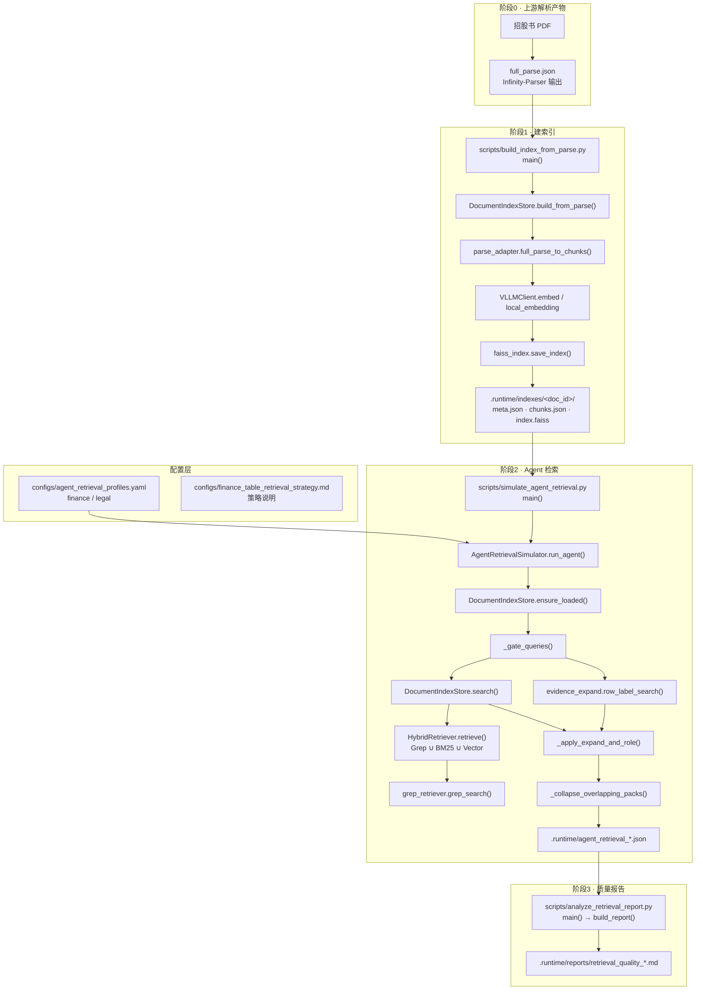
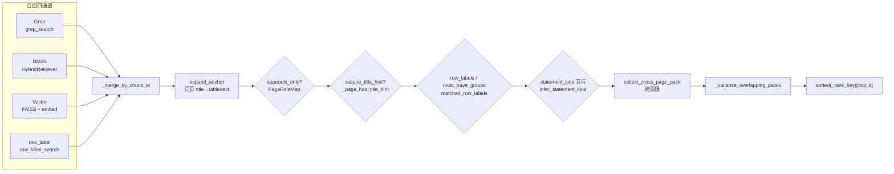

# 检索全流程（文件 · 方法 · 产物）

本文描述 `retrieval/` 工程从解析产物到 Agent 证据与质量报告的端到端流水线。  
财务主表策略规范见 [`configs/finance_table_retrieval_strategy.md`](../configs/finance_table_retrieval_strategy.md)；实现配置唯一源为 [`configs/agent_retrieval_profiles.yaml`](../configs/agent_retrieval_profiles.yaml) → `finance`。

---

## 1. 端到端活动图



---

## 2. 财务主表检索内部（2.1 / 2.2 / 2.3）

对 `TBL_IS` / `TBL_BS` / `TBL_BS_COMPANY` / `TBL_CF`（`recall_unit: table`）每张表类型跑一次：



编排入口：`AgentRetrievalSimulator.run_agent` → `_apply_expand_and_role`。

文字版流水线（与策略文档一致）：

```
Grep ∪ BM25 ∪ Vector ∪ row_label
  → same-page expand（title→table/text）
  → appendix_only
  → require_title_hint
  → row_labels + must_have_groups
  → statement_kind 互斥
  → cross_page_continue
  → 重叠 pack 折叠
  → Top-K
```

---

## 3. 文件 / 方法对照

| 阶段 | 入口脚本 | 核心类 / 方法 | 读入 | 写出 |
|------|----------|---------------|------|------|
| 建索引 | `scripts/build_index_from_parse.py::main` | `DocumentIndexStore.build_from_parse` → `full_parse_to_chunks` → `save_index` | `full_parse.json` | `.runtime/indexes/<doc_id>/` |
| 加载索引 | （检索时） | `DocumentIndexStore.ensure_loaded` | 同上 | 内存 `LoadedIndex` |
| 页面导航 | （检索时） | `build_page_index` / `build_page_role_map` | chunks | `page_index` / `PageRoleMap` |
| 混合检索 | `scripts/simulate_agent_retrieval.py::main` | `store.search` → `HybridRetriever.retrieve` + `grep_search` | 索引 + profile query | `SearchHit[]` |
| 行名通道 | 同上 | `row_label_search` | 全量 chunks + yaml `row_labels` | 额外 `AgentHit` |
| 整表展开 / 门控 | 同上 | `_apply_expand_and_role` → `expand_anchor` / `collect_cross_page_pack` / `infer_statement_kind` / `must_have_groups_ok` | hits + yaml 门控 | 整表 pack hits |
| 折叠排序 | 同上 | `_collapse_overlapping_packs` → `_rank_key` | pack hits | Top-K |
| 配置 | — | `load_profiles` | `agent_retrieval_profiles.yaml` | profile dict |
| 报告 | `scripts/analyze_retrieval_report.py::main` | `normalize_result` → `analyze_agent` / `grade_field` → `build_report` | `agent_retrieval_*.json` | `retrieval_quality_*.md` |

### 源码路径速查

| 模块 | 路径 |
|------|------|
| Agent 编排 | `src/retrieval/agent_simulator.py` |
| 展开 / 跨页 / 行名 / kind | `src/retrieval/evidence_expand.py` |
| 索引生命周期 | `src/retrieval/store.py` |
| 混合检索 | `src/retrieval/hybrid.py` |
| Grep | `src/retrieval/grep_retriever.py` |
| FAISS 读写 | `src/retrieval/faiss_index.py` |
| 解析 → chunk | `src/retrieval/parse_adapter.py` |
| Embedding | `src/llm/client.py` / `src/llm/local_embedding.py` |

---

## 4. 关键源码锚点

### 4.1 CLI：检索并写 JSON

```python
# scripts/simulate_agent_retrieval.py — main()
client = VLLMClient()
await client.init()
store = DocumentIndexStore(client)
sim = AgentRetrievalSimulator(store)
result = await sim.run_agent(args.agent, args.doc_id, **kwargs)
# → json.dump → .runtime/agent_retrieval_*.json
```

### 4.2 每表：混合检索 + row_label + expand

```python
# src/retrieval/agent_simulator.py — AgentRetrievalSimulator.run_agent()
hits = await self._store.search(doc_id=..., query=..., grep_terms=..., weights=...)
# → _hit_from_search
# → row_label_search（若配置了 row_labels）
# → _merge_by_chunk_id
expanded = _apply_expand_and_role(...)
field_hits = _collapse_overlapping_packs(...)  # whole_table
field_hits = sorted(field_hits, key=_rank_key, reverse=True)[:per_k]
```

### 4.3 整表门控链

```python
# src/retrieval/agent_simulator.py — _apply_expand_and_role()
expand_anchor(...)                          # 同页 title → body
collect_cross_page_pack(...)                # 跨页續
matched_row_labels / must_have_groups_ok    # 行名门控
infer_statement_kind + statement_kind_compatible  # IS/BS/CF；貴公司走 TBL_BS_COMPANY
_page_has_title_hint(...)                   # require_title_hint
```

### 4.4 建索引

```python
# scripts/build_index_from_parse.py — main()
result = await store.build_from_parse(
    doc_id=..., parse_json_path=..., company_name=..., stock_code=..., listing_date=..., force=...
)
```

---

## 5. 常用命令

```bash
conda activate ipo-risk
cd /nfs/users/wuqianqian/IPOI/retrieval

# 建索引（一次性 / force 重建）
python scripts/build_index_from_parse.py \
  --parse /path/to/full_parse.json \
  --company-name 小米集团 --stock-code 01810 --listing-date 2018-07-09 \
  --doc-id e5a29706-4a68-4569-b9af-d3e49436f49d

# 财务 Agent 检索
python scripts/simulate_agent_retrieval.py \
  --doc-id e5a29706-4a68-4569-b9af-d3e49436f49d \
  --agent finance --issuer-type general --top-k 3 \
  --out .runtime/agent_retrieval_xiaomi.json

# 质量报告
python scripts/analyze_retrieval_report.py \
  --result .runtime/agent_retrieval_xiaomi.json \
  --doc-name 小米集团 \
  --out .runtime/reports/retrieval_quality_xiaomi.md
```

`--issuer-type general` 会跳过 biotech 专节（2.4 / 3.5）。

---

## 6. 验证样本（同一份 finance 策略）

| 公司 | doc_id | IS | BS | CF |
|------|--------|----|----|----|
| 蜜雪冰城 | `136ee620-0473-450b-a566-72172824cdec` | 428–429 | 430–431 | 437–440 |
| 小米集团 | `e5a29706-4a68-4569-b9af-d3e49436f49d` | 467–468 | 469–470 | 477 |
| 快手 | `38afc58c-900d-41aa-b982-ca0c565009ff` | 580–581 | 582–583 | 591–592 |

新公司复用同一 `finance` profile；用语差异只追加 yaml 别名，不新增公司专属配置。

---

## 7. 下游交接

| 产物 | 交给谁 |
|------|--------|
| `evidence_by_table` + `field_table_map` | `ipo-risk-feature-extraction`（抽数，不在检索层切行） |
| 带页码的证据片段 | `ipo-multi-agent-orchestration`（风险结论附证据） |
| 页码 / 摘录 | `ipo-warning-report-generator`（报告截图与溯源） |

Skill：`IPOI/.cursor/skills/ipo-risk-rag-retrieval`。
